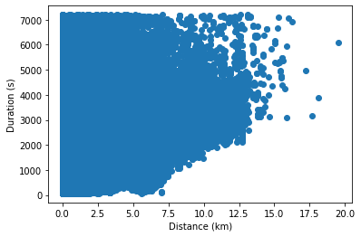
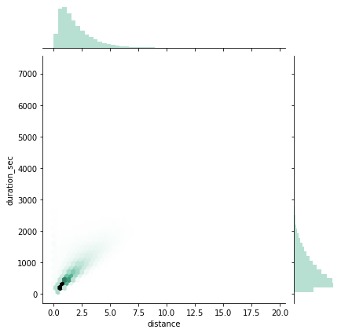
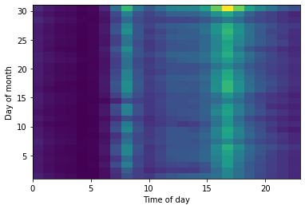
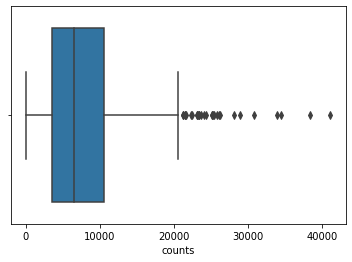

# Improving Montreal's BIXI Bikeshare System


```python
#used libraries
%matplotlib inline
import pandas as pd
import numpy as np
import seaborn as sns
import os
import json
import folium
from folium import plugins
import re
from haversine import haversine, Unit
from datetime import datetime, date, time
from matplotlib.ticker import MaxNLocator
import matplotlib.pyplot as plt
from requests import get
from bs4 import BeautifulSoup
from collections import namedtuple
import geopandas as gpd
from folium.plugins import HeatMap
import plotly
import plotly.graph_objects as go
import plotly.express as px
```

### Why Bikeshare?

Bikeshare systems are an alternative form of public transport to traditional buses and subways which allow users to pick up and drop of shared bikes at specific stations around the city. The use of the bikeshare system has been increasing, making it an important feature to consider in the city's complete transport system. In the last year however it has begun to decrease; an improvement of the system may be able to bring usage back up. Biking is both more environmentally friendly and more healthy than automobiles, and incorporating this system is a benefit to the city's inhabitants. we thus want to analyse the system to see how people currenlty use the system and then find improvements to maximize and encourage the use of this beneficial form of transport. We especially want to analyse it with respect to it's interactions and incorportation with other tranport infrastructures. 


```python
#load the bixi data
data = pd.read_pickle("../combined_new_stations")
stations = pd.read_pickle("../stations")
```


```python
#station frequency of use
station_use_og = data.groupby(['year','start_station_code']).size().reset_index(name='counts')
use_dur = data[['year','start_station_code','duration_sec']].groupby(['year','start_station_code']).mean().reset_index()
station_use_og['duration'] = use_dur['duration_sec']

station_use_og.head()
```


<div>
<style scoped>
    .dataframe tbody tr th:only-of-type {
        vertical-align: middle;
    }

    .dataframe tbody tr th {
        vertical-align: top;
    }

    .dataframe thead th {
        text-align: right;
    }
</style>
<table border="1" class="dataframe">
  <thead>
    <tr style="text-align: right;">
      <th></th>
      <th>year</th>
      <th>start_station_code</th>
      <th>counts</th>
      <th>duration</th>
    </tr>
  </thead>
  <tbody>
    <tr>
      <td>0</td>
      <td>2014</td>
      <td>5002</td>
      <td>254</td>
      <td>1164.047244</td>
    </tr>
    <tr>
      <td>1</td>
      <td>2014</td>
      <td>5003</td>
      <td>202</td>
      <td>1338.079208</td>
    </tr>
    <tr>
      <td>2</td>
      <td>2014</td>
      <td>5004</td>
      <td>187</td>
      <td>1118.262032</td>
    </tr>
    <tr>
      <td>3</td>
      <td>2014</td>
      <td>5005</td>
      <td>475</td>
      <td>862.648421</td>
    </tr>
    <tr>
      <td>4</td>
      <td>2014</td>
      <td>5006</td>
      <td>325</td>
      <td>1046.203077</td>
    </tr>
  </tbody>
</table>
</div>


```python
#total number of trips
trips = station_use_og.groupby('year').sum()
plt.plot(trips.index, trips.counts)
plt.ylabel('Total Number of Trips')
plt.xlabel('Year')
plt.show()
```


### Research Questions
1. Do the trips taken align with existing public transport lines or are they used to fill the gaps of the public transport routes?
2. Are some areas of Montreal more bike-friendly than others (i.e. have bike lanes or are smaller roads) and is this bike friendliness correlated with more trips done in that area?

# Datasets
To complete our analysis we worked with several different datasets:
1. BIXI Bikeshare trips (type = .csv, files = data for each year and month, station locations and codes for each year)
2. Montreal weather data (type = .csv, files = ...... )
3. Public transport schedule (type = , files = )
4. Bike paths (type = .geojson, files = )

Each of these datasets was treated in a different way in order to compile everything into a format where the data could be compared

### Bikeshare dataset

The first task was to combine the separate files for each year and month into a single dataframe. The station data (coordinates) was also merged and the dates converted to datetime and separated by year, month, day and hour for ease of analysis later. Additionally the 'distance' (more accurately displacement) of each trip was calculated using the haversine function (this is the straight line between the start and end station and does not reflect the actual distance traveled by the bike). 

The data was very clean already, with no NaNs, consistent formatting, and a reasonable looking distribution. We will focus on the data from 2019 for our analysis since public transport schedules and infrastructure, as well as the bike share infrastructure change each year, so in order to compare we need to look at a single year. For example the BIXI stations with the same code can change locations each year. The bus schedule also differs and bike lanes are added/demolished.


```python
#round trip distribution
data_og = pd.read_pickle("../combined_data_old")
return_trip = data_og[data_og['distance']==0.0]
plt.hist(return_trip['duration_sec'], bins=100)
plt.ylabel('Number of trips')
plt.xlabel('Duration (s)')

plt.show()
```


The above plot illustrates the distribution of return trips (start and end stations are the same). There is a disproportionately high number of trips which return to the same station at a very small duration. This is likely from broken bikes which are signed out but then returned very quickly to the same station. We thus decided to remove these data points, elminating any trips which returned to the same station and have a duration of less than 3 minutes. 


```python
#2019 data only
data19 = pd.read_pickle("../combined2019")
data.head()
```


<div>
<style scoped>
    .dataframe tbody tr th:only-of-type {
        vertical-align: middle;
    }

    .dataframe tbody tr th {
        vertical-align: top;
    }

    .dataframe thead th {
        text-align: right;
    }
</style>
<table border="1" class="dataframe">
  <thead>
    <tr style="text-align: right;">
      <th></th>
      <th>start_date</th>
      <th>start_station_code</th>
      <th>end_date</th>
      <th>end_station_code</th>
      <th>duration_sec</th>
      <th>is_member</th>
      <th>latitude_start</th>
      <th>longitude_start</th>
      <th>latitude_end</th>
      <th>longitude_end</th>
      <th>year</th>
      <th>month</th>
      <th>start_day</th>
      <th>start_hour</th>
      <th>end_day</th>
      <th>end_hour</th>
    </tr>
  </thead>
  <tbody>
    <tr>
      <td>0</td>
      <td>2014-04-15 00:01:00</td>
      <td>6209</td>
      <td>2014-04-15 00:18:00</td>
      <td>6436</td>
      <td>1061</td>
      <td>1</td>
      <td>45.512541</td>
      <td>-73.570677</td>
      <td>45.485801</td>
      <td>-73.595797</td>
      <td>2014</td>
      <td>4</td>
      <td>15</td>
      <td>0</td>
      <td>15</td>
      <td>0</td>
    </tr>
    <tr>
      <td>1</td>
      <td>2014-04-15 00:01:00</td>
      <td>6214</td>
      <td>2014-04-15 00:11:00</td>
      <td>6248</td>
      <td>615</td>
      <td>1</td>
      <td>45.516091</td>
      <td>-73.570129</td>
      <td>45.518593</td>
      <td>-73.581566</td>
      <td>2014</td>
      <td>4</td>
      <td>15</td>
      <td>0</td>
      <td>15</td>
      <td>0</td>
    </tr>
    <tr>
      <td>2</td>
      <td>2014-04-15 00:01:00</td>
      <td>6164</td>
      <td>2014-04-15 00:18:00</td>
      <td>6216</td>
      <td>1031</td>
      <td>1</td>
      <td>45.533314</td>
      <td>-73.583737</td>
      <td>45.514840</td>
      <td>-73.584779</td>
      <td>2014</td>
      <td>4</td>
      <td>15</td>
      <td>0</td>
      <td>15</td>
      <td>0</td>
    </tr>
    <tr>
      <td>3</td>
      <td>2014-04-15 00:01:00</td>
      <td>6214</td>
      <td>2014-04-15 00:24:00</td>
      <td>6082</td>
      <td>1382</td>
      <td>1</td>
      <td>45.516091</td>
      <td>-73.570129</td>
      <td>45.549900</td>
      <td>-73.583084</td>
      <td>2014</td>
      <td>4</td>
      <td>15</td>
      <td>0</td>
      <td>15</td>
      <td>0</td>
    </tr>
    <tr>
      <td>4</td>
      <td>2014-04-15 00:02:00</td>
      <td>6149</td>
      <td>2014-04-15 00:08:00</td>
      <td>6265</td>
      <td>347</td>
      <td>1</td>
      <td>45.538670</td>
      <td>-73.569360</td>
      <td>45.539259</td>
      <td>-73.577459</td>
      <td>2014</td>
      <td>4</td>
      <td>15</td>
      <td>0</td>
      <td>15</td>
      <td>0</td>
    </tr>
  </tbody>
</table>
</div>


```python
#raw data plot
plt.scatter(data19.distance, data19.duration_sec)
plt.ylabel('Duration (s)')
plt.xlabel('Distance (km)')
plt.show()
```





```python
#df = data19[['distance','duration_sec']].melt(id_vars="distance") # iris is a pandas DataFrame
#fig = px.scatter(df, x="distance", y="value")
#fig.show()
```

As expected the bottom right corner of the plot has no data points since there is a limit to how fast bikers can travel between two stations. 

# BIXI Bikeshare System

We first wanted to get a general idea of how the system was being used and what kind of trips were taken on it. We also looked at the setup, including distribution of stations across the city. 


```python
#distance vs duration for 2019 (all months)
sns.jointplot(data19.distance, data19.duration_sec, kind='hex', color="#4CB391")
plt.show()
```





```python
#time of day of usage (start of usage) vs days of the year (with overall histograms on the side)
plt.hist2d(data19.start_hour, data19.start_day, bins=[24,30])
plt.xlabel('Time of day')
plt.ylabel('Day of month')
plt.show()
```





We can see the system is mostly used for short distance trips indicating use for commuting. We see a linear relationship between distance and duration indicating most people take around the same time to bike from one station to the next and not many are completing touring rides (which would appear as a relatively long duration for a short distance). In addition the increased use around the hours that people go to and get off work supports this conclusion.

### Which stations are the most popular?


```python
#station use count (by number of rides starting from that station)
station_use = data19.groupby(['start_station_code']).size().reset_index(name='counts')
use_dur = data19[['start_station_code','duration_sec']].groupby(['start_station_code']).mean().reset_index()
station_use['duration'] = use_dur['duration_sec']

station_use = station_use.merge(stations[['latitude','longitude']], how='left', left_on=['start_station_code'], right_on=['code'])
sns.boxplot(x=station_use['counts'])
```


    <matplotlib.axes._subplots.AxesSubplot at 0x1ca72bdd988>





```python
#location of montreal
montreal = [45.5017, -73.5673]

#station popularity as a heatmap
hm = folium.Map(location=montreal, tiles='Stamen Toner', zoom_start=14)
HeatMap(data=station_use[['latitude', 'longitude', 'counts']], radius=8, max_zoom=13).add_to(hm)
hm
```


<div style="width:100%;"><div style="position:relative;width:100%;height:0;padding-bottom:60%;"><iframe src="data:text/html;charset=utf-8;base64,PCFET0NUWVBFIGh0bWw+CjxoZWFkPiAgICAKICAgIDxtZXRhIGh0dHAtZXF1aXY9ImNvbnRlbnQtdHlwZSIgY29udGVudD0idGV4dC9odG1sOyBjaGFyc2V0PVVURi04IiAvPgogICAgCiAgICAgICAgPHNjcmlwdD4KICAgICAgICAgICAgTF9OT19UT1VDSCA9IGZhbHNlOwogICAgICAgICAgICBMX0RJU0FCTEVfM0QgPSBmYWxzZTsKICAgICAgICA8L3NjcmlwdD4KICAgIAogICAgPHNjcmlwdCBzcmM9Imh0dHBzOi8vY2RuLmpzZGVsaXZyLm5ldC9ucG0vbGVhZmxldEAxLjUuMS9kaXN0L2xlYWZsZXQuanMiPjwvc2NyaXB0PgogICAgPHNjcmlwdCBzcmM9Imh0dHBzOi8vY29kZS5qcXVlcnkuY29tL2pxdWVyeS0xLjEyLjQubWluLmpzIj48L3NjcmlwdD4KICAgIDxzY3JpcHQgc3JjPSJodHRwczovL21heGNkbi5ib290c3RyYXBjZG4uY29tL2Jvb3RzdHJhcC8zLjIuMC9qcy9ib290c3RyYXAubWluLmpzIj48L3NjcmlwdD4KICAgIDxzY3JpcHQgc3JjPSJodHRwczovL2NkbmpzLmNsb3VkZmxhcmUuY29tL2FqYXgvbGlicy9MZWFmbGV0LmF3ZXNvbWUtbWFya2Vycy8yLjAuMi9sZWFmbGV0LmF3ZXNvbWUtbWFya2Vycy5qcyI+PC9zY3JpcHQ+CiAgICA8bGluayByZWw9InN0eWxlc2hlZXQiIGhyZWY9Imh0dHBzOi8vY2RuLmpzZGVsaXZyLm5ldC9ucG0vbGVhZmxldEAxLjUuMS9kaXN0L2xlYWZsZXQuY3NzIi8+CiAgICA8bGluayByZWw9InN0eWxlc2hlZXQiIGhyZWY9Imh0dHBzOi8vbWF4Y2RuLmJvb3RzdHJhcGNkbi5jb20vYm9vdHN0cmFwLzMuMi4wL2Nzcy9ib290c3RyYXAubWluLmNzcyIvPgogICAgPGxpbmsgcmVsPSJzdHlsZXNoZWV0IiBocmVmPSJodHRwczovL21heGNkbi5ib290c3RyYXBjZG4uY29tL2Jvb3RzdHJhcC8zLjIuMC9jc3MvYm9vdHN0cmFwLXRoZW1lLm1pbi5jc3MiLz4KICAgIDxsaW5rIHJlbD0ic3R5bGVzaGVldCIgaHJlZj0iaHR0cHM6Ly9tYXhjZG4uYm9vdHN0cmFwY2RuLmNvbS9mb250LWF3ZXNvbWUvNC42LjMvY3NzL2ZvbnQtYXdlc29tZS5taW4uY3NzIi8+CiAgICA8bGluayByZWw9InN0eWxlc2hlZXQiIGhyZWY9Imh0dHBzOi8vY2RuanMuY2xvdWRmbGFyZS5jb20vYWpheC9saWJzL0xlYWZsZXQuYXdlc29tZS1tYXJrZXJzLzIuMC4yL2xlYWZsZXQuYXdlc29tZS1tYXJrZXJzLmNzcyIvPgogICAgPGxpbmsgcmVsPSJzdHlsZXNoZWV0IiBocmVmPSJodHRwczovL3Jhd2Nkbi5naXRoYWNrLmNvbS9weXRob24tdmlzdWFsaXphdGlvbi9mb2xpdW0vbWFzdGVyL2ZvbGl1bS90ZW1wbGF0ZXMvbGVhZmxldC5hd2Vzb21lLnJvdGF0ZS5jc3MiLz4KICAgIDxzdHlsZT5odG1sLCBib2R5IHt3aWR0aDogMTAwJTtoZWlnaHQ6IDEwMCU7bWFyZ2luOiAwO3BhZGRpbmc6IDA7fTwvc3R5bGU+CiAgICA8c3R5bGU+I21hcCB7cG9zaXRpb246YWJzb2x1dGU7dG9wOjA7Ym90dG9tOjA7cmlnaHQ6MDtsZWZ0OjA7fTwvc3R5bGU+CiAgICAKICAgICAgICAgICAgPG1ldGEgbmFtZT0idmlld3BvcnQiIGNvbnRlbnQ9IndpZHRoPWRldmljZS13aWR0aCwKICAgICAgICAgICAgICAgIGluaXRpYWwtc2NhbGU9MS4wLCBtYXhpbXVtLXNjYWxlPTEuMCwgdXNlci1zY2FsYWJsZT1ubyIgLz4KICAgICAgICAgICAgPHN0eWxlPgogICAgICAgICAgICAgICAgI21hcF9kMWJmODM1MTk2Y2Y0YzVkYTk3Yzk2MmUyMzQ1OWE1ZiB7CiAgICAgICAgICAgICAgICAgICAgcG9zaXRpb246IHJlbGF0aXZlOwogICAgICAgICAgICAgICAgICAgIHdpZHRoOiAxMDAuMCU7CiAgICAgICAgICAgICAgICAgICAgaGVpZ2h0OiAxMDAuMCU7CiAgICAgICAgICAgICAgICAgICAgbGVmdDogMC4wJTsKICAgICAgICAgICAgICAgICAgICB0b3A6IDAuMCU7CiAgICAgICAgICAgICAgICB9CiAgICAgICAgICAgIDwvc3R5bGU+CiAgICAgICAgCiAgICA8c2NyaXB0IHNyYz0iaHR0cHM6Ly9sZWFmbGV0LmdpdGh1Yi5pby9MZWFmbGV0LmhlYXQvZGlzdC9sZWFmbGV0LWhlYXQuanMiPjwvc2NyaXB0Pgo8L2hlYWQ+Cjxib2R5PiAgICAKICAgIAogICAgICAgICAgICA8ZGl2IGNsYXNzPSJmb2xpdW0tbWFwIiBpZD0ibWFwX2QxYmY4MzUxOTZjZjRjNWRhOTdjOTYyZTIzNDU5YTVmIiA+PC9kaXY+CiAgICAgICAgCjwvYm9keT4KPHNjcmlwdD4gICAgCiAgICAKICAgICAgICAgICAgdmFyIG1hcF9kMWJmODM1MTk2Y2Y0YzVkYTk3Yzk2MmUyMzQ1OWE1ZiA9IEwubWFwKAogICAgICAgICAgICAgICAgIm1hcF9kMWJmODM1MTk2Y2Y0YzVkYTk3Yzk2MmUyMzQ1OWE1ZiIsCiAgICAgICAgICAgICAgICB7CiAgICAgICAgICAgICAgICAgICAgY2VudGVyOiBbNDUuNTAxNywgLTczLjU2NzNdLAogICAgICAgICAgICAgICAgICAgIGNyczogTC5DUlMuRVBTRzM4NTcsCiAgICAgICAgICAgICAgICAgICAgem9vbTogMTQsCiAgICAgICAgICAgICAgICAgICAgem9vbUNvbnRyb2w6IHRydWUsCiAgICAgICAgICAgICAgICAgICAgcHJlZmVyQ2FudmFzOiBmYWxzZSwKICAgICAgICAgICAgICAgIH0KICAgICAgICAgICAgKTsKCiAgICAgICAgICAgIAoKICAgICAgICAKICAgIAogICAgICAgICAgICB2YXIgdGlsZV9sYXllcl80OTdmM2VmYzMzMTY0ZDY2OGIzYTVhMzk4MDRjMDYyZCA9IEwudGlsZUxheWVyKAogICAgICAgICAgICAgICAgImh0dHBzOi8vc3RhbWVuLXRpbGVzLXtzfS5hLnNzbC5mYXN0bHkubmV0L3RvbmVyL3t6fS97eH0ve3l9LnBuZyIsCiAgICAgICAgICAgICAgICB7ImF0dHJpYnV0aW9uIjogIk1hcCB0aWxlcyBieSBcdTAwM2NhIGhyZWY9XCJodHRwOi8vc3RhbWVuLmNvbVwiXHUwMDNlU3RhbWVuIERlc2lnblx1MDAzYy9hXHUwMDNlLCB1bmRlciBcdTAwM2NhIGhyZWY9XCJodHRwOi8vY3JlYXRpdmVjb21tb25zLm9yZy9saWNlbnNlcy9ieS8zLjBcIlx1MDAzZUNDIEJZIDMuMFx1MDAzYy9hXHUwMDNlLiBEYXRhIGJ5IFx1MDAyNmNvcHk7IFx1MDAzY2EgaHJlZj1cImh0dHA6Ly9vcGVuc3RyZWV0bWFwLm9yZ1wiXHUwMDNlT3BlblN0cmVldE1hcFx1MDAzYy9hXHUwMDNlLCB1bmRlciBcdTAwM2NhIGhyZWY9XCJodHRwOi8vd3d3Lm9wZW5zdHJlZXRtYXAub3JnL2NvcHlyaWdodFwiXHUwMDNlT0RiTFx1MDAzYy9hXHUwMDNlLiIsICJkZXRlY3RSZXRpbmEiOiBmYWxzZSwgIm1heE5hdGl2ZVpvb20iOiAxOCwgIm1heFpvb20iOiAxOCwgIm1pblpvb20iOiAwLCAibm9XcmFwIjogZmFsc2UsICJvcGFjaXR5IjogMSwgInN1YmRvbWFpbnMiOiAiYWJjIiwgInRtcyI6IGZhbHNlfQogICAgICAgICAgICApLmFkZFRvKG1hcF9kMWJmODM1MTk2Y2Y0YzVkYTk3Yzk2MmUyMzQ1OWE1Zik7CiAgICAgICAgCiAgICAKICAgICAgICAgICAgdmFyIGhlYXRfbWFwX2FjMjZkNjVkZWVmNzQ5M2M4YzYyNmIxNGY2ZjYxZjhlID0gTC5oZWF0TGF5ZXIoCiAgICAgICAgICAgICAgICBbWzQ1LjU0OTU5NzY4LCAtNzMuNTQxODc0MjksIDgzNzAuMF0sIFs0NS41MjAwNzQ3NywgLTczLjYyOTc3NTY0LCAxNDEzLjBdLCBbNDUuNTE2OTM2NTUsIC03My42NDA0ODMwMiwgMzUwNy4wXSwgWzQ1LjUzMzY4MTk5LCAtNzMuNTE1MjYwNzQsIDYzOC4wXSwgWzQ1LjUyODQxMDQ0LCAtNzMuNTE3MTY1NzgsIDQ3MC4wXSwgWzQ1LjUzOTgyMzk5OTk5OTk5NiwgLTczLjUwODc1MiwgNTUyLjBdLCBbNDUuNTM2OTA3NDcsIC03My41MTE5MTQwMSwgNTI3LjBdLCBbNDUuNTM3MjI2MDQsIC03My40OTUwNjcwNiwgOTMzLjBdLCBbNDUuNTIzMzE4NjksIC03My41MjAxMjY5NCwgMjc5NS4wXSwgWzQ1LjUxMDM1MDY4LCAtNzMuNTU2NTA4NDIsIDkwMTAuMF0sIFs0NS41MzkzODUwOCwgLTczLjU0MDk5OTg5LCA3MDk5LjBdLCBbNDUuNTExMDA2NjcsIC03My41Njc2MDIwNCwgMTAzMzYuMF0sIFs0NS41MDk2NTUyMDAwMDAwMDUsIC03My41NTQwMDg1OTk5OTk5OSwgNzIxNy4wXSwgWzQ1LjUwMDIwODA2LCAtNzMuNTcxMTM3ODYsIDExNTg1LjBdLCBbNDUuNTU3ODk1NDYsIC03My41NzY1MjkxLCA1NjA0LjBdLCBbNDUuNTExNjYwNDYsIC03My41NjIxMzU3MDAwMDAwMSwgNTM5OS4wXSwgWzQ1LjUxMjc5Njg2LCAtNzMuNTYxNDYyNDcsIDc5NzEuMF0sIFs0NS40OTgxMTE2MSwgLTczLjU3NzYxNTQwMDAwMDAxLCAxMTIxNC4wXSwgWzQ1LjUxNDExNDUzLCAtNzMuNTUyNjQ0NywgOTQ3MC4wXSwgWzQ1LjUxMDY1OTk5OTk5OTk5NCwgLTczLjU2NDk3LCAyMzM4OC4wXSwgWzQ1LjUxMzQwNTU0LCAtNzMuNTYyNTk0MzUsIDEwNTQ5LjBdLCBbNDUuNTEyODcxMjIsIC03My41NTg0NjY0MywgOTQwNC4wXSwgWzQ1LjUxNTI5OSwgLTczLjU2MTI3MywgMjU4MDguMF0sIFs0NS40NzI1MDMsIC03My41MzkyODQ5OTk5OTk5OSwgMjIxMC4wXSwgWzQ1LjUyMDYzMzc3LCAtNzMuNTYzOTA1OTUsIDczMTUuMF0sIFs0NS41MTg4OSwgLTczLjU2MzUzLCA5NDcwLjBdLCBbNDUuNTE3OTk4OTQsIC03My41NjgxODQwOCwgMjE2MTYuMF0sIFs0NS41MTQ3NjcyNCwgLTczLjU2NTQ5MTE0LCAxMTAyNC4wXSwgWzQ1LjUxNDU2NDY3LCAtNzMuNTY4NDA2NywgMTM4MzEuMF0sIFs0NS41NDE3MTk4MSwgLTczLjU2NTE3NzMyLCA4NTgwLjBdLCBbNDUuNTEwODYsIC03My41NDk4MywgMjMyOTAuMF0sIFs0NS42MDc2MTU5NiwgLTczLjUwOTgyMTg5LCA1NTcuMF0sIFs0NS41MDcxNDM5MiwgLTczLjU1NTExOTA0LCA2MDEyLjBdLCBbNDUuNTA3NjEwMDksIC03My41NTE4MzYwMSwgMjgxNjAuMF0sIFs0NS41MDIwNTM4NiwgLTczLjU3MzQ2NTM1LCAxODMzNS4wXSwgWzQ1LjQ4MDg0NTc2LCAtNzMuNTgzODYxNTksIDM2NTYuMF0sIFs0NS41MDQyNjI5MywgLTczLjU3MTUyMzQzLCA1NTk1LjBdLCBbNDUuNTA2MjMsIC03My41NTk3NiwgOTg3NS4wXSwgWzQ1LjU1ODI4MDY0LCAtNzMuNTgzMTU4ODUsIDI3MzIuMF0sIFs0NS41MDc5NzQ3NjExNDk0OCwgLTczLjU2MzA3MTc4NzM1NzMzLCAzNzg5LjBdLCBbNDUuNTA1MzExNjcsIC03My41NjA4OTExNSwgMzgyNC4wXSwgWzQ1LjUwNDI0MjQ2LCAtNzMuNTUzNDY5NDgsIDI4ODk5LjBdLCBbNDUuNTAxOTY2ODYsIC03My41NTUxNTI1NywgODY2Ni4wXSwgWzQ1LjQ5OTc1LCAtNzMuNTU1NjYsIDEzODIyLjBdLCBbNDUuNTAwNzc5LCAtNzMuNTU4ODI2LCAxMTY0MC4wXSwgWzQ1LjUwMjc4NjUsIC03My41NTkxMzQzLCA4NTg3LjBdLCBbNDUuNTAxNDQxMDgsIC03My41NjAxNDQxNiwgODg3NS4wXSwgWzQ1LjUwMDYwNTc4LCAtNzMuNTY1NDQ4MjIsIDExMzk4LjBdLCBbNDUuNTAyMDYsIC03My41NjI5NSwgMjMxNTguMF0sIFs0NS41MjE1NjQyNywgLTczLjU3MDM2NzQwMDAwMDAxLCAxMzQxNS4wXSwgWzQ1LjQ5ODMxMjE4LCAtNzMuNTY3MjU2MDMsIDE1MTk5LjBdLCBbNDUuNTA3NDAxNjgsIC03My41Nzg0NDM1MywgMTAzOTYuMF0sIFs0NS40OTczMjcwMywgLTczLjU1NjkyMTQ4LCA1ODE4LjBdLCBbNDUuNDk3NjA1MjgsIC03My41NTUzNDk3MSwgMTIyMTEuMF0sIFs0NS40OTg1Nzc3OSwgLTczLjU2MDI0MjA2LCA1ODA4LjBdLCBbNDUuNTI5Njg2LCAtNzMuNjAxNzI4MDAwMDAwMDEsIDYwMjMuMF0sIFs0NS40OTc1MTUwMywgLTczLjU1MjU3MDk0LCAzNDUxMS4wXSwgWzQ1LjUwODIwNDYyLCAtNzMuNTY4ODE0NDAwMDAwMDEsIDIzMzYwLjBdLCBbNDUuNDk3NzE4MzUsIC03My41NjgxODAwNSwgMTE3MTEuMF0sIFs0NS40OTkzMjU1MSwgLTczLjU3MTc2NzUxLCA5ODk4LjBdLCBbNDUuNDk5MTkxMjEsIC03My41Njk0MjA1OCwgMTAwNzAuMF0sIFs0NS41MDEzNjY4NSwgLTczLjU2NTgzNzE0LCA0MzIxLjBdLCBbNDUuNTAxMzk4NzEsIC03My41NzE3ODYyOCwgNzQ2OC4wXSwgWzQ1LjQ5ODYzOTMsIC03My41NzQyMjcwOSwgOTkwNC4wXSwgWzQ1LjQ5OTQ3LCAtNzMuNTc1OTEsIDEzODA1LjBdLCBbNDUuNTAwMzgsIC03My41NzUwNywgMjUxOTkuMF0sIFs0NS40OTk3NDQ3NSwgLTczLjU3OTAzMzYxLCA5NTU3LjBdLCBbNDUuNTA1MzA1NSwgLTczLjU4MTAwMjM1LCA2Mjc5LjBdLCBbNDUuNTEyNDk0NzYsIC03My41NTA4Nzg0NywgOTg0OS4wXSwgWzQ1LjU2MjUwOTA0LCAtNzMuNjE2NTYwNDAwMDAwMDEsIDE5NTUuMF0sIFs0NS41MDY0NDg0LCAtNzMuNTc2MzQ4NzIsIDI1NDEzLjBdLCBbNDUuNTAxNzE0OTUsIC03My41NzQxMzA1NCwgMTA0MjEuMF0sIFs0NS41MDUwMSwgLTczLjU3MDY5LCAyNjE0My4wXSwgWzQ1LjUwODI5NTEsIC03My41ODA2NDI5NCwgNTY0Ny4wXSwgWzQ1LjU1NzkyMTE1LCAtNzMuNTI5MTQ3MjEsIDM0MjQuMF0sIFs0NS41MDUzODIyNiwgLTczLjU2NzYzNDIyLCA2MDkxLjBdLCBbNDUuNTA5NzU4NTksIC03My41NzYxMDczMiwgMTE0NTMuMF0sIFs0NS40NzM5MzAyOCwgLTczLjYwNDczNDU0LCAxOTg2Ni4wXSwgWzQ1LjQ5NTcwOTMyLCAtNzMuNTc2OTUyMjIsIDY1ODkuMF0sIFs0NS41NDk5MDA0OCwgLTczLjU4MzA4Mzc1LCAzMDM1LjBdLCBbNDUuNTAzNzM3NzIsIC03My41NjgxMDYyOSwgMTc3OTAuMF0sIFs0NS40OTU1ODEzNSwgLTczLjU1MzcxMDg4LCA3NzAwLjBdLCBbNDUuNDk1MiwgLTczLjU2MzI4LCAxMjUwMS4wXSwgWzQ1LjQ5MDQ1MjQzLCAtNzMuNTYwMTcyMzIsIDY0MjAuMF0sIFs0NS40OTMwMjkwMSwgLTczLjU2NDgxNzkxLCAxNjQ3Mi4wXSwgWzQ1LjQ4OTk1MSwgLTczLjU2NzA5MSwgODc2NC4wXSwgWzQ1LjUyNzgzOTQxLCAtNzMuNTk0ODIxMDk5OTk5OTksIDcyOTYuMF0sIFs0NS40OTQ4NzE2LCAtNzMuNTcxMTIzNzgsIDc0ODguMF0sIFs0NS40OTE2ODY1MiwgLTczLjU3Njc2NzE1LCA3NzYwLjBdLCBbNDUuNDk3MDkyMDIsIC03My41NzU1NDk0MiwgMTAwOTAuMF0sIFs0NS40OTEyMjU4NSwgLTczLjU4NzYzMDA5LCA2MzkwLjBdLCBbNDUuNTI1NjQ3NzcsIC03My41OTI5Mjc0NiwgNzA4MS4wXSwgWzQ1LjQ5MTgwMDI4LCAtNzMuNTg0MDA2NDMsIDE4ODkyLjBdLCBbNDUuNDkzNTY5MTYsIC03My41Njg1NzU2OCwgNjA5OC4wXSwgWzQ1LjQ5Mjg5NzQsIC03My41ODAyOTQyNSwgMTIxMjEuMF0sIFs0NS40OTY0MiwgLTczLjU3NjE2LCA3MTQ2LjBdLCBbNDUuNTE1MDY1MDgsIC03My41NTkyMjk1MiwgMTU4NzkuMF0sIFs0NS40OTY1OTAwMDAwMDAwMDUsIC03My41Nzg1MSwgMzM5MzEuMF0sIFs0NS40Nzk0ODMsIC03My42MTk3OTAwMDAwMDAwMSwgODA0NC4wXSwgWzQ1LjQ5MzAzNCwgLTczLjU4MzgzNiwgNTEwOC4wXSwgWzQ1LjUzNTc1MzA5LCAtNzMuNTU3OTQwNzIsIDI2OTYuMF0sIFs0NS41MTY4MTc1LCAtNzMuNTU0MTg4MzEsIDEwNDc0LjBdLCBbNDUuNTE5MzcyNTIsIC03My41NTE5NTgwNSwgNzI5Ny4wXSwgWzQ1LjUyMTE0LCAtNzMuNTQ5MjYsIDQ5MTYuMF0sIFs0NS40OTM3NzY5MiwgLTczLjU3OTEyNDgxLCAxNDMyNi4wXSwgWzQ1LjUyODQ0ODY5LCAtNzMuNTUxMDg1LCA2OTAzLjBdLCBbNDUuNTEzNzQxNDQsIC03My41MzgzODIwNSwgMzkzMS4wXSwgWzQ1LjUyOTAzMzA3LCAtNzMuNTQ2MzQ4MjEsIDUzMzguMF0sIFs0NS41MjYyMDAzOCwgLTczLjU0OTI2NjQ2LCA3MDYxLjBdLCBbNDUuNTE5MDkyMiwgLTczLjU1Nzg0OTUzLCAxNTEzNC4wXSwgWzQ1LjUyMTIzMDQ1LCAtNzMuNTUzODYxMDgsIDc0NDUuMF0sIFs0NS41MjM1MywgLTczLjU1MTk5LCAyMzY4OS4wXSwgWzQ1LjQ2NjkxNDI1LCAtNzMuNjMxNzA0MTUsIDI4OTEuMF0sIFs0NS41MjM0OTIxMSwgLTczLjU2MDczMDIyLCA5MjkzLjBdLCBbNDUuNTA1MjYzMDQsIC03My41NzA0ODAwNSwgNTY5OS4wXSwgWzQ1LjUyNTA0NzU0LCAtNzMuNTYwMDM1NTMsIDExNTYyLjBdLCBbNDUuNTI3OTQ4NDYsIC03My41NTc0MDQyOCwgMTMyOTIuMF0sIFs0NS41MzM2NjA5LCAtNzMuNTUyMTk2OCwgMTAzMDAuMF0sIFs0NS41MzQ1NjI1NywgLTczLjU1NDc4NjQ2LCA0MTU5LjBdLCBbNDUuNTMwNTcwMDAwMDAwMDA0LCAtNzMuNTQ5MTMsIDMxNDguMF0sIFs0NS41MjMyNzY0MSwgLTczLjU1ODIxODMzLCA0NDIzLjBdLCBbNDUuNTMxOTM4ODksIC03My41NTM0Mzg2MywgNjM1MS4wXSwgWzQ1LjQ5OTc1NywgLTczLjYyOTI5Nzk5OTk5OTk5LCAzNzA0LjBdLCBbNDUuNTMyMTM2ODEsIC03My41NTg3MTMyLCA2NjYyLjBdLCBbNDUuNTM3ODc3LCAtNzMuNjE4MzIzLCA4MjI0LjBdLCBbNDUuNTM1Mjk1NDgsIC03My41NTExNjAwOTk5OTk5OSwgMzQyOS4wXSwgWzQ1LjUyOTk3MDY5LCAtNzMuNTYzMDUzMDEsIDk5ODQuMF0sIFs0NS41MzY3LCAtNzMuNTYwODEsIDQ0OTEuMF0sIFs0NS41MzM5MjQsIC03My41NjI0MjUsIDEzMjk3LjBdLCBbNDUuNTI5MTM0NTQsIC03My41NTkyMzM1NSwgODgwNy4wXSwgWzQ1LjUzNjczODM5LCAtNzMuNTY1MTY2NTksIDg3NDAuMF0sIFs0NS41Mzg0MDM0MSwgLTczLjU2MTk2NDA0LCA3MDA2LjBdLCBbNDUuNTI3NjE2MjcsIC03My41ODkxMTQ3LCA0MTA5MS4wXSwgWzQ1LjUzMDM0NzA5LCAtNzMuNTY2OTg3ODEsIDE0ODYxLjBdLCBbNDUuNTMxNjczNTUsIC03My41NjU0MTMzNiwgMTE2ODMuMF0sIFs0NS41MzI5MjYyNiwgLTczLjU2Mzc3OTg5LCA3MjY4LjBdLCBbNDUuNTI5ODAxNTgsIC03My41NzAyODk2MSwgMTQ5NTYuMF0sIFs0NS41MzM1NDc1NCwgLTczLjU2Njg2NzExLCA3NzkwLjBdLCBbNDUuNTI3Nzk0NzksIC03My41NzE5MzkxNywgMTc5MzEuMF0sIFs0NS41MjY4OSwgLTczLjU3MjY0LCAxODc2My4wXSwgWzQ1LjUyNDUxNzYxLCAtNzMuNTcxOTc2NzIsIDEwNjcyLjBdLCBbNDUuNTIzMTcwNDcsIC03My41NjkwMTI4OCwgMTEzMDQuMF0sIFs0NS41MjQ3OSwgLTczLjU2NTQ1LCAxNTU1My4wXSwgWzQ1LjUyNzIwMDU5LCAtNzMuNTY0NzI5MzksIDE5MDY2LjBdLCBbNDUuNTM4NjcsIC03My41NjkzNiwgNzA4Mi4wXSwgWzQ1LjUzNzExNDE0LCAtNzMuNTcxMDAzMSwgMTA4MDcuMF0sIFs0NS41MzY0NjkxNywgLTczLjU3MTQ2MzA4LCAxMjYwNC4wXSwgWzQ1LjUzNDE4NTA5LCAtNzMuNTczNTg4NzMsIDE5MTUwLjBdLCBbNDUuNTMyNjc0LCAtNzMuNTcxNzc2LCA4NTc5LjBdLCBbNDUuNTMyMjksIC03My41NzU0NCwgMjYyMTcuMF0sIFs0NS41MzA5MiwgLTczLjU3Njc0LCAyMTUwNi4wXSwgWzQ1LjUyNzc1ODE0LCAtNzMuNTc2MTg1MTEsIDExNTE3LjBdLCBbNDUuNTI5NDA3NzgsIC03My41NzgxNTM4NSwgMTkyNTIuMF0sIFs0NS41MzA4MTYyMywgLTczLjU4MTYyNTk3LCA5ODg3LjBdLCBbNDUuNDk0NTI3MDYsIC03My41NTY3NTI1LCA0MzYxLjBdLCBbNDUuNTMyOTc3NDYsIC03My41ODEyMjIzLCA4NDIwLjBdLCBbNDUuNTM1ODI4MjQsIC03My41Nzg2OTAyOSwgNzA0MC4wXSwgWzQ1LjU0NjEyMzg4LCAtNzMuNjQ2NjQ2NzQsIDE3MjIuMF0sIFs0NS41MzU0MywgLTczLjU4MjIsIDE3NjE1LjBdLCBbNDUuNTMzMzEzNjEsIC03My41ODM3MzY4NywgMTM1NzkuMF0sIFs0NS41MzI1MTM5NiwgLTczLjU4NDgxMTA5LCAyMTIyMC4wXSwgWzQ1LjUzMzczNTIzLCAtNzMuNTg5MzA2NDcsIDEyNTY3LjBdLCBbNDUuNTM3MDMsIC03My41ODU4NCwgNjU5OS4wXSwgWzQ1LjUzMDg3MTMyLCAtNzMuNTk4MzQ1NTIsIDkyNDguMF0sIFs0NS41Mjc0MzIxMywgLTczLjU3OTkxNjczLCAyNDM3MS4wXSwgWzQ1LjUzMDQ1MDA3LCAtNzMuNTg3NjM4MTQsIDExODUzLjBdLCBbNDUuNTE5NTgwODMsIC03My41NjAxMTU5OSwgNjUzNi4wXSwgWzQ1LjUxOTA4ODQ0LCAtNzMuNTY5NTA5MDksIDE3MTY0LjBdLCBbNDUuNTE5MDc5OTk5OTk5OTk1LCAtNzMuNTcyNywgMTUzOTAuMF0sIFs0NS41MjAyNzc4NSwgLTczLjU2ODIxNjI2LCAxNDMwOC4wXSwgWzQ1LjUyNDk2MzI0LCAtNzMuNTc1NTU4ODEsIDE1NTg0LjBdLCBbNDUuNTIyNDI1NjUsIC03My41NzQxODQxOCwgMTIxNTEuMF0sIFs0NS41MjIyNzc2LCAtNzMuNTc3NTkwNiwgMTg2MTkuMF0sIFs0NS41MjA2MDQyMywgLTczLjU3NTk4Mzk0LCAxMjAxMy4wXSwgWzQ1LjUwOTQxODM3LCAtNzMuNTYxMzU3ODYsIDkwMjEuMF0sIFs0NS41MTczNTM3OTk5OTk5OTUsIC03My41ODIxMjg4OCwgMTgzNzIuMF0sIFs0NS41MjE3NTEyMSwgLTczLjU4NTI2ODQxLCAxMDQ0NC4wXSwgWzQ1LjUyMjM2NDU4LCAtNzMuNTg0MTQ1OTAwMDAwMDEsIDE0MDY0LjBdLCBbNDUuNTI0NjczLCAtNzMuNTgyNTUsIDM4MzA0LjBdLCBbNDUuNTQ5MTIwODYsIC03My42MDA4NzM0OTk5OTk5OSwgMzE5My4wXSwgWzQ1LjUyOTMxMDEyLCAtNzMuNTg4NjU3MzgsIDEwODkxLjBdLCBbNDUuNTI1NjI4MTksIC03My41ODE3NzQ4MywgMTgzMzEuMF0sIFs0NS41MjYwMjY1NywgLTczLjU3Nzg1ODgxLCA4MzMzLjBdLCBbNDUuNTUwNzIzMDYsIC03My42MDk1NzA1NiwgMzQ5My4wXSwgWzQ1LjUyNzAwOTMzLCAtNzMuNTg1NzY1OTYsIDE3MzE2LjBdLCBbNDUuNTMxNDAxLCAtNzMuNjEyNjc0LCAxMDAwNi4wXSwgWzQ1LjUyOTk2OTYsIC03My41OTE5MDI4NSwgNTkzMS4wXSwgWzQ1LjUyMTQ5NSwgLTczLjU5Njc1OCwgMTgwOTUuMF0sIFs0NS40ODk0NzYyMywgLTczLjU4NDU2NTY3LCAxODg4NC4wXSwgWzQ1LjUyNDAzNjU1LCAtNzMuNTkwMTQzMzIsIDEzNjYyLjBdLCBbNDUuNTIxMzQxNzMsIC03My41ODk0MTkxMywgMTg5MDMuMF0sIFs0NS41Mzg5ODQ0LCAtNzMuNTgyNDQ1MzgsIDc5NTYuMF0sIFs0NS41Mjk3NDAwMDAwMDAwMDQsIC03My41OTUyNywgMzc3My4wXSwgWzQ1LjUyNTkzMDczLCAtNzMuNTk4ODM5MDQsIDE1NjYzLjBdLCBbNDUuNTI0NjI4NDksIC03My41OTU4MTA4MywgMTU3NzguMF0sIFs0NS41MjM1NDQyLCAtNzMuNTg3MzMyMzcsIDEyMjI4LjBdLCBbNDUuNTEwMDcxNTUsIC03My41NzA3NTIyOSwgMTc0ODQuMF0sIFs0NS41MDY1ODY2OSwgLTczLjU3MzI5OTA1LCAxMjM2My4wXSwgWzQ1LjUwODE0MDk2LCAtNzMuNTc0OTI5ODMsIDE1MzM0LjBdLCBbNDUuNTA5MzYxNDMsIC03My41NzM4NjM2NiwgMTUxMzcuMF0sIFs0NS41MTA1OSwgLTczLjU3NTQ3LCAyMTQ4NC4wXSwgWzQ1LjUxMjgzMTc1LCAtNzMuNTc2ODg3ODUsIDcwMjcuMF0sIFs0NS41MTA2OTAwMDAwMDAwMDQsIC03My41NzgwNSwgMTA2MzYuMF0sIFs0NS41MTI1NDEzNSwgLTczLjU3MDY3NzE5LCAxOTI4OS4wXSwgWzQ1LjU1MDY5MjA3LCAtNzMuNjU2MzY3MDYsIDYyOTMuMF0sIFs0NS41MTU2MTYyNCwgLTczLjU3NTgwODI2LCAyNTIxOC4wXSwgWzQ1LjUxNTA5MTk4LCAtNzMuNTgxMTQxODMsIDE0MDMwLjBdLCBbNDUuNTE2ODc2NDEsIC03My41Nzk0NjAwOCwgMTkwOTYuMF0sIFs0NS41MTYwOTA4LCAtNzMuNTcwMTI4NjgsIDEzNTU4LjBdLCBbNDUuNTAwODMyMzIsIC03My41NzI0NTk1MiwgNzcxMC4wXSwgWzQ1LjUxNDgzOTg2LCAtNzMuNTg0Nzc4OTAwMDAwMDIsIDI1MTQ0LjBdLCBbNDUuNTE4OTY3MjIsIC03My41ODM2MTYxNywgMTU4NzkuMF0sIFs0NS41MTI1ODc0LCAtNzMuNTczNzM4OTMsIDk5NzEuMF0sIFs0NS41MTc0MDA3NiwgLTczLjU3NDYwNTI5LCAxMDY5Mi4wXSwgWzQ1LjUxOTIxNjI0LCAtNzMuNTc3MTgwMjEsIDE1MDQ1LjBdLCBbNDUuNTE5NDEsIC03My41ODY4NSwgMzA4NzAuMF0sIFs0NS41MTgyNTI5MSwgLTczLjU4ODMzODIsIDEzMzc4LjBdLCBbNDUuNTE2OTk5OTk5OTk5OTk2LCAtNzMuNTg5LCAxODI4MC4wXSwgWzQ1LjUxODI5LCAtNzMuNTkyMzUsIDk2NjQuMF0sIFs0NS41MjAxODgsIC03My41OTA1NTksIDExMzA3LjBdLCBbNDUuNTc1NzA3LCAtNzMuNTYxNTYyLCAzODQ5LjBdLCBbNDUuNTIxMDM4ODYsIC03My41OTQ5MDY5MywgMjMwNTcuMF0sIFs0NS41MjczNjMsIC03My42MDc3MjMsIDQ5ODQuMF0sIFs0NS41MjExNjEzMiwgLTczLjU4NTYxNTc1LCAxMDc0Ny4wXSwgWzQ1LjUyMzg1NjE0LCAtNzMuNjAwMTI2NSwgMTUwNjEuMF0sIFs0NS41MjMwMjY0OCwgLTczLjYwMTg0MDQ0LCAxNzk0Ni4wXSwgWzQ1LjUyNDI2NTgxLCAtNzMuNjExMjczNzcsIDQ4NTguMF0sIFs0NS41MjQyODY0OCwgLTczLjYwNDk3MzI2LCAxODY2MS4wXSwgWzQ1LjUyNzQxMDM2LCAtNzMuNjAzOTM1MjQsIDEwOTQ5LjBdLCBbNDUuNTI2NTU3MDAwMDAwMDA0LCAtNzMuNTk4Mjc1NzgsIDEwNTczLjBdLCBbNDUuNTM3MjU4OCwgLTczLjU3OTE3MDQxLCAxMTIyNi4wXSwgWzQ1LjUzMjAwODAwMDAwMDAwNSwgLTczLjU4MDQ0NDQ2LCA4OTg1LjBdLCBbNDUuNTA1NzIwOTMsIC03My42Mjk0NTkxNCwgMzM2Ni4wXSwgWzQ1LjUxNzUzOTk5LCAtNzMuNTk3ODMxODgsIDcxODkuMF0sIFs0NS41MjA2ODc3NCwgLTczLjYwODQyNzkwMDAwMDAxLCAxMDY5Mi4wXSwgWzQ1LjUyMjU4NTc5OTk5OTk5NSwgLTczLjYxMjY1Nzc5LCA2Nzk2LjBdLCBbNDUuNTIwMjcwNTQsIC03My42MTQ4NDkxNSwgOTAyNi4wXSwgWzQ1LjUzMjkyMzU1LCAtNzMuNjEwNzE1ODcsIDE4NjU5LjBdLCBbNDUuNTE4NTkzLCAtNzMuNTgxNTY2MDAwMDAwMDEsIDI0MDAzLjBdLCBbNDUuNTM2OTYsIC03My42MTE5OSwgMTAzNTYuMF0sIFs0NS41MzY3ODUyNSwgLTczLjYxNDg4Nzk2LCAxNTYzOC4wXSwgWzQ1LjUzNDQxNDkzLCAtNzMuNjEyMzE2NDcsIDQyMDIuMF0sIFs0NS41MzMxOCwgLTczLjYxNTQ0LCA4NjczLjBdLCBbNDUuNTQwMTM4MjksIC03My42MTQwMjgzOSwgODUwNC4wXSwgWzQ1LjU0MDA2LCAtNzMuNjA4OTcsIDExNDAyLjBdLCBbNDUuNTM4NDgsIC03My42MDU1NiwgMTM3NDcuMF0sIFs0NS41MzYyNjExOCwgLTczLjYwNzU0NTUsIDY4MjguMF0sIFs0NS41MzcwODc4MywgLTczLjU5MzIxODQ4LCAxMzIwOS4wXSwgWzQ1LjU0MDg4MSwgLTczLjU4NDE1Njk5OTk5OTk5LCA2NjI1LjBdLCBbNDUuNTM5MjM1NTksIC03My41ODU5NDU2NywgODAxMi4wXSwgWzQ1LjU0NDU5ODU2LCAtNzMuNTg4MjIyODYsIDc1ODYuMF0sIFs0NS41MzcxNTkyMywgLTczLjU5NzQ3NjQ4LCA3NTc1LjBdLCBbNDUuNDcxMTc5MzEsIC03My42MjcwMDIyNCwgMzQxNS4wXSwgWzQ1LjU0MjU2OTc1LCAtNzMuNTkyMTQ0MjUsIDM2MDIuMF0sIFs0NS41MzkyNTg1MywgLTczLjU3NzQ1OTE2LCA4MDYzLjBdLCBbNDUuNTQ2NjYxMTEsIC03My41ODg2ODQyLCAyNzE4LjBdLCBbNDUuNTQ0Mzc1NTUsIC03My41OTU2NDQ1MywgODA0My4wXSwgWzQ1LjUzOTkzMjE4LCAtNzMuNTk5MzQzMywgOTAyOC4wXSwgWzQ1LjUzNzYyNzgxLCAtNzMuNTUzMzk0MzgsIDM2OTUuMF0sIFs0NS41NDM0NTE3MywgLTczLjYwMTAxMDI5LCA1ODM3LjBdLCBbNDUuNjQwMDAyODYsIC03My40OTAxMTMwMiwgMjcwLjBdLCBbNDUuNTQ2NTM5MDEsIC03My41OTg2NjQ3LCA0ODc4LjBdLCBbNDUuNTQ2Nzk3NDEsIC03My42MDI2NjM4NywgNTM1NS4wXSwgWzQ1LjUzMTE2NDAwMDAwMDAwNCwgLTczLjU4MzY5NDk5OTk5OTk5LCA2ODU4LjBdLCBbNDUuNTQ0ODQ1NTgsIC03My42MTA1MzYxNiwgNDk4NS4wXSwgWzQ1LjU0MTY2OTYsIC03My42MDc2MDQ1MDAwMDAwMSwgNjQ4NS4wXSwgWzQ1LjU0ODE4NjM3LCAtNzMuNTkyMDEwMTQsIDk0NTEuMF0sIFs0NS41NTAwMSwgLTczLjU5NTc2LCAzNzc2LjBdLCBbNDUuNTUxNTg1MTksIC03My41OTkxNjQ5MywgMjgxNi4wXSwgWzQ1LjUyNDM3NDgsIC03My41OTE4MTAzMiwgMTIzODIuMF0sIFs0NS41Mjc2OTc4MSwgLTczLjU4NjI1Mjc4LCA0MzgzLjBdLCBbNDUuNTE4MzA5NDUsIC03My42MDMyODYxNSwgMzY5Ni4wXSwgWzQ1LjUxNjA3ODcsIC03My42MDc3OTc2MiwgMzA1Ni4wXSwgWzQ1LjUxNDE0NDg2LCAtNzMuNjIwMzAyMDgsIDMwNDcuMF0sIFs0NS41MTU2MTcsIC03My42MTQ5OTEsIDE5MTguMF0sIFs0NS41MTQzNzksIC03My42MTA4NzEsIDMxOTUuMF0sIFs0NS41MTAwODYsIC03My42MTE0MjksIDgxOTUuMF0sIFs0NS41MjAxNzg0NSwgLTczLjU3OTQyMzg3LCAxMjM0NC4wXSwgWzQ1LjQ1Njg4NDQ1LCAtNzMuNTcyNjA3MDQsIDQwMTIuMF0sIFs0NS41MDU0MDMyNSwgLTczLjYyMTE2NTc1LCAxMDE0My4wXSwgWzQ1LjUzNDg4MjE0LCAtNzMuNjA5NDEyMzEsIDY1MjEuMF0sIFs0NS41MDE0NDkzMywgLTczLjYzMzA1MDYyLCAzNjIwLjBdLCBbNDUuNDcwMzAzLCAtNzMuNTg5ODQ4LCA4MjAzLjBdLCBbNDUuNTI5MzI2NDMsIC03My41NzQ4MDY0NSwgOTM1Ni4wXSwgWzQ1LjQ5NjI2NDc3LCAtNzMuNjIxNTQzOTQsIDEyMjc5LjBdLCBbNDUuNDk3MDU0OTQsIC03My42MTg2NTI1MiwgNzE5OS4wXSwgWzQ1LjUzNTg5OTgzLCAtNzMuNjIyNDQyNDgsIDE1MDg5LjBdLCBbNDUuNTM4NzM3OTUsIC03My42MjgwMjE0OCwgNDY2OS4wXSwgWzQ1LjUzOTY2MzIyLCAtNzMuNjM0NDc0ODcsIDIxNjkuMF0sIFs0NS41NDU2MDM1NSwgLTczLjYzNDc0MDQxLCAzOTAxLjBdLCBbNDUuNTM5MjY5OCwgLTczLjYyMDg3ODc2LCA1NzYxLjBdLCBbNDUuNTM5NDg3NDcsIC03My42MjM1NTU2LCA2MzUwLjBdLCBbNDUuNTQwOTUxMzQsIC03My42MjYzNzQ1OTk5OTk5OSwgNDM3My4wXSwgWzQ1LjU0MDc4MDA1LCAtNzMuNjMwNDAwNTk5OTk5OTksIDQwMTAuMF0sIFs0NS41NDM0MjM1NSwgLTczLjYzMjQ2MTg4LCAzNTMzLjBdLCBbNDUuNTQyNDg1MjEsIC03My42MzYzNDE2OSwgNDkwOS4wXSwgWzQ1LjU0NzIxOCwgLTczLjYzMTEwMywgMzMyNy4wXSwgWzQ1LjU0MzcxMTksIC03My42MjgyODQzNCwgMTA1MzguMF0sIFs0NS41NDQ4MTkyOCwgLTczLjYyMTUxMDQyLCA0ODUxLjBdLCBbNDUuNTQyOTcxNzYsIC03My42MTc5MzkwNSwgNDkzNy4wXSwgWzQ1LjU0NTk1NDgyLCAtNzMuNjI2OTkxNTEsIDQ4MTguMF0sIFs0NS40NzQ1NjUxOSwgLTczLjYyNDAzNTcyLCA0MDY5LjBdLCBbNDUuNTQ0ODY2OTk5OTk5OTk2LCAtNzMuNjE0ODQxLCA0NjY5LjBdLCBbNDUuNDY3MzY5LCAtNzMuNTcwNzY5LCA0OTg0LjBdLCBbNDUuNTUwNjgzNjIsIC03My42MTUyOTMwNiwgNTc2NC4wXSwgWzQ1LjUzNTI0ODEwMDAwMDAwNCwgLTczLjYxNzU2MzU1LCA0OTI2LjBdLCBbNDUuNTU0OTYxMjYsIC03My42MTA3MzczMiwgMjc3My4wXSwgWzQ1LjU0OTY5NTQyLCAtNzMuNTU0NjQ2OTcsIDI5MjguMF0sIFs0NS41NTkxOTksIC03My41OTk2NTc5OTk5OTk5OSwgMzg3MS4wXSwgWzQ1LjQ3NTc0MzQsIC03My41NjQ2MDA3LCA1MDQ0LjBdLCBbNDUuNDgxNDkwODEsIC03My41NjQ3NTM1MywgNjQ0MS4wXSwgWzQ1LjQ3MTc0MywgLTczLjYxMzkyNCwgNTQ2My4wXSwgWzQ1LjU1NjI2MTg3LCAtNzMuNTM3NDQwNiwgNDc4MS4wXSwgWzQ1LjQ3NzEwNjc1LCAtNzMuNjIxNDM4LCA1MzgxLjBdLCBbNDUuNTU3NDg3MzIsIC03My41ODg3NDg1NywgMzA3OC4wXSwgWzQ1LjU1MTkzNzM2LCAtNzMuNTkzOTI3OTIsIDM4MzcuMF0sIFs0NS41MDk4MTMzNiwgLTczLjU2Mzg5NTIzLCAxNTE0OC4wXSwgWzQ1LjU1MzIxNSwgLTczLjU4NzUyLCA1MDY1LjBdLCBbNDUuNTQ5Njg1OSwgLTczLjU5MTE1NDUyLCA3MDA2LjBdLCBbNDUuNTQ3Nzk5OTUsIC03My41ODQ4Njc0MiwgNTcxNi4wXSwgWzQ1LjQ2ODkyNjk4LCAtNzMuNjE5ODcwMjUsIDM2MTQuMF0sIFs0NS41NDk5MTA2OSwgLTczLjU1ODI2MjU5LCA3MTM5LjBdLCBbNDUuNTEwMTQxNjIsIC03My42MjQ3NTE4NywgNDY1Mi4wXSwgWzQ1LjU0NzI5NDkyLCAtNzMuNTc4OTk4NzQsIDI5NzguMF0sIFs0NS41NTAzMDU1MywgLTczLjU3MzM1MjY5LCAxMDA0OC4wXSwgWzQ1LjQ1NzUwOTA4LCAtNzMuNjM5NDg1MjQsIDUwNzEuMF0sIFs0NS41NTcxOTIsIC03My41Njk4NDcsIDU3MjEuMF0sIFs0NS41NDY5NzgsIC03My41NzU1MTUsIDExMjc0LjBdLCBbNDUuNTQ1MTk5NzAwMDAwMDA1LCAtNzMuNTc2NDUwNjUsIDEzMDcyLjBdLCBbNDUuNTQ3MjI2NjUsIC03My41Njk4Njk4NSwgNjA0My4wXSwgWzQ1LjU1Mzg5ODAyLCAtNzMuNTcxMzg2NjQsIDY0NzQuMF0sIFs0NS40NzcyNDksIC03My41ODcyMzgsIDk2NzAuMF0sIFs0NS41NTI4NDIzNiwgLTczLjU2NTI5NTM0LCAzNjkwLjBdLCBbNDUuNDc5NjgsIC03My41NjM4NSwgNTY5Ny4wXSwgWzQ1LjQ2MzI1MzU0LCAtNzMuNTc1ODc5MzQsIDQzODMuMF0sIFs0NS41NTE1ODQwMDAwMDAwMDUsIC03My41NjE5MTYsIDQxMDIuMF0sIFs0NS41NDU3NzU5NSwgLTczLjU2MjE3NDU5LCA5MDQwLjBdLCBbNDUuNTUzNTcwNzQsIC03My41NjA0OTQxOCwgNTA0OS4wXSwgWzQ1LjU0NTQ1ODksIC03My41NTY2NjkzNSwgMzU5OS4wXSwgWzQ1LjUzNjExMDA1LCAtNzMuNTc2Mjg3MDMsIDgwNzIuMF0sIFs0NS41NDE3ODAzMywgLTczLjU1NTcxNDQ5LCA5NDQ1LjBdLCBbNDUuNTQ2OTA3MTgsIC03My41NTE1NTcwNiwgMTA1ODQuMF0sIFs0NS41NTA3Njc5OCwgLTczLjU0OTQyNzM5LCAzNzUyLjBdLCBbNDUuNTQxNTg2MzEsIC03My42MTI0ODA3NiwgODA1MC4wXSwgWzQ1LjU0NDI4NDE3LCAtNzMuNTQ1MzM5NywgOTI1MS4wXSwgWzQ1LjU0MTExMDA5LCAtNzMuNTQ3NTQ5ODQsIDkzNzYuMF0sIFs0NS41NDY5NzU1OSwgLTczLjU0MzIyNjEyLCAxMDkzOS4wXSwgWzQ1LjU2MTc4MjgyLCAtNzMuNTQ2NjExMDcsIDEwNTIxLjBdLCBbNDUuNTU0MjEzNzYsIC03My41NTE1NTk3NSwgMTQ3OTEuMF0sIFs0NS41NTMyMTg4NCwgLTczLjUzOTc4MjE3LCA3MzQwLjBdLCBbNDUuNTUxMTkxODksIC03My41NDA4NzI0OCwgNTE1MS4wXSwgWzQ1LjQ4NzcyMjc5LCAtNzMuNTY5MDgyNjIsIDkyNjYuMF0sIFs0NS40NzI2NjgwMSwgLTczLjU4NTM4OTc4LCA3NjY3LjBdLCBbNDUuNDg1MDQ3OTgsIC03My41NzE5NjMzMSwgNDM0MS4wXSwgWzQ1LjQ4NTg4OSwgLTczLjU3NzUxNDAwMDAwMDAxLCAyNTExLjBdLCBbNDUuNDgyMDk4MDQsIC03My41NzQ4NzYxOSwgNzgzMi4wXSwgWzQ1LjQ4MDIwODIzLCAtNzMuNTc3NTk4NjMsIDIyNDIyLjBdLCBbNDUuNDgzOTI4MDIsIC03My41NzczMTE2NCwgMjYwOC4wXSwgWzQ1LjQ4OTEsIC03My41NzY1NiwgNjk5OS4wXSwgWzQ1LjQ4NjIxOTM5LCAtNzMuNTczNzQ2OTgsIDI1ODEuMF0sIFs0NS41NDY0MDc1MiwgLTczLjYzODQyODQ1LCA2NDQ5LjBdLCBbNDUuNTEzMzAyNTcsIC03My41NzI5NjEwOSwgMjA1MDAuMF0sIFs0NS41NTMyNjIsIC03My42Mzg2MTUsIDM1MzEuMF0sIFs0NS41MDM1NTE4NCwgLTczLjU2ODc1NTM5LCA0MDQwLjBdLCBbNDUuNDgwMTMzNzksIC03My41ODU5MDgxMSwgMzE3MC4wXSwgWzQ1LjQ2OTgxOTc5LCAtNzMuNjE2OTYxMzksIDM1NDcuMF0sIFs0NS40NzczNTMzNCwgLTczLjYxNTM3MjE4LCAzNDUwLjBdLCBbNDUuNTU0MTUyMywgLTczLjU0NzQ5MzUyLCAzOTUzLjBdLCBbNDUuNDk4MTAwMjYsIC03My42NTI5NDE4OCwgMTIyMi4wXSwgWzQ1LjQ5MTUxMywgLTczLjYzMzY0OSwgMTg1My4wXSwgWzQ1LjQ4NTM4NDczLCAtNzMuNjI4MTQyMTgsIDQyNDguMF0sIFs0NS41NDEyNDcyMiwgLTczLjU5MTA0NDU1LCA2NDk2LjBdLCBbNDUuNTUzNTc4OTMsIC03My42NjIwODI4NSwgMjA5Ny4wXSwgWzQ1LjQ5NjMwMiwgLTczLjYyOTgyMTk5OTk5OTk5LCAzMDc5LjBdLCBbNDUuNDk2NTYzMDQsIC03My41NjQ5MTcxNSwgNTc2MS4wXSwgWzQ1LjQ2Mjg0NjA1LCAtNzMuNTY1OTIxNjMsIDY1NzQuMF0sIFs0NS40NTk0ODc2OSwgLTczLjU3MjA5MjA2LCAxMDM5My4wXSwgWzQ1LjQ3MDY5NjQzLCAtNzMuNTY1NDIyNDEsIDk0OTUuMF0sIFs0NS40NTk5ODU3OCwgLTczLjU0Mzk1NTY4LCAyNjg0LjBdLCBbNDUuNDY3MTQsIC03My41NDI1OSwgNTMyNi4wXSwgWzQ1LjQ4Njk3MDYyLCAtNzMuNTg5MjkzMDYsIDEyODQ1LjBdLCBbNDUuNDgyODI2MDMsIC03My41OTA4NDMzOCwgNTAwOS4wXSwgWzQ1LjQ3NzQyODU2LCAtNzMuNjAwMTY5NDIsIDEwNTA5LjBdLCBbNDUuNDgxMjkxNDcsIC03My42MDAzMzAzNSwgNjQzNy4wXSwgWzQ1LjQ4NTgwMDg3LCAtNzMuNTk1Nzk3NDMsIDM2ODIuMF0sIFs0NS41MTI4MDA1OCwgLTczLjUzMTExNTk1LCAxNzY1Mi4wXSwgWzQ1LjUwNjM3MzIsIC03My41MjQ1NzY3MiwgNDE4MC4wXSwgWzQ1LjUzMDM1MTMsIC03My42MjQzOTI0NSwgOTE5Ni4wXSwgWzQ1LjUyMTU2NTM3LCAtNzMuNTM1MzMyMzgsIDM5NjMuMF0sIFs0NS41NDk5NjMyOSwgLTczLjUzNDQzMzg0LCAzNjAwLjBdLCBbNDUuNTAxMDQxMTEsIC03My41NzcxNzc1MiwgMTAwMjMuMF0sIFs0NS41Njk3ODksIC03My41NDgwODEwMDAwMDAwMSwgMjQ0Mi4wXSwgWzQ1LjU1NTAwNDQ2LCAtNzMuNTU1MzU1MDcsIDkwMDMuMF0sIFs0NS41NjE1OTQsIC03My41ODU2NDMsIDQ0MjkuMF0sIFs0NS40NTYzNjUwMDAwMDAwMDUsIC03My41NzYxNDAwMDAwMDAwMSwgMjY4OS4wXSwgWzQ1LjQ1MDcyOTk4LCAtNzMuNTcyNTc0ODUsIDM0MTEuMF0sIFs0NS40NTYwODU0NiwgLTczLjU4MTkzNzA5OTk5OTk5LCA0Mjg0LjBdLCBbNDUuNTAzNzI2NzM3MDczNTM1LCAtNzMuNTYxNzAzODYwNzU5NzQsIDU5MTguMF0sIFs0NS40NjE2ODQ5OTk5OTk5OTYsIC03My41ODQwMzksIDQzNTIuMF0sIFs0NS41NTk4MjgxMiwgLTczLjY1ODMyNTA4LCAyMzc0LjBdLCBbNDUuNTMxOTM4MDAwMDAwMDA0LCAtNzMuNjE3ODQyMDAwMDAwMDEsIDMyNDkuMF0sIFs0NS40Mzc5MTM4LCAtNzMuNTgyNzQwNDMsIDMxNjIuMF0sIFs0NS41Njc3NjU2NSwgLTczLjU3OTY4ODA3LCAyMTExLjBdLCBbNDUuNDE3MTQ3NDIsIC03My42NDQyMjQ3LCAxNDQ4LjBdLCBbNDUuNDQ0NTQ3MDEsIC03My41NzUwOTA3NywgMzk1OC4wXSwgWzQ1LjU2Mzg3MjM3LCAtNzMuNjU1NTY3NzcsIDE0OTIuMF0sIFs0NS40OTQ1NjQwMywgLTczLjYzODcwMjAzLCAxNzcwLjBdLCBbNDUuNDY2NTY5LCAtNzMuNjIzMjk1LCAzOTE4LjBdLCBbNDUuNDYwNzI5MzYsIC03My42MzQwNzI1NCwgMzM3Ni4wXSwgWzQ1LjU1OTQ4MTgsIC03My41MzU0OTYsIDQ0MjkuMF0sIFs0NS41NzY5NjMyMywgLTczLjU0NjgzNjM4LCAyNzI1LjBdLCBbNDUuNTc0OTg0NCwgLTczLjUzODg0ODc2LCAyMDEzLjBdLCBbNDUuNTY0OTQ0LCAtNzMuNTc3NjM5LCAzMTI0LjBdLCBbNDUuNDcxNjY4NjMsIC03My41ODI2NDM4NywgOTk4My4wXSwgWzQ1LjQ1MDg1MTIyLCAtNzMuNTk0MDI3MiwgNDk3NS4wXSwgWzQ1LjU2MDc2MTkzLCAtNzMuNjUwNTYxNDIsIDE2NzYuMF0sIFs0NS40ODQwODEyOSwgLTczLjU2MDkxNzk3LCAxMTc1NS4wXSwgWzQ1LjUyNjg3MDI4LCAtNzMuNjI2NzIzMjksIDI0NjguMF0sIFs0NS41MTY0MjY1NSwgLTczLjU1ODExMjM4LCAxOTkwMC4wXSwgWzQ1LjU3MDA4MSwgLTczLjU3MzA0NywgMjI3Ni4wXSwgWzQ1LjU2NDM1MzAwMDAwMDAwNCwgLTczLjU3MTI0NCwgMjc5MC4wXSwgWzQ1LjQ3NzkyMywgLTczLjU1OTAzOCwgNTEwNy4wXSwgWzQ1LjU0NzE3MjA0LCAtNzMuNjE4NTIxMDksIDQ4ODguMF0sIFs0NS41NDIxMTg4OSwgLTczLjYyMjU0NzA5OTk5OTk5LCA3MTQ3LjBdLCBbNDUuNTYxNTczODQsIC03My42MDEwMTcsIDE2MjYuMF0sIFs0NS41NTY3NTEwMywgLTczLjY2NzE2MTYxLCAyNTgzLjBdLCBbNDUuNTUyMTIyOTk5OTk5OTk1LCAtNzMuNjMwMTAzLCAzMTExLjBdLCBbNDUuNTAyMzUwMzYsIC03My41NjY1ODI3OTk5OTk5OSwgMTA4NzUuMF0sIFs0NS41ODAzMTQ1NSwgLTczLjUzNTMxMzYxLCAxMTY4LjBdLCBbNDUuNDg2MzE4NjQsIC03My41NzAyMzMyOSwgMjY4OS4wXSwgWzQ1LjQ2MzM5NzI5LCAtNzMuNTk2NDM1NzksIDg1OTUuMF0sIFs0NS40OTQ1MTQsIC03My41ODMzNjgwMDAwMDAwMSwgNDEwNy4wXSwgWzQ1LjQ1NjM1NSwgLTczLjU5NzU1NywgMzU3OS4wXSwgWzQ1LjUyNzk3OTY3LCAtNzMuNjIzODgyODMsIDM0NjMuMF0sIFs0NS41MjM1NzQ3OSwgLTczLjYyMzQ0Mjk1LCAyODM4LjBdLCBbNDUuNTMwNTA1MjYsIC03My42MTQ3MDgzMywgNjY4NC4wXSwgWzQ1LjQ5MjgyNTMxLCAtNzMuNTU3OTc4MjcsIDExMzcxLjBdLCBbNDUuNTA2NDIxMTUsIC03My41NTY0NjU1MSwgNzMxOS4wXSwgWzQ1LjUyODcyMzU2LCAtNzMuNTgzODU4OTEsIDcwMTMuMF0sIFs0NS41MjYwNTg1MSwgLTczLjYxMjk2ODkyLCAyNjkzLjBdLCBbNDUuNTc0MTQ3MDQsIC03My41NzQ2MjEzOCwgMjgzNS4wXSwgWzQ1LjQ1NzU5NjgyLCAtNzMuNTkwNTI4NiwgMjc3NC4wXSwgWzQ1LjUxNjg5Njc3LCAtNzMuNTYzOTQ4ODcsIDcxOTIuMF0sIFs0NS41MjEwODEwNCwgLTczLjU2MjI3NTE3LCAxMDQ3My4wXSwgWzQ1LjUxNjY2NDQyLCAtNzMuNTc3MjIwNDQsIDE1Nzg1LjBdLCBbNDUuNTQyMDU5NTYsIC03My41OTc4NzM0NSwgNTg4OC4wXSwgWzQ1LjU0NDM3NzAwMDAwMDAwNCwgLTczLjU4MTAxOCwgNjA1Mi4wXSwgWzQ1LjUzMTk1NDg2LCAtNzMuNTk4MTYwNDUsIDIxMjEwLjBdLCBbNDUuNTM0MTM2LCAtNzMuNTk1NDc4LCAxNDkwOS4wXSwgWzQ1LjUzMzQxMDQzLCAtNzMuNjAxMTI0MjksIDkxMDkuMF0sIFs0NS41MzcwNDA5OTk5OTk5OTUsIC03My42MDIwMjYsIDE0MjA4LjBdLCBbNDUuNTM1MzU5OTYsIC03My42MDM2MzQ4MywgMjIyNDYuMF0sIFs0NS41MzMzNDgsIC03My42MDU4MzQsIDgzMzkuMF0sIFs0NS41MzI0MzU4NiwgLTczLjYwNjY1NSwgMTMzNjEuMF0sIFs0NS41NDQ1MTMsIC03My41NzE1NjQsIDUxNzIuMF0sIFs0NS41NDk4Njg0MywgLTczLjY0NzY1NjU5LCAyNTcxLjBdLCBbNDUuNTM3NTUyNjYsIC03My41ODk5Mzk0OCwgNDcwOC4wXSwgWzQ1LjU1MjAxNjQ4LCAtNzMuNTgxODU1MywgNDIzNi4wXSwgWzQ1LjQ4NDAxODI5LCAtNzMuNTYzNDM2NTk5OTk5OTksIDEwMTg0LjBdLCBbNDUuNTQ3NDA3NzgsIC03My42MDc2Njg4OCwgNjQ5NS4wXSwgWzQ1LjU0OTc1NDc5LCAtNzMuNjA1NTY2MDIsIDM1ODEuMF0sIFs0NS41NTIzNjM3MiwgLTczLjYwMjg2NzcyLCA1NzEzLjBdLCBbNDUuNTI0NjgyOTgsIC03My41Nzg4OTY4MiwgOTQ2NC4wXSwgWzQ1LjUwNzIzLCAtNzMuNjE1MDg1LCA5OTQ4LjBdLCBbNDUuNDk4NzY3MTUsIC03My42MTg4Njk3OCwgNTgzMi4wXSwgWzQ1LjUzMTQ3NDY0LCAtNzMuNTkyNDIwNTIsIDU1OTMuMF0sIFs0NS41NTk4NDIzNiwgLTczLjYxNTQ0NzI4LCAzMjUwLjBdLCBbNDUuNTMxMTc3NTEsIC03My42MzIxMzU5OSwgNTIzNi4wXSwgWzQ1LjU0NDg1ODU3LCAtNzMuNjY2ODE0MjcsIDE5OTkuMF0sIFs0NS40OTQ5ODE0OCwgLTczLjU3NzczMjc0LCAxNDU3Ni4wXSwgWzQ1LjU0OTgzMzIxLCAtNzMuNjQwNjMyNTUsIDI2MDcuMF0sIFs0NS41NjczNTIwNiwgLTczLjY1Mzc4NzQ1LCAxMTg2LjBdLCBbNDUuNTQ3NjQ4NDgsIC03My42NjU1NjU3LCAyNTExLjBdLCBbNDUuNTEyOTMzMjQsIC03My42MzM4OTAxNSwgMTYzNC4wXSwgWzQ1LjU1MDc2OTA4LCAtNzMuNjIwOTEwOTQsIDM0OTEuMF0sIFs0NS41MTU2OTAxNiwgLTczLjU2MDk2NjI1LCAxMDk2MC4wXSwgWzQ1LjQ4Mjg1MjM1LCAtNzMuNjMwMzQ0MjcsIDI2MDMuMF0sIFs0NS41MjA1NzM2NCwgLTczLjU1NjE0MzY0LCAxMTExNC4wXSwgWzQ1LjUxNDMzNTM3LCAtNzMuNTU2NDYzNDksIDU5MDYuMF0sIFs0NS40NjQ4NzcsIC03My42MjY1OTcyMywgMzYzNS4wXSwgWzQ1LjUwNDI3Nzk3LCAtNzMuNjE3OTc2NjEsIDEwMDQzLjBdLCBbNDUuNDI5NDcxNDQsIC03My41OTMwOTkxNiwgNDI1MS4wXSwgWzQ1LjU4Mjg0NjYzLCAtNzMuNTQyNDc2NDUsIDE4MzguMF0sIFs0NS41NTMwNTMyNywgLTczLjUzMjQyNzU1LCA0NDI2LjBdLCBbNDUuNTQ1MjI5NzMsIC03My41MzcyNTAxNiwgNDUxNy4wXSwgWzQ1LjUyNzUxMjkzLCAtNzMuNTk4NzkwNzYsIDEyODczLjBdLCBbNDUuNTQzNjk4NzUsIC03My41NTM2NzMzMywgMzU4My4wXSwgWzQ1LjUxOTE1Mjg3LCAtNzMuNjE2NDY5MiwgNjQxOS4wXSwgWzQ1LjUyMjIyNTI5LCAtNzMuNjA2Njg3MTksIDYxMDIuMF0sIFs0NS41NjE2OTAyNywgLTczLjYxMDUxMjAyLCA4MTcuMF0sIFs0NS41MjcyMzEwNywgLTczLjU4NjcyNjE5LCA2OTY3LjBdLCBbNDUuNTI3OTMzMzIsIC03My42MDEyMjI1MSwgNzE1Mi4wXSwgWzQ1LjUyNzA0MTEwMDAwMDAwNSwgLTczLjU5MzQ3MDU3LCA4MjAyLjBdLCBbNDUuNTM3MTE0MTQsIC03My41NjkxMzg5NCwgNjk4Ny4wXSwgWzQ1LjUyNzc0ODI4LCAtNzMuNTk3NDM4OTMsIDEyOTYyLjBdLCBbNDUuNTM4MDIwNzQsIC03My41ODM1MjM2MywgNzIzMS4wXSwgWzQ1LjUzMzQwOTEzLCAtNzMuNTcwNjU3MDcsIDc5MjcuMF0sIFs0NS41MjI4NzgwMiwgLTczLjU3NzQ5NTM3LCA3ODY0LjBdLCBbNDUuNTI2MjUxODgsIC03My41ODk3NTgzOSwgMTYzNzMuMF0sIFs0NS41MDg1NjY4NywgLTczLjU3NzY5Nzg3LCAxMTEyMi4wXSwgWzQ1LjQ4MDQ5NTE0LCAtNzMuNTc3ODI2NjIsIDU2OTQuMF0sIFs0NS41MzkyMjM3NCwgLTczLjU3MzgzNjgsIDY1NTkuMF0sIFs0NS41MTk4OTQ2OCwgLTczLjU5NjgyNzM5LCA3NjYwLjBdLCBbNDUuNTExNjM4MjEsIC03My41NzQ2MzQ3OSwgNzgzMC4wXSwgWzQ1LjUxNDEwNzk1LCAtNzMuNTc1MjMwMjQsIDEwNDYwLjBdLCBbNDUuNTQzNzYzMTUsIC03My41Njc3MjAwNiwgNDY1Mi4wXSwgWzQ1LjUyOTUxMDM0LCAtNzMuNjEwNjc5NjYsIDk3NzYuMF0sIFs0NS41MDA5NTA1NSwgLTczLjU3NDU3ODQ2LCAxNzA5MC4wXSwgWzQ1LjUzMjMzMDY1LCAtNzMuNjIwMTg2NzUsIDU4NzkuMF0sIFs0NS41NDk3MTM3MywgLTczLjU2Mzg0ODI5LCAzNzQzLjBdLCBbNDUuNTc5MzI0OTcsIC03My41NzA1MDQxOSwgMTQ2MS4wXSwgWzQ1LjUzNDcyNzI2LCAtNzMuNjE0NzkyODIsIDEwNTIyLjBdLCBbNDUuNTAyMzg2MDgsIC03My41NzMzMzc5NCwgMTU0MjguMF0sIFs0NS40OTM5MDg5NSwgLTczLjU1OTUwNzEzLCAxOTkyMi4wXSwgWzQ1LjQ0NzA0MzY1LCAtNzMuNjAyMTc4MzUsIDM0NjEuMF0sIFs0NS40ODk4NjU0NiwgLTczLjU2NDczMDczLCAxOTMzLjBdLCBbNDUuNDg5NzI3MjUsIC03My41NjQwNjI4NiwgNDgwMy4wXSwgWzQ1LjQ1MDAyMDMyLCAtNzMuNjAwMzA2MjEsIDE5MzkuMF0sIFs0NS40ODMwMDU2MiwgLTczLjU2MjE4NjY2LCA2ODM5LjBdLCBbNDUuNDgwOTE0MDcsIC03My41Njg0NjAzNSwgNjg1OC4wXSwgWzQ1LjQ2NzY2NTY1LCAtNzMuNTkzOTE3ODQsIDkwNTMuMF0sIFs0NS40Nzk5NTAyNywgLTczLjU4MDUzNTY1LCAzNDMxLjBdLCBbNDUuNDQ4MjYyMDUsIC03My41Nzc4NTYxMiwgMjM3NS4wXSwgWzQ1LjQ1Nzg5MzUzLCAtNzMuNTY3NTI4MjQsIDU5NTUuMF0sIFs0NS40NjEwNzc5OSwgLTczLjU2NzMwNywgNTc5NC4wXSwgWzQ1LjQ1MzAxNTg0LCAtNzMuNTcxOTE1MDMsIDQyODEuMF0sIFs0NS40NjMwMDEwOSwgLTczLjU3MTU2ODk1LCA0NzgyLjBdLCBbNDUuNTQwMzk2MjEsIC03My42MTY4MTc4OSwgNDI4Ni4wXSwgWzQ1LjQ5NzE2NTM0LCAtNzMuNTU5MzMwMTEsIDY5MzAuMF0sIFs0NS41NDE5NTQ2MywgLTczLjYyOTk0MTk0LCAzNjU2LjBdLCBbNDUuNTM5OTgzODUsIC03My42MzgxMzQ3NSwgMzQ0MS4wXSwgWzQ1LjU0MzY1MDg1LCAtNzMuNjA1NjUwNTEsIDU3NTMuMF0sIFs0NS41MDcwNzgxMywgLTczLjU2MTM5NTQxLCAxMDg5MS4wXSwgWzQ1LjUwNjI1MTAzLCAtNzMuNTcxMzkwNjYsIDc3NDguMF0sIFs0NS40ODc1MzA5OSwgLTczLjU2NTA3MDAzLCAxMjM3OS4wXSwgWzQ1LjUwNjM3MTM0LCAtNzMuNTY0MjAxLCAxMjQxNS4wXSwgWzQ1LjQ3OTkzMDQyLCAtNzMuNTU1OTIxMDIsIDYwODguMF0sIFs0NS40OTU3ODkxLCAtNzMuNTgyNTk1NTksIDg1ODQuMF0sIFs0NS41MjMwMzQ5MywgLTczLjU2NTM5NDU4LCA2MzA2LjBdLCBbNDUuNTIzMTk0MzMsIC03My41NTU4NDI1NiwgODI1Mi4wXSwgWzQ1LjUxODEyODA5LCAtNzMuNTYxODUxMzgsIDU1MjkuMF0sIFs0NS41ODc1MzEyNSwgLTczLjUzMTkwNzIsIDEyMDQuMF0sIFs0NS40OTEyMjk2MiwgLTczLjU4MDc4MjQxLCAxMDQ2MC4wXSwgWzQ1LjUyNjQ5OTk4LCAtNzMuNTQ1NzUyNzcsIDY4MjQuMF0sIFs0NS41MzQ0NTI5NSwgLTczLjU1OTY1MTk3LCA0MTg0LjBdLCBbNDUuNTAwMTA1Mjk5OTk5OTk0LCAtNzMuNTYwMTk5MTQsIDUyNjcuMF0sIFs0NS41MDUwMTExNSwgLTczLjU3MjAyNzY4LCA5OTE4LjBdLCBbNDUuNTE0Mzg0NjMsIC03My41NjE3MzIwMiwgOTA2Mi4wXSwgWzQ1LjQ4Mjk0MTI3LCAtNzMuNTc5NzQxNzIsIDExMTUyLjBdLCBbNDUuNTE1NjA0MjYsIC03My41NzIxMzQ5NywgOTEwNi4wXSwgWzQ1LjUwMjgxMjgyLCAtNzMuNTc2MDI0MTcsIDk3MDIuMF0sIFs0NS42MzEzNzk2NCwgLTczLjUwNjg1NzM4LCA1MC4wXSwgWzQ1LjYzMDY1MDM0LCAtNzMuNDk0OTk0NjQsIDE4MS4wXSwgWzQ1LjY0MTU1NzA2LCAtNzMuNTAwMzc1MTUsIDIzMC4wXSwgWzQ1LjY1MTQwNTg0LCAtNzMuNTAwNDEyNywgMTU3LjBdLCBbNDUuNjQ5NTQ1ODgsIC03My40OTE5MTU0NiwgODMuMF0sIFs0NS41NzA2NTY2NCwgLTczLjY1MTg0MjE4LCAxODM1LjBdLCBbNDUuNTc2MDAwMzQsIC03My42NDY3NjQ3NiwgMTA3My4wXSwgWzQ1LjUzOTcyNTUzLCAtNzMuNjc3MTY0OTEsIDk1NS4wXSwgWzQ1LjUzOTgwNjU1LCAtNzMuNjg3MjY2MTEsIDU3OC4wXSwgWzQ1LjUzMzA4MDMyLCAtNzMuNjk0NTk2NTksIDQ2OC4wXSwgWzQ1LjU0MDY4NTUyLCAtNzMuNjUzMzc2NDAwMDAwMDEsIDIxMTMuMF0sIFs0NS41MzgzMDc2NSwgLTczLjY1NDg4MzgsIDM2NTMuMF0sIFs0NS41OTcyMjExNSwgLTczLjU2Mjc5MDE2LCAxMjAzLjBdLCBbNDUuNTk1MzUxODksIC03My41NTg1ODk4MiwgNTE2LjBdLCBbNDUuNDk3MDQ2ODksIC03My42NDMyMTYxOSwgMTA0NC4wXSwgWzQ1LjQ5NDA0NDMyLCAtNzMuNjU0NDk0ODgsIDc5My4wXSwgWzQ1LjUwMDQ1MDk1LCAtNzMuNjYxNDI4MzksIDEwNjcuMF0sIFs0NS40NzA1NDM3LCAtNzMuNjMxNjgwMDEsIDI1MTYuMF0sIFs0NS40MzE0NzEzOSwgLTczLjY3MTIwNTA0LCAzNDcxLjBdLCBbNDUuNDM0OTg3MTYsIC03My42NzA3OTg2OSwgNTUwLjBdLCBbNDUuNDMyODM5ODQsIC03My42OTM0OTE1MiwgMTc3MS4wXSwgWzQ1LjQzNTc5MzUxLCAtNzMuNjgwMTkwNDQsIDYwMC4wXSwgWzQ1LjQzMzEyMzc5LCAtNzMuNjgxNDA1NDgsIDkxNC4wXSwgWzQ1LjQyMjQ1MTQxLCAtNzMuNjAxMTk0MDIsIDI1MTUuMF0sIFs0NS40MzU2NjQ0NiwgLTczLjYwNTY1MTg2LCAxNjkxLjBdLCBbNDUuNDE1MzQ4ODQsIC03My42MjY1MTQwOCwgMTgyNy4wXSwgWzQ1LjQyNjEyMzUyLCAtNzMuNjU3NDE1ODEsIDkxMS4wXSwgWzQ1LjQ0NDA0MzA5LCAtNzMuNjEzNzUyMTMsIDE4NjEuMF0sIFs0NS41MjU5MzI2MSwgLTczLjU5NTI1MjkzLCA3OTcxLjBdLCBbNDUuNDkyODM3NzYsIC03My41NTY0MTk5MSwgMTM5ODcuMF0sIFs0NS41ODkxNzUsIC03My41Mzk2NTYxLCAxODA0LjBdLCBbNDUuNTk2Nzk2NDgsIC03My41MzUxNzk1LCAxNjUwLjBdLCBbNDUuNTkyNTk2MTUsIC03My41NjYxNzUxLCA2MTQuMF0sIFs0NS41ODYwMDk5OSwgLTczLjUyMTgzODE5LCAzMzkuMF0sIFs0NS41OTI4MDI2MSwgLTczLjUxMDQ2NTYyLCAxNjQ2LjBdLCBbNDUuNTk5MjA2MTcsIC03My41MTIyMzk5MDAwMDAwMSwgODI4LjBdLCBbNDUuNTk1ODI4MDcsIC03My41MjM1MzMzNCwgNzk5LjBdLCBbNDUuNTgxMTYwMDMsIC03My42NDEyNDM0MywgNzk3LjBdLCBbNDUuNTkwODkxOTEsIC03My42NDA2MTcxMywgNTExLjBdLCBbNDUuNTE2NzgyNzAwMDAwMDEsIC03My42MTE0MjI2MywgMjk0MS4wXSwgWzQ1LjU2ODMzMDIyLCAtNzMuNTY2NjYzMjcsIDQzNzAuMF0sIFs0NS41NzE3ODk3OCwgLTczLjU2NDMxNDk5LCAxMTY0LjBdLCBbNDUuNTI3NjUwMSwgLTczLjYxMjI5OTcxLCA0NjU0LjBdLCBbNDUuNTEyOTg5NjMsIC03My42ODI0OTg0OCwgMjEzNS4wXSwgWzQ1LjUxMjU1OTIxLCAtNzMuNjc3MDEwNjksIDE0NDMuMF0sIFs0NS41MDg0MzkwNSwgLTczLjY3Mjk2NDU3LCAxNjYwLjBdLCBbNDUuNTA0NjM0OTMsIC03My43MDQ0MzIyNSwgODE1LjBdLCBbNDUuNTE5NDkyNSwgLTczLjY4NTEwNDI1LCA2MDcuMF0sIFs0NS41MDg5Nzg1MiwgLTczLjY5ODU2MzU4LCAxMDMxLjBdLCBbNDUuNTIyNDYwMTUsIC03My42OTE1NjQzNSwgNzk5LjBdLCBbNDUuNTA2MjIyODQsIC03My43MTE0ODEwOSwgNjY0LjBdLCBbNDUuNTA2ODQzMTYsIC03My42ODE3NTY4NSwgODU1LjBdLCBbNDUuNTc5MzQ5MzcsIC03My41ODE2ODA5NSwgMTA0OC4wXSwgWzQ1LjU4Nzc3Nzk3LCAtNzMuNTY5MzUzNTIsIDczMi4wXSwgWzQ1LjUwMjgyNzg2LCAtNzMuNTI3NzkyNjksIDU2NDUuMF0sIFs0NS40ODkxODU3MiwgLTczLjU3MTkwMDI4LCAzNDY1LjBdLCBbNDUuNDc4ODg4NTMsIC03My41ODE5ODk0MSwgNTAxMS4wXSwgWzQ1LjQ1NjgyMzE5LCAtNzMuNTQ2ODA0MTksIDE0NjQuMF0sIFs0NS40NDY5MzQ0OCwgLTczLjU3MjE5OTM0LCAzNjM5LjBdLCBbNDUuNDY0ODkyNTIsIC03My41NjY5OTc4NywgNjg3OC4wXSwgWzQ1LjQ1MzMxODc3LCAtNzMuNTc2Nzc1MTksIDIzMjIuMF0sIFs0NS40OTIyMjIzOSwgLTczLjU2OTM0ODE2LCAyMDc4LjBdLCBbNDUuNTM0NzM5MzUsIC03My42MjA3Njg3OSwgNTc0NC4wXSwgWzQ1LjU1OTg4MzY4LCAtNzMuNjMzNTY4MjksIDE0NDIuMF0sIFs0NS41NjI0NDAwOCwgLTczLjU5NTMzMzQsIDIwOTYuMF0sIFs0NS40NzgyMjc4NywgLTczLjU2OTY1MTI1LCAxNTM0OC4wXV0sCiAgICAgICAgICAgICAgICB7ImJsdXIiOiAxNSwgIm1heCI6IDEuMCwgIm1heFpvb20iOiAxMywgIm1pbk9wYWNpdHkiOiAwLjUsICJyYWRpdXMiOiA4fQogICAgICAgICAgICApLmFkZFRvKG1hcF9kMWJmODM1MTk2Y2Y0YzVkYTk3Yzk2MmUyMzQ1OWE1Zik7CiAgICAgICAgCjwvc2NyaXB0Pg==" style="position:absolute;width:100%;height:100%;left:0;top:0;border:none !important;" allowfullscreen webkitallowfullscreen mozallowfullscreen></iframe></div></div>


```python
hm.save("results/station_use_hm.html")
```

We can see that most trips are started downtown around the old town. 

### Which routes are the most popular?

Now instead of looking at where people start their rides, we want to look at the actual paths that are most common. This is the format we want our data in to compare to bike lane density and public transport lines. For this we create a 'paths' dataframe:


```python
#create dataframe with the paths taken and the frequency as well as duration
data_sub = data19[['start_station_code','end_station_code','latitude_start','longitude_start','latitude_end','longitude_end','distance']]
paths = data19.groupby(['start_station_code','end_station_code']).size().reset_index(name='counts')
paths_dur = data19[['start_station_code','end_station_code','duration_sec']].groupby(['start_station_code','end_station_code']).mean().reset_index()
paths['duration'] = paths_dur['duration_sec']
paths = paths.merge(data_sub.drop_duplicates(), how='left', on=['start_station_code','end_station_code'])
paths.head()
```


<div>
<style scoped>
    .dataframe tbody tr th:only-of-type {
        vertical-align: middle;
    }

    .dataframe tbody tr th {
        vertical-align: top;
    }

    .dataframe thead th {
        text-align: right;
    }
</style>
<table border="1" class="dataframe">
  <thead>
    <tr style="text-align: right;">
      <th></th>
      <th>start_station_code</th>
      <th>end_station_code</th>
      <th>counts</th>
      <th>duration</th>
      <th>latitude_start</th>
      <th>longitude_start</th>
      <th>latitude_end</th>
      <th>longitude_end</th>
      <th>distance</th>
    </tr>
  </thead>
  <tbody>
    <tr>
      <td>0</td>
      <td>4000</td>
      <td>4000</td>
      <td>103</td>
      <td>1173.126214</td>
      <td>45.549598</td>
      <td>-73.541874</td>
      <td>45.549598</td>
      <td>-73.541874</td>
      <td>0.000000</td>
    </tr>
    <tr>
      <td>1</td>
      <td>4000</td>
      <td>4002</td>
      <td>1</td>
      <td>1864.000000</td>
      <td>45.549598</td>
      <td>-73.541874</td>
      <td>45.516937</td>
      <td>-73.640483</td>
      <td>8.496129</td>
    </tr>
    <tr>
      <td>2</td>
      <td>4000</td>
      <td>5007</td>
      <td>1</td>
      <td>3585.000000</td>
      <td>45.549598</td>
      <td>-73.541874</td>
      <td>45.523319</td>
      <td>-73.520127</td>
      <td>3.377533</td>
    </tr>
    <tr>
      <td>3</td>
      <td>4000</td>
      <td>6001</td>
      <td>53</td>
      <td>1411.509434</td>
      <td>45.549598</td>
      <td>-73.541874</td>
      <td>45.510351</td>
      <td>-73.556508</td>
      <td>4.510499</td>
    </tr>
    <tr>
      <td>4</td>
      <td>4000</td>
      <td>6002</td>
      <td>95</td>
      <td>504.852632</td>
      <td>45.549598</td>
      <td>-73.541874</td>
      <td>45.539385</td>
      <td>-73.541000</td>
      <td>1.137631</td>
    </tr>
  </tbody>
</table>
</div>


We can also visualize the most frequent routes taken:


```python
def get_bearing(p1, p2):
    
    '''
    Returns compass bearing from p1 to p2
    
    Parameters
    p1 : namedtuple with lat lon
    p2 : namedtuple with lat lon
    
    Return
    compass bearing of type float
    
    Notes
    Based on https://gist.github.com/jeromer/2005586
    '''
    
    long_diff = np.radians(p2.lon - p1.lon)
    
    lat1 = np.radians(p1.lat)
    lat2 = np.radians(p2.lat)
    
    x = np.sin(long_diff) * np.cos(lat2)
    y = (np.cos(lat1) * np.sin(lat2) 
        - (np.sin(lat1) * np.cos(lat2) 
        * np.cos(long_diff)))
    bearing = np.degrees(np.arctan2(x, y))
    
    # adjusting for compass bearing
    if bearing < 0:
        return bearing + 360
    return bearing

def get_arrows(locations, color='black', size=6, n_arrows=3):
    
    '''
    Get a list of correctly placed and rotated 
    arrows/markers to be plotted
    
    Parameters
    locations : list of lists of lat lons that represent the 
                start and end of the line. 
                eg [[41.1132, -96.1993],[41.3810, -95.8021]]
    arrow_color : default is 'blue'
    size : default is 6
    n_arrows : number of arrows to create.  default is 3
    Return
    list of arrows/markers
    '''
    
    Point = namedtuple('Point', field_names=['lat', 'lon'])
    
    # creating point from our Point named tuple
    p1 = Point(locations[0][0], locations[0][1])
    p2 = Point(locations[1][0], locations[1][1])
    
    # getting the rotation needed for our marker.  
    # Subtracting 90 to account for the marker's orientation
    # of due East(get_bearing returns North)
    rotation = get_bearing(p1, p2) - 90
    
    # get an evenly space list of lats and lons for our arrows
    # note that I'm discarding the first and last for aesthetics
    # as I'm using markers to denote the start and end
    arrow_lats = np.linspace(p1.lat, p2.lat, n_arrows + 2)[1:n_arrows+1]
    arrow_lons = np.linspace(p1.lon, p2.lon, n_arrows + 2)[1:n_arrows+1]
    
    arrows = []
    
    #creating each "arrow" and appending them to our arrows list
    for points in zip(arrow_lats, arrow_lons):
        arrows.append(folium.RegularPolygonMarker(location=points, 
                      fill=True, fill_color=color, color=color, number_of_sides=3, 
                      radius=size, rotation=rotation))
    return arrows
```


```python
#create a map with the
m = folium.Map(location=montreal, tiles='Stamen Terrain', zoom_start=12)
station_pop = station_use.query('counts>15000')
for lat, lng, name, count in zip(station_pop.latitude, station_pop.longitude, station_pop.start_station_code, station_pop.counts):
    m.add_child(folium.CircleMarker(location=[lat,lng], fill='true', radius=count/10000, popup=name, fill_color='red', color='red'))

vis = paths.query('counts>1000')

#plot lines between the stations according to number of trips taken
for index, row in vis.iterrows():
    folium.PolyLine([[row.latitude_start,row.longitude_start],[row.latitude_end,row.longitude_end]], color="green", weight=row['counts']/500).add_to(m) 
    arrows = get_arrows(locations=[[row.latitude_start,row.longitude_start],[row.latitude_end,row.longitude_end]], n_arrows=1)
    for arrow in arrows:
        arrow.add_to(m)
    
#put marker for end stations that are not one of the popular start stations    
filt = vis[~vis['end_station_code'].isin(station_pop['start_station_code'])]
for lat, lng, name in zip(filt.latitude_end,filt.longitude_end,filt.end_station_code):
    m.add_child(folium.CircleMarker(location=[lat,lng], fill=True, radius=2, popup=name, fill_color='blue', color='blue'))
    
m
```


<div style="width:100%;"><div style="position:relative;width:100%;height:0;padding-bottom:60%;"><iframe src="data:text/html;charset=utf-8;base64,PCFET0NUWVBFIGh0bWw+CjxoZWFkPiAgICAKICAgIDxtZXRhIGh0dHAtZXF1aXY9ImNvbnRlbnQtdHlwZSIgY29udGVudD0idGV4dC9odG1sOyBjaGFyc2V0PVVURi04IiAvPgogICAgCiAgICAgICAgPHNjcmlwdD4KICAgICAgICAgICAgTF9OT19UT1VDSCA9IGZhbHNlOwogICAgICAgICAgICBMX0RJU0FCTEVfM0QgPSBmYWxzZTsKICAgICAgICA8L3NjcmlwdD4KICAgIAogICAgPHNjcmlwdCBzcmM9Imh0dHBzOi8vY2RuLmpzZGVsaXZyLm5ldC9ucG0vbGVhZmxldEAxLjUuMS9kaXN0L2xlYWZsZXQuanMiPjwvc2NyaXB0PgogICAgPHNjcmlwdCBzcmM9Imh0dHBzOi8vY29kZS5qcXVlcnkuY29tL2pxdWVyeS0xLjEyLjQubWluLmpzIj48L3NjcmlwdD4KICAgIDxzY3JpcHQgc3JjPSJodHRwczovL21heGNkbi5ib290c3RyYXBjZG4uY29tL2Jvb3RzdHJhcC8zLjIuMC9qcy9ib290c3RyYXAubWluLmpzIj48L3NjcmlwdD4KICAgIDxzY3JpcHQgc3JjPSJodHRwczovL2NkbmpzLmNsb3VkZmxhcmUuY29tL2FqYXgvbGlicy9MZWFmbGV0LmF3ZXNvbWUtbWFya2Vycy8yLjAuMi9sZWFmbGV0LmF3ZXNvbWUtbWFya2Vycy5qcyI+PC9zY3JpcHQ+CiAgICA8bGluayByZWw9InN0eWxlc2hlZXQiIGhyZWY9Imh0dHBzOi8vY2RuLmpzZGVsaXZyLm5ldC9ucG0vbGVhZmxldEAxLjUuMS9kaXN0L2xlYWZsZXQuY3NzIi8+CiAgICA8bGluayByZWw9InN0eWxlc2hlZXQiIGhyZWY9Imh0dHBzOi8vbWF4Y2RuLmJvb3RzdHJhcGNkbi5jb20vYm9vdHN0cmFwLzMuMi4wL2Nzcy9ib290c3RyYXAubWluLmNzcyIvPgogICAgPGxpbmsgcmVsPSJzdHlsZXNoZWV0IiBocmVmPSJodHRwczovL21heGNkbi5ib290c3RyYXBjZG4uY29tL2Jvb3RzdHJhcC8zLjIuMC9jc3MvYm9vdHN0cmFwLXRoZW1lLm1pbi5jc3MiLz4KICAgIDxsaW5rIHJlbD0ic3R5bGVzaGVldCIgaHJlZj0iaHR0cHM6Ly9tYXhjZG4uYm9vdHN0cmFwY2RuLmNvbS9mb250LWF3ZXNvbWUvNC42LjMvY3NzL2ZvbnQtYXdlc29tZS5taW4uY3NzIi8+CiAgICA8bGluayByZWw9InN0eWxlc2hlZXQiIGhyZWY9Imh0dHBzOi8vY2RuanMuY2xvdWRmbGFyZS5jb20vYWpheC9saWJzL0xlYWZsZXQuYXdlc29tZS1tYXJrZXJzLzIuMC4yL2xlYWZsZXQuYXdlc29tZS1tYXJrZXJzLmNzcyIvPgogICAgPGxpbmsgcmVsPSJzdHlsZXNoZWV0IiBocmVmPSJodHRwczovL3Jhd2Nkbi5naXRoYWNrLmNvbS9weXRob24tdmlzdWFsaXphdGlvbi9mb2xpdW0vbWFzdGVyL2ZvbGl1bS90ZW1wbGF0ZXMvbGVhZmxldC5hd2Vzb21lLnJvdGF0ZS5jc3MiLz4KICAgIDxzdHlsZT5odG1sLCBib2R5IHt3aWR0aDogMTAwJTtoZWlnaHQ6IDEwMCU7bWFyZ2luOiAwO3BhZGRpbmc6IDA7fTwvc3R5bGU+CiAgICA8c3R5bGU+I21hcCB7cG9zaXRpb246YWJzb2x1dGU7dG9wOjA7Ym90dG9tOjA7cmlnaHQ6MDtsZWZ0OjA7fTwvc3R5bGU+CiAgICAKICAgICAgICAgICAgPG1ldGEgbmFtZT0idmlld3BvcnQiIGNvbnRlbnQ9IndpZHRoPWRldmljZS13aWR0aCwKICAgICAgICAgICAgICAgIGluaXRpYWwtc2NhbGU9MS4wLCBtYXhpbXVtLXNjYWxlPTEuMCwgdXNlci1zY2FsYWJsZT1ubyIgLz4KICAgICAgICAgICAgPHN0eWxlPgogICAgICAgICAgICAgICAgI21hcF84Nzg4ODUyMzI0YmE0MWEzODhmOTA2N2M1ZDgxMDYyNiB7CiAgICAgICAgICAgICAgICAgICAgcG9zaXRpb246IHJlbGF0aXZlOwogICAgICAgICAgICAgICAgICAgIHdpZHRoOiAxMDAuMCU7CiAgICAgICAgICAgICAgICAgICAgaGVpZ2h0OiAxMDAuMCU7CiAgICAgICAgICAgICAgICAgICAgbGVmdDogMC4wJTsKICAgICAgICAgICAgICAgICAgICB0b3A6IDAuMCU7CiAgICAgICAgICAgICAgICB9CiAgICAgICAgICAgIDwvc3R5bGU+CiAgICAgICAgCiAgICA8c2NyaXB0IHNyYz0iaHR0cHM6Ly9jZG5qcy5jbG91ZGZsYXJlLmNvbS9hamF4L2xpYnMvbGVhZmxldC1kdmYvMC4zLjAvbGVhZmxldC1kdmYubWFya2Vycy5taW4uanMiPjwvc2NyaXB0Pgo8L2hlYWQ+Cjxib2R5PiAgICAKICAgIAogICAgICAgICAgICA8ZGl2IGNsYXNzPSJmb2xpdW0tbWFwIiBpZD0ibWFwXzg3ODg4NTIzMjRiYTQxYTM4OGY5MDY3YzVkODEwNjI2IiA+PC9kaXY+CiAgICAgICAgCjwvYm9keT4KPHNjcmlwdD4gICAgCiAgICAKICAgICAgICAgICAgdmFyIG1hcF84Nzg4ODUyMzI0YmE0MWEzODhmOTA2N2M1ZDgxMDYyNiA9IEwubWFwKAogICAgICAgICAgICAgICAgIm1hcF84Nzg4ODUyMzI0YmE0MWEzODhmOTA2N2M1ZDgxMDYyNiIsCiAgICAgICAgICAgICAgICB7CiAgICAgICAgICAgICAgICAgICAgY2VudGVyOiBbNDUuNTAxNywgLTczLjU2NzNdLAogICAgICAgICAgICAgICAgICAgIGNyczogTC5DUlMuRVBTRzM4NTcsCiAgICAgICAgICAgICAgICAgICAgem9vbTogMTIsCiAgICAgICAgICAgICAgICAgICAgem9vbUNvbnRyb2w6IHRydWUsCiAgICAgICAgICAgICAgICAgICAgcHJlZmVyQ2FudmFzOiBmYWxzZSwKICAgICAgICAgICAgICAgIH0KICAgICAgICAgICAgKTsKCiAgICAgICAgICAgIAoKICAgICAgICAKICAgIAogICAgICAgICAgICB2YXIgdGlsZV9sYXllcl8wODUzYjk4ZjRmOWI0NjU3YmJlMDg5NzE5MzdjMjViNSA9IEwudGlsZUxheWVyKAogICAgICAgICAgICAgICAgImh0dHBzOi8vc3RhbWVuLXRpbGVzLXtzfS5hLnNzbC5mYXN0bHkubmV0L3RlcnJhaW4ve3p9L3t4fS97eX0uanBnIiwKICAgICAgICAgICAgICAgIHsiYXR0cmlidXRpb24iOiAiTWFwIHRpbGVzIGJ5IFx1MDAzY2EgaHJlZj1cImh0dHA6Ly9zdGFtZW4uY29tXCJcdTAwM2VTdGFtZW4gRGVzaWduXHUwMDNjL2FcdTAwM2UsIHVuZGVyIFx1MDAzY2EgaHJlZj1cImh0dHA6Ly9jcmVhdGl2ZWNvbW1vbnMub3JnL2xpY2Vuc2VzL2J5LzMuMFwiXHUwMDNlQ0MgQlkgMy4wXHUwMDNjL2FcdTAwM2UuIERhdGEgYnkgXHUwMDI2Y29weTsgXHUwMDNjYSBocmVmPVwiaHR0cDovL29wZW5zdHJlZXRtYXAub3JnXCJcdTAwM2VPcGVuU3RyZWV0TWFwXHUwMDNjL2FcdTAwM2UsIHVuZGVyIFx1MDAzY2EgaHJlZj1cImh0dHA6Ly9jcmVhdGl2ZWNvbW1vbnMub3JnL2xpY2Vuc2VzL2J5LXNhLzMuMFwiXHUwMDNlQ0MgQlkgU0FcdTAwM2MvYVx1MDAzZS4iLCAiZGV0ZWN0UmV0aW5hIjogZmFsc2UsICJtYXhOYXRpdmVab29tIjogMTgsICJtYXhab29tIjogMTgsICJtaW5ab29tIjogMCwgIm5vV3JhcCI6IGZhbHNlLCAib3BhY2l0eSI6IDEsICJzdWJkb21haW5zIjogImFiYyIsICJ0bXMiOiBmYWxzZX0KICAgICAgICAgICAgKS5hZGRUbyhtYXBfODc4ODg1MjMyNGJhNDFhMzg4ZjkwNjdjNWQ4MTA2MjYpOwogICAgICAgIAogICAgCiAgICAgICAgICAgIHZhciBjaXJjbGVfbWFya2VyXzU1NWUxNDY3NmM3MjQzMmZhZjk3MmFiMDMxNjc4NmU4ID0gTC5jaXJjbGVNYXJrZXIoCiAgICAgICAgICAgICAgICBbNDUuNTI3NjE2MjcsIC03My41ODkxMTQ3XSwKICAgICAgICAgICAgICAgIHsiYnViYmxpbmdNb3VzZUV2ZW50cyI6IHRydWUsICJjb2xvciI6ICJyZWQiLCAiZGFzaEFycmF5IjogbnVsbCwgImRhc2hPZmZzZXQiOiBudWxsLCAiZmlsbCI6IHRydWUsICJmaWxsQ29sb3IiOiAicmVkIiwgImZpbGxPcGFjaXR5IjogMC4yLCAiZmlsbFJ1bGUiOiAiZXZlbm9kZCIsICJsaW5lQ2FwIjogInJvdW5kIiwgImxpbmVKb2luIjogInJvdW5kIiwgIm9wYWNpdHkiOiAxLjAsICJyYWRpdXMiOiA0LjEwOTEsICJzdHJva2UiOiB0cnVlLCAid2VpZ2h0IjogM30KICAgICAgICAgICAgKS5hZGRUbyhtYXBfODc4ODg1MjMyNGJhNDFhMzg4ZjkwNjdjNWQ4MTA2MjYpOwogICAgICAgIAogICAgCiAgICAgICAgdmFyIHBvcHVwXzA1NTZmZGRlMWFjZjRlMTQ5ZjE0YTJjNWNiNzk2ZjBmID0gTC5wb3B1cCh7Im1heFdpZHRoIjogIjEwMCUifSk7CgogICAgICAgIAogICAgICAgICAgICB2YXIgaHRtbF81Yjc1MTkwYjc1NmU0YWI3OTA2MmYzM2Q2ZGRiZmMxNyA9ICQoYDxkaXYgaWQ9Imh0bWxfNWI3NTE5MGI3NTZlNGFiNzkwNjJmMzNkNmRkYmZjMTciIHN0eWxlPSJ3aWR0aDogMTAwLjAlOyBoZWlnaHQ6IDEwMC4wJTsiPjYxMzY8L2Rpdj5gKVswXTsKICAgICAgICAgICAgcG9wdXBfMDU1NmZkZGUxYWNmNGUxNDlmMTRhMmM1Y2I3OTZmMGYuc2V0Q29udGVudChodG1sXzViNzUxOTBiNzU2ZTRhYjc5MDYyZjMzZDZkZGJmYzE3KTsKICAgICAgICAKCiAgICAgICAgY2lyY2xlX21hcmtlcl81NTVlMTQ2NzZjNzI0MzJmYWY5NzJhYjAzMTY3ODZlOC5iaW5kUG9wdXAocG9wdXBfMDU1NmZkZGUxYWNmNGUxNDlmMTRhMmM1Y2I3OTZmMGYpCiAgICAgICAgOwoKICAgICAgICAKICAgIAogICAgCiAgICAgICAgICAgIHZhciBjaXJjbGVfbWFya2VyX2M5ZGM3ZWVjYzM5MTRmMWZhOGZlNmQxNDhjODg2YjY3ID0gTC5jaXJjbGVNYXJrZXIoCiAgICAgICAgICAgICAgICBbNDUuNTI0NjczLCAtNzMuNTgyNTVdLAogICAgICAgICAgICAgICAgeyJidWJibGluZ01vdXNlRXZlbnRzIjogdHJ1ZSwgImNvbG9yIjogInJlZCIsICJkYXNoQXJyYXkiOiBudWxsLCAiZGFzaE9mZnNldCI6IG51bGwsICJmaWxsIjogdHJ1ZSwgImZpbGxDb2xvciI6ICJyZWQiLCAiZmlsbE9wYWNpdHkiOiAwLjIsICJmaWxsUnVsZSI6ICJldmVub2RkIiwgImxpbmVDYXAiOiAicm91bmQiLCAibGluZUpvaW4iOiAicm91bmQiLCAib3BhY2l0eSI6IDEuMCwgInJhZGl1cyI6IDMuODMwNCwgInN0cm9rZSI6IHRydWUsICJ3ZWlnaHQiOiAzfQogICAgICAgICAgICApLmFkZFRvKG1hcF84Nzg4ODUyMzI0YmE0MWEzODhmOTA2N2M1ZDgxMDYyNik7CiAgICAgICAgCiAgICAKICAgICAgICB2YXIgcG9wdXBfMjcxZjEwYTYxNjVlNDE2NDk3MTQ2NjY5ZWJkMDVlNjUgPSBMLnBvcHVwKHsibWF4V2lkdGgiOiAiMTAwJSJ9KTsKCiAgICAgICAgCiAgICAgICAgICAgIHZhciBodG1sXzRiZTYyZTc5ZDAzNjQwMzJiNjBmMjExZjY3OWE5NzYxID0gJChgPGRpdiBpZD0iaHRtbF80YmU2MmU3OWQwMzY0MDMyYjYwZjIxMWY2NzlhOTc2MSIgc3R5bGU9IndpZHRoOiAxMDAuMCU7IGhlaWdodDogMTAwLjAlOyI+NjE4NDwvZGl2PmApWzBdOwogICAgICAgICAgICBwb3B1cF8yNzFmMTBhNjE2NWU0MTY0OTcxNDY2NjllYmQwNWU2NS5zZXRDb250ZW50KGh0bWxfNGJlNjJlNzlkMDM2NDAzMmI2MGYyMTFmNjc5YTk3NjEpOwogICAgICAgIAoKICAgICAgICBjaXJjbGVfbWFya2VyX2M5ZGM3ZWVjYzM5MTRmMWZhOGZlNmQxNDhjODg2YjY3LmJpbmRQb3B1cChwb3B1cF8yNzFmMTBhNjE2NWU0MTY0OTcxNDY2NjllYmQwNWU2NSkKICAgICAgICA7CgogICAgICAgIAogICAgCiAgICAKICAgICAgICAgICAgdmFyIGNpcmNsZV9tYXJrZXJfZTY0MzZkMmNhMjBiNDM5ZWI0YTM0YWU4NjY4MmFjZTMgPSBMLmNpcmNsZU1hcmtlcigKICAgICAgICAgICAgICAgIFs0NS40OTc1MTUwMywgLTczLjU1MjU3MDk0XSwKICAgICAgICAgICAgICAgIHsiYnViYmxpbmdNb3VzZUV2ZW50cyI6IHRydWUsICJjb2xvciI6ICJyZWQiLCAiZGFzaEFycmF5IjogbnVsbCwgImRhc2hPZmZzZXQiOiBudWxsLCAiZmlsbCI6IHRydWUsICJmaWxsQ29sb3IiOiAicmVkIiwgImZpbGxPcGFjaXR5IjogMC4yLCAiZmlsbFJ1bGUiOiAiZXZlbm9kZCIsICJsaW5lQ2FwIjogInJvdW5kIiwgImxpbmVKb2luIjogInJvdW5kIiwgIm9wYWNpdHkiOiAxLjAsICJyYWRpdXMiOiAzLjQ1MTEsICJzdHJva2UiOiB0cnVlLCAid2VpZ2h0IjogM30KICAgICAgICAgICAgKS5hZGRUbyhtYXBfODc4ODg1MjMyNGJhNDFhMzg4ZjkwNjdjNWQ4MTA2MjYpOwogICAgICAgIAogICAgCiAgICAgICAgdmFyIHBvcHVwXzcyYzYzMzI1MDBjMDRmZTNhMDdkMWUxNjhiMTk3NzYzID0gTC5wb3B1cCh7Im1heFdpZHRoIjogIjEwMCUifSk7CgogICAgICAgIAogICAgICAgICAgICB2YXIgaHRtbF8zOGU3NDJmZDE0OGE0ZjIyOGYxZTAzNjg4ZWE3YWM4ZiA9ICQoYDxkaXYgaWQ9Imh0bWxfMzhlNzQyZmQxNDhhNGYyMjhmMWUwMzY4OGVhN2FjOGYiIHN0eWxlPSJ3aWR0aDogMTAwLjAlOyBoZWlnaHQ6IDEwMC4wJTsiPjYwNTI8L2Rpdj5gKVswXTsKICAgICAgICAgICAgcG9wdXBfNzJjNjMzMjUwMGMwNGZlM2EwN2QxZTE2OGIxOTc3NjMuc2V0Q29udGVudChodG1sXzM4ZTc0MmZkMTQ4YTRmMjI4ZjFlMDM2ODhlYTdhYzhmKTsKICAgICAgICAKCiAgICAgICAgY2lyY2xlX21hcmtlcl9lNjQzNmQyY2EyMGI0MzllYjRhMzRhZTg2NjgyYWNlMy5iaW5kUG9wdXAocG9wdXBfNzJjNjMzMjUwMGMwNGZlM2EwN2QxZTE2OGIxOTc3NjMpCiAgICAgICAgOwoKICAgICAgICAKICAgIAogICAgCiAgICAgICAgICAgIHZhciBjaXJjbGVfbWFya2VyX2ZkZDU1MmJkZmNjYjRjYjBhMTQyYjk1Y2ViZDE0N2U2ID0gTC5jaXJjbGVNYXJrZXIoCiAgICAgICAgICAgICAgICBbNDUuNDk2NTkwMDAwMDAwMDA1LCAtNzMuNTc4NTFdLAogICAgICAgICAgICAgICAgeyJidWJibGluZ01vdXNlRXZlbnRzIjogdHJ1ZSwgImNvbG9yIjogInJlZCIsICJkYXNoQXJyYXkiOiBudWxsLCAiZGFzaE9mZnNldCI6IG51bGwsICJmaWxsIjogdHJ1ZSwgImZpbGxDb2xvciI6ICJyZWQiLCAiZmlsbE9wYWNpdHkiOiAwLjIsICJmaWxsUnVsZSI6ICJldmVub2RkIiwgImxpbmVDYXAiOiAicm91bmQiLCAibGluZUpvaW4iOiAicm91bmQiLCAib3BhY2l0eSI6IDEuMCwgInJhZGl1cyI6IDMuMzkzMSwgInN0cm9rZSI6IHRydWUsICJ3ZWlnaHQiOiAzfQogICAgICAgICAgICApLmFkZFRvKG1hcF84Nzg4ODUyMzI0YmE0MWEzODhmOTA2N2M1ZDgxMDYyNik7CiAgICAgICAgCiAgICAKICAgICAgICB2YXIgcG9wdXBfOGUxYmMxMzI3ZTlkNDc5ZDg4YmIyZWMxNTRiYWQzZjAgPSBMLnBvcHVwKHsibWF4V2lkdGgiOiAiMTAwJSJ9KTsKCiAgICAgICAgCiAgICAgICAgICAgIHZhciBodG1sXzY1OTZhYjU2MzVkMzQyNDc5NTU0Njk0MTQxYjUxODU2ID0gJChgPGRpdiBpZD0iaHRtbF82NTk2YWI1NjM1ZDM0MjQ3OTU1NDY5NDE0MWI1MTg1NiIgc3R5bGU9IndpZHRoOiAxMDAuMCU7IGhlaWdodDogMTAwLjAlOyI+NjEwMDwvZGl2PmApWzBdOwogICAgICAgICAgICBwb3B1cF84ZTFiYzEzMjdlOWQ0NzlkODhiYjJlYzE1NGJhZDNmMC5zZXRDb250ZW50KGh0bWxfNjU5NmFiNTYzNWQzNDI0Nzk1NTQ2OTQxNDFiNTE4NTYpOwogICAgICAgIAoKICAgICAgICBjaXJjbGVfbWFya2VyX2ZkZDU1MmJkZmNjYjRjYjBhMTQyYjk1Y2ViZDE0N2U2LmJpbmRQb3B1cChwb3B1cF84ZTFiYzEzMjdlOWQ0NzlkODhiYjJlYzE1NGJhZDNmMCkKICAgICAgICA7CgogICAgICAgIAogICAgCiAgICAKICAgICAgICAgICAgdmFyIGNpcmNsZV9tYXJrZXJfOWY5MjY1OGU4YTM5NGVkMTljMDc2MGI2ZjA2YzA2NjkgPSBMLmNpcmNsZU1hcmtlcigKICAgICAgICAgICAgICAgIFs0NS41MTk0MSwgLTczLjU4Njg1XSwKICAgICAgICAgICAgICAgIHsiYnViYmxpbmdNb3VzZUV2ZW50cyI6IHRydWUsICJjb2xvciI6ICJyZWQiLCAiZGFzaEFycmF5IjogbnVsbCwgImRhc2hPZmZzZXQiOiBudWxsLCAiZmlsbCI6IHRydWUsICJmaWxsQ29sb3IiOiAicmVkIiwgImZpbGxPcGFjaXR5IjogMC4yLCAiZmlsbFJ1bGUiOiAiZXZlbm9kZCIsICJsaW5lQ2FwIjogInJvdW5kIiwgImxpbmVKb2luIjogInJvdW5kIiwgIm9wYWNpdHkiOiAxLjAsICJyYWRpdXMiOiAzLjA4NywgInN0cm9rZSI6IHRydWUsICJ3ZWlnaHQiOiAzfQogICAgICAgICAgICApLmFkZFRvKG1hcF84Nzg4ODUyMzI0YmE0MWEzODhmOTA2N2M1ZDgxMDYyNik7CiAgICAgICAgCiAgICAKICAgICAgICB2YXIgcG9wdXBfZjE2ZDljOWUyNGYxNDY4ZGFjZDEyYTQyNWQ2N2JhYjEgPSBMLnBvcHVwKHsibWF4V2lkdGgiOiAiMTAwJSJ9KTsKCiAgICAgICAgCiAgICAgICAgICAgIHZhciBodG1sX2FlMmFkOTVhMjJmNjRmODNhMGFhY2NmYTg4YWE5YjgyID0gJChgPGRpdiBpZD0iaHRtbF9hZTJhZDk1YTIyZjY0ZjgzYTBhYWNjZmE4OGFhOWI4MiIgc3R5bGU9IndpZHRoOiAxMDAuMCU7IGhlaWdodDogMTAwLjAlOyI+NjIyMTwvZGl2PmApWzBdOwogICAgICAgICAgICBwb3B1cF9mMTZkOWM5ZTI0ZjE0NjhkYWNkMTJhNDI1ZDY3YmFiMS5zZXRDb250ZW50KGh0bWxfYWUyYWQ5NWEyMmY2NGY4M2EwYWFjY2ZhODhhYTliODIpOwogICAgICAgIAoKICAgICAgICBjaXJjbGVfbWFya2VyXzlmOTI2NThlOGEzOTRlZDE5YzA3NjBiNmYwNmMwNjY5LmJpbmRQb3B1cChwb3B1cF9mMTZkOWM5ZTI0ZjE0NjhkYWNkMTJhNDI1ZDY3YmFiMSkKICAgICAgICA7CgogICAgICAgIAogICAgCiAgICAKICAgICAgICAgICAgdmFyIGNpcmNsZV9tYXJrZXJfYmRkNWI4YjNmOTY0NDlmZmIwMGYwM2U3ZGQ4ZWI2ZGUgPSBMLmNpcmNsZU1hcmtlcigKICAgICAgICAgICAgICAgIFs0NS41MDQyNDI0NiwgLTczLjU1MzQ2OTQ4XSwKICAgICAgICAgICAgICAgIHsiYnViYmxpbmdNb3VzZUV2ZW50cyI6IHRydWUsICJjb2xvciI6ICJyZWQiLCAiZGFzaEFycmF5IjogbnVsbCwgImRhc2hPZmZzZXQiOiBudWxsLCAiZmlsbCI6IHRydWUsICJmaWxsQ29sb3IiOiAicmVkIiwgImZpbGxPcGFjaXR5IjogMC4yLCAiZmlsbFJ1bGUiOiAiZXZlbm9kZCIsICJsaW5lQ2FwIjogInJvdW5kIiwgImxpbmVKb2luIjogInJvdW5kIiwgIm9wYWNpdHkiOiAxLjAsICJyYWRpdXMiOiAyLjg4OTksICJzdHJva2UiOiB0cnVlLCAid2VpZ2h0IjogM30KICAgICAgICAgICAgKS5hZGRUbyhtYXBfODc4ODg1MjMyNGJhNDFhMzg4ZjkwNjdjNWQ4MTA2MjYpOwogICAgICAgIAogICAgCiAgICAgICAgdmFyIHBvcHVwXzU4N2M5MzI5N2ZhNDQ4YzNhZWQ4MDNkMmI2ZDhhNDgwID0gTC5wb3B1cCh7Im1heFdpZHRoIjogIjEwMCUifSk7CgogICAgICAgIAogICAgICAgICAgICB2YXIgaHRtbF8yZDVmNzJkZDQ5ZDk0MWJjYjM4ZTEyMjcxNWFiNDY2NSA9ICQoYDxkaXYgaWQ9Imh0bWxfMmQ1ZjcyZGQ0OWQ5NDFiY2IzOGUxMjI3MTVhYjQ2NjUiIHN0eWxlPSJ3aWR0aDogMTAwLjAlOyBoZWlnaHQ6IDEwMC4wJTsiPjYwMzY8L2Rpdj5gKVswXTsKICAgICAgICAgICAgcG9wdXBfNTg3YzkzMjk3ZmE0NDhjM2FlZDgwM2QyYjZkOGE0ODAuc2V0Q29udGVudChodG1sXzJkNWY3MmRkNDlkOTQxYmNiMzhlMTIyNzE1YWI0NjY1KTsKICAgICAgICAKCiAgICAgICAgY2lyY2xlX21hcmtlcl9iZGQ1YjhiM2Y5NjQ0OWZmYjAwZjAzZTdkZDhlYjZkZS5iaW5kUG9wdXAocG9wdXBfNTg3YzkzMjk3ZmE0NDhjM2FlZDgwM2QyYjZkOGE0ODApCiAgICAgICAgOwoKICAgICAgICAKICAgIAogICAgCiAgICAgICAgICAgIHZhciBjaXJjbGVfbWFya2VyXzNlM2U5ZDBiY2E1ZDRmY2NiNGQ2MDlhMmZhNzE3NjgyID0gTC5jaXJjbGVNYXJrZXIoCiAgICAgICAgICAgICAgICBbNDUuNTA3NjEwMDksIC03My41NTE4MzYwMV0sCiAgICAgICAgICAgICAgICB7ImJ1YmJsaW5nTW91c2VFdmVudHMiOiB0cnVlLCAiY29sb3IiOiAicmVkIiwgImRhc2hBcnJheSI6IG51bGwsICJkYXNoT2Zmc2V0IjogbnVsbCwgImZpbGwiOiB0cnVlLCAiZmlsbENvbG9yIjogInJlZCIsICJmaWxsT3BhY2l0eSI6IDAuMiwgImZpbGxSdWxlIjogImV2ZW5vZGQiLCAibGluZUNhcCI6ICJyb3VuZCIsICJsaW5lSm9pbiI6ICJyb3VuZCIsICJvcGFjaXR5IjogMS4wLCAicmFkaXVzIjogMi44MTYsICJzdHJva2UiOiB0cnVlLCAid2VpZ2h0IjogM30KICAgICAgICAgICAgKS5hZGRUbyhtYXBfODc4ODg1MjMyNGJhNDFhMzg4ZjkwNjdjNWQ4MTA2MjYpOwogICAgICAgIAogICAgCiAgICAgICAgdmFyIHBvcHVwX2VjY2Y0MmNiNTlhMDQ1ODk4M2Q4OTVjZjA0MWI2NTg4ID0gTC5wb3B1cCh7Im1heFdpZHRoIjogIjEwMCUifSk7CgogICAgICAgIAogICAgICAgICAgICB2YXIgaHRtbF8yZmVlZDIyZjVlMjk0YTRjOTFjNDE1ZjEyMmY3OGVmYSA9ICQoYDxkaXYgaWQ9Imh0bWxfMmZlZWQyMmY1ZTI5NGE0YzkxYzQxNWYxMjJmNzhlZmEiIHN0eWxlPSJ3aWR0aDogMTAwLjAlOyBoZWlnaHQ6IDEwMC4wJTsiPjYwMjY8L2Rpdj5gKVswXTsKICAgICAgICAgICAgcG9wdXBfZWNjZjQyY2I1OWEwNDU4OTgzZDg5NWNmMDQxYjY1ODguc2V0Q29udGVudChodG1sXzJmZWVkMjJmNWUyOTRhNGM5MWM0MTVmMTIyZjc4ZWZhKTsKICAgICAgICAKCiAgICAgICAgY2lyY2xlX21hcmtlcl8zZTNlOWQwYmNhNWQ0ZmNjYjRkNjA5YTJmYTcxNzY4Mi5iaW5kUG9wdXAocG9wdXBfZWNjZjQyY2I1OWEwNDU4OTgzZDg5NWNmMDQxYjY1ODgpCiAgICAgICAgOwoKICAgICAgICAKICAgIAogICAgCiAgICAgICAgICAgIHZhciBjaXJjbGVfbWFya2VyXzZjM2MxYmMyZmU1ODRlOWI4ZmJlZmI5YmEyODMwYTZmID0gTC5jaXJjbGVNYXJrZXIoCiAgICAgICAgICAgICAgICBbNDUuNTMyMjksIC03My41NzU0NF0sCiAgICAgICAgICAgICAgICB7ImJ1YmJsaW5nTW91c2VFdmVudHMiOiB0cnVlLCAiY29sb3IiOiAicmVkIiwgImRhc2hBcnJheSI6IG51bGwsICJkYXNoT2Zmc2V0IjogbnVsbCwgImZpbGwiOiB0cnVlLCAiZmlsbENvbG9yIjogInJlZCIsICJmaWxsT3BhY2l0eSI6IDAuMiwgImZpbGxSdWxlIjogImV2ZW5vZGQiLCAibGluZUNhcCI6ICJyb3VuZCIsICJsaW5lSm9pbiI6ICJyb3VuZCIsICJvcGFjaXR5IjogMS4wLCAicmFkaXVzIjogMi42MjE3LCAic3Ryb2tlIjogdHJ1ZSwgIndlaWdodCI6IDN9CiAgICAgICAgICAgICkuYWRkVG8obWFwXzg3ODg4NTIzMjRiYTQxYTM4OGY5MDY3YzVkODEwNjI2KTsKICAgICAgICAKICAgIAogICAgICAgIHZhciBwb3B1cF8wNTViN2YxMjlhZGI0MWEyODcxNTIxMTZjYmZiZWEyMSA9IEwucG9wdXAoeyJtYXhXaWR0aCI6ICIxMDAlIn0pOwoKICAgICAgICAKICAgICAgICAgICAgdmFyIGh0bWxfNzY4MzQ5MTRjOGM0NGUzZTljOGIyNGVjYzM1NDZmOGUgPSAkKGA8ZGl2IGlkPSJodG1sXzc2ODM0OTE0YzhjNDRlM2U5YzhiMjRlY2MzNTQ2ZjhlIiBzdHlsZT0id2lkdGg6IDEwMC4wJTsgaGVpZ2h0OiAxMDAuMCU7Ij42MTU0PC9kaXY+YClbMF07CiAgICAgICAgICAgIHBvcHVwXzA1NWI3ZjEyOWFkYjQxYTI4NzE1MjExNmNiZmJlYTIxLnNldENvbnRlbnQoaHRtbF83NjgzNDkxNGM4YzQ0ZTNlOWM4YjI0ZWNjMzU0NmY4ZSk7CiAgICAgICAgCgogICAgICAgIGNpcmNsZV9tYXJrZXJfNmMzYzFiYzJmZTU4NGU5YjhmYmVmYjliYTI4MzBhNmYuYmluZFBvcHVwKHBvcHVwXzA1NWI3ZjEyOWFkYjQxYTI4NzE1MjExNmNiZmJlYTIxKQogICAgICAgIDsKCiAgICAgICAgCiAgICAKICAgIAogICAgICAgICAgICB2YXIgY2lyY2xlX21hcmtlcl8wOWEyZjYzMjlkMjI0ZTEwOGRhOThlNWRjOWRmMWE0NSA9IEwuY2lyY2xlTWFya2VyKAogICAgICAgICAgICAgICAgWzQ1LjUwNTAxLCAtNzMuNTcwNjldLAogICAgICAgICAgICAgICAgeyJidWJibGluZ01vdXNlRXZlbnRzIjogdHJ1ZSwgImNvbG9yIjogInJlZCIsICJkYXNoQXJyYXkiOiBudWxsLCAiZGFzaE9mZnNldCI6IG51bGwsICJmaWxsIjogdHJ1ZSwgImZpbGxDb2xvciI6ICJyZWQiLCAiZmlsbE9wYWNpdHkiOiAwLjIsICJmaWxsUnVsZSI6ICJldmVub2RkIiwgImxpbmVDYXAiOiAicm91bmQiLCAibGluZUpvaW4iOiAicm91bmQiLCAib3BhY2l0eSI6IDEuMCwgInJhZGl1cyI6IDIuNjE0MywgInN0cm9rZSI6IHRydWUsICJ3ZWlnaHQiOiAzfQogICAgICAgICAgICApLmFkZFRvKG1hcF84Nzg4ODUyMzI0YmE0MWEzODhmOTA2N2M1ZDgxMDYyNik7CiAgICAgICAgCiAgICAKICAgICAgICB2YXIgcG9wdXBfYTNlYjBjMGJhNTEyNDAzMGE4Njg2Y2JhOTg3NDY3NTYgPSBMLnBvcHVwKHsibWF4V2lkdGgiOiAiMTAwJSJ9KTsKCiAgICAgICAgCiAgICAgICAgICAgIHZhciBodG1sXzE2OTU1Y2MzMWViNjQ2ZGVhYjZlMDk5NWU5NWNhMzhlID0gJChgPGRpdiBpZD0iaHRtbF8xNjk1NWNjMzFlYjY0NmRlYWI2ZTA5OTVlOTVjYTM4ZSIgc3R5bGU9IndpZHRoOiAxMDAuMCU7IGhlaWdodDogMTAwLjAlOyI+NjA3MzwvZGl2PmApWzBdOwogICAgICAgICAgICBwb3B1cF9hM2ViMGMwYmE1MTI0MDMwYTg2ODZjYmE5ODc0Njc1Ni5zZXRDb250ZW50KGh0bWxfMTY5NTVjYzMxZWI2NDZkZWFiNmUwOTk1ZTk1Y2EzOGUpOwogICAgICAgIAoKICAgICAgICBjaXJjbGVfbWFya2VyXzA5YTJmNjMyOWQyMjRlMTA4ZGE5OGU1ZGM5ZGYxYTQ1LmJpbmRQb3B1cChwb3B1cF9hM2ViMGMwYmE1MTI0MDMwYTg2ODZjYmE5ODc0Njc1NikKICAgICAgICA7CgogICAgICAgIAogICAgCiAgICAKICAgICAgICAgICAgdmFyIGNpcmNsZV9tYXJrZXJfM2QyOTVhYjllZTZkNGVhNTkyYjE0MGRkZWRmM2UzYTMgPSBMLmNpcmNsZU1hcmtlcigKICAgICAgICAgICAgICAgIFs0NS41MTUyOTksIC03My41NjEyNzNdLAogICAgICAgICAgICAgICAgeyJidWJibGluZ01vdXNlRXZlbnRzIjogdHJ1ZSwgImNvbG9yIjogInJlZCIsICJkYXNoQXJyYXkiOiBudWxsLCAiZGFzaE9mZnNldCI6IG51bGwsICJmaWxsIjogdHJ1ZSwgImZpbGxDb2xvciI6ICJyZWQiLCAiZmlsbE9wYWNpdHkiOiAwLjIsICJmaWxsUnVsZSI6ICJldmVub2RkIiwgImxpbmVDYXAiOiAicm91bmQiLCAibGluZUpvaW4iOiAicm91bmQiLCAib3BhY2l0eSI6IDEuMCwgInJhZGl1cyI6IDIuNTgwOCwgInN0cm9rZSI6IHRydWUsICJ3ZWlnaHQiOiAzfQogICAgICAgICAgICApLmFkZFRvKG1hcF84Nzg4ODUyMzI0YmE0MWEzODhmOTA2N2M1ZDgxMDYyNik7CiAgICAgICAgCiAgICAKICAgICAgICB2YXIgcG9wdXBfYWU0MWM1NDFkOGIzNGI3NTg5MzI5ZTIxY2ZmNjY4Y2YgPSBMLnBvcHVwKHsibWF4V2lkdGgiOiAiMTAwJSJ9KTsKCiAgICAgICAgCiAgICAgICAgICAgIHZhciBodG1sXzBkYjgyYTQ5MGFjMDQzOWU5ZDU1OGY2ZjVmMmUzMWFjID0gJChgPGRpdiBpZD0iaHRtbF8wZGI4MmE0OTBhYzA0MzllOWQ1NThmNmY1ZjJlMzFhYyIgc3R5bGU9IndpZHRoOiAxMDAuMCU7IGhlaWdodDogMTAwLjAlOyI+NjAxNTwvZGl2PmApWzBdOwogICAgICAgICAgICBwb3B1cF9hZTQxYzU0MWQ4YjM0Yjc1ODkzMjllMjFjZmY2NjhjZi5zZXRDb250ZW50KGh0bWxfMGRiODJhNDkwYWMwNDM5ZTlkNTU4ZjZmNWYyZTMxYWMpOwogICAgICAgIAoKICAgICAgICBjaXJjbGVfbWFya2VyXzNkMjk1YWI5ZWU2ZDRlYTU5MmIxNDBkZGVkZjNlM2EzLmJpbmRQb3B1cChwb3B1cF9hZTQxYzU0MWQ4YjM0Yjc1ODkzMjllMjFjZmY2NjhjZikKICAgICAgICA7CgogICAgICAgIAogICAgCiAgICAKICAgICAgICAgICAgdmFyIGNpcmNsZV9tYXJrZXJfNzc4N2E5NGEwODU5NDQwYTkyOGQ2YTY5ZDc2MGI0YmIgPSBMLmNpcmNsZU1hcmtlcigKICAgICAgICAgICAgICAgIFs0NS41MDY0NDg0LCAtNzMuNTc2MzQ4NzJdLAogICAgICAgICAgICAgICAgeyJidWJibGluZ01vdXNlRXZlbnRzIjogdHJ1ZSwgImNvbG9yIjogInJlZCIsICJkYXNoQXJyYXkiOiBudWxsLCAiZGFzaE9mZnNldCI6IG51bGwsICJmaWxsIjogdHJ1ZSwgImZpbGxDb2xvciI6ICJyZWQiLCAiZmlsbE9wYWNpdHkiOiAwLjIsICJmaWxsUnVsZSI6ICJldmVub2RkIiwgImxpbmVDYXAiOiAicm91bmQiLCAibGluZUpvaW4iOiAicm91bmQiLCAib3BhY2l0eSI6IDEuMCwgInJhZGl1cyI6IDIuNTQxMywgInN0cm9rZSI6IHRydWUsICJ3ZWlnaHQiOiAzfQogICAgICAgICAgICApLmFkZFRvKG1hcF84Nzg4ODUyMzI0YmE0MWEzODhmOTA2N2M1ZDgxMDYyNik7CiAgICAgICAgCiAgICAKICAgICAgICB2YXIgcG9wdXBfZWZjMWE2YjdjY2YzNGYwN2E1MmQ0MDE2ZWY5MTljZDQgPSBMLnBvcHVwKHsibWF4V2lkdGgiOiAiMTAwJSJ9KTsKCiAgICAgICAgCiAgICAgICAgICAgIHZhciBodG1sXzc0OTU5ZTRmOTM2ODQ2NjA4MmEzMmQ3YmQ4YzM3YWMwID0gJChgPGRpdiBpZD0iaHRtbF83NDk1OWU0ZjkzNjg0NjYwODJhMzJkN2JkOGMzN2FjMCIgc3R5bGU9IndpZHRoOiAxMDAuMCU7IGhlaWdodDogMTAwLjAlOyI+NjA3MDwvZGl2PmApWzBdOwogICAgICAgICAgICBwb3B1cF9lZmMxYTZiN2NjZjM0ZjA3YTUyZDQwMTZlZjkxOWNkNC5zZXRDb250ZW50KGh0bWxfNzQ5NTllNGY5MzY4NDY2MDgyYTMyZDdiZDhjMzdhYzApOwogICAgICAgIAoKICAgICAgICBjaXJjbGVfbWFya2VyXzc3ODdhOTRhMDg1OTQ0MGE5MjhkNmE2OWQ3NjBiNGJiLmJpbmRQb3B1cChwb3B1cF9lZmMxYTZiN2NjZjM0ZjA3YTUyZDQwMTZlZjkxOWNkNCkKICAgICAgICA7CgogICAgICAgIAogICAgCiAgICAKICAgICAgICAgICAgdmFyIGNpcmNsZV9tYXJrZXJfYWIwZGY2OGM5NGI5NGE0OGEyNTg4OTRlYzllOTQ1ZDIgPSBMLmNpcmNsZU1hcmtlcigKICAgICAgICAgICAgICAgIFs0NS41MTU2MTYyNCwgLTczLjU3NTgwODI2XSwKICAgICAgICAgICAgICAgIHsiYnViYmxpbmdNb3VzZUV2ZW50cyI6IHRydWUsICJjb2xvciI6ICJyZWQiLCAiZGFzaEFycmF5IjogbnVsbCwgImRhc2hPZmZzZXQiOiBudWxsLCAiZmlsbCI6IHRydWUsICJmaWxsQ29sb3IiOiAicmVkIiwgImZpbGxPcGFjaXR5IjogMC4yLCAiZmlsbFJ1bGUiOiAiZXZlbm9kZCIsICJsaW5lQ2FwIjogInJvdW5kIiwgImxpbmVKb2luIjogInJvdW5kIiwgIm9wYWNpdHkiOiAxLjAsICJyYWRpdXMiOiAyLjUyMTgsICJzdHJva2UiOiB0cnVlLCAid2VpZ2h0IjogM30KICAgICAgICAgICAgKS5hZGRUbyhtYXBfODc4ODg1MjMyNGJhNDFhMzg4ZjkwNjdjNWQ4MTA2MjYpOwogICAgICAgIAogICAgCiAgICAgICAgdmFyIHBvcHVwX2I4Yzc5NGJjZmEwZjQ5Y2FiZGE1NDM5YjE1YjEwYzBhID0gTC5wb3B1cCh7Im1heFdpZHRoIjogIjEwMCUifSk7CgogICAgICAgIAogICAgICAgICAgICB2YXIgaHRtbF8wMzk2NmI5MmJhOTc0MWVmYmUzYzkyNWY1NjczYWJhZSA9ICQoYDxkaXYgaWQ9Imh0bWxfMDM5NjZiOTJiYTk3NDFlZmJlM2M5MjVmNTY3M2FiYWUiIHN0eWxlPSJ3aWR0aDogMTAwLjAlOyBoZWlnaHQ6IDEwMC4wJTsiPjYyMTE8L2Rpdj5gKVswXTsKICAgICAgICAgICAgcG9wdXBfYjhjNzk0YmNmYTBmNDljYWJkYTU0MzliMTViMTBjMGEuc2V0Q29udGVudChodG1sXzAzOTY2YjkyYmE5NzQxZWZiZTNjOTI1ZjU2NzNhYmFlKTsKICAgICAgICAKCiAgICAgICAgY2lyY2xlX21hcmtlcl9hYjBkZjY4Yzk0Yjk0YTQ4YTI1ODg5NGVjOWU5NDVkMi5iaW5kUG9wdXAocG9wdXBfYjhjNzk0YmNmYTBmNDljYWJkYTU0MzliMTViMTBjMGEpCiAgICAgICAgOwoKICAgICAgICAKICAgIAogICAgCiAgICAgICAgICAgIHZhciBjaXJjbGVfbWFya2VyXzlhOWM4MzI1YThiZTQ2YzE4OTMxMTA5MjA3ZjJhN2NkID0gTC5jaXJjbGVNYXJrZXIoCiAgICAgICAgICAgICAgICBbNDUuNTAwMzgsIC03My41NzUwN10sCiAgICAgICAgICAgICAgICB7ImJ1YmJsaW5nTW91c2VFdmVudHMiOiB0cnVlLCAiY29sb3IiOiAicmVkIiwgImRhc2hBcnJheSI6IG51bGwsICJkYXNoT2Zmc2V0IjogbnVsbCwgImZpbGwiOiB0cnVlLCAiZmlsbENvbG9yIjogInJlZCIsICJmaWxsT3BhY2l0eSI6IDAuMiwgImZpbGxSdWxlIjogImV2ZW5vZGQiLCAibGluZUNhcCI6ICJyb3VuZCIsICJsaW5lSm9pbiI6ICJyb3VuZCIsICJvcGFjaXR5IjogMS4wLCAicmFkaXVzIjogMi41MTk5LCAic3Ryb2tlIjogdHJ1ZSwgIndlaWdodCI6IDN9CiAgICAgICAgICAgICkuYWRkVG8obWFwXzg3ODg4NTIzMjRiYTQxYTM4OGY5MDY3YzVkODEwNjI2KTsKICAgICAgICAKICAgIAogICAgICAgIHZhciBwb3B1cF9hNmYzYjBlYjRmNmU0YTRjOTc5ZjE5YjI4YWQ0MmYwMiA9IEwucG9wdXAoeyJtYXhXaWR0aCI6ICIxMDAlIn0pOwoKICAgICAgICAKICAgICAgICAgICAgdmFyIGh0bWxfNWQ3NDM0MzlhNmE1NDIyOGEzMWNiODNlMDMxNjE4MjEgPSAkKGA8ZGl2IGlkPSJodG1sXzVkNzQzNDM5YTZhNTQyMjhhMzFjYjgzZTAzMTYxODIxIiBzdHlsZT0id2lkdGg6IDEwMC4wJTsgaGVpZ2h0OiAxMDAuMCU7Ij42MDY0PC9kaXY+YClbMF07CiAgICAgICAgICAgIHBvcHVwX2E2ZjNiMGViNGY2ZTRhNGM5NzlmMTliMjhhZDQyZjAyLnNldENvbnRlbnQoaHRtbF81ZDc0MzQzOWE2YTU0MjI4YTMxY2I4M2UwMzE2MTgyMSk7CiAgICAgICAgCgogICAgICAgIGNpcmNsZV9tYXJrZXJfOWE5YzgzMjVhOGJlNDZjMTg5MzExMDkyMDdmMmE3Y2QuYmluZFBvcHVwKHBvcHVwX2E2ZjNiMGViNGY2ZTRhNGM5NzlmMTliMjhhZDQyZjAyKQogICAgICAgIDsKCiAgICAgICAgCiAgICAKICAgIAogICAgICAgICAgICB2YXIgY2lyY2xlX21hcmtlcl9jYTEyOWE2MTVhM2I0YmJhODExMGMwMTQ0YmJjZWNlYSA9IEwuY2lyY2xlTWFya2VyKAogICAgICAgICAgICAgICAgWzQ1LjUxNDgzOTg2LCAtNzMuNTg0Nzc4OTAwMDAwMDJdLAogICAgICAgICAgICAgICAgeyJidWJibGluZ01vdXNlRXZlbnRzIjogdHJ1ZSwgImNvbG9yIjogInJlZCIsICJkYXNoQXJyYXkiOiBudWxsLCAiZGFzaE9mZnNldCI6IG51bGwsICJmaWxsIjogdHJ1ZSwgImZpbGxDb2xvciI6ICJyZWQiLCAiZmlsbE9wYWNpdHkiOiAwLjIsICJmaWxsUnVsZSI6ICJldmVub2RkIiwgImxpbmVDYXAiOiAicm91bmQiLCAibGluZUpvaW4iOiAicm91bmQiLCAib3BhY2l0eSI6IDEuMCwgInJhZGl1cyI6IDIuNTE0NCwgInN0cm9rZSI6IHRydWUsICJ3ZWlnaHQiOiAzfQogICAgICAgICAgICApLmFkZFRvKG1hcF84Nzg4ODUyMzI0YmE0MWEzODhmOTA2N2M1ZDgxMDYyNik7CiAgICAgICAgCiAgICAKICAgICAgICB2YXIgcG9wdXBfMjI2ZDM0ZTI0YTA0NDY3NGIwNDhiMWFkZGRhYTMyMzIgPSBMLnBvcHVwKHsibWF4V2lkdGgiOiAiMTAwJSJ9KTsKCiAgICAgICAgCiAgICAgICAgICAgIHZhciBodG1sX2I3NmJmNTU1ZTc5NTQ3ZTdiNmQ2YWI4ZWMzZDZhMDFiID0gJChgPGRpdiBpZD0iaHRtbF9iNzZiZjU1NWU3OTU0N2U3YjZkNmFiOGVjM2Q2YTAxYiIgc3R5bGU9IndpZHRoOiAxMDAuMCU7IGhlaWdodDogMTAwLjAlOyI+NjIxNjwvZGl2PmApWzBdOwogICAgICAgICAgICBwb3B1cF8yMjZkMzRlMjRhMDQ0Njc0YjA0OGIxYWRkZGFhMzIzMi5zZXRDb250ZW50KGh0bWxfYjc2YmY1NTVlNzk1NDdlN2I2ZDZhYjhlYzNkNmEwMWIpOwogICAgICAgIAoKICAgICAgICBjaXJjbGVfbWFya2VyX2NhMTI5YTYxNWEzYjRiYmE4MTEwYzAxNDRiYmNlY2VhLmJpbmRQb3B1cChwb3B1cF8yMjZkMzRlMjRhMDQ0Njc0YjA0OGIxYWRkZGFhMzIzMikKICAgICAgICA7CgogICAgICAgIAogICAgCiAgICAKICAgICAgICAgICAgdmFyIGNpcmNsZV9tYXJrZXJfYWE1YjMxMjQ2OTdmNDJkMzg5MGE2NmYwMjc3ZTc4OTAgPSBMLmNpcmNsZU1hcmtlcigKICAgICAgICAgICAgICAgIFs0NS41Mjc0MzIxMywgLTczLjU3OTkxNjczXSwKICAgICAgICAgICAgICAgIHsiYnViYmxpbmdNb3VzZUV2ZW50cyI6IHRydWUsICJjb2xvciI6ICJyZWQiLCAiZGFzaEFycmF5IjogbnVsbCwgImRhc2hPZmZzZXQiOiBudWxsLCAiZmlsbCI6IHRydWUsICJmaWxsQ29sb3IiOiAicmVkIiwgImZpbGxPcGFjaXR5IjogMC4yLCAiZmlsbFJ1bGUiOiAiZXZlbm9kZCIsICJsaW5lQ2FwIjogInJvdW5kIiwgImxpbmVKb2luIjogInJvdW5kIiwgIm9wYWNpdHkiOiAxLjAsICJyYWRpdXMiOiAyLjQzNzEsICJzdHJva2UiOiB0cnVlLCAid2VpZ2h0IjogM30KICAgICAgICAgICAgKS5hZGRUbyhtYXBfODc4ODg1MjMyNGJhNDFhMzg4ZjkwNjdjNWQ4MTA2MjYpOwogICAgICAgIAogICAgCiAgICAgICAgdmFyIHBvcHVwX2QyMTYyYTMwZmVkNTRjOWFiNzNmN2I2NWU5ZmQ1NmVmID0gTC5wb3B1cCh7Im1heFdpZHRoIjogIjEwMCUifSk7CgogICAgICAgIAogICAgICAgICAgICB2YXIgaHRtbF85YTQ2YWZkNWFiMmU0YzM5YmVkNTNlNWRlMWVjNjM3NSA9ICQoYDxkaXYgaWQ9Imh0bWxfOWE0NmFmZDVhYjJlNGMzOWJlZDUzZTVkZTFlYzYzNzUiIHN0eWxlPSJ3aWR0aDogMTAwLjAlOyBoZWlnaHQ6IDEwMC4wJTsiPjYxNjk8L2Rpdj5gKVswXTsKICAgICAgICAgICAgcG9wdXBfZDIxNjJhMzBmZWQ1NGM5YWI3M2Y3YjY1ZTlmZDU2ZWYuc2V0Q29udGVudChodG1sXzlhNDZhZmQ1YWIyZTRjMzliZWQ1M2U1ZGUxZWM2Mzc1KTsKICAgICAgICAKCiAgICAgICAgY2lyY2xlX21hcmtlcl9hYTViMzEyNDY5N2Y0MmQzODkwYTY2ZjAyNzdlNzg5MC5iaW5kUG9wdXAocG9wdXBfZDIxNjJhMzBmZWQ1NGM5YWI3M2Y3YjY1ZTlmZDU2ZWYpCiAgICAgICAgOwoKICAgICAgICAKICAgIAogICAgCiAgICAgICAgICAgIHZhciBjaXJjbGVfbWFya2VyXzUzMjBiNGNiYTY2ZTQwMWRhYjIzZmNjYjQzOTQ2NThjID0gTC5jaXJjbGVNYXJrZXIoCiAgICAgICAgICAgICAgICBbNDUuNTE4NTkzLCAtNzMuNTgxNTY2MDAwMDAwMDFdLAogICAgICAgICAgICAgICAgeyJidWJibGluZ01vdXNlRXZlbnRzIjogdHJ1ZSwgImNvbG9yIjogInJlZCIsICJkYXNoQXJyYXkiOiBudWxsLCAiZGFzaE9mZnNldCI6IG51bGwsICJmaWxsIjogdHJ1ZSwgImZpbGxDb2xvciI6ICJyZWQiLCAiZmlsbE9wYWNpdHkiOiAwLjIsICJmaWxsUnVsZSI6ICJldmVub2RkIiwgImxpbmVDYXAiOiAicm91bmQiLCAibGluZUpvaW4iOiAicm91bmQiLCAib3BhY2l0eSI6IDEuMCwgInJhZGl1cyI6IDIuNDAwMywgInN0cm9rZSI6IHRydWUsICJ3ZWlnaHQiOiAzfQogICAgICAgICAgICApLmFkZFRvKG1hcF84Nzg4ODUyMzI0YmE0MWEzODhmOTA2N2M1ZDgxMDYyNik7CiAgICAgICAgCiAgICAKICAgICAgICB2YXIgcG9wdXBfZjBmYTIzYTY5MGY3NGQ3ZmIzNjUyZjIyNmE1NzEwMzIgPSBMLnBvcHVwKHsibWF4V2lkdGgiOiAiMTAwJSJ9KTsKCiAgICAgICAgCiAgICAgICAgICAgIHZhciBodG1sX2RmZDM1NzI0MjRkZjQwZWNiZjlhNmExNzM1MDM3NWM2ID0gJChgPGRpdiBpZD0iaHRtbF9kZmQzNTcyNDI0ZGY0MGVjYmY5YTZhMTczNTAzNzVjNiIgc3R5bGU9IndpZHRoOiAxMDAuMCU7IGhlaWdodDogMTAwLjAlOyI+NjI0ODwvZGl2PmApWzBdOwogICAgICAgICAgICBwb3B1cF9mMGZhMjNhNjkwZjc0ZDdmYjM2NTJmMjI2YTU3MTAzMi5zZXRDb250ZW50KGh0bWxfZGZkMzU3MjQyNGRmNDBlY2JmOWE2YTE3MzUwMzc1YzYpOwogICAgICAgIAoKICAgICAgICBjaXJjbGVfbWFya2VyXzUzMjBiNGNiYTY2ZTQwMWRhYjIzZmNjYjQzOTQ2NThjLmJpbmRQb3B1cChwb3B1cF9mMGZhMjNhNjkwZjc0ZDdmYjM2NTJmMjI2YTU3MTAzMikKICAgICAgICA7CgogICAgICAgIAogICAgCiAgICAKICAgICAgICAgICAgdmFyIGNpcmNsZV9tYXJrZXJfNWI0ZmVmNmUwNjlkNDJjMWI3ZGZhYmJjNjAxYjJkMjYgPSBMLmNpcmNsZU1hcmtlcigKICAgICAgICAgICAgICAgIFs0NS41MjM1MywgLTczLjU1MTk5XSwKICAgICAgICAgICAgICAgIHsiYnViYmxpbmdNb3VzZUV2ZW50cyI6IHRydWUsICJjb2xvciI6ICJyZWQiLCAiZGFzaEFycmF5IjogbnVsbCwgImRhc2hPZmZzZXQiOiBudWxsLCAiZmlsbCI6IHRydWUsICJmaWxsQ29sb3IiOiAicmVkIiwgImZpbGxPcGFjaXR5IjogMC4yLCAiZmlsbFJ1bGUiOiAiZXZlbm9kZCIsICJsaW5lQ2FwIjogInJvdW5kIiwgImxpbmVKb2luIjogInJvdW5kIiwgIm9wYWNpdHkiOiAxLjAsICJyYWRpdXMiOiAyLjM2ODksICJzdHJva2UiOiB0cnVlLCAid2VpZ2h0IjogM30KICAgICAgICAgICAgKS5hZGRUbyhtYXBfODc4ODg1MjMyNGJhNDFhMzg4ZjkwNjdjNWQ4MTA2MjYpOwogICAgICAgIAogICAgCiAgICAgICAgdmFyIHBvcHVwXzg4M2Q3MDg4ZThmMzQxMDJhYjg5ZWY4NzkxNWQyODc0ID0gTC5wb3B1cCh7Im1heFdpZHRoIjogIjEwMCUifSk7CgogICAgICAgIAogICAgICAgICAgICB2YXIgaHRtbF82N2NiN2ZlZjM5YWQ0OTU3OWUzNDgzM2YwN2NkNDhjNiA9ICQoYDxkaXYgaWQ9Imh0bWxfNjdjYjdmZWYzOWFkNDk1NzllMzQ4MzNmMDdjZDQ4YzYiIHN0eWxlPSJ3aWR0aDogMTAwLjAlOyBoZWlnaHQ6IDEwMC4wJTsiPjYxMTQ8L2Rpdj5gKVswXTsKICAgICAgICAgICAgcG9wdXBfODgzZDcwODhlOGYzNDEwMmFiODllZjg3OTE1ZDI4NzQuc2V0Q29udGVudChodG1sXzY3Y2I3ZmVmMzlhZDQ5NTc5ZTM0ODMzZjA3Y2Q0OGM2KTsKICAgICAgICAKCiAgICAgICAgY2lyY2xlX21hcmtlcl81YjRmZWY2ZTA2OWQ0MmMxYjdkZmFiYmM2MDFiMmQyNi5iaW5kUG9wdXAocG9wdXBfODgzZDcwODhlOGYzNDEwMmFiODllZjg3OTE1ZDI4NzQpCiAgICAgICAgOwoKICAgICAgICAKICAgIAogICAgCiAgICAgICAgICAgIHZhciBjaXJjbGVfbWFya2VyX2U4MjYzMjllOTJjMzRhZDQ4NWEyYTk1YjA0OTU1ZWZkID0gTC5jaXJjbGVNYXJrZXIoCiAgICAgICAgICAgICAgICBbNDUuNTEwNjU5OTk5OTk5OTk0LCAtNzMuNTY0OTddLAogICAgICAgICAgICAgICAgeyJidWJibGluZ01vdXNlRXZlbnRzIjogdHJ1ZSwgImNvbG9yIjogInJlZCIsICJkYXNoQXJyYXkiOiBudWxsLCAiZGFzaE9mZnNldCI6IG51bGwsICJmaWxsIjogdHJ1ZSwgImZpbGxDb2xvciI6ICJyZWQiLCAiZmlsbE9wYWNpdHkiOiAwLjIsICJmaWxsUnVsZSI6ICJldmVub2RkIiwgImxpbmVDYXAiOiAicm91bmQiLCAibGluZUpvaW4iOiAicm91bmQiLCAib3BhY2l0eSI6IDEuMCwgInJhZGl1cyI6IDIuMzM4OCwgInN0cm9rZSI6IHRydWUsICJ3ZWlnaHQiOiAzfQogICAgICAgICAgICApLmFkZFRvKG1hcF84Nzg4ODUyMzI0YmE0MWEzODhmOTA2N2M1ZDgxMDYyNik7CiAgICAgICAgCiAgICAKICAgICAgICB2YXIgcG9wdXBfNzczNzRkZGY4NDA5NGVlZDkzMjE2YTExNGY1YTQxYjIgPSBMLnBvcHVwKHsibWF4V2lkdGgiOiAiMTAwJSJ9KTsKCiAgICAgICAgCiAgICAgICAgICAgIHZhciBodG1sXzM1NTMzMDUwNDM4NzRmODM4NjdkNzViM2M4OGNlNDllID0gJChgPGRpdiBpZD0iaHRtbF8zNTUzMzA1MDQzODc0ZjgzODY3ZDc1YjNjODhjZTQ5ZSIgc3R5bGU9IndpZHRoOiAxMDAuMCU7IGhlaWdodDogMTAwLjAlOyI+NjAxMjwvZGl2PmApWzBdOwogICAgICAgICAgICBwb3B1cF83NzM3NGRkZjg0MDk0ZWVkOTMyMTZhMTE0ZjVhNDFiMi5zZXRDb250ZW50KGh0bWxfMzU1MzMwNTA0Mzg3NGY4Mzg2N2Q3NWIzYzg4Y2U0OWUpOwogICAgICAgIAoKICAgICAgICBjaXJjbGVfbWFya2VyX2U4MjYzMjllOTJjMzRhZDQ4NWEyYTk1YjA0OTU1ZWZkLmJpbmRQb3B1cChwb3B1cF83NzM3NGRkZjg0MDk0ZWVkOTMyMTZhMTE0ZjVhNDFiMikKICAgICAgICA7CgogICAgICAgIAogICAgCiAgICAKICAgICAgICAgICAgdmFyIGNpcmNsZV9tYXJrZXJfODZiNWE1ZGI2OGRlNGFmYWIxNjhhNWU1YTQxYmNkZWMgPSBMLmNpcmNsZU1hcmtlcigKICAgICAgICAgICAgICAgIFs0NS41MDgyMDQ2MiwgLTczLjU2ODgxNDQwMDAwMDAxXSwKICAgICAgICAgICAgICAgIHsiYnViYmxpbmdNb3VzZUV2ZW50cyI6IHRydWUsICJjb2xvciI6ICJyZWQiLCAiZGFzaEFycmF5IjogbnVsbCwgImRhc2hPZmZzZXQiOiBudWxsLCAiZmlsbCI6IHRydWUsICJmaWxsQ29sb3IiOiAicmVkIiwgImZpbGxPcGFjaXR5IjogMC4yLCAiZmlsbFJ1bGUiOiAiZXZlbm9kZCIsICJsaW5lQ2FwIjogInJvdW5kIiwgImxpbmVKb2luIjogInJvdW5kIiwgIm9wYWNpdHkiOiAxLjAsICJyYWRpdXMiOiAyLjMzNiwgInN0cm9rZSI6IHRydWUsICJ3ZWlnaHQiOiAzfQogICAgICAgICAgICApLmFkZFRvKG1hcF84Nzg4ODUyMzI0YmE0MWEzODhmOTA2N2M1ZDgxMDYyNik7CiAgICAgICAgCiAgICAKICAgICAgICB2YXIgcG9wdXBfZTJjMWY2ZGE5YjFhNGY2MWE2YzZmYThmZGYyZjMyN2YgPSBMLnBvcHVwKHsibWF4V2lkdGgiOiAiMTAwJSJ9KTsKCiAgICAgICAgCiAgICAgICAgICAgIHZhciBodG1sXzhlOTljY2ZjOTQ2NTQ2MGE5MTg0MDI0YjQyZDI4YmQwID0gJChgPGRpdiBpZD0iaHRtbF84ZTk5Y2NmYzk0NjU0NjBhOTE4NDAyNGI0MmQyOGJkMCIgc3R5bGU9IndpZHRoOiAxMDAuMCU7IGhlaWdodDogMTAwLjAlOyI+NjA1MzwvZGl2PmApWzBdOwogICAgICAgICAgICBwb3B1cF9lMmMxZjZkYTliMWE0ZjYxYTZjNmZhOGZkZjJmMzI3Zi5zZXRDb250ZW50KGh0bWxfOGU5OWNjZmM5NDY1NDYwYTkxODQwMjRiNDJkMjhiZDApOwogICAgICAgIAoKICAgICAgICBjaXJjbGVfbWFya2VyXzg2YjVhNWRiNjhkZTRhZmFiMTY4YTVlNWE0MWJjZGVjLmJpbmRQb3B1cChwb3B1cF9lMmMxZjZkYTliMWE0ZjYxYTZjNmZhOGZkZjJmMzI3ZikKICAgICAgICA7CgogICAgICAgIAogICAgCiAgICAKICAgICAgICAgICAgdmFyIGNpcmNsZV9tYXJrZXJfZWMwYzM2ZmNkNjQxNGQyODk4ZmU5NTJlNmZiZmM3NDcgPSBMLmNpcmNsZU1hcmtlcigKICAgICAgICAgICAgICAgIFs0NS41MTA4NiwgLTczLjU0OTgzXSwKICAgICAgICAgICAgICAgIHsiYnViYmxpbmdNb3VzZUV2ZW50cyI6IHRydWUsICJjb2xvciI6ICJyZWQiLCAiZGFzaEFycmF5IjogbnVsbCwgImRhc2hPZmZzZXQiOiBudWxsLCAiZmlsbCI6IHRydWUsICJmaWxsQ29sb3IiOiAicmVkIiwgImZpbGxPcGFjaXR5IjogMC4yLCAiZmlsbFJ1bGUiOiAiZXZlbm9kZCIsICJsaW5lQ2FwIjogInJvdW5kIiwgImxpbmVKb2luIjogInJvdW5kIiwgIm9wYWNpdHkiOiAxLjAsICJyYWRpdXMiOiAyLjMyOSwgInN0cm9rZSI6IHRydWUsICJ3ZWlnaHQiOiAzfQogICAgICAgICAgICApLmFkZFRvKG1hcF84Nzg4ODUyMzI0YmE0MWEzODhmOTA2N2M1ZDgxMDYyNik7CiAgICAgICAgCiAgICAKICAgICAgICB2YXIgcG9wdXBfZjE2NzUyNDg3NWE0NGE0NWI4OTJkNTljNjNjNDhkMjUgPSBMLnBvcHVwKHsibWF4V2lkdGgiOiAiMTAwJSJ9KTsKCiAgICAgICAgCiAgICAgICAgICAgIHZhciBodG1sXzAzZDQ0ODFhN2FmNTQzMDA4YmMyNzk5Yzk5NzRmMTQwID0gJChgPGRpdiBpZD0iaHRtbF8wM2Q0NDgxYTdhZjU0MzAwOGJjMjc5OWM5OTc0ZjE0MCIgc3R5bGU9IndpZHRoOiAxMDAuMCU7IGhlaWdodDogMTAwLjAlOyI+NjAyMzwvZGl2PmApWzBdOwogICAgICAgICAgICBwb3B1cF9mMTY3NTI0ODc1YTQ0YTQ1Yjg5MmQ1OWM2M2M0OGQyNS5zZXRDb250ZW50KGh0bWxfMDNkNDQ4MWE3YWY1NDMwMDhiYzI3OTljOTk3NGYxNDApOwogICAgICAgIAoKICAgICAgICBjaXJjbGVfbWFya2VyX2VjMGMzNmZjZDY0MTRkMjg5OGZlOTUyZTZmYmZjNzQ3LmJpbmRQb3B1cChwb3B1cF9mMTY3NTI0ODc1YTQ0YTQ1Yjg5MmQ1OWM2M2M0OGQyNSkKICAgICAgICA7CgogICAgICAgIAogICAgCiAgICAKICAgICAgICAgICAgdmFyIGNpcmNsZV9tYXJrZXJfOTYzMmJkMWUwMGE1NDU3YjgxZTBjMzg4NDk4NjQyNDUgPSBMLmNpcmNsZU1hcmtlcigKICAgICAgICAgICAgICAgIFs0NS41MDIwNiwgLTczLjU2Mjk1XSwKICAgICAgICAgICAgICAgIHsiYnViYmxpbmdNb3VzZUV2ZW50cyI6IHRydWUsICJjb2xvciI6ICJyZWQiLCAiZGFzaEFycmF5IjogbnVsbCwgImRhc2hPZmZzZXQiOiBudWxsLCAiZmlsbCI6IHRydWUsICJmaWxsQ29sb3IiOiAicmVkIiwgImZpbGxPcGFjaXR5IjogMC4yLCAiZmlsbFJ1bGUiOiAiZXZlbm9kZCIsICJsaW5lQ2FwIjogInJvdW5kIiwgImxpbmVKb2luIjogInJvdW5kIiwgIm9wYWNpdHkiOiAxLjAsICJyYWRpdXMiOiAyLjMxNTgsICJzdHJva2UiOiB0cnVlLCAid2VpZ2h0IjogM30KICAgICAgICAgICAgKS5hZGRUbyhtYXBfODc4ODg1MjMyNGJhNDFhMzg4ZjkwNjdjNWQ4MTA2MjYpOwogICAgICAgIAogICAgCiAgICAgICAgdmFyIHBvcHVwXzQyM2FiODkzNjFhYjRiZWM5ZTEyYjYwNGQ0NjIxMDM4ID0gTC5wb3B1cCh7Im1heFdpZHRoIjogIjEwMCUifSk7CgogICAgICAgIAogICAgICAgICAgICB2YXIgaHRtbF8xOTY5MjE5ZGUyMzE0ZTBlOGI0ZTVjZDM5M2RlYmM2MyA9ICQoYDxkaXYgaWQ9Imh0bWxfMTk2OTIxOWRlMjMxNGUwZThiNGU1Y2QzOTNkZWJjNjMiIHN0eWxlPSJ3aWR0aDogMTAwLjAlOyBoZWlnaHQ6IDEwMC4wJTsiPjYwNDM8L2Rpdj5gKVswXTsKICAgICAgICAgICAgcG9wdXBfNDIzYWI4OTM2MWFiNGJlYzllMTJiNjA0ZDQ2MjEwMzguc2V0Q29udGVudChodG1sXzE5NjkyMTlkZTIzMTRlMGU4YjRlNWNkMzkzZGViYzYzKTsKICAgICAgICAKCiAgICAgICAgY2lyY2xlX21hcmtlcl85NjMyYmQxZTAwYTU0NTdiODFlMGMzODg0OTg2NDI0NS5iaW5kUG9wdXAocG9wdXBfNDIzYWI4OTM2MWFiNGJlYzllMTJiNjA0ZDQ2MjEwMzgpCiAgICAgICAgOwoKICAgICAgICAKICAgIAogICAgCiAgICAgICAgICAgIHZhciBjaXJjbGVfbWFya2VyX2UyMGY3YjA2OTg0MDQ5NTQ4ODJlYzlmZTNkNjNkZjQ3ID0gTC5jaXJjbGVNYXJrZXIoCiAgICAgICAgICAgICAgICBbNDUuNTIxMDM4ODYsIC03My41OTQ5MDY5M10sCiAgICAgICAgICAgICAgICB7ImJ1YmJsaW5nTW91c2VFdmVudHMiOiB0cnVlLCAiY29sb3IiOiAicmVkIiwgImRhc2hBcnJheSI6IG51bGwsICJkYXNoT2Zmc2V0IjogbnVsbCwgImZpbGwiOiB0cnVlLCAiZmlsbENvbG9yIjogInJlZCIsICJmaWxsT3BhY2l0eSI6IDAuMiwgImZpbGxSdWxlIjogImV2ZW5vZGQiLCAibGluZUNhcCI6ICJyb3VuZCIsICJsaW5lSm9pbiI6ICJyb3VuZCIsICJvcGFjaXR5IjogMS4wLCAicmFkaXVzIjogMi4zMDU3LCAic3Ryb2tlIjogdHJ1ZSwgIndlaWdodCI6IDN9CiAgICAgICAgICAgICkuYWRkVG8obWFwXzg3ODg4NTIzMjRiYTQxYTM4OGY5MDY3YzVkODEwNjI2KTsKICAgICAgICAKICAgIAogICAgICAgIHZhciBwb3B1cF83OGY5MjI5N2IwY2I0NWY0YjE1MTRhZTc5YjRlMjBlZSA9IEwucG9wdXAoeyJtYXhXaWR0aCI6ICIxMDAlIn0pOwoKICAgICAgICAKICAgICAgICAgICAgdmFyIGh0bWxfNDBlNGJlZDVhZTdmNGYzNTg5M2ExMWFhOTU0Y2Y0MWUgPSAkKGA8ZGl2IGlkPSJodG1sXzQwZTRiZWQ1YWU3ZjRmMzU4OTNhMTFhYTk1NGNmNDFlIiBzdHlsZT0id2lkdGg6IDEwMC4wJTsgaGVpZ2h0OiAxMDAuMCU7Ij42MjI3PC9kaXY+YClbMF07CiAgICAgICAgICAgIHBvcHVwXzc4ZjkyMjk3YjBjYjQ1ZjRiMTUxNGFlNzliNGUyMGVlLnNldENvbnRlbnQoaHRtbF80MGU0YmVkNWFlN2Y0ZjM1ODkzYTExYWE5NTRjZjQxZSk7CiAgICAgICAgCgogICAgICAgIGNpcmNsZV9tYXJrZXJfZTIwZjdiMDY5ODQwNDk1NDg4MmVjOWZlM2Q2M2RmNDcuYmluZFBvcHVwKHBvcHVwXzc4ZjkyMjk3YjBjYjQ1ZjRiMTUxNGFlNzliNGUyMGVlKQogICAgICAgIDsKCiAgICAgICAgCiAgICAKICAgIAogICAgICAgICAgICB2YXIgY2lyY2xlX21hcmtlcl83ZjA2YWM1OTQwYzc0OWFhYjU2MTM4ZTk4NGI3YWNlMCA9IEwuY2lyY2xlTWFya2VyKAogICAgICAgICAgICAgICAgWzQ1LjQ4MDIwODIzLCAtNzMuNTc3NTk4NjNdLAogICAgICAgICAgICAgICAgeyJidWJibGluZ01vdXNlRXZlbnRzIjogdHJ1ZSwgImNvbG9yIjogInJlZCIsICJkYXNoQXJyYXkiOiBudWxsLCAiZGFzaE9mZnNldCI6IG51bGwsICJmaWxsIjogdHJ1ZSwgImZpbGxDb2xvciI6ICJyZWQiLCAiZmlsbE9wYWNpdHkiOiAwLjIsICJmaWxsUnVsZSI6ICJldmVub2RkIiwgImxpbmVDYXAiOiAicm91bmQiLCAibGluZUpvaW4iOiAicm91bmQiLCAib3BhY2l0eSI6IDEuMCwgInJhZGl1cyI6IDIuMjQyMiwgInN0cm9rZSI6IHRydWUsICJ3ZWlnaHQiOiAzfQogICAgICAgICAgICApLmFkZFRvKG1hcF84Nzg4ODUyMzI0YmE0MWEzODhmOTA2N2M1ZDgxMDYyNik7CiAgICAgICAgCiAgICAKICAgICAgICB2YXIgcG9wdXBfYjdhY2VmOTQzMDJmNGY2YWFjNDI5NjAzYzM0OWU2YWEgPSBMLnBvcHVwKHsibWF4V2lkdGgiOiAiMTAwJSJ9KTsKCiAgICAgICAgCiAgICAgICAgICAgIHZhciBodG1sXzdkZGE1MDg0M2VmYjQwZTZiMmYyMzcxMjVkM2JjMWEwID0gJChgPGRpdiBpZD0iaHRtbF83ZGRhNTA4NDNlZmI0MGU2YjJmMjM3MTI1ZDNiYzFhMCIgc3R5bGU9IndpZHRoOiAxMDAuMCU7IGhlaWdodDogMTAwLjAlOyI+NjQwNjwvZGl2PmApWzBdOwogICAgICAgICAgICBwb3B1cF9iN2FjZWY5NDMwMmY0ZjZhYWM0Mjk2MDNjMzQ5ZTZhYS5zZXRDb250ZW50KGh0bWxfN2RkYTUwODQzZWZiNDBlNmIyZjIzNzEyNWQzYmMxYTApOwogICAgICAgIAoKICAgICAgICBjaXJjbGVfbWFya2VyXzdmMDZhYzU5NDBjNzQ5YWFiNTYxMzhlOTg0YjdhY2UwLmJpbmRQb3B1cChwb3B1cF9iN2FjZWY5NDMwMmY0ZjZhYWM0Mjk2MDNjMzQ5ZTZhYSkKICAgICAgICA7CgogICAgICAgIAogICAgCiAgICAKICAgICAgICAgICAgdmFyIGNpcmNsZV9tYXJrZXJfZjZjYzk4M2NmZDYxNGViN2IyYzE0YzcxOTA2MzU5ZTEgPSBMLmNpcmNsZU1hcmtlcigKICAgICAgICAgICAgICAgIFs0NS41MzUzNTk5NiwgLTczLjYwMzYzNDgzXSwKICAgICAgICAgICAgICAgIHsiYnViYmxpbmdNb3VzZUV2ZW50cyI6IHRydWUsICJjb2xvciI6ICJyZWQiLCAiZGFzaEFycmF5IjogbnVsbCwgImRhc2hPZmZzZXQiOiBudWxsLCAiZmlsbCI6IHRydWUsICJmaWxsQ29sb3IiOiAicmVkIiwgImZpbGxPcGFjaXR5IjogMC4yLCAiZmlsbFJ1bGUiOiAiZXZlbm9kZCIsICJsaW5lQ2FwIjogInJvdW5kIiwgImxpbmVKb2luIjogInJvdW5kIiwgIm9wYWNpdHkiOiAxLjAsICJyYWRpdXMiOiAyLjIyNDYsICJzdHJva2UiOiB0cnVlLCAid2VpZ2h0IjogM30KICAgICAgICAgICAgKS5hZGRUbyhtYXBfODc4ODg1MjMyNGJhNDFhMzg4ZjkwNjdjNWQ4MTA2MjYpOwogICAgICAgIAogICAgCiAgICAgICAgdmFyIHBvcHVwXzNjZjEzMzk1MWRkYzQ0MzdhNGUzZjI0YzdmNzUyNGI5ID0gTC5wb3B1cCh7Im1heFdpZHRoIjogIjEwMCUifSk7CgogICAgICAgIAogICAgICAgICAgICB2YXIgaHRtbF9iOTM4YWQwZTE4ZDQ0ZTY1YmQ3ZWRjZDlmYTM5NjA1ZiA9ICQoYDxkaXYgaWQ9Imh0bWxfYjkzOGFkMGUxOGQ0NGU2NWJkN2VkY2Q5ZmEzOTYwNWYiIHN0eWxlPSJ3aWR0aDogMTAwLjAlOyBoZWlnaHQ6IDEwMC4wJTsiPjY5MTI8L2Rpdj5gKVswXTsKICAgICAgICAgICAgcG9wdXBfM2NmMTMzOTUxZGRjNDQzN2E0ZTNmMjRjN2Y3NTI0Yjkuc2V0Q29udGVudChodG1sX2I5MzhhZDBlMThkNDRlNjViZDdlZGNkOWZhMzk2MDVmKTsKICAgICAgICAKCiAgICAgICAgY2lyY2xlX21hcmtlcl9mNmNjOTgzY2ZkNjE0ZWI3YjJjMTRjNzE5MDYzNTllMS5iaW5kUG9wdXAocG9wdXBfM2NmMTMzOTUxZGRjNDQzN2E0ZTNmMjRjN2Y3NTI0YjkpCiAgICAgICAgOwoKICAgICAgICAKICAgIAogICAgCiAgICAgICAgICAgIHZhciBjaXJjbGVfbWFya2VyXzBjNTMyYWU0ZjNkOTRmZTM4OWZmYTBmNTljZTgxY2ViID0gTC5jaXJjbGVNYXJrZXIoCiAgICAgICAgICAgICAgICBbNDUuNTE3OTk4OTQsIC03My41NjgxODQwOF0sCiAgICAgICAgICAgICAgICB7ImJ1YmJsaW5nTW91c2VFdmVudHMiOiB0cnVlLCAiY29sb3IiOiAicmVkIiwgImRhc2hBcnJheSI6IG51bGwsICJkYXNoT2Zmc2V0IjogbnVsbCwgImZpbGwiOiB0cnVlLCAiZmlsbENvbG9yIjogInJlZCIsICJmaWxsT3BhY2l0eSI6IDAuMiwgImZpbGxSdWxlIjogImV2ZW5vZGQiLCAibGluZUNhcCI6ICJyb3VuZCIsICJsaW5lSm9pbiI6ICJyb3VuZCIsICJvcGFjaXR5IjogMS4wLCAicmFkaXVzIjogMi4xNjE2LCAic3Ryb2tlIjogdHJ1ZSwgIndlaWdodCI6IDN9CiAgICAgICAgICAgICkuYWRkVG8obWFwXzg3ODg4NTIzMjRiYTQxYTM4OGY5MDY3YzVkODEwNjI2KTsKICAgICAgICAKICAgIAogICAgICAgIHZhciBwb3B1cF84YmU1NThmZmY1ZDM0MWQ5OWViNjdkMjI3OWQ2MTIxYSA9IEwucG9wdXAoeyJtYXhXaWR0aCI6ICIxMDAlIn0pOwoKICAgICAgICAKICAgICAgICAgICAgdmFyIGh0bWxfOTcyYzVjN2NlZDY4NDFjMzk0MDRmOTc5ZjdiYzQ2NTIgPSAkKGA8ZGl2IGlkPSJodG1sXzk3MmM1YzdjZWQ2ODQxYzM5NDA0Zjk3OWY3YmM0NjUyIiBzdHlsZT0id2lkdGg6IDEwMC4wJTsgaGVpZ2h0OiAxMDAuMCU7Ij42MDE5PC9kaXY+YClbMF07CiAgICAgICAgICAgIHBvcHVwXzhiZTU1OGZmZjVkMzQxZDk5ZWI2N2QyMjc5ZDYxMjFhLnNldENvbnRlbnQoaHRtbF85NzJjNWM3Y2VkNjg0MWMzOTQwNGY5NzlmN2JjNDY1Mik7CiAgICAgICAgCgogICAgICAgIGNpcmNsZV9tYXJrZXJfMGM1MzJhZTRmM2Q5NGZlMzg5ZmZhMGY1OWNlODFjZWIuYmluZFBvcHVwKHBvcHVwXzhiZTU1OGZmZjVkMzQxZDk5ZWI2N2QyMjc5ZDYxMjFhKQogICAgICAgIDsKCiAgICAgICAgCiAgICAKICAgIAogICAgICAgICAgICB2YXIgY2lyY2xlX21hcmtlcl83NzUxYWQwOTEwNjc0MzlkOGQ2NmE4Y2FmOTNlOWY5ZiA9IEwuY2lyY2xlTWFya2VyKAogICAgICAgICAgICAgICAgWzQ1LjUzMDkyLCAtNzMuNTc2NzRdLAogICAgICAgICAgICAgICAgeyJidWJibGluZ01vdXNlRXZlbnRzIjogdHJ1ZSwgImNvbG9yIjogInJlZCIsICJkYXNoQXJyYXkiOiBudWxsLCAiZGFzaE9mZnNldCI6IG51bGwsICJmaWxsIjogdHJ1ZSwgImZpbGxDb2xvciI6ICJyZWQiLCAiZmlsbE9wYWNpdHkiOiAwLjIsICJmaWxsUnVsZSI6ICJldmVub2RkIiwgImxpbmVDYXAiOiAicm91bmQiLCAibGluZUpvaW4iOiAicm91bmQiLCAib3BhY2l0eSI6IDEuMCwgInJhZGl1cyI6IDIuMTUwNiwgInN0cm9rZSI6IHRydWUsICJ3ZWlnaHQiOiAzfQogICAgICAgICAgICApLmFkZFRvKG1hcF84Nzg4ODUyMzI0YmE0MWEzODhmOTA2N2M1ZDgxMDYyNik7CiAgICAgICAgCiAgICAKICAgICAgICB2YXIgcG9wdXBfNDUzNjJkMzQ5ZGQxNDY4ZDg1OGIzMDViMzA0NWYzZDggPSBMLnBvcHVwKHsibWF4V2lkdGgiOiAiMTAwJSJ9KTsKCiAgICAgICAgCiAgICAgICAgICAgIHZhciBodG1sXzlkNGQ2NDlmNWZhYTRmNjdiZGZkOTliNjUwMTI4YWNmID0gJChgPGRpdiBpZD0iaHRtbF85ZDRkNjQ5ZjVmYWE0ZjY3YmRmZDk5YjY1MDEyOGFjZiIgc3R5bGU9IndpZHRoOiAxMDAuMCU7IGhlaWdodDogMTAwLjAlOyI+NjE1NTwvZGl2PmApWzBdOwogICAgICAgICAgICBwb3B1cF80NTM2MmQzNDlkZDE0NjhkODU4YjMwNWIzMDQ1ZjNkOC5zZXRDb250ZW50KGh0bWxfOWQ0ZDY0OWY1ZmFhNGY2N2JkZmQ5OWI2NTAxMjhhY2YpOwogICAgICAgIAoKICAgICAgICBjaXJjbGVfbWFya2VyXzc3NTFhZDA5MTA2NzQzOWQ4ZDY2YThjYWY5M2U5ZjlmLmJpbmRQb3B1cChwb3B1cF80NTM2MmQzNDlkZDE0NjhkODU4YjMwNWIzMDQ1ZjNkOCkKICAgICAgICA7CgogICAgICAgIAogICAgCiAgICAKICAgICAgICAgICAgdmFyIGNpcmNsZV9tYXJrZXJfMWVhNDRmMWEyYTAwNGQwOTkyZWNjYzRhZTkyOTQzZjggPSBMLmNpcmNsZU1hcmtlcigKICAgICAgICAgICAgICAgIFs0NS41MTA1OSwgLTczLjU3NTQ3XSwKICAgICAgICAgICAgICAgIHsiYnViYmxpbmdNb3VzZUV2ZW50cyI6IHRydWUsICJjb2xvciI6ICJyZWQiLCAiZGFzaEFycmF5IjogbnVsbCwgImRhc2hPZmZzZXQiOiBudWxsLCAiZmlsbCI6IHRydWUsICJmaWxsQ29sb3IiOiAicmVkIiwgImZpbGxPcGFjaXR5IjogMC4yLCAiZmlsbFJ1bGUiOiAiZXZlbm9kZCIsICJsaW5lQ2FwIjogInJvdW5kIiwgImxpbmVKb2luIjogInJvdW5kIiwgIm9wYWNpdHkiOiAxLjAsICJyYWRpdXMiOiAyLjE0ODQsICJzdHJva2UiOiB0cnVlLCAid2VpZ2h0IjogM30KICAgICAgICAgICAgKS5hZGRUbyhtYXBfODc4ODg1MjMyNGJhNDFhMzg4ZjkwNjdjNWQ4MTA2MjYpOwogICAgICAgIAogICAgCiAgICAgICAgdmFyIHBvcHVwX2UxZTMzNjc3MTNmZTQwNDFhZmFmM2UxMjZkNmI2YjI2ID0gTC5wb3B1cCh7Im1heFdpZHRoIjogIjEwMCUifSk7CgogICAgICAgIAogICAgICAgICAgICB2YXIgaHRtbF8zMzAxMzQyNjNhMDk0YjVlYTljNTk5NzFkZTYwYzk4NCA9ICQoYDxkaXYgaWQ9Imh0bWxfMzMwMTM0MjYzYTA5NGI1ZWE5YzU5OTcxZGU2MGM5ODQiIHN0eWxlPSJ3aWR0aDogMTAwLjAlOyBoZWlnaHQ6IDEwMC4wJTsiPjYyMDY8L2Rpdj5gKVswXTsKICAgICAgICAgICAgcG9wdXBfZTFlMzM2NzcxM2ZlNDA0MWFmYWYzZTEyNmQ2YjZiMjYuc2V0Q29udGVudChodG1sXzMzMDEzNDI2M2EwOTRiNWVhOWM1OTk3MWRlNjBjOTg0KTsKICAgICAgICAKCiAgICAgICAgY2lyY2xlX21hcmtlcl8xZWE0NGYxYTJhMDA0ZDA5OTJlY2NjNGFlOTI5NDNmOC5iaW5kUG9wdXAocG9wdXBfZTFlMzM2NzcxM2ZlNDA0MWFmYWYzZTEyNmQ2YjZiMjYpCiAgICAgICAgOwoKICAgICAgICAKICAgIAogICAgCiAgICAgICAgICAgIHZhciBjaXJjbGVfbWFya2VyXzZjOWJmNzAwMmY3YzQ1MTZhOGI2MTJjYTQ5MDAxN2JkID0gTC5jaXJjbGVNYXJrZXIoCiAgICAgICAgICAgICAgICBbNDUuNTMyNTEzOTYsIC03My41ODQ4MTEwOV0sCiAgICAgICAgICAgICAgICB7ImJ1YmJsaW5nTW91c2VFdmVudHMiOiB0cnVlLCAiY29sb3IiOiAicmVkIiwgImRhc2hBcnJheSI6IG51bGwsICJkYXNoT2Zmc2V0IjogbnVsbCwgImZpbGwiOiB0cnVlLCAiZmlsbENvbG9yIjogInJlZCIsICJmaWxsT3BhY2l0eSI6IDAuMiwgImZpbGxSdWxlIjogImV2ZW5vZGQiLCAibGluZUNhcCI6ICJyb3VuZCIsICJsaW5lSm9pbiI6ICJyb3VuZCIsICJvcGFjaXR5IjogMS4wLCAicmFkaXVzIjogMi4xMjIsICJzdHJva2UiOiB0cnVlLCAid2VpZ2h0IjogM30KICAgICAgICAgICAgKS5hZGRUbyhtYXBfODc4ODg1MjMyNGJhNDFhMzg4ZjkwNjdjNWQ4MTA2MjYpOwogICAgICAgIAogICAgCiAgICAgICAgdmFyIHBvcHVwX2Q2YmIyYzFjZTAzMjQ3M2NiMjBiNmI2MjhhYzE4ZDliID0gTC5wb3B1cCh7Im1heFdpZHRoIjogIjEwMCUifSk7CgogICAgICAgIAogICAgICAgICAgICB2YXIgaHRtbF9kMGQwODgzODlhNjI0YWI5OTc4MWU1ODgxZTYxZjk3YSA9ICQoYDxkaXYgaWQ9Imh0bWxfZDBkMDg4Mzg5YTYyNGFiOTk3ODFlNTg4MWU2MWY5N2EiIHN0eWxlPSJ3aWR0aDogMTAwLjAlOyBoZWlnaHQ6IDEwMC4wJTsiPjYxNjU8L2Rpdj5gKVswXTsKICAgICAgICAgICAgcG9wdXBfZDZiYjJjMWNlMDMyNDczY2IyMGI2YjYyOGFjMThkOWIuc2V0Q29udGVudChodG1sX2QwZDA4ODM4OWE2MjRhYjk5NzgxZTU4ODFlNjFmOTdhKTsKICAgICAgICAKCiAgICAgICAgY2lyY2xlX21hcmtlcl82YzliZjcwMDJmN2M0NTE2YThiNjEyY2E0OTAwMTdiZC5iaW5kUG9wdXAocG9wdXBfZDZiYjJjMWNlMDMyNDczY2IyMGI2YjYyOGFjMThkOWIpCiAgICAgICAgOwoKICAgICAgICAKICAgIAogICAgCiAgICAgICAgICAgIHZhciBjaXJjbGVfbWFya2VyXzRiMjgxOTI5ZTY3MTRmMGRiNTViMWRlYzVjZDg0YTBiID0gTC5jaXJjbGVNYXJrZXIoCiAgICAgICAgICAgICAgICBbNDUuNTMxOTU0ODYsIC03My41OTgxNjA0NV0sCiAgICAgICAgICAgICAgICB7ImJ1YmJsaW5nTW91c2VFdmVudHMiOiB0cnVlLCAiY29sb3IiOiAicmVkIiwgImRhc2hBcnJheSI6IG51bGwsICJkYXNoT2Zmc2V0IjogbnVsbCwgImZpbGwiOiB0cnVlLCAiZmlsbENvbG9yIjogInJlZCIsICJmaWxsT3BhY2l0eSI6IDAuMiwgImZpbGxSdWxlIjogImV2ZW5vZGQiLCAibGluZUNhcCI6ICJyb3VuZCIsICJsaW5lSm9pbiI6ICJyb3VuZCIsICJvcGFjaXR5IjogMS4wLCAicmFkaXVzIjogMi4xMjEsICJzdHJva2UiOiB0cnVlLCAid2VpZ2h0IjogM30KICAgICAgICAgICAgKS5hZGRUbyhtYXBfODc4ODg1MjMyNGJhNDFhMzg4ZjkwNjdjNWQ4MTA2MjYpOwogICAgICAgIAogICAgCiAgICAgICAgdmFyIHBvcHVwX2E4NDE5NGYyZWU0MjQzZTRhY2ZiMjljY2UyMzZiNTkyID0gTC5wb3B1cCh7Im1heFdpZHRoIjogIjEwMCUifSk7CgogICAgICAgIAogICAgICAgICAgICB2YXIgaHRtbF9jOWFmMWRhODM5NmU0ZGI4OTcxMTZjZTM2MjI4Zjg5NSA9ICQoYDxkaXYgaWQ9Imh0bWxfYzlhZjFkYTgzOTZlNGRiODk3MTE2Y2UzNjIyOGY4OTUiIHN0eWxlPSJ3aWR0aDogMTAwLjAlOyBoZWlnaHQ6IDEwMC4wJTsiPjY5MDY8L2Rpdj5gKVswXTsKICAgICAgICAgICAgcG9wdXBfYTg0MTk0ZjJlZTQyNDNlNGFjZmIyOWNjZTIzNmI1OTIuc2V0Q29udGVudChodG1sX2M5YWYxZGE4Mzk2ZTRkYjg5NzExNmNlMzYyMjhmODk1KTsKICAgICAgICAKCiAgICAgICAgY2lyY2xlX21hcmtlcl80YjI4MTkyOWU2NzE0ZjBkYjU1YjFkZWM1Y2Q4NGEwYi5iaW5kUG9wdXAocG9wdXBfYTg0MTk0ZjJlZTQyNDNlNGFjZmIyOWNjZTIzNmI1OTIpCiAgICAgICAgOwoKICAgICAgICAKICAgIAogICAgCiAgICAgICAgICAgIHZhciBjaXJjbGVfbWFya2VyXzhmN2Q5MzQyZDI4ZTQ3OGFiNmRjMWFiZWI3OWFmNjFlID0gTC5jaXJjbGVNYXJrZXIoCiAgICAgICAgICAgICAgICBbNDUuNTEzMzAyNTcsIC03My41NzI5NjEwOV0sCiAgICAgICAgICAgICAgICB7ImJ1YmJsaW5nTW91c2VFdmVudHMiOiB0cnVlLCAiY29sb3IiOiAicmVkIiwgImRhc2hBcnJheSI6IG51bGwsICJkYXNoT2Zmc2V0IjogbnVsbCwgImZpbGwiOiB0cnVlLCAiZmlsbENvbG9yIjogInJlZCIsICJmaWxsT3BhY2l0eSI6IDAuMiwgImZpbGxSdWxlIjogImV2ZW5vZGQiLCAibGluZUNhcCI6ICJyb3VuZCIsICJsaW5lSm9pbiI6ICJyb3VuZCIsICJvcGFjaXR5IjogMS4wLCAicmFkaXVzIjogMi4wNSwgInN0cm9rZSI6IHRydWUsICJ3ZWlnaHQiOiAzfQogICAgICAgICAgICApLmFkZFRvKG1hcF84Nzg4ODUyMzI0YmE0MWEzODhmOTA2N2M1ZDgxMDYyNik7CiAgICAgICAgCiAgICAKICAgICAgICB2YXIgcG9wdXBfODllNGQxMzYxNTBhNDM5OGJiYWFkYTBmYzkwYjhjZjUgPSBMLnBvcHVwKHsibWF4V2lkdGgiOiAiMTAwJSJ9KTsKCiAgICAgICAgCiAgICAgICAgICAgIHZhciBodG1sXzEwY2Q4ZWRkMDQyNjQ5NzY4ZGM1MzhlMDA3Y2NhMzRkID0gJChgPGRpdiBpZD0iaHRtbF8xMGNkOGVkZDA0MjY0OTc2OGRjNTM4ZTAwN2NjYTM0ZCIgc3R5bGU9IndpZHRoOiAxMDAuMCU7IGhlaWdodDogMTAwLjAlOyI+NjQxMTwvZGl2PmApWzBdOwogICAgICAgICAgICBwb3B1cF84OWU0ZDEzNjE1MGE0Mzk4YmJhYWRhMGZjOTBiOGNmNS5zZXRDb250ZW50KGh0bWxfMTBjZDhlZGQwNDI2NDk3NjhkYzUzOGUwMDdjY2EzNGQpOwogICAgICAgIAoKICAgICAgICBjaXJjbGVfbWFya2VyXzhmN2Q5MzQyZDI4ZTQ3OGFiNmRjMWFiZWI3OWFmNjFlLmJpbmRQb3B1cChwb3B1cF84OWU0ZDEzNjE1MGE0Mzk4YmJhYWRhMGZjOTBiOGNmNSkKICAgICAgICA7CgogICAgICAgIAogICAgCiAgICAKICAgICAgICAgICAgdmFyIGNpcmNsZV9tYXJrZXJfM2QyZWFiZjE3NTFiNDJiZjliOTk1ODIwNjVlNGUxOGMgPSBMLmNpcmNsZU1hcmtlcigKICAgICAgICAgICAgICAgIFs0NS40OTM5MDg5NSwgLTczLjU1OTUwNzEzXSwKICAgICAgICAgICAgICAgIHsiYnViYmxpbmdNb3VzZUV2ZW50cyI6IHRydWUsICJjb2xvciI6ICJyZWQiLCAiZGFzaEFycmF5IjogbnVsbCwgImRhc2hPZmZzZXQiOiBudWxsLCAiZmlsbCI6IHRydWUsICJmaWxsQ29sb3IiOiAicmVkIiwgImZpbGxPcGFjaXR5IjogMC4yLCAiZmlsbFJ1bGUiOiAiZXZlbm9kZCIsICJsaW5lQ2FwIjogInJvdW5kIiwgImxpbmVKb2luIjogInJvdW5kIiwgIm9wYWNpdHkiOiAxLjAsICJyYWRpdXMiOiAxLjk5MjIsICJzdHJva2UiOiB0cnVlLCAid2VpZ2h0IjogM30KICAgICAgICAgICAgKS5hZGRUbyhtYXBfODc4ODg1MjMyNGJhNDFhMzg4ZjkwNjdjNWQ4MTA2MjYpOwogICAgICAgIAogICAgCiAgICAgICAgdmFyIHBvcHVwXzk0NWQ1NTliYWI5MDQ0NmZiYWFmNmMyMmYxY2VhZTVhID0gTC5wb3B1cCh7Im1heFdpZHRoIjogIjEwMCUifSk7CgogICAgICAgIAogICAgICAgICAgICB2YXIgaHRtbF9lOTg5MzU0YzJmODY0MTNjYjA1OGZjYWFhMjZmMmEzZiA9ICQoYDxkaXYgaWQ9Imh0bWxfZTk4OTM1NGMyZjg2NDEzY2IwNThmY2FhYTI2ZjJhM2YiIHN0eWxlPSJ3aWR0aDogMTAwLjAlOyBoZWlnaHQ6IDEwMC4wJTsiPjcwNDc8L2Rpdj5gKVswXTsKICAgICAgICAgICAgcG9wdXBfOTQ1ZDU1OWJhYjkwNDQ2ZmJhYWY2YzIyZjFjZWFlNWEuc2V0Q29udGVudChodG1sX2U5ODkzNTRjMmY4NjQxM2NiMDU4ZmNhYWEyNmYyYTNmKTsKICAgICAgICAKCiAgICAgICAgY2lyY2xlX21hcmtlcl8zZDJlYWJmMTc1MWI0MmJmOWI5OTU4MjA2NWU0ZTE4Yy5iaW5kUG9wdXAocG9wdXBfOTQ1ZDU1OWJhYjkwNDQ2ZmJhYWY2YzIyZjFjZWFlNWEpCiAgICAgICAgOwoKICAgICAgICAKICAgIAogICAgCiAgICAgICAgICAgIHZhciBjaXJjbGVfbWFya2VyX2UxYjg1Nzc4NjJkZTQzODk5OGYzMTFiMThhZmE3YWZhID0gTC5jaXJjbGVNYXJrZXIoCiAgICAgICAgICAgICAgICBbNDUuNTE2NDI2NTUsIC03My41NTgxMTIzOF0sCiAgICAgICAgICAgICAgICB7ImJ1YmJsaW5nTW91c2VFdmVudHMiOiB0cnVlLCAiY29sb3IiOiAicmVkIiwgImRhc2hBcnJheSI6IG51bGwsICJkYXNoT2Zmc2V0IjogbnVsbCwgImZpbGwiOiB0cnVlLCAiZmlsbENvbG9yIjogInJlZCIsICJmaWxsT3BhY2l0eSI6IDAuMiwgImZpbGxSdWxlIjogImV2ZW5vZGQiLCAibGluZUNhcCI6ICJyb3VuZCIsICJsaW5lSm9pbiI6ICJyb3VuZCIsICJvcGFjaXR5IjogMS4wLCAicmFkaXVzIjogMS45OSwgInN0cm9rZSI6IHRydWUsICJ3ZWlnaHQiOiAzfQogICAgICAgICAgICApLmFkZFRvKG1hcF84Nzg4ODUyMzI0YmE0MWEzODhmOTA2N2M1ZDgxMDYyNik7CiAgICAgICAgCiAgICAKICAgICAgICB2YXIgcG9wdXBfOGI1MTQ3NmJmODE4NGY5MGE4M2U5MmQ2MmU1M2M1ZjAgPSBMLnBvcHVwKHsibWF4V2lkdGgiOiAiMTAwJSJ9KTsKCiAgICAgICAgCiAgICAgICAgICAgIHZhciBodG1sXzEzMjk2MTA4OTQyYTRhMjA4MjljZDRiZWYzNTkyODNkID0gJChgPGRpdiBpZD0iaHRtbF8xMzI5NjEwODk0MmE0YTIwODI5Y2Q0YmVmMzU5MjgzZCIgc3R5bGU9IndpZHRoOiAxMDAuMCU7IGhlaWdodDogMTAwLjAlOyI+NjcyOTwvZGl2PmApWzBdOwogICAgICAgICAgICBwb3B1cF84YjUxNDc2YmY4MTg0ZjkwYTgzZTkyZDYyZTUzYzVmMC5zZXRDb250ZW50KGh0bWxfMTMyOTYxMDg5NDJhNGEyMDgyOWNkNGJlZjM1OTI4M2QpOwogICAgICAgIAoKICAgICAgICBjaXJjbGVfbWFya2VyX2UxYjg1Nzc4NjJkZTQzODk5OGYzMTFiMThhZmE3YWZhLmJpbmRQb3B1cChwb3B1cF84YjUxNDc2YmY4MTg0ZjkwYTgzZTkyZDYyZTUzYzVmMCkKICAgICAgICA7CgogICAgICAgIAogICAgCiAgICAKICAgICAgICAgICAgdmFyIGNpcmNsZV9tYXJrZXJfNTEyMmQ5ZDhmOGU2NGUwYWE2YjIyZTk3NTMyMGYyZjggPSBMLmNpcmNsZU1hcmtlcigKICAgICAgICAgICAgICAgIFs0NS40NzM5MzAyOCwgLTczLjYwNDczNDU0XSwKICAgICAgICAgICAgICAgIHsiYnViYmxpbmdNb3VzZUV2ZW50cyI6IHRydWUsICJjb2xvciI6ICJyZWQiLCAiZGFzaEFycmF5IjogbnVsbCwgImRhc2hPZmZzZXQiOiBudWxsLCAiZmlsbCI6IHRydWUsICJmaWxsQ29sb3IiOiAicmVkIiwgImZpbGxPcGFjaXR5IjogMC4yLCAiZmlsbFJ1bGUiOiAiZXZlbm9kZCIsICJsaW5lQ2FwIjogInJvdW5kIiwgImxpbmVKb2luIjogInJvdW5kIiwgIm9wYWNpdHkiOiAxLjAsICJyYWRpdXMiOiAxLjk4NjYsICJzdHJva2UiOiB0cnVlLCAid2VpZ2h0IjogM30KICAgICAgICAgICAgKS5hZGRUbyhtYXBfODc4ODg1MjMyNGJhNDFhMzg4ZjkwNjdjNWQ4MTA2MjYpOwogICAgICAgIAogICAgCiAgICAgICAgdmFyIHBvcHVwXzkwYjQ2MDA3OGI3ZTQzNDlhYjdhMTgxM2Y2Y2M5MGY2ID0gTC5wb3B1cCh7Im1heFdpZHRoIjogIjEwMCUifSk7CgogICAgICAgIAogICAgICAgICAgICB2YXIgaHRtbF80ZTQxNDJiNjU2ZDE0ZDNiYTg5MWNjYTM5NDA5MjllZiA9ICQoYDxkaXYgaWQ9Imh0bWxfNGU0MTQyYjY1NmQxNGQzYmE4OTFjY2EzOTQwOTI5ZWYiIHN0eWxlPSJ3aWR0aDogMTAwLjAlOyBoZWlnaHQ6IDEwMC4wJTsiPjYwODA8L2Rpdj5gKVswXTsKICAgICAgICAgICAgcG9wdXBfOTBiNDYwMDc4YjdlNDM0OWFiN2ExODEzZjZjYzkwZjYuc2V0Q29udGVudChodG1sXzRlNDE0MmI2NTZkMTRkM2JhODkxY2NhMzk0MDkyOWVmKTsKICAgICAgICAKCiAgICAgICAgY2lyY2xlX21hcmtlcl81MTIyZDlkOGY4ZTY0ZTBhYTZiMjJlOTc1MzIwZjJmOC5iaW5kUG9wdXAocG9wdXBfOTBiNDYwMDc4YjdlNDM0OWFiN2ExODEzZjZjYzkwZjYpCiAgICAgICAgOwoKICAgICAgICAKICAgIAogICAgCiAgICAgICAgICAgIHZhciBjaXJjbGVfbWFya2VyXzM5OTFiNDI4MWMwNjRhZDM5ODExNTdkZmIxZWYyOWZjID0gTC5jaXJjbGVNYXJrZXIoCiAgICAgICAgICAgICAgICBbNDUuNTEyNTQxMzUsIC03My41NzA2NzcxOV0sCiAgICAgICAgICAgICAgICB7ImJ1YmJsaW5nTW91c2VFdmVudHMiOiB0cnVlLCAiY29sb3IiOiAicmVkIiwgImRhc2hBcnJheSI6IG51bGwsICJkYXNoT2Zmc2V0IjogbnVsbCwgImZpbGwiOiB0cnVlLCAiZmlsbENvbG9yIjogInJlZCIsICJmaWxsT3BhY2l0eSI6IDAuMiwgImZpbGxSdWxlIjogImV2ZW5vZGQiLCAibGluZUNhcCI6ICJyb3VuZCIsICJsaW5lSm9pbiI6ICJyb3VuZCIsICJvcGFjaXR5IjogMS4wLCAicmFkaXVzIjogMS45Mjg5LCAic3Ryb2tlIjogdHJ1ZSwgIndlaWdodCI6IDN9CiAgICAgICAgICAgICkuYWRkVG8obWFwXzg3ODg4NTIzMjRiYTQxYTM4OGY5MDY3YzVkODEwNjI2KTsKICAgICAgICAKICAgIAogICAgICAgIHZhciBwb3B1cF8yYTRjMDI5OGFmMjc0ZjE4ODg3YTEwNDVmYjlhMGRiOCA9IEwucG9wdXAoeyJtYXhXaWR0aCI6ICIxMDAlIn0pOwoKICAgICAgICAKICAgICAgICAgICAgdmFyIGh0bWxfZTA3NTQyN2U3NWE0NGUzNjg2YjdlMmJhYTcyZjM5NjQgPSAkKGA8ZGl2IGlkPSJodG1sX2UwNzU0MjdlNzVhNDRlMzY4NmI3ZTJiYWE3MmYzOTY0IiBzdHlsZT0id2lkdGg6IDEwMC4wJTsgaGVpZ2h0OiAxMDAuMCU7Ij42MjA5PC9kaXY+YClbMF07CiAgICAgICAgICAgIHBvcHVwXzJhNGMwMjk4YWYyNzRmMTg4ODdhMTA0NWZiOWEwZGI4LnNldENvbnRlbnQoaHRtbF9lMDc1NDI3ZTc1YTQ0ZTM2ODZiN2UyYmFhNzJmMzk2NCk7CiAgICAgICAgCgogICAgICAgIGNpcmNsZV9tYXJrZXJfMzk5MWI0MjgxYzA2NGFkMzk4MTE1N2RmYjFlZjI5ZmMuYmluZFBvcHVwKHBvcHVwXzJhNGMwMjk4YWYyNzRmMTg4ODdhMTA0NWZiOWEwZGI4KQogICAgICAgIDsKCiAgICAgICAgCiAgICAKICAgIAogICAgICAgICAgICB2YXIgY2lyY2xlX21hcmtlcl8zOWE5ODMzMGNiNWE0MmZkYWI5MmIwYTcxMzNiY2ExNSA9IEwuY2lyY2xlTWFya2VyKAogICAgICAgICAgICAgICAgWzQ1LjUyOTQwNzc4LCAtNzMuNTc4MTUzODVdLAogICAgICAgICAgICAgICAgeyJidWJibGluZ01vdXNlRXZlbnRzIjogdHJ1ZSwgImNvbG9yIjogInJlZCIsICJkYXNoQXJyYXkiOiBudWxsLCAiZGFzaE9mZnNldCI6IG51bGwsICJmaWxsIjogdHJ1ZSwgImZpbGxDb2xvciI6ICJyZWQiLCAiZmlsbE9wYWNpdHkiOiAwLjIsICJmaWxsUnVsZSI6ICJldmVub2RkIiwgImxpbmVDYXAiOiAicm91bmQiLCAibGluZUpvaW4iOiAicm91bmQiLCAib3BhY2l0eSI6IDEuMCwgInJhZGl1cyI6IDEuOTI1MiwgInN0cm9rZSI6IHRydWUsICJ3ZWlnaHQiOiAzfQogICAgICAgICAgICApLmFkZFRvKG1hcF84Nzg4ODUyMzI0YmE0MWEzODhmOTA2N2M1ZDgxMDYyNik7CiAgICAgICAgCiAgICAKICAgICAgICB2YXIgcG9wdXBfMzEyNmZmMGUxMDQ2NGM0N2IzNDFjM2MzNTJhZDgzMDggPSBMLnBvcHVwKHsibWF4V2lkdGgiOiAiMTAwJSJ9KTsKCiAgICAgICAgCiAgICAgICAgICAgIHZhciBodG1sXzY3YzFiN2FmM2M4ZDRjOTdiYTMwYjg3M2IzM2MxZmE3ID0gJChgPGRpdiBpZD0iaHRtbF82N2MxYjdhZjNjOGQ0Yzk3YmEzMGI4NzNiMzNjMWZhNyIgc3R5bGU9IndpZHRoOiAxMDAuMCU7IGhlaWdodDogMTAwLjAlOyI+NjE1NzwvZGl2PmApWzBdOwogICAgICAgICAgICBwb3B1cF8zMTI2ZmYwZTEwNDY0YzQ3YjM0MWMzYzM1MmFkODMwOC5zZXRDb250ZW50KGh0bWxfNjdjMWI3YWYzYzhkNGM5N2JhMzBiODczYjMzYzFmYTcpOwogICAgICAgIAoKICAgICAgICBjaXJjbGVfbWFya2VyXzM5YTk4MzMwY2I1YTQyZmRhYjkyYjBhNzEzM2JjYTE1LmJpbmRQb3B1cChwb3B1cF8zMTI2ZmYwZTEwNDY0YzQ3YjM0MWMzYzM1MmFkODMwOCkKICAgICAgICA7CgogICAgICAgIAogICAgCiAgICAKICAgICAgICAgICAgdmFyIGNpcmNsZV9tYXJrZXJfMWI3ZjMwZjUyNjQzNDNmNTg1NWY2MWU2YjUwYTY0YjEgPSBMLmNpcmNsZU1hcmtlcigKICAgICAgICAgICAgICAgIFs0NS41MzQxODUwOSwgLTczLjU3MzU4ODczXSwKICAgICAgICAgICAgICAgIHsiYnViYmxpbmdNb3VzZUV2ZW50cyI6IHRydWUsICJjb2xvciI6ICJyZWQiLCAiZGFzaEFycmF5IjogbnVsbCwgImRhc2hPZmZzZXQiOiBudWxsLCAiZmlsbCI6IHRydWUsICJmaWxsQ29sb3IiOiAicmVkIiwgImZpbGxPcGFjaXR5IjogMC4yLCAiZmlsbFJ1bGUiOiAiZXZlbm9kZCIsICJsaW5lQ2FwIjogInJvdW5kIiwgImxpbmVKb2luIjogInJvdW5kIiwgIm9wYWNpdHkiOiAxLjAsICJyYWRpdXMiOiAxLjkxNSwgInN0cm9rZSI6IHRydWUsICJ3ZWlnaHQiOiAzfQogICAgICAgICAgICApLmFkZFRvKG1hcF84Nzg4ODUyMzI0YmE0MWEzODhmOTA2N2M1ZDgxMDYyNik7CiAgICAgICAgCiAgICAKICAgICAgICB2YXIgcG9wdXBfMjJkYTljMzFmZDQ5NDUzNmJmYjc4MWMyMTEyNTIyNDggPSBMLnBvcHVwKHsibWF4V2lkdGgiOiAiMTAwJSJ9KTsKCiAgICAgICAgCiAgICAgICAgICAgIHZhciBodG1sX2RhMzJmYzU5OWZhNDQ1Njg5MTIzZWNiMTU4ZjYxZTcwID0gJChgPGRpdiBpZD0iaHRtbF9kYTMyZmM1OTlmYTQ0NTY4OTEyM2VjYjE1OGY2MWU3MCIgc3R5bGU9IndpZHRoOiAxMDAuMCU7IGhlaWdodDogMTAwLjAlOyI+NjE1MjwvZGl2PmApWzBdOwogICAgICAgICAgICBwb3B1cF8yMmRhOWMzMWZkNDk0NTM2YmZiNzgxYzIxMTI1MjI0OC5zZXRDb250ZW50KGh0bWxfZGEzMmZjNTk5ZmE0NDU2ODkxMjNlY2IxNThmNjFlNzApOwogICAgICAgIAoKICAgICAgICBjaXJjbGVfbWFya2VyXzFiN2YzMGY1MjY0MzQzZjU4NTVmNjFlNmI1MGE2NGIxLmJpbmRQb3B1cChwb3B1cF8yMmRhOWMzMWZkNDk0NTM2YmZiNzgxYzIxMTI1MjI0OCkKICAgICAgICA7CgogICAgICAgIAogICAgCiAgICAKICAgICAgICAgICAgdmFyIGNpcmNsZV9tYXJrZXJfMWVhNjUzMTA5ZTY1NGNjYWJlNzI3OTVhMjk1NzA1MzQgPSBMLmNpcmNsZU1hcmtlcigKICAgICAgICAgICAgICAgIFs0NS41MTY4NzY0MSwgLTczLjU3OTQ2MDA4XSwKICAgICAgICAgICAgICAgIHsiYnViYmxpbmdNb3VzZUV2ZW50cyI6IHRydWUsICJjb2xvciI6ICJyZWQiLCAiZGFzaEFycmF5IjogbnVsbCwgImRhc2hPZmZzZXQiOiBudWxsLCAiZmlsbCI6IHRydWUsICJmaWxsQ29sb3IiOiAicmVkIiwgImZpbGxPcGFjaXR5IjogMC4yLCAiZmlsbFJ1bGUiOiAiZXZlbm9kZCIsICJsaW5lQ2FwIjogInJvdW5kIiwgImxpbmVKb2luIjogInJvdW5kIiwgIm9wYWNpdHkiOiAxLjAsICJyYWRpdXMiOiAxLjkwOTYsICJzdHJva2UiOiB0cnVlLCAid2VpZ2h0IjogM30KICAgICAgICAgICAgKS5hZGRUbyhtYXBfODc4ODg1MjMyNGJhNDFhMzg4ZjkwNjdjNWQ4MTA2MjYpOwogICAgICAgIAogICAgCiAgICAgICAgdmFyIHBvcHVwX2FlZjMxODg2MzJlZTRmYWE5NDg1OTBlY2RlMTM5OTI0ID0gTC5wb3B1cCh7Im1heFdpZHRoIjogIjEwMCUifSk7CgogICAgICAgIAogICAgICAgICAgICB2YXIgaHRtbF8zM2RkYjM4YTg4NTc0MDQ2ODA4NTM1NjE1YzQ4ZTQ1OSA9ICQoYDxkaXYgaWQ9Imh0bWxfMzNkZGIzOGE4ODU3NDA0NjgwODUzNTYxNWM0OGU0NTkiIHN0eWxlPSJ3aWR0aDogMTAwLjAlOyBoZWlnaHQ6IDEwMC4wJTsiPjYyMTM8L2Rpdj5gKVswXTsKICAgICAgICAgICAgcG9wdXBfYWVmMzE4ODYzMmVlNGZhYTk0ODU5MGVjZGUxMzk5MjQuc2V0Q29udGVudChodG1sXzMzZGRiMzhhODg1NzQwNDY4MDg1MzU2MTVjNDhlNDU5KTsKICAgICAgICAKCiAgICAgICAgY2lyY2xlX21hcmtlcl8xZWE2NTMxMDllNjU0Y2NhYmU3Mjc5NWEyOTU3MDUzNC5iaW5kUG9wdXAocG9wdXBfYWVmMzE4ODYzMmVlNGZhYTk0ODU5MGVjZGUxMzk5MjQpCiAgICAgICAgOwoKICAgICAgICAKICAgIAogICAgCiAgICAgICAgICAgIHZhciBjaXJjbGVfbWFya2VyX2FhZGFlNmJmZmYzNDQzNDhiYWZiZWZiZTRkNGYwZmY1ID0gTC5jaXJjbGVNYXJrZXIoCiAgICAgICAgICAgICAgICBbNDUuNTI3MjAwNTksIC03My41NjQ3MjkzOV0sCiAgICAgICAgICAgICAgICB7ImJ1YmJsaW5nTW91c2VFdmVudHMiOiB0cnVlLCAiY29sb3IiOiAicmVkIiwgImRhc2hBcnJheSI6IG51bGwsICJkYXNoT2Zmc2V0IjogbnVsbCwgImZpbGwiOiB0cnVlLCAiZmlsbENvbG9yIjogInJlZCIsICJmaWxsT3BhY2l0eSI6IDAuMiwgImZpbGxSdWxlIjogImV2ZW5vZGQiLCAibGluZUNhcCI6ICJyb3VuZCIsICJsaW5lSm9pbiI6ICJyb3VuZCIsICJvcGFjaXR5IjogMS4wLCAicmFkaXVzIjogMS45MDY2LCAic3Ryb2tlIjogdHJ1ZSwgIndlaWdodCI6IDN9CiAgICAgICAgICAgICkuYWRkVG8obWFwXzg3ODg4NTIzMjRiYTQxYTM4OGY5MDY3YzVkODEwNjI2KTsKICAgICAgICAKICAgIAogICAgICAgIHZhciBwb3B1cF82ZWM4NzMxMzI3MDQ0MTgxODM5NmYxNGYyOTJiZjc3NyA9IEwucG9wdXAoeyJtYXhXaWR0aCI6ICIxMDAlIn0pOwoKICAgICAgICAKICAgICAgICAgICAgdmFyIGh0bWxfN2E4ZjVmYzZkMjBmNDhlNTkyMjZjOTVmMGYwN2UzNTkgPSAkKGA8ZGl2IGlkPSJodG1sXzdhOGY1ZmM2ZDIwZjQ4ZTU5MjI2Yzk1ZjBmMDdlMzU5IiBzdHlsZT0id2lkdGg6IDEwMC4wJTsgaGVpZ2h0OiAxMDAuMCU7Ij42MTQ4PC9kaXY+YClbMF07CiAgICAgICAgICAgIHBvcHVwXzZlYzg3MzEzMjcwNDQxODE4Mzk2ZjE0ZjI5MmJmNzc3LnNldENvbnRlbnQoaHRtbF83YThmNWZjNmQyMGY0OGU1OTIyNmM5NWYwZjA3ZTM1OSk7CiAgICAgICAgCgogICAgICAgIGNpcmNsZV9tYXJrZXJfYWFkYWU2YmZmZjM0NDM0OGJhZmJlZmJlNGQ0ZjBmZjUuYmluZFBvcHVwKHBvcHVwXzZlYzg3MzEzMjcwNDQxODE4Mzk2ZjE0ZjI5MmJmNzc3KQogICAgICAgIDsKCiAgICAgICAgCiAgICAKICAgIAogICAgICAgICAgICB2YXIgY2lyY2xlX21hcmtlcl8wNWM3NDdjZThlOTk0YjZjODcyMzFlNzFiMWE0ODJlNCA9IEwuY2lyY2xlTWFya2VyKAogICAgICAgICAgICAgICAgWzQ1LjUyMTM0MTczLCAtNzMuNTg5NDE5MTNdLAogICAgICAgICAgICAgICAgeyJidWJibGluZ01vdXNlRXZlbnRzIjogdHJ1ZSwgImNvbG9yIjogInJlZCIsICJkYXNoQXJyYXkiOiBudWxsLCAiZGFzaE9mZnNldCI6IG51bGwsICJmaWxsIjogdHJ1ZSwgImZpbGxDb2xvciI6ICJyZWQiLCAiZmlsbE9wYWNpdHkiOiAwLjIsICJmaWxsUnVsZSI6ICJldmVub2RkIiwgImxpbmVDYXAiOiAicm91bmQiLCAibGluZUpvaW4iOiAicm91bmQiLCAib3BhY2l0eSI6IDEuMCwgInJhZGl1cyI6IDEuODkwMywgInN0cm9rZSI6IHRydWUsICJ3ZWlnaHQiOiAzfQogICAgICAgICAgICApLmFkZFRvKG1hcF84Nzg4ODUyMzI0YmE0MWEzODhmOTA2N2M1ZDgxMDYyNik7CiAgICAgICAgCiAgICAKICAgICAgICB2YXIgcG9wdXBfN2MxMDRjMWEzOWJjNGEzYmI0NmNmYjVmNmE1YWZmMjAgPSBMLnBvcHVwKHsibWF4V2lkdGgiOiAiMTAwJSJ9KTsKCiAgICAgICAgCiAgICAgICAgICAgIHZhciBodG1sXzI1OWZjYTM3MjhmODRiZDNiMmI4NDE0NTVjOTBjN2ZlID0gJChgPGRpdiBpZD0iaHRtbF8yNTlmY2EzNzI4Zjg0YmQzYjJiODQxNDU1YzkwYzdmZSIgc3R5bGU9IndpZHRoOiAxMDAuMCU7IGhlaWdodDogMTAwLjAlOyI+NjE5NjwvZGl2PmApWzBdOwogICAgICAgICAgICBwb3B1cF83YzEwNGMxYTM5YmM0YTNiYjQ2Y2ZiNWY2YTVhZmYyMC5zZXRDb250ZW50KGh0bWxfMjU5ZmNhMzcyOGY4NGJkM2IyYjg0MTQ1NWM5MGM3ZmUpOwogICAgICAgIAoKICAgICAgICBjaXJjbGVfbWFya2VyXzA1Yzc0N2NlOGU5OTRiNmM4NzIzMWU3MWIxYTQ4MmU0LmJpbmRQb3B1cChwb3B1cF83YzEwNGMxYTM5YmM0YTNiYjQ2Y2ZiNWY2YTVhZmYyMCkKICAgICAgICA7CgogICAgICAgIAogICAgCiAgICAKICAgICAgICAgICAgdmFyIGNpcmNsZV9tYXJrZXJfODJhYTQ3NzFjYzY2NDg4NTkzY2QxODBmMDY1OTdiMTUgPSBMLmNpcmNsZU1hcmtlcigKICAgICAgICAgICAgICAgIFs0NS40OTE4MDAyOCwgLTczLjU4NDAwNjQzXSwKICAgICAgICAgICAgICAgIHsiYnViYmxpbmdNb3VzZUV2ZW50cyI6IHRydWUsICJjb2xvciI6ICJyZWQiLCAiZGFzaEFycmF5IjogbnVsbCwgImRhc2hPZmZzZXQiOiBudWxsLCAiZmlsbCI6IHRydWUsICJmaWxsQ29sb3IiOiAicmVkIiwgImZpbGxPcGFjaXR5IjogMC4yLCAiZmlsbFJ1bGUiOiAiZXZlbm9kZCIsICJsaW5lQ2FwIjogInJvdW5kIiwgImxpbmVKb2luIjogInJvdW5kIiwgIm9wYWNpdHkiOiAxLjAsICJyYWRpdXMiOiAxLjg4OTIsICJzdHJva2UiOiB0cnVlLCAid2VpZ2h0IjogM30KICAgICAgICAgICAgKS5hZGRUbyhtYXBfODc4ODg1MjMyNGJhNDFhMzg4ZjkwNjdjNWQ4MTA2MjYpOwogICAgICAgIAogICAgCiAgICAgICAgdmFyIHBvcHVwXzEzMGRkY2JmMTJiYjQxNjNiNTQxOWUyZTVmNzEyMTkwID0gTC5wb3B1cCh7Im1heFdpZHRoIjogIjEwMCUifSk7CgogICAgICAgIAogICAgICAgICAgICB2YXIgaHRtbF8yNzBkMWJiOGEwMjE0ODQ0YTVjMWE4ODU0NjhhODJmOSA9ICQoYDxkaXYgaWQ9Imh0bWxfMjcwZDFiYjhhMDIxNDg0NGE1YzFhODg1NDY4YTgyZjkiIHN0eWxlPSJ3aWR0aDogMTAwLjAlOyBoZWlnaHQ6IDEwMC4wJTsiPjYwOTU8L2Rpdj5gKVswXTsKICAgICAgICAgICAgcG9wdXBfMTMwZGRjYmYxMmJiNDE2M2I1NDE5ZTJlNWY3MTIxOTAuc2V0Q29udGVudChodG1sXzI3MGQxYmI4YTAyMTQ4NDRhNWMxYTg4NTQ2OGE4MmY5KTsKICAgICAgICAKCiAgICAgICAgY2lyY2xlX21hcmtlcl84MmFhNDc3MWNjNjY0ODg1OTNjZDE4MGYwNjU5N2IxNS5iaW5kUG9wdXAocG9wdXBfMTMwZGRjYmYxMmJiNDE2M2I1NDE5ZTJlNWY3MTIxOTApCiAgICAgICAgOwoKICAgICAgICAKICAgIAogICAgCiAgICAgICAgICAgIHZhciBjaXJjbGVfbWFya2VyX2NjMDRlMzcxM2Y1ZTQ4MGM4YWE5ZTk5ODE2ZmNkZGFlID0gTC5jaXJjbGVNYXJrZXIoCiAgICAgICAgICAgICAgICBbNDUuNDg5NDc2MjMsIC03My41ODQ1NjU2N10sCiAgICAgICAgICAgICAgICB7ImJ1YmJsaW5nTW91c2VFdmVudHMiOiB0cnVlLCAiY29sb3IiOiAicmVkIiwgImRhc2hBcnJheSI6IG51bGwsICJkYXNoT2Zmc2V0IjogbnVsbCwgImZpbGwiOiB0cnVlLCAiZmlsbENvbG9yIjogInJlZCIsICJmaWxsT3BhY2l0eSI6IDAuMiwgImZpbGxSdWxlIjogImV2ZW5vZGQiLCAibGluZUNhcCI6ICJyb3VuZCIsICJsaW5lSm9pbiI6ICJyb3VuZCIsICJvcGFjaXR5IjogMS4wLCAicmFkaXVzIjogMS44ODg0LCAic3Ryb2tlIjogdHJ1ZSwgIndlaWdodCI6IDN9CiAgICAgICAgICAgICkuYWRkVG8obWFwXzg3ODg4NTIzMjRiYTQxYTM4OGY5MDY3YzVkODEwNjI2KTsKICAgICAgICAKICAgIAogICAgICAgIHZhciBwb3B1cF85Yjc5YzA0M2RiMmI0YzFmYTgxYjgzMmE5MDMyMzYyZSA9IEwucG9wdXAoeyJtYXhXaWR0aCI6ICIxMDAlIn0pOwoKICAgICAgICAKICAgICAgICAgICAgdmFyIGh0bWxfYTc5OGFjOGI0ODc5NDM4OWI3ZjI2NjkxZWVhY2VkZTIgPSAkKGA8ZGl2IGlkPSJodG1sX2E3OThhYzhiNDg3OTQzODliN2YyNjY5MWVlYWNlZGUyIiBzdHlsZT0id2lkdGg6IDEwMC4wJTsgaGVpZ2h0OiAxMDAuMCU7Ij42MTk0PC9kaXY+YClbMF07CiAgICAgICAgICAgIHBvcHVwXzliNzljMDQzZGIyYjRjMWZhODFiODMyYTkwMzIzNjJlLnNldENvbnRlbnQoaHRtbF9hNzk4YWM4YjQ4Nzk0Mzg5YjdmMjY2OTFlZWFjZWRlMik7CiAgICAgICAgCgogICAgICAgIGNpcmNsZV9tYXJrZXJfY2MwNGUzNzEzZjVlNDgwYzhhYTllOTk4MTZmY2RkYWUuYmluZFBvcHVwKHBvcHVwXzliNzljMDQzZGIyYjRjMWZhODFiODMyYTkwMzIzNjJlKQogICAgICAgIDsKCiAgICAgICAgCiAgICAKICAgIAogICAgICAgICAgICB2YXIgY2lyY2xlX21hcmtlcl9hNDYxMTdiZjg5NDg0YThhOTJmNTEyZWQ4MDFiNmZmNSA9IEwuY2lyY2xlTWFya2VyKAogICAgICAgICAgICAgICAgWzQ1LjUyNjg5LCAtNzMuNTcyNjRdLAogICAgICAgICAgICAgICAgeyJidWJibGluZ01vdXNlRXZlbnRzIjogdHJ1ZSwgImNvbG9yIjogInJlZCIsICJkYXNoQXJyYXkiOiBudWxsLCAiZGFzaE9mZnNldCI6IG51bGwsICJmaWxsIjogdHJ1ZSwgImZpbGxDb2xvciI6ICJyZWQiLCAiZmlsbE9wYWNpdHkiOiAwLjIsICJmaWxsUnVsZSI6ICJldmVub2RkIiwgImxpbmVDYXAiOiAicm91bmQiLCAibGluZUpvaW4iOiAicm91bmQiLCAib3BhY2l0eSI6IDEuMCwgInJhZGl1cyI6IDEuODc2MywgInN0cm9rZSI6IHRydWUsICJ3ZWlnaHQiOiAzfQogICAgICAgICAgICApLmFkZFRvKG1hcF84Nzg4ODUyMzI0YmE0MWEzODhmOTA2N2M1ZDgxMDYyNik7CiAgICAgICAgCiAgICAKICAgICAgICB2YXIgcG9wdXBfM2U4ODVkZmJlMDc1NGRmMDgwNGYyZTdiMzEyNmVjMTEgPSBMLnBvcHVwKHsibWF4V2lkdGgiOiAiMTAwJSJ9KTsKCiAgICAgICAgCiAgICAgICAgICAgIHZhciBodG1sX2FkODYyNGQ1MGFjZjRlZGM4MDMwYzJiYzg3ZDgwN2I5ID0gJChgPGRpdiBpZD0iaHRtbF9hZDg2MjRkNTBhY2Y0ZWRjODAzMGMyYmM4N2Q4MDdiOSIgc3R5bGU9IndpZHRoOiAxMDAuMCU7IGhlaWdodDogMTAwLjAlOyI+NjE0MzwvZGl2PmApWzBdOwogICAgICAgICAgICBwb3B1cF8zZTg4NWRmYmUwNzU0ZGYwODA0ZjJlN2IzMTI2ZWMxMS5zZXRDb250ZW50KGh0bWxfYWQ4NjI0ZDUwYWNmNGVkYzgwMzBjMmJjODdkODA3YjkpOwogICAgICAgIAoKICAgICAgICBjaXJjbGVfbWFya2VyX2E0NjExN2JmODk0ODRhOGE5MmY1MTJlZDgwMWI2ZmY1LmJpbmRQb3B1cChwb3B1cF8zZTg4NWRmYmUwNzU0ZGYwODA0ZjJlN2IzMTI2ZWMxMSkKICAgICAgICA7CgogICAgICAgIAogICAgCiAgICAKICAgICAgICAgICAgdmFyIGNpcmNsZV9tYXJrZXJfMWExOThmM2UzMzcyNDgzMzgzNWE3OGZiZDE3NDdiOTkgPSBMLmNpcmNsZU1hcmtlcigKICAgICAgICAgICAgICAgIFs0NS41MjQyODY0OCwgLTczLjYwNDk3MzI2XSwKICAgICAgICAgICAgICAgIHsiYnViYmxpbmdNb3VzZUV2ZW50cyI6IHRydWUsICJjb2xvciI6ICJyZWQiLCAiZGFzaEFycmF5IjogbnVsbCwgImRhc2hPZmZzZXQiOiBudWxsLCAiZmlsbCI6IHRydWUsICJmaWxsQ29sb3IiOiAicmVkIiwgImZpbGxPcGFjaXR5IjogMC4yLCAiZmlsbFJ1bGUiOiAiZXZlbm9kZCIsICJsaW5lQ2FwIjogInJvdW5kIiwgImxpbmVKb2luIjogInJvdW5kIiwgIm9wYWNpdHkiOiAxLjAsICJyYWRpdXMiOiAxLjg2NjEsICJzdHJva2UiOiB0cnVlLCAid2VpZ2h0IjogM30KICAgICAgICAgICAgKS5hZGRUbyhtYXBfODc4ODg1MjMyNGJhNDFhMzg4ZjkwNjdjNWQ4MTA2MjYpOwogICAgICAgIAogICAgCiAgICAgICAgdmFyIHBvcHVwXzRiNzA3ZGVjZDk1NjQ3MzNhYTBlZGZmOWEyMjk5YWMxID0gTC5wb3B1cCh7Im1heFdpZHRoIjogIjEwMCUifSk7CgogICAgICAgIAogICAgICAgICAgICB2YXIgaHRtbF84N2I3ZGE0MTkwMjE0NmMzYWVjNWIzYzNiYWIxOTg5YSA9ICQoYDxkaXYgaWQ9Imh0bWxfODdiN2RhNDE5MDIxNDZjM2FlYzViM2MzYmFiMTk4OWEiIHN0eWxlPSJ3aWR0aDogMTAwLjAlOyBoZWlnaHQ6IDEwMC4wJTsiPjYyMzM8L2Rpdj5gKVswXTsKICAgICAgICAgICAgcG9wdXBfNGI3MDdkZWNkOTU2NDczM2FhMGVkZmY5YTIyOTlhYzEuc2V0Q29udGVudChodG1sXzg3YjdkYTQxOTAyMTQ2YzNhZWM1YjNjM2JhYjE5ODlhKTsKICAgICAgICAKCiAgICAgICAgY2lyY2xlX21hcmtlcl8xYTE5OGYzZTMzNzI0ODMzODM1YTc4ZmJkMTc0N2I5OS5iaW5kUG9wdXAocG9wdXBfNGI3MDdkZWNkOTU2NDczM2FhMGVkZmY5YTIyOTlhYzEpCiAgICAgICAgOwoKICAgICAgICAKICAgIAogICAgCiAgICAgICAgICAgIHZhciBjaXJjbGVfbWFya2VyX2RmMTNjZGViZTYyZDQxMTI4OWYxN2QzYjk2NDMxMWI2ID0gTC5jaXJjbGVNYXJrZXIoCiAgICAgICAgICAgICAgICBbNDUuNTMyOTIzNTUsIC03My42MTA3MTU4N10sCiAgICAgICAgICAgICAgICB7ImJ1YmJsaW5nTW91c2VFdmVudHMiOiB0cnVlLCAiY29sb3IiOiAicmVkIiwgImRhc2hBcnJheSI6IG51bGwsICJkYXNoT2Zmc2V0IjogbnVsbCwgImZpbGwiOiB0cnVlLCAiZmlsbENvbG9yIjogInJlZCIsICJmaWxsT3BhY2l0eSI6IDAuMiwgImZpbGxSdWxlIjogImV2ZW5vZGQiLCAibGluZUNhcCI6ICJyb3VuZCIsICJsaW5lSm9pbiI6ICJyb3VuZCIsICJvcGFjaXR5IjogMS4wLCAicmFkaXVzIjogMS44NjU5LCAic3Ryb2tlIjogdHJ1ZSwgIndlaWdodCI6IDN9CiAgICAgICAgICAgICkuYWRkVG8obWFwXzg3ODg4NTIzMjRiYTQxYTM4OGY5MDY3YzVkODEwNjI2KTsKICAgICAgICAKICAgIAogICAgICAgIHZhciBwb3B1cF85YTllMjVhODExODc0Y2Q0YWJjNzdlMGNjMjZlY2ZmYiA9IEwucG9wdXAoeyJtYXhXaWR0aCI6ICIxMDAlIn0pOwoKICAgICAgICAKICAgICAgICAgICAgdmFyIGh0bWxfNjIzY2FlMWEzZDgxNDkzYmIxZTY4NDJmZmU3YWRhM2YgPSAkKGA8ZGl2IGlkPSJodG1sXzYyM2NhZTFhM2Q4MTQ5M2JiMWU2ODQyZmZlN2FkYTNmIiBzdHlsZT0id2lkdGg6IDEwMC4wJTsgaGVpZ2h0OiAxMDAuMCU7Ij42MjQ3PC9kaXY+YClbMF07CiAgICAgICAgICAgIHBvcHVwXzlhOWUyNWE4MTE4NzRjZDRhYmM3N2UwY2MyNmVjZmZiLnNldENvbnRlbnQoaHRtbF82MjNjYWUxYTNkODE0OTNiYjFlNjg0MmZmZTdhZGEzZik7CiAgICAgICAgCgogICAgICAgIGNpcmNsZV9tYXJrZXJfZGYxM2NkZWJlNjJkNDExMjg5ZjE3ZDNiOTY0MzExYjYuYmluZFBvcHVwKHBvcHVwXzlhOWUyNWE4MTE4NzRjZDRhYmM3N2UwY2MyNmVjZmZiKQogICAgICAgIDsKCiAgICAgICAgCiAgICAKICAgIAogICAgICAgICAgICB2YXIgY2lyY2xlX21hcmtlcl9jMmQ3MWEwMDU4NWQ0OTQzYjZjNTY2NzU5MGM1OGE0YiA9IEwuY2lyY2xlTWFya2VyKAogICAgICAgICAgICAgICAgWzQ1LjUyMjI3NzYsIC03My41Nzc1OTA2XSwKICAgICAgICAgICAgICAgIHsiYnViYmxpbmdNb3VzZUV2ZW50cyI6IHRydWUsICJjb2xvciI6ICJyZWQiLCAiZGFzaEFycmF5IjogbnVsbCwgImRhc2hPZmZzZXQiOiBudWxsLCAiZmlsbCI6IHRydWUsICJmaWxsQ29sb3IiOiAicmVkIiwgImZpbGxPcGFjaXR5IjogMC4yLCAiZmlsbFJ1bGUiOiAiZXZlbm9kZCIsICJsaW5lQ2FwIjogInJvdW5kIiwgImxpbmVKb2luIjogInJvdW5kIiwgIm9wYWNpdHkiOiAxLjAsICJyYWRpdXMiOiAxLjg2MTksICJzdHJva2UiOiB0cnVlLCAid2VpZ2h0IjogM30KICAgICAgICAgICAgKS5hZGRUbyhtYXBfODc4ODg1MjMyNGJhNDFhMzg4ZjkwNjdjNWQ4MTA2MjYpOwogICAgICAgIAogICAgCiAgICAgICAgdmFyIHBvcHVwX2Q0NjRkYzY0MTVhZDQ0ZmRhOGNmOTQ4MTY0OGFiZDcyID0gTC5wb3B1cCh7Im1heFdpZHRoIjogIjEwMCUifSk7CgogICAgICAgIAogICAgICAgICAgICB2YXIgaHRtbF9hYjY0ODhmODA5N2Q0MDdhOWZiMWJkOGU3ZDk5MTM0NSA9ICQoYDxkaXYgaWQ9Imh0bWxfYWI2NDg4ZjgwOTdkNDA3YTlmYjFiZDhlN2Q5OTEzNDUiIHN0eWxlPSJ3aWR0aDogMTAwLjAlOyBoZWlnaHQ6IDEwMC4wJTsiPjYxNzg8L2Rpdj5gKVswXTsKICAgICAgICAgICAgcG9wdXBfZDQ2NGRjNjQxNWFkNDRmZGE4Y2Y5NDgxNjQ4YWJkNzIuc2V0Q29udGVudChodG1sX2FiNjQ4OGY4MDk3ZDQwN2E5ZmIxYmQ4ZTdkOTkxMzQ1KTsKICAgICAgICAKCiAgICAgICAgY2lyY2xlX21hcmtlcl9jMmQ3MWEwMDU4NWQ0OTQzYjZjNTY2NzU5MGM1OGE0Yi5iaW5kUG9wdXAocG9wdXBfZDQ2NGRjNjQxNWFkNDRmZGE4Y2Y5NDgxNjQ4YWJkNzIpCiAgICAgICAgOwoKICAgICAgICAKICAgIAogICAgCiAgICAgICAgICAgIHZhciBjaXJjbGVfbWFya2VyXzA3MWViMzJjM2ZhMzRlY2ZiOWYwY2QwOGVkYmIwYzIxID0gTC5jaXJjbGVNYXJrZXIoCiAgICAgICAgICAgICAgICBbNDUuNTE3MzUzNzk5OTk5OTk1LCAtNzMuNTgyMTI4ODhdLAogICAgICAgICAgICAgICAgeyJidWJibGluZ01vdXNlRXZlbnRzIjogdHJ1ZSwgImNvbG9yIjogInJlZCIsICJkYXNoQXJyYXkiOiBudWxsLCAiZGFzaE9mZnNldCI6IG51bGwsICJmaWxsIjogdHJ1ZSwgImZpbGxDb2xvciI6ICJyZWQiLCAiZmlsbE9wYWNpdHkiOiAwLjIsICJmaWxsUnVsZSI6ICJldmVub2RkIiwgImxpbmVDYXAiOiAicm91bmQiLCAibGluZUpvaW4iOiAicm91bmQiLCAib3BhY2l0eSI6IDEuMCwgInJhZGl1cyI6IDEuODM3MiwgInN0cm9rZSI6IHRydWUsICJ3ZWlnaHQiOiAzfQogICAgICAgICAgICApLmFkZFRvKG1hcF84Nzg4ODUyMzI0YmE0MWEzODhmOTA2N2M1ZDgxMDYyNik7CiAgICAgICAgCiAgICAKICAgICAgICB2YXIgcG9wdXBfYWJkNDI4ZGJhYjQyNDYxZGE4Y2I2MDVmZDFhNmJlOTcgPSBMLnBvcHVwKHsibWF4V2lkdGgiOiAiMTAwJSJ9KTsKCiAgICAgICAgCiAgICAgICAgICAgIHZhciBodG1sXzI5NzI0NjMzMTQxMjQwMDNhYjNlZGE0MzY4MWZkM2YzID0gJChgPGRpdiBpZD0iaHRtbF8yOTcyNDYzMzE0MTI0MDAzYWIzZWRhNDM2ODFmZDNmMyIgc3R5bGU9IndpZHRoOiAxMDAuMCU7IGhlaWdodDogMTAwLjAlOyI+NjE4MTwvZGl2PmApWzBdOwogICAgICAgICAgICBwb3B1cF9hYmQ0MjhkYmFiNDI0NjFkYThjYjYwNWZkMWE2YmU5Ny5zZXRDb250ZW50KGh0bWxfMjk3MjQ2MzMxNDEyNDAwM2FiM2VkYTQzNjgxZmQzZjMpOwogICAgICAgIAoKICAgICAgICBjaXJjbGVfbWFya2VyXzA3MWViMzJjM2ZhMzRlY2ZiOWYwY2QwOGVkYmIwYzIxLmJpbmRQb3B1cChwb3B1cF9hYmQ0MjhkYmFiNDI0NjFkYThjYjYwNWZkMWE2YmU5NykKICAgICAgICA7CgogICAgICAgIAogICAgCiAgICAKICAgICAgICAgICAgdmFyIGNpcmNsZV9tYXJrZXJfOWE5OGI2NjhlNTQ0NGE5NGI4NmJkYWU5MGFlYjI0OGIgPSBMLmNpcmNsZU1hcmtlcigKICAgICAgICAgICAgICAgIFs0NS41MDIwNTM4NiwgLTczLjU3MzQ2NTM1XSwKICAgICAgICAgICAgICAgIHsiYnViYmxpbmdNb3VzZUV2ZW50cyI6IHRydWUsICJjb2xvciI6ICJyZWQiLCAiZGFzaEFycmF5IjogbnVsbCwgImRhc2hPZmZzZXQiOiBudWxsLCAiZmlsbCI6IHRydWUsICJmaWxsQ29sb3IiOiAicmVkIiwgImZpbGxPcGFjaXR5IjogMC4yLCAiZmlsbFJ1bGUiOiAiZXZlbm9kZCIsICJsaW5lQ2FwIjogInJvdW5kIiwgImxpbmVKb2luIjogInJvdW5kIiwgIm9wYWNpdHkiOiAxLjAsICJyYWRpdXMiOiAxLjgzMzUsICJzdHJva2UiOiB0cnVlLCAid2VpZ2h0IjogM30KICAgICAgICAgICAgKS5hZGRUbyhtYXBfODc4ODg1MjMyNGJhNDFhMzg4ZjkwNjdjNWQ4MTA2MjYpOwogICAgICAgIAogICAgCiAgICAgICAgdmFyIHBvcHVwX2IxYmM3N2QxYTE4NTQ5ZDdhM2U3ZGRmMDViM2ExMmFkID0gTC5wb3B1cCh7Im1heFdpZHRoIjogIjEwMCUifSk7CgogICAgICAgIAogICAgICAgICAgICB2YXIgaHRtbF9jZDY5ZTI3MTE1ZDU0YWE2OGQ5YWUzYWU5OGFkNjhiMiA9ICQoYDxkaXYgaWQ9Imh0bWxfY2Q2OWUyNzExNWQ1NGFhNjhkOWFlM2FlOThhZDY4YjIiIHN0eWxlPSJ3aWR0aDogMTAwLjAlOyBoZWlnaHQ6IDEwMC4wJTsiPjYwMjc8L2Rpdj5gKVswXTsKICAgICAgICAgICAgcG9wdXBfYjFiYzc3ZDFhMTg1NDlkN2EzZTdkZGYwNWIzYTEyYWQuc2V0Q29udGVudChodG1sX2NkNjllMjcxMTVkNTRhYTY4ZDlhZTNhZTk4YWQ2OGIyKTsKICAgICAgICAKCiAgICAgICAgY2lyY2xlX21hcmtlcl85YTk4YjY2OGU1NDQ0YTk0Yjg2YmRhZTkwYWViMjQ4Yi5iaW5kUG9wdXAocG9wdXBfYjFiYzc3ZDFhMTg1NDlkN2EzZTdkZGYwNWIzYTEyYWQpCiAgICAgICAgOwoKICAgICAgICAKICAgIAogICAgCiAgICAgICAgICAgIHZhciBjaXJjbGVfbWFya2VyX2ViNGZkMGZlZGQ1NzQ3YTE5MDQxNzMxNjNkOWMxNmNmID0gTC5jaXJjbGVNYXJrZXIoCiAgICAgICAgICAgICAgICBbNDUuNTI1NjI4MTksIC03My41ODE3NzQ4M10sCiAgICAgICAgICAgICAgICB7ImJ1YmJsaW5nTW91c2VFdmVudHMiOiB0cnVlLCAiY29sb3IiOiAicmVkIiwgImRhc2hBcnJheSI6IG51bGwsICJkYXNoT2Zmc2V0IjogbnVsbCwgImZpbGwiOiB0cnVlLCAiZmlsbENvbG9yIjogInJlZCIsICJmaWxsT3BhY2l0eSI6IDAuMiwgImZpbGxSdWxlIjogImV2ZW5vZGQiLCAibGluZUNhcCI6ICJyb3VuZCIsICJsaW5lSm9pbiI6ICJyb3VuZCIsICJvcGFjaXR5IjogMS4wLCAicmFkaXVzIjogMS44MzMxLCAic3Ryb2tlIjogdHJ1ZSwgIndlaWdodCI6IDN9CiAgICAgICAgICAgICkuYWRkVG8obWFwXzg3ODg4NTIzMjRiYTQxYTM4OGY5MDY3YzVkODEwNjI2KTsKICAgICAgICAKICAgIAogICAgICAgIHZhciBwb3B1cF9lYjdkZTI4NDkyNWY0MjI1YTUxNGM2ODcyMDIxOWMxMSA9IEwucG9wdXAoeyJtYXhXaWR0aCI6ICIxMDAlIn0pOwoKICAgICAgICAKICAgICAgICAgICAgdmFyIGh0bWxfN2M3ODUxYmFhZjU3NDYyNjk5YzJmYWFhNTQ5Njk1OTYgPSAkKGA8ZGl2IGlkPSJodG1sXzdjNzg1MWJhYWY1NzQ2MjY5OWMyZmFhYTU0OTY5NTk2IiBzdHlsZT0id2lkdGg6IDEwMC4wJTsgaGVpZ2h0OiAxMDAuMCU7Ij42MTg3PC9kaXY+YClbMF07CiAgICAgICAgICAgIHBvcHVwX2ViN2RlMjg0OTI1ZjQyMjVhNTE0YzY4NzIwMjE5YzExLnNldENvbnRlbnQoaHRtbF83Yzc4NTFiYWFmNTc0NjI2OTljMmZhYWE1NDk2OTU5Nik7CiAgICAgICAgCgogICAgICAgIGNpcmNsZV9tYXJrZXJfZWI0ZmQwZmVkZDU3NDdhMTkwNDE3MzE2M2Q5YzE2Y2YuYmluZFBvcHVwKHBvcHVwX2ViN2RlMjg0OTI1ZjQyMjVhNTE0YzY4NzIwMjE5YzExKQogICAgICAgIDsKCiAgICAgICAgCiAgICAKICAgIAogICAgICAgICAgICB2YXIgY2lyY2xlX21hcmtlcl9kNTA5OTQxMGNhMmE0ZmFkYmQ3M2U4YWM1ZmJkZTJkNSA9IEwuY2lyY2xlTWFya2VyKAogICAgICAgICAgICAgICAgWzQ1LjUxNjk5OTk5OTk5OTk5NiwgLTczLjU4OV0sCiAgICAgICAgICAgICAgICB7ImJ1YmJsaW5nTW91c2VFdmVudHMiOiB0cnVlLCAiY29sb3IiOiAicmVkIiwgImRhc2hBcnJheSI6IG51bGwsICJkYXNoT2Zmc2V0IjogbnVsbCwgImZpbGwiOiB0cnVlLCAiZmlsbENvbG9yIjogInJlZCIsICJmaWxsT3BhY2l0eSI6IDAuMiwgImZpbGxSdWxlIjogImV2ZW5vZGQiLCAibGluZUNhcCI6ICJyb3VuZCIsICJsaW5lSm9pbiI6ICJyb3VuZCIsICJvcGFjaXR5IjogMS4wLCAicmFkaXVzIjogMS44MjgsICJzdHJva2UiOiB0cnVlLCAid2VpZ2h0IjogM30KICAgICAgICAgICAgKS5hZGRUbyhtYXBfODc4ODg1MjMyNGJhNDFhMzg4ZjkwNjdjNWQ4MTA2MjYpOwogICAgICAgIAogICAgCiAgICAgICAgdmFyIHBvcHVwXzhlMGViNzA3OWI4MTQ1MzJiOTBjNWQ4N2VlZTZjZGJlID0gTC5wb3B1cCh7Im1heFdpZHRoIjogIjEwMCUifSk7CgogICAgICAgIAogICAgICAgICAgICB2YXIgaHRtbF9kNjQyYmRjNWQ4OWU0ZTQwYTZlMmEzOWVjYTVkYjg5MiA9ICQoYDxkaXYgaWQ9Imh0bWxfZDY0MmJkYzVkODllNGU0MGE2ZTJhMzllY2E1ZGI4OTIiIHN0eWxlPSJ3aWR0aDogMTAwLjAlOyBoZWlnaHQ6IDEwMC4wJTsiPjYyMjM8L2Rpdj5gKVswXTsKICAgICAgICAgICAgcG9wdXBfOGUwZWI3MDc5YjgxNDUzMmI5MGM1ZDg3ZWVlNmNkYmUuc2V0Q29udGVudChodG1sX2Q2NDJiZGM1ZDg5ZTRlNDBhNmUyYTM5ZWNhNWRiODkyKTsKICAgICAgICAKCiAgICAgICAgY2lyY2xlX21hcmtlcl9kNTA5OTQxMGNhMmE0ZmFkYmQ3M2U4YWM1ZmJkZTJkNS5iaW5kUG9wdXAocG9wdXBfOGUwZWI3MDc5YjgxNDUzMmI5MGM1ZDg3ZWVlNmNkYmUpCiAgICAgICAgOwoKICAgICAgICAKICAgIAogICAgCiAgICAgICAgICAgIHZhciBjaXJjbGVfbWFya2VyXzQyOTIzY2JmNTg3YTQ1OTE4OGQxYjA0ZDQyOWIwNTNlID0gTC5jaXJjbGVNYXJrZXIoCiAgICAgICAgICAgICAgICBbNDUuNTIxNDk1LCAtNzMuNTk2NzU4XSwKICAgICAgICAgICAgICAgIHsiYnViYmxpbmdNb3VzZUV2ZW50cyI6IHRydWUsICJjb2xvciI6ICJyZWQiLCAiZGFzaEFycmF5IjogbnVsbCwgImRhc2hPZmZzZXQiOiBudWxsLCAiZmlsbCI6IHRydWUsICJmaWxsQ29sb3IiOiAicmVkIiwgImZpbGxPcGFjaXR5IjogMC4yLCAiZmlsbFJ1bGUiOiAiZXZlbm9kZCIsICJsaW5lQ2FwIjogInJvdW5kIiwgImxpbmVKb2luIjogInJvdW5kIiwgIm9wYWNpdHkiOiAxLjAsICJyYWRpdXMiOiAxLjgwOTUsICJzdHJva2UiOiB0cnVlLCAid2VpZ2h0IjogM30KICAgICAgICAgICAgKS5hZGRUbyhtYXBfODc4ODg1MjMyNGJhNDFhMzg4ZjkwNjdjNWQ4MTA2MjYpOwogICAgICAgIAogICAgCiAgICAgICAgdmFyIHBvcHVwX2FiNDIxMDY4Y2VlMjQ2ZjFhMjY5MmRlNTE0NzhmNWJiID0gTC5wb3B1cCh7Im1heFdpZHRoIjogIjEwMCUifSk7CgogICAgICAgIAogICAgICAgICAgICB2YXIgaHRtbF8xZDUxMjg0MzI2ZDM0MTEzYjkwNDhjMTdlOWNlMzA4MCA9ICQoYDxkaXYgaWQ9Imh0bWxfMWQ1MTI4NDMyNmQzNDExM2I5MDQ4YzE3ZTljZTMwODAiIHN0eWxlPSJ3aWR0aDogMTAwLjAlOyBoZWlnaHQ6IDEwMC4wJTsiPjYxOTM8L2Rpdj5gKVswXTsKICAgICAgICAgICAgcG9wdXBfYWI0MjEwNjhjZWUyNDZmMWEyNjkyZGU1MTQ3OGY1YmIuc2V0Q29udGVudChodG1sXzFkNTEyODQzMjZkMzQxMTNiOTA0OGMxN2U5Y2UzMDgwKTsKICAgICAgICAKCiAgICAgICAgY2lyY2xlX21hcmtlcl80MjkyM2NiZjU4N2E0NTkxODhkMWIwNGQ0MjliMDUzZS5iaW5kUG9wdXAocG9wdXBfYWI0MjEwNjhjZWUyNDZmMWEyNjkyZGU1MTQ3OGY1YmIpCiAgICAgICAgOwoKICAgICAgICAKICAgIAogICAgCiAgICAgICAgICAgIHZhciBjaXJjbGVfbWFya2VyXzU1Mjc5ZjRmOGFhODQ5MGJhYTc2MDU5MTM1YTc0Mzc4ID0gTC5jaXJjbGVNYXJrZXIoCiAgICAgICAgICAgICAgICBbNDUuNTIzMDI2NDgsIC03My42MDE4NDA0NF0sCiAgICAgICAgICAgICAgICB7ImJ1YmJsaW5nTW91c2VFdmVudHMiOiB0cnVlLCAiY29sb3IiOiAicmVkIiwgImRhc2hBcnJheSI6IG51bGwsICJkYXNoT2Zmc2V0IjogbnVsbCwgImZpbGwiOiB0cnVlLCAiZmlsbENvbG9yIjogInJlZCIsICJmaWxsT3BhY2l0eSI6IDAuMiwgImZpbGxSdWxlIjogImV2ZW5vZGQiLCAibGluZUNhcCI6ICJyb3VuZCIsICJsaW5lSm9pbiI6ICJyb3VuZCIsICJvcGFjaXR5IjogMS4wLCAicmFkaXVzIjogMS43OTQ2LCAic3Ryb2tlIjogdHJ1ZSwgIndlaWdodCI6IDN9CiAgICAgICAgICAgICkuYWRkVG8obWFwXzg3ODg4NTIzMjRiYTQxYTM4OGY5MDY3YzVkODEwNjI2KTsKICAgICAgICAKICAgIAogICAgICAgIHZhciBwb3B1cF9hM2JmOTk5Yzc1YzM0YzE5OWQ0M2VmZDU2NmY0MjJlMCA9IEwucG9wdXAoeyJtYXhXaWR0aCI6ICIxMDAlIn0pOwoKICAgICAgICAKICAgICAgICAgICAgdmFyIGh0bWxfMDFlZTYyNWYzNWI2NDk0ZmFlNGRiOTk0NmZkNmM3ODUgPSAkKGA8ZGl2IGlkPSJodG1sXzAxZWU2MjVmMzViNjQ5NGZhZTRkYjk5NDZmZDZjNzg1IiBzdHlsZT0id2lkdGg6IDEwMC4wJTsgaGVpZ2h0OiAxMDAuMCU7Ij42MjMxPC9kaXY+YClbMF07CiAgICAgICAgICAgIHBvcHVwX2EzYmY5OTljNzVjMzRjMTk5ZDQzZWZkNTY2ZjQyMmUwLnNldENvbnRlbnQoaHRtbF8wMWVlNjI1ZjM1YjY0OTRmYWU0ZGI5OTQ2ZmQ2Yzc4NSk7CiAgICAgICAgCgogICAgICAgIGNpcmNsZV9tYXJrZXJfNTUyNzlmNGY4YWE4NDkwYmFhNzYwNTkxMzVhNzQzNzguYmluZFBvcHVwKHBvcHVwX2EzYmY5OTljNzVjMzRjMTk5ZDQzZWZkNTY2ZjQyMmUwKQogICAgICAgIDsKCiAgICAgICAgCiAgICAKICAgIAogICAgICAgICAgICB2YXIgY2lyY2xlX21hcmtlcl9jMzhjZTIxYTg0MzI0Mzg2ODE2Y2RmM2ZhMmFhMDcyNCA9IEwuY2lyY2xlTWFya2VyKAogICAgICAgICAgICAgICAgWzQ1LjUyNzc5NDc5LCAtNzMuNTcxOTM5MTddLAogICAgICAgICAgICAgICAgeyJidWJibGluZ01vdXNlRXZlbnRzIjogdHJ1ZSwgImNvbG9yIjogInJlZCIsICJkYXNoQXJyYXkiOiBudWxsLCAiZGFzaE9mZnNldCI6IG51bGwsICJmaWxsIjogdHJ1ZSwgImZpbGxDb2xvciI6ICJyZWQiLCAiZmlsbE9wYWNpdHkiOiAwLjIsICJmaWxsUnVsZSI6ICJldmVub2RkIiwgImxpbmVDYXAiOiAicm91bmQiLCAibGluZUpvaW4iOiAicm91bmQiLCAib3BhY2l0eSI6IDEuMCwgInJhZGl1cyI6IDEuNzkzMSwgInN0cm9rZSI6IHRydWUsICJ3ZWlnaHQiOiAzfQogICAgICAgICAgICApLmFkZFRvKG1hcF84Nzg4ODUyMzI0YmE0MWEzODhmOTA2N2M1ZDgxMDYyNik7CiAgICAgICAgCiAgICAKICAgICAgICB2YXIgcG9wdXBfZWZhNDUxOTkxMWMwNGUzNTk0MzcxYWY2MGQ0MTYyZmIgPSBMLnBvcHVwKHsibWF4V2lkdGgiOiAiMTAwJSJ9KTsKCiAgICAgICAgCiAgICAgICAgICAgIHZhciBodG1sXzcwYzMzYWUyOTU2NTQ5YjY5MjU3OGYxNWY5ZWVmNTk1ID0gJChgPGRpdiBpZD0iaHRtbF83MGMzM2FlMjk1NjU0OWI2OTI1NzhmMTVmOWVlZjU5NSIgc3R5bGU9IndpZHRoOiAxMDAuMCU7IGhlaWdodDogMTAwLjAlOyI+NjE0MjwvZGl2PmApWzBdOwogICAgICAgICAgICBwb3B1cF9lZmE0NTE5OTExYzA0ZTM1OTQzNzFhZjYwZDQxNjJmYi5zZXRDb250ZW50KGh0bWxfNzBjMzNhZTI5NTY1NDliNjkyNTc4ZjE1ZjllZWY1OTUpOwogICAgICAgIAoKICAgICAgICBjaXJjbGVfbWFya2VyX2MzOGNlMjFhODQzMjQzODY4MTZjZGYzZmEyYWEwNzI0LmJpbmRQb3B1cChwb3B1cF9lZmE0NTE5OTExYzA0ZTM1OTQzNzFhZjYwZDQxNjJmYikKICAgICAgICA7CgogICAgICAgIAogICAgCiAgICAKICAgICAgICAgICAgdmFyIGNpcmNsZV9tYXJrZXJfNmFjNjYyNDcwMWU3NDYzZThiYmZmYWU4YmU5Njk4OGMgPSBMLmNpcmNsZU1hcmtlcigKICAgICAgICAgICAgICAgIFs0NS41MDM3Mzc3MiwgLTczLjU2ODEwNjI5XSwKICAgICAgICAgICAgICAgIHsiYnViYmxpbmdNb3VzZUV2ZW50cyI6IHRydWUsICJjb2xvciI6ICJyZWQiLCAiZGFzaEFycmF5IjogbnVsbCwgImRhc2hPZmZzZXQiOiBudWxsLCAiZmlsbCI6IHRydWUsICJmaWxsQ29sb3IiOiAicmVkIiwgImZpbGxPcGFjaXR5IjogMC4yLCAiZmlsbFJ1bGUiOiAiZXZlbm9kZCIsICJsaW5lQ2FwIjogInJvdW5kIiwgImxpbmVKb2luIjogInJvdW5kIiwgIm9wYWNpdHkiOiAxLjAsICJyYWRpdXMiOiAxLjc3OSwgInN0cm9rZSI6IHRydWUsICJ3ZWlnaHQiOiAzfQogICAgICAgICAgICApLmFkZFRvKG1hcF84Nzg4ODUyMzI0YmE0MWEzODhmOTA2N2M1ZDgxMDYyNik7CiAgICAgICAgCiAgICAKICAgICAgICB2YXIgcG9wdXBfMjVmYTg5NmJiODJkNGRkZThiNTY3YmNkMzM1Y2I3NjIgPSBMLnBvcHVwKHsibWF4V2lkdGgiOiAiMTAwJSJ9KTsKCiAgICAgICAgCiAgICAgICAgICAgIHZhciBodG1sXzAwZTRiNWJjMDQ0OTRlZDhhZGQ1OWM1OTU5Y2UwMjZhID0gJChgPGRpdiBpZD0iaHRtbF8wMGU0YjViYzA0NDk0ZWQ4YWRkNTljNTk1OWNlMDI2YSIgc3R5bGU9IndpZHRoOiAxMDAuMCU7IGhlaWdodDogMTAwLjAlOyI+NjA4MzwvZGl2PmApWzBdOwogICAgICAgICAgICBwb3B1cF8yNWZhODk2YmI4MmQ0ZGRlOGI1NjdiY2QzMzVjYjc2Mi5zZXRDb250ZW50KGh0bWxfMDBlNGI1YmMwNDQ5NGVkOGFkZDU5YzU5NTljZTAyNmEpOwogICAgICAgIAoKICAgICAgICBjaXJjbGVfbWFya2VyXzZhYzY2MjQ3MDFlNzQ2M2U4YmJmZmFlOGJlOTY5ODhjLmJpbmRQb3B1cChwb3B1cF8yNWZhODk2YmI4MmQ0ZGRlOGI1NjdiY2QzMzVjYjc2MikKICAgICAgICA7CgogICAgICAgIAogICAgCiAgICAKICAgICAgICAgICAgdmFyIGNpcmNsZV9tYXJrZXJfNGUxYmI2ZmI1MGNmNGVlZGEyYzg1YzI1ZjA4MmNhMWEgPSBMLmNpcmNsZU1hcmtlcigKICAgICAgICAgICAgICAgIFs0NS41MTI4MDA1OCwgLTczLjUzMTExNTk1XSwKICAgICAgICAgICAgICAgIHsiYnViYmxpbmdNb3VzZUV2ZW50cyI6IHRydWUsICJjb2xvciI6ICJyZWQiLCAiZGFzaEFycmF5IjogbnVsbCwgImRhc2hPZmZzZXQiOiBudWxsLCAiZmlsbCI6IHRydWUsICJmaWxsQ29sb3IiOiAicmVkIiwgImZpbGxPcGFjaXR5IjogMC4yLCAiZmlsbFJ1bGUiOiAiZXZlbm9kZCIsICJsaW5lQ2FwIjogInJvdW5kIiwgImxpbmVKb2luIjogInJvdW5kIiwgIm9wYWNpdHkiOiAxLjAsICJyYWRpdXMiOiAxLjc2NTIsICJzdHJva2UiOiB0cnVlLCAid2VpZ2h0IjogM30KICAgICAgICAgICAgKS5hZGRUbyhtYXBfODc4ODg1MjMyNGJhNDFhMzg4ZjkwNjdjNWQ4MTA2MjYpOwogICAgICAgIAogICAgCiAgICAgICAgdmFyIHBvcHVwXzI3YTU1NmQ1M2Q3NzRkMDg5ZmZhNmI1OGNmNDUxZjNhID0gTC5wb3B1cCh7Im1heFdpZHRoIjogIjEwMCUifSk7CgogICAgICAgIAogICAgICAgICAgICB2YXIgaHRtbF8wZDQzYjZiYjU0M2Y0ZmMyYjY2NjljNDNkZmNmNDNiZCA9ICQoYDxkaXYgaWQ9Imh0bWxfMGQ0M2I2YmI1NDNmNGZjMmI2NjY5YzQzZGZjZjQzYmQiIHN0eWxlPSJ3aWR0aDogMTAwLjAlOyBoZWlnaHQ6IDEwMC4wJTsiPjY1MDE8L2Rpdj5gKVswXTsKICAgICAgICAgICAgcG9wdXBfMjdhNTU2ZDUzZDc3NGQwODlmZmE2YjU4Y2Y0NTFmM2Euc2V0Q29udGVudChodG1sXzBkNDNiNmJiNTQzZjRmYzJiNjY2OWM0M2RmY2Y0M2JkKTsKICAgICAgICAKCiAgICAgICAgY2lyY2xlX21hcmtlcl80ZTFiYjZmYjUwY2Y0ZWVkYTJjODVjMjVmMDgyY2ExYS5iaW5kUG9wdXAocG9wdXBfMjdhNTU2ZDUzZDc3NGQwODlmZmE2YjU4Y2Y0NTFmM2EpCiAgICAgICAgOwoKICAgICAgICAKICAgIAogICAgCiAgICAgICAgICAgIHZhciBjaXJjbGVfbWFya2VyX2E2MzBjOWM0ZjRmNzQ3MTU4MTlkNTBkNzU2NWJmNGU4ID0gTC5jaXJjbGVNYXJrZXIoCiAgICAgICAgICAgICAgICBbNDUuNTM1NDMsIC03My41ODIyXSwKICAgICAgICAgICAgICAgIHsiYnViYmxpbmdNb3VzZUV2ZW50cyI6IHRydWUsICJjb2xvciI6ICJyZWQiLCAiZGFzaEFycmF5IjogbnVsbCwgImRhc2hPZmZzZXQiOiBudWxsLCAiZmlsbCI6IHRydWUsICJmaWxsQ29sb3IiOiAicmVkIiwgImZpbGxPcGFjaXR5IjogMC4yLCAiZmlsbFJ1bGUiOiAiZXZlbm9kZCIsICJsaW5lQ2FwIjogInJvdW5kIiwgImxpbmVKb2luIjogInJvdW5kIiwgIm9wYWNpdHkiOiAxLjAsICJyYWRpdXMiOiAxLjc2MTUsICJzdHJva2UiOiB0cnVlLCAid2VpZ2h0IjogM30KICAgICAgICAgICAgKS5hZGRUbyhtYXBfODc4ODg1MjMyNGJhNDFhMzg4ZjkwNjdjNWQ4MTA2MjYpOwogICAgICAgIAogICAgCiAgICAgICAgdmFyIHBvcHVwXzNkOGM3MzgwMTczYzRlMjNiYzFhOTkxNWU2MTE0M2JhID0gTC5wb3B1cCh7Im1heFdpZHRoIjogIjEwMCUifSk7CgogICAgICAgIAogICAgICAgICAgICB2YXIgaHRtbF8zYTYwYmI2NGRkMjA0MzYzODQ4MDRjMTBhNGNkNTViZSA9ICQoYDxkaXYgaWQ9Imh0bWxfM2E2MGJiNjRkZDIwNDM2Mzg0ODA0YzEwYTRjZDU1YmUiIHN0eWxlPSJ3aWR0aDogMTAwLjAlOyBoZWlnaHQ6IDEwMC4wJTsiPjYxNjM8L2Rpdj5gKVswXTsKICAgICAgICAgICAgcG9wdXBfM2Q4YzczODAxNzNjNGUyM2JjMWE5OTE1ZTYxMTQzYmEuc2V0Q29udGVudChodG1sXzNhNjBiYjY0ZGQyMDQzNjM4NDgwNGMxMGE0Y2Q1NWJlKTsKICAgICAgICAKCiAgICAgICAgY2lyY2xlX21hcmtlcl9hNjMwYzljNGY0Zjc0NzE1ODE5ZDUwZDc1NjViZjRlOC5iaW5kUG9wdXAocG9wdXBfM2Q4YzczODAxNzNjNGUyM2JjMWE5OTE1ZTYxMTQzYmEpCiAgICAgICAgOwoKICAgICAgICAKICAgIAogICAgCiAgICAgICAgICAgIHZhciBjaXJjbGVfbWFya2VyXzhjYzQxMGYzZDQ5ZDQxMDU4NGY4OTNkOGVmYTM2ZDA5ID0gTC5jaXJjbGVNYXJrZXIoCiAgICAgICAgICAgICAgICBbNDUuNTEwMDcxNTUsIC03My41NzA3NTIyOV0sCiAgICAgICAgICAgICAgICB7ImJ1YmJsaW5nTW91c2VFdmVudHMiOiB0cnVlLCAiY29sb3IiOiAicmVkIiwgImRhc2hBcnJheSI6IG51bGwsICJkYXNoT2Zmc2V0IjogbnVsbCwgImZpbGwiOiB0cnVlLCAiZmlsbENvbG9yIjogInJlZCIsICJmaWxsT3BhY2l0eSI6IDAuMiwgImZpbGxSdWxlIjogImV2ZW5vZGQiLCAibGluZUNhcCI6ICJyb3VuZCIsICJsaW5lSm9pbiI6ICJyb3VuZCIsICJvcGFjaXR5IjogMS4wLCAicmFkaXVzIjogMS43NDg0LCAic3Ryb2tlIjogdHJ1ZSwgIndlaWdodCI6IDN9CiAgICAgICAgICAgICkuYWRkVG8obWFwXzg3ODg4NTIzMjRiYTQxYTM4OGY5MDY3YzVkODEwNjI2KTsKICAgICAgICAKICAgIAogICAgICAgIHZhciBwb3B1cF8zYWQ0NWMxZTYwMWM0Y2VlOTQ1ZThhMDgwZDkxMmM0OCA9IEwucG9wdXAoeyJtYXhXaWR0aCI6ICIxMDAlIn0pOwoKICAgICAgICAKICAgICAgICAgICAgdmFyIGh0bWxfZjAzM2IxNTYxZDFmNDNjNDg5M2Y0ZjJhNGU1N2ZhMWIgPSAkKGA8ZGl2IGlkPSJodG1sX2YwMzNiMTU2MWQxZjQzYzQ4OTNmNGYyYTRlNTdmYTFiIiBzdHlsZT0id2lkdGg6IDEwMC4wJTsgaGVpZ2h0OiAxMDAuMCU7Ij42MjAyPC9kaXY+YClbMF07CiAgICAgICAgICAgIHBvcHVwXzNhZDQ1YzFlNjAxYzRjZWU5NDVlOGEwODBkOTEyYzQ4LnNldENvbnRlbnQoaHRtbF9mMDMzYjE1NjFkMWY0M2M0ODkzZjRmMmE0ZTU3ZmExYik7CiAgICAgICAgCgogICAgICAgIGNpcmNsZV9tYXJrZXJfOGNjNDEwZjNkNDlkNDEwNTg0Zjg5M2Q4ZWZhMzZkMDkuYmluZFBvcHVwKHBvcHVwXzNhZDQ1YzFlNjAxYzRjZWU5NDVlOGEwODBkOTEyYzQ4KQogICAgICAgIDsKCiAgICAgICAgCiAgICAKICAgIAogICAgICAgICAgICB2YXIgY2lyY2xlX21hcmtlcl83YTc0MzRmYzY4ZDk0ODlkYTIwOGVkOWM3OWYxMWY2MyA9IEwuY2lyY2xlTWFya2VyKAogICAgICAgICAgICAgICAgWzQ1LjUyNzAwOTMzLCAtNzMuNTg1NzY1OTZdLAogICAgICAgICAgICAgICAgeyJidWJibGluZ01vdXNlRXZlbnRzIjogdHJ1ZSwgImNvbG9yIjogInJlZCIsICJkYXNoQXJyYXkiOiBudWxsLCAiZGFzaE9mZnNldCI6IG51bGwsICJmaWxsIjogdHJ1ZSwgImZpbGxDb2xvciI6ICJyZWQiLCAiZmlsbE9wYWNpdHkiOiAwLjIsICJmaWxsUnVsZSI6ICJldmVub2RkIiwgImxpbmVDYXAiOiAicm91bmQiLCAibGluZUpvaW4iOiAicm91bmQiLCAib3BhY2l0eSI6IDEuMCwgInJhZGl1cyI6IDEuNzMxNiwgInN0cm9rZSI6IHRydWUsICJ3ZWlnaHQiOiAzfQogICAgICAgICAgICApLmFkZFRvKG1hcF84Nzg4ODUyMzI0YmE0MWEzODhmOTA2N2M1ZDgxMDYyNik7CiAgICAgICAgCiAgICAKICAgICAgICB2YXIgcG9wdXBfZWQzYzExMjY5OTFkNGY5NGFhNWQyNWFjYTJlYTkyODQgPSBMLnBvcHVwKHsibWF4V2lkdGgiOiAiMTAwJSJ9KTsKCiAgICAgICAgCiAgICAgICAgICAgIHZhciBodG1sXzBkNjU0OWVlYmQ2YjRiOGE5NzNmNWFiMmUzYzkxMjUzID0gJChgPGRpdiBpZD0iaHRtbF8wZDY1NDllZWJkNmI0YjhhOTczZjVhYjJlM2M5MTI1MyIgc3R5bGU9IndpZHRoOiAxMDAuMCU7IGhlaWdodDogMTAwLjAlOyI+NjE5MDwvZGl2PmApWzBdOwogICAgICAgICAgICBwb3B1cF9lZDNjMTEyNjk5MWQ0Zjk0YWE1ZDI1YWNhMmVhOTI4NC5zZXRDb250ZW50KGh0bWxfMGQ2NTQ5ZWViZDZiNGI4YTk3M2Y1YWIyZTNjOTEyNTMpOwogICAgICAgIAoKICAgICAgICBjaXJjbGVfbWFya2VyXzdhNzQzNGZjNjhkOTQ4OWRhMjA4ZWQ5Yzc5ZjExZjYzLmJpbmRQb3B1cChwb3B1cF9lZDNjMTEyNjk5MWQ0Zjk0YWE1ZDI1YWNhMmVhOTI4NCkKICAgICAgICA7CgogICAgICAgIAogICAgCiAgICAKICAgICAgICAgICAgdmFyIGNpcmNsZV9tYXJrZXJfNDcwZDA2ZmQ2ZDE1NDIzYjhmZmZjNDFkYjE0YTRlMmEgPSBMLmNpcmNsZU1hcmtlcigKICAgICAgICAgICAgICAgIFs0NS41MTkwODg0NCwgLTczLjU2OTUwOTA5XSwKICAgICAgICAgICAgICAgIHsiYnViYmxpbmdNb3VzZUV2ZW50cyI6IHRydWUsICJjb2xvciI6ICJyZWQiLCAiZGFzaEFycmF5IjogbnVsbCwgImRhc2hPZmZzZXQiOiBudWxsLCAiZmlsbCI6IHRydWUsICJmaWxsQ29sb3IiOiAicmVkIiwgImZpbGxPcGFjaXR5IjogMC4yLCAiZmlsbFJ1bGUiOiAiZXZlbm9kZCIsICJsaW5lQ2FwIjogInJvdW5kIiwgImxpbmVKb2luIjogInJvdW5kIiwgIm9wYWNpdHkiOiAxLjAsICJyYWRpdXMiOiAxLjcxNjQsICJzdHJva2UiOiB0cnVlLCAid2VpZ2h0IjogM30KICAgICAgICAgICAgKS5hZGRUbyhtYXBfODc4ODg1MjMyNGJhNDFhMzg4ZjkwNjdjNWQ4MTA2MjYpOwogICAgICAgIAogICAgCiAgICAgICAgdmFyIHBvcHVwXzM4ZmI1OTVkNGRiMjQ4NjQ5YmI2MTRiZDVlOTE0ZmRhID0gTC5wb3B1cCh7Im1heFdpZHRoIjogIjEwMCUifSk7CgogICAgICAgIAogICAgICAgICAgICB2YXIgaHRtbF8xODQwZjg1MTRiYWI0NjU3OGJjNDBjOGNkZmI0Y2FjZSA9ICQoYDxkaXYgaWQ9Imh0bWxfMTg0MGY4NTE0YmFiNDY1NzhiYzQwYzhjZGZiNGNhY2UiIHN0eWxlPSJ3aWR0aDogMTAwLjAlOyBoZWlnaHQ6IDEwMC4wJTsiPjYxNzM8L2Rpdj5gKVswXTsKICAgICAgICAgICAgcG9wdXBfMzhmYjU5NWQ0ZGIyNDg2NDliYjYxNGJkNWU5MTRmZGEuc2V0Q29udGVudChodG1sXzE4NDBmODUxNGJhYjQ2NTc4YmM0MGM4Y2RmYjRjYWNlKTsKICAgICAgICAKCiAgICAgICAgY2lyY2xlX21hcmtlcl80NzBkMDZmZDZkMTU0MjNiOGZmZmM0MWRiMTRhNGUyYS5iaW5kUG9wdXAocG9wdXBfMzhmYjU5NWQ0ZGIyNDg2NDliYjYxNGJkNWU5MTRmZGEpCiAgICAgICAgOwoKICAgICAgICAKICAgIAogICAgCiAgICAgICAgICAgIHZhciBjaXJjbGVfbWFya2VyXzc2MjcyNDEwOTdiNzRkNjg5MWI1MGM1OWE2OTBjNjVmID0gTC5jaXJjbGVNYXJrZXIoCiAgICAgICAgICAgICAgICBbNDUuNTAwOTUwNTUsIC03My41NzQ1Nzg0Nl0sCiAgICAgICAgICAgICAgICB7ImJ1YmJsaW5nTW91c2VFdmVudHMiOiB0cnVlLCAiY29sb3IiOiAicmVkIiwgImRhc2hBcnJheSI6IG51bGwsICJkYXNoT2Zmc2V0IjogbnVsbCwgImZpbGwiOiB0cnVlLCAiZmlsbENvbG9yIjogInJlZCIsICJmaWxsT3BhY2l0eSI6IDAuMiwgImZpbGxSdWxlIjogImV2ZW5vZGQiLCAibGluZUNhcCI6ICJyb3VuZCIsICJsaW5lSm9pbiI6ICJyb3VuZCIsICJvcGFjaXR5IjogMS4wLCAicmFkaXVzIjogMS43MDksICJzdHJva2UiOiB0cnVlLCAid2VpZ2h0IjogM30KICAgICAgICAgICAgKS5hZGRUbyhtYXBfODc4ODg1MjMyNGJhNDFhMzg4ZjkwNjdjNWQ4MTA2MjYpOwogICAgICAgIAogICAgCiAgICAgICAgdmFyIHBvcHVwXzY1ZDRiZDc3NTgwMTRkNTg4ZTFjNjc4ZTkzYzQ3YzJhID0gTC5wb3B1cCh7Im1heFdpZHRoIjogIjEwMCUifSk7CgogICAgICAgIAogICAgICAgICAgICB2YXIgaHRtbF82M2I0MGZmYTM1NTA0ZjhlOTY1ZjVhOTI5NDY4Y2UxNSA9ICQoYDxkaXYgaWQ9Imh0bWxfNjNiNDBmZmEzNTUwNGY4ZTk2NWY1YTkyOTQ2OGNlMTUiIHN0eWxlPSJ3aWR0aDogMTAwLjAlOyBoZWlnaHQ6IDEwMC4wJTsiPjcwNDE8L2Rpdj5gKVswXTsKICAgICAgICAgICAgcG9wdXBfNjVkNGJkNzc1ODAxNGQ1ODhlMWM2NzhlOTNjNDdjMmEuc2V0Q29udGVudChodG1sXzYzYjQwZmZhMzU1MDRmOGU5NjVmNWE5Mjk0NjhjZTE1KTsKICAgICAgICAKCiAgICAgICAgY2lyY2xlX21hcmtlcl83NjI3MjQxMDk3Yjc0ZDY4OTFiNTBjNTlhNjkwYzY1Zi5iaW5kUG9wdXAocG9wdXBfNjVkNGJkNzc1ODAxNGQ1ODhlMWM2NzhlOTNjNDdjMmEpCiAgICAgICAgOwoKICAgICAgICAKICAgIAogICAgCiAgICAgICAgICAgIHZhciBjaXJjbGVfbWFya2VyXzllYjczZGJhYWE5MzRjMmU4YmI0NWFjMmExNDU2ZGI3ID0gTC5jaXJjbGVNYXJrZXIoCiAgICAgICAgICAgICAgICBbNDUuNDkzMDI5MDEsIC03My41NjQ4MTc5MV0sCiAgICAgICAgICAgICAgICB7ImJ1YmJsaW5nTW91c2VFdmVudHMiOiB0cnVlLCAiY29sb3IiOiAicmVkIiwgImRhc2hBcnJheSI6IG51bGwsICJkYXNoT2Zmc2V0IjogbnVsbCwgImZpbGwiOiB0cnVlLCAiZmlsbENvbG9yIjogInJlZCIsICJmaWxsT3BhY2l0eSI6IDAuMiwgImZpbGxSdWxlIjogImV2ZW5vZGQiLCAibGluZUNhcCI6ICJyb3VuZCIsICJsaW5lSm9pbiI6ICJyb3VuZCIsICJvcGFjaXR5IjogMS4wLCAicmFkaXVzIjogMS42NDcyLCAic3Ryb2tlIjogdHJ1ZSwgIndlaWdodCI6IDN9CiAgICAgICAgICAgICkuYWRkVG8obWFwXzg3ODg4NTIzMjRiYTQxYTM4OGY5MDY3YzVkODEwNjI2KTsKICAgICAgICAKICAgIAogICAgICAgIHZhciBwb3B1cF80OGFiNzhkYjYyM2E0M2M1YjQ2YzdkZjc4ZjRlNjU5OCA9IEwucG9wdXAoeyJtYXhXaWR0aCI6ICIxMDAlIn0pOwoKICAgICAgICAKICAgICAgICAgICAgdmFyIGh0bWxfZDcyOWIyN2ZkYzdlNDk2YWFmYzk4MWJlZTYwM2UwYzUgPSAkKGA8ZGl2IGlkPSJodG1sX2Q3MjliMjdmZGM3ZTQ5NmFhZmM5ODFiZWU2MDNlMGM1IiBzdHlsZT0id2lkdGg6IDEwMC4wJTsgaGVpZ2h0OiAxMDAuMCU7Ij42MDg3PC9kaXY+YClbMF07CiAgICAgICAgICAgIHBvcHVwXzQ4YWI3OGRiNjIzYTQzYzViNDZjN2RmNzhmNGU2NTk4LnNldENvbnRlbnQoaHRtbF9kNzI5YjI3ZmRjN2U0OTZhYWZjOTgxYmVlNjAzZTBjNSk7CiAgICAgICAgCgogICAgICAgIGNpcmNsZV9tYXJrZXJfOWViNzNkYmFhYTkzNGMyZThiYjQ1YWMyYTE0NTZkYjcuYmluZFBvcHVwKHBvcHVwXzQ4YWI3OGRiNjIzYTQzYzViNDZjN2RmNzhmNGU2NTk4KQogICAgICAgIDsKCiAgICAgICAgCiAgICAKICAgIAogICAgICAgICAgICB2YXIgY2lyY2xlX21hcmtlcl81MmQ4NWJhYWU0ZjQ0ZWU0ODIyYzNkYmMzN2U5M2RjNCA9IEwuY2lyY2xlTWFya2VyKAogICAgICAgICAgICAgICAgWzQ1LjUyNjI1MTg4LCAtNzMuNTg5NzU4MzldLAogICAgICAgICAgICAgICAgeyJidWJibGluZ01vdXNlRXZlbnRzIjogdHJ1ZSwgImNvbG9yIjogInJlZCIsICJkYXNoQXJyYXkiOiBudWxsLCAiZGFzaE9mZnNldCI6IG51bGwsICJmaWxsIjogdHJ1ZSwgImZpbGxDb2xvciI6ICJyZWQiLCAiZmlsbE9wYWNpdHkiOiAwLjIsICJmaWxsUnVsZSI6ICJldmVub2RkIiwgImxpbmVDYXAiOiAicm91bmQiLCAibGluZUpvaW4iOiAicm91bmQiLCAib3BhY2l0eSI6IDEuMCwgInJhZGl1cyI6IDEuNjM3MywgInN0cm9rZSI6IHRydWUsICJ3ZWlnaHQiOiAzfQogICAgICAgICAgICApLmFkZFRvKG1hcF84Nzg4ODUyMzI0YmE0MWEzODhmOTA2N2M1ZDgxMDYyNik7CiAgICAgICAgCiAgICAKICAgICAgICB2YXIgcG9wdXBfZTI5ODRhNTk3N2I1NDdiNGE5OTJjNDJlNzY1MThiNGEgPSBMLnBvcHVwKHsibWF4V2lkdGgiOiAiMTAwJSJ9KTsKCiAgICAgICAgCiAgICAgICAgICAgIHZhciBodG1sXzQ1N2E5ZWFlNmEwMDQ4Njk5MWQ1ZWU3ZWQ4ODQ2MDEzID0gJChgPGRpdiBpZD0iaHRtbF80NTdhOWVhZTZhMDA0ODY5OTFkNWVlN2VkODg0NjAxMyIgc3R5bGU9IndpZHRoOiAxMDAuMCU7IGhlaWdodDogMTAwLjAlOyI+NzAzMjwvZGl2PmApWzBdOwogICAgICAgICAgICBwb3B1cF9lMjk4NGE1OTc3YjU0N2I0YTk5MmM0MmU3NjUxOGI0YS5zZXRDb250ZW50KGh0bWxfNDU3YTllYWU2YTAwNDg2OTkxZDVlZTdlZDg4NDYwMTMpOwogICAgICAgIAoKICAgICAgICBjaXJjbGVfbWFya2VyXzUyZDg1YmFhZTRmNDRlZTQ4MjJjM2RiYzM3ZTkzZGM0LmJpbmRQb3B1cChwb3B1cF9lMjk4NGE1OTc3YjU0N2I0YTk5MmM0MmU3NjUxOGI0YSkKICAgICAgICA7CgogICAgICAgIAogICAgCiAgICAKICAgICAgICAgICAgdmFyIGNpcmNsZV9tYXJrZXJfZWJhNjQ5MTZmM2UwNGJkM2EyYzI5MjNiNDlkZjViODcgPSBMLmNpcmNsZU1hcmtlcigKICAgICAgICAgICAgICAgIFs0NS41MTUwNjUwOCwgLTczLjU1OTIyOTUyXSwKICAgICAgICAgICAgICAgIHsiYnViYmxpbmdNb3VzZUV2ZW50cyI6IHRydWUsICJjb2xvciI6ICJyZWQiLCAiZGFzaEFycmF5IjogbnVsbCwgImRhc2hPZmZzZXQiOiBudWxsLCAiZmlsbCI6IHRydWUsICJmaWxsQ29sb3IiOiAicmVkIiwgImZpbGxPcGFjaXR5IjogMC4yLCAiZmlsbFJ1bGUiOiAiZXZlbm9kZCIsICJsaW5lQ2FwIjogInJvdW5kIiwgImxpbmVKb2luIjogInJvdW5kIiwgIm9wYWNpdHkiOiAxLjAsICJyYWRpdXMiOiAxLjU4NzksICJzdHJva2UiOiB0cnVlLCAid2VpZ2h0IjogM30KICAgICAgICAgICAgKS5hZGRUbyhtYXBfODc4ODg1MjMyNGJhNDFhMzg4ZjkwNjdjNWQ4MTA2MjYpOwogICAgICAgIAogICAgCiAgICAgICAgdmFyIHBvcHVwX2M3ZDFmOTliMTE2YTRlYmQ5OTg5MzU0YWYyNTFjMjM1ID0gTC5wb3B1cCh7Im1heFdpZHRoIjogIjEwMCUifSk7CgogICAgICAgIAogICAgICAgICAgICB2YXIgaHRtbF9jN2UxZTM2Yjc3MjI0NjZlYjUwZTg4N2M2MTY0MTk1YiA9ICQoYDxkaXYgaWQ9Imh0bWxfYzdlMWUzNmI3NzIyNDY2ZWI1MGU4ODdjNjE2NDE5NWIiIHN0eWxlPSJ3aWR0aDogMTAwLjAlOyBoZWlnaHQ6IDEwMC4wJTsiPjYwOTk8L2Rpdj5gKVswXTsKICAgICAgICAgICAgcG9wdXBfYzdkMWY5OWIxMTZhNGViZDk5ODkzNTRhZjI1MWMyMzUuc2V0Q29udGVudChodG1sX2M3ZTFlMzZiNzcyMjQ2NmViNTBlODg3YzYxNjQxOTViKTsKICAgICAgICAKCiAgICAgICAgY2lyY2xlX21hcmtlcl9lYmE2NDkxNmYzZTA0YmQzYTJjMjkyM2I0OWRmNWI4Ny5iaW5kUG9wdXAocG9wdXBfYzdkMWY5OWIxMTZhNGViZDk5ODkzNTRhZjI1MWMyMzUpCiAgICAgICAgOwoKICAgICAgICAKICAgIAogICAgCiAgICAgICAgICAgIHZhciBjaXJjbGVfbWFya2VyXzM1OWRmMGNlZGMwNzQ2NWE4YjlkMmE5YTgzNWU3MGRkID0gTC5jaXJjbGVNYXJrZXIoCiAgICAgICAgICAgICAgICBbNDUuNTE4OTY3MjIsIC03My41ODM2MTYxN10sCiAgICAgICAgICAgICAgICB7ImJ1YmJsaW5nTW91c2VFdmVudHMiOiB0cnVlLCAiY29sb3IiOiAicmVkIiwgImRhc2hBcnJheSI6IG51bGwsICJkYXNoT2Zmc2V0IjogbnVsbCwgImZpbGwiOiB0cnVlLCAiZmlsbENvbG9yIjogInJlZCIsICJmaWxsT3BhY2l0eSI6IDAuMiwgImZpbGxSdWxlIjogImV2ZW5vZGQiLCAibGluZUNhcCI6ICJyb3VuZCIsICJsaW5lSm9pbiI6ICJyb3VuZCIsICJvcGFjaXR5IjogMS4wLCAicmFkaXVzIjogMS41ODc5LCAic3Ryb2tlIjogdHJ1ZSwgIndlaWdodCI6IDN9CiAgICAgICAgICAgICkuYWRkVG8obWFwXzg3ODg4NTIzMjRiYTQxYTM4OGY5MDY3YzVkODEwNjI2KTsKICAgICAgICAKICAgIAogICAgICAgIHZhciBwb3B1cF9hMGU3NDNmMDk3ZDM0YzY3YTViNTY4NTU2ODc2ZmFkMyA9IEwucG9wdXAoeyJtYXhXaWR0aCI6ICIxMDAlIn0pOwoKICAgICAgICAKICAgICAgICAgICAgdmFyIGh0bWxfODRlY2ViNDFlYTViNDhkMWFlNzA0OTM2YjhmYTRiZmEgPSAkKGA8ZGl2IGlkPSJodG1sXzg0ZWNlYjQxZWE1YjQ4ZDFhZTcwNDkzNmI4ZmE0YmZhIiBzdHlsZT0id2lkdGg6IDEwMC4wJTsgaGVpZ2h0OiAxMDAuMCU7Ij42MjE3PC9kaXY+YClbMF07CiAgICAgICAgICAgIHBvcHVwX2EwZTc0M2YwOTdkMzRjNjdhNWI1Njg1NTY4NzZmYWQzLnNldENvbnRlbnQoaHRtbF84NGVjZWI0MWVhNWI0OGQxYWU3MDQ5MzZiOGZhNGJmYSk7CiAgICAgICAgCgogICAgICAgIGNpcmNsZV9tYXJrZXJfMzU5ZGYwY2VkYzA3NDY1YThiOWQyYTlhODM1ZTcwZGQuYmluZFBvcHVwKHBvcHVwX2EwZTc0M2YwOTdkMzRjNjdhNWI1Njg1NTY4NzZmYWQzKQogICAgICAgIDsKCiAgICAgICAgCiAgICAKICAgIAogICAgICAgICAgICB2YXIgY2lyY2xlX21hcmtlcl9lM2FiZWZiMmVhZDQ0ZDg2YjUwMjk5M2U0MmFiNGIwYSA9IEwuY2lyY2xlTWFya2VyKAogICAgICAgICAgICAgICAgWzQ1LjUxNjY2NDQyLCAtNzMuNTc3MjIwNDRdLAogICAgICAgICAgICAgICAgeyJidWJibGluZ01vdXNlRXZlbnRzIjogdHJ1ZSwgImNvbG9yIjogInJlZCIsICJkYXNoQXJyYXkiOiBudWxsLCAiZGFzaE9mZnNldCI6IG51bGwsICJmaWxsIjogdHJ1ZSwgImZpbGxDb2xvciI6ICJyZWQiLCAiZmlsbE9wYWNpdHkiOiAwLjIsICJmaWxsUnVsZSI6ICJldmVub2RkIiwgImxpbmVDYXAiOiAicm91bmQiLCAibGluZUpvaW4iOiAicm91bmQiLCAib3BhY2l0eSI6IDEuMCwgInJhZGl1cyI6IDEuNTc4NSwgInN0cm9rZSI6IHRydWUsICJ3ZWlnaHQiOiAzfQogICAgICAgICAgICApLmFkZFRvKG1hcF84Nzg4ODUyMzI0YmE0MWEzODhmOTA2N2M1ZDgxMDYyNik7CiAgICAgICAgCiAgICAKICAgICAgICB2YXIgcG9wdXBfZTU3NGUxMjIzYWQ4NGU4NTlmMWQ3NTYyYTJlOWQyOGQgPSBMLnBvcHVwKHsibWF4V2lkdGgiOiAiMTAwJSJ9KTsKCiAgICAgICAgCiAgICAgICAgICAgIHZhciBodG1sXzM0NmQ4NjdiYzdmNDRlZDA4YzM2NWMyZDgyMjliNjdiID0gJChgPGRpdiBpZD0iaHRtbF8zNDZkODY3YmM3ZjQ0ZWQwOGMzNjVjMmQ4MjI5YjY3YiIgc3R5bGU9IndpZHRoOiAxMDAuMCU7IGhlaWdodDogMTAwLjAlOyI+NjkwMzwvZGl2PmApWzBdOwogICAgICAgICAgICBwb3B1cF9lNTc0ZTEyMjNhZDg0ZTg1OWYxZDc1NjJhMmU5ZDI4ZC5zZXRDb250ZW50KGh0bWxfMzQ2ZDg2N2JjN2Y0NGVkMDhjMzY1YzJkODIyOWI2N2IpOwogICAgICAgIAoKICAgICAgICBjaXJjbGVfbWFya2VyX2UzYWJlZmIyZWFkNDRkODZiNTAyOTkzZTQyYWI0YjBhLmJpbmRQb3B1cChwb3B1cF9lNTc0ZTEyMjNhZDg0ZTg1OWYxZDc1NjJhMmU5ZDI4ZCkKICAgICAgICA7CgogICAgICAgIAogICAgCiAgICAKICAgICAgICAgICAgdmFyIGNpcmNsZV9tYXJrZXJfNzE4MTFmNzI5NGI0NGU4NTg0NGU1NzQ0NjE2MzZjNTUgPSBMLmNpcmNsZU1hcmtlcigKICAgICAgICAgICAgICAgIFs0NS41MjQ2Mjg0OSwgLTczLjU5NTgxMDgzXSwKICAgICAgICAgICAgICAgIHsiYnViYmxpbmdNb3VzZUV2ZW50cyI6IHRydWUsICJjb2xvciI6ICJyZWQiLCAiZGFzaEFycmF5IjogbnVsbCwgImRhc2hPZmZzZXQiOiBudWxsLCAiZmlsbCI6IHRydWUsICJmaWxsQ29sb3IiOiAicmVkIiwgImZpbGxPcGFjaXR5IjogMC4yLCAiZmlsbFJ1bGUiOiAiZXZlbm9kZCIsICJsaW5lQ2FwIjogInJvdW5kIiwgImxpbmVKb2luIjogInJvdW5kIiwgIm9wYWNpdHkiOiAxLjAsICJyYWRpdXMiOiAxLjU3NzgsICJzdHJva2UiOiB0cnVlLCAid2VpZ2h0IjogM30KICAgICAgICAgICAgKS5hZGRUbyhtYXBfODc4ODg1MjMyNGJhNDFhMzg4ZjkwNjdjNWQ4MTA2MjYpOwogICAgICAgIAogICAgCiAgICAgICAgdmFyIHBvcHVwXzY3NjBlNzY4NDlhZDRjZTQ4Y2Y2NDJlNmQyM2NmNTgwID0gTC5wb3B1cCh7Im1heFdpZHRoIjogIjEwMCUifSk7CgogICAgICAgIAogICAgICAgICAgICB2YXIgaHRtbF81ZTM4ZTdlOWU4YWU0OGZjYjdjMmJlZGViN2U1ZWI3YSA9ICQoYDxkaXYgaWQ9Imh0bWxfNWUzOGU3ZTllOGFlNDhmY2I3YzJiZWRlYjdlNWViN2EiIHN0eWxlPSJ3aWR0aDogMTAwLjAlOyBoZWlnaHQ6IDEwMC4wJTsiPjYyMDA8L2Rpdj5gKVswXTsKICAgICAgICAgICAgcG9wdXBfNjc2MGU3Njg0OWFkNGNlNDhjZjY0MmU2ZDIzY2Y1ODAuc2V0Q29udGVudChodG1sXzVlMzhlN2U5ZThhZTQ4ZmNiN2MyYmVkZWI3ZTVlYjdhKTsKICAgICAgICAKCiAgICAgICAgY2lyY2xlX21hcmtlcl83MTgxMWY3Mjk0YjQ0ZTg1ODQ0ZTU3NDQ2MTYzNmM1NS5iaW5kUG9wdXAocG9wdXBfNjc2MGU3Njg0OWFkNGNlNDhjZjY0MmU2ZDIzY2Y1ODApCiAgICAgICAgOwoKICAgICAgICAKICAgIAogICAgCiAgICAgICAgICAgIHZhciBjaXJjbGVfbWFya2VyX2M5OTBmMWZlY2Q5MDQ5MDRiOTYyZTMyYWE2ODExMGNiID0gTC5jaXJjbGVNYXJrZXIoCiAgICAgICAgICAgICAgICBbNDUuNTI1OTMwNzMsIC03My41OTg4MzkwNF0sCiAgICAgICAgICAgICAgICB7ImJ1YmJsaW5nTW91c2VFdmVudHMiOiB0cnVlLCAiY29sb3IiOiAicmVkIiwgImRhc2hBcnJheSI6IG51bGwsICJkYXNoT2Zmc2V0IjogbnVsbCwgImZpbGwiOiB0cnVlLCAiZmlsbENvbG9yIjogInJlZCIsICJmaWxsT3BhY2l0eSI6IDAuMiwgImZpbGxSdWxlIjogImV2ZW5vZGQiLCAibGluZUNhcCI6ICJyb3VuZCIsICJsaW5lSm9pbiI6ICJyb3VuZCIsICJvcGFjaXR5IjogMS4wLCAicmFkaXVzIjogMS41NjYzLCAic3Ryb2tlIjogdHJ1ZSwgIndlaWdodCI6IDN9CiAgICAgICAgICAgICkuYWRkVG8obWFwXzg3ODg4NTIzMjRiYTQxYTM4OGY5MDY3YzVkODEwNjI2KTsKICAgICAgICAKICAgIAogICAgICAgIHZhciBwb3B1cF8xN2U1YjJlNjhjZjg0NmY2YmYxNTNkZGNmYjJjMmIzYyA9IEwucG9wdXAoeyJtYXhXaWR0aCI6ICIxMDAlIn0pOwoKICAgICAgICAKICAgICAgICAgICAgdmFyIGh0bWxfMjQxOGY2ZDdlODQyNDhkZWJmZjAxY2MwNTg0MDM2OTkgPSAkKGA8ZGl2IGlkPSJodG1sXzI0MThmNmQ3ZTg0MjQ4ZGViZmYwMWNjMDU4NDAzNjk5IiBzdHlsZT0id2lkdGg6IDEwMC4wJTsgaGVpZ2h0OiAxMDAuMCU7Ij42MTk5PC9kaXY+YClbMF07CiAgICAgICAgICAgIHBvcHVwXzE3ZTViMmU2OGNmODQ2ZjZiZjE1M2RkY2ZiMmMyYjNjLnNldENvbnRlbnQoaHRtbF8yNDE4ZjZkN2U4NDI0OGRlYmZmMDFjYzA1ODQwMzY5OSk7CiAgICAgICAgCgogICAgICAgIGNpcmNsZV9tYXJrZXJfYzk5MGYxZmVjZDkwNDkwNGI5NjJlMzJhYTY4MTEwY2IuYmluZFBvcHVwKHBvcHVwXzE3ZTViMmU2OGNmODQ2ZjZiZjE1M2RkY2ZiMmMyYjNjKQogICAgICAgIDsKCiAgICAgICAgCiAgICAKICAgIAogICAgICAgICAgICB2YXIgY2lyY2xlX21hcmtlcl9mMzdlMDViZDgzZDA0Yjc2OGY3MzZlMTFlZmM0NjhmMiA9IEwuY2lyY2xlTWFya2VyKAogICAgICAgICAgICAgICAgWzQ1LjUzNjc4NTI1LCAtNzMuNjE0ODg3OTZdLAogICAgICAgICAgICAgICAgeyJidWJibGluZ01vdXNlRXZlbnRzIjogdHJ1ZSwgImNvbG9yIjogInJlZCIsICJkYXNoQXJyYXkiOiBudWxsLCAiZGFzaE9mZnNldCI6IG51bGwsICJmaWxsIjogdHJ1ZSwgImZpbGxDb2xvciI6ICJyZWQiLCAiZmlsbE9wYWNpdHkiOiAwLjIsICJmaWxsUnVsZSI6ICJldmVub2RkIiwgImxpbmVDYXAiOiAicm91bmQiLCAibGluZUpvaW4iOiAicm91bmQiLCAib3BhY2l0eSI6IDEuMCwgInJhZGl1cyI6IDEuNTYzOCwgInN0cm9rZSI6IHRydWUsICJ3ZWlnaHQiOiAzfQogICAgICAgICAgICApLmFkZFRvKG1hcF84Nzg4ODUyMzI0YmE0MWEzODhmOTA2N2M1ZDgxMDYyNik7CiAgICAgICAgCiAgICAKICAgICAgICB2YXIgcG9wdXBfMmY1NWM4Mzc3M2ZhNDE0OGFkNzQxNjQ1MGUzNDJkNGEgPSBMLnBvcHVwKHsibWF4V2lkdGgiOiAiMTAwJSJ9KTsKCiAgICAgICAgCiAgICAgICAgICAgIHZhciBodG1sX2FkZTY4ZGIwMmI1MDRkMzNhMzM5Yjg0MjAyMTQwY2Y5ID0gJChgPGRpdiBpZD0iaHRtbF9hZGU2OGRiMDJiNTA0ZDMzYTMzOWI4NDIwMjE0MGNmOSIgc3R5bGU9IndpZHRoOiAxMDAuMCU7IGhlaWdodDogMTAwLjAlOyI+NjI1MDwvZGl2PmApWzBdOwogICAgICAgICAgICBwb3B1cF8yZjU1YzgzNzczZmE0MTQ4YWQ3NDE2NDUwZTM0MmQ0YS5zZXRDb250ZW50KGh0bWxfYWRlNjhkYjAyYjUwNGQzM2EzMzliODQyMDIxNDBjZjkpOwogICAgICAgIAoKICAgICAgICBjaXJjbGVfbWFya2VyX2YzN2UwNWJkODNkMDRiNzY4ZjczNmUxMWVmYzQ2OGYyLmJpbmRQb3B1cChwb3B1cF8yZjU1YzgzNzczZmE0MTQ4YWQ3NDE2NDUwZTM0MmQ0YSkKICAgICAgICA7CgogICAgICAgIAogICAgCiAgICAKICAgICAgICAgICAgdmFyIGNpcmNsZV9tYXJrZXJfOGMyMjBkZTc5MjRkNDQ0NDgzZjI0NjRmMmRjODE4NTkgPSBMLmNpcmNsZU1hcmtlcigKICAgICAgICAgICAgICAgIFs0NS41MjQ5NjMyNCwgLTczLjU3NTU1ODgxXSwKICAgICAgICAgICAgICAgIHsiYnViYmxpbmdNb3VzZUV2ZW50cyI6IHRydWUsICJjb2xvciI6ICJyZWQiLCAiZGFzaEFycmF5IjogbnVsbCwgImRhc2hPZmZzZXQiOiBudWxsLCAiZmlsbCI6IHRydWUsICJmaWxsQ29sb3IiOiAicmVkIiwgImZpbGxPcGFjaXR5IjogMC4yLCAiZmlsbFJ1bGUiOiAiZXZlbm9kZCIsICJsaW5lQ2FwIjogInJvdW5kIiwgImxpbmVKb2luIjogInJvdW5kIiwgIm9wYWNpdHkiOiAxLjAsICJyYWRpdXMiOiAxLjU1ODQsICJzdHJva2UiOiB0cnVlLCAid2VpZ2h0IjogM30KICAgICAgICAgICAgKS5hZGRUbyhtYXBfODc4ODg1MjMyNGJhNDFhMzg4ZjkwNjdjNWQ4MTA2MjYpOwogICAgICAgIAogICAgCiAgICAgICAgdmFyIHBvcHVwX2U0ZGY2NjdmNmI2NTQ0YjJiNWYyNWI0N2NhNjg4MDFlID0gTC5wb3B1cCh7Im1heFdpZHRoIjogIjEwMCUifSk7CgogICAgICAgIAogICAgICAgICAgICB2YXIgaHRtbF82OTJiNzBjODc2Y2E0MDFkYTYwOTQzMGM3NTNhYmMxMyA9ICQoYDxkaXYgaWQ9Imh0bWxfNjkyYjcwYzg3NmNhNDAxZGE2MDk0MzBjNzUzYWJjMTMiIHN0eWxlPSJ3aWR0aDogMTAwLjAlOyBoZWlnaHQ6IDEwMC4wJTsiPjYxNzY8L2Rpdj5gKVswXTsKICAgICAgICAgICAgcG9wdXBfZTRkZjY2N2Y2YjY1NDRiMmI1ZjI1YjQ3Y2E2ODgwMWUuc2V0Q29udGVudChodG1sXzY5MmI3MGM4NzZjYTQwMWRhNjA5NDMwYzc1M2FiYzEzKTsKICAgICAgICAKCiAgICAgICAgY2lyY2xlX21hcmtlcl84YzIyMGRlNzkyNGQ0NDQ0ODNmMjQ2NGYyZGM4MTg1OS5iaW5kUG9wdXAocG9wdXBfZTRkZjY2N2Y2YjY1NDRiMmI1ZjI1YjQ3Y2E2ODgwMWUpCiAgICAgICAgOwoKICAgICAgICAKICAgIAogICAgCiAgICAgICAgICAgIHZhciBjaXJjbGVfbWFya2VyXzhmMWM5YjAwZTliMTQ2MWE4NzBkYzlmZTRkMzFmMTYwID0gTC5jaXJjbGVNYXJrZXIoCiAgICAgICAgICAgICAgICBbNDUuNTI0NzksIC03My41NjU0NV0sCiAgICAgICAgICAgICAgICB7ImJ1YmJsaW5nTW91c2VFdmVudHMiOiB0cnVlLCAiY29sb3IiOiAicmVkIiwgImRhc2hBcnJheSI6IG51bGwsICJkYXNoT2Zmc2V0IjogbnVsbCwgImZpbGwiOiB0cnVlLCAiZmlsbENvbG9yIjogInJlZCIsICJmaWxsT3BhY2l0eSI6IDAuMiwgImZpbGxSdWxlIjogImV2ZW5vZGQiLCAibGluZUNhcCI6ICJyb3VuZCIsICJsaW5lSm9pbiI6ICJyb3VuZCIsICJvcGFjaXR5IjogMS4wLCAicmFkaXVzIjogMS41NTUzLCAic3Ryb2tlIjogdHJ1ZSwgIndlaWdodCI6IDN9CiAgICAgICAgICAgICkuYWRkVG8obWFwXzg3ODg4NTIzMjRiYTQxYTM4OGY5MDY3YzVkODEwNjI2KTsKICAgICAgICAKICAgIAogICAgICAgIHZhciBwb3B1cF85ODFkNzIxZDhkYTQ0ZDQ2OTA0MGQ5ZWUyNGRiNTk3OSA9IEwucG9wdXAoeyJtYXhXaWR0aCI6ICIxMDAlIn0pOwoKICAgICAgICAKICAgICAgICAgICAgdmFyIGh0bWxfNmJiMzdlMTUxY2IzNDU3ZDlmMDEwY2U4ZWFjMWUwNTEgPSAkKGA8ZGl2IGlkPSJodG1sXzZiYjM3ZTE1MWNiMzQ1N2Q5ZjAxMGNlOGVhYzFlMDUxIiBzdHlsZT0id2lkdGg6IDEwMC4wJTsgaGVpZ2h0OiAxMDAuMCU7Ij42MTQ3PC9kaXY+YClbMF07CiAgICAgICAgICAgIHBvcHVwXzk4MWQ3MjFkOGRhNDRkNDY5MDQwZDllZTI0ZGI1OTc5LnNldENvbnRlbnQoaHRtbF82YmIzN2UxNTFjYjM0NTdkOWYwMTBjZThlYWMxZTA1MSk7CiAgICAgICAgCgogICAgICAgIGNpcmNsZV9tYXJrZXJfOGYxYzliMDBlOWIxNDYxYTg3MGRjOWZlNGQzMWYxNjAuYmluZFBvcHVwKHBvcHVwXzk4MWQ3MjFkOGRhNDRkNDY5MDQwZDllZTI0ZGI1OTc5KQogICAgICAgIDsKCiAgICAgICAgCiAgICAKICAgIAogICAgICAgICAgICB2YXIgY2lyY2xlX21hcmtlcl85M2M0NGQ0ODRkNDM0NTY5ODljYzFmZTMzZWRhYzBmZCA9IEwuY2lyY2xlTWFya2VyKAogICAgICAgICAgICAgICAgWzQ1LjUwMjM4NjA4LCAtNzMuNTczMzM3OTRdLAogICAgICAgICAgICAgICAgeyJidWJibGluZ01vdXNlRXZlbnRzIjogdHJ1ZSwgImNvbG9yIjogInJlZCIsICJkYXNoQXJyYXkiOiBudWxsLCAiZGFzaE9mZnNldCI6IG51bGwsICJmaWxsIjogdHJ1ZSwgImZpbGxDb2xvciI6ICJyZWQiLCAiZmlsbE9wYWNpdHkiOiAwLjIsICJmaWxsUnVsZSI6ICJldmVub2RkIiwgImxpbmVDYXAiOiAicm91bmQiLCAibGluZUpvaW4iOiAicm91bmQiLCAib3BhY2l0eSI6IDEuMCwgInJhZGl1cyI6IDEuNTQyOCwgInN0cm9rZSI6IHRydWUsICJ3ZWlnaHQiOiAzfQogICAgICAgICAgICApLmFkZFRvKG1hcF84Nzg4ODUyMzI0YmE0MWEzODhmOTA2N2M1ZDgxMDYyNik7CiAgICAgICAgCiAgICAKICAgICAgICB2YXIgcG9wdXBfNzU3ZmU5NmFlNmZmNDMxZTllMjk3MmIxZDBhOWY0NjUgPSBMLnBvcHVwKHsibWF4V2lkdGgiOiAiMTAwJSJ9KTsKCiAgICAgICAgCiAgICAgICAgICAgIHZhciBodG1sX2NkM2VlNGQzNzJhZTQyZGY5YWIzNDc5NTE4MTc5MWNkID0gJChgPGRpdiBpZD0iaHRtbF9jZDNlZTRkMzcyYWU0MmRmOWFiMzQ3OTUxODE3OTFjZCIgc3R5bGU9IndpZHRoOiAxMDAuMCU7IGhlaWdodDogMTAwLjAlOyI+NzA0NjwvZGl2PmApWzBdOwogICAgICAgICAgICBwb3B1cF83NTdmZTk2YWU2ZmY0MzFlOWUyOTcyYjFkMGE5ZjQ2NS5zZXRDb250ZW50KGh0bWxfY2QzZWU0ZDM3MmFlNDJkZjlhYjM0Nzk1MTgxNzkxY2QpOwogICAgICAgIAoKICAgICAgICBjaXJjbGVfbWFya2VyXzkzYzQ0ZDQ4NGQ0MzQ1Njk4OWNjMWZlMzNlZGFjMGZkLmJpbmRQb3B1cChwb3B1cF83NTdmZTk2YWU2ZmY0MzFlOWUyOTcyYjFkMGE5ZjQ2NSkKICAgICAgICA7CgogICAgICAgIAogICAgCiAgICAKICAgICAgICAgICAgdmFyIGNpcmNsZV9tYXJrZXJfY2U2N2IzYjAwNTA5NGJjNzlhOWU0NzU5MDQwODc4MDQgPSBMLmNpcmNsZU1hcmtlcigKICAgICAgICAgICAgICAgIFs0NS41MTkwNzk5OTk5OTk5OTUsIC03My41NzI3XSwKICAgICAgICAgICAgICAgIHsiYnViYmxpbmdNb3VzZUV2ZW50cyI6IHRydWUsICJjb2xvciI6ICJyZWQiLCAiZGFzaEFycmF5IjogbnVsbCwgImRhc2hPZmZzZXQiOiBudWxsLCAiZmlsbCI6IHRydWUsICJmaWxsQ29sb3IiOiAicmVkIiwgImZpbGxPcGFjaXR5IjogMC4yLCAiZmlsbFJ1bGUiOiAiZXZlbm9kZCIsICJsaW5lQ2FwIjogInJvdW5kIiwgImxpbmVKb2luIjogInJvdW5kIiwgIm9wYWNpdHkiOiAxLjAsICJyYWRpdXMiOiAxLjUzOSwgInN0cm9rZSI6IHRydWUsICJ3ZWlnaHQiOiAzfQogICAgICAgICAgICApLmFkZFRvKG1hcF84Nzg4ODUyMzI0YmE0MWEzODhmOTA2N2M1ZDgxMDYyNik7CiAgICAgICAgCiAgICAKICAgICAgICB2YXIgcG9wdXBfNmI0NWU3NjU0YmFmNDhhNTg1NTM5ZWI0OTYwOGIxZjAgPSBMLnBvcHVwKHsibWF4V2lkdGgiOiAiMTAwJSJ9KTsKCiAgICAgICAgCiAgICAgICAgICAgIHZhciBodG1sXzMwMmIwNDlkZTM0NDRiNGRiNGY2NTIxNDg2NjgxODJiID0gJChgPGRpdiBpZD0iaHRtbF8zMDJiMDQ5ZGUzNDQ0YjRkYjRmNjUyMTQ4NjY4MTgyYiIgc3R5bGU9IndpZHRoOiAxMDAuMCU7IGhlaWdodDogMTAwLjAlOyI+NjE3NDwvZGl2PmApWzBdOwogICAgICAgICAgICBwb3B1cF82YjQ1ZTc2NTRiYWY0OGE1ODU1MzllYjQ5NjA4YjFmMC5zZXRDb250ZW50KGh0bWxfMzAyYjA0OWRlMzQ0NGI0ZGI0ZjY1MjE0ODY2ODE4MmIpOwogICAgICAgIAoKICAgICAgICBjaXJjbGVfbWFya2VyX2NlNjdiM2IwMDUwOTRiYzc5YTllNDc1OTA0MDg3ODA0LmJpbmRQb3B1cChwb3B1cF82YjQ1ZTc2NTRiYWY0OGE1ODU1MzllYjQ5NjA4YjFmMCkKICAgICAgICA7CgogICAgICAgIAogICAgCiAgICAKICAgICAgICAgICAgdmFyIGNpcmNsZV9tYXJrZXJfYzg0OGQ5ZWZiYTQzNGRlYzhhZTQzNzY2YjhhNmFiNjAgPSBMLmNpcmNsZU1hcmtlcigKICAgICAgICAgICAgICAgIFs0NS40NzgyMjc4NywgLTczLjU2OTY1MTI1XSwKICAgICAgICAgICAgICAgIHsiYnViYmxpbmdNb3VzZUV2ZW50cyI6IHRydWUsICJjb2xvciI6ICJyZWQiLCAiZGFzaEFycmF5IjogbnVsbCwgImRhc2hPZmZzZXQiOiBudWxsLCAiZmlsbCI6IHRydWUsICJmaWxsQ29sb3IiOiAicmVkIiwgImZpbGxPcGFjaXR5IjogMC4yLCAiZmlsbFJ1bGUiOiAiZXZlbm9kZCIsICJsaW5lQ2FwIjogInJvdW5kIiwgImxpbmVKb2luIjogInJvdW5kIiwgIm9wYWNpdHkiOiAxLjAsICJyYWRpdXMiOiAxLjUzNDgsICJzdHJva2UiOiB0cnVlLCAid2VpZ2h0IjogM30KICAgICAgICAgICAgKS5hZGRUbyhtYXBfODc4ODg1MjMyNGJhNDFhMzg4ZjkwNjdjNWQ4MTA2MjYpOwogICAgICAgIAogICAgCiAgICAgICAgdmFyIHBvcHVwX2RhMGU2ZTViZDYxYTQyNWZiM2I2OTgxNTVlYTg3NTM4ID0gTC5wb3B1cCh7Im1heFdpZHRoIjogIjEwMCUifSk7CgogICAgICAgIAogICAgICAgICAgICB2YXIgaHRtbF80NjBkMDhhNTlmNzQ0MjY1YWIyNjVmYWRiZDJlOGNlNCA9ICQoYDxkaXYgaWQ9Imh0bWxfNDYwZDA4YTU5Zjc0NDI2NWFiMjY1ZmFkYmQyZThjZTQiIHN0eWxlPSJ3aWR0aDogMTAwLjAlOyBoZWlnaHQ6IDEwMC4wJTsiPjEwMDAyPC9kaXY+YClbMF07CiAgICAgICAgICAgIHBvcHVwX2RhMGU2ZTViZDYxYTQyNWZiM2I2OTgxNTVlYTg3NTM4LnNldENvbnRlbnQoaHRtbF80NjBkMDhhNTlmNzQ0MjY1YWIyNjVmYWRiZDJlOGNlNCk7CiAgICAgICAgCgogICAgICAgIGNpcmNsZV9tYXJrZXJfYzg0OGQ5ZWZiYTQzNGRlYzhhZTQzNzY2YjhhNmFiNjAuYmluZFBvcHVwKHBvcHVwX2RhMGU2ZTViZDYxYTQyNWZiM2I2OTgxNTVlYTg3NTM4KQogICAgICAgIDsKCiAgICAgICAgCiAgICAKICAgIAogICAgICAgICAgICB2YXIgY2lyY2xlX21hcmtlcl81MWEyMjMzNTYyOTc0MGE1ODkwMDQ5N2UxOWExMDM2ZiA9IEwuY2lyY2xlTWFya2VyKAogICAgICAgICAgICAgICAgWzQ1LjUwODE0MDk2LCAtNzMuNTc0OTI5ODNdLAogICAgICAgICAgICAgICAgeyJidWJibGluZ01vdXNlRXZlbnRzIjogdHJ1ZSwgImNvbG9yIjogInJlZCIsICJkYXNoQXJyYXkiOiBudWxsLCAiZGFzaE9mZnNldCI6IG51bGwsICJmaWxsIjogdHJ1ZSwgImZpbGxDb2xvciI6ICJyZWQiLCAiZmlsbE9wYWNpdHkiOiAwLjIsICJmaWxsUnVsZSI6ICJldmVub2RkIiwgImxpbmVDYXAiOiAicm91bmQiLCAibGluZUpvaW4iOiAicm91bmQiLCAib3BhY2l0eSI6IDEuMCwgInJhZGl1cyI6IDEuNTMzNCwgInN0cm9rZSI6IHRydWUsICJ3ZWlnaHQiOiAzfQogICAgICAgICAgICApLmFkZFRvKG1hcF84Nzg4ODUyMzI0YmE0MWEzODhmOTA2N2M1ZDgxMDYyNik7CiAgICAgICAgCiAgICAKICAgICAgICB2YXIgcG9wdXBfZmQ2NjIwMWZmODYxNDEzMjgyYjM2ZTNlNDlkZThlM2QgPSBMLnBvcHVwKHsibWF4V2lkdGgiOiAiMTAwJSJ9KTsKCiAgICAgICAgCiAgICAgICAgICAgIHZhciBodG1sXzU3OWY1ZjgyMDY3NzQ5NTA4ODU3NGU3NmI5ZGZmMDU2ID0gJChgPGRpdiBpZD0iaHRtbF81NzlmNWY4MjA2Nzc0OTUwODg1NzRlNzZiOWRmZjA1NiIgc3R5bGU9IndpZHRoOiAxMDAuMCU7IGhlaWdodDogMTAwLjAlOyI+NjIwNDwvZGl2PmApWzBdOwogICAgICAgICAgICBwb3B1cF9mZDY2MjAxZmY4NjE0MTMyODJiMzZlM2U0OWRlOGUzZC5zZXRDb250ZW50KGh0bWxfNTc5ZjVmODIwNjc3NDk1MDg4NTc0ZTc2YjlkZmYwNTYpOwogICAgICAgIAoKICAgICAgICBjaXJjbGVfbWFya2VyXzUxYTIyMzM1NjI5NzQwYTU4OTAwNDk3ZTE5YTEwMzZmLmJpbmRQb3B1cChwb3B1cF9mZDY2MjAxZmY4NjE0MTMyODJiMzZlM2U0OWRlOGUzZCkKICAgICAgICA7CgogICAgICAgIAogICAgCiAgICAKICAgICAgICAgICAgdmFyIGNpcmNsZV9tYXJrZXJfM2JkYzhiNjUzZDcwNDc2NWE4OTFhYTNlMDA0ZGVmNDIgPSBMLmNpcmNsZU1hcmtlcigKICAgICAgICAgICAgICAgIFs0NS40OTgzMTIxOCwgLTczLjU2NzI1NjAzXSwKICAgICAgICAgICAgICAgIHsiYnViYmxpbmdNb3VzZUV2ZW50cyI6IHRydWUsICJjb2xvciI6ICJyZWQiLCAiZGFzaEFycmF5IjogbnVsbCwgImRhc2hPZmZzZXQiOiBudWxsLCAiZmlsbCI6IHRydWUsICJmaWxsQ29sb3IiOiAicmVkIiwgImZpbGxPcGFjaXR5IjogMC4yLCAiZmlsbFJ1bGUiOiAiZXZlbm9kZCIsICJsaW5lQ2FwIjogInJvdW5kIiwgImxpbmVKb2luIjogInJvdW5kIiwgIm9wYWNpdHkiOiAxLjAsICJyYWRpdXMiOiAxLjUxOTksICJzdHJva2UiOiB0cnVlLCAid2VpZ2h0IjogM30KICAgICAgICAgICAgKS5hZGRUbyhtYXBfODc4ODg1MjMyNGJhNDFhMzg4ZjkwNjdjNWQ4MTA2MjYpOwogICAgICAgIAogICAgCiAgICAgICAgdmFyIHBvcHVwXzkwODA4ZWM2MWYwNzRhMjY4OTI0NDhjOTQxYWMxMjhjID0gTC5wb3B1cCh7Im1heFdpZHRoIjogIjEwMCUifSk7CgogICAgICAgIAogICAgICAgICAgICB2YXIgaHRtbF82YjUzM2VlM2FhNGM0Zjg1YTU0NzQ4NjFjOTcwYjAwZiA9ICQoYDxkaXYgaWQ9Imh0bWxfNmI1MzNlZTNhYTRjNGY4NWE1NDc0ODYxYzk3MGIwMGYiIHN0eWxlPSJ3aWR0aDogMTAwLjAlOyBoZWlnaHQ6IDEwMC4wJTsiPjYwNDY8L2Rpdj5gKVswXTsKICAgICAgICAgICAgcG9wdXBfOTA4MDhlYzYxZjA3NGEyNjg5MjQ0OGM5NDFhYzEyOGMuc2V0Q29udGVudChodG1sXzZiNTMzZWUzYWE0YzRmODVhNTQ3NDg2MWM5NzBiMDBmKTsKICAgICAgICAKCiAgICAgICAgY2lyY2xlX21hcmtlcl8zYmRjOGI2NTNkNzA0NzY1YTg5MWFhM2UwMDRkZWY0Mi5iaW5kUG9wdXAocG9wdXBfOTA4MDhlYzYxZjA3NGEyNjg5MjQ0OGM5NDFhYzEyOGMpCiAgICAgICAgOwoKICAgICAgICAKICAgIAogICAgCiAgICAgICAgICAgIHZhciBjaXJjbGVfbWFya2VyX2Y5NjVjMTFiOTk5MjRhMzRhNmJlYWRhZDZmYWFjZWZjID0gTC5jaXJjbGVNYXJrZXIoCiAgICAgICAgICAgICAgICBbNDUuNTA5ODEzMzYsIC03My41NjM4OTUyM10sCiAgICAgICAgICAgICAgICB7ImJ1YmJsaW5nTW91c2VFdmVudHMiOiB0cnVlLCAiY29sb3IiOiAicmVkIiwgImRhc2hBcnJheSI6IG51bGwsICJkYXNoT2Zmc2V0IjogbnVsbCwgImZpbGwiOiB0cnVlLCAiZmlsbENvbG9yIjogInJlZCIsICJmaWxsT3BhY2l0eSI6IDAuMiwgImZpbGxSdWxlIjogImV2ZW5vZGQiLCAibGluZUNhcCI6ICJyb3VuZCIsICJsaW5lSm9pbiI6ICJyb3VuZCIsICJvcGFjaXR5IjogMS4wLCAicmFkaXVzIjogMS41MTQ4LCAic3Ryb2tlIjogdHJ1ZSwgIndlaWdodCI6IDN9CiAgICAgICAgICAgICkuYWRkVG8obWFwXzg3ODg4NTIzMjRiYTQxYTM4OGY5MDY3YzVkODEwNjI2KTsKICAgICAgICAKICAgIAogICAgICAgIHZhciBwb3B1cF84MTY5OTYwYzhiMjU0MzYwYjA5MDQzNWUyY2U4YWJkMiA9IEwucG9wdXAoeyJtYXhXaWR0aCI6ICIxMDAlIn0pOwoKICAgICAgICAKICAgICAgICAgICAgdmFyIGh0bWxfYjY3N2E0MzE0MGFlNGFkNWJjOGQxOGJhY2VlMDkwZjQgPSAkKGA8ZGl2IGlkPSJodG1sX2I2NzdhNDMxNDBhZTRhZDViYzhkMThiYWNlZTA5MGY0IiBzdHlsZT0id2lkdGg6IDEwMC4wJTsgaGVpZ2h0OiAxMDAuMCU7Ij42MzU5PC9kaXY+YClbMF07CiAgICAgICAgICAgIHBvcHVwXzgxNjk5NjBjOGIyNTQzNjBiMDkwNDM1ZTJjZThhYmQyLnNldENvbnRlbnQoaHRtbF9iNjc3YTQzMTQwYWU0YWQ1YmM4ZDE4YmFjZWUwOTBmNCk7CiAgICAgICAgCgogICAgICAgIGNpcmNsZV9tYXJrZXJfZjk2NWMxMWI5OTkyNGEzNGE2YmVhZGFkNmZhYWNlZmMuYmluZFBvcHVwKHBvcHVwXzgxNjk5NjBjOGIyNTQzNjBiMDkwNDM1ZTJjZThhYmQyKQogICAgICAgIDsKCiAgICAgICAgCiAgICAKICAgIAogICAgICAgICAgICB2YXIgY2lyY2xlX21hcmtlcl82NGZiMjAyMTg1NzM0MTk4YWE3Mjg0OTlhNTlmMmI3MCA9IEwuY2lyY2xlTWFya2VyKAogICAgICAgICAgICAgICAgWzQ1LjUwOTM2MTQzLCAtNzMuNTczODYzNjZdLAogICAgICAgICAgICAgICAgeyJidWJibGluZ01vdXNlRXZlbnRzIjogdHJ1ZSwgImNvbG9yIjogInJlZCIsICJkYXNoQXJyYXkiOiBudWxsLCAiZGFzaE9mZnNldCI6IG51bGwsICJmaWxsIjogdHJ1ZSwgImZpbGxDb2xvciI6ICJyZWQiLCAiZmlsbE9wYWNpdHkiOiAwLjIsICJmaWxsUnVsZSI6ICJldmVub2RkIiwgImxpbmVDYXAiOiAicm91bmQiLCAibGluZUpvaW4iOiAicm91bmQiLCAib3BhY2l0eSI6IDEuMCwgInJhZGl1cyI6IDEuNTEzNywgInN0cm9rZSI6IHRydWUsICJ3ZWlnaHQiOiAzfQogICAgICAgICAgICApLmFkZFRvKG1hcF84Nzg4ODUyMzI0YmE0MWEzODhmOTA2N2M1ZDgxMDYyNik7CiAgICAgICAgCiAgICAKICAgICAgICB2YXIgcG9wdXBfYzYxMDBlM2EyMzk1NGU4ZWJkMjkwZGViMzEyNmU2MDUgPSBMLnBvcHVwKHsibWF4V2lkdGgiOiAiMTAwJSJ9KTsKCiAgICAgICAgCiAgICAgICAgICAgIHZhciBodG1sXzhjYjNmNGViMWUxZjRkMDJhMDg5OGQ5YWFjYTMwODhiID0gJChgPGRpdiBpZD0iaHRtbF84Y2IzZjRlYjFlMWY0ZDAyYTA4OThkOWFhY2EzMDg4YiIgc3R5bGU9IndpZHRoOiAxMDAuMCU7IGhlaWdodDogMTAwLjAlOyI+NjIwNTwvZGl2PmApWzBdOwogICAgICAgICAgICBwb3B1cF9jNjEwMGUzYTIzOTU0ZThlYmQyOTBkZWIzMTI2ZTYwNS5zZXRDb250ZW50KGh0bWxfOGNiM2Y0ZWIxZTFmNGQwMmEwODk4ZDlhYWNhMzA4OGIpOwogICAgICAgIAoKICAgICAgICBjaXJjbGVfbWFya2VyXzY0ZmIyMDIxODU3MzQxOThhYTcyODQ5OWE1OWYyYjcwLmJpbmRQb3B1cChwb3B1cF9jNjEwMGUzYTIzOTU0ZThlYmQyOTBkZWIzMTI2ZTYwNSkKICAgICAgICA7CgogICAgICAgIAogICAgCiAgICAKICAgICAgICAgICAgdmFyIGNpcmNsZV9tYXJrZXJfODMyZTM4ZjkzMWUyNDllMjk4YzZhZmY4ODc2MGZmOGIgPSBMLmNpcmNsZU1hcmtlcigKICAgICAgICAgICAgICAgIFs0NS41MTkwOTIyLCAtNzMuNTU3ODQ5NTNdLAogICAgICAgICAgICAgICAgeyJidWJibGluZ01vdXNlRXZlbnRzIjogdHJ1ZSwgImNvbG9yIjogInJlZCIsICJkYXNoQXJyYXkiOiBudWxsLCAiZGFzaE9mZnNldCI6IG51bGwsICJmaWxsIjogdHJ1ZSwgImZpbGxDb2xvciI6ICJyZWQiLCAiZmlsbE9wYWNpdHkiOiAwLjIsICJmaWxsUnVsZSI6ICJldmVub2RkIiwgImxpbmVDYXAiOiAicm91bmQiLCAibGluZUpvaW4iOiAicm91bmQiLCAib3BhY2l0eSI6IDEuMCwgInJhZGl1cyI6IDEuNTEzNCwgInN0cm9rZSI6IHRydWUsICJ3ZWlnaHQiOiAzfQogICAgICAgICAgICApLmFkZFRvKG1hcF84Nzg4ODUyMzI0YmE0MWEzODhmOTA2N2M1ZDgxMDYyNik7CiAgICAgICAgCiAgICAKICAgICAgICB2YXIgcG9wdXBfZGMzYjU0N2JlNjJkNDRmNzhhZTY1NGNmNWY3OWJiYWEgPSBMLnBvcHVwKHsibWF4V2lkdGgiOiAiMTAwJSJ9KTsKCiAgICAgICAgCiAgICAgICAgICAgIHZhciBodG1sXzU0NDM4ZDExNjIzZDRlZjFhNTVkMDU5MjM5MzdjZWQ3ID0gJChgPGRpdiBpZD0iaHRtbF81NDQzOGQxMTYyM2Q0ZWYxYTU1ZDA1OTIzOTM3Y2VkNyIgc3R5bGU9IndpZHRoOiAxMDAuMCU7IGhlaWdodDogMTAwLjAlOyI+NjExMjwvZGl2PmApWzBdOwogICAgICAgICAgICBwb3B1cF9kYzNiNTQ3YmU2MmQ0NGY3OGFlNjU0Y2Y1Zjc5YmJhYS5zZXRDb250ZW50KGh0bWxfNTQ0MzhkMTE2MjNkNGVmMWE1NWQwNTkyMzkzN2NlZDcpOwogICAgICAgIAoKICAgICAgICBjaXJjbGVfbWFya2VyXzgzMmUzOGY5MzFlMjQ5ZTI5OGM2YWZmODg3NjBmZjhiLmJpbmRQb3B1cChwb3B1cF9kYzNiNTQ3YmU2MmQ0NGY3OGFlNjU0Y2Y1Zjc5YmJhYSkKICAgICAgICA7CgogICAgICAgIAogICAgCiAgICAKICAgICAgICAgICAgdmFyIGNpcmNsZV9tYXJrZXJfYmI1MjFjNzI2ZTYyNGE1NmIwMDRkZGQ5ZTU0NTA2N2IgPSBMLmNpcmNsZU1hcmtlcigKICAgICAgICAgICAgICAgIFs0NS41MzU4OTk4MywgLTczLjYyMjQ0MjQ4XSwKICAgICAgICAgICAgICAgIHsiYnViYmxpbmdNb3VzZUV2ZW50cyI6IHRydWUsICJjb2xvciI6ICJyZWQiLCAiZGFzaEFycmF5IjogbnVsbCwgImRhc2hPZmZzZXQiOiBudWxsLCAiZmlsbCI6IHRydWUsICJmaWxsQ29sb3IiOiAicmVkIiwgImZpbGxPcGFjaXR5IjogMC4yLCAiZmlsbFJ1bGUiOiAiZXZlbm9kZCIsICJsaW5lQ2FwIjogInJvdW5kIiwgImxpbmVKb2luIjogInJvdW5kIiwgIm9wYWNpdHkiOiAxLjAsICJyYWRpdXMiOiAxLjUwODksICJzdHJva2UiOiB0cnVlLCAid2VpZ2h0IjogM30KICAgICAgICAgICAgKS5hZGRUbyhtYXBfODc4ODg1MjMyNGJhNDFhMzg4ZjkwNjdjNWQ4MTA2MjYpOwogICAgICAgIAogICAgCiAgICAgICAgdmFyIHBvcHVwXzkzN2QyYjA3Y2YwZjQ2ZmQ5NmM4N2Y1Nzk2MGM2MTU0ID0gTC5wb3B1cCh7Im1heFdpZHRoIjogIjEwMCUifSk7CgogICAgICAgIAogICAgICAgICAgICB2YXIgaHRtbF9kNmJlYjQxMzdiMWU0YTQyOGY4NzIwYTY1ZmE1NzFkMiA9ICQoYDxkaXYgaWQ9Imh0bWxfZDZiZWI0MTM3YjFlNGE0MjhmODcyMGE2NWZhNTcxZDIiIHN0eWxlPSJ3aWR0aDogMTAwLjAlOyBoZWlnaHQ6IDEwMC4wJTsiPjYzMjE8L2Rpdj5gKVswXTsKICAgICAgICAgICAgcG9wdXBfOTM3ZDJiMDdjZjBmNDZmZDk2Yzg3ZjU3OTYwYzYxNTQuc2V0Q29udGVudChodG1sX2Q2YmViNDEzN2IxZTRhNDI4Zjg3MjBhNjVmYTU3MWQyKTsKICAgICAgICAKCiAgICAgICAgY2lyY2xlX21hcmtlcl9iYjUyMWM3MjZlNjI0YTU2YjAwNGRkZDllNTQ1MDY3Yi5iaW5kUG9wdXAocG9wdXBfOTM3ZDJiMDdjZjBmNDZmZDk2Yzg3ZjU3OTYwYzYxNTQpCiAgICAgICAgOwoKICAgICAgICAKICAgIAogICAgCiAgICAgICAgICAgIHZhciBjaXJjbGVfbWFya2VyXzhhNDVlMDdiNzcxZjRhYjA4NGQwYzRkNTM0MjA2NWE0ID0gTC5jaXJjbGVNYXJrZXIoCiAgICAgICAgICAgICAgICBbNDUuNTIzODU2MTQsIC03My42MDAxMjY1XSwKICAgICAgICAgICAgICAgIHsiYnViYmxpbmdNb3VzZUV2ZW50cyI6IHRydWUsICJjb2xvciI6ICJyZWQiLCAiZGFzaEFycmF5IjogbnVsbCwgImRhc2hPZmZzZXQiOiBudWxsLCAiZmlsbCI6IHRydWUsICJmaWxsQ29sb3IiOiAicmVkIiwgImZpbGxPcGFjaXR5IjogMC4yLCAiZmlsbFJ1bGUiOiAiZXZlbm9kZCIsICJsaW5lQ2FwIjogInJvdW5kIiwgImxpbmVKb2luIjogInJvdW5kIiwgIm9wYWNpdHkiOiAxLjAsICJyYWRpdXMiOiAxLjUwNjEsICJzdHJva2UiOiB0cnVlLCAid2VpZ2h0IjogM30KICAgICAgICAgICAgKS5hZGRUbyhtYXBfODc4ODg1MjMyNGJhNDFhMzg4ZjkwNjdjNWQ4MTA2MjYpOwogICAgICAgIAogICAgCiAgICAgICAgdmFyIHBvcHVwX2FjYWNkMzdkY2ViMjRjZWViODU0ZWFmOWQ3ZmI0YmE2ID0gTC5wb3B1cCh7Im1heFdpZHRoIjogIjEwMCUifSk7CgogICAgICAgIAogICAgICAgICAgICB2YXIgaHRtbF9mNzYxN2JiMzVkZjU0ZTNlYTE4YmZhNDFjMDc0MzJiNSA9ICQoYDxkaXYgaWQ9Imh0bWxfZjc2MTdiYjM1ZGY1NGUzZWExOGJmYTQxYzA3NDMyYjUiIHN0eWxlPSJ3aWR0aDogMTAwLjAlOyBoZWlnaHQ6IDEwMC4wJTsiPjYyMzA8L2Rpdj5gKVswXTsKICAgICAgICAgICAgcG9wdXBfYWNhY2QzN2RjZWIyNGNlZWI4NTRlYWY5ZDdmYjRiYTYuc2V0Q29udGVudChodG1sX2Y3NjE3YmIzNWRmNTRlM2VhMThiZmE0MWMwNzQzMmI1KTsKICAgICAgICAKCiAgICAgICAgY2lyY2xlX21hcmtlcl84YTQ1ZTA3Yjc3MWY0YWIwODRkMGM0ZDUzNDIwNjVhNC5iaW5kUG9wdXAocG9wdXBfYWNhY2QzN2RjZWIyNGNlZWI4NTRlYWY5ZDdmYjRiYTYpCiAgICAgICAgOwoKICAgICAgICAKICAgIAogICAgCiAgICAgICAgICAgIHZhciBjaXJjbGVfbWFya2VyXzYzNjM3M2ExNTdiMTQwYTU5ZjYzOWMyMjVhNjg3YjE0ID0gTC5jaXJjbGVNYXJrZXIoCiAgICAgICAgICAgICAgICBbNDUuNTE5MjE2MjQsIC03My41NzcxODAyMV0sCiAgICAgICAgICAgICAgICB7ImJ1YmJsaW5nTW91c2VFdmVudHMiOiB0cnVlLCAiY29sb3IiOiAicmVkIiwgImRhc2hBcnJheSI6IG51bGwsICJkYXNoT2Zmc2V0IjogbnVsbCwgImZpbGwiOiB0cnVlLCAiZmlsbENvbG9yIjogInJlZCIsICJmaWxsT3BhY2l0eSI6IDAuMiwgImZpbGxSdWxlIjogImV2ZW5vZGQiLCAibGluZUNhcCI6ICJyb3VuZCIsICJsaW5lSm9pbiI6ICJyb3VuZCIsICJvcGFjaXR5IjogMS4wLCAicmFkaXVzIjogMS41MDQ1LCAic3Ryb2tlIjogdHJ1ZSwgIndlaWdodCI6IDN9CiAgICAgICAgICAgICkuYWRkVG8obWFwXzg3ODg4NTIzMjRiYTQxYTM4OGY5MDY3YzVkODEwNjI2KTsKICAgICAgICAKICAgIAogICAgICAgIHZhciBwb3B1cF9hOWUyZDgwOWMwYmU0ZTRjOGQ5ZGY3NzMyYmNkMWRmYiA9IEwucG9wdXAoeyJtYXhXaWR0aCI6ICIxMDAlIn0pOwoKICAgICAgICAKICAgICAgICAgICAgdmFyIGh0bWxfMzRjYmQ1NmFmZDI1NDNmZWJkNmYyN2Q4NmQ3ZTBhYmIgPSAkKGA8ZGl2IGlkPSJodG1sXzM0Y2JkNTZhZmQyNTQzZmViZDZmMjdkODZkN2UwYWJiIiBzdHlsZT0id2lkdGg6IDEwMC4wJTsgaGVpZ2h0OiAxMDAuMCU7Ij42MjIwPC9kaXY+YClbMF07CiAgICAgICAgICAgIHBvcHVwX2E5ZTJkODA5YzBiZTRlNGM4ZDlkZjc3MzJiY2QxZGZiLnNldENvbnRlbnQoaHRtbF8zNGNiZDU2YWZkMjU0M2ZlYmQ2ZjI3ZDg2ZDdlMGFiYik7CiAgICAgICAgCgogICAgICAgIGNpcmNsZV9tYXJrZXJfNjM2MzczYTE1N2IxNDBhNTlmNjM5YzIyNWE2ODdiMTQuYmluZFBvcHVwKHBvcHVwX2E5ZTJkODA5YzBiZTRlNGM4ZDlkZjc3MzJiY2QxZGZiKQogICAgICAgIDsKCiAgICAgICAgCiAgICAKICAgIAogICAgICAgICAgICB2YXIgcG9seV9saW5lXzhlZmNjYjM1NWFhMzQ5ODQ4MjUyYzcyYjg5Yjg5MzgwID0gTC5wb2x5bGluZSgKICAgICAgICAgICAgICAgIFtbNDUuNTEwODYsIC03My41NDk4M10sIFs0NS41MTA4NiwgLTczLjU0OTgzXV0sCiAgICAgICAgICAgICAgICB7ImJ1YmJsaW5nTW91c2VFdmVudHMiOiB0cnVlLCAiY29sb3IiOiAiZ3JlZW4iLCAiZGFzaEFycmF5IjogbnVsbCwgImRhc2hPZmZzZXQiOiBudWxsLCAiZmlsbCI6IGZhbHNlLCAiZmlsbENvbG9yIjogImdyZWVuIiwgImZpbGxPcGFjaXR5IjogMC4yLCAiZmlsbFJ1bGUiOiAiZXZlbm9kZCIsICJsaW5lQ2FwIjogInJvdW5kIiwgImxpbmVKb2luIjogInJvdW5kIiwgIm5vQ2xpcCI6IGZhbHNlLCAib3BhY2l0eSI6IDEuMCwgInNtb290aEZhY3RvciI6IDEuMCwgInN0cm9rZSI6IHRydWUsICJ3ZWlnaHQiOiAyLjMxNn0KICAgICAgICAgICAgKS5hZGRUbyhtYXBfODc4ODg1MjMyNGJhNDFhMzg4ZjkwNjdjNWQ4MTA2MjYpOwogICAgICAgIAogICAgCiAgICAgICAgICAgIHZhciByZWd1bGFyX3BvbHlnb25fbWFya2VyXzFhZTc0YzVkODZjNDRmNmQ5NmVmYmYyNDlkYmE1NzA5ID0gbmV3IEwuUmVndWxhclBvbHlnb25NYXJrZXIoCiAgICAgICAgICAgICAgICBbNDUuNTEwODYsIC03My41NDk4M10sCiAgICAgICAgICAgICAgICB7ImJ1YmJsaW5nTW91c2VFdmVudHMiOiB0cnVlLCAiY29sb3IiOiAiYmxhY2siLCAiZGFzaEFycmF5IjogbnVsbCwgImRhc2hPZmZzZXQiOiBudWxsLCAiZmlsbCI6IHRydWUsICJmaWxsQ29sb3IiOiAiYmxhY2siLCAiZmlsbE9wYWNpdHkiOiAwLjIsICJmaWxsUnVsZSI6ICJldmVub2RkIiwgImxpbmVDYXAiOiAicm91bmQiLCAibGluZUpvaW4iOiAicm91bmQiLCAibnVtYmVyT2ZTaWRlcyI6IDMsICJvcGFjaXR5IjogMS4wLCAicmFkaXVzIjogNiwgInJvdGF0aW9uIjogLTkwLjAsICJzdHJva2UiOiB0cnVlLCAid2VpZ2h0IjogM30KICAgICAgICAgICAgKS5hZGRUbyhtYXBfODc4ODg1MjMyNGJhNDFhMzg4ZjkwNjdjNWQ4MTA2MjYpOwogICAgICAgIAogICAgCiAgICAgICAgICAgIHZhciBwb2x5X2xpbmVfOWRlM2MxMTUwMDE1NDJjMGEzZmQ0MzhhZmIyNmVmNzkgPSBMLnBvbHlsaW5lKAogICAgICAgICAgICAgICAgW1s0NS41MTA4NiwgLTczLjU0OTgzXSwgWzQ1LjUwNzYxMDA5LCAtNzMuNTUxODM2MDFdXSwKICAgICAgICAgICAgICAgIHsiYnViYmxpbmdNb3VzZUV2ZW50cyI6IHRydWUsICJjb2xvciI6ICJncmVlbiIsICJkYXNoQXJyYXkiOiBudWxsLCAiZGFzaE9mZnNldCI6IG51bGwsICJmaWxsIjogZmFsc2UsICJmaWxsQ29sb3IiOiAiZ3JlZW4iLCAiZmlsbE9wYWNpdHkiOiAwLjIsICJmaWxsUnVsZSI6ICJldmVub2RkIiwgImxpbmVDYXAiOiAicm91bmQiLCAibGluZUpvaW4iOiAicm91bmQiLCAibm9DbGlwIjogZmFsc2UsICJvcGFjaXR5IjogMS4wLCAic21vb3RoRmFjdG9yIjogMS4wLCAic3Ryb2tlIjogdHJ1ZSwgIndlaWdodCI6IDIuMjg0fQogICAgICAgICAgICApLmFkZFRvKG1hcF84Nzg4ODUyMzI0YmE0MWEzODhmOTA2N2M1ZDgxMDYyNik7CiAgICAgICAgCiAgICAKICAgICAgICAgICAgdmFyIHJlZ3VsYXJfcG9seWdvbl9tYXJrZXJfNzM2YWRiYmU2ZTlmNGU1NWE2MDc0MDU2ZmVmYzAwOGUgPSBuZXcgTC5SZWd1bGFyUG9seWdvbk1hcmtlcigKICAgICAgICAgICAgICAgIFs0NS41MDkyMzUwNDUsIC03My41NTA4MzMwMDVdLAogICAgICAgICAgICAgICAgeyJidWJibGluZ01vdXNlRXZlbnRzIjogdHJ1ZSwgImNvbG9yIjogImJsYWNrIiwgImRhc2hBcnJheSI6IG51bGwsICJkYXNoT2Zmc2V0IjogbnVsbCwgImZpbGwiOiB0cnVlLCAiZmlsbENvbG9yIjogImJsYWNrIiwgImZpbGxPcGFjaXR5IjogMC4yLCAiZmlsbFJ1bGUiOiAiZXZlbm9kZCIsICJsaW5lQ2FwIjogInJvdW5kIiwgImxpbmVKb2luIjogInJvdW5kIiwgIm51bWJlck9mU2lkZXMiOiAzLCAib3BhY2l0eSI6IDEuMCwgInJhZGl1cyI6IDYsICJyb3RhdGlvbiI6IDExMy4zOTIzODAzNTc5OTI2NiwgInN0cm9rZSI6IHRydWUsICJ3ZWlnaHQiOiAzfQogICAgICAgICAgICApLmFkZFRvKG1hcF84Nzg4ODUyMzI0YmE0MWEzODhmOTA2N2M1ZDgxMDYyNik7CiAgICAgICAgCiAgICAKICAgICAgICAgICAgdmFyIHBvbHlfbGluZV8yMzYyNzk0OTMzYzU0NjVkOTM2NGQ0OTRhYzUyOWM4NyA9IEwucG9seWxpbmUoCiAgICAgICAgICAgICAgICBbWzQ1LjUxMDg2LCAtNzMuNTQ5ODNdLCBbNDUuNDk3NTE1MDMsIC03My41NTI1NzA5NF1dLAogICAgICAgICAgICAgICAgeyJidWJibGluZ01vdXNlRXZlbnRzIjogdHJ1ZSwgImNvbG9yIjogImdyZWVuIiwgImRhc2hBcnJheSI6IG51bGwsICJkYXNoT2Zmc2V0IjogbnVsbCwgImZpbGwiOiBmYWxzZSwgImZpbGxDb2xvciI6ICJncmVlbiIsICJmaWxsT3BhY2l0eSI6IDAuMiwgImZpbGxSdWxlIjogImV2ZW5vZGQiLCAibGluZUNhcCI6ICJyb3VuZCIsICJsaW5lSm9pbiI6ICJyb3VuZCIsICJub0NsaXAiOiBmYWxzZSwgIm9wYWNpdHkiOiAxLjAsICJzbW9vdGhGYWN0b3IiOiAxLjAsICJzdHJva2UiOiB0cnVlLCAid2VpZ2h0IjogMy4yMjZ9CiAgICAgICAgICAgICkuYWRkVG8obWFwXzg3ODg4NTIzMjRiYTQxYTM4OGY5MDY3YzVkODEwNjI2KTsKICAgICAgICAKICAgIAogICAgICAgICAgICB2YXIgcmVndWxhcl9wb2x5Z29uX21hcmtlcl85MjAyYzMwYjgxNjQ0N2Y5YmU3YWEzYzlmMTZhODU3MiA9IG5ldyBMLlJlZ3VsYXJQb2x5Z29uTWFya2VyKAogICAgICAgICAgICAgICAgWzQ1LjUwNDE4NzUxNSwgLTczLjU1MTIwMDQ3XSwKICAgICAgICAgICAgICAgIHsiYnViYmxpbmdNb3VzZUV2ZW50cyI6IHRydWUsICJjb2xvciI6ICJibGFjayIsICJkYXNoQXJyYXkiOiBudWxsLCAiZGFzaE9mZnNldCI6IG51bGwsICJmaWxsIjogdHJ1ZSwgImZpbGxDb2xvciI6ICJibGFjayIsICJmaWxsT3BhY2l0eSI6IDAuMiwgImZpbGxSdWxlIjogImV2ZW5vZGQiLCAibGluZUNhcCI6ICJyb3VuZCIsICJsaW5lSm9pbiI6ICJyb3VuZCIsICJudW1iZXJPZlNpZGVzIjogMywgIm9wYWNpdHkiOiAxLjAsICJyYWRpdXMiOiA2LCAicm90YXRpb24iOiA5OC4xOTI0Mjk3NjMwMzYzNiwgInN0cm9rZSI6IHRydWUsICJ3ZWlnaHQiOiAzfQogICAgICAgICAgICApLmFkZFRvKG1hcF84Nzg4ODUyMzI0YmE0MWEzODhmOTA2N2M1ZDgxMDYyNik7CiAgICAgICAgCiAgICAKICAgICAgICAgICAgdmFyIHBvbHlfbGluZV85NWQ4NDk0ZjUxNzc0NTgwOWQ4OTI4N2FlNmYyNmU4OCA9IEwucG9seWxpbmUoCiAgICAgICAgICAgICAgICBbWzQ1LjUwNzYxMDA5LCAtNzMuNTUxODM2MDFdLCBbNDUuNTA3NjEwMDksIC03My41NTE4MzYwMV1dLAogICAgICAgICAgICAgICAgeyJidWJibGluZ01vdXNlRXZlbnRzIjogdHJ1ZSwgImNvbG9yIjogImdyZWVuIiwgImRhc2hBcnJheSI6IG51bGwsICJkYXNoT2Zmc2V0IjogbnVsbCwgImZpbGwiOiBmYWxzZSwgImZpbGxDb2xvciI6ICJncmVlbiIsICJmaWxsT3BhY2l0eSI6IDAuMiwgImZpbGxSdWxlIjogImV2ZW5vZGQiLCAibGluZUNhcCI6ICJyb3VuZCIsICJsaW5lSm9pbiI6ICJyb3VuZCIsICJub0NsaXAiOiBmYWxzZSwgIm9wYWNpdHkiOiAxLjAsICJzbW9vdGhGYWN0b3IiOiAxLjAsICJzdHJva2UiOiB0cnVlLCAid2VpZ2h0IjogNS43NDJ9CiAgICAgICAgICAgICkuYWRkVG8obWFwXzg3ODg4NTIzMjRiYTQxYTM4OGY5MDY3YzVkODEwNjI2KTsKICAgICAgICAKICAgIAogICAgICAgICAgICB2YXIgcmVndWxhcl9wb2x5Z29uX21hcmtlcl9hYjJmMmYwZWFiYWI0ZDFlYTg0MmNkYzJlYmVhYTlhOCA9IG5ldyBMLlJlZ3VsYXJQb2x5Z29uTWFya2VyKAogICAgICAgICAgICAgICAgWzQ1LjUwNzYxMDA5LCAtNzMuNTUxODM2MDFdLAogICAgICAgICAgICAgICAgeyJidWJibGluZ01vdXNlRXZlbnRzIjogdHJ1ZSwgImNvbG9yIjogImJsYWNrIiwgImRhc2hBcnJheSI6IG51bGwsICJkYXNoT2Zmc2V0IjogbnVsbCwgImZpbGwiOiB0cnVlLCAiZmlsbENvbG9yIjogImJsYWNrIiwgImZpbGxPcGFjaXR5IjogMC4yLCAiZmlsbFJ1bGUiOiAiZXZlbm9kZCIsICJsaW5lQ2FwIjogInJvdW5kIiwgImxpbmVKb2luIjogInJvdW5kIiwgIm51bWJlck9mU2lkZXMiOiAzLCAib3BhY2l0eSI6IDEuMCwgInJhZGl1cyI6IDYsICJyb3RhdGlvbiI6IC05MC4wLCAic3Ryb2tlIjogdHJ1ZSwgIndlaWdodCI6IDN9CiAgICAgICAgICAgICkuYWRkVG8obWFwXzg3ODg4NTIzMjRiYTQxYTM4OGY5MDY3YzVkODEwNjI2KTsKICAgICAgICAKICAgIAogICAgICAgICAgICB2YXIgcG9seV9saW5lXzE2ZTBhOWY3NDA2MzQzZDJhMjhjYmQ5NTg1NWM3NjRhID0gTC5wb2x5bGluZSgKICAgICAgICAgICAgICAgIFtbNDUuNTA3NjEwMDksIC03My41NTE4MzYwMV0sIFs0NS40OTc1MTUwMywgLTczLjU1MjU3MDk0XV0sCiAgICAgICAgICAgICAgICB7ImJ1YmJsaW5nTW91c2VFdmVudHMiOiB0cnVlLCAiY29sb3IiOiAiZ3JlZW4iLCAiZGFzaEFycmF5IjogbnVsbCwgImRhc2hPZmZzZXQiOiBudWxsLCAiZmlsbCI6IGZhbHNlLCAiZmlsbENvbG9yIjogImdyZWVuIiwgImZpbGxPcGFjaXR5IjogMC4yLCAiZmlsbFJ1bGUiOiAiZXZlbm9kZCIsICJsaW5lQ2FwIjogInJvdW5kIiwgImxpbmVKb2luIjogInJvdW5kIiwgIm5vQ2xpcCI6IGZhbHNlLCAib3BhY2l0eSI6IDEuMCwgInNtb290aEZhY3RvciI6IDEuMCwgInN0cm9rZSI6IHRydWUsICJ3ZWlnaHQiOiAyLjQ3fQogICAgICAgICAgICApLmFkZFRvKG1hcF84Nzg4ODUyMzI0YmE0MWEzODhmOTA2N2M1ZDgxMDYyNik7CiAgICAgICAgCiAgICAKICAgICAgICAgICAgdmFyIHJlZ3VsYXJfcG9seWdvbl9tYXJrZXJfMzM4OGZmNTJlYmE5NDAzZWI0MjY5N2UyZTg2NmU4NWMgPSBuZXcgTC5SZWd1bGFyUG9seWdvbk1hcmtlcigKICAgICAgICAgICAgICAgIFs0NS41MDI1NjI1NiwgLTczLjU1MjIwMzQ3NV0sCiAgICAgICAgICAgICAgICB7ImJ1YmJsaW5nTW91c2VFdmVudHMiOiB0cnVlLCAiY29sb3IiOiAiYmxhY2siLCAiZGFzaEFycmF5IjogbnVsbCwgImRhc2hPZmZzZXQiOiBudWxsLCAiZmlsbCI6IHRydWUsICJmaWxsQ29sb3IiOiAiYmxhY2siLCAiZmlsbE9wYWNpdHkiOiAwLjIsICJmaWxsUnVsZSI6ICJldmVub2RkIiwgImxpbmVDYXAiOiAicm91bmQiLCAibGluZUpvaW4iOiAicm91bmQiLCAibnVtYmVyT2ZTaWRlcyI6IDMsICJvcGFjaXR5IjogMS4wLCAicmFkaXVzIjogNiwgInJvdGF0aW9uIjogOTIuOTIxMjE5Nzk3NzU1MjcsICJzdHJva2UiOiB0cnVlLCAid2VpZ2h0IjogM30KICAgICAgICAgICAgKS5hZGRUbyhtYXBfODc4ODg1MjMyNGJhNDFhMzg4ZjkwNjdjNWQ4MTA2MjYpOwogICAgICAgIAogICAgCiAgICAgICAgICAgIHZhciBwb2x5X2xpbmVfMGUyZmU0MDMyNmJiNDRmZDllZGRiMmZlOWRjZDkwOGEgPSBMLnBvbHlsaW5lKAogICAgICAgICAgICAgICAgW1s0NS41MDc2MTAwOSwgLTczLjU1MTgzNjAxXSwgWzQ1LjQ4MDIwODIzLCAtNzMuNTc3NTk4NjNdXSwKICAgICAgICAgICAgICAgIHsiYnViYmxpbmdNb3VzZUV2ZW50cyI6IHRydWUsICJjb2xvciI6ICJncmVlbiIsICJkYXNoQXJyYXkiOiBudWxsLCAiZGFzaE9mZnNldCI6IG51bGwsICJmaWxsIjogZmFsc2UsICJmaWxsQ29sb3IiOiAiZ3JlZW4iLCAiZmlsbE9wYWNpdHkiOiAwLjIsICJmaWxsUnVsZSI6ICJldmVub2RkIiwgImxpbmVDYXAiOiAicm91bmQiLCAibGluZUpvaW4iOiAicm91bmQiLCAibm9DbGlwIjogZmFsc2UsICJvcGFjaXR5IjogMS4wLCAic21vb3RoRmFjdG9yIjogMS4wLCAic3Ryb2tlIjogdHJ1ZSwgIndlaWdodCI6IDIuMjZ9CiAgICAgICAgICAgICkuYWRkVG8obWFwXzg3ODg4NTIzMjRiYTQxYTM4OGY5MDY3YzVkODEwNjI2KTsKICAgICAgICAKICAgIAogICAgICAgICAgICB2YXIgcmVndWxhcl9wb2x5Z29uX21hcmtlcl9mMWM1MzJkMWNlNzM0OTIyYmNiM2I4OTU1MDg4MThiMCA9IG5ldyBMLlJlZ3VsYXJQb2x5Z29uTWFya2VyKAogICAgICAgICAgICAgICAgWzQ1LjQ5MzkwOTE2LCAtNzMuNTY0NzE3MzJdLAogICAgICAgICAgICAgICAgeyJidWJibGluZ01vdXNlRXZlbnRzIjogdHJ1ZSwgImNvbG9yIjogImJsYWNrIiwgImRhc2hBcnJheSI6IG51bGwsICJkYXNoT2Zmc2V0IjogbnVsbCwgImZpbGwiOiB0cnVlLCAiZmlsbENvbG9yIjogImJsYWNrIiwgImZpbGxPcGFjaXR5IjogMC4yLCAiZmlsbFJ1bGUiOiAiZXZlbm9kZCIsICJsaW5lQ2FwIjogInJvdW5kIiwgImxpbmVKb2luIjogInJvdW5kIiwgIm51bWJlck9mU2lkZXMiOiAzLCAib3BhY2l0eSI6IDEuMCwgInJhZGl1cyI6IDYsICJyb3RhdGlvbiI6IDEyMy4zOTYwOTA4MjI2Mzc5NywgInN0cm9rZSI6IHRydWUsICJ3ZWlnaHQiOiAzfQogICAgICAgICAgICApLmFkZFRvKG1hcF84Nzg4ODUyMzI0YmE0MWEzODhmOTA2N2M1ZDgxMDYyNik7CiAgICAgICAgCiAgICAKICAgICAgICAgICAgdmFyIHBvbHlfbGluZV9kYWI2MmYyNzIwODM0ZTk1OGIyMGQ4NTY0OWIwYTFmZSA9IEwucG9seWxpbmUoCiAgICAgICAgICAgICAgICBbWzQ1LjUwMjA1Mzg2LCAtNzMuNTczNDY1MzVdLCBbNDUuNDk2NTkwMDAwMDAwMDA1LCAtNzMuNTc4NTFdXSwKICAgICAgICAgICAgICAgIHsiYnViYmxpbmdNb3VzZUV2ZW50cyI6IHRydWUsICJjb2xvciI6ICJncmVlbiIsICJkYXNoQXJyYXkiOiBudWxsLCAiZGFzaE9mZnNldCI6IG51bGwsICJmaWxsIjogZmFsc2UsICJmaWxsQ29sb3IiOiAiZ3JlZW4iLCAiZmlsbE9wYWNpdHkiOiAwLjIsICJmaWxsUnVsZSI6ICJldmVub2RkIiwgImxpbmVDYXAiOiAicm91bmQiLCAibGluZUpvaW4iOiAicm91bmQiLCAibm9DbGlwIjogZmFsc2UsICJvcGFjaXR5IjogMS4wLCAic21vb3RoRmFjdG9yIjogMS4wLCAic3Ryb2tlIjogdHJ1ZSwgIndlaWdodCI6IDIuMDl9CiAgICAgICAgICAgICkuYWRkVG8obWFwXzg3ODg4NTIzMjRiYTQxYTM4OGY5MDY3YzVkODEwNjI2KTsKICAgICAgICAKICAgIAogICAgICAgICAgICB2YXIgcmVndWxhcl9wb2x5Z29uX21hcmtlcl9kOWVhZDNmZWNjNjY0Y2JlOTM4MmM0MmRkZTJmM2I0YiA9IG5ldyBMLlJlZ3VsYXJQb2x5Z29uTWFya2VyKAogICAgICAgICAgICAgICAgWzQ1LjQ5OTMyMTkzLCAtNzMuNTc1OTg3Njc1XSwKICAgICAgICAgICAgICAgIHsiYnViYmxpbmdNb3VzZUV2ZW50cyI6IHRydWUsICJjb2xvciI6ICJibGFjayIsICJkYXNoQXJyYXkiOiBudWxsLCAiZGFzaE9mZnNldCI6IG51bGwsICJmaWxsIjogdHJ1ZSwgImZpbGxDb2xvciI6ICJibGFjayIsICJmaWxsT3BhY2l0eSI6IDAuMiwgImZpbGxSdWxlIjogImV2ZW5vZGQiLCAibGluZUNhcCI6ICJyb3VuZCIsICJsaW5lSm9pbiI6ICJyb3VuZCIsICJudW1iZXJPZlNpZGVzIjogMywgIm9wYWNpdHkiOiAxLjAsICJyYWRpdXMiOiA2LCAicm90YXRpb24iOiAxMjIuOTEwMzM2MTIwNTY5NDQsICJzdHJva2UiOiB0cnVlLCAid2VpZ2h0IjogM30KICAgICAgICAgICAgKS5hZGRUbyhtYXBfODc4ODg1MjMyNGJhNDFhMzg4ZjkwNjdjNWQ4MTA2MjYpOwogICAgICAgIAogICAgCiAgICAgICAgICAgIHZhciBwb2x5X2xpbmVfZGEyODI1MDlhOThiNGQ1ZmE3M2Q2NzYzYjA5YjZmM2QgPSBMLnBvbHlsaW5lKAogICAgICAgICAgICAgICAgW1s0NS41MDQyNDI0NiwgLTczLjU1MzQ2OTQ4XSwgWzQ1LjUxMDg2LCAtNzMuNTQ5ODNdXSwKICAgICAgICAgICAgICAgIHsiYnViYmxpbmdNb3VzZUV2ZW50cyI6IHRydWUsICJjb2xvciI6ICJncmVlbiIsICJkYXNoQXJyYXkiOiBudWxsLCAiZGFzaE9mZnNldCI6IG51bGwsICJmaWxsIjogZmFsc2UsICJmaWxsQ29sb3IiOiAiZ3JlZW4iLCAiZmlsbE9wYWNpdHkiOiAwLjIsICJmaWxsUnVsZSI6ICJldmVub2RkIiwgImxpbmVDYXAiOiAicm91bmQiLCAibGluZUpvaW4iOiAicm91bmQiLCAibm9DbGlwIjogZmFsc2UsICJvcGFjaXR5IjogMS4wLCAic21vb3RoRmFjdG9yIjogMS4wLCAic3Ryb2tlIjogdHJ1ZSwgIndlaWdodCI6IDIuNjN9CiAgICAgICAgICAgICkuYWRkVG8obWFwXzg3ODg4NTIzMjRiYTQxYTM4OGY5MDY3YzVkODEwNjI2KTsKICAgICAgICAKICAgIAogICAgICAgICAgICB2YXIgcmVndWxhcl9wb2x5Z29uX21hcmtlcl9hYWU0Yzc1Yjk3MDk0YjA4YmFiZjQ0MTRkNDJjMGU5ZSA9IG5ldyBMLlJlZ3VsYXJQb2x5Z29uTWFya2VyKAogICAgICAgICAgICAgICAgWzQ1LjUwNzU1MTIzMDAwMDAwNCwgLTczLjU1MTY0OTc0XSwKICAgICAgICAgICAgICAgIHsiYnViYmxpbmdNb3VzZUV2ZW50cyI6IHRydWUsICJjb2xvciI6ICJibGFjayIsICJkYXNoQXJyYXkiOiBudWxsLCAiZGFzaE9mZnNldCI6IG51bGwsICJmaWxsIjogdHJ1ZSwgImZpbGxDb2xvciI6ICJibGFjayIsICJmaWxsT3BhY2l0eSI6IDAuMiwgImZpbGxSdWxlIjogImV2ZW5vZGQiLCAibGluZUNhcCI6ICJyb3VuZCIsICJsaW5lSm9pbiI6ICJyb3VuZCIsICJudW1iZXJPZlNpZGVzIjogMywgIm9wYWNpdHkiOiAxLjAsICJyYWRpdXMiOiA2LCAicm90YXRpb24iOiAtNjguOTIzMTAzNjUwMjA4MzYsICJzdHJva2UiOiB0cnVlLCAid2VpZ2h0IjogM30KICAgICAgICAgICAgKS5hZGRUbyhtYXBfODc4ODg1MjMyNGJhNDFhMzg4ZjkwNjdjNWQ4MTA2MjYpOwogICAgICAgIAogICAgCiAgICAgICAgICAgIHZhciBwb2x5X2xpbmVfMDRlZGEwZWVlODFmNDVmNWI3NjcwZGViYjg1MDQ0NzQgPSBMLnBvbHlsaW5lKAogICAgICAgICAgICAgICAgW1s0NS41MDQyNDI0NiwgLTczLjU1MzQ2OTQ4XSwgWzQ1LjUwNzYxMDA5LCAtNzMuNTUxODM2MDFdXSwKICAgICAgICAgICAgICAgIHsiYnViYmxpbmdNb3VzZUV2ZW50cyI6IHRydWUsICJjb2xvciI6ICJncmVlbiIsICJkYXNoQXJyYXkiOiBudWxsLCAiZGFzaE9mZnNldCI6IG51bGwsICJmaWxsIjogZmFsc2UsICJmaWxsQ29sb3IiOiAiZ3JlZW4iLCAiZmlsbE9wYWNpdHkiOiAwLjIsICJmaWxsUnVsZSI6ICJldmVub2RkIiwgImxpbmVDYXAiOiAicm91bmQiLCAibGluZUpvaW4iOiAicm91bmQiLCAibm9DbGlwIjogZmFsc2UsICJvcGFjaXR5IjogMS4wLCAic21vb3RoRmFjdG9yIjogMS4wLCAic3Ryb2tlIjogdHJ1ZSwgIndlaWdodCI6IDMuNTQ4fQogICAgICAgICAgICApLmFkZFRvKG1hcF84Nzg4ODUyMzI0YmE0MWEzODhmOTA2N2M1ZDgxMDYyNik7CiAgICAgICAgCiAgICAKICAgICAgICAgICAgdmFyIHJlZ3VsYXJfcG9seWdvbl9tYXJrZXJfNzYxMDA1ZDk0ODcyNGQ2Mzg3NTI4MjBmMGZhZWFjYjMgPSBuZXcgTC5SZWd1bGFyUG9seWdvbk1hcmtlcigKICAgICAgICAgICAgICAgIFs0NS41MDU5MjYyNzUsIC03My41NTI2NTI3NDVdLAogICAgICAgICAgICAgICAgeyJidWJibGluZ01vdXNlRXZlbnRzIjogdHJ1ZSwgImNvbG9yIjogImJsYWNrIiwgImRhc2hBcnJheSI6IG51bGwsICJkYXNoT2Zmc2V0IjogbnVsbCwgImZpbGwiOiB0cnVlLCAiZmlsbENvbG9yIjogImJsYWNrIiwgImZpbGxPcGFjaXR5IjogMC4yLCAiZmlsbFJ1bGUiOiAiZXZlbm9kZCIsICJsaW5lQ2FwIjogInJvdW5kIiwgImxpbmVKb2luIjogInJvdW5kIiwgIm51bWJlck9mU2lkZXMiOiAzLCAib3BhY2l0eSI6IDEuMCwgInJhZGl1cyI6IDYsICJyb3RhdGlvbiI6IC03MS4yMjU2MDY1Mzc1NDA4NCwgInN0cm9rZSI6IHRydWUsICJ3ZWlnaHQiOiAzfQogICAgICAgICAgICApLmFkZFRvKG1hcF84Nzg4ODUyMzI0YmE0MWEzODhmOTA2N2M1ZDgxMDYyNik7CiAgICAgICAgCiAgICAKICAgICAgICAgICAgdmFyIHBvbHlfbGluZV8wNGZiMWViZTEwNjc0ODA2ODJlNDdmMjhiNDZlMjkxZSA9IEwucG9seWxpbmUoCiAgICAgICAgICAgICAgICBbWzQ1LjUwNDI0MjQ2LCAtNzMuNTUzNDY5NDhdLCBbNDUuNTA0MjQyNDYsIC03My41NTM0Njk0OF1dLAogICAgICAgICAgICAgICAgeyJidWJibGluZ01vdXNlRXZlbnRzIjogdHJ1ZSwgImNvbG9yIjogImdyZWVuIiwgImRhc2hBcnJheSI6IG51bGwsICJkYXNoT2Zmc2V0IjogbnVsbCwgImZpbGwiOiBmYWxzZSwgImZpbGxDb2xvciI6ICJncmVlbiIsICJmaWxsT3BhY2l0eSI6IDAuMiwgImZpbGxSdWxlIjogImV2ZW5vZGQiLCAibGluZUNhcCI6ICJyb3VuZCIsICJsaW5lSm9pbiI6ICJyb3VuZCIsICJub0NsaXAiOiBmYWxzZSwgIm9wYWNpdHkiOiAxLjAsICJzbW9vdGhGYWN0b3IiOiAxLjAsICJzdHJva2UiOiB0cnVlLCAid2VpZ2h0IjogNC44OH0KICAgICAgICAgICAgKS5hZGRUbyhtYXBfODc4ODg1MjMyNGJhNDFhMzg4ZjkwNjdjNWQ4MTA2MjYpOwogICAgICAgIAogICAgCiAgICAgICAgICAgIHZhciByZWd1bGFyX3BvbHlnb25fbWFya2VyXzgwYzlhYWZiMzhmMDRhNmRiZTg4MTdjMzk2MDgwODgyID0gbmV3IEwuUmVndWxhclBvbHlnb25NYXJrZXIoCiAgICAgICAgICAgICAgICBbNDUuNTA0MjQyNDYsIC03My41NTM0Njk0OF0sCiAgICAgICAgICAgICAgICB7ImJ1YmJsaW5nTW91c2VFdmVudHMiOiB0cnVlLCAiY29sb3IiOiAiYmxhY2siLCAiZGFzaEFycmF5IjogbnVsbCwgImRhc2hPZmZzZXQiOiBudWxsLCAiZmlsbCI6IHRydWUsICJmaWxsQ29sb3IiOiAiYmxhY2siLCAiZmlsbE9wYWNpdHkiOiAwLjIsICJmaWxsUnVsZSI6ICJldmVub2RkIiwgImxpbmVDYXAiOiAicm91bmQiLCAibGluZUpvaW4iOiAicm91bmQiLCAibnVtYmVyT2ZTaWRlcyI6IDMsICJvcGFjaXR5IjogMS4wLCAicmFkaXVzIjogNiwgInJvdGF0aW9uIjogLTkwLjAsICJzdHJva2UiOiB0cnVlLCAid2VpZ2h0IjogM30KICAgICAgICAgICAgKS5hZGRUbyhtYXBfODc4ODg1MjMyNGJhNDFhMzg4ZjkwNjdjNWQ4MTA2MjYpOwogICAgICAgIAogICAgCiAgICAgICAgICAgIHZhciBwb2x5X2xpbmVfOGMzY2UxZWM3M2Y2NDA4NjhlNzc3N2I2MDBmNzY0MDYgPSBMLnBvbHlsaW5lKAogICAgICAgICAgICAgICAgW1s0NS41MDQyNDI0NiwgLTczLjU1MzQ2OTQ4XSwgWzQ1LjQ5NzUxNTAzLCAtNzMuNTUyNTcwOTRdXSwKICAgICAgICAgICAgICAgIHsiYnViYmxpbmdNb3VzZUV2ZW50cyI6IHRydWUsICJjb2xvciI6ICJncmVlbiIsICJkYXNoQXJyYXkiOiBudWxsLCAiZGFzaE9mZnNldCI6IG51bGwsICJmaWxsIjogZmFsc2UsICJmaWxsQ29sb3IiOiAiZ3JlZW4iLCAiZmlsbE9wYWNpdHkiOiAwLjIsICJmaWxsUnVsZSI6ICJldmVub2RkIiwgImxpbmVDYXAiOiAicm91bmQiLCAibGluZUpvaW4iOiAicm91bmQiLCAibm9DbGlwIjogZmFsc2UsICJvcGFjaXR5IjogMS4wLCAic21vb3RoRmFjdG9yIjogMS4wLCAic3Ryb2tlIjogdHJ1ZSwgIndlaWdodCI6IDIuODd9CiAgICAgICAgICAgICkuYWRkVG8obWFwXzg3ODg4NTIzMjRiYTQxYTM4OGY5MDY3YzVkODEwNjI2KTsKICAgICAgICAKICAgIAogICAgICAgICAgICB2YXIgcmVndWxhcl9wb2x5Z29uX21hcmtlcl9lNzFkNWExNWM5Mzc0ZjQzYTllNDAyMWI5NjU3MzBhZiA9IG5ldyBMLlJlZ3VsYXJQb2x5Z29uTWFya2VyKAogICAgICAgICAgICAgICAgWzQ1LjUwMDg3ODc0NSwgLTczLjU1MzAyMDIxXSwKICAgICAgICAgICAgICAgIHsiYnViYmxpbmdNb3VzZUV2ZW50cyI6IHRydWUsICJjb2xvciI6ICJibGFjayIsICJkYXNoQXJyYXkiOiBudWxsLCAiZGFzaE9mZnNldCI6IG51bGwsICJmaWxsIjogdHJ1ZSwgImZpbGxDb2xvciI6ICJibGFjayIsICJmaWxsT3BhY2l0eSI6IDAuMiwgImZpbGxSdWxlIjogImV2ZW5vZGQiLCAibGluZUNhcCI6ICJyb3VuZCIsICJsaW5lSm9pbiI6ICJyb3VuZCIsICJudW1iZXJPZlNpZGVzIjogMywgIm9wYWNpdHkiOiAxLjAsICJyYWRpdXMiOiA2LCAicm90YXRpb24iOiA4NC42NTE1NDg5Nzc1MzI2LCAic3Ryb2tlIjogdHJ1ZSwgIndlaWdodCI6IDN9CiAgICAgICAgICAgICkuYWRkVG8obWFwXzg3ODg4NTIzMjRiYTQxYTM4OGY5MDY3YzVkODEwNjI2KTsKICAgICAgICAKICAgIAogICAgICAgICAgICB2YXIgcG9seV9saW5lX2E1YzI0ZDgxYzUwNjRjZWZiMTAwMmVhZTE4YjY4MTk5ID0gTC5wb2x5bGluZSgKICAgICAgICAgICAgICAgIFtbNDUuNTA0MjQyNDYsIC03My41NTM0Njk0OF0sIFs0NS40ODAyMDgyMywgLTczLjU3NzU5ODYzXV0sCiAgICAgICAgICAgICAgICB7ImJ1YmJsaW5nTW91c2VFdmVudHMiOiB0cnVlLCAiY29sb3IiOiAiZ3JlZW4iLCAiZGFzaEFycmF5IjogbnVsbCwgImRhc2hPZmZzZXQiOiBudWxsLCAiZmlsbCI6IGZhbHNlLCAiZmlsbENvbG9yIjogImdyZWVuIiwgImZpbGxPcGFjaXR5IjogMC4yLCAiZmlsbFJ1bGUiOiAiZXZlbm9kZCIsICJsaW5lQ2FwIjogInJvdW5kIiwgImxpbmVKb2luIjogInJvdW5kIiwgIm5vQ2xpcCI6IGZhbHNlLCAib3BhY2l0eSI6IDEuMCwgInNtb290aEZhY3RvciI6IDEuMCwgInN0cm9rZSI6IHRydWUsICJ3ZWlnaHQiOiAzLjM0Nn0KICAgICAgICAgICAgKS5hZGRUbyhtYXBfODc4ODg1MjMyNGJhNDFhMzg4ZjkwNjdjNWQ4MTA2MjYpOwogICAgICAgIAogICAgCiAgICAgICAgICAgIHZhciByZWd1bGFyX3BvbHlnb25fbWFya2VyX2MwMzM3OTU5NGQwMDRmMGNhODYzODdlN2RkNjEwODM3ID0gbmV3IEwuUmVndWxhclBvbHlnb25NYXJrZXIoCiAgICAgICAgICAgICAgICBbNDUuNDkyMjI1MzQ1LCAtNzMuNTY1NTM0MDU1XSwKICAgICAgICAgICAgICAgIHsiYnViYmxpbmdNb3VzZUV2ZW50cyI6IHRydWUsICJjb2xvciI6ICJibGFjayIsICJkYXNoQXJyYXkiOiBudWxsLCAiZGFzaE9mZnNldCI6IG51bGwsICJmaWxsIjogdHJ1ZSwgImZpbGxDb2xvciI6ICJibGFjayIsICJmaWxsT3BhY2l0eSI6IDAuMiwgImZpbGxSdWxlIjogImV2ZW5vZGQiLCAibGluZUNhcCI6ICJyb3VuZCIsICJsaW5lSm9pbiI6ICJyb3VuZCIsICJudW1iZXJPZlNpZGVzIjogMywgIm9wYWNpdHkiOiAxLjAsICJyYWRpdXMiOiA2LCAicm90YXRpb24iOiAxMjUuMTQ1NTEzMTE5NDIwMjksICJzdHJva2UiOiB0cnVlLCAid2VpZ2h0IjogM30KICAgICAgICAgICAgKS5hZGRUbyhtYXBfODc4ODg1MjMyNGJhNDFhMzg4ZjkwNjdjNWQ4MTA2MjYpOwogICAgICAgIAogICAgCiAgICAgICAgICAgIHZhciBwb2x5X2xpbmVfNzkwODA2ZjQ4NTQyNDNlOWE0OTcwZDU3NTk5ZDI4OGEgPSBMLnBvbHlsaW5lKAogICAgICAgICAgICAgICAgW1s0NS40OTk3NSwgLTczLjU1NTY2XSwgWzQ1LjUwMjA2LCAtNzMuNTYyOTVdXSwKICAgICAgICAgICAgICAgIHsiYnViYmxpbmdNb3VzZUV2ZW50cyI6IHRydWUsICJjb2xvciI6ICJncmVlbiIsICJkYXNoQXJyYXkiOiBudWxsLCAiZGFzaE9mZnNldCI6IG51bGwsICJmaWxsIjogZmFsc2UsICJmaWxsQ29sb3IiOiAiZ3JlZW4iLCAiZmlsbE9wYWNpdHkiOiAwLjIsICJmaWxsUnVsZSI6ICJldmVub2RkIiwgImxpbmVDYXAiOiAicm91bmQiLCAibGluZUpvaW4iOiAicm91bmQiLCAibm9DbGlwIjogZmFsc2UsICJvcGFjaXR5IjogMS4wLCAic21vb3RoRmFjdG9yIjogMS4wLCAic3Ryb2tlIjogdHJ1ZSwgIndlaWdodCI6IDIuMzA0fQogICAgICAgICAgICApLmFkZFRvKG1hcF84Nzg4ODUyMzI0YmE0MWEzODhmOTA2N2M1ZDgxMDYyNik7CiAgICAgICAgCiAgICAKICAgICAgICAgICAgdmFyIHJlZ3VsYXJfcG9seWdvbl9tYXJrZXJfMDc2MGQzZWFkOTVjNDE3NzkyZDVjZDQzODdlZDZhZDkgPSBuZXcgTC5SZWd1bGFyUG9seWdvbk1hcmtlcigKICAgICAgICAgICAgICAgIFs0NS41MDA5MDUsIC03My41NTkzMDVdLAogICAgICAgICAgICAgICAgeyJidWJibGluZ01vdXNlRXZlbnRzIjogdHJ1ZSwgImNvbG9yIjogImJsYWNrIiwgImRhc2hBcnJheSI6IG51bGwsICJkYXNoT2Zmc2V0IjogbnVsbCwgImZpbGwiOiB0cnVlLCAiZmlsbENvbG9yIjogImJsYWNrIiwgImZpbGxPcGFjaXR5IjogMC4yLCAiZmlsbFJ1bGUiOiAiZXZlbm9kZCIsICJsaW5lQ2FwIjogInJvdW5kIiwgImxpbmVKb2luIjogInJvdW5kIiwgIm51bWJlck9mU2lkZXMiOiAzLCAib3BhY2l0eSI6IDEuMCwgInJhZGl1cyI6IDYsICJyb3RhdGlvbiI6IDIwNC4zMzAwODQxODMwNzA2NSwgInN0cm9rZSI6IHRydWUsICJ3ZWlnaHQiOiAzfQogICAgICAgICAgICApLmFkZFRvKG1hcF84Nzg4ODUyMzI0YmE0MWEzODhmOTA2N2M1ZDgxMDYyNik7CiAgICAgICAgCiAgICAKICAgICAgICAgICAgdmFyIHBvbHlfbGluZV8wZGU0MzM1NTk0MzE0OGVjYmVjZjVkNmExNWMwMDlkNSA9IEwucG9seWxpbmUoCiAgICAgICAgICAgICAgICBbWzQ1LjUwMjA2LCAtNzMuNTYyOTVdLCBbNDUuNDk3NTE1MDMsIC03My41NTI1NzA5NF1dLAogICAgICAgICAgICAgICAgeyJidWJibGluZ01vdXNlRXZlbnRzIjogdHJ1ZSwgImNvbG9yIjogImdyZWVuIiwgImRhc2hBcnJheSI6IG51bGwsICJkYXNoT2Zmc2V0IjogbnVsbCwgImZpbGwiOiBmYWxzZSwgImZpbGxDb2xvciI6ICJncmVlbiIsICJmaWxsT3BhY2l0eSI6IDAuMiwgImZpbGxSdWxlIjogImV2ZW5vZGQiLCAibGluZUNhcCI6ICJyb3VuZCIsICJsaW5lSm9pbiI6ICJyb3VuZCIsICJub0NsaXAiOiBmYWxzZSwgIm9wYWNpdHkiOiAxLjAsICJzbW9vdGhGYWN0b3IiOiAxLjAsICJzdHJva2UiOiB0cnVlLCAid2VpZ2h0IjogMi4yMDR9CiAgICAgICAgICAgICkuYWRkVG8obWFwXzg3ODg4NTIzMjRiYTQxYTM4OGY5MDY3YzVkODEwNjI2KTsKICAgICAgICAKICAgIAogICAgICAgICAgICB2YXIgcmVndWxhcl9wb2x5Z29uX21hcmtlcl9mMmNjOWQzZjAyZjQ0ZjE1YTQ4YjBmMDU4MjgxNmQ4MyA9IG5ldyBMLlJlZ3VsYXJQb2x5Z29uTWFya2VyKAogICAgICAgICAgICAgICAgWzQ1LjQ5OTc4NzUxNSwgLTczLjU1Nzc2MDQ3XSwKICAgICAgICAgICAgICAgIHsiYnViYmxpbmdNb3VzZUV2ZW50cyI6IHRydWUsICJjb2xvciI6ICJibGFjayIsICJkYXNoQXJyYXkiOiBudWxsLCAiZGFzaE9mZnNldCI6IG51bGwsICJmaWxsIjogdHJ1ZSwgImZpbGxDb2xvciI6ICJibGFjayIsICJmaWxsT3BhY2l0eSI6IDAuMiwgImZpbGxSdWxlIjogImV2ZW5vZGQiLCAibGluZUNhcCI6ICJyb3VuZCIsICJsaW5lSm9pbiI6ICJyb3VuZCIsICJudW1iZXJPZlNpZGVzIjogMywgIm9wYWNpdHkiOiAxLjAsICJyYWRpdXMiOiA2LCAicm90YXRpb24iOiAzMS45OTE1NzU0ODMwODc2NDQsICJzdHJva2UiOiB0cnVlLCAid2VpZ2h0IjogM30KICAgICAgICAgICAgKS5hZGRUbyhtYXBfODc4ODg1MjMyNGJhNDFhMzg4ZjkwNjdjNWQ4MTA2MjYpOwogICAgICAgIAogICAgCiAgICAgICAgICAgIHZhciBwb2x5X2xpbmVfODVlZWYzYmJkMWIyNGZmMDk5MGVjZjUyZWI3YTU0YTYgPSBMLnBvbHlsaW5lKAogICAgICAgICAgICAgICAgW1s0NS40OTgzMTIxOCwgLTczLjU2NzI1NjAzXSwgWzQ1LjQ5MzkwODk1LCAtNzMuNTU5NTA3MTNdXSwKICAgICAgICAgICAgICAgIHsiYnViYmxpbmdNb3VzZUV2ZW50cyI6IHRydWUsICJjb2xvciI6ICJncmVlbiIsICJkYXNoQXJyYXkiOiBudWxsLCAiZGFzaE9mZnNldCI6IG51bGwsICJmaWxsIjogZmFsc2UsICJmaWxsQ29sb3IiOiAiZ3JlZW4iLCAiZmlsbE9wYWNpdHkiOiAwLjIsICJmaWxsUnVsZSI6ICJldmVub2RkIiwgImxpbmVDYXAiOiAicm91bmQiLCAibGluZUpvaW4iOiAicm91bmQiLCAibm9DbGlwIjogZmFsc2UsICJvcGFjaXR5IjogMS4wLCAic21vb3RoRmFjdG9yIjogMS4wLCAic3Ryb2tlIjogdHJ1ZSwgIndlaWdodCI6IDIuOTd9CiAgICAgICAgICAgICkuYWRkVG8obWFwXzg3ODg4NTIzMjRiYTQxYTM4OGY5MDY3YzVkODEwNjI2KTsKICAgICAgICAKICAgIAogICAgICAgICAgICB2YXIgcmVndWxhcl9wb2x5Z29uX21hcmtlcl9mNmMzNWYwYmFmZmI0NDlhOTE2OTAzYzgyYWVlMzRjOSA9IG5ldyBMLlJlZ3VsYXJQb2x5Z29uTWFya2VyKAogICAgICAgICAgICAgICAgWzQ1LjQ5NjExMDU2NDk5OTk5NSwgLTczLjU2MzM4MTU4XSwKICAgICAgICAgICAgICAgIHsiYnViYmxpbmdNb3VzZUV2ZW50cyI6IHRydWUsICJjb2xvciI6ICJibGFjayIsICJkYXNoQXJyYXkiOiBudWxsLCAiZGFzaE9mZnNldCI6IG51bGwsICJmaWxsIjogdHJ1ZSwgImZpbGxDb2xvciI6ICJibGFjayIsICJmaWxsT3BhY2l0eSI6IDAuMiwgImZpbGxSdWxlIjogImV2ZW5vZGQiLCAibGluZUNhcCI6ICJyb3VuZCIsICJsaW5lSm9pbiI6ICJyb3VuZCIsICJudW1iZXJPZlNpZGVzIjogMywgIm9wYWNpdHkiOiAxLjAsICJyYWRpdXMiOiA2LCAicm90YXRpb24iOiAzOS4wMjc1ODU1NjA3NTg0OTYsICJzdHJva2UiOiB0cnVlLCAid2VpZ2h0IjogM30KICAgICAgICAgICAgKS5hZGRUbyhtYXBfODc4ODg1MjMyNGJhNDFhMzg4ZjkwNjdjNWQ4MTA2MjYpOwogICAgICAgIAogICAgCiAgICAgICAgICAgIHZhciBwb2x5X2xpbmVfOTViMDYwYjkyNmUwNGMxZjkyODU3OThjMDM3NDhlYmEgPSBMLnBvbHlsaW5lKAogICAgICAgICAgICAgICAgW1s0NS40OTc2MDUyOCwgLTczLjU1NTM0OTcxXSwgWzQ1LjUwMjA2LCAtNzMuNTYyOTVdXSwKICAgICAgICAgICAgICAgIHsiYnViYmxpbmdNb3VzZUV2ZW50cyI6IHRydWUsICJjb2xvciI6ICJncmVlbiIsICJkYXNoQXJyYXkiOiBudWxsLCAiZGFzaE9mZnNldCI6IG51bGwsICJmaWxsIjogZmFsc2UsICJmaWxsQ29sb3IiOiAiZ3JlZW4iLCAiZmlsbE9wYWNpdHkiOiAwLjIsICJmaWxsUnVsZSI6ICJldmVub2RkIiwgImxpbmVDYXAiOiAicm91bmQiLCAibGluZUpvaW4iOiAicm91bmQiLCAibm9DbGlwIjogZmFsc2UsICJvcGFjaXR5IjogMS4wLCAic21vb3RoRmFjdG9yIjogMS4wLCAic3Ryb2tlIjogdHJ1ZSwgIndlaWdodCI6IDIuODc2fQogICAgICAgICAgICApLmFkZFRvKG1hcF84Nzg4ODUyMzI0YmE0MWEzODhmOTA2N2M1ZDgxMDYyNik7CiAgICAgICAgCiAgICAKICAgICAgICAgICAgdmFyIHJlZ3VsYXJfcG9seWdvbl9tYXJrZXJfZjNlMzMyNmNlYjQ5NDVlOGI1ODI3MGRjNTA5OWQxZGMgPSBuZXcgTC5SZWd1bGFyUG9seWdvbk1hcmtlcigKICAgICAgICAgICAgICAgIFs0NS40OTk4MzI2NCwgLTczLjU1OTE0OTg1NV0sCiAgICAgICAgICAgICAgICB7ImJ1YmJsaW5nTW91c2VFdmVudHMiOiB0cnVlLCAiY29sb3IiOiAiYmxhY2siLCAiZGFzaEFycmF5IjogbnVsbCwgImRhc2hPZmZzZXQiOiBudWxsLCAiZmlsbCI6IHRydWUsICJmaWxsQ29sb3IiOiAiYmxhY2siLCAiZmlsbE9wYWNpdHkiOiAwLjIsICJmaWxsUnVsZSI6ICJldmVub2RkIiwgImxpbmVDYXAiOiAicm91bmQiLCAibGluZUpvaW4iOiAicm91bmQiLCAibnVtYmVyT2ZTaWRlcyI6IDMsICJvcGFjaXR5IjogMS4wLCAicmFkaXVzIjogNiwgInJvdGF0aW9uIjogMjE5LjkwNjE4MTM5MzgyMTMzLCAic3Ryb2tlIjogdHJ1ZSwgIndlaWdodCI6IDN9CiAgICAgICAgICAgICkuYWRkVG8obWFwXzg3ODg4NTIzMjRiYTQxYTM4OGY5MDY3YzVkODEwNjI2KTsKICAgICAgICAKICAgIAogICAgICAgICAgICB2YXIgcG9seV9saW5lX2VhMzFiZjA5NjMwMzRlMTI5MDYwN2M2MWI1MmVkZWQzID0gTC5wb2x5bGluZSgKICAgICAgICAgICAgICAgIFtbNDUuNDk3NTE1MDMsIC03My41NTI1NzA5NF0sIFs0NS41MTA4NiwgLTczLjU0OTgzXV0sCiAgICAgICAgICAgICAgICB7ImJ1YmJsaW5nTW91c2VFdmVudHMiOiB0cnVlLCAiY29sb3IiOiAiZ3JlZW4iLCAiZGFzaEFycmF5IjogbnVsbCwgImRhc2hPZmZzZXQiOiBudWxsLCAiZmlsbCI6IGZhbHNlLCAiZmlsbENvbG9yIjogImdyZWVuIiwgImZpbGxPcGFjaXR5IjogMC4yLCAiZmlsbFJ1bGUiOiAiZXZlbm9kZCIsICJsaW5lQ2FwIjogInJvdW5kIiwgImxpbmVKb2luIjogInJvdW5kIiwgIm5vQ2xpcCI6IGZhbHNlLCAib3BhY2l0eSI6IDEuMCwgInNtb290aEZhY3RvciI6IDEuMCwgInN0cm9rZSI6IHRydWUsICJ3ZWlnaHQiOiAzLjI1NH0KICAgICAgICAgICAgKS5hZGRUbyhtYXBfODc4ODg1MjMyNGJhNDFhMzg4ZjkwNjdjNWQ4MTA2MjYpOwogICAgICAgIAogICAgCiAgICAgICAgICAgIHZhciByZWd1bGFyX3BvbHlnb25fbWFya2VyX2RkYjk5MmZhZTNjZDQzMzY4ZDdhNjdjYjU1N2NkNWY3ID0gbmV3IEwuUmVndWxhclBvbHlnb25NYXJrZXIoCiAgICAgICAgICAgICAgICBbNDUuNTA0MTg3NTE1LCAtNzMuNTUxMjAwNDddLAogICAgICAgICAgICAgICAgeyJidWJibGluZ01vdXNlRXZlbnRzIjogdHJ1ZSwgImNvbG9yIjogImJsYWNrIiwgImRhc2hBcnJheSI6IG51bGwsICJkYXNoT2Zmc2V0IjogbnVsbCwgImZpbGwiOiB0cnVlLCAiZmlsbENvbG9yIjogImJsYWNrIiwgImZpbGxPcGFjaXR5IjogMC4yLCAiZmlsbFJ1bGUiOiAiZXZlbm9kZCIsICJsaW5lQ2FwIjogInJvdW5kIiwgImxpbmVKb2luIjogInJvdW5kIiwgIm51bWJlck9mU2lkZXMiOiAzLCAib3BhY2l0eSI6IDEuMCwgInJhZGl1cyI6IDYsICJyb3RhdGlvbiI6IC04MS44MDk1MjUzNTQwNjU2MywgInN0cm9rZSI6IHRydWUsICJ3ZWlnaHQiOiAzfQogICAgICAgICAgICApLmFkZFRvKG1hcF84Nzg4ODUyMzI0YmE0MWEzODhmOTA2N2M1ZDgxMDYyNik7CiAgICAgICAgCiAgICAKICAgICAgICAgICAgdmFyIHBvbHlfbGluZV9mMWY3Mjk1MzBhMmY0MjgwYmMxZGRkMGJmYWIxNmRlNyA9IEwucG9seWxpbmUoCiAgICAgICAgICAgICAgICBbWzQ1LjQ5NzUxNTAzLCAtNzMuNTUyNTcwOTRdLCBbNDUuNTA3NjEwMDksIC03My41NTE4MzYwMV1dLAogICAgICAgICAgICAgICAgeyJidWJibGluZ01vdXNlRXZlbnRzIjogdHJ1ZSwgImNvbG9yIjogImdyZWVuIiwgImRhc2hBcnJheSI6IG51bGwsICJkYXNoT2Zmc2V0IjogbnVsbCwgImZpbGwiOiBmYWxzZSwgImZpbGxDb2xvciI6ICJncmVlbiIsICJmaWxsT3BhY2l0eSI6IDAuMiwgImZpbGxSdWxlIjogImV2ZW5vZGQiLCAibGluZUNhcCI6ICJyb3VuZCIsICJsaW5lSm9pbiI6ICJyb3VuZCIsICJub0NsaXAiOiBmYWxzZSwgIm9wYWNpdHkiOiAxLjAsICJzbW9vdGhGYWN0b3IiOiAxLjAsICJzdHJva2UiOiB0cnVlLCAid2VpZ2h0IjogNC4yNTZ9CiAgICAgICAgICAgICkuYWRkVG8obWFwXzg3ODg4NTIzMjRiYTQxYTM4OGY5MDY3YzVkODEwNjI2KTsKICAgICAgICAKICAgIAogICAgICAgICAgICB2YXIgcmVndWxhcl9wb2x5Z29uX21hcmtlcl9iMTE1YjUyOTE5NDg0NGEyODUwYjRkYzU4ZTU1OTIwOSA9IG5ldyBMLlJlZ3VsYXJQb2x5Z29uTWFya2VyKAogICAgICAgICAgICAgICAgWzQ1LjUwMjU2MjU2LCAtNzMuNTUyMjAzNDc1XSwKICAgICAgICAgICAgICAgIHsiYnViYmxpbmdNb3VzZUV2ZW50cyI6IHRydWUsICJjb2xvciI6ICJibGFjayIsICJkYXNoQXJyYXkiOiBudWxsLCAiZGFzaE9mZnNldCI6IG51bGwsICJmaWxsIjogdHJ1ZSwgImZpbGxDb2xvciI6ICJibGFjayIsICJmaWxsT3BhY2l0eSI6IDAuMiwgImZpbGxSdWxlIjogImV2ZW5vZGQiLCAibGluZUNhcCI6ICJyb3VuZCIsICJsaW5lSm9pbiI6ICJyb3VuZCIsICJudW1iZXJPZlNpZGVzIjogMywgIm9wYWNpdHkiOiAxLjAsICJyYWRpdXMiOiA2LCAicm90YXRpb24iOiAtODcuMDc5MzA0NDE0NDM2NzYsICJzdHJva2UiOiB0cnVlLCAid2VpZ2h0IjogM30KICAgICAgICAgICAgKS5hZGRUbyhtYXBfODc4ODg1MjMyNGJhNDFhMzg4ZjkwNjdjNWQ4MTA2MjYpOwogICAgICAgIAogICAgCiAgICAgICAgICAgIHZhciBwb2x5X2xpbmVfOTAyNDc5M2IwOTgzNDM5M2EzNWNkODg1NmVlYjM3OTkgPSBMLnBvbHlsaW5lKAogICAgICAgICAgICAgICAgW1s0NS40OTc1MTUwMywgLTczLjU1MjU3MDk0XSwgWzQ1LjUwNDI0MjQ2LCAtNzMuNTUzNDY5NDhdXSwKICAgICAgICAgICAgICAgIHsiYnViYmxpbmdNb3VzZUV2ZW50cyI6IHRydWUsICJjb2xvciI6ICJncmVlbiIsICJkYXNoQXJyYXkiOiBudWxsLCAiZGFzaE9mZnNldCI6IG51bGwsICJmaWxsIjogZmFsc2UsICJmaWxsQ29sb3IiOiAiZ3JlZW4iLCAiZmlsbE9wYWNpdHkiOiAwLjIsICJmaWxsUnVsZSI6ICJldmVub2RkIiwgImxpbmVDYXAiOiAicm91bmQiLCAibGluZUpvaW4iOiAicm91bmQiLCAibm9DbGlwIjogZmFsc2UsICJvcGFjaXR5IjogMS4wLCAic21vb3RoRmFjdG9yIjogMS4wLCAic3Ryb2tlIjogdHJ1ZSwgIndlaWdodCI6IDIuNTY4fQogICAgICAgICAgICApLmFkZFRvKG1hcF84Nzg4ODUyMzI0YmE0MWEzODhmOTA2N2M1ZDgxMDYyNik7CiAgICAgICAgCiAgICAKICAgICAgICAgICAgdmFyIHJlZ3VsYXJfcG9seWdvbl9tYXJrZXJfZDA1MzgzYzQzMWMyNDU1NmI3OWMzYmVkM2I5M2M2ZDAgPSBuZXcgTC5SZWd1bGFyUG9seWdvbk1hcmtlcigKICAgICAgICAgICAgICAgIFs0NS41MDA4Nzg3NDUsIC03My41NTMwMjAyMV0sCiAgICAgICAgICAgICAgICB7ImJ1YmJsaW5nTW91c2VFdmVudHMiOiB0cnVlLCAiY29sb3IiOiAiYmxhY2siLCAiZGFzaEFycmF5IjogbnVsbCwgImRhc2hPZmZzZXQiOiBudWxsLCAiZmlsbCI6IHRydWUsICJmaWxsQ29sb3IiOiAiYmxhY2siLCAiZmlsbE9wYWNpdHkiOiAwLjIsICJmaWxsUnVsZSI6ICJldmVub2RkIiwgImxpbmVDYXAiOiAicm91bmQiLCAibGluZUpvaW4iOiAicm91bmQiLCAibnVtYmVyT2ZTaWRlcyI6IDMsICJvcGFjaXR5IjogMS4wLCAicmFkaXVzIjogNiwgInJvdGF0aW9uIjogMjY0LjY1MjE4OTg3MTI1MTMsICJzdHJva2UiOiB0cnVlLCAid2VpZ2h0IjogM30KICAgICAgICAgICAgKS5hZGRUbyhtYXBfODc4ODg1MjMyNGJhNDFhMzg4ZjkwNjdjNWQ4MTA2MjYpOwogICAgICAgIAogICAgCiAgICAgICAgICAgIHZhciBwb2x5X2xpbmVfY2QzZDI1YmEwYjZjNDYyMDgxNzFmMWJmMWFhYTA1OTYgPSBMLnBvbHlsaW5lKAogICAgICAgICAgICAgICAgW1s0NS40OTc1MTUwMywgLTczLjU1MjU3MDk0XSwgWzQ1LjQ5NzUxNTAzLCAtNzMuNTUyNTcwOTRdXSwKICAgICAgICAgICAgICAgIHsiYnViYmxpbmdNb3VzZUV2ZW50cyI6IHRydWUsICJjb2xvciI6ICJncmVlbiIsICJkYXNoQXJyYXkiOiBudWxsLCAiZGFzaE9mZnNldCI6IG51bGwsICJmaWxsIjogZmFsc2UsICJmaWxsQ29sb3IiOiAiZ3JlZW4iLCAiZmlsbE9wYWNpdHkiOiAwLjIsICJmaWxsUnVsZSI6ICJldmVub2RkIiwgImxpbmVDYXAiOiAicm91bmQiLCAibGluZUpvaW4iOiAicm91bmQiLCAibm9DbGlwIjogZmFsc2UsICJvcGFjaXR5IjogMS4wLCAic21vb3RoRmFjdG9yIjogMS4wLCAic3Ryb2tlIjogdHJ1ZSwgIndlaWdodCI6IDIuMzY2fQogICAgICAgICAgICApLmFkZFRvKG1hcF84Nzg4ODUyMzI0YmE0MWEzODhmOTA2N2M1ZDgxMDYyNik7CiAgICAgICAgCiAgICAKICAgICAgICAgICAgdmFyIHJlZ3VsYXJfcG9seWdvbl9tYXJrZXJfMzI3OWFlMTc1YjYxNDQ3NjlhYWEyY2M5MzE2ZWI1YjMgPSBuZXcgTC5SZWd1bGFyUG9seWdvbk1hcmtlcigKICAgICAgICAgICAgICAgIFs0NS40OTc1MTUwMywgLTczLjU1MjU3MDk0XSwKICAgICAgICAgICAgICAgIHsiYnViYmxpbmdNb3VzZUV2ZW50cyI6IHRydWUsICJjb2xvciI6ICJibGFjayIsICJkYXNoQXJyYXkiOiBudWxsLCAiZGFzaE9mZnNldCI6IG51bGwsICJmaWxsIjogdHJ1ZSwgImZpbGxDb2xvciI6ICJibGFjayIsICJmaWxsT3BhY2l0eSI6IDAuMiwgImZpbGxSdWxlIjogImV2ZW5vZGQiLCAibGluZUNhcCI6ICJyb3VuZCIsICJsaW5lSm9pbiI6ICJyb3VuZCIsICJudW1iZXJPZlNpZGVzIjogMywgIm9wYWNpdHkiOiAxLjAsICJyYWRpdXMiOiA2LCAicm90YXRpb24iOiAtOTAuMCwgInN0cm9rZSI6IHRydWUsICJ3ZWlnaHQiOiAzfQogICAgICAgICAgICApLmFkZFRvKG1hcF84Nzg4ODUyMzI0YmE0MWEzODhmOTA2N2M1ZDgxMDYyNik7CiAgICAgICAgCiAgICAKICAgICAgICAgICAgdmFyIHBvbHlfbGluZV9jNjhmNWMyNWZhYjc0NzUwODMyMTk5NzNiYmUwMWZiOCA9IEwucG9seWxpbmUoCiAgICAgICAgICAgICAgICBbWzQ1LjQ5NzUxNTAzLCAtNzMuNTUyNTcwOTRdLCBbNDUuNDgwMjA4MjMsIC03My41Nzc1OTg2M11dLAogICAgICAgICAgICAgICAgeyJidWJibGluZ01vdXNlRXZlbnRzIjogdHJ1ZSwgImNvbG9yIjogImdyZWVuIiwgImRhc2hBcnJheSI6IG51bGwsICJkYXNoT2Zmc2V0IjogbnVsbCwgImZpbGwiOiBmYWxzZSwgImZpbGxDb2xvciI6ICJncmVlbiIsICJmaWxsT3BhY2l0eSI6IDAuMiwgImZpbGxSdWxlIjogImV2ZW5vZGQiLCAibGluZUNhcCI6ICJyb3VuZCIsICJsaW5lSm9pbiI6ICJyb3VuZCIsICJub0NsaXAiOiBmYWxzZSwgIm9wYWNpdHkiOiAxLjAsICJzbW9vdGhGYWN0b3IiOiAxLjAsICJzdHJva2UiOiB0cnVlLCAid2VpZ2h0IjogNC44OX0KICAgICAgICAgICAgKS5hZGRUbyhtYXBfODc4ODg1MjMyNGJhNDFhMzg4ZjkwNjdjNWQ4MTA2MjYpOwogICAgICAgIAogICAgCiAgICAgICAgICAgIHZhciByZWd1bGFyX3BvbHlnb25fbWFya2VyXzdmMjkwZTljZTBjZTRjYWViODg3MWQ0NjNkMWI1ZjIxID0gbmV3IEwuUmVndWxhclBvbHlnb25NYXJrZXIoCiAgICAgICAgICAgICAgICBbNDUuNDg4ODYxNjMsIC03My41NjUwODQ3ODVdLAogICAgICAgICAgICAgICAgeyJidWJibGluZ01vdXNlRXZlbnRzIjogdHJ1ZSwgImNvbG9yIjogImJsYWNrIiwgImRhc2hBcnJheSI6IG51bGwsICJkYXNoT2Zmc2V0IjogbnVsbCwgImZpbGwiOiB0cnVlLCAiZmlsbENvbG9yIjogImJsYWNrIiwgImZpbGxPcGFjaXR5IjogMC4yLCAiZmlsbFJ1bGUiOiAiZXZlbm9kZCIsICJsaW5lQ2FwIjogInJvdW5kIiwgImxpbmVKb2luIjogInJvdW5kIiwgIm51bWJlck9mU2lkZXMiOiAzLCAib3BhY2l0eSI6IDEuMCwgInJhZGl1cyI6IDYsICJyb3RhdGlvbiI6IDEzNS40MDE1MTA1NDcyMTk1MiwgInN0cm9rZSI6IHRydWUsICJ3ZWlnaHQiOiAzfQogICAgICAgICAgICApLmFkZFRvKG1hcF84Nzg4ODUyMzI0YmE0MWEzODhmOTA2N2M1ZDgxMDYyNik7CiAgICAgICAgCiAgICAKICAgICAgICAgICAgdmFyIHBvbHlfbGluZV83MjU3MmE3OTA1OGU0MmMzOTI4NjQwY2ZhYzc4YTI5OCA9IEwucG9seWxpbmUoCiAgICAgICAgICAgICAgICBbWzQ1LjQ5NzcxODM1LCAtNzMuNTY4MTgwMDVdLCBbNDUuNDkzOTA4OTUsIC03My41NTk1MDcxM11dLAogICAgICAgICAgICAgICAgeyJidWJibGluZ01vdXNlRXZlbnRzIjogdHJ1ZSwgImNvbG9yIjogImdyZWVuIiwgImRhc2hBcnJheSI6IG51bGwsICJkYXNoT2Zmc2V0IjogbnVsbCwgImZpbGwiOiBmYWxzZSwgImZpbGxDb2xvciI6ICJncmVlbiIsICJmaWxsT3BhY2l0eSI6IDAuMiwgImZpbGxSdWxlIjogImV2ZW5vZGQiLCAibGluZUNhcCI6ICJyb3VuZCIsICJsaW5lSm9pbiI6ICJyb3VuZCIsICJub0NsaXAiOiBmYWxzZSwgIm9wYWNpdHkiOiAxLjAsICJzbW9vdGhGYWN0b3IiOiAxLjAsICJzdHJva2UiOiB0cnVlLCAid2VpZ2h0IjogMi4wNzJ9CiAgICAgICAgICAgICkuYWRkVG8obWFwXzg3ODg4NTIzMjRiYTQxYTM4OGY5MDY3YzVkODEwNjI2KTsKICAgICAgICAKICAgIAogICAgICAgICAgICB2YXIgcmVndWxhcl9wb2x5Z29uX21hcmtlcl8xZWEyOGE4OTA3MTA0MjZhYjI5MDlmNzg0NTJlYzk2OCA9IG5ldyBMLlJlZ3VsYXJQb2x5Z29uTWFya2VyKAogICAgICAgICAgICAgICAgWzQ1LjQ5NTgxMzY1LCAtNzMuNTYzODQzNTldLAogICAgICAgICAgICAgICAgeyJidWJibGluZ01vdXNlRXZlbnRzIjogdHJ1ZSwgImNvbG9yIjogImJsYWNrIiwgImRhc2hBcnJheSI6IG51bGwsICJkYXNoT2Zmc2V0IjogbnVsbCwgImZpbGwiOiB0cnVlLCAiZmlsbENvbG9yIjogImJsYWNrIiwgImZpbGxPcGFjaXR5IjogMC4yLCAiZmlsbFJ1bGUiOiAiZXZlbm9kZCIsICJsaW5lQ2FwIjogInJvdW5kIiwgImxpbmVKb2luIjogInJvdW5kIiwgIm51bWJlck9mU2lkZXMiOiAzLCAib3BhY2l0eSI6IDEuMCwgInJhZGl1cyI6IDYsICJyb3RhdGlvbiI6IDMyLjA2ODU2NjQ3NDY1MDM1LCAic3Ryb2tlIjogdHJ1ZSwgIndlaWdodCI6IDN9CiAgICAgICAgICAgICkuYWRkVG8obWFwXzg3ODg4NTIzMjRiYTQxYTM4OGY5MDY3YzVkODEwNjI2KTsKICAgICAgICAKICAgIAogICAgICAgICAgICB2YXIgcG9seV9saW5lX2ViMjc1YWY1NDg5NDRiZmNhMWNmNzRhZjJkZTY3N2U0ID0gTC5wb2x5bGluZSgKICAgICAgICAgICAgICAgIFtbNDUuNTA2NDQ4NCwgLTczLjU3NjM0ODcyXSwgWzQ1LjUwOTc1ODU5LCAtNzMuNTc2MTA3MzJdXSwKICAgICAgICAgICAgICAgIHsiYnViYmxpbmdNb3VzZUV2ZW50cyI6IHRydWUsICJjb2xvciI6ICJncmVlbiIsICJkYXNoQXJyYXkiOiBudWxsLCAiZGFzaE9mZnNldCI6IG51bGwsICJmaWxsIjogZmFsc2UsICJmaWxsQ29sb3IiOiAiZ3JlZW4iLCAiZmlsbE9wYWNpdHkiOiAwLjIsICJmaWxsUnVsZSI6ICJldmVub2RkIiwgImxpbmVDYXAiOiAicm91bmQiLCAibGluZUpvaW4iOiAicm91bmQiLCAibm9DbGlwIjogZmFsc2UsICJvcGFjaXR5IjogMS4wLCAic21vb3RoRmFjdG9yIjogMS4wLCAic3Ryb2tlIjogdHJ1ZSwgIndlaWdodCI6IDIuMTIyfQogICAgICAgICAgICApLmFkZFRvKG1hcF84Nzg4ODUyMzI0YmE0MWEzODhmOTA2N2M1ZDgxMDYyNik7CiAgICAgICAgCiAgICAKICAgICAgICAgICAgdmFyIHJlZ3VsYXJfcG9seWdvbl9tYXJrZXJfNTY1MjQ5Yzc2NDI2NDVjMzg2NmYwNTYyNjFkNmJmNTMgPSBuZXcgTC5SZWd1bGFyUG9seWdvbk1hcmtlcigKICAgICAgICAgICAgICAgIFs0NS41MDgxMDM0OTUsIC03My41NzYyMjgwMl0sCiAgICAgICAgICAgICAgICB7ImJ1YmJsaW5nTW91c2VFdmVudHMiOiB0cnVlLCAiY29sb3IiOiAiYmxhY2siLCAiZGFzaEFycmF5IjogbnVsbCwgImRhc2hPZmZzZXQiOiBudWxsLCAiZmlsbCI6IHRydWUsICJmaWxsQ29sb3IiOiAiYmxhY2siLCAiZmlsbE9wYWNpdHkiOiAwLjIsICJmaWxsUnVsZSI6ICJldmVub2RkIiwgImxpbmVDYXAiOiAicm91bmQiLCAibGluZUpvaW4iOiAicm91bmQiLCAibnVtYmVyT2ZTaWRlcyI6IDMsICJvcGFjaXR5IjogMS4wLCAicmFkaXVzIjogNiwgInJvdGF0aW9uIjogLTg3LjA3NDM5NDMzNzM3MDM4LCAic3Ryb2tlIjogdHJ1ZSwgIndlaWdodCI6IDN9CiAgICAgICAgICAgICkuYWRkVG8obWFwXzg3ODg4NTIzMjRiYTQxYTM4OGY5MDY3YzVkODEwNjI2KTsKICAgICAgICAKICAgIAogICAgICAgICAgICB2YXIgcG9seV9saW5lX2NkOWZkZDUzZTAzYjRhMTM5YmU5ZjY2NjJjZTA4MGFmID0gTC5wb2x5bGluZSgKICAgICAgICAgICAgICAgIFtbNDUuNTA2NDQ4NCwgLTczLjU3NjM0ODcyXSwgWzQ1LjUwOTM2MTQzLCAtNzMuNTczODYzNjZdXSwKICAgICAgICAgICAgICAgIHsiYnViYmxpbmdNb3VzZUV2ZW50cyI6IHRydWUsICJjb2xvciI6ICJncmVlbiIsICJkYXNoQXJyYXkiOiBudWxsLCAiZGFzaE9mZnNldCI6IG51bGwsICJmaWxsIjogZmFsc2UsICJmaWxsQ29sb3IiOiAiZ3JlZW4iLCAiZmlsbE9wYWNpdHkiOiAwLjIsICJmaWxsUnVsZSI6ICJldmVub2RkIiwgImxpbmVDYXAiOiAicm91bmQiLCAibGluZUpvaW4iOiAicm91bmQiLCAibm9DbGlwIjogZmFsc2UsICJvcGFjaXR5IjogMS4wLCAic21vb3RoRmFjdG9yIjogMS4wLCAic3Ryb2tlIjogdHJ1ZSwgIndlaWdodCI6IDIuMDg2fQogICAgICAgICAgICApLmFkZFRvKG1hcF84Nzg4ODUyMzI0YmE0MWEzODhmOTA2N2M1ZDgxMDYyNik7CiAgICAgICAgCiAgICAKICAgICAgICAgICAgdmFyIHJlZ3VsYXJfcG9seWdvbl9tYXJrZXJfZTEzZDVlYTgxNjQ2NDlhMzljYTZmZmNhOGFjYjk3ODkgPSBuZXcgTC5SZWd1bGFyUG9seWdvbk1hcmtlcigKICAgICAgICAgICAgICAgIFs0NS41MDc5MDQ5MTUsIC03My41NzUxMDYxOV0sCiAgICAgICAgICAgICAgICB7ImJ1YmJsaW5nTW91c2VFdmVudHMiOiB0cnVlLCAiY29sb3IiOiAiYmxhY2siLCAiZGFzaEFycmF5IjogbnVsbCwgImRhc2hPZmZzZXQiOiBudWxsLCAiZmlsbCI6IHRydWUsICJmaWxsQ29sb3IiOiAiYmxhY2siLCAiZmlsbE9wYWNpdHkiOiAwLjIsICJmaWxsUnVsZSI6ICJldmVub2RkIiwgImxpbmVDYXAiOiAicm91bmQiLCAibGluZUpvaW4iOiAicm91bmQiLCAibnVtYmVyT2ZTaWRlcyI6IDMsICJvcGFjaXR5IjogMS4wLCAicmFkaXVzIjogNiwgInJvdGF0aW9uIjogLTU5LjEyNzc2NDE3ODI0NzAyLCAic3Ryb2tlIjogdHJ1ZSwgIndlaWdodCI6IDN9CiAgICAgICAgICAgICkuYWRkVG8obWFwXzg3ODg4NTIzMjRiYTQxYTM4OGY5MDY3YzVkODEwNjI2KTsKICAgICAgICAKICAgIAogICAgICAgICAgICB2YXIgcG9seV9saW5lX2NlYWU4MTgzZDcxYzQ0MjhhZWQ2M2E4OWY1NGRlMDBlID0gTC5wb2x5bGluZSgKICAgICAgICAgICAgICAgIFtbNDUuNTA2NDQ4NCwgLTczLjU3NjM0ODcyXSwgWzQ1LjUxMDU5LCAtNzMuNTc1NDddXSwKICAgICAgICAgICAgICAgIHsiYnViYmxpbmdNb3VzZUV2ZW50cyI6IHRydWUsICJjb2xvciI6ICJncmVlbiIsICJkYXNoQXJyYXkiOiBudWxsLCAiZGFzaE9mZnNldCI6IG51bGwsICJmaWxsIjogZmFsc2UsICJmaWxsQ29sb3IiOiAiZ3JlZW4iLCAiZmlsbE9wYWNpdHkiOiAwLjIsICJmaWxsUnVsZSI6ICJldmVub2RkIiwgImxpbmVDYXAiOiAicm91bmQiLCAibGluZUpvaW4iOiAicm91bmQiLCAibm9DbGlwIjogZmFsc2UsICJvcGFjaXR5IjogMS4wLCAic21vb3RoRmFjdG9yIjogMS4wLCAic3Ryb2tlIjogdHJ1ZSwgIndlaWdodCI6IDIuMDgyfQogICAgICAgICAgICApLmFkZFRvKG1hcF84Nzg4ODUyMzI0YmE0MWEzODhmOTA2N2M1ZDgxMDYyNik7CiAgICAgICAgCiAgICAKICAgICAgICAgICAgdmFyIHJlZ3VsYXJfcG9seWdvbl9tYXJrZXJfN2JhNzVjNzQwODU4NGQ1Yzg2ZTM0ZThhODVmYTdjMzcgPSBuZXcgTC5SZWd1bGFyUG9seWdvbk1hcmtlcigKICAgICAgICAgICAgICAgIFs0NS41MDg1MTkxOTk5OTk5OTUsIC03My41NzU5MDkzNl0sCiAgICAgICAgICAgICAgICB7ImJ1YmJsaW5nTW91c2VFdmVudHMiOiB0cnVlLCAiY29sb3IiOiAiYmxhY2siLCAiZGFzaEFycmF5IjogbnVsbCwgImRhc2hPZmZzZXQiOiBudWxsLCAiZmlsbCI6IHRydWUsICJmaWxsQ29sb3IiOiAiYmxhY2siLCAiZmlsbE9wYWNpdHkiOiAwLjIsICJmaWxsUnVsZSI6ICJldmVub2RkIiwgImxpbmVDYXAiOiAicm91bmQiLCAibGluZUpvaW4iOiAicm91bmQiLCAibnVtYmVyT2ZTaWRlcyI6IDMsICJvcGFjaXR5IjogMS4wLCAicmFkaXVzIjogNiwgInJvdGF0aW9uIjogLTgxLjU0MzAzMTQ5Mjk2NjM5LCAic3Ryb2tlIjogdHJ1ZSwgIndlaWdodCI6IDN9CiAgICAgICAgICAgICkuYWRkVG8obWFwXzg3ODg4NTIzMjRiYTQxYTM4OGY5MDY3YzVkODEwNjI2KTsKICAgICAgICAKICAgIAogICAgICAgICAgICB2YXIgcG9seV9saW5lXzBjMjgyY2Y5MGNhZjRhOTliNGQzYjQzZmUwOTljZmUzID0gTC5wb2x5bGluZSgKICAgICAgICAgICAgICAgIFtbNDUuNDczOTMwMjgsIC03My42MDQ3MzQ1NF0sIFs0NS40ODY5NzA2MiwgLTczLjU4OTI5MzA2XV0sCiAgICAgICAgICAgICAgICB7ImJ1YmJsaW5nTW91c2VFdmVudHMiOiB0cnVlLCAiY29sb3IiOiAiZ3JlZW4iLCAiZGFzaEFycmF5IjogbnVsbCwgImRhc2hPZmZzZXQiOiBudWxsLCAiZmlsbCI6IGZhbHNlLCAiZmlsbENvbG9yIjogImdyZWVuIiwgImZpbGxPcGFjaXR5IjogMC4yLCAiZmlsbFJ1bGUiOiAiZXZlbm9kZCIsICJsaW5lQ2FwIjogInJvdW5kIiwgImxpbmVKb2luIjogInJvdW5kIiwgIm5vQ2xpcCI6IGZhbHNlLCAib3BhY2l0eSI6IDEuMCwgInNtb290aEZhY3RvciI6IDEuMCwgInN0cm9rZSI6IHRydWUsICJ3ZWlnaHQiOiAyLjEyfQogICAgICAgICAgICApLmFkZFRvKG1hcF84Nzg4ODUyMzI0YmE0MWEzODhmOTA2N2M1ZDgxMDYyNik7CiAgICAgICAgCiAgICAKICAgICAgICAgICAgdmFyIHJlZ3VsYXJfcG9seWdvbl9tYXJrZXJfMDQyMThlOWZhMjE1NGUzZDhiZjBmNGU2MTliMTcwYTEgPSBuZXcgTC5SZWd1bGFyUG9seWdvbk1hcmtlcigKICAgICAgICAgICAgICAgIFs0NS40ODA0NTA0NSwgLTczLjU5NzAxMzhdLAogICAgICAgICAgICAgICAgeyJidWJibGluZ01vdXNlRXZlbnRzIjogdHJ1ZSwgImNvbG9yIjogImJsYWNrIiwgImRhc2hBcnJheSI6IG51bGwsICJkYXNoT2Zmc2V0IjogbnVsbCwgImZpbGwiOiB0cnVlLCAiZmlsbENvbG9yIjogImJsYWNrIiwgImZpbGxPcGFjaXR5IjogMC4yLCAiZmlsbFJ1bGUiOiAiZXZlbm9kZCIsICJsaW5lQ2FwIjogInJvdW5kIiwgImxpbmVKb2luIjogInJvdW5kIiwgIm51bWJlck9mU2lkZXMiOiAzLCAib3BhY2l0eSI6IDEuMCwgInJhZGl1cyI6IDYsICJyb3RhdGlvbiI6IC01MC4zMDQxMTM3NjI5NzQyNzUsICJzdHJva2UiOiB0cnVlLCAid2VpZ2h0IjogM30KICAgICAgICAgICAgKS5hZGRUbyhtYXBfODc4ODg1MjMyNGJhNDFhMzg4ZjkwNjdjNWQ4MTA2MjYpOwogICAgICAgIAogICAgCiAgICAgICAgICAgIHZhciBwb2x5X2xpbmVfMTI0MWMyOTBmZmY3NDNhYzk0MDkyMDhhNmIzN2MxYTEgPSBMLnBvbHlsaW5lKAogICAgICAgICAgICAgICAgW1s0NS40NzM5MzAyOCwgLTczLjYwNDczNDU0XSwgWzQ1LjQ2NjU2OSwgLTczLjYyMzI5NV1dLAogICAgICAgICAgICAgICAgeyJidWJibGluZ01vdXNlRXZlbnRzIjogdHJ1ZSwgImNvbG9yIjogImdyZWVuIiwgImRhc2hBcnJheSI6IG51bGwsICJkYXNoT2Zmc2V0IjogbnVsbCwgImZpbGwiOiBmYWxzZSwgImZpbGxDb2xvciI6ICJncmVlbiIsICJmaWxsT3BhY2l0eSI6IDAuMiwgImZpbGxSdWxlIjogImV2ZW5vZGQiLCAibGluZUNhcCI6ICJyb3VuZCIsICJsaW5lSm9pbiI6ICJyb3VuZCIsICJub0NsaXAiOiBmYWxzZSwgIm9wYWNpdHkiOiAxLjAsICJzbW9vdGhGYWN0b3IiOiAxLjAsICJzdHJva2UiOiB0cnVlLCAid2VpZ2h0IjogMi4xfQogICAgICAgICAgICApLmFkZFRvKG1hcF84Nzg4ODUyMzI0YmE0MWEzODhmOTA2N2M1ZDgxMDYyNik7CiAgICAgICAgCiAgICAKICAgICAgICAgICAgdmFyIHJlZ3VsYXJfcG9seWdvbl9tYXJrZXJfOTc3MTIwYzk1OTA2NGEwZWJlNzFlNGM1NjBhOTJiODQgPSBuZXcgTC5SZWd1bGFyUG9seWdvbk1hcmtlcigKICAgICAgICAgICAgICAgIFs0NS40NzAyNDk2NCwgLTczLjYxNDAxNDc3XSwKICAgICAgICAgICAgICAgIHsiYnViYmxpbmdNb3VzZUV2ZW50cyI6IHRydWUsICJjb2xvciI6ICJibGFjayIsICJkYXNoQXJyYXkiOiBudWxsLCAiZGFzaE9mZnNldCI6IG51bGwsICJmaWxsIjogdHJ1ZSwgImZpbGxDb2xvciI6ICJibGFjayIsICJmaWxsT3BhY2l0eSI6IDAuMiwgImZpbGxSdWxlIjogImV2ZW5vZGQiLCAibGluZUNhcCI6ICJyb3VuZCIsICJsaW5lSm9pbiI6ICJyb3VuZCIsICJudW1iZXJPZlNpZGVzIjogMywgIm9wYWNpdHkiOiAxLjAsICJyYWRpdXMiOiA2LCAicm90YXRpb24iOiAxNTAuNTE2MTQ4MTYyMjM1MjMsICJzdHJva2UiOiB0cnVlLCAid2VpZ2h0IjogM30KICAgICAgICAgICAgKS5hZGRUbyhtYXBfODc4ODg1MjMyNGJhNDFhMzg4ZjkwNjdjNWQ4MTA2MjYpOwogICAgICAgIAogICAgCiAgICAgICAgICAgIHZhciBwb2x5X2xpbmVfYjhmNDRkZjcxOTk1NDlmMTk0OWIxNDJiZjE2MjUxNTIgPSBMLnBvbHlsaW5lKAogICAgICAgICAgICAgICAgW1s0NS40OTQ4NzE2LCAtNzMuNTcxMTIzNzhdLCBbNDUuNDkzMDI5MDEsIC03My41NjQ4MTc5MV1dLAogICAgICAgICAgICAgICAgeyJidWJibGluZ01vdXNlRXZlbnRzIjogdHJ1ZSwgImNvbG9yIjogImdyZWVuIiwgImRhc2hBcnJheSI6IG51bGwsICJkYXNoT2Zmc2V0IjogbnVsbCwgImZpbGwiOiBmYWxzZSwgImZpbGxDb2xvciI6ICJncmVlbiIsICJmaWxsT3BhY2l0eSI6IDAuMiwgImZpbGxSdWxlIjogImV2ZW5vZGQiLCAibGluZUNhcCI6ICJyb3VuZCIsICJsaW5lSm9pbiI6ICJyb3VuZCIsICJub0NsaXAiOiBmYWxzZSwgIm9wYWNpdHkiOiAxLjAsICJzbW9vdGhGYWN0b3IiOiAxLjAsICJzdHJva2UiOiB0cnVlLCAid2VpZ2h0IjogMi4yNDh9CiAgICAgICAgICAgICkuYWRkVG8obWFwXzg3ODg4NTIzMjRiYTQxYTM4OGY5MDY3YzVkODEwNjI2KTsKICAgICAgICAKICAgIAogICAgICAgICAgICB2YXIgcmVndWxhcl9wb2x5Z29uX21hcmtlcl83MGQxYzFhOWVjMDY0NjYwYjdjMjA1MjJmY2Y0NzllMyA9IG5ldyBMLlJlZ3VsYXJQb2x5Z29uTWFya2VyKAogICAgICAgICAgICAgICAgWzQ1LjQ5Mzk1MDMwNSwgLTczLjU2Nzk3MDg0NDk5OTk5XSwKICAgICAgICAgICAgICAgIHsiYnViYmxpbmdNb3VzZUV2ZW50cyI6IHRydWUsICJjb2xvciI6ICJibGFjayIsICJkYXNoQXJyYXkiOiBudWxsLCAiZGFzaE9mZnNldCI6IG51bGwsICJmaWxsIjogdHJ1ZSwgImZpbGxDb2xvciI6ICJibGFjayIsICJmaWxsT3BhY2l0eSI6IDAuMiwgImZpbGxSdWxlIjogImV2ZW5vZGQiLCAibGluZUNhcCI6ICJyb3VuZCIsICJsaW5lSm9pbiI6ICJyb3VuZCIsICJudW1iZXJPZlNpZGVzIjogMywgIm9wYWNpdHkiOiAxLjAsICJyYWRpdXMiOiA2LCAicm90YXRpb24iOiAyMi42MjYzNTIwNzMyNTQ1OTQsICJzdHJva2UiOiB0cnVlLCAid2VpZ2h0IjogM30KICAgICAgICAgICAgKS5hZGRUbyhtYXBfODc4ODg1MjMyNGJhNDFhMzg4ZjkwNjdjNWQ4MTA2MjYpOwogICAgICAgIAogICAgCiAgICAgICAgICAgIHZhciBwb2x5X2xpbmVfM2VjYWQ0N2M4N2UxNDE1N2E4ZGQ1NjRjMTY2NzNjZWYgPSBMLnBvbHlsaW5lKAogICAgICAgICAgICAgICAgW1s0NS40OTY1OTAwMDAwMDAwMDUsIC03My41Nzg1MV0sIFs0NS41MDAzOCwgLTczLjU3NTA3XV0sCiAgICAgICAgICAgICAgICB7ImJ1YmJsaW5nTW91c2VFdmVudHMiOiB0cnVlLCAiY29sb3IiOiAiZ3JlZW4iLCAiZGFzaEFycmF5IjogbnVsbCwgImRhc2hPZmZzZXQiOiBudWxsLCAiZmlsbCI6IGZhbHNlLCAiZmlsbENvbG9yIjogImdyZWVuIiwgImZpbGxPcGFjaXR5IjogMC4yLCAiZmlsbFJ1bGUiOiAiZXZlbm9kZCIsICJsaW5lQ2FwIjogInJvdW5kIiwgImxpbmVKb2luIjogInJvdW5kIiwgIm5vQ2xpcCI6IGZhbHNlLCAib3BhY2l0eSI6IDEuMCwgInNtb290aEZhY3RvciI6IDEuMCwgInN0cm9rZSI6IHRydWUsICJ3ZWlnaHQiOiAyLjAzNn0KICAgICAgICAgICAgKS5hZGRUbyhtYXBfODc4ODg1MjMyNGJhNDFhMzg4ZjkwNjdjNWQ4MTA2MjYpOwogICAgICAgIAogICAgCiAgICAgICAgICAgIHZhciByZWd1bGFyX3BvbHlnb25fbWFya2VyX2FlNTUwZTIxMDdkMTQ2ZGU5ZGNjNWIxYTg5ZmI4OWI5ID0gbmV3IEwuUmVndWxhclBvbHlnb25NYXJrZXIoCiAgICAgICAgICAgICAgICBbNDUuNDk4NDg1LCAtNzMuNTc2Nzg5OTk5OTk5OTldLAogICAgICAgICAgICAgICAgeyJidWJibGluZ01vdXNlRXZlbnRzIjogdHJ1ZSwgImNvbG9yIjogImJsYWNrIiwgImRhc2hBcnJheSI6IG51bGwsICJkYXNoT2Zmc2V0IjogbnVsbCwgImZpbGwiOiB0cnVlLCAiZmlsbENvbG9yIjogImJsYWNrIiwgImZpbGxPcGFjaXR5IjogMC4yLCAiZmlsbFJ1bGUiOiAiZXZlbm9kZCIsICJsaW5lQ2FwIjogInJvdW5kIiwgImxpbmVKb2luIjogInJvdW5kIiwgIm51bWJlck9mU2lkZXMiOiAzLCAib3BhY2l0eSI6IDEuMCwgInJhZGl1cyI6IDYsICJyb3RhdGlvbiI6IC01Ny41MzY3NjQ3NzMxNTg4ODYsICJzdHJva2UiOiB0cnVlLCAid2VpZ2h0IjogM30KICAgICAgICAgICAgKS5hZGRUbyhtYXBfODc4ODg1MjMyNGJhNDFhMzg4ZjkwNjdjNWQ4MTA2MjYpOwogICAgICAgIAogICAgCiAgICAgICAgICAgIHZhciBwb2x5X2xpbmVfZTkyYmQ1N2FhNjA5NDVjMzlkMjgyM2FkN2E1Mjc4Y2IgPSBMLnBvbHlsaW5lKAogICAgICAgICAgICAgICAgW1s0NS40OTY1OTAwMDAwMDAwMDUsIC03My41Nzg1MV0sIFs0NS40OTE4MDAyOCwgLTczLjU4NDAwNjQzXV0sCiAgICAgICAgICAgICAgICB7ImJ1YmJsaW5nTW91c2VFdmVudHMiOiB0cnVlLCAiY29sb3IiOiAiZ3JlZW4iLCAiZGFzaEFycmF5IjogbnVsbCwgImRhc2hPZmZzZXQiOiBudWxsLCAiZmlsbCI6IGZhbHNlLCAiZmlsbENvbG9yIjogImdyZWVuIiwgImZpbGxPcGFjaXR5IjogMC4yLCAiZmlsbFJ1bGUiOiAiZXZlbm9kZCIsICJsaW5lQ2FwIjogInJvdW5kIiwgImxpbmVKb2luIjogInJvdW5kIiwgIm5vQ2xpcCI6IGZhbHNlLCAib3BhY2l0eSI6IDEuMCwgInNtb290aEZhY3RvciI6IDEuMCwgInN0cm9rZSI6IHRydWUsICJ3ZWlnaHQiOiAyLjA0fQogICAgICAgICAgICApLmFkZFRvKG1hcF84Nzg4ODUyMzI0YmE0MWEzODhmOTA2N2M1ZDgxMDYyNik7CiAgICAgICAgCiAgICAKICAgICAgICAgICAgdmFyIHJlZ3VsYXJfcG9seWdvbl9tYXJrZXJfZTA5YTExMTg1NjlhNDVlNDhkNTI3ZTgzOGRiNDQ3MTIgPSBuZXcgTC5SZWd1bGFyUG9seWdvbk1hcmtlcigKICAgICAgICAgICAgICAgIFs0NS40OTQxOTUxNCwgLTczLjU4MTI1ODIxNDk5OTk5XSwKICAgICAgICAgICAgICAgIHsiYnViYmxpbmdNb3VzZUV2ZW50cyI6IHRydWUsICJjb2xvciI6ICJibGFjayIsICJkYXNoQXJyYXkiOiBudWxsLCAiZGFzaE9mZnNldCI6IG51bGwsICJmaWxsIjogdHJ1ZSwgImZpbGxDb2xvciI6ICJibGFjayIsICJmaWxsT3BhY2l0eSI6IDAuMiwgImZpbGxSdWxlIjogImV2ZW5vZGQiLCAibGluZUNhcCI6ICJyb3VuZCIsICJsaW5lSm9pbiI6ICJyb3VuZCIsICJudW1iZXJPZlNpZGVzIjogMywgIm9wYWNpdHkiOiAxLjAsICJyYWRpdXMiOiA2LCAicm90YXRpb24iOiAxMjguODE1NDg2NjIwNTY4OTgsICJzdHJva2UiOiB0cnVlLCAid2VpZ2h0IjogM30KICAgICAgICAgICAgKS5hZGRUbyhtYXBfODc4ODg1MjMyNGJhNDFhMzg4ZjkwNjdjNWQ4MTA2MjYpOwogICAgICAgIAogICAgCiAgICAgICAgICAgIHZhciBwb2x5X2xpbmVfMTg4MjZlOGRhODk3NDNkNGFjM2RjOTA2NWUyMzM4NzAgPSBMLnBvbHlsaW5lKAogICAgICAgICAgICAgICAgW1s0NS40OTY1OTAwMDAwMDAwMDUsIC03My41Nzg1MV0sIFs0NS40ODk0NzYyMywgLTczLjU4NDU2NTY3XV0sCiAgICAgICAgICAgICAgICB7ImJ1YmJsaW5nTW91c2VFdmVudHMiOiB0cnVlLCAiY29sb3IiOiAiZ3JlZW4iLCAiZGFzaEFycmF5IjogbnVsbCwgImRhc2hPZmZzZXQiOiBudWxsLCAiZmlsbCI6IGZhbHNlLCAiZmlsbENvbG9yIjogImdyZWVuIiwgImZpbGxPcGFjaXR5IjogMC4yLCAiZmlsbFJ1bGUiOiAiZXZlbm9kZCIsICJsaW5lQ2FwIjogInJvdW5kIiwgImxpbmVKb2luIjogInJvdW5kIiwgIm5vQ2xpcCI6IGZhbHNlLCAib3BhY2l0eSI6IDEuMCwgInNtb290aEZhY3RvciI6IDEuMCwgInN0cm9rZSI6IHRydWUsICJ3ZWlnaHQiOiAyLjAzfQogICAgICAgICAgICApLmFkZFRvKG1hcF84Nzg4ODUyMzI0YmE0MWEzODhmOTA2N2M1ZDgxMDYyNik7CiAgICAgICAgCiAgICAKICAgICAgICAgICAgdmFyIHJlZ3VsYXJfcG9seWdvbl9tYXJrZXJfYjg2OTUwZmZlNDcwNDBiYTliM2U3YzVhY2Y5ZTZmZTEgPSBuZXcgTC5SZWd1bGFyUG9seWdvbk1hcmtlcigKICAgICAgICAgICAgICAgIFs0NS40OTMwMzMxMTUsIC03My41ODE1Mzc4MzVdLAogICAgICAgICAgICAgICAgeyJidWJibGluZ01vdXNlRXZlbnRzIjogdHJ1ZSwgImNvbG9yIjogImJsYWNrIiwgImRhc2hBcnJheSI6IG51bGwsICJkYXNoT2Zmc2V0IjogbnVsbCwgImZpbGwiOiB0cnVlLCAiZmlsbENvbG9yIjogImJsYWNrIiwgImZpbGxPcGFjaXR5IjogMC4yLCAiZmlsbFJ1bGUiOiAiZXZlbm9kZCIsICJsaW5lQ2FwIjogInJvdW5kIiwgImxpbmVKb2luIjogInJvdW5kIiwgIm51bWJlck9mU2lkZXMiOiAzLCAib3BhY2l0eSI6IDEuMCwgInJhZGl1cyI6IDYsICJyb3RhdGlvbiI6IDEyMC44Mjc5NTY4NTg3MDIzLCAic3Ryb2tlIjogdHJ1ZSwgIndlaWdodCI6IDN9CiAgICAgICAgICAgICkuYWRkVG8obWFwXzg3ODg4NTIzMjRiYTQxYTM4OGY5MDY3YzVkODEwNjI2KTsKICAgICAgICAKICAgIAogICAgICAgICAgICB2YXIgcG9seV9saW5lXzUyODAzMGU2NTg5MjRiZTlhOGI4NTUzODgwZTQ1OTlkID0gTC5wb2x5bGluZSgKICAgICAgICAgICAgICAgIFtbNDUuNDc5NDgzLCAtNzMuNjE5NzkwMDAwMDAwMDFdLCBbNDUuNDcxMTc5MzEsIC03My42MjcwMDIyNF1dLAogICAgICAgICAgICAgICAgeyJidWJibGluZ01vdXNlRXZlbnRzIjogdHJ1ZSwgImNvbG9yIjogImdyZWVuIiwgImRhc2hBcnJheSI6IG51bGwsICJkYXNoT2Zmc2V0IjogbnVsbCwgImZpbGwiOiBmYWxzZSwgImZpbGxDb2xvciI6ICJncmVlbiIsICJmaWxsT3BhY2l0eSI6IDAuMiwgImZpbGxSdWxlIjogImV2ZW5vZGQiLCAibGluZUNhcCI6ICJyb3VuZCIsICJsaW5lSm9pbiI6ICJyb3VuZCIsICJub0NsaXAiOiBmYWxzZSwgIm9wYWNpdHkiOiAxLjAsICJzbW9vdGhGYWN0b3IiOiAxLjAsICJzdHJva2UiOiB0cnVlLCAid2VpZ2h0IjogMi4zMTR9CiAgICAgICAgICAgICkuYWRkVG8obWFwXzg3ODg4NTIzMjRiYTQxYTM4OGY5MDY3YzVkODEwNjI2KTsKICAgICAgICAKICAgIAogICAgICAgICAgICB2YXIgcmVndWxhcl9wb2x5Z29uX21hcmtlcl8yYmY5YzliODFiYWE0YjM5YjMwNDQ3MGQyZTJlY2JjOSA9IG5ldyBMLlJlZ3VsYXJQb2x5Z29uTWFya2VyKAogICAgICAgICAgICAgICAgWzQ1LjQ3NTMzMTE1NSwgLTczLjYyMzM5NjEyXSwKICAgICAgICAgICAgICAgIHsiYnViYmxpbmdNb3VzZUV2ZW50cyI6IHRydWUsICJjb2xvciI6ICJibGFjayIsICJkYXNoQXJyYXkiOiBudWxsLCAiZGFzaE9mZnNldCI6IG51bGwsICJmaWxsIjogdHJ1ZSwgImZpbGxDb2xvciI6ICJibGFjayIsICJmaWxsT3BhY2l0eSI6IDAuMiwgImZpbGxSdWxlIjogImV2ZW5vZGQiLCAibGluZUNhcCI6ICJyb3VuZCIsICJsaW5lSm9pbiI6ICJyb3VuZCIsICJudW1iZXJPZlNpZGVzIjogMywgIm9wYWNpdHkiOiAxLjAsICJyYWRpdXMiOiA2LCAicm90YXRpb24iOiAxMjEuMzQ1OTYzNzA0MDAzNzYsICJzdHJva2UiOiB0cnVlLCAid2VpZ2h0IjogM30KICAgICAgICAgICAgKS5hZGRUbyhtYXBfODc4ODg1MjMyNGJhNDFhMzg4ZjkwNjdjNWQ4MTA2MjYpOwogICAgICAgIAogICAgCiAgICAgICAgICAgIHZhciBwb2x5X2xpbmVfOTc3YzkzYTdiYzExNGUxNmFjZjE0NTEzYWFkNmNkNDUgPSBMLnBvbHlsaW5lKAogICAgICAgICAgICAgICAgW1s0NS40Nzk0ODMsIC03My42MTk3OTAwMDAwMDAwMV0sIFs0NS40NzQ1NjUxOSwgLTczLjYyNDAzNTcyXV0sCiAgICAgICAgICAgICAgICB7ImJ1YmJsaW5nTW91c2VFdmVudHMiOiB0cnVlLCAiY29sb3IiOiAiZ3JlZW4iLCAiZGFzaEFycmF5IjogbnVsbCwgImRhc2hPZmZzZXQiOiBudWxsLCAiZmlsbCI6IGZhbHNlLCAiZmlsbENvbG9yIjogImdyZWVuIiwgImZpbGxPcGFjaXR5IjogMC4yLCAiZmlsbFJ1bGUiOiAiZXZlbm9kZCIsICJsaW5lQ2FwIjogInJvdW5kIiwgImxpbmVKb2luIjogInJvdW5kIiwgIm5vQ2xpcCI6IGZhbHNlLCAib3BhY2l0eSI6IDEuMCwgInNtb290aEZhY3RvciI6IDEuMCwgInN0cm9rZSI6IHRydWUsICJ3ZWlnaHQiOiAyLjA2Nn0KICAgICAgICAgICAgKS5hZGRUbyhtYXBfODc4ODg1MjMyNGJhNDFhMzg4ZjkwNjdjNWQ4MTA2MjYpOwogICAgICAgIAogICAgCiAgICAgICAgICAgIHZhciByZWd1bGFyX3BvbHlnb25fbWFya2VyXzcwYjdiMTYxYzAwZjQ5YWM5ODdjMzExOGUzNzllZDg4ID0gbmV3IEwuUmVndWxhclBvbHlnb25NYXJrZXIoCiAgICAgICAgICAgICAgICBbNDUuNDc3MDI0MDk1MDAwMDA0LCAtNzMuNjIxOTEyODYwMDAwMDFdLAogICAgICAgICAgICAgICAgeyJidWJibGluZ01vdXNlRXZlbnRzIjogdHJ1ZSwgImNvbG9yIjogImJsYWNrIiwgImRhc2hBcnJheSI6IG51bGwsICJkYXNoT2Zmc2V0IjogbnVsbCwgImZpbGwiOiB0cnVlLCAiZmlsbENvbG9yIjogImJsYWNrIiwgImZpbGxPcGFjaXR5IjogMC4yLCAiZmlsbFJ1bGUiOiAiZXZlbm9kZCIsICJsaW5lQ2FwIjogInJvdW5kIiwgImxpbmVKb2luIjogInJvdW5kIiwgIm51bWJlck9mU2lkZXMiOiAzLCAib3BhY2l0eSI6IDEuMCwgInJhZGl1cyI6IDYsICJyb3RhdGlvbiI6IDEyMS4xOTA4MzE0NDcyNzc5OSwgInN0cm9rZSI6IHRydWUsICJ3ZWlnaHQiOiAzfQogICAgICAgICAgICApLmFkZFRvKG1hcF84Nzg4ODUyMzI0YmE0MWEzODhmOTA2N2M1ZDgxMDYyNik7CiAgICAgICAgCiAgICAKICAgICAgICAgICAgdmFyIHBvbHlfbGluZV9iODgxZGFiYTBhNGY0ZDU2OWZhMDNlZTU2MjQ0NWQ3ZCA9IEwucG9seWxpbmUoCiAgICAgICAgICAgICAgICBbWzQ1LjUxMzc0MTQ0LCAtNzMuNTM4MzgyMDVdLCBbNDUuNTEyODAwNTgsIC03My41MzExMTU5NV1dLAogICAgICAgICAgICAgICAgeyJidWJibGluZ01vdXNlRXZlbnRzIjogdHJ1ZSwgImNvbG9yIjogImdyZWVuIiwgImRhc2hBcnJheSI6IG51bGwsICJkYXNoT2Zmc2V0IjogbnVsbCwgImZpbGwiOiBmYWxzZSwgImZpbGxDb2xvciI6ICJncmVlbiIsICJmaWxsT3BhY2l0eSI6IDAuMiwgImZpbGxSdWxlIjogImV2ZW5vZGQiLCAibGluZUNhcCI6ICJyb3VuZCIsICJsaW5lSm9pbiI6ICJyb3VuZCIsICJub0NsaXAiOiBmYWxzZSwgIm9wYWNpdHkiOiAxLjAsICJzbW9vdGhGYWN0b3IiOiAxLjAsICJzdHJva2UiOiB0cnVlLCAid2VpZ2h0IjogMi40ODJ9CiAgICAgICAgICAgICkuYWRkVG8obWFwXzg3ODg4NTIzMjRiYTQxYTM4OGY5MDY3YzVkODEwNjI2KTsKICAgICAgICAKICAgIAogICAgICAgICAgICB2YXIgcmVndWxhcl9wb2x5Z29uX21hcmtlcl9hMWFiMmRmMWQ0YmU0OGE0YjI0ZDU2YWY2Zjk4YjhmYiA9IG5ldyBMLlJlZ3VsYXJQb2x5Z29uTWFya2VyKAogICAgICAgICAgICAgICAgWzQ1LjUxMzI3MTAxLCAtNzMuNTM0NzQ5XSwKICAgICAgICAgICAgICAgIHsiYnViYmxpbmdNb3VzZUV2ZW50cyI6IHRydWUsICJjb2xvciI6ICJibGFjayIsICJkYXNoQXJyYXkiOiBudWxsLCAiZGFzaE9mZnNldCI6IG51bGwsICJmaWxsIjogdHJ1ZSwgImZpbGxDb2xvciI6ICJibGFjayIsICJmaWxsT3BhY2l0eSI6IDAuMiwgImZpbGxSdWxlIjogImV2ZW5vZGQiLCAibGluZUNhcCI6ICJyb3VuZCIsICJsaW5lSm9pbiI6ICJyb3VuZCIsICJudW1iZXJPZlNpZGVzIjogMywgIm9wYWNpdHkiOiAxLjAsICJyYWRpdXMiOiA2LCAicm90YXRpb24iOiAxMC40NjY2NTYxMDkxMTgxOSwgInN0cm9rZSI6IHRydWUsICJ3ZWlnaHQiOiAzfQogICAgICAgICAgICApLmFkZFRvKG1hcF84Nzg4ODUyMzI0YmE0MWEzODhmOTA2N2M1ZDgxMDYyNik7CiAgICAgICAgCiAgICAKICAgICAgICAgICAgdmFyIHBvbHlfbGluZV9iMWRhYzU4ZTJiMTk0MzU3YjNkMjBjNjEyZWUzNTZlYiA9IEwucG9seWxpbmUoCiAgICAgICAgICAgICAgICBbWzQ1LjUyOTAzMzA3LCAtNzMuNTQ2MzQ4MjFdLCBbNDUuNTIzNTMsIC03My41NTE5OV1dLAogICAgICAgICAgICAgICAgeyJidWJibGluZ01vdXNlRXZlbnRzIjogdHJ1ZSwgImNvbG9yIjogImdyZWVuIiwgImRhc2hBcnJheSI6IG51bGwsICJkYXNoT2Zmc2V0IjogbnVsbCwgImZpbGwiOiBmYWxzZSwgImZpbGxDb2xvciI6ICJncmVlbiIsICJmaWxsT3BhY2l0eSI6IDAuMiwgImZpbGxSdWxlIjogImV2ZW5vZGQiLCAibGluZUNhcCI6ICJyb3VuZCIsICJsaW5lSm9pbiI6ICJyb3VuZCIsICJub0NsaXAiOiBmYWxzZSwgIm9wYWNpdHkiOiAxLjAsICJzbW9vdGhGYWN0b3IiOiAxLjAsICJzdHJva2UiOiB0cnVlLCAid2VpZ2h0IjogMi4wN30KICAgICAgICAgICAgKS5hZGRUbyhtYXBfODc4ODg1MjMyNGJhNDFhMzg4ZjkwNjdjNWQ4MTA2MjYpOwogICAgICAgIAogICAgCiAgICAgICAgICAgIHZhciByZWd1bGFyX3BvbHlnb25fbWFya2VyXzdlZWZhNzliMGY3ZTRiM2ZiNWY4M2FlYTA0Mzc3YjJhID0gbmV3IEwuUmVndWxhclBvbHlnb25NYXJrZXIoCiAgICAgICAgICAgICAgICBbNDUuNTI2MjgxNTM0OTk5OTk1LCAtNzMuNTQ5MTY5MTA1XSwKICAgICAgICAgICAgICAgIHsiYnViYmxpbmdNb3VzZUV2ZW50cyI6IHRydWUsICJjb2xvciI6ICJibGFjayIsICJkYXNoQXJyYXkiOiBudWxsLCAiZGFzaE9mZnNldCI6IG51bGwsICJmaWxsIjogdHJ1ZSwgImZpbGxDb2xvciI6ICJibGFjayIsICJmaWxsT3BhY2l0eSI6IDAuMiwgImZpbGxSdWxlIjogImV2ZW5vZGQiLCAibGluZUNhcCI6ICJyb3VuZCIsICJsaW5lSm9pbiI6ICJyb3VuZCIsICJudW1iZXJPZlNpZGVzIjogMywgIm9wYWNpdHkiOiAxLjAsICJyYWRpdXMiOiA2LCAicm90YXRpb24iOiAxMjUuNjg5NTEyNDE5NTUwMTQsICJzdHJva2UiOiB0cnVlLCAid2VpZ2h0IjogM30KICAgICAgICAgICAgKS5hZGRUbyhtYXBfODc4ODg1MjMyNGJhNDFhMzg4ZjkwNjdjNWQ4MTA2MjYpOwogICAgICAgIAogICAgCiAgICAgICAgICAgIHZhciBwb2x5X2xpbmVfMGU2NjQzNGEzN2ZlNDhjYjg1Zjg2YjgzMDE0NmIxNWIgPSBMLnBvbHlsaW5lKAogICAgICAgICAgICAgICAgW1s0NS41MjM1MywgLTczLjU1MTk5XSwgWzQ1LjUyOTAzMzA3LCAtNzMuNTQ2MzQ4MjFdXSwKICAgICAgICAgICAgICAgIHsiYnViYmxpbmdNb3VzZUV2ZW50cyI6IHRydWUsICJjb2xvciI6ICJncmVlbiIsICJkYXNoQXJyYXkiOiBudWxsLCAiZGFzaE9mZnNldCI6IG51bGwsICJmaWxsIjogZmFsc2UsICJmaWxsQ29sb3IiOiAiZ3JlZW4iLCAiZmlsbE9wYWNpdHkiOiAwLjIsICJmaWxsUnVsZSI6ICJldmVub2RkIiwgImxpbmVDYXAiOiAicm91bmQiLCAibGluZUpvaW4iOiAicm91bmQiLCAibm9DbGlwIjogZmFsc2UsICJvcGFjaXR5IjogMS4wLCAic21vb3RoRmFjdG9yIjogMS4wLCAic3Ryb2tlIjogdHJ1ZSwgIndlaWdodCI6IDIuMzg0fQogICAgICAgICAgICApLmFkZFRvKG1hcF84Nzg4ODUyMzI0YmE0MWEzODhmOTA2N2M1ZDgxMDYyNik7CiAgICAgICAgCiAgICAKICAgICAgICAgICAgdmFyIHJlZ3VsYXJfcG9seWdvbl9tYXJrZXJfZDIwYWFkNjVhMTI5NDA5Njk5ZTJkYjU0YTlkY2IyN2UgPSBuZXcgTC5SZWd1bGFyUG9seWdvbk1hcmtlcigKICAgICAgICAgICAgICAgIFs0NS41MjYyODE1MzQ5OTk5OTUsIC03My41NDkxNjkxMDVdLAogICAgICAgICAgICAgICAgeyJidWJibGluZ01vdXNlRXZlbnRzIjogdHJ1ZSwgImNvbG9yIjogImJsYWNrIiwgImRhc2hBcnJheSI6IG51bGwsICJkYXNoT2Zmc2V0IjogbnVsbCwgImZpbGwiOiB0cnVlLCAiZmlsbENvbG9yIjogImJsYWNrIiwgImZpbGxPcGFjaXR5IjogMC4yLCAiZmlsbFJ1bGUiOiAiZXZlbm9kZCIsICJsaW5lQ2FwIjogInJvdW5kIiwgImxpbmVKb2luIjogInJvdW5kIiwgIm51bWJlck9mU2lkZXMiOiAzLCAib3BhY2l0eSI6IDEuMCwgInJhZGl1cyI6IDYsICJyb3RhdGlvbiI6IC01NC4zMTQ1MTM0MDMxNjMzNDYsICJzdHJva2UiOiB0cnVlLCAid2VpZ2h0IjogM30KICAgICAgICAgICAgKS5hZGRUbyhtYXBfODc4ODg1MjMyNGJhNDFhMzg4ZjkwNjdjNWQ4MTA2MjYpOwogICAgICAgIAogICAgCiAgICAgICAgICAgIHZhciBwb2x5X2xpbmVfY2E4NTQwMTBkMWQ3NDIwYmJkY2IzOWZjMTVkZGE1YWUgPSBMLnBvbHlsaW5lKAogICAgICAgICAgICAgICAgW1s0NS41Mjc2MTYyNywgLTczLjU4OTExNDddLCBbNDUuNTM1NDMsIC03My41ODIyXV0sCiAgICAgICAgICAgICAgICB7ImJ1YmJsaW5nTW91c2VFdmVudHMiOiB0cnVlLCAiY29sb3IiOiAiZ3JlZW4iLCAiZGFzaEFycmF5IjogbnVsbCwgImRhc2hPZmZzZXQiOiBudWxsLCAiZmlsbCI6IGZhbHNlLCAiZmlsbENvbG9yIjogImdyZWVuIiwgImZpbGxPcGFjaXR5IjogMC4yLCAiZmlsbFJ1bGUiOiAiZXZlbm9kZCIsICJsaW5lQ2FwIjogInJvdW5kIiwgImxpbmVKb2luIjogInJvdW5kIiwgIm5vQ2xpcCI6IGZhbHNlLCAib3BhY2l0eSI6IDEuMCwgInNtb290aEZhY3RvciI6IDEuMCwgInN0cm9rZSI6IHRydWUsICJ3ZWlnaHQiOiA0LjI5OH0KICAgICAgICAgICAgKS5hZGRUbyhtYXBfODc4ODg1MjMyNGJhNDFhMzg4ZjkwNjdjNWQ4MTA2MjYpOwogICAgICAgIAogICAgCiAgICAgICAgICAgIHZhciByZWd1bGFyX3BvbHlnb25fbWFya2VyXzlhMDM2YWQ4MzQ1NTQwN2U5MDUyMzU3MjEzMjlkZDFjID0gbmV3IEwuUmVndWxhclBvbHlnb25NYXJrZXIoCiAgICAgICAgICAgICAgICBbNDUuNTMxNTIzMTM1LCAtNzMuNTg1NjU3MzQ5OTk5OTldLAogICAgICAgICAgICAgICAgeyJidWJibGluZ01vdXNlRXZlbnRzIjogdHJ1ZSwgImNvbG9yIjogImJsYWNrIiwgImRhc2hBcnJheSI6IG51bGwsICJkYXNoT2Zmc2V0IjogbnVsbCwgImZpbGwiOiB0cnVlLCAiZmlsbENvbG9yIjogImJsYWNrIiwgImZpbGxPcGFjaXR5IjogMC4yLCAiZmlsbFJ1bGUiOiAiZXZlbm9kZCIsICJsaW5lQ2FwIjogInJvdW5kIiwgImxpbmVKb2luIjogInJvdW5kIiwgIm51bWJlck9mU2lkZXMiOiAzLCAib3BhY2l0eSI6IDEuMCwgInJhZGl1cyI6IDYsICJyb3RhdGlvbiI6IC01OC4yMDY5OTQ3MDQxOTMyOSwgInN0cm9rZSI6IHRydWUsICJ3ZWlnaHQiOiAzfQogICAgICAgICAgICApLmFkZFRvKG1hcF84Nzg4ODUyMzI0YmE0MWEzODhmOTA2N2M1ZDgxMDYyNik7CiAgICAgICAgCiAgICAKICAgICAgICAgICAgdmFyIHBvbHlfbGluZV9mOGU0MDNiZjFiM2M0NjY0OGIzMmE0YTA0ZjdkY2RhNCA9IEwucG9seWxpbmUoCiAgICAgICAgICAgICAgICBbWzQ1LjUyNzYxNjI3LCAtNzMuNTg5MTE0N10sIFs0NS41MzMzMTM2MSwgLTczLjU4MzczNjg3XV0sCiAgICAgICAgICAgICAgICB7ImJ1YmJsaW5nTW91c2VFdmVudHMiOiB0cnVlLCAiY29sb3IiOiAiZ3JlZW4iLCAiZGFzaEFycmF5IjogbnVsbCwgImRhc2hPZmZzZXQiOiBudWxsLCAiZmlsbCI6IGZhbHNlLCAiZmlsbENvbG9yIjogImdyZWVuIiwgImZpbGxPcGFjaXR5IjogMC4yLCAiZmlsbFJ1bGUiOiAiZXZlbm9kZCIsICJsaW5lQ2FwIjogInJvdW5kIiwgImxpbmVKb2luIjogInJvdW5kIiwgIm5vQ2xpcCI6IGZhbHNlLCAib3BhY2l0eSI6IDEuMCwgInNtb290aEZhY3RvciI6IDEuMCwgInN0cm9rZSI6IHRydWUsICJ3ZWlnaHQiOiAzLjY2Nn0KICAgICAgICAgICAgKS5hZGRUbyhtYXBfODc4ODg1MjMyNGJhNDFhMzg4ZjkwNjdjNWQ4MTA2MjYpOwogICAgICAgIAogICAgCiAgICAgICAgICAgIHZhciByZWd1bGFyX3BvbHlnb25fbWFya2VyXzI3ZWQ4ODYxZWMxOTRlNDM4YmYwYTg3NjMwOWIyZDQ0ID0gbmV3IEwuUmVndWxhclBvbHlnb25NYXJrZXIoCiAgICAgICAgICAgICAgICBbNDUuNTMwNDY0OTQsIC03My41ODY0MjU3ODQ5OTk5OV0sCiAgICAgICAgICAgICAgICB7ImJ1YmJsaW5nTW91c2VFdmVudHMiOiB0cnVlLCAiY29sb3IiOiAiYmxhY2siLCAiZGFzaEFycmF5IjogbnVsbCwgImRhc2hPZmZzZXQiOiBudWxsLCAiZmlsbCI6IHRydWUsICJmaWxsQ29sb3IiOiAiYmxhY2siLCAiZmlsbE9wYWNpdHkiOiAwLjIsICJmaWxsUnVsZSI6ICJldmVub2RkIiwgImxpbmVDYXAiOiAicm91bmQiLCAibGluZUpvaW4iOiAicm91bmQiLCAibnVtYmVyT2ZTaWRlcyI6IDMsICJvcGFjaXR5IjogMS4wLCAicmFkaXVzIjogNiwgInJvdGF0aW9uIjogLTU2LjUyNzQ5NDY0MDg5NTQyNiwgInN0cm9rZSI6IHRydWUsICJ3ZWlnaHQiOiAzfQogICAgICAgICAgICApLmFkZFRvKG1hcF84Nzg4ODUyMzI0YmE0MWEzODhmOTA2N2M1ZDgxMDYyNik7CiAgICAgICAgCiAgICAKICAgICAgICAgICAgdmFyIHBvbHlfbGluZV9mZDBlOTFlZGZmNGI0MTMyYTI1NTNiNTBhZjQzZTY5NSA9IEwucG9seWxpbmUoCiAgICAgICAgICAgICAgICBbWzQ1LjUyNzYxNjI3LCAtNzMuNTg5MTE0N10sIFs0NS41MzI1MTM5NiwgLTczLjU4NDgxMTA5XV0sCiAgICAgICAgICAgICAgICB7ImJ1YmJsaW5nTW91c2VFdmVudHMiOiB0cnVlLCAiY29sb3IiOiAiZ3JlZW4iLCAiZGFzaEFycmF5IjogbnVsbCwgImRhc2hPZmZzZXQiOiBudWxsLCAiZmlsbCI6IGZhbHNlLCAiZmlsbENvbG9yIjogImdyZWVuIiwgImZpbGxPcGFjaXR5IjogMC4yLCAiZmlsbFJ1bGUiOiAiZXZlbm9kZCIsICJsaW5lQ2FwIjogInJvdW5kIiwgImxpbmVKb2luIjogInJvdW5kIiwgIm5vQ2xpcCI6IGZhbHNlLCAib3BhY2l0eSI6IDEuMCwgInNtb290aEZhY3RvciI6IDEuMCwgInN0cm9rZSI6IHRydWUsICJ3ZWlnaHQiOiA0LjExOH0KICAgICAgICAgICAgKS5hZGRUbyhtYXBfODc4ODg1MjMyNGJhNDFhMzg4ZjkwNjdjNWQ4MTA2MjYpOwogICAgICAgIAogICAgCiAgICAgICAgICAgIHZhciByZWd1bGFyX3BvbHlnb25fbWFya2VyXzI2Y2EyNGE0ZDY0MDRlNzE4YjAzNjMzOTJhMDY4NzhhID0gbmV3IEwuUmVndWxhclBvbHlnb25NYXJrZXIoCiAgICAgICAgICAgICAgICBbNDUuNTMwMDY1MTE1LCAtNzMuNTg2OTYyODk1XSwKICAgICAgICAgICAgICAgIHsiYnViYmxpbmdNb3VzZUV2ZW50cyI6IHRydWUsICJjb2xvciI6ICJibGFjayIsICJkYXNoQXJyYXkiOiBudWxsLCAiZGFzaE9mZnNldCI6IG51bGwsICJmaWxsIjogdHJ1ZSwgImZpbGxDb2xvciI6ICJibGFjayIsICJmaWxsT3BhY2l0eSI6IDAuMiwgImZpbGxSdWxlIjogImV2ZW5vZGQiLCAibGluZUNhcCI6ICJyb3VuZCIsICJsaW5lSm9pbiI6ICJyb3VuZCIsICJudW1iZXJPZlNpZGVzIjogMywgIm9wYWNpdHkiOiAxLjAsICJyYWRpdXMiOiA2LCAicm90YXRpb24iOiAtNTguMzg2Njg2MzM1MTQyMDQsICJzdHJva2UiOiB0cnVlLCAid2VpZ2h0IjogM30KICAgICAgICAgICAgKS5hZGRUbyhtYXBfODc4ODg1MjMyNGJhNDFhMzg4ZjkwNjdjNWQ4MTA2MjYpOwogICAgICAgIAogICAgCiAgICAgICAgICAgIHZhciBwb2x5X2xpbmVfYjM3ZjkwMTgyMTE2NDYyMThmMTI1NTViNjUzOTNmMWYgPSBMLnBvbHlsaW5lKAogICAgICAgICAgICAgICAgW1s0NS41Mjc2MTYyNywgLTczLjU4OTExNDddLCBbNDUuNTMzNzM1MjMsIC03My41ODkzMDY0N11dLAogICAgICAgICAgICAgICAgeyJidWJibGluZ01vdXNlRXZlbnRzIjogdHJ1ZSwgImNvbG9yIjogImdyZWVuIiwgImRhc2hBcnJheSI6IG51bGwsICJkYXNoT2Zmc2V0IjogbnVsbCwgImZpbGwiOiBmYWxzZSwgImZpbGxDb2xvciI6ICJncmVlbiIsICJmaWxsT3BhY2l0eSI6IDAuMiwgImZpbGxSdWxlIjogImV2ZW5vZGQiLCAibGluZUNhcCI6ICJyb3VuZCIsICJsaW5lSm9pbiI6ICJyb3VuZCIsICJub0NsaXAiOiBmYWxzZSwgIm9wYWNpdHkiOiAxLjAsICJzbW9vdGhGYWN0b3IiOiAxLjAsICJzdHJva2UiOiB0cnVlLCAid2VpZ2h0IjogMi41NTh9CiAgICAgICAgICAgICkuYWRkVG8obWFwXzg3ODg4NTIzMjRiYTQxYTM4OGY5MDY3YzVkODEwNjI2KTsKICAgICAgICAKICAgIAogICAgICAgICAgICB2YXIgcmVndWxhcl9wb2x5Z29uX21hcmtlcl83NjM5ZjZiNjRkMWI0ZTg0ODk3ZWEzMWU1YWI4YzM3YiA9IG5ldyBMLlJlZ3VsYXJQb2x5Z29uTWFya2VyKAogICAgICAgICAgICAgICAgWzQ1LjUzMDY3NTc1LCAtNzMuNTg5MjEwNTg0OTk5OTldLAogICAgICAgICAgICAgICAgeyJidWJibGluZ01vdXNlRXZlbnRzIjogdHJ1ZSwgImNvbG9yIjogImJsYWNrIiwgImRhc2hBcnJheSI6IG51bGwsICJkYXNoT2Zmc2V0IjogbnVsbCwgImZpbGwiOiB0cnVlLCAiZmlsbENvbG9yIjogImJsYWNrIiwgImZpbGxPcGFjaXR5IjogMC4yLCAiZmlsbFJ1bGUiOiAiZXZlbm9kZCIsICJsaW5lQ2FwIjogInJvdW5kIiwgImxpbmVKb2luIjogInJvdW5kIiwgIm51bWJlck9mU2lkZXMiOiAzLCAib3BhY2l0eSI6IDEuMCwgInJhZGl1cyI6IDYsICJyb3RhdGlvbiI6IDI2OC43NDIzNTcwNjMzODE3LCAic3Ryb2tlIjogdHJ1ZSwgIndlaWdodCI6IDN9CiAgICAgICAgICAgICkuYWRkVG8obWFwXzg3ODg4NTIzMjRiYTQxYTM4OGY5MDY3YzVkODEwNjI2KTsKICAgICAgICAKICAgIAogICAgICAgICAgICB2YXIgcG9seV9saW5lXzkyYWNjMmE3OTY1ZjQ0MTY5YjAxOWUxMjM4MjFlZWZiID0gTC5wb2x5bGluZSgKICAgICAgICAgICAgICAgIFtbNDUuNTI3NjE2MjcsIC03My41ODkxMTQ3XSwgWzQ1LjUyMTAzODg2LCAtNzMuNTk0OTA2OTNdXSwKICAgICAgICAgICAgICAgIHsiYnViYmxpbmdNb3VzZUV2ZW50cyI6IHRydWUsICJjb2xvciI6ICJncmVlbiIsICJkYXNoQXJyYXkiOiBudWxsLCAiZGFzaE9mZnNldCI6IG51bGwsICJmaWxsIjogZmFsc2UsICJmaWxsQ29sb3IiOiAiZ3JlZW4iLCAiZmlsbE9wYWNpdHkiOiAwLjIsICJmaWxsUnVsZSI6ICJldmVub2RkIiwgImxpbmVDYXAiOiAicm91bmQiLCAibGluZUpvaW4iOiAicm91bmQiLCAibm9DbGlwIjogZmFsc2UsICJvcGFjaXR5IjogMS4wLCAic21vb3RoRmFjdG9yIjogMS4wLCAic3Ryb2tlIjogdHJ1ZSwgIndlaWdodCI6IDIuMzh9CiAgICAgICAgICAgICkuYWRkVG8obWFwXzg3ODg4NTIzMjRiYTQxYTM4OGY5MDY3YzVkODEwNjI2KTsKICAgICAgICAKICAgIAogICAgICAgICAgICB2YXIgcmVndWxhcl9wb2x5Z29uX21hcmtlcl8wNTkzOWI3YjI4YzI0YThiODkwZDlhYmRkMTliM2U2NiA9IG5ldyBMLlJlZ3VsYXJQb2x5Z29uTWFya2VyKAogICAgICAgICAgICAgICAgWzQ1LjUyNDMyNzU2NSwgLTczLjU5MjAxMDgxNV0sCiAgICAgICAgICAgICAgICB7ImJ1YmJsaW5nTW91c2VFdmVudHMiOiB0cnVlLCAiY29sb3IiOiAiYmxhY2siLCAiZGFzaEFycmF5IjogbnVsbCwgImRhc2hPZmZzZXQiOiBudWxsLCAiZmlsbCI6IHRydWUsICJmaWxsQ29sb3IiOiAiYmxhY2siLCAiZmlsbE9wYWNpdHkiOiAwLjIsICJmaWxsUnVsZSI6ICJldmVub2RkIiwgImxpbmVDYXAiOiAicm91bmQiLCAibGluZUpvaW4iOiAicm91bmQiLCAibnVtYmVyT2ZTaWRlcyI6IDMsICJvcGFjaXR5IjogMS4wLCAicmFkaXVzIjogNiwgInJvdGF0aW9uIjogMTIxLjY3NTQ2MTEzODI1Mzc4LCAic3Ryb2tlIjogdHJ1ZSwgIndlaWdodCI6IDN9CiAgICAgICAgICAgICkuYWRkVG8obWFwXzg3ODg4NTIzMjRiYTQxYTM4OGY5MDY3YzVkODEwNjI2KTsKICAgICAgICAKICAgIAogICAgICAgICAgICB2YXIgcG9seV9saW5lXzFmYzczYTcxYTg5NDQ2YWZiMmU0ODFkYWMzNzQ2ZGE1ID0gTC5wb2x5bGluZSgKICAgICAgICAgICAgICAgIFtbNDUuNTI3NjE2MjcsIC03My41ODkxMTQ3XSwgWzQ1LjUyNzA0MTEwMDAwMDAwNSwgLTczLjU5MzQ3MDU3XV0sCiAgICAgICAgICAgICAgICB7ImJ1YmJsaW5nTW91c2VFdmVudHMiOiB0cnVlLCAiY29sb3IiOiAiZ3JlZW4iLCAiZGFzaEFycmF5IjogbnVsbCwgImRhc2hPZmZzZXQiOiBudWxsLCAiZmlsbCI6IGZhbHNlLCAiZmlsbENvbG9yIjogImdyZWVuIiwgImZpbGxPcGFjaXR5IjogMC4yLCAiZmlsbFJ1bGUiOiAiZXZlbm9kZCIsICJsaW5lQ2FwIjogInJvdW5kIiwgImxpbmVKb2luIjogInJvdW5kIiwgIm5vQ2xpcCI6IGZhbHNlLCAib3BhY2l0eSI6IDEuMCwgInNtb290aEZhY3RvciI6IDEuMCwgInN0cm9rZSI6IHRydWUsICJ3ZWlnaHQiOiAyLjE5OH0KICAgICAgICAgICAgKS5hZGRUbyhtYXBfODc4ODg1MjMyNGJhNDFhMzg4ZjkwNjdjNWQ4MTA2MjYpOwogICAgICAgIAogICAgCiAgICAgICAgICAgIHZhciByZWd1bGFyX3BvbHlnb25fbWFya2VyX2QzYjE3OGJjNjE5MTRjYjY5YTJmNjcyM2I3MDk2MjhhID0gbmV3IEwuUmVndWxhclBvbHlnb25NYXJrZXIoCiAgICAgICAgICAgICAgICBbNDUuNTI3MzI4Njg1LCAtNzMuNTkxMjkyNjM1XSwKICAgICAgICAgICAgICAgIHsiYnViYmxpbmdNb3VzZUV2ZW50cyI6IHRydWUsICJjb2xvciI6ICJibGFjayIsICJkYXNoQXJyYXkiOiBudWxsLCAiZGFzaE9mZnNldCI6IG51bGwsICJmaWxsIjogdHJ1ZSwgImZpbGxDb2xvciI6ICJibGFjayIsICJmaWxsT3BhY2l0eSI6IDAuMiwgImZpbGxSdWxlIjogImV2ZW5vZGQiLCAibGluZUNhcCI6ICJyb3VuZCIsICJsaW5lSm9pbiI6ICJyb3VuZCIsICJudW1iZXJPZlNpZGVzIjogMywgIm9wYWNpdHkiOiAxLjAsICJyYWRpdXMiOiA2LCAicm90YXRpb24iOiAxNjkuMzI3NTQyMjQwMDU5MiwgInN0cm9rZSI6IHRydWUsICJ3ZWlnaHQiOiAzfQogICAgICAgICAgICApLmFkZFRvKG1hcF84Nzg4ODUyMzI0YmE0MWEzODhmOTA2N2M1ZDgxMDYyNik7CiAgICAgICAgCiAgICAKICAgICAgICAgICAgdmFyIHBvbHlfbGluZV9kODBmM2U1ZmZmNzA0OTU5OTIzZDc0MGVlZTdjN2Y2NyA9IEwucG9seWxpbmUoCiAgICAgICAgICAgICAgICBbWzQ1LjUzMjI5LCAtNzMuNTc1NDRdLCBbNDUuNTI1NjI4MTksIC03My41ODE3NzQ4M11dLAogICAgICAgICAgICAgICAgeyJidWJibGluZ01vdXNlRXZlbnRzIjogdHJ1ZSwgImNvbG9yIjogImdyZWVuIiwgImRhc2hBcnJheSI6IG51bGwsICJkYXNoT2Zmc2V0IjogbnVsbCwgImZpbGwiOiBmYWxzZSwgImZpbGxDb2xvciI6ICJncmVlbiIsICJmaWxsT3BhY2l0eSI6IDAuMiwgImZpbGxSdWxlIjogImV2ZW5vZGQiLCAibGluZUNhcCI6ICJyb3VuZCIsICJsaW5lSm9pbiI6ICJyb3VuZCIsICJub0NsaXAiOiBmYWxzZSwgIm9wYWNpdHkiOiAxLjAsICJzbW9vdGhGYWN0b3IiOiAxLjAsICJzdHJva2UiOiB0cnVlLCAid2VpZ2h0IjogMi43NTh9CiAgICAgICAgICAgICkuYWRkVG8obWFwXzg3ODg4NTIzMjRiYTQxYTM4OGY5MDY3YzVkODEwNjI2KTsKICAgICAgICAKICAgIAogICAgICAgICAgICB2YXIgcmVndWxhcl9wb2x5Z29uX21hcmtlcl9mMjg4NWY2MDE3ZWI0YzUwYjFjZGE2YTg5NDEwZDI2OSA9IG5ldyBMLlJlZ3VsYXJQb2x5Z29uTWFya2VyKAogICAgICAgICAgICAgICAgWzQ1LjUyODk1OTA5NTAwMDAwNSwgLTczLjU3ODYwNzQxNV0sCiAgICAgICAgICAgICAgICB7ImJ1YmJsaW5nTW91c2VFdmVudHMiOiB0cnVlLCAiY29sb3IiOiAiYmxhY2siLCAiZGFzaEFycmF5IjogbnVsbCwgImRhc2hPZmZzZXQiOiBudWxsLCAiZmlsbCI6IHRydWUsICJmaWxsQ29sb3IiOiAiYmxhY2siLCAiZmlsbE9wYWNpdHkiOiAwLjIsICJmaWxsUnVsZSI6ICJldmVub2RkIiwgImxpbmVDYXAiOiAicm91bmQiLCAibGluZUpvaW4iOiAicm91bmQiLCAibnVtYmVyT2ZTaWRlcyI6IDMsICJvcGFjaXR5IjogMS4wLCAicmFkaXVzIjogNiwgInJvdGF0aW9uIjogMTIzLjY3MjM3Njk2MDQ5MzI3LCAic3Ryb2tlIjogdHJ1ZSwgIndlaWdodCI6IDN9CiAgICAgICAgICAgICkuYWRkVG8obWFwXzg3ODg4NTIzMjRiYTQxYTM4OGY5MDY3YzVkODEwNjI2KTsKICAgICAgICAKICAgIAogICAgICAgICAgICB2YXIgcG9seV9saW5lXzVlZjUwNGVkN2JkMTRiM2VhZDNhMjczMGVhNTE4OTRlID0gTC5wb2x5bGluZSgKICAgICAgICAgICAgICAgIFtbNDUuNTMwOTIsIC03My41NzY3NF0sIFs0NS41MjU2MjgxOSwgLTczLjU4MTc3NDgzXV0sCiAgICAgICAgICAgICAgICB7ImJ1YmJsaW5nTW91c2VFdmVudHMiOiB0cnVlLCAiY29sb3IiOiAiZ3JlZW4iLCAiZGFzaEFycmF5IjogbnVsbCwgImRhc2hPZmZzZXQiOiBudWxsLCAiZmlsbCI6IGZhbHNlLCAiZmlsbENvbG9yIjogImdyZWVuIiwgImZpbGxPcGFjaXR5IjogMC4yLCAiZmlsbFJ1bGUiOiAiZXZlbm9kZCIsICJsaW5lQ2FwIjogInJvdW5kIiwgImxpbmVKb2luIjogInJvdW5kIiwgIm5vQ2xpcCI6IGZhbHNlLCAib3BhY2l0eSI6IDEuMCwgInNtb290aEZhY3RvciI6IDEuMCwgInN0cm9rZSI6IHRydWUsICJ3ZWlnaHQiOiAyLjM2NH0KICAgICAgICAgICAgKS5hZGRUbyhtYXBfODc4ODg1MjMyNGJhNDFhMzg4ZjkwNjdjNWQ4MTA2MjYpOwogICAgICAgIAogICAgCiAgICAgICAgICAgIHZhciByZWd1bGFyX3BvbHlnb25fbWFya2VyXzZkN2I0OTdkMTEzMDQzMDI5M2YxZjQ3ZjUxYzg0ZmVkID0gbmV3IEwuUmVndWxhclBvbHlnb25NYXJrZXIoCiAgICAgICAgICAgICAgICBbNDUuNTI4Mjc0MDk1LCAtNzMuNTc5MjU3NDE1XSwKICAgICAgICAgICAgICAgIHsiYnViYmxpbmdNb3VzZUV2ZW50cyI6IHRydWUsICJjb2xvciI6ICJibGFjayIsICJkYXNoQXJyYXkiOiBudWxsLCAiZGFzaE9mZnNldCI6IG51bGwsICJmaWxsIjogdHJ1ZSwgImZpbGxDb2xvciI6ICJibGFjayIsICJmaWxsT3BhY2l0eSI6IDAuMiwgImZpbGxSdWxlIjogImV2ZW5vZGQiLCAibGluZUNhcCI6ICJyb3VuZCIsICJsaW5lSm9pbiI6ICJyb3VuZCIsICJudW1iZXJPZlNpZGVzIjogMywgIm9wYWNpdHkiOiAxLjAsICJyYWRpdXMiOiA2LCAicm90YXRpb24iOiAxMjMuNjg2NzE0ODY5Mjk0MzIsICJzdHJva2UiOiB0cnVlLCAid2VpZ2h0IjogM30KICAgICAgICAgICAgKS5hZGRUbyhtYXBfODc4ODg1MjMyNGJhNDFhMzg4ZjkwNjdjNWQ4MTA2MjYpOwogICAgICAgIAogICAgCiAgICAgICAgICAgIHZhciBwb2x5X2xpbmVfMjliYjcxOWE3OTBmNGY2YTkwZDgwMGE4NTQ1YTE1YWYgPSBMLnBvbHlsaW5lKAogICAgICAgICAgICAgICAgW1s0NS41MzU0MywgLTczLjU4MjJdLCBbNDUuNTI3NjE2MjcsIC03My41ODkxMTQ3XV0sCiAgICAgICAgICAgICAgICB7ImJ1YmJsaW5nTW91c2VFdmVudHMiOiB0cnVlLCAiY29sb3IiOiAiZ3JlZW4iLCAiZGFzaEFycmF5IjogbnVsbCwgImRhc2hPZmZzZXQiOiBudWxsLCAiZmlsbCI6IGZhbHNlLCAiZmlsbENvbG9yIjogImdyZWVuIiwgImZpbGxPcGFjaXR5IjogMC4yLCAiZmlsbFJ1bGUiOiAiZXZlbm9kZCIsICJsaW5lQ2FwIjogInJvdW5kIiwgImxpbmVKb2luIjogInJvdW5kIiwgIm5vQ2xpcCI6IGZhbHNlLCAib3BhY2l0eSI6IDEuMCwgInNtb290aEZhY3RvciI6IDEuMCwgInN0cm9rZSI6IHRydWUsICJ3ZWlnaHQiOiAzLjk0Nn0KICAgICAgICAgICAgKS5hZGRUbyhtYXBfODc4ODg1MjMyNGJhNDFhMzg4ZjkwNjdjNWQ4MTA2MjYpOwogICAgICAgIAogICAgCiAgICAgICAgICAgIHZhciByZWd1bGFyX3BvbHlnb25fbWFya2VyXzMyMzRmZmYwM2UyYzRmY2RhNWU4NWViMjBlOGRhNmJjID0gbmV3IEwuUmVndWxhclBvbHlnb25NYXJrZXIoCiAgICAgICAgICAgICAgICBbNDUuNTMxNTIzMTM1LCAtNzMuNTg1NjU3MzQ5OTk5OTldLAogICAgICAgICAgICAgICAgeyJidWJibGluZ01vdXNlRXZlbnRzIjogdHJ1ZSwgImNvbG9yIjogImJsYWNrIiwgImRhc2hBcnJheSI6IG51bGwsICJkYXNoT2Zmc2V0IjogbnVsbCwgImZpbGwiOiB0cnVlLCAiZmlsbENvbG9yIjogImJsYWNrIiwgImZpbGxPcGFjaXR5IjogMC4yLCAiZmlsbFJ1bGUiOiAiZXZlbm9kZCIsICJsaW5lQ2FwIjogInJvdW5kIiwgImxpbmVKb2luIjogInJvdW5kIiwgIm51bWJlck9mU2lkZXMiOiAzLCAib3BhY2l0eSI6IDEuMCwgInJhZGl1cyI6IDYsICJyb3RhdGlvbiI6IDEyMS43OTc5Mzk4NzQ0NjI4MywgInN0cm9rZSI6IHRydWUsICJ3ZWlnaHQiOiAzfQogICAgICAgICAgICApLmFkZFRvKG1hcF84Nzg4ODUyMzI0YmE0MWEzODhmOTA2N2M1ZDgxMDYyNik7CiAgICAgICAgCiAgICAKICAgICAgICAgICAgdmFyIHBvbHlfbGluZV9kYjFjYTEwODkxMDE0OGEzOWVmOTc5YjViZGQ1NzQxNCA9IEwucG9seWxpbmUoCiAgICAgICAgICAgICAgICBbWzQ1LjUzMzMxMzYxLCAtNzMuNTgzNzM2ODddLCBbNDUuNTI3NjE2MjcsIC03My41ODkxMTQ3XV0sCiAgICAgICAgICAgICAgICB7ImJ1YmJsaW5nTW91c2VFdmVudHMiOiB0cnVlLCAiY29sb3IiOiAiZ3JlZW4iLCAiZGFzaEFycmF5IjogbnVsbCwgImRhc2hPZmZzZXQiOiBudWxsLCAiZmlsbCI6IGZhbHNlLCAiZmlsbENvbG9yIjogImdyZWVuIiwgImZpbGxPcGFjaXR5IjogMC4yLCAiZmlsbFJ1bGUiOiAiZXZlbm9kZCIsICJsaW5lQ2FwIjogInJvdW5kIiwgImxpbmVKb2luIjogInJvdW5kIiwgIm5vQ2xpcCI6IGZhbHNlLCAib3BhY2l0eSI6IDEuMCwgInNtb290aEZhY3RvciI6IDEuMCwgInN0cm9rZSI6IHRydWUsICJ3ZWlnaHQiOiAyLjE0Nn0KICAgICAgICAgICAgKS5hZGRUbyhtYXBfODc4ODg1MjMyNGJhNDFhMzg4ZjkwNjdjNWQ4MTA2MjYpOwogICAgICAgIAogICAgCiAgICAgICAgICAgIHZhciByZWd1bGFyX3BvbHlnb25fbWFya2VyXzUzODM4YzAzMzI1MTQyZDk4NzM4ODQzMGEyMzMyNWQ4ID0gbmV3IEwuUmVndWxhclBvbHlnb25NYXJrZXIoCiAgICAgICAgICAgICAgICBbNDUuNTMwNDY0OTQsIC03My41ODY0MjU3ODQ5OTk5OV0sCiAgICAgICAgICAgICAgICB7ImJ1YmJsaW5nTW91c2VFdmVudHMiOiB0cnVlLCAiY29sb3IiOiAiYmxhY2siLCAiZGFzaEFycmF5IjogbnVsbCwgImRhc2hPZmZzZXQiOiBudWxsLCAiZmlsbCI6IHRydWUsICJmaWxsQ29sb3IiOiAiYmxhY2siLCAiZmlsbE9wYWNpdHkiOiAwLjIsICJmaWxsUnVsZSI6ICJldmVub2RkIiwgImxpbmVDYXAiOiAicm91bmQiLCAibGluZUpvaW4iOiAicm91bmQiLCAibnVtYmVyT2ZTaWRlcyI6IDMsICJvcGFjaXR5IjogMS4wLCAicmFkaXVzIjogNiwgInJvdGF0aW9uIjogMTIzLjQ3NjM0MzEwMjQ1OTYsICJzdHJva2UiOiB0cnVlLCAid2VpZ2h0IjogM30KICAgICAgICAgICAgKS5hZGRUbyhtYXBfODc4ODg1MjMyNGJhNDFhMzg4ZjkwNjdjNWQ4MTA2MjYpOwogICAgICAgIAogICAgCiAgICAgICAgICAgIHZhciBwb2x5X2xpbmVfNTk0OGNiM2NkN2E2NGJlOTg3ZmY5YjZkMjBmNjFiNWEgPSBMLnBvbHlsaW5lKAogICAgICAgICAgICAgICAgW1s0NS41MzI1MTM5NiwgLTczLjU4NDgxMTA5XSwgWzQ1LjUyNzYxNjI3LCAtNzMuNTg5MTE0N11dLAogICAgICAgICAgICAgICAgeyJidWJibGluZ01vdXNlRXZlbnRzIjogdHJ1ZSwgImNvbG9yIjogImdyZWVuIiwgImRhc2hBcnJheSI6IG51bGwsICJkYXNoT2Zmc2V0IjogbnVsbCwgImZpbGwiOiBmYWxzZSwgImZpbGxDb2xvciI6ICJncmVlbiIsICJmaWxsT3BhY2l0eSI6IDAuMiwgImZpbGxSdWxlIjogImV2ZW5vZGQiLCAibGluZUNhcCI6ICJyb3VuZCIsICJsaW5lSm9pbiI6ICJyb3VuZCIsICJub0NsaXAiOiBmYWxzZSwgIm9wYWNpdHkiOiAxLjAsICJzbW9vdGhGYWN0b3IiOiAxLjAsICJzdHJva2UiOiB0cnVlLCAid2VpZ2h0IjogMi40NTJ9CiAgICAgICAgICAgICkuYWRkVG8obWFwXzg3ODg4NTIzMjRiYTQxYTM4OGY5MDY3YzVkODEwNjI2KTsKICAgICAgICAKICAgIAogICAgICAgICAgICB2YXIgcmVndWxhcl9wb2x5Z29uX21hcmtlcl9kZDAxNDA2NDk4M2Y0M2E4OWZkOGU2MWVlMTRmOTQwMiA9IG5ldyBMLlJlZ3VsYXJQb2x5Z29uTWFya2VyKAogICAgICAgICAgICAgICAgWzQ1LjUzMDA2NTExNSwgLTczLjU4Njk2Mjg5NV0sCiAgICAgICAgICAgICAgICB7ImJ1YmJsaW5nTW91c2VFdmVudHMiOiB0cnVlLCAiY29sb3IiOiAiYmxhY2siLCAiZGFzaEFycmF5IjogbnVsbCwgImRhc2hPZmZzZXQiOiBudWxsLCAiZmlsbCI6IHRydWUsICJmaWxsQ29sb3IiOiAiYmxhY2siLCAiZmlsbE9wYWNpdHkiOiAwLjIsICJmaWxsUnVsZSI6ICJldmVub2RkIiwgImxpbmVDYXAiOiAicm91bmQiLCAibGluZUpvaW4iOiAicm91bmQiLCAibnVtYmVyT2ZTaWRlcyI6IDMsICJvcGFjaXR5IjogMS4wLCAicmFkaXVzIjogNiwgInJvdGF0aW9uIjogMTIxLjYxNjM4NDc5OTA0NTE2LCAic3Ryb2tlIjogdHJ1ZSwgIndlaWdodCI6IDN9CiAgICAgICAgICAgICkuYWRkVG8obWFwXzg3ODg4NTIzMjRiYTQxYTM4OGY5MDY3YzVkODEwNjI2KTsKICAgICAgICAKICAgIAogICAgICAgICAgICB2YXIgcG9seV9saW5lX2Y1MGRiYWZmMDUyNjQ4MGNiOTE5YjczNjFjM2M0ZDVkID0gTC5wb2x5bGluZSgKICAgICAgICAgICAgICAgIFtbNDUuNTMzNzM1MjMsIC03My41ODkzMDY0N10sIFs0NS41Mjc2MTYyNywgLTczLjU4OTExNDddXSwKICAgICAgICAgICAgICAgIHsiYnViYmxpbmdNb3VzZUV2ZW50cyI6IHRydWUsICJjb2xvciI6ICJncmVlbiIsICJkYXNoQXJyYXkiOiBudWxsLCAiZGFzaE9mZnNldCI6IG51bGwsICJmaWxsIjogZmFsc2UsICJmaWxsQ29sb3IiOiAiZ3JlZW4iLCAiZmlsbE9wYWNpdHkiOiAwLjIsICJmaWxsUnVsZSI6ICJldmVub2RkIiwgImxpbmVDYXAiOiAicm91bmQiLCAibGluZUpvaW4iOiAicm91bmQiLCAibm9DbGlwIjogZmFsc2UsICJvcGFjaXR5IjogMS4wLCAic21vb3RoRmFjdG9yIjogMS4wLCAic3Ryb2tlIjogdHJ1ZSwgIndlaWdodCI6IDIuNzM2fQogICAgICAgICAgICApLmFkZFRvKG1hcF84Nzg4ODUyMzI0YmE0MWEzODhmOTA2N2M1ZDgxMDYyNik7CiAgICAgICAgCiAgICAKICAgICAgICAgICAgdmFyIHJlZ3VsYXJfcG9seWdvbl9tYXJrZXJfNjU0NzQ3MWJlNzA4NDc3YWJlMDY5NDYwODhlOWFiZWUgPSBuZXcgTC5SZWd1bGFyUG9seWdvbk1hcmtlcigKICAgICAgICAgICAgICAgIFs0NS41MzA2NzU3NSwgLTczLjU4OTIxMDU4NDk5OTk5XSwKICAgICAgICAgICAgICAgIHsiYnViYmxpbmdNb3VzZUV2ZW50cyI6IHRydWUsICJjb2xvciI6ICJibGFjayIsICJkYXNoQXJyYXkiOiBudWxsLCAiZGFzaE9mZnNldCI6IG51bGwsICJmaWxsIjogdHJ1ZSwgImZpbGxDb2xvciI6ICJibGFjayIsICJmaWxsT3BhY2l0eSI6IDAuMiwgImZpbGxSdWxlIjogImV2ZW5vZGQiLCAibGluZUNhcCI6ICJyb3VuZCIsICJsaW5lSm9pbiI6ICJyb3VuZCIsICJudW1iZXJPZlNpZGVzIjogMywgIm9wYWNpdHkiOiAxLjAsICJyYWRpdXMiOiA2LCAicm90YXRpb24iOiA4OC43NDIyMjAyMTEzOTc5MiwgInN0cm9rZSI6IHRydWUsICJ3ZWlnaHQiOiAzfQogICAgICAgICAgICApLmFkZFRvKG1hcF84Nzg4ODUyMzI0YmE0MWEzODhmOTA2N2M1ZDgxMDYyNik7CiAgICAgICAgCiAgICAKICAgICAgICAgICAgdmFyIHBvbHlfbGluZV8yMWYzMzgwNTZmM2U0MzM5ODg1MmU4NzBmMDgwYTIzZiA9IEwucG9seWxpbmUoCiAgICAgICAgICAgICAgICBbWzQ1LjUyNDY3MywgLTczLjU4MjU1XSwgWzQ1LjUzMjI5LCAtNzMuNTc1NDRdXSwKICAgICAgICAgICAgICAgIHsiYnViYmxpbmdNb3VzZUV2ZW50cyI6IHRydWUsICJjb2xvciI6ICJncmVlbiIsICJkYXNoQXJyYXkiOiBudWxsLCAiZGFzaE9mZnNldCI6IG51bGwsICJmaWxsIjogZmFsc2UsICJmaWxsQ29sb3IiOiAiZ3JlZW4iLCAiZmlsbE9wYWNpdHkiOiAwLjIsICJmaWxsUnVsZSI6ICJldmVub2RkIiwgImxpbmVDYXAiOiAicm91bmQiLCAibGluZUpvaW4iOiAicm91bmQiLCAibm9DbGlwIjogZmFsc2UsICJvcGFjaXR5IjogMS4wLCAic21vb3RoRmFjdG9yIjogMS4wLCAic3Ryb2tlIjogdHJ1ZSwgIndlaWdodCI6IDIuMzU4fQogICAgICAgICAgICApLmFkZFRvKG1hcF84Nzg4ODUyMzI0YmE0MWEzODhmOTA2N2M1ZDgxMDYyNik7CiAgICAgICAgCiAgICAKICAgICAgICAgICAgdmFyIHJlZ3VsYXJfcG9seWdvbl9tYXJrZXJfYWU5Y2I4MTE1MTE1NDIyYjg0MTRjMjQ5M2FhMWI3YzIgPSBuZXcgTC5SZWd1bGFyUG9seWdvbk1hcmtlcigKICAgICAgICAgICAgICAgIFs0NS41Mjg0ODE1LCAtNzMuNTc4OTk0OTk5OTk5OTldLAogICAgICAgICAgICAgICAgeyJidWJibGluZ01vdXNlRXZlbnRzIjogdHJ1ZSwgImNvbG9yIjogImJsYWNrIiwgImRhc2hBcnJheSI6IG51bGwsICJkYXNoT2Zmc2V0IjogbnVsbCwgImZpbGwiOiB0cnVlLCAiZmlsbENvbG9yIjogImJsYWNrIiwgImZpbGxPcGFjaXR5IjogMC4yLCAiZmlsbFJ1bGUiOiAiZXZlbm9kZCIsICJsaW5lQ2FwIjogInJvdW5kIiwgImxpbmVKb2luIjogInJvdW5kIiwgIm51bWJlck9mU2lkZXMiOiAzLCAib3BhY2l0eSI6IDEuMCwgInJhZGl1cyI6IDYsICJyb3RhdGlvbiI6IC01Ni44MjA4NzgyNjgyOTI1NDYsICJzdHJva2UiOiB0cnVlLCAid2VpZ2h0IjogM30KICAgICAgICAgICAgKS5hZGRUbyhtYXBfODc4ODg1MjMyNGJhNDFhMzg4ZjkwNjdjNWQ4MTA2MjYpOwogICAgICAgIAogICAgCiAgICAgICAgICAgIHZhciBwb2x5X2xpbmVfNTBlMmFhNDc3ODc2NDEyMWI3NjQ3MzA2OWNmNGZmZGMgPSBMLnBvbHlsaW5lKAogICAgICAgICAgICAgICAgW1s0NS41MjQ2NzMsIC03My41ODI1NV0sIFs0NS41MzA5MiwgLTczLjU3Njc0XV0sCiAgICAgICAgICAgICAgICB7ImJ1YmJsaW5nTW91c2VFdmVudHMiOiB0cnVlLCAiY29sb3IiOiAiZ3JlZW4iLCAiZGFzaEFycmF5IjogbnVsbCwgImRhc2hPZmZzZXQiOiBudWxsLCAiZmlsbCI6IGZhbHNlLCAiZmlsbENvbG9yIjogImdyZWVuIiwgImZpbGxPcGFjaXR5IjogMC4yLCAiZmlsbFJ1bGUiOiAiZXZlbm9kZCIsICJsaW5lQ2FwIjogInJvdW5kIiwgImxpbmVKb2luIjogInJvdW5kIiwgIm5vQ2xpcCI6IGZhbHNlLCAib3BhY2l0eSI6IDEuMCwgInNtb290aEZhY3RvciI6IDEuMCwgInN0cm9rZSI6IHRydWUsICJ3ZWlnaHQiOiAyLjE2NH0KICAgICAgICAgICAgKS5hZGRUbyhtYXBfODc4ODg1MjMyNGJhNDFhMzg4ZjkwNjdjNWQ4MTA2MjYpOwogICAgICAgIAogICAgCiAgICAgICAgICAgIHZhciByZWd1bGFyX3BvbHlnb25fbWFya2VyXzQ0ZjBhYTQzMTUwYTQyNjNiOWQ5MGI3ZGJjYzA5NGM5ID0gbmV3IEwuUmVndWxhclBvbHlnb25NYXJrZXIoCiAgICAgICAgICAgICAgICBbNDUuNTI3Nzk2NSwgLTczLjU3OTY0NV0sCiAgICAgICAgICAgICAgICB7ImJ1YmJsaW5nTW91c2VFdmVudHMiOiB0cnVlLCAiY29sb3IiOiAiYmxhY2siLCAiZGFzaEFycmF5IjogbnVsbCwgImRhc2hPZmZzZXQiOiBudWxsLCAiZmlsbCI6IHRydWUsICJmaWxsQ29sb3IiOiAiYmxhY2siLCAiZmlsbE9wYWNpdHkiOiAwLjIsICJmaWxsUnVsZSI6ICJldmVub2RkIiwgImxpbmVDYXAiOiAicm91bmQiLCAibGluZUpvaW4iOiAicm91bmQiLCAibnVtYmVyT2ZTaWRlcyI6IDMsICJvcGFjaXR5IjogMS4wLCAicmFkaXVzIjogNiwgInJvdGF0aW9uIjogLTU2LjkxNTU2NjcyMDUyMjU1LCAic3Ryb2tlIjogdHJ1ZSwgIndlaWdodCI6IDN9CiAgICAgICAgICAgICkuYWRkVG8obWFwXzg3ODg4NTIzMjRiYTQxYTM4OGY5MDY3YzVkODEwNjI2KTsKICAgICAgICAKICAgIAogICAgICAgICAgICB2YXIgcG9seV9saW5lX2QxZTkwYWZjOTRiYjRjODc4ZTMxY2ZmZjU2YTgyZmZhID0gTC5wb2x5bGluZSgKICAgICAgICAgICAgICAgIFtbNDUuNTI0NjczLCAtNzMuNTgyNTVdLCBbNDUuNTE4NTkzLCAtNzMuNTgxNTY2MDAwMDAwMDFdXSwKICAgICAgICAgICAgICAgIHsiYnViYmxpbmdNb3VzZUV2ZW50cyI6IHRydWUsICJjb2xvciI6ICJncmVlbiIsICJkYXNoQXJyYXkiOiBudWxsLCAiZGFzaE9mZnNldCI6IG51bGwsICJmaWxsIjogZmFsc2UsICJmaWxsQ29sb3IiOiAiZ3JlZW4iLCAiZmlsbE9wYWNpdHkiOiAwLjIsICJmaWxsUnVsZSI6ICJldmVub2RkIiwgImxpbmVDYXAiOiAicm91bmQiLCAibGluZUpvaW4iOiAicm91bmQiLCAibm9DbGlwIjogZmFsc2UsICJvcGFjaXR5IjogMS4wLCAic21vb3RoRmFjdG9yIjogMS4wLCAic3Ryb2tlIjogdHJ1ZSwgIndlaWdodCI6IDIuMDU4fQogICAgICAgICAgICApLmFkZFRvKG1hcF84Nzg4ODUyMzI0YmE0MWEzODhmOTA2N2M1ZDgxMDYyNik7CiAgICAgICAgCiAgICAKICAgICAgICAgICAgdmFyIHJlZ3VsYXJfcG9seWdvbl9tYXJrZXJfNzRhMDg1OWI5YjM0NDZmY2FlYWIwZjU1ZmUwYTIxOTQgPSBuZXcgTC5SZWd1bGFyUG9seWdvbk1hcmtlcigKICAgICAgICAgICAgICAgIFs0NS41MjE2MzMsIC03My41ODIwNThdLAogICAgICAgICAgICAgICAgeyJidWJibGluZ01vdXNlRXZlbnRzIjogdHJ1ZSwgImNvbG9yIjogImJsYWNrIiwgImRhc2hBcnJheSI6IG51bGwsICJkYXNoT2Zmc2V0IjogbnVsbCwgImZpbGwiOiB0cnVlLCAiZmlsbENvbG9yIjogImJsYWNrIiwgImZpbGxPcGFjaXR5IjogMC4yLCAiZmlsbFJ1bGUiOiAiZXZlbm9kZCIsICJsaW5lQ2FwIjogInJvdW5kIiwgImxpbmVKb2luIjogInJvdW5kIiwgIm51bWJlck9mU2lkZXMiOiAzLCAib3BhY2l0eSI6IDEuMCwgInJhZGl1cyI6IDYsICJyb3RhdGlvbiI6IDgzLjUzMDMzOTM4MjU2OTQ1LCAic3Ryb2tlIjogdHJ1ZSwgIndlaWdodCI6IDN9CiAgICAgICAgICAgICkuYWRkVG8obWFwXzg3ODg4NTIzMjRiYTQxYTM4OGY5MDY3YzVkODEwNjI2KTsKICAgICAgICAKICAgIAogICAgICAgICAgICB2YXIgcG9seV9saW5lX2FiZGE4ODU3NDVkMzRhZWI5M2VhNzMyNWM4YWI3YTIxID0gTC5wb2x5bGluZSgKICAgICAgICAgICAgICAgIFtbNDUuNTI1NjI4MTksIC03My41ODE3NzQ4M10sIFs0NS41MzIyOSwgLTczLjU3NTQ0XV0sCiAgICAgICAgICAgICAgICB7ImJ1YmJsaW5nTW91c2VFdmVudHMiOiB0cnVlLCAiY29sb3IiOiAiZ3JlZW4iLCAiZGFzaEFycmF5IjogbnVsbCwgImRhc2hPZmZzZXQiOiBudWxsLCAiZmlsbCI6IGZhbHNlLCAiZmlsbENvbG9yIjogImdyZWVuIiwgImZpbGxPcGFjaXR5IjogMC4yLCAiZmlsbFJ1bGUiOiAiZXZlbm9kZCIsICJsaW5lQ2FwIjogInJvdW5kIiwgImxpbmVKb2luIjogInJvdW5kIiwgIm5vQ2xpcCI6IGZhbHNlLCAib3BhY2l0eSI6IDEuMCwgInNtb290aEZhY3RvciI6IDEuMCwgInN0cm9rZSI6IHRydWUsICJ3ZWlnaHQiOiAyLjM2Mn0KICAgICAgICAgICAgKS5hZGRUbyhtYXBfODc4ODg1MjMyNGJhNDFhMzg4ZjkwNjdjNWQ4MTA2MjYpOwogICAgICAgIAogICAgCiAgICAgICAgICAgIHZhciByZWd1bGFyX3BvbHlnb25fbWFya2VyXzBlZTgyOTk5M2VhZTQ2ZTc5MmI3YWJhOWMyZmU1OWJkID0gbmV3IEwuUmVndWxhclBvbHlnb25NYXJrZXIoCiAgICAgICAgICAgICAgICBbNDUuNTI4OTU5MDk1MDAwMDA1LCAtNzMuNTc4NjA3NDE1XSwKICAgICAgICAgICAgICAgIHsiYnViYmxpbmdNb3VzZUV2ZW50cyI6IHRydWUsICJjb2xvciI6ICJibGFjayIsICJkYXNoQXJyYXkiOiBudWxsLCAiZGFzaE9mZnNldCI6IG51bGwsICJmaWxsIjogdHJ1ZSwgImZpbGxDb2xvciI6ICJibGFjayIsICJmaWxsT3BhY2l0eSI6IDAuMiwgImZpbGxSdWxlIjogImV2ZW5vZGQiLCAibGluZUNhcCI6ICJyb3VuZCIsICJsaW5lSm9pbiI6ICJyb3VuZCIsICJudW1iZXJPZlNpZGVzIjogMywgIm9wYWNpdHkiOiAxLjAsICJyYWRpdXMiOiA2LCAicm90YXRpb24iOiAtNTYuMzMyMTQzNjAzNDcxOSwgInN0cm9rZSI6IHRydWUsICJ3ZWlnaHQiOiAzfQogICAgICAgICAgICApLmFkZFRvKG1hcF84Nzg4ODUyMzI0YmE0MWEzODhmOTA2N2M1ZDgxMDYyNik7CiAgICAgICAgCiAgICAKICAgICAgICAgICAgdmFyIHBvbHlfbGluZV80ZGI4YWFmMTIyYmU0NTZhODgwOTEyMWM2ODBlYjY0MCA9IEwucG9seWxpbmUoCiAgICAgICAgICAgICAgICBbWzQ1LjUyNzAwOTMzLCAtNzMuNTg1NzY1OTZdLCBbNDUuNTMyMDA4MDAwMDAwMDA1LCAtNzMuNTgwNDQ0NDZdXSwKICAgICAgICAgICAgICAgIHsiYnViYmxpbmdNb3VzZUV2ZW50cyI6IHRydWUsICJjb2xvciI6ICJncmVlbiIsICJkYXNoQXJyYXkiOiBudWxsLCAiZGFzaE9mZnNldCI6IG51bGwsICJmaWxsIjogZmFsc2UsICJmaWxsQ29sb3IiOiAiZ3JlZW4iLCAiZmlsbE9wYWNpdHkiOiAwLjIsICJmaWxsUnVsZSI6ICJldmVub2RkIiwgImxpbmVDYXAiOiAicm91bmQiLCAibGluZUpvaW4iOiAicm91bmQiLCAibm9DbGlwIjogZmFsc2UsICJvcGFjaXR5IjogMS4wLCAic21vb3RoRmFjdG9yIjogMS4wLCAic3Ryb2tlIjogdHJ1ZSwgIndlaWdodCI6IDIuMTA2fQogICAgICAgICAgICApLmFkZFRvKG1hcF84Nzg4ODUyMzI0YmE0MWEzODhmOTA2N2M1ZDgxMDYyNik7CiAgICAgICAgCiAgICAKICAgICAgICAgICAgdmFyIHJlZ3VsYXJfcG9seWdvbl9tYXJrZXJfZGFjYjY0MjhmMmJjNDkyNmIxMmY4Y2EzY2IzNzBmZWIgPSBuZXcgTC5SZWd1bGFyUG9seWdvbk1hcmtlcigKICAgICAgICAgICAgICAgIFs0NS41Mjk1MDg2NjUsIC03My41ODMxMDUyMV0sCiAgICAgICAgICAgICAgICB7ImJ1YmJsaW5nTW91c2VFdmVudHMiOiB0cnVlLCAiY29sb3IiOiAiYmxhY2siLCAiZGFzaEFycmF5IjogbnVsbCwgImRhc2hPZmZzZXQiOiBudWxsLCAiZmlsbCI6IHRydWUsICJmaWxsQ29sb3IiOiAiYmxhY2siLCAiZmlsbE9wYWNpdHkiOiAwLjIsICJmaWxsUnVsZSI6ICJldmVub2RkIiwgImxpbmVDYXAiOiAicm91bmQiLCAibGluZUpvaW4iOiAicm91bmQiLCAibnVtYmVyT2ZTaWRlcyI6IDMsICJvcGFjaXR5IjogMS4wLCAicmFkaXVzIjogNiwgInJvdGF0aW9uIjogLTUzLjI4Njg3MzMxMzI4ODM5LCAic3Ryb2tlIjogdHJ1ZSwgIndlaWdodCI6IDN9CiAgICAgICAgICAgICkuYWRkVG8obWFwXzg3ODg4NTIzMjRiYTQxYTM4OGY5MDY3YzVkODEwNjI2KTsKICAgICAgICAKICAgIAogICAgICAgICAgICB2YXIgcG9seV9saW5lXzExOGE2NTJiNTQ1ZDRiZDk4NGFjNWEzMDYyYjQ1MDMwID0gTC5wb2x5bGluZSgKICAgICAgICAgICAgICAgIFtbNDUuNTEwNTksIC03My41NzU0N10sIFs0NS41MTMzMDI1NywgLTczLjU3Mjk2MTA5XV0sCiAgICAgICAgICAgICAgICB7ImJ1YmJsaW5nTW91c2VFdmVudHMiOiB0cnVlLCAiY29sb3IiOiAiZ3JlZW4iLCAiZGFzaEFycmF5IjogbnVsbCwgImRhc2hPZmZzZXQiOiBudWxsLCAiZmlsbCI6IGZhbHNlLCAiZmlsbENvbG9yIjogImdyZWVuIiwgImZpbGxPcGFjaXR5IjogMC4yLCAiZmlsbFJ1bGUiOiAiZXZlbm9kZCIsICJsaW5lQ2FwIjogInJvdW5kIiwgImxpbmVKb2luIjogInJvdW5kIiwgIm5vQ2xpcCI6IGZhbHNlLCAib3BhY2l0eSI6IDEuMCwgInNtb290aEZhY3RvciI6IDEuMCwgInN0cm9rZSI6IHRydWUsICJ3ZWlnaHQiOiAyLjI1OH0KICAgICAgICAgICAgKS5hZGRUbyhtYXBfODc4ODg1MjMyNGJhNDFhMzg4ZjkwNjdjNWQ4MTA2MjYpOwogICAgICAgIAogICAgCiAgICAgICAgICAgIHZhciByZWd1bGFyX3BvbHlnb25fbWFya2VyXzFiOTBiNWM2YmM2NjQ4ZTNhMWFiOWExNjdkNjc2MTU3ID0gbmV3IEwuUmVndWxhclBvbHlnb25NYXJrZXIoCiAgICAgICAgICAgICAgICBbNDUuNTExOTQ2Mjg1LCAtNzMuNTc0MjE1NTQ1XSwKICAgICAgICAgICAgICAgIHsiYnViYmxpbmdNb3VzZUV2ZW50cyI6IHRydWUsICJjb2xvciI6ICJibGFjayIsICJkYXNoQXJyYXkiOiBudWxsLCAiZGFzaE9mZnNldCI6IG51bGwsICJmaWxsIjogdHJ1ZSwgImZpbGxDb2xvciI6ICJibGFjayIsICJmaWxsT3BhY2l0eSI6IDAuMiwgImZpbGxSdWxlIjogImV2ZW5vZGQiLCAibGluZUNhcCI6ICJyb3VuZCIsICJsaW5lSm9pbiI6ICJyb3VuZCIsICJudW1iZXJPZlNpZGVzIjogMywgIm9wYWNpdHkiOiAxLjAsICJyYWRpdXMiOiA2LCAicm90YXRpb24iOiAtNTcuMDUxNzExMTYzNDE1MjM0LCAic3Ryb2tlIjogdHJ1ZSwgIndlaWdodCI6IDN9CiAgICAgICAgICAgICkuYWRkVG8obWFwXzg3ODg4NTIzMjRiYTQxYTM4OGY5MDY3YzVkODEwNjI2KTsKICAgICAgICAKICAgIAogICAgICAgICAgICB2YXIgcG9seV9saW5lX2I5Mjc1YmMyOWIyYzRhNWNhMzk1ZDI1NjM4ZTEyZWNkID0gTC5wb2x5bGluZSgKICAgICAgICAgICAgICAgIFtbNDUuNTE5NDEsIC03My41ODY4NV0sIFs0NS41MjQ2NzMsIC03My41ODI1NV1dLAogICAgICAgICAgICAgICAgeyJidWJibGluZ01vdXNlRXZlbnRzIjogdHJ1ZSwgImNvbG9yIjogImdyZWVuIiwgImRhc2hBcnJheSI6IG51bGwsICJkYXNoT2Zmc2V0IjogbnVsbCwgImZpbGwiOiBmYWxzZSwgImZpbGxDb2xvciI6ICJncmVlbiIsICJmaWxsT3BhY2l0eSI6IDAuMiwgImZpbGxSdWxlIjogImV2ZW5vZGQiLCAibGluZUNhcCI6ICJyb3VuZCIsICJsaW5lSm9pbiI6ICJyb3VuZCIsICJub0NsaXAiOiBmYWxzZSwgIm9wYWNpdHkiOiAxLjAsICJzbW9vdGhGYWN0b3IiOiAxLjAsICJzdHJva2UiOiB0cnVlLCAid2VpZ2h0IjogMi4zMDZ9CiAgICAgICAgICAgICkuYWRkVG8obWFwXzg3ODg4NTIzMjRiYTQxYTM4OGY5MDY3YzVkODEwNjI2KTsKICAgICAgICAKICAgIAogICAgICAgICAgICB2YXIgcmVndWxhcl9wb2x5Z29uX21hcmtlcl8xNDk4OWYzODMzMjY0NjU2YjljMWM1Y2ZjYjA1OWUyNSA9IG5ldyBMLlJlZ3VsYXJQb2x5Z29uTWFya2VyKAogICAgICAgICAgICAgICAgWzQ1LjUyMjA0MTUsIC03My41ODQ3XSwKICAgICAgICAgICAgICAgIHsiYnViYmxpbmdNb3VzZUV2ZW50cyI6IHRydWUsICJjb2xvciI6ICJibGFjayIsICJkYXNoQXJyYXkiOiBudWxsLCAiZGFzaE9mZnNldCI6IG51bGwsICJmaWxsIjogdHJ1ZSwgImZpbGxDb2xvciI6ICJibGFjayIsICJmaWxsT3BhY2l0eSI6IDAuMiwgImZpbGxSdWxlIjogImV2ZW5vZGQiLCAibGluZUNhcCI6ICJyb3VuZCIsICJsaW5lSm9pbiI6ICJyb3VuZCIsICJudW1iZXJPZlNpZGVzIjogMywgIm9wYWNpdHkiOiAxLjAsICJyYWRpdXMiOiA2LCAicm90YXRpb24iOiAtNjAuMjEzMTY2MDQxMTI2NzI2LCAic3Ryb2tlIjogdHJ1ZSwgIndlaWdodCI6IDN9CiAgICAgICAgICAgICkuYWRkVG8obWFwXzg3ODg4NTIzMjRiYTQxYTM4OGY5MDY3YzVkODEwNjI2KTsKICAgICAgICAKICAgIAogICAgICAgICAgICB2YXIgcG9seV9saW5lXzIzZWI1MDhkNTUwNzQ4OTZhYmFhYTg2NDc1MDVlOTE2ID0gTC5wb2x5bGluZSgKICAgICAgICAgICAgICAgIFtbNDUuNTM3MDg3ODMsIC03My41OTMyMTg0OF0sIFs0NS41MzE5NTQ4NiwgLTczLjU5ODE2MDQ1XV0sCiAgICAgICAgICAgICAgICB7ImJ1YmJsaW5nTW91c2VFdmVudHMiOiB0cnVlLCAiY29sb3IiOiAiZ3JlZW4iLCAiZGFzaEFycmF5IjogbnVsbCwgImRhc2hPZmZzZXQiOiBudWxsLCAiZmlsbCI6IGZhbHNlLCAiZmlsbENvbG9yIjogImdyZWVuIiwgImZpbGxPcGFjaXR5IjogMC4yLCAiZmlsbFJ1bGUiOiAiZXZlbm9kZCIsICJsaW5lQ2FwIjogInJvdW5kIiwgImxpbmVKb2luIjogInJvdW5kIiwgIm5vQ2xpcCI6IGZhbHNlLCAib3BhY2l0eSI6IDEuMCwgInNtb290aEZhY3RvciI6IDEuMCwgInN0cm9rZSI6IHRydWUsICJ3ZWlnaHQiOiAyLjE0OH0KICAgICAgICAgICAgKS5hZGRUbyhtYXBfODc4ODg1MjMyNGJhNDFhMzg4ZjkwNjdjNWQ4MTA2MjYpOwogICAgICAgIAogICAgCiAgICAgICAgICAgIHZhciByZWd1bGFyX3BvbHlnb25fbWFya2VyXzUwYTg4ZTlhNGRmOTQ5ZDc5MTRlZDRhZmUyNTUzY2EwID0gbmV3IEwuUmVndWxhclBvbHlnb25NYXJrZXIoCiAgICAgICAgICAgICAgICBbNDUuNTM0NTIxMzQ1LCAtNzMuNTk1Njg5NDY0OTk5OTldLAogICAgICAgICAgICAgICAgeyJidWJibGluZ01vdXNlRXZlbnRzIjogdHJ1ZSwgImNvbG9yIjogImJsYWNrIiwgImRhc2hBcnJheSI6IG51bGwsICJkYXNoT2Zmc2V0IjogbnVsbCwgImZpbGwiOiB0cnVlLCAiZmlsbENvbG9yIjogImJsYWNrIiwgImZpbGxPcGFjaXR5IjogMC4yLCAiZmlsbFJ1bGUiOiAiZXZlbm9kZCIsICJsaW5lQ2FwIjogInJvdW5kIiwgImxpbmVKb2luIjogInJvdW5kIiwgIm51bWJlck9mU2lkZXMiOiAzLCAib3BhY2l0eSI6IDEuMCwgInJhZGl1cyI6IDYsICJyb3RhdGlvbiI6IDEyMy45OTgwNTE1MDcxMDE0OCwgInN0cm9rZSI6IHRydWUsICJ3ZWlnaHQiOiAzfQogICAgICAgICAgICApLmFkZFRvKG1hcF84Nzg4ODUyMzI0YmE0MWEzODhmOTA2N2M1ZDgxMDYyNik7CiAgICAgICAgCiAgICAKICAgICAgICAgICAgdmFyIHBvbHlfbGluZV9hMTA2NzkyMDFlNDE0MDg0YWRjMTgwMzQzMTVhM2QwNiA9IEwucG9seWxpbmUoCiAgICAgICAgICAgICAgICBbWzQ1LjUzOTIzNTU5LCAtNzMuNTg1OTQ1NjddLCBbNDUuNTMxOTU0ODYsIC03My41OTgxNjA0NV1dLAogICAgICAgICAgICAgICAgeyJidWJibGluZ01vdXNlRXZlbnRzIjogdHJ1ZSwgImNvbG9yIjogImdyZWVuIiwgImRhc2hBcnJheSI6IG51bGwsICJkYXNoT2Zmc2V0IjogbnVsbCwgImZpbGwiOiBmYWxzZSwgImZpbGxDb2xvciI6ICJncmVlbiIsICJmaWxsT3BhY2l0eSI6IDAuMiwgImZpbGxSdWxlIjogImV2ZW5vZGQiLCAibGluZUNhcCI6ICJyb3VuZCIsICJsaW5lSm9pbiI6ICJyb3VuZCIsICJub0NsaXAiOiBmYWxzZSwgIm9wYWNpdHkiOiAxLjAsICJzbW9vdGhGYWN0b3IiOiAxLjAsICJzdHJva2UiOiB0cnVlLCAid2VpZ2h0IjogMi4yNzJ9CiAgICAgICAgICAgICkuYWRkVG8obWFwXzg3ODg4NTIzMjRiYTQxYTM4OGY5MDY3YzVkODEwNjI2KTsKICAgICAgICAKICAgIAogICAgICAgICAgICB2YXIgcmVndWxhcl9wb2x5Z29uX21hcmtlcl8yZjdmN2ExYTI5YjQ0ODMwYjBhYmY0NWI4Y2U3OTBiZCA9IG5ldyBMLlJlZ3VsYXJQb2x5Z29uTWFya2VyKAogICAgICAgICAgICAgICAgWzQ1LjUzNTU5NTIyNDk5OTk5NCwgLTczLjU5MjA1MzA2XSwKICAgICAgICAgICAgICAgIHsiYnViYmxpbmdNb3VzZUV2ZW50cyI6IHRydWUsICJjb2xvciI6ICJibGFjayIsICJkYXNoQXJyYXkiOiBudWxsLCAiZGFzaE9mZnNldCI6IG51bGwsICJmaWxsIjogdHJ1ZSwgImZpbGxDb2xvciI6ICJibGFjayIsICJmaWxsT3BhY2l0eSI6IDAuMiwgImZpbGxSdWxlIjogImV2ZW5vZGQiLCAibGluZUNhcCI6ICJyb3VuZCIsICJsaW5lSm9pbiI6ICJyb3VuZCIsICJudW1iZXJPZlNpZGVzIjogMywgIm9wYWNpdHkiOiAxLjAsICJyYWRpdXMiOiA2LCAicm90YXRpb24iOiAxMzkuNjA4MzU2ODA0NDI5NzcsICJzdHJva2UiOiB0cnVlLCAid2VpZ2h0IjogM30KICAgICAgICAgICAgKS5hZGRUbyhtYXBfODc4ODg1MjMyNGJhNDFhMzg4ZjkwNjdjNWQ4MTA2MjYpOwogICAgICAgIAogICAgCiAgICAgICAgICAgIHZhciBwb2x5X2xpbmVfNzdiMDcyMzQwYmQ2NGNjN2I0Y2ZmZjEyMGRlNTY5MTkgPSBMLnBvbHlsaW5lKAogICAgICAgICAgICAgICAgW1s0NS40NzAzMDMsIC03My41ODk4NDhdLCBbNDUuNDc3MjQ5LCAtNzMuNTg3MjM4XV0sCiAgICAgICAgICAgICAgICB7ImJ1YmJsaW5nTW91c2VFdmVudHMiOiB0cnVlLCAiY29sb3IiOiAiZ3JlZW4iLCAiZGFzaEFycmF5IjogbnVsbCwgImRhc2hPZmZzZXQiOiBudWxsLCAiZmlsbCI6IGZhbHNlLCAiZmlsbENvbG9yIjogImdyZWVuIiwgImZpbGxPcGFjaXR5IjogMC4yLCAiZmlsbFJ1bGUiOiAiZXZlbm9kZCIsICJsaW5lQ2FwIjogInJvdW5kIiwgImxpbmVKb2luIjogInJvdW5kIiwgIm5vQ2xpcCI6IGZhbHNlLCAib3BhY2l0eSI6IDEuMCwgInNtb290aEZhY3RvciI6IDEuMCwgInN0cm9rZSI6IHRydWUsICJ3ZWlnaHQiOiAyLjQwMn0KICAgICAgICAgICAgKS5hZGRUbyhtYXBfODc4ODg1MjMyNGJhNDFhMzg4ZjkwNjdjNWQ4MTA2MjYpOwogICAgICAgIAogICAgCiAgICAgICAgICAgIHZhciByZWd1bGFyX3BvbHlnb25fbWFya2VyXzcwMWE0YjkxZTMyMDRiMDA4MDU5OGEyOTc2NzA4MDA4ID0gbmV3IEwuUmVndWxhclBvbHlnb25NYXJrZXIoCiAgICAgICAgICAgICAgICBbNDUuNDczNzc2LCAtNzMuNTg4NTQzXSwKICAgICAgICAgICAgICAgIHsiYnViYmxpbmdNb3VzZUV2ZW50cyI6IHRydWUsICJjb2xvciI6ICJibGFjayIsICJkYXNoQXJyYXkiOiBudWxsLCAiZGFzaE9mZnNldCI6IG51bGwsICJmaWxsIjogdHJ1ZSwgImZpbGxDb2xvciI6ICJibGFjayIsICJmaWxsT3BhY2l0eSI6IDAuMiwgImZpbGxSdWxlIjogImV2ZW5vZGQiLCAibGluZUNhcCI6ICJyb3VuZCIsICJsaW5lSm9pbiI6ICJyb3VuZCIsICJudW1iZXJPZlNpZGVzIjogMywgIm9wYWNpdHkiOiAxLjAsICJyYWRpdXMiOiA2LCAicm90YXRpb24iOiAtNzUuMjM5MzkxOTk2MDYyMTQsICJzdHJva2UiOiB0cnVlLCAid2VpZ2h0IjogM30KICAgICAgICAgICAgKS5hZGRUbyhtYXBfODc4ODg1MjMyNGJhNDFhMzg4ZjkwNjdjNWQ4MTA2MjYpOwogICAgICAgIAogICAgCiAgICAgICAgICAgIHZhciBwb2x5X2xpbmVfNTI4YTQ4YWEyZmMxNGFlNjk5ZWZjODViZGRhOTZhNDMgPSBMLnBvbHlsaW5lKAogICAgICAgICAgICAgICAgW1s0NS40NjczNjksIC03My41NzA3NjldLCBbNDUuNDcwNjk2NDMsIC03My41NjU0MjI0MV1dLAogICAgICAgICAgICAgICAgeyJidWJibGluZ01vdXNlRXZlbnRzIjogdHJ1ZSwgImNvbG9yIjogImdyZWVuIiwgImRhc2hBcnJheSI6IG51bGwsICJkYXNoT2Zmc2V0IjogbnVsbCwgImZpbGwiOiBmYWxzZSwgImZpbGxDb2xvciI6ICJncmVlbiIsICJmaWxsT3BhY2l0eSI6IDAuMiwgImZpbGxSdWxlIjogImV2ZW5vZGQiLCAibGluZUNhcCI6ICJyb3VuZCIsICJsaW5lSm9pbiI6ICJyb3VuZCIsICJub0NsaXAiOiBmYWxzZSwgIm9wYWNpdHkiOiAxLjAsICJzbW9vdGhGYWN0b3IiOiAxLjAsICJzdHJva2UiOiB0cnVlLCAid2VpZ2h0IjogMi4wMjZ9CiAgICAgICAgICAgICkuYWRkVG8obWFwXzg3ODg4NTIzMjRiYTQxYTM4OGY5MDY3YzVkODEwNjI2KTsKICAgICAgICAKICAgIAogICAgICAgICAgICB2YXIgcmVndWxhcl9wb2x5Z29uX21hcmtlcl9jNjk5YzRmZjk0YTk0MWY0OTc5YzZhYjRhYjRjZjczNCA9IG5ldyBMLlJlZ3VsYXJQb2x5Z29uTWFya2VyKAogICAgICAgICAgICAgICAgWzQ1LjQ2OTAzMjcxNSwgLTczLjU2ODA5NTcwNDk5OTk5XSwKICAgICAgICAgICAgICAgIHsiYnViYmxpbmdNb3VzZUV2ZW50cyI6IHRydWUsICJjb2xvciI6ICJibGFjayIsICJkYXNoQXJyYXkiOiBudWxsLCAiZGFzaE9mZnNldCI6IG51bGwsICJmaWxsIjogdHJ1ZSwgImZpbGxDb2xvciI6ICJibGFjayIsICJmaWxsT3BhY2l0eSI6IDAuMiwgImZpbGxSdWxlIjogImV2ZW5vZGQiLCAibGluZUNhcCI6ICJyb3VuZCIsICJsaW5lSm9pbiI6ICJyb3VuZCIsICJudW1iZXJPZlNpZGVzIjogMywgIm9wYWNpdHkiOiAxLjAsICJyYWRpdXMiOiA2LCAicm90YXRpb24iOiAtNDEuNTg4NTQ3MzIyMzYzMzA0LCAic3Ryb2tlIjogdHJ1ZSwgIndlaWdodCI6IDN9CiAgICAgICAgICAgICkuYWRkVG8obWFwXzg3ODg4NTIzMjRiYTQxYTM4OGY5MDY3YzVkODEwNjI2KTsKICAgICAgICAKICAgIAogICAgICAgICAgICB2YXIgcG9seV9saW5lXzUwODYwYzk3MWU5YTRmZDg4MGQwNzE1YWE1NWU0YjJmID0gTC5wb2x5bGluZSgKICAgICAgICAgICAgICAgIFtbNDUuNTUwNjgzNjIsIC03My42MTUyOTMwNl0sIFs0NS41NDc0MDc3OCwgLTczLjYwNzY2ODg4XV0sCiAgICAgICAgICAgICAgICB7ImJ1YmJsaW5nTW91c2VFdmVudHMiOiB0cnVlLCAiY29sb3IiOiAiZ3JlZW4iLCAiZGFzaEFycmF5IjogbnVsbCwgImRhc2hPZmZzZXQiOiBudWxsLCAiZmlsbCI6IGZhbHNlLCAiZmlsbENvbG9yIjogImdyZWVuIiwgImZpbGxPcGFjaXR5IjogMC4yLCAiZmlsbFJ1bGUiOiAiZXZlbm9kZCIsICJsaW5lQ2FwIjogInJvdW5kIiwgImxpbmVKb2luIjogInJvdW5kIiwgIm5vQ2xpcCI6IGZhbHNlLCAib3BhY2l0eSI6IDEuMCwgInNtb290aEZhY3RvciI6IDEuMCwgInN0cm9rZSI6IHRydWUsICJ3ZWlnaHQiOiAyLjEyfQogICAgICAgICAgICApLmFkZFRvKG1hcF84Nzg4ODUyMzI0YmE0MWEzODhmOTA2N2M1ZDgxMDYyNik7CiAgICAgICAgCiAgICAKICAgICAgICAgICAgdmFyIHJlZ3VsYXJfcG9seWdvbl9tYXJrZXJfN2UyYzAxZjRiMDU5NDNhYTg4NTNiMjA2OTQ5OWY1ZDEgPSBuZXcgTC5SZWd1bGFyUG9seWdvbk1hcmtlcigKICAgICAgICAgICAgICAgIFs0NS41NDkwNDU3LCAtNzMuNjExNDgwOTddLAogICAgICAgICAgICAgICAgeyJidWJibGluZ01vdXNlRXZlbnRzIjogdHJ1ZSwgImNvbG9yIjogImJsYWNrIiwgImRhc2hBcnJheSI6IG51bGwsICJkYXNoT2Zmc2V0IjogbnVsbCwgImZpbGwiOiB0cnVlLCAiZmlsbENvbG9yIjogImJsYWNrIiwgImZpbGxPcGFjaXR5IjogMC4yLCAiZmlsbFJ1bGUiOiAiZXZlbm9kZCIsICJsaW5lQ2FwIjogInJvdW5kIiwgImxpbmVKb2luIjogInJvdW5kIiwgIm51bWJlck9mU2lkZXMiOiAzLCAib3BhY2l0eSI6IDEuMCwgInJhZGl1cyI6IDYsICJyb3RhdGlvbiI6IDMxLjUyODI2NDYyODMzMTA0NCwgInN0cm9rZSI6IHRydWUsICJ3ZWlnaHQiOiAzfQogICAgICAgICAgICApLmFkZFRvKG1hcF84Nzg4ODUyMzI0YmE0MWEzODhmOTA2N2M1ZDgxMDYyNik7CiAgICAgICAgCiAgICAKICAgICAgICAgICAgdmFyIHBvbHlfbGluZV80Y2NhZmVlNzNmOGQ0NGQ5ODBlNmY1NjZjYjg4YTViYSA9IEwucG9seWxpbmUoCiAgICAgICAgICAgICAgICBbWzQ1LjQ2ODkyNjk4LCAtNzMuNjE5ODcwMjVdLCBbNDUuNDczOTMwMjgsIC03My42MDQ3MzQ1NF1dLAogICAgICAgICAgICAgICAgeyJidWJibGluZ01vdXNlRXZlbnRzIjogdHJ1ZSwgImNvbG9yIjogImdyZWVuIiwgImRhc2hBcnJheSI6IG51bGwsICJkYXNoT2Zmc2V0IjogbnVsbCwgImZpbGwiOiBmYWxzZSwgImZpbGxDb2xvciI6ICJncmVlbiIsICJmaWxsT3BhY2l0eSI6IDAuMiwgImZpbGxSdWxlIjogImV2ZW5vZGQiLCAibGluZUNhcCI6ICJyb3VuZCIsICJsaW5lSm9pbiI6ICJyb3VuZCIsICJub0NsaXAiOiBmYWxzZSwgIm9wYWNpdHkiOiAxLjAsICJzbW9vdGhGYWN0b3IiOiAxLjAsICJzdHJva2UiOiB0cnVlLCAid2VpZ2h0IjogMi4yMTR9CiAgICAgICAgICAgICkuYWRkVG8obWFwXzg3ODg4NTIzMjRiYTQxYTM4OGY5MDY3YzVkODEwNjI2KTsKICAgICAgICAKICAgIAogICAgICAgICAgICB2YXIgcmVndWxhcl9wb2x5Z29uX21hcmtlcl84ZTU3NGM1OWU2NjM0NzIwYjJkY2I2NTE5ZDY2NWVlYSA9IG5ldyBMLlJlZ3VsYXJQb2x5Z29uTWFya2VyKAogICAgICAgICAgICAgICAgWzQ1LjQ3MTQyODYzLCAtNzMuNjEyMzAyMzk1XSwKICAgICAgICAgICAgICAgIHsiYnViYmxpbmdNb3VzZUV2ZW50cyI6IHRydWUsICJjb2xvciI6ICJibGFjayIsICJkYXNoQXJyYXkiOiBudWxsLCAiZGFzaE9mZnNldCI6IG51bGwsICJmaWxsIjogdHJ1ZSwgImZpbGxDb2xvciI6ICJibGFjayIsICJmaWxsT3BhY2l0eSI6IDAuMiwgImZpbGxSdWxlIjogImV2ZW5vZGQiLCAibGluZUNhcCI6ICJyb3VuZCIsICJsaW5lSm9pbiI6ICJyb3VuZCIsICJudW1iZXJPZlNpZGVzIjogMywgIm9wYWNpdHkiOiAxLjAsICJyYWRpdXMiOiA2LCAicm90YXRpb24iOiAtMjUuMjQzNjczOTI5MDUzNDU4LCAic3Ryb2tlIjogdHJ1ZSwgIndlaWdodCI6IDN9CiAgICAgICAgICAgICkuYWRkVG8obWFwXzg3ODg4NTIzMjRiYTQxYTM4OGY5MDY3YzVkODEwNjI2KTsKICAgICAgICAKICAgIAogICAgICAgICAgICB2YXIgcG9seV9saW5lXzNhZWU4Zjc4YTZjNTRlN2Y5ZjZlZjYyNGU3M2E3MDc2ID0gTC5wb2x5bGluZSgKICAgICAgICAgICAgICAgIFtbNDUuNDc3MjQ5LCAtNzMuNTg3MjM4XSwgWzQ1LjQ3MDMwMywgLTczLjU4OTg0OF1dLAogICAgICAgICAgICAgICAgeyJidWJibGluZ01vdXNlRXZlbnRzIjogdHJ1ZSwgImNvbG9yIjogImdyZWVuIiwgImRhc2hBcnJheSI6IG51bGwsICJkYXNoT2Zmc2V0IjogbnVsbCwgImZpbGwiOiBmYWxzZSwgImZpbGxDb2xvciI6ICJncmVlbiIsICJmaWxsT3BhY2l0eSI6IDAuMiwgImZpbGxSdWxlIjogImV2ZW5vZGQiLCAibGluZUNhcCI6ICJyb3VuZCIsICJsaW5lSm9pbiI6ICJyb3VuZCIsICJub0NsaXAiOiBmYWxzZSwgIm9wYWNpdHkiOiAxLjAsICJzbW9vdGhGYWN0b3IiOiAxLjAsICJzdHJva2UiOiB0cnVlLCAid2VpZ2h0IjogMi40Mjh9CiAgICAgICAgICAgICkuYWRkVG8obWFwXzg3ODg4NTIzMjRiYTQxYTM4OGY5MDY3YzVkODEwNjI2KTsKICAgICAgICAKICAgIAogICAgICAgICAgICB2YXIgcmVndWxhcl9wb2x5Z29uX21hcmtlcl9hZDJmNTI2MmFhNmQ0MzNhYTY4OGEzMWVkMjY5NDQyYSA9IG5ldyBMLlJlZ3VsYXJQb2x5Z29uTWFya2VyKAogICAgICAgICAgICAgICAgWzQ1LjQ3Mzc3NiwgLTczLjU4ODU0M10sCiAgICAgICAgICAgICAgICB7ImJ1YmJsaW5nTW91c2VFdmVudHMiOiB0cnVlLCAiY29sb3IiOiAiYmxhY2siLCAiZGFzaEFycmF5IjogbnVsbCwgImRhc2hPZmZzZXQiOiBudWxsLCAiZmlsbCI6IHRydWUsICJmaWxsQ29sb3IiOiAiYmxhY2siLCAiZmlsbE9wYWNpdHkiOiAwLjIsICJmaWxsUnVsZSI6ICJldmVub2RkIiwgImxpbmVDYXAiOiAicm91bmQiLCAibGluZUpvaW4iOiAicm91bmQiLCAibnVtYmVyT2ZTaWRlcyI6IDMsICJvcGFjaXR5IjogMS4wLCAicmFkaXVzIjogNiwgInJvdGF0aW9uIjogMTA0Ljc2MjQ2ODc1MDEyMzEsICJzdHJva2UiOiB0cnVlLCAid2VpZ2h0IjogM30KICAgICAgICAgICAgKS5hZGRUbyhtYXBfODc4ODg1MjMyNGJhNDFhMzg4ZjkwNjdjNWQ4MTA2MjYpOwogICAgICAgIAogICAgCiAgICAgICAgICAgIHZhciBwb2x5X2xpbmVfM2UxOGIwMDQ1ZTg4NDk5Yjg5MGQ0YWJhNjU3MTk2ODcgPSBMLnBvbHlsaW5lKAogICAgICAgICAgICAgICAgW1s0NS40NzcyNDksIC03My41ODcyMzhdLCBbNDUuNDY3NjY1NjUsIC03My41OTM5MTc4NF1dLAogICAgICAgICAgICAgICAgeyJidWJibGluZ01vdXNlRXZlbnRzIjogdHJ1ZSwgImNvbG9yIjogImdyZWVuIiwgImRhc2hBcnJheSI6IG51bGwsICJkYXNoT2Zmc2V0IjogbnVsbCwgImZpbGwiOiBmYWxzZSwgImZpbGxDb2xvciI6ICJncmVlbiIsICJmaWxsT3BhY2l0eSI6IDAuMiwgImZpbGxSdWxlIjogImV2ZW5vZGQiLCAibGluZUNhcCI6ICJyb3VuZCIsICJsaW5lSm9pbiI6ICJyb3VuZCIsICJub0NsaXAiOiBmYWxzZSwgIm9wYWNpdHkiOiAxLjAsICJzbW9vdGhGYWN0b3IiOiAxLjAsICJzdHJva2UiOiB0cnVlLCAid2VpZ2h0IjogMi41M30KICAgICAgICAgICAgKS5hZGRUbyhtYXBfODc4ODg1MjMyNGJhNDFhMzg4ZjkwNjdjNWQ4MTA2MjYpOwogICAgICAgIAogICAgCiAgICAgICAgICAgIHZhciByZWd1bGFyX3BvbHlnb25fbWFya2VyXzMxYzAwM2M4Yzc2OTRiYjM4NjVlMDJjMTdlM2ViY2Q5ID0gbmV3IEwuUmVndWxhclBvbHlnb25NYXJrZXIoCiAgICAgICAgICAgICAgICBbNDUuNDcyNDU3MzI1LCAtNzMuNTkwNTc3OTJdLAogICAgICAgICAgICAgICAgeyJidWJibGluZ01vdXNlRXZlbnRzIjogdHJ1ZSwgImNvbG9yIjogImJsYWNrIiwgImRhc2hBcnJheSI6IG51bGwsICJkYXNoT2Zmc2V0IjogbnVsbCwgImZpbGwiOiB0cnVlLCAiZmlsbENvbG9yIjogImJsYWNrIiwgImZpbGxPcGFjaXR5IjogMC4yLCAiZmlsbFJ1bGUiOiAiZXZlbm9kZCIsICJsaW5lQ2FwIjogInJvdW5kIiwgImxpbmVKb2luIjogInJvdW5kIiwgIm51bWJlck9mU2lkZXMiOiAzLCAib3BhY2l0eSI6IDEuMCwgInJhZGl1cyI6IDYsICJyb3RhdGlvbiI6IDExNi4wNTEzMzE1NTEzNDIwMywgInN0cm9rZSI6IHRydWUsICJ3ZWlnaHQiOiAzfQogICAgICAgICAgICApLmFkZFRvKG1hcF84Nzg4ODUyMzI0YmE0MWEzODhmOTA2N2M1ZDgxMDYyNik7CiAgICAgICAgCiAgICAKICAgICAgICAgICAgdmFyIHBvbHlfbGluZV8xMjA4ZGFkMzgyODA0YzZlOTM5ZWEyOTNkNDMzMzViZiA9IEwucG9seWxpbmUoCiAgICAgICAgICAgICAgICBbWzQ1LjU0MTc4MDMzLCAtNzMuNTU1NzE0NDldLCBbNDUuNTQxMTEwMDksIC03My41NDc1NDk4NF1dLAogICAgICAgICAgICAgICAgeyJidWJibGluZ01vdXNlRXZlbnRzIjogdHJ1ZSwgImNvbG9yIjogImdyZWVuIiwgImRhc2hBcnJheSI6IG51bGwsICJkYXNoT2Zmc2V0IjogbnVsbCwgImZpbGwiOiBmYWxzZSwgImZpbGxDb2xvciI6ICJncmVlbiIsICJmaWxsT3BhY2l0eSI6IDAuMiwgImZpbGxSdWxlIjogImV2ZW5vZGQiLCAibGluZUNhcCI6ICJyb3VuZCIsICJsaW5lSm9pbiI6ICJyb3VuZCIsICJub0NsaXAiOiBmYWxzZSwgIm9wYWNpdHkiOiAxLjAsICJzbW9vdGhGYWN0b3IiOiAxLjAsICJzdHJva2UiOiB0cnVlLCAid2VpZ2h0IjogMi4zN30KICAgICAgICAgICAgKS5hZGRUbyhtYXBfODc4ODg1MjMyNGJhNDFhMzg4ZjkwNjdjNWQ4MTA2MjYpOwogICAgICAgIAogICAgCiAgICAgICAgICAgIHZhciByZWd1bGFyX3BvbHlnb25fbWFya2VyXzdkM2FjNTA5NTRmMTQ5NDc4ZDlkNWU0NGUxNzA0NTYwID0gbmV3IEwuUmVndWxhclBvbHlnb25NYXJrZXIoCiAgICAgICAgICAgICAgICBbNDUuNTQxNDQ1MjEsIC03My41NTE2MzIxNjVdLAogICAgICAgICAgICAgICAgeyJidWJibGluZ01vdXNlRXZlbnRzIjogdHJ1ZSwgImNvbG9yIjogImJsYWNrIiwgImRhc2hBcnJheSI6IG51bGwsICJkYXNoT2Zmc2V0IjogbnVsbCwgImZpbGwiOiB0cnVlLCAiZmlsbENvbG9yIjogImJsYWNrIiwgImZpbGxPcGFjaXR5IjogMC4yLCAiZmlsbFJ1bGUiOiAiZXZlbm9kZCIsICJsaW5lQ2FwIjogInJvdW5kIiwgImxpbmVKb2luIjogInJvdW5kIiwgIm51bWJlck9mU2lkZXMiOiAzLCAib3BhY2l0eSI6IDEuMCwgInJhZGl1cyI6IDYsICJyb3RhdGlvbiI6IDYuNjgyMDExNzQ3OTY5MjQxLCAic3Ryb2tlIjogdHJ1ZSwgIndlaWdodCI6IDN9CiAgICAgICAgICAgICkuYWRkVG8obWFwXzg3ODg4NTIzMjRiYTQxYTM4OGY5MDY3YzVkODEwNjI2KTsKICAgICAgICAKICAgIAogICAgICAgICAgICB2YXIgcG9seV9saW5lX2M4ZTJlZDg2YjE4MDRlYmViOWU3NzAyY2UwZDM1MmQzID0gTC5wb2x5bGluZSgKICAgICAgICAgICAgICAgIFtbNDUuNTQ2OTA3MTgsIC03My41NTE1NTcwNl0sIFs0NS41NDQyODQxNywgLTczLjU0NTMzOTddXSwKICAgICAgICAgICAgICAgIHsiYnViYmxpbmdNb3VzZUV2ZW50cyI6IHRydWUsICJjb2xvciI6ICJncmVlbiIsICJkYXNoQXJyYXkiOiBudWxsLCAiZGFzaE9mZnNldCI6IG51bGwsICJmaWxsIjogZmFsc2UsICJmaWxsQ29sb3IiOiAiZ3JlZW4iLCAiZmlsbE9wYWNpdHkiOiAwLjIsICJmaWxsUnVsZSI6ICJldmVub2RkIiwgImxpbmVDYXAiOiAicm91bmQiLCAibGluZUpvaW4iOiAicm91bmQiLCAibm9DbGlwIjogZmFsc2UsICJvcGFjaXR5IjogMS4wLCAic21vb3RoRmFjdG9yIjogMS4wLCAic3Ryb2tlIjogdHJ1ZSwgIndlaWdodCI6IDIuNzM2fQogICAgICAgICAgICApLmFkZFRvKG1hcF84Nzg4ODUyMzI0YmE0MWEzODhmOTA2N2M1ZDgxMDYyNik7CiAgICAgICAgCiAgICAKICAgICAgICAgICAgdmFyIHJlZ3VsYXJfcG9seWdvbl9tYXJrZXJfZjM2NGEwM2UyNzdiNDQ3N2IwNzBkYWI5ZjM0NDA3ZjcgPSBuZXcgTC5SZWd1bGFyUG9seWdvbk1hcmtlcigKICAgICAgICAgICAgICAgIFs0NS41NDU1OTU2NzUsIC03My41NDg0NDgzOF0sCiAgICAgICAgICAgICAgICB7ImJ1YmJsaW5nTW91c2VFdmVudHMiOiB0cnVlLCAiY29sb3IiOiAiYmxhY2siLCAiZGFzaEFycmF5IjogbnVsbCwgImRhc2hPZmZzZXQiOiBudWxsLCAiZmlsbCI6IHRydWUsICJmaWxsQ29sb3IiOiAiYmxhY2siLCAiZmlsbE9wYWNpdHkiOiAwLjIsICJmaWxsUnVsZSI6ICJldmVub2RkIiwgImxpbmVDYXAiOiAicm91bmQiLCAibGluZUpvaW4iOiAicm91bmQiLCAibnVtYmVyT2ZTaWRlcyI6IDMsICJvcGFjaXR5IjogMS4wLCAicmFkaXVzIjogNiwgInJvdGF0aW9uIjogMzEuMDYyNDkwNjU1NDEzNTEyLCAic3Ryb2tlIjogdHJ1ZSwgIndlaWdodCI6IDN9CiAgICAgICAgICAgICkuYWRkVG8obWFwXzg3ODg4NTIzMjRiYTQxYTM4OGY5MDY3YzVkODEwNjI2KTsKICAgICAgICAKICAgIAogICAgICAgICAgICB2YXIgcG9seV9saW5lXzY4MGFjYjkyNjdhZjQ1YzNiYTQyNjg1NDU4ZmRhMmU2ID0gTC5wb2x5bGluZSgKICAgICAgICAgICAgICAgIFtbNDUuNTQ2OTA3MTgsIC03My41NTE1NTcwNl0sIFs0NS41NDY5NzU1OSwgLTczLjU0MzIyNjEyXV0sCiAgICAgICAgICAgICAgICB7ImJ1YmJsaW5nTW91c2VFdmVudHMiOiB0cnVlLCAiY29sb3IiOiAiZ3JlZW4iLCAiZGFzaEFycmF5IjogbnVsbCwgImRhc2hPZmZzZXQiOiBudWxsLCAiZmlsbCI6IGZhbHNlLCAiZmlsbENvbG9yIjogImdyZWVuIiwgImZpbGxPcGFjaXR5IjogMC4yLCAiZmlsbFJ1bGUiOiAiZXZlbm9kZCIsICJsaW5lQ2FwIjogInJvdW5kIiwgImxpbmVKb2luIjogInJvdW5kIiwgIm5vQ2xpcCI6IGZhbHNlLCAib3BhY2l0eSI6IDEuMCwgInNtb290aEZhY3RvciI6IDEuMCwgInN0cm9rZSI6IHRydWUsICJ3ZWlnaHQiOiAzLjAxNH0KICAgICAgICAgICAgKS5hZGRUbyhtYXBfODc4ODg1MjMyNGJhNDFhMzg4ZjkwNjdjNWQ4MTA2MjYpOwogICAgICAgIAogICAgCiAgICAgICAgICAgIHZhciByZWd1bGFyX3BvbHlnb25fbWFya2VyXzQ4MjFlYzIxMzc0ZjQ0ZWM5NTRkMDQ0MzFmZmNkMGNiID0gbmV3IEwuUmVndWxhclBvbHlnb25NYXJrZXIoCiAgICAgICAgICAgICAgICBbNDUuNTQ2OTQxMzg1LCAtNzMuNTQ3MzkxNTg5OTk5OTldLAogICAgICAgICAgICAgICAgeyJidWJibGluZ01vdXNlRXZlbnRzIjogdHJ1ZSwgImNvbG9yIjogImJsYWNrIiwgImRhc2hBcnJheSI6IG51bGwsICJkYXNoT2Zmc2V0IjogbnVsbCwgImZpbGwiOiB0cnVlLCAiZmlsbENvbG9yIjogImJsYWNrIiwgImZpbGxPcGFjaXR5IjogMC4yLCAiZmlsbFJ1bGUiOiAiZXZlbm9kZCIsICJsaW5lQ2FwIjogInJvdW5kIiwgImxpbmVKb2luIjogInJvdW5kIiwgIm51bWJlck9mU2lkZXMiOiAzLCAib3BhY2l0eSI6IDEuMCwgInJhZGl1cyI6IDYsICJyb3RhdGlvbiI6IC0wLjY3NDc1NjIyMTI3NzAyMiwgInN0cm9rZSI6IHRydWUsICJ3ZWlnaHQiOiAzfQogICAgICAgICAgICApLmFkZFRvKG1hcF84Nzg4ODUyMzI0YmE0MWEzODhmOTA2N2M1ZDgxMDYyNik7CiAgICAgICAgCiAgICAKICAgICAgICAgICAgdmFyIHBvbHlfbGluZV82MWFmODhlOGZkNzc0ZTUxYWM4ZTFiZTg5OTFmYmVjYSA9IEwucG9seWxpbmUoCiAgICAgICAgICAgICAgICBbWzQ1LjU2MTc4MjgyLCAtNzMuNTQ2NjExMDddLCBbNDUuNTU3OTIxMTUsIC03My41MjkxNDcyMV1dLAogICAgICAgICAgICAgICAgeyJidWJibGluZ01vdXNlRXZlbnRzIjogdHJ1ZSwgImNvbG9yIjogImdyZWVuIiwgImRhc2hBcnJheSI6IG51bGwsICJkYXNoT2Zmc2V0IjogbnVsbCwgImZpbGwiOiBmYWxzZSwgImZpbGxDb2xvciI6ICJncmVlbiIsICJmaWxsT3BhY2l0eSI6IDAuMiwgImZpbGxSdWxlIjogImV2ZW5vZGQiLCAibGluZUNhcCI6ICJyb3VuZCIsICJsaW5lSm9pbiI6ICJyb3VuZCIsICJub0NsaXAiOiBmYWxzZSwgIm9wYWNpdHkiOiAxLjAsICJzbW9vdGhGYWN0b3IiOiAxLjAsICJzdHJva2UiOiB0cnVlLCAid2VpZ2h0IjogMi4zNTR9CiAgICAgICAgICAgICkuYWRkVG8obWFwXzg3ODg4NTIzMjRiYTQxYTM4OGY5MDY3YzVkODEwNjI2KTsKICAgICAgICAKICAgIAogICAgICAgICAgICB2YXIgcmVndWxhcl9wb2x5Z29uX21hcmtlcl85MjliMmI2MGQwN2M0NmU2YTBjN2VkZjJhMTQ2YzM1ZSA9IG5ldyBMLlJlZ3VsYXJQb2x5Z29uTWFya2VyKAogICAgICAgICAgICAgICAgWzQ1LjU1OTg1MTk4NDk5OTk5NSwgLTczLjUzNzg3OTE0XSwKICAgICAgICAgICAgICAgIHsiYnViYmxpbmdNb3VzZUV2ZW50cyI6IHRydWUsICJjb2xvciI6ICJibGFjayIsICJkYXNoQXJyYXkiOiBudWxsLCAiZGFzaE9mZnNldCI6IG51bGwsICJmaWxsIjogdHJ1ZSwgImZpbGxDb2xvciI6ICJibGFjayIsICJmaWxsT3BhY2l0eSI6IDAuMiwgImZpbGxSdWxlIjogImV2ZW5vZGQiLCAibGluZUNhcCI6ICJyb3VuZCIsICJsaW5lSm9pbiI6ICJyb3VuZCIsICJudW1iZXJPZlNpZGVzIjogMywgIm9wYWNpdHkiOiAxLjAsICJyYWRpdXMiOiA2LCAicm90YXRpb24iOiAxNy41MjA3NTg1ODc4MTU3MiwgInN0cm9rZSI6IHRydWUsICJ3ZWlnaHQiOiAzfQogICAgICAgICAgICApLmFkZFRvKG1hcF84Nzg4ODUyMzI0YmE0MWEzODhmOTA2N2M1ZDgxMDYyNik7CiAgICAgICAgCiAgICAKICAgICAgICAgICAgdmFyIHBvbHlfbGluZV80MGM3NWI5YzYxYzk0OTJlODkxZjU2OGU5Y2EyZDc3MyA9IEwucG9seWxpbmUoCiAgICAgICAgICAgICAgICBbWzQ1LjU2MTc4MjgyLCAtNzMuNTQ2NjExMDddLCBbNDUuNTU2MjYxODcsIC03My41Mzc0NDA2XV0sCiAgICAgICAgICAgICAgICB7ImJ1YmJsaW5nTW91c2VFdmVudHMiOiB0cnVlLCAiY29sb3IiOiAiZ3JlZW4iLCAiZGFzaEFycmF5IjogbnVsbCwgImRhc2hPZmZzZXQiOiBudWxsLCAiZmlsbCI6IGZhbHNlLCAiZmlsbENvbG9yIjogImdyZWVuIiwgImZpbGxPcGFjaXR5IjogMC4yLCAiZmlsbFJ1bGUiOiAiZXZlbm9kZCIsICJsaW5lQ2FwIjogInJvdW5kIiwgImxpbmVKb2luIjogInJvdW5kIiwgIm5vQ2xpcCI6IGZhbHNlLCAib3BhY2l0eSI6IDEuMCwgInNtb290aEZhY3RvciI6IDEuMCwgInN0cm9rZSI6IHRydWUsICJ3ZWlnaHQiOiAyLjM1fQogICAgICAgICAgICApLmFkZFRvKG1hcF84Nzg4ODUyMzI0YmE0MWEzODhmOTA2N2M1ZDgxMDYyNik7CiAgICAgICAgCiAgICAKICAgICAgICAgICAgdmFyIHJlZ3VsYXJfcG9seWdvbl9tYXJrZXJfY2IwZjA2Yzg5MTc4NGI4NzljNzlhNzhkOWUzYTExYzkgPSBuZXcgTC5SZWd1bGFyUG9seWdvbk1hcmtlcigKICAgICAgICAgICAgICAgIFs0NS41NTkwMjIzNDUsIC03My41NDIwMjU4MzVdLAogICAgICAgICAgICAgICAgeyJidWJibGluZ01vdXNlRXZlbnRzIjogdHJ1ZSwgImNvbG9yIjogImJsYWNrIiwgImRhc2hBcnJheSI6IG51bGwsICJkYXNoT2Zmc2V0IjogbnVsbCwgImZpbGwiOiB0cnVlLCAiZmlsbENvbG9yIjogImJsYWNrIiwgImZpbGxPcGFjaXR5IjogMC4yLCAiZmlsbFJ1bGUiOiAiZXZlbm9kZCIsICJsaW5lQ2FwIjogInJvdW5kIiwgImxpbmVKb2luIjogInJvdW5kIiwgIm51bWJlck9mU2lkZXMiOiAzLCAib3BhY2l0eSI6IDEuMCwgInJhZGl1cyI6IDYsICJyb3RhdGlvbiI6IDQwLjY4Njg4OTM3ODYwNTIzLCAic3Ryb2tlIjogdHJ1ZSwgIndlaWdodCI6IDN9CiAgICAgICAgICAgICkuYWRkVG8obWFwXzg3ODg4NTIzMjRiYTQxYTM4OGY5MDY3YzVkODEwNjI2KTsKICAgICAgICAKICAgIAogICAgICAgICAgICB2YXIgcG9seV9saW5lXzY4MGRlMWJiOTNiZjQ3ODFhYTJhNTFiZTI5NGFiY2JhID0gTC5wb2x5bGluZSgKICAgICAgICAgICAgICAgIFtbNDUuNTYxNzgyODIsIC03My41NDY2MTEwN10sIFs0NS41NTk0ODE4LCAtNzMuNTM1NDk2XV0sCiAgICAgICAgICAgICAgICB7ImJ1YmJsaW5nTW91c2VFdmVudHMiOiB0cnVlLCAiY29sb3IiOiAiZ3JlZW4iLCAiZGFzaEFycmF5IjogbnVsbCwgImRhc2hPZmZzZXQiOiBudWxsLCAiZmlsbCI6IGZhbHNlLCAiZmlsbENvbG9yIjogImdyZWVuIiwgImZpbGxPcGFjaXR5IjogMC4yLCAiZmlsbFJ1bGUiOiAiZXZlbm9kZCIsICJsaW5lQ2FwIjogInJvdW5kIiwgImxpbmVKb2luIjogInJvdW5kIiwgIm5vQ2xpcCI6IGZhbHNlLCAib3BhY2l0eSI6IDEuMCwgInNtb290aEZhY3RvciI6IDEuMCwgInN0cm9rZSI6IHRydWUsICJ3ZWlnaHQiOiAyLjc5NH0KICAgICAgICAgICAgKS5hZGRUbyhtYXBfODc4ODg1MjMyNGJhNDFhMzg4ZjkwNjdjNWQ4MTA2MjYpOwogICAgICAgIAogICAgCiAgICAgICAgICAgIHZhciByZWd1bGFyX3BvbHlnb25fbWFya2VyX2VlNjY4YWM4NjBhYzQ2ZWFiYTFmZTE0YTkzYzBmZTA1ID0gbmV3IEwuUmVndWxhclBvbHlnb25NYXJrZXIoCiAgICAgICAgICAgICAgICBbNDUuNTYwNjMyMzEsIC03My41NDEwNTM1MzVdLAogICAgICAgICAgICAgICAgeyJidWJibGluZ01vdXNlRXZlbnRzIjogdHJ1ZSwgImNvbG9yIjogImJsYWNrIiwgImRhc2hBcnJheSI6IG51bGwsICJkYXNoT2Zmc2V0IjogbnVsbCwgImZpbGwiOiB0cnVlLCAiZmlsbENvbG9yIjogImJsYWNrIiwgImZpbGxPcGFjaXR5IjogMC4yLCAiZmlsbFJ1bGUiOiAiZXZlbm9kZCIsICJsaW5lQ2FwIjogInJvdW5kIiwgImxpbmVKb2luIjogInJvdW5kIiwgIm51bWJlck9mU2lkZXMiOiAzLCAib3BhY2l0eSI6IDEuMCwgInJhZGl1cyI6IDYsICJyb3RhdGlvbiI6IDE2LjQ2NzY2MTU0ODEzMDg3NywgInN0cm9rZSI6IHRydWUsICJ3ZWlnaHQiOiAzfQogICAgICAgICAgICApLmFkZFRvKG1hcF84Nzg4ODUyMzI0YmE0MWEzODhmOTA2N2M1ZDgxMDYyNik7CiAgICAgICAgCiAgICAKICAgICAgICAgICAgdmFyIHBvbHlfbGluZV9iYmI0YTJhYTM0ZmM0ODg0ODIzNzJkMjM3YWIxMDBhNSA9IEwucG9seWxpbmUoCiAgICAgICAgICAgICAgICBbWzQ1LjU1NDIxMzc2LCAtNzMuNTUxNTU5NzVdLCBbNDUuNTUzMjE4ODQsIC03My41Mzk3ODIxN11dLAogICAgICAgICAgICAgICAgeyJidWJibGluZ01vdXNlRXZlbnRzIjogdHJ1ZSwgImNvbG9yIjogImdyZWVuIiwgImRhc2hBcnJheSI6IG51bGwsICJkYXNoT2Zmc2V0IjogbnVsbCwgImZpbGwiOiBmYWxzZSwgImZpbGxDb2xvciI6ICJncmVlbiIsICJmaWxsT3BhY2l0eSI6IDAuMiwgImZpbGxSdWxlIjogImV2ZW5vZGQiLCAibGluZUNhcCI6ICJyb3VuZCIsICJsaW5lSm9pbiI6ICJyb3VuZCIsICJub0NsaXAiOiBmYWxzZSwgIm9wYWNpdHkiOiAxLjAsICJzbW9vdGhGYWN0b3IiOiAxLjAsICJzdHJva2UiOiB0cnVlLCAid2VpZ2h0IjogMy42ODJ9CiAgICAgICAgICAgICkuYWRkVG8obWFwXzg3ODg4NTIzMjRiYTQxYTM4OGY5MDY3YzVkODEwNjI2KTsKICAgICAgICAKICAgIAogICAgICAgICAgICB2YXIgcmVndWxhcl9wb2x5Z29uX21hcmtlcl82YTMxNzE3NTNkYzk0NGNhOGM3MGE2NTdhYTU3Nzc5MCA9IG5ldyBMLlJlZ3VsYXJQb2x5Z29uTWFya2VyKAogICAgICAgICAgICAgICAgWzQ1LjU1MzcxNjMwMDAwMDAwNSwgLTczLjU0NTY3MDk2XSwKICAgICAgICAgICAgICAgIHsiYnViYmxpbmdNb3VzZUV2ZW50cyI6IHRydWUsICJjb2xvciI6ICJibGFjayIsICJkYXNoQXJyYXkiOiBudWxsLCAiZGFzaE9mZnNldCI6IG51bGwsICJmaWxsIjogdHJ1ZSwgImZpbGxDb2xvciI6ICJibGFjayIsICJmaWxsT3BhY2l0eSI6IDAuMiwgImZpbGxSdWxlIjogImV2ZW5vZGQiLCAibGluZUNhcCI6ICJyb3VuZCIsICJsaW5lSm9pbiI6ICJyb3VuZCIsICJudW1iZXJPZlNpZGVzIjogMywgIm9wYWNpdHkiOiAxLjAsICJyYWRpdXMiOiA2LCAicm90YXRpb24iOiA2Ljg3NDYxNjM2MjgwNjEyMjUsICJzdHJva2UiOiB0cnVlLCAid2VpZ2h0IjogM30KICAgICAgICAgICAgKS5hZGRUbyhtYXBfODc4ODg1MjMyNGJhNDFhMzg4ZjkwNjdjNWQ4MTA2MjYpOwogICAgICAgIAogICAgCiAgICAgICAgICAgIHZhciBwb2x5X2xpbmVfYWNlYTdmMmQwMDM2NGViY2JlODRhMGViZDg1ZTFlZTAgPSBMLnBvbHlsaW5lKAogICAgICAgICAgICAgICAgW1s0NS41NTQyMTM3NiwgLTczLjU1MTU1OTc1XSwgWzQ1LjU1MTE5MTg5LCAtNzMuNTQwODcyNDhdXSwKICAgICAgICAgICAgICAgIHsiYnViYmxpbmdNb3VzZUV2ZW50cyI6IHRydWUsICJjb2xvciI6ICJncmVlbiIsICJkYXNoQXJyYXkiOiBudWxsLCAiZGFzaE9mZnNldCI6IG51bGwsICJmaWxsIjogZmFsc2UsICJmaWxsQ29sb3IiOiAiZ3JlZW4iLCAiZmlsbE9wYWNpdHkiOiAwLjIsICJmaWxsUnVsZSI6ICJldmVub2RkIiwgImxpbmVDYXAiOiAicm91bmQiLCAibGluZUpvaW4iOiAicm91bmQiLCAibm9DbGlwIjogZmFsc2UsICJvcGFjaXR5IjogMS4wLCAic21vb3RoRmFjdG9yIjogMS4wLCAic3Ryb2tlIjogdHJ1ZSwgIndlaWdodCI6IDQuMTh9CiAgICAgICAgICAgICkuYWRkVG8obWFwXzg3ODg4NTIzMjRiYTQxYTM4OGY5MDY3YzVkODEwNjI2KTsKICAgICAgICAKICAgIAogICAgICAgICAgICB2YXIgcmVndWxhcl9wb2x5Z29uX21hcmtlcl9iODIwNjQ0YzgyMzY0MmE5OGYzNmJjNGU3ZjliYTg5ZiA9IG5ldyBMLlJlZ3VsYXJQb2x5Z29uTWFya2VyKAogICAgICAgICAgICAgICAgWzQ1LjU1MjcwMjgyNSwgLTczLjU0NjIxNjExNV0sCiAgICAgICAgICAgICAgICB7ImJ1YmJsaW5nTW91c2VFdmVudHMiOiB0cnVlLCAiY29sb3IiOiAiYmxhY2siLCAiZGFzaEFycmF5IjogbnVsbCwgImRhc2hPZmZzZXQiOiBudWxsLCAiZmlsbCI6IHRydWUsICJmaWxsQ29sb3IiOiAiYmxhY2siLCAiZmlsbE9wYWNpdHkiOiAwLjIsICJmaWxsUnVsZSI6ICJldmVub2RkIiwgImxpbmVDYXAiOiAicm91bmQiLCAibGluZUpvaW4iOiAicm91bmQiLCAibnVtYmVyT2ZTaWRlcyI6IDMsICJvcGFjaXR5IjogMS4wLCAicmFkaXVzIjogNiwgInJvdGF0aW9uIjogMjEuOTg0NDgxMjA1MzI2NTMsICJzdHJva2UiOiB0cnVlLCAid2VpZ2h0IjogM30KICAgICAgICAgICAgKS5hZGRUbyhtYXBfODc4ODg1MjMyNGJhNDFhMzg4ZjkwNjdjNWQ4MTA2MjYpOwogICAgICAgIAogICAgCiAgICAgICAgICAgIHZhciBwb2x5X2xpbmVfNTdjOTcwZDQ3MjU2NDA0ZWE4MGQzOTg0YjUyZTc4MmQgPSBMLnBvbHlsaW5lKAogICAgICAgICAgICAgICAgW1s0NS41NTQyMTM3NiwgLTczLjU1MTU1OTc1XSwgWzQ1LjU0OTk2MzI5LCAtNzMuNTM0NDMzODRdXSwKICAgICAgICAgICAgICAgIHsiYnViYmxpbmdNb3VzZUV2ZW50cyI6IHRydWUsICJjb2xvciI6ICJncmVlbiIsICJkYXNoQXJyYXkiOiBudWxsLCAiZGFzaE9mZnNldCI6IG51bGwsICJmaWxsIjogZmFsc2UsICJmaWxsQ29sb3IiOiAiZ3JlZW4iLCAiZmlsbE9wYWNpdHkiOiAwLjIsICJmaWxsUnVsZSI6ICJldmVub2RkIiwgImxpbmVDYXAiOiAicm91bmQiLCAibGluZUpvaW4iOiAicm91bmQiLCAibm9DbGlwIjogZmFsc2UsICJvcGFjaXR5IjogMS4wLCAic21vb3RoRmFjdG9yIjogMS4wLCAic3Ryb2tlIjogdHJ1ZSwgIndlaWdodCI6IDIuMzF9CiAgICAgICAgICAgICkuYWRkVG8obWFwXzg3ODg4NTIzMjRiYTQxYTM4OGY5MDY3YzVkODEwNjI2KTsKICAgICAgICAKICAgIAogICAgICAgICAgICB2YXIgcmVndWxhcl9wb2x5Z29uX21hcmtlcl8zN2Y5OWRmMGY0YjY0MjY1OWE4NDNkYmU5NWNjYjkyMSA9IG5ldyBMLlJlZ3VsYXJQb2x5Z29uTWFya2VyKAogICAgICAgICAgICAgICAgWzQ1LjU1MjA4ODUyNSwgLTczLjU0Mjk5Njc5NV0sCiAgICAgICAgICAgICAgICB7ImJ1YmJsaW5nTW91c2VFdmVudHMiOiB0cnVlLCAiY29sb3IiOiAiYmxhY2siLCAiZGFzaEFycmF5IjogbnVsbCwgImRhc2hPZmZzZXQiOiBudWxsLCAiZmlsbCI6IHRydWUsICJmaWxsQ29sb3IiOiAiYmxhY2siLCAiZmlsbE9wYWNpdHkiOiAwLjIsICJmaWxsUnVsZSI6ICJldmVub2RkIiwgImxpbmVDYXAiOiAicm91bmQiLCAibGluZUpvaW4iOiAicm91bmQiLCAibnVtYmVyT2ZTaWRlcyI6IDMsICJvcGFjaXR5IjogMS4wLCAicmFkaXVzIjogNiwgInJvdGF0aW9uIjogMTkuNTA5NDU2NTk3OTk2NjMyLCAic3Ryb2tlIjogdHJ1ZSwgIndlaWdodCI6IDN9CiAgICAgICAgICAgICkuYWRkVG8obWFwXzg3ODg4NTIzMjRiYTQxYTM4OGY5MDY3YzVkODEwNjI2KTsKICAgICAgICAKICAgIAogICAgICAgICAgICB2YXIgcG9seV9saW5lX2E3ZWMyOTY1NmVjYjQ2NWU4ZWUyYWIwYTc4NmQ0N2QxID0gTC5wb2x5bGluZSgKICAgICAgICAgICAgICAgIFtbNDUuNTUzMjE4ODQsIC03My41Mzk3ODIxN10sIFs0NS41NTQyMTM3NiwgLTczLjU1MTU1OTc1XV0sCiAgICAgICAgICAgICAgICB7ImJ1YmJsaW5nTW91c2VFdmVudHMiOiB0cnVlLCAiY29sb3IiOiAiZ3JlZW4iLCAiZGFzaEFycmF5IjogbnVsbCwgImRhc2hPZmZzZXQiOiBudWxsLCAiZmlsbCI6IGZhbHNlLCAiZmlsbENvbG9yIjogImdyZWVuIiwgImZpbGxPcGFjaXR5IjogMC4yLCAiZmlsbFJ1bGUiOiAiZXZlbm9kZCIsICJsaW5lQ2FwIjogInJvdW5kIiwgImxpbmVKb2luIjogInJvdW5kIiwgIm5vQ2xpcCI6IGZhbHNlLCAib3BhY2l0eSI6IDEuMCwgInNtb290aEZhY3RvciI6IDEuMCwgInN0cm9rZSI6IHRydWUsICJ3ZWlnaHQiOiAyLjE2Nn0KICAgICAgICAgICAgKS5hZGRUbyhtYXBfODc4ODg1MjMyNGJhNDFhMzg4ZjkwNjdjNWQ4MTA2MjYpOwogICAgICAgIAogICAgCiAgICAgICAgICAgIHZhciByZWd1bGFyX3BvbHlnb25fbWFya2VyXzdkZjkxMjQ1OTMyYjRjZjI4Njc0OGY3YWE1Y2NlNjFiID0gbmV3IEwuUmVndWxhclBvbHlnb25NYXJrZXIoCiAgICAgICAgICAgICAgICBbNDUuNTUzNzE2MzAwMDAwMDA1LCAtNzMuNTQ1NjcwOTZdLAogICAgICAgICAgICAgICAgeyJidWJibGluZ01vdXNlRXZlbnRzIjogdHJ1ZSwgImNvbG9yIjogImJsYWNrIiwgImRhc2hBcnJheSI6IG51bGwsICJkYXNoT2Zmc2V0IjogbnVsbCwgImZpbGwiOiB0cnVlLCAiZmlsbENvbG9yIjogImJsYWNrIiwgImZpbGxPcGFjaXR5IjogMC4yLCAiZmlsbFJ1bGUiOiAiZXZlbm9kZCIsICJsaW5lQ2FwIjogInJvdW5kIiwgImxpbmVKb2luIjogInJvdW5kIiwgIm51bWJlck9mU2lkZXMiOiAzLCAib3BhY2l0eSI6IDEuMCwgInJhZGl1cyI6IDYsICJyb3RhdGlvbiI6IDE4Ni44ODMwMjQ0NjI2MzQ5MiwgInN0cm9rZSI6IHRydWUsICJ3ZWlnaHQiOiAzfQogICAgICAgICAgICApLmFkZFRvKG1hcF84Nzg4ODUyMzI0YmE0MWEzODhmOTA2N2M1ZDgxMDYyNik7CiAgICAgICAgCiAgICAKICAgICAgICAgICAgdmFyIHBvbHlfbGluZV9jYWZkZjg3NTA3ZTc0Njc0OTBkNmFkNjE2NmZkYWMxMiA9IEwucG9seWxpbmUoCiAgICAgICAgICAgICAgICBbWzQ1LjU1MTE5MTg5LCAtNzMuNTQwODcyNDhdLCBbNDUuNTU0MjEzNzYsIC03My41NTE1NTk3NV1dLAogICAgICAgICAgICAgICAgeyJidWJibGluZ01vdXNlRXZlbnRzIjogdHJ1ZSwgImNvbG9yIjogImdyZWVuIiwgImRhc2hBcnJheSI6IG51bGwsICJkYXNoT2Zmc2V0IjogbnVsbCwgImZpbGwiOiBmYWxzZSwgImZpbGxDb2xvciI6ICJncmVlbiIsICJmaWxsT3BhY2l0eSI6IDAuMiwgImZpbGxSdWxlIjogImV2ZW5vZGQiLCAibGluZUNhcCI6ICJyb3VuZCIsICJsaW5lSm9pbiI6ICJyb3VuZCIsICJub0NsaXAiOiBmYWxzZSwgIm9wYWNpdHkiOiAxLjAsICJzbW9vdGhGYWN0b3IiOiAxLjAsICJzdHJva2UiOiB0cnVlLCAid2VpZ2h0IjogMi4zNTJ9CiAgICAgICAgICAgICkuYWRkVG8obWFwXzg3ODg4NTIzMjRiYTQxYTM4OGY5MDY3YzVkODEwNjI2KTsKICAgICAgICAKICAgIAogICAgICAgICAgICB2YXIgcmVndWxhcl9wb2x5Z29uX21hcmtlcl8xOTI0MWE3MzJmMzg0MmEyOGU3YTkwYjc3ZDcwODI3YiA9IG5ldyBMLlJlZ3VsYXJQb2x5Z29uTWFya2VyKAogICAgICAgICAgICAgICAgWzQ1LjU1MjcwMjgyNSwgLTczLjU0NjIxNjExNV0sCiAgICAgICAgICAgICAgICB7ImJ1YmJsaW5nTW91c2VFdmVudHMiOiB0cnVlLCAiY29sb3IiOiAiYmxhY2siLCAiZGFzaEFycmF5IjogbnVsbCwgImRhc2hPZmZzZXQiOiBudWxsLCAiZmlsbCI6IHRydWUsICJmaWxsQ29sb3IiOiAiYmxhY2siLCAiZmlsbE9wYWNpdHkiOiAwLjIsICJmaWxsUnVsZSI6ICJldmVub2RkIiwgImxpbmVDYXAiOiAicm91bmQiLCAibGluZUpvaW4iOiAicm91bmQiLCAibnVtYmVyT2ZTaWRlcyI6IDMsICJvcGFjaXR5IjogMS4wLCAicmFkaXVzIjogNiwgInJvdGF0aW9uIjogMjAxLjk5MjExMDc5MjU2NzYsICJzdHJva2UiOiB0cnVlLCAid2VpZ2h0IjogM30KICAgICAgICAgICAgKS5hZGRUbyhtYXBfODc4ODg1MjMyNGJhNDFhMzg4ZjkwNjdjNWQ4MTA2MjYpOwogICAgICAgIAogICAgCiAgICAgICAgICAgIHZhciBwb2x5X2xpbmVfNDg2NWM3Y2NmYjQxNDkzYTg0OGE2MDRmMWZlZDdmMzggPSBMLnBvbHlsaW5lKAogICAgICAgICAgICAgICAgW1s0NS40ODc3MjI3OSwgLTczLjU2OTA4MjYyXSwgWzQ1LjQ4OTEsIC03My41NzY1Nl1dLAogICAgICAgICAgICAgICAgeyJidWJibGluZ01vdXNlRXZlbnRzIjogdHJ1ZSwgImNvbG9yIjogImdyZWVuIiwgImRhc2hBcnJheSI6IG51bGwsICJkYXNoT2Zmc2V0IjogbnVsbCwgImZpbGwiOiBmYWxzZSwgImZpbGxDb2xvciI6ICJncmVlbiIsICJmaWxsT3BhY2l0eSI6IDAuMiwgImZpbGxSdWxlIjogImV2ZW5vZGQiLCAibGluZUNhcCI6ICJyb3VuZCIsICJsaW5lSm9pbiI6ICJyb3VuZCIsICJub0NsaXAiOiBmYWxzZSwgIm9wYWNpdHkiOiAxLjAsICJzbW9vdGhGYWN0b3IiOiAxLjAsICJzdHJva2UiOiB0cnVlLCAid2VpZ2h0IjogMi42NzZ9CiAgICAgICAgICAgICkuYWRkVG8obWFwXzg3ODg4NTIzMjRiYTQxYTM4OGY5MDY3YzVkODEwNjI2KTsKICAgICAgICAKICAgIAogICAgICAgICAgICB2YXIgcmVndWxhcl9wb2x5Z29uX21hcmtlcl83M2IxMzYyYTM3MDA0Y2MzOTliZWY4YTMxMDc5N2UwOCA9IG5ldyBMLlJlZ3VsYXJQb2x5Z29uTWFya2VyKAogICAgICAgICAgICAgICAgWzQ1LjQ4ODQxMTM5NSwgLTczLjU3MjgyMTMxXSwKICAgICAgICAgICAgICAgIHsiYnViYmxpbmdNb3VzZUV2ZW50cyI6IHRydWUsICJjb2xvciI6ICJibGFjayIsICJkYXNoQXJyYXkiOiBudWxsLCAiZGFzaE9mZnNldCI6IG51bGwsICJmaWxsIjogdHJ1ZSwgImZpbGxDb2xvciI6ICJibGFjayIsICJmaWxsT3BhY2l0eSI6IDAuMiwgImZpbGxSdWxlIjogImV2ZW5vZGQiLCAibGluZUNhcCI6ICJyb3VuZCIsICJsaW5lSm9pbiI6ICJyb3VuZCIsICJudW1iZXJPZlNpZGVzIjogMywgIm9wYWNpdHkiOiAxLjAsICJyYWRpdXMiOiA2LCAicm90YXRpb24iOiAxOTQuNzIyOTY5NjkxMzExLCAic3Ryb2tlIjogdHJ1ZSwgIndlaWdodCI6IDN9CiAgICAgICAgICAgICkuYWRkVG8obWFwXzg3ODg4NTIzMjRiYTQxYTM4OGY5MDY3YzVkODEwNjI2KTsKICAgICAgICAKICAgIAogICAgICAgICAgICB2YXIgcG9seV9saW5lXzlkNGY1NmZhYTU0YzQxZDBiMTg4MWRjOTJjOGNjNTdhID0gTC5wb2x5bGluZSgKICAgICAgICAgICAgICAgIFtbNDUuNDgwMjA4MjMsIC03My41Nzc1OTg2M10sIFs0NS41MDQyNDI0NiwgLTczLjU1MzQ2OTQ4XV0sCiAgICAgICAgICAgICAgICB7ImJ1YmJsaW5nTW91c2VFdmVudHMiOiB0cnVlLCAiY29sb3IiOiAiZ3JlZW4iLCAiZGFzaEFycmF5IjogbnVsbCwgImRhc2hPZmZzZXQiOiBudWxsLCAiZmlsbCI6IGZhbHNlLCAiZmlsbENvbG9yIjogImdyZWVuIiwgImZpbGxPcGFjaXR5IjogMC4yLCAiZmlsbFJ1bGUiOiAiZXZlbm9kZCIsICJsaW5lQ2FwIjogInJvdW5kIiwgImxpbmVKb2luIjogInJvdW5kIiwgIm5vQ2xpcCI6IGZhbHNlLCAib3BhY2l0eSI6IDEuMCwgInNtb290aEZhY3RvciI6IDEuMCwgInN0cm9rZSI6IHRydWUsICJ3ZWlnaHQiOiAzLjM2Mn0KICAgICAgICAgICAgKS5hZGRUbyhtYXBfODc4ODg1MjMyNGJhNDFhMzg4ZjkwNjdjNWQ4MTA2MjYpOwogICAgICAgIAogICAgCiAgICAgICAgICAgIHZhciByZWd1bGFyX3BvbHlnb25fbWFya2VyXzI1NDgyN2UyNTE4MTQ2NWI4NGI2YjMzMWQzYzc5YzY3ID0gbmV3IEwuUmVndWxhclBvbHlnb25NYXJrZXIoCiAgICAgICAgICAgICAgICBbNDUuNDkyMjI1MzQ1LCAtNzMuNTY1NTM0MDU1XSwKICAgICAgICAgICAgICAgIHsiYnViYmxpbmdNb3VzZUV2ZW50cyI6IHRydWUsICJjb2xvciI6ICJibGFjayIsICJkYXNoQXJyYXkiOiBudWxsLCAiZGFzaE9mZnNldCI6IG51bGwsICJmaWxsIjogdHJ1ZSwgImZpbGxDb2xvciI6ICJibGFjayIsICJmaWxsT3BhY2l0eSI6IDAuMiwgImZpbGxSdWxlIjogImV2ZW5vZGQiLCAibGluZUNhcCI6ICJyb3VuZCIsICJsaW5lSm9pbiI6ICJyb3VuZCIsICJudW1iZXJPZlNpZGVzIjogMywgIm9wYWNpdHkiOiAxLjAsICJyYWRpdXMiOiA2LCAicm90YXRpb24iOiAtNTQuODcxNjk0NzEzMTA3MjcsICJzdHJva2UiOiB0cnVlLCAid2VpZ2h0IjogM30KICAgICAgICAgICAgKS5hZGRUbyhtYXBfODc4ODg1MjMyNGJhNDFhMzg4ZjkwNjdjNWQ4MTA2MjYpOwogICAgICAgIAogICAgCiAgICAgICAgICAgIHZhciBwb2x5X2xpbmVfYzNjYTgyNTY0MzE1NGY4NmI0NjkyMTkzOGQ1M2M3YjggPSBMLnBvbHlsaW5lKAogICAgICAgICAgICAgICAgW1s0NS40ODAyMDgyMywgLTczLjU3NzU5ODYzXSwgWzQ1LjQ5NzUxNTAzLCAtNzMuNTUyNTcwOTRdXSwKICAgICAgICAgICAgICAgIHsiYnViYmxpbmdNb3VzZUV2ZW50cyI6IHRydWUsICJjb2xvciI6ICJncmVlbiIsICJkYXNoQXJyYXkiOiBudWxsLCAiZGFzaE9mZnNldCI6IG51bGwsICJmaWxsIjogZmFsc2UsICJmaWxsQ29sb3IiOiAiZ3JlZW4iLCAiZmlsbE9wYWNpdHkiOiAwLjIsICJmaWxsUnVsZSI6ICJldmVub2RkIiwgImxpbmVDYXAiOiAicm91bmQiLCAibGluZUpvaW4iOiAicm91bmQiLCAibm9DbGlwIjogZmFsc2UsICJvcGFjaXR5IjogMS4wLCAic21vb3RoRmFjdG9yIjogMS4wLCAic3Ryb2tlIjogdHJ1ZSwgIndlaWdodCI6IDMuODU4fQogICAgICAgICAgICApLmFkZFRvKG1hcF84Nzg4ODUyMzI0YmE0MWEzODhmOTA2N2M1ZDgxMDYyNik7CiAgICAgICAgCiAgICAKICAgICAgICAgICAgdmFyIHJlZ3VsYXJfcG9seWdvbl9tYXJrZXJfNDlkYzAxZTI5ZjkzNGFhOTg2MTlmMDQ1YzZkZDZjMDggPSBuZXcgTC5SZWd1bGFyUG9seWdvbk1hcmtlcigKICAgICAgICAgICAgICAgIFs0NS40ODg4NjE2MywgLTczLjU2NTA4NDc4NV0sCiAgICAgICAgICAgICAgICB7ImJ1YmJsaW5nTW91c2VFdmVudHMiOiB0cnVlLCAiY29sb3IiOiAiYmxhY2siLCAiZGFzaEFycmF5IjogbnVsbCwgImRhc2hPZmZzZXQiOiBudWxsLCAiZmlsbCI6IHRydWUsICJmaWxsQ29sb3IiOiAiYmxhY2siLCAiZmlsbE9wYWNpdHkiOiAwLjIsICJmaWxsUnVsZSI6ICJldmVub2RkIiwgImxpbmVDYXAiOiAicm91bmQiLCAibGluZUpvaW4iOiAicm91bmQiLCAibnVtYmVyT2ZTaWRlcyI6IDMsICJvcGFjaXR5IjogMS4wLCAicmFkaXVzIjogNiwgInJvdGF0aW9uIjogLTQ0LjYxNjMzNzA1MzcwMTMxNSwgInN0cm9rZSI6IHRydWUsICJ3ZWlnaHQiOiAzfQogICAgICAgICAgICApLmFkZFRvKG1hcF84Nzg4ODUyMzI0YmE0MWEzODhmOTA2N2M1ZDgxMDYyNik7CiAgICAgICAgCiAgICAKICAgICAgICAgICAgdmFyIHBvbHlfbGluZV8wNmZkYzE1YmU4ZjE0MmUxOTJjZWZmYTU0NGE3ZjhhOCA9IEwucG9seWxpbmUoCiAgICAgICAgICAgICAgICBbWzQ1LjQ4OTEsIC03My41NzY1Nl0sIFs0NS40ODc3MjI3OSwgLTczLjU2OTA4MjYyXV0sCiAgICAgICAgICAgICAgICB7ImJ1YmJsaW5nTW91c2VFdmVudHMiOiB0cnVlLCAiY29sb3IiOiAiZ3JlZW4iLCAiZGFzaEFycmF5IjogbnVsbCwgImRhc2hPZmZzZXQiOiBudWxsLCAiZmlsbCI6IGZhbHNlLCAiZmlsbENvbG9yIjogImdyZWVuIiwgImZpbGxPcGFjaXR5IjogMC4yLCAiZmlsbFJ1bGUiOiAiZXZlbm9kZCIsICJsaW5lQ2FwIjogInJvdW5kIiwgImxpbmVKb2luIjogInJvdW5kIiwgIm5vQ2xpcCI6IGZhbHNlLCAib3BhY2l0eSI6IDEuMCwgInNtb290aEZhY3RvciI6IDEuMCwgInN0cm9rZSI6IHRydWUsICJ3ZWlnaHQiOiAzLjgyNn0KICAgICAgICAgICAgKS5hZGRUbyhtYXBfODc4ODg1MjMyNGJhNDFhMzg4ZjkwNjdjNWQ4MTA2MjYpOwogICAgICAgIAogICAgCiAgICAgICAgICAgIHZhciByZWd1bGFyX3BvbHlnb25fbWFya2VyX2FhNGFkYjU2ZWQyODQyMzZiMzU4ZTZiZGMxNTMyZGJmID0gbmV3IEwuUmVndWxhclBvbHlnb25NYXJrZXIoCiAgICAgICAgICAgICAgICBbNDUuNDg4NDExMzk1LCAtNzMuNTcyODIxMzFdLAogICAgICAgICAgICAgICAgeyJidWJibGluZ01vdXNlRXZlbnRzIjogdHJ1ZSwgImNvbG9yIjogImJsYWNrIiwgImRhc2hBcnJheSI6IG51bGwsICJkYXNoT2Zmc2V0IjogbnVsbCwgImZpbGwiOiB0cnVlLCAiZmlsbENvbG9yIjogImJsYWNrIiwgImZpbGxPcGFjaXR5IjogMC4yLCAiZmlsbFJ1bGUiOiAiZXZlbm9kZCIsICJsaW5lQ2FwIjogInJvdW5kIiwgImxpbmVKb2luIjogInJvdW5kIiwgIm51bWJlck9mU2lkZXMiOiAzLCAib3BhY2l0eSI6IDEuMCwgInJhZGl1cyI6IDYsICJyb3RhdGlvbiI6IDE0LjcxNzYzNzUwNjc4NTE2NywgInN0cm9rZSI6IHRydWUsICJ3ZWlnaHQiOiAzfQogICAgICAgICAgICApLmFkZFRvKG1hcF84Nzg4ODUyMzI0YmE0MWEzODhmOTA2N2M1ZDgxMDYyNik7CiAgICAgICAgCiAgICAKICAgICAgICAgICAgdmFyIHBvbHlfbGluZV9lZGU0NWQyZTZjZmU0NWExYTcwZjBmZWRiMzU2MzMyOSA9IEwucG9seWxpbmUoCiAgICAgICAgICAgICAgICBbWzQ1LjU0NjQwNzUyLCAtNzMuNjM4NDI4NDVdLCBbNDUuNTUzMjYyLCAtNzMuNjM4NjE1XV0sCiAgICAgICAgICAgICAgICB7ImJ1YmJsaW5nTW91c2VFdmVudHMiOiB0cnVlLCAiY29sb3IiOiAiZ3JlZW4iLCAiZGFzaEFycmF5IjogbnVsbCwgImRhc2hPZmZzZXQiOiBudWxsLCAiZmlsbCI6IGZhbHNlLCAiZmlsbENvbG9yIjogImdyZWVuIiwgImZpbGxPcGFjaXR5IjogMC4yLCAiZmlsbFJ1bGUiOiAiZXZlbm9kZCIsICJsaW5lQ2FwIjogInJvdW5kIiwgImxpbmVKb2luIjogInJvdW5kIiwgIm5vQ2xpcCI6IGZhbHNlLCAib3BhY2l0eSI6IDEuMCwgInNtb290aEZhY3RvciI6IDEuMCwgInN0cm9rZSI6IHRydWUsICJ3ZWlnaHQiOiAyLjAxNn0KICAgICAgICAgICAgKS5hZGRUbyhtYXBfODc4ODg1MjMyNGJhNDFhMzg4ZjkwNjdjNWQ4MTA2MjYpOwogICAgICAgIAogICAgCiAgICAgICAgICAgIHZhciByZWd1bGFyX3BvbHlnb25fbWFya2VyXzJjMzViMmQ4YjM5NjQyNTE4MDMwNThmZmE2N2I5MGVhID0gbmV3IEwuUmVndWxhclBvbHlnb25NYXJrZXIoCiAgICAgICAgICAgICAgICBbNDUuNTQ5ODM0NzU5OTk5OTk2LCAtNzMuNjM4NTIxNzI1XSwKICAgICAgICAgICAgICAgIHsiYnViYmxpbmdNb3VzZUV2ZW50cyI6IHRydWUsICJjb2xvciI6ICJibGFjayIsICJkYXNoQXJyYXkiOiBudWxsLCAiZGFzaE9mZnNldCI6IG51bGwsICJmaWxsIjogdHJ1ZSwgImZpbGxDb2xvciI6ICJibGFjayIsICJmaWxsT3BhY2l0eSI6IDAuMiwgImZpbGxSdWxlIjogImV2ZW5vZGQiLCAibGluZUNhcCI6ICJyb3VuZCIsICJsaW5lSm9pbiI6ICJyb3VuZCIsICJudW1iZXJPZlNpZGVzIjogMywgIm9wYWNpdHkiOiAxLjAsICJyYWRpdXMiOiA2LCAicm90YXRpb24iOiAyNjguOTA4MjA0Mjg3NzA4OSwgInN0cm9rZSI6IHRydWUsICJ3ZWlnaHQiOiAzfQogICAgICAgICAgICApLmFkZFRvKG1hcF84Nzg4ODUyMzI0YmE0MWEzODhmOTA2N2M1ZDgxMDYyNik7CiAgICAgICAgCiAgICAKICAgICAgICAgICAgdmFyIHBvbHlfbGluZV82MDQ1NjNmYzRmY2Y0NjE4ODI2YjY5YmE4NmNiNzBiNSA9IEwucG9seWxpbmUoCiAgICAgICAgICAgICAgICBbWzQ1LjQ2OTgxOTc5LCAtNzMuNjE2OTYxMzldLCBbNDUuNDczOTMwMjgsIC03My42MDQ3MzQ1NF1dLAogICAgICAgICAgICAgICAgeyJidWJibGluZ01vdXNlRXZlbnRzIjogdHJ1ZSwgImNvbG9yIjogImdyZWVuIiwgImRhc2hBcnJheSI6IG51bGwsICJkYXNoT2Zmc2V0IjogbnVsbCwgImZpbGwiOiBmYWxzZSwgImZpbGxDb2xvciI6ICJncmVlbiIsICJmaWxsT3BhY2l0eSI6IDAuMiwgImZpbGxSdWxlIjogImV2ZW5vZGQiLCAibGluZUNhcCI6ICJyb3VuZCIsICJsaW5lSm9pbiI6ICJyb3VuZCIsICJub0NsaXAiOiBmYWxzZSwgIm9wYWNpdHkiOiAxLjAsICJzbW9vdGhGYWN0b3IiOiAxLjAsICJzdHJva2UiOiB0cnVlLCAid2VpZ2h0IjogMi4yMDh9CiAgICAgICAgICAgICkuYWRkVG8obWFwXzg3ODg4NTIzMjRiYTQxYTM4OGY5MDY3YzVkODEwNjI2KTsKICAgICAgICAKICAgIAogICAgICAgICAgICB2YXIgcmVndWxhcl9wb2x5Z29uX21hcmtlcl84M2RhNDQzMGNmZTc0YjI0ODg3YmE4ZDNhYWI1MThhYyA9IG5ldyBMLlJlZ3VsYXJQb2x5Z29uTWFya2VyKAogICAgICAgICAgICAgICAgWzQ1LjQ3MTg3NTAzNSwgLTczLjYxMDg0Nzk2NV0sCiAgICAgICAgICAgICAgICB7ImJ1YmJsaW5nTW91c2VFdmVudHMiOiB0cnVlLCAiY29sb3IiOiAiYmxhY2siLCAiZGFzaEFycmF5IjogbnVsbCwgImRhc2hPZmZzZXQiOiBudWxsLCAiZmlsbCI6IHRydWUsICJmaWxsQ29sb3IiOiAiYmxhY2siLCAiZmlsbE9wYWNpdHkiOiAwLjIsICJmaWxsUnVsZSI6ICJldmVub2RkIiwgImxpbmVDYXAiOiAicm91bmQiLCAibGluZUpvaW4iOiAicm91bmQiLCAibnVtYmVyT2ZTaWRlcyI6IDMsICJvcGFjaXR5IjogMS4wLCAicmFkaXVzIjogNiwgInJvdGF0aW9uIjogLTI1LjYxNzUzODMyNjI4OTE2NCwgInN0cm9rZSI6IHRydWUsICJ3ZWlnaHQiOiAzfQogICAgICAgICAgICApLmFkZFRvKG1hcF84Nzg4ODUyMzI0YmE0MWEzODhmOTA2N2M1ZDgxMDYyNik7CiAgICAgICAgCiAgICAKICAgICAgICAgICAgdmFyIHBvbHlfbGluZV83MjY2MDA3MzFjNDU0MTBmODc1NmU0Zjc1ODUxYzkxYyA9IEwucG9seWxpbmUoCiAgICAgICAgICAgICAgICBbWzQ1LjQ2Mjg0NjA1LCAtNzMuNTY1OTIxNjNdLCBbNDUuNDYzMjUzNTQsIC03My41NzU4NzkzNF1dLAogICAgICAgICAgICAgICAgeyJidWJibGluZ01vdXNlRXZlbnRzIjogdHJ1ZSwgImNvbG9yIjogImdyZWVuIiwgImRhc2hBcnJheSI6IG51bGwsICJkYXNoT2Zmc2V0IjogbnVsbCwgImZpbGwiOiBmYWxzZSwgImZpbGxDb2xvciI6ICJncmVlbiIsICJmaWxsT3BhY2l0eSI6IDAuMiwgImZpbGxSdWxlIjogImV2ZW5vZGQiLCAibGluZUNhcCI6ICJyb3VuZCIsICJsaW5lSm9pbiI6ICJyb3VuZCIsICJub0NsaXAiOiBmYWxzZSwgIm9wYWNpdHkiOiAxLjAsICJzbW9vdGhGYWN0b3IiOiAxLjAsICJzdHJva2UiOiB0cnVlLCAid2VpZ2h0IjogMi40MDJ9CiAgICAgICAgICAgICkuYWRkVG8obWFwXzg3ODg4NTIzMjRiYTQxYTM4OGY5MDY3YzVkODEwNjI2KTsKICAgICAgICAKICAgIAogICAgICAgICAgICB2YXIgcmVndWxhcl9wb2x5Z29uX21hcmtlcl9hMTQ5NzJhY2M1NGY0NTQwYTFlMjRiNGYwZGEyMTI3NyA9IG5ldyBMLlJlZ3VsYXJQb2x5Z29uTWFya2VyKAogICAgICAgICAgICAgICAgWzQ1LjQ2MzA0OTc5NSwgLTczLjU3MDkwMDQ4NTAwMDAxXSwKICAgICAgICAgICAgICAgIHsiYnViYmxpbmdNb3VzZUV2ZW50cyI6IHRydWUsICJjb2xvciI6ICJibGFjayIsICJkYXNoQXJyYXkiOiBudWxsLCAiZGFzaE9mZnNldCI6IG51bGwsICJmaWxsIjogdHJ1ZSwgImZpbGxDb2xvciI6ICJibGFjayIsICJmaWxsT3BhY2l0eSI6IDAuMiwgImZpbGxSdWxlIjogImV2ZW5vZGQiLCAibGluZUNhcCI6ICJyb3VuZCIsICJsaW5lSm9pbiI6ICJyb3VuZCIsICJudW1iZXJPZlNpZGVzIjogMywgIm9wYWNpdHkiOiAxLjAsICJyYWRpdXMiOiA2LCAicm90YXRpb24iOiAxODMuMzQyNzQwOTU5MTcxMjQsICJzdHJva2UiOiB0cnVlLCAid2VpZ2h0IjogM30KICAgICAgICAgICAgKS5hZGRUbyhtYXBfODc4ODg1MjMyNGJhNDFhMzg4ZjkwNjdjNWQ4MTA2MjYpOwogICAgICAgIAogICAgCiAgICAgICAgICAgIHZhciBwb2x5X2xpbmVfNDgzOTA0NGE3YThkNDdkNzg3YzZiYmU4NDdjMWZmMTcgPSBMLnBvbHlsaW5lKAogICAgICAgICAgICAgICAgW1s0NS40NTk0ODc2OSwgLTczLjU3MjA5MjA2XSwgWzQ1LjQ1MDcyOTk4LCAtNzMuNTcyNTc0ODVdXSwKICAgICAgICAgICAgICAgIHsiYnViYmxpbmdNb3VzZUV2ZW50cyI6IHRydWUsICJjb2xvciI6ICJncmVlbiIsICJkYXNoQXJyYXkiOiBudWxsLCAiZGFzaE9mZnNldCI6IG51bGwsICJmaWxsIjogZmFsc2UsICJmaWxsQ29sb3IiOiAiZ3JlZW4iLCAiZmlsbE9wYWNpdHkiOiAwLjIsICJmaWxsUnVsZSI6ICJldmVub2RkIiwgImxpbmVDYXAiOiAicm91bmQiLCAibGluZUpvaW4iOiAicm91bmQiLCAibm9DbGlwIjogZmFsc2UsICJvcGFjaXR5IjogMS4wLCAic21vb3RoRmFjdG9yIjogMS4wLCAic3Ryb2tlIjogdHJ1ZSwgIndlaWdodCI6IDIuOTA2fQogICAgICAgICAgICApLmFkZFRvKG1hcF84Nzg4ODUyMzI0YmE0MWEzODhmOTA2N2M1ZDgxMDYyNik7CiAgICAgICAgCiAgICAKICAgICAgICAgICAgdmFyIHJlZ3VsYXJfcG9seWdvbl9tYXJrZXJfOGY1NGViZGVmNzIwNDAxODk2YTA0MDQxMjAzNmFhYzYgPSBuZXcgTC5SZWd1bGFyUG9seWdvbk1hcmtlcigKICAgICAgICAgICAgICAgIFs0NS40NTUxMDg4MzUwMDAwMDQsIC03My41NzIzMzM0NTVdLAogICAgICAgICAgICAgICAgeyJidWJibGluZ01vdXNlRXZlbnRzIjogdHJ1ZSwgImNvbG9yIjogImJsYWNrIiwgImRhc2hBcnJheSI6IG51bGwsICJkYXNoT2Zmc2V0IjogbnVsbCwgImZpbGwiOiB0cnVlLCAiZmlsbENvbG9yIjogImJsYWNrIiwgImZpbGxPcGFjaXR5IjogMC4yLCAiZmlsbFJ1bGUiOiAiZXZlbm9kZCIsICJsaW5lQ2FwIjogInJvdW5kIiwgImxpbmVKb2luIjogInJvdW5kIiwgIm51bWJlck9mU2lkZXMiOiAzLCAib3BhY2l0eSI6IDEuMCwgInJhZGl1cyI6IDYsICJyb3RhdGlvbiI6IDkyLjIxNDcwMzE3NjI5MDM5LCAic3Ryb2tlIjogdHJ1ZSwgIndlaWdodCI6IDN9CiAgICAgICAgICAgICkuYWRkVG8obWFwXzg3ODg4NTIzMjRiYTQxYTM4OGY5MDY3YzVkODEwNjI2KTsKICAgICAgICAKICAgIAogICAgICAgICAgICB2YXIgcG9seV9saW5lX2VhMmY5Nzg5ZDhhMjQxNmQ4MjlhZTA4YzI4YjExMTk1ID0gTC5wb2x5bGluZSgKICAgICAgICAgICAgICAgIFtbNDUuNDU5NDg3NjksIC03My41NzIwOTIwNl0sIFs0NS40NTMwMTU4NCwgLTczLjU3MTkxNTAzXV0sCiAgICAgICAgICAgICAgICB7ImJ1YmJsaW5nTW91c2VFdmVudHMiOiB0cnVlLCAiY29sb3IiOiAiZ3JlZW4iLCAiZGFzaEFycmF5IjogbnVsbCwgImRhc2hPZmZzZXQiOiBudWxsLCAiZmlsbCI6IGZhbHNlLCAiZmlsbENvbG9yIjogImdyZWVuIiwgImZpbGxPcGFjaXR5IjogMC4yLCAiZmlsbFJ1bGUiOiAiZXZlbm9kZCIsICJsaW5lQ2FwIjogInJvdW5kIiwgImxpbmVKb2luIjogInJvdW5kIiwgIm5vQ2xpcCI6IGZhbHNlLCAib3BhY2l0eSI6IDEuMCwgInNtb290aEZhY3RvciI6IDEuMCwgInN0cm9rZSI6IHRydWUsICJ3ZWlnaHQiOiAyLjUwOH0KICAgICAgICAgICAgKS5hZGRUbyhtYXBfODc4ODg1MjMyNGJhNDFhMzg4ZjkwNjdjNWQ4MTA2MjYpOwogICAgICAgIAogICAgCiAgICAgICAgICAgIHZhciByZWd1bGFyX3BvbHlnb25fbWFya2VyXzRlZTE2OWUzYjM1NDRmNmY4Yjc0YTAyZjk4YWVkNjdjID0gbmV3IEwuUmVndWxhclBvbHlnb25NYXJrZXIoCiAgICAgICAgICAgICAgICBbNDUuNDU2MjUxNzY1MDAwMDA1LCAtNzMuNTcyMDAzNTQ1XSwKICAgICAgICAgICAgICAgIHsiYnViYmxpbmdNb3VzZUV2ZW50cyI6IHRydWUsICJjb2xvciI6ICJibGFjayIsICJkYXNoQXJyYXkiOiBudWxsLCAiZGFzaE9mZnNldCI6IG51bGwsICJmaWxsIjogdHJ1ZSwgImZpbGxDb2xvciI6ICJibGFjayIsICJmaWxsT3BhY2l0eSI6IDAuMiwgImZpbGxSdWxlIjogImV2ZW5vZGQiLCAibGluZUNhcCI6ICJyb3VuZCIsICJsaW5lSm9pbiI6ICJyb3VuZCIsICJudW1iZXJPZlNpZGVzIjogMywgIm9wYWNpdHkiOiAxLjAsICJyYWRpdXMiOiA2LCAicm90YXRpb24iOiA4OC45MDA3MTE1MDU1MTk5MiwgInN0cm9rZSI6IHRydWUsICJ3ZWlnaHQiOiAzfQogICAgICAgICAgICApLmFkZFRvKG1hcF84Nzg4ODUyMzI0YmE0MWEzODhmOTA2N2M1ZDgxMDYyNik7CiAgICAgICAgCiAgICAKICAgICAgICAgICAgdmFyIHBvbHlfbGluZV9iZmJhZGJjM2NiMGE0ZTY2ODRhOGE5YjQ0OGI3ODZkOCA9IEwucG9seWxpbmUoCiAgICAgICAgICAgICAgICBbWzQ1LjQ3MDY5NjQzLCAtNzMuNTY1NDIyNDFdLCBbNDUuNDY3MzY5LCAtNzMuNTcwNzY5XV0sCiAgICAgICAgICAgICAgICB7ImJ1YmJsaW5nTW91c2VFdmVudHMiOiB0cnVlLCAiY29sb3IiOiAiZ3JlZW4iLCAiZGFzaEFycmF5IjogbnVsbCwgImRhc2hPZmZzZXQiOiBudWxsLCAiZmlsbCI6IGZhbHNlLCAiZmlsbENvbG9yIjogImdyZWVuIiwgImZpbGxPcGFjaXR5IjogMC4yLCAiZmlsbFJ1bGUiOiAiZXZlbm9kZCIsICJsaW5lQ2FwIjogInJvdW5kIiwgImxpbmVKb2luIjogInJvdW5kIiwgIm5vQ2xpcCI6IGZhbHNlLCAib3BhY2l0eSI6IDEuMCwgInNtb290aEZhY3RvciI6IDEuMCwgInN0cm9rZSI6IHRydWUsICJ3ZWlnaHQiOiAyLjE0OH0KICAgICAgICAgICAgKS5hZGRUbyhtYXBfODc4ODg1MjMyNGJhNDFhMzg4ZjkwNjdjNWQ4MTA2MjYpOwogICAgICAgIAogICAgCiAgICAgICAgICAgIHZhciByZWd1bGFyX3BvbHlnb25fbWFya2VyX2Y2OWNiMWM3ODIxYTRmZTI4MTAzYmYyMGM2NGFiNGUyID0gbmV3IEwuUmVndWxhclBvbHlnb25NYXJrZXIoCiAgICAgICAgICAgICAgICBbNDUuNDY5MDMyNzE1LCAtNzMuNTY4MDk1NzA0OTk5OTldLAogICAgICAgICAgICAgICAgeyJidWJibGluZ01vdXNlRXZlbnRzIjogdHJ1ZSwgImNvbG9yIjogImJsYWNrIiwgImRhc2hBcnJheSI6IG51bGwsICJkYXNoT2Zmc2V0IjogbnVsbCwgImZpbGwiOiB0cnVlLCAiZmlsbENvbG9yIjogImJsYWNrIiwgImZpbGxPcGFjaXR5IjogMC4yLCAiZmlsbFJ1bGUiOiAiZXZlbm9kZCIsICJsaW5lQ2FwIjogInJvdW5kIiwgImxpbmVKb2luIjogInJvdW5kIiwgIm51bWJlck9mU2lkZXMiOiAzLCAib3BhY2l0eSI6IDEuMCwgInJhZGl1cyI6IDYsICJyb3RhdGlvbiI6IDEzOC40MTUyNjQxMDk0MDc4MSwgInN0cm9rZSI6IHRydWUsICJ3ZWlnaHQiOiAzfQogICAgICAgICAgICApLmFkZFRvKG1hcF84Nzg4ODUyMzI0YmE0MWEzODhmOTA2N2M1ZDgxMDYyNik7CiAgICAgICAgCiAgICAKICAgICAgICAgICAgdmFyIHBvbHlfbGluZV9kMzQ4MzE1OTg5OWE0Y2EwYWRkMjA4OTgxYzY0OTg3NSA9IEwucG9seWxpbmUoCiAgICAgICAgICAgICAgICBbWzQ1LjQ4Njk3MDYyLCAtNzMuNTg5MjkzMDZdLCBbNDUuNDczOTMwMjgsIC03My42MDQ3MzQ1NF1dLAogICAgICAgICAgICAgICAgeyJidWJibGluZ01vdXNlRXZlbnRzIjogdHJ1ZSwgImNvbG9yIjogImdyZWVuIiwgImRhc2hBcnJheSI6IG51bGwsICJkYXNoT2Zmc2V0IjogbnVsbCwgImZpbGwiOiBmYWxzZSwgImZpbGxDb2xvciI6ICJncmVlbiIsICJmaWxsT3BhY2l0eSI6IDAuMiwgImZpbGxSdWxlIjogImV2ZW5vZGQiLCAibGluZUNhcCI6ICJyb3VuZCIsICJsaW5lSm9pbiI6ICJyb3VuZCIsICJub0NsaXAiOiBmYWxzZSwgIm9wYWNpdHkiOiAxLjAsICJzbW9vdGhGYWN0b3IiOiAxLjAsICJzdHJva2UiOiB0cnVlLCAid2VpZ2h0IjogMi4wMzJ9CiAgICAgICAgICAgICkuYWRkVG8obWFwXzg3ODg4NTIzMjRiYTQxYTM4OGY5MDY3YzVkODEwNjI2KTsKICAgICAgICAKICAgIAogICAgICAgICAgICB2YXIgcmVndWxhcl9wb2x5Z29uX21hcmtlcl80YjZhODY2NzBmMGM0OGYzOGU1NzM5OWNhNjgwMDJlNSA9IG5ldyBMLlJlZ3VsYXJQb2x5Z29uTWFya2VyKAogICAgICAgICAgICAgICAgWzQ1LjQ4MDQ1MDQ1LCAtNzMuNTk3MDEzOF0sCiAgICAgICAgICAgICAgICB7ImJ1YmJsaW5nTW91c2VFdmVudHMiOiB0cnVlLCAiY29sb3IiOiAiYmxhY2siLCAiZGFzaEFycmF5IjogbnVsbCwgImRhc2hPZmZzZXQiOiBudWxsLCAiZmlsbCI6IHRydWUsICJmaWxsQ29sb3IiOiAiYmxhY2siLCAiZmlsbE9wYWNpdHkiOiAwLjIsICJmaWxsUnVsZSI6ICJldmVub2RkIiwgImxpbmVDYXAiOiAicm91bmQiLCAibGluZUpvaW4iOiAicm91bmQiLCAibnVtYmVyT2ZTaWRlcyI6IDMsICJvcGFjaXR5IjogMS4wLCAicmFkaXVzIjogNiwgInJvdGF0aW9uIjogMTI5LjcwNjg5NjE4NjE2MzA1LCAic3Ryb2tlIjogdHJ1ZSwgIndlaWdodCI6IDN9CiAgICAgICAgICAgICkuYWRkVG8obWFwXzg3ODg4NTIzMjRiYTQxYTM4OGY5MDY3YzVkODEwNjI2KTsKICAgICAgICAKICAgIAogICAgICAgICAgICB2YXIgcG9seV9saW5lXzUyOTJlMThmZTY1YjQyNDI4YjQ2YmJhZDcwNWQ3NGI2ID0gTC5wb2x5bGluZSgKICAgICAgICAgICAgICAgIFtbNDUuNTEyODAwNTgsIC03My41MzExMTU5NV0sIFs0NS41MTI4MDA1OCwgLTczLjUzMTExNTk1XV0sCiAgICAgICAgICAgICAgICB7ImJ1YmJsaW5nTW91c2VFdmVudHMiOiB0cnVlLCAiY29sb3IiOiAiZ3JlZW4iLCAiZGFzaEFycmF5IjogbnVsbCwgImRhc2hPZmZzZXQiOiBudWxsLCAiZmlsbCI6IGZhbHNlLCAiZmlsbENvbG9yIjogImdyZWVuIiwgImZpbGxPcGFjaXR5IjogMC4yLCAiZmlsbFJ1bGUiOiAiZXZlbm9kZCIsICJsaW5lQ2FwIjogInJvdW5kIiwgImxpbmVKb2luIjogInJvdW5kIiwgIm5vQ2xpcCI6IGZhbHNlLCAib3BhY2l0eSI6IDEuMCwgInNtb290aEZhY3RvciI6IDEuMCwgInN0cm9rZSI6IHRydWUsICJ3ZWlnaHQiOiAxMC42MTh9CiAgICAgICAgICAgICkuYWRkVG8obWFwXzg3ODg4NTIzMjRiYTQxYTM4OGY5MDY3YzVkODEwNjI2KTsKICAgICAgICAKICAgIAogICAgICAgICAgICB2YXIgcmVndWxhcl9wb2x5Z29uX21hcmtlcl9kNDliOWRlMDNhMTk0MTc2YTkxYzVjZjgwN2Q4YzRkMSA9IG5ldyBMLlJlZ3VsYXJQb2x5Z29uTWFya2VyKAogICAgICAgICAgICAgICAgWzQ1LjUxMjgwMDU4LCAtNzMuNTMxMTE1OTVdLAogICAgICAgICAgICAgICAgeyJidWJibGluZ01vdXNlRXZlbnRzIjogdHJ1ZSwgImNvbG9yIjogImJsYWNrIiwgImRhc2hBcnJheSI6IG51bGwsICJkYXNoT2Zmc2V0IjogbnVsbCwgImZpbGwiOiB0cnVlLCAiZmlsbENvbG9yIjogImJsYWNrIiwgImZpbGxPcGFjaXR5IjogMC4yLCAiZmlsbFJ1bGUiOiAiZXZlbm9kZCIsICJsaW5lQ2FwIjogInJvdW5kIiwgImxpbmVKb2luIjogInJvdW5kIiwgIm51bWJlck9mU2lkZXMiOiAzLCAib3BhY2l0eSI6IDEuMCwgInJhZGl1cyI6IDYsICJyb3RhdGlvbiI6IC05MC4wLCAic3Ryb2tlIjogdHJ1ZSwgIndlaWdodCI6IDN9CiAgICAgICAgICAgICkuYWRkVG8obWFwXzg3ODg4NTIzMjRiYTQxYTM4OGY5MDY3YzVkODEwNjI2KTsKICAgICAgICAKICAgIAogICAgICAgICAgICB2YXIgcG9seV9saW5lX2E1YTIxOWEyNzRhZjRhNGNiMmQ1NGRiNzZkMTIyYWI4ID0gTC5wb2x5bGluZSgKICAgICAgICAgICAgICAgIFtbNDUuNTEyODAwNTgsIC03My41MzExMTU5NV0sIFs0NS41MDYzNzMyLCAtNzMuNTI0NTc2NzJdXSwKICAgICAgICAgICAgICAgIHsiYnViYmxpbmdNb3VzZUV2ZW50cyI6IHRydWUsICJjb2xvciI6ICJncmVlbiIsICJkYXNoQXJyYXkiOiBudWxsLCAiZGFzaE9mZnNldCI6IG51bGwsICJmaWxsIjogZmFsc2UsICJmaWxsQ29sb3IiOiAiZ3JlZW4iLCAiZmlsbE9wYWNpdHkiOiAwLjIsICJmaWxsUnVsZSI6ICJldmVub2RkIiwgImxpbmVDYXAiOiAicm91bmQiLCAibGluZUpvaW4iOiAicm91bmQiLCAibm9DbGlwIjogZmFsc2UsICJvcGFjaXR5IjogMS4wLCAic21vb3RoRmFjdG9yIjogMS4wLCAic3Ryb2tlIjogdHJ1ZSwgIndlaWdodCI6IDIuNzE4fQogICAgICAgICAgICApLmFkZFRvKG1hcF84Nzg4ODUyMzI0YmE0MWEzODhmOTA2N2M1ZDgxMDYyNik7CiAgICAgICAgCiAgICAKICAgICAgICAgICAgdmFyIHJlZ3VsYXJfcG9seWdvbl9tYXJrZXJfMzE4YjJhYjYyOWEwNDYyNTg4Njk3NmI0NzY4ZTk1YTAgPSBuZXcgTC5SZWd1bGFyUG9seWdvbk1hcmtlcigKICAgICAgICAgICAgICAgIFs0NS41MDk1ODY4ODk5OTk5OTQsIC03My41Mjc4NDYzMzQ5OTk5OV0sCiAgICAgICAgICAgICAgICB7ImJ1YmJsaW5nTW91c2VFdmVudHMiOiB0cnVlLCAiY29sb3IiOiAiYmxhY2siLCAiZGFzaEFycmF5IjogbnVsbCwgImRhc2hPZmZzZXQiOiBudWxsLCAiZmlsbCI6IHRydWUsICJmaWxsQ29sb3IiOiAiYmxhY2siLCAiZmlsbE9wYWNpdHkiOiAwLjIsICJmaWxsUnVsZSI6ICJldmVub2RkIiwgImxpbmVDYXAiOiAicm91bmQiLCAibGluZUpvaW4iOiAicm91bmQiLCAibnVtYmVyT2ZTaWRlcyI6IDMsICJvcGFjaXR5IjogMS4wLCAicmFkaXVzIjogNiwgInJvdGF0aW9uIjogNTQuNTA5MzYyNzk4MDE0OTksICJzdHJva2UiOiB0cnVlLCAid2VpZ2h0IjogM30KICAgICAgICAgICAgKS5hZGRUbyhtYXBfODc4ODg1MjMyNGJhNDFhMzg4ZjkwNjdjNWQ4MTA2MjYpOwogICAgICAgIAogICAgCiAgICAgICAgICAgIHZhciBwb2x5X2xpbmVfYmE0MTdmMmM0YjFkNGVlNThiZGRjZWRhYzhmZWRhOWQgPSBMLnBvbHlsaW5lKAogICAgICAgICAgICAgICAgW1s0NS41MTI4MDA1OCwgLTczLjUzMTExNTk1XSwgWzQ1LjUyMTU2NTM3LCAtNzMuNTM1MzMyMzhdXSwKICAgICAgICAgICAgICAgIHsiYnViYmxpbmdNb3VzZUV2ZW50cyI6IHRydWUsICJjb2xvciI6ICJncmVlbiIsICJkYXNoQXJyYXkiOiBudWxsLCAiZGFzaE9mZnNldCI6IG51bGwsICJmaWxsIjogZmFsc2UsICJmaWxsQ29sb3IiOiAiZ3JlZW4iLCAiZmlsbE9wYWNpdHkiOiAwLjIsICJmaWxsUnVsZSI6ICJldmVub2RkIiwgImxpbmVDYXAiOiAicm91bmQiLCAibGluZUpvaW4iOiAicm91bmQiLCAibm9DbGlwIjogZmFsc2UsICJvcGFjaXR5IjogMS4wLCAic21vb3RoRmFjdG9yIjogMS4wLCAic3Ryb2tlIjogdHJ1ZSwgIndlaWdodCI6IDIuNTI0fQogICAgICAgICAgICApLmFkZFRvKG1hcF84Nzg4ODUyMzI0YmE0MWEzODhmOTA2N2M1ZDgxMDYyNik7CiAgICAgICAgCiAgICAKICAgICAgICAgICAgdmFyIHJlZ3VsYXJfcG9seWdvbl9tYXJrZXJfMWYzZmM5MjdmMDUxNDU3YmE0Yjg3NmQ4ZjQ4MDhmYzcgPSBuZXcgTC5SZWd1bGFyUG9seWdvbk1hcmtlcigKICAgICAgICAgICAgICAgIFs0NS41MTcxODI5NzUsIC03My41MzMyMjQxNjUwMDAwMV0sCiAgICAgICAgICAgICAgICB7ImJ1YmJsaW5nTW91c2VFdmVudHMiOiB0cnVlLCAiY29sb3IiOiAiYmxhY2siLCAiZGFzaEFycmF5IjogbnVsbCwgImRhc2hPZmZzZXQiOiBudWxsLCAiZmlsbCI6IHRydWUsICJmaWxsQ29sb3IiOiAiYmxhY2siLCAiZmlsbE9wYWNpdHkiOiAwLjIsICJmaWxsUnVsZSI6ICJldmVub2RkIiwgImxpbmVDYXAiOiAicm91bmQiLCAibGluZUpvaW4iOiAicm91bmQiLCAibnVtYmVyT2ZTaWRlcyI6IDMsICJvcGFjaXR5IjogMS4wLCAicmFkaXVzIjogNiwgInJvdGF0aW9uIjogMjUxLjM3MzU4Njg1MjI3NjA1LCAic3Ryb2tlIjogdHJ1ZSwgIndlaWdodCI6IDN9CiAgICAgICAgICAgICkuYWRkVG8obWFwXzg3ODg4NTIzMjRiYTQxYTM4OGY5MDY3YzVkODEwNjI2KTsKICAgICAgICAKICAgIAogICAgICAgICAgICB2YXIgcG9seV9saW5lX2ZlOTQxYmQyMWEyZTQ2NjY5MzMxZDNmNmRlNGJkMGM3ID0gTC5wb2x5bGluZSgKICAgICAgICAgICAgICAgIFtbNDUuNTEyODAwNTgsIC03My41MzExMTU5NV0sIFs0NS41MDI4Mjc4NiwgLTczLjUyNzc5MjY5XV0sCiAgICAgICAgICAgICAgICB7ImJ1YmJsaW5nTW91c2VFdmVudHMiOiB0cnVlLCAiY29sb3IiOiAiZ3JlZW4iLCAiZGFzaEFycmF5IjogbnVsbCwgImRhc2hPZmZzZXQiOiBudWxsLCAiZmlsbCI6IGZhbHNlLCAiZmlsbENvbG9yIjogImdyZWVuIiwgImZpbGxPcGFjaXR5IjogMC4yLCAiZmlsbFJ1bGUiOiAiZXZlbm9kZCIsICJsaW5lQ2FwIjogInJvdW5kIiwgImxpbmVKb2luIjogInJvdW5kIiwgIm5vQ2xpcCI6IGZhbHNlLCAib3BhY2l0eSI6IDEuMCwgInNtb290aEZhY3RvciI6IDEuMCwgInN0cm9rZSI6IHRydWUsICJ3ZWlnaHQiOiAzLjEyOH0KICAgICAgICAgICAgKS5hZGRUbyhtYXBfODc4ODg1MjMyNGJhNDFhMzg4ZjkwNjdjNWQ4MTA2MjYpOwogICAgICAgIAogICAgCiAgICAgICAgICAgIHZhciByZWd1bGFyX3BvbHlnb25fbWFya2VyX2M1ZjE4NmIwODVhZTRiNDU5ZWI5NTQ5ZjVjY2JjYjJlID0gbmV3IEwuUmVndWxhclBvbHlnb25NYXJrZXIoCiAgICAgICAgICAgICAgICBbNDUuNTA3ODE0MjIsIC03My41Mjk0NTQzMl0sCiAgICAgICAgICAgICAgICB7ImJ1YmJsaW5nTW91c2VFdmVudHMiOiB0cnVlLCAiY29sb3IiOiAiYmxhY2siLCAiZGFzaEFycmF5IjogbnVsbCwgImRhc2hPZmZzZXQiOiBudWxsLCAiZmlsbCI6IHRydWUsICJmaWxsQ29sb3IiOiAiYmxhY2siLCAiZmlsbE9wYWNpdHkiOiAwLjIsICJmaWxsUnVsZSI6ICJldmVub2RkIiwgImxpbmVDYXAiOiAicm91bmQiLCAibGluZUpvaW4iOiAicm91bmQiLCAibnVtYmVyT2ZTaWRlcyI6IDMsICJvcGFjaXR5IjogMS4wLCAicmFkaXVzIjogNiwgInJvdGF0aW9uIjogNzYuODUzODI3OTI2OTc0OTMsICJzdHJva2UiOiB0cnVlLCAid2VpZ2h0IjogM30KICAgICAgICAgICAgKS5hZGRUbyhtYXBfODc4ODg1MjMyNGJhNDFhMzg4ZjkwNjdjNWQ4MTA2MjYpOwogICAgICAgIAogICAgCiAgICAgICAgICAgIHZhciBwb2x5X2xpbmVfZjUyMTJmZGVkMzc1NGE5ZmI3N2E5ZDgyMjE5MjEzYWMgPSBMLnBvbHlsaW5lKAogICAgICAgICAgICAgICAgW1s0NS41MDYzNzMyLCAtNzMuNTI0NTc2NzJdLCBbNDUuNTEyODAwNTgsIC03My41MzExMTU5NV1dLAogICAgICAgICAgICAgICAgeyJidWJibGluZ01vdXNlRXZlbnRzIjogdHJ1ZSwgImNvbG9yIjogImdyZWVuIiwgImRhc2hBcnJheSI6IG51bGwsICJkYXNoT2Zmc2V0IjogbnVsbCwgImZpbGwiOiBmYWxzZSwgImZpbGxDb2xvciI6ICJncmVlbiIsICJmaWxsT3BhY2l0eSI6IDAuMiwgImZpbGxSdWxlIjogImV2ZW5vZGQiLCAibGluZUNhcCI6ICJyb3VuZCIsICJsaW5lSm9pbiI6ICJyb3VuZCIsICJub0NsaXAiOiBmYWxzZSwgIm9wYWNpdHkiOiAxLjAsICJzbW9vdGhGYWN0b3IiOiAxLjAsICJzdHJva2UiOiB0cnVlLCAid2VpZ2h0IjogMi40ODZ9CiAgICAgICAgICAgICkuYWRkVG8obWFwXzg3ODg4NTIzMjRiYTQxYTM4OGY5MDY3YzVkODEwNjI2KTsKICAgICAgICAKICAgIAogICAgICAgICAgICB2YXIgcmVndWxhcl9wb2x5Z29uX21hcmtlcl9mZjExZTFhYmNkODY0ODc3ODQ1YzhjNTFlODhmNzRlOSA9IG5ldyBMLlJlZ3VsYXJQb2x5Z29uTWFya2VyKAogICAgICAgICAgICAgICAgWzQ1LjUwOTU4Njg4OTk5OTk5NCwgLTczLjUyNzg0NjMzNDk5OTk5XSwKICAgICAgICAgICAgICAgIHsiYnViYmxpbmdNb3VzZUV2ZW50cyI6IHRydWUsICJjb2xvciI6ICJibGFjayIsICJkYXNoQXJyYXkiOiBudWxsLCAiZGFzaE9mZnNldCI6IG51bGwsICJmaWxsIjogdHJ1ZSwgImZpbGxDb2xvciI6ICJibGFjayIsICJmaWxsT3BhY2l0eSI6IDAuMiwgImZpbGxSdWxlIjogImV2ZW5vZGQiLCAibGluZUNhcCI6ICJyb3VuZCIsICJsaW5lSm9pbiI6ICJyb3VuZCIsICJudW1iZXJPZlNpZGVzIjogMywgIm9wYWNpdHkiOiAxLjAsICJyYWRpdXMiOiA2LCAicm90YXRpb24iOiAyMzQuNTE0MDI3NjczNjAxNSwgInN0cm9rZSI6IHRydWUsICJ3ZWlnaHQiOiAzfQogICAgICAgICAgICApLmFkZFRvKG1hcF84Nzg4ODUyMzI0YmE0MWEzODhmOTA2N2M1ZDgxMDYyNik7CiAgICAgICAgCiAgICAKICAgICAgICAgICAgdmFyIHBvbHlfbGluZV9mNDUyNDQwODVjNGQ0ZDAyOTY2MjFhNDEzYmNlMjYwNyA9IEwucG9seWxpbmUoCiAgICAgICAgICAgICAgICBbWzQ1LjUyMTU2NTM3LCAtNzMuNTM1MzMyMzhdLCBbNDUuNTEyODAwNTgsIC03My41MzExMTU5NV1dLAogICAgICAgICAgICAgICAgeyJidWJibGluZ01vdXNlRXZlbnRzIjogdHJ1ZSwgImNvbG9yIjogImdyZWVuIiwgImRhc2hBcnJheSI6IG51bGwsICJkYXNoT2Zmc2V0IjogbnVsbCwgImZpbGwiOiBmYWxzZSwgImZpbGxDb2xvciI6ICJncmVlbiIsICJmaWxsT3BhY2l0eSI6IDAuMiwgImZpbGxSdWxlIjogImV2ZW5vZGQiLCAibGluZUNhcCI6ICJyb3VuZCIsICJsaW5lSm9pbiI6ICJyb3VuZCIsICJub0NsaXAiOiBmYWxzZSwgIm9wYWNpdHkiOiAxLjAsICJzbW9vdGhGYWN0b3IiOiAxLjAsICJzdHJva2UiOiB0cnVlLCAid2VpZ2h0IjogMi44NTh9CiAgICAgICAgICAgICkuYWRkVG8obWFwXzg3ODg4NTIzMjRiYTQxYTM4OGY5MDY3YzVkODEwNjI2KTsKICAgICAgICAKICAgIAogICAgICAgICAgICB2YXIgcmVndWxhcl9wb2x5Z29uX21hcmtlcl83OTM1YTQ5N2Y0ZTI0NTI3YmQyZDY5MmMyODUwYzYzYSA9IG5ldyBMLlJlZ3VsYXJQb2x5Z29uTWFya2VyKAogICAgICAgICAgICAgICAgWzQ1LjUxNzE4Mjk3NSwgLTczLjUzMzIyNDE2NTAwMDAxXSwKICAgICAgICAgICAgICAgIHsiYnViYmxpbmdNb3VzZUV2ZW50cyI6IHRydWUsICJjb2xvciI6ICJibGFjayIsICJkYXNoQXJyYXkiOiBudWxsLCAiZGFzaE9mZnNldCI6IG51bGwsICJmaWxsIjogdHJ1ZSwgImZpbGxDb2xvciI6ICJibGFjayIsICJmaWxsT3BhY2l0eSI6IDAuMiwgImZpbGxSdWxlIjogImV2ZW5vZGQiLCAibGluZUNhcCI6ICJyb3VuZCIsICJsaW5lSm9pbiI6ICJyb3VuZCIsICJudW1iZXJPZlNpZGVzIjogMywgIm9wYWNpdHkiOiAxLjAsICJyYWRpdXMiOiA2LCAicm90YXRpb24iOiA3MS4zNzA1Nzg1OTU0OTkyNywgInN0cm9rZSI6IHRydWUsICJ3ZWlnaHQiOiAzfQogICAgICAgICAgICApLmFkZFRvKG1hcF84Nzg4ODUyMzI0YmE0MWEzODhmOTA2N2M1ZDgxMDYyNik7CiAgICAgICAgCiAgICAKICAgICAgICAgICAgdmFyIHBvbHlfbGluZV82ODBmNTZkNTA4YjQ0YmNhYjU1OTg1YjU3YjE0ZjI2ZiA9IEwucG9seWxpbmUoCiAgICAgICAgICAgICAgICBbWzQ1LjQ1MDcyOTk4LCAtNzMuNTcyNTc0ODVdLCBbNDUuNDU5NDg3NjksIC03My41NzIwOTIwNl1dLAogICAgICAgICAgICAgICAgeyJidWJibGluZ01vdXNlRXZlbnRzIjogdHJ1ZSwgImNvbG9yIjogImdyZWVuIiwgImRhc2hBcnJheSI6IG51bGwsICJkYXNoT2Zmc2V0IjogbnVsbCwgImZpbGwiOiBmYWxzZSwgImZpbGxDb2xvciI6ICJncmVlbiIsICJmaWxsT3BhY2l0eSI6IDAuMiwgImZpbGxSdWxlIjogImV2ZW5vZGQiLCAibGluZUNhcCI6ICJyb3VuZCIsICJsaW5lSm9pbiI6ICJyb3VuZCIsICJub0NsaXAiOiBmYWxzZSwgIm9wYWNpdHkiOiAxLjAsICJzbW9vdGhGYWN0b3IiOiAxLjAsICJzdHJva2UiOiB0cnVlLCAid2VpZ2h0IjogMi41NjR9CiAgICAgICAgICAgICkuYWRkVG8obWFwXzg3ODg4NTIzMjRiYTQxYTM4OGY5MDY3YzVkODEwNjI2KTsKICAgICAgICAKICAgIAogICAgICAgICAgICB2YXIgcmVndWxhcl9wb2x5Z29uX21hcmtlcl9kMjMyZTVlYjhmZTQ0OGMyYjI2ODRiZmI4N2NmNTJhOSA9IG5ldyBMLlJlZ3VsYXJQb2x5Z29uTWFya2VyKAogICAgICAgICAgICAgICAgWzQ1LjQ1NTEwODgzNTAwMDAwNCwgLTczLjU3MjMzMzQ1NV0sCiAgICAgICAgICAgICAgICB7ImJ1YmJsaW5nTW91c2VFdmVudHMiOiB0cnVlLCAiY29sb3IiOiAiYmxhY2siLCAiZGFzaEFycmF5IjogbnVsbCwgImRhc2hPZmZzZXQiOiBudWxsLCAiZmlsbCI6IHRydWUsICJmaWxsQ29sb3IiOiAiYmxhY2siLCAiZmlsbE9wYWNpdHkiOiAwLjIsICJmaWxsUnVsZSI6ICJldmVub2RkIiwgImxpbmVDYXAiOiAicm91bmQiLCAibGluZUpvaW4iOiAicm91bmQiLCAibnVtYmVyT2ZTaWRlcyI6IDMsICJvcGFjaXR5IjogMS4wLCAicmFkaXVzIjogNiwgInJvdGF0aW9uIjogLTg3Ljc4NTY0MDkwODY2MDA4LCAic3Ryb2tlIjogdHJ1ZSwgIndlaWdodCI6IDN9CiAgICAgICAgICAgICkuYWRkVG8obWFwXzg3ODg4NTIzMjRiYTQxYTM4OGY5MDY3YzVkODEwNjI2KTsKICAgICAgICAKICAgIAogICAgICAgICAgICB2YXIgcG9seV9saW5lX2MzOTdmMmMwNzY1ZjQ3ZTI5YmJmY2RjYTc4ZTQzYjViID0gTC5wb2x5bGluZSgKICAgICAgICAgICAgICAgIFtbNDUuNDU2MDg1NDYsIC03My41ODE5MzcwOTk5OTk5OV0sIFs0NS40NjE2ODQ5OTk5OTk5OTYsIC03My41ODQwMzldXSwKICAgICAgICAgICAgICAgIHsiYnViYmxpbmdNb3VzZUV2ZW50cyI6IHRydWUsICJjb2xvciI6ICJncmVlbiIsICJkYXNoQXJyYXkiOiBudWxsLCAiZGFzaE9mZnNldCI6IG51bGwsICJmaWxsIjogZmFsc2UsICJmaWxsQ29sb3IiOiAiZ3JlZW4iLCAiZmlsbE9wYWNpdHkiOiAwLjIsICJmaWxsUnVsZSI6ICJldmVub2RkIiwgImxpbmVDYXAiOiAicm91bmQiLCAibGluZUpvaW4iOiAicm91bmQiLCAibm9DbGlwIjogZmFsc2UsICJvcGFjaXR5IjogMS4wLCAic21vb3RoRmFjdG9yIjogMS4wLCAic3Ryb2tlIjogdHJ1ZSwgIndlaWdodCI6IDIuMDI0fQogICAgICAgICAgICApLmFkZFRvKG1hcF84Nzg4ODUyMzI0YmE0MWEzODhmOTA2N2M1ZDgxMDYyNik7CiAgICAgICAgCiAgICAKICAgICAgICAgICAgdmFyIHJlZ3VsYXJfcG9seWdvbl9tYXJrZXJfMjVkOWFhMzI5NDEwNDFjMmE3YWM1YjEwMDI2N2EzNTkgPSBuZXcgTC5SZWd1bGFyUG9seWdvbk1hcmtlcigKICAgICAgICAgICAgICAgIFs0NS40NTg4ODUyMjk5OTk5OSwgLTczLjU4Mjk4ODA1XSwKICAgICAgICAgICAgICAgIHsiYnViYmxpbmdNb3VzZUV2ZW50cyI6IHRydWUsICJjb2xvciI6ICJibGFjayIsICJkYXNoQXJyYXkiOiBudWxsLCAiZGFzaE9mZnNldCI6IG51bGwsICJmaWxsIjogdHJ1ZSwgImZpbGxDb2xvciI6ICJibGFjayIsICJmaWxsT3BhY2l0eSI6IDAuMiwgImZpbGxSdWxlIjogImV2ZW5vZGQiLCAibGluZUNhcCI6ICJyb3VuZCIsICJsaW5lSm9pbiI6ICJyb3VuZCIsICJudW1iZXJPZlNpZGVzIjogMywgIm9wYWNpdHkiOiAxLjAsICJyYWRpdXMiOiA2LCAicm90YXRpb24iOiAyNTUuMjQ5OTc2Mzk4NDQ1NTQsICJzdHJva2UiOiB0cnVlLCAid2VpZ2h0IjogM30KICAgICAgICAgICAgKS5hZGRUbyhtYXBfODc4ODg1MjMyNGJhNDFhMzg4ZjkwNjdjNWQ4MTA2MjYpOwogICAgICAgIAogICAgCiAgICAgICAgICAgIHZhciBwb2x5X2xpbmVfZTI3NzE3N2JmMzJkNDMyY2FjMzFiYmFkMmQ4YTE2ZWQgPSBMLnBvbHlsaW5lKAogICAgICAgICAgICAgICAgW1s0NS40NjE2ODQ5OTk5OTk5OTYsIC03My41ODQwMzldLCBbNDUuNDU2MDg1NDYsIC03My41ODE5MzcwOTk5OTk5OV1dLAogICAgICAgICAgICAgICAgeyJidWJibGluZ01vdXNlRXZlbnRzIjogdHJ1ZSwgImNvbG9yIjogImdyZWVuIiwgImRhc2hBcnJheSI6IG51bGwsICJkYXNoT2Zmc2V0IjogbnVsbCwgImZpbGwiOiBmYWxzZSwgImZpbGxDb2xvciI6ICJncmVlbiIsICJmaWxsT3BhY2l0eSI6IDAuMiwgImZpbGxSdWxlIjogImV2ZW5vZGQiLCAibGluZUNhcCI6ICJyb3VuZCIsICJsaW5lSm9pbiI6ICJyb3VuZCIsICJub0NsaXAiOiBmYWxzZSwgIm9wYWNpdHkiOiAxLjAsICJzbW9vdGhGYWN0b3IiOiAxLjAsICJzdHJva2UiOiB0cnVlLCAid2VpZ2h0IjogMi4yOTJ9CiAgICAgICAgICAgICkuYWRkVG8obWFwXzg3ODg4NTIzMjRiYTQxYTM4OGY5MDY3YzVkODEwNjI2KTsKICAgICAgICAKICAgIAogICAgICAgICAgICB2YXIgcmVndWxhcl9wb2x5Z29uX21hcmtlcl8yMzZlNjdjMzlmN2Y0YmM1OTU0ZWY4YzdjYzkxZTMyOSA9IG5ldyBMLlJlZ3VsYXJQb2x5Z29uTWFya2VyKAogICAgICAgICAgICAgICAgWzQ1LjQ1ODg4NTIyOTk5OTk5LCAtNzMuNTgyOTg4MDVdLAogICAgICAgICAgICAgICAgeyJidWJibGluZ01vdXNlRXZlbnRzIjogdHJ1ZSwgImNvbG9yIjogImJsYWNrIiwgImRhc2hBcnJheSI6IG51bGwsICJkYXNoT2Zmc2V0IjogbnVsbCwgImZpbGwiOiB0cnVlLCAiZmlsbENvbG9yIjogImJsYWNrIiwgImZpbGxPcGFjaXR5IjogMC4yLCAiZmlsbFJ1bGUiOiAiZXZlbm9kZCIsICJsaW5lQ2FwIjogInJvdW5kIiwgImxpbmVKb2luIjogInJvdW5kIiwgIm51bWJlck9mU2lkZXMiOiAzLCAib3BhY2l0eSI6IDEuMCwgInJhZGl1cyI6IDYsICJyb3RhdGlvbiI6IDc1LjI0ODQ3ODI3NDg4NzI4LCAic3Ryb2tlIjogdHJ1ZSwgIndlaWdodCI6IDN9CiAgICAgICAgICAgICkuYWRkVG8obWFwXzg3ODg4NTIzMjRiYTQxYTM4OGY5MDY3YzVkODEwNjI2KTsKICAgICAgICAKICAgIAogICAgICAgICAgICB2YXIgcG9seV9saW5lXzk3NDQ4YjI5MzI3OTRmZGE4YzQ5NTFmMzMzNjEwZGIzID0gTC5wb2x5bGluZSgKICAgICAgICAgICAgICAgIFtbNDUuNDY2NTY5LCAtNzMuNjIzMjk1XSwgWzQ1LjQ3MzkzMDI4LCAtNzMuNjA0NzM0NTRdXSwKICAgICAgICAgICAgICAgIHsiYnViYmxpbmdNb3VzZUV2ZW50cyI6IHRydWUsICJjb2xvciI6ICJncmVlbiIsICJkYXNoQXJyYXkiOiBudWxsLCAiZGFzaE9mZnNldCI6IG51bGwsICJmaWxsIjogZmFsc2UsICJmaWxsQ29sb3IiOiAiZ3JlZW4iLCAiZmlsbE9wYWNpdHkiOiAwLjIsICJmaWxsUnVsZSI6ICJldmVub2RkIiwgImxpbmVDYXAiOiAicm91bmQiLCAibGluZUpvaW4iOiAicm91bmQiLCAibm9DbGlwIjogZmFsc2UsICJvcGFjaXR5IjogMS4wLCAic21vb3RoRmFjdG9yIjogMS4wLCAic3Ryb2tlIjogdHJ1ZSwgIndlaWdodCI6IDIuNTU4fQogICAgICAgICAgICApLmFkZFRvKG1hcF84Nzg4ODUyMzI0YmE0MWEzODhmOTA2N2M1ZDgxMDYyNik7CiAgICAgICAgCiAgICAKICAgICAgICAgICAgdmFyIHJlZ3VsYXJfcG9seWdvbl9tYXJrZXJfYWJlMDEwZmViNTJlNGI3NDk5NTE1MmY0ZDk3YzUzNWMgPSBuZXcgTC5SZWd1bGFyUG9seWdvbk1hcmtlcigKICAgICAgICAgICAgICAgIFs0NS40NzAyNDk2NCwgLTczLjYxNDAxNDc3XSwKICAgICAgICAgICAgICAgIHsiYnViYmxpbmdNb3VzZUV2ZW50cyI6IHRydWUsICJjb2xvciI6ICJibGFjayIsICJkYXNoQXJyYXkiOiBudWxsLCAiZGFzaE9mZnNldCI6IG51bGwsICJmaWxsIjogdHJ1ZSwgImZpbGxDb2xvciI6ICJibGFjayIsICJmaWxsT3BhY2l0eSI6IDAuMiwgImZpbGxSdWxlIjogImV2ZW5vZGQiLCAibGluZUNhcCI6ICJyb3VuZCIsICJsaW5lSm9pbiI6ICJyb3VuZCIsICJudW1iZXJPZlNpZGVzIjogMywgIm9wYWNpdHkiOiAxLjAsICJyYWRpdXMiOiA2LCAicm90YXRpb24iOiAtMjkuNDk3MDgzMzM3NTcyMTkyLCAic3Ryb2tlIjogdHJ1ZSwgIndlaWdodCI6IDN9CiAgICAgICAgICAgICkuYWRkVG8obWFwXzg3ODg4NTIzMjRiYTQxYTM4OGY5MDY3YzVkODEwNjI2KTsKICAgICAgICAKICAgIAogICAgICAgICAgICB2YXIgcG9seV9saW5lXzA5Y2M0ZGI2NTBmNzQyOGY4OTQ0ODNmNjViZTQ2YjBmID0gTC5wb2x5bGluZSgKICAgICAgICAgICAgICAgIFtbNDUuNDUwODUxMjIsIC03My41OTQwMjcyXSwgWzQ1LjQ1NjM1NSwgLTczLjU5NzU1N11dLAogICAgICAgICAgICAgICAgeyJidWJibGluZ01vdXNlRXZlbnRzIjogdHJ1ZSwgImNvbG9yIjogImdyZWVuIiwgImRhc2hBcnJheSI6IG51bGwsICJkYXNoT2Zmc2V0IjogbnVsbCwgImZpbGwiOiBmYWxzZSwgImZpbGxDb2xvciI6ICJncmVlbiIsICJmaWxsT3BhY2l0eSI6IDAuMiwgImZpbGxSdWxlIjogImV2ZW5vZGQiLCAibGluZUNhcCI6ICJyb3VuZCIsICJsaW5lSm9pbiI6ICJyb3VuZCIsICJub0NsaXAiOiBmYWxzZSwgIm9wYWNpdHkiOiAxLjAsICJzbW9vdGhGYWN0b3IiOiAxLjAsICJzdHJva2UiOiB0cnVlLCAid2VpZ2h0IjogMi4xNH0KICAgICAgICAgICAgKS5hZGRUbyhtYXBfODc4ODg1MjMyNGJhNDFhMzg4ZjkwNjdjNWQ4MTA2MjYpOwogICAgICAgIAogICAgCiAgICAgICAgICAgIHZhciByZWd1bGFyX3BvbHlnb25fbWFya2VyX2M0M2U0MmYyZjc1ZDRlZTY4NmVlY2YyOTAzNDNhZjk1ID0gbmV3IEwuUmVndWxhclBvbHlnb25NYXJrZXIoCiAgICAgICAgICAgICAgICBbNDUuNDUzNjAzMTEsIC03My41OTU3OTIxXSwKICAgICAgICAgICAgICAgIHsiYnViYmxpbmdNb3VzZUV2ZW50cyI6IHRydWUsICJjb2xvciI6ICJibGFjayIsICJkYXNoQXJyYXkiOiBudWxsLCAiZGFzaE9mZnNldCI6IG51bGwsICJmaWxsIjogdHJ1ZSwgImZpbGxDb2xvciI6ICJibGFjayIsICJmaWxsT3BhY2l0eSI6IDAuMiwgImZpbGxSdWxlIjogImV2ZW5vZGQiLCAibGluZUNhcCI6ICJyb3VuZCIsICJsaW5lSm9pbiI6ICJyb3VuZCIsICJudW1iZXJPZlNpZGVzIjogMywgIm9wYWNpdHkiOiAxLjAsICJyYWRpdXMiOiA2LCAicm90YXRpb24iOiAyNDUuNzc4NjUxMzAwMzE4MTMsICJzdHJva2UiOiB0cnVlLCAid2VpZ2h0IjogM30KICAgICAgICAgICAgKS5hZGRUbyhtYXBfODc4ODg1MjMyNGJhNDFhMzg4ZjkwNjdjNWQ4MTA2MjYpOwogICAgICAgIAogICAgCiAgICAgICAgICAgIHZhciBwb2x5X2xpbmVfZjYzNjdiYTk4MmY0NDc5MWE2NTczOTNiNGZlMjlhNDIgPSBMLnBvbHlsaW5lKAogICAgICAgICAgICAgICAgW1s0NS40ODQwODEyOSwgLTczLjU2MDkxNzk3XSwgWzQ1LjQ3ODIyNzg3LCAtNzMuNTY5NjUxMjVdXSwKICAgICAgICAgICAgICAgIHsiYnViYmxpbmdNb3VzZUV2ZW50cyI6IHRydWUsICJjb2xvciI6ICJncmVlbiIsICJkYXNoQXJyYXkiOiBudWxsLCAiZGFzaE9mZnNldCI6IG51bGwsICJmaWxsIjogZmFsc2UsICJmaWxsQ29sb3IiOiAiZ3JlZW4iLCAiZmlsbE9wYWNpdHkiOiAwLjIsICJmaWxsUnVsZSI6ICJldmVub2RkIiwgImxpbmVDYXAiOiAicm91bmQiLCAibGluZUpvaW4iOiAicm91bmQiLCAibm9DbGlwIjogZmFsc2UsICJvcGFjaXR5IjogMS4wLCAic21vb3RoRmFjdG9yIjogMS4wLCAic3Ryb2tlIjogdHJ1ZSwgIndlaWdodCI6IDIuMDN9CiAgICAgICAgICAgICkuYWRkVG8obWFwXzg3ODg4NTIzMjRiYTQxYTM4OGY5MDY3YzVkODEwNjI2KTsKICAgICAgICAKICAgIAogICAgICAgICAgICB2YXIgcmVndWxhcl9wb2x5Z29uX21hcmtlcl8xMzc1NmY1ZWQwN2E0MDFlYjc5NmJlNWQzNjZlYzE1NCA9IG5ldyBMLlJlZ3VsYXJQb2x5Z29uTWFya2VyKAogICAgICAgICAgICAgICAgWzQ1LjQ4MTE1NDU3OTk5OTk5NSwgLTczLjU2NTI4NDYxXSwKICAgICAgICAgICAgICAgIHsiYnViYmxpbmdNb3VzZUV2ZW50cyI6IHRydWUsICJjb2xvciI6ICJibGFjayIsICJkYXNoQXJyYXkiOiBudWxsLCAiZGFzaE9mZnNldCI6IG51bGwsICJmaWxsIjogdHJ1ZSwgImZpbGxDb2xvciI6ICJibGFjayIsICJmaWxsT3BhY2l0eSI6IDAuMiwgImZpbGxSdWxlIjogImV2ZW5vZGQiLCAibGluZUNhcCI6ICJyb3VuZCIsICJsaW5lSm9pbiI6ICJyb3VuZCIsICJudW1iZXJPZlNpZGVzIjogMywgIm9wYWNpdHkiOiAxLjAsICJyYWRpdXMiOiA2LCAicm90YXRpb24iOiAxMzYuMjkzOTEzMzk3NTYwMjMsICJzdHJva2UiOiB0cnVlLCAid2VpZ2h0IjogM30KICAgICAgICAgICAgKS5hZGRUbyhtYXBfODc4ODg1MjMyNGJhNDFhMzg4ZjkwNjdjNWQ4MTA2MjYpOwogICAgICAgIAogICAgCiAgICAgICAgICAgIHZhciBwb2x5X2xpbmVfOTNlMGI1ZjZjYTZkNDI3Njg1OWYxZDA0MjJkNzgyYjIgPSBMLnBvbHlsaW5lKAogICAgICAgICAgICAgICAgW1s0NS40NTYzNTUsIC03My41OTc1NTddLCBbNDUuNDUwODUxMjIsIC03My41OTQwMjcyXV0sCiAgICAgICAgICAgICAgICB7ImJ1YmJsaW5nTW91c2VFdmVudHMiOiB0cnVlLCAiY29sb3IiOiAiZ3JlZW4iLCAiZGFzaEFycmF5IjogbnVsbCwgImRhc2hPZmZzZXQiOiBudWxsLCAiZmlsbCI6IGZhbHNlLCAiZmlsbENvbG9yIjogImdyZWVuIiwgImZpbGxPcGFjaXR5IjogMC4yLCAiZmlsbFJ1bGUiOiAiZXZlbm9kZCIsICJsaW5lQ2FwIjogInJvdW5kIiwgImxpbmVKb2luIjogInJvdW5kIiwgIm5vQ2xpcCI6IGZhbHNlLCAib3BhY2l0eSI6IDEuMCwgInNtb290aEZhY3RvciI6IDEuMCwgInN0cm9rZSI6IHRydWUsICJ3ZWlnaHQiOiAyLjA1NH0KICAgICAgICAgICAgKS5hZGRUbyhtYXBfODc4ODg1MjMyNGJhNDFhMzg4ZjkwNjdjNWQ4MTA2MjYpOwogICAgICAgIAogICAgCiAgICAgICAgICAgIHZhciByZWd1bGFyX3BvbHlnb25fbWFya2VyXzdiZGU4MjhiZjY2ZTRiMzJiOTQzMTJkZDAxNTJmMjFhID0gbmV3IEwuUmVndWxhclBvbHlnb25NYXJrZXIoCiAgICAgICAgICAgICAgICBbNDUuNDUzNjAzMTEsIC03My41OTU3OTIxXSwKICAgICAgICAgICAgICAgIHsiYnViYmxpbmdNb3VzZUV2ZW50cyI6IHRydWUsICJjb2xvciI6ICJibGFjayIsICJkYXNoQXJyYXkiOiBudWxsLCAiZGFzaE9mZnNldCI6IG51bGwsICJmaWxsIjogdHJ1ZSwgImZpbGxDb2xvciI6ICJibGFjayIsICJmaWxsT3BhY2l0eSI6IDAuMiwgImZpbGxSdWxlIjogImV2ZW5vZGQiLCAibGluZUNhcCI6ICJyb3VuZCIsICJsaW5lSm9pbiI6ICJyb3VuZCIsICJudW1iZXJPZlNpZGVzIjogMywgIm9wYWNpdHkiOiAxLjAsICJyYWRpdXMiOiA2LCAicm90YXRpb24iOiA2NS43NzYxMzU2NzMxNTk3OSwgInN0cm9rZSI6IHRydWUsICJ3ZWlnaHQiOiAzfQogICAgICAgICAgICApLmFkZFRvKG1hcF84Nzg4ODUyMzI0YmE0MWEzODhmOTA2N2M1ZDgxMDYyNik7CiAgICAgICAgCiAgICAKICAgICAgICAgICAgdmFyIHBvbHlfbGluZV9kM2MyZWNmYmFlZjM0NDhiODY0OTdjZDYyMmI3ZTM0ZCA9IEwucG9seWxpbmUoCiAgICAgICAgICAgICAgICBbWzQ1LjUzMTk1NDg2LCAtNzMuNTk4MTYwNDVdLCBbNDUuNTM3MDg3ODMsIC03My41OTMyMTg0OF1dLAogICAgICAgICAgICAgICAgeyJidWJibGluZ01vdXNlRXZlbnRzIjogdHJ1ZSwgImNvbG9yIjogImdyZWVuIiwgImRhc2hBcnJheSI6IG51bGwsICJkYXNoT2Zmc2V0IjogbnVsbCwgImZpbGwiOiBmYWxzZSwgImZpbGxDb2xvciI6ICJncmVlbiIsICJmaWxsT3BhY2l0eSI6IDAuMiwgImZpbGxSdWxlIjogImV2ZW5vZGQiLCAibGluZUNhcCI6ICJyb3VuZCIsICJsaW5lSm9pbiI6ICJyb3VuZCIsICJub0NsaXAiOiBmYWxzZSwgIm9wYWNpdHkiOiAxLjAsICJzbW9vdGhGYWN0b3IiOiAxLjAsICJzdHJva2UiOiB0cnVlLCAid2VpZ2h0IjogMi42Mjh9CiAgICAgICAgICAgICkuYWRkVG8obWFwXzg3ODg4NTIzMjRiYTQxYTM4OGY5MDY3YzVkODEwNjI2KTsKICAgICAgICAKICAgIAogICAgICAgICAgICB2YXIgcmVndWxhcl9wb2x5Z29uX21hcmtlcl83Nzk1YjFmYWQxZjM0NDI1YmU4NDJmYmIyOWVmZDc0ZiA9IG5ldyBMLlJlZ3VsYXJQb2x5Z29uTWFya2VyKAogICAgICAgICAgICAgICAgWzQ1LjUzNDUyMTM0NSwgLTczLjU5NTY4OTQ2NDk5OTk5XSwKICAgICAgICAgICAgICAgIHsiYnViYmxpbmdNb3VzZUV2ZW50cyI6IHRydWUsICJjb2xvciI6ICJibGFjayIsICJkYXNoQXJyYXkiOiBudWxsLCAiZGFzaE9mZnNldCI6IG51bGwsICJmaWxsIjogdHJ1ZSwgImZpbGxDb2xvciI6ICJibGFjayIsICJmaWxsT3BhY2l0eSI6IDAuMiwgImZpbGxSdWxlIjogImV2ZW5vZGQiLCAibGluZUNhcCI6ICJyb3VuZCIsICJsaW5lSm9pbiI6ICJyb3VuZCIsICJudW1iZXJPZlNpZGVzIjogMywgIm9wYWNpdHkiOiAxLjAsICJyYWRpdXMiOiA2LCAicm90YXRpb24iOiAtNTYuMDA1NDc1NDQxNjAwNTI0LCAic3Ryb2tlIjogdHJ1ZSwgIndlaWdodCI6IDN9CiAgICAgICAgICAgICkuYWRkVG8obWFwXzg3ODg4NTIzMjRiYTQxYTM4OGY5MDY3YzVkODEwNjI2KTsKICAgICAgICAKICAgIAogICAgICAgICAgICB2YXIgcG9seV9saW5lXzI2NjU0OTBiN2UzZTQ5OWI5NDA3NjllYzJkYzhiZDQ4ID0gTC5wb2x5bGluZSgKICAgICAgICAgICAgICAgIFtbNDUuNTMxOTU0ODYsIC03My41OTgxNjA0NV0sIFs0NS41MzkyMzU1OSwgLTczLjU4NTk0NTY3XV0sCiAgICAgICAgICAgICAgICB7ImJ1YmJsaW5nTW91c2VFdmVudHMiOiB0cnVlLCAiY29sb3IiOiAiZ3JlZW4iLCAiZGFzaEFycmF5IjogbnVsbCwgImRhc2hPZmZzZXQiOiBudWxsLCAiZmlsbCI6IGZhbHNlLCAiZmlsbENvbG9yIjogImdyZWVuIiwgImZpbGxPcGFjaXR5IjogMC4yLCAiZmlsbFJ1bGUiOiAiZXZlbm9kZCIsICJsaW5lQ2FwIjogInJvdW5kIiwgImxpbmVKb2luIjogInJvdW5kIiwgIm5vQ2xpcCI6IGZhbHNlLCAib3BhY2l0eSI6IDEuMCwgInNtb290aEZhY3RvciI6IDEuMCwgInN0cm9rZSI6IHRydWUsICJ3ZWlnaHQiOiAyLjU3Nn0KICAgICAgICAgICAgKS5hZGRUbyhtYXBfODc4ODg1MjMyNGJhNDFhMzg4ZjkwNjdjNWQ4MTA2MjYpOwogICAgICAgIAogICAgCiAgICAgICAgICAgIHZhciByZWd1bGFyX3BvbHlnb25fbWFya2VyXzYzZDAzYTQ3NWFmOTRlYjViMzhlMWI3MTMyNDgyMjdkID0gbmV3IEwuUmVndWxhclBvbHlnb25NYXJrZXIoCiAgICAgICAgICAgICAgICBbNDUuNTM1NTk1MjI0OTk5OTk0LCAtNzMuNTkyMDUzMDZdLAogICAgICAgICAgICAgICAgeyJidWJibGluZ01vdXNlRXZlbnRzIjogdHJ1ZSwgImNvbG9yIjogImJsYWNrIiwgImRhc2hBcnJheSI6IG51bGwsICJkYXNoT2Zmc2V0IjogbnVsbCwgImZpbGwiOiB0cnVlLCAiZmlsbENvbG9yIjogImJsYWNrIiwgImZpbGxPcGFjaXR5IjogMC4yLCAiZmlsbFJ1bGUiOiAiZXZlbm9kZCIsICJsaW5lQ2FwIjogInJvdW5kIiwgImxpbmVKb2luIjogInJvdW5kIiwgIm51bWJlck9mU2lkZXMiOiAzLCAib3BhY2l0eSI6IDEuMCwgInJhZGl1cyI6IDYsICJyb3RhdGlvbiI6IC00MC40MDAzNjA3MTAwODU4LCAic3Ryb2tlIjogdHJ1ZSwgIndlaWdodCI6IDN9CiAgICAgICAgICAgICkuYWRkVG8obWFwXzg3ODg4NTIzMjRiYTQxYTM4OGY5MDY3YzVkODEwNjI2KTsKICAgICAgICAKICAgIAogICAgICAgICAgICB2YXIgcG9seV9saW5lX2UzODAwOTQ5MWYxYTQ2ZTJhN2JiZmFmMGRjOTAxYmRiID0gTC5wb2x5bGluZSgKICAgICAgICAgICAgICAgIFtbNDUuNTM1MzU5OTYsIC03My42MDM2MzQ4M10sIFs0NS41MzI5MjM1NSwgLTczLjYxMDcxNTg3XV0sCiAgICAgICAgICAgICAgICB7ImJ1YmJsaW5nTW91c2VFdmVudHMiOiB0cnVlLCAiY29sb3IiOiAiZ3JlZW4iLCAiZGFzaEFycmF5IjogbnVsbCwgImRhc2hPZmZzZXQiOiBudWxsLCAiZmlsbCI6IGZhbHNlLCAiZmlsbENvbG9yIjogImdyZWVuIiwgImZpbGxPcGFjaXR5IjogMC4yLCAiZmlsbFJ1bGUiOiAiZXZlbm9kZCIsICJsaW5lQ2FwIjogInJvdW5kIiwgImxpbmVKb2luIjogInJvdW5kIiwgIm5vQ2xpcCI6IGZhbHNlLCAib3BhY2l0eSI6IDEuMCwgInNtb290aEZhY3RvciI6IDEuMCwgInN0cm9rZSI6IHRydWUsICJ3ZWlnaHQiOiAyLjM5NH0KICAgICAgICAgICAgKS5hZGRUbyhtYXBfODc4ODg1MjMyNGJhNDFhMzg4ZjkwNjdjNWQ4MTA2MjYpOwogICAgICAgIAogICAgCiAgICAgICAgICAgIHZhciByZWd1bGFyX3BvbHlnb25fbWFya2VyX2I3YzQwMTJkNjk2MTQ4ODI5NjdkNDRmNWIxY2FlMWVmID0gbmV3IEwuUmVndWxhclBvbHlnb25NYXJrZXIoCiAgICAgICAgICAgICAgICBbNDUuNTM0MTQxNzU1LCAtNzMuNjA3MTc1MzVdLAogICAgICAgICAgICAgICAgeyJidWJibGluZ01vdXNlRXZlbnRzIjogdHJ1ZSwgImNvbG9yIjogImJsYWNrIiwgImRhc2hBcnJheSI6IG51bGwsICJkYXNoT2Zmc2V0IjogbnVsbCwgImZpbGwiOiB0cnVlLCAiZmlsbENvbG9yIjogImJsYWNrIiwgImZpbGxPcGFjaXR5IjogMC4yLCAiZmlsbFJ1bGUiOiAiZXZlbm9kZCIsICJsaW5lQ2FwIjogInJvdW5kIiwgImxpbmVKb2luIjogInJvdW5kIiwgIm51bWJlck9mU2lkZXMiOiAzLCAib3BhY2l0eSI6IDEuMCwgInJhZGl1cyI6IDYsICJyb3RhdGlvbiI6IDE1My44NDI0Mjk4MTY4NTkxMiwgInN0cm9rZSI6IHRydWUsICJ3ZWlnaHQiOiAzfQogICAgICAgICAgICApLmFkZFRvKG1hcF84Nzg4ODUyMzI0YmE0MWEzODhmOTA2N2M1ZDgxMDYyNik7CiAgICAgICAgCiAgICAKICAgICAgICAgICAgdmFyIHBvbHlfbGluZV81MDNiNDY1ZWEzYjg0YmRmOGQ4ZTVlZGM5ZjU0YjlhZSA9IEwucG9seWxpbmUoCiAgICAgICAgICAgICAgICBbWzQ1LjUzNTM1OTk2LCAtNzMuNjAzNjM0ODNdLCBbNDUuNTQ0Mzc1NTUsIC03My41OTU2NDQ1M11dLAogICAgICAgICAgICAgICAgeyJidWJibGluZ01vdXNlRXZlbnRzIjogdHJ1ZSwgImNvbG9yIjogImdyZWVuIiwgImRhc2hBcnJheSI6IG51bGwsICJkYXNoT2Zmc2V0IjogbnVsbCwgImZpbGwiOiBmYWxzZSwgImZpbGxDb2xvciI6ICJncmVlbiIsICJmaWxsT3BhY2l0eSI6IDAuMiwgImZpbGxSdWxlIjogImV2ZW5vZGQiLCAibGluZUNhcCI6ICJyb3VuZCIsICJsaW5lSm9pbiI6ICJyb3VuZCIsICJub0NsaXAiOiBmYWxzZSwgIm9wYWNpdHkiOiAxLjAsICJzbW9vdGhGYWN0b3IiOiAxLjAsICJzdHJva2UiOiB0cnVlLCAid2VpZ2h0IjogMi4wNjZ9CiAgICAgICAgICAgICkuYWRkVG8obWFwXzg3ODg4NTIzMjRiYTQxYTM4OGY5MDY3YzVkODEwNjI2KTsKICAgICAgICAKICAgIAogICAgICAgICAgICB2YXIgcmVndWxhcl9wb2x5Z29uX21hcmtlcl9mYWRmYzUwNTlmNWY0ODY1YTIyY2U0ZTk5NDgyNjU1OSA9IG5ldyBMLlJlZ3VsYXJQb2x5Z29uTWFya2VyKAogICAgICAgICAgICAgICAgWzQ1LjUzOTg2Nzc1NSwgLTczLjU5OTYzOTY4XSwKICAgICAgICAgICAgICAgIHsiYnViYmxpbmdNb3VzZUV2ZW50cyI6IHRydWUsICJjb2xvciI6ICJibGFjayIsICJkYXNoQXJyYXkiOiBudWxsLCAiZGFzaE9mZnNldCI6IG51bGwsICJmaWxsIjogdHJ1ZSwgImZpbGxDb2xvciI6ICJibGFjayIsICJmaWxsT3BhY2l0eSI6IDAuMiwgImZpbGxSdWxlIjogImV2ZW5vZGQiLCAibGluZUNhcCI6ICJyb3VuZCIsICJsaW5lSm9pbiI6ICJyb3VuZCIsICJudW1iZXJPZlNpZGVzIjogMywgIm9wYWNpdHkiOiAxLjAsICJyYWRpdXMiOiA2LCAicm90YXRpb24iOiAtNTguMTcyNTM3OTA2MzA3NDcsICJzdHJva2UiOiB0cnVlLCAid2VpZ2h0IjogM30KICAgICAgICAgICAgKS5hZGRUbyhtYXBfODc4ODg1MjMyNGJhNDFhMzg4ZjkwNjdjNWQ4MTA2MjYpOwogICAgICAgIAogICAgCiAgICAgICAgICAgIHZhciBwb2x5X2xpbmVfMGI5ZDczMzgyMTk0NGI3NDk2N2I1NzQ1NjY4NWQ5YzggPSBMLnBvbHlsaW5lKAogICAgICAgICAgICAgICAgW1s0NS40ODQwMTgyOSwgLTczLjU2MzQzNjU5OTk5OTk5XSwgWzQ1LjQ3ODIyNzg3LCAtNzMuNTY5NjUxMjVdXSwKICAgICAgICAgICAgICAgIHsiYnViYmxpbmdNb3VzZUV2ZW50cyI6IHRydWUsICJjb2xvciI6ICJncmVlbiIsICJkYXNoQXJyYXkiOiBudWxsLCAiZGFzaE9mZnNldCI6IG51bGwsICJmaWxsIjogZmFsc2UsICJmaWxsQ29sb3IiOiAiZ3JlZW4iLCAiZmlsbE9wYWNpdHkiOiAwLjIsICJmaWxsUnVsZSI6ICJldmVub2RkIiwgImxpbmVDYXAiOiAicm91bmQiLCAibGluZUpvaW4iOiAicm91bmQiLCAibm9DbGlwIjogZmFsc2UsICJvcGFjaXR5IjogMS4wLCAic21vb3RoRmFjdG9yIjogMS4wLCAic3Ryb2tlIjogdHJ1ZSwgIndlaWdodCI6IDMuMTgyfQogICAgICAgICAgICApLmFkZFRvKG1hcF84Nzg4ODUyMzI0YmE0MWEzODhmOTA2N2M1ZDgxMDYyNik7CiAgICAgICAgCiAgICAKICAgICAgICAgICAgdmFyIHJlZ3VsYXJfcG9seWdvbl9tYXJrZXJfOWYxYWIxZDEzOTZlNGNmYjhkNzZhMjlhNDI1YjZmM2IgPSBuZXcgTC5SZWd1bGFyUG9seWdvbk1hcmtlcigKICAgICAgICAgICAgICAgIFs0NS40ODExMjMwOCwgLTczLjU2NjU0MzkyNDk5OTk5XSwKICAgICAgICAgICAgICAgIHsiYnViYmxpbmdNb3VzZUV2ZW50cyI6IHRydWUsICJjb2xvciI6ICJibGFjayIsICJkYXNoQXJyYXkiOiBudWxsLCAiZGFzaE9mZnNldCI6IG51bGwsICJmaWxsIjogdHJ1ZSwgImZpbGxDb2xvciI6ICJibGFjayIsICJmaWxsT3BhY2l0eSI6IDAuMiwgImZpbGxSdWxlIjogImV2ZW5vZGQiLCAibGluZUNhcCI6ICJyb3VuZCIsICJsaW5lSm9pbiI6ICJyb3VuZCIsICJudW1iZXJPZlNpZGVzIjogMywgIm9wYWNpdHkiOiAxLjAsICJyYWRpdXMiOiA2LCAicm90YXRpb24iOiAxMjYuOTY0MTQ5NDc1MzI2OTYsICJzdHJva2UiOiB0cnVlLCAid2VpZ2h0IjogM30KICAgICAgICAgICAgKS5hZGRUbyhtYXBfODc4ODg1MjMyNGJhNDFhMzg4ZjkwNjdjNWQ4MTA2MjYpOwogICAgICAgIAogICAgCiAgICAgICAgICAgIHZhciBwb2x5X2xpbmVfN2ZhYTE3Nzk4MzlmNDk3M2E2N2Q0YTczN2IxOGRjYmEgPSBMLnBvbHlsaW5lKAogICAgICAgICAgICAgICAgW1s0NS41NDc0MDc3OCwgLTczLjYwNzY2ODg4XSwgWzQ1LjU1MDY4MzYyLCAtNzMuNjE1MjkzMDZdXSwKICAgICAgICAgICAgICAgIHsiYnViYmxpbmdNb3VzZUV2ZW50cyI6IHRydWUsICJjb2xvciI6ICJncmVlbiIsICJkYXNoQXJyYXkiOiBudWxsLCAiZGFzaE9mZnNldCI6IG51bGwsICJmaWxsIjogZmFsc2UsICJmaWxsQ29sb3IiOiAiZ3JlZW4iLCAiZmlsbE9wYWNpdHkiOiAwLjIsICJmaWxsUnVsZSI6ICJldmVub2RkIiwgImxpbmVDYXAiOiAicm91bmQiLCAibGluZUpvaW4iOiAicm91bmQiLCAibm9DbGlwIjogZmFsc2UsICJvcGFjaXR5IjogMS4wLCAic21vb3RoRmFjdG9yIjogMS4wLCAic3Ryb2tlIjogdHJ1ZSwgIndlaWdodCI6IDIuMDV9CiAgICAgICAgICAgICkuYWRkVG8obWFwXzg3ODg4NTIzMjRiYTQxYTM4OGY5MDY3YzVkODEwNjI2KTsKICAgICAgICAKICAgIAogICAgICAgICAgICB2YXIgcmVndWxhcl9wb2x5Z29uX21hcmtlcl84YmMxYTViNWUzOWY0YjVkOTZiMzI0MDA1NDU2N2ZkYyA9IG5ldyBMLlJlZ3VsYXJQb2x5Z29uTWFya2VyKAogICAgICAgICAgICAgICAgWzQ1LjU0OTA0NTcsIC03My42MTE0ODA5N10sCiAgICAgICAgICAgICAgICB7ImJ1YmJsaW5nTW91c2VFdmVudHMiOiB0cnVlLCAiY29sb3IiOiAiYmxhY2siLCAiZGFzaEFycmF5IjogbnVsbCwgImRhc2hPZmZzZXQiOiBudWxsLCAiZmlsbCI6IHRydWUsICJmaWxsQ29sb3IiOiAiYmxhY2siLCAiZmlsbE9wYWNpdHkiOiAwLjIsICJmaWxsUnVsZSI6ICJldmVub2RkIiwgImxpbmVDYXAiOiAicm91bmQiLCAibGluZUpvaW4iOiAicm91bmQiLCAibnVtYmVyT2ZTaWRlcyI6IDMsICJvcGFjaXR5IjogMS4wLCAicmFkaXVzIjogNiwgInJvdGF0aW9uIjogMjExLjUzMzcwNzE1MDU2ODE1LCAic3Ryb2tlIjogdHJ1ZSwgIndlaWdodCI6IDN9CiAgICAgICAgICAgICkuYWRkVG8obWFwXzg3ODg4NTIzMjRiYTQxYTM4OGY5MDY3YzVkODEwNjI2KTsKICAgICAgICAKICAgIAogICAgICAgICAgICB2YXIgcG9seV9saW5lXzg0MzkyOTY2MTZjNDRiNjNhZjc0NGFhMjI5MjE4MjgwID0gTC5wb2x5bGluZSgKICAgICAgICAgICAgICAgIFtbNDUuNDgzMDA1NjIsIC03My41NjIxODY2Nl0sIFs0NS40NzgyMjc4NywgLTczLjU2OTY1MTI1XV0sCiAgICAgICAgICAgICAgICB7ImJ1YmJsaW5nTW91c2VFdmVudHMiOiB0cnVlLCAiY29sb3IiOiAiZ3JlZW4iLCAiZGFzaEFycmF5IjogbnVsbCwgImRhc2hPZmZzZXQiOiBudWxsLCAiZmlsbCI6IGZhbHNlLCAiZmlsbENvbG9yIjogImdyZWVuIiwgImZpbGxPcGFjaXR5IjogMC4yLCAiZmlsbFJ1bGUiOiAiZXZlbm9kZCIsICJsaW5lQ2FwIjogInJvdW5kIiwgImxpbmVKb2luIjogInJvdW5kIiwgIm5vQ2xpcCI6IGZhbHNlLCAib3BhY2l0eSI6IDEuMCwgInNtb290aEZhY3RvciI6IDEuMCwgInN0cm9rZSI6IHRydWUsICJ3ZWlnaHQiOiAzLjN9CiAgICAgICAgICAgICkuYWRkVG8obWFwXzg3ODg4NTIzMjRiYTQxYTM4OGY5MDY3YzVkODEwNjI2KTsKICAgICAgICAKICAgIAogICAgICAgICAgICB2YXIgcmVndWxhcl9wb2x5Z29uX21hcmtlcl9lMzM1Nzk0ZjVkM2E0YzgwYmUxMzk0YjU5Y2RlNTAyZSA9IG5ldyBMLlJlZ3VsYXJQb2x5Z29uTWFya2VyKAogICAgICAgICAgICAgICAgWzQ1LjQ4MDYxNjc0NSwgLTczLjU2NTkxODk1NV0sCiAgICAgICAgICAgICAgICB7ImJ1YmJsaW5nTW91c2VFdmVudHMiOiB0cnVlLCAiY29sb3IiOiAiYmxhY2siLCAiZGFzaEFycmF5IjogbnVsbCwgImRhc2hPZmZzZXQiOiBudWxsLCAiZmlsbCI6IHRydWUsICJmaWxsQ29sb3IiOiAiYmxhY2siLCAiZmlsbE9wYWNpdHkiOiAwLjIsICJmaWxsUnVsZSI6ICJldmVub2RkIiwgImxpbmVDYXAiOiAicm91bmQiLCAibGluZUpvaW4iOiAicm91bmQiLCAibnVtYmVyT2ZTaWRlcyI6IDMsICJvcGFjaXR5IjogMS4wLCAicmFkaXVzIjogNiwgInJvdGF0aW9uIjogMTM3LjYxMDgyMzk5MTc4NzY3LCAic3Ryb2tlIjogdHJ1ZSwgIndlaWdodCI6IDN9CiAgICAgICAgICAgICkuYWRkVG8obWFwXzg3ODg4NTIzMjRiYTQxYTM4OGY5MDY3YzVkODEwNjI2KTsKICAgICAgICAKICAgIAogICAgICAgICAgICB2YXIgcG9seV9saW5lXzc4YjRkNDc5ZTY3OTQ5Mjk4ODFlMWViN2MyNzJjZWFlID0gTC5wb2x5bGluZSgKICAgICAgICAgICAgICAgIFtbNDUuNDY3NjY1NjUsIC03My41OTM5MTc4NF0sIFs0NS40NzcyNDksIC03My41ODcyMzhdXSwKICAgICAgICAgICAgICAgIHsiYnViYmxpbmdNb3VzZUV2ZW50cyI6IHRydWUsICJjb2xvciI6ICJncmVlbiIsICJkYXNoQXJyYXkiOiBudWxsLCAiZGFzaE9mZnNldCI6IG51bGwsICJmaWxsIjogZmFsc2UsICJmaWxsQ29sb3IiOiAiZ3JlZW4iLCAiZmlsbE9wYWNpdHkiOiAwLjIsICJmaWxsUnVsZSI6ICJldmVub2RkIiwgImxpbmVDYXAiOiAicm91bmQiLCAibGluZUpvaW4iOiAicm91bmQiLCAibm9DbGlwIjogZmFsc2UsICJvcGFjaXR5IjogMS4wLCAic21vb3RoRmFjdG9yIjogMS4wLCAic3Ryb2tlIjogdHJ1ZSwgIndlaWdodCI6IDIuNDV9CiAgICAgICAgICAgICkuYWRkVG8obWFwXzg3ODg4NTIzMjRiYTQxYTM4OGY5MDY3YzVkODEwNjI2KTsKICAgICAgICAKICAgIAogICAgICAgICAgICB2YXIgcmVndWxhcl9wb2x5Z29uX21hcmtlcl85MzQ1YTlmMmYxNDg0NTdjOTA2OTUzYmE5NDQ1YTliOCA9IG5ldyBMLlJlZ3VsYXJQb2x5Z29uTWFya2VyKAogICAgICAgICAgICAgICAgWzQ1LjQ3MjQ1NzMyNSwgLTczLjU5MDU3NzkyXSwKICAgICAgICAgICAgICAgIHsiYnViYmxpbmdNb3VzZUV2ZW50cyI6IHRydWUsICJjb2xvciI6ICJibGFjayIsICJkYXNoQXJyYXkiOiBudWxsLCAiZGFzaE9mZnNldCI6IG51bGwsICJmaWxsIjogdHJ1ZSwgImZpbGxDb2xvciI6ICJibGFjayIsICJmaWxsT3BhY2l0eSI6IDAuMiwgImZpbGxSdWxlIjogImV2ZW5vZGQiLCAibGluZUNhcCI6ICJyb3VuZCIsICJsaW5lSm9pbiI6ICJyb3VuZCIsICJudW1iZXJPZlNpZGVzIjogMywgIm9wYWNpdHkiOiAxLjAsICJyYWRpdXMiOiA2LCAicm90YXRpb24iOiAtNjMuOTUzNDMwNTk2MzM3NzI1LCAic3Ryb2tlIjogdHJ1ZSwgIndlaWdodCI6IDN9CiAgICAgICAgICAgICkuYWRkVG8obWFwXzg3ODg4NTIzMjRiYTQxYTM4OGY5MDY3YzVkODEwNjI2KTsKICAgICAgICAKICAgIAogICAgICAgICAgICB2YXIgcG9seV9saW5lXzZlOWQxMmI3YzE4ODQ4NzNhOGY4YjJmZmU5M2U2NDI2ID0gTC5wb2x5bGluZSgKICAgICAgICAgICAgICAgIFtbNDUuNDUzMDE1ODQsIC03My41NzE5MTUwM10sIFs0NS40NTk0ODc2OSwgLTczLjU3MjA5MjA2XV0sCiAgICAgICAgICAgICAgICB7ImJ1YmJsaW5nTW91c2VFdmVudHMiOiB0cnVlLCAiY29sb3IiOiAiZ3JlZW4iLCAiZGFzaEFycmF5IjogbnVsbCwgImRhc2hPZmZzZXQiOiBudWxsLCAiZmlsbCI6IGZhbHNlLCAiZmlsbENvbG9yIjogImdyZWVuIiwgImZpbGxPcGFjaXR5IjogMC4yLCAiZmlsbFJ1bGUiOiAiZXZlbm9kZCIsICJsaW5lQ2FwIjogInJvdW5kIiwgImxpbmVKb2luIjogInJvdW5kIiwgIm5vQ2xpcCI6IGZhbHNlLCAib3BhY2l0eSI6IDEuMCwgInNtb290aEZhY3RvciI6IDEuMCwgInN0cm9rZSI6IHRydWUsICJ3ZWlnaHQiOiAyLjc4OH0KICAgICAgICAgICAgKS5hZGRUbyhtYXBfODc4ODg1MjMyNGJhNDFhMzg4ZjkwNjdjNWQ4MTA2MjYpOwogICAgICAgIAogICAgCiAgICAgICAgICAgIHZhciByZWd1bGFyX3BvbHlnb25fbWFya2VyXzE0NjVlYWVkYzcyYjRkNjVhYTBhYTJkMjgzZDAwNTRhID0gbmV3IEwuUmVndWxhclBvbHlnb25NYXJrZXIoCiAgICAgICAgICAgICAgICBbNDUuNDU2MjUxNzY1MDAwMDA1LCAtNzMuNTcyMDAzNTQ1XSwKICAgICAgICAgICAgICAgIHsiYnViYmxpbmdNb3VzZUV2ZW50cyI6IHRydWUsICJjb2xvciI6ICJibGFjayIsICJkYXNoQXJyYXkiOiBudWxsLCAiZGFzaE9mZnNldCI6IG51bGwsICJmaWxsIjogdHJ1ZSwgImZpbGxDb2xvciI6ICJibGFjayIsICJmaWxsT3BhY2l0eSI6IDAuMiwgImZpbGxSdWxlIjogImV2ZW5vZGQiLCAibGluZUNhcCI6ICJyb3VuZCIsICJsaW5lSm9pbiI6ICJyb3VuZCIsICJudW1iZXJPZlNpZGVzIjogMywgIm9wYWNpdHkiOiAxLjAsICJyYWRpdXMiOiA2LCAicm90YXRpb24iOiAyNjguOTAwODM3Njc3NDY3NCwgInN0cm9rZSI6IHRydWUsICJ3ZWlnaHQiOiAzfQogICAgICAgICAgICApLmFkZFRvKG1hcF84Nzg4ODUyMzI0YmE0MWEzODhmOTA2N2M1ZDgxMDYyNik7CiAgICAgICAgCiAgICAKICAgICAgICAgICAgdmFyIHBvbHlfbGluZV84NTkzMTYzOTQ5ZGM0MTdiYmJmM2RhZWNiZDVhYmMzOSA9IEwucG9seWxpbmUoCiAgICAgICAgICAgICAgICBbWzQ1LjQ3OTkzMDQyLCAtNzMuNTU1OTIxMDJdLCBbNDUuNDc4MjI3ODcsIC03My41Njk2NTEyNV1dLAogICAgICAgICAgICAgICAgeyJidWJibGluZ01vdXNlRXZlbnRzIjogdHJ1ZSwgImNvbG9yIjogImdyZWVuIiwgImRhc2hBcnJheSI6IG51bGwsICJkYXNoT2Zmc2V0IjogbnVsbCwgImZpbGwiOiBmYWxzZSwgImZpbGxDb2xvciI6ICJncmVlbiIsICJmaWxsT3BhY2l0eSI6IDAuMiwgImZpbGxSdWxlIjogImV2ZW5vZGQiLCAibGluZUNhcCI6ICJyb3VuZCIsICJsaW5lSm9pbiI6ICJyb3VuZCIsICJub0NsaXAiOiBmYWxzZSwgIm9wYWNpdHkiOiAxLjAsICJzbW9vdGhGYWN0b3IiOiAxLjAsICJzdHJva2UiOiB0cnVlLCAid2VpZ2h0IjogMi40NjZ9CiAgICAgICAgICAgICkuYWRkVG8obWFwXzg3ODg4NTIzMjRiYTQxYTM4OGY5MDY3YzVkODEwNjI2KTsKICAgICAgICAKICAgIAogICAgICAgICAgICB2YXIgcmVndWxhcl9wb2x5Z29uX21hcmtlcl9hYmE2ZmM4ZTM0MGM0ODVjYWMwOWQyNzBmOWYxZmE2OCA9IG5ldyBMLlJlZ3VsYXJQb2x5Z29uTWFya2VyKAogICAgICAgICAgICAgICAgWzQ1LjQ3OTA3OTE0NSwgLTczLjU2Mjc4NjEzNTAwMDAxXSwKICAgICAgICAgICAgICAgIHsiYnViYmxpbmdNb3VzZUV2ZW50cyI6IHRydWUsICJjb2xvciI6ICJibGFjayIsICJkYXNoQXJyYXkiOiBudWxsLCAiZGFzaE9mZnNldCI6IG51bGwsICJmaWxsIjogdHJ1ZSwgImZpbGxDb2xvciI6ICJibGFjayIsICJmaWxsT3BhY2l0eSI6IDAuMiwgImZpbGxSdWxlIjogImV2ZW5vZGQiLCAibGluZUNhcCI6ICJyb3VuZCIsICJsaW5lSm9pbiI6ICJyb3VuZCIsICJudW1iZXJPZlNpZGVzIjogMywgIm9wYWNpdHkiOiAxLjAsICJyYWRpdXMiOiA2LCAicm90YXRpb24iOiAxNjkuOTc1OTcyNTM0MDI4NzYsICJzdHJva2UiOiB0cnVlLCAid2VpZ2h0IjogM30KICAgICAgICAgICAgKS5hZGRUbyhtYXBfODc4ODg1MjMyNGJhNDFhMzg4ZjkwNjdjNWQ4MTA2MjYpOwogICAgICAgIAogICAgCiAgICAgICAgICAgIHZhciBwb2x5X2xpbmVfYWJkNTEzOTU0YTU5NDdiZGE3YmRjZmMyZTZiNDYyNzggPSBMLnBvbHlsaW5lKAogICAgICAgICAgICAgICAgW1s0NS40OTI4Mzc3NiwgLTczLjU1NjQxOTkxXSwgWzQ1LjUwNDI0MjQ2LCAtNzMuNTUzNDY5NDhdXSwKICAgICAgICAgICAgICAgIHsiYnViYmxpbmdNb3VzZUV2ZW50cyI6IHRydWUsICJjb2xvciI6ICJncmVlbiIsICJkYXNoQXJyYXkiOiBudWxsLCAiZGFzaE9mZnNldCI6IG51bGwsICJmaWxsIjogZmFsc2UsICJmaWxsQ29sb3IiOiAiZ3JlZW4iLCAiZmlsbE9wYWNpdHkiOiAwLjIsICJmaWxsUnVsZSI6ICJldmVub2RkIiwgImxpbmVDYXAiOiAicm91bmQiLCAibGluZUpvaW4iOiAicm91bmQiLCAibm9DbGlwIjogZmFsc2UsICJvcGFjaXR5IjogMS4wLCAic21vb3RoRmFjdG9yIjogMS4wLCAic3Ryb2tlIjogdHJ1ZSwgIndlaWdodCI6IDIuMTY4fQogICAgICAgICAgICApLmFkZFRvKG1hcF84Nzg4ODUyMzI0YmE0MWEzODhmOTA2N2M1ZDgxMDYyNik7CiAgICAgICAgCiAgICAKICAgICAgICAgICAgdmFyIHJlZ3VsYXJfcG9seWdvbl9tYXJrZXJfODQxZmUyNzg4NzkyNDk4NTkxZjZiNmE1NGI0YmIxMDYgPSBuZXcgTC5SZWd1bGFyUG9seWdvbk1hcmtlcigKICAgICAgICAgICAgICAgIFs0NS40OTg1NDAxMSwgLTczLjU1NDk0NDY5NV0sCiAgICAgICAgICAgICAgICB7ImJ1YmJsaW5nTW91c2VFdmVudHMiOiB0cnVlLCAiY29sb3IiOiAiYmxhY2siLCAiZGFzaEFycmF5IjogbnVsbCwgImRhc2hPZmZzZXQiOiBudWxsLCAiZmlsbCI6IHRydWUsICJmaWxsQ29sb3IiOiAiYmxhY2siLCAiZmlsbE9wYWNpdHkiOiAwLjIsICJmaWxsUnVsZSI6ICJldmVub2RkIiwgImxpbmVDYXAiOiAicm91bmQiLCAibGluZUpvaW4iOiAicm91bmQiLCAibnVtYmVyT2ZTaWRlcyI6IDMsICJvcGFjaXR5IjogMS4wLCAicmFkaXVzIjogNiwgInJvdGF0aW9uIjogLTc5LjcyMzE3MTM5OTUyMDk1LCAic3Ryb2tlIjogdHJ1ZSwgIndlaWdodCI6IDN9CiAgICAgICAgICAgICkuYWRkVG8obWFwXzg3ODg4NTIzMjRiYTQxYTM4OGY5MDY3YzVkODEwNjI2KTsKICAgICAgICAKICAgIAogICAgICAgICAgICB2YXIgcG9seV9saW5lXzk4MDhiNjAzZDEwODRiMTVhYTI2YTQ5NDg1YjIwNzJkID0gTC5wb2x5bGluZSgKICAgICAgICAgICAgICAgIFtbNDUuNTAyODI3ODYsIC03My41Mjc3OTI2OV0sIFs0NS41MTI4MDA1OCwgLTczLjUzMTExNTk1XV0sCiAgICAgICAgICAgICAgICB7ImJ1YmJsaW5nTW91c2VFdmVudHMiOiB0cnVlLCAiY29sb3IiOiAiZ3JlZW4iLCAiZGFzaEFycmF5IjogbnVsbCwgImRhc2hPZmZzZXQiOiBudWxsLCAiZmlsbCI6IGZhbHNlLCAiZmlsbENvbG9yIjogImdyZWVuIiwgImZpbGxPcGFjaXR5IjogMC4yLCAiZmlsbFJ1bGUiOiAiZXZlbm9kZCIsICJsaW5lQ2FwIjogInJvdW5kIiwgImxpbmVKb2luIjogInJvdW5kIiwgIm5vQ2xpcCI6IGZhbHNlLCAib3BhY2l0eSI6IDEuMCwgInNtb290aEZhY3RvciI6IDEuMCwgInN0cm9rZSI6IHRydWUsICJ3ZWlnaHQiOiAzLjA4NH0KICAgICAgICAgICAgKS5hZGRUbyhtYXBfODc4ODg1MjMyNGJhNDFhMzg4ZjkwNjdjNWQ4MTA2MjYpOwogICAgICAgIAogICAgCiAgICAgICAgICAgIHZhciByZWd1bGFyX3BvbHlnb25fbWFya2VyX2NmNjE4NGY0ODJhZTQ2YmI5MWZiMmI1MmZmZmY5MGQyID0gbmV3IEwuUmVndWxhclBvbHlnb25NYXJrZXIoCiAgICAgICAgICAgICAgICBbNDUuNTA3ODE0MjIsIC03My41Mjk0NTQzMl0sCiAgICAgICAgICAgICAgICB7ImJ1YmJsaW5nTW91c2VFdmVudHMiOiB0cnVlLCAiY29sb3IiOiAiYmxhY2siLCAiZGFzaEFycmF5IjogbnVsbCwgImRhc2hPZmZzZXQiOiBudWxsLCAiZmlsbCI6IHRydWUsICJmaWxsQ29sb3IiOiAiYmxhY2siLCAiZmlsbE9wYWNpdHkiOiAwLjIsICJmaWxsUnVsZSI6ICJldmVub2RkIiwgImxpbmVDYXAiOiAicm91bmQiLCAibGluZUpvaW4iOiAicm91bmQiLCAibnVtYmVyT2ZTaWRlcyI6IDMsICJvcGFjaXR5IjogMS4wLCAicmFkaXVzIjogNiwgInJvdGF0aW9uIjogMjU2Ljg1NjE5ODU2MTMzNDYsICJzdHJva2UiOiB0cnVlLCAid2VpZ2h0IjogM30KICAgICAgICAgICAgKS5hZGRUbyhtYXBfODc4ODg1MjMyNGJhNDFhMzg4ZjkwNjdjNWQ4MTA2MjYpOwogICAgICAgIAogICAgCiAgICAgICAgICAgIHZhciBwb2x5X2xpbmVfZmFjZjJkYWE2YTk5NGU3NmFlN2RkN2U4ZjUzMTIxNDAgPSBMLnBvbHlsaW5lKAogICAgICAgICAgICAgICAgW1s0NS40NzgyMjc4NywgLTczLjU2OTY1MTI1XSwgWzQ1LjQ3NzkyMywgLTczLjU1OTAzOF1dLAogICAgICAgICAgICAgICAgeyJidWJibGluZ01vdXNlRXZlbnRzIjogdHJ1ZSwgImNvbG9yIjogImdyZWVuIiwgImRhc2hBcnJheSI6IG51bGwsICJkYXNoT2Zmc2V0IjogbnVsbCwgImZpbGwiOiBmYWxzZSwgImZpbGxDb2xvciI6ICJncmVlbiIsICJmaWxsT3BhY2l0eSI6IDAuMiwgImZpbGxSdWxlIjogImV2ZW5vZGQiLCAibGluZUNhcCI6ICJyb3VuZCIsICJsaW5lSm9pbiI6ICJyb3VuZCIsICJub0NsaXAiOiBmYWxzZSwgIm9wYWNpdHkiOiAxLjAsICJzbW9vdGhGYWN0b3IiOiAxLjAsICJzdHJva2UiOiB0cnVlLCAid2VpZ2h0IjogMi4xNTh9CiAgICAgICAgICAgICkuYWRkVG8obWFwXzg3ODg4NTIzMjRiYTQxYTM4OGY5MDY3YzVkODEwNjI2KTsKICAgICAgICAKICAgIAogICAgICAgICAgICB2YXIgcmVndWxhcl9wb2x5Z29uX21hcmtlcl9lNDhkMTQwZTdmZDU0MDIzYWMzYzE0NGU1OTVkNGYxOCA9IG5ldyBMLlJlZ3VsYXJQb2x5Z29uTWFya2VyKAogICAgICAgICAgICAgICAgWzQ1LjQ3ODA3NTQzNDk5OTk5NCwgLTczLjU2NDM0NDYyNV0sCiAgICAgICAgICAgICAgICB7ImJ1YmJsaW5nTW91c2VFdmVudHMiOiB0cnVlLCAiY29sb3IiOiAiYmxhY2siLCAiZGFzaEFycmF5IjogbnVsbCwgImRhc2hPZmZzZXQiOiBudWxsLCAiZmlsbCI6IHRydWUsICJmaWxsQ29sb3IiOiAiYmxhY2siLCAiZmlsbE9wYWNpdHkiOiAwLjIsICJmaWxsUnVsZSI6ICJldmVub2RkIiwgImxpbmVDYXAiOiAicm91bmQiLCAibGluZUpvaW4iOiAicm91bmQiLCAibnVtYmVyT2ZTaWRlcyI6IDMsICJvcGFjaXR5IjogMS4wLCAicmFkaXVzIjogNiwgInJvdGF0aW9uIjogMi4zNDIxNDc4MTI3NzQ4ODI3LCAic3Ryb2tlIjogdHJ1ZSwgIndlaWdodCI6IDN9CiAgICAgICAgICAgICkuYWRkVG8obWFwXzg3ODg4NTIzMjRiYTQxYTM4OGY5MDY3YzVkODEwNjI2KTsKICAgICAgICAKICAgIAogICAgICAgICAgICB2YXIgcG9seV9saW5lX2YxYTk3YjhlMTk2YTQ0MjVhMzMxYzQwMDRiNGE1M2EzID0gTC5wb2x5bGluZSgKICAgICAgICAgICAgICAgIFtbNDUuNDc4MjI3ODcsIC03My41Njk2NTEyNV0sIFs0NS40ODQwMTgyOSwgLTczLjU2MzQzNjU5OTk5OTk5XV0sCiAgICAgICAgICAgICAgICB7ImJ1YmJsaW5nTW91c2VFdmVudHMiOiB0cnVlLCAiY29sb3IiOiAiZ3JlZW4iLCAiZGFzaEFycmF5IjogbnVsbCwgImRhc2hPZmZzZXQiOiBudWxsLCAiZmlsbCI6IGZhbHNlLCAiZmlsbENvbG9yIjogImdyZWVuIiwgImZpbGxPcGFjaXR5IjogMC4yLCAiZmlsbFJ1bGUiOiAiZXZlbm9kZCIsICJsaW5lQ2FwIjogInJvdW5kIiwgImxpbmVKb2luIjogInJvdW5kIiwgIm5vQ2xpcCI6IGZhbHNlLCAib3BhY2l0eSI6IDEuMCwgInNtb290aEZhY3RvciI6IDEuMCwgInN0cm9rZSI6IHRydWUsICJ3ZWlnaHQiOiAyLjY2OH0KICAgICAgICAgICAgKS5hZGRUbyhtYXBfODc4ODg1MjMyNGJhNDFhMzg4ZjkwNjdjNWQ4MTA2MjYpOwogICAgICAgIAogICAgCiAgICAgICAgICAgIHZhciByZWd1bGFyX3BvbHlnb25fbWFya2VyXzI1ZTk4MDQ0NzJhNTQ2ZWRiMGQ1NjhhNGEzYWIwMGNlID0gbmV3IEwuUmVndWxhclBvbHlnb25NYXJrZXIoCiAgICAgICAgICAgICAgICBbNDUuNDgxMTIzMDgsIC03My41NjY1NDM5MjQ5OTk5OV0sCiAgICAgICAgICAgICAgICB7ImJ1YmJsaW5nTW91c2VFdmVudHMiOiB0cnVlLCAiY29sb3IiOiAiYmxhY2siLCAiZGFzaEFycmF5IjogbnVsbCwgImRhc2hPZmZzZXQiOiBudWxsLCAiZmlsbCI6IHRydWUsICJmaWxsQ29sb3IiOiAiYmxhY2siLCAiZmlsbE9wYWNpdHkiOiAwLjIsICJmaWxsUnVsZSI6ICJldmVub2RkIiwgImxpbmVDYXAiOiAicm91bmQiLCAibGluZUpvaW4iOiAicm91bmQiLCAibnVtYmVyT2ZTaWRlcyI6IDMsICJvcGFjaXR5IjogMS4wLCAicmFkaXVzIjogNiwgInJvdGF0aW9uIjogLTUzLjA0MDI4MTY5MTIxOTA4NiwgInN0cm9rZSI6IHRydWUsICJ3ZWlnaHQiOiAzfQogICAgICAgICAgICApLmFkZFRvKG1hcF84Nzg4ODUyMzI0YmE0MWEzODhmOTA2N2M1ZDgxMDYyNik7CiAgICAgICAgCiAgICAKICAgICAgICAgICAgdmFyIHBvbHlfbGluZV9mM2Q3OGM0YjZjZjc0ZGI5ODk5MzFmMjE2NzhmYTRlMyA9IEwucG9seWxpbmUoCiAgICAgICAgICAgICAgICBbWzQ1LjQ3ODIyNzg3LCAtNzMuNTY5NjUxMjVdLCBbNDUuNDgzMDA1NjIsIC03My41NjIxODY2Nl1dLAogICAgICAgICAgICAgICAgeyJidWJibGluZ01vdXNlRXZlbnRzIjogdHJ1ZSwgImNvbG9yIjogImdyZWVuIiwgImRhc2hBcnJheSI6IG51bGwsICJkYXNoT2Zmc2V0IjogbnVsbCwgImZpbGwiOiBmYWxzZSwgImZpbGxDb2xvciI6ICJncmVlbiIsICJmaWxsT3BhY2l0eSI6IDAuMiwgImZpbGxSdWxlIjogImV2ZW5vZGQiLCAibGluZUNhcCI6ICJyb3VuZCIsICJsaW5lSm9pbiI6ICJyb3VuZCIsICJub0NsaXAiOiBmYWxzZSwgIm9wYWNpdHkiOiAxLjAsICJzbW9vdGhGYWN0b3IiOiAxLjAsICJzdHJva2UiOiB0cnVlLCAid2VpZ2h0IjogNC4wNn0KICAgICAgICAgICAgKS5hZGRUbyhtYXBfODc4ODg1MjMyNGJhNDFhMzg4ZjkwNjdjNWQ4MTA2MjYpOwogICAgICAgIAogICAgCiAgICAgICAgICAgIHZhciByZWd1bGFyX3BvbHlnb25fbWFya2VyX2M0N2JlMmRlMzE3MDRkYWViZjAzZDI5NDQzMjFhNzgyID0gbmV3IEwuUmVndWxhclBvbHlnb25NYXJrZXIoCiAgICAgICAgICAgICAgICBbNDUuNDgwNjE2NzQ1LCAtNzMuNTY1OTE4OTU1XSwKICAgICAgICAgICAgICAgIHsiYnViYmxpbmdNb3VzZUV2ZW50cyI6IHRydWUsICJjb2xvciI6ICJibGFjayIsICJkYXNoQXJyYXkiOiBudWxsLCAiZGFzaE9mZnNldCI6IG51bGwsICJmaWxsIjogdHJ1ZSwgImZpbGxDb2xvciI6ICJibGFjayIsICJmaWxsT3BhY2l0eSI6IDAuMiwgImZpbGxSdWxlIjogImV2ZW5vZGQiLCAibGluZUNhcCI6ICJyb3VuZCIsICJsaW5lSm9pbiI6ICJyb3VuZCIsICJudW1iZXJPZlNpZGVzIjogMywgIm9wYWNpdHkiOiAxLjAsICJyYWRpdXMiOiA2LCAicm90YXRpb24iOiAtNDIuMzk0NDk4MzYwMTEwMDM1LCAic3Ryb2tlIjogdHJ1ZSwgIndlaWdodCI6IDN9CiAgICAgICAgICAgICkuYWRkVG8obWFwXzg3ODg4NTIzMjRiYTQxYTM4OGY5MDY3YzVkODEwNjI2KTsKICAgICAgICAKICAgIAogICAgICAgICAgICB2YXIgcG9seV9saW5lX2EwYzVmOWFiNzU3YjQ0ZjA5ZTMxOTFhNTdhNzFkZTQ0ID0gTC5wb2x5bGluZSgKICAgICAgICAgICAgICAgIFtbNDUuNDc4MjI3ODcsIC03My41Njk2NTEyNV0sIFs0NS40Nzk5MzA0MiwgLTczLjU1NTkyMTAyXV0sCiAgICAgICAgICAgICAgICB7ImJ1YmJsaW5nTW91c2VFdmVudHMiOiB0cnVlLCAiY29sb3IiOiAiZ3JlZW4iLCAiZGFzaEFycmF5IjogbnVsbCwgImRhc2hPZmZzZXQiOiBudWxsLCAiZmlsbCI6IGZhbHNlLCAiZmlsbENvbG9yIjogImdyZWVuIiwgImZpbGxPcGFjaXR5IjogMC4yLCAiZmlsbFJ1bGUiOiAiZXZlbm9kZCIsICJsaW5lQ2FwIjogInJvdW5kIiwgImxpbmVKb2luIjogInJvdW5kIiwgIm5vQ2xpcCI6IGZhbHNlLCAib3BhY2l0eSI6IDEuMCwgInNtb290aEZhY3RvciI6IDEuMCwgInN0cm9rZSI6IHRydWUsICJ3ZWlnaHQiOiAyLjU0OH0KICAgICAgICAgICAgKS5hZGRUbyhtYXBfODc4ODg1MjMyNGJhNDFhMzg4ZjkwNjdjNWQ4MTA2MjYpOwogICAgICAgIAogICAgCiAgICAgICAgICAgIHZhciByZWd1bGFyX3BvbHlnb25fbWFya2VyX2FjMmJkZjhjODM0NjQzZDc5MGNiNmJmNTljMGZjMTE2ID0gbmV3IEwuUmVndWxhclBvbHlnb25NYXJrZXIoCiAgICAgICAgICAgICAgICBbNDUuNDc5MDc5MTQ1LCAtNzMuNTYyNzg2MTM1MDAwMDFdLAogICAgICAgICAgICAgICAgeyJidWJibGluZ01vdXNlRXZlbnRzIjogdHJ1ZSwgImNvbG9yIjogImJsYWNrIiwgImRhc2hBcnJheSI6IG51bGwsICJkYXNoT2Zmc2V0IjogbnVsbCwgImZpbGwiOiB0cnVlLCAiZmlsbENvbG9yIjogImJsYWNrIiwgImZpbGxPcGFjaXR5IjogMC4yLCAiZmlsbFJ1bGUiOiAiZXZlbm9kZCIsICJsaW5lQ2FwIjogInJvdW5kIiwgImxpbmVKb2luIjogInJvdW5kIiwgIm51bWJlck9mU2lkZXMiOiAzLCAib3BhY2l0eSI6IDEuMCwgInJhZGl1cyI6IDYsICJyb3RhdGlvbiI6IC0xMC4wMzM4MTcwNDQwOTA4NTMsICJzdHJva2UiOiB0cnVlLCAid2VpZ2h0IjogM30KICAgICAgICAgICAgKS5hZGRUbyhtYXBfODc4ODg1MjMyNGJhNDFhMzg4ZjkwNjdjNWQ4MTA2MjYpOwogICAgICAgIAogICAgCiAgICAgICAgICAgIHZhciBjaXJjbGVfbWFya2VyXzc2OTY0YjYwMjgxYTQxMmQ4MTkyNjA5MjI0NDlmNDBjID0gTC5jaXJjbGVNYXJrZXIoCiAgICAgICAgICAgICAgICBbNDUuNTA5NzU4NTksIC03My41NzYxMDczMl0sCiAgICAgICAgICAgICAgICB7ImJ1YmJsaW5nTW91c2VFdmVudHMiOiB0cnVlLCAiY29sb3IiOiAiYmx1ZSIsICJkYXNoQXJyYXkiOiBudWxsLCAiZGFzaE9mZnNldCI6IG51bGwsICJmaWxsIjogdHJ1ZSwgImZpbGxDb2xvciI6ICJibHVlIiwgImZpbGxPcGFjaXR5IjogMC4yLCAiZmlsbFJ1bGUiOiAiZXZlbm9kZCIsICJsaW5lQ2FwIjogInJvdW5kIiwgImxpbmVKb2luIjogInJvdW5kIiwgIm9wYWNpdHkiOiAxLjAsICJyYWRpdXMiOiAyLCAic3Ryb2tlIjogdHJ1ZSwgIndlaWdodCI6IDN9CiAgICAgICAgICAgICkuYWRkVG8obWFwXzg3ODg4NTIzMjRiYTQxYTM4OGY5MDY3YzVkODEwNjI2KTsKICAgICAgICAKICAgIAogICAgICAgIHZhciBwb3B1cF9jZDVkZWU4NTBiOWM0M2NiYjI5NGJlOTgzOWE1ZjUxZCA9IEwucG9wdXAoeyJtYXhXaWR0aCI6ICIxMDAlIn0pOwoKICAgICAgICAKICAgICAgICAgICAgdmFyIGh0bWxfY2MyZjk5ZmEyZmNkNGIxZjhkMDIxODZmYTI4N2E5NzUgPSAkKGA8ZGl2IGlkPSJodG1sX2NjMmY5OWZhMmZjZDRiMWY4ZDAyMTg2ZmEyODdhOTc1IiBzdHlsZT0id2lkdGg6IDEwMC4wJTsgaGVpZ2h0OiAxMDAuMCU7Ij42MDc5PC9kaXY+YClbMF07CiAgICAgICAgICAgIHBvcHVwX2NkNWRlZTg1MGI5YzQzY2JiMjk0YmU5ODM5YTVmNTFkLnNldENvbnRlbnQoaHRtbF9jYzJmOTlmYTJmY2Q0YjFmOGQwMjE4NmZhMjg3YTk3NSk7CiAgICAgICAgCgogICAgICAgIGNpcmNsZV9tYXJrZXJfNzY5NjRiNjAyODFhNDEyZDgxOTI2MDkyMjQ0OWY0MGMuYmluZFBvcHVwKHBvcHVwX2NkNWRlZTg1MGI5YzQzY2JiMjk0YmU5ODM5YTVmNTFkKQogICAgICAgIDsKCiAgICAgICAgCiAgICAKICAgIAogICAgICAgICAgICB2YXIgY2lyY2xlX21hcmtlcl81NGJjMjAzODg5MDE0ZTA4YTBmY2RhNGY3NTcyOGU4MSA9IEwuY2lyY2xlTWFya2VyKAogICAgICAgICAgICAgICAgWzQ1LjQ4Njk3MDYyLCAtNzMuNTg5MjkzMDZdLAogICAgICAgICAgICAgICAgeyJidWJibGluZ01vdXNlRXZlbnRzIjogdHJ1ZSwgImNvbG9yIjogImJsdWUiLCAiZGFzaEFycmF5IjogbnVsbCwgImRhc2hPZmZzZXQiOiBudWxsLCAiZmlsbCI6IHRydWUsICJmaWxsQ29sb3IiOiAiYmx1ZSIsICJmaWxsT3BhY2l0eSI6IDAuMiwgImZpbGxSdWxlIjogImV2ZW5vZGQiLCAibGluZUNhcCI6ICJyb3VuZCIsICJsaW5lSm9pbiI6ICJyb3VuZCIsICJvcGFjaXR5IjogMS4wLCAicmFkaXVzIjogMiwgInN0cm9rZSI6IHRydWUsICJ3ZWlnaHQiOiAzfQogICAgICAgICAgICApLmFkZFRvKG1hcF84Nzg4ODUyMzI0YmE0MWEzODhmOTA2N2M1ZDgxMDYyNik7CiAgICAgICAgCiAgICAKICAgICAgICB2YXIgcG9wdXBfYWQ1MTI2NDgzYWExNDUyYjg1M2Q2ZDhiYjBlMjcwNzMgPSBMLnBvcHVwKHsibWF4V2lkdGgiOiAiMTAwJSJ9KTsKCiAgICAgICAgCiAgICAgICAgICAgIHZhciBodG1sXzQxYWJlMjhlOTI3MDQyODFiMGY1YzY1ZDNmMDEwZGZiID0gJChgPGRpdiBpZD0iaHRtbF80MWFiZTI4ZTkyNzA0MjgxYjBmNWM2NWQzZjAxMGRmYiIgc3R5bGU9IndpZHRoOiAxMDAuMCU7IGhlaWdodDogMTAwLjAlOyI+NjQzMjwvZGl2PmApWzBdOwogICAgICAgICAgICBwb3B1cF9hZDUxMjY0ODNhYTE0NTJiODUzZDZkOGJiMGUyNzA3My5zZXRDb250ZW50KGh0bWxfNDFhYmUyOGU5MjcwNDI4MWIwZjVjNjVkM2YwMTBkZmIpOwogICAgICAgIAoKICAgICAgICBjaXJjbGVfbWFya2VyXzU0YmMyMDM4ODkwMTRlMDhhMGZjZGE0Zjc1NzI4ZTgxLmJpbmRQb3B1cChwb3B1cF9hZDUxMjY0ODNhYTE0NTJiODUzZDZkOGJiMGUyNzA3MykKICAgICAgICA7CgogICAgICAgIAogICAgCiAgICAKICAgICAgICAgICAgdmFyIGNpcmNsZV9tYXJrZXJfNWU2MWYyMjVhNzU2NDZjNzhkN2VmMGY0OTIyMzQxMzMgPSBMLmNpcmNsZU1hcmtlcigKICAgICAgICAgICAgICAgIFs0NS40NjY1NjksIC03My42MjMyOTVdLAogICAgICAgICAgICAgICAgeyJidWJibGluZ01vdXNlRXZlbnRzIjogdHJ1ZSwgImNvbG9yIjogImJsdWUiLCAiZGFzaEFycmF5IjogbnVsbCwgImRhc2hPZmZzZXQiOiBudWxsLCAiZmlsbCI6IHRydWUsICJmaWxsQ29sb3IiOiAiYmx1ZSIsICJmaWxsT3BhY2l0eSI6IDAuMiwgImZpbGxSdWxlIjogImV2ZW5vZGQiLCAibGluZUNhcCI6ICJyb3VuZCIsICJsaW5lSm9pbiI6ICJyb3VuZCIsICJvcGFjaXR5IjogMS4wLCAicmFkaXVzIjogMiwgInN0cm9rZSI6IHRydWUsICJ3ZWlnaHQiOiAzfQogICAgICAgICAgICApLmFkZFRvKG1hcF84Nzg4ODUyMzI0YmE0MWEzODhmOTA2N2M1ZDgxMDYyNik7CiAgICAgICAgCiAgICAKICAgICAgICB2YXIgcG9wdXBfZjVjNmY0N2JlN2E5NGZmM2I1NzI1YWYyNzA5NTEzYzQgPSBMLnBvcHVwKHsibWF4V2lkdGgiOiAiMTAwJSJ9KTsKCiAgICAgICAgCiAgICAgICAgICAgIHZhciBodG1sX2IyZWY5ODIzMjUzYTQ5MmNiZTkzYThjNDAxMWY5NTk5ID0gJChgPGRpdiBpZD0iaHRtbF9iMmVmOTgyMzI1M2E0OTJjYmU5M2E4YzQwMTFmOTU5OSIgc3R5bGU9IndpZHRoOiAxMDAuMCU7IGhlaWdodDogMTAwLjAlOyI+NjcxODwvZGl2PmApWzBdOwogICAgICAgICAgICBwb3B1cF9mNWM2ZjQ3YmU3YTk0ZmYzYjU3MjVhZjI3MDk1MTNjNC5zZXRDb250ZW50KGh0bWxfYjJlZjk4MjMyNTNhNDkyY2JlOTNhOGM0MDExZjk1OTkpOwogICAgICAgIAoKICAgICAgICBjaXJjbGVfbWFya2VyXzVlNjFmMjI1YTc1NjQ2Yzc4ZDdlZjBmNDkyMjM0MTMzLmJpbmRQb3B1cChwb3B1cF9mNWM2ZjQ3YmU3YTk0ZmYzYjU3MjVhZjI3MDk1MTNjNCkKICAgICAgICA7CgogICAgICAgIAogICAgCiAgICAKICAgICAgICAgICAgdmFyIGNpcmNsZV9tYXJrZXJfNmRkZTJiNDQ0ZTNjNGEwMGJmNTJiNjY5ODY5ZTRmYmUgPSBMLmNpcmNsZU1hcmtlcigKICAgICAgICAgICAgICAgIFs0NS40NzExNzkzMSwgLTczLjYyNzAwMjI0XSwKICAgICAgICAgICAgICAgIHsiYnViYmxpbmdNb3VzZUV2ZW50cyI6IHRydWUsICJjb2xvciI6ICJibHVlIiwgImRhc2hBcnJheSI6IG51bGwsICJkYXNoT2Zmc2V0IjogbnVsbCwgImZpbGwiOiB0cnVlLCAiZmlsbENvbG9yIjogImJsdWUiLCAiZmlsbE9wYWNpdHkiOiAwLjIsICJmaWxsUnVsZSI6ICJldmVub2RkIiwgImxpbmVDYXAiOiAicm91bmQiLCAibGluZUpvaW4iOiAicm91bmQiLCAib3BhY2l0eSI6IDEuMCwgInJhZGl1cyI6IDIsICJzdHJva2UiOiB0cnVlLCAid2VpZ2h0IjogM30KICAgICAgICAgICAgKS5hZGRUbyhtYXBfODc4ODg1MjMyNGJhNDFhMzg4ZjkwNjdjNWQ4MTA2MjYpOwogICAgICAgIAogICAgCiAgICAgICAgdmFyIHBvcHVwXzQyY2ZmZGY2MGM0MTRlYjFhMGVhMDVlZGVjMjU2OTQ1ID0gTC5wb3B1cCh7Im1heFdpZHRoIjogIjEwMCUifSk7CgogICAgICAgIAogICAgICAgICAgICB2YXIgaHRtbF9kMzUyY2QzYjQ5ZTU0OTI5YTA3ZDdkN2MzODA1OGE3OCA9ICQoYDxkaXYgaWQ9Imh0bWxfZDM1MmNkM2I0OWU1NDkyOWEwN2Q3ZDdjMzgwNThhNzgiIHN0eWxlPSJ3aWR0aDogMTAwLjAlOyBoZWlnaHQ6IDEwMC4wJTsiPjYyNjM8L2Rpdj5gKVswXTsKICAgICAgICAgICAgcG9wdXBfNDJjZmZkZjYwYzQxNGViMWEwZWEwNWVkZWMyNTY5NDUuc2V0Q29udGVudChodG1sX2QzNTJjZDNiNDllNTQ5MjlhMDdkN2Q3YzM4MDU4YTc4KTsKICAgICAgICAKCiAgICAgICAgY2lyY2xlX21hcmtlcl82ZGRlMmI0NDRlM2M0YTAwYmY1MmI2Njk4NjllNGZiZS5iaW5kUG9wdXAocG9wdXBfNDJjZmZkZjYwYzQxNGViMWEwZWEwNWVkZWMyNTY5NDUpCiAgICAgICAgOwoKICAgICAgICAKICAgIAogICAgCiAgICAgICAgICAgIHZhciBjaXJjbGVfbWFya2VyXzE1Y2RmNmNkYzZiMTRkMWFiYzk5YzFkNDc0NDEyM2MzID0gTC5jaXJjbGVNYXJrZXIoCiAgICAgICAgICAgICAgICBbNDUuNDc0NTY1MTksIC03My42MjQwMzU3Ml0sCiAgICAgICAgICAgICAgICB7ImJ1YmJsaW5nTW91c2VFdmVudHMiOiB0cnVlLCAiY29sb3IiOiAiYmx1ZSIsICJkYXNoQXJyYXkiOiBudWxsLCAiZGFzaE9mZnNldCI6IG51bGwsICJmaWxsIjogdHJ1ZSwgImZpbGxDb2xvciI6ICJibHVlIiwgImZpbGxPcGFjaXR5IjogMC4yLCAiZmlsbFJ1bGUiOiAiZXZlbm9kZCIsICJsaW5lQ2FwIjogInJvdW5kIiwgImxpbmVKb2luIjogInJvdW5kIiwgIm9wYWNpdHkiOiAxLjAsICJyYWRpdXMiOiAyLCAic3Ryb2tlIjogdHJ1ZSwgIndlaWdodCI6IDN9CiAgICAgICAgICAgICkuYWRkVG8obWFwXzg3ODg4NTIzMjRiYTQxYTM4OGY5MDY3YzVkODEwNjI2KTsKICAgICAgICAKICAgIAogICAgICAgIHZhciBwb3B1cF8wYTkwNjYxN2Y0MGE0ZTFiYWEwZDEzNjhlMTZlOGUyOCA9IEwucG9wdXAoeyJtYXhXaWR0aCI6ICIxMDAlIn0pOwoKICAgICAgICAKICAgICAgICAgICAgdmFyIGh0bWxfOWVlOGYzNmQyNDZlNDk5Y2E0NGNmMDM5OWNiZjYzMjAgPSAkKGA8ZGl2IGlkPSJodG1sXzllZThmMzZkMjQ2ZTQ5OWNhNDRjZjAzOTljYmY2MzIwIiBzdHlsZT0id2lkdGg6IDEwMC4wJTsgaGVpZ2h0OiAxMDAuMCU7Ij42MzM5PC9kaXY+YClbMF07CiAgICAgICAgICAgIHBvcHVwXzBhOTA2NjE3ZjQwYTRlMWJhYTBkMTM2OGUxNmU4ZTI4LnNldENvbnRlbnQoaHRtbF85ZWU4ZjM2ZDI0NmU0OTljYTQ0Y2YwMzk5Y2JmNjMyMCk7CiAgICAgICAgCgogICAgICAgIGNpcmNsZV9tYXJrZXJfMTVjZGY2Y2RjNmIxNGQxYWJjOTljMWQ0NzQ0MTIzYzMuYmluZFBvcHVwKHBvcHVwXzBhOTA2NjE3ZjQwYTRlMWJhYTBkMTM2OGUxNmU4ZTI4KQogICAgICAgIDsKCiAgICAgICAgCiAgICAKICAgIAogICAgICAgICAgICB2YXIgY2lyY2xlX21hcmtlcl9kNDZlN2NlZWUyZWU0M2Q3YmYzYzkwYTMxOTk1Njk0ZCA9IEwuY2lyY2xlTWFya2VyKAogICAgICAgICAgICAgICAgWzQ1LjUyOTAzMzA3LCAtNzMuNTQ2MzQ4MjFdLAogICAgICAgICAgICAgICAgeyJidWJibGluZ01vdXNlRXZlbnRzIjogdHJ1ZSwgImNvbG9yIjogImJsdWUiLCAiZGFzaEFycmF5IjogbnVsbCwgImRhc2hPZmZzZXQiOiBudWxsLCAiZmlsbCI6IHRydWUsICJmaWxsQ29sb3IiOiAiYmx1ZSIsICJmaWxsT3BhY2l0eSI6IDAuMiwgImZpbGxSdWxlIjogImV2ZW5vZGQiLCAibGluZUNhcCI6ICJyb3VuZCIsICJsaW5lSm9pbiI6ICJyb3VuZCIsICJvcGFjaXR5IjogMS4wLCAicmFkaXVzIjogMiwgInN0cm9rZSI6IHRydWUsICJ3ZWlnaHQiOiAzfQogICAgICAgICAgICApLmFkZFRvKG1hcF84Nzg4ODUyMzI0YmE0MWEzODhmOTA2N2M1ZDgxMDYyNik7CiAgICAgICAgCiAgICAKICAgICAgICB2YXIgcG9wdXBfZGE4MzZhMjg5NDQxNDY1MTlkMmRjZTcwZWZhZDgyZWYgPSBMLnBvcHVwKHsibWF4V2lkdGgiOiAiMTAwJSJ9KTsKCiAgICAgICAgCiAgICAgICAgICAgIHZhciBodG1sX2Q0Y2VjNDFkN2E2ZjQxMTM5ZDkwNTVmODUxYzdkNGIwID0gJChgPGRpdiBpZD0iaHRtbF9kNGNlYzQxZDdhNmY0MTEzOWQ5MDU1Zjg1MWM3ZDRiMCIgc3R5bGU9IndpZHRoOiAxMDAuMCU7IGhlaWdodDogMTAwLjAlOyI+NjExMDwvZGl2PmApWzBdOwogICAgICAgICAgICBwb3B1cF9kYTgzNmEyODk0NDE0NjUxOWQyZGNlNzBlZmFkODJlZi5zZXRDb250ZW50KGh0bWxfZDRjZWM0MWQ3YTZmNDExMzlkOTA1NWY4NTFjN2Q0YjApOwogICAgICAgIAoKICAgICAgICBjaXJjbGVfbWFya2VyX2Q0NmU3Y2VlZTJlZTQzZDdiZjNjOTBhMzE5OTU2OTRkLmJpbmRQb3B1cChwb3B1cF9kYTgzNmEyODk0NDE0NjUxOWQyZGNlNzBlZmFkODJlZikKICAgICAgICA7CgogICAgICAgIAogICAgCiAgICAKICAgICAgICAgICAgdmFyIGNpcmNsZV9tYXJrZXJfMTZiYjM4NjgyMTg3NDA4MGI2YzEzNDk0NzMyZDVhZDAgPSBMLmNpcmNsZU1hcmtlcigKICAgICAgICAgICAgICAgIFs0NS41MzMzMTM2MSwgLTczLjU4MzczNjg3XSwKICAgICAgICAgICAgICAgIHsiYnViYmxpbmdNb3VzZUV2ZW50cyI6IHRydWUsICJjb2xvciI6ICJibHVlIiwgImRhc2hBcnJheSI6IG51bGwsICJkYXNoT2Zmc2V0IjogbnVsbCwgImZpbGwiOiB0cnVlLCAiZmlsbENvbG9yIjogImJsdWUiLCAiZmlsbE9wYWNpdHkiOiAwLjIsICJmaWxsUnVsZSI6ICJldmVub2RkIiwgImxpbmVDYXAiOiAicm91bmQiLCAibGluZUpvaW4iOiAicm91bmQiLCAib3BhY2l0eSI6IDEuMCwgInJhZGl1cyI6IDIsICJzdHJva2UiOiB0cnVlLCAid2VpZ2h0IjogM30KICAgICAgICAgICAgKS5hZGRUbyhtYXBfODc4ODg1MjMyNGJhNDFhMzg4ZjkwNjdjNWQ4MTA2MjYpOwogICAgICAgIAogICAgCiAgICAgICAgdmFyIHBvcHVwXzdhOTUxZDIxOTcxYzQ4NWZiODQ1Mjc0MWExYTM1ZWQ5ID0gTC5wb3B1cCh7Im1heFdpZHRoIjogIjEwMCUifSk7CgogICAgICAgIAogICAgICAgICAgICB2YXIgaHRtbF81ZGYxZjdlMzhkMmM0OWQ5ODYwNmViYmNiMDIzZTI2MCA9ICQoYDxkaXYgaWQ9Imh0bWxfNWRmMWY3ZTM4ZDJjNDlkOTg2MDZlYmJjYjAyM2UyNjAiIHN0eWxlPSJ3aWR0aDogMTAwLjAlOyBoZWlnaHQ6IDEwMC4wJTsiPjYxNjQ8L2Rpdj5gKVswXTsKICAgICAgICAgICAgcG9wdXBfN2E5NTFkMjE5NzFjNDg1ZmI4NDUyNzQxYTFhMzVlZDkuc2V0Q29udGVudChodG1sXzVkZjFmN2UzOGQyYzQ5ZDk4NjA2ZWJiY2IwMjNlMjYwKTsKICAgICAgICAKCiAgICAgICAgY2lyY2xlX21hcmtlcl8xNmJiMzg2ODIxODc0MDgwYjZjMTM0OTQ3MzJkNWFkMC5iaW5kUG9wdXAocG9wdXBfN2E5NTFkMjE5NzFjNDg1ZmI4NDUyNzQxYTFhMzVlZDkpCiAgICAgICAgOwoKICAgICAgICAKICAgIAogICAgCiAgICAgICAgICAgIHZhciBjaXJjbGVfbWFya2VyXzVjM2UyMTM2NTg3MDQ1ZGZhNTQwNDFhOTRmNjBiZTUxID0gTC5jaXJjbGVNYXJrZXIoCiAgICAgICAgICAgICAgICBbNDUuNTMzNzM1MjMsIC03My41ODkzMDY0N10sCiAgICAgICAgICAgICAgICB7ImJ1YmJsaW5nTW91c2VFdmVudHMiOiB0cnVlLCAiY29sb3IiOiAiYmx1ZSIsICJkYXNoQXJyYXkiOiBudWxsLCAiZGFzaE9mZnNldCI6IG51bGwsICJmaWxsIjogdHJ1ZSwgImZpbGxDb2xvciI6ICJibHVlIiwgImZpbGxPcGFjaXR5IjogMC4yLCAiZmlsbFJ1bGUiOiAiZXZlbm9kZCIsICJsaW5lQ2FwIjogInJvdW5kIiwgImxpbmVKb2luIjogInJvdW5kIiwgIm9wYWNpdHkiOiAxLjAsICJyYWRpdXMiOiAyLCAic3Ryb2tlIjogdHJ1ZSwgIndlaWdodCI6IDN9CiAgICAgICAgICAgICkuYWRkVG8obWFwXzg3ODg4NTIzMjRiYTQxYTM4OGY5MDY3YzVkODEwNjI2KTsKICAgICAgICAKICAgIAogICAgICAgIHZhciBwb3B1cF8wYzgwMTNlYWU3Mjg0MWFiOGYxM2NhZTJiNzQ0MzQ0NCA9IEwucG9wdXAoeyJtYXhXaWR0aCI6ICIxMDAlIn0pOwoKICAgICAgICAKICAgICAgICAgICAgdmFyIGh0bWxfNTk1Y2ZjOTQ4NGYzNGY0NTk1NTE5Mzg3YmQwZTFkOTAgPSAkKGA8ZGl2IGlkPSJodG1sXzU5NWNmYzk0ODRmMzRmNDU5NTUxOTM4N2JkMGUxZDkwIiBzdHlsZT0id2lkdGg6IDEwMC4wJTsgaGVpZ2h0OiAxMDAuMCU7Ij42MTY2PC9kaXY+YClbMF07CiAgICAgICAgICAgIHBvcHVwXzBjODAxM2VhZTcyODQxYWI4ZjEzY2FlMmI3NDQzNDQ0LnNldENvbnRlbnQoaHRtbF81OTVjZmM5NDg0ZjM0ZjQ1OTU1MTkzODdiZDBlMWQ5MCk7CiAgICAgICAgCgogICAgICAgIGNpcmNsZV9tYXJrZXJfNWMzZTIxMzY1ODcwNDVkZmE1NDA0MWE5NGY2MGJlNTEuYmluZFBvcHVwKHBvcHVwXzBjODAxM2VhZTcyODQxYWI4ZjEzY2FlMmI3NDQzNDQ0KQogICAgICAgIDsKCiAgICAgICAgCiAgICAKICAgIAogICAgICAgICAgICB2YXIgY2lyY2xlX21hcmtlcl84ZjU1ZDM0ZmY2MTQ0ZjkwOGNhYWIzZTRmNmUwZGJlNSA9IEwuY2lyY2xlTWFya2VyKAogICAgICAgICAgICAgICAgWzQ1LjUyNzA0MTEwMDAwMDAwNSwgLTczLjU5MzQ3MDU3XSwKICAgICAgICAgICAgICAgIHsiYnViYmxpbmdNb3VzZUV2ZW50cyI6IHRydWUsICJjb2xvciI6ICJibHVlIiwgImRhc2hBcnJheSI6IG51bGwsICJkYXNoT2Zmc2V0IjogbnVsbCwgImZpbGwiOiB0cnVlLCAiZmlsbENvbG9yIjogImJsdWUiLCAiZmlsbE9wYWNpdHkiOiAwLjIsICJmaWxsUnVsZSI6ICJldmVub2RkIiwgImxpbmVDYXAiOiAicm91bmQiLCAibGluZUpvaW4iOiAicm91bmQiLCAib3BhY2l0eSI6IDEuMCwgInJhZGl1cyI6IDIsICJzdHJva2UiOiB0cnVlLCAid2VpZ2h0IjogM30KICAgICAgICAgICAgKS5hZGRUbyhtYXBfODc4ODg1MjMyNGJhNDFhMzg4ZjkwNjdjNWQ4MTA2MjYpOwogICAgICAgIAogICAgCiAgICAgICAgdmFyIHBvcHVwXzJjZDFiZjE4YTVhMzRjMWJiODk0ZWY1ODI4OGZlNjY2ID0gTC5wb3B1cCh7Im1heFdpZHRoIjogIjEwMCUifSk7CgogICAgICAgIAogICAgICAgICAgICB2YXIgaHRtbF9hMTI2OTM0YzU2NzM0MmZiYTliMjNkYWY1OTkyMDdkYyA9ICQoYDxkaXYgaWQ9Imh0bWxfYTEyNjkzNGM1NjczNDJmYmE5YjIzZGFmNTk5MjA3ZGMiIHN0eWxlPSJ3aWR0aDogMTAwLjAlOyBoZWlnaHQ6IDEwMC4wJTsiPjcwMjY8L2Rpdj5gKVswXTsKICAgICAgICAgICAgcG9wdXBfMmNkMWJmMThhNWEzNGMxYmI4OTRlZjU4Mjg4ZmU2NjYuc2V0Q29udGVudChodG1sX2ExMjY5MzRjNTY3MzQyZmJhOWIyM2RhZjU5OTIwN2RjKTsKICAgICAgICAKCiAgICAgICAgY2lyY2xlX21hcmtlcl84ZjU1ZDM0ZmY2MTQ0ZjkwOGNhYWIzZTRmNmUwZGJlNS5iaW5kUG9wdXAocG9wdXBfMmNkMWJmMThhNWEzNGMxYmI4OTRlZjU4Mjg4ZmU2NjYpCiAgICAgICAgOwoKICAgICAgICAKICAgIAogICAgCiAgICAgICAgICAgIHZhciBjaXJjbGVfbWFya2VyXzAxZTMyZmNjYzM5NTQyNWRiYTdkM2ZlMWY0N2Q0ZTk5ID0gTC5jaXJjbGVNYXJrZXIoCiAgICAgICAgICAgICAgICBbNDUuNTMyMDA4MDAwMDAwMDA1LCAtNzMuNTgwNDQ0NDZdLAogICAgICAgICAgICAgICAgeyJidWJibGluZ01vdXNlRXZlbnRzIjogdHJ1ZSwgImNvbG9yIjogImJsdWUiLCAiZGFzaEFycmF5IjogbnVsbCwgImRhc2hPZmZzZXQiOiBudWxsLCAiZmlsbCI6IHRydWUsICJmaWxsQ29sb3IiOiAiYmx1ZSIsICJmaWxsT3BhY2l0eSI6IDAuMiwgImZpbGxSdWxlIjogImV2ZW5vZGQiLCAibGluZUNhcCI6ICJyb3VuZCIsICJsaW5lSm9pbiI6ICJyb3VuZCIsICJvcGFjaXR5IjogMS4wLCAicmFkaXVzIjogMiwgInN0cm9rZSI6IHRydWUsICJ3ZWlnaHQiOiAzfQogICAgICAgICAgICApLmFkZFRvKG1hcF84Nzg4ODUyMzI0YmE0MWEzODhmOTA2N2M1ZDgxMDYyNik7CiAgICAgICAgCiAgICAKICAgICAgICB2YXIgcG9wdXBfM2Y3ZjRlOTkwNWM0NDVhZTgxZTJiMWEyNjE1NDUyOWIgPSBMLnBvcHVwKHsibWF4V2lkdGgiOiAiMTAwJSJ9KTsKCiAgICAgICAgCiAgICAgICAgICAgIHZhciBodG1sXzViMzdmYmFhOGI0NDRhODlhMmMxYzZmODk2YjliMDFkID0gJChgPGRpdiBpZD0iaHRtbF81YjM3ZmJhYThiNDQ0YTg5YTJjMWM2Zjg5NmI5YjAxZCIgc3R5bGU9IndpZHRoOiAxMDAuMCU7IGhlaWdodDogMTAwLjAlOyI+NjIzNzwvZGl2PmApWzBdOwogICAgICAgICAgICBwb3B1cF8zZjdmNGU5OTA1YzQ0NWFlODFlMmIxYTI2MTU0NTI5Yi5zZXRDb250ZW50KGh0bWxfNWIzN2ZiYWE4YjQ0NGE4OWEyYzFjNmY4OTZiOWIwMWQpOwogICAgICAgIAoKICAgICAgICBjaXJjbGVfbWFya2VyXzAxZTMyZmNjYzM5NTQyNWRiYTdkM2ZlMWY0N2Q0ZTk5LmJpbmRQb3B1cChwb3B1cF8zZjdmNGU5OTA1YzQ0NWFlODFlMmIxYTI2MTU0NTI5YikKICAgICAgICA7CgogICAgICAgIAogICAgCiAgICAKICAgICAgICAgICAgdmFyIGNpcmNsZV9tYXJrZXJfZWI0NTg5ODc0MzE5NDM1YzgwY2Q5MTM1ZWU4NGYyYWUgPSBMLmNpcmNsZU1hcmtlcigKICAgICAgICAgICAgICAgIFs0NS40NzcyNDksIC03My41ODcyMzhdLAogICAgICAgICAgICAgICAgeyJidWJibGluZ01vdXNlRXZlbnRzIjogdHJ1ZSwgImNvbG9yIjogImJsdWUiLCAiZGFzaEFycmF5IjogbnVsbCwgImRhc2hPZmZzZXQiOiBudWxsLCAiZmlsbCI6IHRydWUsICJmaWxsQ29sb3IiOiAiYmx1ZSIsICJmaWxsT3BhY2l0eSI6IDAuMiwgImZpbGxSdWxlIjogImV2ZW5vZGQiLCAibGluZUNhcCI6ICJyb3VuZCIsICJsaW5lSm9pbiI6ICJyb3VuZCIsICJvcGFjaXR5IjogMS4wLCAicmFkaXVzIjogMiwgInN0cm9rZSI6IHRydWUsICJ3ZWlnaHQiOiAzfQogICAgICAgICAgICApLmFkZFRvKG1hcF84Nzg4ODUyMzI0YmE0MWEzODhmOTA2N2M1ZDgxMDYyNik7CiAgICAgICAgCiAgICAKICAgICAgICB2YXIgcG9wdXBfYjE5ZGQ1MWJhZTAzNGNiZGI2N2FhZjkyOTVlZTM5ZDEgPSBMLnBvcHVwKHsibWF4V2lkdGgiOiAiMTAwJSJ9KTsKCiAgICAgICAgCiAgICAgICAgICAgIHZhciBodG1sXzk5ZjU3ZGNhODhlNDQ0ZDlhMmYwOWVmYzE2NjQzODhmID0gJChgPGRpdiBpZD0iaHRtbF85OWY1N2RjYTg4ZTQ0NGQ5YTJmMDllZmMxNjY0Mzg4ZiIgc3R5bGU9IndpZHRoOiAxMDAuMCU7IGhlaWdodDogMTAwLjAlOyI+NjM3NTwvZGl2PmApWzBdOwogICAgICAgICAgICBwb3B1cF9iMTlkZDUxYmFlMDM0Y2JkYjY3YWFmOTI5NWVlMzlkMS5zZXRDb250ZW50KGh0bWxfOTlmNTdkY2E4OGU0NDRkOWEyZjA5ZWZjMTY2NDM4OGYpOwogICAgICAgIAoKICAgICAgICBjaXJjbGVfbWFya2VyX2ViNDU4OTg3NDMxOTQzNWM4MGNkOTEzNWVlODRmMmFlLmJpbmRQb3B1cChwb3B1cF9iMTlkZDUxYmFlMDM0Y2JkYjY3YWFmOTI5NWVlMzlkMSkKICAgICAgICA7CgogICAgICAgIAogICAgCiAgICAKICAgICAgICAgICAgdmFyIGNpcmNsZV9tYXJrZXJfNjEyNDE2YmJjZjRhNGVlYmI4NDU0YmM5MWIwNTA4OTYgPSBMLmNpcmNsZU1hcmtlcigKICAgICAgICAgICAgICAgIFs0NS40NzA2OTY0MywgLTczLjU2NTQyMjQxXSwKICAgICAgICAgICAgICAgIHsiYnViYmxpbmdNb3VzZUV2ZW50cyI6IHRydWUsICJjb2xvciI6ICJibHVlIiwgImRhc2hBcnJheSI6IG51bGwsICJkYXNoT2Zmc2V0IjogbnVsbCwgImZpbGwiOiB0cnVlLCAiZmlsbENvbG9yIjogImJsdWUiLCAiZmlsbE9wYWNpdHkiOiAwLjIsICJmaWxsUnVsZSI6ICJldmVub2RkIiwgImxpbmVDYXAiOiAicm91bmQiLCAibGluZUpvaW4iOiAicm91bmQiLCAib3BhY2l0eSI6IDEuMCwgInJhZGl1cyI6IDIsICJzdHJva2UiOiB0cnVlLCAid2VpZ2h0IjogM30KICAgICAgICAgICAgKS5hZGRUbyhtYXBfODc4ODg1MjMyNGJhNDFhMzg4ZjkwNjdjNWQ4MTA2MjYpOwogICAgICAgIAogICAgCiAgICAgICAgdmFyIHBvcHVwXzAzODVlMzI5ODY3NDQyNmNhYzYwZWU0YjljYTEyNTIyID0gTC5wb3B1cCh7Im1heFdpZHRoIjogIjEwMCUifSk7CgogICAgICAgIAogICAgICAgICAgICB2YXIgaHRtbF8zMTEyMGVmM2Q1MWM0NGUxYWJlNTA2NDc5OWEwNDAwZCA9ICQoYDxkaXYgaWQ9Imh0bWxfMzExMjBlZjNkNTFjNDRlMWFiZTUwNjQ3OTlhMDQwMGQiIHN0eWxlPSJ3aWR0aDogMTAwLjAlOyBoZWlnaHQ6IDEwMC4wJTsiPjY0Mjc8L2Rpdj5gKVswXTsKICAgICAgICAgICAgcG9wdXBfMDM4NWUzMjk4Njc0NDI2Y2FjNjBlZTRiOWNhMTI1MjIuc2V0Q29udGVudChodG1sXzMxMTIwZWYzZDUxYzQ0ZTFhYmU1MDY0Nzk5YTA0MDBkKTsKICAgICAgICAKCiAgICAgICAgY2lyY2xlX21hcmtlcl82MTI0MTZiYmNmNGE0ZWViYjg0NTRiYzkxYjA1MDg5Ni5iaW5kUG9wdXAocG9wdXBfMDM4NWUzMjk4Njc0NDI2Y2FjNjBlZTRiOWNhMTI1MjIpCiAgICAgICAgOwoKICAgICAgICAKICAgIAogICAgCiAgICAgICAgICAgIHZhciBjaXJjbGVfbWFya2VyX2VmNDVmZGQzNzEyYTQwNjNiM2U5MDA4OTQyOWI3YzFjID0gTC5jaXJjbGVNYXJrZXIoCiAgICAgICAgICAgICAgICBbNDUuNTQ3NDA3NzgsIC03My42MDc2Njg4OF0sCiAgICAgICAgICAgICAgICB7ImJ1YmJsaW5nTW91c2VFdmVudHMiOiB0cnVlLCAiY29sb3IiOiAiYmx1ZSIsICJkYXNoQXJyYXkiOiBudWxsLCAiZGFzaE9mZnNldCI6IG51bGwsICJmaWxsIjogdHJ1ZSwgImZpbGxDb2xvciI6ICJibHVlIiwgImZpbGxPcGFjaXR5IjogMC4yLCAiZmlsbFJ1bGUiOiAiZXZlbm9kZCIsICJsaW5lQ2FwIjogInJvdW5kIiwgImxpbmVKb2luIjogInJvdW5kIiwgIm9wYWNpdHkiOiAxLjAsICJyYWRpdXMiOiAyLCAic3Ryb2tlIjogdHJ1ZSwgIndlaWdodCI6IDN9CiAgICAgICAgICAgICkuYWRkVG8obWFwXzg3ODg4NTIzMjRiYTQxYTM4OGY5MDY3YzVkODEwNjI2KTsKICAgICAgICAKICAgIAogICAgICAgIHZhciBwb3B1cF8zMjA1M2YyMjJkNjY0Njk0ODhmZjE5NzQ4NzJkYjU3NSA9IEwucG9wdXAoeyJtYXhXaWR0aCI6ICIxMDAlIn0pOwoKICAgICAgICAKICAgICAgICAgICAgdmFyIGh0bWxfOTk1ZDU5ZTE0ZWQ0NGYxNjkwZDc1YzBhZjUxZDVlMzcgPSAkKGA8ZGl2IGlkPSJodG1sXzk5NWQ1OWUxNGVkNDRmMTY5MGQ3NWMwYWY1MWQ1ZTM3IiBzdHlsZT0id2lkdGg6IDEwMC4wJTsgaGVpZ2h0OiAxMDAuMCU7Ij42OTIzPC9kaXY+YClbMF07CiAgICAgICAgICAgIHBvcHVwXzMyMDUzZjIyMmQ2NjQ2OTQ4OGZmMTk3NDg3MmRiNTc1LnNldENvbnRlbnQoaHRtbF85OTVkNTllMTRlZDQ0ZjE2OTBkNzVjMGFmNTFkNWUzNyk7CiAgICAgICAgCgogICAgICAgIGNpcmNsZV9tYXJrZXJfZWY0NWZkZDM3MTJhNDA2M2IzZTkwMDg5NDI5YjdjMWMuYmluZFBvcHVwKHBvcHVwXzMyMDUzZjIyMmQ2NjQ2OTQ4OGZmMTk3NDg3MmRiNTc1KQogICAgICAgIDsKCiAgICAgICAgCiAgICAKICAgIAogICAgICAgICAgICB2YXIgY2lyY2xlX21hcmtlcl84NTMzN2YwZmMzZjk0ZTY4OTg4ZmE0ODMzZjAxNWY1ZSA9IEwuY2lyY2xlTWFya2VyKAogICAgICAgICAgICAgICAgWzQ1LjQ3MDMwMywgLTczLjU4OTg0OF0sCiAgICAgICAgICAgICAgICB7ImJ1YmJsaW5nTW91c2VFdmVudHMiOiB0cnVlLCAiY29sb3IiOiAiYmx1ZSIsICJkYXNoQXJyYXkiOiBudWxsLCAiZGFzaE9mZnNldCI6IG51bGwsICJmaWxsIjogdHJ1ZSwgImZpbGxDb2xvciI6ICJibHVlIiwgImZpbGxPcGFjaXR5IjogMC4yLCAiZmlsbFJ1bGUiOiAiZXZlbm9kZCIsICJsaW5lQ2FwIjogInJvdW5kIiwgImxpbmVKb2luIjogInJvdW5kIiwgIm9wYWNpdHkiOiAxLjAsICJyYWRpdXMiOiAyLCAic3Ryb2tlIjogdHJ1ZSwgIndlaWdodCI6IDN9CiAgICAgICAgICAgICkuYWRkVG8obWFwXzg3ODg4NTIzMjRiYTQxYTM4OGY5MDY3YzVkODEwNjI2KTsKICAgICAgICAKICAgIAogICAgICAgIHZhciBwb3B1cF9lNjA4M2U4YTYyYjM0YjIyYTIxYjdlYmE3NDRiOTY0ZiA9IEwucG9wdXAoeyJtYXhXaWR0aCI6ICIxMDAlIn0pOwoKICAgICAgICAKICAgICAgICAgICAgdmFyIGh0bWxfNjMxYzBiODQ0YzM2NDUxNDhkMDM3NzRmZGY3NDYyNWMgPSAkKGA8ZGl2IGlkPSJodG1sXzYzMWMwYjg0NGMzNjQ1MTQ4ZDAzNzc0ZmRmNzQ2MjVjIiBzdHlsZT0id2lkdGg6IDEwMC4wJTsgaGVpZ2h0OiAxMDAuMCU7Ij42MzEzPC9kaXY+YClbMF07CiAgICAgICAgICAgIHBvcHVwX2U2MDgzZThhNjJiMzRiMjJhMjFiN2ViYTc0NGI5NjRmLnNldENvbnRlbnQoaHRtbF82MzFjMGI4NDRjMzY0NTE0OGQwMzc3NGZkZjc0NjI1Yyk7CiAgICAgICAgCgogICAgICAgIGNpcmNsZV9tYXJrZXJfODUzMzdmMGZjM2Y5NGU2ODk4OGZhNDgzM2YwMTVmNWUuYmluZFBvcHVwKHBvcHVwX2U2MDgzZThhNjJiMzRiMjJhMjFiN2ViYTc0NGI5NjRmKQogICAgICAgIDsKCiAgICAgICAgCiAgICAKICAgIAogICAgICAgICAgICB2YXIgY2lyY2xlX21hcmtlcl8wM2IzMTcyMDY5Zjg0NmEwOTg3MmUyNTY1M2I0NTRhMCA9IEwuY2lyY2xlTWFya2VyKAogICAgICAgICAgICAgICAgWzQ1LjQ2NzY2NTY1LCAtNzMuNTkzOTE3ODRdLAogICAgICAgICAgICAgICAgeyJidWJibGluZ01vdXNlRXZlbnRzIjogdHJ1ZSwgImNvbG9yIjogImJsdWUiLCAiZGFzaEFycmF5IjogbnVsbCwgImRhc2hPZmZzZXQiOiBudWxsLCAiZmlsbCI6IHRydWUsICJmaWxsQ29sb3IiOiAiYmx1ZSIsICJmaWxsT3BhY2l0eSI6IDAuMiwgImZpbGxSdWxlIjogImV2ZW5vZGQiLCAibGluZUNhcCI6ICJyb3VuZCIsICJsaW5lSm9pbiI6ICJyb3VuZCIsICJvcGFjaXR5IjogMS4wLCAicmFkaXVzIjogMiwgInN0cm9rZSI6IHRydWUsICJ3ZWlnaHQiOiAzfQogICAgICAgICAgICApLmFkZFRvKG1hcF84Nzg4ODUyMzI0YmE0MWEzODhmOTA2N2M1ZDgxMDYyNik7CiAgICAgICAgCiAgICAKICAgICAgICB2YXIgcG9wdXBfNzUwMjBkM2Y3MjFkNDI4Y2E1ZTYyYTI4MGI1NTJjNmIgPSBMLnBvcHVwKHsibWF4V2lkdGgiOiAiMTAwJSJ9KTsKCiAgICAgICAgCiAgICAgICAgICAgIHZhciBodG1sX2Q4MjIzOTg4MjViNDRkODk4YTE0Y2FmMjJhZjQ2YTgyID0gJChgPGRpdiBpZD0iaHRtbF9kODIyMzk4ODI1YjQ0ZDg5OGExNGNhZjIyYWY0NmE4MiIgc3R5bGU9IndpZHRoOiAxMDAuMCU7IGhlaWdodDogMTAwLjAlOyI+NzA1NDwvZGl2PmApWzBdOwogICAgICAgICAgICBwb3B1cF83NTAyMGQzZjcyMWQ0MjhjYTVlNjJhMjgwYjU1MmM2Yi5zZXRDb250ZW50KGh0bWxfZDgyMjM5ODgyNWI0NGQ4OThhMTRjYWYyMmFmNDZhODIpOwogICAgICAgIAoKICAgICAgICBjaXJjbGVfbWFya2VyXzAzYjMxNzIwNjlmODQ2YTA5ODcyZTI1NjUzYjQ1NGEwLmJpbmRQb3B1cChwb3B1cF83NTAyMGQzZjcyMWQ0MjhjYTVlNjJhMjgwYjU1MmM2YikKICAgICAgICA7CgogICAgICAgIAogICAgCiAgICAKICAgICAgICAgICAgdmFyIGNpcmNsZV9tYXJrZXJfZjBmOGViMmQ0N2UyNDNkYjk3Zjc0YjcxYTY4ZWMwM2UgPSBMLmNpcmNsZU1hcmtlcigKICAgICAgICAgICAgICAgIFs0NS41NDExMTAwOSwgLTczLjU0NzU0OTg0XSwKICAgICAgICAgICAgICAgIHsiYnViYmxpbmdNb3VzZUV2ZW50cyI6IHRydWUsICJjb2xvciI6ICJibHVlIiwgImRhc2hBcnJheSI6IG51bGwsICJkYXNoT2Zmc2V0IjogbnVsbCwgImZpbGwiOiB0cnVlLCAiZmlsbENvbG9yIjogImJsdWUiLCAiZmlsbE9wYWNpdHkiOiAwLjIsICJmaWxsUnVsZSI6ICJldmVub2RkIiwgImxpbmVDYXAiOiAicm91bmQiLCAibGluZUpvaW4iOiAicm91bmQiLCAib3BhY2l0eSI6IDEuMCwgInJhZGl1cyI6IDIsICJzdHJva2UiOiB0cnVlLCAid2VpZ2h0IjogM30KICAgICAgICAgICAgKS5hZGRUbyhtYXBfODc4ODg1MjMyNGJhNDFhMzg4ZjkwNjdjNWQ4MTA2MjYpOwogICAgICAgIAogICAgCiAgICAgICAgdmFyIHBvcHVwXzc1YTlhMzNkYjZjNjQwNzRiODU4N2IyYmZjMjA3Nzc5ID0gTC5wb3B1cCh7Im1heFdpZHRoIjogIjEwMCUifSk7CgogICAgICAgIAogICAgICAgICAgICB2YXIgaHRtbF8wNTRjYTNlOWQxYzQ0OTVjYTM4OTBkZDM4MjA3M2VhNSA9ICQoYDxkaXYgaWQ9Imh0bWxfMDU0Y2EzZTlkMWM0NDk1Y2EzODkwZGQzODIwNzNlYTUiIHN0eWxlPSJ3aWR0aDogMTAwLjAlOyBoZWlnaHQ6IDEwMC4wJTsiPjYzOTM8L2Rpdj5gKVswXTsKICAgICAgICAgICAgcG9wdXBfNzVhOWEzM2RiNmM2NDA3NGI4NTg3YjJiZmMyMDc3Nzkuc2V0Q29udGVudChodG1sXzA1NGNhM2U5ZDFjNDQ5NWNhMzg5MGRkMzgyMDczZWE1KTsKICAgICAgICAKCiAgICAgICAgY2lyY2xlX21hcmtlcl9mMGY4ZWIyZDQ3ZTI0M2RiOTdmNzRiNzFhNjhlYzAzZS5iaW5kUG9wdXAocG9wdXBfNzVhOWEzM2RiNmM2NDA3NGI4NTg3YjJiZmMyMDc3NzkpCiAgICAgICAgOwoKICAgICAgICAKICAgIAogICAgCiAgICAgICAgICAgIHZhciBjaXJjbGVfbWFya2VyXzIzMGU4ZDJlNmNjYzQwNGRiMGU5YTY1MjU2YTFlN2ExID0gTC5jaXJjbGVNYXJrZXIoCiAgICAgICAgICAgICAgICBbNDUuNTQ0Mjg0MTcsIC03My41NDUzMzk3XSwKICAgICAgICAgICAgICAgIHsiYnViYmxpbmdNb3VzZUV2ZW50cyI6IHRydWUsICJjb2xvciI6ICJibHVlIiwgImRhc2hBcnJheSI6IG51bGwsICJkYXNoT2Zmc2V0IjogbnVsbCwgImZpbGwiOiB0cnVlLCAiZmlsbENvbG9yIjogImJsdWUiLCAiZmlsbE9wYWNpdHkiOiAwLjIsICJmaWxsUnVsZSI6ICJldmVub2RkIiwgImxpbmVDYXAiOiAicm91bmQiLCAibGluZUpvaW4iOiAicm91bmQiLCAib3BhY2l0eSI6IDEuMCwgInJhZGl1cyI6IDIsICJzdHJva2UiOiB0cnVlLCAid2VpZ2h0IjogM30KICAgICAgICAgICAgKS5hZGRUbyhtYXBfODc4ODg1MjMyNGJhNDFhMzg4ZjkwNjdjNWQ4MTA2MjYpOwogICAgICAgIAogICAgCiAgICAgICAgdmFyIHBvcHVwXzNmYzZjNzJmNzE3YjQ5NDY4NWM1MmNkYjM3N2FjMTE1ID0gTC5wb3B1cCh7Im1heFdpZHRoIjogIjEwMCUifSk7CgogICAgICAgIAogICAgICAgICAgICB2YXIgaHRtbF84OTVjNDllOWViZjE0NWNjODEyN2EyYjQ2ODlhZGUxYiA9ICQoYDxkaXYgaWQ9Imh0bWxfODk1YzQ5ZTllYmYxNDVjYzgxMjdhMmI0Njg5YWRlMWIiIHN0eWxlPSJ3aWR0aDogMTAwLjAlOyBoZWlnaHQ6IDEwMC4wJTsiPjYzOTE8L2Rpdj5gKVswXTsKICAgICAgICAgICAgcG9wdXBfM2ZjNmM3MmY3MTdiNDk0Njg1YzUyY2RiMzc3YWMxMTUuc2V0Q29udGVudChodG1sXzg5NWM0OWU5ZWJmMTQ1Y2M4MTI3YTJiNDY4OWFkZTFiKTsKICAgICAgICAKCiAgICAgICAgY2lyY2xlX21hcmtlcl8yMzBlOGQyZTZjY2M0MDRkYjBlOWE2NTI1NmExZTdhMS5iaW5kUG9wdXAocG9wdXBfM2ZjNmM3MmY3MTdiNDk0Njg1YzUyY2RiMzc3YWMxMTUpCiAgICAgICAgOwoKICAgICAgICAKICAgIAogICAgCiAgICAgICAgICAgIHZhciBjaXJjbGVfbWFya2VyX2U4MmQ2NDdiNWZjOTRkYmY4ZGZhYzFjNGU4ZGM4NWU3ID0gTC5jaXJjbGVNYXJrZXIoCiAgICAgICAgICAgICAgICBbNDUuNTQ2OTc1NTksIC03My41NDMyMjYxMl0sCiAgICAgICAgICAgICAgICB7ImJ1YmJsaW5nTW91c2VFdmVudHMiOiB0cnVlLCAiY29sb3IiOiAiYmx1ZSIsICJkYXNoQXJyYXkiOiBudWxsLCAiZGFzaE9mZnNldCI6IG51bGwsICJmaWxsIjogdHJ1ZSwgImZpbGxDb2xvciI6ICJibHVlIiwgImZpbGxPcGFjaXR5IjogMC4yLCAiZmlsbFJ1bGUiOiAiZXZlbm9kZCIsICJsaW5lQ2FwIjogInJvdW5kIiwgImxpbmVKb2luIjogInJvdW5kIiwgIm9wYWNpdHkiOiAxLjAsICJyYWRpdXMiOiAyLCAic3Ryb2tlIjogdHJ1ZSwgIndlaWdodCI6IDN9CiAgICAgICAgICAgICkuYWRkVG8obWFwXzg3ODg4NTIzMjRiYTQxYTM4OGY5MDY3YzVkODEwNjI2KTsKICAgICAgICAKICAgIAogICAgICAgIHZhciBwb3B1cF82NjEyMjA4YzA3MGM0YjQ5YTgxZWZhY2MxOTlkMGFmOSA9IEwucG9wdXAoeyJtYXhXaWR0aCI6ICIxMDAlIn0pOwoKICAgICAgICAKICAgICAgICAgICAgdmFyIGh0bWxfOGE4MzljMmU5ZmQ3NDY5ZThhNTc2NmUzYTJlNTRjOTggPSAkKGA8ZGl2IGlkPSJodG1sXzhhODM5YzJlOWZkNzQ2OWU4YTU3NjZlM2EyZTU0Yzk4IiBzdHlsZT0id2lkdGg6IDEwMC4wJTsgaGVpZ2h0OiAxMDAuMCU7Ij42Mzk0PC9kaXY+YClbMF07CiAgICAgICAgICAgIHBvcHVwXzY2MTIyMDhjMDcwYzRiNDlhODFlZmFjYzE5OWQwYWY5LnNldENvbnRlbnQoaHRtbF84YTgzOWMyZTlmZDc0NjllOGE1NzY2ZTNhMmU1NGM5OCk7CiAgICAgICAgCgogICAgICAgIGNpcmNsZV9tYXJrZXJfZTgyZDY0N2I1ZmM5NGRiZjhkZmFjMWM0ZThkYzg1ZTcuYmluZFBvcHVwKHBvcHVwXzY2MTIyMDhjMDcwYzRiNDlhODFlZmFjYzE5OWQwYWY5KQogICAgICAgIDsKCiAgICAgICAgCiAgICAKICAgIAogICAgICAgICAgICB2YXIgY2lyY2xlX21hcmtlcl9hMzgwYjE5Y2UxYmE0YmEzODlmZDA3ODhiYmZhMTEyYSA9IEwuY2lyY2xlTWFya2VyKAogICAgICAgICAgICAgICAgWzQ1LjU1NzkyMTE1LCAtNzMuNTI5MTQ3MjFdLAogICAgICAgICAgICAgICAgeyJidWJibGluZ01vdXNlRXZlbnRzIjogdHJ1ZSwgImNvbG9yIjogImJsdWUiLCAiZGFzaEFycmF5IjogbnVsbCwgImRhc2hPZmZzZXQiOiBudWxsLCAiZmlsbCI6IHRydWUsICJmaWxsQ29sb3IiOiAiYmx1ZSIsICJmaWxsT3BhY2l0eSI6IDAuMiwgImZpbGxSdWxlIjogImV2ZW5vZGQiLCAibGluZUNhcCI6ICJyb3VuZCIsICJsaW5lSm9pbiI6ICJyb3VuZCIsICJvcGFjaXR5IjogMS4wLCAicmFkaXVzIjogMiwgInN0cm9rZSI6IHRydWUsICJ3ZWlnaHQiOiAzfQogICAgICAgICAgICApLmFkZFRvKG1hcF84Nzg4ODUyMzI0YmE0MWEzODhmOTA2N2M1ZDgxMDYyNik7CiAgICAgICAgCiAgICAKICAgICAgICB2YXIgcG9wdXBfYmIwMmI2ZGRlY2UzNDMxOThlZjAzNjk1MzJlMmJkZmIgPSBMLnBvcHVwKHsibWF4V2lkdGgiOiAiMTAwJSJ9KTsKCiAgICAgICAgCiAgICAgICAgICAgIHZhciBodG1sXzQ2NTgxMDY4NThlNjQyOGJhYTg0ZmZiZDVjYjRjZDZiID0gJChgPGRpdiBpZD0iaHRtbF80NjU4MTA2ODU4ZTY0MjhiYWE4NGZmYmQ1Y2I0Y2Q2YiIgc3R5bGU9IndpZHRoOiAxMDAuMCU7IGhlaWdodDogMTAwLjAlOyI+NjA3NjwvZGl2PmApWzBdOwogICAgICAgICAgICBwb3B1cF9iYjAyYjZkZGVjZTM0MzE5OGVmMDM2OTUzMmUyYmRmYi5zZXRDb250ZW50KGh0bWxfNDY1ODEwNjg1OGU2NDI4YmFhODRmZmJkNWNiNGNkNmIpOwogICAgICAgIAoKICAgICAgICBjaXJjbGVfbWFya2VyX2EzODBiMTljZTFiYTRiYTM4OWZkMDc4OGJiZmExMTJhLmJpbmRQb3B1cChwb3B1cF9iYjAyYjZkZGVjZTM0MzE5OGVmMDM2OTUzMmUyYmRmYikKICAgICAgICA7CgogICAgICAgIAogICAgCiAgICAKICAgICAgICAgICAgdmFyIGNpcmNsZV9tYXJrZXJfYjA5Njg3MDZlN2MwNDMyNWI0MWY2NDc4ODgyNTI5ZGUgPSBMLmNpcmNsZU1hcmtlcigKICAgICAgICAgICAgICAgIFs0NS41NTYyNjE4NywgLTczLjUzNzQ0MDZdLAogICAgICAgICAgICAgICAgeyJidWJibGluZ01vdXNlRXZlbnRzIjogdHJ1ZSwgImNvbG9yIjogImJsdWUiLCAiZGFzaEFycmF5IjogbnVsbCwgImRhc2hPZmZzZXQiOiBudWxsLCAiZmlsbCI6IHRydWUsICJmaWxsQ29sb3IiOiAiYmx1ZSIsICJmaWxsT3BhY2l0eSI6IDAuMiwgImZpbGxSdWxlIjogImV2ZW5vZGQiLCAibGluZUNhcCI6ICJyb3VuZCIsICJsaW5lSm9pbiI6ICJyb3VuZCIsICJvcGFjaXR5IjogMS4wLCAicmFkaXVzIjogMiwgInN0cm9rZSI6IHRydWUsICJ3ZWlnaHQiOiAzfQogICAgICAgICAgICApLmFkZFRvKG1hcF84Nzg4ODUyMzI0YmE0MWEzODhmOTA2N2M1ZDgxMDYyNik7CiAgICAgICAgCiAgICAKICAgICAgICB2YXIgcG9wdXBfYjVhMzcyNDVjOTBlNGIyOWJlOTBkZWYwNDYyOTQ2OTAgPSBMLnBvcHVwKHsibWF4V2lkdGgiOiAiMTAwJSJ9KTsKCiAgICAgICAgCiAgICAgICAgICAgIHZhciBodG1sXzNlMzQ0OGUyMzNlNjQ3MzA4Y2MwYWJlNjhiM2IxZDI5ID0gJChgPGRpdiBpZD0iaHRtbF8zZTM0NDhlMjMzZTY0NzMwOGNjMGFiZTY4YjNiMWQyOSIgc3R5bGU9IndpZHRoOiAxMDAuMCU7IGhlaWdodDogMTAwLjAlOyI+NjM1NTwvZGl2PmApWzBdOwogICAgICAgICAgICBwb3B1cF9iNWEzNzI0NWM5MGU0YjI5YmU5MGRlZjA0NjI5NDY5MC5zZXRDb250ZW50KGh0bWxfM2UzNDQ4ZTIzM2U2NDczMDhjYzBhYmU2OGIzYjFkMjkpOwogICAgICAgIAoKICAgICAgICBjaXJjbGVfbWFya2VyX2IwOTY4NzA2ZTdjMDQzMjViNDFmNjQ3ODg4MjUyOWRlLmJpbmRQb3B1cChwb3B1cF9iNWEzNzI0NWM5MGU0YjI5YmU5MGRlZjA0NjI5NDY5MCkKICAgICAgICA7CgogICAgICAgIAogICAgCiAgICAKICAgICAgICAgICAgdmFyIGNpcmNsZV9tYXJrZXJfNGNhNDY1NTE2MzBmNGRhMzhhYWJkMjM4ZWUwNGM5MWEgPSBMLmNpcmNsZU1hcmtlcigKICAgICAgICAgICAgICAgIFs0NS41NTk0ODE4LCAtNzMuNTM1NDk2XSwKICAgICAgICAgICAgICAgIHsiYnViYmxpbmdNb3VzZUV2ZW50cyI6IHRydWUsICJjb2xvciI6ICJibHVlIiwgImRhc2hBcnJheSI6IG51bGwsICJkYXNoT2Zmc2V0IjogbnVsbCwgImZpbGwiOiB0cnVlLCAiZmlsbENvbG9yIjogImJsdWUiLCAiZmlsbE9wYWNpdHkiOiAwLjIsICJmaWxsUnVsZSI6ICJldmVub2RkIiwgImxpbmVDYXAiOiAicm91bmQiLCAibGluZUpvaW4iOiAicm91bmQiLCAib3BhY2l0eSI6IDEuMCwgInJhZGl1cyI6IDIsICJzdHJva2UiOiB0cnVlLCAid2VpZ2h0IjogM30KICAgICAgICAgICAgKS5hZGRUbyhtYXBfODc4ODg1MjMyNGJhNDFhMzg4ZjkwNjdjNWQ4MTA2MjYpOwogICAgICAgIAogICAgCiAgICAgICAgdmFyIHBvcHVwX2NkYmRjMTViNGU0ZDRlMzc4ZmY3NTM1OGRjODQyZDMwID0gTC5wb3B1cCh7Im1heFdpZHRoIjogIjEwMCUifSk7CgogICAgICAgIAogICAgICAgICAgICB2YXIgaHRtbF8wNWQ3NWJkOGM2NGQ0NTZiYjRmZmU1MDU1M2U1MGQ1YyA9ICQoYDxkaXYgaWQ9Imh0bWxfMDVkNzViZDhjNjRkNDU2YmI0ZmZlNTA1NTNlNTBkNWMiIHN0eWxlPSJ3aWR0aDogMTAwLjAlOyBoZWlnaHQ6IDEwMC4wJTsiPjY3MjA8L2Rpdj5gKVswXTsKICAgICAgICAgICAgcG9wdXBfY2RiZGMxNWI0ZTRkNGUzNzhmZjc1MzU4ZGM4NDJkMzAuc2V0Q29udGVudChodG1sXzA1ZDc1YmQ4YzY0ZDQ1NmJiNGZmZTUwNTUzZTUwZDVjKTsKICAgICAgICAKCiAgICAgICAgY2lyY2xlX21hcmtlcl80Y2E0NjU1MTYzMGY0ZGEzOGFhYmQyMzhlZTA0YzkxYS5iaW5kUG9wdXAocG9wdXBfY2RiZGMxNWI0ZTRkNGUzNzhmZjc1MzU4ZGM4NDJkMzApCiAgICAgICAgOwoKICAgICAgICAKICAgIAogICAgCiAgICAgICAgICAgIHZhciBjaXJjbGVfbWFya2VyXzFiYzdlOTE0YTEzOTRlYWQ4N2M5ODY0OTNhNjE5Y2M2ID0gTC5jaXJjbGVNYXJrZXIoCiAgICAgICAgICAgICAgICBbNDUuNTUzMjE4ODQsIC03My41Mzk3ODIxN10sCiAgICAgICAgICAgICAgICB7ImJ1YmJsaW5nTW91c2VFdmVudHMiOiB0cnVlLCAiY29sb3IiOiAiYmx1ZSIsICJkYXNoQXJyYXkiOiBudWxsLCAiZGFzaE9mZnNldCI6IG51bGwsICJmaWxsIjogdHJ1ZSwgImZpbGxDb2xvciI6ICJibHVlIiwgImZpbGxPcGFjaXR5IjogMC4yLCAiZmlsbFJ1bGUiOiAiZXZlbm9kZCIsICJsaW5lQ2FwIjogInJvdW5kIiwgImxpbmVKb2luIjogInJvdW5kIiwgIm9wYWNpdHkiOiAxLjAsICJyYWRpdXMiOiAyLCAic3Ryb2tlIjogdHJ1ZSwgIndlaWdodCI6IDN9CiAgICAgICAgICAgICkuYWRkVG8obWFwXzg3ODg4NTIzMjRiYTQxYTM4OGY5MDY3YzVkODEwNjI2KTsKICAgICAgICAKICAgIAogICAgICAgIHZhciBwb3B1cF8zM2I1MWNmZjc0M2E0ZmU5YWQ4M2M2NjNhNGIzYzIwYiA9IEwucG9wdXAoeyJtYXhXaWR0aCI6ICIxMDAlIn0pOwoKICAgICAgICAKICAgICAgICAgICAgdmFyIGh0bWxfMGE4NWZkMTBkYWM3NDc5NGE2NDY4Mzk1YmVhZDY1ZDkgPSAkKGA8ZGl2IGlkPSJodG1sXzBhODVmZDEwZGFjNzQ3OTRhNjQ2ODM5NWJlYWQ2NWQ5IiBzdHlsZT0id2lkdGg6IDEwMC4wJTsgaGVpZ2h0OiAxMDAuMCU7Ij42Mzk3PC9kaXY+YClbMF07CiAgICAgICAgICAgIHBvcHVwXzMzYjUxY2ZmNzQzYTRmZTlhZDgzYzY2M2E0YjNjMjBiLnNldENvbnRlbnQoaHRtbF8wYTg1ZmQxMGRhYzc0Nzk0YTY0NjgzOTViZWFkNjVkOSk7CiAgICAgICAgCgogICAgICAgIGNpcmNsZV9tYXJrZXJfMWJjN2U5MTRhMTM5NGVhZDg3Yzk4NjQ5M2E2MTljYzYuYmluZFBvcHVwKHBvcHVwXzMzYjUxY2ZmNzQzYTRmZTlhZDgzYzY2M2E0YjNjMjBiKQogICAgICAgIDsKCiAgICAgICAgCiAgICAKICAgIAogICAgICAgICAgICB2YXIgY2lyY2xlX21hcmtlcl9lMTliMmQ3OTE3ZjE0OTA2Yjk5YmMxNTdlMTIzMTYzYSA9IEwuY2lyY2xlTWFya2VyKAogICAgICAgICAgICAgICAgWzQ1LjU1MTE5MTg5LCAtNzMuNTQwODcyNDhdLAogICAgICAgICAgICAgICAgeyJidWJibGluZ01vdXNlRXZlbnRzIjogdHJ1ZSwgImNvbG9yIjogImJsdWUiLCAiZGFzaEFycmF5IjogbnVsbCwgImRhc2hPZmZzZXQiOiBudWxsLCAiZmlsbCI6IHRydWUsICJmaWxsQ29sb3IiOiAiYmx1ZSIsICJmaWxsT3BhY2l0eSI6IDAuMiwgImZpbGxSdWxlIjogImV2ZW5vZGQiLCAibGluZUNhcCI6ICJyb3VuZCIsICJsaW5lSm9pbiI6ICJyb3VuZCIsICJvcGFjaXR5IjogMS4wLCAicmFkaXVzIjogMiwgInN0cm9rZSI6IHRydWUsICJ3ZWlnaHQiOiAzfQogICAgICAgICAgICApLmFkZFRvKG1hcF84Nzg4ODUyMzI0YmE0MWEzODhmOTA2N2M1ZDgxMDYyNik7CiAgICAgICAgCiAgICAKICAgICAgICB2YXIgcG9wdXBfZWNkZjdiNDk4NDIyNDlmZGFlMmI2YjhjMDlkOWU3MmMgPSBMLnBvcHVwKHsibWF4V2lkdGgiOiAiMTAwJSJ9KTsKCiAgICAgICAgCiAgICAgICAgICAgIHZhciBodG1sXzZiM2VhOTIyY2E3ZjRlOTc5MmE0ZWJjYTRmYTc0MWVhID0gJChgPGRpdiBpZD0iaHRtbF82YjNlYTkyMmNhN2Y0ZTk3OTJhNGViY2E0ZmE3NDFlYSIgc3R5bGU9IndpZHRoOiAxMDAuMCU7IGhlaWdodDogMTAwLjAlOyI+NjM5ODwvZGl2PmApWzBdOwogICAgICAgICAgICBwb3B1cF9lY2RmN2I0OTg0MjI0OWZkYWUyYjZiOGMwOWQ5ZTcyYy5zZXRDb250ZW50KGh0bWxfNmIzZWE5MjJjYTdmNGU5NzkyYTRlYmNhNGZhNzQxZWEpOwogICAgICAgIAoKICAgICAgICBjaXJjbGVfbWFya2VyX2UxOWIyZDc5MTdmMTQ5MDZiOTliYzE1N2UxMjMxNjNhLmJpbmRQb3B1cChwb3B1cF9lY2RmN2I0OTg0MjI0OWZkYWUyYjZiOGMwOWQ5ZTcyYykKICAgICAgICA7CgogICAgICAgIAogICAgCiAgICAKICAgICAgICAgICAgdmFyIGNpcmNsZV9tYXJrZXJfNjRkZTE1YzE1YThmNDUzOTk2Y2JhNzYyOWU1NzNjNTQgPSBMLmNpcmNsZU1hcmtlcigKICAgICAgICAgICAgICAgIFs0NS41NDk5NjMyOSwgLTczLjUzNDQzMzg0XSwKICAgICAgICAgICAgICAgIHsiYnViYmxpbmdNb3VzZUV2ZW50cyI6IHRydWUsICJjb2xvciI6ICJibHVlIiwgImRhc2hBcnJheSI6IG51bGwsICJkYXNoT2Zmc2V0IjogbnVsbCwgImZpbGwiOiB0cnVlLCAiZmlsbENvbG9yIjogImJsdWUiLCAiZmlsbE9wYWNpdHkiOiAwLjIsICJmaWxsUnVsZSI6ICJldmVub2RkIiwgImxpbmVDYXAiOiAicm91bmQiLCAibGluZUpvaW4iOiAicm91bmQiLCAib3BhY2l0eSI6IDEuMCwgInJhZGl1cyI6IDIsICJzdHJva2UiOiB0cnVlLCAid2VpZ2h0IjogM30KICAgICAgICAgICAgKS5hZGRUbyhtYXBfODc4ODg1MjMyNGJhNDFhMzg4ZjkwNjdjNWQ4MTA2MjYpOwogICAgICAgIAogICAgCiAgICAgICAgdmFyIHBvcHVwXzNmNzk2YmQ3ZWEwODQzNmRhY2M0N2IxNjMyZTNlNWJlID0gTC5wb3B1cCh7Im1heFdpZHRoIjogIjEwMCUifSk7CgogICAgICAgIAogICAgICAgICAgICB2YXIgaHRtbF81M2Q5YmE2MTQzNTM0MjE3ODlmNmY5OTU4NGNiZGU3ZCA9ICQoYDxkaXYgaWQ9Imh0bWxfNTNkOWJhNjE0MzUzNDIxNzg5ZjZmOTk1ODRjYmRlN2QiIHN0eWxlPSJ3aWR0aDogMTAwLjAlOyBoZWlnaHQ6IDEwMC4wJTsiPjY3MDA8L2Rpdj5gKVswXTsKICAgICAgICAgICAgcG9wdXBfM2Y3OTZiZDdlYTA4NDM2ZGFjYzQ3YjE2MzJlM2U1YmUuc2V0Q29udGVudChodG1sXzUzZDliYTYxNDM1MzQyMTc4OWY2Zjk5NTg0Y2JkZTdkKTsKICAgICAgICAKCiAgICAgICAgY2lyY2xlX21hcmtlcl82NGRlMTVjMTVhOGY0NTM5OTZjYmE3NjI5ZTU3M2M1NC5iaW5kUG9wdXAocG9wdXBfM2Y3OTZiZDdlYTA4NDM2ZGFjYzQ3YjE2MzJlM2U1YmUpCiAgICAgICAgOwoKICAgICAgICAKICAgIAogICAgCiAgICAgICAgICAgIHZhciBjaXJjbGVfbWFya2VyXzUzMTQxYWNhNzI3NTQ3Mjc4MzQzMDU3MDAwM2Y2MGE3ID0gTC5jaXJjbGVNYXJrZXIoCiAgICAgICAgICAgICAgICBbNDUuNTU0MjEzNzYsIC03My41NTE1NTk3NV0sCiAgICAgICAgICAgICAgICB7ImJ1YmJsaW5nTW91c2VFdmVudHMiOiB0cnVlLCAiY29sb3IiOiAiYmx1ZSIsICJkYXNoQXJyYXkiOiBudWxsLCAiZGFzaE9mZnNldCI6IG51bGwsICJmaWxsIjogdHJ1ZSwgImZpbGxDb2xvciI6ICJibHVlIiwgImZpbGxPcGFjaXR5IjogMC4yLCAiZmlsbFJ1bGUiOiAiZXZlbm9kZCIsICJsaW5lQ2FwIjogInJvdW5kIiwgImxpbmVKb2luIjogInJvdW5kIiwgIm9wYWNpdHkiOiAxLjAsICJyYWRpdXMiOiAyLCAic3Ryb2tlIjogdHJ1ZSwgIndlaWdodCI6IDN9CiAgICAgICAgICAgICkuYWRkVG8obWFwXzg3ODg4NTIzMjRiYTQxYTM4OGY5MDY3YzVkODEwNjI2KTsKICAgICAgICAKICAgIAogICAgICAgIHZhciBwb3B1cF9hNzg2NGQ2YWNiZjA0N2RjYmI4OTQ1MzM4OTg4ZTk3NiA9IEwucG9wdXAoeyJtYXhXaWR0aCI6ICIxMDAlIn0pOwoKICAgICAgICAKICAgICAgICAgICAgdmFyIGh0bWxfNzJlNzQ1ZmIzMjM0NGJiY2E5ZjY2MTA5NTU0Yjk3ZDAgPSAkKGA8ZGl2IGlkPSJodG1sXzcyZTc0NWZiMzIzNDRiYmNhOWY2NjEwOTU1NGI5N2QwIiBzdHlsZT0id2lkdGg6IDEwMC4wJTsgaGVpZ2h0OiAxMDAuMCU7Ij42Mzk2PC9kaXY+YClbMF07CiAgICAgICAgICAgIHBvcHVwX2E3ODY0ZDZhY2JmMDQ3ZGNiYjg5NDUzMzg5ODhlOTc2LnNldENvbnRlbnQoaHRtbF83MmU3NDVmYjMyMzQ0YmJjYTlmNjYxMDk1NTRiOTdkMCk7CiAgICAgICAgCgogICAgICAgIGNpcmNsZV9tYXJrZXJfNTMxNDFhY2E3Mjc1NDcyNzgzNDMwNTcwMDAzZjYwYTcuYmluZFBvcHVwKHBvcHVwX2E3ODY0ZDZhY2JmMDQ3ZGNiYjg5NDUzMzg5ODhlOTc2KQogICAgICAgIDsKCiAgICAgICAgCiAgICAKICAgIAogICAgICAgICAgICB2YXIgY2lyY2xlX21hcmtlcl8xMjcwMWNjN2FjNzc0OTcyYjdmMWFjNmNlYTI5ZTYwZiA9IEwuY2lyY2xlTWFya2VyKAogICAgICAgICAgICAgICAgWzQ1LjU1NDIxMzc2LCAtNzMuNTUxNTU5NzVdLAogICAgICAgICAgICAgICAgeyJidWJibGluZ01vdXNlRXZlbnRzIjogdHJ1ZSwgImNvbG9yIjogImJsdWUiLCAiZGFzaEFycmF5IjogbnVsbCwgImRhc2hPZmZzZXQiOiBudWxsLCAiZmlsbCI6IHRydWUsICJmaWxsQ29sb3IiOiAiYmx1ZSIsICJmaWxsT3BhY2l0eSI6IDAuMiwgImZpbGxSdWxlIjogImV2ZW5vZGQiLCAibGluZUNhcCI6ICJyb3VuZCIsICJsaW5lSm9pbiI6ICJyb3VuZCIsICJvcGFjaXR5IjogMS4wLCAicmFkaXVzIjogMiwgInN0cm9rZSI6IHRydWUsICJ3ZWlnaHQiOiAzfQogICAgICAgICAgICApLmFkZFRvKG1hcF84Nzg4ODUyMzI0YmE0MWEzODhmOTA2N2M1ZDgxMDYyNik7CiAgICAgICAgCiAgICAKICAgICAgICB2YXIgcG9wdXBfMjY1NGYzZTFkNGQ0NGNjNjgzYWE2NWFjMWM0M2Q2NTggPSBMLnBvcHVwKHsibWF4V2lkdGgiOiAiMTAwJSJ9KTsKCiAgICAgICAgCiAgICAgICAgICAgIHZhciBodG1sX2UyNWU2ZjkyMTliMjQzNTM4NWQ3M2NhZjFmN2ZlOTc4ID0gJChgPGRpdiBpZD0iaHRtbF9lMjVlNmY5MjE5YjI0MzUzODVkNzNjYWYxZjdmZTk3OCIgc3R5bGU9IndpZHRoOiAxMDAuMCU7IGhlaWdodDogMTAwLjAlOyI+NjM5NjwvZGl2PmApWzBdOwogICAgICAgICAgICBwb3B1cF8yNjU0ZjNlMWQ0ZDQ0Y2M2ODNhYTY1YWMxYzQzZDY1OC5zZXRDb250ZW50KGh0bWxfZTI1ZTZmOTIxOWIyNDM1Mzg1ZDczY2FmMWY3ZmU5NzgpOwogICAgICAgIAoKICAgICAgICBjaXJjbGVfbWFya2VyXzEyNzAxY2M3YWM3NzQ5NzJiN2YxYWM2Y2VhMjllNjBmLmJpbmRQb3B1cChwb3B1cF8yNjU0ZjNlMWQ0ZDQ0Y2M2ODNhYTY1YWMxYzQzZDY1OCkKICAgICAgICA7CgogICAgICAgIAogICAgCiAgICAKICAgICAgICAgICAgdmFyIGNpcmNsZV9tYXJrZXJfNDgxNWRkNjM3MmY1NGI2NTk3Zjg3NjU4ZmE2MDlmM2YgPSBMLmNpcmNsZU1hcmtlcigKICAgICAgICAgICAgICAgIFs0NS40ODkxLCAtNzMuNTc2NTZdLAogICAgICAgICAgICAgICAgeyJidWJibGluZ01vdXNlRXZlbnRzIjogdHJ1ZSwgImNvbG9yIjogImJsdWUiLCAiZGFzaEFycmF5IjogbnVsbCwgImRhc2hPZmZzZXQiOiBudWxsLCAiZmlsbCI6IHRydWUsICJmaWxsQ29sb3IiOiAiYmx1ZSIsICJmaWxsT3BhY2l0eSI6IDAuMiwgImZpbGxSdWxlIjogImV2ZW5vZGQiLCAibGluZUNhcCI6ICJyb3VuZCIsICJsaW5lSm9pbiI6ICJyb3VuZCIsICJvcGFjaXR5IjogMS4wLCAicmFkaXVzIjogMiwgInN0cm9rZSI6IHRydWUsICJ3ZWlnaHQiOiAzfQogICAgICAgICAgICApLmFkZFRvKG1hcF84Nzg4ODUyMzI0YmE0MWEzODhmOTA2N2M1ZDgxMDYyNik7CiAgICAgICAgCiAgICAKICAgICAgICB2YXIgcG9wdXBfNzhjNjhmZGE0Zjk5NDg3NWIwODU0NDUzM2MxZDhjY2IgPSBMLnBvcHVwKHsibWF4V2lkdGgiOiAiMTAwJSJ9KTsKCiAgICAgICAgCiAgICAgICAgICAgIHZhciBodG1sX2UzNTZiYmIwZjA3MTRmYmNhMTRlNjFhMjVkNjJjM2EwID0gJChgPGRpdiBpZD0iaHRtbF9lMzU2YmJiMGYwNzE0ZmJjYTE0ZTYxYTI1ZDYyYzNhMCIgc3R5bGU9IndpZHRoOiAxMDAuMCU7IGhlaWdodDogMTAwLjAlOyI+NjQwODwvZGl2PmApWzBdOwogICAgICAgICAgICBwb3B1cF83OGM2OGZkYTRmOTk0ODc1YjA4NTQ0NTMzYzFkOGNjYi5zZXRDb250ZW50KGh0bWxfZTM1NmJiYjBmMDcxNGZiY2ExNGU2MWEyNWQ2MmMzYTApOwogICAgICAgIAoKICAgICAgICBjaXJjbGVfbWFya2VyXzQ4MTVkZDYzNzJmNTRiNjU5N2Y4NzY1OGZhNjA5ZjNmLmJpbmRQb3B1cChwb3B1cF83OGM2OGZkYTRmOTk0ODc1YjA4NTQ0NTMzYzFkOGNjYikKICAgICAgICA7CgogICAgICAgIAogICAgCiAgICAKICAgICAgICAgICAgdmFyIGNpcmNsZV9tYXJrZXJfZGNkZjk1NzY1NmE4NDE0MzhlNTBjOWVhNDY2NWU2ZDIgPSBMLmNpcmNsZU1hcmtlcigKICAgICAgICAgICAgICAgIFs0NS40ODc3MjI3OSwgLTczLjU2OTA4MjYyXSwKICAgICAgICAgICAgICAgIHsiYnViYmxpbmdNb3VzZUV2ZW50cyI6IHRydWUsICJjb2xvciI6ICJibHVlIiwgImRhc2hBcnJheSI6IG51bGwsICJkYXNoT2Zmc2V0IjogbnVsbCwgImZpbGwiOiB0cnVlLCAiZmlsbENvbG9yIjogImJsdWUiLCAiZmlsbE9wYWNpdHkiOiAwLjIsICJmaWxsUnVsZSI6ICJldmVub2RkIiwgImxpbmVDYXAiOiAicm91bmQiLCAibGluZUpvaW4iOiAicm91bmQiLCAib3BhY2l0eSI6IDEuMCwgInJhZGl1cyI6IDIsICJzdHJva2UiOiB0cnVlLCAid2VpZ2h0IjogM30KICAgICAgICAgICAgKS5hZGRUbyhtYXBfODc4ODg1MjMyNGJhNDFhMzg4ZjkwNjdjNWQ4MTA2MjYpOwogICAgICAgIAogICAgCiAgICAgICAgdmFyIHBvcHVwXzE5MjJlMDk0NmQxOTRlNDFiNDU1MTk5NzBjMGI2MGU4ID0gTC5wb3B1cCh7Im1heFdpZHRoIjogIjEwMCUifSk7CgogICAgICAgIAogICAgICAgICAgICB2YXIgaHRtbF83ZDU3ZmQ1OGQ2MzM0NDllYjA3YmQ1OTk4ZWJkYzg5ZiA9ICQoYDxkaXYgaWQ9Imh0bWxfN2Q1N2ZkNThkNjMzNDQ5ZWIwN2JkNTk5OGViZGM4OWYiIHN0eWxlPSJ3aWR0aDogMTAwLjAlOyBoZWlnaHQ6IDEwMC4wJTsiPjY0MDE8L2Rpdj5gKVswXTsKICAgICAgICAgICAgcG9wdXBfMTkyMmUwOTQ2ZDE5NGU0MWI0NTUxOTk3MGMwYjYwZTguc2V0Q29udGVudChodG1sXzdkNTdmZDU4ZDYzMzQ0OWViMDdiZDU5OThlYmRjODlmKTsKICAgICAgICAKCiAgICAgICAgY2lyY2xlX21hcmtlcl9kY2RmOTU3NjU2YTg0MTQzOGU1MGM5ZWE0NjY1ZTZkMi5iaW5kUG9wdXAocG9wdXBfMTkyMmUwOTQ2ZDE5NGU0MWI0NTUxOTk3MGMwYjYwZTgpCiAgICAgICAgOwoKICAgICAgICAKICAgIAogICAgCiAgICAgICAgICAgIHZhciBjaXJjbGVfbWFya2VyXzVkMzViZjQ4OGQ1YjRlMjhhZmJhNGNjZTQ0N2FhNDM2ID0gTC5jaXJjbGVNYXJrZXIoCiAgICAgICAgICAgICAgICBbNDUuNTUzMjYyLCAtNzMuNjM4NjE1XSwKICAgICAgICAgICAgICAgIHsiYnViYmxpbmdNb3VzZUV2ZW50cyI6IHRydWUsICJjb2xvciI6ICJibHVlIiwgImRhc2hBcnJheSI6IG51bGwsICJkYXNoT2Zmc2V0IjogbnVsbCwgImZpbGwiOiB0cnVlLCAiZmlsbENvbG9yIjogImJsdWUiLCAiZmlsbE9wYWNpdHkiOiAwLjIsICJmaWxsUnVsZSI6ICJldmVub2RkIiwgImxpbmVDYXAiOiAicm91bmQiLCAibGluZUpvaW4iOiAicm91bmQiLCAib3BhY2l0eSI6IDEuMCwgInJhZGl1cyI6IDIsICJzdHJva2UiOiB0cnVlLCAid2VpZ2h0IjogM30KICAgICAgICAgICAgKS5hZGRUbyhtYXBfODc4ODg1MjMyNGJhNDFhMzg4ZjkwNjdjNWQ4MTA2MjYpOwogICAgICAgIAogICAgCiAgICAgICAgdmFyIHBvcHVwXzM0N2UxMzRhZDBhMjQyNDRiNjU4NTg1NWE0ODQwNDc4ID0gTC5wb3B1cCh7Im1heFdpZHRoIjogIjEwMCUifSk7CgogICAgICAgIAogICAgICAgICAgICB2YXIgaHRtbF81OGYxNDVjMDQ0ZDc0YmRjOTA3OTlkOGNmNzczZjY2YSA9ICQoYDxkaXYgaWQ9Imh0bWxfNThmMTQ1YzA0NGQ3NGJkYzkwNzk5ZDhjZjc3M2Y2NmEiIHN0eWxlPSJ3aWR0aDogMTAwLjAlOyBoZWlnaHQ6IDEwMC4wJTsiPjY0MTI8L2Rpdj5gKVswXTsKICAgICAgICAgICAgcG9wdXBfMzQ3ZTEzNGFkMGEyNDI0NGI2NTg1ODU1YTQ4NDA0Nzguc2V0Q29udGVudChodG1sXzU4ZjE0NWMwNDRkNzRiZGM5MDc5OWQ4Y2Y3NzNmNjZhKTsKICAgICAgICAKCiAgICAgICAgY2lyY2xlX21hcmtlcl81ZDM1YmY0ODhkNWI0ZTI4YWZiYTRjY2U0NDdhYTQzNi5iaW5kUG9wdXAocG9wdXBfMzQ3ZTEzNGFkMGEyNDI0NGI2NTg1ODU1YTQ4NDA0NzgpCiAgICAgICAgOwoKICAgICAgICAKICAgIAogICAgCiAgICAgICAgICAgIHZhciBjaXJjbGVfbWFya2VyX2M2NWY5MzkxNzQxYzQxYWNiYzJjOTVjMjFiODU2YzhhID0gTC5jaXJjbGVNYXJrZXIoCiAgICAgICAgICAgICAgICBbNDUuNDYzMjUzNTQsIC03My41NzU4NzkzNF0sCiAgICAgICAgICAgICAgICB7ImJ1YmJsaW5nTW91c2VFdmVudHMiOiB0cnVlLCAiY29sb3IiOiAiYmx1ZSIsICJkYXNoQXJyYXkiOiBudWxsLCAiZGFzaE9mZnNldCI6IG51bGwsICJmaWxsIjogdHJ1ZSwgImZpbGxDb2xvciI6ICJibHVlIiwgImZpbGxPcGFjaXR5IjogMC4yLCAiZmlsbFJ1bGUiOiAiZXZlbm9kZCIsICJsaW5lQ2FwIjogInJvdW5kIiwgImxpbmVKb2luIjogInJvdW5kIiwgIm9wYWNpdHkiOiAxLjAsICJyYWRpdXMiOiAyLCAic3Ryb2tlIjogdHJ1ZSwgIndlaWdodCI6IDN9CiAgICAgICAgICAgICkuYWRkVG8obWFwXzg3ODg4NTIzMjRiYTQxYTM4OGY5MDY3YzVkODEwNjI2KTsKICAgICAgICAKICAgIAogICAgICAgIHZhciBwb3B1cF85ZWEzOTY5Yjg1NGM0MzQ5YjBlZTMzY2E0MGRlNjgxZSA9IEwucG9wdXAoeyJtYXhXaWR0aCI6ICIxMDAlIn0pOwoKICAgICAgICAKICAgICAgICAgICAgdmFyIGh0bWxfN2EyOTdlNDYwNWExNDcyMWJlMDJlODhmZTM2Zjg4OTkgPSAkKGA8ZGl2IGlkPSJodG1sXzdhMjk3ZTQ2MDVhMTQ3MjFiZTAyZTg4ZmUzNmY4ODk5IiBzdHlsZT0id2lkdGg6IDEwMC4wJTsgaGVpZ2h0OiAxMDAuMCU7Ij42Mzc5PC9kaXY+YClbMF07CiAgICAgICAgICAgIHBvcHVwXzllYTM5NjliODU0YzQzNDliMGVlMzNjYTQwZGU2ODFlLnNldENvbnRlbnQoaHRtbF83YTI5N2U0NjA1YTE0NzIxYmUwMmU4OGZlMzZmODg5OSk7CiAgICAgICAgCgogICAgICAgIGNpcmNsZV9tYXJrZXJfYzY1ZjkzOTE3NDFjNDFhY2JjMmM5NWMyMWI4NTZjOGEuYmluZFBvcHVwKHBvcHVwXzllYTM5NjliODU0YzQzNDliMGVlMzNjYTQwZGU2ODFlKQogICAgICAgIDsKCiAgICAgICAgCiAgICAKICAgIAogICAgICAgICAgICB2YXIgY2lyY2xlX21hcmtlcl84YzQ5OWUwYWM3ZWU0ZGVmYTliMzRkZGZjODJlMWVjNCA9IEwuY2lyY2xlTWFya2VyKAogICAgICAgICAgICAgICAgWzQ1LjQ1MDcyOTk4LCAtNzMuNTcyNTc0ODVdLAogICAgICAgICAgICAgICAgeyJidWJibGluZ01vdXNlRXZlbnRzIjogdHJ1ZSwgImNvbG9yIjogImJsdWUiLCAiZGFzaEFycmF5IjogbnVsbCwgImRhc2hPZmZzZXQiOiBudWxsLCAiZmlsbCI6IHRydWUsICJmaWxsQ29sb3IiOiAiYmx1ZSIsICJmaWxsT3BhY2l0eSI6IDAuMiwgImZpbGxSdWxlIjogImV2ZW5vZGQiLCAibGluZUNhcCI6ICJyb3VuZCIsICJsaW5lSm9pbiI6ICJyb3VuZCIsICJvcGFjaXR5IjogMS4wLCAicmFkaXVzIjogMiwgInN0cm9rZSI6IHRydWUsICJ3ZWlnaHQiOiAzfQogICAgICAgICAgICApLmFkZFRvKG1hcF84Nzg4ODUyMzI0YmE0MWEzODhmOTA2N2M1ZDgxMDYyNik7CiAgICAgICAgCiAgICAKICAgICAgICB2YXIgcG9wdXBfMWE3ZWMyYzcwNTAwNGJmMzhlMTI5NzQxNjE0NWU4ZjQgPSBMLnBvcHVwKHsibWF4V2lkdGgiOiAiMTAwJSJ9KTsKCiAgICAgICAgCiAgICAgICAgICAgIHZhciBodG1sX2FiYTljOTE5M2RiNTRiYzdhNjJlMGEwYTQ2ZGMxOWVkID0gJChgPGRpdiBpZD0iaHRtbF9hYmE5YzkxOTNkYjU0YmM3YTYyZTBhMGE0NmRjMTllZCIgc3R5bGU9IndpZHRoOiAxMDAuMCU7IGhlaWdodDogMTAwLjAlOyI+NjcwNjwvZGl2PmApWzBdOwogICAgICAgICAgICBwb3B1cF8xYTdlYzJjNzA1MDA0YmYzOGUxMjk3NDE2MTQ1ZThmNC5zZXRDb250ZW50KGh0bWxfYWJhOWM5MTkzZGI1NGJjN2E2MmUwYTBhNDZkYzE5ZWQpOwogICAgICAgIAoKICAgICAgICBjaXJjbGVfbWFya2VyXzhjNDk5ZTBhYzdlZTRkZWZhOWIzNGRkZmM4MmUxZWM0LmJpbmRQb3B1cChwb3B1cF8xYTdlYzJjNzA1MDA0YmYzOGUxMjk3NDE2MTQ1ZThmNCkKICAgICAgICA7CgogICAgICAgIAogICAgCiAgICAKICAgICAgICAgICAgdmFyIGNpcmNsZV9tYXJrZXJfYWRkZTc2Zjc0YTNhNDY0NzgxNjUxNjY3NzgxMjEyZTMgPSBMLmNpcmNsZU1hcmtlcigKICAgICAgICAgICAgICAgIFs0NS40NTMwMTU4NCwgLTczLjU3MTkxNTAzXSwKICAgICAgICAgICAgICAgIHsiYnViYmxpbmdNb3VzZUV2ZW50cyI6IHRydWUsICJjb2xvciI6ICJibHVlIiwgImRhc2hBcnJheSI6IG51bGwsICJkYXNoT2Zmc2V0IjogbnVsbCwgImZpbGwiOiB0cnVlLCAiZmlsbENvbG9yIjogImJsdWUiLCAiZmlsbE9wYWNpdHkiOiAwLjIsICJmaWxsUnVsZSI6ICJldmVub2RkIiwgImxpbmVDYXAiOiAicm91bmQiLCAibGluZUpvaW4iOiAicm91bmQiLCAib3BhY2l0eSI6IDEuMCwgInJhZGl1cyI6IDIsICJzdHJva2UiOiB0cnVlLCAid2VpZ2h0IjogM30KICAgICAgICAgICAgKS5hZGRUbyhtYXBfODc4ODg1MjMyNGJhNDFhMzg4ZjkwNjdjNWQ4MTA2MjYpOwogICAgICAgIAogICAgCiAgICAgICAgdmFyIHBvcHVwXzA1NTNiNTQxNzM0NzRhZmFhM2JlMTY2ZWIwMWI2N2EyID0gTC5wb3B1cCh7Im1heFdpZHRoIjogIjEwMCUifSk7CgogICAgICAgIAogICAgICAgICAgICB2YXIgaHRtbF9kYzNjZjQwYmEzMzA0YWM2OWI5MzkwNjg1OGU5ZDk1NCA9ICQoYDxkaXYgaWQ9Imh0bWxfZGMzY2Y0MGJhMzMwNGFjNjliOTM5MDY4NThlOWQ5NTQiIHN0eWxlPSJ3aWR0aDogMTAwLjAlOyBoZWlnaHQ6IDEwMC4wJTsiPjcwNTk8L2Rpdj5gKVswXTsKICAgICAgICAgICAgcG9wdXBfMDU1M2I1NDE3MzQ3NGFmYWEzYmUxNjZlYjAxYjY3YTIuc2V0Q29udGVudChodG1sX2RjM2NmNDBiYTMzMDRhYzY5YjkzOTA2ODU4ZTlkOTU0KTsKICAgICAgICAKCiAgICAgICAgY2lyY2xlX21hcmtlcl9hZGRlNzZmNzRhM2E0NjQ3ODE2NTE2Njc3ODEyMTJlMy5iaW5kUG9wdXAocG9wdXBfMDU1M2I1NDE3MzQ3NGFmYWEzYmUxNjZlYjAxYjY3YTIpCiAgICAgICAgOwoKICAgICAgICAKICAgIAogICAgCiAgICAgICAgICAgIHZhciBjaXJjbGVfbWFya2VyXzdmNjI5MmE4OTIyODQzYjdiZTFlOTk3NWI1MjQxY2JkID0gTC5jaXJjbGVNYXJrZXIoCiAgICAgICAgICAgICAgICBbNDUuNDY3MzY5LCAtNzMuNTcwNzY5XSwKICAgICAgICAgICAgICAgIHsiYnViYmxpbmdNb3VzZUV2ZW50cyI6IHRydWUsICJjb2xvciI6ICJibHVlIiwgImRhc2hBcnJheSI6IG51bGwsICJkYXNoT2Zmc2V0IjogbnVsbCwgImZpbGwiOiB0cnVlLCAiZmlsbENvbG9yIjogImJsdWUiLCAiZmlsbE9wYWNpdHkiOiAwLjIsICJmaWxsUnVsZSI6ICJldmVub2RkIiwgImxpbmVDYXAiOiAicm91bmQiLCAibGluZUpvaW4iOiAicm91bmQiLCAib3BhY2l0eSI6IDEuMCwgInJhZGl1cyI6IDIsICJzdHJva2UiOiB0cnVlLCAid2VpZ2h0IjogM30KICAgICAgICAgICAgKS5hZGRUbyhtYXBfODc4ODg1MjMyNGJhNDFhMzg4ZjkwNjdjNWQ4MTA2MjYpOwogICAgICAgIAogICAgCiAgICAgICAgdmFyIHBvcHVwXzU3MmViMmRjYmJiOTRiZmRiMThiNjhjYTIwZTVlZTUwID0gTC5wb3B1cCh7Im1heFdpZHRoIjogIjEwMCUifSk7CgogICAgICAgIAogICAgICAgICAgICB2YXIgaHRtbF9mZWE0NGM4NmI2ZmU0YzZlYTEwN2ViNDA1OGI5ZDViOCA9ICQoYDxkaXYgaWQ9Imh0bWxfZmVhNDRjODZiNmZlNGM2ZWExMDdlYjQwNThiOWQ1YjgiIHN0eWxlPSJ3aWR0aDogMTAwLjAlOyBoZWlnaHQ6IDEwMC4wJTsiPjYzNDE8L2Rpdj5gKVswXTsKICAgICAgICAgICAgcG9wdXBfNTcyZWIyZGNiYmI5NGJmZGIxOGI2OGNhMjBlNWVlNTAuc2V0Q29udGVudChodG1sX2ZlYTQ0Yzg2YjZmZTRjNmVhMTA3ZWI0MDU4YjlkNWI4KTsKICAgICAgICAKCiAgICAgICAgY2lyY2xlX21hcmtlcl83ZjYyOTJhODkyMjg0M2I3YmUxZTk5NzViNTI0MWNiZC5iaW5kUG9wdXAocG9wdXBfNTcyZWIyZGNiYmI5NGJmZGIxOGI2OGNhMjBlNWVlNTApCiAgICAgICAgOwoKICAgICAgICAKICAgIAogICAgCiAgICAgICAgICAgIHZhciBjaXJjbGVfbWFya2VyXzg3NDZmMGE1NThiZTQ0OGNhNDU1NTY2MGFmODYxOWYxID0gTC5jaXJjbGVNYXJrZXIoCiAgICAgICAgICAgICAgICBbNDUuNTA2MzczMiwgLTczLjUyNDU3NjcyXSwKICAgICAgICAgICAgICAgIHsiYnViYmxpbmdNb3VzZUV2ZW50cyI6IHRydWUsICJjb2xvciI6ICJibHVlIiwgImRhc2hBcnJheSI6IG51bGwsICJkYXNoT2Zmc2V0IjogbnVsbCwgImZpbGwiOiB0cnVlLCAiZmlsbENvbG9yIjogImJsdWUiLCAiZmlsbE9wYWNpdHkiOiAwLjIsICJmaWxsUnVsZSI6ICJldmVub2RkIiwgImxpbmVDYXAiOiAicm91bmQiLCAibGluZUpvaW4iOiAicm91bmQiLCAib3BhY2l0eSI6IDEuMCwgInJhZGl1cyI6IDIsICJzdHJva2UiOiB0cnVlLCAid2VpZ2h0IjogM30KICAgICAgICAgICAgKS5hZGRUbyhtYXBfODc4ODg1MjMyNGJhNDFhMzg4ZjkwNjdjNWQ4MTA2MjYpOwogICAgICAgIAogICAgCiAgICAgICAgdmFyIHBvcHVwX2Q5NTMyNjQyMTI5ODQwZTJhZjhjY2UyN2ZhMDAyZGRmID0gTC5wb3B1cCh7Im1heFdpZHRoIjogIjEwMCUifSk7CgogICAgICAgIAogICAgICAgICAgICB2YXIgaHRtbF8zMzBhYzM2MmMwZGY0ZWVmOTJjZWI0YmQyMjg2ZDljYSA9ICQoYDxkaXYgaWQ9Imh0bWxfMzMwYWMzNjJjMGRmNGVlZjkyY2ViNGJkMjI4NmQ5Y2EiIHN0eWxlPSJ3aWR0aDogMTAwLjAlOyBoZWlnaHQ6IDEwMC4wJTsiPjY1MDI8L2Rpdj5gKVswXTsKICAgICAgICAgICAgcG9wdXBfZDk1MzI2NDIxMjk4NDBlMmFmOGNjZTI3ZmEwMDJkZGYuc2V0Q29udGVudChodG1sXzMzMGFjMzYyYzBkZjRlZWY5MmNlYjRiZDIyODZkOWNhKTsKICAgICAgICAKCiAgICAgICAgY2lyY2xlX21hcmtlcl84NzQ2ZjBhNTU4YmU0NDhjYTQ1NTU2NjBhZjg2MTlmMS5iaW5kUG9wdXAocG9wdXBfZDk1MzI2NDIxMjk4NDBlMmFmOGNjZTI3ZmEwMDJkZGYpCiAgICAgICAgOwoKICAgICAgICAKICAgIAogICAgCiAgICAgICAgICAgIHZhciBjaXJjbGVfbWFya2VyX2IxYWNiYjVkMTU5YzRlMzVhZGFmMDhmYTg0YmVlZTdjID0gTC5jaXJjbGVNYXJrZXIoCiAgICAgICAgICAgICAgICBbNDUuNTIxNTY1MzcsIC03My41MzUzMzIzOF0sCiAgICAgICAgICAgICAgICB7ImJ1YmJsaW5nTW91c2VFdmVudHMiOiB0cnVlLCAiY29sb3IiOiAiYmx1ZSIsICJkYXNoQXJyYXkiOiBudWxsLCAiZGFzaE9mZnNldCI6IG51bGwsICJmaWxsIjogdHJ1ZSwgImZpbGxDb2xvciI6ICJibHVlIiwgImZpbGxPcGFjaXR5IjogMC4yLCAiZmlsbFJ1bGUiOiAiZXZlbm9kZCIsICJsaW5lQ2FwIjogInJvdW5kIiwgImxpbmVKb2luIjogInJvdW5kIiwgIm9wYWNpdHkiOiAxLjAsICJyYWRpdXMiOiAyLCAic3Ryb2tlIjogdHJ1ZSwgIndlaWdodCI6IDN9CiAgICAgICAgICAgICkuYWRkVG8obWFwXzg3ODg4NTIzMjRiYTQxYTM4OGY5MDY3YzVkODEwNjI2KTsKICAgICAgICAKICAgIAogICAgICAgIHZhciBwb3B1cF83ZGM3OTY3Zjk0YzU0OTZmOTcxOGUxMjdjOWE4MTkwZiA9IEwucG9wdXAoeyJtYXhXaWR0aCI6ICIxMDAlIn0pOwoKICAgICAgICAKICAgICAgICAgICAgdmFyIGh0bWxfZDgwYjMwNDRiOGNlNDhlZmE0OWM0NmJjZTU1MzhlNjIgPSAkKGA8ZGl2IGlkPSJodG1sX2Q4MGIzMDQ0YjhjZTQ4ZWZhNDljNDZiY2U1NTM4ZTYyIiBzdHlsZT0id2lkdGg6IDEwMC4wJTsgaGVpZ2h0OiAxMDAuMCU7Ij42NTA0PC9kaXY+YClbMF07CiAgICAgICAgICAgIHBvcHVwXzdkYzc5NjdmOTRjNTQ5NmY5NzE4ZTEyN2M5YTgxOTBmLnNldENvbnRlbnQoaHRtbF9kODBiMzA0NGI4Y2U0OGVmYTQ5YzQ2YmNlNTUzOGU2Mik7CiAgICAgICAgCgogICAgICAgIGNpcmNsZV9tYXJrZXJfYjFhY2JiNWQxNTljNGUzNWFkYWYwOGZhODRiZWVlN2MuYmluZFBvcHVwKHBvcHVwXzdkYzc5NjdmOTRjNTQ5NmY5NzE4ZTEyN2M5YTgxOTBmKQogICAgICAgIDsKCiAgICAgICAgCiAgICAKICAgIAogICAgICAgICAgICB2YXIgY2lyY2xlX21hcmtlcl9hMThjYWQ2ZDgzNmY0Nzc5ODk4ZGFjYjc0MzM5ZWNkZSA9IEwuY2lyY2xlTWFya2VyKAogICAgICAgICAgICAgICAgWzQ1LjUwMjgyNzg2LCAtNzMuNTI3NzkyNjldLAogICAgICAgICAgICAgICAgeyJidWJibGluZ01vdXNlRXZlbnRzIjogdHJ1ZSwgImNvbG9yIjogImJsdWUiLCAiZGFzaEFycmF5IjogbnVsbCwgImRhc2hPZmZzZXQiOiBudWxsLCAiZmlsbCI6IHRydWUsICJmaWxsQ29sb3IiOiAiYmx1ZSIsICJmaWxsT3BhY2l0eSI6IDAuMiwgImZpbGxSdWxlIjogImV2ZW5vZGQiLCAibGluZUNhcCI6ICJyb3VuZCIsICJsaW5lSm9pbiI6ICJyb3VuZCIsICJvcGFjaXR5IjogMS4wLCAicmFkaXVzIjogMiwgInN0cm9rZSI6IHRydWUsICJ3ZWlnaHQiOiAzfQogICAgICAgICAgICApLmFkZFRvKG1hcF84Nzg4ODUyMzI0YmE0MWEzODhmOTA2N2M1ZDgxMDYyNik7CiAgICAgICAgCiAgICAKICAgICAgICB2YXIgcG9wdXBfMTdkMTAxYmY2ZjBiNDJlMDlkNDBmYjUwNjM2ZTlmZTQgPSBMLnBvcHVwKHsibWF4V2lkdGgiOiAiMTAwJSJ9KTsKCiAgICAgICAgCiAgICAgICAgICAgIHZhciBodG1sXzU2YTg5MzExMDZkMDQ2OWQ5ZTRjMmI1NjE4MWMxYzZhID0gJChgPGRpdiBpZD0iaHRtbF81NmE4OTMxMTA2ZDA0NjlkOWU0YzJiNTYxODFjMWM2YSIgc3R5bGU9IndpZHRoOiAxMDAuMCU7IGhlaWdodDogMTAwLjAlOyI+NzEzOTwvZGl2PmApWzBdOwogICAgICAgICAgICBwb3B1cF8xN2QxMDFiZjZmMGI0MmUwOWQ0MGZiNTA2MzZlOWZlNC5zZXRDb250ZW50KGh0bWxfNTZhODkzMTEwNmQwNDY5ZDllNGMyYjU2MTgxYzFjNmEpOwogICAgICAgIAoKICAgICAgICBjaXJjbGVfbWFya2VyX2ExOGNhZDZkODM2ZjQ3Nzk4OThkYWNiNzQzMzllY2RlLmJpbmRQb3B1cChwb3B1cF8xN2QxMDFiZjZmMGI0MmUwOWQ0MGZiNTA2MzZlOWZlNCkKICAgICAgICA7CgogICAgICAgIAogICAgCiAgICAKICAgICAgICAgICAgdmFyIGNpcmNsZV9tYXJrZXJfNjc4YzA2ODNlZGZiNDEzMGIxODgxYmRkOGQ4MTg0YjMgPSBMLmNpcmNsZU1hcmtlcigKICAgICAgICAgICAgICAgIFs0NS40NTk0ODc2OSwgLTczLjU3MjA5MjA2XSwKICAgICAgICAgICAgICAgIHsiYnViYmxpbmdNb3VzZUV2ZW50cyI6IHRydWUsICJjb2xvciI6ICJibHVlIiwgImRhc2hBcnJheSI6IG51bGwsICJkYXNoT2Zmc2V0IjogbnVsbCwgImZpbGwiOiB0cnVlLCAiZmlsbENvbG9yIjogImJsdWUiLCAiZmlsbE9wYWNpdHkiOiAwLjIsICJmaWxsUnVsZSI6ICJldmVub2RkIiwgImxpbmVDYXAiOiAicm91bmQiLCAibGluZUpvaW4iOiAicm91bmQiLCAib3BhY2l0eSI6IDEuMCwgInJhZGl1cyI6IDIsICJzdHJva2UiOiB0cnVlLCAid2VpZ2h0IjogM30KICAgICAgICAgICAgKS5hZGRUbyhtYXBfODc4ODg1MjMyNGJhNDFhMzg4ZjkwNjdjNWQ4MTA2MjYpOwogICAgICAgIAogICAgCiAgICAgICAgdmFyIHBvcHVwXzBhZGM1Njk3Njk0NTRhNzlhNzcxMjMwYWFiNmM4YzhjID0gTC5wb3B1cCh7Im1heFdpZHRoIjogIjEwMCUifSk7CgogICAgICAgIAogICAgICAgICAgICB2YXIgaHRtbF84YzVhMTFhNGE1YjI0MDRhYjE4ZThlNzZlN2QzZDY4OCA9ICQoYDxkaXYgaWQ9Imh0bWxfOGM1YTExYTRhNWIyNDA0YWIxOGU4ZTc2ZTdkM2Q2ODgiIHN0eWxlPSJ3aWR0aDogMTAwLjAlOyBoZWlnaHQ6IDEwMC4wJTsiPjY0MjY8L2Rpdj5gKVswXTsKICAgICAgICAgICAgcG9wdXBfMGFkYzU2OTc2OTQ1NGE3OWE3NzEyMzBhYWI2YzhjOGMuc2V0Q29udGVudChodG1sXzhjNWExMWE0YTViMjQwNGFiMThlOGU3NmU3ZDNkNjg4KTsKICAgICAgICAKCiAgICAgICAgY2lyY2xlX21hcmtlcl82NzhjMDY4M2VkZmI0MTMwYjE4ODFiZGQ4ZDgxODRiMy5iaW5kUG9wdXAocG9wdXBfMGFkYzU2OTc2OTQ1NGE3OWE3NzEyMzBhYWI2YzhjOGMpCiAgICAgICAgOwoKICAgICAgICAKICAgIAogICAgCiAgICAgICAgICAgIHZhciBjaXJjbGVfbWFya2VyXzE1OWFiZDcwOWIxODQwNDA5ZjZmNjhjM2M0MTFkOGNjID0gTC5jaXJjbGVNYXJrZXIoCiAgICAgICAgICAgICAgICBbNDUuNDYxNjg0OTk5OTk5OTk2LCAtNzMuNTg0MDM5XSwKICAgICAgICAgICAgICAgIHsiYnViYmxpbmdNb3VzZUV2ZW50cyI6IHRydWUsICJjb2xvciI6ICJibHVlIiwgImRhc2hBcnJheSI6IG51bGwsICJkYXNoT2Zmc2V0IjogbnVsbCwgImZpbGwiOiB0cnVlLCAiZmlsbENvbG9yIjogImJsdWUiLCAiZmlsbE9wYWNpdHkiOiAwLjIsICJmaWxsUnVsZSI6ICJldmVub2RkIiwgImxpbmVDYXAiOiAicm91bmQiLCAibGluZUpvaW4iOiAicm91bmQiLCAib3BhY2l0eSI6IDEuMCwgInJhZGl1cyI6IDIsICJzdHJva2UiOiB0cnVlLCAid2VpZ2h0IjogM30KICAgICAgICAgICAgKS5hZGRUbyhtYXBfODc4ODg1MjMyNGJhNDFhMzg4ZjkwNjdjNWQ4MTA2MjYpOwogICAgICAgIAogICAgCiAgICAgICAgdmFyIHBvcHVwXzFiNjY5MWQ0NTM3NzQzOWQ5ZGZiODlmNmVhNjRmYmI1ID0gTC5wb3B1cCh7Im1heFdpZHRoIjogIjEwMCUifSk7CgogICAgICAgIAogICAgICAgICAgICB2YXIgaHRtbF80ZTM4ODkyYjljNDk0MTFjYTI3NzQ1MTg0NGVhYzdlMCA9ICQoYDxkaXYgaWQ9Imh0bWxfNGUzODg5MmI5YzQ5NDExY2EyNzc0NTE4NDRlYWM3ZTAiIHN0eWxlPSJ3aWR0aDogMTAwLjAlOyBoZWlnaHQ6IDEwMC4wJTsiPjY3MDk8L2Rpdj5gKVswXTsKICAgICAgICAgICAgcG9wdXBfMWI2NjkxZDQ1Mzc3NDM5ZDlkZmI4OWY2ZWE2NGZiYjUuc2V0Q29udGVudChodG1sXzRlMzg4OTJiOWM0OTQxMWNhMjc3NDUxODQ0ZWFjN2UwKTsKICAgICAgICAKCiAgICAgICAgY2lyY2xlX21hcmtlcl8xNTlhYmQ3MDliMTg0MDQwOWY2ZjY4YzNjNDExZDhjYy5iaW5kUG9wdXAocG9wdXBfMWI2NjkxZDQ1Mzc3NDM5ZDlkZmI4OWY2ZWE2NGZiYjUpCiAgICAgICAgOwoKICAgICAgICAKICAgIAogICAgCiAgICAgICAgICAgIHZhciBjaXJjbGVfbWFya2VyX2UzY2I4YTFjOGU4ZTRlM2U4NmM3NGMyNmU1OGUwODEzID0gTC5jaXJjbGVNYXJrZXIoCiAgICAgICAgICAgICAgICBbNDUuNDU2MDg1NDYsIC03My41ODE5MzcwOTk5OTk5OV0sCiAgICAgICAgICAgICAgICB7ImJ1YmJsaW5nTW91c2VFdmVudHMiOiB0cnVlLCAiY29sb3IiOiAiYmx1ZSIsICJkYXNoQXJyYXkiOiBudWxsLCAiZGFzaE9mZnNldCI6IG51bGwsICJmaWxsIjogdHJ1ZSwgImZpbGxDb2xvciI6ICJibHVlIiwgImZpbGxPcGFjaXR5IjogMC4yLCAiZmlsbFJ1bGUiOiAiZXZlbm9kZCIsICJsaW5lQ2FwIjogInJvdW5kIiwgImxpbmVKb2luIjogInJvdW5kIiwgIm9wYWNpdHkiOiAxLjAsICJyYWRpdXMiOiAyLCAic3Ryb2tlIjogdHJ1ZSwgIndlaWdodCI6IDN9CiAgICAgICAgICAgICkuYWRkVG8obWFwXzg3ODg4NTIzMjRiYTQxYTM4OGY5MDY3YzVkODEwNjI2KTsKICAgICAgICAKICAgIAogICAgICAgIHZhciBwb3B1cF85NzI5NmJjZDRjYmY0ODIzODJmMjdkM2YyMzRlMjFjZCA9IEwucG9wdXAoeyJtYXhXaWR0aCI6ICIxMDAlIn0pOwoKICAgICAgICAKICAgICAgICAgICAgdmFyIGh0bWxfNThkY2E4MGY5N2FkNDRkZjhjOWU4ZTZhYTRjYTI2YmYgPSAkKGA8ZGl2IGlkPSJodG1sXzU4ZGNhODBmOTdhZDQ0ZGY4YzllOGU2YWE0Y2EyNmJmIiBzdHlsZT0id2lkdGg6IDEwMC4wJTsgaGVpZ2h0OiAxMDAuMCU7Ij42NzA3PC9kaXY+YClbMF07CiAgICAgICAgICAgIHBvcHVwXzk3Mjk2YmNkNGNiZjQ4MjM4MmYyN2QzZjIzNGUyMWNkLnNldENvbnRlbnQoaHRtbF81OGRjYTgwZjk3YWQ0NGRmOGM5ZThlNmFhNGNhMjZiZik7CiAgICAgICAgCgogICAgICAgIGNpcmNsZV9tYXJrZXJfZTNjYjhhMWM4ZThlNGUzZTg2Yzc0YzI2ZTU4ZTA4MTMuYmluZFBvcHVwKHBvcHVwXzk3Mjk2YmNkNGNiZjQ4MjM4MmYyN2QzZjIzNGUyMWNkKQogICAgICAgIDsKCiAgICAgICAgCiAgICAKICAgIAogICAgICAgICAgICB2YXIgY2lyY2xlX21hcmtlcl9lN2YwZTMyZTAwMWE0ZjU5YTE3MDZmNDU4NGQ5YzZkMyA9IEwuY2lyY2xlTWFya2VyKAogICAgICAgICAgICAgICAgWzQ1LjQ1NjM1NSwgLTczLjU5NzU1N10sCiAgICAgICAgICAgICAgICB7ImJ1YmJsaW5nTW91c2VFdmVudHMiOiB0cnVlLCAiY29sb3IiOiAiYmx1ZSIsICJkYXNoQXJyYXkiOiBudWxsLCAiZGFzaE9mZnNldCI6IG51bGwsICJmaWxsIjogdHJ1ZSwgImZpbGxDb2xvciI6ICJibHVlIiwgImZpbGxPcGFjaXR5IjogMC4yLCAiZmlsbFJ1bGUiOiAiZXZlbm9kZCIsICJsaW5lQ2FwIjogInJvdW5kIiwgImxpbmVKb2luIjogInJvdW5kIiwgIm9wYWNpdHkiOiAxLjAsICJyYWRpdXMiOiAyLCAic3Ryb2tlIjogdHJ1ZSwgIndlaWdodCI6IDN9CiAgICAgICAgICAgICkuYWRkVG8obWFwXzg3ODg4NTIzMjRiYTQxYTM4OGY5MDY3YzVkODEwNjI2KTsKICAgICAgICAKICAgIAogICAgICAgIHZhciBwb3B1cF9mODI0MjMzYThjMWY0MjMwYTQ0M2ZlYjQ1ZTRkZGU0MyA9IEwucG9wdXAoeyJtYXhXaWR0aCI6ICIxMDAlIn0pOwoKICAgICAgICAKICAgICAgICAgICAgdmFyIGh0bWxfNzQzYTgxNDdjNGZlNGZmN2E0ZjJkZmMxZTZkODRlMGIgPSAkKGA8ZGl2IGlkPSJodG1sXzc0M2E4MTQ3YzRmZTRmZjdhNGYyZGZjMWU2ZDg0ZTBiIiBzdHlsZT0id2lkdGg6IDEwMC4wJTsgaGVpZ2h0OiAxMDAuMCU7Ij42NzQ0PC9kaXY+YClbMF07CiAgICAgICAgICAgIHBvcHVwX2Y4MjQyMzNhOGMxZjQyMzBhNDQzZmViNDVlNGRkZTQzLnNldENvbnRlbnQoaHRtbF83NDNhODE0N2M0ZmU0ZmY3YTRmMmRmYzFlNmQ4NGUwYik7CiAgICAgICAgCgogICAgICAgIGNpcmNsZV9tYXJrZXJfZTdmMGUzMmUwMDFhNGY1OWExNzA2ZjQ1ODRkOWM2ZDMuYmluZFBvcHVwKHBvcHVwX2Y4MjQyMzNhOGMxZjQyMzBhNDQzZmViNDVlNGRkZTQzKQogICAgICAgIDsKCiAgICAgICAgCiAgICAKICAgIAogICAgICAgICAgICB2YXIgY2lyY2xlX21hcmtlcl9lYTJmZjQ4NDQ3MDI0ZTYwOGFiYzcwYTUxZjg0MTQ4OCA9IEwuY2lyY2xlTWFya2VyKAogICAgICAgICAgICAgICAgWzQ1LjQ1MDg1MTIyLCAtNzMuNTk0MDI3Ml0sCiAgICAgICAgICAgICAgICB7ImJ1YmJsaW5nTW91c2VFdmVudHMiOiB0cnVlLCAiY29sb3IiOiAiYmx1ZSIsICJkYXNoQXJyYXkiOiBudWxsLCAiZGFzaE9mZnNldCI6IG51bGwsICJmaWxsIjogdHJ1ZSwgImZpbGxDb2xvciI6ICJibHVlIiwgImZpbGxPcGFjaXR5IjogMC4yLCAiZmlsbFJ1bGUiOiAiZXZlbm9kZCIsICJsaW5lQ2FwIjogInJvdW5kIiwgImxpbmVKb2luIjogInJvdW5kIiwgIm9wYWNpdHkiOiAxLjAsICJyYWRpdXMiOiAyLCAic3Ryb2tlIjogdHJ1ZSwgIndlaWdodCI6IDN9CiAgICAgICAgICAgICkuYWRkVG8obWFwXzg3ODg4NTIzMjRiYTQxYTM4OGY5MDY3YzVkODEwNjI2KTsKICAgICAgICAKICAgIAogICAgICAgIHZhciBwb3B1cF9jMWU0MzI4NzdiNDk0OWZiODM3ODM4N2U2ZjU0M2UyNSA9IEwucG9wdXAoeyJtYXhXaWR0aCI6ICIxMDAlIn0pOwoKICAgICAgICAKICAgICAgICAgICAgdmFyIGh0bWxfODYzZDMyN2YzZTJjNDQ5ZDhhNTRjNTNlZjY5OWQ3YjcgPSAkKGA8ZGl2IGlkPSJodG1sXzg2M2QzMjdmM2UyYzQ0OWQ4YTU0YzUzZWY2OTlkN2I3IiBzdHlsZT0id2lkdGg6IDEwMC4wJTsgaGVpZ2h0OiAxMDAuMCU7Ij42NzI1PC9kaXY+YClbMF07CiAgICAgICAgICAgIHBvcHVwX2MxZTQzMjg3N2I0OTQ5ZmI4Mzc4Mzg3ZTZmNTQzZTI1LnNldENvbnRlbnQoaHRtbF84NjNkMzI3ZjNlMmM0NDlkOGE1NGM1M2VmNjk5ZDdiNyk7CiAgICAgICAgCgogICAgICAgIGNpcmNsZV9tYXJrZXJfZWEyZmY0ODQ0NzAyNGU2MDhhYmM3MGE1MWY4NDE0ODguYmluZFBvcHVwKHBvcHVwX2MxZTQzMjg3N2I0OTQ5ZmI4Mzc4Mzg3ZTZmNTQzZTI1KQogICAgICAgIDsKCiAgICAgICAgCiAgICAKICAgIAogICAgICAgICAgICB2YXIgY2lyY2xlX21hcmtlcl8wZjkzYWE5MDEyYmI0ODFiYjljMjQwNWM2MjZkOTYyZSA9IEwuY2lyY2xlTWFya2VyKAogICAgICAgICAgICAgICAgWzQ1LjUzNzA4NzgzLCAtNzMuNTkzMjE4NDhdLAogICAgICAgICAgICAgICAgeyJidWJibGluZ01vdXNlRXZlbnRzIjogdHJ1ZSwgImNvbG9yIjogImJsdWUiLCAiZGFzaEFycmF5IjogbnVsbCwgImRhc2hPZmZzZXQiOiBudWxsLCAiZmlsbCI6IHRydWUsICJmaWxsQ29sb3IiOiAiYmx1ZSIsICJmaWxsT3BhY2l0eSI6IDAuMiwgImZpbGxSdWxlIjogImV2ZW5vZGQiLCAibGluZUNhcCI6ICJyb3VuZCIsICJsaW5lSm9pbiI6ICJyb3VuZCIsICJvcGFjaXR5IjogMS4wLCAicmFkaXVzIjogMiwgInN0cm9rZSI6IHRydWUsICJ3ZWlnaHQiOiAzfQogICAgICAgICAgICApLmFkZFRvKG1hcF84Nzg4ODUyMzI0YmE0MWEzODhmOTA2N2M1ZDgxMDYyNik7CiAgICAgICAgCiAgICAKICAgICAgICB2YXIgcG9wdXBfM2Q4MTQwYTIyNGQ0NDJjOWI3NTAxZDQwY2ZkYjBjZGIgPSBMLnBvcHVwKHsibWF4V2lkdGgiOiAiMTAwJSJ9KTsKCiAgICAgICAgCiAgICAgICAgICAgIHZhciBodG1sX2ZlYmU2Y2U4YWQwNjRiYWI5MGYzNGUzNWNmZTcxN2ViID0gJChgPGRpdiBpZD0iaHRtbF9mZWJlNmNlOGFkMDY0YmFiOTBmMzRlMzVjZmU3MTdlYiIgc3R5bGU9IndpZHRoOiAxMDAuMCU7IGhlaWdodDogMTAwLjAlOyI+NjI1ODwvZGl2PmApWzBdOwogICAgICAgICAgICBwb3B1cF8zZDgxNDBhMjI0ZDQ0MmM5Yjc1MDFkNDBjZmRiMGNkYi5zZXRDb250ZW50KGh0bWxfZmViZTZjZThhZDA2NGJhYjkwZjM0ZTM1Y2ZlNzE3ZWIpOwogICAgICAgIAoKICAgICAgICBjaXJjbGVfbWFya2VyXzBmOTNhYTkwMTJiYjQ4MWJiOWMyNDA1YzYyNmQ5NjJlLmJpbmRQb3B1cChwb3B1cF8zZDgxNDBhMjI0ZDQ0MmM5Yjc1MDFkNDBjZmRiMGNkYikKICAgICAgICA7CgogICAgICAgIAogICAgCiAgICAKICAgICAgICAgICAgdmFyIGNpcmNsZV9tYXJrZXJfNzY5NDZmZTc1YjJhNDBjN2FhZWI2ODhkZmNkMjA0ZGQgPSBMLmNpcmNsZU1hcmtlcigKICAgICAgICAgICAgICAgIFs0NS41MzkyMzU1OSwgLTczLjU4NTk0NTY3XSwKICAgICAgICAgICAgICAgIHsiYnViYmxpbmdNb3VzZUV2ZW50cyI6IHRydWUsICJjb2xvciI6ICJibHVlIiwgImRhc2hBcnJheSI6IG51bGwsICJkYXNoT2Zmc2V0IjogbnVsbCwgImZpbGwiOiB0cnVlLCAiZmlsbENvbG9yIjogImJsdWUiLCAiZmlsbE9wYWNpdHkiOiAwLjIsICJmaWxsUnVsZSI6ICJldmVub2RkIiwgImxpbmVDYXAiOiAicm91bmQiLCAibGluZUpvaW4iOiAicm91bmQiLCAib3BhY2l0eSI6IDEuMCwgInJhZGl1cyI6IDIsICJzdHJva2UiOiB0cnVlLCAid2VpZ2h0IjogM30KICAgICAgICAgICAgKS5hZGRUbyhtYXBfODc4ODg1MjMyNGJhNDFhMzg4ZjkwNjdjNWQ4MTA2MjYpOwogICAgICAgIAogICAgCiAgICAgICAgdmFyIHBvcHVwXzA1YTMzZjQ1OWQ0ZTQwMGY4OWY2MjcxY2M4MWVhOGJkID0gTC5wb3B1cCh7Im1heFdpZHRoIjogIjEwMCUifSk7CgogICAgICAgIAogICAgICAgICAgICB2YXIgaHRtbF8wYWViYTA0OTc4MTY0MTc2YmEzMmE5MWNjMjNiZGQ0NyA9ICQoYDxkaXYgaWQ9Imh0bWxfMGFlYmEwNDk3ODE2NDE3NmJhMzJhOTFjYzIzYmRkNDciIHN0eWxlPSJ3aWR0aDogMTAwLjAlOyBoZWlnaHQ6IDEwMC4wJTsiPjYyNjA8L2Rpdj5gKVswXTsKICAgICAgICAgICAgcG9wdXBfMDVhMzNmNDU5ZDRlNDAwZjg5ZjYyNzFjYzgxZWE4YmQuc2V0Q29udGVudChodG1sXzBhZWJhMDQ5NzgxNjQxNzZiYTMyYTkxY2MyM2JkZDQ3KTsKICAgICAgICAKCiAgICAgICAgY2lyY2xlX21hcmtlcl83Njk0NmZlNzViMmE0MGM3YWFlYjY4OGRmY2QyMDRkZC5iaW5kUG9wdXAocG9wdXBfMDVhMzNmNDU5ZDRlNDAwZjg5ZjYyNzFjYzgxZWE4YmQpCiAgICAgICAgOwoKICAgICAgICAKICAgIAogICAgCiAgICAgICAgICAgIHZhciBjaXJjbGVfbWFya2VyXzAyNjFiYzIxM2NmYjRkZWNhMzc2MTFlYmMwMzU1ZjQwID0gTC5jaXJjbGVNYXJrZXIoCiAgICAgICAgICAgICAgICBbNDUuNTQ0Mzc1NTUsIC03My41OTU2NDQ1M10sCiAgICAgICAgICAgICAgICB7ImJ1YmJsaW5nTW91c2VFdmVudHMiOiB0cnVlLCAiY29sb3IiOiAiYmx1ZSIsICJkYXNoQXJyYXkiOiBudWxsLCAiZGFzaE9mZnNldCI6IG51bGwsICJmaWxsIjogdHJ1ZSwgImZpbGxDb2xvciI6ICJibHVlIiwgImZpbGxPcGFjaXR5IjogMC4yLCAiZmlsbFJ1bGUiOiAiZXZlbm9kZCIsICJsaW5lQ2FwIjogInJvdW5kIiwgImxpbmVKb2luIjogInJvdW5kIiwgIm9wYWNpdHkiOiAxLjAsICJyYWRpdXMiOiAyLCAic3Ryb2tlIjogdHJ1ZSwgIndlaWdodCI6IDN9CiAgICAgICAgICAgICkuYWRkVG8obWFwXzg3ODg4NTIzMjRiYTQxYTM4OGY5MDY3YzVkODEwNjI2KTsKICAgICAgICAKICAgIAogICAgICAgIHZhciBwb3B1cF9hOWUxOWE1MWQ1NTM0MWQzOTc2NWRjNGZkNWRlMDA3ZCA9IEwucG9wdXAoeyJtYXhXaWR0aCI6ICIxMDAlIn0pOwoKICAgICAgICAKICAgICAgICAgICAgdmFyIGh0bWxfNjExZGUzMDNiNGFjNGVhMmEyNDYyMDI3NDE3OWQ5MDggPSAkKGA8ZGl2IGlkPSJodG1sXzYxMWRlMzAzYjRhYzRlYTJhMjQ2MjAyNzQxNzlkOTA4IiBzdHlsZT0id2lkdGg6IDEwMC4wJTsgaGVpZ2h0OiAxMDAuMCU7Ij42MjY3PC9kaXY+YClbMF07CiAgICAgICAgICAgIHBvcHVwX2E5ZTE5YTUxZDU1MzQxZDM5NzY1ZGM0ZmQ1ZGUwMDdkLnNldENvbnRlbnQoaHRtbF82MTFkZTMwM2I0YWM0ZWEyYTI0NjIwMjc0MTc5ZDkwOCk7CiAgICAgICAgCgogICAgICAgIGNpcmNsZV9tYXJrZXJfMDI2MWJjMjEzY2ZiNGRlY2EzNzYxMWViYzAzNTVmNDAuYmluZFBvcHVwKHBvcHVwX2E5ZTE5YTUxZDU1MzQxZDM5NzY1ZGM0ZmQ1ZGUwMDdkKQogICAgICAgIDsKCiAgICAgICAgCiAgICAKICAgIAogICAgICAgICAgICB2YXIgY2lyY2xlX21hcmtlcl8yMTcxYjljNTc1OWQ0NTlhOTU4NTAzYTg3ZmYwZGE1NSA9IEwuY2lyY2xlTWFya2VyKAogICAgICAgICAgICAgICAgWzQ1LjU1MDY4MzYyLCAtNzMuNjE1MjkzMDZdLAogICAgICAgICAgICAgICAgeyJidWJibGluZ01vdXNlRXZlbnRzIjogdHJ1ZSwgImNvbG9yIjogImJsdWUiLCAiZGFzaEFycmF5IjogbnVsbCwgImRhc2hPZmZzZXQiOiBudWxsLCAiZmlsbCI6IHRydWUsICJmaWxsQ29sb3IiOiAiYmx1ZSIsICJmaWxsT3BhY2l0eSI6IDAuMiwgImZpbGxSdWxlIjogImV2ZW5vZGQiLCAibGluZUNhcCI6ICJyb3VuZCIsICJsaW5lSm9pbiI6ICJyb3VuZCIsICJvcGFjaXR5IjogMS4wLCAicmFkaXVzIjogMiwgInN0cm9rZSI6IHRydWUsICJ3ZWlnaHQiOiAzfQogICAgICAgICAgICApLmFkZFRvKG1hcF84Nzg4ODUyMzI0YmE0MWEzODhmOTA2N2M1ZDgxMDYyNik7CiAgICAgICAgCiAgICAKICAgICAgICB2YXIgcG9wdXBfMzVjMDk0NTU2YjFjNGQwYmFkMTVlYjcwMmVmM2RjNDkgPSBMLnBvcHVwKHsibWF4V2lkdGgiOiAiMTAwJSJ9KTsKCiAgICAgICAgCiAgICAgICAgICAgIHZhciBodG1sXzczNjU5M2U1MDFhMjQxYTlhOTUxZDA2N2I1MjE0M2ZkID0gJChgPGRpdiBpZD0iaHRtbF83MzY1OTNlNTAxYTI0MWE5YTk1MWQwNjdiNTIxNDNmZCIgc3R5bGU9IndpZHRoOiAxMDAuMCU7IGhlaWdodDogMTAwLjAlOyI+NjM0MzwvZGl2PmApWzBdOwogICAgICAgICAgICBwb3B1cF8zNWMwOTQ1NTZiMWM0ZDBiYWQxNWViNzAyZWYzZGM0OS5zZXRDb250ZW50KGh0bWxfNzM2NTkzZTUwMWEyNDFhOWE5NTFkMDY3YjUyMTQzZmQpOwogICAgICAgIAoKICAgICAgICBjaXJjbGVfbWFya2VyXzIxNzFiOWM1NzU5ZDQ1OWE5NTg1MDNhODdmZjBkYTU1LmJpbmRQb3B1cChwb3B1cF8zNWMwOTQ1NTZiMWM0ZDBiYWQxNWViNzAyZWYzZGM0OSkKICAgICAgICA7CgogICAgICAgIAogICAgCiAgICAKICAgICAgICAgICAgdmFyIGNpcmNsZV9tYXJrZXJfZmYzNWYwNDNmOTgzNDlhNTg0ZDMzNjg2NzJmMjAzODEgPSBMLmNpcmNsZU1hcmtlcigKICAgICAgICAgICAgICAgIFs0NS40NzcyNDksIC03My41ODcyMzhdLAogICAgICAgICAgICAgICAgeyJidWJibGluZ01vdXNlRXZlbnRzIjogdHJ1ZSwgImNvbG9yIjogImJsdWUiLCAiZGFzaEFycmF5IjogbnVsbCwgImRhc2hPZmZzZXQiOiBudWxsLCAiZmlsbCI6IHRydWUsICJmaWxsQ29sb3IiOiAiYmx1ZSIsICJmaWxsT3BhY2l0eSI6IDAuMiwgImZpbGxSdWxlIjogImV2ZW5vZGQiLCAibGluZUNhcCI6ICJyb3VuZCIsICJsaW5lSm9pbiI6ICJyb3VuZCIsICJvcGFjaXR5IjogMS4wLCAicmFkaXVzIjogMiwgInN0cm9rZSI6IHRydWUsICJ3ZWlnaHQiOiAzfQogICAgICAgICAgICApLmFkZFRvKG1hcF84Nzg4ODUyMzI0YmE0MWEzODhmOTA2N2M1ZDgxMDYyNik7CiAgICAgICAgCiAgICAKICAgICAgICB2YXIgcG9wdXBfZjc5MDlmYzRiYjczNGVkYmE3MjAzYmY5OWYyNWQ1ZDIgPSBMLnBvcHVwKHsibWF4V2lkdGgiOiAiMTAwJSJ9KTsKCiAgICAgICAgCiAgICAgICAgICAgIHZhciBodG1sXzIwYzc0YTI1NWZmYzRjN2RhYTJlMTZiNzBiYWIyNTI3ID0gJChgPGRpdiBpZD0iaHRtbF8yMGM3NGEyNTVmZmM0YzdkYWEyZTE2YjcwYmFiMjUyNyIgc3R5bGU9IndpZHRoOiAxMDAuMCU7IGhlaWdodDogMTAwLjAlOyI+NjM3NTwvZGl2PmApWzBdOwogICAgICAgICAgICBwb3B1cF9mNzkwOWZjNGJiNzM0ZWRiYTcyMDNiZjk5ZjI1ZDVkMi5zZXRDb250ZW50KGh0bWxfMjBjNzRhMjU1ZmZjNGM3ZGFhMmUxNmI3MGJhYjI1MjcpOwogICAgICAgIAoKICAgICAgICBjaXJjbGVfbWFya2VyX2ZmMzVmMDQzZjk4MzQ5YTU4NGQzMzY4NjcyZjIwMzgxLmJpbmRQb3B1cChwb3B1cF9mNzkwOWZjNGJiNzM0ZWRiYTcyMDNiZjk5ZjI1ZDVkMikKICAgICAgICA7CgogICAgICAgIAogICAgCiAgICAKICAgICAgICAgICAgdmFyIGNpcmNsZV9tYXJrZXJfNTdjODA1YzJhYWU3NDQ4OThkOWY4NmJkNjM5OTk4MWYgPSBMLmNpcmNsZU1hcmtlcigKICAgICAgICAgICAgICAgIFs0NS40NTk0ODc2OSwgLTczLjU3MjA5MjA2XSwKICAgICAgICAgICAgICAgIHsiYnViYmxpbmdNb3VzZUV2ZW50cyI6IHRydWUsICJjb2xvciI6ICJibHVlIiwgImRhc2hBcnJheSI6IG51bGwsICJkYXNoT2Zmc2V0IjogbnVsbCwgImZpbGwiOiB0cnVlLCAiZmlsbENvbG9yIjogImJsdWUiLCAiZmlsbE9wYWNpdHkiOiAwLjIsICJmaWxsUnVsZSI6ICJldmVub2RkIiwgImxpbmVDYXAiOiAicm91bmQiLCAibGluZUpvaW4iOiAicm91bmQiLCAib3BhY2l0eSI6IDEuMCwgInJhZGl1cyI6IDIsICJzdHJva2UiOiB0cnVlLCAid2VpZ2h0IjogM30KICAgICAgICAgICAgKS5hZGRUbyhtYXBfODc4ODg1MjMyNGJhNDFhMzg4ZjkwNjdjNWQ4MTA2MjYpOwogICAgICAgIAogICAgCiAgICAgICAgdmFyIHBvcHVwXzZiNDZlMTc4YTNjNjQ4M2Q4NDhhOGE2N2MzZmNjNjQ3ID0gTC5wb3B1cCh7Im1heFdpZHRoIjogIjEwMCUifSk7CgogICAgICAgIAogICAgICAgICAgICB2YXIgaHRtbF84MWY3Zjk3YzZhYzI0NThkODQyOWJlOWRhYmZjMmE4YiA9ICQoYDxkaXYgaWQ9Imh0bWxfODFmN2Y5N2M2YWMyNDU4ZDg0MjliZTlkYWJmYzJhOGIiIHN0eWxlPSJ3aWR0aDogMTAwLjAlOyBoZWlnaHQ6IDEwMC4wJTsiPjY0MjY8L2Rpdj5gKVswXTsKICAgICAgICAgICAgcG9wdXBfNmI0NmUxNzhhM2M2NDgzZDg0OGE4YTY3YzNmY2M2NDcuc2V0Q29udGVudChodG1sXzgxZjdmOTdjNmFjMjQ1OGQ4NDI5YmU5ZGFiZmMyYThiKTsKICAgICAgICAKCiAgICAgICAgY2lyY2xlX21hcmtlcl81N2M4MDVjMmFhZTc0NDg5OGQ5Zjg2YmQ2Mzk5OTgxZi5iaW5kUG9wdXAocG9wdXBfNmI0NmUxNzhhM2M2NDgzZDg0OGE4YTY3YzNmY2M2NDcpCiAgICAgICAgOwoKICAgICAgICAKICAgIAogICAgCiAgICAgICAgICAgIHZhciBjaXJjbGVfbWFya2VyXzVjYWE1NmRmYTA1YTQ2MDNhYTAyZjIxNDA4MTJhNDIxID0gTC5jaXJjbGVNYXJrZXIoCiAgICAgICAgICAgICAgICBbNDUuNDc3OTIzLCAtNzMuNTU5MDM4XSwKICAgICAgICAgICAgICAgIHsiYnViYmxpbmdNb3VzZUV2ZW50cyI6IHRydWUsICJjb2xvciI6ICJibHVlIiwgImRhc2hBcnJheSI6IG51bGwsICJkYXNoT2Zmc2V0IjogbnVsbCwgImZpbGwiOiB0cnVlLCAiZmlsbENvbG9yIjogImJsdWUiLCAiZmlsbE9wYWNpdHkiOiAwLjIsICJmaWxsUnVsZSI6ICJldmVub2RkIiwgImxpbmVDYXAiOiAicm91bmQiLCAibGluZUpvaW4iOiAicm91bmQiLCAib3BhY2l0eSI6IDEuMCwgInJhZGl1cyI6IDIsICJzdHJva2UiOiB0cnVlLCAid2VpZ2h0IjogM30KICAgICAgICAgICAgKS5hZGRUbyhtYXBfODc4ODg1MjMyNGJhNDFhMzg4ZjkwNjdjNWQ4MTA2MjYpOwogICAgICAgIAogICAgCiAgICAgICAgdmFyIHBvcHVwXzE5NjZkOWM3OTA3MjQxMjRiYjEwMWQyYzVlNjg2NTM5ID0gTC5wb3B1cCh7Im1heFdpZHRoIjogIjEwMCUifSk7CgogICAgICAgIAogICAgICAgICAgICB2YXIgaHRtbF9mNTE0MjQ2ZGRiODU0ODMzYmU1ZTY5ZjEzZDMwNDQ3YiA9ICQoYDxkaXYgaWQ9Imh0bWxfZjUxNDI0NmRkYjg1NDgzM2JlNWU2OWYxM2QzMDQ0N2IiIHN0eWxlPSJ3aWR0aDogMTAwLjAlOyBoZWlnaHQ6IDEwMC4wJTsiPjY3MzI8L2Rpdj5gKVswXTsKICAgICAgICAgICAgcG9wdXBfMTk2NmQ5Yzc5MDcyNDEyNGJiMTAxZDJjNWU2ODY1Mzkuc2V0Q29udGVudChodG1sX2Y1MTQyNDZkZGI4NTQ4MzNiZTVlNjlmMTNkMzA0NDdiKTsKICAgICAgICAKCiAgICAgICAgY2lyY2xlX21hcmtlcl81Y2FhNTZkZmEwNWE0NjAzYWEwMmYyMTQwODEyYTQyMS5iaW5kUG9wdXAocG9wdXBfMTk2NmQ5Yzc5MDcyNDEyNGJiMTAxZDJjNWU2ODY1MzkpCiAgICAgICAgOwoKICAgICAgICAKICAgIAogICAgCiAgICAgICAgICAgIHZhciBjaXJjbGVfbWFya2VyX2E2MTE5ZDU4ODQ2MjRkNjViY2EyOGUzMzYxYjA3NmJiID0gTC5jaXJjbGVNYXJrZXIoCiAgICAgICAgICAgICAgICBbNDUuNDg0MDE4MjksIC03My41NjM0MzY1OTk5OTk5OV0sCiAgICAgICAgICAgICAgICB7ImJ1YmJsaW5nTW91c2VFdmVudHMiOiB0cnVlLCAiY29sb3IiOiAiYmx1ZSIsICJkYXNoQXJyYXkiOiBudWxsLCAiZGFzaE9mZnNldCI6IG51bGwsICJmaWxsIjogdHJ1ZSwgImZpbGxDb2xvciI6ICJibHVlIiwgImZpbGxPcGFjaXR5IjogMC4yLCAiZmlsbFJ1bGUiOiAiZXZlbm9kZCIsICJsaW5lQ2FwIjogInJvdW5kIiwgImxpbmVKb2luIjogInJvdW5kIiwgIm9wYWNpdHkiOiAxLjAsICJyYWRpdXMiOiAyLCAic3Ryb2tlIjogdHJ1ZSwgIndlaWdodCI6IDN9CiAgICAgICAgICAgICkuYWRkVG8obWFwXzg3ODg4NTIzMjRiYTQxYTM4OGY5MDY3YzVkODEwNjI2KTsKICAgICAgICAKICAgIAogICAgICAgIHZhciBwb3B1cF9hYjkzZDFjZjIyMzA0OGE5OTFhYzQ2ODE1MjgzMzIxYyA9IEwucG9wdXAoeyJtYXhXaWR0aCI6ICIxMDAlIn0pOwoKICAgICAgICAKICAgICAgICAgICAgdmFyIGh0bWxfNDczNTZhMDI1N2U3NGViN2FjYjc2OTkxMWJlYzNlZjUgPSAkKGA8ZGl2IGlkPSJodG1sXzQ3MzU2YTAyNTdlNzRlYjdhY2I3Njk5MTFiZWMzZWY1IiBzdHlsZT0id2lkdGg6IDEwMC4wJTsgaGVpZ2h0OiAxMDAuMCU7Ij42OTIxPC9kaXY+YClbMF07CiAgICAgICAgICAgIHBvcHVwX2FiOTNkMWNmMjIzMDQ4YTk5MWFjNDY4MTUyODMzMjFjLnNldENvbnRlbnQoaHRtbF80NzM1NmEwMjU3ZTc0ZWI3YWNiNzY5OTExYmVjM2VmNSk7CiAgICAgICAgCgogICAgICAgIGNpcmNsZV9tYXJrZXJfYTYxMTlkNTg4NDYyNGQ2NWJjYTI4ZTMzNjFiMDc2YmIuYmluZFBvcHVwKHBvcHVwX2FiOTNkMWNmMjIzMDQ4YTk5MWFjNDY4MTUyODMzMjFjKQogICAgICAgIDsKCiAgICAgICAgCiAgICAKICAgIAogICAgICAgICAgICB2YXIgY2lyY2xlX21hcmtlcl9kYzFjMWNmYmM0MzU0MjA3OTM1ODgzMzE3YmMxZTNlOSA9IEwuY2lyY2xlTWFya2VyKAogICAgICAgICAgICAgICAgWzQ1LjQ4MzAwNTYyLCAtNzMuNTYyMTg2NjZdLAogICAgICAgICAgICAgICAgeyJidWJibGluZ01vdXNlRXZlbnRzIjogdHJ1ZSwgImNvbG9yIjogImJsdWUiLCAiZGFzaEFycmF5IjogbnVsbCwgImRhc2hPZmZzZXQiOiBudWxsLCAiZmlsbCI6IHRydWUsICJmaWxsQ29sb3IiOiAiYmx1ZSIsICJmaWxsT3BhY2l0eSI6IDAuMiwgImZpbGxSdWxlIjogImV2ZW5vZGQiLCAibGluZUNhcCI6ICJyb3VuZCIsICJsaW5lSm9pbiI6ICJyb3VuZCIsICJvcGFjaXR5IjogMS4wLCAicmFkaXVzIjogMiwgInN0cm9rZSI6IHRydWUsICJ3ZWlnaHQiOiAzfQogICAgICAgICAgICApLmFkZFRvKG1hcF84Nzg4ODUyMzI0YmE0MWEzODhmOTA2N2M1ZDgxMDYyNik7CiAgICAgICAgCiAgICAKICAgICAgICB2YXIgcG9wdXBfYzNhMmI3NmRjYzk4NGZlYThjNDAwOWNmZDJlYzVjODcgPSBMLnBvcHVwKHsibWF4V2lkdGgiOiAiMTAwJSJ9KTsKCiAgICAgICAgCiAgICAgICAgICAgIHZhciBodG1sX2RiZDcwNzk1MGU1NjRlNGQ5NTg4NGUwZjAzNjBhMGY4ID0gJChgPGRpdiBpZD0iaHRtbF9kYmQ3MDc5NTBlNTY0ZTRkOTU4ODRlMGYwMzYwYTBmOCIgc3R5bGU9IndpZHRoOiAxMDAuMCU7IGhlaWdodDogMTAwLjAlOyI+NzA1MjwvZGl2PmApWzBdOwogICAgICAgICAgICBwb3B1cF9jM2EyYjc2ZGNjOTg0ZmVhOGM0MDA5Y2ZkMmVjNWM4Ny5zZXRDb250ZW50KGh0bWxfZGJkNzA3OTUwZTU2NGU0ZDk1ODg0ZTBmMDM2MGEwZjgpOwogICAgICAgIAoKICAgICAgICBjaXJjbGVfbWFya2VyX2RjMWMxY2ZiYzQzNTQyMDc5MzU4ODMzMTdiYzFlM2U5LmJpbmRQb3B1cChwb3B1cF9jM2EyYjc2ZGNjOTg0ZmVhOGM0MDA5Y2ZkMmVjNWM4NykKICAgICAgICA7CgogICAgICAgIAogICAgCiAgICAKICAgICAgICAgICAgdmFyIGNpcmNsZV9tYXJrZXJfYjlhYjBhMjkwNWZjNDBhNzg5YjkyZjIwYzVmZjg1NGUgPSBMLmNpcmNsZU1hcmtlcigKICAgICAgICAgICAgICAgIFs0NS40Nzk5MzA0MiwgLTczLjU1NTkyMTAyXSwKICAgICAgICAgICAgICAgIHsiYnViYmxpbmdNb3VzZUV2ZW50cyI6IHRydWUsICJjb2xvciI6ICJibHVlIiwgImRhc2hBcnJheSI6IG51bGwsICJkYXNoT2Zmc2V0IjogbnVsbCwgImZpbGwiOiB0cnVlLCAiZmlsbENvbG9yIjogImJsdWUiLCAiZmlsbE9wYWNpdHkiOiAwLjIsICJmaWxsUnVsZSI6ICJldmVub2RkIiwgImxpbmVDYXAiOiAicm91bmQiLCAibGluZUpvaW4iOiAicm91bmQiLCAib3BhY2l0eSI6IDEuMCwgInJhZGl1cyI6IDIsICJzdHJva2UiOiB0cnVlLCAid2VpZ2h0IjogM30KICAgICAgICAgICAgKS5hZGRUbyhtYXBfODc4ODg1MjMyNGJhNDFhMzg4ZjkwNjdjNWQ4MTA2MjYpOwogICAgICAgIAogICAgCiAgICAgICAgdmFyIHBvcHVwX2M0NTJiYjIwZDM0ZDQyZGRhZmFhMGQ1MTdhNzY0ZDQwID0gTC5wb3B1cCh7Im1heFdpZHRoIjogIjEwMCUifSk7CgogICAgICAgIAogICAgICAgICAgICB2YXIgaHRtbF9lNDg2YzBmNGVmMjA0M2RlYjhiMTg1MmQ1ZWY5NTM2NCA9ICQoYDxkaXYgaWQ9Imh0bWxfZTQ4NmMwZjRlZjIwNDNkZWI4YjE4NTJkNWVmOTUzNjQiIHN0eWxlPSJ3aWR0aDogMTAwLjAlOyBoZWlnaHQ6IDEwMC4wJTsiPjcwNzA8L2Rpdj5gKVswXTsKICAgICAgICAgICAgcG9wdXBfYzQ1MmJiMjBkMzRkNDJkZGFmYWEwZDUxN2E3NjRkNDAuc2V0Q29udGVudChodG1sX2U0ODZjMGY0ZWYyMDQzZGViOGIxODUyZDVlZjk1MzY0KTsKICAgICAgICAKCiAgICAgICAgY2lyY2xlX21hcmtlcl9iOWFiMGEyOTA1ZmM0MGE3ODliOTJmMjBjNWZmODU0ZS5iaW5kUG9wdXAocG9wdXBfYzQ1MmJiMjBkMzRkNDJkZGFmYWEwZDUxN2E3NjRkNDApCiAgICAgICAgOwoKICAgICAgICAKICAgIAo8L3NjcmlwdD4=" style="position:absolute;width:100%;height:100%;left:0;top:0;border:none !important;" allowfullscreen webkitallowfullscreen mozallowfullscreen></iframe></div></div>


- Red dots are one of the most popular stations to start from
- Lines are the most popular routes to take
- Blue dotes are end points which are not one of the most popular stations


```python
station_use = station_use.sort_values(by="counts",ascending=False).reset_index(drop=True)
station_use
```


<div>
<style scoped>
    .dataframe tbody tr th:only-of-type {
        vertical-align: middle;
    }

    .dataframe tbody tr th {
        vertical-align: top;
    }

    .dataframe thead th {
        text-align: right;
    }
</style>
<table border="1" class="dataframe">
  <thead>
    <tr style="text-align: right;">
      <th></th>
      <th>start_station_code</th>
      <th>counts</th>
      <th>duration</th>
      <th>latitude</th>
      <th>longitude</th>
    </tr>
  </thead>
  <tbody>
    <tr>
      <td>0</td>
      <td>6136</td>
      <td>41091</td>
      <td>544.642330</td>
      <td>45.527616</td>
      <td>-73.589115</td>
    </tr>
    <tr>
      <td>1</td>
      <td>6184</td>
      <td>38304</td>
      <td>640.874713</td>
      <td>45.524673</td>
      <td>-73.582550</td>
    </tr>
    <tr>
      <td>2</td>
      <td>6052</td>
      <td>34511</td>
      <td>1165.059256</td>
      <td>45.497515</td>
      <td>-73.552571</td>
    </tr>
    <tr>
      <td>3</td>
      <td>6100</td>
      <td>33931</td>
      <td>807.522295</td>
      <td>45.496590</td>
      <td>-73.578510</td>
    </tr>
    <tr>
      <td>4</td>
      <td>6221</td>
      <td>30870</td>
      <td>681.799255</td>
      <td>45.519410</td>
      <td>-73.586850</td>
    </tr>
    <tr>
      <td>...</td>
      <td>...</td>
      <td>...</td>
      <td>...</td>
      <td>...</td>
      <td>...</td>
    </tr>
    <tr>
      <td>612</td>
      <td>7087</td>
      <td>230</td>
      <td>1420.934783</td>
      <td>45.641557</td>
      <td>-73.500375</td>
    </tr>
    <tr>
      <td>613</td>
      <td>7086</td>
      <td>181</td>
      <td>1256.419890</td>
      <td>45.630650</td>
      <td>-73.494995</td>
    </tr>
    <tr>
      <td>614</td>
      <td>7088</td>
      <td>157</td>
      <td>1416.598726</td>
      <td>45.651406</td>
      <td>-73.500413</td>
    </tr>
    <tr>
      <td>615</td>
      <td>7089</td>
      <td>83</td>
      <td>1831.024096</td>
      <td>45.649546</td>
      <td>-73.491915</td>
    </tr>
    <tr>
      <td>616</td>
      <td>7085</td>
      <td>50</td>
      <td>1664.680000</td>
      <td>45.631380</td>
      <td>-73.506857</td>
    </tr>
  </tbody>
</table>
<p>617 rows × 5 columns</p>
</div>


```python
#function to plot all of the paths starting from or ending at the chosen station
def plot_paths(station, start):
    '''
    Returns map with paths to/from chosen station plotted as lines
    
    Parameters
    station : int of station code
    start : boolean, (if True plots trips starting from that station, if false plots rides ending at that station)
    
    Return
    folium map
    
    Note:
    uses 'paths' dataframe
    '''
    
    if start==True:
        point = 'start'
        to = 'end'
    else:
        point = 'end'
        to = 'start'

    filt = paths.query('%s_station_code==@station'%point).reset_index(drop=True)

    #create the map and initialize parameters
    montreal = [45.5017, -73.5673]
    center = ['latitude_%s'%point,'longitude_%s'%point]
    smap = folium.Map(location=montreal, tiles='Stamen Terrain', zoom_start=11)
    start_station = filt.loc[1,['latitude_%s'%point,'longitude_%s'%point]]
    
    #add the markers
    smap.add_child(folium.Marker(location=start_station), name=str(station))
    for lat, lng, name in zip(filt['latitude_%s'%to],filt['longitude_%s'%to],filt['%s_station_code'%to]):
        smap.add_child(folium.CircleMarker(location=[lat,lng], fill='true', radius=2, popup=name, fill_color='red', color='red')) #CircleMarker gives dot, Marker gives drop 
    
    #add the lines (all going in same direction so don't need to add arrows (either towards or away from the station of interest))   
    for index, row in filt.iterrows():
        folium.PolyLine([start_station,[row['latitude_%s'%to],row['longitude_%s'%to]]], color="green", weight=row['counts']/100).add_to(smap) 
    return smap
```


```python
#plot most popular station
```


```python
plot_paths(6136, True)
```


<div style="width:100%;"><div style="position:relative;width:100%;height:0;padding-bottom:60%;"><iframe src="data:text/html;charset=utf-8;base64,PCFET0NUWVBFIGh0bWw+CjxoZWFkPiAgICAKICAgIDxtZXRhIGh0dHAtZXF1aXY9ImNvbnRlbnQtdHlwZSIgY29udGVudD0idGV4dC9odG1sOyBjaGFyc2V0PVVURi04IiAvPgogICAgCiAgICAgICAgPHNjcmlwdD4KICAgICAgICAgICAgTF9OT19UT1VDSCA9IGZhbHNlOwogICAgICAgICAgICBMX0RJU0FCTEVfM0QgPSBmYWxzZTsKICAgICAgICA8L3NjcmlwdD4KICAgIAogICAgPHNjcmlwdCBzcmM9Imh0dHBzOi8vY2RuLmpzZGVsaXZyLm5ldC9ucG0vbGVhZmxldEAxLjUuMS9kaXN0L2xlYWZsZXQuanMiPjwvc2NyaXB0PgogICAgPHNjcmlwdCBzcmM9Imh0dHBzOi8vY29kZS5qcXVlcnkuY29tL2pxdWVyeS0xLjEyLjQubWluLmpzIj48L3NjcmlwdD4KICAgIDxzY3JpcHQgc3JjPSJodHRwczovL21heGNkbi5ib290c3RyYXBjZG4uY29tL2Jvb3RzdHJhcC8zLjIuMC9qcy9ib290c3RyYXAubWluLmpzIj48L3NjcmlwdD4KICAgIDxzY3JpcHQgc3JjPSJodHRwczovL2NkbmpzLmNsb3VkZmxhcmUuY29tL2FqYXgvbGlicy9MZWFmbGV0LmF3ZXNvbWUtbWFya2Vycy8yLjAuMi9sZWFmbGV0LmF3ZXNvbWUtbWFya2Vycy5qcyI+PC9zY3JpcHQ+CiAgICA8bGluayByZWw9InN0eWxlc2hlZXQiIGhyZWY9Imh0dHBzOi8vY2RuLmpzZGVsaXZyLm5ldC9ucG0vbGVhZmxldEAxLjUuMS9kaXN0L2xlYWZsZXQuY3NzIi8+CiAgICA8bGluayByZWw9InN0eWxlc2hlZXQiIGhyZWY9Imh0dHBzOi8vbWF4Y2RuLmJvb3RzdHJhcGNkbi5jb20vYm9vdHN0cmFwLzMuMi4wL2Nzcy9ib290c3RyYXAubWluLmNzcyIvPgogICAgPGxpbmsgcmVsPSJzdHlsZXNoZWV0IiBocmVmPSJodHRwczovL21heGNkbi5ib290c3RyYXBjZG4uY29tL2Jvb3RzdHJhcC8zLjIuMC9jc3MvYm9vdHN0cmFwLXRoZW1lLm1pbi5jc3MiLz4KICAgIDxsaW5rIHJlbD0ic3R5bGVzaGVldCIgaHJlZj0iaHR0cHM6Ly9tYXhjZG4uYm9vdHN0cmFwY2RuLmNvbS9mb250LWF3ZXNvbWUvNC42LjMvY3NzL2ZvbnQtYXdlc29tZS5taW4uY3NzIi8+CiAgICA8bGluayByZWw9InN0eWxlc2hlZXQiIGhyZWY9Imh0dHBzOi8vY2RuanMuY2xvdWRmbGFyZS5jb20vYWpheC9saWJzL0xlYWZsZXQuYXdlc29tZS1tYXJrZXJzLzIuMC4yL2xlYWZsZXQuYXdlc29tZS1tYXJrZXJzLmNzcyIvPgogICAgPGxpbmsgcmVsPSJzdHlsZXNoZWV0IiBocmVmPSJodHRwczovL3Jhd2Nkbi5naXRoYWNrLmNvbS9weXRob24tdmlzdWFsaXphdGlvbi9mb2xpdW0vbWFzdGVyL2ZvbGl1bS90ZW1wbGF0ZXMvbGVhZmxldC5hd2Vzb21lLnJvdGF0ZS5jc3MiLz4KICAgIDxzdHlsZT5odG1sLCBib2R5IHt3aWR0aDogMTAwJTtoZWlnaHQ6IDEwMCU7bWFyZ2luOiAwO3BhZGRpbmc6IDA7fTwvc3R5bGU+CiAgICA8c3R5bGU+I21hcCB7cG9zaXRpb246YWJzb2x1dGU7dG9wOjA7Ym90dG9tOjA7cmlnaHQ6MDtsZWZ0OjA7fTwvc3R5bGU+CiAgICAKICAgICAgICAgICAgPG1ldGEgbmFtZT0idmlld3BvcnQiIGNvbnRlbnQ9IndpZHRoPWRldmljZS13aWR0aCwKICAgICAgICAgICAgICAgIGluaXRpYWwtc2NhbGU9MS4wLCBtYXhpbXVtLXNjYWxlPTEuMCwgdXNlci1zY2FsYWJsZT1ubyIgLz4KICAgICAgICAgICAgPHN0eWxlPgogICAgICAgICAgICAgICAgI21hcF8wNTEzYzNhY2ExODk0OGNjYWQ2NGYzOWRhYmFkNjJiMCB7CiAgICAgICAgICAgICAgICAgICAgcG9zaXRpb246IHJlbGF0aXZlOwogICAgICAgICAgICAgICAgICAgIHdpZHRoOiAxMDAuMCU7CiAgICAgICAgICAgICAgICAgICAgaGVpZ2h0OiAxMDAuMCU7CiAgICAgICAgICAgICAgICAgICAgbGVmdDogMC4wJTsKICAgICAgICAgICAgICAgICAgICB0b3A6IDAuMCU7CiAgICAgICAgICAgICAgICB9CiAgICAgICAgICAgIDwvc3R5bGU+CiAgICAgICAgCjwvaGVhZD4KPGJvZHk+ICAgIAogICAgCiAgICAgICAgICAgIDxkaXYgY2xhc3M9ImZvbGl1bS1tYXAiIGlkPSJtYXBfMDUxM2MzYWNhMTg5NDhjY2FkNjRmMzlkYWJhZDYyYjAiID48L2Rpdj4KICAgICAgICAKPC9ib2R5Pgo8c2NyaXB0PiAgICAKICAgIAogICAgICAgICAgICB2YXIgbWFwXzA1MTNjM2FjYTE4OTQ4Y2NhZDY0ZjM5ZGFiYWQ2MmIwID0gTC5tYXAoCiAgICAgICAgICAgICAgICAibWFwXzA1MTNjM2FjYTE4OTQ4Y2NhZDY0ZjM5ZGFiYWQ2MmIwIiwKICAgICAgICAgICAgICAgIHsKICAgICAgICAgICAgICAgICAgICBjZW50ZXI6IFs0NS41MDE3LCAtNzMuNTY3M10sCiAgICAgICAgICAgICAgICAgICAgY3JzOiBMLkNSUy5FUFNHMzg1NywKICAgICAgICAgICAgICAgICAgICB6b29tOiAxMSwKICAgICAgICAgICAgICAgICAgICB6b29tQ29udHJvbDogdHJ1ZSwKICAgICAgICAgICAgICAgICAgICBwcmVmZXJDYW52YXM6IGZhbHNlLAogICAgICAgICAgICAgICAgfQogICAgICAgICAgICApOwoKICAgICAgICAgICAgCgogICAgICAgIAogICAgCiAgICAgICAgICAgIHZhciB0aWxlX2xheWVyXzliZDZiNGI4ZDczMDQ3Njk5MzhlNDNiYmFjZGJjOTExID0gTC50aWxlTGF5ZXIoCiAgICAgICAgICAgICAgICAiaHR0cHM6Ly9zdGFtZW4tdGlsZXMte3N9LmEuc3NsLmZhc3RseS5uZXQvdGVycmFpbi97en0ve3h9L3t5fS5qcGciLAogICAgICAgICAgICAgICAgeyJhdHRyaWJ1dGlvbiI6ICJNYXAgdGlsZXMgYnkgXHUwMDNjYSBocmVmPVwiaHR0cDovL3N0YW1lbi5jb21cIlx1MDAzZVN0YW1lbiBEZXNpZ25cdTAwM2MvYVx1MDAzZSwgdW5kZXIgXHUwMDNjYSBocmVmPVwiaHR0cDovL2NyZWF0aXZlY29tbW9ucy5vcmcvbGljZW5zZXMvYnkvMy4wXCJcdTAwM2VDQyBCWSAzLjBcdTAwM2MvYVx1MDAzZS4gRGF0YSBieSBcdTAwMjZjb3B5OyBcdTAwM2NhIGhyZWY9XCJodHRwOi8vb3BlbnN0cmVldG1hcC5vcmdcIlx1MDAzZU9wZW5TdHJlZXRNYXBcdTAwM2MvYVx1MDAzZSwgdW5kZXIgXHUwMDNjYSBocmVmPVwiaHR0cDovL2NyZWF0aXZlY29tbW9ucy5vcmcvbGljZW5zZXMvYnktc2EvMy4wXCJcdTAwM2VDQyBCWSBTQVx1MDAzYy9hXHUwMDNlLiIsICJkZXRlY3RSZXRpbmEiOiBmYWxzZSwgIm1heE5hdGl2ZVpvb20iOiAxOCwgIm1heFpvb20iOiAxOCwgIm1pblpvb20iOiAwLCAibm9XcmFwIjogZmFsc2UsICJvcGFjaXR5IjogMSwgInN1YmRvbWFpbnMiOiAiYWJjIiwgInRtcyI6IGZhbHNlfQogICAgICAgICAgICApLmFkZFRvKG1hcF8wNTEzYzNhY2ExODk0OGNjYWQ2NGYzOWRhYmFkNjJiMCk7CiAgICAgICAgCiAgICAKICAgICAgICAgICAgdmFyIG1hcmtlcl8yMWRjYWI5NTZiMmY0YmNjODVhZDEyYzAxMTEwMmU1YSA9IEwubWFya2VyKAogICAgICAgICAgICAgICAgWzQ1LjUyNzYxNjI3LCAtNzMuNTg5MTE0N10sCiAgICAgICAgICAgICAgICB7fQogICAgICAgICAgICApLmFkZFRvKG1hcF8wNTEzYzNhY2ExODk0OGNjYWQ2NGYzOWRhYmFkNjJiMCk7CiAgICAgICAgCiAgICAKICAgICAgICAgICAgdmFyIGNpcmNsZV9tYXJrZXJfYzRmZjY4ODAyZjA0NDE2ZGE1YmYyM2ZiMjBiNzFlNWQgPSBMLmNpcmNsZU1hcmtlcigKICAgICAgICAgICAgICAgIFs0NS41NDk1OTc2OCwgLTczLjU0MTg3NDI5XSwKICAgICAgICAgICAgICAgIHsiYnViYmxpbmdNb3VzZUV2ZW50cyI6IHRydWUsICJjb2xvciI6ICJyZWQiLCAiZGFzaEFycmF5IjogbnVsbCwgImRhc2hPZmZzZXQiOiBudWxsLCAiZmlsbCI6IHRydWUsICJmaWxsQ29sb3IiOiAicmVkIiwgImZpbGxPcGFjaXR5IjogMC4yLCAiZmlsbFJ1bGUiOiAiZXZlbm9kZCIsICJsaW5lQ2FwIjogInJvdW5kIiwgImxpbmVKb2luIjogInJvdW5kIiwgIm9wYWNpdHkiOiAxLjAsICJyYWRpdXMiOiAyLCAic3Ryb2tlIjogdHJ1ZSwgIndlaWdodCI6IDN9CiAgICAgICAgICAgICkuYWRkVG8obWFwXzA1MTNjM2FjYTE4OTQ4Y2NhZDY0ZjM5ZGFiYWQ2MmIwKTsKICAgICAgICAKICAgIAogICAgICAgIHZhciBwb3B1cF8xODI2OWEwOWRhMTc0NTY0YTRlNzViMzI3MzA4OTY0YSA9IEwucG9wdXAoeyJtYXhXaWR0aCI6ICIxMDAlIn0pOwoKICAgICAgICAKICAgICAgICAgICAgdmFyIGh0bWxfZTk5NDc5MTMxNjYyNGQzMmJkNjczOWYxM2QyYzA2ZWQgPSAkKGA8ZGl2IGlkPSJodG1sX2U5OTQ3OTEzMTY2MjRkMzJiZDY3MzlmMTNkMmMwNmVkIiBzdHlsZT0id2lkdGg6IDEwMC4wJTsgaGVpZ2h0OiAxMDAuMCU7Ij40MDAwPC9kaXY+YClbMF07CiAgICAgICAgICAgIHBvcHVwXzE4MjY5YTA5ZGExNzQ1NjRhNGU3NWIzMjczMDg5NjRhLnNldENvbnRlbnQoaHRtbF9lOTk0NzkxMzE2NjI0ZDMyYmQ2NzM5ZjEzZDJjMDZlZCk7CiAgICAgICAgCgogICAgICAgIGNpcmNsZV9tYXJrZXJfYzRmZjY4ODAyZjA0NDE2ZGE1YmYyM2ZiMjBiNzFlNWQuYmluZFBvcHVwKHBvcHVwXzE4MjY5YTA5ZGExNzQ1NjRhNGU3NWIzMjczMDg5NjRhKQogICAgICAgIDsKCiAgICAgICAgCiAgICAKICAgIAogICAgICAgICAgICB2YXIgY2lyY2xlX21hcmtlcl9jYzdiYmZiMmM5YWM0M2VkYjEzZDA0NDU5Y2ZmNDg2ZiA9IEwuY2lyY2xlTWFya2VyKAogICAgICAgICAgICAgICAgWzQ1LjUyMDA3NDc3LCAtNzMuNjI5Nzc1NjRdLAogICAgICAgICAgICAgICAgeyJidWJibGluZ01vdXNlRXZlbnRzIjogdHJ1ZSwgImNvbG9yIjogInJlZCIsICJkYXNoQXJyYXkiOiBudWxsLCAiZGFzaE9mZnNldCI6IG51bGwsICJmaWxsIjogdHJ1ZSwgImZpbGxDb2xvciI6ICJyZWQiLCAiZmlsbE9wYWNpdHkiOiAwLjIsICJmaWxsUnVsZSI6ICJldmVub2RkIiwgImxpbmVDYXAiOiAicm91bmQiLCAibGluZUpvaW4iOiAicm91bmQiLCAib3BhY2l0eSI6IDEuMCwgInJhZGl1cyI6IDIsICJzdHJva2UiOiB0cnVlLCAid2VpZ2h0IjogM30KICAgICAgICAgICAgKS5hZGRUbyhtYXBfMDUxM2MzYWNhMTg5NDhjY2FkNjRmMzlkYWJhZDYyYjApOwogICAgICAgIAogICAgCiAgICAgICAgdmFyIHBvcHVwX2QzNzBjNTdkYjE4MDRkZDhhNmQzZjhmZGQ3MzlhZDU1ID0gTC5wb3B1cCh7Im1heFdpZHRoIjogIjEwMCUifSk7CgogICAgICAgIAogICAgICAgICAgICB2YXIgaHRtbF9iOTU1OGExYjczYjc0ODcwYmU5NjdmOGI2ZGZiYTMxNyA9ICQoYDxkaXYgaWQ9Imh0bWxfYjk1NThhMWI3M2I3NDg3MGJlOTY3ZjhiNmRmYmEzMTciIHN0eWxlPSJ3aWR0aDogMTAwLjAlOyBoZWlnaHQ6IDEwMC4wJTsiPjQwMDE8L2Rpdj5gKVswXTsKICAgICAgICAgICAgcG9wdXBfZDM3MGM1N2RiMTgwNGRkOGE2ZDNmOGZkZDczOWFkNTUuc2V0Q29udGVudChodG1sX2I5NTU4YTFiNzNiNzQ4NzBiZTk2N2Y4YjZkZmJhMzE3KTsKICAgICAgICAKCiAgICAgICAgY2lyY2xlX21hcmtlcl9jYzdiYmZiMmM5YWM0M2VkYjEzZDA0NDU5Y2ZmNDg2Zi5iaW5kUG9wdXAocG9wdXBfZDM3MGM1N2RiMTgwNGRkOGE2ZDNmOGZkZDczOWFkNTUpCiAgICAgICAgOwoKICAgICAgICAKICAgIAogICAgCiAgICAgICAgICAgIHZhciBjaXJjbGVfbWFya2VyXzZkNmQ0MzM0MmQ4YTQ5OTU4MTljY2EyMDZlNGQwZTM5ID0gTC5jaXJjbGVNYXJrZXIoCiAgICAgICAgICAgICAgICBbNDUuNTE2OTM2NTUsIC03My42NDA0ODMwMl0sCiAgICAgICAgICAgICAgICB7ImJ1YmJsaW5nTW91c2VFdmVudHMiOiB0cnVlLCAiY29sb3IiOiAicmVkIiwgImRhc2hBcnJheSI6IG51bGwsICJkYXNoT2Zmc2V0IjogbnVsbCwgImZpbGwiOiB0cnVlLCAiZmlsbENvbG9yIjogInJlZCIsICJmaWxsT3BhY2l0eSI6IDAuMiwgImZpbGxSdWxlIjogImV2ZW5vZGQiLCAibGluZUNhcCI6ICJyb3VuZCIsICJsaW5lSm9pbiI6ICJyb3VuZCIsICJvcGFjaXR5IjogMS4wLCAicmFkaXVzIjogMiwgInN0cm9rZSI6IHRydWUsICJ3ZWlnaHQiOiAzfQogICAgICAgICAgICApLmFkZFRvKG1hcF8wNTEzYzNhY2ExODk0OGNjYWQ2NGYzOWRhYmFkNjJiMCk7CiAgICAgICAgCiAgICAKICAgICAgICB2YXIgcG9wdXBfNjJkNzQ0NjQ5ZjJhNDYxYmIyNjkyYTkyMDEzNWY0YTkgPSBMLnBvcHVwKHsibWF4V2lkdGgiOiAiMTAwJSJ9KTsKCiAgICAgICAgCiAgICAgICAgICAgIHZhciBodG1sXzk1NzQwZWFmN2U3NjQ5MGFiNDJhNGFjNmYzMzM2YWE5ID0gJChgPGRpdiBpZD0iaHRtbF85NTc0MGVhZjdlNzY0OTBhYjQyYTRhYzZmMzMzNmFhOSIgc3R5bGU9IndpZHRoOiAxMDAuMCU7IGhlaWdodDogMTAwLjAlOyI+NDAwMjwvZGl2PmApWzBdOwogICAgICAgICAgICBwb3B1cF82MmQ3NDQ2NDlmMmE0NjFiYjI2OTJhOTIwMTM1ZjRhOS5zZXRDb250ZW50KGh0bWxfOTU3NDBlYWY3ZTc2NDkwYWI0MmE0YWM2ZjMzMzZhYTkpOwogICAgICAgIAoKICAgICAgICBjaXJjbGVfbWFya2VyXzZkNmQ0MzM0MmQ4YTQ5OTU4MTljY2EyMDZlNGQwZTM5LmJpbmRQb3B1cChwb3B1cF82MmQ3NDQ2NDlmMmE0NjFiYjI2OTJhOTIwMTM1ZjRhOSkKICAgICAgICA7CgogICAgICAgIAogICAgCiAgICAKICAgICAgICAgICAgdmFyIGNpcmNsZV9tYXJrZXJfNmNiNzk0OGY1ZmFlNDc4YzkxOGMxMjgxMjI4YTE0ZjIgPSBMLmNpcmNsZU1hcmtlcigKICAgICAgICAgICAgICAgIFs0NS41MzcyMjYwNCwgLTczLjQ5NTA2NzA2XSwKICAgICAgICAgICAgICAgIHsiYnViYmxpbmdNb3VzZUV2ZW50cyI6IHRydWUsICJjb2xvciI6ICJyZWQiLCAiZGFzaEFycmF5IjogbnVsbCwgImRhc2hPZmZzZXQiOiBudWxsLCAiZmlsbCI6IHRydWUsICJmaWxsQ29sb3IiOiAicmVkIiwgImZpbGxPcGFjaXR5IjogMC4yLCAiZmlsbFJ1bGUiOiAiZXZlbm9kZCIsICJsaW5lQ2FwIjogInJvdW5kIiwgImxpbmVKb2luIjogInJvdW5kIiwgIm9wYWNpdHkiOiAxLjAsICJyYWRpdXMiOiAyLCAic3Ryb2tlIjogdHJ1ZSwgIndlaWdodCI6IDN9CiAgICAgICAgICAgICkuYWRkVG8obWFwXzA1MTNjM2FjYTE4OTQ4Y2NhZDY0ZjM5ZGFiYWQ2MmIwKTsKICAgICAgICAKICAgIAogICAgICAgIHZhciBwb3B1cF8wMWEwZjc5ZTY4OTE0NDQ4ODE5MzkxYTBiNWM5YTBhZiA9IEwucG9wdXAoeyJtYXhXaWR0aCI6ICIxMDAlIn0pOwoKICAgICAgICAKICAgICAgICAgICAgdmFyIGh0bWxfMWI0NzFhZjJjNmZlNDdlNDk2ZTM3M2IwZjk5NTFjNDggPSAkKGA8ZGl2IGlkPSJodG1sXzFiNDcxYWYyYzZmZTQ3ZTQ5NmUzNzNiMGY5OTUxYzQ4IiBzdHlsZT0id2lkdGg6IDEwMC4wJTsgaGVpZ2h0OiAxMDAuMCU7Ij41MDA2PC9kaXY+YClbMF07CiAgICAgICAgICAgIHBvcHVwXzAxYTBmNzllNjg5MTQ0NDg4MTkzOTFhMGI1YzlhMGFmLnNldENvbnRlbnQoaHRtbF8xYjQ3MWFmMmM2ZmU0N2U0OTZlMzczYjBmOTk1MWM0OCk7CiAgICAgICAgCgogICAgICAgIGNpcmNsZV9tYXJrZXJfNmNiNzk0OGY1ZmFlNDc4YzkxOGMxMjgxMjI4YTE0ZjIuYmluZFBvcHVwKHBvcHVwXzAxYTBmNzllNjg5MTQ0NDg4MTkzOTFhMGI1YzlhMGFmKQogICAgICAgIDsKCiAgICAgICAgCiAgICAKICAgIAogICAgICAgICAgICB2YXIgY2lyY2xlX21hcmtlcl8xNTBiNGFkZTk1Njk0YTRiODdiNDQ1YTAyMGE3ZDBmZCA9IEwuY2lyY2xlTWFya2VyKAogICAgICAgICAgICAgICAgWzQ1LjUyMzMxODY5LCAtNzMuNTIwMTI2OTRdLAogICAgICAgICAgICAgICAgeyJidWJibGluZ01vdXNlRXZlbnRzIjogdHJ1ZSwgImNvbG9yIjogInJlZCIsICJkYXNoQXJyYXkiOiBudWxsLCAiZGFzaE9mZnNldCI6IG51bGwsICJmaWxsIjogdHJ1ZSwgImZpbGxDb2xvciI6ICJyZWQiLCAiZmlsbE9wYWNpdHkiOiAwLjIsICJmaWxsUnVsZSI6ICJldmVub2RkIiwgImxpbmVDYXAiOiAicm91bmQiLCAibGluZUpvaW4iOiAicm91bmQiLCAib3BhY2l0eSI6IDEuMCwgInJhZGl1cyI6IDIsICJzdHJva2UiOiB0cnVlLCAid2VpZ2h0IjogM30KICAgICAgICAgICAgKS5hZGRUbyhtYXBfMDUxM2MzYWNhMTg5NDhjY2FkNjRmMzlkYWJhZDYyYjApOwogICAgICAgIAogICAgCiAgICAgICAgdmFyIHBvcHVwXzRmOTRlNjRjZTgxMTRiNWVhZjgxMzhmZDk4YmJiNGMxID0gTC5wb3B1cCh7Im1heFdpZHRoIjogIjEwMCUifSk7CgogICAgICAgIAogICAgICAgICAgICB2YXIgaHRtbF8wMjAzNmY4YjRkMzU0YTYxOWVhOGRlZTZlYmRlZDE3MSA9ICQoYDxkaXYgaWQ9Imh0bWxfMDIwMzZmOGI0ZDM1NGE2MTllYThkZWU2ZWJkZWQxNzEiIHN0eWxlPSJ3aWR0aDogMTAwLjAlOyBoZWlnaHQ6IDEwMC4wJTsiPjUwMDc8L2Rpdj5gKVswXTsKICAgICAgICAgICAgcG9wdXBfNGY5NGU2NGNlODExNGI1ZWFmODEzOGZkOThiYmI0YzEuc2V0Q29udGVudChodG1sXzAyMDM2ZjhiNGQzNTRhNjE5ZWE4ZGVlNmViZGVkMTcxKTsKICAgICAgICAKCiAgICAgICAgY2lyY2xlX21hcmtlcl8xNTBiNGFkZTk1Njk0YTRiODdiNDQ1YTAyMGE3ZDBmZC5iaW5kUG9wdXAocG9wdXBfNGY5NGU2NGNlODExNGI1ZWFmODEzOGZkOThiYmI0YzEpCiAgICAgICAgOwoKICAgICAgICAKICAgIAogICAgCiAgICAgICAgICAgIHZhciBjaXJjbGVfbWFya2VyXzAxNDVjODE2NzUxMDRkOTNhNDQ0ZjY0ZWQxNGFlOWE2ID0gTC5jaXJjbGVNYXJrZXIoCiAgICAgICAgICAgICAgICBbNDUuNTEwMzUwNjgsIC03My41NTY1MDg0Ml0sCiAgICAgICAgICAgICAgICB7ImJ1YmJsaW5nTW91c2VFdmVudHMiOiB0cnVlLCAiY29sb3IiOiAicmVkIiwgImRhc2hBcnJheSI6IG51bGwsICJkYXNoT2Zmc2V0IjogbnVsbCwgImZpbGwiOiB0cnVlLCAiZmlsbENvbG9yIjogInJlZCIsICJmaWxsT3BhY2l0eSI6IDAuMiwgImZpbGxSdWxlIjogImV2ZW5vZGQiLCAibGluZUNhcCI6ICJyb3VuZCIsICJsaW5lSm9pbiI6ICJyb3VuZCIsICJvcGFjaXR5IjogMS4wLCAicmFkaXVzIjogMiwgInN0cm9rZSI6IHRydWUsICJ3ZWlnaHQiOiAzfQogICAgICAgICAgICApLmFkZFRvKG1hcF8wNTEzYzNhY2ExODk0OGNjYWQ2NGYzOWRhYmFkNjJiMCk7CiAgICAgICAgCiAgICAKICAgICAgICB2YXIgcG9wdXBfMjBkZjIwODg3NDdjNDUzMTgxZjllNWQzN2JhMDA5NTEgPSBMLnBvcHVwKHsibWF4V2lkdGgiOiAiMTAwJSJ9KTsKCiAgICAgICAgCiAgICAgICAgICAgIHZhciBodG1sXzZmOTFkOWIwOTQ1MDQwM2RhMDY4YzA4OGNiNzQ3NTIxID0gJChgPGRpdiBpZD0iaHRtbF82ZjkxZDliMDk0NTA0MDNkYTA2OGMwODhjYjc0NzUyMSIgc3R5bGU9IndpZHRoOiAxMDAuMCU7IGhlaWdodDogMTAwLjAlOyI+NjAwMTwvZGl2PmApWzBdOwogICAgICAgICAgICBwb3B1cF8yMGRmMjA4ODc0N2M0NTMxODFmOWU1ZDM3YmEwMDk1MS5zZXRDb250ZW50KGh0bWxfNmY5MWQ5YjA5NDUwNDAzZGEwNjhjMDg4Y2I3NDc1MjEpOwogICAgICAgIAoKICAgICAgICBjaXJjbGVfbWFya2VyXzAxNDVjODE2NzUxMDRkOTNhNDQ0ZjY0ZWQxNGFlOWE2LmJpbmRQb3B1cChwb3B1cF8yMGRmMjA4ODc0N2M0NTMxODFmOWU1ZDM3YmEwMDk1MSkKICAgICAgICA7CgogICAgICAgIAogICAgCiAgICAKICAgICAgICAgICAgdmFyIGNpcmNsZV9tYXJrZXJfODMxNTJjNzYwZjI4NDc5YThhZDRmZDFhNmZjMzBjN2IgPSBMLmNpcmNsZU1hcmtlcigKICAgICAgICAgICAgICAgIFs0NS41MzkzODUwOCwgLTczLjU0MDk5OTg5XSwKICAgICAgICAgICAgICAgIHsiYnViYmxpbmdNb3VzZUV2ZW50cyI6IHRydWUsICJjb2xvciI6ICJyZWQiLCAiZGFzaEFycmF5IjogbnVsbCwgImRhc2hPZmZzZXQiOiBudWxsLCAiZmlsbCI6IHRydWUsICJmaWxsQ29sb3IiOiAicmVkIiwgImZpbGxPcGFjaXR5IjogMC4yLCAiZmlsbFJ1bGUiOiAiZXZlbm9kZCIsICJsaW5lQ2FwIjogInJvdW5kIiwgImxpbmVKb2luIjogInJvdW5kIiwgIm9wYWNpdHkiOiAxLjAsICJyYWRpdXMiOiAyLCAic3Ryb2tlIjogdHJ1ZSwgIndlaWdodCI6IDN9CiAgICAgICAgICAgICkuYWRkVG8obWFwXzA1MTNjM2FjYTE4OTQ4Y2NhZDY0ZjM5ZGFiYWQ2MmIwKTsKICAgICAgICAKICAgIAogICAgICAgIHZhciBwb3B1cF85NWI3OGI1YjhlYTA0Yzk1Yjc4NGRiNDJmY2VjYWZiMCA9IEwucG9wdXAoeyJtYXhXaWR0aCI6ICIxMDAlIn0pOwoKICAgICAgICAKICAgICAgICAgICAgdmFyIGh0bWxfOWYyNWFjYTgxNjU0NDhhNDhjMDUxMDEwNDEwNzExOTAgPSAkKGA8ZGl2IGlkPSJodG1sXzlmMjVhY2E4MTY1NDQ4YTQ4YzA1MTAxMDQxMDcxMTkwIiBzdHlsZT0id2lkdGg6IDEwMC4wJTsgaGVpZ2h0OiAxMDAuMCU7Ij42MDAyPC9kaXY+YClbMF07CiAgICAgICAgICAgIHBvcHVwXzk1Yjc4YjViOGVhMDRjOTViNzg0ZGI0MmZjZWNhZmIwLnNldENvbnRlbnQoaHRtbF85ZjI1YWNhODE2NTQ0OGE0OGMwNTEwMTA0MTA3MTE5MCk7CiAgICAgICAgCgogICAgICAgIGNpcmNsZV9tYXJrZXJfODMxNTJjNzYwZjI4NDc5YThhZDRmZDFhNmZjMzBjN2IuYmluZFBvcHVwKHBvcHVwXzk1Yjc4YjViOGVhMDRjOTViNzg0ZGI0MmZjZWNhZmIwKQogICAgICAgIDsKCiAgICAgICAgCiAgICAKICAgIAogICAgICAgICAgICB2YXIgY2lyY2xlX21hcmtlcl8yNTM5NzAwYzA4Mjg0OTg2YjM0NTMyZGE0YzczOGExZiA9IEwuY2lyY2xlTWFya2VyKAogICAgICAgICAgICAgICAgWzQ1LjUxMTAwNjY3LCAtNzMuNTY3NjAyMDRdLAogICAgICAgICAgICAgICAgeyJidWJibGluZ01vdXNlRXZlbnRzIjogdHJ1ZSwgImNvbG9yIjogInJlZCIsICJkYXNoQXJyYXkiOiBudWxsLCAiZGFzaE9mZnNldCI6IG51bGwsICJmaWxsIjogdHJ1ZSwgImZpbGxDb2xvciI6ICJyZWQiLCAiZmlsbE9wYWNpdHkiOiAwLjIsICJmaWxsUnVsZSI6ICJldmVub2RkIiwgImxpbmVDYXAiOiAicm91bmQiLCAibGluZUpvaW4iOiAicm91bmQiLCAib3BhY2l0eSI6IDEuMCwgInJhZGl1cyI6IDIsICJzdHJva2UiOiB0cnVlLCAid2VpZ2h0IjogM30KICAgICAgICAgICAgKS5hZGRUbyhtYXBfMDUxM2MzYWNhMTg5NDhjY2FkNjRmMzlkYWJhZDYyYjApOwogICAgICAgIAogICAgCiAgICAgICAgdmFyIHBvcHVwXzU0MDZjZWNlZmQ1NjRhM2ZiNjQxZWM4NTk3MjNhYmM3ID0gTC5wb3B1cCh7Im1heFdpZHRoIjogIjEwMCUifSk7CgogICAgICAgIAogICAgICAgICAgICB2YXIgaHRtbF9iNGNkOGI4OGFiNDU0MjZkOTQ1YTE5ZGM3Y2ZiYWJlNyA9ICQoYDxkaXYgaWQ9Imh0bWxfYjRjZDhiODhhYjQ1NDI2ZDk0NWExOWRjN2NmYmFiZTciIHN0eWxlPSJ3aWR0aDogMTAwLjAlOyBoZWlnaHQ6IDEwMC4wJTsiPjYwMDM8L2Rpdj5gKVswXTsKICAgICAgICAgICAgcG9wdXBfNTQwNmNlY2VmZDU2NGEzZmI2NDFlYzg1OTcyM2FiYzcuc2V0Q29udGVudChodG1sX2I0Y2Q4Yjg4YWI0NTQyNmQ5NDVhMTlkYzdjZmJhYmU3KTsKICAgICAgICAKCiAgICAgICAgY2lyY2xlX21hcmtlcl8yNTM5NzAwYzA4Mjg0OTg2YjM0NTMyZGE0YzczOGExZi5iaW5kUG9wdXAocG9wdXBfNTQwNmNlY2VmZDU2NGEzZmI2NDFlYzg1OTcyM2FiYzcpCiAgICAgICAgOwoKICAgICAgICAKICAgIAogICAgCiAgICAgICAgICAgIHZhciBjaXJjbGVfbWFya2VyX2Q0MzE3MDE5MTMyMDRkYmQ4M2E0ZGM5YWRlNTBjMzE2ID0gTC5jaXJjbGVNYXJrZXIoCiAgICAgICAgICAgICAgICBbNDUuNTA5NjU1MjAwMDAwMDA1LCAtNzMuNTU0MDA4NTk5OTk5OTldLAogICAgICAgICAgICAgICAgeyJidWJibGluZ01vdXNlRXZlbnRzIjogdHJ1ZSwgImNvbG9yIjogInJlZCIsICJkYXNoQXJyYXkiOiBudWxsLCAiZGFzaE9mZnNldCI6IG51bGwsICJmaWxsIjogdHJ1ZSwgImZpbGxDb2xvciI6ICJyZWQiLCAiZmlsbE9wYWNpdHkiOiAwLjIsICJmaWxsUnVsZSI6ICJldmVub2RkIiwgImxpbmVDYXAiOiAicm91bmQiLCAibGluZUpvaW4iOiAicm91bmQiLCAib3BhY2l0eSI6IDEuMCwgInJhZGl1cyI6IDIsICJzdHJva2UiOiB0cnVlLCAid2VpZ2h0IjogM30KICAgICAgICAgICAgKS5hZGRUbyhtYXBfMDUxM2MzYWNhMTg5NDhjY2FkNjRmMzlkYWJhZDYyYjApOwogICAgICAgIAogICAgCiAgICAgICAgdmFyIHBvcHVwXzMyMDQ4NTg2MDMzYTQwODk5OGYxMDRiMWQxNWM4ODk5ID0gTC5wb3B1cCh7Im1heFdpZHRoIjogIjEwMCUifSk7CgogICAgICAgIAogICAgICAgICAgICB2YXIgaHRtbF85ZTc0YTlkZDY1ZDE0Zjg2ODQyZjFjN2UxZDRiYjEzOCA9ICQoYDxkaXYgaWQ9Imh0bWxfOWU3NGE5ZGQ2NWQxNGY4Njg0MmYxYzdlMWQ0YmIxMzgiIHN0eWxlPSJ3aWR0aDogMTAwLjAlOyBoZWlnaHQ6IDEwMC4wJTsiPjYwMDQ8L2Rpdj5gKVswXTsKICAgICAgICAgICAgcG9wdXBfMzIwNDg1ODYwMzNhNDA4OTk4ZjEwNGIxZDE1Yzg4OTkuc2V0Q29udGVudChodG1sXzllNzRhOWRkNjVkMTRmODY4NDJmMWM3ZTFkNGJiMTM4KTsKICAgICAgICAKCiAgICAgICAgY2lyY2xlX21hcmtlcl9kNDMxNzAxOTEzMjA0ZGJkODNhNGRjOWFkZTUwYzMxNi5iaW5kUG9wdXAocG9wdXBfMzIwNDg1ODYwMzNhNDA4OTk4ZjEwNGIxZDE1Yzg4OTkpCiAgICAgICAgOwoKICAgICAgICAKICAgIAogICAgCiAgICAgICAgICAgIHZhciBjaXJjbGVfbWFya2VyXzliOGYxYmFiMGVjMTQ4NzJiOGM4ODE0NjJmYzRmOWNkID0gTC5jaXJjbGVNYXJrZXIoCiAgICAgICAgICAgICAgICBbNDUuNTAwMjA4MDYsIC03My41NzExMzc4Nl0sCiAgICAgICAgICAgICAgICB7ImJ1YmJsaW5nTW91c2VFdmVudHMiOiB0cnVlLCAiY29sb3IiOiAicmVkIiwgImRhc2hBcnJheSI6IG51bGwsICJkYXNoT2Zmc2V0IjogbnVsbCwgImZpbGwiOiB0cnVlLCAiZmlsbENvbG9yIjogInJlZCIsICJmaWxsT3BhY2l0eSI6IDAuMiwgImZpbGxSdWxlIjogImV2ZW5vZGQiLCAibGluZUNhcCI6ICJyb3VuZCIsICJsaW5lSm9pbiI6ICJyb3VuZCIsICJvcGFjaXR5IjogMS4wLCAicmFkaXVzIjogMiwgInN0cm9rZSI6IHRydWUsICJ3ZWlnaHQiOiAzfQogICAgICAgICAgICApLmFkZFRvKG1hcF8wNTEzYzNhY2ExODk0OGNjYWQ2NGYzOWRhYmFkNjJiMCk7CiAgICAgICAgCiAgICAKICAgICAgICB2YXIgcG9wdXBfYjFkODhlYjI3MTQ5NGY0ZTkwZjY4NzFjNGEzMzdlMDYgPSBMLnBvcHVwKHsibWF4V2lkdGgiOiAiMTAwJSJ9KTsKCiAgICAgICAgCiAgICAgICAgICAgIHZhciBodG1sX2YwNDI4MTlkMWQxNjQ2YmJhYTQ1YmUxMzhlNjQ0YTNhID0gJChgPGRpdiBpZD0iaHRtbF9mMDQyODE5ZDFkMTY0NmJiYWE0NWJlMTM4ZTY0NGEzYSIgc3R5bGU9IndpZHRoOiAxMDAuMCU7IGhlaWdodDogMTAwLjAlOyI+NjAwNTwvZGl2PmApWzBdOwogICAgICAgICAgICBwb3B1cF9iMWQ4OGViMjcxNDk0ZjRlOTBmNjg3MWM0YTMzN2UwNi5zZXRDb250ZW50KGh0bWxfZjA0MjgxOWQxZDE2NDZiYmFhNDViZTEzOGU2NDRhM2EpOwogICAgICAgIAoKICAgICAgICBjaXJjbGVfbWFya2VyXzliOGYxYmFiMGVjMTQ4NzJiOGM4ODE0NjJmYzRmOWNkLmJpbmRQb3B1cChwb3B1cF9iMWQ4OGViMjcxNDk0ZjRlOTBmNjg3MWM0YTMzN2UwNikKICAgICAgICA7CgogICAgICAgIAogICAgCiAgICAKICAgICAgICAgICAgdmFyIGNpcmNsZV9tYXJrZXJfMzZiNTBlYjYyMWFmNDk3YTg3NTRiZGI2MWViM2M3ZDMgPSBMLmNpcmNsZU1hcmtlcigKICAgICAgICAgICAgICAgIFs0NS41NTc4OTU0NiwgLTczLjU3NjUyOTFdLAogICAgICAgICAgICAgICAgeyJidWJibGluZ01vdXNlRXZlbnRzIjogdHJ1ZSwgImNvbG9yIjogInJlZCIsICJkYXNoQXJyYXkiOiBudWxsLCAiZGFzaE9mZnNldCI6IG51bGwsICJmaWxsIjogdHJ1ZSwgImZpbGxDb2xvciI6ICJyZWQiLCAiZmlsbE9wYWNpdHkiOiAwLjIsICJmaWxsUnVsZSI6ICJldmVub2RkIiwgImxpbmVDYXAiOiAicm91bmQiLCAibGluZUpvaW4iOiAicm91bmQiLCAib3BhY2l0eSI6IDEuMCwgInJhZGl1cyI6IDIsICJzdHJva2UiOiB0cnVlLCAid2VpZ2h0IjogM30KICAgICAgICAgICAgKS5hZGRUbyhtYXBfMDUxM2MzYWNhMTg5NDhjY2FkNjRmMzlkYWJhZDYyYjApOwogICAgICAgIAogICAgCiAgICAgICAgdmFyIHBvcHVwXzM5NDE0MDIwY2M5OTRlYjQ4YzE1NjhmYTExZjYwNGZmID0gTC5wb3B1cCh7Im1heFdpZHRoIjogIjEwMCUifSk7CgogICAgICAgIAogICAgICAgICAgICB2YXIgaHRtbF84MDI4MWNhNzk4Yzg0OWY5YjYwOTQ5MzE4ZDkyMjhlMyA9ICQoYDxkaXYgaWQ9Imh0bWxfODAyODFjYTc5OGM4NDlmOWI2MDk0OTMxOGQ5MjI4ZTMiIHN0eWxlPSJ3aWR0aDogMTAwLjAlOyBoZWlnaHQ6IDEwMC4wJTsiPjYwMDY8L2Rpdj5gKVswXTsKICAgICAgICAgICAgcG9wdXBfMzk0MTQwMjBjYzk5NGViNDhjMTU2OGZhMTFmNjA0ZmYuc2V0Q29udGVudChodG1sXzgwMjgxY2E3OThjODQ5ZjliNjA5NDkzMThkOTIyOGUzKTsKICAgICAgICAKCiAgICAgICAgY2lyY2xlX21hcmtlcl8zNmI1MGViNjIxYWY0OTdhODc1NGJkYjYxZWIzYzdkMy5iaW5kUG9wdXAocG9wdXBfMzk0MTQwMjBjYzk5NGViNDhjMTU2OGZhMTFmNjA0ZmYpCiAgICAgICAgOwoKICAgICAgICAKICAgIAogICAgCiAgICAgICAgICAgIHZhciBjaXJjbGVfbWFya2VyXzE4MzEyNGZkZTEyMzRjYzk5YzU3Y2JkYmE4NmI5ZmJmID0gTC5jaXJjbGVNYXJrZXIoCiAgICAgICAgICAgICAgICBbNDUuNTExNjYwNDYsIC03My41NjIxMzU3MDAwMDAwMV0sCiAgICAgICAgICAgICAgICB7ImJ1YmJsaW5nTW91c2VFdmVudHMiOiB0cnVlLCAiY29sb3IiOiAicmVkIiwgImRhc2hBcnJheSI6IG51bGwsICJkYXNoT2Zmc2V0IjogbnVsbCwgImZpbGwiOiB0cnVlLCAiZmlsbENvbG9yIjogInJlZCIsICJmaWxsT3BhY2l0eSI6IDAuMiwgImZpbGxSdWxlIjogImV2ZW5vZGQiLCAibGluZUNhcCI6ICJyb3VuZCIsICJsaW5lSm9pbiI6ICJyb3VuZCIsICJvcGFjaXR5IjogMS4wLCAicmFkaXVzIjogMiwgInN0cm9rZSI6IHRydWUsICJ3ZWlnaHQiOiAzfQogICAgICAgICAgICApLmFkZFRvKG1hcF8wNTEzYzNhY2ExODk0OGNjYWQ2NGYzOWRhYmFkNjJiMCk7CiAgICAgICAgCiAgICAKICAgICAgICB2YXIgcG9wdXBfMzYzNTA1YTQyYjMxNDZmMmJlZWE3ZDA1MzgwODM1NWMgPSBMLnBvcHVwKHsibWF4V2lkdGgiOiAiMTAwJSJ9KTsKCiAgICAgICAgCiAgICAgICAgICAgIHZhciBodG1sXzc1NjA5YWQwZDY1ODRjMmViNDlhZGM5YWM1MDZmMjQzID0gJChgPGRpdiBpZD0iaHRtbF83NTYwOWFkMGQ2NTg0YzJlYjQ5YWRjOWFjNTA2ZjI0MyIgc3R5bGU9IndpZHRoOiAxMDAuMCU7IGhlaWdodDogMTAwLjAlOyI+NjAwNzwvZGl2PmApWzBdOwogICAgICAgICAgICBwb3B1cF8zNjM1MDVhNDJiMzE0NmYyYmVlYTdkMDUzODA4MzU1Yy5zZXRDb250ZW50KGh0bWxfNzU2MDlhZDBkNjU4NGMyZWI0OWFkYzlhYzUwNmYyNDMpOwogICAgICAgIAoKICAgICAgICBjaXJjbGVfbWFya2VyXzE4MzEyNGZkZTEyMzRjYzk5YzU3Y2JkYmE4NmI5ZmJmLmJpbmRQb3B1cChwb3B1cF8zNjM1MDVhNDJiMzE0NmYyYmVlYTdkMDUzODA4MzU1YykKICAgICAgICA7CgogICAgICAgIAogICAgCiAgICAKICAgICAgICAgICAgdmFyIGNpcmNsZV9tYXJrZXJfYTNiNzAyMDkwZjA1NDA3MmJiMGRmY2UzNjliMTI5ZGUgPSBMLmNpcmNsZU1hcmtlcigKICAgICAgICAgICAgICAgIFs0NS41MTI3OTY4NiwgLTczLjU2MTQ2MjQ3XSwKICAgICAgICAgICAgICAgIHsiYnViYmxpbmdNb3VzZUV2ZW50cyI6IHRydWUsICJjb2xvciI6ICJyZWQiLCAiZGFzaEFycmF5IjogbnVsbCwgImRhc2hPZmZzZXQiOiBudWxsLCAiZmlsbCI6IHRydWUsICJmaWxsQ29sb3IiOiAicmVkIiwgImZpbGxPcGFjaXR5IjogMC4yLCAiZmlsbFJ1bGUiOiAiZXZlbm9kZCIsICJsaW5lQ2FwIjogInJvdW5kIiwgImxpbmVKb2luIjogInJvdW5kIiwgIm9wYWNpdHkiOiAxLjAsICJyYWRpdXMiOiAyLCAic3Ryb2tlIjogdHJ1ZSwgIndlaWdodCI6IDN9CiAgICAgICAgICAgICkuYWRkVG8obWFwXzA1MTNjM2FjYTE4OTQ4Y2NhZDY0ZjM5ZGFiYWQ2MmIwKTsKICAgICAgICAKICAgIAogICAgICAgIHZhciBwb3B1cF8zZThmNzQzN2VkN2E0YTMwOGEzZjVkN2MxNDA2M2QxMCA9IEwucG9wdXAoeyJtYXhXaWR0aCI6ICIxMDAlIn0pOwoKICAgICAgICAKICAgICAgICAgICAgdmFyIGh0bWxfODJlN2IzMGZjMzBmNDU4OTgwNmYyMzYxZDMwMGU1NWQgPSAkKGA8ZGl2IGlkPSJodG1sXzgyZTdiMzBmYzMwZjQ1ODk4MDZmMjM2MWQzMDBlNTVkIiBzdHlsZT0id2lkdGg6IDEwMC4wJTsgaGVpZ2h0OiAxMDAuMCU7Ij42MDA4PC9kaXY+YClbMF07CiAgICAgICAgICAgIHBvcHVwXzNlOGY3NDM3ZWQ3YTRhMzA4YTNmNWQ3YzE0MDYzZDEwLnNldENvbnRlbnQoaHRtbF84MmU3YjMwZmMzMGY0NTg5ODA2ZjIzNjFkMzAwZTU1ZCk7CiAgICAgICAgCgogICAgICAgIGNpcmNsZV9tYXJrZXJfYTNiNzAyMDkwZjA1NDA3MmJiMGRmY2UzNjliMTI5ZGUuYmluZFBvcHVwKHBvcHVwXzNlOGY3NDM3ZWQ3YTRhMzA4YTNmNWQ3YzE0MDYzZDEwKQogICAgICAgIDsKCiAgICAgICAgCiAgICAKICAgIAogICAgICAgICAgICB2YXIgY2lyY2xlX21hcmtlcl8yZWFiMjkyOTA4NmU0ZmU0OTc0ZDVlZGE3NjY0NDNkZSA9IEwuY2lyY2xlTWFya2VyKAogICAgICAgICAgICAgICAgWzQ1LjQ5ODExMTYxLCAtNzMuNTc3NjE1NDAwMDAwMDFdLAogICAgICAgICAgICAgICAgeyJidWJibGluZ01vdXNlRXZlbnRzIjogdHJ1ZSwgImNvbG9yIjogInJlZCIsICJkYXNoQXJyYXkiOiBudWxsLCAiZGFzaE9mZnNldCI6IG51bGwsICJmaWxsIjogdHJ1ZSwgImZpbGxDb2xvciI6ICJyZWQiLCAiZmlsbE9wYWNpdHkiOiAwLjIsICJmaWxsUnVsZSI6ICJldmVub2RkIiwgImxpbmVDYXAiOiAicm91bmQiLCAibGluZUpvaW4iOiAicm91bmQiLCAib3BhY2l0eSI6IDEuMCwgInJhZGl1cyI6IDIsICJzdHJva2UiOiB0cnVlLCAid2VpZ2h0IjogM30KICAgICAgICAgICAgKS5hZGRUbyhtYXBfMDUxM2MzYWNhMTg5NDhjY2FkNjRmMzlkYWJhZDYyYjApOwogICAgICAgIAogICAgCiAgICAgICAgdmFyIHBvcHVwXzYyOGVjNDIxMDIyMTQ0MjdiZmMyYWU4MTE3OWJiNjJhID0gTC5wb3B1cCh7Im1heFdpZHRoIjogIjEwMCUifSk7CgogICAgICAgIAogICAgICAgICAgICB2YXIgaHRtbF8zOWU1ZmRhYTFkNDI0N2YxYWI1MjUwYzRjNjA3ZTgxMiA9ICQoYDxkaXYgaWQ9Imh0bWxfMzllNWZkYWExZDQyNDdmMWFiNTI1MGM0YzYwN2U4MTIiIHN0eWxlPSJ3aWR0aDogMTAwLjAlOyBoZWlnaHQ6IDEwMC4wJTsiPjYwMDk8L2Rpdj5gKVswXTsKICAgICAgICAgICAgcG9wdXBfNjI4ZWM0MjEwMjIxNDQyN2JmYzJhZTgxMTc5YmI2MmEuc2V0Q29udGVudChodG1sXzM5ZTVmZGFhMWQ0MjQ3ZjFhYjUyNTBjNGM2MDdlODEyKTsKICAgICAgICAKCiAgICAgICAgY2lyY2xlX21hcmtlcl8yZWFiMjkyOTA4NmU0ZmU0OTc0ZDVlZGE3NjY0NDNkZS5iaW5kUG9wdXAocG9wdXBfNjI4ZWM0MjEwMjIxNDQyN2JmYzJhZTgxMTc5YmI2MmEpCiAgICAgICAgOwoKICAgICAgICAKICAgIAogICAgCiAgICAgICAgICAgIHZhciBjaXJjbGVfbWFya2VyX2QwMzkyMWNhMDBkOTQ1YzdhYzFhNTlmZTNjZTg1MGQ4ID0gTC5jaXJjbGVNYXJrZXIoCiAgICAgICAgICAgICAgICBbNDUuNTE0MTE0NTMsIC03My41NTI2NDQ3XSwKICAgICAgICAgICAgICAgIHsiYnViYmxpbmdNb3VzZUV2ZW50cyI6IHRydWUsICJjb2xvciI6ICJyZWQiLCAiZGFzaEFycmF5IjogbnVsbCwgImRhc2hPZmZzZXQiOiBudWxsLCAiZmlsbCI6IHRydWUsICJmaWxsQ29sb3IiOiAicmVkIiwgImZpbGxPcGFjaXR5IjogMC4yLCAiZmlsbFJ1bGUiOiAiZXZlbm9kZCIsICJsaW5lQ2FwIjogInJvdW5kIiwgImxpbmVKb2luIjogInJvdW5kIiwgIm9wYWNpdHkiOiAxLjAsICJyYWRpdXMiOiAyLCAic3Ryb2tlIjogdHJ1ZSwgIndlaWdodCI6IDN9CiAgICAgICAgICAgICkuYWRkVG8obWFwXzA1MTNjM2FjYTE4OTQ4Y2NhZDY0ZjM5ZGFiYWQ2MmIwKTsKICAgICAgICAKICAgIAogICAgICAgIHZhciBwb3B1cF9lNTNjN2VhNzc2NzU0YWJiYTUwOTBiNjgxZWNiODM2MiA9IEwucG9wdXAoeyJtYXhXaWR0aCI6ICIxMDAlIn0pOwoKICAgICAgICAKICAgICAgICAgICAgdmFyIGh0bWxfMzBmYWQ2OGI4NDA3NDE1NGE4NmQ1MzVjZDI0NTk0NzAgPSAkKGA8ZGl2IGlkPSJodG1sXzMwZmFkNjhiODQwNzQxNTRhODZkNTM1Y2QyNDU5NDcwIiBzdHlsZT0id2lkdGg6IDEwMC4wJTsgaGVpZ2h0OiAxMDAuMCU7Ij42MDExPC9kaXY+YClbMF07CiAgICAgICAgICAgIHBvcHVwX2U1M2M3ZWE3NzY3NTRhYmJhNTA5MGI2ODFlY2I4MzYyLnNldENvbnRlbnQoaHRtbF8zMGZhZDY4Yjg0MDc0MTU0YTg2ZDUzNWNkMjQ1OTQ3MCk7CiAgICAgICAgCgogICAgICAgIGNpcmNsZV9tYXJrZXJfZDAzOTIxY2EwMGQ5NDVjN2FjMWE1OWZlM2NlODUwZDguYmluZFBvcHVwKHBvcHVwX2U1M2M3ZWE3NzY3NTRhYmJhNTA5MGI2ODFlY2I4MzYyKQogICAgICAgIDsKCiAgICAgICAgCiAgICAKICAgIAogICAgICAgICAgICB2YXIgY2lyY2xlX21hcmtlcl9mMzE4NDc0M2JkM2E0MGJjOTM4NjU4MDgzMTI4MGZmZSA9IEwuY2lyY2xlTWFya2VyKAogICAgICAgICAgICAgICAgWzQ1LjUxMDY1OTk5OTk5OTk5NCwgLTczLjU2NDk3XSwKICAgICAgICAgICAgICAgIHsiYnViYmxpbmdNb3VzZUV2ZW50cyI6IHRydWUsICJjb2xvciI6ICJyZWQiLCAiZGFzaEFycmF5IjogbnVsbCwgImRhc2hPZmZzZXQiOiBudWxsLCAiZmlsbCI6IHRydWUsICJmaWxsQ29sb3IiOiAicmVkIiwgImZpbGxPcGFjaXR5IjogMC4yLCAiZmlsbFJ1bGUiOiAiZXZlbm9kZCIsICJsaW5lQ2FwIjogInJvdW5kIiwgImxpbmVKb2luIjogInJvdW5kIiwgIm9wYWNpdHkiOiAxLjAsICJyYWRpdXMiOiAyLCAic3Ryb2tlIjogdHJ1ZSwgIndlaWdodCI6IDN9CiAgICAgICAgICAgICkuYWRkVG8obWFwXzA1MTNjM2FjYTE4OTQ4Y2NhZDY0ZjM5ZGFiYWQ2MmIwKTsKICAgICAgICAKICAgIAogICAgICAgIHZhciBwb3B1cF84N2NhZDYzOGZkN2I0ODQwYTgwOGU4MzZlNmI5ODA0OCA9IEwucG9wdXAoeyJtYXhXaWR0aCI6ICIxMDAlIn0pOwoKICAgICAgICAKICAgICAgICAgICAgdmFyIGh0bWxfYWUyNTU4M2FhMDNkNGE2NzlkODBkZDJhNjg5NDc1NGQgPSAkKGA8ZGl2IGlkPSJodG1sX2FlMjU1ODNhYTAzZDRhNjc5ZDgwZGQyYTY4OTQ3NTRkIiBzdHlsZT0id2lkdGg6IDEwMC4wJTsgaGVpZ2h0OiAxMDAuMCU7Ij42MDEyPC9kaXY+YClbMF07CiAgICAgICAgICAgIHBvcHVwXzg3Y2FkNjM4ZmQ3YjQ4NDBhODA4ZTgzNmU2Yjk4MDQ4LnNldENvbnRlbnQoaHRtbF9hZTI1NTgzYWEwM2Q0YTY3OWQ4MGRkMmE2ODk0NzU0ZCk7CiAgICAgICAgCgogICAgICAgIGNpcmNsZV9tYXJrZXJfZjMxODQ3NDNiZDNhNDBiYzkzODY1ODA4MzEyODBmZmUuYmluZFBvcHVwKHBvcHVwXzg3Y2FkNjM4ZmQ3YjQ4NDBhODA4ZTgzNmU2Yjk4MDQ4KQogICAgICAgIDsKCiAgICAgICAgCiAgICAKICAgIAogICAgICAgICAgICB2YXIgY2lyY2xlX21hcmtlcl8yZjUxMTI1YmM0YWU0Y2Y3OTAyNjU4NDA1MmQ2NjExNCA9IEwuY2lyY2xlTWFya2VyKAogICAgICAgICAgICAgICAgWzQ1LjUxMzQwNTU0LCAtNzMuNTYyNTk0MzVdLAogICAgICAgICAgICAgICAgeyJidWJibGluZ01vdXNlRXZlbnRzIjogdHJ1ZSwgImNvbG9yIjogInJlZCIsICJkYXNoQXJyYXkiOiBudWxsLCAiZGFzaE9mZnNldCI6IG51bGwsICJmaWxsIjogdHJ1ZSwgImZpbGxDb2xvciI6ICJyZWQiLCAiZmlsbE9wYWNpdHkiOiAwLjIsICJmaWxsUnVsZSI6ICJldmVub2RkIiwgImxpbmVDYXAiOiAicm91bmQiLCAibGluZUpvaW4iOiAicm91bmQiLCAib3BhY2l0eSI6IDEuMCwgInJhZGl1cyI6IDIsICJzdHJva2UiOiB0cnVlLCAid2VpZ2h0IjogM30KICAgICAgICAgICAgKS5hZGRUbyhtYXBfMDUxM2MzYWNhMTg5NDhjY2FkNjRmMzlkYWJhZDYyYjApOwogICAgICAgIAogICAgCiAgICAgICAgdmFyIHBvcHVwXzcxMmVlZjUzZTQzNDQ2Yjc5NzE3MWZkYzg4OWE1NDIyID0gTC5wb3B1cCh7Im1heFdpZHRoIjogIjEwMCUifSk7CgogICAgICAgIAogICAgICAgICAgICB2YXIgaHRtbF85OGIyNDY1MDUxMTU0NGQ1ODc2YWIzOWJmYWE0MTI4YyA9ICQoYDxkaXYgaWQ9Imh0bWxfOThiMjQ2NTA1MTE1NDRkNTg3NmFiMzliZmFhNDEyOGMiIHN0eWxlPSJ3aWR0aDogMTAwLjAlOyBoZWlnaHQ6IDEwMC4wJTsiPjYwMTM8L2Rpdj5gKVswXTsKICAgICAgICAgICAgcG9wdXBfNzEyZWVmNTNlNDM0NDZiNzk3MTcxZmRjODg5YTU0MjIuc2V0Q29udGVudChodG1sXzk4YjI0NjUwNTExNTQ0ZDU4NzZhYjM5YmZhYTQxMjhjKTsKICAgICAgICAKCiAgICAgICAgY2lyY2xlX21hcmtlcl8yZjUxMTI1YmM0YWU0Y2Y3OTAyNjU4NDA1MmQ2NjExNC5iaW5kUG9wdXAocG9wdXBfNzEyZWVmNTNlNDM0NDZiNzk3MTcxZmRjODg5YTU0MjIpCiAgICAgICAgOwoKICAgICAgICAKICAgIAogICAgCiAgICAgICAgICAgIHZhciBjaXJjbGVfbWFya2VyX2Y3YzVkNTkxNjRhYTRmMWY5MGIwNzY5YmUyMWE5NDBiID0gTC5jaXJjbGVNYXJrZXIoCiAgICAgICAgICAgICAgICBbNDUuNTEyODcxMjIsIC03My41NTg0NjY0M10sCiAgICAgICAgICAgICAgICB7ImJ1YmJsaW5nTW91c2VFdmVudHMiOiB0cnVlLCAiY29sb3IiOiAicmVkIiwgImRhc2hBcnJheSI6IG51bGwsICJkYXNoT2Zmc2V0IjogbnVsbCwgImZpbGwiOiB0cnVlLCAiZmlsbENvbG9yIjogInJlZCIsICJmaWxsT3BhY2l0eSI6IDAuMiwgImZpbGxSdWxlIjogImV2ZW5vZGQiLCAibGluZUNhcCI6ICJyb3VuZCIsICJsaW5lSm9pbiI6ICJyb3VuZCIsICJvcGFjaXR5IjogMS4wLCAicmFkaXVzIjogMiwgInN0cm9rZSI6IHRydWUsICJ3ZWlnaHQiOiAzfQogICAgICAgICAgICApLmFkZFRvKG1hcF8wNTEzYzNhY2ExODk0OGNjYWQ2NGYzOWRhYmFkNjJiMCk7CiAgICAgICAgCiAgICAKICAgICAgICB2YXIgcG9wdXBfZTNiY2JmZGMzZmI2NGQ2YTk1M2VhYmIyZmY4OWFmYjcgPSBMLnBvcHVwKHsibWF4V2lkdGgiOiAiMTAwJSJ9KTsKCiAgICAgICAgCiAgICAgICAgICAgIHZhciBodG1sX2MxMjY4MDAwNGIzYjRmNjA4MDQ1NDc3NjYwNjA0MGYwID0gJChgPGRpdiBpZD0iaHRtbF9jMTI2ODAwMDRiM2I0ZjYwODA0NTQ3NzY2MDYwNDBmMCIgc3R5bGU9IndpZHRoOiAxMDAuMCU7IGhlaWdodDogMTAwLjAlOyI+NjAxNDwvZGl2PmApWzBdOwogICAgICAgICAgICBwb3B1cF9lM2JjYmZkYzNmYjY0ZDZhOTUzZWFiYjJmZjg5YWZiNy5zZXRDb250ZW50KGh0bWxfYzEyNjgwMDA0YjNiNGY2MDgwNDU0Nzc2NjA2MDQwZjApOwogICAgICAgIAoKICAgICAgICBjaXJjbGVfbWFya2VyX2Y3YzVkNTkxNjRhYTRmMWY5MGIwNzY5YmUyMWE5NDBiLmJpbmRQb3B1cChwb3B1cF9lM2JjYmZkYzNmYjY0ZDZhOTUzZWFiYjJmZjg5YWZiNykKICAgICAgICA7CgogICAgICAgIAogICAgCiAgICAKICAgICAgICAgICAgdmFyIGNpcmNsZV9tYXJrZXJfNDFkNTkyZjkwMzc3NDEyMjg3OTk5ODkyYTAzMzBjYmEgPSBMLmNpcmNsZU1hcmtlcigKICAgICAgICAgICAgICAgIFs0NS41MTUyOTksIC03My41NjEyNzNdLAogICAgICAgICAgICAgICAgeyJidWJibGluZ01vdXNlRXZlbnRzIjogdHJ1ZSwgImNvbG9yIjogInJlZCIsICJkYXNoQXJyYXkiOiBudWxsLCAiZGFzaE9mZnNldCI6IG51bGwsICJmaWxsIjogdHJ1ZSwgImZpbGxDb2xvciI6ICJyZWQiLCAiZmlsbE9wYWNpdHkiOiAwLjIsICJmaWxsUnVsZSI6ICJldmVub2RkIiwgImxpbmVDYXAiOiAicm91bmQiLCAibGluZUpvaW4iOiAicm91bmQiLCAib3BhY2l0eSI6IDEuMCwgInJhZGl1cyI6IDIsICJzdHJva2UiOiB0cnVlLCAid2VpZ2h0IjogM30KICAgICAgICAgICAgKS5hZGRUbyhtYXBfMDUxM2MzYWNhMTg5NDhjY2FkNjRmMzlkYWJhZDYyYjApOwogICAgICAgIAogICAgCiAgICAgICAgdmFyIHBvcHVwX2JmOWE4NGMxYzhlMzRkMmVhOWViZmE4ZDUyMDk0ZjQ4ID0gTC5wb3B1cCh7Im1heFdpZHRoIjogIjEwMCUifSk7CgogICAgICAgIAogICAgICAgICAgICB2YXIgaHRtbF85ZTlkY2Y5OTRhYzk0NWZjOTdmODUzZGFjNWFiNTEwZSA9ICQoYDxkaXYgaWQ9Imh0bWxfOWU5ZGNmOTk0YWM5NDVmYzk3Zjg1M2RhYzVhYjUxMGUiIHN0eWxlPSJ3aWR0aDogMTAwLjAlOyBoZWlnaHQ6IDEwMC4wJTsiPjYwMTU8L2Rpdj5gKVswXTsKICAgICAgICAgICAgcG9wdXBfYmY5YTg0YzFjOGUzNGQyZWE5ZWJmYThkNTIwOTRmNDguc2V0Q29udGVudChodG1sXzllOWRjZjk5NGFjOTQ1ZmM5N2Y4NTNkYWM1YWI1MTBlKTsKICAgICAgICAKCiAgICAgICAgY2lyY2xlX21hcmtlcl80MWQ1OTJmOTAzNzc0MTIyODc5OTk4OTJhMDMzMGNiYS5iaW5kUG9wdXAocG9wdXBfYmY5YTg0YzFjOGUzNGQyZWE5ZWJmYThkNTIwOTRmNDgpCiAgICAgICAgOwoKICAgICAgICAKICAgIAogICAgCiAgICAgICAgICAgIHZhciBjaXJjbGVfbWFya2VyX2FkMjA4MjEyMTU0ODQ0NzBhMWRlM2JmN2FiNDUzZmU2ID0gTC5jaXJjbGVNYXJrZXIoCiAgICAgICAgICAgICAgICBbNDUuNTIwNjMzNzcsIC03My41NjM5MDU5NV0sCiAgICAgICAgICAgICAgICB7ImJ1YmJsaW5nTW91c2VFdmVudHMiOiB0cnVlLCAiY29sb3IiOiAicmVkIiwgImRhc2hBcnJheSI6IG51bGwsICJkYXNoT2Zmc2V0IjogbnVsbCwgImZpbGwiOiB0cnVlLCAiZmlsbENvbG9yIjogInJlZCIsICJmaWxsT3BhY2l0eSI6IDAuMiwgImZpbGxSdWxlIjogImV2ZW5vZGQiLCAibGluZUNhcCI6ICJyb3VuZCIsICJsaW5lSm9pbiI6ICJyb3VuZCIsICJvcGFjaXR5IjogMS4wLCAicmFkaXVzIjogMiwgInN0cm9rZSI6IHRydWUsICJ3ZWlnaHQiOiAzfQogICAgICAgICAgICApLmFkZFRvKG1hcF8wNTEzYzNhY2ExODk0OGNjYWQ2NGYzOWRhYmFkNjJiMCk7CiAgICAgICAgCiAgICAKICAgICAgICB2YXIgcG9wdXBfNjM3YzJiYTdmNTNkNDJmNGFjMzhkNWZiZWM4ZTFmODcgPSBMLnBvcHVwKHsibWF4V2lkdGgiOiAiMTAwJSJ9KTsKCiAgICAgICAgCiAgICAgICAgICAgIHZhciBodG1sXzk1YWRjMmFjOWI3NTRhYWJhZjBkNGY2NjIzNDkwOWM5ID0gJChgPGRpdiBpZD0iaHRtbF85NWFkYzJhYzliNzU0YWFiYWYwZDRmNjYyMzQ5MDljOSIgc3R5bGU9IndpZHRoOiAxMDAuMCU7IGhlaWdodDogMTAwLjAlOyI+NjAxNzwvZGl2PmApWzBdOwogICAgICAgICAgICBwb3B1cF82MzdjMmJhN2Y1M2Q0MmY0YWMzOGQ1ZmJlYzhlMWY4Ny5zZXRDb250ZW50KGh0bWxfOTVhZGMyYWM5Yjc1NGFhYmFmMGQ0ZjY2MjM0OTA5YzkpOwogICAgICAgIAoKICAgICAgICBjaXJjbGVfbWFya2VyX2FkMjA4MjEyMTU0ODQ0NzBhMWRlM2JmN2FiNDUzZmU2LmJpbmRQb3B1cChwb3B1cF82MzdjMmJhN2Y1M2Q0MmY0YWMzOGQ1ZmJlYzhlMWY4NykKICAgICAgICA7CgogICAgICAgIAogICAgCiAgICAKICAgICAgICAgICAgdmFyIGNpcmNsZV9tYXJrZXJfNzFjN2EzYTU0NjhmNGMxZWFmZmUxYjVlYTU4OGExM2QgPSBMLmNpcmNsZU1hcmtlcigKICAgICAgICAgICAgICAgIFs0NS41MTg4OSwgLTczLjU2MzUzXSwKICAgICAgICAgICAgICAgIHsiYnViYmxpbmdNb3VzZUV2ZW50cyI6IHRydWUsICJjb2xvciI6ICJyZWQiLCAiZGFzaEFycmF5IjogbnVsbCwgImRhc2hPZmZzZXQiOiBudWxsLCAiZmlsbCI6IHRydWUsICJmaWxsQ29sb3IiOiAicmVkIiwgImZpbGxPcGFjaXR5IjogMC4yLCAiZmlsbFJ1bGUiOiAiZXZlbm9kZCIsICJsaW5lQ2FwIjogInJvdW5kIiwgImxpbmVKb2luIjogInJvdW5kIiwgIm9wYWNpdHkiOiAxLjAsICJyYWRpdXMiOiAyLCAic3Ryb2tlIjogdHJ1ZSwgIndlaWdodCI6IDN9CiAgICAgICAgICAgICkuYWRkVG8obWFwXzA1MTNjM2FjYTE4OTQ4Y2NhZDY0ZjM5ZGFiYWQ2MmIwKTsKICAgICAgICAKICAgIAogICAgICAgIHZhciBwb3B1cF81OWQ5ZjgyNzhhMGY0MTBjODUxNTI1MTBiNGM4YmI1ZSA9IEwucG9wdXAoeyJtYXhXaWR0aCI6ICIxMDAlIn0pOwoKICAgICAgICAKICAgICAgICAgICAgdmFyIGh0bWxfZWU1NGE4YTg5N2JiNDFmNDlmNTU4MzJkNjc5MzQ4ODUgPSAkKGA8ZGl2IGlkPSJodG1sX2VlNTRhOGE4OTdiYjQxZjQ5ZjU1ODMyZDY3OTM0ODg1IiBzdHlsZT0id2lkdGg6IDEwMC4wJTsgaGVpZ2h0OiAxMDAuMCU7Ij42MDE4PC9kaXY+YClbMF07CiAgICAgICAgICAgIHBvcHVwXzU5ZDlmODI3OGEwZjQxMGM4NTE1MjUxMGI0YzhiYjVlLnNldENvbnRlbnQoaHRtbF9lZTU0YThhODk3YmI0MWY0OWY1NTgzMmQ2NzkzNDg4NSk7CiAgICAgICAgCgogICAgICAgIGNpcmNsZV9tYXJrZXJfNzFjN2EzYTU0NjhmNGMxZWFmZmUxYjVlYTU4OGExM2QuYmluZFBvcHVwKHBvcHVwXzU5ZDlmODI3OGEwZjQxMGM4NTE1MjUxMGI0YzhiYjVlKQogICAgICAgIDsKCiAgICAgICAgCiAgICAKICAgIAogICAgICAgICAgICB2YXIgY2lyY2xlX21hcmtlcl8yOGFkOWQ2YTRlMzI0YTY4ODhjZjdhNGYxMjZlZmI3OSA9IEwuY2lyY2xlTWFya2VyKAogICAgICAgICAgICAgICAgWzQ1LjUxNzk5ODk0LCAtNzMuNTY4MTg0MDhdLAogICAgICAgICAgICAgICAgeyJidWJibGluZ01vdXNlRXZlbnRzIjogdHJ1ZSwgImNvbG9yIjogInJlZCIsICJkYXNoQXJyYXkiOiBudWxsLCAiZGFzaE9mZnNldCI6IG51bGwsICJmaWxsIjogdHJ1ZSwgImZpbGxDb2xvciI6ICJyZWQiLCAiZmlsbE9wYWNpdHkiOiAwLjIsICJmaWxsUnVsZSI6ICJldmVub2RkIiwgImxpbmVDYXAiOiAicm91bmQiLCAibGluZUpvaW4iOiAicm91bmQiLCAib3BhY2l0eSI6IDEuMCwgInJhZGl1cyI6IDIsICJzdHJva2UiOiB0cnVlLCAid2VpZ2h0IjogM30KICAgICAgICAgICAgKS5hZGRUbyhtYXBfMDUxM2MzYWNhMTg5NDhjY2FkNjRmMzlkYWJhZDYyYjApOwogICAgICAgIAogICAgCiAgICAgICAgdmFyIHBvcHVwXzFmMmE5MzlkODg5MjRkZTdiM2YxZTVlMjRjZmNlMjUzID0gTC5wb3B1cCh7Im1heFdpZHRoIjogIjEwMCUifSk7CgogICAgICAgIAogICAgICAgICAgICB2YXIgaHRtbF85YzM4MTY5NzlhNmU0YzI4YTVhNDhhMzNiNWJjZjU3OSA9ICQoYDxkaXYgaWQ9Imh0bWxfOWMzODE2OTc5YTZlNGMyOGE1YTQ4YTMzYjViY2Y1NzkiIHN0eWxlPSJ3aWR0aDogMTAwLjAlOyBoZWlnaHQ6IDEwMC4wJTsiPjYwMTk8L2Rpdj5gKVswXTsKICAgICAgICAgICAgcG9wdXBfMWYyYTkzOWQ4ODkyNGRlN2IzZjFlNWUyNGNmY2UyNTMuc2V0Q29udGVudChodG1sXzljMzgxNjk3OWE2ZTRjMjhhNWE0OGEzM2I1YmNmNTc5KTsKICAgICAgICAKCiAgICAgICAgY2lyY2xlX21hcmtlcl8yOGFkOWQ2YTRlMzI0YTY4ODhjZjdhNGYxMjZlZmI3OS5iaW5kUG9wdXAocG9wdXBfMWYyYTkzOWQ4ODkyNGRlN2IzZjFlNWUyNGNmY2UyNTMpCiAgICAgICAgOwoKICAgICAgICAKICAgIAogICAgCiAgICAgICAgICAgIHZhciBjaXJjbGVfbWFya2VyX2M0MTRkY2RlZDA0MDQ4ODU4ODQyYjhlOTVhZTdmYTJkID0gTC5jaXJjbGVNYXJrZXIoCiAgICAgICAgICAgICAgICBbNDUuNTE0NzY3MjQsIC03My41NjU0OTExNF0sCiAgICAgICAgICAgICAgICB7ImJ1YmJsaW5nTW91c2VFdmVudHMiOiB0cnVlLCAiY29sb3IiOiAicmVkIiwgImRhc2hBcnJheSI6IG51bGwsICJkYXNoT2Zmc2V0IjogbnVsbCwgImZpbGwiOiB0cnVlLCAiZmlsbENvbG9yIjogInJlZCIsICJmaWxsT3BhY2l0eSI6IDAuMiwgImZpbGxSdWxlIjogImV2ZW5vZGQiLCAibGluZUNhcCI6ICJyb3VuZCIsICJsaW5lSm9pbiI6ICJyb3VuZCIsICJvcGFjaXR5IjogMS4wLCAicmFkaXVzIjogMiwgInN0cm9rZSI6IHRydWUsICJ3ZWlnaHQiOiAzfQogICAgICAgICAgICApLmFkZFRvKG1hcF8wNTEzYzNhY2ExODk0OGNjYWQ2NGYzOWRhYmFkNjJiMCk7CiAgICAgICAgCiAgICAKICAgICAgICB2YXIgcG9wdXBfNGIyZGRkZTE3MzEzNGJmMTgzNjc0MTM1YThhMDM3MzkgPSBMLnBvcHVwKHsibWF4V2lkdGgiOiAiMTAwJSJ9KTsKCiAgICAgICAgCiAgICAgICAgICAgIHZhciBodG1sXzEyNDkyYTFmYTRlYTQzZDJiOWFhMDc0NDYzNmZkZjg2ID0gJChgPGRpdiBpZD0iaHRtbF8xMjQ5MmExZmE0ZWE0M2QyYjlhYTA3NDQ2MzZmZGY4NiIgc3R5bGU9IndpZHRoOiAxMDAuMCU7IGhlaWdodDogMTAwLjAlOyI+NjAyMDwvZGl2PmApWzBdOwogICAgICAgICAgICBwb3B1cF80YjJkZGRlMTczMTM0YmYxODM2NzQxMzVhOGEwMzczOS5zZXRDb250ZW50KGh0bWxfMTI0OTJhMWZhNGVhNDNkMmI5YWEwNzQ0NjM2ZmRmODYpOwogICAgICAgIAoKICAgICAgICBjaXJjbGVfbWFya2VyX2M0MTRkY2RlZDA0MDQ4ODU4ODQyYjhlOTVhZTdmYTJkLmJpbmRQb3B1cChwb3B1cF80YjJkZGRlMTczMTM0YmYxODM2NzQxMzVhOGEwMzczOSkKICAgICAgICA7CgogICAgICAgIAogICAgCiAgICAKICAgICAgICAgICAgdmFyIGNpcmNsZV9tYXJrZXJfODNlMzY2YmYyNWI1NDA2MmE1ZWFjMjVmYTY1OTRkMjIgPSBMLmNpcmNsZU1hcmtlcigKICAgICAgICAgICAgICAgIFs0NS41MTQ1NjQ2NywgLTczLjU2ODQwNjddLAogICAgICAgICAgICAgICAgeyJidWJibGluZ01vdXNlRXZlbnRzIjogdHJ1ZSwgImNvbG9yIjogInJlZCIsICJkYXNoQXJyYXkiOiBudWxsLCAiZGFzaE9mZnNldCI6IG51bGwsICJmaWxsIjogdHJ1ZSwgImZpbGxDb2xvciI6ICJyZWQiLCAiZmlsbE9wYWNpdHkiOiAwLjIsICJmaWxsUnVsZSI6ICJldmVub2RkIiwgImxpbmVDYXAiOiAicm91bmQiLCAibGluZUpvaW4iOiAicm91bmQiLCAib3BhY2l0eSI6IDEuMCwgInJhZGl1cyI6IDIsICJzdHJva2UiOiB0cnVlLCAid2VpZ2h0IjogM30KICAgICAgICAgICAgKS5hZGRUbyhtYXBfMDUxM2MzYWNhMTg5NDhjY2FkNjRmMzlkYWJhZDYyYjApOwogICAgICAgIAogICAgCiAgICAgICAgdmFyIHBvcHVwXzg0OWJmYjFmNGU3MTRhM2I4MDdiMjUzMjU4NGNhZTE0ID0gTC5wb3B1cCh7Im1heFdpZHRoIjogIjEwMCUifSk7CgogICAgICAgIAogICAgICAgICAgICB2YXIgaHRtbF8wOWU4YzM3ZTNkYzM0NzMxYTFhMjNhZjg4YTU4YWJiZCA9ICQoYDxkaXYgaWQ9Imh0bWxfMDllOGMzN2UzZGMzNDczMWExYTIzYWY4OGE1OGFiYmQiIHN0eWxlPSJ3aWR0aDogMTAwLjAlOyBoZWlnaHQ6IDEwMC4wJTsiPjYwMjE8L2Rpdj5gKVswXTsKICAgICAgICAgICAgcG9wdXBfODQ5YmZiMWY0ZTcxNGEzYjgwN2IyNTMyNTg0Y2FlMTQuc2V0Q29udGVudChodG1sXzA5ZThjMzdlM2RjMzQ3MzFhMWEyM2FmODhhNThhYmJkKTsKICAgICAgICAKCiAgICAgICAgY2lyY2xlX21hcmtlcl84M2UzNjZiZjI1YjU0MDYyYTVlYWMyNWZhNjU5NGQyMi5iaW5kUG9wdXAocG9wdXBfODQ5YmZiMWY0ZTcxNGEzYjgwN2IyNTMyNTg0Y2FlMTQpCiAgICAgICAgOwoKICAgICAgICAKICAgIAogICAgCiAgICAgICAgICAgIHZhciBjaXJjbGVfbWFya2VyXzRhZTFjMjc3NjE4YzQyMDI5YzkwYmFhMmU5ZWMzZDU2ID0gTC5jaXJjbGVNYXJrZXIoCiAgICAgICAgICAgICAgICBbNDUuNTQxNzE5ODEsIC03My41NjUxNzczMl0sCiAgICAgICAgICAgICAgICB7ImJ1YmJsaW5nTW91c2VFdmVudHMiOiB0cnVlLCAiY29sb3IiOiAicmVkIiwgImRhc2hBcnJheSI6IG51bGwsICJkYXNoT2Zmc2V0IjogbnVsbCwgImZpbGwiOiB0cnVlLCAiZmlsbENvbG9yIjogInJlZCIsICJmaWxsT3BhY2l0eSI6IDAuMiwgImZpbGxSdWxlIjogImV2ZW5vZGQiLCAibGluZUNhcCI6ICJyb3VuZCIsICJsaW5lSm9pbiI6ICJyb3VuZCIsICJvcGFjaXR5IjogMS4wLCAicmFkaXVzIjogMiwgInN0cm9rZSI6IHRydWUsICJ3ZWlnaHQiOiAzfQogICAgICAgICAgICApLmFkZFRvKG1hcF8wNTEzYzNhY2ExODk0OGNjYWQ2NGYzOWRhYmFkNjJiMCk7CiAgICAgICAgCiAgICAKICAgICAgICB2YXIgcG9wdXBfMmMxOWNlYmYyM2M5NGIyY2FlMjAyMjNiMGU4NDhiZDMgPSBMLnBvcHVwKHsibWF4V2lkdGgiOiAiMTAwJSJ9KTsKCiAgICAgICAgCiAgICAgICAgICAgIHZhciBodG1sX2JjYjdiN2I5YjYzMDQyNTE5ZmVjZmFkZTNmZmRiYzI3ID0gJChgPGRpdiBpZD0iaHRtbF9iY2I3YjdiOWI2MzA0MjUxOWZlY2ZhZGUzZmZkYmMyNyIgc3R5bGU9IndpZHRoOiAxMDAuMCU7IGhlaWdodDogMTAwLjAlOyI+NjAyMjwvZGl2PmApWzBdOwogICAgICAgICAgICBwb3B1cF8yYzE5Y2ViZjIzYzk0YjJjYWUyMDIyM2IwZTg0OGJkMy5zZXRDb250ZW50KGh0bWxfYmNiN2I3YjliNjMwNDI1MTlmZWNmYWRlM2ZmZGJjMjcpOwogICAgICAgIAoKICAgICAgICBjaXJjbGVfbWFya2VyXzRhZTFjMjc3NjE4YzQyMDI5YzkwYmFhMmU5ZWMzZDU2LmJpbmRQb3B1cChwb3B1cF8yYzE5Y2ViZjIzYzk0YjJjYWUyMDIyM2IwZTg0OGJkMykKICAgICAgICA7CgogICAgICAgIAogICAgCiAgICAKICAgICAgICAgICAgdmFyIGNpcmNsZV9tYXJrZXJfOTBlNTdmNzhlNTdhNGJmNDkyNTZmZmYxNzBlZGU2ZmUgPSBMLmNpcmNsZU1hcmtlcigKICAgICAgICAgICAgICAgIFs0NS41MTA4NiwgLTczLjU0OTgzXSwKICAgICAgICAgICAgICAgIHsiYnViYmxpbmdNb3VzZUV2ZW50cyI6IHRydWUsICJjb2xvciI6ICJyZWQiLCAiZGFzaEFycmF5IjogbnVsbCwgImRhc2hPZmZzZXQiOiBudWxsLCAiZmlsbCI6IHRydWUsICJmaWxsQ29sb3IiOiAicmVkIiwgImZpbGxPcGFjaXR5IjogMC4yLCAiZmlsbFJ1bGUiOiAiZXZlbm9kZCIsICJsaW5lQ2FwIjogInJvdW5kIiwgImxpbmVKb2luIjogInJvdW5kIiwgIm9wYWNpdHkiOiAxLjAsICJyYWRpdXMiOiAyLCAic3Ryb2tlIjogdHJ1ZSwgIndlaWdodCI6IDN9CiAgICAgICAgICAgICkuYWRkVG8obWFwXzA1MTNjM2FjYTE4OTQ4Y2NhZDY0ZjM5ZGFiYWQ2MmIwKTsKICAgICAgICAKICAgIAogICAgICAgIHZhciBwb3B1cF84MjdjNjZiZWQzZTk0ODA3OTU3YWM2Yzk1ZTE4YTFjMiA9IEwucG9wdXAoeyJtYXhXaWR0aCI6ICIxMDAlIn0pOwoKICAgICAgICAKICAgICAgICAgICAgdmFyIGh0bWxfYjZhMDBhZDUyNDg5NGVlYzg1MjNmNTRkYWY2MzUyMDEgPSAkKGA8ZGl2IGlkPSJodG1sX2I2YTAwYWQ1MjQ4OTRlZWM4NTIzZjU0ZGFmNjM1MjAxIiBzdHlsZT0id2lkdGg6IDEwMC4wJTsgaGVpZ2h0OiAxMDAuMCU7Ij42MDIzPC9kaXY+YClbMF07CiAgICAgICAgICAgIHBvcHVwXzgyN2M2NmJlZDNlOTQ4MDc5NTdhYzZjOTVlMThhMWMyLnNldENvbnRlbnQoaHRtbF9iNmEwMGFkNTI0ODk0ZWVjODUyM2Y1NGRhZjYzNTIwMSk7CiAgICAgICAgCgogICAgICAgIGNpcmNsZV9tYXJrZXJfOTBlNTdmNzhlNTdhNGJmNDkyNTZmZmYxNzBlZGU2ZmUuYmluZFBvcHVwKHBvcHVwXzgyN2M2NmJlZDNlOTQ4MDc5NTdhYzZjOTVlMThhMWMyKQogICAgICAgIDsKCiAgICAgICAgCiAgICAKICAgIAogICAgICAgICAgICB2YXIgY2lyY2xlX21hcmtlcl8zNzY5ODgzNzhhM2Q0M2IwODE0YmJhMzI2ZTQ0YmNiNyA9IEwuY2lyY2xlTWFya2VyKAogICAgICAgICAgICAgICAgWzQ1LjUwNzE0MzkyLCAtNzMuNTU1MTE5MDRdLAogICAgICAgICAgICAgICAgeyJidWJibGluZ01vdXNlRXZlbnRzIjogdHJ1ZSwgImNvbG9yIjogInJlZCIsICJkYXNoQXJyYXkiOiBudWxsLCAiZGFzaE9mZnNldCI6IG51bGwsICJmaWxsIjogdHJ1ZSwgImZpbGxDb2xvciI6ICJyZWQiLCAiZmlsbE9wYWNpdHkiOiAwLjIsICJmaWxsUnVsZSI6ICJldmVub2RkIiwgImxpbmVDYXAiOiAicm91bmQiLCAibGluZUpvaW4iOiAicm91bmQiLCAib3BhY2l0eSI6IDEuMCwgInJhZGl1cyI6IDIsICJzdHJva2UiOiB0cnVlLCAid2VpZ2h0IjogM30KICAgICAgICAgICAgKS5hZGRUbyhtYXBfMDUxM2MzYWNhMTg5NDhjY2FkNjRmMzlkYWJhZDYyYjApOwogICAgICAgIAogICAgCiAgICAgICAgdmFyIHBvcHVwXzcwNzQwMjM5MGRkMjQ1MGE4YWY3ZWJlODVhOGQ2MjNlID0gTC5wb3B1cCh7Im1heFdpZHRoIjogIjEwMCUifSk7CgogICAgICAgIAogICAgICAgICAgICB2YXIgaHRtbF9mNzgyZTMxOWMyYjQ0M2FhYmZmYTY4YmI2MmVlNTNiMCA9ICQoYDxkaXYgaWQ9Imh0bWxfZjc4MmUzMTljMmI0NDNhYWJmZmE2OGJiNjJlZTUzYjAiIHN0eWxlPSJ3aWR0aDogMTAwLjAlOyBoZWlnaHQ6IDEwMC4wJTsiPjYwMjU8L2Rpdj5gKVswXTsKICAgICAgICAgICAgcG9wdXBfNzA3NDAyMzkwZGQyNDUwYThhZjdlYmU4NWE4ZDYyM2Uuc2V0Q29udGVudChodG1sX2Y3ODJlMzE5YzJiNDQzYWFiZmZhNjhiYjYyZWU1M2IwKTsKICAgICAgICAKCiAgICAgICAgY2lyY2xlX21hcmtlcl8zNzY5ODgzNzhhM2Q0M2IwODE0YmJhMzI2ZTQ0YmNiNy5iaW5kUG9wdXAocG9wdXBfNzA3NDAyMzkwZGQyNDUwYThhZjdlYmU4NWE4ZDYyM2UpCiAgICAgICAgOwoKICAgICAgICAKICAgIAogICAgCiAgICAgICAgICAgIHZhciBjaXJjbGVfbWFya2VyXzg3MzY0NTg5ZDQyNzQzNTdiYzZlOTdlMTFmMmUwY2VkID0gTC5jaXJjbGVNYXJrZXIoCiAgICAgICAgICAgICAgICBbNDUuNTA3NjEwMDksIC03My41NTE4MzYwMV0sCiAgICAgICAgICAgICAgICB7ImJ1YmJsaW5nTW91c2VFdmVudHMiOiB0cnVlLCAiY29sb3IiOiAicmVkIiwgImRhc2hBcnJheSI6IG51bGwsICJkYXNoT2Zmc2V0IjogbnVsbCwgImZpbGwiOiB0cnVlLCAiZmlsbENvbG9yIjogInJlZCIsICJmaWxsT3BhY2l0eSI6IDAuMiwgImZpbGxSdWxlIjogImV2ZW5vZGQiLCAibGluZUNhcCI6ICJyb3VuZCIsICJsaW5lSm9pbiI6ICJyb3VuZCIsICJvcGFjaXR5IjogMS4wLCAicmFkaXVzIjogMiwgInN0cm9rZSI6IHRydWUsICJ3ZWlnaHQiOiAzfQogICAgICAgICAgICApLmFkZFRvKG1hcF8wNTEzYzNhY2ExODk0OGNjYWQ2NGYzOWRhYmFkNjJiMCk7CiAgICAgICAgCiAgICAKICAgICAgICB2YXIgcG9wdXBfOWYzZGRlNjRkZjc3NDcwZTk0NTcwNzEwNmU3ZDNiYjEgPSBMLnBvcHVwKHsibWF4V2lkdGgiOiAiMTAwJSJ9KTsKCiAgICAgICAgCiAgICAgICAgICAgIHZhciBodG1sX2UwMDAzZWQxMjBmZDQ4MTE4YjY5ZmEyNGM5OTEzODliID0gJChgPGRpdiBpZD0iaHRtbF9lMDAwM2VkMTIwZmQ0ODExOGI2OWZhMjRjOTkxMzg5YiIgc3R5bGU9IndpZHRoOiAxMDAuMCU7IGhlaWdodDogMTAwLjAlOyI+NjAyNjwvZGl2PmApWzBdOwogICAgICAgICAgICBwb3B1cF85ZjNkZGU2NGRmNzc0NzBlOTQ1NzA3MTA2ZTdkM2JiMS5zZXRDb250ZW50KGh0bWxfZTAwMDNlZDEyMGZkNDgxMThiNjlmYTI0Yzk5MTM4OWIpOwogICAgICAgIAoKICAgICAgICBjaXJjbGVfbWFya2VyXzg3MzY0NTg5ZDQyNzQzNTdiYzZlOTdlMTFmMmUwY2VkLmJpbmRQb3B1cChwb3B1cF85ZjNkZGU2NGRmNzc0NzBlOTQ1NzA3MTA2ZTdkM2JiMSkKICAgICAgICA7CgogICAgICAgIAogICAgCiAgICAKICAgICAgICAgICAgdmFyIGNpcmNsZV9tYXJrZXJfZGIyMGQzMWRlMGQzNDdhNGE4Yjg4ZWY3MGU2ODUyY2EgPSBMLmNpcmNsZU1hcmtlcigKICAgICAgICAgICAgICAgIFs0NS41MDIwNTM4NiwgLTczLjU3MzQ2NTM1XSwKICAgICAgICAgICAgICAgIHsiYnViYmxpbmdNb3VzZUV2ZW50cyI6IHRydWUsICJjb2xvciI6ICJyZWQiLCAiZGFzaEFycmF5IjogbnVsbCwgImRhc2hPZmZzZXQiOiBudWxsLCAiZmlsbCI6IHRydWUsICJmaWxsQ29sb3IiOiAicmVkIiwgImZpbGxPcGFjaXR5IjogMC4yLCAiZmlsbFJ1bGUiOiAiZXZlbm9kZCIsICJsaW5lQ2FwIjogInJvdW5kIiwgImxpbmVKb2luIjogInJvdW5kIiwgIm9wYWNpdHkiOiAxLjAsICJyYWRpdXMiOiAyLCAic3Ryb2tlIjogdHJ1ZSwgIndlaWdodCI6IDN9CiAgICAgICAgICAgICkuYWRkVG8obWFwXzA1MTNjM2FjYTE4OTQ4Y2NhZDY0ZjM5ZGFiYWQ2MmIwKTsKICAgICAgICAKICAgIAogICAgICAgIHZhciBwb3B1cF9mMmRlM2Y4Y2RiNzU0NDkyOTUyNTc2YzA3ZDRjMzI2MSA9IEwucG9wdXAoeyJtYXhXaWR0aCI6ICIxMDAlIn0pOwoKICAgICAgICAKICAgICAgICAgICAgdmFyIGh0bWxfNzhjMjc5YzczOTE2NDFjOGExYzhhODFhYmE5ZDk5Y2UgPSAkKGA8ZGl2IGlkPSJodG1sXzc4YzI3OWM3MzkxNjQxYzhhMWM4YTgxYWJhOWQ5OWNlIiBzdHlsZT0id2lkdGg6IDEwMC4wJTsgaGVpZ2h0OiAxMDAuMCU7Ij42MDI3PC9kaXY+YClbMF07CiAgICAgICAgICAgIHBvcHVwX2YyZGUzZjhjZGI3NTQ0OTI5NTI1NzZjMDdkNGMzMjYxLnNldENvbnRlbnQoaHRtbF83OGMyNzljNzM5MTY0MWM4YTFjOGE4MWFiYTlkOTljZSk7CiAgICAgICAgCgogICAgICAgIGNpcmNsZV9tYXJrZXJfZGIyMGQzMWRlMGQzNDdhNGE4Yjg4ZWY3MGU2ODUyY2EuYmluZFBvcHVwKHBvcHVwX2YyZGUzZjhjZGI3NTQ0OTI5NTI1NzZjMDdkNGMzMjYxKQogICAgICAgIDsKCiAgICAgICAgCiAgICAKICAgIAogICAgICAgICAgICB2YXIgY2lyY2xlX21hcmtlcl81ZDE3OGFkZjIyZDA0NjUzYjFkMmY0NGQwMTRmMDNmZiA9IEwuY2lyY2xlTWFya2VyKAogICAgICAgICAgICAgICAgWzQ1LjQ4MDg0NTc2LCAtNzMuNTgzODYxNTldLAogICAgICAgICAgICAgICAgeyJidWJibGluZ01vdXNlRXZlbnRzIjogdHJ1ZSwgImNvbG9yIjogInJlZCIsICJkYXNoQXJyYXkiOiBudWxsLCAiZGFzaE9mZnNldCI6IG51bGwsICJmaWxsIjogdHJ1ZSwgImZpbGxDb2xvciI6ICJyZWQiLCAiZmlsbE9wYWNpdHkiOiAwLjIsICJmaWxsUnVsZSI6ICJldmVub2RkIiwgImxpbmVDYXAiOiAicm91bmQiLCAibGluZUpvaW4iOiAicm91bmQiLCAib3BhY2l0eSI6IDEuMCwgInJhZGl1cyI6IDIsICJzdHJva2UiOiB0cnVlLCAid2VpZ2h0IjogM30KICAgICAgICAgICAgKS5hZGRUbyhtYXBfMDUxM2MzYWNhMTg5NDhjY2FkNjRmMzlkYWJhZDYyYjApOwogICAgICAgIAogICAgCiAgICAgICAgdmFyIHBvcHVwXzYxMGUzZWQ3ZGQ0YjQwMzQ5MDQ3YTUxNjBjOTVmYWIyID0gTC5wb3B1cCh7Im1heFdpZHRoIjogIjEwMCUifSk7CgogICAgICAgIAogICAgICAgICAgICB2YXIgaHRtbF9jYjVhZTYyYjk4YjQ0NDAxODI0MWFlNzQyOGYxNThkNiA9ICQoYDxkaXYgaWQ9Imh0bWxfY2I1YWU2MmI5OGI0NDQwMTgyNDFhZTc0MjhmMTU4ZDYiIHN0eWxlPSJ3aWR0aDogMTAwLjAlOyBoZWlnaHQ6IDEwMC4wJTsiPjYwMjk8L2Rpdj5gKVswXTsKICAgICAgICAgICAgcG9wdXBfNjEwZTNlZDdkZDRiNDAzNDkwNDdhNTE2MGM5NWZhYjIuc2V0Q29udGVudChodG1sX2NiNWFlNjJiOThiNDQ0MDE4MjQxYWU3NDI4ZjE1OGQ2KTsKICAgICAgICAKCiAgICAgICAgY2lyY2xlX21hcmtlcl81ZDE3OGFkZjIyZDA0NjUzYjFkMmY0NGQwMTRmMDNmZi5iaW5kUG9wdXAocG9wdXBfNjEwZTNlZDdkZDRiNDAzNDkwNDdhNTE2MGM5NWZhYjIpCiAgICAgICAgOwoKICAgICAgICAKICAgIAogICAgCiAgICAgICAgICAgIHZhciBjaXJjbGVfbWFya2VyX2E2MDViZjczZTY2YjQ5ZjRhZTc0MzkzZjI2ODE3M2MyID0gTC5jaXJjbGVNYXJrZXIoCiAgICAgICAgICAgICAgICBbNDUuNTA0MjYyOTMsIC03My41NzE1MjM0M10sCiAgICAgICAgICAgICAgICB7ImJ1YmJsaW5nTW91c2VFdmVudHMiOiB0cnVlLCAiY29sb3IiOiAicmVkIiwgImRhc2hBcnJheSI6IG51bGwsICJkYXNoT2Zmc2V0IjogbnVsbCwgImZpbGwiOiB0cnVlLCAiZmlsbENvbG9yIjogInJlZCIsICJmaWxsT3BhY2l0eSI6IDAuMiwgImZpbGxSdWxlIjogImV2ZW5vZGQiLCAibGluZUNhcCI6ICJyb3VuZCIsICJsaW5lSm9pbiI6ICJyb3VuZCIsICJvcGFjaXR5IjogMS4wLCAicmFkaXVzIjogMiwgInN0cm9rZSI6IHRydWUsICJ3ZWlnaHQiOiAzfQogICAgICAgICAgICApLmFkZFRvKG1hcF8wNTEzYzNhY2ExODk0OGNjYWQ2NGYzOWRhYmFkNjJiMCk7CiAgICAgICAgCiAgICAKICAgICAgICB2YXIgcG9wdXBfMzY4OTM0MDJkN2M2NDJiNTg0YzIyY2IyOWIxMTI0OWYgPSBMLnBvcHVwKHsibWF4V2lkdGgiOiAiMTAwJSJ9KTsKCiAgICAgICAgCiAgICAgICAgICAgIHZhciBodG1sXzZlOTgzNzk5NjI2ZDRmMTQ4N2YzZjYxNmI5ZTQ3Y2Y4ID0gJChgPGRpdiBpZD0iaHRtbF82ZTk4Mzc5OTYyNmQ0ZjE0ODdmM2Y2MTZiOWU0N2NmOCIgc3R5bGU9IndpZHRoOiAxMDAuMCU7IGhlaWdodDogMTAwLjAlOyI+NjAzMTwvZGl2PmApWzBdOwogICAgICAgICAgICBwb3B1cF8zNjg5MzQwMmQ3YzY0MmI1ODRjMjJjYjI5YjExMjQ5Zi5zZXRDb250ZW50KGh0bWxfNmU5ODM3OTk2MjZkNGYxNDg3ZjNmNjE2YjllNDdjZjgpOwogICAgICAgIAoKICAgICAgICBjaXJjbGVfbWFya2VyX2E2MDViZjczZTY2YjQ5ZjRhZTc0MzkzZjI2ODE3M2MyLmJpbmRQb3B1cChwb3B1cF8zNjg5MzQwMmQ3YzY0MmI1ODRjMjJjYjI5YjExMjQ5ZikKICAgICAgICA7CgogICAgICAgIAogICAgCiAgICAKICAgICAgICAgICAgdmFyIGNpcmNsZV9tYXJrZXJfMzIwNTRkZGJmMDVjNGRjZmEyNWY5YzY2M2ZiZjVjM2IgPSBMLmNpcmNsZU1hcmtlcigKICAgICAgICAgICAgICAgIFs0NS41MDYyMywgLTczLjU1OTc2XSwKICAgICAgICAgICAgICAgIHsiYnViYmxpbmdNb3VzZUV2ZW50cyI6IHRydWUsICJjb2xvciI6ICJyZWQiLCAiZGFzaEFycmF5IjogbnVsbCwgImRhc2hPZmZzZXQiOiBudWxsLCAiZmlsbCI6IHRydWUsICJmaWxsQ29sb3IiOiAicmVkIiwgImZpbGxPcGFjaXR5IjogMC4yLCAiZmlsbFJ1bGUiOiAiZXZlbm9kZCIsICJsaW5lQ2FwIjogInJvdW5kIiwgImxpbmVKb2luIjogInJvdW5kIiwgIm9wYWNpdHkiOiAxLjAsICJyYWRpdXMiOiAyLCAic3Ryb2tlIjogdHJ1ZSwgIndlaWdodCI6IDN9CiAgICAgICAgICAgICkuYWRkVG8obWFwXzA1MTNjM2FjYTE4OTQ4Y2NhZDY0ZjM5ZGFiYWQ2MmIwKTsKICAgICAgICAKICAgIAogICAgICAgIHZhciBwb3B1cF8zOWZiYTQwZDA0OGE0YWE3YjVlZTkyNDJlZmZhNWQ2YiA9IEwucG9wdXAoeyJtYXhXaWR0aCI6ICIxMDAlIn0pOwoKICAgICAgICAKICAgICAgICAgICAgdmFyIGh0bWxfMjA0OTlmOTQ3MmEwNDIzNWI5YWVhMzFlYjEwMDMyMGYgPSAkKGA8ZGl2IGlkPSJodG1sXzIwNDk5Zjk0NzJhMDQyMzViOWFlYTMxZWIxMDAzMjBmIiBzdHlsZT0id2lkdGg6IDEwMC4wJTsgaGVpZ2h0OiAxMDAuMCU7Ij42MDMyPC9kaXY+YClbMF07CiAgICAgICAgICAgIHBvcHVwXzM5ZmJhNDBkMDQ4YTRhYTdiNWVlOTI0MmVmZmE1ZDZiLnNldENvbnRlbnQoaHRtbF8yMDQ5OWY5NDcyYTA0MjM1YjlhZWEzMWViMTAwMzIwZik7CiAgICAgICAgCgogICAgICAgIGNpcmNsZV9tYXJrZXJfMzIwNTRkZGJmMDVjNGRjZmEyNWY5YzY2M2ZiZjVjM2IuYmluZFBvcHVwKHBvcHVwXzM5ZmJhNDBkMDQ4YTRhYTdiNWVlOTI0MmVmZmE1ZDZiKQogICAgICAgIDsKCiAgICAgICAgCiAgICAKICAgIAogICAgICAgICAgICB2YXIgY2lyY2xlX21hcmtlcl81NWVkODk0ZjBiYmU0NzcwODQ3ODU3MGEwMTJhNDA0YiA9IEwuY2lyY2xlTWFya2VyKAogICAgICAgICAgICAgICAgWzQ1LjU1ODI4MDY0LCAtNzMuNTgzMTU4ODVdLAogICAgICAgICAgICAgICAgeyJidWJibGluZ01vdXNlRXZlbnRzIjogdHJ1ZSwgImNvbG9yIjogInJlZCIsICJkYXNoQXJyYXkiOiBudWxsLCAiZGFzaE9mZnNldCI6IG51bGwsICJmaWxsIjogdHJ1ZSwgImZpbGxDb2xvciI6ICJyZWQiLCAiZmlsbE9wYWNpdHkiOiAwLjIsICJmaWxsUnVsZSI6ICJldmVub2RkIiwgImxpbmVDYXAiOiAicm91bmQiLCAibGluZUpvaW4iOiAicm91bmQiLCAib3BhY2l0eSI6IDEuMCwgInJhZGl1cyI6IDIsICJzdHJva2UiOiB0cnVlLCAid2VpZ2h0IjogM30KICAgICAgICAgICAgKS5hZGRUbyhtYXBfMDUxM2MzYWNhMTg5NDhjY2FkNjRmMzlkYWJhZDYyYjApOwogICAgICAgIAogICAgCiAgICAgICAgdmFyIHBvcHVwXzk0YmE4ZTJiM2NhMzQ2NjViMjk5Y2FiMThmOGIwMzlhID0gTC5wb3B1cCh7Im1heFdpZHRoIjogIjEwMCUifSk7CgogICAgICAgIAogICAgICAgICAgICB2YXIgaHRtbF9mOTA4YTg1M2ZjYTA0NjUwYjA3ZTRhNjI2YzY1NDA3MiA9ICQoYDxkaXYgaWQ9Imh0bWxfZjkwOGE4NTNmY2EwNDY1MGIwN2U0YTYyNmM2NTQwNzIiIHN0eWxlPSJ3aWR0aDogMTAwLjAlOyBoZWlnaHQ6IDEwMC4wJTsiPjYwMzM8L2Rpdj5gKVswXTsKICAgICAgICAgICAgcG9wdXBfOTRiYThlMmIzY2EzNDY2NWIyOTljYWIxOGY4YjAzOWEuc2V0Q29udGVudChodG1sX2Y5MDhhODUzZmNhMDQ2NTBiMDdlNGE2MjZjNjU0MDcyKTsKICAgICAgICAKCiAgICAgICAgY2lyY2xlX21hcmtlcl81NWVkODk0ZjBiYmU0NzcwODQ3ODU3MGEwMTJhNDA0Yi5iaW5kUG9wdXAocG9wdXBfOTRiYThlMmIzY2EzNDY2NWIyOTljYWIxOGY4YjAzOWEpCiAgICAgICAgOwoKICAgICAgICAKICAgIAogICAgCiAgICAgICAgICAgIHZhciBjaXJjbGVfbWFya2VyX2FmYWUxZTRmN2IyNjRkMTc5YTI5NTAzZjcxOWRlN2QzID0gTC5jaXJjbGVNYXJrZXIoCiAgICAgICAgICAgICAgICBbNDUuNTA3OTc0NzYxMTQ5NDgsIC03My41NjMwNzE3ODczNTczM10sCiAgICAgICAgICAgICAgICB7ImJ1YmJsaW5nTW91c2VFdmVudHMiOiB0cnVlLCAiY29sb3IiOiAicmVkIiwgImRhc2hBcnJheSI6IG51bGwsICJkYXNoT2Zmc2V0IjogbnVsbCwgImZpbGwiOiB0cnVlLCAiZmlsbENvbG9yIjogInJlZCIsICJmaWxsT3BhY2l0eSI6IDAuMiwgImZpbGxSdWxlIjogImV2ZW5vZGQiLCAibGluZUNhcCI6ICJyb3VuZCIsICJsaW5lSm9pbiI6ICJyb3VuZCIsICJvcGFjaXR5IjogMS4wLCAicmFkaXVzIjogMiwgInN0cm9rZSI6IHRydWUsICJ3ZWlnaHQiOiAzfQogICAgICAgICAgICApLmFkZFRvKG1hcF8wNTEzYzNhY2ExODk0OGNjYWQ2NGYzOWRhYmFkNjJiMCk7CiAgICAgICAgCiAgICAKICAgICAgICB2YXIgcG9wdXBfMjY3M2M4MjFlYTMxNDc3Mjg0NmE2MDY2ZDA3ZjFiNTQgPSBMLnBvcHVwKHsibWF4V2lkdGgiOiAiMTAwJSJ9KTsKCiAgICAgICAgCiAgICAgICAgICAgIHZhciBodG1sX2E2MTY0MGIwMjZiYjRlNjliMDYwZTg3NmZkMzE1ZjEzID0gJChgPGRpdiBpZD0iaHRtbF9hNjE2NDBiMDI2YmI0ZTY5YjA2MGU4NzZmZDMxNWYxMyIgc3R5bGU9IndpZHRoOiAxMDAuMCU7IGhlaWdodDogMTAwLjAlOyI+NjAzNDwvZGl2PmApWzBdOwogICAgICAgICAgICBwb3B1cF8yNjczYzgyMWVhMzE0NzcyODQ2YTYwNjZkMDdmMWI1NC5zZXRDb250ZW50KGh0bWxfYTYxNjQwYjAyNmJiNGU2OWIwNjBlODc2ZmQzMTVmMTMpOwogICAgICAgIAoKICAgICAgICBjaXJjbGVfbWFya2VyX2FmYWUxZTRmN2IyNjRkMTc5YTI5NTAzZjcxOWRlN2QzLmJpbmRQb3B1cChwb3B1cF8yNjczYzgyMWVhMzE0NzcyODQ2YTYwNjZkMDdmMWI1NCkKICAgICAgICA7CgogICAgICAgIAogICAgCiAgICAKICAgICAgICAgICAgdmFyIGNpcmNsZV9tYXJrZXJfYzJiYzYwYTc2ODcxNDMwM2I1MWViMTkxYWFkZTE2MWEgPSBMLmNpcmNsZU1hcmtlcigKICAgICAgICAgICAgICAgIFs0NS41MDUzMTE2NywgLTczLjU2MDg5MTE1XSwKICAgICAgICAgICAgICAgIHsiYnViYmxpbmdNb3VzZUV2ZW50cyI6IHRydWUsICJjb2xvciI6ICJyZWQiLCAiZGFzaEFycmF5IjogbnVsbCwgImRhc2hPZmZzZXQiOiBudWxsLCAiZmlsbCI6IHRydWUsICJmaWxsQ29sb3IiOiAicmVkIiwgImZpbGxPcGFjaXR5IjogMC4yLCAiZmlsbFJ1bGUiOiAiZXZlbm9kZCIsICJsaW5lQ2FwIjogInJvdW5kIiwgImxpbmVKb2luIjogInJvdW5kIiwgIm9wYWNpdHkiOiAxLjAsICJyYWRpdXMiOiAyLCAic3Ryb2tlIjogdHJ1ZSwgIndlaWdodCI6IDN9CiAgICAgICAgICAgICkuYWRkVG8obWFwXzA1MTNjM2FjYTE4OTQ4Y2NhZDY0ZjM5ZGFiYWQ2MmIwKTsKICAgICAgICAKICAgIAogICAgICAgIHZhciBwb3B1cF8xYjIwMzIwNWRiNzE0N2NkOTBkODMyNjA5ODVmMGY5OCA9IEwucG9wdXAoeyJtYXhXaWR0aCI6ICIxMDAlIn0pOwoKICAgICAgICAKICAgICAgICAgICAgdmFyIGh0bWxfZGJlNWJkY2MzOGJjNGEwZWJmZWU2NDNhMjhlMzUwNzEgPSAkKGA8ZGl2IGlkPSJodG1sX2RiZTViZGNjMzhiYzRhMGViZmVlNjQzYTI4ZTM1MDcxIiBzdHlsZT0id2lkdGg6IDEwMC4wJTsgaGVpZ2h0OiAxMDAuMCU7Ij42MDM1PC9kaXY+YClbMF07CiAgICAgICAgICAgIHBvcHVwXzFiMjAzMjA1ZGI3MTQ3Y2Q5MGQ4MzI2MDk4NWYwZjk4LnNldENvbnRlbnQoaHRtbF9kYmU1YmRjYzM4YmM0YTBlYmZlZTY0M2EyOGUzNTA3MSk7CiAgICAgICAgCgogICAgICAgIGNpcmNsZV9tYXJrZXJfYzJiYzYwYTc2ODcxNDMwM2I1MWViMTkxYWFkZTE2MWEuYmluZFBvcHVwKHBvcHVwXzFiMjAzMjA1ZGI3MTQ3Y2Q5MGQ4MzI2MDk4NWYwZjk4KQogICAgICAgIDsKCiAgICAgICAgCiAgICAKICAgIAogICAgICAgICAgICB2YXIgY2lyY2xlX21hcmtlcl80ZDQwM2ViNWQ5ZDU0NzVhOGNkYjRmYWFlYjk5ZjI1NSA9IEwuY2lyY2xlTWFya2VyKAogICAgICAgICAgICAgICAgWzQ1LjUwNDI0MjQ2LCAtNzMuNTUzNDY5NDhdLAogICAgICAgICAgICAgICAgeyJidWJibGluZ01vdXNlRXZlbnRzIjogdHJ1ZSwgImNvbG9yIjogInJlZCIsICJkYXNoQXJyYXkiOiBudWxsLCAiZGFzaE9mZnNldCI6IG51bGwsICJmaWxsIjogdHJ1ZSwgImZpbGxDb2xvciI6ICJyZWQiLCAiZmlsbE9wYWNpdHkiOiAwLjIsICJmaWxsUnVsZSI6ICJldmVub2RkIiwgImxpbmVDYXAiOiAicm91bmQiLCAibGluZUpvaW4iOiAicm91bmQiLCAib3BhY2l0eSI6IDEuMCwgInJhZGl1cyI6IDIsICJzdHJva2UiOiB0cnVlLCAid2VpZ2h0IjogM30KICAgICAgICAgICAgKS5hZGRUbyhtYXBfMDUxM2MzYWNhMTg5NDhjY2FkNjRmMzlkYWJhZDYyYjApOwogICAgICAgIAogICAgCiAgICAgICAgdmFyIHBvcHVwXzU0Mzc4M2JjN2QwNjQ4OWViZTA4NjI3MjU1YTg4NTZiID0gTC5wb3B1cCh7Im1heFdpZHRoIjogIjEwMCUifSk7CgogICAgICAgIAogICAgICAgICAgICB2YXIgaHRtbF82NWVlMmY2YTY4ZWE0NThlOTEwNDJmNDFkYWNiNjVjZiA9ICQoYDxkaXYgaWQ9Imh0bWxfNjVlZTJmNmE2OGVhNDU4ZTkxMDQyZjQxZGFjYjY1Y2YiIHN0eWxlPSJ3aWR0aDogMTAwLjAlOyBoZWlnaHQ6IDEwMC4wJTsiPjYwMzY8L2Rpdj5gKVswXTsKICAgICAgICAgICAgcG9wdXBfNTQzNzgzYmM3ZDA2NDg5ZWJlMDg2MjcyNTVhODg1NmIuc2V0Q29udGVudChodG1sXzY1ZWUyZjZhNjhlYTQ1OGU5MTA0MmY0MWRhY2I2NWNmKTsKICAgICAgICAKCiAgICAgICAgY2lyY2xlX21hcmtlcl80ZDQwM2ViNWQ5ZDU0NzVhOGNkYjRmYWFlYjk5ZjI1NS5iaW5kUG9wdXAocG9wdXBfNTQzNzgzYmM3ZDA2NDg5ZWJlMDg2MjcyNTVhODg1NmIpCiAgICAgICAgOwoKICAgICAgICAKICAgIAogICAgCiAgICAgICAgICAgIHZhciBjaXJjbGVfbWFya2VyXzllMmNkMjJlMWI1NTRkMTA5MDBkZDc4OTFjZjEyYWE3ID0gTC5jaXJjbGVNYXJrZXIoCiAgICAgICAgICAgICAgICBbNDUuNTAxOTY2ODYsIC03My41NTUxNTI1N10sCiAgICAgICAgICAgICAgICB7ImJ1YmJsaW5nTW91c2VFdmVudHMiOiB0cnVlLCAiY29sb3IiOiAicmVkIiwgImRhc2hBcnJheSI6IG51bGwsICJkYXNoT2Zmc2V0IjogbnVsbCwgImZpbGwiOiB0cnVlLCAiZmlsbENvbG9yIjogInJlZCIsICJmaWxsT3BhY2l0eSI6IDAuMiwgImZpbGxSdWxlIjogImV2ZW5vZGQiLCAibGluZUNhcCI6ICJyb3VuZCIsICJsaW5lSm9pbiI6ICJyb3VuZCIsICJvcGFjaXR5IjogMS4wLCAicmFkaXVzIjogMiwgInN0cm9rZSI6IHRydWUsICJ3ZWlnaHQiOiAzfQogICAgICAgICAgICApLmFkZFRvKG1hcF8wNTEzYzNhY2ExODk0OGNjYWQ2NGYzOWRhYmFkNjJiMCk7CiAgICAgICAgCiAgICAKICAgICAgICB2YXIgcG9wdXBfZDEyMGRjMWI2M2NiNDFlOGI4OTNjMTk1MzVkODVhZDIgPSBMLnBvcHVwKHsibWF4V2lkdGgiOiAiMTAwJSJ9KTsKCiAgICAgICAgCiAgICAgICAgICAgIHZhciBodG1sXzZkMzgyYTIyYzExZTRmYjZhYWNmN2MwNzNmMTRkNjY5ID0gJChgPGRpdiBpZD0iaHRtbF82ZDM4MmEyMmMxMWU0ZmI2YWFjZjdjMDczZjE0ZDY2OSIgc3R5bGU9IndpZHRoOiAxMDAuMCU7IGhlaWdodDogMTAwLjAlOyI+NjAzNzwvZGl2PmApWzBdOwogICAgICAgICAgICBwb3B1cF9kMTIwZGMxYjYzY2I0MWU4Yjg5M2MxOTUzNWQ4NWFkMi5zZXRDb250ZW50KGh0bWxfNmQzODJhMjJjMTFlNGZiNmFhY2Y3YzA3M2YxNGQ2NjkpOwogICAgICAgIAoKICAgICAgICBjaXJjbGVfbWFya2VyXzllMmNkMjJlMWI1NTRkMTA5MDBkZDc4OTFjZjEyYWE3LmJpbmRQb3B1cChwb3B1cF9kMTIwZGMxYjYzY2I0MWU4Yjg5M2MxOTUzNWQ4NWFkMikKICAgICAgICA7CgogICAgICAgIAogICAgCiAgICAKICAgICAgICAgICAgdmFyIGNpcmNsZV9tYXJrZXJfZTBiOGY4NDg1NzcxNDdlMDk2YjA5YTNhMzI5ZTBjYmUgPSBMLmNpcmNsZU1hcmtlcigKICAgICAgICAgICAgICAgIFs0NS40OTk3NSwgLTczLjU1NTY2XSwKICAgICAgICAgICAgICAgIHsiYnViYmxpbmdNb3VzZUV2ZW50cyI6IHRydWUsICJjb2xvciI6ICJyZWQiLCAiZGFzaEFycmF5IjogbnVsbCwgImRhc2hPZmZzZXQiOiBudWxsLCAiZmlsbCI6IHRydWUsICJmaWxsQ29sb3IiOiAicmVkIiwgImZpbGxPcGFjaXR5IjogMC4yLCAiZmlsbFJ1bGUiOiAiZXZlbm9kZCIsICJsaW5lQ2FwIjogInJvdW5kIiwgImxpbmVKb2luIjogInJvdW5kIiwgIm9wYWNpdHkiOiAxLjAsICJyYWRpdXMiOiAyLCAic3Ryb2tlIjogdHJ1ZSwgIndlaWdodCI6IDN9CiAgICAgICAgICAgICkuYWRkVG8obWFwXzA1MTNjM2FjYTE4OTQ4Y2NhZDY0ZjM5ZGFiYWQ2MmIwKTsKICAgICAgICAKICAgIAogICAgICAgIHZhciBwb3B1cF8wMmQ4YmJhNWZkOTQ0M2U2OWE5YTRmZjY2NmE2ZmVjNiA9IEwucG9wdXAoeyJtYXhXaWR0aCI6ICIxMDAlIn0pOwoKICAgICAgICAKICAgICAgICAgICAgdmFyIGh0bWxfNjJmYWFlNjhjNGI4NGZkNWI4MmY3MGRhN2ZlOTIwODEgPSAkKGA8ZGl2IGlkPSJodG1sXzYyZmFhZTY4YzRiODRmZDViODJmNzBkYTdmZTkyMDgxIiBzdHlsZT0id2lkdGg6IDEwMC4wJTsgaGVpZ2h0OiAxMDAuMCU7Ij42MDM4PC9kaXY+YClbMF07CiAgICAgICAgICAgIHBvcHVwXzAyZDhiYmE1ZmQ5NDQzZTY5YTlhNGZmNjY2YTZmZWM2LnNldENvbnRlbnQoaHRtbF82MmZhYWU2OGM0Yjg0ZmQ1YjgyZjcwZGE3ZmU5MjA4MSk7CiAgICAgICAgCgogICAgICAgIGNpcmNsZV9tYXJrZXJfZTBiOGY4NDg1NzcxNDdlMDk2YjA5YTNhMzI5ZTBjYmUuYmluZFBvcHVwKHBvcHVwXzAyZDhiYmE1ZmQ5NDQzZTY5YTlhNGZmNjY2YTZmZWM2KQogICAgICAgIDsKCiAgICAgICAgCiAgICAKICAgIAogICAgICAgICAgICB2YXIgY2lyY2xlX21hcmtlcl80YzljYzcwNDM1OTc0MWZiOGI0NmI1ZDhiYjFjMzkxZSA9IEwuY2lyY2xlTWFya2VyKAogICAgICAgICAgICAgICAgWzQ1LjUwMDc3OSwgLTczLjU1ODgyNl0sCiAgICAgICAgICAgICAgICB7ImJ1YmJsaW5nTW91c2VFdmVudHMiOiB0cnVlLCAiY29sb3IiOiAicmVkIiwgImRhc2hBcnJheSI6IG51bGwsICJkYXNoT2Zmc2V0IjogbnVsbCwgImZpbGwiOiB0cnVlLCAiZmlsbENvbG9yIjogInJlZCIsICJmaWxsT3BhY2l0eSI6IDAuMiwgImZpbGxSdWxlIjogImV2ZW5vZGQiLCAibGluZUNhcCI6ICJyb3VuZCIsICJsaW5lSm9pbiI6ICJyb3VuZCIsICJvcGFjaXR5IjogMS4wLCAicmFkaXVzIjogMiwgInN0cm9rZSI6IHRydWUsICJ3ZWlnaHQiOiAzfQogICAgICAgICAgICApLmFkZFRvKG1hcF8wNTEzYzNhY2ExODk0OGNjYWQ2NGYzOWRhYmFkNjJiMCk7CiAgICAgICAgCiAgICAKICAgICAgICB2YXIgcG9wdXBfM2NjNzZhNWU3N2U5NDYzZDg0OGIyMzI0MDRkOWFiZjUgPSBMLnBvcHVwKHsibWF4V2lkdGgiOiAiMTAwJSJ9KTsKCiAgICAgICAgCiAgICAgICAgICAgIHZhciBodG1sX2U5ZjdmMDlhMDQ4NTQ5NzA5OTA2Yjk0YTYxMGQzMTgyID0gJChgPGRpdiBpZD0iaHRtbF9lOWY3ZjA5YTA0ODU0OTcwOTkwNmI5NGE2MTBkMzE4MiIgc3R5bGU9IndpZHRoOiAxMDAuMCU7IGhlaWdodDogMTAwLjAlOyI+NjAzOTwvZGl2PmApWzBdOwogICAgICAgICAgICBwb3B1cF8zY2M3NmE1ZTc3ZTk0NjNkODQ4YjIzMjQwNGQ5YWJmNS5zZXRDb250ZW50KGh0bWxfZTlmN2YwOWEwNDg1NDk3MDk5MDZiOTRhNjEwZDMxODIpOwogICAgICAgIAoKICAgICAgICBjaXJjbGVfbWFya2VyXzRjOWNjNzA0MzU5NzQxZmI4YjQ2YjVkOGJiMWMzOTFlLmJpbmRQb3B1cChwb3B1cF8zY2M3NmE1ZTc3ZTk0NjNkODQ4YjIzMjQwNGQ5YWJmNSkKICAgICAgICA7CgogICAgICAgIAogICAgCiAgICAKICAgICAgICAgICAgdmFyIGNpcmNsZV9tYXJrZXJfYmRhNTM1YjgwNjQ5NDJkNzlhYmQ4OTc3MGNkMjBjNGUgPSBMLmNpcmNsZU1hcmtlcigKICAgICAgICAgICAgICAgIFs0NS41MDI3ODY1LCAtNzMuNTU5MTM0M10sCiAgICAgICAgICAgICAgICB7ImJ1YmJsaW5nTW91c2VFdmVudHMiOiB0cnVlLCAiY29sb3IiOiAicmVkIiwgImRhc2hBcnJheSI6IG51bGwsICJkYXNoT2Zmc2V0IjogbnVsbCwgImZpbGwiOiB0cnVlLCAiZmlsbENvbG9yIjogInJlZCIsICJmaWxsT3BhY2l0eSI6IDAuMiwgImZpbGxSdWxlIjogImV2ZW5vZGQiLCAibGluZUNhcCI6ICJyb3VuZCIsICJsaW5lSm9pbiI6ICJyb3VuZCIsICJvcGFjaXR5IjogMS4wLCAicmFkaXVzIjogMiwgInN0cm9rZSI6IHRydWUsICJ3ZWlnaHQiOiAzfQogICAgICAgICAgICApLmFkZFRvKG1hcF8wNTEzYzNhY2ExODk0OGNjYWQ2NGYzOWRhYmFkNjJiMCk7CiAgICAgICAgCiAgICAKICAgICAgICB2YXIgcG9wdXBfYjRiYTYxY2YwODZjNGEwMDg4NjE3ZWEyMWJiZWI2NzQgPSBMLnBvcHVwKHsibWF4V2lkdGgiOiAiMTAwJSJ9KTsKCiAgICAgICAgCiAgICAgICAgICAgIHZhciBodG1sX2YzMWUxYmMzMWNlZjQzYjM4YjI3MDBkMDljYzQ5NzljID0gJChgPGRpdiBpZD0iaHRtbF9mMzFlMWJjMzFjZWY0M2IzOGIyNzAwZDA5Y2M0OTc5YyIgc3R5bGU9IndpZHRoOiAxMDAuMCU7IGhlaWdodDogMTAwLjAlOyI+NjA0MDwvZGl2PmApWzBdOwogICAgICAgICAgICBwb3B1cF9iNGJhNjFjZjA4NmM0YTAwODg2MTdlYTIxYmJlYjY3NC5zZXRDb250ZW50KGh0bWxfZjMxZTFiYzMxY2VmNDNiMzhiMjcwMGQwOWNjNDk3OWMpOwogICAgICAgIAoKICAgICAgICBjaXJjbGVfbWFya2VyX2JkYTUzNWI4MDY0OTQyZDc5YWJkODk3NzBjZDIwYzRlLmJpbmRQb3B1cChwb3B1cF9iNGJhNjFjZjA4NmM0YTAwODg2MTdlYTIxYmJlYjY3NCkKICAgICAgICA7CgogICAgICAgIAogICAgCiAgICAKICAgICAgICAgICAgdmFyIGNpcmNsZV9tYXJrZXJfMTM1NTFmMjVjZTg4NDNlNGJmNzVhMTQ0MWNlZWM3MmYgPSBMLmNpcmNsZU1hcmtlcigKICAgICAgICAgICAgICAgIFs0NS41MDE0NDEwOCwgLTczLjU2MDE0NDE2XSwKICAgICAgICAgICAgICAgIHsiYnViYmxpbmdNb3VzZUV2ZW50cyI6IHRydWUsICJjb2xvciI6ICJyZWQiLCAiZGFzaEFycmF5IjogbnVsbCwgImRhc2hPZmZzZXQiOiBudWxsLCAiZmlsbCI6IHRydWUsICJmaWxsQ29sb3IiOiAicmVkIiwgImZpbGxPcGFjaXR5IjogMC4yLCAiZmlsbFJ1bGUiOiAiZXZlbm9kZCIsICJsaW5lQ2FwIjogInJvdW5kIiwgImxpbmVKb2luIjogInJvdW5kIiwgIm9wYWNpdHkiOiAxLjAsICJyYWRpdXMiOiAyLCAic3Ryb2tlIjogdHJ1ZSwgIndlaWdodCI6IDN9CiAgICAgICAgICAgICkuYWRkVG8obWFwXzA1MTNjM2FjYTE4OTQ4Y2NhZDY0ZjM5ZGFiYWQ2MmIwKTsKICAgICAgICAKICAgIAogICAgICAgIHZhciBwb3B1cF9kZDE2OGJjM2M3ODU0ZmUxYmQzZGNhYmU3ZGU3M2Q3NCA9IEwucG9wdXAoeyJtYXhXaWR0aCI6ICIxMDAlIn0pOwoKICAgICAgICAKICAgICAgICAgICAgdmFyIGh0bWxfYTYyNjE4YmI4YWRhNDA2Y2ExNjE1MDFhYjhhYTBlNTcgPSAkKGA8ZGl2IGlkPSJodG1sX2E2MjYxOGJiOGFkYTQwNmNhMTYxNTAxYWI4YWEwZTU3IiBzdHlsZT0id2lkdGg6IDEwMC4wJTsgaGVpZ2h0OiAxMDAuMCU7Ij42MDQxPC9kaXY+YClbMF07CiAgICAgICAgICAgIHBvcHVwX2RkMTY4YmMzYzc4NTRmZTFiZDNkY2FiZTdkZTczZDc0LnNldENvbnRlbnQoaHRtbF9hNjI2MThiYjhhZGE0MDZjYTE2MTUwMWFiOGFhMGU1Nyk7CiAgICAgICAgCgogICAgICAgIGNpcmNsZV9tYXJrZXJfMTM1NTFmMjVjZTg4NDNlNGJmNzVhMTQ0MWNlZWM3MmYuYmluZFBvcHVwKHBvcHVwX2RkMTY4YmMzYzc4NTRmZTFiZDNkY2FiZTdkZTczZDc0KQogICAgICAgIDsKCiAgICAgICAgCiAgICAKICAgIAogICAgICAgICAgICB2YXIgY2lyY2xlX21hcmtlcl8wMmMwNjg2N2E1YzE0NjAyYTNhY2ExNDNiODViZDYyNyA9IEwuY2lyY2xlTWFya2VyKAogICAgICAgICAgICAgICAgWzQ1LjUwMDYwNTc4LCAtNzMuNTY1NDQ4MjJdLAogICAgICAgICAgICAgICAgeyJidWJibGluZ01vdXNlRXZlbnRzIjogdHJ1ZSwgImNvbG9yIjogInJlZCIsICJkYXNoQXJyYXkiOiBudWxsLCAiZGFzaE9mZnNldCI6IG51bGwsICJmaWxsIjogdHJ1ZSwgImZpbGxDb2xvciI6ICJyZWQiLCAiZmlsbE9wYWNpdHkiOiAwLjIsICJmaWxsUnVsZSI6ICJldmVub2RkIiwgImxpbmVDYXAiOiAicm91bmQiLCAibGluZUpvaW4iOiAicm91bmQiLCAib3BhY2l0eSI6IDEuMCwgInJhZGl1cyI6IDIsICJzdHJva2UiOiB0cnVlLCAid2VpZ2h0IjogM30KICAgICAgICAgICAgKS5hZGRUbyhtYXBfMDUxM2MzYWNhMTg5NDhjY2FkNjRmMzlkYWJhZDYyYjApOwogICAgICAgIAogICAgCiAgICAgICAgdmFyIHBvcHVwXzFmZGVkMzQ4NzVhNTQxZjA4ZjU5ODRmZjk4MTZhMGU4ID0gTC5wb3B1cCh7Im1heFdpZHRoIjogIjEwMCUifSk7CgogICAgICAgIAogICAgICAgICAgICB2YXIgaHRtbF9iMzBjMzk3NTY2NTE0YTQxYjM4NTkxMzQ5MWEyN2JlMiA9ICQoYDxkaXYgaWQ9Imh0bWxfYjMwYzM5NzU2NjUxNGE0MWIzODU5MTM0OTFhMjdiZTIiIHN0eWxlPSJ3aWR0aDogMTAwLjAlOyBoZWlnaHQ6IDEwMC4wJTsiPjYwNDI8L2Rpdj5gKVswXTsKICAgICAgICAgICAgcG9wdXBfMWZkZWQzNDg3NWE1NDFmMDhmNTk4NGZmOTgxNmEwZTguc2V0Q29udGVudChodG1sX2IzMGMzOTc1NjY1MTRhNDFiMzg1OTEzNDkxYTI3YmUyKTsKICAgICAgICAKCiAgICAgICAgY2lyY2xlX21hcmtlcl8wMmMwNjg2N2E1YzE0NjAyYTNhY2ExNDNiODViZDYyNy5iaW5kUG9wdXAocG9wdXBfMWZkZWQzNDg3NWE1NDFmMDhmNTk4NGZmOTgxNmEwZTgpCiAgICAgICAgOwoKICAgICAgICAKICAgIAogICAgCiAgICAgICAgICAgIHZhciBjaXJjbGVfbWFya2VyXzhlZjVlYmE0NzM0NDQzNDU5MGFmOGNjNDRiYmZhNzhjID0gTC5jaXJjbGVNYXJrZXIoCiAgICAgICAgICAgICAgICBbNDUuNTAyMDYsIC03My41NjI5NV0sCiAgICAgICAgICAgICAgICB7ImJ1YmJsaW5nTW91c2VFdmVudHMiOiB0cnVlLCAiY29sb3IiOiAicmVkIiwgImRhc2hBcnJheSI6IG51bGwsICJkYXNoT2Zmc2V0IjogbnVsbCwgImZpbGwiOiB0cnVlLCAiZmlsbENvbG9yIjogInJlZCIsICJmaWxsT3BhY2l0eSI6IDAuMiwgImZpbGxSdWxlIjogImV2ZW5vZGQiLCAibGluZUNhcCI6ICJyb3VuZCIsICJsaW5lSm9pbiI6ICJyb3VuZCIsICJvcGFjaXR5IjogMS4wLCAicmFkaXVzIjogMiwgInN0cm9rZSI6IHRydWUsICJ3ZWlnaHQiOiAzfQogICAgICAgICAgICApLmFkZFRvKG1hcF8wNTEzYzNhY2ExODk0OGNjYWQ2NGYzOWRhYmFkNjJiMCk7CiAgICAgICAgCiAgICAKICAgICAgICB2YXIgcG9wdXBfZjBjN2RmNDgwMjNhNDcyOTk1MWU4ZjY5ZDA4ZDgyMWMgPSBMLnBvcHVwKHsibWF4V2lkdGgiOiAiMTAwJSJ9KTsKCiAgICAgICAgCiAgICAgICAgICAgIHZhciBodG1sXzg4ZDU1ZmUzMzY4NTQ1M2RiZGU1YzRiYTk4MDBmYjJlID0gJChgPGRpdiBpZD0iaHRtbF84OGQ1NWZlMzM2ODU0NTNkYmRlNWM0YmE5ODAwZmIyZSIgc3R5bGU9IndpZHRoOiAxMDAuMCU7IGhlaWdodDogMTAwLjAlOyI+NjA0MzwvZGl2PmApWzBdOwogICAgICAgICAgICBwb3B1cF9mMGM3ZGY0ODAyM2E0NzI5OTUxZThmNjlkMDhkODIxYy5zZXRDb250ZW50KGh0bWxfODhkNTVmZTMzNjg1NDUzZGJkZTVjNGJhOTgwMGZiMmUpOwogICAgICAgIAoKICAgICAgICBjaXJjbGVfbWFya2VyXzhlZjVlYmE0NzM0NDQzNDU5MGFmOGNjNDRiYmZhNzhjLmJpbmRQb3B1cChwb3B1cF9mMGM3ZGY0ODAyM2E0NzI5OTUxZThmNjlkMDhkODIxYykKICAgICAgICA7CgogICAgICAgIAogICAgCiAgICAKICAgICAgICAgICAgdmFyIGNpcmNsZV9tYXJrZXJfZjU4NTFkZmMyNzdkNDdhOGJhYzdjMzBmZDQzNzA0MjggPSBMLmNpcmNsZU1hcmtlcigKICAgICAgICAgICAgICAgIFs0NS41MjE1NjQyNywgLTczLjU3MDM2NzQwMDAwMDAxXSwKICAgICAgICAgICAgICAgIHsiYnViYmxpbmdNb3VzZUV2ZW50cyI6IHRydWUsICJjb2xvciI6ICJyZWQiLCAiZGFzaEFycmF5IjogbnVsbCwgImRhc2hPZmZzZXQiOiBudWxsLCAiZmlsbCI6IHRydWUsICJmaWxsQ29sb3IiOiAicmVkIiwgImZpbGxPcGFjaXR5IjogMC4yLCAiZmlsbFJ1bGUiOiAiZXZlbm9kZCIsICJsaW5lQ2FwIjogInJvdW5kIiwgImxpbmVKb2luIjogInJvdW5kIiwgIm9wYWNpdHkiOiAxLjAsICJyYWRpdXMiOiAyLCAic3Ryb2tlIjogdHJ1ZSwgIndlaWdodCI6IDN9CiAgICAgICAgICAgICkuYWRkVG8obWFwXzA1MTNjM2FjYTE4OTQ4Y2NhZDY0ZjM5ZGFiYWQ2MmIwKTsKICAgICAgICAKICAgIAogICAgICAgIHZhciBwb3B1cF80N2U3YTZiYWMyNjM0NTFkODdjMWYyMDkxOGNmMzg4NyA9IEwucG9wdXAoeyJtYXhXaWR0aCI6ICIxMDAlIn0pOwoKICAgICAgICAKICAgICAgICAgICAgdmFyIGh0bWxfZWUwODI2ODkzNmRlNDU1MGExZTcyZTRmNDZjMzA1YTUgPSAkKGA8ZGl2IGlkPSJodG1sX2VlMDgyNjg5MzZkZTQ1NTBhMWU3MmU0ZjQ2YzMwNWE1IiBzdHlsZT0id2lkdGg6IDEwMC4wJTsgaGVpZ2h0OiAxMDAuMCU7Ij42MDQ0PC9kaXY+YClbMF07CiAgICAgICAgICAgIHBvcHVwXzQ3ZTdhNmJhYzI2MzQ1MWQ4N2MxZjIwOTE4Y2YzODg3LnNldENvbnRlbnQoaHRtbF9lZTA4MjY4OTM2ZGU0NTUwYTFlNzJlNGY0NmMzMDVhNSk7CiAgICAgICAgCgogICAgICAgIGNpcmNsZV9tYXJrZXJfZjU4NTFkZmMyNzdkNDdhOGJhYzdjMzBmZDQzNzA0MjguYmluZFBvcHVwKHBvcHVwXzQ3ZTdhNmJhYzI2MzQ1MWQ4N2MxZjIwOTE4Y2YzODg3KQogICAgICAgIDsKCiAgICAgICAgCiAgICAKICAgIAogICAgICAgICAgICB2YXIgY2lyY2xlX21hcmtlcl9mZDQ4ODUyYWRlMTc0MmUxYmQ1MzA5YmQxOThhM2EyMiA9IEwuY2lyY2xlTWFya2VyKAogICAgICAgICAgICAgICAgWzQ1LjQ5ODMxMjE4LCAtNzMuNTY3MjU2MDNdLAogICAgICAgICAgICAgICAgeyJidWJibGluZ01vdXNlRXZlbnRzIjogdHJ1ZSwgImNvbG9yIjogInJlZCIsICJkYXNoQXJyYXkiOiBudWxsLCAiZGFzaE9mZnNldCI6IG51bGwsICJmaWxsIjogdHJ1ZSwgImZpbGxDb2xvciI6ICJyZWQiLCAiZmlsbE9wYWNpdHkiOiAwLjIsICJmaWxsUnVsZSI6ICJldmVub2RkIiwgImxpbmVDYXAiOiAicm91bmQiLCAibGluZUpvaW4iOiAicm91bmQiLCAib3BhY2l0eSI6IDEuMCwgInJhZGl1cyI6IDIsICJzdHJva2UiOiB0cnVlLCAid2VpZ2h0IjogM30KICAgICAgICAgICAgKS5hZGRUbyhtYXBfMDUxM2MzYWNhMTg5NDhjY2FkNjRmMzlkYWJhZDYyYjApOwogICAgICAgIAogICAgCiAgICAgICAgdmFyIHBvcHVwXzQxYTZhZmU0NDFhZTRjOWE5OGZmNGQxMWQzZThjZDE0ID0gTC5wb3B1cCh7Im1heFdpZHRoIjogIjEwMCUifSk7CgogICAgICAgIAogICAgICAgICAgICB2YXIgaHRtbF8wYjJhMDUxYjFlNDQ0YmMxYmZjNWU5ZWMzMGY4YjMyOSA9ICQoYDxkaXYgaWQ9Imh0bWxfMGIyYTA1MWIxZTQ0NGJjMWJmYzVlOWVjMzBmOGIzMjkiIHN0eWxlPSJ3aWR0aDogMTAwLjAlOyBoZWlnaHQ6IDEwMC4wJTsiPjYwNDY8L2Rpdj5gKVswXTsKICAgICAgICAgICAgcG9wdXBfNDFhNmFmZTQ0MWFlNGM5YTk4ZmY0ZDExZDNlOGNkMTQuc2V0Q29udGVudChodG1sXzBiMmEwNTFiMWU0NDRiYzFiZmM1ZTllYzMwZjhiMzI5KTsKICAgICAgICAKCiAgICAgICAgY2lyY2xlX21hcmtlcl9mZDQ4ODUyYWRlMTc0MmUxYmQ1MzA5YmQxOThhM2EyMi5iaW5kUG9wdXAocG9wdXBfNDFhNmFmZTQ0MWFlNGM5YTk4ZmY0ZDExZDNlOGNkMTQpCiAgICAgICAgOwoKICAgICAgICAKICAgIAogICAgCiAgICAgICAgICAgIHZhciBjaXJjbGVfbWFya2VyX2RkNjUwNmQzNzAxNzRkN2NiZGVlNGFjZTFhNWRhZmUwID0gTC5jaXJjbGVNYXJrZXIoCiAgICAgICAgICAgICAgICBbNDUuNTA3NDAxNjgsIC03My41Nzg0NDM1M10sCiAgICAgICAgICAgICAgICB7ImJ1YmJsaW5nTW91c2VFdmVudHMiOiB0cnVlLCAiY29sb3IiOiAicmVkIiwgImRhc2hBcnJheSI6IG51bGwsICJkYXNoT2Zmc2V0IjogbnVsbCwgImZpbGwiOiB0cnVlLCAiZmlsbENvbG9yIjogInJlZCIsICJmaWxsT3BhY2l0eSI6IDAuMiwgImZpbGxSdWxlIjogImV2ZW5vZGQiLCAibGluZUNhcCI6ICJyb3VuZCIsICJsaW5lSm9pbiI6ICJyb3VuZCIsICJvcGFjaXR5IjogMS4wLCAicmFkaXVzIjogMiwgInN0cm9rZSI6IHRydWUsICJ3ZWlnaHQiOiAzfQogICAgICAgICAgICApLmFkZFRvKG1hcF8wNTEzYzNhY2ExODk0OGNjYWQ2NGYzOWRhYmFkNjJiMCk7CiAgICAgICAgCiAgICAKICAgICAgICB2YXIgcG9wdXBfYTlkZmQ3M2QwOTAwNDdjN2IxOTBjMjNlN2ZiMGMxMzIgPSBMLnBvcHVwKHsibWF4V2lkdGgiOiAiMTAwJSJ9KTsKCiAgICAgICAgCiAgICAgICAgICAgIHZhciBodG1sXzM3MjQ4ZGUxZTBhNzQ1NWVhZWNjMzQyODNjZjM5ZTllID0gJChgPGRpdiBpZD0iaHRtbF8zNzI0OGRlMWUwYTc0NTVlYWVjYzM0MjgzY2YzOWU5ZSIgc3R5bGU9IndpZHRoOiAxMDAuMCU7IGhlaWdodDogMTAwLjAlOyI+NjA0NzwvZGl2PmApWzBdOwogICAgICAgICAgICBwb3B1cF9hOWRmZDczZDA5MDA0N2M3YjE5MGMyM2U3ZmIwYzEzMi5zZXRDb250ZW50KGh0bWxfMzcyNDhkZTFlMGE3NDU1ZWFlY2MzNDI4M2NmMzllOWUpOwogICAgICAgIAoKICAgICAgICBjaXJjbGVfbWFya2VyX2RkNjUwNmQzNzAxNzRkN2NiZGVlNGFjZTFhNWRhZmUwLmJpbmRQb3B1cChwb3B1cF9hOWRmZDczZDA5MDA0N2M3YjE5MGMyM2U3ZmIwYzEzMikKICAgICAgICA7CgogICAgICAgIAogICAgCiAgICAKICAgICAgICAgICAgdmFyIGNpcmNsZV9tYXJrZXJfYzUzNjk1N2U4Y2M4NDA0YWIxY2I4NmUyMjhkMTRkNDAgPSBMLmNpcmNsZU1hcmtlcigKICAgICAgICAgICAgICAgIFs0NS40OTczMjcwMywgLTczLjU1NjkyMTQ4XSwKICAgICAgICAgICAgICAgIHsiYnViYmxpbmdNb3VzZUV2ZW50cyI6IHRydWUsICJjb2xvciI6ICJyZWQiLCAiZGFzaEFycmF5IjogbnVsbCwgImRhc2hPZmZzZXQiOiBudWxsLCAiZmlsbCI6IHRydWUsICJmaWxsQ29sb3IiOiAicmVkIiwgImZpbGxPcGFjaXR5IjogMC4yLCAiZmlsbFJ1bGUiOiAiZXZlbm9kZCIsICJsaW5lQ2FwIjogInJvdW5kIiwgImxpbmVKb2luIjogInJvdW5kIiwgIm9wYWNpdHkiOiAxLjAsICJyYWRpdXMiOiAyLCAic3Ryb2tlIjogdHJ1ZSwgIndlaWdodCI6IDN9CiAgICAgICAgICAgICkuYWRkVG8obWFwXzA1MTNjM2FjYTE4OTQ4Y2NhZDY0ZjM5ZGFiYWQ2MmIwKTsKICAgICAgICAKICAgIAogICAgICAgIHZhciBwb3B1cF82ZGEwZjkwMzM0YjY0ZDg0OGZkM2NhZTc4YTUzYTFmZSA9IEwucG9wdXAoeyJtYXhXaWR0aCI6ICIxMDAlIn0pOwoKICAgICAgICAKICAgICAgICAgICAgdmFyIGh0bWxfNTg1MWRiM2EzNjlhNDgzNjg0ODFkOGRhNjkzNjgzMzUgPSAkKGA8ZGl2IGlkPSJodG1sXzU4NTFkYjNhMzY5YTQ4MzY4NDgxZDhkYTY5MzY4MzM1IiBzdHlsZT0id2lkdGg6IDEwMC4wJTsgaGVpZ2h0OiAxMDAuMCU7Ij42MDQ4PC9kaXY+YClbMF07CiAgICAgICAgICAgIHBvcHVwXzZkYTBmOTAzMzRiNjRkODQ4ZmQzY2FlNzhhNTNhMWZlLnNldENvbnRlbnQoaHRtbF81ODUxZGIzYTM2OWE0ODM2ODQ4MWQ4ZGE2OTM2ODMzNSk7CiAgICAgICAgCgogICAgICAgIGNpcmNsZV9tYXJrZXJfYzUzNjk1N2U4Y2M4NDA0YWIxY2I4NmUyMjhkMTRkNDAuYmluZFBvcHVwKHBvcHVwXzZkYTBmOTAzMzRiNjRkODQ4ZmQzY2FlNzhhNTNhMWZlKQogICAgICAgIDsKCiAgICAgICAgCiAgICAKICAgIAogICAgICAgICAgICB2YXIgY2lyY2xlX21hcmtlcl8wM2MxMGRiMmRmODE0YzliYThlMzc3ZWQzZDY5NjMwMSA9IEwuY2lyY2xlTWFya2VyKAogICAgICAgICAgICAgICAgWzQ1LjQ5NzYwNTI4LCAtNzMuNTU1MzQ5NzFdLAogICAgICAgICAgICAgICAgeyJidWJibGluZ01vdXNlRXZlbnRzIjogdHJ1ZSwgImNvbG9yIjogInJlZCIsICJkYXNoQXJyYXkiOiBudWxsLCAiZGFzaE9mZnNldCI6IG51bGwsICJmaWxsIjogdHJ1ZSwgImZpbGxDb2xvciI6ICJyZWQiLCAiZmlsbE9wYWNpdHkiOiAwLjIsICJmaWxsUnVsZSI6ICJldmVub2RkIiwgImxpbmVDYXAiOiAicm91bmQiLCAibGluZUpvaW4iOiAicm91bmQiLCAib3BhY2l0eSI6IDEuMCwgInJhZGl1cyI6IDIsICJzdHJva2UiOiB0cnVlLCAid2VpZ2h0IjogM30KICAgICAgICAgICAgKS5hZGRUbyhtYXBfMDUxM2MzYWNhMTg5NDhjY2FkNjRmMzlkYWJhZDYyYjApOwogICAgICAgIAogICAgCiAgICAgICAgdmFyIHBvcHVwXzE0YTFhYmQ3NjY4ZjRkZTA4MjAyN2FjNDVmMmMxMTVlID0gTC5wb3B1cCh7Im1heFdpZHRoIjogIjEwMCUifSk7CgogICAgICAgIAogICAgICAgICAgICB2YXIgaHRtbF9mZmI1MDFkZmQwYmU0NzM3OTIxNzRkMTU1NDk5OTlmMyA9ICQoYDxkaXYgaWQ9Imh0bWxfZmZiNTAxZGZkMGJlNDczNzkyMTc0ZDE1NTQ5OTk5ZjMiIHN0eWxlPSJ3aWR0aDogMTAwLjAlOyBoZWlnaHQ6IDEwMC4wJTsiPjYwNDk8L2Rpdj5gKVswXTsKICAgICAgICAgICAgcG9wdXBfMTRhMWFiZDc2NjhmNGRlMDgyMDI3YWM0NWYyYzExNWUuc2V0Q29udGVudChodG1sX2ZmYjUwMWRmZDBiZTQ3Mzc5MjE3NGQxNTU0OTk5OWYzKTsKICAgICAgICAKCiAgICAgICAgY2lyY2xlX21hcmtlcl8wM2MxMGRiMmRmODE0YzliYThlMzc3ZWQzZDY5NjMwMS5iaW5kUG9wdXAocG9wdXBfMTRhMWFiZDc2NjhmNGRlMDgyMDI3YWM0NWYyYzExNWUpCiAgICAgICAgOwoKICAgICAgICAKICAgIAogICAgCiAgICAgICAgICAgIHZhciBjaXJjbGVfbWFya2VyX2E3ZTJjMTI3N2NmMTQ5ZjFhODAyNDIxNWU5YmU2OTJiID0gTC5jaXJjbGVNYXJrZXIoCiAgICAgICAgICAgICAgICBbNDUuNDk4NTc3NzksIC03My41NjAyNDIwNl0sCiAgICAgICAgICAgICAgICB7ImJ1YmJsaW5nTW91c2VFdmVudHMiOiB0cnVlLCAiY29sb3IiOiAicmVkIiwgImRhc2hBcnJheSI6IG51bGwsICJkYXNoT2Zmc2V0IjogbnVsbCwgImZpbGwiOiB0cnVlLCAiZmlsbENvbG9yIjogInJlZCIsICJmaWxsT3BhY2l0eSI6IDAuMiwgImZpbGxSdWxlIjogImV2ZW5vZGQiLCAibGluZUNhcCI6ICJyb3VuZCIsICJsaW5lSm9pbiI6ICJyb3VuZCIsICJvcGFjaXR5IjogMS4wLCAicmFkaXVzIjogMiwgInN0cm9rZSI6IHRydWUsICJ3ZWlnaHQiOiAzfQogICAgICAgICAgICApLmFkZFRvKG1hcF8wNTEzYzNhY2ExODk0OGNjYWQ2NGYzOWRhYmFkNjJiMCk7CiAgICAgICAgCiAgICAKICAgICAgICB2YXIgcG9wdXBfODM0MzQyZjJhZmRiNGM4NmJiNGNmZWQ5NzA5NTU5YWEgPSBMLnBvcHVwKHsibWF4V2lkdGgiOiAiMTAwJSJ9KTsKCiAgICAgICAgCiAgICAgICAgICAgIHZhciBodG1sXzgwZTA3YmI5OTZlZTQ1M2FiZGNlOWY0MjYzM2FmMDZiID0gJChgPGRpdiBpZD0iaHRtbF84MGUwN2JiOTk2ZWU0NTNhYmRjZTlmNDI2MzNhZjA2YiIgc3R5bGU9IndpZHRoOiAxMDAuMCU7IGhlaWdodDogMTAwLjAlOyI+NjA1MDwvZGl2PmApWzBdOwogICAgICAgICAgICBwb3B1cF84MzQzNDJmMmFmZGI0Yzg2YmI0Y2ZlZDk3MDk1NTlhYS5zZXRDb250ZW50KGh0bWxfODBlMDdiYjk5NmVlNDUzYWJkY2U5ZjQyNjMzYWYwNmIpOwogICAgICAgIAoKICAgICAgICBjaXJjbGVfbWFya2VyX2E3ZTJjMTI3N2NmMTQ5ZjFhODAyNDIxNWU5YmU2OTJiLmJpbmRQb3B1cChwb3B1cF84MzQzNDJmMmFmZGI0Yzg2YmI0Y2ZlZDk3MDk1NTlhYSkKICAgICAgICA7CgogICAgICAgIAogICAgCiAgICAKICAgICAgICAgICAgdmFyIGNpcmNsZV9tYXJrZXJfNTUzYzhkMjE5NGFiNDFkM2EzY2NkZjY3YzljOWFlNzAgPSBMLmNpcmNsZU1hcmtlcigKICAgICAgICAgICAgICAgIFs0NS41Mjk2ODYsIC03My42MDE3MjgwMDAwMDAwMV0sCiAgICAgICAgICAgICAgICB7ImJ1YmJsaW5nTW91c2VFdmVudHMiOiB0cnVlLCAiY29sb3IiOiAicmVkIiwgImRhc2hBcnJheSI6IG51bGwsICJkYXNoT2Zmc2V0IjogbnVsbCwgImZpbGwiOiB0cnVlLCAiZmlsbENvbG9yIjogInJlZCIsICJmaWxsT3BhY2l0eSI6IDAuMiwgImZpbGxSdWxlIjogImV2ZW5vZGQiLCAibGluZUNhcCI6ICJyb3VuZCIsICJsaW5lSm9pbiI6ICJyb3VuZCIsICJvcGFjaXR5IjogMS4wLCAicmFkaXVzIjogMiwgInN0cm9rZSI6IHRydWUsICJ3ZWlnaHQiOiAzfQogICAgICAgICAgICApLmFkZFRvKG1hcF8wNTEzYzNhY2ExODk0OGNjYWQ2NGYzOWRhYmFkNjJiMCk7CiAgICAgICAgCiAgICAKICAgICAgICB2YXIgcG9wdXBfNTQ2YjU0MjNkNTA4NDQ2ZjkxNWJiMTZmZjQxYTQyZjMgPSBMLnBvcHVwKHsibWF4V2lkdGgiOiAiMTAwJSJ9KTsKCiAgICAgICAgCiAgICAgICAgICAgIHZhciBodG1sXzI5MDRmYzE5OTc0MzQxZjNhMWU1ZThkN2ZkZTlkNzJkID0gJChgPGRpdiBpZD0iaHRtbF8yOTA0ZmMxOTk3NDM0MWYzYTFlNWU4ZDdmZGU5ZDcyZCIgc3R5bGU9IndpZHRoOiAxMDAuMCU7IGhlaWdodDogMTAwLjAlOyI+NjA1MTwvZGl2PmApWzBdOwogICAgICAgICAgICBwb3B1cF81NDZiNTQyM2Q1MDg0NDZmOTE1YmIxNmZmNDFhNDJmMy5zZXRDb250ZW50KGh0bWxfMjkwNGZjMTk5NzQzNDFmM2ExZTVlOGQ3ZmRlOWQ3MmQpOwogICAgICAgIAoKICAgICAgICBjaXJjbGVfbWFya2VyXzU1M2M4ZDIxOTRhYjQxZDNhM2NjZGY2N2M5YzlhZTcwLmJpbmRQb3B1cChwb3B1cF81NDZiNTQyM2Q1MDg0NDZmOTE1YmIxNmZmNDFhNDJmMykKICAgICAgICA7CgogICAgICAgIAogICAgCiAgICAKICAgICAgICAgICAgdmFyIGNpcmNsZV9tYXJrZXJfNmYxZWFmYTUzYWI1NDQzYTk3ZGZhZWUzNzg5YzFkYTAgPSBMLmNpcmNsZU1hcmtlcigKICAgICAgICAgICAgICAgIFs0NS40OTc1MTUwMywgLTczLjU1MjU3MDk0XSwKICAgICAgICAgICAgICAgIHsiYnViYmxpbmdNb3VzZUV2ZW50cyI6IHRydWUsICJjb2xvciI6ICJyZWQiLCAiZGFzaEFycmF5IjogbnVsbCwgImRhc2hPZmZzZXQiOiBudWxsLCAiZmlsbCI6IHRydWUsICJmaWxsQ29sb3IiOiAicmVkIiwgImZpbGxPcGFjaXR5IjogMC4yLCAiZmlsbFJ1bGUiOiAiZXZlbm9kZCIsICJsaW5lQ2FwIjogInJvdW5kIiwgImxpbmVKb2luIjogInJvdW5kIiwgIm9wYWNpdHkiOiAxLjAsICJyYWRpdXMiOiAyLCAic3Ryb2tlIjogdHJ1ZSwgIndlaWdodCI6IDN9CiAgICAgICAgICAgICkuYWRkVG8obWFwXzA1MTNjM2FjYTE4OTQ4Y2NhZDY0ZjM5ZGFiYWQ2MmIwKTsKICAgICAgICAKICAgIAogICAgICAgIHZhciBwb3B1cF9kZDMzM2U4YTAxMTg0YzExOWI3M2Y2ZWU1MzMyNjI1OCA9IEwucG9wdXAoeyJtYXhXaWR0aCI6ICIxMDAlIn0pOwoKICAgICAgICAKICAgICAgICAgICAgdmFyIGh0bWxfMTAzOTMxOTgyMDA2NDJkOGFmZWU1YTcwMjY2YmFmZjIgPSAkKGA8ZGl2IGlkPSJodG1sXzEwMzkzMTk4MjAwNjQyZDhhZmVlNWE3MDI2NmJhZmYyIiBzdHlsZT0id2lkdGg6IDEwMC4wJTsgaGVpZ2h0OiAxMDAuMCU7Ij42MDUyPC9kaXY+YClbMF07CiAgICAgICAgICAgIHBvcHVwX2RkMzMzZThhMDExODRjMTE5YjczZjZlZTUzMzI2MjU4LnNldENvbnRlbnQoaHRtbF8xMDM5MzE5ODIwMDY0MmQ4YWZlZTVhNzAyNjZiYWZmMik7CiAgICAgICAgCgogICAgICAgIGNpcmNsZV9tYXJrZXJfNmYxZWFmYTUzYWI1NDQzYTk3ZGZhZWUzNzg5YzFkYTAuYmluZFBvcHVwKHBvcHVwX2RkMzMzZThhMDExODRjMTE5YjczZjZlZTUzMzI2MjU4KQogICAgICAgIDsKCiAgICAgICAgCiAgICAKICAgIAogICAgICAgICAgICB2YXIgY2lyY2xlX21hcmtlcl82OTI4MTZlY2JkNDc0MDg5OGM2MWMzOTlkNzk1MzdlMSA9IEwuY2lyY2xlTWFya2VyKAogICAgICAgICAgICAgICAgWzQ1LjUwODIwNDYyLCAtNzMuNTY4ODE0NDAwMDAwMDFdLAogICAgICAgICAgICAgICAgeyJidWJibGluZ01vdXNlRXZlbnRzIjogdHJ1ZSwgImNvbG9yIjogInJlZCIsICJkYXNoQXJyYXkiOiBudWxsLCAiZGFzaE9mZnNldCI6IG51bGwsICJmaWxsIjogdHJ1ZSwgImZpbGxDb2xvciI6ICJyZWQiLCAiZmlsbE9wYWNpdHkiOiAwLjIsICJmaWxsUnVsZSI6ICJldmVub2RkIiwgImxpbmVDYXAiOiAicm91bmQiLCAibGluZUpvaW4iOiAicm91bmQiLCAib3BhY2l0eSI6IDEuMCwgInJhZGl1cyI6IDIsICJzdHJva2UiOiB0cnVlLCAid2VpZ2h0IjogM30KICAgICAgICAgICAgKS5hZGRUbyhtYXBfMDUxM2MzYWNhMTg5NDhjY2FkNjRmMzlkYWJhZDYyYjApOwogICAgICAgIAogICAgCiAgICAgICAgdmFyIHBvcHVwX2YyZjY2ZGQwOGM2YTQ1ZmNhZTc0MjRkMWY4OWVlMjA1ID0gTC5wb3B1cCh7Im1heFdpZHRoIjogIjEwMCUifSk7CgogICAgICAgIAogICAgICAgICAgICB2YXIgaHRtbF8yZDlkNjhkMWM0YzI0ZmQzYjU5NjgzNTVkZWM2YjExNCA9ICQoYDxkaXYgaWQ9Imh0bWxfMmQ5ZDY4ZDFjNGMyNGZkM2I1OTY4MzU1ZGVjNmIxMTQiIHN0eWxlPSJ3aWR0aDogMTAwLjAlOyBoZWlnaHQ6IDEwMC4wJTsiPjYwNTM8L2Rpdj5gKVswXTsKICAgICAgICAgICAgcG9wdXBfZjJmNjZkZDA4YzZhNDVmY2FlNzQyNGQxZjg5ZWUyMDUuc2V0Q29udGVudChodG1sXzJkOWQ2OGQxYzRjMjRmZDNiNTk2ODM1NWRlYzZiMTE0KTsKICAgICAgICAKCiAgICAgICAgY2lyY2xlX21hcmtlcl82OTI4MTZlY2JkNDc0MDg5OGM2MWMzOTlkNzk1MzdlMS5iaW5kUG9wdXAocG9wdXBfZjJmNjZkZDA4YzZhNDVmY2FlNzQyNGQxZjg5ZWUyMDUpCiAgICAgICAgOwoKICAgICAgICAKICAgIAogICAgCiAgICAgICAgICAgIHZhciBjaXJjbGVfbWFya2VyXzkzZGVkYjYzZmFjZTRjZWJhZjVmNTBmZjU0MTQ5OGQ5ID0gTC5jaXJjbGVNYXJrZXIoCiAgICAgICAgICAgICAgICBbNDUuNDk3NzE4MzUsIC03My41NjgxODAwNV0sCiAgICAgICAgICAgICAgICB7ImJ1YmJsaW5nTW91c2VFdmVudHMiOiB0cnVlLCAiY29sb3IiOiAicmVkIiwgImRhc2hBcnJheSI6IG51bGwsICJkYXNoT2Zmc2V0IjogbnVsbCwgImZpbGwiOiB0cnVlLCAiZmlsbENvbG9yIjogInJlZCIsICJmaWxsT3BhY2l0eSI6IDAuMiwgImZpbGxSdWxlIjogImV2ZW5vZGQiLCAibGluZUNhcCI6ICJyb3VuZCIsICJsaW5lSm9pbiI6ICJyb3VuZCIsICJvcGFjaXR5IjogMS4wLCAicmFkaXVzIjogMiwgInN0cm9rZSI6IHRydWUsICJ3ZWlnaHQiOiAzfQogICAgICAgICAgICApLmFkZFRvKG1hcF8wNTEzYzNhY2ExODk0OGNjYWQ2NGYzOWRhYmFkNjJiMCk7CiAgICAgICAgCiAgICAKICAgICAgICB2YXIgcG9wdXBfNzY3MGQyMjJiOGRhNDE4OWI4NTQ3NGNkNGRjNjNjMDcgPSBMLnBvcHVwKHsibWF4V2lkdGgiOiAiMTAwJSJ9KTsKCiAgICAgICAgCiAgICAgICAgICAgIHZhciBodG1sXzczODU2OTM1MTkxNjQ4ODg5ZmNhYmM1MTc0NTM4NjczID0gJChgPGRpdiBpZD0iaHRtbF83Mzg1NjkzNTE5MTY0ODg4OWZjYWJjNTE3NDUzODY3MyIgc3R5bGU9IndpZHRoOiAxMDAuMCU7IGhlaWdodDogMTAwLjAlOyI+NjA1NzwvZGl2PmApWzBdOwogICAgICAgICAgICBwb3B1cF83NjcwZDIyMmI4ZGE0MTg5Yjg1NDc0Y2Q0ZGM2M2MwNy5zZXRDb250ZW50KGh0bWxfNzM4NTY5MzUxOTE2NDg4ODlmY2FiYzUxNzQ1Mzg2NzMpOwogICAgICAgIAoKICAgICAgICBjaXJjbGVfbWFya2VyXzkzZGVkYjYzZmFjZTRjZWJhZjVmNTBmZjU0MTQ5OGQ5LmJpbmRQb3B1cChwb3B1cF83NjcwZDIyMmI4ZGE0MTg5Yjg1NDc0Y2Q0ZGM2M2MwNykKICAgICAgICA7CgogICAgICAgIAogICAgCiAgICAKICAgICAgICAgICAgdmFyIGNpcmNsZV9tYXJrZXJfZjM1NTFiZjU2MjZkNDA4ZmIxN2RiMTRjMWViYjVmNzIgPSBMLmNpcmNsZU1hcmtlcigKICAgICAgICAgICAgICAgIFs0NS40OTkzMjU1MSwgLTczLjU3MTc2NzUxXSwKICAgICAgICAgICAgICAgIHsiYnViYmxpbmdNb3VzZUV2ZW50cyI6IHRydWUsICJjb2xvciI6ICJyZWQiLCAiZGFzaEFycmF5IjogbnVsbCwgImRhc2hPZmZzZXQiOiBudWxsLCAiZmlsbCI6IHRydWUsICJmaWxsQ29sb3IiOiAicmVkIiwgImZpbGxPcGFjaXR5IjogMC4yLCAiZmlsbFJ1bGUiOiAiZXZlbm9kZCIsICJsaW5lQ2FwIjogInJvdW5kIiwgImxpbmVKb2luIjogInJvdW5kIiwgIm9wYWNpdHkiOiAxLjAsICJyYWRpdXMiOiAyLCAic3Ryb2tlIjogdHJ1ZSwgIndlaWdodCI6IDN9CiAgICAgICAgICAgICkuYWRkVG8obWFwXzA1MTNjM2FjYTE4OTQ4Y2NhZDY0ZjM5ZGFiYWQ2MmIwKTsKICAgICAgICAKICAgIAogICAgICAgIHZhciBwb3B1cF9jMTNmNmU3MjJmN2M0ZTJiOTRmNTdiMTJkZTU4YzZjMyA9IEwucG9wdXAoeyJtYXhXaWR0aCI6ICIxMDAlIn0pOwoKICAgICAgICAKICAgICAgICAgICAgdmFyIGh0bWxfMzE4YmRlZGRhOWE5NDJlYTk4NGYwY2NmOGI4NzMyM2UgPSAkKGA8ZGl2IGlkPSJodG1sXzMxOGJkZWRkYTlhOTQyZWE5ODRmMGNjZjhiODczMjNlIiBzdHlsZT0id2lkdGg6IDEwMC4wJTsgaGVpZ2h0OiAxMDAuMCU7Ij42MDU4PC9kaXY+YClbMF07CiAgICAgICAgICAgIHBvcHVwX2MxM2Y2ZTcyMmY3YzRlMmI5NGY1N2IxMmRlNThjNmMzLnNldENvbnRlbnQoaHRtbF8zMThiZGVkZGE5YTk0MmVhOTg0ZjBjY2Y4Yjg3MzIzZSk7CiAgICAgICAgCgogICAgICAgIGNpcmNsZV9tYXJrZXJfZjM1NTFiZjU2MjZkNDA4ZmIxN2RiMTRjMWViYjVmNzIuYmluZFBvcHVwKHBvcHVwX2MxM2Y2ZTcyMmY3YzRlMmI5NGY1N2IxMmRlNThjNmMzKQogICAgICAgIDsKCiAgICAgICAgCiAgICAKICAgIAogICAgICAgICAgICB2YXIgY2lyY2xlX21hcmtlcl83NThmYzEzNzA3ZjE0MzRmOWQ0NTA2ZGM1M2JhMzRkNSA9IEwuY2lyY2xlTWFya2VyKAogICAgICAgICAgICAgICAgWzQ1LjQ5OTE5MTIxLCAtNzMuNTY5NDIwNThdLAogICAgICAgICAgICAgICAgeyJidWJibGluZ01vdXNlRXZlbnRzIjogdHJ1ZSwgImNvbG9yIjogInJlZCIsICJkYXNoQXJyYXkiOiBudWxsLCAiZGFzaE9mZnNldCI6IG51bGwsICJmaWxsIjogdHJ1ZSwgImZpbGxDb2xvciI6ICJyZWQiLCAiZmlsbE9wYWNpdHkiOiAwLjIsICJmaWxsUnVsZSI6ICJldmVub2RkIiwgImxpbmVDYXAiOiAicm91bmQiLCAibGluZUpvaW4iOiAicm91bmQiLCAib3BhY2l0eSI6IDEuMCwgInJhZGl1cyI6IDIsICJzdHJva2UiOiB0cnVlLCAid2VpZ2h0IjogM30KICAgICAgICAgICAgKS5hZGRUbyhtYXBfMDUxM2MzYWNhMTg5NDhjY2FkNjRmMzlkYWJhZDYyYjApOwogICAgICAgIAogICAgCiAgICAgICAgdmFyIHBvcHVwX2VhNDM4ZjNiZTEyNTQwNzlhYWYyNDFlNTU2MWViMjIxID0gTC5wb3B1cCh7Im1heFdpZHRoIjogIjEwMCUifSk7CgogICAgICAgIAogICAgICAgICAgICB2YXIgaHRtbF83YTJiZjE5YzU3MmY0ZTFmOWRjYmMwYTM2MGM0MTVkYSA9ICQoYDxkaXYgaWQ9Imh0bWxfN2EyYmYxOWM1NzJmNGUxZjlkY2JjMGEzNjBjNDE1ZGEiIHN0eWxlPSJ3aWR0aDogMTAwLjAlOyBoZWlnaHQ6IDEwMC4wJTsiPjYwNTk8L2Rpdj5gKVswXTsKICAgICAgICAgICAgcG9wdXBfZWE0MzhmM2JlMTI1NDA3OWFhZjI0MWU1NTYxZWIyMjEuc2V0Q29udGVudChodG1sXzdhMmJmMTljNTcyZjRlMWY5ZGNiYzBhMzYwYzQxNWRhKTsKICAgICAgICAKCiAgICAgICAgY2lyY2xlX21hcmtlcl83NThmYzEzNzA3ZjE0MzRmOWQ0NTA2ZGM1M2JhMzRkNS5iaW5kUG9wdXAocG9wdXBfZWE0MzhmM2JlMTI1NDA3OWFhZjI0MWU1NTYxZWIyMjEpCiAgICAgICAgOwoKICAgICAgICAKICAgIAogICAgCiAgICAgICAgICAgIHZhciBjaXJjbGVfbWFya2VyXzg3NjJkZmI5M2U0ZDRmNWVhM2ExZDI1NGQzMmY4MmRhID0gTC5jaXJjbGVNYXJrZXIoCiAgICAgICAgICAgICAgICBbNDUuNTAxMzY2ODUsIC03My41NjU4MzcxNF0sCiAgICAgICAgICAgICAgICB7ImJ1YmJsaW5nTW91c2VFdmVudHMiOiB0cnVlLCAiY29sb3IiOiAicmVkIiwgImRhc2hBcnJheSI6IG51bGwsICJkYXNoT2Zmc2V0IjogbnVsbCwgImZpbGwiOiB0cnVlLCAiZmlsbENvbG9yIjogInJlZCIsICJmaWxsT3BhY2l0eSI6IDAuMiwgImZpbGxSdWxlIjogImV2ZW5vZGQiLCAibGluZUNhcCI6ICJyb3VuZCIsICJsaW5lSm9pbiI6ICJyb3VuZCIsICJvcGFjaXR5IjogMS4wLCAicmFkaXVzIjogMiwgInN0cm9rZSI6IHRydWUsICJ3ZWlnaHQiOiAzfQogICAgICAgICAgICApLmFkZFRvKG1hcF8wNTEzYzNhY2ExODk0OGNjYWQ2NGYzOWRhYmFkNjJiMCk7CiAgICAgICAgCiAgICAKICAgICAgICB2YXIgcG9wdXBfOGZkYmVkNDQwY2FkNDkwN2EwM2FmNzFkYzA4MTE2OTYgPSBMLnBvcHVwKHsibWF4V2lkdGgiOiAiMTAwJSJ9KTsKCiAgICAgICAgCiAgICAgICAgICAgIHZhciBodG1sXzgwZGQ3YjE2NWU3NDQzZmY5NzVkNWQ2ZDYxMTUyNzA4ID0gJChgPGRpdiBpZD0iaHRtbF84MGRkN2IxNjVlNzQ0M2ZmOTc1ZDVkNmQ2MTE1MjcwOCIgc3R5bGU9IndpZHRoOiAxMDAuMCU7IGhlaWdodDogMTAwLjAlOyI+NjA2MDwvZGl2PmApWzBdOwogICAgICAgICAgICBwb3B1cF84ZmRiZWQ0NDBjYWQ0OTA3YTAzYWY3MWRjMDgxMTY5Ni5zZXRDb250ZW50KGh0bWxfODBkZDdiMTY1ZTc0NDNmZjk3NWQ1ZDZkNjExNTI3MDgpOwogICAgICAgIAoKICAgICAgICBjaXJjbGVfbWFya2VyXzg3NjJkZmI5M2U0ZDRmNWVhM2ExZDI1NGQzMmY4MmRhLmJpbmRQb3B1cChwb3B1cF84ZmRiZWQ0NDBjYWQ0OTA3YTAzYWY3MWRjMDgxMTY5NikKICAgICAgICA7CgogICAgICAgIAogICAgCiAgICAKICAgICAgICAgICAgdmFyIGNpcmNsZV9tYXJrZXJfZTFiMWE0ZWZkOTJlNDdjZGE5Yjg0NGZlMDk5ZTI3NzAgPSBMLmNpcmNsZU1hcmtlcigKICAgICAgICAgICAgICAgIFs0NS41MDEzOTg3MSwgLTczLjU3MTc4NjI4XSwKICAgICAgICAgICAgICAgIHsiYnViYmxpbmdNb3VzZUV2ZW50cyI6IHRydWUsICJjb2xvciI6ICJyZWQiLCAiZGFzaEFycmF5IjogbnVsbCwgImRhc2hPZmZzZXQiOiBudWxsLCAiZmlsbCI6IHRydWUsICJmaWxsQ29sb3IiOiAicmVkIiwgImZpbGxPcGFjaXR5IjogMC4yLCAiZmlsbFJ1bGUiOiAiZXZlbm9kZCIsICJsaW5lQ2FwIjogInJvdW5kIiwgImxpbmVKb2luIjogInJvdW5kIiwgIm9wYWNpdHkiOiAxLjAsICJyYWRpdXMiOiAyLCAic3Ryb2tlIjogdHJ1ZSwgIndlaWdodCI6IDN9CiAgICAgICAgICAgICkuYWRkVG8obWFwXzA1MTNjM2FjYTE4OTQ4Y2NhZDY0ZjM5ZGFiYWQ2MmIwKTsKICAgICAgICAKICAgIAogICAgICAgIHZhciBwb3B1cF9kNmNjNmViYjZjZGQ0NzM2YTI0MzE1MzMwMTQ0ZGIyMiA9IEwucG9wdXAoeyJtYXhXaWR0aCI6ICIxMDAlIn0pOwoKICAgICAgICAKICAgICAgICAgICAgdmFyIGh0bWxfYWIyMmI3ZjA2ODczNDcyNThhMzc2NjA2YThmZjYxNGQgPSAkKGA8ZGl2IGlkPSJodG1sX2FiMjJiN2YwNjg3MzQ3MjU4YTM3NjYwNmE4ZmY2MTRkIiBzdHlsZT0id2lkdGg6IDEwMC4wJTsgaGVpZ2h0OiAxMDAuMCU7Ij42MDYxPC9kaXY+YClbMF07CiAgICAgICAgICAgIHBvcHVwX2Q2Y2M2ZWJiNmNkZDQ3MzZhMjQzMTUzMzAxNDRkYjIyLnNldENvbnRlbnQoaHRtbF9hYjIyYjdmMDY4NzM0NzI1OGEzNzY2MDZhOGZmNjE0ZCk7CiAgICAgICAgCgogICAgICAgIGNpcmNsZV9tYXJrZXJfZTFiMWE0ZWZkOTJlNDdjZGE5Yjg0NGZlMDk5ZTI3NzAuYmluZFBvcHVwKHBvcHVwX2Q2Y2M2ZWJiNmNkZDQ3MzZhMjQzMTUzMzAxNDRkYjIyKQogICAgICAgIDsKCiAgICAgICAgCiAgICAKICAgIAogICAgICAgICAgICB2YXIgY2lyY2xlX21hcmtlcl9kY2YxNjgzMGFjYzQ0Mjg1OWRmYmI1MjJjYWI0YTRhOSA9IEwuY2lyY2xlTWFya2VyKAogICAgICAgICAgICAgICAgWzQ1LjQ5OTQ3LCAtNzMuNTc1OTFdLAogICAgICAgICAgICAgICAgeyJidWJibGluZ01vdXNlRXZlbnRzIjogdHJ1ZSwgImNvbG9yIjogInJlZCIsICJkYXNoQXJyYXkiOiBudWxsLCAiZGFzaE9mZnNldCI6IG51bGwsICJmaWxsIjogdHJ1ZSwgImZpbGxDb2xvciI6ICJyZWQiLCAiZmlsbE9wYWNpdHkiOiAwLjIsICJmaWxsUnVsZSI6ICJldmVub2RkIiwgImxpbmVDYXAiOiAicm91bmQiLCAibGluZUpvaW4iOiAicm91bmQiLCAib3BhY2l0eSI6IDEuMCwgInJhZGl1cyI6IDIsICJzdHJva2UiOiB0cnVlLCAid2VpZ2h0IjogM30KICAgICAgICAgICAgKS5hZGRUbyhtYXBfMDUxM2MzYWNhMTg5NDhjY2FkNjRmMzlkYWJhZDYyYjApOwogICAgICAgIAogICAgCiAgICAgICAgdmFyIHBvcHVwX2RjZjhjMWM2YjEyNjQ2MDU4NjQ3YmNiY2U1N2UxMDgwID0gTC5wb3B1cCh7Im1heFdpZHRoIjogIjEwMCUifSk7CgogICAgICAgIAogICAgICAgICAgICB2YXIgaHRtbF85Yzg5NjY1NjU3MDU0MWU0OWE3YmU0NDcxNmViODU0YSA9ICQoYDxkaXYgaWQ9Imh0bWxfOWM4OTY2NTY1NzA1NDFlNDlhN2JlNDQ3MTZlYjg1NGEiIHN0eWxlPSJ3aWR0aDogMTAwLjAlOyBoZWlnaHQ6IDEwMC4wJTsiPjYwNjM8L2Rpdj5gKVswXTsKICAgICAgICAgICAgcG9wdXBfZGNmOGMxYzZiMTI2NDYwNTg2NDdiY2JjZTU3ZTEwODAuc2V0Q29udGVudChodG1sXzljODk2NjU2NTcwNTQxZTQ5YTdiZTQ0NzE2ZWI4NTRhKTsKICAgICAgICAKCiAgICAgICAgY2lyY2xlX21hcmtlcl9kY2YxNjgzMGFjYzQ0Mjg1OWRmYmI1MjJjYWI0YTRhOS5iaW5kUG9wdXAocG9wdXBfZGNmOGMxYzZiMTI2NDYwNTg2NDdiY2JjZTU3ZTEwODApCiAgICAgICAgOwoKICAgICAgICAKICAgIAogICAgCiAgICAgICAgICAgIHZhciBjaXJjbGVfbWFya2VyXzZlOTE1NGVkMTQ0ZjRlNzQ4MGNhZDZmM2YwNjM2YzY0ID0gTC5jaXJjbGVNYXJrZXIoCiAgICAgICAgICAgICAgICBbNDUuNTAwMzgsIC03My41NzUwN10sCiAgICAgICAgICAgICAgICB7ImJ1YmJsaW5nTW91c2VFdmVudHMiOiB0cnVlLCAiY29sb3IiOiAicmVkIiwgImRhc2hBcnJheSI6IG51bGwsICJkYXNoT2Zmc2V0IjogbnVsbCwgImZpbGwiOiB0cnVlLCAiZmlsbENvbG9yIjogInJlZCIsICJmaWxsT3BhY2l0eSI6IDAuMiwgImZpbGxSdWxlIjogImV2ZW5vZGQiLCAibGluZUNhcCI6ICJyb3VuZCIsICJsaW5lSm9pbiI6ICJyb3VuZCIsICJvcGFjaXR5IjogMS4wLCAicmFkaXVzIjogMiwgInN0cm9rZSI6IHRydWUsICJ3ZWlnaHQiOiAzfQogICAgICAgICAgICApLmFkZFRvKG1hcF8wNTEzYzNhY2ExODk0OGNjYWQ2NGYzOWRhYmFkNjJiMCk7CiAgICAgICAgCiAgICAKICAgICAgICB2YXIgcG9wdXBfMmUwOGM3YWEyNmZhNDJjNzg0OGY5ZDdjZTQyNmMwYjYgPSBMLnBvcHVwKHsibWF4V2lkdGgiOiAiMTAwJSJ9KTsKCiAgICAgICAgCiAgICAgICAgICAgIHZhciBodG1sX2IxMWRiOGI3ZWNlYzRkYTNiZWZkOGY2MjBkMjFhYmQ4ID0gJChgPGRpdiBpZD0iaHRtbF9iMTFkYjhiN2VjZWM0ZGEzYmVmZDhmNjIwZDIxYWJkOCIgc3R5bGU9IndpZHRoOiAxMDAuMCU7IGhlaWdodDogMTAwLjAlOyI+NjA2NDwvZGl2PmApWzBdOwogICAgICAgICAgICBwb3B1cF8yZTA4YzdhYTI2ZmE0MmM3ODQ4ZjlkN2NlNDI2YzBiNi5zZXRDb250ZW50KGh0bWxfYjExZGI4YjdlY2VjNGRhM2JlZmQ4ZjYyMGQyMWFiZDgpOwogICAgICAgIAoKICAgICAgICBjaXJjbGVfbWFya2VyXzZlOTE1NGVkMTQ0ZjRlNzQ4MGNhZDZmM2YwNjM2YzY0LmJpbmRQb3B1cChwb3B1cF8yZTA4YzdhYTI2ZmE0MmM3ODQ4ZjlkN2NlNDI2YzBiNikKICAgICAgICA7CgogICAgICAgIAogICAgCiAgICAKICAgICAgICAgICAgdmFyIGNpcmNsZV9tYXJrZXJfNGY5MDFiYWEzNGNmNGEyMzhlNDkwNDBmMTA2ZjhlYjggPSBMLmNpcmNsZU1hcmtlcigKICAgICAgICAgICAgICAgIFs0NS40OTk3NDQ3NSwgLTczLjU3OTAzMzYxXSwKICAgICAgICAgICAgICAgIHsiYnViYmxpbmdNb3VzZUV2ZW50cyI6IHRydWUsICJjb2xvciI6ICJyZWQiLCAiZGFzaEFycmF5IjogbnVsbCwgImRhc2hPZmZzZXQiOiBudWxsLCAiZmlsbCI6IHRydWUsICJmaWxsQ29sb3IiOiAicmVkIiwgImZpbGxPcGFjaXR5IjogMC4yLCAiZmlsbFJ1bGUiOiAiZXZlbm9kZCIsICJsaW5lQ2FwIjogInJvdW5kIiwgImxpbmVKb2luIjogInJvdW5kIiwgIm9wYWNpdHkiOiAxLjAsICJyYWRpdXMiOiAyLCAic3Ryb2tlIjogdHJ1ZSwgIndlaWdodCI6IDN9CiAgICAgICAgICAgICkuYWRkVG8obWFwXzA1MTNjM2FjYTE4OTQ4Y2NhZDY0ZjM5ZGFiYWQ2MmIwKTsKICAgICAgICAKICAgIAogICAgICAgIHZhciBwb3B1cF81MmJmODFiNDQwYzI0YzIxYjk2Y2I3ZjU3MDQxZTRlNiA9IEwucG9wdXAoeyJtYXhXaWR0aCI6ICIxMDAlIn0pOwoKICAgICAgICAKICAgICAgICAgICAgdmFyIGh0bWxfNWUxNWY4Yjk3OWQ0NDQ5OTlmNGU4NGEyZDljZmI5NTYgPSAkKGA8ZGl2IGlkPSJodG1sXzVlMTVmOGI5NzlkNDQ0OTk5ZjRlODRhMmQ5Y2ZiOTU2IiBzdHlsZT0id2lkdGg6IDEwMC4wJTsgaGVpZ2h0OiAxMDAuMCU7Ij42MDY1PC9kaXY+YClbMF07CiAgICAgICAgICAgIHBvcHVwXzUyYmY4MWI0NDBjMjRjMjFiOTZjYjdmNTcwNDFlNGU2LnNldENvbnRlbnQoaHRtbF81ZTE1ZjhiOTc5ZDQ0NDk5OWY0ZTg0YTJkOWNmYjk1Nik7CiAgICAgICAgCgogICAgICAgIGNpcmNsZV9tYXJrZXJfNGY5MDFiYWEzNGNmNGEyMzhlNDkwNDBmMTA2ZjhlYjguYmluZFBvcHVwKHBvcHVwXzUyYmY4MWI0NDBjMjRjMjFiOTZjYjdmNTcwNDFlNGU2KQogICAgICAgIDsKCiAgICAgICAgCiAgICAKICAgIAogICAgICAgICAgICB2YXIgY2lyY2xlX21hcmtlcl85OWE4YmY1Nzc2YmU0ZTk0OGI4YWQwOGYzM2JlN2EwMyA9IEwuY2lyY2xlTWFya2VyKAogICAgICAgICAgICAgICAgWzQ1LjUwNTMwNTUsIC03My41ODEwMDIzNV0sCiAgICAgICAgICAgICAgICB7ImJ1YmJsaW5nTW91c2VFdmVudHMiOiB0cnVlLCAiY29sb3IiOiAicmVkIiwgImRhc2hBcnJheSI6IG51bGwsICJkYXNoT2Zmc2V0IjogbnVsbCwgImZpbGwiOiB0cnVlLCAiZmlsbENvbG9yIjogInJlZCIsICJmaWxsT3BhY2l0eSI6IDAuMiwgImZpbGxSdWxlIjogImV2ZW5vZGQiLCAibGluZUNhcCI6ICJyb3VuZCIsICJsaW5lSm9pbiI6ICJyb3VuZCIsICJvcGFjaXR5IjogMS4wLCAicmFkaXVzIjogMiwgInN0cm9rZSI6IHRydWUsICJ3ZWlnaHQiOiAzfQogICAgICAgICAgICApLmFkZFRvKG1hcF8wNTEzYzNhY2ExODk0OGNjYWQ2NGYzOWRhYmFkNjJiMCk7CiAgICAgICAgCiAgICAKICAgICAgICB2YXIgcG9wdXBfOWNlMjUyYWE4M2E1NGJjZWI1NTMwYWNkNjVlOGRiNTcgPSBMLnBvcHVwKHsibWF4V2lkdGgiOiAiMTAwJSJ9KTsKCiAgICAgICAgCiAgICAgICAgICAgIHZhciBodG1sXzc3NzUxMTgxODAwYTQyNDlhZmMzZDRmOWRhODQ2YWU0ID0gJChgPGRpdiBpZD0iaHRtbF83Nzc1MTE4MTgwMGE0MjQ5YWZjM2Q0ZjlkYTg0NmFlNCIgc3R5bGU9IndpZHRoOiAxMDAuMCU7IGhlaWdodDogMTAwLjAlOyI+NjA2NjwvZGl2PmApWzBdOwogICAgICAgICAgICBwb3B1cF85Y2UyNTJhYTgzYTU0YmNlYjU1MzBhY2Q2NWU4ZGI1Ny5zZXRDb250ZW50KGh0bWxfNzc3NTExODE4MDBhNDI0OWFmYzNkNGY5ZGE4NDZhZTQpOwogICAgICAgIAoKICAgICAgICBjaXJjbGVfbWFya2VyXzk5YThiZjU3NzZiZTRlOTQ4YjhhZDA4ZjMzYmU3YTAzLmJpbmRQb3B1cChwb3B1cF85Y2UyNTJhYTgzYTU0YmNlYjU1MzBhY2Q2NWU4ZGI1NykKICAgICAgICA7CgogICAgICAgIAogICAgCiAgICAKICAgICAgICAgICAgdmFyIGNpcmNsZV9tYXJrZXJfODM3NTRjZDk5YmE5NDM4YmFlYjYyM2RkYzI3OTFiYzEgPSBMLmNpcmNsZU1hcmtlcigKICAgICAgICAgICAgICAgIFs0NS41MTI0OTQ3NiwgLTczLjU1MDg3ODQ3XSwKICAgICAgICAgICAgICAgIHsiYnViYmxpbmdNb3VzZUV2ZW50cyI6IHRydWUsICJjb2xvciI6ICJyZWQiLCAiZGFzaEFycmF5IjogbnVsbCwgImRhc2hPZmZzZXQiOiBudWxsLCAiZmlsbCI6IHRydWUsICJmaWxsQ29sb3IiOiAicmVkIiwgImZpbGxPcGFjaXR5IjogMC4yLCAiZmlsbFJ1bGUiOiAiZXZlbm9kZCIsICJsaW5lQ2FwIjogInJvdW5kIiwgImxpbmVKb2luIjogInJvdW5kIiwgIm9wYWNpdHkiOiAxLjAsICJyYWRpdXMiOiAyLCAic3Ryb2tlIjogdHJ1ZSwgIndlaWdodCI6IDN9CiAgICAgICAgICAgICkuYWRkVG8obWFwXzA1MTNjM2FjYTE4OTQ4Y2NhZDY0ZjM5ZGFiYWQ2MmIwKTsKICAgICAgICAKICAgIAogICAgICAgIHZhciBwb3B1cF80YmVkMDI4NDFkNGU0NDk0YTZlZGI5ZjEwMGFhMzIxNyA9IEwucG9wdXAoeyJtYXhXaWR0aCI6ICIxMDAlIn0pOwoKICAgICAgICAKICAgICAgICAgICAgdmFyIGh0bWxfYjZmZmIxZDhmZWNhNDExYTgzNWZhNmY5MDMzYzY1ZDEgPSAkKGA8ZGl2IGlkPSJodG1sX2I2ZmZiMWQ4ZmVjYTQxMWE4MzVmYTZmOTAzM2M2NWQxIiBzdHlsZT0id2lkdGg6IDEwMC4wJTsgaGVpZ2h0OiAxMDAuMCU7Ij42MDY3PC9kaXY+YClbMF07CiAgICAgICAgICAgIHBvcHVwXzRiZWQwMjg0MWQ0ZTQ0OTRhNmVkYjlmMTAwYWEzMjE3LnNldENvbnRlbnQoaHRtbF9iNmZmYjFkOGZlY2E0MTFhODM1ZmE2ZjkwMzNjNjVkMSk7CiAgICAgICAgCgogICAgICAgIGNpcmNsZV9tYXJrZXJfODM3NTRjZDk5YmE5NDM4YmFlYjYyM2RkYzI3OTFiYzEuYmluZFBvcHVwKHBvcHVwXzRiZWQwMjg0MWQ0ZTQ0OTRhNmVkYjlmMTAwYWEzMjE3KQogICAgICAgIDsKCiAgICAgICAgCiAgICAKICAgIAogICAgICAgICAgICB2YXIgY2lyY2xlX21hcmtlcl82ZWRkYmVjODJkZjE0ZmQzOTc2NjhhMzQxNzA4ZTgzNyA9IEwuY2lyY2xlTWFya2VyKAogICAgICAgICAgICAgICAgWzQ1LjU2MjUwOTA0LCAtNzMuNjE2NTYwNDAwMDAwMDFdLAogICAgICAgICAgICAgICAgeyJidWJibGluZ01vdXNlRXZlbnRzIjogdHJ1ZSwgImNvbG9yIjogInJlZCIsICJkYXNoQXJyYXkiOiBudWxsLCAiZGFzaE9mZnNldCI6IG51bGwsICJmaWxsIjogdHJ1ZSwgImZpbGxDb2xvciI6ICJyZWQiLCAiZmlsbE9wYWNpdHkiOiAwLjIsICJmaWxsUnVsZSI6ICJldmVub2RkIiwgImxpbmVDYXAiOiAicm91bmQiLCAibGluZUpvaW4iOiAicm91bmQiLCAib3BhY2l0eSI6IDEuMCwgInJhZGl1cyI6IDIsICJzdHJva2UiOiB0cnVlLCAid2VpZ2h0IjogM30KICAgICAgICAgICAgKS5hZGRUbyhtYXBfMDUxM2MzYWNhMTg5NDhjY2FkNjRmMzlkYWJhZDYyYjApOwogICAgICAgIAogICAgCiAgICAgICAgdmFyIHBvcHVwXzU1MzdiNzRjMTY0NjQ3YzE5YzMzM2NiNTlkMjU3NTY2ID0gTC5wb3B1cCh7Im1heFdpZHRoIjogIjEwMCUifSk7CgogICAgICAgIAogICAgICAgICAgICB2YXIgaHRtbF9jMDVhNDJjMjgyZjc0ZWY4OGExZGYxZGJiZTYyNDNmZCA9ICQoYDxkaXYgaWQ9Imh0bWxfYzA1YTQyYzI4MmY3NGVmODhhMWRmMWRiYmU2MjQzZmQiIHN0eWxlPSJ3aWR0aDogMTAwLjAlOyBoZWlnaHQ6IDEwMC4wJTsiPjYwNjg8L2Rpdj5gKVswXTsKICAgICAgICAgICAgcG9wdXBfNTUzN2I3NGMxNjQ2NDdjMTljMzMzY2I1OWQyNTc1NjYuc2V0Q29udGVudChodG1sX2MwNWE0MmMyODJmNzRlZjg4YTFkZjFkYmJlNjI0M2ZkKTsKICAgICAgICAKCiAgICAgICAgY2lyY2xlX21hcmtlcl82ZWRkYmVjODJkZjE0ZmQzOTc2NjhhMzQxNzA4ZTgzNy5iaW5kUG9wdXAocG9wdXBfNTUzN2I3NGMxNjQ2NDdjMTljMzMzY2I1OWQyNTc1NjYpCiAgICAgICAgOwoKICAgICAgICAKICAgIAogICAgCiAgICAgICAgICAgIHZhciBjaXJjbGVfbWFya2VyXzVhYjUwMzQ4MTJhMjQzZmM5YmI4MGUyNWNjOWMxN2FhID0gTC5jaXJjbGVNYXJrZXIoCiAgICAgICAgICAgICAgICBbNDUuNTA2NDQ4NCwgLTczLjU3NjM0ODcyXSwKICAgICAgICAgICAgICAgIHsiYnViYmxpbmdNb3VzZUV2ZW50cyI6IHRydWUsICJjb2xvciI6ICJyZWQiLCAiZGFzaEFycmF5IjogbnVsbCwgImRhc2hPZmZzZXQiOiBudWxsLCAiZmlsbCI6IHRydWUsICJmaWxsQ29sb3IiOiAicmVkIiwgImZpbGxPcGFjaXR5IjogMC4yLCAiZmlsbFJ1bGUiOiAiZXZlbm9kZCIsICJsaW5lQ2FwIjogInJvdW5kIiwgImxpbmVKb2luIjogInJvdW5kIiwgIm9wYWNpdHkiOiAxLjAsICJyYWRpdXMiOiAyLCAic3Ryb2tlIjogdHJ1ZSwgIndlaWdodCI6IDN9CiAgICAgICAgICAgICkuYWRkVG8obWFwXzA1MTNjM2FjYTE4OTQ4Y2NhZDY0ZjM5ZGFiYWQ2MmIwKTsKICAgICAgICAKICAgIAogICAgICAgIHZhciBwb3B1cF9iY2E1MzY5NDk0MWQ0MzRjYTAzODQ3ZWQ5OGVmMzM5ZCA9IEwucG9wdXAoeyJtYXhXaWR0aCI6ICIxMDAlIn0pOwoKICAgICAgICAKICAgICAgICAgICAgdmFyIGh0bWxfZGFkNjE2MTg4ZTVjNDI3OTk4Y2IxZTI4MTY4YTAyNWEgPSAkKGA8ZGl2IGlkPSJodG1sX2RhZDYxNjE4OGU1YzQyNzk5OGNiMWUyODE2OGEwMjVhIiBzdHlsZT0id2lkdGg6IDEwMC4wJTsgaGVpZ2h0OiAxMDAuMCU7Ij42MDcwPC9kaXY+YClbMF07CiAgICAgICAgICAgIHBvcHVwX2JjYTUzNjk0OTQxZDQzNGNhMDM4NDdlZDk4ZWYzMzlkLnNldENvbnRlbnQoaHRtbF9kYWQ2MTYxODhlNWM0Mjc5OThjYjFlMjgxNjhhMDI1YSk7CiAgICAgICAgCgogICAgICAgIGNpcmNsZV9tYXJrZXJfNWFiNTAzNDgxMmEyNDNmYzliYjgwZTI1Y2M5YzE3YWEuYmluZFBvcHVwKHBvcHVwX2JjYTUzNjk0OTQxZDQzNGNhMDM4NDdlZDk4ZWYzMzlkKQogICAgICAgIDsKCiAgICAgICAgCiAgICAKICAgIAogICAgICAgICAgICB2YXIgY2lyY2xlX21hcmtlcl83MmY3MTAzZTBkMjY0YmY1YjA4M2M2ZDIyOGNhYzU5NCA9IEwuY2lyY2xlTWFya2VyKAogICAgICAgICAgICAgICAgWzQ1LjUwMTcxNDk1LCAtNzMuNTc0MTMwNTRdLAogICAgICAgICAgICAgICAgeyJidWJibGluZ01vdXNlRXZlbnRzIjogdHJ1ZSwgImNvbG9yIjogInJlZCIsICJkYXNoQXJyYXkiOiBudWxsLCAiZGFzaE9mZnNldCI6IG51bGwsICJmaWxsIjogdHJ1ZSwgImZpbGxDb2xvciI6ICJyZWQiLCAiZmlsbE9wYWNpdHkiOiAwLjIsICJmaWxsUnVsZSI6ICJldmVub2RkIiwgImxpbmVDYXAiOiAicm91bmQiLCAibGluZUpvaW4iOiAicm91bmQiLCAib3BhY2l0eSI6IDEuMCwgInJhZGl1cyI6IDIsICJzdHJva2UiOiB0cnVlLCAid2VpZ2h0IjogM30KICAgICAgICAgICAgKS5hZGRUbyhtYXBfMDUxM2MzYWNhMTg5NDhjY2FkNjRmMzlkYWJhZDYyYjApOwogICAgICAgIAogICAgCiAgICAgICAgdmFyIHBvcHVwX2I1YTBhODg4YTAwODRiNjliNzAyMjc5ODllNDYzMjU0ID0gTC5wb3B1cCh7Im1heFdpZHRoIjogIjEwMCUifSk7CgogICAgICAgIAogICAgICAgICAgICB2YXIgaHRtbF8yMmRmYTMwYTEzNjM0NTEzYTJjNjM0MDZhYTJhZWY3ZiA9ICQoYDxkaXYgaWQ9Imh0bWxfMjJkZmEzMGExMzYzNDUxM2EyYzYzNDA2YWEyYWVmN2YiIHN0eWxlPSJ3aWR0aDogMTAwLjAlOyBoZWlnaHQ6IDEwMC4wJTsiPjYwNzI8L2Rpdj5gKVswXTsKICAgICAgICAgICAgcG9wdXBfYjVhMGE4ODhhMDA4NGI2OWI3MDIyNzk4OWU0NjMyNTQuc2V0Q29udGVudChodG1sXzIyZGZhMzBhMTM2MzQ1MTNhMmM2MzQwNmFhMmFlZjdmKTsKICAgICAgICAKCiAgICAgICAgY2lyY2xlX21hcmtlcl83MmY3MTAzZTBkMjY0YmY1YjA4M2M2ZDIyOGNhYzU5NC5iaW5kUG9wdXAocG9wdXBfYjVhMGE4ODhhMDA4NGI2OWI3MDIyNzk4OWU0NjMyNTQpCiAgICAgICAgOwoKICAgICAgICAKICAgIAogICAgCiAgICAgICAgICAgIHZhciBjaXJjbGVfbWFya2VyXzk2MGY2MTk0ZTZmZDQ4ZjQ4NzczNmI1ZTRiM2QxODc4ID0gTC5jaXJjbGVNYXJrZXIoCiAgICAgICAgICAgICAgICBbNDUuNTA1MDEsIC03My41NzA2OV0sCiAgICAgICAgICAgICAgICB7ImJ1YmJsaW5nTW91c2VFdmVudHMiOiB0cnVlLCAiY29sb3IiOiAicmVkIiwgImRhc2hBcnJheSI6IG51bGwsICJkYXNoT2Zmc2V0IjogbnVsbCwgImZpbGwiOiB0cnVlLCAiZmlsbENvbG9yIjogInJlZCIsICJmaWxsT3BhY2l0eSI6IDAuMiwgImZpbGxSdWxlIjogImV2ZW5vZGQiLCAibGluZUNhcCI6ICJyb3VuZCIsICJsaW5lSm9pbiI6ICJyb3VuZCIsICJvcGFjaXR5IjogMS4wLCAicmFkaXVzIjogMiwgInN0cm9rZSI6IHRydWUsICJ3ZWlnaHQiOiAzfQogICAgICAgICAgICApLmFkZFRvKG1hcF8wNTEzYzNhY2ExODk0OGNjYWQ2NGYzOWRhYmFkNjJiMCk7CiAgICAgICAgCiAgICAKICAgICAgICB2YXIgcG9wdXBfNWMzYWQzYTY1NTQxNDcxYTkwMmYwN2Q4NzY4OTEzNmIgPSBMLnBvcHVwKHsibWF4V2lkdGgiOiAiMTAwJSJ9KTsKCiAgICAgICAgCiAgICAgICAgICAgIHZhciBodG1sXzRkZjYwNjMwN2IzNjRlNGZhYzhhMDUyNDNhN2EwMGIyID0gJChgPGRpdiBpZD0iaHRtbF80ZGY2MDYzMDdiMzY0ZTRmYWM4YTA1MjQzYTdhMDBiMiIgc3R5bGU9IndpZHRoOiAxMDAuMCU7IGhlaWdodDogMTAwLjAlOyI+NjA3MzwvZGl2PmApWzBdOwogICAgICAgICAgICBwb3B1cF81YzNhZDNhNjU1NDE0NzFhOTAyZjA3ZDg3Njg5MTM2Yi5zZXRDb250ZW50KGh0bWxfNGRmNjA2MzA3YjM2NGU0ZmFjOGEwNTI0M2E3YTAwYjIpOwogICAgICAgIAoKICAgICAgICBjaXJjbGVfbWFya2VyXzk2MGY2MTk0ZTZmZDQ4ZjQ4NzczNmI1ZTRiM2QxODc4LmJpbmRQb3B1cChwb3B1cF81YzNhZDNhNjU1NDE0NzFhOTAyZjA3ZDg3Njg5MTM2YikKICAgICAgICA7CgogICAgICAgIAogICAgCiAgICAKICAgICAgICAgICAgdmFyIGNpcmNsZV9tYXJrZXJfYmFkMWRkYjg1YTA3NGVkYjhiMjlkMjgwMzVjZjkzOTYgPSBMLmNpcmNsZU1hcmtlcigKICAgICAgICAgICAgICAgIFs0NS41MDgyOTUxLCAtNzMuNTgwNjQyOTRdLAogICAgICAgICAgICAgICAgeyJidWJibGluZ01vdXNlRXZlbnRzIjogdHJ1ZSwgImNvbG9yIjogInJlZCIsICJkYXNoQXJyYXkiOiBudWxsLCAiZGFzaE9mZnNldCI6IG51bGwsICJmaWxsIjogdHJ1ZSwgImZpbGxDb2xvciI6ICJyZWQiLCAiZmlsbE9wYWNpdHkiOiAwLjIsICJmaWxsUnVsZSI6ICJldmVub2RkIiwgImxpbmVDYXAiOiAicm91bmQiLCAibGluZUpvaW4iOiAicm91bmQiLCAib3BhY2l0eSI6IDEuMCwgInJhZGl1cyI6IDIsICJzdHJva2UiOiB0cnVlLCAid2VpZ2h0IjogM30KICAgICAgICAgICAgKS5hZGRUbyhtYXBfMDUxM2MzYWNhMTg5NDhjY2FkNjRmMzlkYWJhZDYyYjApOwogICAgICAgIAogICAgCiAgICAgICAgdmFyIHBvcHVwX2Q2MjE3OTRhNmMyODRlNDk4Mzg2ZTdmMWRkZjY4MmU3ID0gTC5wb3B1cCh7Im1heFdpZHRoIjogIjEwMCUifSk7CgogICAgICAgIAogICAgICAgICAgICB2YXIgaHRtbF9mNmI1ZWJlY2IwNDg0MDE0OTJiYjNhNjdiNTAyODQ4MSA9ICQoYDxkaXYgaWQ9Imh0bWxfZjZiNWViZWNiMDQ4NDAxNDkyYmIzYTY3YjUwMjg0ODEiIHN0eWxlPSJ3aWR0aDogMTAwLjAlOyBoZWlnaHQ6IDEwMC4wJTsiPjYwNzU8L2Rpdj5gKVswXTsKICAgICAgICAgICAgcG9wdXBfZDYyMTc5NGE2YzI4NGU0OTgzODZlN2YxZGRmNjgyZTcuc2V0Q29udGVudChodG1sX2Y2YjVlYmVjYjA0ODQwMTQ5MmJiM2E2N2I1MDI4NDgxKTsKICAgICAgICAKCiAgICAgICAgY2lyY2xlX21hcmtlcl9iYWQxZGRiODVhMDc0ZWRiOGIyOWQyODAzNWNmOTM5Ni5iaW5kUG9wdXAocG9wdXBfZDYyMTc5NGE2YzI4NGU0OTgzODZlN2YxZGRmNjgyZTcpCiAgICAgICAgOwoKICAgICAgICAKICAgIAogICAgCiAgICAgICAgICAgIHZhciBjaXJjbGVfbWFya2VyXzQ4M2ZkZDI0OGQyOTQ0YTY4MWFiODFjMWM5ODIxYmViID0gTC5jaXJjbGVNYXJrZXIoCiAgICAgICAgICAgICAgICBbNDUuNTA1MzgyMjYsIC03My41Njc2MzQyMl0sCiAgICAgICAgICAgICAgICB7ImJ1YmJsaW5nTW91c2VFdmVudHMiOiB0cnVlLCAiY29sb3IiOiAicmVkIiwgImRhc2hBcnJheSI6IG51bGwsICJkYXNoT2Zmc2V0IjogbnVsbCwgImZpbGwiOiB0cnVlLCAiZmlsbENvbG9yIjogInJlZCIsICJmaWxsT3BhY2l0eSI6IDAuMiwgImZpbGxSdWxlIjogImV2ZW5vZGQiLCAibGluZUNhcCI6ICJyb3VuZCIsICJsaW5lSm9pbiI6ICJyb3VuZCIsICJvcGFjaXR5IjogMS4wLCAicmFkaXVzIjogMiwgInN0cm9rZSI6IHRydWUsICJ3ZWlnaHQiOiAzfQogICAgICAgICAgICApLmFkZFRvKG1hcF8wNTEzYzNhY2ExODk0OGNjYWQ2NGYzOWRhYmFkNjJiMCk7CiAgICAgICAgCiAgICAKICAgICAgICB2YXIgcG9wdXBfYjBkNGQ4ZTllNDIyNDViOWI5NzkzNWE4NzNhODJjZDkgPSBMLnBvcHVwKHsibWF4V2lkdGgiOiAiMTAwJSJ9KTsKCiAgICAgICAgCiAgICAgICAgICAgIHZhciBodG1sX2Y4NDAwYWY1ODk3ZTRhZmFiMjM2ZWQxNDgxMTlmZmZlID0gJChgPGRpdiBpZD0iaHRtbF9mODQwMGFmNTg5N2U0YWZhYjIzNmVkMTQ4MTE5ZmZmZSIgc3R5bGU9IndpZHRoOiAxMDAuMCU7IGhlaWdodDogMTAwLjAlOyI+NjA3ODwvZGl2PmApWzBdOwogICAgICAgICAgICBwb3B1cF9iMGQ0ZDhlOWU0MjI0NWI5Yjk3OTM1YTg3M2E4MmNkOS5zZXRDb250ZW50KGh0bWxfZjg0MDBhZjU4OTdlNGFmYWIyMzZlZDE0ODExOWZmZmUpOwogICAgICAgIAoKICAgICAgICBjaXJjbGVfbWFya2VyXzQ4M2ZkZDI0OGQyOTQ0YTY4MWFiODFjMWM5ODIxYmViLmJpbmRQb3B1cChwb3B1cF9iMGQ0ZDhlOWU0MjI0NWI5Yjk3OTM1YTg3M2E4MmNkOSkKICAgICAgICA7CgogICAgICAgIAogICAgCiAgICAKICAgICAgICAgICAgdmFyIGNpcmNsZV9tYXJrZXJfYzEyMzE5MmI3YmZkNGY3NDk1NjQ0ZjA3ZDMxYjg4ZDIgPSBMLmNpcmNsZU1hcmtlcigKICAgICAgICAgICAgICAgIFs0NS41MDk3NTg1OSwgLTczLjU3NjEwNzMyXSwKICAgICAgICAgICAgICAgIHsiYnViYmxpbmdNb3VzZUV2ZW50cyI6IHRydWUsICJjb2xvciI6ICJyZWQiLCAiZGFzaEFycmF5IjogbnVsbCwgImRhc2hPZmZzZXQiOiBudWxsLCAiZmlsbCI6IHRydWUsICJmaWxsQ29sb3IiOiAicmVkIiwgImZpbGxPcGFjaXR5IjogMC4yLCAiZmlsbFJ1bGUiOiAiZXZlbm9kZCIsICJsaW5lQ2FwIjogInJvdW5kIiwgImxpbmVKb2luIjogInJvdW5kIiwgIm9wYWNpdHkiOiAxLjAsICJyYWRpdXMiOiAyLCAic3Ryb2tlIjogdHJ1ZSwgIndlaWdodCI6IDN9CiAgICAgICAgICAgICkuYWRkVG8obWFwXzA1MTNjM2FjYTE4OTQ4Y2NhZDY0ZjM5ZGFiYWQ2MmIwKTsKICAgICAgICAKICAgIAogICAgICAgIHZhciBwb3B1cF8yOTI1ZjNlNWM3MWI0NGQ2YjY4MGMwYTZkMjdlYmQxOSA9IEwucG9wdXAoeyJtYXhXaWR0aCI6ICIxMDAlIn0pOwoKICAgICAgICAKICAgICAgICAgICAgdmFyIGh0bWxfYjg0NjVmNTMwMWY2NDZmZWI1YzQ0MWNjMTYzNTMyNzUgPSAkKGA8ZGl2IGlkPSJodG1sX2I4NDY1ZjUzMDFmNjQ2ZmViNWM0NDFjYzE2MzUzMjc1IiBzdHlsZT0id2lkdGg6IDEwMC4wJTsgaGVpZ2h0OiAxMDAuMCU7Ij42MDc5PC9kaXY+YClbMF07CiAgICAgICAgICAgIHBvcHVwXzI5MjVmM2U1YzcxYjQ0ZDZiNjgwYzBhNmQyN2ViZDE5LnNldENvbnRlbnQoaHRtbF9iODQ2NWY1MzAxZjY0NmZlYjVjNDQxY2MxNjM1MzI3NSk7CiAgICAgICAgCgogICAgICAgIGNpcmNsZV9tYXJrZXJfYzEyMzE5MmI3YmZkNGY3NDk1NjQ0ZjA3ZDMxYjg4ZDIuYmluZFBvcHVwKHBvcHVwXzI5MjVmM2U1YzcxYjQ0ZDZiNjgwYzBhNmQyN2ViZDE5KQogICAgICAgIDsKCiAgICAgICAgCiAgICAKICAgIAogICAgICAgICAgICB2YXIgY2lyY2xlX21hcmtlcl80ZmE4NGY0MGYyYzE0OGM5OTZkYmZjOGQ4N2E2NWUzMyA9IEwuY2lyY2xlTWFya2VyKAogICAgICAgICAgICAgICAgWzQ1LjQ3MzkzMDI4LCAtNzMuNjA0NzM0NTRdLAogICAgICAgICAgICAgICAgeyJidWJibGluZ01vdXNlRXZlbnRzIjogdHJ1ZSwgImNvbG9yIjogInJlZCIsICJkYXNoQXJyYXkiOiBudWxsLCAiZGFzaE9mZnNldCI6IG51bGwsICJmaWxsIjogdHJ1ZSwgImZpbGxDb2xvciI6ICJyZWQiLCAiZmlsbE9wYWNpdHkiOiAwLjIsICJmaWxsUnVsZSI6ICJldmVub2RkIiwgImxpbmVDYXAiOiAicm91bmQiLCAibGluZUpvaW4iOiAicm91bmQiLCAib3BhY2l0eSI6IDEuMCwgInJhZGl1cyI6IDIsICJzdHJva2UiOiB0cnVlLCAid2VpZ2h0IjogM30KICAgICAgICAgICAgKS5hZGRUbyhtYXBfMDUxM2MzYWNhMTg5NDhjY2FkNjRmMzlkYWJhZDYyYjApOwogICAgICAgIAogICAgCiAgICAgICAgdmFyIHBvcHVwX2RkZGFlODQzNDlkNjRlNDU5MzIwMzE2ZDg1M2Y0NTZmID0gTC5wb3B1cCh7Im1heFdpZHRoIjogIjEwMCUifSk7CgogICAgICAgIAogICAgICAgICAgICB2YXIgaHRtbF85NTI4ODBmMjk3ZjM0ZWQ4OWRiMzM2OGM1MGUxMzdlZCA9ICQoYDxkaXYgaWQ9Imh0bWxfOTUyODgwZjI5N2YzNGVkODlkYjMzNjhjNTBlMTM3ZWQiIHN0eWxlPSJ3aWR0aDogMTAwLjAlOyBoZWlnaHQ6IDEwMC4wJTsiPjYwODA8L2Rpdj5gKVswXTsKICAgICAgICAgICAgcG9wdXBfZGRkYWU4NDM0OWQ2NGU0NTkzMjAzMTZkODUzZjQ1NmYuc2V0Q29udGVudChodG1sXzk1Mjg4MGYyOTdmMzRlZDg5ZGIzMzY4YzUwZTEzN2VkKTsKICAgICAgICAKCiAgICAgICAgY2lyY2xlX21hcmtlcl80ZmE4NGY0MGYyYzE0OGM5OTZkYmZjOGQ4N2E2NWUzMy5iaW5kUG9wdXAocG9wdXBfZGRkYWU4NDM0OWQ2NGU0NTkzMjAzMTZkODUzZjQ1NmYpCiAgICAgICAgOwoKICAgICAgICAKICAgIAogICAgCiAgICAgICAgICAgIHZhciBjaXJjbGVfbWFya2VyX2M4ODZhMTUzZDJiNDQ4YzU5ZGM3YmUzMjQ1NWU5NzRlID0gTC5jaXJjbGVNYXJrZXIoCiAgICAgICAgICAgICAgICBbNDUuNDk1NzA5MzIsIC03My41NzY5NTIyMl0sCiAgICAgICAgICAgICAgICB7ImJ1YmJsaW5nTW91c2VFdmVudHMiOiB0cnVlLCAiY29sb3IiOiAicmVkIiwgImRhc2hBcnJheSI6IG51bGwsICJkYXNoT2Zmc2V0IjogbnVsbCwgImZpbGwiOiB0cnVlLCAiZmlsbENvbG9yIjogInJlZCIsICJmaWxsT3BhY2l0eSI6IDAuMiwgImZpbGxSdWxlIjogImV2ZW5vZGQiLCAibGluZUNhcCI6ICJyb3VuZCIsICJsaW5lSm9pbiI6ICJyb3VuZCIsICJvcGFjaXR5IjogMS4wLCAicmFkaXVzIjogMiwgInN0cm9rZSI6IHRydWUsICJ3ZWlnaHQiOiAzfQogICAgICAgICAgICApLmFkZFRvKG1hcF8wNTEzYzNhY2ExODk0OGNjYWQ2NGYzOWRhYmFkNjJiMCk7CiAgICAgICAgCiAgICAKICAgICAgICB2YXIgcG9wdXBfNjlkOGUxZTk3NWZkNGM0YmEzOTZiNjg2OTU0YWQ1ZGYgPSBMLnBvcHVwKHsibWF4V2lkdGgiOiAiMTAwJSJ9KTsKCiAgICAgICAgCiAgICAgICAgICAgIHZhciBodG1sXzVhOGE4MmJkNmJhMzRlMmY4ZTRjZDBmZTYxMzRjNjIxID0gJChgPGRpdiBpZD0iaHRtbF81YThhODJiZDZiYTM0ZTJmOGU0Y2QwZmU2MTM0YzYyMSIgc3R5bGU9IndpZHRoOiAxMDAuMCU7IGhlaWdodDogMTAwLjAlOyI+NjA4MTwvZGl2PmApWzBdOwogICAgICAgICAgICBwb3B1cF82OWQ4ZTFlOTc1ZmQ0YzRiYTM5NmI2ODY5NTRhZDVkZi5zZXRDb250ZW50KGh0bWxfNWE4YTgyYmQ2YmEzNGUyZjhlNGNkMGZlNjEzNGM2MjEpOwogICAgICAgIAoKICAgICAgICBjaXJjbGVfbWFya2VyX2M4ODZhMTUzZDJiNDQ4YzU5ZGM3YmUzMjQ1NWU5NzRlLmJpbmRQb3B1cChwb3B1cF82OWQ4ZTFlOTc1ZmQ0YzRiYTM5NmI2ODY5NTRhZDVkZikKICAgICAgICA7CgogICAgICAgIAogICAgCiAgICAKICAgICAgICAgICAgdmFyIGNpcmNsZV9tYXJrZXJfZDc1ZWEyZGUwN2ZmNDc5ZGI0MDRhZDZlMWNlNWYzZWMgPSBMLmNpcmNsZU1hcmtlcigKICAgICAgICAgICAgICAgIFs0NS41NDk5MDA0OCwgLTczLjU4MzA4Mzc1XSwKICAgICAgICAgICAgICAgIHsiYnViYmxpbmdNb3VzZUV2ZW50cyI6IHRydWUsICJjb2xvciI6ICJyZWQiLCAiZGFzaEFycmF5IjogbnVsbCwgImRhc2hPZmZzZXQiOiBudWxsLCAiZmlsbCI6IHRydWUsICJmaWxsQ29sb3IiOiAicmVkIiwgImZpbGxPcGFjaXR5IjogMC4yLCAiZmlsbFJ1bGUiOiAiZXZlbm9kZCIsICJsaW5lQ2FwIjogInJvdW5kIiwgImxpbmVKb2luIjogInJvdW5kIiwgIm9wYWNpdHkiOiAxLjAsICJyYWRpdXMiOiAyLCAic3Ryb2tlIjogdHJ1ZSwgIndlaWdodCI6IDN9CiAgICAgICAgICAgICkuYWRkVG8obWFwXzA1MTNjM2FjYTE4OTQ4Y2NhZDY0ZjM5ZGFiYWQ2MmIwKTsKICAgICAgICAKICAgIAogICAgICAgIHZhciBwb3B1cF9mMTMxMzcyMjNmYmQ0NjY2YTIzZGZjMWQ2ZWMxYzU3YiA9IEwucG9wdXAoeyJtYXhXaWR0aCI6ICIxMDAlIn0pOwoKICAgICAgICAKICAgICAgICAgICAgdmFyIGh0bWxfOTg5NTZhNmE0OTM3NDBmNmE5YWM2ODkyMmM4NWYzYjYgPSAkKGA8ZGl2IGlkPSJodG1sXzk4OTU2YTZhNDkzNzQwZjZhOWFjNjg5MjJjODVmM2I2IiBzdHlsZT0id2lkdGg6IDEwMC4wJTsgaGVpZ2h0OiAxMDAuMCU7Ij42MDgyPC9kaXY+YClbMF07CiAgICAgICAgICAgIHBvcHVwX2YxMzEzNzIyM2ZiZDQ2NjZhMjNkZmMxZDZlYzFjNTdiLnNldENvbnRlbnQoaHRtbF85ODk1NmE2YTQ5Mzc0MGY2YTlhYzY4OTIyYzg1ZjNiNik7CiAgICAgICAgCgogICAgICAgIGNpcmNsZV9tYXJrZXJfZDc1ZWEyZGUwN2ZmNDc5ZGI0MDRhZDZlMWNlNWYzZWMuYmluZFBvcHVwKHBvcHVwX2YxMzEzNzIyM2ZiZDQ2NjZhMjNkZmMxZDZlYzFjNTdiKQogICAgICAgIDsKCiAgICAgICAgCiAgICAKICAgIAogICAgICAgICAgICB2YXIgY2lyY2xlX21hcmtlcl84MzljNGM2YzIxODQ0MTBjYmIzNGY4YjcyOTFlMTFiZiA9IEwuY2lyY2xlTWFya2VyKAogICAgICAgICAgICAgICAgWzQ1LjUwMzczNzcyLCAtNzMuNTY4MTA2MjldLAogICAgICAgICAgICAgICAgeyJidWJibGluZ01vdXNlRXZlbnRzIjogdHJ1ZSwgImNvbG9yIjogInJlZCIsICJkYXNoQXJyYXkiOiBudWxsLCAiZGFzaE9mZnNldCI6IG51bGwsICJmaWxsIjogdHJ1ZSwgImZpbGxDb2xvciI6ICJyZWQiLCAiZmlsbE9wYWNpdHkiOiAwLjIsICJmaWxsUnVsZSI6ICJldmVub2RkIiwgImxpbmVDYXAiOiAicm91bmQiLCAibGluZUpvaW4iOiAicm91bmQiLCAib3BhY2l0eSI6IDEuMCwgInJhZGl1cyI6IDIsICJzdHJva2UiOiB0cnVlLCAid2VpZ2h0IjogM30KICAgICAgICAgICAgKS5hZGRUbyhtYXBfMDUxM2MzYWNhMTg5NDhjY2FkNjRmMzlkYWJhZDYyYjApOwogICAgICAgIAogICAgCiAgICAgICAgdmFyIHBvcHVwXzJhZGJmODMxZDIzZjRhOGViZTQzMGFkNjE0Y2EwYWNiID0gTC5wb3B1cCh7Im1heFdpZHRoIjogIjEwMCUifSk7CgogICAgICAgIAogICAgICAgICAgICB2YXIgaHRtbF8yYmUyZjRiYjY2MTY0YTQ0OGZjZDEyMWYyNzY0YjM3YiA9ICQoYDxkaXYgaWQ9Imh0bWxfMmJlMmY0YmI2NjE2NGE0NDhmY2QxMjFmMjc2NGIzN2IiIHN0eWxlPSJ3aWR0aDogMTAwLjAlOyBoZWlnaHQ6IDEwMC4wJTsiPjYwODM8L2Rpdj5gKVswXTsKICAgICAgICAgICAgcG9wdXBfMmFkYmY4MzFkMjNmNGE4ZWJlNDMwYWQ2MTRjYTBhY2Iuc2V0Q29udGVudChodG1sXzJiZTJmNGJiNjYxNjRhNDQ4ZmNkMTIxZjI3NjRiMzdiKTsKICAgICAgICAKCiAgICAgICAgY2lyY2xlX21hcmtlcl84MzljNGM2YzIxODQ0MTBjYmIzNGY4YjcyOTFlMTFiZi5iaW5kUG9wdXAocG9wdXBfMmFkYmY4MzFkMjNmNGE4ZWJlNDMwYWQ2MTRjYTBhY2IpCiAgICAgICAgOwoKICAgICAgICAKICAgIAogICAgCiAgICAgICAgICAgIHZhciBjaXJjbGVfbWFya2VyX2NkOTJjODI2ZTRmNDQ3MTc4NmI0MGZjMWViYTMxMTkzID0gTC5jaXJjbGVNYXJrZXIoCiAgICAgICAgICAgICAgICBbNDUuNDk1NTgxMzUsIC03My41NTM3MTA4OF0sCiAgICAgICAgICAgICAgICB7ImJ1YmJsaW5nTW91c2VFdmVudHMiOiB0cnVlLCAiY29sb3IiOiAicmVkIiwgImRhc2hBcnJheSI6IG51bGwsICJkYXNoT2Zmc2V0IjogbnVsbCwgImZpbGwiOiB0cnVlLCAiZmlsbENvbG9yIjogInJlZCIsICJmaWxsT3BhY2l0eSI6IDAuMiwgImZpbGxSdWxlIjogImV2ZW5vZGQiLCAibGluZUNhcCI6ICJyb3VuZCIsICJsaW5lSm9pbiI6ICJyb3VuZCIsICJvcGFjaXR5IjogMS4wLCAicmFkaXVzIjogMiwgInN0cm9rZSI6IHRydWUsICJ3ZWlnaHQiOiAzfQogICAgICAgICAgICApLmFkZFRvKG1hcF8wNTEzYzNhY2ExODk0OGNjYWQ2NGYzOWRhYmFkNjJiMCk7CiAgICAgICAgCiAgICAKICAgICAgICB2YXIgcG9wdXBfMzU5YjJiZjIwY2RlNDkxYjkzOTRhOWRjMzYwYzJmMGUgPSBMLnBvcHVwKHsibWF4V2lkdGgiOiAiMTAwJSJ9KTsKCiAgICAgICAgCiAgICAgICAgICAgIHZhciBodG1sXzQwYTQ0ODBlNWU1MzQxMjM5Nzg3YzMzYTYwNWJkNTE3ID0gJChgPGRpdiBpZD0iaHRtbF80MGE0NDgwZTVlNTM0MTIzOTc4N2MzM2E2MDViZDUxNyIgc3R5bGU9IndpZHRoOiAxMDAuMCU7IGhlaWdodDogMTAwLjAlOyI+NjA4NDwvZGl2PmApWzBdOwogICAgICAgICAgICBwb3B1cF8zNTliMmJmMjBjZGU0OTFiOTM5NGE5ZGMzNjBjMmYwZS5zZXRDb250ZW50KGh0bWxfNDBhNDQ4MGU1ZTUzNDEyMzk3ODdjMzNhNjA1YmQ1MTcpOwogICAgICAgIAoKICAgICAgICBjaXJjbGVfbWFya2VyX2NkOTJjODI2ZTRmNDQ3MTc4NmI0MGZjMWViYTMxMTkzLmJpbmRQb3B1cChwb3B1cF8zNTliMmJmMjBjZGU0OTFiOTM5NGE5ZGMzNjBjMmYwZSkKICAgICAgICA7CgogICAgICAgIAogICAgCiAgICAKICAgICAgICAgICAgdmFyIGNpcmNsZV9tYXJrZXJfYWNjNDA5OTRkODc3NGQyMzg5ZWRlOWExYmY0MzhkYmMgPSBMLmNpcmNsZU1hcmtlcigKICAgICAgICAgICAgICAgIFs0NS40OTUyLCAtNzMuNTYzMjhdLAogICAgICAgICAgICAgICAgeyJidWJibGluZ01vdXNlRXZlbnRzIjogdHJ1ZSwgImNvbG9yIjogInJlZCIsICJkYXNoQXJyYXkiOiBudWxsLCAiZGFzaE9mZnNldCI6IG51bGwsICJmaWxsIjogdHJ1ZSwgImZpbGxDb2xvciI6ICJyZWQiLCAiZmlsbE9wYWNpdHkiOiAwLjIsICJmaWxsUnVsZSI6ICJldmVub2RkIiwgImxpbmVDYXAiOiAicm91bmQiLCAibGluZUpvaW4iOiAicm91bmQiLCAib3BhY2l0eSI6IDEuMCwgInJhZGl1cyI6IDIsICJzdHJva2UiOiB0cnVlLCAid2VpZ2h0IjogM30KICAgICAgICAgICAgKS5hZGRUbyhtYXBfMDUxM2MzYWNhMTg5NDhjY2FkNjRmMzlkYWJhZDYyYjApOwogICAgICAgIAogICAgCiAgICAgICAgdmFyIHBvcHVwXzBkMjM2ZjFlYjY2NzQwMzc5Y2NmNDM2MTRkMTJkMDgyID0gTC5wb3B1cCh7Im1heFdpZHRoIjogIjEwMCUifSk7CgogICAgICAgIAogICAgICAgICAgICB2YXIgaHRtbF85ZDJkN2I4Yzk2YWQ0ZjQ1YWZjMzNmM2NkYTUxOWY5YiA9ICQoYDxkaXYgaWQ9Imh0bWxfOWQyZDdiOGM5NmFkNGY0NWFmYzMzZjNjZGE1MTlmOWIiIHN0eWxlPSJ3aWR0aDogMTAwLjAlOyBoZWlnaHQ6IDEwMC4wJTsiPjYwODU8L2Rpdj5gKVswXTsKICAgICAgICAgICAgcG9wdXBfMGQyMzZmMWViNjY3NDAzNzljY2Y0MzYxNGQxMmQwODIuc2V0Q29udGVudChodG1sXzlkMmQ3YjhjOTZhZDRmNDVhZmMzM2YzY2RhNTE5ZjliKTsKICAgICAgICAKCiAgICAgICAgY2lyY2xlX21hcmtlcl9hY2M0MDk5NGQ4Nzc0ZDIzODllZGU5YTFiZjQzOGRiYy5iaW5kUG9wdXAocG9wdXBfMGQyMzZmMWViNjY3NDAzNzljY2Y0MzYxNGQxMmQwODIpCiAgICAgICAgOwoKICAgICAgICAKICAgIAogICAgCiAgICAgICAgICAgIHZhciBjaXJjbGVfbWFya2VyX2IwNzljOTMyMTM0ZTQxMTlhOTM4Y2QyYzBjOTdlZDVkID0gTC5jaXJjbGVNYXJrZXIoCiAgICAgICAgICAgICAgICBbNDUuNDkwNDUyNDMsIC03My41NjAxNzIzMl0sCiAgICAgICAgICAgICAgICB7ImJ1YmJsaW5nTW91c2VFdmVudHMiOiB0cnVlLCAiY29sb3IiOiAicmVkIiwgImRhc2hBcnJheSI6IG51bGwsICJkYXNoT2Zmc2V0IjogbnVsbCwgImZpbGwiOiB0cnVlLCAiZmlsbENvbG9yIjogInJlZCIsICJmaWxsT3BhY2l0eSI6IDAuMiwgImZpbGxSdWxlIjogImV2ZW5vZGQiLCAibGluZUNhcCI6ICJyb3VuZCIsICJsaW5lSm9pbiI6ICJyb3VuZCIsICJvcGFjaXR5IjogMS4wLCAicmFkaXVzIjogMiwgInN0cm9rZSI6IHRydWUsICJ3ZWlnaHQiOiAzfQogICAgICAgICAgICApLmFkZFRvKG1hcF8wNTEzYzNhY2ExODk0OGNjYWQ2NGYzOWRhYmFkNjJiMCk7CiAgICAgICAgCiAgICAKICAgICAgICB2YXIgcG9wdXBfODE2ODQ4OTJiMmZiNDczYWJjNWNhMTI4NTE0MzYyMjQgPSBMLnBvcHVwKHsibWF4V2lkdGgiOiAiMTAwJSJ9KTsKCiAgICAgICAgCiAgICAgICAgICAgIHZhciBodG1sXzlhZDdmMDBiMDY4NTQ2NTBhYzgxZTJmYTI3MTc1NWI5ID0gJChgPGRpdiBpZD0iaHRtbF85YWQ3ZjAwYjA2ODU0NjUwYWM4MWUyZmEyNzE3NTViOSIgc3R5bGU9IndpZHRoOiAxMDAuMCU7IGhlaWdodDogMTAwLjAlOyI+NjA4NjwvZGl2PmApWzBdOwogICAgICAgICAgICBwb3B1cF84MTY4NDg5MmIyZmI0NzNhYmM1Y2ExMjg1MTQzNjIyNC5zZXRDb250ZW50KGh0bWxfOWFkN2YwMGIwNjg1NDY1MGFjODFlMmZhMjcxNzU1YjkpOwogICAgICAgIAoKICAgICAgICBjaXJjbGVfbWFya2VyX2IwNzljOTMyMTM0ZTQxMTlhOTM4Y2QyYzBjOTdlZDVkLmJpbmRQb3B1cChwb3B1cF84MTY4NDg5MmIyZmI0NzNhYmM1Y2ExMjg1MTQzNjIyNCkKICAgICAgICA7CgogICAgICAgIAogICAgCiAgICAKICAgICAgICAgICAgdmFyIGNpcmNsZV9tYXJrZXJfNTE4MjQxNGE2NDI1NDA4MGE0YWVmNzBhMGNjNmYxMDkgPSBMLmNpcmNsZU1hcmtlcigKICAgICAgICAgICAgICAgIFs0NS40OTMwMjkwMSwgLTczLjU2NDgxNzkxXSwKICAgICAgICAgICAgICAgIHsiYnViYmxpbmdNb3VzZUV2ZW50cyI6IHRydWUsICJjb2xvciI6ICJyZWQiLCAiZGFzaEFycmF5IjogbnVsbCwgImRhc2hPZmZzZXQiOiBudWxsLCAiZmlsbCI6IHRydWUsICJmaWxsQ29sb3IiOiAicmVkIiwgImZpbGxPcGFjaXR5IjogMC4yLCAiZmlsbFJ1bGUiOiAiZXZlbm9kZCIsICJsaW5lQ2FwIjogInJvdW5kIiwgImxpbmVKb2luIjogInJvdW5kIiwgIm9wYWNpdHkiOiAxLjAsICJyYWRpdXMiOiAyLCAic3Ryb2tlIjogdHJ1ZSwgIndlaWdodCI6IDN9CiAgICAgICAgICAgICkuYWRkVG8obWFwXzA1MTNjM2FjYTE4OTQ4Y2NhZDY0ZjM5ZGFiYWQ2MmIwKTsKICAgICAgICAKICAgIAogICAgICAgIHZhciBwb3B1cF82YmFiYzU4Nzk1NjA0MzRhYmU2MGI4ZmViYmRkNDQyOCA9IEwucG9wdXAoeyJtYXhXaWR0aCI6ICIxMDAlIn0pOwoKICAgICAgICAKICAgICAgICAgICAgdmFyIGh0bWxfMTQxZDAzMTJmMWNiNGY3MDlhOWZmNTBlMTEwMzI2NWEgPSAkKGA8ZGl2IGlkPSJodG1sXzE0MWQwMzEyZjFjYjRmNzA5YTlmZjUwZTExMDMyNjVhIiBzdHlsZT0id2lkdGg6IDEwMC4wJTsgaGVpZ2h0OiAxMDAuMCU7Ij42MDg3PC9kaXY+YClbMF07CiAgICAgICAgICAgIHBvcHVwXzZiYWJjNTg3OTU2MDQzNGFiZTYwYjhmZWJiZGQ0NDI4LnNldENvbnRlbnQoaHRtbF8xNDFkMDMxMmYxY2I0ZjcwOWE5ZmY1MGUxMTAzMjY1YSk7CiAgICAgICAgCgogICAgICAgIGNpcmNsZV9tYXJrZXJfNTE4MjQxNGE2NDI1NDA4MGE0YWVmNzBhMGNjNmYxMDkuYmluZFBvcHVwKHBvcHVwXzZiYWJjNTg3OTU2MDQzNGFiZTYwYjhmZWJiZGQ0NDI4KQogICAgICAgIDsKCiAgICAgICAgCiAgICAKICAgIAogICAgICAgICAgICB2YXIgY2lyY2xlX21hcmtlcl83NDFlNGVlNmI2YTE0ZWE0YjcwNzk0ZTQ1MTZjOTUzYSA9IEwuY2lyY2xlTWFya2VyKAogICAgICAgICAgICAgICAgWzQ1LjQ4OTk1MSwgLTczLjU2NzA5MV0sCiAgICAgICAgICAgICAgICB7ImJ1YmJsaW5nTW91c2VFdmVudHMiOiB0cnVlLCAiY29sb3IiOiAicmVkIiwgImRhc2hBcnJheSI6IG51bGwsICJkYXNoT2Zmc2V0IjogbnVsbCwgImZpbGwiOiB0cnVlLCAiZmlsbENvbG9yIjogInJlZCIsICJmaWxsT3BhY2l0eSI6IDAuMiwgImZpbGxSdWxlIjogImV2ZW5vZGQiLCAibGluZUNhcCI6ICJyb3VuZCIsICJsaW5lSm9pbiI6ICJyb3VuZCIsICJvcGFjaXR5IjogMS4wLCAicmFkaXVzIjogMiwgInN0cm9rZSI6IHRydWUsICJ3ZWlnaHQiOiAzfQogICAgICAgICAgICApLmFkZFRvKG1hcF8wNTEzYzNhY2ExODk0OGNjYWQ2NGYzOWRhYmFkNjJiMCk7CiAgICAgICAgCiAgICAKICAgICAgICB2YXIgcG9wdXBfZDI2ZWFiZTNlYzhhNGZhOGExMGIzNDVjZWNjZTNiMTIgPSBMLnBvcHVwKHsibWF4V2lkdGgiOiAiMTAwJSJ9KTsKCiAgICAgICAgCiAgICAgICAgICAgIHZhciBodG1sXzJiYmYyY2U1ODM4NjQ4MGJhYTM3ZjBlNjZkZjUxZjZjID0gJChgPGRpdiBpZD0iaHRtbF8yYmJmMmNlNTgzODY0ODBiYWEzN2YwZTY2ZGY1MWY2YyIgc3R5bGU9IndpZHRoOiAxMDAuMCU7IGhlaWdodDogMTAwLjAlOyI+NjA4ODwvZGl2PmApWzBdOwogICAgICAgICAgICBwb3B1cF9kMjZlYWJlM2VjOGE0ZmE4YTEwYjM0NWNlY2NlM2IxMi5zZXRDb250ZW50KGh0bWxfMmJiZjJjZTU4Mzg2NDgwYmFhMzdmMGU2NmRmNTFmNmMpOwogICAgICAgIAoKICAgICAgICBjaXJjbGVfbWFya2VyXzc0MWU0ZWU2YjZhMTRlYTRiNzA3OTRlNDUxNmM5NTNhLmJpbmRQb3B1cChwb3B1cF9kMjZlYWJlM2VjOGE0ZmE4YTEwYjM0NWNlY2NlM2IxMikKICAgICAgICA7CgogICAgICAgIAogICAgCiAgICAKICAgICAgICAgICAgdmFyIGNpcmNsZV9tYXJrZXJfMmFjYTJhNTYwNjdkNDhjOGI4NjNiMzk4MWEwNzE3NGQgPSBMLmNpcmNsZU1hcmtlcigKICAgICAgICAgICAgICAgIFs0NS41Mjc4Mzk0MSwgLTczLjU5NDgyMTA5OTk5OTk5XSwKICAgICAgICAgICAgICAgIHsiYnViYmxpbmdNb3VzZUV2ZW50cyI6IHRydWUsICJjb2xvciI6ICJyZWQiLCAiZGFzaEFycmF5IjogbnVsbCwgImRhc2hPZmZzZXQiOiBudWxsLCAiZmlsbCI6IHRydWUsICJmaWxsQ29sb3IiOiAicmVkIiwgImZpbGxPcGFjaXR5IjogMC4yLCAiZmlsbFJ1bGUiOiAiZXZlbm9kZCIsICJsaW5lQ2FwIjogInJvdW5kIiwgImxpbmVKb2luIjogInJvdW5kIiwgIm9wYWNpdHkiOiAxLjAsICJyYWRpdXMiOiAyLCAic3Ryb2tlIjogdHJ1ZSwgIndlaWdodCI6IDN9CiAgICAgICAgICAgICkuYWRkVG8obWFwXzA1MTNjM2FjYTE4OTQ4Y2NhZDY0ZjM5ZGFiYWQ2MmIwKTsKICAgICAgICAKICAgIAogICAgICAgIHZhciBwb3B1cF9mYmY1NzM0MmRlMzc0ODc2YjhmOGQxYzA4MjUzNTRlMSA9IEwucG9wdXAoeyJtYXhXaWR0aCI6ICIxMDAlIn0pOwoKICAgICAgICAKICAgICAgICAgICAgdmFyIGh0bWxfZDRkMzI2YTZiY2U1NDBhNmJlZWMwMjBlYzJhMzYwYzMgPSAkKGA8ZGl2IGlkPSJodG1sX2Q0ZDMyNmE2YmNlNTQwYTZiZWVjMDIwZWMyYTM2MGMzIiBzdHlsZT0id2lkdGg6IDEwMC4wJTsgaGVpZ2h0OiAxMDAuMCU7Ij42MDg5PC9kaXY+YClbMF07CiAgICAgICAgICAgIHBvcHVwX2ZiZjU3MzQyZGUzNzQ4NzZiOGY4ZDFjMDgyNTM1NGUxLnNldENvbnRlbnQoaHRtbF9kNGQzMjZhNmJjZTU0MGE2YmVlYzAyMGVjMmEzNjBjMyk7CiAgICAgICAgCgogICAgICAgIGNpcmNsZV9tYXJrZXJfMmFjYTJhNTYwNjdkNDhjOGI4NjNiMzk4MWEwNzE3NGQuYmluZFBvcHVwKHBvcHVwX2ZiZjU3MzQyZGUzNzQ4NzZiOGY4ZDFjMDgyNTM1NGUxKQogICAgICAgIDsKCiAgICAgICAgCiAgICAKICAgIAogICAgICAgICAgICB2YXIgY2lyY2xlX21hcmtlcl85MmQ1NWMyYWMzMzg0MThiYjRkODFmZGQyYzI5ZTVmMCA9IEwuY2lyY2xlTWFya2VyKAogICAgICAgICAgICAgICAgWzQ1LjQ5NzA5MjAyLCAtNzMuNTc1NTQ5NDJdLAogICAgICAgICAgICAgICAgeyJidWJibGluZ01vdXNlRXZlbnRzIjogdHJ1ZSwgImNvbG9yIjogInJlZCIsICJkYXNoQXJyYXkiOiBudWxsLCAiZGFzaE9mZnNldCI6IG51bGwsICJmaWxsIjogdHJ1ZSwgImZpbGxDb2xvciI6ICJyZWQiLCAiZmlsbE9wYWNpdHkiOiAwLjIsICJmaWxsUnVsZSI6ICJldmVub2RkIiwgImxpbmVDYXAiOiAicm91bmQiLCAibGluZUpvaW4iOiAicm91bmQiLCAib3BhY2l0eSI6IDEuMCwgInJhZGl1cyI6IDIsICJzdHJva2UiOiB0cnVlLCAid2VpZ2h0IjogM30KICAgICAgICAgICAgKS5hZGRUbyhtYXBfMDUxM2MzYWNhMTg5NDhjY2FkNjRmMzlkYWJhZDYyYjApOwogICAgICAgIAogICAgCiAgICAgICAgdmFyIHBvcHVwXzNiMWFjYjI4MDU2ZTQ2MGVhN2ExMzhiMjUyZTQyNTRhID0gTC5wb3B1cCh7Im1heFdpZHRoIjogIjEwMCUifSk7CgogICAgICAgIAogICAgICAgICAgICB2YXIgaHRtbF84YTQwMTAwYzIwZDQ0YWQ1YTcxODAzYTE5MDY5Yjg2YiA9ICQoYDxkaXYgaWQ9Imh0bWxfOGE0MDEwMGMyMGQ0NGFkNWE3MTgwM2ExOTA2OWI4NmIiIHN0eWxlPSJ3aWR0aDogMTAwLjAlOyBoZWlnaHQ6IDEwMC4wJTsiPjYwOTI8L2Rpdj5gKVswXTsKICAgICAgICAgICAgcG9wdXBfM2IxYWNiMjgwNTZlNDYwZWE3YTEzOGIyNTJlNDI1NGEuc2V0Q29udGVudChodG1sXzhhNDAxMDBjMjBkNDRhZDVhNzE4MDNhMTkwNjliODZiKTsKICAgICAgICAKCiAgICAgICAgY2lyY2xlX21hcmtlcl85MmQ1NWMyYWMzMzg0MThiYjRkODFmZGQyYzI5ZTVmMC5iaW5kUG9wdXAocG9wdXBfM2IxYWNiMjgwNTZlNDYwZWE3YTEzOGIyNTJlNDI1NGEpCiAgICAgICAgOwoKICAgICAgICAKICAgIAogICAgCiAgICAgICAgICAgIHZhciBjaXJjbGVfbWFya2VyXzc4ZTFiZjgyYTk3MjRhY2M4ZmEwZDYzMjc1MTlmYzExID0gTC5jaXJjbGVNYXJrZXIoCiAgICAgICAgICAgICAgICBbNDUuNDkxMjI1ODUsIC03My41ODc2MzAwOV0sCiAgICAgICAgICAgICAgICB7ImJ1YmJsaW5nTW91c2VFdmVudHMiOiB0cnVlLCAiY29sb3IiOiAicmVkIiwgImRhc2hBcnJheSI6IG51bGwsICJkYXNoT2Zmc2V0IjogbnVsbCwgImZpbGwiOiB0cnVlLCAiZmlsbENvbG9yIjogInJlZCIsICJmaWxsT3BhY2l0eSI6IDAuMiwgImZpbGxSdWxlIjogImV2ZW5vZGQiLCAibGluZUNhcCI6ICJyb3VuZCIsICJsaW5lSm9pbiI6ICJyb3VuZCIsICJvcGFjaXR5IjogMS4wLCAicmFkaXVzIjogMiwgInN0cm9rZSI6IHRydWUsICJ3ZWlnaHQiOiAzfQogICAgICAgICAgICApLmFkZFRvKG1hcF8wNTEzYzNhY2ExODk0OGNjYWQ2NGYzOWRhYmFkNjJiMCk7CiAgICAgICAgCiAgICAKICAgICAgICB2YXIgcG9wdXBfYzEyN2ZkZDJkZmI2NDY3MmJlZjZhZGU2ZjZjMjEzMjQgPSBMLnBvcHVwKHsibWF4V2lkdGgiOiAiMTAwJSJ9KTsKCiAgICAgICAgCiAgICAgICAgICAgIHZhciBodG1sXzg5OGY4YmE1OWExOTQ4ZjE4MjhjNjI2MjI3M2UwZjNmID0gJChgPGRpdiBpZD0iaHRtbF84OThmOGJhNTlhMTk0OGYxODI4YzYyNjIyNzNlMGYzZiIgc3R5bGU9IndpZHRoOiAxMDAuMCU7IGhlaWdodDogMTAwLjAlOyI+NjA5MzwvZGl2PmApWzBdOwogICAgICAgICAgICBwb3B1cF9jMTI3ZmRkMmRmYjY0NjcyYmVmNmFkZTZmNmMyMTMyNC5zZXRDb250ZW50KGh0bWxfODk4ZjhiYTU5YTE5NDhmMTgyOGM2MjYyMjczZTBmM2YpOwogICAgICAgIAoKICAgICAgICBjaXJjbGVfbWFya2VyXzc4ZTFiZjgyYTk3MjRhY2M4ZmEwZDYzMjc1MTlmYzExLmJpbmRQb3B1cChwb3B1cF9jMTI3ZmRkMmRmYjY0NjcyYmVmNmFkZTZmNmMyMTMyNCkKICAgICAgICA7CgogICAgICAgIAogICAgCiAgICAKICAgICAgICAgICAgdmFyIGNpcmNsZV9tYXJrZXJfODRhM2UzOGM1N2Q4NDI1MzljOGY3YTZmMWI3ODUxNWUgPSBMLmNpcmNsZU1hcmtlcigKICAgICAgICAgICAgICAgIFs0NS41MjU2NDc3NywgLTczLjU5MjkyNzQ2XSwKICAgICAgICAgICAgICAgIHsiYnViYmxpbmdNb3VzZUV2ZW50cyI6IHRydWUsICJjb2xvciI6ICJyZWQiLCAiZGFzaEFycmF5IjogbnVsbCwgImRhc2hPZmZzZXQiOiBudWxsLCAiZmlsbCI6IHRydWUsICJmaWxsQ29sb3IiOiAicmVkIiwgImZpbGxPcGFjaXR5IjogMC4yLCAiZmlsbFJ1bGUiOiAiZXZlbm9kZCIsICJsaW5lQ2FwIjogInJvdW5kIiwgImxpbmVKb2luIjogInJvdW5kIiwgIm9wYWNpdHkiOiAxLjAsICJyYWRpdXMiOiAyLCAic3Ryb2tlIjogdHJ1ZSwgIndlaWdodCI6IDN9CiAgICAgICAgICAgICkuYWRkVG8obWFwXzA1MTNjM2FjYTE4OTQ4Y2NhZDY0ZjM5ZGFiYWQ2MmIwKTsKICAgICAgICAKICAgIAogICAgICAgIHZhciBwb3B1cF9kYzYyNmNmZTZhMWM0YjQ4ODM1YTY2NDEyNTk0ZDEwNiA9IEwucG9wdXAoeyJtYXhXaWR0aCI6ICIxMDAlIn0pOwoKICAgICAgICAKICAgICAgICAgICAgdmFyIGh0bWxfYzY3NWYyMjdmNTVjNDQxYjhlZjkxMTUxN2I0ZDg0MWYgPSAkKGA8ZGl2IGlkPSJodG1sX2M2NzVmMjI3ZjU1YzQ0MWI4ZWY5MTE1MTdiNGQ4NDFmIiBzdHlsZT0id2lkdGg6IDEwMC4wJTsgaGVpZ2h0OiAxMDAuMCU7Ij42MDk0PC9kaXY+YClbMF07CiAgICAgICAgICAgIHBvcHVwX2RjNjI2Y2ZlNmExYzRiNDg4MzVhNjY0MTI1OTRkMTA2LnNldENvbnRlbnQoaHRtbF9jNjc1ZjIyN2Y1NWM0NDFiOGVmOTExNTE3YjRkODQxZik7CiAgICAgICAgCgogICAgICAgIGNpcmNsZV9tYXJrZXJfODRhM2UzOGM1N2Q4NDI1MzljOGY3YTZmMWI3ODUxNWUuYmluZFBvcHVwKHBvcHVwX2RjNjI2Y2ZlNmExYzRiNDg4MzVhNjY0MTI1OTRkMTA2KQogICAgICAgIDsKCiAgICAgICAgCiAgICAKICAgIAogICAgICAgICAgICB2YXIgY2lyY2xlX21hcmtlcl9lOThiNmQwMzU5YzU0NTJjYmRjZGE4ZTMzMDAyMDdlMCA9IEwuY2lyY2xlTWFya2VyKAogICAgICAgICAgICAgICAgWzQ1LjQ5MTgwMDI4LCAtNzMuNTg0MDA2NDNdLAogICAgICAgICAgICAgICAgeyJidWJibGluZ01vdXNlRXZlbnRzIjogdHJ1ZSwgImNvbG9yIjogInJlZCIsICJkYXNoQXJyYXkiOiBudWxsLCAiZGFzaE9mZnNldCI6IG51bGwsICJmaWxsIjogdHJ1ZSwgImZpbGxDb2xvciI6ICJyZWQiLCAiZmlsbE9wYWNpdHkiOiAwLjIsICJmaWxsUnVsZSI6ICJldmVub2RkIiwgImxpbmVDYXAiOiAicm91bmQiLCAibGluZUpvaW4iOiAicm91bmQiLCAib3BhY2l0eSI6IDEuMCwgInJhZGl1cyI6IDIsICJzdHJva2UiOiB0cnVlLCAid2VpZ2h0IjogM30KICAgICAgICAgICAgKS5hZGRUbyhtYXBfMDUxM2MzYWNhMTg5NDhjY2FkNjRmMzlkYWJhZDYyYjApOwogICAgICAgIAogICAgCiAgICAgICAgdmFyIHBvcHVwXzJkMmQyZTYyNDRhMTRiYjg4Y2VhNzQ5YTlkYzlkYzIyID0gTC5wb3B1cCh7Im1heFdpZHRoIjogIjEwMCUifSk7CgogICAgICAgIAogICAgICAgICAgICB2YXIgaHRtbF81MTQxYjJlMmYxNmY0YWMyYjkwYWM0NTc1NWQ3OGUyNyA9ICQoYDxkaXYgaWQ9Imh0bWxfNTE0MWIyZTJmMTZmNGFjMmI5MGFjNDU3NTVkNzhlMjciIHN0eWxlPSJ3aWR0aDogMTAwLjAlOyBoZWlnaHQ6IDEwMC4wJTsiPjYwOTU8L2Rpdj5gKVswXTsKICAgICAgICAgICAgcG9wdXBfMmQyZDJlNjI0NGExNGJiODhjZWE3NDlhOWRjOWRjMjIuc2V0Q29udGVudChodG1sXzUxNDFiMmUyZjE2ZjRhYzJiOTBhYzQ1NzU1ZDc4ZTI3KTsKICAgICAgICAKCiAgICAgICAgY2lyY2xlX21hcmtlcl9lOThiNmQwMzU5YzU0NTJjYmRjZGE4ZTMzMDAyMDdlMC5iaW5kUG9wdXAocG9wdXBfMmQyZDJlNjI0NGExNGJiODhjZWE3NDlhOWRjOWRjMjIpCiAgICAgICAgOwoKICAgICAgICAKICAgIAogICAgCiAgICAgICAgICAgIHZhciBjaXJjbGVfbWFya2VyXzhhZGNkZjhjMjc0MzRhZDI4YzFhMDk1ZDI3ZDFjNzBlID0gTC5jaXJjbGVNYXJrZXIoCiAgICAgICAgICAgICAgICBbNDUuNDkyODk3NCwgLTczLjU4MDI5NDI1XSwKICAgICAgICAgICAgICAgIHsiYnViYmxpbmdNb3VzZUV2ZW50cyI6IHRydWUsICJjb2xvciI6ICJyZWQiLCAiZGFzaEFycmF5IjogbnVsbCwgImRhc2hPZmZzZXQiOiBudWxsLCAiZmlsbCI6IHRydWUsICJmaWxsQ29sb3IiOiAicmVkIiwgImZpbGxPcGFjaXR5IjogMC4yLCAiZmlsbFJ1bGUiOiAiZXZlbm9kZCIsICJsaW5lQ2FwIjogInJvdW5kIiwgImxpbmVKb2luIjogInJvdW5kIiwgIm9wYWNpdHkiOiAxLjAsICJyYWRpdXMiOiAyLCAic3Ryb2tlIjogdHJ1ZSwgIndlaWdodCI6IDN9CiAgICAgICAgICAgICkuYWRkVG8obWFwXzA1MTNjM2FjYTE4OTQ4Y2NhZDY0ZjM5ZGFiYWQ2MmIwKTsKICAgICAgICAKICAgIAogICAgICAgIHZhciBwb3B1cF9kNmY0MGYxNjM0NzI0NmM4ODgwNGVlZjg2ODliMjZmOCA9IEwucG9wdXAoeyJtYXhXaWR0aCI6ICIxMDAlIn0pOwoKICAgICAgICAKICAgICAgICAgICAgdmFyIGh0bWxfODk0YjNjNWZiNGE2NDE0YjlhODhmNGJjMDZiZGYxYmQgPSAkKGA8ZGl2IGlkPSJodG1sXzg5NGIzYzVmYjRhNjQxNGI5YTg4ZjRiYzA2YmRmMWJkIiBzdHlsZT0id2lkdGg6IDEwMC4wJTsgaGVpZ2h0OiAxMDAuMCU7Ij42MDk3PC9kaXY+YClbMF07CiAgICAgICAgICAgIHBvcHVwX2Q2ZjQwZjE2MzQ3MjQ2Yzg4ODA0ZWVmODY4OWIyNmY4LnNldENvbnRlbnQoaHRtbF84OTRiM2M1ZmI0YTY0MTRiOWE4OGY0YmMwNmJkZjFiZCk7CiAgICAgICAgCgogICAgICAgIGNpcmNsZV9tYXJrZXJfOGFkY2RmOGMyNzQzNGFkMjhjMWEwOTVkMjdkMWM3MGUuYmluZFBvcHVwKHBvcHVwX2Q2ZjQwZjE2MzQ3MjQ2Yzg4ODA0ZWVmODY4OWIyNmY4KQogICAgICAgIDsKCiAgICAgICAgCiAgICAKICAgIAogICAgICAgICAgICB2YXIgY2lyY2xlX21hcmtlcl9iMzFiYjNhMmZiNTE0MDM0OTMxODFmYTBiMGQyODI4ZSA9IEwuY2lyY2xlTWFya2VyKAogICAgICAgICAgICAgICAgWzQ1LjQ5NjQyLCAtNzMuNTc2MTZdLAogICAgICAgICAgICAgICAgeyJidWJibGluZ01vdXNlRXZlbnRzIjogdHJ1ZSwgImNvbG9yIjogInJlZCIsICJkYXNoQXJyYXkiOiBudWxsLCAiZGFzaE9mZnNldCI6IG51bGwsICJmaWxsIjogdHJ1ZSwgImZpbGxDb2xvciI6ICJyZWQiLCAiZmlsbE9wYWNpdHkiOiAwLjIsICJmaWxsUnVsZSI6ICJldmVub2RkIiwgImxpbmVDYXAiOiAicm91bmQiLCAibGluZUpvaW4iOiAicm91bmQiLCAib3BhY2l0eSI6IDEuMCwgInJhZGl1cyI6IDIsICJzdHJva2UiOiB0cnVlLCAid2VpZ2h0IjogM30KICAgICAgICAgICAgKS5hZGRUbyhtYXBfMDUxM2MzYWNhMTg5NDhjY2FkNjRmMzlkYWJhZDYyYjApOwogICAgICAgIAogICAgCiAgICAgICAgdmFyIHBvcHVwXzE1ZTI1MWNiNmQ3YjRlZGVhYmQzOTQ3OTQ1MzIxYmQxID0gTC5wb3B1cCh7Im1heFdpZHRoIjogIjEwMCUifSk7CgogICAgICAgIAogICAgICAgICAgICB2YXIgaHRtbF8wYWZhZTgwNmQ2MmE0NTg0YmU1YmJjMDE2MzE0NWIzNyA9ICQoYDxkaXYgaWQ9Imh0bWxfMGFmYWU4MDZkNjJhNDU4NGJlNWJiYzAxNjMxNDViMzciIHN0eWxlPSJ3aWR0aDogMTAwLjAlOyBoZWlnaHQ6IDEwMC4wJTsiPjYwOTg8L2Rpdj5gKVswXTsKICAgICAgICAgICAgcG9wdXBfMTVlMjUxY2I2ZDdiNGVkZWFiZDM5NDc5NDUzMjFiZDEuc2V0Q29udGVudChodG1sXzBhZmFlODA2ZDYyYTQ1ODRiZTViYmMwMTYzMTQ1YjM3KTsKICAgICAgICAKCiAgICAgICAgY2lyY2xlX21hcmtlcl9iMzFiYjNhMmZiNTE0MDM0OTMxODFmYTBiMGQyODI4ZS5iaW5kUG9wdXAocG9wdXBfMTVlMjUxY2I2ZDdiNGVkZWFiZDM5NDc5NDUzMjFiZDEpCiAgICAgICAgOwoKICAgICAgICAKICAgIAogICAgCiAgICAgICAgICAgIHZhciBjaXJjbGVfbWFya2VyXzBlMDIxODgxNDlmODQzODlhOWZhMjQwZGU5OWQ0ZWU3ID0gTC5jaXJjbGVNYXJrZXIoCiAgICAgICAgICAgICAgICBbNDUuNTE1MDY1MDgsIC03My41NTkyMjk1Ml0sCiAgICAgICAgICAgICAgICB7ImJ1YmJsaW5nTW91c2VFdmVudHMiOiB0cnVlLCAiY29sb3IiOiAicmVkIiwgImRhc2hBcnJheSI6IG51bGwsICJkYXNoT2Zmc2V0IjogbnVsbCwgImZpbGwiOiB0cnVlLCAiZmlsbENvbG9yIjogInJlZCIsICJmaWxsT3BhY2l0eSI6IDAuMiwgImZpbGxSdWxlIjogImV2ZW5vZGQiLCAibGluZUNhcCI6ICJyb3VuZCIsICJsaW5lSm9pbiI6ICJyb3VuZCIsICJvcGFjaXR5IjogMS4wLCAicmFkaXVzIjogMiwgInN0cm9rZSI6IHRydWUsICJ3ZWlnaHQiOiAzfQogICAgICAgICAgICApLmFkZFRvKG1hcF8wNTEzYzNhY2ExODk0OGNjYWQ2NGYzOWRhYmFkNjJiMCk7CiAgICAgICAgCiAgICAKICAgICAgICB2YXIgcG9wdXBfOWU3OTlkNzUxNGMzNDE4MzllNzQ3YjRlOTEwMGM3ZTAgPSBMLnBvcHVwKHsibWF4V2lkdGgiOiAiMTAwJSJ9KTsKCiAgICAgICAgCiAgICAgICAgICAgIHZhciBodG1sXzE2ZDg4MjM3MTNkYTQwNGNhNGEzNWYzMTM5N2I1NGYzID0gJChgPGRpdiBpZD0iaHRtbF8xNmQ4ODIzNzEzZGE0MDRjYTRhMzVmMzEzOTdiNTRmMyIgc3R5bGU9IndpZHRoOiAxMDAuMCU7IGhlaWdodDogMTAwLjAlOyI+NjA5OTwvZGl2PmApWzBdOwogICAgICAgICAgICBwb3B1cF85ZTc5OWQ3NTE0YzM0MTgzOWU3NDdiNGU5MTAwYzdlMC5zZXRDb250ZW50KGh0bWxfMTZkODgyMzcxM2RhNDA0Y2E0YTM1ZjMxMzk3YjU0ZjMpOwogICAgICAgIAoKICAgICAgICBjaXJjbGVfbWFya2VyXzBlMDIxODgxNDlmODQzODlhOWZhMjQwZGU5OWQ0ZWU3LmJpbmRQb3B1cChwb3B1cF85ZTc5OWQ3NTE0YzM0MTgzOWU3NDdiNGU5MTAwYzdlMCkKICAgICAgICA7CgogICAgICAgIAogICAgCiAgICAKICAgICAgICAgICAgdmFyIGNpcmNsZV9tYXJrZXJfMDBkNTA4ZjdhYmIyNDczZjgxNTliYzJmMjAzYWY4NmUgPSBMLmNpcmNsZU1hcmtlcigKICAgICAgICAgICAgICAgIFs0NS40OTY1OTAwMDAwMDAwMDUsIC03My41Nzg1MV0sCiAgICAgICAgICAgICAgICB7ImJ1YmJsaW5nTW91c2VFdmVudHMiOiB0cnVlLCAiY29sb3IiOiAicmVkIiwgImRhc2hBcnJheSI6IG51bGwsICJkYXNoT2Zmc2V0IjogbnVsbCwgImZpbGwiOiB0cnVlLCAiZmlsbENvbG9yIjogInJlZCIsICJmaWxsT3BhY2l0eSI6IDAuMiwgImZpbGxSdWxlIjogImV2ZW5vZGQiLCAibGluZUNhcCI6ICJyb3VuZCIsICJsaW5lSm9pbiI6ICJyb3VuZCIsICJvcGFjaXR5IjogMS4wLCAicmFkaXVzIjogMiwgInN0cm9rZSI6IHRydWUsICJ3ZWlnaHQiOiAzfQogICAgICAgICAgICApLmFkZFRvKG1hcF8wNTEzYzNhY2ExODk0OGNjYWQ2NGYzOWRhYmFkNjJiMCk7CiAgICAgICAgCiAgICAKICAgICAgICB2YXIgcG9wdXBfZmU3ZDdkMDcxOGFmNDc5ODk2ZmY1YTAzZDRkZTQ5YTMgPSBMLnBvcHVwKHsibWF4V2lkdGgiOiAiMTAwJSJ9KTsKCiAgICAgICAgCiAgICAgICAgICAgIHZhciBodG1sXzkwZGYwYmVlY2E5NTQ5MTlhMDZmNGZjZTBiYjE1ZmU0ID0gJChgPGRpdiBpZD0iaHRtbF85MGRmMGJlZWNhOTU0OTE5YTA2ZjRmY2UwYmIxNWZlNCIgc3R5bGU9IndpZHRoOiAxMDAuMCU7IGhlaWdodDogMTAwLjAlOyI+NjEwMDwvZGl2PmApWzBdOwogICAgICAgICAgICBwb3B1cF9mZTdkN2QwNzE4YWY0Nzk4OTZmZjVhMDNkNGRlNDlhMy5zZXRDb250ZW50KGh0bWxfOTBkZjBiZWVjYTk1NDkxOWEwNmY0ZmNlMGJiMTVmZTQpOwogICAgICAgIAoKICAgICAgICBjaXJjbGVfbWFya2VyXzAwZDUwOGY3YWJiMjQ3M2Y4MTU5YmMyZjIwM2FmODZlLmJpbmRQb3B1cChwb3B1cF9mZTdkN2QwNzE4YWY0Nzk4OTZmZjVhMDNkNGRlNDlhMykKICAgICAgICA7CgogICAgICAgIAogICAgCiAgICAKICAgICAgICAgICAgdmFyIGNpcmNsZV9tYXJrZXJfNmQxNWNhZWE1M2Q5NGQ5MmEyZDQ2NjQ0MGQwZTUyYTcgPSBMLmNpcmNsZU1hcmtlcigKICAgICAgICAgICAgICAgIFs0NS40OTMwMzQsIC03My41ODM4MzZdLAogICAgICAgICAgICAgICAgeyJidWJibGluZ01vdXNlRXZlbnRzIjogdHJ1ZSwgImNvbG9yIjogInJlZCIsICJkYXNoQXJyYXkiOiBudWxsLCAiZGFzaE9mZnNldCI6IG51bGwsICJmaWxsIjogdHJ1ZSwgImZpbGxDb2xvciI6ICJyZWQiLCAiZmlsbE9wYWNpdHkiOiAwLjIsICJmaWxsUnVsZSI6ICJldmVub2RkIiwgImxpbmVDYXAiOiAicm91bmQiLCAibGluZUpvaW4iOiAicm91bmQiLCAib3BhY2l0eSI6IDEuMCwgInJhZGl1cyI6IDIsICJzdHJva2UiOiB0cnVlLCAid2VpZ2h0IjogM30KICAgICAgICAgICAgKS5hZGRUbyhtYXBfMDUxM2MzYWNhMTg5NDhjY2FkNjRmMzlkYWJhZDYyYjApOwogICAgICAgIAogICAgCiAgICAgICAgdmFyIHBvcHVwXzA0MWQ5YjMzYzk0MzQ1YmE5ZDk2ZGMzMmZhYWIzMDE0ID0gTC5wb3B1cCh7Im1heFdpZHRoIjogIjEwMCUifSk7CgogICAgICAgIAogICAgICAgICAgICB2YXIgaHRtbF9jN2JjN2UyYjEyMmY0MThjYTRkN2QxZGJiYWEwOWYzYSA9ICQoYDxkaXYgaWQ9Imh0bWxfYzdiYzdlMmIxMjJmNDE4Y2E0ZDdkMWRiYmFhMDlmM2EiIHN0eWxlPSJ3aWR0aDogMTAwLjAlOyBoZWlnaHQ6IDEwMC4wJTsiPjYxMDI8L2Rpdj5gKVswXTsKICAgICAgICAgICAgcG9wdXBfMDQxZDliMzNjOTQzNDViYTlkOTZkYzMyZmFhYjMwMTQuc2V0Q29udGVudChodG1sX2M3YmM3ZTJiMTIyZjQxOGNhNGQ3ZDFkYmJhYTA5ZjNhKTsKICAgICAgICAKCiAgICAgICAgY2lyY2xlX21hcmtlcl82ZDE1Y2FlYTUzZDk0ZDkyYTJkNDY2NDQwZDBlNTJhNy5iaW5kUG9wdXAocG9wdXBfMDQxZDliMzNjOTQzNDViYTlkOTZkYzMyZmFhYjMwMTQpCiAgICAgICAgOwoKICAgICAgICAKICAgIAogICAgCiAgICAgICAgICAgIHZhciBjaXJjbGVfbWFya2VyXzhkN2M3YmYzMjNlMDQzZDE5NjlhNTUzMWM0MzQxZmU4ID0gTC5jaXJjbGVNYXJrZXIoCiAgICAgICAgICAgICAgICBbNDUuNTM1NzUzMDksIC03My41NTc5NDA3Ml0sCiAgICAgICAgICAgICAgICB7ImJ1YmJsaW5nTW91c2VFdmVudHMiOiB0cnVlLCAiY29sb3IiOiAicmVkIiwgImRhc2hBcnJheSI6IG51bGwsICJkYXNoT2Zmc2V0IjogbnVsbCwgImZpbGwiOiB0cnVlLCAiZmlsbENvbG9yIjogInJlZCIsICJmaWxsT3BhY2l0eSI6IDAuMiwgImZpbGxSdWxlIjogImV2ZW5vZGQiLCAibGluZUNhcCI6ICJyb3VuZCIsICJsaW5lSm9pbiI6ICJyb3VuZCIsICJvcGFjaXR5IjogMS4wLCAicmFkaXVzIjogMiwgInN0cm9rZSI6IHRydWUsICJ3ZWlnaHQiOiAzfQogICAgICAgICAgICApLmFkZFRvKG1hcF8wNTEzYzNhY2ExODk0OGNjYWQ2NGYzOWRhYmFkNjJiMCk7CiAgICAgICAgCiAgICAKICAgICAgICB2YXIgcG9wdXBfZTFjZmM4OGU2NzViNDE2MjlkOTBiNjk3MjM2N2NhMmMgPSBMLnBvcHVwKHsibWF4V2lkdGgiOiAiMTAwJSJ9KTsKCiAgICAgICAgCiAgICAgICAgICAgIHZhciBodG1sXzQ2ZDJlMjhiMjljYzQyYWRhMjJjZTJmODcxM2JiZjc0ID0gJChgPGRpdiBpZD0iaHRtbF80NmQyZTI4YjI5Y2M0MmFkYTIyY2UyZjg3MTNiYmY3NCIgc3R5bGU9IndpZHRoOiAxMDAuMCU7IGhlaWdodDogMTAwLjAlOyI+NjEwMzwvZGl2PmApWzBdOwogICAgICAgICAgICBwb3B1cF9lMWNmYzg4ZTY3NWI0MTYyOWQ5MGI2OTcyMzY3Y2EyYy5zZXRDb250ZW50KGh0bWxfNDZkMmUyOGIyOWNjNDJhZGEyMmNlMmY4NzEzYmJmNzQpOwogICAgICAgIAoKICAgICAgICBjaXJjbGVfbWFya2VyXzhkN2M3YmYzMjNlMDQzZDE5NjlhNTUzMWM0MzQxZmU4LmJpbmRQb3B1cChwb3B1cF9lMWNmYzg4ZTY3NWI0MTYyOWQ5MGI2OTcyMzY3Y2EyYykKICAgICAgICA7CgogICAgICAgIAogICAgCiAgICAKICAgICAgICAgICAgdmFyIGNpcmNsZV9tYXJrZXJfZjFlMTVmMmJiNDJmNDk4Y2JmN2MwYzUzOTA4ODVkY2QgPSBMLmNpcmNsZU1hcmtlcigKICAgICAgICAgICAgICAgIFs0NS41MTY4MTc1LCAtNzMuNTU0MTg4MzFdLAogICAgICAgICAgICAgICAgeyJidWJibGluZ01vdXNlRXZlbnRzIjogdHJ1ZSwgImNvbG9yIjogInJlZCIsICJkYXNoQXJyYXkiOiBudWxsLCAiZGFzaE9mZnNldCI6IG51bGwsICJmaWxsIjogdHJ1ZSwgImZpbGxDb2xvciI6ICJyZWQiLCAiZmlsbE9wYWNpdHkiOiAwLjIsICJmaWxsUnVsZSI6ICJldmVub2RkIiwgImxpbmVDYXAiOiAicm91bmQiLCAibGluZUpvaW4iOiAicm91bmQiLCAib3BhY2l0eSI6IDEuMCwgInJhZGl1cyI6IDIsICJzdHJva2UiOiB0cnVlLCAid2VpZ2h0IjogM30KICAgICAgICAgICAgKS5hZGRUbyhtYXBfMDUxM2MzYWNhMTg5NDhjY2FkNjRmMzlkYWJhZDYyYjApOwogICAgICAgIAogICAgCiAgICAgICAgdmFyIHBvcHVwX2U2NTcxMDkzMTEyYTQxMDE5NGIyZGExYjNmYjM4MGMxID0gTC5wb3B1cCh7Im1heFdpZHRoIjogIjEwMCUifSk7CgogICAgICAgIAogICAgICAgICAgICB2YXIgaHRtbF80NjVkNjc4ZTcwZTk0NWJiYjBjMzY5MmQ4ZTFjMWExMyA9ICQoYDxkaXYgaWQ9Imh0bWxfNDY1ZDY3OGU3MGU5NDViYmIwYzM2OTJkOGUxYzFhMTMiIHN0eWxlPSJ3aWR0aDogMTAwLjAlOyBoZWlnaHQ6IDEwMC4wJTsiPjYxMDQ8L2Rpdj5gKVswXTsKICAgICAgICAgICAgcG9wdXBfZTY1NzEwOTMxMTJhNDEwMTk0YjJkYTFiM2ZiMzgwYzEuc2V0Q29udGVudChodG1sXzQ2NWQ2NzhlNzBlOTQ1YmJiMGMzNjkyZDhlMWMxYTEzKTsKICAgICAgICAKCiAgICAgICAgY2lyY2xlX21hcmtlcl9mMWUxNWYyYmI0MmY0OThjYmY3YzBjNTM5MDg4NWRjZC5iaW5kUG9wdXAocG9wdXBfZTY1NzEwOTMxMTJhNDEwMTk0YjJkYTFiM2ZiMzgwYzEpCiAgICAgICAgOwoKICAgICAgICAKICAgIAogICAgCiAgICAgICAgICAgIHZhciBjaXJjbGVfbWFya2VyX2I4MjMyYTEwZThkMzRmMzY5MmVhNDc4NGUwYTIzNzU2ID0gTC5jaXJjbGVNYXJrZXIoCiAgICAgICAgICAgICAgICBbNDUuNTE5MzcyNTIsIC03My41NTE5NTgwNV0sCiAgICAgICAgICAgICAgICB7ImJ1YmJsaW5nTW91c2VFdmVudHMiOiB0cnVlLCAiY29sb3IiOiAicmVkIiwgImRhc2hBcnJheSI6IG51bGwsICJkYXNoT2Zmc2V0IjogbnVsbCwgImZpbGwiOiB0cnVlLCAiZmlsbENvbG9yIjogInJlZCIsICJmaWxsT3BhY2l0eSI6IDAuMiwgImZpbGxSdWxlIjogImV2ZW5vZGQiLCAibGluZUNhcCI6ICJyb3VuZCIsICJsaW5lSm9pbiI6ICJyb3VuZCIsICJvcGFjaXR5IjogMS4wLCAicmFkaXVzIjogMiwgInN0cm9rZSI6IHRydWUsICJ3ZWlnaHQiOiAzfQogICAgICAgICAgICApLmFkZFRvKG1hcF8wNTEzYzNhY2ExODk0OGNjYWQ2NGYzOWRhYmFkNjJiMCk7CiAgICAgICAgCiAgICAKICAgICAgICB2YXIgcG9wdXBfYTE1ZGNjNmYxZWQ0NGUzOGI2OWRhMWI0NTc5MzRjMmYgPSBMLnBvcHVwKHsibWF4V2lkdGgiOiAiMTAwJSJ9KTsKCiAgICAgICAgCiAgICAgICAgICAgIHZhciBodG1sXzQzNWM0MjJjYjM3NzRhNmViYWNhOTc1MmJlNTYxNWQ0ID0gJChgPGRpdiBpZD0iaHRtbF80MzVjNDIyY2IzNzc0YTZlYmFjYTk3NTJiZTU2MTVkNCIgc3R5bGU9IndpZHRoOiAxMDAuMCU7IGhlaWdodDogMTAwLjAlOyI+NjEwNTwvZGl2PmApWzBdOwogICAgICAgICAgICBwb3B1cF9hMTVkY2M2ZjFlZDQ0ZTM4YjY5ZGExYjQ1NzkzNGMyZi5zZXRDb250ZW50KGh0bWxfNDM1YzQyMmNiMzc3NGE2ZWJhY2E5NzUyYmU1NjE1ZDQpOwogICAgICAgIAoKICAgICAgICBjaXJjbGVfbWFya2VyX2I4MjMyYTEwZThkMzRmMzY5MmVhNDc4NGUwYTIzNzU2LmJpbmRQb3B1cChwb3B1cF9hMTVkY2M2ZjFlZDQ0ZTM4YjY5ZGExYjQ1NzkzNGMyZikKICAgICAgICA7CgogICAgICAgIAogICAgCiAgICAKICAgICAgICAgICAgdmFyIGNpcmNsZV9tYXJrZXJfYTJmOTQ0MmFhYmUzNDI5ZWE3NDZjNWY4YWNkNzU2ZDcgPSBMLmNpcmNsZU1hcmtlcigKICAgICAgICAgICAgICAgIFs0NS41MjExNCwgLTczLjU0OTI2XSwKICAgICAgICAgICAgICAgIHsiYnViYmxpbmdNb3VzZUV2ZW50cyI6IHRydWUsICJjb2xvciI6ICJyZWQiLCAiZGFzaEFycmF5IjogbnVsbCwgImRhc2hPZmZzZXQiOiBudWxsLCAiZmlsbCI6IHRydWUsICJmaWxsQ29sb3IiOiAicmVkIiwgImZpbGxPcGFjaXR5IjogMC4yLCAiZmlsbFJ1bGUiOiAiZXZlbm9kZCIsICJsaW5lQ2FwIjogInJvdW5kIiwgImxpbmVKb2luIjogInJvdW5kIiwgIm9wYWNpdHkiOiAxLjAsICJyYWRpdXMiOiAyLCAic3Ryb2tlIjogdHJ1ZSwgIndlaWdodCI6IDN9CiAgICAgICAgICAgICkuYWRkVG8obWFwXzA1MTNjM2FjYTE4OTQ4Y2NhZDY0ZjM5ZGFiYWQ2MmIwKTsKICAgICAgICAKICAgIAogICAgICAgIHZhciBwb3B1cF8wYmZlZjVjYzE4NWM0Mzk2YjAwMTE0NmQ1NmMzMmM4YSA9IEwucG9wdXAoeyJtYXhXaWR0aCI6ICIxMDAlIn0pOwoKICAgICAgICAKICAgICAgICAgICAgdmFyIGh0bWxfMmQwNDZlY2ZlMTdlNDU1MWFkN2Q2MGFhMjBkZGMxZTAgPSAkKGA8ZGl2IGlkPSJodG1sXzJkMDQ2ZWNmZTE3ZTQ1NTFhZDdkNjBhYTIwZGRjMWUwIiBzdHlsZT0id2lkdGg6IDEwMC4wJTsgaGVpZ2h0OiAxMDAuMCU7Ij42MTA2PC9kaXY+YClbMF07CiAgICAgICAgICAgIHBvcHVwXzBiZmVmNWNjMTg1YzQzOTZiMDAxMTQ2ZDU2YzMyYzhhLnNldENvbnRlbnQoaHRtbF8yZDA0NmVjZmUxN2U0NTUxYWQ3ZDYwYWEyMGRkYzFlMCk7CiAgICAgICAgCgogICAgICAgIGNpcmNsZV9tYXJrZXJfYTJmOTQ0MmFhYmUzNDI5ZWE3NDZjNWY4YWNkNzU2ZDcuYmluZFBvcHVwKHBvcHVwXzBiZmVmNWNjMTg1YzQzOTZiMDAxMTQ2ZDU2YzMyYzhhKQogICAgICAgIDsKCiAgICAgICAgCiAgICAKICAgIAogICAgICAgICAgICB2YXIgY2lyY2xlX21hcmtlcl9kZDE5NGQ0OTZkNGM0MTQ1OTU0M2M1NjRhNmFlZmY1MSA9IEwuY2lyY2xlTWFya2VyKAogICAgICAgICAgICAgICAgWzQ1LjQ5Mzc3NjkyLCAtNzMuNTc5MTI0ODFdLAogICAgICAgICAgICAgICAgeyJidWJibGluZ01vdXNlRXZlbnRzIjogdHJ1ZSwgImNvbG9yIjogInJlZCIsICJkYXNoQXJyYXkiOiBudWxsLCAiZGFzaE9mZnNldCI6IG51bGwsICJmaWxsIjogdHJ1ZSwgImZpbGxDb2xvciI6ICJyZWQiLCAiZmlsbE9wYWNpdHkiOiAwLjIsICJmaWxsUnVsZSI6ICJldmVub2RkIiwgImxpbmVDYXAiOiAicm91bmQiLCAibGluZUpvaW4iOiAicm91bmQiLCAib3BhY2l0eSI6IDEuMCwgInJhZGl1cyI6IDIsICJzdHJva2UiOiB0cnVlLCAid2VpZ2h0IjogM30KICAgICAgICAgICAgKS5hZGRUbyhtYXBfMDUxM2MzYWNhMTg5NDhjY2FkNjRmMzlkYWJhZDYyYjApOwogICAgICAgIAogICAgCiAgICAgICAgdmFyIHBvcHVwX2Q3ZDMwZWZkZjgzNTRlOGM5ZWJlMzZhMmJhZWEzN2VmID0gTC5wb3B1cCh7Im1heFdpZHRoIjogIjEwMCUifSk7CgogICAgICAgIAogICAgICAgICAgICB2YXIgaHRtbF9iY2FhMmQ5ODZhZmI0MzE5YjZkYjBmMDdlNDFhNDAxNSA9ICQoYDxkaXYgaWQ9Imh0bWxfYmNhYTJkOTg2YWZiNDMxOWI2ZGIwZjA3ZTQxYTQwMTUiIHN0eWxlPSJ3aWR0aDogMTAwLjAlOyBoZWlnaHQ6IDEwMC4wJTsiPjYxMDc8L2Rpdj5gKVswXTsKICAgICAgICAgICAgcG9wdXBfZDdkMzBlZmRmODM1NGU4YzllYmUzNmEyYmFlYTM3ZWYuc2V0Q29udGVudChodG1sX2JjYWEyZDk4NmFmYjQzMTliNmRiMGYwN2U0MWE0MDE1KTsKICAgICAgICAKCiAgICAgICAgY2lyY2xlX21hcmtlcl9kZDE5NGQ0OTZkNGM0MTQ1OTU0M2M1NjRhNmFlZmY1MS5iaW5kUG9wdXAocG9wdXBfZDdkMzBlZmRmODM1NGU4YzllYmUzNmEyYmFlYTM3ZWYpCiAgICAgICAgOwoKICAgICAgICAKICAgIAogICAgCiAgICAgICAgICAgIHZhciBjaXJjbGVfbWFya2VyXzRhYzE4NTAyZGJmNDRiYTM5NTc1NTEyMTBjYzNjODAwID0gTC5jaXJjbGVNYXJrZXIoCiAgICAgICAgICAgICAgICBbNDUuNTI4NDQ4NjksIC03My41NTEwODVdLAogICAgICAgICAgICAgICAgeyJidWJibGluZ01vdXNlRXZlbnRzIjogdHJ1ZSwgImNvbG9yIjogInJlZCIsICJkYXNoQXJyYXkiOiBudWxsLCAiZGFzaE9mZnNldCI6IG51bGwsICJmaWxsIjogdHJ1ZSwgImZpbGxDb2xvciI6ICJyZWQiLCAiZmlsbE9wYWNpdHkiOiAwLjIsICJmaWxsUnVsZSI6ICJldmVub2RkIiwgImxpbmVDYXAiOiAicm91bmQiLCAibGluZUpvaW4iOiAicm91bmQiLCAib3BhY2l0eSI6IDEuMCwgInJhZGl1cyI6IDIsICJzdHJva2UiOiB0cnVlLCAid2VpZ2h0IjogM30KICAgICAgICAgICAgKS5hZGRUbyhtYXBfMDUxM2MzYWNhMTg5NDhjY2FkNjRmMzlkYWJhZDYyYjApOwogICAgICAgIAogICAgCiAgICAgICAgdmFyIHBvcHVwX2JlNWZkMzQ0OTI5YTRiMzNiMmNjOGRlMjI1ZTAwOTA2ID0gTC5wb3B1cCh7Im1heFdpZHRoIjogIjEwMCUifSk7CgogICAgICAgIAogICAgICAgICAgICB2YXIgaHRtbF9mMGIxYTkwZWY4MTI0ZDQxYmYyYjJmNTZhN2JlNDA0YSA9ICQoYDxkaXYgaWQ9Imh0bWxfZjBiMWE5MGVmODEyNGQ0MWJmMmIyZjU2YTdiZTQwNGEiIHN0eWxlPSJ3aWR0aDogMTAwLjAlOyBoZWlnaHQ6IDEwMC4wJTsiPjYxMDg8L2Rpdj5gKVswXTsKICAgICAgICAgICAgcG9wdXBfYmU1ZmQzNDQ5MjlhNGIzM2IyY2M4ZGUyMjVlMDA5MDYuc2V0Q29udGVudChodG1sX2YwYjFhOTBlZjgxMjRkNDFiZjJiMmY1NmE3YmU0MDRhKTsKICAgICAgICAKCiAgICAgICAgY2lyY2xlX21hcmtlcl80YWMxODUwMmRiZjQ0YmEzOTU3NTUxMjEwY2MzYzgwMC5iaW5kUG9wdXAocG9wdXBfYmU1ZmQzNDQ5MjlhNGIzM2IyY2M4ZGUyMjVlMDA5MDYpCiAgICAgICAgOwoKICAgICAgICAKICAgIAogICAgCiAgICAgICAgICAgIHZhciBjaXJjbGVfbWFya2VyXzI2YTBhODM3MTcxMTQ5MjFiMGViZjUzYjBhM2ViYWVjID0gTC5jaXJjbGVNYXJrZXIoCiAgICAgICAgICAgICAgICBbNDUuNTEzNzQxNDQsIC03My41MzgzODIwNV0sCiAgICAgICAgICAgICAgICB7ImJ1YmJsaW5nTW91c2VFdmVudHMiOiB0cnVlLCAiY29sb3IiOiAicmVkIiwgImRhc2hBcnJheSI6IG51bGwsICJkYXNoT2Zmc2V0IjogbnVsbCwgImZpbGwiOiB0cnVlLCAiZmlsbENvbG9yIjogInJlZCIsICJmaWxsT3BhY2l0eSI6IDAuMiwgImZpbGxSdWxlIjogImV2ZW5vZGQiLCAibGluZUNhcCI6ICJyb3VuZCIsICJsaW5lSm9pbiI6ICJyb3VuZCIsICJvcGFjaXR5IjogMS4wLCAicmFkaXVzIjogMiwgInN0cm9rZSI6IHRydWUsICJ3ZWlnaHQiOiAzfQogICAgICAgICAgICApLmFkZFRvKG1hcF8wNTEzYzNhY2ExODk0OGNjYWQ2NGYzOWRhYmFkNjJiMCk7CiAgICAgICAgCiAgICAKICAgICAgICB2YXIgcG9wdXBfNjg1MzI1MTEyNTU2NDZiY2ExZWRlY2UyZmMyNTEwMTggPSBMLnBvcHVwKHsibWF4V2lkdGgiOiAiMTAwJSJ9KTsKCiAgICAgICAgCiAgICAgICAgICAgIHZhciBodG1sXzExN2Q4YjJhN2NiNjRhNWZiNWQwN2M4N2VlNjIwZmMwID0gJChgPGRpdiBpZD0iaHRtbF8xMTdkOGIyYTdjYjY0YTVmYjVkMDdjODdlZTYyMGZjMCIgc3R5bGU9IndpZHRoOiAxMDAuMCU7IGhlaWdodDogMTAwLjAlOyI+NjEwOTwvZGl2PmApWzBdOwogICAgICAgICAgICBwb3B1cF82ODUzMjUxMTI1NTY0NmJjYTFlZGVjZTJmYzI1MTAxOC5zZXRDb250ZW50KGh0bWxfMTE3ZDhiMmE3Y2I2NGE1ZmI1ZDA3Yzg3ZWU2MjBmYzApOwogICAgICAgIAoKICAgICAgICBjaXJjbGVfbWFya2VyXzI2YTBhODM3MTcxMTQ5MjFiMGViZjUzYjBhM2ViYWVjLmJpbmRQb3B1cChwb3B1cF82ODUzMjUxMTI1NTY0NmJjYTFlZGVjZTJmYzI1MTAxOCkKICAgICAgICA7CgogICAgICAgIAogICAgCiAgICAKICAgICAgICAgICAgdmFyIGNpcmNsZV9tYXJrZXJfMjE2NGYyZjIzZTg4NGY2ZDg0ZjVlMTg1NGEwZTllNTkgPSBMLmNpcmNsZU1hcmtlcigKICAgICAgICAgICAgICAgIFs0NS41MjkwMzMwNywgLTczLjU0NjM0ODIxXSwKICAgICAgICAgICAgICAgIHsiYnViYmxpbmdNb3VzZUV2ZW50cyI6IHRydWUsICJjb2xvciI6ICJyZWQiLCAiZGFzaEFycmF5IjogbnVsbCwgImRhc2hPZmZzZXQiOiBudWxsLCAiZmlsbCI6IHRydWUsICJmaWxsQ29sb3IiOiAicmVkIiwgImZpbGxPcGFjaXR5IjogMC4yLCAiZmlsbFJ1bGUiOiAiZXZlbm9kZCIsICJsaW5lQ2FwIjogInJvdW5kIiwgImxpbmVKb2luIjogInJvdW5kIiwgIm9wYWNpdHkiOiAxLjAsICJyYWRpdXMiOiAyLCAic3Ryb2tlIjogdHJ1ZSwgIndlaWdodCI6IDN9CiAgICAgICAgICAgICkuYWRkVG8obWFwXzA1MTNjM2FjYTE4OTQ4Y2NhZDY0ZjM5ZGFiYWQ2MmIwKTsKICAgICAgICAKICAgIAogICAgICAgIHZhciBwb3B1cF9hZTAwNmIxZTM0YmM0NjhkYTk2NWViM2Y5ZjM0MzRhZSA9IEwucG9wdXAoeyJtYXhXaWR0aCI6ICIxMDAlIn0pOwoKICAgICAgICAKICAgICAgICAgICAgdmFyIGh0bWxfNWM1MjdkMGJmZDQwNDMzNTg3N2EzOTNmYWVjYWVjNDUgPSAkKGA8ZGl2IGlkPSJodG1sXzVjNTI3ZDBiZmQ0MDQzMzU4NzdhMzkzZmFlY2FlYzQ1IiBzdHlsZT0id2lkdGg6IDEwMC4wJTsgaGVpZ2h0OiAxMDAuMCU7Ij42MTEwPC9kaXY+YClbMF07CiAgICAgICAgICAgIHBvcHVwX2FlMDA2YjFlMzRiYzQ2OGRhOTY1ZWIzZjlmMzQzNGFlLnNldENvbnRlbnQoaHRtbF81YzUyN2QwYmZkNDA0MzM1ODc3YTM5M2ZhZWNhZWM0NSk7CiAgICAgICAgCgogICAgICAgIGNpcmNsZV9tYXJrZXJfMjE2NGYyZjIzZTg4NGY2ZDg0ZjVlMTg1NGEwZTllNTkuYmluZFBvcHVwKHBvcHVwX2FlMDA2YjFlMzRiYzQ2OGRhOTY1ZWIzZjlmMzQzNGFlKQogICAgICAgIDsKCiAgICAgICAgCiAgICAKICAgIAogICAgICAgICAgICB2YXIgY2lyY2xlX21hcmtlcl8wOTZiZTY0NzA0Yzg0YmU1OWM1ZTI4ZjAyN2Y0OGY2ZCA9IEwuY2lyY2xlTWFya2VyKAogICAgICAgICAgICAgICAgWzQ1LjUyNjIwMDM4LCAtNzMuNTQ5MjY2NDZdLAogICAgICAgICAgICAgICAgeyJidWJibGluZ01vdXNlRXZlbnRzIjogdHJ1ZSwgImNvbG9yIjogInJlZCIsICJkYXNoQXJyYXkiOiBudWxsLCAiZGFzaE9mZnNldCI6IG51bGwsICJmaWxsIjogdHJ1ZSwgImZpbGxDb2xvciI6ICJyZWQiLCAiZmlsbE9wYWNpdHkiOiAwLjIsICJmaWxsUnVsZSI6ICJldmVub2RkIiwgImxpbmVDYXAiOiAicm91bmQiLCAibGluZUpvaW4iOiAicm91bmQiLCAib3BhY2l0eSI6IDEuMCwgInJhZGl1cyI6IDIsICJzdHJva2UiOiB0cnVlLCAid2VpZ2h0IjogM30KICAgICAgICAgICAgKS5hZGRUbyhtYXBfMDUxM2MzYWNhMTg5NDhjY2FkNjRmMzlkYWJhZDYyYjApOwogICAgICAgIAogICAgCiAgICAgICAgdmFyIHBvcHVwXzE5NDg0Yzk1ZmQ5YzQyNTk5NWNhZmMzMWJmMTAzYmQ0ID0gTC5wb3B1cCh7Im1heFdpZHRoIjogIjEwMCUifSk7CgogICAgICAgIAogICAgICAgICAgICB2YXIgaHRtbF8zZGQ0ODc4NjBmZmQ0NDlkOTFlMjg5YWNlMTYzMGFlMiA9ICQoYDxkaXYgaWQ9Imh0bWxfM2RkNDg3ODYwZmZkNDQ5ZDkxZTI4OWFjZTE2MzBhZTIiIHN0eWxlPSJ3aWR0aDogMTAwLjAlOyBoZWlnaHQ6IDEwMC4wJTsiPjYxMTE8L2Rpdj5gKVswXTsKICAgICAgICAgICAgcG9wdXBfMTk0ODRjOTVmZDljNDI1OTk1Y2FmYzMxYmYxMDNiZDQuc2V0Q29udGVudChodG1sXzNkZDQ4Nzg2MGZmZDQ0OWQ5MWUyODlhY2UxNjMwYWUyKTsKICAgICAgICAKCiAgICAgICAgY2lyY2xlX21hcmtlcl8wOTZiZTY0NzA0Yzg0YmU1OWM1ZTI4ZjAyN2Y0OGY2ZC5iaW5kUG9wdXAocG9wdXBfMTk0ODRjOTVmZDljNDI1OTk1Y2FmYzMxYmYxMDNiZDQpCiAgICAgICAgOwoKICAgICAgICAKICAgIAogICAgCiAgICAgICAgICAgIHZhciBjaXJjbGVfbWFya2VyX2JlMjRhNzc2OGM0MzRkNTY4ODA2ZGJjNDg0ZGY4YzczID0gTC5jaXJjbGVNYXJrZXIoCiAgICAgICAgICAgICAgICBbNDUuNTE5MDkyMiwgLTczLjU1Nzg0OTUzXSwKICAgICAgICAgICAgICAgIHsiYnViYmxpbmdNb3VzZUV2ZW50cyI6IHRydWUsICJjb2xvciI6ICJyZWQiLCAiZGFzaEFycmF5IjogbnVsbCwgImRhc2hPZmZzZXQiOiBudWxsLCAiZmlsbCI6IHRydWUsICJmaWxsQ29sb3IiOiAicmVkIiwgImZpbGxPcGFjaXR5IjogMC4yLCAiZmlsbFJ1bGUiOiAiZXZlbm9kZCIsICJsaW5lQ2FwIjogInJvdW5kIiwgImxpbmVKb2luIjogInJvdW5kIiwgIm9wYWNpdHkiOiAxLjAsICJyYWRpdXMiOiAyLCAic3Ryb2tlIjogdHJ1ZSwgIndlaWdodCI6IDN9CiAgICAgICAgICAgICkuYWRkVG8obWFwXzA1MTNjM2FjYTE4OTQ4Y2NhZDY0ZjM5ZGFiYWQ2MmIwKTsKICAgICAgICAKICAgIAogICAgICAgIHZhciBwb3B1cF80ZGY1MjE5ODBhNTE0OTZmYmNlODU5YzBmZDc3OTFiNSA9IEwucG9wdXAoeyJtYXhXaWR0aCI6ICIxMDAlIn0pOwoKICAgICAgICAKICAgICAgICAgICAgdmFyIGh0bWxfOGVhYTllZWY1NGM3NGZlZTlhYTFkMTYwZTVlZjY3ZTcgPSAkKGA8ZGl2IGlkPSJodG1sXzhlYWE5ZWVmNTRjNzRmZWU5YWExZDE2MGU1ZWY2N2U3IiBzdHlsZT0id2lkdGg6IDEwMC4wJTsgaGVpZ2h0OiAxMDAuMCU7Ij42MTEyPC9kaXY+YClbMF07CiAgICAgICAgICAgIHBvcHVwXzRkZjUyMTk4MGE1MTQ5NmZiY2U4NTljMGZkNzc5MWI1LnNldENvbnRlbnQoaHRtbF84ZWFhOWVlZjU0Yzc0ZmVlOWFhMWQxNjBlNWVmNjdlNyk7CiAgICAgICAgCgogICAgICAgIGNpcmNsZV9tYXJrZXJfYmUyNGE3NzY4YzQzNGQ1Njg4MDZkYmM0ODRkZjhjNzMuYmluZFBvcHVwKHBvcHVwXzRkZjUyMTk4MGE1MTQ5NmZiY2U4NTljMGZkNzc5MWI1KQogICAgICAgIDsKCiAgICAgICAgCiAgICAKICAgIAogICAgICAgICAgICB2YXIgY2lyY2xlX21hcmtlcl9lMDgzZGNhMGI3MTQ0MWM1OTA4MDI2N2IyZmY0NWVjNSA9IEwuY2lyY2xlTWFya2VyKAogICAgICAgICAgICAgICAgWzQ1LjUyMTIzMDQ1LCAtNzMuNTUzODYxMDhdLAogICAgICAgICAgICAgICAgeyJidWJibGluZ01vdXNlRXZlbnRzIjogdHJ1ZSwgImNvbG9yIjogInJlZCIsICJkYXNoQXJyYXkiOiBudWxsLCAiZGFzaE9mZnNldCI6IG51bGwsICJmaWxsIjogdHJ1ZSwgImZpbGxDb2xvciI6ICJyZWQiLCAiZmlsbE9wYWNpdHkiOiAwLjIsICJmaWxsUnVsZSI6ICJldmVub2RkIiwgImxpbmVDYXAiOiAicm91bmQiLCAibGluZUpvaW4iOiAicm91bmQiLCAib3BhY2l0eSI6IDEuMCwgInJhZGl1cyI6IDIsICJzdHJva2UiOiB0cnVlLCAid2VpZ2h0IjogM30KICAgICAgICAgICAgKS5hZGRUbyhtYXBfMDUxM2MzYWNhMTg5NDhjY2FkNjRmMzlkYWJhZDYyYjApOwogICAgICAgIAogICAgCiAgICAgICAgdmFyIHBvcHVwXzFhZWY1ZDExNDllMjRmYzZhZTdlNzFmNWMwNGZiZTMzID0gTC5wb3B1cCh7Im1heFdpZHRoIjogIjEwMCUifSk7CgogICAgICAgIAogICAgICAgICAgICB2YXIgaHRtbF8wZjBmNDM0NjhkN2E0NWY0OTUxZmVhYWFmMTdmNjZiOCA9ICQoYDxkaXYgaWQ9Imh0bWxfMGYwZjQzNDY4ZDdhNDVmNDk1MWZlYWFhZjE3ZjY2YjgiIHN0eWxlPSJ3aWR0aDogMTAwLjAlOyBoZWlnaHQ6IDEwMC4wJTsiPjYxMTM8L2Rpdj5gKVswXTsKICAgICAgICAgICAgcG9wdXBfMWFlZjVkMTE0OWUyNGZjNmFlN2U3MWY1YzA0ZmJlMzMuc2V0Q29udGVudChodG1sXzBmMGY0MzQ2OGQ3YTQ1ZjQ5NTFmZWFhYWYxN2Y2NmI4KTsKICAgICAgICAKCiAgICAgICAgY2lyY2xlX21hcmtlcl9lMDgzZGNhMGI3MTQ0MWM1OTA4MDI2N2IyZmY0NWVjNS5iaW5kUG9wdXAocG9wdXBfMWFlZjVkMTE0OWUyNGZjNmFlN2U3MWY1YzA0ZmJlMzMpCiAgICAgICAgOwoKICAgICAgICAKICAgIAogICAgCiAgICAgICAgICAgIHZhciBjaXJjbGVfbWFya2VyXzk3Y2Y5OWM0NTQ2NDRjMDU4NDhmNTRhNzNkOGFlZDQwID0gTC5jaXJjbGVNYXJrZXIoCiAgICAgICAgICAgICAgICBbNDUuNTIzNTMsIC03My41NTE5OV0sCiAgICAgICAgICAgICAgICB7ImJ1YmJsaW5nTW91c2VFdmVudHMiOiB0cnVlLCAiY29sb3IiOiAicmVkIiwgImRhc2hBcnJheSI6IG51bGwsICJkYXNoT2Zmc2V0IjogbnVsbCwgImZpbGwiOiB0cnVlLCAiZmlsbENvbG9yIjogInJlZCIsICJmaWxsT3BhY2l0eSI6IDAuMiwgImZpbGxSdWxlIjogImV2ZW5vZGQiLCAibGluZUNhcCI6ICJyb3VuZCIsICJsaW5lSm9pbiI6ICJyb3VuZCIsICJvcGFjaXR5IjogMS4wLCAicmFkaXVzIjogMiwgInN0cm9rZSI6IHRydWUsICJ3ZWlnaHQiOiAzfQogICAgICAgICAgICApLmFkZFRvKG1hcF8wNTEzYzNhY2ExODk0OGNjYWQ2NGYzOWRhYmFkNjJiMCk7CiAgICAgICAgCiAgICAKICAgICAgICB2YXIgcG9wdXBfNGI4NzhlODRjNDdiNGU5Y2I1MjhmMTA0MjA1M2Q4OWIgPSBMLnBvcHVwKHsibWF4V2lkdGgiOiAiMTAwJSJ9KTsKCiAgICAgICAgCiAgICAgICAgICAgIHZhciBodG1sXzU1ZDk5NWE3NjhmNTQzZDRiY2UyZGVjYjkzOWFjY2YwID0gJChgPGRpdiBpZD0iaHRtbF81NWQ5OTVhNzY4ZjU0M2Q0YmNlMmRlY2I5MzlhY2NmMCIgc3R5bGU9IndpZHRoOiAxMDAuMCU7IGhlaWdodDogMTAwLjAlOyI+NjExNDwvZGl2PmApWzBdOwogICAgICAgICAgICBwb3B1cF80Yjg3OGU4NGM0N2I0ZTljYjUyOGYxMDQyMDUzZDg5Yi5zZXRDb250ZW50KGh0bWxfNTVkOTk1YTc2OGY1NDNkNGJjZTJkZWNiOTM5YWNjZjApOwogICAgICAgIAoKICAgICAgICBjaXJjbGVfbWFya2VyXzk3Y2Y5OWM0NTQ2NDRjMDU4NDhmNTRhNzNkOGFlZDQwLmJpbmRQb3B1cChwb3B1cF80Yjg3OGU4NGM0N2I0ZTljYjUyOGYxMDQyMDUzZDg5YikKICAgICAgICA7CgogICAgICAgIAogICAgCiAgICAKICAgICAgICAgICAgdmFyIGNpcmNsZV9tYXJrZXJfNTVlZGEzNDhkM2RlNDA1ZjkxZmM0YmJkMmUyN2FkNzkgPSBMLmNpcmNsZU1hcmtlcigKICAgICAgICAgICAgICAgIFs0NS41MjM0OTIxMSwgLTczLjU2MDczMDIyXSwKICAgICAgICAgICAgICAgIHsiYnViYmxpbmdNb3VzZUV2ZW50cyI6IHRydWUsICJjb2xvciI6ICJyZWQiLCAiZGFzaEFycmF5IjogbnVsbCwgImRhc2hPZmZzZXQiOiBudWxsLCAiZmlsbCI6IHRydWUsICJmaWxsQ29sb3IiOiAicmVkIiwgImZpbGxPcGFjaXR5IjogMC4yLCAiZmlsbFJ1bGUiOiAiZXZlbm9kZCIsICJsaW5lQ2FwIjogInJvdW5kIiwgImxpbmVKb2luIjogInJvdW5kIiwgIm9wYWNpdHkiOiAxLjAsICJyYWRpdXMiOiAyLCAic3Ryb2tlIjogdHJ1ZSwgIndlaWdodCI6IDN9CiAgICAgICAgICAgICkuYWRkVG8obWFwXzA1MTNjM2FjYTE4OTQ4Y2NhZDY0ZjM5ZGFiYWQ2MmIwKTsKICAgICAgICAKICAgIAogICAgICAgIHZhciBwb3B1cF9kN2Y2YTE3YzNjMDk0MjM5OTI2MDc2OTRkZmY4OWYxYSA9IEwucG9wdXAoeyJtYXhXaWR0aCI6ICIxMDAlIn0pOwoKICAgICAgICAKICAgICAgICAgICAgdmFyIGh0bWxfYzE1NTlkOWM5ZmZmNDUzMzg1YTY3YTg1ZWQ0NGIzZjAgPSAkKGA8ZGl2IGlkPSJodG1sX2MxNTU5ZDljOWZmZjQ1MzM4NWE2N2E4NWVkNDRiM2YwIiBzdHlsZT0id2lkdGg6IDEwMC4wJTsgaGVpZ2h0OiAxMDAuMCU7Ij42MTE2PC9kaXY+YClbMF07CiAgICAgICAgICAgIHBvcHVwX2Q3ZjZhMTdjM2MwOTQyMzk5MjYwNzY5NGRmZjg5ZjFhLnNldENvbnRlbnQoaHRtbF9jMTU1OWQ5YzlmZmY0NTMzODVhNjdhODVlZDQ0YjNmMCk7CiAgICAgICAgCgogICAgICAgIGNpcmNsZV9tYXJrZXJfNTVlZGEzNDhkM2RlNDA1ZjkxZmM0YmJkMmUyN2FkNzkuYmluZFBvcHVwKHBvcHVwX2Q3ZjZhMTdjM2MwOTQyMzk5MjYwNzY5NGRmZjg5ZjFhKQogICAgICAgIDsKCiAgICAgICAgCiAgICAKICAgIAogICAgICAgICAgICB2YXIgY2lyY2xlX21hcmtlcl84NzI1MWRjZjY2NjU0OTYzYmQxNzM1ZmZjZjFiYzQzNyA9IEwuY2lyY2xlTWFya2VyKAogICAgICAgICAgICAgICAgWzQ1LjUwNTI2MzA0LCAtNzMuNTcwNDgwMDVdLAogICAgICAgICAgICAgICAgeyJidWJibGluZ01vdXNlRXZlbnRzIjogdHJ1ZSwgImNvbG9yIjogInJlZCIsICJkYXNoQXJyYXkiOiBudWxsLCAiZGFzaE9mZnNldCI6IG51bGwsICJmaWxsIjogdHJ1ZSwgImZpbGxDb2xvciI6ICJyZWQiLCAiZmlsbE9wYWNpdHkiOiAwLjIsICJmaWxsUnVsZSI6ICJldmVub2RkIiwgImxpbmVDYXAiOiAicm91bmQiLCAibGluZUpvaW4iOiAicm91bmQiLCAib3BhY2l0eSI6IDEuMCwgInJhZGl1cyI6IDIsICJzdHJva2UiOiB0cnVlLCAid2VpZ2h0IjogM30KICAgICAgICAgICAgKS5hZGRUbyhtYXBfMDUxM2MzYWNhMTg5NDhjY2FkNjRmMzlkYWJhZDYyYjApOwogICAgICAgIAogICAgCiAgICAgICAgdmFyIHBvcHVwXzNmYTYzZmQ2NGRmODRjZWViYzU3NzJlNjhiMGI0N2ZhID0gTC5wb3B1cCh7Im1heFdpZHRoIjogIjEwMCUifSk7CgogICAgICAgIAogICAgICAgICAgICB2YXIgaHRtbF80ODcxMzE2OWIyMTA0MDQ0OWQwZThlN2MyOTM1ZTdiOCA9ICQoYDxkaXYgaWQ9Imh0bWxfNDg3MTMxNjliMjEwNDA0NDlkMGU4ZTdjMjkzNWU3YjgiIHN0eWxlPSJ3aWR0aDogMTAwLjAlOyBoZWlnaHQ6IDEwMC4wJTsiPjYxMTc8L2Rpdj5gKVswXTsKICAgICAgICAgICAgcG9wdXBfM2ZhNjNmZDY0ZGY4NGNlZWJjNTc3MmU2OGIwYjQ3ZmEuc2V0Q29udGVudChodG1sXzQ4NzEzMTY5YjIxMDQwNDQ5ZDBlOGU3YzI5MzVlN2I4KTsKICAgICAgICAKCiAgICAgICAgY2lyY2xlX21hcmtlcl84NzI1MWRjZjY2NjU0OTYzYmQxNzM1ZmZjZjFiYzQzNy5iaW5kUG9wdXAocG9wdXBfM2ZhNjNmZDY0ZGY4NGNlZWJjNTc3MmU2OGIwYjQ3ZmEpCiAgICAgICAgOwoKICAgICAgICAKICAgIAogICAgCiAgICAgICAgICAgIHZhciBjaXJjbGVfbWFya2VyXzQ1NGI1ZTI0YTNmOTQzOWY4YzczMGRhNTYzM2NmODQzID0gTC5jaXJjbGVNYXJrZXIoCiAgICAgICAgICAgICAgICBbNDUuNTI1MDQ3NTQsIC03My41NjAwMzU1M10sCiAgICAgICAgICAgICAgICB7ImJ1YmJsaW5nTW91c2VFdmVudHMiOiB0cnVlLCAiY29sb3IiOiAicmVkIiwgImRhc2hBcnJheSI6IG51bGwsICJkYXNoT2Zmc2V0IjogbnVsbCwgImZpbGwiOiB0cnVlLCAiZmlsbENvbG9yIjogInJlZCIsICJmaWxsT3BhY2l0eSI6IDAuMiwgImZpbGxSdWxlIjogImV2ZW5vZGQiLCAibGluZUNhcCI6ICJyb3VuZCIsICJsaW5lSm9pbiI6ICJyb3VuZCIsICJvcGFjaXR5IjogMS4wLCAicmFkaXVzIjogMiwgInN0cm9rZSI6IHRydWUsICJ3ZWlnaHQiOiAzfQogICAgICAgICAgICApLmFkZFRvKG1hcF8wNTEzYzNhY2ExODk0OGNjYWQ2NGYzOWRhYmFkNjJiMCk7CiAgICAgICAgCiAgICAKICAgICAgICB2YXIgcG9wdXBfMjIzNjU5ZjVlYzMwNDQ5M2EwZDNmZTVhMWE1YmIxNzkgPSBMLnBvcHVwKHsibWF4V2lkdGgiOiAiMTAwJSJ9KTsKCiAgICAgICAgCiAgICAgICAgICAgIHZhciBodG1sXzIzODA0Y2M5NDY4MDQ2MmI5NzViYzFlZGViMzM2OTY1ID0gJChgPGRpdiBpZD0iaHRtbF8yMzgwNGNjOTQ2ODA0NjJiOTc1YmMxZWRlYjMzNjk2NSIgc3R5bGU9IndpZHRoOiAxMDAuMCU7IGhlaWdodDogMTAwLjAlOyI+NjExODwvZGl2PmApWzBdOwogICAgICAgICAgICBwb3B1cF8yMjM2NTlmNWVjMzA0NDkzYTBkM2ZlNWExYTViYjE3OS5zZXRDb250ZW50KGh0bWxfMjM4MDRjYzk0NjgwNDYyYjk3NWJjMWVkZWIzMzY5NjUpOwogICAgICAgIAoKICAgICAgICBjaXJjbGVfbWFya2VyXzQ1NGI1ZTI0YTNmOTQzOWY4YzczMGRhNTYzM2NmODQzLmJpbmRQb3B1cChwb3B1cF8yMjM2NTlmNWVjMzA0NDkzYTBkM2ZlNWExYTViYjE3OSkKICAgICAgICA7CgogICAgICAgIAogICAgCiAgICAKICAgICAgICAgICAgdmFyIGNpcmNsZV9tYXJrZXJfN2JiOGQ3ZjdlMDEzNGVkY2JjM2Q3OTU3MzYwMjdiOGQgPSBMLmNpcmNsZU1hcmtlcigKICAgICAgICAgICAgICAgIFs0NS41Mjc5NDg0NiwgLTczLjU1NzQwNDI4XSwKICAgICAgICAgICAgICAgIHsiYnViYmxpbmdNb3VzZUV2ZW50cyI6IHRydWUsICJjb2xvciI6ICJyZWQiLCAiZGFzaEFycmF5IjogbnVsbCwgImRhc2hPZmZzZXQiOiBudWxsLCAiZmlsbCI6IHRydWUsICJmaWxsQ29sb3IiOiAicmVkIiwgImZpbGxPcGFjaXR5IjogMC4yLCAiZmlsbFJ1bGUiOiAiZXZlbm9kZCIsICJsaW5lQ2FwIjogInJvdW5kIiwgImxpbmVKb2luIjogInJvdW5kIiwgIm9wYWNpdHkiOiAxLjAsICJyYWRpdXMiOiAyLCAic3Ryb2tlIjogdHJ1ZSwgIndlaWdodCI6IDN9CiAgICAgICAgICAgICkuYWRkVG8obWFwXzA1MTNjM2FjYTE4OTQ4Y2NhZDY0ZjM5ZGFiYWQ2MmIwKTsKICAgICAgICAKICAgIAogICAgICAgIHZhciBwb3B1cF8zODRlYzI4YjA5NGY0ZDI3OTc3MjQ3ZjRjZDA0MDU5ZiA9IEwucG9wdXAoeyJtYXhXaWR0aCI6ICIxMDAlIn0pOwoKICAgICAgICAKICAgICAgICAgICAgdmFyIGh0bWxfM2U2NTZiOTM2NTM3NDFhYWJlMmFkZGIxZjU1OTY0ZGEgPSAkKGA8ZGl2IGlkPSJodG1sXzNlNjU2YjkzNjUzNzQxYWFiZTJhZGRiMWY1NTk2NGRhIiBzdHlsZT0id2lkdGg6IDEwMC4wJTsgaGVpZ2h0OiAxMDAuMCU7Ij42MTE5PC9kaXY+YClbMF07CiAgICAgICAgICAgIHBvcHVwXzM4NGVjMjhiMDk0ZjRkMjc5NzcyNDdmNGNkMDQwNTlmLnNldENvbnRlbnQoaHRtbF8zZTY1NmI5MzY1Mzc0MWFhYmUyYWRkYjFmNTU5NjRkYSk7CiAgICAgICAgCgogICAgICAgIGNpcmNsZV9tYXJrZXJfN2JiOGQ3ZjdlMDEzNGVkY2JjM2Q3OTU3MzYwMjdiOGQuYmluZFBvcHVwKHBvcHVwXzM4NGVjMjhiMDk0ZjRkMjc5NzcyNDdmNGNkMDQwNTlmKQogICAgICAgIDsKCiAgICAgICAgCiAgICAKICAgIAogICAgICAgICAgICB2YXIgY2lyY2xlX21hcmtlcl9jODQ4OTRiYjczMzg0ODQyYjRiYjMwMjY0ODBmNjIwYyA9IEwuY2lyY2xlTWFya2VyKAogICAgICAgICAgICAgICAgWzQ1LjUzMzY2MDksIC03My41NTIxOTY4XSwKICAgICAgICAgICAgICAgIHsiYnViYmxpbmdNb3VzZUV2ZW50cyI6IHRydWUsICJjb2xvciI6ICJyZWQiLCAiZGFzaEFycmF5IjogbnVsbCwgImRhc2hPZmZzZXQiOiBudWxsLCAiZmlsbCI6IHRydWUsICJmaWxsQ29sb3IiOiAicmVkIiwgImZpbGxPcGFjaXR5IjogMC4yLCAiZmlsbFJ1bGUiOiAiZXZlbm9kZCIsICJsaW5lQ2FwIjogInJvdW5kIiwgImxpbmVKb2luIjogInJvdW5kIiwgIm9wYWNpdHkiOiAxLjAsICJyYWRpdXMiOiAyLCAic3Ryb2tlIjogdHJ1ZSwgIndlaWdodCI6IDN9CiAgICAgICAgICAgICkuYWRkVG8obWFwXzA1MTNjM2FjYTE4OTQ4Y2NhZDY0ZjM5ZGFiYWQ2MmIwKTsKICAgICAgICAKICAgIAogICAgICAgIHZhciBwb3B1cF8yMzg2Mjg5N2MxZWE0OTZmODIzNmVmYTE5ZGFlZGJmOSA9IEwucG9wdXAoeyJtYXhXaWR0aCI6ICIxMDAlIn0pOwoKICAgICAgICAKICAgICAgICAgICAgdmFyIGh0bWxfYTA1YzFlMzA3MTYyNDE5Mzg1MjNmODQ0OTkwMDllYjYgPSAkKGA8ZGl2IGlkPSJodG1sX2EwNWMxZTMwNzE2MjQxOTM4NTIzZjg0NDk5MDA5ZWI2IiBzdHlsZT0id2lkdGg6IDEwMC4wJTsgaGVpZ2h0OiAxMDAuMCU7Ij42MTIwPC9kaXY+YClbMF07CiAgICAgICAgICAgIHBvcHVwXzIzODYyODk3YzFlYTQ5NmY4MjM2ZWZhMTlkYWVkYmY5LnNldENvbnRlbnQoaHRtbF9hMDVjMWUzMDcxNjI0MTkzODUyM2Y4NDQ5OTAwOWViNik7CiAgICAgICAgCgogICAgICAgIGNpcmNsZV9tYXJrZXJfYzg0ODk0YmI3MzM4NDg0MmI0YmIzMDI2NDgwZjYyMGMuYmluZFBvcHVwKHBvcHVwXzIzODYyODk3YzFlYTQ5NmY4MjM2ZWZhMTlkYWVkYmY5KQogICAgICAgIDsKCiAgICAgICAgCiAgICAKICAgIAogICAgICAgICAgICB2YXIgY2lyY2xlX21hcmtlcl83N2EwNjc2ZThlYjU0ZWI0OWVjYjdiNTdkMTUyMGQ5ZCA9IEwuY2lyY2xlTWFya2VyKAogICAgICAgICAgICAgICAgWzQ1LjUzNDU2MjU3LCAtNzMuNTU0Nzg2NDZdLAogICAgICAgICAgICAgICAgeyJidWJibGluZ01vdXNlRXZlbnRzIjogdHJ1ZSwgImNvbG9yIjogInJlZCIsICJkYXNoQXJyYXkiOiBudWxsLCAiZGFzaE9mZnNldCI6IG51bGwsICJmaWxsIjogdHJ1ZSwgImZpbGxDb2xvciI6ICJyZWQiLCAiZmlsbE9wYWNpdHkiOiAwLjIsICJmaWxsUnVsZSI6ICJldmVub2RkIiwgImxpbmVDYXAiOiAicm91bmQiLCAibGluZUpvaW4iOiAicm91bmQiLCAib3BhY2l0eSI6IDEuMCwgInJhZGl1cyI6IDIsICJzdHJva2UiOiB0cnVlLCAid2VpZ2h0IjogM30KICAgICAgICAgICAgKS5hZGRUbyhtYXBfMDUxM2MzYWNhMTg5NDhjY2FkNjRmMzlkYWJhZDYyYjApOwogICAgICAgIAogICAgCiAgICAgICAgdmFyIHBvcHVwX2QwMDgyZmMxMjQwOTRjMWNhNzZjYTNhNDU1MmMyNmM3ID0gTC5wb3B1cCh7Im1heFdpZHRoIjogIjEwMCUifSk7CgogICAgICAgIAogICAgICAgICAgICB2YXIgaHRtbF8yY2UxYjBlMWQxY2Y0ZmU3YWUyMjkxMzA1ZWY3YmM1YyA9ICQoYDxkaXYgaWQ9Imh0bWxfMmNlMWIwZTFkMWNmNGZlN2FlMjI5MTMwNWVmN2JjNWMiIHN0eWxlPSJ3aWR0aDogMTAwLjAlOyBoZWlnaHQ6IDEwMC4wJTsiPjYxMjE8L2Rpdj5gKVswXTsKICAgICAgICAgICAgcG9wdXBfZDAwODJmYzEyNDA5NGMxY2E3NmNhM2E0NTUyYzI2Yzcuc2V0Q29udGVudChodG1sXzJjZTFiMGUxZDFjZjRmZTdhZTIyOTEzMDVlZjdiYzVjKTsKICAgICAgICAKCiAgICAgICAgY2lyY2xlX21hcmtlcl83N2EwNjc2ZThlYjU0ZWI0OWVjYjdiNTdkMTUyMGQ5ZC5iaW5kUG9wdXAocG9wdXBfZDAwODJmYzEyNDA5NGMxY2E3NmNhM2E0NTUyYzI2YzcpCiAgICAgICAgOwoKICAgICAgICAKICAgIAogICAgCiAgICAgICAgICAgIHZhciBjaXJjbGVfbWFya2VyXzJhYTEyYjJhOGRmNjRmMmU5YzM3NGIwOTQ5MDVjNjhhID0gTC5jaXJjbGVNYXJrZXIoCiAgICAgICAgICAgICAgICBbNDUuNTMwNTcwMDAwMDAwMDA0LCAtNzMuNTQ5MTNdLAogICAgICAgICAgICAgICAgeyJidWJibGluZ01vdXNlRXZlbnRzIjogdHJ1ZSwgImNvbG9yIjogInJlZCIsICJkYXNoQXJyYXkiOiBudWxsLCAiZGFzaE9mZnNldCI6IG51bGwsICJmaWxsIjogdHJ1ZSwgImZpbGxDb2xvciI6ICJyZWQiLCAiZmlsbE9wYWNpdHkiOiAwLjIsICJmaWxsUnVsZSI6ICJldmVub2RkIiwgImxpbmVDYXAiOiAicm91bmQiLCAibGluZUpvaW4iOiAicm91bmQiLCAib3BhY2l0eSI6IDEuMCwgInJhZGl1cyI6IDIsICJzdHJva2UiOiB0cnVlLCAid2VpZ2h0IjogM30KICAgICAgICAgICAgKS5hZGRUbyhtYXBfMDUxM2MzYWNhMTg5NDhjY2FkNjRmMzlkYWJhZDYyYjApOwogICAgICAgIAogICAgCiAgICAgICAgdmFyIHBvcHVwX2IzY2ZhZDc2Y2Q5YTRiYTc4ZTRmZTBmNTg4MGVlMGZmID0gTC5wb3B1cCh7Im1heFdpZHRoIjogIjEwMCUifSk7CgogICAgICAgIAogICAgICAgICAgICB2YXIgaHRtbF85ODUyZDE4ZGRlNTU0MjI3OTZkNTg4MTk5NzFlZGM5NSA9ICQoYDxkaXYgaWQ9Imh0bWxfOTg1MmQxOGRkZTU1NDIyNzk2ZDU4ODE5OTcxZWRjOTUiIHN0eWxlPSJ3aWR0aDogMTAwLjAlOyBoZWlnaHQ6IDEwMC4wJTsiPjYxMjI8L2Rpdj5gKVswXTsKICAgICAgICAgICAgcG9wdXBfYjNjZmFkNzZjZDlhNGJhNzhlNGZlMGY1ODgwZWUwZmYuc2V0Q29udGVudChodG1sXzk4NTJkMThkZGU1NTQyMjc5NmQ1ODgxOTk3MWVkYzk1KTsKICAgICAgICAKCiAgICAgICAgY2lyY2xlX21hcmtlcl8yYWExMmIyYThkZjY0ZjJlOWMzNzRiMDk0OTA1YzY4YS5iaW5kUG9wdXAocG9wdXBfYjNjZmFkNzZjZDlhNGJhNzhlNGZlMGY1ODgwZWUwZmYpCiAgICAgICAgOwoKICAgICAgICAKICAgIAogICAgCiAgICAgICAgICAgIHZhciBjaXJjbGVfbWFya2VyX2Y0MTI5MDU5NDgwOTRiOGRiNGQwZjkwZjUzNjEwNDUzID0gTC5jaXJjbGVNYXJrZXIoCiAgICAgICAgICAgICAgICBbNDUuNTIzMjc2NDEsIC03My41NTgyMTgzM10sCiAgICAgICAgICAgICAgICB7ImJ1YmJsaW5nTW91c2VFdmVudHMiOiB0cnVlLCAiY29sb3IiOiAicmVkIiwgImRhc2hBcnJheSI6IG51bGwsICJkYXNoT2Zmc2V0IjogbnVsbCwgImZpbGwiOiB0cnVlLCAiZmlsbENvbG9yIjogInJlZCIsICJmaWxsT3BhY2l0eSI6IDAuMiwgImZpbGxSdWxlIjogImV2ZW5vZGQiLCAibGluZUNhcCI6ICJyb3VuZCIsICJsaW5lSm9pbiI6ICJyb3VuZCIsICJvcGFjaXR5IjogMS4wLCAicmFkaXVzIjogMiwgInN0cm9rZSI6IHRydWUsICJ3ZWlnaHQiOiAzfQogICAgICAgICAgICApLmFkZFRvKG1hcF8wNTEzYzNhY2ExODk0OGNjYWQ2NGYzOWRhYmFkNjJiMCk7CiAgICAgICAgCiAgICAKICAgICAgICB2YXIgcG9wdXBfOGNmYmYyMzI4NGFjNGFiODhlYWNlMmVlYThkZGM2YzkgPSBMLnBvcHVwKHsibWF4V2lkdGgiOiAiMTAwJSJ9KTsKCiAgICAgICAgCiAgICAgICAgICAgIHZhciBodG1sXzZhMjdlZGM2Y2VkOTQ0NDU5NWI3Y2Q5ZTU5NDk4N2FmID0gJChgPGRpdiBpZD0iaHRtbF82YTI3ZWRjNmNlZDk0NDQ1OTViN2NkOWU1OTQ5ODdhZiIgc3R5bGU9IndpZHRoOiAxMDAuMCU7IGhlaWdodDogMTAwLjAlOyI+NjEyMzwvZGl2PmApWzBdOwogICAgICAgICAgICBwb3B1cF84Y2ZiZjIzMjg0YWM0YWI4OGVhY2UyZWVhOGRkYzZjOS5zZXRDb250ZW50KGh0bWxfNmEyN2VkYzZjZWQ5NDQ0NTk1YjdjZDllNTk0OTg3YWYpOwogICAgICAgIAoKICAgICAgICBjaXJjbGVfbWFya2VyX2Y0MTI5MDU5NDgwOTRiOGRiNGQwZjkwZjUzNjEwNDUzLmJpbmRQb3B1cChwb3B1cF84Y2ZiZjIzMjg0YWM0YWI4OGVhY2UyZWVhOGRkYzZjOSkKICAgICAgICA7CgogICAgICAgIAogICAgCiAgICAKICAgICAgICAgICAgdmFyIGNpcmNsZV9tYXJrZXJfM2Q3NTdhYjJhY2ZhNDFiMmI2YzM2ZWJlZGM0MWUyYTIgPSBMLmNpcmNsZU1hcmtlcigKICAgICAgICAgICAgICAgIFs0NS41MzE5Mzg4OSwgLTczLjU1MzQzODYzXSwKICAgICAgICAgICAgICAgIHsiYnViYmxpbmdNb3VzZUV2ZW50cyI6IHRydWUsICJjb2xvciI6ICJyZWQiLCAiZGFzaEFycmF5IjogbnVsbCwgImRhc2hPZmZzZXQiOiBudWxsLCAiZmlsbCI6IHRydWUsICJmaWxsQ29sb3IiOiAicmVkIiwgImZpbGxPcGFjaXR5IjogMC4yLCAiZmlsbFJ1bGUiOiAiZXZlbm9kZCIsICJsaW5lQ2FwIjogInJvdW5kIiwgImxpbmVKb2luIjogInJvdW5kIiwgIm9wYWNpdHkiOiAxLjAsICJyYWRpdXMiOiAyLCAic3Ryb2tlIjogdHJ1ZSwgIndlaWdodCI6IDN9CiAgICAgICAgICAgICkuYWRkVG8obWFwXzA1MTNjM2FjYTE4OTQ4Y2NhZDY0ZjM5ZGFiYWQ2MmIwKTsKICAgICAgICAKICAgIAogICAgICAgIHZhciBwb3B1cF8zN2YwNWVjNGVhOWE0ODE4OTlmODdkM2QxMzU3NzJjNyA9IEwucG9wdXAoeyJtYXhXaWR0aCI6ICIxMDAlIn0pOwoKICAgICAgICAKICAgICAgICAgICAgdmFyIGh0bWxfNDMwZjhkNmQwNmM1NDM0N2E3NjllMzAyZTU2NzA1OGIgPSAkKGA8ZGl2IGlkPSJodG1sXzQzMGY4ZDZkMDZjNTQzNDdhNzY5ZTMwMmU1NjcwNThiIiBzdHlsZT0id2lkdGg6IDEwMC4wJTsgaGVpZ2h0OiAxMDAuMCU7Ij42MTI0PC9kaXY+YClbMF07CiAgICAgICAgICAgIHBvcHVwXzM3ZjA1ZWM0ZWE5YTQ4MTg5OWY4N2QzZDEzNTc3MmM3LnNldENvbnRlbnQoaHRtbF80MzBmOGQ2ZDA2YzU0MzQ3YTc2OWUzMDJlNTY3MDU4Yik7CiAgICAgICAgCgogICAgICAgIGNpcmNsZV9tYXJrZXJfM2Q3NTdhYjJhY2ZhNDFiMmI2YzM2ZWJlZGM0MWUyYTIuYmluZFBvcHVwKHBvcHVwXzM3ZjA1ZWM0ZWE5YTQ4MTg5OWY4N2QzZDEzNTc3MmM3KQogICAgICAgIDsKCiAgICAgICAgCiAgICAKICAgIAogICAgICAgICAgICB2YXIgY2lyY2xlX21hcmtlcl81Y2NmY2EwYzA3OGI0ZjU4OGU0ZDQ1Zjk2MmM4Nzc5NSA9IEwuY2lyY2xlTWFya2VyKAogICAgICAgICAgICAgICAgWzQ1LjQ5OTc1NywgLTczLjYyOTI5Nzk5OTk5OTk5XSwKICAgICAgICAgICAgICAgIHsiYnViYmxpbmdNb3VzZUV2ZW50cyI6IHRydWUsICJjb2xvciI6ICJyZWQiLCAiZGFzaEFycmF5IjogbnVsbCwgImRhc2hPZmZzZXQiOiBudWxsLCAiZmlsbCI6IHRydWUsICJmaWxsQ29sb3IiOiAicmVkIiwgImZpbGxPcGFjaXR5IjogMC4yLCAiZmlsbFJ1bGUiOiAiZXZlbm9kZCIsICJsaW5lQ2FwIjogInJvdW5kIiwgImxpbmVKb2luIjogInJvdW5kIiwgIm9wYWNpdHkiOiAxLjAsICJyYWRpdXMiOiAyLCAic3Ryb2tlIjogdHJ1ZSwgIndlaWdodCI6IDN9CiAgICAgICAgICAgICkuYWRkVG8obWFwXzA1MTNjM2FjYTE4OTQ4Y2NhZDY0ZjM5ZGFiYWQ2MmIwKTsKICAgICAgICAKICAgIAogICAgICAgIHZhciBwb3B1cF8yYmEzYmExNzA0M2I0NTlhYTg4NzAyNGNhMzFkMWVkZiA9IEwucG9wdXAoeyJtYXhXaWR0aCI6ICIxMDAlIn0pOwoKICAgICAgICAKICAgICAgICAgICAgdmFyIGh0bWxfN2JkZGMzNzk3NGFhNDUzMzhiOTI3MTA1MjQ5MjEwMWMgPSAkKGA8ZGl2IGlkPSJodG1sXzdiZGRjMzc5NzRhYTQ1MzM4YjkyNzEwNTI0OTIxMDFjIiBzdHlsZT0id2lkdGg6IDEwMC4wJTsgaGVpZ2h0OiAxMDAuMCU7Ij42MTI1PC9kaXY+YClbMF07CiAgICAgICAgICAgIHBvcHVwXzJiYTNiYTE3MDQzYjQ1OWFhODg3MDI0Y2EzMWQxZWRmLnNldENvbnRlbnQoaHRtbF83YmRkYzM3OTc0YWE0NTMzOGI5MjcxMDUyNDkyMTAxYyk7CiAgICAgICAgCgogICAgICAgIGNpcmNsZV9tYXJrZXJfNWNjZmNhMGMwNzhiNGY1ODhlNGQ0NWY5NjJjODc3OTUuYmluZFBvcHVwKHBvcHVwXzJiYTNiYTE3MDQzYjQ1OWFhODg3MDI0Y2EzMWQxZWRmKQogICAgICAgIDsKCiAgICAgICAgCiAgICAKICAgIAogICAgICAgICAgICB2YXIgY2lyY2xlX21hcmtlcl81ZjU4MmQwODJhNzQ0MmQ3YTdiZjdiNDViMzMyOTE2MCA9IEwuY2lyY2xlTWFya2VyKAogICAgICAgICAgICAgICAgWzQ1LjUzMjEzNjgxLCAtNzMuNTU4NzEzMl0sCiAgICAgICAgICAgICAgICB7ImJ1YmJsaW5nTW91c2VFdmVudHMiOiB0cnVlLCAiY29sb3IiOiAicmVkIiwgImRhc2hBcnJheSI6IG51bGwsICJkYXNoT2Zmc2V0IjogbnVsbCwgImZpbGwiOiB0cnVlLCAiZmlsbENvbG9yIjogInJlZCIsICJmaWxsT3BhY2l0eSI6IDAuMiwgImZpbGxSdWxlIjogImV2ZW5vZGQiLCAibGluZUNhcCI6ICJyb3VuZCIsICJsaW5lSm9pbiI6ICJyb3VuZCIsICJvcGFjaXR5IjogMS4wLCAicmFkaXVzIjogMiwgInN0cm9rZSI6IHRydWUsICJ3ZWlnaHQiOiAzfQogICAgICAgICAgICApLmFkZFRvKG1hcF8wNTEzYzNhY2ExODk0OGNjYWQ2NGYzOWRhYmFkNjJiMCk7CiAgICAgICAgCiAgICAKICAgICAgICB2YXIgcG9wdXBfNjAxNTgyOWEwMzRlNDUzZDkwNzE5ZWFhZDdhYzA2ZGIgPSBMLnBvcHVwKHsibWF4V2lkdGgiOiAiMTAwJSJ9KTsKCiAgICAgICAgCiAgICAgICAgICAgIHZhciBodG1sXzhkYjZhMjQ0ZWVmOTQ2MjVhMzE0YjVhZjY5ZTJlMjVlID0gJChgPGRpdiBpZD0iaHRtbF84ZGI2YTI0NGVlZjk0NjI1YTMxNGI1YWY2OWUyZTI1ZSIgc3R5bGU9IndpZHRoOiAxMDAuMCU7IGhlaWdodDogMTAwLjAlOyI+NjEyNjwvZGl2PmApWzBdOwogICAgICAgICAgICBwb3B1cF82MDE1ODI5YTAzNGU0NTNkOTA3MTllYWFkN2FjMDZkYi5zZXRDb250ZW50KGh0bWxfOGRiNmEyNDRlZWY5NDYyNWEzMTRiNWFmNjllMmUyNWUpOwogICAgICAgIAoKICAgICAgICBjaXJjbGVfbWFya2VyXzVmNTgyZDA4MmE3NDQyZDdhN2JmN2I0NWIzMzI5MTYwLmJpbmRQb3B1cChwb3B1cF82MDE1ODI5YTAzNGU0NTNkOTA3MTllYWFkN2FjMDZkYikKICAgICAgICA7CgogICAgICAgIAogICAgCiAgICAKICAgICAgICAgICAgdmFyIGNpcmNsZV9tYXJrZXJfYTk0YWIwNWRlNGE2NGM3MmI4ZGY3MGViMWEwYjhiYTcgPSBMLmNpcmNsZU1hcmtlcigKICAgICAgICAgICAgICAgIFs0NS41Mzc4NzcsIC03My42MTgzMjNdLAogICAgICAgICAgICAgICAgeyJidWJibGluZ01vdXNlRXZlbnRzIjogdHJ1ZSwgImNvbG9yIjogInJlZCIsICJkYXNoQXJyYXkiOiBudWxsLCAiZGFzaE9mZnNldCI6IG51bGwsICJmaWxsIjogdHJ1ZSwgImZpbGxDb2xvciI6ICJyZWQiLCAiZmlsbE9wYWNpdHkiOiAwLjIsICJmaWxsUnVsZSI6ICJldmVub2RkIiwgImxpbmVDYXAiOiAicm91bmQiLCAibGluZUpvaW4iOiAicm91bmQiLCAib3BhY2l0eSI6IDEuMCwgInJhZGl1cyI6IDIsICJzdHJva2UiOiB0cnVlLCAid2VpZ2h0IjogM30KICAgICAgICAgICAgKS5hZGRUbyhtYXBfMDUxM2MzYWNhMTg5NDhjY2FkNjRmMzlkYWJhZDYyYjApOwogICAgICAgIAogICAgCiAgICAgICAgdmFyIHBvcHVwXzU2MzM3M2VjMTdmZTQyZDBiZTJkNjY2YzE5ZGFkYTBjID0gTC5wb3B1cCh7Im1heFdpZHRoIjogIjEwMCUifSk7CgogICAgICAgIAogICAgICAgICAgICB2YXIgaHRtbF8yMDdlNTcxZTBkMzQ0NWQzYTRlMDJjNTM0NjRhYzgyYSA9ICQoYDxkaXYgaWQ9Imh0bWxfMjA3ZTU3MWUwZDM0NDVkM2E0ZTAyYzUzNDY0YWM4MmEiIHN0eWxlPSJ3aWR0aDogMTAwLjAlOyBoZWlnaHQ6IDEwMC4wJTsiPjYxMjc8L2Rpdj5gKVswXTsKICAgICAgICAgICAgcG9wdXBfNTYzMzczZWMxN2ZlNDJkMGJlMmQ2NjZjMTlkYWRhMGMuc2V0Q29udGVudChodG1sXzIwN2U1NzFlMGQzNDQ1ZDNhNGUwMmM1MzQ2NGFjODJhKTsKICAgICAgICAKCiAgICAgICAgY2lyY2xlX21hcmtlcl9hOTRhYjA1ZGU0YTY0YzcyYjhkZjcwZWIxYTBiOGJhNy5iaW5kUG9wdXAocG9wdXBfNTYzMzczZWMxN2ZlNDJkMGJlMmQ2NjZjMTlkYWRhMGMpCiAgICAgICAgOwoKICAgICAgICAKICAgIAogICAgCiAgICAgICAgICAgIHZhciBjaXJjbGVfbWFya2VyX2Y1YzgxMTRmMGUyZjQwMmU5ZWE5NDgwNmE5YWM5NGFhID0gTC5jaXJjbGVNYXJrZXIoCiAgICAgICAgICAgICAgICBbNDUuNTM1Mjk1NDgsIC03My41NTExNjAwOTk5OTk5OV0sCiAgICAgICAgICAgICAgICB7ImJ1YmJsaW5nTW91c2VFdmVudHMiOiB0cnVlLCAiY29sb3IiOiAicmVkIiwgImRhc2hBcnJheSI6IG51bGwsICJkYXNoT2Zmc2V0IjogbnVsbCwgImZpbGwiOiB0cnVlLCAiZmlsbENvbG9yIjogInJlZCIsICJmaWxsT3BhY2l0eSI6IDAuMiwgImZpbGxSdWxlIjogImV2ZW5vZGQiLCAibGluZUNhcCI6ICJyb3VuZCIsICJsaW5lSm9pbiI6ICJyb3VuZCIsICJvcGFjaXR5IjogMS4wLCAicmFkaXVzIjogMiwgInN0cm9rZSI6IHRydWUsICJ3ZWlnaHQiOiAzfQogICAgICAgICAgICApLmFkZFRvKG1hcF8wNTEzYzNhY2ExODk0OGNjYWQ2NGYzOWRhYmFkNjJiMCk7CiAgICAgICAgCiAgICAKICAgICAgICB2YXIgcG9wdXBfZWNmNDkwOGYxNzUwNGYxMmEwMGZmZWI4Y2FjYjhiMzcgPSBMLnBvcHVwKHsibWF4V2lkdGgiOiAiMTAwJSJ9KTsKCiAgICAgICAgCiAgICAgICAgICAgIHZhciBodG1sX2U5ZjQ1ZmMxZTY5ZDQ4ZWJiYzhmZjdkYzVlYWY2ZjFhID0gJChgPGRpdiBpZD0iaHRtbF9lOWY0NWZjMWU2OWQ0OGViYmM4ZmY3ZGM1ZWFmNmYxYSIgc3R5bGU9IndpZHRoOiAxMDAuMCU7IGhlaWdodDogMTAwLjAlOyI+NjEyODwvZGl2PmApWzBdOwogICAgICAgICAgICBwb3B1cF9lY2Y0OTA4ZjE3NTA0ZjEyYTAwZmZlYjhjYWNiOGIzNy5zZXRDb250ZW50KGh0bWxfZTlmNDVmYzFlNjlkNDhlYmJjOGZmN2RjNWVhZjZmMWEpOwogICAgICAgIAoKICAgICAgICBjaXJjbGVfbWFya2VyX2Y1YzgxMTRmMGUyZjQwMmU5ZWE5NDgwNmE5YWM5NGFhLmJpbmRQb3B1cChwb3B1cF9lY2Y0OTA4ZjE3NTA0ZjEyYTAwZmZlYjhjYWNiOGIzNykKICAgICAgICA7CgogICAgICAgIAogICAgCiAgICAKICAgICAgICAgICAgdmFyIGNpcmNsZV9tYXJrZXJfZjdiNDI4YmZlZWQ3NDE0OTllZGJkNDZjNWFhZjJlMDEgPSBMLmNpcmNsZU1hcmtlcigKICAgICAgICAgICAgICAgIFs0NS41Mjk5NzA2OSwgLTczLjU2MzA1MzAxXSwKICAgICAgICAgICAgICAgIHsiYnViYmxpbmdNb3VzZUV2ZW50cyI6IHRydWUsICJjb2xvciI6ICJyZWQiLCAiZGFzaEFycmF5IjogbnVsbCwgImRhc2hPZmZzZXQiOiBudWxsLCAiZmlsbCI6IHRydWUsICJmaWxsQ29sb3IiOiAicmVkIiwgImZpbGxPcGFjaXR5IjogMC4yLCAiZmlsbFJ1bGUiOiAiZXZlbm9kZCIsICJsaW5lQ2FwIjogInJvdW5kIiwgImxpbmVKb2luIjogInJvdW5kIiwgIm9wYWNpdHkiOiAxLjAsICJyYWRpdXMiOiAyLCAic3Ryb2tlIjogdHJ1ZSwgIndlaWdodCI6IDN9CiAgICAgICAgICAgICkuYWRkVG8obWFwXzA1MTNjM2FjYTE4OTQ4Y2NhZDY0ZjM5ZGFiYWQ2MmIwKTsKICAgICAgICAKICAgIAogICAgICAgIHZhciBwb3B1cF85MmZmODcyMmNhOWE0NmU3OGQxY2I3ZGIzM2QyZGM1YSA9IEwucG9wdXAoeyJtYXhXaWR0aCI6ICIxMDAlIn0pOwoKICAgICAgICAKICAgICAgICAgICAgdmFyIGh0bWxfNWFmZTg1OTFiYjI3NDE2Y2JlZmU5MzcyZWJlMmIzM2UgPSAkKGA8ZGl2IGlkPSJodG1sXzVhZmU4NTkxYmIyNzQxNmNiZWZlOTM3MmViZTJiMzNlIiBzdHlsZT0id2lkdGg6IDEwMC4wJTsgaGVpZ2h0OiAxMDAuMCU7Ij42MTI5PC9kaXY+YClbMF07CiAgICAgICAgICAgIHBvcHVwXzkyZmY4NzIyY2E5YTQ2ZTc4ZDFjYjdkYjMzZDJkYzVhLnNldENvbnRlbnQoaHRtbF81YWZlODU5MWJiMjc0MTZjYmVmZTkzNzJlYmUyYjMzZSk7CiAgICAgICAgCgogICAgICAgIGNpcmNsZV9tYXJrZXJfZjdiNDI4YmZlZWQ3NDE0OTllZGJkNDZjNWFhZjJlMDEuYmluZFBvcHVwKHBvcHVwXzkyZmY4NzIyY2E5YTQ2ZTc4ZDFjYjdkYjMzZDJkYzVhKQogICAgICAgIDsKCiAgICAgICAgCiAgICAKICAgIAogICAgICAgICAgICB2YXIgY2lyY2xlX21hcmtlcl8zNjRjZDkzYzE4ODk0ODIxOWYwOTUyZTQxODE3NmNkMyA9IEwuY2lyY2xlTWFya2VyKAogICAgICAgICAgICAgICAgWzQ1LjUzNjcsIC03My41NjA4MV0sCiAgICAgICAgICAgICAgICB7ImJ1YmJsaW5nTW91c2VFdmVudHMiOiB0cnVlLCAiY29sb3IiOiAicmVkIiwgImRhc2hBcnJheSI6IG51bGwsICJkYXNoT2Zmc2V0IjogbnVsbCwgImZpbGwiOiB0cnVlLCAiZmlsbENvbG9yIjogInJlZCIsICJmaWxsT3BhY2l0eSI6IDAuMiwgImZpbGxSdWxlIjogImV2ZW5vZGQiLCAibGluZUNhcCI6ICJyb3VuZCIsICJsaW5lSm9pbiI6ICJyb3VuZCIsICJvcGFjaXR5IjogMS4wLCAicmFkaXVzIjogMiwgInN0cm9rZSI6IHRydWUsICJ3ZWlnaHQiOiAzfQogICAgICAgICAgICApLmFkZFRvKG1hcF8wNTEzYzNhY2ExODk0OGNjYWQ2NGYzOWRhYmFkNjJiMCk7CiAgICAgICAgCiAgICAKICAgICAgICB2YXIgcG9wdXBfMjIyZmZkNzQyN2M4NGE4M2E0NThhNzFmNmQ2NzY5ZWYgPSBMLnBvcHVwKHsibWF4V2lkdGgiOiAiMTAwJSJ9KTsKCiAgICAgICAgCiAgICAgICAgICAgIHZhciBodG1sXzFhYzlmNDllZjQzZDQ2NTNiODQzZDc3MzhjMDE0NWQwID0gJChgPGRpdiBpZD0iaHRtbF8xYWM5ZjQ5ZWY0M2Q0NjUzYjg0M2Q3NzM4YzAxNDVkMCIgc3R5bGU9IndpZHRoOiAxMDAuMCU7IGhlaWdodDogMTAwLjAlOyI+NjEzMDwvZGl2PmApWzBdOwogICAgICAgICAgICBwb3B1cF8yMjJmZmQ3NDI3Yzg0YTgzYTQ1OGE3MWY2ZDY3NjllZi5zZXRDb250ZW50KGh0bWxfMWFjOWY0OWVmNDNkNDY1M2I4NDNkNzczOGMwMTQ1ZDApOwogICAgICAgIAoKICAgICAgICBjaXJjbGVfbWFya2VyXzM2NGNkOTNjMTg4OTQ4MjE5ZjA5NTJlNDE4MTc2Y2QzLmJpbmRQb3B1cChwb3B1cF8yMjJmZmQ3NDI3Yzg0YTgzYTQ1OGE3MWY2ZDY3NjllZikKICAgICAgICA7CgogICAgICAgIAogICAgCiAgICAKICAgICAgICAgICAgdmFyIGNpcmNsZV9tYXJrZXJfNWI2NWMzOWZiOTcwNDk5MjlmMmI1NDIzZWE2MDc2ZTIgPSBMLmNpcmNsZU1hcmtlcigKICAgICAgICAgICAgICAgIFs0NS41MzM5MjQsIC03My41NjI0MjVdLAogICAgICAgICAgICAgICAgeyJidWJibGluZ01vdXNlRXZlbnRzIjogdHJ1ZSwgImNvbG9yIjogInJlZCIsICJkYXNoQXJyYXkiOiBudWxsLCAiZGFzaE9mZnNldCI6IG51bGwsICJmaWxsIjogdHJ1ZSwgImZpbGxDb2xvciI6ICJyZWQiLCAiZmlsbE9wYWNpdHkiOiAwLjIsICJmaWxsUnVsZSI6ICJldmVub2RkIiwgImxpbmVDYXAiOiAicm91bmQiLCAibGluZUpvaW4iOiAicm91bmQiLCAib3BhY2l0eSI6IDEuMCwgInJhZGl1cyI6IDIsICJzdHJva2UiOiB0cnVlLCAid2VpZ2h0IjogM30KICAgICAgICAgICAgKS5hZGRUbyhtYXBfMDUxM2MzYWNhMTg5NDhjY2FkNjRmMzlkYWJhZDYyYjApOwogICAgICAgIAogICAgCiAgICAgICAgdmFyIHBvcHVwX2Y1NTkwYTIyODYzNjQxMjI4MDdmMDE1NjZmNjcxYmM2ID0gTC5wb3B1cCh7Im1heFdpZHRoIjogIjEwMCUifSk7CgogICAgICAgIAogICAgICAgICAgICB2YXIgaHRtbF8yZDY3MzBmZGY5M2I0ODlkODE5NmZiMWNkYmIxOTliNCA9ICQoYDxkaXYgaWQ9Imh0bWxfMmQ2NzMwZmRmOTNiNDg5ZDgxOTZmYjFjZGJiMTk5YjQiIHN0eWxlPSJ3aWR0aDogMTAwLjAlOyBoZWlnaHQ6IDEwMC4wJTsiPjYxMzE8L2Rpdj5gKVswXTsKICAgICAgICAgICAgcG9wdXBfZjU1OTBhMjI4NjM2NDEyMjgwN2YwMTU2NmY2NzFiYzYuc2V0Q29udGVudChodG1sXzJkNjczMGZkZjkzYjQ4OWQ4MTk2ZmIxY2RiYjE5OWI0KTsKICAgICAgICAKCiAgICAgICAgY2lyY2xlX21hcmtlcl81YjY1YzM5ZmI5NzA0OTkyOWYyYjU0MjNlYTYwNzZlMi5iaW5kUG9wdXAocG9wdXBfZjU1OTBhMjI4NjM2NDEyMjgwN2YwMTU2NmY2NzFiYzYpCiAgICAgICAgOwoKICAgICAgICAKICAgIAogICAgCiAgICAgICAgICAgIHZhciBjaXJjbGVfbWFya2VyXzY3M2U4MWRkZGNmMTRhYmJiMjE5ZjJiN2I0MDJmY2I5ID0gTC5jaXJjbGVNYXJrZXIoCiAgICAgICAgICAgICAgICBbNDUuNTI5MTM0NTQsIC03My41NTkyMzM1NV0sCiAgICAgICAgICAgICAgICB7ImJ1YmJsaW5nTW91c2VFdmVudHMiOiB0cnVlLCAiY29sb3IiOiAicmVkIiwgImRhc2hBcnJheSI6IG51bGwsICJkYXNoT2Zmc2V0IjogbnVsbCwgImZpbGwiOiB0cnVlLCAiZmlsbENvbG9yIjogInJlZCIsICJmaWxsT3BhY2l0eSI6IDAuMiwgImZpbGxSdWxlIjogImV2ZW5vZGQiLCAibGluZUNhcCI6ICJyb3VuZCIsICJsaW5lSm9pbiI6ICJyb3VuZCIsICJvcGFjaXR5IjogMS4wLCAicmFkaXVzIjogMiwgInN0cm9rZSI6IHRydWUsICJ3ZWlnaHQiOiAzfQogICAgICAgICAgICApLmFkZFRvKG1hcF8wNTEzYzNhY2ExODk0OGNjYWQ2NGYzOWRhYmFkNjJiMCk7CiAgICAgICAgCiAgICAKICAgICAgICB2YXIgcG9wdXBfMDU4YjA3OWI1Yzc4NGUyYjgyOWJlYWUxNDFhN2VlMzMgPSBMLnBvcHVwKHsibWF4V2lkdGgiOiAiMTAwJSJ9KTsKCiAgICAgICAgCiAgICAgICAgICAgIHZhciBodG1sX2JkZjNjNDA4ZTQ4ZDRkOGNhYzAyNjcwMjQxOGE0ZjhjID0gJChgPGRpdiBpZD0iaHRtbF9iZGYzYzQwOGU0OGQ0ZDhjYWMwMjY3MDI0MThhNGY4YyIgc3R5bGU9IndpZHRoOiAxMDAuMCU7IGhlaWdodDogMTAwLjAlOyI+NjEzMjwvZGl2PmApWzBdOwogICAgICAgICAgICBwb3B1cF8wNThiMDc5YjVjNzg0ZTJiODI5YmVhZTE0MWE3ZWUzMy5zZXRDb250ZW50KGh0bWxfYmRmM2M0MDhlNDhkNGQ4Y2FjMDI2NzAyNDE4YTRmOGMpOwogICAgICAgIAoKICAgICAgICBjaXJjbGVfbWFya2VyXzY3M2U4MWRkZGNmMTRhYmJiMjE5ZjJiN2I0MDJmY2I5LmJpbmRQb3B1cChwb3B1cF8wNThiMDc5YjVjNzg0ZTJiODI5YmVhZTE0MWE3ZWUzMykKICAgICAgICA7CgogICAgICAgIAogICAgCiAgICAKICAgICAgICAgICAgdmFyIGNpcmNsZV9tYXJrZXJfODM1ZDgwMTkzNTk3NGQ2NWJiZTgzMDQyMjU2OTdlYzAgPSBMLmNpcmNsZU1hcmtlcigKICAgICAgICAgICAgICAgIFs0NS41MzY3MzgzOSwgLTczLjU2NTE2NjU5XSwKICAgICAgICAgICAgICAgIHsiYnViYmxpbmdNb3VzZUV2ZW50cyI6IHRydWUsICJjb2xvciI6ICJyZWQiLCAiZGFzaEFycmF5IjogbnVsbCwgImRhc2hPZmZzZXQiOiBudWxsLCAiZmlsbCI6IHRydWUsICJmaWxsQ29sb3IiOiAicmVkIiwgImZpbGxPcGFjaXR5IjogMC4yLCAiZmlsbFJ1bGUiOiAiZXZlbm9kZCIsICJsaW5lQ2FwIjogInJvdW5kIiwgImxpbmVKb2luIjogInJvdW5kIiwgIm9wYWNpdHkiOiAxLjAsICJyYWRpdXMiOiAyLCAic3Ryb2tlIjogdHJ1ZSwgIndlaWdodCI6IDN9CiAgICAgICAgICAgICkuYWRkVG8obWFwXzA1MTNjM2FjYTE4OTQ4Y2NhZDY0ZjM5ZGFiYWQ2MmIwKTsKICAgICAgICAKICAgIAogICAgICAgIHZhciBwb3B1cF8wNGVmMTI3MWU4OTQ0NDlhYWUwMDc5YWVlMDdhYTAwNCA9IEwucG9wdXAoeyJtYXhXaWR0aCI6ICIxMDAlIn0pOwoKICAgICAgICAKICAgICAgICAgICAgdmFyIGh0bWxfMjhlNzgyYWM5NWU3NDI4YWI5NDdmZDBhZjBkNzcxMTggPSAkKGA8ZGl2IGlkPSJodG1sXzI4ZTc4MmFjOTVlNzQyOGFiOTQ3ZmQwYWYwZDc3MTE4IiBzdHlsZT0id2lkdGg6IDEwMC4wJTsgaGVpZ2h0OiAxMDAuMCU7Ij42MTMzPC9kaXY+YClbMF07CiAgICAgICAgICAgIHBvcHVwXzA0ZWYxMjcxZTg5NDQ0OWFhZTAwNzlhZWUwN2FhMDA0LnNldENvbnRlbnQoaHRtbF8yOGU3ODJhYzk1ZTc0MjhhYjk0N2ZkMGFmMGQ3NzExOCk7CiAgICAgICAgCgogICAgICAgIGNpcmNsZV9tYXJrZXJfODM1ZDgwMTkzNTk3NGQ2NWJiZTgzMDQyMjU2OTdlYzAuYmluZFBvcHVwKHBvcHVwXzA0ZWYxMjcxZTg5NDQ0OWFhZTAwNzlhZWUwN2FhMDA0KQogICAgICAgIDsKCiAgICAgICAgCiAgICAKICAgIAogICAgICAgICAgICB2YXIgY2lyY2xlX21hcmtlcl9jYTAzYTJlMGU0ZWY0OWEyYjRkNWVkMzMxM2QzNGE1YSA9IEwuY2lyY2xlTWFya2VyKAogICAgICAgICAgICAgICAgWzQ1LjUzODQwMzQxLCAtNzMuNTYxOTY0MDRdLAogICAgICAgICAgICAgICAgeyJidWJibGluZ01vdXNlRXZlbnRzIjogdHJ1ZSwgImNvbG9yIjogInJlZCIsICJkYXNoQXJyYXkiOiBudWxsLCAiZGFzaE9mZnNldCI6IG51bGwsICJmaWxsIjogdHJ1ZSwgImZpbGxDb2xvciI6ICJyZWQiLCAiZmlsbE9wYWNpdHkiOiAwLjIsICJmaWxsUnVsZSI6ICJldmVub2RkIiwgImxpbmVDYXAiOiAicm91bmQiLCAibGluZUpvaW4iOiAicm91bmQiLCAib3BhY2l0eSI6IDEuMCwgInJhZGl1cyI6IDIsICJzdHJva2UiOiB0cnVlLCAid2VpZ2h0IjogM30KICAgICAgICAgICAgKS5hZGRUbyhtYXBfMDUxM2MzYWNhMTg5NDhjY2FkNjRmMzlkYWJhZDYyYjApOwogICAgICAgIAogICAgCiAgICAgICAgdmFyIHBvcHVwX2RkZWE0ZjlkOTNjOTQ3ZDA4NGNmMTc3NGU5M2ViZjZlID0gTC5wb3B1cCh7Im1heFdpZHRoIjogIjEwMCUifSk7CgogICAgICAgIAogICAgICAgICAgICB2YXIgaHRtbF8xOGQ4N2JhNjBiNTg0OGIyOTM3YTY4MzI5ZmMyY2ZkZSA9ICQoYDxkaXYgaWQ9Imh0bWxfMThkODdiYTYwYjU4NDhiMjkzN2E2ODMyOWZjMmNmZGUiIHN0eWxlPSJ3aWR0aDogMTAwLjAlOyBoZWlnaHQ6IDEwMC4wJTsiPjYxMzQ8L2Rpdj5gKVswXTsKICAgICAgICAgICAgcG9wdXBfZGRlYTRmOWQ5M2M5NDdkMDg0Y2YxNzc0ZTkzZWJmNmUuc2V0Q29udGVudChodG1sXzE4ZDg3YmE2MGI1ODQ4YjI5MzdhNjgzMjlmYzJjZmRlKTsKICAgICAgICAKCiAgICAgICAgY2lyY2xlX21hcmtlcl9jYTAzYTJlMGU0ZWY0OWEyYjRkNWVkMzMxM2QzNGE1YS5iaW5kUG9wdXAocG9wdXBfZGRlYTRmOWQ5M2M5NDdkMDg0Y2YxNzc0ZTkzZWJmNmUpCiAgICAgICAgOwoKICAgICAgICAKICAgIAogICAgCiAgICAgICAgICAgIHZhciBjaXJjbGVfbWFya2VyX2NkYmNlYjk1YmFmYzQ3OWI5NThhMjIwMTkyNjkxYTM4ID0gTC5jaXJjbGVNYXJrZXIoCiAgICAgICAgICAgICAgICBbNDUuNTI3NjE2MjcsIC03My41ODkxMTQ3XSwKICAgICAgICAgICAgICAgIHsiYnViYmxpbmdNb3VzZUV2ZW50cyI6IHRydWUsICJjb2xvciI6ICJyZWQiLCAiZGFzaEFycmF5IjogbnVsbCwgImRhc2hPZmZzZXQiOiBudWxsLCAiZmlsbCI6IHRydWUsICJmaWxsQ29sb3IiOiAicmVkIiwgImZpbGxPcGFjaXR5IjogMC4yLCAiZmlsbFJ1bGUiOiAiZXZlbm9kZCIsICJsaW5lQ2FwIjogInJvdW5kIiwgImxpbmVKb2luIjogInJvdW5kIiwgIm9wYWNpdHkiOiAxLjAsICJyYWRpdXMiOiAyLCAic3Ryb2tlIjogdHJ1ZSwgIndlaWdodCI6IDN9CiAgICAgICAgICAgICkuYWRkVG8obWFwXzA1MTNjM2FjYTE4OTQ4Y2NhZDY0ZjM5ZGFiYWQ2MmIwKTsKICAgICAgICAKICAgIAogICAgICAgIHZhciBwb3B1cF9lYzRlYmJkZjQ5Mjg0NWM5ODY1NzFjZjc2OGViYzQ5NSA9IEwucG9wdXAoeyJtYXhXaWR0aCI6ICIxMDAlIn0pOwoKICAgICAgICAKICAgICAgICAgICAgdmFyIGh0bWxfYmFiOWIwNzc5Y2IwNDQzMmFlYTdmZGUwNDNjYjhlZmEgPSAkKGA8ZGl2IGlkPSJodG1sX2JhYjliMDc3OWNiMDQ0MzJhZWE3ZmRlMDQzY2I4ZWZhIiBzdHlsZT0id2lkdGg6IDEwMC4wJTsgaGVpZ2h0OiAxMDAuMCU7Ij42MTM2PC9kaXY+YClbMF07CiAgICAgICAgICAgIHBvcHVwX2VjNGViYmRmNDkyODQ1Yzk4NjU3MWNmNzY4ZWJjNDk1LnNldENvbnRlbnQoaHRtbF9iYWI5YjA3NzljYjA0NDMyYWVhN2ZkZTA0M2NiOGVmYSk7CiAgICAgICAgCgogICAgICAgIGNpcmNsZV9tYXJrZXJfY2RiY2ViOTViYWZjNDc5Yjk1OGEyMjAxOTI2OTFhMzguYmluZFBvcHVwKHBvcHVwX2VjNGViYmRmNDkyODQ1Yzk4NjU3MWNmNzY4ZWJjNDk1KQogICAgICAgIDsKCiAgICAgICAgCiAgICAKICAgIAogICAgICAgICAgICB2YXIgY2lyY2xlX21hcmtlcl8yMzgwZGVjYjA0Yzg0MDc3OTI4NjZiNmI0ZjEwODk5MSA9IEwuY2lyY2xlTWFya2VyKAogICAgICAgICAgICAgICAgWzQ1LjUzMDM0NzA5LCAtNzMuNTY2OTg3ODFdLAogICAgICAgICAgICAgICAgeyJidWJibGluZ01vdXNlRXZlbnRzIjogdHJ1ZSwgImNvbG9yIjogInJlZCIsICJkYXNoQXJyYXkiOiBudWxsLCAiZGFzaE9mZnNldCI6IG51bGwsICJmaWxsIjogdHJ1ZSwgImZpbGxDb2xvciI6ICJyZWQiLCAiZmlsbE9wYWNpdHkiOiAwLjIsICJmaWxsUnVsZSI6ICJldmVub2RkIiwgImxpbmVDYXAiOiAicm91bmQiLCAibGluZUpvaW4iOiAicm91bmQiLCAib3BhY2l0eSI6IDEuMCwgInJhZGl1cyI6IDIsICJzdHJva2UiOiB0cnVlLCAid2VpZ2h0IjogM30KICAgICAgICAgICAgKS5hZGRUbyhtYXBfMDUxM2MzYWNhMTg5NDhjY2FkNjRmMzlkYWJhZDYyYjApOwogICAgICAgIAogICAgCiAgICAgICAgdmFyIHBvcHVwXzYxOWZlM2Q1N2EwNjRhYmU5OTU5MGNjNzY0YjE1ODllID0gTC5wb3B1cCh7Im1heFdpZHRoIjogIjEwMCUifSk7CgogICAgICAgIAogICAgICAgICAgICB2YXIgaHRtbF9lYWFkZjg0YjUzZGE0N2EzYTU0MWI1OTdkNmZmODk1NSA9ICQoYDxkaXYgaWQ9Imh0bWxfZWFhZGY4NGI1M2RhNDdhM2E1NDFiNTk3ZDZmZjg5NTUiIHN0eWxlPSJ3aWR0aDogMTAwLjAlOyBoZWlnaHQ6IDEwMC4wJTsiPjYxMzc8L2Rpdj5gKVswXTsKICAgICAgICAgICAgcG9wdXBfNjE5ZmUzZDU3YTA2NGFiZTk5NTkwY2M3NjRiMTU4OWUuc2V0Q29udGVudChodG1sX2VhYWRmODRiNTNkYTQ3YTNhNTQxYjU5N2Q2ZmY4OTU1KTsKICAgICAgICAKCiAgICAgICAgY2lyY2xlX21hcmtlcl8yMzgwZGVjYjA0Yzg0MDc3OTI4NjZiNmI0ZjEwODk5MS5iaW5kUG9wdXAocG9wdXBfNjE5ZmUzZDU3YTA2NGFiZTk5NTkwY2M3NjRiMTU4OWUpCiAgICAgICAgOwoKICAgICAgICAKICAgIAogICAgCiAgICAgICAgICAgIHZhciBjaXJjbGVfbWFya2VyX2M2NWY5ZmQ0MDc1ZjQ0MjU4OWQwNjJkMDM5ZDlkMzRmID0gTC5jaXJjbGVNYXJrZXIoCiAgICAgICAgICAgICAgICBbNDUuNTMxNjczNTUsIC03My41NjU0MTMzNl0sCiAgICAgICAgICAgICAgICB7ImJ1YmJsaW5nTW91c2VFdmVudHMiOiB0cnVlLCAiY29sb3IiOiAicmVkIiwgImRhc2hBcnJheSI6IG51bGwsICJkYXNoT2Zmc2V0IjogbnVsbCwgImZpbGwiOiB0cnVlLCAiZmlsbENvbG9yIjogInJlZCIsICJmaWxsT3BhY2l0eSI6IDAuMiwgImZpbGxSdWxlIjogImV2ZW5vZGQiLCAibGluZUNhcCI6ICJyb3VuZCIsICJsaW5lSm9pbiI6ICJyb3VuZCIsICJvcGFjaXR5IjogMS4wLCAicmFkaXVzIjogMiwgInN0cm9rZSI6IHRydWUsICJ3ZWlnaHQiOiAzfQogICAgICAgICAgICApLmFkZFRvKG1hcF8wNTEzYzNhY2ExODk0OGNjYWQ2NGYzOWRhYmFkNjJiMCk7CiAgICAgICAgCiAgICAKICAgICAgICB2YXIgcG9wdXBfMGFkNDQ1OTRjNDMyNDNiOGFmMTZjZjcwNWRlOGZhN2EgPSBMLnBvcHVwKHsibWF4V2lkdGgiOiAiMTAwJSJ9KTsKCiAgICAgICAgCiAgICAgICAgICAgIHZhciBodG1sXzYxMzNjMGIyYTUyOTQ2YzhiMzlmMGY2NDZjZGMzMDgyID0gJChgPGRpdiBpZD0iaHRtbF82MTMzYzBiMmE1Mjk0NmM4YjM5ZjBmNjQ2Y2RjMzA4MiIgc3R5bGU9IndpZHRoOiAxMDAuMCU7IGhlaWdodDogMTAwLjAlOyI+NjEzODwvZGl2PmApWzBdOwogICAgICAgICAgICBwb3B1cF8wYWQ0NDU5NGM0MzI0M2I4YWYxNmNmNzA1ZGU4ZmE3YS5zZXRDb250ZW50KGh0bWxfNjEzM2MwYjJhNTI5NDZjOGIzOWYwZjY0NmNkYzMwODIpOwogICAgICAgIAoKICAgICAgICBjaXJjbGVfbWFya2VyX2M2NWY5ZmQ0MDc1ZjQ0MjU4OWQwNjJkMDM5ZDlkMzRmLmJpbmRQb3B1cChwb3B1cF8wYWQ0NDU5NGM0MzI0M2I4YWYxNmNmNzA1ZGU4ZmE3YSkKICAgICAgICA7CgogICAgICAgIAogICAgCiAgICAKICAgICAgICAgICAgdmFyIGNpcmNsZV9tYXJrZXJfMzc4ZmYxOTc5NmQ5NGRmNTg2MjUyZGE2Y2Q0ZmRiYjAgPSBMLmNpcmNsZU1hcmtlcigKICAgICAgICAgICAgICAgIFs0NS41MzI5MjYyNiwgLTczLjU2Mzc3OTg5XSwKICAgICAgICAgICAgICAgIHsiYnViYmxpbmdNb3VzZUV2ZW50cyI6IHRydWUsICJjb2xvciI6ICJyZWQiLCAiZGFzaEFycmF5IjogbnVsbCwgImRhc2hPZmZzZXQiOiBudWxsLCAiZmlsbCI6IHRydWUsICJmaWxsQ29sb3IiOiAicmVkIiwgImZpbGxPcGFjaXR5IjogMC4yLCAiZmlsbFJ1bGUiOiAiZXZlbm9kZCIsICJsaW5lQ2FwIjogInJvdW5kIiwgImxpbmVKb2luIjogInJvdW5kIiwgIm9wYWNpdHkiOiAxLjAsICJyYWRpdXMiOiAyLCAic3Ryb2tlIjogdHJ1ZSwgIndlaWdodCI6IDN9CiAgICAgICAgICAgICkuYWRkVG8obWFwXzA1MTNjM2FjYTE4OTQ4Y2NhZDY0ZjM5ZGFiYWQ2MmIwKTsKICAgICAgICAKICAgIAogICAgICAgIHZhciBwb3B1cF84YTA0ZTAzOTNkMjU0YTFmYjQ0MjZhMjhlOTNlMmI4NiA9IEwucG9wdXAoeyJtYXhXaWR0aCI6ICIxMDAlIn0pOwoKICAgICAgICAKICAgICAgICAgICAgdmFyIGh0bWxfODBlZjE1ZGMyZTQ2NDRkNzhkN2Q2Y2I1NTA2NGM1ZGIgPSAkKGA8ZGl2IGlkPSJodG1sXzgwZWYxNWRjMmU0NjQ0ZDc4ZDdkNmNiNTUwNjRjNWRiIiBzdHlsZT0id2lkdGg6IDEwMC4wJTsgaGVpZ2h0OiAxMDAuMCU7Ij42MTM5PC9kaXY+YClbMF07CiAgICAgICAgICAgIHBvcHVwXzhhMDRlMDM5M2QyNTRhMWZiNDQyNmEyOGU5M2UyYjg2LnNldENvbnRlbnQoaHRtbF84MGVmMTVkYzJlNDY0NGQ3OGQ3ZDZjYjU1MDY0YzVkYik7CiAgICAgICAgCgogICAgICAgIGNpcmNsZV9tYXJrZXJfMzc4ZmYxOTc5NmQ5NGRmNTg2MjUyZGE2Y2Q0ZmRiYjAuYmluZFBvcHVwKHBvcHVwXzhhMDRlMDM5M2QyNTRhMWZiNDQyNmEyOGU5M2UyYjg2KQogICAgICAgIDsKCiAgICAgICAgCiAgICAKICAgIAogICAgICAgICAgICB2YXIgY2lyY2xlX21hcmtlcl81N2QwODBhM2FhNjU0ZDE3YjdjMGU2ZmIwYjI2ODZhZCA9IEwuY2lyY2xlTWFya2VyKAogICAgICAgICAgICAgICAgWzQ1LjUyOTgwMTU4LCAtNzMuNTcwMjg5NjFdLAogICAgICAgICAgICAgICAgeyJidWJibGluZ01vdXNlRXZlbnRzIjogdHJ1ZSwgImNvbG9yIjogInJlZCIsICJkYXNoQXJyYXkiOiBudWxsLCAiZGFzaE9mZnNldCI6IG51bGwsICJmaWxsIjogdHJ1ZSwgImZpbGxDb2xvciI6ICJyZWQiLCAiZmlsbE9wYWNpdHkiOiAwLjIsICJmaWxsUnVsZSI6ICJldmVub2RkIiwgImxpbmVDYXAiOiAicm91bmQiLCAibGluZUpvaW4iOiAicm91bmQiLCAib3BhY2l0eSI6IDEuMCwgInJhZGl1cyI6IDIsICJzdHJva2UiOiB0cnVlLCAid2VpZ2h0IjogM30KICAgICAgICAgICAgKS5hZGRUbyhtYXBfMDUxM2MzYWNhMTg5NDhjY2FkNjRmMzlkYWJhZDYyYjApOwogICAgICAgIAogICAgCiAgICAgICAgdmFyIHBvcHVwX2QxNDc1NGE0ZDU5YjRjODZhNDY2OTIyNDdmZTRlNTdmID0gTC5wb3B1cCh7Im1heFdpZHRoIjogIjEwMCUifSk7CgogICAgICAgIAogICAgICAgICAgICB2YXIgaHRtbF9mOGE3YmY2ZjFiMGY0OGE1Yjg0NjRiZDU0MGYzMjYyOCA9ICQoYDxkaXYgaWQ9Imh0bWxfZjhhN2JmNmYxYjBmNDhhNWI4NDY0YmQ1NDBmMzI2MjgiIHN0eWxlPSJ3aWR0aDogMTAwLjAlOyBoZWlnaHQ6IDEwMC4wJTsiPjYxNDA8L2Rpdj5gKVswXTsKICAgICAgICAgICAgcG9wdXBfZDE0NzU0YTRkNTliNGM4NmE0NjY5MjI0N2ZlNGU1N2Yuc2V0Q29udGVudChodG1sX2Y4YTdiZjZmMWIwZjQ4YTViODQ2NGJkNTQwZjMyNjI4KTsKICAgICAgICAKCiAgICAgICAgY2lyY2xlX21hcmtlcl81N2QwODBhM2FhNjU0ZDE3YjdjMGU2ZmIwYjI2ODZhZC5iaW5kUG9wdXAocG9wdXBfZDE0NzU0YTRkNTliNGM4NmE0NjY5MjI0N2ZlNGU1N2YpCiAgICAgICAgOwoKICAgICAgICAKICAgIAogICAgCiAgICAgICAgICAgIHZhciBjaXJjbGVfbWFya2VyXzRiZDM3YjE1NDM4OTQwODhiMWZhNDZmNmM5ZDg1ZmQ3ID0gTC5jaXJjbGVNYXJrZXIoCiAgICAgICAgICAgICAgICBbNDUuNTMzNTQ3NTQsIC03My41NjY4NjcxMV0sCiAgICAgICAgICAgICAgICB7ImJ1YmJsaW5nTW91c2VFdmVudHMiOiB0cnVlLCAiY29sb3IiOiAicmVkIiwgImRhc2hBcnJheSI6IG51bGwsICJkYXNoT2Zmc2V0IjogbnVsbCwgImZpbGwiOiB0cnVlLCAiZmlsbENvbG9yIjogInJlZCIsICJmaWxsT3BhY2l0eSI6IDAuMiwgImZpbGxSdWxlIjogImV2ZW5vZGQiLCAibGluZUNhcCI6ICJyb3VuZCIsICJsaW5lSm9pbiI6ICJyb3VuZCIsICJvcGFjaXR5IjogMS4wLCAicmFkaXVzIjogMiwgInN0cm9rZSI6IHRydWUsICJ3ZWlnaHQiOiAzfQogICAgICAgICAgICApLmFkZFRvKG1hcF8wNTEzYzNhY2ExODk0OGNjYWQ2NGYzOWRhYmFkNjJiMCk7CiAgICAgICAgCiAgICAKICAgICAgICB2YXIgcG9wdXBfY2VmNzc1MmMwNzliNDMyN2IyMGUxY2IxNDdhZGYwNDQgPSBMLnBvcHVwKHsibWF4V2lkdGgiOiAiMTAwJSJ9KTsKCiAgICAgICAgCiAgICAgICAgICAgIHZhciBodG1sXzMyNzNkODQ4NDZhYjRlMWVhZGMyNzM4ZDYzNjI3MWNmID0gJChgPGRpdiBpZD0iaHRtbF8zMjczZDg0ODQ2YWI0ZTFlYWRjMjczOGQ2MzYyNzFjZiIgc3R5bGU9IndpZHRoOiAxMDAuMCU7IGhlaWdodDogMTAwLjAlOyI+NjE0MTwvZGl2PmApWzBdOwogICAgICAgICAgICBwb3B1cF9jZWY3NzUyYzA3OWI0MzI3YjIwZTFjYjE0N2FkZjA0NC5zZXRDb250ZW50KGh0bWxfMzI3M2Q4NDg0NmFiNGUxZWFkYzI3MzhkNjM2MjcxY2YpOwogICAgICAgIAoKICAgICAgICBjaXJjbGVfbWFya2VyXzRiZDM3YjE1NDM4OTQwODhiMWZhNDZmNmM5ZDg1ZmQ3LmJpbmRQb3B1cChwb3B1cF9jZWY3NzUyYzA3OWI0MzI3YjIwZTFjYjE0N2FkZjA0NCkKICAgICAgICA7CgogICAgICAgIAogICAgCiAgICAKICAgICAgICAgICAgdmFyIGNpcmNsZV9tYXJrZXJfMDRkMDZmYThiOWY2NDRlYWFlYmY0NGEwNmRkMDg2ZTIgPSBMLmNpcmNsZU1hcmtlcigKICAgICAgICAgICAgICAgIFs0NS41Mjc3OTQ3OSwgLTczLjU3MTkzOTE3XSwKICAgICAgICAgICAgICAgIHsiYnViYmxpbmdNb3VzZUV2ZW50cyI6IHRydWUsICJjb2xvciI6ICJyZWQiLCAiZGFzaEFycmF5IjogbnVsbCwgImRhc2hPZmZzZXQiOiBudWxsLCAiZmlsbCI6IHRydWUsICJmaWxsQ29sb3IiOiAicmVkIiwgImZpbGxPcGFjaXR5IjogMC4yLCAiZmlsbFJ1bGUiOiAiZXZlbm9kZCIsICJsaW5lQ2FwIjogInJvdW5kIiwgImxpbmVKb2luIjogInJvdW5kIiwgIm9wYWNpdHkiOiAxLjAsICJyYWRpdXMiOiAyLCAic3Ryb2tlIjogdHJ1ZSwgIndlaWdodCI6IDN9CiAgICAgICAgICAgICkuYWRkVG8obWFwXzA1MTNjM2FjYTE4OTQ4Y2NhZDY0ZjM5ZGFiYWQ2MmIwKTsKICAgICAgICAKICAgIAogICAgICAgIHZhciBwb3B1cF8xZjA1ZmM4OWZmOTA0ZGI2ODgyZDg0MGJmNDEwNGEzZiA9IEwucG9wdXAoeyJtYXhXaWR0aCI6ICIxMDAlIn0pOwoKICAgICAgICAKICAgICAgICAgICAgdmFyIGh0bWxfNzViZGJjMTUyZDc1NDFhMjlhOWMwNjQ5ZWJjOTM4OGYgPSAkKGA8ZGl2IGlkPSJodG1sXzc1YmRiYzE1MmQ3NTQxYTI5YTljMDY0OWViYzkzODhmIiBzdHlsZT0id2lkdGg6IDEwMC4wJTsgaGVpZ2h0OiAxMDAuMCU7Ij42MTQyPC9kaXY+YClbMF07CiAgICAgICAgICAgIHBvcHVwXzFmMDVmYzg5ZmY5MDRkYjY4ODJkODQwYmY0MTA0YTNmLnNldENvbnRlbnQoaHRtbF83NWJkYmMxNTJkNzU0MWEyOWE5YzA2NDllYmM5Mzg4Zik7CiAgICAgICAgCgogICAgICAgIGNpcmNsZV9tYXJrZXJfMDRkMDZmYThiOWY2NDRlYWFlYmY0NGEwNmRkMDg2ZTIuYmluZFBvcHVwKHBvcHVwXzFmMDVmYzg5ZmY5MDRkYjY4ODJkODQwYmY0MTA0YTNmKQogICAgICAgIDsKCiAgICAgICAgCiAgICAKICAgIAogICAgICAgICAgICB2YXIgY2lyY2xlX21hcmtlcl9iZTQxNjk4OGQyZDE0ZDEyOWRiYjIzODExOWY2ZTA4YyA9IEwuY2lyY2xlTWFya2VyKAogICAgICAgICAgICAgICAgWzQ1LjUyNjg5LCAtNzMuNTcyNjRdLAogICAgICAgICAgICAgICAgeyJidWJibGluZ01vdXNlRXZlbnRzIjogdHJ1ZSwgImNvbG9yIjogInJlZCIsICJkYXNoQXJyYXkiOiBudWxsLCAiZGFzaE9mZnNldCI6IG51bGwsICJmaWxsIjogdHJ1ZSwgImZpbGxDb2xvciI6ICJyZWQiLCAiZmlsbE9wYWNpdHkiOiAwLjIsICJmaWxsUnVsZSI6ICJldmVub2RkIiwgImxpbmVDYXAiOiAicm91bmQiLCAibGluZUpvaW4iOiAicm91bmQiLCAib3BhY2l0eSI6IDEuMCwgInJhZGl1cyI6IDIsICJzdHJva2UiOiB0cnVlLCAid2VpZ2h0IjogM30KICAgICAgICAgICAgKS5hZGRUbyhtYXBfMDUxM2MzYWNhMTg5NDhjY2FkNjRmMzlkYWJhZDYyYjApOwogICAgICAgIAogICAgCiAgICAgICAgdmFyIHBvcHVwXzM2MDUwZWFkM2MwMTQyZDI5MmM4Y2VmNDkyMzQ2YzdkID0gTC5wb3B1cCh7Im1heFdpZHRoIjogIjEwMCUifSk7CgogICAgICAgIAogICAgICAgICAgICB2YXIgaHRtbF9jOTVlNGFiYzlhZjk0NTVmOGM2YTg0ZDIwZjhlMjVmMyA9ICQoYDxkaXYgaWQ9Imh0bWxfYzk1ZTRhYmM5YWY5NDU1ZjhjNmE4NGQyMGY4ZTI1ZjMiIHN0eWxlPSJ3aWR0aDogMTAwLjAlOyBoZWlnaHQ6IDEwMC4wJTsiPjYxNDM8L2Rpdj5gKVswXTsKICAgICAgICAgICAgcG9wdXBfMzYwNTBlYWQzYzAxNDJkMjkyYzhjZWY0OTIzNDZjN2Quc2V0Q29udGVudChodG1sX2M5NWU0YWJjOWFmOTQ1NWY4YzZhODRkMjBmOGUyNWYzKTsKICAgICAgICAKCiAgICAgICAgY2lyY2xlX21hcmtlcl9iZTQxNjk4OGQyZDE0ZDEyOWRiYjIzODExOWY2ZTA4Yy5iaW5kUG9wdXAocG9wdXBfMzYwNTBlYWQzYzAxNDJkMjkyYzhjZWY0OTIzNDZjN2QpCiAgICAgICAgOwoKICAgICAgICAKICAgIAogICAgCiAgICAgICAgICAgIHZhciBjaXJjbGVfbWFya2VyX2Q0ZWEzNTRjMTBjMzQwOGY5Y2E3YTFjMTYzNjU0ODE1ID0gTC5jaXJjbGVNYXJrZXIoCiAgICAgICAgICAgICAgICBbNDUuNTI0NTE3NjEsIC03My41NzE5NzY3Ml0sCiAgICAgICAgICAgICAgICB7ImJ1YmJsaW5nTW91c2VFdmVudHMiOiB0cnVlLCAiY29sb3IiOiAicmVkIiwgImRhc2hBcnJheSI6IG51bGwsICJkYXNoT2Zmc2V0IjogbnVsbCwgImZpbGwiOiB0cnVlLCAiZmlsbENvbG9yIjogInJlZCIsICJmaWxsT3BhY2l0eSI6IDAuMiwgImZpbGxSdWxlIjogImV2ZW5vZGQiLCAibGluZUNhcCI6ICJyb3VuZCIsICJsaW5lSm9pbiI6ICJyb3VuZCIsICJvcGFjaXR5IjogMS4wLCAicmFkaXVzIjogMiwgInN0cm9rZSI6IHRydWUsICJ3ZWlnaHQiOiAzfQogICAgICAgICAgICApLmFkZFRvKG1hcF8wNTEzYzNhY2ExODk0OGNjYWQ2NGYzOWRhYmFkNjJiMCk7CiAgICAgICAgCiAgICAKICAgICAgICB2YXIgcG9wdXBfMjU3MTgyMzEyY2UwNDY5YWFiYzkxNDNmMzk1MDJhNzkgPSBMLnBvcHVwKHsibWF4V2lkdGgiOiAiMTAwJSJ9KTsKCiAgICAgICAgCiAgICAgICAgICAgIHZhciBodG1sXzBiYzVlMzZiNjFjODQyNmE4ZjNlYjNiYTg5YWRkNzQwID0gJChgPGRpdiBpZD0iaHRtbF8wYmM1ZTM2YjYxYzg0MjZhOGYzZWIzYmE4OWFkZDc0MCIgc3R5bGU9IndpZHRoOiAxMDAuMCU7IGhlaWdodDogMTAwLjAlOyI+NjE0NTwvZGl2PmApWzBdOwogICAgICAgICAgICBwb3B1cF8yNTcxODIzMTJjZTA0NjlhYWJjOTE0M2YzOTUwMmE3OS5zZXRDb250ZW50KGh0bWxfMGJjNWUzNmI2MWM4NDI2YThmM2ViM2JhODlhZGQ3NDApOwogICAgICAgIAoKICAgICAgICBjaXJjbGVfbWFya2VyX2Q0ZWEzNTRjMTBjMzQwOGY5Y2E3YTFjMTYzNjU0ODE1LmJpbmRQb3B1cChwb3B1cF8yNTcxODIzMTJjZTA0NjlhYWJjOTE0M2YzOTUwMmE3OSkKICAgICAgICA7CgogICAgICAgIAogICAgCiAgICAKICAgICAgICAgICAgdmFyIGNpcmNsZV9tYXJrZXJfZTg2MzNiZTU1ZjZjNDVjOGI5MDc3Nzg3ODU5MDUzNmIgPSBMLmNpcmNsZU1hcmtlcigKICAgICAgICAgICAgICAgIFs0NS41MjMxNzA0NywgLTczLjU2OTAxMjg4XSwKICAgICAgICAgICAgICAgIHsiYnViYmxpbmdNb3VzZUV2ZW50cyI6IHRydWUsICJjb2xvciI6ICJyZWQiLCAiZGFzaEFycmF5IjogbnVsbCwgImRhc2hPZmZzZXQiOiBudWxsLCAiZmlsbCI6IHRydWUsICJmaWxsQ29sb3IiOiAicmVkIiwgImZpbGxPcGFjaXR5IjogMC4yLCAiZmlsbFJ1bGUiOiAiZXZlbm9kZCIsICJsaW5lQ2FwIjogInJvdW5kIiwgImxpbmVKb2luIjogInJvdW5kIiwgIm9wYWNpdHkiOiAxLjAsICJyYWRpdXMiOiAyLCAic3Ryb2tlIjogdHJ1ZSwgIndlaWdodCI6IDN9CiAgICAgICAgICAgICkuYWRkVG8obWFwXzA1MTNjM2FjYTE4OTQ4Y2NhZDY0ZjM5ZGFiYWQ2MmIwKTsKICAgICAgICAKICAgIAogICAgICAgIHZhciBwb3B1cF9hMjBjYmE2MDE1NTA0ZmYyYmFjYjMxYmI5MTBjYzkwYiA9IEwucG9wdXAoeyJtYXhXaWR0aCI6ICIxMDAlIn0pOwoKICAgICAgICAKICAgICAgICAgICAgdmFyIGh0bWxfNDI4Nzc1OTY2YmZjNDNiYThjNmVkODFhYTQ2ZDk4ZTggPSAkKGA8ZGl2IGlkPSJodG1sXzQyODc3NTk2NmJmYzQzYmE4YzZlZDgxYWE0NmQ5OGU4IiBzdHlsZT0id2lkdGg6IDEwMC4wJTsgaGVpZ2h0OiAxMDAuMCU7Ij42MTQ2PC9kaXY+YClbMF07CiAgICAgICAgICAgIHBvcHVwX2EyMGNiYTYwMTU1MDRmZjJiYWNiMzFiYjkxMGNjOTBiLnNldENvbnRlbnQoaHRtbF80Mjg3NzU5NjZiZmM0M2JhOGM2ZWQ4MWFhNDZkOThlOCk7CiAgICAgICAgCgogICAgICAgIGNpcmNsZV9tYXJrZXJfZTg2MzNiZTU1ZjZjNDVjOGI5MDc3Nzg3ODU5MDUzNmIuYmluZFBvcHVwKHBvcHVwX2EyMGNiYTYwMTU1MDRmZjJiYWNiMzFiYjkxMGNjOTBiKQogICAgICAgIDsKCiAgICAgICAgCiAgICAKICAgIAogICAgICAgICAgICB2YXIgY2lyY2xlX21hcmtlcl83MjNkN2MyMjdjOTU0Zjg1OWI5ZGNlMzRmMTQyMjVlNiA9IEwuY2lyY2xlTWFya2VyKAogICAgICAgICAgICAgICAgWzQ1LjUyNDc5LCAtNzMuNTY1NDVdLAogICAgICAgICAgICAgICAgeyJidWJibGluZ01vdXNlRXZlbnRzIjogdHJ1ZSwgImNvbG9yIjogInJlZCIsICJkYXNoQXJyYXkiOiBudWxsLCAiZGFzaE9mZnNldCI6IG51bGwsICJmaWxsIjogdHJ1ZSwgImZpbGxDb2xvciI6ICJyZWQiLCAiZmlsbE9wYWNpdHkiOiAwLjIsICJmaWxsUnVsZSI6ICJldmVub2RkIiwgImxpbmVDYXAiOiAicm91bmQiLCAibGluZUpvaW4iOiAicm91bmQiLCAib3BhY2l0eSI6IDEuMCwgInJhZGl1cyI6IDIsICJzdHJva2UiOiB0cnVlLCAid2VpZ2h0IjogM30KICAgICAgICAgICAgKS5hZGRUbyhtYXBfMDUxM2MzYWNhMTg5NDhjY2FkNjRmMzlkYWJhZDYyYjApOwogICAgICAgIAogICAgCiAgICAgICAgdmFyIHBvcHVwXzI3ODhiOTAxNGY2MDRhZGViMmQ5MjVjZDc5MTU5YTgyID0gTC5wb3B1cCh7Im1heFdpZHRoIjogIjEwMCUifSk7CgogICAgICAgIAogICAgICAgICAgICB2YXIgaHRtbF9hOTZjYzI2OTliYjg0OGQ2YjJhN2IxNDZlYmQ0ZDY3NSA9ICQoYDxkaXYgaWQ9Imh0bWxfYTk2Y2MyNjk5YmI4NDhkNmIyYTdiMTQ2ZWJkNGQ2NzUiIHN0eWxlPSJ3aWR0aDogMTAwLjAlOyBoZWlnaHQ6IDEwMC4wJTsiPjYxNDc8L2Rpdj5gKVswXTsKICAgICAgICAgICAgcG9wdXBfMjc4OGI5MDE0ZjYwNGFkZWIyZDkyNWNkNzkxNTlhODIuc2V0Q29udGVudChodG1sX2E5NmNjMjY5OWJiODQ4ZDZiMmE3YjE0NmViZDRkNjc1KTsKICAgICAgICAKCiAgICAgICAgY2lyY2xlX21hcmtlcl83MjNkN2MyMjdjOTU0Zjg1OWI5ZGNlMzRmMTQyMjVlNi5iaW5kUG9wdXAocG9wdXBfMjc4OGI5MDE0ZjYwNGFkZWIyZDkyNWNkNzkxNTlhODIpCiAgICAgICAgOwoKICAgICAgICAKICAgIAogICAgCiAgICAgICAgICAgIHZhciBjaXJjbGVfbWFya2VyX2QzZThkYmI4MDVkNDRhOTI5NDQ3MjM0N2RkN2I2MGE4ID0gTC5jaXJjbGVNYXJrZXIoCiAgICAgICAgICAgICAgICBbNDUuNTI3MjAwNTksIC03My41NjQ3MjkzOV0sCiAgICAgICAgICAgICAgICB7ImJ1YmJsaW5nTW91c2VFdmVudHMiOiB0cnVlLCAiY29sb3IiOiAicmVkIiwgImRhc2hBcnJheSI6IG51bGwsICJkYXNoT2Zmc2V0IjogbnVsbCwgImZpbGwiOiB0cnVlLCAiZmlsbENvbG9yIjogInJlZCIsICJmaWxsT3BhY2l0eSI6IDAuMiwgImZpbGxSdWxlIjogImV2ZW5vZGQiLCAibGluZUNhcCI6ICJyb3VuZCIsICJsaW5lSm9pbiI6ICJyb3VuZCIsICJvcGFjaXR5IjogMS4wLCAicmFkaXVzIjogMiwgInN0cm9rZSI6IHRydWUsICJ3ZWlnaHQiOiAzfQogICAgICAgICAgICApLmFkZFRvKG1hcF8wNTEzYzNhY2ExODk0OGNjYWQ2NGYzOWRhYmFkNjJiMCk7CiAgICAgICAgCiAgICAKICAgICAgICB2YXIgcG9wdXBfNzNkMjNlYWE4YTMxNDJhMzk5YWJjYjYwNjdiZTllZGYgPSBMLnBvcHVwKHsibWF4V2lkdGgiOiAiMTAwJSJ9KTsKCiAgICAgICAgCiAgICAgICAgICAgIHZhciBodG1sXzhmMmRkOWQwN2M0MzQ0OWM4MzAzZGU5OTJmY2NkMTEyID0gJChgPGRpdiBpZD0iaHRtbF84ZjJkZDlkMDdjNDM0NDljODMwM2RlOTkyZmNjZDExMiIgc3R5bGU9IndpZHRoOiAxMDAuMCU7IGhlaWdodDogMTAwLjAlOyI+NjE0ODwvZGl2PmApWzBdOwogICAgICAgICAgICBwb3B1cF83M2QyM2VhYThhMzE0MmEzOTlhYmNiNjA2N2JlOWVkZi5zZXRDb250ZW50KGh0bWxfOGYyZGQ5ZDA3YzQzNDQ5YzgzMDNkZTk5MmZjY2QxMTIpOwogICAgICAgIAoKICAgICAgICBjaXJjbGVfbWFya2VyX2QzZThkYmI4MDVkNDRhOTI5NDQ3MjM0N2RkN2I2MGE4LmJpbmRQb3B1cChwb3B1cF83M2QyM2VhYThhMzE0MmEzOTlhYmNiNjA2N2JlOWVkZikKICAgICAgICA7CgogICAgICAgIAogICAgCiAgICAKICAgICAgICAgICAgdmFyIGNpcmNsZV9tYXJrZXJfZTA3MzNiYjlkNTRlNDFmMzkxODJkYjI0ZjY1YTU2MDQgPSBMLmNpcmNsZU1hcmtlcigKICAgICAgICAgICAgICAgIFs0NS41Mzg2NywgLTczLjU2OTM2XSwKICAgICAgICAgICAgICAgIHsiYnViYmxpbmdNb3VzZUV2ZW50cyI6IHRydWUsICJjb2xvciI6ICJyZWQiLCAiZGFzaEFycmF5IjogbnVsbCwgImRhc2hPZmZzZXQiOiBudWxsLCAiZmlsbCI6IHRydWUsICJmaWxsQ29sb3IiOiAicmVkIiwgImZpbGxPcGFjaXR5IjogMC4yLCAiZmlsbFJ1bGUiOiAiZXZlbm9kZCIsICJsaW5lQ2FwIjogInJvdW5kIiwgImxpbmVKb2luIjogInJvdW5kIiwgIm9wYWNpdHkiOiAxLjAsICJyYWRpdXMiOiAyLCAic3Ryb2tlIjogdHJ1ZSwgIndlaWdodCI6IDN9CiAgICAgICAgICAgICkuYWRkVG8obWFwXzA1MTNjM2FjYTE4OTQ4Y2NhZDY0ZjM5ZGFiYWQ2MmIwKTsKICAgICAgICAKICAgIAogICAgICAgIHZhciBwb3B1cF9kN2UxYWE3OGE5MmE0NTkyYTBkNTMzNjM0MGI0N2NlZSA9IEwucG9wdXAoeyJtYXhXaWR0aCI6ICIxMDAlIn0pOwoKICAgICAgICAKICAgICAgICAgICAgdmFyIGh0bWxfNzY0MzRhMzhiNDE2NGYwYWI1MTBiNmY0YTQ4MTg0MDggPSAkKGA8ZGl2IGlkPSJodG1sXzc2NDM0YTM4YjQxNjRmMGFiNTEwYjZmNGE0ODE4NDA4IiBzdHlsZT0id2lkdGg6IDEwMC4wJTsgaGVpZ2h0OiAxMDAuMCU7Ij42MTQ5PC9kaXY+YClbMF07CiAgICAgICAgICAgIHBvcHVwX2Q3ZTFhYTc4YTkyYTQ1OTJhMGQ1MzM2MzQwYjQ3Y2VlLnNldENvbnRlbnQoaHRtbF83NjQzNGEzOGI0MTY0ZjBhYjUxMGI2ZjRhNDgxODQwOCk7CiAgICAgICAgCgogICAgICAgIGNpcmNsZV9tYXJrZXJfZTA3MzNiYjlkNTRlNDFmMzkxODJkYjI0ZjY1YTU2MDQuYmluZFBvcHVwKHBvcHVwX2Q3ZTFhYTc4YTkyYTQ1OTJhMGQ1MzM2MzQwYjQ3Y2VlKQogICAgICAgIDsKCiAgICAgICAgCiAgICAKICAgIAogICAgICAgICAgICB2YXIgY2lyY2xlX21hcmtlcl82MDI5ZDYyYjY0MWQ0ODRmYTExM2E3MTZlNGVjZDRhNyA9IEwuY2lyY2xlTWFya2VyKAogICAgICAgICAgICAgICAgWzQ1LjUzNzExNDE0LCAtNzMuNTcxMDAzMV0sCiAgICAgICAgICAgICAgICB7ImJ1YmJsaW5nTW91c2VFdmVudHMiOiB0cnVlLCAiY29sb3IiOiAicmVkIiwgImRhc2hBcnJheSI6IG51bGwsICJkYXNoT2Zmc2V0IjogbnVsbCwgImZpbGwiOiB0cnVlLCAiZmlsbENvbG9yIjogInJlZCIsICJmaWxsT3BhY2l0eSI6IDAuMiwgImZpbGxSdWxlIjogImV2ZW5vZGQiLCAibGluZUNhcCI6ICJyb3VuZCIsICJsaW5lSm9pbiI6ICJyb3VuZCIsICJvcGFjaXR5IjogMS4wLCAicmFkaXVzIjogMiwgInN0cm9rZSI6IHRydWUsICJ3ZWlnaHQiOiAzfQogICAgICAgICAgICApLmFkZFRvKG1hcF8wNTEzYzNhY2ExODk0OGNjYWQ2NGYzOWRhYmFkNjJiMCk7CiAgICAgICAgCiAgICAKICAgICAgICB2YXIgcG9wdXBfZWEzYzk1NGI3MzU2NGRiMTk5MzIyNWRlMDI1ZWQ0MzggPSBMLnBvcHVwKHsibWF4V2lkdGgiOiAiMTAwJSJ9KTsKCiAgICAgICAgCiAgICAgICAgICAgIHZhciBodG1sXzIwNDZlYTA3ODU4ZDQyZTNiODUwZDEwMDc5NTYwY2NhID0gJChgPGRpdiBpZD0iaHRtbF8yMDQ2ZWEwNzg1OGQ0MmUzYjg1MGQxMDA3OTU2MGNjYSIgc3R5bGU9IndpZHRoOiAxMDAuMCU7IGhlaWdodDogMTAwLjAlOyI+NjE1MDwvZGl2PmApWzBdOwogICAgICAgICAgICBwb3B1cF9lYTNjOTU0YjczNTY0ZGIxOTkzMjI1ZGUwMjVlZDQzOC5zZXRDb250ZW50KGh0bWxfMjA0NmVhMDc4NThkNDJlM2I4NTBkMTAwNzk1NjBjY2EpOwogICAgICAgIAoKICAgICAgICBjaXJjbGVfbWFya2VyXzYwMjlkNjJiNjQxZDQ4NGZhMTEzYTcxNmU0ZWNkNGE3LmJpbmRQb3B1cChwb3B1cF9lYTNjOTU0YjczNTY0ZGIxOTkzMjI1ZGUwMjVlZDQzOCkKICAgICAgICA7CgogICAgICAgIAogICAgCiAgICAKICAgICAgICAgICAgdmFyIGNpcmNsZV9tYXJrZXJfOWZkNWE3M2JhNWYzNGRiMzhjZDAwM2U2NmMwNjkyOGUgPSBMLmNpcmNsZU1hcmtlcigKICAgICAgICAgICAgICAgIFs0NS41MzY0NjkxNywgLTczLjU3MTQ2MzA4XSwKICAgICAgICAgICAgICAgIHsiYnViYmxpbmdNb3VzZUV2ZW50cyI6IHRydWUsICJjb2xvciI6ICJyZWQiLCAiZGFzaEFycmF5IjogbnVsbCwgImRhc2hPZmZzZXQiOiBudWxsLCAiZmlsbCI6IHRydWUsICJmaWxsQ29sb3IiOiAicmVkIiwgImZpbGxPcGFjaXR5IjogMC4yLCAiZmlsbFJ1bGUiOiAiZXZlbm9kZCIsICJsaW5lQ2FwIjogInJvdW5kIiwgImxpbmVKb2luIjogInJvdW5kIiwgIm9wYWNpdHkiOiAxLjAsICJyYWRpdXMiOiAyLCAic3Ryb2tlIjogdHJ1ZSwgIndlaWdodCI6IDN9CiAgICAgICAgICAgICkuYWRkVG8obWFwXzA1MTNjM2FjYTE4OTQ4Y2NhZDY0ZjM5ZGFiYWQ2MmIwKTsKICAgICAgICAKICAgIAogICAgICAgIHZhciBwb3B1cF82NTlmMTk1YmM0NWM0NmIwYTQ5OGU3NjRjYmNiNWQ4YyA9IEwucG9wdXAoeyJtYXhXaWR0aCI6ICIxMDAlIn0pOwoKICAgICAgICAKICAgICAgICAgICAgdmFyIGh0bWxfMjM2YTEwYjNlNmQ1NGIwMGE3MmU3YjdmYWIxZmNhYzIgPSAkKGA8ZGl2IGlkPSJodG1sXzIzNmExMGIzZTZkNTRiMDBhNzJlN2I3ZmFiMWZjYWMyIiBzdHlsZT0id2lkdGg6IDEwMC4wJTsgaGVpZ2h0OiAxMDAuMCU7Ij42MTUxPC9kaXY+YClbMF07CiAgICAgICAgICAgIHBvcHVwXzY1OWYxOTViYzQ1YzQ2YjBhNDk4ZTc2NGNiY2I1ZDhjLnNldENvbnRlbnQoaHRtbF8yMzZhMTBiM2U2ZDU0YjAwYTcyZTdiN2ZhYjFmY2FjMik7CiAgICAgICAgCgogICAgICAgIGNpcmNsZV9tYXJrZXJfOWZkNWE3M2JhNWYzNGRiMzhjZDAwM2U2NmMwNjkyOGUuYmluZFBvcHVwKHBvcHVwXzY1OWYxOTViYzQ1YzQ2YjBhNDk4ZTc2NGNiY2I1ZDhjKQogICAgICAgIDsKCiAgICAgICAgCiAgICAKICAgIAogICAgICAgICAgICB2YXIgY2lyY2xlX21hcmtlcl82MDQ4NDczZWEwMjU0MzQzYjlhNmI4MGE5MDE2Zjk3OSA9IEwuY2lyY2xlTWFya2VyKAogICAgICAgICAgICAgICAgWzQ1LjUzNDE4NTA5LCAtNzMuNTczNTg4NzNdLAogICAgICAgICAgICAgICAgeyJidWJibGluZ01vdXNlRXZlbnRzIjogdHJ1ZSwgImNvbG9yIjogInJlZCIsICJkYXNoQXJyYXkiOiBudWxsLCAiZGFzaE9mZnNldCI6IG51bGwsICJmaWxsIjogdHJ1ZSwgImZpbGxDb2xvciI6ICJyZWQiLCAiZmlsbE9wYWNpdHkiOiAwLjIsICJmaWxsUnVsZSI6ICJldmVub2RkIiwgImxpbmVDYXAiOiAicm91bmQiLCAibGluZUpvaW4iOiAicm91bmQiLCAib3BhY2l0eSI6IDEuMCwgInJhZGl1cyI6IDIsICJzdHJva2UiOiB0cnVlLCAid2VpZ2h0IjogM30KICAgICAgICAgICAgKS5hZGRUbyhtYXBfMDUxM2MzYWNhMTg5NDhjY2FkNjRmMzlkYWJhZDYyYjApOwogICAgICAgIAogICAgCiAgICAgICAgdmFyIHBvcHVwX2NkYzQ4ODA2MTdjZjRhMTA5YzY4YTcwMDczNmQxYzYyID0gTC5wb3B1cCh7Im1heFdpZHRoIjogIjEwMCUifSk7CgogICAgICAgIAogICAgICAgICAgICB2YXIgaHRtbF8wZmRiMGE0MmM1NDQ0ZmIzYTZkYjY1ZjE3OTBmZWNhMSA9ICQoYDxkaXYgaWQ9Imh0bWxfMGZkYjBhNDJjNTQ0NGZiM2E2ZGI2NWYxNzkwZmVjYTEiIHN0eWxlPSJ3aWR0aDogMTAwLjAlOyBoZWlnaHQ6IDEwMC4wJTsiPjYxNTI8L2Rpdj5gKVswXTsKICAgICAgICAgICAgcG9wdXBfY2RjNDg4MDYxN2NmNGExMDljNjhhNzAwNzM2ZDFjNjIuc2V0Q29udGVudChodG1sXzBmZGIwYTQyYzU0NDRmYjNhNmRiNjVmMTc5MGZlY2ExKTsKICAgICAgICAKCiAgICAgICAgY2lyY2xlX21hcmtlcl82MDQ4NDczZWEwMjU0MzQzYjlhNmI4MGE5MDE2Zjk3OS5iaW5kUG9wdXAocG9wdXBfY2RjNDg4MDYxN2NmNGExMDljNjhhNzAwNzM2ZDFjNjIpCiAgICAgICAgOwoKICAgICAgICAKICAgIAogICAgCiAgICAgICAgICAgIHZhciBjaXJjbGVfbWFya2VyXzAyY2Q5OTViODc1NDRiMjk4MzJhZTNmOGI4NzFmNzUxID0gTC5jaXJjbGVNYXJrZXIoCiAgICAgICAgICAgICAgICBbNDUuNTMyNjc0LCAtNzMuNTcxNzc2XSwKICAgICAgICAgICAgICAgIHsiYnViYmxpbmdNb3VzZUV2ZW50cyI6IHRydWUsICJjb2xvciI6ICJyZWQiLCAiZGFzaEFycmF5IjogbnVsbCwgImRhc2hPZmZzZXQiOiBudWxsLCAiZmlsbCI6IHRydWUsICJmaWxsQ29sb3IiOiAicmVkIiwgImZpbGxPcGFjaXR5IjogMC4yLCAiZmlsbFJ1bGUiOiAiZXZlbm9kZCIsICJsaW5lQ2FwIjogInJvdW5kIiwgImxpbmVKb2luIjogInJvdW5kIiwgIm9wYWNpdHkiOiAxLjAsICJyYWRpdXMiOiAyLCAic3Ryb2tlIjogdHJ1ZSwgIndlaWdodCI6IDN9CiAgICAgICAgICAgICkuYWRkVG8obWFwXzA1MTNjM2FjYTE4OTQ4Y2NhZDY0ZjM5ZGFiYWQ2MmIwKTsKICAgICAgICAKICAgIAogICAgICAgIHZhciBwb3B1cF8zNmNjZGZmOWVkZjE0ZjVjYTQ1YmU1NzA0ZDgxMDk3ZSA9IEwucG9wdXAoeyJtYXhXaWR0aCI6ICIxMDAlIn0pOwoKICAgICAgICAKICAgICAgICAgICAgdmFyIGh0bWxfNWE5MjI2YTkyMGU2NGVmYzliM2I4ZDgzNjZhZmZkMWIgPSAkKGA8ZGl2IGlkPSJodG1sXzVhOTIyNmE5MjBlNjRlZmM5YjNiOGQ4MzY2YWZmZDFiIiBzdHlsZT0id2lkdGg6IDEwMC4wJTsgaGVpZ2h0OiAxMDAuMCU7Ij42MTUzPC9kaXY+YClbMF07CiAgICAgICAgICAgIHBvcHVwXzM2Y2NkZmY5ZWRmMTRmNWNhNDViZTU3MDRkODEwOTdlLnNldENvbnRlbnQoaHRtbF81YTkyMjZhOTIwZTY0ZWZjOWIzYjhkODM2NmFmZmQxYik7CiAgICAgICAgCgogICAgICAgIGNpcmNsZV9tYXJrZXJfMDJjZDk5NWI4NzU0NGIyOTgzMmFlM2Y4Yjg3MWY3NTEuYmluZFBvcHVwKHBvcHVwXzM2Y2NkZmY5ZWRmMTRmNWNhNDViZTU3MDRkODEwOTdlKQogICAgICAgIDsKCiAgICAgICAgCiAgICAKICAgIAogICAgICAgICAgICB2YXIgY2lyY2xlX21hcmtlcl8wZDIzOWMzOTE0NDI0ZGE2OGY5ZWU4OGE3OTZjZmY4MyA9IEwuY2lyY2xlTWFya2VyKAogICAgICAgICAgICAgICAgWzQ1LjUzMjI5LCAtNzMuNTc1NDRdLAogICAgICAgICAgICAgICAgeyJidWJibGluZ01vdXNlRXZlbnRzIjogdHJ1ZSwgImNvbG9yIjogInJlZCIsICJkYXNoQXJyYXkiOiBudWxsLCAiZGFzaE9mZnNldCI6IG51bGwsICJmaWxsIjogdHJ1ZSwgImZpbGxDb2xvciI6ICJyZWQiLCAiZmlsbE9wYWNpdHkiOiAwLjIsICJmaWxsUnVsZSI6ICJldmVub2RkIiwgImxpbmVDYXAiOiAicm91bmQiLCAibGluZUpvaW4iOiAicm91bmQiLCAib3BhY2l0eSI6IDEuMCwgInJhZGl1cyI6IDIsICJzdHJva2UiOiB0cnVlLCAid2VpZ2h0IjogM30KICAgICAgICAgICAgKS5hZGRUbyhtYXBfMDUxM2MzYWNhMTg5NDhjY2FkNjRmMzlkYWJhZDYyYjApOwogICAgICAgIAogICAgCiAgICAgICAgdmFyIHBvcHVwXzFmOWZiMGQ4OWI2YjQ5Nzc4YTExNzk0ZDRjMTEzNDliID0gTC5wb3B1cCh7Im1heFdpZHRoIjogIjEwMCUifSk7CgogICAgICAgIAogICAgICAgICAgICB2YXIgaHRtbF8xYzAwYjE0NDg1ZTY0OWRiYmQwN2YyMjVhMjAyMzhmOCA9ICQoYDxkaXYgaWQ9Imh0bWxfMWMwMGIxNDQ4NWU2NDlkYmJkMDdmMjI1YTIwMjM4ZjgiIHN0eWxlPSJ3aWR0aDogMTAwLjAlOyBoZWlnaHQ6IDEwMC4wJTsiPjYxNTQ8L2Rpdj5gKVswXTsKICAgICAgICAgICAgcG9wdXBfMWY5ZmIwZDg5YjZiNDk3NzhhMTE3OTRkNGMxMTM0OWIuc2V0Q29udGVudChodG1sXzFjMDBiMTQ0ODVlNjQ5ZGJiZDA3ZjIyNWEyMDIzOGY4KTsKICAgICAgICAKCiAgICAgICAgY2lyY2xlX21hcmtlcl8wZDIzOWMzOTE0NDI0ZGE2OGY5ZWU4OGE3OTZjZmY4My5iaW5kUG9wdXAocG9wdXBfMWY5ZmIwZDg5YjZiNDk3NzhhMTE3OTRkNGMxMTM0OWIpCiAgICAgICAgOwoKICAgICAgICAKICAgIAogICAgCiAgICAgICAgICAgIHZhciBjaXJjbGVfbWFya2VyX2ZjNmUxZTdmZWZhYzRiNTI4Y2NmNTE5MWI1NjA4ZjExID0gTC5jaXJjbGVNYXJrZXIoCiAgICAgICAgICAgICAgICBbNDUuNTMwOTIsIC03My41NzY3NF0sCiAgICAgICAgICAgICAgICB7ImJ1YmJsaW5nTW91c2VFdmVudHMiOiB0cnVlLCAiY29sb3IiOiAicmVkIiwgImRhc2hBcnJheSI6IG51bGwsICJkYXNoT2Zmc2V0IjogbnVsbCwgImZpbGwiOiB0cnVlLCAiZmlsbENvbG9yIjogInJlZCIsICJmaWxsT3BhY2l0eSI6IDAuMiwgImZpbGxSdWxlIjogImV2ZW5vZGQiLCAibGluZUNhcCI6ICJyb3VuZCIsICJsaW5lSm9pbiI6ICJyb3VuZCIsICJvcGFjaXR5IjogMS4wLCAicmFkaXVzIjogMiwgInN0cm9rZSI6IHRydWUsICJ3ZWlnaHQiOiAzfQogICAgICAgICAgICApLmFkZFRvKG1hcF8wNTEzYzNhY2ExODk0OGNjYWQ2NGYzOWRhYmFkNjJiMCk7CiAgICAgICAgCiAgICAKICAgICAgICB2YXIgcG9wdXBfOGM2YTNjMDcxN2JkNGE5Mzg1OTAzMTQ4YjhiNjRjNDMgPSBMLnBvcHVwKHsibWF4V2lkdGgiOiAiMTAwJSJ9KTsKCiAgICAgICAgCiAgICAgICAgICAgIHZhciBodG1sXzc1MTg5N2M3ZTZkMTQ3OGFhYWQwNDI0MDcyY2Y3YTkwID0gJChgPGRpdiBpZD0iaHRtbF83NTE4OTdjN2U2ZDE0NzhhYWFkMDQyNDA3MmNmN2E5MCIgc3R5bGU9IndpZHRoOiAxMDAuMCU7IGhlaWdodDogMTAwLjAlOyI+NjE1NTwvZGl2PmApWzBdOwogICAgICAgICAgICBwb3B1cF84YzZhM2MwNzE3YmQ0YTkzODU5MDMxNDhiOGI2NGM0My5zZXRDb250ZW50KGh0bWxfNzUxODk3YzdlNmQxNDc4YWFhZDA0MjQwNzJjZjdhOTApOwogICAgICAgIAoKICAgICAgICBjaXJjbGVfbWFya2VyX2ZjNmUxZTdmZWZhYzRiNTI4Y2NmNTE5MWI1NjA4ZjExLmJpbmRQb3B1cChwb3B1cF84YzZhM2MwNzE3YmQ0YTkzODU5MDMxNDhiOGI2NGM0MykKICAgICAgICA7CgogICAgICAgIAogICAgCiAgICAKICAgICAgICAgICAgdmFyIGNpcmNsZV9tYXJrZXJfYmJhYTQwNTRjOGVjNGE0MDkzYzA5MjQ3NDQyMjFhYTEgPSBMLmNpcmNsZU1hcmtlcigKICAgICAgICAgICAgICAgIFs0NS41Mjc3NTgxNCwgLTczLjU3NjE4NTExXSwKICAgICAgICAgICAgICAgIHsiYnViYmxpbmdNb3VzZUV2ZW50cyI6IHRydWUsICJjb2xvciI6ICJyZWQiLCAiZGFzaEFycmF5IjogbnVsbCwgImRhc2hPZmZzZXQiOiBudWxsLCAiZmlsbCI6IHRydWUsICJmaWxsQ29sb3IiOiAicmVkIiwgImZpbGxPcGFjaXR5IjogMC4yLCAiZmlsbFJ1bGUiOiAiZXZlbm9kZCIsICJsaW5lQ2FwIjogInJvdW5kIiwgImxpbmVKb2luIjogInJvdW5kIiwgIm9wYWNpdHkiOiAxLjAsICJyYWRpdXMiOiAyLCAic3Ryb2tlIjogdHJ1ZSwgIndlaWdodCI6IDN9CiAgICAgICAgICAgICkuYWRkVG8obWFwXzA1MTNjM2FjYTE4OTQ4Y2NhZDY0ZjM5ZGFiYWQ2MmIwKTsKICAgICAgICAKICAgIAogICAgICAgIHZhciBwb3B1cF83NjZjMzg4N2JiMzU0M2VhYmU1NzczZjNhNDM3NTU3ZiA9IEwucG9wdXAoeyJtYXhXaWR0aCI6ICIxMDAlIn0pOwoKICAgICAgICAKICAgICAgICAgICAgdmFyIGh0bWxfNzQ3NjM3NmM3OTJjNDljZmFjYjUxYzZkNjFlMTIyZjUgPSAkKGA8ZGl2IGlkPSJodG1sXzc0NzYzNzZjNzkyYzQ5Y2ZhY2I1MWM2ZDYxZTEyMmY1IiBzdHlsZT0id2lkdGg6IDEwMC4wJTsgaGVpZ2h0OiAxMDAuMCU7Ij42MTU2PC9kaXY+YClbMF07CiAgICAgICAgICAgIHBvcHVwXzc2NmMzODg3YmIzNTQzZWFiZTU3NzNmM2E0Mzc1NTdmLnNldENvbnRlbnQoaHRtbF83NDc2Mzc2Yzc5MmM0OWNmYWNiNTFjNmQ2MWUxMjJmNSk7CiAgICAgICAgCgogICAgICAgIGNpcmNsZV9tYXJrZXJfYmJhYTQwNTRjOGVjNGE0MDkzYzA5MjQ3NDQyMjFhYTEuYmluZFBvcHVwKHBvcHVwXzc2NmMzODg3YmIzNTQzZWFiZTU3NzNmM2E0Mzc1NTdmKQogICAgICAgIDsKCiAgICAgICAgCiAgICAKICAgIAogICAgICAgICAgICB2YXIgY2lyY2xlX21hcmtlcl85MmI3ZGMxZjg3Zjc0ODI4OTBmMDY0ZWNkNmJjNDIzMSA9IEwuY2lyY2xlTWFya2VyKAogICAgICAgICAgICAgICAgWzQ1LjUyOTQwNzc4LCAtNzMuNTc4MTUzODVdLAogICAgICAgICAgICAgICAgeyJidWJibGluZ01vdXNlRXZlbnRzIjogdHJ1ZSwgImNvbG9yIjogInJlZCIsICJkYXNoQXJyYXkiOiBudWxsLCAiZGFzaE9mZnNldCI6IG51bGwsICJmaWxsIjogdHJ1ZSwgImZpbGxDb2xvciI6ICJyZWQiLCAiZmlsbE9wYWNpdHkiOiAwLjIsICJmaWxsUnVsZSI6ICJldmVub2RkIiwgImxpbmVDYXAiOiAicm91bmQiLCAibGluZUpvaW4iOiAicm91bmQiLCAib3BhY2l0eSI6IDEuMCwgInJhZGl1cyI6IDIsICJzdHJva2UiOiB0cnVlLCAid2VpZ2h0IjogM30KICAgICAgICAgICAgKS5hZGRUbyhtYXBfMDUxM2MzYWNhMTg5NDhjY2FkNjRmMzlkYWJhZDYyYjApOwogICAgICAgIAogICAgCiAgICAgICAgdmFyIHBvcHVwXzUyNDRjOTE1ZjgxMzQ4NDZiNGFlYzdmZDA2OTQ4NmZjID0gTC5wb3B1cCh7Im1heFdpZHRoIjogIjEwMCUifSk7CgogICAgICAgIAogICAgICAgICAgICB2YXIgaHRtbF83MWVkODc2OGYyZDU0OGExODVkZWNjOGQwYWI3NmFkOSA9ICQoYDxkaXYgaWQ9Imh0bWxfNzFlZDg3NjhmMmQ1NDhhMTg1ZGVjYzhkMGFiNzZhZDkiIHN0eWxlPSJ3aWR0aDogMTAwLjAlOyBoZWlnaHQ6IDEwMC4wJTsiPjYxNTc8L2Rpdj5gKVswXTsKICAgICAgICAgICAgcG9wdXBfNTI0NGM5MTVmODEzNDg0NmI0YWVjN2ZkMDY5NDg2ZmMuc2V0Q29udGVudChodG1sXzcxZWQ4NzY4ZjJkNTQ4YTE4NWRlY2M4ZDBhYjc2YWQ5KTsKICAgICAgICAKCiAgICAgICAgY2lyY2xlX21hcmtlcl85MmI3ZGMxZjg3Zjc0ODI4OTBmMDY0ZWNkNmJjNDIzMS5iaW5kUG9wdXAocG9wdXBfNTI0NGM5MTVmODEzNDg0NmI0YWVjN2ZkMDY5NDg2ZmMpCiAgICAgICAgOwoKICAgICAgICAKICAgIAogICAgCiAgICAgICAgICAgIHZhciBjaXJjbGVfbWFya2VyX2UwMzk4ZDNjYTI0MDQ5MWI4NjI0MTAyNWZlOTZlMDJmID0gTC5jaXJjbGVNYXJrZXIoCiAgICAgICAgICAgICAgICBbNDUuNTMwODE2MjMsIC03My41ODE2MjU5N10sCiAgICAgICAgICAgICAgICB7ImJ1YmJsaW5nTW91c2VFdmVudHMiOiB0cnVlLCAiY29sb3IiOiAicmVkIiwgImRhc2hBcnJheSI6IG51bGwsICJkYXNoT2Zmc2V0IjogbnVsbCwgImZpbGwiOiB0cnVlLCAiZmlsbENvbG9yIjogInJlZCIsICJmaWxsT3BhY2l0eSI6IDAuMiwgImZpbGxSdWxlIjogImV2ZW5vZGQiLCAibGluZUNhcCI6ICJyb3VuZCIsICJsaW5lSm9pbiI6ICJyb3VuZCIsICJvcGFjaXR5IjogMS4wLCAicmFkaXVzIjogMiwgInN0cm9rZSI6IHRydWUsICJ3ZWlnaHQiOiAzfQogICAgICAgICAgICApLmFkZFRvKG1hcF8wNTEzYzNhY2ExODk0OGNjYWQ2NGYzOWRhYmFkNjJiMCk7CiAgICAgICAgCiAgICAKICAgICAgICB2YXIgcG9wdXBfOWQ4NmExNmQ5ZmE1NDljOTkzNWU4MGQ2YjAzNmE5ZGEgPSBMLnBvcHVwKHsibWF4V2lkdGgiOiAiMTAwJSJ9KTsKCiAgICAgICAgCiAgICAgICAgICAgIHZhciBodG1sXzA2NjdlNmZlOTBjNTRhYTk5ODZmMGZkMzdjMjEwNDc1ID0gJChgPGRpdiBpZD0iaHRtbF8wNjY3ZTZmZTkwYzU0YWE5OTg2ZjBmZDM3YzIxMDQ3NSIgc3R5bGU9IndpZHRoOiAxMDAuMCU7IGhlaWdodDogMTAwLjAlOyI+NjE1ODwvZGl2PmApWzBdOwogICAgICAgICAgICBwb3B1cF85ZDg2YTE2ZDlmYTU0OWM5OTM1ZTgwZDZiMDM2YTlkYS5zZXRDb250ZW50KGh0bWxfMDY2N2U2ZmU5MGM1NGFhOTk4NmYwZmQzN2MyMTA0NzUpOwogICAgICAgIAoKICAgICAgICBjaXJjbGVfbWFya2VyX2UwMzk4ZDNjYTI0MDQ5MWI4NjI0MTAyNWZlOTZlMDJmLmJpbmRQb3B1cChwb3B1cF85ZDg2YTE2ZDlmYTU0OWM5OTM1ZTgwZDZiMDM2YTlkYSkKICAgICAgICA7CgogICAgICAgIAogICAgCiAgICAKICAgICAgICAgICAgdmFyIGNpcmNsZV9tYXJrZXJfMTBiNzAzMGViYTNjNDUxZThlZGQ4ZDMyNTE4OGU0ZjEgPSBMLmNpcmNsZU1hcmtlcigKICAgICAgICAgICAgICAgIFs0NS40OTQ1MjcwNiwgLTczLjU1Njc1MjVdLAogICAgICAgICAgICAgICAgeyJidWJibGluZ01vdXNlRXZlbnRzIjogdHJ1ZSwgImNvbG9yIjogInJlZCIsICJkYXNoQXJyYXkiOiBudWxsLCAiZGFzaE9mZnNldCI6IG51bGwsICJmaWxsIjogdHJ1ZSwgImZpbGxDb2xvciI6ICJyZWQiLCAiZmlsbE9wYWNpdHkiOiAwLjIsICJmaWxsUnVsZSI6ICJldmVub2RkIiwgImxpbmVDYXAiOiAicm91bmQiLCAibGluZUpvaW4iOiAicm91bmQiLCAib3BhY2l0eSI6IDEuMCwgInJhZGl1cyI6IDIsICJzdHJva2UiOiB0cnVlLCAid2VpZ2h0IjogM30KICAgICAgICAgICAgKS5hZGRUbyhtYXBfMDUxM2MzYWNhMTg5NDhjY2FkNjRmMzlkYWJhZDYyYjApOwogICAgICAgIAogICAgCiAgICAgICAgdmFyIHBvcHVwXzc4YzIxZDM1NmUyMTRlNTE5OWNiYjBkMjE2NTExMDhmID0gTC5wb3B1cCh7Im1heFdpZHRoIjogIjEwMCUifSk7CgogICAgICAgIAogICAgICAgICAgICB2YXIgaHRtbF81MGExOWYyYTk2MTc0Yjk2YWUwMjgxYmZhY2VlY2Q3YyA9ICQoYDxkaXYgaWQ9Imh0bWxfNTBhMTlmMmE5NjE3NGI5NmFlMDI4MWJmYWNlZWNkN2MiIHN0eWxlPSJ3aWR0aDogMTAwLjAlOyBoZWlnaHQ6IDEwMC4wJTsiPjYxNTk8L2Rpdj5gKVswXTsKICAgICAgICAgICAgcG9wdXBfNzhjMjFkMzU2ZTIxNGU1MTk5Y2JiMGQyMTY1MTEwOGYuc2V0Q29udGVudChodG1sXzUwYTE5ZjJhOTYxNzRiOTZhZTAyODFiZmFjZWVjZDdjKTsKICAgICAgICAKCiAgICAgICAgY2lyY2xlX21hcmtlcl8xMGI3MDMwZWJhM2M0NTFlOGVkZDhkMzI1MTg4ZTRmMS5iaW5kUG9wdXAocG9wdXBfNzhjMjFkMzU2ZTIxNGU1MTk5Y2JiMGQyMTY1MTEwOGYpCiAgICAgICAgOwoKICAgICAgICAKICAgIAogICAgCiAgICAgICAgICAgIHZhciBjaXJjbGVfbWFya2VyXzVmMGU5NWFkNjBjYzQyMWViNzlmNTMzYjFiNWU3MTdjID0gTC5jaXJjbGVNYXJrZXIoCiAgICAgICAgICAgICAgICBbNDUuNTMyOTc3NDYsIC03My41ODEyMjIzXSwKICAgICAgICAgICAgICAgIHsiYnViYmxpbmdNb3VzZUV2ZW50cyI6IHRydWUsICJjb2xvciI6ICJyZWQiLCAiZGFzaEFycmF5IjogbnVsbCwgImRhc2hPZmZzZXQiOiBudWxsLCAiZmlsbCI6IHRydWUsICJmaWxsQ29sb3IiOiAicmVkIiwgImZpbGxPcGFjaXR5IjogMC4yLCAiZmlsbFJ1bGUiOiAiZXZlbm9kZCIsICJsaW5lQ2FwIjogInJvdW5kIiwgImxpbmVKb2luIjogInJvdW5kIiwgIm9wYWNpdHkiOiAxLjAsICJyYWRpdXMiOiAyLCAic3Ryb2tlIjogdHJ1ZSwgIndlaWdodCI6IDN9CiAgICAgICAgICAgICkuYWRkVG8obWFwXzA1MTNjM2FjYTE4OTQ4Y2NhZDY0ZjM5ZGFiYWQ2MmIwKTsKICAgICAgICAKICAgIAogICAgICAgIHZhciBwb3B1cF80MWU2NmUwOGJmYjA0N2QxYjExNGMyMmZmMGY5ODFkZiA9IEwucG9wdXAoeyJtYXhXaWR0aCI6ICIxMDAlIn0pOwoKICAgICAgICAKICAgICAgICAgICAgdmFyIGh0bWxfOWJlOTczZjRjZWUwNDkwMmEwYTlhNGRhNTVmZjVmNjQgPSAkKGA8ZGl2IGlkPSJodG1sXzliZTk3M2Y0Y2VlMDQ5MDJhMGE5YTRkYTU1ZmY1ZjY0IiBzdHlsZT0id2lkdGg6IDEwMC4wJTsgaGVpZ2h0OiAxMDAuMCU7Ij42MTYwPC9kaXY+YClbMF07CiAgICAgICAgICAgIHBvcHVwXzQxZTY2ZTA4YmZiMDQ3ZDFiMTE0YzIyZmYwZjk4MWRmLnNldENvbnRlbnQoaHRtbF85YmU5NzNmNGNlZTA0OTAyYTBhOWE0ZGE1NWZmNWY2NCk7CiAgICAgICAgCgogICAgICAgIGNpcmNsZV9tYXJrZXJfNWYwZTk1YWQ2MGNjNDIxZWI3OWY1MzNiMWI1ZTcxN2MuYmluZFBvcHVwKHBvcHVwXzQxZTY2ZTA4YmZiMDQ3ZDFiMTE0YzIyZmYwZjk4MWRmKQogICAgICAgIDsKCiAgICAgICAgCiAgICAKICAgIAogICAgICAgICAgICB2YXIgY2lyY2xlX21hcmtlcl8zMzhjMTczZjJlYTI0M2RlYTJmN2Q4OTdiYTc2Yzk0NCA9IEwuY2lyY2xlTWFya2VyKAogICAgICAgICAgICAgICAgWzQ1LjUzNTgyODI0LCAtNzMuNTc4NjkwMjldLAogICAgICAgICAgICAgICAgeyJidWJibGluZ01vdXNlRXZlbnRzIjogdHJ1ZSwgImNvbG9yIjogInJlZCIsICJkYXNoQXJyYXkiOiBudWxsLCAiZGFzaE9mZnNldCI6IG51bGwsICJmaWxsIjogdHJ1ZSwgImZpbGxDb2xvciI6ICJyZWQiLCAiZmlsbE9wYWNpdHkiOiAwLjIsICJmaWxsUnVsZSI6ICJldmVub2RkIiwgImxpbmVDYXAiOiAicm91bmQiLCAibGluZUpvaW4iOiAicm91bmQiLCAib3BhY2l0eSI6IDEuMCwgInJhZGl1cyI6IDIsICJzdHJva2UiOiB0cnVlLCAid2VpZ2h0IjogM30KICAgICAgICAgICAgKS5hZGRUbyhtYXBfMDUxM2MzYWNhMTg5NDhjY2FkNjRmMzlkYWJhZDYyYjApOwogICAgICAgIAogICAgCiAgICAgICAgdmFyIHBvcHVwXzZjNzExMTEyMDQ1MzRlZGViMjEwNTA0OTZjMjgyNzMzID0gTC5wb3B1cCh7Im1heFdpZHRoIjogIjEwMCUifSk7CgogICAgICAgIAogICAgICAgICAgICB2YXIgaHRtbF9lNDdjY2E2MzZmZDA0NWE1YTZmYmIwMDFiYmJhYWIwMSA9ICQoYDxkaXYgaWQ9Imh0bWxfZTQ3Y2NhNjM2ZmQwNDVhNWE2ZmJiMDAxYmJiYWFiMDEiIHN0eWxlPSJ3aWR0aDogMTAwLjAlOyBoZWlnaHQ6IDEwMC4wJTsiPjYxNjE8L2Rpdj5gKVswXTsKICAgICAgICAgICAgcG9wdXBfNmM3MTExMTIwNDUzNGVkZWIyMTA1MDQ5NmMyODI3MzMuc2V0Q29udGVudChodG1sX2U0N2NjYTYzNmZkMDQ1YTVhNmZiYjAwMWJiYmFhYjAxKTsKICAgICAgICAKCiAgICAgICAgY2lyY2xlX21hcmtlcl8zMzhjMTczZjJlYTI0M2RlYTJmN2Q4OTdiYTc2Yzk0NC5iaW5kUG9wdXAocG9wdXBfNmM3MTExMTIwNDUzNGVkZWIyMTA1MDQ5NmMyODI3MzMpCiAgICAgICAgOwoKICAgICAgICAKICAgIAogICAgCiAgICAgICAgICAgIHZhciBjaXJjbGVfbWFya2VyX2ZiY2IyYzI1ZGJmMTQ0NTJiMzU1M2JhZWNmODE2OGE1ID0gTC5jaXJjbGVNYXJrZXIoCiAgICAgICAgICAgICAgICBbNDUuNTQ2MTIzODgsIC03My42NDY2NDY3NF0sCiAgICAgICAgICAgICAgICB7ImJ1YmJsaW5nTW91c2VFdmVudHMiOiB0cnVlLCAiY29sb3IiOiAicmVkIiwgImRhc2hBcnJheSI6IG51bGwsICJkYXNoT2Zmc2V0IjogbnVsbCwgImZpbGwiOiB0cnVlLCAiZmlsbENvbG9yIjogInJlZCIsICJmaWxsT3BhY2l0eSI6IDAuMiwgImZpbGxSdWxlIjogImV2ZW5vZGQiLCAibGluZUNhcCI6ICJyb3VuZCIsICJsaW5lSm9pbiI6ICJyb3VuZCIsICJvcGFjaXR5IjogMS4wLCAicmFkaXVzIjogMiwgInN0cm9rZSI6IHRydWUsICJ3ZWlnaHQiOiAzfQogICAgICAgICAgICApLmFkZFRvKG1hcF8wNTEzYzNhY2ExODk0OGNjYWQ2NGYzOWRhYmFkNjJiMCk7CiAgICAgICAgCiAgICAKICAgICAgICB2YXIgcG9wdXBfZjU5ZTBkNTk3NGJjNDk3MmJhMjUxODQyMDljYzk2ZmUgPSBMLnBvcHVwKHsibWF4V2lkdGgiOiAiMTAwJSJ9KTsKCiAgICAgICAgCiAgICAgICAgICAgIHZhciBodG1sXzkwYjk4ODkxMzlmODQxMDg5M2IzZThkMTM2YjVlN2ZkID0gJChgPGRpdiBpZD0iaHRtbF85MGI5ODg5MTM5Zjg0MTA4OTNiM2U4ZDEzNmI1ZTdmZCIgc3R5bGU9IndpZHRoOiAxMDAuMCU7IGhlaWdodDogMTAwLjAlOyI+NjE2MjwvZGl2PmApWzBdOwogICAgICAgICAgICBwb3B1cF9mNTllMGQ1OTc0YmM0OTcyYmEyNTE4NDIwOWNjOTZmZS5zZXRDb250ZW50KGh0bWxfOTBiOTg4OTEzOWY4NDEwODkzYjNlOGQxMzZiNWU3ZmQpOwogICAgICAgIAoKICAgICAgICBjaXJjbGVfbWFya2VyX2ZiY2IyYzI1ZGJmMTQ0NTJiMzU1M2JhZWNmODE2OGE1LmJpbmRQb3B1cChwb3B1cF9mNTllMGQ1OTc0YmM0OTcyYmEyNTE4NDIwOWNjOTZmZSkKICAgICAgICA7CgogICAgICAgIAogICAgCiAgICAKICAgICAgICAgICAgdmFyIGNpcmNsZV9tYXJrZXJfNmE4MDVhNGRjMzIwNGFiYWJlNDgzZTJhZTczNWY1YWEgPSBMLmNpcmNsZU1hcmtlcigKICAgICAgICAgICAgICAgIFs0NS41MzU0MywgLTczLjU4MjJdLAogICAgICAgICAgICAgICAgeyJidWJibGluZ01vdXNlRXZlbnRzIjogdHJ1ZSwgImNvbG9yIjogInJlZCIsICJkYXNoQXJyYXkiOiBudWxsLCAiZGFzaE9mZnNldCI6IG51bGwsICJmaWxsIjogdHJ1ZSwgImZpbGxDb2xvciI6ICJyZWQiLCAiZmlsbE9wYWNpdHkiOiAwLjIsICJmaWxsUnVsZSI6ICJldmVub2RkIiwgImxpbmVDYXAiOiAicm91bmQiLCAibGluZUpvaW4iOiAicm91bmQiLCAib3BhY2l0eSI6IDEuMCwgInJhZGl1cyI6IDIsICJzdHJva2UiOiB0cnVlLCAid2VpZ2h0IjogM30KICAgICAgICAgICAgKS5hZGRUbyhtYXBfMDUxM2MzYWNhMTg5NDhjY2FkNjRmMzlkYWJhZDYyYjApOwogICAgICAgIAogICAgCiAgICAgICAgdmFyIHBvcHVwXzVkMjMwMDhjZmU5MjRmMGY4OWE5ZDNiMDZhOTA2NWMwID0gTC5wb3B1cCh7Im1heFdpZHRoIjogIjEwMCUifSk7CgogICAgICAgIAogICAgICAgICAgICB2YXIgaHRtbF9kMjQzZTNkZjNmMjc0MTY2ODEyMDMyMjRhYWM3YWZlMyA9ICQoYDxkaXYgaWQ9Imh0bWxfZDI0M2UzZGYzZjI3NDE2NjgxMjAzMjI0YWFjN2FmZTMiIHN0eWxlPSJ3aWR0aDogMTAwLjAlOyBoZWlnaHQ6IDEwMC4wJTsiPjYxNjM8L2Rpdj5gKVswXTsKICAgICAgICAgICAgcG9wdXBfNWQyMzAwOGNmZTkyNGYwZjg5YTlkM2IwNmE5MDY1YzAuc2V0Q29udGVudChodG1sX2QyNDNlM2RmM2YyNzQxNjY4MTIwMzIyNGFhYzdhZmUzKTsKICAgICAgICAKCiAgICAgICAgY2lyY2xlX21hcmtlcl82YTgwNWE0ZGMzMjA0YWJhYmU0ODNlMmFlNzM1ZjVhYS5iaW5kUG9wdXAocG9wdXBfNWQyMzAwOGNmZTkyNGYwZjg5YTlkM2IwNmE5MDY1YzApCiAgICAgICAgOwoKICAgICAgICAKICAgIAogICAgCiAgICAgICAgICAgIHZhciBjaXJjbGVfbWFya2VyX2Y1YzI1ZTU4ZjI5ZTQ4NWJiNTYwNDg0YTNmNGZkZmY2ID0gTC5jaXJjbGVNYXJrZXIoCiAgICAgICAgICAgICAgICBbNDUuNTMzMzEzNjEsIC03My41ODM3MzY4N10sCiAgICAgICAgICAgICAgICB7ImJ1YmJsaW5nTW91c2VFdmVudHMiOiB0cnVlLCAiY29sb3IiOiAicmVkIiwgImRhc2hBcnJheSI6IG51bGwsICJkYXNoT2Zmc2V0IjogbnVsbCwgImZpbGwiOiB0cnVlLCAiZmlsbENvbG9yIjogInJlZCIsICJmaWxsT3BhY2l0eSI6IDAuMiwgImZpbGxSdWxlIjogImV2ZW5vZGQiLCAibGluZUNhcCI6ICJyb3VuZCIsICJsaW5lSm9pbiI6ICJyb3VuZCIsICJvcGFjaXR5IjogMS4wLCAicmFkaXVzIjogMiwgInN0cm9rZSI6IHRydWUsICJ3ZWlnaHQiOiAzfQogICAgICAgICAgICApLmFkZFRvKG1hcF8wNTEzYzNhY2ExODk0OGNjYWQ2NGYzOWRhYmFkNjJiMCk7CiAgICAgICAgCiAgICAKICAgICAgICB2YXIgcG9wdXBfMDZmM2JlY2U1ZDdmNGExMmE2ZDdhZDJmOWI5ZjllY2EgPSBMLnBvcHVwKHsibWF4V2lkdGgiOiAiMTAwJSJ9KTsKCiAgICAgICAgCiAgICAgICAgICAgIHZhciBodG1sX2ZhM2QyNmIxOTE0NzRkZmY4N2FkNzc1NTNjZTRiNmE3ID0gJChgPGRpdiBpZD0iaHRtbF9mYTNkMjZiMTkxNDc0ZGZmODdhZDc3NTUzY2U0YjZhNyIgc3R5bGU9IndpZHRoOiAxMDAuMCU7IGhlaWdodDogMTAwLjAlOyI+NjE2NDwvZGl2PmApWzBdOwogICAgICAgICAgICBwb3B1cF8wNmYzYmVjZTVkN2Y0YTEyYTZkN2FkMmY5YjlmOWVjYS5zZXRDb250ZW50KGh0bWxfZmEzZDI2YjE5MTQ3NGRmZjg3YWQ3NzU1M2NlNGI2YTcpOwogICAgICAgIAoKICAgICAgICBjaXJjbGVfbWFya2VyX2Y1YzI1ZTU4ZjI5ZTQ4NWJiNTYwNDg0YTNmNGZkZmY2LmJpbmRQb3B1cChwb3B1cF8wNmYzYmVjZTVkN2Y0YTEyYTZkN2FkMmY5YjlmOWVjYSkKICAgICAgICA7CgogICAgICAgIAogICAgCiAgICAKICAgICAgICAgICAgdmFyIGNpcmNsZV9tYXJrZXJfYzc5MTYwMzVlYmU1NGY1NjljZmU1OTVlZTY4ZGE0MWQgPSBMLmNpcmNsZU1hcmtlcigKICAgICAgICAgICAgICAgIFs0NS41MzI1MTM5NiwgLTczLjU4NDgxMTA5XSwKICAgICAgICAgICAgICAgIHsiYnViYmxpbmdNb3VzZUV2ZW50cyI6IHRydWUsICJjb2xvciI6ICJyZWQiLCAiZGFzaEFycmF5IjogbnVsbCwgImRhc2hPZmZzZXQiOiBudWxsLCAiZmlsbCI6IHRydWUsICJmaWxsQ29sb3IiOiAicmVkIiwgImZpbGxPcGFjaXR5IjogMC4yLCAiZmlsbFJ1bGUiOiAiZXZlbm9kZCIsICJsaW5lQ2FwIjogInJvdW5kIiwgImxpbmVKb2luIjogInJvdW5kIiwgIm9wYWNpdHkiOiAxLjAsICJyYWRpdXMiOiAyLCAic3Ryb2tlIjogdHJ1ZSwgIndlaWdodCI6IDN9CiAgICAgICAgICAgICkuYWRkVG8obWFwXzA1MTNjM2FjYTE4OTQ4Y2NhZDY0ZjM5ZGFiYWQ2MmIwKTsKICAgICAgICAKICAgIAogICAgICAgIHZhciBwb3B1cF9hZDU4MzlmNTAwMDk0NzQyOGQyMTkxNGNlMTQ5ODQxOSA9IEwucG9wdXAoeyJtYXhXaWR0aCI6ICIxMDAlIn0pOwoKICAgICAgICAKICAgICAgICAgICAgdmFyIGh0bWxfODE0ZWFlMDk2Y2FlNDM2MDgzNzJlZjFiYmY5MTNhZmIgPSAkKGA8ZGl2IGlkPSJodG1sXzgxNGVhZTA5NmNhZTQzNjA4MzcyZWYxYmJmOTEzYWZiIiBzdHlsZT0id2lkdGg6IDEwMC4wJTsgaGVpZ2h0OiAxMDAuMCU7Ij42MTY1PC9kaXY+YClbMF07CiAgICAgICAgICAgIHBvcHVwX2FkNTgzOWY1MDAwOTQ3NDI4ZDIxOTE0Y2UxNDk4NDE5LnNldENvbnRlbnQoaHRtbF84MTRlYWUwOTZjYWU0MzYwODM3MmVmMWJiZjkxM2FmYik7CiAgICAgICAgCgogICAgICAgIGNpcmNsZV9tYXJrZXJfYzc5MTYwMzVlYmU1NGY1NjljZmU1OTVlZTY4ZGE0MWQuYmluZFBvcHVwKHBvcHVwX2FkNTgzOWY1MDAwOTQ3NDI4ZDIxOTE0Y2UxNDk4NDE5KQogICAgICAgIDsKCiAgICAgICAgCiAgICAKICAgIAogICAgICAgICAgICB2YXIgY2lyY2xlX21hcmtlcl9jMTNlYmNhMjFmMWY0Njk3YTNlZmQ5NjUzNjNiNzUyNiA9IEwuY2lyY2xlTWFya2VyKAogICAgICAgICAgICAgICAgWzQ1LjUzMzczNTIzLCAtNzMuNTg5MzA2NDddLAogICAgICAgICAgICAgICAgeyJidWJibGluZ01vdXNlRXZlbnRzIjogdHJ1ZSwgImNvbG9yIjogInJlZCIsICJkYXNoQXJyYXkiOiBudWxsLCAiZGFzaE9mZnNldCI6IG51bGwsICJmaWxsIjogdHJ1ZSwgImZpbGxDb2xvciI6ICJyZWQiLCAiZmlsbE9wYWNpdHkiOiAwLjIsICJmaWxsUnVsZSI6ICJldmVub2RkIiwgImxpbmVDYXAiOiAicm91bmQiLCAibGluZUpvaW4iOiAicm91bmQiLCAib3BhY2l0eSI6IDEuMCwgInJhZGl1cyI6IDIsICJzdHJva2UiOiB0cnVlLCAid2VpZ2h0IjogM30KICAgICAgICAgICAgKS5hZGRUbyhtYXBfMDUxM2MzYWNhMTg5NDhjY2FkNjRmMzlkYWJhZDYyYjApOwogICAgICAgIAogICAgCiAgICAgICAgdmFyIHBvcHVwXzZiMmZmNDJhY2EzNTRmYjRiMThkNGZmOGQ5YTdjMmM5ID0gTC5wb3B1cCh7Im1heFdpZHRoIjogIjEwMCUifSk7CgogICAgICAgIAogICAgICAgICAgICB2YXIgaHRtbF84NjNiMzIxN2E3NTI0MWQ2OTBmYzliZjE3YjkwMjdhOCA9ICQoYDxkaXYgaWQ9Imh0bWxfODYzYjMyMTdhNzUyNDFkNjkwZmM5YmYxN2I5MDI3YTgiIHN0eWxlPSJ3aWR0aDogMTAwLjAlOyBoZWlnaHQ6IDEwMC4wJTsiPjYxNjY8L2Rpdj5gKVswXTsKICAgICAgICAgICAgcG9wdXBfNmIyZmY0MmFjYTM1NGZiNGIxOGQ0ZmY4ZDlhN2MyYzkuc2V0Q29udGVudChodG1sXzg2M2IzMjE3YTc1MjQxZDY5MGZjOWJmMTdiOTAyN2E4KTsKICAgICAgICAKCiAgICAgICAgY2lyY2xlX21hcmtlcl9jMTNlYmNhMjFmMWY0Njk3YTNlZmQ5NjUzNjNiNzUyNi5iaW5kUG9wdXAocG9wdXBfNmIyZmY0MmFjYTM1NGZiNGIxOGQ0ZmY4ZDlhN2MyYzkpCiAgICAgICAgOwoKICAgICAgICAKICAgIAogICAgCiAgICAgICAgICAgIHZhciBjaXJjbGVfbWFya2VyX2M4YjY4ZWJlNzI4ZTRjODA5NzBhN2MyNDZjZWNlMTMyID0gTC5jaXJjbGVNYXJrZXIoCiAgICAgICAgICAgICAgICBbNDUuNTM3MDMsIC03My41ODU4NF0sCiAgICAgICAgICAgICAgICB7ImJ1YmJsaW5nTW91c2VFdmVudHMiOiB0cnVlLCAiY29sb3IiOiAicmVkIiwgImRhc2hBcnJheSI6IG51bGwsICJkYXNoT2Zmc2V0IjogbnVsbCwgImZpbGwiOiB0cnVlLCAiZmlsbENvbG9yIjogInJlZCIsICJmaWxsT3BhY2l0eSI6IDAuMiwgImZpbGxSdWxlIjogImV2ZW5vZGQiLCAibGluZUNhcCI6ICJyb3VuZCIsICJsaW5lSm9pbiI6ICJyb3VuZCIsICJvcGFjaXR5IjogMS4wLCAicmFkaXVzIjogMiwgInN0cm9rZSI6IHRydWUsICJ3ZWlnaHQiOiAzfQogICAgICAgICAgICApLmFkZFRvKG1hcF8wNTEzYzNhY2ExODk0OGNjYWQ2NGYzOWRhYmFkNjJiMCk7CiAgICAgICAgCiAgICAKICAgICAgICB2YXIgcG9wdXBfNWM2ODBlMDcxODljNDlmYzk0ZjJhMjYwNTE4OTQxNzcgPSBMLnBvcHVwKHsibWF4V2lkdGgiOiAiMTAwJSJ9KTsKCiAgICAgICAgCiAgICAgICAgICAgIHZhciBodG1sX2E2NzgzYzM5YjBhODQ3ZGY5ODdhM2E5MTcxZGFlMTJkID0gJChgPGRpdiBpZD0iaHRtbF9hNjc4M2MzOWIwYTg0N2RmOTg3YTNhOTE3MWRhZTEyZCIgc3R5bGU9IndpZHRoOiAxMDAuMCU7IGhlaWdodDogMTAwLjAlOyI+NjE2NzwvZGl2PmApWzBdOwogICAgICAgICAgICBwb3B1cF81YzY4MGUwNzE4OWM0OWZjOTRmMmEyNjA1MTg5NDE3Ny5zZXRDb250ZW50KGh0bWxfYTY3ODNjMzliMGE4NDdkZjk4N2EzYTkxNzFkYWUxMmQpOwogICAgICAgIAoKICAgICAgICBjaXJjbGVfbWFya2VyX2M4YjY4ZWJlNzI4ZTRjODA5NzBhN2MyNDZjZWNlMTMyLmJpbmRQb3B1cChwb3B1cF81YzY4MGUwNzE4OWM0OWZjOTRmMmEyNjA1MTg5NDE3NykKICAgICAgICA7CgogICAgICAgIAogICAgCiAgICAKICAgICAgICAgICAgdmFyIGNpcmNsZV9tYXJrZXJfYjIyMDQ2MjhiYjZhNGQ0ZWEyMzE5ZGVkNzNhYWQ0M2IgPSBMLmNpcmNsZU1hcmtlcigKICAgICAgICAgICAgICAgIFs0NS41MzA4NzEzMiwgLTczLjU5ODM0NTUyXSwKICAgICAgICAgICAgICAgIHsiYnViYmxpbmdNb3VzZUV2ZW50cyI6IHRydWUsICJjb2xvciI6ICJyZWQiLCAiZGFzaEFycmF5IjogbnVsbCwgImRhc2hPZmZzZXQiOiBudWxsLCAiZmlsbCI6IHRydWUsICJmaWxsQ29sb3IiOiAicmVkIiwgImZpbGxPcGFjaXR5IjogMC4yLCAiZmlsbFJ1bGUiOiAiZXZlbm9kZCIsICJsaW5lQ2FwIjogInJvdW5kIiwgImxpbmVKb2luIjogInJvdW5kIiwgIm9wYWNpdHkiOiAxLjAsICJyYWRpdXMiOiAyLCAic3Ryb2tlIjogdHJ1ZSwgIndlaWdodCI6IDN9CiAgICAgICAgICAgICkuYWRkVG8obWFwXzA1MTNjM2FjYTE4OTQ4Y2NhZDY0ZjM5ZGFiYWQ2MmIwKTsKICAgICAgICAKICAgIAogICAgICAgIHZhciBwb3B1cF83OGY1ZWI1ZDlhOWE0NmY5YmE1YzMwYjc1NmRjMmNjOSA9IEwucG9wdXAoeyJtYXhXaWR0aCI6ICIxMDAlIn0pOwoKICAgICAgICAKICAgICAgICAgICAgdmFyIGh0bWxfMjE4OTg1NGMzMGY0NGI1ZWFiZGI0OWUwYzc1NjVmMTYgPSAkKGA8ZGl2IGlkPSJodG1sXzIxODk4NTRjMzBmNDRiNWVhYmRiNDllMGM3NTY1ZjE2IiBzdHlsZT0id2lkdGg6IDEwMC4wJTsgaGVpZ2h0OiAxMDAuMCU7Ij42MTY4PC9kaXY+YClbMF07CiAgICAgICAgICAgIHBvcHVwXzc4ZjVlYjVkOWE5YTQ2ZjliYTVjMzBiNzU2ZGMyY2M5LnNldENvbnRlbnQoaHRtbF8yMTg5ODU0YzMwZjQ0YjVlYWJkYjQ5ZTBjNzU2NWYxNik7CiAgICAgICAgCgogICAgICAgIGNpcmNsZV9tYXJrZXJfYjIyMDQ2MjhiYjZhNGQ0ZWEyMzE5ZGVkNzNhYWQ0M2IuYmluZFBvcHVwKHBvcHVwXzc4ZjVlYjVkOWE5YTQ2ZjliYTVjMzBiNzU2ZGMyY2M5KQogICAgICAgIDsKCiAgICAgICAgCiAgICAKICAgIAogICAgICAgICAgICB2YXIgY2lyY2xlX21hcmtlcl9lODRiM2VkYTc0Mzg0ZjgwYjE5YjE3ZGFlMGFhZmU4OSA9IEwuY2lyY2xlTWFya2VyKAogICAgICAgICAgICAgICAgWzQ1LjUyNzQzMjEzLCAtNzMuNTc5OTE2NzNdLAogICAgICAgICAgICAgICAgeyJidWJibGluZ01vdXNlRXZlbnRzIjogdHJ1ZSwgImNvbG9yIjogInJlZCIsICJkYXNoQXJyYXkiOiBudWxsLCAiZGFzaE9mZnNldCI6IG51bGwsICJmaWxsIjogdHJ1ZSwgImZpbGxDb2xvciI6ICJyZWQiLCAiZmlsbE9wYWNpdHkiOiAwLjIsICJmaWxsUnVsZSI6ICJldmVub2RkIiwgImxpbmVDYXAiOiAicm91bmQiLCAibGluZUpvaW4iOiAicm91bmQiLCAib3BhY2l0eSI6IDEuMCwgInJhZGl1cyI6IDIsICJzdHJva2UiOiB0cnVlLCAid2VpZ2h0IjogM30KICAgICAgICAgICAgKS5hZGRUbyhtYXBfMDUxM2MzYWNhMTg5NDhjY2FkNjRmMzlkYWJhZDYyYjApOwogICAgICAgIAogICAgCiAgICAgICAgdmFyIHBvcHVwX2Q0Njg4NGM1ZDNlZjQ0ODBiY2Y4NDI4NTFjNWQwMDkxID0gTC5wb3B1cCh7Im1heFdpZHRoIjogIjEwMCUifSk7CgogICAgICAgIAogICAgICAgICAgICB2YXIgaHRtbF82ZmFjOTY4OWYwY2I0ODJjODYwYWU0NDQyMDFjNjEyMyA9ICQoYDxkaXYgaWQ9Imh0bWxfNmZhYzk2ODlmMGNiNDgyYzg2MGFlNDQ0MjAxYzYxMjMiIHN0eWxlPSJ3aWR0aDogMTAwLjAlOyBoZWlnaHQ6IDEwMC4wJTsiPjYxNjk8L2Rpdj5gKVswXTsKICAgICAgICAgICAgcG9wdXBfZDQ2ODg0YzVkM2VmNDQ4MGJjZjg0Mjg1MWM1ZDAwOTEuc2V0Q29udGVudChodG1sXzZmYWM5Njg5ZjBjYjQ4MmM4NjBhZTQ0NDIwMWM2MTIzKTsKICAgICAgICAKCiAgICAgICAgY2lyY2xlX21hcmtlcl9lODRiM2VkYTc0Mzg0ZjgwYjE5YjE3ZGFlMGFhZmU4OS5iaW5kUG9wdXAocG9wdXBfZDQ2ODg0YzVkM2VmNDQ4MGJjZjg0Mjg1MWM1ZDAwOTEpCiAgICAgICAgOwoKICAgICAgICAKICAgIAogICAgCiAgICAgICAgICAgIHZhciBjaXJjbGVfbWFya2VyXzI3NzY5YTliMDZiMzQ1Y2M5ZDkyNDkwYzAyZGE5ZWEyID0gTC5jaXJjbGVNYXJrZXIoCiAgICAgICAgICAgICAgICBbNDUuNTMwNDUwMDcsIC03My41ODc2MzgxNF0sCiAgICAgICAgICAgICAgICB7ImJ1YmJsaW5nTW91c2VFdmVudHMiOiB0cnVlLCAiY29sb3IiOiAicmVkIiwgImRhc2hBcnJheSI6IG51bGwsICJkYXNoT2Zmc2V0IjogbnVsbCwgImZpbGwiOiB0cnVlLCAiZmlsbENvbG9yIjogInJlZCIsICJmaWxsT3BhY2l0eSI6IDAuMiwgImZpbGxSdWxlIjogImV2ZW5vZGQiLCAibGluZUNhcCI6ICJyb3VuZCIsICJsaW5lSm9pbiI6ICJyb3VuZCIsICJvcGFjaXR5IjogMS4wLCAicmFkaXVzIjogMiwgInN0cm9rZSI6IHRydWUsICJ3ZWlnaHQiOiAzfQogICAgICAgICAgICApLmFkZFRvKG1hcF8wNTEzYzNhY2ExODk0OGNjYWQ2NGYzOWRhYmFkNjJiMCk7CiAgICAgICAgCiAgICAKICAgICAgICB2YXIgcG9wdXBfMDliNzI4NTYwZTlmNGQ1NzgwZjY5NDA4NWUyM2I0NzkgPSBMLnBvcHVwKHsibWF4V2lkdGgiOiAiMTAwJSJ9KTsKCiAgICAgICAgCiAgICAgICAgICAgIHZhciBodG1sXzY2Y2U0MzRlYzljMzQ3N2RhNDFkMTU0OWVjZmY5MDIxID0gJChgPGRpdiBpZD0iaHRtbF82NmNlNDM0ZWM5YzM0NzdkYTQxZDE1NDllY2ZmOTAyMSIgc3R5bGU9IndpZHRoOiAxMDAuMCU7IGhlaWdodDogMTAwLjAlOyI+NjE3MDwvZGl2PmApWzBdOwogICAgICAgICAgICBwb3B1cF8wOWI3Mjg1NjBlOWY0ZDU3ODBmNjk0MDg1ZTIzYjQ3OS5zZXRDb250ZW50KGh0bWxfNjZjZTQzNGVjOWMzNDc3ZGE0MWQxNTQ5ZWNmZjkwMjEpOwogICAgICAgIAoKICAgICAgICBjaXJjbGVfbWFya2VyXzI3NzY5YTliMDZiMzQ1Y2M5ZDkyNDkwYzAyZGE5ZWEyLmJpbmRQb3B1cChwb3B1cF8wOWI3Mjg1NjBlOWY0ZDU3ODBmNjk0MDg1ZTIzYjQ3OSkKICAgICAgICA7CgogICAgICAgIAogICAgCiAgICAKICAgICAgICAgICAgdmFyIGNpcmNsZV9tYXJrZXJfMzFiZWJjODM3YmFjNDJiYjg2MGUxZDMxOWY0MGZiNmUgPSBMLmNpcmNsZU1hcmtlcigKICAgICAgICAgICAgICAgIFs0NS41MTk1ODA4MywgLTczLjU2MDExNTk5XSwKICAgICAgICAgICAgICAgIHsiYnViYmxpbmdNb3VzZUV2ZW50cyI6IHRydWUsICJjb2xvciI6ICJyZWQiLCAiZGFzaEFycmF5IjogbnVsbCwgImRhc2hPZmZzZXQiOiBudWxsLCAiZmlsbCI6IHRydWUsICJmaWxsQ29sb3IiOiAicmVkIiwgImZpbGxPcGFjaXR5IjogMC4yLCAiZmlsbFJ1bGUiOiAiZXZlbm9kZCIsICJsaW5lQ2FwIjogInJvdW5kIiwgImxpbmVKb2luIjogInJvdW5kIiwgIm9wYWNpdHkiOiAxLjAsICJyYWRpdXMiOiAyLCAic3Ryb2tlIjogdHJ1ZSwgIndlaWdodCI6IDN9CiAgICAgICAgICAgICkuYWRkVG8obWFwXzA1MTNjM2FjYTE4OTQ4Y2NhZDY0ZjM5ZGFiYWQ2MmIwKTsKICAgICAgICAKICAgIAogICAgICAgIHZhciBwb3B1cF9lZDY5NTQ0NTU3YTc0ZjQ4OTIxMDM5MGRmYzZjYzVlYyA9IEwucG9wdXAoeyJtYXhXaWR0aCI6ICIxMDAlIn0pOwoKICAgICAgICAKICAgICAgICAgICAgdmFyIGh0bWxfMGE3YzM5MWY5MDM4NDM0Njg5OGM3MGRjZmEzNDU1YzMgPSAkKGA8ZGl2IGlkPSJodG1sXzBhN2MzOTFmOTAzODQzNDY4OThjNzBkY2ZhMzQ1NWMzIiBzdHlsZT0id2lkdGg6IDEwMC4wJTsgaGVpZ2h0OiAxMDAuMCU7Ij42MTcxPC9kaXY+YClbMF07CiAgICAgICAgICAgIHBvcHVwX2VkNjk1NDQ1NTdhNzRmNDg5MjEwMzkwZGZjNmNjNWVjLnNldENvbnRlbnQoaHRtbF8wYTdjMzkxZjkwMzg0MzQ2ODk4YzcwZGNmYTM0NTVjMyk7CiAgICAgICAgCgogICAgICAgIGNpcmNsZV9tYXJrZXJfMzFiZWJjODM3YmFjNDJiYjg2MGUxZDMxOWY0MGZiNmUuYmluZFBvcHVwKHBvcHVwX2VkNjk1NDQ1NTdhNzRmNDg5MjEwMzkwZGZjNmNjNWVjKQogICAgICAgIDsKCiAgICAgICAgCiAgICAKICAgIAogICAgICAgICAgICB2YXIgY2lyY2xlX21hcmtlcl9hNDA2NmNhYTFhY2E0NDgyODEzMzZmYzgxNDMyNDYzZiA9IEwuY2lyY2xlTWFya2VyKAogICAgICAgICAgICAgICAgWzQ1LjUxOTA4ODQ0LCAtNzMuNTY5NTA5MDldLAogICAgICAgICAgICAgICAgeyJidWJibGluZ01vdXNlRXZlbnRzIjogdHJ1ZSwgImNvbG9yIjogInJlZCIsICJkYXNoQXJyYXkiOiBudWxsLCAiZGFzaE9mZnNldCI6IG51bGwsICJmaWxsIjogdHJ1ZSwgImZpbGxDb2xvciI6ICJyZWQiLCAiZmlsbE9wYWNpdHkiOiAwLjIsICJmaWxsUnVsZSI6ICJldmVub2RkIiwgImxpbmVDYXAiOiAicm91bmQiLCAibGluZUpvaW4iOiAicm91bmQiLCAib3BhY2l0eSI6IDEuMCwgInJhZGl1cyI6IDIsICJzdHJva2UiOiB0cnVlLCAid2VpZ2h0IjogM30KICAgICAgICAgICAgKS5hZGRUbyhtYXBfMDUxM2MzYWNhMTg5NDhjY2FkNjRmMzlkYWJhZDYyYjApOwogICAgICAgIAogICAgCiAgICAgICAgdmFyIHBvcHVwXzcyMzFlYmE2YmIwNDQ1Yjg4ZWU2OTE2ZTRhMmIzNTQ0ID0gTC5wb3B1cCh7Im1heFdpZHRoIjogIjEwMCUifSk7CgogICAgICAgIAogICAgICAgICAgICB2YXIgaHRtbF8wNWY0NDcwMzAwMTU0MDY1ODdlZmRlOGYwZGY0OTA1NiA9ICQoYDxkaXYgaWQ9Imh0bWxfMDVmNDQ3MDMwMDE1NDA2NTg3ZWZkZThmMGRmNDkwNTYiIHN0eWxlPSJ3aWR0aDogMTAwLjAlOyBoZWlnaHQ6IDEwMC4wJTsiPjYxNzM8L2Rpdj5gKVswXTsKICAgICAgICAgICAgcG9wdXBfNzIzMWViYTZiYjA0NDViODhlZTY5MTZlNGEyYjM1NDQuc2V0Q29udGVudChodG1sXzA1ZjQ0NzAzMDAxNTQwNjU4N2VmZGU4ZjBkZjQ5MDU2KTsKICAgICAgICAKCiAgICAgICAgY2lyY2xlX21hcmtlcl9hNDA2NmNhYTFhY2E0NDgyODEzMzZmYzgxNDMyNDYzZi5iaW5kUG9wdXAocG9wdXBfNzIzMWViYTZiYjA0NDViODhlZTY5MTZlNGEyYjM1NDQpCiAgICAgICAgOwoKICAgICAgICAKICAgIAogICAgCiAgICAgICAgICAgIHZhciBjaXJjbGVfbWFya2VyXzk2ODIyZTNiOGJiYjRkNzg4N2FhMzAyMTE3MjRlODllID0gTC5jaXJjbGVNYXJrZXIoCiAgICAgICAgICAgICAgICBbNDUuNTE5MDc5OTk5OTk5OTk1LCAtNzMuNTcyN10sCiAgICAgICAgICAgICAgICB7ImJ1YmJsaW5nTW91c2VFdmVudHMiOiB0cnVlLCAiY29sb3IiOiAicmVkIiwgImRhc2hBcnJheSI6IG51bGwsICJkYXNoT2Zmc2V0IjogbnVsbCwgImZpbGwiOiB0cnVlLCAiZmlsbENvbG9yIjogInJlZCIsICJmaWxsT3BhY2l0eSI6IDAuMiwgImZpbGxSdWxlIjogImV2ZW5vZGQiLCAibGluZUNhcCI6ICJyb3VuZCIsICJsaW5lSm9pbiI6ICJyb3VuZCIsICJvcGFjaXR5IjogMS4wLCAicmFkaXVzIjogMiwgInN0cm9rZSI6IHRydWUsICJ3ZWlnaHQiOiAzfQogICAgICAgICAgICApLmFkZFRvKG1hcF8wNTEzYzNhY2ExODk0OGNjYWQ2NGYzOWRhYmFkNjJiMCk7CiAgICAgICAgCiAgICAKICAgICAgICB2YXIgcG9wdXBfNzYzM2VkYzk2NDI1NDI1MDlhYTNhYmM3ODhjYjhhNjkgPSBMLnBvcHVwKHsibWF4V2lkdGgiOiAiMTAwJSJ9KTsKCiAgICAgICAgCiAgICAgICAgICAgIHZhciBodG1sXzBiNjU2ZTU3M2RhYzQ2ZDJiMDQ5MmIxZTY4MmU1OWU2ID0gJChgPGRpdiBpZD0iaHRtbF8wYjY1NmU1NzNkYWM0NmQyYjA0OTJiMWU2ODJlNTllNiIgc3R5bGU9IndpZHRoOiAxMDAuMCU7IGhlaWdodDogMTAwLjAlOyI+NjE3NDwvZGl2PmApWzBdOwogICAgICAgICAgICBwb3B1cF83NjMzZWRjOTY0MjU0MjUwOWFhM2FiYzc4OGNiOGE2OS5zZXRDb250ZW50KGh0bWxfMGI2NTZlNTczZGFjNDZkMmIwNDkyYjFlNjgyZTU5ZTYpOwogICAgICAgIAoKICAgICAgICBjaXJjbGVfbWFya2VyXzk2ODIyZTNiOGJiYjRkNzg4N2FhMzAyMTE3MjRlODllLmJpbmRQb3B1cChwb3B1cF83NjMzZWRjOTY0MjU0MjUwOWFhM2FiYzc4OGNiOGE2OSkKICAgICAgICA7CgogICAgICAgIAogICAgCiAgICAKICAgICAgICAgICAgdmFyIGNpcmNsZV9tYXJrZXJfYzg1ZWRmOGI1YWMwNDQxNGFhMWQ0YTFjZTc3MDQ5Y2MgPSBMLmNpcmNsZU1hcmtlcigKICAgICAgICAgICAgICAgIFs0NS41MjAyNzc4NSwgLTczLjU2ODIxNjI2XSwKICAgICAgICAgICAgICAgIHsiYnViYmxpbmdNb3VzZUV2ZW50cyI6IHRydWUsICJjb2xvciI6ICJyZWQiLCAiZGFzaEFycmF5IjogbnVsbCwgImRhc2hPZmZzZXQiOiBudWxsLCAiZmlsbCI6IHRydWUsICJmaWxsQ29sb3IiOiAicmVkIiwgImZpbGxPcGFjaXR5IjogMC4yLCAiZmlsbFJ1bGUiOiAiZXZlbm9kZCIsICJsaW5lQ2FwIjogInJvdW5kIiwgImxpbmVKb2luIjogInJvdW5kIiwgIm9wYWNpdHkiOiAxLjAsICJyYWRpdXMiOiAyLCAic3Ryb2tlIjogdHJ1ZSwgIndlaWdodCI6IDN9CiAgICAgICAgICAgICkuYWRkVG8obWFwXzA1MTNjM2FjYTE4OTQ4Y2NhZDY0ZjM5ZGFiYWQ2MmIwKTsKICAgICAgICAKICAgIAogICAgICAgIHZhciBwb3B1cF9kMTY1Y2M0M2VmZDE0ODZjOTVkMThlZDRkZjlmN2E0MCA9IEwucG9wdXAoeyJtYXhXaWR0aCI6ICIxMDAlIn0pOwoKICAgICAgICAKICAgICAgICAgICAgdmFyIGh0bWxfMDE1ZTg5MDVkZmJlNDYzZDgyOGI2MmFkMWEwNzJmNDcgPSAkKGA8ZGl2IGlkPSJodG1sXzAxNWU4OTA1ZGZiZTQ2M2Q4MjhiNjJhZDFhMDcyZjQ3IiBzdHlsZT0id2lkdGg6IDEwMC4wJTsgaGVpZ2h0OiAxMDAuMCU7Ij42MTc1PC9kaXY+YClbMF07CiAgICAgICAgICAgIHBvcHVwX2QxNjVjYzQzZWZkMTQ4NmM5NWQxOGVkNGRmOWY3YTQwLnNldENvbnRlbnQoaHRtbF8wMTVlODkwNWRmYmU0NjNkODI4YjYyYWQxYTA3MmY0Nyk7CiAgICAgICAgCgogICAgICAgIGNpcmNsZV9tYXJrZXJfYzg1ZWRmOGI1YWMwNDQxNGFhMWQ0YTFjZTc3MDQ5Y2MuYmluZFBvcHVwKHBvcHVwX2QxNjVjYzQzZWZkMTQ4NmM5NWQxOGVkNGRmOWY3YTQwKQogICAgICAgIDsKCiAgICAgICAgCiAgICAKICAgIAogICAgICAgICAgICB2YXIgY2lyY2xlX21hcmtlcl8zM2MwYjZjOWI1ZmM0YTBlYWZiMTNkNjAwYjQxNjMzYiA9IEwuY2lyY2xlTWFya2VyKAogICAgICAgICAgICAgICAgWzQ1LjUyNDk2MzI0LCAtNzMuNTc1NTU4ODFdLAogICAgICAgICAgICAgICAgeyJidWJibGluZ01vdXNlRXZlbnRzIjogdHJ1ZSwgImNvbG9yIjogInJlZCIsICJkYXNoQXJyYXkiOiBudWxsLCAiZGFzaE9mZnNldCI6IG51bGwsICJmaWxsIjogdHJ1ZSwgImZpbGxDb2xvciI6ICJyZWQiLCAiZmlsbE9wYWNpdHkiOiAwLjIsICJmaWxsUnVsZSI6ICJldmVub2RkIiwgImxpbmVDYXAiOiAicm91bmQiLCAibGluZUpvaW4iOiAicm91bmQiLCAib3BhY2l0eSI6IDEuMCwgInJhZGl1cyI6IDIsICJzdHJva2UiOiB0cnVlLCAid2VpZ2h0IjogM30KICAgICAgICAgICAgKS5hZGRUbyhtYXBfMDUxM2MzYWNhMTg5NDhjY2FkNjRmMzlkYWJhZDYyYjApOwogICAgICAgIAogICAgCiAgICAgICAgdmFyIHBvcHVwXzI5YjQyMjM5OTJjNjQ5Y2E4OWZiZjk2NjU1YmVlODFjID0gTC5wb3B1cCh7Im1heFdpZHRoIjogIjEwMCUifSk7CgogICAgICAgIAogICAgICAgICAgICB2YXIgaHRtbF84ZWRiNGJmYzAzNTU0N2RiOTkyYzdiNjRkYWQwYzA4YyA9ICQoYDxkaXYgaWQ9Imh0bWxfOGVkYjRiZmMwMzU1NDdkYjk5MmM3YjY0ZGFkMGMwOGMiIHN0eWxlPSJ3aWR0aDogMTAwLjAlOyBoZWlnaHQ6IDEwMC4wJTsiPjYxNzY8L2Rpdj5gKVswXTsKICAgICAgICAgICAgcG9wdXBfMjliNDIyMzk5MmM2NDljYTg5ZmJmOTY2NTViZWU4MWMuc2V0Q29udGVudChodG1sXzhlZGI0YmZjMDM1NTQ3ZGI5OTJjN2I2NGRhZDBjMDhjKTsKICAgICAgICAKCiAgICAgICAgY2lyY2xlX21hcmtlcl8zM2MwYjZjOWI1ZmM0YTBlYWZiMTNkNjAwYjQxNjMzYi5iaW5kUG9wdXAocG9wdXBfMjliNDIyMzk5MmM2NDljYTg5ZmJmOTY2NTViZWU4MWMpCiAgICAgICAgOwoKICAgICAgICAKICAgIAogICAgCiAgICAgICAgICAgIHZhciBjaXJjbGVfbWFya2VyX2E5ZjRkNDE4NTQ4MDQ4MTE5ZTJkYTIxNDUxMjNjYjY5ID0gTC5jaXJjbGVNYXJrZXIoCiAgICAgICAgICAgICAgICBbNDUuNTIyNDI1NjUsIC03My41NzQxODQxOF0sCiAgICAgICAgICAgICAgICB7ImJ1YmJsaW5nTW91c2VFdmVudHMiOiB0cnVlLCAiY29sb3IiOiAicmVkIiwgImRhc2hBcnJheSI6IG51bGwsICJkYXNoT2Zmc2V0IjogbnVsbCwgImZpbGwiOiB0cnVlLCAiZmlsbENvbG9yIjogInJlZCIsICJmaWxsT3BhY2l0eSI6IDAuMiwgImZpbGxSdWxlIjogImV2ZW5vZGQiLCAibGluZUNhcCI6ICJyb3VuZCIsICJsaW5lSm9pbiI6ICJyb3VuZCIsICJvcGFjaXR5IjogMS4wLCAicmFkaXVzIjogMiwgInN0cm9rZSI6IHRydWUsICJ3ZWlnaHQiOiAzfQogICAgICAgICAgICApLmFkZFRvKG1hcF8wNTEzYzNhY2ExODk0OGNjYWQ2NGYzOWRhYmFkNjJiMCk7CiAgICAgICAgCiAgICAKICAgICAgICB2YXIgcG9wdXBfMjgyN2M1ZTgyMTNmNDM0YjkxMDIzMjA1N2E0YTJiOGEgPSBMLnBvcHVwKHsibWF4V2lkdGgiOiAiMTAwJSJ9KTsKCiAgICAgICAgCiAgICAgICAgICAgIHZhciBodG1sXzViM2M0MjkwNjMyMjQzNzM4ZmQxMWNlN2M0NWE1MDQ3ID0gJChgPGRpdiBpZD0iaHRtbF81YjNjNDI5MDYzMjI0MzczOGZkMTFjZTdjNDVhNTA0NyIgc3R5bGU9IndpZHRoOiAxMDAuMCU7IGhlaWdodDogMTAwLjAlOyI+NjE3NzwvZGl2PmApWzBdOwogICAgICAgICAgICBwb3B1cF8yODI3YzVlODIxM2Y0MzRiOTEwMjMyMDU3YTRhMmI4YS5zZXRDb250ZW50KGh0bWxfNWIzYzQyOTA2MzIyNDM3MzhmZDExY2U3YzQ1YTUwNDcpOwogICAgICAgIAoKICAgICAgICBjaXJjbGVfbWFya2VyX2E5ZjRkNDE4NTQ4MDQ4MTE5ZTJkYTIxNDUxMjNjYjY5LmJpbmRQb3B1cChwb3B1cF8yODI3YzVlODIxM2Y0MzRiOTEwMjMyMDU3YTRhMmI4YSkKICAgICAgICA7CgogICAgICAgIAogICAgCiAgICAKICAgICAgICAgICAgdmFyIGNpcmNsZV9tYXJrZXJfOTEyZWUyMzdmY2M4NDA2ZDljNjIzZWRjNjgzYTUzNjMgPSBMLmNpcmNsZU1hcmtlcigKICAgICAgICAgICAgICAgIFs0NS41MjIyNzc2LCAtNzMuNTc3NTkwNl0sCiAgICAgICAgICAgICAgICB7ImJ1YmJsaW5nTW91c2VFdmVudHMiOiB0cnVlLCAiY29sb3IiOiAicmVkIiwgImRhc2hBcnJheSI6IG51bGwsICJkYXNoT2Zmc2V0IjogbnVsbCwgImZpbGwiOiB0cnVlLCAiZmlsbENvbG9yIjogInJlZCIsICJmaWxsT3BhY2l0eSI6IDAuMiwgImZpbGxSdWxlIjogImV2ZW5vZGQiLCAibGluZUNhcCI6ICJyb3VuZCIsICJsaW5lSm9pbiI6ICJyb3VuZCIsICJvcGFjaXR5IjogMS4wLCAicmFkaXVzIjogMiwgInN0cm9rZSI6IHRydWUsICJ3ZWlnaHQiOiAzfQogICAgICAgICAgICApLmFkZFRvKG1hcF8wNTEzYzNhY2ExODk0OGNjYWQ2NGYzOWRhYmFkNjJiMCk7CiAgICAgICAgCiAgICAKICAgICAgICB2YXIgcG9wdXBfNjY5ODk0NmQzNmEzNDAwZWEzN2I3ZjY0Yzk0NWI4ZTcgPSBMLnBvcHVwKHsibWF4V2lkdGgiOiAiMTAwJSJ9KTsKCiAgICAgICAgCiAgICAgICAgICAgIHZhciBodG1sX2VkMDE5MDVkMmE0OTQwYTg4MjRlYmZhOTM0NGNlYzkxID0gJChgPGRpdiBpZD0iaHRtbF9lZDAxOTA1ZDJhNDk0MGE4ODI0ZWJmYTkzNDRjZWM5MSIgc3R5bGU9IndpZHRoOiAxMDAuMCU7IGhlaWdodDogMTAwLjAlOyI+NjE3ODwvZGl2PmApWzBdOwogICAgICAgICAgICBwb3B1cF82Njk4OTQ2ZDM2YTM0MDBlYTM3YjdmNjRjOTQ1YjhlNy5zZXRDb250ZW50KGh0bWxfZWQwMTkwNWQyYTQ5NDBhODgyNGViZmE5MzQ0Y2VjOTEpOwogICAgICAgIAoKICAgICAgICBjaXJjbGVfbWFya2VyXzkxMmVlMjM3ZmNjODQwNmQ5YzYyM2VkYzY4M2E1MzYzLmJpbmRQb3B1cChwb3B1cF82Njk4OTQ2ZDM2YTM0MDBlYTM3YjdmNjRjOTQ1YjhlNykKICAgICAgICA7CgogICAgICAgIAogICAgCiAgICAKICAgICAgICAgICAgdmFyIGNpcmNsZV9tYXJrZXJfMTkwYjE2MWYyZWY2NGRlNWFjNmMxNzNjNzBjYjNjZGUgPSBMLmNpcmNsZU1hcmtlcigKICAgICAgICAgICAgICAgIFs0NS41MjA2MDQyMywgLTczLjU3NTk4Mzk0XSwKICAgICAgICAgICAgICAgIHsiYnViYmxpbmdNb3VzZUV2ZW50cyI6IHRydWUsICJjb2xvciI6ICJyZWQiLCAiZGFzaEFycmF5IjogbnVsbCwgImRhc2hPZmZzZXQiOiBudWxsLCAiZmlsbCI6IHRydWUsICJmaWxsQ29sb3IiOiAicmVkIiwgImZpbGxPcGFjaXR5IjogMC4yLCAiZmlsbFJ1bGUiOiAiZXZlbm9kZCIsICJsaW5lQ2FwIjogInJvdW5kIiwgImxpbmVKb2luIjogInJvdW5kIiwgIm9wYWNpdHkiOiAxLjAsICJyYWRpdXMiOiAyLCAic3Ryb2tlIjogdHJ1ZSwgIndlaWdodCI6IDN9CiAgICAgICAgICAgICkuYWRkVG8obWFwXzA1MTNjM2FjYTE4OTQ4Y2NhZDY0ZjM5ZGFiYWQ2MmIwKTsKICAgICAgICAKICAgIAogICAgICAgIHZhciBwb3B1cF82OTc1OWIzNTEwZGI0NjE0OGM3OTMzNDRjZTBmMDI3OSA9IEwucG9wdXAoeyJtYXhXaWR0aCI6ICIxMDAlIn0pOwoKICAgICAgICAKICAgICAgICAgICAgdmFyIGh0bWxfM2E5YzEyM2NlMmMwNDI0Zjk4YzQwMDdiYTE5NzdiOWEgPSAkKGA8ZGl2IGlkPSJodG1sXzNhOWMxMjNjZTJjMDQyNGY5OGM0MDA3YmExOTc3YjlhIiBzdHlsZT0id2lkdGg6IDEwMC4wJTsgaGVpZ2h0OiAxMDAuMCU7Ij42MTc5PC9kaXY+YClbMF07CiAgICAgICAgICAgIHBvcHVwXzY5NzU5YjM1MTBkYjQ2MTQ4Yzc5MzM0NGNlMGYwMjc5LnNldENvbnRlbnQoaHRtbF8zYTljMTIzY2UyYzA0MjRmOThjNDAwN2JhMTk3N2I5YSk7CiAgICAgICAgCgogICAgICAgIGNpcmNsZV9tYXJrZXJfMTkwYjE2MWYyZWY2NGRlNWFjNmMxNzNjNzBjYjNjZGUuYmluZFBvcHVwKHBvcHVwXzY5NzU5YjM1MTBkYjQ2MTQ4Yzc5MzM0NGNlMGYwMjc5KQogICAgICAgIDsKCiAgICAgICAgCiAgICAKICAgIAogICAgICAgICAgICB2YXIgY2lyY2xlX21hcmtlcl80ZmI0NjI0MDcyZjA0MjhiOTg3ODA5ZmNmMTkxMzdmMiA9IEwuY2lyY2xlTWFya2VyKAogICAgICAgICAgICAgICAgWzQ1LjUwOTQxODM3LCAtNzMuNTYxMzU3ODZdLAogICAgICAgICAgICAgICAgeyJidWJibGluZ01vdXNlRXZlbnRzIjogdHJ1ZSwgImNvbG9yIjogInJlZCIsICJkYXNoQXJyYXkiOiBudWxsLCAiZGFzaE9mZnNldCI6IG51bGwsICJmaWxsIjogdHJ1ZSwgImZpbGxDb2xvciI6ICJyZWQiLCAiZmlsbE9wYWNpdHkiOiAwLjIsICJmaWxsUnVsZSI6ICJldmVub2RkIiwgImxpbmVDYXAiOiAicm91bmQiLCAibGluZUpvaW4iOiAicm91bmQiLCAib3BhY2l0eSI6IDEuMCwgInJhZGl1cyI6IDIsICJzdHJva2UiOiB0cnVlLCAid2VpZ2h0IjogM30KICAgICAgICAgICAgKS5hZGRUbyhtYXBfMDUxM2MzYWNhMTg5NDhjY2FkNjRmMzlkYWJhZDYyYjApOwogICAgICAgIAogICAgCiAgICAgICAgdmFyIHBvcHVwX2JiZGI2ZDg5NmIyZDRmNDk4YTZiZGQ1ZmY3MDVlODk5ID0gTC5wb3B1cCh7Im1heFdpZHRoIjogIjEwMCUifSk7CgogICAgICAgIAogICAgICAgICAgICB2YXIgaHRtbF8wZDA4ZTg1OTdmNDY0Mzg2OTg2ODdlMGZjMmJiMjYxZiA9ICQoYDxkaXYgaWQ9Imh0bWxfMGQwOGU4NTk3ZjQ2NDM4Njk4Njg3ZTBmYzJiYjI2MWYiIHN0eWxlPSJ3aWR0aDogMTAwLjAlOyBoZWlnaHQ6IDEwMC4wJTsiPjYxODA8L2Rpdj5gKVswXTsKICAgICAgICAgICAgcG9wdXBfYmJkYjZkODk2YjJkNGY0OThhNmJkZDVmZjcwNWU4OTkuc2V0Q29udGVudChodG1sXzBkMDhlODU5N2Y0NjQzODY5ODY4N2UwZmMyYmIyNjFmKTsKICAgICAgICAKCiAgICAgICAgY2lyY2xlX21hcmtlcl80ZmI0NjI0MDcyZjA0MjhiOTg3ODA5ZmNmMTkxMzdmMi5iaW5kUG9wdXAocG9wdXBfYmJkYjZkODk2YjJkNGY0OThhNmJkZDVmZjcwNWU4OTkpCiAgICAgICAgOwoKICAgICAgICAKICAgIAogICAgCiAgICAgICAgICAgIHZhciBjaXJjbGVfbWFya2VyXzM1ODZiYzk0NWE1YTRiYWViY2IzZjQ4NTJjMTU4NWZiID0gTC5jaXJjbGVNYXJrZXIoCiAgICAgICAgICAgICAgICBbNDUuNTE3MzUzNzk5OTk5OTk1LCAtNzMuNTgyMTI4ODhdLAogICAgICAgICAgICAgICAgeyJidWJibGluZ01vdXNlRXZlbnRzIjogdHJ1ZSwgImNvbG9yIjogInJlZCIsICJkYXNoQXJyYXkiOiBudWxsLCAiZGFzaE9mZnNldCI6IG51bGwsICJmaWxsIjogdHJ1ZSwgImZpbGxDb2xvciI6ICJyZWQiLCAiZmlsbE9wYWNpdHkiOiAwLjIsICJmaWxsUnVsZSI6ICJldmVub2RkIiwgImxpbmVDYXAiOiAicm91bmQiLCAibGluZUpvaW4iOiAicm91bmQiLCAib3BhY2l0eSI6IDEuMCwgInJhZGl1cyI6IDIsICJzdHJva2UiOiB0cnVlLCAid2VpZ2h0IjogM30KICAgICAgICAgICAgKS5hZGRUbyhtYXBfMDUxM2MzYWNhMTg5NDhjY2FkNjRmMzlkYWJhZDYyYjApOwogICAgICAgIAogICAgCiAgICAgICAgdmFyIHBvcHVwX2Q3YWY3OTg0MWZlNjQwNWY4M2QxMWQ3ZjZhMWQyOWRiID0gTC5wb3B1cCh7Im1heFdpZHRoIjogIjEwMCUifSk7CgogICAgICAgIAogICAgICAgICAgICB2YXIgaHRtbF9mMjY0NGU5MDdiYjM0ZjI3OWY3ZjA1NzdmOWUyYTk3YiA9ICQoYDxkaXYgaWQ9Imh0bWxfZjI2NDRlOTA3YmIzNGYyNzlmN2YwNTc3ZjllMmE5N2IiIHN0eWxlPSJ3aWR0aDogMTAwLjAlOyBoZWlnaHQ6IDEwMC4wJTsiPjYxODE8L2Rpdj5gKVswXTsKICAgICAgICAgICAgcG9wdXBfZDdhZjc5ODQxZmU2NDA1ZjgzZDExZDdmNmExZDI5ZGIuc2V0Q29udGVudChodG1sX2YyNjQ0ZTkwN2JiMzRmMjc5ZjdmMDU3N2Y5ZTJhOTdiKTsKICAgICAgICAKCiAgICAgICAgY2lyY2xlX21hcmtlcl8zNTg2YmM5NDVhNWE0YmFlYmNiM2Y0ODUyYzE1ODVmYi5iaW5kUG9wdXAocG9wdXBfZDdhZjc5ODQxZmU2NDA1ZjgzZDExZDdmNmExZDI5ZGIpCiAgICAgICAgOwoKICAgICAgICAKICAgIAogICAgCiAgICAgICAgICAgIHZhciBjaXJjbGVfbWFya2VyX2FiMGMxMTdiZjliYTRjOGQ5OWVjZjQ0N2ZjOTllMjkzID0gTC5jaXJjbGVNYXJrZXIoCiAgICAgICAgICAgICAgICBbNDUuNTIxNzUxMjEsIC03My41ODUyNjg0MV0sCiAgICAgICAgICAgICAgICB7ImJ1YmJsaW5nTW91c2VFdmVudHMiOiB0cnVlLCAiY29sb3IiOiAicmVkIiwgImRhc2hBcnJheSI6IG51bGwsICJkYXNoT2Zmc2V0IjogbnVsbCwgImZpbGwiOiB0cnVlLCAiZmlsbENvbG9yIjogInJlZCIsICJmaWxsT3BhY2l0eSI6IDAuMiwgImZpbGxSdWxlIjogImV2ZW5vZGQiLCAibGluZUNhcCI6ICJyb3VuZCIsICJsaW5lSm9pbiI6ICJyb3VuZCIsICJvcGFjaXR5IjogMS4wLCAicmFkaXVzIjogMiwgInN0cm9rZSI6IHRydWUsICJ3ZWlnaHQiOiAzfQogICAgICAgICAgICApLmFkZFRvKG1hcF8wNTEzYzNhY2ExODk0OGNjYWQ2NGYzOWRhYmFkNjJiMCk7CiAgICAgICAgCiAgICAKICAgICAgICB2YXIgcG9wdXBfYzUxMDQ2YWM1ZmQ0NGY5NmEzY2QyM2MxMGVhOGYyZmUgPSBMLnBvcHVwKHsibWF4V2lkdGgiOiAiMTAwJSJ9KTsKCiAgICAgICAgCiAgICAgICAgICAgIHZhciBodG1sXzY1NjJjY2IwZmVkYjQ0NmM5NDgwNmYzZTg5YWMxMWIwID0gJChgPGRpdiBpZD0iaHRtbF82NTYyY2NiMGZlZGI0NDZjOTQ4MDZmM2U4OWFjMTFiMCIgc3R5bGU9IndpZHRoOiAxMDAuMCU7IGhlaWdodDogMTAwLjAlOyI+NjE4MjwvZGl2PmApWzBdOwogICAgICAgICAgICBwb3B1cF9jNTEwNDZhYzVmZDQ0Zjk2YTNjZDIzYzEwZWE4ZjJmZS5zZXRDb250ZW50KGh0bWxfNjU2MmNjYjBmZWRiNDQ2Yzk0ODA2ZjNlODlhYzExYjApOwogICAgICAgIAoKICAgICAgICBjaXJjbGVfbWFya2VyX2FiMGMxMTdiZjliYTRjOGQ5OWVjZjQ0N2ZjOTllMjkzLmJpbmRQb3B1cChwb3B1cF9jNTEwNDZhYzVmZDQ0Zjk2YTNjZDIzYzEwZWE4ZjJmZSkKICAgICAgICA7CgogICAgICAgIAogICAgCiAgICAKICAgICAgICAgICAgdmFyIGNpcmNsZV9tYXJrZXJfM2MyODIzYmU1YjkxNDYxM2FiNzQ2ZDQyNGQ5NTViMjIgPSBMLmNpcmNsZU1hcmtlcigKICAgICAgICAgICAgICAgIFs0NS41MjIzNjQ1OCwgLTczLjU4NDE0NTkwMDAwMDAxXSwKICAgICAgICAgICAgICAgIHsiYnViYmxpbmdNb3VzZUV2ZW50cyI6IHRydWUsICJjb2xvciI6ICJyZWQiLCAiZGFzaEFycmF5IjogbnVsbCwgImRhc2hPZmZzZXQiOiBudWxsLCAiZmlsbCI6IHRydWUsICJmaWxsQ29sb3IiOiAicmVkIiwgImZpbGxPcGFjaXR5IjogMC4yLCAiZmlsbFJ1bGUiOiAiZXZlbm9kZCIsICJsaW5lQ2FwIjogInJvdW5kIiwgImxpbmVKb2luIjogInJvdW5kIiwgIm9wYWNpdHkiOiAxLjAsICJyYWRpdXMiOiAyLCAic3Ryb2tlIjogdHJ1ZSwgIndlaWdodCI6IDN9CiAgICAgICAgICAgICkuYWRkVG8obWFwXzA1MTNjM2FjYTE4OTQ4Y2NhZDY0ZjM5ZGFiYWQ2MmIwKTsKICAgICAgICAKICAgIAogICAgICAgIHZhciBwb3B1cF9hM2FjN2UwZWYzMzA0ZTlkYWU3MWIxMWVlNTM5ZGEwYSA9IEwucG9wdXAoeyJtYXhXaWR0aCI6ICIxMDAlIn0pOwoKICAgICAgICAKICAgICAgICAgICAgdmFyIGh0bWxfMGE5ZWE2ZTM4Njg5NDYzMGIyODc1YzM4ODNiZWUyZDYgPSAkKGA8ZGl2IGlkPSJodG1sXzBhOWVhNmUzODY4OTQ2MzBiMjg3NWMzODgzYmVlMmQ2IiBzdHlsZT0id2lkdGg6IDEwMC4wJTsgaGVpZ2h0OiAxMDAuMCU7Ij42MTgzPC9kaXY+YClbMF07CiAgICAgICAgICAgIHBvcHVwX2EzYWM3ZTBlZjMzMDRlOWRhZTcxYjExZWU1MzlkYTBhLnNldENvbnRlbnQoaHRtbF8wYTllYTZlMzg2ODk0NjMwYjI4NzVjMzg4M2JlZTJkNik7CiAgICAgICAgCgogICAgICAgIGNpcmNsZV9tYXJrZXJfM2MyODIzYmU1YjkxNDYxM2FiNzQ2ZDQyNGQ5NTViMjIuYmluZFBvcHVwKHBvcHVwX2EzYWM3ZTBlZjMzMDRlOWRhZTcxYjExZWU1MzlkYTBhKQogICAgICAgIDsKCiAgICAgICAgCiAgICAKICAgIAogICAgICAgICAgICB2YXIgY2lyY2xlX21hcmtlcl84NzdiZjVhYjVkYjE0YmY4YmFiMWRmYmM5NGU3ZWRkYiA9IEwuY2lyY2xlTWFya2VyKAogICAgICAgICAgICAgICAgWzQ1LjUyNDY3MywgLTczLjU4MjU1XSwKICAgICAgICAgICAgICAgIHsiYnViYmxpbmdNb3VzZUV2ZW50cyI6IHRydWUsICJjb2xvciI6ICJyZWQiLCAiZGFzaEFycmF5IjogbnVsbCwgImRhc2hPZmZzZXQiOiBudWxsLCAiZmlsbCI6IHRydWUsICJmaWxsQ29sb3IiOiAicmVkIiwgImZpbGxPcGFjaXR5IjogMC4yLCAiZmlsbFJ1bGUiOiAiZXZlbm9kZCIsICJsaW5lQ2FwIjogInJvdW5kIiwgImxpbmVKb2luIjogInJvdW5kIiwgIm9wYWNpdHkiOiAxLjAsICJyYWRpdXMiOiAyLCAic3Ryb2tlIjogdHJ1ZSwgIndlaWdodCI6IDN9CiAgICAgICAgICAgICkuYWRkVG8obWFwXzA1MTNjM2FjYTE4OTQ4Y2NhZDY0ZjM5ZGFiYWQ2MmIwKTsKICAgICAgICAKICAgIAogICAgICAgIHZhciBwb3B1cF82MWI2OThlYzlhOGQ0ZWU0YTYwMTMyYzg1OWZhNWVhMyA9IEwucG9wdXAoeyJtYXhXaWR0aCI6ICIxMDAlIn0pOwoKICAgICAgICAKICAgICAgICAgICAgdmFyIGh0bWxfNzNkZjY5MTU4NmYzNDI4M2I3ZDBhODg2YWQ1OTRhMjQgPSAkKGA8ZGl2IGlkPSJodG1sXzczZGY2OTE1ODZmMzQyODNiN2QwYTg4NmFkNTk0YTI0IiBzdHlsZT0id2lkdGg6IDEwMC4wJTsgaGVpZ2h0OiAxMDAuMCU7Ij42MTg0PC9kaXY+YClbMF07CiAgICAgICAgICAgIHBvcHVwXzYxYjY5OGVjOWE4ZDRlZTRhNjAxMzJjODU5ZmE1ZWEzLnNldENvbnRlbnQoaHRtbF83M2RmNjkxNTg2ZjM0MjgzYjdkMGE4ODZhZDU5NGEyNCk7CiAgICAgICAgCgogICAgICAgIGNpcmNsZV9tYXJrZXJfODc3YmY1YWI1ZGIxNGJmOGJhYjFkZmJjOTRlN2VkZGIuYmluZFBvcHVwKHBvcHVwXzYxYjY5OGVjOWE4ZDRlZTRhNjAxMzJjODU5ZmE1ZWEzKQogICAgICAgIDsKCiAgICAgICAgCiAgICAKICAgIAogICAgICAgICAgICB2YXIgY2lyY2xlX21hcmtlcl80YzNmNDEwYmQ3MmM0MzNmOTZlMmE2OWQzYjdiZjEyYyA9IEwuY2lyY2xlTWFya2VyKAogICAgICAgICAgICAgICAgWzQ1LjU0OTEyMDg2LCAtNzMuNjAwODczNDk5OTk5OTldLAogICAgICAgICAgICAgICAgeyJidWJibGluZ01vdXNlRXZlbnRzIjogdHJ1ZSwgImNvbG9yIjogInJlZCIsICJkYXNoQXJyYXkiOiBudWxsLCAiZGFzaE9mZnNldCI6IG51bGwsICJmaWxsIjogdHJ1ZSwgImZpbGxDb2xvciI6ICJyZWQiLCAiZmlsbE9wYWNpdHkiOiAwLjIsICJmaWxsUnVsZSI6ICJldmVub2RkIiwgImxpbmVDYXAiOiAicm91bmQiLCAibGluZUpvaW4iOiAicm91bmQiLCAib3BhY2l0eSI6IDEuMCwgInJhZGl1cyI6IDIsICJzdHJva2UiOiB0cnVlLCAid2VpZ2h0IjogM30KICAgICAgICAgICAgKS5hZGRUbyhtYXBfMDUxM2MzYWNhMTg5NDhjY2FkNjRmMzlkYWJhZDYyYjApOwogICAgICAgIAogICAgCiAgICAgICAgdmFyIHBvcHVwXzE0OTdhNWE4MGY4ODRhYzhhMzVlYTYwM2IyOWI3NmVmID0gTC5wb3B1cCh7Im1heFdpZHRoIjogIjEwMCUifSk7CgogICAgICAgIAogICAgICAgICAgICB2YXIgaHRtbF8zOWZhZjBlOTJhNmY0ZDI4YjkzMTIyZjA5ZGM0OWRlZCA9ICQoYDxkaXYgaWQ9Imh0bWxfMzlmYWYwZTkyYTZmNGQyOGI5MzEyMmYwOWRjNDlkZWQiIHN0eWxlPSJ3aWR0aDogMTAwLjAlOyBoZWlnaHQ6IDEwMC4wJTsiPjYxODU8L2Rpdj5gKVswXTsKICAgICAgICAgICAgcG9wdXBfMTQ5N2E1YTgwZjg4NGFjOGEzNWVhNjAzYjI5Yjc2ZWYuc2V0Q29udGVudChodG1sXzM5ZmFmMGU5MmE2ZjRkMjhiOTMxMjJmMDlkYzQ5ZGVkKTsKICAgICAgICAKCiAgICAgICAgY2lyY2xlX21hcmtlcl80YzNmNDEwYmQ3MmM0MzNmOTZlMmE2OWQzYjdiZjEyYy5iaW5kUG9wdXAocG9wdXBfMTQ5N2E1YTgwZjg4NGFjOGEzNWVhNjAzYjI5Yjc2ZWYpCiAgICAgICAgOwoKICAgICAgICAKICAgIAogICAgCiAgICAgICAgICAgIHZhciBjaXJjbGVfbWFya2VyX2Y4NGRhZDVjZDU5NDQ2YzJiZjk3Nzc1YzZhZDY1ZjU5ID0gTC5jaXJjbGVNYXJrZXIoCiAgICAgICAgICAgICAgICBbNDUuNTI5MzEwMTIsIC03My41ODg2NTczOF0sCiAgICAgICAgICAgICAgICB7ImJ1YmJsaW5nTW91c2VFdmVudHMiOiB0cnVlLCAiY29sb3IiOiAicmVkIiwgImRhc2hBcnJheSI6IG51bGwsICJkYXNoT2Zmc2V0IjogbnVsbCwgImZpbGwiOiB0cnVlLCAiZmlsbENvbG9yIjogInJlZCIsICJmaWxsT3BhY2l0eSI6IDAuMiwgImZpbGxSdWxlIjogImV2ZW5vZGQiLCAibGluZUNhcCI6ICJyb3VuZCIsICJsaW5lSm9pbiI6ICJyb3VuZCIsICJvcGFjaXR5IjogMS4wLCAicmFkaXVzIjogMiwgInN0cm9rZSI6IHRydWUsICJ3ZWlnaHQiOiAzfQogICAgICAgICAgICApLmFkZFRvKG1hcF8wNTEzYzNhY2ExODk0OGNjYWQ2NGYzOWRhYmFkNjJiMCk7CiAgICAgICAgCiAgICAKICAgICAgICB2YXIgcG9wdXBfMTk3NWYwNjNhNTExNGY2ZGEzZjdkNjQxNDIxN2E2MzcgPSBMLnBvcHVwKHsibWF4V2lkdGgiOiAiMTAwJSJ9KTsKCiAgICAgICAgCiAgICAgICAgICAgIHZhciBodG1sXzE2NDQyZWRiMjIyYzRkZDViMzcwZDgxYzEzZmE2OWE0ID0gJChgPGRpdiBpZD0iaHRtbF8xNjQ0MmVkYjIyMmM0ZGQ1YjM3MGQ4MWMxM2ZhNjlhNCIgc3R5bGU9IndpZHRoOiAxMDAuMCU7IGhlaWdodDogMTAwLjAlOyI+NjE4NjwvZGl2PmApWzBdOwogICAgICAgICAgICBwb3B1cF8xOTc1ZjA2M2E1MTE0ZjZkYTNmN2Q2NDE0MjE3YTYzNy5zZXRDb250ZW50KGh0bWxfMTY0NDJlZGIyMjJjNGRkNWIzNzBkODFjMTNmYTY5YTQpOwogICAgICAgIAoKICAgICAgICBjaXJjbGVfbWFya2VyX2Y4NGRhZDVjZDU5NDQ2YzJiZjk3Nzc1YzZhZDY1ZjU5LmJpbmRQb3B1cChwb3B1cF8xOTc1ZjA2M2E1MTE0ZjZkYTNmN2Q2NDE0MjE3YTYzNykKICAgICAgICA7CgogICAgICAgIAogICAgCiAgICAKICAgICAgICAgICAgdmFyIGNpcmNsZV9tYXJrZXJfZjhmZWQ4MTRhZDRkNGVmM2IyMzcxNThmNDg1MTczY2QgPSBMLmNpcmNsZU1hcmtlcigKICAgICAgICAgICAgICAgIFs0NS41MjU2MjgxOSwgLTczLjU4MTc3NDgzXSwKICAgICAgICAgICAgICAgIHsiYnViYmxpbmdNb3VzZUV2ZW50cyI6IHRydWUsICJjb2xvciI6ICJyZWQiLCAiZGFzaEFycmF5IjogbnVsbCwgImRhc2hPZmZzZXQiOiBudWxsLCAiZmlsbCI6IHRydWUsICJmaWxsQ29sb3IiOiAicmVkIiwgImZpbGxPcGFjaXR5IjogMC4yLCAiZmlsbFJ1bGUiOiAiZXZlbm9kZCIsICJsaW5lQ2FwIjogInJvdW5kIiwgImxpbmVKb2luIjogInJvdW5kIiwgIm9wYWNpdHkiOiAxLjAsICJyYWRpdXMiOiAyLCAic3Ryb2tlIjogdHJ1ZSwgIndlaWdodCI6IDN9CiAgICAgICAgICAgICkuYWRkVG8obWFwXzA1MTNjM2FjYTE4OTQ4Y2NhZDY0ZjM5ZGFiYWQ2MmIwKTsKICAgICAgICAKICAgIAogICAgICAgIHZhciBwb3B1cF9mYWY1OGUzNjQzNGI0NmFmYWZmN2IzNGYyN2RhMjY2ZCA9IEwucG9wdXAoeyJtYXhXaWR0aCI6ICIxMDAlIn0pOwoKICAgICAgICAKICAgICAgICAgICAgdmFyIGh0bWxfMzY1YTQ4ZDQ1ODRmNGE3YTg5MmMzZDEzZDcxNTk4ZTIgPSAkKGA8ZGl2IGlkPSJodG1sXzM2NWE0OGQ0NTg0ZjRhN2E4OTJjM2QxM2Q3MTU5OGUyIiBzdHlsZT0id2lkdGg6IDEwMC4wJTsgaGVpZ2h0OiAxMDAuMCU7Ij42MTg3PC9kaXY+YClbMF07CiAgICAgICAgICAgIHBvcHVwX2ZhZjU4ZTM2NDM0YjQ2YWZhZmY3YjM0ZjI3ZGEyNjZkLnNldENvbnRlbnQoaHRtbF8zNjVhNDhkNDU4NGY0YTdhODkyYzNkMTNkNzE1OThlMik7CiAgICAgICAgCgogICAgICAgIGNpcmNsZV9tYXJrZXJfZjhmZWQ4MTRhZDRkNGVmM2IyMzcxNThmNDg1MTczY2QuYmluZFBvcHVwKHBvcHVwX2ZhZjU4ZTM2NDM0YjQ2YWZhZmY3YjM0ZjI3ZGEyNjZkKQogICAgICAgIDsKCiAgICAgICAgCiAgICAKICAgIAogICAgICAgICAgICB2YXIgY2lyY2xlX21hcmtlcl9mYmExM2U1YzVhNzQ0MDdlYjU4MzhlMWU5MWVjMWY4MSA9IEwuY2lyY2xlTWFya2VyKAogICAgICAgICAgICAgICAgWzQ1LjUyNjAyNjU3LCAtNzMuNTc3ODU4ODFdLAogICAgICAgICAgICAgICAgeyJidWJibGluZ01vdXNlRXZlbnRzIjogdHJ1ZSwgImNvbG9yIjogInJlZCIsICJkYXNoQXJyYXkiOiBudWxsLCAiZGFzaE9mZnNldCI6IG51bGwsICJmaWxsIjogdHJ1ZSwgImZpbGxDb2xvciI6ICJyZWQiLCAiZmlsbE9wYWNpdHkiOiAwLjIsICJmaWxsUnVsZSI6ICJldmVub2RkIiwgImxpbmVDYXAiOiAicm91bmQiLCAibGluZUpvaW4iOiAicm91bmQiLCAib3BhY2l0eSI6IDEuMCwgInJhZGl1cyI6IDIsICJzdHJva2UiOiB0cnVlLCAid2VpZ2h0IjogM30KICAgICAgICAgICAgKS5hZGRUbyhtYXBfMDUxM2MzYWNhMTg5NDhjY2FkNjRmMzlkYWJhZDYyYjApOwogICAgICAgIAogICAgCiAgICAgICAgdmFyIHBvcHVwXzRiYjJkMTJmMTdkODRiYjk5MDMxYjdmY2QwOTNlZDBiID0gTC5wb3B1cCh7Im1heFdpZHRoIjogIjEwMCUifSk7CgogICAgICAgIAogICAgICAgICAgICB2YXIgaHRtbF9hODYwOWU4MmUyYmI0Y2IzOGRhMzcxYTU1ZmVjNGYxMyA9ICQoYDxkaXYgaWQ9Imh0bWxfYTg2MDllODJlMmJiNGNiMzhkYTM3MWE1NWZlYzRmMTMiIHN0eWxlPSJ3aWR0aDogMTAwLjAlOyBoZWlnaHQ6IDEwMC4wJTsiPjYxODg8L2Rpdj5gKVswXTsKICAgICAgICAgICAgcG9wdXBfNGJiMmQxMmYxN2Q4NGJiOTkwMzFiN2ZjZDA5M2VkMGIuc2V0Q29udGVudChodG1sX2E4NjA5ZTgyZTJiYjRjYjM4ZGEzNzFhNTVmZWM0ZjEzKTsKICAgICAgICAKCiAgICAgICAgY2lyY2xlX21hcmtlcl9mYmExM2U1YzVhNzQ0MDdlYjU4MzhlMWU5MWVjMWY4MS5iaW5kUG9wdXAocG9wdXBfNGJiMmQxMmYxN2Q4NGJiOTkwMzFiN2ZjZDA5M2VkMGIpCiAgICAgICAgOwoKICAgICAgICAKICAgIAogICAgCiAgICAgICAgICAgIHZhciBjaXJjbGVfbWFya2VyXzA5YTJkMGVjMDg2YjRkMWViNjUwNjBlZmQ3ZGRmMzdlID0gTC5jaXJjbGVNYXJrZXIoCiAgICAgICAgICAgICAgICBbNDUuNTUwNzIzMDYsIC03My42MDk1NzA1Nl0sCiAgICAgICAgICAgICAgICB7ImJ1YmJsaW5nTW91c2VFdmVudHMiOiB0cnVlLCAiY29sb3IiOiAicmVkIiwgImRhc2hBcnJheSI6IG51bGwsICJkYXNoT2Zmc2V0IjogbnVsbCwgImZpbGwiOiB0cnVlLCAiZmlsbENvbG9yIjogInJlZCIsICJmaWxsT3BhY2l0eSI6IDAuMiwgImZpbGxSdWxlIjogImV2ZW5vZGQiLCAibGluZUNhcCI6ICJyb3VuZCIsICJsaW5lSm9pbiI6ICJyb3VuZCIsICJvcGFjaXR5IjogMS4wLCAicmFkaXVzIjogMiwgInN0cm9rZSI6IHRydWUsICJ3ZWlnaHQiOiAzfQogICAgICAgICAgICApLmFkZFRvKG1hcF8wNTEzYzNhY2ExODk0OGNjYWQ2NGYzOWRhYmFkNjJiMCk7CiAgICAgICAgCiAgICAKICAgICAgICB2YXIgcG9wdXBfYjViZGRjYjA2OGMyNDM2YTk5OGE1MTQ3ZDI3NDQ4NDUgPSBMLnBvcHVwKHsibWF4V2lkdGgiOiAiMTAwJSJ9KTsKCiAgICAgICAgCiAgICAgICAgICAgIHZhciBodG1sX2Q4MzU2OWNkZjFiMTQ3MTg5MTM3ODU5ZjBjOTQ4MTBlID0gJChgPGRpdiBpZD0iaHRtbF9kODM1NjljZGYxYjE0NzE4OTEzNzg1OWYwYzk0ODEwZSIgc3R5bGU9IndpZHRoOiAxMDAuMCU7IGhlaWdodDogMTAwLjAlOyI+NjE4OTwvZGl2PmApWzBdOwogICAgICAgICAgICBwb3B1cF9iNWJkZGNiMDY4YzI0MzZhOTk4YTUxNDdkMjc0NDg0NS5zZXRDb250ZW50KGh0bWxfZDgzNTY5Y2RmMWIxNDcxODkxMzc4NTlmMGM5NDgxMGUpOwogICAgICAgIAoKICAgICAgICBjaXJjbGVfbWFya2VyXzA5YTJkMGVjMDg2YjRkMWViNjUwNjBlZmQ3ZGRmMzdlLmJpbmRQb3B1cChwb3B1cF9iNWJkZGNiMDY4YzI0MzZhOTk4YTUxNDdkMjc0NDg0NSkKICAgICAgICA7CgogICAgICAgIAogICAgCiAgICAKICAgICAgICAgICAgdmFyIGNpcmNsZV9tYXJrZXJfYTkwOTgzMDM5OTAwNDE3NTg3YzljZjc5YmMxOGQ5NTEgPSBMLmNpcmNsZU1hcmtlcigKICAgICAgICAgICAgICAgIFs0NS41MjcwMDkzMywgLTczLjU4NTc2NTk2XSwKICAgICAgICAgICAgICAgIHsiYnViYmxpbmdNb3VzZUV2ZW50cyI6IHRydWUsICJjb2xvciI6ICJyZWQiLCAiZGFzaEFycmF5IjogbnVsbCwgImRhc2hPZmZzZXQiOiBudWxsLCAiZmlsbCI6IHRydWUsICJmaWxsQ29sb3IiOiAicmVkIiwgImZpbGxPcGFjaXR5IjogMC4yLCAiZmlsbFJ1bGUiOiAiZXZlbm9kZCIsICJsaW5lQ2FwIjogInJvdW5kIiwgImxpbmVKb2luIjogInJvdW5kIiwgIm9wYWNpdHkiOiAxLjAsICJyYWRpdXMiOiAyLCAic3Ryb2tlIjogdHJ1ZSwgIndlaWdodCI6IDN9CiAgICAgICAgICAgICkuYWRkVG8obWFwXzA1MTNjM2FjYTE4OTQ4Y2NhZDY0ZjM5ZGFiYWQ2MmIwKTsKICAgICAgICAKICAgIAogICAgICAgIHZhciBwb3B1cF82MGUyNjhhYTVkZmQ0MTFmYjg4Yzc0M2MyMGFmYTg1NiA9IEwucG9wdXAoeyJtYXhXaWR0aCI6ICIxMDAlIn0pOwoKICAgICAgICAKICAgICAgICAgICAgdmFyIGh0bWxfZjI5MTA0ZjQyZjI2NGYzYjk1MTY1YTRjNDYxMjQ1YTMgPSAkKGA8ZGl2IGlkPSJodG1sX2YyOTEwNGY0MmYyNjRmM2I5NTE2NWE0YzQ2MTI0NWEzIiBzdHlsZT0id2lkdGg6IDEwMC4wJTsgaGVpZ2h0OiAxMDAuMCU7Ij42MTkwPC9kaXY+YClbMF07CiAgICAgICAgICAgIHBvcHVwXzYwZTI2OGFhNWRmZDQxMWZiODhjNzQzYzIwYWZhODU2LnNldENvbnRlbnQoaHRtbF9mMjkxMDRmNDJmMjY0ZjNiOTUxNjVhNGM0NjEyNDVhMyk7CiAgICAgICAgCgogICAgICAgIGNpcmNsZV9tYXJrZXJfYTkwOTgzMDM5OTAwNDE3NTg3YzljZjc5YmMxOGQ5NTEuYmluZFBvcHVwKHBvcHVwXzYwZTI2OGFhNWRmZDQxMWZiODhjNzQzYzIwYWZhODU2KQogICAgICAgIDsKCiAgICAgICAgCiAgICAKICAgIAogICAgICAgICAgICB2YXIgY2lyY2xlX21hcmtlcl9iMjU2Y2U1OTY0ZDg0ODhiYmIxOTgwMGY3ZGM4ODNiMyA9IEwuY2lyY2xlTWFya2VyKAogICAgICAgICAgICAgICAgWzQ1LjUzMTQwMSwgLTczLjYxMjY3NF0sCiAgICAgICAgICAgICAgICB7ImJ1YmJsaW5nTW91c2VFdmVudHMiOiB0cnVlLCAiY29sb3IiOiAicmVkIiwgImRhc2hBcnJheSI6IG51bGwsICJkYXNoT2Zmc2V0IjogbnVsbCwgImZpbGwiOiB0cnVlLCAiZmlsbENvbG9yIjogInJlZCIsICJmaWxsT3BhY2l0eSI6IDAuMiwgImZpbGxSdWxlIjogImV2ZW5vZGQiLCAibGluZUNhcCI6ICJyb3VuZCIsICJsaW5lSm9pbiI6ICJyb3VuZCIsICJvcGFjaXR5IjogMS4wLCAicmFkaXVzIjogMiwgInN0cm9rZSI6IHRydWUsICJ3ZWlnaHQiOiAzfQogICAgICAgICAgICApLmFkZFRvKG1hcF8wNTEzYzNhY2ExODk0OGNjYWQ2NGYzOWRhYmFkNjJiMCk7CiAgICAgICAgCiAgICAKICAgICAgICB2YXIgcG9wdXBfZDhmMDRlOGI2NWE4NDEyMzg3ZGE2OTQwMWViMzhmZmQgPSBMLnBvcHVwKHsibWF4V2lkdGgiOiAiMTAwJSJ9KTsKCiAgICAgICAgCiAgICAgICAgICAgIHZhciBodG1sX2FmMWQ5YTg0Njg2YzRkZmRhN2Y2MDg5MWFjMGZiN2IzID0gJChgPGRpdiBpZD0iaHRtbF9hZjFkOWE4NDY4NmM0ZGZkYTdmNjA4OTFhYzBmYjdiMyIgc3R5bGU9IndpZHRoOiAxMDAuMCU7IGhlaWdodDogMTAwLjAlOyI+NjE5MTwvZGl2PmApWzBdOwogICAgICAgICAgICBwb3B1cF9kOGYwNGU4YjY1YTg0MTIzODdkYTY5NDAxZWIzOGZmZC5zZXRDb250ZW50KGh0bWxfYWYxZDlhODQ2ODZjNGRmZGE3ZjYwODkxYWMwZmI3YjMpOwogICAgICAgIAoKICAgICAgICBjaXJjbGVfbWFya2VyX2IyNTZjZTU5NjRkODQ4OGJiYjE5ODAwZjdkYzg4M2IzLmJpbmRQb3B1cChwb3B1cF9kOGYwNGU4YjY1YTg0MTIzODdkYTY5NDAxZWIzOGZmZCkKICAgICAgICA7CgogICAgICAgIAogICAgCiAgICAKICAgICAgICAgICAgdmFyIGNpcmNsZV9tYXJrZXJfYjVjY2YwM2ZhZjBiNGU3N2FkNjVlMzA5MzNiMmRmNWIgPSBMLmNpcmNsZU1hcmtlcigKICAgICAgICAgICAgICAgIFs0NS41Mjk5Njk2LCAtNzMuNTkxOTAyODVdLAogICAgICAgICAgICAgICAgeyJidWJibGluZ01vdXNlRXZlbnRzIjogdHJ1ZSwgImNvbG9yIjogInJlZCIsICJkYXNoQXJyYXkiOiBudWxsLCAiZGFzaE9mZnNldCI6IG51bGwsICJmaWxsIjogdHJ1ZSwgImZpbGxDb2xvciI6ICJyZWQiLCAiZmlsbE9wYWNpdHkiOiAwLjIsICJmaWxsUnVsZSI6ICJldmVub2RkIiwgImxpbmVDYXAiOiAicm91bmQiLCAibGluZUpvaW4iOiAicm91bmQiLCAib3BhY2l0eSI6IDEuMCwgInJhZGl1cyI6IDIsICJzdHJva2UiOiB0cnVlLCAid2VpZ2h0IjogM30KICAgICAgICAgICAgKS5hZGRUbyhtYXBfMDUxM2MzYWNhMTg5NDhjY2FkNjRmMzlkYWJhZDYyYjApOwogICAgICAgIAogICAgCiAgICAgICAgdmFyIHBvcHVwX2UyNTlhNjkwMWIwYTQ2NWE5MThkOTAyZWY1OGRkYThjID0gTC5wb3B1cCh7Im1heFdpZHRoIjogIjEwMCUifSk7CgogICAgICAgIAogICAgICAgICAgICB2YXIgaHRtbF85YzFiNTgzOWY0MTA0YmFiYWQ0NDNkNWZjMzE2MGU3MiA9ICQoYDxkaXYgaWQ9Imh0bWxfOWMxYjU4MzlmNDEwNGJhYmFkNDQzZDVmYzMxNjBlNzIiIHN0eWxlPSJ3aWR0aDogMTAwLjAlOyBoZWlnaHQ6IDEwMC4wJTsiPjYxOTI8L2Rpdj5gKVswXTsKICAgICAgICAgICAgcG9wdXBfZTI1OWE2OTAxYjBhNDY1YTkxOGQ5MDJlZjU4ZGRhOGMuc2V0Q29udGVudChodG1sXzljMWI1ODM5ZjQxMDRiYWJhZDQ0M2Q1ZmMzMTYwZTcyKTsKICAgICAgICAKCiAgICAgICAgY2lyY2xlX21hcmtlcl9iNWNjZjAzZmFmMGI0ZTc3YWQ2NWUzMDkzM2IyZGY1Yi5iaW5kUG9wdXAocG9wdXBfZTI1OWE2OTAxYjBhNDY1YTkxOGQ5MDJlZjU4ZGRhOGMpCiAgICAgICAgOwoKICAgICAgICAKICAgIAogICAgCiAgICAgICAgICAgIHZhciBjaXJjbGVfbWFya2VyX2ZjMjg2YWMyMTg4NzQwMDliNDRmNWRmZDc0MjEyZWRiID0gTC5jaXJjbGVNYXJrZXIoCiAgICAgICAgICAgICAgICBbNDUuNTIxNDk1LCAtNzMuNTk2NzU4XSwKICAgICAgICAgICAgICAgIHsiYnViYmxpbmdNb3VzZUV2ZW50cyI6IHRydWUsICJjb2xvciI6ICJyZWQiLCAiZGFzaEFycmF5IjogbnVsbCwgImRhc2hPZmZzZXQiOiBudWxsLCAiZmlsbCI6IHRydWUsICJmaWxsQ29sb3IiOiAicmVkIiwgImZpbGxPcGFjaXR5IjogMC4yLCAiZmlsbFJ1bGUiOiAiZXZlbm9kZCIsICJsaW5lQ2FwIjogInJvdW5kIiwgImxpbmVKb2luIjogInJvdW5kIiwgIm9wYWNpdHkiOiAxLjAsICJyYWRpdXMiOiAyLCAic3Ryb2tlIjogdHJ1ZSwgIndlaWdodCI6IDN9CiAgICAgICAgICAgICkuYWRkVG8obWFwXzA1MTNjM2FjYTE4OTQ4Y2NhZDY0ZjM5ZGFiYWQ2MmIwKTsKICAgICAgICAKICAgIAogICAgICAgIHZhciBwb3B1cF81NWY0MWJmMzIzNTQ0MDFkODliMTU0ODI1ZmNmYzdmZiA9IEwucG9wdXAoeyJtYXhXaWR0aCI6ICIxMDAlIn0pOwoKICAgICAgICAKICAgICAgICAgICAgdmFyIGh0bWxfMWFhM2MxNzRhMmU1NDU4OGJiZWI4MDIzMTg0NzI5NjcgPSAkKGA8ZGl2IGlkPSJodG1sXzFhYTNjMTc0YTJlNTQ1ODhiYmViODAyMzE4NDcyOTY3IiBzdHlsZT0id2lkdGg6IDEwMC4wJTsgaGVpZ2h0OiAxMDAuMCU7Ij42MTkzPC9kaXY+YClbMF07CiAgICAgICAgICAgIHBvcHVwXzU1ZjQxYmYzMjM1NDQwMWQ4OWIxNTQ4MjVmY2ZjN2ZmLnNldENvbnRlbnQoaHRtbF8xYWEzYzE3NGEyZTU0NTg4YmJlYjgwMjMxODQ3Mjk2Nyk7CiAgICAgICAgCgogICAgICAgIGNpcmNsZV9tYXJrZXJfZmMyODZhYzIxODg3NDAwOWI0NGY1ZGZkNzQyMTJlZGIuYmluZFBvcHVwKHBvcHVwXzU1ZjQxYmYzMjM1NDQwMWQ4OWIxNTQ4MjVmY2ZjN2ZmKQogICAgICAgIDsKCiAgICAgICAgCiAgICAKICAgIAogICAgICAgICAgICB2YXIgY2lyY2xlX21hcmtlcl8wMjRjMjZmYmE5ZmM0YmVkYTY5YjQ5ODA5ZTI0OTZmZSA9IEwuY2lyY2xlTWFya2VyKAogICAgICAgICAgICAgICAgWzQ1LjQ4OTQ3NjIzLCAtNzMuNTg0NTY1NjddLAogICAgICAgICAgICAgICAgeyJidWJibGluZ01vdXNlRXZlbnRzIjogdHJ1ZSwgImNvbG9yIjogInJlZCIsICJkYXNoQXJyYXkiOiBudWxsLCAiZGFzaE9mZnNldCI6IG51bGwsICJmaWxsIjogdHJ1ZSwgImZpbGxDb2xvciI6ICJyZWQiLCAiZmlsbE9wYWNpdHkiOiAwLjIsICJmaWxsUnVsZSI6ICJldmVub2RkIiwgImxpbmVDYXAiOiAicm91bmQiLCAibGluZUpvaW4iOiAicm91bmQiLCAib3BhY2l0eSI6IDEuMCwgInJhZGl1cyI6IDIsICJzdHJva2UiOiB0cnVlLCAid2VpZ2h0IjogM30KICAgICAgICAgICAgKS5hZGRUbyhtYXBfMDUxM2MzYWNhMTg5NDhjY2FkNjRmMzlkYWJhZDYyYjApOwogICAgICAgIAogICAgCiAgICAgICAgdmFyIHBvcHVwXzYxYTZmYWE1YzljNDRmYjhhOGE1Mjc3NjE3NTA4MmU4ID0gTC5wb3B1cCh7Im1heFdpZHRoIjogIjEwMCUifSk7CgogICAgICAgIAogICAgICAgICAgICB2YXIgaHRtbF9iZDQzMzFiOTJmMzk0NDdkOTU2NTg3OGVlMGExYzBjNyA9ICQoYDxkaXYgaWQ9Imh0bWxfYmQ0MzMxYjkyZjM5NDQ3ZDk1NjU4NzhlZTBhMWMwYzciIHN0eWxlPSJ3aWR0aDogMTAwLjAlOyBoZWlnaHQ6IDEwMC4wJTsiPjYxOTQ8L2Rpdj5gKVswXTsKICAgICAgICAgICAgcG9wdXBfNjFhNmZhYTVjOWM0NGZiOGE4YTUyNzc2MTc1MDgyZTguc2V0Q29udGVudChodG1sX2JkNDMzMWI5MmYzOTQ0N2Q5NTY1ODc4ZWUwYTFjMGM3KTsKICAgICAgICAKCiAgICAgICAgY2lyY2xlX21hcmtlcl8wMjRjMjZmYmE5ZmM0YmVkYTY5YjQ5ODA5ZTI0OTZmZS5iaW5kUG9wdXAocG9wdXBfNjFhNmZhYTVjOWM0NGZiOGE4YTUyNzc2MTc1MDgyZTgpCiAgICAgICAgOwoKICAgICAgICAKICAgIAogICAgCiAgICAgICAgICAgIHZhciBjaXJjbGVfbWFya2VyX2RhZGMxZmE4ZDdlMjQxMWZhNGNmYzc0NzM0NjZlNTY1ID0gTC5jaXJjbGVNYXJrZXIoCiAgICAgICAgICAgICAgICBbNDUuNTI0MDM2NTUsIC03My41OTAxNDMzMl0sCiAgICAgICAgICAgICAgICB7ImJ1YmJsaW5nTW91c2VFdmVudHMiOiB0cnVlLCAiY29sb3IiOiAicmVkIiwgImRhc2hBcnJheSI6IG51bGwsICJkYXNoT2Zmc2V0IjogbnVsbCwgImZpbGwiOiB0cnVlLCAiZmlsbENvbG9yIjogInJlZCIsICJmaWxsT3BhY2l0eSI6IDAuMiwgImZpbGxSdWxlIjogImV2ZW5vZGQiLCAibGluZUNhcCI6ICJyb3VuZCIsICJsaW5lSm9pbiI6ICJyb3VuZCIsICJvcGFjaXR5IjogMS4wLCAicmFkaXVzIjogMiwgInN0cm9rZSI6IHRydWUsICJ3ZWlnaHQiOiAzfQogICAgICAgICAgICApLmFkZFRvKG1hcF8wNTEzYzNhY2ExODk0OGNjYWQ2NGYzOWRhYmFkNjJiMCk7CiAgICAgICAgCiAgICAKICAgICAgICB2YXIgcG9wdXBfZWZkOTYwN2E0ZWEwNDlkMTkxMDM5Y2FkYmRjN2E3ZGMgPSBMLnBvcHVwKHsibWF4V2lkdGgiOiAiMTAwJSJ9KTsKCiAgICAgICAgCiAgICAgICAgICAgIHZhciBodG1sXzlmNzZjN2EwNWJhZDQ2MTQ5ZDNiYjMzY2MxM2FiMWE3ID0gJChgPGRpdiBpZD0iaHRtbF85Zjc2YzdhMDViYWQ0NjE0OWQzYmIzM2NjMTNhYjFhNyIgc3R5bGU9IndpZHRoOiAxMDAuMCU7IGhlaWdodDogMTAwLjAlOyI+NjE5NTwvZGl2PmApWzBdOwogICAgICAgICAgICBwb3B1cF9lZmQ5NjA3YTRlYTA0OWQxOTEwMzljYWRiZGM3YTdkYy5zZXRDb250ZW50KGh0bWxfOWY3NmM3YTA1YmFkNDYxNDlkM2JiMzNjYzEzYWIxYTcpOwogICAgICAgIAoKICAgICAgICBjaXJjbGVfbWFya2VyX2RhZGMxZmE4ZDdlMjQxMWZhNGNmYzc0NzM0NjZlNTY1LmJpbmRQb3B1cChwb3B1cF9lZmQ5NjA3YTRlYTA0OWQxOTEwMzljYWRiZGM3YTdkYykKICAgICAgICA7CgogICAgICAgIAogICAgCiAgICAKICAgICAgICAgICAgdmFyIGNpcmNsZV9tYXJrZXJfOThkYzA5ZTQwMGI0NDJjOWI3YTk4NDhiYWJlMmIxNzAgPSBMLmNpcmNsZU1hcmtlcigKICAgICAgICAgICAgICAgIFs0NS41MjEzNDE3MywgLTczLjU4OTQxOTEzXSwKICAgICAgICAgICAgICAgIHsiYnViYmxpbmdNb3VzZUV2ZW50cyI6IHRydWUsICJjb2xvciI6ICJyZWQiLCAiZGFzaEFycmF5IjogbnVsbCwgImRhc2hPZmZzZXQiOiBudWxsLCAiZmlsbCI6IHRydWUsICJmaWxsQ29sb3IiOiAicmVkIiwgImZpbGxPcGFjaXR5IjogMC4yLCAiZmlsbFJ1bGUiOiAiZXZlbm9kZCIsICJsaW5lQ2FwIjogInJvdW5kIiwgImxpbmVKb2luIjogInJvdW5kIiwgIm9wYWNpdHkiOiAxLjAsICJyYWRpdXMiOiAyLCAic3Ryb2tlIjogdHJ1ZSwgIndlaWdodCI6IDN9CiAgICAgICAgICAgICkuYWRkVG8obWFwXzA1MTNjM2FjYTE4OTQ4Y2NhZDY0ZjM5ZGFiYWQ2MmIwKTsKICAgICAgICAKICAgIAogICAgICAgIHZhciBwb3B1cF9iZjI1OThhZWI2Y2I0ODAxYWI3ZGRjOTEzMmM5MjY1YSA9IEwucG9wdXAoeyJtYXhXaWR0aCI6ICIxMDAlIn0pOwoKICAgICAgICAKICAgICAgICAgICAgdmFyIGh0bWxfZDA5NGIzMmY2MWM5NDY0MDg3NmE2ZWMwMTFkN2MwYzMgPSAkKGA8ZGl2IGlkPSJodG1sX2QwOTRiMzJmNjFjOTQ2NDA4NzZhNmVjMDExZDdjMGMzIiBzdHlsZT0id2lkdGg6IDEwMC4wJTsgaGVpZ2h0OiAxMDAuMCU7Ij42MTk2PC9kaXY+YClbMF07CiAgICAgICAgICAgIHBvcHVwX2JmMjU5OGFlYjZjYjQ4MDFhYjdkZGM5MTMyYzkyNjVhLnNldENvbnRlbnQoaHRtbF9kMDk0YjMyZjYxYzk0NjQwODc2YTZlYzAxMWQ3YzBjMyk7CiAgICAgICAgCgogICAgICAgIGNpcmNsZV9tYXJrZXJfOThkYzA5ZTQwMGI0NDJjOWI3YTk4NDhiYWJlMmIxNzAuYmluZFBvcHVwKHBvcHVwX2JmMjU5OGFlYjZjYjQ4MDFhYjdkZGM5MTMyYzkyNjVhKQogICAgICAgIDsKCiAgICAgICAgCiAgICAKICAgIAogICAgICAgICAgICB2YXIgY2lyY2xlX21hcmtlcl9lMDgwYzA4YjgzYjg0YzhmODA2OGQ2NjczYzFmNzExZSA9IEwuY2lyY2xlTWFya2VyKAogICAgICAgICAgICAgICAgWzQ1LjUzODk4NDQsIC03My41ODI0NDUzOF0sCiAgICAgICAgICAgICAgICB7ImJ1YmJsaW5nTW91c2VFdmVudHMiOiB0cnVlLCAiY29sb3IiOiAicmVkIiwgImRhc2hBcnJheSI6IG51bGwsICJkYXNoT2Zmc2V0IjogbnVsbCwgImZpbGwiOiB0cnVlLCAiZmlsbENvbG9yIjogInJlZCIsICJmaWxsT3BhY2l0eSI6IDAuMiwgImZpbGxSdWxlIjogImV2ZW5vZGQiLCAibGluZUNhcCI6ICJyb3VuZCIsICJsaW5lSm9pbiI6ICJyb3VuZCIsICJvcGFjaXR5IjogMS4wLCAicmFkaXVzIjogMiwgInN0cm9rZSI6IHRydWUsICJ3ZWlnaHQiOiAzfQogICAgICAgICAgICApLmFkZFRvKG1hcF8wNTEzYzNhY2ExODk0OGNjYWQ2NGYzOWRhYmFkNjJiMCk7CiAgICAgICAgCiAgICAKICAgICAgICB2YXIgcG9wdXBfNWVjZTNjMTEzYzY1NDM2MDllYzAzMGQ2NmU1ZTQ4MjMgPSBMLnBvcHVwKHsibWF4V2lkdGgiOiAiMTAwJSJ9KTsKCiAgICAgICAgCiAgICAgICAgICAgIHZhciBodG1sX2Y1MjE4NTM0MjZkYzQxMDZiODYyNGEzY2M2NGQzYmQ4ID0gJChgPGRpdiBpZD0iaHRtbF9mNTIxODUzNDI2ZGM0MTA2Yjg2MjRhM2NjNjRkM2JkOCIgc3R5bGU9IndpZHRoOiAxMDAuMCU7IGhlaWdodDogMTAwLjAlOyI+NjE5NzwvZGl2PmApWzBdOwogICAgICAgICAgICBwb3B1cF81ZWNlM2MxMTNjNjU0MzYwOWVjMDMwZDY2ZTVlNDgyMy5zZXRDb250ZW50KGh0bWxfZjUyMTg1MzQyNmRjNDEwNmI4NjI0YTNjYzY0ZDNiZDgpOwogICAgICAgIAoKICAgICAgICBjaXJjbGVfbWFya2VyX2UwODBjMDhiODNiODRjOGY4MDY4ZDY2NzNjMWY3MTFlLmJpbmRQb3B1cChwb3B1cF81ZWNlM2MxMTNjNjU0MzYwOWVjMDMwZDY2ZTVlNDgyMykKICAgICAgICA7CgogICAgICAgIAogICAgCiAgICAKICAgICAgICAgICAgdmFyIGNpcmNsZV9tYXJrZXJfNjIyY2ZiNzc0ODJmNDU0NzkzYjM2YTNmODllOTM0MjcgPSBMLmNpcmNsZU1hcmtlcigKICAgICAgICAgICAgICAgIFs0NS41Mjk3NDAwMDAwMDAwMDQsIC03My41OTUyN10sCiAgICAgICAgICAgICAgICB7ImJ1YmJsaW5nTW91c2VFdmVudHMiOiB0cnVlLCAiY29sb3IiOiAicmVkIiwgImRhc2hBcnJheSI6IG51bGwsICJkYXNoT2Zmc2V0IjogbnVsbCwgImZpbGwiOiB0cnVlLCAiZmlsbENvbG9yIjogInJlZCIsICJmaWxsT3BhY2l0eSI6IDAuMiwgImZpbGxSdWxlIjogImV2ZW5vZGQiLCAibGluZUNhcCI6ICJyb3VuZCIsICJsaW5lSm9pbiI6ICJyb3VuZCIsICJvcGFjaXR5IjogMS4wLCAicmFkaXVzIjogMiwgInN0cm9rZSI6IHRydWUsICJ3ZWlnaHQiOiAzfQogICAgICAgICAgICApLmFkZFRvKG1hcF8wNTEzYzNhY2ExODk0OGNjYWQ2NGYzOWRhYmFkNjJiMCk7CiAgICAgICAgCiAgICAKICAgICAgICB2YXIgcG9wdXBfZTI5ZTE5ZTA1YTMzNGY1NjhhNDU2MDJlMzc4ODlmMDIgPSBMLnBvcHVwKHsibWF4V2lkdGgiOiAiMTAwJSJ9KTsKCiAgICAgICAgCiAgICAgICAgICAgIHZhciBodG1sXzJjYWI1OGQ1NmY4MzQ2YzZiZjlmOWZjMjRhMjQzYTBiID0gJChgPGRpdiBpZD0iaHRtbF8yY2FiNThkNTZmODM0NmM2YmY5ZjlmYzI0YTI0M2EwYiIgc3R5bGU9IndpZHRoOiAxMDAuMCU7IGhlaWdodDogMTAwLjAlOyI+NjE5ODwvZGl2PmApWzBdOwogICAgICAgICAgICBwb3B1cF9lMjllMTllMDVhMzM0ZjU2OGE0NTYwMmUzNzg4OWYwMi5zZXRDb250ZW50KGh0bWxfMmNhYjU4ZDU2ZjgzNDZjNmJmOWY5ZmMyNGEyNDNhMGIpOwogICAgICAgIAoKICAgICAgICBjaXJjbGVfbWFya2VyXzYyMmNmYjc3NDgyZjQ1NDc5M2IzNmEzZjg5ZTkzNDI3LmJpbmRQb3B1cChwb3B1cF9lMjllMTllMDVhMzM0ZjU2OGE0NTYwMmUzNzg4OWYwMikKICAgICAgICA7CgogICAgICAgIAogICAgCiAgICAKICAgICAgICAgICAgdmFyIGNpcmNsZV9tYXJrZXJfNGM5ZmNkNDUzNWJjNGVlZTllNmUzMDgyZWUxZDZiNmMgPSBMLmNpcmNsZU1hcmtlcigKICAgICAgICAgICAgICAgIFs0NS41MjU5MzA3MywgLTczLjU5ODgzOTA0XSwKICAgICAgICAgICAgICAgIHsiYnViYmxpbmdNb3VzZUV2ZW50cyI6IHRydWUsICJjb2xvciI6ICJyZWQiLCAiZGFzaEFycmF5IjogbnVsbCwgImRhc2hPZmZzZXQiOiBudWxsLCAiZmlsbCI6IHRydWUsICJmaWxsQ29sb3IiOiAicmVkIiwgImZpbGxPcGFjaXR5IjogMC4yLCAiZmlsbFJ1bGUiOiAiZXZlbm9kZCIsICJsaW5lQ2FwIjogInJvdW5kIiwgImxpbmVKb2luIjogInJvdW5kIiwgIm9wYWNpdHkiOiAxLjAsICJyYWRpdXMiOiAyLCAic3Ryb2tlIjogdHJ1ZSwgIndlaWdodCI6IDN9CiAgICAgICAgICAgICkuYWRkVG8obWFwXzA1MTNjM2FjYTE4OTQ4Y2NhZDY0ZjM5ZGFiYWQ2MmIwKTsKICAgICAgICAKICAgIAogICAgICAgIHZhciBwb3B1cF9iZjk5YTRlMTFjMDc0OTA0OTUwYzQ1ODE2YTQ0OTk4NiA9IEwucG9wdXAoeyJtYXhXaWR0aCI6ICIxMDAlIn0pOwoKICAgICAgICAKICAgICAgICAgICAgdmFyIGh0bWxfMzJiZGYxYTA0OWIxNDIxMjkwMjE4ZDFhM2YzNjA2YTMgPSAkKGA8ZGl2IGlkPSJodG1sXzMyYmRmMWEwNDliMTQyMTI5MDIxOGQxYTNmMzYwNmEzIiBzdHlsZT0id2lkdGg6IDEwMC4wJTsgaGVpZ2h0OiAxMDAuMCU7Ij42MTk5PC9kaXY+YClbMF07CiAgICAgICAgICAgIHBvcHVwX2JmOTlhNGUxMWMwNzQ5MDQ5NTBjNDU4MTZhNDQ5OTg2LnNldENvbnRlbnQoaHRtbF8zMmJkZjFhMDQ5YjE0MjEyOTAyMThkMWEzZjM2MDZhMyk7CiAgICAgICAgCgogICAgICAgIGNpcmNsZV9tYXJrZXJfNGM5ZmNkNDUzNWJjNGVlZTllNmUzMDgyZWUxZDZiNmMuYmluZFBvcHVwKHBvcHVwX2JmOTlhNGUxMWMwNzQ5MDQ5NTBjNDU4MTZhNDQ5OTg2KQogICAgICAgIDsKCiAgICAgICAgCiAgICAKICAgIAogICAgICAgICAgICB2YXIgY2lyY2xlX21hcmtlcl9hNzBkZTBlM2I5YjQ0ZjQ5YTM0YWVkYTk0ODUyMGZmOCA9IEwuY2lyY2xlTWFya2VyKAogICAgICAgICAgICAgICAgWzQ1LjUyNDYyODQ5LCAtNzMuNTk1ODEwODNdLAogICAgICAgICAgICAgICAgeyJidWJibGluZ01vdXNlRXZlbnRzIjogdHJ1ZSwgImNvbG9yIjogInJlZCIsICJkYXNoQXJyYXkiOiBudWxsLCAiZGFzaE9mZnNldCI6IG51bGwsICJmaWxsIjogdHJ1ZSwgImZpbGxDb2xvciI6ICJyZWQiLCAiZmlsbE9wYWNpdHkiOiAwLjIsICJmaWxsUnVsZSI6ICJldmVub2RkIiwgImxpbmVDYXAiOiAicm91bmQiLCAibGluZUpvaW4iOiAicm91bmQiLCAib3BhY2l0eSI6IDEuMCwgInJhZGl1cyI6IDIsICJzdHJva2UiOiB0cnVlLCAid2VpZ2h0IjogM30KICAgICAgICAgICAgKS5hZGRUbyhtYXBfMDUxM2MzYWNhMTg5NDhjY2FkNjRmMzlkYWJhZDYyYjApOwogICAgICAgIAogICAgCiAgICAgICAgdmFyIHBvcHVwXzljYTM2NjA2YzMyYzQ5YmU5NzNkMjkyMmM5ZGVhMTg3ID0gTC5wb3B1cCh7Im1heFdpZHRoIjogIjEwMCUifSk7CgogICAgICAgIAogICAgICAgICAgICB2YXIgaHRtbF83ZGU3Y2ExYWRkMTI0MDQ5ODg0MTA5YzY0MmMxMGY5OCA9ICQoYDxkaXYgaWQ9Imh0bWxfN2RlN2NhMWFkZDEyNDA0OTg4NDEwOWM2NDJjMTBmOTgiIHN0eWxlPSJ3aWR0aDogMTAwLjAlOyBoZWlnaHQ6IDEwMC4wJTsiPjYyMDA8L2Rpdj5gKVswXTsKICAgICAgICAgICAgcG9wdXBfOWNhMzY2MDZjMzJjNDliZTk3M2QyOTIyYzlkZWExODcuc2V0Q29udGVudChodG1sXzdkZTdjYTFhZGQxMjQwNDk4ODQxMDljNjQyYzEwZjk4KTsKICAgICAgICAKCiAgICAgICAgY2lyY2xlX21hcmtlcl9hNzBkZTBlM2I5YjQ0ZjQ5YTM0YWVkYTk0ODUyMGZmOC5iaW5kUG9wdXAocG9wdXBfOWNhMzY2MDZjMzJjNDliZTk3M2QyOTIyYzlkZWExODcpCiAgICAgICAgOwoKICAgICAgICAKICAgIAogICAgCiAgICAgICAgICAgIHZhciBjaXJjbGVfbWFya2VyXzMxNjAzZDk0M2QxNjQwNzI4YzU0OWIzMWZlYzllZWExID0gTC5jaXJjbGVNYXJrZXIoCiAgICAgICAgICAgICAgICBbNDUuNTIzNTQ0MiwgLTczLjU4NzMzMjM3XSwKICAgICAgICAgICAgICAgIHsiYnViYmxpbmdNb3VzZUV2ZW50cyI6IHRydWUsICJjb2xvciI6ICJyZWQiLCAiZGFzaEFycmF5IjogbnVsbCwgImRhc2hPZmZzZXQiOiBudWxsLCAiZmlsbCI6IHRydWUsICJmaWxsQ29sb3IiOiAicmVkIiwgImZpbGxPcGFjaXR5IjogMC4yLCAiZmlsbFJ1bGUiOiAiZXZlbm9kZCIsICJsaW5lQ2FwIjogInJvdW5kIiwgImxpbmVKb2luIjogInJvdW5kIiwgIm9wYWNpdHkiOiAxLjAsICJyYWRpdXMiOiAyLCAic3Ryb2tlIjogdHJ1ZSwgIndlaWdodCI6IDN9CiAgICAgICAgICAgICkuYWRkVG8obWFwXzA1MTNjM2FjYTE4OTQ4Y2NhZDY0ZjM5ZGFiYWQ2MmIwKTsKICAgICAgICAKICAgIAogICAgICAgIHZhciBwb3B1cF9hZTU1ZGNjNDdkMTQ0M2E4OGY5MzkxYjUzY2I1NWJiMyA9IEwucG9wdXAoeyJtYXhXaWR0aCI6ICIxMDAlIn0pOwoKICAgICAgICAKICAgICAgICAgICAgdmFyIGh0bWxfZWRhMGQ5ZGY4NzU1NGQzYmI3YmVjODE3MTQ1ZGY0MTIgPSAkKGA8ZGl2IGlkPSJodG1sX2VkYTBkOWRmODc1NTRkM2JiN2JlYzgxNzE0NWRmNDEyIiBzdHlsZT0id2lkdGg6IDEwMC4wJTsgaGVpZ2h0OiAxMDAuMCU7Ij42MjAxPC9kaXY+YClbMF07CiAgICAgICAgICAgIHBvcHVwX2FlNTVkY2M0N2QxNDQzYTg4ZjkzOTFiNTNjYjU1YmIzLnNldENvbnRlbnQoaHRtbF9lZGEwZDlkZjg3NTU0ZDNiYjdiZWM4MTcxNDVkZjQxMik7CiAgICAgICAgCgogICAgICAgIGNpcmNsZV9tYXJrZXJfMzE2MDNkOTQzZDE2NDA3MjhjNTQ5YjMxZmVjOWVlYTEuYmluZFBvcHVwKHBvcHVwX2FlNTVkY2M0N2QxNDQzYTg4ZjkzOTFiNTNjYjU1YmIzKQogICAgICAgIDsKCiAgICAgICAgCiAgICAKICAgIAogICAgICAgICAgICB2YXIgY2lyY2xlX21hcmtlcl9jOWIwMGZmMDg0YmM0NzViYmY2YmM5ZmExN2E2MmJlYyA9IEwuY2lyY2xlTWFya2VyKAogICAgICAgICAgICAgICAgWzQ1LjUxMDA3MTU1LCAtNzMuNTcwNzUyMjldLAogICAgICAgICAgICAgICAgeyJidWJibGluZ01vdXNlRXZlbnRzIjogdHJ1ZSwgImNvbG9yIjogInJlZCIsICJkYXNoQXJyYXkiOiBudWxsLCAiZGFzaE9mZnNldCI6IG51bGwsICJmaWxsIjogdHJ1ZSwgImZpbGxDb2xvciI6ICJyZWQiLCAiZmlsbE9wYWNpdHkiOiAwLjIsICJmaWxsUnVsZSI6ICJldmVub2RkIiwgImxpbmVDYXAiOiAicm91bmQiLCAibGluZUpvaW4iOiAicm91bmQiLCAib3BhY2l0eSI6IDEuMCwgInJhZGl1cyI6IDIsICJzdHJva2UiOiB0cnVlLCAid2VpZ2h0IjogM30KICAgICAgICAgICAgKS5hZGRUbyhtYXBfMDUxM2MzYWNhMTg5NDhjY2FkNjRmMzlkYWJhZDYyYjApOwogICAgICAgIAogICAgCiAgICAgICAgdmFyIHBvcHVwX2YwMDhiNTI0Nzc0NzQ0OGFiNzYyNzMxY2E1ODNhYmZlID0gTC5wb3B1cCh7Im1heFdpZHRoIjogIjEwMCUifSk7CgogICAgICAgIAogICAgICAgICAgICB2YXIgaHRtbF81MWJjOTQ5NTEyY2E0OTU2OTI3NjY4ZjdlZjBkNmIxYyA9ICQoYDxkaXYgaWQ9Imh0bWxfNTFiYzk0OTUxMmNhNDk1NjkyNzY2OGY3ZWYwZDZiMWMiIHN0eWxlPSJ3aWR0aDogMTAwLjAlOyBoZWlnaHQ6IDEwMC4wJTsiPjYyMDI8L2Rpdj5gKVswXTsKICAgICAgICAgICAgcG9wdXBfZjAwOGI1MjQ3NzQ3NDQ4YWI3NjI3MzFjYTU4M2FiZmUuc2V0Q29udGVudChodG1sXzUxYmM5NDk1MTJjYTQ5NTY5Mjc2NjhmN2VmMGQ2YjFjKTsKICAgICAgICAKCiAgICAgICAgY2lyY2xlX21hcmtlcl9jOWIwMGZmMDg0YmM0NzViYmY2YmM5ZmExN2E2MmJlYy5iaW5kUG9wdXAocG9wdXBfZjAwOGI1MjQ3NzQ3NDQ4YWI3NjI3MzFjYTU4M2FiZmUpCiAgICAgICAgOwoKICAgICAgICAKICAgIAogICAgCiAgICAgICAgICAgIHZhciBjaXJjbGVfbWFya2VyXzhiMmYxOTM5Y2Q2ZTQzMzliOWQwNDJlMWQwYjk4YjYxID0gTC5jaXJjbGVNYXJrZXIoCiAgICAgICAgICAgICAgICBbNDUuNTA2NTg2NjksIC03My41NzMyOTkwNV0sCiAgICAgICAgICAgICAgICB7ImJ1YmJsaW5nTW91c2VFdmVudHMiOiB0cnVlLCAiY29sb3IiOiAicmVkIiwgImRhc2hBcnJheSI6IG51bGwsICJkYXNoT2Zmc2V0IjogbnVsbCwgImZpbGwiOiB0cnVlLCAiZmlsbENvbG9yIjogInJlZCIsICJmaWxsT3BhY2l0eSI6IDAuMiwgImZpbGxSdWxlIjogImV2ZW5vZGQiLCAibGluZUNhcCI6ICJyb3VuZCIsICJsaW5lSm9pbiI6ICJyb3VuZCIsICJvcGFjaXR5IjogMS4wLCAicmFkaXVzIjogMiwgInN0cm9rZSI6IHRydWUsICJ3ZWlnaHQiOiAzfQogICAgICAgICAgICApLmFkZFRvKG1hcF8wNTEzYzNhY2ExODk0OGNjYWQ2NGYzOWRhYmFkNjJiMCk7CiAgICAgICAgCiAgICAKICAgICAgICB2YXIgcG9wdXBfYjhkOWNiNzdiM2QxNDA3YTljMGRjY2U1OTM3Zjg3NzIgPSBMLnBvcHVwKHsibWF4V2lkdGgiOiAiMTAwJSJ9KTsKCiAgICAgICAgCiAgICAgICAgICAgIHZhciBodG1sX2EyMGNhMWJiZjIxYjQ2MTViM2M0OGEwZWE2MzYwODQ3ID0gJChgPGRpdiBpZD0iaHRtbF9hMjBjYTFiYmYyMWI0NjE1YjNjNDhhMGVhNjM2MDg0NyIgc3R5bGU9IndpZHRoOiAxMDAuMCU7IGhlaWdodDogMTAwLjAlOyI+NjIwMzwvZGl2PmApWzBdOwogICAgICAgICAgICBwb3B1cF9iOGQ5Y2I3N2IzZDE0MDdhOWMwZGNjZTU5MzdmODc3Mi5zZXRDb250ZW50KGh0bWxfYTIwY2ExYmJmMjFiNDYxNWIzYzQ4YTBlYTYzNjA4NDcpOwogICAgICAgIAoKICAgICAgICBjaXJjbGVfbWFya2VyXzhiMmYxOTM5Y2Q2ZTQzMzliOWQwNDJlMWQwYjk4YjYxLmJpbmRQb3B1cChwb3B1cF9iOGQ5Y2I3N2IzZDE0MDdhOWMwZGNjZTU5MzdmODc3MikKICAgICAgICA7CgogICAgICAgIAogICAgCiAgICAKICAgICAgICAgICAgdmFyIGNpcmNsZV9tYXJrZXJfYTQ0NjE0N2NkZjcyNDYwNmFkZGY3MjkxODRhMDgzNzAgPSBMLmNpcmNsZU1hcmtlcigKICAgICAgICAgICAgICAgIFs0NS41MDgxNDA5NiwgLTczLjU3NDkyOTgzXSwKICAgICAgICAgICAgICAgIHsiYnViYmxpbmdNb3VzZUV2ZW50cyI6IHRydWUsICJjb2xvciI6ICJyZWQiLCAiZGFzaEFycmF5IjogbnVsbCwgImRhc2hPZmZzZXQiOiBudWxsLCAiZmlsbCI6IHRydWUsICJmaWxsQ29sb3IiOiAicmVkIiwgImZpbGxPcGFjaXR5IjogMC4yLCAiZmlsbFJ1bGUiOiAiZXZlbm9kZCIsICJsaW5lQ2FwIjogInJvdW5kIiwgImxpbmVKb2luIjogInJvdW5kIiwgIm9wYWNpdHkiOiAxLjAsICJyYWRpdXMiOiAyLCAic3Ryb2tlIjogdHJ1ZSwgIndlaWdodCI6IDN9CiAgICAgICAgICAgICkuYWRkVG8obWFwXzA1MTNjM2FjYTE4OTQ4Y2NhZDY0ZjM5ZGFiYWQ2MmIwKTsKICAgICAgICAKICAgIAogICAgICAgIHZhciBwb3B1cF8yNWY5YTQwZTkxNDM0ODZmYTdjYzJiZTA1NTg4NTdkNiA9IEwucG9wdXAoeyJtYXhXaWR0aCI6ICIxMDAlIn0pOwoKICAgICAgICAKICAgICAgICAgICAgdmFyIGh0bWxfMWFjMjE2OGE5ZGM4NGFhNWE3MDRlZmFkODYyMGZhZjggPSAkKGA8ZGl2IGlkPSJodG1sXzFhYzIxNjhhOWRjODRhYTVhNzA0ZWZhZDg2MjBmYWY4IiBzdHlsZT0id2lkdGg6IDEwMC4wJTsgaGVpZ2h0OiAxMDAuMCU7Ij42MjA0PC9kaXY+YClbMF07CiAgICAgICAgICAgIHBvcHVwXzI1ZjlhNDBlOTE0MzQ4NmZhN2NjMmJlMDU1ODg1N2Q2LnNldENvbnRlbnQoaHRtbF8xYWMyMTY4YTlkYzg0YWE1YTcwNGVmYWQ4NjIwZmFmOCk7CiAgICAgICAgCgogICAgICAgIGNpcmNsZV9tYXJrZXJfYTQ0NjE0N2NkZjcyNDYwNmFkZGY3MjkxODRhMDgzNzAuYmluZFBvcHVwKHBvcHVwXzI1ZjlhNDBlOTE0MzQ4NmZhN2NjMmJlMDU1ODg1N2Q2KQogICAgICAgIDsKCiAgICAgICAgCiAgICAKICAgIAogICAgICAgICAgICB2YXIgY2lyY2xlX21hcmtlcl9lZDU2ODgwOTk5YjY0MTA2YTIxYWMwYzAwZjE2ZDNkYyA9IEwuY2lyY2xlTWFya2VyKAogICAgICAgICAgICAgICAgWzQ1LjUwOTM2MTQzLCAtNzMuNTczODYzNjZdLAogICAgICAgICAgICAgICAgeyJidWJibGluZ01vdXNlRXZlbnRzIjogdHJ1ZSwgImNvbG9yIjogInJlZCIsICJkYXNoQXJyYXkiOiBudWxsLCAiZGFzaE9mZnNldCI6IG51bGwsICJmaWxsIjogdHJ1ZSwgImZpbGxDb2xvciI6ICJyZWQiLCAiZmlsbE9wYWNpdHkiOiAwLjIsICJmaWxsUnVsZSI6ICJldmVub2RkIiwgImxpbmVDYXAiOiAicm91bmQiLCAibGluZUpvaW4iOiAicm91bmQiLCAib3BhY2l0eSI6IDEuMCwgInJhZGl1cyI6IDIsICJzdHJva2UiOiB0cnVlLCAid2VpZ2h0IjogM30KICAgICAgICAgICAgKS5hZGRUbyhtYXBfMDUxM2MzYWNhMTg5NDhjY2FkNjRmMzlkYWJhZDYyYjApOwogICAgICAgIAogICAgCiAgICAgICAgdmFyIHBvcHVwXzhhYzlmMjExOWY2YzQxN2E4ZTRiODE4NjIxMjBlZjhlID0gTC5wb3B1cCh7Im1heFdpZHRoIjogIjEwMCUifSk7CgogICAgICAgIAogICAgICAgICAgICB2YXIgaHRtbF9kNTljYTQyZDI0OGU0NjA2ODQ5MGYzYmNiNTM4MzI4NSA9ICQoYDxkaXYgaWQ9Imh0bWxfZDU5Y2E0MmQyNDhlNDYwNjg0OTBmM2JjYjUzODMyODUiIHN0eWxlPSJ3aWR0aDogMTAwLjAlOyBoZWlnaHQ6IDEwMC4wJTsiPjYyMDU8L2Rpdj5gKVswXTsKICAgICAgICAgICAgcG9wdXBfOGFjOWYyMTE5ZjZjNDE3YThlNGI4MTg2MjEyMGVmOGUuc2V0Q29udGVudChodG1sX2Q1OWNhNDJkMjQ4ZTQ2MDY4NDkwZjNiY2I1MzgzMjg1KTsKICAgICAgICAKCiAgICAgICAgY2lyY2xlX21hcmtlcl9lZDU2ODgwOTk5YjY0MTA2YTIxYWMwYzAwZjE2ZDNkYy5iaW5kUG9wdXAocG9wdXBfOGFjOWYyMTE5ZjZjNDE3YThlNGI4MTg2MjEyMGVmOGUpCiAgICAgICAgOwoKICAgICAgICAKICAgIAogICAgCiAgICAgICAgICAgIHZhciBjaXJjbGVfbWFya2VyXzQ2YTViY2U3ZjQ1MzRlN2RiODk0MGUzMDk0ZWQwNzQzID0gTC5jaXJjbGVNYXJrZXIoCiAgICAgICAgICAgICAgICBbNDUuNTEwNTksIC03My41NzU0N10sCiAgICAgICAgICAgICAgICB7ImJ1YmJsaW5nTW91c2VFdmVudHMiOiB0cnVlLCAiY29sb3IiOiAicmVkIiwgImRhc2hBcnJheSI6IG51bGwsICJkYXNoT2Zmc2V0IjogbnVsbCwgImZpbGwiOiB0cnVlLCAiZmlsbENvbG9yIjogInJlZCIsICJmaWxsT3BhY2l0eSI6IDAuMiwgImZpbGxSdWxlIjogImV2ZW5vZGQiLCAibGluZUNhcCI6ICJyb3VuZCIsICJsaW5lSm9pbiI6ICJyb3VuZCIsICJvcGFjaXR5IjogMS4wLCAicmFkaXVzIjogMiwgInN0cm9rZSI6IHRydWUsICJ3ZWlnaHQiOiAzfQogICAgICAgICAgICApLmFkZFRvKG1hcF8wNTEzYzNhY2ExODk0OGNjYWQ2NGYzOWRhYmFkNjJiMCk7CiAgICAgICAgCiAgICAKICAgICAgICB2YXIgcG9wdXBfNWFiYzkzOTEwNDVkNDNmNmFiMzZmZTUzOGQxM2Q4OWIgPSBMLnBvcHVwKHsibWF4V2lkdGgiOiAiMTAwJSJ9KTsKCiAgICAgICAgCiAgICAgICAgICAgIHZhciBodG1sX2RlNTA2MjU3Zjg0ODRmZTFhZjMyZDYxNmU1NzQzY2U1ID0gJChgPGRpdiBpZD0iaHRtbF9kZTUwNjI1N2Y4NDg0ZmUxYWYzMmQ2MTZlNTc0M2NlNSIgc3R5bGU9IndpZHRoOiAxMDAuMCU7IGhlaWdodDogMTAwLjAlOyI+NjIwNjwvZGl2PmApWzBdOwogICAgICAgICAgICBwb3B1cF81YWJjOTM5MTA0NWQ0M2Y2YWIzNmZlNTM4ZDEzZDg5Yi5zZXRDb250ZW50KGh0bWxfZGU1MDYyNTdmODQ4NGZlMWFmMzJkNjE2ZTU3NDNjZTUpOwogICAgICAgIAoKICAgICAgICBjaXJjbGVfbWFya2VyXzQ2YTViY2U3ZjQ1MzRlN2RiODk0MGUzMDk0ZWQwNzQzLmJpbmRQb3B1cChwb3B1cF81YWJjOTM5MTA0NWQ0M2Y2YWIzNmZlNTM4ZDEzZDg5YikKICAgICAgICA7CgogICAgICAgIAogICAgCiAgICAKICAgICAgICAgICAgdmFyIGNpcmNsZV9tYXJrZXJfMDczNmM3ZDJmZjE4NDQxZWI3YWY5ODJiNjQ3ZmMxZjkgPSBMLmNpcmNsZU1hcmtlcigKICAgICAgICAgICAgICAgIFs0NS41MTI4MzE3NSwgLTczLjU3Njg4Nzg1XSwKICAgICAgICAgICAgICAgIHsiYnViYmxpbmdNb3VzZUV2ZW50cyI6IHRydWUsICJjb2xvciI6ICJyZWQiLCAiZGFzaEFycmF5IjogbnVsbCwgImRhc2hPZmZzZXQiOiBudWxsLCAiZmlsbCI6IHRydWUsICJmaWxsQ29sb3IiOiAicmVkIiwgImZpbGxPcGFjaXR5IjogMC4yLCAiZmlsbFJ1bGUiOiAiZXZlbm9kZCIsICJsaW5lQ2FwIjogInJvdW5kIiwgImxpbmVKb2luIjogInJvdW5kIiwgIm9wYWNpdHkiOiAxLjAsICJyYWRpdXMiOiAyLCAic3Ryb2tlIjogdHJ1ZSwgIndlaWdodCI6IDN9CiAgICAgICAgICAgICkuYWRkVG8obWFwXzA1MTNjM2FjYTE4OTQ4Y2NhZDY0ZjM5ZGFiYWQ2MmIwKTsKICAgICAgICAKICAgIAogICAgICAgIHZhciBwb3B1cF80ODVjZTg5MWJlOTg0MGQ5OTAxNDdjMjNkOTk0Zjk3YiA9IEwucG9wdXAoeyJtYXhXaWR0aCI6ICIxMDAlIn0pOwoKICAgICAgICAKICAgICAgICAgICAgdmFyIGh0bWxfMzBkMTQwMzljZjQyNDhlMTkxM2VmZjQ2ODNlYTBiNDIgPSAkKGA8ZGl2IGlkPSJodG1sXzMwZDE0MDM5Y2Y0MjQ4ZTE5MTNlZmY0NjgzZWEwYjQyIiBzdHlsZT0id2lkdGg6IDEwMC4wJTsgaGVpZ2h0OiAxMDAuMCU7Ij42MjA3PC9kaXY+YClbMF07CiAgICAgICAgICAgIHBvcHVwXzQ4NWNlODkxYmU5ODQwZDk5MDE0N2MyM2Q5OTRmOTdiLnNldENvbnRlbnQoaHRtbF8zMGQxNDAzOWNmNDI0OGUxOTEzZWZmNDY4M2VhMGI0Mik7CiAgICAgICAgCgogICAgICAgIGNpcmNsZV9tYXJrZXJfMDczNmM3ZDJmZjE4NDQxZWI3YWY5ODJiNjQ3ZmMxZjkuYmluZFBvcHVwKHBvcHVwXzQ4NWNlODkxYmU5ODQwZDk5MDE0N2MyM2Q5OTRmOTdiKQogICAgICAgIDsKCiAgICAgICAgCiAgICAKICAgIAogICAgICAgICAgICB2YXIgY2lyY2xlX21hcmtlcl8xMDg3M2ZiOWI4ODA0Y2RmODc1MzcyOWI0ZDI2ZDVhNyA9IEwuY2lyY2xlTWFya2VyKAogICAgICAgICAgICAgICAgWzQ1LjUxMDY5MDAwMDAwMDAwNCwgLTczLjU3ODA1XSwKICAgICAgICAgICAgICAgIHsiYnViYmxpbmdNb3VzZUV2ZW50cyI6IHRydWUsICJjb2xvciI6ICJyZWQiLCAiZGFzaEFycmF5IjogbnVsbCwgImRhc2hPZmZzZXQiOiBudWxsLCAiZmlsbCI6IHRydWUsICJmaWxsQ29sb3IiOiAicmVkIiwgImZpbGxPcGFjaXR5IjogMC4yLCAiZmlsbFJ1bGUiOiAiZXZlbm9kZCIsICJsaW5lQ2FwIjogInJvdW5kIiwgImxpbmVKb2luIjogInJvdW5kIiwgIm9wYWNpdHkiOiAxLjAsICJyYWRpdXMiOiAyLCAic3Ryb2tlIjogdHJ1ZSwgIndlaWdodCI6IDN9CiAgICAgICAgICAgICkuYWRkVG8obWFwXzA1MTNjM2FjYTE4OTQ4Y2NhZDY0ZjM5ZGFiYWQ2MmIwKTsKICAgICAgICAKICAgIAogICAgICAgIHZhciBwb3B1cF83ZGE3ZjgzN2Q5N2E0MzI3OGJmMmZjNDU4ZTgyMDM3NSA9IEwucG9wdXAoeyJtYXhXaWR0aCI6ICIxMDAlIn0pOwoKICAgICAgICAKICAgICAgICAgICAgdmFyIGh0bWxfYTk3MzlhOWE0ZDNkNGNjOTk5M2MyMjVkMTZkYWExZDIgPSAkKGA8ZGl2IGlkPSJodG1sX2E5NzM5YTlhNGQzZDRjYzk5OTNjMjI1ZDE2ZGFhMWQyIiBzdHlsZT0id2lkdGg6IDEwMC4wJTsgaGVpZ2h0OiAxMDAuMCU7Ij42MjA4PC9kaXY+YClbMF07CiAgICAgICAgICAgIHBvcHVwXzdkYTdmODM3ZDk3YTQzMjc4YmYyZmM0NThlODIwMzc1LnNldENvbnRlbnQoaHRtbF9hOTczOWE5YTRkM2Q0Y2M5OTkzYzIyNWQxNmRhYTFkMik7CiAgICAgICAgCgogICAgICAgIGNpcmNsZV9tYXJrZXJfMTA4NzNmYjliODgwNGNkZjg3NTM3MjliNGQyNmQ1YTcuYmluZFBvcHVwKHBvcHVwXzdkYTdmODM3ZDk3YTQzMjc4YmYyZmM0NThlODIwMzc1KQogICAgICAgIDsKCiAgICAgICAgCiAgICAKICAgIAogICAgICAgICAgICB2YXIgY2lyY2xlX21hcmtlcl9mMTJhOTM2YjcyMTM0OTNhYTlmMjZmMGQwOTMzZGMxNiA9IEwuY2lyY2xlTWFya2VyKAogICAgICAgICAgICAgICAgWzQ1LjUxMjU0MTM1LCAtNzMuNTcwNjc3MTldLAogICAgICAgICAgICAgICAgeyJidWJibGluZ01vdXNlRXZlbnRzIjogdHJ1ZSwgImNvbG9yIjogInJlZCIsICJkYXNoQXJyYXkiOiBudWxsLCAiZGFzaE9mZnNldCI6IG51bGwsICJmaWxsIjogdHJ1ZSwgImZpbGxDb2xvciI6ICJyZWQiLCAiZmlsbE9wYWNpdHkiOiAwLjIsICJmaWxsUnVsZSI6ICJldmVub2RkIiwgImxpbmVDYXAiOiAicm91bmQiLCAibGluZUpvaW4iOiAicm91bmQiLCAib3BhY2l0eSI6IDEuMCwgInJhZGl1cyI6IDIsICJzdHJva2UiOiB0cnVlLCAid2VpZ2h0IjogM30KICAgICAgICAgICAgKS5hZGRUbyhtYXBfMDUxM2MzYWNhMTg5NDhjY2FkNjRmMzlkYWJhZDYyYjApOwogICAgICAgIAogICAgCiAgICAgICAgdmFyIHBvcHVwX2FlYWQ1ZTUxNjM4NDQ1ZWFiNGJlMmZhYjY4MWJjMTJjID0gTC5wb3B1cCh7Im1heFdpZHRoIjogIjEwMCUifSk7CgogICAgICAgIAogICAgICAgICAgICB2YXIgaHRtbF82MmEyYTY5MzZhODA0NDg5YWE2OWUyNjFkOTE4OTU4ZCA9ICQoYDxkaXYgaWQ9Imh0bWxfNjJhMmE2OTM2YTgwNDQ4OWFhNjllMjYxZDkxODk1OGQiIHN0eWxlPSJ3aWR0aDogMTAwLjAlOyBoZWlnaHQ6IDEwMC4wJTsiPjYyMDk8L2Rpdj5gKVswXTsKICAgICAgICAgICAgcG9wdXBfYWVhZDVlNTE2Mzg0NDVlYWI0YmUyZmFiNjgxYmMxMmMuc2V0Q29udGVudChodG1sXzYyYTJhNjkzNmE4MDQ0ODlhYTY5ZTI2MWQ5MTg5NThkKTsKICAgICAgICAKCiAgICAgICAgY2lyY2xlX21hcmtlcl9mMTJhOTM2YjcyMTM0OTNhYTlmMjZmMGQwOTMzZGMxNi5iaW5kUG9wdXAocG9wdXBfYWVhZDVlNTE2Mzg0NDVlYWI0YmUyZmFiNjgxYmMxMmMpCiAgICAgICAgOwoKICAgICAgICAKICAgIAogICAgCiAgICAgICAgICAgIHZhciBjaXJjbGVfbWFya2VyX2QyMDMzYmJhYWEzMzQwNTE5NGQwNmM2NmViYzc3Y2U4ID0gTC5jaXJjbGVNYXJrZXIoCiAgICAgICAgICAgICAgICBbNDUuNTUwNjkyMDcsIC03My42NTYzNjcwNl0sCiAgICAgICAgICAgICAgICB7ImJ1YmJsaW5nTW91c2VFdmVudHMiOiB0cnVlLCAiY29sb3IiOiAicmVkIiwgImRhc2hBcnJheSI6IG51bGwsICJkYXNoT2Zmc2V0IjogbnVsbCwgImZpbGwiOiB0cnVlLCAiZmlsbENvbG9yIjogInJlZCIsICJmaWxsT3BhY2l0eSI6IDAuMiwgImZpbGxSdWxlIjogImV2ZW5vZGQiLCAibGluZUNhcCI6ICJyb3VuZCIsICJsaW5lSm9pbiI6ICJyb3VuZCIsICJvcGFjaXR5IjogMS4wLCAicmFkaXVzIjogMiwgInN0cm9rZSI6IHRydWUsICJ3ZWlnaHQiOiAzfQogICAgICAgICAgICApLmFkZFRvKG1hcF8wNTEzYzNhY2ExODk0OGNjYWQ2NGYzOWRhYmFkNjJiMCk7CiAgICAgICAgCiAgICAKICAgICAgICB2YXIgcG9wdXBfZGYxNDBjNWUxYTc1NDM1YmFhNmUxMTlhN2VhM2I2NDkgPSBMLnBvcHVwKHsibWF4V2lkdGgiOiAiMTAwJSJ9KTsKCiAgICAgICAgCiAgICAgICAgICAgIHZhciBodG1sXzFiYjY3ZTM1ZmI0MTQ4OGRhMjk5OWMyMzhkODMwZGE3ID0gJChgPGRpdiBpZD0iaHRtbF8xYmI2N2UzNWZiNDE0ODhkYTI5OTljMjM4ZDgzMGRhNyIgc3R5bGU9IndpZHRoOiAxMDAuMCU7IGhlaWdodDogMTAwLjAlOyI+NjIxMDwvZGl2PmApWzBdOwogICAgICAgICAgICBwb3B1cF9kZjE0MGM1ZTFhNzU0MzViYWE2ZTExOWE3ZWEzYjY0OS5zZXRDb250ZW50KGh0bWxfMWJiNjdlMzVmYjQxNDg4ZGEyOTk5YzIzOGQ4MzBkYTcpOwogICAgICAgIAoKICAgICAgICBjaXJjbGVfbWFya2VyX2QyMDMzYmJhYWEzMzQwNTE5NGQwNmM2NmViYzc3Y2U4LmJpbmRQb3B1cChwb3B1cF9kZjE0MGM1ZTFhNzU0MzViYWE2ZTExOWE3ZWEzYjY0OSkKICAgICAgICA7CgogICAgICAgIAogICAgCiAgICAKICAgICAgICAgICAgdmFyIGNpcmNsZV9tYXJrZXJfMWMzNDAyMmU0ODQ3NGZkZWFjNDBhOWFjODIyY2ZjN2IgPSBMLmNpcmNsZU1hcmtlcigKICAgICAgICAgICAgICAgIFs0NS41MTU2MTYyNCwgLTczLjU3NTgwODI2XSwKICAgICAgICAgICAgICAgIHsiYnViYmxpbmdNb3VzZUV2ZW50cyI6IHRydWUsICJjb2xvciI6ICJyZWQiLCAiZGFzaEFycmF5IjogbnVsbCwgImRhc2hPZmZzZXQiOiBudWxsLCAiZmlsbCI6IHRydWUsICJmaWxsQ29sb3IiOiAicmVkIiwgImZpbGxPcGFjaXR5IjogMC4yLCAiZmlsbFJ1bGUiOiAiZXZlbm9kZCIsICJsaW5lQ2FwIjogInJvdW5kIiwgImxpbmVKb2luIjogInJvdW5kIiwgIm9wYWNpdHkiOiAxLjAsICJyYWRpdXMiOiAyLCAic3Ryb2tlIjogdHJ1ZSwgIndlaWdodCI6IDN9CiAgICAgICAgICAgICkuYWRkVG8obWFwXzA1MTNjM2FjYTE4OTQ4Y2NhZDY0ZjM5ZGFiYWQ2MmIwKTsKICAgICAgICAKICAgIAogICAgICAgIHZhciBwb3B1cF80NDZhZTQ4ZDE4ZDU0ZjNiOTJkYmZlNWI1NjdhNmIxNyA9IEwucG9wdXAoeyJtYXhXaWR0aCI6ICIxMDAlIn0pOwoKICAgICAgICAKICAgICAgICAgICAgdmFyIGh0bWxfNTdlNGZiNGJkNzU5NDliYjljNjAzOWEzYzk5MTY2NTMgPSAkKGA8ZGl2IGlkPSJodG1sXzU3ZTRmYjRiZDc1OTQ5YmI5YzYwMzlhM2M5OTE2NjUzIiBzdHlsZT0id2lkdGg6IDEwMC4wJTsgaGVpZ2h0OiAxMDAuMCU7Ij42MjExPC9kaXY+YClbMF07CiAgICAgICAgICAgIHBvcHVwXzQ0NmFlNDhkMThkNTRmM2I5MmRiZmU1YjU2N2E2YjE3LnNldENvbnRlbnQoaHRtbF81N2U0ZmI0YmQ3NTk0OWJiOWM2MDM5YTNjOTkxNjY1Myk7CiAgICAgICAgCgogICAgICAgIGNpcmNsZV9tYXJrZXJfMWMzNDAyMmU0ODQ3NGZkZWFjNDBhOWFjODIyY2ZjN2IuYmluZFBvcHVwKHBvcHVwXzQ0NmFlNDhkMThkNTRmM2I5MmRiZmU1YjU2N2E2YjE3KQogICAgICAgIDsKCiAgICAgICAgCiAgICAKICAgIAogICAgICAgICAgICB2YXIgY2lyY2xlX21hcmtlcl8zMmYyNDA0OTVlY2M0M2FhODIzNzljZmZhMTYzMjUwMCA9IEwuY2lyY2xlTWFya2VyKAogICAgICAgICAgICAgICAgWzQ1LjUxNTA5MTk4LCAtNzMuNTgxMTQxODNdLAogICAgICAgICAgICAgICAgeyJidWJibGluZ01vdXNlRXZlbnRzIjogdHJ1ZSwgImNvbG9yIjogInJlZCIsICJkYXNoQXJyYXkiOiBudWxsLCAiZGFzaE9mZnNldCI6IG51bGwsICJmaWxsIjogdHJ1ZSwgImZpbGxDb2xvciI6ICJyZWQiLCAiZmlsbE9wYWNpdHkiOiAwLjIsICJmaWxsUnVsZSI6ICJldmVub2RkIiwgImxpbmVDYXAiOiAicm91bmQiLCAibGluZUpvaW4iOiAicm91bmQiLCAib3BhY2l0eSI6IDEuMCwgInJhZGl1cyI6IDIsICJzdHJva2UiOiB0cnVlLCAid2VpZ2h0IjogM30KICAgICAgICAgICAgKS5hZGRUbyhtYXBfMDUxM2MzYWNhMTg5NDhjY2FkNjRmMzlkYWJhZDYyYjApOwogICAgICAgIAogICAgCiAgICAgICAgdmFyIHBvcHVwXzg0MDRiNmQ4ZGQwNTQ3MTdiZGY5NTMyMGY0MDZjZTkxID0gTC5wb3B1cCh7Im1heFdpZHRoIjogIjEwMCUifSk7CgogICAgICAgIAogICAgICAgICAgICB2YXIgaHRtbF9jMjc5MmE4MDhjNjI0YjgxOWU2MzJjMjAwYTUzYmE5ZiA9ICQoYDxkaXYgaWQ9Imh0bWxfYzI3OTJhODA4YzYyNGI4MTllNjMyYzIwMGE1M2JhOWYiIHN0eWxlPSJ3aWR0aDogMTAwLjAlOyBoZWlnaHQ6IDEwMC4wJTsiPjYyMTI8L2Rpdj5gKVswXTsKICAgICAgICAgICAgcG9wdXBfODQwNGI2ZDhkZDA1NDcxN2JkZjk1MzIwZjQwNmNlOTEuc2V0Q29udGVudChodG1sX2MyNzkyYTgwOGM2MjRiODE5ZTYzMmMyMDBhNTNiYTlmKTsKICAgICAgICAKCiAgICAgICAgY2lyY2xlX21hcmtlcl8zMmYyNDA0OTVlY2M0M2FhODIzNzljZmZhMTYzMjUwMC5iaW5kUG9wdXAocG9wdXBfODQwNGI2ZDhkZDA1NDcxN2JkZjk1MzIwZjQwNmNlOTEpCiAgICAgICAgOwoKICAgICAgICAKICAgIAogICAgCiAgICAgICAgICAgIHZhciBjaXJjbGVfbWFya2VyX2I2NTg2YTM4Yzg1MTRmN2VhYTlhMWIwZjBjMWI1MjQ1ID0gTC5jaXJjbGVNYXJrZXIoCiAgICAgICAgICAgICAgICBbNDUuNTE2ODc2NDEsIC03My41Nzk0NjAwOF0sCiAgICAgICAgICAgICAgICB7ImJ1YmJsaW5nTW91c2VFdmVudHMiOiB0cnVlLCAiY29sb3IiOiAicmVkIiwgImRhc2hBcnJheSI6IG51bGwsICJkYXNoT2Zmc2V0IjogbnVsbCwgImZpbGwiOiB0cnVlLCAiZmlsbENvbG9yIjogInJlZCIsICJmaWxsT3BhY2l0eSI6IDAuMiwgImZpbGxSdWxlIjogImV2ZW5vZGQiLCAibGluZUNhcCI6ICJyb3VuZCIsICJsaW5lSm9pbiI6ICJyb3VuZCIsICJvcGFjaXR5IjogMS4wLCAicmFkaXVzIjogMiwgInN0cm9rZSI6IHRydWUsICJ3ZWlnaHQiOiAzfQogICAgICAgICAgICApLmFkZFRvKG1hcF8wNTEzYzNhY2ExODk0OGNjYWQ2NGYzOWRhYmFkNjJiMCk7CiAgICAgICAgCiAgICAKICAgICAgICB2YXIgcG9wdXBfOWVkY2JhM2UzYmQyNDU1MWE4ODQ3Yzc1YjhjMzZlYjUgPSBMLnBvcHVwKHsibWF4V2lkdGgiOiAiMTAwJSJ9KTsKCiAgICAgICAgCiAgICAgICAgICAgIHZhciBodG1sXzRlMzc0NGRkMmMyYzQ5ODI5MzFjMWZiMDQ5NmNmZTdmID0gJChgPGRpdiBpZD0iaHRtbF80ZTM3NDRkZDJjMmM0OTgyOTMxYzFmYjA0OTZjZmU3ZiIgc3R5bGU9IndpZHRoOiAxMDAuMCU7IGhlaWdodDogMTAwLjAlOyI+NjIxMzwvZGl2PmApWzBdOwogICAgICAgICAgICBwb3B1cF85ZWRjYmEzZTNiZDI0NTUxYTg4NDdjNzViOGMzNmViNS5zZXRDb250ZW50KGh0bWxfNGUzNzQ0ZGQyYzJjNDk4MjkzMWMxZmIwNDk2Y2ZlN2YpOwogICAgICAgIAoKICAgICAgICBjaXJjbGVfbWFya2VyX2I2NTg2YTM4Yzg1MTRmN2VhYTlhMWIwZjBjMWI1MjQ1LmJpbmRQb3B1cChwb3B1cF85ZWRjYmEzZTNiZDI0NTUxYTg4NDdjNzViOGMzNmViNSkKICAgICAgICA7CgogICAgICAgIAogICAgCiAgICAKICAgICAgICAgICAgdmFyIGNpcmNsZV9tYXJrZXJfM2NkNmMzM2Y4NDRmNDU3YjkzMjM5Nzc5ZjJkMjZhNzMgPSBMLmNpcmNsZU1hcmtlcigKICAgICAgICAgICAgICAgIFs0NS41MTYwOTA4LCAtNzMuNTcwMTI4NjhdLAogICAgICAgICAgICAgICAgeyJidWJibGluZ01vdXNlRXZlbnRzIjogdHJ1ZSwgImNvbG9yIjogInJlZCIsICJkYXNoQXJyYXkiOiBudWxsLCAiZGFzaE9mZnNldCI6IG51bGwsICJmaWxsIjogdHJ1ZSwgImZpbGxDb2xvciI6ICJyZWQiLCAiZmlsbE9wYWNpdHkiOiAwLjIsICJmaWxsUnVsZSI6ICJldmVub2RkIiwgImxpbmVDYXAiOiAicm91bmQiLCAibGluZUpvaW4iOiAicm91bmQiLCAib3BhY2l0eSI6IDEuMCwgInJhZGl1cyI6IDIsICJzdHJva2UiOiB0cnVlLCAid2VpZ2h0IjogM30KICAgICAgICAgICAgKS5hZGRUbyhtYXBfMDUxM2MzYWNhMTg5NDhjY2FkNjRmMzlkYWJhZDYyYjApOwogICAgICAgIAogICAgCiAgICAgICAgdmFyIHBvcHVwX2M2ZGNlMzQxNmFhYzRlMzliOWMxOTMwYjU5ZTg0MTBmID0gTC5wb3B1cCh7Im1heFdpZHRoIjogIjEwMCUifSk7CgogICAgICAgIAogICAgICAgICAgICB2YXIgaHRtbF9kZDAxZmJkODRiMjM0ZWFjYTNlZWQwNjAyMTZkNGY0YyA9ICQoYDxkaXYgaWQ9Imh0bWxfZGQwMWZiZDg0YjIzNGVhY2EzZWVkMDYwMjE2ZDRmNGMiIHN0eWxlPSJ3aWR0aDogMTAwLjAlOyBoZWlnaHQ6IDEwMC4wJTsiPjYyMTQ8L2Rpdj5gKVswXTsKICAgICAgICAgICAgcG9wdXBfYzZkY2UzNDE2YWFjNGUzOWI5YzE5MzBiNTllODQxMGYuc2V0Q29udGVudChodG1sX2RkMDFmYmQ4NGIyMzRlYWNhM2VlZDA2MDIxNmQ0ZjRjKTsKICAgICAgICAKCiAgICAgICAgY2lyY2xlX21hcmtlcl8zY2Q2YzMzZjg0NGY0NTdiOTMyMzk3NzlmMmQyNmE3My5iaW5kUG9wdXAocG9wdXBfYzZkY2UzNDE2YWFjNGUzOWI5YzE5MzBiNTllODQxMGYpCiAgICAgICAgOwoKICAgICAgICAKICAgIAogICAgCiAgICAgICAgICAgIHZhciBjaXJjbGVfbWFya2VyXzc1M2NlNGFmMDQzNjRhMDM5ZTJmNDY1M2JkN2RmNzFiID0gTC5jaXJjbGVNYXJrZXIoCiAgICAgICAgICAgICAgICBbNDUuNTAwODMyMzIsIC03My41NzI0NTk1Ml0sCiAgICAgICAgICAgICAgICB7ImJ1YmJsaW5nTW91c2VFdmVudHMiOiB0cnVlLCAiY29sb3IiOiAicmVkIiwgImRhc2hBcnJheSI6IG51bGwsICJkYXNoT2Zmc2V0IjogbnVsbCwgImZpbGwiOiB0cnVlLCAiZmlsbENvbG9yIjogInJlZCIsICJmaWxsT3BhY2l0eSI6IDAuMiwgImZpbGxSdWxlIjogImV2ZW5vZGQiLCAibGluZUNhcCI6ICJyb3VuZCIsICJsaW5lSm9pbiI6ICJyb3VuZCIsICJvcGFjaXR5IjogMS4wLCAicmFkaXVzIjogMiwgInN0cm9rZSI6IHRydWUsICJ3ZWlnaHQiOiAzfQogICAgICAgICAgICApLmFkZFRvKG1hcF8wNTEzYzNhY2ExODk0OGNjYWQ2NGYzOWRhYmFkNjJiMCk7CiAgICAgICAgCiAgICAKICAgICAgICB2YXIgcG9wdXBfNWJhOTUwOWQyODE2NGMxZGJkMWRhYTJmNDZjYmI2MjAgPSBMLnBvcHVwKHsibWF4V2lkdGgiOiAiMTAwJSJ9KTsKCiAgICAgICAgCiAgICAgICAgICAgIHZhciBodG1sX2RhNjcxNjM1NWJiMzQ2OThhZTE4YzY3ZDIyZGUxM2MzID0gJChgPGRpdiBpZD0iaHRtbF9kYTY3MTYzNTViYjM0Njk4YWUxOGM2N2QyMmRlMTNjMyIgc3R5bGU9IndpZHRoOiAxMDAuMCU7IGhlaWdodDogMTAwLjAlOyI+NjIxNTwvZGl2PmApWzBdOwogICAgICAgICAgICBwb3B1cF81YmE5NTA5ZDI4MTY0YzFkYmQxZGFhMmY0NmNiYjYyMC5zZXRDb250ZW50KGh0bWxfZGE2NzE2MzU1YmIzNDY5OGFlMThjNjdkMjJkZTEzYzMpOwogICAgICAgIAoKICAgICAgICBjaXJjbGVfbWFya2VyXzc1M2NlNGFmMDQzNjRhMDM5ZTJmNDY1M2JkN2RmNzFiLmJpbmRQb3B1cChwb3B1cF81YmE5NTA5ZDI4MTY0YzFkYmQxZGFhMmY0NmNiYjYyMCkKICAgICAgICA7CgogICAgICAgIAogICAgCiAgICAKICAgICAgICAgICAgdmFyIGNpcmNsZV9tYXJrZXJfYzkxZjgyMWEyMzRkNGRjM2E2ZjY4Y2ZiMjM4NTFjZDYgPSBMLmNpcmNsZU1hcmtlcigKICAgICAgICAgICAgICAgIFs0NS41MTQ4Mzk4NiwgLTczLjU4NDc3ODkwMDAwMDAyXSwKICAgICAgICAgICAgICAgIHsiYnViYmxpbmdNb3VzZUV2ZW50cyI6IHRydWUsICJjb2xvciI6ICJyZWQiLCAiZGFzaEFycmF5IjogbnVsbCwgImRhc2hPZmZzZXQiOiBudWxsLCAiZmlsbCI6IHRydWUsICJmaWxsQ29sb3IiOiAicmVkIiwgImZpbGxPcGFjaXR5IjogMC4yLCAiZmlsbFJ1bGUiOiAiZXZlbm9kZCIsICJsaW5lQ2FwIjogInJvdW5kIiwgImxpbmVKb2luIjogInJvdW5kIiwgIm9wYWNpdHkiOiAxLjAsICJyYWRpdXMiOiAyLCAic3Ryb2tlIjogdHJ1ZSwgIndlaWdodCI6IDN9CiAgICAgICAgICAgICkuYWRkVG8obWFwXzA1MTNjM2FjYTE4OTQ4Y2NhZDY0ZjM5ZGFiYWQ2MmIwKTsKICAgICAgICAKICAgIAogICAgICAgIHZhciBwb3B1cF83ZDA1ODZlZWRhNGE0MDczYTBjMDkwMTJlYzA5Mjk0NiA9IEwucG9wdXAoeyJtYXhXaWR0aCI6ICIxMDAlIn0pOwoKICAgICAgICAKICAgICAgICAgICAgdmFyIGh0bWxfMjJjYzRlODcxYTNkNDc1OGI2OTBiOTYyOTU0OWYwN2YgPSAkKGA8ZGl2IGlkPSJodG1sXzIyY2M0ZTg3MWEzZDQ3NThiNjkwYjk2Mjk1NDlmMDdmIiBzdHlsZT0id2lkdGg6IDEwMC4wJTsgaGVpZ2h0OiAxMDAuMCU7Ij42MjE2PC9kaXY+YClbMF07CiAgICAgICAgICAgIHBvcHVwXzdkMDU4NmVlZGE0YTQwNzNhMGMwOTAxMmVjMDkyOTQ2LnNldENvbnRlbnQoaHRtbF8yMmNjNGU4NzFhM2Q0NzU4YjY5MGI5NjI5NTQ5ZjA3Zik7CiAgICAgICAgCgogICAgICAgIGNpcmNsZV9tYXJrZXJfYzkxZjgyMWEyMzRkNGRjM2E2ZjY4Y2ZiMjM4NTFjZDYuYmluZFBvcHVwKHBvcHVwXzdkMDU4NmVlZGE0YTQwNzNhMGMwOTAxMmVjMDkyOTQ2KQogICAgICAgIDsKCiAgICAgICAgCiAgICAKICAgIAogICAgICAgICAgICB2YXIgY2lyY2xlX21hcmtlcl9jNzYxOThjMzQxYWQ0ODI4OGNkMTlkMmUzNWI2M2MzNiA9IEwuY2lyY2xlTWFya2VyKAogICAgICAgICAgICAgICAgWzQ1LjUxODk2NzIyLCAtNzMuNTgzNjE2MTddLAogICAgICAgICAgICAgICAgeyJidWJibGluZ01vdXNlRXZlbnRzIjogdHJ1ZSwgImNvbG9yIjogInJlZCIsICJkYXNoQXJyYXkiOiBudWxsLCAiZGFzaE9mZnNldCI6IG51bGwsICJmaWxsIjogdHJ1ZSwgImZpbGxDb2xvciI6ICJyZWQiLCAiZmlsbE9wYWNpdHkiOiAwLjIsICJmaWxsUnVsZSI6ICJldmVub2RkIiwgImxpbmVDYXAiOiAicm91bmQiLCAibGluZUpvaW4iOiAicm91bmQiLCAib3BhY2l0eSI6IDEuMCwgInJhZGl1cyI6IDIsICJzdHJva2UiOiB0cnVlLCAid2VpZ2h0IjogM30KICAgICAgICAgICAgKS5hZGRUbyhtYXBfMDUxM2MzYWNhMTg5NDhjY2FkNjRmMzlkYWJhZDYyYjApOwogICAgICAgIAogICAgCiAgICAgICAgdmFyIHBvcHVwX2ZmZjkwYjMxZTg4NzRjZDE4ZjVmZjA3YzljYTY5OWM0ID0gTC5wb3B1cCh7Im1heFdpZHRoIjogIjEwMCUifSk7CgogICAgICAgIAogICAgICAgICAgICB2YXIgaHRtbF85Y2JiNTgwM2U5NjU0YTYzYWUyMzE5MWI0MWE0NjZmNiA9ICQoYDxkaXYgaWQ9Imh0bWxfOWNiYjU4MDNlOTY1NGE2M2FlMjMxOTFiNDFhNDY2ZjYiIHN0eWxlPSJ3aWR0aDogMTAwLjAlOyBoZWlnaHQ6IDEwMC4wJTsiPjYyMTc8L2Rpdj5gKVswXTsKICAgICAgICAgICAgcG9wdXBfZmZmOTBiMzFlODg3NGNkMThmNWZmMDdjOWNhNjk5YzQuc2V0Q29udGVudChodG1sXzljYmI1ODAzZTk2NTRhNjNhZTIzMTkxYjQxYTQ2NmY2KTsKICAgICAgICAKCiAgICAgICAgY2lyY2xlX21hcmtlcl9jNzYxOThjMzQxYWQ0ODI4OGNkMTlkMmUzNWI2M2MzNi5iaW5kUG9wdXAocG9wdXBfZmZmOTBiMzFlODg3NGNkMThmNWZmMDdjOWNhNjk5YzQpCiAgICAgICAgOwoKICAgICAgICAKICAgIAogICAgCiAgICAgICAgICAgIHZhciBjaXJjbGVfbWFya2VyXzgyYzJlZjk2NDJlNDQyOTJiY2ZmZmU3ZTY0MWZiZGEwID0gTC5jaXJjbGVNYXJrZXIoCiAgICAgICAgICAgICAgICBbNDUuNTEyNTg3NCwgLTczLjU3MzczODkzXSwKICAgICAgICAgICAgICAgIHsiYnViYmxpbmdNb3VzZUV2ZW50cyI6IHRydWUsICJjb2xvciI6ICJyZWQiLCAiZGFzaEFycmF5IjogbnVsbCwgImRhc2hPZmZzZXQiOiBudWxsLCAiZmlsbCI6IHRydWUsICJmaWxsQ29sb3IiOiAicmVkIiwgImZpbGxPcGFjaXR5IjogMC4yLCAiZmlsbFJ1bGUiOiAiZXZlbm9kZCIsICJsaW5lQ2FwIjogInJvdW5kIiwgImxpbmVKb2luIjogInJvdW5kIiwgIm9wYWNpdHkiOiAxLjAsICJyYWRpdXMiOiAyLCAic3Ryb2tlIjogdHJ1ZSwgIndlaWdodCI6IDN9CiAgICAgICAgICAgICkuYWRkVG8obWFwXzA1MTNjM2FjYTE4OTQ4Y2NhZDY0ZjM5ZGFiYWQ2MmIwKTsKICAgICAgICAKICAgIAogICAgICAgIHZhciBwb3B1cF8zNTFiMDM5YmE3MzA0ODZlOGFiMjY1MWVhMjFlNmUyOCA9IEwucG9wdXAoeyJtYXhXaWR0aCI6ICIxMDAlIn0pOwoKICAgICAgICAKICAgICAgICAgICAgdmFyIGh0bWxfOTgzNmM2M2ZkNWIwNDRhOTg2ZGVjYzdhM2JkNjllNTMgPSAkKGA8ZGl2IGlkPSJodG1sXzk4MzZjNjNmZDViMDQ0YTk4NmRlY2M3YTNiZDY5ZTUzIiBzdHlsZT0id2lkdGg6IDEwMC4wJTsgaGVpZ2h0OiAxMDAuMCU7Ij42MjE4PC9kaXY+YClbMF07CiAgICAgICAgICAgIHBvcHVwXzM1MWIwMzliYTczMDQ4NmU4YWIyNjUxZWEyMWU2ZTI4LnNldENvbnRlbnQoaHRtbF85ODM2YzYzZmQ1YjA0NGE5ODZkZWNjN2EzYmQ2OWU1Myk7CiAgICAgICAgCgogICAgICAgIGNpcmNsZV9tYXJrZXJfODJjMmVmOTY0MmU0NDI5MmJjZmZmZTdlNjQxZmJkYTAuYmluZFBvcHVwKHBvcHVwXzM1MWIwMzliYTczMDQ4NmU4YWIyNjUxZWEyMWU2ZTI4KQogICAgICAgIDsKCiAgICAgICAgCiAgICAKICAgIAogICAgICAgICAgICB2YXIgY2lyY2xlX21hcmtlcl84M2Y3YWVlYTdmYTM0ZGIyOGRlZDcxYzk0OThmZjM5NCA9IEwuY2lyY2xlTWFya2VyKAogICAgICAgICAgICAgICAgWzQ1LjUxNzQwMDc2LCAtNzMuNTc0NjA1MjldLAogICAgICAgICAgICAgICAgeyJidWJibGluZ01vdXNlRXZlbnRzIjogdHJ1ZSwgImNvbG9yIjogInJlZCIsICJkYXNoQXJyYXkiOiBudWxsLCAiZGFzaE9mZnNldCI6IG51bGwsICJmaWxsIjogdHJ1ZSwgImZpbGxDb2xvciI6ICJyZWQiLCAiZmlsbE9wYWNpdHkiOiAwLjIsICJmaWxsUnVsZSI6ICJldmVub2RkIiwgImxpbmVDYXAiOiAicm91bmQiLCAibGluZUpvaW4iOiAicm91bmQiLCAib3BhY2l0eSI6IDEuMCwgInJhZGl1cyI6IDIsICJzdHJva2UiOiB0cnVlLCAid2VpZ2h0IjogM30KICAgICAgICAgICAgKS5hZGRUbyhtYXBfMDUxM2MzYWNhMTg5NDhjY2FkNjRmMzlkYWJhZDYyYjApOwogICAgICAgIAogICAgCiAgICAgICAgdmFyIHBvcHVwX2ZlYmU4ODM1NTgwMjQ3ZDdiZDkwYjZjMDc1ZGNjNGExID0gTC5wb3B1cCh7Im1heFdpZHRoIjogIjEwMCUifSk7CgogICAgICAgIAogICAgICAgICAgICB2YXIgaHRtbF8wYTY2YjVmYzhmNjM0OGM2ODNhYmFjZWJjOTVlZjNlMCA9ICQoYDxkaXYgaWQ9Imh0bWxfMGE2NmI1ZmM4ZjYzNDhjNjgzYWJhY2ViYzk1ZWYzZTAiIHN0eWxlPSJ3aWR0aDogMTAwLjAlOyBoZWlnaHQ6IDEwMC4wJTsiPjYyMTk8L2Rpdj5gKVswXTsKICAgICAgICAgICAgcG9wdXBfZmViZTg4MzU1ODAyNDdkN2JkOTBiNmMwNzVkY2M0YTEuc2V0Q29udGVudChodG1sXzBhNjZiNWZjOGY2MzQ4YzY4M2FiYWNlYmM5NWVmM2UwKTsKICAgICAgICAKCiAgICAgICAgY2lyY2xlX21hcmtlcl84M2Y3YWVlYTdmYTM0ZGIyOGRlZDcxYzk0OThmZjM5NC5iaW5kUG9wdXAocG9wdXBfZmViZTg4MzU1ODAyNDdkN2JkOTBiNmMwNzVkY2M0YTEpCiAgICAgICAgOwoKICAgICAgICAKICAgIAogICAgCiAgICAgICAgICAgIHZhciBjaXJjbGVfbWFya2VyXzZjMmYyNzAzMzgwYjQwMmZhODgzMDg0NWY2NDdiMjc5ID0gTC5jaXJjbGVNYXJrZXIoCiAgICAgICAgICAgICAgICBbNDUuNTE5MjE2MjQsIC03My41NzcxODAyMV0sCiAgICAgICAgICAgICAgICB7ImJ1YmJsaW5nTW91c2VFdmVudHMiOiB0cnVlLCAiY29sb3IiOiAicmVkIiwgImRhc2hBcnJheSI6IG51bGwsICJkYXNoT2Zmc2V0IjogbnVsbCwgImZpbGwiOiB0cnVlLCAiZmlsbENvbG9yIjogInJlZCIsICJmaWxsT3BhY2l0eSI6IDAuMiwgImZpbGxSdWxlIjogImV2ZW5vZGQiLCAibGluZUNhcCI6ICJyb3VuZCIsICJsaW5lSm9pbiI6ICJyb3VuZCIsICJvcGFjaXR5IjogMS4wLCAicmFkaXVzIjogMiwgInN0cm9rZSI6IHRydWUsICJ3ZWlnaHQiOiAzfQogICAgICAgICAgICApLmFkZFRvKG1hcF8wNTEzYzNhY2ExODk0OGNjYWQ2NGYzOWRhYmFkNjJiMCk7CiAgICAgICAgCiAgICAKICAgICAgICB2YXIgcG9wdXBfMTY3ZDM4NTZkODAyNGZjOGE4NmIwMDdhMDNmOWY1MzIgPSBMLnBvcHVwKHsibWF4V2lkdGgiOiAiMTAwJSJ9KTsKCiAgICAgICAgCiAgICAgICAgICAgIHZhciBodG1sXzc3MjlhMzQwOTczZTRkYTc5NDQ4ZjdiY2NhY2Q2MGFlID0gJChgPGRpdiBpZD0iaHRtbF83NzI5YTM0MDk3M2U0ZGE3OTQ0OGY3YmNjYWNkNjBhZSIgc3R5bGU9IndpZHRoOiAxMDAuMCU7IGhlaWdodDogMTAwLjAlOyI+NjIyMDwvZGl2PmApWzBdOwogICAgICAgICAgICBwb3B1cF8xNjdkMzg1NmQ4MDI0ZmM4YTg2YjAwN2EwM2Y5ZjUzMi5zZXRDb250ZW50KGh0bWxfNzcyOWEzNDA5NzNlNGRhNzk0NDhmN2JjY2FjZDYwYWUpOwogICAgICAgIAoKICAgICAgICBjaXJjbGVfbWFya2VyXzZjMmYyNzAzMzgwYjQwMmZhODgzMDg0NWY2NDdiMjc5LmJpbmRQb3B1cChwb3B1cF8xNjdkMzg1NmQ4MDI0ZmM4YTg2YjAwN2EwM2Y5ZjUzMikKICAgICAgICA7CgogICAgICAgIAogICAgCiAgICAKICAgICAgICAgICAgdmFyIGNpcmNsZV9tYXJrZXJfMDA5NmUzYjE0MDljNDA0NGI3ZGI5YmYwZTg1NTU2MDMgPSBMLmNpcmNsZU1hcmtlcigKICAgICAgICAgICAgICAgIFs0NS41MTk0MSwgLTczLjU4Njg1XSwKICAgICAgICAgICAgICAgIHsiYnViYmxpbmdNb3VzZUV2ZW50cyI6IHRydWUsICJjb2xvciI6ICJyZWQiLCAiZGFzaEFycmF5IjogbnVsbCwgImRhc2hPZmZzZXQiOiBudWxsLCAiZmlsbCI6IHRydWUsICJmaWxsQ29sb3IiOiAicmVkIiwgImZpbGxPcGFjaXR5IjogMC4yLCAiZmlsbFJ1bGUiOiAiZXZlbm9kZCIsICJsaW5lQ2FwIjogInJvdW5kIiwgImxpbmVKb2luIjogInJvdW5kIiwgIm9wYWNpdHkiOiAxLjAsICJyYWRpdXMiOiAyLCAic3Ryb2tlIjogdHJ1ZSwgIndlaWdodCI6IDN9CiAgICAgICAgICAgICkuYWRkVG8obWFwXzA1MTNjM2FjYTE4OTQ4Y2NhZDY0ZjM5ZGFiYWQ2MmIwKTsKICAgICAgICAKICAgIAogICAgICAgIHZhciBwb3B1cF8yNzFiMjk2ZTg1MGY0YmRhYTQ5OWQwMTMxOGIzMTlkMyA9IEwucG9wdXAoeyJtYXhXaWR0aCI6ICIxMDAlIn0pOwoKICAgICAgICAKICAgICAgICAgICAgdmFyIGh0bWxfMTc3NjZjNTQ2MDgwNDhhZDhiOWZkMzQ0MDJlYWZhYzggPSAkKGA8ZGl2IGlkPSJodG1sXzE3NzY2YzU0NjA4MDQ4YWQ4YjlmZDM0NDAyZWFmYWM4IiBzdHlsZT0id2lkdGg6IDEwMC4wJTsgaGVpZ2h0OiAxMDAuMCU7Ij42MjIxPC9kaXY+YClbMF07CiAgICAgICAgICAgIHBvcHVwXzI3MWIyOTZlODUwZjRiZGFhNDk5ZDAxMzE4YjMxOWQzLnNldENvbnRlbnQoaHRtbF8xNzc2NmM1NDYwODA0OGFkOGI5ZmQzNDQwMmVhZmFjOCk7CiAgICAgICAgCgogICAgICAgIGNpcmNsZV9tYXJrZXJfMDA5NmUzYjE0MDljNDA0NGI3ZGI5YmYwZTg1NTU2MDMuYmluZFBvcHVwKHBvcHVwXzI3MWIyOTZlODUwZjRiZGFhNDk5ZDAxMzE4YjMxOWQzKQogICAgICAgIDsKCiAgICAgICAgCiAgICAKICAgIAogICAgICAgICAgICB2YXIgY2lyY2xlX21hcmtlcl8xZDE1Y2Q2ZWRiZDI0ZWZmOTllZGY1NDIyMTlmNzc4YSA9IEwuY2lyY2xlTWFya2VyKAogICAgICAgICAgICAgICAgWzQ1LjUxODI1MjkxLCAtNzMuNTg4MzM4Ml0sCiAgICAgICAgICAgICAgICB7ImJ1YmJsaW5nTW91c2VFdmVudHMiOiB0cnVlLCAiY29sb3IiOiAicmVkIiwgImRhc2hBcnJheSI6IG51bGwsICJkYXNoT2Zmc2V0IjogbnVsbCwgImZpbGwiOiB0cnVlLCAiZmlsbENvbG9yIjogInJlZCIsICJmaWxsT3BhY2l0eSI6IDAuMiwgImZpbGxSdWxlIjogImV2ZW5vZGQiLCAibGluZUNhcCI6ICJyb3VuZCIsICJsaW5lSm9pbiI6ICJyb3VuZCIsICJvcGFjaXR5IjogMS4wLCAicmFkaXVzIjogMiwgInN0cm9rZSI6IHRydWUsICJ3ZWlnaHQiOiAzfQogICAgICAgICAgICApLmFkZFRvKG1hcF8wNTEzYzNhY2ExODk0OGNjYWQ2NGYzOWRhYmFkNjJiMCk7CiAgICAgICAgCiAgICAKICAgICAgICB2YXIgcG9wdXBfYTU3NjgyYmVjN2M3NDg2NDg2MzAyZjMwMzBjYjA0ZGQgPSBMLnBvcHVwKHsibWF4V2lkdGgiOiAiMTAwJSJ9KTsKCiAgICAgICAgCiAgICAgICAgICAgIHZhciBodG1sXzI1MTlmNGM3MDY2MzRhYzBhZjcxMjc2MjcxZGRkNzc5ID0gJChgPGRpdiBpZD0iaHRtbF8yNTE5ZjRjNzA2NjM0YWMwYWY3MTI3NjI3MWRkZDc3OSIgc3R5bGU9IndpZHRoOiAxMDAuMCU7IGhlaWdodDogMTAwLjAlOyI+NjIyMjwvZGl2PmApWzBdOwogICAgICAgICAgICBwb3B1cF9hNTc2ODJiZWM3Yzc0ODY0ODYzMDJmMzAzMGNiMDRkZC5zZXRDb250ZW50KGh0bWxfMjUxOWY0YzcwNjYzNGFjMGFmNzEyNzYyNzFkZGQ3NzkpOwogICAgICAgIAoKICAgICAgICBjaXJjbGVfbWFya2VyXzFkMTVjZDZlZGJkMjRlZmY5OWVkZjU0MjIxOWY3NzhhLmJpbmRQb3B1cChwb3B1cF9hNTc2ODJiZWM3Yzc0ODY0ODYzMDJmMzAzMGNiMDRkZCkKICAgICAgICA7CgogICAgICAgIAogICAgCiAgICAKICAgICAgICAgICAgdmFyIGNpcmNsZV9tYXJrZXJfZTA4YjA2MDZhMDg4NGRiNjhhMGU2MzNjMDY1ZGJmNmEgPSBMLmNpcmNsZU1hcmtlcigKICAgICAgICAgICAgICAgIFs0NS41MTY5OTk5OTk5OTk5OTYsIC03My41ODldLAogICAgICAgICAgICAgICAgeyJidWJibGluZ01vdXNlRXZlbnRzIjogdHJ1ZSwgImNvbG9yIjogInJlZCIsICJkYXNoQXJyYXkiOiBudWxsLCAiZGFzaE9mZnNldCI6IG51bGwsICJmaWxsIjogdHJ1ZSwgImZpbGxDb2xvciI6ICJyZWQiLCAiZmlsbE9wYWNpdHkiOiAwLjIsICJmaWxsUnVsZSI6ICJldmVub2RkIiwgImxpbmVDYXAiOiAicm91bmQiLCAibGluZUpvaW4iOiAicm91bmQiLCAib3BhY2l0eSI6IDEuMCwgInJhZGl1cyI6IDIsICJzdHJva2UiOiB0cnVlLCAid2VpZ2h0IjogM30KICAgICAgICAgICAgKS5hZGRUbyhtYXBfMDUxM2MzYWNhMTg5NDhjY2FkNjRmMzlkYWJhZDYyYjApOwogICAgICAgIAogICAgCiAgICAgICAgdmFyIHBvcHVwXzUwMDQyNTI1NWYyNDQwYTQ5YWFhNmQ1ODgzNzcyNmRjID0gTC5wb3B1cCh7Im1heFdpZHRoIjogIjEwMCUifSk7CgogICAgICAgIAogICAgICAgICAgICB2YXIgaHRtbF9jNWFhZjhmMDI2OGE0ZmYxOTNhMDY5MTBlYmRmOGYxZSA9ICQoYDxkaXYgaWQ9Imh0bWxfYzVhYWY4ZjAyNjhhNGZmMTkzYTA2OTEwZWJkZjhmMWUiIHN0eWxlPSJ3aWR0aDogMTAwLjAlOyBoZWlnaHQ6IDEwMC4wJTsiPjYyMjM8L2Rpdj5gKVswXTsKICAgICAgICAgICAgcG9wdXBfNTAwNDI1MjU1ZjI0NDBhNDlhYWE2ZDU4ODM3NzI2ZGMuc2V0Q29udGVudChodG1sX2M1YWFmOGYwMjY4YTRmZjE5M2EwNjkxMGViZGY4ZjFlKTsKICAgICAgICAKCiAgICAgICAgY2lyY2xlX21hcmtlcl9lMDhiMDYwNmEwODg0ZGI2OGEwZTYzM2MwNjVkYmY2YS5iaW5kUG9wdXAocG9wdXBfNTAwNDI1MjU1ZjI0NDBhNDlhYWE2ZDU4ODM3NzI2ZGMpCiAgICAgICAgOwoKICAgICAgICAKICAgIAogICAgCiAgICAgICAgICAgIHZhciBjaXJjbGVfbWFya2VyXzc0NTk3MzMzMDdiMTQ2N2RiZjA0ZTg5N2YyOTEwYmExID0gTC5jaXJjbGVNYXJrZXIoCiAgICAgICAgICAgICAgICBbNDUuNTE4MjksIC03My41OTIzNV0sCiAgICAgICAgICAgICAgICB7ImJ1YmJsaW5nTW91c2VFdmVudHMiOiB0cnVlLCAiY29sb3IiOiAicmVkIiwgImRhc2hBcnJheSI6IG51bGwsICJkYXNoT2Zmc2V0IjogbnVsbCwgImZpbGwiOiB0cnVlLCAiZmlsbENvbG9yIjogInJlZCIsICJmaWxsT3BhY2l0eSI6IDAuMiwgImZpbGxSdWxlIjogImV2ZW5vZGQiLCAibGluZUNhcCI6ICJyb3VuZCIsICJsaW5lSm9pbiI6ICJyb3VuZCIsICJvcGFjaXR5IjogMS4wLCAicmFkaXVzIjogMiwgInN0cm9rZSI6IHRydWUsICJ3ZWlnaHQiOiAzfQogICAgICAgICAgICApLmFkZFRvKG1hcF8wNTEzYzNhY2ExODk0OGNjYWQ2NGYzOWRhYmFkNjJiMCk7CiAgICAgICAgCiAgICAKICAgICAgICB2YXIgcG9wdXBfZTZlMmVlZGIxM2U3NDM5ZThiMDE0MzdiZDkyNTI2MDUgPSBMLnBvcHVwKHsibWF4V2lkdGgiOiAiMTAwJSJ9KTsKCiAgICAgICAgCiAgICAgICAgICAgIHZhciBodG1sX2UwYTA2Mjc0MmZjNjRmMjM5ZmQ3NDE4NWUyNjVlOTQxID0gJChgPGRpdiBpZD0iaHRtbF9lMGEwNjI3NDJmYzY0ZjIzOWZkNzQxODVlMjY1ZTk0MSIgc3R5bGU9IndpZHRoOiAxMDAuMCU7IGhlaWdodDogMTAwLjAlOyI+NjIyNDwvZGl2PmApWzBdOwogICAgICAgICAgICBwb3B1cF9lNmUyZWVkYjEzZTc0MzllOGIwMTQzN2JkOTI1MjYwNS5zZXRDb250ZW50KGh0bWxfZTBhMDYyNzQyZmM2NGYyMzlmZDc0MTg1ZTI2NWU5NDEpOwogICAgICAgIAoKICAgICAgICBjaXJjbGVfbWFya2VyXzc0NTk3MzMzMDdiMTQ2N2RiZjA0ZTg5N2YyOTEwYmExLmJpbmRQb3B1cChwb3B1cF9lNmUyZWVkYjEzZTc0MzllOGIwMTQzN2JkOTI1MjYwNSkKICAgICAgICA7CgogICAgICAgIAogICAgCiAgICAKICAgICAgICAgICAgdmFyIGNpcmNsZV9tYXJrZXJfNTg0YWMwMmM4ZmMzNDk1ZGI1YTdhYWY2N2ExMmM0OGQgPSBMLmNpcmNsZU1hcmtlcigKICAgICAgICAgICAgICAgIFs0NS41MjAxODgsIC03My41OTA1NTldLAogICAgICAgICAgICAgICAgeyJidWJibGluZ01vdXNlRXZlbnRzIjogdHJ1ZSwgImNvbG9yIjogInJlZCIsICJkYXNoQXJyYXkiOiBudWxsLCAiZGFzaE9mZnNldCI6IG51bGwsICJmaWxsIjogdHJ1ZSwgImZpbGxDb2xvciI6ICJyZWQiLCAiZmlsbE9wYWNpdHkiOiAwLjIsICJmaWxsUnVsZSI6ICJldmVub2RkIiwgImxpbmVDYXAiOiAicm91bmQiLCAibGluZUpvaW4iOiAicm91bmQiLCAib3BhY2l0eSI6IDEuMCwgInJhZGl1cyI6IDIsICJzdHJva2UiOiB0cnVlLCAid2VpZ2h0IjogM30KICAgICAgICAgICAgKS5hZGRUbyhtYXBfMDUxM2MzYWNhMTg5NDhjY2FkNjRmMzlkYWJhZDYyYjApOwogICAgICAgIAogICAgCiAgICAgICAgdmFyIHBvcHVwXzhlYjNhOTMzNmQ2YTQ2YTZiM2IzMGQ5YzFlNmY2ZDIwID0gTC5wb3B1cCh7Im1heFdpZHRoIjogIjEwMCUifSk7CgogICAgICAgIAogICAgICAgICAgICB2YXIgaHRtbF9lMDhlZmUxM2ZiZWY0Njg2OGJiYmIwYTI5MDAzMTNmZSA9ICQoYDxkaXYgaWQ9Imh0bWxfZTA4ZWZlMTNmYmVmNDY4NjhiYmJiMGEyOTAwMzEzZmUiIHN0eWxlPSJ3aWR0aDogMTAwLjAlOyBoZWlnaHQ6IDEwMC4wJTsiPjYyMjU8L2Rpdj5gKVswXTsKICAgICAgICAgICAgcG9wdXBfOGViM2E5MzM2ZDZhNDZhNmIzYjMwZDljMWU2ZjZkMjAuc2V0Q29udGVudChodG1sX2UwOGVmZTEzZmJlZjQ2ODY4YmJiYjBhMjkwMDMxM2ZlKTsKICAgICAgICAKCiAgICAgICAgY2lyY2xlX21hcmtlcl81ODRhYzAyYzhmYzM0OTVkYjVhN2FhZjY3YTEyYzQ4ZC5iaW5kUG9wdXAocG9wdXBfOGViM2E5MzM2ZDZhNDZhNmIzYjMwZDljMWU2ZjZkMjApCiAgICAgICAgOwoKICAgICAgICAKICAgIAogICAgCiAgICAgICAgICAgIHZhciBjaXJjbGVfbWFya2VyXzY4MzE2ZDk4NWY0YTQ0ZmJiNzJlZGRlZDg5NmExYzBmID0gTC5jaXJjbGVNYXJrZXIoCiAgICAgICAgICAgICAgICBbNDUuNTc1NzA3LCAtNzMuNTYxNTYyXSwKICAgICAgICAgICAgICAgIHsiYnViYmxpbmdNb3VzZUV2ZW50cyI6IHRydWUsICJjb2xvciI6ICJyZWQiLCAiZGFzaEFycmF5IjogbnVsbCwgImRhc2hPZmZzZXQiOiBudWxsLCAiZmlsbCI6IHRydWUsICJmaWxsQ29sb3IiOiAicmVkIiwgImZpbGxPcGFjaXR5IjogMC4yLCAiZmlsbFJ1bGUiOiAiZXZlbm9kZCIsICJsaW5lQ2FwIjogInJvdW5kIiwgImxpbmVKb2luIjogInJvdW5kIiwgIm9wYWNpdHkiOiAxLjAsICJyYWRpdXMiOiAyLCAic3Ryb2tlIjogdHJ1ZSwgIndlaWdodCI6IDN9CiAgICAgICAgICAgICkuYWRkVG8obWFwXzA1MTNjM2FjYTE4OTQ4Y2NhZDY0ZjM5ZGFiYWQ2MmIwKTsKICAgICAgICAKICAgIAogICAgICAgIHZhciBwb3B1cF83YWEzMjNmNGY5NTc0YTc3YWM0NDI5MWM1ZDdmN2Q3NiA9IEwucG9wdXAoeyJtYXhXaWR0aCI6ICIxMDAlIn0pOwoKICAgICAgICAKICAgICAgICAgICAgdmFyIGh0bWxfYTAwNmQ2OGIxMTkzNDliOGIwYTI5YWQxYjc4ZDhhMzYgPSAkKGA8ZGl2IGlkPSJodG1sX2EwMDZkNjhiMTE5MzQ5YjhiMGEyOWFkMWI3OGQ4YTM2IiBzdHlsZT0id2lkdGg6IDEwMC4wJTsgaGVpZ2h0OiAxMDAuMCU7Ij42MjI2PC9kaXY+YClbMF07CiAgICAgICAgICAgIHBvcHVwXzdhYTMyM2Y0Zjk1NzRhNzdhYzQ0MjkxYzVkN2Y3ZDc2LnNldENvbnRlbnQoaHRtbF9hMDA2ZDY4YjExOTM0OWI4YjBhMjlhZDFiNzhkOGEzNik7CiAgICAgICAgCgogICAgICAgIGNpcmNsZV9tYXJrZXJfNjgzMTZkOTg1ZjRhNDRmYmI3MmVkZGVkODk2YTFjMGYuYmluZFBvcHVwKHBvcHVwXzdhYTMyM2Y0Zjk1NzRhNzdhYzQ0MjkxYzVkN2Y3ZDc2KQogICAgICAgIDsKCiAgICAgICAgCiAgICAKICAgIAogICAgICAgICAgICB2YXIgY2lyY2xlX21hcmtlcl8zYmVlMzMyY2FhOWU0ZWI1ODdkYTc5NGM5N2QxYmYxOCA9IEwuY2lyY2xlTWFya2VyKAogICAgICAgICAgICAgICAgWzQ1LjUyMTAzODg2LCAtNzMuNTk0OTA2OTNdLAogICAgICAgICAgICAgICAgeyJidWJibGluZ01vdXNlRXZlbnRzIjogdHJ1ZSwgImNvbG9yIjogInJlZCIsICJkYXNoQXJyYXkiOiBudWxsLCAiZGFzaE9mZnNldCI6IG51bGwsICJmaWxsIjogdHJ1ZSwgImZpbGxDb2xvciI6ICJyZWQiLCAiZmlsbE9wYWNpdHkiOiAwLjIsICJmaWxsUnVsZSI6ICJldmVub2RkIiwgImxpbmVDYXAiOiAicm91bmQiLCAibGluZUpvaW4iOiAicm91bmQiLCAib3BhY2l0eSI6IDEuMCwgInJhZGl1cyI6IDIsICJzdHJva2UiOiB0cnVlLCAid2VpZ2h0IjogM30KICAgICAgICAgICAgKS5hZGRUbyhtYXBfMDUxM2MzYWNhMTg5NDhjY2FkNjRmMzlkYWJhZDYyYjApOwogICAgICAgIAogICAgCiAgICAgICAgdmFyIHBvcHVwX2MxNWQ0OGUxNjI2NzQ5NDQ5ZWUzNTIwMDVjMDU1ZjBlID0gTC5wb3B1cCh7Im1heFdpZHRoIjogIjEwMCUifSk7CgogICAgICAgIAogICAgICAgICAgICB2YXIgaHRtbF9mZGUyMjZkOTY1YzU0YTY1OTA3ZDYzYTQ2OGIxY2QzYiA9ICQoYDxkaXYgaWQ9Imh0bWxfZmRlMjI2ZDk2NWM1NGE2NTkwN2Q2M2E0NjhiMWNkM2IiIHN0eWxlPSJ3aWR0aDogMTAwLjAlOyBoZWlnaHQ6IDEwMC4wJTsiPjYyMjc8L2Rpdj5gKVswXTsKICAgICAgICAgICAgcG9wdXBfYzE1ZDQ4ZTE2MjY3NDk0NDllZTM1MjAwNWMwNTVmMGUuc2V0Q29udGVudChodG1sX2ZkZTIyNmQ5NjVjNTRhNjU5MDdkNjNhNDY4YjFjZDNiKTsKICAgICAgICAKCiAgICAgICAgY2lyY2xlX21hcmtlcl8zYmVlMzMyY2FhOWU0ZWI1ODdkYTc5NGM5N2QxYmYxOC5iaW5kUG9wdXAocG9wdXBfYzE1ZDQ4ZTE2MjY3NDk0NDllZTM1MjAwNWMwNTVmMGUpCiAgICAgICAgOwoKICAgICAgICAKICAgIAogICAgCiAgICAgICAgICAgIHZhciBjaXJjbGVfbWFya2VyXzVkYjY3NjUzYjdiYjRhZTA5NWY1OTMzNmY0MTU4MjI5ID0gTC5jaXJjbGVNYXJrZXIoCiAgICAgICAgICAgICAgICBbNDUuNTI3MzYzLCAtNzMuNjA3NzIzXSwKICAgICAgICAgICAgICAgIHsiYnViYmxpbmdNb3VzZUV2ZW50cyI6IHRydWUsICJjb2xvciI6ICJyZWQiLCAiZGFzaEFycmF5IjogbnVsbCwgImRhc2hPZmZzZXQiOiBudWxsLCAiZmlsbCI6IHRydWUsICJmaWxsQ29sb3IiOiAicmVkIiwgImZpbGxPcGFjaXR5IjogMC4yLCAiZmlsbFJ1bGUiOiAiZXZlbm9kZCIsICJsaW5lQ2FwIjogInJvdW5kIiwgImxpbmVKb2luIjogInJvdW5kIiwgIm9wYWNpdHkiOiAxLjAsICJyYWRpdXMiOiAyLCAic3Ryb2tlIjogdHJ1ZSwgIndlaWdodCI6IDN9CiAgICAgICAgICAgICkuYWRkVG8obWFwXzA1MTNjM2FjYTE4OTQ4Y2NhZDY0ZjM5ZGFiYWQ2MmIwKTsKICAgICAgICAKICAgIAogICAgICAgIHZhciBwb3B1cF9iYTA3Yzc2NzgwODI0YWQ5ODQwOGVhMDg1NDE2NDY3ZSA9IEwucG9wdXAoeyJtYXhXaWR0aCI6ICIxMDAlIn0pOwoKICAgICAgICAKICAgICAgICAgICAgdmFyIGh0bWxfMTJjNDMwMGVlMzkyNGEzMDlkODIyYjc4ODEyZGIzNzkgPSAkKGA8ZGl2IGlkPSJodG1sXzEyYzQzMDBlZTM5MjRhMzA5ZDgyMmI3ODgxMmRiMzc5IiBzdHlsZT0id2lkdGg6IDEwMC4wJTsgaGVpZ2h0OiAxMDAuMCU7Ij42MjI4PC9kaXY+YClbMF07CiAgICAgICAgICAgIHBvcHVwX2JhMDdjNzY3ODA4MjRhZDk4NDA4ZWEwODU0MTY0NjdlLnNldENvbnRlbnQoaHRtbF8xMmM0MzAwZWUzOTI0YTMwOWQ4MjJiNzg4MTJkYjM3OSk7CiAgICAgICAgCgogICAgICAgIGNpcmNsZV9tYXJrZXJfNWRiNjc2NTNiN2JiNGFlMDk1ZjU5MzM2ZjQxNTgyMjkuYmluZFBvcHVwKHBvcHVwX2JhMDdjNzY3ODA4MjRhZDk4NDA4ZWEwODU0MTY0NjdlKQogICAgICAgIDsKCiAgICAgICAgCiAgICAKICAgIAogICAgICAgICAgICB2YXIgY2lyY2xlX21hcmtlcl84YmI0NDQ5NTE3YTA0YmM0YTkzOGI0NDdiMmRhMmEyYSA9IEwuY2lyY2xlTWFya2VyKAogICAgICAgICAgICAgICAgWzQ1LjUyMTE2MTMyLCAtNzMuNTg1NjE1NzVdLAogICAgICAgICAgICAgICAgeyJidWJibGluZ01vdXNlRXZlbnRzIjogdHJ1ZSwgImNvbG9yIjogInJlZCIsICJkYXNoQXJyYXkiOiBudWxsLCAiZGFzaE9mZnNldCI6IG51bGwsICJmaWxsIjogdHJ1ZSwgImZpbGxDb2xvciI6ICJyZWQiLCAiZmlsbE9wYWNpdHkiOiAwLjIsICJmaWxsUnVsZSI6ICJldmVub2RkIiwgImxpbmVDYXAiOiAicm91bmQiLCAibGluZUpvaW4iOiAicm91bmQiLCAib3BhY2l0eSI6IDEuMCwgInJhZGl1cyI6IDIsICJzdHJva2UiOiB0cnVlLCAid2VpZ2h0IjogM30KICAgICAgICAgICAgKS5hZGRUbyhtYXBfMDUxM2MzYWNhMTg5NDhjY2FkNjRmMzlkYWJhZDYyYjApOwogICAgICAgIAogICAgCiAgICAgICAgdmFyIHBvcHVwXzI0MDRhMzUzZWY2ZjQ2OWQ5ODI3N2UwNTQ0MTc3MDM3ID0gTC5wb3B1cCh7Im1heFdpZHRoIjogIjEwMCUifSk7CgogICAgICAgIAogICAgICAgICAgICB2YXIgaHRtbF8xNjBkYjRhMWUyYmE0ZDhkYjljZTJkMDY4ZWU5OTMzMCA9ICQoYDxkaXYgaWQ9Imh0bWxfMTYwZGI0YTFlMmJhNGQ4ZGI5Y2UyZDA2OGVlOTkzMzAiIHN0eWxlPSJ3aWR0aDogMTAwLjAlOyBoZWlnaHQ6IDEwMC4wJTsiPjYyMjk8L2Rpdj5gKVswXTsKICAgICAgICAgICAgcG9wdXBfMjQwNGEzNTNlZjZmNDY5ZDk4Mjc3ZTA1NDQxNzcwMzcuc2V0Q29udGVudChodG1sXzE2MGRiNGExZTJiYTRkOGRiOWNlMmQwNjhlZTk5MzMwKTsKICAgICAgICAKCiAgICAgICAgY2lyY2xlX21hcmtlcl84YmI0NDQ5NTE3YTA0YmM0YTkzOGI0NDdiMmRhMmEyYS5iaW5kUG9wdXAocG9wdXBfMjQwNGEzNTNlZjZmNDY5ZDk4Mjc3ZTA1NDQxNzcwMzcpCiAgICAgICAgOwoKICAgICAgICAKICAgIAogICAgCiAgICAgICAgICAgIHZhciBjaXJjbGVfbWFya2VyXzE5Mzg1MWE1ZTJmMDQxZGY5NmM4MDBhY2I5YTI0NWEzID0gTC5jaXJjbGVNYXJrZXIoCiAgICAgICAgICAgICAgICBbNDUuNTIzODU2MTQsIC03My42MDAxMjY1XSwKICAgICAgICAgICAgICAgIHsiYnViYmxpbmdNb3VzZUV2ZW50cyI6IHRydWUsICJjb2xvciI6ICJyZWQiLCAiZGFzaEFycmF5IjogbnVsbCwgImRhc2hPZmZzZXQiOiBudWxsLCAiZmlsbCI6IHRydWUsICJmaWxsQ29sb3IiOiAicmVkIiwgImZpbGxPcGFjaXR5IjogMC4yLCAiZmlsbFJ1bGUiOiAiZXZlbm9kZCIsICJsaW5lQ2FwIjogInJvdW5kIiwgImxpbmVKb2luIjogInJvdW5kIiwgIm9wYWNpdHkiOiAxLjAsICJyYWRpdXMiOiAyLCAic3Ryb2tlIjogdHJ1ZSwgIndlaWdodCI6IDN9CiAgICAgICAgICAgICkuYWRkVG8obWFwXzA1MTNjM2FjYTE4OTQ4Y2NhZDY0ZjM5ZGFiYWQ2MmIwKTsKICAgICAgICAKICAgIAogICAgICAgIHZhciBwb3B1cF83MGQ3NTI5MTNmYTU0OGRmODIyMzgwMTVjMTQ3MDUwOSA9IEwucG9wdXAoeyJtYXhXaWR0aCI6ICIxMDAlIn0pOwoKICAgICAgICAKICAgICAgICAgICAgdmFyIGh0bWxfZGE0ZjllY2IyNzdjNDRiOThlOTk4Y2IwZGRlMjQ5ZGEgPSAkKGA8ZGl2IGlkPSJodG1sX2RhNGY5ZWNiMjc3YzQ0Yjk4ZTk5OGNiMGRkZTI0OWRhIiBzdHlsZT0id2lkdGg6IDEwMC4wJTsgaGVpZ2h0OiAxMDAuMCU7Ij42MjMwPC9kaXY+YClbMF07CiAgICAgICAgICAgIHBvcHVwXzcwZDc1MjkxM2ZhNTQ4ZGY4MjIzODAxNWMxNDcwNTA5LnNldENvbnRlbnQoaHRtbF9kYTRmOWVjYjI3N2M0NGI5OGU5OThjYjBkZGUyNDlkYSk7CiAgICAgICAgCgogICAgICAgIGNpcmNsZV9tYXJrZXJfMTkzODUxYTVlMmYwNDFkZjk2YzgwMGFjYjlhMjQ1YTMuYmluZFBvcHVwKHBvcHVwXzcwZDc1MjkxM2ZhNTQ4ZGY4MjIzODAxNWMxNDcwNTA5KQogICAgICAgIDsKCiAgICAgICAgCiAgICAKICAgIAogICAgICAgICAgICB2YXIgY2lyY2xlX21hcmtlcl8wMDBhZTIzZDhlYWU0ZTBmODczMGM0YTNlZDE1ZGUzOCA9IEwuY2lyY2xlTWFya2VyKAogICAgICAgICAgICAgICAgWzQ1LjUyMzAyNjQ4LCAtNzMuNjAxODQwNDRdLAogICAgICAgICAgICAgICAgeyJidWJibGluZ01vdXNlRXZlbnRzIjogdHJ1ZSwgImNvbG9yIjogInJlZCIsICJkYXNoQXJyYXkiOiBudWxsLCAiZGFzaE9mZnNldCI6IG51bGwsICJmaWxsIjogdHJ1ZSwgImZpbGxDb2xvciI6ICJyZWQiLCAiZmlsbE9wYWNpdHkiOiAwLjIsICJmaWxsUnVsZSI6ICJldmVub2RkIiwgImxpbmVDYXAiOiAicm91bmQiLCAibGluZUpvaW4iOiAicm91bmQiLCAib3BhY2l0eSI6IDEuMCwgInJhZGl1cyI6IDIsICJzdHJva2UiOiB0cnVlLCAid2VpZ2h0IjogM30KICAgICAgICAgICAgKS5hZGRUbyhtYXBfMDUxM2MzYWNhMTg5NDhjY2FkNjRmMzlkYWJhZDYyYjApOwogICAgICAgIAogICAgCiAgICAgICAgdmFyIHBvcHVwXzRiNWMxOWM1YTNjYTRhNjY4MzdhNjc3ZDk5ZmM5MDRjID0gTC5wb3B1cCh7Im1heFdpZHRoIjogIjEwMCUifSk7CgogICAgICAgIAogICAgICAgICAgICB2YXIgaHRtbF81NjZiNjJiZThkNzc0NjMwYTVkOWRmNDg1ZjJkYTcxNSA9ICQoYDxkaXYgaWQ9Imh0bWxfNTY2YjYyYmU4ZDc3NDYzMGE1ZDlkZjQ4NWYyZGE3MTUiIHN0eWxlPSJ3aWR0aDogMTAwLjAlOyBoZWlnaHQ6IDEwMC4wJTsiPjYyMzE8L2Rpdj5gKVswXTsKICAgICAgICAgICAgcG9wdXBfNGI1YzE5YzVhM2NhNGE2NjgzN2E2NzdkOTlmYzkwNGMuc2V0Q29udGVudChodG1sXzU2NmI2MmJlOGQ3NzQ2MzBhNWQ5ZGY0ODVmMmRhNzE1KTsKICAgICAgICAKCiAgICAgICAgY2lyY2xlX21hcmtlcl8wMDBhZTIzZDhlYWU0ZTBmODczMGM0YTNlZDE1ZGUzOC5iaW5kUG9wdXAocG9wdXBfNGI1YzE5YzVhM2NhNGE2NjgzN2E2NzdkOTlmYzkwNGMpCiAgICAgICAgOwoKICAgICAgICAKICAgIAogICAgCiAgICAgICAgICAgIHZhciBjaXJjbGVfbWFya2VyXzU5OWNhZDVlOGI0NTQ1NDhiYTRlMmI1MmY1MWM3YjAwID0gTC5jaXJjbGVNYXJrZXIoCiAgICAgICAgICAgICAgICBbNDUuNTI0MjY1ODEsIC03My42MTEyNzM3N10sCiAgICAgICAgICAgICAgICB7ImJ1YmJsaW5nTW91c2VFdmVudHMiOiB0cnVlLCAiY29sb3IiOiAicmVkIiwgImRhc2hBcnJheSI6IG51bGwsICJkYXNoT2Zmc2V0IjogbnVsbCwgImZpbGwiOiB0cnVlLCAiZmlsbENvbG9yIjogInJlZCIsICJmaWxsT3BhY2l0eSI6IDAuMiwgImZpbGxSdWxlIjogImV2ZW5vZGQiLCAibGluZUNhcCI6ICJyb3VuZCIsICJsaW5lSm9pbiI6ICJyb3VuZCIsICJvcGFjaXR5IjogMS4wLCAicmFkaXVzIjogMiwgInN0cm9rZSI6IHRydWUsICJ3ZWlnaHQiOiAzfQogICAgICAgICAgICApLmFkZFRvKG1hcF8wNTEzYzNhY2ExODk0OGNjYWQ2NGYzOWRhYmFkNjJiMCk7CiAgICAgICAgCiAgICAKICAgICAgICB2YXIgcG9wdXBfZDAxNmRlYTU1YjQyNGFhMTg5YmYyYWQ4MGFlMGYxZTUgPSBMLnBvcHVwKHsibWF4V2lkdGgiOiAiMTAwJSJ9KTsKCiAgICAgICAgCiAgICAgICAgICAgIHZhciBodG1sXzBlNGEzYjkwYTVkOTQ2YjdiN2NmOTZiOWUwZGI1MWE1ID0gJChgPGRpdiBpZD0iaHRtbF8wZTRhM2I5MGE1ZDk0NmI3YjdjZjk2YjllMGRiNTFhNSIgc3R5bGU9IndpZHRoOiAxMDAuMCU7IGhlaWdodDogMTAwLjAlOyI+NjIzMjwvZGl2PmApWzBdOwogICAgICAgICAgICBwb3B1cF9kMDE2ZGVhNTViNDI0YWExODliZjJhZDgwYWUwZjFlNS5zZXRDb250ZW50KGh0bWxfMGU0YTNiOTBhNWQ5NDZiN2I3Y2Y5NmI5ZTBkYjUxYTUpOwogICAgICAgIAoKICAgICAgICBjaXJjbGVfbWFya2VyXzU5OWNhZDVlOGI0NTQ1NDhiYTRlMmI1MmY1MWM3YjAwLmJpbmRQb3B1cChwb3B1cF9kMDE2ZGVhNTViNDI0YWExODliZjJhZDgwYWUwZjFlNSkKICAgICAgICA7CgogICAgICAgIAogICAgCiAgICAKICAgICAgICAgICAgdmFyIGNpcmNsZV9tYXJrZXJfYmRhNGZmNjdmYzVmNGU4Zjk0NmIwZTI3MDUwNjc0MTUgPSBMLmNpcmNsZU1hcmtlcigKICAgICAgICAgICAgICAgIFs0NS41MjQyODY0OCwgLTczLjYwNDk3MzI2XSwKICAgICAgICAgICAgICAgIHsiYnViYmxpbmdNb3VzZUV2ZW50cyI6IHRydWUsICJjb2xvciI6ICJyZWQiLCAiZGFzaEFycmF5IjogbnVsbCwgImRhc2hPZmZzZXQiOiBudWxsLCAiZmlsbCI6IHRydWUsICJmaWxsQ29sb3IiOiAicmVkIiwgImZpbGxPcGFjaXR5IjogMC4yLCAiZmlsbFJ1bGUiOiAiZXZlbm9kZCIsICJsaW5lQ2FwIjogInJvdW5kIiwgImxpbmVKb2luIjogInJvdW5kIiwgIm9wYWNpdHkiOiAxLjAsICJyYWRpdXMiOiAyLCAic3Ryb2tlIjogdHJ1ZSwgIndlaWdodCI6IDN9CiAgICAgICAgICAgICkuYWRkVG8obWFwXzA1MTNjM2FjYTE4OTQ4Y2NhZDY0ZjM5ZGFiYWQ2MmIwKTsKICAgICAgICAKICAgIAogICAgICAgIHZhciBwb3B1cF82MDQyYzJiYWE5MmY0NmViOWVhODk3Mjg5OTAwZjBhZSA9IEwucG9wdXAoeyJtYXhXaWR0aCI6ICIxMDAlIn0pOwoKICAgICAgICAKICAgICAgICAgICAgdmFyIGh0bWxfMzQwYjk0MTk4OGMzNDIwODlkNTMyYTVlYzkzMmYyYjAgPSAkKGA8ZGl2IGlkPSJodG1sXzM0MGI5NDE5ODhjMzQyMDg5ZDUzMmE1ZWM5MzJmMmIwIiBzdHlsZT0id2lkdGg6IDEwMC4wJTsgaGVpZ2h0OiAxMDAuMCU7Ij42MjMzPC9kaXY+YClbMF07CiAgICAgICAgICAgIHBvcHVwXzYwNDJjMmJhYTkyZjQ2ZWI5ZWE4OTcyODk5MDBmMGFlLnNldENvbnRlbnQoaHRtbF8zNDBiOTQxOTg4YzM0MjA4OWQ1MzJhNWVjOTMyZjJiMCk7CiAgICAgICAgCgogICAgICAgIGNpcmNsZV9tYXJrZXJfYmRhNGZmNjdmYzVmNGU4Zjk0NmIwZTI3MDUwNjc0MTUuYmluZFBvcHVwKHBvcHVwXzYwNDJjMmJhYTkyZjQ2ZWI5ZWE4OTcyODk5MDBmMGFlKQogICAgICAgIDsKCiAgICAgICAgCiAgICAKICAgIAogICAgICAgICAgICB2YXIgY2lyY2xlX21hcmtlcl9hM2MwYjMwNmM2YTc0NDI0ODVkOWM3NDMwMDAyNmJmMSA9IEwuY2lyY2xlTWFya2VyKAogICAgICAgICAgICAgICAgWzQ1LjUyNzQxMDM2LCAtNzMuNjAzOTM1MjRdLAogICAgICAgICAgICAgICAgeyJidWJibGluZ01vdXNlRXZlbnRzIjogdHJ1ZSwgImNvbG9yIjogInJlZCIsICJkYXNoQXJyYXkiOiBudWxsLCAiZGFzaE9mZnNldCI6IG51bGwsICJmaWxsIjogdHJ1ZSwgImZpbGxDb2xvciI6ICJyZWQiLCAiZmlsbE9wYWNpdHkiOiAwLjIsICJmaWxsUnVsZSI6ICJldmVub2RkIiwgImxpbmVDYXAiOiAicm91bmQiLCAibGluZUpvaW4iOiAicm91bmQiLCAib3BhY2l0eSI6IDEuMCwgInJhZGl1cyI6IDIsICJzdHJva2UiOiB0cnVlLCAid2VpZ2h0IjogM30KICAgICAgICAgICAgKS5hZGRUbyhtYXBfMDUxM2MzYWNhMTg5NDhjY2FkNjRmMzlkYWJhZDYyYjApOwogICAgICAgIAogICAgCiAgICAgICAgdmFyIHBvcHVwXzE4ZmNiN2ZjYWUzMzQ1NzBhNDk4YTI2OTkyMWY5OTY5ID0gTC5wb3B1cCh7Im1heFdpZHRoIjogIjEwMCUifSk7CgogICAgICAgIAogICAgICAgICAgICB2YXIgaHRtbF9iZDM4OGIzMjBjNDE0Yzk4OTVmZDA0NWJkNjE3ZGU5YyA9ICQoYDxkaXYgaWQ9Imh0bWxfYmQzODhiMzIwYzQxNGM5ODk1ZmQwNDViZDYxN2RlOWMiIHN0eWxlPSJ3aWR0aDogMTAwLjAlOyBoZWlnaHQ6IDEwMC4wJTsiPjYyMzQ8L2Rpdj5gKVswXTsKICAgICAgICAgICAgcG9wdXBfMThmY2I3ZmNhZTMzNDU3MGE0OThhMjY5OTIxZjk5Njkuc2V0Q29udGVudChodG1sX2JkMzg4YjMyMGM0MTRjOTg5NWZkMDQ1YmQ2MTdkZTljKTsKICAgICAgICAKCiAgICAgICAgY2lyY2xlX21hcmtlcl9hM2MwYjMwNmM2YTc0NDI0ODVkOWM3NDMwMDAyNmJmMS5iaW5kUG9wdXAocG9wdXBfMThmY2I3ZmNhZTMzNDU3MGE0OThhMjY5OTIxZjk5NjkpCiAgICAgICAgOwoKICAgICAgICAKICAgIAogICAgCiAgICAgICAgICAgIHZhciBjaXJjbGVfbWFya2VyX2M4ZTBkMTQ4ZGIyZTQ5YWZhMGE1MzY1OTE3MzZjNDY3ID0gTC5jaXJjbGVNYXJrZXIoCiAgICAgICAgICAgICAgICBbNDUuNTI2NTU3MDAwMDAwMDA0LCAtNzMuNTk4Mjc1NzhdLAogICAgICAgICAgICAgICAgeyJidWJibGluZ01vdXNlRXZlbnRzIjogdHJ1ZSwgImNvbG9yIjogInJlZCIsICJkYXNoQXJyYXkiOiBudWxsLCAiZGFzaE9mZnNldCI6IG51bGwsICJmaWxsIjogdHJ1ZSwgImZpbGxDb2xvciI6ICJyZWQiLCAiZmlsbE9wYWNpdHkiOiAwLjIsICJmaWxsUnVsZSI6ICJldmVub2RkIiwgImxpbmVDYXAiOiAicm91bmQiLCAibGluZUpvaW4iOiAicm91bmQiLCAib3BhY2l0eSI6IDEuMCwgInJhZGl1cyI6IDIsICJzdHJva2UiOiB0cnVlLCAid2VpZ2h0IjogM30KICAgICAgICAgICAgKS5hZGRUbyhtYXBfMDUxM2MzYWNhMTg5NDhjY2FkNjRmMzlkYWJhZDYyYjApOwogICAgICAgIAogICAgCiAgICAgICAgdmFyIHBvcHVwXzc5MzM5YWU4OTg2NDQxNmE4YmY4MTEzMTFlYzM4ZWZjID0gTC5wb3B1cCh7Im1heFdpZHRoIjogIjEwMCUifSk7CgogICAgICAgIAogICAgICAgICAgICB2YXIgaHRtbF8xMmE1NjBkYTYwYTg0YzAwODJiNWE3NzAyZmNiOTJkYSA9ICQoYDxkaXYgaWQ9Imh0bWxfMTJhNTYwZGE2MGE4NGMwMDgyYjVhNzcwMmZjYjkyZGEiIHN0eWxlPSJ3aWR0aDogMTAwLjAlOyBoZWlnaHQ6IDEwMC4wJTsiPjYyMzU8L2Rpdj5gKVswXTsKICAgICAgICAgICAgcG9wdXBfNzkzMzlhZTg5ODY0NDE2YThiZjgxMTMxMWVjMzhlZmMuc2V0Q29udGVudChodG1sXzEyYTU2MGRhNjBhODRjMDA4MmI1YTc3MDJmY2I5MmRhKTsKICAgICAgICAKCiAgICAgICAgY2lyY2xlX21hcmtlcl9jOGUwZDE0OGRiMmU0OWFmYTBhNTM2NTkxNzM2YzQ2Ny5iaW5kUG9wdXAocG9wdXBfNzkzMzlhZTg5ODY0NDE2YThiZjgxMTMxMWVjMzhlZmMpCiAgICAgICAgOwoKICAgICAgICAKICAgIAogICAgCiAgICAgICAgICAgIHZhciBjaXJjbGVfbWFya2VyXzgwMTg0ODZmNTkzZTRiYjk4NmVmZGQyMzc3ZGFiYjk4ID0gTC5jaXJjbGVNYXJrZXIoCiAgICAgICAgICAgICAgICBbNDUuNTM3MjU4OCwgLTczLjU3OTE3MDQxXSwKICAgICAgICAgICAgICAgIHsiYnViYmxpbmdNb3VzZUV2ZW50cyI6IHRydWUsICJjb2xvciI6ICJyZWQiLCAiZGFzaEFycmF5IjogbnVsbCwgImRhc2hPZmZzZXQiOiBudWxsLCAiZmlsbCI6IHRydWUsICJmaWxsQ29sb3IiOiAicmVkIiwgImZpbGxPcGFjaXR5IjogMC4yLCAiZmlsbFJ1bGUiOiAiZXZlbm9kZCIsICJsaW5lQ2FwIjogInJvdW5kIiwgImxpbmVKb2luIjogInJvdW5kIiwgIm9wYWNpdHkiOiAxLjAsICJyYWRpdXMiOiAyLCAic3Ryb2tlIjogdHJ1ZSwgIndlaWdodCI6IDN9CiAgICAgICAgICAgICkuYWRkVG8obWFwXzA1MTNjM2FjYTE4OTQ4Y2NhZDY0ZjM5ZGFiYWQ2MmIwKTsKICAgICAgICAKICAgIAogICAgICAgIHZhciBwb3B1cF80YzZmMWY5NzdiMjY0NzRlOTllOTIyNTgwYWY5MmFmMiA9IEwucG9wdXAoeyJtYXhXaWR0aCI6ICIxMDAlIn0pOwoKICAgICAgICAKICAgICAgICAgICAgdmFyIGh0bWxfODllMjg3ZTczZWVmNGI5YWJkZWMzZDI3MzNiYWM2ODcgPSAkKGA8ZGl2IGlkPSJodG1sXzg5ZTI4N2U3M2VlZjRiOWFiZGVjM2QyNzMzYmFjNjg3IiBzdHlsZT0id2lkdGg6IDEwMC4wJTsgaGVpZ2h0OiAxMDAuMCU7Ij42MjM2PC9kaXY+YClbMF07CiAgICAgICAgICAgIHBvcHVwXzRjNmYxZjk3N2IyNjQ3NGU5OWU5MjI1ODBhZjkyYWYyLnNldENvbnRlbnQoaHRtbF84OWUyODdlNzNlZWY0YjlhYmRlYzNkMjczM2JhYzY4Nyk7CiAgICAgICAgCgogICAgICAgIGNpcmNsZV9tYXJrZXJfODAxODQ4NmY1OTNlNGJiOTg2ZWZkZDIzNzdkYWJiOTguYmluZFBvcHVwKHBvcHVwXzRjNmYxZjk3N2IyNjQ3NGU5OWU5MjI1ODBhZjkyYWYyKQogICAgICAgIDsKCiAgICAgICAgCiAgICAKICAgIAogICAgICAgICAgICB2YXIgY2lyY2xlX21hcmtlcl8xY2ZmMGJmNzM2NDQ0ODQwYjZiNzJiOGE5OTc4NDM3MyA9IEwuY2lyY2xlTWFya2VyKAogICAgICAgICAgICAgICAgWzQ1LjUzMjAwODAwMDAwMDAwNSwgLTczLjU4MDQ0NDQ2XSwKICAgICAgICAgICAgICAgIHsiYnViYmxpbmdNb3VzZUV2ZW50cyI6IHRydWUsICJjb2xvciI6ICJyZWQiLCAiZGFzaEFycmF5IjogbnVsbCwgImRhc2hPZmZzZXQiOiBudWxsLCAiZmlsbCI6IHRydWUsICJmaWxsQ29sb3IiOiAicmVkIiwgImZpbGxPcGFjaXR5IjogMC4yLCAiZmlsbFJ1bGUiOiAiZXZlbm9kZCIsICJsaW5lQ2FwIjogInJvdW5kIiwgImxpbmVKb2luIjogInJvdW5kIiwgIm9wYWNpdHkiOiAxLjAsICJyYWRpdXMiOiAyLCAic3Ryb2tlIjogdHJ1ZSwgIndlaWdodCI6IDN9CiAgICAgICAgICAgICkuYWRkVG8obWFwXzA1MTNjM2FjYTE4OTQ4Y2NhZDY0ZjM5ZGFiYWQ2MmIwKTsKICAgICAgICAKICAgIAogICAgICAgIHZhciBwb3B1cF8zNGFhNTcyYzJmZjc0NGNlYWMzNTgyNDY3Nzg1Mjg4MyA9IEwucG9wdXAoeyJtYXhXaWR0aCI6ICIxMDAlIn0pOwoKICAgICAgICAKICAgICAgICAgICAgdmFyIGh0bWxfODViYjE3ZTQxODliNDY1NWE3N2Y0NDA5ODA1ZDdiNDEgPSAkKGA8ZGl2IGlkPSJodG1sXzg1YmIxN2U0MTg5YjQ2NTVhNzdmNDQwOTgwNWQ3YjQxIiBzdHlsZT0id2lkdGg6IDEwMC4wJTsgaGVpZ2h0OiAxMDAuMCU7Ij42MjM3PC9kaXY+YClbMF07CiAgICAgICAgICAgIHBvcHVwXzM0YWE1NzJjMmZmNzQ0Y2VhYzM1ODI0Njc3ODUyODgzLnNldENvbnRlbnQoaHRtbF84NWJiMTdlNDE4OWI0NjU1YTc3ZjQ0MDk4MDVkN2I0MSk7CiAgICAgICAgCgogICAgICAgIGNpcmNsZV9tYXJrZXJfMWNmZjBiZjczNjQ0NDg0MGI2YjcyYjhhOTk3ODQzNzMuYmluZFBvcHVwKHBvcHVwXzM0YWE1NzJjMmZmNzQ0Y2VhYzM1ODI0Njc3ODUyODgzKQogICAgICAgIDsKCiAgICAgICAgCiAgICAKICAgIAogICAgICAgICAgICB2YXIgY2lyY2xlX21hcmtlcl9hNGQ1NGEzNWY5NzU0ZmQwOWJhN2Y5YzA0NDI4NzE0YSA9IEwuY2lyY2xlTWFya2VyKAogICAgICAgICAgICAgICAgWzQ1LjUwNTcyMDkzLCAtNzMuNjI5NDU5MTRdLAogICAgICAgICAgICAgICAgeyJidWJibGluZ01vdXNlRXZlbnRzIjogdHJ1ZSwgImNvbG9yIjogInJlZCIsICJkYXNoQXJyYXkiOiBudWxsLCAiZGFzaE9mZnNldCI6IG51bGwsICJmaWxsIjogdHJ1ZSwgImZpbGxDb2xvciI6ICJyZWQiLCAiZmlsbE9wYWNpdHkiOiAwLjIsICJmaWxsUnVsZSI6ICJldmVub2RkIiwgImxpbmVDYXAiOiAicm91bmQiLCAibGluZUpvaW4iOiAicm91bmQiLCAib3BhY2l0eSI6IDEuMCwgInJhZGl1cyI6IDIsICJzdHJva2UiOiB0cnVlLCAid2VpZ2h0IjogM30KICAgICAgICAgICAgKS5hZGRUbyhtYXBfMDUxM2MzYWNhMTg5NDhjY2FkNjRmMzlkYWJhZDYyYjApOwogICAgICAgIAogICAgCiAgICAgICAgdmFyIHBvcHVwXzdmM2E0MDcwOTk1MzRjNGViNmI5MzU5OGI2NzZhOTYxID0gTC5wb3B1cCh7Im1heFdpZHRoIjogIjEwMCUifSk7CgogICAgICAgIAogICAgICAgICAgICB2YXIgaHRtbF8yZTkwNmJkMDI4NzA0OTVlYTFhNDJkODRiMzFmMTc2NSA9ICQoYDxkaXYgaWQ9Imh0bWxfMmU5MDZiZDAyODcwNDk1ZWExYTQyZDg0YjMxZjE3NjUiIHN0eWxlPSJ3aWR0aDogMTAwLjAlOyBoZWlnaHQ6IDEwMC4wJTsiPjYyNDA8L2Rpdj5gKVswXTsKICAgICAgICAgICAgcG9wdXBfN2YzYTQwNzA5OTUzNGM0ZWI2YjkzNTk4YjY3NmE5NjEuc2V0Q29udGVudChodG1sXzJlOTA2YmQwMjg3MDQ5NWVhMWE0MmQ4NGIzMWYxNzY1KTsKICAgICAgICAKCiAgICAgICAgY2lyY2xlX21hcmtlcl9hNGQ1NGEzNWY5NzU0ZmQwOWJhN2Y5YzA0NDI4NzE0YS5iaW5kUG9wdXAocG9wdXBfN2YzYTQwNzA5OTUzNGM0ZWI2YjkzNTk4YjY3NmE5NjEpCiAgICAgICAgOwoKICAgICAgICAKICAgIAogICAgCiAgICAgICAgICAgIHZhciBjaXJjbGVfbWFya2VyX2Q3MmU1MDNiMmNlNDQyYTc4YzkzZTU1MjU4OWEyNjkyID0gTC5jaXJjbGVNYXJrZXIoCiAgICAgICAgICAgICAgICBbNDUuNTE3NTM5OTksIC03My41OTc4MzE4OF0sCiAgICAgICAgICAgICAgICB7ImJ1YmJsaW5nTW91c2VFdmVudHMiOiB0cnVlLCAiY29sb3IiOiAicmVkIiwgImRhc2hBcnJheSI6IG51bGwsICJkYXNoT2Zmc2V0IjogbnVsbCwgImZpbGwiOiB0cnVlLCAiZmlsbENvbG9yIjogInJlZCIsICJmaWxsT3BhY2l0eSI6IDAuMiwgImZpbGxSdWxlIjogImV2ZW5vZGQiLCAibGluZUNhcCI6ICJyb3VuZCIsICJsaW5lSm9pbiI6ICJyb3VuZCIsICJvcGFjaXR5IjogMS4wLCAicmFkaXVzIjogMiwgInN0cm9rZSI6IHRydWUsICJ3ZWlnaHQiOiAzfQogICAgICAgICAgICApLmFkZFRvKG1hcF8wNTEzYzNhY2ExODk0OGNjYWQ2NGYzOWRhYmFkNjJiMCk7CiAgICAgICAgCiAgICAKICAgICAgICB2YXIgcG9wdXBfYTVjYjM1MDBjNjFiNGQyM2FiM2U5NmY1ZmNlNDNjMTAgPSBMLnBvcHVwKHsibWF4V2lkdGgiOiAiMTAwJSJ9KTsKCiAgICAgICAgCiAgICAgICAgICAgIHZhciBodG1sXzNiZDYzNjUxZTI5MzQxZDBhNzg0ZmQ0M2UyYzBiZWQzID0gJChgPGRpdiBpZD0iaHRtbF8zYmQ2MzY1MWUyOTM0MWQwYTc4NGZkNDNlMmMwYmVkMyIgc3R5bGU9IndpZHRoOiAxMDAuMCU7IGhlaWdodDogMTAwLjAlOyI+NjI0MTwvZGl2PmApWzBdOwogICAgICAgICAgICBwb3B1cF9hNWNiMzUwMGM2MWI0ZDIzYWIzZTk2ZjVmY2U0M2MxMC5zZXRDb250ZW50KGh0bWxfM2JkNjM2NTFlMjkzNDFkMGE3ODRmZDQzZTJjMGJlZDMpOwogICAgICAgIAoKICAgICAgICBjaXJjbGVfbWFya2VyX2Q3MmU1MDNiMmNlNDQyYTc4YzkzZTU1MjU4OWEyNjkyLmJpbmRQb3B1cChwb3B1cF9hNWNiMzUwMGM2MWI0ZDIzYWIzZTk2ZjVmY2U0M2MxMCkKICAgICAgICA7CgogICAgICAgIAogICAgCiAgICAKICAgICAgICAgICAgdmFyIGNpcmNsZV9tYXJrZXJfMTNkOGNkYTJjZGQxNDFmNWEzYzZkNjEwMWM3ZWZiYTUgPSBMLmNpcmNsZU1hcmtlcigKICAgICAgICAgICAgICAgIFs0NS41MjA2ODc3NCwgLTczLjYwODQyNzkwMDAwMDAxXSwKICAgICAgICAgICAgICAgIHsiYnViYmxpbmdNb3VzZUV2ZW50cyI6IHRydWUsICJjb2xvciI6ICJyZWQiLCAiZGFzaEFycmF5IjogbnVsbCwgImRhc2hPZmZzZXQiOiBudWxsLCAiZmlsbCI6IHRydWUsICJmaWxsQ29sb3IiOiAicmVkIiwgImZpbGxPcGFjaXR5IjogMC4yLCAiZmlsbFJ1bGUiOiAiZXZlbm9kZCIsICJsaW5lQ2FwIjogInJvdW5kIiwgImxpbmVKb2luIjogInJvdW5kIiwgIm9wYWNpdHkiOiAxLjAsICJyYWRpdXMiOiAyLCAic3Ryb2tlIjogdHJ1ZSwgIndlaWdodCI6IDN9CiAgICAgICAgICAgICkuYWRkVG8obWFwXzA1MTNjM2FjYTE4OTQ4Y2NhZDY0ZjM5ZGFiYWQ2MmIwKTsKICAgICAgICAKICAgIAogICAgICAgIHZhciBwb3B1cF80ZWQ1OWE5ZWIwODY0MjczYjIyM2ZlNTMwMGMwMmRiZSA9IEwucG9wdXAoeyJtYXhXaWR0aCI6ICIxMDAlIn0pOwoKICAgICAgICAKICAgICAgICAgICAgdmFyIGh0bWxfMzE0MmRjN2U0MTkxNGNlNDgzNjJkMjVjNWQ1NmY0NDAgPSAkKGA8ZGl2IGlkPSJodG1sXzMxNDJkYzdlNDE5MTRjZTQ4MzYyZDI1YzVkNTZmNDQwIiBzdHlsZT0id2lkdGg6IDEwMC4wJTsgaGVpZ2h0OiAxMDAuMCU7Ij42MjQzPC9kaXY+YClbMF07CiAgICAgICAgICAgIHBvcHVwXzRlZDU5YTllYjA4NjQyNzNiMjIzZmU1MzAwYzAyZGJlLnNldENvbnRlbnQoaHRtbF8zMTQyZGM3ZTQxOTE0Y2U0ODM2MmQyNWM1ZDU2ZjQ0MCk7CiAgICAgICAgCgogICAgICAgIGNpcmNsZV9tYXJrZXJfMTNkOGNkYTJjZGQxNDFmNWEzYzZkNjEwMWM3ZWZiYTUuYmluZFBvcHVwKHBvcHVwXzRlZDU5YTllYjA4NjQyNzNiMjIzZmU1MzAwYzAyZGJlKQogICAgICAgIDsKCiAgICAgICAgCiAgICAKICAgIAogICAgICAgICAgICB2YXIgY2lyY2xlX21hcmtlcl8xMTkyMzcyMWNmYmI0YmE3ODg2MjZhYmJjOTc2MzA2OCA9IEwuY2lyY2xlTWFya2VyKAogICAgICAgICAgICAgICAgWzQ1LjUyMjU4NTc5OTk5OTk5NSwgLTczLjYxMjY1Nzc5XSwKICAgICAgICAgICAgICAgIHsiYnViYmxpbmdNb3VzZUV2ZW50cyI6IHRydWUsICJjb2xvciI6ICJyZWQiLCAiZGFzaEFycmF5IjogbnVsbCwgImRhc2hPZmZzZXQiOiBudWxsLCAiZmlsbCI6IHRydWUsICJmaWxsQ29sb3IiOiAicmVkIiwgImZpbGxPcGFjaXR5IjogMC4yLCAiZmlsbFJ1bGUiOiAiZXZlbm9kZCIsICJsaW5lQ2FwIjogInJvdW5kIiwgImxpbmVKb2luIjogInJvdW5kIiwgIm9wYWNpdHkiOiAxLjAsICJyYWRpdXMiOiAyLCAic3Ryb2tlIjogdHJ1ZSwgIndlaWdodCI6IDN9CiAgICAgICAgICAgICkuYWRkVG8obWFwXzA1MTNjM2FjYTE4OTQ4Y2NhZDY0ZjM5ZGFiYWQ2MmIwKTsKICAgICAgICAKICAgIAogICAgICAgIHZhciBwb3B1cF8yY2EzMjg2OGY5ZWM0ZjU3ODc2NTg2OTIzNDhlMDdhMyA9IEwucG9wdXAoeyJtYXhXaWR0aCI6ICIxMDAlIn0pOwoKICAgICAgICAKICAgICAgICAgICAgdmFyIGh0bWxfOTlmZGRkN2FkNjJmNDg4OGIyMjU0NjE4YjE5N2UwNzQgPSAkKGA8ZGl2IGlkPSJodG1sXzk5ZmRkZDdhZDYyZjQ4ODhiMjI1NDYxOGIxOTdlMDc0IiBzdHlsZT0id2lkdGg6IDEwMC4wJTsgaGVpZ2h0OiAxMDAuMCU7Ij42MjQ1PC9kaXY+YClbMF07CiAgICAgICAgICAgIHBvcHVwXzJjYTMyODY4ZjllYzRmNTc4NzY1ODY5MjM0OGUwN2EzLnNldENvbnRlbnQoaHRtbF85OWZkZGQ3YWQ2MmY0ODg4YjIyNTQ2MThiMTk3ZTA3NCk7CiAgICAgICAgCgogICAgICAgIGNpcmNsZV9tYXJrZXJfMTE5MjM3MjFjZmJiNGJhNzg4NjI2YWJiYzk3NjMwNjguYmluZFBvcHVwKHBvcHVwXzJjYTMyODY4ZjllYzRmNTc4NzY1ODY5MjM0OGUwN2EzKQogICAgICAgIDsKCiAgICAgICAgCiAgICAKICAgIAogICAgICAgICAgICB2YXIgY2lyY2xlX21hcmtlcl84NTEyZmY0MmNkM2I0NGVjOWYyZDVmNmJkNWJlYTk2YyA9IEwuY2lyY2xlTWFya2VyKAogICAgICAgICAgICAgICAgWzQ1LjUyMDI3MDU0LCAtNzMuNjE0ODQ5MTVdLAogICAgICAgICAgICAgICAgeyJidWJibGluZ01vdXNlRXZlbnRzIjogdHJ1ZSwgImNvbG9yIjogInJlZCIsICJkYXNoQXJyYXkiOiBudWxsLCAiZGFzaE9mZnNldCI6IG51bGwsICJmaWxsIjogdHJ1ZSwgImZpbGxDb2xvciI6ICJyZWQiLCAiZmlsbE9wYWNpdHkiOiAwLjIsICJmaWxsUnVsZSI6ICJldmVub2RkIiwgImxpbmVDYXAiOiAicm91bmQiLCAibGluZUpvaW4iOiAicm91bmQiLCAib3BhY2l0eSI6IDEuMCwgInJhZGl1cyI6IDIsICJzdHJva2UiOiB0cnVlLCAid2VpZ2h0IjogM30KICAgICAgICAgICAgKS5hZGRUbyhtYXBfMDUxM2MzYWNhMTg5NDhjY2FkNjRmMzlkYWJhZDYyYjApOwogICAgICAgIAogICAgCiAgICAgICAgdmFyIHBvcHVwXzIwMjI1OWIyOTVjODQ2YzA4ODNjZDVjMmVhMGVlMWIwID0gTC5wb3B1cCh7Im1heFdpZHRoIjogIjEwMCUifSk7CgogICAgICAgIAogICAgICAgICAgICB2YXIgaHRtbF9kMjEyYTEyYzQ0MTQ0ZTJlYWI2YjFhNzZjYzJmNjlkZCA9ICQoYDxkaXYgaWQ9Imh0bWxfZDIxMmExMmM0NDE0NGUyZWFiNmIxYTc2Y2MyZjY5ZGQiIHN0eWxlPSJ3aWR0aDogMTAwLjAlOyBoZWlnaHQ6IDEwMC4wJTsiPjYyNDY8L2Rpdj5gKVswXTsKICAgICAgICAgICAgcG9wdXBfMjAyMjU5YjI5NWM4NDZjMDg4M2NkNWMyZWEwZWUxYjAuc2V0Q29udGVudChodG1sX2QyMTJhMTJjNDQxNDRlMmVhYjZiMWE3NmNjMmY2OWRkKTsKICAgICAgICAKCiAgICAgICAgY2lyY2xlX21hcmtlcl84NTEyZmY0MmNkM2I0NGVjOWYyZDVmNmJkNWJlYTk2Yy5iaW5kUG9wdXAocG9wdXBfMjAyMjU5YjI5NWM4NDZjMDg4M2NkNWMyZWEwZWUxYjApCiAgICAgICAgOwoKICAgICAgICAKICAgIAogICAgCiAgICAgICAgICAgIHZhciBjaXJjbGVfbWFya2VyXzE1Zjk4MGM3NWM1MDQxMDE4OWQ0NDg5MWRhMzMyOWQzID0gTC5jaXJjbGVNYXJrZXIoCiAgICAgICAgICAgICAgICBbNDUuNTMyOTIzNTUsIC03My42MTA3MTU4N10sCiAgICAgICAgICAgICAgICB7ImJ1YmJsaW5nTW91c2VFdmVudHMiOiB0cnVlLCAiY29sb3IiOiAicmVkIiwgImRhc2hBcnJheSI6IG51bGwsICJkYXNoT2Zmc2V0IjogbnVsbCwgImZpbGwiOiB0cnVlLCAiZmlsbENvbG9yIjogInJlZCIsICJmaWxsT3BhY2l0eSI6IDAuMiwgImZpbGxSdWxlIjogImV2ZW5vZGQiLCAibGluZUNhcCI6ICJyb3VuZCIsICJsaW5lSm9pbiI6ICJyb3VuZCIsICJvcGFjaXR5IjogMS4wLCAicmFkaXVzIjogMiwgInN0cm9rZSI6IHRydWUsICJ3ZWlnaHQiOiAzfQogICAgICAgICAgICApLmFkZFRvKG1hcF8wNTEzYzNhY2ExODk0OGNjYWQ2NGYzOWRhYmFkNjJiMCk7CiAgICAgICAgCiAgICAKICAgICAgICB2YXIgcG9wdXBfNDNlY2IyZTRiODA4NGZmOWFiZWE0MjM2Yzc2NzUzNDEgPSBMLnBvcHVwKHsibWF4V2lkdGgiOiAiMTAwJSJ9KTsKCiAgICAgICAgCiAgICAgICAgICAgIHZhciBodG1sXzM4MTdlMjk4OTEyOTRiZjA4YjI1NTdjMzJhNGNlZDI4ID0gJChgPGRpdiBpZD0iaHRtbF8zODE3ZTI5ODkxMjk0YmYwOGIyNTU3YzMyYTRjZWQyOCIgc3R5bGU9IndpZHRoOiAxMDAuMCU7IGhlaWdodDogMTAwLjAlOyI+NjI0NzwvZGl2PmApWzBdOwogICAgICAgICAgICBwb3B1cF80M2VjYjJlNGI4MDg0ZmY5YWJlYTQyMzZjNzY3NTM0MS5zZXRDb250ZW50KGh0bWxfMzgxN2UyOTg5MTI5NGJmMDhiMjU1N2MzMmE0Y2VkMjgpOwogICAgICAgIAoKICAgICAgICBjaXJjbGVfbWFya2VyXzE1Zjk4MGM3NWM1MDQxMDE4OWQ0NDg5MWRhMzMyOWQzLmJpbmRQb3B1cChwb3B1cF80M2VjYjJlNGI4MDg0ZmY5YWJlYTQyMzZjNzY3NTM0MSkKICAgICAgICA7CgogICAgICAgIAogICAgCiAgICAKICAgICAgICAgICAgdmFyIGNpcmNsZV9tYXJrZXJfYmVmMTE3ZWQ5OTg5NGM3MTk5MzZiNjgyNmJmNjNlN2QgPSBMLmNpcmNsZU1hcmtlcigKICAgICAgICAgICAgICAgIFs0NS41MTg1OTMsIC03My41ODE1NjYwMDAwMDAwMV0sCiAgICAgICAgICAgICAgICB7ImJ1YmJsaW5nTW91c2VFdmVudHMiOiB0cnVlLCAiY29sb3IiOiAicmVkIiwgImRhc2hBcnJheSI6IG51bGwsICJkYXNoT2Zmc2V0IjogbnVsbCwgImZpbGwiOiB0cnVlLCAiZmlsbENvbG9yIjogInJlZCIsICJmaWxsT3BhY2l0eSI6IDAuMiwgImZpbGxSdWxlIjogImV2ZW5vZGQiLCAibGluZUNhcCI6ICJyb3VuZCIsICJsaW5lSm9pbiI6ICJyb3VuZCIsICJvcGFjaXR5IjogMS4wLCAicmFkaXVzIjogMiwgInN0cm9rZSI6IHRydWUsICJ3ZWlnaHQiOiAzfQogICAgICAgICAgICApLmFkZFRvKG1hcF8wNTEzYzNhY2ExODk0OGNjYWQ2NGYzOWRhYmFkNjJiMCk7CiAgICAgICAgCiAgICAKICAgICAgICB2YXIgcG9wdXBfODA5ZmUzZjc4NjhkNDZlMjhmNDdkOWE3OTdhYjE2ZDUgPSBMLnBvcHVwKHsibWF4V2lkdGgiOiAiMTAwJSJ9KTsKCiAgICAgICAgCiAgICAgICAgICAgIHZhciBodG1sX2E4MzVhZGFiZjljNTQ2MmI4NmUyN2QxOTk3NjEwNGNkID0gJChgPGRpdiBpZD0iaHRtbF9hODM1YWRhYmY5YzU0NjJiODZlMjdkMTk5NzYxMDRjZCIgc3R5bGU9IndpZHRoOiAxMDAuMCU7IGhlaWdodDogMTAwLjAlOyI+NjI0ODwvZGl2PmApWzBdOwogICAgICAgICAgICBwb3B1cF84MDlmZTNmNzg2OGQ0NmUyOGY0N2Q5YTc5N2FiMTZkNS5zZXRDb250ZW50KGh0bWxfYTgzNWFkYWJmOWM1NDYyYjg2ZTI3ZDE5OTc2MTA0Y2QpOwogICAgICAgIAoKICAgICAgICBjaXJjbGVfbWFya2VyX2JlZjExN2VkOTk4OTRjNzE5OTM2YjY4MjZiZjYzZTdkLmJpbmRQb3B1cChwb3B1cF84MDlmZTNmNzg2OGQ0NmUyOGY0N2Q5YTc5N2FiMTZkNSkKICAgICAgICA7CgogICAgICAgIAogICAgCiAgICAKICAgICAgICAgICAgdmFyIGNpcmNsZV9tYXJrZXJfNjg4ZWExYjgyMDQ5NGZjYjliMjA1ODQ4NGNjOWE4Y2UgPSBMLmNpcmNsZU1hcmtlcigKICAgICAgICAgICAgICAgIFs0NS41MzY5NiwgLTczLjYxMTk5XSwKICAgICAgICAgICAgICAgIHsiYnViYmxpbmdNb3VzZUV2ZW50cyI6IHRydWUsICJjb2xvciI6ICJyZWQiLCAiZGFzaEFycmF5IjogbnVsbCwgImRhc2hPZmZzZXQiOiBudWxsLCAiZmlsbCI6IHRydWUsICJmaWxsQ29sb3IiOiAicmVkIiwgImZpbGxPcGFjaXR5IjogMC4yLCAiZmlsbFJ1bGUiOiAiZXZlbm9kZCIsICJsaW5lQ2FwIjogInJvdW5kIiwgImxpbmVKb2luIjogInJvdW5kIiwgIm9wYWNpdHkiOiAxLjAsICJyYWRpdXMiOiAyLCAic3Ryb2tlIjogdHJ1ZSwgIndlaWdodCI6IDN9CiAgICAgICAgICAgICkuYWRkVG8obWFwXzA1MTNjM2FjYTE4OTQ4Y2NhZDY0ZjM5ZGFiYWQ2MmIwKTsKICAgICAgICAKICAgIAogICAgICAgIHZhciBwb3B1cF84ODcxZjg1ZTUzMTg0NDYzYmU1NTcxM2VlYWNlMzMwYyA9IEwucG9wdXAoeyJtYXhXaWR0aCI6ICIxMDAlIn0pOwoKICAgICAgICAKICAgICAgICAgICAgdmFyIGh0bWxfN2RjZjhhM2IyYjAwNGI5YjhhZjQwYzQwM2MyZjQyMDIgPSAkKGA8ZGl2IGlkPSJodG1sXzdkY2Y4YTNiMmIwMDRiOWI4YWY0MGM0MDNjMmY0MjAyIiBzdHlsZT0id2lkdGg6IDEwMC4wJTsgaGVpZ2h0OiAxMDAuMCU7Ij42MjQ5PC9kaXY+YClbMF07CiAgICAgICAgICAgIHBvcHVwXzg4NzFmODVlNTMxODQ0NjNiZTU1NzEzZWVhY2UzMzBjLnNldENvbnRlbnQoaHRtbF83ZGNmOGEzYjJiMDA0YjliOGFmNDBjNDAzYzJmNDIwMik7CiAgICAgICAgCgogICAgICAgIGNpcmNsZV9tYXJrZXJfNjg4ZWExYjgyMDQ5NGZjYjliMjA1ODQ4NGNjOWE4Y2UuYmluZFBvcHVwKHBvcHVwXzg4NzFmODVlNTMxODQ0NjNiZTU1NzEzZWVhY2UzMzBjKQogICAgICAgIDsKCiAgICAgICAgCiAgICAKICAgIAogICAgICAgICAgICB2YXIgY2lyY2xlX21hcmtlcl9hMGUyN2E4ZTQ5OTI0MjFmYTdhNzE1NjRiODZiOTE5NCA9IEwuY2lyY2xlTWFya2VyKAogICAgICAgICAgICAgICAgWzQ1LjUzNjc4NTI1LCAtNzMuNjE0ODg3OTZdLAogICAgICAgICAgICAgICAgeyJidWJibGluZ01vdXNlRXZlbnRzIjogdHJ1ZSwgImNvbG9yIjogInJlZCIsICJkYXNoQXJyYXkiOiBudWxsLCAiZGFzaE9mZnNldCI6IG51bGwsICJmaWxsIjogdHJ1ZSwgImZpbGxDb2xvciI6ICJyZWQiLCAiZmlsbE9wYWNpdHkiOiAwLjIsICJmaWxsUnVsZSI6ICJldmVub2RkIiwgImxpbmVDYXAiOiAicm91bmQiLCAibGluZUpvaW4iOiAicm91bmQiLCAib3BhY2l0eSI6IDEuMCwgInJhZGl1cyI6IDIsICJzdHJva2UiOiB0cnVlLCAid2VpZ2h0IjogM30KICAgICAgICAgICAgKS5hZGRUbyhtYXBfMDUxM2MzYWNhMTg5NDhjY2FkNjRmMzlkYWJhZDYyYjApOwogICAgICAgIAogICAgCiAgICAgICAgdmFyIHBvcHVwX2RiNTQ5YTRlZjhhNTQ4YjE4YWM4YmYzMmIwOGZhMGFlID0gTC5wb3B1cCh7Im1heFdpZHRoIjogIjEwMCUifSk7CgogICAgICAgIAogICAgICAgICAgICB2YXIgaHRtbF84MTQzMjkzMGVjNWY0MDA0OTExMTM0YThkOTNmZjczMiA9ICQoYDxkaXYgaWQ9Imh0bWxfODE0MzI5MzBlYzVmNDAwNDkxMTEzNGE4ZDkzZmY3MzIiIHN0eWxlPSJ3aWR0aDogMTAwLjAlOyBoZWlnaHQ6IDEwMC4wJTsiPjYyNTA8L2Rpdj5gKVswXTsKICAgICAgICAgICAgcG9wdXBfZGI1NDlhNGVmOGE1NDhiMThhYzhiZjMyYjA4ZmEwYWUuc2V0Q29udGVudChodG1sXzgxNDMyOTMwZWM1ZjQwMDQ5MTExMzRhOGQ5M2ZmNzMyKTsKICAgICAgICAKCiAgICAgICAgY2lyY2xlX21hcmtlcl9hMGUyN2E4ZTQ5OTI0MjFmYTdhNzE1NjRiODZiOTE5NC5iaW5kUG9wdXAocG9wdXBfZGI1NDlhNGVmOGE1NDhiMThhYzhiZjMyYjA4ZmEwYWUpCiAgICAgICAgOwoKICAgICAgICAKICAgIAogICAgCiAgICAgICAgICAgIHZhciBjaXJjbGVfbWFya2VyX2I3ODgzY2M1OWIxNTQ5ZDg4NjA1MGZkOWMzMDVmYTU0ID0gTC5jaXJjbGVNYXJrZXIoCiAgICAgICAgICAgICAgICBbNDUuNTM0NDE0OTMsIC03My42MTIzMTY0N10sCiAgICAgICAgICAgICAgICB7ImJ1YmJsaW5nTW91c2VFdmVudHMiOiB0cnVlLCAiY29sb3IiOiAicmVkIiwgImRhc2hBcnJheSI6IG51bGwsICJkYXNoT2Zmc2V0IjogbnVsbCwgImZpbGwiOiB0cnVlLCAiZmlsbENvbG9yIjogInJlZCIsICJmaWxsT3BhY2l0eSI6IDAuMiwgImZpbGxSdWxlIjogImV2ZW5vZGQiLCAibGluZUNhcCI6ICJyb3VuZCIsICJsaW5lSm9pbiI6ICJyb3VuZCIsICJvcGFjaXR5IjogMS4wLCAicmFkaXVzIjogMiwgInN0cm9rZSI6IHRydWUsICJ3ZWlnaHQiOiAzfQogICAgICAgICAgICApLmFkZFRvKG1hcF8wNTEzYzNhY2ExODk0OGNjYWQ2NGYzOWRhYmFkNjJiMCk7CiAgICAgICAgCiAgICAKICAgICAgICB2YXIgcG9wdXBfOGI5YTg2MWMxYTU0NDBjYWI2NGIzMWYxNDZjNmFmZDEgPSBMLnBvcHVwKHsibWF4V2lkdGgiOiAiMTAwJSJ9KTsKCiAgICAgICAgCiAgICAgICAgICAgIHZhciBodG1sX2QzMzdkZTBiODg2ZTQ1Y2FhYjYyNjBiMzFiMTU5MDUwID0gJChgPGRpdiBpZD0iaHRtbF9kMzM3ZGUwYjg4NmU0NWNhYWI2MjYwYjMxYjE1OTA1MCIgc3R5bGU9IndpZHRoOiAxMDAuMCU7IGhlaWdodDogMTAwLjAlOyI+NjI1MTwvZGl2PmApWzBdOwogICAgICAgICAgICBwb3B1cF84YjlhODYxYzFhNTQ0MGNhYjY0YjMxZjE0NmM2YWZkMS5zZXRDb250ZW50KGh0bWxfZDMzN2RlMGI4ODZlNDVjYWFiNjI2MGIzMWIxNTkwNTApOwogICAgICAgIAoKICAgICAgICBjaXJjbGVfbWFya2VyX2I3ODgzY2M1OWIxNTQ5ZDg4NjA1MGZkOWMzMDVmYTU0LmJpbmRQb3B1cChwb3B1cF84YjlhODYxYzFhNTQ0MGNhYjY0YjMxZjE0NmM2YWZkMSkKICAgICAgICA7CgogICAgICAgIAogICAgCiAgICAKICAgICAgICAgICAgdmFyIGNpcmNsZV9tYXJrZXJfZjc1NmQwZjMxMTA3NDg4NjlkYTY1MTg2YTVkOTZmYWEgPSBMLmNpcmNsZU1hcmtlcigKICAgICAgICAgICAgICAgIFs0NS41MzMxOCwgLTczLjYxNTQ0XSwKICAgICAgICAgICAgICAgIHsiYnViYmxpbmdNb3VzZUV2ZW50cyI6IHRydWUsICJjb2xvciI6ICJyZWQiLCAiZGFzaEFycmF5IjogbnVsbCwgImRhc2hPZmZzZXQiOiBudWxsLCAiZmlsbCI6IHRydWUsICJmaWxsQ29sb3IiOiAicmVkIiwgImZpbGxPcGFjaXR5IjogMC4yLCAiZmlsbFJ1bGUiOiAiZXZlbm9kZCIsICJsaW5lQ2FwIjogInJvdW5kIiwgImxpbmVKb2luIjogInJvdW5kIiwgIm9wYWNpdHkiOiAxLjAsICJyYWRpdXMiOiAyLCAic3Ryb2tlIjogdHJ1ZSwgIndlaWdodCI6IDN9CiAgICAgICAgICAgICkuYWRkVG8obWFwXzA1MTNjM2FjYTE4OTQ4Y2NhZDY0ZjM5ZGFiYWQ2MmIwKTsKICAgICAgICAKICAgIAogICAgICAgIHZhciBwb3B1cF85N2I4OWRmNTNmZmQ0NTk5ODk4ZGVlN2NmOTFkMzYxYyA9IEwucG9wdXAoeyJtYXhXaWR0aCI6ICIxMDAlIn0pOwoKICAgICAgICAKICAgICAgICAgICAgdmFyIGh0bWxfMGRmMGVkMmEwOGM2NGZjYmIwOTI5NmY3OGM5ZjdmZjcgPSAkKGA8ZGl2IGlkPSJodG1sXzBkZjBlZDJhMDhjNjRmY2JiMDkyOTZmNzhjOWY3ZmY3IiBzdHlsZT0id2lkdGg6IDEwMC4wJTsgaGVpZ2h0OiAxMDAuMCU7Ij42MjUyPC9kaXY+YClbMF07CiAgICAgICAgICAgIHBvcHVwXzk3Yjg5ZGY1M2ZmZDQ1OTk4OThkZWU3Y2Y5MWQzNjFjLnNldENvbnRlbnQoaHRtbF8wZGYwZWQyYTA4YzY0ZmNiYjA5Mjk2Zjc4YzlmN2ZmNyk7CiAgICAgICAgCgogICAgICAgIGNpcmNsZV9tYXJrZXJfZjc1NmQwZjMxMTA3NDg4NjlkYTY1MTg2YTVkOTZmYWEuYmluZFBvcHVwKHBvcHVwXzk3Yjg5ZGY1M2ZmZDQ1OTk4OThkZWU3Y2Y5MWQzNjFjKQogICAgICAgIDsKCiAgICAgICAgCiAgICAKICAgIAogICAgICAgICAgICB2YXIgY2lyY2xlX21hcmtlcl9jYWVmN2YzNjRlYzc0NDMzOWVjZGQxM2Q3OTkzZDJhZCA9IEwuY2lyY2xlTWFya2VyKAogICAgICAgICAgICAgICAgWzQ1LjU0MDEzODI5LCAtNzMuNjE0MDI4MzldLAogICAgICAgICAgICAgICAgeyJidWJibGluZ01vdXNlRXZlbnRzIjogdHJ1ZSwgImNvbG9yIjogInJlZCIsICJkYXNoQXJyYXkiOiBudWxsLCAiZGFzaE9mZnNldCI6IG51bGwsICJmaWxsIjogdHJ1ZSwgImZpbGxDb2xvciI6ICJyZWQiLCAiZmlsbE9wYWNpdHkiOiAwLjIsICJmaWxsUnVsZSI6ICJldmVub2RkIiwgImxpbmVDYXAiOiAicm91bmQiLCAibGluZUpvaW4iOiAicm91bmQiLCAib3BhY2l0eSI6IDEuMCwgInJhZGl1cyI6IDIsICJzdHJva2UiOiB0cnVlLCAid2VpZ2h0IjogM30KICAgICAgICAgICAgKS5hZGRUbyhtYXBfMDUxM2MzYWNhMTg5NDhjY2FkNjRmMzlkYWJhZDYyYjApOwogICAgICAgIAogICAgCiAgICAgICAgdmFyIHBvcHVwX2UwMGVjOTAzNTQ2YjQ2NDY4NjVmMmJlMmFiMTM2NmJmID0gTC5wb3B1cCh7Im1heFdpZHRoIjogIjEwMCUifSk7CgogICAgICAgIAogICAgICAgICAgICB2YXIgaHRtbF84ZDM0MWU3NDNlN2Q0Zjc4OGE4YjA4OWQzZWU0MTUwOSA9ICQoYDxkaXYgaWQ9Imh0bWxfOGQzNDFlNzQzZTdkNGY3ODhhOGIwODlkM2VlNDE1MDkiIHN0eWxlPSJ3aWR0aDogMTAwLjAlOyBoZWlnaHQ6IDEwMC4wJTsiPjYyNTM8L2Rpdj5gKVswXTsKICAgICAgICAgICAgcG9wdXBfZTAwZWM5MDM1NDZiNDY0Njg2NWYyYmUyYWIxMzY2YmYuc2V0Q29udGVudChodG1sXzhkMzQxZTc0M2U3ZDRmNzg4YThiMDg5ZDNlZTQxNTA5KTsKICAgICAgICAKCiAgICAgICAgY2lyY2xlX21hcmtlcl9jYWVmN2YzNjRlYzc0NDMzOWVjZGQxM2Q3OTkzZDJhZC5iaW5kUG9wdXAocG9wdXBfZTAwZWM5MDM1NDZiNDY0Njg2NWYyYmUyYWIxMzY2YmYpCiAgICAgICAgOwoKICAgICAgICAKICAgIAogICAgCiAgICAgICAgICAgIHZhciBjaXJjbGVfbWFya2VyXzZkMWNkNTFjNGY3NDRkOGFhMzdmYTk3Mjc4Mjk1MmMxID0gTC5jaXJjbGVNYXJrZXIoCiAgICAgICAgICAgICAgICBbNDUuNTQwMDYsIC03My42MDg5N10sCiAgICAgICAgICAgICAgICB7ImJ1YmJsaW5nTW91c2VFdmVudHMiOiB0cnVlLCAiY29sb3IiOiAicmVkIiwgImRhc2hBcnJheSI6IG51bGwsICJkYXNoT2Zmc2V0IjogbnVsbCwgImZpbGwiOiB0cnVlLCAiZmlsbENvbG9yIjogInJlZCIsICJmaWxsT3BhY2l0eSI6IDAuMiwgImZpbGxSdWxlIjogImV2ZW5vZGQiLCAibGluZUNhcCI6ICJyb3VuZCIsICJsaW5lSm9pbiI6ICJyb3VuZCIsICJvcGFjaXR5IjogMS4wLCAicmFkaXVzIjogMiwgInN0cm9rZSI6IHRydWUsICJ3ZWlnaHQiOiAzfQogICAgICAgICAgICApLmFkZFRvKG1hcF8wNTEzYzNhY2ExODk0OGNjYWQ2NGYzOWRhYmFkNjJiMCk7CiAgICAgICAgCiAgICAKICAgICAgICB2YXIgcG9wdXBfMGM4OWQ0NmJiYjNkNDRhOGFmOTU2YzRiYjdiNzAyODAgPSBMLnBvcHVwKHsibWF4V2lkdGgiOiAiMTAwJSJ9KTsKCiAgICAgICAgCiAgICAgICAgICAgIHZhciBodG1sX2Y0YjZjNTkzMjI1OTQ2ZTM4MTI4NDA0NDc2NTgwMDhhID0gJChgPGRpdiBpZD0iaHRtbF9mNGI2YzU5MzIyNTk0NmUzODEyODQwNDQ3NjU4MDA4YSIgc3R5bGU9IndpZHRoOiAxMDAuMCU7IGhlaWdodDogMTAwLjAlOyI+NjI1NDwvZGl2PmApWzBdOwogICAgICAgICAgICBwb3B1cF8wYzg5ZDQ2YmJiM2Q0NGE4YWY5NTZjNGJiN2I3MDI4MC5zZXRDb250ZW50KGh0bWxfZjRiNmM1OTMyMjU5NDZlMzgxMjg0MDQ0NzY1ODAwOGEpOwogICAgICAgIAoKICAgICAgICBjaXJjbGVfbWFya2VyXzZkMWNkNTFjNGY3NDRkOGFhMzdmYTk3Mjc4Mjk1MmMxLmJpbmRQb3B1cChwb3B1cF8wYzg5ZDQ2YmJiM2Q0NGE4YWY5NTZjNGJiN2I3MDI4MCkKICAgICAgICA7CgogICAgICAgIAogICAgCiAgICAKICAgICAgICAgICAgdmFyIGNpcmNsZV9tYXJrZXJfMTEwMzRmMzY3YTIwNDlhZTk1ZmM5YTIxN2E5OWNkNTUgPSBMLmNpcmNsZU1hcmtlcigKICAgICAgICAgICAgICAgIFs0NS41Mzg0OCwgLTczLjYwNTU2XSwKICAgICAgICAgICAgICAgIHsiYnViYmxpbmdNb3VzZUV2ZW50cyI6IHRydWUsICJjb2xvciI6ICJyZWQiLCAiZGFzaEFycmF5IjogbnVsbCwgImRhc2hPZmZzZXQiOiBudWxsLCAiZmlsbCI6IHRydWUsICJmaWxsQ29sb3IiOiAicmVkIiwgImZpbGxPcGFjaXR5IjogMC4yLCAiZmlsbFJ1bGUiOiAiZXZlbm9kZCIsICJsaW5lQ2FwIjogInJvdW5kIiwgImxpbmVKb2luIjogInJvdW5kIiwgIm9wYWNpdHkiOiAxLjAsICJyYWRpdXMiOiAyLCAic3Ryb2tlIjogdHJ1ZSwgIndlaWdodCI6IDN9CiAgICAgICAgICAgICkuYWRkVG8obWFwXzA1MTNjM2FjYTE4OTQ4Y2NhZDY0ZjM5ZGFiYWQ2MmIwKTsKICAgICAgICAKICAgIAogICAgICAgIHZhciBwb3B1cF8xYjdiYWMzMTFhNGY0MzhmYWI3ODVjY2YyYzMxMjY1OSA9IEwucG9wdXAoeyJtYXhXaWR0aCI6ICIxMDAlIn0pOwoKICAgICAgICAKICAgICAgICAgICAgdmFyIGh0bWxfMTFiOWE3MjljYTg2NDQ5NzllNzNhNjE2NWYzZTgzMWYgPSAkKGA8ZGl2IGlkPSJodG1sXzExYjlhNzI5Y2E4NjQ0OTc5ZTczYTYxNjVmM2U4MzFmIiBzdHlsZT0id2lkdGg6IDEwMC4wJTsgaGVpZ2h0OiAxMDAuMCU7Ij42MjU1PC9kaXY+YClbMF07CiAgICAgICAgICAgIHBvcHVwXzFiN2JhYzMxMWE0ZjQzOGZhYjc4NWNjZjJjMzEyNjU5LnNldENvbnRlbnQoaHRtbF8xMWI5YTcyOWNhODY0NDk3OWU3M2E2MTY1ZjNlODMxZik7CiAgICAgICAgCgogICAgICAgIGNpcmNsZV9tYXJrZXJfMTEwMzRmMzY3YTIwNDlhZTk1ZmM5YTIxN2E5OWNkNTUuYmluZFBvcHVwKHBvcHVwXzFiN2JhYzMxMWE0ZjQzOGZhYjc4NWNjZjJjMzEyNjU5KQogICAgICAgIDsKCiAgICAgICAgCiAgICAKICAgIAogICAgICAgICAgICB2YXIgY2lyY2xlX21hcmtlcl9jNDk5ZjI1MTlhNDQ0NjUzOWJjZTI3MDdmNDcyYTVhYyA9IEwuY2lyY2xlTWFya2VyKAogICAgICAgICAgICAgICAgWzQ1LjUzNjI2MTE4LCAtNzMuNjA3NTQ1NV0sCiAgICAgICAgICAgICAgICB7ImJ1YmJsaW5nTW91c2VFdmVudHMiOiB0cnVlLCAiY29sb3IiOiAicmVkIiwgImRhc2hBcnJheSI6IG51bGwsICJkYXNoT2Zmc2V0IjogbnVsbCwgImZpbGwiOiB0cnVlLCAiZmlsbENvbG9yIjogInJlZCIsICJmaWxsT3BhY2l0eSI6IDAuMiwgImZpbGxSdWxlIjogImV2ZW5vZGQiLCAibGluZUNhcCI6ICJyb3VuZCIsICJsaW5lSm9pbiI6ICJyb3VuZCIsICJvcGFjaXR5IjogMS4wLCAicmFkaXVzIjogMiwgInN0cm9rZSI6IHRydWUsICJ3ZWlnaHQiOiAzfQogICAgICAgICAgICApLmFkZFRvKG1hcF8wNTEzYzNhY2ExODk0OGNjYWQ2NGYzOWRhYmFkNjJiMCk7CiAgICAgICAgCiAgICAKICAgICAgICB2YXIgcG9wdXBfNTcwYTg2MjBjYTYyNGVjMjlhMjY3ZTc2YjQ4ZjhmNTIgPSBMLnBvcHVwKHsibWF4V2lkdGgiOiAiMTAwJSJ9KTsKCiAgICAgICAgCiAgICAgICAgICAgIHZhciBodG1sXzFkNjg5NTA5NzVhZTRiYWE5MzRkZWJkY2I5Nzk0ODUzID0gJChgPGRpdiBpZD0iaHRtbF8xZDY4OTUwOTc1YWU0YmFhOTM0ZGViZGNiOTc5NDg1MyIgc3R5bGU9IndpZHRoOiAxMDAuMCU7IGhlaWdodDogMTAwLjAlOyI+NjI1NzwvZGl2PmApWzBdOwogICAgICAgICAgICBwb3B1cF81NzBhODYyMGNhNjI0ZWMyOWEyNjdlNzZiNDhmOGY1Mi5zZXRDb250ZW50KGh0bWxfMWQ2ODk1MDk3NWFlNGJhYTkzNGRlYmRjYjk3OTQ4NTMpOwogICAgICAgIAoKICAgICAgICBjaXJjbGVfbWFya2VyX2M0OTlmMjUxOWE0NDQ2NTM5YmNlMjcwN2Y0NzJhNWFjLmJpbmRQb3B1cChwb3B1cF81NzBhODYyMGNhNjI0ZWMyOWEyNjdlNzZiNDhmOGY1MikKICAgICAgICA7CgogICAgICAgIAogICAgCiAgICAKICAgICAgICAgICAgdmFyIGNpcmNsZV9tYXJrZXJfOTRmZTNlZjFjNTM5NDczNzgxMjVmYmFkYzRhN2ZkZWYgPSBMLmNpcmNsZU1hcmtlcigKICAgICAgICAgICAgICAgIFs0NS41MzcwODc4MywgLTczLjU5MzIxODQ4XSwKICAgICAgICAgICAgICAgIHsiYnViYmxpbmdNb3VzZUV2ZW50cyI6IHRydWUsICJjb2xvciI6ICJyZWQiLCAiZGFzaEFycmF5IjogbnVsbCwgImRhc2hPZmZzZXQiOiBudWxsLCAiZmlsbCI6IHRydWUsICJmaWxsQ29sb3IiOiAicmVkIiwgImZpbGxPcGFjaXR5IjogMC4yLCAiZmlsbFJ1bGUiOiAiZXZlbm9kZCIsICJsaW5lQ2FwIjogInJvdW5kIiwgImxpbmVKb2luIjogInJvdW5kIiwgIm9wYWNpdHkiOiAxLjAsICJyYWRpdXMiOiAyLCAic3Ryb2tlIjogdHJ1ZSwgIndlaWdodCI6IDN9CiAgICAgICAgICAgICkuYWRkVG8obWFwXzA1MTNjM2FjYTE4OTQ4Y2NhZDY0ZjM5ZGFiYWQ2MmIwKTsKICAgICAgICAKICAgIAogICAgICAgIHZhciBwb3B1cF84ZjgzZDkxMDJkZjY0MWM4YTk0ZWI1OTVjZDllNDZjMiA9IEwucG9wdXAoeyJtYXhXaWR0aCI6ICIxMDAlIn0pOwoKICAgICAgICAKICAgICAgICAgICAgdmFyIGh0bWxfMmQyYjg0MjEwYTMyNDhlZWFhNDE3MmUyNDc2N2NkMmIgPSAkKGA8ZGl2IGlkPSJodG1sXzJkMmI4NDIxMGEzMjQ4ZWVhYTQxNzJlMjQ3NjdjZDJiIiBzdHlsZT0id2lkdGg6IDEwMC4wJTsgaGVpZ2h0OiAxMDAuMCU7Ij42MjU4PC9kaXY+YClbMF07CiAgICAgICAgICAgIHBvcHVwXzhmODNkOTEwMmRmNjQxYzhhOTRlYjU5NWNkOWU0NmMyLnNldENvbnRlbnQoaHRtbF8yZDJiODQyMTBhMzI0OGVlYWE0MTcyZTI0NzY3Y2QyYik7CiAgICAgICAgCgogICAgICAgIGNpcmNsZV9tYXJrZXJfOTRmZTNlZjFjNTM5NDczNzgxMjVmYmFkYzRhN2ZkZWYuYmluZFBvcHVwKHBvcHVwXzhmODNkOTEwMmRmNjQxYzhhOTRlYjU5NWNkOWU0NmMyKQogICAgICAgIDsKCiAgICAgICAgCiAgICAKICAgIAogICAgICAgICAgICB2YXIgY2lyY2xlX21hcmtlcl80NTM3ZmMwYWNhMDY0YzFmOWRjMzAxMDU5ODg3Y2EwMiA9IEwuY2lyY2xlTWFya2VyKAogICAgICAgICAgICAgICAgWzQ1LjU0MDg4MSwgLTczLjU4NDE1Njk5OTk5OTk5XSwKICAgICAgICAgICAgICAgIHsiYnViYmxpbmdNb3VzZUV2ZW50cyI6IHRydWUsICJjb2xvciI6ICJyZWQiLCAiZGFzaEFycmF5IjogbnVsbCwgImRhc2hPZmZzZXQiOiBudWxsLCAiZmlsbCI6IHRydWUsICJmaWxsQ29sb3IiOiAicmVkIiwgImZpbGxPcGFjaXR5IjogMC4yLCAiZmlsbFJ1bGUiOiAiZXZlbm9kZCIsICJsaW5lQ2FwIjogInJvdW5kIiwgImxpbmVKb2luIjogInJvdW5kIiwgIm9wYWNpdHkiOiAxLjAsICJyYWRpdXMiOiAyLCAic3Ryb2tlIjogdHJ1ZSwgIndlaWdodCI6IDN9CiAgICAgICAgICAgICkuYWRkVG8obWFwXzA1MTNjM2FjYTE4OTQ4Y2NhZDY0ZjM5ZGFiYWQ2MmIwKTsKICAgICAgICAKICAgIAogICAgICAgIHZhciBwb3B1cF8xMGFhMGE5YjM2NzY0MzcwYmJmYzQzZGRkMDk0ZTE5MyA9IEwucG9wdXAoeyJtYXhXaWR0aCI6ICIxMDAlIn0pOwoKICAgICAgICAKICAgICAgICAgICAgdmFyIGh0bWxfOWQ1ZDEzNDg0Y2FhNGZhZDkxMWRkYmI1M2E3NDljNWYgPSAkKGA8ZGl2IGlkPSJodG1sXzlkNWQxMzQ4NGNhYTRmYWQ5MTFkZGJiNTNhNzQ5YzVmIiBzdHlsZT0id2lkdGg6IDEwMC4wJTsgaGVpZ2h0OiAxMDAuMCU7Ij42MjU5PC9kaXY+YClbMF07CiAgICAgICAgICAgIHBvcHVwXzEwYWEwYTliMzY3NjQzNzBiYmZjNDNkZGQwOTRlMTkzLnNldENvbnRlbnQoaHRtbF85ZDVkMTM0ODRjYWE0ZmFkOTExZGRiYjUzYTc0OWM1Zik7CiAgICAgICAgCgogICAgICAgIGNpcmNsZV9tYXJrZXJfNDUzN2ZjMGFjYTA2NGMxZjlkYzMwMTA1OTg4N2NhMDIuYmluZFBvcHVwKHBvcHVwXzEwYWEwYTliMzY3NjQzNzBiYmZjNDNkZGQwOTRlMTkzKQogICAgICAgIDsKCiAgICAgICAgCiAgICAKICAgIAogICAgICAgICAgICB2YXIgY2lyY2xlX21hcmtlcl9kZWE3YTJlOWQyODc0MDllYmM3OTlkNTkyNDIzZTY3MSA9IEwuY2lyY2xlTWFya2VyKAogICAgICAgICAgICAgICAgWzQ1LjUzOTIzNTU5LCAtNzMuNTg1OTQ1NjddLAogICAgICAgICAgICAgICAgeyJidWJibGluZ01vdXNlRXZlbnRzIjogdHJ1ZSwgImNvbG9yIjogInJlZCIsICJkYXNoQXJyYXkiOiBudWxsLCAiZGFzaE9mZnNldCI6IG51bGwsICJmaWxsIjogdHJ1ZSwgImZpbGxDb2xvciI6ICJyZWQiLCAiZmlsbE9wYWNpdHkiOiAwLjIsICJmaWxsUnVsZSI6ICJldmVub2RkIiwgImxpbmVDYXAiOiAicm91bmQiLCAibGluZUpvaW4iOiAicm91bmQiLCAib3BhY2l0eSI6IDEuMCwgInJhZGl1cyI6IDIsICJzdHJva2UiOiB0cnVlLCAid2VpZ2h0IjogM30KICAgICAgICAgICAgKS5hZGRUbyhtYXBfMDUxM2MzYWNhMTg5NDhjY2FkNjRmMzlkYWJhZDYyYjApOwogICAgICAgIAogICAgCiAgICAgICAgdmFyIHBvcHVwXzE2ZDdjZDRiNGMxZDRmN2ZiZWRlMzBlMzE3OGQ0MjQzID0gTC5wb3B1cCh7Im1heFdpZHRoIjogIjEwMCUifSk7CgogICAgICAgIAogICAgICAgICAgICB2YXIgaHRtbF9jZWQ4MzRiYmUzMTA0NGE3YWJiODZmYzlmMzkyZTZmZiA9ICQoYDxkaXYgaWQ9Imh0bWxfY2VkODM0YmJlMzEwNDRhN2FiYjg2ZmM5ZjM5MmU2ZmYiIHN0eWxlPSJ3aWR0aDogMTAwLjAlOyBoZWlnaHQ6IDEwMC4wJTsiPjYyNjA8L2Rpdj5gKVswXTsKICAgICAgICAgICAgcG9wdXBfMTZkN2NkNGI0YzFkNGY3ZmJlZGUzMGUzMTc4ZDQyNDMuc2V0Q29udGVudChodG1sX2NlZDgzNGJiZTMxMDQ0YTdhYmI4NmZjOWYzOTJlNmZmKTsKICAgICAgICAKCiAgICAgICAgY2lyY2xlX21hcmtlcl9kZWE3YTJlOWQyODc0MDllYmM3OTlkNTkyNDIzZTY3MS5iaW5kUG9wdXAocG9wdXBfMTZkN2NkNGI0YzFkNGY3ZmJlZGUzMGUzMTc4ZDQyNDMpCiAgICAgICAgOwoKICAgICAgICAKICAgIAogICAgCiAgICAgICAgICAgIHZhciBjaXJjbGVfbWFya2VyXzAzNjg5MTYxMzVkZjQwNDI4YWI1NjJhYTEwMTU4YjJiID0gTC5jaXJjbGVNYXJrZXIoCiAgICAgICAgICAgICAgICBbNDUuNTQ0NTk4NTYsIC03My41ODgyMjI4Nl0sCiAgICAgICAgICAgICAgICB7ImJ1YmJsaW5nTW91c2VFdmVudHMiOiB0cnVlLCAiY29sb3IiOiAicmVkIiwgImRhc2hBcnJheSI6IG51bGwsICJkYXNoT2Zmc2V0IjogbnVsbCwgImZpbGwiOiB0cnVlLCAiZmlsbENvbG9yIjogInJlZCIsICJmaWxsT3BhY2l0eSI6IDAuMiwgImZpbGxSdWxlIjogImV2ZW5vZGQiLCAibGluZUNhcCI6ICJyb3VuZCIsICJsaW5lSm9pbiI6ICJyb3VuZCIsICJvcGFjaXR5IjogMS4wLCAicmFkaXVzIjogMiwgInN0cm9rZSI6IHRydWUsICJ3ZWlnaHQiOiAzfQogICAgICAgICAgICApLmFkZFRvKG1hcF8wNTEzYzNhY2ExODk0OGNjYWQ2NGYzOWRhYmFkNjJiMCk7CiAgICAgICAgCiAgICAKICAgICAgICB2YXIgcG9wdXBfNTBiNTc1OTIyY2EwNDgwZTgwNjhhNGEyM2Q3NmUzODYgPSBMLnBvcHVwKHsibWF4V2lkdGgiOiAiMTAwJSJ9KTsKCiAgICAgICAgCiAgICAgICAgICAgIHZhciBodG1sXzc5OTNlNWFiOWFhNjQ5OWViMDVlZGUzYzcxMzQ5YTE2ID0gJChgPGRpdiBpZD0iaHRtbF83OTkzZTVhYjlhYTY0OTllYjA1ZWRlM2M3MTM0OWExNiIgc3R5bGU9IndpZHRoOiAxMDAuMCU7IGhlaWdodDogMTAwLjAlOyI+NjI2MTwvZGl2PmApWzBdOwogICAgICAgICAgICBwb3B1cF81MGI1NzU5MjJjYTA0ODBlODA2OGE0YTIzZDc2ZTM4Ni5zZXRDb250ZW50KGh0bWxfNzk5M2U1YWI5YWE2NDk5ZWIwNWVkZTNjNzEzNDlhMTYpOwogICAgICAgIAoKICAgICAgICBjaXJjbGVfbWFya2VyXzAzNjg5MTYxMzVkZjQwNDI4YWI1NjJhYTEwMTU4YjJiLmJpbmRQb3B1cChwb3B1cF81MGI1NzU5MjJjYTA0ODBlODA2OGE0YTIzZDc2ZTM4NikKICAgICAgICA7CgogICAgICAgIAogICAgCiAgICAKICAgICAgICAgICAgdmFyIGNpcmNsZV9tYXJrZXJfNzM3MTE4N2M4Zjk0NGExNjgwMTg3YTExNTAwYzJjZmIgPSBMLmNpcmNsZU1hcmtlcigKICAgICAgICAgICAgICAgIFs0NS41MzcxNTkyMywgLTczLjU5NzQ3NjQ4XSwKICAgICAgICAgICAgICAgIHsiYnViYmxpbmdNb3VzZUV2ZW50cyI6IHRydWUsICJjb2xvciI6ICJyZWQiLCAiZGFzaEFycmF5IjogbnVsbCwgImRhc2hPZmZzZXQiOiBudWxsLCAiZmlsbCI6IHRydWUsICJmaWxsQ29sb3IiOiAicmVkIiwgImZpbGxPcGFjaXR5IjogMC4yLCAiZmlsbFJ1bGUiOiAiZXZlbm9kZCIsICJsaW5lQ2FwIjogInJvdW5kIiwgImxpbmVKb2luIjogInJvdW5kIiwgIm9wYWNpdHkiOiAxLjAsICJyYWRpdXMiOiAyLCAic3Ryb2tlIjogdHJ1ZSwgIndlaWdodCI6IDN9CiAgICAgICAgICAgICkuYWRkVG8obWFwXzA1MTNjM2FjYTE4OTQ4Y2NhZDY0ZjM5ZGFiYWQ2MmIwKTsKICAgICAgICAKICAgIAogICAgICAgIHZhciBwb3B1cF9lZTY1ZjBjZDliY2Y0NWRlOGJhOWYzMjA1NWVjNWM3NiA9IEwucG9wdXAoeyJtYXhXaWR0aCI6ICIxMDAlIn0pOwoKICAgICAgICAKICAgICAgICAgICAgdmFyIGh0bWxfN2I3MWMxMDcyZDFkNDVlNjhkZjFmZWQ3NzU0NzA1MGIgPSAkKGA8ZGl2IGlkPSJodG1sXzdiNzFjMTA3MmQxZDQ1ZTY4ZGYxZmVkNzc1NDcwNTBiIiBzdHlsZT0id2lkdGg6IDEwMC4wJTsgaGVpZ2h0OiAxMDAuMCU7Ij42MjYyPC9kaXY+YClbMF07CiAgICAgICAgICAgIHBvcHVwX2VlNjVmMGNkOWJjZjQ1ZGU4YmE5ZjMyMDU1ZWM1Yzc2LnNldENvbnRlbnQoaHRtbF83YjcxYzEwNzJkMWQ0NWU2OGRmMWZlZDc3NTQ3MDUwYik7CiAgICAgICAgCgogICAgICAgIGNpcmNsZV9tYXJrZXJfNzM3MTE4N2M4Zjk0NGExNjgwMTg3YTExNTAwYzJjZmIuYmluZFBvcHVwKHBvcHVwX2VlNjVmMGNkOWJjZjQ1ZGU4YmE5ZjMyMDU1ZWM1Yzc2KQogICAgICAgIDsKCiAgICAgICAgCiAgICAKICAgIAogICAgICAgICAgICB2YXIgY2lyY2xlX21hcmtlcl81NDA1YTZhNWI4MTM0MTkwOGI5Y2U3MmIyNGE2ZmJkYiA9IEwuY2lyY2xlTWFya2VyKAogICAgICAgICAgICAgICAgWzQ1LjQ3MTE3OTMxLCAtNzMuNjI3MDAyMjRdLAogICAgICAgICAgICAgICAgeyJidWJibGluZ01vdXNlRXZlbnRzIjogdHJ1ZSwgImNvbG9yIjogInJlZCIsICJkYXNoQXJyYXkiOiBudWxsLCAiZGFzaE9mZnNldCI6IG51bGwsICJmaWxsIjogdHJ1ZSwgImZpbGxDb2xvciI6ICJyZWQiLCAiZmlsbE9wYWNpdHkiOiAwLjIsICJmaWxsUnVsZSI6ICJldmVub2RkIiwgImxpbmVDYXAiOiAicm91bmQiLCAibGluZUpvaW4iOiAicm91bmQiLCAib3BhY2l0eSI6IDEuMCwgInJhZGl1cyI6IDIsICJzdHJva2UiOiB0cnVlLCAid2VpZ2h0IjogM30KICAgICAgICAgICAgKS5hZGRUbyhtYXBfMDUxM2MzYWNhMTg5NDhjY2FkNjRmMzlkYWJhZDYyYjApOwogICAgICAgIAogICAgCiAgICAgICAgdmFyIHBvcHVwX2I1NjEwMDljMTc5ZjQ4NzZiZWNiZWZhZDM0OWNmYzY3ID0gTC5wb3B1cCh7Im1heFdpZHRoIjogIjEwMCUifSk7CgogICAgICAgIAogICAgICAgICAgICB2YXIgaHRtbF9iYjRjN2VkOTFmMTE0OTE3YWFmMTNjYTRjOTdiYzliMSA9ICQoYDxkaXYgaWQ9Imh0bWxfYmI0YzdlZDkxZjExNDkxN2FhZjEzY2E0Yzk3YmM5YjEiIHN0eWxlPSJ3aWR0aDogMTAwLjAlOyBoZWlnaHQ6IDEwMC4wJTsiPjYyNjM8L2Rpdj5gKVswXTsKICAgICAgICAgICAgcG9wdXBfYjU2MTAwOWMxNzlmNDg3NmJlY2JlZmFkMzQ5Y2ZjNjcuc2V0Q29udGVudChodG1sX2JiNGM3ZWQ5MWYxMTQ5MTdhYWYxM2NhNGM5N2JjOWIxKTsKICAgICAgICAKCiAgICAgICAgY2lyY2xlX21hcmtlcl81NDA1YTZhNWI4MTM0MTkwOGI5Y2U3MmIyNGE2ZmJkYi5iaW5kUG9wdXAocG9wdXBfYjU2MTAwOWMxNzlmNDg3NmJlY2JlZmFkMzQ5Y2ZjNjcpCiAgICAgICAgOwoKICAgICAgICAKICAgIAogICAgCiAgICAgICAgICAgIHZhciBjaXJjbGVfbWFya2VyXzM4OWYyZGZjYmRmNTQxYTdhZGI1ZTU3MDZjNjdjMjJjID0gTC5jaXJjbGVNYXJrZXIoCiAgICAgICAgICAgICAgICBbNDUuNTQyNTY5NzUsIC03My41OTIxNDQyNV0sCiAgICAgICAgICAgICAgICB7ImJ1YmJsaW5nTW91c2VFdmVudHMiOiB0cnVlLCAiY29sb3IiOiAicmVkIiwgImRhc2hBcnJheSI6IG51bGwsICJkYXNoT2Zmc2V0IjogbnVsbCwgImZpbGwiOiB0cnVlLCAiZmlsbENvbG9yIjogInJlZCIsICJmaWxsT3BhY2l0eSI6IDAuMiwgImZpbGxSdWxlIjogImV2ZW5vZGQiLCAibGluZUNhcCI6ICJyb3VuZCIsICJsaW5lSm9pbiI6ICJyb3VuZCIsICJvcGFjaXR5IjogMS4wLCAicmFkaXVzIjogMiwgInN0cm9rZSI6IHRydWUsICJ3ZWlnaHQiOiAzfQogICAgICAgICAgICApLmFkZFRvKG1hcF8wNTEzYzNhY2ExODk0OGNjYWQ2NGYzOWRhYmFkNjJiMCk7CiAgICAgICAgCiAgICAKICAgICAgICB2YXIgcG9wdXBfM2M5NjA2YWEwNWEwNDAyM2E1NjdjNDg2NWFmM2EyOGEgPSBMLnBvcHVwKHsibWF4V2lkdGgiOiAiMTAwJSJ9KTsKCiAgICAgICAgCiAgICAgICAgICAgIHZhciBodG1sXzJlNTBhZTU4YmU1NzRjYmM5M2M3NDYzNWY3OTUyY2M4ID0gJChgPGRpdiBpZD0iaHRtbF8yZTUwYWU1OGJlNTc0Y2JjOTNjNzQ2MzVmNzk1MmNjOCIgc3R5bGU9IndpZHRoOiAxMDAuMCU7IGhlaWdodDogMTAwLjAlOyI+NjI2NDwvZGl2PmApWzBdOwogICAgICAgICAgICBwb3B1cF8zYzk2MDZhYTA1YTA0MDIzYTU2N2M0ODY1YWYzYTI4YS5zZXRDb250ZW50KGh0bWxfMmU1MGFlNThiZTU3NGNiYzkzYzc0NjM1Zjc5NTJjYzgpOwogICAgICAgIAoKICAgICAgICBjaXJjbGVfbWFya2VyXzM4OWYyZGZjYmRmNTQxYTdhZGI1ZTU3MDZjNjdjMjJjLmJpbmRQb3B1cChwb3B1cF8zYzk2MDZhYTA1YTA0MDIzYTU2N2M0ODY1YWYzYTI4YSkKICAgICAgICA7CgogICAgICAgIAogICAgCiAgICAKICAgICAgICAgICAgdmFyIGNpcmNsZV9tYXJrZXJfMDI1YzUxMTdmNTk2NDk5Njg5YzVkOGE0Y2YzZTM2MjcgPSBMLmNpcmNsZU1hcmtlcigKICAgICAgICAgICAgICAgIFs0NS41MzkyNTg1MywgLTczLjU3NzQ1OTE2XSwKICAgICAgICAgICAgICAgIHsiYnViYmxpbmdNb3VzZUV2ZW50cyI6IHRydWUsICJjb2xvciI6ICJyZWQiLCAiZGFzaEFycmF5IjogbnVsbCwgImRhc2hPZmZzZXQiOiBudWxsLCAiZmlsbCI6IHRydWUsICJmaWxsQ29sb3IiOiAicmVkIiwgImZpbGxPcGFjaXR5IjogMC4yLCAiZmlsbFJ1bGUiOiAiZXZlbm9kZCIsICJsaW5lQ2FwIjogInJvdW5kIiwgImxpbmVKb2luIjogInJvdW5kIiwgIm9wYWNpdHkiOiAxLjAsICJyYWRpdXMiOiAyLCAic3Ryb2tlIjogdHJ1ZSwgIndlaWdodCI6IDN9CiAgICAgICAgICAgICkuYWRkVG8obWFwXzA1MTNjM2FjYTE4OTQ4Y2NhZDY0ZjM5ZGFiYWQ2MmIwKTsKICAgICAgICAKICAgIAogICAgICAgIHZhciBwb3B1cF83ZmRiY2VkODgxNjI0ZGY0YTExM2QzOGI0MDA0NmRhMCA9IEwucG9wdXAoeyJtYXhXaWR0aCI6ICIxMDAlIn0pOwoKICAgICAgICAKICAgICAgICAgICAgdmFyIGh0bWxfZjdjYzE2NzY2N2UzNGE3Nzg5NmRjZGFiZDM1ZTM4YmYgPSAkKGA8ZGl2IGlkPSJodG1sX2Y3Y2MxNjc2NjdlMzRhNzc4OTZkY2RhYmQzNWUzOGJmIiBzdHlsZT0id2lkdGg6IDEwMC4wJTsgaGVpZ2h0OiAxMDAuMCU7Ij42MjY1PC9kaXY+YClbMF07CiAgICAgICAgICAgIHBvcHVwXzdmZGJjZWQ4ODE2MjRkZjRhMTEzZDM4YjQwMDQ2ZGEwLnNldENvbnRlbnQoaHRtbF9mN2NjMTY3NjY3ZTM0YTc3ODk2ZGNkYWJkMzVlMzhiZik7CiAgICAgICAgCgogICAgICAgIGNpcmNsZV9tYXJrZXJfMDI1YzUxMTdmNTk2NDk5Njg5YzVkOGE0Y2YzZTM2MjcuYmluZFBvcHVwKHBvcHVwXzdmZGJjZWQ4ODE2MjRkZjRhMTEzZDM4YjQwMDQ2ZGEwKQogICAgICAgIDsKCiAgICAgICAgCiAgICAKICAgIAogICAgICAgICAgICB2YXIgY2lyY2xlX21hcmtlcl83NmNiYjMwOWY4NjU0MzJhODE5Mzg0ZGY1NWEwYmVlMSA9IEwuY2lyY2xlTWFya2VyKAogICAgICAgICAgICAgICAgWzQ1LjU0NjY2MTExLCAtNzMuNTg4Njg0Ml0sCiAgICAgICAgICAgICAgICB7ImJ1YmJsaW5nTW91c2VFdmVudHMiOiB0cnVlLCAiY29sb3IiOiAicmVkIiwgImRhc2hBcnJheSI6IG51bGwsICJkYXNoT2Zmc2V0IjogbnVsbCwgImZpbGwiOiB0cnVlLCAiZmlsbENvbG9yIjogInJlZCIsICJmaWxsT3BhY2l0eSI6IDAuMiwgImZpbGxSdWxlIjogImV2ZW5vZGQiLCAibGluZUNhcCI6ICJyb3VuZCIsICJsaW5lSm9pbiI6ICJyb3VuZCIsICJvcGFjaXR5IjogMS4wLCAicmFkaXVzIjogMiwgInN0cm9rZSI6IHRydWUsICJ3ZWlnaHQiOiAzfQogICAgICAgICAgICApLmFkZFRvKG1hcF8wNTEzYzNhY2ExODk0OGNjYWQ2NGYzOWRhYmFkNjJiMCk7CiAgICAgICAgCiAgICAKICAgICAgICB2YXIgcG9wdXBfZTE0NzU2NjkyOTVmNDc3NWFlMDk3MjQ3NjMyOTVlZWUgPSBMLnBvcHVwKHsibWF4V2lkdGgiOiAiMTAwJSJ9KTsKCiAgICAgICAgCiAgICAgICAgICAgIHZhciBodG1sX2FlZmM2Y2U4ZDE0NzQ1ZDJhODU1ZTU1MDhlZTZhMWM0ID0gJChgPGRpdiBpZD0iaHRtbF9hZWZjNmNlOGQxNDc0NWQyYTg1NWU1NTA4ZWU2YTFjNCIgc3R5bGU9IndpZHRoOiAxMDAuMCU7IGhlaWdodDogMTAwLjAlOyI+NjI2NjwvZGl2PmApWzBdOwogICAgICAgICAgICBwb3B1cF9lMTQ3NTY2OTI5NWY0Nzc1YWUwOTcyNDc2MzI5NWVlZS5zZXRDb250ZW50KGh0bWxfYWVmYzZjZThkMTQ3NDVkMmE4NTVlNTUwOGVlNmExYzQpOwogICAgICAgIAoKICAgICAgICBjaXJjbGVfbWFya2VyXzc2Y2JiMzA5Zjg2NTQzMmE4MTkzODRkZjU1YTBiZWUxLmJpbmRQb3B1cChwb3B1cF9lMTQ3NTY2OTI5NWY0Nzc1YWUwOTcyNDc2MzI5NWVlZSkKICAgICAgICA7CgogICAgICAgIAogICAgCiAgICAKICAgICAgICAgICAgdmFyIGNpcmNsZV9tYXJrZXJfOTY5NDE1NDQ3ZDI0NDAxNGIyYWI4ZTNiOGIyMGI5MjcgPSBMLmNpcmNsZU1hcmtlcigKICAgICAgICAgICAgICAgIFs0NS41NDQzNzU1NSwgLTczLjU5NTY0NDUzXSwKICAgICAgICAgICAgICAgIHsiYnViYmxpbmdNb3VzZUV2ZW50cyI6IHRydWUsICJjb2xvciI6ICJyZWQiLCAiZGFzaEFycmF5IjogbnVsbCwgImRhc2hPZmZzZXQiOiBudWxsLCAiZmlsbCI6IHRydWUsICJmaWxsQ29sb3IiOiAicmVkIiwgImZpbGxPcGFjaXR5IjogMC4yLCAiZmlsbFJ1bGUiOiAiZXZlbm9kZCIsICJsaW5lQ2FwIjogInJvdW5kIiwgImxpbmVKb2luIjogInJvdW5kIiwgIm9wYWNpdHkiOiAxLjAsICJyYWRpdXMiOiAyLCAic3Ryb2tlIjogdHJ1ZSwgIndlaWdodCI6IDN9CiAgICAgICAgICAgICkuYWRkVG8obWFwXzA1MTNjM2FjYTE4OTQ4Y2NhZDY0ZjM5ZGFiYWQ2MmIwKTsKICAgICAgICAKICAgIAogICAgICAgIHZhciBwb3B1cF85NDJmODE4ZDIxY2I0YjI5YjBkOGQ5NWMwYTliODJlNiA9IEwucG9wdXAoeyJtYXhXaWR0aCI6ICIxMDAlIn0pOwoKICAgICAgICAKICAgICAgICAgICAgdmFyIGh0bWxfN2MxZjU5ODNlYThlNDVlNWI1NzAyOWVlMDJkNjhlZTIgPSAkKGA8ZGl2IGlkPSJodG1sXzdjMWY1OTgzZWE4ZTQ1ZTViNTcwMjllZTAyZDY4ZWUyIiBzdHlsZT0id2lkdGg6IDEwMC4wJTsgaGVpZ2h0OiAxMDAuMCU7Ij42MjY3PC9kaXY+YClbMF07CiAgICAgICAgICAgIHBvcHVwXzk0MmY4MThkMjFjYjRiMjliMGQ4ZDk1YzBhOWI4MmU2LnNldENvbnRlbnQoaHRtbF83YzFmNTk4M2VhOGU0NWU1YjU3MDI5ZWUwMmQ2OGVlMik7CiAgICAgICAgCgogICAgICAgIGNpcmNsZV9tYXJrZXJfOTY5NDE1NDQ3ZDI0NDAxNGIyYWI4ZTNiOGIyMGI5MjcuYmluZFBvcHVwKHBvcHVwXzk0MmY4MThkMjFjYjRiMjliMGQ4ZDk1YzBhOWI4MmU2KQogICAgICAgIDsKCiAgICAgICAgCiAgICAKICAgIAogICAgICAgICAgICB2YXIgY2lyY2xlX21hcmtlcl9lM2U1YmFhOTI2ZmM0OGNlYTgxZWUwYmM0MzBhZjYyMiA9IEwuY2lyY2xlTWFya2VyKAogICAgICAgICAgICAgICAgWzQ1LjUzOTkzMjE4LCAtNzMuNTk5MzQzM10sCiAgICAgICAgICAgICAgICB7ImJ1YmJsaW5nTW91c2VFdmVudHMiOiB0cnVlLCAiY29sb3IiOiAicmVkIiwgImRhc2hBcnJheSI6IG51bGwsICJkYXNoT2Zmc2V0IjogbnVsbCwgImZpbGwiOiB0cnVlLCAiZmlsbENvbG9yIjogInJlZCIsICJmaWxsT3BhY2l0eSI6IDAuMiwgImZpbGxSdWxlIjogImV2ZW5vZGQiLCAibGluZUNhcCI6ICJyb3VuZCIsICJsaW5lSm9pbiI6ICJyb3VuZCIsICJvcGFjaXR5IjogMS4wLCAicmFkaXVzIjogMiwgInN0cm9rZSI6IHRydWUsICJ3ZWlnaHQiOiAzfQogICAgICAgICAgICApLmFkZFRvKG1hcF8wNTEzYzNhY2ExODk0OGNjYWQ2NGYzOWRhYmFkNjJiMCk7CiAgICAgICAgCiAgICAKICAgICAgICB2YXIgcG9wdXBfNmRlMmI4ZGVmMmFjNDgwNThiZmU3MWM5NjJhOTZkOTMgPSBMLnBvcHVwKHsibWF4V2lkdGgiOiAiMTAwJSJ9KTsKCiAgICAgICAgCiAgICAgICAgICAgIHZhciBodG1sX2M2ZDJjNjA5OGQwZjRkYjRiYmMyMDgzODhmMzRmZmY3ID0gJChgPGRpdiBpZD0iaHRtbF9jNmQyYzYwOThkMGY0ZGI0YmJjMjA4Mzg4ZjM0ZmZmNyIgc3R5bGU9IndpZHRoOiAxMDAuMCU7IGhlaWdodDogMTAwLjAlOyI+NjI2ODwvZGl2PmApWzBdOwogICAgICAgICAgICBwb3B1cF82ZGUyYjhkZWYyYWM0ODA1OGJmZTcxYzk2MmE5NmQ5My5zZXRDb250ZW50KGh0bWxfYzZkMmM2MDk4ZDBmNGRiNGJiYzIwODM4OGYzNGZmZjcpOwogICAgICAgIAoKICAgICAgICBjaXJjbGVfbWFya2VyX2UzZTViYWE5MjZmYzQ4Y2VhODFlZTBiYzQzMGFmNjIyLmJpbmRQb3B1cChwb3B1cF82ZGUyYjhkZWYyYWM0ODA1OGJmZTcxYzk2MmE5NmQ5MykKICAgICAgICA7CgogICAgICAgIAogICAgCiAgICAKICAgICAgICAgICAgdmFyIGNpcmNsZV9tYXJrZXJfZjhiMzFjMzZkYTU4NDNjYzhjNjFlYmUzYmI1ZTMyZWMgPSBMLmNpcmNsZU1hcmtlcigKICAgICAgICAgICAgICAgIFs0NS41Mzc2Mjc4MSwgLTczLjU1MzM5NDM4XSwKICAgICAgICAgICAgICAgIHsiYnViYmxpbmdNb3VzZUV2ZW50cyI6IHRydWUsICJjb2xvciI6ICJyZWQiLCAiZGFzaEFycmF5IjogbnVsbCwgImRhc2hPZmZzZXQiOiBudWxsLCAiZmlsbCI6IHRydWUsICJmaWxsQ29sb3IiOiAicmVkIiwgImZpbGxPcGFjaXR5IjogMC4yLCAiZmlsbFJ1bGUiOiAiZXZlbm9kZCIsICJsaW5lQ2FwIjogInJvdW5kIiwgImxpbmVKb2luIjogInJvdW5kIiwgIm9wYWNpdHkiOiAxLjAsICJyYWRpdXMiOiAyLCAic3Ryb2tlIjogdHJ1ZSwgIndlaWdodCI6IDN9CiAgICAgICAgICAgICkuYWRkVG8obWFwXzA1MTNjM2FjYTE4OTQ4Y2NhZDY0ZjM5ZGFiYWQ2MmIwKTsKICAgICAgICAKICAgIAogICAgICAgIHZhciBwb3B1cF9iODA5MmIzZTVmY2I0ZjBjOWZjZTc0MTY4ZTE1MGMwMyA9IEwucG9wdXAoeyJtYXhXaWR0aCI6ICIxMDAlIn0pOwoKICAgICAgICAKICAgICAgICAgICAgdmFyIGh0bWxfMzViZGNiMjg0MDdiNDkyM2IxZTFhM2ViMjQ4ZDAyMzMgPSAkKGA8ZGl2IGlkPSJodG1sXzM1YmRjYjI4NDA3YjQ5MjNiMWUxYTNlYjI0OGQwMjMzIiBzdHlsZT0id2lkdGg6IDEwMC4wJTsgaGVpZ2h0OiAxMDAuMCU7Ij42MjY5PC9kaXY+YClbMF07CiAgICAgICAgICAgIHBvcHVwX2I4MDkyYjNlNWZjYjRmMGM5ZmNlNzQxNjhlMTUwYzAzLnNldENvbnRlbnQoaHRtbF8zNWJkY2IyODQwN2I0OTIzYjFlMWEzZWIyNDhkMDIzMyk7CiAgICAgICAgCgogICAgICAgIGNpcmNsZV9tYXJrZXJfZjhiMzFjMzZkYTU4NDNjYzhjNjFlYmUzYmI1ZTMyZWMuYmluZFBvcHVwKHBvcHVwX2I4MDkyYjNlNWZjYjRmMGM5ZmNlNzQxNjhlMTUwYzAzKQogICAgICAgIDsKCiAgICAgICAgCiAgICAKICAgIAogICAgICAgICAgICB2YXIgY2lyY2xlX21hcmtlcl84OTYwMWJmZTFiNzA0NjUyODYzODU3YWI1MjFkNmE2YiA9IEwuY2lyY2xlTWFya2VyKAogICAgICAgICAgICAgICAgWzQ1LjU0MzQ1MTczLCAtNzMuNjAxMDEwMjldLAogICAgICAgICAgICAgICAgeyJidWJibGluZ01vdXNlRXZlbnRzIjogdHJ1ZSwgImNvbG9yIjogInJlZCIsICJkYXNoQXJyYXkiOiBudWxsLCAiZGFzaE9mZnNldCI6IG51bGwsICJmaWxsIjogdHJ1ZSwgImZpbGxDb2xvciI6ICJyZWQiLCAiZmlsbE9wYWNpdHkiOiAwLjIsICJmaWxsUnVsZSI6ICJldmVub2RkIiwgImxpbmVDYXAiOiAicm91bmQiLCAibGluZUpvaW4iOiAicm91bmQiLCAib3BhY2l0eSI6IDEuMCwgInJhZGl1cyI6IDIsICJzdHJva2UiOiB0cnVlLCAid2VpZ2h0IjogM30KICAgICAgICAgICAgKS5hZGRUbyhtYXBfMDUxM2MzYWNhMTg5NDhjY2FkNjRmMzlkYWJhZDYyYjApOwogICAgICAgIAogICAgCiAgICAgICAgdmFyIHBvcHVwXzk4OTZiZGVlYjRlNjQyYWJhYTcyMzE3MTI0ODg4MjBiID0gTC5wb3B1cCh7Im1heFdpZHRoIjogIjEwMCUifSk7CgogICAgICAgIAogICAgICAgICAgICB2YXIgaHRtbF82N2VmMjkxZmFmYzE0Mjc1ODdlOGRkZDk0MGIxM2U2NiA9ICQoYDxkaXYgaWQ9Imh0bWxfNjdlZjI5MWZhZmMxNDI3NTg3ZThkZGQ5NDBiMTNlNjYiIHN0eWxlPSJ3aWR0aDogMTAwLjAlOyBoZWlnaHQ6IDEwMC4wJTsiPjYyNzA8L2Rpdj5gKVswXTsKICAgICAgICAgICAgcG9wdXBfOTg5NmJkZWViNGU2NDJhYmFhNzIzMTcxMjQ4ODgyMGIuc2V0Q29udGVudChodG1sXzY3ZWYyOTFmYWZjMTQyNzU4N2U4ZGRkOTQwYjEzZTY2KTsKICAgICAgICAKCiAgICAgICAgY2lyY2xlX21hcmtlcl84OTYwMWJmZTFiNzA0NjUyODYzODU3YWI1MjFkNmE2Yi5iaW5kUG9wdXAocG9wdXBfOTg5NmJkZWViNGU2NDJhYmFhNzIzMTcxMjQ4ODgyMGIpCiAgICAgICAgOwoKICAgICAgICAKICAgIAogICAgCiAgICAgICAgICAgIHZhciBjaXJjbGVfbWFya2VyXzhjZmNkN2UzZjBiNjQ1ZjdiYzhhYmUyOWExZjlkNzAwID0gTC5jaXJjbGVNYXJrZXIoCiAgICAgICAgICAgICAgICBbNDUuNTQ2NTM5MDEsIC03My41OTg2NjQ3XSwKICAgICAgICAgICAgICAgIHsiYnViYmxpbmdNb3VzZUV2ZW50cyI6IHRydWUsICJjb2xvciI6ICJyZWQiLCAiZGFzaEFycmF5IjogbnVsbCwgImRhc2hPZmZzZXQiOiBudWxsLCAiZmlsbCI6IHRydWUsICJmaWxsQ29sb3IiOiAicmVkIiwgImZpbGxPcGFjaXR5IjogMC4yLCAiZmlsbFJ1bGUiOiAiZXZlbm9kZCIsICJsaW5lQ2FwIjogInJvdW5kIiwgImxpbmVKb2luIjogInJvdW5kIiwgIm9wYWNpdHkiOiAxLjAsICJyYWRpdXMiOiAyLCAic3Ryb2tlIjogdHJ1ZSwgIndlaWdodCI6IDN9CiAgICAgICAgICAgICkuYWRkVG8obWFwXzA1MTNjM2FjYTE4OTQ4Y2NhZDY0ZjM5ZGFiYWQ2MmIwKTsKICAgICAgICAKICAgIAogICAgICAgIHZhciBwb3B1cF80ZjU4MmE4OWIxZWQ0YWE4YTI0ZTc0MWRjNDRmNWZjYiA9IEwucG9wdXAoeyJtYXhXaWR0aCI6ICIxMDAlIn0pOwoKICAgICAgICAKICAgICAgICAgICAgdmFyIGh0bWxfMWI5YWYzOGY4ZWFkNGVjYjg2ZWQ1YTBkYTNkMDk2NzAgPSAkKGA8ZGl2IGlkPSJodG1sXzFiOWFmMzhmOGVhZDRlY2I4NmVkNWEwZGEzZDA5NjcwIiBzdHlsZT0id2lkdGg6IDEwMC4wJTsgaGVpZ2h0OiAxMDAuMCU7Ij42MjcyPC9kaXY+YClbMF07CiAgICAgICAgICAgIHBvcHVwXzRmNTgyYTg5YjFlZDRhYThhMjRlNzQxZGM0NGY1ZmNiLnNldENvbnRlbnQoaHRtbF8xYjlhZjM4ZjhlYWQ0ZWNiODZlZDVhMGRhM2QwOTY3MCk7CiAgICAgICAgCgogICAgICAgIGNpcmNsZV9tYXJrZXJfOGNmY2Q3ZTNmMGI2NDVmN2JjOGFiZTI5YTFmOWQ3MDAuYmluZFBvcHVwKHBvcHVwXzRmNTgyYTg5YjFlZDRhYThhMjRlNzQxZGM0NGY1ZmNiKQogICAgICAgIDsKCiAgICAgICAgCiAgICAKICAgIAogICAgICAgICAgICB2YXIgY2lyY2xlX21hcmtlcl85NzdhMzc3MDNmMmE0YTExOWY5MmMzYWNmMzQ5NGMxMCA9IEwuY2lyY2xlTWFya2VyKAogICAgICAgICAgICAgICAgWzQ1LjU0Njc5NzQxLCAtNzMuNjAyNjYzODddLAogICAgICAgICAgICAgICAgeyJidWJibGluZ01vdXNlRXZlbnRzIjogdHJ1ZSwgImNvbG9yIjogInJlZCIsICJkYXNoQXJyYXkiOiBudWxsLCAiZGFzaE9mZnNldCI6IG51bGwsICJmaWxsIjogdHJ1ZSwgImZpbGxDb2xvciI6ICJyZWQiLCAiZmlsbE9wYWNpdHkiOiAwLjIsICJmaWxsUnVsZSI6ICJldmVub2RkIiwgImxpbmVDYXAiOiAicm91bmQiLCAibGluZUpvaW4iOiAicm91bmQiLCAib3BhY2l0eSI6IDEuMCwgInJhZGl1cyI6IDIsICJzdHJva2UiOiB0cnVlLCAid2VpZ2h0IjogM30KICAgICAgICAgICAgKS5hZGRUbyhtYXBfMDUxM2MzYWNhMTg5NDhjY2FkNjRmMzlkYWJhZDYyYjApOwogICAgICAgIAogICAgCiAgICAgICAgdmFyIHBvcHVwX2M1YTNmZWJkZDkyZjRmNGE5NTU4OTY0ZTRmNmE2YTg5ID0gTC5wb3B1cCh7Im1heFdpZHRoIjogIjEwMCUifSk7CgogICAgICAgIAogICAgICAgICAgICB2YXIgaHRtbF84ZTlmNzY3ZmNlY2I0MzU3YjgzOGU4Mjc5MDAxOGIyYiA9ICQoYDxkaXYgaWQ9Imh0bWxfOGU5Zjc2N2ZjZWNiNDM1N2I4MzhlODI3OTAwMThiMmIiIHN0eWxlPSJ3aWR0aDogMTAwLjAlOyBoZWlnaHQ6IDEwMC4wJTsiPjYyNzM8L2Rpdj5gKVswXTsKICAgICAgICAgICAgcG9wdXBfYzVhM2ZlYmRkOTJmNGY0YTk1NTg5NjRlNGY2YTZhODkuc2V0Q29udGVudChodG1sXzhlOWY3NjdmY2VjYjQzNTdiODM4ZTgyNzkwMDE4YjJiKTsKICAgICAgICAKCiAgICAgICAgY2lyY2xlX21hcmtlcl85NzdhMzc3MDNmMmE0YTExOWY5MmMzYWNmMzQ5NGMxMC5iaW5kUG9wdXAocG9wdXBfYzVhM2ZlYmRkOTJmNGY0YTk1NTg5NjRlNGY2YTZhODkpCiAgICAgICAgOwoKICAgICAgICAKICAgIAogICAgCiAgICAgICAgICAgIHZhciBjaXJjbGVfbWFya2VyXzJhYmNjYTI5ZTQyYjRmM2VhZTNjZGEyYWFhNzQ4ZGE2ID0gTC5jaXJjbGVNYXJrZXIoCiAgICAgICAgICAgICAgICBbNDUuNTMxMTY0MDAwMDAwMDA0LCAtNzMuNTgzNjk0OTk5OTk5OTldLAogICAgICAgICAgICAgICAgeyJidWJibGluZ01vdXNlRXZlbnRzIjogdHJ1ZSwgImNvbG9yIjogInJlZCIsICJkYXNoQXJyYXkiOiBudWxsLCAiZGFzaE9mZnNldCI6IG51bGwsICJmaWxsIjogdHJ1ZSwgImZpbGxDb2xvciI6ICJyZWQiLCAiZmlsbE9wYWNpdHkiOiAwLjIsICJmaWxsUnVsZSI6ICJldmVub2RkIiwgImxpbmVDYXAiOiAicm91bmQiLCAibGluZUpvaW4iOiAicm91bmQiLCAib3BhY2l0eSI6IDEuMCwgInJhZGl1cyI6IDIsICJzdHJva2UiOiB0cnVlLCAid2VpZ2h0IjogM30KICAgICAgICAgICAgKS5hZGRUbyhtYXBfMDUxM2MzYWNhMTg5NDhjY2FkNjRmMzlkYWJhZDYyYjApOwogICAgICAgIAogICAgCiAgICAgICAgdmFyIHBvcHVwXzQ1NzAwN2MxMjQzNDRjY2U5NDM1NTg0NjgxMjI0YjUyID0gTC5wb3B1cCh7Im1heFdpZHRoIjogIjEwMCUifSk7CgogICAgICAgIAogICAgICAgICAgICB2YXIgaHRtbF9hZjdlZjgyNDllNWQ0YWY4YTk4YTc3YTIyYzg1M2JmMyA9ICQoYDxkaXYgaWQ9Imh0bWxfYWY3ZWY4MjQ5ZTVkNGFmOGE5OGE3N2EyMmM4NTNiZjMiIHN0eWxlPSJ3aWR0aDogMTAwLjAlOyBoZWlnaHQ6IDEwMC4wJTsiPjYyNzQ8L2Rpdj5gKVswXTsKICAgICAgICAgICAgcG9wdXBfNDU3MDA3YzEyNDM0NGNjZTk0MzU1ODQ2ODEyMjRiNTIuc2V0Q29udGVudChodG1sX2FmN2VmODI0OWU1ZDRhZjhhOThhNzdhMjJjODUzYmYzKTsKICAgICAgICAKCiAgICAgICAgY2lyY2xlX21hcmtlcl8yYWJjY2EyOWU0MmI0ZjNlYWUzY2RhMmFhYTc0OGRhNi5iaW5kUG9wdXAocG9wdXBfNDU3MDA3YzEyNDM0NGNjZTk0MzU1ODQ2ODEyMjRiNTIpCiAgICAgICAgOwoKICAgICAgICAKICAgIAogICAgCiAgICAgICAgICAgIHZhciBjaXJjbGVfbWFya2VyXzM2MmM0ZDZmZTAyMzQzMjNhNGFjN2E5YjUwNTEzNzk2ID0gTC5jaXJjbGVNYXJrZXIoCiAgICAgICAgICAgICAgICBbNDUuNTQ0ODQ1NTgsIC03My42MTA1MzYxNl0sCiAgICAgICAgICAgICAgICB7ImJ1YmJsaW5nTW91c2VFdmVudHMiOiB0cnVlLCAiY29sb3IiOiAicmVkIiwgImRhc2hBcnJheSI6IG51bGwsICJkYXNoT2Zmc2V0IjogbnVsbCwgImZpbGwiOiB0cnVlLCAiZmlsbENvbG9yIjogInJlZCIsICJmaWxsT3BhY2l0eSI6IDAuMiwgImZpbGxSdWxlIjogImV2ZW5vZGQiLCAibGluZUNhcCI6ICJyb3VuZCIsICJsaW5lSm9pbiI6ICJyb3VuZCIsICJvcGFjaXR5IjogMS4wLCAicmFkaXVzIjogMiwgInN0cm9rZSI6IHRydWUsICJ3ZWlnaHQiOiAzfQogICAgICAgICAgICApLmFkZFRvKG1hcF8wNTEzYzNhY2ExODk0OGNjYWQ2NGYzOWRhYmFkNjJiMCk7CiAgICAgICAgCiAgICAKICAgICAgICB2YXIgcG9wdXBfZGRmNmI3YzZjOGUwNDQ5MThhZjM1MTkyNTAwODQyY2IgPSBMLnBvcHVwKHsibWF4V2lkdGgiOiAiMTAwJSJ9KTsKCiAgICAgICAgCiAgICAgICAgICAgIHZhciBodG1sXzU5ZTdjZTBjNjI3YjRhYWFiZmRmZGEzMzgyYzQ0MThhID0gJChgPGRpdiBpZD0iaHRtbF81OWU3Y2UwYzYyN2I0YWFhYmZkZmRhMzM4MmM0NDE4YSIgc3R5bGU9IndpZHRoOiAxMDAuMCU7IGhlaWdodDogMTAwLjAlOyI+NjI3NTwvZGl2PmApWzBdOwogICAgICAgICAgICBwb3B1cF9kZGY2YjdjNmM4ZTA0NDkxOGFmMzUxOTI1MDA4NDJjYi5zZXRDb250ZW50KGh0bWxfNTllN2NlMGM2MjdiNGFhYWJmZGZkYTMzODJjNDQxOGEpOwogICAgICAgIAoKICAgICAgICBjaXJjbGVfbWFya2VyXzM2MmM0ZDZmZTAyMzQzMjNhNGFjN2E5YjUwNTEzNzk2LmJpbmRQb3B1cChwb3B1cF9kZGY2YjdjNmM4ZTA0NDkxOGFmMzUxOTI1MDA4NDJjYikKICAgICAgICA7CgogICAgICAgIAogICAgCiAgICAKICAgICAgICAgICAgdmFyIGNpcmNsZV9tYXJrZXJfNzFiMTE5MjQwODE4NGMzNDg0OWMzNDg2OTZhNGZhMWMgPSBMLmNpcmNsZU1hcmtlcigKICAgICAgICAgICAgICAgIFs0NS41NDE2Njk2LCAtNzMuNjA3NjA0NTAwMDAwMDFdLAogICAgICAgICAgICAgICAgeyJidWJibGluZ01vdXNlRXZlbnRzIjogdHJ1ZSwgImNvbG9yIjogInJlZCIsICJkYXNoQXJyYXkiOiBudWxsLCAiZGFzaE9mZnNldCI6IG51bGwsICJmaWxsIjogdHJ1ZSwgImZpbGxDb2xvciI6ICJyZWQiLCAiZmlsbE9wYWNpdHkiOiAwLjIsICJmaWxsUnVsZSI6ICJldmVub2RkIiwgImxpbmVDYXAiOiAicm91bmQiLCAibGluZUpvaW4iOiAicm91bmQiLCAib3BhY2l0eSI6IDEuMCwgInJhZGl1cyI6IDIsICJzdHJva2UiOiB0cnVlLCAid2VpZ2h0IjogM30KICAgICAgICAgICAgKS5hZGRUbyhtYXBfMDUxM2MzYWNhMTg5NDhjY2FkNjRmMzlkYWJhZDYyYjApOwogICAgICAgIAogICAgCiAgICAgICAgdmFyIHBvcHVwX2ZmOTUwZThmM2E4MjRkZTc4MGNiM2UyYTExYTljY2RlID0gTC5wb3B1cCh7Im1heFdpZHRoIjogIjEwMCUifSk7CgogICAgICAgIAogICAgICAgICAgICB2YXIgaHRtbF8xZDk4NDExZDQwMmI0OTgxYmRlOWMxNzZhZDc0YzBhNSA9ICQoYDxkaXYgaWQ9Imh0bWxfMWQ5ODQxMWQ0MDJiNDk4MWJkZTljMTc2YWQ3NGMwYTUiIHN0eWxlPSJ3aWR0aDogMTAwLjAlOyBoZWlnaHQ6IDEwMC4wJTsiPjYyNzY8L2Rpdj5gKVswXTsKICAgICAgICAgICAgcG9wdXBfZmY5NTBlOGYzYTgyNGRlNzgwY2IzZTJhMTFhOWNjZGUuc2V0Q29udGVudChodG1sXzFkOTg0MTFkNDAyYjQ5ODFiZGU5YzE3NmFkNzRjMGE1KTsKICAgICAgICAKCiAgICAgICAgY2lyY2xlX21hcmtlcl83MWIxMTkyNDA4MTg0YzM0ODQ5YzM0ODY5NmE0ZmExYy5iaW5kUG9wdXAocG9wdXBfZmY5NTBlOGYzYTgyNGRlNzgwY2IzZTJhMTFhOWNjZGUpCiAgICAgICAgOwoKICAgICAgICAKICAgIAogICAgCiAgICAgICAgICAgIHZhciBjaXJjbGVfbWFya2VyXzI1ZWQyYTRjMjM3MDRlM2Y5ZWM4NjhhMGZiY2ExYzY5ID0gTC5jaXJjbGVNYXJrZXIoCiAgICAgICAgICAgICAgICBbNDUuNTQ4MTg2MzcsIC03My41OTIwMTAxNF0sCiAgICAgICAgICAgICAgICB7ImJ1YmJsaW5nTW91c2VFdmVudHMiOiB0cnVlLCAiY29sb3IiOiAicmVkIiwgImRhc2hBcnJheSI6IG51bGwsICJkYXNoT2Zmc2V0IjogbnVsbCwgImZpbGwiOiB0cnVlLCAiZmlsbENvbG9yIjogInJlZCIsICJmaWxsT3BhY2l0eSI6IDAuMiwgImZpbGxSdWxlIjogImV2ZW5vZGQiLCAibGluZUNhcCI6ICJyb3VuZCIsICJsaW5lSm9pbiI6ICJyb3VuZCIsICJvcGFjaXR5IjogMS4wLCAicmFkaXVzIjogMiwgInN0cm9rZSI6IHRydWUsICJ3ZWlnaHQiOiAzfQogICAgICAgICAgICApLmFkZFRvKG1hcF8wNTEzYzNhY2ExODk0OGNjYWQ2NGYzOWRhYmFkNjJiMCk7CiAgICAgICAgCiAgICAKICAgICAgICB2YXIgcG9wdXBfMDE1YmZmZGViMzU2NDMzNGExMjBkMTVhM2I2ZjM4ZDkgPSBMLnBvcHVwKHsibWF4V2lkdGgiOiAiMTAwJSJ9KTsKCiAgICAgICAgCiAgICAgICAgICAgIHZhciBodG1sXzI0ZTVkNzA4M2IzZTQ1MTc4OWE5MThmM2MxM2QzYzJjID0gJChgPGRpdiBpZD0iaHRtbF8yNGU1ZDcwODNiM2U0NTE3ODlhOTE4ZjNjMTNkM2MyYyIgc3R5bGU9IndpZHRoOiAxMDAuMCU7IGhlaWdodDogMTAwLjAlOyI+NjI3NzwvZGl2PmApWzBdOwogICAgICAgICAgICBwb3B1cF8wMTViZmZkZWIzNTY0MzM0YTEyMGQxNWEzYjZmMzhkOS5zZXRDb250ZW50KGh0bWxfMjRlNWQ3MDgzYjNlNDUxNzg5YTkxOGYzYzEzZDNjMmMpOwogICAgICAgIAoKICAgICAgICBjaXJjbGVfbWFya2VyXzI1ZWQyYTRjMjM3MDRlM2Y5ZWM4NjhhMGZiY2ExYzY5LmJpbmRQb3B1cChwb3B1cF8wMTViZmZkZWIzNTY0MzM0YTEyMGQxNWEzYjZmMzhkOSkKICAgICAgICA7CgogICAgICAgIAogICAgCiAgICAKICAgICAgICAgICAgdmFyIGNpcmNsZV9tYXJrZXJfMDRiYWE5NmY3Y2FiNDdhZDlmMWQ2YWQ1NmJiNmFmYmUgPSBMLmNpcmNsZU1hcmtlcigKICAgICAgICAgICAgICAgIFs0NS41NTAwMSwgLTczLjU5NTc2XSwKICAgICAgICAgICAgICAgIHsiYnViYmxpbmdNb3VzZUV2ZW50cyI6IHRydWUsICJjb2xvciI6ICJyZWQiLCAiZGFzaEFycmF5IjogbnVsbCwgImRhc2hPZmZzZXQiOiBudWxsLCAiZmlsbCI6IHRydWUsICJmaWxsQ29sb3IiOiAicmVkIiwgImZpbGxPcGFjaXR5IjogMC4yLCAiZmlsbFJ1bGUiOiAiZXZlbm9kZCIsICJsaW5lQ2FwIjogInJvdW5kIiwgImxpbmVKb2luIjogInJvdW5kIiwgIm9wYWNpdHkiOiAxLjAsICJyYWRpdXMiOiAyLCAic3Ryb2tlIjogdHJ1ZSwgIndlaWdodCI6IDN9CiAgICAgICAgICAgICkuYWRkVG8obWFwXzA1MTNjM2FjYTE4OTQ4Y2NhZDY0ZjM5ZGFiYWQ2MmIwKTsKICAgICAgICAKICAgIAogICAgICAgIHZhciBwb3B1cF9mYjM1MDg1NWYyMDM0N2Y0YThmMTI2ZjEzNTA2ZjNiMCA9IEwucG9wdXAoeyJtYXhXaWR0aCI6ICIxMDAlIn0pOwoKICAgICAgICAKICAgICAgICAgICAgdmFyIGh0bWxfODJkZDFlNTZjMDQ1NDcwMGI1NjBhYWZhYjU3OTc0OWEgPSAkKGA8ZGl2IGlkPSJodG1sXzgyZGQxZTU2YzA0NTQ3MDBiNTYwYWFmYWI1Nzk3NDlhIiBzdHlsZT0id2lkdGg6IDEwMC4wJTsgaGVpZ2h0OiAxMDAuMCU7Ij42Mjc4PC9kaXY+YClbMF07CiAgICAgICAgICAgIHBvcHVwX2ZiMzUwODU1ZjIwMzQ3ZjRhOGYxMjZmMTM1MDZmM2IwLnNldENvbnRlbnQoaHRtbF84MmRkMWU1NmMwNDU0NzAwYjU2MGFhZmFiNTc5NzQ5YSk7CiAgICAgICAgCgogICAgICAgIGNpcmNsZV9tYXJrZXJfMDRiYWE5NmY3Y2FiNDdhZDlmMWQ2YWQ1NmJiNmFmYmUuYmluZFBvcHVwKHBvcHVwX2ZiMzUwODU1ZjIwMzQ3ZjRhOGYxMjZmMTM1MDZmM2IwKQogICAgICAgIDsKCiAgICAgICAgCiAgICAKICAgIAogICAgICAgICAgICB2YXIgY2lyY2xlX21hcmtlcl9mYWUwZTJjZWEzMmU0OTg2ODRjNjZlOTBjZDczN2ViZSA9IEwuY2lyY2xlTWFya2VyKAogICAgICAgICAgICAgICAgWzQ1LjU1MTU4NTE5LCAtNzMuNTk5MTY0OTNdLAogICAgICAgICAgICAgICAgeyJidWJibGluZ01vdXNlRXZlbnRzIjogdHJ1ZSwgImNvbG9yIjogInJlZCIsICJkYXNoQXJyYXkiOiBudWxsLCAiZGFzaE9mZnNldCI6IG51bGwsICJmaWxsIjogdHJ1ZSwgImZpbGxDb2xvciI6ICJyZWQiLCAiZmlsbE9wYWNpdHkiOiAwLjIsICJmaWxsUnVsZSI6ICJldmVub2RkIiwgImxpbmVDYXAiOiAicm91bmQiLCAibGluZUpvaW4iOiAicm91bmQiLCAib3BhY2l0eSI6IDEuMCwgInJhZGl1cyI6IDIsICJzdHJva2UiOiB0cnVlLCAid2VpZ2h0IjogM30KICAgICAgICAgICAgKS5hZGRUbyhtYXBfMDUxM2MzYWNhMTg5NDhjY2FkNjRmMzlkYWJhZDYyYjApOwogICAgICAgIAogICAgCiAgICAgICAgdmFyIHBvcHVwXzlmMDJjN2VjOWNlYTRmZDU5NWVhOGExNzZiZDc1ZDIyID0gTC5wb3B1cCh7Im1heFdpZHRoIjogIjEwMCUifSk7CgogICAgICAgIAogICAgICAgICAgICB2YXIgaHRtbF9mNzIyNzc5YjE0ZGI0MDA1Yjk4ZThmMjFhNDBiOTY3NSA9ICQoYDxkaXYgaWQ9Imh0bWxfZjcyMjc3OWIxNGRiNDAwNWI5OGU4ZjIxYTQwYjk2NzUiIHN0eWxlPSJ3aWR0aDogMTAwLjAlOyBoZWlnaHQ6IDEwMC4wJTsiPjYyNzk8L2Rpdj5gKVswXTsKICAgICAgICAgICAgcG9wdXBfOWYwMmM3ZWM5Y2VhNGZkNTk1ZWE4YTE3NmJkNzVkMjIuc2V0Q29udGVudChodG1sX2Y3MjI3NzliMTRkYjQwMDViOThlOGYyMWE0MGI5Njc1KTsKICAgICAgICAKCiAgICAgICAgY2lyY2xlX21hcmtlcl9mYWUwZTJjZWEzMmU0OTg2ODRjNjZlOTBjZDczN2ViZS5iaW5kUG9wdXAocG9wdXBfOWYwMmM3ZWM5Y2VhNGZkNTk1ZWE4YTE3NmJkNzVkMjIpCiAgICAgICAgOwoKICAgICAgICAKICAgIAogICAgCiAgICAgICAgICAgIHZhciBjaXJjbGVfbWFya2VyXzc2MWQxYzg1YzgyZDQ4N2ZhYjE1ZTZlYTU0Yjc1YjVmID0gTC5jaXJjbGVNYXJrZXIoCiAgICAgICAgICAgICAgICBbNDUuNTI0Mzc0OCwgLTczLjU5MTgxMDMyXSwKICAgICAgICAgICAgICAgIHsiYnViYmxpbmdNb3VzZUV2ZW50cyI6IHRydWUsICJjb2xvciI6ICJyZWQiLCAiZGFzaEFycmF5IjogbnVsbCwgImRhc2hPZmZzZXQiOiBudWxsLCAiZmlsbCI6IHRydWUsICJmaWxsQ29sb3IiOiAicmVkIiwgImZpbGxPcGFjaXR5IjogMC4yLCAiZmlsbFJ1bGUiOiAiZXZlbm9kZCIsICJsaW5lQ2FwIjogInJvdW5kIiwgImxpbmVKb2luIjogInJvdW5kIiwgIm9wYWNpdHkiOiAxLjAsICJyYWRpdXMiOiAyLCAic3Ryb2tlIjogdHJ1ZSwgIndlaWdodCI6IDN9CiAgICAgICAgICAgICkuYWRkVG8obWFwXzA1MTNjM2FjYTE4OTQ4Y2NhZDY0ZjM5ZGFiYWQ2MmIwKTsKICAgICAgICAKICAgIAogICAgICAgIHZhciBwb3B1cF81MmQzY2VlOGZhNGQ0OThlODhmOGFiMDhlZjgzMGNlYSA9IEwucG9wdXAoeyJtYXhXaWR0aCI6ICIxMDAlIn0pOwoKICAgICAgICAKICAgICAgICAgICAgdmFyIGh0bWxfZDQ3NzQwNjhlYmNjNDNjYmJjNjE4MmQyZjY0OWU4YTggPSAkKGA8ZGl2IGlkPSJodG1sX2Q0Nzc0MDY4ZWJjYzQzY2JiYzYxODJkMmY2NDllOGE4IiBzdHlsZT0id2lkdGg6IDEwMC4wJTsgaGVpZ2h0OiAxMDAuMCU7Ij42MjgwPC9kaXY+YClbMF07CiAgICAgICAgICAgIHBvcHVwXzUyZDNjZWU4ZmE0ZDQ5OGU4OGY4YWIwOGVmODMwY2VhLnNldENvbnRlbnQoaHRtbF9kNDc3NDA2OGViY2M0M2NiYmM2MTgyZDJmNjQ5ZThhOCk7CiAgICAgICAgCgogICAgICAgIGNpcmNsZV9tYXJrZXJfNzYxZDFjODVjODJkNDg3ZmFiMTVlNmVhNTRiNzViNWYuYmluZFBvcHVwKHBvcHVwXzUyZDNjZWU4ZmE0ZDQ5OGU4OGY4YWIwOGVmODMwY2VhKQogICAgICAgIDsKCiAgICAgICAgCiAgICAKICAgIAogICAgICAgICAgICB2YXIgY2lyY2xlX21hcmtlcl84Y2UzNmY3YjBlZjQ0NWMyYmJlMjRjYzZiNmIyYWJhMSA9IEwuY2lyY2xlTWFya2VyKAogICAgICAgICAgICAgICAgWzQ1LjUyNzY5NzgxLCAtNzMuNTg2MjUyNzhdLAogICAgICAgICAgICAgICAgeyJidWJibGluZ01vdXNlRXZlbnRzIjogdHJ1ZSwgImNvbG9yIjogInJlZCIsICJkYXNoQXJyYXkiOiBudWxsLCAiZGFzaE9mZnNldCI6IG51bGwsICJmaWxsIjogdHJ1ZSwgImZpbGxDb2xvciI6ICJyZWQiLCAiZmlsbE9wYWNpdHkiOiAwLjIsICJmaWxsUnVsZSI6ICJldmVub2RkIiwgImxpbmVDYXAiOiAicm91bmQiLCAibGluZUpvaW4iOiAicm91bmQiLCAib3BhY2l0eSI6IDEuMCwgInJhZGl1cyI6IDIsICJzdHJva2UiOiB0cnVlLCAid2VpZ2h0IjogM30KICAgICAgICAgICAgKS5hZGRUbyhtYXBfMDUxM2MzYWNhMTg5NDhjY2FkNjRmMzlkYWJhZDYyYjApOwogICAgICAgIAogICAgCiAgICAgICAgdmFyIHBvcHVwXzU2NGYwY2RkOTVkMTRkNmY5MDBkNGRjMTA4OTM4ZjM3ID0gTC5wb3B1cCh7Im1heFdpZHRoIjogIjEwMCUifSk7CgogICAgICAgIAogICAgICAgICAgICB2YXIgaHRtbF8wOWVhYTkxM2FjNjI0YTAwYjk2ZmUyZDE2ZTUxMjg1MiA9ICQoYDxkaXYgaWQ9Imh0bWxfMDllYWE5MTNhYzYyNGEwMGI5NmZlMmQxNmU1MTI4NTIiIHN0eWxlPSJ3aWR0aDogMTAwLjAlOyBoZWlnaHQ6IDEwMC4wJTsiPjYyODE8L2Rpdj5gKVswXTsKICAgICAgICAgICAgcG9wdXBfNTY0ZjBjZGQ5NWQxNGQ2ZjkwMGQ0ZGMxMDg5MzhmMzcuc2V0Q29udGVudChodG1sXzA5ZWFhOTEzYWM2MjRhMDBiOTZmZTJkMTZlNTEyODUyKTsKICAgICAgICAKCiAgICAgICAgY2lyY2xlX21hcmtlcl84Y2UzNmY3YjBlZjQ0NWMyYmJlMjRjYzZiNmIyYWJhMS5iaW5kUG9wdXAocG9wdXBfNTY0ZjBjZGQ5NWQxNGQ2ZjkwMGQ0ZGMxMDg5MzhmMzcpCiAgICAgICAgOwoKICAgICAgICAKICAgIAogICAgCiAgICAgICAgICAgIHZhciBjaXJjbGVfbWFya2VyX2EzNjg3YWM2ODViODRhZDNiYzhmNTBmNGIwNTk1MmNlID0gTC5jaXJjbGVNYXJrZXIoCiAgICAgICAgICAgICAgICBbNDUuNTE4MzA5NDUsIC03My42MDMyODYxNV0sCiAgICAgICAgICAgICAgICB7ImJ1YmJsaW5nTW91c2VFdmVudHMiOiB0cnVlLCAiY29sb3IiOiAicmVkIiwgImRhc2hBcnJheSI6IG51bGwsICJkYXNoT2Zmc2V0IjogbnVsbCwgImZpbGwiOiB0cnVlLCAiZmlsbENvbG9yIjogInJlZCIsICJmaWxsT3BhY2l0eSI6IDAuMiwgImZpbGxSdWxlIjogImV2ZW5vZGQiLCAibGluZUNhcCI6ICJyb3VuZCIsICJsaW5lSm9pbiI6ICJyb3VuZCIsICJvcGFjaXR5IjogMS4wLCAicmFkaXVzIjogMiwgInN0cm9rZSI6IHRydWUsICJ3ZWlnaHQiOiAzfQogICAgICAgICAgICApLmFkZFRvKG1hcF8wNTEzYzNhY2ExODk0OGNjYWQ2NGYzOWRhYmFkNjJiMCk7CiAgICAgICAgCiAgICAKICAgICAgICB2YXIgcG9wdXBfOTQ3ZmQ1NGMxMWMzNDViYjljMGQ1ZjA0NTZmYWM2YmQgPSBMLnBvcHVwKHsibWF4V2lkdGgiOiAiMTAwJSJ9KTsKCiAgICAgICAgCiAgICAgICAgICAgIHZhciBodG1sXzA2ZGE3ODY1NWMyNzQ1YWZhNzA5MjM5MDQzNDA3YTVhID0gJChgPGRpdiBpZD0iaHRtbF8wNmRhNzg2NTVjMjc0NWFmYTcwOTIzOTA0MzQwN2E1YSIgc3R5bGU9IndpZHRoOiAxMDAuMCU7IGhlaWdodDogMTAwLjAlOyI+NjMwMTwvZGl2PmApWzBdOwogICAgICAgICAgICBwb3B1cF85NDdmZDU0YzExYzM0NWJiOWMwZDVmMDQ1NmZhYzZiZC5zZXRDb250ZW50KGh0bWxfMDZkYTc4NjU1YzI3NDVhZmE3MDkyMzkwNDM0MDdhNWEpOwogICAgICAgIAoKICAgICAgICBjaXJjbGVfbWFya2VyX2EzNjg3YWM2ODViODRhZDNiYzhmNTBmNGIwNTk1MmNlLmJpbmRQb3B1cChwb3B1cF85NDdmZDU0YzExYzM0NWJiOWMwZDVmMDQ1NmZhYzZiZCkKICAgICAgICA7CgogICAgICAgIAogICAgCiAgICAKICAgICAgICAgICAgdmFyIGNpcmNsZV9tYXJrZXJfODJmMGI4NTA4OWFjNGU5YThlYzQ1N2ZiOTdiZjhjM2MgPSBMLmNpcmNsZU1hcmtlcigKICAgICAgICAgICAgICAgIFs0NS41MTYwNzg3LCAtNzMuNjA3Nzk3NjJdLAogICAgICAgICAgICAgICAgeyJidWJibGluZ01vdXNlRXZlbnRzIjogdHJ1ZSwgImNvbG9yIjogInJlZCIsICJkYXNoQXJyYXkiOiBudWxsLCAiZGFzaE9mZnNldCI6IG51bGwsICJmaWxsIjogdHJ1ZSwgImZpbGxDb2xvciI6ICJyZWQiLCAiZmlsbE9wYWNpdHkiOiAwLjIsICJmaWxsUnVsZSI6ICJldmVub2RkIiwgImxpbmVDYXAiOiAicm91bmQiLCAibGluZUpvaW4iOiAicm91bmQiLCAib3BhY2l0eSI6IDEuMCwgInJhZGl1cyI6IDIsICJzdHJva2UiOiB0cnVlLCAid2VpZ2h0IjogM30KICAgICAgICAgICAgKS5hZGRUbyhtYXBfMDUxM2MzYWNhMTg5NDhjY2FkNjRmMzlkYWJhZDYyYjApOwogICAgICAgIAogICAgCiAgICAgICAgdmFyIHBvcHVwXzE1ZjMyZjc0NTdkYjQwOTE4OGIxMzE3YzYwMjA4Nzk3ID0gTC5wb3B1cCh7Im1heFdpZHRoIjogIjEwMCUifSk7CgogICAgICAgIAogICAgICAgICAgICB2YXIgaHRtbF84MjlkOTk0NmQ5MmI0YTNkYjIyNzA5MGIyMjA2ZDNhNSA9ICQoYDxkaXYgaWQ9Imh0bWxfODI5ZDk5NDZkOTJiNGEzZGIyMjcwOTBiMjIwNmQzYTUiIHN0eWxlPSJ3aWR0aDogMTAwLjAlOyBoZWlnaHQ6IDEwMC4wJTsiPjYzMDI8L2Rpdj5gKVswXTsKICAgICAgICAgICAgcG9wdXBfMTVmMzJmNzQ1N2RiNDA5MTg4YjEzMTdjNjAyMDg3OTcuc2V0Q29udGVudChodG1sXzgyOWQ5OTQ2ZDkyYjRhM2RiMjI3MDkwYjIyMDZkM2E1KTsKICAgICAgICAKCiAgICAgICAgY2lyY2xlX21hcmtlcl84MmYwYjg1MDg5YWM0ZTlhOGVjNDU3ZmI5N2JmOGMzYy5iaW5kUG9wdXAocG9wdXBfMTVmMzJmNzQ1N2RiNDA5MTg4YjEzMTdjNjAyMDg3OTcpCiAgICAgICAgOwoKICAgICAgICAKICAgIAogICAgCiAgICAgICAgICAgIHZhciBjaXJjbGVfbWFya2VyXzE5MTY2ZTVjMDc4MjRiOWY5MTIyZDJjMjM1YzdhMjEyID0gTC5jaXJjbGVNYXJrZXIoCiAgICAgICAgICAgICAgICBbNDUuNTE0MTQ0ODYsIC03My42MjAzMDIwOF0sCiAgICAgICAgICAgICAgICB7ImJ1YmJsaW5nTW91c2VFdmVudHMiOiB0cnVlLCAiY29sb3IiOiAicmVkIiwgImRhc2hBcnJheSI6IG51bGwsICJkYXNoT2Zmc2V0IjogbnVsbCwgImZpbGwiOiB0cnVlLCAiZmlsbENvbG9yIjogInJlZCIsICJmaWxsT3BhY2l0eSI6IDAuMiwgImZpbGxSdWxlIjogImV2ZW5vZGQiLCAibGluZUNhcCI6ICJyb3VuZCIsICJsaW5lSm9pbiI6ICJyb3VuZCIsICJvcGFjaXR5IjogMS4wLCAicmFkaXVzIjogMiwgInN0cm9rZSI6IHRydWUsICJ3ZWlnaHQiOiAzfQogICAgICAgICAgICApLmFkZFRvKG1hcF8wNTEzYzNhY2ExODk0OGNjYWQ2NGYzOWRhYmFkNjJiMCk7CiAgICAgICAgCiAgICAKICAgICAgICB2YXIgcG9wdXBfZmNjODkwOTdkYWZmNGIyODhkMmU4ODVlYWU5MWEyNjcgPSBMLnBvcHVwKHsibWF4V2lkdGgiOiAiMTAwJSJ9KTsKCiAgICAgICAgCiAgICAgICAgICAgIHZhciBodG1sX2QwMDExODI0N2MyZDRlYWI5NDUzMjE2YTJmODIwMDQ4ID0gJChgPGRpdiBpZD0iaHRtbF9kMDAxMTgyNDdjMmQ0ZWFiOTQ1MzIxNmEyZjgyMDA0OCIgc3R5bGU9IndpZHRoOiAxMDAuMCU7IGhlaWdodDogMTAwLjAlOyI+NjMwMzwvZGl2PmApWzBdOwogICAgICAgICAgICBwb3B1cF9mY2M4OTA5N2RhZmY0YjI4OGQyZTg4NWVhZTkxYTI2Ny5zZXRDb250ZW50KGh0bWxfZDAwMTE4MjQ3YzJkNGVhYjk0NTMyMTZhMmY4MjAwNDgpOwogICAgICAgIAoKICAgICAgICBjaXJjbGVfbWFya2VyXzE5MTY2ZTVjMDc4MjRiOWY5MTIyZDJjMjM1YzdhMjEyLmJpbmRQb3B1cChwb3B1cF9mY2M4OTA5N2RhZmY0YjI4OGQyZTg4NWVhZTkxYTI2NykKICAgICAgICA7CgogICAgICAgIAogICAgCiAgICAKICAgICAgICAgICAgdmFyIGNpcmNsZV9tYXJrZXJfNjZmMDcyMDcwMmZiNGZjN2FlMTVlYTc2OGRjNWVmMGYgPSBMLmNpcmNsZU1hcmtlcigKICAgICAgICAgICAgICAgIFs0NS41MTU2MTcsIC03My42MTQ5OTFdLAogICAgICAgICAgICAgICAgeyJidWJibGluZ01vdXNlRXZlbnRzIjogdHJ1ZSwgImNvbG9yIjogInJlZCIsICJkYXNoQXJyYXkiOiBudWxsLCAiZGFzaE9mZnNldCI6IG51bGwsICJmaWxsIjogdHJ1ZSwgImZpbGxDb2xvciI6ICJyZWQiLCAiZmlsbE9wYWNpdHkiOiAwLjIsICJmaWxsUnVsZSI6ICJldmVub2RkIiwgImxpbmVDYXAiOiAicm91bmQiLCAibGluZUpvaW4iOiAicm91bmQiLCAib3BhY2l0eSI6IDEuMCwgInJhZGl1cyI6IDIsICJzdHJva2UiOiB0cnVlLCAid2VpZ2h0IjogM30KICAgICAgICAgICAgKS5hZGRUbyhtYXBfMDUxM2MzYWNhMTg5NDhjY2FkNjRmMzlkYWJhZDYyYjApOwogICAgICAgIAogICAgCiAgICAgICAgdmFyIHBvcHVwXzVhYWFjZWJhNjUzNTQ3YzQ4YjllZTIwZGI3NTZkM2YzID0gTC5wb3B1cCh7Im1heFdpZHRoIjogIjEwMCUifSk7CgogICAgICAgIAogICAgICAgICAgICB2YXIgaHRtbF8yMjZlZDdiZmI2MmE0ZGFmOTcxYmU4ZDIxMDY0ODE4MiA9ICQoYDxkaXYgaWQ9Imh0bWxfMjI2ZWQ3YmZiNjJhNGRhZjk3MWJlOGQyMTA2NDgxODIiIHN0eWxlPSJ3aWR0aDogMTAwLjAlOyBoZWlnaHQ6IDEwMC4wJTsiPjYzMDQ8L2Rpdj5gKVswXTsKICAgICAgICAgICAgcG9wdXBfNWFhYWNlYmE2NTM1NDdjNDhiOWVlMjBkYjc1NmQzZjMuc2V0Q29udGVudChodG1sXzIyNmVkN2JmYjYyYTRkYWY5NzFiZThkMjEwNjQ4MTgyKTsKICAgICAgICAKCiAgICAgICAgY2lyY2xlX21hcmtlcl82NmYwNzIwNzAyZmI0ZmM3YWUxNWVhNzY4ZGM1ZWYwZi5iaW5kUG9wdXAocG9wdXBfNWFhYWNlYmE2NTM1NDdjNDhiOWVlMjBkYjc1NmQzZjMpCiAgICAgICAgOwoKICAgICAgICAKICAgIAogICAgCiAgICAgICAgICAgIHZhciBjaXJjbGVfbWFya2VyXzVkMDA5MTU4MmEzMzQ5YzU5MzY4ZDg0MzdmZWYyMGMyID0gTC5jaXJjbGVNYXJrZXIoCiAgICAgICAgICAgICAgICBbNDUuNTE0Mzc5LCAtNzMuNjEwODcxXSwKICAgICAgICAgICAgICAgIHsiYnViYmxpbmdNb3VzZUV2ZW50cyI6IHRydWUsICJjb2xvciI6ICJyZWQiLCAiZGFzaEFycmF5IjogbnVsbCwgImRhc2hPZmZzZXQiOiBudWxsLCAiZmlsbCI6IHRydWUsICJmaWxsQ29sb3IiOiAicmVkIiwgImZpbGxPcGFjaXR5IjogMC4yLCAiZmlsbFJ1bGUiOiAiZXZlbm9kZCIsICJsaW5lQ2FwIjogInJvdW5kIiwgImxpbmVKb2luIjogInJvdW5kIiwgIm9wYWNpdHkiOiAxLjAsICJyYWRpdXMiOiAyLCAic3Ryb2tlIjogdHJ1ZSwgIndlaWdodCI6IDN9CiAgICAgICAgICAgICkuYWRkVG8obWFwXzA1MTNjM2FjYTE4OTQ4Y2NhZDY0ZjM5ZGFiYWQ2MmIwKTsKICAgICAgICAKICAgIAogICAgICAgIHZhciBwb3B1cF8xZTEwNWFlNzE5ODE0N2U1OTU0MThkOTg0MzBlYTViMiA9IEwucG9wdXAoeyJtYXhXaWR0aCI6ICIxMDAlIn0pOwoKICAgICAgICAKICAgICAgICAgICAgdmFyIGh0bWxfYWVmZDRhZDJiNmM0NDk4MWFlNGQ1NjM3Y2U2MWUwYTMgPSAkKGA8ZGl2IGlkPSJodG1sX2FlZmQ0YWQyYjZjNDQ5ODFhZTRkNTYzN2NlNjFlMGEzIiBzdHlsZT0id2lkdGg6IDEwMC4wJTsgaGVpZ2h0OiAxMDAuMCU7Ij42MzA1PC9kaXY+YClbMF07CiAgICAgICAgICAgIHBvcHVwXzFlMTA1YWU3MTk4MTQ3ZTU5NTQxOGQ5ODQzMGVhNWIyLnNldENvbnRlbnQoaHRtbF9hZWZkNGFkMmI2YzQ0OTgxYWU0ZDU2MzdjZTYxZTBhMyk7CiAgICAgICAgCgogICAgICAgIGNpcmNsZV9tYXJrZXJfNWQwMDkxNTgyYTMzNDljNTkzNjhkODQzN2ZlZjIwYzIuYmluZFBvcHVwKHBvcHVwXzFlMTA1YWU3MTk4MTQ3ZTU5NTQxOGQ5ODQzMGVhNWIyKQogICAgICAgIDsKCiAgICAgICAgCiAgICAKICAgIAogICAgICAgICAgICB2YXIgY2lyY2xlX21hcmtlcl9hOGYyOWU1NTNjMWY0ZjYxOTY0OTcwNDFiY2RkOTRhNyA9IEwuY2lyY2xlTWFya2VyKAogICAgICAgICAgICAgICAgWzQ1LjUxMDA4NiwgLTczLjYxMTQyOV0sCiAgICAgICAgICAgICAgICB7ImJ1YmJsaW5nTW91c2VFdmVudHMiOiB0cnVlLCAiY29sb3IiOiAicmVkIiwgImRhc2hBcnJheSI6IG51bGwsICJkYXNoT2Zmc2V0IjogbnVsbCwgImZpbGwiOiB0cnVlLCAiZmlsbENvbG9yIjogInJlZCIsICJmaWxsT3BhY2l0eSI6IDAuMiwgImZpbGxSdWxlIjogImV2ZW5vZGQiLCAibGluZUNhcCI6ICJyb3VuZCIsICJsaW5lSm9pbiI6ICJyb3VuZCIsICJvcGFjaXR5IjogMS4wLCAicmFkaXVzIjogMiwgInN0cm9rZSI6IHRydWUsICJ3ZWlnaHQiOiAzfQogICAgICAgICAgICApLmFkZFRvKG1hcF8wNTEzYzNhY2ExODk0OGNjYWQ2NGYzOWRhYmFkNjJiMCk7CiAgICAgICAgCiAgICAKICAgICAgICB2YXIgcG9wdXBfMzlhZjEwNTk1MDkxNGY5Y2ExY2VmNjBjYjE0YTM2YzMgPSBMLnBvcHVwKHsibWF4V2lkdGgiOiAiMTAwJSJ9KTsKCiAgICAgICAgCiAgICAgICAgICAgIHZhciBodG1sX2Q3NzYyMGI2YmQ2NjQ4ODc4ZDZlMTJhMmY2ZTIzNTQ5ID0gJChgPGRpdiBpZD0iaHRtbF9kNzc2MjBiNmJkNjY0ODg3OGQ2ZTEyYTJmNmUyMzU0OSIgc3R5bGU9IndpZHRoOiAxMDAuMCU7IGhlaWdodDogMTAwLjAlOyI+NjMwNjwvZGl2PmApWzBdOwogICAgICAgICAgICBwb3B1cF8zOWFmMTA1OTUwOTE0ZjljYTFjZWY2MGNiMTRhMzZjMy5zZXRDb250ZW50KGh0bWxfZDc3NjIwYjZiZDY2NDg4NzhkNmUxMmEyZjZlMjM1NDkpOwogICAgICAgIAoKICAgICAgICBjaXJjbGVfbWFya2VyX2E4ZjI5ZTU1M2MxZjRmNjE5NjQ5NzA0MWJjZGQ5NGE3LmJpbmRQb3B1cChwb3B1cF8zOWFmMTA1OTUwOTE0ZjljYTFjZWY2MGNiMTRhMzZjMykKICAgICAgICA7CgogICAgICAgIAogICAgCiAgICAKICAgICAgICAgICAgdmFyIGNpcmNsZV9tYXJrZXJfODVhZmI0MTVjZWI5NGYxNzlhYjBlNTU3ZTQyOTlmNTEgPSBMLmNpcmNsZU1hcmtlcigKICAgICAgICAgICAgICAgIFs0NS41MjAxNzg0NSwgLTczLjU3OTQyMzg3XSwKICAgICAgICAgICAgICAgIHsiYnViYmxpbmdNb3VzZUV2ZW50cyI6IHRydWUsICJjb2xvciI6ICJyZWQiLCAiZGFzaEFycmF5IjogbnVsbCwgImRhc2hPZmZzZXQiOiBudWxsLCAiZmlsbCI6IHRydWUsICJmaWxsQ29sb3IiOiAicmVkIiwgImZpbGxPcGFjaXR5IjogMC4yLCAiZmlsbFJ1bGUiOiAiZXZlbm9kZCIsICJsaW5lQ2FwIjogInJvdW5kIiwgImxpbmVKb2luIjogInJvdW5kIiwgIm9wYWNpdHkiOiAxLjAsICJyYWRpdXMiOiAyLCAic3Ryb2tlIjogdHJ1ZSwgIndlaWdodCI6IDN9CiAgICAgICAgICAgICkuYWRkVG8obWFwXzA1MTNjM2FjYTE4OTQ4Y2NhZDY0ZjM5ZGFiYWQ2MmIwKTsKICAgICAgICAKICAgIAogICAgICAgIHZhciBwb3B1cF81ZWJiN2Q5NGJjNzI0YjZmYjRmYjIyYmM2YTA4OGE4NiA9IEwucG9wdXAoeyJtYXhXaWR0aCI6ICIxMDAlIn0pOwoKICAgICAgICAKICAgICAgICAgICAgdmFyIGh0bWxfYjZlNjAzNDEzOWFhNDNhMjk3YTFkZmRkMTI1YjY3MGQgPSAkKGA8ZGl2IGlkPSJodG1sX2I2ZTYwMzQxMzlhYTQzYTI5N2ExZGZkZDEyNWI2NzBkIiBzdHlsZT0id2lkdGg6IDEwMC4wJTsgaGVpZ2h0OiAxMDAuMCU7Ij42MzA3PC9kaXY+YClbMF07CiAgICAgICAgICAgIHBvcHVwXzVlYmI3ZDk0YmM3MjRiNmZiNGZiMjJiYzZhMDg4YTg2LnNldENvbnRlbnQoaHRtbF9iNmU2MDM0MTM5YWE0M2EyOTdhMWRmZGQxMjViNjcwZCk7CiAgICAgICAgCgogICAgICAgIGNpcmNsZV9tYXJrZXJfODVhZmI0MTVjZWI5NGYxNzlhYjBlNTU3ZTQyOTlmNTEuYmluZFBvcHVwKHBvcHVwXzVlYmI3ZDk0YmM3MjRiNmZiNGZiMjJiYzZhMDg4YTg2KQogICAgICAgIDsKCiAgICAgICAgCiAgICAKICAgIAogICAgICAgICAgICB2YXIgY2lyY2xlX21hcmtlcl9jOTdmNmRmMDAyYTk0YzgwYTczZGIyYzc0MDdiMmEzZiA9IEwuY2lyY2xlTWFya2VyKAogICAgICAgICAgICAgICAgWzQ1LjUwNTQwMzI1LCAtNzMuNjIxMTY1NzVdLAogICAgICAgICAgICAgICAgeyJidWJibGluZ01vdXNlRXZlbnRzIjogdHJ1ZSwgImNvbG9yIjogInJlZCIsICJkYXNoQXJyYXkiOiBudWxsLCAiZGFzaE9mZnNldCI6IG51bGwsICJmaWxsIjogdHJ1ZSwgImZpbGxDb2xvciI6ICJyZWQiLCAiZmlsbE9wYWNpdHkiOiAwLjIsICJmaWxsUnVsZSI6ICJldmVub2RkIiwgImxpbmVDYXAiOiAicm91bmQiLCAibGluZUpvaW4iOiAicm91bmQiLCAib3BhY2l0eSI6IDEuMCwgInJhZGl1cyI6IDIsICJzdHJva2UiOiB0cnVlLCAid2VpZ2h0IjogM30KICAgICAgICAgICAgKS5hZGRUbyhtYXBfMDUxM2MzYWNhMTg5NDhjY2FkNjRmMzlkYWJhZDYyYjApOwogICAgICAgIAogICAgCiAgICAgICAgdmFyIHBvcHVwXzRhNjZkYjA4NjdmZTQ0Yzg5NTc1MzQ5MTkxMTZjZGE2ID0gTC5wb3B1cCh7Im1heFdpZHRoIjogIjEwMCUifSk7CgogICAgICAgIAogICAgICAgICAgICB2YXIgaHRtbF8xMGM2OWE0YjA4ZWM0OWU3OGI3ZTg0ODhiN2MxNzUwNiA9ICQoYDxkaXYgaWQ9Imh0bWxfMTBjNjlhNGIwOGVjNDllNzhiN2U4NDg4YjdjMTc1MDYiIHN0eWxlPSJ3aWR0aDogMTAwLjAlOyBoZWlnaHQ6IDEwMC4wJTsiPjYzMTA8L2Rpdj5gKVswXTsKICAgICAgICAgICAgcG9wdXBfNGE2NmRiMDg2N2ZlNDRjODk1NzUzNDkxOTExNmNkYTYuc2V0Q29udGVudChodG1sXzEwYzY5YTRiMDhlYzQ5ZTc4YjdlODQ4OGI3YzE3NTA2KTsKICAgICAgICAKCiAgICAgICAgY2lyY2xlX21hcmtlcl9jOTdmNmRmMDAyYTk0YzgwYTczZGIyYzc0MDdiMmEzZi5iaW5kUG9wdXAocG9wdXBfNGE2NmRiMDg2N2ZlNDRjODk1NzUzNDkxOTExNmNkYTYpCiAgICAgICAgOwoKICAgICAgICAKICAgIAogICAgCiAgICAgICAgICAgIHZhciBjaXJjbGVfbWFya2VyX2M5ZTZkNWZlMmZjNTQ5OGU5ZDY1NGE1NWViOWQwMjI0ID0gTC5jaXJjbGVNYXJrZXIoCiAgICAgICAgICAgICAgICBbNDUuNTM0ODgyMTQsIC03My42MDk0MTIzMV0sCiAgICAgICAgICAgICAgICB7ImJ1YmJsaW5nTW91c2VFdmVudHMiOiB0cnVlLCAiY29sb3IiOiAicmVkIiwgImRhc2hBcnJheSI6IG51bGwsICJkYXNoT2Zmc2V0IjogbnVsbCwgImZpbGwiOiB0cnVlLCAiZmlsbENvbG9yIjogInJlZCIsICJmaWxsT3BhY2l0eSI6IDAuMiwgImZpbGxSdWxlIjogImV2ZW5vZGQiLCAibGluZUNhcCI6ICJyb3VuZCIsICJsaW5lSm9pbiI6ICJyb3VuZCIsICJvcGFjaXR5IjogMS4wLCAicmFkaXVzIjogMiwgInN0cm9rZSI6IHRydWUsICJ3ZWlnaHQiOiAzfQogICAgICAgICAgICApLmFkZFRvKG1hcF8wNTEzYzNhY2ExODk0OGNjYWQ2NGYzOWRhYmFkNjJiMCk7CiAgICAgICAgCiAgICAKICAgICAgICB2YXIgcG9wdXBfYzJjNWI5YTljY2FiNGExNjlkNjczYjc4MjhjNDY1ODEgPSBMLnBvcHVwKHsibWF4V2lkdGgiOiAiMTAwJSJ9KTsKCiAgICAgICAgCiAgICAgICAgICAgIHZhciBodG1sXzY4YjQ1OWY3MjM0MzQzZTdhYTc2NGFlYWQwMWRlMjMyID0gJChgPGRpdiBpZD0iaHRtbF82OGI0NTlmNzIzNDM0M2U3YWE3NjRhZWFkMDFkZTIzMiIgc3R5bGU9IndpZHRoOiAxMDAuMCU7IGhlaWdodDogMTAwLjAlOyI+NjMxMTwvZGl2PmApWzBdOwogICAgICAgICAgICBwb3B1cF9jMmM1YjlhOWNjYWI0YTE2OWQ2NzNiNzgyOGM0NjU4MS5zZXRDb250ZW50KGh0bWxfNjhiNDU5ZjcyMzQzNDNlN2FhNzY0YWVhZDAxZGUyMzIpOwogICAgICAgIAoKICAgICAgICBjaXJjbGVfbWFya2VyX2M5ZTZkNWZlMmZjNTQ5OGU5ZDY1NGE1NWViOWQwMjI0LmJpbmRQb3B1cChwb3B1cF9jMmM1YjlhOWNjYWI0YTE2OWQ2NzNiNzgyOGM0NjU4MSkKICAgICAgICA7CgogICAgICAgIAogICAgCiAgICAKICAgICAgICAgICAgdmFyIGNpcmNsZV9tYXJrZXJfNTc0ZjYwNzIwNTUxNGM4NzliYjllZjdiM2NlODY1YTcgPSBMLmNpcmNsZU1hcmtlcigKICAgICAgICAgICAgICAgIFs0NS41MDE0NDkzMywgLTczLjYzMzA1MDYyXSwKICAgICAgICAgICAgICAgIHsiYnViYmxpbmdNb3VzZUV2ZW50cyI6IHRydWUsICJjb2xvciI6ICJyZWQiLCAiZGFzaEFycmF5IjogbnVsbCwgImRhc2hPZmZzZXQiOiBudWxsLCAiZmlsbCI6IHRydWUsICJmaWxsQ29sb3IiOiAicmVkIiwgImZpbGxPcGFjaXR5IjogMC4yLCAiZmlsbFJ1bGUiOiAiZXZlbm9kZCIsICJsaW5lQ2FwIjogInJvdW5kIiwgImxpbmVKb2luIjogInJvdW5kIiwgIm9wYWNpdHkiOiAxLjAsICJyYWRpdXMiOiAyLCAic3Ryb2tlIjogdHJ1ZSwgIndlaWdodCI6IDN9CiAgICAgICAgICAgICkuYWRkVG8obWFwXzA1MTNjM2FjYTE4OTQ4Y2NhZDY0ZjM5ZGFiYWQ2MmIwKTsKICAgICAgICAKICAgIAogICAgICAgIHZhciBwb3B1cF8wMjg0Y2I2NTkzZTA0MzA1OTZjZTcyNTA1OGE4ZjA5YSA9IEwucG9wdXAoeyJtYXhXaWR0aCI6ICIxMDAlIn0pOwoKICAgICAgICAKICAgICAgICAgICAgdmFyIGh0bWxfNzMwOTQxMzQwNjAwNDdlNjhmZTJlZGJkZDFmMGU1NjIgPSAkKGA8ZGl2IGlkPSJodG1sXzczMDk0MTM0MDYwMDQ3ZTY4ZmUyZWRiZGQxZjBlNTYyIiBzdHlsZT0id2lkdGg6IDEwMC4wJTsgaGVpZ2h0OiAxMDAuMCU7Ij42MzEyPC9kaXY+YClbMF07CiAgICAgICAgICAgIHBvcHVwXzAyODRjYjY1OTNlMDQzMDU5NmNlNzI1MDU4YThmMDlhLnNldENvbnRlbnQoaHRtbF83MzA5NDEzNDA2MDA0N2U2OGZlMmVkYmRkMWYwZTU2Mik7CiAgICAgICAgCgogICAgICAgIGNpcmNsZV9tYXJrZXJfNTc0ZjYwNzIwNTUxNGM4NzliYjllZjdiM2NlODY1YTcuYmluZFBvcHVwKHBvcHVwXzAyODRjYjY1OTNlMDQzMDU5NmNlNzI1MDU4YThmMDlhKQogICAgICAgIDsKCiAgICAgICAgCiAgICAKICAgIAogICAgICAgICAgICB2YXIgY2lyY2xlX21hcmtlcl83Y2E0MGRmODM0ZGE0YWViODJlZDNjZWZlOGRmYmQ3MiA9IEwuY2lyY2xlTWFya2VyKAogICAgICAgICAgICAgICAgWzQ1LjQ3MDMwMywgLTczLjU4OTg0OF0sCiAgICAgICAgICAgICAgICB7ImJ1YmJsaW5nTW91c2VFdmVudHMiOiB0cnVlLCAiY29sb3IiOiAicmVkIiwgImRhc2hBcnJheSI6IG51bGwsICJkYXNoT2Zmc2V0IjogbnVsbCwgImZpbGwiOiB0cnVlLCAiZmlsbENvbG9yIjogInJlZCIsICJmaWxsT3BhY2l0eSI6IDAuMiwgImZpbGxSdWxlIjogImV2ZW5vZGQiLCAibGluZUNhcCI6ICJyb3VuZCIsICJsaW5lSm9pbiI6ICJyb3VuZCIsICJvcGFjaXR5IjogMS4wLCAicmFkaXVzIjogMiwgInN0cm9rZSI6IHRydWUsICJ3ZWlnaHQiOiAzfQogICAgICAgICAgICApLmFkZFRvKG1hcF8wNTEzYzNhY2ExODk0OGNjYWQ2NGYzOWRhYmFkNjJiMCk7CiAgICAgICAgCiAgICAKICAgICAgICB2YXIgcG9wdXBfNDY2MDBlY2FiZDQ0NGJmOGFmOTMyMWQ3OTI1ZTEzYjggPSBMLnBvcHVwKHsibWF4V2lkdGgiOiAiMTAwJSJ9KTsKCiAgICAgICAgCiAgICAgICAgICAgIHZhciBodG1sXzA0MDA4NDcxMmIyNjQ3YjVhZjE2N2I2NGI2Mjk0YTRkID0gJChgPGRpdiBpZD0iaHRtbF8wNDAwODQ3MTJiMjY0N2I1YWYxNjdiNjRiNjI5NGE0ZCIgc3R5bGU9IndpZHRoOiAxMDAuMCU7IGhlaWdodDogMTAwLjAlOyI+NjMxMzwvZGl2PmApWzBdOwogICAgICAgICAgICBwb3B1cF80NjYwMGVjYWJkNDQ0YmY4YWY5MzIxZDc5MjVlMTNiOC5zZXRDb250ZW50KGh0bWxfMDQwMDg0NzEyYjI2NDdiNWFmMTY3YjY0YjYyOTRhNGQpOwogICAgICAgIAoKICAgICAgICBjaXJjbGVfbWFya2VyXzdjYTQwZGY4MzRkYTRhZWI4MmVkM2NlZmU4ZGZiZDcyLmJpbmRQb3B1cChwb3B1cF80NjYwMGVjYWJkNDQ0YmY4YWY5MzIxZDc5MjVlMTNiOCkKICAgICAgICA7CgogICAgICAgIAogICAgCiAgICAKICAgICAgICAgICAgdmFyIGNpcmNsZV9tYXJrZXJfYzRiYTZmMWJhN2Q0NDdlMjkyNTU4N2Q5NDkzYjM5MTAgPSBMLmNpcmNsZU1hcmtlcigKICAgICAgICAgICAgICAgIFs0NS41MjkzMjY0MywgLTczLjU3NDgwNjQ1XSwKICAgICAgICAgICAgICAgIHsiYnViYmxpbmdNb3VzZUV2ZW50cyI6IHRydWUsICJjb2xvciI6ICJyZWQiLCAiZGFzaEFycmF5IjogbnVsbCwgImRhc2hPZmZzZXQiOiBudWxsLCAiZmlsbCI6IHRydWUsICJmaWxsQ29sb3IiOiAicmVkIiwgImZpbGxPcGFjaXR5IjogMC4yLCAiZmlsbFJ1bGUiOiAiZXZlbm9kZCIsICJsaW5lQ2FwIjogInJvdW5kIiwgImxpbmVKb2luIjogInJvdW5kIiwgIm9wYWNpdHkiOiAxLjAsICJyYWRpdXMiOiAyLCAic3Ryb2tlIjogdHJ1ZSwgIndlaWdodCI6IDN9CiAgICAgICAgICAgICkuYWRkVG8obWFwXzA1MTNjM2FjYTE4OTQ4Y2NhZDY0ZjM5ZGFiYWQ2MmIwKTsKICAgICAgICAKICAgIAogICAgICAgIHZhciBwb3B1cF9kOTljNGJkYzljMzQ0ZmY5YjYxNjZiNTQyZTU4YzJkYSA9IEwucG9wdXAoeyJtYXhXaWR0aCI6ICIxMDAlIn0pOwoKICAgICAgICAKICAgICAgICAgICAgdmFyIGh0bWxfYzVmZmU4OGU4Y2E4NDc2YThlZmMwZjkxZWYwMmI0MDYgPSAkKGA8ZGl2IGlkPSJodG1sX2M1ZmZlODhlOGNhODQ3NmE4ZWZjMGY5MWVmMDJiNDA2IiBzdHlsZT0id2lkdGg6IDEwMC4wJTsgaGVpZ2h0OiAxMDAuMCU7Ij42MzE0PC9kaXY+YClbMF07CiAgICAgICAgICAgIHBvcHVwX2Q5OWM0YmRjOWMzNDRmZjliNjE2NmI1NDJlNThjMmRhLnNldENvbnRlbnQoaHRtbF9jNWZmZTg4ZThjYTg0NzZhOGVmYzBmOTFlZjAyYjQwNik7CiAgICAgICAgCgogICAgICAgIGNpcmNsZV9tYXJrZXJfYzRiYTZmMWJhN2Q0NDdlMjkyNTU4N2Q5NDkzYjM5MTAuYmluZFBvcHVwKHBvcHVwX2Q5OWM0YmRjOWMzNDRmZjliNjE2NmI1NDJlNThjMmRhKQogICAgICAgIDsKCiAgICAgICAgCiAgICAKICAgIAogICAgICAgICAgICB2YXIgY2lyY2xlX21hcmtlcl9mNDI0Njc5ZDJkMDY0MGQ0YTFiNTYzODY1M2YzYmVhOSA9IEwuY2lyY2xlTWFya2VyKAogICAgICAgICAgICAgICAgWzQ1LjQ5NjI2NDc3LCAtNzMuNjIxNTQzOTRdLAogICAgICAgICAgICAgICAgeyJidWJibGluZ01vdXNlRXZlbnRzIjogdHJ1ZSwgImNvbG9yIjogInJlZCIsICJkYXNoQXJyYXkiOiBudWxsLCAiZGFzaE9mZnNldCI6IG51bGwsICJmaWxsIjogdHJ1ZSwgImZpbGxDb2xvciI6ICJyZWQiLCAiZmlsbE9wYWNpdHkiOiAwLjIsICJmaWxsUnVsZSI6ICJldmVub2RkIiwgImxpbmVDYXAiOiAicm91bmQiLCAibGluZUpvaW4iOiAicm91bmQiLCAib3BhY2l0eSI6IDEuMCwgInJhZGl1cyI6IDIsICJzdHJva2UiOiB0cnVlLCAid2VpZ2h0IjogM30KICAgICAgICAgICAgKS5hZGRUbyhtYXBfMDUxM2MzYWNhMTg5NDhjY2FkNjRmMzlkYWJhZDYyYjApOwogICAgICAgIAogICAgCiAgICAgICAgdmFyIHBvcHVwXzk3ZDEyZTFlOTA4MDQ1ZWI4MGNmYWQyMDEzMDM1N2RkID0gTC5wb3B1cCh7Im1heFdpZHRoIjogIjEwMCUifSk7CgogICAgICAgIAogICAgICAgICAgICB2YXIgaHRtbF9iZGNlYWRmOGNmNjM0OWM2YmFjMzUwZGM4ZTdkZDY4ZSA9ICQoYDxkaXYgaWQ9Imh0bWxfYmRjZWFkZjhjZjYzNDljNmJhYzM1MGRjOGU3ZGQ2OGUiIHN0eWxlPSJ3aWR0aDogMTAwLjAlOyBoZWlnaHQ6IDEwMC4wJTsiPjYzMTU8L2Rpdj5gKVswXTsKICAgICAgICAgICAgcG9wdXBfOTdkMTJlMWU5MDgwNDVlYjgwY2ZhZDIwMTMwMzU3ZGQuc2V0Q29udGVudChodG1sX2JkY2VhZGY4Y2Y2MzQ5YzZiYWMzNTBkYzhlN2RkNjhlKTsKICAgICAgICAKCiAgICAgICAgY2lyY2xlX21hcmtlcl9mNDI0Njc5ZDJkMDY0MGQ0YTFiNTYzODY1M2YzYmVhOS5iaW5kUG9wdXAocG9wdXBfOTdkMTJlMWU5MDgwNDVlYjgwY2ZhZDIwMTMwMzU3ZGQpCiAgICAgICAgOwoKICAgICAgICAKICAgIAogICAgCiAgICAgICAgICAgIHZhciBjaXJjbGVfbWFya2VyXzcwOTMzNWRkNzc0MzRkNDk4NzIyMzhlMTg0NzcxNThiID0gTC5jaXJjbGVNYXJrZXIoCiAgICAgICAgICAgICAgICBbNDUuNDk3MDU0OTQsIC03My42MTg2NTI1Ml0sCiAgICAgICAgICAgICAgICB7ImJ1YmJsaW5nTW91c2VFdmVudHMiOiB0cnVlLCAiY29sb3IiOiAicmVkIiwgImRhc2hBcnJheSI6IG51bGwsICJkYXNoT2Zmc2V0IjogbnVsbCwgImZpbGwiOiB0cnVlLCAiZmlsbENvbG9yIjogInJlZCIsICJmaWxsT3BhY2l0eSI6IDAuMiwgImZpbGxSdWxlIjogImV2ZW5vZGQiLCAibGluZUNhcCI6ICJyb3VuZCIsICJsaW5lSm9pbiI6ICJyb3VuZCIsICJvcGFjaXR5IjogMS4wLCAicmFkaXVzIjogMiwgInN0cm9rZSI6IHRydWUsICJ3ZWlnaHQiOiAzfQogICAgICAgICAgICApLmFkZFRvKG1hcF8wNTEzYzNhY2ExODk0OGNjYWQ2NGYzOWRhYmFkNjJiMCk7CiAgICAgICAgCiAgICAKICAgICAgICB2YXIgcG9wdXBfMGRmY2EzOWRiMDI5NDVlMmJkMzA1MWRiODIwNjEwYTEgPSBMLnBvcHVwKHsibWF4V2lkdGgiOiAiMTAwJSJ9KTsKCiAgICAgICAgCiAgICAgICAgICAgIHZhciBodG1sXzNlOWNkMzFiZWJkZDQ2NTRhMDYzNWY5ODNkMGEyMzIyID0gJChgPGRpdiBpZD0iaHRtbF8zZTljZDMxYmViZGQ0NjU0YTA2MzVmOTgzZDBhMjMyMiIgc3R5bGU9IndpZHRoOiAxMDAuMCU7IGhlaWdodDogMTAwLjAlOyI+NjMxNjwvZGl2PmApWzBdOwogICAgICAgICAgICBwb3B1cF8wZGZjYTM5ZGIwMjk0NWUyYmQzMDUxZGI4MjA2MTBhMS5zZXRDb250ZW50KGh0bWxfM2U5Y2QzMWJlYmRkNDY1NGEwNjM1Zjk4M2QwYTIzMjIpOwogICAgICAgIAoKICAgICAgICBjaXJjbGVfbWFya2VyXzcwOTMzNWRkNzc0MzRkNDk4NzIyMzhlMTg0NzcxNThiLmJpbmRQb3B1cChwb3B1cF8wZGZjYTM5ZGIwMjk0NWUyYmQzMDUxZGI4MjA2MTBhMSkKICAgICAgICA7CgogICAgICAgIAogICAgCiAgICAKICAgICAgICAgICAgdmFyIGNpcmNsZV9tYXJrZXJfNGMzMjMwZjc0MDk4NGU3ODhjNjQ1OTMzNGY1MDJmNWYgPSBMLmNpcmNsZU1hcmtlcigKICAgICAgICAgICAgICAgIFs0NS41MzU4OTk4MywgLTczLjYyMjQ0MjQ4XSwKICAgICAgICAgICAgICAgIHsiYnViYmxpbmdNb3VzZUV2ZW50cyI6IHRydWUsICJjb2xvciI6ICJyZWQiLCAiZGFzaEFycmF5IjogbnVsbCwgImRhc2hPZmZzZXQiOiBudWxsLCAiZmlsbCI6IHRydWUsICJmaWxsQ29sb3IiOiAicmVkIiwgImZpbGxPcGFjaXR5IjogMC4yLCAiZmlsbFJ1bGUiOiAiZXZlbm9kZCIsICJsaW5lQ2FwIjogInJvdW5kIiwgImxpbmVKb2luIjogInJvdW5kIiwgIm9wYWNpdHkiOiAxLjAsICJyYWRpdXMiOiAyLCAic3Ryb2tlIjogdHJ1ZSwgIndlaWdodCI6IDN9CiAgICAgICAgICAgICkuYWRkVG8obWFwXzA1MTNjM2FjYTE4OTQ4Y2NhZDY0ZjM5ZGFiYWQ2MmIwKTsKICAgICAgICAKICAgIAogICAgICAgIHZhciBwb3B1cF9jZDRkM2RlOGQzMWQ0ZWU0OTBiZmEzOTYxNGM5NmRmYiA9IEwucG9wdXAoeyJtYXhXaWR0aCI6ICIxMDAlIn0pOwoKICAgICAgICAKICAgICAgICAgICAgdmFyIGh0bWxfZjg0ZWVmNTA5ZjJjNDAzZjlmOTU4NmFhODgxNDgxZDYgPSAkKGA8ZGl2IGlkPSJodG1sX2Y4NGVlZjUwOWYyYzQwM2Y5Zjk1ODZhYTg4MTQ4MWQ2IiBzdHlsZT0id2lkdGg6IDEwMC4wJTsgaGVpZ2h0OiAxMDAuMCU7Ij42MzIxPC9kaXY+YClbMF07CiAgICAgICAgICAgIHBvcHVwX2NkNGQzZGU4ZDMxZDRlZTQ5MGJmYTM5NjE0Yzk2ZGZiLnNldENvbnRlbnQoaHRtbF9mODRlZWY1MDlmMmM0MDNmOWY5NTg2YWE4ODE0ODFkNik7CiAgICAgICAgCgogICAgICAgIGNpcmNsZV9tYXJrZXJfNGMzMjMwZjc0MDk4NGU3ODhjNjQ1OTMzNGY1MDJmNWYuYmluZFBvcHVwKHBvcHVwX2NkNGQzZGU4ZDMxZDRlZTQ5MGJmYTM5NjE0Yzk2ZGZiKQogICAgICAgIDsKCiAgICAgICAgCiAgICAKICAgIAogICAgICAgICAgICB2YXIgY2lyY2xlX21hcmtlcl8yNGI4NjFlYzI1MmU0YjM3OGUxMjZmYTRmMTE0ODhjNyA9IEwuY2lyY2xlTWFya2VyKAogICAgICAgICAgICAgICAgWzQ1LjUzODczNzk1LCAtNzMuNjI4MDIxNDhdLAogICAgICAgICAgICAgICAgeyJidWJibGluZ01vdXNlRXZlbnRzIjogdHJ1ZSwgImNvbG9yIjogInJlZCIsICJkYXNoQXJyYXkiOiBudWxsLCAiZGFzaE9mZnNldCI6IG51bGwsICJmaWxsIjogdHJ1ZSwgImZpbGxDb2xvciI6ICJyZWQiLCAiZmlsbE9wYWNpdHkiOiAwLjIsICJmaWxsUnVsZSI6ICJldmVub2RkIiwgImxpbmVDYXAiOiAicm91bmQiLCAibGluZUpvaW4iOiAicm91bmQiLCAib3BhY2l0eSI6IDEuMCwgInJhZGl1cyI6IDIsICJzdHJva2UiOiB0cnVlLCAid2VpZ2h0IjogM30KICAgICAgICAgICAgKS5hZGRUbyhtYXBfMDUxM2MzYWNhMTg5NDhjY2FkNjRmMzlkYWJhZDYyYjApOwogICAgICAgIAogICAgCiAgICAgICAgdmFyIHBvcHVwXzRhMTM0Y2NhZmMzMjQxYTc5ZjBkNjU2YzgwMmY2ZTI5ID0gTC5wb3B1cCh7Im1heFdpZHRoIjogIjEwMCUifSk7CgogICAgICAgIAogICAgICAgICAgICB2YXIgaHRtbF9kMTc0NTlmN2E1Njg0ZjRlYmE2ODMwOWQ1NTM3ZmViZSA9ICQoYDxkaXYgaWQ9Imh0bWxfZDE3NDU5ZjdhNTY4NGY0ZWJhNjgzMDlkNTUzN2ZlYmUiIHN0eWxlPSJ3aWR0aDogMTAwLjAlOyBoZWlnaHQ6IDEwMC4wJTsiPjYzMjI8L2Rpdj5gKVswXTsKICAgICAgICAgICAgcG9wdXBfNGExMzRjY2FmYzMyNDFhNzlmMGQ2NTZjODAyZjZlMjkuc2V0Q29udGVudChodG1sX2QxNzQ1OWY3YTU2ODRmNGViYTY4MzA5ZDU1MzdmZWJlKTsKICAgICAgICAKCiAgICAgICAgY2lyY2xlX21hcmtlcl8yNGI4NjFlYzI1MmU0YjM3OGUxMjZmYTRmMTE0ODhjNy5iaW5kUG9wdXAocG9wdXBfNGExMzRjY2FmYzMyNDFhNzlmMGQ2NTZjODAyZjZlMjkpCiAgICAgICAgOwoKICAgICAgICAKICAgIAogICAgCiAgICAgICAgICAgIHZhciBjaXJjbGVfbWFya2VyX2U4MzVlMTk5ZjJlZDQzZjVhNTdiYTdiMDIwYTU4ZWU3ID0gTC5jaXJjbGVNYXJrZXIoCiAgICAgICAgICAgICAgICBbNDUuNTM5NjYzMjIsIC03My42MzQ0NzQ4N10sCiAgICAgICAgICAgICAgICB7ImJ1YmJsaW5nTW91c2VFdmVudHMiOiB0cnVlLCAiY29sb3IiOiAicmVkIiwgImRhc2hBcnJheSI6IG51bGwsICJkYXNoT2Zmc2V0IjogbnVsbCwgImZpbGwiOiB0cnVlLCAiZmlsbENvbG9yIjogInJlZCIsICJmaWxsT3BhY2l0eSI6IDAuMiwgImZpbGxSdWxlIjogImV2ZW5vZGQiLCAibGluZUNhcCI6ICJyb3VuZCIsICJsaW5lSm9pbiI6ICJyb3VuZCIsICJvcGFjaXR5IjogMS4wLCAicmFkaXVzIjogMiwgInN0cm9rZSI6IHRydWUsICJ3ZWlnaHQiOiAzfQogICAgICAgICAgICApLmFkZFRvKG1hcF8wNTEzYzNhY2ExODk0OGNjYWQ2NGYzOWRhYmFkNjJiMCk7CiAgICAgICAgCiAgICAKICAgICAgICB2YXIgcG9wdXBfZDExNzQ4YjBlYWE4NDRjNzkxMjM5ZDc0OGVmNmQ5NTIgPSBMLnBvcHVwKHsibWF4V2lkdGgiOiAiMTAwJSJ9KTsKCiAgICAgICAgCiAgICAgICAgICAgIHZhciBodG1sXzhlOTJlNWY5ZDg5ZTQxNTU5YThjZWZlMmFkOTA2YzhiID0gJChgPGRpdiBpZD0iaHRtbF84ZTkyZTVmOWQ4OWU0MTU1OWE4Y2VmZTJhZDkwNmM4YiIgc3R5bGU9IndpZHRoOiAxMDAuMCU7IGhlaWdodDogMTAwLjAlOyI+NjMyMzwvZGl2PmApWzBdOwogICAgICAgICAgICBwb3B1cF9kMTE3NDhiMGVhYTg0NGM3OTEyMzlkNzQ4ZWY2ZDk1Mi5zZXRDb250ZW50KGh0bWxfOGU5MmU1ZjlkODllNDE1NTlhOGNlZmUyYWQ5MDZjOGIpOwogICAgICAgIAoKICAgICAgICBjaXJjbGVfbWFya2VyX2U4MzVlMTk5ZjJlZDQzZjVhNTdiYTdiMDIwYTU4ZWU3LmJpbmRQb3B1cChwb3B1cF9kMTE3NDhiMGVhYTg0NGM3OTEyMzlkNzQ4ZWY2ZDk1MikKICAgICAgICA7CgogICAgICAgIAogICAgCiAgICAKICAgICAgICAgICAgdmFyIGNpcmNsZV9tYXJrZXJfNDJjMDU5MjY1ZGRmNGQ1N2E4ZDVjMzI2ZDg1MWM3MTEgPSBMLmNpcmNsZU1hcmtlcigKICAgICAgICAgICAgICAgIFs0NS41NDU2MDM1NSwgLTczLjYzNDc0MDQxXSwKICAgICAgICAgICAgICAgIHsiYnViYmxpbmdNb3VzZUV2ZW50cyI6IHRydWUsICJjb2xvciI6ICJyZWQiLCAiZGFzaEFycmF5IjogbnVsbCwgImRhc2hPZmZzZXQiOiBudWxsLCAiZmlsbCI6IHRydWUsICJmaWxsQ29sb3IiOiAicmVkIiwgImZpbGxPcGFjaXR5IjogMC4yLCAiZmlsbFJ1bGUiOiAiZXZlbm9kZCIsICJsaW5lQ2FwIjogInJvdW5kIiwgImxpbmVKb2luIjogInJvdW5kIiwgIm9wYWNpdHkiOiAxLjAsICJyYWRpdXMiOiAyLCAic3Ryb2tlIjogdHJ1ZSwgIndlaWdodCI6IDN9CiAgICAgICAgICAgICkuYWRkVG8obWFwXzA1MTNjM2FjYTE4OTQ4Y2NhZDY0ZjM5ZGFiYWQ2MmIwKTsKICAgICAgICAKICAgIAogICAgICAgIHZhciBwb3B1cF85MTdiMmI0MzM3NjM0ZDVhYWMxZGIyYTY2ZmQ5M2Q4MyA9IEwucG9wdXAoeyJtYXhXaWR0aCI6ICIxMDAlIn0pOwoKICAgICAgICAKICAgICAgICAgICAgdmFyIGh0bWxfNDVhMWQ0YzM1NGY3NGU4NDlmMWQ5MDRhOTE4M2MwNGEgPSAkKGA8ZGl2IGlkPSJodG1sXzQ1YTFkNGMzNTRmNzRlODQ5ZjFkOTA0YTkxODNjMDRhIiBzdHlsZT0id2lkdGg6IDEwMC4wJTsgaGVpZ2h0OiAxMDAuMCU7Ij42MzI0PC9kaXY+YClbMF07CiAgICAgICAgICAgIHBvcHVwXzkxN2IyYjQzMzc2MzRkNWFhYzFkYjJhNjZmZDkzZDgzLnNldENvbnRlbnQoaHRtbF80NWExZDRjMzU0Zjc0ZTg0OWYxZDkwNGE5MTgzYzA0YSk7CiAgICAgICAgCgogICAgICAgIGNpcmNsZV9tYXJrZXJfNDJjMDU5MjY1ZGRmNGQ1N2E4ZDVjMzI2ZDg1MWM3MTEuYmluZFBvcHVwKHBvcHVwXzkxN2IyYjQzMzc2MzRkNWFhYzFkYjJhNjZmZDkzZDgzKQogICAgICAgIDsKCiAgICAgICAgCiAgICAKICAgIAogICAgICAgICAgICB2YXIgY2lyY2xlX21hcmtlcl82Y2Q1MjFiM2NhYWU0ZmI1ODgwMTFlMGExYTY4YTQ5YSA9IEwuY2lyY2xlTWFya2VyKAogICAgICAgICAgICAgICAgWzQ1LjUzOTI2OTgsIC03My42MjA4Nzg3Nl0sCiAgICAgICAgICAgICAgICB7ImJ1YmJsaW5nTW91c2VFdmVudHMiOiB0cnVlLCAiY29sb3IiOiAicmVkIiwgImRhc2hBcnJheSI6IG51bGwsICJkYXNoT2Zmc2V0IjogbnVsbCwgImZpbGwiOiB0cnVlLCAiZmlsbENvbG9yIjogInJlZCIsICJmaWxsT3BhY2l0eSI6IDAuMiwgImZpbGxSdWxlIjogImV2ZW5vZGQiLCAibGluZUNhcCI6ICJyb3VuZCIsICJsaW5lSm9pbiI6ICJyb3VuZCIsICJvcGFjaXR5IjogMS4wLCAicmFkaXVzIjogMiwgInN0cm9rZSI6IHRydWUsICJ3ZWlnaHQiOiAzfQogICAgICAgICAgICApLmFkZFRvKG1hcF8wNTEzYzNhY2ExODk0OGNjYWQ2NGYzOWRhYmFkNjJiMCk7CiAgICAgICAgCiAgICAKICAgICAgICB2YXIgcG9wdXBfZWY4MDViYjM5NThmNGRmZGE1Nzc5Nzk0MjcxNjQ0ZTUgPSBMLnBvcHVwKHsibWF4V2lkdGgiOiAiMTAwJSJ9KTsKCiAgICAgICAgCiAgICAgICAgICAgIHZhciBodG1sXzk0NTdhZGZiY2ZhZTQzZGNiNzFlYWUwYmRjY2NiNTQ1ID0gJChgPGRpdiBpZD0iaHRtbF85NDU3YWRmYmNmYWU0M2RjYjcxZWFlMGJkY2NjYjU0NSIgc3R5bGU9IndpZHRoOiAxMDAuMCU7IGhlaWdodDogMTAwLjAlOyI+NjMyNzwvZGl2PmApWzBdOwogICAgICAgICAgICBwb3B1cF9lZjgwNWJiMzk1OGY0ZGZkYTU3Nzk3OTQyNzE2NDRlNS5zZXRDb250ZW50KGh0bWxfOTQ1N2FkZmJjZmFlNDNkY2I3MWVhZTBiZGNjY2I1NDUpOwogICAgICAgIAoKICAgICAgICBjaXJjbGVfbWFya2VyXzZjZDUyMWIzY2FhZTRmYjU4ODAxMWUwYTFhNjhhNDlhLmJpbmRQb3B1cChwb3B1cF9lZjgwNWJiMzk1OGY0ZGZkYTU3Nzk3OTQyNzE2NDRlNSkKICAgICAgICA7CgogICAgICAgIAogICAgCiAgICAKICAgICAgICAgICAgdmFyIGNpcmNsZV9tYXJrZXJfZjE3MGY3M2YwNTczNDhkZmFmMzZjMzM0OGQ0ZWIwYzkgPSBMLmNpcmNsZU1hcmtlcigKICAgICAgICAgICAgICAgIFs0NS41Mzk0ODc0NywgLTczLjYyMzU1NTZdLAogICAgICAgICAgICAgICAgeyJidWJibGluZ01vdXNlRXZlbnRzIjogdHJ1ZSwgImNvbG9yIjogInJlZCIsICJkYXNoQXJyYXkiOiBudWxsLCAiZGFzaE9mZnNldCI6IG51bGwsICJmaWxsIjogdHJ1ZSwgImZpbGxDb2xvciI6ICJyZWQiLCAiZmlsbE9wYWNpdHkiOiAwLjIsICJmaWxsUnVsZSI6ICJldmVub2RkIiwgImxpbmVDYXAiOiAicm91bmQiLCAibGluZUpvaW4iOiAicm91bmQiLCAib3BhY2l0eSI6IDEuMCwgInJhZGl1cyI6IDIsICJzdHJva2UiOiB0cnVlLCAid2VpZ2h0IjogM30KICAgICAgICAgICAgKS5hZGRUbyhtYXBfMDUxM2MzYWNhMTg5NDhjY2FkNjRmMzlkYWJhZDYyYjApOwogICAgICAgIAogICAgCiAgICAgICAgdmFyIHBvcHVwX2RlOGFhZTAxMDVmMDQwM2E5N2UxNmJlYzYyNTM4MjI4ID0gTC5wb3B1cCh7Im1heFdpZHRoIjogIjEwMCUifSk7CgogICAgICAgIAogICAgICAgICAgICB2YXIgaHRtbF81OGQ4MDcyMmI2M2Q0ZjNhODA4OWUxMGEyMTU1ZWQ4MiA9ICQoYDxkaXYgaWQ9Imh0bWxfNThkODA3MjJiNjNkNGYzYTgwODllMTBhMjE1NWVkODIiIHN0eWxlPSJ3aWR0aDogMTAwLjAlOyBoZWlnaHQ6IDEwMC4wJTsiPjYzMjg8L2Rpdj5gKVswXTsKICAgICAgICAgICAgcG9wdXBfZGU4YWFlMDEwNWYwNDAzYTk3ZTE2YmVjNjI1MzgyMjguc2V0Q29udGVudChodG1sXzU4ZDgwNzIyYjYzZDRmM2E4MDg5ZTEwYTIxNTVlZDgyKTsKICAgICAgICAKCiAgICAgICAgY2lyY2xlX21hcmtlcl9mMTcwZjczZjA1NzM0OGRmYWYzNmMzMzQ4ZDRlYjBjOS5iaW5kUG9wdXAocG9wdXBfZGU4YWFlMDEwNWYwNDAzYTk3ZTE2YmVjNjI1MzgyMjgpCiAgICAgICAgOwoKICAgICAgICAKICAgIAogICAgCiAgICAgICAgICAgIHZhciBjaXJjbGVfbWFya2VyX2RjYTZlYzgwYThjNjQ5NmY5ODMyZDFhNTVmYzQ2NWM1ID0gTC5jaXJjbGVNYXJrZXIoCiAgICAgICAgICAgICAgICBbNDUuNTQwOTUxMzQsIC03My42MjYzNzQ1OTk5OTk5OV0sCiAgICAgICAgICAgICAgICB7ImJ1YmJsaW5nTW91c2VFdmVudHMiOiB0cnVlLCAiY29sb3IiOiAicmVkIiwgImRhc2hBcnJheSI6IG51bGwsICJkYXNoT2Zmc2V0IjogbnVsbCwgImZpbGwiOiB0cnVlLCAiZmlsbENvbG9yIjogInJlZCIsICJmaWxsT3BhY2l0eSI6IDAuMiwgImZpbGxSdWxlIjogImV2ZW5vZGQiLCAibGluZUNhcCI6ICJyb3VuZCIsICJsaW5lSm9pbiI6ICJyb3VuZCIsICJvcGFjaXR5IjogMS4wLCAicmFkaXVzIjogMiwgInN0cm9rZSI6IHRydWUsICJ3ZWlnaHQiOiAzfQogICAgICAgICAgICApLmFkZFRvKG1hcF8wNTEzYzNhY2ExODk0OGNjYWQ2NGYzOWRhYmFkNjJiMCk7CiAgICAgICAgCiAgICAKICAgICAgICB2YXIgcG9wdXBfMTIzZTgzMGE4YTI1NDFlNTk2Y2QzZGYxYmE3MDExNjEgPSBMLnBvcHVwKHsibWF4V2lkdGgiOiAiMTAwJSJ9KTsKCiAgICAgICAgCiAgICAgICAgICAgIHZhciBodG1sXzlhNTFiMTA2YmQ0MDQyNDk5YTI5MzI3YTI4YmM2ODUzID0gJChgPGRpdiBpZD0iaHRtbF85YTUxYjEwNmJkNDA0MjQ5OWEyOTMyN2EyOGJjNjg1MyIgc3R5bGU9IndpZHRoOiAxMDAuMCU7IGhlaWdodDogMTAwLjAlOyI+NjMyOTwvZGl2PmApWzBdOwogICAgICAgICAgICBwb3B1cF8xMjNlODMwYThhMjU0MWU1OTZjZDNkZjFiYTcwMTE2MS5zZXRDb250ZW50KGh0bWxfOWE1MWIxMDZiZDQwNDI0OTlhMjkzMjdhMjhiYzY4NTMpOwogICAgICAgIAoKICAgICAgICBjaXJjbGVfbWFya2VyX2RjYTZlYzgwYThjNjQ5NmY5ODMyZDFhNTVmYzQ2NWM1LmJpbmRQb3B1cChwb3B1cF8xMjNlODMwYThhMjU0MWU1OTZjZDNkZjFiYTcwMTE2MSkKICAgICAgICA7CgogICAgICAgIAogICAgCiAgICAKICAgICAgICAgICAgdmFyIGNpcmNsZV9tYXJrZXJfNTQ0ZWQyYzNiMjkzNGFhMzlmYjAyMTMzZWY4YjI1M2MgPSBMLmNpcmNsZU1hcmtlcigKICAgICAgICAgICAgICAgIFs0NS41NDA3ODAwNSwgLTczLjYzMDQwMDU5OTk5OTk5XSwKICAgICAgICAgICAgICAgIHsiYnViYmxpbmdNb3VzZUV2ZW50cyI6IHRydWUsICJjb2xvciI6ICJyZWQiLCAiZGFzaEFycmF5IjogbnVsbCwgImRhc2hPZmZzZXQiOiBudWxsLCAiZmlsbCI6IHRydWUsICJmaWxsQ29sb3IiOiAicmVkIiwgImZpbGxPcGFjaXR5IjogMC4yLCAiZmlsbFJ1bGUiOiAiZXZlbm9kZCIsICJsaW5lQ2FwIjogInJvdW5kIiwgImxpbmVKb2luIjogInJvdW5kIiwgIm9wYWNpdHkiOiAxLjAsICJyYWRpdXMiOiAyLCAic3Ryb2tlIjogdHJ1ZSwgIndlaWdodCI6IDN9CiAgICAgICAgICAgICkuYWRkVG8obWFwXzA1MTNjM2FjYTE4OTQ4Y2NhZDY0ZjM5ZGFiYWQ2MmIwKTsKICAgICAgICAKICAgIAogICAgICAgIHZhciBwb3B1cF9iZmU4NjE1MTRlYTI0OTg1YjYzZDg1MWZiNTgwOWVlZCA9IEwucG9wdXAoeyJtYXhXaWR0aCI6ICIxMDAlIn0pOwoKICAgICAgICAKICAgICAgICAgICAgdmFyIGh0bWxfMWQ2NmYxN2YyZDdkNDAwNDhmMmUwOWJkYTJhNmU4YTIgPSAkKGA8ZGl2IGlkPSJodG1sXzFkNjZmMTdmMmQ3ZDQwMDQ4ZjJlMDliZGEyYTZlOGEyIiBzdHlsZT0id2lkdGg6IDEwMC4wJTsgaGVpZ2h0OiAxMDAuMCU7Ij42MzMwPC9kaXY+YClbMF07CiAgICAgICAgICAgIHBvcHVwX2JmZTg2MTUxNGVhMjQ5ODViNjNkODUxZmI1ODA5ZWVkLnNldENvbnRlbnQoaHRtbF8xZDY2ZjE3ZjJkN2Q0MDA0OGYyZTA5YmRhMmE2ZThhMik7CiAgICAgICAgCgogICAgICAgIGNpcmNsZV9tYXJrZXJfNTQ0ZWQyYzNiMjkzNGFhMzlmYjAyMTMzZWY4YjI1M2MuYmluZFBvcHVwKHBvcHVwX2JmZTg2MTUxNGVhMjQ5ODViNjNkODUxZmI1ODA5ZWVkKQogICAgICAgIDsKCiAgICAgICAgCiAgICAKICAgIAogICAgICAgICAgICB2YXIgY2lyY2xlX21hcmtlcl8wYjIxNjFhN2JmZTE0NWJmOThjNjJmYzU0MDI4ZDgxMCA9IEwuY2lyY2xlTWFya2VyKAogICAgICAgICAgICAgICAgWzQ1LjU0MzQyMzU1LCAtNzMuNjMyNDYxODhdLAogICAgICAgICAgICAgICAgeyJidWJibGluZ01vdXNlRXZlbnRzIjogdHJ1ZSwgImNvbG9yIjogInJlZCIsICJkYXNoQXJyYXkiOiBudWxsLCAiZGFzaE9mZnNldCI6IG51bGwsICJmaWxsIjogdHJ1ZSwgImZpbGxDb2xvciI6ICJyZWQiLCAiZmlsbE9wYWNpdHkiOiAwLjIsICJmaWxsUnVsZSI6ICJldmVub2RkIiwgImxpbmVDYXAiOiAicm91bmQiLCAibGluZUpvaW4iOiAicm91bmQiLCAib3BhY2l0eSI6IDEuMCwgInJhZGl1cyI6IDIsICJzdHJva2UiOiB0cnVlLCAid2VpZ2h0IjogM30KICAgICAgICAgICAgKS5hZGRUbyhtYXBfMDUxM2MzYWNhMTg5NDhjY2FkNjRmMzlkYWJhZDYyYjApOwogICAgICAgIAogICAgCiAgICAgICAgdmFyIHBvcHVwX2ZmNGE4MTQzYTZiNjQ3MmI5ZjJmZWFlNGEzNjY0NTc0ID0gTC5wb3B1cCh7Im1heFdpZHRoIjogIjEwMCUifSk7CgogICAgICAgIAogICAgICAgICAgICB2YXIgaHRtbF9kOGExMzc2M2VjYjU0OTdlOTdkYzQ1ZGNiYWFkNmM4YyA9ICQoYDxkaXYgaWQ9Imh0bWxfZDhhMTM3NjNlY2I1NDk3ZTk3ZGM0NWRjYmFhZDZjOGMiIHN0eWxlPSJ3aWR0aDogMTAwLjAlOyBoZWlnaHQ6IDEwMC4wJTsiPjYzMzE8L2Rpdj5gKVswXTsKICAgICAgICAgICAgcG9wdXBfZmY0YTgxNDNhNmI2NDcyYjlmMmZlYWU0YTM2NjQ1NzQuc2V0Q29udGVudChodG1sX2Q4YTEzNzYzZWNiNTQ5N2U5N2RjNDVkY2JhYWQ2YzhjKTsKICAgICAgICAKCiAgICAgICAgY2lyY2xlX21hcmtlcl8wYjIxNjFhN2JmZTE0NWJmOThjNjJmYzU0MDI4ZDgxMC5iaW5kUG9wdXAocG9wdXBfZmY0YTgxNDNhNmI2NDcyYjlmMmZlYWU0YTM2NjQ1NzQpCiAgICAgICAgOwoKICAgICAgICAKICAgIAogICAgCiAgICAgICAgICAgIHZhciBjaXJjbGVfbWFya2VyX2VkYjUwMWUwMWY3MTQ3NmU4NjliMWViYjA1MTc1NzhhID0gTC5jaXJjbGVNYXJrZXIoCiAgICAgICAgICAgICAgICBbNDUuNTQyNDg1MjEsIC03My42MzYzNDE2OV0sCiAgICAgICAgICAgICAgICB7ImJ1YmJsaW5nTW91c2VFdmVudHMiOiB0cnVlLCAiY29sb3IiOiAicmVkIiwgImRhc2hBcnJheSI6IG51bGwsICJkYXNoT2Zmc2V0IjogbnVsbCwgImZpbGwiOiB0cnVlLCAiZmlsbENvbG9yIjogInJlZCIsICJmaWxsT3BhY2l0eSI6IDAuMiwgImZpbGxSdWxlIjogImV2ZW5vZGQiLCAibGluZUNhcCI6ICJyb3VuZCIsICJsaW5lSm9pbiI6ICJyb3VuZCIsICJvcGFjaXR5IjogMS4wLCAicmFkaXVzIjogMiwgInN0cm9rZSI6IHRydWUsICJ3ZWlnaHQiOiAzfQogICAgICAgICAgICApLmFkZFRvKG1hcF8wNTEzYzNhY2ExODk0OGNjYWQ2NGYzOWRhYmFkNjJiMCk7CiAgICAgICAgCiAgICAKICAgICAgICB2YXIgcG9wdXBfNDIyMzRiYzI0ZjAxNGZiNTkyYWFiNTE2NzU0MzcxNDMgPSBMLnBvcHVwKHsibWF4V2lkdGgiOiAiMTAwJSJ9KTsKCiAgICAgICAgCiAgICAgICAgICAgIHZhciBodG1sX2UzOThhZTEwOTE2MjRiNmVhYzQyMDIxY2FjN2FjY2U0ID0gJChgPGRpdiBpZD0iaHRtbF9lMzk4YWUxMDkxNjI0YjZlYWM0MjAyMWNhYzdhY2NlNCIgc3R5bGU9IndpZHRoOiAxMDAuMCU7IGhlaWdodDogMTAwLjAlOyI+NjMzMjwvZGl2PmApWzBdOwogICAgICAgICAgICBwb3B1cF80MjIzNGJjMjRmMDE0ZmI1OTJhYWI1MTY3NTQzNzE0My5zZXRDb250ZW50KGh0bWxfZTM5OGFlMTA5MTYyNGI2ZWFjNDIwMjFjYWM3YWNjZTQpOwogICAgICAgIAoKICAgICAgICBjaXJjbGVfbWFya2VyX2VkYjUwMWUwMWY3MTQ3NmU4NjliMWViYjA1MTc1NzhhLmJpbmRQb3B1cChwb3B1cF80MjIzNGJjMjRmMDE0ZmI1OTJhYWI1MTY3NTQzNzE0MykKICAgICAgICA7CgogICAgICAgIAogICAgCiAgICAKICAgICAgICAgICAgdmFyIGNpcmNsZV9tYXJrZXJfMTMxNDJhYWZkZGY0NGMwYzliZWExNzAxOTJlZDM1MzggPSBMLmNpcmNsZU1hcmtlcigKICAgICAgICAgICAgICAgIFs0NS41NDcyMTgsIC03My42MzExMDNdLAogICAgICAgICAgICAgICAgeyJidWJibGluZ01vdXNlRXZlbnRzIjogdHJ1ZSwgImNvbG9yIjogInJlZCIsICJkYXNoQXJyYXkiOiBudWxsLCAiZGFzaE9mZnNldCI6IG51bGwsICJmaWxsIjogdHJ1ZSwgImZpbGxDb2xvciI6ICJyZWQiLCAiZmlsbE9wYWNpdHkiOiAwLjIsICJmaWxsUnVsZSI6ICJldmVub2RkIiwgImxpbmVDYXAiOiAicm91bmQiLCAibGluZUpvaW4iOiAicm91bmQiLCAib3BhY2l0eSI6IDEuMCwgInJhZGl1cyI6IDIsICJzdHJva2UiOiB0cnVlLCAid2VpZ2h0IjogM30KICAgICAgICAgICAgKS5hZGRUbyhtYXBfMDUxM2MzYWNhMTg5NDhjY2FkNjRmMzlkYWJhZDYyYjApOwogICAgICAgIAogICAgCiAgICAgICAgdmFyIHBvcHVwXzFjZjY5ODk1YjVmZjRjZTBiMjFjMDM4ODlkNjQ5OTZkID0gTC5wb3B1cCh7Im1heFdpZHRoIjogIjEwMCUifSk7CgogICAgICAgIAogICAgICAgICAgICB2YXIgaHRtbF82ODBiZDkxMGI4ZGE0ZjA4OTM0OTJmMTVhYzg4OTU5NyA9ICQoYDxkaXYgaWQ9Imh0bWxfNjgwYmQ5MTBiOGRhNGYwODkzNDkyZjE1YWM4ODk1OTciIHN0eWxlPSJ3aWR0aDogMTAwLjAlOyBoZWlnaHQ6IDEwMC4wJTsiPjYzMzM8L2Rpdj5gKVswXTsKICAgICAgICAgICAgcG9wdXBfMWNmNjk4OTViNWZmNGNlMGIyMWMwMzg4OWQ2NDk5NmQuc2V0Q29udGVudChodG1sXzY4MGJkOTEwYjhkYTRmMDg5MzQ5MmYxNWFjODg5NTk3KTsKICAgICAgICAKCiAgICAgICAgY2lyY2xlX21hcmtlcl8xMzE0MmFhZmRkZjQ0YzBjOWJlYTE3MDE5MmVkMzUzOC5iaW5kUG9wdXAocG9wdXBfMWNmNjk4OTViNWZmNGNlMGIyMWMwMzg4OWQ2NDk5NmQpCiAgICAgICAgOwoKICAgICAgICAKICAgIAogICAgCiAgICAgICAgICAgIHZhciBjaXJjbGVfbWFya2VyXzM4MmM3ODg3ODAwYjQ0ODI5YzhiNjU2YzQ4NDIwZmQwID0gTC5jaXJjbGVNYXJrZXIoCiAgICAgICAgICAgICAgICBbNDUuNTQzNzExOSwgLTczLjYyODI4NDM0XSwKICAgICAgICAgICAgICAgIHsiYnViYmxpbmdNb3VzZUV2ZW50cyI6IHRydWUsICJjb2xvciI6ICJyZWQiLCAiZGFzaEFycmF5IjogbnVsbCwgImRhc2hPZmZzZXQiOiBudWxsLCAiZmlsbCI6IHRydWUsICJmaWxsQ29sb3IiOiAicmVkIiwgImZpbGxPcGFjaXR5IjogMC4yLCAiZmlsbFJ1bGUiOiAiZXZlbm9kZCIsICJsaW5lQ2FwIjogInJvdW5kIiwgImxpbmVKb2luIjogInJvdW5kIiwgIm9wYWNpdHkiOiAxLjAsICJyYWRpdXMiOiAyLCAic3Ryb2tlIjogdHJ1ZSwgIndlaWdodCI6IDN9CiAgICAgICAgICAgICkuYWRkVG8obWFwXzA1MTNjM2FjYTE4OTQ4Y2NhZDY0ZjM5ZGFiYWQ2MmIwKTsKICAgICAgICAKICAgIAogICAgICAgIHZhciBwb3B1cF9hMzc4ZDA4NGEzNWI0OTYwOWJlMDJlYTM5ZDZkZjQ5OSA9IEwucG9wdXAoeyJtYXhXaWR0aCI6ICIxMDAlIn0pOwoKICAgICAgICAKICAgICAgICAgICAgdmFyIGh0bWxfZDZmNWZmZjBiMWNmNDVhOGFhMTM3YjQwZjEwZWY4MTEgPSAkKGA8ZGl2IGlkPSJodG1sX2Q2ZjVmZmYwYjFjZjQ1YThhYTEzN2I0MGYxMGVmODExIiBzdHlsZT0id2lkdGg6IDEwMC4wJTsgaGVpZ2h0OiAxMDAuMCU7Ij42MzM0PC9kaXY+YClbMF07CiAgICAgICAgICAgIHBvcHVwX2EzNzhkMDg0YTM1YjQ5NjA5YmUwMmVhMzlkNmRmNDk5LnNldENvbnRlbnQoaHRtbF9kNmY1ZmZmMGIxY2Y0NWE4YWExMzdiNDBmMTBlZjgxMSk7CiAgICAgICAgCgogICAgICAgIGNpcmNsZV9tYXJrZXJfMzgyYzc4ODc4MDBiNDQ4MjljOGI2NTZjNDg0MjBmZDAuYmluZFBvcHVwKHBvcHVwX2EzNzhkMDg0YTM1YjQ5NjA5YmUwMmVhMzlkNmRmNDk5KQogICAgICAgIDsKCiAgICAgICAgCiAgICAKICAgIAogICAgICAgICAgICB2YXIgY2lyY2xlX21hcmtlcl83NjIxMjViOGE0Njk0MmE2ODYxZGY2NmY1MjBhYjJiYSA9IEwuY2lyY2xlTWFya2VyKAogICAgICAgICAgICAgICAgWzQ1LjU0NDgxOTI4LCAtNzMuNjIxNTEwNDJdLAogICAgICAgICAgICAgICAgeyJidWJibGluZ01vdXNlRXZlbnRzIjogdHJ1ZSwgImNvbG9yIjogInJlZCIsICJkYXNoQXJyYXkiOiBudWxsLCAiZGFzaE9mZnNldCI6IG51bGwsICJmaWxsIjogdHJ1ZSwgImZpbGxDb2xvciI6ICJyZWQiLCAiZmlsbE9wYWNpdHkiOiAwLjIsICJmaWxsUnVsZSI6ICJldmVub2RkIiwgImxpbmVDYXAiOiAicm91bmQiLCAibGluZUpvaW4iOiAicm91bmQiLCAib3BhY2l0eSI6IDEuMCwgInJhZGl1cyI6IDIsICJzdHJva2UiOiB0cnVlLCAid2VpZ2h0IjogM30KICAgICAgICAgICAgKS5hZGRUbyhtYXBfMDUxM2MzYWNhMTg5NDhjY2FkNjRmMzlkYWJhZDYyYjApOwogICAgICAgIAogICAgCiAgICAgICAgdmFyIHBvcHVwXzdiZDI4NDIxZDg2YjQxNjc4NjRkMjQxMzM5ZWIxMzcyID0gTC5wb3B1cCh7Im1heFdpZHRoIjogIjEwMCUifSk7CgogICAgICAgIAogICAgICAgICAgICB2YXIgaHRtbF83NTc4MGI3ZTg2ZjI0N2Y0OTM0NTg5NDc2ZmY2MDg2MCA9ICQoYDxkaXYgaWQ9Imh0bWxfNzU3ODBiN2U4NmYyNDdmNDkzNDU4OTQ3NmZmNjA4NjAiIHN0eWxlPSJ3aWR0aDogMTAwLjAlOyBoZWlnaHQ6IDEwMC4wJTsiPjYzMzU8L2Rpdj5gKVswXTsKICAgICAgICAgICAgcG9wdXBfN2JkMjg0MjFkODZiNDE2Nzg2NGQyNDEzMzllYjEzNzIuc2V0Q29udGVudChodG1sXzc1NzgwYjdlODZmMjQ3ZjQ5MzQ1ODk0NzZmZjYwODYwKTsKICAgICAgICAKCiAgICAgICAgY2lyY2xlX21hcmtlcl83NjIxMjViOGE0Njk0MmE2ODYxZGY2NmY1MjBhYjJiYS5iaW5kUG9wdXAocG9wdXBfN2JkMjg0MjFkODZiNDE2Nzg2NGQyNDEzMzllYjEzNzIpCiAgICAgICAgOwoKICAgICAgICAKICAgIAogICAgCiAgICAgICAgICAgIHZhciBjaXJjbGVfbWFya2VyXzk4NTEzYjU5NjEwYTRmNzc4MzRiOTFlN2IyMzhkYTAzID0gTC5jaXJjbGVNYXJrZXIoCiAgICAgICAgICAgICAgICBbNDUuNTQyOTcxNzYsIC03My42MTc5MzkwNV0sCiAgICAgICAgICAgICAgICB7ImJ1YmJsaW5nTW91c2VFdmVudHMiOiB0cnVlLCAiY29sb3IiOiAicmVkIiwgImRhc2hBcnJheSI6IG51bGwsICJkYXNoT2Zmc2V0IjogbnVsbCwgImZpbGwiOiB0cnVlLCAiZmlsbENvbG9yIjogInJlZCIsICJmaWxsT3BhY2l0eSI6IDAuMiwgImZpbGxSdWxlIjogImV2ZW5vZGQiLCAibGluZUNhcCI6ICJyb3VuZCIsICJsaW5lSm9pbiI6ICJyb3VuZCIsICJvcGFjaXR5IjogMS4wLCAicmFkaXVzIjogMiwgInN0cm9rZSI6IHRydWUsICJ3ZWlnaHQiOiAzfQogICAgICAgICAgICApLmFkZFRvKG1hcF8wNTEzYzNhY2ExODk0OGNjYWQ2NGYzOWRhYmFkNjJiMCk7CiAgICAgICAgCiAgICAKICAgICAgICB2YXIgcG9wdXBfNjNhMWM5NTM5OGViNGNlMjgyODlkMGRhNDNmZGZhNGEgPSBMLnBvcHVwKHsibWF4V2lkdGgiOiAiMTAwJSJ9KTsKCiAgICAgICAgCiAgICAgICAgICAgIHZhciBodG1sXzQzZWE4MTQ3YWU2ZTQ5ZjViMDk2NzA2ZTNmZTZhNmYwID0gJChgPGRpdiBpZD0iaHRtbF80M2VhODE0N2FlNmU0OWY1YjA5NjcwNmUzZmU2YTZmMCIgc3R5bGU9IndpZHRoOiAxMDAuMCU7IGhlaWdodDogMTAwLjAlOyI+NjMzNjwvZGl2PmApWzBdOwogICAgICAgICAgICBwb3B1cF82M2ExYzk1Mzk4ZWI0Y2UyODI4OWQwZGE0M2ZkZmE0YS5zZXRDb250ZW50KGh0bWxfNDNlYTgxNDdhZTZlNDlmNWIwOTY3MDZlM2ZlNmE2ZjApOwogICAgICAgIAoKICAgICAgICBjaXJjbGVfbWFya2VyXzk4NTEzYjU5NjEwYTRmNzc4MzRiOTFlN2IyMzhkYTAzLmJpbmRQb3B1cChwb3B1cF82M2ExYzk1Mzk4ZWI0Y2UyODI4OWQwZGE0M2ZkZmE0YSkKICAgICAgICA7CgogICAgICAgIAogICAgCiAgICAKICAgICAgICAgICAgdmFyIGNpcmNsZV9tYXJrZXJfZjUxNGU1ODEzNTU0NDgzNWE2ZWQzZmE4NjM0MWQwMzYgPSBMLmNpcmNsZU1hcmtlcigKICAgICAgICAgICAgICAgIFs0NS41NDU5NTQ4MiwgLTczLjYyNjk5MTUxXSwKICAgICAgICAgICAgICAgIHsiYnViYmxpbmdNb3VzZUV2ZW50cyI6IHRydWUsICJjb2xvciI6ICJyZWQiLCAiZGFzaEFycmF5IjogbnVsbCwgImRhc2hPZmZzZXQiOiBudWxsLCAiZmlsbCI6IHRydWUsICJmaWxsQ29sb3IiOiAicmVkIiwgImZpbGxPcGFjaXR5IjogMC4yLCAiZmlsbFJ1bGUiOiAiZXZlbm9kZCIsICJsaW5lQ2FwIjogInJvdW5kIiwgImxpbmVKb2luIjogInJvdW5kIiwgIm9wYWNpdHkiOiAxLjAsICJyYWRpdXMiOiAyLCAic3Ryb2tlIjogdHJ1ZSwgIndlaWdodCI6IDN9CiAgICAgICAgICAgICkuYWRkVG8obWFwXzA1MTNjM2FjYTE4OTQ4Y2NhZDY0ZjM5ZGFiYWQ2MmIwKTsKICAgICAgICAKICAgIAogICAgICAgIHZhciBwb3B1cF8xZmI1NmU0NzcyNjk0MzhjYWU0ZjI2MzBmZjQ1NGRjZiA9IEwucG9wdXAoeyJtYXhXaWR0aCI6ICIxMDAlIn0pOwoKICAgICAgICAKICAgICAgICAgICAgdmFyIGh0bWxfNWNjNGEzZTZlNzcwNDY2MWJkMjRiOGMwN2I5MGRjYjMgPSAkKGA8ZGl2IGlkPSJodG1sXzVjYzRhM2U2ZTc3MDQ2NjFiZDI0YjhjMDdiOTBkY2IzIiBzdHlsZT0id2lkdGg6IDEwMC4wJTsgaGVpZ2h0OiAxMDAuMCU7Ij42MzM4PC9kaXY+YClbMF07CiAgICAgICAgICAgIHBvcHVwXzFmYjU2ZTQ3NzI2OTQzOGNhZTRmMjYzMGZmNDU0ZGNmLnNldENvbnRlbnQoaHRtbF81Y2M0YTNlNmU3NzA0NjYxYmQyNGI4YzA3YjkwZGNiMyk7CiAgICAgICAgCgogICAgICAgIGNpcmNsZV9tYXJrZXJfZjUxNGU1ODEzNTU0NDgzNWE2ZWQzZmE4NjM0MWQwMzYuYmluZFBvcHVwKHBvcHVwXzFmYjU2ZTQ3NzI2OTQzOGNhZTRmMjYzMGZmNDU0ZGNmKQogICAgICAgIDsKCiAgICAgICAgCiAgICAKICAgIAogICAgICAgICAgICB2YXIgY2lyY2xlX21hcmtlcl9hMmY2NDZiOGU1YjE0NTgwOTU4YzhkOTI1YjM2Y2JhZCA9IEwuY2lyY2xlTWFya2VyKAogICAgICAgICAgICAgICAgWzQ1LjU0NDg2Njk5OTk5OTk5NiwgLTczLjYxNDg0MV0sCiAgICAgICAgICAgICAgICB7ImJ1YmJsaW5nTW91c2VFdmVudHMiOiB0cnVlLCAiY29sb3IiOiAicmVkIiwgImRhc2hBcnJheSI6IG51bGwsICJkYXNoT2Zmc2V0IjogbnVsbCwgImZpbGwiOiB0cnVlLCAiZmlsbENvbG9yIjogInJlZCIsICJmaWxsT3BhY2l0eSI6IDAuMiwgImZpbGxSdWxlIjogImV2ZW5vZGQiLCAibGluZUNhcCI6ICJyb3VuZCIsICJsaW5lSm9pbiI6ICJyb3VuZCIsICJvcGFjaXR5IjogMS4wLCAicmFkaXVzIjogMiwgInN0cm9rZSI6IHRydWUsICJ3ZWlnaHQiOiAzfQogICAgICAgICAgICApLmFkZFRvKG1hcF8wNTEzYzNhY2ExODk0OGNjYWQ2NGYzOWRhYmFkNjJiMCk7CiAgICAgICAgCiAgICAKICAgICAgICB2YXIgcG9wdXBfYjJhMWQ5NTRlYjE1NDJjMWI5ZGExNzFjZDUzN2ZmM2YgPSBMLnBvcHVwKHsibWF4V2lkdGgiOiAiMTAwJSJ9KTsKCiAgICAgICAgCiAgICAgICAgICAgIHZhciBodG1sX2Q2OGQ5NzZjMTVmMTRhZjc5NTE2NjlhYzdlZWNiMWM0ID0gJChgPGRpdiBpZD0iaHRtbF9kNjhkOTc2YzE1ZjE0YWY3OTUxNjY5YWM3ZWVjYjFjNCIgc3R5bGU9IndpZHRoOiAxMDAuMCU7IGhlaWdodDogMTAwLjAlOyI+NjM0MDwvZGl2PmApWzBdOwogICAgICAgICAgICBwb3B1cF9iMmExZDk1NGViMTU0MmMxYjlkYTE3MWNkNTM3ZmYzZi5zZXRDb250ZW50KGh0bWxfZDY4ZDk3NmMxNWYxNGFmNzk1MTY2OWFjN2VlY2IxYzQpOwogICAgICAgIAoKICAgICAgICBjaXJjbGVfbWFya2VyX2EyZjY0NmI4ZTViMTQ1ODA5NThjOGQ5MjViMzZjYmFkLmJpbmRQb3B1cChwb3B1cF9iMmExZDk1NGViMTU0MmMxYjlkYTE3MWNkNTM3ZmYzZikKICAgICAgICA7CgogICAgICAgIAogICAgCiAgICAKICAgICAgICAgICAgdmFyIGNpcmNsZV9tYXJrZXJfODE0ODJhZWI0ZjU4NDFjNTk3YTBhNjU0MzMzOGI3NWQgPSBMLmNpcmNsZU1hcmtlcigKICAgICAgICAgICAgICAgIFs0NS40NjczNjksIC03My41NzA3NjldLAogICAgICAgICAgICAgICAgeyJidWJibGluZ01vdXNlRXZlbnRzIjogdHJ1ZSwgImNvbG9yIjogInJlZCIsICJkYXNoQXJyYXkiOiBudWxsLCAiZGFzaE9mZnNldCI6IG51bGwsICJmaWxsIjogdHJ1ZSwgImZpbGxDb2xvciI6ICJyZWQiLCAiZmlsbE9wYWNpdHkiOiAwLjIsICJmaWxsUnVsZSI6ICJldmVub2RkIiwgImxpbmVDYXAiOiAicm91bmQiLCAibGluZUpvaW4iOiAicm91bmQiLCAib3BhY2l0eSI6IDEuMCwgInJhZGl1cyI6IDIsICJzdHJva2UiOiB0cnVlLCAid2VpZ2h0IjogM30KICAgICAgICAgICAgKS5hZGRUbyhtYXBfMDUxM2MzYWNhMTg5NDhjY2FkNjRmMzlkYWJhZDYyYjApOwogICAgICAgIAogICAgCiAgICAgICAgdmFyIHBvcHVwXzNlOTJhOWJhYTZlMzRlMmQ4NTExOGNhNWJjMDkyZGVkID0gTC5wb3B1cCh7Im1heFdpZHRoIjogIjEwMCUifSk7CgogICAgICAgIAogICAgICAgICAgICB2YXIgaHRtbF83Y2FjZjZiZjE0ZTI0NTY1OGM0NTEwZmZiOTg5OTE1YyA9ICQoYDxkaXYgaWQ9Imh0bWxfN2NhY2Y2YmYxNGUyNDU2NThjNDUxMGZmYjk4OTkxNWMiIHN0eWxlPSJ3aWR0aDogMTAwLjAlOyBoZWlnaHQ6IDEwMC4wJTsiPjYzNDE8L2Rpdj5gKVswXTsKICAgICAgICAgICAgcG9wdXBfM2U5MmE5YmFhNmUzNGUyZDg1MTE4Y2E1YmMwOTJkZWQuc2V0Q29udGVudChodG1sXzdjYWNmNmJmMTRlMjQ1NjU4YzQ1MTBmZmI5ODk5MTVjKTsKICAgICAgICAKCiAgICAgICAgY2lyY2xlX21hcmtlcl84MTQ4MmFlYjRmNTg0MWM1OTdhMGE2NTQzMzM4Yjc1ZC5iaW5kUG9wdXAocG9wdXBfM2U5MmE5YmFhNmUzNGUyZDg1MTE4Y2E1YmMwOTJkZWQpCiAgICAgICAgOwoKICAgICAgICAKICAgIAogICAgCiAgICAgICAgICAgIHZhciBjaXJjbGVfbWFya2VyX2FjNGE4YjhiM2RiNzQ1MTY5ODc1NWU4NTYyNzA2NjZkID0gTC5jaXJjbGVNYXJrZXIoCiAgICAgICAgICAgICAgICBbNDUuNTUwNjgzNjIsIC03My42MTUyOTMwNl0sCiAgICAgICAgICAgICAgICB7ImJ1YmJsaW5nTW91c2VFdmVudHMiOiB0cnVlLCAiY29sb3IiOiAicmVkIiwgImRhc2hBcnJheSI6IG51bGwsICJkYXNoT2Zmc2V0IjogbnVsbCwgImZpbGwiOiB0cnVlLCAiZmlsbENvbG9yIjogInJlZCIsICJmaWxsT3BhY2l0eSI6IDAuMiwgImZpbGxSdWxlIjogImV2ZW5vZGQiLCAibGluZUNhcCI6ICJyb3VuZCIsICJsaW5lSm9pbiI6ICJyb3VuZCIsICJvcGFjaXR5IjogMS4wLCAicmFkaXVzIjogMiwgInN0cm9rZSI6IHRydWUsICJ3ZWlnaHQiOiAzfQogICAgICAgICAgICApLmFkZFRvKG1hcF8wNTEzYzNhY2ExODk0OGNjYWQ2NGYzOWRhYmFkNjJiMCk7CiAgICAgICAgCiAgICAKICAgICAgICB2YXIgcG9wdXBfM2I5NTRkY2JjNTE2NGRlYjkxZjBkNDU0ZTY4MGJhZTEgPSBMLnBvcHVwKHsibWF4V2lkdGgiOiAiMTAwJSJ9KTsKCiAgICAgICAgCiAgICAgICAgICAgIHZhciBodG1sXzkyZmM1YzhhMWQ4MTQxZmY4YWQ2OGJkODZjYmVhZDg5ID0gJChgPGRpdiBpZD0iaHRtbF85MmZjNWM4YTFkODE0MWZmOGFkNjhiZDg2Y2JlYWQ4OSIgc3R5bGU9IndpZHRoOiAxMDAuMCU7IGhlaWdodDogMTAwLjAlOyI+NjM0MzwvZGl2PmApWzBdOwogICAgICAgICAgICBwb3B1cF8zYjk1NGRjYmM1MTY0ZGViOTFmMGQ0NTRlNjgwYmFlMS5zZXRDb250ZW50KGh0bWxfOTJmYzVjOGExZDgxNDFmZjhhZDY4YmQ4NmNiZWFkODkpOwogICAgICAgIAoKICAgICAgICBjaXJjbGVfbWFya2VyX2FjNGE4YjhiM2RiNzQ1MTY5ODc1NWU4NTYyNzA2NjZkLmJpbmRQb3B1cChwb3B1cF8zYjk1NGRjYmM1MTY0ZGViOTFmMGQ0NTRlNjgwYmFlMSkKICAgICAgICA7CgogICAgICAgIAogICAgCiAgICAKICAgICAgICAgICAgdmFyIGNpcmNsZV9tYXJrZXJfYjQ3NzI2MmJiYmNmNDllNjhmOTYwMDJlYmE3ZGM5NmQgPSBMLmNpcmNsZU1hcmtlcigKICAgICAgICAgICAgICAgIFs0NS41MzUyNDgxMDAwMDAwMDQsIC03My42MTc1NjM1NV0sCiAgICAgICAgICAgICAgICB7ImJ1YmJsaW5nTW91c2VFdmVudHMiOiB0cnVlLCAiY29sb3IiOiAicmVkIiwgImRhc2hBcnJheSI6IG51bGwsICJkYXNoT2Zmc2V0IjogbnVsbCwgImZpbGwiOiB0cnVlLCAiZmlsbENvbG9yIjogInJlZCIsICJmaWxsT3BhY2l0eSI6IDAuMiwgImZpbGxSdWxlIjogImV2ZW5vZGQiLCAibGluZUNhcCI6ICJyb3VuZCIsICJsaW5lSm9pbiI6ICJyb3VuZCIsICJvcGFjaXR5IjogMS4wLCAicmFkaXVzIjogMiwgInN0cm9rZSI6IHRydWUsICJ3ZWlnaHQiOiAzfQogICAgICAgICAgICApLmFkZFRvKG1hcF8wNTEzYzNhY2ExODk0OGNjYWQ2NGYzOWRhYmFkNjJiMCk7CiAgICAgICAgCiAgICAKICAgICAgICB2YXIgcG9wdXBfYzUyMzUxYTg0NjllNGIwMTkwNTdiZjBhZmM0MDUzODEgPSBMLnBvcHVwKHsibWF4V2lkdGgiOiAiMTAwJSJ9KTsKCiAgICAgICAgCiAgICAgICAgICAgIHZhciBodG1sX2MyNDIzZmU1N2Y5YjQ1ZGJiZjgzYjFjMDY2ZWMzMWYwID0gJChgPGRpdiBpZD0iaHRtbF9jMjQyM2ZlNTdmOWI0NWRiYmY4M2IxYzA2NmVjMzFmMCIgc3R5bGU9IndpZHRoOiAxMDAuMCU7IGhlaWdodDogMTAwLjAlOyI+NjM0NDwvZGl2PmApWzBdOwogICAgICAgICAgICBwb3B1cF9jNTIzNTFhODQ2OWU0YjAxOTA1N2JmMGFmYzQwNTM4MS5zZXRDb250ZW50KGh0bWxfYzI0MjNmZTU3ZjliNDVkYmJmODNiMWMwNjZlYzMxZjApOwogICAgICAgIAoKICAgICAgICBjaXJjbGVfbWFya2VyX2I0NzcyNjJiYmJjZjQ5ZTY4Zjk2MDAyZWJhN2RjOTZkLmJpbmRQb3B1cChwb3B1cF9jNTIzNTFhODQ2OWU0YjAxOTA1N2JmMGFmYzQwNTM4MSkKICAgICAgICA7CgogICAgICAgIAogICAgCiAgICAKICAgICAgICAgICAgdmFyIGNpcmNsZV9tYXJrZXJfMzAwNGZlYWNhNjIxNGI1NGE2YWY5YWM2ZDU5MDVjM2YgPSBMLmNpcmNsZU1hcmtlcigKICAgICAgICAgICAgICAgIFs0NS41NTQ5NjEyNiwgLTczLjYxMDczNzMyXSwKICAgICAgICAgICAgICAgIHsiYnViYmxpbmdNb3VzZUV2ZW50cyI6IHRydWUsICJjb2xvciI6ICJyZWQiLCAiZGFzaEFycmF5IjogbnVsbCwgImRhc2hPZmZzZXQiOiBudWxsLCAiZmlsbCI6IHRydWUsICJmaWxsQ29sb3IiOiAicmVkIiwgImZpbGxPcGFjaXR5IjogMC4yLCAiZmlsbFJ1bGUiOiAiZXZlbm9kZCIsICJsaW5lQ2FwIjogInJvdW5kIiwgImxpbmVKb2luIjogInJvdW5kIiwgIm9wYWNpdHkiOiAxLjAsICJyYWRpdXMiOiAyLCAic3Ryb2tlIjogdHJ1ZSwgIndlaWdodCI6IDN9CiAgICAgICAgICAgICkuYWRkVG8obWFwXzA1MTNjM2FjYTE4OTQ4Y2NhZDY0ZjM5ZGFiYWQ2MmIwKTsKICAgICAgICAKICAgIAogICAgICAgIHZhciBwb3B1cF85YjUwY2Y4OTE2N2Y0MjJlOWU4YTQxY2YzNTVhOGM0ZSA9IEwucG9wdXAoeyJtYXhXaWR0aCI6ICIxMDAlIn0pOwoKICAgICAgICAKICAgICAgICAgICAgdmFyIGh0bWxfM2U3NmY0ZTkxNWM1NGZlMzg0YjQ0NmVjNmQzMjBjZDcgPSAkKGA8ZGl2IGlkPSJodG1sXzNlNzZmNGU5MTVjNTRmZTM4NGI0NDZlYzZkMzIwY2Q3IiBzdHlsZT0id2lkdGg6IDEwMC4wJTsgaGVpZ2h0OiAxMDAuMCU7Ij42MzQ1PC9kaXY+YClbMF07CiAgICAgICAgICAgIHBvcHVwXzliNTBjZjg5MTY3ZjQyMmU5ZThhNDFjZjM1NWE4YzRlLnNldENvbnRlbnQoaHRtbF8zZTc2ZjRlOTE1YzU0ZmUzODRiNDQ2ZWM2ZDMyMGNkNyk7CiAgICAgICAgCgogICAgICAgIGNpcmNsZV9tYXJrZXJfMzAwNGZlYWNhNjIxNGI1NGE2YWY5YWM2ZDU5MDVjM2YuYmluZFBvcHVwKHBvcHVwXzliNTBjZjg5MTY3ZjQyMmU5ZThhNDFjZjM1NWE4YzRlKQogICAgICAgIDsKCiAgICAgICAgCiAgICAKICAgIAogICAgICAgICAgICB2YXIgY2lyY2xlX21hcmtlcl8xNWM1MTY3NTMyMTk0NmQzOTFkMzE0OWIxM2FjMTY2MyA9IEwuY2lyY2xlTWFya2VyKAogICAgICAgICAgICAgICAgWzQ1LjU0OTY5NTQyLCAtNzMuNTU0NjQ2OTddLAogICAgICAgICAgICAgICAgeyJidWJibGluZ01vdXNlRXZlbnRzIjogdHJ1ZSwgImNvbG9yIjogInJlZCIsICJkYXNoQXJyYXkiOiBudWxsLCAiZGFzaE9mZnNldCI6IG51bGwsICJmaWxsIjogdHJ1ZSwgImZpbGxDb2xvciI6ICJyZWQiLCAiZmlsbE9wYWNpdHkiOiAwLjIsICJmaWxsUnVsZSI6ICJldmVub2RkIiwgImxpbmVDYXAiOiAicm91bmQiLCAibGluZUpvaW4iOiAicm91bmQiLCAib3BhY2l0eSI6IDEuMCwgInJhZGl1cyI6IDIsICJzdHJva2UiOiB0cnVlLCAid2VpZ2h0IjogM30KICAgICAgICAgICAgKS5hZGRUbyhtYXBfMDUxM2MzYWNhMTg5NDhjY2FkNjRmMzlkYWJhZDYyYjApOwogICAgICAgIAogICAgCiAgICAgICAgdmFyIHBvcHVwX2M0MGMxYjNiZGUxNTQwZjdiZjRiMzU4N2ExZmM5YWY1ID0gTC5wb3B1cCh7Im1heFdpZHRoIjogIjEwMCUifSk7CgogICAgICAgIAogICAgICAgICAgICB2YXIgaHRtbF9lODBjOWE3MGU2MTQ0YTAyOWM4NmE3MmQ3ZjNkNDU5OSA9ICQoYDxkaXYgaWQ9Imh0bWxfZTgwYzlhNzBlNjE0NGEwMjljODZhNzJkN2YzZDQ1OTkiIHN0eWxlPSJ3aWR0aDogMTAwLjAlOyBoZWlnaHQ6IDEwMC4wJTsiPjYzNDY8L2Rpdj5gKVswXTsKICAgICAgICAgICAgcG9wdXBfYzQwYzFiM2JkZTE1NDBmN2JmNGIzNTg3YTFmYzlhZjUuc2V0Q29udGVudChodG1sX2U4MGM5YTcwZTYxNDRhMDI5Yzg2YTcyZDdmM2Q0NTk5KTsKICAgICAgICAKCiAgICAgICAgY2lyY2xlX21hcmtlcl8xNWM1MTY3NTMyMTk0NmQzOTFkMzE0OWIxM2FjMTY2My5iaW5kUG9wdXAocG9wdXBfYzQwYzFiM2JkZTE1NDBmN2JmNGIzNTg3YTFmYzlhZjUpCiAgICAgICAgOwoKICAgICAgICAKICAgIAogICAgCiAgICAgICAgICAgIHZhciBjaXJjbGVfbWFya2VyXzdlOGFkNzU1MjkwMjQ5MWY4ODI1M2YwNTc2M2FjM2I2ID0gTC5jaXJjbGVNYXJrZXIoCiAgICAgICAgICAgICAgICBbNDUuNTU5MTk5LCAtNzMuNTk5NjU3OTk5OTk5OTldLAogICAgICAgICAgICAgICAgeyJidWJibGluZ01vdXNlRXZlbnRzIjogdHJ1ZSwgImNvbG9yIjogInJlZCIsICJkYXNoQXJyYXkiOiBudWxsLCAiZGFzaE9mZnNldCI6IG51bGwsICJmaWxsIjogdHJ1ZSwgImZpbGxDb2xvciI6ICJyZWQiLCAiZmlsbE9wYWNpdHkiOiAwLjIsICJmaWxsUnVsZSI6ICJldmVub2RkIiwgImxpbmVDYXAiOiAicm91bmQiLCAibGluZUpvaW4iOiAicm91bmQiLCAib3BhY2l0eSI6IDEuMCwgInJhZGl1cyI6IDIsICJzdHJva2UiOiB0cnVlLCAid2VpZ2h0IjogM30KICAgICAgICAgICAgKS5hZGRUbyhtYXBfMDUxM2MzYWNhMTg5NDhjY2FkNjRmMzlkYWJhZDYyYjApOwogICAgICAgIAogICAgCiAgICAgICAgdmFyIHBvcHVwX2E2MjE2OTI5YjhmYjQ4OTI5N2RjNjBiMTZkNzVkZjgxID0gTC5wb3B1cCh7Im1heFdpZHRoIjogIjEwMCUifSk7CgogICAgICAgIAogICAgICAgICAgICB2YXIgaHRtbF85ZmU4NzIxOTA3MWM0ZGJlOWUzZjcyN2I4ZGQwMGMyMCA9ICQoYDxkaXYgaWQ9Imh0bWxfOWZlODcyMTkwNzFjNGRiZTllM2Y3MjdiOGRkMDBjMjAiIHN0eWxlPSJ3aWR0aDogMTAwLjAlOyBoZWlnaHQ6IDEwMC4wJTsiPjYzNDc8L2Rpdj5gKVswXTsKICAgICAgICAgICAgcG9wdXBfYTYyMTY5MjliOGZiNDg5Mjk3ZGM2MGIxNmQ3NWRmODEuc2V0Q29udGVudChodG1sXzlmZTg3MjE5MDcxYzRkYmU5ZTNmNzI3YjhkZDAwYzIwKTsKICAgICAgICAKCiAgICAgICAgY2lyY2xlX21hcmtlcl83ZThhZDc1NTI5MDI0OTFmODgyNTNmMDU3NjNhYzNiNi5iaW5kUG9wdXAocG9wdXBfYTYyMTY5MjliOGZiNDg5Mjk3ZGM2MGIxNmQ3NWRmODEpCiAgICAgICAgOwoKICAgICAgICAKICAgIAogICAgCiAgICAgICAgICAgIHZhciBjaXJjbGVfbWFya2VyXzlhYmVmOWY5NjhlNzQ3ZTI5YWQ0ODVjMDQwOGNkMGRhID0gTC5jaXJjbGVNYXJrZXIoCiAgICAgICAgICAgICAgICBbNDUuNDc1NzQzNCwgLTczLjU2NDYwMDddLAogICAgICAgICAgICAgICAgeyJidWJibGluZ01vdXNlRXZlbnRzIjogdHJ1ZSwgImNvbG9yIjogInJlZCIsICJkYXNoQXJyYXkiOiBudWxsLCAiZGFzaE9mZnNldCI6IG51bGwsICJmaWxsIjogdHJ1ZSwgImZpbGxDb2xvciI6ICJyZWQiLCAiZmlsbE9wYWNpdHkiOiAwLjIsICJmaWxsUnVsZSI6ICJldmVub2RkIiwgImxpbmVDYXAiOiAicm91bmQiLCAibGluZUpvaW4iOiAicm91bmQiLCAib3BhY2l0eSI6IDEuMCwgInJhZGl1cyI6IDIsICJzdHJva2UiOiB0cnVlLCAid2VpZ2h0IjogM30KICAgICAgICAgICAgKS5hZGRUbyhtYXBfMDUxM2MzYWNhMTg5NDhjY2FkNjRmMzlkYWJhZDYyYjApOwogICAgICAgIAogICAgCiAgICAgICAgdmFyIHBvcHVwXzgzOGJiODUyMTk0ODRhM2U4NGQzYTI4ZGRkNDE3MDA1ID0gTC5wb3B1cCh7Im1heFdpZHRoIjogIjEwMCUifSk7CgogICAgICAgIAogICAgICAgICAgICB2YXIgaHRtbF9kOTMxYmU4NzhiMmM0MzJhOGI3MWQ5MzUyOWQ0MGMxYiA9ICQoYDxkaXYgaWQ9Imh0bWxfZDkzMWJlODc4YjJjNDMyYThiNzFkOTM1MjlkNDBjMWIiIHN0eWxlPSJ3aWR0aDogMTAwLjAlOyBoZWlnaHQ6IDEwMC4wJTsiPjYzNDk8L2Rpdj5gKVswXTsKICAgICAgICAgICAgcG9wdXBfODM4YmI4NTIxOTQ4NGEzZTg0ZDNhMjhkZGQ0MTcwMDUuc2V0Q29udGVudChodG1sX2Q5MzFiZTg3OGIyYzQzMmE4YjcxZDkzNTI5ZDQwYzFiKTsKICAgICAgICAKCiAgICAgICAgY2lyY2xlX21hcmtlcl85YWJlZjlmOTY4ZTc0N2UyOWFkNDg1YzA0MDhjZDBkYS5iaW5kUG9wdXAocG9wdXBfODM4YmI4NTIxOTQ4NGEzZTg0ZDNhMjhkZGQ0MTcwMDUpCiAgICAgICAgOwoKICAgICAgICAKICAgIAogICAgCiAgICAgICAgICAgIHZhciBjaXJjbGVfbWFya2VyX2NlMjdhYWFiMmM1NzQ3YjhhNmZjYWU1Yzg5MmRkYzc1ID0gTC5jaXJjbGVNYXJrZXIoCiAgICAgICAgICAgICAgICBbNDUuNTU2MjYxODcsIC03My41Mzc0NDA2XSwKICAgICAgICAgICAgICAgIHsiYnViYmxpbmdNb3VzZUV2ZW50cyI6IHRydWUsICJjb2xvciI6ICJyZWQiLCAiZGFzaEFycmF5IjogbnVsbCwgImRhc2hPZmZzZXQiOiBudWxsLCAiZmlsbCI6IHRydWUsICJmaWxsQ29sb3IiOiAicmVkIiwgImZpbGxPcGFjaXR5IjogMC4yLCAiZmlsbFJ1bGUiOiAiZXZlbm9kZCIsICJsaW5lQ2FwIjogInJvdW5kIiwgImxpbmVKb2luIjogInJvdW5kIiwgIm9wYWNpdHkiOiAxLjAsICJyYWRpdXMiOiAyLCAic3Ryb2tlIjogdHJ1ZSwgIndlaWdodCI6IDN9CiAgICAgICAgICAgICkuYWRkVG8obWFwXzA1MTNjM2FjYTE4OTQ4Y2NhZDY0ZjM5ZGFiYWQ2MmIwKTsKICAgICAgICAKICAgIAogICAgICAgIHZhciBwb3B1cF9lOTZjN2U3NzhiNjg0OWIwYTcwN2E4NTkxYmU0YjQ1ZCA9IEwucG9wdXAoeyJtYXhXaWR0aCI6ICIxMDAlIn0pOwoKICAgICAgICAKICAgICAgICAgICAgdmFyIGh0bWxfN2QwZGNiOTdjNzVkNDllZThkNGQ5NzgxMGU4MmEwN2QgPSAkKGA8ZGl2IGlkPSJodG1sXzdkMGRjYjk3Yzc1ZDQ5ZWU4ZDRkOTc4MTBlODJhMDdkIiBzdHlsZT0id2lkdGg6IDEwMC4wJTsgaGVpZ2h0OiAxMDAuMCU7Ij42MzU1PC9kaXY+YClbMF07CiAgICAgICAgICAgIHBvcHVwX2U5NmM3ZTc3OGI2ODQ5YjBhNzA3YTg1OTFiZTRiNDVkLnNldENvbnRlbnQoaHRtbF83ZDBkY2I5N2M3NWQ0OWVlOGQ0ZDk3ODEwZTgyYTA3ZCk7CiAgICAgICAgCgogICAgICAgIGNpcmNsZV9tYXJrZXJfY2UyN2FhYWIyYzU3NDdiOGE2ZmNhZTVjODkyZGRjNzUuYmluZFBvcHVwKHBvcHVwX2U5NmM3ZTc3OGI2ODQ5YjBhNzA3YTg1OTFiZTRiNDVkKQogICAgICAgIDsKCiAgICAgICAgCiAgICAKICAgIAogICAgICAgICAgICB2YXIgY2lyY2xlX21hcmtlcl85MzI1MGJjNmMyMmI0NjViODNkMzZlZGJkMmY4OTk5NyA9IEwuY2lyY2xlTWFya2VyKAogICAgICAgICAgICAgICAgWzQ1LjQ3NzEwNjc1LCAtNzMuNjIxNDM4XSwKICAgICAgICAgICAgICAgIHsiYnViYmxpbmdNb3VzZUV2ZW50cyI6IHRydWUsICJjb2xvciI6ICJyZWQiLCAiZGFzaEFycmF5IjogbnVsbCwgImRhc2hPZmZzZXQiOiBudWxsLCAiZmlsbCI6IHRydWUsICJmaWxsQ29sb3IiOiAicmVkIiwgImZpbGxPcGFjaXR5IjogMC4yLCAiZmlsbFJ1bGUiOiAiZXZlbm9kZCIsICJsaW5lQ2FwIjogInJvdW5kIiwgImxpbmVKb2luIjogInJvdW5kIiwgIm9wYWNpdHkiOiAxLjAsICJyYWRpdXMiOiAyLCAic3Ryb2tlIjogdHJ1ZSwgIndlaWdodCI6IDN9CiAgICAgICAgICAgICkuYWRkVG8obWFwXzA1MTNjM2FjYTE4OTQ4Y2NhZDY0ZjM5ZGFiYWQ2MmIwKTsKICAgICAgICAKICAgIAogICAgICAgIHZhciBwb3B1cF9mODg5NjllZTFlNTE0MmVkYWNiNGMwYzI4Mjc4N2NmMCA9IEwucG9wdXAoeyJtYXhXaWR0aCI6ICIxMDAlIn0pOwoKICAgICAgICAKICAgICAgICAgICAgdmFyIGh0bWxfNTllZDY5YTNkMDNjNDc3ODg4NDdjMjBjNGUwNzRkZWIgPSAkKGA8ZGl2IGlkPSJodG1sXzU5ZWQ2OWEzZDAzYzQ3Nzg4ODQ3YzIwYzRlMDc0ZGViIiBzdHlsZT0id2lkdGg6IDEwMC4wJTsgaGVpZ2h0OiAxMDAuMCU7Ij42MzU2PC9kaXY+YClbMF07CiAgICAgICAgICAgIHBvcHVwX2Y4ODk2OWVlMWU1MTQyZWRhY2I0YzBjMjgyNzg3Y2YwLnNldENvbnRlbnQoaHRtbF81OWVkNjlhM2QwM2M0Nzc4ODg0N2MyMGM0ZTA3NGRlYik7CiAgICAgICAgCgogICAgICAgIGNpcmNsZV9tYXJrZXJfOTMyNTBiYzZjMjJiNDY1YjgzZDM2ZWRiZDJmODk5OTcuYmluZFBvcHVwKHBvcHVwX2Y4ODk2OWVlMWU1MTQyZWRhY2I0YzBjMjgyNzg3Y2YwKQogICAgICAgIDsKCiAgICAgICAgCiAgICAKICAgIAogICAgICAgICAgICB2YXIgY2lyY2xlX21hcmtlcl8zOGYyM2M1NDZhYTE0YjFiYWNhYmEyMTIzZThiMmI0MyA9IEwuY2lyY2xlTWFya2VyKAogICAgICAgICAgICAgICAgWzQ1LjU1NzQ4NzMyLCAtNzMuNTg4NzQ4NTddLAogICAgICAgICAgICAgICAgeyJidWJibGluZ01vdXNlRXZlbnRzIjogdHJ1ZSwgImNvbG9yIjogInJlZCIsICJkYXNoQXJyYXkiOiBudWxsLCAiZGFzaE9mZnNldCI6IG51bGwsICJmaWxsIjogdHJ1ZSwgImZpbGxDb2xvciI6ICJyZWQiLCAiZmlsbE9wYWNpdHkiOiAwLjIsICJmaWxsUnVsZSI6ICJldmVub2RkIiwgImxpbmVDYXAiOiAicm91bmQiLCAibGluZUpvaW4iOiAicm91bmQiLCAib3BhY2l0eSI6IDEuMCwgInJhZGl1cyI6IDIsICJzdHJva2UiOiB0cnVlLCAid2VpZ2h0IjogM30KICAgICAgICAgICAgKS5hZGRUbyhtYXBfMDUxM2MzYWNhMTg5NDhjY2FkNjRmMzlkYWJhZDYyYjApOwogICAgICAgIAogICAgCiAgICAgICAgdmFyIHBvcHVwXzMyNDY2YjVjM2Y5NjQxMTFhZDFmN2Y4NWE0ZDcyM2VmID0gTC5wb3B1cCh7Im1heFdpZHRoIjogIjEwMCUifSk7CgogICAgICAgIAogICAgICAgICAgICB2YXIgaHRtbF8zYjYyNzUzOGZkNzY0ZmQzOThiYmYzNWU2NzEyMGM5ZiA9ICQoYDxkaXYgaWQ9Imh0bWxfM2I2Mjc1MzhmZDc2NGZkMzk4YmJmMzVlNjcxMjBjOWYiIHN0eWxlPSJ3aWR0aDogMTAwLjAlOyBoZWlnaHQ6IDEwMC4wJTsiPjYzNTc8L2Rpdj5gKVswXTsKICAgICAgICAgICAgcG9wdXBfMzI0NjZiNWMzZjk2NDExMWFkMWY3Zjg1YTRkNzIzZWYuc2V0Q29udGVudChodG1sXzNiNjI3NTM4ZmQ3NjRmZDM5OGJiZjM1ZTY3MTIwYzlmKTsKICAgICAgICAKCiAgICAgICAgY2lyY2xlX21hcmtlcl8zOGYyM2M1NDZhYTE0YjFiYWNhYmEyMTIzZThiMmI0My5iaW5kUG9wdXAocG9wdXBfMzI0NjZiNWMzZjk2NDExMWFkMWY3Zjg1YTRkNzIzZWYpCiAgICAgICAgOwoKICAgICAgICAKICAgIAogICAgCiAgICAgICAgICAgIHZhciBjaXJjbGVfbWFya2VyXzFiNTE2MjQ2M2ExNDQ3MjQ5Yzg1MDBiNjZlMjEyZGFlID0gTC5jaXJjbGVNYXJrZXIoCiAgICAgICAgICAgICAgICBbNDUuNTUxOTM3MzYsIC03My41OTM5Mjc5Ml0sCiAgICAgICAgICAgICAgICB7ImJ1YmJsaW5nTW91c2VFdmVudHMiOiB0cnVlLCAiY29sb3IiOiAicmVkIiwgImRhc2hBcnJheSI6IG51bGwsICJkYXNoT2Zmc2V0IjogbnVsbCwgImZpbGwiOiB0cnVlLCAiZmlsbENvbG9yIjogInJlZCIsICJmaWxsT3BhY2l0eSI6IDAuMiwgImZpbGxSdWxlIjogImV2ZW5vZGQiLCAibGluZUNhcCI6ICJyb3VuZCIsICJsaW5lSm9pbiI6ICJyb3VuZCIsICJvcGFjaXR5IjogMS4wLCAicmFkaXVzIjogMiwgInN0cm9rZSI6IHRydWUsICJ3ZWlnaHQiOiAzfQogICAgICAgICAgICApLmFkZFRvKG1hcF8wNTEzYzNhY2ExODk0OGNjYWQ2NGYzOWRhYmFkNjJiMCk7CiAgICAgICAgCiAgICAKICAgICAgICB2YXIgcG9wdXBfOWY0ZjljYzY3MTIzNDE1MThlNjQxOWVkZTZmNDA2YTcgPSBMLnBvcHVwKHsibWF4V2lkdGgiOiAiMTAwJSJ9KTsKCiAgICAgICAgCiAgICAgICAgICAgIHZhciBodG1sX2JmM2ZmNGY5Y2Y4ZjRiZTM5ZjE5MjVmZThlZTM5NjBlID0gJChgPGRpdiBpZD0iaHRtbF9iZjNmZjRmOWNmOGY0YmUzOWYxOTI1ZmU4ZWUzOTYwZSIgc3R5bGU9IndpZHRoOiAxMDAuMCU7IGhlaWdodDogMTAwLjAlOyI+NjM1ODwvZGl2PmApWzBdOwogICAgICAgICAgICBwb3B1cF85ZjRmOWNjNjcxMjM0MTUxOGU2NDE5ZWRlNmY0MDZhNy5zZXRDb250ZW50KGh0bWxfYmYzZmY0ZjljZjhmNGJlMzlmMTkyNWZlOGVlMzk2MGUpOwogICAgICAgIAoKICAgICAgICBjaXJjbGVfbWFya2VyXzFiNTE2MjQ2M2ExNDQ3MjQ5Yzg1MDBiNjZlMjEyZGFlLmJpbmRQb3B1cChwb3B1cF85ZjRmOWNjNjcxMjM0MTUxOGU2NDE5ZWRlNmY0MDZhNykKICAgICAgICA7CgogICAgICAgIAogICAgCiAgICAKICAgICAgICAgICAgdmFyIGNpcmNsZV9tYXJrZXJfZjI4YWI5Mzk1OGRkNGI5OTk2ZDRmY2VlOTI0YzE0MTQgPSBMLmNpcmNsZU1hcmtlcigKICAgICAgICAgICAgICAgIFs0NS41MDk4MTMzNiwgLTczLjU2Mzg5NTIzXSwKICAgICAgICAgICAgICAgIHsiYnViYmxpbmdNb3VzZUV2ZW50cyI6IHRydWUsICJjb2xvciI6ICJyZWQiLCAiZGFzaEFycmF5IjogbnVsbCwgImRhc2hPZmZzZXQiOiBudWxsLCAiZmlsbCI6IHRydWUsICJmaWxsQ29sb3IiOiAicmVkIiwgImZpbGxPcGFjaXR5IjogMC4yLCAiZmlsbFJ1bGUiOiAiZXZlbm9kZCIsICJsaW5lQ2FwIjogInJvdW5kIiwgImxpbmVKb2luIjogInJvdW5kIiwgIm9wYWNpdHkiOiAxLjAsICJyYWRpdXMiOiAyLCAic3Ryb2tlIjogdHJ1ZSwgIndlaWdodCI6IDN9CiAgICAgICAgICAgICkuYWRkVG8obWFwXzA1MTNjM2FjYTE4OTQ4Y2NhZDY0ZjM5ZGFiYWQ2MmIwKTsKICAgICAgICAKICAgIAogICAgICAgIHZhciBwb3B1cF85M2Q1YjdmOTY3ODE0M2ZiODI1YWNkMjBlNTRmZTdmZiA9IEwucG9wdXAoeyJtYXhXaWR0aCI6ICIxMDAlIn0pOwoKICAgICAgICAKICAgICAgICAgICAgdmFyIGh0bWxfZjIyODZkN2RlNDZmNDQ3NGIxNDRhZjVlNmE0ZWE3MzUgPSAkKGA8ZGl2IGlkPSJodG1sX2YyMjg2ZDdkZTQ2ZjQ0NzRiMTQ0YWY1ZTZhNGVhNzM1IiBzdHlsZT0id2lkdGg6IDEwMC4wJTsgaGVpZ2h0OiAxMDAuMCU7Ij42MzU5PC9kaXY+YClbMF07CiAgICAgICAgICAgIHBvcHVwXzkzZDViN2Y5Njc4MTQzZmI4MjVhY2QyMGU1NGZlN2ZmLnNldENvbnRlbnQoaHRtbF9mMjI4NmQ3ZGU0NmY0NDc0YjE0NGFmNWU2YTRlYTczNSk7CiAgICAgICAgCgogICAgICAgIGNpcmNsZV9tYXJrZXJfZjI4YWI5Mzk1OGRkNGI5OTk2ZDRmY2VlOTI0YzE0MTQuYmluZFBvcHVwKHBvcHVwXzkzZDViN2Y5Njc4MTQzZmI4MjVhY2QyMGU1NGZlN2ZmKQogICAgICAgIDsKCiAgICAgICAgCiAgICAKICAgIAogICAgICAgICAgICB2YXIgY2lyY2xlX21hcmtlcl8xYzIzYWUzYTRhZjY0NGMzODY1YThlOWIyNThiM2I4ZiA9IEwuY2lyY2xlTWFya2VyKAogICAgICAgICAgICAgICAgWzQ1LjU1MzIxNSwgLTczLjU4NzUyXSwKICAgICAgICAgICAgICAgIHsiYnViYmxpbmdNb3VzZUV2ZW50cyI6IHRydWUsICJjb2xvciI6ICJyZWQiLCAiZGFzaEFycmF5IjogbnVsbCwgImRhc2hPZmZzZXQiOiBudWxsLCAiZmlsbCI6IHRydWUsICJmaWxsQ29sb3IiOiAicmVkIiwgImZpbGxPcGFjaXR5IjogMC4yLCAiZmlsbFJ1bGUiOiAiZXZlbm9kZCIsICJsaW5lQ2FwIjogInJvdW5kIiwgImxpbmVKb2luIjogInJvdW5kIiwgIm9wYWNpdHkiOiAxLjAsICJyYWRpdXMiOiAyLCAic3Ryb2tlIjogdHJ1ZSwgIndlaWdodCI6IDN9CiAgICAgICAgICAgICkuYWRkVG8obWFwXzA1MTNjM2FjYTE4OTQ4Y2NhZDY0ZjM5ZGFiYWQ2MmIwKTsKICAgICAgICAKICAgIAogICAgICAgIHZhciBwb3B1cF83ZGZjNTNkNWE1NWQ0MjU4ODk5MDZjZTdlMjVjZjMxNSA9IEwucG9wdXAoeyJtYXhXaWR0aCI6ICIxMDAlIn0pOwoKICAgICAgICAKICAgICAgICAgICAgdmFyIGh0bWxfOGZjZmMxZmQzZmZmNGRmY2I2NGQ2ZTIxNDFjZjcwY2QgPSAkKGA8ZGl2IGlkPSJodG1sXzhmY2ZjMWZkM2ZmZjRkZmNiNjRkNmUyMTQxY2Y3MGNkIiBzdHlsZT0id2lkdGg6IDEwMC4wJTsgaGVpZ2h0OiAxMDAuMCU7Ij42MzYwPC9kaXY+YClbMF07CiAgICAgICAgICAgIHBvcHVwXzdkZmM1M2Q1YTU1ZDQyNTg4OTkwNmNlN2UyNWNmMzE1LnNldENvbnRlbnQoaHRtbF84ZmNmYzFmZDNmZmY0ZGZjYjY0ZDZlMjE0MWNmNzBjZCk7CiAgICAgICAgCgogICAgICAgIGNpcmNsZV9tYXJrZXJfMWMyM2FlM2E0YWY2NDRjMzg2NWE4ZTliMjU4YjNiOGYuYmluZFBvcHVwKHBvcHVwXzdkZmM1M2Q1YTU1ZDQyNTg4OTkwNmNlN2UyNWNmMzE1KQogICAgICAgIDsKCiAgICAgICAgCiAgICAKICAgIAogICAgICAgICAgICB2YXIgY2lyY2xlX21hcmtlcl8yNjcwNjdkNDM0OTA0ZmRjYmZkZWEyZTRmYzdiZTU5MyA9IEwuY2lyY2xlTWFya2VyKAogICAgICAgICAgICAgICAgWzQ1LjU0OTY4NTksIC03My41OTExNTQ1Ml0sCiAgICAgICAgICAgICAgICB7ImJ1YmJsaW5nTW91c2VFdmVudHMiOiB0cnVlLCAiY29sb3IiOiAicmVkIiwgImRhc2hBcnJheSI6IG51bGwsICJkYXNoT2Zmc2V0IjogbnVsbCwgImZpbGwiOiB0cnVlLCAiZmlsbENvbG9yIjogInJlZCIsICJmaWxsT3BhY2l0eSI6IDAuMiwgImZpbGxSdWxlIjogImV2ZW5vZGQiLCAibGluZUNhcCI6ICJyb3VuZCIsICJsaW5lSm9pbiI6ICJyb3VuZCIsICJvcGFjaXR5IjogMS4wLCAicmFkaXVzIjogMiwgInN0cm9rZSI6IHRydWUsICJ3ZWlnaHQiOiAzfQogICAgICAgICAgICApLmFkZFRvKG1hcF8wNTEzYzNhY2ExODk0OGNjYWQ2NGYzOWRhYmFkNjJiMCk7CiAgICAgICAgCiAgICAKICAgICAgICB2YXIgcG9wdXBfYWYyMGQ1MTY2YmNmNDQyMTk2NGExZDllNjQyNDA5ZTUgPSBMLnBvcHVwKHsibWF4V2lkdGgiOiAiMTAwJSJ9KTsKCiAgICAgICAgCiAgICAgICAgICAgIHZhciBodG1sXzk5NDM5NzY0NmJkMzQ3ZDQ4MjMzMzg0MTEzYTM1YTViID0gJChgPGRpdiBpZD0iaHRtbF85OTQzOTc2NDZiZDM0N2Q0ODIzMzM4NDExM2EzNWE1YiIgc3R5bGU9IndpZHRoOiAxMDAuMCU7IGhlaWdodDogMTAwLjAlOyI+NjM2MTwvZGl2PmApWzBdOwogICAgICAgICAgICBwb3B1cF9hZjIwZDUxNjZiY2Y0NDIxOTY0YTFkOWU2NDI0MDllNS5zZXRDb250ZW50KGh0bWxfOTk0Mzk3NjQ2YmQzNDdkNDgyMzMzODQxMTNhMzVhNWIpOwogICAgICAgIAoKICAgICAgICBjaXJjbGVfbWFya2VyXzI2NzA2N2Q0MzQ5MDRmZGNiZmRlYTJlNGZjN2JlNTkzLmJpbmRQb3B1cChwb3B1cF9hZjIwZDUxNjZiY2Y0NDIxOTY0YTFkOWU2NDI0MDllNSkKICAgICAgICA7CgogICAgICAgIAogICAgCiAgICAKICAgICAgICAgICAgdmFyIGNpcmNsZV9tYXJrZXJfMDg4ZmFhMTdhOWJhNGUyZTlhZDViY2Q3ZjFlZGUzYzYgPSBMLmNpcmNsZU1hcmtlcigKICAgICAgICAgICAgICAgIFs0NS41NDc3OTk5NSwgLTczLjU4NDg2NzQyXSwKICAgICAgICAgICAgICAgIHsiYnViYmxpbmdNb3VzZUV2ZW50cyI6IHRydWUsICJjb2xvciI6ICJyZWQiLCAiZGFzaEFycmF5IjogbnVsbCwgImRhc2hPZmZzZXQiOiBudWxsLCAiZmlsbCI6IHRydWUsICJmaWxsQ29sb3IiOiAicmVkIiwgImZpbGxPcGFjaXR5IjogMC4yLCAiZmlsbFJ1bGUiOiAiZXZlbm9kZCIsICJsaW5lQ2FwIjogInJvdW5kIiwgImxpbmVKb2luIjogInJvdW5kIiwgIm9wYWNpdHkiOiAxLjAsICJyYWRpdXMiOiAyLCAic3Ryb2tlIjogdHJ1ZSwgIndlaWdodCI6IDN9CiAgICAgICAgICAgICkuYWRkVG8obWFwXzA1MTNjM2FjYTE4OTQ4Y2NhZDY0ZjM5ZGFiYWQ2MmIwKTsKICAgICAgICAKICAgIAogICAgICAgIHZhciBwb3B1cF82NDI3ZmFjNDdmYzA0NjIwOGRlNDBjZTU3OTZmNTEwNCA9IEwucG9wdXAoeyJtYXhXaWR0aCI6ICIxMDAlIn0pOwoKICAgICAgICAKICAgICAgICAgICAgdmFyIGh0bWxfNGZmMzcwMzQyNTI2NGI2NThhOWQ2YWQxNjQ1MmE3NWYgPSAkKGA8ZGl2IGlkPSJodG1sXzRmZjM3MDM0MjUyNjRiNjU4YTlkNmFkMTY0NTJhNzVmIiBzdHlsZT0id2lkdGg6IDEwMC4wJTsgaGVpZ2h0OiAxMDAuMCU7Ij42MzYyPC9kaXY+YClbMF07CiAgICAgICAgICAgIHBvcHVwXzY0MjdmYWM0N2ZjMDQ2MjA4ZGU0MGNlNTc5NmY1MTA0LnNldENvbnRlbnQoaHRtbF80ZmYzNzAzNDI1MjY0YjY1OGE5ZDZhZDE2NDUyYTc1Zik7CiAgICAgICAgCgogICAgICAgIGNpcmNsZV9tYXJrZXJfMDg4ZmFhMTdhOWJhNGUyZTlhZDViY2Q3ZjFlZGUzYzYuYmluZFBvcHVwKHBvcHVwXzY0MjdmYWM0N2ZjMDQ2MjA4ZGU0MGNlNTc5NmY1MTA0KQogICAgICAgIDsKCiAgICAgICAgCiAgICAKICAgIAogICAgICAgICAgICB2YXIgY2lyY2xlX21hcmtlcl82N2MxZmM5NGJhZWM0MTMxODg2ZmY1NzVlZDNlM2U5OCA9IEwuY2lyY2xlTWFya2VyKAogICAgICAgICAgICAgICAgWzQ1LjU0OTkxMDY5LCAtNzMuNTU4MjYyNTldLAogICAgICAgICAgICAgICAgeyJidWJibGluZ01vdXNlRXZlbnRzIjogdHJ1ZSwgImNvbG9yIjogInJlZCIsICJkYXNoQXJyYXkiOiBudWxsLCAiZGFzaE9mZnNldCI6IG51bGwsICJmaWxsIjogdHJ1ZSwgImZpbGxDb2xvciI6ICJyZWQiLCAiZmlsbE9wYWNpdHkiOiAwLjIsICJmaWxsUnVsZSI6ICJldmVub2RkIiwgImxpbmVDYXAiOiAicm91bmQiLCAibGluZUpvaW4iOiAicm91bmQiLCAib3BhY2l0eSI6IDEuMCwgInJhZGl1cyI6IDIsICJzdHJva2UiOiB0cnVlLCAid2VpZ2h0IjogM30KICAgICAgICAgICAgKS5hZGRUbyhtYXBfMDUxM2MzYWNhMTg5NDhjY2FkNjRmMzlkYWJhZDYyYjApOwogICAgICAgIAogICAgCiAgICAgICAgdmFyIHBvcHVwXzZkYmRmYmFmODdhMzQ4ZDM5NTAxZWRmOTIwNjQzNmE4ID0gTC5wb3B1cCh7Im1heFdpZHRoIjogIjEwMCUifSk7CgogICAgICAgIAogICAgICAgICAgICB2YXIgaHRtbF9lZWMyYzAxZjhjYTY0YWZiYTc5OTVkMTBmNmY5Y2IxOSA9ICQoYDxkaXYgaWQ9Imh0bWxfZWVjMmMwMWY4Y2E2NGFmYmE3OTk1ZDEwZjZmOWNiMTkiIHN0eWxlPSJ3aWR0aDogMTAwLjAlOyBoZWlnaHQ6IDEwMC4wJTsiPjYzNjQ8L2Rpdj5gKVswXTsKICAgICAgICAgICAgcG9wdXBfNmRiZGZiYWY4N2EzNDhkMzk1MDFlZGY5MjA2NDM2YTguc2V0Q29udGVudChodG1sX2VlYzJjMDFmOGNhNjRhZmJhNzk5NWQxMGY2ZjljYjE5KTsKICAgICAgICAKCiAgICAgICAgY2lyY2xlX21hcmtlcl82N2MxZmM5NGJhZWM0MTMxODg2ZmY1NzVlZDNlM2U5OC5iaW5kUG9wdXAocG9wdXBfNmRiZGZiYWY4N2EzNDhkMzk1MDFlZGY5MjA2NDM2YTgpCiAgICAgICAgOwoKICAgICAgICAKICAgIAogICAgCiAgICAgICAgICAgIHZhciBjaXJjbGVfbWFya2VyX2E4ZjJmMjBmZjY0ZTRkMDk4NTVmZmFkZWJiMmU2ZWRiID0gTC5jaXJjbGVNYXJrZXIoCiAgICAgICAgICAgICAgICBbNDUuNTEwMTQxNjIsIC03My42MjQ3NTE4N10sCiAgICAgICAgICAgICAgICB7ImJ1YmJsaW5nTW91c2VFdmVudHMiOiB0cnVlLCAiY29sb3IiOiAicmVkIiwgImRhc2hBcnJheSI6IG51bGwsICJkYXNoT2Zmc2V0IjogbnVsbCwgImZpbGwiOiB0cnVlLCAiZmlsbENvbG9yIjogInJlZCIsICJmaWxsT3BhY2l0eSI6IDAuMiwgImZpbGxSdWxlIjogImV2ZW5vZGQiLCAibGluZUNhcCI6ICJyb3VuZCIsICJsaW5lSm9pbiI6ICJyb3VuZCIsICJvcGFjaXR5IjogMS4wLCAicmFkaXVzIjogMiwgInN0cm9rZSI6IHRydWUsICJ3ZWlnaHQiOiAzfQogICAgICAgICAgICApLmFkZFRvKG1hcF8wNTEzYzNhY2ExODk0OGNjYWQ2NGYzOWRhYmFkNjJiMCk7CiAgICAgICAgCiAgICAKICAgICAgICB2YXIgcG9wdXBfNzJkOWYwMzQzNGU0NDFmNWEzMmQ0OWJlMzE5NWI1MzUgPSBMLnBvcHVwKHsibWF4V2lkdGgiOiAiMTAwJSJ9KTsKCiAgICAgICAgCiAgICAgICAgICAgIHZhciBodG1sXzFjNDYxNDA5ZTQ1OTQ2OTU4OTcwZTBjODFkNTJkYzIzID0gJChgPGRpdiBpZD0iaHRtbF8xYzQ2MTQwOWU0NTk0Njk1ODk3MGUwYzgxZDUyZGMyMyIgc3R5bGU9IndpZHRoOiAxMDAuMCU7IGhlaWdodDogMTAwLjAlOyI+NjM2NjwvZGl2PmApWzBdOwogICAgICAgICAgICBwb3B1cF83MmQ5ZjAzNDM0ZTQ0MWY1YTMyZDQ5YmUzMTk1YjUzNS5zZXRDb250ZW50KGh0bWxfMWM0NjE0MDllNDU5NDY5NTg5NzBlMGM4MWQ1MmRjMjMpOwogICAgICAgIAoKICAgICAgICBjaXJjbGVfbWFya2VyX2E4ZjJmMjBmZjY0ZTRkMDk4NTVmZmFkZWJiMmU2ZWRiLmJpbmRQb3B1cChwb3B1cF83MmQ5ZjAzNDM0ZTQ0MWY1YTMyZDQ5YmUzMTk1YjUzNSkKICAgICAgICA7CgogICAgICAgIAogICAgCiAgICAKICAgICAgICAgICAgdmFyIGNpcmNsZV9tYXJrZXJfOTBiNWY3YWNjOTg0NDdlNjgzM2U1MTU2YzYwNDgxYmUgPSBMLmNpcmNsZU1hcmtlcigKICAgICAgICAgICAgICAgIFs0NS41NDcyOTQ5MiwgLTczLjU3ODk5ODc0XSwKICAgICAgICAgICAgICAgIHsiYnViYmxpbmdNb3VzZUV2ZW50cyI6IHRydWUsICJjb2xvciI6ICJyZWQiLCAiZGFzaEFycmF5IjogbnVsbCwgImRhc2hPZmZzZXQiOiBudWxsLCAiZmlsbCI6IHRydWUsICJmaWxsQ29sb3IiOiAicmVkIiwgImZpbGxPcGFjaXR5IjogMC4yLCAiZmlsbFJ1bGUiOiAiZXZlbm9kZCIsICJsaW5lQ2FwIjogInJvdW5kIiwgImxpbmVKb2luIjogInJvdW5kIiwgIm9wYWNpdHkiOiAxLjAsICJyYWRpdXMiOiAyLCAic3Ryb2tlIjogdHJ1ZSwgIndlaWdodCI6IDN9CiAgICAgICAgICAgICkuYWRkVG8obWFwXzA1MTNjM2FjYTE4OTQ4Y2NhZDY0ZjM5ZGFiYWQ2MmIwKTsKICAgICAgICAKICAgIAogICAgICAgIHZhciBwb3B1cF83ZTJkZTE2NGYxZjY0ZDg5YmYyYWEwYWZiNmFjODIxNCA9IEwucG9wdXAoeyJtYXhXaWR0aCI6ICIxMDAlIn0pOwoKICAgICAgICAKICAgICAgICAgICAgdmFyIGh0bWxfN2IxMGNlMjk2Y2U3NGM4YmJjNzIxNzJkMGNlOGZmYmIgPSAkKGA8ZGl2IGlkPSJodG1sXzdiMTBjZTI5NmNlNzRjOGJiYzcyMTcyZDBjZThmZmJiIiBzdHlsZT0id2lkdGg6IDEwMC4wJTsgaGVpZ2h0OiAxMDAuMCU7Ij42MzY3PC9kaXY+YClbMF07CiAgICAgICAgICAgIHBvcHVwXzdlMmRlMTY0ZjFmNjRkODliZjJhYTBhZmI2YWM4MjE0LnNldENvbnRlbnQoaHRtbF83YjEwY2UyOTZjZTc0YzhiYmM3MjE3MmQwY2U4ZmZiYik7CiAgICAgICAgCgogICAgICAgIGNpcmNsZV9tYXJrZXJfOTBiNWY3YWNjOTg0NDdlNjgzM2U1MTU2YzYwNDgxYmUuYmluZFBvcHVwKHBvcHVwXzdlMmRlMTY0ZjFmNjRkODliZjJhYTBhZmI2YWM4MjE0KQogICAgICAgIDsKCiAgICAgICAgCiAgICAKICAgIAogICAgICAgICAgICB2YXIgY2lyY2xlX21hcmtlcl80ZWIyNjM0Nzg1M2E0ODE0OWJjMDcxZGRjMTc2MGQwMSA9IEwuY2lyY2xlTWFya2VyKAogICAgICAgICAgICAgICAgWzQ1LjU1MDMwNTUzLCAtNzMuNTczMzUyNjldLAogICAgICAgICAgICAgICAgeyJidWJibGluZ01vdXNlRXZlbnRzIjogdHJ1ZSwgImNvbG9yIjogInJlZCIsICJkYXNoQXJyYXkiOiBudWxsLCAiZGFzaE9mZnNldCI6IG51bGwsICJmaWxsIjogdHJ1ZSwgImZpbGxDb2xvciI6ICJyZWQiLCAiZmlsbE9wYWNpdHkiOiAwLjIsICJmaWxsUnVsZSI6ICJldmVub2RkIiwgImxpbmVDYXAiOiAicm91bmQiLCAibGluZUpvaW4iOiAicm91bmQiLCAib3BhY2l0eSI6IDEuMCwgInJhZGl1cyI6IDIsICJzdHJva2UiOiB0cnVlLCAid2VpZ2h0IjogM30KICAgICAgICAgICAgKS5hZGRUbyhtYXBfMDUxM2MzYWNhMTg5NDhjY2FkNjRmMzlkYWJhZDYyYjApOwogICAgICAgIAogICAgCiAgICAgICAgdmFyIHBvcHVwX2I4NzRmZTJhMTYwNTQwMGFhZDMyMzA5ZWI2NGEzMDdiID0gTC5wb3B1cCh7Im1heFdpZHRoIjogIjEwMCUifSk7CgogICAgICAgIAogICAgICAgICAgICB2YXIgaHRtbF8wNTg1YWYxYmZjM2Y0ZjYzYWJmMTVkM2RlZjMyNmQ0NyA9ICQoYDxkaXYgaWQ9Imh0bWxfMDU4NWFmMWJmYzNmNGY2M2FiZjE1ZDNkZWYzMjZkNDciIHN0eWxlPSJ3aWR0aDogMTAwLjAlOyBoZWlnaHQ6IDEwMC4wJTsiPjYzNjg8L2Rpdj5gKVswXTsKICAgICAgICAgICAgcG9wdXBfYjg3NGZlMmExNjA1NDAwYWFkMzIzMDllYjY0YTMwN2Iuc2V0Q29udGVudChodG1sXzA1ODVhZjFiZmMzZjRmNjNhYmYxNWQzZGVmMzI2ZDQ3KTsKICAgICAgICAKCiAgICAgICAgY2lyY2xlX21hcmtlcl80ZWIyNjM0Nzg1M2E0ODE0OWJjMDcxZGRjMTc2MGQwMS5iaW5kUG9wdXAocG9wdXBfYjg3NGZlMmExNjA1NDAwYWFkMzIzMDllYjY0YTMwN2IpCiAgICAgICAgOwoKICAgICAgICAKICAgIAogICAgCiAgICAgICAgICAgIHZhciBjaXJjbGVfbWFya2VyXzMwN2M1YTYyMGExZTQ4ZDFiMDU0M2M1MmM5ZjJlYzg3ID0gTC5jaXJjbGVNYXJrZXIoCiAgICAgICAgICAgICAgICBbNDUuNTU3MTkyLCAtNzMuNTY5ODQ3XSwKICAgICAgICAgICAgICAgIHsiYnViYmxpbmdNb3VzZUV2ZW50cyI6IHRydWUsICJjb2xvciI6ICJyZWQiLCAiZGFzaEFycmF5IjogbnVsbCwgImRhc2hPZmZzZXQiOiBudWxsLCAiZmlsbCI6IHRydWUsICJmaWxsQ29sb3IiOiAicmVkIiwgImZpbGxPcGFjaXR5IjogMC4yLCAiZmlsbFJ1bGUiOiAiZXZlbm9kZCIsICJsaW5lQ2FwIjogInJvdW5kIiwgImxpbmVKb2luIjogInJvdW5kIiwgIm9wYWNpdHkiOiAxLjAsICJyYWRpdXMiOiAyLCAic3Ryb2tlIjogdHJ1ZSwgIndlaWdodCI6IDN9CiAgICAgICAgICAgICkuYWRkVG8obWFwXzA1MTNjM2FjYTE4OTQ4Y2NhZDY0ZjM5ZGFiYWQ2MmIwKTsKICAgICAgICAKICAgIAogICAgICAgIHZhciBwb3B1cF8yZDliNjQ5Y2JiYWI0MjRhYTA0ZDcyZmNhYzc4Y2ZjOCA9IEwucG9wdXAoeyJtYXhXaWR0aCI6ICIxMDAlIn0pOwoKICAgICAgICAKICAgICAgICAgICAgdmFyIGh0bWxfYjIzNjMzMTc3NzJhNDliMDhmMjA0OWY0NjdjY2ZjMTQgPSAkKGA8ZGl2IGlkPSJodG1sX2IyMzYzMzE3NzcyYTQ5YjA4ZjIwNDlmNDY3Y2NmYzE0IiBzdHlsZT0id2lkdGg6IDEwMC4wJTsgaGVpZ2h0OiAxMDAuMCU7Ij42MzcwPC9kaXY+YClbMF07CiAgICAgICAgICAgIHBvcHVwXzJkOWI2NDljYmJhYjQyNGFhMDRkNzJmY2FjNzhjZmM4LnNldENvbnRlbnQoaHRtbF9iMjM2MzMxNzc3MmE0OWIwOGYyMDQ5ZjQ2N2NjZmMxNCk7CiAgICAgICAgCgogICAgICAgIGNpcmNsZV9tYXJrZXJfMzA3YzVhNjIwYTFlNDhkMWIwNTQzYzUyYzlmMmVjODcuYmluZFBvcHVwKHBvcHVwXzJkOWI2NDljYmJhYjQyNGFhMDRkNzJmY2FjNzhjZmM4KQogICAgICAgIDsKCiAgICAgICAgCiAgICAKICAgIAogICAgICAgICAgICB2YXIgY2lyY2xlX21hcmtlcl83YjdkNzQ3NDAxODY0ZmZjYWFkM2QwYjgyN2Q2OGQwNSA9IEwuY2lyY2xlTWFya2VyKAogICAgICAgICAgICAgICAgWzQ1LjU0Njk3OCwgLTczLjU3NTUxNV0sCiAgICAgICAgICAgICAgICB7ImJ1YmJsaW5nTW91c2VFdmVudHMiOiB0cnVlLCAiY29sb3IiOiAicmVkIiwgImRhc2hBcnJheSI6IG51bGwsICJkYXNoT2Zmc2V0IjogbnVsbCwgImZpbGwiOiB0cnVlLCAiZmlsbENvbG9yIjogInJlZCIsICJmaWxsT3BhY2l0eSI6IDAuMiwgImZpbGxSdWxlIjogImV2ZW5vZGQiLCAibGluZUNhcCI6ICJyb3VuZCIsICJsaW5lSm9pbiI6ICJyb3VuZCIsICJvcGFjaXR5IjogMS4wLCAicmFkaXVzIjogMiwgInN0cm9rZSI6IHRydWUsICJ3ZWlnaHQiOiAzfQogICAgICAgICAgICApLmFkZFRvKG1hcF8wNTEzYzNhY2ExODk0OGNjYWQ2NGYzOWRhYmFkNjJiMCk7CiAgICAgICAgCiAgICAKICAgICAgICB2YXIgcG9wdXBfZTFlMmIzNDYyNDM3NGE3Nzk1MDNkNTBlMmFlNjg1NjcgPSBMLnBvcHVwKHsibWF4V2lkdGgiOiAiMTAwJSJ9KTsKCiAgICAgICAgCiAgICAgICAgICAgIHZhciBodG1sXzAyZTYwZDFhNDE5YjRkMzU5NGQ2ODMxMmMyODE2MmIxID0gJChgPGRpdiBpZD0iaHRtbF8wMmU2MGQxYTQxOWI0ZDM1OTRkNjgzMTJjMjgxNjJiMSIgc3R5bGU9IndpZHRoOiAxMDAuMCU7IGhlaWdodDogMTAwLjAlOyI+NjM3MTwvZGl2PmApWzBdOwogICAgICAgICAgICBwb3B1cF9lMWUyYjM0NjI0Mzc0YTc3OTUwM2Q1MGUyYWU2ODU2Ny5zZXRDb250ZW50KGh0bWxfMDJlNjBkMWE0MTliNGQzNTk0ZDY4MzEyYzI4MTYyYjEpOwogICAgICAgIAoKICAgICAgICBjaXJjbGVfbWFya2VyXzdiN2Q3NDc0MDE4NjRmZmNhYWQzZDBiODI3ZDY4ZDA1LmJpbmRQb3B1cChwb3B1cF9lMWUyYjM0NjI0Mzc0YTc3OTUwM2Q1MGUyYWU2ODU2NykKICAgICAgICA7CgogICAgICAgIAogICAgCiAgICAKICAgICAgICAgICAgdmFyIGNpcmNsZV9tYXJrZXJfMjRhYjc0ZDNmZjA2NDlmY2E1MTA2Zjk2M2IwYzJmOTYgPSBMLmNpcmNsZU1hcmtlcigKICAgICAgICAgICAgICAgIFs0NS41NDUxOTk3MDAwMDAwMDUsIC03My41NzY0NTA2NV0sCiAgICAgICAgICAgICAgICB7ImJ1YmJsaW5nTW91c2VFdmVudHMiOiB0cnVlLCAiY29sb3IiOiAicmVkIiwgImRhc2hBcnJheSI6IG51bGwsICJkYXNoT2Zmc2V0IjogbnVsbCwgImZpbGwiOiB0cnVlLCAiZmlsbENvbG9yIjogInJlZCIsICJmaWxsT3BhY2l0eSI6IDAuMiwgImZpbGxSdWxlIjogImV2ZW5vZGQiLCAibGluZUNhcCI6ICJyb3VuZCIsICJsaW5lSm9pbiI6ICJyb3VuZCIsICJvcGFjaXR5IjogMS4wLCAicmFkaXVzIjogMiwgInN0cm9rZSI6IHRydWUsICJ3ZWlnaHQiOiAzfQogICAgICAgICAgICApLmFkZFRvKG1hcF8wNTEzYzNhY2ExODk0OGNjYWQ2NGYzOWRhYmFkNjJiMCk7CiAgICAgICAgCiAgICAKICAgICAgICB2YXIgcG9wdXBfNTYxOTRjZmNmNDgxNDc2NThkYjhiZDQ0ZTY4MjQ5OWMgPSBMLnBvcHVwKHsibWF4V2lkdGgiOiAiMTAwJSJ9KTsKCiAgICAgICAgCiAgICAgICAgICAgIHZhciBodG1sXzNmZDkyNzY2MjY4NTQ5NGM5MDMyMmNkOTU3NDQ1YzcxID0gJChgPGRpdiBpZD0iaHRtbF8zZmQ5Mjc2NjI2ODU0OTRjOTAzMjJjZDk1NzQ0NWM3MSIgc3R5bGU9IndpZHRoOiAxMDAuMCU7IGhlaWdodDogMTAwLjAlOyI+NjM3MjwvZGl2PmApWzBdOwogICAgICAgICAgICBwb3B1cF81NjE5NGNmY2Y0ODE0NzY1OGRiOGJkNDRlNjgyNDk5Yy5zZXRDb250ZW50KGh0bWxfM2ZkOTI3NjYyNjg1NDk0YzkwMzIyY2Q5NTc0NDVjNzEpOwogICAgICAgIAoKICAgICAgICBjaXJjbGVfbWFya2VyXzI0YWI3NGQzZmYwNjQ5ZmNhNTEwNmY5NjNiMGMyZjk2LmJpbmRQb3B1cChwb3B1cF81NjE5NGNmY2Y0ODE0NzY1OGRiOGJkNDRlNjgyNDk5YykKICAgICAgICA7CgogICAgICAgIAogICAgCiAgICAKICAgICAgICAgICAgdmFyIGNpcmNsZV9tYXJrZXJfMWQwMDFlNzEyYzNhNGFkZWIyMjIwMWRlNzYzMjQ5YTUgPSBMLmNpcmNsZU1hcmtlcigKICAgICAgICAgICAgICAgIFs0NS41NDcyMjY2NSwgLTczLjU2OTg2OTg1XSwKICAgICAgICAgICAgICAgIHsiYnViYmxpbmdNb3VzZUV2ZW50cyI6IHRydWUsICJjb2xvciI6ICJyZWQiLCAiZGFzaEFycmF5IjogbnVsbCwgImRhc2hPZmZzZXQiOiBudWxsLCAiZmlsbCI6IHRydWUsICJmaWxsQ29sb3IiOiAicmVkIiwgImZpbGxPcGFjaXR5IjogMC4yLCAiZmlsbFJ1bGUiOiAiZXZlbm9kZCIsICJsaW5lQ2FwIjogInJvdW5kIiwgImxpbmVKb2luIjogInJvdW5kIiwgIm9wYWNpdHkiOiAxLjAsICJyYWRpdXMiOiAyLCAic3Ryb2tlIjogdHJ1ZSwgIndlaWdodCI6IDN9CiAgICAgICAgICAgICkuYWRkVG8obWFwXzA1MTNjM2FjYTE4OTQ4Y2NhZDY0ZjM5ZGFiYWQ2MmIwKTsKICAgICAgICAKICAgIAogICAgICAgIHZhciBwb3B1cF9mYjM4OWVmMWQ1NjU0MmFkYTZmZDE3ODM2OWZlNmJmNCA9IEwucG9wdXAoeyJtYXhXaWR0aCI6ICIxMDAlIn0pOwoKICAgICAgICAKICAgICAgICAgICAgdmFyIGh0bWxfMzhlMzRjMTA4OWE0NDdjOTkxMjkzZWRmYTMwMGNkM2EgPSAkKGA8ZGl2IGlkPSJodG1sXzM4ZTM0YzEwODlhNDQ3Yzk5MTI5M2VkZmEzMDBjZDNhIiBzdHlsZT0id2lkdGg6IDEwMC4wJTsgaGVpZ2h0OiAxMDAuMCU7Ij42MzczPC9kaXY+YClbMF07CiAgICAgICAgICAgIHBvcHVwX2ZiMzg5ZWYxZDU2NTQyYWRhNmZkMTc4MzY5ZmU2YmY0LnNldENvbnRlbnQoaHRtbF8zOGUzNGMxMDg5YTQ0N2M5OTEyOTNlZGZhMzAwY2QzYSk7CiAgICAgICAgCgogICAgICAgIGNpcmNsZV9tYXJrZXJfMWQwMDFlNzEyYzNhNGFkZWIyMjIwMWRlNzYzMjQ5YTUuYmluZFBvcHVwKHBvcHVwX2ZiMzg5ZWYxZDU2NTQyYWRhNmZkMTc4MzY5ZmU2YmY0KQogICAgICAgIDsKCiAgICAgICAgCiAgICAKICAgIAogICAgICAgICAgICB2YXIgY2lyY2xlX21hcmtlcl9mODQyNjgxZTI5MmY0ODlkYjJhOGI0OGZlZTRiYzBmOSA9IEwuY2lyY2xlTWFya2VyKAogICAgICAgICAgICAgICAgWzQ1LjU1Mzg5ODAyLCAtNzMuNTcxMzg2NjRdLAogICAgICAgICAgICAgICAgeyJidWJibGluZ01vdXNlRXZlbnRzIjogdHJ1ZSwgImNvbG9yIjogInJlZCIsICJkYXNoQXJyYXkiOiBudWxsLCAiZGFzaE9mZnNldCI6IG51bGwsICJmaWxsIjogdHJ1ZSwgImZpbGxDb2xvciI6ICJyZWQiLCAiZmlsbE9wYWNpdHkiOiAwLjIsICJmaWxsUnVsZSI6ICJldmVub2RkIiwgImxpbmVDYXAiOiAicm91bmQiLCAibGluZUpvaW4iOiAicm91bmQiLCAib3BhY2l0eSI6IDEuMCwgInJhZGl1cyI6IDIsICJzdHJva2UiOiB0cnVlLCAid2VpZ2h0IjogM30KICAgICAgICAgICAgKS5hZGRUbyhtYXBfMDUxM2MzYWNhMTg5NDhjY2FkNjRmMzlkYWJhZDYyYjApOwogICAgICAgIAogICAgCiAgICAgICAgdmFyIHBvcHVwXzUzOWU0YzVhYjQwNTQyNzA5ZDg2MTUxNGM4OGNlNzcwID0gTC5wb3B1cCh7Im1heFdpZHRoIjogIjEwMCUifSk7CgogICAgICAgIAogICAgICAgICAgICB2YXIgaHRtbF85NmYyZWNiZDI3YmQ0NjNlYTEzM2Q1Y2RhYmYxNmJhMyA9ICQoYDxkaXYgaWQ9Imh0bWxfOTZmMmVjYmQyN2JkNDYzZWExMzNkNWNkYWJmMTZiYTMiIHN0eWxlPSJ3aWR0aDogMTAwLjAlOyBoZWlnaHQ6IDEwMC4wJTsiPjYzNzQ8L2Rpdj5gKVswXTsKICAgICAgICAgICAgcG9wdXBfNTM5ZTRjNWFiNDA1NDI3MDlkODYxNTE0Yzg4Y2U3NzAuc2V0Q29udGVudChodG1sXzk2ZjJlY2JkMjdiZDQ2M2VhMTMzZDVjZGFiZjE2YmEzKTsKICAgICAgICAKCiAgICAgICAgY2lyY2xlX21hcmtlcl9mODQyNjgxZTI5MmY0ODlkYjJhOGI0OGZlZTRiYzBmOS5iaW5kUG9wdXAocG9wdXBfNTM5ZTRjNWFiNDA1NDI3MDlkODYxNTE0Yzg4Y2U3NzApCiAgICAgICAgOwoKICAgICAgICAKICAgIAogICAgCiAgICAgICAgICAgIHZhciBjaXJjbGVfbWFya2VyXzE3ZDJkZmFiZTVjNjQ2NThhMDI0NzE2MWUyNGU0YmRiID0gTC5jaXJjbGVNYXJrZXIoCiAgICAgICAgICAgICAgICBbNDUuNDc3MjQ5LCAtNzMuNTg3MjM4XSwKICAgICAgICAgICAgICAgIHsiYnViYmxpbmdNb3VzZUV2ZW50cyI6IHRydWUsICJjb2xvciI6ICJyZWQiLCAiZGFzaEFycmF5IjogbnVsbCwgImRhc2hPZmZzZXQiOiBudWxsLCAiZmlsbCI6IHRydWUsICJmaWxsQ29sb3IiOiAicmVkIiwgImZpbGxPcGFjaXR5IjogMC4yLCAiZmlsbFJ1bGUiOiAiZXZlbm9kZCIsICJsaW5lQ2FwIjogInJvdW5kIiwgImxpbmVKb2luIjogInJvdW5kIiwgIm9wYWNpdHkiOiAxLjAsICJyYWRpdXMiOiAyLCAic3Ryb2tlIjogdHJ1ZSwgIndlaWdodCI6IDN9CiAgICAgICAgICAgICkuYWRkVG8obWFwXzA1MTNjM2FjYTE4OTQ4Y2NhZDY0ZjM5ZGFiYWQ2MmIwKTsKICAgICAgICAKICAgIAogICAgICAgIHZhciBwb3B1cF8zNTdiNTQzNzFhYmI0MWY1YWY5MzNmNTc2YmUxZmZhZCA9IEwucG9wdXAoeyJtYXhXaWR0aCI6ICIxMDAlIn0pOwoKICAgICAgICAKICAgICAgICAgICAgdmFyIGh0bWxfMmU3Yzk5Y2U1NWE3NDdiMmEyOTQyNDEzMGM5NjBkYmEgPSAkKGA8ZGl2IGlkPSJodG1sXzJlN2M5OWNlNTVhNzQ3YjJhMjk0MjQxMzBjOTYwZGJhIiBzdHlsZT0id2lkdGg6IDEwMC4wJTsgaGVpZ2h0OiAxMDAuMCU7Ij42Mzc1PC9kaXY+YClbMF07CiAgICAgICAgICAgIHBvcHVwXzM1N2I1NDM3MWFiYjQxZjVhZjkzM2Y1NzZiZTFmZmFkLnNldENvbnRlbnQoaHRtbF8yZTdjOTljZTU1YTc0N2IyYTI5NDI0MTMwYzk2MGRiYSk7CiAgICAgICAgCgogICAgICAgIGNpcmNsZV9tYXJrZXJfMTdkMmRmYWJlNWM2NDY1OGEwMjQ3MTYxZTI0ZTRiZGIuYmluZFBvcHVwKHBvcHVwXzM1N2I1NDM3MWFiYjQxZjVhZjkzM2Y1NzZiZTFmZmFkKQogICAgICAgIDsKCiAgICAgICAgCiAgICAKICAgIAogICAgICAgICAgICB2YXIgY2lyY2xlX21hcmtlcl9jMTVkMjQ5ZjM5YzY0OTY4YmU5NmQ5N2MwMDRhOTk3OSA9IEwuY2lyY2xlTWFya2VyKAogICAgICAgICAgICAgICAgWzQ1LjU1Mjg0MjM2LCAtNzMuNTY1Mjk1MzRdLAogICAgICAgICAgICAgICAgeyJidWJibGluZ01vdXNlRXZlbnRzIjogdHJ1ZSwgImNvbG9yIjogInJlZCIsICJkYXNoQXJyYXkiOiBudWxsLCAiZGFzaE9mZnNldCI6IG51bGwsICJmaWxsIjogdHJ1ZSwgImZpbGxDb2xvciI6ICJyZWQiLCAiZmlsbE9wYWNpdHkiOiAwLjIsICJmaWxsUnVsZSI6ICJldmVub2RkIiwgImxpbmVDYXAiOiAicm91bmQiLCAibGluZUpvaW4iOiAicm91bmQiLCAib3BhY2l0eSI6IDEuMCwgInJhZGl1cyI6IDIsICJzdHJva2UiOiB0cnVlLCAid2VpZ2h0IjogM30KICAgICAgICAgICAgKS5hZGRUbyhtYXBfMDUxM2MzYWNhMTg5NDhjY2FkNjRmMzlkYWJhZDYyYjApOwogICAgICAgIAogICAgCiAgICAgICAgdmFyIHBvcHVwX2YxNjM2ODJhZGY0MzQ1YWZiNTQ3OTVhMGE1MmRkNDJjID0gTC5wb3B1cCh7Im1heFdpZHRoIjogIjEwMCUifSk7CgogICAgICAgIAogICAgICAgICAgICB2YXIgaHRtbF8xYjI2MTA4NWRmYTY0MTNhYmRkYjE0NTQ0M2Y4ZmI1OCA9ICQoYDxkaXYgaWQ9Imh0bWxfMWIyNjEwODVkZmE2NDEzYWJkZGIxNDU0NDNmOGZiNTgiIHN0eWxlPSJ3aWR0aDogMTAwLjAlOyBoZWlnaHQ6IDEwMC4wJTsiPjYzNzY8L2Rpdj5gKVswXTsKICAgICAgICAgICAgcG9wdXBfZjE2MzY4MmFkZjQzNDVhZmI1NDc5NWEwYTUyZGQ0MmMuc2V0Q29udGVudChodG1sXzFiMjYxMDg1ZGZhNjQxM2FiZGRiMTQ1NDQzZjhmYjU4KTsKICAgICAgICAKCiAgICAgICAgY2lyY2xlX21hcmtlcl9jMTVkMjQ5ZjM5YzY0OTY4YmU5NmQ5N2MwMDRhOTk3OS5iaW5kUG9wdXAocG9wdXBfZjE2MzY4MmFkZjQzNDVhZmI1NDc5NWEwYTUyZGQ0MmMpCiAgICAgICAgOwoKICAgICAgICAKICAgIAogICAgCiAgICAgICAgICAgIHZhciBjaXJjbGVfbWFya2VyXzUwMTFmYjMwZjgxOTRjZmJiMjllN2U2NzNkOTUyNTE2ID0gTC5jaXJjbGVNYXJrZXIoCiAgICAgICAgICAgICAgICBbNDUuNTUxNTg0MDAwMDAwMDA1LCAtNzMuNTYxOTE2XSwKICAgICAgICAgICAgICAgIHsiYnViYmxpbmdNb3VzZUV2ZW50cyI6IHRydWUsICJjb2xvciI6ICJyZWQiLCAiZGFzaEFycmF5IjogbnVsbCwgImRhc2hPZmZzZXQiOiBudWxsLCAiZmlsbCI6IHRydWUsICJmaWxsQ29sb3IiOiAicmVkIiwgImZpbGxPcGFjaXR5IjogMC4yLCAiZmlsbFJ1bGUiOiAiZXZlbm9kZCIsICJsaW5lQ2FwIjogInJvdW5kIiwgImxpbmVKb2luIjogInJvdW5kIiwgIm9wYWNpdHkiOiAxLjAsICJyYWRpdXMiOiAyLCAic3Ryb2tlIjogdHJ1ZSwgIndlaWdodCI6IDN9CiAgICAgICAgICAgICkuYWRkVG8obWFwXzA1MTNjM2FjYTE4OTQ4Y2NhZDY0ZjM5ZGFiYWQ2MmIwKTsKICAgICAgICAKICAgIAogICAgICAgIHZhciBwb3B1cF9kMzE5MjdiMTlkMTY0ZDAzOGFkY2MzNDQ0OWRhYzMzZSA9IEwucG9wdXAoeyJtYXhXaWR0aCI6ICIxMDAlIn0pOwoKICAgICAgICAKICAgICAgICAgICAgdmFyIGh0bWxfMjQ0YjNhZjBlYzNkNDdjNjg5NDY2YWRlZTI0YTJjZDYgPSAkKGA8ZGl2IGlkPSJodG1sXzI0NGIzYWYwZWMzZDQ3YzY4OTQ2NmFkZWUyNGEyY2Q2IiBzdHlsZT0id2lkdGg6IDEwMC4wJTsgaGVpZ2h0OiAxMDAuMCU7Ij42MzgwPC9kaXY+YClbMF07CiAgICAgICAgICAgIHBvcHVwX2QzMTkyN2IxOWQxNjRkMDM4YWRjYzM0NDQ5ZGFjMzNlLnNldENvbnRlbnQoaHRtbF8yNDRiM2FmMGVjM2Q0N2M2ODk0NjZhZGVlMjRhMmNkNik7CiAgICAgICAgCgogICAgICAgIGNpcmNsZV9tYXJrZXJfNTAxMWZiMzBmODE5NGNmYmIyOWU3ZTY3M2Q5NTI1MTYuYmluZFBvcHVwKHBvcHVwX2QzMTkyN2IxOWQxNjRkMDM4YWRjYzM0NDQ5ZGFjMzNlKQogICAgICAgIDsKCiAgICAgICAgCiAgICAKICAgIAogICAgICAgICAgICB2YXIgY2lyY2xlX21hcmtlcl9hNzZjNzNjZmE2Zjc0MjA4OGZjNTJlNDljM2Y2M2VlNSA9IEwuY2lyY2xlTWFya2VyKAogICAgICAgICAgICAgICAgWzQ1LjU0NTc3NTk1LCAtNzMuNTYyMTc0NTldLAogICAgICAgICAgICAgICAgeyJidWJibGluZ01vdXNlRXZlbnRzIjogdHJ1ZSwgImNvbG9yIjogInJlZCIsICJkYXNoQXJyYXkiOiBudWxsLCAiZGFzaE9mZnNldCI6IG51bGwsICJmaWxsIjogdHJ1ZSwgImZpbGxDb2xvciI6ICJyZWQiLCAiZmlsbE9wYWNpdHkiOiAwLjIsICJmaWxsUnVsZSI6ICJldmVub2RkIiwgImxpbmVDYXAiOiAicm91bmQiLCAibGluZUpvaW4iOiAicm91bmQiLCAib3BhY2l0eSI6IDEuMCwgInJhZGl1cyI6IDIsICJzdHJva2UiOiB0cnVlLCAid2VpZ2h0IjogM30KICAgICAgICAgICAgKS5hZGRUbyhtYXBfMDUxM2MzYWNhMTg5NDhjY2FkNjRmMzlkYWJhZDYyYjApOwogICAgICAgIAogICAgCiAgICAgICAgdmFyIHBvcHVwXzJhMWQzOTJkNWYzZDQyMmVhOGYyZDI1YjUxYTU4MjRlID0gTC5wb3B1cCh7Im1heFdpZHRoIjogIjEwMCUifSk7CgogICAgICAgIAogICAgICAgICAgICB2YXIgaHRtbF9lMjk0ODc4NDc3MGI0NDQ2OTIzMjEzN2IzZjY4ZTk3NiA9ICQoYDxkaXYgaWQ9Imh0bWxfZTI5NDg3ODQ3NzBiNDQ0NjkyMzIxMzdiM2Y2OGU5NzYiIHN0eWxlPSJ3aWR0aDogMTAwLjAlOyBoZWlnaHQ6IDEwMC4wJTsiPjYzODE8L2Rpdj5gKVswXTsKICAgICAgICAgICAgcG9wdXBfMmExZDM5MmQ1ZjNkNDIyZWE4ZjJkMjViNTFhNTgyNGUuc2V0Q29udGVudChodG1sX2UyOTQ4Nzg0NzcwYjQ0NDY5MjMyMTM3YjNmNjhlOTc2KTsKICAgICAgICAKCiAgICAgICAgY2lyY2xlX21hcmtlcl9hNzZjNzNjZmE2Zjc0MjA4OGZjNTJlNDljM2Y2M2VlNS5iaW5kUG9wdXAocG9wdXBfMmExZDM5MmQ1ZjNkNDIyZWE4ZjJkMjViNTFhNTgyNGUpCiAgICAgICAgOwoKICAgICAgICAKICAgIAogICAgCiAgICAgICAgICAgIHZhciBjaXJjbGVfbWFya2VyXzBiY2NmYWMyMTgxODRjMDQ4NDIxZDYxZDIzNTJlNDY3ID0gTC5jaXJjbGVNYXJrZXIoCiAgICAgICAgICAgICAgICBbNDUuNTUzNTcwNzQsIC03My41NjA0OTQxOF0sCiAgICAgICAgICAgICAgICB7ImJ1YmJsaW5nTW91c2VFdmVudHMiOiB0cnVlLCAiY29sb3IiOiAicmVkIiwgImRhc2hBcnJheSI6IG51bGwsICJkYXNoT2Zmc2V0IjogbnVsbCwgImZpbGwiOiB0cnVlLCAiZmlsbENvbG9yIjogInJlZCIsICJmaWxsT3BhY2l0eSI6IDAuMiwgImZpbGxSdWxlIjogImV2ZW5vZGQiLCAibGluZUNhcCI6ICJyb3VuZCIsICJsaW5lSm9pbiI6ICJyb3VuZCIsICJvcGFjaXR5IjogMS4wLCAicmFkaXVzIjogMiwgInN0cm9rZSI6IHRydWUsICJ3ZWlnaHQiOiAzfQogICAgICAgICAgICApLmFkZFRvKG1hcF8wNTEzYzNhY2ExODk0OGNjYWQ2NGYzOWRhYmFkNjJiMCk7CiAgICAgICAgCiAgICAKICAgICAgICB2YXIgcG9wdXBfMzdiZWE5MDlhYzVkNDdkODhkYzg5ZGU1MWI2YmI4YjQgPSBMLnBvcHVwKHsibWF4V2lkdGgiOiAiMTAwJSJ9KTsKCiAgICAgICAgCiAgICAgICAgICAgIHZhciBodG1sXzk0N2Y4NzE5NDc3MjRmOTQ4NDdkZmQxZmZhZTNmM2JhID0gJChgPGRpdiBpZD0iaHRtbF85NDdmODcxOTQ3NzI0Zjk0ODQ3ZGZkMWZmYWUzZjNiYSIgc3R5bGU9IndpZHRoOiAxMDAuMCU7IGhlaWdodDogMTAwLjAlOyI+NjM4MzwvZGl2PmApWzBdOwogICAgICAgICAgICBwb3B1cF8zN2JlYTkwOWFjNWQ0N2Q4OGRjODlkZTUxYjZiYjhiNC5zZXRDb250ZW50KGh0bWxfOTQ3Zjg3MTk0NzcyNGY5NDg0N2RmZDFmZmFlM2YzYmEpOwogICAgICAgIAoKICAgICAgICBjaXJjbGVfbWFya2VyXzBiY2NmYWMyMTgxODRjMDQ4NDIxZDYxZDIzNTJlNDY3LmJpbmRQb3B1cChwb3B1cF8zN2JlYTkwOWFjNWQ0N2Q4OGRjODlkZTUxYjZiYjhiNCkKICAgICAgICA7CgogICAgICAgIAogICAgCiAgICAKICAgICAgICAgICAgdmFyIGNpcmNsZV9tYXJrZXJfMmM0MzViNjUzZGJlNDcwZjg4YTBmZTY0ZGRjNzM0MTQgPSBMLmNpcmNsZU1hcmtlcigKICAgICAgICAgICAgICAgIFs0NS41NDU0NTg5LCAtNzMuNTU2NjY5MzVdLAogICAgICAgICAgICAgICAgeyJidWJibGluZ01vdXNlRXZlbnRzIjogdHJ1ZSwgImNvbG9yIjogInJlZCIsICJkYXNoQXJyYXkiOiBudWxsLCAiZGFzaE9mZnNldCI6IG51bGwsICJmaWxsIjogdHJ1ZSwgImZpbGxDb2xvciI6ICJyZWQiLCAiZmlsbE9wYWNpdHkiOiAwLjIsICJmaWxsUnVsZSI6ICJldmVub2RkIiwgImxpbmVDYXAiOiAicm91bmQiLCAibGluZUpvaW4iOiAicm91bmQiLCAib3BhY2l0eSI6IDEuMCwgInJhZGl1cyI6IDIsICJzdHJva2UiOiB0cnVlLCAid2VpZ2h0IjogM30KICAgICAgICAgICAgKS5hZGRUbyhtYXBfMDUxM2MzYWNhMTg5NDhjY2FkNjRmMzlkYWJhZDYyYjApOwogICAgICAgIAogICAgCiAgICAgICAgdmFyIHBvcHVwXzFkMGIwZmY3NjM3NjRhNjliMmQ3NmU0NWE0YWNiMTI1ID0gTC5wb3B1cCh7Im1heFdpZHRoIjogIjEwMCUifSk7CgogICAgICAgIAogICAgICAgICAgICB2YXIgaHRtbF84MjUwOGY3NTFmYzc0ZWM0YTEwN2Q3N2RkMTNlZDc3ZiA9ICQoYDxkaXYgaWQ9Imh0bWxfODI1MDhmNzUxZmM3NGVjNGExMDdkNzdkZDEzZWQ3N2YiIHN0eWxlPSJ3aWR0aDogMTAwLjAlOyBoZWlnaHQ6IDEwMC4wJTsiPjYzODQ8L2Rpdj5gKVswXTsKICAgICAgICAgICAgcG9wdXBfMWQwYjBmZjc2Mzc2NGE2OWIyZDc2ZTQ1YTRhY2IxMjUuc2V0Q29udGVudChodG1sXzgyNTA4Zjc1MWZjNzRlYzRhMTA3ZDc3ZGQxM2VkNzdmKTsKICAgICAgICAKCiAgICAgICAgY2lyY2xlX21hcmtlcl8yYzQzNWI2NTNkYmU0NzBmODhhMGZlNjRkZGM3MzQxNC5iaW5kUG9wdXAocG9wdXBfMWQwYjBmZjc2Mzc2NGE2OWIyZDc2ZTQ1YTRhY2IxMjUpCiAgICAgICAgOwoKICAgICAgICAKICAgIAogICAgCiAgICAgICAgICAgIHZhciBjaXJjbGVfbWFya2VyXzRkMTVkZGMyNDc0YTRkZjg4ZWRhYjUyNThhMTBkYTU3ID0gTC5jaXJjbGVNYXJrZXIoCiAgICAgICAgICAgICAgICBbNDUuNTM2MTEwMDUsIC03My41NzYyODcwM10sCiAgICAgICAgICAgICAgICB7ImJ1YmJsaW5nTW91c2VFdmVudHMiOiB0cnVlLCAiY29sb3IiOiAicmVkIiwgImRhc2hBcnJheSI6IG51bGwsICJkYXNoT2Zmc2V0IjogbnVsbCwgImZpbGwiOiB0cnVlLCAiZmlsbENvbG9yIjogInJlZCIsICJmaWxsT3BhY2l0eSI6IDAuMiwgImZpbGxSdWxlIjogImV2ZW5vZGQiLCAibGluZUNhcCI6ICJyb3VuZCIsICJsaW5lSm9pbiI6ICJyb3VuZCIsICJvcGFjaXR5IjogMS4wLCAicmFkaXVzIjogMiwgInN0cm9rZSI6IHRydWUsICJ3ZWlnaHQiOiAzfQogICAgICAgICAgICApLmFkZFRvKG1hcF8wNTEzYzNhY2ExODk0OGNjYWQ2NGYzOWRhYmFkNjJiMCk7CiAgICAgICAgCiAgICAKICAgICAgICB2YXIgcG9wdXBfM2I1OWJjOGYzNTIwNDJiNDgwNzM2YTNmMGRhOWE0OTQgPSBMLnBvcHVwKHsibWF4V2lkdGgiOiAiMTAwJSJ9KTsKCiAgICAgICAgCiAgICAgICAgICAgIHZhciBodG1sXzk1ZmUyOWE4ZDYwMjRmMTdhOGRlNDliYTFmNjQ3OGE4ID0gJChgPGRpdiBpZD0iaHRtbF85NWZlMjlhOGQ2MDI0ZjE3YThkZTQ5YmExZjY0NzhhOCIgc3R5bGU9IndpZHRoOiAxMDAuMCU7IGhlaWdodDogMTAwLjAlOyI+NjM4NTwvZGl2PmApWzBdOwogICAgICAgICAgICBwb3B1cF8zYjU5YmM4ZjM1MjA0MmI0ODA3MzZhM2YwZGE5YTQ5NC5zZXRDb250ZW50KGh0bWxfOTVmZTI5YThkNjAyNGYxN2E4ZGU0OWJhMWY2NDc4YTgpOwogICAgICAgIAoKICAgICAgICBjaXJjbGVfbWFya2VyXzRkMTVkZGMyNDc0YTRkZjg4ZWRhYjUyNThhMTBkYTU3LmJpbmRQb3B1cChwb3B1cF8zYjU5YmM4ZjM1MjA0MmI0ODA3MzZhM2YwZGE5YTQ5NCkKICAgICAgICA7CgogICAgICAgIAogICAgCiAgICAKICAgICAgICAgICAgdmFyIGNpcmNsZV9tYXJrZXJfMGZjMGRhYzY4NDk0NDEyMTg4ZWZjYmM4ZThmYjM5MjUgPSBMLmNpcmNsZU1hcmtlcigKICAgICAgICAgICAgICAgIFs0NS41NDE3ODAzMywgLTczLjU1NTcxNDQ5XSwKICAgICAgICAgICAgICAgIHsiYnViYmxpbmdNb3VzZUV2ZW50cyI6IHRydWUsICJjb2xvciI6ICJyZWQiLCAiZGFzaEFycmF5IjogbnVsbCwgImRhc2hPZmZzZXQiOiBudWxsLCAiZmlsbCI6IHRydWUsICJmaWxsQ29sb3IiOiAicmVkIiwgImZpbGxPcGFjaXR5IjogMC4yLCAiZmlsbFJ1bGUiOiAiZXZlbm9kZCIsICJsaW5lQ2FwIjogInJvdW5kIiwgImxpbmVKb2luIjogInJvdW5kIiwgIm9wYWNpdHkiOiAxLjAsICJyYWRpdXMiOiAyLCAic3Ryb2tlIjogdHJ1ZSwgIndlaWdodCI6IDN9CiAgICAgICAgICAgICkuYWRkVG8obWFwXzA1MTNjM2FjYTE4OTQ4Y2NhZDY0ZjM5ZGFiYWQ2MmIwKTsKICAgICAgICAKICAgIAogICAgICAgIHZhciBwb3B1cF80YTZiYWJlMmQ2OWU0N2JiOGYyY2U1NDEyNzBlYWJlMyA9IEwucG9wdXAoeyJtYXhXaWR0aCI6ICIxMDAlIn0pOwoKICAgICAgICAKICAgICAgICAgICAgdmFyIGh0bWxfMjJkNGE1NjM3MDM3NDcyNmEzYTNiNzhhNjc3OTUyYTcgPSAkKGA8ZGl2IGlkPSJodG1sXzIyZDRhNTYzNzAzNzQ3MjZhM2EzYjc4YTY3Nzk1MmE3IiBzdHlsZT0id2lkdGg6IDEwMC4wJTsgaGVpZ2h0OiAxMDAuMCU7Ij42Mzg2PC9kaXY+YClbMF07CiAgICAgICAgICAgIHBvcHVwXzRhNmJhYmUyZDY5ZTQ3YmI4ZjJjZTU0MTI3MGVhYmUzLnNldENvbnRlbnQoaHRtbF8yMmQ0YTU2MzcwMzc0NzI2YTNhM2I3OGE2Nzc5NTJhNyk7CiAgICAgICAgCgogICAgICAgIGNpcmNsZV9tYXJrZXJfMGZjMGRhYzY4NDk0NDEyMTg4ZWZjYmM4ZThmYjM5MjUuYmluZFBvcHVwKHBvcHVwXzRhNmJhYmUyZDY5ZTQ3YmI4ZjJjZTU0MTI3MGVhYmUzKQogICAgICAgIDsKCiAgICAgICAgCiAgICAKICAgIAogICAgICAgICAgICB2YXIgY2lyY2xlX21hcmtlcl82NDM4YzRjZjJiZDE0NGUxODljMDUyNThlNmI2YmJlYSA9IEwuY2lyY2xlTWFya2VyKAogICAgICAgICAgICAgICAgWzQ1LjU0NjkwNzE4LCAtNzMuNTUxNTU3MDZdLAogICAgICAgICAgICAgICAgeyJidWJibGluZ01vdXNlRXZlbnRzIjogdHJ1ZSwgImNvbG9yIjogInJlZCIsICJkYXNoQXJyYXkiOiBudWxsLCAiZGFzaE9mZnNldCI6IG51bGwsICJmaWxsIjogdHJ1ZSwgImZpbGxDb2xvciI6ICJyZWQiLCAiZmlsbE9wYWNpdHkiOiAwLjIsICJmaWxsUnVsZSI6ICJldmVub2RkIiwgImxpbmVDYXAiOiAicm91bmQiLCAibGluZUpvaW4iOiAicm91bmQiLCAib3BhY2l0eSI6IDEuMCwgInJhZGl1cyI6IDIsICJzdHJva2UiOiB0cnVlLCAid2VpZ2h0IjogM30KICAgICAgICAgICAgKS5hZGRUbyhtYXBfMDUxM2MzYWNhMTg5NDhjY2FkNjRmMzlkYWJhZDYyYjApOwogICAgICAgIAogICAgCiAgICAgICAgdmFyIHBvcHVwXzg5MjIzNDM5MDY2MzQ4Y2FhODhlYzQ5NDQ5YTZiMDE5ID0gTC5wb3B1cCh7Im1heFdpZHRoIjogIjEwMCUifSk7CgogICAgICAgIAogICAgICAgICAgICB2YXIgaHRtbF81MWRlYTEwN2U2NDI0NTY0OWY4Y2FiYWQ0ZTllYWI1YyA9ICQoYDxkaXYgaWQ9Imh0bWxfNTFkZWExMDdlNjQyNDU2NDlmOGNhYmFkNGU5ZWFiNWMiIHN0eWxlPSJ3aWR0aDogMTAwLjAlOyBoZWlnaHQ6IDEwMC4wJTsiPjYzODc8L2Rpdj5gKVswXTsKICAgICAgICAgICAgcG9wdXBfODkyMjM0MzkwNjYzNDhjYWE4OGVjNDk0NDlhNmIwMTkuc2V0Q29udGVudChodG1sXzUxZGVhMTA3ZTY0MjQ1NjQ5ZjhjYWJhZDRlOWVhYjVjKTsKICAgICAgICAKCiAgICAgICAgY2lyY2xlX21hcmtlcl82NDM4YzRjZjJiZDE0NGUxODljMDUyNThlNmI2YmJlYS5iaW5kUG9wdXAocG9wdXBfODkyMjM0MzkwNjYzNDhjYWE4OGVjNDk0NDlhNmIwMTkpCiAgICAgICAgOwoKICAgICAgICAKICAgIAogICAgCiAgICAgICAgICAgIHZhciBjaXJjbGVfbWFya2VyXzA5M2UyMWNiNTUxZDQ3OTY4NjlmZWZiNDA5YjViOWQ1ID0gTC5jaXJjbGVNYXJrZXIoCiAgICAgICAgICAgICAgICBbNDUuNTUwNzY3OTgsIC03My41NDk0MjczOV0sCiAgICAgICAgICAgICAgICB7ImJ1YmJsaW5nTW91c2VFdmVudHMiOiB0cnVlLCAiY29sb3IiOiAicmVkIiwgImRhc2hBcnJheSI6IG51bGwsICJkYXNoT2Zmc2V0IjogbnVsbCwgImZpbGwiOiB0cnVlLCAiZmlsbENvbG9yIjogInJlZCIsICJmaWxsT3BhY2l0eSI6IDAuMiwgImZpbGxSdWxlIjogImV2ZW5vZGQiLCAibGluZUNhcCI6ICJyb3VuZCIsICJsaW5lSm9pbiI6ICJyb3VuZCIsICJvcGFjaXR5IjogMS4wLCAicmFkaXVzIjogMiwgInN0cm9rZSI6IHRydWUsICJ3ZWlnaHQiOiAzfQogICAgICAgICAgICApLmFkZFRvKG1hcF8wNTEzYzNhY2ExODk0OGNjYWQ2NGYzOWRhYmFkNjJiMCk7CiAgICAgICAgCiAgICAKICAgICAgICB2YXIgcG9wdXBfYjczZTEzMGE4YWY4NDZlNzhmMjA1ZDdmNGE4ZGQzNjcgPSBMLnBvcHVwKHsibWF4V2lkdGgiOiAiMTAwJSJ9KTsKCiAgICAgICAgCiAgICAgICAgICAgIHZhciBodG1sX2Q5ZjAyOWU2OTU5MjQ0NzViODgyZmI4NmVhOWE2ZWVmID0gJChgPGRpdiBpZD0iaHRtbF9kOWYwMjllNjk1OTI0NDc1Yjg4MmZiODZlYTlhNmVlZiIgc3R5bGU9IndpZHRoOiAxMDAuMCU7IGhlaWdodDogMTAwLjAlOyI+NjM4ODwvZGl2PmApWzBdOwogICAgICAgICAgICBwb3B1cF9iNzNlMTMwYThhZjg0NmU3OGYyMDVkN2Y0YThkZDM2Ny5zZXRDb250ZW50KGh0bWxfZDlmMDI5ZTY5NTkyNDQ3NWI4ODJmYjg2ZWE5YTZlZWYpOwogICAgICAgIAoKICAgICAgICBjaXJjbGVfbWFya2VyXzA5M2UyMWNiNTUxZDQ3OTY4NjlmZWZiNDA5YjViOWQ1LmJpbmRQb3B1cChwb3B1cF9iNzNlMTMwYThhZjg0NmU3OGYyMDVkN2Y0YThkZDM2NykKICAgICAgICA7CgogICAgICAgIAogICAgCiAgICAKICAgICAgICAgICAgdmFyIGNpcmNsZV9tYXJrZXJfNWU5MjI0NmI1MmIyNGI5MWE2YzlhNDVjN2Q2NTkzNTIgPSBMLmNpcmNsZU1hcmtlcigKICAgICAgICAgICAgICAgIFs0NS41NDE1ODYzMSwgLTczLjYxMjQ4MDc2XSwKICAgICAgICAgICAgICAgIHsiYnViYmxpbmdNb3VzZUV2ZW50cyI6IHRydWUsICJjb2xvciI6ICJyZWQiLCAiZGFzaEFycmF5IjogbnVsbCwgImRhc2hPZmZzZXQiOiBudWxsLCAiZmlsbCI6IHRydWUsICJmaWxsQ29sb3IiOiAicmVkIiwgImZpbGxPcGFjaXR5IjogMC4yLCAiZmlsbFJ1bGUiOiAiZXZlbm9kZCIsICJsaW5lQ2FwIjogInJvdW5kIiwgImxpbmVKb2luIjogInJvdW5kIiwgIm9wYWNpdHkiOiAxLjAsICJyYWRpdXMiOiAyLCAic3Ryb2tlIjogdHJ1ZSwgIndlaWdodCI6IDN9CiAgICAgICAgICAgICkuYWRkVG8obWFwXzA1MTNjM2FjYTE4OTQ4Y2NhZDY0ZjM5ZGFiYWQ2MmIwKTsKICAgICAgICAKICAgIAogICAgICAgIHZhciBwb3B1cF8wNWI0NTZiYmJjOTg0MzA3OGI2NDgyYTFlNDQ0MDk4ZCA9IEwucG9wdXAoeyJtYXhXaWR0aCI6ICIxMDAlIn0pOwoKICAgICAgICAKICAgICAgICAgICAgdmFyIGh0bWxfZjU1MGUyYzBhOTMxNDU0OGJjZDk5ZGRkNmVhMTljZDcgPSAkKGA8ZGl2IGlkPSJodG1sX2Y1NTBlMmMwYTkzMTQ1NDhiY2Q5OWRkZDZlYTE5Y2Q3IiBzdHlsZT0id2lkdGg6IDEwMC4wJTsgaGVpZ2h0OiAxMDAuMCU7Ij42Mzg5PC9kaXY+YClbMF07CiAgICAgICAgICAgIHBvcHVwXzA1YjQ1NmJiYmM5ODQzMDc4YjY0ODJhMWU0NDQwOThkLnNldENvbnRlbnQoaHRtbF9mNTUwZTJjMGE5MzE0NTQ4YmNkOTlkZGQ2ZWExOWNkNyk7CiAgICAgICAgCgogICAgICAgIGNpcmNsZV9tYXJrZXJfNWU5MjI0NmI1MmIyNGI5MWE2YzlhNDVjN2Q2NTkzNTIuYmluZFBvcHVwKHBvcHVwXzA1YjQ1NmJiYmM5ODQzMDc4YjY0ODJhMWU0NDQwOThkKQogICAgICAgIDsKCiAgICAgICAgCiAgICAKICAgIAogICAgICAgICAgICB2YXIgY2lyY2xlX21hcmtlcl9jMTQxMWYzODM5Nzg0ZThkYjRhYjM5NWU1NmJjMjE3ZSA9IEwuY2lyY2xlTWFya2VyKAogICAgICAgICAgICAgICAgWzQ1LjU0NDI4NDE3LCAtNzMuNTQ1MzM5N10sCiAgICAgICAgICAgICAgICB7ImJ1YmJsaW5nTW91c2VFdmVudHMiOiB0cnVlLCAiY29sb3IiOiAicmVkIiwgImRhc2hBcnJheSI6IG51bGwsICJkYXNoT2Zmc2V0IjogbnVsbCwgImZpbGwiOiB0cnVlLCAiZmlsbENvbG9yIjogInJlZCIsICJmaWxsT3BhY2l0eSI6IDAuMiwgImZpbGxSdWxlIjogImV2ZW5vZGQiLCAibGluZUNhcCI6ICJyb3VuZCIsICJsaW5lSm9pbiI6ICJyb3VuZCIsICJvcGFjaXR5IjogMS4wLCAicmFkaXVzIjogMiwgInN0cm9rZSI6IHRydWUsICJ3ZWlnaHQiOiAzfQogICAgICAgICAgICApLmFkZFRvKG1hcF8wNTEzYzNhY2ExODk0OGNjYWQ2NGYzOWRhYmFkNjJiMCk7CiAgICAgICAgCiAgICAKICAgICAgICB2YXIgcG9wdXBfYzE4Nzk5Y2Y5NjgwNDFlOWFhNmViMWM5NDQ3Njc1Y2QgPSBMLnBvcHVwKHsibWF4V2lkdGgiOiAiMTAwJSJ9KTsKCiAgICAgICAgCiAgICAgICAgICAgIHZhciBodG1sXzVkMjY2NDgyMWZhZjQwNmVhYTlkMjE2NmFkZGUzZjk5ID0gJChgPGRpdiBpZD0iaHRtbF81ZDI2NjQ4MjFmYWY0MDZlYWE5ZDIxNjZhZGRlM2Y5OSIgc3R5bGU9IndpZHRoOiAxMDAuMCU7IGhlaWdodDogMTAwLjAlOyI+NjM5MTwvZGl2PmApWzBdOwogICAgICAgICAgICBwb3B1cF9jMTg3OTljZjk2ODA0MWU5YWE2ZWIxYzk0NDc2NzVjZC5zZXRDb250ZW50KGh0bWxfNWQyNjY0ODIxZmFmNDA2ZWFhOWQyMTY2YWRkZTNmOTkpOwogICAgICAgIAoKICAgICAgICBjaXJjbGVfbWFya2VyX2MxNDExZjM4Mzk3ODRlOGRiNGFiMzk1ZTU2YmMyMTdlLmJpbmRQb3B1cChwb3B1cF9jMTg3OTljZjk2ODA0MWU5YWE2ZWIxYzk0NDc2NzVjZCkKICAgICAgICA7CgogICAgICAgIAogICAgCiAgICAKICAgICAgICAgICAgdmFyIGNpcmNsZV9tYXJrZXJfNGMyNWZlMDU1YTdlNGE0Y2I0MDIxZjZhM2EyYzNmMWUgPSBMLmNpcmNsZU1hcmtlcigKICAgICAgICAgICAgICAgIFs0NS41NDExMTAwOSwgLTczLjU0NzU0OTg0XSwKICAgICAgICAgICAgICAgIHsiYnViYmxpbmdNb3VzZUV2ZW50cyI6IHRydWUsICJjb2xvciI6ICJyZWQiLCAiZGFzaEFycmF5IjogbnVsbCwgImRhc2hPZmZzZXQiOiBudWxsLCAiZmlsbCI6IHRydWUsICJmaWxsQ29sb3IiOiAicmVkIiwgImZpbGxPcGFjaXR5IjogMC4yLCAiZmlsbFJ1bGUiOiAiZXZlbm9kZCIsICJsaW5lQ2FwIjogInJvdW5kIiwgImxpbmVKb2luIjogInJvdW5kIiwgIm9wYWNpdHkiOiAxLjAsICJyYWRpdXMiOiAyLCAic3Ryb2tlIjogdHJ1ZSwgIndlaWdodCI6IDN9CiAgICAgICAgICAgICkuYWRkVG8obWFwXzA1MTNjM2FjYTE4OTQ4Y2NhZDY0ZjM5ZGFiYWQ2MmIwKTsKICAgICAgICAKICAgIAogICAgICAgIHZhciBwb3B1cF83NmM2YmRhYzZkYmE0ODUxOWI1YmJkOGVmY2I2N2Y4MSA9IEwucG9wdXAoeyJtYXhXaWR0aCI6ICIxMDAlIn0pOwoKICAgICAgICAKICAgICAgICAgICAgdmFyIGh0bWxfMjJiZWEyYTIxYWNmNDkzZTkzNmM2MWI0MDQ2MWM0ZWQgPSAkKGA8ZGl2IGlkPSJodG1sXzIyYmVhMmEyMWFjZjQ5M2U5MzZjNjFiNDA0NjFjNGVkIiBzdHlsZT0id2lkdGg6IDEwMC4wJTsgaGVpZ2h0OiAxMDAuMCU7Ij42MzkzPC9kaXY+YClbMF07CiAgICAgICAgICAgIHBvcHVwXzc2YzZiZGFjNmRiYTQ4NTE5YjViYmQ4ZWZjYjY3ZjgxLnNldENvbnRlbnQoaHRtbF8yMmJlYTJhMjFhY2Y0OTNlOTM2YzYxYjQwNDYxYzRlZCk7CiAgICAgICAgCgogICAgICAgIGNpcmNsZV9tYXJrZXJfNGMyNWZlMDU1YTdlNGE0Y2I0MDIxZjZhM2EyYzNmMWUuYmluZFBvcHVwKHBvcHVwXzc2YzZiZGFjNmRiYTQ4NTE5YjViYmQ4ZWZjYjY3ZjgxKQogICAgICAgIDsKCiAgICAgICAgCiAgICAKICAgIAogICAgICAgICAgICB2YXIgY2lyY2xlX21hcmtlcl9kNGQ4YzFhNjJkY2Y0Y2EyODUyNGU2NDI4MmE3MTUwOSA9IEwuY2lyY2xlTWFya2VyKAogICAgICAgICAgICAgICAgWzQ1LjU0Njk3NTU5LCAtNzMuNTQzMjI2MTJdLAogICAgICAgICAgICAgICAgeyJidWJibGluZ01vdXNlRXZlbnRzIjogdHJ1ZSwgImNvbG9yIjogInJlZCIsICJkYXNoQXJyYXkiOiBudWxsLCAiZGFzaE9mZnNldCI6IG51bGwsICJmaWxsIjogdHJ1ZSwgImZpbGxDb2xvciI6ICJyZWQiLCAiZmlsbE9wYWNpdHkiOiAwLjIsICJmaWxsUnVsZSI6ICJldmVub2RkIiwgImxpbmVDYXAiOiAicm91bmQiLCAibGluZUpvaW4iOiAicm91bmQiLCAib3BhY2l0eSI6IDEuMCwgInJhZGl1cyI6IDIsICJzdHJva2UiOiB0cnVlLCAid2VpZ2h0IjogM30KICAgICAgICAgICAgKS5hZGRUbyhtYXBfMDUxM2MzYWNhMTg5NDhjY2FkNjRmMzlkYWJhZDYyYjApOwogICAgICAgIAogICAgCiAgICAgICAgdmFyIHBvcHVwXzQ4YzM3NzAyZWY3MzQ2ZjJhMTUxMzUwZDBhYThiYjc0ID0gTC5wb3B1cCh7Im1heFdpZHRoIjogIjEwMCUifSk7CgogICAgICAgIAogICAgICAgICAgICB2YXIgaHRtbF84MjdlMzUzZDRkZjI0MDA3OTJlNTQ4NDdlOWVlNDQwMyA9ICQoYDxkaXYgaWQ9Imh0bWxfODI3ZTM1M2Q0ZGYyNDAwNzkyZTU0ODQ3ZTllZTQ0MDMiIHN0eWxlPSJ3aWR0aDogMTAwLjAlOyBoZWlnaHQ6IDEwMC4wJTsiPjYzOTQ8L2Rpdj5gKVswXTsKICAgICAgICAgICAgcG9wdXBfNDhjMzc3MDJlZjczNDZmMmExNTEzNTBkMGFhOGJiNzQuc2V0Q29udGVudChodG1sXzgyN2UzNTNkNGRmMjQwMDc5MmU1NDg0N2U5ZWU0NDAzKTsKICAgICAgICAKCiAgICAgICAgY2lyY2xlX21hcmtlcl9kNGQ4YzFhNjJkY2Y0Y2EyODUyNGU2NDI4MmE3MTUwOS5iaW5kUG9wdXAocG9wdXBfNDhjMzc3MDJlZjczNDZmMmExNTEzNTBkMGFhOGJiNzQpCiAgICAgICAgOwoKICAgICAgICAKICAgIAogICAgCiAgICAgICAgICAgIHZhciBjaXJjbGVfbWFya2VyXzkwMTk5YjMzNjk4NjQxZTZiNGFmOTY4M2VhMjZmNWFkID0gTC5jaXJjbGVNYXJrZXIoCiAgICAgICAgICAgICAgICBbNDUuNTYxNzgyODIsIC03My41NDY2MTEwN10sCiAgICAgICAgICAgICAgICB7ImJ1YmJsaW5nTW91c2VFdmVudHMiOiB0cnVlLCAiY29sb3IiOiAicmVkIiwgImRhc2hBcnJheSI6IG51bGwsICJkYXNoT2Zmc2V0IjogbnVsbCwgImZpbGwiOiB0cnVlLCAiZmlsbENvbG9yIjogInJlZCIsICJmaWxsT3BhY2l0eSI6IDAuMiwgImZpbGxSdWxlIjogImV2ZW5vZGQiLCAibGluZUNhcCI6ICJyb3VuZCIsICJsaW5lSm9pbiI6ICJyb3VuZCIsICJvcGFjaXR5IjogMS4wLCAicmFkaXVzIjogMiwgInN0cm9rZSI6IHRydWUsICJ3ZWlnaHQiOiAzfQogICAgICAgICAgICApLmFkZFRvKG1hcF8wNTEzYzNhY2ExODk0OGNjYWQ2NGYzOWRhYmFkNjJiMCk7CiAgICAgICAgCiAgICAKICAgICAgICB2YXIgcG9wdXBfYmUwNTkwYzI1ZjgzNGFkMGE5ZWU4NzQwYzNiYWJhNDUgPSBMLnBvcHVwKHsibWF4V2lkdGgiOiAiMTAwJSJ9KTsKCiAgICAgICAgCiAgICAgICAgICAgIHZhciBodG1sX2ZjNjMzODZiMDg2MTRmMTRiNWM0MjM2MDc0N2EyNjQ4ID0gJChgPGRpdiBpZD0iaHRtbF9mYzYzMzg2YjA4NjE0ZjE0YjVjNDIzNjA3NDdhMjY0OCIgc3R5bGU9IndpZHRoOiAxMDAuMCU7IGhlaWdodDogMTAwLjAlOyI+NjM5NTwvZGl2PmApWzBdOwogICAgICAgICAgICBwb3B1cF9iZTA1OTBjMjVmODM0YWQwYTllZTg3NDBjM2JhYmE0NS5zZXRDb250ZW50KGh0bWxfZmM2MzM4NmIwODYxNGYxNGI1YzQyMzYwNzQ3YTI2NDgpOwogICAgICAgIAoKICAgICAgICBjaXJjbGVfbWFya2VyXzkwMTk5YjMzNjk4NjQxZTZiNGFmOTY4M2VhMjZmNWFkLmJpbmRQb3B1cChwb3B1cF9iZTA1OTBjMjVmODM0YWQwYTllZTg3NDBjM2JhYmE0NSkKICAgICAgICA7CgogICAgICAgIAogICAgCiAgICAKICAgICAgICAgICAgdmFyIGNpcmNsZV9tYXJrZXJfOWFmZWU0MGYyNjFhNDdmNDkzNTQ3N2ZlNDc0MDBhNmEgPSBMLmNpcmNsZU1hcmtlcigKICAgICAgICAgICAgICAgIFs0NS41NTQyMTM3NiwgLTczLjU1MTU1OTc1XSwKICAgICAgICAgICAgICAgIHsiYnViYmxpbmdNb3VzZUV2ZW50cyI6IHRydWUsICJjb2xvciI6ICJyZWQiLCAiZGFzaEFycmF5IjogbnVsbCwgImRhc2hPZmZzZXQiOiBudWxsLCAiZmlsbCI6IHRydWUsICJmaWxsQ29sb3IiOiAicmVkIiwgImZpbGxPcGFjaXR5IjogMC4yLCAiZmlsbFJ1bGUiOiAiZXZlbm9kZCIsICJsaW5lQ2FwIjogInJvdW5kIiwgImxpbmVKb2luIjogInJvdW5kIiwgIm9wYWNpdHkiOiAxLjAsICJyYWRpdXMiOiAyLCAic3Ryb2tlIjogdHJ1ZSwgIndlaWdodCI6IDN9CiAgICAgICAgICAgICkuYWRkVG8obWFwXzA1MTNjM2FjYTE4OTQ4Y2NhZDY0ZjM5ZGFiYWQ2MmIwKTsKICAgICAgICAKICAgIAogICAgICAgIHZhciBwb3B1cF85MDlhNmU4ZTk1MzA0OGU5OTdhNWE3YTE2Y2E2NWRmNCA9IEwucG9wdXAoeyJtYXhXaWR0aCI6ICIxMDAlIn0pOwoKICAgICAgICAKICAgICAgICAgICAgdmFyIGh0bWxfYTc3MzNjNzBiZGM1NDY0ZGFkYzc1M2U4Y2EzOGYyMWUgPSAkKGA8ZGl2IGlkPSJodG1sX2E3NzMzYzcwYmRjNTQ2NGRhZGM3NTNlOGNhMzhmMjFlIiBzdHlsZT0id2lkdGg6IDEwMC4wJTsgaGVpZ2h0OiAxMDAuMCU7Ij42Mzk2PC9kaXY+YClbMF07CiAgICAgICAgICAgIHBvcHVwXzkwOWE2ZThlOTUzMDQ4ZTk5N2E1YTdhMTZjYTY1ZGY0LnNldENvbnRlbnQoaHRtbF9hNzczM2M3MGJkYzU0NjRkYWRjNzUzZThjYTM4ZjIxZSk7CiAgICAgICAgCgogICAgICAgIGNpcmNsZV9tYXJrZXJfOWFmZWU0MGYyNjFhNDdmNDkzNTQ3N2ZlNDc0MDBhNmEuYmluZFBvcHVwKHBvcHVwXzkwOWE2ZThlOTUzMDQ4ZTk5N2E1YTdhMTZjYTY1ZGY0KQogICAgICAgIDsKCiAgICAgICAgCiAgICAKICAgIAogICAgICAgICAgICB2YXIgY2lyY2xlX21hcmtlcl81ZmY4ZDgzNzY3MzQ0MGU4ODdhMDBmNDc1OTc3MTc0YyA9IEwuY2lyY2xlTWFya2VyKAogICAgICAgICAgICAgICAgWzQ1LjU1MzIxODg0LCAtNzMuNTM5NzgyMTddLAogICAgICAgICAgICAgICAgeyJidWJibGluZ01vdXNlRXZlbnRzIjogdHJ1ZSwgImNvbG9yIjogInJlZCIsICJkYXNoQXJyYXkiOiBudWxsLCAiZGFzaE9mZnNldCI6IG51bGwsICJmaWxsIjogdHJ1ZSwgImZpbGxDb2xvciI6ICJyZWQiLCAiZmlsbE9wYWNpdHkiOiAwLjIsICJmaWxsUnVsZSI6ICJldmVub2RkIiwgImxpbmVDYXAiOiAicm91bmQiLCAibGluZUpvaW4iOiAicm91bmQiLCAib3BhY2l0eSI6IDEuMCwgInJhZGl1cyI6IDIsICJzdHJva2UiOiB0cnVlLCAid2VpZ2h0IjogM30KICAgICAgICAgICAgKS5hZGRUbyhtYXBfMDUxM2MzYWNhMTg5NDhjY2FkNjRmMzlkYWJhZDYyYjApOwogICAgICAgIAogICAgCiAgICAgICAgdmFyIHBvcHVwXzQzMjEyODYzNjQyMTQ3NzI5MDFiNzRmNzhlYjBiNDdhID0gTC5wb3B1cCh7Im1heFdpZHRoIjogIjEwMCUifSk7CgogICAgICAgIAogICAgICAgICAgICB2YXIgaHRtbF83ZTI5MzI4MDQwOGU0YzM5YWU3ODQzZDc2ZDVjNmVhYyA9ICQoYDxkaXYgaWQ9Imh0bWxfN2UyOTMyODA0MDhlNGMzOWFlNzg0M2Q3NmQ1YzZlYWMiIHN0eWxlPSJ3aWR0aDogMTAwLjAlOyBoZWlnaHQ6IDEwMC4wJTsiPjYzOTc8L2Rpdj5gKVswXTsKICAgICAgICAgICAgcG9wdXBfNDMyMTI4NjM2NDIxNDc3MjkwMWI3NGY3OGViMGI0N2Euc2V0Q29udGVudChodG1sXzdlMjkzMjgwNDA4ZTRjMzlhZTc4NDNkNzZkNWM2ZWFjKTsKICAgICAgICAKCiAgICAgICAgY2lyY2xlX21hcmtlcl81ZmY4ZDgzNzY3MzQ0MGU4ODdhMDBmNDc1OTc3MTc0Yy5iaW5kUG9wdXAocG9wdXBfNDMyMTI4NjM2NDIxNDc3MjkwMWI3NGY3OGViMGI0N2EpCiAgICAgICAgOwoKICAgICAgICAKICAgIAogICAgCiAgICAgICAgICAgIHZhciBjaXJjbGVfbWFya2VyXzI4NjA3MWNhNzkxODQ0N2U5OGU5ZjZiY2Q2Y2JkNWIyID0gTC5jaXJjbGVNYXJrZXIoCiAgICAgICAgICAgICAgICBbNDUuNTUxMTkxODksIC03My41NDA4NzI0OF0sCiAgICAgICAgICAgICAgICB7ImJ1YmJsaW5nTW91c2VFdmVudHMiOiB0cnVlLCAiY29sb3IiOiAicmVkIiwgImRhc2hBcnJheSI6IG51bGwsICJkYXNoT2Zmc2V0IjogbnVsbCwgImZpbGwiOiB0cnVlLCAiZmlsbENvbG9yIjogInJlZCIsICJmaWxsT3BhY2l0eSI6IDAuMiwgImZpbGxSdWxlIjogImV2ZW5vZGQiLCAibGluZUNhcCI6ICJyb3VuZCIsICJsaW5lSm9pbiI6ICJyb3VuZCIsICJvcGFjaXR5IjogMS4wLCAicmFkaXVzIjogMiwgInN0cm9rZSI6IHRydWUsICJ3ZWlnaHQiOiAzfQogICAgICAgICAgICApLmFkZFRvKG1hcF8wNTEzYzNhY2ExODk0OGNjYWQ2NGYzOWRhYmFkNjJiMCk7CiAgICAgICAgCiAgICAKICAgICAgICB2YXIgcG9wdXBfODVjMWU2MDRkNzBmNGI2OWEwNjFhN2IzN2IzZmUxZTMgPSBMLnBvcHVwKHsibWF4V2lkdGgiOiAiMTAwJSJ9KTsKCiAgICAgICAgCiAgICAgICAgICAgIHZhciBodG1sX2Q0ZTMxNDE1N2Y2ZTRkNWZiMzQyYjQ2MjdhYzA3OGNjID0gJChgPGRpdiBpZD0iaHRtbF9kNGUzMTQxNTdmNmU0ZDVmYjM0MmI0NjI3YWMwNzhjYyIgc3R5bGU9IndpZHRoOiAxMDAuMCU7IGhlaWdodDogMTAwLjAlOyI+NjM5ODwvZGl2PmApWzBdOwogICAgICAgICAgICBwb3B1cF84NWMxZTYwNGQ3MGY0YjY5YTA2MWE3YjM3YjNmZTFlMy5zZXRDb250ZW50KGh0bWxfZDRlMzE0MTU3ZjZlNGQ1ZmIzNDJiNDYyN2FjMDc4Y2MpOwogICAgICAgIAoKICAgICAgICBjaXJjbGVfbWFya2VyXzI4NjA3MWNhNzkxODQ0N2U5OGU5ZjZiY2Q2Y2JkNWIyLmJpbmRQb3B1cChwb3B1cF84NWMxZTYwNGQ3MGY0YjY5YTA2MWE3YjM3YjNmZTFlMykKICAgICAgICA7CgogICAgICAgIAogICAgCiAgICAKICAgICAgICAgICAgdmFyIGNpcmNsZV9tYXJrZXJfMmM5YWRjMWE5MGFlNDRlZGI0MjgxNTIyZTQzNDI2MDcgPSBMLmNpcmNsZU1hcmtlcigKICAgICAgICAgICAgICAgIFs0NS40ODc3MjI3OSwgLTczLjU2OTA4MjYyXSwKICAgICAgICAgICAgICAgIHsiYnViYmxpbmdNb3VzZUV2ZW50cyI6IHRydWUsICJjb2xvciI6ICJyZWQiLCAiZGFzaEFycmF5IjogbnVsbCwgImRhc2hPZmZzZXQiOiBudWxsLCAiZmlsbCI6IHRydWUsICJmaWxsQ29sb3IiOiAicmVkIiwgImZpbGxPcGFjaXR5IjogMC4yLCAiZmlsbFJ1bGUiOiAiZXZlbm9kZCIsICJsaW5lQ2FwIjogInJvdW5kIiwgImxpbmVKb2luIjogInJvdW5kIiwgIm9wYWNpdHkiOiAxLjAsICJyYWRpdXMiOiAyLCAic3Ryb2tlIjogdHJ1ZSwgIndlaWdodCI6IDN9CiAgICAgICAgICAgICkuYWRkVG8obWFwXzA1MTNjM2FjYTE4OTQ4Y2NhZDY0ZjM5ZGFiYWQ2MmIwKTsKICAgICAgICAKICAgIAogICAgICAgIHZhciBwb3B1cF9lNmU2ZjRmNTQzODU0N2FmYjhhYzZiNTU1YTRjY2E0ZiA9IEwucG9wdXAoeyJtYXhXaWR0aCI6ICIxMDAlIn0pOwoKICAgICAgICAKICAgICAgICAgICAgdmFyIGh0bWxfMDBkNGVhOWJhODIxNDhiMmFlNTg1MTc1YjM0NDBjMTYgPSAkKGA8ZGl2IGlkPSJodG1sXzAwZDRlYTliYTgyMTQ4YjJhZTU4NTE3NWIzNDQwYzE2IiBzdHlsZT0id2lkdGg6IDEwMC4wJTsgaGVpZ2h0OiAxMDAuMCU7Ij42NDAxPC9kaXY+YClbMF07CiAgICAgICAgICAgIHBvcHVwX2U2ZTZmNGY1NDM4NTQ3YWZiOGFjNmI1NTVhNGNjYTRmLnNldENvbnRlbnQoaHRtbF8wMGQ0ZWE5YmE4MjE0OGIyYWU1ODUxNzViMzQ0MGMxNik7CiAgICAgICAgCgogICAgICAgIGNpcmNsZV9tYXJrZXJfMmM5YWRjMWE5MGFlNDRlZGI0MjgxNTIyZTQzNDI2MDcuYmluZFBvcHVwKHBvcHVwX2U2ZTZmNGY1NDM4NTQ3YWZiOGFjNmI1NTVhNGNjYTRmKQogICAgICAgIDsKCiAgICAgICAgCiAgICAKICAgIAogICAgICAgICAgICB2YXIgY2lyY2xlX21hcmtlcl8yMmFhMjQ5MDRlODI0NDM0Yjc1NDA4MzNlZTY4NzBmMyA9IEwuY2lyY2xlTWFya2VyKAogICAgICAgICAgICAgICAgWzQ1LjQ3MjY2ODAxLCAtNzMuNTg1Mzg5NzhdLAogICAgICAgICAgICAgICAgeyJidWJibGluZ01vdXNlRXZlbnRzIjogdHJ1ZSwgImNvbG9yIjogInJlZCIsICJkYXNoQXJyYXkiOiBudWxsLCAiZGFzaE9mZnNldCI6IG51bGwsICJmaWxsIjogdHJ1ZSwgImZpbGxDb2xvciI6ICJyZWQiLCAiZmlsbE9wYWNpdHkiOiAwLjIsICJmaWxsUnVsZSI6ICJldmVub2RkIiwgImxpbmVDYXAiOiAicm91bmQiLCAibGluZUpvaW4iOiAicm91bmQiLCAib3BhY2l0eSI6IDEuMCwgInJhZGl1cyI6IDIsICJzdHJva2UiOiB0cnVlLCAid2VpZ2h0IjogM30KICAgICAgICAgICAgKS5hZGRUbyhtYXBfMDUxM2MzYWNhMTg5NDhjY2FkNjRmMzlkYWJhZDYyYjApOwogICAgICAgIAogICAgCiAgICAgICAgdmFyIHBvcHVwXzUxMDA5MDU0OTk2NzRkZWM4YWY2NGIxMjU5MTUwMjQ3ID0gTC5wb3B1cCh7Im1heFdpZHRoIjogIjEwMCUifSk7CgogICAgICAgIAogICAgICAgICAgICB2YXIgaHRtbF85OWYwMjk0M2FjNjc0N2RmYWVmNjkxNzk3MjIzNmQwMyA9ICQoYDxkaXYgaWQ9Imh0bWxfOTlmMDI5NDNhYzY3NDdkZmFlZjY5MTc5NzIyMzZkMDMiIHN0eWxlPSJ3aWR0aDogMTAwLjAlOyBoZWlnaHQ6IDEwMC4wJTsiPjY0MDI8L2Rpdj5gKVswXTsKICAgICAgICAgICAgcG9wdXBfNTEwMDkwNTQ5OTY3NGRlYzhhZjY0YjEyNTkxNTAyNDcuc2V0Q29udGVudChodG1sXzk5ZjAyOTQzYWM2NzQ3ZGZhZWY2OTE3OTcyMjM2ZDAzKTsKICAgICAgICAKCiAgICAgICAgY2lyY2xlX21hcmtlcl8yMmFhMjQ5MDRlODI0NDM0Yjc1NDA4MzNlZTY4NzBmMy5iaW5kUG9wdXAocG9wdXBfNTEwMDkwNTQ5OTY3NGRlYzhhZjY0YjEyNTkxNTAyNDcpCiAgICAgICAgOwoKICAgICAgICAKICAgIAogICAgCiAgICAgICAgICAgIHZhciBjaXJjbGVfbWFya2VyXzVjZWU2NjAyZjEyMDQyNTk5MWJjOWM1ZmIzY2YwOWE3ID0gTC5jaXJjbGVNYXJrZXIoCiAgICAgICAgICAgICAgICBbNDUuNDg1MDQ3OTgsIC03My41NzE5NjMzMV0sCiAgICAgICAgICAgICAgICB7ImJ1YmJsaW5nTW91c2VFdmVudHMiOiB0cnVlLCAiY29sb3IiOiAicmVkIiwgImRhc2hBcnJheSI6IG51bGwsICJkYXNoT2Zmc2V0IjogbnVsbCwgImZpbGwiOiB0cnVlLCAiZmlsbENvbG9yIjogInJlZCIsICJmaWxsT3BhY2l0eSI6IDAuMiwgImZpbGxSdWxlIjogImV2ZW5vZGQiLCAibGluZUNhcCI6ICJyb3VuZCIsICJsaW5lSm9pbiI6ICJyb3VuZCIsICJvcGFjaXR5IjogMS4wLCAicmFkaXVzIjogMiwgInN0cm9rZSI6IHRydWUsICJ3ZWlnaHQiOiAzfQogICAgICAgICAgICApLmFkZFRvKG1hcF8wNTEzYzNhY2ExODk0OGNjYWQ2NGYzOWRhYmFkNjJiMCk7CiAgICAgICAgCiAgICAKICAgICAgICB2YXIgcG9wdXBfZTA2Y2M3ZmU0YjgzNGM5MTk0MDIyZDZkMjViYzZhYmUgPSBMLnBvcHVwKHsibWF4V2lkdGgiOiAiMTAwJSJ9KTsKCiAgICAgICAgCiAgICAgICAgICAgIHZhciBodG1sXzA0NjQ5ZmI4MTA2NTRhMTJhMTBiZDNkN2E1YjgyYTEwID0gJChgPGRpdiBpZD0iaHRtbF8wNDY0OWZiODEwNjU0YTEyYTEwYmQzZDdhNWI4MmExMCIgc3R5bGU9IndpZHRoOiAxMDAuMCU7IGhlaWdodDogMTAwLjAlOyI+NjQwMzwvZGl2PmApWzBdOwogICAgICAgICAgICBwb3B1cF9lMDZjYzdmZTRiODM0YzkxOTQwMjJkNmQyNWJjNmFiZS5zZXRDb250ZW50KGh0bWxfMDQ2NDlmYjgxMDY1NGExMmExMGJkM2Q3YTViODJhMTApOwogICAgICAgIAoKICAgICAgICBjaXJjbGVfbWFya2VyXzVjZWU2NjAyZjEyMDQyNTk5MWJjOWM1ZmIzY2YwOWE3LmJpbmRQb3B1cChwb3B1cF9lMDZjYzdmZTRiODM0YzkxOTQwMjJkNmQyNWJjNmFiZSkKICAgICAgICA7CgogICAgICAgIAogICAgCiAgICAKICAgICAgICAgICAgdmFyIGNpcmNsZV9tYXJrZXJfOTE0MDBkYTJlYmZjNDEzZDhiZGRjNjZiZGIxZDI4MjUgPSBMLmNpcmNsZU1hcmtlcigKICAgICAgICAgICAgICAgIFs0NS40ODU4ODksIC03My41Nzc1MTQwMDAwMDAwMV0sCiAgICAgICAgICAgICAgICB7ImJ1YmJsaW5nTW91c2VFdmVudHMiOiB0cnVlLCAiY29sb3IiOiAicmVkIiwgImRhc2hBcnJheSI6IG51bGwsICJkYXNoT2Zmc2V0IjogbnVsbCwgImZpbGwiOiB0cnVlLCAiZmlsbENvbG9yIjogInJlZCIsICJmaWxsT3BhY2l0eSI6IDAuMiwgImZpbGxSdWxlIjogImV2ZW5vZGQiLCAibGluZUNhcCI6ICJyb3VuZCIsICJsaW5lSm9pbiI6ICJyb3VuZCIsICJvcGFjaXR5IjogMS4wLCAicmFkaXVzIjogMiwgInN0cm9rZSI6IHRydWUsICJ3ZWlnaHQiOiAzfQogICAgICAgICAgICApLmFkZFRvKG1hcF8wNTEzYzNhY2ExODk0OGNjYWQ2NGYzOWRhYmFkNjJiMCk7CiAgICAgICAgCiAgICAKICAgICAgICB2YXIgcG9wdXBfODJlMDdlZWU4OTRiNDVkMGI0ZTk2MDMzZDBlMTcyY2MgPSBMLnBvcHVwKHsibWF4V2lkdGgiOiAiMTAwJSJ9KTsKCiAgICAgICAgCiAgICAgICAgICAgIHZhciBodG1sXzczYTk2ZmNjOWQ5MjQ1NjNiNmM0MDhmNDUwYjU4NmM5ID0gJChgPGRpdiBpZD0iaHRtbF83M2E5NmZjYzlkOTI0NTYzYjZjNDA4ZjQ1MGI1ODZjOSIgc3R5bGU9IndpZHRoOiAxMDAuMCU7IGhlaWdodDogMTAwLjAlOyI+NjQwNDwvZGl2PmApWzBdOwogICAgICAgICAgICBwb3B1cF84MmUwN2VlZTg5NGI0NWQwYjRlOTYwMzNkMGUxNzJjYy5zZXRDb250ZW50KGh0bWxfNzNhOTZmY2M5ZDkyNDU2M2I2YzQwOGY0NTBiNTg2YzkpOwogICAgICAgIAoKICAgICAgICBjaXJjbGVfbWFya2VyXzkxNDAwZGEyZWJmYzQxM2Q4YmRkYzY2YmRiMWQyODI1LmJpbmRQb3B1cChwb3B1cF84MmUwN2VlZTg5NGI0NWQwYjRlOTYwMzNkMGUxNzJjYykKICAgICAgICA7CgogICAgICAgIAogICAgCiAgICAKICAgICAgICAgICAgdmFyIGNpcmNsZV9tYXJrZXJfYmIwMzBjZDA1NzA3NDQ1MmJjNDYyZGZhMzkyOTM5NjggPSBMLmNpcmNsZU1hcmtlcigKICAgICAgICAgICAgICAgIFs0NS40ODIwOTgwNCwgLTczLjU3NDg3NjE5XSwKICAgICAgICAgICAgICAgIHsiYnViYmxpbmdNb3VzZUV2ZW50cyI6IHRydWUsICJjb2xvciI6ICJyZWQiLCAiZGFzaEFycmF5IjogbnVsbCwgImRhc2hPZmZzZXQiOiBudWxsLCAiZmlsbCI6IHRydWUsICJmaWxsQ29sb3IiOiAicmVkIiwgImZpbGxPcGFjaXR5IjogMC4yLCAiZmlsbFJ1bGUiOiAiZXZlbm9kZCIsICJsaW5lQ2FwIjogInJvdW5kIiwgImxpbmVKb2luIjogInJvdW5kIiwgIm9wYWNpdHkiOiAxLjAsICJyYWRpdXMiOiAyLCAic3Ryb2tlIjogdHJ1ZSwgIndlaWdodCI6IDN9CiAgICAgICAgICAgICkuYWRkVG8obWFwXzA1MTNjM2FjYTE4OTQ4Y2NhZDY0ZjM5ZGFiYWQ2MmIwKTsKICAgICAgICAKICAgIAogICAgICAgIHZhciBwb3B1cF8zOWQ0ZDZjZTM3Mjk0ZDcyYjNkZGE2ODE5MTk3Y2Y2MiA9IEwucG9wdXAoeyJtYXhXaWR0aCI6ICIxMDAlIn0pOwoKICAgICAgICAKICAgICAgICAgICAgdmFyIGh0bWxfMzdiMDE5YzM3YzYyNDhlMGExZTYwZWQ2N2MzMWRhNGUgPSAkKGA8ZGl2IGlkPSJodG1sXzM3YjAxOWMzN2M2MjQ4ZTBhMWU2MGVkNjdjMzFkYTRlIiBzdHlsZT0id2lkdGg6IDEwMC4wJTsgaGVpZ2h0OiAxMDAuMCU7Ij42NDA1PC9kaXY+YClbMF07CiAgICAgICAgICAgIHBvcHVwXzM5ZDRkNmNlMzcyOTRkNzJiM2RkYTY4MTkxOTdjZjYyLnNldENvbnRlbnQoaHRtbF8zN2IwMTljMzdjNjI0OGUwYTFlNjBlZDY3YzMxZGE0ZSk7CiAgICAgICAgCgogICAgICAgIGNpcmNsZV9tYXJrZXJfYmIwMzBjZDA1NzA3NDQ1MmJjNDYyZGZhMzkyOTM5NjguYmluZFBvcHVwKHBvcHVwXzM5ZDRkNmNlMzcyOTRkNzJiM2RkYTY4MTkxOTdjZjYyKQogICAgICAgIDsKCiAgICAgICAgCiAgICAKICAgIAogICAgICAgICAgICB2YXIgY2lyY2xlX21hcmtlcl8yY2Q0ZTUxMzk2MjA0M2FhOGQ3YWI0NDI4ZDlmOGQxMCA9IEwuY2lyY2xlTWFya2VyKAogICAgICAgICAgICAgICAgWzQ1LjQ4MDIwODIzLCAtNzMuNTc3NTk4NjNdLAogICAgICAgICAgICAgICAgeyJidWJibGluZ01vdXNlRXZlbnRzIjogdHJ1ZSwgImNvbG9yIjogInJlZCIsICJkYXNoQXJyYXkiOiBudWxsLCAiZGFzaE9mZnNldCI6IG51bGwsICJmaWxsIjogdHJ1ZSwgImZpbGxDb2xvciI6ICJyZWQiLCAiZmlsbE9wYWNpdHkiOiAwLjIsICJmaWxsUnVsZSI6ICJldmVub2RkIiwgImxpbmVDYXAiOiAicm91bmQiLCAibGluZUpvaW4iOiAicm91bmQiLCAib3BhY2l0eSI6IDEuMCwgInJhZGl1cyI6IDIsICJzdHJva2UiOiB0cnVlLCAid2VpZ2h0IjogM30KICAgICAgICAgICAgKS5hZGRUbyhtYXBfMDUxM2MzYWNhMTg5NDhjY2FkNjRmMzlkYWJhZDYyYjApOwogICAgICAgIAogICAgCiAgICAgICAgdmFyIHBvcHVwXzA1MmQxMDk0YTkzNTRmODA5OTY5NmRkOTUwNzk4MjdjID0gTC5wb3B1cCh7Im1heFdpZHRoIjogIjEwMCUifSk7CgogICAgICAgIAogICAgICAgICAgICB2YXIgaHRtbF81MDc3ODdjMzZlZjI0MTFiYTVmNmJiZWRjMmZhOTQ3OCA9ICQoYDxkaXYgaWQ9Imh0bWxfNTA3Nzg3YzM2ZWYyNDExYmE1ZjZiYmVkYzJmYTk0NzgiIHN0eWxlPSJ3aWR0aDogMTAwLjAlOyBoZWlnaHQ6IDEwMC4wJTsiPjY0MDY8L2Rpdj5gKVswXTsKICAgICAgICAgICAgcG9wdXBfMDUyZDEwOTRhOTM1NGY4MDk5Njk2ZGQ5NTA3OTgyN2Muc2V0Q29udGVudChodG1sXzUwNzc4N2MzNmVmMjQxMWJhNWY2YmJlZGMyZmE5NDc4KTsKICAgICAgICAKCiAgICAgICAgY2lyY2xlX21hcmtlcl8yY2Q0ZTUxMzk2MjA0M2FhOGQ3YWI0NDI4ZDlmOGQxMC5iaW5kUG9wdXAocG9wdXBfMDUyZDEwOTRhOTM1NGY4MDk5Njk2ZGQ5NTA3OTgyN2MpCiAgICAgICAgOwoKICAgICAgICAKICAgIAogICAgCiAgICAgICAgICAgIHZhciBjaXJjbGVfbWFya2VyX2UzNGE2N2I2NjE0NzQ2N2E5OWY2NDg1ZTgyZDMzOGI0ID0gTC5jaXJjbGVNYXJrZXIoCiAgICAgICAgICAgICAgICBbNDUuNDgzOTI4MDIsIC03My41NzczMTE2NF0sCiAgICAgICAgICAgICAgICB7ImJ1YmJsaW5nTW91c2VFdmVudHMiOiB0cnVlLCAiY29sb3IiOiAicmVkIiwgImRhc2hBcnJheSI6IG51bGwsICJkYXNoT2Zmc2V0IjogbnVsbCwgImZpbGwiOiB0cnVlLCAiZmlsbENvbG9yIjogInJlZCIsICJmaWxsT3BhY2l0eSI6IDAuMiwgImZpbGxSdWxlIjogImV2ZW5vZGQiLCAibGluZUNhcCI6ICJyb3VuZCIsICJsaW5lSm9pbiI6ICJyb3VuZCIsICJvcGFjaXR5IjogMS4wLCAicmFkaXVzIjogMiwgInN0cm9rZSI6IHRydWUsICJ3ZWlnaHQiOiAzfQogICAgICAgICAgICApLmFkZFRvKG1hcF8wNTEzYzNhY2ExODk0OGNjYWQ2NGYzOWRhYmFkNjJiMCk7CiAgICAgICAgCiAgICAKICAgICAgICB2YXIgcG9wdXBfNmU3ZmNlMzM2NTIzNGUyYmFiMGM0ZjEyYmU5Y2EwNDEgPSBMLnBvcHVwKHsibWF4V2lkdGgiOiAiMTAwJSJ9KTsKCiAgICAgICAgCiAgICAgICAgICAgIHZhciBodG1sXzU2MTNlMjBjNGFmNjQwNjM5ZDFjZTA5NTgxMzI2ZmMxID0gJChgPGRpdiBpZD0iaHRtbF81NjEzZTIwYzRhZjY0MDYzOWQxY2UwOTU4MTMyNmZjMSIgc3R5bGU9IndpZHRoOiAxMDAuMCU7IGhlaWdodDogMTAwLjAlOyI+NjQwNzwvZGl2PmApWzBdOwogICAgICAgICAgICBwb3B1cF82ZTdmY2UzMzY1MjM0ZTJiYWIwYzRmMTJiZTljYTA0MS5zZXRDb250ZW50KGh0bWxfNTYxM2UyMGM0YWY2NDA2MzlkMWNlMDk1ODEzMjZmYzEpOwogICAgICAgIAoKICAgICAgICBjaXJjbGVfbWFya2VyX2UzNGE2N2I2NjE0NzQ2N2E5OWY2NDg1ZTgyZDMzOGI0LmJpbmRQb3B1cChwb3B1cF82ZTdmY2UzMzY1MjM0ZTJiYWIwYzRmMTJiZTljYTA0MSkKICAgICAgICA7CgogICAgICAgIAogICAgCiAgICAKICAgICAgICAgICAgdmFyIGNpcmNsZV9tYXJrZXJfYWM1ZDQ3MjJmYjU5NDdkMTgwMzMxZmE3ZjUzNGViZmMgPSBMLmNpcmNsZU1hcmtlcigKICAgICAgICAgICAgICAgIFs0NS40ODkxLCAtNzMuNTc2NTZdLAogICAgICAgICAgICAgICAgeyJidWJibGluZ01vdXNlRXZlbnRzIjogdHJ1ZSwgImNvbG9yIjogInJlZCIsICJkYXNoQXJyYXkiOiBudWxsLCAiZGFzaE9mZnNldCI6IG51bGwsICJmaWxsIjogdHJ1ZSwgImZpbGxDb2xvciI6ICJyZWQiLCAiZmlsbE9wYWNpdHkiOiAwLjIsICJmaWxsUnVsZSI6ICJldmVub2RkIiwgImxpbmVDYXAiOiAicm91bmQiLCAibGluZUpvaW4iOiAicm91bmQiLCAib3BhY2l0eSI6IDEuMCwgInJhZGl1cyI6IDIsICJzdHJva2UiOiB0cnVlLCAid2VpZ2h0IjogM30KICAgICAgICAgICAgKS5hZGRUbyhtYXBfMDUxM2MzYWNhMTg5NDhjY2FkNjRmMzlkYWJhZDYyYjApOwogICAgICAgIAogICAgCiAgICAgICAgdmFyIHBvcHVwXzFhZjU2YzM2NjU1YjQyNWZhNWVlMTJmOTZlMGQ3NTdmID0gTC5wb3B1cCh7Im1heFdpZHRoIjogIjEwMCUifSk7CgogICAgICAgIAogICAgICAgICAgICB2YXIgaHRtbF82MWZmMmQzMDMwY2Q0YWQ4YWYyMGE5OTQ3NTE3ZjA2ZCA9ICQoYDxkaXYgaWQ9Imh0bWxfNjFmZjJkMzAzMGNkNGFkOGFmMjBhOTk0NzUxN2YwNmQiIHN0eWxlPSJ3aWR0aDogMTAwLjAlOyBoZWlnaHQ6IDEwMC4wJTsiPjY0MDg8L2Rpdj5gKVswXTsKICAgICAgICAgICAgcG9wdXBfMWFmNTZjMzY2NTViNDI1ZmE1ZWUxMmY5NmUwZDc1N2Yuc2V0Q29udGVudChodG1sXzYxZmYyZDMwMzBjZDRhZDhhZjIwYTk5NDc1MTdmMDZkKTsKICAgICAgICAKCiAgICAgICAgY2lyY2xlX21hcmtlcl9hYzVkNDcyMmZiNTk0N2QxODAzMzFmYTdmNTM0ZWJmYy5iaW5kUG9wdXAocG9wdXBfMWFmNTZjMzY2NTViNDI1ZmE1ZWUxMmY5NmUwZDc1N2YpCiAgICAgICAgOwoKICAgICAgICAKICAgIAogICAgCiAgICAgICAgICAgIHZhciBjaXJjbGVfbWFya2VyXzUyNDM4NGE1ZjA5NDRlMzNhY2JjYjVhYTI0Y2MxYzBmID0gTC5jaXJjbGVNYXJrZXIoCiAgICAgICAgICAgICAgICBbNDUuNTQ2NDA3NTIsIC03My42Mzg0Mjg0NV0sCiAgICAgICAgICAgICAgICB7ImJ1YmJsaW5nTW91c2VFdmVudHMiOiB0cnVlLCAiY29sb3IiOiAicmVkIiwgImRhc2hBcnJheSI6IG51bGwsICJkYXNoT2Zmc2V0IjogbnVsbCwgImZpbGwiOiB0cnVlLCAiZmlsbENvbG9yIjogInJlZCIsICJmaWxsT3BhY2l0eSI6IDAuMiwgImZpbGxSdWxlIjogImV2ZW5vZGQiLCAibGluZUNhcCI6ICJyb3VuZCIsICJsaW5lSm9pbiI6ICJyb3VuZCIsICJvcGFjaXR5IjogMS4wLCAicmFkaXVzIjogMiwgInN0cm9rZSI6IHRydWUsICJ3ZWlnaHQiOiAzfQogICAgICAgICAgICApLmFkZFRvKG1hcF8wNTEzYzNhY2ExODk0OGNjYWQ2NGYzOWRhYmFkNjJiMCk7CiAgICAgICAgCiAgICAKICAgICAgICB2YXIgcG9wdXBfYjFiNjc2YTA2YTVmNDI0YTg3MWMyZjNlN2U0MDFlNTUgPSBMLnBvcHVwKHsibWF4V2lkdGgiOiAiMTAwJSJ9KTsKCiAgICAgICAgCiAgICAgICAgICAgIHZhciBodG1sXzYyZmUzYjRjYzJhYjQ5ZjdiOGY4ODcwMGUwNWFiNWYzID0gJChgPGRpdiBpZD0iaHRtbF82MmZlM2I0Y2MyYWI0OWY3YjhmODg3MDBlMDVhYjVmMyIgc3R5bGU9IndpZHRoOiAxMDAuMCU7IGhlaWdodDogMTAwLjAlOyI+NjQxMDwvZGl2PmApWzBdOwogICAgICAgICAgICBwb3B1cF9iMWI2NzZhMDZhNWY0MjRhODcxYzJmM2U3ZTQwMWU1NS5zZXRDb250ZW50KGh0bWxfNjJmZTNiNGNjMmFiNDlmN2I4Zjg4NzAwZTA1YWI1ZjMpOwogICAgICAgIAoKICAgICAgICBjaXJjbGVfbWFya2VyXzUyNDM4NGE1ZjA5NDRlMzNhY2JjYjVhYTI0Y2MxYzBmLmJpbmRQb3B1cChwb3B1cF9iMWI2NzZhMDZhNWY0MjRhODcxYzJmM2U3ZTQwMWU1NSkKICAgICAgICA7CgogICAgICAgIAogICAgCiAgICAKICAgICAgICAgICAgdmFyIGNpcmNsZV9tYXJrZXJfZDNlODhlNzU1YTdjNDZkOTk0OGNkMTMwYjMwYzBkZTAgPSBMLmNpcmNsZU1hcmtlcigKICAgICAgICAgICAgICAgIFs0NS41MTMzMDI1NywgLTczLjU3Mjk2MTA5XSwKICAgICAgICAgICAgICAgIHsiYnViYmxpbmdNb3VzZUV2ZW50cyI6IHRydWUsICJjb2xvciI6ICJyZWQiLCAiZGFzaEFycmF5IjogbnVsbCwgImRhc2hPZmZzZXQiOiBudWxsLCAiZmlsbCI6IHRydWUsICJmaWxsQ29sb3IiOiAicmVkIiwgImZpbGxPcGFjaXR5IjogMC4yLCAiZmlsbFJ1bGUiOiAiZXZlbm9kZCIsICJsaW5lQ2FwIjogInJvdW5kIiwgImxpbmVKb2luIjogInJvdW5kIiwgIm9wYWNpdHkiOiAxLjAsICJyYWRpdXMiOiAyLCAic3Ryb2tlIjogdHJ1ZSwgIndlaWdodCI6IDN9CiAgICAgICAgICAgICkuYWRkVG8obWFwXzA1MTNjM2FjYTE4OTQ4Y2NhZDY0ZjM5ZGFiYWQ2MmIwKTsKICAgICAgICAKICAgIAogICAgICAgIHZhciBwb3B1cF85MzBjNDhjN2RmZTc0MzYzYjUwOGE0MWVlODNiNGY4YiA9IEwucG9wdXAoeyJtYXhXaWR0aCI6ICIxMDAlIn0pOwoKICAgICAgICAKICAgICAgICAgICAgdmFyIGh0bWxfM2I3NDRkOTc4ZmJiNDg3ZDg0ZmZmZDc5MTcyZWU2OTEgPSAkKGA8ZGl2IGlkPSJodG1sXzNiNzQ0ZDk3OGZiYjQ4N2Q4NGZmZmQ3OTE3MmVlNjkxIiBzdHlsZT0id2lkdGg6IDEwMC4wJTsgaGVpZ2h0OiAxMDAuMCU7Ij42NDExPC9kaXY+YClbMF07CiAgICAgICAgICAgIHBvcHVwXzkzMGM0OGM3ZGZlNzQzNjNiNTA4YTQxZWU4M2I0ZjhiLnNldENvbnRlbnQoaHRtbF8zYjc0NGQ5NzhmYmI0ODdkODRmZmZkNzkxNzJlZTY5MSk7CiAgICAgICAgCgogICAgICAgIGNpcmNsZV9tYXJrZXJfZDNlODhlNzU1YTdjNDZkOTk0OGNkMTMwYjMwYzBkZTAuYmluZFBvcHVwKHBvcHVwXzkzMGM0OGM3ZGZlNzQzNjNiNTA4YTQxZWU4M2I0ZjhiKQogICAgICAgIDsKCiAgICAgICAgCiAgICAKICAgIAogICAgICAgICAgICB2YXIgY2lyY2xlX21hcmtlcl9mYTQzYmI3MDE5ZWI0NDY2OGQ3NzA0NDYyNTQzMjVjOSA9IEwuY2lyY2xlTWFya2VyKAogICAgICAgICAgICAgICAgWzQ1LjU1MzI2MiwgLTczLjYzODYxNV0sCiAgICAgICAgICAgICAgICB7ImJ1YmJsaW5nTW91c2VFdmVudHMiOiB0cnVlLCAiY29sb3IiOiAicmVkIiwgImRhc2hBcnJheSI6IG51bGwsICJkYXNoT2Zmc2V0IjogbnVsbCwgImZpbGwiOiB0cnVlLCAiZmlsbENvbG9yIjogInJlZCIsICJmaWxsT3BhY2l0eSI6IDAuMiwgImZpbGxSdWxlIjogImV2ZW5vZGQiLCAibGluZUNhcCI6ICJyb3VuZCIsICJsaW5lSm9pbiI6ICJyb3VuZCIsICJvcGFjaXR5IjogMS4wLCAicmFkaXVzIjogMiwgInN0cm9rZSI6IHRydWUsICJ3ZWlnaHQiOiAzfQogICAgICAgICAgICApLmFkZFRvKG1hcF8wNTEzYzNhY2ExODk0OGNjYWQ2NGYzOWRhYmFkNjJiMCk7CiAgICAgICAgCiAgICAKICAgICAgICB2YXIgcG9wdXBfZDIyODNmMGRlZGZlNDc5YmIzMWIxMzIyODIwMjhhMDIgPSBMLnBvcHVwKHsibWF4V2lkdGgiOiAiMTAwJSJ9KTsKCiAgICAgICAgCiAgICAgICAgICAgIHZhciBodG1sX2M1YmJkMmJmM2QxNTRhZTZiNGM5OGYyZmJjYTkzY2FiID0gJChgPGRpdiBpZD0iaHRtbF9jNWJiZDJiZjNkMTU0YWU2YjRjOThmMmZiY2E5M2NhYiIgc3R5bGU9IndpZHRoOiAxMDAuMCU7IGhlaWdodDogMTAwLjAlOyI+NjQxMjwvZGl2PmApWzBdOwogICAgICAgICAgICBwb3B1cF9kMjI4M2YwZGVkZmU0NzliYjMxYjEzMjI4MjAyOGEwMi5zZXRDb250ZW50KGh0bWxfYzViYmQyYmYzZDE1NGFlNmI0Yzk4ZjJmYmNhOTNjYWIpOwogICAgICAgIAoKICAgICAgICBjaXJjbGVfbWFya2VyX2ZhNDNiYjcwMTllYjQ0NjY4ZDc3MDQ0NjI1NDMyNWM5LmJpbmRQb3B1cChwb3B1cF9kMjI4M2YwZGVkZmU0NzliYjMxYjEzMjI4MjAyOGEwMikKICAgICAgICA7CgogICAgICAgIAogICAgCiAgICAKICAgICAgICAgICAgdmFyIGNpcmNsZV9tYXJrZXJfMDgzOTNmMDBlZjAzNDg2YWI2ZGE3YWY2N2M5OWZiZGMgPSBMLmNpcmNsZU1hcmtlcigKICAgICAgICAgICAgICAgIFs0NS41MDM1NTE4NCwgLTczLjU2ODc1NTM5XSwKICAgICAgICAgICAgICAgIHsiYnViYmxpbmdNb3VzZUV2ZW50cyI6IHRydWUsICJjb2xvciI6ICJyZWQiLCAiZGFzaEFycmF5IjogbnVsbCwgImRhc2hPZmZzZXQiOiBudWxsLCAiZmlsbCI6IHRydWUsICJmaWxsQ29sb3IiOiAicmVkIiwgImZpbGxPcGFjaXR5IjogMC4yLCAiZmlsbFJ1bGUiOiAiZXZlbm9kZCIsICJsaW5lQ2FwIjogInJvdW5kIiwgImxpbmVKb2luIjogInJvdW5kIiwgIm9wYWNpdHkiOiAxLjAsICJyYWRpdXMiOiAyLCAic3Ryb2tlIjogdHJ1ZSwgIndlaWdodCI6IDN9CiAgICAgICAgICAgICkuYWRkVG8obWFwXzA1MTNjM2FjYTE4OTQ4Y2NhZDY0ZjM5ZGFiYWQ2MmIwKTsKICAgICAgICAKICAgIAogICAgICAgIHZhciBwb3B1cF9kNWRjMGFkY2NkOTk0ZDY4OTcyZGIwMWQwMDliODRlNSA9IEwucG9wdXAoeyJtYXhXaWR0aCI6ICIxMDAlIn0pOwoKICAgICAgICAKICAgICAgICAgICAgdmFyIGh0bWxfNzIxZjI4N2Y1ZmVhNGNlZDkwYjA4NGIzZjE0MGQ5ZjAgPSAkKGA8ZGl2IGlkPSJodG1sXzcyMWYyODdmNWZlYTRjZWQ5MGIwODRiM2YxNDBkOWYwIiBzdHlsZT0id2lkdGg6IDEwMC4wJTsgaGVpZ2h0OiAxMDAuMCU7Ij42NDEzPC9kaXY+YClbMF07CiAgICAgICAgICAgIHBvcHVwX2Q1ZGMwYWRjY2Q5OTRkNjg5NzJkYjAxZDAwOWI4NGU1LnNldENvbnRlbnQoaHRtbF83MjFmMjg3ZjVmZWE0Y2VkOTBiMDg0YjNmMTQwZDlmMCk7CiAgICAgICAgCgogICAgICAgIGNpcmNsZV9tYXJrZXJfMDgzOTNmMDBlZjAzNDg2YWI2ZGE3YWY2N2M5OWZiZGMuYmluZFBvcHVwKHBvcHVwX2Q1ZGMwYWRjY2Q5OTRkNjg5NzJkYjAxZDAwOWI4NGU1KQogICAgICAgIDsKCiAgICAgICAgCiAgICAKICAgIAogICAgICAgICAgICB2YXIgY2lyY2xlX21hcmtlcl82N2NjM2VkZmE2Y2M0Y2ExODRiNjkzNDZiYmU1OGU0MCA9IEwuY2lyY2xlTWFya2VyKAogICAgICAgICAgICAgICAgWzQ1LjQ4MDEzMzc5LCAtNzMuNTg1OTA4MTFdLAogICAgICAgICAgICAgICAgeyJidWJibGluZ01vdXNlRXZlbnRzIjogdHJ1ZSwgImNvbG9yIjogInJlZCIsICJkYXNoQXJyYXkiOiBudWxsLCAiZGFzaE9mZnNldCI6IG51bGwsICJmaWxsIjogdHJ1ZSwgImZpbGxDb2xvciI6ICJyZWQiLCAiZmlsbE9wYWNpdHkiOiAwLjIsICJmaWxsUnVsZSI6ICJldmVub2RkIiwgImxpbmVDYXAiOiAicm91bmQiLCAibGluZUpvaW4iOiAicm91bmQiLCAib3BhY2l0eSI6IDEuMCwgInJhZGl1cyI6IDIsICJzdHJva2UiOiB0cnVlLCAid2VpZ2h0IjogM30KICAgICAgICAgICAgKS5hZGRUbyhtYXBfMDUxM2MzYWNhMTg5NDhjY2FkNjRmMzlkYWJhZDYyYjApOwogICAgICAgIAogICAgCiAgICAgICAgdmFyIHBvcHVwX2U4Njk4YTA0NmRmNTQ3ZjQ5OTRlNDgyNzdjMTNiMjJmID0gTC5wb3B1cCh7Im1heFdpZHRoIjogIjEwMCUifSk7CgogICAgICAgIAogICAgICAgICAgICB2YXIgaHRtbF83NWU5MTE3ODI2YTI0OTRhYjI0MzQxNDY0NjE3NWE3MCA9ICQoYDxkaXYgaWQ9Imh0bWxfNzVlOTExNzgyNmEyNDk0YWIyNDM0MTQ2NDYxNzVhNzAiIHN0eWxlPSJ3aWR0aDogMTAwLjAlOyBoZWlnaHQ6IDEwMC4wJTsiPjY0MTQ8L2Rpdj5gKVswXTsKICAgICAgICAgICAgcG9wdXBfZTg2OThhMDQ2ZGY1NDdmNDk5NGU0ODI3N2MxM2IyMmYuc2V0Q29udGVudChodG1sXzc1ZTkxMTc4MjZhMjQ5NGFiMjQzNDE0NjQ2MTc1YTcwKTsKICAgICAgICAKCiAgICAgICAgY2lyY2xlX21hcmtlcl82N2NjM2VkZmE2Y2M0Y2ExODRiNjkzNDZiYmU1OGU0MC5iaW5kUG9wdXAocG9wdXBfZTg2OThhMDQ2ZGY1NDdmNDk5NGU0ODI3N2MxM2IyMmYpCiAgICAgICAgOwoKICAgICAgICAKICAgIAogICAgCiAgICAgICAgICAgIHZhciBjaXJjbGVfbWFya2VyX2JkYzU1NzVhZTc0NTQ2NWNiMzhmOGYzYWViNWUzYWY4ID0gTC5jaXJjbGVNYXJrZXIoCiAgICAgICAgICAgICAgICBbNDUuNTU0MTUyMywgLTczLjU0NzQ5MzUyXSwKICAgICAgICAgICAgICAgIHsiYnViYmxpbmdNb3VzZUV2ZW50cyI6IHRydWUsICJjb2xvciI6ICJyZWQiLCAiZGFzaEFycmF5IjogbnVsbCwgImRhc2hPZmZzZXQiOiBudWxsLCAiZmlsbCI6IHRydWUsICJmaWxsQ29sb3IiOiAicmVkIiwgImZpbGxPcGFjaXR5IjogMC4yLCAiZmlsbFJ1bGUiOiAiZXZlbm9kZCIsICJsaW5lQ2FwIjogInJvdW5kIiwgImxpbmVKb2luIjogInJvdW5kIiwgIm9wYWNpdHkiOiAxLjAsICJyYWRpdXMiOiAyLCAic3Ryb2tlIjogdHJ1ZSwgIndlaWdodCI6IDN9CiAgICAgICAgICAgICkuYWRkVG8obWFwXzA1MTNjM2FjYTE4OTQ4Y2NhZDY0ZjM5ZGFiYWQ2MmIwKTsKICAgICAgICAKICAgIAogICAgICAgIHZhciBwb3B1cF9iOGY5ZTIyNDQ4YzA0MWFkOGNiZGMwYWY3NjNkOGJhZSA9IEwucG9wdXAoeyJtYXhXaWR0aCI6ICIxMDAlIn0pOwoKICAgICAgICAKICAgICAgICAgICAgdmFyIGh0bWxfOGViZDdhMzFkYWI4NGE1MWFmMmVjYmY1NDM2YTQ1ZjUgPSAkKGA8ZGl2IGlkPSJodG1sXzhlYmQ3YTMxZGFiODRhNTFhZjJlY2JmNTQzNmE0NWY1IiBzdHlsZT0id2lkdGg6IDEwMC4wJTsgaGVpZ2h0OiAxMDAuMCU7Ij42NDE3PC9kaXY+YClbMF07CiAgICAgICAgICAgIHBvcHVwX2I4ZjllMjI0NDhjMDQxYWQ4Y2JkYzBhZjc2M2Q4YmFlLnNldENvbnRlbnQoaHRtbF84ZWJkN2EzMWRhYjg0YTUxYWYyZWNiZjU0MzZhNDVmNSk7CiAgICAgICAgCgogICAgICAgIGNpcmNsZV9tYXJrZXJfYmRjNTU3NWFlNzQ1NDY1Y2IzOGY4ZjNhZWI1ZTNhZjguYmluZFBvcHVwKHBvcHVwX2I4ZjllMjI0NDhjMDQxYWQ4Y2JkYzBhZjc2M2Q4YmFlKQogICAgICAgIDsKCiAgICAgICAgCiAgICAKICAgIAogICAgICAgICAgICB2YXIgY2lyY2xlX21hcmtlcl9kYTM5Mjc5Nzc2OTE0NTYyYWM4MmJlMjliNjZmZjk2YiA9IEwuY2lyY2xlTWFya2VyKAogICAgICAgICAgICAgICAgWzQ1LjQ5MTUxMywgLTczLjYzMzY0OV0sCiAgICAgICAgICAgICAgICB7ImJ1YmJsaW5nTW91c2VFdmVudHMiOiB0cnVlLCAiY29sb3IiOiAicmVkIiwgImRhc2hBcnJheSI6IG51bGwsICJkYXNoT2Zmc2V0IjogbnVsbCwgImZpbGwiOiB0cnVlLCAiZmlsbENvbG9yIjogInJlZCIsICJmaWxsT3BhY2l0eSI6IDAuMiwgImZpbGxSdWxlIjogImV2ZW5vZGQiLCAibGluZUNhcCI6ICJyb3VuZCIsICJsaW5lSm9pbiI6ICJyb3VuZCIsICJvcGFjaXR5IjogMS4wLCAicmFkaXVzIjogMiwgInN0cm9rZSI6IHRydWUsICJ3ZWlnaHQiOiAzfQogICAgICAgICAgICApLmFkZFRvKG1hcF8wNTEzYzNhY2ExODk0OGNjYWQ2NGYzOWRhYmFkNjJiMCk7CiAgICAgICAgCiAgICAKICAgICAgICB2YXIgcG9wdXBfNmE3NzYwOThlZmQxNGE1YzgwMTg1Nzg5NjkzMTEwMmYgPSBMLnBvcHVwKHsibWF4V2lkdGgiOiAiMTAwJSJ9KTsKCiAgICAgICAgCiAgICAgICAgICAgIHZhciBodG1sXzFkNmM2Yzc1ODQ5YjRmNTNiMjAxYmNjYmQ0ZmRiOGYyID0gJChgPGRpdiBpZD0iaHRtbF8xZDZjNmM3NTg0OWI0ZjUzYjIwMWJjY2JkNGZkYjhmMiIgc3R5bGU9IndpZHRoOiAxMDAuMCU7IGhlaWdodDogMTAwLjAlOyI+NjQxOTwvZGl2PmApWzBdOwogICAgICAgICAgICBwb3B1cF82YTc3NjA5OGVmZDE0YTVjODAxODU3ODk2OTMxMTAyZi5zZXRDb250ZW50KGh0bWxfMWQ2YzZjNzU4NDliNGY1M2IyMDFiY2NiZDRmZGI4ZjIpOwogICAgICAgIAoKICAgICAgICBjaXJjbGVfbWFya2VyX2RhMzkyNzk3NzY5MTQ1NjJhYzgyYmUyOWI2NmZmOTZiLmJpbmRQb3B1cChwb3B1cF82YTc3NjA5OGVmZDE0YTVjODAxODU3ODk2OTMxMTAyZikKICAgICAgICA7CgogICAgICAgIAogICAgCiAgICAKICAgICAgICAgICAgdmFyIGNpcmNsZV9tYXJrZXJfMDJiMjZjYmQ0NDJjNDE4ZDllYWEyNTE5NTRiNjMwNjMgPSBMLmNpcmNsZU1hcmtlcigKICAgICAgICAgICAgICAgIFs0NS40ODUzODQ3MywgLTczLjYyODE0MjE4XSwKICAgICAgICAgICAgICAgIHsiYnViYmxpbmdNb3VzZUV2ZW50cyI6IHRydWUsICJjb2xvciI6ICJyZWQiLCAiZGFzaEFycmF5IjogbnVsbCwgImRhc2hPZmZzZXQiOiBudWxsLCAiZmlsbCI6IHRydWUsICJmaWxsQ29sb3IiOiAicmVkIiwgImZpbGxPcGFjaXR5IjogMC4yLCAiZmlsbFJ1bGUiOiAiZXZlbm9kZCIsICJsaW5lQ2FwIjogInJvdW5kIiwgImxpbmVKb2luIjogInJvdW5kIiwgIm9wYWNpdHkiOiAxLjAsICJyYWRpdXMiOiAyLCAic3Ryb2tlIjogdHJ1ZSwgIndlaWdodCI6IDN9CiAgICAgICAgICAgICkuYWRkVG8obWFwXzA1MTNjM2FjYTE4OTQ4Y2NhZDY0ZjM5ZGFiYWQ2MmIwKTsKICAgICAgICAKICAgIAogICAgICAgIHZhciBwb3B1cF81MmFjN2I1YTUzMzc0MDQ3YmQ1OTAwMDQyYzljOWNkYSA9IEwucG9wdXAoeyJtYXhXaWR0aCI6ICIxMDAlIn0pOwoKICAgICAgICAKICAgICAgICAgICAgdmFyIGh0bWxfMjQ3N2Y2YjhiZjhlNDczM2FhNWY3NWFmMGU0YWZmZjIgPSAkKGA8ZGl2IGlkPSJodG1sXzI0NzdmNmI4YmY4ZTQ3MzNhYTVmNzVhZjBlNGFmZmYyIiBzdHlsZT0id2lkdGg6IDEwMC4wJTsgaGVpZ2h0OiAxMDAuMCU7Ij42NDIwPC9kaXY+YClbMF07CiAgICAgICAgICAgIHBvcHVwXzUyYWM3YjVhNTMzNzQwNDdiZDU5MDAwNDJjOWM5Y2RhLnNldENvbnRlbnQoaHRtbF8yNDc3ZjZiOGJmOGU0NzMzYWE1Zjc1YWYwZTRhZmZmMik7CiAgICAgICAgCgogICAgICAgIGNpcmNsZV9tYXJrZXJfMDJiMjZjYmQ0NDJjNDE4ZDllYWEyNTE5NTRiNjMwNjMuYmluZFBvcHVwKHBvcHVwXzUyYWM3YjVhNTMzNzQwNDdiZDU5MDAwNDJjOWM5Y2RhKQogICAgICAgIDsKCiAgICAgICAgCiAgICAKICAgIAogICAgICAgICAgICB2YXIgY2lyY2xlX21hcmtlcl85YjEwZDJjNTk3ZmM0YjVlYmY2N2QwMmJkMmU1Zjk3MiA9IEwuY2lyY2xlTWFya2VyKAogICAgICAgICAgICAgICAgWzQ1LjU0MTI0NzIyLCAtNzMuNTkxMDQ0NTVdLAogICAgICAgICAgICAgICAgeyJidWJibGluZ01vdXNlRXZlbnRzIjogdHJ1ZSwgImNvbG9yIjogInJlZCIsICJkYXNoQXJyYXkiOiBudWxsLCAiZGFzaE9mZnNldCI6IG51bGwsICJmaWxsIjogdHJ1ZSwgImZpbGxDb2xvciI6ICJyZWQiLCAiZmlsbE9wYWNpdHkiOiAwLjIsICJmaWxsUnVsZSI6ICJldmVub2RkIiwgImxpbmVDYXAiOiAicm91bmQiLCAibGluZUpvaW4iOiAicm91bmQiLCAib3BhY2l0eSI6IDEuMCwgInJhZGl1cyI6IDIsICJzdHJva2UiOiB0cnVlLCAid2VpZ2h0IjogM30KICAgICAgICAgICAgKS5hZGRUbyhtYXBfMDUxM2MzYWNhMTg5NDhjY2FkNjRmMzlkYWJhZDYyYjApOwogICAgICAgIAogICAgCiAgICAgICAgdmFyIHBvcHVwX2Y2YjE4OTYxYmFmYjQzNjE4MWZhMzRhMWVmM2RkZGJmID0gTC5wb3B1cCh7Im1heFdpZHRoIjogIjEwMCUifSk7CgogICAgICAgIAogICAgICAgICAgICB2YXIgaHRtbF81NzEzMjA4ZDFhMmQ0Mjg4OGE5OWJiYWY4NTVkMzNiYSA9ICQoYDxkaXYgaWQ9Imh0bWxfNTcxMzIwOGQxYTJkNDI4ODhhOTliYmFmODU1ZDMzYmEiIHN0eWxlPSJ3aWR0aDogMTAwLjAlOyBoZWlnaHQ6IDEwMC4wJTsiPjY0MjE8L2Rpdj5gKVswXTsKICAgICAgICAgICAgcG9wdXBfZjZiMTg5NjFiYWZiNDM2MTgxZmEzNGExZWYzZGRkYmYuc2V0Q29udGVudChodG1sXzU3MTMyMDhkMWEyZDQyODg4YTk5YmJhZjg1NWQzM2JhKTsKICAgICAgICAKCiAgICAgICAgY2lyY2xlX21hcmtlcl85YjEwZDJjNTk3ZmM0YjVlYmY2N2QwMmJkMmU1Zjk3Mi5iaW5kUG9wdXAocG9wdXBfZjZiMTg5NjFiYWZiNDM2MTgxZmEzNGExZWYzZGRkYmYpCiAgICAgICAgOwoKICAgICAgICAKICAgIAogICAgCiAgICAgICAgICAgIHZhciBjaXJjbGVfbWFya2VyXzFiNmJlYjYzZDBjMzQ5NzZhYjY3OTE1YmQzNWM5YWI5ID0gTC5jaXJjbGVNYXJrZXIoCiAgICAgICAgICAgICAgICBbNDUuNTUzNTc4OTMsIC03My42NjIwODI4NV0sCiAgICAgICAgICAgICAgICB7ImJ1YmJsaW5nTW91c2VFdmVudHMiOiB0cnVlLCAiY29sb3IiOiAicmVkIiwgImRhc2hBcnJheSI6IG51bGwsICJkYXNoT2Zmc2V0IjogbnVsbCwgImZpbGwiOiB0cnVlLCAiZmlsbENvbG9yIjogInJlZCIsICJmaWxsT3BhY2l0eSI6IDAuMiwgImZpbGxSdWxlIjogImV2ZW5vZGQiLCAibGluZUNhcCI6ICJyb3VuZCIsICJsaW5lSm9pbiI6ICJyb3VuZCIsICJvcGFjaXR5IjogMS4wLCAicmFkaXVzIjogMiwgInN0cm9rZSI6IHRydWUsICJ3ZWlnaHQiOiAzfQogICAgICAgICAgICApLmFkZFRvKG1hcF8wNTEzYzNhY2ExODk0OGNjYWQ2NGYzOWRhYmFkNjJiMCk7CiAgICAgICAgCiAgICAKICAgICAgICB2YXIgcG9wdXBfYjkxZWMwZDhmYTQ1NGMxZThhZTE5ODhkOWRlYjRlMGQgPSBMLnBvcHVwKHsibWF4V2lkdGgiOiAiMTAwJSJ9KTsKCiAgICAgICAgCiAgICAgICAgICAgIHZhciBodG1sX2JkM2VlOTM5MzBiNTQ3YWFhNWQ1ZjExY2ZhMmZhNDYwID0gJChgPGRpdiBpZD0iaHRtbF9iZDNlZTkzOTMwYjU0N2FhYTVkNWYxMWNmYTJmYTQ2MCIgc3R5bGU9IndpZHRoOiAxMDAuMCU7IGhlaWdodDogMTAwLjAlOyI+NjQyMjwvZGl2PmApWzBdOwogICAgICAgICAgICBwb3B1cF9iOTFlYzBkOGZhNDU0YzFlOGFlMTk4OGQ5ZGViNGUwZC5zZXRDb250ZW50KGh0bWxfYmQzZWU5MzkzMGI1NDdhYWE1ZDVmMTFjZmEyZmE0NjApOwogICAgICAgIAoKICAgICAgICBjaXJjbGVfbWFya2VyXzFiNmJlYjYzZDBjMzQ5NzZhYjY3OTE1YmQzNWM5YWI5LmJpbmRQb3B1cChwb3B1cF9iOTFlYzBkOGZhNDU0YzFlOGFlMTk4OGQ5ZGViNGUwZCkKICAgICAgICA7CgogICAgICAgIAogICAgCiAgICAKICAgICAgICAgICAgdmFyIGNpcmNsZV9tYXJrZXJfMDNjMzkxZTc1YTc2NDU2Yzg4NDU5NThmMWRkOTVhOTUgPSBMLmNpcmNsZU1hcmtlcigKICAgICAgICAgICAgICAgIFs0NS40OTYzMDIsIC03My42Mjk4MjE5OTk5OTk5OV0sCiAgICAgICAgICAgICAgICB7ImJ1YmJsaW5nTW91c2VFdmVudHMiOiB0cnVlLCAiY29sb3IiOiAicmVkIiwgImRhc2hBcnJheSI6IG51bGwsICJkYXNoT2Zmc2V0IjogbnVsbCwgImZpbGwiOiB0cnVlLCAiZmlsbENvbG9yIjogInJlZCIsICJmaWxsT3BhY2l0eSI6IDAuMiwgImZpbGxSdWxlIjogImV2ZW5vZGQiLCAibGluZUNhcCI6ICJyb3VuZCIsICJsaW5lSm9pbiI6ICJyb3VuZCIsICJvcGFjaXR5IjogMS4wLCAicmFkaXVzIjogMiwgInN0cm9rZSI6IHRydWUsICJ3ZWlnaHQiOiAzfQogICAgICAgICAgICApLmFkZFRvKG1hcF8wNTEzYzNhY2ExODk0OGNjYWQ2NGYzOWRhYmFkNjJiMCk7CiAgICAgICAgCiAgICAKICAgICAgICB2YXIgcG9wdXBfZjJmYjc1ZjJiNzA2NGJjYjhhODFiOTFlNjUwMDliM2IgPSBMLnBvcHVwKHsibWF4V2lkdGgiOiAiMTAwJSJ9KTsKCiAgICAgICAgCiAgICAgICAgICAgIHZhciBodG1sX2EyNGU3ODgyNTY0YTRhNTA4NTI0NzkzZTVjNWY2YzNmID0gJChgPGRpdiBpZD0iaHRtbF9hMjRlNzg4MjU2NGE0YTUwODUyNDc5M2U1YzVmNmMzZiIgc3R5bGU9IndpZHRoOiAxMDAuMCU7IGhlaWdodDogMTAwLjAlOyI+NjQyMzwvZGl2PmApWzBdOwogICAgICAgICAgICBwb3B1cF9mMmZiNzVmMmI3MDY0YmNiOGE4MWI5MWU2NTAwOWIzYi5zZXRDb250ZW50KGh0bWxfYTI0ZTc4ODI1NjRhNGE1MDg1MjQ3OTNlNWM1ZjZjM2YpOwogICAgICAgIAoKICAgICAgICBjaXJjbGVfbWFya2VyXzAzYzM5MWU3NWE3NjQ1NmM4ODQ1OTU4ZjFkZDk1YTk1LmJpbmRQb3B1cChwb3B1cF9mMmZiNzVmMmI3MDY0YmNiOGE4MWI5MWU2NTAwOWIzYikKICAgICAgICA7CgogICAgICAgIAogICAgCiAgICAKICAgICAgICAgICAgdmFyIGNpcmNsZV9tYXJrZXJfNTkzOTNjZDNiMjEyNDlkYzk2MDliMjg1NmE0YjQ0YzYgPSBMLmNpcmNsZU1hcmtlcigKICAgICAgICAgICAgICAgIFs0NS40OTY1NjMwNCwgLTczLjU2NDkxNzE1XSwKICAgICAgICAgICAgICAgIHsiYnViYmxpbmdNb3VzZUV2ZW50cyI6IHRydWUsICJjb2xvciI6ICJyZWQiLCAiZGFzaEFycmF5IjogbnVsbCwgImRhc2hPZmZzZXQiOiBudWxsLCAiZmlsbCI6IHRydWUsICJmaWxsQ29sb3IiOiAicmVkIiwgImZpbGxPcGFjaXR5IjogMC4yLCAiZmlsbFJ1bGUiOiAiZXZlbm9kZCIsICJsaW5lQ2FwIjogInJvdW5kIiwgImxpbmVKb2luIjogInJvdW5kIiwgIm9wYWNpdHkiOiAxLjAsICJyYWRpdXMiOiAyLCAic3Ryb2tlIjogdHJ1ZSwgIndlaWdodCI6IDN9CiAgICAgICAgICAgICkuYWRkVG8obWFwXzA1MTNjM2FjYTE4OTQ4Y2NhZDY0ZjM5ZGFiYWQ2MmIwKTsKICAgICAgICAKICAgIAogICAgICAgIHZhciBwb3B1cF85MzkyMTA0ZTczODQ0YWYyYTViMmFlZmY4YTE0ZmRmNyA9IEwucG9wdXAoeyJtYXhXaWR0aCI6ICIxMDAlIn0pOwoKICAgICAgICAKICAgICAgICAgICAgdmFyIGh0bWxfNDhkOTA4ODg3N2ViNDcxZWExZThmNTkzNWE0N2MyNTEgPSAkKGA8ZGl2IGlkPSJodG1sXzQ4ZDkwODg4NzdlYjQ3MWVhMWU4ZjU5MzVhNDdjMjUxIiBzdHlsZT0id2lkdGg6IDEwMC4wJTsgaGVpZ2h0OiAxMDAuMCU7Ij42NDI0PC9kaXY+YClbMF07CiAgICAgICAgICAgIHBvcHVwXzkzOTIxMDRlNzM4NDRhZjJhNWIyYWVmZjhhMTRmZGY3LnNldENvbnRlbnQoaHRtbF80OGQ5MDg4ODc3ZWI0NzFlYTFlOGY1OTM1YTQ3YzI1MSk7CiAgICAgICAgCgogICAgICAgIGNpcmNsZV9tYXJrZXJfNTkzOTNjZDNiMjEyNDlkYzk2MDliMjg1NmE0YjQ0YzYuYmluZFBvcHVwKHBvcHVwXzkzOTIxMDRlNzM4NDRhZjJhNWIyYWVmZjhhMTRmZGY3KQogICAgICAgIDsKCiAgICAgICAgCiAgICAKICAgIAogICAgICAgICAgICB2YXIgY2lyY2xlX21hcmtlcl9mZmE5NDBlN2ViNzI0ODkxYWU1ZjkwMjRmNTU4MGNlZiA9IEwuY2lyY2xlTWFya2VyKAogICAgICAgICAgICAgICAgWzQ1LjQ2Mjg0NjA1LCAtNzMuNTY1OTIxNjNdLAogICAgICAgICAgICAgICAgeyJidWJibGluZ01vdXNlRXZlbnRzIjogdHJ1ZSwgImNvbG9yIjogInJlZCIsICJkYXNoQXJyYXkiOiBudWxsLCAiZGFzaE9mZnNldCI6IG51bGwsICJmaWxsIjogdHJ1ZSwgImZpbGxDb2xvciI6ICJyZWQiLCAiZmlsbE9wYWNpdHkiOiAwLjIsICJmaWxsUnVsZSI6ICJldmVub2RkIiwgImxpbmVDYXAiOiAicm91bmQiLCAibGluZUpvaW4iOiAicm91bmQiLCAib3BhY2l0eSI6IDEuMCwgInJhZGl1cyI6IDIsICJzdHJva2UiOiB0cnVlLCAid2VpZ2h0IjogM30KICAgICAgICAgICAgKS5hZGRUbyhtYXBfMDUxM2MzYWNhMTg5NDhjY2FkNjRmMzlkYWJhZDYyYjApOwogICAgICAgIAogICAgCiAgICAgICAgdmFyIHBvcHVwXzQ0YzY4ODBmMWU5MjRmMDg5YmMxZWYwMTc5MWE2YjBmID0gTC5wb3B1cCh7Im1heFdpZHRoIjogIjEwMCUifSk7CgogICAgICAgIAogICAgICAgICAgICB2YXIgaHRtbF81YmZjMzM3ZDA3MTQ0ODk2YjA1MTRmODA2NWZiM2QxOCA9ICQoYDxkaXYgaWQ9Imh0bWxfNWJmYzMzN2QwNzE0NDg5NmIwNTE0ZjgwNjVmYjNkMTgiIHN0eWxlPSJ3aWR0aDogMTAwLjAlOyBoZWlnaHQ6IDEwMC4wJTsiPjY0MjU8L2Rpdj5gKVswXTsKICAgICAgICAgICAgcG9wdXBfNDRjNjg4MGYxZTkyNGYwODliYzFlZjAxNzkxYTZiMGYuc2V0Q29udGVudChodG1sXzViZmMzMzdkMDcxNDQ4OTZiMDUxNGY4MDY1ZmIzZDE4KTsKICAgICAgICAKCiAgICAgICAgY2lyY2xlX21hcmtlcl9mZmE5NDBlN2ViNzI0ODkxYWU1ZjkwMjRmNTU4MGNlZi5iaW5kUG9wdXAocG9wdXBfNDRjNjg4MGYxZTkyNGYwODliYzFlZjAxNzkxYTZiMGYpCiAgICAgICAgOwoKICAgICAgICAKICAgIAogICAgCiAgICAgICAgICAgIHZhciBjaXJjbGVfbWFya2VyXzExNDEwN2NhMDYzOTQ5NDY5NzY3YzcwMThlYjNlNDNlID0gTC5jaXJjbGVNYXJrZXIoCiAgICAgICAgICAgICAgICBbNDUuNDU5NDg3NjksIC03My41NzIwOTIwNl0sCiAgICAgICAgICAgICAgICB7ImJ1YmJsaW5nTW91c2VFdmVudHMiOiB0cnVlLCAiY29sb3IiOiAicmVkIiwgImRhc2hBcnJheSI6IG51bGwsICJkYXNoT2Zmc2V0IjogbnVsbCwgImZpbGwiOiB0cnVlLCAiZmlsbENvbG9yIjogInJlZCIsICJmaWxsT3BhY2l0eSI6IDAuMiwgImZpbGxSdWxlIjogImV2ZW5vZGQiLCAibGluZUNhcCI6ICJyb3VuZCIsICJsaW5lSm9pbiI6ICJyb3VuZCIsICJvcGFjaXR5IjogMS4wLCAicmFkaXVzIjogMiwgInN0cm9rZSI6IHRydWUsICJ3ZWlnaHQiOiAzfQogICAgICAgICAgICApLmFkZFRvKG1hcF8wNTEzYzNhY2ExODk0OGNjYWQ2NGYzOWRhYmFkNjJiMCk7CiAgICAgICAgCiAgICAKICAgICAgICB2YXIgcG9wdXBfM2E5Zjc1ZjE3ZDhkNGZhMmE0ZDgxOTU4Y2Y0NmEyYzkgPSBMLnBvcHVwKHsibWF4V2lkdGgiOiAiMTAwJSJ9KTsKCiAgICAgICAgCiAgICAgICAgICAgIHZhciBodG1sXzFlMDNhZWFkNWQwYTQ5YWI4N2M2YTQ0ZTcxYWNlOTk3ID0gJChgPGRpdiBpZD0iaHRtbF8xZTAzYWVhZDVkMGE0OWFiODdjNmE0NGU3MWFjZTk5NyIgc3R5bGU9IndpZHRoOiAxMDAuMCU7IGhlaWdodDogMTAwLjAlOyI+NjQyNjwvZGl2PmApWzBdOwogICAgICAgICAgICBwb3B1cF8zYTlmNzVmMTdkOGQ0ZmEyYTRkODE5NThjZjQ2YTJjOS5zZXRDb250ZW50KGh0bWxfMWUwM2FlYWQ1ZDBhNDlhYjg3YzZhNDRlNzFhY2U5OTcpOwogICAgICAgIAoKICAgICAgICBjaXJjbGVfbWFya2VyXzExNDEwN2NhMDYzOTQ5NDY5NzY3YzcwMThlYjNlNDNlLmJpbmRQb3B1cChwb3B1cF8zYTlmNzVmMTdkOGQ0ZmEyYTRkODE5NThjZjQ2YTJjOSkKICAgICAgICA7CgogICAgICAgIAogICAgCiAgICAKICAgICAgICAgICAgdmFyIGNpcmNsZV9tYXJrZXJfNWFlMmI2YWM4YzQ1NDg5Y2I3MGM3M2UxNWVkYzcxNjkgPSBMLmNpcmNsZU1hcmtlcigKICAgICAgICAgICAgICAgIFs0NS40NzA2OTY0MywgLTczLjU2NTQyMjQxXSwKICAgICAgICAgICAgICAgIHsiYnViYmxpbmdNb3VzZUV2ZW50cyI6IHRydWUsICJjb2xvciI6ICJyZWQiLCAiZGFzaEFycmF5IjogbnVsbCwgImRhc2hPZmZzZXQiOiBudWxsLCAiZmlsbCI6IHRydWUsICJmaWxsQ29sb3IiOiAicmVkIiwgImZpbGxPcGFjaXR5IjogMC4yLCAiZmlsbFJ1bGUiOiAiZXZlbm9kZCIsICJsaW5lQ2FwIjogInJvdW5kIiwgImxpbmVKb2luIjogInJvdW5kIiwgIm9wYWNpdHkiOiAxLjAsICJyYWRpdXMiOiAyLCAic3Ryb2tlIjogdHJ1ZSwgIndlaWdodCI6IDN9CiAgICAgICAgICAgICkuYWRkVG8obWFwXzA1MTNjM2FjYTE4OTQ4Y2NhZDY0ZjM5ZGFiYWQ2MmIwKTsKICAgICAgICAKICAgIAogICAgICAgIHZhciBwb3B1cF9mMDg0NjU1MjAxNzc0YTY1YTI5MWE0ODkzMzA0ZmMzZCA9IEwucG9wdXAoeyJtYXhXaWR0aCI6ICIxMDAlIn0pOwoKICAgICAgICAKICAgICAgICAgICAgdmFyIGh0bWxfNTBjYjI0MGFjMTkzNDcyYWIzODZmMjYxNzI3ZGQzM2MgPSAkKGA8ZGl2IGlkPSJodG1sXzUwY2IyNDBhYzE5MzQ3MmFiMzg2ZjI2MTcyN2RkMzNjIiBzdHlsZT0id2lkdGg6IDEwMC4wJTsgaGVpZ2h0OiAxMDAuMCU7Ij42NDI3PC9kaXY+YClbMF07CiAgICAgICAgICAgIHBvcHVwX2YwODQ2NTUyMDE3NzRhNjVhMjkxYTQ4OTMzMDRmYzNkLnNldENvbnRlbnQoaHRtbF81MGNiMjQwYWMxOTM0NzJhYjM4NmYyNjE3MjdkZDMzYyk7CiAgICAgICAgCgogICAgICAgIGNpcmNsZV9tYXJrZXJfNWFlMmI2YWM4YzQ1NDg5Y2I3MGM3M2UxNWVkYzcxNjkuYmluZFBvcHVwKHBvcHVwX2YwODQ2NTUyMDE3NzRhNjVhMjkxYTQ4OTMzMDRmYzNkKQogICAgICAgIDsKCiAgICAgICAgCiAgICAKICAgIAogICAgICAgICAgICB2YXIgY2lyY2xlX21hcmtlcl9iNGNlZjM0N2Y4MTU0YzBjOTM3Y2FjOTA2MmJjYmZlYSA9IEwuY2lyY2xlTWFya2VyKAogICAgICAgICAgICAgICAgWzQ1LjQ4Njk3MDYyLCAtNzMuNTg5MjkzMDZdLAogICAgICAgICAgICAgICAgeyJidWJibGluZ01vdXNlRXZlbnRzIjogdHJ1ZSwgImNvbG9yIjogInJlZCIsICJkYXNoQXJyYXkiOiBudWxsLCAiZGFzaE9mZnNldCI6IG51bGwsICJmaWxsIjogdHJ1ZSwgImZpbGxDb2xvciI6ICJyZWQiLCAiZmlsbE9wYWNpdHkiOiAwLjIsICJmaWxsUnVsZSI6ICJldmVub2RkIiwgImxpbmVDYXAiOiAicm91bmQiLCAibGluZUpvaW4iOiAicm91bmQiLCAib3BhY2l0eSI6IDEuMCwgInJhZGl1cyI6IDIsICJzdHJva2UiOiB0cnVlLCAid2VpZ2h0IjogM30KICAgICAgICAgICAgKS5hZGRUbyhtYXBfMDUxM2MzYWNhMTg5NDhjY2FkNjRmMzlkYWJhZDYyYjApOwogICAgICAgIAogICAgCiAgICAgICAgdmFyIHBvcHVwXzE4NWI5MzIxOTBlNzQyYWJhN2ZiZDJlZGRkYTFkNjQ5ID0gTC5wb3B1cCh7Im1heFdpZHRoIjogIjEwMCUifSk7CgogICAgICAgIAogICAgICAgICAgICB2YXIgaHRtbF8xYTliNTJhNjc0MmY0NTc0YWUxMWEwMmMyMDc4Mjg5OSA9ICQoYDxkaXYgaWQ9Imh0bWxfMWE5YjUyYTY3NDJmNDU3NGFlMTFhMDJjMjA3ODI4OTkiIHN0eWxlPSJ3aWR0aDogMTAwLjAlOyBoZWlnaHQ6IDEwMC4wJTsiPjY0MzI8L2Rpdj5gKVswXTsKICAgICAgICAgICAgcG9wdXBfMTg1YjkzMjE5MGU3NDJhYmE3ZmJkMmVkZGRhMWQ2NDkuc2V0Q29udGVudChodG1sXzFhOWI1MmE2NzQyZjQ1NzRhZTExYTAyYzIwNzgyODk5KTsKICAgICAgICAKCiAgICAgICAgY2lyY2xlX21hcmtlcl9iNGNlZjM0N2Y4MTU0YzBjOTM3Y2FjOTA2MmJjYmZlYS5iaW5kUG9wdXAocG9wdXBfMTg1YjkzMjE5MGU3NDJhYmE3ZmJkMmVkZGRhMWQ2NDkpCiAgICAgICAgOwoKICAgICAgICAKICAgIAogICAgCiAgICAgICAgICAgIHZhciBjaXJjbGVfbWFya2VyX2FiMDJhOTIyZTYwMzRlYjliYTgwYjMxN2ZlNzE1MmQxID0gTC5jaXJjbGVNYXJrZXIoCiAgICAgICAgICAgICAgICBbNDUuNDc3NDI4NTYsIC03My42MDAxNjk0Ml0sCiAgICAgICAgICAgICAgICB7ImJ1YmJsaW5nTW91c2VFdmVudHMiOiB0cnVlLCAiY29sb3IiOiAicmVkIiwgImRhc2hBcnJheSI6IG51bGwsICJkYXNoT2Zmc2V0IjogbnVsbCwgImZpbGwiOiB0cnVlLCAiZmlsbENvbG9yIjogInJlZCIsICJmaWxsT3BhY2l0eSI6IDAuMiwgImZpbGxSdWxlIjogImV2ZW5vZGQiLCAibGluZUNhcCI6ICJyb3VuZCIsICJsaW5lSm9pbiI6ICJyb3VuZCIsICJvcGFjaXR5IjogMS4wLCAicmFkaXVzIjogMiwgInN0cm9rZSI6IHRydWUsICJ3ZWlnaHQiOiAzfQogICAgICAgICAgICApLmFkZFRvKG1hcF8wNTEzYzNhY2ExODk0OGNjYWQ2NGYzOWRhYmFkNjJiMCk7CiAgICAgICAgCiAgICAKICAgICAgICB2YXIgcG9wdXBfOGIzZjI3NWNiN2U1NDQ3MzgwNDViNDU1MDY2ZDdlOWMgPSBMLnBvcHVwKHsibWF4V2lkdGgiOiAiMTAwJSJ9KTsKCiAgICAgICAgCiAgICAgICAgICAgIHZhciBodG1sX2JjOTE2MDQ4M2MxZjQ2NThiNTUwMDMxMTgwZDdjMzU0ID0gJChgPGRpdiBpZD0iaHRtbF9iYzkxNjA0ODNjMWY0NjU4YjU1MDAzMTE4MGQ3YzM1NCIgc3R5bGU9IndpZHRoOiAxMDAuMCU7IGhlaWdodDogMTAwLjAlOyI+NjQzNDwvZGl2PmApWzBdOwogICAgICAgICAgICBwb3B1cF84YjNmMjc1Y2I3ZTU0NDczODA0NWI0NTUwNjZkN2U5Yy5zZXRDb250ZW50KGh0bWxfYmM5MTYwNDgzYzFmNDY1OGI1NTAwMzExODBkN2MzNTQpOwogICAgICAgIAoKICAgICAgICBjaXJjbGVfbWFya2VyX2FiMDJhOTIyZTYwMzRlYjliYTgwYjMxN2ZlNzE1MmQxLmJpbmRQb3B1cChwb3B1cF84YjNmMjc1Y2I3ZTU0NDczODA0NWI0NTUwNjZkN2U5YykKICAgICAgICA7CgogICAgICAgIAogICAgCiAgICAKICAgICAgICAgICAgdmFyIGNpcmNsZV9tYXJrZXJfY2EwMThlOTFiMjIxNDIwMTg3ZTFhYWEyNWI5OTQ3OWYgPSBMLmNpcmNsZU1hcmtlcigKICAgICAgICAgICAgICAgIFs0NS40ODEyOTE0NywgLTczLjYwMDMzMDM1XSwKICAgICAgICAgICAgICAgIHsiYnViYmxpbmdNb3VzZUV2ZW50cyI6IHRydWUsICJjb2xvciI6ICJyZWQiLCAiZGFzaEFycmF5IjogbnVsbCwgImRhc2hPZmZzZXQiOiBudWxsLCAiZmlsbCI6IHRydWUsICJmaWxsQ29sb3IiOiAicmVkIiwgImZpbGxPcGFjaXR5IjogMC4yLCAiZmlsbFJ1bGUiOiAiZXZlbm9kZCIsICJsaW5lQ2FwIjogInJvdW5kIiwgImxpbmVKb2luIjogInJvdW5kIiwgIm9wYWNpdHkiOiAxLjAsICJyYWRpdXMiOiAyLCAic3Ryb2tlIjogdHJ1ZSwgIndlaWdodCI6IDN9CiAgICAgICAgICAgICkuYWRkVG8obWFwXzA1MTNjM2FjYTE4OTQ4Y2NhZDY0ZjM5ZGFiYWQ2MmIwKTsKICAgICAgICAKICAgIAogICAgICAgIHZhciBwb3B1cF8yZTI2MTM1ZDNlZTI0NzFjOTc2OGJlMGFjZTZiMzliOCA9IEwucG9wdXAoeyJtYXhXaWR0aCI6ICIxMDAlIn0pOwoKICAgICAgICAKICAgICAgICAgICAgdmFyIGh0bWxfNGE1MDhkYzdmODk3NDRkNjg4MjQ0NzZkNTY1ZTZlZjYgPSAkKGA8ZGl2IGlkPSJodG1sXzRhNTA4ZGM3Zjg5NzQ0ZDY4ODI0NDc2ZDU2NWU2ZWY2IiBzdHlsZT0id2lkdGg6IDEwMC4wJTsgaGVpZ2h0OiAxMDAuMCU7Ij42NDM1PC9kaXY+YClbMF07CiAgICAgICAgICAgIHBvcHVwXzJlMjYxMzVkM2VlMjQ3MWM5NzY4YmUwYWNlNmIzOWI4LnNldENvbnRlbnQoaHRtbF80YTUwOGRjN2Y4OTc0NGQ2ODgyNDQ3NmQ1NjVlNmVmNik7CiAgICAgICAgCgogICAgICAgIGNpcmNsZV9tYXJrZXJfY2EwMThlOTFiMjIxNDIwMTg3ZTFhYWEyNWI5OTQ3OWYuYmluZFBvcHVwKHBvcHVwXzJlMjYxMzVkM2VlMjQ3MWM5NzY4YmUwYWNlNmIzOWI4KQogICAgICAgIDsKCiAgICAgICAgCiAgICAKICAgIAogICAgICAgICAgICB2YXIgY2lyY2xlX21hcmtlcl8zZGMzMTIxNDA2ZDc0NmRmODRhMzc0M2ViMWQ1YjlmMCA9IEwuY2lyY2xlTWFya2VyKAogICAgICAgICAgICAgICAgWzQ1LjQ4NTgwMDg3LCAtNzMuNTk1Nzk3NDNdLAogICAgICAgICAgICAgICAgeyJidWJibGluZ01vdXNlRXZlbnRzIjogdHJ1ZSwgImNvbG9yIjogInJlZCIsICJkYXNoQXJyYXkiOiBudWxsLCAiZGFzaE9mZnNldCI6IG51bGwsICJmaWxsIjogdHJ1ZSwgImZpbGxDb2xvciI6ICJyZWQiLCAiZmlsbE9wYWNpdHkiOiAwLjIsICJmaWxsUnVsZSI6ICJldmVub2RkIiwgImxpbmVDYXAiOiAicm91bmQiLCAibGluZUpvaW4iOiAicm91bmQiLCAib3BhY2l0eSI6IDEuMCwgInJhZGl1cyI6IDIsICJzdHJva2UiOiB0cnVlLCAid2VpZ2h0IjogM30KICAgICAgICAgICAgKS5hZGRUbyhtYXBfMDUxM2MzYWNhMTg5NDhjY2FkNjRmMzlkYWJhZDYyYjApOwogICAgICAgIAogICAgCiAgICAgICAgdmFyIHBvcHVwX2QwMDllYmNhMGI2NTQ2YjE5ZDFhMjE0ODY4MGU5YTE3ID0gTC5wb3B1cCh7Im1heFdpZHRoIjogIjEwMCUifSk7CgogICAgICAgIAogICAgICAgICAgICB2YXIgaHRtbF8zYjkzNGNmNmJhMDE0ZTI5ODBmZGZmN2UxZDAyNWNiYyA9ICQoYDxkaXYgaWQ9Imh0bWxfM2I5MzRjZjZiYTAxNGUyOTgwZmRmZjdlMWQwMjVjYmMiIHN0eWxlPSJ3aWR0aDogMTAwLjAlOyBoZWlnaHQ6IDEwMC4wJTsiPjY0MzY8L2Rpdj5gKVswXTsKICAgICAgICAgICAgcG9wdXBfZDAwOWViY2EwYjY1NDZiMTlkMWEyMTQ4NjgwZTlhMTcuc2V0Q29udGVudChodG1sXzNiOTM0Y2Y2YmEwMTRlMjk4MGZkZmY3ZTFkMDI1Y2JjKTsKICAgICAgICAKCiAgICAgICAgY2lyY2xlX21hcmtlcl8zZGMzMTIxNDA2ZDc0NmRmODRhMzc0M2ViMWQ1YjlmMC5iaW5kUG9wdXAocG9wdXBfZDAwOWViY2EwYjY1NDZiMTlkMWEyMTQ4NjgwZTlhMTcpCiAgICAgICAgOwoKICAgICAgICAKICAgIAogICAgCiAgICAgICAgICAgIHZhciBjaXJjbGVfbWFya2VyXzg4OTQ2MWE3MmE1ZjQyNmE4Njg1ODRhMzdlZGE1MWQ4ID0gTC5jaXJjbGVNYXJrZXIoCiAgICAgICAgICAgICAgICBbNDUuNTEyODAwNTgsIC03My41MzExMTU5NV0sCiAgICAgICAgICAgICAgICB7ImJ1YmJsaW5nTW91c2VFdmVudHMiOiB0cnVlLCAiY29sb3IiOiAicmVkIiwgImRhc2hBcnJheSI6IG51bGwsICJkYXNoT2Zmc2V0IjogbnVsbCwgImZpbGwiOiB0cnVlLCAiZmlsbENvbG9yIjogInJlZCIsICJmaWxsT3BhY2l0eSI6IDAuMiwgImZpbGxSdWxlIjogImV2ZW5vZGQiLCAibGluZUNhcCI6ICJyb3VuZCIsICJsaW5lSm9pbiI6ICJyb3VuZCIsICJvcGFjaXR5IjogMS4wLCAicmFkaXVzIjogMiwgInN0cm9rZSI6IHRydWUsICJ3ZWlnaHQiOiAzfQogICAgICAgICAgICApLmFkZFRvKG1hcF8wNTEzYzNhY2ExODk0OGNjYWQ2NGYzOWRhYmFkNjJiMCk7CiAgICAgICAgCiAgICAKICAgICAgICB2YXIgcG9wdXBfZGZhMGZlZjdiNWI4NGEwYmExNWZkZTFhMmRhMTg2YzcgPSBMLnBvcHVwKHsibWF4V2lkdGgiOiAiMTAwJSJ9KTsKCiAgICAgICAgCiAgICAgICAgICAgIHZhciBodG1sX2VhOTViZDQwNDkxMDQ5ZDY5NmZkMmIyZDE5MjFjYTdjID0gJChgPGRpdiBpZD0iaHRtbF9lYTk1YmQ0MDQ5MTA0OWQ2OTZmZDJiMmQxOTIxY2E3YyIgc3R5bGU9IndpZHRoOiAxMDAuMCU7IGhlaWdodDogMTAwLjAlOyI+NjUwMTwvZGl2PmApWzBdOwogICAgICAgICAgICBwb3B1cF9kZmEwZmVmN2I1Yjg0YTBiYTE1ZmRlMWEyZGExODZjNy5zZXRDb250ZW50KGh0bWxfZWE5NWJkNDA0OTEwNDlkNjk2ZmQyYjJkMTkyMWNhN2MpOwogICAgICAgIAoKICAgICAgICBjaXJjbGVfbWFya2VyXzg4OTQ2MWE3MmE1ZjQyNmE4Njg1ODRhMzdlZGE1MWQ4LmJpbmRQb3B1cChwb3B1cF9kZmEwZmVmN2I1Yjg0YTBiYTE1ZmRlMWEyZGExODZjNykKICAgICAgICA7CgogICAgICAgIAogICAgCiAgICAKICAgICAgICAgICAgdmFyIGNpcmNsZV9tYXJrZXJfZjBhNDQ4NDA5MGE4NGZhZmE4Njc5NjM2YmY5YTQzYmQgPSBMLmNpcmNsZU1hcmtlcigKICAgICAgICAgICAgICAgIFs0NS41MDYzNzMyLCAtNzMuNTI0NTc2NzJdLAogICAgICAgICAgICAgICAgeyJidWJibGluZ01vdXNlRXZlbnRzIjogdHJ1ZSwgImNvbG9yIjogInJlZCIsICJkYXNoQXJyYXkiOiBudWxsLCAiZGFzaE9mZnNldCI6IG51bGwsICJmaWxsIjogdHJ1ZSwgImZpbGxDb2xvciI6ICJyZWQiLCAiZmlsbE9wYWNpdHkiOiAwLjIsICJmaWxsUnVsZSI6ICJldmVub2RkIiwgImxpbmVDYXAiOiAicm91bmQiLCAibGluZUpvaW4iOiAicm91bmQiLCAib3BhY2l0eSI6IDEuMCwgInJhZGl1cyI6IDIsICJzdHJva2UiOiB0cnVlLCAid2VpZ2h0IjogM30KICAgICAgICAgICAgKS5hZGRUbyhtYXBfMDUxM2MzYWNhMTg5NDhjY2FkNjRmMzlkYWJhZDYyYjApOwogICAgICAgIAogICAgCiAgICAgICAgdmFyIHBvcHVwXzYzZTc1NDE1NTEzMTQ1Zjc5ZjlmYWYyZDE2MDMwNDgzID0gTC5wb3B1cCh7Im1heFdpZHRoIjogIjEwMCUifSk7CgogICAgICAgIAogICAgICAgICAgICB2YXIgaHRtbF9jZDE5OTljODdmYzc0ZTc3YmYyZDYyYmJmNzI0YzI2YyA9ICQoYDxkaXYgaWQ9Imh0bWxfY2QxOTk5Yzg3ZmM3NGU3N2JmMmQ2MmJiZjcyNGMyNmMiIHN0eWxlPSJ3aWR0aDogMTAwLjAlOyBoZWlnaHQ6IDEwMC4wJTsiPjY1MDI8L2Rpdj5gKVswXTsKICAgICAgICAgICAgcG9wdXBfNjNlNzU0MTU1MTMxNDVmNzlmOWZhZjJkMTYwMzA0ODMuc2V0Q29udGVudChodG1sX2NkMTk5OWM4N2ZjNzRlNzdiZjJkNjJiYmY3MjRjMjZjKTsKICAgICAgICAKCiAgICAgICAgY2lyY2xlX21hcmtlcl9mMGE0NDg0MDkwYTg0ZmFmYTg2Nzk2MzZiZjlhNDNiZC5iaW5kUG9wdXAocG9wdXBfNjNlNzU0MTU1MTMxNDVmNzlmOWZhZjJkMTYwMzA0ODMpCiAgICAgICAgOwoKICAgICAgICAKICAgIAogICAgCiAgICAgICAgICAgIHZhciBjaXJjbGVfbWFya2VyXzM2YzEzZTkzODc0YzQ2YjdhMTJlNGFhZDUwNWIyYTU5ID0gTC5jaXJjbGVNYXJrZXIoCiAgICAgICAgICAgICAgICBbNDUuNTMwMzUxMywgLTczLjYyNDM5MjQ1XSwKICAgICAgICAgICAgICAgIHsiYnViYmxpbmdNb3VzZUV2ZW50cyI6IHRydWUsICJjb2xvciI6ICJyZWQiLCAiZGFzaEFycmF5IjogbnVsbCwgImRhc2hPZmZzZXQiOiBudWxsLCAiZmlsbCI6IHRydWUsICJmaWxsQ29sb3IiOiAicmVkIiwgImZpbGxPcGFjaXR5IjogMC4yLCAiZmlsbFJ1bGUiOiAiZXZlbm9kZCIsICJsaW5lQ2FwIjogInJvdW5kIiwgImxpbmVKb2luIjogInJvdW5kIiwgIm9wYWNpdHkiOiAxLjAsICJyYWRpdXMiOiAyLCAic3Ryb2tlIjogdHJ1ZSwgIndlaWdodCI6IDN9CiAgICAgICAgICAgICkuYWRkVG8obWFwXzA1MTNjM2FjYTE4OTQ4Y2NhZDY0ZjM5ZGFiYWQ2MmIwKTsKICAgICAgICAKICAgIAogICAgICAgIHZhciBwb3B1cF9iYTkyNTZjZTM1Y2U0Y2VjYjJjNThhZGQ1MDg3ZjNhZiA9IEwucG9wdXAoeyJtYXhXaWR0aCI6ICIxMDAlIn0pOwoKICAgICAgICAKICAgICAgICAgICAgdmFyIGh0bWxfYjRiNjk3YTUyYTkwNDBmMGI2YjdlYmZjNWFmYmIyYjggPSAkKGA8ZGl2IGlkPSJodG1sX2I0YjY5N2E1MmE5MDQwZjBiNmI3ZWJmYzVhZmJiMmI4IiBzdHlsZT0id2lkdGg6IDEwMC4wJTsgaGVpZ2h0OiAxMDAuMCU7Ij42NTAzPC9kaXY+YClbMF07CiAgICAgICAgICAgIHBvcHVwX2JhOTI1NmNlMzVjZTRjZWNiMmM1OGFkZDUwODdmM2FmLnNldENvbnRlbnQoaHRtbF9iNGI2OTdhNTJhOTA0MGYwYjZiN2ViZmM1YWZiYjJiOCk7CiAgICAgICAgCgogICAgICAgIGNpcmNsZV9tYXJrZXJfMzZjMTNlOTM4NzRjNDZiN2ExMmU0YWFkNTA1YjJhNTkuYmluZFBvcHVwKHBvcHVwX2JhOTI1NmNlMzVjZTRjZWNiMmM1OGFkZDUwODdmM2FmKQogICAgICAgIDsKCiAgICAgICAgCiAgICAKICAgIAogICAgICAgICAgICB2YXIgY2lyY2xlX21hcmtlcl81NjQyODdlZmU2ODQ0MTdmYmRiOGUxYzMzN2EwODVhYyA9IEwuY2lyY2xlTWFya2VyKAogICAgICAgICAgICAgICAgWzQ1LjUyMTU2NTM3LCAtNzMuNTM1MzMyMzhdLAogICAgICAgICAgICAgICAgeyJidWJibGluZ01vdXNlRXZlbnRzIjogdHJ1ZSwgImNvbG9yIjogInJlZCIsICJkYXNoQXJyYXkiOiBudWxsLCAiZGFzaE9mZnNldCI6IG51bGwsICJmaWxsIjogdHJ1ZSwgImZpbGxDb2xvciI6ICJyZWQiLCAiZmlsbE9wYWNpdHkiOiAwLjIsICJmaWxsUnVsZSI6ICJldmVub2RkIiwgImxpbmVDYXAiOiAicm91bmQiLCAibGluZUpvaW4iOiAicm91bmQiLCAib3BhY2l0eSI6IDEuMCwgInJhZGl1cyI6IDIsICJzdHJva2UiOiB0cnVlLCAid2VpZ2h0IjogM30KICAgICAgICAgICAgKS5hZGRUbyhtYXBfMDUxM2MzYWNhMTg5NDhjY2FkNjRmMzlkYWJhZDYyYjApOwogICAgICAgIAogICAgCiAgICAgICAgdmFyIHBvcHVwXzllYmU5MGUyMjczZDRmNzI5YjMzOWM4YzY0NTI2ZTlmID0gTC5wb3B1cCh7Im1heFdpZHRoIjogIjEwMCUifSk7CgogICAgICAgIAogICAgICAgICAgICB2YXIgaHRtbF82MjE3ZWFkMzhlNjk0MTM3OTJhYTcwNjcxOWZmNmE2ZCA9ICQoYDxkaXYgaWQ9Imh0bWxfNjIxN2VhZDM4ZTY5NDEzNzkyYWE3MDY3MTlmZjZhNmQiIHN0eWxlPSJ3aWR0aDogMTAwLjAlOyBoZWlnaHQ6IDEwMC4wJTsiPjY1MDQ8L2Rpdj5gKVswXTsKICAgICAgICAgICAgcG9wdXBfOWViZTkwZTIyNzNkNGY3MjliMzM5YzhjNjQ1MjZlOWYuc2V0Q29udGVudChodG1sXzYyMTdlYWQzOGU2OTQxMzc5MmFhNzA2NzE5ZmY2YTZkKTsKICAgICAgICAKCiAgICAgICAgY2lyY2xlX21hcmtlcl81NjQyODdlZmU2ODQ0MTdmYmRiOGUxYzMzN2EwODVhYy5iaW5kUG9wdXAocG9wdXBfOWViZTkwZTIyNzNkNGY3MjliMzM5YzhjNjQ1MjZlOWYpCiAgICAgICAgOwoKICAgICAgICAKICAgIAogICAgCiAgICAgICAgICAgIHZhciBjaXJjbGVfbWFya2VyXzNhODNjODUxMWQ1NDQ0MjlhYzU2NGNhMThmMTE1YTAwID0gTC5jaXJjbGVNYXJrZXIoCiAgICAgICAgICAgICAgICBbNDUuNTAxMDQxMTEsIC03My41NzcxNzc1Ml0sCiAgICAgICAgICAgICAgICB7ImJ1YmJsaW5nTW91c2VFdmVudHMiOiB0cnVlLCAiY29sb3IiOiAicmVkIiwgImRhc2hBcnJheSI6IG51bGwsICJkYXNoT2Zmc2V0IjogbnVsbCwgImZpbGwiOiB0cnVlLCAiZmlsbENvbG9yIjogInJlZCIsICJmaWxsT3BhY2l0eSI6IDAuMiwgImZpbGxSdWxlIjogImV2ZW5vZGQiLCAibGluZUNhcCI6ICJyb3VuZCIsICJsaW5lSm9pbiI6ICJyb3VuZCIsICJvcGFjaXR5IjogMS4wLCAicmFkaXVzIjogMiwgInN0cm9rZSI6IHRydWUsICJ3ZWlnaHQiOiAzfQogICAgICAgICAgICApLmFkZFRvKG1hcF8wNTEzYzNhY2ExODk0OGNjYWQ2NGYzOWRhYmFkNjJiMCk7CiAgICAgICAgCiAgICAKICAgICAgICB2YXIgcG9wdXBfYjM5MmI5OGIwMGM3NDFlNGI3NGFiYjA0ZWEyN2Q0NzcgPSBMLnBvcHVwKHsibWF4V2lkdGgiOiAiMTAwJSJ9KTsKCiAgICAgICAgCiAgICAgICAgICAgIHZhciBodG1sXzhlZDYxNjdhMGQ1NDRiNDE4NGZkZjY0NTQ5M2JiYjRhID0gJChgPGRpdiBpZD0iaHRtbF84ZWQ2MTY3YTBkNTQ0YjQxODRmZGY2NDU0OTNiYmI0YSIgc3R5bGU9IndpZHRoOiAxMDAuMCU7IGhlaWdodDogMTAwLjAlOyI+NjcwMTwvZGl2PmApWzBdOwogICAgICAgICAgICBwb3B1cF9iMzkyYjk4YjAwYzc0MWU0Yjc0YWJiMDRlYTI3ZDQ3Ny5zZXRDb250ZW50KGh0bWxfOGVkNjE2N2EwZDU0NGI0MTg0ZmRmNjQ1NDkzYmJiNGEpOwogICAgICAgIAoKICAgICAgICBjaXJjbGVfbWFya2VyXzNhODNjODUxMWQ1NDQ0MjlhYzU2NGNhMThmMTE1YTAwLmJpbmRQb3B1cChwb3B1cF9iMzkyYjk4YjAwYzc0MWU0Yjc0YWJiMDRlYTI3ZDQ3NykKICAgICAgICA7CgogICAgICAgIAogICAgCiAgICAKICAgICAgICAgICAgdmFyIGNpcmNsZV9tYXJrZXJfNWU1OTJkYWVkZTIwNDQ4ZTg3OGY5Y2E2YWRmZjkzMWMgPSBMLmNpcmNsZU1hcmtlcigKICAgICAgICAgICAgICAgIFs0NS41Njk3ODksIC03My41NDgwODEwMDAwMDAwMV0sCiAgICAgICAgICAgICAgICB7ImJ1YmJsaW5nTW91c2VFdmVudHMiOiB0cnVlLCAiY29sb3IiOiAicmVkIiwgImRhc2hBcnJheSI6IG51bGwsICJkYXNoT2Zmc2V0IjogbnVsbCwgImZpbGwiOiB0cnVlLCAiZmlsbENvbG9yIjogInJlZCIsICJmaWxsT3BhY2l0eSI6IDAuMiwgImZpbGxSdWxlIjogImV2ZW5vZGQiLCAibGluZUNhcCI6ICJyb3VuZCIsICJsaW5lSm9pbiI6ICJyb3VuZCIsICJvcGFjaXR5IjogMS4wLCAicmFkaXVzIjogMiwgInN0cm9rZSI6IHRydWUsICJ3ZWlnaHQiOiAzfQogICAgICAgICAgICApLmFkZFRvKG1hcF8wNTEzYzNhY2ExODk0OGNjYWQ2NGYzOWRhYmFkNjJiMCk7CiAgICAgICAgCiAgICAKICAgICAgICB2YXIgcG9wdXBfODhmMmI4ZTEyMzllNDUxNjkxOGRmNWUwZjYzMTU1NDEgPSBMLnBvcHVwKHsibWF4V2lkdGgiOiAiMTAwJSJ9KTsKCiAgICAgICAgCiAgICAgICAgICAgIHZhciBodG1sXzU5ZDYyNmQ0YmFkNDQxZjdiMzAxMGM3NDY5YmYxZDFkID0gJChgPGRpdiBpZD0iaHRtbF81OWQ2MjZkNGJhZDQ0MWY3YjMwMTBjNzQ2OWJmMWQxZCIgc3R5bGU9IndpZHRoOiAxMDAuMCU7IGhlaWdodDogMTAwLjAlOyI+NjcwMjwvZGl2PmApWzBdOwogICAgICAgICAgICBwb3B1cF84OGYyYjhlMTIzOWU0NTE2OTE4ZGY1ZTBmNjMxNTU0MS5zZXRDb250ZW50KGh0bWxfNTlkNjI2ZDRiYWQ0NDFmN2IzMDEwYzc0NjliZjFkMWQpOwogICAgICAgIAoKICAgICAgICBjaXJjbGVfbWFya2VyXzVlNTkyZGFlZGUyMDQ0OGU4NzhmOWNhNmFkZmY5MzFjLmJpbmRQb3B1cChwb3B1cF84OGYyYjhlMTIzOWU0NTE2OTE4ZGY1ZTBmNjMxNTU0MSkKICAgICAgICA7CgogICAgICAgIAogICAgCiAgICAKICAgICAgICAgICAgdmFyIGNpcmNsZV9tYXJrZXJfNDM5NzgxYzlmM2IwNDlhZTgyNDFkYTNhYzMwYTNmMmYgPSBMLmNpcmNsZU1hcmtlcigKICAgICAgICAgICAgICAgIFs0NS41NTUwMDQ0NiwgLTczLjU1NTM1NTA3XSwKICAgICAgICAgICAgICAgIHsiYnViYmxpbmdNb3VzZUV2ZW50cyI6IHRydWUsICJjb2xvciI6ICJyZWQiLCAiZGFzaEFycmF5IjogbnVsbCwgImRhc2hPZmZzZXQiOiBudWxsLCAiZmlsbCI6IHRydWUsICJmaWxsQ29sb3IiOiAicmVkIiwgImZpbGxPcGFjaXR5IjogMC4yLCAiZmlsbFJ1bGUiOiAiZXZlbm9kZCIsICJsaW5lQ2FwIjogInJvdW5kIiwgImxpbmVKb2luIjogInJvdW5kIiwgIm9wYWNpdHkiOiAxLjAsICJyYWRpdXMiOiAyLCAic3Ryb2tlIjogdHJ1ZSwgIndlaWdodCI6IDN9CiAgICAgICAgICAgICkuYWRkVG8obWFwXzA1MTNjM2FjYTE4OTQ4Y2NhZDY0ZjM5ZGFiYWQ2MmIwKTsKICAgICAgICAKICAgIAogICAgICAgIHZhciBwb3B1cF8xMjNmZTQ3OTQ0ZjI0ZjlkYWJiYzQ5ODA1MDBmNGExYSA9IEwucG9wdXAoeyJtYXhXaWR0aCI6ICIxMDAlIn0pOwoKICAgICAgICAKICAgICAgICAgICAgdmFyIGh0bWxfZjgzNDZiYWM1YjY3NGU3MmJkNWMwNjUxZTM5MjhjMTMgPSAkKGA8ZGl2IGlkPSJodG1sX2Y4MzQ2YmFjNWI2NzRlNzJiZDVjMDY1MWUzOTI4YzEzIiBzdHlsZT0id2lkdGg6IDEwMC4wJTsgaGVpZ2h0OiAxMDAuMCU7Ij42NzAzPC9kaXY+YClbMF07CiAgICAgICAgICAgIHBvcHVwXzEyM2ZlNDc5NDRmMjRmOWRhYmJjNDk4MDUwMGY0YTFhLnNldENvbnRlbnQoaHRtbF9mODM0NmJhYzViNjc0ZTcyYmQ1YzA2NTFlMzkyOGMxMyk7CiAgICAgICAgCgogICAgICAgIGNpcmNsZV9tYXJrZXJfNDM5NzgxYzlmM2IwNDlhZTgyNDFkYTNhYzMwYTNmMmYuYmluZFBvcHVwKHBvcHVwXzEyM2ZlNDc5NDRmMjRmOWRhYmJjNDk4MDUwMGY0YTFhKQogICAgICAgIDsKCiAgICAgICAgCiAgICAKICAgIAogICAgICAgICAgICB2YXIgY2lyY2xlX21hcmtlcl9iNDcwYTUzYjUzZTY0OGM5OGYyMmI5OWRjNGQxMGU1YiA9IEwuY2lyY2xlTWFya2VyKAogICAgICAgICAgICAgICAgWzQ1LjU2MTU5NCwgLTczLjU4NTY0M10sCiAgICAgICAgICAgICAgICB7ImJ1YmJsaW5nTW91c2VFdmVudHMiOiB0cnVlLCAiY29sb3IiOiAicmVkIiwgImRhc2hBcnJheSI6IG51bGwsICJkYXNoT2Zmc2V0IjogbnVsbCwgImZpbGwiOiB0cnVlLCAiZmlsbENvbG9yIjogInJlZCIsICJmaWxsT3BhY2l0eSI6IDAuMiwgImZpbGxSdWxlIjogImV2ZW5vZGQiLCAibGluZUNhcCI6ICJyb3VuZCIsICJsaW5lSm9pbiI6ICJyb3VuZCIsICJvcGFjaXR5IjogMS4wLCAicmFkaXVzIjogMiwgInN0cm9rZSI6IHRydWUsICJ3ZWlnaHQiOiAzfQogICAgICAgICAgICApLmFkZFRvKG1hcF8wNTEzYzNhY2ExODk0OGNjYWQ2NGYzOWRhYmFkNjJiMCk7CiAgICAgICAgCiAgICAKICAgICAgICB2YXIgcG9wdXBfZDRjNzhjZGRiNjg5NDFiMjgwZDhlMWFlNzhhZDQ5NjYgPSBMLnBvcHVwKHsibWF4V2lkdGgiOiAiMTAwJSJ9KTsKCiAgICAgICAgCiAgICAgICAgICAgIHZhciBodG1sXzNlNzk1MDkxYWE0YTQwYmU5M2ZkZjcxMjVmMjBmODZiID0gJChgPGRpdiBpZD0iaHRtbF8zZTc5NTA5MWFhNGE0MGJlOTNmZGY3MTI1ZjIwZjg2YiIgc3R5bGU9IndpZHRoOiAxMDAuMCU7IGhlaWdodDogMTAwLjAlOyI+NjcwNDwvZGl2PmApWzBdOwogICAgICAgICAgICBwb3B1cF9kNGM3OGNkZGI2ODk0MWIyODBkOGUxYWU3OGFkNDk2Ni5zZXRDb250ZW50KGh0bWxfM2U3OTUwOTFhYTRhNDBiZTkzZmRmNzEyNWYyMGY4NmIpOwogICAgICAgIAoKICAgICAgICBjaXJjbGVfbWFya2VyX2I0NzBhNTNiNTNlNjQ4Yzk4ZjIyYjk5ZGM0ZDEwZTViLmJpbmRQb3B1cChwb3B1cF9kNGM3OGNkZGI2ODk0MWIyODBkOGUxYWU3OGFkNDk2NikKICAgICAgICA7CgogICAgICAgIAogICAgCiAgICAKICAgICAgICAgICAgdmFyIGNpcmNsZV9tYXJrZXJfNzg0MTFiOTBjYTg1NDZjMmE5MmQ2ZThlNTM1M2M1ZjcgPSBMLmNpcmNsZU1hcmtlcigKICAgICAgICAgICAgICAgIFs0NS40NTA3Mjk5OCwgLTczLjU3MjU3NDg1XSwKICAgICAgICAgICAgICAgIHsiYnViYmxpbmdNb3VzZUV2ZW50cyI6IHRydWUsICJjb2xvciI6ICJyZWQiLCAiZGFzaEFycmF5IjogbnVsbCwgImRhc2hPZmZzZXQiOiBudWxsLCAiZmlsbCI6IHRydWUsICJmaWxsQ29sb3IiOiAicmVkIiwgImZpbGxPcGFjaXR5IjogMC4yLCAiZmlsbFJ1bGUiOiAiZXZlbm9kZCIsICJsaW5lQ2FwIjogInJvdW5kIiwgImxpbmVKb2luIjogInJvdW5kIiwgIm9wYWNpdHkiOiAxLjAsICJyYWRpdXMiOiAyLCAic3Ryb2tlIjogdHJ1ZSwgIndlaWdodCI6IDN9CiAgICAgICAgICAgICkuYWRkVG8obWFwXzA1MTNjM2FjYTE4OTQ4Y2NhZDY0ZjM5ZGFiYWQ2MmIwKTsKICAgICAgICAKICAgIAogICAgICAgIHZhciBwb3B1cF8yMmE2NzA4ODc2ODE0ZWUyODMyMWNjNGUwZTViODkyMSA9IEwucG9wdXAoeyJtYXhXaWR0aCI6ICIxMDAlIn0pOwoKICAgICAgICAKICAgICAgICAgICAgdmFyIGh0bWxfOWRkYmEwMzg1MDlkNGI3YWE0MTUzODZkOWVlOGI0YWIgPSAkKGA8ZGl2IGlkPSJodG1sXzlkZGJhMDM4NTA5ZDRiN2FhNDE1Mzg2ZDllZThiNGFiIiBzdHlsZT0id2lkdGg6IDEwMC4wJTsgaGVpZ2h0OiAxMDAuMCU7Ij42NzA2PC9kaXY+YClbMF07CiAgICAgICAgICAgIHBvcHVwXzIyYTY3MDg4NzY4MTRlZTI4MzIxY2M0ZTBlNWI4OTIxLnNldENvbnRlbnQoaHRtbF85ZGRiYTAzODUwOWQ0YjdhYTQxNTM4NmQ5ZWU4YjRhYik7CiAgICAgICAgCgogICAgICAgIGNpcmNsZV9tYXJrZXJfNzg0MTFiOTBjYTg1NDZjMmE5MmQ2ZThlNTM1M2M1ZjcuYmluZFBvcHVwKHBvcHVwXzIyYTY3MDg4NzY4MTRlZTI4MzIxY2M0ZTBlNWI4OTIxKQogICAgICAgIDsKCiAgICAgICAgCiAgICAKICAgIAogICAgICAgICAgICB2YXIgY2lyY2xlX21hcmtlcl8wZTUwOTFjNGRhNzI0ZTliOTE3NWUxZjFmZTdiMjhiOCA9IEwuY2lyY2xlTWFya2VyKAogICAgICAgICAgICAgICAgWzQ1LjUwMzcyNjczNzA3MzUzNSwgLTczLjU2MTcwMzg2MDc1OTc0XSwKICAgICAgICAgICAgICAgIHsiYnViYmxpbmdNb3VzZUV2ZW50cyI6IHRydWUsICJjb2xvciI6ICJyZWQiLCAiZGFzaEFycmF5IjogbnVsbCwgImRhc2hPZmZzZXQiOiBudWxsLCAiZmlsbCI6IHRydWUsICJmaWxsQ29sb3IiOiAicmVkIiwgImZpbGxPcGFjaXR5IjogMC4yLCAiZmlsbFJ1bGUiOiAiZXZlbm9kZCIsICJsaW5lQ2FwIjogInJvdW5kIiwgImxpbmVKb2luIjogInJvdW5kIiwgIm9wYWNpdHkiOiAxLjAsICJyYWRpdXMiOiAyLCAic3Ryb2tlIjogdHJ1ZSwgIndlaWdodCI6IDN9CiAgICAgICAgICAgICkuYWRkVG8obWFwXzA1MTNjM2FjYTE4OTQ4Y2NhZDY0ZjM5ZGFiYWQ2MmIwKTsKICAgICAgICAKICAgIAogICAgICAgIHZhciBwb3B1cF9mNzdmMGI2ODFmNzE0Njc0OGViYmQ5MGVkN2Q1NjM2YSA9IEwucG9wdXAoeyJtYXhXaWR0aCI6ICIxMDAlIn0pOwoKICAgICAgICAKICAgICAgICAgICAgdmFyIGh0bWxfNjIzMzIwMmI3MjNlNGNhNGFlOWYzZTAzNWIxZjc4OTEgPSAkKGA8ZGl2IGlkPSJodG1sXzYyMzMyMDJiNzIzZTRjYTRhZTlmM2UwMzViMWY3ODkxIiBzdHlsZT0id2lkdGg6IDEwMC4wJTsgaGVpZ2h0OiAxMDAuMCU7Ij42NzA4PC9kaXY+YClbMF07CiAgICAgICAgICAgIHBvcHVwX2Y3N2YwYjY4MWY3MTQ2NzQ4ZWJiZDkwZWQ3ZDU2MzZhLnNldENvbnRlbnQoaHRtbF82MjMzMjAyYjcyM2U0Y2E0YWU5ZjNlMDM1YjFmNzg5MSk7CiAgICAgICAgCgogICAgICAgIGNpcmNsZV9tYXJrZXJfMGU1MDkxYzRkYTcyNGU5YjkxNzVlMWYxZmU3YjI4YjguYmluZFBvcHVwKHBvcHVwX2Y3N2YwYjY4MWY3MTQ2NzQ4ZWJiZDkwZWQ3ZDU2MzZhKQogICAgICAgIDsKCiAgICAgICAgCiAgICAKICAgIAogICAgICAgICAgICB2YXIgY2lyY2xlX21hcmtlcl84ZGVlYTU5MTQ5ZjI0NTVmYjgyYmIxYjlmOWJmNzJkNSA9IEwuY2lyY2xlTWFya2VyKAogICAgICAgICAgICAgICAgWzQ1LjQ2MTY4NDk5OTk5OTk5NiwgLTczLjU4NDAzOV0sCiAgICAgICAgICAgICAgICB7ImJ1YmJsaW5nTW91c2VFdmVudHMiOiB0cnVlLCAiY29sb3IiOiAicmVkIiwgImRhc2hBcnJheSI6IG51bGwsICJkYXNoT2Zmc2V0IjogbnVsbCwgImZpbGwiOiB0cnVlLCAiZmlsbENvbG9yIjogInJlZCIsICJmaWxsT3BhY2l0eSI6IDAuMiwgImZpbGxSdWxlIjogImV2ZW5vZGQiLCAibGluZUNhcCI6ICJyb3VuZCIsICJsaW5lSm9pbiI6ICJyb3VuZCIsICJvcGFjaXR5IjogMS4wLCAicmFkaXVzIjogMiwgInN0cm9rZSI6IHRydWUsICJ3ZWlnaHQiOiAzfQogICAgICAgICAgICApLmFkZFRvKG1hcF8wNTEzYzNhY2ExODk0OGNjYWQ2NGYzOWRhYmFkNjJiMCk7CiAgICAgICAgCiAgICAKICAgICAgICB2YXIgcG9wdXBfZmFmYTRmYTljNzk5NGExZTgzOTNiMzk1ZDI0ZDFlN2YgPSBMLnBvcHVwKHsibWF4V2lkdGgiOiAiMTAwJSJ9KTsKCiAgICAgICAgCiAgICAgICAgICAgIHZhciBodG1sXzUxZTlmYzVhMmYxYjQxN2I4MDIwYTg0YmE5Mjk0NzEyID0gJChgPGRpdiBpZD0iaHRtbF81MWU5ZmM1YTJmMWI0MTdiODAyMGE4NGJhOTI5NDcxMiIgc3R5bGU9IndpZHRoOiAxMDAuMCU7IGhlaWdodDogMTAwLjAlOyI+NjcwOTwvZGl2PmApWzBdOwogICAgICAgICAgICBwb3B1cF9mYWZhNGZhOWM3OTk0YTFlODM5M2IzOTVkMjRkMWU3Zi5zZXRDb250ZW50KGh0bWxfNTFlOWZjNWEyZjFiNDE3YjgwMjBhODRiYTkyOTQ3MTIpOwogICAgICAgIAoKICAgICAgICBjaXJjbGVfbWFya2VyXzhkZWVhNTkxNDlmMjQ1NWZiODJiYjFiOWY5YmY3MmQ1LmJpbmRQb3B1cChwb3B1cF9mYWZhNGZhOWM3OTk0YTFlODM5M2IzOTVkMjRkMWU3ZikKICAgICAgICA7CgogICAgICAgIAogICAgCiAgICAKICAgICAgICAgICAgdmFyIGNpcmNsZV9tYXJrZXJfY2E3NjI4OGQ0YmQ3NDg2ZGE4OWFlYTYwMzlhZTEzNGUgPSBMLmNpcmNsZU1hcmtlcigKICAgICAgICAgICAgICAgIFs0NS41NTk4MjgxMiwgLTczLjY1ODMyNTA4XSwKICAgICAgICAgICAgICAgIHsiYnViYmxpbmdNb3VzZUV2ZW50cyI6IHRydWUsICJjb2xvciI6ICJyZWQiLCAiZGFzaEFycmF5IjogbnVsbCwgImRhc2hPZmZzZXQiOiBudWxsLCAiZmlsbCI6IHRydWUsICJmaWxsQ29sb3IiOiAicmVkIiwgImZpbGxPcGFjaXR5IjogMC4yLCAiZmlsbFJ1bGUiOiAiZXZlbm9kZCIsICJsaW5lQ2FwIjogInJvdW5kIiwgImxpbmVKb2luIjogInJvdW5kIiwgIm9wYWNpdHkiOiAxLjAsICJyYWRpdXMiOiAyLCAic3Ryb2tlIjogdHJ1ZSwgIndlaWdodCI6IDN9CiAgICAgICAgICAgICkuYWRkVG8obWFwXzA1MTNjM2FjYTE4OTQ4Y2NhZDY0ZjM5ZGFiYWQ2MmIwKTsKICAgICAgICAKICAgIAogICAgICAgIHZhciBwb3B1cF81YzI0YWEwNjhkYzA0YmU2YjNmMzZlNzBkZDkzMWI4YSA9IEwucG9wdXAoeyJtYXhXaWR0aCI6ICIxMDAlIn0pOwoKICAgICAgICAKICAgICAgICAgICAgdmFyIGh0bWxfMmZjZjUwNjA1MWVmNDJjNGIzMzdlNTQ3YTQ4NzkyYWUgPSAkKGA8ZGl2IGlkPSJodG1sXzJmY2Y1MDYwNTFlZjQyYzRiMzM3ZTU0N2E0ODc5MmFlIiBzdHlsZT0id2lkdGg6IDEwMC4wJTsgaGVpZ2h0OiAxMDAuMCU7Ij42NzEwPC9kaXY+YClbMF07CiAgICAgICAgICAgIHBvcHVwXzVjMjRhYTA2OGRjMDRiZTZiM2YzNmU3MGRkOTMxYjhhLnNldENvbnRlbnQoaHRtbF8yZmNmNTA2MDUxZWY0MmM0YjMzN2U1NDdhNDg3OTJhZSk7CiAgICAgICAgCgogICAgICAgIGNpcmNsZV9tYXJrZXJfY2E3NjI4OGQ0YmQ3NDg2ZGE4OWFlYTYwMzlhZTEzNGUuYmluZFBvcHVwKHBvcHVwXzVjMjRhYTA2OGRjMDRiZTZiM2YzNmU3MGRkOTMxYjhhKQogICAgICAgIDsKCiAgICAgICAgCiAgICAKICAgIAogICAgICAgICAgICB2YXIgY2lyY2xlX21hcmtlcl8xNWNjNDgzNzlkZDY0Njg4YTM5NGMyZjhhOTc4ZjQxZSA9IEwuY2lyY2xlTWFya2VyKAogICAgICAgICAgICAgICAgWzQ1LjUzMTkzODAwMDAwMDAwNCwgLTczLjYxNzg0MjAwMDAwMDAxXSwKICAgICAgICAgICAgICAgIHsiYnViYmxpbmdNb3VzZUV2ZW50cyI6IHRydWUsICJjb2xvciI6ICJyZWQiLCAiZGFzaEFycmF5IjogbnVsbCwgImRhc2hPZmZzZXQiOiBudWxsLCAiZmlsbCI6IHRydWUsICJmaWxsQ29sb3IiOiAicmVkIiwgImZpbGxPcGFjaXR5IjogMC4yLCAiZmlsbFJ1bGUiOiAiZXZlbm9kZCIsICJsaW5lQ2FwIjogInJvdW5kIiwgImxpbmVKb2luIjogInJvdW5kIiwgIm9wYWNpdHkiOiAxLjAsICJyYWRpdXMiOiAyLCAic3Ryb2tlIjogdHJ1ZSwgIndlaWdodCI6IDN9CiAgICAgICAgICAgICkuYWRkVG8obWFwXzA1MTNjM2FjYTE4OTQ4Y2NhZDY0ZjM5ZGFiYWQ2MmIwKTsKICAgICAgICAKICAgIAogICAgICAgIHZhciBwb3B1cF9mOGFlZWU2MmJkNjg0ZmNmODI4NzhlODMxZDYyYzk5YSA9IEwucG9wdXAoeyJtYXhXaWR0aCI6ICIxMDAlIn0pOwoKICAgICAgICAKICAgICAgICAgICAgdmFyIGh0bWxfYjJkYzUxOWEwMmVlNDFlZDk1NTljYTgzY2M4MTE5MjMgPSAkKGA8ZGl2IGlkPSJodG1sX2IyZGM1MTlhMDJlZTQxZWQ5NTU5Y2E4M2NjODExOTIzIiBzdHlsZT0id2lkdGg6IDEwMC4wJTsgaGVpZ2h0OiAxMDAuMCU7Ij42NzExPC9kaXY+YClbMF07CiAgICAgICAgICAgIHBvcHVwX2Y4YWVlZTYyYmQ2ODRmY2Y4Mjg3OGU4MzFkNjJjOTlhLnNldENvbnRlbnQoaHRtbF9iMmRjNTE5YTAyZWU0MWVkOTU1OWNhODNjYzgxMTkyMyk7CiAgICAgICAgCgogICAgICAgIGNpcmNsZV9tYXJrZXJfMTVjYzQ4Mzc5ZGQ2NDY4OGEzOTRjMmY4YTk3OGY0MWUuYmluZFBvcHVwKHBvcHVwX2Y4YWVlZTYyYmQ2ODRmY2Y4Mjg3OGU4MzFkNjJjOTlhKQogICAgICAgIDsKCiAgICAgICAgCiAgICAKICAgIAogICAgICAgICAgICB2YXIgY2lyY2xlX21hcmtlcl9jNWQ5NTRmNTY0M2I0YjVmYjQ5MDEzNzg3ODEzM2RjYiA9IEwuY2lyY2xlTWFya2VyKAogICAgICAgICAgICAgICAgWzQ1LjU2Nzc2NTY1LCAtNzMuNTc5Njg4MDddLAogICAgICAgICAgICAgICAgeyJidWJibGluZ01vdXNlRXZlbnRzIjogdHJ1ZSwgImNvbG9yIjogInJlZCIsICJkYXNoQXJyYXkiOiBudWxsLCAiZGFzaE9mZnNldCI6IG51bGwsICJmaWxsIjogdHJ1ZSwgImZpbGxDb2xvciI6ICJyZWQiLCAiZmlsbE9wYWNpdHkiOiAwLjIsICJmaWxsUnVsZSI6ICJldmVub2RkIiwgImxpbmVDYXAiOiAicm91bmQiLCAibGluZUpvaW4iOiAicm91bmQiLCAib3BhY2l0eSI6IDEuMCwgInJhZGl1cyI6IDIsICJzdHJva2UiOiB0cnVlLCAid2VpZ2h0IjogM30KICAgICAgICAgICAgKS5hZGRUbyhtYXBfMDUxM2MzYWNhMTg5NDhjY2FkNjRmMzlkYWJhZDYyYjApOwogICAgICAgIAogICAgCiAgICAgICAgdmFyIHBvcHVwX2JlYTYzMDkxYThmNjQzYzU4MTVkOTBjNDlhMTUwMGYyID0gTC5wb3B1cCh7Im1heFdpZHRoIjogIjEwMCUifSk7CgogICAgICAgIAogICAgICAgICAgICB2YXIgaHRtbF9iYzAzZTgyODg3MmU0NjY2YjY2ZjEwYjRiMWRiODJiMSA9ICQoYDxkaXYgaWQ9Imh0bWxfYmMwM2U4Mjg4NzJlNDY2NmI2NmYxMGI0YjFkYjgyYjEiIHN0eWxlPSJ3aWR0aDogMTAwLjAlOyBoZWlnaHQ6IDEwMC4wJTsiPjY3MTM8L2Rpdj5gKVswXTsKICAgICAgICAgICAgcG9wdXBfYmVhNjMwOTFhOGY2NDNjNTgxNWQ5MGM0OWExNTAwZjIuc2V0Q29udGVudChodG1sX2JjMDNlODI4ODcyZTQ2NjZiNjZmMTBiNGIxZGI4MmIxKTsKICAgICAgICAKCiAgICAgICAgY2lyY2xlX21hcmtlcl9jNWQ5NTRmNTY0M2I0YjVmYjQ5MDEzNzg3ODEzM2RjYi5iaW5kUG9wdXAocG9wdXBfYmVhNjMwOTFhOGY2NDNjNTgxNWQ5MGM0OWExNTAwZjIpCiAgICAgICAgOwoKICAgICAgICAKICAgIAogICAgCiAgICAgICAgICAgIHZhciBjaXJjbGVfbWFya2VyXzgyZWIzOWVhMmU1NTQ1YzViMTg1OThkMmUwOGQ0ZDM3ID0gTC5jaXJjbGVNYXJrZXIoCiAgICAgICAgICAgICAgICBbNDUuNTYzODcyMzcsIC03My42NTU1Njc3N10sCiAgICAgICAgICAgICAgICB7ImJ1YmJsaW5nTW91c2VFdmVudHMiOiB0cnVlLCAiY29sb3IiOiAicmVkIiwgImRhc2hBcnJheSI6IG51bGwsICJkYXNoT2Zmc2V0IjogbnVsbCwgImZpbGwiOiB0cnVlLCAiZmlsbENvbG9yIjogInJlZCIsICJmaWxsT3BhY2l0eSI6IDAuMiwgImZpbGxSdWxlIjogImV2ZW5vZGQiLCAibGluZUNhcCI6ICJyb3VuZCIsICJsaW5lSm9pbiI6ICJyb3VuZCIsICJvcGFjaXR5IjogMS4wLCAicmFkaXVzIjogMiwgInN0cm9rZSI6IHRydWUsICJ3ZWlnaHQiOiAzfQogICAgICAgICAgICApLmFkZFRvKG1hcF8wNTEzYzNhY2ExODk0OGNjYWQ2NGYzOWRhYmFkNjJiMCk7CiAgICAgICAgCiAgICAKICAgICAgICB2YXIgcG9wdXBfYmQ3ZWMwODJiOTA4NDcxY2E5NTMzODM0MmI4M2E1ZTUgPSBMLnBvcHVwKHsibWF4V2lkdGgiOiAiMTAwJSJ9KTsKCiAgICAgICAgCiAgICAgICAgICAgIHZhciBodG1sX2M3Yzk3MGM2NDI3MDRlMTU4YThhYjQ4N2Y1NTA3MzQyID0gJChgPGRpdiBpZD0iaHRtbF9jN2M5NzBjNjQyNzA0ZTE1OGE4YWI0ODdmNTUwNzM0MiIgc3R5bGU9IndpZHRoOiAxMDAuMCU7IGhlaWdodDogMTAwLjAlOyI+NjcxNjwvZGl2PmApWzBdOwogICAgICAgICAgICBwb3B1cF9iZDdlYzA4MmI5MDg0NzFjYTk1MzM4MzQyYjgzYTVlNS5zZXRDb250ZW50KGh0bWxfYzdjOTcwYzY0MjcwNGUxNThhOGFiNDg3ZjU1MDczNDIpOwogICAgICAgIAoKICAgICAgICBjaXJjbGVfbWFya2VyXzgyZWIzOWVhMmU1NTQ1YzViMTg1OThkMmUwOGQ0ZDM3LmJpbmRQb3B1cChwb3B1cF9iZDdlYzA4MmI5MDg0NzFjYTk1MzM4MzQyYjgzYTVlNSkKICAgICAgICA7CgogICAgICAgIAogICAgCiAgICAKICAgICAgICAgICAgdmFyIGNpcmNsZV9tYXJrZXJfMDAxMmYxYWU2YjMwNGU5MmIyYzY0ZWZlN2Q3ZWQ2ZTUgPSBMLmNpcmNsZU1hcmtlcigKICAgICAgICAgICAgICAgIFs0NS40OTQ1NjQwMywgLTczLjYzODcwMjAzXSwKICAgICAgICAgICAgICAgIHsiYnViYmxpbmdNb3VzZUV2ZW50cyI6IHRydWUsICJjb2xvciI6ICJyZWQiLCAiZGFzaEFycmF5IjogbnVsbCwgImRhc2hPZmZzZXQiOiBudWxsLCAiZmlsbCI6IHRydWUsICJmaWxsQ29sb3IiOiAicmVkIiwgImZpbGxPcGFjaXR5IjogMC4yLCAiZmlsbFJ1bGUiOiAiZXZlbm9kZCIsICJsaW5lQ2FwIjogInJvdW5kIiwgImxpbmVKb2luIjogInJvdW5kIiwgIm9wYWNpdHkiOiAxLjAsICJyYWRpdXMiOiAyLCAic3Ryb2tlIjogdHJ1ZSwgIndlaWdodCI6IDN9CiAgICAgICAgICAgICkuYWRkVG8obWFwXzA1MTNjM2FjYTE4OTQ4Y2NhZDY0ZjM5ZGFiYWQ2MmIwKTsKICAgICAgICAKICAgIAogICAgICAgIHZhciBwb3B1cF82YWEzYzJiMGUwNWY0NjRkOWZlNmE4MDBmMWNjYmNjNyA9IEwucG9wdXAoeyJtYXhXaWR0aCI6ICIxMDAlIn0pOwoKICAgICAgICAKICAgICAgICAgICAgdmFyIGh0bWxfZjcyNmM1NzE3MmQ1NGU5M2EzYmUwZWUzZjExNTgwNzYgPSAkKGA8ZGl2IGlkPSJodG1sX2Y3MjZjNTcxNzJkNTRlOTNhM2JlMGVlM2YxMTU4MDc2IiBzdHlsZT0id2lkdGg6IDEwMC4wJTsgaGVpZ2h0OiAxMDAuMCU7Ij42NzE3PC9kaXY+YClbMF07CiAgICAgICAgICAgIHBvcHVwXzZhYTNjMmIwZTA1ZjQ2NGQ5ZmU2YTgwMGYxY2NiY2M3LnNldENvbnRlbnQoaHRtbF9mNzI2YzU3MTcyZDU0ZTkzYTNiZTBlZTNmMTE1ODA3Nik7CiAgICAgICAgCgogICAgICAgIGNpcmNsZV9tYXJrZXJfMDAxMmYxYWU2YjMwNGU5MmIyYzY0ZWZlN2Q3ZWQ2ZTUuYmluZFBvcHVwKHBvcHVwXzZhYTNjMmIwZTA1ZjQ2NGQ5ZmU2YTgwMGYxY2NiY2M3KQogICAgICAgIDsKCiAgICAgICAgCiAgICAKICAgIAogICAgICAgICAgICB2YXIgY2lyY2xlX21hcmtlcl8wMDRlODA2YmNlZjg0Nzg4OGUzNTU1ZDE4Yjc2MmZmMCA9IEwuY2lyY2xlTWFya2VyKAogICAgICAgICAgICAgICAgWzQ1LjU1OTQ4MTgsIC03My41MzU0OTZdLAogICAgICAgICAgICAgICAgeyJidWJibGluZ01vdXNlRXZlbnRzIjogdHJ1ZSwgImNvbG9yIjogInJlZCIsICJkYXNoQXJyYXkiOiBudWxsLCAiZGFzaE9mZnNldCI6IG51bGwsICJmaWxsIjogdHJ1ZSwgImZpbGxDb2xvciI6ICJyZWQiLCAiZmlsbE9wYWNpdHkiOiAwLjIsICJmaWxsUnVsZSI6ICJldmVub2RkIiwgImxpbmVDYXAiOiAicm91bmQiLCAibGluZUpvaW4iOiAicm91bmQiLCAib3BhY2l0eSI6IDEuMCwgInJhZGl1cyI6IDIsICJzdHJva2UiOiB0cnVlLCAid2VpZ2h0IjogM30KICAgICAgICAgICAgKS5hZGRUbyhtYXBfMDUxM2MzYWNhMTg5NDhjY2FkNjRmMzlkYWJhZDYyYjApOwogICAgICAgIAogICAgCiAgICAgICAgdmFyIHBvcHVwXzYyOWRjYjg3MDhiMjQ5YjJiZTdkNmQ0OWNlNjgyY2ExID0gTC5wb3B1cCh7Im1heFdpZHRoIjogIjEwMCUifSk7CgogICAgICAgIAogICAgICAgICAgICB2YXIgaHRtbF9kZGM1ZTUyYjVjYTA0MzhlYjI2ZjdhMjgwNTI3MjE0ZCA9ICQoYDxkaXYgaWQ9Imh0bWxfZGRjNWU1MmI1Y2EwNDM4ZWIyNmY3YTI4MDUyNzIxNGQiIHN0eWxlPSJ3aWR0aDogMTAwLjAlOyBoZWlnaHQ6IDEwMC4wJTsiPjY3MjA8L2Rpdj5gKVswXTsKICAgICAgICAgICAgcG9wdXBfNjI5ZGNiODcwOGIyNDliMmJlN2Q2ZDQ5Y2U2ODJjYTEuc2V0Q29udGVudChodG1sX2RkYzVlNTJiNWNhMDQzOGViMjZmN2EyODA1MjcyMTRkKTsKICAgICAgICAKCiAgICAgICAgY2lyY2xlX21hcmtlcl8wMDRlODA2YmNlZjg0Nzg4OGUzNTU1ZDE4Yjc2MmZmMC5iaW5kUG9wdXAocG9wdXBfNjI5ZGNiODcwOGIyNDliMmJlN2Q2ZDQ5Y2U2ODJjYTEpCiAgICAgICAgOwoKICAgICAgICAKICAgIAogICAgCiAgICAgICAgICAgIHZhciBjaXJjbGVfbWFya2VyX2E0ZmI3MWI3YmYzMTRjYzlhNWU4MWQ5OTYzNDJkNTM2ID0gTC5jaXJjbGVNYXJrZXIoCiAgICAgICAgICAgICAgICBbNDUuNTc2OTYzMjMsIC03My41NDY4MzYzOF0sCiAgICAgICAgICAgICAgICB7ImJ1YmJsaW5nTW91c2VFdmVudHMiOiB0cnVlLCAiY29sb3IiOiAicmVkIiwgImRhc2hBcnJheSI6IG51bGwsICJkYXNoT2Zmc2V0IjogbnVsbCwgImZpbGwiOiB0cnVlLCAiZmlsbENvbG9yIjogInJlZCIsICJmaWxsT3BhY2l0eSI6IDAuMiwgImZpbGxSdWxlIjogImV2ZW5vZGQiLCAibGluZUNhcCI6ICJyb3VuZCIsICJsaW5lSm9pbiI6ICJyb3VuZCIsICJvcGFjaXR5IjogMS4wLCAicmFkaXVzIjogMiwgInN0cm9rZSI6IHRydWUsICJ3ZWlnaHQiOiAzfQogICAgICAgICAgICApLmFkZFRvKG1hcF8wNTEzYzNhY2ExODk0OGNjYWQ2NGYzOWRhYmFkNjJiMCk7CiAgICAgICAgCiAgICAKICAgICAgICB2YXIgcG9wdXBfMmMyMjNlZTgwMTcxNDRiN2FlYmRkMTdjMzY2OTliZDQgPSBMLnBvcHVwKHsibWF4V2lkdGgiOiAiMTAwJSJ9KTsKCiAgICAgICAgCiAgICAgICAgICAgIHZhciBodG1sX2IzNzg1MWNhYjI3ZDQ0OGNiZjI1ZDRkMDZmOGU4N2FkID0gJChgPGRpdiBpZD0iaHRtbF9iMzc4NTFjYWIyN2Q0NDhjYmYyNWQ0ZDA2ZjhlODdhZCIgc3R5bGU9IndpZHRoOiAxMDAuMCU7IGhlaWdodDogMTAwLjAlOyI+NjcyMTwvZGl2PmApWzBdOwogICAgICAgICAgICBwb3B1cF8yYzIyM2VlODAxNzE0NGI3YWViZGQxN2MzNjY5OWJkNC5zZXRDb250ZW50KGh0bWxfYjM3ODUxY2FiMjdkNDQ4Y2JmMjVkNGQwNmY4ZTg3YWQpOwogICAgICAgIAoKICAgICAgICBjaXJjbGVfbWFya2VyX2E0ZmI3MWI3YmYzMTRjYzlhNWU4MWQ5OTYzNDJkNTM2LmJpbmRQb3B1cChwb3B1cF8yYzIyM2VlODAxNzE0NGI3YWViZGQxN2MzNjY5OWJkNCkKICAgICAgICA7CgogICAgICAgIAogICAgCiAgICAKICAgICAgICAgICAgdmFyIGNpcmNsZV9tYXJrZXJfYTM5N2JiMDkzYzMxNDVmMWFiOGQ2ZjZjZmM2MzMyZDIgPSBMLmNpcmNsZU1hcmtlcigKICAgICAgICAgICAgICAgIFs0NS41NzQ5ODQ0LCAtNzMuNTM4ODQ4NzZdLAogICAgICAgICAgICAgICAgeyJidWJibGluZ01vdXNlRXZlbnRzIjogdHJ1ZSwgImNvbG9yIjogInJlZCIsICJkYXNoQXJyYXkiOiBudWxsLCAiZGFzaE9mZnNldCI6IG51bGwsICJmaWxsIjogdHJ1ZSwgImZpbGxDb2xvciI6ICJyZWQiLCAiZmlsbE9wYWNpdHkiOiAwLjIsICJmaWxsUnVsZSI6ICJldmVub2RkIiwgImxpbmVDYXAiOiAicm91bmQiLCAibGluZUpvaW4iOiAicm91bmQiLCAib3BhY2l0eSI6IDEuMCwgInJhZGl1cyI6IDIsICJzdHJva2UiOiB0cnVlLCAid2VpZ2h0IjogM30KICAgICAgICAgICAgKS5hZGRUbyhtYXBfMDUxM2MzYWNhMTg5NDhjY2FkNjRmMzlkYWJhZDYyYjApOwogICAgICAgIAogICAgCiAgICAgICAgdmFyIHBvcHVwXzI1NDI0YTMwMmE1NzQ5YjA4YjU3NGYzMDYyMjFjM2Q0ID0gTC5wb3B1cCh7Im1heFdpZHRoIjogIjEwMCUifSk7CgogICAgICAgIAogICAgICAgICAgICB2YXIgaHRtbF8zZmE5MjQyZjZlODE0Y2U2OTI3YjgyOTkyZWViNDc1MCA9ICQoYDxkaXYgaWQ9Imh0bWxfM2ZhOTI0MmY2ZTgxNGNlNjkyN2I4Mjk5MmVlYjQ3NTAiIHN0eWxlPSJ3aWR0aDogMTAwLjAlOyBoZWlnaHQ6IDEwMC4wJTsiPjY3MjI8L2Rpdj5gKVswXTsKICAgICAgICAgICAgcG9wdXBfMjU0MjRhMzAyYTU3NDliMDhiNTc0ZjMwNjIyMWMzZDQuc2V0Q29udGVudChodG1sXzNmYTkyNDJmNmU4MTRjZTY5MjdiODI5OTJlZWI0NzUwKTsKICAgICAgICAKCiAgICAgICAgY2lyY2xlX21hcmtlcl9hMzk3YmIwOTNjMzE0NWYxYWI4ZDZmNmNmYzYzMzJkMi5iaW5kUG9wdXAocG9wdXBfMjU0MjRhMzAyYTU3NDliMDhiNTc0ZjMwNjIyMWMzZDQpCiAgICAgICAgOwoKICAgICAgICAKICAgIAogICAgCiAgICAgICAgICAgIHZhciBjaXJjbGVfbWFya2VyXzYyOTJiN2Y3MjMxNTQxNmRhN2M2NzljODAyNTE4MDFlID0gTC5jaXJjbGVNYXJrZXIoCiAgICAgICAgICAgICAgICBbNDUuNTY0OTQ0LCAtNzMuNTc3NjM5XSwKICAgICAgICAgICAgICAgIHsiYnViYmxpbmdNb3VzZUV2ZW50cyI6IHRydWUsICJjb2xvciI6ICJyZWQiLCAiZGFzaEFycmF5IjogbnVsbCwgImRhc2hPZmZzZXQiOiBudWxsLCAiZmlsbCI6IHRydWUsICJmaWxsQ29sb3IiOiAicmVkIiwgImZpbGxPcGFjaXR5IjogMC4yLCAiZmlsbFJ1bGUiOiAiZXZlbm9kZCIsICJsaW5lQ2FwIjogInJvdW5kIiwgImxpbmVKb2luIjogInJvdW5kIiwgIm9wYWNpdHkiOiAxLjAsICJyYWRpdXMiOiAyLCAic3Ryb2tlIjogdHJ1ZSwgIndlaWdodCI6IDN9CiAgICAgICAgICAgICkuYWRkVG8obWFwXzA1MTNjM2FjYTE4OTQ4Y2NhZDY0ZjM5ZGFiYWQ2MmIwKTsKICAgICAgICAKICAgIAogICAgICAgIHZhciBwb3B1cF82NTM4NGUwNDA0YWQ0ZmEwYTAyNmRkZmFjNzZjMmQ3NSA9IEwucG9wdXAoeyJtYXhXaWR0aCI6ICIxMDAlIn0pOwoKICAgICAgICAKICAgICAgICAgICAgdmFyIGh0bWxfN2RmN2VjZjEzOGUxNDFjMGExNzE4MDA1OWEwOWI4ZWIgPSAkKGA8ZGl2IGlkPSJodG1sXzdkZjdlY2YxMzhlMTQxYzBhMTcxODAwNTlhMDliOGViIiBzdHlsZT0id2lkdGg6IDEwMC4wJTsgaGVpZ2h0OiAxMDAuMCU7Ij42NzIzPC9kaXY+YClbMF07CiAgICAgICAgICAgIHBvcHVwXzY1Mzg0ZTA0MDRhZDRmYTBhMDI2ZGRmYWM3NmMyZDc1LnNldENvbnRlbnQoaHRtbF83ZGY3ZWNmMTM4ZTE0MWMwYTE3MTgwMDU5YTA5YjhlYik7CiAgICAgICAgCgogICAgICAgIGNpcmNsZV9tYXJrZXJfNjI5MmI3ZjcyMzE1NDE2ZGE3YzY3OWM4MDI1MTgwMWUuYmluZFBvcHVwKHBvcHVwXzY1Mzg0ZTA0MDRhZDRmYTBhMDI2ZGRmYWM3NmMyZDc1KQogICAgICAgIDsKCiAgICAgICAgCiAgICAKICAgIAogICAgICAgICAgICB2YXIgY2lyY2xlX21hcmtlcl8zNjhkMTQwMWQ3Njc0NjAyOTE1NjU5MjVlNzFlMGFmZiA9IEwuY2lyY2xlTWFya2VyKAogICAgICAgICAgICAgICAgWzQ1LjQ3MTY2ODYzLCAtNzMuNTgyNjQzODddLAogICAgICAgICAgICAgICAgeyJidWJibGluZ01vdXNlRXZlbnRzIjogdHJ1ZSwgImNvbG9yIjogInJlZCIsICJkYXNoQXJyYXkiOiBudWxsLCAiZGFzaE9mZnNldCI6IG51bGwsICJmaWxsIjogdHJ1ZSwgImZpbGxDb2xvciI6ICJyZWQiLCAiZmlsbE9wYWNpdHkiOiAwLjIsICJmaWxsUnVsZSI6ICJldmVub2RkIiwgImxpbmVDYXAiOiAicm91bmQiLCAibGluZUpvaW4iOiAicm91bmQiLCAib3BhY2l0eSI6IDEuMCwgInJhZGl1cyI6IDIsICJzdHJva2UiOiB0cnVlLCAid2VpZ2h0IjogM30KICAgICAgICAgICAgKS5hZGRUbyhtYXBfMDUxM2MzYWNhMTg5NDhjY2FkNjRmMzlkYWJhZDYyYjApOwogICAgICAgIAogICAgCiAgICAgICAgdmFyIHBvcHVwX2NjYjI2N2RiYjcwYzQ5MmM4ZDVlM2VkOTcxZDhlOWE5ID0gTC5wb3B1cCh7Im1heFdpZHRoIjogIjEwMCUifSk7CgogICAgICAgIAogICAgICAgICAgICB2YXIgaHRtbF80OGQ3OTU5MGZkNDQ0M2I0YTUyNTA1NTI2OWYxOTQxMSA9ICQoYDxkaXYgaWQ9Imh0bWxfNDhkNzk1OTBmZDQ0NDNiNGE1MjUwNTUyNjlmMTk0MTEiIHN0eWxlPSJ3aWR0aDogMTAwLjAlOyBoZWlnaHQ6IDEwMC4wJTsiPjY3MjQ8L2Rpdj5gKVswXTsKICAgICAgICAgICAgcG9wdXBfY2NiMjY3ZGJiNzBjNDkyYzhkNWUzZWQ5NzFkOGU5YTkuc2V0Q29udGVudChodG1sXzQ4ZDc5NTkwZmQ0NDQzYjRhNTI1MDU1MjY5ZjE5NDExKTsKICAgICAgICAKCiAgICAgICAgY2lyY2xlX21hcmtlcl8zNjhkMTQwMWQ3Njc0NjAyOTE1NjU5MjVlNzFlMGFmZi5iaW5kUG9wdXAocG9wdXBfY2NiMjY3ZGJiNzBjNDkyYzhkNWUzZWQ5NzFkOGU5YTkpCiAgICAgICAgOwoKICAgICAgICAKICAgIAogICAgCiAgICAgICAgICAgIHZhciBjaXJjbGVfbWFya2VyX2ZiYmRiMjkyYTNkZTQ5ZWU5ZjVhMTRhMjM3N2I3NWI2ID0gTC5jaXJjbGVNYXJrZXIoCiAgICAgICAgICAgICAgICBbNDUuNTYwNzYxOTMsIC03My42NTA1NjE0Ml0sCiAgICAgICAgICAgICAgICB7ImJ1YmJsaW5nTW91c2VFdmVudHMiOiB0cnVlLCAiY29sb3IiOiAicmVkIiwgImRhc2hBcnJheSI6IG51bGwsICJkYXNoT2Zmc2V0IjogbnVsbCwgImZpbGwiOiB0cnVlLCAiZmlsbENvbG9yIjogInJlZCIsICJmaWxsT3BhY2l0eSI6IDAuMiwgImZpbGxSdWxlIjogImV2ZW5vZGQiLCAibGluZUNhcCI6ICJyb3VuZCIsICJsaW5lSm9pbiI6ICJyb3VuZCIsICJvcGFjaXR5IjogMS4wLCAicmFkaXVzIjogMiwgInN0cm9rZSI6IHRydWUsICJ3ZWlnaHQiOiAzfQogICAgICAgICAgICApLmFkZFRvKG1hcF8wNTEzYzNhY2ExODk0OGNjYWQ2NGYzOWRhYmFkNjJiMCk7CiAgICAgICAgCiAgICAKICAgICAgICB2YXIgcG9wdXBfODU0MmExMzU0ZTU3NGFkZGI1ZDFjYzkzMzczY2Y4ZTQgPSBMLnBvcHVwKHsibWF4V2lkdGgiOiAiMTAwJSJ9KTsKCiAgICAgICAgCiAgICAgICAgICAgIHZhciBodG1sX2Q3OGExZjJlNmJlMjQ3MWJhYzY5MDg2ZDA4NDQ4NWI4ID0gJChgPGRpdiBpZD0iaHRtbF9kNzhhMWYyZTZiZTI0NzFiYWM2OTA4NmQwODQ0ODViOCIgc3R5bGU9IndpZHRoOiAxMDAuMCU7IGhlaWdodDogMTAwLjAlOyI+NjcyNjwvZGl2PmApWzBdOwogICAgICAgICAgICBwb3B1cF84NTQyYTEzNTRlNTc0YWRkYjVkMWNjOTMzNzNjZjhlNC5zZXRDb250ZW50KGh0bWxfZDc4YTFmMmU2YmUyNDcxYmFjNjkwODZkMDg0NDg1YjgpOwogICAgICAgIAoKICAgICAgICBjaXJjbGVfbWFya2VyX2ZiYmRiMjkyYTNkZTQ5ZWU5ZjVhMTRhMjM3N2I3NWI2LmJpbmRQb3B1cChwb3B1cF84NTQyYTEzNTRlNTc0YWRkYjVkMWNjOTMzNzNjZjhlNCkKICAgICAgICA7CgogICAgICAgIAogICAgCiAgICAKICAgICAgICAgICAgdmFyIGNpcmNsZV9tYXJrZXJfZGRiMmFjZGM1ZTdlNDUwNDg5ZDY4ZGY2YTc5OTliYjMgPSBMLmNpcmNsZU1hcmtlcigKICAgICAgICAgICAgICAgIFs0NS40ODQwODEyOSwgLTczLjU2MDkxNzk3XSwKICAgICAgICAgICAgICAgIHsiYnViYmxpbmdNb3VzZUV2ZW50cyI6IHRydWUsICJjb2xvciI6ICJyZWQiLCAiZGFzaEFycmF5IjogbnVsbCwgImRhc2hPZmZzZXQiOiBudWxsLCAiZmlsbCI6IHRydWUsICJmaWxsQ29sb3IiOiAicmVkIiwgImZpbGxPcGFjaXR5IjogMC4yLCAiZmlsbFJ1bGUiOiAiZXZlbm9kZCIsICJsaW5lQ2FwIjogInJvdW5kIiwgImxpbmVKb2luIjogInJvdW5kIiwgIm9wYWNpdHkiOiAxLjAsICJyYWRpdXMiOiAyLCAic3Ryb2tlIjogdHJ1ZSwgIndlaWdodCI6IDN9CiAgICAgICAgICAgICkuYWRkVG8obWFwXzA1MTNjM2FjYTE4OTQ4Y2NhZDY0ZjM5ZGFiYWQ2MmIwKTsKICAgICAgICAKICAgIAogICAgICAgIHZhciBwb3B1cF8yMmQyMjg2Mjg2MjE0NTgwYTU5MDM5N2U5ZTU1ZjEzMiA9IEwucG9wdXAoeyJtYXhXaWR0aCI6ICIxMDAlIn0pOwoKICAgICAgICAKICAgICAgICAgICAgdmFyIGh0bWxfYzRhMzFhYjU3NzgwNDQ1MDliMTc4N2FhNmU3MDRmZWQgPSAkKGA8ZGl2IGlkPSJodG1sX2M0YTMxYWI1Nzc4MDQ0NTA5YjE3ODdhYTZlNzA0ZmVkIiBzdHlsZT0id2lkdGg6IDEwMC4wJTsgaGVpZ2h0OiAxMDAuMCU7Ij42NzI3PC9kaXY+YClbMF07CiAgICAgICAgICAgIHBvcHVwXzIyZDIyODYyODYyMTQ1ODBhNTkwMzk3ZTllNTVmMTMyLnNldENvbnRlbnQoaHRtbF9jNGEzMWFiNTc3ODA0NDUwOWIxNzg3YWE2ZTcwNGZlZCk7CiAgICAgICAgCgogICAgICAgIGNpcmNsZV9tYXJrZXJfZGRiMmFjZGM1ZTdlNDUwNDg5ZDY4ZGY2YTc5OTliYjMuYmluZFBvcHVwKHBvcHVwXzIyZDIyODYyODYyMTQ1ODBhNTkwMzk3ZTllNTVmMTMyKQogICAgICAgIDsKCiAgICAgICAgCiAgICAKICAgIAogICAgICAgICAgICB2YXIgY2lyY2xlX21hcmtlcl9iNjNiYzY1YWVjZjc0NTI0OTBjYzllM2QxZjFlM2U0ZiA9IEwuY2lyY2xlTWFya2VyKAogICAgICAgICAgICAgICAgWzQ1LjUyNjg3MDI4LCAtNzMuNjI2NzIzMjldLAogICAgICAgICAgICAgICAgeyJidWJibGluZ01vdXNlRXZlbnRzIjogdHJ1ZSwgImNvbG9yIjogInJlZCIsICJkYXNoQXJyYXkiOiBudWxsLCAiZGFzaE9mZnNldCI6IG51bGwsICJmaWxsIjogdHJ1ZSwgImZpbGxDb2xvciI6ICJyZWQiLCAiZmlsbE9wYWNpdHkiOiAwLjIsICJmaWxsUnVsZSI6ICJldmVub2RkIiwgImxpbmVDYXAiOiAicm91bmQiLCAibGluZUpvaW4iOiAicm91bmQiLCAib3BhY2l0eSI6IDEuMCwgInJhZGl1cyI6IDIsICJzdHJva2UiOiB0cnVlLCAid2VpZ2h0IjogM30KICAgICAgICAgICAgKS5hZGRUbyhtYXBfMDUxM2MzYWNhMTg5NDhjY2FkNjRmMzlkYWJhZDYyYjApOwogICAgICAgIAogICAgCiAgICAgICAgdmFyIHBvcHVwX2M1ODBjMWVlYjViNzQ3MGZiY2M2ZTZhNTQ3OWE3NTNlID0gTC5wb3B1cCh7Im1heFdpZHRoIjogIjEwMCUifSk7CgogICAgICAgIAogICAgICAgICAgICB2YXIgaHRtbF83NGE5MzNlNTM4MTk0OGUyYmY1ZTBmZGNjMjI2MTVjNCA9ICQoYDxkaXYgaWQ9Imh0bWxfNzRhOTMzZTUzODE5NDhlMmJmNWUwZmRjYzIyNjE1YzQiIHN0eWxlPSJ3aWR0aDogMTAwLjAlOyBoZWlnaHQ6IDEwMC4wJTsiPjY3Mjg8L2Rpdj5gKVswXTsKICAgICAgICAgICAgcG9wdXBfYzU4MGMxZWViNWI3NDcwZmJjYzZlNmE1NDc5YTc1M2Uuc2V0Q29udGVudChodG1sXzc0YTkzM2U1MzgxOTQ4ZTJiZjVlMGZkY2MyMjYxNWM0KTsKICAgICAgICAKCiAgICAgICAgY2lyY2xlX21hcmtlcl9iNjNiYzY1YWVjZjc0NTI0OTBjYzllM2QxZjFlM2U0Zi5iaW5kUG9wdXAocG9wdXBfYzU4MGMxZWViNWI3NDcwZmJjYzZlNmE1NDc5YTc1M2UpCiAgICAgICAgOwoKICAgICAgICAKICAgIAogICAgCiAgICAgICAgICAgIHZhciBjaXJjbGVfbWFya2VyXzdjMDMzMjk4MTI5ZDRlMmE5YjBjZDllNjdhNThlNDNlID0gTC5jaXJjbGVNYXJrZXIoCiAgICAgICAgICAgICAgICBbNDUuNTE2NDI2NTUsIC03My41NTgxMTIzOF0sCiAgICAgICAgICAgICAgICB7ImJ1YmJsaW5nTW91c2VFdmVudHMiOiB0cnVlLCAiY29sb3IiOiAicmVkIiwgImRhc2hBcnJheSI6IG51bGwsICJkYXNoT2Zmc2V0IjogbnVsbCwgImZpbGwiOiB0cnVlLCAiZmlsbENvbG9yIjogInJlZCIsICJmaWxsT3BhY2l0eSI6IDAuMiwgImZpbGxSdWxlIjogImV2ZW5vZGQiLCAibGluZUNhcCI6ICJyb3VuZCIsICJsaW5lSm9pbiI6ICJyb3VuZCIsICJvcGFjaXR5IjogMS4wLCAicmFkaXVzIjogMiwgInN0cm9rZSI6IHRydWUsICJ3ZWlnaHQiOiAzfQogICAgICAgICAgICApLmFkZFRvKG1hcF8wNTEzYzNhY2ExODk0OGNjYWQ2NGYzOWRhYmFkNjJiMCk7CiAgICAgICAgCiAgICAKICAgICAgICB2YXIgcG9wdXBfYWI0OGE4ZDI0OTJmNDU2Y2I0ZjZlODU0Y2UzZDExYTYgPSBMLnBvcHVwKHsibWF4V2lkdGgiOiAiMTAwJSJ9KTsKCiAgICAgICAgCiAgICAgICAgICAgIHZhciBodG1sX2EwNDY1OTA3NjM2YTRlNjRhOTY1YjAxY2U3MjMwYTEyID0gJChgPGRpdiBpZD0iaHRtbF9hMDQ2NTkwNzYzNmE0ZTY0YTk2NWIwMWNlNzIzMGExMiIgc3R5bGU9IndpZHRoOiAxMDAuMCU7IGhlaWdodDogMTAwLjAlOyI+NjcyOTwvZGl2PmApWzBdOwogICAgICAgICAgICBwb3B1cF9hYjQ4YThkMjQ5MmY0NTZjYjRmNmU4NTRjZTNkMTFhNi5zZXRDb250ZW50KGh0bWxfYTA0NjU5MDc2MzZhNGU2NGE5NjViMDFjZTcyMzBhMTIpOwogICAgICAgIAoKICAgICAgICBjaXJjbGVfbWFya2VyXzdjMDMzMjk4MTI5ZDRlMmE5YjBjZDllNjdhNThlNDNlLmJpbmRQb3B1cChwb3B1cF9hYjQ4YThkMjQ5MmY0NTZjYjRmNmU4NTRjZTNkMTFhNikKICAgICAgICA7CgogICAgICAgIAogICAgCiAgICAKICAgICAgICAgICAgdmFyIGNpcmNsZV9tYXJrZXJfMTEwMDJlYWZjMjM3NGZiODgyYzU5NDRkZGFhNTQ0MjIgPSBMLmNpcmNsZU1hcmtlcigKICAgICAgICAgICAgICAgIFs0NS41NzAwODEsIC03My41NzMwNDddLAogICAgICAgICAgICAgICAgeyJidWJibGluZ01vdXNlRXZlbnRzIjogdHJ1ZSwgImNvbG9yIjogInJlZCIsICJkYXNoQXJyYXkiOiBudWxsLCAiZGFzaE9mZnNldCI6IG51bGwsICJmaWxsIjogdHJ1ZSwgImZpbGxDb2xvciI6ICJyZWQiLCAiZmlsbE9wYWNpdHkiOiAwLjIsICJmaWxsUnVsZSI6ICJldmVub2RkIiwgImxpbmVDYXAiOiAicm91bmQiLCAibGluZUpvaW4iOiAicm91bmQiLCAib3BhY2l0eSI6IDEuMCwgInJhZGl1cyI6IDIsICJzdHJva2UiOiB0cnVlLCAid2VpZ2h0IjogM30KICAgICAgICAgICAgKS5hZGRUbyhtYXBfMDUxM2MzYWNhMTg5NDhjY2FkNjRmMzlkYWJhZDYyYjApOwogICAgICAgIAogICAgCiAgICAgICAgdmFyIHBvcHVwX2M4YjFhNDZiMTFmNDQxYTZhYzY1YTQ3MWIyOGJmOTg0ID0gTC5wb3B1cCh7Im1heFdpZHRoIjogIjEwMCUifSk7CgogICAgICAgIAogICAgICAgICAgICB2YXIgaHRtbF81OGMzZmM3MWM4Mzk0Y2FhYmMxYjYyNDJhMjQyNWU0YyA9ICQoYDxkaXYgaWQ9Imh0bWxfNThjM2ZjNzFjODM5NGNhYWJjMWI2MjQyYTI0MjVlNGMiIHN0eWxlPSJ3aWR0aDogMTAwLjAlOyBoZWlnaHQ6IDEwMC4wJTsiPjY3MzA8L2Rpdj5gKVswXTsKICAgICAgICAgICAgcG9wdXBfYzhiMWE0NmIxMWY0NDFhNmFjNjVhNDcxYjI4YmY5ODQuc2V0Q29udGVudChodG1sXzU4YzNmYzcxYzgzOTRjYWFiYzFiNjI0MmEyNDI1ZTRjKTsKICAgICAgICAKCiAgICAgICAgY2lyY2xlX21hcmtlcl8xMTAwMmVhZmMyMzc0ZmI4ODJjNTk0NGRkYWE1NDQyMi5iaW5kUG9wdXAocG9wdXBfYzhiMWE0NmIxMWY0NDFhNmFjNjVhNDcxYjI4YmY5ODQpCiAgICAgICAgOwoKICAgICAgICAKICAgIAogICAgCiAgICAgICAgICAgIHZhciBjaXJjbGVfbWFya2VyX2ZkMjZkNTY3ZDBjZDQ4M2NiMDRlNmVjYTc1ODc3YWU5ID0gTC5jaXJjbGVNYXJrZXIoCiAgICAgICAgICAgICAgICBbNDUuNTY0MzUzMDAwMDAwMDA0LCAtNzMuNTcxMjQ0XSwKICAgICAgICAgICAgICAgIHsiYnViYmxpbmdNb3VzZUV2ZW50cyI6IHRydWUsICJjb2xvciI6ICJyZWQiLCAiZGFzaEFycmF5IjogbnVsbCwgImRhc2hPZmZzZXQiOiBudWxsLCAiZmlsbCI6IHRydWUsICJmaWxsQ29sb3IiOiAicmVkIiwgImZpbGxPcGFjaXR5IjogMC4yLCAiZmlsbFJ1bGUiOiAiZXZlbm9kZCIsICJsaW5lQ2FwIjogInJvdW5kIiwgImxpbmVKb2luIjogInJvdW5kIiwgIm9wYWNpdHkiOiAxLjAsICJyYWRpdXMiOiAyLCAic3Ryb2tlIjogdHJ1ZSwgIndlaWdodCI6IDN9CiAgICAgICAgICAgICkuYWRkVG8obWFwXzA1MTNjM2FjYTE4OTQ4Y2NhZDY0ZjM5ZGFiYWQ2MmIwKTsKICAgICAgICAKICAgIAogICAgICAgIHZhciBwb3B1cF9hZDQxZjE4MzEyZDc0YjNiYTYxYWEyOWY0NjEyZGM0MCA9IEwucG9wdXAoeyJtYXhXaWR0aCI6ICIxMDAlIn0pOwoKICAgICAgICAKICAgICAgICAgICAgdmFyIGh0bWxfZWQ1ZTMwOGY3M2Y4NDUzZmEwOTc5N2Y2OWM3NTIxNzUgPSAkKGA8ZGl2IGlkPSJodG1sX2VkNWUzMDhmNzNmODQ1M2ZhMDk3OTdmNjljNzUyMTc1IiBzdHlsZT0id2lkdGg6IDEwMC4wJTsgaGVpZ2h0OiAxMDAuMCU7Ij42NzMxPC9kaXY+YClbMF07CiAgICAgICAgICAgIHBvcHVwX2FkNDFmMTgzMTJkNzRiM2JhNjFhYTI5ZjQ2MTJkYzQwLnNldENvbnRlbnQoaHRtbF9lZDVlMzA4ZjczZjg0NTNmYTA5Nzk3ZjY5Yzc1MjE3NSk7CiAgICAgICAgCgogICAgICAgIGNpcmNsZV9tYXJrZXJfZmQyNmQ1NjdkMGNkNDgzY2IwNGU2ZWNhNzU4NzdhZTkuYmluZFBvcHVwKHBvcHVwX2FkNDFmMTgzMTJkNzRiM2JhNjFhYTI5ZjQ2MTJkYzQwKQogICAgICAgIDsKCiAgICAgICAgCiAgICAKICAgIAogICAgICAgICAgICB2YXIgY2lyY2xlX21hcmtlcl8xNmYyZTc1NzJkNjk0ODUwOWJkMWRhNDhlNDQ2OWU4MSA9IEwuY2lyY2xlTWFya2VyKAogICAgICAgICAgICAgICAgWzQ1LjU0NzE3MjA0LCAtNzMuNjE4NTIxMDldLAogICAgICAgICAgICAgICAgeyJidWJibGluZ01vdXNlRXZlbnRzIjogdHJ1ZSwgImNvbG9yIjogInJlZCIsICJkYXNoQXJyYXkiOiBudWxsLCAiZGFzaE9mZnNldCI6IG51bGwsICJmaWxsIjogdHJ1ZSwgImZpbGxDb2xvciI6ICJyZWQiLCAiZmlsbE9wYWNpdHkiOiAwLjIsICJmaWxsUnVsZSI6ICJldmVub2RkIiwgImxpbmVDYXAiOiAicm91bmQiLCAibGluZUpvaW4iOiAicm91bmQiLCAib3BhY2l0eSI6IDEuMCwgInJhZGl1cyI6IDIsICJzdHJva2UiOiB0cnVlLCAid2VpZ2h0IjogM30KICAgICAgICAgICAgKS5hZGRUbyhtYXBfMDUxM2MzYWNhMTg5NDhjY2FkNjRmMzlkYWJhZDYyYjApOwogICAgICAgIAogICAgCiAgICAgICAgdmFyIHBvcHVwXzkzODZiYzI1ZWU4MjQzOGRiNGMwNzc3Nzg4MmU0YWNjID0gTC5wb3B1cCh7Im1heFdpZHRoIjogIjEwMCUifSk7CgogICAgICAgIAogICAgICAgICAgICB2YXIgaHRtbF81YjMwZTdkY2M1ZDc0YTA3OWY2NDUzNDE3OGFjYjNmNiA9ICQoYDxkaXYgaWQ9Imh0bWxfNWIzMGU3ZGNjNWQ3NGEwNzlmNjQ1MzQxNzhhY2IzZjYiIHN0eWxlPSJ3aWR0aDogMTAwLjAlOyBoZWlnaHQ6IDEwMC4wJTsiPjY3MzM8L2Rpdj5gKVswXTsKICAgICAgICAgICAgcG9wdXBfOTM4NmJjMjVlZTgyNDM4ZGI0YzA3Nzc3ODgyZTRhY2Muc2V0Q29udGVudChodG1sXzViMzBlN2RjYzVkNzRhMDc5ZjY0NTM0MTc4YWNiM2Y2KTsKICAgICAgICAKCiAgICAgICAgY2lyY2xlX21hcmtlcl8xNmYyZTc1NzJkNjk0ODUwOWJkMWRhNDhlNDQ2OWU4MS5iaW5kUG9wdXAocG9wdXBfOTM4NmJjMjVlZTgyNDM4ZGI0YzA3Nzc3ODgyZTRhY2MpCiAgICAgICAgOwoKICAgICAgICAKICAgIAogICAgCiAgICAgICAgICAgIHZhciBjaXJjbGVfbWFya2VyX2ZiMDJiNTY4ZGY1MzQ4MTFiMDk5MTNiN2MxM2M3NmE1ID0gTC5jaXJjbGVNYXJrZXIoCiAgICAgICAgICAgICAgICBbNDUuNTQyMTE4ODksIC03My42MjI1NDcwOTk5OTk5OV0sCiAgICAgICAgICAgICAgICB7ImJ1YmJsaW5nTW91c2VFdmVudHMiOiB0cnVlLCAiY29sb3IiOiAicmVkIiwgImRhc2hBcnJheSI6IG51bGwsICJkYXNoT2Zmc2V0IjogbnVsbCwgImZpbGwiOiB0cnVlLCAiZmlsbENvbG9yIjogInJlZCIsICJmaWxsT3BhY2l0eSI6IDAuMiwgImZpbGxSdWxlIjogImV2ZW5vZGQiLCAibGluZUNhcCI6ICJyb3VuZCIsICJsaW5lSm9pbiI6ICJyb3VuZCIsICJvcGFjaXR5IjogMS4wLCAicmFkaXVzIjogMiwgInN0cm9rZSI6IHRydWUsICJ3ZWlnaHQiOiAzfQogICAgICAgICAgICApLmFkZFRvKG1hcF8wNTEzYzNhY2ExODk0OGNjYWQ2NGYzOWRhYmFkNjJiMCk7CiAgICAgICAgCiAgICAKICAgICAgICB2YXIgcG9wdXBfODZjNzNhNjllMWFlNDRhMGE5Zjk0MjY1MmU1OTFhMzQgPSBMLnBvcHVwKHsibWF4V2lkdGgiOiAiMTAwJSJ9KTsKCiAgICAgICAgCiAgICAgICAgICAgIHZhciBodG1sX2ViZGZjYjcyMDUxNjRmOTliZTFmYmUyMjIyYjFiOGY3ID0gJChgPGRpdiBpZD0iaHRtbF9lYmRmY2I3MjA1MTY0Zjk5YmUxZmJlMjIyMmIxYjhmNyIgc3R5bGU9IndpZHRoOiAxMDAuMCU7IGhlaWdodDogMTAwLjAlOyI+NjczNDwvZGl2PmApWzBdOwogICAgICAgICAgICBwb3B1cF84NmM3M2E2OWUxYWU0NGEwYTlmOTQyNjUyZTU5MWEzNC5zZXRDb250ZW50KGh0bWxfZWJkZmNiNzIwNTE2NGY5OWJlMWZiZTIyMjJiMWI4ZjcpOwogICAgICAgIAoKICAgICAgICBjaXJjbGVfbWFya2VyX2ZiMDJiNTY4ZGY1MzQ4MTFiMDk5MTNiN2MxM2M3NmE1LmJpbmRQb3B1cChwb3B1cF84NmM3M2E2OWUxYWU0NGEwYTlmOTQyNjUyZTU5MWEzNCkKICAgICAgICA7CgogICAgICAgIAogICAgCiAgICAKICAgICAgICAgICAgdmFyIGNpcmNsZV9tYXJrZXJfOGIwOGU2ZTQzZjZiNGM3MzkxZWY4NDRmOWFiYjFkMTQgPSBMLmNpcmNsZU1hcmtlcigKICAgICAgICAgICAgICAgIFs0NS41NjE1NzM4NCwgLTczLjYwMTAxN10sCiAgICAgICAgICAgICAgICB7ImJ1YmJsaW5nTW91c2VFdmVudHMiOiB0cnVlLCAiY29sb3IiOiAicmVkIiwgImRhc2hBcnJheSI6IG51bGwsICJkYXNoT2Zmc2V0IjogbnVsbCwgImZpbGwiOiB0cnVlLCAiZmlsbENvbG9yIjogInJlZCIsICJmaWxsT3BhY2l0eSI6IDAuMiwgImZpbGxSdWxlIjogImV2ZW5vZGQiLCAibGluZUNhcCI6ICJyb3VuZCIsICJsaW5lSm9pbiI6ICJyb3VuZCIsICJvcGFjaXR5IjogMS4wLCAicmFkaXVzIjogMiwgInN0cm9rZSI6IHRydWUsICJ3ZWlnaHQiOiAzfQogICAgICAgICAgICApLmFkZFRvKG1hcF8wNTEzYzNhY2ExODk0OGNjYWQ2NGYzOWRhYmFkNjJiMCk7CiAgICAgICAgCiAgICAKICAgICAgICB2YXIgcG9wdXBfMDFmYTQyNzc4NGZhNGM4MGE5NzFlMGUzNTVlM2Q5ZmUgPSBMLnBvcHVwKHsibWF4V2lkdGgiOiAiMTAwJSJ9KTsKCiAgICAgICAgCiAgICAgICAgICAgIHZhciBodG1sX2JlODMxYzQ2YzIxMTQ5OTM5M2MwMDk3Yzk1YmY1M2UzID0gJChgPGRpdiBpZD0iaHRtbF9iZTgzMWM0NmMyMTE0OTkzOTNjMDA5N2M5NWJmNTNlMyIgc3R5bGU9IndpZHRoOiAxMDAuMCU7IGhlaWdodDogMTAwLjAlOyI+NjczNTwvZGl2PmApWzBdOwogICAgICAgICAgICBwb3B1cF8wMWZhNDI3Nzg0ZmE0YzgwYTk3MWUwZTM1NWUzZDlmZS5zZXRDb250ZW50KGh0bWxfYmU4MzFjNDZjMjExNDk5MzkzYzAwOTdjOTViZjUzZTMpOwogICAgICAgIAoKICAgICAgICBjaXJjbGVfbWFya2VyXzhiMDhlNmU0M2Y2YjRjNzM5MWVmODQ0ZjlhYmIxZDE0LmJpbmRQb3B1cChwb3B1cF8wMWZhNDI3Nzg0ZmE0YzgwYTk3MWUwZTM1NWUzZDlmZSkKICAgICAgICA7CgogICAgICAgIAogICAgCiAgICAKICAgICAgICAgICAgdmFyIGNpcmNsZV9tYXJrZXJfOTIwMTExMzM1NzVjNGQyYWExZDQ1MGUyNzk5ZWE3ZDMgPSBMLmNpcmNsZU1hcmtlcigKICAgICAgICAgICAgICAgIFs0NS41NTY3NTEwMywgLTczLjY2NzE2MTYxXSwKICAgICAgICAgICAgICAgIHsiYnViYmxpbmdNb3VzZUV2ZW50cyI6IHRydWUsICJjb2xvciI6ICJyZWQiLCAiZGFzaEFycmF5IjogbnVsbCwgImRhc2hPZmZzZXQiOiBudWxsLCAiZmlsbCI6IHRydWUsICJmaWxsQ29sb3IiOiAicmVkIiwgImZpbGxPcGFjaXR5IjogMC4yLCAiZmlsbFJ1bGUiOiAiZXZlbm9kZCIsICJsaW5lQ2FwIjogInJvdW5kIiwgImxpbmVKb2luIjogInJvdW5kIiwgIm9wYWNpdHkiOiAxLjAsICJyYWRpdXMiOiAyLCAic3Ryb2tlIjogdHJ1ZSwgIndlaWdodCI6IDN9CiAgICAgICAgICAgICkuYWRkVG8obWFwXzA1MTNjM2FjYTE4OTQ4Y2NhZDY0ZjM5ZGFiYWQ2MmIwKTsKICAgICAgICAKICAgIAogICAgICAgIHZhciBwb3B1cF9lM2Q2YjdlNjFjZWY0MjZiOTg3NWZkNjc4MGVkMzc4YSA9IEwucG9wdXAoeyJtYXhXaWR0aCI6ICIxMDAlIn0pOwoKICAgICAgICAKICAgICAgICAgICAgdmFyIGh0bWxfZTE1MWFiNmQ0NDJlNGFhZTg5NWQwZmMxNDgzMmEyMWQgPSAkKGA8ZGl2IGlkPSJodG1sX2UxNTFhYjZkNDQyZTRhYWU4OTVkMGZjMTQ4MzJhMjFkIiBzdHlsZT0id2lkdGg6IDEwMC4wJTsgaGVpZ2h0OiAxMDAuMCU7Ij42NzM2PC9kaXY+YClbMF07CiAgICAgICAgICAgIHBvcHVwX2UzZDZiN2U2MWNlZjQyNmI5ODc1ZmQ2NzgwZWQzNzhhLnNldENvbnRlbnQoaHRtbF9lMTUxYWI2ZDQ0MmU0YWFlODk1ZDBmYzE0ODMyYTIxZCk7CiAgICAgICAgCgogICAgICAgIGNpcmNsZV9tYXJrZXJfOTIwMTExMzM1NzVjNGQyYWExZDQ1MGUyNzk5ZWE3ZDMuYmluZFBvcHVwKHBvcHVwX2UzZDZiN2U2MWNlZjQyNmI5ODc1ZmQ2NzgwZWQzNzhhKQogICAgICAgIDsKCiAgICAgICAgCiAgICAKICAgIAogICAgICAgICAgICB2YXIgY2lyY2xlX21hcmtlcl9jMzk4ZGQ4MWQ2YTg0ZWJmYmQxNTY3YjRlZTRjZTg4MyA9IEwuY2lyY2xlTWFya2VyKAogICAgICAgICAgICAgICAgWzQ1LjU1MjEyMjk5OTk5OTk5NSwgLTczLjYzMDEwM10sCiAgICAgICAgICAgICAgICB7ImJ1YmJsaW5nTW91c2VFdmVudHMiOiB0cnVlLCAiY29sb3IiOiAicmVkIiwgImRhc2hBcnJheSI6IG51bGwsICJkYXNoT2Zmc2V0IjogbnVsbCwgImZpbGwiOiB0cnVlLCAiZmlsbENvbG9yIjogInJlZCIsICJmaWxsT3BhY2l0eSI6IDAuMiwgImZpbGxSdWxlIjogImV2ZW5vZGQiLCAibGluZUNhcCI6ICJyb3VuZCIsICJsaW5lSm9pbiI6ICJyb3VuZCIsICJvcGFjaXR5IjogMS4wLCAicmFkaXVzIjogMiwgInN0cm9rZSI6IHRydWUsICJ3ZWlnaHQiOiAzfQogICAgICAgICAgICApLmFkZFRvKG1hcF8wNTEzYzNhY2ExODk0OGNjYWQ2NGYzOWRhYmFkNjJiMCk7CiAgICAgICAgCiAgICAKICAgICAgICB2YXIgcG9wdXBfOGEzNWM1ZTIwOTExNGU1NWE4YzVhNDIyOGY5ZTJhNGEgPSBMLnBvcHVwKHsibWF4V2lkdGgiOiAiMTAwJSJ9KTsKCiAgICAgICAgCiAgICAgICAgICAgIHZhciBodG1sXzdlOTA3OWQ1YmRjNjQ4ZTI5MTkyNDc0ZTZmOTg3ODJlID0gJChgPGRpdiBpZD0iaHRtbF83ZTkwNzlkNWJkYzY0OGUyOTE5MjQ3NGU2Zjk4NzgyZSIgc3R5bGU9IndpZHRoOiAxMDAuMCU7IGhlaWdodDogMTAwLjAlOyI+NjczNzwvZGl2PmApWzBdOwogICAgICAgICAgICBwb3B1cF84YTM1YzVlMjA5MTE0ZTU1YThjNWE0MjI4ZjllMmE0YS5zZXRDb250ZW50KGh0bWxfN2U5MDc5ZDViZGM2NDhlMjkxOTI0NzRlNmY5ODc4MmUpOwogICAgICAgIAoKICAgICAgICBjaXJjbGVfbWFya2VyX2MzOThkZDgxZDZhODRlYmZiZDE1NjdiNGVlNGNlODgzLmJpbmRQb3B1cChwb3B1cF84YTM1YzVlMjA5MTE0ZTU1YThjNWE0MjI4ZjllMmE0YSkKICAgICAgICA7CgogICAgICAgIAogICAgCiAgICAKICAgICAgICAgICAgdmFyIGNpcmNsZV9tYXJrZXJfNzQ2NWNhNTFmZDhlNDNiNWE5ZDE5NGVkNjBlOGM0YTQgPSBMLmNpcmNsZU1hcmtlcigKICAgICAgICAgICAgICAgIFs0NS41MDIzNTAzNiwgLTczLjU2NjU4Mjc5OTk5OTk5XSwKICAgICAgICAgICAgICAgIHsiYnViYmxpbmdNb3VzZUV2ZW50cyI6IHRydWUsICJjb2xvciI6ICJyZWQiLCAiZGFzaEFycmF5IjogbnVsbCwgImRhc2hPZmZzZXQiOiBudWxsLCAiZmlsbCI6IHRydWUsICJmaWxsQ29sb3IiOiAicmVkIiwgImZpbGxPcGFjaXR5IjogMC4yLCAiZmlsbFJ1bGUiOiAiZXZlbm9kZCIsICJsaW5lQ2FwIjogInJvdW5kIiwgImxpbmVKb2luIjogInJvdW5kIiwgIm9wYWNpdHkiOiAxLjAsICJyYWRpdXMiOiAyLCAic3Ryb2tlIjogdHJ1ZSwgIndlaWdodCI6IDN9CiAgICAgICAgICAgICkuYWRkVG8obWFwXzA1MTNjM2FjYTE4OTQ4Y2NhZDY0ZjM5ZGFiYWQ2MmIwKTsKICAgICAgICAKICAgIAogICAgICAgIHZhciBwb3B1cF84MTEwYjE1OWRlYzM0NzY1YjY3MTc3MDAyY2M3N2M4ZCA9IEwucG9wdXAoeyJtYXhXaWR0aCI6ICIxMDAlIn0pOwoKICAgICAgICAKICAgICAgICAgICAgdmFyIGh0bWxfNTBjMDMwMzU2Y2RlNGRhYWExOWIxNzVkM2Y1MjIzMDEgPSAkKGA8ZGl2IGlkPSJodG1sXzUwYzAzMDM1NmNkZTRkYWFhMTliMTc1ZDNmNTIyMzAxIiBzdHlsZT0id2lkdGg6IDEwMC4wJTsgaGVpZ2h0OiAxMDAuMCU7Ij42NzM4PC9kaXY+YClbMF07CiAgICAgICAgICAgIHBvcHVwXzgxMTBiMTU5ZGVjMzQ3NjViNjcxNzcwMDJjYzc3YzhkLnNldENvbnRlbnQoaHRtbF81MGMwMzAzNTZjZGU0ZGFhYTE5YjE3NWQzZjUyMjMwMSk7CiAgICAgICAgCgogICAgICAgIGNpcmNsZV9tYXJrZXJfNzQ2NWNhNTFmZDhlNDNiNWE5ZDE5NGVkNjBlOGM0YTQuYmluZFBvcHVwKHBvcHVwXzgxMTBiMTU5ZGVjMzQ3NjViNjcxNzcwMDJjYzc3YzhkKQogICAgICAgIDsKCiAgICAgICAgCiAgICAKICAgIAogICAgICAgICAgICB2YXIgY2lyY2xlX21hcmtlcl81NzY4ZDg4NDFjYzU0MDdmOTZiNDNkY2JhNWZkY2IzMSA9IEwuY2lyY2xlTWFya2VyKAogICAgICAgICAgICAgICAgWzQ1LjQ5NDUxNCwgLTczLjU4MzM2ODAwMDAwMDAxXSwKICAgICAgICAgICAgICAgIHsiYnViYmxpbmdNb3VzZUV2ZW50cyI6IHRydWUsICJjb2xvciI6ICJyZWQiLCAiZGFzaEFycmF5IjogbnVsbCwgImRhc2hPZmZzZXQiOiBudWxsLCAiZmlsbCI6IHRydWUsICJmaWxsQ29sb3IiOiAicmVkIiwgImZpbGxPcGFjaXR5IjogMC4yLCAiZmlsbFJ1bGUiOiAiZXZlbm9kZCIsICJsaW5lQ2FwIjogInJvdW5kIiwgImxpbmVKb2luIjogInJvdW5kIiwgIm9wYWNpdHkiOiAxLjAsICJyYWRpdXMiOiAyLCAic3Ryb2tlIjogdHJ1ZSwgIndlaWdodCI6IDN9CiAgICAgICAgICAgICkuYWRkVG8obWFwXzA1MTNjM2FjYTE4OTQ4Y2NhZDY0ZjM5ZGFiYWQ2MmIwKTsKICAgICAgICAKICAgIAogICAgICAgIHZhciBwb3B1cF9jZWMzNTMyZDcwMTc0YmFmOTU1ZGI5YjQxZDJlZGRjNCA9IEwucG9wdXAoeyJtYXhXaWR0aCI6ICIxMDAlIn0pOwoKICAgICAgICAKICAgICAgICAgICAgdmFyIGh0bWxfMGUyYThlNjJiNTZiNGY3NjllOGQzMmEzNGM0ODA4ODAgPSAkKGA8ZGl2IGlkPSJodG1sXzBlMmE4ZTYyYjU2YjRmNzY5ZThkMzJhMzRjNDgwODgwIiBzdHlsZT0id2lkdGg6IDEwMC4wJTsgaGVpZ2h0OiAxMDAuMCU7Ij42NzQzPC9kaXY+YClbMF07CiAgICAgICAgICAgIHBvcHVwX2NlYzM1MzJkNzAxNzRiYWY5NTVkYjliNDFkMmVkZGM0LnNldENvbnRlbnQoaHRtbF8wZTJhOGU2MmI1NmI0Zjc2OWU4ZDMyYTM0YzQ4MDg4MCk7CiAgICAgICAgCgogICAgICAgIGNpcmNsZV9tYXJrZXJfNTc2OGQ4ODQxY2M1NDA3Zjk2YjQzZGNiYTVmZGNiMzEuYmluZFBvcHVwKHBvcHVwX2NlYzM1MzJkNzAxNzRiYWY5NTVkYjliNDFkMmVkZGM0KQogICAgICAgIDsKCiAgICAgICAgCiAgICAKICAgIAogICAgICAgICAgICB2YXIgY2lyY2xlX21hcmtlcl9lZGZhMjA3ZTQ0NDU0N2NkOGY0ZjBjMWY4ODFiZGM4MyA9IEwuY2lyY2xlTWFya2VyKAogICAgICAgICAgICAgICAgWzQ1LjQ1NjM1NSwgLTczLjU5NzU1N10sCiAgICAgICAgICAgICAgICB7ImJ1YmJsaW5nTW91c2VFdmVudHMiOiB0cnVlLCAiY29sb3IiOiAicmVkIiwgImRhc2hBcnJheSI6IG51bGwsICJkYXNoT2Zmc2V0IjogbnVsbCwgImZpbGwiOiB0cnVlLCAiZmlsbENvbG9yIjogInJlZCIsICJmaWxsT3BhY2l0eSI6IDAuMiwgImZpbGxSdWxlIjogImV2ZW5vZGQiLCAibGluZUNhcCI6ICJyb3VuZCIsICJsaW5lSm9pbiI6ICJyb3VuZCIsICJvcGFjaXR5IjogMS4wLCAicmFkaXVzIjogMiwgInN0cm9rZSI6IHRydWUsICJ3ZWlnaHQiOiAzfQogICAgICAgICAgICApLmFkZFRvKG1hcF8wNTEzYzNhY2ExODk0OGNjYWQ2NGYzOWRhYmFkNjJiMCk7CiAgICAgICAgCiAgICAKICAgICAgICB2YXIgcG9wdXBfMDlmMjY0NzIxODEyNDNjOWE5YjdiNmNlNmU1MWZiZjggPSBMLnBvcHVwKHsibWF4V2lkdGgiOiAiMTAwJSJ9KTsKCiAgICAgICAgCiAgICAgICAgICAgIHZhciBodG1sXzFjOWE0YTQ0NmQ5YTQ3OTNhMzAyNmIzMjBlZTIwNWViID0gJChgPGRpdiBpZD0iaHRtbF8xYzlhNGE0NDZkOWE0NzkzYTMwMjZiMzIwZWUyMDVlYiIgc3R5bGU9IndpZHRoOiAxMDAuMCU7IGhlaWdodDogMTAwLjAlOyI+Njc0NDwvZGl2PmApWzBdOwogICAgICAgICAgICBwb3B1cF8wOWYyNjQ3MjE4MTI0M2M5YTliN2I2Y2U2ZTUxZmJmOC5zZXRDb250ZW50KGh0bWxfMWM5YTRhNDQ2ZDlhNDc5M2EzMDI2YjMyMGVlMjA1ZWIpOwogICAgICAgIAoKICAgICAgICBjaXJjbGVfbWFya2VyX2VkZmEyMDdlNDQ0NTQ3Y2Q4ZjRmMGMxZjg4MWJkYzgzLmJpbmRQb3B1cChwb3B1cF8wOWYyNjQ3MjE4MTI0M2M5YTliN2I2Y2U2ZTUxZmJmOCkKICAgICAgICA7CgogICAgICAgIAogICAgCiAgICAKICAgICAgICAgICAgdmFyIGNpcmNsZV9tYXJrZXJfYzA2NTQ2YTNlOWNhNDAxZTg5ZmJjZDliMjE4ZDRiNDEgPSBMLmNpcmNsZU1hcmtlcigKICAgICAgICAgICAgICAgIFs0NS41Mjc5Nzk2NywgLTczLjYyMzg4MjgzXSwKICAgICAgICAgICAgICAgIHsiYnViYmxpbmdNb3VzZUV2ZW50cyI6IHRydWUsICJjb2xvciI6ICJyZWQiLCAiZGFzaEFycmF5IjogbnVsbCwgImRhc2hPZmZzZXQiOiBudWxsLCAiZmlsbCI6IHRydWUsICJmaWxsQ29sb3IiOiAicmVkIiwgImZpbGxPcGFjaXR5IjogMC4yLCAiZmlsbFJ1bGUiOiAiZXZlbm9kZCIsICJsaW5lQ2FwIjogInJvdW5kIiwgImxpbmVKb2luIjogInJvdW5kIiwgIm9wYWNpdHkiOiAxLjAsICJyYWRpdXMiOiAyLCAic3Ryb2tlIjogdHJ1ZSwgIndlaWdodCI6IDN9CiAgICAgICAgICAgICkuYWRkVG8obWFwXzA1MTNjM2FjYTE4OTQ4Y2NhZDY0ZjM5ZGFiYWQ2MmIwKTsKICAgICAgICAKICAgIAogICAgICAgIHZhciBwb3B1cF82OTZmOWIwNWU3YTE0ZWVjYjcxYTdhOWEwYjg2ZjU4YSA9IEwucG9wdXAoeyJtYXhXaWR0aCI6ICIxMDAlIn0pOwoKICAgICAgICAKICAgICAgICAgICAgdmFyIGh0bWxfNTAyNTk1NDExMmUxNDZlY2IwZjA5YjgyMDc5N2JmYTYgPSAkKGA8ZGl2IGlkPSJodG1sXzUwMjU5NTQxMTJlMTQ2ZWNiMGYwOWI4MjA3OTdiZmE2IiBzdHlsZT0id2lkdGg6IDEwMC4wJTsgaGVpZ2h0OiAxMDAuMCU7Ij42NzQ1PC9kaXY+YClbMF07CiAgICAgICAgICAgIHBvcHVwXzY5NmY5YjA1ZTdhMTRlZWNiNzFhN2E5YTBiODZmNThhLnNldENvbnRlbnQoaHRtbF81MDI1OTU0MTEyZTE0NmVjYjBmMDliODIwNzk3YmZhNik7CiAgICAgICAgCgogICAgICAgIGNpcmNsZV9tYXJrZXJfYzA2NTQ2YTNlOWNhNDAxZTg5ZmJjZDliMjE4ZDRiNDEuYmluZFBvcHVwKHBvcHVwXzY5NmY5YjA1ZTdhMTRlZWNiNzFhN2E5YTBiODZmNThhKQogICAgICAgIDsKCiAgICAgICAgCiAgICAKICAgIAogICAgICAgICAgICB2YXIgY2lyY2xlX21hcmtlcl8wYzdkNTg3OTQxYmI0OGQ2OGU1YjIwZWM5NjJmMGFjMiA9IEwuY2lyY2xlTWFya2VyKAogICAgICAgICAgICAgICAgWzQ1LjUyMzU3NDc5LCAtNzMuNjIzNDQyOTVdLAogICAgICAgICAgICAgICAgeyJidWJibGluZ01vdXNlRXZlbnRzIjogdHJ1ZSwgImNvbG9yIjogInJlZCIsICJkYXNoQXJyYXkiOiBudWxsLCAiZGFzaE9mZnNldCI6IG51bGwsICJmaWxsIjogdHJ1ZSwgImZpbGxDb2xvciI6ICJyZWQiLCAiZmlsbE9wYWNpdHkiOiAwLjIsICJmaWxsUnVsZSI6ICJldmVub2RkIiwgImxpbmVDYXAiOiAicm91bmQiLCAibGluZUpvaW4iOiAicm91bmQiLCAib3BhY2l0eSI6IDEuMCwgInJhZGl1cyI6IDIsICJzdHJva2UiOiB0cnVlLCAid2VpZ2h0IjogM30KICAgICAgICAgICAgKS5hZGRUbyhtYXBfMDUxM2MzYWNhMTg5NDhjY2FkNjRmMzlkYWJhZDYyYjApOwogICAgICAgIAogICAgCiAgICAgICAgdmFyIHBvcHVwX2NlZTFkN2QzMjU0YTQ3YWE4NDk5NWFmNzkzNDZiYzBlID0gTC5wb3B1cCh7Im1heFdpZHRoIjogIjEwMCUifSk7CgogICAgICAgIAogICAgICAgICAgICB2YXIgaHRtbF82ODI5ODk2YjA2MDc0YmZjODU3OTYzODJlM2I4ZGJhZiA9ICQoYDxkaXYgaWQ9Imh0bWxfNjgyOTg5NmIwNjA3NGJmYzg1Nzk2MzgyZTNiOGRiYWYiIHN0eWxlPSJ3aWR0aDogMTAwLjAlOyBoZWlnaHQ6IDEwMC4wJTsiPjY3NDY8L2Rpdj5gKVswXTsKICAgICAgICAgICAgcG9wdXBfY2VlMWQ3ZDMyNTRhNDdhYTg0OTk1YWY3OTM0NmJjMGUuc2V0Q29udGVudChodG1sXzY4Mjk4OTZiMDYwNzRiZmM4NTc5NjM4MmUzYjhkYmFmKTsKICAgICAgICAKCiAgICAgICAgY2lyY2xlX21hcmtlcl8wYzdkNTg3OTQxYmI0OGQ2OGU1YjIwZWM5NjJmMGFjMi5iaW5kUG9wdXAocG9wdXBfY2VlMWQ3ZDMyNTRhNDdhYTg0OTk1YWY3OTM0NmJjMGUpCiAgICAgICAgOwoKICAgICAgICAKICAgIAogICAgCiAgICAgICAgICAgIHZhciBjaXJjbGVfbWFya2VyXzdlYjI1ZmIwYzU0YjQ2NTRhMmVhNDgyYWY0NjQxZmYzID0gTC5jaXJjbGVNYXJrZXIoCiAgICAgICAgICAgICAgICBbNDUuNTMwNTA1MjYsIC03My42MTQ3MDgzM10sCiAgICAgICAgICAgICAgICB7ImJ1YmJsaW5nTW91c2VFdmVudHMiOiB0cnVlLCAiY29sb3IiOiAicmVkIiwgImRhc2hBcnJheSI6IG51bGwsICJkYXNoT2Zmc2V0IjogbnVsbCwgImZpbGwiOiB0cnVlLCAiZmlsbENvbG9yIjogInJlZCIsICJmaWxsT3BhY2l0eSI6IDAuMiwgImZpbGxSdWxlIjogImV2ZW5vZGQiLCAibGluZUNhcCI6ICJyb3VuZCIsICJsaW5lSm9pbiI6ICJyb3VuZCIsICJvcGFjaXR5IjogMS4wLCAicmFkaXVzIjogMiwgInN0cm9rZSI6IHRydWUsICJ3ZWlnaHQiOiAzfQogICAgICAgICAgICApLmFkZFRvKG1hcF8wNTEzYzNhY2ExODk0OGNjYWQ2NGYzOWRhYmFkNjJiMCk7CiAgICAgICAgCiAgICAKICAgICAgICB2YXIgcG9wdXBfMGQyY2JhMTQzN2MzNDFjMGE2ZDJlZmQzZTEzZmU5OTkgPSBMLnBvcHVwKHsibWF4V2lkdGgiOiAiMTAwJSJ9KTsKCiAgICAgICAgCiAgICAgICAgICAgIHZhciBodG1sXzAyMDg3OTc3N2ViMDQ2MmU4MTZlN2Q1ZmIwODQxY2RlID0gJChgPGRpdiBpZD0iaHRtbF8wMjA4Nzk3NzdlYjA0NjJlODE2ZTdkNWZiMDg0MWNkZSIgc3R5bGU9IndpZHRoOiAxMDAuMCU7IGhlaWdodDogMTAwLjAlOyI+Njc0NzwvZGl2PmApWzBdOwogICAgICAgICAgICBwb3B1cF8wZDJjYmExNDM3YzM0MWMwYTZkMmVmZDNlMTNmZTk5OS5zZXRDb250ZW50KGh0bWxfMDIwODc5Nzc3ZWIwNDYyZTgxNmU3ZDVmYjA4NDFjZGUpOwogICAgICAgIAoKICAgICAgICBjaXJjbGVfbWFya2VyXzdlYjI1ZmIwYzU0YjQ2NTRhMmVhNDgyYWY0NjQxZmYzLmJpbmRQb3B1cChwb3B1cF8wZDJjYmExNDM3YzM0MWMwYTZkMmVmZDNlMTNmZTk5OSkKICAgICAgICA7CgogICAgICAgIAogICAgCiAgICAKICAgICAgICAgICAgdmFyIGNpcmNsZV9tYXJrZXJfNGRiMzFhMTgyNDAzNDIwMmIwMzI5NGRlMDJmNjlhZjIgPSBMLmNpcmNsZU1hcmtlcigKICAgICAgICAgICAgICAgIFs0NS40OTI4MjUzMSwgLTczLjU1Nzk3ODI3XSwKICAgICAgICAgICAgICAgIHsiYnViYmxpbmdNb3VzZUV2ZW50cyI6IHRydWUsICJjb2xvciI6ICJyZWQiLCAiZGFzaEFycmF5IjogbnVsbCwgImRhc2hPZmZzZXQiOiBudWxsLCAiZmlsbCI6IHRydWUsICJmaWxsQ29sb3IiOiAicmVkIiwgImZpbGxPcGFjaXR5IjogMC4yLCAiZmlsbFJ1bGUiOiAiZXZlbm9kZCIsICJsaW5lQ2FwIjogInJvdW5kIiwgImxpbmVKb2luIjogInJvdW5kIiwgIm9wYWNpdHkiOiAxLjAsICJyYWRpdXMiOiAyLCAic3Ryb2tlIjogdHJ1ZSwgIndlaWdodCI6IDN9CiAgICAgICAgICAgICkuYWRkVG8obWFwXzA1MTNjM2FjYTE4OTQ4Y2NhZDY0ZjM5ZGFiYWQ2MmIwKTsKICAgICAgICAKICAgIAogICAgICAgIHZhciBwb3B1cF80MjgxNjM0OWRiOWI0ZWYwYjljNTU3MWUwY2Y3MDY1MiA9IEwucG9wdXAoeyJtYXhXaWR0aCI6ICIxMDAlIn0pOwoKICAgICAgICAKICAgICAgICAgICAgdmFyIGh0bWxfNjVjNDNkNzUxZWExNDEwYzljMjYwNjE1Y2RmYWM2NTggPSAkKGA8ZGl2IGlkPSJodG1sXzY1YzQzZDc1MWVhMTQxMGM5YzI2MDYxNWNkZmFjNjU4IiBzdHlsZT0id2lkdGg6IDEwMC4wJTsgaGVpZ2h0OiAxMDAuMCU7Ij42NzQ4PC9kaXY+YClbMF07CiAgICAgICAgICAgIHBvcHVwXzQyODE2MzQ5ZGI5YjRlZjBiOWM1NTcxZTBjZjcwNjUyLnNldENvbnRlbnQoaHRtbF82NWM0M2Q3NTFlYTE0MTBjOWMyNjA2MTVjZGZhYzY1OCk7CiAgICAgICAgCgogICAgICAgIGNpcmNsZV9tYXJrZXJfNGRiMzFhMTgyNDAzNDIwMmIwMzI5NGRlMDJmNjlhZjIuYmluZFBvcHVwKHBvcHVwXzQyODE2MzQ5ZGI5YjRlZjBiOWM1NTcxZTBjZjcwNjUyKQogICAgICAgIDsKCiAgICAgICAgCiAgICAKICAgIAogICAgICAgICAgICB2YXIgY2lyY2xlX21hcmtlcl85ZWRjZjQ0YzdmNzE0ZDFkOTNhYTJiY2MxNTUxMTkyNiA9IEwuY2lyY2xlTWFya2VyKAogICAgICAgICAgICAgICAgWzQ1LjUwNjQyMTE1LCAtNzMuNTU2NDY1NTFdLAogICAgICAgICAgICAgICAgeyJidWJibGluZ01vdXNlRXZlbnRzIjogdHJ1ZSwgImNvbG9yIjogInJlZCIsICJkYXNoQXJyYXkiOiBudWxsLCAiZGFzaE9mZnNldCI6IG51bGwsICJmaWxsIjogdHJ1ZSwgImZpbGxDb2xvciI6ICJyZWQiLCAiZmlsbE9wYWNpdHkiOiAwLjIsICJmaWxsUnVsZSI6ICJldmVub2RkIiwgImxpbmVDYXAiOiAicm91bmQiLCAibGluZUpvaW4iOiAicm91bmQiLCAib3BhY2l0eSI6IDEuMCwgInJhZGl1cyI6IDIsICJzdHJva2UiOiB0cnVlLCAid2VpZ2h0IjogM30KICAgICAgICAgICAgKS5hZGRUbyhtYXBfMDUxM2MzYWNhMTg5NDhjY2FkNjRmMzlkYWJhZDYyYjApOwogICAgICAgIAogICAgCiAgICAgICAgdmFyIHBvcHVwXzFjNDk4NWVkY2JkODQ2ZTdiYmMzNzE0YzZiMzA1ZjA4ID0gTC5wb3B1cCh7Im1heFdpZHRoIjogIjEwMCUifSk7CgogICAgICAgIAogICAgICAgICAgICB2YXIgaHRtbF9hNjAzNjExNGM2NDI0NGNjYTFjNWVmOWRiNDU5YzQwNyA9ICQoYDxkaXYgaWQ9Imh0bWxfYTYwMzYxMTRjNjQyNDRjY2ExYzVlZjlkYjQ1OWM0MDciIHN0eWxlPSJ3aWR0aDogMTAwLjAlOyBoZWlnaHQ6IDEwMC4wJTsiPjY3NDk8L2Rpdj5gKVswXTsKICAgICAgICAgICAgcG9wdXBfMWM0OTg1ZWRjYmQ4NDZlN2JiYzM3MTRjNmIzMDVmMDguc2V0Q29udGVudChodG1sX2E2MDM2MTE0YzY0MjQ0Y2NhMWM1ZWY5ZGI0NTljNDA3KTsKICAgICAgICAKCiAgICAgICAgY2lyY2xlX21hcmtlcl85ZWRjZjQ0YzdmNzE0ZDFkOTNhYTJiY2MxNTUxMTkyNi5iaW5kUG9wdXAocG9wdXBfMWM0OTg1ZWRjYmQ4NDZlN2JiYzM3MTRjNmIzMDVmMDgpCiAgICAgICAgOwoKICAgICAgICAKICAgIAogICAgCiAgICAgICAgICAgIHZhciBjaXJjbGVfbWFya2VyXzVkYWFiZDZlNzJlYTQ1OGQ5MzlhYjYxZTA2YWRmMGNhID0gTC5jaXJjbGVNYXJrZXIoCiAgICAgICAgICAgICAgICBbNDUuNTI4NzIzNTYsIC03My41ODM4NTg5MV0sCiAgICAgICAgICAgICAgICB7ImJ1YmJsaW5nTW91c2VFdmVudHMiOiB0cnVlLCAiY29sb3IiOiAicmVkIiwgImRhc2hBcnJheSI6IG51bGwsICJkYXNoT2Zmc2V0IjogbnVsbCwgImZpbGwiOiB0cnVlLCAiZmlsbENvbG9yIjogInJlZCIsICJmaWxsT3BhY2l0eSI6IDAuMiwgImZpbGxSdWxlIjogImV2ZW5vZGQiLCAibGluZUNhcCI6ICJyb3VuZCIsICJsaW5lSm9pbiI6ICJyb3VuZCIsICJvcGFjaXR5IjogMS4wLCAicmFkaXVzIjogMiwgInN0cm9rZSI6IHRydWUsICJ3ZWlnaHQiOiAzfQogICAgICAgICAgICApLmFkZFRvKG1hcF8wNTEzYzNhY2ExODk0OGNjYWQ2NGYzOWRhYmFkNjJiMCk7CiAgICAgICAgCiAgICAKICAgICAgICB2YXIgcG9wdXBfOTQxMTYwNGY3ZWMzNGRkYjg0YzA2YjhiMWU4NmI3NjIgPSBMLnBvcHVwKHsibWF4V2lkdGgiOiAiMTAwJSJ9KTsKCiAgICAgICAgCiAgICAgICAgICAgIHZhciBodG1sXzFlY2JiMTA5NGEzZjQwMzRhZDkwZjFiNWQ4ZGE5MzRhID0gJChgPGRpdiBpZD0iaHRtbF8xZWNiYjEwOTRhM2Y0MDM0YWQ5MGYxYjVkOGRhOTM0YSIgc3R5bGU9IndpZHRoOiAxMDAuMCU7IGhlaWdodDogMTAwLjAlOyI+Njc1MDwvZGl2PmApWzBdOwogICAgICAgICAgICBwb3B1cF85NDExNjA0ZjdlYzM0ZGRiODRjMDZiOGIxZTg2Yjc2Mi5zZXRDb250ZW50KGh0bWxfMWVjYmIxMDk0YTNmNDAzNGFkOTBmMWI1ZDhkYTkzNGEpOwogICAgICAgIAoKICAgICAgICBjaXJjbGVfbWFya2VyXzVkYWFiZDZlNzJlYTQ1OGQ5MzlhYjYxZTA2YWRmMGNhLmJpbmRQb3B1cChwb3B1cF85NDExNjA0ZjdlYzM0ZGRiODRjMDZiOGIxZTg2Yjc2MikKICAgICAgICA7CgogICAgICAgIAogICAgCiAgICAKICAgICAgICAgICAgdmFyIGNpcmNsZV9tYXJrZXJfN2Q1ZDkyZjZiNGNhNDA2Yzk1ZGZlNGQ2NGY1ZDM1NGUgPSBMLmNpcmNsZU1hcmtlcigKICAgICAgICAgICAgICAgIFs0NS41MjYwNTg1MSwgLTczLjYxMjk2ODkyXSwKICAgICAgICAgICAgICAgIHsiYnViYmxpbmdNb3VzZUV2ZW50cyI6IHRydWUsICJjb2xvciI6ICJyZWQiLCAiZGFzaEFycmF5IjogbnVsbCwgImRhc2hPZmZzZXQiOiBudWxsLCAiZmlsbCI6IHRydWUsICJmaWxsQ29sb3IiOiAicmVkIiwgImZpbGxPcGFjaXR5IjogMC4yLCAiZmlsbFJ1bGUiOiAiZXZlbm9kZCIsICJsaW5lQ2FwIjogInJvdW5kIiwgImxpbmVKb2luIjogInJvdW5kIiwgIm9wYWNpdHkiOiAxLjAsICJyYWRpdXMiOiAyLCAic3Ryb2tlIjogdHJ1ZSwgIndlaWdodCI6IDN9CiAgICAgICAgICAgICkuYWRkVG8obWFwXzA1MTNjM2FjYTE4OTQ4Y2NhZDY0ZjM5ZGFiYWQ2MmIwKTsKICAgICAgICAKICAgIAogICAgICAgIHZhciBwb3B1cF8zOThmMjBjNjBjYTk0ODY5YjI4OGZjMTQ0YWIyNDQ5YiA9IEwucG9wdXAoeyJtYXhXaWR0aCI6ICIxMDAlIn0pOwoKICAgICAgICAKICAgICAgICAgICAgdmFyIGh0bWxfODRmZGFjMjc0Y2YzNDA3ZGFlZTkzMWZmZjQ1OThiMDcgPSAkKGA8ZGl2IGlkPSJodG1sXzg0ZmRhYzI3NGNmMzQwN2RhZWU5MzFmZmY0NTk4YjA3IiBzdHlsZT0id2lkdGg6IDEwMC4wJTsgaGVpZ2h0OiAxMDAuMCU7Ij42NzUyPC9kaXY+YClbMF07CiAgICAgICAgICAgIHBvcHVwXzM5OGYyMGM2MGNhOTQ4NjliMjg4ZmMxNDRhYjI0NDliLnNldENvbnRlbnQoaHRtbF84NGZkYWMyNzRjZjM0MDdkYWVlOTMxZmZmNDU5OGIwNyk7CiAgICAgICAgCgogICAgICAgIGNpcmNsZV9tYXJrZXJfN2Q1ZDkyZjZiNGNhNDA2Yzk1ZGZlNGQ2NGY1ZDM1NGUuYmluZFBvcHVwKHBvcHVwXzM5OGYyMGM2MGNhOTQ4NjliMjg4ZmMxNDRhYjI0NDliKQogICAgICAgIDsKCiAgICAgICAgCiAgICAKICAgIAogICAgICAgICAgICB2YXIgY2lyY2xlX21hcmtlcl9lYTFkMDgyNzllZDA0OGVjYjY3NjgyMGIzYTU2NDNhNiA9IEwuY2lyY2xlTWFya2VyKAogICAgICAgICAgICAgICAgWzQ1LjU3NDE0NzA0LCAtNzMuNTc0NjIxMzhdLAogICAgICAgICAgICAgICAgeyJidWJibGluZ01vdXNlRXZlbnRzIjogdHJ1ZSwgImNvbG9yIjogInJlZCIsICJkYXNoQXJyYXkiOiBudWxsLCAiZGFzaE9mZnNldCI6IG51bGwsICJmaWxsIjogdHJ1ZSwgImZpbGxDb2xvciI6ICJyZWQiLCAiZmlsbE9wYWNpdHkiOiAwLjIsICJmaWxsUnVsZSI6ICJldmVub2RkIiwgImxpbmVDYXAiOiAicm91bmQiLCAibGluZUpvaW4iOiAicm91bmQiLCAib3BhY2l0eSI6IDEuMCwgInJhZGl1cyI6IDIsICJzdHJva2UiOiB0cnVlLCAid2VpZ2h0IjogM30KICAgICAgICAgICAgKS5hZGRUbyhtYXBfMDUxM2MzYWNhMTg5NDhjY2FkNjRmMzlkYWJhZDYyYjApOwogICAgICAgIAogICAgCiAgICAgICAgdmFyIHBvcHVwXzNjYmY4MmRkZTk0NjRkMGRhOTA3YzU2MzRhY2IxZTAzID0gTC5wb3B1cCh7Im1heFdpZHRoIjogIjEwMCUifSk7CgogICAgICAgIAogICAgICAgICAgICB2YXIgaHRtbF9hYmQ5ZDk3YTE4MzQ0MjNlODUwNTU5OGIxMjMzODc0NyA9ICQoYDxkaXYgaWQ9Imh0bWxfYWJkOWQ5N2ExODM0NDIzZTg1MDU1OThiMTIzMzg3NDciIHN0eWxlPSJ3aWR0aDogMTAwLjAlOyBoZWlnaHQ6IDEwMC4wJTsiPjY3NTM8L2Rpdj5gKVswXTsKICAgICAgICAgICAgcG9wdXBfM2NiZjgyZGRlOTQ2NGQwZGE5MDdjNTYzNGFjYjFlMDMuc2V0Q29udGVudChodG1sX2FiZDlkOTdhMTgzNDQyM2U4NTA1NTk4YjEyMzM4NzQ3KTsKICAgICAgICAKCiAgICAgICAgY2lyY2xlX21hcmtlcl9lYTFkMDgyNzllZDA0OGVjYjY3NjgyMGIzYTU2NDNhNi5iaW5kUG9wdXAocG9wdXBfM2NiZjgyZGRlOTQ2NGQwZGE5MDdjNTYzNGFjYjFlMDMpCiAgICAgICAgOwoKICAgICAgICAKICAgIAogICAgCiAgICAgICAgICAgIHZhciBjaXJjbGVfbWFya2VyXzZhMmVkYWEyM2Y4MDRhM2JhOGMzOWE2NWUzMzM4YTA0ID0gTC5jaXJjbGVNYXJrZXIoCiAgICAgICAgICAgICAgICBbNDUuNDU3NTk2ODIsIC03My41OTA1Mjg2XSwKICAgICAgICAgICAgICAgIHsiYnViYmxpbmdNb3VzZUV2ZW50cyI6IHRydWUsICJjb2xvciI6ICJyZWQiLCAiZGFzaEFycmF5IjogbnVsbCwgImRhc2hPZmZzZXQiOiBudWxsLCAiZmlsbCI6IHRydWUsICJmaWxsQ29sb3IiOiAicmVkIiwgImZpbGxPcGFjaXR5IjogMC4yLCAiZmlsbFJ1bGUiOiAiZXZlbm9kZCIsICJsaW5lQ2FwIjogInJvdW5kIiwgImxpbmVKb2luIjogInJvdW5kIiwgIm9wYWNpdHkiOiAxLjAsICJyYWRpdXMiOiAyLCAic3Ryb2tlIjogdHJ1ZSwgIndlaWdodCI6IDN9CiAgICAgICAgICAgICkuYWRkVG8obWFwXzA1MTNjM2FjYTE4OTQ4Y2NhZDY0ZjM5ZGFiYWQ2MmIwKTsKICAgICAgICAKICAgIAogICAgICAgIHZhciBwb3B1cF8yMDQ2NDk1YTUyODY0ZmYyYjJiODEwNTYyOTUzYzRlOCA9IEwucG9wdXAoeyJtYXhXaWR0aCI6ICIxMDAlIn0pOwoKICAgICAgICAKICAgICAgICAgICAgdmFyIGh0bWxfMjA1MGY1MjViNmNjNDhiZjgzN2UyMjRlOTI0NDU1MzEgPSAkKGA8ZGl2IGlkPSJodG1sXzIwNTBmNTI1YjZjYzQ4YmY4MzdlMjI0ZTkyNDQ1NTMxIiBzdHlsZT0id2lkdGg6IDEwMC4wJTsgaGVpZ2h0OiAxMDAuMCU7Ij42NzU0PC9kaXY+YClbMF07CiAgICAgICAgICAgIHBvcHVwXzIwNDY0OTVhNTI4NjRmZjJiMmI4MTA1NjI5NTNjNGU4LnNldENvbnRlbnQoaHRtbF8yMDUwZjUyNWI2Y2M0OGJmODM3ZTIyNGU5MjQ0NTUzMSk7CiAgICAgICAgCgogICAgICAgIGNpcmNsZV9tYXJrZXJfNmEyZWRhYTIzZjgwNGEzYmE4YzM5YTY1ZTMzMzhhMDQuYmluZFBvcHVwKHBvcHVwXzIwNDY0OTVhNTI4NjRmZjJiMmI4MTA1NjI5NTNjNGU4KQogICAgICAgIDsKCiAgICAgICAgCiAgICAKICAgIAogICAgICAgICAgICB2YXIgY2lyY2xlX21hcmtlcl9jY2ZmNDEwMzBhYWI0ZDg2YTNmOTViNjM1YWM4ZDE0ZCA9IEwuY2lyY2xlTWFya2VyKAogICAgICAgICAgICAgICAgWzQ1LjUxNjg5Njc3LCAtNzMuNTYzOTQ4ODddLAogICAgICAgICAgICAgICAgeyJidWJibGluZ01vdXNlRXZlbnRzIjogdHJ1ZSwgImNvbG9yIjogInJlZCIsICJkYXNoQXJyYXkiOiBudWxsLCAiZGFzaE9mZnNldCI6IG51bGwsICJmaWxsIjogdHJ1ZSwgImZpbGxDb2xvciI6ICJyZWQiLCAiZmlsbE9wYWNpdHkiOiAwLjIsICJmaWxsUnVsZSI6ICJldmVub2RkIiwgImxpbmVDYXAiOiAicm91bmQiLCAibGluZUpvaW4iOiAicm91bmQiLCAib3BhY2l0eSI6IDEuMCwgInJhZGl1cyI6IDIsICJzdHJva2UiOiB0cnVlLCAid2VpZ2h0IjogM30KICAgICAgICAgICAgKS5hZGRUbyhtYXBfMDUxM2MzYWNhMTg5NDhjY2FkNjRmMzlkYWJhZDYyYjApOwogICAgICAgIAogICAgCiAgICAgICAgdmFyIHBvcHVwXzM5YzNiZDA3ZDAyZTRhNWM4NmNkNDk5YzgyNjlhZDUwID0gTC5wb3B1cCh7Im1heFdpZHRoIjogIjEwMCUifSk7CgogICAgICAgIAogICAgICAgICAgICB2YXIgaHRtbF9mMzI1Y2M2ODYzMWM0NTM2OTljMmJkZjYzOGE4MjM0NCA9ICQoYDxkaXYgaWQ9Imh0bWxfZjMyNWNjNjg2MzFjNDUzNjk5YzJiZGY2MzhhODIzNDQiIHN0eWxlPSJ3aWR0aDogMTAwLjAlOyBoZWlnaHQ6IDEwMC4wJTsiPjY5MDE8L2Rpdj5gKVswXTsKICAgICAgICAgICAgcG9wdXBfMzljM2JkMDdkMDJlNGE1Yzg2Y2Q0OTljODI2OWFkNTAuc2V0Q29udGVudChodG1sX2YzMjVjYzY4NjMxYzQ1MzY5OWMyYmRmNjM4YTgyMzQ0KTsKICAgICAgICAKCiAgICAgICAgY2lyY2xlX21hcmtlcl9jY2ZmNDEwMzBhYWI0ZDg2YTNmOTViNjM1YWM4ZDE0ZC5iaW5kUG9wdXAocG9wdXBfMzljM2JkMDdkMDJlNGE1Yzg2Y2Q0OTljODI2OWFkNTApCiAgICAgICAgOwoKICAgICAgICAKICAgIAogICAgCiAgICAgICAgICAgIHZhciBjaXJjbGVfbWFya2VyXzYyNGIyZTgxYzU0ZTRmNzc5NjZiMzFlN2U4MzQ5Yjg2ID0gTC5jaXJjbGVNYXJrZXIoCiAgICAgICAgICAgICAgICBbNDUuNTIxMDgxMDQsIC03My41NjIyNzUxN10sCiAgICAgICAgICAgICAgICB7ImJ1YmJsaW5nTW91c2VFdmVudHMiOiB0cnVlLCAiY29sb3IiOiAicmVkIiwgImRhc2hBcnJheSI6IG51bGwsICJkYXNoT2Zmc2V0IjogbnVsbCwgImZpbGwiOiB0cnVlLCAiZmlsbENvbG9yIjogInJlZCIsICJmaWxsT3BhY2l0eSI6IDAuMiwgImZpbGxSdWxlIjogImV2ZW5vZGQiLCAibGluZUNhcCI6ICJyb3VuZCIsICJsaW5lSm9pbiI6ICJyb3VuZCIsICJvcGFjaXR5IjogMS4wLCAicmFkaXVzIjogMiwgInN0cm9rZSI6IHRydWUsICJ3ZWlnaHQiOiAzfQogICAgICAgICAgICApLmFkZFRvKG1hcF8wNTEzYzNhY2ExODk0OGNjYWQ2NGYzOWRhYmFkNjJiMCk7CiAgICAgICAgCiAgICAKICAgICAgICB2YXIgcG9wdXBfZmEwNDFmYzQ0OTM2NGNkZjhiNmVhMzdlMDkxY2QzY2EgPSBMLnBvcHVwKHsibWF4V2lkdGgiOiAiMTAwJSJ9KTsKCiAgICAgICAgCiAgICAgICAgICAgIHZhciBodG1sXzZjMDRjNzhiY2IyNzRiZjZhMTg3OGFlMTY3ZDEyYWZjID0gJChgPGRpdiBpZD0iaHRtbF82YzA0Yzc4YmNiMjc0YmY2YTE4NzhhZTE2N2QxMmFmYyIgc3R5bGU9IndpZHRoOiAxMDAuMCU7IGhlaWdodDogMTAwLjAlOyI+NjkwMjwvZGl2PmApWzBdOwogICAgICAgICAgICBwb3B1cF9mYTA0MWZjNDQ5MzY0Y2RmOGI2ZWEzN2UwOTFjZDNjYS5zZXRDb250ZW50KGh0bWxfNmMwNGM3OGJjYjI3NGJmNmExODc4YWUxNjdkMTJhZmMpOwogICAgICAgIAoKICAgICAgICBjaXJjbGVfbWFya2VyXzYyNGIyZTgxYzU0ZTRmNzc5NjZiMzFlN2U4MzQ5Yjg2LmJpbmRQb3B1cChwb3B1cF9mYTA0MWZjNDQ5MzY0Y2RmOGI2ZWEzN2UwOTFjZDNjYSkKICAgICAgICA7CgogICAgICAgIAogICAgCiAgICAKICAgICAgICAgICAgdmFyIGNpcmNsZV9tYXJrZXJfZmIxOTgxNjE1M2Y1NDBiMzljNDc1ZDBjYTI2NzQ0NDggPSBMLmNpcmNsZU1hcmtlcigKICAgICAgICAgICAgICAgIFs0NS41MTY2NjQ0MiwgLTczLjU3NzIyMDQ0XSwKICAgICAgICAgICAgICAgIHsiYnViYmxpbmdNb3VzZUV2ZW50cyI6IHRydWUsICJjb2xvciI6ICJyZWQiLCAiZGFzaEFycmF5IjogbnVsbCwgImRhc2hPZmZzZXQiOiBudWxsLCAiZmlsbCI6IHRydWUsICJmaWxsQ29sb3IiOiAicmVkIiwgImZpbGxPcGFjaXR5IjogMC4yLCAiZmlsbFJ1bGUiOiAiZXZlbm9kZCIsICJsaW5lQ2FwIjogInJvdW5kIiwgImxpbmVKb2luIjogInJvdW5kIiwgIm9wYWNpdHkiOiAxLjAsICJyYWRpdXMiOiAyLCAic3Ryb2tlIjogdHJ1ZSwgIndlaWdodCI6IDN9CiAgICAgICAgICAgICkuYWRkVG8obWFwXzA1MTNjM2FjYTE4OTQ4Y2NhZDY0ZjM5ZGFiYWQ2MmIwKTsKICAgICAgICAKICAgIAogICAgICAgIHZhciBwb3B1cF9mODZlMjU2N2MzZDA0YjE5OTkyZDlkMzViMTczYWViMCA9IEwucG9wdXAoeyJtYXhXaWR0aCI6ICIxMDAlIn0pOwoKICAgICAgICAKICAgICAgICAgICAgdmFyIGh0bWxfOWY1ZjM0YmU4YWY3NGJkYTljZTA5N2QxZWNhZTk3MTEgPSAkKGA8ZGl2IGlkPSJodG1sXzlmNWYzNGJlOGFmNzRiZGE5Y2UwOTdkMWVjYWU5NzExIiBzdHlsZT0id2lkdGg6IDEwMC4wJTsgaGVpZ2h0OiAxMDAuMCU7Ij42OTAzPC9kaXY+YClbMF07CiAgICAgICAgICAgIHBvcHVwX2Y4NmUyNTY3YzNkMDRiMTk5OTJkOWQzNWIxNzNhZWIwLnNldENvbnRlbnQoaHRtbF85ZjVmMzRiZThhZjc0YmRhOWNlMDk3ZDFlY2FlOTcxMSk7CiAgICAgICAgCgogICAgICAgIGNpcmNsZV9tYXJrZXJfZmIxOTgxNjE1M2Y1NDBiMzljNDc1ZDBjYTI2NzQ0NDguYmluZFBvcHVwKHBvcHVwX2Y4NmUyNTY3YzNkMDRiMTk5OTJkOWQzNWIxNzNhZWIwKQogICAgICAgIDsKCiAgICAgICAgCiAgICAKICAgIAogICAgICAgICAgICB2YXIgY2lyY2xlX21hcmtlcl84NzAzMjZmMTRmOGU0YWFhYmIwN2IyZmI5N2ViMWJiMyA9IEwuY2lyY2xlTWFya2VyKAogICAgICAgICAgICAgICAgWzQ1LjU0MjA1OTU2LCAtNzMuNTk3ODczNDVdLAogICAgICAgICAgICAgICAgeyJidWJibGluZ01vdXNlRXZlbnRzIjogdHJ1ZSwgImNvbG9yIjogInJlZCIsICJkYXNoQXJyYXkiOiBudWxsLCAiZGFzaE9mZnNldCI6IG51bGwsICJmaWxsIjogdHJ1ZSwgImZpbGxDb2xvciI6ICJyZWQiLCAiZmlsbE9wYWNpdHkiOiAwLjIsICJmaWxsUnVsZSI6ICJldmVub2RkIiwgImxpbmVDYXAiOiAicm91bmQiLCAibGluZUpvaW4iOiAicm91bmQiLCAib3BhY2l0eSI6IDEuMCwgInJhZGl1cyI6IDIsICJzdHJva2UiOiB0cnVlLCAid2VpZ2h0IjogM30KICAgICAgICAgICAgKS5hZGRUbyhtYXBfMDUxM2MzYWNhMTg5NDhjY2FkNjRmMzlkYWJhZDYyYjApOwogICAgICAgIAogICAgCiAgICAgICAgdmFyIHBvcHVwXzAzZDgxNmViZjZkZDRlMzI4ZTc0YjQ2OTIyZGE1ZTEyID0gTC5wb3B1cCh7Im1heFdpZHRoIjogIjEwMCUifSk7CgogICAgICAgIAogICAgICAgICAgICB2YXIgaHRtbF8zZjRkNzNiNTVhOTc0YjM4YTNjZGM3MGI1YmU1MmQ1ZiA9ICQoYDxkaXYgaWQ9Imh0bWxfM2Y0ZDczYjU1YTk3NGIzOGEzY2RjNzBiNWJlNTJkNWYiIHN0eWxlPSJ3aWR0aDogMTAwLjAlOyBoZWlnaHQ6IDEwMC4wJTsiPjY5MDQ8L2Rpdj5gKVswXTsKICAgICAgICAgICAgcG9wdXBfMDNkODE2ZWJmNmRkNGUzMjhlNzRiNDY5MjJkYTVlMTIuc2V0Q29udGVudChodG1sXzNmNGQ3M2I1NWE5NzRiMzhhM2NkYzcwYjViZTUyZDVmKTsKICAgICAgICAKCiAgICAgICAgY2lyY2xlX21hcmtlcl84NzAzMjZmMTRmOGU0YWFhYmIwN2IyZmI5N2ViMWJiMy5iaW5kUG9wdXAocG9wdXBfMDNkODE2ZWJmNmRkNGUzMjhlNzRiNDY5MjJkYTVlMTIpCiAgICAgICAgOwoKICAgICAgICAKICAgIAogICAgCiAgICAgICAgICAgIHZhciBjaXJjbGVfbWFya2VyXzg3ZmQ0NTA2ZDU4OTRiYjFhMTdiNzkwYTBhM2I1NDc0ID0gTC5jaXJjbGVNYXJrZXIoCiAgICAgICAgICAgICAgICBbNDUuNTQ0Mzc3MDAwMDAwMDA0LCAtNzMuNTgxMDE4XSwKICAgICAgICAgICAgICAgIHsiYnViYmxpbmdNb3VzZUV2ZW50cyI6IHRydWUsICJjb2xvciI6ICJyZWQiLCAiZGFzaEFycmF5IjogbnVsbCwgImRhc2hPZmZzZXQiOiBudWxsLCAiZmlsbCI6IHRydWUsICJmaWxsQ29sb3IiOiAicmVkIiwgImZpbGxPcGFjaXR5IjogMC4yLCAiZmlsbFJ1bGUiOiAiZXZlbm9kZCIsICJsaW5lQ2FwIjogInJvdW5kIiwgImxpbmVKb2luIjogInJvdW5kIiwgIm9wYWNpdHkiOiAxLjAsICJyYWRpdXMiOiAyLCAic3Ryb2tlIjogdHJ1ZSwgIndlaWdodCI6IDN9CiAgICAgICAgICAgICkuYWRkVG8obWFwXzA1MTNjM2FjYTE4OTQ4Y2NhZDY0ZjM5ZGFiYWQ2MmIwKTsKICAgICAgICAKICAgIAogICAgICAgIHZhciBwb3B1cF8wZTNiZGVmNGM3N2M0ZTc5YTQyOTM2MzcxODJmOWRmMiA9IEwucG9wdXAoeyJtYXhXaWR0aCI6ICIxMDAlIn0pOwoKICAgICAgICAKICAgICAgICAgICAgdmFyIGh0bWxfNmU4MGQyOTQxMjg2NDE2OWIzMzczZWNiYjNlYWM5ZjIgPSAkKGA8ZGl2IGlkPSJodG1sXzZlODBkMjk0MTI4NjQxNjliMzM3M2VjYmIzZWFjOWYyIiBzdHlsZT0id2lkdGg6IDEwMC4wJTsgaGVpZ2h0OiAxMDAuMCU7Ij42OTA1PC9kaXY+YClbMF07CiAgICAgICAgICAgIHBvcHVwXzBlM2JkZWY0Yzc3YzRlNzlhNDI5MzYzNzE4MmY5ZGYyLnNldENvbnRlbnQoaHRtbF82ZTgwZDI5NDEyODY0MTY5YjMzNzNlY2JiM2VhYzlmMik7CiAgICAgICAgCgogICAgICAgIGNpcmNsZV9tYXJrZXJfODdmZDQ1MDZkNTg5NGJiMWExN2I3OTBhMGEzYjU0NzQuYmluZFBvcHVwKHBvcHVwXzBlM2JkZWY0Yzc3YzRlNzlhNDI5MzYzNzE4MmY5ZGYyKQogICAgICAgIDsKCiAgICAgICAgCiAgICAKICAgIAogICAgICAgICAgICB2YXIgY2lyY2xlX21hcmtlcl81ZjAwMjRkYzIxMmY0YmRjYmIxOWU5ZTUxYTNjNjBiYyA9IEwuY2lyY2xlTWFya2VyKAogICAgICAgICAgICAgICAgWzQ1LjUzMTk1NDg2LCAtNzMuNTk4MTYwNDVdLAogICAgICAgICAgICAgICAgeyJidWJibGluZ01vdXNlRXZlbnRzIjogdHJ1ZSwgImNvbG9yIjogInJlZCIsICJkYXNoQXJyYXkiOiBudWxsLCAiZGFzaE9mZnNldCI6IG51bGwsICJmaWxsIjogdHJ1ZSwgImZpbGxDb2xvciI6ICJyZWQiLCAiZmlsbE9wYWNpdHkiOiAwLjIsICJmaWxsUnVsZSI6ICJldmVub2RkIiwgImxpbmVDYXAiOiAicm91bmQiLCAibGluZUpvaW4iOiAicm91bmQiLCAib3BhY2l0eSI6IDEuMCwgInJhZGl1cyI6IDIsICJzdHJva2UiOiB0cnVlLCAid2VpZ2h0IjogM30KICAgICAgICAgICAgKS5hZGRUbyhtYXBfMDUxM2MzYWNhMTg5NDhjY2FkNjRmMzlkYWJhZDYyYjApOwogICAgICAgIAogICAgCiAgICAgICAgdmFyIHBvcHVwX2M5NTk4ZWU3NDU2ZTRhZmFhYjIwMjBmY2MyMmY3ZDE5ID0gTC5wb3B1cCh7Im1heFdpZHRoIjogIjEwMCUifSk7CgogICAgICAgIAogICAgICAgICAgICB2YXIgaHRtbF84OWJmN2RjY2YwY2M0YjFiOTMwMmYzYWJmMGFiYTEwYSA9ICQoYDxkaXYgaWQ9Imh0bWxfODliZjdkY2NmMGNjNGIxYjkzMDJmM2FiZjBhYmExMGEiIHN0eWxlPSJ3aWR0aDogMTAwLjAlOyBoZWlnaHQ6IDEwMC4wJTsiPjY5MDY8L2Rpdj5gKVswXTsKICAgICAgICAgICAgcG9wdXBfYzk1OThlZTc0NTZlNGFmYWFiMjAyMGZjYzIyZjdkMTkuc2V0Q29udGVudChodG1sXzg5YmY3ZGNjZjBjYzRiMWI5MzAyZjNhYmYwYWJhMTBhKTsKICAgICAgICAKCiAgICAgICAgY2lyY2xlX21hcmtlcl81ZjAwMjRkYzIxMmY0YmRjYmIxOWU5ZTUxYTNjNjBiYy5iaW5kUG9wdXAocG9wdXBfYzk1OThlZTc0NTZlNGFmYWFiMjAyMGZjYzIyZjdkMTkpCiAgICAgICAgOwoKICAgICAgICAKICAgIAogICAgCiAgICAgICAgICAgIHZhciBjaXJjbGVfbWFya2VyX2FmZjFmZGE5ZTFlZjQ5MzNiYTdhMjI5NzMxZTc3ZWM3ID0gTC5jaXJjbGVNYXJrZXIoCiAgICAgICAgICAgICAgICBbNDUuNTM0MTM2LCAtNzMuNTk1NDc4XSwKICAgICAgICAgICAgICAgIHsiYnViYmxpbmdNb3VzZUV2ZW50cyI6IHRydWUsICJjb2xvciI6ICJyZWQiLCAiZGFzaEFycmF5IjogbnVsbCwgImRhc2hPZmZzZXQiOiBudWxsLCAiZmlsbCI6IHRydWUsICJmaWxsQ29sb3IiOiAicmVkIiwgImZpbGxPcGFjaXR5IjogMC4yLCAiZmlsbFJ1bGUiOiAiZXZlbm9kZCIsICJsaW5lQ2FwIjogInJvdW5kIiwgImxpbmVKb2luIjogInJvdW5kIiwgIm9wYWNpdHkiOiAxLjAsICJyYWRpdXMiOiAyLCAic3Ryb2tlIjogdHJ1ZSwgIndlaWdodCI6IDN9CiAgICAgICAgICAgICkuYWRkVG8obWFwXzA1MTNjM2FjYTE4OTQ4Y2NhZDY0ZjM5ZGFiYWQ2MmIwKTsKICAgICAgICAKICAgIAogICAgICAgIHZhciBwb3B1cF9kNTViYTlkYzQ0Mzg0NWVkOTEzMjc5NzJkN2YzNTZiOCA9IEwucG9wdXAoeyJtYXhXaWR0aCI6ICIxMDAlIn0pOwoKICAgICAgICAKICAgICAgICAgICAgdmFyIGh0bWxfM2JmNmM4ZGJkZjVlNDg2YWE5NTQ0NDE1NTRjNjEzYTcgPSAkKGA8ZGl2IGlkPSJodG1sXzNiZjZjOGRiZGY1ZTQ4NmFhOTU0NDQxNTU0YzYxM2E3IiBzdHlsZT0id2lkdGg6IDEwMC4wJTsgaGVpZ2h0OiAxMDAuMCU7Ij42OTA3PC9kaXY+YClbMF07CiAgICAgICAgICAgIHBvcHVwX2Q1NWJhOWRjNDQzODQ1ZWQ5MTMyNzk3MmQ3ZjM1NmI4LnNldENvbnRlbnQoaHRtbF8zYmY2YzhkYmRmNWU0ODZhYTk1NDQ0MTU1NGM2MTNhNyk7CiAgICAgICAgCgogICAgICAgIGNpcmNsZV9tYXJrZXJfYWZmMWZkYTllMWVmNDkzM2JhN2EyMjk3MzFlNzdlYzcuYmluZFBvcHVwKHBvcHVwX2Q1NWJhOWRjNDQzODQ1ZWQ5MTMyNzk3MmQ3ZjM1NmI4KQogICAgICAgIDsKCiAgICAgICAgCiAgICAKICAgIAogICAgICAgICAgICB2YXIgY2lyY2xlX21hcmtlcl8yMWViNmViZDAwYWU0MWVjYmEwYzNmNzEwMTA0NGQ4ZCA9IEwuY2lyY2xlTWFya2VyKAogICAgICAgICAgICAgICAgWzQ1LjUzMzQxMDQzLCAtNzMuNjAxMTI0MjldLAogICAgICAgICAgICAgICAgeyJidWJibGluZ01vdXNlRXZlbnRzIjogdHJ1ZSwgImNvbG9yIjogInJlZCIsICJkYXNoQXJyYXkiOiBudWxsLCAiZGFzaE9mZnNldCI6IG51bGwsICJmaWxsIjogdHJ1ZSwgImZpbGxDb2xvciI6ICJyZWQiLCAiZmlsbE9wYWNpdHkiOiAwLjIsICJmaWxsUnVsZSI6ICJldmVub2RkIiwgImxpbmVDYXAiOiAicm91bmQiLCAibGluZUpvaW4iOiAicm91bmQiLCAib3BhY2l0eSI6IDEuMCwgInJhZGl1cyI6IDIsICJzdHJva2UiOiB0cnVlLCAid2VpZ2h0IjogM30KICAgICAgICAgICAgKS5hZGRUbyhtYXBfMDUxM2MzYWNhMTg5NDhjY2FkNjRmMzlkYWJhZDYyYjApOwogICAgICAgIAogICAgCiAgICAgICAgdmFyIHBvcHVwXzljODAyZjQ2NTBhYjQ5N2E5ZTA1NDEzNWUzNDVlODQ5ID0gTC5wb3B1cCh7Im1heFdpZHRoIjogIjEwMCUifSk7CgogICAgICAgIAogICAgICAgICAgICB2YXIgaHRtbF82M2U0NWNjYmVlYjg0ZjcxYmNmN2RkODU4Nzc5MDdiMCA9ICQoYDxkaXYgaWQ9Imh0bWxfNjNlNDVjY2JlZWI4NGY3MWJjZjdkZDg1ODc3OTA3YjAiIHN0eWxlPSJ3aWR0aDogMTAwLjAlOyBoZWlnaHQ6IDEwMC4wJTsiPjY5MDg8L2Rpdj5gKVswXTsKICAgICAgICAgICAgcG9wdXBfOWM4MDJmNDY1MGFiNDk3YTllMDU0MTM1ZTM0NWU4NDkuc2V0Q29udGVudChodG1sXzYzZTQ1Y2NiZWViODRmNzFiY2Y3ZGQ4NTg3NzkwN2IwKTsKICAgICAgICAKCiAgICAgICAgY2lyY2xlX21hcmtlcl8yMWViNmViZDAwYWU0MWVjYmEwYzNmNzEwMTA0NGQ4ZC5iaW5kUG9wdXAocG9wdXBfOWM4MDJmNDY1MGFiNDk3YTllMDU0MTM1ZTM0NWU4NDkpCiAgICAgICAgOwoKICAgICAgICAKICAgIAogICAgCiAgICAgICAgICAgIHZhciBjaXJjbGVfbWFya2VyX2QwZWUyZDljMjVkNTQ2M2U5YmM4MWYwNjVjNGRkMDAyID0gTC5jaXJjbGVNYXJrZXIoCiAgICAgICAgICAgICAgICBbNDUuNTM3MDQwOTk5OTk5OTk1LCAtNzMuNjAyMDI2XSwKICAgICAgICAgICAgICAgIHsiYnViYmxpbmdNb3VzZUV2ZW50cyI6IHRydWUsICJjb2xvciI6ICJyZWQiLCAiZGFzaEFycmF5IjogbnVsbCwgImRhc2hPZmZzZXQiOiBudWxsLCAiZmlsbCI6IHRydWUsICJmaWxsQ29sb3IiOiAicmVkIiwgImZpbGxPcGFjaXR5IjogMC4yLCAiZmlsbFJ1bGUiOiAiZXZlbm9kZCIsICJsaW5lQ2FwIjogInJvdW5kIiwgImxpbmVKb2luIjogInJvdW5kIiwgIm9wYWNpdHkiOiAxLjAsICJyYWRpdXMiOiAyLCAic3Ryb2tlIjogdHJ1ZSwgIndlaWdodCI6IDN9CiAgICAgICAgICAgICkuYWRkVG8obWFwXzA1MTNjM2FjYTE4OTQ4Y2NhZDY0ZjM5ZGFiYWQ2MmIwKTsKICAgICAgICAKICAgIAogICAgICAgIHZhciBwb3B1cF82NzdiODYxM2FmMGY0YWQ4OTAwYTA0ZTM5ZmQxOWQ2OSA9IEwucG9wdXAoeyJtYXhXaWR0aCI6ICIxMDAlIn0pOwoKICAgICAgICAKICAgICAgICAgICAgdmFyIGh0bWxfNzkwYjBjMzdjNWYxNDAyMTljYWE3YmMyMGY1OGUxZjcgPSAkKGA8ZGl2IGlkPSJodG1sXzc5MGIwYzM3YzVmMTQwMjE5Y2FhN2JjMjBmNThlMWY3IiBzdHlsZT0id2lkdGg6IDEwMC4wJTsgaGVpZ2h0OiAxMDAuMCU7Ij42OTEwPC9kaXY+YClbMF07CiAgICAgICAgICAgIHBvcHVwXzY3N2I4NjEzYWYwZjRhZDg5MDBhMDRlMzlmZDE5ZDY5LnNldENvbnRlbnQoaHRtbF83OTBiMGMzN2M1ZjE0MDIxOWNhYTdiYzIwZjU4ZTFmNyk7CiAgICAgICAgCgogICAgICAgIGNpcmNsZV9tYXJrZXJfZDBlZTJkOWMyNWQ1NDYzZTliYzgxZjA2NWM0ZGQwMDIuYmluZFBvcHVwKHBvcHVwXzY3N2I4NjEzYWYwZjRhZDg5MDBhMDRlMzlmZDE5ZDY5KQogICAgICAgIDsKCiAgICAgICAgCiAgICAKICAgIAogICAgICAgICAgICB2YXIgY2lyY2xlX21hcmtlcl8xZGJjYzg1MjFjM2I0NTVmYjk0ZjgyZmM3MGQxMTlhMSA9IEwuY2lyY2xlTWFya2VyKAogICAgICAgICAgICAgICAgWzQ1LjUzNTM1OTk2LCAtNzMuNjAzNjM0ODNdLAogICAgICAgICAgICAgICAgeyJidWJibGluZ01vdXNlRXZlbnRzIjogdHJ1ZSwgImNvbG9yIjogInJlZCIsICJkYXNoQXJyYXkiOiBudWxsLCAiZGFzaE9mZnNldCI6IG51bGwsICJmaWxsIjogdHJ1ZSwgImZpbGxDb2xvciI6ICJyZWQiLCAiZmlsbE9wYWNpdHkiOiAwLjIsICJmaWxsUnVsZSI6ICJldmVub2RkIiwgImxpbmVDYXAiOiAicm91bmQiLCAibGluZUpvaW4iOiAicm91bmQiLCAib3BhY2l0eSI6IDEuMCwgInJhZGl1cyI6IDIsICJzdHJva2UiOiB0cnVlLCAid2VpZ2h0IjogM30KICAgICAgICAgICAgKS5hZGRUbyhtYXBfMDUxM2MzYWNhMTg5NDhjY2FkNjRmMzlkYWJhZDYyYjApOwogICAgICAgIAogICAgCiAgICAgICAgdmFyIHBvcHVwX2ViMzE0MTZjM2YyZDQxYzViZmY0OTdhYTI3NTc2NGIwID0gTC5wb3B1cCh7Im1heFdpZHRoIjogIjEwMCUifSk7CgogICAgICAgIAogICAgICAgICAgICB2YXIgaHRtbF81MjBlOGFlNDZhNWQ0ZTc3YWVlZDEwZmIzMTVlZjE1MiA9ICQoYDxkaXYgaWQ9Imh0bWxfNTIwZThhZTQ2YTVkNGU3N2FlZWQxMGZiMzE1ZWYxNTIiIHN0eWxlPSJ3aWR0aDogMTAwLjAlOyBoZWlnaHQ6IDEwMC4wJTsiPjY5MTI8L2Rpdj5gKVswXTsKICAgICAgICAgICAgcG9wdXBfZWIzMTQxNmMzZjJkNDFjNWJmZjQ5N2FhMjc1NzY0YjAuc2V0Q29udGVudChodG1sXzUyMGU4YWU0NmE1ZDRlNzdhZWVkMTBmYjMxNWVmMTUyKTsKICAgICAgICAKCiAgICAgICAgY2lyY2xlX21hcmtlcl8xZGJjYzg1MjFjM2I0NTVmYjk0ZjgyZmM3MGQxMTlhMS5iaW5kUG9wdXAocG9wdXBfZWIzMTQxNmMzZjJkNDFjNWJmZjQ5N2FhMjc1NzY0YjApCiAgICAgICAgOwoKICAgICAgICAKICAgIAogICAgCiAgICAgICAgICAgIHZhciBjaXJjbGVfbWFya2VyXzY3ZGVhNGJlNTEwOTQxMWM4ZjI3MjllNmE3Njc0MWFkID0gTC5jaXJjbGVNYXJrZXIoCiAgICAgICAgICAgICAgICBbNDUuNTMzMzQ4LCAtNzMuNjA1ODM0XSwKICAgICAgICAgICAgICAgIHsiYnViYmxpbmdNb3VzZUV2ZW50cyI6IHRydWUsICJjb2xvciI6ICJyZWQiLCAiZGFzaEFycmF5IjogbnVsbCwgImRhc2hPZmZzZXQiOiBudWxsLCAiZmlsbCI6IHRydWUsICJmaWxsQ29sb3IiOiAicmVkIiwgImZpbGxPcGFjaXR5IjogMC4yLCAiZmlsbFJ1bGUiOiAiZXZlbm9kZCIsICJsaW5lQ2FwIjogInJvdW5kIiwgImxpbmVKb2luIjogInJvdW5kIiwgIm9wYWNpdHkiOiAxLjAsICJyYWRpdXMiOiAyLCAic3Ryb2tlIjogdHJ1ZSwgIndlaWdodCI6IDN9CiAgICAgICAgICAgICkuYWRkVG8obWFwXzA1MTNjM2FjYTE4OTQ4Y2NhZDY0ZjM5ZGFiYWQ2MmIwKTsKICAgICAgICAKICAgIAogICAgICAgIHZhciBwb3B1cF8wM2E1MDVmMDExNjE0ODg1YjEzYTJlMjQ1M2QyNTA3YiA9IEwucG9wdXAoeyJtYXhXaWR0aCI6ICIxMDAlIn0pOwoKICAgICAgICAKICAgICAgICAgICAgdmFyIGh0bWxfM2U4OTAxMjdjMzU0NGJjOWI0MDRlZmNlMDE0MTYzZmIgPSAkKGA8ZGl2IGlkPSJodG1sXzNlODkwMTI3YzM1NDRiYzliNDA0ZWZjZTAxNDE2M2ZiIiBzdHlsZT0id2lkdGg6IDEwMC4wJTsgaGVpZ2h0OiAxMDAuMCU7Ij42OTEzPC9kaXY+YClbMF07CiAgICAgICAgICAgIHBvcHVwXzAzYTUwNWYwMTE2MTQ4ODViMTNhMmUyNDUzZDI1MDdiLnNldENvbnRlbnQoaHRtbF8zZTg5MDEyN2MzNTQ0YmM5YjQwNGVmY2UwMTQxNjNmYik7CiAgICAgICAgCgogICAgICAgIGNpcmNsZV9tYXJrZXJfNjdkZWE0YmU1MTA5NDExYzhmMjcyOWU2YTc2NzQxYWQuYmluZFBvcHVwKHBvcHVwXzAzYTUwNWYwMTE2MTQ4ODViMTNhMmUyNDUzZDI1MDdiKQogICAgICAgIDsKCiAgICAgICAgCiAgICAKICAgIAogICAgICAgICAgICB2YXIgY2lyY2xlX21hcmtlcl82MTEyMGFhYzhmYWE0YWNhOWI0NGQyOWY1YWM2NWY4MyA9IEwuY2lyY2xlTWFya2VyKAogICAgICAgICAgICAgICAgWzQ1LjUzMjQzNTg2LCAtNzMuNjA2NjU1XSwKICAgICAgICAgICAgICAgIHsiYnViYmxpbmdNb3VzZUV2ZW50cyI6IHRydWUsICJjb2xvciI6ICJyZWQiLCAiZGFzaEFycmF5IjogbnVsbCwgImRhc2hPZmZzZXQiOiBudWxsLCAiZmlsbCI6IHRydWUsICJmaWxsQ29sb3IiOiAicmVkIiwgImZpbGxPcGFjaXR5IjogMC4yLCAiZmlsbFJ1bGUiOiAiZXZlbm9kZCIsICJsaW5lQ2FwIjogInJvdW5kIiwgImxpbmVKb2luIjogInJvdW5kIiwgIm9wYWNpdHkiOiAxLjAsICJyYWRpdXMiOiAyLCAic3Ryb2tlIjogdHJ1ZSwgIndlaWdodCI6IDN9CiAgICAgICAgICAgICkuYWRkVG8obWFwXzA1MTNjM2FjYTE4OTQ4Y2NhZDY0ZjM5ZGFiYWQ2MmIwKTsKICAgICAgICAKICAgIAogICAgICAgIHZhciBwb3B1cF80NTlmNWU4NzhlZDY0YTVmYmJiYWRiNDZhZDhlODU1YiA9IEwucG9wdXAoeyJtYXhXaWR0aCI6ICIxMDAlIn0pOwoKICAgICAgICAKICAgICAgICAgICAgdmFyIGh0bWxfYzMyODMzMmU1NThhNDI1MDlhMTJlYzEyMjI3M2EyOWEgPSAkKGA8ZGl2IGlkPSJodG1sX2MzMjgzMzJlNTU4YTQyNTA5YTEyZWMxMjIyNzNhMjlhIiBzdHlsZT0id2lkdGg6IDEwMC4wJTsgaGVpZ2h0OiAxMDAuMCU7Ij42OTE1PC9kaXY+YClbMF07CiAgICAgICAgICAgIHBvcHVwXzQ1OWY1ZTg3OGVkNjRhNWZiYmJhZGI0NmFkOGU4NTViLnNldENvbnRlbnQoaHRtbF9jMzI4MzMyZTU1OGE0MjUwOWExMmVjMTIyMjczYTI5YSk7CiAgICAgICAgCgogICAgICAgIGNpcmNsZV9tYXJrZXJfNjExMjBhYWM4ZmFhNGFjYTliNDRkMjlmNWFjNjVmODMuYmluZFBvcHVwKHBvcHVwXzQ1OWY1ZTg3OGVkNjRhNWZiYmJhZGI0NmFkOGU4NTViKQogICAgICAgIDsKCiAgICAgICAgCiAgICAKICAgIAogICAgICAgICAgICB2YXIgY2lyY2xlX21hcmtlcl83YWRhMmQ0MDBjYTk0MzM4YmY0MzU0ZWU5NDgyOGE5ZCA9IEwuY2lyY2xlTWFya2VyKAogICAgICAgICAgICAgICAgWzQ1LjU0NDUxMywgLTczLjU3MTU2NF0sCiAgICAgICAgICAgICAgICB7ImJ1YmJsaW5nTW91c2VFdmVudHMiOiB0cnVlLCAiY29sb3IiOiAicmVkIiwgImRhc2hBcnJheSI6IG51bGwsICJkYXNoT2Zmc2V0IjogbnVsbCwgImZpbGwiOiB0cnVlLCAiZmlsbENvbG9yIjogInJlZCIsICJmaWxsT3BhY2l0eSI6IDAuMiwgImZpbGxSdWxlIjogImV2ZW5vZGQiLCAibGluZUNhcCI6ICJyb3VuZCIsICJsaW5lSm9pbiI6ICJyb3VuZCIsICJvcGFjaXR5IjogMS4wLCAicmFkaXVzIjogMiwgInN0cm9rZSI6IHRydWUsICJ3ZWlnaHQiOiAzfQogICAgICAgICAgICApLmFkZFRvKG1hcF8wNTEzYzNhY2ExODk0OGNjYWQ2NGYzOWRhYmFkNjJiMCk7CiAgICAgICAgCiAgICAKICAgICAgICB2YXIgcG9wdXBfMjc0YjE4ODc0OGQ3NDIyOWJlMjUwN2FmMDlhZDIyYjAgPSBMLnBvcHVwKHsibWF4V2lkdGgiOiAiMTAwJSJ9KTsKCiAgICAgICAgCiAgICAgICAgICAgIHZhciBodG1sXzNhZWI3ZDBjOTU0YTQ0M2I5ZTI4NTJiY2IxNDM1MzRkID0gJChgPGRpdiBpZD0iaHRtbF8zYWViN2QwYzk1NGE0NDNiOWUyODUyYmNiMTQzNTM0ZCIgc3R5bGU9IndpZHRoOiAxMDAuMCU7IGhlaWdodDogMTAwLjAlOyI+NjkxNjwvZGl2PmApWzBdOwogICAgICAgICAgICBwb3B1cF8yNzRiMTg4NzQ4ZDc0MjI5YmUyNTA3YWYwOWFkMjJiMC5zZXRDb250ZW50KGh0bWxfM2FlYjdkMGM5NTRhNDQzYjllMjg1MmJjYjE0MzUzNGQpOwogICAgICAgIAoKICAgICAgICBjaXJjbGVfbWFya2VyXzdhZGEyZDQwMGNhOTQzMzhiZjQzNTRlZTk0ODI4YTlkLmJpbmRQb3B1cChwb3B1cF8yNzRiMTg4NzQ4ZDc0MjI5YmUyNTA3YWYwOWFkMjJiMCkKICAgICAgICA7CgogICAgICAgIAogICAgCiAgICAKICAgICAgICAgICAgdmFyIGNpcmNsZV9tYXJrZXJfODAzZDVkYWRmZWJiNDVmNmJiNTYzZWQ3YWQzOWJhOTMgPSBMLmNpcmNsZU1hcmtlcigKICAgICAgICAgICAgICAgIFs0NS41NDk4Njg0MywgLTczLjY0NzY1NjU5XSwKICAgICAgICAgICAgICAgIHsiYnViYmxpbmdNb3VzZUV2ZW50cyI6IHRydWUsICJjb2xvciI6ICJyZWQiLCAiZGFzaEFycmF5IjogbnVsbCwgImRhc2hPZmZzZXQiOiBudWxsLCAiZmlsbCI6IHRydWUsICJmaWxsQ29sb3IiOiAicmVkIiwgImZpbGxPcGFjaXR5IjogMC4yLCAiZmlsbFJ1bGUiOiAiZXZlbm9kZCIsICJsaW5lQ2FwIjogInJvdW5kIiwgImxpbmVKb2luIjogInJvdW5kIiwgIm9wYWNpdHkiOiAxLjAsICJyYWRpdXMiOiAyLCAic3Ryb2tlIjogdHJ1ZSwgIndlaWdodCI6IDN9CiAgICAgICAgICAgICkuYWRkVG8obWFwXzA1MTNjM2FjYTE4OTQ4Y2NhZDY0ZjM5ZGFiYWQ2MmIwKTsKICAgICAgICAKICAgIAogICAgICAgIHZhciBwb3B1cF8zYWQwZGEwYmQ4ZjU0ZTU1YWQwZTJjZTAyOTU0ZjQyZiA9IEwucG9wdXAoeyJtYXhXaWR0aCI6ICIxMDAlIn0pOwoKICAgICAgICAKICAgICAgICAgICAgdmFyIGh0bWxfOWI0MmY3NDg5OWE4NDZiNjkzMWY0NmRlZjMyZDJhOGIgPSAkKGA8ZGl2IGlkPSJodG1sXzliNDJmNzQ4OTlhODQ2YjY5MzFmNDZkZWYzMmQyYThiIiBzdHlsZT0id2lkdGg6IDEwMC4wJTsgaGVpZ2h0OiAxMDAuMCU7Ij42OTE3PC9kaXY+YClbMF07CiAgICAgICAgICAgIHBvcHVwXzNhZDBkYTBiZDhmNTRlNTVhZDBlMmNlMDI5NTRmNDJmLnNldENvbnRlbnQoaHRtbF85YjQyZjc0ODk5YTg0NmI2OTMxZjQ2ZGVmMzJkMmE4Yik7CiAgICAgICAgCgogICAgICAgIGNpcmNsZV9tYXJrZXJfODAzZDVkYWRmZWJiNDVmNmJiNTYzZWQ3YWQzOWJhOTMuYmluZFBvcHVwKHBvcHVwXzNhZDBkYTBiZDhmNTRlNTVhZDBlMmNlMDI5NTRmNDJmKQogICAgICAgIDsKCiAgICAgICAgCiAgICAKICAgIAogICAgICAgICAgICB2YXIgY2lyY2xlX21hcmtlcl9kNWVmMzM4Y2Q1NTQ0NThkOTMzODMwNTU3MmYxYmZlYyA9IEwuY2lyY2xlTWFya2VyKAogICAgICAgICAgICAgICAgWzQ1LjUzNzU1MjY2LCAtNzMuNTg5OTM5NDhdLAogICAgICAgICAgICAgICAgeyJidWJibGluZ01vdXNlRXZlbnRzIjogdHJ1ZSwgImNvbG9yIjogInJlZCIsICJkYXNoQXJyYXkiOiBudWxsLCAiZGFzaE9mZnNldCI6IG51bGwsICJmaWxsIjogdHJ1ZSwgImZpbGxDb2xvciI6ICJyZWQiLCAiZmlsbE9wYWNpdHkiOiAwLjIsICJmaWxsUnVsZSI6ICJldmVub2RkIiwgImxpbmVDYXAiOiAicm91bmQiLCAibGluZUpvaW4iOiAicm91bmQiLCAib3BhY2l0eSI6IDEuMCwgInJhZGl1cyI6IDIsICJzdHJva2UiOiB0cnVlLCAid2VpZ2h0IjogM30KICAgICAgICAgICAgKS5hZGRUbyhtYXBfMDUxM2MzYWNhMTg5NDhjY2FkNjRmMzlkYWJhZDYyYjApOwogICAgICAgIAogICAgCiAgICAgICAgdmFyIHBvcHVwXzdkM2Q5MGRkNjA2OTQ3MmZiOTFjYzRkNzU5Zjc0NGJiID0gTC5wb3B1cCh7Im1heFdpZHRoIjogIjEwMCUifSk7CgogICAgICAgIAogICAgICAgICAgICB2YXIgaHRtbF85Njg4MGYxMzNmMmE0NTI2OWJjYzRmODFhNTgxZWMyZiA9ICQoYDxkaXYgaWQ9Imh0bWxfOTY4ODBmMTMzZjJhNDUyNjliY2M0ZjgxYTU4MWVjMmYiIHN0eWxlPSJ3aWR0aDogMTAwLjAlOyBoZWlnaHQ6IDEwMC4wJTsiPjY5MTg8L2Rpdj5gKVswXTsKICAgICAgICAgICAgcG9wdXBfN2QzZDkwZGQ2MDY5NDcyZmI5MWNjNGQ3NTlmNzQ0YmIuc2V0Q29udGVudChodG1sXzk2ODgwZjEzM2YyYTQ1MjY5YmNjNGY4MWE1ODFlYzJmKTsKICAgICAgICAKCiAgICAgICAgY2lyY2xlX21hcmtlcl9kNWVmMzM4Y2Q1NTQ0NThkOTMzODMwNTU3MmYxYmZlYy5iaW5kUG9wdXAocG9wdXBfN2QzZDkwZGQ2MDY5NDcyZmI5MWNjNGQ3NTlmNzQ0YmIpCiAgICAgICAgOwoKICAgICAgICAKICAgIAogICAgCiAgICAgICAgICAgIHZhciBjaXJjbGVfbWFya2VyXzJjODZlYTRmMDZkMTQ2MzY5ZWFjZGU4NmQ2NGYwNDljID0gTC5jaXJjbGVNYXJrZXIoCiAgICAgICAgICAgICAgICBbNDUuNTUyMDE2NDgsIC03My41ODE4NTUzXSwKICAgICAgICAgICAgICAgIHsiYnViYmxpbmdNb3VzZUV2ZW50cyI6IHRydWUsICJjb2xvciI6ICJyZWQiLCAiZGFzaEFycmF5IjogbnVsbCwgImRhc2hPZmZzZXQiOiBudWxsLCAiZmlsbCI6IHRydWUsICJmaWxsQ29sb3IiOiAicmVkIiwgImZpbGxPcGFjaXR5IjogMC4yLCAiZmlsbFJ1bGUiOiAiZXZlbm9kZCIsICJsaW5lQ2FwIjogInJvdW5kIiwgImxpbmVKb2luIjogInJvdW5kIiwgIm9wYWNpdHkiOiAxLjAsICJyYWRpdXMiOiAyLCAic3Ryb2tlIjogdHJ1ZSwgIndlaWdodCI6IDN9CiAgICAgICAgICAgICkuYWRkVG8obWFwXzA1MTNjM2FjYTE4OTQ4Y2NhZDY0ZjM5ZGFiYWQ2MmIwKTsKICAgICAgICAKICAgIAogICAgICAgIHZhciBwb3B1cF9hNmE2NThkOGE0ZGU0ZDk3YTUzZjE0NDA3NDNkMGExOCA9IEwucG9wdXAoeyJtYXhXaWR0aCI6ICIxMDAlIn0pOwoKICAgICAgICAKICAgICAgICAgICAgdmFyIGh0bWxfMmFhYzBiMjljN2MyNGE1MGJlNTVjMjQ4ZTA2ZGU1YjEgPSAkKGA8ZGl2IGlkPSJodG1sXzJhYWMwYjI5YzdjMjRhNTBiZTU1YzI0OGUwNmRlNWIxIiBzdHlsZT0id2lkdGg6IDEwMC4wJTsgaGVpZ2h0OiAxMDAuMCU7Ij42OTE5PC9kaXY+YClbMF07CiAgICAgICAgICAgIHBvcHVwX2E2YTY1OGQ4YTRkZTRkOTdhNTNmMTQ0MDc0M2QwYTE4LnNldENvbnRlbnQoaHRtbF8yYWFjMGIyOWM3YzI0YTUwYmU1NWMyNDhlMDZkZTViMSk7CiAgICAgICAgCgogICAgICAgIGNpcmNsZV9tYXJrZXJfMmM4NmVhNGYwNmQxNDYzNjllYWNkZTg2ZDY0ZjA0OWMuYmluZFBvcHVwKHBvcHVwX2E2YTY1OGQ4YTRkZTRkOTdhNTNmMTQ0MDc0M2QwYTE4KQogICAgICAgIDsKCiAgICAgICAgCiAgICAKICAgIAogICAgICAgICAgICB2YXIgY2lyY2xlX21hcmtlcl9jYzk2ODM2ZGJkZGU0ODg0ODkxMmEzOGI0OWI0OTkzYSA9IEwuY2lyY2xlTWFya2VyKAogICAgICAgICAgICAgICAgWzQ1LjQ4NDAxODI5LCAtNzMuNTYzNDM2NTk5OTk5OTldLAogICAgICAgICAgICAgICAgeyJidWJibGluZ01vdXNlRXZlbnRzIjogdHJ1ZSwgImNvbG9yIjogInJlZCIsICJkYXNoQXJyYXkiOiBudWxsLCAiZGFzaE9mZnNldCI6IG51bGwsICJmaWxsIjogdHJ1ZSwgImZpbGxDb2xvciI6ICJyZWQiLCAiZmlsbE9wYWNpdHkiOiAwLjIsICJmaWxsUnVsZSI6ICJldmVub2RkIiwgImxpbmVDYXAiOiAicm91bmQiLCAibGluZUpvaW4iOiAicm91bmQiLCAib3BhY2l0eSI6IDEuMCwgInJhZGl1cyI6IDIsICJzdHJva2UiOiB0cnVlLCAid2VpZ2h0IjogM30KICAgICAgICAgICAgKS5hZGRUbyhtYXBfMDUxM2MzYWNhMTg5NDhjY2FkNjRmMzlkYWJhZDYyYjApOwogICAgICAgIAogICAgCiAgICAgICAgdmFyIHBvcHVwXzY5Y2UyOWNkN2MwMjQxMjg4YWNkZTMzN2I1YTBiZDAzID0gTC5wb3B1cCh7Im1heFdpZHRoIjogIjEwMCUifSk7CgogICAgICAgIAogICAgICAgICAgICB2YXIgaHRtbF9lNGE4ZTQyMGMyZDk0MzAwOTcyNTBmODk5ZTY2ZDU4NyA9ICQoYDxkaXYgaWQ9Imh0bWxfZTRhOGU0MjBjMmQ5NDMwMDk3MjUwZjg5OWU2NmQ1ODciIHN0eWxlPSJ3aWR0aDogMTAwLjAlOyBoZWlnaHQ6IDEwMC4wJTsiPjY5MjE8L2Rpdj5gKVswXTsKICAgICAgICAgICAgcG9wdXBfNjljZTI5Y2Q3YzAyNDEyODhhY2RlMzM3YjVhMGJkMDMuc2V0Q29udGVudChodG1sX2U0YThlNDIwYzJkOTQzMDA5NzI1MGY4OTllNjZkNTg3KTsKICAgICAgICAKCiAgICAgICAgY2lyY2xlX21hcmtlcl9jYzk2ODM2ZGJkZGU0ODg0ODkxMmEzOGI0OWI0OTkzYS5iaW5kUG9wdXAocG9wdXBfNjljZTI5Y2Q3YzAyNDEyODhhY2RlMzM3YjVhMGJkMDMpCiAgICAgICAgOwoKICAgICAgICAKICAgIAogICAgCiAgICAgICAgICAgIHZhciBjaXJjbGVfbWFya2VyXzRhZjBhNWUyZGRiMzRkMDI4Y2RlM2MyNGUyZjIwYTA2ID0gTC5jaXJjbGVNYXJrZXIoCiAgICAgICAgICAgICAgICBbNDUuNTQ3NDA3NzgsIC03My42MDc2Njg4OF0sCiAgICAgICAgICAgICAgICB7ImJ1YmJsaW5nTW91c2VFdmVudHMiOiB0cnVlLCAiY29sb3IiOiAicmVkIiwgImRhc2hBcnJheSI6IG51bGwsICJkYXNoT2Zmc2V0IjogbnVsbCwgImZpbGwiOiB0cnVlLCAiZmlsbENvbG9yIjogInJlZCIsICJmaWxsT3BhY2l0eSI6IDAuMiwgImZpbGxSdWxlIjogImV2ZW5vZGQiLCAibGluZUNhcCI6ICJyb3VuZCIsICJsaW5lSm9pbiI6ICJyb3VuZCIsICJvcGFjaXR5IjogMS4wLCAicmFkaXVzIjogMiwgInN0cm9rZSI6IHRydWUsICJ3ZWlnaHQiOiAzfQogICAgICAgICAgICApLmFkZFRvKG1hcF8wNTEzYzNhY2ExODk0OGNjYWQ2NGYzOWRhYmFkNjJiMCk7CiAgICAgICAgCiAgICAKICAgICAgICB2YXIgcG9wdXBfNTY0NGZhODY4NzkzNGJhYzg2NDhhMGQ4OTBjZDhkMmMgPSBMLnBvcHVwKHsibWF4V2lkdGgiOiAiMTAwJSJ9KTsKCiAgICAgICAgCiAgICAgICAgICAgIHZhciBodG1sXzliY2Q3Y2JmYjI2OTRiOGNiNzMzNGRiY2UyYWRlYmU4ID0gJChgPGRpdiBpZD0iaHRtbF85YmNkN2NiZmIyNjk0YjhjYjczMzRkYmNlMmFkZWJlOCIgc3R5bGU9IndpZHRoOiAxMDAuMCU7IGhlaWdodDogMTAwLjAlOyI+NjkyMzwvZGl2PmApWzBdOwogICAgICAgICAgICBwb3B1cF81NjQ0ZmE4Njg3OTM0YmFjODY0OGEwZDg5MGNkOGQyYy5zZXRDb250ZW50KGh0bWxfOWJjZDdjYmZiMjY5NGI4Y2I3MzM0ZGJjZTJhZGViZTgpOwogICAgICAgIAoKICAgICAgICBjaXJjbGVfbWFya2VyXzRhZjBhNWUyZGRiMzRkMDI4Y2RlM2MyNGUyZjIwYTA2LmJpbmRQb3B1cChwb3B1cF81NjQ0ZmE4Njg3OTM0YmFjODY0OGEwZDg5MGNkOGQyYykKICAgICAgICA7CgogICAgICAgIAogICAgCiAgICAKICAgICAgICAgICAgdmFyIGNpcmNsZV9tYXJrZXJfMWRiNWVmYjQ2NzczNDZhM2FhMWU1OWYzOWM3YWEyNDIgPSBMLmNpcmNsZU1hcmtlcigKICAgICAgICAgICAgICAgIFs0NS41NDk3NTQ3OSwgLTczLjYwNTU2NjAyXSwKICAgICAgICAgICAgICAgIHsiYnViYmxpbmdNb3VzZUV2ZW50cyI6IHRydWUsICJjb2xvciI6ICJyZWQiLCAiZGFzaEFycmF5IjogbnVsbCwgImRhc2hPZmZzZXQiOiBudWxsLCAiZmlsbCI6IHRydWUsICJmaWxsQ29sb3IiOiAicmVkIiwgImZpbGxPcGFjaXR5IjogMC4yLCAiZmlsbFJ1bGUiOiAiZXZlbm9kZCIsICJsaW5lQ2FwIjogInJvdW5kIiwgImxpbmVKb2luIjogInJvdW5kIiwgIm9wYWNpdHkiOiAxLjAsICJyYWRpdXMiOiAyLCAic3Ryb2tlIjogdHJ1ZSwgIndlaWdodCI6IDN9CiAgICAgICAgICAgICkuYWRkVG8obWFwXzA1MTNjM2FjYTE4OTQ4Y2NhZDY0ZjM5ZGFiYWQ2MmIwKTsKICAgICAgICAKICAgIAogICAgICAgIHZhciBwb3B1cF8xODFhZGRmMGI0ZGE0MTdmODgyOWFlZTEzMmQ3NTJjZiA9IEwucG9wdXAoeyJtYXhXaWR0aCI6ICIxMDAlIn0pOwoKICAgICAgICAKICAgICAgICAgICAgdmFyIGh0bWxfMTZjMzljOWQwODgzNDEwNWJlNmEwZThiYjkyNWZkZDUgPSAkKGA8ZGl2IGlkPSJodG1sXzE2YzM5YzlkMDg4MzQxMDViZTZhMGU4YmI5MjVmZGQ1IiBzdHlsZT0id2lkdGg6IDEwMC4wJTsgaGVpZ2h0OiAxMDAuMCU7Ij42OTI0PC9kaXY+YClbMF07CiAgICAgICAgICAgIHBvcHVwXzE4MWFkZGYwYjRkYTQxN2Y4ODI5YWVlMTMyZDc1MmNmLnNldENvbnRlbnQoaHRtbF8xNmMzOWM5ZDA4ODM0MTA1YmU2YTBlOGJiOTI1ZmRkNSk7CiAgICAgICAgCgogICAgICAgIGNpcmNsZV9tYXJrZXJfMWRiNWVmYjQ2NzczNDZhM2FhMWU1OWYzOWM3YWEyNDIuYmluZFBvcHVwKHBvcHVwXzE4MWFkZGYwYjRkYTQxN2Y4ODI5YWVlMTMyZDc1MmNmKQogICAgICAgIDsKCiAgICAgICAgCiAgICAKICAgIAogICAgICAgICAgICB2YXIgY2lyY2xlX21hcmtlcl8wMDI0ZjgwNzc3NjI0ODZkYjQ0NmMxMTkwMGIwNmMwOCA9IEwuY2lyY2xlTWFya2VyKAogICAgICAgICAgICAgICAgWzQ1LjU1MjM2MzcyLCAtNzMuNjAyODY3NzJdLAogICAgICAgICAgICAgICAgeyJidWJibGluZ01vdXNlRXZlbnRzIjogdHJ1ZSwgImNvbG9yIjogInJlZCIsICJkYXNoQXJyYXkiOiBudWxsLCAiZGFzaE9mZnNldCI6IG51bGwsICJmaWxsIjogdHJ1ZSwgImZpbGxDb2xvciI6ICJyZWQiLCAiZmlsbE9wYWNpdHkiOiAwLjIsICJmaWxsUnVsZSI6ICJldmVub2RkIiwgImxpbmVDYXAiOiAicm91bmQiLCAibGluZUpvaW4iOiAicm91bmQiLCAib3BhY2l0eSI6IDEuMCwgInJhZGl1cyI6IDIsICJzdHJva2UiOiB0cnVlLCAid2VpZ2h0IjogM30KICAgICAgICAgICAgKS5hZGRUbyhtYXBfMDUxM2MzYWNhMTg5NDhjY2FkNjRmMzlkYWJhZDYyYjApOwogICAgICAgIAogICAgCiAgICAgICAgdmFyIHBvcHVwX2RjODcyYTE4ZGQ5NDQ4ZDZhNDk1YmJjZmU5NjdjOTFjID0gTC5wb3B1cCh7Im1heFdpZHRoIjogIjEwMCUifSk7CgogICAgICAgIAogICAgICAgICAgICB2YXIgaHRtbF83YzUyNDBhNDk1OTI0YjdhYTViNTc1Yzk3M2JlYzQ2NSA9ICQoYDxkaXYgaWQ9Imh0bWxfN2M1MjQwYTQ5NTkyNGI3YWE1YjU3NWM5NzNiZWM0NjUiIHN0eWxlPSJ3aWR0aDogMTAwLjAlOyBoZWlnaHQ6IDEwMC4wJTsiPjY5MjU8L2Rpdj5gKVswXTsKICAgICAgICAgICAgcG9wdXBfZGM4NzJhMThkZDk0NDhkNmE0OTViYmNmZTk2N2M5MWMuc2V0Q29udGVudChodG1sXzdjNTI0MGE0OTU5MjRiN2FhNWI1NzVjOTczYmVjNDY1KTsKICAgICAgICAKCiAgICAgICAgY2lyY2xlX21hcmtlcl8wMDI0ZjgwNzc3NjI0ODZkYjQ0NmMxMTkwMGIwNmMwOC5iaW5kUG9wdXAocG9wdXBfZGM4NzJhMThkZDk0NDhkNmE0OTViYmNmZTk2N2M5MWMpCiAgICAgICAgOwoKICAgICAgICAKICAgIAogICAgCiAgICAgICAgICAgIHZhciBjaXJjbGVfbWFya2VyX2ZmZGFlZGI4NmY3OTRmMTlhZjYwNWM3NTg0NzMxODE1ID0gTC5jaXJjbGVNYXJrZXIoCiAgICAgICAgICAgICAgICBbNDUuNTI0NjgyOTgsIC03My41Nzg4OTY4Ml0sCiAgICAgICAgICAgICAgICB7ImJ1YmJsaW5nTW91c2VFdmVudHMiOiB0cnVlLCAiY29sb3IiOiAicmVkIiwgImRhc2hBcnJheSI6IG51bGwsICJkYXNoT2Zmc2V0IjogbnVsbCwgImZpbGwiOiB0cnVlLCAiZmlsbENvbG9yIjogInJlZCIsICJmaWxsT3BhY2l0eSI6IDAuMiwgImZpbGxSdWxlIjogImV2ZW5vZGQiLCAibGluZUNhcCI6ICJyb3VuZCIsICJsaW5lSm9pbiI6ICJyb3VuZCIsICJvcGFjaXR5IjogMS4wLCAicmFkaXVzIjogMiwgInN0cm9rZSI6IHRydWUsICJ3ZWlnaHQiOiAzfQogICAgICAgICAgICApLmFkZFRvKG1hcF8wNTEzYzNhY2ExODk0OGNjYWQ2NGYzOWRhYmFkNjJiMCk7CiAgICAgICAgCiAgICAKICAgICAgICB2YXIgcG9wdXBfYmJkN2RlZTE5Nzg5NDliMjhmZWIyZDY4ZDU4ZjhkMjQgPSBMLnBvcHVwKHsibWF4V2lkdGgiOiAiMTAwJSJ9KTsKCiAgICAgICAgCiAgICAgICAgICAgIHZhciBodG1sXzc1Y2RkZTEwM2I1NTRjNjRiMzM1ODYxZmQ3YjA5MDZjID0gJChgPGRpdiBpZD0iaHRtbF83NWNkZGUxMDNiNTU0YzY0YjMzNTg2MWZkN2IwOTA2YyIgc3R5bGU9IndpZHRoOiAxMDAuMCU7IGhlaWdodDogMTAwLjAlOyI+NjkyNjwvZGl2PmApWzBdOwogICAgICAgICAgICBwb3B1cF9iYmQ3ZGVlMTk3ODk0OWIyOGZlYjJkNjhkNThmOGQyNC5zZXRDb250ZW50KGh0bWxfNzVjZGRlMTAzYjU1NGM2NGIzMzU4NjFmZDdiMDkwNmMpOwogICAgICAgIAoKICAgICAgICBjaXJjbGVfbWFya2VyX2ZmZGFlZGI4NmY3OTRmMTlhZjYwNWM3NTg0NzMxODE1LmJpbmRQb3B1cChwb3B1cF9iYmQ3ZGVlMTk3ODk0OWIyOGZlYjJkNjhkNThmOGQyNCkKICAgICAgICA7CgogICAgICAgIAogICAgCiAgICAKICAgICAgICAgICAgdmFyIGNpcmNsZV9tYXJrZXJfZjMxOTdhZDEyYjdlNDhmMGI5NzYxZGE5Y2Q4NmM0OWQgPSBMLmNpcmNsZU1hcmtlcigKICAgICAgICAgICAgICAgIFs0NS41MDcyMywgLTczLjYxNTA4NV0sCiAgICAgICAgICAgICAgICB7ImJ1YmJsaW5nTW91c2VFdmVudHMiOiB0cnVlLCAiY29sb3IiOiAicmVkIiwgImRhc2hBcnJheSI6IG51bGwsICJkYXNoT2Zmc2V0IjogbnVsbCwgImZpbGwiOiB0cnVlLCAiZmlsbENvbG9yIjogInJlZCIsICJmaWxsT3BhY2l0eSI6IDAuMiwgImZpbGxSdWxlIjogImV2ZW5vZGQiLCAibGluZUNhcCI6ICJyb3VuZCIsICJsaW5lSm9pbiI6ICJyb3VuZCIsICJvcGFjaXR5IjogMS4wLCAicmFkaXVzIjogMiwgInN0cm9rZSI6IHRydWUsICJ3ZWlnaHQiOiAzfQogICAgICAgICAgICApLmFkZFRvKG1hcF8wNTEzYzNhY2ExODk0OGNjYWQ2NGYzOWRhYmFkNjJiMCk7CiAgICAgICAgCiAgICAKICAgICAgICB2YXIgcG9wdXBfNjUwYzBlMzA5NWQyNDMyZTg5YWZmYjRiNjc3ZTAyMDYgPSBMLnBvcHVwKHsibWF4V2lkdGgiOiAiMTAwJSJ9KTsKCiAgICAgICAgCiAgICAgICAgICAgIHZhciBodG1sXzdiNmNhYjUzYTNiYTRkMDQ5NjMwZWVmOTI3NDVhMDVjID0gJChgPGRpdiBpZD0iaHRtbF83YjZjYWI1M2EzYmE0ZDA0OTYzMGVlZjkyNzQ1YTA1YyIgc3R5bGU9IndpZHRoOiAxMDAuMCU7IGhlaWdodDogMTAwLjAlOyI+NjkyNzwvZGl2PmApWzBdOwogICAgICAgICAgICBwb3B1cF82NTBjMGUzMDk1ZDI0MzJlODlhZmZiNGI2NzdlMDIwNi5zZXRDb250ZW50KGh0bWxfN2I2Y2FiNTNhM2JhNGQwNDk2MzBlZWY5Mjc0NWEwNWMpOwogICAgICAgIAoKICAgICAgICBjaXJjbGVfbWFya2VyX2YzMTk3YWQxMmI3ZTQ4ZjBiOTc2MWRhOWNkODZjNDlkLmJpbmRQb3B1cChwb3B1cF82NTBjMGUzMDk1ZDI0MzJlODlhZmZiNGI2NzdlMDIwNikKICAgICAgICA7CgogICAgICAgIAogICAgCiAgICAKICAgICAgICAgICAgdmFyIGNpcmNsZV9tYXJrZXJfNmM2YjhmNTgwN2U3NGI0ZDg0NWI5NjcxMGMwMDczYTAgPSBMLmNpcmNsZU1hcmtlcigKICAgICAgICAgICAgICAgIFs0NS40OTg3NjcxNSwgLTczLjYxODg2OTc4XSwKICAgICAgICAgICAgICAgIHsiYnViYmxpbmdNb3VzZUV2ZW50cyI6IHRydWUsICJjb2xvciI6ICJyZWQiLCAiZGFzaEFycmF5IjogbnVsbCwgImRhc2hPZmZzZXQiOiBudWxsLCAiZmlsbCI6IHRydWUsICJmaWxsQ29sb3IiOiAicmVkIiwgImZpbGxPcGFjaXR5IjogMC4yLCAiZmlsbFJ1bGUiOiAiZXZlbm9kZCIsICJsaW5lQ2FwIjogInJvdW5kIiwgImxpbmVKb2luIjogInJvdW5kIiwgIm9wYWNpdHkiOiAxLjAsICJyYWRpdXMiOiAyLCAic3Ryb2tlIjogdHJ1ZSwgIndlaWdodCI6IDN9CiAgICAgICAgICAgICkuYWRkVG8obWFwXzA1MTNjM2FjYTE4OTQ4Y2NhZDY0ZjM5ZGFiYWQ2MmIwKTsKICAgICAgICAKICAgIAogICAgICAgIHZhciBwb3B1cF9jNTI0YWYyMjZmNzg0YTRhOTFhNjAxN2IwZjU1YmI0MCA9IEwucG9wdXAoeyJtYXhXaWR0aCI6ICIxMDAlIn0pOwoKICAgICAgICAKICAgICAgICAgICAgdmFyIGh0bWxfOTdiZDUyYjIxNmZmNGRmM2EzZWU1NTc2NGMwNGEwY2UgPSAkKGA8ZGl2IGlkPSJodG1sXzk3YmQ1MmIyMTZmZjRkZjNhM2VlNTU3NjRjMDRhMGNlIiBzdHlsZT0id2lkdGg6IDEwMC4wJTsgaGVpZ2h0OiAxMDAuMCU7Ij42OTI4PC9kaXY+YClbMF07CiAgICAgICAgICAgIHBvcHVwX2M1MjRhZjIyNmY3ODRhNGE5MWE2MDE3YjBmNTViYjQwLnNldENvbnRlbnQoaHRtbF85N2JkNTJiMjE2ZmY0ZGYzYTNlZTU1NzY0YzA0YTBjZSk7CiAgICAgICAgCgogICAgICAgIGNpcmNsZV9tYXJrZXJfNmM2YjhmNTgwN2U3NGI0ZDg0NWI5NjcxMGMwMDczYTAuYmluZFBvcHVwKHBvcHVwX2M1MjRhZjIyNmY3ODRhNGE5MWE2MDE3YjBmNTViYjQwKQogICAgICAgIDsKCiAgICAgICAgCiAgICAKICAgIAogICAgICAgICAgICB2YXIgY2lyY2xlX21hcmtlcl83NWJmODNmMzZhYTY0ZjJjOGM2NWUxNzE5MmRkYjAyZSA9IEwuY2lyY2xlTWFya2VyKAogICAgICAgICAgICAgICAgWzQ1LjUzMTQ3NDY0LCAtNzMuNTkyNDIwNTJdLAogICAgICAgICAgICAgICAgeyJidWJibGluZ01vdXNlRXZlbnRzIjogdHJ1ZSwgImNvbG9yIjogInJlZCIsICJkYXNoQXJyYXkiOiBudWxsLCAiZGFzaE9mZnNldCI6IG51bGwsICJmaWxsIjogdHJ1ZSwgImZpbGxDb2xvciI6ICJyZWQiLCAiZmlsbE9wYWNpdHkiOiAwLjIsICJmaWxsUnVsZSI6ICJldmVub2RkIiwgImxpbmVDYXAiOiAicm91bmQiLCAibGluZUpvaW4iOiAicm91bmQiLCAib3BhY2l0eSI6IDEuMCwgInJhZGl1cyI6IDIsICJzdHJva2UiOiB0cnVlLCAid2VpZ2h0IjogM30KICAgICAgICAgICAgKS5hZGRUbyhtYXBfMDUxM2MzYWNhMTg5NDhjY2FkNjRmMzlkYWJhZDYyYjApOwogICAgICAgIAogICAgCiAgICAgICAgdmFyIHBvcHVwX2VjYjkxMDA1MmNmODQ2NjVhMDcyYmY2MzdjZWY5ZDVlID0gTC5wb3B1cCh7Im1heFdpZHRoIjogIjEwMCUifSk7CgogICAgICAgIAogICAgICAgICAgICB2YXIgaHRtbF9iNDAxNjZiZGE0ZDY0ZmVkOTcwMmU0OWY0ZWU2ZGQ5OCA9ICQoYDxkaXYgaWQ9Imh0bWxfYjQwMTY2YmRhNGQ2NGZlZDk3MDJlNDlmNGVlNmRkOTgiIHN0eWxlPSJ3aWR0aDogMTAwLjAlOyBoZWlnaHQ6IDEwMC4wJTsiPjY5Mjk8L2Rpdj5gKVswXTsKICAgICAgICAgICAgcG9wdXBfZWNiOTEwMDUyY2Y4NDY2NWEwNzJiZjYzN2NlZjlkNWUuc2V0Q29udGVudChodG1sX2I0MDE2NmJkYTRkNjRmZWQ5NzAyZTQ5ZjRlZTZkZDk4KTsKICAgICAgICAKCiAgICAgICAgY2lyY2xlX21hcmtlcl83NWJmODNmMzZhYTY0ZjJjOGM2NWUxNzE5MmRkYjAyZS5iaW5kUG9wdXAocG9wdXBfZWNiOTEwMDUyY2Y4NDY2NWEwNzJiZjYzN2NlZjlkNWUpCiAgICAgICAgOwoKICAgICAgICAKICAgIAogICAgCiAgICAgICAgICAgIHZhciBjaXJjbGVfbWFya2VyX2QxMmJmODJiMjBjZjQ0MGViZWU3OWMxYzQxNDlhNzAxID0gTC5jaXJjbGVNYXJrZXIoCiAgICAgICAgICAgICAgICBbNDUuNTU5ODQyMzYsIC03My42MTU0NDcyOF0sCiAgICAgICAgICAgICAgICB7ImJ1YmJsaW5nTW91c2VFdmVudHMiOiB0cnVlLCAiY29sb3IiOiAicmVkIiwgImRhc2hBcnJheSI6IG51bGwsICJkYXNoT2Zmc2V0IjogbnVsbCwgImZpbGwiOiB0cnVlLCAiZmlsbENvbG9yIjogInJlZCIsICJmaWxsT3BhY2l0eSI6IDAuMiwgImZpbGxSdWxlIjogImV2ZW5vZGQiLCAibGluZUNhcCI6ICJyb3VuZCIsICJsaW5lSm9pbiI6ICJyb3VuZCIsICJvcGFjaXR5IjogMS4wLCAicmFkaXVzIjogMiwgInN0cm9rZSI6IHRydWUsICJ3ZWlnaHQiOiAzfQogICAgICAgICAgICApLmFkZFRvKG1hcF8wNTEzYzNhY2ExODk0OGNjYWQ2NGYzOWRhYmFkNjJiMCk7CiAgICAgICAgCiAgICAKICAgICAgICB2YXIgcG9wdXBfMzkzMDg5NjA5ZjBlNGIyOGE2YmVhYmQwOTlkOThjM2QgPSBMLnBvcHVwKHsibWF4V2lkdGgiOiAiMTAwJSJ9KTsKCiAgICAgICAgCiAgICAgICAgICAgIHZhciBodG1sXzVhYzY4YjZlYTg4ZjQyMGY5YTM4ZmQyZjI4MDc4YTJjID0gJChgPGRpdiBpZD0iaHRtbF81YWM2OGI2ZWE4OGY0MjBmOWEzOGZkMmYyODA3OGEyYyIgc3R5bGU9IndpZHRoOiAxMDAuMCU7IGhlaWdodDogMTAwLjAlOyI+NjkzMDwvZGl2PmApWzBdOwogICAgICAgICAgICBwb3B1cF8zOTMwODk2MDlmMGU0YjI4YTZiZWFiZDA5OWQ5OGMzZC5zZXRDb250ZW50KGh0bWxfNWFjNjhiNmVhODhmNDIwZjlhMzhmZDJmMjgwNzhhMmMpOwogICAgICAgIAoKICAgICAgICBjaXJjbGVfbWFya2VyX2QxMmJmODJiMjBjZjQ0MGViZWU3OWMxYzQxNDlhNzAxLmJpbmRQb3B1cChwb3B1cF8zOTMwODk2MDlmMGU0YjI4YTZiZWFiZDA5OWQ5OGMzZCkKICAgICAgICA7CgogICAgICAgIAogICAgCiAgICAKICAgICAgICAgICAgdmFyIGNpcmNsZV9tYXJrZXJfNmQ2OWI1YjRiODNmNDVmZGFkNmQzZDVmNmI5MDkxMjMgPSBMLmNpcmNsZU1hcmtlcigKICAgICAgICAgICAgICAgIFs0NS41MzExNzc1MSwgLTczLjYzMjEzNTk5XSwKICAgICAgICAgICAgICAgIHsiYnViYmxpbmdNb3VzZUV2ZW50cyI6IHRydWUsICJjb2xvciI6ICJyZWQiLCAiZGFzaEFycmF5IjogbnVsbCwgImRhc2hPZmZzZXQiOiBudWxsLCAiZmlsbCI6IHRydWUsICJmaWxsQ29sb3IiOiAicmVkIiwgImZpbGxPcGFjaXR5IjogMC4yLCAiZmlsbFJ1bGUiOiAiZXZlbm9kZCIsICJsaW5lQ2FwIjogInJvdW5kIiwgImxpbmVKb2luIjogInJvdW5kIiwgIm9wYWNpdHkiOiAxLjAsICJyYWRpdXMiOiAyLCAic3Ryb2tlIjogdHJ1ZSwgIndlaWdodCI6IDN9CiAgICAgICAgICAgICkuYWRkVG8obWFwXzA1MTNjM2FjYTE4OTQ4Y2NhZDY0ZjM5ZGFiYWQ2MmIwKTsKICAgICAgICAKICAgIAogICAgICAgIHZhciBwb3B1cF85ZWI5ODA1NDEzZGM0NjFmOTc2ZDA5ODQ3YWIyZTk4OCA9IEwucG9wdXAoeyJtYXhXaWR0aCI6ICIxMDAlIn0pOwoKICAgICAgICAKICAgICAgICAgICAgdmFyIGh0bWxfMjVmODg0ZmU3OWI4NDA5N2IxYjA4MzI5ZGRlYjIyMzkgPSAkKGA8ZGl2IGlkPSJodG1sXzI1Zjg4NGZlNzliODQwOTdiMWIwODMyOWRkZWIyMjM5IiBzdHlsZT0id2lkdGg6IDEwMC4wJTsgaGVpZ2h0OiAxMDAuMCU7Ij43MDAxPC9kaXY+YClbMF07CiAgICAgICAgICAgIHBvcHVwXzllYjk4MDU0MTNkYzQ2MWY5NzZkMDk4NDdhYjJlOTg4LnNldENvbnRlbnQoaHRtbF8yNWY4ODRmZTc5Yjg0MDk3YjFiMDgzMjlkZGViMjIzOSk7CiAgICAgICAgCgogICAgICAgIGNpcmNsZV9tYXJrZXJfNmQ2OWI1YjRiODNmNDVmZGFkNmQzZDVmNmI5MDkxMjMuYmluZFBvcHVwKHBvcHVwXzllYjk4MDU0MTNkYzQ2MWY5NzZkMDk4NDdhYjJlOTg4KQogICAgICAgIDsKCiAgICAgICAgCiAgICAKICAgIAogICAgICAgICAgICB2YXIgY2lyY2xlX21hcmtlcl9mNDg3N2IzNjcyYjk0ZDhhYTU2NjY2MWNiYmU0NjEwMSA9IEwuY2lyY2xlTWFya2VyKAogICAgICAgICAgICAgICAgWzQ1LjU0NDg1ODU3LCAtNzMuNjY2ODE0MjddLAogICAgICAgICAgICAgICAgeyJidWJibGluZ01vdXNlRXZlbnRzIjogdHJ1ZSwgImNvbG9yIjogInJlZCIsICJkYXNoQXJyYXkiOiBudWxsLCAiZGFzaE9mZnNldCI6IG51bGwsICJmaWxsIjogdHJ1ZSwgImZpbGxDb2xvciI6ICJyZWQiLCAiZmlsbE9wYWNpdHkiOiAwLjIsICJmaWxsUnVsZSI6ICJldmVub2RkIiwgImxpbmVDYXAiOiAicm91bmQiLCAibGluZUpvaW4iOiAicm91bmQiLCAib3BhY2l0eSI6IDEuMCwgInJhZGl1cyI6IDIsICJzdHJva2UiOiB0cnVlLCAid2VpZ2h0IjogM30KICAgICAgICAgICAgKS5hZGRUbyhtYXBfMDUxM2MzYWNhMTg5NDhjY2FkNjRmMzlkYWJhZDYyYjApOwogICAgICAgIAogICAgCiAgICAgICAgdmFyIHBvcHVwX2JiOWRlOGFkMThmYjQ0NDFhOWMxZDU5MDViNWJmYTM0ID0gTC5wb3B1cCh7Im1heFdpZHRoIjogIjEwMCUifSk7CgogICAgICAgIAogICAgICAgICAgICB2YXIgaHRtbF8xODVkMjYyNTQ4ZWE0M2QzOThkYzFhNmQ0MDA1Mjc0NSA9ICQoYDxkaXYgaWQ9Imh0bWxfMTg1ZDI2MjU0OGVhNDNkMzk4ZGMxYTZkNDAwNTI3NDUiIHN0eWxlPSJ3aWR0aDogMTAwLjAlOyBoZWlnaHQ6IDEwMC4wJTsiPjcwMDI8L2Rpdj5gKVswXTsKICAgICAgICAgICAgcG9wdXBfYmI5ZGU4YWQxOGZiNDQ0MWE5YzFkNTkwNWI1YmZhMzQuc2V0Q29udGVudChodG1sXzE4NWQyNjI1NDhlYTQzZDM5OGRjMWE2ZDQwMDUyNzQ1KTsKICAgICAgICAKCiAgICAgICAgY2lyY2xlX21hcmtlcl9mNDg3N2IzNjcyYjk0ZDhhYTU2NjY2MWNiYmU0NjEwMS5iaW5kUG9wdXAocG9wdXBfYmI5ZGU4YWQxOGZiNDQ0MWE5YzFkNTkwNWI1YmZhMzQpCiAgICAgICAgOwoKICAgICAgICAKICAgIAogICAgCiAgICAgICAgICAgIHZhciBjaXJjbGVfbWFya2VyXzA4OTY0ZWRmMDA4NzRjMWI4YzdhOWE2NDIxZmY3YTQ1ID0gTC5jaXJjbGVNYXJrZXIoCiAgICAgICAgICAgICAgICBbNDUuNDk0OTgxNDgsIC03My41Nzc3MzI3NF0sCiAgICAgICAgICAgICAgICB7ImJ1YmJsaW5nTW91c2VFdmVudHMiOiB0cnVlLCAiY29sb3IiOiAicmVkIiwgImRhc2hBcnJheSI6IG51bGwsICJkYXNoT2Zmc2V0IjogbnVsbCwgImZpbGwiOiB0cnVlLCAiZmlsbENvbG9yIjogInJlZCIsICJmaWxsT3BhY2l0eSI6IDAuMiwgImZpbGxSdWxlIjogImV2ZW5vZGQiLCAibGluZUNhcCI6ICJyb3VuZCIsICJsaW5lSm9pbiI6ICJyb3VuZCIsICJvcGFjaXR5IjogMS4wLCAicmFkaXVzIjogMiwgInN0cm9rZSI6IHRydWUsICJ3ZWlnaHQiOiAzfQogICAgICAgICAgICApLmFkZFRvKG1hcF8wNTEzYzNhY2ExODk0OGNjYWQ2NGYzOWRhYmFkNjJiMCk7CiAgICAgICAgCiAgICAKICAgICAgICB2YXIgcG9wdXBfMzllMDQ4NDhhNTI1NDliYmIyYTc1YWNjMzA5ZWUwOTMgPSBMLnBvcHVwKHsibWF4V2lkdGgiOiAiMTAwJSJ9KTsKCiAgICAgICAgCiAgICAgICAgICAgIHZhciBodG1sX2VmN2Q4NzlhN2ZiODRmZTg4MTZjOGMzZmU4Mzk2NDE0ID0gJChgPGRpdiBpZD0iaHRtbF9lZjdkODc5YTdmYjg0ZmU4ODE2YzhjM2ZlODM5NjQxNCIgc3R5bGU9IndpZHRoOiAxMDAuMCU7IGhlaWdodDogMTAwLjAlOyI+NzAwMzwvZGl2PmApWzBdOwogICAgICAgICAgICBwb3B1cF8zOWUwNDg0OGE1MjU0OWJiYjJhNzVhY2MzMDllZTA5My5zZXRDb250ZW50KGh0bWxfZWY3ZDg3OWE3ZmI4NGZlODgxNmM4YzNmZTgzOTY0MTQpOwogICAgICAgIAoKICAgICAgICBjaXJjbGVfbWFya2VyXzA4OTY0ZWRmMDA4NzRjMWI4YzdhOWE2NDIxZmY3YTQ1LmJpbmRQb3B1cChwb3B1cF8zOWUwNDg0OGE1MjU0OWJiYjJhNzVhY2MzMDllZTA5MykKICAgICAgICA7CgogICAgICAgIAogICAgCiAgICAKICAgICAgICAgICAgdmFyIGNpcmNsZV9tYXJrZXJfN2MyMTk3MjM2MTJhNDUzZjgxYTI5NjhhNTc3MzZkY2UgPSBMLmNpcmNsZU1hcmtlcigKICAgICAgICAgICAgICAgIFs0NS41NDk4MzMyMSwgLTczLjY0MDYzMjU1XSwKICAgICAgICAgICAgICAgIHsiYnViYmxpbmdNb3VzZUV2ZW50cyI6IHRydWUsICJjb2xvciI6ICJyZWQiLCAiZGFzaEFycmF5IjogbnVsbCwgImRhc2hPZmZzZXQiOiBudWxsLCAiZmlsbCI6IHRydWUsICJmaWxsQ29sb3IiOiAicmVkIiwgImZpbGxPcGFjaXR5IjogMC4yLCAiZmlsbFJ1bGUiOiAiZXZlbm9kZCIsICJsaW5lQ2FwIjogInJvdW5kIiwgImxpbmVKb2luIjogInJvdW5kIiwgIm9wYWNpdHkiOiAxLjAsICJyYWRpdXMiOiAyLCAic3Ryb2tlIjogdHJ1ZSwgIndlaWdodCI6IDN9CiAgICAgICAgICAgICkuYWRkVG8obWFwXzA1MTNjM2FjYTE4OTQ4Y2NhZDY0ZjM5ZGFiYWQ2MmIwKTsKICAgICAgICAKICAgIAogICAgICAgIHZhciBwb3B1cF8xZjExMTViZDI2ZGY0MGU3YjEyMmJhODU5YmY1MzY0MiA9IEwucG9wdXAoeyJtYXhXaWR0aCI6ICIxMDAlIn0pOwoKICAgICAgICAKICAgICAgICAgICAgdmFyIGh0bWxfYWI3ZTAzYTUxYzkyNDFlY2E5YzUwZTM0MTgyYTI1MDcgPSAkKGA8ZGl2IGlkPSJodG1sX2FiN2UwM2E1MWM5MjQxZWNhOWM1MGUzNDE4MmEyNTA3IiBzdHlsZT0id2lkdGg6IDEwMC4wJTsgaGVpZ2h0OiAxMDAuMCU7Ij43MDA0PC9kaXY+YClbMF07CiAgICAgICAgICAgIHBvcHVwXzFmMTExNWJkMjZkZjQwZTdiMTIyYmE4NTliZjUzNjQyLnNldENvbnRlbnQoaHRtbF9hYjdlMDNhNTFjOTI0MWVjYTljNTBlMzQxODJhMjUwNyk7CiAgICAgICAgCgogICAgICAgIGNpcmNsZV9tYXJrZXJfN2MyMTk3MjM2MTJhNDUzZjgxYTI5NjhhNTc3MzZkY2UuYmluZFBvcHVwKHBvcHVwXzFmMTExNWJkMjZkZjQwZTdiMTIyYmE4NTliZjUzNjQyKQogICAgICAgIDsKCiAgICAgICAgCiAgICAKICAgIAogICAgICAgICAgICB2YXIgY2lyY2xlX21hcmtlcl9jZGM3OTFmY2FkZjM0YzdjYjY1ZDJiZWRhYzI5NzMxZiA9IEwuY2lyY2xlTWFya2VyKAogICAgICAgICAgICAgICAgWzQ1LjU0NzY0ODQ4LCAtNzMuNjY1NTY1N10sCiAgICAgICAgICAgICAgICB7ImJ1YmJsaW5nTW91c2VFdmVudHMiOiB0cnVlLCAiY29sb3IiOiAicmVkIiwgImRhc2hBcnJheSI6IG51bGwsICJkYXNoT2Zmc2V0IjogbnVsbCwgImZpbGwiOiB0cnVlLCAiZmlsbENvbG9yIjogInJlZCIsICJmaWxsT3BhY2l0eSI6IDAuMiwgImZpbGxSdWxlIjogImV2ZW5vZGQiLCAibGluZUNhcCI6ICJyb3VuZCIsICJsaW5lSm9pbiI6ICJyb3VuZCIsICJvcGFjaXR5IjogMS4wLCAicmFkaXVzIjogMiwgInN0cm9rZSI6IHRydWUsICJ3ZWlnaHQiOiAzfQogICAgICAgICAgICApLmFkZFRvKG1hcF8wNTEzYzNhY2ExODk0OGNjYWQ2NGYzOWRhYmFkNjJiMCk7CiAgICAgICAgCiAgICAKICAgICAgICB2YXIgcG9wdXBfM2FiMTUwMWJlMGJmNDA3Y2EyMzQxOWUzYzA2NDE1YjYgPSBMLnBvcHVwKHsibWF4V2lkdGgiOiAiMTAwJSJ9KTsKCiAgICAgICAgCiAgICAgICAgICAgIHZhciBodG1sXzA0OWMzYTY5ZDdkMTRkNzdiMDRjN2NhMGYwMzBkN2M5ID0gJChgPGRpdiBpZD0iaHRtbF8wNDljM2E2OWQ3ZDE0ZDc3YjA0YzdjYTBmMDMwZDdjOSIgc3R5bGU9IndpZHRoOiAxMDAuMCU7IGhlaWdodDogMTAwLjAlOyI+NzAwNjwvZGl2PmApWzBdOwogICAgICAgICAgICBwb3B1cF8zYWIxNTAxYmUwYmY0MDdjYTIzNDE5ZTNjMDY0MTViNi5zZXRDb250ZW50KGh0bWxfMDQ5YzNhNjlkN2QxNGQ3N2IwNGM3Y2EwZjAzMGQ3YzkpOwogICAgICAgIAoKICAgICAgICBjaXJjbGVfbWFya2VyX2NkYzc5MWZjYWRmMzRjN2NiNjVkMmJlZGFjMjk3MzFmLmJpbmRQb3B1cChwb3B1cF8zYWIxNTAxYmUwYmY0MDdjYTIzNDE5ZTNjMDY0MTViNikKICAgICAgICA7CgogICAgICAgIAogICAgCiAgICAKICAgICAgICAgICAgdmFyIGNpcmNsZV9tYXJrZXJfNzBhZGMzZDVhZjY4NDFiMTg1ZGIzNjFkZjg2ZWRjZWUgPSBMLmNpcmNsZU1hcmtlcigKICAgICAgICAgICAgICAgIFs0NS41MTI5MzMyNCwgLTczLjYzMzg5MDE1XSwKICAgICAgICAgICAgICAgIHsiYnViYmxpbmdNb3VzZUV2ZW50cyI6IHRydWUsICJjb2xvciI6ICJyZWQiLCAiZGFzaEFycmF5IjogbnVsbCwgImRhc2hPZmZzZXQiOiBudWxsLCAiZmlsbCI6IHRydWUsICJmaWxsQ29sb3IiOiAicmVkIiwgImZpbGxPcGFjaXR5IjogMC4yLCAiZmlsbFJ1bGUiOiAiZXZlbm9kZCIsICJsaW5lQ2FwIjogInJvdW5kIiwgImxpbmVKb2luIjogInJvdW5kIiwgIm9wYWNpdHkiOiAxLjAsICJyYWRpdXMiOiAyLCAic3Ryb2tlIjogdHJ1ZSwgIndlaWdodCI6IDN9CiAgICAgICAgICAgICkuYWRkVG8obWFwXzA1MTNjM2FjYTE4OTQ4Y2NhZDY0ZjM5ZGFiYWQ2MmIwKTsKICAgICAgICAKICAgIAogICAgICAgIHZhciBwb3B1cF8yZmE4ZmEwMmUyMjA0ZTYyYTdmZGUzMDI5Mjg0YTFjZSA9IEwucG9wdXAoeyJtYXhXaWR0aCI6ICIxMDAlIn0pOwoKICAgICAgICAKICAgICAgICAgICAgdmFyIGh0bWxfM2I3NTAwYTg0NjI2NGNiNWJhOTAzZWZiZGZhNTE5YTMgPSAkKGA8ZGl2IGlkPSJodG1sXzNiNzUwMGE4NDYyNjRjYjViYTkwM2VmYmRmYTUxOWEzIiBzdHlsZT0id2lkdGg6IDEwMC4wJTsgaGVpZ2h0OiAxMDAuMCU7Ij43MDA3PC9kaXY+YClbMF07CiAgICAgICAgICAgIHBvcHVwXzJmYThmYTAyZTIyMDRlNjJhN2ZkZTMwMjkyODRhMWNlLnNldENvbnRlbnQoaHRtbF8zYjc1MDBhODQ2MjY0Y2I1YmE5MDNlZmJkZmE1MTlhMyk7CiAgICAgICAgCgogICAgICAgIGNpcmNsZV9tYXJrZXJfNzBhZGMzZDVhZjY4NDFiMTg1ZGIzNjFkZjg2ZWRjZWUuYmluZFBvcHVwKHBvcHVwXzJmYThmYTAyZTIyMDRlNjJhN2ZkZTMwMjkyODRhMWNlKQogICAgICAgIDsKCiAgICAgICAgCiAgICAKICAgIAogICAgICAgICAgICB2YXIgY2lyY2xlX21hcmtlcl82YzI2MGE5ZTZiZjk0NzI3YThkNjBlNGIxZTFiYTg5YiA9IEwuY2lyY2xlTWFya2VyKAogICAgICAgICAgICAgICAgWzQ1LjU1MDc2OTA4LCAtNzMuNjIwOTEwOTRdLAogICAgICAgICAgICAgICAgeyJidWJibGluZ01vdXNlRXZlbnRzIjogdHJ1ZSwgImNvbG9yIjogInJlZCIsICJkYXNoQXJyYXkiOiBudWxsLCAiZGFzaE9mZnNldCI6IG51bGwsICJmaWxsIjogdHJ1ZSwgImZpbGxDb2xvciI6ICJyZWQiLCAiZmlsbE9wYWNpdHkiOiAwLjIsICJmaWxsUnVsZSI6ICJldmVub2RkIiwgImxpbmVDYXAiOiAicm91bmQiLCAibGluZUpvaW4iOiAicm91bmQiLCAib3BhY2l0eSI6IDEuMCwgInJhZGl1cyI6IDIsICJzdHJva2UiOiB0cnVlLCAid2VpZ2h0IjogM30KICAgICAgICAgICAgKS5hZGRUbyhtYXBfMDUxM2MzYWNhMTg5NDhjY2FkNjRmMzlkYWJhZDYyYjApOwogICAgICAgIAogICAgCiAgICAgICAgdmFyIHBvcHVwXzE3OGQ0NGFjNjljOTQ3ZWE4NGQ1M2UxOGQzYTA0NWFmID0gTC5wb3B1cCh7Im1heFdpZHRoIjogIjEwMCUifSk7CgogICAgICAgIAogICAgICAgICAgICB2YXIgaHRtbF9kOWNlNDkyZDliYzM0NjQ1OGYxNDc0MWNjNDdhMjdhMCA9ICQoYDxkaXYgaWQ9Imh0bWxfZDljZTQ5MmQ5YmMzNDY0NThmMTQ3NDFjYzQ3YTI3YTAiIHN0eWxlPSJ3aWR0aDogMTAwLjAlOyBoZWlnaHQ6IDEwMC4wJTsiPjcwMDg8L2Rpdj5gKVswXTsKICAgICAgICAgICAgcG9wdXBfMTc4ZDQ0YWM2OWM5NDdlYTg0ZDUzZTE4ZDNhMDQ1YWYuc2V0Q29udGVudChodG1sX2Q5Y2U0OTJkOWJjMzQ2NDU4ZjE0NzQxY2M0N2EyN2EwKTsKICAgICAgICAKCiAgICAgICAgY2lyY2xlX21hcmtlcl82YzI2MGE5ZTZiZjk0NzI3YThkNjBlNGIxZTFiYTg5Yi5iaW5kUG9wdXAocG9wdXBfMTc4ZDQ0YWM2OWM5NDdlYTg0ZDUzZTE4ZDNhMDQ1YWYpCiAgICAgICAgOwoKICAgICAgICAKICAgIAogICAgCiAgICAgICAgICAgIHZhciBjaXJjbGVfbWFya2VyX2YwODYwYThlZjYzNzRmYTlhM2M5ODRjOTQ4ZWNlNmJlID0gTC5jaXJjbGVNYXJrZXIoCiAgICAgICAgICAgICAgICBbNDUuNTE1NjkwMTYsIC03My41NjA5NjYyNV0sCiAgICAgICAgICAgICAgICB7ImJ1YmJsaW5nTW91c2VFdmVudHMiOiB0cnVlLCAiY29sb3IiOiAicmVkIiwgImRhc2hBcnJheSI6IG51bGwsICJkYXNoT2Zmc2V0IjogbnVsbCwgImZpbGwiOiB0cnVlLCAiZmlsbENvbG9yIjogInJlZCIsICJmaWxsT3BhY2l0eSI6IDAuMiwgImZpbGxSdWxlIjogImV2ZW5vZGQiLCAibGluZUNhcCI6ICJyb3VuZCIsICJsaW5lSm9pbiI6ICJyb3VuZCIsICJvcGFjaXR5IjogMS4wLCAicmFkaXVzIjogMiwgInN0cm9rZSI6IHRydWUsICJ3ZWlnaHQiOiAzfQogICAgICAgICAgICApLmFkZFRvKG1hcF8wNTEzYzNhY2ExODk0OGNjYWQ2NGYzOWRhYmFkNjJiMCk7CiAgICAgICAgCiAgICAKICAgICAgICB2YXIgcG9wdXBfODcxYmYwNzVjY2ZhNDA3MmIxYWNjYWM1ZGM5ZTgzNzYgPSBMLnBvcHVwKHsibWF4V2lkdGgiOiAiMTAwJSJ9KTsKCiAgICAgICAgCiAgICAgICAgICAgIHZhciBodG1sX2IzYjBmOWE1ZGQwMzQ0NjA5NDg5NzA1MjU0ZGYyYjRkID0gJChgPGRpdiBpZD0iaHRtbF9iM2IwZjlhNWRkMDM0NDYwOTQ4OTcwNTI1NGRmMmI0ZCIgc3R5bGU9IndpZHRoOiAxMDAuMCU7IGhlaWdodDogMTAwLjAlOyI+NzAwOTwvZGl2PmApWzBdOwogICAgICAgICAgICBwb3B1cF84NzFiZjA3NWNjZmE0MDcyYjFhY2NhYzVkYzllODM3Ni5zZXRDb250ZW50KGh0bWxfYjNiMGY5YTVkZDAzNDQ2MDk0ODk3MDUyNTRkZjJiNGQpOwogICAgICAgIAoKICAgICAgICBjaXJjbGVfbWFya2VyX2YwODYwYThlZjYzNzRmYTlhM2M5ODRjOTQ4ZWNlNmJlLmJpbmRQb3B1cChwb3B1cF84NzFiZjA3NWNjZmE0MDcyYjFhY2NhYzVkYzllODM3NikKICAgICAgICA7CgogICAgICAgIAogICAgCiAgICAKICAgICAgICAgICAgdmFyIGNpcmNsZV9tYXJrZXJfMDdiYWZkNGVkNTU0NGY3YzgzMTJhMWY1ZmYwZmEyZDkgPSBMLmNpcmNsZU1hcmtlcigKICAgICAgICAgICAgICAgIFs0NS40ODI4NTIzNSwgLTczLjYzMDM0NDI3XSwKICAgICAgICAgICAgICAgIHsiYnViYmxpbmdNb3VzZUV2ZW50cyI6IHRydWUsICJjb2xvciI6ICJyZWQiLCAiZGFzaEFycmF5IjogbnVsbCwgImRhc2hPZmZzZXQiOiBudWxsLCAiZmlsbCI6IHRydWUsICJmaWxsQ29sb3IiOiAicmVkIiwgImZpbGxPcGFjaXR5IjogMC4yLCAiZmlsbFJ1bGUiOiAiZXZlbm9kZCIsICJsaW5lQ2FwIjogInJvdW5kIiwgImxpbmVKb2luIjogInJvdW5kIiwgIm9wYWNpdHkiOiAxLjAsICJyYWRpdXMiOiAyLCAic3Ryb2tlIjogdHJ1ZSwgIndlaWdodCI6IDN9CiAgICAgICAgICAgICkuYWRkVG8obWFwXzA1MTNjM2FjYTE4OTQ4Y2NhZDY0ZjM5ZGFiYWQ2MmIwKTsKICAgICAgICAKICAgIAogICAgICAgIHZhciBwb3B1cF80NTc1MjI4ZjRmNjU0MWE3OGZhOWExMTllNzY0ODYyZSA9IEwucG9wdXAoeyJtYXhXaWR0aCI6ICIxMDAlIn0pOwoKICAgICAgICAKICAgICAgICAgICAgdmFyIGh0bWxfODRkNzMyNWI3OTM4NDQwZGFlODhhZThkMGI0NDI3YzIgPSAkKGA8ZGl2IGlkPSJodG1sXzg0ZDczMjViNzkzODQ0MGRhZTg4YWU4ZDBiNDQyN2MyIiBzdHlsZT0id2lkdGg6IDEwMC4wJTsgaGVpZ2h0OiAxMDAuMCU7Ij43MDEwPC9kaXY+YClbMF07CiAgICAgICAgICAgIHBvcHVwXzQ1NzUyMjhmNGY2NTQxYTc4ZmE5YTExOWU3NjQ4NjJlLnNldENvbnRlbnQoaHRtbF84NGQ3MzI1Yjc5Mzg0NDBkYWU4OGFlOGQwYjQ0MjdjMik7CiAgICAgICAgCgogICAgICAgIGNpcmNsZV9tYXJrZXJfMDdiYWZkNGVkNTU0NGY3YzgzMTJhMWY1ZmYwZmEyZDkuYmluZFBvcHVwKHBvcHVwXzQ1NzUyMjhmNGY2NTQxYTc4ZmE5YTExOWU3NjQ4NjJlKQogICAgICAgIDsKCiAgICAgICAgCiAgICAKICAgIAogICAgICAgICAgICB2YXIgY2lyY2xlX21hcmtlcl8wNGY0YjZkZDVjYTA0MmQzYTdhYmQzNTg5Y2JjZDc0NiA9IEwuY2lyY2xlTWFya2VyKAogICAgICAgICAgICAgICAgWzQ1LjUyMDU3MzY0LCAtNzMuNTU2MTQzNjRdLAogICAgICAgICAgICAgICAgeyJidWJibGluZ01vdXNlRXZlbnRzIjogdHJ1ZSwgImNvbG9yIjogInJlZCIsICJkYXNoQXJyYXkiOiBudWxsLCAiZGFzaE9mZnNldCI6IG51bGwsICJmaWxsIjogdHJ1ZSwgImZpbGxDb2xvciI6ICJyZWQiLCAiZmlsbE9wYWNpdHkiOiAwLjIsICJmaWxsUnVsZSI6ICJldmVub2RkIiwgImxpbmVDYXAiOiAicm91bmQiLCAibGluZUpvaW4iOiAicm91bmQiLCAib3BhY2l0eSI6IDEuMCwgInJhZGl1cyI6IDIsICJzdHJva2UiOiB0cnVlLCAid2VpZ2h0IjogM30KICAgICAgICAgICAgKS5hZGRUbyhtYXBfMDUxM2MzYWNhMTg5NDhjY2FkNjRmMzlkYWJhZDYyYjApOwogICAgICAgIAogICAgCiAgICAgICAgdmFyIHBvcHVwXzBkNjFkZGM5YjQ4OTRmMzVhOWEzNzA1NmVlZjEwN2Q1ID0gTC5wb3B1cCh7Im1heFdpZHRoIjogIjEwMCUifSk7CgogICAgICAgIAogICAgICAgICAgICB2YXIgaHRtbF9hMDcwYjZmZDEwODI0MGI5OWE4NWUxOGJjN2RhOTM3NyA9ICQoYDxkaXYgaWQ9Imh0bWxfYTA3MGI2ZmQxMDgyNDBiOTlhODVlMThiYzdkYTkzNzciIHN0eWxlPSJ3aWR0aDogMTAwLjAlOyBoZWlnaHQ6IDEwMC4wJTsiPjcwMTE8L2Rpdj5gKVswXTsKICAgICAgICAgICAgcG9wdXBfMGQ2MWRkYzliNDg5NGYzNWE5YTM3MDU2ZWVmMTA3ZDUuc2V0Q29udGVudChodG1sX2EwNzBiNmZkMTA4MjQwYjk5YTg1ZTE4YmM3ZGE5Mzc3KTsKICAgICAgICAKCiAgICAgICAgY2lyY2xlX21hcmtlcl8wNGY0YjZkZDVjYTA0MmQzYTdhYmQzNTg5Y2JjZDc0Ni5iaW5kUG9wdXAocG9wdXBfMGQ2MWRkYzliNDg5NGYzNWE5YTM3MDU2ZWVmMTA3ZDUpCiAgICAgICAgOwoKICAgICAgICAKICAgIAogICAgCiAgICAgICAgICAgIHZhciBjaXJjbGVfbWFya2VyX2I1OTRjMzBhNjA0MzQ3ZWI5YzMyYTNiOTUxZDkxNjExID0gTC5jaXJjbGVNYXJrZXIoCiAgICAgICAgICAgICAgICBbNDUuNTE0MzM1MzcsIC03My41NTY0NjM0OV0sCiAgICAgICAgICAgICAgICB7ImJ1YmJsaW5nTW91c2VFdmVudHMiOiB0cnVlLCAiY29sb3IiOiAicmVkIiwgImRhc2hBcnJheSI6IG51bGwsICJkYXNoT2Zmc2V0IjogbnVsbCwgImZpbGwiOiB0cnVlLCAiZmlsbENvbG9yIjogInJlZCIsICJmaWxsT3BhY2l0eSI6IDAuMiwgImZpbGxSdWxlIjogImV2ZW5vZGQiLCAibGluZUNhcCI6ICJyb3VuZCIsICJsaW5lSm9pbiI6ICJyb3VuZCIsICJvcGFjaXR5IjogMS4wLCAicmFkaXVzIjogMiwgInN0cm9rZSI6IHRydWUsICJ3ZWlnaHQiOiAzfQogICAgICAgICAgICApLmFkZFRvKG1hcF8wNTEzYzNhY2ExODk0OGNjYWQ2NGYzOWRhYmFkNjJiMCk7CiAgICAgICAgCiAgICAKICAgICAgICB2YXIgcG9wdXBfMDc3ODNlMWUzODIzNGE2NmI5YTc3NzY0NmViYjg4NjUgPSBMLnBvcHVwKHsibWF4V2lkdGgiOiAiMTAwJSJ9KTsKCiAgICAgICAgCiAgICAgICAgICAgIHZhciBodG1sX2RmNTc3MzAxM2FiNTQ4ZTA4YjZkMGExNGVhYjQ1ZmU1ID0gJChgPGRpdiBpZD0iaHRtbF9kZjU3NzMwMTNhYjU0OGUwOGI2ZDBhMTRlYWI0NWZlNSIgc3R5bGU9IndpZHRoOiAxMDAuMCU7IGhlaWdodDogMTAwLjAlOyI+NzAxMjwvZGl2PmApWzBdOwogICAgICAgICAgICBwb3B1cF8wNzc4M2UxZTM4MjM0YTY2YjlhNzc3NjQ2ZWJiODg2NS5zZXRDb250ZW50KGh0bWxfZGY1NzczMDEzYWI1NDhlMDhiNmQwYTE0ZWFiNDVmZTUpOwogICAgICAgIAoKICAgICAgICBjaXJjbGVfbWFya2VyX2I1OTRjMzBhNjA0MzQ3ZWI5YzMyYTNiOTUxZDkxNjExLmJpbmRQb3B1cChwb3B1cF8wNzc4M2UxZTM4MjM0YTY2YjlhNzc3NjQ2ZWJiODg2NSkKICAgICAgICA7CgogICAgICAgIAogICAgCiAgICAKICAgICAgICAgICAgdmFyIGNpcmNsZV9tYXJrZXJfNThjNTBmZGI2YzE2NDM1NWI3ZTI0NTk0NDI3NTk0ZjkgPSBMLmNpcmNsZU1hcmtlcigKICAgICAgICAgICAgICAgIFs0NS41MDQyNzc5NywgLTczLjYxNzk3NjYxXSwKICAgICAgICAgICAgICAgIHsiYnViYmxpbmdNb3VzZUV2ZW50cyI6IHRydWUsICJjb2xvciI6ICJyZWQiLCAiZGFzaEFycmF5IjogbnVsbCwgImRhc2hPZmZzZXQiOiBudWxsLCAiZmlsbCI6IHRydWUsICJmaWxsQ29sb3IiOiAicmVkIiwgImZpbGxPcGFjaXR5IjogMC4yLCAiZmlsbFJ1bGUiOiAiZXZlbm9kZCIsICJsaW5lQ2FwIjogInJvdW5kIiwgImxpbmVKb2luIjogInJvdW5kIiwgIm9wYWNpdHkiOiAxLjAsICJyYWRpdXMiOiAyLCAic3Ryb2tlIjogdHJ1ZSwgIndlaWdodCI6IDN9CiAgICAgICAgICAgICkuYWRkVG8obWFwXzA1MTNjM2FjYTE4OTQ4Y2NhZDY0ZjM5ZGFiYWQ2MmIwKTsKICAgICAgICAKICAgIAogICAgICAgIHZhciBwb3B1cF82NjQyNDA0Mjg4Mjc0YzhmOTVkNmQ2ZDg5NGZlOTM0OSA9IEwucG9wdXAoeyJtYXhXaWR0aCI6ICIxMDAlIn0pOwoKICAgICAgICAKICAgICAgICAgICAgdmFyIGh0bWxfMjVhOWY1ZTY3MDQ1NDUyOGI3YTQ4ZDg0NmFmNGRmZTkgPSAkKGA8ZGl2IGlkPSJodG1sXzI1YTlmNWU2NzA0NTQ1MjhiN2E0OGQ4NDZhZjRkZmU5IiBzdHlsZT0id2lkdGg6IDEwMC4wJTsgaGVpZ2h0OiAxMDAuMCU7Ij43MDE0PC9kaXY+YClbMF07CiAgICAgICAgICAgIHBvcHVwXzY2NDI0MDQyODgyNzRjOGY5NWQ2ZDZkODk0ZmU5MzQ5LnNldENvbnRlbnQoaHRtbF8yNWE5ZjVlNjcwNDU0NTI4YjdhNDhkODQ2YWY0ZGZlOSk7CiAgICAgICAgCgogICAgICAgIGNpcmNsZV9tYXJrZXJfNThjNTBmZGI2YzE2NDM1NWI3ZTI0NTk0NDI3NTk0ZjkuYmluZFBvcHVwKHBvcHVwXzY2NDI0MDQyODgyNzRjOGY5NWQ2ZDZkODk0ZmU5MzQ5KQogICAgICAgIDsKCiAgICAgICAgCiAgICAKICAgIAogICAgICAgICAgICB2YXIgY2lyY2xlX21hcmtlcl9kZjk0NzFhNGU4Yjk0NzFlYjI2ZGUxNDQxZjkwMGYzZiA9IEwuY2lyY2xlTWFya2VyKAogICAgICAgICAgICAgICAgWzQ1LjU4Mjg0NjYzLCAtNzMuNTQyNDc2NDVdLAogICAgICAgICAgICAgICAgeyJidWJibGluZ01vdXNlRXZlbnRzIjogdHJ1ZSwgImNvbG9yIjogInJlZCIsICJkYXNoQXJyYXkiOiBudWxsLCAiZGFzaE9mZnNldCI6IG51bGwsICJmaWxsIjogdHJ1ZSwgImZpbGxDb2xvciI6ICJyZWQiLCAiZmlsbE9wYWNpdHkiOiAwLjIsICJmaWxsUnVsZSI6ICJldmVub2RkIiwgImxpbmVDYXAiOiAicm91bmQiLCAibGluZUpvaW4iOiAicm91bmQiLCAib3BhY2l0eSI6IDEuMCwgInJhZGl1cyI6IDIsICJzdHJva2UiOiB0cnVlLCAid2VpZ2h0IjogM30KICAgICAgICAgICAgKS5hZGRUbyhtYXBfMDUxM2MzYWNhMTg5NDhjY2FkNjRmMzlkYWJhZDYyYjApOwogICAgICAgIAogICAgCiAgICAgICAgdmFyIHBvcHVwXzIyMmMwOGRhMGE2MjQ0MWNhZTA4NWFiMzRmOWY4ZTMwID0gTC5wb3B1cCh7Im1heFdpZHRoIjogIjEwMCUifSk7CgogICAgICAgIAogICAgICAgICAgICB2YXIgaHRtbF80NjFhODFmNDA2ZjY0ODVjOTEwZjE0ZmRjMmVhYzE3OSA9ICQoYDxkaXYgaWQ9Imh0bWxfNDYxYTgxZjQwNmY2NDg1YzkxMGYxNGZkYzJlYWMxNzkiIHN0eWxlPSJ3aWR0aDogMTAwLjAlOyBoZWlnaHQ6IDEwMC4wJTsiPjcwMTY8L2Rpdj5gKVswXTsKICAgICAgICAgICAgcG9wdXBfMjIyYzA4ZGEwYTYyNDQxY2FlMDg1YWIzNGY5ZjhlMzAuc2V0Q29udGVudChodG1sXzQ2MWE4MWY0MDZmNjQ4NWM5MTBmMTRmZGMyZWFjMTc5KTsKICAgICAgICAKCiAgICAgICAgY2lyY2xlX21hcmtlcl9kZjk0NzFhNGU4Yjk0NzFlYjI2ZGUxNDQxZjkwMGYzZi5iaW5kUG9wdXAocG9wdXBfMjIyYzA4ZGEwYTYyNDQxY2FlMDg1YWIzNGY5ZjhlMzApCiAgICAgICAgOwoKICAgICAgICAKICAgIAogICAgCiAgICAgICAgICAgIHZhciBjaXJjbGVfbWFya2VyXzg5NWUxODVkZGM5MjRjNzI5YTA4ZjhlNDQzM2IzMjkwID0gTC5jaXJjbGVNYXJrZXIoCiAgICAgICAgICAgICAgICBbNDUuNTUzMDUzMjcsIC03My41MzI0Mjc1NV0sCiAgICAgICAgICAgICAgICB7ImJ1YmJsaW5nTW91c2VFdmVudHMiOiB0cnVlLCAiY29sb3IiOiAicmVkIiwgImRhc2hBcnJheSI6IG51bGwsICJkYXNoT2Zmc2V0IjogbnVsbCwgImZpbGwiOiB0cnVlLCAiZmlsbENvbG9yIjogInJlZCIsICJmaWxsT3BhY2l0eSI6IDAuMiwgImZpbGxSdWxlIjogImV2ZW5vZGQiLCAibGluZUNhcCI6ICJyb3VuZCIsICJsaW5lSm9pbiI6ICJyb3VuZCIsICJvcGFjaXR5IjogMS4wLCAicmFkaXVzIjogMiwgInN0cm9rZSI6IHRydWUsICJ3ZWlnaHQiOiAzfQogICAgICAgICAgICApLmFkZFRvKG1hcF8wNTEzYzNhY2ExODk0OGNjYWQ2NGYzOWRhYmFkNjJiMCk7CiAgICAgICAgCiAgICAKICAgICAgICB2YXIgcG9wdXBfODAxMmZjZWEzYWI2NDI0MmE2MjVkZjY5NTEwZWY4YTMgPSBMLnBvcHVwKHsibWF4V2lkdGgiOiAiMTAwJSJ9KTsKCiAgICAgICAgCiAgICAgICAgICAgIHZhciBodG1sX2UzYjZhZjljZmViMTRiYjFiZTFmZTBjOWYwODVlNzdlID0gJChgPGRpdiBpZD0iaHRtbF9lM2I2YWY5Y2ZlYjE0YmIxYmUxZmUwYzlmMDg1ZTc3ZSIgc3R5bGU9IndpZHRoOiAxMDAuMCU7IGhlaWdodDogMTAwLjAlOyI+NzAxNzwvZGl2PmApWzBdOwogICAgICAgICAgICBwb3B1cF84MDEyZmNlYTNhYjY0MjQyYTYyNWRmNjk1MTBlZjhhMy5zZXRDb250ZW50KGh0bWxfZTNiNmFmOWNmZWIxNGJiMWJlMWZlMGM5ZjA4NWU3N2UpOwogICAgICAgIAoKICAgICAgICBjaXJjbGVfbWFya2VyXzg5NWUxODVkZGM5MjRjNzI5YTA4ZjhlNDQzM2IzMjkwLmJpbmRQb3B1cChwb3B1cF84MDEyZmNlYTNhYjY0MjQyYTYyNWRmNjk1MTBlZjhhMykKICAgICAgICA7CgogICAgICAgIAogICAgCiAgICAKICAgICAgICAgICAgdmFyIGNpcmNsZV9tYXJrZXJfMTExNDg0YWYzZGU2NDIyOTk5ZGNmYmYzMzEwMDkyZGUgPSBMLmNpcmNsZU1hcmtlcigKICAgICAgICAgICAgICAgIFs0NS41NDUyMjk3MywgLTczLjUzNzI1MDE2XSwKICAgICAgICAgICAgICAgIHsiYnViYmxpbmdNb3VzZUV2ZW50cyI6IHRydWUsICJjb2xvciI6ICJyZWQiLCAiZGFzaEFycmF5IjogbnVsbCwgImRhc2hPZmZzZXQiOiBudWxsLCAiZmlsbCI6IHRydWUsICJmaWxsQ29sb3IiOiAicmVkIiwgImZpbGxPcGFjaXR5IjogMC4yLCAiZmlsbFJ1bGUiOiAiZXZlbm9kZCIsICJsaW5lQ2FwIjogInJvdW5kIiwgImxpbmVKb2luIjogInJvdW5kIiwgIm9wYWNpdHkiOiAxLjAsICJyYWRpdXMiOiAyLCAic3Ryb2tlIjogdHJ1ZSwgIndlaWdodCI6IDN9CiAgICAgICAgICAgICkuYWRkVG8obWFwXzA1MTNjM2FjYTE4OTQ4Y2NhZDY0ZjM5ZGFiYWQ2MmIwKTsKICAgICAgICAKICAgIAogICAgICAgIHZhciBwb3B1cF8yODM0MTMxMzVmNTI0ZDNiOTIxOGMxMGEwN2YyYzgwMyA9IEwucG9wdXAoeyJtYXhXaWR0aCI6ICIxMDAlIn0pOwoKICAgICAgICAKICAgICAgICAgICAgdmFyIGh0bWxfNDkxOTUxMTc1N2Y2NGE3MWI1NGQ2MjQ3ODBhZGZiOTUgPSAkKGA8ZGl2IGlkPSJodG1sXzQ5MTk1MTE3NTdmNjRhNzFiNTRkNjI0NzgwYWRmYjk1IiBzdHlsZT0id2lkdGg6IDEwMC4wJTsgaGVpZ2h0OiAxMDAuMCU7Ij43MDE4PC9kaXY+YClbMF07CiAgICAgICAgICAgIHBvcHVwXzI4MzQxMzEzNWY1MjRkM2I5MjE4YzEwYTA3ZjJjODAzLnNldENvbnRlbnQoaHRtbF80OTE5NTExNzU3ZjY0YTcxYjU0ZDYyNDc4MGFkZmI5NSk7CiAgICAgICAgCgogICAgICAgIGNpcmNsZV9tYXJrZXJfMTExNDg0YWYzZGU2NDIyOTk5ZGNmYmYzMzEwMDkyZGUuYmluZFBvcHVwKHBvcHVwXzI4MzQxMzEzNWY1MjRkM2I5MjE4YzEwYTA3ZjJjODAzKQogICAgICAgIDsKCiAgICAgICAgCiAgICAKICAgIAogICAgICAgICAgICB2YXIgY2lyY2xlX21hcmtlcl83Y2JlY2EyNTI0ODg0NGJmOGFjNjE5M2QwY2E4ZDZjYSA9IEwuY2lyY2xlTWFya2VyKAogICAgICAgICAgICAgICAgWzQ1LjUyNzUxMjkzLCAtNzMuNTk4NzkwNzZdLAogICAgICAgICAgICAgICAgeyJidWJibGluZ01vdXNlRXZlbnRzIjogdHJ1ZSwgImNvbG9yIjogInJlZCIsICJkYXNoQXJyYXkiOiBudWxsLCAiZGFzaE9mZnNldCI6IG51bGwsICJmaWxsIjogdHJ1ZSwgImZpbGxDb2xvciI6ICJyZWQiLCAiZmlsbE9wYWNpdHkiOiAwLjIsICJmaWxsUnVsZSI6ICJldmVub2RkIiwgImxpbmVDYXAiOiAicm91bmQiLCAibGluZUpvaW4iOiAicm91bmQiLCAib3BhY2l0eSI6IDEuMCwgInJhZGl1cyI6IDIsICJzdHJva2UiOiB0cnVlLCAid2VpZ2h0IjogM30KICAgICAgICAgICAgKS5hZGRUbyhtYXBfMDUxM2MzYWNhMTg5NDhjY2FkNjRmMzlkYWJhZDYyYjApOwogICAgICAgIAogICAgCiAgICAgICAgdmFyIHBvcHVwXzZjMTQ2MGNjN2U4MzRmOThiMzY1NThmNmE3NWM1MWQ5ID0gTC5wb3B1cCh7Im1heFdpZHRoIjogIjEwMCUifSk7CgogICAgICAgIAogICAgICAgICAgICB2YXIgaHRtbF9iMmM0MGUwMmU3Y2Q0NTllOTZhZTEzMmUyMTI0ZThjMSA9ICQoYDxkaXYgaWQ9Imh0bWxfYjJjNDBlMDJlN2NkNDU5ZTk2YWUxMzJlMjEyNGU4YzEiIHN0eWxlPSJ3aWR0aDogMTAwLjAlOyBoZWlnaHQ6IDEwMC4wJTsiPjcwMTk8L2Rpdj5gKVswXTsKICAgICAgICAgICAgcG9wdXBfNmMxNDYwY2M3ZTgzNGY5OGIzNjU1OGY2YTc1YzUxZDkuc2V0Q29udGVudChodG1sX2IyYzQwZTAyZTdjZDQ1OWU5NmFlMTMyZTIxMjRlOGMxKTsKICAgICAgICAKCiAgICAgICAgY2lyY2xlX21hcmtlcl83Y2JlY2EyNTI0ODg0NGJmOGFjNjE5M2QwY2E4ZDZjYS5iaW5kUG9wdXAocG9wdXBfNmMxNDYwY2M3ZTgzNGY5OGIzNjU1OGY2YTc1YzUxZDkpCiAgICAgICAgOwoKICAgICAgICAKICAgIAogICAgCiAgICAgICAgICAgIHZhciBjaXJjbGVfbWFya2VyXzE5MjlmMGZiOGQyYTQxMzQ5Y2JlYTc2M2Q2ODVlZWZmID0gTC5jaXJjbGVNYXJrZXIoCiAgICAgICAgICAgICAgICBbNDUuNTQzNjk4NzUsIC03My41NTM2NzMzM10sCiAgICAgICAgICAgICAgICB7ImJ1YmJsaW5nTW91c2VFdmVudHMiOiB0cnVlLCAiY29sb3IiOiAicmVkIiwgImRhc2hBcnJheSI6IG51bGwsICJkYXNoT2Zmc2V0IjogbnVsbCwgImZpbGwiOiB0cnVlLCAiZmlsbENvbG9yIjogInJlZCIsICJmaWxsT3BhY2l0eSI6IDAuMiwgImZpbGxSdWxlIjogImV2ZW5vZGQiLCAibGluZUNhcCI6ICJyb3VuZCIsICJsaW5lSm9pbiI6ICJyb3VuZCIsICJvcGFjaXR5IjogMS4wLCAicmFkaXVzIjogMiwgInN0cm9rZSI6IHRydWUsICJ3ZWlnaHQiOiAzfQogICAgICAgICAgICApLmFkZFRvKG1hcF8wNTEzYzNhY2ExODk0OGNjYWQ2NGYzOWRhYmFkNjJiMCk7CiAgICAgICAgCiAgICAKICAgICAgICB2YXIgcG9wdXBfNjI5ODIyYWE1YWJhNDZjZDlkNTM2NmJjZTBkYjc5OWIgPSBMLnBvcHVwKHsibWF4V2lkdGgiOiAiMTAwJSJ9KTsKCiAgICAgICAgCiAgICAgICAgICAgIHZhciBodG1sXzc3YTE0M2NiMjE0ZjQzOWQ4NTFlMWFjNjc3YTdlNTdmID0gJChgPGRpdiBpZD0iaHRtbF83N2ExNDNjYjIxNGY0MzlkODUxZTFhYzY3N2E3ZTU3ZiIgc3R5bGU9IndpZHRoOiAxMDAuMCU7IGhlaWdodDogMTAwLjAlOyI+NzAyMDwvZGl2PmApWzBdOwogICAgICAgICAgICBwb3B1cF82Mjk4MjJhYTVhYmE0NmNkOWQ1MzY2YmNlMGRiNzk5Yi5zZXRDb250ZW50KGh0bWxfNzdhMTQzY2IyMTRmNDM5ZDg1MWUxYWM2NzdhN2U1N2YpOwogICAgICAgIAoKICAgICAgICBjaXJjbGVfbWFya2VyXzE5MjlmMGZiOGQyYTQxMzQ5Y2JlYTc2M2Q2ODVlZWZmLmJpbmRQb3B1cChwb3B1cF82Mjk4MjJhYTVhYmE0NmNkOWQ1MzY2YmNlMGRiNzk5YikKICAgICAgICA7CgogICAgICAgIAogICAgCiAgICAKICAgICAgICAgICAgdmFyIGNpcmNsZV9tYXJrZXJfZGM0Y2E5M2Y1YmVhNDNlM2IxZDUzNzIzY2ZmZWQ5ZjcgPSBMLmNpcmNsZU1hcmtlcigKICAgICAgICAgICAgICAgIFs0NS41MTkxNTI4NywgLTczLjYxNjQ2OTJdLAogICAgICAgICAgICAgICAgeyJidWJibGluZ01vdXNlRXZlbnRzIjogdHJ1ZSwgImNvbG9yIjogInJlZCIsICJkYXNoQXJyYXkiOiBudWxsLCAiZGFzaE9mZnNldCI6IG51bGwsICJmaWxsIjogdHJ1ZSwgImZpbGxDb2xvciI6ICJyZWQiLCAiZmlsbE9wYWNpdHkiOiAwLjIsICJmaWxsUnVsZSI6ICJldmVub2RkIiwgImxpbmVDYXAiOiAicm91bmQiLCAibGluZUpvaW4iOiAicm91bmQiLCAib3BhY2l0eSI6IDEuMCwgInJhZGl1cyI6IDIsICJzdHJva2UiOiB0cnVlLCAid2VpZ2h0IjogM30KICAgICAgICAgICAgKS5hZGRUbyhtYXBfMDUxM2MzYWNhMTg5NDhjY2FkNjRmMzlkYWJhZDYyYjApOwogICAgICAgIAogICAgCiAgICAgICAgdmFyIHBvcHVwXzI0ODNmM2I4ZTU4ZDRiZDk5ZTIyZTEyZTc4Nzg0OWY0ID0gTC5wb3B1cCh7Im1heFdpZHRoIjogIjEwMCUifSk7CgogICAgICAgIAogICAgICAgICAgICB2YXIgaHRtbF8wOWRmYjdkZDNmOWQ0YTA0OGEyNDc4NjNiMzEwN2EzMyA9ICQoYDxkaXYgaWQ9Imh0bWxfMDlkZmI3ZGQzZjlkNGEwNDhhMjQ3ODYzYjMxMDdhMzMiIHN0eWxlPSJ3aWR0aDogMTAwLjAlOyBoZWlnaHQ6IDEwMC4wJTsiPjcwMjE8L2Rpdj5gKVswXTsKICAgICAgICAgICAgcG9wdXBfMjQ4M2YzYjhlNThkNGJkOTllMjJlMTJlNzg3ODQ5ZjQuc2V0Q29udGVudChodG1sXzA5ZGZiN2RkM2Y5ZDRhMDQ4YTI0Nzg2M2IzMTA3YTMzKTsKICAgICAgICAKCiAgICAgICAgY2lyY2xlX21hcmtlcl9kYzRjYTkzZjViZWE0M2UzYjFkNTM3MjNjZmZlZDlmNy5iaW5kUG9wdXAocG9wdXBfMjQ4M2YzYjhlNThkNGJkOTllMjJlMTJlNzg3ODQ5ZjQpCiAgICAgICAgOwoKICAgICAgICAKICAgIAogICAgCiAgICAgICAgICAgIHZhciBjaXJjbGVfbWFya2VyXzMzNTM0MjEyMTA3OTQ1Y2NiODliY2RkZDlhOTc1YWFlID0gTC5jaXJjbGVNYXJrZXIoCiAgICAgICAgICAgICAgICBbNDUuNTIyMjI1MjksIC03My42MDY2ODcxOV0sCiAgICAgICAgICAgICAgICB7ImJ1YmJsaW5nTW91c2VFdmVudHMiOiB0cnVlLCAiY29sb3IiOiAicmVkIiwgImRhc2hBcnJheSI6IG51bGwsICJkYXNoT2Zmc2V0IjogbnVsbCwgImZpbGwiOiB0cnVlLCAiZmlsbENvbG9yIjogInJlZCIsICJmaWxsT3BhY2l0eSI6IDAuMiwgImZpbGxSdWxlIjogImV2ZW5vZGQiLCAibGluZUNhcCI6ICJyb3VuZCIsICJsaW5lSm9pbiI6ICJyb3VuZCIsICJvcGFjaXR5IjogMS4wLCAicmFkaXVzIjogMiwgInN0cm9rZSI6IHRydWUsICJ3ZWlnaHQiOiAzfQogICAgICAgICAgICApLmFkZFRvKG1hcF8wNTEzYzNhY2ExODk0OGNjYWQ2NGYzOWRhYmFkNjJiMCk7CiAgICAgICAgCiAgICAKICAgICAgICB2YXIgcG9wdXBfNDlmNTkyNDdmYzY1NDJlYjg4YmY4MGRkMjYyY2VjYmIgPSBMLnBvcHVwKHsibWF4V2lkdGgiOiAiMTAwJSJ9KTsKCiAgICAgICAgCiAgICAgICAgICAgIHZhciBodG1sX2I2NWViZDlkMWI1YzQzYmM5ZmNjNjhjNzBmOTA4Zjg4ID0gJChgPGRpdiBpZD0iaHRtbF9iNjVlYmQ5ZDFiNWM0M2JjOWZjYzY4YzcwZjkwOGY4OCIgc3R5bGU9IndpZHRoOiAxMDAuMCU7IGhlaWdodDogMTAwLjAlOyI+NzAyMjwvZGl2PmApWzBdOwogICAgICAgICAgICBwb3B1cF80OWY1OTI0N2ZjNjU0MmViODhiZjgwZGQyNjJjZWNiYi5zZXRDb250ZW50KGh0bWxfYjY1ZWJkOWQxYjVjNDNiYzlmY2M2OGM3MGY5MDhmODgpOwogICAgICAgIAoKICAgICAgICBjaXJjbGVfbWFya2VyXzMzNTM0MjEyMTA3OTQ1Y2NiODliY2RkZDlhOTc1YWFlLmJpbmRQb3B1cChwb3B1cF80OWY1OTI0N2ZjNjU0MmViODhiZjgwZGQyNjJjZWNiYikKICAgICAgICA7CgogICAgICAgIAogICAgCiAgICAKICAgICAgICAgICAgdmFyIGNpcmNsZV9tYXJrZXJfMzg1M2NiYjdjYWY5NDliMWFiYmNjNzcyYmMwMzdjNjEgPSBMLmNpcmNsZU1hcmtlcigKICAgICAgICAgICAgICAgIFs0NS41MjcyMzEwNywgLTczLjU4NjcyNjE5XSwKICAgICAgICAgICAgICAgIHsiYnViYmxpbmdNb3VzZUV2ZW50cyI6IHRydWUsICJjb2xvciI6ICJyZWQiLCAiZGFzaEFycmF5IjogbnVsbCwgImRhc2hPZmZzZXQiOiBudWxsLCAiZmlsbCI6IHRydWUsICJmaWxsQ29sb3IiOiAicmVkIiwgImZpbGxPcGFjaXR5IjogMC4yLCAiZmlsbFJ1bGUiOiAiZXZlbm9kZCIsICJsaW5lQ2FwIjogInJvdW5kIiwgImxpbmVKb2luIjogInJvdW5kIiwgIm9wYWNpdHkiOiAxLjAsICJyYWRpdXMiOiAyLCAic3Ryb2tlIjogdHJ1ZSwgIndlaWdodCI6IDN9CiAgICAgICAgICAgICkuYWRkVG8obWFwXzA1MTNjM2FjYTE4OTQ4Y2NhZDY0ZjM5ZGFiYWQ2MmIwKTsKICAgICAgICAKICAgIAogICAgICAgIHZhciBwb3B1cF83Mzk3YWYwNTJiMjk0NDc3OGQyNDZmYmUzYmRjNTVjOCA9IEwucG9wdXAoeyJtYXhXaWR0aCI6ICIxMDAlIn0pOwoKICAgICAgICAKICAgICAgICAgICAgdmFyIGh0bWxfNGI1YmE3MzE1OTczNDRiMWI2NGE2N2E2OWQ0OTBjOWEgPSAkKGA8ZGl2IGlkPSJodG1sXzRiNWJhNzMxNTk3MzQ0YjFiNjRhNjdhNjlkNDkwYzlhIiBzdHlsZT0id2lkdGg6IDEwMC4wJTsgaGVpZ2h0OiAxMDAuMCU7Ij43MDI0PC9kaXY+YClbMF07CiAgICAgICAgICAgIHBvcHVwXzczOTdhZjA1MmIyOTQ0Nzc4ZDI0NmZiZTNiZGM1NWM4LnNldENvbnRlbnQoaHRtbF80YjViYTczMTU5NzM0NGIxYjY0YTY3YTY5ZDQ5MGM5YSk7CiAgICAgICAgCgogICAgICAgIGNpcmNsZV9tYXJrZXJfMzg1M2NiYjdjYWY5NDliMWFiYmNjNzcyYmMwMzdjNjEuYmluZFBvcHVwKHBvcHVwXzczOTdhZjA1MmIyOTQ0Nzc4ZDI0NmZiZTNiZGM1NWM4KQogICAgICAgIDsKCiAgICAgICAgCiAgICAKICAgIAogICAgICAgICAgICB2YXIgY2lyY2xlX21hcmtlcl8zYmJhN2YzZWFkZTc0OWFkYTNlNDllZDFkNjk3ZGExNSA9IEwuY2lyY2xlTWFya2VyKAogICAgICAgICAgICAgICAgWzQ1LjUyNzkzMzMyLCAtNzMuNjAxMjIyNTFdLAogICAgICAgICAgICAgICAgeyJidWJibGluZ01vdXNlRXZlbnRzIjogdHJ1ZSwgImNvbG9yIjogInJlZCIsICJkYXNoQXJyYXkiOiBudWxsLCAiZGFzaE9mZnNldCI6IG51bGwsICJmaWxsIjogdHJ1ZSwgImZpbGxDb2xvciI6ICJyZWQiLCAiZmlsbE9wYWNpdHkiOiAwLjIsICJmaWxsUnVsZSI6ICJldmVub2RkIiwgImxpbmVDYXAiOiAicm91bmQiLCAibGluZUpvaW4iOiAicm91bmQiLCAib3BhY2l0eSI6IDEuMCwgInJhZGl1cyI6IDIsICJzdHJva2UiOiB0cnVlLCAid2VpZ2h0IjogM30KICAgICAgICAgICAgKS5hZGRUbyhtYXBfMDUxM2MzYWNhMTg5NDhjY2FkNjRmMzlkYWJhZDYyYjApOwogICAgICAgIAogICAgCiAgICAgICAgdmFyIHBvcHVwXzJjOTNiZDhlMGI5ZDQ1MmY5Mzc0MjYzZmEwMjgxNjI5ID0gTC5wb3B1cCh7Im1heFdpZHRoIjogIjEwMCUifSk7CgogICAgICAgIAogICAgICAgICAgICB2YXIgaHRtbF9lMzllMjU5ZmVmZjA0MjU5OWIwYjg0YTUyZGViNzIyOCA9ICQoYDxkaXYgaWQ9Imh0bWxfZTM5ZTI1OWZlZmYwNDI1OTliMGI4NGE1MmRlYjcyMjgiIHN0eWxlPSJ3aWR0aDogMTAwLjAlOyBoZWlnaHQ6IDEwMC4wJTsiPjcwMjU8L2Rpdj5gKVswXTsKICAgICAgICAgICAgcG9wdXBfMmM5M2JkOGUwYjlkNDUyZjkzNzQyNjNmYTAyODE2Mjkuc2V0Q29udGVudChodG1sX2UzOWUyNTlmZWZmMDQyNTk5YjBiODRhNTJkZWI3MjI4KTsKICAgICAgICAKCiAgICAgICAgY2lyY2xlX21hcmtlcl8zYmJhN2YzZWFkZTc0OWFkYTNlNDllZDFkNjk3ZGExNS5iaW5kUG9wdXAocG9wdXBfMmM5M2JkOGUwYjlkNDUyZjkzNzQyNjNmYTAyODE2MjkpCiAgICAgICAgOwoKICAgICAgICAKICAgIAogICAgCiAgICAgICAgICAgIHZhciBjaXJjbGVfbWFya2VyX2JhYjI2NTk2YjRlZTRkOTdhNjk1N2I0OTU3NTc1ODczID0gTC5jaXJjbGVNYXJrZXIoCiAgICAgICAgICAgICAgICBbNDUuNTI3MDQxMTAwMDAwMDA1LCAtNzMuNTkzNDcwNTddLAogICAgICAgICAgICAgICAgeyJidWJibGluZ01vdXNlRXZlbnRzIjogdHJ1ZSwgImNvbG9yIjogInJlZCIsICJkYXNoQXJyYXkiOiBudWxsLCAiZGFzaE9mZnNldCI6IG51bGwsICJmaWxsIjogdHJ1ZSwgImZpbGxDb2xvciI6ICJyZWQiLCAiZmlsbE9wYWNpdHkiOiAwLjIsICJmaWxsUnVsZSI6ICJldmVub2RkIiwgImxpbmVDYXAiOiAicm91bmQiLCAibGluZUpvaW4iOiAicm91bmQiLCAib3BhY2l0eSI6IDEuMCwgInJhZGl1cyI6IDIsICJzdHJva2UiOiB0cnVlLCAid2VpZ2h0IjogM30KICAgICAgICAgICAgKS5hZGRUbyhtYXBfMDUxM2MzYWNhMTg5NDhjY2FkNjRmMzlkYWJhZDYyYjApOwogICAgICAgIAogICAgCiAgICAgICAgdmFyIHBvcHVwX2JmM2Q2NmY0ZmI1YjRkYzM4MWI2MjhkOWI1NzdkMzE2ID0gTC5wb3B1cCh7Im1heFdpZHRoIjogIjEwMCUifSk7CgogICAgICAgIAogICAgICAgICAgICB2YXIgaHRtbF85YWQyZDc1MDg2ZTA0MzJmYTc3ODFjODIwYjAzNTdkNyA9ICQoYDxkaXYgaWQ9Imh0bWxfOWFkMmQ3NTA4NmUwNDMyZmE3NzgxYzgyMGIwMzU3ZDciIHN0eWxlPSJ3aWR0aDogMTAwLjAlOyBoZWlnaHQ6IDEwMC4wJTsiPjcwMjY8L2Rpdj5gKVswXTsKICAgICAgICAgICAgcG9wdXBfYmYzZDY2ZjRmYjViNGRjMzgxYjYyOGQ5YjU3N2QzMTYuc2V0Q29udGVudChodG1sXzlhZDJkNzUwODZlMDQzMmZhNzc4MWM4MjBiMDM1N2Q3KTsKICAgICAgICAKCiAgICAgICAgY2lyY2xlX21hcmtlcl9iYWIyNjU5NmI0ZWU0ZDk3YTY5NTdiNDk1NzU3NTg3My5iaW5kUG9wdXAocG9wdXBfYmYzZDY2ZjRmYjViNGRjMzgxYjYyOGQ5YjU3N2QzMTYpCiAgICAgICAgOwoKICAgICAgICAKICAgIAogICAgCiAgICAgICAgICAgIHZhciBjaXJjbGVfbWFya2VyXzcwNDU2NmZhMmY1ODRmMjk4NWRhMzI1MTMwMWJkOWYwID0gTC5jaXJjbGVNYXJrZXIoCiAgICAgICAgICAgICAgICBbNDUuNTM3MTE0MTQsIC03My41NjkxMzg5NF0sCiAgICAgICAgICAgICAgICB7ImJ1YmJsaW5nTW91c2VFdmVudHMiOiB0cnVlLCAiY29sb3IiOiAicmVkIiwgImRhc2hBcnJheSI6IG51bGwsICJkYXNoT2Zmc2V0IjogbnVsbCwgImZpbGwiOiB0cnVlLCAiZmlsbENvbG9yIjogInJlZCIsICJmaWxsT3BhY2l0eSI6IDAuMiwgImZpbGxSdWxlIjogImV2ZW5vZGQiLCAibGluZUNhcCI6ICJyb3VuZCIsICJsaW5lSm9pbiI6ICJyb3VuZCIsICJvcGFjaXR5IjogMS4wLCAicmFkaXVzIjogMiwgInN0cm9rZSI6IHRydWUsICJ3ZWlnaHQiOiAzfQogICAgICAgICAgICApLmFkZFRvKG1hcF8wNTEzYzNhY2ExODk0OGNjYWQ2NGYzOWRhYmFkNjJiMCk7CiAgICAgICAgCiAgICAKICAgICAgICB2YXIgcG9wdXBfNTNkZmRhZGRhNGQzNGIwZWJlYzVhMTRiNDM0NTQ3ZDMgPSBMLnBvcHVwKHsibWF4V2lkdGgiOiAiMTAwJSJ9KTsKCiAgICAgICAgCiAgICAgICAgICAgIHZhciBodG1sX2VmNzViMjY4NmRhZjRmYTJiMzZmOTJkODkzYzFjNDQxID0gJChgPGRpdiBpZD0iaHRtbF9lZjc1YjI2ODZkYWY0ZmEyYjM2ZjkyZDg5M2MxYzQ0MSIgc3R5bGU9IndpZHRoOiAxMDAuMCU7IGhlaWdodDogMTAwLjAlOyI+NzAyNzwvZGl2PmApWzBdOwogICAgICAgICAgICBwb3B1cF81M2RmZGFkZGE0ZDM0YjBlYmVjNWExNGI0MzQ1NDdkMy5zZXRDb250ZW50KGh0bWxfZWY3NWIyNjg2ZGFmNGZhMmIzNmY5MmQ4OTNjMWM0NDEpOwogICAgICAgIAoKICAgICAgICBjaXJjbGVfbWFya2VyXzcwNDU2NmZhMmY1ODRmMjk4NWRhMzI1MTMwMWJkOWYwLmJpbmRQb3B1cChwb3B1cF81M2RmZGFkZGE0ZDM0YjBlYmVjNWExNGI0MzQ1NDdkMykKICAgICAgICA7CgogICAgICAgIAogICAgCiAgICAKICAgICAgICAgICAgdmFyIGNpcmNsZV9tYXJrZXJfNmJhZmQ4YWM0ZDkzNDQzNjg2YTYzNTA4ZmRmY2Q3OWIgPSBMLmNpcmNsZU1hcmtlcigKICAgICAgICAgICAgICAgIFs0NS41Mjc3NDgyOCwgLTczLjU5NzQzODkzXSwKICAgICAgICAgICAgICAgIHsiYnViYmxpbmdNb3VzZUV2ZW50cyI6IHRydWUsICJjb2xvciI6ICJyZWQiLCAiZGFzaEFycmF5IjogbnVsbCwgImRhc2hPZmZzZXQiOiBudWxsLCAiZmlsbCI6IHRydWUsICJmaWxsQ29sb3IiOiAicmVkIiwgImZpbGxPcGFjaXR5IjogMC4yLCAiZmlsbFJ1bGUiOiAiZXZlbm9kZCIsICJsaW5lQ2FwIjogInJvdW5kIiwgImxpbmVKb2luIjogInJvdW5kIiwgIm9wYWNpdHkiOiAxLjAsICJyYWRpdXMiOiAyLCAic3Ryb2tlIjogdHJ1ZSwgIndlaWdodCI6IDN9CiAgICAgICAgICAgICkuYWRkVG8obWFwXzA1MTNjM2FjYTE4OTQ4Y2NhZDY0ZjM5ZGFiYWQ2MmIwKTsKICAgICAgICAKICAgIAogICAgICAgIHZhciBwb3B1cF9kZGVjNGY3MmI5Mzg0ZmNlYWYyOWZlOTNiMjNlNjI5ZSA9IEwucG9wdXAoeyJtYXhXaWR0aCI6ICIxMDAlIn0pOwoKICAgICAgICAKICAgICAgICAgICAgdmFyIGh0bWxfMTU0YzFlYTBkNDdkNDMxZGIzNDAwY2EzMzlmMGMyOTQgPSAkKGA8ZGl2IGlkPSJodG1sXzE1NGMxZWEwZDQ3ZDQzMWRiMzQwMGNhMzM5ZjBjMjk0IiBzdHlsZT0id2lkdGg6IDEwMC4wJTsgaGVpZ2h0OiAxMDAuMCU7Ij43MDI4PC9kaXY+YClbMF07CiAgICAgICAgICAgIHBvcHVwX2RkZWM0ZjcyYjkzODRmY2VhZjI5ZmU5M2IyM2U2MjllLnNldENvbnRlbnQoaHRtbF8xNTRjMWVhMGQ0N2Q0MzFkYjM0MDBjYTMzOWYwYzI5NCk7CiAgICAgICAgCgogICAgICAgIGNpcmNsZV9tYXJrZXJfNmJhZmQ4YWM0ZDkzNDQzNjg2YTYzNTA4ZmRmY2Q3OWIuYmluZFBvcHVwKHBvcHVwX2RkZWM0ZjcyYjkzODRmY2VhZjI5ZmU5M2IyM2U2MjllKQogICAgICAgIDsKCiAgICAgICAgCiAgICAKICAgIAogICAgICAgICAgICB2YXIgY2lyY2xlX21hcmtlcl9jYTAwMTY0N2E4NWQ0Nzc4ODBhZGY3YjVkMjk0OGYzNCA9IEwuY2lyY2xlTWFya2VyKAogICAgICAgICAgICAgICAgWzQ1LjUzODAyMDc0LCAtNzMuNTgzNTIzNjNdLAogICAgICAgICAgICAgICAgeyJidWJibGluZ01vdXNlRXZlbnRzIjogdHJ1ZSwgImNvbG9yIjogInJlZCIsICJkYXNoQXJyYXkiOiBudWxsLCAiZGFzaE9mZnNldCI6IG51bGwsICJmaWxsIjogdHJ1ZSwgImZpbGxDb2xvciI6ICJyZWQiLCAiZmlsbE9wYWNpdHkiOiAwLjIsICJmaWxsUnVsZSI6ICJldmVub2RkIiwgImxpbmVDYXAiOiAicm91bmQiLCAibGluZUpvaW4iOiAicm91bmQiLCAib3BhY2l0eSI6IDEuMCwgInJhZGl1cyI6IDIsICJzdHJva2UiOiB0cnVlLCAid2VpZ2h0IjogM30KICAgICAgICAgICAgKS5hZGRUbyhtYXBfMDUxM2MzYWNhMTg5NDhjY2FkNjRmMzlkYWJhZDYyYjApOwogICAgICAgIAogICAgCiAgICAgICAgdmFyIHBvcHVwXzZiZDkxYTE0YmEyMDQyYjBhMjQ2Y2RlN2JlODVkNmI1ID0gTC5wb3B1cCh7Im1heFdpZHRoIjogIjEwMCUifSk7CgogICAgICAgIAogICAgICAgICAgICB2YXIgaHRtbF9hYmVhNmIxMGUzNDU0NmM4YWQzYmUyNDhkNWU2NTYwZCA9ICQoYDxkaXYgaWQ9Imh0bWxfYWJlYTZiMTBlMzQ1NDZjOGFkM2JlMjQ4ZDVlNjU2MGQiIHN0eWxlPSJ3aWR0aDogMTAwLjAlOyBoZWlnaHQ6IDEwMC4wJTsiPjcwMjk8L2Rpdj5gKVswXTsKICAgICAgICAgICAgcG9wdXBfNmJkOTFhMTRiYTIwNDJiMGEyNDZjZGU3YmU4NWQ2YjUuc2V0Q29udGVudChodG1sX2FiZWE2YjEwZTM0NTQ2YzhhZDNiZTI0OGQ1ZTY1NjBkKTsKICAgICAgICAKCiAgICAgICAgY2lyY2xlX21hcmtlcl9jYTAwMTY0N2E4NWQ0Nzc4ODBhZGY3YjVkMjk0OGYzNC5iaW5kUG9wdXAocG9wdXBfNmJkOTFhMTRiYTIwNDJiMGEyNDZjZGU3YmU4NWQ2YjUpCiAgICAgICAgOwoKICAgICAgICAKICAgIAogICAgCiAgICAgICAgICAgIHZhciBjaXJjbGVfbWFya2VyXzNmYTNkNDQ5NzRlMTQ1MjQ4MTk1YWMyNGNlYzdhNDgyID0gTC5jaXJjbGVNYXJrZXIoCiAgICAgICAgICAgICAgICBbNDUuNTMzNDA5MTMsIC03My41NzA2NTcwN10sCiAgICAgICAgICAgICAgICB7ImJ1YmJsaW5nTW91c2VFdmVudHMiOiB0cnVlLCAiY29sb3IiOiAicmVkIiwgImRhc2hBcnJheSI6IG51bGwsICJkYXNoT2Zmc2V0IjogbnVsbCwgImZpbGwiOiB0cnVlLCAiZmlsbENvbG9yIjogInJlZCIsICJmaWxsT3BhY2l0eSI6IDAuMiwgImZpbGxSdWxlIjogImV2ZW5vZGQiLCAibGluZUNhcCI6ICJyb3VuZCIsICJsaW5lSm9pbiI6ICJyb3VuZCIsICJvcGFjaXR5IjogMS4wLCAicmFkaXVzIjogMiwgInN0cm9rZSI6IHRydWUsICJ3ZWlnaHQiOiAzfQogICAgICAgICAgICApLmFkZFRvKG1hcF8wNTEzYzNhY2ExODk0OGNjYWQ2NGYzOWRhYmFkNjJiMCk7CiAgICAgICAgCiAgICAKICAgICAgICB2YXIgcG9wdXBfNjRmNTM4ZDcwZDQ5NGU2NzljMTk5YTBkMTI5ZDdhMjUgPSBMLnBvcHVwKHsibWF4V2lkdGgiOiAiMTAwJSJ9KTsKCiAgICAgICAgCiAgICAgICAgICAgIHZhciBodG1sXzRhNjEwOWNjNWYzMDQ3ZjM4YWRkYzlmOWIyMThhMmVmID0gJChgPGRpdiBpZD0iaHRtbF80YTYxMDljYzVmMzA0N2YzOGFkZGM5ZjliMjE4YTJlZiIgc3R5bGU9IndpZHRoOiAxMDAuMCU7IGhlaWdodDogMTAwLjAlOyI+NzAzMDwvZGl2PmApWzBdOwogICAgICAgICAgICBwb3B1cF82NGY1MzhkNzBkNDk0ZTY3OWMxOTlhMGQxMjlkN2EyNS5zZXRDb250ZW50KGh0bWxfNGE2MTA5Y2M1ZjMwNDdmMzhhZGRjOWY5YjIxOGEyZWYpOwogICAgICAgIAoKICAgICAgICBjaXJjbGVfbWFya2VyXzNmYTNkNDQ5NzRlMTQ1MjQ4MTk1YWMyNGNlYzdhNDgyLmJpbmRQb3B1cChwb3B1cF82NGY1MzhkNzBkNDk0ZTY3OWMxOTlhMGQxMjlkN2EyNSkKICAgICAgICA7CgogICAgICAgIAogICAgCiAgICAKICAgICAgICAgICAgdmFyIGNpcmNsZV9tYXJrZXJfODI1MTFjYzBhMWNlNDljYWE1YTRmZDcyYzQ4MWNhYWMgPSBMLmNpcmNsZU1hcmtlcigKICAgICAgICAgICAgICAgIFs0NS41MjI4NzgwMiwgLTczLjU3NzQ5NTM3XSwKICAgICAgICAgICAgICAgIHsiYnViYmxpbmdNb3VzZUV2ZW50cyI6IHRydWUsICJjb2xvciI6ICJyZWQiLCAiZGFzaEFycmF5IjogbnVsbCwgImRhc2hPZmZzZXQiOiBudWxsLCAiZmlsbCI6IHRydWUsICJmaWxsQ29sb3IiOiAicmVkIiwgImZpbGxPcGFjaXR5IjogMC4yLCAiZmlsbFJ1bGUiOiAiZXZlbm9kZCIsICJsaW5lQ2FwIjogInJvdW5kIiwgImxpbmVKb2luIjogInJvdW5kIiwgIm9wYWNpdHkiOiAxLjAsICJyYWRpdXMiOiAyLCAic3Ryb2tlIjogdHJ1ZSwgIndlaWdodCI6IDN9CiAgICAgICAgICAgICkuYWRkVG8obWFwXzA1MTNjM2FjYTE4OTQ4Y2NhZDY0ZjM5ZGFiYWQ2MmIwKTsKICAgICAgICAKICAgIAogICAgICAgIHZhciBwb3B1cF9jMzk1N2EyNGRjYTE0OTA0YTk1MDQzNWQ4ZGEyN2UxMiA9IEwucG9wdXAoeyJtYXhXaWR0aCI6ICIxMDAlIn0pOwoKICAgICAgICAKICAgICAgICAgICAgdmFyIGh0bWxfZGFlNzcwMTE5Mzc5NGNhNmJmMDBkYjU3NzQwOGI0OWUgPSAkKGA8ZGl2IGlkPSJodG1sX2RhZTc3MDExOTM3OTRjYTZiZjAwZGI1Nzc0MDhiNDllIiBzdHlsZT0id2lkdGg6IDEwMC4wJTsgaGVpZ2h0OiAxMDAuMCU7Ij43MDMxPC9kaXY+YClbMF07CiAgICAgICAgICAgIHBvcHVwX2MzOTU3YTI0ZGNhMTQ5MDRhOTUwNDM1ZDhkYTI3ZTEyLnNldENvbnRlbnQoaHRtbF9kYWU3NzAxMTkzNzk0Y2E2YmYwMGRiNTc3NDA4YjQ5ZSk7CiAgICAgICAgCgogICAgICAgIGNpcmNsZV9tYXJrZXJfODI1MTFjYzBhMWNlNDljYWE1YTRmZDcyYzQ4MWNhYWMuYmluZFBvcHVwKHBvcHVwX2MzOTU3YTI0ZGNhMTQ5MDRhOTUwNDM1ZDhkYTI3ZTEyKQogICAgICAgIDsKCiAgICAgICAgCiAgICAKICAgIAogICAgICAgICAgICB2YXIgY2lyY2xlX21hcmtlcl9jY2JkYjBlNzQxYmU0YjY0YWNiZGU5ZDRhODc2ZjcyNiA9IEwuY2lyY2xlTWFya2VyKAogICAgICAgICAgICAgICAgWzQ1LjUyNjI1MTg4LCAtNzMuNTg5NzU4MzldLAogICAgICAgICAgICAgICAgeyJidWJibGluZ01vdXNlRXZlbnRzIjogdHJ1ZSwgImNvbG9yIjogInJlZCIsICJkYXNoQXJyYXkiOiBudWxsLCAiZGFzaE9mZnNldCI6IG51bGwsICJmaWxsIjogdHJ1ZSwgImZpbGxDb2xvciI6ICJyZWQiLCAiZmlsbE9wYWNpdHkiOiAwLjIsICJmaWxsUnVsZSI6ICJldmVub2RkIiwgImxpbmVDYXAiOiAicm91bmQiLCAibGluZUpvaW4iOiAicm91bmQiLCAib3BhY2l0eSI6IDEuMCwgInJhZGl1cyI6IDIsICJzdHJva2UiOiB0cnVlLCAid2VpZ2h0IjogM30KICAgICAgICAgICAgKS5hZGRUbyhtYXBfMDUxM2MzYWNhMTg5NDhjY2FkNjRmMzlkYWJhZDYyYjApOwogICAgICAgIAogICAgCiAgICAgICAgdmFyIHBvcHVwX2M4MjM4MWJmMmMyMjRlNzdhOTVkYWJjMDU1MTE4MDJiID0gTC5wb3B1cCh7Im1heFdpZHRoIjogIjEwMCUifSk7CgogICAgICAgIAogICAgICAgICAgICB2YXIgaHRtbF84NTRjZTdiZGJjNjM0ZTdlODJlNjBjYTlmNGZlMWE2NCA9ICQoYDxkaXYgaWQ9Imh0bWxfODU0Y2U3YmRiYzYzNGU3ZTgyZTYwY2E5ZjRmZTFhNjQiIHN0eWxlPSJ3aWR0aDogMTAwLjAlOyBoZWlnaHQ6IDEwMC4wJTsiPjcwMzI8L2Rpdj5gKVswXTsKICAgICAgICAgICAgcG9wdXBfYzgyMzgxYmYyYzIyNGU3N2E5NWRhYmMwNTUxMTgwMmIuc2V0Q29udGVudChodG1sXzg1NGNlN2JkYmM2MzRlN2U4MmU2MGNhOWY0ZmUxYTY0KTsKICAgICAgICAKCiAgICAgICAgY2lyY2xlX21hcmtlcl9jY2JkYjBlNzQxYmU0YjY0YWNiZGU5ZDRhODc2ZjcyNi5iaW5kUG9wdXAocG9wdXBfYzgyMzgxYmYyYzIyNGU3N2E5NWRhYmMwNTUxMTgwMmIpCiAgICAgICAgOwoKICAgICAgICAKICAgIAogICAgCiAgICAgICAgICAgIHZhciBjaXJjbGVfbWFya2VyXzQzMDE2NDg5YzlmNDQ4Y2U4OGJmMTg4MDA0OWQ4ZmY0ID0gTC5jaXJjbGVNYXJrZXIoCiAgICAgICAgICAgICAgICBbNDUuNTA4NTY2ODcsIC03My41Nzc2OTc4N10sCiAgICAgICAgICAgICAgICB7ImJ1YmJsaW5nTW91c2VFdmVudHMiOiB0cnVlLCAiY29sb3IiOiAicmVkIiwgImRhc2hBcnJheSI6IG51bGwsICJkYXNoT2Zmc2V0IjogbnVsbCwgImZpbGwiOiB0cnVlLCAiZmlsbENvbG9yIjogInJlZCIsICJmaWxsT3BhY2l0eSI6IDAuMiwgImZpbGxSdWxlIjogImV2ZW5vZGQiLCAibGluZUNhcCI6ICJyb3VuZCIsICJsaW5lSm9pbiI6ICJyb3VuZCIsICJvcGFjaXR5IjogMS4wLCAicmFkaXVzIjogMiwgInN0cm9rZSI6IHRydWUsICJ3ZWlnaHQiOiAzfQogICAgICAgICAgICApLmFkZFRvKG1hcF8wNTEzYzNhY2ExODk0OGNjYWQ2NGYzOWRhYmFkNjJiMCk7CiAgICAgICAgCiAgICAKICAgICAgICB2YXIgcG9wdXBfNDA1MDg5MjQzMWI3NGZjZjlmNDYyNWE1NmZlN2MxMjIgPSBMLnBvcHVwKHsibWF4V2lkdGgiOiAiMTAwJSJ9KTsKCiAgICAgICAgCiAgICAgICAgICAgIHZhciBodG1sXzFlMGFiZTllZDU5ZDRlZjY5MjI2MjA5ZjEzNTkzOGMzID0gJChgPGRpdiBpZD0iaHRtbF8xZTBhYmU5ZWQ1OWQ0ZWY2OTIyNjIwOWYxMzU5MzhjMyIgc3R5bGU9IndpZHRoOiAxMDAuMCU7IGhlaWdodDogMTAwLjAlOyI+NzAzMzwvZGl2PmApWzBdOwogICAgICAgICAgICBwb3B1cF80MDUwODkyNDMxYjc0ZmNmOWY0NjI1YTU2ZmU3YzEyMi5zZXRDb250ZW50KGh0bWxfMWUwYWJlOWVkNTlkNGVmNjkyMjYyMDlmMTM1OTM4YzMpOwogICAgICAgIAoKICAgICAgICBjaXJjbGVfbWFya2VyXzQzMDE2NDg5YzlmNDQ4Y2U4OGJmMTg4MDA0OWQ4ZmY0LmJpbmRQb3B1cChwb3B1cF80MDUwODkyNDMxYjc0ZmNmOWY0NjI1YTU2ZmU3YzEyMikKICAgICAgICA7CgogICAgICAgIAogICAgCiAgICAKICAgICAgICAgICAgdmFyIGNpcmNsZV9tYXJrZXJfZmU1NTgyZTczOTVkNGNlMmJhNjY2YTc3NzA2ODdjNDAgPSBMLmNpcmNsZU1hcmtlcigKICAgICAgICAgICAgICAgIFs0NS41MzkyMjM3NCwgLTczLjU3MzgzNjhdLAogICAgICAgICAgICAgICAgeyJidWJibGluZ01vdXNlRXZlbnRzIjogdHJ1ZSwgImNvbG9yIjogInJlZCIsICJkYXNoQXJyYXkiOiBudWxsLCAiZGFzaE9mZnNldCI6IG51bGwsICJmaWxsIjogdHJ1ZSwgImZpbGxDb2xvciI6ICJyZWQiLCAiZmlsbE9wYWNpdHkiOiAwLjIsICJmaWxsUnVsZSI6ICJldmVub2RkIiwgImxpbmVDYXAiOiAicm91bmQiLCAibGluZUpvaW4iOiAicm91bmQiLCAib3BhY2l0eSI6IDEuMCwgInJhZGl1cyI6IDIsICJzdHJva2UiOiB0cnVlLCAid2VpZ2h0IjogM30KICAgICAgICAgICAgKS5hZGRUbyhtYXBfMDUxM2MzYWNhMTg5NDhjY2FkNjRmMzlkYWJhZDYyYjApOwogICAgICAgIAogICAgCiAgICAgICAgdmFyIHBvcHVwX2E4ZmRhZjcwZWZjNTRkMzU4YjI5OWI1M2IyMzcxODkyID0gTC5wb3B1cCh7Im1heFdpZHRoIjogIjEwMCUifSk7CgogICAgICAgIAogICAgICAgICAgICB2YXIgaHRtbF82YzUzYmQ4OGE4YzI0MDk4ODk3Y2JiMTBkNWFiZDNhZiA9ICQoYDxkaXYgaWQ9Imh0bWxfNmM1M2JkODhhOGMyNDA5ODg5N2NiYjEwZDVhYmQzYWYiIHN0eWxlPSJ3aWR0aDogMTAwLjAlOyBoZWlnaHQ6IDEwMC4wJTsiPjcwMzU8L2Rpdj5gKVswXTsKICAgICAgICAgICAgcG9wdXBfYThmZGFmNzBlZmM1NGQzNThiMjk5YjUzYjIzNzE4OTIuc2V0Q29udGVudChodG1sXzZjNTNiZDg4YThjMjQwOTg4OTdjYmIxMGQ1YWJkM2FmKTsKICAgICAgICAKCiAgICAgICAgY2lyY2xlX21hcmtlcl9mZTU1ODJlNzM5NWQ0Y2UyYmE2NjZhNzc3MDY4N2M0MC5iaW5kUG9wdXAocG9wdXBfYThmZGFmNzBlZmM1NGQzNThiMjk5YjUzYjIzNzE4OTIpCiAgICAgICAgOwoKICAgICAgICAKICAgIAogICAgCiAgICAgICAgICAgIHZhciBjaXJjbGVfbWFya2VyX2JkZWU1MmRiMGYxNzQxMjY4MzVhMTc0OWY2N2EyNzU4ID0gTC5jaXJjbGVNYXJrZXIoCiAgICAgICAgICAgICAgICBbNDUuNTE5ODk0NjgsIC03My41OTY4MjczOV0sCiAgICAgICAgICAgICAgICB7ImJ1YmJsaW5nTW91c2VFdmVudHMiOiB0cnVlLCAiY29sb3IiOiAicmVkIiwgImRhc2hBcnJheSI6IG51bGwsICJkYXNoT2Zmc2V0IjogbnVsbCwgImZpbGwiOiB0cnVlLCAiZmlsbENvbG9yIjogInJlZCIsICJmaWxsT3BhY2l0eSI6IDAuMiwgImZpbGxSdWxlIjogImV2ZW5vZGQiLCAibGluZUNhcCI6ICJyb3VuZCIsICJsaW5lSm9pbiI6ICJyb3VuZCIsICJvcGFjaXR5IjogMS4wLCAicmFkaXVzIjogMiwgInN0cm9rZSI6IHRydWUsICJ3ZWlnaHQiOiAzfQogICAgICAgICAgICApLmFkZFRvKG1hcF8wNTEzYzNhY2ExODk0OGNjYWQ2NGYzOWRhYmFkNjJiMCk7CiAgICAgICAgCiAgICAKICAgICAgICB2YXIgcG9wdXBfNWM0MmIxNDg4OGQxNDU2ZDlmZjZiOGFkY2M3MTlmM2QgPSBMLnBvcHVwKHsibWF4V2lkdGgiOiAiMTAwJSJ9KTsKCiAgICAgICAgCiAgICAgICAgICAgIHZhciBodG1sX2MzZDQwNTY1Y2QxNzRjNWE5YmMyZmI3NTQ0MjEyMTYxID0gJChgPGRpdiBpZD0iaHRtbF9jM2Q0MDU2NWNkMTc0YzVhOWJjMmZiNzU0NDIxMjE2MSIgc3R5bGU9IndpZHRoOiAxMDAuMCU7IGhlaWdodDogMTAwLjAlOyI+NzAzNjwvZGl2PmApWzBdOwogICAgICAgICAgICBwb3B1cF81YzQyYjE0ODg4ZDE0NTZkOWZmNmI4YWRjYzcxOWYzZC5zZXRDb250ZW50KGh0bWxfYzNkNDA1NjVjZDE3NGM1YTliYzJmYjc1NDQyMTIxNjEpOwogICAgICAgIAoKICAgICAgICBjaXJjbGVfbWFya2VyX2JkZWU1MmRiMGYxNzQxMjY4MzVhMTc0OWY2N2EyNzU4LmJpbmRQb3B1cChwb3B1cF81YzQyYjE0ODg4ZDE0NTZkOWZmNmI4YWRjYzcxOWYzZCkKICAgICAgICA7CgogICAgICAgIAogICAgCiAgICAKICAgICAgICAgICAgdmFyIGNpcmNsZV9tYXJrZXJfOTEwMjc0NDVmNTE0NDI4MGJkNDAwMzkzZDAyY2IwODcgPSBMLmNpcmNsZU1hcmtlcigKICAgICAgICAgICAgICAgIFs0NS41MTE2MzgyMSwgLTczLjU3NDYzNDc5XSwKICAgICAgICAgICAgICAgIHsiYnViYmxpbmdNb3VzZUV2ZW50cyI6IHRydWUsICJjb2xvciI6ICJyZWQiLCAiZGFzaEFycmF5IjogbnVsbCwgImRhc2hPZmZzZXQiOiBudWxsLCAiZmlsbCI6IHRydWUsICJmaWxsQ29sb3IiOiAicmVkIiwgImZpbGxPcGFjaXR5IjogMC4yLCAiZmlsbFJ1bGUiOiAiZXZlbm9kZCIsICJsaW5lQ2FwIjogInJvdW5kIiwgImxpbmVKb2luIjogInJvdW5kIiwgIm9wYWNpdHkiOiAxLjAsICJyYWRpdXMiOiAyLCAic3Ryb2tlIjogdHJ1ZSwgIndlaWdodCI6IDN9CiAgICAgICAgICAgICkuYWRkVG8obWFwXzA1MTNjM2FjYTE4OTQ4Y2NhZDY0ZjM5ZGFiYWQ2MmIwKTsKICAgICAgICAKICAgIAogICAgICAgIHZhciBwb3B1cF9iMGYwZjBmZThjOWM0NTkyYWIxMmIxY2E3MjU2ODM3NiA9IEwucG9wdXAoeyJtYXhXaWR0aCI6ICIxMDAlIn0pOwoKICAgICAgICAKICAgICAgICAgICAgdmFyIGh0bWxfNDEyMzE4ODY3Mjk1NDU0MDg5YjEyNDZlNGRkMjdjZTEgPSAkKGA8ZGl2IGlkPSJodG1sXzQxMjMxODg2NzI5NTQ1NDA4OWIxMjQ2ZTRkZDI3Y2UxIiBzdHlsZT0id2lkdGg6IDEwMC4wJTsgaGVpZ2h0OiAxMDAuMCU7Ij43MDM3PC9kaXY+YClbMF07CiAgICAgICAgICAgIHBvcHVwX2IwZjBmMGZlOGM5YzQ1OTJhYjEyYjFjYTcyNTY4Mzc2LnNldENvbnRlbnQoaHRtbF80MTIzMTg4NjcyOTU0NTQwODliMTI0NmU0ZGQyN2NlMSk7CiAgICAgICAgCgogICAgICAgIGNpcmNsZV9tYXJrZXJfOTEwMjc0NDVmNTE0NDI4MGJkNDAwMzkzZDAyY2IwODcuYmluZFBvcHVwKHBvcHVwX2IwZjBmMGZlOGM5YzQ1OTJhYjEyYjFjYTcyNTY4Mzc2KQogICAgICAgIDsKCiAgICAgICAgCiAgICAKICAgIAogICAgICAgICAgICB2YXIgY2lyY2xlX21hcmtlcl8yZTIxNzdlMmQ5YzQ0ZjhhOTJhYmQ5YmZlMGJhNTNhMSA9IEwuY2lyY2xlTWFya2VyKAogICAgICAgICAgICAgICAgWzQ1LjUxNDEwNzk1LCAtNzMuNTc1MjMwMjRdLAogICAgICAgICAgICAgICAgeyJidWJibGluZ01vdXNlRXZlbnRzIjogdHJ1ZSwgImNvbG9yIjogInJlZCIsICJkYXNoQXJyYXkiOiBudWxsLCAiZGFzaE9mZnNldCI6IG51bGwsICJmaWxsIjogdHJ1ZSwgImZpbGxDb2xvciI6ICJyZWQiLCAiZmlsbE9wYWNpdHkiOiAwLjIsICJmaWxsUnVsZSI6ICJldmVub2RkIiwgImxpbmVDYXAiOiAicm91bmQiLCAibGluZUpvaW4iOiAicm91bmQiLCAib3BhY2l0eSI6IDEuMCwgInJhZGl1cyI6IDIsICJzdHJva2UiOiB0cnVlLCAid2VpZ2h0IjogM30KICAgICAgICAgICAgKS5hZGRUbyhtYXBfMDUxM2MzYWNhMTg5NDhjY2FkNjRmMzlkYWJhZDYyYjApOwogICAgICAgIAogICAgCiAgICAgICAgdmFyIHBvcHVwXzhiYzMzOTJjZTExMDQ4YjZhYjA4MGU1ODkxYmExOTE0ID0gTC5wb3B1cCh7Im1heFdpZHRoIjogIjEwMCUifSk7CgogICAgICAgIAogICAgICAgICAgICB2YXIgaHRtbF8wMzFlMmU3Yzc4NGE0MGM2OTQxYTg5NTIxMjY2NWFkMSA9ICQoYDxkaXYgaWQ9Imh0bWxfMDMxZTJlN2M3ODRhNDBjNjk0MWE4OTUyMTI2NjVhZDEiIHN0eWxlPSJ3aWR0aDogMTAwLjAlOyBoZWlnaHQ6IDEwMC4wJTsiPjcwMzg8L2Rpdj5gKVswXTsKICAgICAgICAgICAgcG9wdXBfOGJjMzM5MmNlMTEwNDhiNmFiMDgwZTU4OTFiYTE5MTQuc2V0Q29udGVudChodG1sXzAzMWUyZTdjNzg0YTQwYzY5NDFhODk1MjEyNjY1YWQxKTsKICAgICAgICAKCiAgICAgICAgY2lyY2xlX21hcmtlcl8yZTIxNzdlMmQ5YzQ0ZjhhOTJhYmQ5YmZlMGJhNTNhMS5iaW5kUG9wdXAocG9wdXBfOGJjMzM5MmNlMTEwNDhiNmFiMDgwZTU4OTFiYTE5MTQpCiAgICAgICAgOwoKICAgICAgICAKICAgIAogICAgCiAgICAgICAgICAgIHZhciBjaXJjbGVfbWFya2VyX2NhODA4ZTI0MGQwMDRkOWY4NTI0YTcxYTNlNmZhY2EzID0gTC5jaXJjbGVNYXJrZXIoCiAgICAgICAgICAgICAgICBbNDUuNTQzNzYzMTUsIC03My41Njc3MjAwNl0sCiAgICAgICAgICAgICAgICB7ImJ1YmJsaW5nTW91c2VFdmVudHMiOiB0cnVlLCAiY29sb3IiOiAicmVkIiwgImRhc2hBcnJheSI6IG51bGwsICJkYXNoT2Zmc2V0IjogbnVsbCwgImZpbGwiOiB0cnVlLCAiZmlsbENvbG9yIjogInJlZCIsICJmaWxsT3BhY2l0eSI6IDAuMiwgImZpbGxSdWxlIjogImV2ZW5vZGQiLCAibGluZUNhcCI6ICJyb3VuZCIsICJsaW5lSm9pbiI6ICJyb3VuZCIsICJvcGFjaXR5IjogMS4wLCAicmFkaXVzIjogMiwgInN0cm9rZSI6IHRydWUsICJ3ZWlnaHQiOiAzfQogICAgICAgICAgICApLmFkZFRvKG1hcF8wNTEzYzNhY2ExODk0OGNjYWQ2NGYzOWRhYmFkNjJiMCk7CiAgICAgICAgCiAgICAKICAgICAgICB2YXIgcG9wdXBfODkwNTlkMWViNDhjNDM3NWIxNDViNmY0NTUzNjhmMjcgPSBMLnBvcHVwKHsibWF4V2lkdGgiOiAiMTAwJSJ9KTsKCiAgICAgICAgCiAgICAgICAgICAgIHZhciBodG1sX2QxMTI5NDI3MGNmMTQwYzdiZGMxYzU3MDI3YTc0ODE1ID0gJChgPGRpdiBpZD0iaHRtbF9kMTEyOTQyNzBjZjE0MGM3YmRjMWM1NzAyN2E3NDgxNSIgc3R5bGU9IndpZHRoOiAxMDAuMCU7IGhlaWdodDogMTAwLjAlOyI+NzAzOTwvZGl2PmApWzBdOwogICAgICAgICAgICBwb3B1cF84OTA1OWQxZWI0OGM0Mzc1YjE0NWI2ZjQ1NTM2OGYyNy5zZXRDb250ZW50KGh0bWxfZDExMjk0MjcwY2YxNDBjN2JkYzFjNTcwMjdhNzQ4MTUpOwogICAgICAgIAoKICAgICAgICBjaXJjbGVfbWFya2VyX2NhODA4ZTI0MGQwMDRkOWY4NTI0YTcxYTNlNmZhY2EzLmJpbmRQb3B1cChwb3B1cF84OTA1OWQxZWI0OGM0Mzc1YjE0NWI2ZjQ1NTM2OGYyNykKICAgICAgICA7CgogICAgICAgIAogICAgCiAgICAKICAgICAgICAgICAgdmFyIGNpcmNsZV9tYXJrZXJfODVkNTdhMzE0Nzk5NDYwYmFkNjcyYmUyMzMzNzRiODMgPSBMLmNpcmNsZU1hcmtlcigKICAgICAgICAgICAgICAgIFs0NS41Mjk1MTAzNCwgLTczLjYxMDY3OTY2XSwKICAgICAgICAgICAgICAgIHsiYnViYmxpbmdNb3VzZUV2ZW50cyI6IHRydWUsICJjb2xvciI6ICJyZWQiLCAiZGFzaEFycmF5IjogbnVsbCwgImRhc2hPZmZzZXQiOiBudWxsLCAiZmlsbCI6IHRydWUsICJmaWxsQ29sb3IiOiAicmVkIiwgImZpbGxPcGFjaXR5IjogMC4yLCAiZmlsbFJ1bGUiOiAiZXZlbm9kZCIsICJsaW5lQ2FwIjogInJvdW5kIiwgImxpbmVKb2luIjogInJvdW5kIiwgIm9wYWNpdHkiOiAxLjAsICJyYWRpdXMiOiAyLCAic3Ryb2tlIjogdHJ1ZSwgIndlaWdodCI6IDN9CiAgICAgICAgICAgICkuYWRkVG8obWFwXzA1MTNjM2FjYTE4OTQ4Y2NhZDY0ZjM5ZGFiYWQ2MmIwKTsKICAgICAgICAKICAgIAogICAgICAgIHZhciBwb3B1cF9mYTU1NDJjNGQwMzY0MmM2YWM2NjMyODFkNGRiN2M1MCA9IEwucG9wdXAoeyJtYXhXaWR0aCI6ICIxMDAlIn0pOwoKICAgICAgICAKICAgICAgICAgICAgdmFyIGh0bWxfY2FmM2MzNDhhMzg1NDJmN2FhZjE4ZmE3ZDMzZjFhMmYgPSAkKGA8ZGl2IGlkPSJodG1sX2NhZjNjMzQ4YTM4NTQyZjdhYWYxOGZhN2QzM2YxYTJmIiBzdHlsZT0id2lkdGg6IDEwMC4wJTsgaGVpZ2h0OiAxMDAuMCU7Ij43MDQwPC9kaXY+YClbMF07CiAgICAgICAgICAgIHBvcHVwX2ZhNTU0MmM0ZDAzNjQyYzZhYzY2MzI4MWQ0ZGI3YzUwLnNldENvbnRlbnQoaHRtbF9jYWYzYzM0OGEzODU0MmY3YWFmMThmYTdkMzNmMWEyZik7CiAgICAgICAgCgogICAgICAgIGNpcmNsZV9tYXJrZXJfODVkNTdhMzE0Nzk5NDYwYmFkNjcyYmUyMzMzNzRiODMuYmluZFBvcHVwKHBvcHVwX2ZhNTU0MmM0ZDAzNjQyYzZhYzY2MzI4MWQ0ZGI3YzUwKQogICAgICAgIDsKCiAgICAgICAgCiAgICAKICAgIAogICAgICAgICAgICB2YXIgY2lyY2xlX21hcmtlcl82N2E3ODU1YTEyZDU0Njc1YjhmYTI0MGRjNGZiOTcwZCA9IEwuY2lyY2xlTWFya2VyKAogICAgICAgICAgICAgICAgWzQ1LjUwMDk1MDU1LCAtNzMuNTc0NTc4NDZdLAogICAgICAgICAgICAgICAgeyJidWJibGluZ01vdXNlRXZlbnRzIjogdHJ1ZSwgImNvbG9yIjogInJlZCIsICJkYXNoQXJyYXkiOiBudWxsLCAiZGFzaE9mZnNldCI6IG51bGwsICJmaWxsIjogdHJ1ZSwgImZpbGxDb2xvciI6ICJyZWQiLCAiZmlsbE9wYWNpdHkiOiAwLjIsICJmaWxsUnVsZSI6ICJldmVub2RkIiwgImxpbmVDYXAiOiAicm91bmQiLCAibGluZUpvaW4iOiAicm91bmQiLCAib3BhY2l0eSI6IDEuMCwgInJhZGl1cyI6IDIsICJzdHJva2UiOiB0cnVlLCAid2VpZ2h0IjogM30KICAgICAgICAgICAgKS5hZGRUbyhtYXBfMDUxM2MzYWNhMTg5NDhjY2FkNjRmMzlkYWJhZDYyYjApOwogICAgICAgIAogICAgCiAgICAgICAgdmFyIHBvcHVwX2MwMjI2OWZmY2EwNDQ2YTNiYWExNjUwNTQwNDMxM2Q5ID0gTC5wb3B1cCh7Im1heFdpZHRoIjogIjEwMCUifSk7CgogICAgICAgIAogICAgICAgICAgICB2YXIgaHRtbF9hNTdmYjUzMTI4NGM0OGVlOTQ3NzkwNGQ5NTMzODIxOCA9ICQoYDxkaXYgaWQ9Imh0bWxfYTU3ZmI1MzEyODRjNDhlZTk0Nzc5MDRkOTUzMzgyMTgiIHN0eWxlPSJ3aWR0aDogMTAwLjAlOyBoZWlnaHQ6IDEwMC4wJTsiPjcwNDE8L2Rpdj5gKVswXTsKICAgICAgICAgICAgcG9wdXBfYzAyMjY5ZmZjYTA0NDZhM2JhYTE2NTA1NDA0MzEzZDkuc2V0Q29udGVudChodG1sX2E1N2ZiNTMxMjg0YzQ4ZWU5NDc3OTA0ZDk1MzM4MjE4KTsKICAgICAgICAKCiAgICAgICAgY2lyY2xlX21hcmtlcl82N2E3ODU1YTEyZDU0Njc1YjhmYTI0MGRjNGZiOTcwZC5iaW5kUG9wdXAocG9wdXBfYzAyMjY5ZmZjYTA0NDZhM2JhYTE2NTA1NDA0MzEzZDkpCiAgICAgICAgOwoKICAgICAgICAKICAgIAogICAgCiAgICAgICAgICAgIHZhciBjaXJjbGVfbWFya2VyX2MzOTZhNThmYWFjMDQwYmZiMmRiNTI5OGU1YzI4N2YyID0gTC5jaXJjbGVNYXJrZXIoCiAgICAgICAgICAgICAgICBbNDUuNTMyMzMwNjUsIC03My42MjAxODY3NV0sCiAgICAgICAgICAgICAgICB7ImJ1YmJsaW5nTW91c2VFdmVudHMiOiB0cnVlLCAiY29sb3IiOiAicmVkIiwgImRhc2hBcnJheSI6IG51bGwsICJkYXNoT2Zmc2V0IjogbnVsbCwgImZpbGwiOiB0cnVlLCAiZmlsbENvbG9yIjogInJlZCIsICJmaWxsT3BhY2l0eSI6IDAuMiwgImZpbGxSdWxlIjogImV2ZW5vZGQiLCAibGluZUNhcCI6ICJyb3VuZCIsICJsaW5lSm9pbiI6ICJyb3VuZCIsICJvcGFjaXR5IjogMS4wLCAicmFkaXVzIjogMiwgInN0cm9rZSI6IHRydWUsICJ3ZWlnaHQiOiAzfQogICAgICAgICAgICApLmFkZFRvKG1hcF8wNTEzYzNhY2ExODk0OGNjYWQ2NGYzOWRhYmFkNjJiMCk7CiAgICAgICAgCiAgICAKICAgICAgICB2YXIgcG9wdXBfOWU3NzJlMjJiMjNhNDIzYzg4YWUwZmUwMmZiMmMwMmEgPSBMLnBvcHVwKHsibWF4V2lkdGgiOiAiMTAwJSJ9KTsKCiAgICAgICAgCiAgICAgICAgICAgIHZhciBodG1sXzVmNDRiMDY0ZWQ2NzQ5MDdiZTJiMDIwZmVlZTA5MmQ3ID0gJChgPGRpdiBpZD0iaHRtbF81ZjQ0YjA2NGVkNjc0OTA3YmUyYjAyMGZlZWUwOTJkNyIgc3R5bGU9IndpZHRoOiAxMDAuMCU7IGhlaWdodDogMTAwLjAlOyI+NzA0MjwvZGl2PmApWzBdOwogICAgICAgICAgICBwb3B1cF85ZTc3MmUyMmIyM2E0MjNjODhhZTBmZTAyZmIyYzAyYS5zZXRDb250ZW50KGh0bWxfNWY0NGIwNjRlZDY3NDkwN2JlMmIwMjBmZWVlMDkyZDcpOwogICAgICAgIAoKICAgICAgICBjaXJjbGVfbWFya2VyX2MzOTZhNThmYWFjMDQwYmZiMmRiNTI5OGU1YzI4N2YyLmJpbmRQb3B1cChwb3B1cF85ZTc3MmUyMmIyM2E0MjNjODhhZTBmZTAyZmIyYzAyYSkKICAgICAgICA7CgogICAgICAgIAogICAgCiAgICAKICAgICAgICAgICAgdmFyIGNpcmNsZV9tYXJrZXJfMzM2MzE2OWE0NjFmNDZmYzkxN2MyNWE3ZTUyYjFiNTEgPSBMLmNpcmNsZU1hcmtlcigKICAgICAgICAgICAgICAgIFs0NS41NDk3MTM3MywgLTczLjU2Mzg0ODI5XSwKICAgICAgICAgICAgICAgIHsiYnViYmxpbmdNb3VzZUV2ZW50cyI6IHRydWUsICJjb2xvciI6ICJyZWQiLCAiZGFzaEFycmF5IjogbnVsbCwgImRhc2hPZmZzZXQiOiBudWxsLCAiZmlsbCI6IHRydWUsICJmaWxsQ29sb3IiOiAicmVkIiwgImZpbGxPcGFjaXR5IjogMC4yLCAiZmlsbFJ1bGUiOiAiZXZlbm9kZCIsICJsaW5lQ2FwIjogInJvdW5kIiwgImxpbmVKb2luIjogInJvdW5kIiwgIm9wYWNpdHkiOiAxLjAsICJyYWRpdXMiOiAyLCAic3Ryb2tlIjogdHJ1ZSwgIndlaWdodCI6IDN9CiAgICAgICAgICAgICkuYWRkVG8obWFwXzA1MTNjM2FjYTE4OTQ4Y2NhZDY0ZjM5ZGFiYWQ2MmIwKTsKICAgICAgICAKICAgIAogICAgICAgIHZhciBwb3B1cF8yYmY0NzRhNDk4NzU0Y2U1YmIzZjRjMmNhZGM3ZDkzOSA9IEwucG9wdXAoeyJtYXhXaWR0aCI6ICIxMDAlIn0pOwoKICAgICAgICAKICAgICAgICAgICAgdmFyIGh0bWxfYjMzNjE3ZTVkYTVkNDVmNDliZTAzYjQ4NTEzMjYxN2YgPSAkKGA8ZGl2IGlkPSJodG1sX2IzMzYxN2U1ZGE1ZDQ1ZjQ5YmUwM2I0ODUxMzI2MTdmIiBzdHlsZT0id2lkdGg6IDEwMC4wJTsgaGVpZ2h0OiAxMDAuMCU7Ij43MDQzPC9kaXY+YClbMF07CiAgICAgICAgICAgIHBvcHVwXzJiZjQ3NGE0OTg3NTRjZTViYjNmNGMyY2FkYzdkOTM5LnNldENvbnRlbnQoaHRtbF9iMzM2MTdlNWRhNWQ0NWY0OWJlMDNiNDg1MTMyNjE3Zik7CiAgICAgICAgCgogICAgICAgIGNpcmNsZV9tYXJrZXJfMzM2MzE2OWE0NjFmNDZmYzkxN2MyNWE3ZTUyYjFiNTEuYmluZFBvcHVwKHBvcHVwXzJiZjQ3NGE0OTg3NTRjZTViYjNmNGMyY2FkYzdkOTM5KQogICAgICAgIDsKCiAgICAgICAgCiAgICAKICAgIAogICAgICAgICAgICB2YXIgY2lyY2xlX21hcmtlcl83YTJhZjYxNDg2NDQ0NDBiOTgwYjhjNGZhYjYzZGFhYiA9IEwuY2lyY2xlTWFya2VyKAogICAgICAgICAgICAgICAgWzQ1LjUzNDcyNzI2LCAtNzMuNjE0NzkyODJdLAogICAgICAgICAgICAgICAgeyJidWJibGluZ01vdXNlRXZlbnRzIjogdHJ1ZSwgImNvbG9yIjogInJlZCIsICJkYXNoQXJyYXkiOiBudWxsLCAiZGFzaE9mZnNldCI6IG51bGwsICJmaWxsIjogdHJ1ZSwgImZpbGxDb2xvciI6ICJyZWQiLCAiZmlsbE9wYWNpdHkiOiAwLjIsICJmaWxsUnVsZSI6ICJldmVub2RkIiwgImxpbmVDYXAiOiAicm91bmQiLCAibGluZUpvaW4iOiAicm91bmQiLCAib3BhY2l0eSI6IDEuMCwgInJhZGl1cyI6IDIsICJzdHJva2UiOiB0cnVlLCAid2VpZ2h0IjogM30KICAgICAgICAgICAgKS5hZGRUbyhtYXBfMDUxM2MzYWNhMTg5NDhjY2FkNjRmMzlkYWJhZDYyYjApOwogICAgICAgIAogICAgCiAgICAgICAgdmFyIHBvcHVwX2RjNGQ4ZGEzNWJmZjQzYTM5OWJhODQ2OWFkYmMzMmJmID0gTC5wb3B1cCh7Im1heFdpZHRoIjogIjEwMCUifSk7CgogICAgICAgIAogICAgICAgICAgICB2YXIgaHRtbF84MThjZDY0ODc5ZDY0MzYzODcwNTU1MjZmYzMwYTU4ZSA9ICQoYDxkaXYgaWQ9Imh0bWxfODE4Y2Q2NDg3OWQ2NDM2Mzg3MDU1NTI2ZmMzMGE1OGUiIHN0eWxlPSJ3aWR0aDogMTAwLjAlOyBoZWlnaHQ6IDEwMC4wJTsiPjcwNDU8L2Rpdj5gKVswXTsKICAgICAgICAgICAgcG9wdXBfZGM0ZDhkYTM1YmZmNDNhMzk5YmE4NDY5YWRiYzMyYmYuc2V0Q29udGVudChodG1sXzgxOGNkNjQ4NzlkNjQzNjM4NzA1NTUyNmZjMzBhNThlKTsKICAgICAgICAKCiAgICAgICAgY2lyY2xlX21hcmtlcl83YTJhZjYxNDg2NDQ0NDBiOTgwYjhjNGZhYjYzZGFhYi5iaW5kUG9wdXAocG9wdXBfZGM0ZDhkYTM1YmZmNDNhMzk5YmE4NDY5YWRiYzMyYmYpCiAgICAgICAgOwoKICAgICAgICAKICAgIAogICAgCiAgICAgICAgICAgIHZhciBjaXJjbGVfbWFya2VyXzcwY2ZlMmY2YzFmMzRhMmU5OTBjOGZmMWZiMTYzZjcxID0gTC5jaXJjbGVNYXJrZXIoCiAgICAgICAgICAgICAgICBbNDUuNTAyMzg2MDgsIC03My41NzMzMzc5NF0sCiAgICAgICAgICAgICAgICB7ImJ1YmJsaW5nTW91c2VFdmVudHMiOiB0cnVlLCAiY29sb3IiOiAicmVkIiwgImRhc2hBcnJheSI6IG51bGwsICJkYXNoT2Zmc2V0IjogbnVsbCwgImZpbGwiOiB0cnVlLCAiZmlsbENvbG9yIjogInJlZCIsICJmaWxsT3BhY2l0eSI6IDAuMiwgImZpbGxSdWxlIjogImV2ZW5vZGQiLCAibGluZUNhcCI6ICJyb3VuZCIsICJsaW5lSm9pbiI6ICJyb3VuZCIsICJvcGFjaXR5IjogMS4wLCAicmFkaXVzIjogMiwgInN0cm9rZSI6IHRydWUsICJ3ZWlnaHQiOiAzfQogICAgICAgICAgICApLmFkZFRvKG1hcF8wNTEzYzNhY2ExODk0OGNjYWQ2NGYzOWRhYmFkNjJiMCk7CiAgICAgICAgCiAgICAKICAgICAgICB2YXIgcG9wdXBfMzA4NDUyMmUwYmVjNDM1Njk2MzM3MjU1YWQxZjIxZmMgPSBMLnBvcHVwKHsibWF4V2lkdGgiOiAiMTAwJSJ9KTsKCiAgICAgICAgCiAgICAgICAgICAgIHZhciBodG1sXzU1MjI2N2ZjNDE3MzQ0ZWRiYjI2ZDU0YzMxZjk4ZTk3ID0gJChgPGRpdiBpZD0iaHRtbF81NTIyNjdmYzQxNzM0NGVkYmIyNmQ1NGMzMWY5OGU5NyIgc3R5bGU9IndpZHRoOiAxMDAuMCU7IGhlaWdodDogMTAwLjAlOyI+NzA0NjwvZGl2PmApWzBdOwogICAgICAgICAgICBwb3B1cF8zMDg0NTIyZTBiZWM0MzU2OTYzMzcyNTVhZDFmMjFmYy5zZXRDb250ZW50KGh0bWxfNTUyMjY3ZmM0MTczNDRlZGJiMjZkNTRjMzFmOThlOTcpOwogICAgICAgIAoKICAgICAgICBjaXJjbGVfbWFya2VyXzcwY2ZlMmY2YzFmMzRhMmU5OTBjOGZmMWZiMTYzZjcxLmJpbmRQb3B1cChwb3B1cF8zMDg0NTIyZTBiZWM0MzU2OTYzMzcyNTVhZDFmMjFmYykKICAgICAgICA7CgogICAgICAgIAogICAgCiAgICAKICAgICAgICAgICAgdmFyIGNpcmNsZV9tYXJrZXJfNDVmMzFiOWI0NGEwNDEwZDlmYmFjYzY5MThjY2NmMGEgPSBMLmNpcmNsZU1hcmtlcigKICAgICAgICAgICAgICAgIFs0NS40OTM5MDg5NSwgLTczLjU1OTUwNzEzXSwKICAgICAgICAgICAgICAgIHsiYnViYmxpbmdNb3VzZUV2ZW50cyI6IHRydWUsICJjb2xvciI6ICJyZWQiLCAiZGFzaEFycmF5IjogbnVsbCwgImRhc2hPZmZzZXQiOiBudWxsLCAiZmlsbCI6IHRydWUsICJmaWxsQ29sb3IiOiAicmVkIiwgImZpbGxPcGFjaXR5IjogMC4yLCAiZmlsbFJ1bGUiOiAiZXZlbm9kZCIsICJsaW5lQ2FwIjogInJvdW5kIiwgImxpbmVKb2luIjogInJvdW5kIiwgIm9wYWNpdHkiOiAxLjAsICJyYWRpdXMiOiAyLCAic3Ryb2tlIjogdHJ1ZSwgIndlaWdodCI6IDN9CiAgICAgICAgICAgICkuYWRkVG8obWFwXzA1MTNjM2FjYTE4OTQ4Y2NhZDY0ZjM5ZGFiYWQ2MmIwKTsKICAgICAgICAKICAgIAogICAgICAgIHZhciBwb3B1cF9iMTk5YWFjZmE2MTY0ZmU5YTQ5ZmYxZjc2ZGY2Nzg5ZSA9IEwucG9wdXAoeyJtYXhXaWR0aCI6ICIxMDAlIn0pOwoKICAgICAgICAKICAgICAgICAgICAgdmFyIGh0bWxfYmQzMDYwMDJmZGZlNDk3NGFhYzE5NDM4ZWY1NjJkMmIgPSAkKGA8ZGl2IGlkPSJodG1sX2JkMzA2MDAyZmRmZTQ5NzRhYWMxOTQzOGVmNTYyZDJiIiBzdHlsZT0id2lkdGg6IDEwMC4wJTsgaGVpZ2h0OiAxMDAuMCU7Ij43MDQ3PC9kaXY+YClbMF07CiAgICAgICAgICAgIHBvcHVwX2IxOTlhYWNmYTYxNjRmZTlhNDlmZjFmNzZkZjY3ODllLnNldENvbnRlbnQoaHRtbF9iZDMwNjAwMmZkZmU0OTc0YWFjMTk0MzhlZjU2MmQyYik7CiAgICAgICAgCgogICAgICAgIGNpcmNsZV9tYXJrZXJfNDVmMzFiOWI0NGEwNDEwZDlmYmFjYzY5MThjY2NmMGEuYmluZFBvcHVwKHBvcHVwX2IxOTlhYWNmYTYxNjRmZTlhNDlmZjFmNzZkZjY3ODllKQogICAgICAgIDsKCiAgICAgICAgCiAgICAKICAgIAogICAgICAgICAgICB2YXIgY2lyY2xlX21hcmtlcl9mN2ZhZGVhNjA0Yjc0NjkzODA1MTk3ZTNhNWFiYzI4MCA9IEwuY2lyY2xlTWFya2VyKAogICAgICAgICAgICAgICAgWzQ1LjQ4OTg2NTQ2LCAtNzMuNTY0NzMwNzNdLAogICAgICAgICAgICAgICAgeyJidWJibGluZ01vdXNlRXZlbnRzIjogdHJ1ZSwgImNvbG9yIjogInJlZCIsICJkYXNoQXJyYXkiOiBudWxsLCAiZGFzaE9mZnNldCI6IG51bGwsICJmaWxsIjogdHJ1ZSwgImZpbGxDb2xvciI6ICJyZWQiLCAiZmlsbE9wYWNpdHkiOiAwLjIsICJmaWxsUnVsZSI6ICJldmVub2RkIiwgImxpbmVDYXAiOiAicm91bmQiLCAibGluZUpvaW4iOiAicm91bmQiLCAib3BhY2l0eSI6IDEuMCwgInJhZGl1cyI6IDIsICJzdHJva2UiOiB0cnVlLCAid2VpZ2h0IjogM30KICAgICAgICAgICAgKS5hZGRUbyhtYXBfMDUxM2MzYWNhMTg5NDhjY2FkNjRmMzlkYWJhZDYyYjApOwogICAgICAgIAogICAgCiAgICAgICAgdmFyIHBvcHVwX2IyMjhhOTExZWE3ZjQ1OTZhNjJlOGVhYzU1YmYxYTIzID0gTC5wb3B1cCh7Im1heFdpZHRoIjogIjEwMCUifSk7CgogICAgICAgIAogICAgICAgICAgICB2YXIgaHRtbF81MjhhZTU4NmNlNDA0MTFjOGUzOTg2YjM3YzBlODhhMCA9ICQoYDxkaXYgaWQ9Imh0bWxfNTI4YWU1ODZjZTQwNDExYzhlMzk4NmIzN2MwZTg4YTAiIHN0eWxlPSJ3aWR0aDogMTAwLjAlOyBoZWlnaHQ6IDEwMC4wJTsiPjcwNDk8L2Rpdj5gKVswXTsKICAgICAgICAgICAgcG9wdXBfYjIyOGE5MTFlYTdmNDU5NmE2MmU4ZWFjNTViZjFhMjMuc2V0Q29udGVudChodG1sXzUyOGFlNTg2Y2U0MDQxMWM4ZTM5ODZiMzdjMGU4OGEwKTsKICAgICAgICAKCiAgICAgICAgY2lyY2xlX21hcmtlcl9mN2ZhZGVhNjA0Yjc0NjkzODA1MTk3ZTNhNWFiYzI4MC5iaW5kUG9wdXAocG9wdXBfYjIyOGE5MTFlYTdmNDU5NmE2MmU4ZWFjNTViZjFhMjMpCiAgICAgICAgOwoKICAgICAgICAKICAgIAogICAgCiAgICAgICAgICAgIHZhciBjaXJjbGVfbWFya2VyXzRlYTljZmY4YWVjMDQyM2JiMmM2MDQyZGQwNGUwOWUyID0gTC5jaXJjbGVNYXJrZXIoCiAgICAgICAgICAgICAgICBbNDUuNDgzMDA1NjIsIC03My41NjIxODY2Nl0sCiAgICAgICAgICAgICAgICB7ImJ1YmJsaW5nTW91c2VFdmVudHMiOiB0cnVlLCAiY29sb3IiOiAicmVkIiwgImRhc2hBcnJheSI6IG51bGwsICJkYXNoT2Zmc2V0IjogbnVsbCwgImZpbGwiOiB0cnVlLCAiZmlsbENvbG9yIjogInJlZCIsICJmaWxsT3BhY2l0eSI6IDAuMiwgImZpbGxSdWxlIjogImV2ZW5vZGQiLCAibGluZUNhcCI6ICJyb3VuZCIsICJsaW5lSm9pbiI6ICJyb3VuZCIsICJvcGFjaXR5IjogMS4wLCAicmFkaXVzIjogMiwgInN0cm9rZSI6IHRydWUsICJ3ZWlnaHQiOiAzfQogICAgICAgICAgICApLmFkZFRvKG1hcF8wNTEzYzNhY2ExODk0OGNjYWQ2NGYzOWRhYmFkNjJiMCk7CiAgICAgICAgCiAgICAKICAgICAgICB2YXIgcG9wdXBfYjVlNDQ2MTFhNTkzNGI3YmE3NjkyNjMzODZmYzEyYmQgPSBMLnBvcHVwKHsibWF4V2lkdGgiOiAiMTAwJSJ9KTsKCiAgICAgICAgCiAgICAgICAgICAgIHZhciBodG1sXzliZjc2Y2RhZDNiMzQ0OTg4MzYyMWE5MzFjZjZmZGFhID0gJChgPGRpdiBpZD0iaHRtbF85YmY3NmNkYWQzYjM0NDk4ODM2MjFhOTMxY2Y2ZmRhYSIgc3R5bGU9IndpZHRoOiAxMDAuMCU7IGhlaWdodDogMTAwLjAlOyI+NzA1MjwvZGl2PmApWzBdOwogICAgICAgICAgICBwb3B1cF9iNWU0NDYxMWE1OTM0YjdiYTc2OTI2MzM4NmZjMTJiZC5zZXRDb250ZW50KGh0bWxfOWJmNzZjZGFkM2IzNDQ5ODgzNjIxYTkzMWNmNmZkYWEpOwogICAgICAgIAoKICAgICAgICBjaXJjbGVfbWFya2VyXzRlYTljZmY4YWVjMDQyM2JiMmM2MDQyZGQwNGUwOWUyLmJpbmRQb3B1cChwb3B1cF9iNWU0NDYxMWE1OTM0YjdiYTc2OTI2MzM4NmZjMTJiZCkKICAgICAgICA7CgogICAgICAgIAogICAgCiAgICAKICAgICAgICAgICAgdmFyIGNpcmNsZV9tYXJrZXJfMGM2NTU3ODdhYjI4NDYwODljZWI5NmEzNGU1MzQ2ZWYgPSBMLmNpcmNsZU1hcmtlcigKICAgICAgICAgICAgICAgIFs0NS40ODA5MTQwNywgLTczLjU2ODQ2MDM1XSwKICAgICAgICAgICAgICAgIHsiYnViYmxpbmdNb3VzZUV2ZW50cyI6IHRydWUsICJjb2xvciI6ICJyZWQiLCAiZGFzaEFycmF5IjogbnVsbCwgImRhc2hPZmZzZXQiOiBudWxsLCAiZmlsbCI6IHRydWUsICJmaWxsQ29sb3IiOiAicmVkIiwgImZpbGxPcGFjaXR5IjogMC4yLCAiZmlsbFJ1bGUiOiAiZXZlbm9kZCIsICJsaW5lQ2FwIjogInJvdW5kIiwgImxpbmVKb2luIjogInJvdW5kIiwgIm9wYWNpdHkiOiAxLjAsICJyYWRpdXMiOiAyLCAic3Ryb2tlIjogdHJ1ZSwgIndlaWdodCI6IDN9CiAgICAgICAgICAgICkuYWRkVG8obWFwXzA1MTNjM2FjYTE4OTQ4Y2NhZDY0ZjM5ZGFiYWQ2MmIwKTsKICAgICAgICAKICAgIAogICAgICAgIHZhciBwb3B1cF9kMzg4MzMzODE2NDg0ZjFkODRlMDNmNjkzYzAxYWRmZCA9IEwucG9wdXAoeyJtYXhXaWR0aCI6ICIxMDAlIn0pOwoKICAgICAgICAKICAgICAgICAgICAgdmFyIGh0bWxfYThkYTdlYmI1Yzc5NDU2N2E4MDY5OGZlNmY5OWE2NGQgPSAkKGA8ZGl2IGlkPSJodG1sX2E4ZGE3ZWJiNWM3OTQ1NjdhODA2OThmZTZmOTlhNjRkIiBzdHlsZT0id2lkdGg6IDEwMC4wJTsgaGVpZ2h0OiAxMDAuMCU7Ij43MDUzPC9kaXY+YClbMF07CiAgICAgICAgICAgIHBvcHVwX2QzODgzMzM4MTY0ODRmMWQ4NGUwM2Y2OTNjMDFhZGZkLnNldENvbnRlbnQoaHRtbF9hOGRhN2ViYjVjNzk0NTY3YTgwNjk4ZmU2Zjk5YTY0ZCk7CiAgICAgICAgCgogICAgICAgIGNpcmNsZV9tYXJrZXJfMGM2NTU3ODdhYjI4NDYwODljZWI5NmEzNGU1MzQ2ZWYuYmluZFBvcHVwKHBvcHVwX2QzODgzMzM4MTY0ODRmMWQ4NGUwM2Y2OTNjMDFhZGZkKQogICAgICAgIDsKCiAgICAgICAgCiAgICAKICAgIAogICAgICAgICAgICB2YXIgY2lyY2xlX21hcmtlcl85NTI5OGYzZTc3MTk0MDU3YTMwODNkZmZmMGQzZDQxNiA9IEwuY2lyY2xlTWFya2VyKAogICAgICAgICAgICAgICAgWzQ1LjQ2NzY2NTY1LCAtNzMuNTkzOTE3ODRdLAogICAgICAgICAgICAgICAgeyJidWJibGluZ01vdXNlRXZlbnRzIjogdHJ1ZSwgImNvbG9yIjogInJlZCIsICJkYXNoQXJyYXkiOiBudWxsLCAiZGFzaE9mZnNldCI6IG51bGwsICJmaWxsIjogdHJ1ZSwgImZpbGxDb2xvciI6ICJyZWQiLCAiZmlsbE9wYWNpdHkiOiAwLjIsICJmaWxsUnVsZSI6ICJldmVub2RkIiwgImxpbmVDYXAiOiAicm91bmQiLCAibGluZUpvaW4iOiAicm91bmQiLCAib3BhY2l0eSI6IDEuMCwgInJhZGl1cyI6IDIsICJzdHJva2UiOiB0cnVlLCAid2VpZ2h0IjogM30KICAgICAgICAgICAgKS5hZGRUbyhtYXBfMDUxM2MzYWNhMTg5NDhjY2FkNjRmMzlkYWJhZDYyYjApOwogICAgICAgIAogICAgCiAgICAgICAgdmFyIHBvcHVwXzlhMTA4NWVlYmZlNTRmY2Q5NzQxM2FmNjVkOTZhNjM3ID0gTC5wb3B1cCh7Im1heFdpZHRoIjogIjEwMCUifSk7CgogICAgICAgIAogICAgICAgICAgICB2YXIgaHRtbF85NTNmMWZhY2QzY2I0ZTFlOTU0OTFmOTc5MDM5ZmZmNiA9ICQoYDxkaXYgaWQ9Imh0bWxfOTUzZjFmYWNkM2NiNGUxZTk1NDkxZjk3OTAzOWZmZjYiIHN0eWxlPSJ3aWR0aDogMTAwLjAlOyBoZWlnaHQ6IDEwMC4wJTsiPjcwNTQ8L2Rpdj5gKVswXTsKICAgICAgICAgICAgcG9wdXBfOWExMDg1ZWViZmU1NGZjZDk3NDEzYWY2NWQ5NmE2Mzcuc2V0Q29udGVudChodG1sXzk1M2YxZmFjZDNjYjRlMWU5NTQ5MWY5NzkwMzlmZmY2KTsKICAgICAgICAKCiAgICAgICAgY2lyY2xlX21hcmtlcl85NTI5OGYzZTc3MTk0MDU3YTMwODNkZmZmMGQzZDQxNi5iaW5kUG9wdXAocG9wdXBfOWExMDg1ZWViZmU1NGZjZDk3NDEzYWY2NWQ5NmE2MzcpCiAgICAgICAgOwoKICAgICAgICAKICAgIAogICAgCiAgICAgICAgICAgIHZhciBjaXJjbGVfbWFya2VyXzBiM2QxYzYyZDEyMjRiZTA4OGQzMzQyMDI3NjhmNDdmID0gTC5jaXJjbGVNYXJrZXIoCiAgICAgICAgICAgICAgICBbNDUuNDc5OTUwMjcsIC03My41ODA1MzU2NV0sCiAgICAgICAgICAgICAgICB7ImJ1YmJsaW5nTW91c2VFdmVudHMiOiB0cnVlLCAiY29sb3IiOiAicmVkIiwgImRhc2hBcnJheSI6IG51bGwsICJkYXNoT2Zmc2V0IjogbnVsbCwgImZpbGwiOiB0cnVlLCAiZmlsbENvbG9yIjogInJlZCIsICJmaWxsT3BhY2l0eSI6IDAuMiwgImZpbGxSdWxlIjogImV2ZW5vZGQiLCAibGluZUNhcCI6ICJyb3VuZCIsICJsaW5lSm9pbiI6ICJyb3VuZCIsICJvcGFjaXR5IjogMS4wLCAicmFkaXVzIjogMiwgInN0cm9rZSI6IHRydWUsICJ3ZWlnaHQiOiAzfQogICAgICAgICAgICApLmFkZFRvKG1hcF8wNTEzYzNhY2ExODk0OGNjYWQ2NGYzOWRhYmFkNjJiMCk7CiAgICAgICAgCiAgICAKICAgICAgICB2YXIgcG9wdXBfZmRmYTU0NTZjYjZmNGFkNmFlZDhlMjRmZjk2ZTU0ZTcgPSBMLnBvcHVwKHsibWF4V2lkdGgiOiAiMTAwJSJ9KTsKCiAgICAgICAgCiAgICAgICAgICAgIHZhciBodG1sXzY2MGEzYjhlMTlkNjRmNzg4N2YzN2Y4OTFiZjkwODAyID0gJChgPGRpdiBpZD0iaHRtbF82NjBhM2I4ZTE5ZDY0Zjc4ODdmMzdmODkxYmY5MDgwMiIgc3R5bGU9IndpZHRoOiAxMDAuMCU7IGhlaWdodDogMTAwLjAlOyI+NzA1NTwvZGl2PmApWzBdOwogICAgICAgICAgICBwb3B1cF9mZGZhNTQ1NmNiNmY0YWQ2YWVkOGUyNGZmOTZlNTRlNy5zZXRDb250ZW50KGh0bWxfNjYwYTNiOGUxOWQ2NGY3ODg3ZjM3Zjg5MWJmOTA4MDIpOwogICAgICAgIAoKICAgICAgICBjaXJjbGVfbWFya2VyXzBiM2QxYzYyZDEyMjRiZTA4OGQzMzQyMDI3NjhmNDdmLmJpbmRQb3B1cChwb3B1cF9mZGZhNTQ1NmNiNmY0YWQ2YWVkOGUyNGZmOTZlNTRlNykKICAgICAgICA7CgogICAgICAgIAogICAgCiAgICAKICAgICAgICAgICAgdmFyIGNpcmNsZV9tYXJrZXJfZjAzY2JlY2E2ZTllNGUzNmJhNzdjOWQ4NmNkZTk1ZGQgPSBMLmNpcmNsZU1hcmtlcigKICAgICAgICAgICAgICAgIFs0NS40NTc4OTM1MywgLTczLjU2NzUyODI0XSwKICAgICAgICAgICAgICAgIHsiYnViYmxpbmdNb3VzZUV2ZW50cyI6IHRydWUsICJjb2xvciI6ICJyZWQiLCAiZGFzaEFycmF5IjogbnVsbCwgImRhc2hPZmZzZXQiOiBudWxsLCAiZmlsbCI6IHRydWUsICJmaWxsQ29sb3IiOiAicmVkIiwgImZpbGxPcGFjaXR5IjogMC4yLCAiZmlsbFJ1bGUiOiAiZXZlbm9kZCIsICJsaW5lQ2FwIjogInJvdW5kIiwgImxpbmVKb2luIjogInJvdW5kIiwgIm9wYWNpdHkiOiAxLjAsICJyYWRpdXMiOiAyLCAic3Ryb2tlIjogdHJ1ZSwgIndlaWdodCI6IDN9CiAgICAgICAgICAgICkuYWRkVG8obWFwXzA1MTNjM2FjYTE4OTQ4Y2NhZDY0ZjM5ZGFiYWQ2MmIwKTsKICAgICAgICAKICAgIAogICAgICAgIHZhciBwb3B1cF81ZmFjZmJmMDEwNDk0OTVmOWNmZjkyZWRlOGU5M2NkZSA9IEwucG9wdXAoeyJtYXhXaWR0aCI6ICIxMDAlIn0pOwoKICAgICAgICAKICAgICAgICAgICAgdmFyIGh0bWxfMDI2NzIxMTYxOWY0NDQ3ZTgyZWNkYWI4Nzg0NzVlYjUgPSAkKGA8ZGl2IGlkPSJodG1sXzAyNjcyMTE2MTlmNDQ0N2U4MmVjZGFiODc4NDc1ZWI1IiBzdHlsZT0id2lkdGg6IDEwMC4wJTsgaGVpZ2h0OiAxMDAuMCU7Ij43MDU3PC9kaXY+YClbMF07CiAgICAgICAgICAgIHBvcHVwXzVmYWNmYmYwMTA0OTQ5NWY5Y2ZmOTJlZGU4ZTkzY2RlLnNldENvbnRlbnQoaHRtbF8wMjY3MjExNjE5ZjQ0NDdlODJlY2RhYjg3ODQ3NWViNSk7CiAgICAgICAgCgogICAgICAgIGNpcmNsZV9tYXJrZXJfZjAzY2JlY2E2ZTllNGUzNmJhNzdjOWQ4NmNkZTk1ZGQuYmluZFBvcHVwKHBvcHVwXzVmYWNmYmYwMTA0OTQ5NWY5Y2ZmOTJlZGU4ZTkzY2RlKQogICAgICAgIDsKCiAgICAgICAgCiAgICAKICAgIAogICAgICAgICAgICB2YXIgY2lyY2xlX21hcmtlcl9kNjJhNjY5OTAyNDY0Zjc4ODc2OTY5NWRjMTk2MDczOSA9IEwuY2lyY2xlTWFya2VyKAogICAgICAgICAgICAgICAgWzQ1LjQ2MzAwMTA5LCAtNzMuNTcxNTY4OTVdLAogICAgICAgICAgICAgICAgeyJidWJibGluZ01vdXNlRXZlbnRzIjogdHJ1ZSwgImNvbG9yIjogInJlZCIsICJkYXNoQXJyYXkiOiBudWxsLCAiZGFzaE9mZnNldCI6IG51bGwsICJmaWxsIjogdHJ1ZSwgImZpbGxDb2xvciI6ICJyZWQiLCAiZmlsbE9wYWNpdHkiOiAwLjIsICJmaWxsUnVsZSI6ICJldmVub2RkIiwgImxpbmVDYXAiOiAicm91bmQiLCAibGluZUpvaW4iOiAicm91bmQiLCAib3BhY2l0eSI6IDEuMCwgInJhZGl1cyI6IDIsICJzdHJva2UiOiB0cnVlLCAid2VpZ2h0IjogM30KICAgICAgICAgICAgKS5hZGRUbyhtYXBfMDUxM2MzYWNhMTg5NDhjY2FkNjRmMzlkYWJhZDYyYjApOwogICAgICAgIAogICAgCiAgICAgICAgdmFyIHBvcHVwXzkzYTM3NjNkNjRhZDRhNzZhY2M3MGFiOGRiYzRkNWMxID0gTC5wb3B1cCh7Im1heFdpZHRoIjogIjEwMCUifSk7CgogICAgICAgIAogICAgICAgICAgICB2YXIgaHRtbF8zNzA4NWFjOTBiMmI0MTQ4OTc0NWZlZDEwMDAyM2U1OCA9ICQoYDxkaXYgaWQ9Imh0bWxfMzcwODVhYzkwYjJiNDE0ODk3NDVmZWQxMDAwMjNlNTgiIHN0eWxlPSJ3aWR0aDogMTAwLjAlOyBoZWlnaHQ6IDEwMC4wJTsiPjcwNjA8L2Rpdj5gKVswXTsKICAgICAgICAgICAgcG9wdXBfOTNhMzc2M2Q2NGFkNGE3NmFjYzcwYWI4ZGJjNGQ1YzEuc2V0Q29udGVudChodG1sXzM3MDg1YWM5MGIyYjQxNDg5NzQ1ZmVkMTAwMDIzZTU4KTsKICAgICAgICAKCiAgICAgICAgY2lyY2xlX21hcmtlcl9kNjJhNjY5OTAyNDY0Zjc4ODc2OTY5NWRjMTk2MDczOS5iaW5kUG9wdXAocG9wdXBfOTNhMzc2M2Q2NGFkNGE3NmFjYzcwYWI4ZGJjNGQ1YzEpCiAgICAgICAgOwoKICAgICAgICAKICAgIAogICAgCiAgICAgICAgICAgIHZhciBjaXJjbGVfbWFya2VyXzVkNjA2MWRhYWQzZjQ0MDFhMjdkMDc5NTFjMDBjNzU0ID0gTC5jaXJjbGVNYXJrZXIoCiAgICAgICAgICAgICAgICBbNDUuNTQwMzk2MjEsIC03My42MTY4MTc4OV0sCiAgICAgICAgICAgICAgICB7ImJ1YmJsaW5nTW91c2VFdmVudHMiOiB0cnVlLCAiY29sb3IiOiAicmVkIiwgImRhc2hBcnJheSI6IG51bGwsICJkYXNoT2Zmc2V0IjogbnVsbCwgImZpbGwiOiB0cnVlLCAiZmlsbENvbG9yIjogInJlZCIsICJmaWxsT3BhY2l0eSI6IDAuMiwgImZpbGxSdWxlIjogImV2ZW5vZGQiLCAibGluZUNhcCI6ICJyb3VuZCIsICJsaW5lSm9pbiI6ICJyb3VuZCIsICJvcGFjaXR5IjogMS4wLCAicmFkaXVzIjogMiwgInN0cm9rZSI6IHRydWUsICJ3ZWlnaHQiOiAzfQogICAgICAgICAgICApLmFkZFRvKG1hcF8wNTEzYzNhY2ExODk0OGNjYWQ2NGYzOWRhYmFkNjJiMCk7CiAgICAgICAgCiAgICAKICAgICAgICB2YXIgcG9wdXBfMGQ2N2Q2NDk1ZTA3NDJiODg1OGQyMDFjOGE2YmViMWUgPSBMLnBvcHVwKHsibWF4V2lkdGgiOiAiMTAwJSJ9KTsKCiAgICAgICAgCiAgICAgICAgICAgIHZhciBodG1sXzRhZDhmYmFhZTZkNDQ1ZDRiMzBjYTAzYWMwMmE0ODc2ID0gJChgPGRpdiBpZD0iaHRtbF80YWQ4ZmJhYWU2ZDQ0NWQ0YjMwY2EwM2FjMDJhNDg3NiIgc3R5bGU9IndpZHRoOiAxMDAuMCU7IGhlaWdodDogMTAwLjAlOyI+NzA2MTwvZGl2PmApWzBdOwogICAgICAgICAgICBwb3B1cF8wZDY3ZDY0OTVlMDc0MmI4ODU4ZDIwMWM4YTZiZWIxZS5zZXRDb250ZW50KGh0bWxfNGFkOGZiYWFlNmQ0NDVkNGIzMGNhMDNhYzAyYTQ4NzYpOwogICAgICAgIAoKICAgICAgICBjaXJjbGVfbWFya2VyXzVkNjA2MWRhYWQzZjQ0MDFhMjdkMDc5NTFjMDBjNzU0LmJpbmRQb3B1cChwb3B1cF8wZDY3ZDY0OTVlMDc0MmI4ODU4ZDIwMWM4YTZiZWIxZSkKICAgICAgICA7CgogICAgICAgIAogICAgCiAgICAKICAgICAgICAgICAgdmFyIGNpcmNsZV9tYXJrZXJfOWExMzIwNzY1ZTVmNDIyNjhlNzM5ZGNkODBlZTllYTQgPSBMLmNpcmNsZU1hcmtlcigKICAgICAgICAgICAgICAgIFs0NS40OTcxNjUzNCwgLTczLjU1OTMzMDExXSwKICAgICAgICAgICAgICAgIHsiYnViYmxpbmdNb3VzZUV2ZW50cyI6IHRydWUsICJjb2xvciI6ICJyZWQiLCAiZGFzaEFycmF5IjogbnVsbCwgImRhc2hPZmZzZXQiOiBudWxsLCAiZmlsbCI6IHRydWUsICJmaWxsQ29sb3IiOiAicmVkIiwgImZpbGxPcGFjaXR5IjogMC4yLCAiZmlsbFJ1bGUiOiAiZXZlbm9kZCIsICJsaW5lQ2FwIjogInJvdW5kIiwgImxpbmVKb2luIjogInJvdW5kIiwgIm9wYWNpdHkiOiAxLjAsICJyYWRpdXMiOiAyLCAic3Ryb2tlIjogdHJ1ZSwgIndlaWdodCI6IDN9CiAgICAgICAgICAgICkuYWRkVG8obWFwXzA1MTNjM2FjYTE4OTQ4Y2NhZDY0ZjM5ZGFiYWQ2MmIwKTsKICAgICAgICAKICAgIAogICAgICAgIHZhciBwb3B1cF8yMDE0MDFmYzg5MzM0NTdkODI2ZDE1YzA5YmM5Yzc1OCA9IEwucG9wdXAoeyJtYXhXaWR0aCI6ICIxMDAlIn0pOwoKICAgICAgICAKICAgICAgICAgICAgdmFyIGh0bWxfMzFkNjg4NWYxOGI4NGU1ZGI1NDMyM2I1ZjI3ZmJjOWUgPSAkKGA8ZGl2IGlkPSJodG1sXzMxZDY4ODVmMThiODRlNWRiNTQzMjNiNWYyN2ZiYzllIiBzdHlsZT0id2lkdGg6IDEwMC4wJTsgaGVpZ2h0OiAxMDAuMCU7Ij43MDYyPC9kaXY+YClbMF07CiAgICAgICAgICAgIHBvcHVwXzIwMTQwMWZjODkzMzQ1N2Q4MjZkMTVjMDliYzljNzU4LnNldENvbnRlbnQoaHRtbF8zMWQ2ODg1ZjE4Yjg0ZTVkYjU0MzIzYjVmMjdmYmM5ZSk7CiAgICAgICAgCgogICAgICAgIGNpcmNsZV9tYXJrZXJfOWExMzIwNzY1ZTVmNDIyNjhlNzM5ZGNkODBlZTllYTQuYmluZFBvcHVwKHBvcHVwXzIwMTQwMWZjODkzMzQ1N2Q4MjZkMTVjMDliYzljNzU4KQogICAgICAgIDsKCiAgICAgICAgCiAgICAKICAgIAogICAgICAgICAgICB2YXIgY2lyY2xlX21hcmtlcl85NDM1M2RmMGRiMTY0YmYxYjFhNzZhMTNhZjMwZjFmOSA9IEwuY2lyY2xlTWFya2VyKAogICAgICAgICAgICAgICAgWzQ1LjU0MTk1NDYzLCAtNzMuNjI5OTQxOTRdLAogICAgICAgICAgICAgICAgeyJidWJibGluZ01vdXNlRXZlbnRzIjogdHJ1ZSwgImNvbG9yIjogInJlZCIsICJkYXNoQXJyYXkiOiBudWxsLCAiZGFzaE9mZnNldCI6IG51bGwsICJmaWxsIjogdHJ1ZSwgImZpbGxDb2xvciI6ICJyZWQiLCAiZmlsbE9wYWNpdHkiOiAwLjIsICJmaWxsUnVsZSI6ICJldmVub2RkIiwgImxpbmVDYXAiOiAicm91bmQiLCAibGluZUpvaW4iOiAicm91bmQiLCAib3BhY2l0eSI6IDEuMCwgInJhZGl1cyI6IDIsICJzdHJva2UiOiB0cnVlLCAid2VpZ2h0IjogM30KICAgICAgICAgICAgKS5hZGRUbyhtYXBfMDUxM2MzYWNhMTg5NDhjY2FkNjRmMzlkYWJhZDYyYjApOwogICAgICAgIAogICAgCiAgICAgICAgdmFyIHBvcHVwXzVlYmQxZjI5YTQ1NzRjZGVhY2IyNTJkNmFmZWYxZTFmID0gTC5wb3B1cCh7Im1heFdpZHRoIjogIjEwMCUifSk7CgogICAgICAgIAogICAgICAgICAgICB2YXIgaHRtbF9hYzQ5MGQ1NDIyNzE0ZjRjOTk1Yjc0MTQ3NTFjYTg0YyA9ICQoYDxkaXYgaWQ9Imh0bWxfYWM0OTBkNTQyMjcxNGY0Yzk5NWI3NDE0NzUxY2E4NGMiIHN0eWxlPSJ3aWR0aDogMTAwLjAlOyBoZWlnaHQ6IDEwMC4wJTsiPjcwNjM8L2Rpdj5gKVswXTsKICAgICAgICAgICAgcG9wdXBfNWViZDFmMjlhNDU3NGNkZWFjYjI1MmQ2YWZlZjFlMWYuc2V0Q29udGVudChodG1sX2FjNDkwZDU0MjI3MTRmNGM5OTViNzQxNDc1MWNhODRjKTsKICAgICAgICAKCiAgICAgICAgY2lyY2xlX21hcmtlcl85NDM1M2RmMGRiMTY0YmYxYjFhNzZhMTNhZjMwZjFmOS5iaW5kUG9wdXAocG9wdXBfNWViZDFmMjlhNDU3NGNkZWFjYjI1MmQ2YWZlZjFlMWYpCiAgICAgICAgOwoKICAgICAgICAKICAgIAogICAgCiAgICAgICAgICAgIHZhciBjaXJjbGVfbWFya2VyXzVhZjJhYjhmZjQ2NTQ1ODU4MDRjYjBkOGY3M2Q4OWE5ID0gTC5jaXJjbGVNYXJrZXIoCiAgICAgICAgICAgICAgICBbNDUuNTM5OTgzODUsIC03My42MzgxMzQ3NV0sCiAgICAgICAgICAgICAgICB7ImJ1YmJsaW5nTW91c2VFdmVudHMiOiB0cnVlLCAiY29sb3IiOiAicmVkIiwgImRhc2hBcnJheSI6IG51bGwsICJkYXNoT2Zmc2V0IjogbnVsbCwgImZpbGwiOiB0cnVlLCAiZmlsbENvbG9yIjogInJlZCIsICJmaWxsT3BhY2l0eSI6IDAuMiwgImZpbGxSdWxlIjogImV2ZW5vZGQiLCAibGluZUNhcCI6ICJyb3VuZCIsICJsaW5lSm9pbiI6ICJyb3VuZCIsICJvcGFjaXR5IjogMS4wLCAicmFkaXVzIjogMiwgInN0cm9rZSI6IHRydWUsICJ3ZWlnaHQiOiAzfQogICAgICAgICAgICApLmFkZFRvKG1hcF8wNTEzYzNhY2ExODk0OGNjYWQ2NGYzOWRhYmFkNjJiMCk7CiAgICAgICAgCiAgICAKICAgICAgICB2YXIgcG9wdXBfOTUzMWQxNjY3MDdkNDZlZWE1ODkzMDcwY2Y5MDk1OTYgPSBMLnBvcHVwKHsibWF4V2lkdGgiOiAiMTAwJSJ9KTsKCiAgICAgICAgCiAgICAgICAgICAgIHZhciBodG1sXzNkMjhhOGY0ZjkyOTQ2ZmJiY2IzMmY0NDUwZDJlNjgzID0gJChgPGRpdiBpZD0iaHRtbF8zZDI4YThmNGY5Mjk0NmZiYmNiMzJmNDQ1MGQyZTY4MyIgc3R5bGU9IndpZHRoOiAxMDAuMCU7IGhlaWdodDogMTAwLjAlOyI+NzA2NDwvZGl2PmApWzBdOwogICAgICAgICAgICBwb3B1cF85NTMxZDE2NjcwN2Q0NmVlYTU4OTMwNzBjZjkwOTU5Ni5zZXRDb250ZW50KGh0bWxfM2QyOGE4ZjRmOTI5NDZmYmJjYjMyZjQ0NTBkMmU2ODMpOwogICAgICAgIAoKICAgICAgICBjaXJjbGVfbWFya2VyXzVhZjJhYjhmZjQ2NTQ1ODU4MDRjYjBkOGY3M2Q4OWE5LmJpbmRQb3B1cChwb3B1cF85NTMxZDE2NjcwN2Q0NmVlYTU4OTMwNzBjZjkwOTU5NikKICAgICAgICA7CgogICAgICAgIAogICAgCiAgICAKICAgICAgICAgICAgdmFyIGNpcmNsZV9tYXJrZXJfYTYxZjk3YWM0OWQ4NDZiY2JmNTkxMzNmMTZjMjViZDMgPSBMLmNpcmNsZU1hcmtlcigKICAgICAgICAgICAgICAgIFs0NS41NDM2NTA4NSwgLTczLjYwNTY1MDUxXSwKICAgICAgICAgICAgICAgIHsiYnViYmxpbmdNb3VzZUV2ZW50cyI6IHRydWUsICJjb2xvciI6ICJyZWQiLCAiZGFzaEFycmF5IjogbnVsbCwgImRhc2hPZmZzZXQiOiBudWxsLCAiZmlsbCI6IHRydWUsICJmaWxsQ29sb3IiOiAicmVkIiwgImZpbGxPcGFjaXR5IjogMC4yLCAiZmlsbFJ1bGUiOiAiZXZlbm9kZCIsICJsaW5lQ2FwIjogInJvdW5kIiwgImxpbmVKb2luIjogInJvdW5kIiwgIm9wYWNpdHkiOiAxLjAsICJyYWRpdXMiOiAyLCAic3Ryb2tlIjogdHJ1ZSwgIndlaWdodCI6IDN9CiAgICAgICAgICAgICkuYWRkVG8obWFwXzA1MTNjM2FjYTE4OTQ4Y2NhZDY0ZjM5ZGFiYWQ2MmIwKTsKICAgICAgICAKICAgIAogICAgICAgIHZhciBwb3B1cF81ODk2MjczOWM1N2Q0YThkODg1OWM5MWJmYWNiZGE3YSA9IEwucG9wdXAoeyJtYXhXaWR0aCI6ICIxMDAlIn0pOwoKICAgICAgICAKICAgICAgICAgICAgdmFyIGh0bWxfMjk3NDQ5NDc3ZTQwNDc3NGI2MTc1MGJiN2YyYmQyZTQgPSAkKGA8ZGl2IGlkPSJodG1sXzI5NzQ0OTQ3N2U0MDQ3NzRiNjE3NTBiYjdmMmJkMmU0IiBzdHlsZT0id2lkdGg6IDEwMC4wJTsgaGVpZ2h0OiAxMDAuMCU7Ij43MDY1PC9kaXY+YClbMF07CiAgICAgICAgICAgIHBvcHVwXzU4OTYyNzM5YzU3ZDRhOGQ4ODU5YzkxYmZhY2JkYTdhLnNldENvbnRlbnQoaHRtbF8yOTc0NDk0NzdlNDA0Nzc0YjYxNzUwYmI3ZjJiZDJlNCk7CiAgICAgICAgCgogICAgICAgIGNpcmNsZV9tYXJrZXJfYTYxZjk3YWM0OWQ4NDZiY2JmNTkxMzNmMTZjMjViZDMuYmluZFBvcHVwKHBvcHVwXzU4OTYyNzM5YzU3ZDRhOGQ4ODU5YzkxYmZhY2JkYTdhKQogICAgICAgIDsKCiAgICAgICAgCiAgICAKICAgIAogICAgICAgICAgICB2YXIgY2lyY2xlX21hcmtlcl8zNTQ3MjRlZGJmZWY0YWVlOTk3Y2U2OTI1ODFmNGQwMiA9IEwuY2lyY2xlTWFya2VyKAogICAgICAgICAgICAgICAgWzQ1LjUwNzA3ODEzLCAtNzMuNTYxMzk1NDFdLAogICAgICAgICAgICAgICAgeyJidWJibGluZ01vdXNlRXZlbnRzIjogdHJ1ZSwgImNvbG9yIjogInJlZCIsICJkYXNoQXJyYXkiOiBudWxsLCAiZGFzaE9mZnNldCI6IG51bGwsICJmaWxsIjogdHJ1ZSwgImZpbGxDb2xvciI6ICJyZWQiLCAiZmlsbE9wYWNpdHkiOiAwLjIsICJmaWxsUnVsZSI6ICJldmVub2RkIiwgImxpbmVDYXAiOiAicm91bmQiLCAibGluZUpvaW4iOiAicm91bmQiLCAib3BhY2l0eSI6IDEuMCwgInJhZGl1cyI6IDIsICJzdHJva2UiOiB0cnVlLCAid2VpZ2h0IjogM30KICAgICAgICAgICAgKS5hZGRUbyhtYXBfMDUxM2MzYWNhMTg5NDhjY2FkNjRmMzlkYWJhZDYyYjApOwogICAgICAgIAogICAgCiAgICAgICAgdmFyIHBvcHVwXzcwYjc5ZmZlNGZjNDQ4MTRhODFhZmVjNTI2MWNlNDY4ID0gTC5wb3B1cCh7Im1heFdpZHRoIjogIjEwMCUifSk7CgogICAgICAgIAogICAgICAgICAgICB2YXIgaHRtbF80NGY5YzA5ZDdhYmQ0MmIxYjg1ZDhhYTZjNDFiZmJhYiA9ICQoYDxkaXYgaWQ9Imh0bWxfNDRmOWMwOWQ3YWJkNDJiMWI4NWQ4YWE2YzQxYmZiYWIiIHN0eWxlPSJ3aWR0aDogMTAwLjAlOyBoZWlnaHQ6IDEwMC4wJTsiPjcwNjY8L2Rpdj5gKVswXTsKICAgICAgICAgICAgcG9wdXBfNzBiNzlmZmU0ZmM0NDgxNGE4MWFmZWM1MjYxY2U0Njguc2V0Q29udGVudChodG1sXzQ0ZjljMDlkN2FiZDQyYjFiODVkOGFhNmM0MWJmYmFiKTsKICAgICAgICAKCiAgICAgICAgY2lyY2xlX21hcmtlcl8zNTQ3MjRlZGJmZWY0YWVlOTk3Y2U2OTI1ODFmNGQwMi5iaW5kUG9wdXAocG9wdXBfNzBiNzlmZmU0ZmM0NDgxNGE4MWFmZWM1MjYxY2U0NjgpCiAgICAgICAgOwoKICAgICAgICAKICAgIAogICAgCiAgICAgICAgICAgIHZhciBjaXJjbGVfbWFya2VyXzU2ZmFlNWFmYjdlNDQwOTJiNDJhNTQxNTU1MDRlMDllID0gTC5jaXJjbGVNYXJrZXIoCiAgICAgICAgICAgICAgICBbNDUuNTA2MjUxMDMsIC03My41NzEzOTA2Nl0sCiAgICAgICAgICAgICAgICB7ImJ1YmJsaW5nTW91c2VFdmVudHMiOiB0cnVlLCAiY29sb3IiOiAicmVkIiwgImRhc2hBcnJheSI6IG51bGwsICJkYXNoT2Zmc2V0IjogbnVsbCwgImZpbGwiOiB0cnVlLCAiZmlsbENvbG9yIjogInJlZCIsICJmaWxsT3BhY2l0eSI6IDAuMiwgImZpbGxSdWxlIjogImV2ZW5vZGQiLCAibGluZUNhcCI6ICJyb3VuZCIsICJsaW5lSm9pbiI6ICJyb3VuZCIsICJvcGFjaXR5IjogMS4wLCAicmFkaXVzIjogMiwgInN0cm9rZSI6IHRydWUsICJ3ZWlnaHQiOiAzfQogICAgICAgICAgICApLmFkZFRvKG1hcF8wNTEzYzNhY2ExODk0OGNjYWQ2NGYzOWRhYmFkNjJiMCk7CiAgICAgICAgCiAgICAKICAgICAgICB2YXIgcG9wdXBfYzE1ZDFiY2FkZTZjNDhjNDllNjc1Y2Q5OTExNTA0MDQgPSBMLnBvcHVwKHsibWF4V2lkdGgiOiAiMTAwJSJ9KTsKCiAgICAgICAgCiAgICAgICAgICAgIHZhciBodG1sXzI1NzIzODAxYWE1ZjRjMzdiMzg2ODMzNDViMGFmYmNiID0gJChgPGRpdiBpZD0iaHRtbF8yNTcyMzgwMWFhNWY0YzM3YjM4NjgzMzQ1YjBhZmJjYiIgc3R5bGU9IndpZHRoOiAxMDAuMCU7IGhlaWdodDogMTAwLjAlOyI+NzA2NzwvZGl2PmApWzBdOwogICAgICAgICAgICBwb3B1cF9jMTVkMWJjYWRlNmM0OGM0OWU2NzVjZDk5MTE1MDQwNC5zZXRDb250ZW50KGh0bWxfMjU3MjM4MDFhYTVmNGMzN2IzODY4MzM0NWIwYWZiY2IpOwogICAgICAgIAoKICAgICAgICBjaXJjbGVfbWFya2VyXzU2ZmFlNWFmYjdlNDQwOTJiNDJhNTQxNTU1MDRlMDllLmJpbmRQb3B1cChwb3B1cF9jMTVkMWJjYWRlNmM0OGM0OWU2NzVjZDk5MTE1MDQwNCkKICAgICAgICA7CgogICAgICAgIAogICAgCiAgICAKICAgICAgICAgICAgdmFyIGNpcmNsZV9tYXJrZXJfZGFlZjY0MGUxNmEzNGM2ZGE0MTJmNTQ4MjBhMzZiNzIgPSBMLmNpcmNsZU1hcmtlcigKICAgICAgICAgICAgICAgIFs0NS40ODc1MzA5OSwgLTczLjU2NTA3MDAzXSwKICAgICAgICAgICAgICAgIHsiYnViYmxpbmdNb3VzZUV2ZW50cyI6IHRydWUsICJjb2xvciI6ICJyZWQiLCAiZGFzaEFycmF5IjogbnVsbCwgImRhc2hPZmZzZXQiOiBudWxsLCAiZmlsbCI6IHRydWUsICJmaWxsQ29sb3IiOiAicmVkIiwgImZpbGxPcGFjaXR5IjogMC4yLCAiZmlsbFJ1bGUiOiAiZXZlbm9kZCIsICJsaW5lQ2FwIjogInJvdW5kIiwgImxpbmVKb2luIjogInJvdW5kIiwgIm9wYWNpdHkiOiAxLjAsICJyYWRpdXMiOiAyLCAic3Ryb2tlIjogdHJ1ZSwgIndlaWdodCI6IDN9CiAgICAgICAgICAgICkuYWRkVG8obWFwXzA1MTNjM2FjYTE4OTQ4Y2NhZDY0ZjM5ZGFiYWQ2MmIwKTsKICAgICAgICAKICAgIAogICAgICAgIHZhciBwb3B1cF83NmIzNTdlYTgzOGQ0MDdlOWJlODMzZTJjZjQ1Y2QxMCA9IEwucG9wdXAoeyJtYXhXaWR0aCI6ICIxMDAlIn0pOwoKICAgICAgICAKICAgICAgICAgICAgdmFyIGh0bWxfZjk1NjdhMmNkYmZhNGRmY2E0MTRkMGM5ZTg0M2YwNTggPSAkKGA8ZGl2IGlkPSJodG1sX2Y5NTY3YTJjZGJmYTRkZmNhNDE0ZDBjOWU4NDNmMDU4IiBzdHlsZT0id2lkdGg6IDEwMC4wJTsgaGVpZ2h0OiAxMDAuMCU7Ij43MDY4PC9kaXY+YClbMF07CiAgICAgICAgICAgIHBvcHVwXzc2YjM1N2VhODM4ZDQwN2U5YmU4MzNlMmNmNDVjZDEwLnNldENvbnRlbnQoaHRtbF9mOTU2N2EyY2RiZmE0ZGZjYTQxNGQwYzllODQzZjA1OCk7CiAgICAgICAgCgogICAgICAgIGNpcmNsZV9tYXJrZXJfZGFlZjY0MGUxNmEzNGM2ZGE0MTJmNTQ4MjBhMzZiNzIuYmluZFBvcHVwKHBvcHVwXzc2YjM1N2VhODM4ZDQwN2U5YmU4MzNlMmNmNDVjZDEwKQogICAgICAgIDsKCiAgICAgICAgCiAgICAKICAgIAogICAgICAgICAgICB2YXIgY2lyY2xlX21hcmtlcl81ZTg0ODc3OWNkYTM0M2FlOTlkNDZiMjg1ZTNhNWI0NCA9IEwuY2lyY2xlTWFya2VyKAogICAgICAgICAgICAgICAgWzQ1LjUwNjM3MTM0LCAtNzMuNTY0MjAxXSwKICAgICAgICAgICAgICAgIHsiYnViYmxpbmdNb3VzZUV2ZW50cyI6IHRydWUsICJjb2xvciI6ICJyZWQiLCAiZGFzaEFycmF5IjogbnVsbCwgImRhc2hPZmZzZXQiOiBudWxsLCAiZmlsbCI6IHRydWUsICJmaWxsQ29sb3IiOiAicmVkIiwgImZpbGxPcGFjaXR5IjogMC4yLCAiZmlsbFJ1bGUiOiAiZXZlbm9kZCIsICJsaW5lQ2FwIjogInJvdW5kIiwgImxpbmVKb2luIjogInJvdW5kIiwgIm9wYWNpdHkiOiAxLjAsICJyYWRpdXMiOiAyLCAic3Ryb2tlIjogdHJ1ZSwgIndlaWdodCI6IDN9CiAgICAgICAgICAgICkuYWRkVG8obWFwXzA1MTNjM2FjYTE4OTQ4Y2NhZDY0ZjM5ZGFiYWQ2MmIwKTsKICAgICAgICAKICAgIAogICAgICAgIHZhciBwb3B1cF8wZDgwYzc5MmFlZjA0Nzc1OWNmMTViMDM2OWJmYTU4MiA9IEwucG9wdXAoeyJtYXhXaWR0aCI6ICIxMDAlIn0pOwoKICAgICAgICAKICAgICAgICAgICAgdmFyIGh0bWxfNzFlNDJmYmM0ZDFjNDc5OGJjZWRkMTQzMWQ3OTdmOTkgPSAkKGA8ZGl2IGlkPSJodG1sXzcxZTQyZmJjNGQxYzQ3OThiY2VkZDE0MzFkNzk3Zjk5IiBzdHlsZT0id2lkdGg6IDEwMC4wJTsgaGVpZ2h0OiAxMDAuMCU7Ij43MDY5PC9kaXY+YClbMF07CiAgICAgICAgICAgIHBvcHVwXzBkODBjNzkyYWVmMDQ3NzU5Y2YxNWIwMzY5YmZhNTgyLnNldENvbnRlbnQoaHRtbF83MWU0MmZiYzRkMWM0Nzk4YmNlZGQxNDMxZDc5N2Y5OSk7CiAgICAgICAgCgogICAgICAgIGNpcmNsZV9tYXJrZXJfNWU4NDg3NzljZGEzNDNhZTk5ZDQ2YjI4NWUzYTViNDQuYmluZFBvcHVwKHBvcHVwXzBkODBjNzkyYWVmMDQ3NzU5Y2YxNWIwMzY5YmZhNTgyKQogICAgICAgIDsKCiAgICAgICAgCiAgICAKICAgIAogICAgICAgICAgICB2YXIgY2lyY2xlX21hcmtlcl85Njg0ZjQzOWY2OTk0NGJiOTQ2ZTBmN2FiYzI0YmI0ZCA9IEwuY2lyY2xlTWFya2VyKAogICAgICAgICAgICAgICAgWzQ1LjQ3OTkzMDQyLCAtNzMuNTU1OTIxMDJdLAogICAgICAgICAgICAgICAgeyJidWJibGluZ01vdXNlRXZlbnRzIjogdHJ1ZSwgImNvbG9yIjogInJlZCIsICJkYXNoQXJyYXkiOiBudWxsLCAiZGFzaE9mZnNldCI6IG51bGwsICJmaWxsIjogdHJ1ZSwgImZpbGxDb2xvciI6ICJyZWQiLCAiZmlsbE9wYWNpdHkiOiAwLjIsICJmaWxsUnVsZSI6ICJldmVub2RkIiwgImxpbmVDYXAiOiAicm91bmQiLCAibGluZUpvaW4iOiAicm91bmQiLCAib3BhY2l0eSI6IDEuMCwgInJhZGl1cyI6IDIsICJzdHJva2UiOiB0cnVlLCAid2VpZ2h0IjogM30KICAgICAgICAgICAgKS5hZGRUbyhtYXBfMDUxM2MzYWNhMTg5NDhjY2FkNjRmMzlkYWJhZDYyYjApOwogICAgICAgIAogICAgCiAgICAgICAgdmFyIHBvcHVwX2NmMGU5NTJmYzQ3MjQyYmNiMGRjZGFhYzNmODg5MTg4ID0gTC5wb3B1cCh7Im1heFdpZHRoIjogIjEwMCUifSk7CgogICAgICAgIAogICAgICAgICAgICB2YXIgaHRtbF83MDJkMjdkYTQzNTE0ODVhOTY2ZmQ1ZWU0Yjg2ZjBlYyA9ICQoYDxkaXYgaWQ9Imh0bWxfNzAyZDI3ZGE0MzUxNDg1YTk2NmZkNWVlNGI4NmYwZWMiIHN0eWxlPSJ3aWR0aDogMTAwLjAlOyBoZWlnaHQ6IDEwMC4wJTsiPjcwNzA8L2Rpdj5gKVswXTsKICAgICAgICAgICAgcG9wdXBfY2YwZTk1MmZjNDcyNDJiY2IwZGNkYWFjM2Y4ODkxODguc2V0Q29udGVudChodG1sXzcwMmQyN2RhNDM1MTQ4NWE5NjZmZDVlZTRiODZmMGVjKTsKICAgICAgICAKCiAgICAgICAgY2lyY2xlX21hcmtlcl85Njg0ZjQzOWY2OTk0NGJiOTQ2ZTBmN2FiYzI0YmI0ZC5iaW5kUG9wdXAocG9wdXBfY2YwZTk1MmZjNDcyNDJiY2IwZGNkYWFjM2Y4ODkxODgpCiAgICAgICAgOwoKICAgICAgICAKICAgIAogICAgCiAgICAgICAgICAgIHZhciBjaXJjbGVfbWFya2VyXzQzZTI5YmVlZGFjZDQ5MWFiZjRjYTA0NDQyYzYxMmIzID0gTC5jaXJjbGVNYXJrZXIoCiAgICAgICAgICAgICAgICBbNDUuNDk1Nzg5MSwgLTczLjU4MjU5NTU5XSwKICAgICAgICAgICAgICAgIHsiYnViYmxpbmdNb3VzZUV2ZW50cyI6IHRydWUsICJjb2xvciI6ICJyZWQiLCAiZGFzaEFycmF5IjogbnVsbCwgImRhc2hPZmZzZXQiOiBudWxsLCAiZmlsbCI6IHRydWUsICJmaWxsQ29sb3IiOiAicmVkIiwgImZpbGxPcGFjaXR5IjogMC4yLCAiZmlsbFJ1bGUiOiAiZXZlbm9kZCIsICJsaW5lQ2FwIjogInJvdW5kIiwgImxpbmVKb2luIjogInJvdW5kIiwgIm9wYWNpdHkiOiAxLjAsICJyYWRpdXMiOiAyLCAic3Ryb2tlIjogdHJ1ZSwgIndlaWdodCI6IDN9CiAgICAgICAgICAgICkuYWRkVG8obWFwXzA1MTNjM2FjYTE4OTQ4Y2NhZDY0ZjM5ZGFiYWQ2MmIwKTsKICAgICAgICAKICAgIAogICAgICAgIHZhciBwb3B1cF80MTYxYmY0YjFiODg0N2Q2OWIxNTM4OTk5ZjgwNjlhNCA9IEwucG9wdXAoeyJtYXhXaWR0aCI6ICIxMDAlIn0pOwoKICAgICAgICAKICAgICAgICAgICAgdmFyIGh0bWxfZjhjNzAwM2VmZjM4NDIxNGJkYWVmM2E4NzY1MmYxOGIgPSAkKGA8ZGl2IGlkPSJodG1sX2Y4YzcwMDNlZmYzODQyMTRiZGFlZjNhODc2NTJmMThiIiBzdHlsZT0id2lkdGg6IDEwMC4wJTsgaGVpZ2h0OiAxMDAuMCU7Ij43MDcxPC9kaXY+YClbMF07CiAgICAgICAgICAgIHBvcHVwXzQxNjFiZjRiMWI4ODQ3ZDY5YjE1Mzg5OTlmODA2OWE0LnNldENvbnRlbnQoaHRtbF9mOGM3MDAzZWZmMzg0MjE0YmRhZWYzYTg3NjUyZjE4Yik7CiAgICAgICAgCgogICAgICAgIGNpcmNsZV9tYXJrZXJfNDNlMjliZWVkYWNkNDkxYWJmNGNhMDQ0NDJjNjEyYjMuYmluZFBvcHVwKHBvcHVwXzQxNjFiZjRiMWI4ODQ3ZDY5YjE1Mzg5OTlmODA2OWE0KQogICAgICAgIDsKCiAgICAgICAgCiAgICAKICAgIAogICAgICAgICAgICB2YXIgY2lyY2xlX21hcmtlcl82MmY0ODc0YWY1YWE0ZjhmYTIwMTMzNDAyZWNhMDU3YSA9IEwuY2lyY2xlTWFya2VyKAogICAgICAgICAgICAgICAgWzQ1LjUyMzAzNDkzLCAtNzMuNTY1Mzk0NThdLAogICAgICAgICAgICAgICAgeyJidWJibGluZ01vdXNlRXZlbnRzIjogdHJ1ZSwgImNvbG9yIjogInJlZCIsICJkYXNoQXJyYXkiOiBudWxsLCAiZGFzaE9mZnNldCI6IG51bGwsICJmaWxsIjogdHJ1ZSwgImZpbGxDb2xvciI6ICJyZWQiLCAiZmlsbE9wYWNpdHkiOiAwLjIsICJmaWxsUnVsZSI6ICJldmVub2RkIiwgImxpbmVDYXAiOiAicm91bmQiLCAibGluZUpvaW4iOiAicm91bmQiLCAib3BhY2l0eSI6IDEuMCwgInJhZGl1cyI6IDIsICJzdHJva2UiOiB0cnVlLCAid2VpZ2h0IjogM30KICAgICAgICAgICAgKS5hZGRUbyhtYXBfMDUxM2MzYWNhMTg5NDhjY2FkNjRmMzlkYWJhZDYyYjApOwogICAgICAgIAogICAgCiAgICAgICAgdmFyIHBvcHVwXzFhZjczZTZlN2YwMzQ5ZDdiOWVhNzEwNzc3ZWRhZTJhID0gTC5wb3B1cCh7Im1heFdpZHRoIjogIjEwMCUifSk7CgogICAgICAgIAogICAgICAgICAgICB2YXIgaHRtbF9kMGE2NmZjODE5YjY0ZTI0YTExMTVmYzkzMGNhMjQ4MiA9ICQoYDxkaXYgaWQ9Imh0bWxfZDBhNjZmYzgxOWI2NGUyNGExMTE1ZmM5MzBjYTI0ODIiIHN0eWxlPSJ3aWR0aDogMTAwLjAlOyBoZWlnaHQ6IDEwMC4wJTsiPjcwNzI8L2Rpdj5gKVswXTsKICAgICAgICAgICAgcG9wdXBfMWFmNzNlNmU3ZjAzNDlkN2I5ZWE3MTA3NzdlZGFlMmEuc2V0Q29udGVudChodG1sX2QwYTY2ZmM4MTliNjRlMjRhMTExNWZjOTMwY2EyNDgyKTsKICAgICAgICAKCiAgICAgICAgY2lyY2xlX21hcmtlcl82MmY0ODc0YWY1YWE0ZjhmYTIwMTMzNDAyZWNhMDU3YS5iaW5kUG9wdXAocG9wdXBfMWFmNzNlNmU3ZjAzNDlkN2I5ZWE3MTA3NzdlZGFlMmEpCiAgICAgICAgOwoKICAgICAgICAKICAgIAogICAgCiAgICAgICAgICAgIHZhciBjaXJjbGVfbWFya2VyX2Y0NzIwOWZmNjg4MjQyOTFiYTg0ZDViMzA0YjUyYzYyID0gTC5jaXJjbGVNYXJrZXIoCiAgICAgICAgICAgICAgICBbNDUuNTIzMTk0MzMsIC03My41NTU4NDI1Nl0sCiAgICAgICAgICAgICAgICB7ImJ1YmJsaW5nTW91c2VFdmVudHMiOiB0cnVlLCAiY29sb3IiOiAicmVkIiwgImRhc2hBcnJheSI6IG51bGwsICJkYXNoT2Zmc2V0IjogbnVsbCwgImZpbGwiOiB0cnVlLCAiZmlsbENvbG9yIjogInJlZCIsICJmaWxsT3BhY2l0eSI6IDAuMiwgImZpbGxSdWxlIjogImV2ZW5vZGQiLCAibGluZUNhcCI6ICJyb3VuZCIsICJsaW5lSm9pbiI6ICJyb3VuZCIsICJvcGFjaXR5IjogMS4wLCAicmFkaXVzIjogMiwgInN0cm9rZSI6IHRydWUsICJ3ZWlnaHQiOiAzfQogICAgICAgICAgICApLmFkZFRvKG1hcF8wNTEzYzNhY2ExODk0OGNjYWQ2NGYzOWRhYmFkNjJiMCk7CiAgICAgICAgCiAgICAKICAgICAgICB2YXIgcG9wdXBfYjg0ZmEwYTJiMjc2NGRhMzhmMjYzOGE2NzY3ZjYwOWEgPSBMLnBvcHVwKHsibWF4V2lkdGgiOiAiMTAwJSJ9KTsKCiAgICAgICAgCiAgICAgICAgICAgIHZhciBodG1sXzg1Y2E2NWI5ZmIxMzRkZGJiMzhlYWUzYmQyYTcyZDJlID0gJChgPGRpdiBpZD0iaHRtbF84NWNhNjViOWZiMTM0ZGRiYjM4ZWFlM2JkMmE3MmQyZSIgc3R5bGU9IndpZHRoOiAxMDAuMCU7IGhlaWdodDogMTAwLjAlOyI+NzA3MzwvZGl2PmApWzBdOwogICAgICAgICAgICBwb3B1cF9iODRmYTBhMmIyNzY0ZGEzOGYyNjM4YTY3NjdmNjA5YS5zZXRDb250ZW50KGh0bWxfODVjYTY1YjlmYjEzNGRkYmIzOGVhZTNiZDJhNzJkMmUpOwogICAgICAgIAoKICAgICAgICBjaXJjbGVfbWFya2VyX2Y0NzIwOWZmNjg4MjQyOTFiYTg0ZDViMzA0YjUyYzYyLmJpbmRQb3B1cChwb3B1cF9iODRmYTBhMmIyNzY0ZGEzOGYyNjM4YTY3NjdmNjA5YSkKICAgICAgICA7CgogICAgICAgIAogICAgCiAgICAKICAgICAgICAgICAgdmFyIGNpcmNsZV9tYXJrZXJfYTY2NmEyYmYyYjA1NDZlMGExZGE2MzhkNDUxYTY5ZjEgPSBMLmNpcmNsZU1hcmtlcigKICAgICAgICAgICAgICAgIFs0NS41MTgxMjgwOSwgLTczLjU2MTg1MTM4XSwKICAgICAgICAgICAgICAgIHsiYnViYmxpbmdNb3VzZUV2ZW50cyI6IHRydWUsICJjb2xvciI6ICJyZWQiLCAiZGFzaEFycmF5IjogbnVsbCwgImRhc2hPZmZzZXQiOiBudWxsLCAiZmlsbCI6IHRydWUsICJmaWxsQ29sb3IiOiAicmVkIiwgImZpbGxPcGFjaXR5IjogMC4yLCAiZmlsbFJ1bGUiOiAiZXZlbm9kZCIsICJsaW5lQ2FwIjogInJvdW5kIiwgImxpbmVKb2luIjogInJvdW5kIiwgIm9wYWNpdHkiOiAxLjAsICJyYWRpdXMiOiAyLCAic3Ryb2tlIjogdHJ1ZSwgIndlaWdodCI6IDN9CiAgICAgICAgICAgICkuYWRkVG8obWFwXzA1MTNjM2FjYTE4OTQ4Y2NhZDY0ZjM5ZGFiYWQ2MmIwKTsKICAgICAgICAKICAgIAogICAgICAgIHZhciBwb3B1cF84ZWMxNmExODAzZDg0OGEyOTU5NmRkMjFhN2YxZTUxYyA9IEwucG9wdXAoeyJtYXhXaWR0aCI6ICIxMDAlIn0pOwoKICAgICAgICAKICAgICAgICAgICAgdmFyIGh0bWxfOGIzMTA2MGQ2ODhkNGU4ZTllMTc0YzM5Mjg2NDk3NDQgPSAkKGA8ZGl2IGlkPSJodG1sXzhiMzEwNjBkNjg4ZDRlOGU5ZTE3NGMzOTI4NjQ5NzQ0IiBzdHlsZT0id2lkdGg6IDEwMC4wJTsgaGVpZ2h0OiAxMDAuMCU7Ij43MDc0PC9kaXY+YClbMF07CiAgICAgICAgICAgIHBvcHVwXzhlYzE2YTE4MDNkODQ4YTI5NTk2ZGQyMWE3ZjFlNTFjLnNldENvbnRlbnQoaHRtbF84YjMxMDYwZDY4OGQ0ZThlOWUxNzRjMzkyODY0OTc0NCk7CiAgICAgICAgCgogICAgICAgIGNpcmNsZV9tYXJrZXJfYTY2NmEyYmYyYjA1NDZlMGExZGE2MzhkNDUxYTY5ZjEuYmluZFBvcHVwKHBvcHVwXzhlYzE2YTE4MDNkODQ4YTI5NTk2ZGQyMWE3ZjFlNTFjKQogICAgICAgIDsKCiAgICAgICAgCiAgICAKICAgIAogICAgICAgICAgICB2YXIgY2lyY2xlX21hcmtlcl9mM2IxOTYxMjk0NTY0OTUxODU1ODIyN2Q3OWQ2MzkxMyA9IEwuY2lyY2xlTWFya2VyKAogICAgICAgICAgICAgICAgWzQ1LjU4NzUzMTI1LCAtNzMuNTMxOTA3Ml0sCiAgICAgICAgICAgICAgICB7ImJ1YmJsaW5nTW91c2VFdmVudHMiOiB0cnVlLCAiY29sb3IiOiAicmVkIiwgImRhc2hBcnJheSI6IG51bGwsICJkYXNoT2Zmc2V0IjogbnVsbCwgImZpbGwiOiB0cnVlLCAiZmlsbENvbG9yIjogInJlZCIsICJmaWxsT3BhY2l0eSI6IDAuMiwgImZpbGxSdWxlIjogImV2ZW5vZGQiLCAibGluZUNhcCI6ICJyb3VuZCIsICJsaW5lSm9pbiI6ICJyb3VuZCIsICJvcGFjaXR5IjogMS4wLCAicmFkaXVzIjogMiwgInN0cm9rZSI6IHRydWUsICJ3ZWlnaHQiOiAzfQogICAgICAgICAgICApLmFkZFRvKG1hcF8wNTEzYzNhY2ExODk0OGNjYWQ2NGYzOWRhYmFkNjJiMCk7CiAgICAgICAgCiAgICAKICAgICAgICB2YXIgcG9wdXBfZGYyZWEzMDRlZjg1NDI4Mjg0YWZhZDU2MjM3Mjg2MTIgPSBMLnBvcHVwKHsibWF4V2lkdGgiOiAiMTAwJSJ9KTsKCiAgICAgICAgCiAgICAgICAgICAgIHZhciBodG1sXzU5YTgzZjQ1M2Q5ZjQ2MDQ4MzIxM2RlN2FhYzY1NWJhID0gJChgPGRpdiBpZD0iaHRtbF81OWE4M2Y0NTNkOWY0NjA0ODMyMTNkZTdhYWM2NTViYSIgc3R5bGU9IndpZHRoOiAxMDAuMCU7IGhlaWdodDogMTAwLjAlOyI+NzA3NTwvZGl2PmApWzBdOwogICAgICAgICAgICBwb3B1cF9kZjJlYTMwNGVmODU0MjgyODRhZmFkNTYyMzcyODYxMi5zZXRDb250ZW50KGh0bWxfNTlhODNmNDUzZDlmNDYwNDgzMjEzZGU3YWFjNjU1YmEpOwogICAgICAgIAoKICAgICAgICBjaXJjbGVfbWFya2VyX2YzYjE5NjEyOTQ1NjQ5NTE4NTU4MjI3ZDc5ZDYzOTEzLmJpbmRQb3B1cChwb3B1cF9kZjJlYTMwNGVmODU0MjgyODRhZmFkNTYyMzcyODYxMikKICAgICAgICA7CgogICAgICAgIAogICAgCiAgICAKICAgICAgICAgICAgdmFyIGNpcmNsZV9tYXJrZXJfNTJhNDIwNGJjYjlkNDlmNWFjM2E4ODJkNDk1ZDMzOGEgPSBMLmNpcmNsZU1hcmtlcigKICAgICAgICAgICAgICAgIFs0NS40OTEyMjk2MiwgLTczLjU4MDc4MjQxXSwKICAgICAgICAgICAgICAgIHsiYnViYmxpbmdNb3VzZUV2ZW50cyI6IHRydWUsICJjb2xvciI6ICJyZWQiLCAiZGFzaEFycmF5IjogbnVsbCwgImRhc2hPZmZzZXQiOiBudWxsLCAiZmlsbCI6IHRydWUsICJmaWxsQ29sb3IiOiAicmVkIiwgImZpbGxPcGFjaXR5IjogMC4yLCAiZmlsbFJ1bGUiOiAiZXZlbm9kZCIsICJsaW5lQ2FwIjogInJvdW5kIiwgImxpbmVKb2luIjogInJvdW5kIiwgIm9wYWNpdHkiOiAxLjAsICJyYWRpdXMiOiAyLCAic3Ryb2tlIjogdHJ1ZSwgIndlaWdodCI6IDN9CiAgICAgICAgICAgICkuYWRkVG8obWFwXzA1MTNjM2FjYTE4OTQ4Y2NhZDY0ZjM5ZGFiYWQ2MmIwKTsKICAgICAgICAKICAgIAogICAgICAgIHZhciBwb3B1cF9lM2IzMWE5MjAzNTI0YjAzODk1Y2NiZjUwZmE4OTQwNiA9IEwucG9wdXAoeyJtYXhXaWR0aCI6ICIxMDAlIn0pOwoKICAgICAgICAKICAgICAgICAgICAgdmFyIGh0bWxfNWFjYzIzNWVmMzI2NGEzMThhNDZkYTAwNWVhZGU4ODkgPSAkKGA8ZGl2IGlkPSJodG1sXzVhY2MyMzVlZjMyNjRhMzE4YTQ2ZGEwMDVlYWRlODg5IiBzdHlsZT0id2lkdGg6IDEwMC4wJTsgaGVpZ2h0OiAxMDAuMCU7Ij43MDc2PC9kaXY+YClbMF07CiAgICAgICAgICAgIHBvcHVwX2UzYjMxYTkyMDM1MjRiMDM4OTVjY2JmNTBmYTg5NDA2LnNldENvbnRlbnQoaHRtbF81YWNjMjM1ZWYzMjY0YTMxOGE0NmRhMDA1ZWFkZTg4OSk7CiAgICAgICAgCgogICAgICAgIGNpcmNsZV9tYXJrZXJfNTJhNDIwNGJjYjlkNDlmNWFjM2E4ODJkNDk1ZDMzOGEuYmluZFBvcHVwKHBvcHVwX2UzYjMxYTkyMDM1MjRiMDM4OTVjY2JmNTBmYTg5NDA2KQogICAgICAgIDsKCiAgICAgICAgCiAgICAKICAgIAogICAgICAgICAgICB2YXIgY2lyY2xlX21hcmtlcl83MTA2ODUzODYxODc0M2MxODhlOWQ1YmUyZTE2YjlmNyA9IEwuY2lyY2xlTWFya2VyKAogICAgICAgICAgICAgICAgWzQ1LjUyNjQ5OTk4LCAtNzMuNTQ1NzUyNzddLAogICAgICAgICAgICAgICAgeyJidWJibGluZ01vdXNlRXZlbnRzIjogdHJ1ZSwgImNvbG9yIjogInJlZCIsICJkYXNoQXJyYXkiOiBudWxsLCAiZGFzaE9mZnNldCI6IG51bGwsICJmaWxsIjogdHJ1ZSwgImZpbGxDb2xvciI6ICJyZWQiLCAiZmlsbE9wYWNpdHkiOiAwLjIsICJmaWxsUnVsZSI6ICJldmVub2RkIiwgImxpbmVDYXAiOiAicm91bmQiLCAibGluZUpvaW4iOiAicm91bmQiLCAib3BhY2l0eSI6IDEuMCwgInJhZGl1cyI6IDIsICJzdHJva2UiOiB0cnVlLCAid2VpZ2h0IjogM30KICAgICAgICAgICAgKS5hZGRUbyhtYXBfMDUxM2MzYWNhMTg5NDhjY2FkNjRmMzlkYWJhZDYyYjApOwogICAgICAgIAogICAgCiAgICAgICAgdmFyIHBvcHVwXzZiNjY0NjZmMDdmYzQ4ZWRiOGY2ZWIyZmQ5MTlhNTEyID0gTC5wb3B1cCh7Im1heFdpZHRoIjogIjEwMCUifSk7CgogICAgICAgIAogICAgICAgICAgICB2YXIgaHRtbF8zYzA5YzNmNDFkYjM0OTEyYjk1NTJiM2IwMTRhMDVhMyA9ICQoYDxkaXYgaWQ9Imh0bWxfM2MwOWMzZjQxZGIzNDkxMmI5NTUyYjNiMDE0YTA1YTMiIHN0eWxlPSJ3aWR0aDogMTAwLjAlOyBoZWlnaHQ6IDEwMC4wJTsiPjcwNzc8L2Rpdj5gKVswXTsKICAgICAgICAgICAgcG9wdXBfNmI2NjQ2NmYwN2ZjNDhlZGI4ZjZlYjJmZDkxOWE1MTIuc2V0Q29udGVudChodG1sXzNjMDljM2Y0MWRiMzQ5MTJiOTU1MmIzYjAxNGEwNWEzKTsKICAgICAgICAKCiAgICAgICAgY2lyY2xlX21hcmtlcl83MTA2ODUzODYxODc0M2MxODhlOWQ1YmUyZTE2YjlmNy5iaW5kUG9wdXAocG9wdXBfNmI2NjQ2NmYwN2ZjNDhlZGI4ZjZlYjJmZDkxOWE1MTIpCiAgICAgICAgOwoKICAgICAgICAKICAgIAogICAgCiAgICAgICAgICAgIHZhciBjaXJjbGVfbWFya2VyX2IzMjE1MTJhMGJiZDQ1ZDNhMmNiZGFjODc5MDA0Y2ZkID0gTC5jaXJjbGVNYXJrZXIoCiAgICAgICAgICAgICAgICBbNDUuNTM0NDUyOTUsIC03My41NTk2NTE5N10sCiAgICAgICAgICAgICAgICB7ImJ1YmJsaW5nTW91c2VFdmVudHMiOiB0cnVlLCAiY29sb3IiOiAicmVkIiwgImRhc2hBcnJheSI6IG51bGwsICJkYXNoT2Zmc2V0IjogbnVsbCwgImZpbGwiOiB0cnVlLCAiZmlsbENvbG9yIjogInJlZCIsICJmaWxsT3BhY2l0eSI6IDAuMiwgImZpbGxSdWxlIjogImV2ZW5vZGQiLCAibGluZUNhcCI6ICJyb3VuZCIsICJsaW5lSm9pbiI6ICJyb3VuZCIsICJvcGFjaXR5IjogMS4wLCAicmFkaXVzIjogMiwgInN0cm9rZSI6IHRydWUsICJ3ZWlnaHQiOiAzfQogICAgICAgICAgICApLmFkZFRvKG1hcF8wNTEzYzNhY2ExODk0OGNjYWQ2NGYzOWRhYmFkNjJiMCk7CiAgICAgICAgCiAgICAKICAgICAgICB2YXIgcG9wdXBfMzJkYjEyZTdkYjYwNDU2ZmJmNDUzMjE1NjlhOWQ2NzAgPSBMLnBvcHVwKHsibWF4V2lkdGgiOiAiMTAwJSJ9KTsKCiAgICAgICAgCiAgICAgICAgICAgIHZhciBodG1sX2RlMzQ4ZTk2MTIwYTQ4ODA5NjE4MjNhNDYwMzU5YWU3ID0gJChgPGRpdiBpZD0iaHRtbF9kZTM0OGU5NjEyMGE0ODgwOTYxODIzYTQ2MDM1OWFlNyIgc3R5bGU9IndpZHRoOiAxMDAuMCU7IGhlaWdodDogMTAwLjAlOyI+NzA3ODwvZGl2PmApWzBdOwogICAgICAgICAgICBwb3B1cF8zMmRiMTJlN2RiNjA0NTZmYmY0NTMyMTU2OWE5ZDY3MC5zZXRDb250ZW50KGh0bWxfZGUzNDhlOTYxMjBhNDg4MDk2MTgyM2E0NjAzNTlhZTcpOwogICAgICAgIAoKICAgICAgICBjaXJjbGVfbWFya2VyX2IzMjE1MTJhMGJiZDQ1ZDNhMmNiZGFjODc5MDA0Y2ZkLmJpbmRQb3B1cChwb3B1cF8zMmRiMTJlN2RiNjA0NTZmYmY0NTMyMTU2OWE5ZDY3MCkKICAgICAgICA7CgogICAgICAgIAogICAgCiAgICAKICAgICAgICAgICAgdmFyIGNpcmNsZV9tYXJrZXJfOWZjNmE5NjNjOWUzNDUyNTk4YzZmZjAzMWQ4NDliMzIgPSBMLmNpcmNsZU1hcmtlcigKICAgICAgICAgICAgICAgIFs0NS41MDAxMDUyOTk5OTk5OTQsIC03My41NjAxOTkxNF0sCiAgICAgICAgICAgICAgICB7ImJ1YmJsaW5nTW91c2VFdmVudHMiOiB0cnVlLCAiY29sb3IiOiAicmVkIiwgImRhc2hBcnJheSI6IG51bGwsICJkYXNoT2Zmc2V0IjogbnVsbCwgImZpbGwiOiB0cnVlLCAiZmlsbENvbG9yIjogInJlZCIsICJmaWxsT3BhY2l0eSI6IDAuMiwgImZpbGxSdWxlIjogImV2ZW5vZGQiLCAibGluZUNhcCI6ICJyb3VuZCIsICJsaW5lSm9pbiI6ICJyb3VuZCIsICJvcGFjaXR5IjogMS4wLCAicmFkaXVzIjogMiwgInN0cm9rZSI6IHRydWUsICJ3ZWlnaHQiOiAzfQogICAgICAgICAgICApLmFkZFRvKG1hcF8wNTEzYzNhY2ExODk0OGNjYWQ2NGYzOWRhYmFkNjJiMCk7CiAgICAgICAgCiAgICAKICAgICAgICB2YXIgcG9wdXBfNTgzNzczYmFmYzQ1NDk0OTgzN2VkYTQwMDhkOWU4YzggPSBMLnBvcHVwKHsibWF4V2lkdGgiOiAiMTAwJSJ9KTsKCiAgICAgICAgCiAgICAgICAgICAgIHZhciBodG1sX2ZlZDA2ZGU1MDBiOTQ1Zjg4ODU3MDRjNTJjOGY2MjVlID0gJChgPGRpdiBpZD0iaHRtbF9mZWQwNmRlNTAwYjk0NWY4ODg1NzA0YzUyYzhmNjI1ZSIgc3R5bGU9IndpZHRoOiAxMDAuMCU7IGhlaWdodDogMTAwLjAlOyI+NzA3OTwvZGl2PmApWzBdOwogICAgICAgICAgICBwb3B1cF81ODM3NzNiYWZjNDU0OTQ5ODM3ZWRhNDAwOGQ5ZThjOC5zZXRDb250ZW50KGh0bWxfZmVkMDZkZTUwMGI5NDVmODg4NTcwNGM1MmM4ZjYyNWUpOwogICAgICAgIAoKICAgICAgICBjaXJjbGVfbWFya2VyXzlmYzZhOTYzYzllMzQ1MjU5OGM2ZmYwMzFkODQ5YjMyLmJpbmRQb3B1cChwb3B1cF81ODM3NzNiYWZjNDU0OTQ5ODM3ZWRhNDAwOGQ5ZThjOCkKICAgICAgICA7CgogICAgICAgIAogICAgCiAgICAKICAgICAgICAgICAgdmFyIGNpcmNsZV9tYXJrZXJfZDdmZTQ2MTdiOTkwNDA3ZGIxMDFlZTE2Nzg2NTZmODkgPSBMLmNpcmNsZU1hcmtlcigKICAgICAgICAgICAgICAgIFs0NS41MDUwMTExNSwgLTczLjU3MjAyNzY4XSwKICAgICAgICAgICAgICAgIHsiYnViYmxpbmdNb3VzZUV2ZW50cyI6IHRydWUsICJjb2xvciI6ICJyZWQiLCAiZGFzaEFycmF5IjogbnVsbCwgImRhc2hPZmZzZXQiOiBudWxsLCAiZmlsbCI6IHRydWUsICJmaWxsQ29sb3IiOiAicmVkIiwgImZpbGxPcGFjaXR5IjogMC4yLCAiZmlsbFJ1bGUiOiAiZXZlbm9kZCIsICJsaW5lQ2FwIjogInJvdW5kIiwgImxpbmVKb2luIjogInJvdW5kIiwgIm9wYWNpdHkiOiAxLjAsICJyYWRpdXMiOiAyLCAic3Ryb2tlIjogdHJ1ZSwgIndlaWdodCI6IDN9CiAgICAgICAgICAgICkuYWRkVG8obWFwXzA1MTNjM2FjYTE4OTQ4Y2NhZDY0ZjM5ZGFiYWQ2MmIwKTsKICAgICAgICAKICAgIAogICAgICAgIHZhciBwb3B1cF82YWMzNGJkZTRiNWY0MWY5OGNiNzEzZDFjM2M4OTMzOSA9IEwucG9wdXAoeyJtYXhXaWR0aCI6ICIxMDAlIn0pOwoKICAgICAgICAKICAgICAgICAgICAgdmFyIGh0bWxfNTRkNDc3ZDZmMGVjNDQwZjhlNDQ4NDM2NDg0ZDM5MWUgPSAkKGA8ZGl2IGlkPSJodG1sXzU0ZDQ3N2Q2ZjBlYzQ0MGY4ZTQ0ODQzNjQ4NGQzOTFlIiBzdHlsZT0id2lkdGg6IDEwMC4wJTsgaGVpZ2h0OiAxMDAuMCU7Ij43MDgwPC9kaXY+YClbMF07CiAgICAgICAgICAgIHBvcHVwXzZhYzM0YmRlNGI1ZjQxZjk4Y2I3MTNkMWMzYzg5MzM5LnNldENvbnRlbnQoaHRtbF81NGQ0NzdkNmYwZWM0NDBmOGU0NDg0MzY0ODRkMzkxZSk7CiAgICAgICAgCgogICAgICAgIGNpcmNsZV9tYXJrZXJfZDdmZTQ2MTdiOTkwNDA3ZGIxMDFlZTE2Nzg2NTZmODkuYmluZFBvcHVwKHBvcHVwXzZhYzM0YmRlNGI1ZjQxZjk4Y2I3MTNkMWMzYzg5MzM5KQogICAgICAgIDsKCiAgICAgICAgCiAgICAKICAgIAogICAgICAgICAgICB2YXIgY2lyY2xlX21hcmtlcl9lYjE5Mjg1ZThjMTQ0Mzc0YTdkYWEyOWFlNTc0NmJkMiA9IEwuY2lyY2xlTWFya2VyKAogICAgICAgICAgICAgICAgWzQ1LjUxNDM4NDYzLCAtNzMuNTYxNzMyMDJdLAogICAgICAgICAgICAgICAgeyJidWJibGluZ01vdXNlRXZlbnRzIjogdHJ1ZSwgImNvbG9yIjogInJlZCIsICJkYXNoQXJyYXkiOiBudWxsLCAiZGFzaE9mZnNldCI6IG51bGwsICJmaWxsIjogdHJ1ZSwgImZpbGxDb2xvciI6ICJyZWQiLCAiZmlsbE9wYWNpdHkiOiAwLjIsICJmaWxsUnVsZSI6ICJldmVub2RkIiwgImxpbmVDYXAiOiAicm91bmQiLCAibGluZUpvaW4iOiAicm91bmQiLCAib3BhY2l0eSI6IDEuMCwgInJhZGl1cyI6IDIsICJzdHJva2UiOiB0cnVlLCAid2VpZ2h0IjogM30KICAgICAgICAgICAgKS5hZGRUbyhtYXBfMDUxM2MzYWNhMTg5NDhjY2FkNjRmMzlkYWJhZDYyYjApOwogICAgICAgIAogICAgCiAgICAgICAgdmFyIHBvcHVwXzcwZmU2ODFjYzljYTQ4MDNiMTM2MzUzZDM3NTA2MzRhID0gTC5wb3B1cCh7Im1heFdpZHRoIjogIjEwMCUifSk7CgogICAgICAgIAogICAgICAgICAgICB2YXIgaHRtbF9hMzU4YjI5MzZlMzA0YWM2ODg3Y2I5YThiMTVjNmFiZCA9ICQoYDxkaXYgaWQ9Imh0bWxfYTM1OGIyOTM2ZTMwNGFjNjg4N2NiOWE4YjE1YzZhYmQiIHN0eWxlPSJ3aWR0aDogMTAwLjAlOyBoZWlnaHQ6IDEwMC4wJTsiPjcwODE8L2Rpdj5gKVswXTsKICAgICAgICAgICAgcG9wdXBfNzBmZTY4MWNjOWNhNDgwM2IxMzYzNTNkMzc1MDYzNGEuc2V0Q29udGVudChodG1sX2EzNThiMjkzNmUzMDRhYzY4ODdjYjlhOGIxNWM2YWJkKTsKICAgICAgICAKCiAgICAgICAgY2lyY2xlX21hcmtlcl9lYjE5Mjg1ZThjMTQ0Mzc0YTdkYWEyOWFlNTc0NmJkMi5iaW5kUG9wdXAocG9wdXBfNzBmZTY4MWNjOWNhNDgwM2IxMzYzNTNkMzc1MDYzNGEpCiAgICAgICAgOwoKICAgICAgICAKICAgIAogICAgCiAgICAgICAgICAgIHZhciBjaXJjbGVfbWFya2VyX2E1NjVkOWEzNWJhNzQxNzZhMzRjMWZkNGViY2FlOTBlID0gTC5jaXJjbGVNYXJrZXIoCiAgICAgICAgICAgICAgICBbNDUuNDgyOTQxMjcsIC03My41Nzk3NDE3Ml0sCiAgICAgICAgICAgICAgICB7ImJ1YmJsaW5nTW91c2VFdmVudHMiOiB0cnVlLCAiY29sb3IiOiAicmVkIiwgImRhc2hBcnJheSI6IG51bGwsICJkYXNoT2Zmc2V0IjogbnVsbCwgImZpbGwiOiB0cnVlLCAiZmlsbENvbG9yIjogInJlZCIsICJmaWxsT3BhY2l0eSI6IDAuMiwgImZpbGxSdWxlIjogImV2ZW5vZGQiLCAibGluZUNhcCI6ICJyb3VuZCIsICJsaW5lSm9pbiI6ICJyb3VuZCIsICJvcGFjaXR5IjogMS4wLCAicmFkaXVzIjogMiwgInN0cm9rZSI6IHRydWUsICJ3ZWlnaHQiOiAzfQogICAgICAgICAgICApLmFkZFRvKG1hcF8wNTEzYzNhY2ExODk0OGNjYWQ2NGYzOWRhYmFkNjJiMCk7CiAgICAgICAgCiAgICAKICAgICAgICB2YXIgcG9wdXBfOTk3MzBkNjAyM2Q4NGVjMzg5MTJhNDFkMjFiNzkwMWEgPSBMLnBvcHVwKHsibWF4V2lkdGgiOiAiMTAwJSJ9KTsKCiAgICAgICAgCiAgICAgICAgICAgIHZhciBodG1sX2MzNDU2NDc2MDdjZDQzODU5NmRkNGI5Yzc1NGU2MzIwID0gJChgPGRpdiBpZD0iaHRtbF9jMzQ1NjQ3NjA3Y2Q0Mzg1OTZkZDRiOWM3NTRlNjMyMCIgc3R5bGU9IndpZHRoOiAxMDAuMCU7IGhlaWdodDogMTAwLjAlOyI+NzA4MjwvZGl2PmApWzBdOwogICAgICAgICAgICBwb3B1cF85OTczMGQ2MDIzZDg0ZWMzODkxMmE0MWQyMWI3OTAxYS5zZXRDb250ZW50KGh0bWxfYzM0NTY0NzYwN2NkNDM4NTk2ZGQ0YjljNzU0ZTYzMjApOwogICAgICAgIAoKICAgICAgICBjaXJjbGVfbWFya2VyX2E1NjVkOWEzNWJhNzQxNzZhMzRjMWZkNGViY2FlOTBlLmJpbmRQb3B1cChwb3B1cF85OTczMGQ2MDIzZDg0ZWMzODkxMmE0MWQyMWI3OTAxYSkKICAgICAgICA7CgogICAgICAgIAogICAgCiAgICAKICAgICAgICAgICAgdmFyIGNpcmNsZV9tYXJrZXJfNmFlYzg3MzI5ZTU4NDI3ZDk2MmQ4MTlkNzdlMzM3YTMgPSBMLmNpcmNsZU1hcmtlcigKICAgICAgICAgICAgICAgIFs0NS41MTU2MDQyNiwgLTczLjU3MjEzNDk3XSwKICAgICAgICAgICAgICAgIHsiYnViYmxpbmdNb3VzZUV2ZW50cyI6IHRydWUsICJjb2xvciI6ICJyZWQiLCAiZGFzaEFycmF5IjogbnVsbCwgImRhc2hPZmZzZXQiOiBudWxsLCAiZmlsbCI6IHRydWUsICJmaWxsQ29sb3IiOiAicmVkIiwgImZpbGxPcGFjaXR5IjogMC4yLCAiZmlsbFJ1bGUiOiAiZXZlbm9kZCIsICJsaW5lQ2FwIjogInJvdW5kIiwgImxpbmVKb2luIjogInJvdW5kIiwgIm9wYWNpdHkiOiAxLjAsICJyYWRpdXMiOiAyLCAic3Ryb2tlIjogdHJ1ZSwgIndlaWdodCI6IDN9CiAgICAgICAgICAgICkuYWRkVG8obWFwXzA1MTNjM2FjYTE4OTQ4Y2NhZDY0ZjM5ZGFiYWQ2MmIwKTsKICAgICAgICAKICAgIAogICAgICAgIHZhciBwb3B1cF9kMGZhMDU4NjZhNTY0NTQ3ODlmNTBjNzc3YWE1NjA3YiA9IEwucG9wdXAoeyJtYXhXaWR0aCI6ICIxMDAlIn0pOwoKICAgICAgICAKICAgICAgICAgICAgdmFyIGh0bWxfOWY5YTBlYTk5NDBmNGVkYmFmY2U5OWQwYzQ1N2Y3ZTcgPSAkKGA8ZGl2IGlkPSJodG1sXzlmOWEwZWE5OTQwZjRlZGJhZmNlOTlkMGM0NTdmN2U3IiBzdHlsZT0id2lkdGg6IDEwMC4wJTsgaGVpZ2h0OiAxMDAuMCU7Ij43MDgzPC9kaXY+YClbMF07CiAgICAgICAgICAgIHBvcHVwX2QwZmEwNTg2NmE1NjQ1NDc4OWY1MGM3NzdhYTU2MDdiLnNldENvbnRlbnQoaHRtbF85ZjlhMGVhOTk0MGY0ZWRiYWZjZTk5ZDBjNDU3ZjdlNyk7CiAgICAgICAgCgogICAgICAgIGNpcmNsZV9tYXJrZXJfNmFlYzg3MzI5ZTU4NDI3ZDk2MmQ4MTlkNzdlMzM3YTMuYmluZFBvcHVwKHBvcHVwX2QwZmEwNTg2NmE1NjQ1NDc4OWY1MGM3NzdhYTU2MDdiKQogICAgICAgIDsKCiAgICAgICAgCiAgICAKICAgIAogICAgICAgICAgICB2YXIgY2lyY2xlX21hcmtlcl9iOTdlYmNkMThhNTI0NGM3YjhjOGQ0ZWQ5Yzg5ZDAzNyA9IEwuY2lyY2xlTWFya2VyKAogICAgICAgICAgICAgICAgWzQ1LjUwMjgxMjgyLCAtNzMuNTc2MDI0MTddLAogICAgICAgICAgICAgICAgeyJidWJibGluZ01vdXNlRXZlbnRzIjogdHJ1ZSwgImNvbG9yIjogInJlZCIsICJkYXNoQXJyYXkiOiBudWxsLCAiZGFzaE9mZnNldCI6IG51bGwsICJmaWxsIjogdHJ1ZSwgImZpbGxDb2xvciI6ICJyZWQiLCAiZmlsbE9wYWNpdHkiOiAwLjIsICJmaWxsUnVsZSI6ICJldmVub2RkIiwgImxpbmVDYXAiOiAicm91bmQiLCAibGluZUpvaW4iOiAicm91bmQiLCAib3BhY2l0eSI6IDEuMCwgInJhZGl1cyI6IDIsICJzdHJva2UiOiB0cnVlLCAid2VpZ2h0IjogM30KICAgICAgICAgICAgKS5hZGRUbyhtYXBfMDUxM2MzYWNhMTg5NDhjY2FkNjRmMzlkYWJhZDYyYjApOwogICAgICAgIAogICAgCiAgICAgICAgdmFyIHBvcHVwX2UwYTJlYjhjOTk3MzRhMGQ5MDZhNWVlOWJmNWM0NTVjID0gTC5wb3B1cCh7Im1heFdpZHRoIjogIjEwMCUifSk7CgogICAgICAgIAogICAgICAgICAgICB2YXIgaHRtbF81OGMxZTlkYjNmMzk0YTdlYmVlM2JkYjg1NzA5ZGRmZCA9ICQoYDxkaXYgaWQ9Imh0bWxfNThjMWU5ZGIzZjM5NGE3ZWJlZTNiZGI4NTcwOWRkZmQiIHN0eWxlPSJ3aWR0aDogMTAwLjAlOyBoZWlnaHQ6IDEwMC4wJTsiPjcwODQ8L2Rpdj5gKVswXTsKICAgICAgICAgICAgcG9wdXBfZTBhMmViOGM5OTczNGEwZDkwNmE1ZWU5YmY1YzQ1NWMuc2V0Q29udGVudChodG1sXzU4YzFlOWRiM2YzOTRhN2ViZWUzYmRiODU3MDlkZGZkKTsKICAgICAgICAKCiAgICAgICAgY2lyY2xlX21hcmtlcl9iOTdlYmNkMThhNTI0NGM3YjhjOGQ0ZWQ5Yzg5ZDAzNy5iaW5kUG9wdXAocG9wdXBfZTBhMmViOGM5OTczNGEwZDkwNmE1ZWU5YmY1YzQ1NWMpCiAgICAgICAgOwoKICAgICAgICAKICAgIAogICAgCiAgICAgICAgICAgIHZhciBjaXJjbGVfbWFya2VyXzYzYjUzNmQyNWUyNDQwNWI4M2VmNTdkMTQ5NzUxZDFiID0gTC5jaXJjbGVNYXJrZXIoCiAgICAgICAgICAgICAgICBbNDUuNTcwNjU2NjQsIC03My42NTE4NDIxOF0sCiAgICAgICAgICAgICAgICB7ImJ1YmJsaW5nTW91c2VFdmVudHMiOiB0cnVlLCAiY29sb3IiOiAicmVkIiwgImRhc2hBcnJheSI6IG51bGwsICJkYXNoT2Zmc2V0IjogbnVsbCwgImZpbGwiOiB0cnVlLCAiZmlsbENvbG9yIjogInJlZCIsICJmaWxsT3BhY2l0eSI6IDAuMiwgImZpbGxSdWxlIjogImV2ZW5vZGQiLCAibGluZUNhcCI6ICJyb3VuZCIsICJsaW5lSm9pbiI6ICJyb3VuZCIsICJvcGFjaXR5IjogMS4wLCAicmFkaXVzIjogMiwgInN0cm9rZSI6IHRydWUsICJ3ZWlnaHQiOiAzfQogICAgICAgICAgICApLmFkZFRvKG1hcF8wNTEzYzNhY2ExODk0OGNjYWQ2NGYzOWRhYmFkNjJiMCk7CiAgICAgICAgCiAgICAKICAgICAgICB2YXIgcG9wdXBfMmNiM2FjZWMxMjRkNGRmM2FmNjFlZDY2ZTRhZWU0NjcgPSBMLnBvcHVwKHsibWF4V2lkdGgiOiAiMTAwJSJ9KTsKCiAgICAgICAgCiAgICAgICAgICAgIHZhciBodG1sXzUwMWE2YWZlNWI3NjRlNGI4NmIyZjliNmEyYWI0NmFmID0gJChgPGRpdiBpZD0iaHRtbF81MDFhNmFmZTViNzY0ZTRiODZiMmY5YjZhMmFiNDZhZiIgc3R5bGU9IndpZHRoOiAxMDAuMCU7IGhlaWdodDogMTAwLjAlOyI+NzA5MDwvZGl2PmApWzBdOwogICAgICAgICAgICBwb3B1cF8yY2IzYWNlYzEyNGQ0ZGYzYWY2MWVkNjZlNGFlZTQ2Ny5zZXRDb250ZW50KGh0bWxfNTAxYTZhZmU1Yjc2NGU0Yjg2YjJmOWI2YTJhYjQ2YWYpOwogICAgICAgIAoKICAgICAgICBjaXJjbGVfbWFya2VyXzYzYjUzNmQyNWUyNDQwNWI4M2VmNTdkMTQ5NzUxZDFiLmJpbmRQb3B1cChwb3B1cF8yY2IzYWNlYzEyNGQ0ZGYzYWY2MWVkNjZlNGFlZTQ2NykKICAgICAgICA7CgogICAgICAgIAogICAgCiAgICAKICAgICAgICAgICAgdmFyIGNpcmNsZV9tYXJrZXJfNDkzOTlhM2RkZTJjNGVmOGFlOGRhZTFjNzdhYjRkNDQgPSBMLmNpcmNsZU1hcmtlcigKICAgICAgICAgICAgICAgIFs0NS41NzYwMDAzNCwgLTczLjY0Njc2NDc2XSwKICAgICAgICAgICAgICAgIHsiYnViYmxpbmdNb3VzZUV2ZW50cyI6IHRydWUsICJjb2xvciI6ICJyZWQiLCAiZGFzaEFycmF5IjogbnVsbCwgImRhc2hPZmZzZXQiOiBudWxsLCAiZmlsbCI6IHRydWUsICJmaWxsQ29sb3IiOiAicmVkIiwgImZpbGxPcGFjaXR5IjogMC4yLCAiZmlsbFJ1bGUiOiAiZXZlbm9kZCIsICJsaW5lQ2FwIjogInJvdW5kIiwgImxpbmVKb2luIjogInJvdW5kIiwgIm9wYWNpdHkiOiAxLjAsICJyYWRpdXMiOiAyLCAic3Ryb2tlIjogdHJ1ZSwgIndlaWdodCI6IDN9CiAgICAgICAgICAgICkuYWRkVG8obWFwXzA1MTNjM2FjYTE4OTQ4Y2NhZDY0ZjM5ZGFiYWQ2MmIwKTsKICAgICAgICAKICAgIAogICAgICAgIHZhciBwb3B1cF9iZmY5MzQzZmQ5ZGU0NWQyODZiODE3YzUwOTM4ODhiMCA9IEwucG9wdXAoeyJtYXhXaWR0aCI6ICIxMDAlIn0pOwoKICAgICAgICAKICAgICAgICAgICAgdmFyIGh0bWxfOWZhYTIzZDZjZTIwNGI4MzgxNTc5MmEwNGZmYzhmMTggPSAkKGA8ZGl2IGlkPSJodG1sXzlmYWEyM2Q2Y2UyMDRiODM4MTU3OTJhMDRmZmM4ZjE4IiBzdHlsZT0id2lkdGg6IDEwMC4wJTsgaGVpZ2h0OiAxMDAuMCU7Ij43MDkxPC9kaXY+YClbMF07CiAgICAgICAgICAgIHBvcHVwX2JmZjkzNDNmZDlkZTQ1ZDI4NmI4MTdjNTA5Mzg4OGIwLnNldENvbnRlbnQoaHRtbF85ZmFhMjNkNmNlMjA0YjgzODE1NzkyYTA0ZmZjOGYxOCk7CiAgICAgICAgCgogICAgICAgIGNpcmNsZV9tYXJrZXJfNDkzOTlhM2RkZTJjNGVmOGFlOGRhZTFjNzdhYjRkNDQuYmluZFBvcHVwKHBvcHVwX2JmZjkzNDNmZDlkZTQ1ZDI4NmI4MTdjNTA5Mzg4OGIwKQogICAgICAgIDsKCiAgICAgICAgCiAgICAKICAgIAogICAgICAgICAgICB2YXIgY2lyY2xlX21hcmtlcl9iZTdhYjhjMDJjZmU0Mjc0OWQ1OGE1MTQ0NjBjNmNjNyA9IEwuY2lyY2xlTWFya2VyKAogICAgICAgICAgICAgICAgWzQ1LjUzOTcyNTUzLCAtNzMuNjc3MTY0OTFdLAogICAgICAgICAgICAgICAgeyJidWJibGluZ01vdXNlRXZlbnRzIjogdHJ1ZSwgImNvbG9yIjogInJlZCIsICJkYXNoQXJyYXkiOiBudWxsLCAiZGFzaE9mZnNldCI6IG51bGwsICJmaWxsIjogdHJ1ZSwgImZpbGxDb2xvciI6ICJyZWQiLCAiZmlsbE9wYWNpdHkiOiAwLjIsICJmaWxsUnVsZSI6ICJldmVub2RkIiwgImxpbmVDYXAiOiAicm91bmQiLCAibGluZUpvaW4iOiAicm91bmQiLCAib3BhY2l0eSI6IDEuMCwgInJhZGl1cyI6IDIsICJzdHJva2UiOiB0cnVlLCAid2VpZ2h0IjogM30KICAgICAgICAgICAgKS5hZGRUbyhtYXBfMDUxM2MzYWNhMTg5NDhjY2FkNjRmMzlkYWJhZDYyYjApOwogICAgICAgIAogICAgCiAgICAgICAgdmFyIHBvcHVwXzViNjU3YmU5OTdkNzQ5M2RhNWYwODYzNGIyZDY0ZWRjID0gTC5wb3B1cCh7Im1heFdpZHRoIjogIjEwMCUifSk7CgogICAgICAgIAogICAgICAgICAgICB2YXIgaHRtbF9lNzk5YjQ5YWMyYTk0MWE3YTgwYTNmZjNhZjQzZmI3MSA9ICQoYDxkaXYgaWQ9Imh0bWxfZTc5OWI0OWFjMmE5NDFhN2E4MGEzZmYzYWY0M2ZiNzEiIHN0eWxlPSJ3aWR0aDogMTAwLjAlOyBoZWlnaHQ6IDEwMC4wJTsiPjcwOTI8L2Rpdj5gKVswXTsKICAgICAgICAgICAgcG9wdXBfNWI2NTdiZTk5N2Q3NDkzZGE1ZjA4NjM0YjJkNjRlZGMuc2V0Q29udGVudChodG1sX2U3OTliNDlhYzJhOTQxYTdhODBhM2ZmM2FmNDNmYjcxKTsKICAgICAgICAKCiAgICAgICAgY2lyY2xlX21hcmtlcl9iZTdhYjhjMDJjZmU0Mjc0OWQ1OGE1MTQ0NjBjNmNjNy5iaW5kUG9wdXAocG9wdXBfNWI2NTdiZTk5N2Q3NDkzZGE1ZjA4NjM0YjJkNjRlZGMpCiAgICAgICAgOwoKICAgICAgICAKICAgIAogICAgCiAgICAgICAgICAgIHZhciBjaXJjbGVfbWFya2VyX2VjMGVmOGZjMzc0NjQyMzI4NjAwNjk1NThjYmMxZTFhID0gTC5jaXJjbGVNYXJrZXIoCiAgICAgICAgICAgICAgICBbNDUuNTQwNjg1NTIsIC03My42NTMzNzY0MDAwMDAwMV0sCiAgICAgICAgICAgICAgICB7ImJ1YmJsaW5nTW91c2VFdmVudHMiOiB0cnVlLCAiY29sb3IiOiAicmVkIiwgImRhc2hBcnJheSI6IG51bGwsICJkYXNoT2Zmc2V0IjogbnVsbCwgImZpbGwiOiB0cnVlLCAiZmlsbENvbG9yIjogInJlZCIsICJmaWxsT3BhY2l0eSI6IDAuMiwgImZpbGxSdWxlIjogImV2ZW5vZGQiLCAibGluZUNhcCI6ICJyb3VuZCIsICJsaW5lSm9pbiI6ICJyb3VuZCIsICJvcGFjaXR5IjogMS4wLCAicmFkaXVzIjogMiwgInN0cm9rZSI6IHRydWUsICJ3ZWlnaHQiOiAzfQogICAgICAgICAgICApLmFkZFRvKG1hcF8wNTEzYzNhY2ExODk0OGNjYWQ2NGYzOWRhYmFkNjJiMCk7CiAgICAgICAgCiAgICAKICAgICAgICB2YXIgcG9wdXBfYTQ1NjRmZWZhZGIyNDg1ZThhZmEyMmI2NDVkY2IzODcgPSBMLnBvcHVwKHsibWF4V2lkdGgiOiAiMTAwJSJ9KTsKCiAgICAgICAgCiAgICAgICAgICAgIHZhciBodG1sX2IzYjQ0MjI4MDhkZjQxMWE5ZjBjN2JhOWMxZDkwMzIwID0gJChgPGRpdiBpZD0iaHRtbF9iM2I0NDIyODA4ZGY0MTFhOWYwYzdiYTljMWQ5MDMyMCIgc3R5bGU9IndpZHRoOiAxMDAuMCU7IGhlaWdodDogMTAwLjAlOyI+NzA5NTwvZGl2PmApWzBdOwogICAgICAgICAgICBwb3B1cF9hNDU2NGZlZmFkYjI0ODVlOGFmYTIyYjY0NWRjYjM4Ny5zZXRDb250ZW50KGh0bWxfYjNiNDQyMjgwOGRmNDExYTlmMGM3YmE5YzFkOTAzMjApOwogICAgICAgIAoKICAgICAgICBjaXJjbGVfbWFya2VyX2VjMGVmOGZjMzc0NjQyMzI4NjAwNjk1NThjYmMxZTFhLmJpbmRQb3B1cChwb3B1cF9hNDU2NGZlZmFkYjI0ODVlOGFmYTIyYjY0NWRjYjM4NykKICAgICAgICA7CgogICAgICAgIAogICAgCiAgICAKICAgICAgICAgICAgdmFyIGNpcmNsZV9tYXJrZXJfNGNmNGZiNzBlYzY0NDAzMTk4MzIxZDFkNmMzZGM2NDQgPSBMLmNpcmNsZU1hcmtlcigKICAgICAgICAgICAgICAgIFs0NS41MzgzMDc2NSwgLTczLjY1NDg4MzhdLAogICAgICAgICAgICAgICAgeyJidWJibGluZ01vdXNlRXZlbnRzIjogdHJ1ZSwgImNvbG9yIjogInJlZCIsICJkYXNoQXJyYXkiOiBudWxsLCAiZGFzaE9mZnNldCI6IG51bGwsICJmaWxsIjogdHJ1ZSwgImZpbGxDb2xvciI6ICJyZWQiLCAiZmlsbE9wYWNpdHkiOiAwLjIsICJmaWxsUnVsZSI6ICJldmVub2RkIiwgImxpbmVDYXAiOiAicm91bmQiLCAibGluZUpvaW4iOiAicm91bmQiLCAib3BhY2l0eSI6IDEuMCwgInJhZGl1cyI6IDIsICJzdHJva2UiOiB0cnVlLCAid2VpZ2h0IjogM30KICAgICAgICAgICAgKS5hZGRUbyhtYXBfMDUxM2MzYWNhMTg5NDhjY2FkNjRmMzlkYWJhZDYyYjApOwogICAgICAgIAogICAgCiAgICAgICAgdmFyIHBvcHVwX2Y1NmUxZTFiNGQ5MDRlNTQ5NWY4MTU5MDM5YTIyYmM3ID0gTC5wb3B1cCh7Im1heFdpZHRoIjogIjEwMCUifSk7CgogICAgICAgIAogICAgICAgICAgICB2YXIgaHRtbF9kMDMzYWVkOWU1YzY0M2VlODQyODk3NWRhNmQ1YTIwMyA9ICQoYDxkaXYgaWQ9Imh0bWxfZDAzM2FlZDllNWM2NDNlZTg0Mjg5NzVkYTZkNWEyMDMiIHN0eWxlPSJ3aWR0aDogMTAwLjAlOyBoZWlnaHQ6IDEwMC4wJTsiPjcwOTY8L2Rpdj5gKVswXTsKICAgICAgICAgICAgcG9wdXBfZjU2ZTFlMWI0ZDkwNGU1NDk1ZjgxNTkwMzlhMjJiYzcuc2V0Q29udGVudChodG1sX2QwMzNhZWQ5ZTVjNjQzZWU4NDI4OTc1ZGE2ZDVhMjAzKTsKICAgICAgICAKCiAgICAgICAgY2lyY2xlX21hcmtlcl80Y2Y0ZmI3MGVjNjQ0MDMxOTgzMjFkMWQ2YzNkYzY0NC5iaW5kUG9wdXAocG9wdXBfZjU2ZTFlMWI0ZDkwNGU1NDk1ZjgxNTkwMzlhMjJiYzcpCiAgICAgICAgOwoKICAgICAgICAKICAgIAogICAgCiAgICAgICAgICAgIHZhciBjaXJjbGVfbWFya2VyX2I1YjA2M2UwNmU5NTQyYmE4ZGMzMjAzYmNlYjAwMTg5ID0gTC5jaXJjbGVNYXJrZXIoCiAgICAgICAgICAgICAgICBbNDUuNTk3MjIxMTUsIC03My41NjI3OTAxNl0sCiAgICAgICAgICAgICAgICB7ImJ1YmJsaW5nTW91c2VFdmVudHMiOiB0cnVlLCAiY29sb3IiOiAicmVkIiwgImRhc2hBcnJheSI6IG51bGwsICJkYXNoT2Zmc2V0IjogbnVsbCwgImZpbGwiOiB0cnVlLCAiZmlsbENvbG9yIjogInJlZCIsICJmaWxsT3BhY2l0eSI6IDAuMiwgImZpbGxSdWxlIjogImV2ZW5vZGQiLCAibGluZUNhcCI6ICJyb3VuZCIsICJsaW5lSm9pbiI6ICJyb3VuZCIsICJvcGFjaXR5IjogMS4wLCAicmFkaXVzIjogMiwgInN0cm9rZSI6IHRydWUsICJ3ZWlnaHQiOiAzfQogICAgICAgICAgICApLmFkZFRvKG1hcF8wNTEzYzNhY2ExODk0OGNjYWQ2NGYzOWRhYmFkNjJiMCk7CiAgICAgICAgCiAgICAKICAgICAgICB2YXIgcG9wdXBfODEyNzk0MDAxNzJiNDQzYzkxYmZiYTg3MzYzMDc2YWQgPSBMLnBvcHVwKHsibWF4V2lkdGgiOiAiMTAwJSJ9KTsKCiAgICAgICAgCiAgICAgICAgICAgIHZhciBodG1sX2QzNWQzMWYyODUwMTRlMDRiYzc0NWM0M2Y5YzM3MDQ1ID0gJChgPGRpdiBpZD0iaHRtbF9kMzVkMzFmMjg1MDE0ZTA0YmM3NDVjNDNmOWMzNzA0NSIgc3R5bGU9IndpZHRoOiAxMDAuMCU7IGhlaWdodDogMTAwLjAlOyI+NzA5NzwvZGl2PmApWzBdOwogICAgICAgICAgICBwb3B1cF84MTI3OTQwMDE3MmI0NDNjOTFiZmJhODczNjMwNzZhZC5zZXRDb250ZW50KGh0bWxfZDM1ZDMxZjI4NTAxNGUwNGJjNzQ1YzQzZjljMzcwNDUpOwogICAgICAgIAoKICAgICAgICBjaXJjbGVfbWFya2VyX2I1YjA2M2UwNmU5NTQyYmE4ZGMzMjAzYmNlYjAwMTg5LmJpbmRQb3B1cChwb3B1cF84MTI3OTQwMDE3MmI0NDNjOTFiZmJhODczNjMwNzZhZCkKICAgICAgICA7CgogICAgICAgIAogICAgCiAgICAKICAgICAgICAgICAgdmFyIGNpcmNsZV9tYXJrZXJfODZiMjhlNzU4M2FkNDY5YWJkNWRhZTUxYzdmNjZkZmEgPSBMLmNpcmNsZU1hcmtlcigKICAgICAgICAgICAgICAgIFs0NS40OTcwNDY4OSwgLTczLjY0MzIxNjE5XSwKICAgICAgICAgICAgICAgIHsiYnViYmxpbmdNb3VzZUV2ZW50cyI6IHRydWUsICJjb2xvciI6ICJyZWQiLCAiZGFzaEFycmF5IjogbnVsbCwgImRhc2hPZmZzZXQiOiBudWxsLCAiZmlsbCI6IHRydWUsICJmaWxsQ29sb3IiOiAicmVkIiwgImZpbGxPcGFjaXR5IjogMC4yLCAiZmlsbFJ1bGUiOiAiZXZlbm9kZCIsICJsaW5lQ2FwIjogInJvdW5kIiwgImxpbmVKb2luIjogInJvdW5kIiwgIm9wYWNpdHkiOiAxLjAsICJyYWRpdXMiOiAyLCAic3Ryb2tlIjogdHJ1ZSwgIndlaWdodCI6IDN9CiAgICAgICAgICAgICkuYWRkVG8obWFwXzA1MTNjM2FjYTE4OTQ4Y2NhZDY0ZjM5ZGFiYWQ2MmIwKTsKICAgICAgICAKICAgIAogICAgICAgIHZhciBwb3B1cF85ODljYTk2ZWQ2MTA0ZGVkYjRkZmUxZmQ4NWUzOTczZCA9IEwucG9wdXAoeyJtYXhXaWR0aCI6ICIxMDAlIn0pOwoKICAgICAgICAKICAgICAgICAgICAgdmFyIGh0bWxfYjgyZDQ5ZDY3NDU0NDEwNTljZmVkOGI2MWRmMDBkN2MgPSAkKGA8ZGl2IGlkPSJodG1sX2I4MmQ0OWQ2NzQ1NDQxMDU5Y2ZlZDhiNjFkZjAwZDdjIiBzdHlsZT0id2lkdGg6IDEwMC4wJTsgaGVpZ2h0OiAxMDAuMCU7Ij43MDk5PC9kaXY+YClbMF07CiAgICAgICAgICAgIHBvcHVwXzk4OWNhOTZlZDYxMDRkZWRiNGRmZTFmZDg1ZTM5NzNkLnNldENvbnRlbnQoaHRtbF9iODJkNDlkNjc0NTQ0MTA1OWNmZWQ4YjYxZGYwMGQ3Yyk7CiAgICAgICAgCgogICAgICAgIGNpcmNsZV9tYXJrZXJfODZiMjhlNzU4M2FkNDY5YWJkNWRhZTUxYzdmNjZkZmEuYmluZFBvcHVwKHBvcHVwXzk4OWNhOTZlZDYxMDRkZWRiNGRmZTFmZDg1ZTM5NzNkKQogICAgICAgIDsKCiAgICAgICAgCiAgICAKICAgIAogICAgICAgICAgICB2YXIgY2lyY2xlX21hcmtlcl9jZGJmNzA2NzI4MDA0YzczODM1YjJhNmI3Mzc2ZTEyZCA9IEwuY2lyY2xlTWFya2VyKAogICAgICAgICAgICAgICAgWzQ1LjQ5NDA0NDMyLCAtNzMuNjU0NDk0ODhdLAogICAgICAgICAgICAgICAgeyJidWJibGluZ01vdXNlRXZlbnRzIjogdHJ1ZSwgImNvbG9yIjogInJlZCIsICJkYXNoQXJyYXkiOiBudWxsLCAiZGFzaE9mZnNldCI6IG51bGwsICJmaWxsIjogdHJ1ZSwgImZpbGxDb2xvciI6ICJyZWQiLCAiZmlsbE9wYWNpdHkiOiAwLjIsICJmaWxsUnVsZSI6ICJldmVub2RkIiwgImxpbmVDYXAiOiAicm91bmQiLCAibGluZUpvaW4iOiAicm91bmQiLCAib3BhY2l0eSI6IDEuMCwgInJhZGl1cyI6IDIsICJzdHJva2UiOiB0cnVlLCAid2VpZ2h0IjogM30KICAgICAgICAgICAgKS5hZGRUbyhtYXBfMDUxM2MzYWNhMTg5NDhjY2FkNjRmMzlkYWJhZDYyYjApOwogICAgICAgIAogICAgCiAgICAgICAgdmFyIHBvcHVwXzdhOTExNDE1MzZhODRiNzlhZDFkODIxNzE2MmMyNjdiID0gTC5wb3B1cCh7Im1heFdpZHRoIjogIjEwMCUifSk7CgogICAgICAgIAogICAgICAgICAgICB2YXIgaHRtbF9kZjAyMmE2OWFmNjA0ODlhODljNTlmNGNmNDRiMDM2MiA9ICQoYDxkaXYgaWQ9Imh0bWxfZGYwMjJhNjlhZjYwNDg5YTg5YzU5ZjRjZjQ0YjAzNjIiIHN0eWxlPSJ3aWR0aDogMTAwLjAlOyBoZWlnaHQ6IDEwMC4wJTsiPjcxMDA8L2Rpdj5gKVswXTsKICAgICAgICAgICAgcG9wdXBfN2E5MTE0MTUzNmE4NGI3OWFkMWQ4MjE3MTYyYzI2N2Iuc2V0Q29udGVudChodG1sX2RmMDIyYTY5YWY2MDQ4OWE4OWM1OWY0Y2Y0NGIwMzYyKTsKICAgICAgICAKCiAgICAgICAgY2lyY2xlX21hcmtlcl9jZGJmNzA2NzI4MDA0YzczODM1YjJhNmI3Mzc2ZTEyZC5iaW5kUG9wdXAocG9wdXBfN2E5MTE0MTUzNmE4NGI3OWFkMWQ4MjE3MTYyYzI2N2IpCiAgICAgICAgOwoKICAgICAgICAKICAgIAogICAgCiAgICAgICAgICAgIHZhciBjaXJjbGVfbWFya2VyXzc2MDYyMzRmMzU2MjRkMDhhZGQwMjM0NGZlMWYwZjVkID0gTC5jaXJjbGVNYXJrZXIoCiAgICAgICAgICAgICAgICBbNDUuNTAwNDUwOTUsIC03My42NjE0MjgzOV0sCiAgICAgICAgICAgICAgICB7ImJ1YmJsaW5nTW91c2VFdmVudHMiOiB0cnVlLCAiY29sb3IiOiAicmVkIiwgImRhc2hBcnJheSI6IG51bGwsICJkYXNoT2Zmc2V0IjogbnVsbCwgImZpbGwiOiB0cnVlLCAiZmlsbENvbG9yIjogInJlZCIsICJmaWxsT3BhY2l0eSI6IDAuMiwgImZpbGxSdWxlIjogImV2ZW5vZGQiLCAibGluZUNhcCI6ICJyb3VuZCIsICJsaW5lSm9pbiI6ICJyb3VuZCIsICJvcGFjaXR5IjogMS4wLCAicmFkaXVzIjogMiwgInN0cm9rZSI6IHRydWUsICJ3ZWlnaHQiOiAzfQogICAgICAgICAgICApLmFkZFRvKG1hcF8wNTEzYzNhY2ExODk0OGNjYWQ2NGYzOWRhYmFkNjJiMCk7CiAgICAgICAgCiAgICAKICAgICAgICB2YXIgcG9wdXBfOTRlYzkyZGMzYThmNDIzOTg4YjQ0NmQwM2FjOTIyZjAgPSBMLnBvcHVwKHsibWF4V2lkdGgiOiAiMTAwJSJ9KTsKCiAgICAgICAgCiAgICAgICAgICAgIHZhciBodG1sXzhlYmQ4OTg4ODUwYzQwNDI4OWE3NjVkMjBiY2VlMjRlID0gJChgPGRpdiBpZD0iaHRtbF84ZWJkODk4ODg1MGM0MDQyODlhNzY1ZDIwYmNlZTI0ZSIgc3R5bGU9IndpZHRoOiAxMDAuMCU7IGhlaWdodDogMTAwLjAlOyI+NzEwMTwvZGl2PmApWzBdOwogICAgICAgICAgICBwb3B1cF85NGVjOTJkYzNhOGY0MjM5ODhiNDQ2ZDAzYWM5MjJmMC5zZXRDb250ZW50KGh0bWxfOGViZDg5ODg4NTBjNDA0Mjg5YTc2NWQyMGJjZWUyNGUpOwogICAgICAgIAoKICAgICAgICBjaXJjbGVfbWFya2VyXzc2MDYyMzRmMzU2MjRkMDhhZGQwMjM0NGZlMWYwZjVkLmJpbmRQb3B1cChwb3B1cF85NGVjOTJkYzNhOGY0MjM5ODhiNDQ2ZDAzYWM5MjJmMCkKICAgICAgICA7CgogICAgICAgIAogICAgCiAgICAKICAgICAgICAgICAgdmFyIGNpcmNsZV9tYXJrZXJfNTc0ODJmMzJlYjU1NDFhZWI2OTAxYjk4Y2JmOWJkYjcgPSBMLmNpcmNsZU1hcmtlcigKICAgICAgICAgICAgICAgIFs0NS40MzI4Mzk4NCwgLTczLjY5MzQ5MTUyXSwKICAgICAgICAgICAgICAgIHsiYnViYmxpbmdNb3VzZUV2ZW50cyI6IHRydWUsICJjb2xvciI6ICJyZWQiLCAiZGFzaEFycmF5IjogbnVsbCwgImRhc2hPZmZzZXQiOiBudWxsLCAiZmlsbCI6IHRydWUsICJmaWxsQ29sb3IiOiAicmVkIiwgImZpbGxPcGFjaXR5IjogMC4yLCAiZmlsbFJ1bGUiOiAiZXZlbm9kZCIsICJsaW5lQ2FwIjogInJvdW5kIiwgImxpbmVKb2luIjogInJvdW5kIiwgIm9wYWNpdHkiOiAxLjAsICJyYWRpdXMiOiAyLCAic3Ryb2tlIjogdHJ1ZSwgIndlaWdodCI6IDN9CiAgICAgICAgICAgICkuYWRkVG8obWFwXzA1MTNjM2FjYTE4OTQ4Y2NhZDY0ZjM5ZGFiYWQ2MmIwKTsKICAgICAgICAKICAgIAogICAgICAgIHZhciBwb3B1cF85YTAzZDRhNmU2NDk0YWI1YjgzZDk0MmVhZjJhZDM0MCA9IEwucG9wdXAoeyJtYXhXaWR0aCI6ICIxMDAlIn0pOwoKICAgICAgICAKICAgICAgICAgICAgdmFyIGh0bWxfMjBiOTJlODc2NWRjNGNkOTk0OTM1OWY4NzM5MWQ0NmUgPSAkKGA8ZGl2IGlkPSJodG1sXzIwYjkyZTg3NjVkYzRjZDk5NDkzNTlmODczOTFkNDZlIiBzdHlsZT0id2lkdGg6IDEwMC4wJTsgaGVpZ2h0OiAxMDAuMCU7Ij43MTA1PC9kaXY+YClbMF07CiAgICAgICAgICAgIHBvcHVwXzlhMDNkNGE2ZTY0OTRhYjViODNkOTQyZWFmMmFkMzQwLnNldENvbnRlbnQoaHRtbF8yMGI5MmU4NzY1ZGM0Y2Q5OTQ5MzU5Zjg3MzkxZDQ2ZSk7CiAgICAgICAgCgogICAgICAgIGNpcmNsZV9tYXJrZXJfNTc0ODJmMzJlYjU1NDFhZWI2OTAxYjk4Y2JmOWJkYjcuYmluZFBvcHVwKHBvcHVwXzlhMDNkNGE2ZTY0OTRhYjViODNkOTQyZWFmMmFkMzQwKQogICAgICAgIDsKCiAgICAgICAgCiAgICAKICAgIAogICAgICAgICAgICB2YXIgY2lyY2xlX21hcmtlcl82NjYxNzcxZjU4MWI0NWJlOTA0NjRiNjI5ZjU4ZGI2ZCA9IEwuY2lyY2xlTWFya2VyKAogICAgICAgICAgICAgICAgWzQ1LjUyNTkzMjYxLCAtNzMuNTk1MjUyOTNdLAogICAgICAgICAgICAgICAgeyJidWJibGluZ01vdXNlRXZlbnRzIjogdHJ1ZSwgImNvbG9yIjogInJlZCIsICJkYXNoQXJyYXkiOiBudWxsLCAiZGFzaE9mZnNldCI6IG51bGwsICJmaWxsIjogdHJ1ZSwgImZpbGxDb2xvciI6ICJyZWQiLCAiZmlsbE9wYWNpdHkiOiAwLjIsICJmaWxsUnVsZSI6ICJldmVub2RkIiwgImxpbmVDYXAiOiAicm91bmQiLCAibGluZUpvaW4iOiAicm91bmQiLCAib3BhY2l0eSI6IDEuMCwgInJhZGl1cyI6IDIsICJzdHJva2UiOiB0cnVlLCAid2VpZ2h0IjogM30KICAgICAgICAgICAgKS5hZGRUbyhtYXBfMDUxM2MzYWNhMTg5NDhjY2FkNjRmMzlkYWJhZDYyYjApOwogICAgICAgIAogICAgCiAgICAgICAgdmFyIHBvcHVwX2NiN2YyMjEwN2E4ODQ3NTI4NDVlNTIxNGQ3ZTVhYTNiID0gTC5wb3B1cCh7Im1heFdpZHRoIjogIjEwMCUifSk7CgogICAgICAgIAogICAgICAgICAgICB2YXIgaHRtbF9jZmZmODNhMDdhZDg0MDY2OTNjMTk5NmFiY2FmYjY2MiA9ICQoYDxkaXYgaWQ9Imh0bWxfY2ZmZjgzYTA3YWQ4NDA2NjkzYzE5OTZhYmNhZmI2NjIiIHN0eWxlPSJ3aWR0aDogMTAwLjAlOyBoZWlnaHQ6IDEwMC4wJTsiPjcxMTM8L2Rpdj5gKVswXTsKICAgICAgICAgICAgcG9wdXBfY2I3ZjIyMTA3YTg4NDc1Mjg0NWU1MjE0ZDdlNWFhM2Iuc2V0Q29udGVudChodG1sX2NmZmY4M2EwN2FkODQwNjY5M2MxOTk2YWJjYWZiNjYyKTsKICAgICAgICAKCiAgICAgICAgY2lyY2xlX21hcmtlcl82NjYxNzcxZjU4MWI0NWJlOTA0NjRiNjI5ZjU4ZGI2ZC5iaW5kUG9wdXAocG9wdXBfY2I3ZjIyMTA3YTg4NDc1Mjg0NWU1MjE0ZDdlNWFhM2IpCiAgICAgICAgOwoKICAgICAgICAKICAgIAogICAgCiAgICAgICAgICAgIHZhciBjaXJjbGVfbWFya2VyXzg5YmNlNWRhY2MwNjRlNTA4NjAyYTc4MjcxNTc0OGZlID0gTC5jaXJjbGVNYXJrZXIoCiAgICAgICAgICAgICAgICBbNDUuNDkyODM3NzYsIC03My41NTY0MTk5MV0sCiAgICAgICAgICAgICAgICB7ImJ1YmJsaW5nTW91c2VFdmVudHMiOiB0cnVlLCAiY29sb3IiOiAicmVkIiwgImRhc2hBcnJheSI6IG51bGwsICJkYXNoT2Zmc2V0IjogbnVsbCwgImZpbGwiOiB0cnVlLCAiZmlsbENvbG9yIjogInJlZCIsICJmaWxsT3BhY2l0eSI6IDAuMiwgImZpbGxSdWxlIjogImV2ZW5vZGQiLCAibGluZUNhcCI6ICJyb3VuZCIsICJsaW5lSm9pbiI6ICJyb3VuZCIsICJvcGFjaXR5IjogMS4wLCAicmFkaXVzIjogMiwgInN0cm9rZSI6IHRydWUsICJ3ZWlnaHQiOiAzfQogICAgICAgICAgICApLmFkZFRvKG1hcF8wNTEzYzNhY2ExODk0OGNjYWQ2NGYzOWRhYmFkNjJiMCk7CiAgICAgICAgCiAgICAKICAgICAgICB2YXIgcG9wdXBfOTU3MTAwOGQ5Y2UxNGQ3MDljMzJiNTJmZDQ5MDFhY2QgPSBMLnBvcHVwKHsibWF4V2lkdGgiOiAiMTAwJSJ9KTsKCiAgICAgICAgCiAgICAgICAgICAgIHZhciBodG1sX2YzOTVhMTMyYjUwNTRjNjc4NGFmZGM5YTI0YTlmZDQ4ID0gJChgPGRpdiBpZD0iaHRtbF9mMzk1YTEzMmI1MDU0YzY3ODRhZmRjOWEyNGE5ZmQ0OCIgc3R5bGU9IndpZHRoOiAxMDAuMCU7IGhlaWdodDogMTAwLjAlOyI+NzExNDwvZGl2PmApWzBdOwogICAgICAgICAgICBwb3B1cF85NTcxMDA4ZDljZTE0ZDcwOWMzMmI1MmZkNDkwMWFjZC5zZXRDb250ZW50KGh0bWxfZjM5NWExMzJiNTA1NGM2Nzg0YWZkYzlhMjRhOWZkNDgpOwogICAgICAgIAoKICAgICAgICBjaXJjbGVfbWFya2VyXzg5YmNlNWRhY2MwNjRlNTA4NjAyYTc4MjcxNTc0OGZlLmJpbmRQb3B1cChwb3B1cF85NTcxMDA4ZDljZTE0ZDcwOWMzMmI1MmZkNDkwMWFjZCkKICAgICAgICA7CgogICAgICAgIAogICAgCiAgICAKICAgICAgICAgICAgdmFyIGNpcmNsZV9tYXJrZXJfZGZlNDJjN2M2MTEwNDQ2MDljMTc0ZTA5ODIyMWNhMTMgPSBMLmNpcmNsZU1hcmtlcigKICAgICAgICAgICAgICAgIFs0NS41ODkxNzUsIC03My41Mzk2NTYxXSwKICAgICAgICAgICAgICAgIHsiYnViYmxpbmdNb3VzZUV2ZW50cyI6IHRydWUsICJjb2xvciI6ICJyZWQiLCAiZGFzaEFycmF5IjogbnVsbCwgImRhc2hPZmZzZXQiOiBudWxsLCAiZmlsbCI6IHRydWUsICJmaWxsQ29sb3IiOiAicmVkIiwgImZpbGxPcGFjaXR5IjogMC4yLCAiZmlsbFJ1bGUiOiAiZXZlbm9kZCIsICJsaW5lQ2FwIjogInJvdW5kIiwgImxpbmVKb2luIjogInJvdW5kIiwgIm9wYWNpdHkiOiAxLjAsICJyYWRpdXMiOiAyLCAic3Ryb2tlIjogdHJ1ZSwgIndlaWdodCI6IDN9CiAgICAgICAgICAgICkuYWRkVG8obWFwXzA1MTNjM2FjYTE4OTQ4Y2NhZDY0ZjM5ZGFiYWQ2MmIwKTsKICAgICAgICAKICAgIAogICAgICAgIHZhciBwb3B1cF85ZmViZmEwNDU3YzU0MDNhODkyOWYxOTcwYWFlYzU5MyA9IEwucG9wdXAoeyJtYXhXaWR0aCI6ICIxMDAlIn0pOwoKICAgICAgICAKICAgICAgICAgICAgdmFyIGh0bWxfODUzNDUzMjIwMDgxNGI5ZWJkYzhlM2YyODExYzIzYjcgPSAkKGA8ZGl2IGlkPSJodG1sXzg1MzQ1MzIyMDA4MTRiOWViZGM4ZTNmMjgxMWMyM2I3IiBzdHlsZT0id2lkdGg6IDEwMC4wJTsgaGVpZ2h0OiAxMDAuMCU7Ij43MTE1PC9kaXY+YClbMF07CiAgICAgICAgICAgIHBvcHVwXzlmZWJmYTA0NTdjNTQwM2E4OTI5ZjE5NzBhYWVjNTkzLnNldENvbnRlbnQoaHRtbF84NTM0NTMyMjAwODE0YjllYmRjOGUzZjI4MTFjMjNiNyk7CiAgICAgICAgCgogICAgICAgIGNpcmNsZV9tYXJrZXJfZGZlNDJjN2M2MTEwNDQ2MDljMTc0ZTA5ODIyMWNhMTMuYmluZFBvcHVwKHBvcHVwXzlmZWJmYTA0NTdjNTQwM2E4OTI5ZjE5NzBhYWVjNTkzKQogICAgICAgIDsKCiAgICAgICAgCiAgICAKICAgIAogICAgICAgICAgICB2YXIgY2lyY2xlX21hcmtlcl9lMzdhMjIzYmU1NDk0ZTlhOGFmMGIwNDg2ZTkxYzY0ZSA9IEwuY2lyY2xlTWFya2VyKAogICAgICAgICAgICAgICAgWzQ1LjU4MTE2MDAzLCAtNzMuNjQxMjQzNDNdLAogICAgICAgICAgICAgICAgeyJidWJibGluZ01vdXNlRXZlbnRzIjogdHJ1ZSwgImNvbG9yIjogInJlZCIsICJkYXNoQXJyYXkiOiBudWxsLCAiZGFzaE9mZnNldCI6IG51bGwsICJmaWxsIjogdHJ1ZSwgImZpbGxDb2xvciI6ICJyZWQiLCAiZmlsbE9wYWNpdHkiOiAwLjIsICJmaWxsUnVsZSI6ICJldmVub2RkIiwgImxpbmVDYXAiOiAicm91bmQiLCAibGluZUpvaW4iOiAicm91bmQiLCAib3BhY2l0eSI6IDEuMCwgInJhZGl1cyI6IDIsICJzdHJva2UiOiB0cnVlLCAid2VpZ2h0IjogM30KICAgICAgICAgICAgKS5hZGRUbyhtYXBfMDUxM2MzYWNhMTg5NDhjY2FkNjRmMzlkYWJhZDYyYjApOwogICAgICAgIAogICAgCiAgICAgICAgdmFyIHBvcHVwXzZhZGI0ZDYyY2I1ODQzMTdiMWMxODRjNmMxNGMzYzExID0gTC5wb3B1cCh7Im1heFdpZHRoIjogIjEwMCUifSk7CgogICAgICAgIAogICAgICAgICAgICB2YXIgaHRtbF83NjcxMDIwZWNiMTU0MmU0YTdiMmNmNTQwOGY3MjY1MSA9ICQoYDxkaXYgaWQ9Imh0bWxfNzY3MTAyMGVjYjE1NDJlNGE3YjJjZjU0MDhmNzI2NTEiIHN0eWxlPSJ3aWR0aDogMTAwLjAlOyBoZWlnaHQ6IDEwMC4wJTsiPjcxMjI8L2Rpdj5gKVswXTsKICAgICAgICAgICAgcG9wdXBfNmFkYjRkNjJjYjU4NDMxN2IxYzE4NGM2YzE0YzNjMTEuc2V0Q29udGVudChodG1sXzc2NzEwMjBlY2IxNTQyZTRhN2IyY2Y1NDA4ZjcyNjUxKTsKICAgICAgICAKCiAgICAgICAgY2lyY2xlX21hcmtlcl9lMzdhMjIzYmU1NDk0ZTlhOGFmMGIwNDg2ZTkxYzY0ZS5iaW5kUG9wdXAocG9wdXBfNmFkYjRkNjJjYjU4NDMxN2IxYzE4NGM2YzE0YzNjMTEpCiAgICAgICAgOwoKICAgICAgICAKICAgIAogICAgCiAgICAgICAgICAgIHZhciBjaXJjbGVfbWFya2VyXzQxM2Q3ODJjMjBjZjRmNmI4YjY3NGQ0NDNhODVkMWMzID0gTC5jaXJjbGVNYXJrZXIoCiAgICAgICAgICAgICAgICBbNDUuNTE2NzgyNzAwMDAwMDEsIC03My42MTE0MjI2M10sCiAgICAgICAgICAgICAgICB7ImJ1YmJsaW5nTW91c2VFdmVudHMiOiB0cnVlLCAiY29sb3IiOiAicmVkIiwgImRhc2hBcnJheSI6IG51bGwsICJkYXNoT2Zmc2V0IjogbnVsbCwgImZpbGwiOiB0cnVlLCAiZmlsbENvbG9yIjogInJlZCIsICJmaWxsT3BhY2l0eSI6IDAuMiwgImZpbGxSdWxlIjogImV2ZW5vZGQiLCAibGluZUNhcCI6ICJyb3VuZCIsICJsaW5lSm9pbiI6ICJyb3VuZCIsICJvcGFjaXR5IjogMS4wLCAicmFkaXVzIjogMiwgInN0cm9rZSI6IHRydWUsICJ3ZWlnaHQiOiAzfQogICAgICAgICAgICApLmFkZFRvKG1hcF8wNTEzYzNhY2ExODk0OGNjYWQ2NGYzOWRhYmFkNjJiMCk7CiAgICAgICAgCiAgICAKICAgICAgICB2YXIgcG9wdXBfZjNhMGJkNzcwZTIyNDY0YTgxMDA3YTZmNGEyNDgyMTMgPSBMLnBvcHVwKHsibWF4V2lkdGgiOiAiMTAwJSJ9KTsKCiAgICAgICAgCiAgICAgICAgICAgIHZhciBodG1sX2QxYmFhZGU1MzJjOTQ0ZmQ5MzljMTYwMzk4Mzg3OGIwID0gJChgPGRpdiBpZD0iaHRtbF9kMWJhYWRlNTMyYzk0NGZkOTM5YzE2MDM5ODM4NzhiMCIgc3R5bGU9IndpZHRoOiAxMDAuMCU7IGhlaWdodDogMTAwLjAlOyI+NzEyNDwvZGl2PmApWzBdOwogICAgICAgICAgICBwb3B1cF9mM2EwYmQ3NzBlMjI0NjRhODEwMDdhNmY0YTI0ODIxMy5zZXRDb250ZW50KGh0bWxfZDFiYWFkZTUzMmM5NDRmZDkzOWMxNjAzOTgzODc4YjApOwogICAgICAgIAoKICAgICAgICBjaXJjbGVfbWFya2VyXzQxM2Q3ODJjMjBjZjRmNmI4YjY3NGQ0NDNhODVkMWMzLmJpbmRQb3B1cChwb3B1cF9mM2EwYmQ3NzBlMjI0NjRhODEwMDdhNmY0YTI0ODIxMykKICAgICAgICA7CgogICAgICAgIAogICAgCiAgICAKICAgICAgICAgICAgdmFyIGNpcmNsZV9tYXJrZXJfY2Q4YjgwYmZlNWQ1NGY1NWI2YTExNGFiMjhhNWU5NGIgPSBMLmNpcmNsZU1hcmtlcigKICAgICAgICAgICAgICAgIFs0NS41NjgzMzAyMiwgLTczLjU2NjY2MzI3XSwKICAgICAgICAgICAgICAgIHsiYnViYmxpbmdNb3VzZUV2ZW50cyI6IHRydWUsICJjb2xvciI6ICJyZWQiLCAiZGFzaEFycmF5IjogbnVsbCwgImRhc2hPZmZzZXQiOiBudWxsLCAiZmlsbCI6IHRydWUsICJmaWxsQ29sb3IiOiAicmVkIiwgImZpbGxPcGFjaXR5IjogMC4yLCAiZmlsbFJ1bGUiOiAiZXZlbm9kZCIsICJsaW5lQ2FwIjogInJvdW5kIiwgImxpbmVKb2luIjogInJvdW5kIiwgIm9wYWNpdHkiOiAxLjAsICJyYWRpdXMiOiAyLCAic3Ryb2tlIjogdHJ1ZSwgIndlaWdodCI6IDN9CiAgICAgICAgICAgICkuYWRkVG8obWFwXzA1MTNjM2FjYTE4OTQ4Y2NhZDY0ZjM5ZGFiYWQ2MmIwKTsKICAgICAgICAKICAgIAogICAgICAgIHZhciBwb3B1cF83M2FhOGZiYTVmNDQ0ZGI5OWQ3ZTgwN2ZjNmE3MzMxMiA9IEwucG9wdXAoeyJtYXhXaWR0aCI6ICIxMDAlIn0pOwoKICAgICAgICAKICAgICAgICAgICAgdmFyIGh0bWxfY2FjZGJhZTI3ODUzNDZjMWIzNGZjODI5YWM1OWM3OGIgPSAkKGA8ZGl2IGlkPSJodG1sX2NhY2RiYWUyNzg1MzQ2YzFiMzRmYzgyOWFjNTljNzhiIiBzdHlsZT0id2lkdGg6IDEwMC4wJTsgaGVpZ2h0OiAxMDAuMCU7Ij43MTI1PC9kaXY+YClbMF07CiAgICAgICAgICAgIHBvcHVwXzczYWE4ZmJhNWY0NDRkYjk5ZDdlODA3ZmM2YTczMzEyLnNldENvbnRlbnQoaHRtbF9jYWNkYmFlMjc4NTM0NmMxYjM0ZmM4MjlhYzU5Yzc4Yik7CiAgICAgICAgCgogICAgICAgIGNpcmNsZV9tYXJrZXJfY2Q4YjgwYmZlNWQ1NGY1NWI2YTExNGFiMjhhNWU5NGIuYmluZFBvcHVwKHBvcHVwXzczYWE4ZmJhNWY0NDRkYjk5ZDdlODA3ZmM2YTczMzEyKQogICAgICAgIDsKCiAgICAgICAgCiAgICAKICAgIAogICAgICAgICAgICB2YXIgY2lyY2xlX21hcmtlcl81N2ExM2RhOGU5MDY0ODlmOGUwYTI5OTAyYTM4YjlkZCA9IEwuY2lyY2xlTWFya2VyKAogICAgICAgICAgICAgICAgWzQ1LjU3MTc4OTc4LCAtNzMuNTY0MzE0OTldLAogICAgICAgICAgICAgICAgeyJidWJibGluZ01vdXNlRXZlbnRzIjogdHJ1ZSwgImNvbG9yIjogInJlZCIsICJkYXNoQXJyYXkiOiBudWxsLCAiZGFzaE9mZnNldCI6IG51bGwsICJmaWxsIjogdHJ1ZSwgImZpbGxDb2xvciI6ICJyZWQiLCAiZmlsbE9wYWNpdHkiOiAwLjIsICJmaWxsUnVsZSI6ICJldmVub2RkIiwgImxpbmVDYXAiOiAicm91bmQiLCAibGluZUpvaW4iOiAicm91bmQiLCAib3BhY2l0eSI6IDEuMCwgInJhZGl1cyI6IDIsICJzdHJva2UiOiB0cnVlLCAid2VpZ2h0IjogM30KICAgICAgICAgICAgKS5hZGRUbyhtYXBfMDUxM2MzYWNhMTg5NDhjY2FkNjRmMzlkYWJhZDYyYjApOwogICAgICAgIAogICAgCiAgICAgICAgdmFyIHBvcHVwXzRkZmY1MTQ3ZTlmYzQxMjk5NDk5ODNkZWU4MzU2NzFhID0gTC5wb3B1cCh7Im1heFdpZHRoIjogIjEwMCUifSk7CgogICAgICAgIAogICAgICAgICAgICB2YXIgaHRtbF85NGMyZmVkN2JhMjA0YjM0Yjg0MTc3YTM4ZDRiNzVlZCA9ICQoYDxkaXYgaWQ9Imh0bWxfOTRjMmZlZDdiYTIwNGIzNGI4NDE3N2EzOGQ0Yjc1ZWQiIHN0eWxlPSJ3aWR0aDogMTAwLjAlOyBoZWlnaHQ6IDEwMC4wJTsiPjcxMjY8L2Rpdj5gKVswXTsKICAgICAgICAgICAgcG9wdXBfNGRmZjUxNDdlOWZjNDEyOTk0OTk4M2RlZTgzNTY3MWEuc2V0Q29udGVudChodG1sXzk0YzJmZWQ3YmEyMDRiMzRiODQxNzdhMzhkNGI3NWVkKTsKICAgICAgICAKCiAgICAgICAgY2lyY2xlX21hcmtlcl81N2ExM2RhOGU5MDY0ODlmOGUwYTI5OTAyYTM4YjlkZC5iaW5kUG9wdXAocG9wdXBfNGRmZjUxNDdlOWZjNDEyOTk0OTk4M2RlZTgzNTY3MWEpCiAgICAgICAgOwoKICAgICAgICAKICAgIAogICAgCiAgICAgICAgICAgIHZhciBjaXJjbGVfbWFya2VyX2EwOTQ5ZDJmNzMyMDQ0YjFiZWM4Nzk3ZmMzMWU2MTRiID0gTC5jaXJjbGVNYXJrZXIoCiAgICAgICAgICAgICAgICBbNDUuNTI3NjUwMSwgLTczLjYxMjI5OTcxXSwKICAgICAgICAgICAgICAgIHsiYnViYmxpbmdNb3VzZUV2ZW50cyI6IHRydWUsICJjb2xvciI6ICJyZWQiLCAiZGFzaEFycmF5IjogbnVsbCwgImRhc2hPZmZzZXQiOiBudWxsLCAiZmlsbCI6IHRydWUsICJmaWxsQ29sb3IiOiAicmVkIiwgImZpbGxPcGFjaXR5IjogMC4yLCAiZmlsbFJ1bGUiOiAiZXZlbm9kZCIsICJsaW5lQ2FwIjogInJvdW5kIiwgImxpbmVKb2luIjogInJvdW5kIiwgIm9wYWNpdHkiOiAxLjAsICJyYWRpdXMiOiAyLCAic3Ryb2tlIjogdHJ1ZSwgIndlaWdodCI6IDN9CiAgICAgICAgICAgICkuYWRkVG8obWFwXzA1MTNjM2FjYTE4OTQ4Y2NhZDY0ZjM5ZGFiYWQ2MmIwKTsKICAgICAgICAKICAgIAogICAgICAgIHZhciBwb3B1cF9lYmIyZjM5NGM1MGE0ZGYwYTZmMmYwNTE1ODY3YjVlNSA9IEwucG9wdXAoeyJtYXhXaWR0aCI6ICIxMDAlIn0pOwoKICAgICAgICAKICAgICAgICAgICAgdmFyIGh0bWxfYWZmMzhmMDhhMGViNDJiMmJmYWRkYmQ0NTE0NTg0MTUgPSAkKGA8ZGl2IGlkPSJodG1sX2FmZjM4ZjA4YTBlYjQyYjJiZmFkZGJkNDUxNDU4NDE1IiBzdHlsZT0id2lkdGg6IDEwMC4wJTsgaGVpZ2h0OiAxMDAuMCU7Ij43MTI3PC9kaXY+YClbMF07CiAgICAgICAgICAgIHBvcHVwX2ViYjJmMzk0YzUwYTRkZjBhNmYyZjA1MTU4NjdiNWU1LnNldENvbnRlbnQoaHRtbF9hZmYzOGYwOGEwZWI0MmIyYmZhZGRiZDQ1MTQ1ODQxNSk7CiAgICAgICAgCgogICAgICAgIGNpcmNsZV9tYXJrZXJfYTA5NDlkMmY3MzIwNDRiMWJlYzg3OTdmYzMxZTYxNGIuYmluZFBvcHVwKHBvcHVwX2ViYjJmMzk0YzUwYTRkZjBhNmYyZjA1MTU4NjdiNWU1KQogICAgICAgIDsKCiAgICAgICAgCiAgICAKICAgIAogICAgICAgICAgICB2YXIgY2lyY2xlX21hcmtlcl8yZjAxMjY0NWI5ZjA0YTZhYTYyYWUyMjNhMjdjNmZiZCA9IEwuY2lyY2xlTWFya2VyKAogICAgICAgICAgICAgICAgWzQ1LjUxMjU1OTIxLCAtNzMuNjc3MDEwNjldLAogICAgICAgICAgICAgICAgeyJidWJibGluZ01vdXNlRXZlbnRzIjogdHJ1ZSwgImNvbG9yIjogInJlZCIsICJkYXNoQXJyYXkiOiBudWxsLCAiZGFzaE9mZnNldCI6IG51bGwsICJmaWxsIjogdHJ1ZSwgImZpbGxDb2xvciI6ICJyZWQiLCAiZmlsbE9wYWNpdHkiOiAwLjIsICJmaWxsUnVsZSI6ICJldmVub2RkIiwgImxpbmVDYXAiOiAicm91bmQiLCAibGluZUpvaW4iOiAicm91bmQiLCAib3BhY2l0eSI6IDEuMCwgInJhZGl1cyI6IDIsICJzdHJva2UiOiB0cnVlLCAid2VpZ2h0IjogM30KICAgICAgICAgICAgKS5hZGRUbyhtYXBfMDUxM2MzYWNhMTg5NDhjY2FkNjRmMzlkYWJhZDYyYjApOwogICAgICAgIAogICAgCiAgICAgICAgdmFyIHBvcHVwX2EwOTM5MTAyYTBmZTQyNzg4NmFmZDExZDM4MjQ1OWQxID0gTC5wb3B1cCh7Im1heFdpZHRoIjogIjEwMCUifSk7CgogICAgICAgIAogICAgICAgICAgICB2YXIgaHRtbF9iYTRkYTc2NGY2NzA0OWU2YWE0MWJjYjZjZTRiZjRkNiA9ICQoYDxkaXYgaWQ9Imh0bWxfYmE0ZGE3NjRmNjcwNDllNmFhNDFiY2I2Y2U0YmY0ZDYiIHN0eWxlPSJ3aWR0aDogMTAwLjAlOyBoZWlnaHQ6IDEwMC4wJTsiPjcxMjk8L2Rpdj5gKVswXTsKICAgICAgICAgICAgcG9wdXBfYTA5MzkxMDJhMGZlNDI3ODg2YWZkMTFkMzgyNDU5ZDEuc2V0Q29udGVudChodG1sX2JhNGRhNzY0ZjY3MDQ5ZTZhYTQxYmNiNmNlNGJmNGQ2KTsKICAgICAgICAKCiAgICAgICAgY2lyY2xlX21hcmtlcl8yZjAxMjY0NWI5ZjA0YTZhYTYyYWUyMjNhMjdjNmZiZC5iaW5kUG9wdXAocG9wdXBfYTA5MzkxMDJhMGZlNDI3ODg2YWZkMTFkMzgyNDU5ZDEpCiAgICAgICAgOwoKICAgICAgICAKICAgIAogICAgCiAgICAgICAgICAgIHZhciBjaXJjbGVfbWFya2VyX2QxZWY1ODRmMjc2NzQxYjI4NTQyNTU5OWMxODMxZWM3ID0gTC5jaXJjbGVNYXJrZXIoCiAgICAgICAgICAgICAgICBbNDUuNTA4NDM5MDUsIC03My42NzI5NjQ1N10sCiAgICAgICAgICAgICAgICB7ImJ1YmJsaW5nTW91c2VFdmVudHMiOiB0cnVlLCAiY29sb3IiOiAicmVkIiwgImRhc2hBcnJheSI6IG51bGwsICJkYXNoT2Zmc2V0IjogbnVsbCwgImZpbGwiOiB0cnVlLCAiZmlsbENvbG9yIjogInJlZCIsICJmaWxsT3BhY2l0eSI6IDAuMiwgImZpbGxSdWxlIjogImV2ZW5vZGQiLCAibGluZUNhcCI6ICJyb3VuZCIsICJsaW5lSm9pbiI6ICJyb3VuZCIsICJvcGFjaXR5IjogMS4wLCAicmFkaXVzIjogMiwgInN0cm9rZSI6IHRydWUsICJ3ZWlnaHQiOiAzfQogICAgICAgICAgICApLmFkZFRvKG1hcF8wNTEzYzNhY2ExODk0OGNjYWQ2NGYzOWRhYmFkNjJiMCk7CiAgICAgICAgCiAgICAKICAgICAgICB2YXIgcG9wdXBfODE1MTVmNDlmNWM2NGE1ODg2ODE4MTcwMzE5NGY1YmEgPSBMLnBvcHVwKHsibWF4V2lkdGgiOiAiMTAwJSJ9KTsKCiAgICAgICAgCiAgICAgICAgICAgIHZhciBodG1sX2Q5Nzg3YzI4MDNkNTQ5ZGY4MDIxOGYzYzczMmI0Nzg4ID0gJChgPGRpdiBpZD0iaHRtbF9kOTc4N2MyODAzZDU0OWRmODAyMThmM2M3MzJiNDc4OCIgc3R5bGU9IndpZHRoOiAxMDAuMCU7IGhlaWdodDogMTAwLjAlOyI+NzEzMDwvZGl2PmApWzBdOwogICAgICAgICAgICBwb3B1cF84MTUxNWY0OWY1YzY0YTU4ODY4MTgxNzAzMTk0ZjViYS5zZXRDb250ZW50KGh0bWxfZDk3ODdjMjgwM2Q1NDlkZjgwMjE4ZjNjNzMyYjQ3ODgpOwogICAgICAgIAoKICAgICAgICBjaXJjbGVfbWFya2VyX2QxZWY1ODRmMjc2NzQxYjI4NTQyNTU5OWMxODMxZWM3LmJpbmRQb3B1cChwb3B1cF84MTUxNWY0OWY1YzY0YTU4ODY4MTgxNzAzMTk0ZjViYSkKICAgICAgICA7CgogICAgICAgIAogICAgCiAgICAKICAgICAgICAgICAgdmFyIGNpcmNsZV9tYXJrZXJfMjdmMGI0YWM0OTYxNDEwNWEyYjNlODcyYzZhZDQ5M2EgPSBMLmNpcmNsZU1hcmtlcigKICAgICAgICAgICAgICAgIFs0NS41MDQ2MzQ5MywgLTczLjcwNDQzMjI1XSwKICAgICAgICAgICAgICAgIHsiYnViYmxpbmdNb3VzZUV2ZW50cyI6IHRydWUsICJjb2xvciI6ICJyZWQiLCAiZGFzaEFycmF5IjogbnVsbCwgImRhc2hPZmZzZXQiOiBudWxsLCAiZmlsbCI6IHRydWUsICJmaWxsQ29sb3IiOiAicmVkIiwgImZpbGxPcGFjaXR5IjogMC4yLCAiZmlsbFJ1bGUiOiAiZXZlbm9kZCIsICJsaW5lQ2FwIjogInJvdW5kIiwgImxpbmVKb2luIjogInJvdW5kIiwgIm9wYWNpdHkiOiAxLjAsICJyYWRpdXMiOiAyLCAic3Ryb2tlIjogdHJ1ZSwgIndlaWdodCI6IDN9CiAgICAgICAgICAgICkuYWRkVG8obWFwXzA1MTNjM2FjYTE4OTQ4Y2NhZDY0ZjM5ZGFiYWQ2MmIwKTsKICAgICAgICAKICAgIAogICAgICAgIHZhciBwb3B1cF8zODI4NGEzMzEzMzc0ZTQ1ODUwNWU1YjllMDc1NzA3YiA9IEwucG9wdXAoeyJtYXhXaWR0aCI6ICIxMDAlIn0pOwoKICAgICAgICAKICAgICAgICAgICAgdmFyIGh0bWxfMjM4ODVlM2Y5N2RjNGI2Y2E5ZTQ1ZDkyYTlhMWU1ZWQgPSAkKGA8ZGl2IGlkPSJodG1sXzIzODg1ZTNmOTdkYzRiNmNhOWU0NWQ5MmE5YTFlNWVkIiBzdHlsZT0id2lkdGg6IDEwMC4wJTsgaGVpZ2h0OiAxMDAuMCU7Ij43MTMxPC9kaXY+YClbMF07CiAgICAgICAgICAgIHBvcHVwXzM4Mjg0YTMzMTMzNzRlNDU4NTA1ZTViOWUwNzU3MDdiLnNldENvbnRlbnQoaHRtbF8yMzg4NWUzZjk3ZGM0YjZjYTllNDVkOTJhOWExZTVlZCk7CiAgICAgICAgCgogICAgICAgIGNpcmNsZV9tYXJrZXJfMjdmMGI0YWM0OTYxNDEwNWEyYjNlODcyYzZhZDQ5M2EuYmluZFBvcHVwKHBvcHVwXzM4Mjg0YTMzMTMzNzRlNDU4NTA1ZTViOWUwNzU3MDdiKQogICAgICAgIDsKCiAgICAgICAgCiAgICAKICAgIAogICAgICAgICAgICB2YXIgY2lyY2xlX21hcmtlcl8yYmE3Yzk4MDMxOTQ0MDBiODQ3YzYxOTUxYjA1YzliMSA9IEwuY2lyY2xlTWFya2VyKAogICAgICAgICAgICAgICAgWzQ1LjUxOTQ5MjUsIC03My42ODUxMDQyNV0sCiAgICAgICAgICAgICAgICB7ImJ1YmJsaW5nTW91c2VFdmVudHMiOiB0cnVlLCAiY29sb3IiOiAicmVkIiwgImRhc2hBcnJheSI6IG51bGwsICJkYXNoT2Zmc2V0IjogbnVsbCwgImZpbGwiOiB0cnVlLCAiZmlsbENvbG9yIjogInJlZCIsICJmaWxsT3BhY2l0eSI6IDAuMiwgImZpbGxSdWxlIjogImV2ZW5vZGQiLCAibGluZUNhcCI6ICJyb3VuZCIsICJsaW5lSm9pbiI6ICJyb3VuZCIsICJvcGFjaXR5IjogMS4wLCAicmFkaXVzIjogMiwgInN0cm9rZSI6IHRydWUsICJ3ZWlnaHQiOiAzfQogICAgICAgICAgICApLmFkZFRvKG1hcF8wNTEzYzNhY2ExODk0OGNjYWQ2NGYzOWRhYmFkNjJiMCk7CiAgICAgICAgCiAgICAKICAgICAgICB2YXIgcG9wdXBfZWQ1MmM3MzA4MjQwNDFmOWJmYmExM2MwMTY3NTE4M2YgPSBMLnBvcHVwKHsibWF4V2lkdGgiOiAiMTAwJSJ9KTsKCiAgICAgICAgCiAgICAgICAgICAgIHZhciBodG1sXzlkMTY5NmI3M2M0YTRmNWVhYzFjNDkyNjhkNWEwY2MxID0gJChgPGRpdiBpZD0iaHRtbF85ZDE2OTZiNzNjNGE0ZjVlYWMxYzQ5MjY4ZDVhMGNjMSIgc3R5bGU9IndpZHRoOiAxMDAuMCU7IGhlaWdodDogMTAwLjAlOyI+NzEzMjwvZGl2PmApWzBdOwogICAgICAgICAgICBwb3B1cF9lZDUyYzczMDgyNDA0MWY5YmZiYTEzYzAxNjc1MTgzZi5zZXRDb250ZW50KGh0bWxfOWQxNjk2YjczYzRhNGY1ZWFjMWM0OTI2OGQ1YTBjYzEpOwogICAgICAgIAoKICAgICAgICBjaXJjbGVfbWFya2VyXzJiYTdjOTgwMzE5NDQwMGI4NDdjNjE5NTFiMDVjOWIxLmJpbmRQb3B1cChwb3B1cF9lZDUyYzczMDgyNDA0MWY5YmZiYTEzYzAxNjc1MTgzZikKICAgICAgICA7CgogICAgICAgIAogICAgCiAgICAKICAgICAgICAgICAgdmFyIGNpcmNsZV9tYXJrZXJfYzNjN2JiZGMxZDlmNDk4NmI0OWQyOThlNTNmYmUxNjAgPSBMLmNpcmNsZU1hcmtlcigKICAgICAgICAgICAgICAgIFs0NS41MDI4Mjc4NiwgLTczLjUyNzc5MjY5XSwKICAgICAgICAgICAgICAgIHsiYnViYmxpbmdNb3VzZUV2ZW50cyI6IHRydWUsICJjb2xvciI6ICJyZWQiLCAiZGFzaEFycmF5IjogbnVsbCwgImRhc2hPZmZzZXQiOiBudWxsLCAiZmlsbCI6IHRydWUsICJmaWxsQ29sb3IiOiAicmVkIiwgImZpbGxPcGFjaXR5IjogMC4yLCAiZmlsbFJ1bGUiOiAiZXZlbm9kZCIsICJsaW5lQ2FwIjogInJvdW5kIiwgImxpbmVKb2luIjogInJvdW5kIiwgIm9wYWNpdHkiOiAxLjAsICJyYWRpdXMiOiAyLCAic3Ryb2tlIjogdHJ1ZSwgIndlaWdodCI6IDN9CiAgICAgICAgICAgICkuYWRkVG8obWFwXzA1MTNjM2FjYTE4OTQ4Y2NhZDY0ZjM5ZGFiYWQ2MmIwKTsKICAgICAgICAKICAgIAogICAgICAgIHZhciBwb3B1cF8zOGZlY2Y0MmVjYjE0ZGNlODQxZjI3MTVlMTk3NDU2MyA9IEwucG9wdXAoeyJtYXhXaWR0aCI6ICIxMDAlIn0pOwoKICAgICAgICAKICAgICAgICAgICAgdmFyIGh0bWxfMDc3ZTVjYTExMmMwNDZkMjhiNWNlMGI4OTBjMDliNmQgPSAkKGA8ZGl2IGlkPSJodG1sXzA3N2U1Y2ExMTJjMDQ2ZDI4YjVjZTBiODkwYzA5YjZkIiBzdHlsZT0id2lkdGg6IDEwMC4wJTsgaGVpZ2h0OiAxMDAuMCU7Ij43MTM5PC9kaXY+YClbMF07CiAgICAgICAgICAgIHBvcHVwXzM4ZmVjZjQyZWNiMTRkY2U4NDFmMjcxNWUxOTc0NTYzLnNldENvbnRlbnQoaHRtbF8wNzdlNWNhMTEyYzA0NmQyOGI1Y2UwYjg5MGMwOWI2ZCk7CiAgICAgICAgCgogICAgICAgIGNpcmNsZV9tYXJrZXJfYzNjN2JiZGMxZDlmNDk4NmI0OWQyOThlNTNmYmUxNjAuYmluZFBvcHVwKHBvcHVwXzM4ZmVjZjQyZWNiMTRkY2U4NDFmMjcxNWUxOTc0NTYzKQogICAgICAgIDsKCiAgICAgICAgCiAgICAKICAgIAogICAgICAgICAgICB2YXIgY2lyY2xlX21hcmtlcl9jMjEzNTIzNjhkYjE0NGZlODNjOTMxZmIzZDc3MTE5YyA9IEwuY2lyY2xlTWFya2VyKAogICAgICAgICAgICAgICAgWzQ1LjQ3ODg4ODUzLCAtNzMuNTgxOTg5NDFdLAogICAgICAgICAgICAgICAgeyJidWJibGluZ01vdXNlRXZlbnRzIjogdHJ1ZSwgImNvbG9yIjogInJlZCIsICJkYXNoQXJyYXkiOiBudWxsLCAiZGFzaE9mZnNldCI6IG51bGwsICJmaWxsIjogdHJ1ZSwgImZpbGxDb2xvciI6ICJyZWQiLCAiZmlsbE9wYWNpdHkiOiAwLjIsICJmaWxsUnVsZSI6ICJldmVub2RkIiwgImxpbmVDYXAiOiAicm91bmQiLCAibGluZUpvaW4iOiAicm91bmQiLCAib3BhY2l0eSI6IDEuMCwgInJhZGl1cyI6IDIsICJzdHJva2UiOiB0cnVlLCAid2VpZ2h0IjogM30KICAgICAgICAgICAgKS5hZGRUbyhtYXBfMDUxM2MzYWNhMTg5NDhjY2FkNjRmMzlkYWJhZDYyYjApOwogICAgICAgIAogICAgCiAgICAgICAgdmFyIHBvcHVwXzBlZWUxNDE4ZGRiYTRkYmFhOGI5MTMzNGNjNGE2NzgzID0gTC5wb3B1cCh7Im1heFdpZHRoIjogIjEwMCUifSk7CgogICAgICAgIAogICAgICAgICAgICB2YXIgaHRtbF85Yzg2MmM5NzNmNjY0NDg2YjUzN2MyYTY3MzM5MjExMiA9ICQoYDxkaXYgaWQ9Imh0bWxfOWM4NjJjOTczZjY2NDQ4NmI1MzdjMmE2NzMzOTIxMTIiIHN0eWxlPSJ3aWR0aDogMTAwLjAlOyBoZWlnaHQ6IDEwMC4wJTsiPjcxNDE8L2Rpdj5gKVswXTsKICAgICAgICAgICAgcG9wdXBfMGVlZTE0MThkZGJhNGRiYWE4YjkxMzM0Y2M0YTY3ODMuc2V0Q29udGVudChodG1sXzljODYyYzk3M2Y2NjQ0ODZiNTM3YzJhNjczMzkyMTEyKTsKICAgICAgICAKCiAgICAgICAgY2lyY2xlX21hcmtlcl9jMjEzNTIzNjhkYjE0NGZlODNjOTMxZmIzZDc3MTE5Yy5iaW5kUG9wdXAocG9wdXBfMGVlZTE0MThkZGJhNGRiYWE4YjkxMzM0Y2M0YTY3ODMpCiAgICAgICAgOwoKICAgICAgICAKICAgIAogICAgCiAgICAgICAgICAgIHZhciBjaXJjbGVfbWFya2VyXzVlYTNhZjU4MWViZjQ2ZmM5ZWZmY2Y4ZWJkYTYwMDcxID0gTC5jaXJjbGVNYXJrZXIoCiAgICAgICAgICAgICAgICBbNDUuNDY0ODkyNTIsIC03My41NjY5OTc4N10sCiAgICAgICAgICAgICAgICB7ImJ1YmJsaW5nTW91c2VFdmVudHMiOiB0cnVlLCAiY29sb3IiOiAicmVkIiwgImRhc2hBcnJheSI6IG51bGwsICJkYXNoT2Zmc2V0IjogbnVsbCwgImZpbGwiOiB0cnVlLCAiZmlsbENvbG9yIjogInJlZCIsICJmaWxsT3BhY2l0eSI6IDAuMiwgImZpbGxSdWxlIjogImV2ZW5vZGQiLCAibGluZUNhcCI6ICJyb3VuZCIsICJsaW5lSm9pbiI6ICJyb3VuZCIsICJvcGFjaXR5IjogMS4wLCAicmFkaXVzIjogMiwgInN0cm9rZSI6IHRydWUsICJ3ZWlnaHQiOiAzfQogICAgICAgICAgICApLmFkZFRvKG1hcF8wNTEzYzNhY2ExODk0OGNjYWQ2NGYzOWRhYmFkNjJiMCk7CiAgICAgICAgCiAgICAKICAgICAgICB2YXIgcG9wdXBfZmNjNzQ2ZjRmMzFlNDAzMWIyMjI5YzNhN2E4YzNmOTUgPSBMLnBvcHVwKHsibWF4V2lkdGgiOiAiMTAwJSJ9KTsKCiAgICAgICAgCiAgICAgICAgICAgIHZhciBodG1sX2Q2NjI2YjAzZTg0NDRiMWZhZDI4OTMwNDJmMDRmMWMxID0gJChgPGRpdiBpZD0iaHRtbF9kNjYyNmIwM2U4NDQ0YjFmYWQyODkzMDQyZjA0ZjFjMSIgc3R5bGU9IndpZHRoOiAxMDAuMCU7IGhlaWdodDogMTAwLjAlOyI+NzE0NDwvZGl2PmApWzBdOwogICAgICAgICAgICBwb3B1cF9mY2M3NDZmNGYzMWU0MDMxYjIyMjljM2E3YThjM2Y5NS5zZXRDb250ZW50KGh0bWxfZDY2MjZiMDNlODQ0NGIxZmFkMjg5MzA0MmYwNGYxYzEpOwogICAgICAgIAoKICAgICAgICBjaXJjbGVfbWFya2VyXzVlYTNhZjU4MWViZjQ2ZmM5ZWZmY2Y4ZWJkYTYwMDcxLmJpbmRQb3B1cChwb3B1cF9mY2M3NDZmNGYzMWU0MDMxYjIyMjljM2E3YThjM2Y5NSkKICAgICAgICA7CgogICAgICAgIAogICAgCiAgICAKICAgICAgICAgICAgdmFyIGNpcmNsZV9tYXJrZXJfMzQ0NGNmZTFkOTQ2NDA4MGEyNDc4MGFhZmU1ZjFjOGYgPSBMLmNpcmNsZU1hcmtlcigKICAgICAgICAgICAgICAgIFs0NS41MzQ3MzkzNSwgLTczLjYyMDc2ODc5XSwKICAgICAgICAgICAgICAgIHsiYnViYmxpbmdNb3VzZUV2ZW50cyI6IHRydWUsICJjb2xvciI6ICJyZWQiLCAiZGFzaEFycmF5IjogbnVsbCwgImRhc2hPZmZzZXQiOiBudWxsLCAiZmlsbCI6IHRydWUsICJmaWxsQ29sb3IiOiAicmVkIiwgImZpbGxPcGFjaXR5IjogMC4yLCAiZmlsbFJ1bGUiOiAiZXZlbm9kZCIsICJsaW5lQ2FwIjogInJvdW5kIiwgImxpbmVKb2luIjogInJvdW5kIiwgIm9wYWNpdHkiOiAxLjAsICJyYWRpdXMiOiAyLCAic3Ryb2tlIjogdHJ1ZSwgIndlaWdodCI6IDN9CiAgICAgICAgICAgICkuYWRkVG8obWFwXzA1MTNjM2FjYTE4OTQ4Y2NhZDY0ZjM5ZGFiYWQ2MmIwKTsKICAgICAgICAKICAgIAogICAgICAgIHZhciBwb3B1cF8yODg0YWIwNzkzOTE0MDYxODFjMWRlYzU0OWQyZTI0MSA9IEwucG9wdXAoeyJtYXhXaWR0aCI6ICIxMDAlIn0pOwoKICAgICAgICAKICAgICAgICAgICAgdmFyIGh0bWxfYTQ0Yzg1ZTYzZDU2NDc5YmEyZjg3MWU5YzQxNDQ3NGQgPSAkKGA8ZGl2IGlkPSJodG1sX2E0NGM4NWU2M2Q1NjQ3OWJhMmY4NzFlOWM0MTQ0NzRkIiBzdHlsZT0id2lkdGg6IDEwMC4wJTsgaGVpZ2h0OiAxMDAuMCU7Ij43MTQ3PC9kaXY+YClbMF07CiAgICAgICAgICAgIHBvcHVwXzI4ODRhYjA3OTM5MTQwNjE4MWMxZGVjNTQ5ZDJlMjQxLnNldENvbnRlbnQoaHRtbF9hNDRjODVlNjNkNTY0NzliYTJmODcxZTljNDE0NDc0ZCk7CiAgICAgICAgCgogICAgICAgIGNpcmNsZV9tYXJrZXJfMzQ0NGNmZTFkOTQ2NDA4MGEyNDc4MGFhZmU1ZjFjOGYuYmluZFBvcHVwKHBvcHVwXzI4ODRhYjA3OTM5MTQwNjE4MWMxZGVjNTQ5ZDJlMjQxKQogICAgICAgIDsKCiAgICAgICAgCiAgICAKICAgIAogICAgICAgICAgICB2YXIgY2lyY2xlX21hcmtlcl81YmI3ZjdkMjkwYmQ0YzU3YTk2Y2UxNTRmMTNmYzBjYyA9IEwuY2lyY2xlTWFya2VyKAogICAgICAgICAgICAgICAgWzQ1LjU1OTg4MzY4LCAtNzMuNjMzNTY4MjldLAogICAgICAgICAgICAgICAgeyJidWJibGluZ01vdXNlRXZlbnRzIjogdHJ1ZSwgImNvbG9yIjogInJlZCIsICJkYXNoQXJyYXkiOiBudWxsLCAiZGFzaE9mZnNldCI6IG51bGwsICJmaWxsIjogdHJ1ZSwgImZpbGxDb2xvciI6ICJyZWQiLCAiZmlsbE9wYWNpdHkiOiAwLjIsICJmaWxsUnVsZSI6ICJldmVub2RkIiwgImxpbmVDYXAiOiAicm91bmQiLCAibGluZUpvaW4iOiAicm91bmQiLCAib3BhY2l0eSI6IDEuMCwgInJhZGl1cyI6IDIsICJzdHJva2UiOiB0cnVlLCAid2VpZ2h0IjogM30KICAgICAgICAgICAgKS5hZGRUbyhtYXBfMDUxM2MzYWNhMTg5NDhjY2FkNjRmMzlkYWJhZDYyYjApOwogICAgICAgIAogICAgCiAgICAgICAgdmFyIHBvcHVwX2U0ZDgwYWU3NWIyOTQzNmM5ZTE0YjQxMmYwYzExOWMwID0gTC5wb3B1cCh7Im1heFdpZHRoIjogIjEwMCUifSk7CgogICAgICAgIAogICAgICAgICAgICB2YXIgaHRtbF83NjFhN2MwMzk4Njg0NzgyODg5NjU0NDdkOGZjYTRkNSA9ICQoYDxkaXYgaWQ9Imh0bWxfNzYxYTdjMDM5ODY4NDc4Mjg4OTY1NDQ3ZDhmY2E0ZDUiIHN0eWxlPSJ3aWR0aDogMTAwLjAlOyBoZWlnaHQ6IDEwMC4wJTsiPjcxNDg8L2Rpdj5gKVswXTsKICAgICAgICAgICAgcG9wdXBfZTRkODBhZTc1YjI5NDM2YzllMTRiNDEyZjBjMTE5YzAuc2V0Q29udGVudChodG1sXzc2MWE3YzAzOTg2ODQ3ODI4ODk2NTQ0N2Q4ZmNhNGQ1KTsKICAgICAgICAKCiAgICAgICAgY2lyY2xlX21hcmtlcl81YmI3ZjdkMjkwYmQ0YzU3YTk2Y2UxNTRmMTNmYzBjYy5iaW5kUG9wdXAocG9wdXBfZTRkODBhZTc1YjI5NDM2YzllMTRiNDEyZjBjMTE5YzApCiAgICAgICAgOwoKICAgICAgICAKICAgIAogICAgCiAgICAgICAgICAgIHZhciBjaXJjbGVfbWFya2VyX2MyZjFhYWUwODZkMzQ4ZGE5ZWU0M2ExOWEwYTA1NjIzID0gTC5jaXJjbGVNYXJrZXIoCiAgICAgICAgICAgICAgICBbNDUuNTYyNDQwMDgsIC03My41OTUzMzM0XSwKICAgICAgICAgICAgICAgIHsiYnViYmxpbmdNb3VzZUV2ZW50cyI6IHRydWUsICJjb2xvciI6ICJyZWQiLCAiZGFzaEFycmF5IjogbnVsbCwgImRhc2hPZmZzZXQiOiBudWxsLCAiZmlsbCI6IHRydWUsICJmaWxsQ29sb3IiOiAicmVkIiwgImZpbGxPcGFjaXR5IjogMC4yLCAiZmlsbFJ1bGUiOiAiZXZlbm9kZCIsICJsaW5lQ2FwIjogInJvdW5kIiwgImxpbmVKb2luIjogInJvdW5kIiwgIm9wYWNpdHkiOiAxLjAsICJyYWRpdXMiOiAyLCAic3Ryb2tlIjogdHJ1ZSwgIndlaWdodCI6IDN9CiAgICAgICAgICAgICkuYWRkVG8obWFwXzA1MTNjM2FjYTE4OTQ4Y2NhZDY0ZjM5ZGFiYWQ2MmIwKTsKICAgICAgICAKICAgIAogICAgICAgIHZhciBwb3B1cF9iZjk1Mjk5MjNkNjA0YjlmYTRmNWM1ZTA3ZjU1MGU1YiA9IEwucG9wdXAoeyJtYXhXaWR0aCI6ICIxMDAlIn0pOwoKICAgICAgICAKICAgICAgICAgICAgdmFyIGh0bWxfY2NhNjcyMzM1MDM4NGE5ZmI0YTNiMWY2N2ExNWMwNTUgPSAkKGA8ZGl2IGlkPSJodG1sX2NjYTY3MjMzNTAzODRhOWZiNGEzYjFmNjdhMTVjMDU1IiBzdHlsZT0id2lkdGg6IDEwMC4wJTsgaGVpZ2h0OiAxMDAuMCU7Ij43MTQ5PC9kaXY+YClbMF07CiAgICAgICAgICAgIHBvcHVwX2JmOTUyOTkyM2Q2MDRiOWZhNGY1YzVlMDdmNTUwZTViLnNldENvbnRlbnQoaHRtbF9jY2E2NzIzMzUwMzg0YTlmYjRhM2IxZjY3YTE1YzA1NSk7CiAgICAgICAgCgogICAgICAgIGNpcmNsZV9tYXJrZXJfYzJmMWFhZTA4NmQzNDhkYTllZTQzYTE5YTBhMDU2MjMuYmluZFBvcHVwKHBvcHVwX2JmOTUyOTkyM2Q2MDRiOWZhNGY1YzVlMDdmNTUwZTViKQogICAgICAgIDsKCiAgICAgICAgCiAgICAKICAgIAogICAgICAgICAgICB2YXIgY2lyY2xlX21hcmtlcl84YWIwZjk5YTc1YjM0YTE1ODNmMDMwMTZmZWY2Y2I0YiA9IEwuY2lyY2xlTWFya2VyKAogICAgICAgICAgICAgICAgWzQ1LjQ3ODIyNzg3LCAtNzMuNTY5NjUxMjVdLAogICAgICAgICAgICAgICAgeyJidWJibGluZ01vdXNlRXZlbnRzIjogdHJ1ZSwgImNvbG9yIjogInJlZCIsICJkYXNoQXJyYXkiOiBudWxsLCAiZGFzaE9mZnNldCI6IG51bGwsICJmaWxsIjogdHJ1ZSwgImZpbGxDb2xvciI6ICJyZWQiLCAiZmlsbE9wYWNpdHkiOiAwLjIsICJmaWxsUnVsZSI6ICJldmVub2RkIiwgImxpbmVDYXAiOiAicm91bmQiLCAibGluZUpvaW4iOiAicm91bmQiLCAib3BhY2l0eSI6IDEuMCwgInJhZGl1cyI6IDIsICJzdHJva2UiOiB0cnVlLCAid2VpZ2h0IjogM30KICAgICAgICAgICAgKS5hZGRUbyhtYXBfMDUxM2MzYWNhMTg5NDhjY2FkNjRmMzlkYWJhZDYyYjApOwogICAgICAgIAogICAgCiAgICAgICAgdmFyIHBvcHVwXzA3MzE1NGUyZmMwZjRlZTlhMjA3NmJkODYwZTcwZGM5ID0gTC5wb3B1cCh7Im1heFdpZHRoIjogIjEwMCUifSk7CgogICAgICAgIAogICAgICAgICAgICB2YXIgaHRtbF8wMmNkZWNlODVkZmE0YzQwODMxYWRjMGJmYzI4NDAyMiA9ICQoYDxkaXYgaWQ9Imh0bWxfMDJjZGVjZTg1ZGZhNGM0MDgzMWFkYzBiZmMyODQwMjIiIHN0eWxlPSJ3aWR0aDogMTAwLjAlOyBoZWlnaHQ6IDEwMC4wJTsiPjEwMDAyPC9kaXY+YClbMF07CiAgICAgICAgICAgIHBvcHVwXzA3MzE1NGUyZmMwZjRlZTlhMjA3NmJkODYwZTcwZGM5LnNldENvbnRlbnQoaHRtbF8wMmNkZWNlODVkZmE0YzQwODMxYWRjMGJmYzI4NDAyMik7CiAgICAgICAgCgogICAgICAgIGNpcmNsZV9tYXJrZXJfOGFiMGY5OWE3NWIzNGExNTgzZjAzMDE2ZmVmNmNiNGIuYmluZFBvcHVwKHBvcHVwXzA3MzE1NGUyZmMwZjRlZTlhMjA3NmJkODYwZTcwZGM5KQogICAgICAgIDsKCiAgICAgICAgCiAgICAKICAgIAogICAgICAgICAgICB2YXIgcG9seV9saW5lXzJkZWVlNjljNDhkNzQ4MTQ5MzUxZWMyMWRkMGJkNWFiID0gTC5wb2x5bGluZSgKICAgICAgICAgICAgICAgIFtbNDUuNTI3NjE2MjcsIC03My41ODkxMTQ3XSwgWzQ1LjU0OTU5NzY4LCAtNzMuNTQxODc0MjldXSwKICAgICAgICAgICAgICAgIHsiYnViYmxpbmdNb3VzZUV2ZW50cyI6IHRydWUsICJjb2xvciI6ICJncmVlbiIsICJkYXNoQXJyYXkiOiBudWxsLCAiZGFzaE9mZnNldCI6IG51bGwsICJmaWxsIjogZmFsc2UsICJmaWxsQ29sb3IiOiAiZ3JlZW4iLCAiZmlsbE9wYWNpdHkiOiAwLjIsICJmaWxsUnVsZSI6ICJldmVub2RkIiwgImxpbmVDYXAiOiAicm91bmQiLCAibGluZUpvaW4iOiAicm91bmQiLCAibm9DbGlwIjogZmFsc2UsICJvcGFjaXR5IjogMS4wLCAic21vb3RoRmFjdG9yIjogMS4wLCAic3Ryb2tlIjogdHJ1ZSwgIndlaWdodCI6IDAuMX0KICAgICAgICAgICAgKS5hZGRUbyhtYXBfMDUxM2MzYWNhMTg5NDhjY2FkNjRmMzlkYWJhZDYyYjApOwogICAgICAgIAogICAgCiAgICAgICAgICAgIHZhciBwb2x5X2xpbmVfOTdlYTM4OWFhMDQ0NGMzMTk3YzhkZjZlM2EzZjVkZDEgPSBMLnBvbHlsaW5lKAogICAgICAgICAgICAgICAgW1s0NS41Mjc2MTYyNywgLTczLjU4OTExNDddLCBbNDUuNTIwMDc0NzcsIC03My42Mjk3NzU2NF1dLAogICAgICAgICAgICAgICAgeyJidWJibGluZ01vdXNlRXZlbnRzIjogdHJ1ZSwgImNvbG9yIjogImdyZWVuIiwgImRhc2hBcnJheSI6IG51bGwsICJkYXNoT2Zmc2V0IjogbnVsbCwgImZpbGwiOiBmYWxzZSwgImZpbGxDb2xvciI6ICJncmVlbiIsICJmaWxsT3BhY2l0eSI6IDAuMiwgImZpbGxSdWxlIjogImV2ZW5vZGQiLCAibGluZUNhcCI6ICJyb3VuZCIsICJsaW5lSm9pbiI6ICJyb3VuZCIsICJub0NsaXAiOiBmYWxzZSwgIm9wYWNpdHkiOiAxLjAsICJzbW9vdGhGYWN0b3IiOiAxLjAsICJzdHJva2UiOiB0cnVlLCAid2VpZ2h0IjogMC4xfQogICAgICAgICAgICApLmFkZFRvKG1hcF8wNTEzYzNhY2ExODk0OGNjYWQ2NGYzOWRhYmFkNjJiMCk7CiAgICAgICAgCiAgICAKICAgICAgICAgICAgdmFyIHBvbHlfbGluZV8wYWYxNzQ4YmYyM2Q0NDFjYmI3MzlhOTM3NjllNzc1NiA9IEwucG9seWxpbmUoCiAgICAgICAgICAgICAgICBbWzQ1LjUyNzYxNjI3LCAtNzMuNTg5MTE0N10sIFs0NS41MTY5MzY1NSwgLTczLjY0MDQ4MzAyXV0sCiAgICAgICAgICAgICAgICB7ImJ1YmJsaW5nTW91c2VFdmVudHMiOiB0cnVlLCAiY29sb3IiOiAiZ3JlZW4iLCAiZGFzaEFycmF5IjogbnVsbCwgImRhc2hPZmZzZXQiOiBudWxsLCAiZmlsbCI6IGZhbHNlLCAiZmlsbENvbG9yIjogImdyZWVuIiwgImZpbGxPcGFjaXR5IjogMC4yLCAiZmlsbFJ1bGUiOiAiZXZlbm9kZCIsICJsaW5lQ2FwIjogInJvdW5kIiwgImxpbmVKb2luIjogInJvdW5kIiwgIm5vQ2xpcCI6IGZhbHNlLCAib3BhY2l0eSI6IDEuMCwgInNtb290aEZhY3RvciI6IDEuMCwgInN0cm9rZSI6IHRydWUsICJ3ZWlnaHQiOiAwLjA5fQogICAgICAgICAgICApLmFkZFRvKG1hcF8wNTEzYzNhY2ExODk0OGNjYWQ2NGYzOWRhYmFkNjJiMCk7CiAgICAgICAgCiAgICAKICAgICAgICAgICAgdmFyIHBvbHlfbGluZV85ZTFmMjEyZGU1Y2M0NTFkYmVhMDFmMDY2ZjlhNTJkOSA9IEwucG9seWxpbmUoCiAgICAgICAgICAgICAgICBbWzQ1LjUyNzYxNjI3LCAtNzMuNTg5MTE0N10sIFs0NS41MzcyMjYwNCwgLTczLjQ5NTA2NzA2XV0sCiAgICAgICAgICAgICAgICB7ImJ1YmJsaW5nTW91c2VFdmVudHMiOiB0cnVlLCAiY29sb3IiOiAiZ3JlZW4iLCAiZGFzaEFycmF5IjogbnVsbCwgImRhc2hPZmZzZXQiOiBudWxsLCAiZmlsbCI6IGZhbHNlLCAiZmlsbENvbG9yIjogImdyZWVuIiwgImZpbGxPcGFjaXR5IjogMC4yLCAiZmlsbFJ1bGUiOiAiZXZlbm9kZCIsICJsaW5lQ2FwIjogInJvdW5kIiwgImxpbmVKb2luIjogInJvdW5kIiwgIm5vQ2xpcCI6IGZhbHNlLCAib3BhY2l0eSI6IDEuMCwgInNtb290aEZhY3RvciI6IDEuMCwgInN0cm9rZSI6IHRydWUsICJ3ZWlnaHQiOiAwLjAxfQogICAgICAgICAgICApLmFkZFRvKG1hcF8wNTEzYzNhY2ExODk0OGNjYWQ2NGYzOWRhYmFkNjJiMCk7CiAgICAgICAgCiAgICAKICAgICAgICAgICAgdmFyIHBvbHlfbGluZV8yYzk2M2M3MjQxMWM0OTUwYWFjMWMxMjViMjFkNzBiOSA9IEwucG9seWxpbmUoCiAgICAgICAgICAgICAgICBbWzQ1LjUyNzYxNjI3LCAtNzMuNTg5MTE0N10sIFs0NS41MjMzMTg2OSwgLTczLjUyMDEyNjk0XV0sCiAgICAgICAgICAgICAgICB7ImJ1YmJsaW5nTW91c2VFdmVudHMiOiB0cnVlLCAiY29sb3IiOiAiZ3JlZW4iLCAiZGFzaEFycmF5IjogbnVsbCwgImRhc2hPZmZzZXQiOiBudWxsLCAiZmlsbCI6IGZhbHNlLCAiZmlsbENvbG9yIjogImdyZWVuIiwgImZpbGxPcGFjaXR5IjogMC4yLCAiZmlsbFJ1bGUiOiAiZXZlbm9kZCIsICJsaW5lQ2FwIjogInJvdW5kIiwgImxpbmVKb2luIjogInJvdW5kIiwgIm5vQ2xpcCI6IGZhbHNlLCAib3BhY2l0eSI6IDEuMCwgInNtb290aEZhY3RvciI6IDEuMCwgInN0cm9rZSI6IHRydWUsICJ3ZWlnaHQiOiAwLjA1fQogICAgICAgICAgICApLmFkZFRvKG1hcF8wNTEzYzNhY2ExODk0OGNjYWQ2NGYzOWRhYmFkNjJiMCk7CiAgICAgICAgCiAgICAKICAgICAgICAgICAgdmFyIHBvbHlfbGluZV82YTViYWQ2NzBhYjc0NGU2ODI4OWZkMTI4MjZmM2IyMiA9IEwucG9seWxpbmUoCiAgICAgICAgICAgICAgICBbWzQ1LjUyNzYxNjI3LCAtNzMuNTg5MTE0N10sIFs0NS41MTAzNTA2OCwgLTczLjU1NjUwODQyXV0sCiAgICAgICAgICAgICAgICB7ImJ1YmJsaW5nTW91c2VFdmVudHMiOiB0cnVlLCAiY29sb3IiOiAiZ3JlZW4iLCAiZGFzaEFycmF5IjogbnVsbCwgImRhc2hPZmZzZXQiOiBudWxsLCAiZmlsbCI6IGZhbHNlLCAiZmlsbENvbG9yIjogImdyZWVuIiwgImZpbGxPcGFjaXR5IjogMC4yLCAiZmlsbFJ1bGUiOiAiZXZlbm9kZCIsICJsaW5lQ2FwIjogInJvdW5kIiwgImxpbmVKb2luIjogInJvdW5kIiwgIm5vQ2xpcCI6IGZhbHNlLCAib3BhY2l0eSI6IDEuMCwgInNtb290aEZhY3RvciI6IDEuMCwgInN0cm9rZSI6IHRydWUsICJ3ZWlnaHQiOiAwLjM4fQogICAgICAgICAgICApLmFkZFRvKG1hcF8wNTEzYzNhY2ExODk0OGNjYWQ2NGYzOWRhYmFkNjJiMCk7CiAgICAgICAgCiAgICAKICAgICAgICAgICAgdmFyIHBvbHlfbGluZV9mOGNjM2MzYjgwYzk0ZDY4OGQwOTFkODQxNDE5NmY3YiA9IEwucG9seWxpbmUoCiAgICAgICAgICAgICAgICBbWzQ1LjUyNzYxNjI3LCAtNzMuNTg5MTE0N10sIFs0NS41MzkzODUwOCwgLTczLjU0MDk5OTg5XV0sCiAgICAgICAgICAgICAgICB7ImJ1YmJsaW5nTW91c2VFdmVudHMiOiB0cnVlLCAiY29sb3IiOiAiZ3JlZW4iLCAiZGFzaEFycmF5IjogbnVsbCwgImRhc2hPZmZzZXQiOiBudWxsLCAiZmlsbCI6IGZhbHNlLCAiZmlsbENvbG9yIjogImdyZWVuIiwgImZpbGxPcGFjaXR5IjogMC4yLCAiZmlsbFJ1bGUiOiAiZXZlbm9kZCIsICJsaW5lQ2FwIjogInJvdW5kIiwgImxpbmVKb2luIjogInJvdW5kIiwgIm5vQ2xpcCI6IGZhbHNlLCAib3BhY2l0eSI6IDEuMCwgInNtb290aEZhY3RvciI6IDEuMCwgInN0cm9rZSI6IHRydWUsICJ3ZWlnaHQiOiAwLjJ9CiAgICAgICAgICAgICkuYWRkVG8obWFwXzA1MTNjM2FjYTE4OTQ4Y2NhZDY0ZjM5ZGFiYWQ2MmIwKTsKICAgICAgICAKICAgIAogICAgICAgICAgICB2YXIgcG9seV9saW5lXzM2MGQ3ZjQzNTZlMTRmM2Y4OTY4MjNkMjZkZjAwNDYzID0gTC5wb2x5bGluZSgKICAgICAgICAgICAgICAgIFtbNDUuNTI3NjE2MjcsIC03My41ODkxMTQ3XSwgWzQ1LjUxMTAwNjY3LCAtNzMuNTY3NjAyMDRdXSwKICAgICAgICAgICAgICAgIHsiYnViYmxpbmdNb3VzZUV2ZW50cyI6IHRydWUsICJjb2xvciI6ICJncmVlbiIsICJkYXNoQXJyYXkiOiBudWxsLCAiZGFzaE9mZnNldCI6IG51bGwsICJmaWxsIjogZmFsc2UsICJmaWxsQ29sb3IiOiAiZ3JlZW4iLCAiZmlsbE9wYWNpdHkiOiAwLjIsICJmaWxsUnVsZSI6ICJldmVub2RkIiwgImxpbmVDYXAiOiAicm91bmQiLCAibGluZUpvaW4iOiAicm91bmQiLCAibm9DbGlwIjogZmFsc2UsICJvcGFjaXR5IjogMS4wLCAic21vb3RoRmFjdG9yIjogMS4wLCAic3Ryb2tlIjogdHJ1ZSwgIndlaWdodCI6IDAuMTV9CiAgICAgICAgICAgICkuYWRkVG8obWFwXzA1MTNjM2FjYTE4OTQ4Y2NhZDY0ZjM5ZGFiYWQ2MmIwKTsKICAgICAgICAKICAgIAogICAgICAgICAgICB2YXIgcG9seV9saW5lXzc1ZDQ2YTdhMTNlODRkOGY4ODAxODU1N2I4NjQyODliID0gTC5wb2x5bGluZSgKICAgICAgICAgICAgICAgIFtbNDUuNTI3NjE2MjcsIC03My41ODkxMTQ3XSwgWzQ1LjUwOTY1NTIwMDAwMDAwNSwgLTczLjU1NDAwODU5OTk5OTk5XV0sCiAgICAgICAgICAgICAgICB7ImJ1YmJsaW5nTW91c2VFdmVudHMiOiB0cnVlLCAiY29sb3IiOiAiZ3JlZW4iLCAiZGFzaEFycmF5IjogbnVsbCwgImRhc2hPZmZzZXQiOiBudWxsLCAiZmlsbCI6IGZhbHNlLCAiZmlsbENvbG9yIjogImdyZWVuIiwgImZpbGxPcGFjaXR5IjogMC4yLCAiZmlsbFJ1bGUiOiAiZXZlbm9kZCIsICJsaW5lQ2FwIjogInJvdW5kIiwgImxpbmVKb2luIjogInJvdW5kIiwgIm5vQ2xpcCI6IGZhbHNlLCAib3BhY2l0eSI6IDEuMCwgInNtb290aEZhY3RvciI6IDEuMCwgInN0cm9rZSI6IHRydWUsICJ3ZWlnaHQiOiAwLjE4fQogICAgICAgICAgICApLmFkZFRvKG1hcF8wNTEzYzNhY2ExODk0OGNjYWQ2NGYzOWRhYmFkNjJiMCk7CiAgICAgICAgCiAgICAKICAgICAgICAgICAgdmFyIHBvbHlfbGluZV8zZDU5ZjJhMTc2OWM0NmJjYThjNDQzNjBlMzJmM2ZkNSA9IEwucG9seWxpbmUoCiAgICAgICAgICAgICAgICBbWzQ1LjUyNzYxNjI3LCAtNzMuNTg5MTE0N10sIFs0NS41MDAyMDgwNiwgLTczLjU3MTEzNzg2XV0sCiAgICAgICAgICAgICAgICB7ImJ1YmJsaW5nTW91c2VFdmVudHMiOiB0cnVlLCAiY29sb3IiOiAiZ3JlZW4iLCAiZGFzaEFycmF5IjogbnVsbCwgImRhc2hPZmZzZXQiOiBudWxsLCAiZmlsbCI6IGZhbHNlLCAiZmlsbENvbG9yIjogImdyZWVuIiwgImZpbGxPcGFjaXR5IjogMC4yLCAiZmlsbFJ1bGUiOiAiZXZlbm9kZCIsICJsaW5lQ2FwIjogInJvdW5kIiwgImxpbmVKb2luIjogInJvdW5kIiwgIm5vQ2xpcCI6IGZhbHNlLCAib3BhY2l0eSI6IDEuMCwgInNtb290aEZhY3RvciI6IDEuMCwgInN0cm9rZSI6IHRydWUsICJ3ZWlnaHQiOiAwLjU2fQogICAgICAgICAgICApLmFkZFRvKG1hcF8wNTEzYzNhY2ExODk0OGNjYWQ2NGYzOWRhYmFkNjJiMCk7CiAgICAgICAgCiAgICAKICAgICAgICAgICAgdmFyIHBvbHlfbGluZV82ZDI5MGQ2NjQxNGE0OTVkYWExYjc2NzdiMzIxMTljMiA9IEwucG9seWxpbmUoCiAgICAgICAgICAgICAgICBbWzQ1LjUyNzYxNjI3LCAtNzMuNTg5MTE0N10sIFs0NS41NTc4OTU0NiwgLTczLjU3NjUyOTFdXSwKICAgICAgICAgICAgICAgIHsiYnViYmxpbmdNb3VzZUV2ZW50cyI6IHRydWUsICJjb2xvciI6ICJncmVlbiIsICJkYXNoQXJyYXkiOiBudWxsLCAiZGFzaE9mZnNldCI6IG51bGwsICJmaWxsIjogZmFsc2UsICJmaWxsQ29sb3IiOiAiZ3JlZW4iLCAiZmlsbE9wYWNpdHkiOiAwLjIsICJmaWxsUnVsZSI6ICJldmVub2RkIiwgImxpbmVDYXAiOiAicm91bmQiLCAibGluZUpvaW4iOiAicm91bmQiLCAibm9DbGlwIjogZmFsc2UsICJvcGFjaXR5IjogMS4wLCAic21vb3RoRmFjdG9yIjogMS4wLCAic3Ryb2tlIjogdHJ1ZSwgIndlaWdodCI6IDAuMDh9CiAgICAgICAgICAgICkuYWRkVG8obWFwXzA1MTNjM2FjYTE4OTQ4Y2NhZDY0ZjM5ZGFiYWQ2MmIwKTsKICAgICAgICAKICAgIAogICAgICAgICAgICB2YXIgcG9seV9saW5lXzMwMTNiYTJhYWZlMzQ3MGY5YTVmMTRjNzMwYWEzY2ZkID0gTC5wb2x5bGluZSgKICAgICAgICAgICAgICAgIFtbNDUuNTI3NjE2MjcsIC03My41ODkxMTQ3XSwgWzQ1LjUxMTY2MDQ2LCAtNzMuNTYyMTM1NzAwMDAwMDFdXSwKICAgICAgICAgICAgICAgIHsiYnViYmxpbmdNb3VzZUV2ZW50cyI6IHRydWUsICJjb2xvciI6ICJncmVlbiIsICJkYXNoQXJyYXkiOiBudWxsLCAiZGFzaE9mZnNldCI6IG51bGwsICJmaWxsIjogZmFsc2UsICJmaWxsQ29sb3IiOiAiZ3JlZW4iLCAiZmlsbE9wYWNpdHkiOiAwLjIsICJmaWxsUnVsZSI6ICJldmVub2RkIiwgImxpbmVDYXAiOiAicm91bmQiLCAibGluZUpvaW4iOiAicm91bmQiLCAibm9DbGlwIjogZmFsc2UsICJvcGFjaXR5IjogMS4wLCAic21vb3RoRmFjdG9yIjogMS4wLCAic3Ryb2tlIjogdHJ1ZSwgIndlaWdodCI6IDAuMTZ9CiAgICAgICAgICAgICkuYWRkVG8obWFwXzA1MTNjM2FjYTE4OTQ4Y2NhZDY0ZjM5ZGFiYWQ2MmIwKTsKICAgICAgICAKICAgIAogICAgICAgICAgICB2YXIgcG9seV9saW5lX2I5NmQ0YjZhMTZmYzRmOWZiMDBhMWEwNTQ0MWQ5ZTFjID0gTC5wb2x5bGluZSgKICAgICAgICAgICAgICAgIFtbNDUuNTI3NjE2MjcsIC03My41ODkxMTQ3XSwgWzQ1LjUxMjc5Njg2LCAtNzMuNTYxNDYyNDddXSwKICAgICAgICAgICAgICAgIHsiYnViYmxpbmdNb3VzZUV2ZW50cyI6IHRydWUsICJjb2xvciI6ICJncmVlbiIsICJkYXNoQXJyYXkiOiBudWxsLCAiZGFzaE9mZnNldCI6IG51bGwsICJmaWxsIjogZmFsc2UsICJmaWxsQ29sb3IiOiAiZ3JlZW4iLCAiZmlsbE9wYWNpdHkiOiAwLjIsICJmaWxsUnVsZSI6ICJldmVub2RkIiwgImxpbmVDYXAiOiAicm91bmQiLCAibGluZUpvaW4iOiAicm91bmQiLCAibm9DbGlwIjogZmFsc2UsICJvcGFjaXR5IjogMS4wLCAic21vb3RoRmFjdG9yIjogMS4wLCAic3Ryb2tlIjogdHJ1ZSwgIndlaWdodCI6IDAuNDZ9CiAgICAgICAgICAgICkuYWRkVG8obWFwXzA1MTNjM2FjYTE4OTQ4Y2NhZDY0ZjM5ZGFiYWQ2MmIwKTsKICAgICAgICAKICAgIAogICAgICAgICAgICB2YXIgcG9seV9saW5lX2I4YzA5ZDI0NWZlMDQyYzZhOWI5YWQ5YmMxZTcyOWFmID0gTC5wb2x5bGluZSgKICAgICAgICAgICAgICAgIFtbNDUuNTI3NjE2MjcsIC03My41ODkxMTQ3XSwgWzQ1LjQ5ODExMTYxLCAtNzMuNTc3NjE1NDAwMDAwMDFdXSwKICAgICAgICAgICAgICAgIHsiYnViYmxpbmdNb3VzZUV2ZW50cyI6IHRydWUsICJjb2xvciI6ICJncmVlbiIsICJkYXNoQXJyYXkiOiBudWxsLCAiZGFzaE9mZnNldCI6IG51bGwsICJmaWxsIjogZmFsc2UsICJmaWxsQ29sb3IiOiAiZ3JlZW4iLCAiZmlsbE9wYWNpdHkiOiAwLjIsICJmaWxsUnVsZSI6ICJldmVub2RkIiwgImxpbmVDYXAiOiAicm91bmQiLCAibGluZUpvaW4iOiAicm91bmQiLCAibm9DbGlwIjogZmFsc2UsICJvcGFjaXR5IjogMS4wLCAic21vb3RoRmFjdG9yIjogMS4wLCAic3Ryb2tlIjogdHJ1ZSwgIndlaWdodCI6IDAuMTZ9CiAgICAgICAgICAgICkuYWRkVG8obWFwXzA1MTNjM2FjYTE4OTQ4Y2NhZDY0ZjM5ZGFiYWQ2MmIwKTsKICAgICAgICAKICAgIAogICAgICAgICAgICB2YXIgcG9seV9saW5lX2IyNjM2ZWUwYzc1YjRjNGZhNTFiYTQ1YzViYTM5NjFjID0gTC5wb2x5bGluZSgKICAgICAgICAgICAgICAgIFtbNDUuNTI3NjE2MjcsIC03My41ODkxMTQ3XSwgWzQ1LjUxNDExNDUzLCAtNzMuNTUyNjQ0N11dLAogICAgICAgICAgICAgICAgeyJidWJibGluZ01vdXNlRXZlbnRzIjogdHJ1ZSwgImNvbG9yIjogImdyZWVuIiwgImRhc2hBcnJheSI6IG51bGwsICJkYXNoT2Zmc2V0IjogbnVsbCwgImZpbGwiOiBmYWxzZSwgImZpbGxDb2xvciI6ICJncmVlbiIsICJmaWxsT3BhY2l0eSI6IDAuMiwgImZpbGxSdWxlIjogImV2ZW5vZGQiLCAibGluZUNhcCI6ICJyb3VuZCIsICJsaW5lSm9pbiI6ICJyb3VuZCIsICJub0NsaXAiOiBmYWxzZSwgIm9wYWNpdHkiOiAxLjAsICJzbW9vdGhGYWN0b3IiOiAxLjAsICJzdHJva2UiOiB0cnVlLCAid2VpZ2h0IjogMC4yNX0KICAgICAgICAgICAgKS5hZGRUbyhtYXBfMDUxM2MzYWNhMTg5NDhjY2FkNjRmMzlkYWJhZDYyYjApOwogICAgICAgIAogICAgCiAgICAgICAgICAgIHZhciBwb2x5X2xpbmVfZjBjYzkwNWU0MzBmNGQyZmI5N2JmOWE3Y2JhZWNlNmEgPSBMLnBvbHlsaW5lKAogICAgICAgICAgICAgICAgW1s0NS41Mjc2MTYyNywgLTczLjU4OTExNDddLCBbNDUuNTEwNjU5OTk5OTk5OTk0LCAtNzMuNTY0OTddXSwKICAgICAgICAgICAgICAgIHsiYnViYmxpbmdNb3VzZUV2ZW50cyI6IHRydWUsICJjb2xvciI6ICJncmVlbiIsICJkYXNoQXJyYXkiOiBudWxsLCAiZGFzaE9mZnNldCI6IG51bGwsICJmaWxsIjogZmFsc2UsICJmaWxsQ29sb3IiOiAiZ3JlZW4iLCAiZmlsbE9wYWNpdHkiOiAwLjIsICJmaWxsUnVsZSI6ICJldmVub2RkIiwgImxpbmVDYXAiOiAicm91bmQiLCAibGluZUpvaW4iOiAicm91bmQiLCAibm9DbGlwIjogZmFsc2UsICJvcGFjaXR5IjogMS4wLCAic21vb3RoRmFjdG9yIjogMS4wLCAic3Ryb2tlIjogdHJ1ZSwgIndlaWdodCI6IDEuMTl9CiAgICAgICAgICAgICkuYWRkVG8obWFwXzA1MTNjM2FjYTE4OTQ4Y2NhZDY0ZjM5ZGFiYWQ2MmIwKTsKICAgICAgICAKICAgIAogICAgICAgICAgICB2YXIgcG9seV9saW5lXzIyNzkxMGZlNDNkMzQ4MjI5Y2ZlY2RlOTU5MTAyNjFiID0gTC5wb2x5bGluZSgKICAgICAgICAgICAgICAgIFtbNDUuNTI3NjE2MjcsIC03My41ODkxMTQ3XSwgWzQ1LjUxMzQwNTU0LCAtNzMuNTYyNTk0MzVdXSwKICAgICAgICAgICAgICAgIHsiYnViYmxpbmdNb3VzZUV2ZW50cyI6IHRydWUsICJjb2xvciI6ICJncmVlbiIsICJkYXNoQXJyYXkiOiBudWxsLCAiZGFzaE9mZnNldCI6IG51bGwsICJmaWxsIjogZmFsc2UsICJmaWxsQ29sb3IiOiAiZ3JlZW4iLCAiZmlsbE9wYWNpdHkiOiAwLjIsICJmaWxsUnVsZSI6ICJldmVub2RkIiwgImxpbmVDYXAiOiAicm91bmQiLCAibGluZUpvaW4iOiAicm91bmQiLCAibm9DbGlwIjogZmFsc2UsICJvcGFjaXR5IjogMS4wLCAic21vb3RoRmFjdG9yIjogMS4wLCAic3Ryb2tlIjogdHJ1ZSwgIndlaWdodCI6IDAuNn0KICAgICAgICAgICAgKS5hZGRUbyhtYXBfMDUxM2MzYWNhMTg5NDhjY2FkNjRmMzlkYWJhZDYyYjApOwogICAgICAgIAogICAgCiAgICAgICAgICAgIHZhciBwb2x5X2xpbmVfY2MxYzIzOGFlYzE3NDkzOTgwNmJlYjNlMjg0MzU1ODAgPSBMLnBvbHlsaW5lKAogICAgICAgICAgICAgICAgW1s0NS41Mjc2MTYyNywgLTczLjU4OTExNDddLCBbNDUuNTEyODcxMjIsIC03My41NTg0NjY0M11dLAogICAgICAgICAgICAgICAgeyJidWJibGluZ01vdXNlRXZlbnRzIjogdHJ1ZSwgImNvbG9yIjogImdyZWVuIiwgImRhc2hBcnJheSI6IG51bGwsICJkYXNoT2Zmc2V0IjogbnVsbCwgImZpbGwiOiBmYWxzZSwgImZpbGxDb2xvciI6ICJncmVlbiIsICJmaWxsT3BhY2l0eSI6IDAuMiwgImZpbGxSdWxlIjogImV2ZW5vZGQiLCAibGluZUNhcCI6ICJyb3VuZCIsICJsaW5lSm9pbiI6ICJyb3VuZCIsICJub0NsaXAiOiBmYWxzZSwgIm9wYWNpdHkiOiAxLjAsICJzbW9vdGhGYWN0b3IiOiAxLjAsICJzdHJva2UiOiB0cnVlLCAid2VpZ2h0IjogMC4zfQogICAgICAgICAgICApLmFkZFRvKG1hcF8wNTEzYzNhY2ExODk0OGNjYWQ2NGYzOWRhYmFkNjJiMCk7CiAgICAgICAgCiAgICAKICAgICAgICAgICAgdmFyIHBvbHlfbGluZV8zYzdkNTUyMDM2Y2Y0MjE1YTE1NjljNjliODE4ZTAxNiA9IEwucG9seWxpbmUoCiAgICAgICAgICAgICAgICBbWzQ1LjUyNzYxNjI3LCAtNzMuNTg5MTE0N10sIFs0NS41MTUyOTksIC03My41NjEyNzNdXSwKICAgICAgICAgICAgICAgIHsiYnViYmxpbmdNb3VzZUV2ZW50cyI6IHRydWUsICJjb2xvciI6ICJncmVlbiIsICJkYXNoQXJyYXkiOiBudWxsLCAiZGFzaE9mZnNldCI6IG51bGwsICJmaWxsIjogZmFsc2UsICJmaWxsQ29sb3IiOiAiZ3JlZW4iLCAiZmlsbE9wYWNpdHkiOiAwLjIsICJmaWxsUnVsZSI6ICJldmVub2RkIiwgImxpbmVDYXAiOiAicm91bmQiLCAibGluZUpvaW4iOiAicm91bmQiLCAibm9DbGlwIjogZmFsc2UsICJvcGFjaXR5IjogMS4wLCAic21vb3RoRmFjdG9yIjogMS4wLCAic3Ryb2tlIjogdHJ1ZSwgIndlaWdodCI6IDIuMDh9CiAgICAgICAgICAgICkuYWRkVG8obWFwXzA1MTNjM2FjYTE4OTQ4Y2NhZDY0ZjM5ZGFiYWQ2MmIwKTsKICAgICAgICAKICAgIAogICAgICAgICAgICB2YXIgcG9seV9saW5lX2UzODI2YjAwOTgyNDQ4Y2Q5ZWE5MGYyZWUyM2M1MThhID0gTC5wb2x5bGluZSgKICAgICAgICAgICAgICAgIFtbNDUuNTI3NjE2MjcsIC03My41ODkxMTQ3XSwgWzQ1LjUyMDYzMzc3LCAtNzMuNTYzOTA1OTVdXSwKICAgICAgICAgICAgICAgIHsiYnViYmxpbmdNb3VzZUV2ZW50cyI6IHRydWUsICJjb2xvciI6ICJncmVlbiIsICJkYXNoQXJyYXkiOiBudWxsLCAiZGFzaE9mZnNldCI6IG51bGwsICJmaWxsIjogZmFsc2UsICJmaWxsQ29sb3IiOiAiZ3JlZW4iLCAiZmlsbE9wYWNpdHkiOiAwLjIsICJmaWxsUnVsZSI6ICJldmVub2RkIiwgImxpbmVDYXAiOiAicm91bmQiLCAibGluZUpvaW4iOiAicm91bmQiLCAibm9DbGlwIjogZmFsc2UsICJvcGFjaXR5IjogMS4wLCAic21vb3RoRmFjdG9yIjogMS4wLCAic3Ryb2tlIjogdHJ1ZSwgIndlaWdodCI6IDAuMn0KICAgICAgICAgICAgKS5hZGRUbyhtYXBfMDUxM2MzYWNhMTg5NDhjY2FkNjRmMzlkYWJhZDYyYjApOwogICAgICAgIAogICAgCiAgICAgICAgICAgIHZhciBwb2x5X2xpbmVfZjM4ZTVhM2ZhZDNkNGVhZWIzNzU5YjA5NWExNWE1ZTggPSBMLnBvbHlsaW5lKAogICAgICAgICAgICAgICAgW1s0NS41Mjc2MTYyNywgLTczLjU4OTExNDddLCBbNDUuNTE4ODksIC03My41NjM1M11dLAogICAgICAgICAgICAgICAgeyJidWJibGluZ01vdXNlRXZlbnRzIjogdHJ1ZSwgImNvbG9yIjogImdyZWVuIiwgImRhc2hBcnJheSI6IG51bGwsICJkYXNoT2Zmc2V0IjogbnVsbCwgImZpbGwiOiBmYWxzZSwgImZpbGxDb2xvciI6ICJncmVlbiIsICJmaWxsT3BhY2l0eSI6IDAuMiwgImZpbGxSdWxlIjogImV2ZW5vZGQiLCAibGluZUNhcCI6ICJyb3VuZCIsICJsaW5lSm9pbiI6ICJyb3VuZCIsICJub0NsaXAiOiBmYWxzZSwgIm9wYWNpdHkiOiAxLjAsICJzbW9vdGhGYWN0b3IiOiAxLjAsICJzdHJva2UiOiB0cnVlLCAid2VpZ2h0IjogMC40Mn0KICAgICAgICAgICAgKS5hZGRUbyhtYXBfMDUxM2MzYWNhMTg5NDhjY2FkNjRmMzlkYWJhZDYyYjApOwogICAgICAgIAogICAgCiAgICAgICAgICAgIHZhciBwb2x5X2xpbmVfZDliMmVhMWRhNzk2NDZlM2FlZjcwNmY0ZDE5MWUzMWMgPSBMLnBvbHlsaW5lKAogICAgICAgICAgICAgICAgW1s0NS41Mjc2MTYyNywgLTczLjU4OTExNDddLCBbNDUuNTE3OTk4OTQsIC03My41NjgxODQwOF1dLAogICAgICAgICAgICAgICAgeyJidWJibGluZ01vdXNlRXZlbnRzIjogdHJ1ZSwgImNvbG9yIjogImdyZWVuIiwgImRhc2hBcnJheSI6IG51bGwsICJkYXNoT2Zmc2V0IjogbnVsbCwgImZpbGwiOiBmYWxzZSwgImZpbGxDb2xvciI6ICJncmVlbiIsICJmaWxsT3BhY2l0eSI6IDAuMiwgImZpbGxSdWxlIjogImV2ZW5vZGQiLCAibGluZUNhcCI6ICJyb3VuZCIsICJsaW5lSm9pbiI6ICJyb3VuZCIsICJub0NsaXAiOiBmYWxzZSwgIm9wYWNpdHkiOiAxLjAsICJzbW9vdGhGYWN0b3IiOiAxLjAsICJzdHJva2UiOiB0cnVlLCAid2VpZ2h0IjogMC44NH0KICAgICAgICAgICAgKS5hZGRUbyhtYXBfMDUxM2MzYWNhMTg5NDhjY2FkNjRmMzlkYWJhZDYyYjApOwogICAgICAgIAogICAgCiAgICAgICAgICAgIHZhciBwb2x5X2xpbmVfNGJmYjVlOTZmMzlmNGViZmIyNzc0ZjhlYWRkMTAwZWEgPSBMLnBvbHlsaW5lKAogICAgICAgICAgICAgICAgW1s0NS41Mjc2MTYyNywgLTczLjU4OTExNDddLCBbNDUuNTE0NzY3MjQsIC03My41NjU0OTExNF1dLAogICAgICAgICAgICAgICAgeyJidWJibGluZ01vdXNlRXZlbnRzIjogdHJ1ZSwgImNvbG9yIjogImdyZWVuIiwgImRhc2hBcnJheSI6IG51bGwsICJkYXNoT2Zmc2V0IjogbnVsbCwgImZpbGwiOiBmYWxzZSwgImZpbGxDb2xvciI6ICJncmVlbiIsICJmaWxsT3BhY2l0eSI6IDAuMiwgImZpbGxSdWxlIjogImV2ZW5vZGQiLCAibGluZUNhcCI6ICJyb3VuZCIsICJsaW5lSm9pbiI6ICJyb3VuZCIsICJub0NsaXAiOiBmYWxzZSwgIm9wYWNpdHkiOiAxLjAsICJzbW9vdGhGYWN0b3IiOiAxLjAsICJzdHJva2UiOiB0cnVlLCAid2VpZ2h0IjogMC40M30KICAgICAgICAgICAgKS5hZGRUbyhtYXBfMDUxM2MzYWNhMTg5NDhjY2FkNjRmMzlkYWJhZDYyYjApOwogICAgICAgIAogICAgCiAgICAgICAgICAgIHZhciBwb2x5X2xpbmVfNDNhZjk1NmI0ODE4NDE2NGIxNjM1YWRlOGJhZjkxODAgPSBMLnBvbHlsaW5lKAogICAgICAgICAgICAgICAgW1s0NS41Mjc2MTYyNywgLTczLjU4OTExNDddLCBbNDUuNTE0NTY0NjcsIC03My41Njg0MDY3XV0sCiAgICAgICAgICAgICAgICB7ImJ1YmJsaW5nTW91c2VFdmVudHMiOiB0cnVlLCAiY29sb3IiOiAiZ3JlZW4iLCAiZGFzaEFycmF5IjogbnVsbCwgImRhc2hPZmZzZXQiOiBudWxsLCAiZmlsbCI6IGZhbHNlLCAiZmlsbENvbG9yIjogImdyZWVuIiwgImZpbGxPcGFjaXR5IjogMC4yLCAiZmlsbFJ1bGUiOiAiZXZlbm9kZCIsICJsaW5lQ2FwIjogInJvdW5kIiwgImxpbmVKb2luIjogInJvdW5kIiwgIm5vQ2xpcCI6IGZhbHNlLCAib3BhY2l0eSI6IDEuMCwgInNtb290aEZhY3RvciI6IDEuMCwgInN0cm9rZSI6IHRydWUsICJ3ZWlnaHQiOiAwLjUyfQogICAgICAgICAgICApLmFkZFRvKG1hcF8wNTEzYzNhY2ExODk0OGNjYWQ2NGYzOWRhYmFkNjJiMCk7CiAgICAgICAgCiAgICAKICAgICAgICAgICAgdmFyIHBvbHlfbGluZV9hNDBlMTY1NzVjZmQ0NzhiYTM4YzUxNDhkMzgwMjYwNSA9IEwucG9seWxpbmUoCiAgICAgICAgICAgICAgICBbWzQ1LjUyNzYxNjI3LCAtNzMuNTg5MTE0N10sIFs0NS41NDE3MTk4MSwgLTczLjU2NTE3NzMyXV0sCiAgICAgICAgICAgICAgICB7ImJ1YmJsaW5nTW91c2VFdmVudHMiOiB0cnVlLCAiY29sb3IiOiAiZ3JlZW4iLCAiZGFzaEFycmF5IjogbnVsbCwgImRhc2hPZmZzZXQiOiBudWxsLCAiZmlsbCI6IGZhbHNlLCAiZmlsbENvbG9yIjogImdyZWVuIiwgImZpbGxPcGFjaXR5IjogMC4yLCAiZmlsbFJ1bGUiOiAiZXZlbm9kZCIsICJsaW5lQ2FwIjogInJvdW5kIiwgImxpbmVKb2luIjogInJvdW5kIiwgIm5vQ2xpcCI6IGZhbHNlLCAib3BhY2l0eSI6IDEuMCwgInNtb290aEZhY3RvciI6IDEuMCwgInN0cm9rZSI6IHRydWUsICJ3ZWlnaHQiOiAwLjY4fQogICAgICAgICAgICApLmFkZFRvKG1hcF8wNTEzYzNhY2ExODk0OGNjYWQ2NGYzOWRhYmFkNjJiMCk7CiAgICAgICAgCiAgICAKICAgICAgICAgICAgdmFyIHBvbHlfbGluZV80ZTViOWZmMzI3Yjk0NDg2OWE3NmU3NmUzZmYzMTI2NSA9IEwucG9seWxpbmUoCiAgICAgICAgICAgICAgICBbWzQ1LjUyNzYxNjI3LCAtNzMuNTg5MTE0N10sIFs0NS41MTA4NiwgLTczLjU0OTgzXV0sCiAgICAgICAgICAgICAgICB7ImJ1YmJsaW5nTW91c2VFdmVudHMiOiB0cnVlLCAiY29sb3IiOiAiZ3JlZW4iLCAiZGFzaEFycmF5IjogbnVsbCwgImRhc2hPZmZzZXQiOiBudWxsLCAiZmlsbCI6IGZhbHNlLCAiZmlsbENvbG9yIjogImdyZWVuIiwgImZpbGxPcGFjaXR5IjogMC4yLCAiZmlsbFJ1bGUiOiAiZXZlbm9kZCIsICJsaW5lQ2FwIjogInJvdW5kIiwgImxpbmVKb2luIjogInJvdW5kIiwgIm5vQ2xpcCI6IGZhbHNlLCAib3BhY2l0eSI6IDEuMCwgInNtb290aEZhY3RvciI6IDEuMCwgInN0cm9rZSI6IHRydWUsICJ3ZWlnaHQiOiAxLjA3fQogICAgICAgICAgICApLmFkZFRvKG1hcF8wNTEzYzNhY2ExODk0OGNjYWQ2NGYzOWRhYmFkNjJiMCk7CiAgICAgICAgCiAgICAKICAgICAgICAgICAgdmFyIHBvbHlfbGluZV80ZTI1YjgxNDIwNjc0MDE5YTc1MTQ1YjQ0OWYwZTdjMiA9IEwucG9seWxpbmUoCiAgICAgICAgICAgICAgICBbWzQ1LjUyNzYxNjI3LCAtNzMuNTg5MTE0N10sIFs0NS41MDcxNDM5MiwgLTczLjU1NTExOTA0XV0sCiAgICAgICAgICAgICAgICB7ImJ1YmJsaW5nTW91c2VFdmVudHMiOiB0cnVlLCAiY29sb3IiOiAiZ3JlZW4iLCAiZGFzaEFycmF5IjogbnVsbCwgImRhc2hPZmZzZXQiOiBudWxsLCAiZmlsbCI6IGZhbHNlLCAiZmlsbENvbG9yIjogImdyZWVuIiwgImZpbGxPcGFjaXR5IjogMC4yLCAiZmlsbFJ1bGUiOiAiZXZlbm9kZCIsICJsaW5lQ2FwIjogInJvdW5kIiwgImxpbmVKb2luIjogInJvdW5kIiwgIm5vQ2xpcCI6IGZhbHNlLCAib3BhY2l0eSI6IDEuMCwgInNtb290aEZhY3RvciI6IDEuMCwgInN0cm9rZSI6IHRydWUsICJ3ZWlnaHQiOiAwLjE1fQogICAgICAgICAgICApLmFkZFRvKG1hcF8wNTEzYzNhY2ExODk0OGNjYWQ2NGYzOWRhYmFkNjJiMCk7CiAgICAgICAgCiAgICAKICAgICAgICAgICAgdmFyIHBvbHlfbGluZV82YjFkOTZmYTdjOTg0NWUwODAwOTNiMWVkZTVhMmM2MiA9IEwucG9seWxpbmUoCiAgICAgICAgICAgICAgICBbWzQ1LjUyNzYxNjI3LCAtNzMuNTg5MTE0N10sIFs0NS41MDc2MTAwOSwgLTczLjU1MTgzNjAxXV0sCiAgICAgICAgICAgICAgICB7ImJ1YmJsaW5nTW91c2VFdmVudHMiOiB0cnVlLCAiY29sb3IiOiAiZ3JlZW4iLCAiZGFzaEFycmF5IjogbnVsbCwgImRhc2hPZmZzZXQiOiBudWxsLCAiZmlsbCI6IGZhbHNlLCAiZmlsbENvbG9yIjogImdyZWVuIiwgImZpbGxPcGFjaXR5IjogMC4yLCAiZmlsbFJ1bGUiOiAiZXZlbm9kZCIsICJsaW5lQ2FwIjogInJvdW5kIiwgImxpbmVKb2luIjogInJvdW5kIiwgIm5vQ2xpcCI6IGZhbHNlLCAib3BhY2l0eSI6IDEuMCwgInNtb290aEZhY3RvciI6IDEuMCwgInN0cm9rZSI6IHRydWUsICJ3ZWlnaHQiOiAwLjQzfQogICAgICAgICAgICApLmFkZFRvKG1hcF8wNTEzYzNhY2ExODk0OGNjYWQ2NGYzOWRhYmFkNjJiMCk7CiAgICAgICAgCiAgICAKICAgICAgICAgICAgdmFyIHBvbHlfbGluZV9jZWIyYWM3NGY0NTg0YTA3YTI1ZDIzNjc1MmYzYjg5YiA9IEwucG9seWxpbmUoCiAgICAgICAgICAgICAgICBbWzQ1LjUyNzYxNjI3LCAtNzMuNTg5MTE0N10sIFs0NS41MDIwNTM4NiwgLTczLjU3MzQ2NTM1XV0sCiAgICAgICAgICAgICAgICB7ImJ1YmJsaW5nTW91c2VFdmVudHMiOiB0cnVlLCAiY29sb3IiOiAiZ3JlZW4iLCAiZGFzaEFycmF5IjogbnVsbCwgImRhc2hPZmZzZXQiOiBudWxsLCAiZmlsbCI6IGZhbHNlLCAiZmlsbENvbG9yIjogImdyZWVuIiwgImZpbGxPcGFjaXR5IjogMC4yLCAiZmlsbFJ1bGUiOiAiZXZlbm9kZCIsICJsaW5lQ2FwIjogInJvdW5kIiwgImxpbmVKb2luIjogInJvdW5kIiwgIm5vQ2xpcCI6IGZhbHNlLCAib3BhY2l0eSI6IDEuMCwgInNtb290aEZhY3RvciI6IDEuMCwgInN0cm9rZSI6IHRydWUsICJ3ZWlnaHQiOiAwLjQ3fQogICAgICAgICAgICApLmFkZFRvKG1hcF8wNTEzYzNhY2ExODk0OGNjYWQ2NGYzOWRhYmFkNjJiMCk7CiAgICAgICAgCiAgICAKICAgICAgICAgICAgdmFyIHBvbHlfbGluZV80MjVlODA2OTZhNmE0MTU4YjBkOWFkNWQ3N2RlMjY4YyA9IEwucG9seWxpbmUoCiAgICAgICAgICAgICAgICBbWzQ1LjUyNzYxNjI3LCAtNzMuNTg5MTE0N10sIFs0NS40ODA4NDU3NiwgLTczLjU4Mzg2MTU5XV0sCiAgICAgICAgICAgICAgICB7ImJ1YmJsaW5nTW91c2VFdmVudHMiOiB0cnVlLCAiY29sb3IiOiAiZ3JlZW4iLCAiZGFzaEFycmF5IjogbnVsbCwgImRhc2hPZmZzZXQiOiBudWxsLCAiZmlsbCI6IGZhbHNlLCAiZmlsbENvbG9yIjogImdyZWVuIiwgImZpbGxPcGFjaXR5IjogMC4yLCAiZmlsbFJ1bGUiOiAiZXZlbm9kZCIsICJsaW5lQ2FwIjogInJvdW5kIiwgImxpbmVKb2luIjogInJvdW5kIiwgIm5vQ2xpcCI6IGZhbHNlLCAib3BhY2l0eSI6IDEuMCwgInNtb290aEZhY3RvciI6IDEuMCwgInN0cm9rZSI6IHRydWUsICJ3ZWlnaHQiOiAwLjAxfQogICAgICAgICAgICApLmFkZFRvKG1hcF8wNTEzYzNhY2ExODk0OGNjYWQ2NGYzOWRhYmFkNjJiMCk7CiAgICAgICAgCiAgICAKICAgICAgICAgICAgdmFyIHBvbHlfbGluZV8xNzUzNGFkYTA4MTM0MzQwOGIyZDY0Y2IzNmVhMDY5MCA9IEwucG9seWxpbmUoCiAgICAgICAgICAgICAgICBbWzQ1LjUyNzYxNjI3LCAtNzMuNTg5MTE0N10sIFs0NS41MDQyNjI5MywgLTczLjU3MTUyMzQzXV0sCiAgICAgICAgICAgICAgICB7ImJ1YmJsaW5nTW91c2VFdmVudHMiOiB0cnVlLCAiY29sb3IiOiAiZ3JlZW4iLCAiZGFzaEFycmF5IjogbnVsbCwgImRhc2hPZmZzZXQiOiBudWxsLCAiZmlsbCI6IGZhbHNlLCAiZmlsbENvbG9yIjogImdyZWVuIiwgImZpbGxPcGFjaXR5IjogMC4yLCAiZmlsbFJ1bGUiOiAiZXZlbm9kZCIsICJsaW5lQ2FwIjogInJvdW5kIiwgImxpbmVKb2luIjogInJvdW5kIiwgIm5vQ2xpcCI6IGZhbHNlLCAib3BhY2l0eSI6IDEuMCwgInNtb290aEZhY3RvciI6IDEuMCwgInN0cm9rZSI6IHRydWUsICJ3ZWlnaHQiOiAwLjYyfQogICAgICAgICAgICApLmFkZFRvKG1hcF8wNTEzYzNhY2ExODk0OGNjYWQ2NGYzOWRhYmFkNjJiMCk7CiAgICAgICAgCiAgICAKICAgICAgICAgICAgdmFyIHBvbHlfbGluZV9hMmI2YzFkOWY4OGU0ZDAwOTQ4NGYxNWYxMzExOThmZCA9IEwucG9seWxpbmUoCiAgICAgICAgICAgICAgICBbWzQ1LjUyNzYxNjI3LCAtNzMuNTg5MTE0N10sIFs0NS41MDYyMywgLTczLjU1OTc2XV0sCiAgICAgICAgICAgICAgICB7ImJ1YmJsaW5nTW91c2VFdmVudHMiOiB0cnVlLCAiY29sb3IiOiAiZ3JlZW4iLCAiZGFzaEFycmF5IjogbnVsbCwgImRhc2hPZmZzZXQiOiBudWxsLCAiZmlsbCI6IGZhbHNlLCAiZmlsbENvbG9yIjogImdyZWVuIiwgImZpbGxPcGFjaXR5IjogMC4yLCAiZmlsbFJ1bGUiOiAiZXZlbm9kZCIsICJsaW5lQ2FwIjogInJvdW5kIiwgImxpbmVKb2luIjogInJvdW5kIiwgIm5vQ2xpcCI6IGZhbHNlLCAib3BhY2l0eSI6IDEuMCwgInNtb290aEZhY3RvciI6IDEuMCwgInN0cm9rZSI6IHRydWUsICJ3ZWlnaHQiOiAwLjQ1fQogICAgICAgICAgICApLmFkZFRvKG1hcF8wNTEzYzNhY2ExODk0OGNjYWQ2NGYzOWRhYmFkNjJiMCk7CiAgICAgICAgCiAgICAKICAgICAgICAgICAgdmFyIHBvbHlfbGluZV85NzI4ZTdhNzRlNjM0ZWYwYjkxNWYwYTNjZmI1OTg2YiA9IEwucG9seWxpbmUoCiAgICAgICAgICAgICAgICBbWzQ1LjUyNzYxNjI3LCAtNzMuNTg5MTE0N10sIFs0NS41NTgyODA2NCwgLTczLjU4MzE1ODg1XV0sCiAgICAgICAgICAgICAgICB7ImJ1YmJsaW5nTW91c2VFdmVudHMiOiB0cnVlLCAiY29sb3IiOiAiZ3JlZW4iLCAiZGFzaEFycmF5IjogbnVsbCwgImRhc2hPZmZzZXQiOiBudWxsLCAiZmlsbCI6IGZhbHNlLCAiZmlsbENvbG9yIjogImdyZWVuIiwgImZpbGxPcGFjaXR5IjogMC4yLCAiZmlsbFJ1bGUiOiAiZXZlbm9kZCIsICJsaW5lQ2FwIjogInJvdW5kIiwgImxpbmVKb2luIjogInJvdW5kIiwgIm5vQ2xpcCI6IGZhbHNlLCAib3BhY2l0eSI6IDEuMCwgInNtb290aEZhY3RvciI6IDEuMCwgInN0cm9rZSI6IHRydWUsICJ3ZWlnaHQiOiAwLjAzfQogICAgICAgICAgICApLmFkZFRvKG1hcF8wNTEzYzNhY2ExODk0OGNjYWQ2NGYzOWRhYmFkNjJiMCk7CiAgICAgICAgCiAgICAKICAgICAgICAgICAgdmFyIHBvbHlfbGluZV8zNmQ0NjgwNjgzMGU0YjkyOGZhMTlkZDQ0YjA3NmM4ZSA9IEwucG9seWxpbmUoCiAgICAgICAgICAgICAgICBbWzQ1LjUyNzYxNjI3LCAtNzMuNTg5MTE0N10sIFs0NS41MDc5NzQ3NjExNDk0OCwgLTczLjU2MzA3MTc4NzM1NzMzXV0sCiAgICAgICAgICAgICAgICB7ImJ1YmJsaW5nTW91c2VFdmVudHMiOiB0cnVlLCAiY29sb3IiOiAiZ3JlZW4iLCAiZGFzaEFycmF5IjogbnVsbCwgImRhc2hPZmZzZXQiOiBudWxsLCAiZmlsbCI6IGZhbHNlLCAiZmlsbENvbG9yIjogImdyZWVuIiwgImZpbGxPcGFjaXR5IjogMC4yLCAiZmlsbFJ1bGUiOiAiZXZlbm9kZCIsICJsaW5lQ2FwIjogInJvdW5kIiwgImxpbmVKb2luIjogInJvdW5kIiwgIm5vQ2xpcCI6IGZhbHNlLCAib3BhY2l0eSI6IDEuMCwgInNtb290aEZhY3RvciI6IDEuMCwgInN0cm9rZSI6IHRydWUsICJ3ZWlnaHQiOiAwLjIzfQogICAgICAgICAgICApLmFkZFRvKG1hcF8wNTEzYzNhY2ExODk0OGNjYWQ2NGYzOWRhYmFkNjJiMCk7CiAgICAgICAgCiAgICAKICAgICAgICAgICAgdmFyIHBvbHlfbGluZV9hZDQ3MTg5NWUzZDg0ZWM4OWMzNDAyNmE5N2RkMWIxMSA9IEwucG9seWxpbmUoCiAgICAgICAgICAgICAgICBbWzQ1LjUyNzYxNjI3LCAtNzMuNTg5MTE0N10sIFs0NS41MDUzMTE2NywgLTczLjU2MDg5MTE1XV0sCiAgICAgICAgICAgICAgICB7ImJ1YmJsaW5nTW91c2VFdmVudHMiOiB0cnVlLCAiY29sb3IiOiAiZ3JlZW4iLCAiZGFzaEFycmF5IjogbnVsbCwgImRhc2hPZmZzZXQiOiBudWxsLCAiZmlsbCI6IGZhbHNlLCAiZmlsbENvbG9yIjogImdyZWVuIiwgImZpbGxPcGFjaXR5IjogMC4yLCAiZmlsbFJ1bGUiOiAiZXZlbm9kZCIsICJsaW5lQ2FwIjogInJvdW5kIiwgImxpbmVKb2luIjogInJvdW5kIiwgIm5vQ2xpcCI6IGZhbHNlLCAib3BhY2l0eSI6IDEuMCwgInNtb290aEZhY3RvciI6IDEuMCwgInN0cm9rZSI6IHRydWUsICJ3ZWlnaHQiOiAwLjQ5fQogICAgICAgICAgICApLmFkZFRvKG1hcF8wNTEzYzNhY2ExODk0OGNjYWQ2NGYzOWRhYmFkNjJiMCk7CiAgICAgICAgCiAgICAKICAgICAgICAgICAgdmFyIHBvbHlfbGluZV84MzMwNTk1NGNhYWY0ZTAwOWVkNWI3YjM0ZWEyZDhiZCA9IEwucG9seWxpbmUoCiAgICAgICAgICAgICAgICBbWzQ1LjUyNzYxNjI3LCAtNzMuNTg5MTE0N10sIFs0NS41MDQyNDI0NiwgLTczLjU1MzQ2OTQ4XV0sCiAgICAgICAgICAgICAgICB7ImJ1YmJsaW5nTW91c2VFdmVudHMiOiB0cnVlLCAiY29sb3IiOiAiZ3JlZW4iLCAiZGFzaEFycmF5IjogbnVsbCwgImRhc2hPZmZzZXQiOiBudWxsLCAiZmlsbCI6IGZhbHNlLCAiZmlsbENvbG9yIjogImdyZWVuIiwgImZpbGxPcGFjaXR5IjogMC4yLCAiZmlsbFJ1bGUiOiAiZXZlbm9kZCIsICJsaW5lQ2FwIjogInJvdW5kIiwgImxpbmVKb2luIjogInJvdW5kIiwgIm5vQ2xpcCI6IGZhbHNlLCAib3BhY2l0eSI6IDEuMCwgInNtb290aEZhY3RvciI6IDEuMCwgInN0cm9rZSI6IHRydWUsICJ3ZWlnaHQiOiAwLjQzfQogICAgICAgICAgICApLmFkZFRvKG1hcF8wNTEzYzNhY2ExODk0OGNjYWQ2NGYzOWRhYmFkNjJiMCk7CiAgICAgICAgCiAgICAKICAgICAgICAgICAgdmFyIHBvbHlfbGluZV9hZWM5MWYwOWRjN2M0ZTk4YmE5ZmM3MTM5Yjc2ZThkMiA9IEwucG9seWxpbmUoCiAgICAgICAgICAgICAgICBbWzQ1LjUyNzYxNjI3LCAtNzMuNTg5MTE0N10sIFs0NS41MDE5NjY4NiwgLTczLjU1NTE1MjU3XV0sCiAgICAgICAgICAgICAgICB7ImJ1YmJsaW5nTW91c2VFdmVudHMiOiB0cnVlLCAiY29sb3IiOiAiZ3JlZW4iLCAiZGFzaEFycmF5IjogbnVsbCwgImRhc2hPZmZzZXQiOiBudWxsLCAiZmlsbCI6IGZhbHNlLCAiZmlsbENvbG9yIjogImdyZWVuIiwgImZpbGxPcGFjaXR5IjogMC4yLCAiZmlsbFJ1bGUiOiAiZXZlbm9kZCIsICJsaW5lQ2FwIjogInJvdW5kIiwgImxpbmVKb2luIjogInJvdW5kIiwgIm5vQ2xpcCI6IGZhbHNlLCAib3BhY2l0eSI6IDEuMCwgInNtb290aEZhY3RvciI6IDEuMCwgInN0cm9rZSI6IHRydWUsICJ3ZWlnaHQiOiAwLjA4fQogICAgICAgICAgICApLmFkZFRvKG1hcF8wNTEzYzNhY2ExODk0OGNjYWQ2NGYzOWRhYmFkNjJiMCk7CiAgICAgICAgCiAgICAKICAgICAgICAgICAgdmFyIHBvbHlfbGluZV9hYzg0YzAwMGJlZTc0YmFlOGNjYTc3OTMyNzM2ODM3ZCA9IEwucG9seWxpbmUoCiAgICAgICAgICAgICAgICBbWzQ1LjUyNzYxNjI3LCAtNzMuNTg5MTE0N10sIFs0NS40OTk3NSwgLTczLjU1NTY2XV0sCiAgICAgICAgICAgICAgICB7ImJ1YmJsaW5nTW91c2VFdmVudHMiOiB0cnVlLCAiY29sb3IiOiAiZ3JlZW4iLCAiZGFzaEFycmF5IjogbnVsbCwgImRhc2hPZmZzZXQiOiBudWxsLCAiZmlsbCI6IGZhbHNlLCAiZmlsbENvbG9yIjogImdyZWVuIiwgImZpbGxPcGFjaXR5IjogMC4yLCAiZmlsbFJ1bGUiOiAiZXZlbm9kZCIsICJsaW5lQ2FwIjogInJvdW5kIiwgImxpbmVKb2luIjogInJvdW5kIiwgIm5vQ2xpcCI6IGZhbHNlLCAib3BhY2l0eSI6IDEuMCwgInNtb290aEZhY3RvciI6IDEuMCwgInN0cm9rZSI6IHRydWUsICJ3ZWlnaHQiOiAwLjJ9CiAgICAgICAgICAgICkuYWRkVG8obWFwXzA1MTNjM2FjYTE4OTQ4Y2NhZDY0ZjM5ZGFiYWQ2MmIwKTsKICAgICAgICAKICAgIAogICAgICAgICAgICB2YXIgcG9seV9saW5lXzEwYjcwNjRhOWZkZjQ1Y2I4OWIxNmVkM2M3NTVkMjA2ID0gTC5wb2x5bGluZSgKICAgICAgICAgICAgICAgIFtbNDUuNTI3NjE2MjcsIC03My41ODkxMTQ3XSwgWzQ1LjUwMDc3OSwgLTczLjU1ODgyNl1dLAogICAgICAgICAgICAgICAgeyJidWJibGluZ01vdXNlRXZlbnRzIjogdHJ1ZSwgImNvbG9yIjogImdyZWVuIiwgImRhc2hBcnJheSI6IG51bGwsICJkYXNoT2Zmc2V0IjogbnVsbCwgImZpbGwiOiBmYWxzZSwgImZpbGxDb2xvciI6ICJncmVlbiIsICJmaWxsT3BhY2l0eSI6IDAuMiwgImZpbGxSdWxlIjogImV2ZW5vZGQiLCAibGluZUNhcCI6ICJyb3VuZCIsICJsaW5lSm9pbiI6ICJyb3VuZCIsICJub0NsaXAiOiBmYWxzZSwgIm9wYWNpdHkiOiAxLjAsICJzbW9vdGhGYWN0b3IiOiAxLjAsICJzdHJva2UiOiB0cnVlLCAid2VpZ2h0IjogMC4wMn0KICAgICAgICAgICAgKS5hZGRUbyhtYXBfMDUxM2MzYWNhMTg5NDhjY2FkNjRmMzlkYWJhZDYyYjApOwogICAgICAgIAogICAgCiAgICAgICAgICAgIHZhciBwb2x5X2xpbmVfYWM5MWJhODBhMTBmNGUyYzkxY2MzMWEzZTE0ZWZiYmIgPSBMLnBvbHlsaW5lKAogICAgICAgICAgICAgICAgW1s0NS41Mjc2MTYyNywgLTczLjU4OTExNDddLCBbNDUuNTAyNzg2NSwgLTczLjU1OTEzNDNdXSwKICAgICAgICAgICAgICAgIHsiYnViYmxpbmdNb3VzZUV2ZW50cyI6IHRydWUsICJjb2xvciI6ICJncmVlbiIsICJkYXNoQXJyYXkiOiBudWxsLCAiZGFzaE9mZnNldCI6IG51bGwsICJmaWxsIjogZmFsc2UsICJmaWxsQ29sb3IiOiAiZ3JlZW4iLCAiZmlsbE9wYWNpdHkiOiAwLjIsICJmaWxsUnVsZSI6ICJldmVub2RkIiwgImxpbmVDYXAiOiAicm91bmQiLCAibGluZUpvaW4iOiAicm91bmQiLCAibm9DbGlwIjogZmFsc2UsICJvcGFjaXR5IjogMS4wLCAic21vb3RoRmFjdG9yIjogMS4wLCAic3Ryb2tlIjogdHJ1ZSwgIndlaWdodCI6IDAuMTd9CiAgICAgICAgICAgICkuYWRkVG8obWFwXzA1MTNjM2FjYTE4OTQ4Y2NhZDY0ZjM5ZGFiYWQ2MmIwKTsKICAgICAgICAKICAgIAogICAgICAgICAgICB2YXIgcG9seV9saW5lXzI0ZmJlMzBkNDUyNzQyNzliMGY3NWZhMWQ4ZmFhMmUyID0gTC5wb2x5bGluZSgKICAgICAgICAgICAgICAgIFtbNDUuNTI3NjE2MjcsIC03My41ODkxMTQ3XSwgWzQ1LjUwMTQ0MTA4LCAtNzMuNTYwMTQ0MTZdXSwKICAgICAgICAgICAgICAgIHsiYnViYmxpbmdNb3VzZUV2ZW50cyI6IHRydWUsICJjb2xvciI6ICJncmVlbiIsICJkYXNoQXJyYXkiOiBudWxsLCAiZGFzaE9mZnNldCI6IG51bGwsICJmaWxsIjogZmFsc2UsICJmaWxsQ29sb3IiOiAiZ3JlZW4iLCAiZmlsbE9wYWNpdHkiOiAwLjIsICJmaWxsUnVsZSI6ICJldmVub2RkIiwgImxpbmVDYXAiOiAicm91bmQiLCAibGluZUpvaW4iOiAicm91bmQiLCAibm9DbGlwIjogZmFsc2UsICJvcGFjaXR5IjogMS4wLCAic21vb3RoRmFjdG9yIjogMS4wLCAic3Ryb2tlIjogdHJ1ZSwgIndlaWdodCI6IDAuMDl9CiAgICAgICAgICAgICkuYWRkVG8obWFwXzA1MTNjM2FjYTE4OTQ4Y2NhZDY0ZjM5ZGFiYWQ2MmIwKTsKICAgICAgICAKICAgIAogICAgICAgICAgICB2YXIgcG9seV9saW5lXzZhYzZlOGQwOGEwYTQzZjViZDU5ZGZiYjk5ZDYyZDU4ID0gTC5wb2x5bGluZSgKICAgICAgICAgICAgICAgIFtbNDUuNTI3NjE2MjcsIC03My41ODkxMTQ3XSwgWzQ1LjUwMDYwNTc4LCAtNzMuNTY1NDQ4MjJdXSwKICAgICAgICAgICAgICAgIHsiYnViYmxpbmdNb3VzZUV2ZW50cyI6IHRydWUsICJjb2xvciI6ICJncmVlbiIsICJkYXNoQXJyYXkiOiBudWxsLCAiZGFzaE9mZnNldCI6IG51bGwsICJmaWxsIjogZmFsc2UsICJmaWxsQ29sb3IiOiAiZ3JlZW4iLCAiZmlsbE9wYWNpdHkiOiAwLjIsICJmaWxsUnVsZSI6ICJldmVub2RkIiwgImxpbmVDYXAiOiAicm91bmQiLCAibGluZUpvaW4iOiAicm91bmQiLCAibm9DbGlwIjogZmFsc2UsICJvcGFjaXR5IjogMS4wLCAic21vb3RoRmFjdG9yIjogMS4wLCAic3Ryb2tlIjogdHJ1ZSwgIndlaWdodCI6IDAuMDl9CiAgICAgICAgICAgICkuYWRkVG8obWFwXzA1MTNjM2FjYTE4OTQ4Y2NhZDY0ZjM5ZGFiYWQ2MmIwKTsKICAgICAgICAKICAgIAogICAgICAgICAgICB2YXIgcG9seV9saW5lX2U3ZGEzZjM3YWM0YTRmM2FiMjFkNWEzZWY5YjNlYTM2ID0gTC5wb2x5bGluZSgKICAgICAgICAgICAgICAgIFtbNDUuNTI3NjE2MjcsIC03My41ODkxMTQ3XSwgWzQ1LjUwMjA2LCAtNzMuNTYyOTVdXSwKICAgICAgICAgICAgICAgIHsiYnViYmxpbmdNb3VzZUV2ZW50cyI6IHRydWUsICJjb2xvciI6ICJncmVlbiIsICJkYXNoQXJyYXkiOiBudWxsLCAiZGFzaE9mZnNldCI6IG51bGwsICJmaWxsIjogZmFsc2UsICJmaWxsQ29sb3IiOiAiZ3JlZW4iLCAiZmlsbE9wYWNpdHkiOiAwLjIsICJmaWxsUnVsZSI6ICJldmVub2RkIiwgImxpbmVDYXAiOiAicm91bmQiLCAibGluZUpvaW4iOiAicm91bmQiLCAibm9DbGlwIjogZmFsc2UsICJvcGFjaXR5IjogMS4wLCAic21vb3RoRmFjdG9yIjogMS4wLCAic3Ryb2tlIjogdHJ1ZSwgIndlaWdodCI6IDAuOX0KICAgICAgICAgICAgKS5hZGRUbyhtYXBfMDUxM2MzYWNhMTg5NDhjY2FkNjRmMzlkYWJhZDYyYjApOwogICAgICAgIAogICAgCiAgICAgICAgICAgIHZhciBwb2x5X2xpbmVfNzRkMDRkYjU1MzY1NGI1OWJkYzQyMWZlNGY3YzE0ZTUgPSBMLnBvbHlsaW5lKAogICAgICAgICAgICAgICAgW1s0NS41Mjc2MTYyNywgLTczLjU4OTExNDddLCBbNDUuNTIxNTY0MjcsIC03My41NzAzNjc0MDAwMDAwMV1dLAogICAgICAgICAgICAgICAgeyJidWJibGluZ01vdXNlRXZlbnRzIjogdHJ1ZSwgImNvbG9yIjogImdyZWVuIiwgImRhc2hBcnJheSI6IG51bGwsICJkYXNoT2Zmc2V0IjogbnVsbCwgImZpbGwiOiBmYWxzZSwgImZpbGxDb2xvciI6ICJncmVlbiIsICJmaWxsT3BhY2l0eSI6IDAuMiwgImZpbGxSdWxlIjogImV2ZW5vZGQiLCAibGluZUNhcCI6ICJyb3VuZCIsICJsaW5lSm9pbiI6ICJyb3VuZCIsICJub0NsaXAiOiBmYWxzZSwgIm9wYWNpdHkiOiAxLjAsICJzbW9vdGhGYWN0b3IiOiAxLjAsICJzdHJva2UiOiB0cnVlLCAid2VpZ2h0IjogMS4wN30KICAgICAgICAgICAgKS5hZGRUbyhtYXBfMDUxM2MzYWNhMTg5NDhjY2FkNjRmMzlkYWJhZDYyYjApOwogICAgICAgIAogICAgCiAgICAgICAgICAgIHZhciBwb2x5X2xpbmVfOTdlODEzMTg5NjY3NGZiZmFiNTg5MGZmODY5M2EwNTYgPSBMLnBvbHlsaW5lKAogICAgICAgICAgICAgICAgW1s0NS41Mjc2MTYyNywgLTczLjU4OTExNDddLCBbNDUuNDk4MzEyMTgsIC03My41NjcyNTYwM11dLAogICAgICAgICAgICAgICAgeyJidWJibGluZ01vdXNlRXZlbnRzIjogdHJ1ZSwgImNvbG9yIjogImdyZWVuIiwgImRhc2hBcnJheSI6IG51bGwsICJkYXNoT2Zmc2V0IjogbnVsbCwgImZpbGwiOiBmYWxzZSwgImZpbGxDb2xvciI6ICJncmVlbiIsICJmaWxsT3BhY2l0eSI6IDAuMiwgImZpbGxSdWxlIjogImV2ZW5vZGQiLCAibGluZUNhcCI6ICJyb3VuZCIsICJsaW5lSm9pbiI6ICJyb3VuZCIsICJub0NsaXAiOiBmYWxzZSwgIm9wYWNpdHkiOiAxLjAsICJzbW9vdGhGYWN0b3IiOiAxLjAsICJzdHJva2UiOiB0cnVlLCAid2VpZ2h0IjogMC4wNX0KICAgICAgICAgICAgKS5hZGRUbyhtYXBfMDUxM2MzYWNhMTg5NDhjY2FkNjRmMzlkYWJhZDYyYjApOwogICAgICAgIAogICAgCiAgICAgICAgICAgIHZhciBwb2x5X2xpbmVfYzBiOWVhMmUxNTNjNDM2YWExMTc0ZmZjZTE5MGUwM2IgPSBMLnBvbHlsaW5lKAogICAgICAgICAgICAgICAgW1s0NS41Mjc2MTYyNywgLTczLjU4OTExNDddLCBbNDUuNTA3NDAxNjgsIC03My41Nzg0NDM1M11dLAogICAgICAgICAgICAgICAgeyJidWJibGluZ01vdXNlRXZlbnRzIjogdHJ1ZSwgImNvbG9yIjogImdyZWVuIiwgImRhc2hBcnJheSI6IG51bGwsICJkYXNoT2Zmc2V0IjogbnVsbCwgImZpbGwiOiBmYWxzZSwgImZpbGxDb2xvciI6ICJncmVlbiIsICJmaWxsT3BhY2l0eSI6IDAuMiwgImZpbGxSdWxlIjogImV2ZW5vZGQiLCAibGluZUNhcCI6ICJyb3VuZCIsICJsaW5lSm9pbiI6ICJyb3VuZCIsICJub0NsaXAiOiBmYWxzZSwgIm9wYWNpdHkiOiAxLjAsICJzbW9vdGhGYWN0b3IiOiAxLjAsICJzdHJva2UiOiB0cnVlLCAid2VpZ2h0IjogMC4xfQogICAgICAgICAgICApLmFkZFRvKG1hcF8wNTEzYzNhY2ExODk0OGNjYWQ2NGYzOWRhYmFkNjJiMCk7CiAgICAgICAgCiAgICAKICAgICAgICAgICAgdmFyIHBvbHlfbGluZV9lZjkzYTdiZDYxMTE0YjEyYjA5OWY4M2UyYzcxOWI0NyA9IEwucG9seWxpbmUoCiAgICAgICAgICAgICAgICBbWzQ1LjUyNzYxNjI3LCAtNzMuNTg5MTE0N10sIFs0NS40OTczMjcwMywgLTczLjU1NjkyMTQ4XV0sCiAgICAgICAgICAgICAgICB7ImJ1YmJsaW5nTW91c2VFdmVudHMiOiB0cnVlLCAiY29sb3IiOiAiZ3JlZW4iLCAiZGFzaEFycmF5IjogbnVsbCwgImRhc2hPZmZzZXQiOiBudWxsLCAiZmlsbCI6IGZhbHNlLCAiZmlsbENvbG9yIjogImdyZWVuIiwgImZpbGxPcGFjaXR5IjogMC4yLCAiZmlsbFJ1bGUiOiAiZXZlbm9kZCIsICJsaW5lQ2FwIjogInJvdW5kIiwgImxpbmVKb2luIjogInJvdW5kIiwgIm5vQ2xpcCI6IGZhbHNlLCAib3BhY2l0eSI6IDEuMCwgInNtb290aEZhY3RvciI6IDEuMCwgInN0cm9rZSI6IHRydWUsICJ3ZWlnaHQiOiAwLjAxfQogICAgICAgICAgICApLmFkZFRvKG1hcF8wNTEzYzNhY2ExODk0OGNjYWQ2NGYzOWRhYmFkNjJiMCk7CiAgICAgICAgCiAgICAKICAgICAgICAgICAgdmFyIHBvbHlfbGluZV81NDQ5NjE0M2NlMGI0NWVjYWZmMzk0ZWNhMzA5ZDRlZiA9IEwucG9seWxpbmUoCiAgICAgICAgICAgICAgICBbWzQ1LjUyNzYxNjI3LCAtNzMuNTg5MTE0N10sIFs0NS40OTc2MDUyOCwgLTczLjU1NTM0OTcxXV0sCiAgICAgICAgICAgICAgICB7ImJ1YmJsaW5nTW91c2VFdmVudHMiOiB0cnVlLCAiY29sb3IiOiAiZ3JlZW4iLCAiZGFzaEFycmF5IjogbnVsbCwgImRhc2hPZmZzZXQiOiBudWxsLCAiZmlsbCI6IGZhbHNlLCAiZmlsbENvbG9yIjogImdyZWVuIiwgImZpbGxPcGFjaXR5IjogMC4yLCAiZmlsbFJ1bGUiOiAiZXZlbm9kZCIsICJsaW5lQ2FwIjogInJvdW5kIiwgImxpbmVKb2luIjogInJvdW5kIiwgIm5vQ2xpcCI6IGZhbHNlLCAib3BhY2l0eSI6IDEuMCwgInNtb290aEZhY3RvciI6IDEuMCwgInN0cm9rZSI6IHRydWUsICJ3ZWlnaHQiOiAwLjEyfQogICAgICAgICAgICApLmFkZFRvKG1hcF8wNTEzYzNhY2ExODk0OGNjYWQ2NGYzOWRhYmFkNjJiMCk7CiAgICAgICAgCiAgICAKICAgICAgICAgICAgdmFyIHBvbHlfbGluZV84NDc3NTAwZDNjZTQ0NjNmOWE5YTVlNTcyNDI4OTE2YyA9IEwucG9seWxpbmUoCiAgICAgICAgICAgICAgICBbWzQ1LjUyNzYxNjI3LCAtNzMuNTg5MTE0N10sIFs0NS40OTg1Nzc3OSwgLTczLjU2MDI0MjA2XV0sCiAgICAgICAgICAgICAgICB7ImJ1YmJsaW5nTW91c2VFdmVudHMiOiB0cnVlLCAiY29sb3IiOiAiZ3JlZW4iLCAiZGFzaEFycmF5IjogbnVsbCwgImRhc2hPZmZzZXQiOiBudWxsLCAiZmlsbCI6IGZhbHNlLCAiZmlsbENvbG9yIjogImdyZWVuIiwgImZpbGxPcGFjaXR5IjogMC4yLCAiZmlsbFJ1bGUiOiAiZXZlbm9kZCIsICJsaW5lQ2FwIjogInJvdW5kIiwgImxpbmVKb2luIjogInJvdW5kIiwgIm5vQ2xpcCI6IGZhbHNlLCAib3BhY2l0eSI6IDEuMCwgInNtb290aEZhY3RvciI6IDEuMCwgInN0cm9rZSI6IHRydWUsICJ3ZWlnaHQiOiAwLjAzfQogICAgICAgICAgICApLmFkZFRvKG1hcF8wNTEzYzNhY2ExODk0OGNjYWQ2NGYzOWRhYmFkNjJiMCk7CiAgICAgICAgCiAgICAKICAgICAgICAgICAgdmFyIHBvbHlfbGluZV8zMTg0YTRmYWVmODc0NzMyYjViMTM4N2U0NTViZWFiOSA9IEwucG9seWxpbmUoCiAgICAgICAgICAgICAgICBbWzQ1LjUyNzYxNjI3LCAtNzMuNTg5MTE0N10sIFs0NS41Mjk2ODYsIC03My42MDE3MjgwMDAwMDAwMV1dLAogICAgICAgICAgICAgICAgeyJidWJibGluZ01vdXNlRXZlbnRzIjogdHJ1ZSwgImNvbG9yIjogImdyZWVuIiwgImRhc2hBcnJheSI6IG51bGwsICJkYXNoT2Zmc2V0IjogbnVsbCwgImZpbGwiOiBmYWxzZSwgImZpbGxDb2xvciI6ICJncmVlbiIsICJmaWxsT3BhY2l0eSI6IDAuMiwgImZpbGxSdWxlIjogImV2ZW5vZGQiLCAibGluZUNhcCI6ICJyb3VuZCIsICJsaW5lSm9pbiI6ICJyb3VuZCIsICJub0NsaXAiOiBmYWxzZSwgIm9wYWNpdHkiOiAxLjAsICJzbW9vdGhGYWN0b3IiOiAxLjAsICJzdHJva2UiOiB0cnVlLCAid2VpZ2h0IjogMC40NH0KICAgICAgICAgICAgKS5hZGRUbyhtYXBfMDUxM2MzYWNhMTg5NDhjY2FkNjRmMzlkYWJhZDYyYjApOwogICAgICAgIAogICAgCiAgICAgICAgICAgIHZhciBwb2x5X2xpbmVfNTI3NjEyMmM2YTFhNDU0OTkzZjk3NTUwNzk5Mjg5M2EgPSBMLnBvbHlsaW5lKAogICAgICAgICAgICAgICAgW1s0NS41Mjc2MTYyNywgLTczLjU4OTExNDddLCBbNDUuNDk3NTE1MDMsIC03My41NTI1NzA5NF1dLAogICAgICAgICAgICAgICAgeyJidWJibGluZ01vdXNlRXZlbnRzIjogdHJ1ZSwgImNvbG9yIjogImdyZWVuIiwgImRhc2hBcnJheSI6IG51bGwsICJkYXNoT2Zmc2V0IjogbnVsbCwgImZpbGwiOiBmYWxzZSwgImZpbGxDb2xvciI6ICJncmVlbiIsICJmaWxsT3BhY2l0eSI6IDAuMiwgImZpbGxSdWxlIjogImV2ZW5vZGQiLCAibGluZUNhcCI6ICJyb3VuZCIsICJsaW5lSm9pbiI6ICJyb3VuZCIsICJub0NsaXAiOiBmYWxzZSwgIm9wYWNpdHkiOiAxLjAsICJzbW9vdGhGYWN0b3IiOiAxLjAsICJzdHJva2UiOiB0cnVlLCAid2VpZ2h0IjogMC43Nn0KICAgICAgICAgICAgKS5hZGRUbyhtYXBfMDUxM2MzYWNhMTg5NDhjY2FkNjRmMzlkYWJhZDYyYjApOwogICAgICAgIAogICAgCiAgICAgICAgICAgIHZhciBwb2x5X2xpbmVfMDI1YzhjNTQ2MmE2NDBkOWE5ZWI3YzQyN2FhYzRkMzggPSBMLnBvbHlsaW5lKAogICAgICAgICAgICAgICAgW1s0NS41Mjc2MTYyNywgLTczLjU4OTExNDddLCBbNDUuNTA4MjA0NjIsIC03My41Njg4MTQ0MDAwMDAwMV1dLAogICAgICAgICAgICAgICAgeyJidWJibGluZ01vdXNlRXZlbnRzIjogdHJ1ZSwgImNvbG9yIjogImdyZWVuIiwgImRhc2hBcnJheSI6IG51bGwsICJkYXNoT2Zmc2V0IjogbnVsbCwgImZpbGwiOiBmYWxzZSwgImZpbGxDb2xvciI6ICJncmVlbiIsICJmaWxsT3BhY2l0eSI6IDAuMiwgImZpbGxSdWxlIjogImV2ZW5vZGQiLCAibGluZUNhcCI6ICJyb3VuZCIsICJsaW5lSm9pbiI6ICJyb3VuZCIsICJub0NsaXAiOiBmYWxzZSwgIm9wYWNpdHkiOiAxLjAsICJzbW9vdGhGYWN0b3IiOiAxLjAsICJzdHJva2UiOiB0cnVlLCAid2VpZ2h0IjogMS43MX0KICAgICAgICAgICAgKS5hZGRUbyhtYXBfMDUxM2MzYWNhMTg5NDhjY2FkNjRmMzlkYWJhZDYyYjApOwogICAgICAgIAogICAgCiAgICAgICAgICAgIHZhciBwb2x5X2xpbmVfNDdjOWM4YzQ1OTViNDA3OWE1YTdkYjc3ZDk1YjVkYmMgPSBMLnBvbHlsaW5lKAogICAgICAgICAgICAgICAgW1s0NS41Mjc2MTYyNywgLTczLjU4OTExNDddLCBbNDUuNDk3NzE4MzUsIC03My41NjgxODAwNV1dLAogICAgICAgICAgICAgICAgeyJidWJibGluZ01vdXNlRXZlbnRzIjogdHJ1ZSwgImNvbG9yIjogImdyZWVuIiwgImRhc2hBcnJheSI6IG51bGwsICJkYXNoT2Zmc2V0IjogbnVsbCwgImZpbGwiOiBmYWxzZSwgImZpbGxDb2xvciI6ICJncmVlbiIsICJmaWxsT3BhY2l0eSI6IDAuMiwgImZpbGxSdWxlIjogImV2ZW5vZGQiLCAibGluZUNhcCI6ICJyb3VuZCIsICJsaW5lSm9pbiI6ICJyb3VuZCIsICJub0NsaXAiOiBmYWxzZSwgIm9wYWNpdHkiOiAxLjAsICJzbW9vdGhGYWN0b3IiOiAxLjAsICJzdHJva2UiOiB0cnVlLCAid2VpZ2h0IjogMC4wNX0KICAgICAgICAgICAgKS5hZGRUbyhtYXBfMDUxM2MzYWNhMTg5NDhjY2FkNjRmMzlkYWJhZDYyYjApOwogICAgICAgIAogICAgCiAgICAgICAgICAgIHZhciBwb2x5X2xpbmVfNWI1NmE2ZGVlNjRhNDk2NDk2NjViNWUxOWIyNjZiM2QgPSBMLnBvbHlsaW5lKAogICAgICAgICAgICAgICAgW1s0NS41Mjc2MTYyNywgLTczLjU4OTExNDddLCBbNDUuNDk5MzI1NTEsIC03My41NzE3Njc1MV1dLAogICAgICAgICAgICAgICAgeyJidWJibGluZ01vdXNlRXZlbnRzIjogdHJ1ZSwgImNvbG9yIjogImdyZWVuIiwgImRhc2hBcnJheSI6IG51bGwsICJkYXNoT2Zmc2V0IjogbnVsbCwgImZpbGwiOiBmYWxzZSwgImZpbGxDb2xvciI6ICJncmVlbiIsICJmaWxsT3BhY2l0eSI6IDAuMiwgImZpbGxSdWxlIjogImV2ZW5vZGQiLCAibGluZUNhcCI6ICJyb3VuZCIsICJsaW5lSm9pbiI6ICJyb3VuZCIsICJub0NsaXAiOiBmYWxzZSwgIm9wYWNpdHkiOiAxLjAsICJzbW9vdGhGYWN0b3IiOiAxLjAsICJzdHJva2UiOiB0cnVlLCAid2VpZ2h0IjogMC4yNX0KICAgICAgICAgICAgKS5hZGRUbyhtYXBfMDUxM2MzYWNhMTg5NDhjY2FkNjRmMzlkYWJhZDYyYjApOwogICAgICAgIAogICAgCiAgICAgICAgICAgIHZhciBwb2x5X2xpbmVfZjFlNDgyMjVmYWY3NDBiOWE4NjZkNzBmN2IzYWJiZjUgPSBMLnBvbHlsaW5lKAogICAgICAgICAgICAgICAgW1s0NS41Mjc2MTYyNywgLTczLjU4OTExNDddLCBbNDUuNDk5MTkxMjEsIC03My41Njk0MjA1OF1dLAogICAgICAgICAgICAgICAgeyJidWJibGluZ01vdXNlRXZlbnRzIjogdHJ1ZSwgImNvbG9yIjogImdyZWVuIiwgImRhc2hBcnJheSI6IG51bGwsICJkYXNoT2Zmc2V0IjogbnVsbCwgImZpbGwiOiBmYWxzZSwgImZpbGxDb2xvciI6ICJncmVlbiIsICJmaWxsT3BhY2l0eSI6IDAuMiwgImZpbGxSdWxlIjogImV2ZW5vZGQiLCAibGluZUNhcCI6ICJyb3VuZCIsICJsaW5lSm9pbiI6ICJyb3VuZCIsICJub0NsaXAiOiBmYWxzZSwgIm9wYWNpdHkiOiAxLjAsICJzbW9vdGhGYWN0b3IiOiAxLjAsICJzdHJva2UiOiB0cnVlLCAid2VpZ2h0IjogMC4xNX0KICAgICAgICAgICAgKS5hZGRUbyhtYXBfMDUxM2MzYWNhMTg5NDhjY2FkNjRmMzlkYWJhZDYyYjApOwogICAgICAgIAogICAgCiAgICAgICAgICAgIHZhciBwb2x5X2xpbmVfZWUyOTNkMTIxZjY2NGUwNzg3NzJjYjVmNDFkY2Q2YTkgPSBMLnBvbHlsaW5lKAogICAgICAgICAgICAgICAgW1s0NS41Mjc2MTYyNywgLTczLjU4OTExNDddLCBbNDUuNTAxMzY2ODUsIC03My41NjU4MzcxNF1dLAogICAgICAgICAgICAgICAgeyJidWJibGluZ01vdXNlRXZlbnRzIjogdHJ1ZSwgImNvbG9yIjogImdyZWVuIiwgImRhc2hBcnJheSI6IG51bGwsICJkYXNoT2Zmc2V0IjogbnVsbCwgImZpbGwiOiBmYWxzZSwgImZpbGxDb2xvciI6ICJncmVlbiIsICJmaWxsT3BhY2l0eSI6IDAuMiwgImZpbGxSdWxlIjogImV2ZW5vZGQiLCAibGluZUNhcCI6ICJyb3VuZCIsICJsaW5lSm9pbiI6ICJyb3VuZCIsICJub0NsaXAiOiBmYWxzZSwgIm9wYWNpdHkiOiAxLjAsICJzbW9vdGhGYWN0b3IiOiAxLjAsICJzdHJva2UiOiB0cnVlLCAid2VpZ2h0IjogMC4wMX0KICAgICAgICAgICAgKS5hZGRUbyhtYXBfMDUxM2MzYWNhMTg5NDhjY2FkNjRmMzlkYWJhZDYyYjApOwogICAgICAgIAogICAgCiAgICAgICAgICAgIHZhciBwb2x5X2xpbmVfODA0ZWI2Njc2ZjM0NDg2MThmZjQ0NTRiMzU4NWM1Y2QgPSBMLnBvbHlsaW5lKAogICAgICAgICAgICAgICAgW1s0NS41Mjc2MTYyNywgLTczLjU4OTExNDddLCBbNDUuNTAxMzk4NzEsIC03My41NzE3ODYyOF1dLAogICAgICAgICAgICAgICAgeyJidWJibGluZ01vdXNlRXZlbnRzIjogdHJ1ZSwgImNvbG9yIjogImdyZWVuIiwgImRhc2hBcnJheSI6IG51bGwsICJkYXNoT2Zmc2V0IjogbnVsbCwgImZpbGwiOiBmYWxzZSwgImZpbGxDb2xvciI6ICJncmVlbiIsICJmaWxsT3BhY2l0eSI6IDAuMiwgImZpbGxSdWxlIjogImV2ZW5vZGQiLCAibGluZUNhcCI6ICJyb3VuZCIsICJsaW5lSm9pbiI6ICJyb3VuZCIsICJub0NsaXAiOiBmYWxzZSwgIm9wYWNpdHkiOiAxLjAsICJzbW9vdGhGYWN0b3IiOiAxLjAsICJzdHJva2UiOiB0cnVlLCAid2VpZ2h0IjogMC4xMn0KICAgICAgICAgICAgKS5hZGRUbyhtYXBfMDUxM2MzYWNhMTg5NDhjY2FkNjRmMzlkYWJhZDYyYjApOwogICAgICAgIAogICAgCiAgICAgICAgICAgIHZhciBwb2x5X2xpbmVfZmExMjkyYzJjOGE0NDc3YmFkODE0OTZkN2JiYjA4NTMgPSBMLnBvbHlsaW5lKAogICAgICAgICAgICAgICAgW1s0NS41Mjc2MTYyNywgLTczLjU4OTExNDddLCBbNDUuNDk5NDcsIC03My41NzU5MV1dLAogICAgICAgICAgICAgICAgeyJidWJibGluZ01vdXNlRXZlbnRzIjogdHJ1ZSwgImNvbG9yIjogImdyZWVuIiwgImRhc2hBcnJheSI6IG51bGwsICJkYXNoT2Zmc2V0IjogbnVsbCwgImZpbGwiOiBmYWxzZSwgImZpbGxDb2xvciI6ICJncmVlbiIsICJmaWxsT3BhY2l0eSI6IDAuMiwgImZpbGxSdWxlIjogImV2ZW5vZGQiLCAibGluZUNhcCI6ICJyb3VuZCIsICJsaW5lSm9pbiI6ICJyb3VuZCIsICJub0NsaXAiOiBmYWxzZSwgIm9wYWNpdHkiOiAxLjAsICJzbW9vdGhGYWN0b3IiOiAxLjAsICJzdHJva2UiOiB0cnVlLCAid2VpZ2h0IjogMC4yNH0KICAgICAgICAgICAgKS5hZGRUbyhtYXBfMDUxM2MzYWNhMTg5NDhjY2FkNjRmMzlkYWJhZDYyYjApOwogICAgICAgIAogICAgCiAgICAgICAgICAgIHZhciBwb2x5X2xpbmVfOWY5MGZkYWRkMDMwNDJjN2FjZjY3MjM5ZTM0Njc1YWIgPSBMLnBvbHlsaW5lKAogICAgICAgICAgICAgICAgW1s0NS41Mjc2MTYyNywgLTczLjU4OTExNDddLCBbNDUuNTAwMzgsIC03My41NzUwN11dLAogICAgICAgICAgICAgICAgeyJidWJibGluZ01vdXNlRXZlbnRzIjogdHJ1ZSwgImNvbG9yIjogImdyZWVuIiwgImRhc2hBcnJheSI6IG51bGwsICJkYXNoT2Zmc2V0IjogbnVsbCwgImZpbGwiOiBmYWxzZSwgImZpbGxDb2xvciI6ICJncmVlbiIsICJmaWxsT3BhY2l0eSI6IDAuMiwgImZpbGxSdWxlIjogImV2ZW5vZGQiLCAibGluZUNhcCI6ICJyb3VuZCIsICJsaW5lSm9pbiI6ICJyb3VuZCIsICJub0NsaXAiOiBmYWxzZSwgIm9wYWNpdHkiOiAxLjAsICJzbW9vdGhGYWN0b3IiOiAxLjAsICJzdHJva2UiOiB0cnVlLCAid2VpZ2h0IjogMC40N30KICAgICAgICAgICAgKS5hZGRUbyhtYXBfMDUxM2MzYWNhMTg5NDhjY2FkNjRmMzlkYWJhZDYyYjApOwogICAgICAgIAogICAgCiAgICAgICAgICAgIHZhciBwb2x5X2xpbmVfZTQ0MDk3Nzg1NjA3NGFkYWI1M2RkMjU0MjVkOTViYWMgPSBMLnBvbHlsaW5lKAogICAgICAgICAgICAgICAgW1s0NS41Mjc2MTYyNywgLTczLjU4OTExNDddLCBbNDUuNDk5NzQ0NzUsIC03My41NzkwMzM2MV1dLAogICAgICAgICAgICAgICAgeyJidWJibGluZ01vdXNlRXZlbnRzIjogdHJ1ZSwgImNvbG9yIjogImdyZWVuIiwgImRhc2hBcnJheSI6IG51bGwsICJkYXNoT2Zmc2V0IjogbnVsbCwgImZpbGwiOiBmYWxzZSwgImZpbGxDb2xvciI6ICJncmVlbiIsICJmaWxsT3BhY2l0eSI6IDAuMiwgImZpbGxSdWxlIjogImV2ZW5vZGQiLCAibGluZUNhcCI6ICJyb3VuZCIsICJsaW5lSm9pbiI6ICJyb3VuZCIsICJub0NsaXAiOiBmYWxzZSwgIm9wYWNpdHkiOiAxLjAsICJzbW9vdGhGYWN0b3IiOiAxLjAsICJzdHJva2UiOiB0cnVlLCAid2VpZ2h0IjogMC4xNn0KICAgICAgICAgICAgKS5hZGRUbyhtYXBfMDUxM2MzYWNhMTg5NDhjY2FkNjRmMzlkYWJhZDYyYjApOwogICAgICAgIAogICAgCiAgICAgICAgICAgIHZhciBwb2x5X2xpbmVfYWY2YWJlZWNmZWFkNGI3Y2EwODE1OWY1MjM3NWY2MjggPSBMLnBvbHlsaW5lKAogICAgICAgICAgICAgICAgW1s0NS41Mjc2MTYyNywgLTczLjU4OTExNDddLCBbNDUuNTA1MzA1NSwgLTczLjU4MTAwMjM1XV0sCiAgICAgICAgICAgICAgICB7ImJ1YmJsaW5nTW91c2VFdmVudHMiOiB0cnVlLCAiY29sb3IiOiAiZ3JlZW4iLCAiZGFzaEFycmF5IjogbnVsbCwgImRhc2hPZmZzZXQiOiBudWxsLCAiZmlsbCI6IGZhbHNlLCAiZmlsbENvbG9yIjogImdyZWVuIiwgImZpbGxPcGFjaXR5IjogMC4yLCAiZmlsbFJ1bGUiOiAiZXZlbm9kZCIsICJsaW5lQ2FwIjogInJvdW5kIiwgImxpbmVKb2luIjogInJvdW5kIiwgIm5vQ2xpcCI6IGZhbHNlLCAib3BhY2l0eSI6IDEuMCwgInNtb290aEZhY3RvciI6IDEuMCwgInN0cm9rZSI6IHRydWUsICJ3ZWlnaHQiOiAwLjE4fQogICAgICAgICAgICApLmFkZFRvKG1hcF8wNTEzYzNhY2ExODk0OGNjYWQ2NGYzOWRhYmFkNjJiMCk7CiAgICAgICAgCiAgICAKICAgICAgICAgICAgdmFyIHBvbHlfbGluZV8xMmMxZjk3M2NkNzM0MTNmYmM0NzY3YjhlNzJjN2VjMSA9IEwucG9seWxpbmUoCiAgICAgICAgICAgICAgICBbWzQ1LjUyNzYxNjI3LCAtNzMuNTg5MTE0N10sIFs0NS41MTI0OTQ3NiwgLTczLjU1MDg3ODQ3XV0sCiAgICAgICAgICAgICAgICB7ImJ1YmJsaW5nTW91c2VFdmVudHMiOiB0cnVlLCAiY29sb3IiOiAiZ3JlZW4iLCAiZGFzaEFycmF5IjogbnVsbCwgImRhc2hPZmZzZXQiOiBudWxsLCAiZmlsbCI6IGZhbHNlLCAiZmlsbENvbG9yIjogImdyZWVuIiwgImZpbGxPcGFjaXR5IjogMC4yLCAiZmlsbFJ1bGUiOiAiZXZlbm9kZCIsICJsaW5lQ2FwIjogInJvdW5kIiwgImxpbmVKb2luIjogInJvdW5kIiwgIm5vQ2xpcCI6IGZhbHNlLCAib3BhY2l0eSI6IDEuMCwgInNtb290aEZhY3RvciI6IDEuMCwgInN0cm9rZSI6IHRydWUsICJ3ZWlnaHQiOiAwLjgyfQogICAgICAgICAgICApLmFkZFRvKG1hcF8wNTEzYzNhY2ExODk0OGNjYWQ2NGYzOWRhYmFkNjJiMCk7CiAgICAgICAgCiAgICAKICAgICAgICAgICAgdmFyIHBvbHlfbGluZV9iYzc1ZDI3ZWY3MDc0MGEzYTQ2MjcwNGMwODNjZmM4MyA9IEwucG9seWxpbmUoCiAgICAgICAgICAgICAgICBbWzQ1LjUyNzYxNjI3LCAtNzMuNTg5MTE0N10sIFs0NS41NjI1MDkwNCwgLTczLjYxNjU2MDQwMDAwMDAxXV0sCiAgICAgICAgICAgICAgICB7ImJ1YmJsaW5nTW91c2VFdmVudHMiOiB0cnVlLCAiY29sb3IiOiAiZ3JlZW4iLCAiZGFzaEFycmF5IjogbnVsbCwgImRhc2hPZmZzZXQiOiBudWxsLCAiZmlsbCI6IGZhbHNlLCAiZmlsbENvbG9yIjogImdyZWVuIiwgImZpbGxPcGFjaXR5IjogMC4yLCAiZmlsbFJ1bGUiOiAiZXZlbm9kZCIsICJsaW5lQ2FwIjogInJvdW5kIiwgImxpbmVKb2luIjogInJvdW5kIiwgIm5vQ2xpcCI6IGZhbHNlLCAib3BhY2l0eSI6IDEuMCwgInNtb290aEZhY3RvciI6IDEuMCwgInN0cm9rZSI6IHRydWUsICJ3ZWlnaHQiOiAwLjA1fQogICAgICAgICAgICApLmFkZFRvKG1hcF8wNTEzYzNhY2ExODk0OGNjYWQ2NGYzOWRhYmFkNjJiMCk7CiAgICAgICAgCiAgICAKICAgICAgICAgICAgdmFyIHBvbHlfbGluZV80YTliZDgzNTgyMWQ0MDA5YjdiZTk3OTAxYmU3OTg3MyA9IEwucG9seWxpbmUoCiAgICAgICAgICAgICAgICBbWzQ1LjUyNzYxNjI3LCAtNzMuNTg5MTE0N10sIFs0NS41MDY0NDg0LCAtNzMuNTc2MzQ4NzJdXSwKICAgICAgICAgICAgICAgIHsiYnViYmxpbmdNb3VzZUV2ZW50cyI6IHRydWUsICJjb2xvciI6ICJncmVlbiIsICJkYXNoQXJyYXkiOiBudWxsLCAiZGFzaE9mZnNldCI6IG51bGwsICJmaWxsIjogZmFsc2UsICJmaWxsQ29sb3IiOiAiZ3JlZW4iLCAiZmlsbE9wYWNpdHkiOiAwLjIsICJmaWxsUnVsZSI6ICJldmVub2RkIiwgImxpbmVDYXAiOiAicm91bmQiLCAibGluZUpvaW4iOiAicm91bmQiLCAibm9DbGlwIjogZmFsc2UsICJvcGFjaXR5IjogMS4wLCAic21vb3RoRmFjdG9yIjogMS4wLCAic3Ryb2tlIjogdHJ1ZSwgIndlaWdodCI6IDAuNjJ9CiAgICAgICAgICAgICkuYWRkVG8obWFwXzA1MTNjM2FjYTE4OTQ4Y2NhZDY0ZjM5ZGFiYWQ2MmIwKTsKICAgICAgICAKICAgIAogICAgICAgICAgICB2YXIgcG9seV9saW5lXzUwMWU1OGYzNWZlYTQ5MzM4ZWQ5YWRjZWU5NWU3ZWUwID0gTC5wb2x5bGluZSgKICAgICAgICAgICAgICAgIFtbNDUuNTI3NjE2MjcsIC03My41ODkxMTQ3XSwgWzQ1LjUwMTcxNDk1LCAtNzMuNTc0MTMwNTRdXSwKICAgICAgICAgICAgICAgIHsiYnViYmxpbmdNb3VzZUV2ZW50cyI6IHRydWUsICJjb2xvciI6ICJncmVlbiIsICJkYXNoQXJyYXkiOiBudWxsLCAiZGFzaE9mZnNldCI6IG51bGwsICJmaWxsIjogZmFsc2UsICJmaWxsQ29sb3IiOiAiZ3JlZW4iLCAiZmlsbE9wYWNpdHkiOiAwLjIsICJmaWxsUnVsZSI6ICJldmVub2RkIiwgImxpbmVDYXAiOiAicm91bmQiLCAibGluZUpvaW4iOiAicm91bmQiLCAibm9DbGlwIjogZmFsc2UsICJvcGFjaXR5IjogMS4wLCAic21vb3RoRmFjdG9yIjogMS4wLCAic3Ryb2tlIjogdHJ1ZSwgIndlaWdodCI6IDAuMX0KICAgICAgICAgICAgKS5hZGRUbyhtYXBfMDUxM2MzYWNhMTg5NDhjY2FkNjRmMzlkYWJhZDYyYjApOwogICAgICAgIAogICAgCiAgICAgICAgICAgIHZhciBwb2x5X2xpbmVfNjNmMTJiMzI4ZTI4NDRlYmEwNzkxMDZhODQ3MDJkMjAgPSBMLnBvbHlsaW5lKAogICAgICAgICAgICAgICAgW1s0NS41Mjc2MTYyNywgLTczLjU4OTExNDddLCBbNDUuNTA1MDEsIC03My41NzA2OV1dLAogICAgICAgICAgICAgICAgeyJidWJibGluZ01vdXNlRXZlbnRzIjogdHJ1ZSwgImNvbG9yIjogImdyZWVuIiwgImRhc2hBcnJheSI6IG51bGwsICJkYXNoT2Zmc2V0IjogbnVsbCwgImZpbGwiOiBmYWxzZSwgImZpbGxDb2xvciI6ICJncmVlbiIsICJmaWxsT3BhY2l0eSI6IDAuMiwgImZpbGxSdWxlIjogImV2ZW5vZGQiLCAibGluZUNhcCI6ICJyb3VuZCIsICJsaW5lSm9pbiI6ICJyb3VuZCIsICJub0NsaXAiOiBmYWxzZSwgIm9wYWNpdHkiOiAxLjAsICJzbW9vdGhGYWN0b3IiOiAxLjAsICJzdHJva2UiOiB0cnVlLCAid2VpZ2h0IjogMS4xfQogICAgICAgICAgICApLmFkZFRvKG1hcF8wNTEzYzNhY2ExODk0OGNjYWQ2NGYzOWRhYmFkNjJiMCk7CiAgICAgICAgCiAgICAKICAgICAgICAgICAgdmFyIHBvbHlfbGluZV8xYjQ5ZmJjNmY3MDg0ODk2YTZlMDIwMWYwMWVkNzRjNiA9IEwucG9seWxpbmUoCiAgICAgICAgICAgICAgICBbWzQ1LjUyNzYxNjI3LCAtNzMuNTg5MTE0N10sIFs0NS41MDgyOTUxLCAtNzMuNTgwNjQyOTRdXSwKICAgICAgICAgICAgICAgIHsiYnViYmxpbmdNb3VzZUV2ZW50cyI6IHRydWUsICJjb2xvciI6ICJncmVlbiIsICJkYXNoQXJyYXkiOiBudWxsLCAiZGFzaE9mZnNldCI6IG51bGwsICJmaWxsIjogZmFsc2UsICJmaWxsQ29sb3IiOiAiZ3JlZW4iLCAiZmlsbE9wYWNpdHkiOiAwLjIsICJmaWxsUnVsZSI6ICJldmVub2RkIiwgImxpbmVDYXAiOiAicm91bmQiLCAibGluZUpvaW4iOiAicm91bmQiLCAibm9DbGlwIjogZmFsc2UsICJvcGFjaXR5IjogMS4wLCAic21vb3RoRmFjdG9yIjogMS4wLCAic3Ryb2tlIjogdHJ1ZSwgIndlaWdodCI6IDAuMDd9CiAgICAgICAgICAgICkuYWRkVG8obWFwXzA1MTNjM2FjYTE4OTQ4Y2NhZDY0ZjM5ZGFiYWQ2MmIwKTsKICAgICAgICAKICAgIAogICAgICAgICAgICB2YXIgcG9seV9saW5lXzU4NjY1MTQ0Nzk5ZDRhMDY4NDcwZWZiNTVmZjBmNmU1ID0gTC5wb2x5bGluZSgKICAgICAgICAgICAgICAgIFtbNDUuNTI3NjE2MjcsIC03My41ODkxMTQ3XSwgWzQ1LjUwNTM4MjI2LCAtNzMuNTY3NjM0MjJdXSwKICAgICAgICAgICAgICAgIHsiYnViYmxpbmdNb3VzZUV2ZW50cyI6IHRydWUsICJjb2xvciI6ICJncmVlbiIsICJkYXNoQXJyYXkiOiBudWxsLCAiZGFzaE9mZnNldCI6IG51bGwsICJmaWxsIjogZmFsc2UsICJmaWxsQ29sb3IiOiAiZ3JlZW4iLCAiZmlsbE9wYWNpdHkiOiAwLjIsICJmaWxsUnVsZSI6ICJldmVub2RkIiwgImxpbmVDYXAiOiAicm91bmQiLCAibGluZUpvaW4iOiAicm91bmQiLCAibm9DbGlwIjogZmFsc2UsICJvcGFjaXR5IjogMS4wLCAic21vb3RoRmFjdG9yIjogMS4wLCAic3Ryb2tlIjogdHJ1ZSwgIndlaWdodCI6IDAuMzd9CiAgICAgICAgICAgICkuYWRkVG8obWFwXzA1MTNjM2FjYTE4OTQ4Y2NhZDY0ZjM5ZGFiYWQ2MmIwKTsKICAgICAgICAKICAgIAogICAgICAgICAgICB2YXIgcG9seV9saW5lX2JiYmE0ZmI4YmJkZTQwNmNiMjNjMDIyZmMzYWZiNjJhID0gTC5wb2x5bGluZSgKICAgICAgICAgICAgICAgIFtbNDUuNTI3NjE2MjcsIC03My41ODkxMTQ3XSwgWzQ1LjUwOTc1ODU5LCAtNzMuNTc2MTA3MzJdXSwKICAgICAgICAgICAgICAgIHsiYnViYmxpbmdNb3VzZUV2ZW50cyI6IHRydWUsICJjb2xvciI6ICJncmVlbiIsICJkYXNoQXJyYXkiOiBudWxsLCAiZGFzaE9mZnNldCI6IG51bGwsICJmaWxsIjogZmFsc2UsICJmaWxsQ29sb3IiOiAiZ3JlZW4iLCAiZmlsbE9wYWNpdHkiOiAwLjIsICJmaWxsUnVsZSI6ICJldmVub2RkIiwgImxpbmVDYXAiOiAicm91bmQiLCAibGluZUpvaW4iOiAicm91bmQiLCAibm9DbGlwIjogZmFsc2UsICJvcGFjaXR5IjogMS4wLCAic21vb3RoRmFjdG9yIjogMS4wLCAic3Ryb2tlIjogdHJ1ZSwgIndlaWdodCI6IDAuMTR9CiAgICAgICAgICAgICkuYWRkVG8obWFwXzA1MTNjM2FjYTE4OTQ4Y2NhZDY0ZjM5ZGFiYWQ2MmIwKTsKICAgICAgICAKICAgIAogICAgICAgICAgICB2YXIgcG9seV9saW5lXzZjMjI4ZTNiMmQ2MzQ1MGE4ZTVkYzk5M2M1ZjEwZTU2ID0gTC5wb2x5bGluZSgKICAgICAgICAgICAgICAgIFtbNDUuNTI3NjE2MjcsIC03My41ODkxMTQ3XSwgWzQ1LjQ3MzkzMDI4LCAtNzMuNjA0NzM0NTRdXSwKICAgICAgICAgICAgICAgIHsiYnViYmxpbmdNb3VzZUV2ZW50cyI6IHRydWUsICJjb2xvciI6ICJncmVlbiIsICJkYXNoQXJyYXkiOiBudWxsLCAiZGFzaE9mZnNldCI6IG51bGwsICJmaWxsIjogZmFsc2UsICJmaWxsQ29sb3IiOiAiZ3JlZW4iLCAiZmlsbE9wYWNpdHkiOiAwLjIsICJmaWxsUnVsZSI6ICJldmVub2RkIiwgImxpbmVDYXAiOiAicm91bmQiLCAibGluZUpvaW4iOiAicm91bmQiLCAibm9DbGlwIjogZmFsc2UsICJvcGFjaXR5IjogMS4wLCAic21vb3RoRmFjdG9yIjogMS4wLCAic3Ryb2tlIjogdHJ1ZSwgIndlaWdodCI6IDAuMDN9CiAgICAgICAgICAgICkuYWRkVG8obWFwXzA1MTNjM2FjYTE4OTQ4Y2NhZDY0ZjM5ZGFiYWQ2MmIwKTsKICAgICAgICAKICAgIAogICAgICAgICAgICB2YXIgcG9seV9saW5lXzNjZmUyNjAwM2MwNzQ1NjFhYzU2M2I2NDEzMGZkZDUzID0gTC5wb2x5bGluZSgKICAgICAgICAgICAgICAgIFtbNDUuNTI3NjE2MjcsIC03My41ODkxMTQ3XSwgWzQ1LjQ5NTcwOTMyLCAtNzMuNTc2OTUyMjJdXSwKICAgICAgICAgICAgICAgIHsiYnViYmxpbmdNb3VzZUV2ZW50cyI6IHRydWUsICJjb2xvciI6ICJncmVlbiIsICJkYXNoQXJyYXkiOiBudWxsLCAiZGFzaE9mZnNldCI6IG51bGwsICJmaWxsIjogZmFsc2UsICJmaWxsQ29sb3IiOiAiZ3JlZW4iLCAiZmlsbE9wYWNpdHkiOiAwLjIsICJmaWxsUnVsZSI6ICJldmVub2RkIiwgImxpbmVDYXAiOiAicm91bmQiLCAibGluZUpvaW4iOiAicm91bmQiLCAibm9DbGlwIjogZmFsc2UsICJvcGFjaXR5IjogMS4wLCAic21vb3RoRmFjdG9yIjogMS4wLCAic3Ryb2tlIjogdHJ1ZSwgIndlaWdodCI6IDAuMDJ9CiAgICAgICAgICAgICkuYWRkVG8obWFwXzA1MTNjM2FjYTE4OTQ4Y2NhZDY0ZjM5ZGFiYWQ2MmIwKTsKICAgICAgICAKICAgIAogICAgICAgICAgICB2YXIgcG9seV9saW5lXzExNjZiZDllODU2YjRlZGQ5NGEzZjU4NzY5MGRkYzQwID0gTC5wb2x5bGluZSgKICAgICAgICAgICAgICAgIFtbNDUuNTI3NjE2MjcsIC03My41ODkxMTQ3XSwgWzQ1LjU0OTkwMDQ4LCAtNzMuNTgzMDgzNzVdXSwKICAgICAgICAgICAgICAgIHsiYnViYmxpbmdNb3VzZUV2ZW50cyI6IHRydWUsICJjb2xvciI6ICJncmVlbiIsICJkYXNoQXJyYXkiOiBudWxsLCAiZGFzaE9mZnNldCI6IG51bGwsICJmaWxsIjogZmFsc2UsICJmaWxsQ29sb3IiOiAiZ3JlZW4iLCAiZmlsbE9wYWNpdHkiOiAwLjIsICJmaWxsUnVsZSI6ICJldmVub2RkIiwgImxpbmVDYXAiOiAicm91bmQiLCAibGluZUpvaW4iOiAicm91bmQiLCAibm9DbGlwIjogZmFsc2UsICJvcGFjaXR5IjogMS4wLCAic21vb3RoRmFjdG9yIjogMS4wLCAic3Ryb2tlIjogdHJ1ZSwgIndlaWdodCI6IDAuMDJ9CiAgICAgICAgICAgICkuYWRkVG8obWFwXzA1MTNjM2FjYTE4OTQ4Y2NhZDY0ZjM5ZGFiYWQ2MmIwKTsKICAgICAgICAKICAgIAogICAgICAgICAgICB2YXIgcG9seV9saW5lXzFiMzVhZGJlNWFhYTRkZjJhMDUwMTczOTdjMGRiOWVmID0gTC5wb2x5bGluZSgKICAgICAgICAgICAgICAgIFtbNDUuNTI3NjE2MjcsIC03My41ODkxMTQ3XSwgWzQ1LjUwMzczNzcyLCAtNzMuNTY4MTA2MjldXSwKICAgICAgICAgICAgICAgIHsiYnViYmxpbmdNb3VzZUV2ZW50cyI6IHRydWUsICJjb2xvciI6ICJncmVlbiIsICJkYXNoQXJyYXkiOiBudWxsLCAiZGFzaE9mZnNldCI6IG51bGwsICJmaWxsIjogZmFsc2UsICJmaWxsQ29sb3IiOiAiZ3JlZW4iLCAiZmlsbE9wYWNpdHkiOiAwLjIsICJmaWxsUnVsZSI6ICJldmVub2RkIiwgImxpbmVDYXAiOiAicm91bmQiLCAibGluZUpvaW4iOiAicm91bmQiLCAibm9DbGlwIjogZmFsc2UsICJvcGFjaXR5IjogMS4wLCAic21vb3RoRmFjdG9yIjogMS4wLCAic3Ryb2tlIjogdHJ1ZSwgIndlaWdodCI6IDAuNjl9CiAgICAgICAgICAgICkuYWRkVG8obWFwXzA1MTNjM2FjYTE4OTQ4Y2NhZDY0ZjM5ZGFiYWQ2MmIwKTsKICAgICAgICAKICAgIAogICAgICAgICAgICB2YXIgcG9seV9saW5lX2JlN2M0OThmM2YwYzQ5MWRhNjBiNDIwMTE1NDAxYzZiID0gTC5wb2x5bGluZSgKICAgICAgICAgICAgICAgIFtbNDUuNTI3NjE2MjcsIC03My41ODkxMTQ3XSwgWzQ1LjQ5NTU4MTM1LCAtNzMuNTUzNzEwODhdXSwKICAgICAgICAgICAgICAgIHsiYnViYmxpbmdNb3VzZUV2ZW50cyI6IHRydWUsICJjb2xvciI6ICJncmVlbiIsICJkYXNoQXJyYXkiOiBudWxsLCAiZGFzaE9mZnNldCI6IG51bGwsICJmaWxsIjogZmFsc2UsICJmaWxsQ29sb3IiOiAiZ3JlZW4iLCAiZmlsbE9wYWNpdHkiOiAwLjIsICJmaWxsUnVsZSI6ICJldmVub2RkIiwgImxpbmVDYXAiOiAicm91bmQiLCAibGluZUpvaW4iOiAicm91bmQiLCAibm9DbGlwIjogZmFsc2UsICJvcGFjaXR5IjogMS4wLCAic21vb3RoRmFjdG9yIjogMS4wLCAic3Ryb2tlIjogdHJ1ZSwgIndlaWdodCI6IDAuMDV9CiAgICAgICAgICAgICkuYWRkVG8obWFwXzA1MTNjM2FjYTE4OTQ4Y2NhZDY0ZjM5ZGFiYWQ2MmIwKTsKICAgICAgICAKICAgIAogICAgICAgICAgICB2YXIgcG9seV9saW5lXzk2ODBkMjBmYThjZTQxZTdhMmVjY2Y1YjRlMmI4MDUzID0gTC5wb2x5bGluZSgKICAgICAgICAgICAgICAgIFtbNDUuNTI3NjE2MjcsIC03My41ODkxMTQ3XSwgWzQ1LjQ5NTIsIC03My41NjMyOF1dLAogICAgICAgICAgICAgICAgeyJidWJibGluZ01vdXNlRXZlbnRzIjogdHJ1ZSwgImNvbG9yIjogImdyZWVuIiwgImRhc2hBcnJheSI6IG51bGwsICJkYXNoT2Zmc2V0IjogbnVsbCwgImZpbGwiOiBmYWxzZSwgImZpbGxDb2xvciI6ICJncmVlbiIsICJmaWxsT3BhY2l0eSI6IDAuMiwgImZpbGxSdWxlIjogImV2ZW5vZGQiLCAibGluZUNhcCI6ICJyb3VuZCIsICJsaW5lSm9pbiI6ICJyb3VuZCIsICJub0NsaXAiOiBmYWxzZSwgIm9wYWNpdHkiOiAxLjAsICJzbW9vdGhGYWN0b3IiOiAxLjAsICJzdHJva2UiOiB0cnVlLCAid2VpZ2h0IjogMC4xfQogICAgICAgICAgICApLmFkZFRvKG1hcF8wNTEzYzNhY2ExODk0OGNjYWQ2NGYzOWRhYmFkNjJiMCk7CiAgICAgICAgCiAgICAKICAgICAgICAgICAgdmFyIHBvbHlfbGluZV9kYzUxYTBjMjQwYzI0NWVkOTU0ZDQyZmVmMDQ3OWRkNyA9IEwucG9seWxpbmUoCiAgICAgICAgICAgICAgICBbWzQ1LjUyNzYxNjI3LCAtNzMuNTg5MTE0N10sIFs0NS40OTA0NTI0MywgLTczLjU2MDE3MjMyXV0sCiAgICAgICAgICAgICAgICB7ImJ1YmJsaW5nTW91c2VFdmVudHMiOiB0cnVlLCAiY29sb3IiOiAiZ3JlZW4iLCAiZGFzaEFycmF5IjogbnVsbCwgImRhc2hPZmZzZXQiOiBudWxsLCAiZmlsbCI6IGZhbHNlLCAiZmlsbENvbG9yIjogImdyZWVuIiwgImZpbGxPcGFjaXR5IjogMC4yLCAiZmlsbFJ1bGUiOiAiZXZlbm9kZCIsICJsaW5lQ2FwIjogInJvdW5kIiwgImxpbmVKb2luIjogInJvdW5kIiwgIm5vQ2xpcCI6IGZhbHNlLCAib3BhY2l0eSI6IDEuMCwgInNtb290aEZhY3RvciI6IDEuMCwgInN0cm9rZSI6IHRydWUsICJ3ZWlnaHQiOiAwLjA1fQogICAgICAgICAgICApLmFkZFRvKG1hcF8wNTEzYzNhY2ExODk0OGNjYWQ2NGYzOWRhYmFkNjJiMCk7CiAgICAgICAgCiAgICAKICAgICAgICAgICAgdmFyIHBvbHlfbGluZV9mZTQ4MTEyOWI5ZTQ0NjQ0YjQzNGY3M2U5MjY2M2RmYiA9IEwucG9seWxpbmUoCiAgICAgICAgICAgICAgICBbWzQ1LjUyNzYxNjI3LCAtNzMuNTg5MTE0N10sIFs0NS40OTMwMjkwMSwgLTczLjU2NDgxNzkxXV0sCiAgICAgICAgICAgICAgICB7ImJ1YmJsaW5nTW91c2VFdmVudHMiOiB0cnVlLCAiY29sb3IiOiAiZ3JlZW4iLCAiZGFzaEFycmF5IjogbnVsbCwgImRhc2hPZmZzZXQiOiBudWxsLCAiZmlsbCI6IGZhbHNlLCAiZmlsbENvbG9yIjogImdyZWVuIiwgImZpbGxPcGFjaXR5IjogMC4yLCAiZmlsbFJ1bGUiOiAiZXZlbm9kZCIsICJsaW5lQ2FwIjogInJvdW5kIiwgImxpbmVKb2luIjogInJvdW5kIiwgIm5vQ2xpcCI6IGZhbHNlLCAib3BhY2l0eSI6IDEuMCwgInNtb290aEZhY3RvciI6IDEuMCwgInN0cm9rZSI6IHRydWUsICJ3ZWlnaHQiOiAwLjA0fQogICAgICAgICAgICApLmFkZFRvKG1hcF8wNTEzYzNhY2ExODk0OGNjYWQ2NGYzOWRhYmFkNjJiMCk7CiAgICAgICAgCiAgICAKICAgICAgICAgICAgdmFyIHBvbHlfbGluZV8wMjRjNTA3ODAxYWM0Yzg0OTNjNDJhODNkMTk1YWFkMCA9IEwucG9seWxpbmUoCiAgICAgICAgICAgICAgICBbWzQ1LjUyNzYxNjI3LCAtNzMuNTg5MTE0N10sIFs0NS40ODk5NTEsIC03My41NjcwOTFdXSwKICAgICAgICAgICAgICAgIHsiYnViYmxpbmdNb3VzZUV2ZW50cyI6IHRydWUsICJjb2xvciI6ICJncmVlbiIsICJkYXNoQXJyYXkiOiBudWxsLCAiZGFzaE9mZnNldCI6IG51bGwsICJmaWxsIjogZmFsc2UsICJmaWxsQ29sb3IiOiAiZ3JlZW4iLCAiZmlsbE9wYWNpdHkiOiAwLjIsICJmaWxsUnVsZSI6ICJldmVub2RkIiwgImxpbmVDYXAiOiAicm91bmQiLCAibGluZUpvaW4iOiAicm91bmQiLCAibm9DbGlwIjogZmFsc2UsICJvcGFjaXR5IjogMS4wLCAic21vb3RoRmFjdG9yIjogMS4wLCAic3Ryb2tlIjogdHJ1ZSwgIndlaWdodCI6IDAuMDd9CiAgICAgICAgICAgICkuYWRkVG8obWFwXzA1MTNjM2FjYTE4OTQ4Y2NhZDY0ZjM5ZGFiYWQ2MmIwKTsKICAgICAgICAKICAgIAogICAgICAgICAgICB2YXIgcG9seV9saW5lXzZlNmQ4OGU5ZjdhMzRkNDU5N2JkYjUwMGFjMjljODY1ID0gTC5wb2x5bGluZSgKICAgICAgICAgICAgICAgIFtbNDUuNTI3NjE2MjcsIC03My41ODkxMTQ3XSwgWzQ1LjUyNzgzOTQxLCAtNzMuNTk0ODIxMDk5OTk5OTldXSwKICAgICAgICAgICAgICAgIHsiYnViYmxpbmdNb3VzZUV2ZW50cyI6IHRydWUsICJjb2xvciI6ICJncmVlbiIsICJkYXNoQXJyYXkiOiBudWxsLCAiZGFzaE9mZnNldCI6IG51bGwsICJmaWxsIjogZmFsc2UsICJmaWxsQ29sb3IiOiAiZ3JlZW4iLCAiZmlsbE9wYWNpdHkiOiAwLjIsICJmaWxsUnVsZSI6ICJldmVub2RkIiwgImxpbmVDYXAiOiAicm91bmQiLCAibGluZUpvaW4iOiAicm91bmQiLCAibm9DbGlwIjogZmFsc2UsICJvcGFjaXR5IjogMS4wLCAic21vb3RoRmFjdG9yIjogMS4wLCAic3Ryb2tlIjogdHJ1ZSwgIndlaWdodCI6IDYuNn0KICAgICAgICAgICAgKS5hZGRUbyhtYXBfMDUxM2MzYWNhMTg5NDhjY2FkNjRmMzlkYWJhZDYyYjApOwogICAgICAgIAogICAgCiAgICAgICAgICAgIHZhciBwb2x5X2xpbmVfNmI2NmZjYzNjMmNkNDFhM2FjNjY2ODFiZGFjYzgwOTUgPSBMLnBvbHlsaW5lKAogICAgICAgICAgICAgICAgW1s0NS41Mjc2MTYyNywgLTczLjU4OTExNDddLCBbNDUuNDk3MDkyMDIsIC03My41NzU1NDk0Ml1dLAogICAgICAgICAgICAgICAgeyJidWJibGluZ01vdXNlRXZlbnRzIjogdHJ1ZSwgImNvbG9yIjogImdyZWVuIiwgImRhc2hBcnJheSI6IG51bGwsICJkYXNoT2Zmc2V0IjogbnVsbCwgImZpbGwiOiBmYWxzZSwgImZpbGxDb2xvciI6ICJncmVlbiIsICJmaWxsT3BhY2l0eSI6IDAuMiwgImZpbGxSdWxlIjogImV2ZW5vZGQiLCAibGluZUNhcCI6ICJyb3VuZCIsICJsaW5lSm9pbiI6ICJyb3VuZCIsICJub0NsaXAiOiBmYWxzZSwgIm9wYWNpdHkiOiAxLjAsICJzbW9vdGhGYWN0b3IiOiAxLjAsICJzdHJva2UiOiB0cnVlLCAid2VpZ2h0IjogMC4wN30KICAgICAgICAgICAgKS5hZGRUbyhtYXBfMDUxM2MzYWNhMTg5NDhjY2FkNjRmMzlkYWJhZDYyYjApOwogICAgICAgIAogICAgCiAgICAgICAgICAgIHZhciBwb2x5X2xpbmVfMWVjNDcwZWU3ZDQ1NGU4ZmJhYmVlNDFlNDZkOGExMzcgPSBMLnBvbHlsaW5lKAogICAgICAgICAgICAgICAgW1s0NS41Mjc2MTYyNywgLTczLjU4OTExNDddLCBbNDUuNDkxMjI1ODUsIC03My41ODc2MzAwOV1dLAogICAgICAgICAgICAgICAgeyJidWJibGluZ01vdXNlRXZlbnRzIjogdHJ1ZSwgImNvbG9yIjogImdyZWVuIiwgImRhc2hBcnJheSI6IG51bGwsICJkYXNoT2Zmc2V0IjogbnVsbCwgImZpbGwiOiBmYWxzZSwgImZpbGxDb2xvciI6ICJncmVlbiIsICJmaWxsT3BhY2l0eSI6IDAuMiwgImZpbGxSdWxlIjogImV2ZW5vZGQiLCAibGluZUNhcCI6ICJyb3VuZCIsICJsaW5lSm9pbiI6ICJyb3VuZCIsICJub0NsaXAiOiBmYWxzZSwgIm9wYWNpdHkiOiAxLjAsICJzbW9vdGhGYWN0b3IiOiAxLjAsICJzdHJva2UiOiB0cnVlLCAid2VpZ2h0IjogMC4wMn0KICAgICAgICAgICAgKS5hZGRUbyhtYXBfMDUxM2MzYWNhMTg5NDhjY2FkNjRmMzlkYWJhZDYyYjApOwogICAgICAgIAogICAgCiAgICAgICAgICAgIHZhciBwb2x5X2xpbmVfMDk4MzgxZjhiOTkxNDBhOGFlZjRlNzQ0MDMwMzUwMDcgPSBMLnBvbHlsaW5lKAogICAgICAgICAgICAgICAgW1s0NS41Mjc2MTYyNywgLTczLjU4OTExNDddLCBbNDUuNTI1NjQ3NzcsIC03My41OTI5Mjc0Nl1dLAogICAgICAgICAgICAgICAgeyJidWJibGluZ01vdXNlRXZlbnRzIjogdHJ1ZSwgImNvbG9yIjogImdyZWVuIiwgImRhc2hBcnJheSI6IG51bGwsICJkYXNoT2Zmc2V0IjogbnVsbCwgImZpbGwiOiBmYWxzZSwgImZpbGxDb2xvciI6ICJncmVlbiIsICJmaWxsT3BhY2l0eSI6IDAuMiwgImZpbGxSdWxlIjogImV2ZW5vZGQiLCAibGluZUNhcCI6ICJyb3VuZCIsICJsaW5lSm9pbiI6ICJyb3VuZCIsICJub0NsaXAiOiBmYWxzZSwgIm9wYWNpdHkiOiAxLjAsICJzbW9vdGhGYWN0b3IiOiAxLjAsICJzdHJva2UiOiB0cnVlLCAid2VpZ2h0IjogMi40fQogICAgICAgICAgICApLmFkZFRvKG1hcF8wNTEzYzNhY2ExODk0OGNjYWQ2NGYzOWRhYmFkNjJiMCk7CiAgICAgICAgCiAgICAKICAgICAgICAgICAgdmFyIHBvbHlfbGluZV9lYzQ1NzgyNGJmOTE0ODUyYTgxNWJhYTRkNzgxOTI3MSA9IEwucG9seWxpbmUoCiAgICAgICAgICAgICAgICBbWzQ1LjUyNzYxNjI3LCAtNzMuNTg5MTE0N10sIFs0NS40OTE4MDAyOCwgLTczLjU4NDAwNjQzXV0sCiAgICAgICAgICAgICAgICB7ImJ1YmJsaW5nTW91c2VFdmVudHMiOiB0cnVlLCAiY29sb3IiOiAiZ3JlZW4iLCAiZGFzaEFycmF5IjogbnVsbCwgImRhc2hPZmZzZXQiOiBudWxsLCAiZmlsbCI6IGZhbHNlLCAiZmlsbENvbG9yIjogImdyZWVuIiwgImZpbGxPcGFjaXR5IjogMC4yLCAiZmlsbFJ1bGUiOiAiZXZlbm9kZCIsICJsaW5lQ2FwIjogInJvdW5kIiwgImxpbmVKb2luIjogInJvdW5kIiwgIm5vQ2xpcCI6IGZhbHNlLCAib3BhY2l0eSI6IDEuMCwgInNtb290aEZhY3RvciI6IDEuMCwgInN0cm9rZSI6IHRydWUsICJ3ZWlnaHQiOiAwLjE1fQogICAgICAgICAgICApLmFkZFRvKG1hcF8wNTEzYzNhY2ExODk0OGNjYWQ2NGYzOWRhYmFkNjJiMCk7CiAgICAgICAgCiAgICAKICAgICAgICAgICAgdmFyIHBvbHlfbGluZV9hZDRkNDRiZWU4Nzg0M2Y4YThlZmRjMmFkZWVhMTllYiA9IEwucG9seWxpbmUoCiAgICAgICAgICAgICAgICBbWzQ1LjUyNzYxNjI3LCAtNzMuNTg5MTE0N10sIFs0NS40OTI4OTc0LCAtNzMuNTgwMjk0MjVdXSwKICAgICAgICAgICAgICAgIHsiYnViYmxpbmdNb3VzZUV2ZW50cyI6IHRydWUsICJjb2xvciI6ICJncmVlbiIsICJkYXNoQXJyYXkiOiBudWxsLCAiZGFzaE9mZnNldCI6IG51bGwsICJmaWxsIjogZmFsc2UsICJmaWxsQ29sb3IiOiAiZ3JlZW4iLCAiZmlsbE9wYWNpdHkiOiAwLjIsICJmaWxsUnVsZSI6ICJldmVub2RkIiwgImxpbmVDYXAiOiAicm91bmQiLCAibGluZUpvaW4iOiAicm91bmQiLCAibm9DbGlwIjogZmFsc2UsICJvcGFjaXR5IjogMS4wLCAic21vb3RoRmFjdG9yIjogMS4wLCAic3Ryb2tlIjogdHJ1ZSwgIndlaWdodCI6IDAuMDh9CiAgICAgICAgICAgICkuYWRkVG8obWFwXzA1MTNjM2FjYTE4OTQ4Y2NhZDY0ZjM5ZGFiYWQ2MmIwKTsKICAgICAgICAKICAgIAogICAgICAgICAgICB2YXIgcG9seV9saW5lXzYwNGViNjM2NTFiODRjZmVhZTE1NmY0OWYwMGQzNGI4ID0gTC5wb2x5bGluZSgKICAgICAgICAgICAgICAgIFtbNDUuNTI3NjE2MjcsIC03My41ODkxMTQ3XSwgWzQ1LjQ5NjQyLCAtNzMuNTc2MTZdXSwKICAgICAgICAgICAgICAgIHsiYnViYmxpbmdNb3VzZUV2ZW50cyI6IHRydWUsICJjb2xvciI6ICJncmVlbiIsICJkYXNoQXJyYXkiOiBudWxsLCAiZGFzaE9mZnNldCI6IG51bGwsICJmaWxsIjogZmFsc2UsICJmaWxsQ29sb3IiOiAiZ3JlZW4iLCAiZmlsbE9wYWNpdHkiOiAwLjIsICJmaWxsUnVsZSI6ICJldmVub2RkIiwgImxpbmVDYXAiOiAicm91bmQiLCAibGluZUpvaW4iOiAicm91bmQiLCAibm9DbGlwIjogZmFsc2UsICJvcGFjaXR5IjogMS4wLCAic21vb3RoRmFjdG9yIjogMS4wLCAic3Ryb2tlIjogdHJ1ZSwgIndlaWdodCI6IDAuMDN9CiAgICAgICAgICAgICkuYWRkVG8obWFwXzA1MTNjM2FjYTE4OTQ4Y2NhZDY0ZjM5ZGFiYWQ2MmIwKTsKICAgICAgICAKICAgIAogICAgICAgICAgICB2YXIgcG9seV9saW5lX2ZjZjYxMzdhZTdjYjQyMzdhM2M1ZTBhZTBhYWExODNhID0gTC5wb2x5bGluZSgKICAgICAgICAgICAgICAgIFtbNDUuNTI3NjE2MjcsIC03My41ODkxMTQ3XSwgWzQ1LjUxNTA2NTA4LCAtNzMuNTU5MjI5NTJdXSwKICAgICAgICAgICAgICAgIHsiYnViYmxpbmdNb3VzZUV2ZW50cyI6IHRydWUsICJjb2xvciI6ICJncmVlbiIsICJkYXNoQXJyYXkiOiBudWxsLCAiZGFzaE9mZnNldCI6IG51bGwsICJmaWxsIjogZmFsc2UsICJmaWxsQ29sb3IiOiAiZ3JlZW4iLCAiZmlsbE9wYWNpdHkiOiAwLjIsICJmaWxsUnVsZSI6ICJldmVub2RkIiwgImxpbmVDYXAiOiAicm91bmQiLCAibGluZUpvaW4iOiAicm91bmQiLCAibm9DbGlwIjogZmFsc2UsICJvcGFjaXR5IjogMS4wLCAic21vb3RoRmFjdG9yIjogMS4wLCAic3Ryb2tlIjogdHJ1ZSwgIndlaWdodCI6IDAuNDd9CiAgICAgICAgICAgICkuYWRkVG8obWFwXzA1MTNjM2FjYTE4OTQ4Y2NhZDY0ZjM5ZGFiYWQ2MmIwKTsKICAgICAgICAKICAgIAogICAgICAgICAgICB2YXIgcG9seV9saW5lXzg1YzQ2OWExNGVjMjRmNDBiNDRhN2QwYWIxZWZhZWE0ID0gTC5wb2x5bGluZSgKICAgICAgICAgICAgICAgIFtbNDUuNTI3NjE2MjcsIC03My41ODkxMTQ3XSwgWzQ1LjQ5NjU5MDAwMDAwMDAwNSwgLTczLjU3ODUxXV0sCiAgICAgICAgICAgICAgICB7ImJ1YmJsaW5nTW91c2VFdmVudHMiOiB0cnVlLCAiY29sb3IiOiAiZ3JlZW4iLCAiZGFzaEFycmF5IjogbnVsbCwgImRhc2hPZmZzZXQiOiBudWxsLCAiZmlsbCI6IGZhbHNlLCAiZmlsbENvbG9yIjogImdyZWVuIiwgImZpbGxPcGFjaXR5IjogMC4yLCAiZmlsbFJ1bGUiOiAiZXZlbm9kZCIsICJsaW5lQ2FwIjogInJvdW5kIiwgImxpbmVKb2luIjogInJvdW5kIiwgIm5vQ2xpcCI6IGZhbHNlLCAib3BhY2l0eSI6IDEuMCwgInNtb290aEZhY3RvciI6IDEuMCwgInN0cm9rZSI6IHRydWUsICJ3ZWlnaHQiOiAwLjQzfQogICAgICAgICAgICApLmFkZFRvKG1hcF8wNTEzYzNhY2ExODk0OGNjYWQ2NGYzOWRhYmFkNjJiMCk7CiAgICAgICAgCiAgICAKICAgICAgICAgICAgdmFyIHBvbHlfbGluZV8xOGRhNjVlZDQxODM0MDBlOGFmZThmNTgzYTBlOGFmNyA9IEwucG9seWxpbmUoCiAgICAgICAgICAgICAgICBbWzQ1LjUyNzYxNjI3LCAtNzMuNTg5MTE0N10sIFs0NS40OTMwMzQsIC03My41ODM4MzZdXSwKICAgICAgICAgICAgICAgIHsiYnViYmxpbmdNb3VzZUV2ZW50cyI6IHRydWUsICJjb2xvciI6ICJncmVlbiIsICJkYXNoQXJyYXkiOiBudWxsLCAiZGFzaE9mZnNldCI6IG51bGwsICJmaWxsIjogZmFsc2UsICJmaWxsQ29sb3IiOiAiZ3JlZW4iLCAiZmlsbE9wYWNpdHkiOiAwLjIsICJmaWxsUnVsZSI6ICJldmVub2RkIiwgImxpbmVDYXAiOiAicm91bmQiLCAibGluZUpvaW4iOiAicm91bmQiLCAibm9DbGlwIjogZmFsc2UsICJvcGFjaXR5IjogMS4wLCAic21vb3RoRmFjdG9yIjogMS4wLCAic3Ryb2tlIjogdHJ1ZSwgIndlaWdodCI6IDAuMDJ9CiAgICAgICAgICAgICkuYWRkVG8obWFwXzA1MTNjM2FjYTE4OTQ4Y2NhZDY0ZjM5ZGFiYWQ2MmIwKTsKICAgICAgICAKICAgIAogICAgICAgICAgICB2YXIgcG9seV9saW5lXzRkMzdmZjkxMzFjYzQ2ZGRhNTUxNzY1OWQ1NjY5Y2IwID0gTC5wb2x5bGluZSgKICAgICAgICAgICAgICAgIFtbNDUuNTI3NjE2MjcsIC03My41ODkxMTQ3XSwgWzQ1LjUzNTc1MzA5LCAtNzMuNTU3OTQwNzJdXSwKICAgICAgICAgICAgICAgIHsiYnViYmxpbmdNb3VzZUV2ZW50cyI6IHRydWUsICJjb2xvciI6ICJncmVlbiIsICJkYXNoQXJyYXkiOiBudWxsLCAiZGFzaE9mZnNldCI6IG51bGwsICJmaWxsIjogZmFsc2UsICJmaWxsQ29sb3IiOiAiZ3JlZW4iLCAiZmlsbE9wYWNpdHkiOiAwLjIsICJmaWxsUnVsZSI6ICJldmVub2RkIiwgImxpbmVDYXAiOiAicm91bmQiLCAibGluZUpvaW4iOiAicm91bmQiLCAibm9DbGlwIjogZmFsc2UsICJvcGFjaXR5IjogMS4wLCAic21vb3RoRmFjdG9yIjogMS4wLCAic3Ryb2tlIjogdHJ1ZSwgIndlaWdodCI6IDAuMTd9CiAgICAgICAgICAgICkuYWRkVG8obWFwXzA1MTNjM2FjYTE4OTQ4Y2NhZDY0ZjM5ZGFiYWQ2MmIwKTsKICAgICAgICAKICAgIAogICAgICAgICAgICB2YXIgcG9seV9saW5lXzM2NGIxZTc0MmQzYzQ2MDg4YTY2YWRlZTY1ZjE3YzdiID0gTC5wb2x5bGluZSgKICAgICAgICAgICAgICAgIFtbNDUuNTI3NjE2MjcsIC03My41ODkxMTQ3XSwgWzQ1LjUxNjgxNzUsIC03My41NTQxODgzMV1dLAogICAgICAgICAgICAgICAgeyJidWJibGluZ01vdXNlRXZlbnRzIjogdHJ1ZSwgImNvbG9yIjogImdyZWVuIiwgImRhc2hBcnJheSI6IG51bGwsICJkYXNoT2Zmc2V0IjogbnVsbCwgImZpbGwiOiBmYWxzZSwgImZpbGxDb2xvciI6ICJncmVlbiIsICJmaWxsT3BhY2l0eSI6IDAuMiwgImZpbGxSdWxlIjogImV2ZW5vZGQiLCAibGluZUNhcCI6ICJyb3VuZCIsICJsaW5lSm9pbiI6ICJyb3VuZCIsICJub0NsaXAiOiBmYWxzZSwgIm9wYWNpdHkiOiAxLjAsICJzbW9vdGhGYWN0b3IiOiAxLjAsICJzdHJva2UiOiB0cnVlLCAid2VpZ2h0IjogMC40Nn0KICAgICAgICAgICAgKS5hZGRUbyhtYXBfMDUxM2MzYWNhMTg5NDhjY2FkNjRmMzlkYWJhZDYyYjApOwogICAgICAgIAogICAgCiAgICAgICAgICAgIHZhciBwb2x5X2xpbmVfYmVlOTJjYTk1MTA4NDZkNDllNDA0YTFlYzBjYTVmMGQgPSBMLnBvbHlsaW5lKAogICAgICAgICAgICAgICAgW1s0NS41Mjc2MTYyNywgLTczLjU4OTExNDddLCBbNDUuNTE5MzcyNTIsIC03My41NTE5NTgwNV1dLAogICAgICAgICAgICAgICAgeyJidWJibGluZ01vdXNlRXZlbnRzIjogdHJ1ZSwgImNvbG9yIjogImdyZWVuIiwgImRhc2hBcnJheSI6IG51bGwsICJkYXNoT2Zmc2V0IjogbnVsbCwgImZpbGwiOiBmYWxzZSwgImZpbGxDb2xvciI6ICJncmVlbiIsICJmaWxsT3BhY2l0eSI6IDAuMiwgImZpbGxSdWxlIjogImV2ZW5vZGQiLCAibGluZUNhcCI6ICJyb3VuZCIsICJsaW5lSm9pbiI6ICJyb3VuZCIsICJub0NsaXAiOiBmYWxzZSwgIm9wYWNpdHkiOiAxLjAsICJzbW9vdGhGYWN0b3IiOiAxLjAsICJzdHJva2UiOiB0cnVlLCAid2VpZ2h0IjogMC4xMX0KICAgICAgICAgICAgKS5hZGRUbyhtYXBfMDUxM2MzYWNhMTg5NDhjY2FkNjRmMzlkYWJhZDYyYjApOwogICAgICAgIAogICAgCiAgICAgICAgICAgIHZhciBwb2x5X2xpbmVfMzg0MTk4OTNhMjMyNDlmN2E3MGEzYTcyYWQxOGM4MmUgPSBMLnBvbHlsaW5lKAogICAgICAgICAgICAgICAgW1s0NS41Mjc2MTYyNywgLTczLjU4OTExNDddLCBbNDUuNTIxMTQsIC03My41NDkyNl1dLAogICAgICAgICAgICAgICAgeyJidWJibGluZ01vdXNlRXZlbnRzIjogdHJ1ZSwgImNvbG9yIjogImdyZWVuIiwgImRhc2hBcnJheSI6IG51bGwsICJkYXNoT2Zmc2V0IjogbnVsbCwgImZpbGwiOiBmYWxzZSwgImZpbGxDb2xvciI6ICJncmVlbiIsICJmaWxsT3BhY2l0eSI6IDAuMiwgImZpbGxSdWxlIjogImV2ZW5vZGQiLCAibGluZUNhcCI6ICJyb3VuZCIsICJsaW5lSm9pbiI6ICJyb3VuZCIsICJub0NsaXAiOiBmYWxzZSwgIm9wYWNpdHkiOiAxLjAsICJzbW9vdGhGYWN0b3IiOiAxLjAsICJzdHJva2UiOiB0cnVlLCAid2VpZ2h0IjogMC4wNX0KICAgICAgICAgICAgKS5hZGRUbyhtYXBfMDUxM2MzYWNhMTg5NDhjY2FkNjRmMzlkYWJhZDYyYjApOwogICAgICAgIAogICAgCiAgICAgICAgICAgIHZhciBwb2x5X2xpbmVfMGZiYTVjM2VjMGNiNDY3Nzk3Y2E0NDM0MWVmMGY4YjQgPSBMLnBvbHlsaW5lKAogICAgICAgICAgICAgICAgW1s0NS41Mjc2MTYyNywgLTczLjU4OTExNDddLCBbNDUuNDkzNzc2OTIsIC03My41NzkxMjQ4MV1dLAogICAgICAgICAgICAgICAgeyJidWJibGluZ01vdXNlRXZlbnRzIjogdHJ1ZSwgImNvbG9yIjogImdyZWVuIiwgImRhc2hBcnJheSI6IG51bGwsICJkYXNoT2Zmc2V0IjogbnVsbCwgImZpbGwiOiBmYWxzZSwgImZpbGxDb2xvciI6ICJncmVlbiIsICJmaWxsT3BhY2l0eSI6IDAuMiwgImZpbGxSdWxlIjogImV2ZW5vZGQiLCAibGluZUNhcCI6ICJyb3VuZCIsICJsaW5lSm9pbiI6ICJyb3VuZCIsICJub0NsaXAiOiBmYWxzZSwgIm9wYWNpdHkiOiAxLjAsICJzbW9vdGhGYWN0b3IiOiAxLjAsICJzdHJva2UiOiB0cnVlLCAid2VpZ2h0IjogMC4wMn0KICAgICAgICAgICAgKS5hZGRUbyhtYXBfMDUxM2MzYWNhMTg5NDhjY2FkNjRmMzlkYWJhZDYyYjApOwogICAgICAgIAogICAgCiAgICAgICAgICAgIHZhciBwb2x5X2xpbmVfMmFmM2Q2YjZkNzQxNDlmZWI2ODE0MWFkODcwNTAyNzQgPSBMLnBvbHlsaW5lKAogICAgICAgICAgICAgICAgW1s0NS41Mjc2MTYyNywgLTczLjU4OTExNDddLCBbNDUuNTI4NDQ4NjksIC03My41NTEwODVdXSwKICAgICAgICAgICAgICAgIHsiYnViYmxpbmdNb3VzZUV2ZW50cyI6IHRydWUsICJjb2xvciI6ICJncmVlbiIsICJkYXNoQXJyYXkiOiBudWxsLCAiZGFzaE9mZnNldCI6IG51bGwsICJmaWxsIjogZmFsc2UsICJmaWxsQ29sb3IiOiAiZ3JlZW4iLCAiZmlsbE9wYWNpdHkiOiAwLjIsICJmaWxsUnVsZSI6ICJldmVub2RkIiwgImxpbmVDYXAiOiAicm91bmQiLCAibGluZUpvaW4iOiAicm91bmQiLCAibm9DbGlwIjogZmFsc2UsICJvcGFjaXR5IjogMS4wLCAic21vb3RoRmFjdG9yIjogMS4wLCAic3Ryb2tlIjogdHJ1ZSwgIndlaWdodCI6IDAuMzJ9CiAgICAgICAgICAgICkuYWRkVG8obWFwXzA1MTNjM2FjYTE4OTQ4Y2NhZDY0ZjM5ZGFiYWQ2MmIwKTsKICAgICAgICAKICAgIAogICAgICAgICAgICB2YXIgcG9seV9saW5lX2JjZDA3NWQyMWEwZTQyMDM4ZmZlYWZiZDI4YTFjZGU2ID0gTC5wb2x5bGluZSgKICAgICAgICAgICAgICAgIFtbNDUuNTI3NjE2MjcsIC03My41ODkxMTQ3XSwgWzQ1LjUxMzc0MTQ0LCAtNzMuNTM4MzgyMDVdXSwKICAgICAgICAgICAgICAgIHsiYnViYmxpbmdNb3VzZUV2ZW50cyI6IHRydWUsICJjb2xvciI6ICJncmVlbiIsICJkYXNoQXJyYXkiOiBudWxsLCAiZGFzaE9mZnNldCI6IG51bGwsICJmaWxsIjogZmFsc2UsICJmaWxsQ29sb3IiOiAiZ3JlZW4iLCAiZmlsbE9wYWNpdHkiOiAwLjIsICJmaWxsUnVsZSI6ICJldmVub2RkIiwgImxpbmVDYXAiOiAicm91bmQiLCAibGluZUpvaW4iOiAicm91bmQiLCAibm9DbGlwIjogZmFsc2UsICJvcGFjaXR5IjogMS4wLCAic21vb3RoRmFjdG9yIjogMS4wLCAic3Ryb2tlIjogdHJ1ZSwgIndlaWdodCI6IDAuMDZ9CiAgICAgICAgICAgICkuYWRkVG8obWFwXzA1MTNjM2FjYTE4OTQ4Y2NhZDY0ZjM5ZGFiYWQ2MmIwKTsKICAgICAgICAKICAgIAogICAgICAgICAgICB2YXIgcG9seV9saW5lX2YxNzMyNTlkNTMzMzRhMTg5Yjc5NTk1NTM3MTI0Y2JkID0gTC5wb2x5bGluZSgKICAgICAgICAgICAgICAgIFtbNDUuNTI3NjE2MjcsIC03My41ODkxMTQ3XSwgWzQ1LjUyOTAzMzA3LCAtNzMuNTQ2MzQ4MjFdXSwKICAgICAgICAgICAgICAgIHsiYnViYmxpbmdNb3VzZUV2ZW50cyI6IHRydWUsICJjb2xvciI6ICJncmVlbiIsICJkYXNoQXJyYXkiOiBudWxsLCAiZGFzaE9mZnNldCI6IG51bGwsICJmaWxsIjogZmFsc2UsICJmaWxsQ29sb3IiOiAiZ3JlZW4iLCAiZmlsbE9wYWNpdHkiOiAwLjIsICJmaWxsUnVsZSI6ICJldmVub2RkIiwgImxpbmVDYXAiOiAicm91bmQiLCAibGluZUpvaW4iOiAicm91bmQiLCAibm9DbGlwIjogZmFsc2UsICJvcGFjaXR5IjogMS4wLCAic21vb3RoRmFjdG9yIjogMS4wLCAic3Ryb2tlIjogdHJ1ZSwgIndlaWdodCI6IDAuMTR9CiAgICAgICAgICAgICkuYWRkVG8obWFwXzA1MTNjM2FjYTE4OTQ4Y2NhZDY0ZjM5ZGFiYWQ2MmIwKTsKICAgICAgICAKICAgIAogICAgICAgICAgICB2YXIgcG9seV9saW5lX2MwNjRmMTY1NTRiYTQ5MjdhZTQwZDAzMDg2NTQyMzVjID0gTC5wb2x5bGluZSgKICAgICAgICAgICAgICAgIFtbNDUuNTI3NjE2MjcsIC03My41ODkxMTQ3XSwgWzQ1LjUyNjIwMDM4LCAtNzMuNTQ5MjY2NDZdXSwKICAgICAgICAgICAgICAgIHsiYnViYmxpbmdNb3VzZUV2ZW50cyI6IHRydWUsICJjb2xvciI6ICJncmVlbiIsICJkYXNoQXJyYXkiOiBudWxsLCAiZGFzaE9mZnNldCI6IG51bGwsICJmaWxsIjogZmFsc2UsICJmaWxsQ29sb3IiOiAiZ3JlZW4iLCAiZmlsbE9wYWNpdHkiOiAwLjIsICJmaWxsUnVsZSI6ICJldmVub2RkIiwgImxpbmVDYXAiOiAicm91bmQiLCAibGluZUpvaW4iOiAicm91bmQiLCAibm9DbGlwIjogZmFsc2UsICJvcGFjaXR5IjogMS4wLCAic21vb3RoRmFjdG9yIjogMS4wLCAic3Ryb2tlIjogdHJ1ZSwgIndlaWdodCI6IDAuMTl9CiAgICAgICAgICAgICkuYWRkVG8obWFwXzA1MTNjM2FjYTE4OTQ4Y2NhZDY0ZjM5ZGFiYWQ2MmIwKTsKICAgICAgICAKICAgIAogICAgICAgICAgICB2YXIgcG9seV9saW5lXzM0NzFjZmYwNDUyMzQ3MTU5ODI2MTIyNmE1NjYxMjZhID0gTC5wb2x5bGluZSgKICAgICAgICAgICAgICAgIFtbNDUuNTI3NjE2MjcsIC03My41ODkxMTQ3XSwgWzQ1LjUxOTA5MjIsIC03My41NTc4NDk1M11dLAogICAgICAgICAgICAgICAgeyJidWJibGluZ01vdXNlRXZlbnRzIjogdHJ1ZSwgImNvbG9yIjogImdyZWVuIiwgImRhc2hBcnJheSI6IG51bGwsICJkYXNoT2Zmc2V0IjogbnVsbCwgImZpbGwiOiBmYWxzZSwgImZpbGxDb2xvciI6ICJncmVlbiIsICJmaWxsT3BhY2l0eSI6IDAuMiwgImZpbGxSdWxlIjogImV2ZW5vZGQiLCAibGluZUNhcCI6ICJyb3VuZCIsICJsaW5lSm9pbiI6ICJyb3VuZCIsICJub0NsaXAiOiBmYWxzZSwgIm9wYWNpdHkiOiAxLjAsICJzbW9vdGhGYWN0b3IiOiAxLjAsICJzdHJva2UiOiB0cnVlLCAid2VpZ2h0IjogMC42OX0KICAgICAgICAgICAgKS5hZGRUbyhtYXBfMDUxM2MzYWNhMTg5NDhjY2FkNjRmMzlkYWJhZDYyYjApOwogICAgICAgIAogICAgCiAgICAgICAgICAgIHZhciBwb2x5X2xpbmVfZmVjNmI3MWJjYTdiNDAyZjk1Y2NmZTJjMzA2YmNiYWIgPSBMLnBvbHlsaW5lKAogICAgICAgICAgICAgICAgW1s0NS41Mjc2MTYyNywgLTczLjU4OTExNDddLCBbNDUuNTIxMjMwNDUsIC03My41NTM4NjEwOF1dLAogICAgICAgICAgICAgICAgeyJidWJibGluZ01vdXNlRXZlbnRzIjogdHJ1ZSwgImNvbG9yIjogImdyZWVuIiwgImRhc2hBcnJheSI6IG51bGwsICJkYXNoT2Zmc2V0IjogbnVsbCwgImZpbGwiOiBmYWxzZSwgImZpbGxDb2xvciI6ICJncmVlbiIsICJmaWxsT3BhY2l0eSI6IDAuMiwgImZpbGxSdWxlIjogImV2ZW5vZGQiLCAibGluZUNhcCI6ICJyb3VuZCIsICJsaW5lSm9pbiI6ICJyb3VuZCIsICJub0NsaXAiOiBmYWxzZSwgIm9wYWNpdHkiOiAxLjAsICJzbW9vdGhGYWN0b3IiOiAxLjAsICJzdHJva2UiOiB0cnVlLCAid2VpZ2h0IjogMC4xMX0KICAgICAgICAgICAgKS5hZGRUbyhtYXBfMDUxM2MzYWNhMTg5NDhjY2FkNjRmMzlkYWJhZDYyYjApOwogICAgICAgIAogICAgCiAgICAgICAgICAgIHZhciBwb2x5X2xpbmVfNDU3MzA2NjJiZGNjNDBlY2FjMGE1MTVkMTg1ZGM0Y2YgPSBMLnBvbHlsaW5lKAogICAgICAgICAgICAgICAgW1s0NS41Mjc2MTYyNywgLTczLjU4OTExNDddLCBbNDUuNTIzNTMsIC03My41NTE5OV1dLAogICAgICAgICAgICAgICAgeyJidWJibGluZ01vdXNlRXZlbnRzIjogdHJ1ZSwgImNvbG9yIjogImdyZWVuIiwgImRhc2hBcnJheSI6IG51bGwsICJkYXNoT2Zmc2V0IjogbnVsbCwgImZpbGwiOiBmYWxzZSwgImZpbGxDb2xvciI6ICJncmVlbiIsICJmaWxsT3BhY2l0eSI6IDAuMiwgImZpbGxSdWxlIjogImV2ZW5vZGQiLCAibGluZUNhcCI6ICJyb3VuZCIsICJsaW5lSm9pbiI6ICJyb3VuZCIsICJub0NsaXAiOiBmYWxzZSwgIm9wYWNpdHkiOiAxLjAsICJzbW9vdGhGYWN0b3IiOiAxLjAsICJzdHJva2UiOiB0cnVlLCAid2VpZ2h0IjogMC40OX0KICAgICAgICAgICAgKS5hZGRUbyhtYXBfMDUxM2MzYWNhMTg5NDhjY2FkNjRmMzlkYWJhZDYyYjApOwogICAgICAgIAogICAgCiAgICAgICAgICAgIHZhciBwb2x5X2xpbmVfNzgyNTY0NzNhODI2NDFjMGFjMTgzMGI3MDU5YWMyNjQgPSBMLnBvbHlsaW5lKAogICAgICAgICAgICAgICAgW1s0NS41Mjc2MTYyNywgLTczLjU4OTExNDddLCBbNDUuNTIzNDkyMTEsIC03My41NjA3MzAyMl1dLAogICAgICAgICAgICAgICAgeyJidWJibGluZ01vdXNlRXZlbnRzIjogdHJ1ZSwgImNvbG9yIjogImdyZWVuIiwgImRhc2hBcnJheSI6IG51bGwsICJkYXNoT2Zmc2V0IjogbnVsbCwgImZpbGwiOiBmYWxzZSwgImZpbGxDb2xvciI6ICJncmVlbiIsICJmaWxsT3BhY2l0eSI6IDAuMiwgImZpbGxSdWxlIjogImV2ZW5vZGQiLCAibGluZUNhcCI6ICJyb3VuZCIsICJsaW5lSm9pbiI6ICJyb3VuZCIsICJub0NsaXAiOiBmYWxzZSwgIm9wYWNpdHkiOiAxLjAsICJzbW9vdGhGYWN0b3IiOiAxLjAsICJzdHJva2UiOiB0cnVlLCAid2VpZ2h0IjogMC4zfQogICAgICAgICAgICApLmFkZFRvKG1hcF8wNTEzYzNhY2ExODk0OGNjYWQ2NGYzOWRhYmFkNjJiMCk7CiAgICAgICAgCiAgICAKICAgICAgICAgICAgdmFyIHBvbHlfbGluZV9lZGRjMTU3ZWEwOTA0YTlhODJkNjhhNzQ2ZTcxZWU3NiA9IEwucG9seWxpbmUoCiAgICAgICAgICAgICAgICBbWzQ1LjUyNzYxNjI3LCAtNzMuNTg5MTE0N10sIFs0NS41MDUyNjMwNCwgLTczLjU3MDQ4MDA1XV0sCiAgICAgICAgICAgICAgICB7ImJ1YmJsaW5nTW91c2VFdmVudHMiOiB0cnVlLCAiY29sb3IiOiAiZ3JlZW4iLCAiZGFzaEFycmF5IjogbnVsbCwgImRhc2hPZmZzZXQiOiBudWxsLCAiZmlsbCI6IGZhbHNlLCAiZmlsbENvbG9yIjogImdyZWVuIiwgImZpbGxPcGFjaXR5IjogMC4yLCAiZmlsbFJ1bGUiOiAiZXZlbm9kZCIsICJsaW5lQ2FwIjogInJvdW5kIiwgImxpbmVKb2luIjogInJvdW5kIiwgIm5vQ2xpcCI6IGZhbHNlLCAib3BhY2l0eSI6IDEuMCwgInNtb290aEZhY3RvciI6IDEuMCwgInN0cm9rZSI6IHRydWUsICJ3ZWlnaHQiOiAwLjMzfQogICAgICAgICAgICApLmFkZFRvKG1hcF8wNTEzYzNhY2ExODk0OGNjYWQ2NGYzOWRhYmFkNjJiMCk7CiAgICAgICAgCiAgICAKICAgICAgICAgICAgdmFyIHBvbHlfbGluZV8yNmY0NjE4ZTg3M2M0MjdlOTU1OTVkNDM3MDczN2QwMSA9IEwucG9seWxpbmUoCiAgICAgICAgICAgICAgICBbWzQ1LjUyNzYxNjI3LCAtNzMuNTg5MTE0N10sIFs0NS41MjUwNDc1NCwgLTczLjU2MDAzNTUzXV0sCiAgICAgICAgICAgICAgICB7ImJ1YmJsaW5nTW91c2VFdmVudHMiOiB0cnVlLCAiY29sb3IiOiAiZ3JlZW4iLCAiZGFzaEFycmF5IjogbnVsbCwgImRhc2hPZmZzZXQiOiBudWxsLCAiZmlsbCI6IGZhbHNlLCAiZmlsbENvbG9yIjogImdyZWVuIiwgImZpbGxPcGFjaXR5IjogMC4yLCAiZmlsbFJ1bGUiOiAiZXZlbm9kZCIsICJsaW5lQ2FwIjogInJvdW5kIiwgImxpbmVKb2luIjogInJvdW5kIiwgIm5vQ2xpcCI6IGZhbHNlLCAib3BhY2l0eSI6IDEuMCwgInNtb290aEZhY3RvciI6IDEuMCwgInN0cm9rZSI6IHRydWUsICJ3ZWlnaHQiOiAwLjQxfQogICAgICAgICAgICApLmFkZFRvKG1hcF8wNTEzYzNhY2ExODk0OGNjYWQ2NGYzOWRhYmFkNjJiMCk7CiAgICAgICAgCiAgICAKICAgICAgICAgICAgdmFyIHBvbHlfbGluZV84MWU4MmU0MGZmYzQ0OGQ4OTA1YWMxNGYxODQzODYxNCA9IEwucG9seWxpbmUoCiAgICAgICAgICAgICAgICBbWzQ1LjUyNzYxNjI3LCAtNzMuNTg5MTE0N10sIFs0NS41Mjc5NDg0NiwgLTczLjU1NzQwNDI4XV0sCiAgICAgICAgICAgICAgICB7ImJ1YmJsaW5nTW91c2VFdmVudHMiOiB0cnVlLCAiY29sb3IiOiAiZ3JlZW4iLCAiZGFzaEFycmF5IjogbnVsbCwgImRhc2hPZmZzZXQiOiBudWxsLCAiZmlsbCI6IGZhbHNlLCAiZmlsbENvbG9yIjogImdyZWVuIiwgImZpbGxPcGFjaXR5IjogMC4yLCAiZmlsbFJ1bGUiOiAiZXZlbm9kZCIsICJsaW5lQ2FwIjogInJvdW5kIiwgImxpbmVKb2luIjogInJvdW5kIiwgIm5vQ2xpcCI6IGZhbHNlLCAib3BhY2l0eSI6IDEuMCwgInNtb290aEZhY3RvciI6IDEuMCwgInN0cm9rZSI6IHRydWUsICJ3ZWlnaHQiOiAwLjQyfQogICAgICAgICAgICApLmFkZFRvKG1hcF8wNTEzYzNhY2ExODk0OGNjYWQ2NGYzOWRhYmFkNjJiMCk7CiAgICAgICAgCiAgICAKICAgICAgICAgICAgdmFyIHBvbHlfbGluZV9mNmYxZDgwM2Q3MTU0MmY3OTVlY2QzZWJkZGNhYTA5NiA9IEwucG9seWxpbmUoCiAgICAgICAgICAgICAgICBbWzQ1LjUyNzYxNjI3LCAtNzMuNTg5MTE0N10sIFs0NS41MzM2NjA5LCAtNzMuNTUyMTk2OF1dLAogICAgICAgICAgICAgICAgeyJidWJibGluZ01vdXNlRXZlbnRzIjogdHJ1ZSwgImNvbG9yIjogImdyZWVuIiwgImRhc2hBcnJheSI6IG51bGwsICJkYXNoT2Zmc2V0IjogbnVsbCwgImZpbGwiOiBmYWxzZSwgImZpbGxDb2xvciI6ICJncmVlbiIsICJmaWxsT3BhY2l0eSI6IDAuMiwgImZpbGxSdWxlIjogImV2ZW5vZGQiLCAibGluZUNhcCI6ICJyb3VuZCIsICJsaW5lSm9pbiI6ICJyb3VuZCIsICJub0NsaXAiOiBmYWxzZSwgIm9wYWNpdHkiOiAxLjAsICJzbW9vdGhGYWN0b3IiOiAxLjAsICJzdHJva2UiOiB0cnVlLCAid2VpZ2h0IjogMC4xOH0KICAgICAgICAgICAgKS5hZGRUbyhtYXBfMDUxM2MzYWNhMTg5NDhjY2FkNjRmMzlkYWJhZDYyYjApOwogICAgICAgIAogICAgCiAgICAgICAgICAgIHZhciBwb2x5X2xpbmVfZWFmN2NmMzljMzMwNGI3OWE0ZTJkZjg1ZDg2OThlYjEgPSBMLnBvbHlsaW5lKAogICAgICAgICAgICAgICAgW1s0NS41Mjc2MTYyNywgLTczLjU4OTExNDddLCBbNDUuNTM0NTYyNTcsIC03My41NTQ3ODY0Nl1dLAogICAgICAgICAgICAgICAgeyJidWJibGluZ01vdXNlRXZlbnRzIjogdHJ1ZSwgImNvbG9yIjogImdyZWVuIiwgImRhc2hBcnJheSI6IG51bGwsICJkYXNoT2Zmc2V0IjogbnVsbCwgImZpbGwiOiBmYWxzZSwgImZpbGxDb2xvciI6ICJncmVlbiIsICJmaWxsT3BhY2l0eSI6IDAuMiwgImZpbGxSdWxlIjogImV2ZW5vZGQiLCAibGluZUNhcCI6ICJyb3VuZCIsICJsaW5lSm9pbiI6ICJyb3VuZCIsICJub0NsaXAiOiBmYWxzZSwgIm9wYWNpdHkiOiAxLjAsICJzbW9vdGhGYWN0b3IiOiAxLjAsICJzdHJva2UiOiB0cnVlLCAid2VpZ2h0IjogMC4xNH0KICAgICAgICAgICAgKS5hZGRUbyhtYXBfMDUxM2MzYWNhMTg5NDhjY2FkNjRmMzlkYWJhZDYyYjApOwogICAgICAgIAogICAgCiAgICAgICAgICAgIHZhciBwb2x5X2xpbmVfZjg5OTc0ZTZlOWRhNDFhZjk0OGZlZGE4NGNlN2ZlOGYgPSBMLnBvbHlsaW5lKAogICAgICAgICAgICAgICAgW1s0NS41Mjc2MTYyNywgLTczLjU4OTExNDddLCBbNDUuNTMwNTcwMDAwMDAwMDA0LCAtNzMuNTQ5MTNdXSwKICAgICAgICAgICAgICAgIHsiYnViYmxpbmdNb3VzZUV2ZW50cyI6IHRydWUsICJjb2xvciI6ICJncmVlbiIsICJkYXNoQXJyYXkiOiBudWxsLCAiZGFzaE9mZnNldCI6IG51bGwsICJmaWxsIjogZmFsc2UsICJmaWxsQ29sb3IiOiAiZ3JlZW4iLCAiZmlsbE9wYWNpdHkiOiAwLjIsICJmaWxsUnVsZSI6ICJldmVub2RkIiwgImxpbmVDYXAiOiAicm91bmQiLCAibGluZUpvaW4iOiAicm91bmQiLCAibm9DbGlwIjogZmFsc2UsICJvcGFjaXR5IjogMS4wLCAic21vb3RoRmFjdG9yIjogMS4wLCAic3Ryb2tlIjogdHJ1ZSwgIndlaWdodCI6IDAuMDZ9CiAgICAgICAgICAgICkuYWRkVG8obWFwXzA1MTNjM2FjYTE4OTQ4Y2NhZDY0ZjM5ZGFiYWQ2MmIwKTsKICAgICAgICAKICAgIAogICAgICAgICAgICB2YXIgcG9seV9saW5lXzhkOTcxM2NiNTE2NDRiMTg4YjMzYzcyZjZjZmY1Njc5ID0gTC5wb2x5bGluZSgKICAgICAgICAgICAgICAgIFtbNDUuNTI3NjE2MjcsIC03My41ODkxMTQ3XSwgWzQ1LjUyMzI3NjQxLCAtNzMuNTU4MjE4MzNdXSwKICAgICAgICAgICAgICAgIHsiYnViYmxpbmdNb3VzZUV2ZW50cyI6IHRydWUsICJjb2xvciI6ICJncmVlbiIsICJkYXNoQXJyYXkiOiBudWxsLCAiZGFzaE9mZnNldCI6IG51bGwsICJmaWxsIjogZmFsc2UsICJmaWxsQ29sb3IiOiAiZ3JlZW4iLCAiZmlsbE9wYWNpdHkiOiAwLjIsICJmaWxsUnVsZSI6ICJldmVub2RkIiwgImxpbmVDYXAiOiAicm91bmQiLCAibGluZUpvaW4iOiAicm91bmQiLCAibm9DbGlwIjogZmFsc2UsICJvcGFjaXR5IjogMS4wLCAic21vb3RoRmFjdG9yIjogMS4wLCAic3Ryb2tlIjogdHJ1ZSwgIndlaWdodCI6IDAuMTJ9CiAgICAgICAgICAgICkuYWRkVG8obWFwXzA1MTNjM2FjYTE4OTQ4Y2NhZDY0ZjM5ZGFiYWQ2MmIwKTsKICAgICAgICAKICAgIAogICAgICAgICAgICB2YXIgcG9seV9saW5lX2UwN2IxNTNmYTNjNTQ0MDhhNjE2MmQ3OGExMDZmNzBmID0gTC5wb2x5bGluZSgKICAgICAgICAgICAgICAgIFtbNDUuNTI3NjE2MjcsIC03My41ODkxMTQ3XSwgWzQ1LjUzMTkzODg5LCAtNzMuNTUzNDM4NjNdXSwKICAgICAgICAgICAgICAgIHsiYnViYmxpbmdNb3VzZUV2ZW50cyI6IHRydWUsICJjb2xvciI6ICJncmVlbiIsICJkYXNoQXJyYXkiOiBudWxsLCAiZGFzaE9mZnNldCI6IG51bGwsICJmaWxsIjogZmFsc2UsICJmaWxsQ29sb3IiOiAiZ3JlZW4iLCAiZmlsbE9wYWNpdHkiOiAwLjIsICJmaWxsUnVsZSI6ICJldmVub2RkIiwgImxpbmVDYXAiOiAicm91bmQiLCAibGluZUpvaW4iOiAicm91bmQiLCAibm9DbGlwIjogZmFsc2UsICJvcGFjaXR5IjogMS4wLCAic21vb3RoRmFjdG9yIjogMS4wLCAic3Ryb2tlIjogdHJ1ZSwgIndlaWdodCI6IDAuMjR9CiAgICAgICAgICAgICkuYWRkVG8obWFwXzA1MTNjM2FjYTE4OTQ4Y2NhZDY0ZjM5ZGFiYWQ2MmIwKTsKICAgICAgICAKICAgIAogICAgICAgICAgICB2YXIgcG9seV9saW5lX2I0OTRhNDQ4ZDI5ZTRkNzViYTc3MzFmMWQxNTIxODA5ID0gTC5wb2x5bGluZSgKICAgICAgICAgICAgICAgIFtbNDUuNTI3NjE2MjcsIC03My41ODkxMTQ3XSwgWzQ1LjQ5OTc1NywgLTczLjYyOTI5Nzk5OTk5OTk5XV0sCiAgICAgICAgICAgICAgICB7ImJ1YmJsaW5nTW91c2VFdmVudHMiOiB0cnVlLCAiY29sb3IiOiAiZ3JlZW4iLCAiZGFzaEFycmF5IjogbnVsbCwgImRhc2hPZmZzZXQiOiBudWxsLCAiZmlsbCI6IGZhbHNlLCAiZmlsbENvbG9yIjogImdyZWVuIiwgImZpbGxPcGFjaXR5IjogMC4yLCAiZmlsbFJ1bGUiOiAiZXZlbm9kZCIsICJsaW5lQ2FwIjogInJvdW5kIiwgImxpbmVKb2luIjogInJvdW5kIiwgIm5vQ2xpcCI6IGZhbHNlLCAib3BhY2l0eSI6IDEuMCwgInNtb290aEZhY3RvciI6IDEuMCwgInN0cm9rZSI6IHRydWUsICJ3ZWlnaHQiOiAwLjA1fQogICAgICAgICAgICApLmFkZFRvKG1hcF8wNTEzYzNhY2ExODk0OGNjYWQ2NGYzOWRhYmFkNjJiMCk7CiAgICAgICAgCiAgICAKICAgICAgICAgICAgdmFyIHBvbHlfbGluZV9iZWI1MjMzYjZhZjE0MGVkOGQzMjkwMzI0MzQ4ZTUzZSA9IEwucG9seWxpbmUoCiAgICAgICAgICAgICAgICBbWzQ1LjUyNzYxNjI3LCAtNzMuNTg5MTE0N10sIFs0NS41MzIxMzY4MSwgLTczLjU1ODcxMzJdXSwKICAgICAgICAgICAgICAgIHsiYnViYmxpbmdNb3VzZUV2ZW50cyI6IHRydWUsICJjb2xvciI6ICJncmVlbiIsICJkYXNoQXJyYXkiOiBudWxsLCAiZGFzaE9mZnNldCI6IG51bGwsICJmaWxsIjogZmFsc2UsICJmaWxsQ29sb3IiOiAiZ3JlZW4iLCAiZmlsbE9wYWNpdHkiOiAwLjIsICJmaWxsUnVsZSI6ICJldmVub2RkIiwgImxpbmVDYXAiOiAicm91bmQiLCAibGluZUpvaW4iOiAicm91bmQiLCAibm9DbGlwIjogZmFsc2UsICJvcGFjaXR5IjogMS4wLCAic21vb3RoRmFjdG9yIjogMS4wLCAic3Ryb2tlIjogdHJ1ZSwgIndlaWdodCI6IDAuMjJ9CiAgICAgICAgICAgICkuYWRkVG8obWFwXzA1MTNjM2FjYTE4OTQ4Y2NhZDY0ZjM5ZGFiYWQ2MmIwKTsKICAgICAgICAKICAgIAogICAgICAgICAgICB2YXIgcG9seV9saW5lX2QxZTAzOTJhZWM2NzRkYTliODBkMGJiN2Q4ZGRhYTQwID0gTC5wb2x5bGluZSgKICAgICAgICAgICAgICAgIFtbNDUuNTI3NjE2MjcsIC03My41ODkxMTQ3XSwgWzQ1LjUzNzg3NywgLTczLjYxODMyM11dLAogICAgICAgICAgICAgICAgeyJidWJibGluZ01vdXNlRXZlbnRzIjogdHJ1ZSwgImNvbG9yIjogImdyZWVuIiwgImRhc2hBcnJheSI6IG51bGwsICJkYXNoT2Zmc2V0IjogbnVsbCwgImZpbGwiOiBmYWxzZSwgImZpbGxDb2xvciI6ICJncmVlbiIsICJmaWxsT3BhY2l0eSI6IDAuMiwgImZpbGxSdWxlIjogImV2ZW5vZGQiLCAibGluZUNhcCI6ICJyb3VuZCIsICJsaW5lSm9pbiI6ICJyb3VuZCIsICJub0NsaXAiOiBmYWxzZSwgIm9wYWNpdHkiOiAxLjAsICJzbW9vdGhGYWN0b3IiOiAxLjAsICJzdHJva2UiOiB0cnVlLCAid2VpZ2h0IjogMC4yMn0KICAgICAgICAgICAgKS5hZGRUbyhtYXBfMDUxM2MzYWNhMTg5NDhjY2FkNjRmMzlkYWJhZDYyYjApOwogICAgICAgIAogICAgCiAgICAgICAgICAgIHZhciBwb2x5X2xpbmVfZjVkOTZmNjc2YjczNDQ2YjhiZTdhMDQzMWUxNTFlNWQgPSBMLnBvbHlsaW5lKAogICAgICAgICAgICAgICAgW1s0NS41Mjc2MTYyNywgLTczLjU4OTExNDddLCBbNDUuNTM1Mjk1NDgsIC03My41NTExNjAwOTk5OTk5OV1dLAogICAgICAgICAgICAgICAgeyJidWJibGluZ01vdXNlRXZlbnRzIjogdHJ1ZSwgImNvbG9yIjogImdyZWVuIiwgImRhc2hBcnJheSI6IG51bGwsICJkYXNoT2Zmc2V0IjogbnVsbCwgImZpbGwiOiBmYWxzZSwgImZpbGxDb2xvciI6ICJncmVlbiIsICJmaWxsT3BhY2l0eSI6IDAuMiwgImZpbGxSdWxlIjogImV2ZW5vZGQiLCAibGluZUNhcCI6ICJyb3VuZCIsICJsaW5lSm9pbiI6ICJyb3VuZCIsICJub0NsaXAiOiBmYWxzZSwgIm9wYWNpdHkiOiAxLjAsICJzbW9vdGhGYWN0b3IiOiAxLjAsICJzdHJva2UiOiB0cnVlLCAid2VpZ2h0IjogMC4wNH0KICAgICAgICAgICAgKS5hZGRUbyhtYXBfMDUxM2MzYWNhMTg5NDhjY2FkNjRmMzlkYWJhZDYyYjApOwogICAgICAgIAogICAgCiAgICAgICAgICAgIHZhciBwb2x5X2xpbmVfNjIyMDAxZDI5YjExNDg3N2FjMzJkZDczYmE0NTI3MDIgPSBMLnBvbHlsaW5lKAogICAgICAgICAgICAgICAgW1s0NS41Mjc2MTYyNywgLTczLjU4OTExNDddLCBbNDUuNTI5OTcwNjksIC03My41NjMwNTMwMV1dLAogICAgICAgICAgICAgICAgeyJidWJibGluZ01vdXNlRXZlbnRzIjogdHJ1ZSwgImNvbG9yIjogImdyZWVuIiwgImRhc2hBcnJheSI6IG51bGwsICJkYXNoT2Zmc2V0IjogbnVsbCwgImZpbGwiOiBmYWxzZSwgImZpbGxDb2xvciI6ICJncmVlbiIsICJmaWxsT3BhY2l0eSI6IDAuMiwgImZpbGxSdWxlIjogImV2ZW5vZGQiLCAibGluZUNhcCI6ICJyb3VuZCIsICJsaW5lSm9pbiI6ICJyb3VuZCIsICJub0NsaXAiOiBmYWxzZSwgIm9wYWNpdHkiOiAxLjAsICJzbW9vdGhGYWN0b3IiOiAxLjAsICJzdHJva2UiOiB0cnVlLCAid2VpZ2h0IjogMS4wOH0KICAgICAgICAgICAgKS5hZGRUbyhtYXBfMDUxM2MzYWNhMTg5NDhjY2FkNjRmMzlkYWJhZDYyYjApOwogICAgICAgIAogICAgCiAgICAgICAgICAgIHZhciBwb2x5X2xpbmVfNjVhMjgzZTZlNjYzNDBmMGIwYzQwYjdhNmM0NjBjYWUgPSBMLnBvbHlsaW5lKAogICAgICAgICAgICAgICAgW1s0NS41Mjc2MTYyNywgLTczLjU4OTExNDddLCBbNDUuNTM2NywgLTczLjU2MDgxXV0sCiAgICAgICAgICAgICAgICB7ImJ1YmJsaW5nTW91c2VFdmVudHMiOiB0cnVlLCAiY29sb3IiOiAiZ3JlZW4iLCAiZGFzaEFycmF5IjogbnVsbCwgImRhc2hPZmZzZXQiOiBudWxsLCAiZmlsbCI6IGZhbHNlLCAiZmlsbENvbG9yIjogImdyZWVuIiwgImZpbGxPcGFjaXR5IjogMC4yLCAiZmlsbFJ1bGUiOiAiZXZlbm9kZCIsICJsaW5lQ2FwIjogInJvdW5kIiwgImxpbmVKb2luIjogInJvdW5kIiwgIm5vQ2xpcCI6IGZhbHNlLCAib3BhY2l0eSI6IDEuMCwgInNtb290aEZhY3RvciI6IDEuMCwgInN0cm9rZSI6IHRydWUsICJ3ZWlnaHQiOiAwLjA5fQogICAgICAgICAgICApLmFkZFRvKG1hcF8wNTEzYzNhY2ExODk0OGNjYWQ2NGYzOWRhYmFkNjJiMCk7CiAgICAgICAgCiAgICAKICAgICAgICAgICAgdmFyIHBvbHlfbGluZV9iZTFkZTFlN2MzM2Y0NjhjYWQ0MWY5MzRmNTM0NDQ4MyA9IEwucG9seWxpbmUoCiAgICAgICAgICAgICAgICBbWzQ1LjUyNzYxNjI3LCAtNzMuNTg5MTE0N10sIFs0NS41MzM5MjQsIC03My41NjI0MjVdXSwKICAgICAgICAgICAgICAgIHsiYnViYmxpbmdNb3VzZUV2ZW50cyI6IHRydWUsICJjb2xvciI6ICJncmVlbiIsICJkYXNoQXJyYXkiOiBudWxsLCAiZGFzaE9mZnNldCI6IG51bGwsICJmaWxsIjogZmFsc2UsICJmaWxsQ29sb3IiOiAiZ3JlZW4iLCAiZmlsbE9wYWNpdHkiOiAwLjIsICJmaWxsUnVsZSI6ICJldmVub2RkIiwgImxpbmVDYXAiOiAicm91bmQiLCAibGluZUpvaW4iOiAicm91bmQiLCAibm9DbGlwIjogZmFsc2UsICJvcGFjaXR5IjogMS4wLCAic21vb3RoRmFjdG9yIjogMS4wLCAic3Ryb2tlIjogdHJ1ZSwgIndlaWdodCI6IDAuNDd9CiAgICAgICAgICAgICkuYWRkVG8obWFwXzA1MTNjM2FjYTE4OTQ4Y2NhZDY0ZjM5ZGFiYWQ2MmIwKTsKICAgICAgICAKICAgIAogICAgICAgICAgICB2YXIgcG9seV9saW5lXzMzMTQ0M2Y2ZWYwOTRiNjc5MDcwYjA3ZTM2ZTUzNTgyID0gTC5wb2x5bGluZSgKICAgICAgICAgICAgICAgIFtbNDUuNTI3NjE2MjcsIC03My41ODkxMTQ3XSwgWzQ1LjUyOTEzNDU0LCAtNzMuNTU5MjMzNTVdXSwKICAgICAgICAgICAgICAgIHsiYnViYmxpbmdNb3VzZUV2ZW50cyI6IHRydWUsICJjb2xvciI6ICJncmVlbiIsICJkYXNoQXJyYXkiOiBudWxsLCAiZGFzaE9mZnNldCI6IG51bGwsICJmaWxsIjogZmFsc2UsICJmaWxsQ29sb3IiOiAiZ3JlZW4iLCAiZmlsbE9wYWNpdHkiOiAwLjIsICJmaWxsUnVsZSI6ICJldmVub2RkIiwgImxpbmVDYXAiOiAicm91bmQiLCAibGluZUpvaW4iOiAicm91bmQiLCAibm9DbGlwIjogZmFsc2UsICJvcGFjaXR5IjogMS4wLCAic21vb3RoRmFjdG9yIjogMS4wLCAic3Ryb2tlIjogdHJ1ZSwgIndlaWdodCI6IDAuMjJ9CiAgICAgICAgICAgICkuYWRkVG8obWFwXzA1MTNjM2FjYTE4OTQ4Y2NhZDY0ZjM5ZGFiYWQ2MmIwKTsKICAgICAgICAKICAgIAogICAgICAgICAgICB2YXIgcG9seV9saW5lX2IxOWI4OGI1OWJmNDQzMDNiOGYyNmVkMDdiNGY5MTU2ID0gTC5wb2x5bGluZSgKICAgICAgICAgICAgICAgIFtbNDUuNTI3NjE2MjcsIC03My41ODkxMTQ3XSwgWzQ1LjUzNjczODM5LCAtNzMuNTY1MTY2NTldXSwKICAgICAgICAgICAgICAgIHsiYnViYmxpbmdNb3VzZUV2ZW50cyI6IHRydWUsICJjb2xvciI6ICJncmVlbiIsICJkYXNoQXJyYXkiOiBudWxsLCAiZGFzaE9mZnNldCI6IG51bGwsICJmaWxsIjogZmFsc2UsICJmaWxsQ29sb3IiOiAiZ3JlZW4iLCAiZmlsbE9wYWNpdHkiOiAwLjIsICJmaWxsUnVsZSI6ICJldmVub2RkIiwgImxpbmVDYXAiOiAicm91bmQiLCAibGluZUpvaW4iOiAicm91bmQiLCAibm9DbGlwIjogZmFsc2UsICJvcGFjaXR5IjogMS4wLCAic21vb3RoRmFjdG9yIjogMS4wLCAic3Ryb2tlIjogdHJ1ZSwgIndlaWdodCI6IDAuNDJ9CiAgICAgICAgICAgICkuYWRkVG8obWFwXzA1MTNjM2FjYTE4OTQ4Y2NhZDY0ZjM5ZGFiYWQ2MmIwKTsKICAgICAgICAKICAgIAogICAgICAgICAgICB2YXIgcG9seV9saW5lXzRhODg3N2JlNjgwYzRjMGM4ODU5MjBmNjVjNDRmYzA0ID0gTC5wb2x5bGluZSgKICAgICAgICAgICAgICAgIFtbNDUuNTI3NjE2MjcsIC03My41ODkxMTQ3XSwgWzQ1LjUzODQwMzQxLCAtNzMuNTYxOTY0MDRdXSwKICAgICAgICAgICAgICAgIHsiYnViYmxpbmdNb3VzZUV2ZW50cyI6IHRydWUsICJjb2xvciI6ICJncmVlbiIsICJkYXNoQXJyYXkiOiBudWxsLCAiZGFzaE9mZnNldCI6IG51bGwsICJmaWxsIjogZmFsc2UsICJmaWxsQ29sb3IiOiAiZ3JlZW4iLCAiZmlsbE9wYWNpdHkiOiAwLjIsICJmaWxsUnVsZSI6ICJldmVub2RkIiwgImxpbmVDYXAiOiAicm91bmQiLCAibGluZUpvaW4iOiAicm91bmQiLCAibm9DbGlwIjogZmFsc2UsICJvcGFjaXR5IjogMS4wLCAic21vb3RoRmFjdG9yIjogMS4wLCAic3Ryb2tlIjogdHJ1ZSwgIndlaWdodCI6IDAuMzh9CiAgICAgICAgICAgICkuYWRkVG8obWFwXzA1MTNjM2FjYTE4OTQ4Y2NhZDY0ZjM5ZGFiYWQ2MmIwKTsKICAgICAgICAKICAgIAogICAgICAgICAgICB2YXIgcG9seV9saW5lX2UzMzQ0MDhjOTAzZTQ5MWU4NWYyMjBlYjgxNGQ1NGQ5ID0gTC5wb2x5bGluZSgKICAgICAgICAgICAgICAgIFtbNDUuNTI3NjE2MjcsIC03My41ODkxMTQ3XSwgWzQ1LjUyNzYxNjI3LCAtNzMuNTg5MTE0N11dLAogICAgICAgICAgICAgICAgeyJidWJibGluZ01vdXNlRXZlbnRzIjogdHJ1ZSwgImNvbG9yIjogImdyZWVuIiwgImRhc2hBcnJheSI6IG51bGwsICJkYXNoT2Zmc2V0IjogbnVsbCwgImZpbGwiOiBmYWxzZSwgImZpbGxDb2xvciI6ICJncmVlbiIsICJmaWxsT3BhY2l0eSI6IDAuMiwgImZpbGxSdWxlIjogImV2ZW5vZGQiLCAibGluZUNhcCI6ICJyb3VuZCIsICJsaW5lSm9pbiI6ICJyb3VuZCIsICJub0NsaXAiOiBmYWxzZSwgIm9wYWNpdHkiOiAxLjAsICJzbW9vdGhGYWN0b3IiOiAxLjAsICJzdHJva2UiOiB0cnVlLCAid2VpZ2h0IjogMi44Mn0KICAgICAgICAgICAgKS5hZGRUbyhtYXBfMDUxM2MzYWNhMTg5NDhjY2FkNjRmMzlkYWJhZDYyYjApOwogICAgICAgIAogICAgCiAgICAgICAgICAgIHZhciBwb2x5X2xpbmVfYzg0Nzk4ZWVhNTYzNDBjZmIwNTk1NWE3ZjNlYzYxNGQgPSBMLnBvbHlsaW5lKAogICAgICAgICAgICAgICAgW1s0NS41Mjc2MTYyNywgLTczLjU4OTExNDddLCBbNDUuNTMwMzQ3MDksIC03My41NjY5ODc4MV1dLAogICAgICAgICAgICAgICAgeyJidWJibGluZ01vdXNlRXZlbnRzIjogdHJ1ZSwgImNvbG9yIjogImdyZWVuIiwgImRhc2hBcnJheSI6IG51bGwsICJkYXNoT2Zmc2V0IjogbnVsbCwgImZpbGwiOiBmYWxzZSwgImZpbGxDb2xvciI6ICJncmVlbiIsICJmaWxsT3BhY2l0eSI6IDAuMiwgImZpbGxSdWxlIjogImV2ZW5vZGQiLCAibGluZUNhcCI6ICJyb3VuZCIsICJsaW5lSm9pbiI6ICJyb3VuZCIsICJub0NsaXAiOiBmYWxzZSwgIm9wYWNpdHkiOiAxLjAsICJzbW9vdGhGYWN0b3IiOiAxLjAsICJzdHJva2UiOiB0cnVlLCAid2VpZ2h0IjogMC44MX0KICAgICAgICAgICAgKS5hZGRUbyhtYXBfMDUxM2MzYWNhMTg5NDhjY2FkNjRmMzlkYWJhZDYyYjApOwogICAgICAgIAogICAgCiAgICAgICAgICAgIHZhciBwb2x5X2xpbmVfZGI2ZWUwNzRmOWEyNDhmNDhiYTg2OGI4Y2JlYmE4YTUgPSBMLnBvbHlsaW5lKAogICAgICAgICAgICAgICAgW1s0NS41Mjc2MTYyNywgLTczLjU4OTExNDddLCBbNDUuNTMxNjczNTUsIC03My41NjU0MTMzNl1dLAogICAgICAgICAgICAgICAgeyJidWJibGluZ01vdXNlRXZlbnRzIjogdHJ1ZSwgImNvbG9yIjogImdyZWVuIiwgImRhc2hBcnJheSI6IG51bGwsICJkYXNoT2Zmc2V0IjogbnVsbCwgImZpbGwiOiBmYWxzZSwgImZpbGxDb2xvciI6ICJncmVlbiIsICJmaWxsT3BhY2l0eSI6IDAuMiwgImZpbGxSdWxlIjogImV2ZW5vZGQiLCAibGluZUNhcCI6ICJyb3VuZCIsICJsaW5lSm9pbiI6ICJyb3VuZCIsICJub0NsaXAiOiBmYWxzZSwgIm9wYWNpdHkiOiAxLjAsICJzbW9vdGhGYWN0b3IiOiAxLjAsICJzdHJva2UiOiB0cnVlLCAid2VpZ2h0IjogMC40Mn0KICAgICAgICAgICAgKS5hZGRUbyhtYXBfMDUxM2MzYWNhMTg5NDhjY2FkNjRmMzlkYWJhZDYyYjApOwogICAgICAgIAogICAgCiAgICAgICAgICAgIHZhciBwb2x5X2xpbmVfODY0OWI2N2U2ZmYyNDc3OWE2ZTk0ZTQzYmIxOGYwY2YgPSBMLnBvbHlsaW5lKAogICAgICAgICAgICAgICAgW1s0NS41Mjc2MTYyNywgLTczLjU4OTExNDddLCBbNDUuNTMyOTI2MjYsIC03My41NjM3Nzk4OV1dLAogICAgICAgICAgICAgICAgeyJidWJibGluZ01vdXNlRXZlbnRzIjogdHJ1ZSwgImNvbG9yIjogImdyZWVuIiwgImRhc2hBcnJheSI6IG51bGwsICJkYXNoT2Zmc2V0IjogbnVsbCwgImZpbGwiOiBmYWxzZSwgImZpbGxDb2xvciI6ICJncmVlbiIsICJmaWxsT3BhY2l0eSI6IDAuMiwgImZpbGxSdWxlIjogImV2ZW5vZGQiLCAibGluZUNhcCI6ICJyb3VuZCIsICJsaW5lSm9pbiI6ICJyb3VuZCIsICJub0NsaXAiOiBmYWxzZSwgIm9wYWNpdHkiOiAxLjAsICJzbW9vdGhGYWN0b3IiOiAxLjAsICJzdHJva2UiOiB0cnVlLCAid2VpZ2h0IjogMC4zNH0KICAgICAgICAgICAgKS5hZGRUbyhtYXBfMDUxM2MzYWNhMTg5NDhjY2FkNjRmMzlkYWJhZDYyYjApOwogICAgICAgIAogICAgCiAgICAgICAgICAgIHZhciBwb2x5X2xpbmVfNjQ0NmU4ZDg5ZDhmNDMzNTkyMzY1ZDE1MzBhZWRhZWQgPSBMLnBvbHlsaW5lKAogICAgICAgICAgICAgICAgW1s0NS41Mjc2MTYyNywgLTczLjU4OTExNDddLCBbNDUuNTI5ODAxNTgsIC03My41NzAyODk2MV1dLAogICAgICAgICAgICAgICAgeyJidWJibGluZ01vdXNlRXZlbnRzIjogdHJ1ZSwgImNvbG9yIjogImdyZWVuIiwgImRhc2hBcnJheSI6IG51bGwsICJkYXNoT2Zmc2V0IjogbnVsbCwgImZpbGwiOiBmYWxzZSwgImZpbGxDb2xvciI6ICJncmVlbiIsICJmaWxsT3BhY2l0eSI6IDAuMiwgImZpbGxSdWxlIjogImV2ZW5vZGQiLCAibGluZUNhcCI6ICJyb3VuZCIsICJsaW5lSm9pbiI6ICJyb3VuZCIsICJub0NsaXAiOiBmYWxzZSwgIm9wYWNpdHkiOiAxLjAsICJzbW9vdGhGYWN0b3IiOiAxLjAsICJzdHJva2UiOiB0cnVlLCAid2VpZ2h0IjogMC42Nn0KICAgICAgICAgICAgKS5hZGRUbyhtYXBfMDUxM2MzYWNhMTg5NDhjY2FkNjRmMzlkYWJhZDYyYjApOwogICAgICAgIAogICAgCiAgICAgICAgICAgIHZhciBwb2x5X2xpbmVfODllOTVmMjYwY2QzNDUyODlhYWJmMzhlOWY4Yzg2NzEgPSBMLnBvbHlsaW5lKAogICAgICAgICAgICAgICAgW1s0NS41Mjc2MTYyNywgLTczLjU4OTExNDddLCBbNDUuNTMzNTQ3NTQsIC03My41NjY4NjcxMV1dLAogICAgICAgICAgICAgICAgeyJidWJibGluZ01vdXNlRXZlbnRzIjogdHJ1ZSwgImNvbG9yIjogImdyZWVuIiwgImRhc2hBcnJheSI6IG51bGwsICJkYXNoT2Zmc2V0IjogbnVsbCwgImZpbGwiOiBmYWxzZSwgImZpbGxDb2xvciI6ICJncmVlbiIsICJmaWxsT3BhY2l0eSI6IDAuMiwgImZpbGxSdWxlIjogImV2ZW5vZGQiLCAibGluZUNhcCI6ICJyb3VuZCIsICJsaW5lSm9pbiI6ICJyb3VuZCIsICJub0NsaXAiOiBmYWxzZSwgIm9wYWNpdHkiOiAxLjAsICJzbW9vdGhGYWN0b3IiOiAxLjAsICJzdHJva2UiOiB0cnVlLCAid2VpZ2h0IjogMC4zOH0KICAgICAgICAgICAgKS5hZGRUbyhtYXBfMDUxM2MzYWNhMTg5NDhjY2FkNjRmMzlkYWJhZDYyYjApOwogICAgICAgIAogICAgCiAgICAgICAgICAgIHZhciBwb2x5X2xpbmVfZDhlZmZmNGM2YzQ0NDE4NmE0MTFiMTc3YWI4MjBkMjYgPSBMLnBvbHlsaW5lKAogICAgICAgICAgICAgICAgW1s0NS41Mjc2MTYyNywgLTczLjU4OTExNDddLCBbNDUuNTI3Nzk0NzksIC03My41NzE5MzkxN11dLAogICAgICAgICAgICAgICAgeyJidWJibGluZ01vdXNlRXZlbnRzIjogdHJ1ZSwgImNvbG9yIjogImdyZWVuIiwgImRhc2hBcnJheSI6IG51bGwsICJkYXNoT2Zmc2V0IjogbnVsbCwgImZpbGwiOiBmYWxzZSwgImZpbGxDb2xvciI6ICJncmVlbiIsICJmaWxsT3BhY2l0eSI6IDAuMiwgImZpbGxSdWxlIjogImV2ZW5vZGQiLCAibGluZUNhcCI6ICJyb3VuZCIsICJsaW5lSm9pbiI6ICJyb3VuZCIsICJub0NsaXAiOiBmYWxzZSwgIm9wYWNpdHkiOiAxLjAsICJzbW9vdGhGYWN0b3IiOiAxLjAsICJzdHJva2UiOiB0cnVlLCAid2VpZ2h0IjogMC42fQogICAgICAgICAgICApLmFkZFRvKG1hcF8wNTEzYzNhY2ExODk0OGNjYWQ2NGYzOWRhYmFkNjJiMCk7CiAgICAgICAgCiAgICAKICAgICAgICAgICAgdmFyIHBvbHlfbGluZV8wMWY2YWY4NDlkOTk0M2Q1YjRhMTYzODc5ZGU1OGE5ZCA9IEwucG9seWxpbmUoCiAgICAgICAgICAgICAgICBbWzQ1LjUyNzYxNjI3LCAtNzMuNTg5MTE0N10sIFs0NS41MjY4OSwgLTczLjU3MjY0XV0sCiAgICAgICAgICAgICAgICB7ImJ1YmJsaW5nTW91c2VFdmVudHMiOiB0cnVlLCAiY29sb3IiOiAiZ3JlZW4iLCAiZGFzaEFycmF5IjogbnVsbCwgImRhc2hPZmZzZXQiOiBudWxsLCAiZmlsbCI6IGZhbHNlLCAiZmlsbENvbG9yIjogImdyZWVuIiwgImZpbGxPcGFjaXR5IjogMC4yLCAiZmlsbFJ1bGUiOiAiZXZlbm9kZCIsICJsaW5lQ2FwIjogInJvdW5kIiwgImxpbmVKb2luIjogInJvdW5kIiwgIm5vQ2xpcCI6IGZhbHNlLCAib3BhY2l0eSI6IDEuMCwgInNtb290aEZhY3RvciI6IDEuMCwgInN0cm9rZSI6IHRydWUsICJ3ZWlnaHQiOiAxLjE4fQogICAgICAgICAgICApLmFkZFRvKG1hcF8wNTEzYzNhY2ExODk0OGNjYWQ2NGYzOWRhYmFkNjJiMCk7CiAgICAgICAgCiAgICAKICAgICAgICAgICAgdmFyIHBvbHlfbGluZV83OTA4NDNiMWQ4MTA0ZTgxYjA5YjBhZGE5NWNlZGUwZCA9IEwucG9seWxpbmUoCiAgICAgICAgICAgICAgICBbWzQ1LjUyNzYxNjI3LCAtNzMuNTg5MTE0N10sIFs0NS41MjQ1MTc2MSwgLTczLjU3MTk3NjcyXV0sCiAgICAgICAgICAgICAgICB7ImJ1YmJsaW5nTW91c2VFdmVudHMiOiB0cnVlLCAiY29sb3IiOiAiZ3JlZW4iLCAiZGFzaEFycmF5IjogbnVsbCwgImRhc2hPZmZzZXQiOiBudWxsLCAiZmlsbCI6IGZhbHNlLCAiZmlsbENvbG9yIjogImdyZWVuIiwgImZpbGxPcGFjaXR5IjogMC4yLCAiZmlsbFJ1bGUiOiAiZXZlbm9kZCIsICJsaW5lQ2FwIjogInJvdW5kIiwgImxpbmVKb2luIjogInJvdW5kIiwgIm5vQ2xpcCI6IGZhbHNlLCAib3BhY2l0eSI6IDEuMCwgInNtb290aEZhY3RvciI6IDEuMCwgInN0cm9rZSI6IHRydWUsICJ3ZWlnaHQiOiAwLjQ3fQogICAgICAgICAgICApLmFkZFRvKG1hcF8wNTEzYzNhY2ExODk0OGNjYWQ2NGYzOWRhYmFkNjJiMCk7CiAgICAgICAgCiAgICAKICAgICAgICAgICAgdmFyIHBvbHlfbGluZV9iNTg4NTdmZmY2ZTY0NDNmODM1NWE0NjY4MWUwYTY0MyA9IEwucG9seWxpbmUoCiAgICAgICAgICAgICAgICBbWzQ1LjUyNzYxNjI3LCAtNzMuNTg5MTE0N10sIFs0NS41MjMxNzA0NywgLTczLjU2OTAxMjg4XV0sCiAgICAgICAgICAgICAgICB7ImJ1YmJsaW5nTW91c2VFdmVudHMiOiB0cnVlLCAiY29sb3IiOiAiZ3JlZW4iLCAiZGFzaEFycmF5IjogbnVsbCwgImRhc2hPZmZzZXQiOiBudWxsLCAiZmlsbCI6IGZhbHNlLCAiZmlsbENvbG9yIjogImdyZWVuIiwgImZpbGxPcGFjaXR5IjogMC4yLCAiZmlsbFJ1bGUiOiAiZXZlbm9kZCIsICJsaW5lQ2FwIjogInJvdW5kIiwgImxpbmVKb2luIjogInJvdW5kIiwgIm5vQ2xpcCI6IGZhbHNlLCAib3BhY2l0eSI6IDEuMCwgInNtb290aEZhY3RvciI6IDEuMCwgInN0cm9rZSI6IHRydWUsICJ3ZWlnaHQiOiAwLjU3fQogICAgICAgICAgICApLmFkZFRvKG1hcF8wNTEzYzNhY2ExODk0OGNjYWQ2NGYzOWRhYmFkNjJiMCk7CiAgICAgICAgCiAgICAKICAgICAgICAgICAgdmFyIHBvbHlfbGluZV80NDkxY2Y3Y2FmMjA0MDIxOWFhY2EwNTc5ZmJhYjU2ZiA9IEwucG9seWxpbmUoCiAgICAgICAgICAgICAgICBbWzQ1LjUyNzYxNjI3LCAtNzMuNTg5MTE0N10sIFs0NS41MjQ3OSwgLTczLjU2NTQ1XV0sCiAgICAgICAgICAgICAgICB7ImJ1YmJsaW5nTW91c2VFdmVudHMiOiB0cnVlLCAiY29sb3IiOiAiZ3JlZW4iLCAiZGFzaEFycmF5IjogbnVsbCwgImRhc2hPZmZzZXQiOiBudWxsLCAiZmlsbCI6IGZhbHNlLCAiZmlsbENvbG9yIjogImdyZWVuIiwgImZpbGxPcGFjaXR5IjogMC4yLCAiZmlsbFJ1bGUiOiAiZXZlbm9kZCIsICJsaW5lQ2FwIjogInJvdW5kIiwgImxpbmVKb2luIjogInJvdW5kIiwgIm5vQ2xpcCI6IGZhbHNlLCAib3BhY2l0eSI6IDEuMCwgInNtb290aEZhY3RvciI6IDEuMCwgInN0cm9rZSI6IHRydWUsICJ3ZWlnaHQiOiAwLjU2fQogICAgICAgICAgICApLmFkZFRvKG1hcF8wNTEzYzNhY2ExODk0OGNjYWQ2NGYzOWRhYmFkNjJiMCk7CiAgICAgICAgCiAgICAKICAgICAgICAgICAgdmFyIHBvbHlfbGluZV84Zjk1NDNmZWJmMWU0ZjNmYjY4NDI4ZGVkNjM1NjFjYyA9IEwucG9seWxpbmUoCiAgICAgICAgICAgICAgICBbWzQ1LjUyNzYxNjI3LCAtNzMuNTg5MTE0N10sIFs0NS41MjcyMDA1OSwgLTczLjU2NDcyOTM5XV0sCiAgICAgICAgICAgICAgICB7ImJ1YmJsaW5nTW91c2VFdmVudHMiOiB0cnVlLCAiY29sb3IiOiAiZ3JlZW4iLCAiZGFzaEFycmF5IjogbnVsbCwgImRhc2hPZmZzZXQiOiBudWxsLCAiZmlsbCI6IGZhbHNlLCAiZmlsbENvbG9yIjogImdyZWVuIiwgImZpbGxPcGFjaXR5IjogMC4yLCAiZmlsbFJ1bGUiOiAiZXZlbm9kZCIsICJsaW5lQ2FwIjogInJvdW5kIiwgImxpbmVKb2luIjogInJvdW5kIiwgIm5vQ2xpcCI6IGZhbHNlLCAib3BhY2l0eSI6IDEuMCwgInNtb290aEZhY3RvciI6IDEuMCwgInN0cm9rZSI6IHRydWUsICJ3ZWlnaHQiOiAwLjY5fQogICAgICAgICAgICApLmFkZFRvKG1hcF8wNTEzYzNhY2ExODk0OGNjYWQ2NGYzOWRhYmFkNjJiMCk7CiAgICAgICAgCiAgICAKICAgICAgICAgICAgdmFyIHBvbHlfbGluZV81YjE0NTQ1NjVmYjg0Mzk3OGYxNDhhNDg1MjRiZjNlOCA9IEwucG9seWxpbmUoCiAgICAgICAgICAgICAgICBbWzQ1LjUyNzYxNjI3LCAtNzMuNTg5MTE0N10sIFs0NS41Mzg2NywgLTczLjU2OTM2XV0sCiAgICAgICAgICAgICAgICB7ImJ1YmJsaW5nTW91c2VFdmVudHMiOiB0cnVlLCAiY29sb3IiOiAiZ3JlZW4iLCAiZGFzaEFycmF5IjogbnVsbCwgImRhc2hPZmZzZXQiOiBudWxsLCAiZmlsbCI6IGZhbHNlLCAiZmlsbENvbG9yIjogImdyZWVuIiwgImZpbGxPcGFjaXR5IjogMC4yLCAiZmlsbFJ1bGUiOiAiZXZlbm9kZCIsICJsaW5lQ2FwIjogInJvdW5kIiwgImxpbmVKb2luIjogInJvdW5kIiwgIm5vQ2xpcCI6IGZhbHNlLCAib3BhY2l0eSI6IDEuMCwgInNtb290aEZhY3RvciI6IDEuMCwgInN0cm9rZSI6IHRydWUsICJ3ZWlnaHQiOiAwLjI1fQogICAgICAgICAgICApLmFkZFRvKG1hcF8wNTEzYzNhY2ExODk0OGNjYWQ2NGYzOWRhYmFkNjJiMCk7CiAgICAgICAgCiAgICAKICAgICAgICAgICAgdmFyIHBvbHlfbGluZV9iNWNjYzRiZDdlMTc0NWIzYTRhYTkxODc4ODgxNWRmNiA9IEwucG9seWxpbmUoCiAgICAgICAgICAgICAgICBbWzQ1LjUyNzYxNjI3LCAtNzMuNTg5MTE0N10sIFs0NS41MzcxMTQxNCwgLTczLjU3MTAwMzFdXSwKICAgICAgICAgICAgICAgIHsiYnViYmxpbmdNb3VzZUV2ZW50cyI6IHRydWUsICJjb2xvciI6ICJncmVlbiIsICJkYXNoQXJyYXkiOiBudWxsLCAiZGFzaE9mZnNldCI6IG51bGwsICJmaWxsIjogZmFsc2UsICJmaWxsQ29sb3IiOiAiZ3JlZW4iLCAiZmlsbE9wYWNpdHkiOiAwLjIsICJmaWxsUnVsZSI6ICJldmVub2RkIiwgImxpbmVDYXAiOiAicm91bmQiLCAibGluZUpvaW4iOiAicm91bmQiLCAibm9DbGlwIjogZmFsc2UsICJvcGFjaXR5IjogMS4wLCAic21vb3RoRmFjdG9yIjogMS4wLCAic3Ryb2tlIjogdHJ1ZSwgIndlaWdodCI6IDEuMzF9CiAgICAgICAgICAgICkuYWRkVG8obWFwXzA1MTNjM2FjYTE4OTQ4Y2NhZDY0ZjM5ZGFiYWQ2MmIwKTsKICAgICAgICAKICAgIAogICAgICAgICAgICB2YXIgcG9seV9saW5lX2QwY2M0ZWFjN2IxODRhZmRiZmNjYzM2NGIxMTM5YWQ3ID0gTC5wb2x5bGluZSgKICAgICAgICAgICAgICAgIFtbNDUuNTI3NjE2MjcsIC03My41ODkxMTQ3XSwgWzQ1LjUzNjQ2OTE3LCAtNzMuNTcxNDYzMDhdXSwKICAgICAgICAgICAgICAgIHsiYnViYmxpbmdNb3VzZUV2ZW50cyI6IHRydWUsICJjb2xvciI6ICJncmVlbiIsICJkYXNoQXJyYXkiOiBudWxsLCAiZGFzaE9mZnNldCI6IG51bGwsICJmaWxsIjogZmFsc2UsICJmaWxsQ29sb3IiOiAiZ3JlZW4iLCAiZmlsbE9wYWNpdHkiOiAwLjIsICJmaWxsUnVsZSI6ICJldmVub2RkIiwgImxpbmVDYXAiOiAicm91bmQiLCAibGluZUpvaW4iOiAicm91bmQiLCAibm9DbGlwIjogZmFsc2UsICJvcGFjaXR5IjogMS4wLCAic21vb3RoRmFjdG9yIjogMS4wLCAic3Ryb2tlIjogdHJ1ZSwgIndlaWdodCI6IDEuMzZ9CiAgICAgICAgICAgICkuYWRkVG8obWFwXzA1MTNjM2FjYTE4OTQ4Y2NhZDY0ZjM5ZGFiYWQ2MmIwKTsKICAgICAgICAKICAgIAogICAgICAgICAgICB2YXIgcG9seV9saW5lX2M3Y2U0NWNkODEyZTQxMGNiYzQ0YmQ1ZTBlMGFkMTlkID0gTC5wb2x5bGluZSgKICAgICAgICAgICAgICAgIFtbNDUuNTI3NjE2MjcsIC03My41ODkxMTQ3XSwgWzQ1LjUzNDE4NTA5LCAtNzMuNTczNTg4NzNdXSwKICAgICAgICAgICAgICAgIHsiYnViYmxpbmdNb3VzZUV2ZW50cyI6IHRydWUsICJjb2xvciI6ICJncmVlbiIsICJkYXNoQXJyYXkiOiBudWxsLCAiZGFzaE9mZnNldCI6IG51bGwsICJmaWxsIjogZmFsc2UsICJmaWxsQ29sb3IiOiAiZ3JlZW4iLCAiZmlsbE9wYWNpdHkiOiAwLjIsICJmaWxsUnVsZSI6ICJldmVub2RkIiwgImxpbmVDYXAiOiAicm91bmQiLCAibGluZUpvaW4iOiAicm91bmQiLCAibm9DbGlwIjogZmFsc2UsICJvcGFjaXR5IjogMS4wLCAic21vb3RoRmFjdG9yIjogMS4wLCAic3Ryb2tlIjogdHJ1ZSwgIndlaWdodCI6IDEuOX0KICAgICAgICAgICAgKS5hZGRUbyhtYXBfMDUxM2MzYWNhMTg5NDhjY2FkNjRmMzlkYWJhZDYyYjApOwogICAgICAgIAogICAgCiAgICAgICAgICAgIHZhciBwb2x5X2xpbmVfYTM4YjkwYjE1MGExNGNjMmEzYWQ4ODhkYzIzOTcxY2EgPSBMLnBvbHlsaW5lKAogICAgICAgICAgICAgICAgW1s0NS41Mjc2MTYyNywgLTczLjU4OTExNDddLCBbNDUuNTMyNjc0LCAtNzMuNTcxNzc2XV0sCiAgICAgICAgICAgICAgICB7ImJ1YmJsaW5nTW91c2VFdmVudHMiOiB0cnVlLCAiY29sb3IiOiAiZ3JlZW4iLCAiZGFzaEFycmF5IjogbnVsbCwgImRhc2hPZmZzZXQiOiBudWxsLCAiZmlsbCI6IGZhbHNlLCAiZmlsbENvbG9yIjogImdyZWVuIiwgImZpbGxPcGFjaXR5IjogMC4yLCAiZmlsbFJ1bGUiOiAiZXZlbm9kZCIsICJsaW5lQ2FwIjogInJvdW5kIiwgImxpbmVKb2luIjogInJvdW5kIiwgIm5vQ2xpcCI6IGZhbHNlLCAib3BhY2l0eSI6IDEuMCwgInNtb290aEZhY3RvciI6IDEuMCwgInN0cm9rZSI6IHRydWUsICJ3ZWlnaHQiOiAwLjk1fQogICAgICAgICAgICApLmFkZFRvKG1hcF8wNTEzYzNhY2ExODk0OGNjYWQ2NGYzOWRhYmFkNjJiMCk7CiAgICAgICAgCiAgICAKICAgICAgICAgICAgdmFyIHBvbHlfbGluZV8wNTQ4Yzk0YWVmNWQ0YjE1ODdlNTQzYWU2YzE5NDY5ZiA9IEwucG9seWxpbmUoCiAgICAgICAgICAgICAgICBbWzQ1LjUyNzYxNjI3LCAtNzMuNTg5MTE0N10sIFs0NS41MzIyOSwgLTczLjU3NTQ0XV0sCiAgICAgICAgICAgICAgICB7ImJ1YmJsaW5nTW91c2VFdmVudHMiOiB0cnVlLCAiY29sb3IiOiAiZ3JlZW4iLCAiZGFzaEFycmF5IjogbnVsbCwgImRhc2hPZmZzZXQiOiBudWxsLCAiZmlsbCI6IGZhbHNlLCAiZmlsbENvbG9yIjogImdyZWVuIiwgImZpbGxPcGFjaXR5IjogMC4yLCAiZmlsbFJ1bGUiOiAiZXZlbm9kZCIsICJsaW5lQ2FwIjogInJvdW5kIiwgImxpbmVKb2luIjogInJvdW5kIiwgIm5vQ2xpcCI6IGZhbHNlLCAib3BhY2l0eSI6IDEuMCwgInNtb290aEZhY3RvciI6IDEuMCwgInN0cm9rZSI6IHRydWUsICJ3ZWlnaHQiOiAyLjV9CiAgICAgICAgICAgICkuYWRkVG8obWFwXzA1MTNjM2FjYTE4OTQ4Y2NhZDY0ZjM5ZGFiYWQ2MmIwKTsKICAgICAgICAKICAgIAogICAgICAgICAgICB2YXIgcG9seV9saW5lXzBjMzU2OGQ3N2RlZjRjNTA4MDFkZWZiN2Y5YTBiZWYzID0gTC5wb2x5bGluZSgKICAgICAgICAgICAgICAgIFtbNDUuNTI3NjE2MjcsIC03My41ODkxMTQ3XSwgWzQ1LjUzMDkyLCAtNzMuNTc2NzRdXSwKICAgICAgICAgICAgICAgIHsiYnViYmxpbmdNb3VzZUV2ZW50cyI6IHRydWUsICJjb2xvciI6ICJncmVlbiIsICJkYXNoQXJyYXkiOiBudWxsLCAiZGFzaE9mZnNldCI6IG51bGwsICJmaWxsIjogZmFsc2UsICJmaWxsQ29sb3IiOiAiZ3JlZW4iLCAiZmlsbE9wYWNpdHkiOiAwLjIsICJmaWxsUnVsZSI6ICJldmVub2RkIiwgImxpbmVDYXAiOiAicm91bmQiLCAibGluZUpvaW4iOiAicm91bmQiLCAibm9DbGlwIjogZmFsc2UsICJvcGFjaXR5IjogMS4wLCAic21vb3RoRmFjdG9yIjogMS4wLCAic3Ryb2tlIjogdHJ1ZSwgIndlaWdodCI6IDIuNTN9CiAgICAgICAgICAgICkuYWRkVG8obWFwXzA1MTNjM2FjYTE4OTQ4Y2NhZDY0ZjM5ZGFiYWQ2MmIwKTsKICAgICAgICAKICAgIAogICAgICAgICAgICB2YXIgcG9seV9saW5lX2NmNTZiZDUyNDMwMjRhNTJhNGZiNTU4MGUyZjZiYjJkID0gTC5wb2x5bGluZSgKICAgICAgICAgICAgICAgIFtbNDUuNTI3NjE2MjcsIC03My41ODkxMTQ3XSwgWzQ1LjUyNzc1ODE0LCAtNzMuNTc2MTg1MTFdXSwKICAgICAgICAgICAgICAgIHsiYnViYmxpbmdNb3VzZUV2ZW50cyI6IHRydWUsICJjb2xvciI6ICJncmVlbiIsICJkYXNoQXJyYXkiOiBudWxsLCAiZGFzaE9mZnNldCI6IG51bGwsICJmaWxsIjogZmFsc2UsICJmaWxsQ29sb3IiOiAiZ3JlZW4iLCAiZmlsbE9wYWNpdHkiOiAwLjIsICJmaWxsUnVsZSI6ICJldmVub2RkIiwgImxpbmVDYXAiOiAicm91bmQiLCAibGluZUpvaW4iOiAicm91bmQiLCAibm9DbGlwIjogZmFsc2UsICJvcGFjaXR5IjogMS4wLCAic21vb3RoRmFjdG9yIjogMS4wLCAic3Ryb2tlIjogdHJ1ZSwgIndlaWdodCI6IDEuM30KICAgICAgICAgICAgKS5hZGRUbyhtYXBfMDUxM2MzYWNhMTg5NDhjY2FkNjRmMzlkYWJhZDYyYjApOwogICAgICAgIAogICAgCiAgICAgICAgICAgIHZhciBwb2x5X2xpbmVfMmM2ZDYyNDhjYTljNGQ4YmIyNTA2OWQ5ZDM3MmYxZTEgPSBMLnBvbHlsaW5lKAogICAgICAgICAgICAgICAgW1s0NS41Mjc2MTYyNywgLTczLjU4OTExNDddLCBbNDUuNTI5NDA3NzgsIC03My41NzgxNTM4NV1dLAogICAgICAgICAgICAgICAgeyJidWJibGluZ01vdXNlRXZlbnRzIjogdHJ1ZSwgImNvbG9yIjogImdyZWVuIiwgImRhc2hBcnJheSI6IG51bGwsICJkYXNoT2Zmc2V0IjogbnVsbCwgImZpbGwiOiBmYWxzZSwgImZpbGxDb2xvciI6ICJncmVlbiIsICJmaWxsT3BhY2l0eSI6IDAuMiwgImZpbGxSdWxlIjogImV2ZW5vZGQiLCAibGluZUNhcCI6ICJyb3VuZCIsICJsaW5lSm9pbiI6ICJyb3VuZCIsICJub0NsaXAiOiBmYWxzZSwgIm9wYWNpdHkiOiAxLjAsICJzbW9vdGhGYWN0b3IiOiAxLjAsICJzdHJva2UiOiB0cnVlLCAid2VpZ2h0IjogMi4wNH0KICAgICAgICAgICAgKS5hZGRUbyhtYXBfMDUxM2MzYWNhMTg5NDhjY2FkNjRmMzlkYWJhZDYyYjApOwogICAgICAgIAogICAgCiAgICAgICAgICAgIHZhciBwb2x5X2xpbmVfNjY5Y2RkYjEyZjdkNDhmNThlNzE2MDRiYTE0ZTU4MmIgPSBMLnBvbHlsaW5lKAogICAgICAgICAgICAgICAgW1s0NS41Mjc2MTYyNywgLTczLjU4OTExNDddLCBbNDUuNTMwODE2MjMsIC03My41ODE2MjU5N11dLAogICAgICAgICAgICAgICAgeyJidWJibGluZ01vdXNlRXZlbnRzIjogdHJ1ZSwgImNvbG9yIjogImdyZWVuIiwgImRhc2hBcnJheSI6IG51bGwsICJkYXNoT2Zmc2V0IjogbnVsbCwgImZpbGwiOiBmYWxzZSwgImZpbGxDb2xvciI6ICJncmVlbiIsICJmaWxsT3BhY2l0eSI6IDAuMiwgImZpbGxSdWxlIjogImV2ZW5vZGQiLCAibGluZUNhcCI6ICJyb3VuZCIsICJsaW5lSm9pbiI6ICJyb3VuZCIsICJub0NsaXAiOiBmYWxzZSwgIm9wYWNpdHkiOiAxLjAsICJzbW9vdGhGYWN0b3IiOiAxLjAsICJzdHJva2UiOiB0cnVlLCAid2VpZ2h0IjogMS43N30KICAgICAgICAgICAgKS5hZGRUbyhtYXBfMDUxM2MzYWNhMTg5NDhjY2FkNjRmMzlkYWJhZDYyYjApOwogICAgICAgIAogICAgCiAgICAgICAgICAgIHZhciBwb2x5X2xpbmVfOGQxYmUxYzcwN2UyNGY0MzgyNjU4ZmY0ZWEyOTdjMjUgPSBMLnBvbHlsaW5lKAogICAgICAgICAgICAgICAgW1s0NS41Mjc2MTYyNywgLTczLjU4OTExNDddLCBbNDUuNDk0NTI3MDYsIC03My41NTY3NTI1XV0sCiAgICAgICAgICAgICAgICB7ImJ1YmJsaW5nTW91c2VFdmVudHMiOiB0cnVlLCAiY29sb3IiOiAiZ3JlZW4iLCAiZGFzaEFycmF5IjogbnVsbCwgImRhc2hPZmZzZXQiOiBudWxsLCAiZmlsbCI6IGZhbHNlLCAiZmlsbENvbG9yIjogImdyZWVuIiwgImZpbGxPcGFjaXR5IjogMC4yLCAiZmlsbFJ1bGUiOiAiZXZlbm9kZCIsICJsaW5lQ2FwIjogInJvdW5kIiwgImxpbmVKb2luIjogInJvdW5kIiwgIm5vQ2xpcCI6IGZhbHNlLCAib3BhY2l0eSI6IDEuMCwgInNtb290aEZhY3RvciI6IDEuMCwgInN0cm9rZSI6IHRydWUsICJ3ZWlnaHQiOiAwLjA0fQogICAgICAgICAgICApLmFkZFRvKG1hcF8wNTEzYzNhY2ExODk0OGNjYWQ2NGYzOWRhYmFkNjJiMCk7CiAgICAgICAgCiAgICAKICAgICAgICAgICAgdmFyIHBvbHlfbGluZV9mMjcwNTQ5YjhhODA0ZDAxYjZkYzdhMmNmYWUwZWYwNiA9IEwucG9seWxpbmUoCiAgICAgICAgICAgICAgICBbWzQ1LjUyNzYxNjI3LCAtNzMuNTg5MTE0N10sIFs0NS41MzI5Nzc0NiwgLTczLjU4MTIyMjNdXSwKICAgICAgICAgICAgICAgIHsiYnViYmxpbmdNb3VzZUV2ZW50cyI6IHRydWUsICJjb2xvciI6ICJncmVlbiIsICJkYXNoQXJyYXkiOiBudWxsLCAiZGFzaE9mZnNldCI6IG51bGwsICJmaWxsIjogZmFsc2UsICJmaWxsQ29sb3IiOiAiZ3JlZW4iLCAiZmlsbE9wYWNpdHkiOiAwLjIsICJmaWxsUnVsZSI6ICJldmVub2RkIiwgImxpbmVDYXAiOiAicm91bmQiLCAibGluZUpvaW4iOiAicm91bmQiLCAibm9DbGlwIjogZmFsc2UsICJvcGFjaXR5IjogMS4wLCAic21vb3RoRmFjdG9yIjogMS4wLCAic3Ryb2tlIjogdHJ1ZSwgIndlaWdodCI6IDEuOTl9CiAgICAgICAgICAgICkuYWRkVG8obWFwXzA1MTNjM2FjYTE4OTQ4Y2NhZDY0ZjM5ZGFiYWQ2MmIwKTsKICAgICAgICAKICAgIAogICAgICAgICAgICB2YXIgcG9seV9saW5lX2RkYTQ3NmYwY2NjODQ3ZjU4ZjVmNThlMzlmNTVjZTg4ID0gTC5wb2x5bGluZSgKICAgICAgICAgICAgICAgIFtbNDUuNTI3NjE2MjcsIC03My41ODkxMTQ3XSwgWzQ1LjUzNTgyODI0LCAtNzMuNTc4NjkwMjldXSwKICAgICAgICAgICAgICAgIHsiYnViYmxpbmdNb3VzZUV2ZW50cyI6IHRydWUsICJjb2xvciI6ICJncmVlbiIsICJkYXNoQXJyYXkiOiBudWxsLCAiZGFzaE9mZnNldCI6IG51bGwsICJmaWxsIjogZmFsc2UsICJmaWxsQ29sb3IiOiAiZ3JlZW4iLCAiZmlsbE9wYWNpdHkiOiAwLjIsICJmaWxsUnVsZSI6ICJldmVub2RkIiwgImxpbmVDYXAiOiAicm91bmQiLCAibGluZUpvaW4iOiAicm91bmQiLCAibm9DbGlwIjogZmFsc2UsICJvcGFjaXR5IjogMS4wLCAic21vb3RoRmFjdG9yIjogMS4wLCAic3Ryb2tlIjogdHJ1ZSwgIndlaWdodCI6IDEuNTZ9CiAgICAgICAgICAgICkuYWRkVG8obWFwXzA1MTNjM2FjYTE4OTQ4Y2NhZDY0ZjM5ZGFiYWQ2MmIwKTsKICAgICAgICAKICAgIAogICAgICAgICAgICB2YXIgcG9seV9saW5lX2FlZTZjMjdhOTUyNjQ0OTliMTUwZTg0MTZkOTMzMDdiID0gTC5wb2x5bGluZSgKICAgICAgICAgICAgICAgIFtbNDUuNTI3NjE2MjcsIC03My41ODkxMTQ3XSwgWzQ1LjU0NjEyMzg4LCAtNzMuNjQ2NjQ2NzRdXSwKICAgICAgICAgICAgICAgIHsiYnViYmxpbmdNb3VzZUV2ZW50cyI6IHRydWUsICJjb2xvciI6ICJncmVlbiIsICJkYXNoQXJyYXkiOiBudWxsLCAiZGFzaE9mZnNldCI6IG51bGwsICJmaWxsIjogZmFsc2UsICJmaWxsQ29sb3IiOiAiZ3JlZW4iLCAiZmlsbE9wYWNpdHkiOiAwLjIsICJmaWxsUnVsZSI6ICJldmVub2RkIiwgImxpbmVDYXAiOiAicm91bmQiLCAibGluZUpvaW4iOiAicm91bmQiLCAibm9DbGlwIjogZmFsc2UsICJvcGFjaXR5IjogMS4wLCAic21vb3RoRmFjdG9yIjogMS4wLCAic3Ryb2tlIjogdHJ1ZSwgIndlaWdodCI6IDAuMDJ9CiAgICAgICAgICAgICkuYWRkVG8obWFwXzA1MTNjM2FjYTE4OTQ4Y2NhZDY0ZjM5ZGFiYWQ2MmIwKTsKICAgICAgICAKICAgIAogICAgICAgICAgICB2YXIgcG9seV9saW5lX2EwMjU3ZTMzM2M4NDQyYWRiMjVkZTAwYTU4NWUwNWIyID0gTC5wb2x5bGluZSgKICAgICAgICAgICAgICAgIFtbNDUuNTI3NjE2MjcsIC03My41ODkxMTQ3XSwgWzQ1LjUzNTQzLCAtNzMuNTgyMl1dLAogICAgICAgICAgICAgICAgeyJidWJibGluZ01vdXNlRXZlbnRzIjogdHJ1ZSwgImNvbG9yIjogImdyZWVuIiwgImRhc2hBcnJheSI6IG51bGwsICJkYXNoT2Zmc2V0IjogbnVsbCwgImZpbGwiOiBmYWxzZSwgImZpbGxDb2xvciI6ICJncmVlbiIsICJmaWxsT3BhY2l0eSI6IDAuMiwgImZpbGxSdWxlIjogImV2ZW5vZGQiLCAibGluZUNhcCI6ICJyb3VuZCIsICJsaW5lSm9pbiI6ICJyb3VuZCIsICJub0NsaXAiOiBmYWxzZSwgIm9wYWNpdHkiOiAxLjAsICJzbW9vdGhGYWN0b3IiOiAxLjAsICJzdHJva2UiOiB0cnVlLCAid2VpZ2h0IjogMjEuNDl9CiAgICAgICAgICAgICkuYWRkVG8obWFwXzA1MTNjM2FjYTE4OTQ4Y2NhZDY0ZjM5ZGFiYWQ2MmIwKTsKICAgICAgICAKICAgIAogICAgICAgICAgICB2YXIgcG9seV9saW5lXzJmNzE1YzczNDkxZTQxYjY4ODQ5OTEyYzQzZjA5NjM4ID0gTC5wb2x5bGluZSgKICAgICAgICAgICAgICAgIFtbNDUuNTI3NjE2MjcsIC03My41ODkxMTQ3XSwgWzQ1LjUzMzMxMzYxLCAtNzMuNTgzNzM2ODddXSwKICAgICAgICAgICAgICAgIHsiYnViYmxpbmdNb3VzZUV2ZW50cyI6IHRydWUsICJjb2xvciI6ICJncmVlbiIsICJkYXNoQXJyYXkiOiBudWxsLCAiZGFzaE9mZnNldCI6IG51bGwsICJmaWxsIjogZmFsc2UsICJmaWxsQ29sb3IiOiAiZ3JlZW4iLCAiZmlsbE9wYWNpdHkiOiAwLjIsICJmaWxsUnVsZSI6ICJldmVub2RkIiwgImxpbmVDYXAiOiAicm91bmQiLCAibGluZUpvaW4iOiAicm91bmQiLCAibm9DbGlwIjogZmFsc2UsICJvcGFjaXR5IjogMS4wLCAic21vb3RoRmFjdG9yIjogMS4wLCAic3Ryb2tlIjogdHJ1ZSwgIndlaWdodCI6IDE4LjMzfQogICAgICAgICAgICApLmFkZFRvKG1hcF8wNTEzYzNhY2ExODk0OGNjYWQ2NGYzOWRhYmFkNjJiMCk7CiAgICAgICAgCiAgICAKICAgICAgICAgICAgdmFyIHBvbHlfbGluZV9iYjc3ZTIyMmRmNTM0MGUxODI5MTI4YTY2MjZlNTJlZSA9IEwucG9seWxpbmUoCiAgICAgICAgICAgICAgICBbWzQ1LjUyNzYxNjI3LCAtNzMuNTg5MTE0N10sIFs0NS41MzI1MTM5NiwgLTczLjU4NDgxMTA5XV0sCiAgICAgICAgICAgICAgICB7ImJ1YmJsaW5nTW91c2VFdmVudHMiOiB0cnVlLCAiY29sb3IiOiAiZ3JlZW4iLCAiZGFzaEFycmF5IjogbnVsbCwgImRhc2hPZmZzZXQiOiBudWxsLCAiZmlsbCI6IGZhbHNlLCAiZmlsbENvbG9yIjogImdyZWVuIiwgImZpbGxPcGFjaXR5IjogMC4yLCAiZmlsbFJ1bGUiOiAiZXZlbm9kZCIsICJsaW5lQ2FwIjogInJvdW5kIiwgImxpbmVKb2luIjogInJvdW5kIiwgIm5vQ2xpcCI6IGZhbHNlLCAib3BhY2l0eSI6IDEuMCwgInNtb290aEZhY3RvciI6IDEuMCwgInN0cm9rZSI6IHRydWUsICJ3ZWlnaHQiOiAyMC41OX0KICAgICAgICAgICAgKS5hZGRUbyhtYXBfMDUxM2MzYWNhMTg5NDhjY2FkNjRmMzlkYWJhZDYyYjApOwogICAgICAgIAogICAgCiAgICAgICAgICAgIHZhciBwb2x5X2xpbmVfZGRiOGFmZDQxODYyNDcyOGE1NDA5Zjk1MjViODc0YzIgPSBMLnBvbHlsaW5lKAogICAgICAgICAgICAgICAgW1s0NS41Mjc2MTYyNywgLTczLjU4OTExNDddLCBbNDUuNTMzNzM1MjMsIC03My41ODkzMDY0N11dLAogICAgICAgICAgICAgICAgeyJidWJibGluZ01vdXNlRXZlbnRzIjogdHJ1ZSwgImNvbG9yIjogImdyZWVuIiwgImRhc2hBcnJheSI6IG51bGwsICJkYXNoT2Zmc2V0IjogbnVsbCwgImZpbGwiOiBmYWxzZSwgImZpbGxDb2xvciI6ICJncmVlbiIsICJmaWxsT3BhY2l0eSI6IDAuMiwgImZpbGxSdWxlIjogImV2ZW5vZGQiLCAibGluZUNhcCI6ICJyb3VuZCIsICJsaW5lSm9pbiI6ICJyb3VuZCIsICJub0NsaXAiOiBmYWxzZSwgIm9wYWNpdHkiOiAxLjAsICJzbW9vdGhGYWN0b3IiOiAxLjAsICJzdHJva2UiOiB0cnVlLCAid2VpZ2h0IjogMTIuNzl9CiAgICAgICAgICAgICkuYWRkVG8obWFwXzA1MTNjM2FjYTE4OTQ4Y2NhZDY0ZjM5ZGFiYWQ2MmIwKTsKICAgICAgICAKICAgIAogICAgICAgICAgICB2YXIgcG9seV9saW5lX2NjYmNkZGM2NTc1ZjRmNDQ5YzUyNTk0N2ZmNWU2NmJlID0gTC5wb2x5bGluZSgKICAgICAgICAgICAgICAgIFtbNDUuNTI3NjE2MjcsIC03My41ODkxMTQ3XSwgWzQ1LjUzNzAzLCAtNzMuNTg1ODRdXSwKICAgICAgICAgICAgICAgIHsiYnViYmxpbmdNb3VzZUV2ZW50cyI6IHRydWUsICJjb2xvciI6ICJncmVlbiIsICJkYXNoQXJyYXkiOiBudWxsLCAiZGFzaE9mZnNldCI6IG51bGwsICJmaWxsIjogZmFsc2UsICJmaWxsQ29sb3IiOiAiZ3JlZW4iLCAiZmlsbE9wYWNpdHkiOiAwLjIsICJmaWxsUnVsZSI6ICJldmVub2RkIiwgImxpbmVDYXAiOiAicm91bmQiLCAibGluZUpvaW4iOiAicm91bmQiLCAibm9DbGlwIjogZmFsc2UsICJvcGFjaXR5IjogMS4wLCAic21vb3RoRmFjdG9yIjogMS4wLCAic3Ryb2tlIjogdHJ1ZSwgIndlaWdodCI6IDcuODd9CiAgICAgICAgICAgICkuYWRkVG8obWFwXzA1MTNjM2FjYTE4OTQ4Y2NhZDY0ZjM5ZGFiYWQ2MmIwKTsKICAgICAgICAKICAgIAogICAgICAgICAgICB2YXIgcG9seV9saW5lXzk4YjdmZWI0MTg3MzQwNTc5ZTBhZjBkZDg2ZGFjMWRjID0gTC5wb2x5bGluZSgKICAgICAgICAgICAgICAgIFtbNDUuNTI3NjE2MjcsIC03My41ODkxMTQ3XSwgWzQ1LjUzMDg3MTMyLCAtNzMuNTk4MzQ1NTJdXSwKICAgICAgICAgICAgICAgIHsiYnViYmxpbmdNb3VzZUV2ZW50cyI6IHRydWUsICJjb2xvciI6ICJncmVlbiIsICJkYXNoQXJyYXkiOiBudWxsLCAiZGFzaE9mZnNldCI6IG51bGwsICJmaWxsIjogZmFsc2UsICJmaWxsQ29sb3IiOiAiZ3JlZW4iLCAiZmlsbE9wYWNpdHkiOiAwLjIsICJmaWxsUnVsZSI6ICJldmVub2RkIiwgImxpbmVDYXAiOiAicm91bmQiLCAibGluZUpvaW4iOiAicm91bmQiLCAibm9DbGlwIjogZmFsc2UsICJvcGFjaXR5IjogMS4wLCAic21vb3RoRmFjdG9yIjogMS4wLCAic3Ryb2tlIjogdHJ1ZSwgIndlaWdodCI6IDAuOTN9CiAgICAgICAgICAgICkuYWRkVG8obWFwXzA1MTNjM2FjYTE4OTQ4Y2NhZDY0ZjM5ZGFiYWQ2MmIwKTsKICAgICAgICAKICAgIAogICAgICAgICAgICB2YXIgcG9seV9saW5lXzNhYTRhNTdlNjljMDRmOWFiN2UwZTVkNTY4M2UzM2NkID0gTC5wb2x5bGluZSgKICAgICAgICAgICAgICAgIFtbNDUuNTI3NjE2MjcsIC03My41ODkxMTQ3XSwgWzQ1LjUyNzQzMjEzLCAtNzMuNTc5OTE2NzNdXSwKICAgICAgICAgICAgICAgIHsiYnViYmxpbmdNb3VzZUV2ZW50cyI6IHRydWUsICJjb2xvciI6ICJncmVlbiIsICJkYXNoQXJyYXkiOiBudWxsLCAiZGFzaE9mZnNldCI6IG51bGwsICJmaWxsIjogZmFsc2UsICJmaWxsQ29sb3IiOiAiZ3JlZW4iLCAiZmlsbE9wYWNpdHkiOiAwLjIsICJmaWxsUnVsZSI6ICJldmVub2RkIiwgImxpbmVDYXAiOiAicm91bmQiLCAibGluZUpvaW4iOiAicm91bmQiLCAibm9DbGlwIjogZmFsc2UsICJvcGFjaXR5IjogMS4wLCAic21vb3RoRmFjdG9yIjogMS4wLCAic3Ryb2tlIjogdHJ1ZSwgIndlaWdodCI6IDIuNDJ9CiAgICAgICAgICAgICkuYWRkVG8obWFwXzA1MTNjM2FjYTE4OTQ4Y2NhZDY0ZjM5ZGFiYWQ2MmIwKTsKICAgICAgICAKICAgIAogICAgICAgICAgICB2YXIgcG9seV9saW5lXzFiYzQzMDlhM2E0ZTQwNWI5N2JiODU4Njk5YWQxY2FmID0gTC5wb2x5bGluZSgKICAgICAgICAgICAgICAgIFtbNDUuNTI3NjE2MjcsIC03My41ODkxMTQ3XSwgWzQ1LjUzMDQ1MDA3LCAtNzMuNTg3NjM4MTRdXSwKICAgICAgICAgICAgICAgIHsiYnViYmxpbmdNb3VzZUV2ZW50cyI6IHRydWUsICJjb2xvciI6ICJncmVlbiIsICJkYXNoQXJyYXkiOiBudWxsLCAiZGFzaE9mZnNldCI6IG51bGwsICJmaWxsIjogZmFsc2UsICJmaWxsQ29sb3IiOiAiZ3JlZW4iLCAiZmlsbE9wYWNpdHkiOiAwLjIsICJmaWxsUnVsZSI6ICJldmVub2RkIiwgImxpbmVDYXAiOiAicm91bmQiLCAibGluZUpvaW4iOiAicm91bmQiLCAibm9DbGlwIjogZmFsc2UsICJvcGFjaXR5IjogMS4wLCAic21vb3RoRmFjdG9yIjogMS4wLCAic3Ryb2tlIjogdHJ1ZSwgIndlaWdodCI6IDIuODl9CiAgICAgICAgICAgICkuYWRkVG8obWFwXzA1MTNjM2FjYTE4OTQ4Y2NhZDY0ZjM5ZGFiYWQ2MmIwKTsKICAgICAgICAKICAgIAogICAgICAgICAgICB2YXIgcG9seV9saW5lXzU2MGQxYWJmNmNmODQwNzk4YWFiYzlmZWEwZmNkY2MxID0gTC5wb2x5bGluZSgKICAgICAgICAgICAgICAgIFtbNDUuNTI3NjE2MjcsIC03My41ODkxMTQ3XSwgWzQ1LjUxOTU4MDgzLCAtNzMuNTYwMTE1OTldXSwKICAgICAgICAgICAgICAgIHsiYnViYmxpbmdNb3VzZUV2ZW50cyI6IHRydWUsICJjb2xvciI6ICJncmVlbiIsICJkYXNoQXJyYXkiOiBudWxsLCAiZGFzaE9mZnNldCI6IG51bGwsICJmaWxsIjogZmFsc2UsICJmaWxsQ29sb3IiOiAiZ3JlZW4iLCAiZmlsbE9wYWNpdHkiOiAwLjIsICJmaWxsUnVsZSI6ICJldmVub2RkIiwgImxpbmVDYXAiOiAicm91bmQiLCAibGluZUpvaW4iOiAicm91bmQiLCAibm9DbGlwIjogZmFsc2UsICJvcGFjaXR5IjogMS4wLCAic21vb3RoRmFjdG9yIjogMS4wLCAic3Ryb2tlIjogdHJ1ZSwgIndlaWdodCI6IDAuMTJ9CiAgICAgICAgICAgICkuYWRkVG8obWFwXzA1MTNjM2FjYTE4OTQ4Y2NhZDY0ZjM5ZGFiYWQ2MmIwKTsKICAgICAgICAKICAgIAogICAgICAgICAgICB2YXIgcG9seV9saW5lXzM2MTk4MzJjMGNjYzQyMDJhZDAxNjJiOTgzOGIzNWU2ID0gTC5wb2x5bGluZSgKICAgICAgICAgICAgICAgIFtbNDUuNTI3NjE2MjcsIC03My41ODkxMTQ3XSwgWzQ1LjUxOTA4ODQ0LCAtNzMuNTY5NTA5MDldXSwKICAgICAgICAgICAgICAgIHsiYnViYmxpbmdNb3VzZUV2ZW50cyI6IHRydWUsICJjb2xvciI6ICJncmVlbiIsICJkYXNoQXJyYXkiOiBudWxsLCAiZGFzaE9mZnNldCI6IG51bGwsICJmaWxsIjogZmFsc2UsICJmaWxsQ29sb3IiOiAiZ3JlZW4iLCAiZmlsbE9wYWNpdHkiOiAwLjIsICJmaWxsUnVsZSI6ICJldmVub2RkIiwgImxpbmVDYXAiOiAicm91bmQiLCAibGluZUpvaW4iOiAicm91bmQiLCAibm9DbGlwIjogZmFsc2UsICJvcGFjaXR5IjogMS4wLCAic21vb3RoRmFjdG9yIjogMS4wLCAic3Ryb2tlIjogdHJ1ZSwgIndlaWdodCI6IDAuNTN9CiAgICAgICAgICAgICkuYWRkVG8obWFwXzA1MTNjM2FjYTE4OTQ4Y2NhZDY0ZjM5ZGFiYWQ2MmIwKTsKICAgICAgICAKICAgIAogICAgICAgICAgICB2YXIgcG9seV9saW5lX2QwZmQ5YWQxYWFjNDQzZjc5ZDZmOWE3NTI3YjI4NzgzID0gTC5wb2x5bGluZSgKICAgICAgICAgICAgICAgIFtbNDUuNTI3NjE2MjcsIC03My41ODkxMTQ3XSwgWzQ1LjUxOTA3OTk5OTk5OTk5NSwgLTczLjU3MjddXSwKICAgICAgICAgICAgICAgIHsiYnViYmxpbmdNb3VzZUV2ZW50cyI6IHRydWUsICJjb2xvciI6ICJncmVlbiIsICJkYXNoQXJyYXkiOiBudWxsLCAiZGFzaE9mZnNldCI6IG51bGwsICJmaWxsIjogZmFsc2UsICJmaWxsQ29sb3IiOiAiZ3JlZW4iLCAiZmlsbE9wYWNpdHkiOiAwLjIsICJmaWxsUnVsZSI6ICJldmVub2RkIiwgImxpbmVDYXAiOiAicm91bmQiLCAibGluZUpvaW4iOiAicm91bmQiLCAibm9DbGlwIjogZmFsc2UsICJvcGFjaXR5IjogMS4wLCAic21vb3RoRmFjdG9yIjogMS4wLCAic3Ryb2tlIjogdHJ1ZSwgIndlaWdodCI6IDAuNjl9CiAgICAgICAgICAgICkuYWRkVG8obWFwXzA1MTNjM2FjYTE4OTQ4Y2NhZDY0ZjM5ZGFiYWQ2MmIwKTsKICAgICAgICAKICAgIAogICAgICAgICAgICB2YXIgcG9seV9saW5lXzU2MTJlZGRiMTczNzQzZTJiZjEzMTY3ZTQ1MDJlNzg0ID0gTC5wb2x5bGluZSgKICAgICAgICAgICAgICAgIFtbNDUuNTI3NjE2MjcsIC03My41ODkxMTQ3XSwgWzQ1LjUyMDI3Nzg1LCAtNzMuNTY4MjE2MjZdXSwKICAgICAgICAgICAgICAgIHsiYnViYmxpbmdNb3VzZUV2ZW50cyI6IHRydWUsICJjb2xvciI6ICJncmVlbiIsICJkYXNoQXJyYXkiOiBudWxsLCAiZGFzaE9mZnNldCI6IG51bGwsICJmaWxsIjogZmFsc2UsICJmaWxsQ29sb3IiOiAiZ3JlZW4iLCAiZmlsbE9wYWNpdHkiOiAwLjIsICJmaWxsUnVsZSI6ICJldmVub2RkIiwgImxpbmVDYXAiOiAicm91bmQiLCAibGluZUpvaW4iOiAicm91bmQiLCAibm9DbGlwIjogZmFsc2UsICJvcGFjaXR5IjogMS4wLCAic21vb3RoRmFjdG9yIjogMS4wLCAic3Ryb2tlIjogdHJ1ZSwgIndlaWdodCI6IDAuMzV9CiAgICAgICAgICAgICkuYWRkVG8obWFwXzA1MTNjM2FjYTE4OTQ4Y2NhZDY0ZjM5ZGFiYWQ2MmIwKTsKICAgICAgICAKICAgIAogICAgICAgICAgICB2YXIgcG9seV9saW5lXzk0YjU1YTAwMWE4ZjQxN2U4N2ZkNTkxNWVlOTc2Njc3ID0gTC5wb2x5bGluZSgKICAgICAgICAgICAgICAgIFtbNDUuNTI3NjE2MjcsIC03My41ODkxMTQ3XSwgWzQ1LjUyNDk2MzI0LCAtNzMuNTc1NTU4ODFdXSwKICAgICAgICAgICAgICAgIHsiYnViYmxpbmdNb3VzZUV2ZW50cyI6IHRydWUsICJjb2xvciI6ICJncmVlbiIsICJkYXNoQXJyYXkiOiBudWxsLCAiZGFzaE9mZnNldCI6IG51bGwsICJmaWxsIjogZmFsc2UsICJmaWxsQ29sb3IiOiAiZ3JlZW4iLCAiZmlsbE9wYWNpdHkiOiAwLjIsICJmaWxsUnVsZSI6ICJldmVub2RkIiwgImxpbmVDYXAiOiAicm91bmQiLCAibGluZUpvaW4iOiAicm91bmQiLCAibm9DbGlwIjogZmFsc2UsICJvcGFjaXR5IjogMS4wLCAic21vb3RoRmFjdG9yIjogMS4wLCAic3Ryb2tlIjogdHJ1ZSwgIndlaWdodCI6IDEuMDR9CiAgICAgICAgICAgICkuYWRkVG8obWFwXzA1MTNjM2FjYTE4OTQ4Y2NhZDY0ZjM5ZGFiYWQ2MmIwKTsKICAgICAgICAKICAgIAogICAgICAgICAgICB2YXIgcG9seV9saW5lXzJiODdmY2I5MzdmOTRlNjg4ZWUxNTYzODZlMTA5NjEyID0gTC5wb2x5bGluZSgKICAgICAgICAgICAgICAgIFtbNDUuNTI3NjE2MjcsIC03My41ODkxMTQ3XSwgWzQ1LjUyMjQyNTY1LCAtNzMuNTc0MTg0MThdXSwKICAgICAgICAgICAgICAgIHsiYnViYmxpbmdNb3VzZUV2ZW50cyI6IHRydWUsICJjb2xvciI6ICJncmVlbiIsICJkYXNoQXJyYXkiOiBudWxsLCAiZGFzaE9mZnNldCI6IG51bGwsICJmaWxsIjogZmFsc2UsICJmaWxsQ29sb3IiOiAiZ3JlZW4iLCAiZmlsbE9wYWNpdHkiOiAwLjIsICJmaWxsUnVsZSI6ICJldmVub2RkIiwgImxpbmVDYXAiOiAicm91bmQiLCAibGluZUpvaW4iOiAicm91bmQiLCAibm9DbGlwIjogZmFsc2UsICJvcGFjaXR5IjogMS4wLCAic21vb3RoRmFjdG9yIjogMS4wLCAic3Ryb2tlIjogdHJ1ZSwgIndlaWdodCI6IDAuOTV9CiAgICAgICAgICAgICkuYWRkVG8obWFwXzA1MTNjM2FjYTE4OTQ4Y2NhZDY0ZjM5ZGFiYWQ2MmIwKTsKICAgICAgICAKICAgIAogICAgICAgICAgICB2YXIgcG9seV9saW5lXzA0ZTlkZjdiY2I5ZTQ2ZWJiYTE0ZTU3ZWE2MjFmYWYyID0gTC5wb2x5bGluZSgKICAgICAgICAgICAgICAgIFtbNDUuNTI3NjE2MjcsIC03My41ODkxMTQ3XSwgWzQ1LjUyMjI3NzYsIC03My41Nzc1OTA2XV0sCiAgICAgICAgICAgICAgICB7ImJ1YmJsaW5nTW91c2VFdmVudHMiOiB0cnVlLCAiY29sb3IiOiAiZ3JlZW4iLCAiZGFzaEFycmF5IjogbnVsbCwgImRhc2hPZmZzZXQiOiBudWxsLCAiZmlsbCI6IGZhbHNlLCAiZmlsbENvbG9yIjogImdyZWVuIiwgImZpbGxPcGFjaXR5IjogMC4yLCAiZmlsbFJ1bGUiOiAiZXZlbm9kZCIsICJsaW5lQ2FwIjogInJvdW5kIiwgImxpbmVKb2luIjogInJvdW5kIiwgIm5vQ2xpcCI6IGZhbHNlLCAib3BhY2l0eSI6IDEuMCwgInNtb290aEZhY3RvciI6IDEuMCwgInN0cm9rZSI6IHRydWUsICJ3ZWlnaHQiOiAxLjkxfQogICAgICAgICAgICApLmFkZFRvKG1hcF8wNTEzYzNhY2ExODk0OGNjYWQ2NGYzOWRhYmFkNjJiMCk7CiAgICAgICAgCiAgICAKICAgICAgICAgICAgdmFyIHBvbHlfbGluZV8zNzYzOTQ3MzVjMDQ0NTgyOTVlN2I5Njc1NDA4NjkxYiA9IEwucG9seWxpbmUoCiAgICAgICAgICAgICAgICBbWzQ1LjUyNzYxNjI3LCAtNzMuNTg5MTE0N10sIFs0NS41MjA2MDQyMywgLTczLjU3NTk4Mzk0XV0sCiAgICAgICAgICAgICAgICB7ImJ1YmJsaW5nTW91c2VFdmVudHMiOiB0cnVlLCAiY29sb3IiOiAiZ3JlZW4iLCAiZGFzaEFycmF5IjogbnVsbCwgImRhc2hPZmZzZXQiOiBudWxsLCAiZmlsbCI6IGZhbHNlLCAiZmlsbENvbG9yIjogImdyZWVuIiwgImZpbGxPcGFjaXR5IjogMC4yLCAiZmlsbFJ1bGUiOiAiZXZlbm9kZCIsICJsaW5lQ2FwIjogInJvdW5kIiwgImxpbmVKb2luIjogInJvdW5kIiwgIm5vQ2xpcCI6IGZhbHNlLCAib3BhY2l0eSI6IDEuMCwgInNtb290aEZhY3RvciI6IDEuMCwgInN0cm9rZSI6IHRydWUsICJ3ZWlnaHQiOiAwLjU4fQogICAgICAgICAgICApLmFkZFRvKG1hcF8wNTEzYzNhY2ExODk0OGNjYWQ2NGYzOWRhYmFkNjJiMCk7CiAgICAgICAgCiAgICAKICAgICAgICAgICAgdmFyIHBvbHlfbGluZV83NjI4YzgxNDU5ODg0ZGM5YTRlYjZjZjBmYzY2MTI5MyA9IEwucG9seWxpbmUoCiAgICAgICAgICAgICAgICBbWzQ1LjUyNzYxNjI3LCAtNzMuNTg5MTE0N10sIFs0NS41MDk0MTgzNywgLTczLjU2MTM1Nzg2XV0sCiAgICAgICAgICAgICAgICB7ImJ1YmJsaW5nTW91c2VFdmVudHMiOiB0cnVlLCAiY29sb3IiOiAiZ3JlZW4iLCAiZGFzaEFycmF5IjogbnVsbCwgImRhc2hPZmZzZXQiOiBudWxsLCAiZmlsbCI6IGZhbHNlLCAiZmlsbENvbG9yIjogImdyZWVuIiwgImZpbGxPcGFjaXR5IjogMC4yLCAiZmlsbFJ1bGUiOiAiZXZlbm9kZCIsICJsaW5lQ2FwIjogInJvdW5kIiwgImxpbmVKb2luIjogInJvdW5kIiwgIm5vQ2xpcCI6IGZhbHNlLCAib3BhY2l0eSI6IDEuMCwgInNtb290aEZhY3RvciI6IDEuMCwgInN0cm9rZSI6IHRydWUsICJ3ZWlnaHQiOiAwLjIyfQogICAgICAgICAgICApLmFkZFRvKG1hcF8wNTEzYzNhY2ExODk0OGNjYWQ2NGYzOWRhYmFkNjJiMCk7CiAgICAgICAgCiAgICAKICAgICAgICAgICAgdmFyIHBvbHlfbGluZV8xZTVlOTU0NDcwMGE0MzczYTZiMmY3N2VmYjJjMTYyNSA9IEwucG9seWxpbmUoCiAgICAgICAgICAgICAgICBbWzQ1LjUyNzYxNjI3LCAtNzMuNTg5MTE0N10sIFs0NS41MTczNTM3OTk5OTk5OTUsIC03My41ODIxMjg4OF1dLAogICAgICAgICAgICAgICAgeyJidWJibGluZ01vdXNlRXZlbnRzIjogdHJ1ZSwgImNvbG9yIjogImdyZWVuIiwgImRhc2hBcnJheSI6IG51bGwsICJkYXNoT2Zmc2V0IjogbnVsbCwgImZpbGwiOiBmYWxzZSwgImZpbGxDb2xvciI6ICJncmVlbiIsICJmaWxsT3BhY2l0eSI6IDAuMiwgImZpbGxSdWxlIjogImV2ZW5vZGQiLCAibGluZUNhcCI6ICJyb3VuZCIsICJsaW5lSm9pbiI6ICJyb3VuZCIsICJub0NsaXAiOiBmYWxzZSwgIm9wYWNpdHkiOiAxLjAsICJzbW9vdGhGYWN0b3IiOiAxLjAsICJzdHJva2UiOiB0cnVlLCAid2VpZ2h0IjogMC42OX0KICAgICAgICAgICAgKS5hZGRUbyhtYXBfMDUxM2MzYWNhMTg5NDhjY2FkNjRmMzlkYWJhZDYyYjApOwogICAgICAgIAogICAgCiAgICAgICAgICAgIHZhciBwb2x5X2xpbmVfMjEyMDA4MzI2NmIzNGEyOTlhYTgzZWQ3ODRkMjdiYTQgPSBMLnBvbHlsaW5lKAogICAgICAgICAgICAgICAgW1s0NS41Mjc2MTYyNywgLTczLjU4OTExNDddLCBbNDUuNTIxNzUxMjEsIC03My41ODUyNjg0MV1dLAogICAgICAgICAgICAgICAgeyJidWJibGluZ01vdXNlRXZlbnRzIjogdHJ1ZSwgImNvbG9yIjogImdyZWVuIiwgImRhc2hBcnJheSI6IG51bGwsICJkYXNoT2Zmc2V0IjogbnVsbCwgImZpbGwiOiBmYWxzZSwgImZpbGxDb2xvciI6ICJncmVlbiIsICJmaWxsT3BhY2l0eSI6IDAuMiwgImZpbGxSdWxlIjogImV2ZW5vZGQiLCAibGluZUNhcCI6ICJyb3VuZCIsICJsaW5lSm9pbiI6ICJyb3VuZCIsICJub0NsaXAiOiBmYWxzZSwgIm9wYWNpdHkiOiAxLjAsICJzbW9vdGhGYWN0b3IiOiAxLjAsICJzdHJva2UiOiB0cnVlLCAid2VpZ2h0IjogMC45NX0KICAgICAgICAgICAgKS5hZGRUbyhtYXBfMDUxM2MzYWNhMTg5NDhjY2FkNjRmMzlkYWJhZDYyYjApOwogICAgICAgIAogICAgCiAgICAgICAgICAgIHZhciBwb2x5X2xpbmVfN2E4MWIwZDg3MTIwNGFjMTliMTQ3ZDhmZWI2YzY0Y2MgPSBMLnBvbHlsaW5lKAogICAgICAgICAgICAgICAgW1s0NS41Mjc2MTYyNywgLTczLjU4OTExNDddLCBbNDUuNTIyMzY0NTgsIC03My41ODQxNDU5MDAwMDAwMV1dLAogICAgICAgICAgICAgICAgeyJidWJibGluZ01vdXNlRXZlbnRzIjogdHJ1ZSwgImNvbG9yIjogImdyZWVuIiwgImRhc2hBcnJheSI6IG51bGwsICJkYXNoT2Zmc2V0IjogbnVsbCwgImZpbGwiOiBmYWxzZSwgImZpbGxDb2xvciI6ICJncmVlbiIsICJmaWxsT3BhY2l0eSI6IDAuMiwgImZpbGxSdWxlIjogImV2ZW5vZGQiLCAibGluZUNhcCI6ICJyb3VuZCIsICJsaW5lSm9pbiI6ICJyb3VuZCIsICJub0NsaXAiOiBmYWxzZSwgIm9wYWNpdHkiOiAxLjAsICJzbW9vdGhGYWN0b3IiOiAxLjAsICJzdHJva2UiOiB0cnVlLCAid2VpZ2h0IjogMC43Mn0KICAgICAgICAgICAgKS5hZGRUbyhtYXBfMDUxM2MzYWNhMTg5NDhjY2FkNjRmMzlkYWJhZDYyYjApOwogICAgICAgIAogICAgCiAgICAgICAgICAgIHZhciBwb2x5X2xpbmVfZDM3OGE0MDdlMzNhNDg1NjhlNDhmYjRiN2NiOGMwZjYgPSBMLnBvbHlsaW5lKAogICAgICAgICAgICAgICAgW1s0NS41Mjc2MTYyNywgLTczLjU4OTExNDddLCBbNDUuNTI0NjczLCAtNzMuNTgyNTVdXSwKICAgICAgICAgICAgICAgIHsiYnViYmxpbmdNb3VzZUV2ZW50cyI6IHRydWUsICJjb2xvciI6ICJncmVlbiIsICJkYXNoQXJyYXkiOiBudWxsLCAiZGFzaE9mZnNldCI6IG51bGwsICJmaWxsIjogZmFsc2UsICJmaWxsQ29sb3IiOiAiZ3JlZW4iLCAiZmlsbE9wYWNpdHkiOiAwLjIsICJmaWxsUnVsZSI6ICJldmVub2RkIiwgImxpbmVDYXAiOiAicm91bmQiLCAibGluZUpvaW4iOiAicm91bmQiLCAibm9DbGlwIjogZmFsc2UsICJvcGFjaXR5IjogMS4wLCAic21vb3RoRmFjdG9yIjogMS4wLCAic3Ryb2tlIjogdHJ1ZSwgIndlaWdodCI6IDMuOH0KICAgICAgICAgICAgKS5hZGRUbyhtYXBfMDUxM2MzYWNhMTg5NDhjY2FkNjRmMzlkYWJhZDYyYjApOwogICAgICAgIAogICAgCiAgICAgICAgICAgIHZhciBwb2x5X2xpbmVfYTgxZjg0MWE3OWRiNGM0NDg1NDA5NjgyNjE0NjA4OTYgPSBMLnBvbHlsaW5lKAogICAgICAgICAgICAgICAgW1s0NS41Mjc2MTYyNywgLTczLjU4OTExNDddLCBbNDUuNTQ5MTIwODYsIC03My42MDA4NzM0OTk5OTk5OV1dLAogICAgICAgICAgICAgICAgeyJidWJibGluZ01vdXNlRXZlbnRzIjogdHJ1ZSwgImNvbG9yIjogImdyZWVuIiwgImRhc2hBcnJheSI6IG51bGwsICJkYXNoT2Zmc2V0IjogbnVsbCwgImZpbGwiOiBmYWxzZSwgImZpbGxDb2xvciI6ICJncmVlbiIsICJmaWxsT3BhY2l0eSI6IDAuMiwgImZpbGxSdWxlIjogImV2ZW5vZGQiLCAibGluZUNhcCI6ICJyb3VuZCIsICJsaW5lSm9pbiI6ICJyb3VuZCIsICJub0NsaXAiOiBmYWxzZSwgIm9wYWNpdHkiOiAxLjAsICJzbW9vdGhGYWN0b3IiOiAxLjAsICJzdHJva2UiOiB0cnVlLCAid2VpZ2h0IjogMC4wNn0KICAgICAgICAgICAgKS5hZGRUbyhtYXBfMDUxM2MzYWNhMTg5NDhjY2FkNjRmMzlkYWJhZDYyYjApOwogICAgICAgIAogICAgCiAgICAgICAgICAgIHZhciBwb2x5X2xpbmVfYjU1OGY3ZDM5N2Y2NDdiNDg3YzdkYjM2MDlmZDY3OWYgPSBMLnBvbHlsaW5lKAogICAgICAgICAgICAgICAgW1s0NS41Mjc2MTYyNywgLTczLjU4OTExNDddLCBbNDUuNTI5MzEwMTIsIC03My41ODg2NTczOF1dLAogICAgICAgICAgICAgICAgeyJidWJibGluZ01vdXNlRXZlbnRzIjogdHJ1ZSwgImNvbG9yIjogImdyZWVuIiwgImRhc2hBcnJheSI6IG51bGwsICJkYXNoT2Zmc2V0IjogbnVsbCwgImZpbGwiOiBmYWxzZSwgImZpbGxDb2xvciI6ICJncmVlbiIsICJmaWxsT3BhY2l0eSI6IDAuMiwgImZpbGxSdWxlIjogImV2ZW5vZGQiLCAibGluZUNhcCI6ICJyb3VuZCIsICJsaW5lSm9pbiI6ICJyb3VuZCIsICJub0NsaXAiOiBmYWxzZSwgIm9wYWNpdHkiOiAxLjAsICJzbW9vdGhGYWN0b3IiOiAxLjAsICJzdHJva2UiOiB0cnVlLCAid2VpZ2h0IjogMS41fQogICAgICAgICAgICApLmFkZFRvKG1hcF8wNTEzYzNhY2ExODk0OGNjYWQ2NGYzOWRhYmFkNjJiMCk7CiAgICAgICAgCiAgICAKICAgICAgICAgICAgdmFyIHBvbHlfbGluZV83MTgyZWQxOTliMjA0MTk4YWQ5ZjljODcwYTY0N2M5OSA9IEwucG9seWxpbmUoCiAgICAgICAgICAgICAgICBbWzQ1LjUyNzYxNjI3LCAtNzMuNTg5MTE0N10sIFs0NS41MjU2MjgxOSwgLTczLjU4MTc3NDgzXV0sCiAgICAgICAgICAgICAgICB7ImJ1YmJsaW5nTW91c2VFdmVudHMiOiB0cnVlLCAiY29sb3IiOiAiZ3JlZW4iLCAiZGFzaEFycmF5IjogbnVsbCwgImRhc2hPZmZzZXQiOiBudWxsLCAiZmlsbCI6IGZhbHNlLCAiZmlsbENvbG9yIjogImdyZWVuIiwgImZpbGxPcGFjaXR5IjogMC4yLCAiZmlsbFJ1bGUiOiAiZXZlbm9kZCIsICJsaW5lQ2FwIjogInJvdW5kIiwgImxpbmVKb2luIjogInJvdW5kIiwgIm5vQ2xpcCI6IGZhbHNlLCAib3BhY2l0eSI6IDEuMCwgInNtb290aEZhY3RvciI6IDEuMCwgInN0cm9rZSI6IHRydWUsICJ3ZWlnaHQiOiAxLjI5fQogICAgICAgICAgICApLmFkZFRvKG1hcF8wNTEzYzNhY2ExODk0OGNjYWQ2NGYzOWRhYmFkNjJiMCk7CiAgICAgICAgCiAgICAKICAgICAgICAgICAgdmFyIHBvbHlfbGluZV80NzY4NWUyZmRkNDI0MmZiYWNhZWU0Y2Y5NGY5OGY2NyA9IEwucG9seWxpbmUoCiAgICAgICAgICAgICAgICBbWzQ1LjUyNzYxNjI3LCAtNzMuNTg5MTE0N10sIFs0NS41MjYwMjY1NywgLTczLjU3Nzg1ODgxXV0sCiAgICAgICAgICAgICAgICB7ImJ1YmJsaW5nTW91c2VFdmVudHMiOiB0cnVlLCAiY29sb3IiOiAiZ3JlZW4iLCAiZGFzaEFycmF5IjogbnVsbCwgImRhc2hPZmZzZXQiOiBudWxsLCAiZmlsbCI6IGZhbHNlLCAiZmlsbENvbG9yIjogImdyZWVuIiwgImZpbGxPcGFjaXR5IjogMC4yLCAiZmlsbFJ1bGUiOiAiZXZlbm9kZCIsICJsaW5lQ2FwIjogInJvdW5kIiwgImxpbmVKb2luIjogInJvdW5kIiwgIm5vQ2xpcCI6IGZhbHNlLCAib3BhY2l0eSI6IDEuMCwgInNtb290aEZhY3RvciI6IDEuMCwgInN0cm9rZSI6IHRydWUsICJ3ZWlnaHQiOiAwLjcxfQogICAgICAgICAgICApLmFkZFRvKG1hcF8wNTEzYzNhY2ExODk0OGNjYWQ2NGYzOWRhYmFkNjJiMCk7CiAgICAgICAgCiAgICAKICAgICAgICAgICAgdmFyIHBvbHlfbGluZV9iODc1NGZmOWY2YWI0ZWM2YWYzM2NiMzUyYmQ2ODVhYSA9IEwucG9seWxpbmUoCiAgICAgICAgICAgICAgICBbWzQ1LjUyNzYxNjI3LCAtNzMuNTg5MTE0N10sIFs0NS41NTA3MjMwNiwgLTczLjYwOTU3MDU2XV0sCiAgICAgICAgICAgICAgICB7ImJ1YmJsaW5nTW91c2VFdmVudHMiOiB0cnVlLCAiY29sb3IiOiAiZ3JlZW4iLCAiZGFzaEFycmF5IjogbnVsbCwgImRhc2hPZmZzZXQiOiBudWxsLCAiZmlsbCI6IGZhbHNlLCAiZmlsbENvbG9yIjogImdyZWVuIiwgImZpbGxPcGFjaXR5IjogMC4yLCAiZmlsbFJ1bGUiOiAiZXZlbm9kZCIsICJsaW5lQ2FwIjogInJvdW5kIiwgImxpbmVKb2luIjogInJvdW5kIiwgIm5vQ2xpcCI6IGZhbHNlLCAib3BhY2l0eSI6IDEuMCwgInNtb290aEZhY3RvciI6IDEuMCwgInN0cm9rZSI6IHRydWUsICJ3ZWlnaHQiOiAwLjA3fQogICAgICAgICAgICApLmFkZFRvKG1hcF8wNTEzYzNhY2ExODk0OGNjYWQ2NGYzOWRhYmFkNjJiMCk7CiAgICAgICAgCiAgICAKICAgICAgICAgICAgdmFyIHBvbHlfbGluZV9lZDY5OGQ2NjNhOTU0MzhlYWI4MDYzMzcwYjYzZTYxMSA9IEwucG9seWxpbmUoCiAgICAgICAgICAgICAgICBbWzQ1LjUyNzYxNjI3LCAtNzMuNTg5MTE0N10sIFs0NS41MjcwMDkzMywgLTczLjU4NTc2NTk2XV0sCiAgICAgICAgICAgICAgICB7ImJ1YmJsaW5nTW91c2VFdmVudHMiOiB0cnVlLCAiY29sb3IiOiAiZ3JlZW4iLCAiZGFzaEFycmF5IjogbnVsbCwgImRhc2hPZmZzZXQiOiBudWxsLCAiZmlsbCI6IGZhbHNlLCAiZmlsbENvbG9yIjogImdyZWVuIiwgImZpbGxPcGFjaXR5IjogMC4yLCAiZmlsbFJ1bGUiOiAiZXZlbm9kZCIsICJsaW5lQ2FwIjogInJvdW5kIiwgImxpbmVKb2luIjogInJvdW5kIiwgIm5vQ2xpcCI6IGZhbHNlLCAib3BhY2l0eSI6IDEuMCwgInNtb290aEZhY3RvciI6IDEuMCwgInN0cm9rZSI6IHRydWUsICJ3ZWlnaHQiOiAwLjd9CiAgICAgICAgICAgICkuYWRkVG8obWFwXzA1MTNjM2FjYTE4OTQ4Y2NhZDY0ZjM5ZGFiYWQ2MmIwKTsKICAgICAgICAKICAgIAogICAgICAgICAgICB2YXIgcG9seV9saW5lXzA3ZDljYjU4MzZhZTRkODJiMmNhOGI0YzdiNWRhZWMyID0gTC5wb2x5bGluZSgKICAgICAgICAgICAgICAgIFtbNDUuNTI3NjE2MjcsIC03My41ODkxMTQ3XSwgWzQ1LjUzMTQwMSwgLTczLjYxMjY3NF1dLAogICAgICAgICAgICAgICAgeyJidWJibGluZ01vdXNlRXZlbnRzIjogdHJ1ZSwgImNvbG9yIjogImdyZWVuIiwgImRhc2hBcnJheSI6IG51bGwsICJkYXNoT2Zmc2V0IjogbnVsbCwgImZpbGwiOiBmYWxzZSwgImZpbGxDb2xvciI6ICJncmVlbiIsICJmaWxsT3BhY2l0eSI6IDAuMiwgImZpbGxSdWxlIjogImV2ZW5vZGQiLCAibGluZUNhcCI6ICJyb3VuZCIsICJsaW5lSm9pbiI6ICJyb3VuZCIsICJub0NsaXAiOiBmYWxzZSwgIm9wYWNpdHkiOiAxLjAsICJzbW9vdGhGYWN0b3IiOiAxLjAsICJzdHJva2UiOiB0cnVlLCAid2VpZ2h0IjogMC40MX0KICAgICAgICAgICAgKS5hZGRUbyhtYXBfMDUxM2MzYWNhMTg5NDhjY2FkNjRmMzlkYWJhZDYyYjApOwogICAgICAgIAogICAgCiAgICAgICAgICAgIHZhciBwb2x5X2xpbmVfNWQ1YzM2YTE0MGIwNGNhMTlmNzUyYjdkZTNmZjBlNjYgPSBMLnBvbHlsaW5lKAogICAgICAgICAgICAgICAgW1s0NS41Mjc2MTYyNywgLTczLjU4OTExNDddLCBbNDUuNTI5OTY5NiwgLTczLjU5MTkwMjg1XV0sCiAgICAgICAgICAgICAgICB7ImJ1YmJsaW5nTW91c2VFdmVudHMiOiB0cnVlLCAiY29sb3IiOiAiZ3JlZW4iLCAiZGFzaEFycmF5IjogbnVsbCwgImRhc2hPZmZzZXQiOiBudWxsLCAiZmlsbCI6IGZhbHNlLCAiZmlsbENvbG9yIjogImdyZWVuIiwgImZpbGxPcGFjaXR5IjogMC4yLCAiZmlsbFJ1bGUiOiAiZXZlbm9kZCIsICJsaW5lQ2FwIjogInJvdW5kIiwgImxpbmVKb2luIjogInJvdW5kIiwgIm5vQ2xpcCI6IGZhbHNlLCAib3BhY2l0eSI6IDEuMCwgInNtb290aEZhY3RvciI6IDEuMCwgInN0cm9rZSI6IHRydWUsICJ3ZWlnaHQiOiAxLjg3fQogICAgICAgICAgICApLmFkZFRvKG1hcF8wNTEzYzNhY2ExODk0OGNjYWQ2NGYzOWRhYmFkNjJiMCk7CiAgICAgICAgCiAgICAKICAgICAgICAgICAgdmFyIHBvbHlfbGluZV9kZThkMWQ4YzEwODk0MDNkOWM3YWFmODQwZGZlYjhiNyA9IEwucG9seWxpbmUoCiAgICAgICAgICAgICAgICBbWzQ1LjUyNzYxNjI3LCAtNzMuNTg5MTE0N10sIFs0NS41MjE0OTUsIC03My41OTY3NThdXSwKICAgICAgICAgICAgICAgIHsiYnViYmxpbmdNb3VzZUV2ZW50cyI6IHRydWUsICJjb2xvciI6ICJncmVlbiIsICJkYXNoQXJyYXkiOiBudWxsLCAiZGFzaE9mZnNldCI6IG51bGwsICJmaWxsIjogZmFsc2UsICJmaWxsQ29sb3IiOiAiZ3JlZW4iLCAiZmlsbE9wYWNpdHkiOiAwLjIsICJmaWxsUnVsZSI6ICJldmVub2RkIiwgImxpbmVDYXAiOiAicm91bmQiLCAibGluZUpvaW4iOiAicm91bmQiLCAibm9DbGlwIjogZmFsc2UsICJvcGFjaXR5IjogMS4wLCAic21vb3RoRmFjdG9yIjogMS4wLCAic3Ryb2tlIjogdHJ1ZSwgIndlaWdodCI6IDcuMjJ9CiAgICAgICAgICAgICkuYWRkVG8obWFwXzA1MTNjM2FjYTE4OTQ4Y2NhZDY0ZjM5ZGFiYWQ2MmIwKTsKICAgICAgICAKICAgIAogICAgICAgICAgICB2YXIgcG9seV9saW5lX2MwNGExNmQwNTViYjQ2OTZhMTNjOTZlMjcyOTZmMTJjID0gTC5wb2x5bGluZSgKICAgICAgICAgICAgICAgIFtbNDUuNTI3NjE2MjcsIC03My41ODkxMTQ3XSwgWzQ1LjQ4OTQ3NjIzLCAtNzMuNTg0NTY1NjddXSwKICAgICAgICAgICAgICAgIHsiYnViYmxpbmdNb3VzZUV2ZW50cyI6IHRydWUsICJjb2xvciI6ICJncmVlbiIsICJkYXNoQXJyYXkiOiBudWxsLCAiZGFzaE9mZnNldCI6IG51bGwsICJmaWxsIjogZmFsc2UsICJmaWxsQ29sb3IiOiAiZ3JlZW4iLCAiZmlsbE9wYWNpdHkiOiAwLjIsICJmaWxsUnVsZSI6ICJldmVub2RkIiwgImxpbmVDYXAiOiAicm91bmQiLCAibGluZUpvaW4iOiAicm91bmQiLCAibm9DbGlwIjogZmFsc2UsICJvcGFjaXR5IjogMS4wLCAic21vb3RoRmFjdG9yIjogMS4wLCAic3Ryb2tlIjogdHJ1ZSwgIndlaWdodCI6IDAuMX0KICAgICAgICAgICAgKS5hZGRUbyhtYXBfMDUxM2MzYWNhMTg5NDhjY2FkNjRmMzlkYWJhZDYyYjApOwogICAgICAgIAogICAgCiAgICAgICAgICAgIHZhciBwb2x5X2xpbmVfYzhiMzI2ZTg1ZWMxNDAwMmJjODAyZDliMWY0MTViZTggPSBMLnBvbHlsaW5lKAogICAgICAgICAgICAgICAgW1s0NS41Mjc2MTYyNywgLTczLjU4OTExNDddLCBbNDUuNTI0MDM2NTUsIC03My41OTAxNDMzMl1dLAogICAgICAgICAgICAgICAgeyJidWJibGluZ01vdXNlRXZlbnRzIjogdHJ1ZSwgImNvbG9yIjogImdyZWVuIiwgImRhc2hBcnJheSI6IG51bGwsICJkYXNoT2Zmc2V0IjogbnVsbCwgImZpbGwiOiBmYWxzZSwgImZpbGxDb2xvciI6ICJncmVlbiIsICJmaWxsT3BhY2l0eSI6IDAuMiwgImZpbGxSdWxlIjogImV2ZW5vZGQiLCAibGluZUNhcCI6ICJyb3VuZCIsICJsaW5lSm9pbiI6ICJyb3VuZCIsICJub0NsaXAiOiBmYWxzZSwgIm9wYWNpdHkiOiAxLjAsICJzbW9vdGhGYWN0b3IiOiAxLjAsICJzdHJva2UiOiB0cnVlLCAid2VpZ2h0IjogMS4zNX0KICAgICAgICAgICAgKS5hZGRUbyhtYXBfMDUxM2MzYWNhMTg5NDhjY2FkNjRmMzlkYWJhZDYyYjApOwogICAgICAgIAogICAgCiAgICAgICAgICAgIHZhciBwb2x5X2xpbmVfZjVmYmUxMDBjOTBmNDYwOGEyMGQxYmFmNzgzMWEyYjcgPSBMLnBvbHlsaW5lKAogICAgICAgICAgICAgICAgW1s0NS41Mjc2MTYyNywgLTczLjU4OTExNDddLCBbNDUuNTIxMzQxNzMsIC03My41ODk0MTkxM11dLAogICAgICAgICAgICAgICAgeyJidWJibGluZ01vdXNlRXZlbnRzIjogdHJ1ZSwgImNvbG9yIjogImdyZWVuIiwgImRhc2hBcnJheSI6IG51bGwsICJkYXNoT2Zmc2V0IjogbnVsbCwgImZpbGwiOiBmYWxzZSwgImZpbGxDb2xvciI6ICJncmVlbiIsICJmaWxsT3BhY2l0eSI6IDAuMiwgImZpbGxSdWxlIjogImV2ZW5vZGQiLCAibGluZUNhcCI6ICJyb3VuZCIsICJsaW5lSm9pbiI6ICJyb3VuZCIsICJub0NsaXAiOiBmYWxzZSwgIm9wYWNpdHkiOiAxLjAsICJzbW9vdGhGYWN0b3IiOiAxLjAsICJzdHJva2UiOiB0cnVlLCAid2VpZ2h0IjogMS41NX0KICAgICAgICAgICAgKS5hZGRUbyhtYXBfMDUxM2MzYWNhMTg5NDhjY2FkNjRmMzlkYWJhZDYyYjApOwogICAgICAgIAogICAgCiAgICAgICAgICAgIHZhciBwb2x5X2xpbmVfODcyNGY3MzUxMWNmNGIxM2I1ODU4ZDc4ODIxOGE0ZjEgPSBMLnBvbHlsaW5lKAogICAgICAgICAgICAgICAgW1s0NS41Mjc2MTYyNywgLTczLjU4OTExNDddLCBbNDUuNTM4OTg0NCwgLTczLjU4MjQ0NTM4XV0sCiAgICAgICAgICAgICAgICB7ImJ1YmJsaW5nTW91c2VFdmVudHMiOiB0cnVlLCAiY29sb3IiOiAiZ3JlZW4iLCAiZGFzaEFycmF5IjogbnVsbCwgImRhc2hPZmZzZXQiOiBudWxsLCAiZmlsbCI6IGZhbHNlLCAiZmlsbENvbG9yIjogImdyZWVuIiwgImZpbGxPcGFjaXR5IjogMC4yLCAiZmlsbFJ1bGUiOiAiZXZlbm9kZCIsICJsaW5lQ2FwIjogInJvdW5kIiwgImxpbmVKb2luIjogInJvdW5kIiwgIm5vQ2xpcCI6IGZhbHNlLCAib3BhY2l0eSI6IDEuMCwgInNtb290aEZhY3RvciI6IDEuMCwgInN0cm9rZSI6IHRydWUsICJ3ZWlnaHQiOiAzLjcxfQogICAgICAgICAgICApLmFkZFRvKG1hcF8wNTEzYzNhY2ExODk0OGNjYWQ2NGYzOWRhYmFkNjJiMCk7CiAgICAgICAgCiAgICAKICAgICAgICAgICAgdmFyIHBvbHlfbGluZV8xYTE4MmNjYzNjMTc0NDZkYjE4ODVlODA3NmFjYmQ0ZiA9IEwucG9seWxpbmUoCiAgICAgICAgICAgICAgICBbWzQ1LjUyNzYxNjI3LCAtNzMuNTg5MTE0N10sIFs0NS41Mjk3NDAwMDAwMDAwMDQsIC03My41OTUyN11dLAogICAgICAgICAgICAgICAgeyJidWJibGluZ01vdXNlRXZlbnRzIjogdHJ1ZSwgImNvbG9yIjogImdyZWVuIiwgImRhc2hBcnJheSI6IG51bGwsICJkYXNoT2Zmc2V0IjogbnVsbCwgImZpbGwiOiBmYWxzZSwgImZpbGxDb2xvciI6ICJncmVlbiIsICJmaWxsT3BhY2l0eSI6IDAuMiwgImZpbGxSdWxlIjogImV2ZW5vZGQiLCAibGluZUNhcCI6ICJyb3VuZCIsICJsaW5lSm9pbiI6ICJyb3VuZCIsICJub0NsaXAiOiBmYWxzZSwgIm9wYWNpdHkiOiAxLjAsICJzbW9vdGhGYWN0b3IiOiAxLjAsICJzdHJva2UiOiB0cnVlLCAid2VpZ2h0IjogMC41OX0KICAgICAgICAgICAgKS5hZGRUbyhtYXBfMDUxM2MzYWNhMTg5NDhjY2FkNjRmMzlkYWJhZDYyYjApOwogICAgICAgIAogICAgCiAgICAgICAgICAgIHZhciBwb2x5X2xpbmVfY2YyNjU0MzVmZWFkNDhiM2FmNDBlZjZmYWFhMDI0NGYgPSBMLnBvbHlsaW5lKAogICAgICAgICAgICAgICAgW1s0NS41Mjc2MTYyNywgLTczLjU4OTExNDddLCBbNDUuNTI1OTMwNzMsIC03My41OTg4MzkwNF1dLAogICAgICAgICAgICAgICAgeyJidWJibGluZ01vdXNlRXZlbnRzIjogdHJ1ZSwgImNvbG9yIjogImdyZWVuIiwgImRhc2hBcnJheSI6IG51bGwsICJkYXNoT2Zmc2V0IjogbnVsbCwgImZpbGwiOiBmYWxzZSwgImZpbGxDb2xvciI6ICJncmVlbiIsICJmaWxsT3BhY2l0eSI6IDAuMiwgImZpbGxSdWxlIjogImV2ZW5vZGQiLCAibGluZUNhcCI6ICJyb3VuZCIsICJsaW5lSm9pbiI6ICJyb3VuZCIsICJub0NsaXAiOiBmYWxzZSwgIm9wYWNpdHkiOiAxLjAsICJzbW9vdGhGYWN0b3IiOiAxLjAsICJzdHJva2UiOiB0cnVlLCAid2VpZ2h0IjogNi40NX0KICAgICAgICAgICAgKS5hZGRUbyhtYXBfMDUxM2MzYWNhMTg5NDhjY2FkNjRmMzlkYWJhZDYyYjApOwogICAgICAgIAogICAgCiAgICAgICAgICAgIHZhciBwb2x5X2xpbmVfYTYwYzZkM2Y3NjY1NGQyODkzMjNmZmY2ZTczN2VlYzQgPSBMLnBvbHlsaW5lKAogICAgICAgICAgICAgICAgW1s0NS41Mjc2MTYyNywgLTczLjU4OTExNDddLCBbNDUuNTI0NjI4NDksIC03My41OTU4MTA4M11dLAogICAgICAgICAgICAgICAgeyJidWJibGluZ01vdXNlRXZlbnRzIjogdHJ1ZSwgImNvbG9yIjogImdyZWVuIiwgImRhc2hBcnJheSI6IG51bGwsICJkYXNoT2Zmc2V0IjogbnVsbCwgImZpbGwiOiBmYWxzZSwgImZpbGxDb2xvciI6ICJncmVlbiIsICJmaWxsT3BhY2l0eSI6IDAuMiwgImZpbGxSdWxlIjogImV2ZW5vZGQiLCAibGluZUNhcCI6ICJyb3VuZCIsICJsaW5lSm9pbiI6ICJyb3VuZCIsICJub0NsaXAiOiBmYWxzZSwgIm9wYWNpdHkiOiAxLjAsICJzbW9vdGhGYWN0b3IiOiAxLjAsICJzdHJva2UiOiB0cnVlLCAid2VpZ2h0IjogOS40NH0KICAgICAgICAgICAgKS5hZGRUbyhtYXBfMDUxM2MzYWNhMTg5NDhjY2FkNjRmMzlkYWJhZDYyYjApOwogICAgICAgIAogICAgCiAgICAgICAgICAgIHZhciBwb2x5X2xpbmVfYjUyNjY5MzQ5OWQ1NDgzYTk1ODUwMTJkYjg0NmQzN2UgPSBMLnBvbHlsaW5lKAogICAgICAgICAgICAgICAgW1s0NS41Mjc2MTYyNywgLTczLjU4OTExNDddLCBbNDUuNTIzNTQ0MiwgLTczLjU4NzMzMjM3XV0sCiAgICAgICAgICAgICAgICB7ImJ1YmJsaW5nTW91c2VFdmVudHMiOiB0cnVlLCAiY29sb3IiOiAiZ3JlZW4iLCAiZGFzaEFycmF5IjogbnVsbCwgImRhc2hPZmZzZXQiOiBudWxsLCAiZmlsbCI6IGZhbHNlLCAiZmlsbENvbG9yIjogImdyZWVuIiwgImZpbGxPcGFjaXR5IjogMC4yLCAiZmlsbFJ1bGUiOiAiZXZlbm9kZCIsICJsaW5lQ2FwIjogInJvdW5kIiwgImxpbmVKb2luIjogInJvdW5kIiwgIm5vQ2xpcCI6IGZhbHNlLCAib3BhY2l0eSI6IDEuMCwgInNtb290aEZhY3RvciI6IDEuMCwgInN0cm9rZSI6IHRydWUsICJ3ZWlnaHQiOiAwLjY4fQogICAgICAgICAgICApLmFkZFRvKG1hcF8wNTEzYzNhY2ExODk0OGNjYWQ2NGYzOWRhYmFkNjJiMCk7CiAgICAgICAgCiAgICAKICAgICAgICAgICAgdmFyIHBvbHlfbGluZV84NDMxZmE5NmEzMmY0NTIwOWVjMGNlZWVmOGZkMjFiZiA9IEwucG9seWxpbmUoCiAgICAgICAgICAgICAgICBbWzQ1LjUyNzYxNjI3LCAtNzMuNTg5MTE0N10sIFs0NS41MTAwNzE1NSwgLTczLjU3MDc1MjI5XV0sCiAgICAgICAgICAgICAgICB7ImJ1YmJsaW5nTW91c2VFdmVudHMiOiB0cnVlLCAiY29sb3IiOiAiZ3JlZW4iLCAiZGFzaEFycmF5IjogbnVsbCwgImRhc2hPZmZzZXQiOiBudWxsLCAiZmlsbCI6IGZhbHNlLCAiZmlsbENvbG9yIjogImdyZWVuIiwgImZpbGxPcGFjaXR5IjogMC4yLCAiZmlsbFJ1bGUiOiAiZXZlbm9kZCIsICJsaW5lQ2FwIjogInJvdW5kIiwgImxpbmVKb2luIjogInJvdW5kIiwgIm5vQ2xpcCI6IGZhbHNlLCAib3BhY2l0eSI6IDEuMCwgInNtb290aEZhY3RvciI6IDEuMCwgInN0cm9rZSI6IHRydWUsICJ3ZWlnaHQiOiAwLjU4fQogICAgICAgICAgICApLmFkZFRvKG1hcF8wNTEzYzNhY2ExODk0OGNjYWQ2NGYzOWRhYmFkNjJiMCk7CiAgICAgICAgCiAgICAKICAgICAgICAgICAgdmFyIHBvbHlfbGluZV81NTA4Nzk5YWQ4ZWI0MzU2ODY4ZjNlNmVkNmQyNGQ1NSA9IEwucG9seWxpbmUoCiAgICAgICAgICAgICAgICBbWzQ1LjUyNzYxNjI3LCAtNzMuNTg5MTE0N10sIFs0NS41MDY1ODY2OSwgLTczLjU3MzI5OTA1XV0sCiAgICAgICAgICAgICAgICB7ImJ1YmJsaW5nTW91c2VFdmVudHMiOiB0cnVlLCAiY29sb3IiOiAiZ3JlZW4iLCAiZGFzaEFycmF5IjogbnVsbCwgImRhc2hPZmZzZXQiOiBudWxsLCAiZmlsbCI6IGZhbHNlLCAiZmlsbENvbG9yIjogImdyZWVuIiwgImZpbGxPcGFjaXR5IjogMC4yLCAiZmlsbFJ1bGUiOiAiZXZlbm9kZCIsICJsaW5lQ2FwIjogInJvdW5kIiwgImxpbmVKb2luIjogInJvdW5kIiwgIm5vQ2xpcCI6IGZhbHNlLCAib3BhY2l0eSI6IDEuMCwgInNtb290aEZhY3RvciI6IDEuMCwgInN0cm9rZSI6IHRydWUsICJ3ZWlnaHQiOiAwLjcyfQogICAgICAgICAgICApLmFkZFRvKG1hcF8wNTEzYzNhY2ExODk0OGNjYWQ2NGYzOWRhYmFkNjJiMCk7CiAgICAgICAgCiAgICAKICAgICAgICAgICAgdmFyIHBvbHlfbGluZV80NTZiNTBjMjVmZjM0N2QyYjFkYTVkYzE5NzNjZDY2YSA9IEwucG9seWxpbmUoCiAgICAgICAgICAgICAgICBbWzQ1LjUyNzYxNjI3LCAtNzMuNTg5MTE0N10sIFs0NS41MDgxNDA5NiwgLTczLjU3NDkyOTgzXV0sCiAgICAgICAgICAgICAgICB7ImJ1YmJsaW5nTW91c2VFdmVudHMiOiB0cnVlLCAiY29sb3IiOiAiZ3JlZW4iLCAiZGFzaEFycmF5IjogbnVsbCwgImRhc2hPZmZzZXQiOiBudWxsLCAiZmlsbCI6IGZhbHNlLCAiZmlsbENvbG9yIjogImdyZWVuIiwgImZpbGxPcGFjaXR5IjogMC4yLCAiZmlsbFJ1bGUiOiAiZXZlbm9kZCIsICJsaW5lQ2FwIjogInJvdW5kIiwgImxpbmVKb2luIjogInJvdW5kIiwgIm5vQ2xpcCI6IGZhbHNlLCAib3BhY2l0eSI6IDEuMCwgInNtb290aEZhY3RvciI6IDEuMCwgInN0cm9rZSI6IHRydWUsICJ3ZWlnaHQiOiAwLjMzfQogICAgICAgICAgICApLmFkZFRvKG1hcF8wNTEzYzNhY2ExODk0OGNjYWQ2NGYzOWRhYmFkNjJiMCk7CiAgICAgICAgCiAgICAKICAgICAgICAgICAgdmFyIHBvbHlfbGluZV8wMDBhNDdiMjY0YWY0NjNhYjc5ZjllZTgyMmM4NWYyMSA9IEwucG9seWxpbmUoCiAgICAgICAgICAgICAgICBbWzQ1LjUyNzYxNjI3LCAtNzMuNTg5MTE0N10sIFs0NS41MDkzNjE0MywgLTczLjU3Mzg2MzY2XV0sCiAgICAgICAgICAgICAgICB7ImJ1YmJsaW5nTW91c2VFdmVudHMiOiB0cnVlLCAiY29sb3IiOiAiZ3JlZW4iLCAiZGFzaEFycmF5IjogbnVsbCwgImRhc2hPZmZzZXQiOiBudWxsLCAiZmlsbCI6IGZhbHNlLCAiZmlsbENvbG9yIjogImdyZWVuIiwgImZpbGxPcGFjaXR5IjogMC4yLCAiZmlsbFJ1bGUiOiAiZXZlbm9kZCIsICJsaW5lQ2FwIjogInJvdW5kIiwgImxpbmVKb2luIjogInJvdW5kIiwgIm5vQ2xpcCI6IGZhbHNlLCAib3BhY2l0eSI6IDEuMCwgInNtb290aEZhY3RvciI6IDEuMCwgInN0cm9rZSI6IHRydWUsICJ3ZWlnaHQiOiAwLjMyfQogICAgICAgICAgICApLmFkZFRvKG1hcF8wNTEzYzNhY2ExODk0OGNjYWQ2NGYzOWRhYmFkNjJiMCk7CiAgICAgICAgCiAgICAKICAgICAgICAgICAgdmFyIHBvbHlfbGluZV85Nzk3MTM2ODI0OGU0MmNmYjM3NzQzNjFjMjZmMzc1NCA9IEwucG9seWxpbmUoCiAgICAgICAgICAgICAgICBbWzQ1LjUyNzYxNjI3LCAtNzMuNTg5MTE0N10sIFs0NS41MTA1OSwgLTczLjU3NTQ3XV0sCiAgICAgICAgICAgICAgICB7ImJ1YmJsaW5nTW91c2VFdmVudHMiOiB0cnVlLCAiY29sb3IiOiAiZ3JlZW4iLCAiZGFzaEFycmF5IjogbnVsbCwgImRhc2hPZmZzZXQiOiBudWxsLCAiZmlsbCI6IGZhbHNlLCAiZmlsbENvbG9yIjogImdyZWVuIiwgImZpbGxPcGFjaXR5IjogMC4yLCAiZmlsbFJ1bGUiOiAiZXZlbm9kZCIsICJsaW5lQ2FwIjogInJvdW5kIiwgImxpbmVKb2luIjogInJvdW5kIiwgIm5vQ2xpcCI6IGZhbHNlLCAib3BhY2l0eSI6IDEuMCwgInNtb290aEZhY3RvciI6IDEuMCwgInN0cm9rZSI6IHRydWUsICJ3ZWlnaHQiOiAwLjI5fQogICAgICAgICAgICApLmFkZFRvKG1hcF8wNTEzYzNhY2ExODk0OGNjYWQ2NGYzOWRhYmFkNjJiMCk7CiAgICAgICAgCiAgICAKICAgICAgICAgICAgdmFyIHBvbHlfbGluZV9kZGM0M2IzYWI4OGE0OTkzOWEyNDlmZWIxNmFjMjNjYSA9IEwucG9seWxpbmUoCiAgICAgICAgICAgICAgICBbWzQ1LjUyNzYxNjI3LCAtNzMuNTg5MTE0N10sIFs0NS41MTI4MzE3NSwgLTczLjU3Njg4Nzg1XV0sCiAgICAgICAgICAgICAgICB7ImJ1YmJsaW5nTW91c2VFdmVudHMiOiB0cnVlLCAiY29sb3IiOiAiZ3JlZW4iLCAiZGFzaEFycmF5IjogbnVsbCwgImRhc2hPZmZzZXQiOiBudWxsLCAiZmlsbCI6IGZhbHNlLCAiZmlsbENvbG9yIjogImdyZWVuIiwgImZpbGxPcGFjaXR5IjogMC4yLCAiZmlsbFJ1bGUiOiAiZXZlbm9kZCIsICJsaW5lQ2FwIjogInJvdW5kIiwgImxpbmVKb2luIjogInJvdW5kIiwgIm5vQ2xpcCI6IGZhbHNlLCAib3BhY2l0eSI6IDEuMCwgInNtb290aEZhY3RvciI6IDEuMCwgInN0cm9rZSI6IHRydWUsICJ3ZWlnaHQiOiAwLjE2fQogICAgICAgICAgICApLmFkZFRvKG1hcF8wNTEzYzNhY2ExODk0OGNjYWQ2NGYzOWRhYmFkNjJiMCk7CiAgICAgICAgCiAgICAKICAgICAgICAgICAgdmFyIHBvbHlfbGluZV83ZGM4ZTE3ZTIwMDE0M2Q1ODZiOWI2N2ExNDhjY2I4YyA9IEwucG9seWxpbmUoCiAgICAgICAgICAgICAgICBbWzQ1LjUyNzYxNjI3LCAtNzMuNTg5MTE0N10sIFs0NS41MTA2OTAwMDAwMDAwMDQsIC03My41NzgwNV1dLAogICAgICAgICAgICAgICAgeyJidWJibGluZ01vdXNlRXZlbnRzIjogdHJ1ZSwgImNvbG9yIjogImdyZWVuIiwgImRhc2hBcnJheSI6IG51bGwsICJkYXNoT2Zmc2V0IjogbnVsbCwgImZpbGwiOiBmYWxzZSwgImZpbGxDb2xvciI6ICJncmVlbiIsICJmaWxsT3BhY2l0eSI6IDAuMiwgImZpbGxSdWxlIjogImV2ZW5vZGQiLCAibGluZUNhcCI6ICJyb3VuZCIsICJsaW5lSm9pbiI6ICJyb3VuZCIsICJub0NsaXAiOiBmYWxzZSwgIm9wYWNpdHkiOiAxLjAsICJzbW9vdGhGYWN0b3IiOiAxLjAsICJzdHJva2UiOiB0cnVlLCAid2VpZ2h0IjogMC40N30KICAgICAgICAgICAgKS5hZGRUbyhtYXBfMDUxM2MzYWNhMTg5NDhjY2FkNjRmMzlkYWJhZDYyYjApOwogICAgICAgIAogICAgCiAgICAgICAgICAgIHZhciBwb2x5X2xpbmVfMzU3M2Y4ZTUxOGZmNGUwY2E4ODlhMzgyOWRiM2U4MTIgPSBMLnBvbHlsaW5lKAogICAgICAgICAgICAgICAgW1s0NS41Mjc2MTYyNywgLTczLjU4OTExNDddLCBbNDUuNTEyNTQxMzUsIC03My41NzA2NzcxOV1dLAogICAgICAgICAgICAgICAgeyJidWJibGluZ01vdXNlRXZlbnRzIjogdHJ1ZSwgImNvbG9yIjogImdyZWVuIiwgImRhc2hBcnJheSI6IG51bGwsICJkYXNoT2Zmc2V0IjogbnVsbCwgImZpbGwiOiBmYWxzZSwgImZpbGxDb2xvciI6ICJncmVlbiIsICJmaWxsT3BhY2l0eSI6IDAuMiwgImZpbGxSdWxlIjogImV2ZW5vZGQiLCAibGluZUNhcCI6ICJyb3VuZCIsICJsaW5lSm9pbiI6ICJyb3VuZCIsICJub0NsaXAiOiBmYWxzZSwgIm9wYWNpdHkiOiAxLjAsICJzbW9vdGhGYWN0b3IiOiAxLjAsICJzdHJva2UiOiB0cnVlLCAid2VpZ2h0IjogMC41Mn0KICAgICAgICAgICAgKS5hZGRUbyhtYXBfMDUxM2MzYWNhMTg5NDhjY2FkNjRmMzlkYWJhZDYyYjApOwogICAgICAgIAogICAgCiAgICAgICAgICAgIHZhciBwb2x5X2xpbmVfMGIwNjhlN2QwMTgzNDNmZWExYzZhM2ZiMDJjYTJlMDYgPSBMLnBvbHlsaW5lKAogICAgICAgICAgICAgICAgW1s0NS41Mjc2MTYyNywgLTczLjU4OTExNDddLCBbNDUuNTUwNjkyMDcsIC03My42NTYzNjcwNl1dLAogICAgICAgICAgICAgICAgeyJidWJibGluZ01vdXNlRXZlbnRzIjogdHJ1ZSwgImNvbG9yIjogImdyZWVuIiwgImRhc2hBcnJheSI6IG51bGwsICJkYXNoT2Zmc2V0IjogbnVsbCwgImZpbGwiOiBmYWxzZSwgImZpbGxDb2xvciI6ICJncmVlbiIsICJmaWxsT3BhY2l0eSI6IDAuMiwgImZpbGxSdWxlIjogImV2ZW5vZGQiLCAibGluZUNhcCI6ICJyb3VuZCIsICJsaW5lSm9pbiI6ICJyb3VuZCIsICJub0NsaXAiOiBmYWxzZSwgIm9wYWNpdHkiOiAxLjAsICJzbW9vdGhGYWN0b3IiOiAxLjAsICJzdHJva2UiOiB0cnVlLCAid2VpZ2h0IjogMC4wOX0KICAgICAgICAgICAgKS5hZGRUbyhtYXBfMDUxM2MzYWNhMTg5NDhjY2FkNjRmMzlkYWJhZDYyYjApOwogICAgICAgIAogICAgCiAgICAgICAgICAgIHZhciBwb2x5X2xpbmVfOGYzY2FlYjUyMzllNDdhZTk0MGMwMWJkNjZiNGJlYzEgPSBMLnBvbHlsaW5lKAogICAgICAgICAgICAgICAgW1s0NS41Mjc2MTYyNywgLTczLjU4OTExNDddLCBbNDUuNTE1NjE2MjQsIC03My41NzU4MDgyNl1dLAogICAgICAgICAgICAgICAgeyJidWJibGluZ01vdXNlRXZlbnRzIjogdHJ1ZSwgImNvbG9yIjogImdyZWVuIiwgImRhc2hBcnJheSI6IG51bGwsICJkYXNoT2Zmc2V0IjogbnVsbCwgImZpbGwiOiBmYWxzZSwgImZpbGxDb2xvciI6ICJncmVlbiIsICJmaWxsT3BhY2l0eSI6IDAuMiwgImZpbGxSdWxlIjogImV2ZW5vZGQiLCAibGluZUNhcCI6ICJyb3VuZCIsICJsaW5lSm9pbiI6ICJyb3VuZCIsICJub0NsaXAiOiBmYWxzZSwgIm9wYWNpdHkiOiAxLjAsICJzbW9vdGhGYWN0b3IiOiAxLjAsICJzdHJva2UiOiB0cnVlLCAid2VpZ2h0IjogMS43NH0KICAgICAgICAgICAgKS5hZGRUbyhtYXBfMDUxM2MzYWNhMTg5NDhjY2FkNjRmMzlkYWJhZDYyYjApOwogICAgICAgIAogICAgCiAgICAgICAgICAgIHZhciBwb2x5X2xpbmVfMjE1Mzc2YWYzZDNjNGVjOGI3ZWVkMTMwNTkwNmQxN2YgPSBMLnBvbHlsaW5lKAogICAgICAgICAgICAgICAgW1s0NS41Mjc2MTYyNywgLTczLjU4OTExNDddLCBbNDUuNTE1MDkxOTgsIC03My41ODExNDE4M11dLAogICAgICAgICAgICAgICAgeyJidWJibGluZ01vdXNlRXZlbnRzIjogdHJ1ZSwgImNvbG9yIjogImdyZWVuIiwgImRhc2hBcnJheSI6IG51bGwsICJkYXNoT2Zmc2V0IjogbnVsbCwgImZpbGwiOiBmYWxzZSwgImZpbGxDb2xvciI6ICJncmVlbiIsICJmaWxsT3BhY2l0eSI6IDAuMiwgImZpbGxSdWxlIjogImV2ZW5vZGQiLCAibGluZUNhcCI6ICJyb3VuZCIsICJsaW5lSm9pbiI6ICJyb3VuZCIsICJub0NsaXAiOiBmYWxzZSwgIm9wYWNpdHkiOiAxLjAsICJzbW9vdGhGYWN0b3IiOiAxLjAsICJzdHJva2UiOiB0cnVlLCAid2VpZ2h0IjogMC4zM30KICAgICAgICAgICAgKS5hZGRUbyhtYXBfMDUxM2MzYWNhMTg5NDhjY2FkNjRmMzlkYWJhZDYyYjApOwogICAgICAgIAogICAgCiAgICAgICAgICAgIHZhciBwb2x5X2xpbmVfNDk0ZDM2ZTVlYTc3NGQyYTk5OGI4NjQwM2JlM2UwNDYgPSBMLnBvbHlsaW5lKAogICAgICAgICAgICAgICAgW1s0NS41Mjc2MTYyNywgLTczLjU4OTExNDddLCBbNDUuNTE2ODc2NDEsIC03My41Nzk0NjAwOF1dLAogICAgICAgICAgICAgICAgeyJidWJibGluZ01vdXNlRXZlbnRzIjogdHJ1ZSwgImNvbG9yIjogImdyZWVuIiwgImRhc2hBcnJheSI6IG51bGwsICJkYXNoT2Zmc2V0IjogbnVsbCwgImZpbGwiOiBmYWxzZSwgImZpbGxDb2xvciI6ICJncmVlbiIsICJmaWxsT3BhY2l0eSI6IDAuMiwgImZpbGxSdWxlIjogImV2ZW5vZGQiLCAibGluZUNhcCI6ICJyb3VuZCIsICJsaW5lSm9pbiI6ICJyb3VuZCIsICJub0NsaXAiOiBmYWxzZSwgIm9wYWNpdHkiOiAxLjAsICJzbW9vdGhGYWN0b3IiOiAxLjAsICJzdHJva2UiOiB0cnVlLCAid2VpZ2h0IjogMS4yNX0KICAgICAgICAgICAgKS5hZGRUbyhtYXBfMDUxM2MzYWNhMTg5NDhjY2FkNjRmMzlkYWJhZDYyYjApOwogICAgICAgIAogICAgCiAgICAgICAgICAgIHZhciBwb2x5X2xpbmVfYmYwZmMyOGE5NjU0NDRhNTgzMTBhNmM3MTdmMWIxZWMgPSBMLnBvbHlsaW5lKAogICAgICAgICAgICAgICAgW1s0NS41Mjc2MTYyNywgLTczLjU4OTExNDddLCBbNDUuNTE2MDkwOCwgLTczLjU3MDEyODY4XV0sCiAgICAgICAgICAgICAgICB7ImJ1YmJsaW5nTW91c2VFdmVudHMiOiB0cnVlLCAiY29sb3IiOiAiZ3JlZW4iLCAiZGFzaEFycmF5IjogbnVsbCwgImRhc2hPZmZzZXQiOiBudWxsLCAiZmlsbCI6IGZhbHNlLCAiZmlsbENvbG9yIjogImdyZWVuIiwgImZpbGxPcGFjaXR5IjogMC4yLCAiZmlsbFJ1bGUiOiAiZXZlbm9kZCIsICJsaW5lQ2FwIjogInJvdW5kIiwgImxpbmVKb2luIjogInJvdW5kIiwgIm5vQ2xpcCI6IGZhbHNlLCAib3BhY2l0eSI6IDEuMCwgInNtb290aEZhY3RvciI6IDEuMCwgInN0cm9rZSI6IHRydWUsICJ3ZWlnaHQiOiAwLjY4fQogICAgICAgICAgICApLmFkZFRvKG1hcF8wNTEzYzNhY2ExODk0OGNjYWQ2NGYzOWRhYmFkNjJiMCk7CiAgICAgICAgCiAgICAKICAgICAgICAgICAgdmFyIHBvbHlfbGluZV83ODEzNjk3Y2YyNWY0YWZmYmYzMGQ1ZjI0ZjBhZWVjNCA9IEwucG9seWxpbmUoCiAgICAgICAgICAgICAgICBbWzQ1LjUyNzYxNjI3LCAtNzMuNTg5MTE0N10sIFs0NS41MDA4MzIzMiwgLTczLjU3MjQ1OTUyXV0sCiAgICAgICAgICAgICAgICB7ImJ1YmJsaW5nTW91c2VFdmVudHMiOiB0cnVlLCAiY29sb3IiOiAiZ3JlZW4iLCAiZGFzaEFycmF5IjogbnVsbCwgImRhc2hPZmZzZXQiOiBudWxsLCAiZmlsbCI6IGZhbHNlLCAiZmlsbENvbG9yIjogImdyZWVuIiwgImZpbGxPcGFjaXR5IjogMC4yLCAiZmlsbFJ1bGUiOiAiZXZlbm9kZCIsICJsaW5lQ2FwIjogInJvdW5kIiwgImxpbmVKb2luIjogInJvdW5kIiwgIm5vQ2xpcCI6IGZhbHNlLCAib3BhY2l0eSI6IDEuMCwgInNtb290aEZhY3RvciI6IDEuMCwgInN0cm9rZSI6IHRydWUsICJ3ZWlnaHQiOiAwLjEzfQogICAgICAgICAgICApLmFkZFRvKG1hcF8wNTEzYzNhY2ExODk0OGNjYWQ2NGYzOWRhYmFkNjJiMCk7CiAgICAgICAgCiAgICAKICAgICAgICAgICAgdmFyIHBvbHlfbGluZV83ZjhjNjVlMjFmYTY0NzhhOThmNTNmOWY4MDkxZTYzZSA9IEwucG9seWxpbmUoCiAgICAgICAgICAgICAgICBbWzQ1LjUyNzYxNjI3LCAtNzMuNTg5MTE0N10sIFs0NS41MTQ4Mzk4NiwgLTczLjU4NDc3ODkwMDAwMDAyXV0sCiAgICAgICAgICAgICAgICB7ImJ1YmJsaW5nTW91c2VFdmVudHMiOiB0cnVlLCAiY29sb3IiOiAiZ3JlZW4iLCAiZGFzaEFycmF5IjogbnVsbCwgImRhc2hPZmZzZXQiOiBudWxsLCAiZmlsbCI6IGZhbHNlLCAiZmlsbENvbG9yIjogImdyZWVuIiwgImZpbGxPcGFjaXR5IjogMC4yLCAiZmlsbFJ1bGUiOiAiZXZlbm9kZCIsICJsaW5lQ2FwIjogInJvdW5kIiwgImxpbmVKb2luIjogInJvdW5kIiwgIm5vQ2xpcCI6IGZhbHNlLCAib3BhY2l0eSI6IDEuMCwgInNtb290aEZhY3RvciI6IDEuMCwgInN0cm9rZSI6IHRydWUsICJ3ZWlnaHQiOiAxLjEzfQogICAgICAgICAgICApLmFkZFRvKG1hcF8wNTEzYzNhY2ExODk0OGNjYWQ2NGYzOWRhYmFkNjJiMCk7CiAgICAgICAgCiAgICAKICAgICAgICAgICAgdmFyIHBvbHlfbGluZV9lM2JjM2U3MDMzMWE0MDg3ODUxMWNlOThiOThhYzRlOSA9IEwucG9seWxpbmUoCiAgICAgICAgICAgICAgICBbWzQ1LjUyNzYxNjI3LCAtNzMuNTg5MTE0N10sIFs0NS41MTg5NjcyMiwgLTczLjU4MzYxNjE3XV0sCiAgICAgICAgICAgICAgICB7ImJ1YmJsaW5nTW91c2VFdmVudHMiOiB0cnVlLCAiY29sb3IiOiAiZ3JlZW4iLCAiZGFzaEFycmF5IjogbnVsbCwgImRhc2hPZmZzZXQiOiBudWxsLCAiZmlsbCI6IGZhbHNlLCAiZmlsbENvbG9yIjogImdyZWVuIiwgImZpbGxPcGFjaXR5IjogMC4yLCAiZmlsbFJ1bGUiOiAiZXZlbm9kZCIsICJsaW5lQ2FwIjogInJvdW5kIiwgImxpbmVKb2luIjogInJvdW5kIiwgIm5vQ2xpcCI6IGZhbHNlLCAib3BhY2l0eSI6IDEuMCwgInNtb290aEZhY3RvciI6IDEuMCwgInN0cm9rZSI6IHRydWUsICJ3ZWlnaHQiOiAwLjg5fQogICAgICAgICAgICApLmFkZFRvKG1hcF8wNTEzYzNhY2ExODk0OGNjYWQ2NGYzOWRhYmFkNjJiMCk7CiAgICAgICAgCiAgICAKICAgICAgICAgICAgdmFyIHBvbHlfbGluZV80NDQ3ZDU1Y2U0NzQ0OGZhOTVhMDU2MTY2ODk3YjAzOCA9IEwucG9seWxpbmUoCiAgICAgICAgICAgICAgICBbWzQ1LjUyNzYxNjI3LCAtNzMuNTg5MTE0N10sIFs0NS41MTI1ODc0LCAtNzMuNTczNzM4OTNdXSwKICAgICAgICAgICAgICAgIHsiYnViYmxpbmdNb3VzZUV2ZW50cyI6IHRydWUsICJjb2xvciI6ICJncmVlbiIsICJkYXNoQXJyYXkiOiBudWxsLCAiZGFzaE9mZnNldCI6IG51bGwsICJmaWxsIjogZmFsc2UsICJmaWxsQ29sb3IiOiAiZ3JlZW4iLCAiZmlsbE9wYWNpdHkiOiAwLjIsICJmaWxsUnVsZSI6ICJldmVub2RkIiwgImxpbmVDYXAiOiAicm91bmQiLCAibGluZUpvaW4iOiAicm91bmQiLCAibm9DbGlwIjogZmFsc2UsICJvcGFjaXR5IjogMS4wLCAic21vb3RoRmFjdG9yIjogMS4wLCAic3Ryb2tlIjogdHJ1ZSwgIndlaWdodCI6IDAuMjh9CiAgICAgICAgICAgICkuYWRkVG8obWFwXzA1MTNjM2FjYTE4OTQ4Y2NhZDY0ZjM5ZGFiYWQ2MmIwKTsKICAgICAgICAKICAgIAogICAgICAgICAgICB2YXIgcG9seV9saW5lXzk5ZGQ1NjI3NmJhNDQ0YmNiMTZlNjJkNGM3ZjZmZjM2ID0gTC5wb2x5bGluZSgKICAgICAgICAgICAgICAgIFtbNDUuNTI3NjE2MjcsIC03My41ODkxMTQ3XSwgWzQ1LjUxNzQwMDc2LCAtNzMuNTc0NjA1MjldXSwKICAgICAgICAgICAgICAgIHsiYnViYmxpbmdNb3VzZUV2ZW50cyI6IHRydWUsICJjb2xvciI6ICJncmVlbiIsICJkYXNoQXJyYXkiOiBudWxsLCAiZGFzaE9mZnNldCI6IG51bGwsICJmaWxsIjogZmFsc2UsICJmaWxsQ29sb3IiOiAiZ3JlZW4iLCAiZmlsbE9wYWNpdHkiOiAwLjIsICJmaWxsUnVsZSI6ICJldmVub2RkIiwgImxpbmVDYXAiOiAicm91bmQiLCAibGluZUpvaW4iOiAicm91bmQiLCAibm9DbGlwIjogZmFsc2UsICJvcGFjaXR5IjogMS4wLCAic21vb3RoRmFjdG9yIjogMS4wLCAic3Ryb2tlIjogdHJ1ZSwgIndlaWdodCI6IDAuNDJ9CiAgICAgICAgICAgICkuYWRkVG8obWFwXzA1MTNjM2FjYTE4OTQ4Y2NhZDY0ZjM5ZGFiYWQ2MmIwKTsKICAgICAgICAKICAgIAogICAgICAgICAgICB2YXIgcG9seV9saW5lX2ZmNDQ1MzQ4M2YwOTRmMjY5ZGMyNTFiOTdkNDQ4ZmIzID0gTC5wb2x5bGluZSgKICAgICAgICAgICAgICAgIFtbNDUuNTI3NjE2MjcsIC03My41ODkxMTQ3XSwgWzQ1LjUxOTIxNjI0LCAtNzMuNTc3MTgwMjFdXSwKICAgICAgICAgICAgICAgIHsiYnViYmxpbmdNb3VzZUV2ZW50cyI6IHRydWUsICJjb2xvciI6ICJncmVlbiIsICJkYXNoQXJyYXkiOiBudWxsLCAiZGFzaE9mZnNldCI6IG51bGwsICJmaWxsIjogZmFsc2UsICJmaWxsQ29sb3IiOiAiZ3JlZW4iLCAiZmlsbE9wYWNpdHkiOiAwLjIsICJmaWxsUnVsZSI6ICJldmVub2RkIiwgImxpbmVDYXAiOiAicm91bmQiLCAibGluZUpvaW4iOiAicm91bmQiLCAibm9DbGlwIjogZmFsc2UsICJvcGFjaXR5IjogMS4wLCAic21vb3RoRmFjdG9yIjogMS4wLCAic3Ryb2tlIjogdHJ1ZSwgIndlaWdodCI6IDAuNzR9CiAgICAgICAgICAgICkuYWRkVG8obWFwXzA1MTNjM2FjYTE4OTQ4Y2NhZDY0ZjM5ZGFiYWQ2MmIwKTsKICAgICAgICAKICAgIAogICAgICAgICAgICB2YXIgcG9seV9saW5lX2FiYjg4OWIzNWE0OTRkYTJhZmFjM2QyOTdkMTU0YTI3ID0gTC5wb2x5bGluZSgKICAgICAgICAgICAgICAgIFtbNDUuNTI3NjE2MjcsIC03My41ODkxMTQ3XSwgWzQ1LjUxOTQxLCAtNzMuNTg2ODVdXSwKICAgICAgICAgICAgICAgIHsiYnViYmxpbmdNb3VzZUV2ZW50cyI6IHRydWUsICJjb2xvciI6ICJncmVlbiIsICJkYXNoQXJyYXkiOiBudWxsLCAiZGFzaE9mZnNldCI6IG51bGwsICJmaWxsIjogZmFsc2UsICJmaWxsQ29sb3IiOiAiZ3JlZW4iLCAiZmlsbE9wYWNpdHkiOiAwLjIsICJmaWxsUnVsZSI6ICJldmVub2RkIiwgImxpbmVDYXAiOiAicm91bmQiLCAibGluZUpvaW4iOiAicm91bmQiLCAibm9DbGlwIjogZmFsc2UsICJvcGFjaXR5IjogMS4wLCAic21vb3RoRmFjdG9yIjogMS4wLCAic3Ryb2tlIjogdHJ1ZSwgIndlaWdodCI6IDIuMTJ9CiAgICAgICAgICAgICkuYWRkVG8obWFwXzA1MTNjM2FjYTE4OTQ4Y2NhZDY0ZjM5ZGFiYWQ2MmIwKTsKICAgICAgICAKICAgIAogICAgICAgICAgICB2YXIgcG9seV9saW5lXzJlM2MxMzVjMGZmYTQ0NmVhYmFiNTUxNjE3OWE0NDExID0gTC5wb2x5bGluZSgKICAgICAgICAgICAgICAgIFtbNDUuNTI3NjE2MjcsIC03My41ODkxMTQ3XSwgWzQ1LjUxODI1MjkxLCAtNzMuNTg4MzM4Ml1dLAogICAgICAgICAgICAgICAgeyJidWJibGluZ01vdXNlRXZlbnRzIjogdHJ1ZSwgImNvbG9yIjogImdyZWVuIiwgImRhc2hBcnJheSI6IG51bGwsICJkYXNoT2Zmc2V0IjogbnVsbCwgImZpbGwiOiBmYWxzZSwgImZpbGxDb2xvciI6ICJncmVlbiIsICJmaWxsT3BhY2l0eSI6IDAuMiwgImZpbGxSdWxlIjogImV2ZW5vZGQiLCAibGluZUNhcCI6ICJyb3VuZCIsICJsaW5lSm9pbiI6ICJyb3VuZCIsICJub0NsaXAiOiBmYWxzZSwgIm9wYWNpdHkiOiAxLjAsICJzbW9vdGhGYWN0b3IiOiAxLjAsICJzdHJva2UiOiB0cnVlLCAid2VpZ2h0IjogMC44M30KICAgICAgICAgICAgKS5hZGRUbyhtYXBfMDUxM2MzYWNhMTg5NDhjY2FkNjRmMzlkYWJhZDYyYjApOwogICAgICAgIAogICAgCiAgICAgICAgICAgIHZhciBwb2x5X2xpbmVfNTMzZWRhZTk4ZTc1NDFhN2ExMTJlYzdmMWE1NzY3M2MgPSBMLnBvbHlsaW5lKAogICAgICAgICAgICAgICAgW1s0NS41Mjc2MTYyNywgLTczLjU4OTExNDddLCBbNDUuNTE2OTk5OTk5OTk5OTk2LCAtNzMuNTg5XV0sCiAgICAgICAgICAgICAgICB7ImJ1YmJsaW5nTW91c2VFdmVudHMiOiB0cnVlLCAiY29sb3IiOiAiZ3JlZW4iLCAiZGFzaEFycmF5IjogbnVsbCwgImRhc2hPZmZzZXQiOiBudWxsLCAiZmlsbCI6IGZhbHNlLCAiZmlsbENvbG9yIjogImdyZWVuIiwgImZpbGxPcGFjaXR5IjogMC4yLCAiZmlsbFJ1bGUiOiAiZXZlbm9kZCIsICJsaW5lQ2FwIjogInJvdW5kIiwgImxpbmVKb2luIjogInJvdW5kIiwgIm5vQ2xpcCI6IGZhbHNlLCAib3BhY2l0eSI6IDEuMCwgInNtb290aEZhY3RvciI6IDEuMCwgInN0cm9rZSI6IHRydWUsICJ3ZWlnaHQiOiAwLjk4fQogICAgICAgICAgICApLmFkZFRvKG1hcF8wNTEzYzNhY2ExODk0OGNjYWQ2NGYzOWRhYmFkNjJiMCk7CiAgICAgICAgCiAgICAKICAgICAgICAgICAgdmFyIHBvbHlfbGluZV9jODljMTUxYmE3ODc0ZDYzYTA2YjI1NDYxN2QyYjZjNyA9IEwucG9seWxpbmUoCiAgICAgICAgICAgICAgICBbWzQ1LjUyNzYxNjI3LCAtNzMuNTg5MTE0N10sIFs0NS41MTgyOSwgLTczLjU5MjM1XV0sCiAgICAgICAgICAgICAgICB7ImJ1YmJsaW5nTW91c2VFdmVudHMiOiB0cnVlLCAiY29sb3IiOiAiZ3JlZW4iLCAiZGFzaEFycmF5IjogbnVsbCwgImRhc2hPZmZzZXQiOiBudWxsLCAiZmlsbCI6IGZhbHNlLCAiZmlsbENvbG9yIjogImdyZWVuIiwgImZpbGxPcGFjaXR5IjogMC4yLCAiZmlsbFJ1bGUiOiAiZXZlbm9kZCIsICJsaW5lQ2FwIjogInJvdW5kIiwgImxpbmVKb2luIjogInJvdW5kIiwgIm5vQ2xpcCI6IGZhbHNlLCAib3BhY2l0eSI6IDEuMCwgInNtb290aEZhY3RvciI6IDEuMCwgInN0cm9rZSI6IHRydWUsICJ3ZWlnaHQiOiAxLjM4fQogICAgICAgICAgICApLmFkZFRvKG1hcF8wNTEzYzNhY2ExODk0OGNjYWQ2NGYzOWRhYmFkNjJiMCk7CiAgICAgICAgCiAgICAKICAgICAgICAgICAgdmFyIHBvbHlfbGluZV81MTIxODRhOGYxMzg0MmFlOTFhMDA3YWE5MGI2NjdlOCA9IEwucG9seWxpbmUoCiAgICAgICAgICAgICAgICBbWzQ1LjUyNzYxNjI3LCAtNzMuNTg5MTE0N10sIFs0NS41MjAxODgsIC03My41OTA1NTldXSwKICAgICAgICAgICAgICAgIHsiYnViYmxpbmdNb3VzZUV2ZW50cyI6IHRydWUsICJjb2xvciI6ICJncmVlbiIsICJkYXNoQXJyYXkiOiBudWxsLCAiZGFzaE9mZnNldCI6IG51bGwsICJmaWxsIjogZmFsc2UsICJmaWxsQ29sb3IiOiAiZ3JlZW4iLCAiZmlsbE9wYWNpdHkiOiAwLjIsICJmaWxsUnVsZSI6ICJldmVub2RkIiwgImxpbmVDYXAiOiAicm91bmQiLCAibGluZUpvaW4iOiAicm91bmQiLCAibm9DbGlwIjogZmFsc2UsICJvcGFjaXR5IjogMS4wLCAic21vb3RoRmFjdG9yIjogMS4wLCAic3Ryb2tlIjogdHJ1ZSwgIndlaWdodCI6IDEuMDN9CiAgICAgICAgICAgICkuYWRkVG8obWFwXzA1MTNjM2FjYTE4OTQ4Y2NhZDY0ZjM5ZGFiYWQ2MmIwKTsKICAgICAgICAKICAgIAogICAgICAgICAgICB2YXIgcG9seV9saW5lXzU5YmNkYjdhM2I3NDQ2NzZiMWQ2NGY0ZGY5NDE5YTIxID0gTC5wb2x5bGluZSgKICAgICAgICAgICAgICAgIFtbNDUuNTI3NjE2MjcsIC03My41ODkxMTQ3XSwgWzQ1LjU3NTcwNywgLTczLjU2MTU2Ml1dLAogICAgICAgICAgICAgICAgeyJidWJibGluZ01vdXNlRXZlbnRzIjogdHJ1ZSwgImNvbG9yIjogImdyZWVuIiwgImRhc2hBcnJheSI6IG51bGwsICJkYXNoT2Zmc2V0IjogbnVsbCwgImZpbGwiOiBmYWxzZSwgImZpbGxDb2xvciI6ICJncmVlbiIsICJmaWxsT3BhY2l0eSI6IDAuMiwgImZpbGxSdWxlIjogImV2ZW5vZGQiLCAibGluZUNhcCI6ICJyb3VuZCIsICJsaW5lSm9pbiI6ICJyb3VuZCIsICJub0NsaXAiOiBmYWxzZSwgIm9wYWNpdHkiOiAxLjAsICJzbW9vdGhGYWN0b3IiOiAxLjAsICJzdHJva2UiOiB0cnVlLCAid2VpZ2h0IjogMC4wNn0KICAgICAgICAgICAgKS5hZGRUbyhtYXBfMDUxM2MzYWNhMTg5NDhjY2FkNjRmMzlkYWJhZDYyYjApOwogICAgICAgIAogICAgCiAgICAgICAgICAgIHZhciBwb2x5X2xpbmVfNDAyNTk0MDU1MmM5NDA1MThlOThmOGY1MTRjMzkzOTAgPSBMLnBvbHlsaW5lKAogICAgICAgICAgICAgICAgW1s0NS41Mjc2MTYyNywgLTczLjU4OTExNDddLCBbNDUuNTIxMDM4ODYsIC03My41OTQ5MDY5M11dLAogICAgICAgICAgICAgICAgeyJidWJibGluZ01vdXNlRXZlbnRzIjogdHJ1ZSwgImNvbG9yIjogImdyZWVuIiwgImRhc2hBcnJheSI6IG51bGwsICJkYXNoT2Zmc2V0IjogbnVsbCwgImZpbGwiOiBmYWxzZSwgImZpbGxDb2xvciI6ICJncmVlbiIsICJmaWxsT3BhY2l0eSI6IDAuMiwgImZpbGxSdWxlIjogImV2ZW5vZGQiLCAibGluZUNhcCI6ICJyb3VuZCIsICJsaW5lSm9pbiI6ICJyb3VuZCIsICJub0NsaXAiOiBmYWxzZSwgIm9wYWNpdHkiOiAxLjAsICJzbW9vdGhGYWN0b3IiOiAxLjAsICJzdHJva2UiOiB0cnVlLCAid2VpZ2h0IjogMTEuOX0KICAgICAgICAgICAgKS5hZGRUbyhtYXBfMDUxM2MzYWNhMTg5NDhjY2FkNjRmMzlkYWJhZDYyYjApOwogICAgICAgIAogICAgCiAgICAgICAgICAgIHZhciBwb2x5X2xpbmVfYTMzODM5YWY5NTQzNDI3Mjg3ZDA4MTI2Y2Q1NTgxZDQgPSBMLnBvbHlsaW5lKAogICAgICAgICAgICAgICAgW1s0NS41Mjc2MTYyNywgLTczLjU4OTExNDddLCBbNDUuNTI3MzYzLCAtNzMuNjA3NzIzXV0sCiAgICAgICAgICAgICAgICB7ImJ1YmJsaW5nTW91c2VFdmVudHMiOiB0cnVlLCAiY29sb3IiOiAiZ3JlZW4iLCAiZGFzaEFycmF5IjogbnVsbCwgImRhc2hPZmZzZXQiOiBudWxsLCAiZmlsbCI6IGZhbHNlLCAiZmlsbENvbG9yIjogImdyZWVuIiwgImZpbGxPcGFjaXR5IjogMC4yLCAiZmlsbFJ1bGUiOiAiZXZlbm9kZCIsICJsaW5lQ2FwIjogInJvdW5kIiwgImxpbmVKb2luIjogInJvdW5kIiwgIm5vQ2xpcCI6IGZhbHNlLCAib3BhY2l0eSI6IDEuMCwgInNtb290aEZhY3RvciI6IDEuMCwgInN0cm9rZSI6IHRydWUsICJ3ZWlnaHQiOiAwLjM1fQogICAgICAgICAgICApLmFkZFRvKG1hcF8wNTEzYzNhY2ExODk0OGNjYWQ2NGYzOWRhYmFkNjJiMCk7CiAgICAgICAgCiAgICAKICAgICAgICAgICAgdmFyIHBvbHlfbGluZV81ZjkwZTY2ODJmZjQ0ZDZhOTc3ZDUwMWYxNTQ5NDBlMiA9IEwucG9seWxpbmUoCiAgICAgICAgICAgICAgICBbWzQ1LjUyNzYxNjI3LCAtNzMuNTg5MTE0N10sIFs0NS41MjExNjEzMiwgLTczLjU4NTYxNTc1XV0sCiAgICAgICAgICAgICAgICB7ImJ1YmJsaW5nTW91c2VFdmVudHMiOiB0cnVlLCAiY29sb3IiOiAiZ3JlZW4iLCAiZGFzaEFycmF5IjogbnVsbCwgImRhc2hPZmZzZXQiOiBudWxsLCAiZmlsbCI6IGZhbHNlLCAiZmlsbENvbG9yIjogImdyZWVuIiwgImZpbGxPcGFjaXR5IjogMC4yLCAiZmlsbFJ1bGUiOiAiZXZlbm9kZCIsICJsaW5lQ2FwIjogInJvdW5kIiwgImxpbmVKb2luIjogInJvdW5kIiwgIm5vQ2xpcCI6IGZhbHNlLCAib3BhY2l0eSI6IDEuMCwgInNtb290aEZhY3RvciI6IDEuMCwgInN0cm9rZSI6IHRydWUsICJ3ZWlnaHQiOiAwLjg0fQogICAgICAgICAgICApLmFkZFRvKG1hcF8wNTEzYzNhY2ExODk0OGNjYWQ2NGYzOWRhYmFkNjJiMCk7CiAgICAgICAgCiAgICAKICAgICAgICAgICAgdmFyIHBvbHlfbGluZV81OTRjNThlM2I0OWI0ZmMxOGM0ZDFlYTFiNGJiYzEwZCA9IEwucG9seWxpbmUoCiAgICAgICAgICAgICAgICBbWzQ1LjUyNzYxNjI3LCAtNzMuNTg5MTE0N10sIFs0NS41MjM4NTYxNCwgLTczLjYwMDEyNjVdXSwKICAgICAgICAgICAgICAgIHsiYnViYmxpbmdNb3VzZUV2ZW50cyI6IHRydWUsICJjb2xvciI6ICJncmVlbiIsICJkYXNoQXJyYXkiOiBudWxsLCAiZGFzaE9mZnNldCI6IG51bGwsICJmaWxsIjogZmFsc2UsICJmaWxsQ29sb3IiOiAiZ3JlZW4iLCAiZmlsbE9wYWNpdHkiOiAwLjIsICJmaWxsUnVsZSI6ICJldmVub2RkIiwgImxpbmVDYXAiOiAicm91bmQiLCAibGluZUpvaW4iOiAicm91bmQiLCAibm9DbGlwIjogZmFsc2UsICJvcGFjaXR5IjogMS4wLCAic21vb3RoRmFjdG9yIjogMS4wLCAic3Ryb2tlIjogdHJ1ZSwgIndlaWdodCI6IDUuMDN9CiAgICAgICAgICAgICkuYWRkVG8obWFwXzA1MTNjM2FjYTE4OTQ4Y2NhZDY0ZjM5ZGFiYWQ2MmIwKTsKICAgICAgICAKICAgIAogICAgICAgICAgICB2YXIgcG9seV9saW5lXzk1ZjE3ZTk1NGUxOTRkMzVhMTY0NzU5MTlkODQ0N2UxID0gTC5wb2x5bGluZSgKICAgICAgICAgICAgICAgIFtbNDUuNTI3NjE2MjcsIC03My41ODkxMTQ3XSwgWzQ1LjUyMzAyNjQ4LCAtNzMuNjAxODQwNDRdXSwKICAgICAgICAgICAgICAgIHsiYnViYmxpbmdNb3VzZUV2ZW50cyI6IHRydWUsICJjb2xvciI6ICJncmVlbiIsICJkYXNoQXJyYXkiOiBudWxsLCAiZGFzaE9mZnNldCI6IG51bGwsICJmaWxsIjogZmFsc2UsICJmaWxsQ29sb3IiOiAiZ3JlZW4iLCAiZmlsbE9wYWNpdHkiOiAwLjIsICJmaWxsUnVsZSI6ICJldmVub2RkIiwgImxpbmVDYXAiOiAicm91bmQiLCAibGluZUpvaW4iOiAicm91bmQiLCAibm9DbGlwIjogZmFsc2UsICJvcGFjaXR5IjogMS4wLCAic21vb3RoRmFjdG9yIjogMS4wLCAic3Ryb2tlIjogdHJ1ZSwgIndlaWdodCI6IDQuMn0KICAgICAgICAgICAgKS5hZGRUbyhtYXBfMDUxM2MzYWNhMTg5NDhjY2FkNjRmMzlkYWJhZDYyYjApOwogICAgICAgIAogICAgCiAgICAgICAgICAgIHZhciBwb2x5X2xpbmVfMTU4NDljNjk4ODcwNDcxMGI5YjU0MTA4MWU1ZDc4OWYgPSBMLnBvbHlsaW5lKAogICAgICAgICAgICAgICAgW1s0NS41Mjc2MTYyNywgLTczLjU4OTExNDddLCBbNDUuNTI0MjY1ODEsIC03My42MTEyNzM3N11dLAogICAgICAgICAgICAgICAgeyJidWJibGluZ01vdXNlRXZlbnRzIjogdHJ1ZSwgImNvbG9yIjogImdyZWVuIiwgImRhc2hBcnJheSI6IG51bGwsICJkYXNoT2Zmc2V0IjogbnVsbCwgImZpbGwiOiBmYWxzZSwgImZpbGxDb2xvciI6ICJncmVlbiIsICJmaWxsT3BhY2l0eSI6IDAuMiwgImZpbGxSdWxlIjogImV2ZW5vZGQiLCAibGluZUNhcCI6ICJyb3VuZCIsICJsaW5lSm9pbiI6ICJyb3VuZCIsICJub0NsaXAiOiBmYWxzZSwgIm9wYWNpdHkiOiAxLjAsICJzbW9vdGhGYWN0b3IiOiAxLjAsICJzdHJva2UiOiB0cnVlLCAid2VpZ2h0IjogMC4xNX0KICAgICAgICAgICAgKS5hZGRUbyhtYXBfMDUxM2MzYWNhMTg5NDhjY2FkNjRmMzlkYWJhZDYyYjApOwogICAgICAgIAogICAgCiAgICAgICAgICAgIHZhciBwb2x5X2xpbmVfY2Q3ZTdjODQ1YTEzNDBjNjhlNzYwZTUxMTI2OGM4MWUgPSBMLnBvbHlsaW5lKAogICAgICAgICAgICAgICAgW1s0NS41Mjc2MTYyNywgLTczLjU4OTExNDddLCBbNDUuNTI0Mjg2NDgsIC03My42MDQ5NzMyNl1dLAogICAgICAgICAgICAgICAgeyJidWJibGluZ01vdXNlRXZlbnRzIjogdHJ1ZSwgImNvbG9yIjogImdyZWVuIiwgImRhc2hBcnJheSI6IG51bGwsICJkYXNoT2Zmc2V0IjogbnVsbCwgImZpbGwiOiBmYWxzZSwgImZpbGxDb2xvciI6ICJncmVlbiIsICJmaWxsT3BhY2l0eSI6IDAuMiwgImZpbGxSdWxlIjogImV2ZW5vZGQiLCAibGluZUNhcCI6ICJyb3VuZCIsICJsaW5lSm9pbiI6ICJyb3VuZCIsICJub0NsaXAiOiBmYWxzZSwgIm9wYWNpdHkiOiAxLjAsICJzbW9vdGhGYWN0b3IiOiAxLjAsICJzdHJva2UiOiB0cnVlLCAid2VpZ2h0IjogMi41OH0KICAgICAgICAgICAgKS5hZGRUbyhtYXBfMDUxM2MzYWNhMTg5NDhjY2FkNjRmMzlkYWJhZDYyYjApOwogICAgICAgIAogICAgCiAgICAgICAgICAgIHZhciBwb2x5X2xpbmVfZTNmYTAxOGNmNzgwNGVhYTk5Yjc3ZDc3NDAxYmRiNmMgPSBMLnBvbHlsaW5lKAogICAgICAgICAgICAgICAgW1s0NS41Mjc2MTYyNywgLTczLjU4OTExNDddLCBbNDUuNTI3NDEwMzYsIC03My42MDM5MzUyNF1dLAogICAgICAgICAgICAgICAgeyJidWJibGluZ01vdXNlRXZlbnRzIjogdHJ1ZSwgImNvbG9yIjogImdyZWVuIiwgImRhc2hBcnJheSI6IG51bGwsICJkYXNoT2Zmc2V0IjogbnVsbCwgImZpbGwiOiBmYWxzZSwgImZpbGxDb2xvciI6ICJncmVlbiIsICJmaWxsT3BhY2l0eSI6IDAuMiwgImZpbGxSdWxlIjogImV2ZW5vZGQiLCAibGluZUNhcCI6ICJyb3VuZCIsICJsaW5lSm9pbiI6ICJyb3VuZCIsICJub0NsaXAiOiBmYWxzZSwgIm9wYWNpdHkiOiAxLjAsICJzbW9vdGhGYWN0b3IiOiAxLjAsICJzdHJva2UiOiB0cnVlLCAid2VpZ2h0IjogMS4wNH0KICAgICAgICAgICAgKS5hZGRUbyhtYXBfMDUxM2MzYWNhMTg5NDhjY2FkNjRmMzlkYWJhZDYyYjApOwogICAgICAgIAogICAgCiAgICAgICAgICAgIHZhciBwb2x5X2xpbmVfMzJhNGE3MWY3YmVmNGIxZmJkMjM2OTczNDM2NmZjNGQgPSBMLnBvbHlsaW5lKAogICAgICAgICAgICAgICAgW1s0NS41Mjc2MTYyNywgLTczLjU4OTExNDddLCBbNDUuNTI2NTU3MDAwMDAwMDA0LCAtNzMuNTk4Mjc1NzhdXSwKICAgICAgICAgICAgICAgIHsiYnViYmxpbmdNb3VzZUV2ZW50cyI6IHRydWUsICJjb2xvciI6ICJncmVlbiIsICJkYXNoQXJyYXkiOiBudWxsLCAiZGFzaE9mZnNldCI6IG51bGwsICJmaWxsIjogZmFsc2UsICJmaWxsQ29sb3IiOiAiZ3JlZW4iLCAiZmlsbE9wYWNpdHkiOiAwLjIsICJmaWxsUnVsZSI6ICJldmVub2RkIiwgImxpbmVDYXAiOiAicm91bmQiLCAibGluZUpvaW4iOiAicm91bmQiLCAibm9DbGlwIjogZmFsc2UsICJvcGFjaXR5IjogMS4wLCAic21vb3RoRmFjdG9yIjogMS4wLCAic3Ryb2tlIjogdHJ1ZSwgIndlaWdodCI6IDguNTF9CiAgICAgICAgICAgICkuYWRkVG8obWFwXzA1MTNjM2FjYTE4OTQ4Y2NhZDY0ZjM5ZGFiYWQ2MmIwKTsKICAgICAgICAKICAgIAogICAgICAgICAgICB2YXIgcG9seV9saW5lX2M1MGY5MTNiZjBkMjRiNTA5NjAxMTcyMDE4ZTA2MWZhID0gTC5wb2x5bGluZSgKICAgICAgICAgICAgICAgIFtbNDUuNTI3NjE2MjcsIC03My41ODkxMTQ3XSwgWzQ1LjUzNzI1ODgsIC03My41NzkxNzA0MV1dLAogICAgICAgICAgICAgICAgeyJidWJibGluZ01vdXNlRXZlbnRzIjogdHJ1ZSwgImNvbG9yIjogImdyZWVuIiwgImRhc2hBcnJheSI6IG51bGwsICJkYXNoT2Zmc2V0IjogbnVsbCwgImZpbGwiOiBmYWxzZSwgImZpbGxDb2xvciI6ICJncmVlbiIsICJmaWxsT3BhY2l0eSI6IDAuMiwgImZpbGxSdWxlIjogImV2ZW5vZGQiLCAibGluZUNhcCI6ICJyb3VuZCIsICJsaW5lSm9pbiI6ICJyb3VuZCIsICJub0NsaXAiOiBmYWxzZSwgIm9wYWNpdHkiOiAxLjAsICJzbW9vdGhGYWN0b3IiOiAxLjAsICJzdHJva2UiOiB0cnVlLCAid2VpZ2h0IjogOS4yfQogICAgICAgICAgICApLmFkZFRvKG1hcF8wNTEzYzNhY2ExODk0OGNjYWQ2NGYzOWRhYmFkNjJiMCk7CiAgICAgICAgCiAgICAKICAgICAgICAgICAgdmFyIHBvbHlfbGluZV84NDVlNGYxODZlNGU0ZWU2YjA3ZmIxMjc3ODIyZjU2MyA9IEwucG9seWxpbmUoCiAgICAgICAgICAgICAgICBbWzQ1LjUyNzYxNjI3LCAtNzMuNTg5MTE0N10sIFs0NS41MzIwMDgwMDAwMDAwMDUsIC03My41ODA0NDQ0Nl1dLAogICAgICAgICAgICAgICAgeyJidWJibGluZ01vdXNlRXZlbnRzIjogdHJ1ZSwgImNvbG9yIjogImdyZWVuIiwgImRhc2hBcnJheSI6IG51bGwsICJkYXNoT2Zmc2V0IjogbnVsbCwgImZpbGwiOiBmYWxzZSwgImZpbGxDb2xvciI6ICJncmVlbiIsICJmaWxsT3BhY2l0eSI6IDAuMiwgImZpbGxSdWxlIjogImV2ZW5vZGQiLCAibGluZUNhcCI6ICJyb3VuZCIsICJsaW5lSm9pbiI6ICJyb3VuZCIsICJub0NsaXAiOiBmYWxzZSwgIm9wYWNpdHkiOiAxLjAsICJzbW9vdGhGYWN0b3IiOiAxLjAsICJzdHJva2UiOiB0cnVlLCAid2VpZ2h0IjogMS4zNn0KICAgICAgICAgICAgKS5hZGRUbyhtYXBfMDUxM2MzYWNhMTg5NDhjY2FkNjRmMzlkYWJhZDYyYjApOwogICAgICAgIAogICAgCiAgICAgICAgICAgIHZhciBwb2x5X2xpbmVfODNmYTRmZWZjMjcxNDY0YTg3YjNmMWMwMmNlNzk2MDYgPSBMLnBvbHlsaW5lKAogICAgICAgICAgICAgICAgW1s0NS41Mjc2MTYyNywgLTczLjU4OTExNDddLCBbNDUuNTA1NzIwOTMsIC03My42Mjk0NTkxNF1dLAogICAgICAgICAgICAgICAgeyJidWJibGluZ01vdXNlRXZlbnRzIjogdHJ1ZSwgImNvbG9yIjogImdyZWVuIiwgImRhc2hBcnJheSI6IG51bGwsICJkYXNoT2Zmc2V0IjogbnVsbCwgImZpbGwiOiBmYWxzZSwgImZpbGxDb2xvciI6ICJncmVlbiIsICJmaWxsT3BhY2l0eSI6IDAuMiwgImZpbGxSdWxlIjogImV2ZW5vZGQiLCAibGluZUNhcCI6ICJyb3VuZCIsICJsaW5lSm9pbiI6ICJyb3VuZCIsICJub0NsaXAiOiBmYWxzZSwgIm9wYWNpdHkiOiAxLjAsICJzbW9vdGhGYWN0b3IiOiAxLjAsICJzdHJva2UiOiB0cnVlLCAid2VpZ2h0IjogMC4wOH0KICAgICAgICAgICAgKS5hZGRUbyhtYXBfMDUxM2MzYWNhMTg5NDhjY2FkNjRmMzlkYWJhZDYyYjApOwogICAgICAgIAogICAgCiAgICAgICAgICAgIHZhciBwb2x5X2xpbmVfNTc3MGE1ZWYwNzhjNDZiYWIwMjczNDk5NzY2M2RkNzEgPSBMLnBvbHlsaW5lKAogICAgICAgICAgICAgICAgW1s0NS41Mjc2MTYyNywgLTczLjU4OTExNDddLCBbNDUuNTE3NTM5OTksIC03My41OTc4MzE4OF1dLAogICAgICAgICAgICAgICAgeyJidWJibGluZ01vdXNlRXZlbnRzIjogdHJ1ZSwgImNvbG9yIjogImdyZWVuIiwgImRhc2hBcnJheSI6IG51bGwsICJkYXNoT2Zmc2V0IjogbnVsbCwgImZpbGwiOiBmYWxzZSwgImZpbGxDb2xvciI6ICJncmVlbiIsICJmaWxsT3BhY2l0eSI6IDAuMiwgImZpbGxSdWxlIjogImV2ZW5vZGQiLCAibGluZUNhcCI6ICJyb3VuZCIsICJsaW5lSm9pbiI6ICJyb3VuZCIsICJub0NsaXAiOiBmYWxzZSwgIm9wYWNpdHkiOiAxLjAsICJzbW9vdGhGYWN0b3IiOiAxLjAsICJzdHJva2UiOiB0cnVlLCAid2VpZ2h0IjogMS4zNn0KICAgICAgICAgICAgKS5hZGRUbyhtYXBfMDUxM2MzYWNhMTg5NDhjY2FkNjRmMzlkYWJhZDYyYjApOwogICAgICAgIAogICAgCiAgICAgICAgICAgIHZhciBwb2x5X2xpbmVfMWUxYmIxYjk0YTRkNDllOGIwMjA1YzgxODA1N2E1YjUgPSBMLnBvbHlsaW5lKAogICAgICAgICAgICAgICAgW1s0NS41Mjc2MTYyNywgLTczLjU4OTExNDddLCBbNDUuNTIwNjg3NzQsIC03My42MDg0Mjc5MDAwMDAwMV1dLAogICAgICAgICAgICAgICAgeyJidWJibGluZ01vdXNlRXZlbnRzIjogdHJ1ZSwgImNvbG9yIjogImdyZWVuIiwgImRhc2hBcnJheSI6IG51bGwsICJkYXNoT2Zmc2V0IjogbnVsbCwgImZpbGwiOiBmYWxzZSwgImZpbGxDb2xvciI6ICJncmVlbiIsICJmaWxsT3BhY2l0eSI6IDAuMiwgImZpbGxSdWxlIjogImV2ZW5vZGQiLCAibGluZUNhcCI6ICJyb3VuZCIsICJsaW5lSm9pbiI6ICJyb3VuZCIsICJub0NsaXAiOiBmYWxzZSwgIm9wYWNpdHkiOiAxLjAsICJzbW9vdGhGYWN0b3IiOiAxLjAsICJzdHJva2UiOiB0cnVlLCAid2VpZ2h0IjogMC44M30KICAgICAgICAgICAgKS5hZGRUbyhtYXBfMDUxM2MzYWNhMTg5NDhjY2FkNjRmMzlkYWJhZDYyYjApOwogICAgICAgIAogICAgCiAgICAgICAgICAgIHZhciBwb2x5X2xpbmVfNDRkZDY1NGJhOTQ0NDZlMDk2MDJiYWI5YmRhMWM0NDcgPSBMLnBvbHlsaW5lKAogICAgICAgICAgICAgICAgW1s0NS41Mjc2MTYyNywgLTczLjU4OTExNDddLCBbNDUuNTIyNTg1Nzk5OTk5OTk1LCAtNzMuNjEyNjU3NzldXSwKICAgICAgICAgICAgICAgIHsiYnViYmxpbmdNb3VzZUV2ZW50cyI6IHRydWUsICJjb2xvciI6ICJncmVlbiIsICJkYXNoQXJyYXkiOiBudWxsLCAiZGFzaE9mZnNldCI6IG51bGwsICJmaWxsIjogZmFsc2UsICJmaWxsQ29sb3IiOiAiZ3JlZW4iLCAiZmlsbE9wYWNpdHkiOiAwLjIsICJmaWxsUnVsZSI6ICJldmVub2RkIiwgImxpbmVDYXAiOiAicm91bmQiLCAibGluZUpvaW4iOiAicm91bmQiLCAibm9DbGlwIjogZmFsc2UsICJvcGFjaXR5IjogMS4wLCAic21vb3RoRmFjdG9yIjogMS4wLCAic3Ryb2tlIjogdHJ1ZSwgIndlaWdodCI6IDAuMjh9CiAgICAgICAgICAgICkuYWRkVG8obWFwXzA1MTNjM2FjYTE4OTQ4Y2NhZDY0ZjM5ZGFiYWQ2MmIwKTsKICAgICAgICAKICAgIAogICAgICAgICAgICB2YXIgcG9seV9saW5lXzhjM2E0OWYxNDY1MjQ0YjQ4OTJlMjdhMmRkMjZiMDFkID0gTC5wb2x5bGluZSgKICAgICAgICAgICAgICAgIFtbNDUuNTI3NjE2MjcsIC03My41ODkxMTQ3XSwgWzQ1LjUyMDI3MDU0LCAtNzMuNjE0ODQ5MTVdXSwKICAgICAgICAgICAgICAgIHsiYnViYmxpbmdNb3VzZUV2ZW50cyI6IHRydWUsICJjb2xvciI6ICJncmVlbiIsICJkYXNoQXJyYXkiOiBudWxsLCAiZGFzaE9mZnNldCI6IG51bGwsICJmaWxsIjogZmFsc2UsICJmaWxsQ29sb3IiOiAiZ3JlZW4iLCAiZmlsbE9wYWNpdHkiOiAwLjIsICJmaWxsUnVsZSI6ICJldmVub2RkIiwgImxpbmVDYXAiOiAicm91bmQiLCAibGluZUpvaW4iOiAicm91bmQiLCAibm9DbGlwIjogZmFsc2UsICJvcGFjaXR5IjogMS4wLCAic21vb3RoRmFjdG9yIjogMS4wLCAic3Ryb2tlIjogdHJ1ZSwgIndlaWdodCI6IDAuMjJ9CiAgICAgICAgICAgICkuYWRkVG8obWFwXzA1MTNjM2FjYTE4OTQ4Y2NhZDY0ZjM5ZGFiYWQ2MmIwKTsKICAgICAgICAKICAgIAogICAgICAgICAgICB2YXIgcG9seV9saW5lX2M1MDgwZDVjYTcyZDQxZWU5N2E4M2VkNTdmOGRhY2U1ID0gTC5wb2x5bGluZSgKICAgICAgICAgICAgICAgIFtbNDUuNTI3NjE2MjcsIC03My41ODkxMTQ3XSwgWzQ1LjUzMjkyMzU1LCAtNzMuNjEwNzE1ODddXSwKICAgICAgICAgICAgICAgIHsiYnViYmxpbmdNb3VzZUV2ZW50cyI6IHRydWUsICJjb2xvciI6ICJncmVlbiIsICJkYXNoQXJyYXkiOiBudWxsLCAiZGFzaE9mZnNldCI6IG51bGwsICJmaWxsIjogZmFsc2UsICJmaWxsQ29sb3IiOiAiZ3JlZW4iLCAiZmlsbE9wYWNpdHkiOiAwLjIsICJmaWxsUnVsZSI6ICJldmVub2RkIiwgImxpbmVDYXAiOiAicm91bmQiLCAibGluZUpvaW4iOiAicm91bmQiLCAibm9DbGlwIjogZmFsc2UsICJvcGFjaXR5IjogMS4wLCAic21vb3RoRmFjdG9yIjogMS4wLCAic3Ryb2tlIjogdHJ1ZSwgIndlaWdodCI6IDAuNzR9CiAgICAgICAgICAgICkuYWRkVG8obWFwXzA1MTNjM2FjYTE4OTQ4Y2NhZDY0ZjM5ZGFiYWQ2MmIwKTsKICAgICAgICAKICAgIAogICAgICAgICAgICB2YXIgcG9seV9saW5lX2NlNDE5MzE3MDZlMDQwNDc4NWRjMjJkZWJmMTQ2YTQzID0gTC5wb2x5bGluZSgKICAgICAgICAgICAgICAgIFtbNDUuNTI3NjE2MjcsIC03My41ODkxMTQ3XSwgWzQ1LjUxODU5MywgLTczLjU4MTU2NjAwMDAwMDAxXV0sCiAgICAgICAgICAgICAgICB7ImJ1YmJsaW5nTW91c2VFdmVudHMiOiB0cnVlLCAiY29sb3IiOiAiZ3JlZW4iLCAiZGFzaEFycmF5IjogbnVsbCwgImRhc2hPZmZzZXQiOiBudWxsLCAiZmlsbCI6IGZhbHNlLCAiZmlsbENvbG9yIjogImdyZWVuIiwgImZpbGxPcGFjaXR5IjogMC4yLCAiZmlsbFJ1bGUiOiAiZXZlbm9kZCIsICJsaW5lQ2FwIjogInJvdW5kIiwgImxpbmVKb2luIjogInJvdW5kIiwgIm5vQ2xpcCI6IGZhbHNlLCAib3BhY2l0eSI6IDEuMCwgInNtb290aEZhY3RvciI6IDEuMCwgInN0cm9rZSI6IHRydWUsICJ3ZWlnaHQiOiAxLjQ0fQogICAgICAgICAgICApLmFkZFRvKG1hcF8wNTEzYzNhY2ExODk0OGNjYWQ2NGYzOWRhYmFkNjJiMCk7CiAgICAgICAgCiAgICAKICAgICAgICAgICAgdmFyIHBvbHlfbGluZV9hNzQ0ZmM3NDg5MTA0MGIwOGNhNWU2MWU1OTQ5ODdkOSA9IEwucG9seWxpbmUoCiAgICAgICAgICAgICAgICBbWzQ1LjUyNzYxNjI3LCAtNzMuNTg5MTE0N10sIFs0NS41MzY5NiwgLTczLjYxMTk5XV0sCiAgICAgICAgICAgICAgICB7ImJ1YmJsaW5nTW91c2VFdmVudHMiOiB0cnVlLCAiY29sb3IiOiAiZ3JlZW4iLCAiZGFzaEFycmF5IjogbnVsbCwgImRhc2hPZmZzZXQiOiBudWxsLCAiZmlsbCI6IGZhbHNlLCAiZmlsbENvbG9yIjogImdyZWVuIiwgImZpbGxPcGFjaXR5IjogMC4yLCAiZmlsbFJ1bGUiOiAiZXZlbm9kZCIsICJsaW5lQ2FwIjogInJvdW5kIiwgImxpbmVKb2luIjogInJvdW5kIiwgIm5vQ2xpcCI6IGZhbHNlLCAib3BhY2l0eSI6IDEuMCwgInNtb290aEZhY3RvciI6IDEuMCwgInN0cm9rZSI6IHRydWUsICJ3ZWlnaHQiOiAwLjR9CiAgICAgICAgICAgICkuYWRkVG8obWFwXzA1MTNjM2FjYTE4OTQ4Y2NhZDY0ZjM5ZGFiYWQ2MmIwKTsKICAgICAgICAKICAgIAogICAgICAgICAgICB2YXIgcG9seV9saW5lXzk4ZWRiYmZhZmQ0NTQ5YzU4ZDM1NTM3ZjY2ODBkNWVmID0gTC5wb2x5bGluZSgKICAgICAgICAgICAgICAgIFtbNDUuNTI3NjE2MjcsIC03My41ODkxMTQ3XSwgWzQ1LjUzNjc4NTI1LCAtNzMuNjE0ODg3OTZdXSwKICAgICAgICAgICAgICAgIHsiYnViYmxpbmdNb3VzZUV2ZW50cyI6IHRydWUsICJjb2xvciI6ICJncmVlbiIsICJkYXNoQXJyYXkiOiBudWxsLCAiZGFzaE9mZnNldCI6IG51bGwsICJmaWxsIjogZmFsc2UsICJmaWxsQ29sb3IiOiAiZ3JlZW4iLCAiZmlsbE9wYWNpdHkiOiAwLjIsICJmaWxsUnVsZSI6ICJldmVub2RkIiwgImxpbmVDYXAiOiAicm91bmQiLCAibGluZUpvaW4iOiAicm91bmQiLCAibm9DbGlwIjogZmFsc2UsICJvcGFjaXR5IjogMS4wLCAic21vb3RoRmFjdG9yIjogMS4wLCAic3Ryb2tlIjogdHJ1ZSwgIndlaWdodCI6IDAuNjZ9CiAgICAgICAgICAgICkuYWRkVG8obWFwXzA1MTNjM2FjYTE4OTQ4Y2NhZDY0ZjM5ZGFiYWQ2MmIwKTsKICAgICAgICAKICAgIAogICAgICAgICAgICB2YXIgcG9seV9saW5lXzU4MmZiYTBkMjRmZTQ1ODViOWJkYWU2ZjRiNjI1MDkwID0gTC5wb2x5bGluZSgKICAgICAgICAgICAgICAgIFtbNDUuNTI3NjE2MjcsIC03My41ODkxMTQ3XSwgWzQ1LjUzNDQxNDkzLCAtNzMuNjEyMzE2NDddXSwKICAgICAgICAgICAgICAgIHsiYnViYmxpbmdNb3VzZUV2ZW50cyI6IHRydWUsICJjb2xvciI6ICJncmVlbiIsICJkYXNoQXJyYXkiOiBudWxsLCAiZGFzaE9mZnNldCI6IG51bGwsICJmaWxsIjogZmFsc2UsICJmaWxsQ29sb3IiOiAiZ3JlZW4iLCAiZmlsbE9wYWNpdHkiOiAwLjIsICJmaWxsUnVsZSI6ICJldmVub2RkIiwgImxpbmVDYXAiOiAicm91bmQiLCAibGluZUpvaW4iOiAicm91bmQiLCAibm9DbGlwIjogZmFsc2UsICJvcGFjaXR5IjogMS4wLCAic21vb3RoRmFjdG9yIjogMS4wLCAic3Ryb2tlIjogdHJ1ZSwgIndlaWdodCI6IDAuMTZ9CiAgICAgICAgICAgICkuYWRkVG8obWFwXzA1MTNjM2FjYTE4OTQ4Y2NhZDY0ZjM5ZGFiYWQ2MmIwKTsKICAgICAgICAKICAgIAogICAgICAgICAgICB2YXIgcG9seV9saW5lXzNkM2FiMTc4MzEzNDRiZGM4NDdmMGRmMTVjYzdmYTkxID0gTC5wb2x5bGluZSgKICAgICAgICAgICAgICAgIFtbNDUuNTI3NjE2MjcsIC03My41ODkxMTQ3XSwgWzQ1LjUzMzE4LCAtNzMuNjE1NDRdXSwKICAgICAgICAgICAgICAgIHsiYnViYmxpbmdNb3VzZUV2ZW50cyI6IHRydWUsICJjb2xvciI6ICJncmVlbiIsICJkYXNoQXJyYXkiOiBudWxsLCAiZGFzaE9mZnNldCI6IG51bGwsICJmaWxsIjogZmFsc2UsICJmaWxsQ29sb3IiOiAiZ3JlZW4iLCAiZmlsbE9wYWNpdHkiOiAwLjIsICJmaWxsUnVsZSI6ICJldmVub2RkIiwgImxpbmVDYXAiOiAicm91bmQiLCAibGluZUpvaW4iOiAicm91bmQiLCAibm9DbGlwIjogZmFsc2UsICJvcGFjaXR5IjogMS4wLCAic21vb3RoRmFjdG9yIjogMS4wLCAic3Ryb2tlIjogdHJ1ZSwgIndlaWdodCI6IDAuNTJ9CiAgICAgICAgICAgICkuYWRkVG8obWFwXzA1MTNjM2FjYTE4OTQ4Y2NhZDY0ZjM5ZGFiYWQ2MmIwKTsKICAgICAgICAKICAgIAogICAgICAgICAgICB2YXIgcG9seV9saW5lXzllNDY2ZjZkMTExODRhNGZiZjAyNjBkNjVkMDFiZDdlID0gTC5wb2x5bGluZSgKICAgICAgICAgICAgICAgIFtbNDUuNTI3NjE2MjcsIC03My41ODkxMTQ3XSwgWzQ1LjU0MDEzODI5LCAtNzMuNjE0MDI4MzldXSwKICAgICAgICAgICAgICAgIHsiYnViYmxpbmdNb3VzZUV2ZW50cyI6IHRydWUsICJjb2xvciI6ICJncmVlbiIsICJkYXNoQXJyYXkiOiBudWxsLCAiZGFzaE9mZnNldCI6IG51bGwsICJmaWxsIjogZmFsc2UsICJmaWxsQ29sb3IiOiAiZ3JlZW4iLCAiZmlsbE9wYWNpdHkiOiAwLjIsICJmaWxsUnVsZSI6ICJldmVub2RkIiwgImxpbmVDYXAiOiAicm91bmQiLCAibGluZUpvaW4iOiAicm91bmQiLCAibm9DbGlwIjogZmFsc2UsICJvcGFjaXR5IjogMS4wLCAic21vb3RoRmFjdG9yIjogMS4wLCAic3Ryb2tlIjogdHJ1ZSwgIndlaWdodCI6IDAuMTV9CiAgICAgICAgICAgICkuYWRkVG8obWFwXzA1MTNjM2FjYTE4OTQ4Y2NhZDY0ZjM5ZGFiYWQ2MmIwKTsKICAgICAgICAKICAgIAogICAgICAgICAgICB2YXIgcG9seV9saW5lX2M0Y2NmYTI2YWQ5MjQ2ZDJiODFiY2U4YzMxYmFiNWQ2ID0gTC5wb2x5bGluZSgKICAgICAgICAgICAgICAgIFtbNDUuNTI3NjE2MjcsIC03My41ODkxMTQ3XSwgWzQ1LjU0MDA2LCAtNzMuNjA4OTddXSwKICAgICAgICAgICAgICAgIHsiYnViYmxpbmdNb3VzZUV2ZW50cyI6IHRydWUsICJjb2xvciI6ICJncmVlbiIsICJkYXNoQXJyYXkiOiBudWxsLCAiZGFzaE9mZnNldCI6IG51bGwsICJmaWxsIjogZmFsc2UsICJmaWxsQ29sb3IiOiAiZ3JlZW4iLCAiZmlsbE9wYWNpdHkiOiAwLjIsICJmaWxsUnVsZSI6ICJldmVub2RkIiwgImxpbmVDYXAiOiAicm91bmQiLCAibGluZUpvaW4iOiAicm91bmQiLCAibm9DbGlwIjogZmFsc2UsICJvcGFjaXR5IjogMS4wLCAic21vb3RoRmFjdG9yIjogMS4wLCAic3Ryb2tlIjogdHJ1ZSwgIndlaWdodCI6IDAuNDh9CiAgICAgICAgICAgICkuYWRkVG8obWFwXzA1MTNjM2FjYTE4OTQ4Y2NhZDY0ZjM5ZGFiYWQ2MmIwKTsKICAgICAgICAKICAgIAogICAgICAgICAgICB2YXIgcG9seV9saW5lXzU4ODRkMzYzM2M2NzQ4ZTdhMTFlM2RhZDM3MWJmN2YxID0gTC5wb2x5bGluZSgKICAgICAgICAgICAgICAgIFtbNDUuNTI3NjE2MjcsIC03My41ODkxMTQ3XSwgWzQ1LjUzODQ4LCAtNzMuNjA1NTZdXSwKICAgICAgICAgICAgICAgIHsiYnViYmxpbmdNb3VzZUV2ZW50cyI6IHRydWUsICJjb2xvciI6ICJncmVlbiIsICJkYXNoQXJyYXkiOiBudWxsLCAiZGFzaE9mZnNldCI6IG51bGwsICJmaWxsIjogZmFsc2UsICJmaWxsQ29sb3IiOiAiZ3JlZW4iLCAiZmlsbE9wYWNpdHkiOiAwLjIsICJmaWxsUnVsZSI6ICJldmVub2RkIiwgImxpbmVDYXAiOiAicm91bmQiLCAibGluZUpvaW4iOiAicm91bmQiLCAibm9DbGlwIjogZmFsc2UsICJvcGFjaXR5IjogMS4wLCAic21vb3RoRmFjdG9yIjogMS4wLCAic3Ryb2tlIjogdHJ1ZSwgIndlaWdodCI6IDAuODR9CiAgICAgICAgICAgICkuYWRkVG8obWFwXzA1MTNjM2FjYTE4OTQ4Y2NhZDY0ZjM5ZGFiYWQ2MmIwKTsKICAgICAgICAKICAgIAogICAgICAgICAgICB2YXIgcG9seV9saW5lX2QxMzkxYzM4NTJkNjQ4OWRiZjY0N2M1NjE1MWRjNTI5ID0gTC5wb2x5bGluZSgKICAgICAgICAgICAgICAgIFtbNDUuNTI3NjE2MjcsIC03My41ODkxMTQ3XSwgWzQ1LjUzNjI2MTE4LCAtNzMuNjA3NTQ1NV1dLAogICAgICAgICAgICAgICAgeyJidWJibGluZ01vdXNlRXZlbnRzIjogdHJ1ZSwgImNvbG9yIjogImdyZWVuIiwgImRhc2hBcnJheSI6IG51bGwsICJkYXNoT2Zmc2V0IjogbnVsbCwgImZpbGwiOiBmYWxzZSwgImZpbGxDb2xvciI6ICJncmVlbiIsICJmaWxsT3BhY2l0eSI6IDAuMiwgImZpbGxSdWxlIjogImV2ZW5vZGQiLCAibGluZUNhcCI6ICJyb3VuZCIsICJsaW5lSm9pbiI6ICJyb3VuZCIsICJub0NsaXAiOiBmYWxzZSwgIm9wYWNpdHkiOiAxLjAsICJzbW9vdGhGYWN0b3IiOiAxLjAsICJzdHJva2UiOiB0cnVlLCAid2VpZ2h0IjogMC4zOX0KICAgICAgICAgICAgKS5hZGRUbyhtYXBfMDUxM2MzYWNhMTg5NDhjY2FkNjRmMzlkYWJhZDYyYjApOwogICAgICAgIAogICAgCiAgICAgICAgICAgIHZhciBwb2x5X2xpbmVfNjgyMDU0MmE5MGY1NGRjNGJiYjdiZDJhMTc1ZDViM2QgPSBMLnBvbHlsaW5lKAogICAgICAgICAgICAgICAgW1s0NS41Mjc2MTYyNywgLTczLjU4OTExNDddLCBbNDUuNTM3MDg3ODMsIC03My41OTMyMTg0OF1dLAogICAgICAgICAgICAgICAgeyJidWJibGluZ01vdXNlRXZlbnRzIjogdHJ1ZSwgImNvbG9yIjogImdyZWVuIiwgImRhc2hBcnJheSI6IG51bGwsICJkYXNoT2Zmc2V0IjogbnVsbCwgImZpbGwiOiBmYWxzZSwgImZpbGxDb2xvciI6ICJncmVlbiIsICJmaWxsT3BhY2l0eSI6IDAuMiwgImZpbGxSdWxlIjogImV2ZW5vZGQiLCAibGluZUNhcCI6ICJyb3VuZCIsICJsaW5lSm9pbiI6ICJyb3VuZCIsICJub0NsaXAiOiBmYWxzZSwgIm9wYWNpdHkiOiAxLjAsICJzbW9vdGhGYWN0b3IiOiAxLjAsICJzdHJva2UiOiB0cnVlLCAid2VpZ2h0IjogMC42Nn0KICAgICAgICAgICAgKS5hZGRUbyhtYXBfMDUxM2MzYWNhMTg5NDhjY2FkNjRmMzlkYWJhZDYyYjApOwogICAgICAgIAogICAgCiAgICAgICAgICAgIHZhciBwb2x5X2xpbmVfMjg1MTM5ZDE5M2UwNGVlNzk0NTg4ZTNiZjFmMGMwNmMgPSBMLnBvbHlsaW5lKAogICAgICAgICAgICAgICAgW1s0NS41Mjc2MTYyNywgLTczLjU4OTExNDddLCBbNDUuNTQwODgxLCAtNzMuNTg0MTU2OTk5OTk5OTldXSwKICAgICAgICAgICAgICAgIHsiYnViYmxpbmdNb3VzZUV2ZW50cyI6IHRydWUsICJjb2xvciI6ICJncmVlbiIsICJkYXNoQXJyYXkiOiBudWxsLCAiZGFzaE9mZnNldCI6IG51bGwsICJmaWxsIjogZmFsc2UsICJmaWxsQ29sb3IiOiAiZ3JlZW4iLCAiZmlsbE9wYWNpdHkiOiAwLjIsICJmaWxsUnVsZSI6ICJldmVub2RkIiwgImxpbmVDYXAiOiAicm91bmQiLCAibGluZUpvaW4iOiAicm91bmQiLCAibm9DbGlwIjogZmFsc2UsICJvcGFjaXR5IjogMS4wLCAic21vb3RoRmFjdG9yIjogMS4wLCAic3Ryb2tlIjogdHJ1ZSwgIndlaWdodCI6IDAuNTd9CiAgICAgICAgICAgICkuYWRkVG8obWFwXzA1MTNjM2FjYTE4OTQ4Y2NhZDY0ZjM5ZGFiYWQ2MmIwKTsKICAgICAgICAKICAgIAogICAgICAgICAgICB2YXIgcG9seV9saW5lXzM2NmIxMmNiYWI4NDRiOWM5YmY5NzAzMGFjMzI0NTliID0gTC5wb2x5bGluZSgKICAgICAgICAgICAgICAgIFtbNDUuNTI3NjE2MjcsIC03My41ODkxMTQ3XSwgWzQ1LjUzOTIzNTU5LCAtNzMuNTg1OTQ1NjddXSwKICAgICAgICAgICAgICAgIHsiYnViYmxpbmdNb3VzZUV2ZW50cyI6IHRydWUsICJjb2xvciI6ICJncmVlbiIsICJkYXNoQXJyYXkiOiBudWxsLCAiZGFzaE9mZnNldCI6IG51bGwsICJmaWxsIjogZmFsc2UsICJmaWxsQ29sb3IiOiAiZ3JlZW4iLCAiZmlsbE9wYWNpdHkiOiAwLjIsICJmaWxsUnVsZSI6ICJldmVub2RkIiwgImxpbmVDYXAiOiAicm91bmQiLCAibGluZUpvaW4iOiAicm91bmQiLCAibm9DbGlwIjogZmFsc2UsICJvcGFjaXR5IjogMS4wLCAic21vb3RoRmFjdG9yIjogMS4wLCAic3Ryb2tlIjogdHJ1ZSwgIndlaWdodCI6IDAuNTF9CiAgICAgICAgICAgICkuYWRkVG8obWFwXzA1MTNjM2FjYTE4OTQ4Y2NhZDY0ZjM5ZGFiYWQ2MmIwKTsKICAgICAgICAKICAgIAogICAgICAgICAgICB2YXIgcG9seV9saW5lX2EyZTVlZmNlOTVmMDQ4OTdiNDRiYzIwZTllMDg2MzcxID0gTC5wb2x5bGluZSgKICAgICAgICAgICAgICAgIFtbNDUuNTI3NjE2MjcsIC03My41ODkxMTQ3XSwgWzQ1LjU0NDU5ODU2LCAtNzMuNTg4MjIyODZdXSwKICAgICAgICAgICAgICAgIHsiYnViYmxpbmdNb3VzZUV2ZW50cyI6IHRydWUsICJjb2xvciI6ICJncmVlbiIsICJkYXNoQXJyYXkiOiBudWxsLCAiZGFzaE9mZnNldCI6IG51bGwsICJmaWxsIjogZmFsc2UsICJmaWxsQ29sb3IiOiAiZ3JlZW4iLCAiZmlsbE9wYWNpdHkiOiAwLjIsICJmaWxsUnVsZSI6ICJldmVub2RkIiwgImxpbmVDYXAiOiAicm91bmQiLCAibGluZUpvaW4iOiAicm91bmQiLCAibm9DbGlwIjogZmFsc2UsICJvcGFjaXR5IjogMS4wLCAic21vb3RoRmFjdG9yIjogMS4wLCAic3Ryb2tlIjogdHJ1ZSwgIndlaWdodCI6IDAuMzJ9CiAgICAgICAgICAgICkuYWRkVG8obWFwXzA1MTNjM2FjYTE4OTQ4Y2NhZDY0ZjM5ZGFiYWQ2MmIwKTsKICAgICAgICAKICAgIAogICAgICAgICAgICB2YXIgcG9seV9saW5lX2JjOGI1NzQ0N2VkMzRmMjQ4NTcyNjZlZWEwYjk4OTJhID0gTC5wb2x5bGluZSgKICAgICAgICAgICAgICAgIFtbNDUuNTI3NjE2MjcsIC03My41ODkxMTQ3XSwgWzQ1LjUzNzE1OTIzLCAtNzMuNTk3NDc2NDhdXSwKICAgICAgICAgICAgICAgIHsiYnViYmxpbmdNb3VzZUV2ZW50cyI6IHRydWUsICJjb2xvciI6ICJncmVlbiIsICJkYXNoQXJyYXkiOiBudWxsLCAiZGFzaE9mZnNldCI6IG51bGwsICJmaWxsIjogZmFsc2UsICJmaWxsQ29sb3IiOiAiZ3JlZW4iLCAiZmlsbE9wYWNpdHkiOiAwLjIsICJmaWxsUnVsZSI6ICJldmVub2RkIiwgImxpbmVDYXAiOiAicm91bmQiLCAibGluZUpvaW4iOiAicm91bmQiLCAibm9DbGlwIjogZmFsc2UsICJvcGFjaXR5IjogMS4wLCAic21vb3RoRmFjdG9yIjogMS4wLCAic3Ryb2tlIjogdHJ1ZSwgIndlaWdodCI6IDAuMzV9CiAgICAgICAgICAgICkuYWRkVG8obWFwXzA1MTNjM2FjYTE4OTQ4Y2NhZDY0ZjM5ZGFiYWQ2MmIwKTsKICAgICAgICAKICAgIAogICAgICAgICAgICB2YXIgcG9seV9saW5lX2VjMTJiNWE3NmQ2MTQyNDdhMjU4ZTZlZGU1MjVhNmQ5ID0gTC5wb2x5bGluZSgKICAgICAgICAgICAgICAgIFtbNDUuNTI3NjE2MjcsIC03My41ODkxMTQ3XSwgWzQ1LjQ3MTE3OTMxLCAtNzMuNjI3MDAyMjRdXSwKICAgICAgICAgICAgICAgIHsiYnViYmxpbmdNb3VzZUV2ZW50cyI6IHRydWUsICJjb2xvciI6ICJncmVlbiIsICJkYXNoQXJyYXkiOiBudWxsLCAiZGFzaE9mZnNldCI6IG51bGwsICJmaWxsIjogZmFsc2UsICJmaWxsQ29sb3IiOiAiZ3JlZW4iLCAiZmlsbE9wYWNpdHkiOiAwLjIsICJmaWxsUnVsZSI6ICJldmVub2RkIiwgImxpbmVDYXAiOiAicm91bmQiLCAibGluZUpvaW4iOiAicm91bmQiLCAibm9DbGlwIjogZmFsc2UsICJvcGFjaXR5IjogMS4wLCAic21vb3RoRmFjdG9yIjogMS4wLCAic3Ryb2tlIjogdHJ1ZSwgIndlaWdodCI6IDAuMDF9CiAgICAgICAgICAgICkuYWRkVG8obWFwXzA1MTNjM2FjYTE4OTQ4Y2NhZDY0ZjM5ZGFiYWQ2MmIwKTsKICAgICAgICAKICAgIAogICAgICAgICAgICB2YXIgcG9seV9saW5lXzEwMTA3NDFlOTI4MzQ0NjJiZGIxMjQ3YTZmOThmZTM2ID0gTC5wb2x5bGluZSgKICAgICAgICAgICAgICAgIFtbNDUuNTI3NjE2MjcsIC03My41ODkxMTQ3XSwgWzQ1LjU0MjU2OTc1LCAtNzMuNTkyMTQ0MjVdXSwKICAgICAgICAgICAgICAgIHsiYnViYmxpbmdNb3VzZUV2ZW50cyI6IHRydWUsICJjb2xvciI6ICJncmVlbiIsICJkYXNoQXJyYXkiOiBudWxsLCAiZGFzaE9mZnNldCI6IG51bGwsICJmaWxsIjogZmFsc2UsICJmaWxsQ29sb3IiOiAiZ3JlZW4iLCAiZmlsbE9wYWNpdHkiOiAwLjIsICJmaWxsUnVsZSI6ICJldmVub2RkIiwgImxpbmVDYXAiOiAicm91bmQiLCAibGluZUpvaW4iOiAicm91bmQiLCAibm9DbGlwIjogZmFsc2UsICJvcGFjaXR5IjogMS4wLCAic21vb3RoRmFjdG9yIjogMS4wLCAic3Ryb2tlIjogdHJ1ZSwgIndlaWdodCI6IDAuMX0KICAgICAgICAgICAgKS5hZGRUbyhtYXBfMDUxM2MzYWNhMTg5NDhjY2FkNjRmMzlkYWJhZDYyYjApOwogICAgICAgIAogICAgCiAgICAgICAgICAgIHZhciBwb2x5X2xpbmVfMmExMDM0N2M1NjY4NDViZmIxYjBkOGIzZTI0Y2Q0MWEgPSBMLnBvbHlsaW5lKAogICAgICAgICAgICAgICAgW1s0NS41Mjc2MTYyNywgLTczLjU4OTExNDddLCBbNDUuNTM5MjU4NTMsIC03My41Nzc0NTkxNl1dLAogICAgICAgICAgICAgICAgeyJidWJibGluZ01vdXNlRXZlbnRzIjogdHJ1ZSwgImNvbG9yIjogImdyZWVuIiwgImRhc2hBcnJheSI6IG51bGwsICJkYXNoT2Zmc2V0IjogbnVsbCwgImZpbGwiOiBmYWxzZSwgImZpbGxDb2xvciI6ICJncmVlbiIsICJmaWxsT3BhY2l0eSI6IDAuMiwgImZpbGxSdWxlIjogImV2ZW5vZGQiLCAibGluZUNhcCI6ICJyb3VuZCIsICJsaW5lSm9pbiI6ICJyb3VuZCIsICJub0NsaXAiOiBmYWxzZSwgIm9wYWNpdHkiOiAxLjAsICJzbW9vdGhGYWN0b3IiOiAxLjAsICJzdHJva2UiOiB0cnVlLCAid2VpZ2h0IjogNy45fQogICAgICAgICAgICApLmFkZFRvKG1hcF8wNTEzYzNhY2ExODk0OGNjYWQ2NGYzOWRhYmFkNjJiMCk7CiAgICAgICAgCiAgICAKICAgICAgICAgICAgdmFyIHBvbHlfbGluZV8zOTI0OGIyNzdhZTQ0MjMwOTdmZDYzYTBjNjc3YmQ0NyA9IEwucG9seWxpbmUoCiAgICAgICAgICAgICAgICBbWzQ1LjUyNzYxNjI3LCAtNzMuNTg5MTE0N10sIFs0NS41NDY2NjExMSwgLTczLjU4ODY4NDJdXSwKICAgICAgICAgICAgICAgIHsiYnViYmxpbmdNb3VzZUV2ZW50cyI6IHRydWUsICJjb2xvciI6ICJncmVlbiIsICJkYXNoQXJyYXkiOiBudWxsLCAiZGFzaE9mZnNldCI6IG51bGwsICJmaWxsIjogZmFsc2UsICJmaWxsQ29sb3IiOiAiZ3JlZW4iLCAiZmlsbE9wYWNpdHkiOiAwLjIsICJmaWxsUnVsZSI6ICJldmVub2RkIiwgImxpbmVDYXAiOiAicm91bmQiLCAibGluZUpvaW4iOiAicm91bmQiLCAibm9DbGlwIjogZmFsc2UsICJvcGFjaXR5IjogMS4wLCAic21vb3RoRmFjdG9yIjogMS4wLCAic3Ryb2tlIjogdHJ1ZSwgIndlaWdodCI6IDAuMDV9CiAgICAgICAgICAgICkuYWRkVG8obWFwXzA1MTNjM2FjYTE4OTQ4Y2NhZDY0ZjM5ZGFiYWQ2MmIwKTsKICAgICAgICAKICAgIAogICAgICAgICAgICB2YXIgcG9seV9saW5lXzMzYmZiYWNmMDllOTQ5ZmM5YTFhY2U2ZTYyM2EzNjMyID0gTC5wb2x5bGluZSgKICAgICAgICAgICAgICAgIFtbNDUuNTI3NjE2MjcsIC03My41ODkxMTQ3XSwgWzQ1LjU0NDM3NTU1LCAtNzMuNTk1NjQ0NTNdXSwKICAgICAgICAgICAgICAgIHsiYnViYmxpbmdNb3VzZUV2ZW50cyI6IHRydWUsICJjb2xvciI6ICJncmVlbiIsICJkYXNoQXJyYXkiOiBudWxsLCAiZGFzaE9mZnNldCI6IG51bGwsICJmaWxsIjogZmFsc2UsICJmaWxsQ29sb3IiOiAiZ3JlZW4iLCAiZmlsbE9wYWNpdHkiOiAwLjIsICJmaWxsUnVsZSI6ICJldmVub2RkIiwgImxpbmVDYXAiOiAicm91bmQiLCAibGluZUpvaW4iOiAicm91bmQiLCAibm9DbGlwIjogZmFsc2UsICJvcGFjaXR5IjogMS4wLCAic21vb3RoRmFjdG9yIjogMS4wLCAic3Ryb2tlIjogdHJ1ZSwgIndlaWdodCI6IDAuMjh9CiAgICAgICAgICAgICkuYWRkVG8obWFwXzA1MTNjM2FjYTE4OTQ4Y2NhZDY0ZjM5ZGFiYWQ2MmIwKTsKICAgICAgICAKICAgIAogICAgICAgICAgICB2YXIgcG9seV9saW5lXzYzYWE4Y2IwYTg1NzRhYjg4M2U2MjcxOGVkOTAxNmNhID0gTC5wb2x5bGluZSgKICAgICAgICAgICAgICAgIFtbNDUuNTI3NjE2MjcsIC03My41ODkxMTQ3XSwgWzQ1LjUzOTkzMjE4LCAtNzMuNTk5MzQzM11dLAogICAgICAgICAgICAgICAgeyJidWJibGluZ01vdXNlRXZlbnRzIjogdHJ1ZSwgImNvbG9yIjogImdyZWVuIiwgImRhc2hBcnJheSI6IG51bGwsICJkYXNoT2Zmc2V0IjogbnVsbCwgImZpbGwiOiBmYWxzZSwgImZpbGxDb2xvciI6ICJncmVlbiIsICJmaWxsT3BhY2l0eSI6IDAuMiwgImZpbGxSdWxlIjogImV2ZW5vZGQiLCAibGluZUNhcCI6ICJyb3VuZCIsICJsaW5lSm9pbiI6ICJyb3VuZCIsICJub0NsaXAiOiBmYWxzZSwgIm9wYWNpdHkiOiAxLjAsICJzbW9vdGhGYWN0b3IiOiAxLjAsICJzdHJva2UiOiB0cnVlLCAid2VpZ2h0IjogMC4zN30KICAgICAgICAgICAgKS5hZGRUbyhtYXBfMDUxM2MzYWNhMTg5NDhjY2FkNjRmMzlkYWJhZDYyYjApOwogICAgICAgIAogICAgCiAgICAgICAgICAgIHZhciBwb2x5X2xpbmVfNzU2YTE4MjBiNjBiNGU0NGE3ODBlZjMzYWZmMDg5YjMgPSBMLnBvbHlsaW5lKAogICAgICAgICAgICAgICAgW1s0NS41Mjc2MTYyNywgLTczLjU4OTExNDddLCBbNDUuNTM3NjI3ODEsIC03My41NTMzOTQzOF1dLAogICAgICAgICAgICAgICAgeyJidWJibGluZ01vdXNlRXZlbnRzIjogdHJ1ZSwgImNvbG9yIjogImdyZWVuIiwgImRhc2hBcnJheSI6IG51bGwsICJkYXNoT2Zmc2V0IjogbnVsbCwgImZpbGwiOiBmYWxzZSwgImZpbGxDb2xvciI6ICJncmVlbiIsICJmaWxsT3BhY2l0eSI6IDAuMiwgImZpbGxSdWxlIjogImV2ZW5vZGQiLCAibGluZUNhcCI6ICJyb3VuZCIsICJsaW5lSm9pbiI6ICJyb3VuZCIsICJub0NsaXAiOiBmYWxzZSwgIm9wYWNpdHkiOiAxLjAsICJzbW9vdGhGYWN0b3IiOiAxLjAsICJzdHJva2UiOiB0cnVlLCAid2VpZ2h0IjogMC4zfQogICAgICAgICAgICApLmFkZFRvKG1hcF8wNTEzYzNhY2ExODk0OGNjYWQ2NGYzOWRhYmFkNjJiMCk7CiAgICAgICAgCiAgICAKICAgICAgICAgICAgdmFyIHBvbHlfbGluZV85Yjk4NmI1NzkxYmY0OWRiYjEzNDRjYjAxOGY2ZDFlMSA9IEwucG9seWxpbmUoCiAgICAgICAgICAgICAgICBbWzQ1LjUyNzYxNjI3LCAtNzMuNTg5MTE0N10sIFs0NS41NDM0NTE3MywgLTczLjYwMTAxMDI5XV0sCiAgICAgICAgICAgICAgICB7ImJ1YmJsaW5nTW91c2VFdmVudHMiOiB0cnVlLCAiY29sb3IiOiAiZ3JlZW4iLCAiZGFzaEFycmF5IjogbnVsbCwgImRhc2hPZmZzZXQiOiBudWxsLCAiZmlsbCI6IGZhbHNlLCAiZmlsbENvbG9yIjogImdyZWVuIiwgImZpbGxPcGFjaXR5IjogMC4yLCAiZmlsbFJ1bGUiOiAiZXZlbm9kZCIsICJsaW5lQ2FwIjogInJvdW5kIiwgImxpbmVKb2luIjogInJvdW5kIiwgIm5vQ2xpcCI6IGZhbHNlLCAib3BhY2l0eSI6IDEuMCwgInNtb290aEZhY3RvciI6IDEuMCwgInN0cm9rZSI6IHRydWUsICJ3ZWlnaHQiOiAwLjEyfQogICAgICAgICAgICApLmFkZFRvKG1hcF8wNTEzYzNhY2ExODk0OGNjYWQ2NGYzOWRhYmFkNjJiMCk7CiAgICAgICAgCiAgICAKICAgICAgICAgICAgdmFyIHBvbHlfbGluZV83ZTliOWRjNjY2Zjk0ODI4YWNlYjMyYzM2M2Y4MzUyOCA9IEwucG9seWxpbmUoCiAgICAgICAgICAgICAgICBbWzQ1LjUyNzYxNjI3LCAtNzMuNTg5MTE0N10sIFs0NS41NDY1MzkwMSwgLTczLjU5ODY2NDddXSwKICAgICAgICAgICAgICAgIHsiYnViYmxpbmdNb3VzZUV2ZW50cyI6IHRydWUsICJjb2xvciI6ICJncmVlbiIsICJkYXNoQXJyYXkiOiBudWxsLCAiZGFzaE9mZnNldCI6IG51bGwsICJmaWxsIjogZmFsc2UsICJmaWxsQ29sb3IiOiAiZ3JlZW4iLCAiZmlsbE9wYWNpdHkiOiAwLjIsICJmaWxsUnVsZSI6ICJldmVub2RkIiwgImxpbmVDYXAiOiAicm91bmQiLCAibGluZUpvaW4iOiAicm91bmQiLCAibm9DbGlwIjogZmFsc2UsICJvcGFjaXR5IjogMS4wLCAic21vb3RoRmFjdG9yIjogMS4wLCAic3Ryb2tlIjogdHJ1ZSwgIndlaWdodCI6IDAuMTJ9CiAgICAgICAgICAgICkuYWRkVG8obWFwXzA1MTNjM2FjYTE4OTQ4Y2NhZDY0ZjM5ZGFiYWQ2MmIwKTsKICAgICAgICAKICAgIAogICAgICAgICAgICB2YXIgcG9seV9saW5lXzNkNmY3MTBkMGYyZjQ4YWY5MzcwNDAzYTM1NmMwYjQzID0gTC5wb2x5bGluZSgKICAgICAgICAgICAgICAgIFtbNDUuNTI3NjE2MjcsIC03My41ODkxMTQ3XSwgWzQ1LjU0Njc5NzQxLCAtNzMuNjAyNjYzODddXSwKICAgICAgICAgICAgICAgIHsiYnViYmxpbmdNb3VzZUV2ZW50cyI6IHRydWUsICJjb2xvciI6ICJncmVlbiIsICJkYXNoQXJyYXkiOiBudWxsLCAiZGFzaE9mZnNldCI6IG51bGwsICJmaWxsIjogZmFsc2UsICJmaWxsQ29sb3IiOiAiZ3JlZW4iLCAiZmlsbE9wYWNpdHkiOiAwLjIsICJmaWxsUnVsZSI6ICJldmVub2RkIiwgImxpbmVDYXAiOiAicm91bmQiLCAibGluZUpvaW4iOiAicm91bmQiLCAibm9DbGlwIjogZmFsc2UsICJvcGFjaXR5IjogMS4wLCAic21vb3RoRmFjdG9yIjogMS4wLCAic3Ryb2tlIjogdHJ1ZSwgIndlaWdodCI6IDAuM30KICAgICAgICAgICAgKS5hZGRUbyhtYXBfMDUxM2MzYWNhMTg5NDhjY2FkNjRmMzlkYWJhZDYyYjApOwogICAgICAgIAogICAgCiAgICAgICAgICAgIHZhciBwb2x5X2xpbmVfZjY1ZTY5YmRkNTEwNDIzMWI2Y2I0Yzc3ZjBlYzhmNjEgPSBMLnBvbHlsaW5lKAogICAgICAgICAgICAgICAgW1s0NS41Mjc2MTYyNywgLTczLjU4OTExNDddLCBbNDUuNTMxMTY0MDAwMDAwMDA0LCAtNzMuNTgzNjk0OTk5OTk5OTldXSwKICAgICAgICAgICAgICAgIHsiYnViYmxpbmdNb3VzZUV2ZW50cyI6IHRydWUsICJjb2xvciI6ICJncmVlbiIsICJkYXNoQXJyYXkiOiBudWxsLCAiZGFzaE9mZnNldCI6IG51bGwsICJmaWxsIjogZmFsc2UsICJmaWxsQ29sb3IiOiAiZ3JlZW4iLCAiZmlsbE9wYWNpdHkiOiAwLjIsICJmaWxsUnVsZSI6ICJldmVub2RkIiwgImxpbmVDYXAiOiAicm91bmQiLCAibGluZUpvaW4iOiAicm91bmQiLCAibm9DbGlwIjogZmFsc2UsICJvcGFjaXR5IjogMS4wLCAic21vb3RoRmFjdG9yIjogMS4wLCAic3Ryb2tlIjogdHJ1ZSwgIndlaWdodCI6IDIuMzN9CiAgICAgICAgICAgICkuYWRkVG8obWFwXzA1MTNjM2FjYTE4OTQ4Y2NhZDY0ZjM5ZGFiYWQ2MmIwKTsKICAgICAgICAKICAgIAogICAgICAgICAgICB2YXIgcG9seV9saW5lXzEwMmZiYjNiNWY4NDQ3YTc5ODRmZmZhOGQ4MTAwYTE1ID0gTC5wb2x5bGluZSgKICAgICAgICAgICAgICAgIFtbNDUuNTI3NjE2MjcsIC03My41ODkxMTQ3XSwgWzQ1LjU0NDg0NTU4LCAtNzMuNjEwNTM2MTZdXSwKICAgICAgICAgICAgICAgIHsiYnViYmxpbmdNb3VzZUV2ZW50cyI6IHRydWUsICJjb2xvciI6ICJncmVlbiIsICJkYXNoQXJyYXkiOiBudWxsLCAiZGFzaE9mZnNldCI6IG51bGwsICJmaWxsIjogZmFsc2UsICJmaWxsQ29sb3IiOiAiZ3JlZW4iLCAiZmlsbE9wYWNpdHkiOiAwLjIsICJmaWxsUnVsZSI6ICJldmVub2RkIiwgImxpbmVDYXAiOiAicm91bmQiLCAibGluZUpvaW4iOiAicm91bmQiLCAibm9DbGlwIjogZmFsc2UsICJvcGFjaXR5IjogMS4wLCAic21vb3RoRmFjdG9yIjogMS4wLCAic3Ryb2tlIjogdHJ1ZSwgIndlaWdodCI6IDAuMzJ9CiAgICAgICAgICAgICkuYWRkVG8obWFwXzA1MTNjM2FjYTE4OTQ4Y2NhZDY0ZjM5ZGFiYWQ2MmIwKTsKICAgICAgICAKICAgIAogICAgICAgICAgICB2YXIgcG9seV9saW5lXzkwY2ZmMDVhNDNhNzRhZDhiMTQ1ZTY2ZjBlN2VhNjVhID0gTC5wb2x5bGluZSgKICAgICAgICAgICAgICAgIFtbNDUuNTI3NjE2MjcsIC03My41ODkxMTQ3XSwgWzQ1LjU0MTY2OTYsIC03My42MDc2MDQ1MDAwMDAwMV1dLAogICAgICAgICAgICAgICAgeyJidWJibGluZ01vdXNlRXZlbnRzIjogdHJ1ZSwgImNvbG9yIjogImdyZWVuIiwgImRhc2hBcnJheSI6IG51bGwsICJkYXNoT2Zmc2V0IjogbnVsbCwgImZpbGwiOiBmYWxzZSwgImZpbGxDb2xvciI6ICJncmVlbiIsICJmaWxsT3BhY2l0eSI6IDAuMiwgImZpbGxSdWxlIjogImV2ZW5vZGQiLCAibGluZUNhcCI6ICJyb3VuZCIsICJsaW5lSm9pbiI6ICJyb3VuZCIsICJub0NsaXAiOiBmYWxzZSwgIm9wYWNpdHkiOiAxLjAsICJzbW9vdGhGYWN0b3IiOiAxLjAsICJzdHJva2UiOiB0cnVlLCAid2VpZ2h0IjogMC4xMn0KICAgICAgICAgICAgKS5hZGRUbyhtYXBfMDUxM2MzYWNhMTg5NDhjY2FkNjRmMzlkYWJhZDYyYjApOwogICAgICAgIAogICAgCiAgICAgICAgICAgIHZhciBwb2x5X2xpbmVfNjc0YTMwNWVhNmZmNGY2NWFmOTViMjE2NzJjZmQ3NDggPSBMLnBvbHlsaW5lKAogICAgICAgICAgICAgICAgW1s0NS41Mjc2MTYyNywgLTczLjU4OTExNDddLCBbNDUuNTQ4MTg2MzcsIC03My41OTIwMTAxNF1dLAogICAgICAgICAgICAgICAgeyJidWJibGluZ01vdXNlRXZlbnRzIjogdHJ1ZSwgImNvbG9yIjogImdyZWVuIiwgImRhc2hBcnJheSI6IG51bGwsICJkYXNoT2Zmc2V0IjogbnVsbCwgImZpbGwiOiBmYWxzZSwgImZpbGxDb2xvciI6ICJncmVlbiIsICJmaWxsT3BhY2l0eSI6IDAuMiwgImZpbGxSdWxlIjogImV2ZW5vZGQiLCAibGluZUNhcCI6ICJyb3VuZCIsICJsaW5lSm9pbiI6ICJyb3VuZCIsICJub0NsaXAiOiBmYWxzZSwgIm9wYWNpdHkiOiAxLjAsICJzbW9vdGhGYWN0b3IiOiAxLjAsICJzdHJva2UiOiB0cnVlLCAid2VpZ2h0IjogMC4yM30KICAgICAgICAgICAgKS5hZGRUbyhtYXBfMDUxM2MzYWNhMTg5NDhjY2FkNjRmMzlkYWJhZDYyYjApOwogICAgICAgIAogICAgCiAgICAgICAgICAgIHZhciBwb2x5X2xpbmVfY2ZjYTk4ZjcyMjZkNDVkNjlmMTEyOTFhMjg1YjI3NWEgPSBMLnBvbHlsaW5lKAogICAgICAgICAgICAgICAgW1s0NS41Mjc2MTYyNywgLTczLjU4OTExNDddLCBbNDUuNTUwMDEsIC03My41OTU3Nl1dLAogICAgICAgICAgICAgICAgeyJidWJibGluZ01vdXNlRXZlbnRzIjogdHJ1ZSwgImNvbG9yIjogImdyZWVuIiwgImRhc2hBcnJheSI6IG51bGwsICJkYXNoT2Zmc2V0IjogbnVsbCwgImZpbGwiOiBmYWxzZSwgImZpbGxDb2xvciI6ICJncmVlbiIsICJmaWxsT3BhY2l0eSI6IDAuMiwgImZpbGxSdWxlIjogImV2ZW5vZGQiLCAibGluZUNhcCI6ICJyb3VuZCIsICJsaW5lSm9pbiI6ICJyb3VuZCIsICJub0NsaXAiOiBmYWxzZSwgIm9wYWNpdHkiOiAxLjAsICJzbW9vdGhGYWN0b3IiOiAxLjAsICJzdHJva2UiOiB0cnVlLCAid2VpZ2h0IjogMC4xNn0KICAgICAgICAgICAgKS5hZGRUbyhtYXBfMDUxM2MzYWNhMTg5NDhjY2FkNjRmMzlkYWJhZDYyYjApOwogICAgICAgIAogICAgCiAgICAgICAgICAgIHZhciBwb2x5X2xpbmVfNDg0MGZmNzAzNDQ2NDkxYWE2MjU3NGNiNjcwNGFhMzggPSBMLnBvbHlsaW5lKAogICAgICAgICAgICAgICAgW1s0NS41Mjc2MTYyNywgLTczLjU4OTExNDddLCBbNDUuNTUxNTg1MTksIC03My41OTkxNjQ5M11dLAogICAgICAgICAgICAgICAgeyJidWJibGluZ01vdXNlRXZlbnRzIjogdHJ1ZSwgImNvbG9yIjogImdyZWVuIiwgImRhc2hBcnJheSI6IG51bGwsICJkYXNoT2Zmc2V0IjogbnVsbCwgImZpbGwiOiBmYWxzZSwgImZpbGxDb2xvciI6ICJncmVlbiIsICJmaWxsT3BhY2l0eSI6IDAuMiwgImZpbGxSdWxlIjogImV2ZW5vZGQiLCAibGluZUNhcCI6ICJyb3VuZCIsICJsaW5lSm9pbiI6ICJyb3VuZCIsICJub0NsaXAiOiBmYWxzZSwgIm9wYWNpdHkiOiAxLjAsICJzbW9vdGhGYWN0b3IiOiAxLjAsICJzdHJva2UiOiB0cnVlLCAid2VpZ2h0IjogMC4wN30KICAgICAgICAgICAgKS5hZGRUbyhtYXBfMDUxM2MzYWNhMTg5NDhjY2FkNjRmMzlkYWJhZDYyYjApOwogICAgICAgIAogICAgCiAgICAgICAgICAgIHZhciBwb2x5X2xpbmVfNjI5NWE1Y2FmZmVkNDFmM2FhMjQ5ZjIyZDBkNjQxNzAgPSBMLnBvbHlsaW5lKAogICAgICAgICAgICAgICAgW1s0NS41Mjc2MTYyNywgLTczLjU4OTExNDddLCBbNDUuNTI0Mzc0OCwgLTczLjU5MTgxMDMyXV0sCiAgICAgICAgICAgICAgICB7ImJ1YmJsaW5nTW91c2VFdmVudHMiOiB0cnVlLCAiY29sb3IiOiAiZ3JlZW4iLCAiZGFzaEFycmF5IjogbnVsbCwgImRhc2hPZmZzZXQiOiBudWxsLCAiZmlsbCI6IGZhbHNlLCAiZmlsbENvbG9yIjogImdyZWVuIiwgImZpbGxPcGFjaXR5IjogMC4yLCAiZmlsbFJ1bGUiOiAiZXZlbm9kZCIsICJsaW5lQ2FwIjogInJvdW5kIiwgImxpbmVKb2luIjogInJvdW5kIiwgIm5vQ2xpcCI6IGZhbHNlLCAib3BhY2l0eSI6IDEuMCwgInNtb290aEZhY3RvciI6IDEuMCwgInN0cm9rZSI6IHRydWUsICJ3ZWlnaHQiOiA2LjAzfQogICAgICAgICAgICApLmFkZFRvKG1hcF8wNTEzYzNhY2ExODk0OGNjYWQ2NGYzOWRhYmFkNjJiMCk7CiAgICAgICAgCiAgICAKICAgICAgICAgICAgdmFyIHBvbHlfbGluZV81NGMzMDgxZWExNjM0ZjExOTljMjcwYWYwMjVjNzgwYyA9IEwucG9seWxpbmUoCiAgICAgICAgICAgICAgICBbWzQ1LjUyNzYxNjI3LCAtNzMuNTg5MTE0N10sIFs0NS41Mjc2OTc4MSwgLTczLjU4NjI1Mjc4XV0sCiAgICAgICAgICAgICAgICB7ImJ1YmJsaW5nTW91c2VFdmVudHMiOiB0cnVlLCAiY29sb3IiOiAiZ3JlZW4iLCAiZGFzaEFycmF5IjogbnVsbCwgImRhc2hPZmZzZXQiOiBudWxsLCAiZmlsbCI6IGZhbHNlLCAiZmlsbENvbG9yIjogImdyZWVuIiwgImZpbGxPcGFjaXR5IjogMC4yLCAiZmlsbFJ1bGUiOiAiZXZlbm9kZCIsICJsaW5lQ2FwIjogInJvdW5kIiwgImxpbmVKb2luIjogInJvdW5kIiwgIm5vQ2xpcCI6IGZhbHNlLCAib3BhY2l0eSI6IDEuMCwgInNtb290aEZhY3RvciI6IDEuMCwgInN0cm9rZSI6IHRydWUsICJ3ZWlnaHQiOiAwLjEzfQogICAgICAgICAgICApLmFkZFRvKG1hcF8wNTEzYzNhY2ExODk0OGNjYWQ2NGYzOWRhYmFkNjJiMCk7CiAgICAgICAgCiAgICAKICAgICAgICAgICAgdmFyIHBvbHlfbGluZV9hMGY0YTQ0ZDIyODM0ZDcyOWJmNjEzMzRlNDM0Yjc2MiA9IEwucG9seWxpbmUoCiAgICAgICAgICAgICAgICBbWzQ1LjUyNzYxNjI3LCAtNzMuNTg5MTE0N10sIFs0NS41MTgzMDk0NSwgLTczLjYwMzI4NjE1XV0sCiAgICAgICAgICAgICAgICB7ImJ1YmJsaW5nTW91c2VFdmVudHMiOiB0cnVlLCAiY29sb3IiOiAiZ3JlZW4iLCAiZGFzaEFycmF5IjogbnVsbCwgImRhc2hPZmZzZXQiOiBudWxsLCAiZmlsbCI6IGZhbHNlLCAiZmlsbENvbG9yIjogImdyZWVuIiwgImZpbGxPcGFjaXR5IjogMC4yLCAiZmlsbFJ1bGUiOiAiZXZlbm9kZCIsICJsaW5lQ2FwIjogInJvdW5kIiwgImxpbmVKb2luIjogInJvdW5kIiwgIm5vQ2xpcCI6IGZhbHNlLCAib3BhY2l0eSI6IDEuMCwgInNtb290aEZhY3RvciI6IDEuMCwgInN0cm9rZSI6IHRydWUsICJ3ZWlnaHQiOiAwLjQxfQogICAgICAgICAgICApLmFkZFRvKG1hcF8wNTEzYzNhY2ExODk0OGNjYWQ2NGYzOWRhYmFkNjJiMCk7CiAgICAgICAgCiAgICAKICAgICAgICAgICAgdmFyIHBvbHlfbGluZV8zZWJiYzI2ZDBhMDg0YzMwYjIyOWU3YTdhYjZkMmVlYSA9IEwucG9seWxpbmUoCiAgICAgICAgICAgICAgICBbWzQ1LjUyNzYxNjI3LCAtNzMuNTg5MTE0N10sIFs0NS41MTYwNzg3LCAtNzMuNjA3Nzk3NjJdXSwKICAgICAgICAgICAgICAgIHsiYnViYmxpbmdNb3VzZUV2ZW50cyI6IHRydWUsICJjb2xvciI6ICJncmVlbiIsICJkYXNoQXJyYXkiOiBudWxsLCAiZGFzaE9mZnNldCI6IG51bGwsICJmaWxsIjogZmFsc2UsICJmaWxsQ29sb3IiOiAiZ3JlZW4iLCAiZmlsbE9wYWNpdHkiOiAwLjIsICJmaWxsUnVsZSI6ICJldmVub2RkIiwgImxpbmVDYXAiOiAicm91bmQiLCAibGluZUpvaW4iOiAicm91bmQiLCAibm9DbGlwIjogZmFsc2UsICJvcGFjaXR5IjogMS4wLCAic21vb3RoRmFjdG9yIjogMS4wLCAic3Ryb2tlIjogdHJ1ZSwgIndlaWdodCI6IDAuMTd9CiAgICAgICAgICAgICkuYWRkVG8obWFwXzA1MTNjM2FjYTE4OTQ4Y2NhZDY0ZjM5ZGFiYWQ2MmIwKTsKICAgICAgICAKICAgIAogICAgICAgICAgICB2YXIgcG9seV9saW5lXzQ2NmEzODE5MDkyMDRjOTNiMzJmMGFiN2Y4YTM4ODE5ID0gTC5wb2x5bGluZSgKICAgICAgICAgICAgICAgIFtbNDUuNTI3NjE2MjcsIC03My41ODkxMTQ3XSwgWzQ1LjUxNDE0NDg2LCAtNzMuNjIwMzAyMDhdXSwKICAgICAgICAgICAgICAgIHsiYnViYmxpbmdNb3VzZUV2ZW50cyI6IHRydWUsICJjb2xvciI6ICJncmVlbiIsICJkYXNoQXJyYXkiOiBudWxsLCAiZGFzaE9mZnNldCI6IG51bGwsICJmaWxsIjogZmFsc2UsICJmaWxsQ29sb3IiOiAiZ3JlZW4iLCAiZmlsbE9wYWNpdHkiOiAwLjIsICJmaWxsUnVsZSI6ICJldmVub2RkIiwgImxpbmVDYXAiOiAicm91bmQiLCAibGluZUpvaW4iOiAicm91bmQiLCAibm9DbGlwIjogZmFsc2UsICJvcGFjaXR5IjogMS4wLCAic21vb3RoRmFjdG9yIjogMS4wLCAic3Ryb2tlIjogdHJ1ZSwgIndlaWdodCI6IDAuMTF9CiAgICAgICAgICAgICkuYWRkVG8obWFwXzA1MTNjM2FjYTE4OTQ4Y2NhZDY0ZjM5ZGFiYWQ2MmIwKTsKICAgICAgICAKICAgIAogICAgICAgICAgICB2YXIgcG9seV9saW5lXzNjOWVmYTc4OWU4ZjQ2ZTRhZTM2MWExZWRlMDVhNTFhID0gTC5wb2x5bGluZSgKICAgICAgICAgICAgICAgIFtbNDUuNTI3NjE2MjcsIC03My41ODkxMTQ3XSwgWzQ1LjUxNTYxNywgLTczLjYxNDk5MV1dLAogICAgICAgICAgICAgICAgeyJidWJibGluZ01vdXNlRXZlbnRzIjogdHJ1ZSwgImNvbG9yIjogImdyZWVuIiwgImRhc2hBcnJheSI6IG51bGwsICJkYXNoT2Zmc2V0IjogbnVsbCwgImZpbGwiOiBmYWxzZSwgImZpbGxDb2xvciI6ICJncmVlbiIsICJmaWxsT3BhY2l0eSI6IDAuMiwgImZpbGxSdWxlIjogImV2ZW5vZGQiLCAibGluZUNhcCI6ICJyb3VuZCIsICJsaW5lSm9pbiI6ICJyb3VuZCIsICJub0NsaXAiOiBmYWxzZSwgIm9wYWNpdHkiOiAxLjAsICJzbW9vdGhGYWN0b3IiOiAxLjAsICJzdHJva2UiOiB0cnVlLCAid2VpZ2h0IjogMC4wN30KICAgICAgICAgICAgKS5hZGRUbyhtYXBfMDUxM2MzYWNhMTg5NDhjY2FkNjRmMzlkYWJhZDYyYjApOwogICAgICAgIAogICAgCiAgICAgICAgICAgIHZhciBwb2x5X2xpbmVfNmE3ZmE3MmFkNmU1NGRhMTkwOWI5YTIxZjNiMzA4YzkgPSBMLnBvbHlsaW5lKAogICAgICAgICAgICAgICAgW1s0NS41Mjc2MTYyNywgLTczLjU4OTExNDddLCBbNDUuNTE0Mzc5LCAtNzMuNjEwODcxXV0sCiAgICAgICAgICAgICAgICB7ImJ1YmJsaW5nTW91c2VFdmVudHMiOiB0cnVlLCAiY29sb3IiOiAiZ3JlZW4iLCAiZGFzaEFycmF5IjogbnVsbCwgImRhc2hPZmZzZXQiOiBudWxsLCAiZmlsbCI6IGZhbHNlLCAiZmlsbENvbG9yIjogImdyZWVuIiwgImZpbGxPcGFjaXR5IjogMC4yLCAiZmlsbFJ1bGUiOiAiZXZlbm9kZCIsICJsaW5lQ2FwIjogInJvdW5kIiwgImxpbmVKb2luIjogInJvdW5kIiwgIm5vQ2xpcCI6IGZhbHNlLCAib3BhY2l0eSI6IDEuMCwgInNtb290aEZhY3RvciI6IDEuMCwgInN0cm9rZSI6IHRydWUsICJ3ZWlnaHQiOiAwLjExfQogICAgICAgICAgICApLmFkZFRvKG1hcF8wNTEzYzNhY2ExODk0OGNjYWQ2NGYzOWRhYmFkNjJiMCk7CiAgICAgICAgCiAgICAKICAgICAgICAgICAgdmFyIHBvbHlfbGluZV9hNjU1ODZiYWU0ZTA0MGQwOTBkY2IwNWFlM2U1ZDg3YiA9IEwucG9seWxpbmUoCiAgICAgICAgICAgICAgICBbWzQ1LjUyNzYxNjI3LCAtNzMuNTg5MTE0N10sIFs0NS41MTAwODYsIC03My42MTE0MjldXSwKICAgICAgICAgICAgICAgIHsiYnViYmxpbmdNb3VzZUV2ZW50cyI6IHRydWUsICJjb2xvciI6ICJncmVlbiIsICJkYXNoQXJyYXkiOiBudWxsLCAiZGFzaE9mZnNldCI6IG51bGwsICJmaWxsIjogZmFsc2UsICJmaWxsQ29sb3IiOiAiZ3JlZW4iLCAiZmlsbE9wYWNpdHkiOiAwLjIsICJmaWxsUnVsZSI6ICJldmVub2RkIiwgImxpbmVDYXAiOiAicm91bmQiLCAibGluZUpvaW4iOiAicm91bmQiLCAibm9DbGlwIjogZmFsc2UsICJvcGFjaXR5IjogMS4wLCAic21vb3RoRmFjdG9yIjogMS4wLCAic3Ryb2tlIjogdHJ1ZSwgIndlaWdodCI6IDAuMjN9CiAgICAgICAgICAgICkuYWRkVG8obWFwXzA1MTNjM2FjYTE4OTQ4Y2NhZDY0ZjM5ZGFiYWQ2MmIwKTsKICAgICAgICAKICAgIAogICAgICAgICAgICB2YXIgcG9seV9saW5lXzYzZjllYmNlYTBlYTQwNGZiMDBjN2IyNmRkZDJkZjZkID0gTC5wb2x5bGluZSgKICAgICAgICAgICAgICAgIFtbNDUuNTI3NjE2MjcsIC03My41ODkxMTQ3XSwgWzQ1LjUyMDE3ODQ1LCAtNzMuNTc5NDIzODddXSwKICAgICAgICAgICAgICAgIHsiYnViYmxpbmdNb3VzZUV2ZW50cyI6IHRydWUsICJjb2xvciI6ICJncmVlbiIsICJkYXNoQXJyYXkiOiBudWxsLCAiZGFzaE9mZnNldCI6IG51bGwsICJmaWxsIjogZmFsc2UsICJmaWxsQ29sb3IiOiAiZ3JlZW4iLCAiZmlsbE9wYWNpdHkiOiAwLjIsICJmaWxsUnVsZSI6ICJldmVub2RkIiwgImxpbmVDYXAiOiAicm91bmQiLCAibGluZUpvaW4iOiAicm91bmQiLCAibm9DbGlwIjogZmFsc2UsICJvcGFjaXR5IjogMS4wLCAic21vb3RoRmFjdG9yIjogMS4wLCAic3Ryb2tlIjogdHJ1ZSwgIndlaWdodCI6IDAuNzV9CiAgICAgICAgICAgICkuYWRkVG8obWFwXzA1MTNjM2FjYTE4OTQ4Y2NhZDY0ZjM5ZGFiYWQ2MmIwKTsKICAgICAgICAKICAgIAogICAgICAgICAgICB2YXIgcG9seV9saW5lX2I5ZjAxZTFlMjhiMTRhOWM5ZWIyYWZkNzk1NDdiMjRkID0gTC5wb2x5bGluZSgKICAgICAgICAgICAgICAgIFtbNDUuNTI3NjE2MjcsIC03My41ODkxMTQ3XSwgWzQ1LjUwNTQwMzI1LCAtNzMuNjIxMTY1NzVdXSwKICAgICAgICAgICAgICAgIHsiYnViYmxpbmdNb3VzZUV2ZW50cyI6IHRydWUsICJjb2xvciI6ICJncmVlbiIsICJkYXNoQXJyYXkiOiBudWxsLCAiZGFzaE9mZnNldCI6IG51bGwsICJmaWxsIjogZmFsc2UsICJmaWxsQ29sb3IiOiAiZ3JlZW4iLCAiZmlsbE9wYWNpdHkiOiAwLjIsICJmaWxsUnVsZSI6ICJldmVub2RkIiwgImxpbmVDYXAiOiAicm91bmQiLCAibGluZUpvaW4iOiAicm91bmQiLCAibm9DbGlwIjogZmFsc2UsICJvcGFjaXR5IjogMS4wLCAic21vb3RoRmFjdG9yIjogMS4wLCAic3Ryb2tlIjogdHJ1ZSwgIndlaWdodCI6IDAuMzJ9CiAgICAgICAgICAgICkuYWRkVG8obWFwXzA1MTNjM2FjYTE4OTQ4Y2NhZDY0ZjM5ZGFiYWQ2MmIwKTsKICAgICAgICAKICAgIAogICAgICAgICAgICB2YXIgcG9seV9saW5lXzc5NTRkOGM1OTE5YTQ3NjE4YTM4ODI3NzdiODM5MzUwID0gTC5wb2x5bGluZSgKICAgICAgICAgICAgICAgIFtbNDUuNTI3NjE2MjcsIC03My41ODkxMTQ3XSwgWzQ1LjUzNDg4MjE0LCAtNzMuNjA5NDEyMzFdXSwKICAgICAgICAgICAgICAgIHsiYnViYmxpbmdNb3VzZUV2ZW50cyI6IHRydWUsICJjb2xvciI6ICJncmVlbiIsICJkYXNoQXJyYXkiOiBudWxsLCAiZGFzaE9mZnNldCI6IG51bGwsICJmaWxsIjogZmFsc2UsICJmaWxsQ29sb3IiOiAiZ3JlZW4iLCAiZmlsbE9wYWNpdHkiOiAwLjIsICJmaWxsUnVsZSI6ICJldmVub2RkIiwgImxpbmVDYXAiOiAicm91bmQiLCAibGluZUpvaW4iOiAicm91bmQiLCAibm9DbGlwIjogZmFsc2UsICJvcGFjaXR5IjogMS4wLCAic21vb3RoRmFjdG9yIjogMS4wLCAic3Ryb2tlIjogdHJ1ZSwgIndlaWdodCI6IDAuMTd9CiAgICAgICAgICAgICkuYWRkVG8obWFwXzA1MTNjM2FjYTE4OTQ4Y2NhZDY0ZjM5ZGFiYWQ2MmIwKTsKICAgICAgICAKICAgIAogICAgICAgICAgICB2YXIgcG9seV9saW5lXzQ5NjhhMzQ3MTEwNzRlOWRhNzg4NTkyOTk2NDA3MGVjID0gTC5wb2x5bGluZSgKICAgICAgICAgICAgICAgIFtbNDUuNTI3NjE2MjcsIC03My41ODkxMTQ3XSwgWzQ1LjUwMTQ0OTMzLCAtNzMuNjMzMDUwNjJdXSwKICAgICAgICAgICAgICAgIHsiYnViYmxpbmdNb3VzZUV2ZW50cyI6IHRydWUsICJjb2xvciI6ICJncmVlbiIsICJkYXNoQXJyYXkiOiBudWxsLCAiZGFzaE9mZnNldCI6IG51bGwsICJmaWxsIjogZmFsc2UsICJmaWxsQ29sb3IiOiAiZ3JlZW4iLCAiZmlsbE9wYWNpdHkiOiAwLjIsICJmaWxsUnVsZSI6ICJldmVub2RkIiwgImxpbmVDYXAiOiAicm91bmQiLCAibGluZUpvaW4iOiAicm91bmQiLCAibm9DbGlwIjogZmFsc2UsICJvcGFjaXR5IjogMS4wLCAic21vb3RoRmFjdG9yIjogMS4wLCAic3Ryb2tlIjogdHJ1ZSwgIndlaWdodCI6IDAuMDV9CiAgICAgICAgICAgICkuYWRkVG8obWFwXzA1MTNjM2FjYTE4OTQ4Y2NhZDY0ZjM5ZGFiYWQ2MmIwKTsKICAgICAgICAKICAgIAogICAgICAgICAgICB2YXIgcG9seV9saW5lX2Y2Mzk5YTZkOTAzNTQxMGQ5YTg1ZGJkZTBlMzJjODkzID0gTC5wb2x5bGluZSgKICAgICAgICAgICAgICAgIFtbNDUuNTI3NjE2MjcsIC03My41ODkxMTQ3XSwgWzQ1LjQ3MDMwMywgLTczLjU4OTg0OF1dLAogICAgICAgICAgICAgICAgeyJidWJibGluZ01vdXNlRXZlbnRzIjogdHJ1ZSwgImNvbG9yIjogImdyZWVuIiwgImRhc2hBcnJheSI6IG51bGwsICJkYXNoT2Zmc2V0IjogbnVsbCwgImZpbGwiOiBmYWxzZSwgImZpbGxDb2xvciI6ICJncmVlbiIsICJmaWxsT3BhY2l0eSI6IDAuMiwgImZpbGxSdWxlIjogImV2ZW5vZGQiLCAibGluZUNhcCI6ICJyb3VuZCIsICJsaW5lSm9pbiI6ICJyb3VuZCIsICJub0NsaXAiOiBmYWxzZSwgIm9wYWNpdHkiOiAxLjAsICJzbW9vdGhGYWN0b3IiOiAxLjAsICJzdHJva2UiOiB0cnVlLCAid2VpZ2h0IjogMC4wM30KICAgICAgICAgICAgKS5hZGRUbyhtYXBfMDUxM2MzYWNhMTg5NDhjY2FkNjRmMzlkYWJhZDYyYjApOwogICAgICAgIAogICAgCiAgICAgICAgICAgIHZhciBwb2x5X2xpbmVfYWVlODI4ODZhNjBlNDgyMmE2OTFhOWRhNTA5MGI1YTMgPSBMLnBvbHlsaW5lKAogICAgICAgICAgICAgICAgW1s0NS41Mjc2MTYyNywgLTczLjU4OTExNDddLCBbNDUuNTI5MzI2NDMsIC03My41NzQ4MDY0NV1dLAogICAgICAgICAgICAgICAgeyJidWJibGluZ01vdXNlRXZlbnRzIjogdHJ1ZSwgImNvbG9yIjogImdyZWVuIiwgImRhc2hBcnJheSI6IG51bGwsICJkYXNoT2Zmc2V0IjogbnVsbCwgImZpbGwiOiBmYWxzZSwgImZpbGxDb2xvciI6ICJncmVlbiIsICJmaWxsT3BhY2l0eSI6IDAuMiwgImZpbGxSdWxlIjogImV2ZW5vZGQiLCAibGluZUNhcCI6ICJyb3VuZCIsICJsaW5lSm9pbiI6ICJyb3VuZCIsICJub0NsaXAiOiBmYWxzZSwgIm9wYWNpdHkiOiAxLjAsICJzbW9vdGhGYWN0b3IiOiAxLjAsICJzdHJva2UiOiB0cnVlLCAid2VpZ2h0IjogMC4zMX0KICAgICAgICAgICAgKS5hZGRUbyhtYXBfMDUxM2MzYWNhMTg5NDhjY2FkNjRmMzlkYWJhZDYyYjApOwogICAgICAgIAogICAgCiAgICAgICAgICAgIHZhciBwb2x5X2xpbmVfNmUyYTc4MDI4MmMzNDE3Yzk2NzAzZWEwOTY2NzI3ZDIgPSBMLnBvbHlsaW5lKAogICAgICAgICAgICAgICAgW1s0NS41Mjc2MTYyNywgLTczLjU4OTExNDddLCBbNDUuNDk2MjY0NzcsIC03My42MjE1NDM5NF1dLAogICAgICAgICAgICAgICAgeyJidWJibGluZ01vdXNlRXZlbnRzIjogdHJ1ZSwgImNvbG9yIjogImdyZWVuIiwgImRhc2hBcnJheSI6IG51bGwsICJkYXNoT2Zmc2V0IjogbnVsbCwgImZpbGwiOiBmYWxzZSwgImZpbGxDb2xvciI6ICJncmVlbiIsICJmaWxsT3BhY2l0eSI6IDAuMiwgImZpbGxSdWxlIjogImV2ZW5vZGQiLCAibGluZUNhcCI6ICJyb3VuZCIsICJsaW5lSm9pbiI6ICJyb3VuZCIsICJub0NsaXAiOiBmYWxzZSwgIm9wYWNpdHkiOiAxLjAsICJzbW9vdGhGYWN0b3IiOiAxLjAsICJzdHJva2UiOiB0cnVlLCAid2VpZ2h0IjogMC4yM30KICAgICAgICAgICAgKS5hZGRUbyhtYXBfMDUxM2MzYWNhMTg5NDhjY2FkNjRmMzlkYWJhZDYyYjApOwogICAgICAgIAogICAgCiAgICAgICAgICAgIHZhciBwb2x5X2xpbmVfMTVlZTg1NDQ2NDUxNGZjNDkzYmM4YjZmMjc3NGNlMjUgPSBMLnBvbHlsaW5lKAogICAgICAgICAgICAgICAgW1s0NS41Mjc2MTYyNywgLTczLjU4OTExNDddLCBbNDUuNDk3MDU0OTQsIC03My42MTg2NTI1Ml1dLAogICAgICAgICAgICAgICAgeyJidWJibGluZ01vdXNlRXZlbnRzIjogdHJ1ZSwgImNvbG9yIjogImdyZWVuIiwgImRhc2hBcnJheSI6IG51bGwsICJkYXNoT2Zmc2V0IjogbnVsbCwgImZpbGwiOiBmYWxzZSwgImZpbGxDb2xvciI6ICJncmVlbiIsICJmaWxsT3BhY2l0eSI6IDAuMiwgImZpbGxSdWxlIjogImV2ZW5vZGQiLCAibGluZUNhcCI6ICJyb3VuZCIsICJsaW5lSm9pbiI6ICJyb3VuZCIsICJub0NsaXAiOiBmYWxzZSwgIm9wYWNpdHkiOiAxLjAsICJzbW9vdGhGYWN0b3IiOiAxLjAsICJzdHJva2UiOiB0cnVlLCAid2VpZ2h0IjogMC4wOX0KICAgICAgICAgICAgKS5hZGRUbyhtYXBfMDUxM2MzYWNhMTg5NDhjY2FkNjRmMzlkYWJhZDYyYjApOwogICAgICAgIAogICAgCiAgICAgICAgICAgIHZhciBwb2x5X2xpbmVfMDMwOWQxY2ZkMDBhNDlkZjhkMWIyZDBhMjU1YjIyODkgPSBMLnBvbHlsaW5lKAogICAgICAgICAgICAgICAgW1s0NS41Mjc2MTYyNywgLTczLjU4OTExNDddLCBbNDUuNTM1ODk5ODMsIC03My42MjI0NDI0OF1dLAogICAgICAgICAgICAgICAgeyJidWJibGluZ01vdXNlRXZlbnRzIjogdHJ1ZSwgImNvbG9yIjogImdyZWVuIiwgImRhc2hBcnJheSI6IG51bGwsICJkYXNoT2Zmc2V0IjogbnVsbCwgImZpbGwiOiBmYWxzZSwgImZpbGxDb2xvciI6ICJncmVlbiIsICJmaWxsT3BhY2l0eSI6IDAuMiwgImZpbGxSdWxlIjogImV2ZW5vZGQiLCAibGluZUNhcCI6ICJyb3VuZCIsICJsaW5lSm9pbiI6ICJyb3VuZCIsICJub0NsaXAiOiBmYWxzZSwgIm9wYWNpdHkiOiAxLjAsICJzbW9vdGhGYWN0b3IiOiAxLjAsICJzdHJva2UiOiB0cnVlLCAid2VpZ2h0IjogMC40Mn0KICAgICAgICAgICAgKS5hZGRUbyhtYXBfMDUxM2MzYWNhMTg5NDhjY2FkNjRmMzlkYWJhZDYyYjApOwogICAgICAgIAogICAgCiAgICAgICAgICAgIHZhciBwb2x5X2xpbmVfZDgyNjhiY2M0ZjRkNDJhODk5MWRlMDA2ZWY0MTYyZWQgPSBMLnBvbHlsaW5lKAogICAgICAgICAgICAgICAgW1s0NS41Mjc2MTYyNywgLTczLjU4OTExNDddLCBbNDUuNTM4NzM3OTUsIC03My42MjgwMjE0OF1dLAogICAgICAgICAgICAgICAgeyJidWJibGluZ01vdXNlRXZlbnRzIjogdHJ1ZSwgImNvbG9yIjogImdyZWVuIiwgImRhc2hBcnJheSI6IG51bGwsICJkYXNoT2Zmc2V0IjogbnVsbCwgImZpbGwiOiBmYWxzZSwgImZpbGxDb2xvciI6ICJncmVlbiIsICJmaWxsT3BhY2l0eSI6IDAuMiwgImZpbGxSdWxlIjogImV2ZW5vZGQiLCAibGluZUNhcCI6ICJyb3VuZCIsICJsaW5lSm9pbiI6ICJyb3VuZCIsICJub0NsaXAiOiBmYWxzZSwgIm9wYWNpdHkiOiAxLjAsICJzbW9vdGhGYWN0b3IiOiAxLjAsICJzdHJva2UiOiB0cnVlLCAid2VpZ2h0IjogMC4xfQogICAgICAgICAgICApLmFkZFRvKG1hcF8wNTEzYzNhY2ExODk0OGNjYWQ2NGYzOWRhYmFkNjJiMCk7CiAgICAgICAgCiAgICAKICAgICAgICAgICAgdmFyIHBvbHlfbGluZV80YmJhZWMxMWIzNDk0MjBkOGE3NDY1NTlmNDZlZTJiNSA9IEwucG9seWxpbmUoCiAgICAgICAgICAgICAgICBbWzQ1LjUyNzYxNjI3LCAtNzMuNTg5MTE0N10sIFs0NS41Mzk2NjMyMiwgLTczLjYzNDQ3NDg3XV0sCiAgICAgICAgICAgICAgICB7ImJ1YmJsaW5nTW91c2VFdmVudHMiOiB0cnVlLCAiY29sb3IiOiAiZ3JlZW4iLCAiZGFzaEFycmF5IjogbnVsbCwgImRhc2hPZmZzZXQiOiBudWxsLCAiZmlsbCI6IGZhbHNlLCAiZmlsbENvbG9yIjogImdyZWVuIiwgImZpbGxPcGFjaXR5IjogMC4yLCAiZmlsbFJ1bGUiOiAiZXZlbm9kZCIsICJsaW5lQ2FwIjogInJvdW5kIiwgImxpbmVKb2luIjogInJvdW5kIiwgIm5vQ2xpcCI6IGZhbHNlLCAib3BhY2l0eSI6IDEuMCwgInNtb290aEZhY3RvciI6IDEuMCwgInN0cm9rZSI6IHRydWUsICJ3ZWlnaHQiOiAwLjAyfQogICAgICAgICAgICApLmFkZFRvKG1hcF8wNTEzYzNhY2ExODk0OGNjYWQ2NGYzOWRhYmFkNjJiMCk7CiAgICAgICAgCiAgICAKICAgICAgICAgICAgdmFyIHBvbHlfbGluZV9mZjg5NDk5Y2ExZWY0OGMxOGNlNjg3Y2Y2ZDgzNTJiMyA9IEwucG9seWxpbmUoCiAgICAgICAgICAgICAgICBbWzQ1LjUyNzYxNjI3LCAtNzMuNTg5MTE0N10sIFs0NS41NDU2MDM1NSwgLTczLjYzNDc0MDQxXV0sCiAgICAgICAgICAgICAgICB7ImJ1YmJsaW5nTW91c2VFdmVudHMiOiB0cnVlLCAiY29sb3IiOiAiZ3JlZW4iLCAiZGFzaEFycmF5IjogbnVsbCwgImRhc2hPZmZzZXQiOiBudWxsLCAiZmlsbCI6IGZhbHNlLCAiZmlsbENvbG9yIjogImdyZWVuIiwgImZpbGxPcGFjaXR5IjogMC4yLCAiZmlsbFJ1bGUiOiAiZXZlbm9kZCIsICJsaW5lQ2FwIjogInJvdW5kIiwgImxpbmVKb2luIjogInJvdW5kIiwgIm5vQ2xpcCI6IGZhbHNlLCAib3BhY2l0eSI6IDEuMCwgInNtb290aEZhY3RvciI6IDEuMCwgInN0cm9rZSI6IHRydWUsICJ3ZWlnaHQiOiAwLjExfQogICAgICAgICAgICApLmFkZFRvKG1hcF8wNTEzYzNhY2ExODk0OGNjYWQ2NGYzOWRhYmFkNjJiMCk7CiAgICAgICAgCiAgICAKICAgICAgICAgICAgdmFyIHBvbHlfbGluZV83NGM3ODJlODFjMmI0MDYyOTU0ZjQxY2Q2NWRlYmViYyA9IEwucG9seWxpbmUoCiAgICAgICAgICAgICAgICBbWzQ1LjUyNzYxNjI3LCAtNzMuNTg5MTE0N10sIFs0NS41MzkyNjk4LCAtNzMuNjIwODc4NzZdXSwKICAgICAgICAgICAgICAgIHsiYnViYmxpbmdNb3VzZUV2ZW50cyI6IHRydWUsICJjb2xvciI6ICJncmVlbiIsICJkYXNoQXJyYXkiOiBudWxsLCAiZGFzaE9mZnNldCI6IG51bGwsICJmaWxsIjogZmFsc2UsICJmaWxsQ29sb3IiOiAiZ3JlZW4iLCAiZmlsbE9wYWNpdHkiOiAwLjIsICJmaWxsUnVsZSI6ICJldmVub2RkIiwgImxpbmVDYXAiOiAicm91bmQiLCAibGluZUpvaW4iOiAicm91bmQiLCAibm9DbGlwIjogZmFsc2UsICJvcGFjaXR5IjogMS4wLCAic21vb3RoRmFjdG9yIjogMS4wLCAic3Ryb2tlIjogdHJ1ZSwgIndlaWdodCI6IDAuMDl9CiAgICAgICAgICAgICkuYWRkVG8obWFwXzA1MTNjM2FjYTE4OTQ4Y2NhZDY0ZjM5ZGFiYWQ2MmIwKTsKICAgICAgICAKICAgIAogICAgICAgICAgICB2YXIgcG9seV9saW5lXzAyNzdlMGJkOGJmNDQ4ZjY4NDFiOWUyMzg4ZWM2Mjc0ID0gTC5wb2x5bGluZSgKICAgICAgICAgICAgICAgIFtbNDUuNTI3NjE2MjcsIC03My41ODkxMTQ3XSwgWzQ1LjUzOTQ4NzQ3LCAtNzMuNjIzNTU1Nl1dLAogICAgICAgICAgICAgICAgeyJidWJibGluZ01vdXNlRXZlbnRzIjogdHJ1ZSwgImNvbG9yIjogImdyZWVuIiwgImRhc2hBcnJheSI6IG51bGwsICJkYXNoT2Zmc2V0IjogbnVsbCwgImZpbGwiOiBmYWxzZSwgImZpbGxDb2xvciI6ICJncmVlbiIsICJmaWxsT3BhY2l0eSI6IDAuMiwgImZpbGxSdWxlIjogImV2ZW5vZGQiLCAibGluZUNhcCI6ICJyb3VuZCIsICJsaW5lSm9pbiI6ICJyb3VuZCIsICJub0NsaXAiOiBmYWxzZSwgIm9wYWNpdHkiOiAxLjAsICJzbW9vdGhGYWN0b3IiOiAxLjAsICJzdHJva2UiOiB0cnVlLCAid2VpZ2h0IjogMC4wOH0KICAgICAgICAgICAgKS5hZGRUbyhtYXBfMDUxM2MzYWNhMTg5NDhjY2FkNjRmMzlkYWJhZDYyYjApOwogICAgICAgIAogICAgCiAgICAgICAgICAgIHZhciBwb2x5X2xpbmVfNDgzNmQ1ZmQxMDBmNDBkZTk5MDY1YjNlNzhhMzQ3NjggPSBMLnBvbHlsaW5lKAogICAgICAgICAgICAgICAgW1s0NS41Mjc2MTYyNywgLTczLjU4OTExNDddLCBbNDUuNTQwOTUxMzQsIC03My42MjYzNzQ1OTk5OTk5OV1dLAogICAgICAgICAgICAgICAgeyJidWJibGluZ01vdXNlRXZlbnRzIjogdHJ1ZSwgImNvbG9yIjogImdyZWVuIiwgImRhc2hBcnJheSI6IG51bGwsICJkYXNoT2Zmc2V0IjogbnVsbCwgImZpbGwiOiBmYWxzZSwgImZpbGxDb2xvciI6ICJncmVlbiIsICJmaWxsT3BhY2l0eSI6IDAuMiwgImZpbGxSdWxlIjogImV2ZW5vZGQiLCAibGluZUNhcCI6ICJyb3VuZCIsICJsaW5lSm9pbiI6ICJyb3VuZCIsICJub0NsaXAiOiBmYWxzZSwgIm9wYWNpdHkiOiAxLjAsICJzbW9vdGhGYWN0b3IiOiAxLjAsICJzdHJva2UiOiB0cnVlLCAid2VpZ2h0IjogMC4xNn0KICAgICAgICAgICAgKS5hZGRUbyhtYXBfMDUxM2MzYWNhMTg5NDhjY2FkNjRmMzlkYWJhZDYyYjApOwogICAgICAgIAogICAgCiAgICAgICAgICAgIHZhciBwb2x5X2xpbmVfNWYzMzE4ZWE5MjJjNDNjOGEwN2FhNjBlOTllOTNlNDAgPSBMLnBvbHlsaW5lKAogICAgICAgICAgICAgICAgW1s0NS41Mjc2MTYyNywgLTczLjU4OTExNDddLCBbNDUuNTQwNzgwMDUsIC03My42MzA0MDA1OTk5OTk5OV1dLAogICAgICAgICAgICAgICAgeyJidWJibGluZ01vdXNlRXZlbnRzIjogdHJ1ZSwgImNvbG9yIjogImdyZWVuIiwgImRhc2hBcnJheSI6IG51bGwsICJkYXNoT2Zmc2V0IjogbnVsbCwgImZpbGwiOiBmYWxzZSwgImZpbGxDb2xvciI6ICJncmVlbiIsICJmaWxsT3BhY2l0eSI6IDAuMiwgImZpbGxSdWxlIjogImV2ZW5vZGQiLCAibGluZUNhcCI6ICJyb3VuZCIsICJsaW5lSm9pbiI6ICJyb3VuZCIsICJub0NsaXAiOiBmYWxzZSwgIm9wYWNpdHkiOiAxLjAsICJzbW9vdGhGYWN0b3IiOiAxLjAsICJzdHJva2UiOiB0cnVlLCAid2VpZ2h0IjogMC4wN30KICAgICAgICAgICAgKS5hZGRUbyhtYXBfMDUxM2MzYWNhMTg5NDhjY2FkNjRmMzlkYWJhZDYyYjApOwogICAgICAgIAogICAgCiAgICAgICAgICAgIHZhciBwb2x5X2xpbmVfZmZlNzBiYTg3MzRkNDk4Nzk2ZDEyZjcyODI3ZWFkNDQgPSBMLnBvbHlsaW5lKAogICAgICAgICAgICAgICAgW1s0NS41Mjc2MTYyNywgLTczLjU4OTExNDddLCBbNDUuNTQzNDIzNTUsIC03My42MzI0NjE4OF1dLAogICAgICAgICAgICAgICAgeyJidWJibGluZ01vdXNlRXZlbnRzIjogdHJ1ZSwgImNvbG9yIjogImdyZWVuIiwgImRhc2hBcnJheSI6IG51bGwsICJkYXNoT2Zmc2V0IjogbnVsbCwgImZpbGwiOiBmYWxzZSwgImZpbGxDb2xvciI6ICJncmVlbiIsICJmaWxsT3BhY2l0eSI6IDAuMiwgImZpbGxSdWxlIjogImV2ZW5vZGQiLCAibGluZUNhcCI6ICJyb3VuZCIsICJsaW5lSm9pbiI6ICJyb3VuZCIsICJub0NsaXAiOiBmYWxzZSwgIm9wYWNpdHkiOiAxLjAsICJzbW9vdGhGYWN0b3IiOiAxLjAsICJzdHJva2UiOiB0cnVlLCAid2VpZ2h0IjogMC4wN30KICAgICAgICAgICAgKS5hZGRUbyhtYXBfMDUxM2MzYWNhMTg5NDhjY2FkNjRmMzlkYWJhZDYyYjApOwogICAgICAgIAogICAgCiAgICAgICAgICAgIHZhciBwb2x5X2xpbmVfNjZkY2I5MTJlY2UwNDVhOWE0YjBlMWU0MDkyNjMzYjUgPSBMLnBvbHlsaW5lKAogICAgICAgICAgICAgICAgW1s0NS41Mjc2MTYyNywgLTczLjU4OTExNDddLCBbNDUuNTQyNDg1MjEsIC03My42MzYzNDE2OV1dLAogICAgICAgICAgICAgICAgeyJidWJibGluZ01vdXNlRXZlbnRzIjogdHJ1ZSwgImNvbG9yIjogImdyZWVuIiwgImRhc2hBcnJheSI6IG51bGwsICJkYXNoT2Zmc2V0IjogbnVsbCwgImZpbGwiOiBmYWxzZSwgImZpbGxDb2xvciI6ICJncmVlbiIsICJmaWxsT3BhY2l0eSI6IDAuMiwgImZpbGxSdWxlIjogImV2ZW5vZGQiLCAibGluZUNhcCI6ICJyb3VuZCIsICJsaW5lSm9pbiI6ICJyb3VuZCIsICJub0NsaXAiOiBmYWxzZSwgIm9wYWNpdHkiOiAxLjAsICJzbW9vdGhGYWN0b3IiOiAxLjAsICJzdHJva2UiOiB0cnVlLCAid2VpZ2h0IjogMC4yNX0KICAgICAgICAgICAgKS5hZGRUbyhtYXBfMDUxM2MzYWNhMTg5NDhjY2FkNjRmMzlkYWJhZDYyYjApOwogICAgICAgIAogICAgCiAgICAgICAgICAgIHZhciBwb2x5X2xpbmVfOGQ5NWY4ZjNkYTM4NDBhYzhmZTc5OWU4ZGU5NGU4YzUgPSBMLnBvbHlsaW5lKAogICAgICAgICAgICAgICAgW1s0NS41Mjc2MTYyNywgLTczLjU4OTExNDddLCBbNDUuNTQ3MjE4LCAtNzMuNjMxMTAzXV0sCiAgICAgICAgICAgICAgICB7ImJ1YmJsaW5nTW91c2VFdmVudHMiOiB0cnVlLCAiY29sb3IiOiAiZ3JlZW4iLCAiZGFzaEFycmF5IjogbnVsbCwgImRhc2hPZmZzZXQiOiBudWxsLCAiZmlsbCI6IGZhbHNlLCAiZmlsbENvbG9yIjogImdyZWVuIiwgImZpbGxPcGFjaXR5IjogMC4yLCAiZmlsbFJ1bGUiOiAiZXZlbm9kZCIsICJsaW5lQ2FwIjogInJvdW5kIiwgImxpbmVKb2luIjogInJvdW5kIiwgIm5vQ2xpcCI6IGZhbHNlLCAib3BhY2l0eSI6IDEuMCwgInNtb290aEZhY3RvciI6IDEuMCwgInN0cm9rZSI6IHRydWUsICJ3ZWlnaHQiOiAwLjAyfQogICAgICAgICAgICApLmFkZFRvKG1hcF8wNTEzYzNhY2ExODk0OGNjYWQ2NGYzOWRhYmFkNjJiMCk7CiAgICAgICAgCiAgICAKICAgICAgICAgICAgdmFyIHBvbHlfbGluZV84YzlkMTdhNWVjMTg0MmVkODczNWZkYzJmZmNjNDhhNSA9IEwucG9seWxpbmUoCiAgICAgICAgICAgICAgICBbWzQ1LjUyNzYxNjI3LCAtNzMuNTg5MTE0N10sIFs0NS41NDM3MTE5LCAtNzMuNjI4Mjg0MzRdXSwKICAgICAgICAgICAgICAgIHsiYnViYmxpbmdNb3VzZUV2ZW50cyI6IHRydWUsICJjb2xvciI6ICJncmVlbiIsICJkYXNoQXJyYXkiOiBudWxsLCAiZGFzaE9mZnNldCI6IG51bGwsICJmaWxsIjogZmFsc2UsICJmaWxsQ29sb3IiOiAiZ3JlZW4iLCAiZmlsbE9wYWNpdHkiOiAwLjIsICJmaWxsUnVsZSI6ICJldmVub2RkIiwgImxpbmVDYXAiOiAicm91bmQiLCAibGluZUpvaW4iOiAicm91bmQiLCAibm9DbGlwIjogZmFsc2UsICJvcGFjaXR5IjogMS4wLCAic21vb3RoRmFjdG9yIjogMS4wLCAic3Ryb2tlIjogdHJ1ZSwgIndlaWdodCI6IDAuMTR9CiAgICAgICAgICAgICkuYWRkVG8obWFwXzA1MTNjM2FjYTE4OTQ4Y2NhZDY0ZjM5ZGFiYWQ2MmIwKTsKICAgICAgICAKICAgIAogICAgICAgICAgICB2YXIgcG9seV9saW5lXzE4MmFkMTFkZjNkYzRkOTM4ZDdiZmJmZTJlYTlkZDg0ID0gTC5wb2x5bGluZSgKICAgICAgICAgICAgICAgIFtbNDUuNTI3NjE2MjcsIC03My41ODkxMTQ3XSwgWzQ1LjU0NDgxOTI4LCAtNzMuNjIxNTEwNDJdXSwKICAgICAgICAgICAgICAgIHsiYnViYmxpbmdNb3VzZUV2ZW50cyI6IHRydWUsICJjb2xvciI6ICJncmVlbiIsICJkYXNoQXJyYXkiOiBudWxsLCAiZGFzaE9mZnNldCI6IG51bGwsICJmaWxsIjogZmFsc2UsICJmaWxsQ29sb3IiOiAiZ3JlZW4iLCAiZmlsbE9wYWNpdHkiOiAwLjIsICJmaWxsUnVsZSI6ICJldmVub2RkIiwgImxpbmVDYXAiOiAicm91bmQiLCAibGluZUpvaW4iOiAicm91bmQiLCAibm9DbGlwIjogZmFsc2UsICJvcGFjaXR5IjogMS4wLCAic21vb3RoRmFjdG9yIjogMS4wLCAic3Ryb2tlIjogdHJ1ZSwgIndlaWdodCI6IDAuMTl9CiAgICAgICAgICAgICkuYWRkVG8obWFwXzA1MTNjM2FjYTE4OTQ4Y2NhZDY0ZjM5ZGFiYWQ2MmIwKTsKICAgICAgICAKICAgIAogICAgICAgICAgICB2YXIgcG9seV9saW5lX2Y3NmQyNTA3YjIwNTQ3ZWQ4YWM5NWE0YzM1ZjE2MjQ2ID0gTC5wb2x5bGluZSgKICAgICAgICAgICAgICAgIFtbNDUuNTI3NjE2MjcsIC03My41ODkxMTQ3XSwgWzQ1LjU0Mjk3MTc2LCAtNzMuNjE3OTM5MDVdXSwKICAgICAgICAgICAgICAgIHsiYnViYmxpbmdNb3VzZUV2ZW50cyI6IHRydWUsICJjb2xvciI6ICJncmVlbiIsICJkYXNoQXJyYXkiOiBudWxsLCAiZGFzaE9mZnNldCI6IG51bGwsICJmaWxsIjogZmFsc2UsICJmaWxsQ29sb3IiOiAiZ3JlZW4iLCAiZmlsbE9wYWNpdHkiOiAwLjIsICJmaWxsUnVsZSI6ICJldmVub2RkIiwgImxpbmVDYXAiOiAicm91bmQiLCAibGluZUpvaW4iOiAicm91bmQiLCAibm9DbGlwIjogZmFsc2UsICJvcGFjaXR5IjogMS4wLCAic21vb3RoRmFjdG9yIjogMS4wLCAic3Ryb2tlIjogdHJ1ZSwgIndlaWdodCI6IDAuMTJ9CiAgICAgICAgICAgICkuYWRkVG8obWFwXzA1MTNjM2FjYTE4OTQ4Y2NhZDY0ZjM5ZGFiYWQ2MmIwKTsKICAgICAgICAKICAgIAogICAgICAgICAgICB2YXIgcG9seV9saW5lX2FiNjE5YmNhYjMxZjQxODhhODY0MjJhYmI0YmQ1NjFiID0gTC5wb2x5bGluZSgKICAgICAgICAgICAgICAgIFtbNDUuNTI3NjE2MjcsIC03My41ODkxMTQ3XSwgWzQ1LjU0NTk1NDgyLCAtNzMuNjI2OTkxNTFdXSwKICAgICAgICAgICAgICAgIHsiYnViYmxpbmdNb3VzZUV2ZW50cyI6IHRydWUsICJjb2xvciI6ICJncmVlbiIsICJkYXNoQXJyYXkiOiBudWxsLCAiZGFzaE9mZnNldCI6IG51bGwsICJmaWxsIjogZmFsc2UsICJmaWxsQ29sb3IiOiAiZ3JlZW4iLCAiZmlsbE9wYWNpdHkiOiAwLjIsICJmaWxsUnVsZSI6ICJldmVub2RkIiwgImxpbmVDYXAiOiAicm91bmQiLCAibGluZUpvaW4iOiAicm91bmQiLCAibm9DbGlwIjogZmFsc2UsICJvcGFjaXR5IjogMS4wLCAic21vb3RoRmFjdG9yIjogMS4wLCAic3Ryb2tlIjogdHJ1ZSwgIndlaWdodCI6IDAuMTl9CiAgICAgICAgICAgICkuYWRkVG8obWFwXzA1MTNjM2FjYTE4OTQ4Y2NhZDY0ZjM5ZGFiYWQ2MmIwKTsKICAgICAgICAKICAgIAogICAgICAgICAgICB2YXIgcG9seV9saW5lXzA1NzNhYWNjMjlhYTQyZjE4OGNjZDUyMTRjNGEwZDJiID0gTC5wb2x5bGluZSgKICAgICAgICAgICAgICAgIFtbNDUuNTI3NjE2MjcsIC03My41ODkxMTQ3XSwgWzQ1LjU0NDg2Njk5OTk5OTk5NiwgLTczLjYxNDg0MV1dLAogICAgICAgICAgICAgICAgeyJidWJibGluZ01vdXNlRXZlbnRzIjogdHJ1ZSwgImNvbG9yIjogImdyZWVuIiwgImRhc2hBcnJheSI6IG51bGwsICJkYXNoT2Zmc2V0IjogbnVsbCwgImZpbGwiOiBmYWxzZSwgImZpbGxDb2xvciI6ICJncmVlbiIsICJmaWxsT3BhY2l0eSI6IDAuMiwgImZpbGxSdWxlIjogImV2ZW5vZGQiLCAibGluZUNhcCI6ICJyb3VuZCIsICJsaW5lSm9pbiI6ICJyb3VuZCIsICJub0NsaXAiOiBmYWxzZSwgIm9wYWNpdHkiOiAxLjAsICJzbW9vdGhGYWN0b3IiOiAxLjAsICJzdHJva2UiOiB0cnVlLCAid2VpZ2h0IjogMC4yNH0KICAgICAgICAgICAgKS5hZGRUbyhtYXBfMDUxM2MzYWNhMTg5NDhjY2FkNjRmMzlkYWJhZDYyYjApOwogICAgICAgIAogICAgCiAgICAgICAgICAgIHZhciBwb2x5X2xpbmVfNzRiODcxMjRjZDRjNGNmNDhmMTAzOGE3OWI1NmMwMjMgPSBMLnBvbHlsaW5lKAogICAgICAgICAgICAgICAgW1s0NS41Mjc2MTYyNywgLTczLjU4OTExNDddLCBbNDUuNDY3MzY5LCAtNzMuNTcwNzY5XV0sCiAgICAgICAgICAgICAgICB7ImJ1YmJsaW5nTW91c2VFdmVudHMiOiB0cnVlLCAiY29sb3IiOiAiZ3JlZW4iLCAiZGFzaEFycmF5IjogbnVsbCwgImRhc2hPZmZzZXQiOiBudWxsLCAiZmlsbCI6IGZhbHNlLCAiZmlsbENvbG9yIjogImdyZWVuIiwgImZpbGxPcGFjaXR5IjogMC4yLCAiZmlsbFJ1bGUiOiAiZXZlbm9kZCIsICJsaW5lQ2FwIjogInJvdW5kIiwgImxpbmVKb2luIjogInJvdW5kIiwgIm5vQ2xpcCI6IGZhbHNlLCAib3BhY2l0eSI6IDEuMCwgInNtb290aEZhY3RvciI6IDEuMCwgInN0cm9rZSI6IHRydWUsICJ3ZWlnaHQiOiAwLjAxfQogICAgICAgICAgICApLmFkZFRvKG1hcF8wNTEzYzNhY2ExODk0OGNjYWQ2NGYzOWRhYmFkNjJiMCk7CiAgICAgICAgCiAgICAKICAgICAgICAgICAgdmFyIHBvbHlfbGluZV9kMmE1YjRjZWIyNjM0ZTY5YWMzN2IwODIzNmZlMTkyMiA9IEwucG9seWxpbmUoCiAgICAgICAgICAgICAgICBbWzQ1LjUyNzYxNjI3LCAtNzMuNTg5MTE0N10sIFs0NS41NTA2ODM2MiwgLTczLjYxNTI5MzA2XV0sCiAgICAgICAgICAgICAgICB7ImJ1YmJsaW5nTW91c2VFdmVudHMiOiB0cnVlLCAiY29sb3IiOiAiZ3JlZW4iLCAiZGFzaEFycmF5IjogbnVsbCwgImRhc2hPZmZzZXQiOiBudWxsLCAiZmlsbCI6IGZhbHNlLCAiZmlsbENvbG9yIjogImdyZWVuIiwgImZpbGxPcGFjaXR5IjogMC4yLCAiZmlsbFJ1bGUiOiAiZXZlbm9kZCIsICJsaW5lQ2FwIjogInJvdW5kIiwgImxpbmVKb2luIjogInJvdW5kIiwgIm5vQ2xpcCI6IGZhbHNlLCAib3BhY2l0eSI6IDEuMCwgInNtb290aEZhY3RvciI6IDEuMCwgInN0cm9rZSI6IHRydWUsICJ3ZWlnaHQiOiAwLjUzfQogICAgICAgICAgICApLmFkZFRvKG1hcF8wNTEzYzNhY2ExODk0OGNjYWQ2NGYzOWRhYmFkNjJiMCk7CiAgICAgICAgCiAgICAKICAgICAgICAgICAgdmFyIHBvbHlfbGluZV8yNjRhMzAyZWQyYTY0Mjc5OTk3NTYwYzM3MDlmYWU1MiA9IEwucG9seWxpbmUoCiAgICAgICAgICAgICAgICBbWzQ1LjUyNzYxNjI3LCAtNzMuNTg5MTE0N10sIFs0NS41MzUyNDgxMDAwMDAwMDQsIC03My42MTc1NjM1NV1dLAogICAgICAgICAgICAgICAgeyJidWJibGluZ01vdXNlRXZlbnRzIjogdHJ1ZSwgImNvbG9yIjogImdyZWVuIiwgImRhc2hBcnJheSI6IG51bGwsICJkYXNoT2Zmc2V0IjogbnVsbCwgImZpbGwiOiBmYWxzZSwgImZpbGxDb2xvciI6ICJncmVlbiIsICJmaWxsT3BhY2l0eSI6IDAuMiwgImZpbGxSdWxlIjogImV2ZW5vZGQiLCAibGluZUNhcCI6ICJyb3VuZCIsICJsaW5lSm9pbiI6ICJyb3VuZCIsICJub0NsaXAiOiBmYWxzZSwgIm9wYWNpdHkiOiAxLjAsICJzbW9vdGhGYWN0b3IiOiAxLjAsICJzdHJva2UiOiB0cnVlLCAid2VpZ2h0IjogMC4yNX0KICAgICAgICAgICAgKS5hZGRUbyhtYXBfMDUxM2MzYWNhMTg5NDhjY2FkNjRmMzlkYWJhZDYyYjApOwogICAgICAgIAogICAgCiAgICAgICAgICAgIHZhciBwb2x5X2xpbmVfMjI5OWRlZGNjMmYwNDgyMjgyZGYxNzNhNjE5NTVlZWUgPSBMLnBvbHlsaW5lKAogICAgICAgICAgICAgICAgW1s0NS41Mjc2MTYyNywgLTczLjU4OTExNDddLCBbNDUuNTU0OTYxMjYsIC03My42MTA3MzczMl1dLAogICAgICAgICAgICAgICAgeyJidWJibGluZ01vdXNlRXZlbnRzIjogdHJ1ZSwgImNvbG9yIjogImdyZWVuIiwgImRhc2hBcnJheSI6IG51bGwsICJkYXNoT2Zmc2V0IjogbnVsbCwgImZpbGwiOiBmYWxzZSwgImZpbGxDb2xvciI6ICJncmVlbiIsICJmaWxsT3BhY2l0eSI6IDAuMiwgImZpbGxSdWxlIjogImV2ZW5vZGQiLCAibGluZUNhcCI6ICJyb3VuZCIsICJsaW5lSm9pbiI6ICJyb3VuZCIsICJub0NsaXAiOiBmYWxzZSwgIm9wYWNpdHkiOiAxLjAsICJzbW9vdGhGYWN0b3IiOiAxLjAsICJzdHJva2UiOiB0cnVlLCAid2VpZ2h0IjogMC4wOH0KICAgICAgICAgICAgKS5hZGRUbyhtYXBfMDUxM2MzYWNhMTg5NDhjY2FkNjRmMzlkYWJhZDYyYjApOwogICAgICAgIAogICAgCiAgICAgICAgICAgIHZhciBwb2x5X2xpbmVfYjViM2QyZDA0ZTBiNGFhNDk0NzE3MDhhYjU2OGJhZmUgPSBMLnBvbHlsaW5lKAogICAgICAgICAgICAgICAgW1s0NS41Mjc2MTYyNywgLTczLjU4OTExNDddLCBbNDUuNTQ5Njk1NDIsIC03My41NTQ2NDY5N11dLAogICAgICAgICAgICAgICAgeyJidWJibGluZ01vdXNlRXZlbnRzIjogdHJ1ZSwgImNvbG9yIjogImdyZWVuIiwgImRhc2hBcnJheSI6IG51bGwsICJkYXNoT2Zmc2V0IjogbnVsbCwgImZpbGwiOiBmYWxzZSwgImZpbGxDb2xvciI6ICJncmVlbiIsICJmaWxsT3BhY2l0eSI6IDAuMiwgImZpbGxSdWxlIjogImV2ZW5vZGQiLCAibGluZUNhcCI6ICJyb3VuZCIsICJsaW5lSm9pbiI6ICJyb3VuZCIsICJub0NsaXAiOiBmYWxzZSwgIm9wYWNpdHkiOiAxLjAsICJzbW9vdGhGYWN0b3IiOiAxLjAsICJzdHJva2UiOiB0cnVlLCAid2VpZ2h0IjogMC4xMn0KICAgICAgICAgICAgKS5hZGRUbyhtYXBfMDUxM2MzYWNhMTg5NDhjY2FkNjRmMzlkYWJhZDYyYjApOwogICAgICAgIAogICAgCiAgICAgICAgICAgIHZhciBwb2x5X2xpbmVfZjQ2MzE4ZjU5MDYzNGMzZjg0NWQyZDg2OTNlNmZjZjQgPSBMLnBvbHlsaW5lKAogICAgICAgICAgICAgICAgW1s0NS41Mjc2MTYyNywgLTczLjU4OTExNDddLCBbNDUuNTU5MTk5LCAtNzMuNTk5NjU3OTk5OTk5OTldXSwKICAgICAgICAgICAgICAgIHsiYnViYmxpbmdNb3VzZUV2ZW50cyI6IHRydWUsICJjb2xvciI6ICJncmVlbiIsICJkYXNoQXJyYXkiOiBudWxsLCAiZGFzaE9mZnNldCI6IG51bGwsICJmaWxsIjogZmFsc2UsICJmaWxsQ29sb3IiOiAiZ3JlZW4iLCAiZmlsbE9wYWNpdHkiOiAwLjIsICJmaWxsUnVsZSI6ICJldmVub2RkIiwgImxpbmVDYXAiOiAicm91bmQiLCAibGluZUpvaW4iOiAicm91bmQiLCAibm9DbGlwIjogZmFsc2UsICJvcGFjaXR5IjogMS4wLCAic21vb3RoRmFjdG9yIjogMS4wLCAic3Ryb2tlIjogdHJ1ZSwgIndlaWdodCI6IDAuMDV9CiAgICAgICAgICAgICkuYWRkVG8obWFwXzA1MTNjM2FjYTE4OTQ4Y2NhZDY0ZjM5ZGFiYWQ2MmIwKTsKICAgICAgICAKICAgIAogICAgICAgICAgICB2YXIgcG9seV9saW5lXzVmZWNiZjhmZjViYzQxNjFiOTJkZjljMmZlNzUwOGYyID0gTC5wb2x5bGluZSgKICAgICAgICAgICAgICAgIFtbNDUuNTI3NjE2MjcsIC03My41ODkxMTQ3XSwgWzQ1LjQ3NTc0MzQsIC03My41NjQ2MDA3XV0sCiAgICAgICAgICAgICAgICB7ImJ1YmJsaW5nTW91c2VFdmVudHMiOiB0cnVlLCAiY29sb3IiOiAiZ3JlZW4iLCAiZGFzaEFycmF5IjogbnVsbCwgImRhc2hPZmZzZXQiOiBudWxsLCAiZmlsbCI6IGZhbHNlLCAiZmlsbENvbG9yIjogImdyZWVuIiwgImZpbGxPcGFjaXR5IjogMC4yLCAiZmlsbFJ1bGUiOiAiZXZlbm9kZCIsICJsaW5lQ2FwIjogInJvdW5kIiwgImxpbmVKb2luIjogInJvdW5kIiwgIm5vQ2xpcCI6IGZhbHNlLCAib3BhY2l0eSI6IDEuMCwgInNtb290aEZhY3RvciI6IDEuMCwgInN0cm9rZSI6IHRydWUsICJ3ZWlnaHQiOiAwLjAzfQogICAgICAgICAgICApLmFkZFRvKG1hcF8wNTEzYzNhY2ExODk0OGNjYWQ2NGYzOWRhYmFkNjJiMCk7CiAgICAgICAgCiAgICAKICAgICAgICAgICAgdmFyIHBvbHlfbGluZV84MzUyYmIyMDk5NTI0ZTBjOTQxYjVjMGQwMWIzNzc3NSA9IEwucG9seWxpbmUoCiAgICAgICAgICAgICAgICBbWzQ1LjUyNzYxNjI3LCAtNzMuNTg5MTE0N10sIFs0NS41NTYyNjE4NywgLTczLjUzNzQ0MDZdXSwKICAgICAgICAgICAgICAgIHsiYnViYmxpbmdNb3VzZUV2ZW50cyI6IHRydWUsICJjb2xvciI6ICJncmVlbiIsICJkYXNoQXJyYXkiOiBudWxsLCAiZGFzaE9mZnNldCI6IG51bGwsICJmaWxsIjogZmFsc2UsICJmaWxsQ29sb3IiOiAiZ3JlZW4iLCAiZmlsbE9wYWNpdHkiOiAwLjIsICJmaWxsUnVsZSI6ICJldmVub2RkIiwgImxpbmVDYXAiOiAicm91bmQiLCAibGluZUpvaW4iOiAicm91bmQiLCAibm9DbGlwIjogZmFsc2UsICJvcGFjaXR5IjogMS4wLCAic21vb3RoRmFjdG9yIjogMS4wLCAic3Ryb2tlIjogdHJ1ZSwgIndlaWdodCI6IDAuMDZ9CiAgICAgICAgICAgICkuYWRkVG8obWFwXzA1MTNjM2FjYTE4OTQ4Y2NhZDY0ZjM5ZGFiYWQ2MmIwKTsKICAgICAgICAKICAgIAogICAgICAgICAgICB2YXIgcG9seV9saW5lX2QyOWExZGMyZDM4MjQyNjViNzgyMWJiZWIxYjIyZTMyID0gTC5wb2x5bGluZSgKICAgICAgICAgICAgICAgIFtbNDUuNTI3NjE2MjcsIC03My41ODkxMTQ3XSwgWzQ1LjQ3NzEwNjc1LCAtNzMuNjIxNDM4XV0sCiAgICAgICAgICAgICAgICB7ImJ1YmJsaW5nTW91c2VFdmVudHMiOiB0cnVlLCAiY29sb3IiOiAiZ3JlZW4iLCAiZGFzaEFycmF5IjogbnVsbCwgImRhc2hPZmZzZXQiOiBudWxsLCAiZmlsbCI6IGZhbHNlLCAiZmlsbENvbG9yIjogImdyZWVuIiwgImZpbGxPcGFjaXR5IjogMC4yLCAiZmlsbFJ1bGUiOiAiZXZlbm9kZCIsICJsaW5lQ2FwIjogInJvdW5kIiwgImxpbmVKb2luIjogInJvdW5kIiwgIm5vQ2xpcCI6IGZhbHNlLCAib3BhY2l0eSI6IDEuMCwgInNtb290aEZhY3RvciI6IDEuMCwgInN0cm9rZSI6IHRydWUsICJ3ZWlnaHQiOiAwLjAxfQogICAgICAgICAgICApLmFkZFRvKG1hcF8wNTEzYzNhY2ExODk0OGNjYWQ2NGYzOWRhYmFkNjJiMCk7CiAgICAgICAgCiAgICAKICAgICAgICAgICAgdmFyIHBvbHlfbGluZV9mM2IwZTQ4YWNmY2M0YmMxYWM4MzUxNzdiYTc2OTYwNSA9IEwucG9seWxpbmUoCiAgICAgICAgICAgICAgICBbWzQ1LjUyNzYxNjI3LCAtNzMuNTg5MTE0N10sIFs0NS41NTc0ODczMiwgLTczLjU4ODc0ODU3XV0sCiAgICAgICAgICAgICAgICB7ImJ1YmJsaW5nTW91c2VFdmVudHMiOiB0cnVlLCAiY29sb3IiOiAiZ3JlZW4iLCAiZGFzaEFycmF5IjogbnVsbCwgImRhc2hPZmZzZXQiOiBudWxsLCAiZmlsbCI6IGZhbHNlLCAiZmlsbENvbG9yIjogImdyZWVuIiwgImZpbGxPcGFjaXR5IjogMC4yLCAiZmlsbFJ1bGUiOiAiZXZlbm9kZCIsICJsaW5lQ2FwIjogInJvdW5kIiwgImxpbmVKb2luIjogInJvdW5kIiwgIm5vQ2xpcCI6IGZhbHNlLCAib3BhY2l0eSI6IDEuMCwgInNtb290aEZhY3RvciI6IDEuMCwgInN0cm9rZSI6IHRydWUsICJ3ZWlnaHQiOiAwLjAzfQogICAgICAgICAgICApLmFkZFRvKG1hcF8wNTEzYzNhY2ExODk0OGNjYWQ2NGYzOWRhYmFkNjJiMCk7CiAgICAgICAgCiAgICAKICAgICAgICAgICAgdmFyIHBvbHlfbGluZV82YTI2NWRjYjgyOGU0Y2IyOGM1ZTAzYjg3YjgxZGNkOSA9IEwucG9seWxpbmUoCiAgICAgICAgICAgICAgICBbWzQ1LjUyNzYxNjI3LCAtNzMuNTg5MTE0N10sIFs0NS41NTE5MzczNiwgLTczLjU5MzkyNzkyXV0sCiAgICAgICAgICAgICAgICB7ImJ1YmJsaW5nTW91c2VFdmVudHMiOiB0cnVlLCAiY29sb3IiOiAiZ3JlZW4iLCAiZGFzaEFycmF5IjogbnVsbCwgImRhc2hPZmZzZXQiOiBudWxsLCAiZmlsbCI6IGZhbHNlLCAiZmlsbENvbG9yIjogImdyZWVuIiwgImZpbGxPcGFjaXR5IjogMC4yLCAiZmlsbFJ1bGUiOiAiZXZlbm9kZCIsICJsaW5lQ2FwIjogInJvdW5kIiwgImxpbmVKb2luIjogInJvdW5kIiwgIm5vQ2xpcCI6IGZhbHNlLCAib3BhY2l0eSI6IDEuMCwgInNtb290aEZhY3RvciI6IDEuMCwgInN0cm9rZSI6IHRydWUsICJ3ZWlnaHQiOiAwLjA5fQogICAgICAgICAgICApLmFkZFRvKG1hcF8wNTEzYzNhY2ExODk0OGNjYWQ2NGYzOWRhYmFkNjJiMCk7CiAgICAgICAgCiAgICAKICAgICAgICAgICAgdmFyIHBvbHlfbGluZV82MTkyZjliYzY0MTk0MzVjYmRiMGY0ZjAzYjc1Y2RlOCA9IEwucG9seWxpbmUoCiAgICAgICAgICAgICAgICBbWzQ1LjUyNzYxNjI3LCAtNzMuNTg5MTE0N10sIFs0NS41MDk4MTMzNiwgLTczLjU2Mzg5NTIzXV0sCiAgICAgICAgICAgICAgICB7ImJ1YmJsaW5nTW91c2VFdmVudHMiOiB0cnVlLCAiY29sb3IiOiAiZ3JlZW4iLCAiZGFzaEFycmF5IjogbnVsbCwgImRhc2hPZmZzZXQiOiBudWxsLCAiZmlsbCI6IGZhbHNlLCAiZmlsbENvbG9yIjogImdyZWVuIiwgImZpbGxPcGFjaXR5IjogMC4yLCAiZmlsbFJ1bGUiOiAiZXZlbm9kZCIsICJsaW5lQ2FwIjogInJvdW5kIiwgImxpbmVKb2luIjogInJvdW5kIiwgIm5vQ2xpcCI6IGZhbHNlLCAib3BhY2l0eSI6IDEuMCwgInNtb290aEZhY3RvciI6IDEuMCwgInN0cm9rZSI6IHRydWUsICJ3ZWlnaHQiOiAwLjQ2fQogICAgICAgICAgICApLmFkZFRvKG1hcF8wNTEzYzNhY2ExODk0OGNjYWQ2NGYzOWRhYmFkNjJiMCk7CiAgICAgICAgCiAgICAKICAgICAgICAgICAgdmFyIHBvbHlfbGluZV9jNTRhYjY3YjZlMGQ0NjRkODg3YmIwMTlkNWZkZTFmOSA9IEwucG9seWxpbmUoCiAgICAgICAgICAgICAgICBbWzQ1LjUyNzYxNjI3LCAtNzMuNTg5MTE0N10sIFs0NS41NTMyMTUsIC03My41ODc1Ml1dLAogICAgICAgICAgICAgICAgeyJidWJibGluZ01vdXNlRXZlbnRzIjogdHJ1ZSwgImNvbG9yIjogImdyZWVuIiwgImRhc2hBcnJheSI6IG51bGwsICJkYXNoT2Zmc2V0IjogbnVsbCwgImZpbGwiOiBmYWxzZSwgImZpbGxDb2xvciI6ICJncmVlbiIsICJmaWxsT3BhY2l0eSI6IDAuMiwgImZpbGxSdWxlIjogImV2ZW5vZGQiLCAibGluZUNhcCI6ICJyb3VuZCIsICJsaW5lSm9pbiI6ICJyb3VuZCIsICJub0NsaXAiOiBmYWxzZSwgIm9wYWNpdHkiOiAxLjAsICJzbW9vdGhGYWN0b3IiOiAxLjAsICJzdHJva2UiOiB0cnVlLCAid2VpZ2h0IjogMC4wNn0KICAgICAgICAgICAgKS5hZGRUbyhtYXBfMDUxM2MzYWNhMTg5NDhjY2FkNjRmMzlkYWJhZDYyYjApOwogICAgICAgIAogICAgCiAgICAgICAgICAgIHZhciBwb2x5X2xpbmVfZTM5MmIyNzA4Nzc0NDA2MzhkODllYmJmNTFkZGE0OWQgPSBMLnBvbHlsaW5lKAogICAgICAgICAgICAgICAgW1s0NS41Mjc2MTYyNywgLTczLjU4OTExNDddLCBbNDUuNTQ5Njg1OSwgLTczLjU5MTE1NDUyXV0sCiAgICAgICAgICAgICAgICB7ImJ1YmJsaW5nTW91c2VFdmVudHMiOiB0cnVlLCAiY29sb3IiOiAiZ3JlZW4iLCAiZGFzaEFycmF5IjogbnVsbCwgImRhc2hPZmZzZXQiOiBudWxsLCAiZmlsbCI6IGZhbHNlLCAiZmlsbENvbG9yIjogImdyZWVuIiwgImZpbGxPcGFjaXR5IjogMC4yLCAiZmlsbFJ1bGUiOiAiZXZlbm9kZCIsICJsaW5lQ2FwIjogInJvdW5kIiwgImxpbmVKb2luIjogInJvdW5kIiwgIm5vQ2xpcCI6IGZhbHNlLCAib3BhY2l0eSI6IDEuMCwgInNtb290aEZhY3RvciI6IDEuMCwgInN0cm9rZSI6IHRydWUsICJ3ZWlnaHQiOiAwLjA4fQogICAgICAgICAgICApLmFkZFRvKG1hcF8wNTEzYzNhY2ExODk0OGNjYWQ2NGYzOWRhYmFkNjJiMCk7CiAgICAgICAgCiAgICAKICAgICAgICAgICAgdmFyIHBvbHlfbGluZV9iMWFjYjVhODYyNGY0NjQxYTdlNTMwNDA0ZmZjNzJlMSA9IEwucG9seWxpbmUoCiAgICAgICAgICAgICAgICBbWzQ1LjUyNzYxNjI3LCAtNzMuNTg5MTE0N10sIFs0NS41NDc3OTk5NSwgLTczLjU4NDg2NzQyXV0sCiAgICAgICAgICAgICAgICB7ImJ1YmJsaW5nTW91c2VFdmVudHMiOiB0cnVlLCAiY29sb3IiOiAiZ3JlZW4iLCAiZGFzaEFycmF5IjogbnVsbCwgImRhc2hPZmZzZXQiOiBudWxsLCAiZmlsbCI6IGZhbHNlLCAiZmlsbENvbG9yIjogImdyZWVuIiwgImZpbGxPcGFjaXR5IjogMC4yLCAiZmlsbFJ1bGUiOiAiZXZlbm9kZCIsICJsaW5lQ2FwIjogInJvdW5kIiwgImxpbmVKb2luIjogInJvdW5kIiwgIm5vQ2xpcCI6IGZhbHNlLCAib3BhY2l0eSI6IDEuMCwgInNtb290aEZhY3RvciI6IDEuMCwgInN0cm9rZSI6IHRydWUsICJ3ZWlnaHQiOiAwLjEyfQogICAgICAgICAgICApLmFkZFRvKG1hcF8wNTEzYzNhY2ExODk0OGNjYWQ2NGYzOWRhYmFkNjJiMCk7CiAgICAgICAgCiAgICAKICAgICAgICAgICAgdmFyIHBvbHlfbGluZV83MWI4NDcyODQyNTE0Y2QzOTZhOGM2YTUxYzc0NTQ2YiA9IEwucG9seWxpbmUoCiAgICAgICAgICAgICAgICBbWzQ1LjUyNzYxNjI3LCAtNzMuNTg5MTE0N10sIFs0NS41NDk5MTA2OSwgLTczLjU1ODI2MjU5XV0sCiAgICAgICAgICAgICAgICB7ImJ1YmJsaW5nTW91c2VFdmVudHMiOiB0cnVlLCAiY29sb3IiOiAiZ3JlZW4iLCAiZGFzaEFycmF5IjogbnVsbCwgImRhc2hPZmZzZXQiOiBudWxsLCAiZmlsbCI6IGZhbHNlLCAiZmlsbENvbG9yIjogImdyZWVuIiwgImZpbGxPcGFjaXR5IjogMC4yLCAiZmlsbFJ1bGUiOiAiZXZlbm9kZCIsICJsaW5lQ2FwIjogInJvdW5kIiwgImxpbmVKb2luIjogInJvdW5kIiwgIm5vQ2xpcCI6IGZhbHNlLCAib3BhY2l0eSI6IDEuMCwgInNtb290aEZhY3RvciI6IDEuMCwgInN0cm9rZSI6IHRydWUsICJ3ZWlnaHQiOiAwLjEzfQogICAgICAgICAgICApLmFkZFRvKG1hcF8wNTEzYzNhY2ExODk0OGNjYWQ2NGYzOWRhYmFkNjJiMCk7CiAgICAgICAgCiAgICAKICAgICAgICAgICAgdmFyIHBvbHlfbGluZV8wZDllM2I2NDI4MTQ0NDRkODk2ZDc2NDdiYWMxZmMzZCA9IEwucG9seWxpbmUoCiAgICAgICAgICAgICAgICBbWzQ1LjUyNzYxNjI3LCAtNzMuNTg5MTE0N10sIFs0NS41MTAxNDE2MiwgLTczLjYyNDc1MTg3XV0sCiAgICAgICAgICAgICAgICB7ImJ1YmJsaW5nTW91c2VFdmVudHMiOiB0cnVlLCAiY29sb3IiOiAiZ3JlZW4iLCAiZGFzaEFycmF5IjogbnVsbCwgImRhc2hPZmZzZXQiOiBudWxsLCAiZmlsbCI6IGZhbHNlLCAiZmlsbENvbG9yIjogImdyZWVuIiwgImZpbGxPcGFjaXR5IjogMC4yLCAiZmlsbFJ1bGUiOiAiZXZlbm9kZCIsICJsaW5lQ2FwIjogInJvdW5kIiwgImxpbmVKb2luIjogInJvdW5kIiwgIm5vQ2xpcCI6IGZhbHNlLCAib3BhY2l0eSI6IDEuMCwgInNtb290aEZhY3RvciI6IDEuMCwgInN0cm9rZSI6IHRydWUsICJ3ZWlnaHQiOiAwLjA0fQogICAgICAgICAgICApLmFkZFRvKG1hcF8wNTEzYzNhY2ExODk0OGNjYWQ2NGYzOWRhYmFkNjJiMCk7CiAgICAgICAgCiAgICAKICAgICAgICAgICAgdmFyIHBvbHlfbGluZV85ODBlODQxODZjMjI0YTk1YjZkY2FlMTdhNWI5MGM4NiA9IEwucG9seWxpbmUoCiAgICAgICAgICAgICAgICBbWzQ1LjUyNzYxNjI3LCAtNzMuNTg5MTE0N10sIFs0NS41NDcyOTQ5MiwgLTczLjU3ODk5ODc0XV0sCiAgICAgICAgICAgICAgICB7ImJ1YmJsaW5nTW91c2VFdmVudHMiOiB0cnVlLCAiY29sb3IiOiAiZ3JlZW4iLCAiZGFzaEFycmF5IjogbnVsbCwgImRhc2hPZmZzZXQiOiBudWxsLCAiZmlsbCI6IGZhbHNlLCAiZmlsbENvbG9yIjogImdyZWVuIiwgImZpbGxPcGFjaXR5IjogMC4yLCAiZmlsbFJ1bGUiOiAiZXZlbm9kZCIsICJsaW5lQ2FwIjogInJvdW5kIiwgImxpbmVKb2luIjogInJvdW5kIiwgIm5vQ2xpcCI6IGZhbHNlLCAib3BhY2l0eSI6IDEuMCwgInNtb290aEZhY3RvciI6IDEuMCwgInN0cm9rZSI6IHRydWUsICJ3ZWlnaHQiOiAwLjI5fQogICAgICAgICAgICApLmFkZFRvKG1hcF8wNTEzYzNhY2ExODk0OGNjYWQ2NGYzOWRhYmFkNjJiMCk7CiAgICAgICAgCiAgICAKICAgICAgICAgICAgdmFyIHBvbHlfbGluZV8xNjc2NWE5MjMxNzQ0MjFkYTNlOGNkZDEyNTZlZmI4NSA9IEwucG9seWxpbmUoCiAgICAgICAgICAgICAgICBbWzQ1LjUyNzYxNjI3LCAtNzMuNTg5MTE0N10sIFs0NS41NTAzMDU1MywgLTczLjU3MzM1MjY5XV0sCiAgICAgICAgICAgICAgICB7ImJ1YmJsaW5nTW91c2VFdmVudHMiOiB0cnVlLCAiY29sb3IiOiAiZ3JlZW4iLCAiZGFzaEFycmF5IjogbnVsbCwgImRhc2hPZmZzZXQiOiBudWxsLCAiZmlsbCI6IGZhbHNlLCAiZmlsbENvbG9yIjogImdyZWVuIiwgImZpbGxPcGFjaXR5IjogMC4yLCAiZmlsbFJ1bGUiOiAiZXZlbm9kZCIsICJsaW5lQ2FwIjogInJvdW5kIiwgImxpbmVKb2luIjogInJvdW5kIiwgIm5vQ2xpcCI6IGZhbHNlLCAib3BhY2l0eSI6IDEuMCwgInNtb290aEZhY3RvciI6IDEuMCwgInN0cm9rZSI6IHRydWUsICJ3ZWlnaHQiOiAxLjUxfQogICAgICAgICAgICApLmFkZFRvKG1hcF8wNTEzYzNhY2ExODk0OGNjYWQ2NGYzOWRhYmFkNjJiMCk7CiAgICAgICAgCiAgICAKICAgICAgICAgICAgdmFyIHBvbHlfbGluZV8yOTEyM2IyMjZhNGE0Y2UzOGVhNTZmZDQ0MWZkODkzMiA9IEwucG9seWxpbmUoCiAgICAgICAgICAgICAgICBbWzQ1LjUyNzYxNjI3LCAtNzMuNTg5MTE0N10sIFs0NS41NTcxOTIsIC03My41Njk4NDddXSwKICAgICAgICAgICAgICAgIHsiYnViYmxpbmdNb3VzZUV2ZW50cyI6IHRydWUsICJjb2xvciI6ICJncmVlbiIsICJkYXNoQXJyYXkiOiBudWxsLCAiZGFzaE9mZnNldCI6IG51bGwsICJmaWxsIjogZmFsc2UsICJmaWxsQ29sb3IiOiAiZ3JlZW4iLCAiZmlsbE9wYWNpdHkiOiAwLjIsICJmaWxsUnVsZSI6ICJldmVub2RkIiwgImxpbmVDYXAiOiAicm91bmQiLCAibGluZUpvaW4iOiAicm91bmQiLCAibm9DbGlwIjogZmFsc2UsICJvcGFjaXR5IjogMS4wLCAic21vb3RoRmFjdG9yIjogMS4wLCAic3Ryb2tlIjogdHJ1ZSwgIndlaWdodCI6IDAuNTZ9CiAgICAgICAgICAgICkuYWRkVG8obWFwXzA1MTNjM2FjYTE4OTQ4Y2NhZDY0ZjM5ZGFiYWQ2MmIwKTsKICAgICAgICAKICAgIAogICAgICAgICAgICB2YXIgcG9seV9saW5lXzc2OTY4YjE2N2QzMzQzYjI5NjFjNjI5YWNlMDhlMmJmID0gTC5wb2x5bGluZSgKICAgICAgICAgICAgICAgIFtbNDUuNTI3NjE2MjcsIC03My41ODkxMTQ3XSwgWzQ1LjU0Njk3OCwgLTczLjU3NTUxNV1dLAogICAgICAgICAgICAgICAgeyJidWJibGluZ01vdXNlRXZlbnRzIjogdHJ1ZSwgImNvbG9yIjogImdyZWVuIiwgImRhc2hBcnJheSI6IG51bGwsICJkYXNoT2Zmc2V0IjogbnVsbCwgImZpbGwiOiBmYWxzZSwgImZpbGxDb2xvciI6ICJncmVlbiIsICJmaWxsT3BhY2l0eSI6IDAuMiwgImZpbGxSdWxlIjogImV2ZW5vZGQiLCAibGluZUNhcCI6ICJyb3VuZCIsICJsaW5lSm9pbiI6ICJyb3VuZCIsICJub0NsaXAiOiBmYWxzZSwgIm9wYWNpdHkiOiAxLjAsICJzbW9vdGhGYWN0b3IiOiAxLjAsICJzdHJva2UiOiB0cnVlLCAid2VpZ2h0IjogMi43MX0KICAgICAgICAgICAgKS5hZGRUbyhtYXBfMDUxM2MzYWNhMTg5NDhjY2FkNjRmMzlkYWJhZDYyYjApOwogICAgICAgIAogICAgCiAgICAgICAgICAgIHZhciBwb2x5X2xpbmVfYjlmYTliMWZhZDkzNGRlMmJmZGNlZDJmNjVkMDhhMDggPSBMLnBvbHlsaW5lKAogICAgICAgICAgICAgICAgW1s0NS41Mjc2MTYyNywgLTczLjU4OTExNDddLCBbNDUuNTQ1MTk5NzAwMDAwMDA1LCAtNzMuNTc2NDUwNjVdXSwKICAgICAgICAgICAgICAgIHsiYnViYmxpbmdNb3VzZUV2ZW50cyI6IHRydWUsICJjb2xvciI6ICJncmVlbiIsICJkYXNoQXJyYXkiOiBudWxsLCAiZGFzaE9mZnNldCI6IG51bGwsICJmaWxsIjogZmFsc2UsICJmaWxsQ29sb3IiOiAiZ3JlZW4iLCAiZmlsbE9wYWNpdHkiOiAwLjIsICJmaWxsUnVsZSI6ICJldmVub2RkIiwgImxpbmVDYXAiOiAicm91bmQiLCAibGluZUpvaW4iOiAicm91bmQiLCAibm9DbGlwIjogZmFsc2UsICJvcGFjaXR5IjogMS4wLCAic21vb3RoRmFjdG9yIjogMS4wLCAic3Ryb2tlIjogdHJ1ZSwgIndlaWdodCI6IDMuNzZ9CiAgICAgICAgICAgICkuYWRkVG8obWFwXzA1MTNjM2FjYTE4OTQ4Y2NhZDY0ZjM5ZGFiYWQ2MmIwKTsKICAgICAgICAKICAgIAogICAgICAgICAgICB2YXIgcG9seV9saW5lX2RmNzgyNjgxOGVlMjRiZjdiZjZkN2QwZGM4NjVmY2Y1ID0gTC5wb2x5bGluZSgKICAgICAgICAgICAgICAgIFtbNDUuNTI3NjE2MjcsIC03My41ODkxMTQ3XSwgWzQ1LjU0NzIyNjY1LCAtNzMuNTY5ODY5ODVdXSwKICAgICAgICAgICAgICAgIHsiYnViYmxpbmdNb3VzZUV2ZW50cyI6IHRydWUsICJjb2xvciI6ICJncmVlbiIsICJkYXNoQXJyYXkiOiBudWxsLCAiZGFzaE9mZnNldCI6IG51bGwsICJmaWxsIjogZmFsc2UsICJmaWxsQ29sb3IiOiAiZ3JlZW4iLCAiZmlsbE9wYWNpdHkiOiAwLjIsICJmaWxsUnVsZSI6ICJldmVub2RkIiwgImxpbmVDYXAiOiAicm91bmQiLCAibGluZUpvaW4iOiAicm91bmQiLCAibm9DbGlwIjogZmFsc2UsICJvcGFjaXR5IjogMS4wLCAic21vb3RoRmFjdG9yIjogMS4wLCAic3Ryb2tlIjogdHJ1ZSwgIndlaWdodCI6IDAuNjd9CiAgICAgICAgICAgICkuYWRkVG8obWFwXzA1MTNjM2FjYTE4OTQ4Y2NhZDY0ZjM5ZGFiYWQ2MmIwKTsKICAgICAgICAKICAgIAogICAgICAgICAgICB2YXIgcG9seV9saW5lX2Y5YTMwOWFhOWQ2ZDRlZGNhYzE4M2I0ZjQ1OTk0NzlkID0gTC5wb2x5bGluZSgKICAgICAgICAgICAgICAgIFtbNDUuNTI3NjE2MjcsIC03My41ODkxMTQ3XSwgWzQ1LjU1Mzg5ODAyLCAtNzMuNTcxMzg2NjRdXSwKICAgICAgICAgICAgICAgIHsiYnViYmxpbmdNb3VzZUV2ZW50cyI6IHRydWUsICJjb2xvciI6ICJncmVlbiIsICJkYXNoQXJyYXkiOiBudWxsLCAiZGFzaE9mZnNldCI6IG51bGwsICJmaWxsIjogZmFsc2UsICJmaWxsQ29sb3IiOiAiZ3JlZW4iLCAiZmlsbE9wYWNpdHkiOiAwLjIsICJmaWxsUnVsZSI6ICJldmVub2RkIiwgImxpbmVDYXAiOiAicm91bmQiLCAibGluZUpvaW4iOiAicm91bmQiLCAibm9DbGlwIjogZmFsc2UsICJvcGFjaXR5IjogMS4wLCAic21vb3RoRmFjdG9yIjogMS4wLCAic3Ryb2tlIjogdHJ1ZSwgIndlaWdodCI6IDAuNTZ9CiAgICAgICAgICAgICkuYWRkVG8obWFwXzA1MTNjM2FjYTE4OTQ4Y2NhZDY0ZjM5ZGFiYWQ2MmIwKTsKICAgICAgICAKICAgIAogICAgICAgICAgICB2YXIgcG9seV9saW5lXzg1YWM4OTRkZjYxNzQ5NGU5MDlhMmZiZDFkNTAyNzBmID0gTC5wb2x5bGluZSgKICAgICAgICAgICAgICAgIFtbNDUuNTI3NjE2MjcsIC03My41ODkxMTQ3XSwgWzQ1LjQ3NzI0OSwgLTczLjU4NzIzOF1dLAogICAgICAgICAgICAgICAgeyJidWJibGluZ01vdXNlRXZlbnRzIjogdHJ1ZSwgImNvbG9yIjogImdyZWVuIiwgImRhc2hBcnJheSI6IG51bGwsICJkYXNoT2Zmc2V0IjogbnVsbCwgImZpbGwiOiBmYWxzZSwgImZpbGxDb2xvciI6ICJncmVlbiIsICJmaWxsT3BhY2l0eSI6IDAuMiwgImZpbGxSdWxlIjogImV2ZW5vZGQiLCAibGluZUNhcCI6ICJyb3VuZCIsICJsaW5lSm9pbiI6ICJyb3VuZCIsICJub0NsaXAiOiBmYWxzZSwgIm9wYWNpdHkiOiAxLjAsICJzbW9vdGhGYWN0b3IiOiAxLjAsICJzdHJva2UiOiB0cnVlLCAid2VpZ2h0IjogMC4xMX0KICAgICAgICAgICAgKS5hZGRUbyhtYXBfMDUxM2MzYWNhMTg5NDhjY2FkNjRmMzlkYWJhZDYyYjApOwogICAgICAgIAogICAgCiAgICAgICAgICAgIHZhciBwb2x5X2xpbmVfZGUxYTE4MDNlZTM0NDkwMTkzMjlmNDA1Zjc0MTNlNWEgPSBMLnBvbHlsaW5lKAogICAgICAgICAgICAgICAgW1s0NS41Mjc2MTYyNywgLTczLjU4OTExNDddLCBbNDUuNTUyODQyMzYsIC03My41NjUyOTUzNF1dLAogICAgICAgICAgICAgICAgeyJidWJibGluZ01vdXNlRXZlbnRzIjogdHJ1ZSwgImNvbG9yIjogImdyZWVuIiwgImRhc2hBcnJheSI6IG51bGwsICJkYXNoT2Zmc2V0IjogbnVsbCwgImZpbGwiOiBmYWxzZSwgImZpbGxDb2xvciI6ICJncmVlbiIsICJmaWxsT3BhY2l0eSI6IDAuMiwgImZpbGxSdWxlIjogImV2ZW5vZGQiLCAibGluZUNhcCI6ICJyb3VuZCIsICJsaW5lSm9pbiI6ICJyb3VuZCIsICJub0NsaXAiOiBmYWxzZSwgIm9wYWNpdHkiOiAxLjAsICJzbW9vdGhGYWN0b3IiOiAxLjAsICJzdHJva2UiOiB0cnVlLCAid2VpZ2h0IjogMC4yNX0KICAgICAgICAgICAgKS5hZGRUbyhtYXBfMDUxM2MzYWNhMTg5NDhjY2FkNjRmMzlkYWJhZDYyYjApOwogICAgICAgIAogICAgCiAgICAgICAgICAgIHZhciBwb2x5X2xpbmVfMmMzNmIwYTEwMTVjNGI5NDkxMjg5NzBiODY5MGRhMjAgPSBMLnBvbHlsaW5lKAogICAgICAgICAgICAgICAgW1s0NS41Mjc2MTYyNywgLTczLjU4OTExNDddLCBbNDUuNTUxNTg0MDAwMDAwMDA1LCAtNzMuNTYxOTE2XV0sCiAgICAgICAgICAgICAgICB7ImJ1YmJsaW5nTW91c2VFdmVudHMiOiB0cnVlLCAiY29sb3IiOiAiZ3JlZW4iLCAiZGFzaEFycmF5IjogbnVsbCwgImRhc2hPZmZzZXQiOiBudWxsLCAiZmlsbCI6IGZhbHNlLCAiZmlsbENvbG9yIjogImdyZWVuIiwgImZpbGxPcGFjaXR5IjogMC4yLCAiZmlsbFJ1bGUiOiAiZXZlbm9kZCIsICJsaW5lQ2FwIjogInJvdW5kIiwgImxpbmVKb2luIjogInJvdW5kIiwgIm5vQ2xpcCI6IGZhbHNlLCAib3BhY2l0eSI6IDEuMCwgInNtb290aEZhY3RvciI6IDEuMCwgInN0cm9rZSI6IHRydWUsICJ3ZWlnaHQiOiAwLjE4fQogICAgICAgICAgICApLmFkZFRvKG1hcF8wNTEzYzNhY2ExODk0OGNjYWQ2NGYzOWRhYmFkNjJiMCk7CiAgICAgICAgCiAgICAKICAgICAgICAgICAgdmFyIHBvbHlfbGluZV9lNDM2NTdmZDkxNjI0M2NkOTVkMjU2ZjRmZTM3ZjRmZSA9IEwucG9seWxpbmUoCiAgICAgICAgICAgICAgICBbWzQ1LjUyNzYxNjI3LCAtNzMuNTg5MTE0N10sIFs0NS41NDU3NzU5NSwgLTczLjU2MjE3NDU5XV0sCiAgICAgICAgICAgICAgICB7ImJ1YmJsaW5nTW91c2VFdmVudHMiOiB0cnVlLCAiY29sb3IiOiAiZ3JlZW4iLCAiZGFzaEFycmF5IjogbnVsbCwgImRhc2hPZmZzZXQiOiBudWxsLCAiZmlsbCI6IGZhbHNlLCAiZmlsbENvbG9yIjogImdyZWVuIiwgImZpbGxPcGFjaXR5IjogMC4yLCAiZmlsbFJ1bGUiOiAiZXZlbm9kZCIsICJsaW5lQ2FwIjogInJvdW5kIiwgImxpbmVKb2luIjogInJvdW5kIiwgIm5vQ2xpcCI6IGZhbHNlLCAib3BhY2l0eSI6IDEuMCwgInNtb290aEZhY3RvciI6IDEuMCwgInN0cm9rZSI6IHRydWUsICJ3ZWlnaHQiOiAwLjE4fQogICAgICAgICAgICApLmFkZFRvKG1hcF8wNTEzYzNhY2ExODk0OGNjYWQ2NGYzOWRhYmFkNjJiMCk7CiAgICAgICAgCiAgICAKICAgICAgICAgICAgdmFyIHBvbHlfbGluZV9kOWE2YTFlMGJlOTM0ZmU2YjE1MTdjYTVhOTgwNjVkYSA9IEwucG9seWxpbmUoCiAgICAgICAgICAgICAgICBbWzQ1LjUyNzYxNjI3LCAtNzMuNTg5MTE0N10sIFs0NS41NTM1NzA3NCwgLTczLjU2MDQ5NDE4XV0sCiAgICAgICAgICAgICAgICB7ImJ1YmJsaW5nTW91c2VFdmVudHMiOiB0cnVlLCAiY29sb3IiOiAiZ3JlZW4iLCAiZGFzaEFycmF5IjogbnVsbCwgImRhc2hPZmZzZXQiOiBudWxsLCAiZmlsbCI6IGZhbHNlLCAiZmlsbENvbG9yIjogImdyZWVuIiwgImZpbGxPcGFjaXR5IjogMC4yLCAiZmlsbFJ1bGUiOiAiZXZlbm9kZCIsICJsaW5lQ2FwIjogInJvdW5kIiwgImxpbmVKb2luIjogInJvdW5kIiwgIm5vQ2xpcCI6IGZhbHNlLCAib3BhY2l0eSI6IDEuMCwgInNtb290aEZhY3RvciI6IDEuMCwgInN0cm9rZSI6IHRydWUsICJ3ZWlnaHQiOiAwLjA4fQogICAgICAgICAgICApLmFkZFRvKG1hcF8wNTEzYzNhY2ExODk0OGNjYWQ2NGYzOWRhYmFkNjJiMCk7CiAgICAgICAgCiAgICAKICAgICAgICAgICAgdmFyIHBvbHlfbGluZV8zZTg1NmQ3OTUwMmU0MzA1YTMzN2Q4MGQ1MGUwYzBhYSA9IEwucG9seWxpbmUoCiAgICAgICAgICAgICAgICBbWzQ1LjUyNzYxNjI3LCAtNzMuNTg5MTE0N10sIFs0NS41NDU0NTg5LCAtNzMuNTU2NjY5MzVdXSwKICAgICAgICAgICAgICAgIHsiYnViYmxpbmdNb3VzZUV2ZW50cyI6IHRydWUsICJjb2xvciI6ICJncmVlbiIsICJkYXNoQXJyYXkiOiBudWxsLCAiZGFzaE9mZnNldCI6IG51bGwsICJmaWxsIjogZmFsc2UsICJmaWxsQ29sb3IiOiAiZ3JlZW4iLCAiZmlsbE9wYWNpdHkiOiAwLjIsICJmaWxsUnVsZSI6ICJldmVub2RkIiwgImxpbmVDYXAiOiAicm91bmQiLCAibGluZUpvaW4iOiAicm91bmQiLCAibm9DbGlwIjogZmFsc2UsICJvcGFjaXR5IjogMS4wLCAic21vb3RoRmFjdG9yIjogMS4wLCAic3Ryb2tlIjogdHJ1ZSwgIndlaWdodCI6IDAuMDl9CiAgICAgICAgICAgICkuYWRkVG8obWFwXzA1MTNjM2FjYTE4OTQ4Y2NhZDY0ZjM5ZGFiYWQ2MmIwKTsKICAgICAgICAKICAgIAogICAgICAgICAgICB2YXIgcG9seV9saW5lXzhiMGQxNmUyOGYwYTRhMzg5Y2U1ZjZkYzBkYjcyYmJmID0gTC5wb2x5bGluZSgKICAgICAgICAgICAgICAgIFtbNDUuNTI3NjE2MjcsIC03My41ODkxMTQ3XSwgWzQ1LjUzNjExMDA1LCAtNzMuNTc2Mjg3MDNdXSwKICAgICAgICAgICAgICAgIHsiYnViYmxpbmdNb3VzZUV2ZW50cyI6IHRydWUsICJjb2xvciI6ICJncmVlbiIsICJkYXNoQXJyYXkiOiBudWxsLCAiZGFzaE9mZnNldCI6IG51bGwsICJmaWxsIjogZmFsc2UsICJmaWxsQ29sb3IiOiAiZ3JlZW4iLCAiZmlsbE9wYWNpdHkiOiAwLjIsICJmaWxsUnVsZSI6ICJldmVub2RkIiwgImxpbmVDYXAiOiAicm91bmQiLCAibGluZUpvaW4iOiAicm91bmQiLCAibm9DbGlwIjogZmFsc2UsICJvcGFjaXR5IjogMS4wLCAic21vb3RoRmFjdG9yIjogMS4wLCAic3Ryb2tlIjogdHJ1ZSwgIndlaWdodCI6IDEuMTJ9CiAgICAgICAgICAgICkuYWRkVG8obWFwXzA1MTNjM2FjYTE4OTQ4Y2NhZDY0ZjM5ZGFiYWQ2MmIwKTsKICAgICAgICAKICAgIAogICAgICAgICAgICB2YXIgcG9seV9saW5lXzkyZTEzMGY4ZTMxYzRlNzFhYjMwZjkwYjg1OWZjYzcxID0gTC5wb2x5bGluZSgKICAgICAgICAgICAgICAgIFtbNDUuNTI3NjE2MjcsIC03My41ODkxMTQ3XSwgWzQ1LjU0MTc4MDMzLCAtNzMuNTU1NzE0NDldXSwKICAgICAgICAgICAgICAgIHsiYnViYmxpbmdNb3VzZUV2ZW50cyI6IHRydWUsICJjb2xvciI6ICJncmVlbiIsICJkYXNoQXJyYXkiOiBudWxsLCAiZGFzaE9mZnNldCI6IG51bGwsICJmaWxsIjogZmFsc2UsICJmaWxsQ29sb3IiOiAiZ3JlZW4iLCAiZmlsbE9wYWNpdHkiOiAwLjIsICJmaWxsUnVsZSI6ICJldmVub2RkIiwgImxpbmVDYXAiOiAicm91bmQiLCAibGluZUpvaW4iOiAicm91bmQiLCAibm9DbGlwIjogZmFsc2UsICJvcGFjaXR5IjogMS4wLCAic21vb3RoRmFjdG9yIjogMS4wLCAic3Ryb2tlIjogdHJ1ZSwgIndlaWdodCI6IDAuMn0KICAgICAgICAgICAgKS5hZGRUbyhtYXBfMDUxM2MzYWNhMTg5NDhjY2FkNjRmMzlkYWJhZDYyYjApOwogICAgICAgIAogICAgCiAgICAgICAgICAgIHZhciBwb2x5X2xpbmVfZjRjNWZiOGQwYzdmNDZkNjgyNzJkZWQ4MGFhODllMjIgPSBMLnBvbHlsaW5lKAogICAgICAgICAgICAgICAgW1s0NS41Mjc2MTYyNywgLTczLjU4OTExNDddLCBbNDUuNTQ2OTA3MTgsIC03My41NTE1NTcwNl1dLAogICAgICAgICAgICAgICAgeyJidWJibGluZ01vdXNlRXZlbnRzIjogdHJ1ZSwgImNvbG9yIjogImdyZWVuIiwgImRhc2hBcnJheSI6IG51bGwsICJkYXNoT2Zmc2V0IjogbnVsbCwgImZpbGwiOiBmYWxzZSwgImZpbGxDb2xvciI6ICJncmVlbiIsICJmaWxsT3BhY2l0eSI6IDAuMiwgImZpbGxSdWxlIjogImV2ZW5vZGQiLCAibGluZUNhcCI6ICJyb3VuZCIsICJsaW5lSm9pbiI6ICJyb3VuZCIsICJub0NsaXAiOiBmYWxzZSwgIm9wYWNpdHkiOiAxLjAsICJzbW9vdGhGYWN0b3IiOiAxLjAsICJzdHJva2UiOiB0cnVlLCAid2VpZ2h0IjogMC4xN30KICAgICAgICAgICAgKS5hZGRUbyhtYXBfMDUxM2MzYWNhMTg5NDhjY2FkNjRmMzlkYWJhZDYyYjApOwogICAgICAgIAogICAgCiAgICAgICAgICAgIHZhciBwb2x5X2xpbmVfZDU5YmE1NTI1MTU5NDZhYTgxYTllMTJmNjdiMmEzODQgPSBMLnBvbHlsaW5lKAogICAgICAgICAgICAgICAgW1s0NS41Mjc2MTYyNywgLTczLjU4OTExNDddLCBbNDUuNTUwNzY3OTgsIC03My41NDk0MjczOV1dLAogICAgICAgICAgICAgICAgeyJidWJibGluZ01vdXNlRXZlbnRzIjogdHJ1ZSwgImNvbG9yIjogImdyZWVuIiwgImRhc2hBcnJheSI6IG51bGwsICJkYXNoT2Zmc2V0IjogbnVsbCwgImZpbGwiOiBmYWxzZSwgImZpbGxDb2xvciI6ICJncmVlbiIsICJmaWxsT3BhY2l0eSI6IDAuMiwgImZpbGxSdWxlIjogImV2ZW5vZGQiLCAibGluZUNhcCI6ICJyb3VuZCIsICJsaW5lSm9pbiI6ICJyb3VuZCIsICJub0NsaXAiOiBmYWxzZSwgIm9wYWNpdHkiOiAxLjAsICJzbW9vdGhGYWN0b3IiOiAxLjAsICJzdHJva2UiOiB0cnVlLCAid2VpZ2h0IjogMC4xM30KICAgICAgICAgICAgKS5hZGRUbyhtYXBfMDUxM2MzYWNhMTg5NDhjY2FkNjRmMzlkYWJhZDYyYjApOwogICAgICAgIAogICAgCiAgICAgICAgICAgIHZhciBwb2x5X2xpbmVfYzJjYWM0NGEyZTYzNDQ1MDk4NzQxNDg1ZTY2NzM2MzIgPSBMLnBvbHlsaW5lKAogICAgICAgICAgICAgICAgW1s0NS41Mjc2MTYyNywgLTczLjU4OTExNDddLCBbNDUuNTQxNTg2MzEsIC03My42MTI0ODA3Nl1dLAogICAgICAgICAgICAgICAgeyJidWJibGluZ01vdXNlRXZlbnRzIjogdHJ1ZSwgImNvbG9yIjogImdyZWVuIiwgImRhc2hBcnJheSI6IG51bGwsICJkYXNoT2Zmc2V0IjogbnVsbCwgImZpbGwiOiBmYWxzZSwgImZpbGxDb2xvciI6ICJncmVlbiIsICJmaWxsT3BhY2l0eSI6IDAuMiwgImZpbGxSdWxlIjogImV2ZW5vZGQiLCAibGluZUNhcCI6ICJyb3VuZCIsICJsaW5lSm9pbiI6ICJyb3VuZCIsICJub0NsaXAiOiBmYWxzZSwgIm9wYWNpdHkiOiAxLjAsICJzbW9vdGhGYWN0b3IiOiAxLjAsICJzdHJva2UiOiB0cnVlLCAid2VpZ2h0IjogMC43fQogICAgICAgICAgICApLmFkZFRvKG1hcF8wNTEzYzNhY2ExODk0OGNjYWQ2NGYzOWRhYmFkNjJiMCk7CiAgICAgICAgCiAgICAKICAgICAgICAgICAgdmFyIHBvbHlfbGluZV8wNzkzM2I1OTI0ZTU0NGM4OGRiYjIxOGIyZjFiYTUzNyA9IEwucG9seWxpbmUoCiAgICAgICAgICAgICAgICBbWzQ1LjUyNzYxNjI3LCAtNzMuNTg5MTE0N10sIFs0NS41NDQyODQxNywgLTczLjU0NTMzOTddXSwKICAgICAgICAgICAgICAgIHsiYnViYmxpbmdNb3VzZUV2ZW50cyI6IHRydWUsICJjb2xvciI6ICJncmVlbiIsICJkYXNoQXJyYXkiOiBudWxsLCAiZGFzaE9mZnNldCI6IG51bGwsICJmaWxsIjogZmFsc2UsICJmaWxsQ29sb3IiOiAiZ3JlZW4iLCAiZmlsbE9wYWNpdHkiOiAwLjIsICJmaWxsUnVsZSI6ICJldmVub2RkIiwgImxpbmVDYXAiOiAicm91bmQiLCAibGluZUpvaW4iOiAicm91bmQiLCAibm9DbGlwIjogZmFsc2UsICJvcGFjaXR5IjogMS4wLCAic21vb3RoRmFjdG9yIjogMS4wLCAic3Ryb2tlIjogdHJ1ZSwgIndlaWdodCI6IDAuMTV9CiAgICAgICAgICAgICkuYWRkVG8obWFwXzA1MTNjM2FjYTE4OTQ4Y2NhZDY0ZjM5ZGFiYWQ2MmIwKTsKICAgICAgICAKICAgIAogICAgICAgICAgICB2YXIgcG9seV9saW5lXzE1YWU5NTNmNzRmZjQ0ZTlhM2Q1ODA1ODQ0YWRhMTliID0gTC5wb2x5bGluZSgKICAgICAgICAgICAgICAgIFtbNDUuNTI3NjE2MjcsIC03My41ODkxMTQ3XSwgWzQ1LjU0MTExMDA5LCAtNzMuNTQ3NTQ5ODRdXSwKICAgICAgICAgICAgICAgIHsiYnViYmxpbmdNb3VzZUV2ZW50cyI6IHRydWUsICJjb2xvciI6ICJncmVlbiIsICJkYXNoQXJyYXkiOiBudWxsLCAiZGFzaE9mZnNldCI6IG51bGwsICJmaWxsIjogZmFsc2UsICJmaWxsQ29sb3IiOiAiZ3JlZW4iLCAiZmlsbE9wYWNpdHkiOiAwLjIsICJmaWxsUnVsZSI6ICJldmVub2RkIiwgImxpbmVDYXAiOiAicm91bmQiLCAibGluZUpvaW4iOiAicm91bmQiLCAibm9DbGlwIjogZmFsc2UsICJvcGFjaXR5IjogMS4wLCAic21vb3RoRmFjdG9yIjogMS4wLCAic3Ryb2tlIjogdHJ1ZSwgIndlaWdodCI6IDAuNzZ9CiAgICAgICAgICAgICkuYWRkVG8obWFwXzA1MTNjM2FjYTE4OTQ4Y2NhZDY0ZjM5ZGFiYWQ2MmIwKTsKICAgICAgICAKICAgIAogICAgICAgICAgICB2YXIgcG9seV9saW5lX2NhYWZhOWVjNTMwYzQ5ZjQ5MGJlNmQ0MTE2YjI2MTg3ID0gTC5wb2x5bGluZSgKICAgICAgICAgICAgICAgIFtbNDUuNTI3NjE2MjcsIC03My41ODkxMTQ3XSwgWzQ1LjU0Njk3NTU5LCAtNzMuNTQzMjI2MTJdXSwKICAgICAgICAgICAgICAgIHsiYnViYmxpbmdNb3VzZUV2ZW50cyI6IHRydWUsICJjb2xvciI6ICJncmVlbiIsICJkYXNoQXJyYXkiOiBudWxsLCAiZGFzaE9mZnNldCI6IG51bGwsICJmaWxsIjogZmFsc2UsICJmaWxsQ29sb3IiOiAiZ3JlZW4iLCAiZmlsbE9wYWNpdHkiOiAwLjIsICJmaWxsUnVsZSI6ICJldmVub2RkIiwgImxpbmVDYXAiOiAicm91bmQiLCAibGluZUpvaW4iOiAicm91bmQiLCAibm9DbGlwIjogZmFsc2UsICJvcGFjaXR5IjogMS4wLCAic21vb3RoRmFjdG9yIjogMS4wLCAic3Ryb2tlIjogdHJ1ZSwgIndlaWdodCI6IDAuM30KICAgICAgICAgICAgKS5hZGRUbyhtYXBfMDUxM2MzYWNhMTg5NDhjY2FkNjRmMzlkYWJhZDYyYjApOwogICAgICAgIAogICAgCiAgICAgICAgICAgIHZhciBwb2x5X2xpbmVfMTNhZGE5ZWYyOTY3NGNkNWI5OWYwMGJjMzc4NzFiMjcgPSBMLnBvbHlsaW5lKAogICAgICAgICAgICAgICAgW1s0NS41Mjc2MTYyNywgLTczLjU4OTExNDddLCBbNDUuNTYxNzgyODIsIC03My41NDY2MTEwN11dLAogICAgICAgICAgICAgICAgeyJidWJibGluZ01vdXNlRXZlbnRzIjogdHJ1ZSwgImNvbG9yIjogImdyZWVuIiwgImRhc2hBcnJheSI6IG51bGwsICJkYXNoT2Zmc2V0IjogbnVsbCwgImZpbGwiOiBmYWxzZSwgImZpbGxDb2xvciI6ICJncmVlbiIsICJmaWxsT3BhY2l0eSI6IDAuMiwgImZpbGxSdWxlIjogImV2ZW5vZGQiLCAibGluZUNhcCI6ICJyb3VuZCIsICJsaW5lSm9pbiI6ICJyb3VuZCIsICJub0NsaXAiOiBmYWxzZSwgIm9wYWNpdHkiOiAxLjAsICJzbW9vdGhGYWN0b3IiOiAxLjAsICJzdHJva2UiOiB0cnVlLCAid2VpZ2h0IjogMC4xMX0KICAgICAgICAgICAgKS5hZGRUbyhtYXBfMDUxM2MzYWNhMTg5NDhjY2FkNjRmMzlkYWJhZDYyYjApOwogICAgICAgIAogICAgCiAgICAgICAgICAgIHZhciBwb2x5X2xpbmVfMGY2YTA4NWZjMTMzNDg2ODgwMzYxYWNmYzdmZWViOWIgPSBMLnBvbHlsaW5lKAogICAgICAgICAgICAgICAgW1s0NS41Mjc2MTYyNywgLTczLjU4OTExNDddLCBbNDUuNTU0MjEzNzYsIC03My41NTE1NTk3NV1dLAogICAgICAgICAgICAgICAgeyJidWJibGluZ01vdXNlRXZlbnRzIjogdHJ1ZSwgImNvbG9yIjogImdyZWVuIiwgImRhc2hBcnJheSI6IG51bGwsICJkYXNoT2Zmc2V0IjogbnVsbCwgImZpbGwiOiBmYWxzZSwgImZpbGxDb2xvciI6ICJncmVlbiIsICJmaWxsT3BhY2l0eSI6IDAuMiwgImZpbGxSdWxlIjogImV2ZW5vZGQiLCAibGluZUNhcCI6ICJyb3VuZCIsICJsaW5lSm9pbiI6ICJyb3VuZCIsICJub0NsaXAiOiBmYWxzZSwgIm9wYWNpdHkiOiAxLjAsICJzbW9vdGhGYWN0b3IiOiAxLjAsICJzdHJva2UiOiB0cnVlLCAid2VpZ2h0IjogMC4xM30KICAgICAgICAgICAgKS5hZGRUbyhtYXBfMDUxM2MzYWNhMTg5NDhjY2FkNjRmMzlkYWJhZDYyYjApOwogICAgICAgIAogICAgCiAgICAgICAgICAgIHZhciBwb2x5X2xpbmVfNjVlMTk4OTU0YTVkNDliNGE1NjhhZjY1ZjE1YTVkZjUgPSBMLnBvbHlsaW5lKAogICAgICAgICAgICAgICAgW1s0NS41Mjc2MTYyNywgLTczLjU4OTExNDddLCBbNDUuNTUzMjE4ODQsIC03My41Mzk3ODIxN11dLAogICAgICAgICAgICAgICAgeyJidWJibGluZ01vdXNlRXZlbnRzIjogdHJ1ZSwgImNvbG9yIjogImdyZWVuIiwgImRhc2hBcnJheSI6IG51bGwsICJkYXNoT2Zmc2V0IjogbnVsbCwgImZpbGwiOiBmYWxzZSwgImZpbGxDb2xvciI6ICJncmVlbiIsICJmaWxsT3BhY2l0eSI6IDAuMiwgImZpbGxSdWxlIjogImV2ZW5vZGQiLCAibGluZUNhcCI6ICJyb3VuZCIsICJsaW5lSm9pbiI6ICJyb3VuZCIsICJub0NsaXAiOiBmYWxzZSwgIm9wYWNpdHkiOiAxLjAsICJzbW9vdGhGYWN0b3IiOiAxLjAsICJzdHJva2UiOiB0cnVlLCAid2VpZ2h0IjogMC4wNX0KICAgICAgICAgICAgKS5hZGRUbyhtYXBfMDUxM2MzYWNhMTg5NDhjY2FkNjRmMzlkYWJhZDYyYjApOwogICAgICAgIAogICAgCiAgICAgICAgICAgIHZhciBwb2x5X2xpbmVfOGM5MTI0MmIyNGIxNDcyYWEwOTdjOGI0Mjk0NGM3NmYgPSBMLnBvbHlsaW5lKAogICAgICAgICAgICAgICAgW1s0NS41Mjc2MTYyNywgLTczLjU4OTExNDddLCBbNDUuNTUxMTkxODksIC03My41NDA4NzI0OF1dLAogICAgICAgICAgICAgICAgeyJidWJibGluZ01vdXNlRXZlbnRzIjogdHJ1ZSwgImNvbG9yIjogImdyZWVuIiwgImRhc2hBcnJheSI6IG51bGwsICJkYXNoT2Zmc2V0IjogbnVsbCwgImZpbGwiOiBmYWxzZSwgImZpbGxDb2xvciI6ICJncmVlbiIsICJmaWxsT3BhY2l0eSI6IDAuMiwgImZpbGxSdWxlIjogImV2ZW5vZGQiLCAibGluZUNhcCI6ICJyb3VuZCIsICJsaW5lSm9pbiI6ICJyb3VuZCIsICJub0NsaXAiOiBmYWxzZSwgIm9wYWNpdHkiOiAxLjAsICJzbW9vdGhGYWN0b3IiOiAxLjAsICJzdHJva2UiOiB0cnVlLCAid2VpZ2h0IjogMC4yM30KICAgICAgICAgICAgKS5hZGRUbyhtYXBfMDUxM2MzYWNhMTg5NDhjY2FkNjRmMzlkYWJhZDYyYjApOwogICAgICAgIAogICAgCiAgICAgICAgICAgIHZhciBwb2x5X2xpbmVfMTcwZmUxZmEyOWZiNDM1YmI5N2I0ZjY1MjNkZWFhMzkgPSBMLnBvbHlsaW5lKAogICAgICAgICAgICAgICAgW1s0NS41Mjc2MTYyNywgLTczLjU4OTExNDddLCBbNDUuNDg3NzIyNzksIC03My41NjkwODI2Ml1dLAogICAgICAgICAgICAgICAgeyJidWJibGluZ01vdXNlRXZlbnRzIjogdHJ1ZSwgImNvbG9yIjogImdyZWVuIiwgImRhc2hBcnJheSI6IG51bGwsICJkYXNoT2Zmc2V0IjogbnVsbCwgImZpbGwiOiBmYWxzZSwgImZpbGxDb2xvciI6ICJncmVlbiIsICJmaWxsT3BhY2l0eSI6IDAuMiwgImZpbGxSdWxlIjogImV2ZW5vZGQiLCAibGluZUNhcCI6ICJyb3VuZCIsICJsaW5lSm9pbiI6ICJyb3VuZCIsICJub0NsaXAiOiBmYWxzZSwgIm9wYWNpdHkiOiAxLjAsICJzbW9vdGhGYWN0b3IiOiAxLjAsICJzdHJva2UiOiB0cnVlLCAid2VpZ2h0IjogMC4wM30KICAgICAgICAgICAgKS5hZGRUbyhtYXBfMDUxM2MzYWNhMTg5NDhjY2FkNjRmMzlkYWJhZDYyYjApOwogICAgICAgIAogICAgCiAgICAgICAgICAgIHZhciBwb2x5X2xpbmVfOWZhM2YxYmExZThjNDA1ZTk4NDhkODNiODhlMTNiNTUgPSBMLnBvbHlsaW5lKAogICAgICAgICAgICAgICAgW1s0NS41Mjc2MTYyNywgLTczLjU4OTExNDddLCBbNDUuNDcyNjY4MDEsIC03My41ODUzODk3OF1dLAogICAgICAgICAgICAgICAgeyJidWJibGluZ01vdXNlRXZlbnRzIjogdHJ1ZSwgImNvbG9yIjogImdyZWVuIiwgImRhc2hBcnJheSI6IG51bGwsICJkYXNoT2Zmc2V0IjogbnVsbCwgImZpbGwiOiBmYWxzZSwgImZpbGxDb2xvciI6ICJncmVlbiIsICJmaWxsT3BhY2l0eSI6IDAuMiwgImZpbGxSdWxlIjogImV2ZW5vZGQiLCAibGluZUNhcCI6ICJyb3VuZCIsICJsaW5lSm9pbiI6ICJyb3VuZCIsICJub0NsaXAiOiBmYWxzZSwgIm9wYWNpdHkiOiAxLjAsICJzbW9vdGhGYWN0b3IiOiAxLjAsICJzdHJva2UiOiB0cnVlLCAid2VpZ2h0IjogMC4wNX0KICAgICAgICAgICAgKS5hZGRUbyhtYXBfMDUxM2MzYWNhMTg5NDhjY2FkNjRmMzlkYWJhZDYyYjApOwogICAgICAgIAogICAgCiAgICAgICAgICAgIHZhciBwb2x5X2xpbmVfNjZhY2YzMGRjYTczNGI1ZjhlYTUzOGI1MWFkNDQ0YjYgPSBMLnBvbHlsaW5lKAogICAgICAgICAgICAgICAgW1s0NS41Mjc2MTYyNywgLTczLjU4OTExNDddLCBbNDUuNDg1MDQ3OTgsIC03My41NzE5NjMzMV1dLAogICAgICAgICAgICAgICAgeyJidWJibGluZ01vdXNlRXZlbnRzIjogdHJ1ZSwgImNvbG9yIjogImdyZWVuIiwgImRhc2hBcnJheSI6IG51bGwsICJkYXNoT2Zmc2V0IjogbnVsbCwgImZpbGwiOiBmYWxzZSwgImZpbGxDb2xvciI6ICJncmVlbiIsICJmaWxsT3BhY2l0eSI6IDAuMiwgImZpbGxSdWxlIjogImV2ZW5vZGQiLCAibGluZUNhcCI6ICJyb3VuZCIsICJsaW5lSm9pbiI6ICJyb3VuZCIsICJub0NsaXAiOiBmYWxzZSwgIm9wYWNpdHkiOiAxLjAsICJzbW9vdGhGYWN0b3IiOiAxLjAsICJzdHJva2UiOiB0cnVlLCAid2VpZ2h0IjogMC4wMX0KICAgICAgICAgICAgKS5hZGRUbyhtYXBfMDUxM2MzYWNhMTg5NDhjY2FkNjRmMzlkYWJhZDYyYjApOwogICAgICAgIAogICAgCiAgICAgICAgICAgIHZhciBwb2x5X2xpbmVfOTk3NDMzOWMzOTIzNDUzNmE0Y2M2ZmJlNzdjMmJiYjcgPSBMLnBvbHlsaW5lKAogICAgICAgICAgICAgICAgW1s0NS41Mjc2MTYyNywgLTczLjU4OTExNDddLCBbNDUuNDg1ODg5LCAtNzMuNTc3NTE0MDAwMDAwMDFdXSwKICAgICAgICAgICAgICAgIHsiYnViYmxpbmdNb3VzZUV2ZW50cyI6IHRydWUsICJjb2xvciI6ICJncmVlbiIsICJkYXNoQXJyYXkiOiBudWxsLCAiZGFzaE9mZnNldCI6IG51bGwsICJmaWxsIjogZmFsc2UsICJmaWxsQ29sb3IiOiAiZ3JlZW4iLCAiZmlsbE9wYWNpdHkiOiAwLjIsICJmaWxsUnVsZSI6ICJldmVub2RkIiwgImxpbmVDYXAiOiAicm91bmQiLCAibGluZUpvaW4iOiAicm91bmQiLCAibm9DbGlwIjogZmFsc2UsICJvcGFjaXR5IjogMS4wLCAic21vb3RoRmFjdG9yIjogMS4wLCAic3Ryb2tlIjogdHJ1ZSwgIndlaWdodCI6IDAuMDN9CiAgICAgICAgICAgICkuYWRkVG8obWFwXzA1MTNjM2FjYTE4OTQ4Y2NhZDY0ZjM5ZGFiYWQ2MmIwKTsKICAgICAgICAKICAgIAogICAgICAgICAgICB2YXIgcG9seV9saW5lXzFiYzQzM2E2Y2Q5YjQ5ZGViZTcwNjBhMDYxYWU1ZWEyID0gTC5wb2x5bGluZSgKICAgICAgICAgICAgICAgIFtbNDUuNTI3NjE2MjcsIC03My41ODkxMTQ3XSwgWzQ1LjQ4MjA5ODA0LCAtNzMuNTc0ODc2MTldXSwKICAgICAgICAgICAgICAgIHsiYnViYmxpbmdNb3VzZUV2ZW50cyI6IHRydWUsICJjb2xvciI6ICJncmVlbiIsICJkYXNoQXJyYXkiOiBudWxsLCAiZGFzaE9mZnNldCI6IG51bGwsICJmaWxsIjogZmFsc2UsICJmaWxsQ29sb3IiOiAiZ3JlZW4iLCAiZmlsbE9wYWNpdHkiOiAwLjIsICJmaWxsUnVsZSI6ICJldmVub2RkIiwgImxpbmVDYXAiOiAicm91bmQiLCAibGluZUpvaW4iOiAicm91bmQiLCAibm9DbGlwIjogZmFsc2UsICJvcGFjaXR5IjogMS4wLCAic21vb3RoRmFjdG9yIjogMS4wLCAic3Ryb2tlIjogdHJ1ZSwgIndlaWdodCI6IDAuMDJ9CiAgICAgICAgICAgICkuYWRkVG8obWFwXzA1MTNjM2FjYTE4OTQ4Y2NhZDY0ZjM5ZGFiYWQ2MmIwKTsKICAgICAgICAKICAgIAogICAgICAgICAgICB2YXIgcG9seV9saW5lXzgxNmVlM2ZlYWRmODRkNDVhMDZhOGVlMDAyNTU3ZGE1ID0gTC5wb2x5bGluZSgKICAgICAgICAgICAgICAgIFtbNDUuNTI3NjE2MjcsIC03My41ODkxMTQ3XSwgWzQ1LjQ4MDIwODIzLCAtNzMuNTc3NTk4NjNdXSwKICAgICAgICAgICAgICAgIHsiYnViYmxpbmdNb3VzZUV2ZW50cyI6IHRydWUsICJjb2xvciI6ICJncmVlbiIsICJkYXNoQXJyYXkiOiBudWxsLCAiZGFzaE9mZnNldCI6IG51bGwsICJmaWxsIjogZmFsc2UsICJmaWxsQ29sb3IiOiAiZ3JlZW4iLCAiZmlsbE9wYWNpdHkiOiAwLjIsICJmaWxsUnVsZSI6ICJldmVub2RkIiwgImxpbmVDYXAiOiAicm91bmQiLCAibGluZUpvaW4iOiAicm91bmQiLCAibm9DbGlwIjogZmFsc2UsICJvcGFjaXR5IjogMS4wLCAic21vb3RoRmFjdG9yIjogMS4wLCAic3Ryb2tlIjogdHJ1ZSwgIndlaWdodCI6IDAuMDN9CiAgICAgICAgICAgICkuYWRkVG8obWFwXzA1MTNjM2FjYTE4OTQ4Y2NhZDY0ZjM5ZGFiYWQ2MmIwKTsKICAgICAgICAKICAgIAogICAgICAgICAgICB2YXIgcG9seV9saW5lX2IzMmFmYWQ2YjBlNDRmZmM5OTVjMDYzZjdmMWUwNzgxID0gTC5wb2x5bGluZSgKICAgICAgICAgICAgICAgIFtbNDUuNTI3NjE2MjcsIC03My41ODkxMTQ3XSwgWzQ1LjQ4MzkyODAyLCAtNzMuNTc3MzExNjRdXSwKICAgICAgICAgICAgICAgIHsiYnViYmxpbmdNb3VzZUV2ZW50cyI6IHRydWUsICJjb2xvciI6ICJncmVlbiIsICJkYXNoQXJyYXkiOiBudWxsLCAiZGFzaE9mZnNldCI6IG51bGwsICJmaWxsIjogZmFsc2UsICJmaWxsQ29sb3IiOiAiZ3JlZW4iLCAiZmlsbE9wYWNpdHkiOiAwLjIsICJmaWxsUnVsZSI6ICJldmVub2RkIiwgImxpbmVDYXAiOiAicm91bmQiLCAibGluZUpvaW4iOiAicm91bmQiLCAibm9DbGlwIjogZmFsc2UsICJvcGFjaXR5IjogMS4wLCAic21vb3RoRmFjdG9yIjogMS4wLCAic3Ryb2tlIjogdHJ1ZSwgIndlaWdodCI6IDAuMDN9CiAgICAgICAgICAgICkuYWRkVG8obWFwXzA1MTNjM2FjYTE4OTQ4Y2NhZDY0ZjM5ZGFiYWQ2MmIwKTsKICAgICAgICAKICAgIAogICAgICAgICAgICB2YXIgcG9seV9saW5lX2EwYjhhNjM4MjM4MTQ0Nzk4ZWYwMTkwNjA4NTI5MDZkID0gTC5wb2x5bGluZSgKICAgICAgICAgICAgICAgIFtbNDUuNTI3NjE2MjcsIC03My41ODkxMTQ3XSwgWzQ1LjQ4OTEsIC03My41NzY1Nl1dLAogICAgICAgICAgICAgICAgeyJidWJibGluZ01vdXNlRXZlbnRzIjogdHJ1ZSwgImNvbG9yIjogImdyZWVuIiwgImRhc2hBcnJheSI6IG51bGwsICJkYXNoT2Zmc2V0IjogbnVsbCwgImZpbGwiOiBmYWxzZSwgImZpbGxDb2xvciI6ICJncmVlbiIsICJmaWxsT3BhY2l0eSI6IDAuMiwgImZpbGxSdWxlIjogImV2ZW5vZGQiLCAibGluZUNhcCI6ICJyb3VuZCIsICJsaW5lSm9pbiI6ICJyb3VuZCIsICJub0NsaXAiOiBmYWxzZSwgIm9wYWNpdHkiOiAxLjAsICJzbW9vdGhGYWN0b3IiOiAxLjAsICJzdHJva2UiOiB0cnVlLCAid2VpZ2h0IjogMC4wMn0KICAgICAgICAgICAgKS5hZGRUbyhtYXBfMDUxM2MzYWNhMTg5NDhjY2FkNjRmMzlkYWJhZDYyYjApOwogICAgICAgIAogICAgCiAgICAgICAgICAgIHZhciBwb2x5X2xpbmVfOGY5OWFmNDQxODhjNDE1OGJjYjQzY2YzODQzZWU2ZDYgPSBMLnBvbHlsaW5lKAogICAgICAgICAgICAgICAgW1s0NS41Mjc2MTYyNywgLTczLjU4OTExNDddLCBbNDUuNTQ2NDA3NTIsIC03My42Mzg0Mjg0NV1dLAogICAgICAgICAgICAgICAgeyJidWJibGluZ01vdXNlRXZlbnRzIjogdHJ1ZSwgImNvbG9yIjogImdyZWVuIiwgImRhc2hBcnJheSI6IG51bGwsICJkYXNoT2Zmc2V0IjogbnVsbCwgImZpbGwiOiBmYWxzZSwgImZpbGxDb2xvciI6ICJncmVlbiIsICJmaWxsT3BhY2l0eSI6IDAuMiwgImZpbGxSdWxlIjogImV2ZW5vZGQiLCAibGluZUNhcCI6ICJyb3VuZCIsICJsaW5lSm9pbiI6ICJyb3VuZCIsICJub0NsaXAiOiBmYWxzZSwgIm9wYWNpdHkiOiAxLjAsICJzbW9vdGhGYWN0b3IiOiAxLjAsICJzdHJva2UiOiB0cnVlLCAid2VpZ2h0IjogMC4wMn0KICAgICAgICAgICAgKS5hZGRUbyhtYXBfMDUxM2MzYWNhMTg5NDhjY2FkNjRmMzlkYWJhZDYyYjApOwogICAgICAgIAogICAgCiAgICAgICAgICAgIHZhciBwb2x5X2xpbmVfYjMyMDNmMmFhZDUxNDc4N2FkM2YyZWVlM2I3NGQxZjIgPSBMLnBvbHlsaW5lKAogICAgICAgICAgICAgICAgW1s0NS41Mjc2MTYyNywgLTczLjU4OTExNDddLCBbNDUuNTEzMzAyNTcsIC03My41NzI5NjEwOV1dLAogICAgICAgICAgICAgICAgeyJidWJibGluZ01vdXNlRXZlbnRzIjogdHJ1ZSwgImNvbG9yIjogImdyZWVuIiwgImRhc2hBcnJheSI6IG51bGwsICJkYXNoT2Zmc2V0IjogbnVsbCwgImZpbGwiOiBmYWxzZSwgImZpbGxDb2xvciI6ICJncmVlbiIsICJmaWxsT3BhY2l0eSI6IDAuMiwgImZpbGxSdWxlIjogImV2ZW5vZGQiLCAibGluZUNhcCI6ICJyb3VuZCIsICJsaW5lSm9pbiI6ICJyb3VuZCIsICJub0NsaXAiOiBmYWxzZSwgIm9wYWNpdHkiOiAxLjAsICJzbW9vdGhGYWN0b3IiOiAxLjAsICJzdHJva2UiOiB0cnVlLCAid2VpZ2h0IjogMC40MX0KICAgICAgICAgICAgKS5hZGRUbyhtYXBfMDUxM2MzYWNhMTg5NDhjY2FkNjRmMzlkYWJhZDYyYjApOwogICAgICAgIAogICAgCiAgICAgICAgICAgIHZhciBwb2x5X2xpbmVfMDk4MTVlYmU1NDc5NGY0YTkxZGExOTRhYzdhZWM5ZGQgPSBMLnBvbHlsaW5lKAogICAgICAgICAgICAgICAgW1s0NS41Mjc2MTYyNywgLTczLjU4OTExNDddLCBbNDUuNTUzMjYyLCAtNzMuNjM4NjE1XV0sCiAgICAgICAgICAgICAgICB7ImJ1YmJsaW5nTW91c2VFdmVudHMiOiB0cnVlLCAiY29sb3IiOiAiZ3JlZW4iLCAiZGFzaEFycmF5IjogbnVsbCwgImRhc2hPZmZzZXQiOiBudWxsLCAiZmlsbCI6IGZhbHNlLCAiZmlsbENvbG9yIjogImdyZWVuIiwgImZpbGxPcGFjaXR5IjogMC4yLCAiZmlsbFJ1bGUiOiAiZXZlbm9kZCIsICJsaW5lQ2FwIjogInJvdW5kIiwgImxpbmVKb2luIjogInJvdW5kIiwgIm5vQ2xpcCI6IGZhbHNlLCAib3BhY2l0eSI6IDEuMCwgInNtb290aEZhY3RvciI6IDEuMCwgInN0cm9rZSI6IHRydWUsICJ3ZWlnaHQiOiAwLjA2fQogICAgICAgICAgICApLmFkZFRvKG1hcF8wNTEzYzNhY2ExODk0OGNjYWQ2NGYzOWRhYmFkNjJiMCk7CiAgICAgICAgCiAgICAKICAgICAgICAgICAgdmFyIHBvbHlfbGluZV85OWE0MTFmOGQ3MGI0MWRhOTU1MWQ0ODI0MjE0YzU0YSA9IEwucG9seWxpbmUoCiAgICAgICAgICAgICAgICBbWzQ1LjUyNzYxNjI3LCAtNzMuNTg5MTE0N10sIFs0NS41MDM1NTE4NCwgLTczLjU2ODc1NTM5XV0sCiAgICAgICAgICAgICAgICB7ImJ1YmJsaW5nTW91c2VFdmVudHMiOiB0cnVlLCAiY29sb3IiOiAiZ3JlZW4iLCAiZGFzaEFycmF5IjogbnVsbCwgImRhc2hPZmZzZXQiOiBudWxsLCAiZmlsbCI6IGZhbHNlLCAiZmlsbENvbG9yIjogImdyZWVuIiwgImZpbGxPcGFjaXR5IjogMC4yLCAiZmlsbFJ1bGUiOiAiZXZlbm9kZCIsICJsaW5lQ2FwIjogInJvdW5kIiwgImxpbmVKb2luIjogInJvdW5kIiwgIm5vQ2xpcCI6IGZhbHNlLCAib3BhY2l0eSI6IDEuMCwgInNtb290aEZhY3RvciI6IDEuMCwgInN0cm9rZSI6IHRydWUsICJ3ZWlnaHQiOiAwLjM3fQogICAgICAgICAgICApLmFkZFRvKG1hcF8wNTEzYzNhY2ExODk0OGNjYWQ2NGYzOWRhYmFkNjJiMCk7CiAgICAgICAgCiAgICAKICAgICAgICAgICAgdmFyIHBvbHlfbGluZV8zZjBiMjE2Y2YyZjE0NzU5ODZhNmRhYjE1NmViZmI2OSA9IEwucG9seWxpbmUoCiAgICAgICAgICAgICAgICBbWzQ1LjUyNzYxNjI3LCAtNzMuNTg5MTE0N10sIFs0NS40ODAxMzM3OSwgLTczLjU4NTkwODExXV0sCiAgICAgICAgICAgICAgICB7ImJ1YmJsaW5nTW91c2VFdmVudHMiOiB0cnVlLCAiY29sb3IiOiAiZ3JlZW4iLCAiZGFzaEFycmF5IjogbnVsbCwgImRhc2hPZmZzZXQiOiBudWxsLCAiZmlsbCI6IGZhbHNlLCAiZmlsbENvbG9yIjogImdyZWVuIiwgImZpbGxPcGFjaXR5IjogMC4yLCAiZmlsbFJ1bGUiOiAiZXZlbm9kZCIsICJsaW5lQ2FwIjogInJvdW5kIiwgImxpbmVKb2luIjogInJvdW5kIiwgIm5vQ2xpcCI6IGZhbHNlLCAib3BhY2l0eSI6IDEuMCwgInNtb290aEZhY3RvciI6IDEuMCwgInN0cm9rZSI6IHRydWUsICJ3ZWlnaHQiOiAwLjAxfQogICAgICAgICAgICApLmFkZFRvKG1hcF8wNTEzYzNhY2ExODk0OGNjYWQ2NGYzOWRhYmFkNjJiMCk7CiAgICAgICAgCiAgICAKICAgICAgICAgICAgdmFyIHBvbHlfbGluZV82OTJlNmEyMjEzOWE0OTcxOTUwZDA4OTg5ZmY3NDJjOCA9IEwucG9seWxpbmUoCiAgICAgICAgICAgICAgICBbWzQ1LjUyNzYxNjI3LCAtNzMuNTg5MTE0N10sIFs0NS41NTQxNTIzLCAtNzMuNTQ3NDkzNTJdXSwKICAgICAgICAgICAgICAgIHsiYnViYmxpbmdNb3VzZUV2ZW50cyI6IHRydWUsICJjb2xvciI6ICJncmVlbiIsICJkYXNoQXJyYXkiOiBudWxsLCAiZGFzaE9mZnNldCI6IG51bGwsICJmaWxsIjogZmFsc2UsICJmaWxsQ29sb3IiOiAiZ3JlZW4iLCAiZmlsbE9wYWNpdHkiOiAwLjIsICJmaWxsUnVsZSI6ICJldmVub2RkIiwgImxpbmVDYXAiOiAicm91bmQiLCAibGluZUpvaW4iOiAicm91bmQiLCAibm9DbGlwIjogZmFsc2UsICJvcGFjaXR5IjogMS4wLCAic21vb3RoRmFjdG9yIjogMS4wLCAic3Ryb2tlIjogdHJ1ZSwgIndlaWdodCI6IDAuMDl9CiAgICAgICAgICAgICkuYWRkVG8obWFwXzA1MTNjM2FjYTE4OTQ4Y2NhZDY0ZjM5ZGFiYWQ2MmIwKTsKICAgICAgICAKICAgIAogICAgICAgICAgICB2YXIgcG9seV9saW5lXzE2MTg0NDczODhhZjQ5MTg4NTdlM2RiM2NlYjBhNjcyID0gTC5wb2x5bGluZSgKICAgICAgICAgICAgICAgIFtbNDUuNTI3NjE2MjcsIC03My41ODkxMTQ3XSwgWzQ1LjQ5MTUxMywgLTczLjYzMzY0OV1dLAogICAgICAgICAgICAgICAgeyJidWJibGluZ01vdXNlRXZlbnRzIjogdHJ1ZSwgImNvbG9yIjogImdyZWVuIiwgImRhc2hBcnJheSI6IG51bGwsICJkYXNoT2Zmc2V0IjogbnVsbCwgImZpbGwiOiBmYWxzZSwgImZpbGxDb2xvciI6ICJncmVlbiIsICJmaWxsT3BhY2l0eSI6IDAuMiwgImZpbGxSdWxlIjogImV2ZW5vZGQiLCAibGluZUNhcCI6ICJyb3VuZCIsICJsaW5lSm9pbiI6ICJyb3VuZCIsICJub0NsaXAiOiBmYWxzZSwgIm9wYWNpdHkiOiAxLjAsICJzbW9vdGhGYWN0b3IiOiAxLjAsICJzdHJva2UiOiB0cnVlLCAid2VpZ2h0IjogMC4wMX0KICAgICAgICAgICAgKS5hZGRUbyhtYXBfMDUxM2MzYWNhMTg5NDhjY2FkNjRmMzlkYWJhZDYyYjApOwogICAgICAgIAogICAgCiAgICAgICAgICAgIHZhciBwb2x5X2xpbmVfZWM4ZDY2NWE1ODAxNDQwNGJhZjcyMzkzYmZmMWUwM2YgPSBMLnBvbHlsaW5lKAogICAgICAgICAgICAgICAgW1s0NS41Mjc2MTYyNywgLTczLjU4OTExNDddLCBbNDUuNDg1Mzg0NzMsIC03My42MjgxNDIxOF1dLAogICAgICAgICAgICAgICAgeyJidWJibGluZ01vdXNlRXZlbnRzIjogdHJ1ZSwgImNvbG9yIjogImdyZWVuIiwgImRhc2hBcnJheSI6IG51bGwsICJkYXNoT2Zmc2V0IjogbnVsbCwgImZpbGwiOiBmYWxzZSwgImZpbGxDb2xvciI6ICJncmVlbiIsICJmaWxsT3BhY2l0eSI6IDAuMiwgImZpbGxSdWxlIjogImV2ZW5vZGQiLCAibGluZUNhcCI6ICJyb3VuZCIsICJsaW5lSm9pbiI6ICJyb3VuZCIsICJub0NsaXAiOiBmYWxzZSwgIm9wYWNpdHkiOiAxLjAsICJzbW9vdGhGYWN0b3IiOiAxLjAsICJzdHJva2UiOiB0cnVlLCAid2VpZ2h0IjogMC4wMX0KICAgICAgICAgICAgKS5hZGRUbyhtYXBfMDUxM2MzYWNhMTg5NDhjY2FkNjRmMzlkYWJhZDYyYjApOwogICAgICAgIAogICAgCiAgICAgICAgICAgIHZhciBwb2x5X2xpbmVfYTZjYzI4ODkwMWM0NDg3YzkyOTRkODBhYmYyMWJkMmEgPSBMLnBvbHlsaW5lKAogICAgICAgICAgICAgICAgW1s0NS41Mjc2MTYyNywgLTczLjU4OTExNDddLCBbNDUuNTQxMjQ3MjIsIC03My41OTEwNDQ1NV1dLAogICAgICAgICAgICAgICAgeyJidWJibGluZ01vdXNlRXZlbnRzIjogdHJ1ZSwgImNvbG9yIjogImdyZWVuIiwgImRhc2hBcnJheSI6IG51bGwsICJkYXNoT2Zmc2V0IjogbnVsbCwgImZpbGwiOiBmYWxzZSwgImZpbGxDb2xvciI6ICJncmVlbiIsICJmaWxsT3BhY2l0eSI6IDAuMiwgImZpbGxSdWxlIjogImV2ZW5vZGQiLCAibGluZUNhcCI6ICJyb3VuZCIsICJsaW5lSm9pbiI6ICJyb3VuZCIsICJub0NsaXAiOiBmYWxzZSwgIm9wYWNpdHkiOiAxLjAsICJzbW9vdGhGYWN0b3IiOiAxLjAsICJzdHJva2UiOiB0cnVlLCAid2VpZ2h0IjogMC4yNX0KICAgICAgICAgICAgKS5hZGRUbyhtYXBfMDUxM2MzYWNhMTg5NDhjY2FkNjRmMzlkYWJhZDYyYjApOwogICAgICAgIAogICAgCiAgICAgICAgICAgIHZhciBwb2x5X2xpbmVfODRkMWNmMzk3ODAzNGY4OGI1ODljMjYxNDc2M2VjOGIgPSBMLnBvbHlsaW5lKAogICAgICAgICAgICAgICAgW1s0NS41Mjc2MTYyNywgLTczLjU4OTExNDddLCBbNDUuNTUzNTc4OTMsIC03My42NjIwODI4NV1dLAogICAgICAgICAgICAgICAgeyJidWJibGluZ01vdXNlRXZlbnRzIjogdHJ1ZSwgImNvbG9yIjogImdyZWVuIiwgImRhc2hBcnJheSI6IG51bGwsICJkYXNoT2Zmc2V0IjogbnVsbCwgImZpbGwiOiBmYWxzZSwgImZpbGxDb2xvciI6ICJncmVlbiIsICJmaWxsT3BhY2l0eSI6IDAuMiwgImZpbGxSdWxlIjogImV2ZW5vZGQiLCAibGluZUNhcCI6ICJyb3VuZCIsICJsaW5lSm9pbiI6ICJyb3VuZCIsICJub0NsaXAiOiBmYWxzZSwgIm9wYWNpdHkiOiAxLjAsICJzbW9vdGhGYWN0b3IiOiAxLjAsICJzdHJva2UiOiB0cnVlLCAid2VpZ2h0IjogMC4wOH0KICAgICAgICAgICAgKS5hZGRUbyhtYXBfMDUxM2MzYWNhMTg5NDhjY2FkNjRmMzlkYWJhZDYyYjApOwogICAgICAgIAogICAgCiAgICAgICAgICAgIHZhciBwb2x5X2xpbmVfZDQ1YTEzZmVlZWYxNDdkYmFlMmYyOGM3NTRkODYyN2YgPSBMLnBvbHlsaW5lKAogICAgICAgICAgICAgICAgW1s0NS41Mjc2MTYyNywgLTczLjU4OTExNDddLCBbNDUuNDk2MzAyLCAtNzMuNjI5ODIxOTk5OTk5OTldXSwKICAgICAgICAgICAgICAgIHsiYnViYmxpbmdNb3VzZUV2ZW50cyI6IHRydWUsICJjb2xvciI6ICJncmVlbiIsICJkYXNoQXJyYXkiOiBudWxsLCAiZGFzaE9mZnNldCI6IG51bGwsICJmaWxsIjogZmFsc2UsICJmaWxsQ29sb3IiOiAiZ3JlZW4iLCAiZmlsbE9wYWNpdHkiOiAwLjIsICJmaWxsUnVsZSI6ICJldmVub2RkIiwgImxpbmVDYXAiOiAicm91bmQiLCAibGluZUpvaW4iOiAicm91bmQiLCAibm9DbGlwIjogZmFsc2UsICJvcGFjaXR5IjogMS4wLCAic21vb3RoRmFjdG9yIjogMS4wLCAic3Ryb2tlIjogdHJ1ZSwgIndlaWdodCI6IDAuMDV9CiAgICAgICAgICAgICkuYWRkVG8obWFwXzA1MTNjM2FjYTE4OTQ4Y2NhZDY0ZjM5ZGFiYWQ2MmIwKTsKICAgICAgICAKICAgIAogICAgICAgICAgICB2YXIgcG9seV9saW5lXzFkYTFkZDUzMjI3NjQ2ODM5ZTcxMDRmNGFmZTBmN2IyID0gTC5wb2x5bGluZSgKICAgICAgICAgICAgICAgIFtbNDUuNTI3NjE2MjcsIC03My41ODkxMTQ3XSwgWzQ1LjQ5NjU2MzA0LCAtNzMuNTY0OTE3MTVdXSwKICAgICAgICAgICAgICAgIHsiYnViYmxpbmdNb3VzZUV2ZW50cyI6IHRydWUsICJjb2xvciI6ICJncmVlbiIsICJkYXNoQXJyYXkiOiBudWxsLCAiZGFzaE9mZnNldCI6IG51bGwsICJmaWxsIjogZmFsc2UsICJmaWxsQ29sb3IiOiAiZ3JlZW4iLCAiZmlsbE9wYWNpdHkiOiAwLjIsICJmaWxsUnVsZSI6ICJldmVub2RkIiwgImxpbmVDYXAiOiAicm91bmQiLCAibGluZUpvaW4iOiAicm91bmQiLCAibm9DbGlwIjogZmFsc2UsICJvcGFjaXR5IjogMS4wLCAic21vb3RoRmFjdG9yIjogMS4wLCAic3Ryb2tlIjogdHJ1ZSwgIndlaWdodCI6IDAuMDR9CiAgICAgICAgICAgICkuYWRkVG8obWFwXzA1MTNjM2FjYTE4OTQ4Y2NhZDY0ZjM5ZGFiYWQ2MmIwKTsKICAgICAgICAKICAgIAogICAgICAgICAgICB2YXIgcG9seV9saW5lXzRjYzhhOWJhYmVkMzRlZGI5ODVkNTM5MGYwOTk2MjEwID0gTC5wb2x5bGluZSgKICAgICAgICAgICAgICAgIFtbNDUuNTI3NjE2MjcsIC03My41ODkxMTQ3XSwgWzQ1LjQ2Mjg0NjA1LCAtNzMuNTY1OTIxNjNdXSwKICAgICAgICAgICAgICAgIHsiYnViYmxpbmdNb3VzZUV2ZW50cyI6IHRydWUsICJjb2xvciI6ICJncmVlbiIsICJkYXNoQXJyYXkiOiBudWxsLCAiZGFzaE9mZnNldCI6IG51bGwsICJmaWxsIjogZmFsc2UsICJmaWxsQ29sb3IiOiAiZ3JlZW4iLCAiZmlsbE9wYWNpdHkiOiAwLjIsICJmaWxsUnVsZSI6ICJldmVub2RkIiwgImxpbmVDYXAiOiAicm91bmQiLCAibGluZUpvaW4iOiAicm91bmQiLCAibm9DbGlwIjogZmFsc2UsICJvcGFjaXR5IjogMS4wLCAic21vb3RoRmFjdG9yIjogMS4wLCAic3Ryb2tlIjogdHJ1ZSwgIndlaWdodCI6IDAuMDF9CiAgICAgICAgICAgICkuYWRkVG8obWFwXzA1MTNjM2FjYTE4OTQ4Y2NhZDY0ZjM5ZGFiYWQ2MmIwKTsKICAgICAgICAKICAgIAogICAgICAgICAgICB2YXIgcG9seV9saW5lX2VhNTI2MTM1ZTBlZTQ0ZTY4ZmUxNDY4ZjFjNmI5NzBhID0gTC5wb2x5bGluZSgKICAgICAgICAgICAgICAgIFtbNDUuNTI3NjE2MjcsIC03My41ODkxMTQ3XSwgWzQ1LjQ1OTQ4NzY5LCAtNzMuNTcyMDkyMDZdXSwKICAgICAgICAgICAgICAgIHsiYnViYmxpbmdNb3VzZUV2ZW50cyI6IHRydWUsICJjb2xvciI6ICJncmVlbiIsICJkYXNoQXJyYXkiOiBudWxsLCAiZGFzaE9mZnNldCI6IG51bGwsICJmaWxsIjogZmFsc2UsICJmaWxsQ29sb3IiOiAiZ3JlZW4iLCAiZmlsbE9wYWNpdHkiOiAwLjIsICJmaWxsUnVsZSI6ICJldmVub2RkIiwgImxpbmVDYXAiOiAicm91bmQiLCAibGluZUpvaW4iOiAicm91bmQiLCAibm9DbGlwIjogZmFsc2UsICJvcGFjaXR5IjogMS4wLCAic21vb3RoRmFjdG9yIjogMS4wLCAic3Ryb2tlIjogdHJ1ZSwgIndlaWdodCI6IDAuMDJ9CiAgICAgICAgICAgICkuYWRkVG8obWFwXzA1MTNjM2FjYTE4OTQ4Y2NhZDY0ZjM5ZGFiYWQ2MmIwKTsKICAgICAgICAKICAgIAogICAgICAgICAgICB2YXIgcG9seV9saW5lX2FjNWFlZmYyNzRmNDQ4NDJiYzc4MzIxOWFlMWVkYjJmID0gTC5wb2x5bGluZSgKICAgICAgICAgICAgICAgIFtbNDUuNTI3NjE2MjcsIC03My41ODkxMTQ3XSwgWzQ1LjQ3MDY5NjQzLCAtNzMuNTY1NDIyNDFdXSwKICAgICAgICAgICAgICAgIHsiYnViYmxpbmdNb3VzZUV2ZW50cyI6IHRydWUsICJjb2xvciI6ICJncmVlbiIsICJkYXNoQXJyYXkiOiBudWxsLCAiZGFzaE9mZnNldCI6IG51bGwsICJmaWxsIjogZmFsc2UsICJmaWxsQ29sb3IiOiAiZ3JlZW4iLCAiZmlsbE9wYWNpdHkiOiAwLjIsICJmaWxsUnVsZSI6ICJldmVub2RkIiwgImxpbmVDYXAiOiAicm91bmQiLCAibGluZUpvaW4iOiAicm91bmQiLCAibm9DbGlwIjogZmFsc2UsICJvcGFjaXR5IjogMS4wLCAic21vb3RoRmFjdG9yIjogMS4wLCAic3Ryb2tlIjogdHJ1ZSwgIndlaWdodCI6IDAuMDR9CiAgICAgICAgICAgICkuYWRkVG8obWFwXzA1MTNjM2FjYTE4OTQ4Y2NhZDY0ZjM5ZGFiYWQ2MmIwKTsKICAgICAgICAKICAgIAogICAgICAgICAgICB2YXIgcG9seV9saW5lX2UzZGU5OTlhYjAxOTQ1OTQ4NTJmMjA2NWZmYjY0NGI0ID0gTC5wb2x5bGluZSgKICAgICAgICAgICAgICAgIFtbNDUuNTI3NjE2MjcsIC03My41ODkxMTQ3XSwgWzQ1LjQ4Njk3MDYyLCAtNzMuNTg5MjkzMDZdXSwKICAgICAgICAgICAgICAgIHsiYnViYmxpbmdNb3VzZUV2ZW50cyI6IHRydWUsICJjb2xvciI6ICJncmVlbiIsICJkYXNoQXJyYXkiOiBudWxsLCAiZGFzaE9mZnNldCI6IG51bGwsICJmaWxsIjogZmFsc2UsICJmaWxsQ29sb3IiOiAiZ3JlZW4iLCAiZmlsbE9wYWNpdHkiOiAwLjIsICJmaWxsUnVsZSI6ICJldmVub2RkIiwgImxpbmVDYXAiOiAicm91bmQiLCAibGluZUpvaW4iOiAicm91bmQiLCAibm9DbGlwIjogZmFsc2UsICJvcGFjaXR5IjogMS4wLCAic21vb3RoRmFjdG9yIjogMS4wLCAic3Ryb2tlIjogdHJ1ZSwgIndlaWdodCI6IDAuMDZ9CiAgICAgICAgICAgICkuYWRkVG8obWFwXzA1MTNjM2FjYTE4OTQ4Y2NhZDY0ZjM5ZGFiYWQ2MmIwKTsKICAgICAgICAKICAgIAogICAgICAgICAgICB2YXIgcG9seV9saW5lX2I3YTc0YzA5ZDQ1ZjRmZWRiMDAwNzhjZWVhYTdjNzAyID0gTC5wb2x5bGluZSgKICAgICAgICAgICAgICAgIFtbNDUuNTI3NjE2MjcsIC03My41ODkxMTQ3XSwgWzQ1LjQ3NzQyODU2LCAtNzMuNjAwMTY5NDJdXSwKICAgICAgICAgICAgICAgIHsiYnViYmxpbmdNb3VzZUV2ZW50cyI6IHRydWUsICJjb2xvciI6ICJncmVlbiIsICJkYXNoQXJyYXkiOiBudWxsLCAiZGFzaE9mZnNldCI6IG51bGwsICJmaWxsIjogZmFsc2UsICJmaWxsQ29sb3IiOiAiZ3JlZW4iLCAiZmlsbE9wYWNpdHkiOiAwLjIsICJmaWxsUnVsZSI6ICJldmVub2RkIiwgImxpbmVDYXAiOiAicm91bmQiLCAibGluZUpvaW4iOiAicm91bmQiLCAibm9DbGlwIjogZmFsc2UsICJvcGFjaXR5IjogMS4wLCAic21vb3RoRmFjdG9yIjogMS4wLCAic3Ryb2tlIjogdHJ1ZSwgIndlaWdodCI6IDAuMDR9CiAgICAgICAgICAgICkuYWRkVG8obWFwXzA1MTNjM2FjYTE4OTQ4Y2NhZDY0ZjM5ZGFiYWQ2MmIwKTsKICAgICAgICAKICAgIAogICAgICAgICAgICB2YXIgcG9seV9saW5lXzAzMmM2ZjI2ZDA5ZjQxNWFhZmRhY2I1ZmRhZjY0ODY1ID0gTC5wb2x5bGluZSgKICAgICAgICAgICAgICAgIFtbNDUuNTI3NjE2MjcsIC03My41ODkxMTQ3XSwgWzQ1LjQ4MTI5MTQ3LCAtNzMuNjAwMzMwMzVdXSwKICAgICAgICAgICAgICAgIHsiYnViYmxpbmdNb3VzZUV2ZW50cyI6IHRydWUsICJjb2xvciI6ICJncmVlbiIsICJkYXNoQXJyYXkiOiBudWxsLCAiZGFzaE9mZnNldCI6IG51bGwsICJmaWxsIjogZmFsc2UsICJmaWxsQ29sb3IiOiAiZ3JlZW4iLCAiZmlsbE9wYWNpdHkiOiAwLjIsICJmaWxsUnVsZSI6ICJldmVub2RkIiwgImxpbmVDYXAiOiAicm91bmQiLCAibGluZUpvaW4iOiAicm91bmQiLCAibm9DbGlwIjogZmFsc2UsICJvcGFjaXR5IjogMS4wLCAic21vb3RoRmFjdG9yIjogMS4wLCAic3Ryb2tlIjogdHJ1ZSwgIndlaWdodCI6IDAuMDF9CiAgICAgICAgICAgICkuYWRkVG8obWFwXzA1MTNjM2FjYTE4OTQ4Y2NhZDY0ZjM5ZGFiYWQ2MmIwKTsKICAgICAgICAKICAgIAogICAgICAgICAgICB2YXIgcG9seV9saW5lX2QzN2RkOTQ4MGNhYTQwNDdhMDY4MjA2MDEyOWU5NGU0ID0gTC5wb2x5bGluZSgKICAgICAgICAgICAgICAgIFtbNDUuNTI3NjE2MjcsIC03My41ODkxMTQ3XSwgWzQ1LjQ4NTgwMDg3LCAtNzMuNTk1Nzk3NDNdXSwKICAgICAgICAgICAgICAgIHsiYnViYmxpbmdNb3VzZUV2ZW50cyI6IHRydWUsICJjb2xvciI6ICJncmVlbiIsICJkYXNoQXJyYXkiOiBudWxsLCAiZGFzaE9mZnNldCI6IG51bGwsICJmaWxsIjogZmFsc2UsICJmaWxsQ29sb3IiOiAiZ3JlZW4iLCAiZmlsbE9wYWNpdHkiOiAwLjIsICJmaWxsUnVsZSI6ICJldmVub2RkIiwgImxpbmVDYXAiOiAicm91bmQiLCAibGluZUpvaW4iOiAicm91bmQiLCAibm9DbGlwIjogZmFsc2UsICJvcGFjaXR5IjogMS4wLCAic21vb3RoRmFjdG9yIjogMS4wLCAic3Ryb2tlIjogdHJ1ZSwgIndlaWdodCI6IDAuMDF9CiAgICAgICAgICAgICkuYWRkVG8obWFwXzA1MTNjM2FjYTE4OTQ4Y2NhZDY0ZjM5ZGFiYWQ2MmIwKTsKICAgICAgICAKICAgIAogICAgICAgICAgICB2YXIgcG9seV9saW5lXzYzMjRhNTM5MGM2MTRlNmFiZjdmM2E3NGJjZWQ1OGVlID0gTC5wb2x5bGluZSgKICAgICAgICAgICAgICAgIFtbNDUuNTI3NjE2MjcsIC03My41ODkxMTQ3XSwgWzQ1LjUxMjgwMDU4LCAtNzMuNTMxMTE1OTVdXSwKICAgICAgICAgICAgICAgIHsiYnViYmxpbmdNb3VzZUV2ZW50cyI6IHRydWUsICJjb2xvciI6ICJncmVlbiIsICJkYXNoQXJyYXkiOiBudWxsLCAiZGFzaE9mZnNldCI6IG51bGwsICJmaWxsIjogZmFsc2UsICJmaWxsQ29sb3IiOiAiZ3JlZW4iLCAiZmlsbE9wYWNpdHkiOiAwLjIsICJmaWxsUnVsZSI6ICJldmVub2RkIiwgImxpbmVDYXAiOiAicm91bmQiLCAibGluZUpvaW4iOiAicm91bmQiLCAibm9DbGlwIjogZmFsc2UsICJvcGFjaXR5IjogMS4wLCAic21vb3RoRmFjdG9yIjogMS4wLCAic3Ryb2tlIjogdHJ1ZSwgIndlaWdodCI6IDAuMjZ9CiAgICAgICAgICAgICkuYWRkVG8obWFwXzA1MTNjM2FjYTE4OTQ4Y2NhZDY0ZjM5ZGFiYWQ2MmIwKTsKICAgICAgICAKICAgIAogICAgICAgICAgICB2YXIgcG9seV9saW5lXzJlMjg2MGFhOTJhYTRhYWNhNTkwYTI3MjE5MTU4OGVkID0gTC5wb2x5bGluZSgKICAgICAgICAgICAgICAgIFtbNDUuNTI3NjE2MjcsIC03My41ODkxMTQ3XSwgWzQ1LjUwNjM3MzIsIC03My41MjQ1NzY3Ml1dLAogICAgICAgICAgICAgICAgeyJidWJibGluZ01vdXNlRXZlbnRzIjogdHJ1ZSwgImNvbG9yIjogImdyZWVuIiwgImRhc2hBcnJheSI6IG51bGwsICJkYXNoT2Zmc2V0IjogbnVsbCwgImZpbGwiOiBmYWxzZSwgImZpbGxDb2xvciI6ICJncmVlbiIsICJmaWxsT3BhY2l0eSI6IDAuMiwgImZpbGxSdWxlIjogImV2ZW5vZGQiLCAibGluZUNhcCI6ICJyb3VuZCIsICJsaW5lSm9pbiI6ICJyb3VuZCIsICJub0NsaXAiOiBmYWxzZSwgIm9wYWNpdHkiOiAxLjAsICJzbW9vdGhGYWN0b3IiOiAxLjAsICJzdHJva2UiOiB0cnVlLCAid2VpZ2h0IjogMC4wMn0KICAgICAgICAgICAgKS5hZGRUbyhtYXBfMDUxM2MzYWNhMTg5NDhjY2FkNjRmMzlkYWJhZDYyYjApOwogICAgICAgIAogICAgCiAgICAgICAgICAgIHZhciBwb2x5X2xpbmVfMGUzNjU4OTlhOGJkNGJlYzkxMGNkMzZkMWZjNjU5YjUgPSBMLnBvbHlsaW5lKAogICAgICAgICAgICAgICAgW1s0NS41Mjc2MTYyNywgLTczLjU4OTExNDddLCBbNDUuNTMwMzUxMywgLTczLjYyNDM5MjQ1XV0sCiAgICAgICAgICAgICAgICB7ImJ1YmJsaW5nTW91c2VFdmVudHMiOiB0cnVlLCAiY29sb3IiOiAiZ3JlZW4iLCAiZGFzaEFycmF5IjogbnVsbCwgImRhc2hPZmZzZXQiOiBudWxsLCAiZmlsbCI6IGZhbHNlLCAiZmlsbENvbG9yIjogImdyZWVuIiwgImZpbGxPcGFjaXR5IjogMC4yLCAiZmlsbFJ1bGUiOiAiZXZlbm9kZCIsICJsaW5lQ2FwIjogInJvdW5kIiwgImxpbmVKb2luIjogInJvdW5kIiwgIm5vQ2xpcCI6IGZhbHNlLCAib3BhY2l0eSI6IDEuMCwgInNtb290aEZhY3RvciI6IDEuMCwgInN0cm9rZSI6IHRydWUsICJ3ZWlnaHQiOiAwLjN9CiAgICAgICAgICAgICkuYWRkVG8obWFwXzA1MTNjM2FjYTE4OTQ4Y2NhZDY0ZjM5ZGFiYWQ2MmIwKTsKICAgICAgICAKICAgIAogICAgICAgICAgICB2YXIgcG9seV9saW5lXzliZDczZGU1ZWU2YTQwNGJiYWRhYTM0MDk1OTQxMmY2ID0gTC5wb2x5bGluZSgKICAgICAgICAgICAgICAgIFtbNDUuNTI3NjE2MjcsIC03My41ODkxMTQ3XSwgWzQ1LjUyMTU2NTM3LCAtNzMuNTM1MzMyMzhdXSwKICAgICAgICAgICAgICAgIHsiYnViYmxpbmdNb3VzZUV2ZW50cyI6IHRydWUsICJjb2xvciI6ICJncmVlbiIsICJkYXNoQXJyYXkiOiBudWxsLCAiZGFzaE9mZnNldCI6IG51bGwsICJmaWxsIjogZmFsc2UsICJmaWxsQ29sb3IiOiAiZ3JlZW4iLCAiZmlsbE9wYWNpdHkiOiAwLjIsICJmaWxsUnVsZSI6ICJldmVub2RkIiwgImxpbmVDYXAiOiAicm91bmQiLCAibGluZUpvaW4iOiAicm91bmQiLCAibm9DbGlwIjogZmFsc2UsICJvcGFjaXR5IjogMS4wLCAic21vb3RoRmFjdG9yIjogMS4wLCAic3Ryb2tlIjogdHJ1ZSwgIndlaWdodCI6IDAuMDV9CiAgICAgICAgICAgICkuYWRkVG8obWFwXzA1MTNjM2FjYTE4OTQ4Y2NhZDY0ZjM5ZGFiYWQ2MmIwKTsKICAgICAgICAKICAgIAogICAgICAgICAgICB2YXIgcG9seV9saW5lXzM2NDNjMDljMGEwYjRiYTQ4ZjYxMTA0NDUwNDllNmI2ID0gTC5wb2x5bGluZSgKICAgICAgICAgICAgICAgIFtbNDUuNTI3NjE2MjcsIC03My41ODkxMTQ3XSwgWzQ1LjUwMTA0MTExLCAtNzMuNTc3MTc3NTJdXSwKICAgICAgICAgICAgICAgIHsiYnViYmxpbmdNb3VzZUV2ZW50cyI6IHRydWUsICJjb2xvciI6ICJncmVlbiIsICJkYXNoQXJyYXkiOiBudWxsLCAiZGFzaE9mZnNldCI6IG51bGwsICJmaWxsIjogZmFsc2UsICJmaWxsQ29sb3IiOiAiZ3JlZW4iLCAiZmlsbE9wYWNpdHkiOiAwLjIsICJmaWxsUnVsZSI6ICJldmVub2RkIiwgImxpbmVDYXAiOiAicm91bmQiLCAibGluZUpvaW4iOiAicm91bmQiLCAibm9DbGlwIjogZmFsc2UsICJvcGFjaXR5IjogMS4wLCAic21vb3RoRmFjdG9yIjogMS4wLCAic3Ryb2tlIjogdHJ1ZSwgIndlaWdodCI6IDAuMjN9CiAgICAgICAgICAgICkuYWRkVG8obWFwXzA1MTNjM2FjYTE4OTQ4Y2NhZDY0ZjM5ZGFiYWQ2MmIwKTsKICAgICAgICAKICAgIAogICAgICAgICAgICB2YXIgcG9seV9saW5lXzhmZDNkNjkyNmUzZjQ0ZWI5ZWUzYjY1YWVmYmE1Yjk2ID0gTC5wb2x5bGluZSgKICAgICAgICAgICAgICAgIFtbNDUuNTI3NjE2MjcsIC03My41ODkxMTQ3XSwgWzQ1LjU2OTc4OSwgLTczLjU0ODA4MTAwMDAwMDAxXV0sCiAgICAgICAgICAgICAgICB7ImJ1YmJsaW5nTW91c2VFdmVudHMiOiB0cnVlLCAiY29sb3IiOiAiZ3JlZW4iLCAiZGFzaEFycmF5IjogbnVsbCwgImRhc2hPZmZzZXQiOiBudWxsLCAiZmlsbCI6IGZhbHNlLCAiZmlsbENvbG9yIjogImdyZWVuIiwgImZpbGxPcGFjaXR5IjogMC4yLCAiZmlsbFJ1bGUiOiAiZXZlbm9kZCIsICJsaW5lQ2FwIjogInJvdW5kIiwgImxpbmVKb2luIjogInJvdW5kIiwgIm5vQ2xpcCI6IGZhbHNlLCAib3BhY2l0eSI6IDEuMCwgInNtb290aEZhY3RvciI6IDEuMCwgInN0cm9rZSI6IHRydWUsICJ3ZWlnaHQiOiAwLjAyfQogICAgICAgICAgICApLmFkZFRvKG1hcF8wNTEzYzNhY2ExODk0OGNjYWQ2NGYzOWRhYmFkNjJiMCk7CiAgICAgICAgCiAgICAKICAgICAgICAgICAgdmFyIHBvbHlfbGluZV8xMDVhYWM0MTc0MTA0ODI4ODRmMGE1ZjI4MzcxYTgyNyA9IEwucG9seWxpbmUoCiAgICAgICAgICAgICAgICBbWzQ1LjUyNzYxNjI3LCAtNzMuNTg5MTE0N10sIFs0NS41NTUwMDQ0NiwgLTczLjU1NTM1NTA3XV0sCiAgICAgICAgICAgICAgICB7ImJ1YmJsaW5nTW91c2VFdmVudHMiOiB0cnVlLCAiY29sb3IiOiAiZ3JlZW4iLCAiZGFzaEFycmF5IjogbnVsbCwgImRhc2hPZmZzZXQiOiBudWxsLCAiZmlsbCI6IGZhbHNlLCAiZmlsbENvbG9yIjogImdyZWVuIiwgImZpbGxPcGFjaXR5IjogMC4yLCAiZmlsbFJ1bGUiOiAiZXZlbm9kZCIsICJsaW5lQ2FwIjogInJvdW5kIiwgImxpbmVKb2luIjogInJvdW5kIiwgIm5vQ2xpcCI6IGZhbHNlLCAib3BhY2l0eSI6IDEuMCwgInNtb290aEZhY3RvciI6IDEuMCwgInN0cm9rZSI6IHRydWUsICJ3ZWlnaHQiOiAwLjI4fQogICAgICAgICAgICApLmFkZFRvKG1hcF8wNTEzYzNhY2ExODk0OGNjYWQ2NGYzOWRhYmFkNjJiMCk7CiAgICAgICAgCiAgICAKICAgICAgICAgICAgdmFyIHBvbHlfbGluZV9mY2UzNDliNmU4YTQ0ZjYxYjMzMTE4ZTcxZTRhZTNlOCA9IEwucG9seWxpbmUoCiAgICAgICAgICAgICAgICBbWzQ1LjUyNzYxNjI3LCAtNzMuNTg5MTE0N10sIFs0NS41NjE1OTQsIC03My41ODU2NDNdXSwKICAgICAgICAgICAgICAgIHsiYnViYmxpbmdNb3VzZUV2ZW50cyI6IHRydWUsICJjb2xvciI6ICJncmVlbiIsICJkYXNoQXJyYXkiOiBudWxsLCAiZGFzaE9mZnNldCI6IG51bGwsICJmaWxsIjogZmFsc2UsICJmaWxsQ29sb3IiOiAiZ3JlZW4iLCAiZmlsbE9wYWNpdHkiOiAwLjIsICJmaWxsUnVsZSI6ICJldmVub2RkIiwgImxpbmVDYXAiOiAicm91bmQiLCAibGluZUpvaW4iOiAicm91bmQiLCAibm9DbGlwIjogZmFsc2UsICJvcGFjaXR5IjogMS4wLCAic21vb3RoRmFjdG9yIjogMS4wLCAic3Ryb2tlIjogdHJ1ZSwgIndlaWdodCI6IDAuMDd9CiAgICAgICAgICAgICkuYWRkVG8obWFwXzA1MTNjM2FjYTE4OTQ4Y2NhZDY0ZjM5ZGFiYWQ2MmIwKTsKICAgICAgICAKICAgIAogICAgICAgICAgICB2YXIgcG9seV9saW5lX2ZkNzlhNjIwZTgwNzQ3Nzc4YzczZjU5Yjk0OWJhMTM2ID0gTC5wb2x5bGluZSgKICAgICAgICAgICAgICAgIFtbNDUuNTI3NjE2MjcsIC03My41ODkxMTQ3XSwgWzQ1LjQ1MDcyOTk4LCAtNzMuNTcyNTc0ODVdXSwKICAgICAgICAgICAgICAgIHsiYnViYmxpbmdNb3VzZUV2ZW50cyI6IHRydWUsICJjb2xvciI6ICJncmVlbiIsICJkYXNoQXJyYXkiOiBudWxsLCAiZGFzaE9mZnNldCI6IG51bGwsICJmaWxsIjogZmFsc2UsICJmaWxsQ29sb3IiOiAiZ3JlZW4iLCAiZmlsbE9wYWNpdHkiOiAwLjIsICJmaWxsUnVsZSI6ICJldmVub2RkIiwgImxpbmVDYXAiOiAicm91bmQiLCAibGluZUpvaW4iOiAicm91bmQiLCAibm9DbGlwIjogZmFsc2UsICJvcGFjaXR5IjogMS4wLCAic21vb3RoRmFjdG9yIjogMS4wLCAic3Ryb2tlIjogdHJ1ZSwgIndlaWdodCI6IDAuMDF9CiAgICAgICAgICAgICkuYWRkVG8obWFwXzA1MTNjM2FjYTE4OTQ4Y2NhZDY0ZjM5ZGFiYWQ2MmIwKTsKICAgICAgICAKICAgIAogICAgICAgICAgICB2YXIgcG9seV9saW5lXzAwYWNmOTUzZWRmYTRjM2Q4OWRmODhlNTI0Yzc4YjFlID0gTC5wb2x5bGluZSgKICAgICAgICAgICAgICAgIFtbNDUuNTI3NjE2MjcsIC03My41ODkxMTQ3XSwgWzQ1LjUwMzcyNjczNzA3MzUzNSwgLTczLjU2MTcwMzg2MDc1OTc0XV0sCiAgICAgICAgICAgICAgICB7ImJ1YmJsaW5nTW91c2VFdmVudHMiOiB0cnVlLCAiY29sb3IiOiAiZ3JlZW4iLCAiZGFzaEFycmF5IjogbnVsbCwgImRhc2hPZmZzZXQiOiBudWxsLCAiZmlsbCI6IGZhbHNlLCAiZmlsbENvbG9yIjogImdyZWVuIiwgImZpbGxPcGFjaXR5IjogMC4yLCAiZmlsbFJ1bGUiOiAiZXZlbm9kZCIsICJsaW5lQ2FwIjogInJvdW5kIiwgImxpbmVKb2luIjogInJvdW5kIiwgIm5vQ2xpcCI6IGZhbHNlLCAib3BhY2l0eSI6IDEuMCwgInNtb290aEZhY3RvciI6IDEuMCwgInN0cm9rZSI6IHRydWUsICJ3ZWlnaHQiOiAwLjE4fQogICAgICAgICAgICApLmFkZFRvKG1hcF8wNTEzYzNhY2ExODk0OGNjYWQ2NGYzOWRhYmFkNjJiMCk7CiAgICAgICAgCiAgICAKICAgICAgICAgICAgdmFyIHBvbHlfbGluZV8zMzA4YjhhZWIzYWU0YjczOWJmMGRkZmEzZTAxYzRmNCA9IEwucG9seWxpbmUoCiAgICAgICAgICAgICAgICBbWzQ1LjUyNzYxNjI3LCAtNzMuNTg5MTE0N10sIFs0NS40NjE2ODQ5OTk5OTk5OTYsIC03My41ODQwMzldXSwKICAgICAgICAgICAgICAgIHsiYnViYmxpbmdNb3VzZUV2ZW50cyI6IHRydWUsICJjb2xvciI6ICJncmVlbiIsICJkYXNoQXJyYXkiOiBudWxsLCAiZGFzaE9mZnNldCI6IG51bGwsICJmaWxsIjogZmFsc2UsICJmaWxsQ29sb3IiOiAiZ3JlZW4iLCAiZmlsbE9wYWNpdHkiOiAwLjIsICJmaWxsUnVsZSI6ICJldmVub2RkIiwgImxpbmVDYXAiOiAicm91bmQiLCAibGluZUpvaW4iOiAicm91bmQiLCAibm9DbGlwIjogZmFsc2UsICJvcGFjaXR5IjogMS4wLCAic21vb3RoRmFjdG9yIjogMS4wLCAic3Ryb2tlIjogdHJ1ZSwgIndlaWdodCI6IDAuMDZ9CiAgICAgICAgICAgICkuYWRkVG8obWFwXzA1MTNjM2FjYTE4OTQ4Y2NhZDY0ZjM5ZGFiYWQ2MmIwKTsKICAgICAgICAKICAgIAogICAgICAgICAgICB2YXIgcG9seV9saW5lXzdkNjM0ODY2ZDEyZjQ0YmFhY2QzMjQxZmM1ZDZhNzY4ID0gTC5wb2x5bGluZSgKICAgICAgICAgICAgICAgIFtbNDUuNTI3NjE2MjcsIC03My41ODkxMTQ3XSwgWzQ1LjU1OTgyODEyLCAtNzMuNjU4MzI1MDhdXSwKICAgICAgICAgICAgICAgIHsiYnViYmxpbmdNb3VzZUV2ZW50cyI6IHRydWUsICJjb2xvciI6ICJncmVlbiIsICJkYXNoQXJyYXkiOiBudWxsLCAiZGFzaE9mZnNldCI6IG51bGwsICJmaWxsIjogZmFsc2UsICJmaWxsQ29sb3IiOiAiZ3JlZW4iLCAiZmlsbE9wYWNpdHkiOiAwLjIsICJmaWxsUnVsZSI6ICJldmVub2RkIiwgImxpbmVDYXAiOiAicm91bmQiLCAibGluZUpvaW4iOiAicm91bmQiLCAibm9DbGlwIjogZmFsc2UsICJvcGFjaXR5IjogMS4wLCAic21vb3RoRmFjdG9yIjogMS4wLCAic3Ryb2tlIjogdHJ1ZSwgIndlaWdodCI6IDAuMDN9CiAgICAgICAgICAgICkuYWRkVG8obWFwXzA1MTNjM2FjYTE4OTQ4Y2NhZDY0ZjM5ZGFiYWQ2MmIwKTsKICAgICAgICAKICAgIAogICAgICAgICAgICB2YXIgcG9seV9saW5lXzkyYTU3NjA5OGMzYjRjYTQ4NjQ2ZTk1ZTA5MGYyZmIzID0gTC5wb2x5bGluZSgKICAgICAgICAgICAgICAgIFtbNDUuNTI3NjE2MjcsIC03My41ODkxMTQ3XSwgWzQ1LjUzMTkzODAwMDAwMDAwNCwgLTczLjYxNzg0MjAwMDAwMDAxXV0sCiAgICAgICAgICAgICAgICB7ImJ1YmJsaW5nTW91c2VFdmVudHMiOiB0cnVlLCAiY29sb3IiOiAiZ3JlZW4iLCAiZGFzaEFycmF5IjogbnVsbCwgImRhc2hPZmZzZXQiOiBudWxsLCAiZmlsbCI6IGZhbHNlLCAiZmlsbENvbG9yIjogImdyZWVuIiwgImZpbGxPcGFjaXR5IjogMC4yLCAiZmlsbFJ1bGUiOiAiZXZlbm9kZCIsICJsaW5lQ2FwIjogInJvdW5kIiwgImxpbmVKb2luIjogInJvdW5kIiwgIm5vQ2xpcCI6IGZhbHNlLCAib3BhY2l0eSI6IDEuMCwgInNtb290aEZhY3RvciI6IDEuMCwgInN0cm9rZSI6IHRydWUsICJ3ZWlnaHQiOiAwLjA2fQogICAgICAgICAgICApLmFkZFRvKG1hcF8wNTEzYzNhY2ExODk0OGNjYWQ2NGYzOWRhYmFkNjJiMCk7CiAgICAgICAgCiAgICAKICAgICAgICAgICAgdmFyIHBvbHlfbGluZV8zYjdiY2YxZGFjNmE0NDFmYjBiMGUzMWM4NTJjYzE2ZSA9IEwucG9seWxpbmUoCiAgICAgICAgICAgICAgICBbWzQ1LjUyNzYxNjI3LCAtNzMuNTg5MTE0N10sIFs0NS41Njc3NjU2NSwgLTczLjU3OTY4ODA3XV0sCiAgICAgICAgICAgICAgICB7ImJ1YmJsaW5nTW91c2VFdmVudHMiOiB0cnVlLCAiY29sb3IiOiAiZ3JlZW4iLCAiZGFzaEFycmF5IjogbnVsbCwgImRhc2hPZmZzZXQiOiBudWxsLCAiZmlsbCI6IGZhbHNlLCAiZmlsbENvbG9yIjogImdyZWVuIiwgImZpbGxPcGFjaXR5IjogMC4yLCAiZmlsbFJ1bGUiOiAiZXZlbm9kZCIsICJsaW5lQ2FwIjogInJvdW5kIiwgImxpbmVKb2luIjogInJvdW5kIiwgIm5vQ2xpcCI6IGZhbHNlLCAib3BhY2l0eSI6IDEuMCwgInNtb290aEZhY3RvciI6IDEuMCwgInN0cm9rZSI6IHRydWUsICJ3ZWlnaHQiOiAwLjA3fQogICAgICAgICAgICApLmFkZFRvKG1hcF8wNTEzYzNhY2ExODk0OGNjYWQ2NGYzOWRhYmFkNjJiMCk7CiAgICAgICAgCiAgICAKICAgICAgICAgICAgdmFyIHBvbHlfbGluZV85YzJmMGEyM2VlZTc0YmRkOTFlNTU1YTA1NTg5YWIzOSA9IEwucG9seWxpbmUoCiAgICAgICAgICAgICAgICBbWzQ1LjUyNzYxNjI3LCAtNzMuNTg5MTE0N10sIFs0NS41NjM4NzIzNywgLTczLjY1NTU2Nzc3XV0sCiAgICAgICAgICAgICAgICB7ImJ1YmJsaW5nTW91c2VFdmVudHMiOiB0cnVlLCAiY29sb3IiOiAiZ3JlZW4iLCAiZGFzaEFycmF5IjogbnVsbCwgImRhc2hPZmZzZXQiOiBudWxsLCAiZmlsbCI6IGZhbHNlLCAiZmlsbENvbG9yIjogImdyZWVuIiwgImZpbGxPcGFjaXR5IjogMC4yLCAiZmlsbFJ1bGUiOiAiZXZlbm9kZCIsICJsaW5lQ2FwIjogInJvdW5kIiwgImxpbmVKb2luIjogInJvdW5kIiwgIm5vQ2xpcCI6IGZhbHNlLCAib3BhY2l0eSI6IDEuMCwgInNtb290aEZhY3RvciI6IDEuMCwgInN0cm9rZSI6IHRydWUsICJ3ZWlnaHQiOiAwLjAxfQogICAgICAgICAgICApLmFkZFRvKG1hcF8wNTEzYzNhY2ExODk0OGNjYWQ2NGYzOWRhYmFkNjJiMCk7CiAgICAgICAgCiAgICAKICAgICAgICAgICAgdmFyIHBvbHlfbGluZV8xMDEwNjgyZTUyYjQ0OWU5YjliZjk3YmJmNWViYzc3MCA9IEwucG9seWxpbmUoCiAgICAgICAgICAgICAgICBbWzQ1LjUyNzYxNjI3LCAtNzMuNTg5MTE0N10sIFs0NS40OTQ1NjQwMywgLTczLjYzODcwMjAzXV0sCiAgICAgICAgICAgICAgICB7ImJ1YmJsaW5nTW91c2VFdmVudHMiOiB0cnVlLCAiY29sb3IiOiAiZ3JlZW4iLCAiZGFzaEFycmF5IjogbnVsbCwgImRhc2hPZmZzZXQiOiBudWxsLCAiZmlsbCI6IGZhbHNlLCAiZmlsbENvbG9yIjogImdyZWVuIiwgImZpbGxPcGFjaXR5IjogMC4yLCAiZmlsbFJ1bGUiOiAiZXZlbm9kZCIsICJsaW5lQ2FwIjogInJvdW5kIiwgImxpbmVKb2luIjogInJvdW5kIiwgIm5vQ2xpcCI6IGZhbHNlLCAib3BhY2l0eSI6IDEuMCwgInNtb290aEZhY3RvciI6IDEuMCwgInN0cm9rZSI6IHRydWUsICJ3ZWlnaHQiOiAwLjAyfQogICAgICAgICAgICApLmFkZFRvKG1hcF8wNTEzYzNhY2ExODk0OGNjYWQ2NGYzOWRhYmFkNjJiMCk7CiAgICAgICAgCiAgICAKICAgICAgICAgICAgdmFyIHBvbHlfbGluZV80MzI2ZmNjYjc0ODI0NTc3YTQ1NjY1MzVhMTJkY2ZiMCA9IEwucG9seWxpbmUoCiAgICAgICAgICAgICAgICBbWzQ1LjUyNzYxNjI3LCAtNzMuNTg5MTE0N10sIFs0NS41NTk0ODE4LCAtNzMuNTM1NDk2XV0sCiAgICAgICAgICAgICAgICB7ImJ1YmJsaW5nTW91c2VFdmVudHMiOiB0cnVlLCAiY29sb3IiOiAiZ3JlZW4iLCAiZGFzaEFycmF5IjogbnVsbCwgImRhc2hPZmZzZXQiOiBudWxsLCAiZmlsbCI6IGZhbHNlLCAiZmlsbENvbG9yIjogImdyZWVuIiwgImZpbGxPcGFjaXR5IjogMC4yLCAiZmlsbFJ1bGUiOiAiZXZlbm9kZCIsICJsaW5lQ2FwIjogInJvdW5kIiwgImxpbmVKb2luIjogInJvdW5kIiwgIm5vQ2xpcCI6IGZhbHNlLCAib3BhY2l0eSI6IDEuMCwgInNtb290aEZhY3RvciI6IDEuMCwgInN0cm9rZSI6IHRydWUsICJ3ZWlnaHQiOiAwLjA0fQogICAgICAgICAgICApLmFkZFRvKG1hcF8wNTEzYzNhY2ExODk0OGNjYWQ2NGYzOWRhYmFkNjJiMCk7CiAgICAgICAgCiAgICAKICAgICAgICAgICAgdmFyIHBvbHlfbGluZV9iMWZlMWI4YjBmN2Y0NTAzODQ4NDljMTAwOTBhYWJjNSA9IEwucG9seWxpbmUoCiAgICAgICAgICAgICAgICBbWzQ1LjUyNzYxNjI3LCAtNzMuNTg5MTE0N10sIFs0NS41NzY5NjMyMywgLTczLjU0NjgzNjM4XV0sCiAgICAgICAgICAgICAgICB7ImJ1YmJsaW5nTW91c2VFdmVudHMiOiB0cnVlLCAiY29sb3IiOiAiZ3JlZW4iLCAiZGFzaEFycmF5IjogbnVsbCwgImRhc2hPZmZzZXQiOiBudWxsLCAiZmlsbCI6IGZhbHNlLCAiZmlsbENvbG9yIjogImdyZWVuIiwgImZpbGxPcGFjaXR5IjogMC4yLCAiZmlsbFJ1bGUiOiAiZXZlbm9kZCIsICJsaW5lQ2FwIjogInJvdW5kIiwgImxpbmVKb2luIjogInJvdW5kIiwgIm5vQ2xpcCI6IGZhbHNlLCAib3BhY2l0eSI6IDEuMCwgInNtb290aEZhY3RvciI6IDEuMCwgInN0cm9rZSI6IHRydWUsICJ3ZWlnaHQiOiAwLjA0fQogICAgICAgICAgICApLmFkZFRvKG1hcF8wNTEzYzNhY2ExODk0OGNjYWQ2NGYzOWRhYmFkNjJiMCk7CiAgICAgICAgCiAgICAKICAgICAgICAgICAgdmFyIHBvbHlfbGluZV9kNGUzOWNjMDQ5MDE0ODJiYjQxY2FiOWZhOTcyMWUzNSA9IEwucG9seWxpbmUoCiAgICAgICAgICAgICAgICBbWzQ1LjUyNzYxNjI3LCAtNzMuNTg5MTE0N10sIFs0NS41NzQ5ODQ0LCAtNzMuNTM4ODQ4NzZdXSwKICAgICAgICAgICAgICAgIHsiYnViYmxpbmdNb3VzZUV2ZW50cyI6IHRydWUsICJjb2xvciI6ICJncmVlbiIsICJkYXNoQXJyYXkiOiBudWxsLCAiZGFzaE9mZnNldCI6IG51bGwsICJmaWxsIjogZmFsc2UsICJmaWxsQ29sb3IiOiAiZ3JlZW4iLCAiZmlsbE9wYWNpdHkiOiAwLjIsICJmaWxsUnVsZSI6ICJldmVub2RkIiwgImxpbmVDYXAiOiAicm91bmQiLCAibGluZUpvaW4iOiAicm91bmQiLCAibm9DbGlwIjogZmFsc2UsICJvcGFjaXR5IjogMS4wLCAic21vb3RoRmFjdG9yIjogMS4wLCAic3Ryb2tlIjogdHJ1ZSwgIndlaWdodCI6IDAuMDJ9CiAgICAgICAgICAgICkuYWRkVG8obWFwXzA1MTNjM2FjYTE4OTQ4Y2NhZDY0ZjM5ZGFiYWQ2MmIwKTsKICAgICAgICAKICAgIAogICAgICAgICAgICB2YXIgcG9seV9saW5lXzQ3MzEyZDFiM2VjNjRmOTBiYTA1NmQwM2FmMzBhY2NlID0gTC5wb2x5bGluZSgKICAgICAgICAgICAgICAgIFtbNDUuNTI3NjE2MjcsIC03My41ODkxMTQ3XSwgWzQ1LjU2NDk0NCwgLTczLjU3NzYzOV1dLAogICAgICAgICAgICAgICAgeyJidWJibGluZ01vdXNlRXZlbnRzIjogdHJ1ZSwgImNvbG9yIjogImdyZWVuIiwgImRhc2hBcnJheSI6IG51bGwsICJkYXNoT2Zmc2V0IjogbnVsbCwgImZpbGwiOiBmYWxzZSwgImZpbGxDb2xvciI6ICJncmVlbiIsICJmaWxsT3BhY2l0eSI6IDAuMiwgImZpbGxSdWxlIjogImV2ZW5vZGQiLCAibGluZUNhcCI6ICJyb3VuZCIsICJsaW5lSm9pbiI6ICJyb3VuZCIsICJub0NsaXAiOiBmYWxzZSwgIm9wYWNpdHkiOiAxLjAsICJzbW9vdGhGYWN0b3IiOiAxLjAsICJzdHJva2UiOiB0cnVlLCAid2VpZ2h0IjogMC4wNn0KICAgICAgICAgICAgKS5hZGRUbyhtYXBfMDUxM2MzYWNhMTg5NDhjY2FkNjRmMzlkYWJhZDYyYjApOwogICAgICAgIAogICAgCiAgICAgICAgICAgIHZhciBwb2x5X2xpbmVfNWIyOWZhZjQzZTAxNDYxNWEwY2Q4MDI4ZjQ1MjExMDkgPSBMLnBvbHlsaW5lKAogICAgICAgICAgICAgICAgW1s0NS41Mjc2MTYyNywgLTczLjU4OTExNDddLCBbNDUuNDcxNjY4NjMsIC03My41ODI2NDM4N11dLAogICAgICAgICAgICAgICAgeyJidWJibGluZ01vdXNlRXZlbnRzIjogdHJ1ZSwgImNvbG9yIjogImdyZWVuIiwgImRhc2hBcnJheSI6IG51bGwsICJkYXNoT2Zmc2V0IjogbnVsbCwgImZpbGwiOiBmYWxzZSwgImZpbGxDb2xvciI6ICJncmVlbiIsICJmaWxsT3BhY2l0eSI6IDAuMiwgImZpbGxSdWxlIjogImV2ZW5vZGQiLCAibGluZUNhcCI6ICJyb3VuZCIsICJsaW5lSm9pbiI6ICJyb3VuZCIsICJub0NsaXAiOiBmYWxzZSwgIm9wYWNpdHkiOiAxLjAsICJzbW9vdGhGYWN0b3IiOiAxLjAsICJzdHJva2UiOiB0cnVlLCAid2VpZ2h0IjogMC4wNn0KICAgICAgICAgICAgKS5hZGRUbyhtYXBfMDUxM2MzYWNhMTg5NDhjY2FkNjRmMzlkYWJhZDYyYjApOwogICAgICAgIAogICAgCiAgICAgICAgICAgIHZhciBwb2x5X2xpbmVfOTQyZGQ3NTI5ODMzNDAzZjg4NDFmYTNkNWRjZGUyMTEgPSBMLnBvbHlsaW5lKAogICAgICAgICAgICAgICAgW1s0NS41Mjc2MTYyNywgLTczLjU4OTExNDddLCBbNDUuNTYwNzYxOTMsIC03My42NTA1NjE0Ml1dLAogICAgICAgICAgICAgICAgeyJidWJibGluZ01vdXNlRXZlbnRzIjogdHJ1ZSwgImNvbG9yIjogImdyZWVuIiwgImRhc2hBcnJheSI6IG51bGwsICJkYXNoT2Zmc2V0IjogbnVsbCwgImZpbGwiOiBmYWxzZSwgImZpbGxDb2xvciI6ICJncmVlbiIsICJmaWxsT3BhY2l0eSI6IDAuMiwgImZpbGxSdWxlIjogImV2ZW5vZGQiLCAibGluZUNhcCI6ICJyb3VuZCIsICJsaW5lSm9pbiI6ICJyb3VuZCIsICJub0NsaXAiOiBmYWxzZSwgIm9wYWNpdHkiOiAxLjAsICJzbW9vdGhGYWN0b3IiOiAxLjAsICJzdHJva2UiOiB0cnVlLCAid2VpZ2h0IjogMC4wM30KICAgICAgICAgICAgKS5hZGRUbyhtYXBfMDUxM2MzYWNhMTg5NDhjY2FkNjRmMzlkYWJhZDYyYjApOwogICAgICAgIAogICAgCiAgICAgICAgICAgIHZhciBwb2x5X2xpbmVfOGVhZThjNjRiYWI0NGI2ZmE3MDY3M2Y5ODdiNWI4OGUgPSBMLnBvbHlsaW5lKAogICAgICAgICAgICAgICAgW1s0NS41Mjc2MTYyNywgLTczLjU4OTExNDddLCBbNDUuNDg0MDgxMjksIC03My41NjA5MTc5N11dLAogICAgICAgICAgICAgICAgeyJidWJibGluZ01vdXNlRXZlbnRzIjogdHJ1ZSwgImNvbG9yIjogImdyZWVuIiwgImRhc2hBcnJheSI6IG51bGwsICJkYXNoT2Zmc2V0IjogbnVsbCwgImZpbGwiOiBmYWxzZSwgImZpbGxDb2xvciI6ICJncmVlbiIsICJmaWxsT3BhY2l0eSI6IDAuMiwgImZpbGxSdWxlIjogImV2ZW5vZGQiLCAibGluZUNhcCI6ICJyb3VuZCIsICJsaW5lSm9pbiI6ICJyb3VuZCIsICJub0NsaXAiOiBmYWxzZSwgIm9wYWNpdHkiOiAxLjAsICJzbW9vdGhGYWN0b3IiOiAxLjAsICJzdHJva2UiOiB0cnVlLCAid2VpZ2h0IjogMC4wN30KICAgICAgICAgICAgKS5hZGRUbyhtYXBfMDUxM2MzYWNhMTg5NDhjY2FkNjRmMzlkYWJhZDYyYjApOwogICAgICAgIAogICAgCiAgICAgICAgICAgIHZhciBwb2x5X2xpbmVfOTNlNDYxOWIxZjRjNDU1ZmFhOTM0OWJmYjM0NWM0ZDcgPSBMLnBvbHlsaW5lKAogICAgICAgICAgICAgICAgW1s0NS41Mjc2MTYyNywgLTczLjU4OTExNDddLCBbNDUuNTI2ODcwMjgsIC03My42MjY3MjMyOV1dLAogICAgICAgICAgICAgICAgeyJidWJibGluZ01vdXNlRXZlbnRzIjogdHJ1ZSwgImNvbG9yIjogImdyZWVuIiwgImRhc2hBcnJheSI6IG51bGwsICJkYXNoT2Zmc2V0IjogbnVsbCwgImZpbGwiOiBmYWxzZSwgImZpbGxDb2xvciI6ICJncmVlbiIsICJmaWxsT3BhY2l0eSI6IDAuMiwgImZpbGxSdWxlIjogImV2ZW5vZGQiLCAibGluZUNhcCI6ICJyb3VuZCIsICJsaW5lSm9pbiI6ICJyb3VuZCIsICJub0NsaXAiOiBmYWxzZSwgIm9wYWNpdHkiOiAxLjAsICJzbW9vdGhGYWN0b3IiOiAxLjAsICJzdHJva2UiOiB0cnVlLCAid2VpZ2h0IjogMC4wNn0KICAgICAgICAgICAgKS5hZGRUbyhtYXBfMDUxM2MzYWNhMTg5NDhjY2FkNjRmMzlkYWJhZDYyYjApOwogICAgICAgIAogICAgCiAgICAgICAgICAgIHZhciBwb2x5X2xpbmVfMjUwYzk5Y2NkMjM2NGY3NGFkZjk5NWE3YTAwNjFkYjQgPSBMLnBvbHlsaW5lKAogICAgICAgICAgICAgICAgW1s0NS41Mjc2MTYyNywgLTczLjU4OTExNDddLCBbNDUuNTE2NDI2NTUsIC03My41NTgxMTIzOF1dLAogICAgICAgICAgICAgICAgeyJidWJibGluZ01vdXNlRXZlbnRzIjogdHJ1ZSwgImNvbG9yIjogImdyZWVuIiwgImRhc2hBcnJheSI6IG51bGwsICJkYXNoT2Zmc2V0IjogbnVsbCwgImZpbGwiOiBmYWxzZSwgImZpbGxDb2xvciI6ICJncmVlbiIsICJmaWxsT3BhY2l0eSI6IDAuMiwgImZpbGxSdWxlIjogImV2ZW5vZGQiLCAibGluZUNhcCI6ICJyb3VuZCIsICJsaW5lSm9pbiI6ICJyb3VuZCIsICJub0NsaXAiOiBmYWxzZSwgIm9wYWNpdHkiOiAxLjAsICJzbW9vdGhGYWN0b3IiOiAxLjAsICJzdHJva2UiOiB0cnVlLCAid2VpZ2h0IjogMC42OH0KICAgICAgICAgICAgKS5hZGRUbyhtYXBfMDUxM2MzYWNhMTg5NDhjY2FkNjRmMzlkYWJhZDYyYjApOwogICAgICAgIAogICAgCiAgICAgICAgICAgIHZhciBwb2x5X2xpbmVfN2UyODFiMmQwYzg2NGIzNmJiNjhmNTg0Y2ViNTk2NGQgPSBMLnBvbHlsaW5lKAogICAgICAgICAgICAgICAgW1s0NS41Mjc2MTYyNywgLTczLjU4OTExNDddLCBbNDUuNTcwMDgxLCAtNzMuNTczMDQ3XV0sCiAgICAgICAgICAgICAgICB7ImJ1YmJsaW5nTW91c2VFdmVudHMiOiB0cnVlLCAiY29sb3IiOiAiZ3JlZW4iLCAiZGFzaEFycmF5IjogbnVsbCwgImRhc2hPZmZzZXQiOiBudWxsLCAiZmlsbCI6IGZhbHNlLCAiZmlsbENvbG9yIjogImdyZWVuIiwgImZpbGxPcGFjaXR5IjogMC4yLCAiZmlsbFJ1bGUiOiAiZXZlbm9kZCIsICJsaW5lQ2FwIjogInJvdW5kIiwgImxpbmVKb2luIjogInJvdW5kIiwgIm5vQ2xpcCI6IGZhbHNlLCAib3BhY2l0eSI6IDEuMCwgInNtb290aEZhY3RvciI6IDEuMCwgInN0cm9rZSI6IHRydWUsICJ3ZWlnaHQiOiAwLjAyfQogICAgICAgICAgICApLmFkZFRvKG1hcF8wNTEzYzNhY2ExODk0OGNjYWQ2NGYzOWRhYmFkNjJiMCk7CiAgICAgICAgCiAgICAKICAgICAgICAgICAgdmFyIHBvbHlfbGluZV80MGI4MWYwY2Y3NjM0ZDJkYTczNzdlMTgxY2MxN2MyNCA9IEwucG9seWxpbmUoCiAgICAgICAgICAgICAgICBbWzQ1LjUyNzYxNjI3LCAtNzMuNTg5MTE0N10sIFs0NS41NjQzNTMwMDAwMDAwMDQsIC03My41NzEyNDRdXSwKICAgICAgICAgICAgICAgIHsiYnViYmxpbmdNb3VzZUV2ZW50cyI6IHRydWUsICJjb2xvciI6ICJncmVlbiIsICJkYXNoQXJyYXkiOiBudWxsLCAiZGFzaE9mZnNldCI6IG51bGwsICJmaWxsIjogZmFsc2UsICJmaWxsQ29sb3IiOiAiZ3JlZW4iLCAiZmlsbE9wYWNpdHkiOiAwLjIsICJmaWxsUnVsZSI6ICJldmVub2RkIiwgImxpbmVDYXAiOiAicm91bmQiLCAibGluZUpvaW4iOiAicm91bmQiLCAibm9DbGlwIjogZmFsc2UsICJvcGFjaXR5IjogMS4wLCAic21vb3RoRmFjdG9yIjogMS4wLCAic3Ryb2tlIjogdHJ1ZSwgIndlaWdodCI6IDAuMDZ9CiAgICAgICAgICAgICkuYWRkVG8obWFwXzA1MTNjM2FjYTE4OTQ4Y2NhZDY0ZjM5ZGFiYWQ2MmIwKTsKICAgICAgICAKICAgIAogICAgICAgICAgICB2YXIgcG9seV9saW5lXzViZWM1ZjgwOGM1NjRjMzdiMmMwNDllY2M4NGZjYTYwID0gTC5wb2x5bGluZSgKICAgICAgICAgICAgICAgIFtbNDUuNTI3NjE2MjcsIC03My41ODkxMTQ3XSwgWzQ1LjU0NzE3MjA0LCAtNzMuNjE4NTIxMDldXSwKICAgICAgICAgICAgICAgIHsiYnViYmxpbmdNb3VzZUV2ZW50cyI6IHRydWUsICJjb2xvciI6ICJncmVlbiIsICJkYXNoQXJyYXkiOiBudWxsLCAiZGFzaE9mZnNldCI6IG51bGwsICJmaWxsIjogZmFsc2UsICJmaWxsQ29sb3IiOiAiZ3JlZW4iLCAiZmlsbE9wYWNpdHkiOiAwLjIsICJmaWxsUnVsZSI6ICJldmVub2RkIiwgImxpbmVDYXAiOiAicm91bmQiLCAibGluZUpvaW4iOiAicm91bmQiLCAibm9DbGlwIjogZmFsc2UsICJvcGFjaXR5IjogMS4wLCAic21vb3RoRmFjdG9yIjogMS4wLCAic3Ryb2tlIjogdHJ1ZSwgIndlaWdodCI6IDAuMX0KICAgICAgICAgICAgKS5hZGRUbyhtYXBfMDUxM2MzYWNhMTg5NDhjY2FkNjRmMzlkYWJhZDYyYjApOwogICAgICAgIAogICAgCiAgICAgICAgICAgIHZhciBwb2x5X2xpbmVfMWUzNjQ1NDMyMGM0NDVkNGFiMzc4YmZmMDM0NjJkNzAgPSBMLnBvbHlsaW5lKAogICAgICAgICAgICAgICAgW1s0NS41Mjc2MTYyNywgLTczLjU4OTExNDddLCBbNDUuNTQyMTE4ODksIC03My42MjI1NDcwOTk5OTk5OV1dLAogICAgICAgICAgICAgICAgeyJidWJibGluZ01vdXNlRXZlbnRzIjogdHJ1ZSwgImNvbG9yIjogImdyZWVuIiwgImRhc2hBcnJheSI6IG51bGwsICJkYXNoT2Zmc2V0IjogbnVsbCwgImZpbGwiOiBmYWxzZSwgImZpbGxDb2xvciI6ICJncmVlbiIsICJmaWxsT3BhY2l0eSI6IDAuMiwgImZpbGxSdWxlIjogImV2ZW5vZGQiLCAibGluZUNhcCI6ICJyb3VuZCIsICJsaW5lSm9pbiI6ICJyb3VuZCIsICJub0NsaXAiOiBmYWxzZSwgIm9wYWNpdHkiOiAxLjAsICJzbW9vdGhGYWN0b3IiOiAxLjAsICJzdHJva2UiOiB0cnVlLCAid2VpZ2h0IjogMC4yNX0KICAgICAgICAgICAgKS5hZGRUbyhtYXBfMDUxM2MzYWNhMTg5NDhjY2FkNjRmMzlkYWJhZDYyYjApOwogICAgICAgIAogICAgCiAgICAgICAgICAgIHZhciBwb2x5X2xpbmVfNGM2YTBjY2IxYzc1NGMzOGEwZGNjYjEwMWUyNTc1ZTIgPSBMLnBvbHlsaW5lKAogICAgICAgICAgICAgICAgW1s0NS41Mjc2MTYyNywgLTczLjU4OTExNDddLCBbNDUuNTYxNTczODQsIC03My42MDEwMTddXSwKICAgICAgICAgICAgICAgIHsiYnViYmxpbmdNb3VzZUV2ZW50cyI6IHRydWUsICJjb2xvciI6ICJncmVlbiIsICJkYXNoQXJyYXkiOiBudWxsLCAiZGFzaE9mZnNldCI6IG51bGwsICJmaWxsIjogZmFsc2UsICJmaWxsQ29sb3IiOiAiZ3JlZW4iLCAiZmlsbE9wYWNpdHkiOiAwLjIsICJmaWxsUnVsZSI6ICJldmVub2RkIiwgImxpbmVDYXAiOiAicm91bmQiLCAibGluZUpvaW4iOiAicm91bmQiLCAibm9DbGlwIjogZmFsc2UsICJvcGFjaXR5IjogMS4wLCAic21vb3RoRmFjdG9yIjogMS4wLCAic3Ryb2tlIjogdHJ1ZSwgIndlaWdodCI6IDAuMDR9CiAgICAgICAgICAgICkuYWRkVG8obWFwXzA1MTNjM2FjYTE4OTQ4Y2NhZDY0ZjM5ZGFiYWQ2MmIwKTsKICAgICAgICAKICAgIAogICAgICAgICAgICB2YXIgcG9seV9saW5lXzMwN2RlODBmODE0MTQ2YTdhMTBlNTk0NDg3MTQ5OGRkID0gTC5wb2x5bGluZSgKICAgICAgICAgICAgICAgIFtbNDUuNTI3NjE2MjcsIC03My41ODkxMTQ3XSwgWzQ1LjU1Njc1MTAzLCAtNzMuNjY3MTYxNjFdXSwKICAgICAgICAgICAgICAgIHsiYnViYmxpbmdNb3VzZUV2ZW50cyI6IHRydWUsICJjb2xvciI6ICJncmVlbiIsICJkYXNoQXJyYXkiOiBudWxsLCAiZGFzaE9mZnNldCI6IG51bGwsICJmaWxsIjogZmFsc2UsICJmaWxsQ29sb3IiOiAiZ3JlZW4iLCAiZmlsbE9wYWNpdHkiOiAwLjIsICJmaWxsUnVsZSI6ICJldmVub2RkIiwgImxpbmVDYXAiOiAicm91bmQiLCAibGluZUpvaW4iOiAicm91bmQiLCAibm9DbGlwIjogZmFsc2UsICJvcGFjaXR5IjogMS4wLCAic21vb3RoRmFjdG9yIjogMS4wLCAic3Ryb2tlIjogdHJ1ZSwgIndlaWdodCI6IDAuMX0KICAgICAgICAgICAgKS5hZGRUbyhtYXBfMDUxM2MzYWNhMTg5NDhjY2FkNjRmMzlkYWJhZDYyYjApOwogICAgICAgIAogICAgCiAgICAgICAgICAgIHZhciBwb2x5X2xpbmVfMWIxYzBjZGQxZmM3NDA3ZWEzODJjN2Y3MWNiZTdjZWIgPSBMLnBvbHlsaW5lKAogICAgICAgICAgICAgICAgW1s0NS41Mjc2MTYyNywgLTczLjU4OTExNDddLCBbNDUuNTUyMTIyOTk5OTk5OTk1LCAtNzMuNjMwMTAzXV0sCiAgICAgICAgICAgICAgICB7ImJ1YmJsaW5nTW91c2VFdmVudHMiOiB0cnVlLCAiY29sb3IiOiAiZ3JlZW4iLCAiZGFzaEFycmF5IjogbnVsbCwgImRhc2hPZmZzZXQiOiBudWxsLCAiZmlsbCI6IGZhbHNlLCAiZmlsbENvbG9yIjogImdyZWVuIiwgImZpbGxPcGFjaXR5IjogMC4yLCAiZmlsbFJ1bGUiOiAiZXZlbm9kZCIsICJsaW5lQ2FwIjogInJvdW5kIiwgImxpbmVKb2luIjogInJvdW5kIiwgIm5vQ2xpcCI6IGZhbHNlLCAib3BhY2l0eSI6IDEuMCwgInNtb290aEZhY3RvciI6IDEuMCwgInN0cm9rZSI6IHRydWUsICJ3ZWlnaHQiOiAwLjA2fQogICAgICAgICAgICApLmFkZFRvKG1hcF8wNTEzYzNhY2ExODk0OGNjYWQ2NGYzOWRhYmFkNjJiMCk7CiAgICAgICAgCiAgICAKICAgICAgICAgICAgdmFyIHBvbHlfbGluZV83MzFiNjdkYzNjMmQ0MDQyOGM0ZmE2OWZjYmM5ZjlhMCA9IEwucG9seWxpbmUoCiAgICAgICAgICAgICAgICBbWzQ1LjUyNzYxNjI3LCAtNzMuNTg5MTE0N10sIFs0NS41MDIzNTAzNiwgLTczLjU2NjU4Mjc5OTk5OTk5XV0sCiAgICAgICAgICAgICAgICB7ImJ1YmJsaW5nTW91c2VFdmVudHMiOiB0cnVlLCAiY29sb3IiOiAiZ3JlZW4iLCAiZGFzaEFycmF5IjogbnVsbCwgImRhc2hPZmZzZXQiOiBudWxsLCAiZmlsbCI6IGZhbHNlLCAiZmlsbENvbG9yIjogImdyZWVuIiwgImZpbGxPcGFjaXR5IjogMC4yLCAiZmlsbFJ1bGUiOiAiZXZlbm9kZCIsICJsaW5lQ2FwIjogInJvdW5kIiwgImxpbmVKb2luIjogInJvdW5kIiwgIm5vQ2xpcCI6IGZhbHNlLCAib3BhY2l0eSI6IDEuMCwgInNtb290aEZhY3RvciI6IDEuMCwgInN0cm9rZSI6IHRydWUsICJ3ZWlnaHQiOiAwLjY0fQogICAgICAgICAgICApLmFkZFRvKG1hcF8wNTEzYzNhY2ExODk0OGNjYWQ2NGYzOWRhYmFkNjJiMCk7CiAgICAgICAgCiAgICAKICAgICAgICAgICAgdmFyIHBvbHlfbGluZV9jODUzMDM2YmFlMzE0MjhkYWE3ZTNhYzk4OGEyYWQyNiA9IEwucG9seWxpbmUoCiAgICAgICAgICAgICAgICBbWzQ1LjUyNzYxNjI3LCAtNzMuNTg5MTE0N10sIFs0NS40OTQ1MTQsIC03My41ODMzNjgwMDAwMDAwMV1dLAogICAgICAgICAgICAgICAgeyJidWJibGluZ01vdXNlRXZlbnRzIjogdHJ1ZSwgImNvbG9yIjogImdyZWVuIiwgImRhc2hBcnJheSI6IG51bGwsICJkYXNoT2Zmc2V0IjogbnVsbCwgImZpbGwiOiBmYWxzZSwgImZpbGxDb2xvciI6ICJncmVlbiIsICJmaWxsT3BhY2l0eSI6IDAuMiwgImZpbGxSdWxlIjogImV2ZW5vZGQiLCAibGluZUNhcCI6ICJyb3VuZCIsICJsaW5lSm9pbiI6ICJyb3VuZCIsICJub0NsaXAiOiBmYWxzZSwgIm9wYWNpdHkiOiAxLjAsICJzbW9vdGhGYWN0b3IiOiAxLjAsICJzdHJva2UiOiB0cnVlLCAid2VpZ2h0IjogMC4wM30KICAgICAgICAgICAgKS5hZGRUbyhtYXBfMDUxM2MzYWNhMTg5NDhjY2FkNjRmMzlkYWJhZDYyYjApOwogICAgICAgIAogICAgCiAgICAgICAgICAgIHZhciBwb2x5X2xpbmVfMDNiODcxZTUxZjJiNDZhY2IzMTMxYTExMDYxZTEwZWIgPSBMLnBvbHlsaW5lKAogICAgICAgICAgICAgICAgW1s0NS41Mjc2MTYyNywgLTczLjU4OTExNDddLCBbNDUuNDU2MzU1LCAtNzMuNTk3NTU3XV0sCiAgICAgICAgICAgICAgICB7ImJ1YmJsaW5nTW91c2VFdmVudHMiOiB0cnVlLCAiY29sb3IiOiAiZ3JlZW4iLCAiZGFzaEFycmF5IjogbnVsbCwgImRhc2hPZmZzZXQiOiBudWxsLCAiZmlsbCI6IGZhbHNlLCAiZmlsbENvbG9yIjogImdyZWVuIiwgImZpbGxPcGFjaXR5IjogMC4yLCAiZmlsbFJ1bGUiOiAiZXZlbm9kZCIsICJsaW5lQ2FwIjogInJvdW5kIiwgImxpbmVKb2luIjogInJvdW5kIiwgIm5vQ2xpcCI6IGZhbHNlLCAib3BhY2l0eSI6IDEuMCwgInNtb290aEZhY3RvciI6IDEuMCwgInN0cm9rZSI6IHRydWUsICJ3ZWlnaHQiOiAwLjAxfQogICAgICAgICAgICApLmFkZFRvKG1hcF8wNTEzYzNhY2ExODk0OGNjYWQ2NGYzOWRhYmFkNjJiMCk7CiAgICAgICAgCiAgICAKICAgICAgICAgICAgdmFyIHBvbHlfbGluZV9mZTY0N2VlODIyMWY0ZWY1YjUwMmRjYzg2ZjFkODlhZiA9IEwucG9seWxpbmUoCiAgICAgICAgICAgICAgICBbWzQ1LjUyNzYxNjI3LCAtNzMuNTg5MTE0N10sIFs0NS41Mjc5Nzk2NywgLTczLjYyMzg4MjgzXV0sCiAgICAgICAgICAgICAgICB7ImJ1YmJsaW5nTW91c2VFdmVudHMiOiB0cnVlLCAiY29sb3IiOiAiZ3JlZW4iLCAiZGFzaEFycmF5IjogbnVsbCwgImRhc2hPZmZzZXQiOiBudWxsLCAiZmlsbCI6IGZhbHNlLCAiZmlsbENvbG9yIjogImdyZWVuIiwgImZpbGxPcGFjaXR5IjogMC4yLCAiZmlsbFJ1bGUiOiAiZXZlbm9kZCIsICJsaW5lQ2FwIjogInJvdW5kIiwgImxpbmVKb2luIjogInJvdW5kIiwgIm5vQ2xpcCI6IGZhbHNlLCAib3BhY2l0eSI6IDEuMCwgInNtb290aEZhY3RvciI6IDEuMCwgInN0cm9rZSI6IHRydWUsICJ3ZWlnaHQiOiAwLjEyfQogICAgICAgICAgICApLmFkZFRvKG1hcF8wNTEzYzNhY2ExODk0OGNjYWQ2NGYzOWRhYmFkNjJiMCk7CiAgICAgICAgCiAgICAKICAgICAgICAgICAgdmFyIHBvbHlfbGluZV84ZmQ4OWQxYmU5OWI0YjhhYThmYzViOTEyNWE0NTYzNCA9IEwucG9seWxpbmUoCiAgICAgICAgICAgICAgICBbWzQ1LjUyNzYxNjI3LCAtNzMuNTg5MTE0N10sIFs0NS41MjM1NzQ3OSwgLTczLjYyMzQ0Mjk1XV0sCiAgICAgICAgICAgICAgICB7ImJ1YmJsaW5nTW91c2VFdmVudHMiOiB0cnVlLCAiY29sb3IiOiAiZ3JlZW4iLCAiZGFzaEFycmF5IjogbnVsbCwgImRhc2hPZmZzZXQiOiBudWxsLCAiZmlsbCI6IGZhbHNlLCAiZmlsbENvbG9yIjogImdyZWVuIiwgImZpbGxPcGFjaXR5IjogMC4yLCAiZmlsbFJ1bGUiOiAiZXZlbm9kZCIsICJsaW5lQ2FwIjogInJvdW5kIiwgImxpbmVKb2luIjogInJvdW5kIiwgIm5vQ2xpcCI6IGZhbHNlLCAib3BhY2l0eSI6IDEuMCwgInNtb290aEZhY3RvciI6IDEuMCwgInN0cm9rZSI6IHRydWUsICJ3ZWlnaHQiOiAwLjExfQogICAgICAgICAgICApLmFkZFRvKG1hcF8wNTEzYzNhY2ExODk0OGNjYWQ2NGYzOWRhYmFkNjJiMCk7CiAgICAgICAgCiAgICAKICAgICAgICAgICAgdmFyIHBvbHlfbGluZV9hODFmOWU4MGRiZjU0Y2E1OTExMTQ2MzBmYTE1YTY2NiA9IEwucG9seWxpbmUoCiAgICAgICAgICAgICAgICBbWzQ1LjUyNzYxNjI3LCAtNzMuNTg5MTE0N10sIFs0NS41MzA1MDUyNiwgLTczLjYxNDcwODMzXV0sCiAgICAgICAgICAgICAgICB7ImJ1YmJsaW5nTW91c2VFdmVudHMiOiB0cnVlLCAiY29sb3IiOiAiZ3JlZW4iLCAiZGFzaEFycmF5IjogbnVsbCwgImRhc2hPZmZzZXQiOiBudWxsLCAiZmlsbCI6IGZhbHNlLCAiZmlsbENvbG9yIjogImdyZWVuIiwgImZpbGxPcGFjaXR5IjogMC4yLCAiZmlsbFJ1bGUiOiAiZXZlbm9kZCIsICJsaW5lQ2FwIjogInJvdW5kIiwgImxpbmVKb2luIjogInJvdW5kIiwgIm5vQ2xpcCI6IGZhbHNlLCAib3BhY2l0eSI6IDEuMCwgInNtb290aEZhY3RvciI6IDEuMCwgInN0cm9rZSI6IHRydWUsICJ3ZWlnaHQiOiAwLjIxfQogICAgICAgICAgICApLmFkZFRvKG1hcF8wNTEzYzNhY2ExODk0OGNjYWQ2NGYzOWRhYmFkNjJiMCk7CiAgICAgICAgCiAgICAKICAgICAgICAgICAgdmFyIHBvbHlfbGluZV83ODhjNDBhM2MyMDY0ZDA0OTlhM2U0NjFmOGQyOTc5OSA9IEwucG9seWxpbmUoCiAgICAgICAgICAgICAgICBbWzQ1LjUyNzYxNjI3LCAtNzMuNTg5MTE0N10sIFs0NS40OTI4MjUzMSwgLTczLjU1Nzk3ODI3XV0sCiAgICAgICAgICAgICAgICB7ImJ1YmJsaW5nTW91c2VFdmVudHMiOiB0cnVlLCAiY29sb3IiOiAiZ3JlZW4iLCAiZGFzaEFycmF5IjogbnVsbCwgImRhc2hPZmZzZXQiOiBudWxsLCAiZmlsbCI6IGZhbHNlLCAiZmlsbENvbG9yIjogImdyZWVuIiwgImZpbGxPcGFjaXR5IjogMC4yLCAiZmlsbFJ1bGUiOiAiZXZlbm9kZCIsICJsaW5lQ2FwIjogInJvdW5kIiwgImxpbmVKb2luIjogInJvdW5kIiwgIm5vQ2xpcCI6IGZhbHNlLCAib3BhY2l0eSI6IDEuMCwgInNtb290aEZhY3RvciI6IDEuMCwgInN0cm9rZSI6IHRydWUsICJ3ZWlnaHQiOiAwLjExfQogICAgICAgICAgICApLmFkZFRvKG1hcF8wNTEzYzNhY2ExODk0OGNjYWQ2NGYzOWRhYmFkNjJiMCk7CiAgICAgICAgCiAgICAKICAgICAgICAgICAgdmFyIHBvbHlfbGluZV9iZmY3OGNjMTIwMWY0MzljOTU0NzBkODRlN2M3YjUxMiA9IEwucG9seWxpbmUoCiAgICAgICAgICAgICAgICBbWzQ1LjUyNzYxNjI3LCAtNzMuNTg5MTE0N10sIFs0NS41MDY0MjExNSwgLTczLjU1NjQ2NTUxXV0sCiAgICAgICAgICAgICAgICB7ImJ1YmJsaW5nTW91c2VFdmVudHMiOiB0cnVlLCAiY29sb3IiOiAiZ3JlZW4iLCAiZGFzaEFycmF5IjogbnVsbCwgImRhc2hPZmZzZXQiOiBudWxsLCAiZmlsbCI6IGZhbHNlLCAiZmlsbENvbG9yIjogImdyZWVuIiwgImZpbGxPcGFjaXR5IjogMC4yLCAiZmlsbFJ1bGUiOiAiZXZlbm9kZCIsICJsaW5lQ2FwIjogInJvdW5kIiwgImxpbmVKb2luIjogInJvdW5kIiwgIm5vQ2xpcCI6IGZhbHNlLCAib3BhY2l0eSI6IDEuMCwgInNtb290aEZhY3RvciI6IDEuMCwgInN0cm9rZSI6IHRydWUsICJ3ZWlnaHQiOiAwLjA2fQogICAgICAgICAgICApLmFkZFRvKG1hcF8wNTEzYzNhY2ExODk0OGNjYWQ2NGYzOWRhYmFkNjJiMCk7CiAgICAgICAgCiAgICAKICAgICAgICAgICAgdmFyIHBvbHlfbGluZV8wMDFlNzQ1MzMzNzI0YWRiYjNmYjJlMjg2NzYxMTA4MCA9IEwucG9seWxpbmUoCiAgICAgICAgICAgICAgICBbWzQ1LjUyNzYxNjI3LCAtNzMuNTg5MTE0N10sIFs0NS41Mjg3MjM1NiwgLTczLjU4Mzg1ODkxXV0sCiAgICAgICAgICAgICAgICB7ImJ1YmJsaW5nTW91c2VFdmVudHMiOiB0cnVlLCAiY29sb3IiOiAiZ3JlZW4iLCAiZGFzaEFycmF5IjogbnVsbCwgImRhc2hPZmZzZXQiOiBudWxsLCAiZmlsbCI6IGZhbHNlLCAiZmlsbENvbG9yIjogImdyZWVuIiwgImZpbGxPcGFjaXR5IjogMC4yLCAiZmlsbFJ1bGUiOiAiZXZlbm9kZCIsICJsaW5lQ2FwIjogInJvdW5kIiwgImxpbmVKb2luIjogInJvdW5kIiwgIm5vQ2xpcCI6IGZhbHNlLCAib3BhY2l0eSI6IDEuMCwgInNtb290aEZhY3RvciI6IDEuMCwgInN0cm9rZSI6IHRydWUsICJ3ZWlnaHQiOiAwLjYxfQogICAgICAgICAgICApLmFkZFRvKG1hcF8wNTEzYzNhY2ExODk0OGNjYWQ2NGYzOWRhYmFkNjJiMCk7CiAgICAgICAgCiAgICAKICAgICAgICAgICAgdmFyIHBvbHlfbGluZV9kNmFmMmQzZDU2ODk0MzkyOTY4NTIxOGFhZmVlMjgyYiA9IEwucG9seWxpbmUoCiAgICAgICAgICAgICAgICBbWzQ1LjUyNzYxNjI3LCAtNzMuNTg5MTE0N10sIFs0NS41MjYwNTg1MSwgLTczLjYxMjk2ODkyXV0sCiAgICAgICAgICAgICAgICB7ImJ1YmJsaW5nTW91c2VFdmVudHMiOiB0cnVlLCAiY29sb3IiOiAiZ3JlZW4iLCAiZGFzaEFycmF5IjogbnVsbCwgImRhc2hPZmZzZXQiOiBudWxsLCAiZmlsbCI6IGZhbHNlLCAiZmlsbENvbG9yIjogImdyZWVuIiwgImZpbGxPcGFjaXR5IjogMC4yLCAiZmlsbFJ1bGUiOiAiZXZlbm9kZCIsICJsaW5lQ2FwIjogInJvdW5kIiwgImxpbmVKb2luIjogInJvdW5kIiwgIm5vQ2xpcCI6IGZhbHNlLCAib3BhY2l0eSI6IDEuMCwgInNtb290aEZhY3RvciI6IDEuMCwgInN0cm9rZSI6IHRydWUsICJ3ZWlnaHQiOiAwLjE1fQogICAgICAgICAgICApLmFkZFRvKG1hcF8wNTEzYzNhY2ExODk0OGNjYWQ2NGYzOWRhYmFkNjJiMCk7CiAgICAgICAgCiAgICAKICAgICAgICAgICAgdmFyIHBvbHlfbGluZV9hYjkzYmE3Nzg2OTg0MzJmYjljOTRjYzVkMDRjNzA2ZCA9IEwucG9seWxpbmUoCiAgICAgICAgICAgICAgICBbWzQ1LjUyNzYxNjI3LCAtNzMuNTg5MTE0N10sIFs0NS41NzQxNDcwNCwgLTczLjU3NDYyMTM4XV0sCiAgICAgICAgICAgICAgICB7ImJ1YmJsaW5nTW91c2VFdmVudHMiOiB0cnVlLCAiY29sb3IiOiAiZ3JlZW4iLCAiZGFzaEFycmF5IjogbnVsbCwgImRhc2hPZmZzZXQiOiBudWxsLCAiZmlsbCI6IGZhbHNlLCAiZmlsbENvbG9yIjogImdyZWVuIiwgImZpbGxPcGFjaXR5IjogMC4yLCAiZmlsbFJ1bGUiOiAiZXZlbm9kZCIsICJsaW5lQ2FwIjogInJvdW5kIiwgImxpbmVKb2luIjogInJvdW5kIiwgIm5vQ2xpcCI6IGZhbHNlLCAib3BhY2l0eSI6IDEuMCwgInNtb290aEZhY3RvciI6IDEuMCwgInN0cm9rZSI6IHRydWUsICJ3ZWlnaHQiOiAwLjAyfQogICAgICAgICAgICApLmFkZFRvKG1hcF8wNTEzYzNhY2ExODk0OGNjYWQ2NGYzOWRhYmFkNjJiMCk7CiAgICAgICAgCiAgICAKICAgICAgICAgICAgdmFyIHBvbHlfbGluZV9iOTY0ZjRhNTc1YTA0NjI1OWJlZWFiYzdjN2Q4NjBmNCA9IEwucG9seWxpbmUoCiAgICAgICAgICAgICAgICBbWzQ1LjUyNzYxNjI3LCAtNzMuNTg5MTE0N10sIFs0NS40NTc1OTY4MiwgLTczLjU5MDUyODZdXSwKICAgICAgICAgICAgICAgIHsiYnViYmxpbmdNb3VzZUV2ZW50cyI6IHRydWUsICJjb2xvciI6ICJncmVlbiIsICJkYXNoQXJyYXkiOiBudWxsLCAiZGFzaE9mZnNldCI6IG51bGwsICJmaWxsIjogZmFsc2UsICJmaWxsQ29sb3IiOiAiZ3JlZW4iLCAiZmlsbE9wYWNpdHkiOiAwLjIsICJmaWxsUnVsZSI6ICJldmVub2RkIiwgImxpbmVDYXAiOiAicm91bmQiLCAibGluZUpvaW4iOiAicm91bmQiLCAibm9DbGlwIjogZmFsc2UsICJvcGFjaXR5IjogMS4wLCAic21vb3RoRmFjdG9yIjogMS4wLCAic3Ryb2tlIjogdHJ1ZSwgIndlaWdodCI6IDAuMDF9CiAgICAgICAgICAgICkuYWRkVG8obWFwXzA1MTNjM2FjYTE4OTQ4Y2NhZDY0ZjM5ZGFiYWQ2MmIwKTsKICAgICAgICAKICAgIAogICAgICAgICAgICB2YXIgcG9seV9saW5lX2VmMzkxY2VhZmU1MTRkZmViM2FiMmU0YWIzNWE5MDQ1ID0gTC5wb2x5bGluZSgKICAgICAgICAgICAgICAgIFtbNDUuNTI3NjE2MjcsIC03My41ODkxMTQ3XSwgWzQ1LjUxNjg5Njc3LCAtNzMuNTYzOTQ4ODddXSwKICAgICAgICAgICAgICAgIHsiYnViYmxpbmdNb3VzZUV2ZW50cyI6IHRydWUsICJjb2xvciI6ICJncmVlbiIsICJkYXNoQXJyYXkiOiBudWxsLCAiZGFzaE9mZnNldCI6IG51bGwsICJmaWxsIjogZmFsc2UsICJmaWxsQ29sb3IiOiAiZ3JlZW4iLCAiZmlsbE9wYWNpdHkiOiAwLjIsICJmaWxsUnVsZSI6ICJldmVub2RkIiwgImxpbmVDYXAiOiAicm91bmQiLCAibGluZUpvaW4iOiAicm91bmQiLCAibm9DbGlwIjogZmFsc2UsICJvcGFjaXR5IjogMS4wLCAic21vb3RoRmFjdG9yIjogMS4wLCAic3Ryb2tlIjogdHJ1ZSwgIndlaWdodCI6IDAuNjZ9CiAgICAgICAgICAgICkuYWRkVG8obWFwXzA1MTNjM2FjYTE4OTQ4Y2NhZDY0ZjM5ZGFiYWQ2MmIwKTsKICAgICAgICAKICAgIAogICAgICAgICAgICB2YXIgcG9seV9saW5lX2Y1MTVmMWQ3ZTU2NzQwYTk5YThhYjI2YzIxNDhmODMxID0gTC5wb2x5bGluZSgKICAgICAgICAgICAgICAgIFtbNDUuNTI3NjE2MjcsIC03My41ODkxMTQ3XSwgWzQ1LjUyMTA4MTA0LCAtNzMuNTYyMjc1MTddXSwKICAgICAgICAgICAgICAgIHsiYnViYmxpbmdNb3VzZUV2ZW50cyI6IHRydWUsICJjb2xvciI6ICJncmVlbiIsICJkYXNoQXJyYXkiOiBudWxsLCAiZGFzaE9mZnNldCI6IG51bGwsICJmaWxsIjogZmFsc2UsICJmaWxsQ29sb3IiOiAiZ3JlZW4iLCAiZmlsbE9wYWNpdHkiOiAwLjIsICJmaWxsUnVsZSI6ICJldmVub2RkIiwgImxpbmVDYXAiOiAicm91bmQiLCAibGluZUpvaW4iOiAicm91bmQiLCAibm9DbGlwIjogZmFsc2UsICJvcGFjaXR5IjogMS4wLCAic21vb3RoRmFjdG9yIjogMS4wLCAic3Ryb2tlIjogdHJ1ZSwgIndlaWdodCI6IDAuNH0KICAgICAgICAgICAgKS5hZGRUbyhtYXBfMDUxM2MzYWNhMTg5NDhjY2FkNjRmMzlkYWJhZDYyYjApOwogICAgICAgIAogICAgCiAgICAgICAgICAgIHZhciBwb2x5X2xpbmVfMDE4OWYyMGJjMjUyNDlmOTk5OTMwOTMwZTNhODE0MWEgPSBMLnBvbHlsaW5lKAogICAgICAgICAgICAgICAgW1s0NS41Mjc2MTYyNywgLTczLjU4OTExNDddLCBbNDUuNTE2NjY0NDIsIC03My41NzcyMjA0NF1dLAogICAgICAgICAgICAgICAgeyJidWJibGluZ01vdXNlRXZlbnRzIjogdHJ1ZSwgImNvbG9yIjogImdyZWVuIiwgImRhc2hBcnJheSI6IG51bGwsICJkYXNoT2Zmc2V0IjogbnVsbCwgImZpbGwiOiBmYWxzZSwgImZpbGxDb2xvciI6ICJncmVlbiIsICJmaWxsT3BhY2l0eSI6IDAuMiwgImZpbGxSdWxlIjogImV2ZW5vZGQiLCAibGluZUNhcCI6ICJyb3VuZCIsICJsaW5lSm9pbiI6ICJyb3VuZCIsICJub0NsaXAiOiBmYWxzZSwgIm9wYWNpdHkiOiAxLjAsICJzbW9vdGhGYWN0b3IiOiAxLjAsICJzdHJva2UiOiB0cnVlLCAid2VpZ2h0IjogMC45OX0KICAgICAgICAgICAgKS5hZGRUbyhtYXBfMDUxM2MzYWNhMTg5NDhjY2FkNjRmMzlkYWJhZDYyYjApOwogICAgICAgIAogICAgCiAgICAgICAgICAgIHZhciBwb2x5X2xpbmVfZDlkZTliODMxYmFhNDRjMmEzYzE0MjA3ZjAwNTUwOGEgPSBMLnBvbHlsaW5lKAogICAgICAgICAgICAgICAgW1s0NS41Mjc2MTYyNywgLTczLjU4OTExNDddLCBbNDUuNTQyMDU5NTYsIC03My41OTc4NzM0NV1dLAogICAgICAgICAgICAgICAgeyJidWJibGluZ01vdXNlRXZlbnRzIjogdHJ1ZSwgImNvbG9yIjogImdyZWVuIiwgImRhc2hBcnJheSI6IG51bGwsICJkYXNoT2Zmc2V0IjogbnVsbCwgImZpbGwiOiBmYWxzZSwgImZpbGxDb2xvciI6ICJncmVlbiIsICJmaWxsT3BhY2l0eSI6IDAuMiwgImZpbGxSdWxlIjogImV2ZW5vZGQiLCAibGluZUNhcCI6ICJyb3VuZCIsICJsaW5lSm9pbiI6ICJyb3VuZCIsICJub0NsaXAiOiBmYWxzZSwgIm9wYWNpdHkiOiAxLjAsICJzbW9vdGhGYWN0b3IiOiAxLjAsICJzdHJva2UiOiB0cnVlLCAid2VpZ2h0IjogMC4xfQogICAgICAgICAgICApLmFkZFRvKG1hcF8wNTEzYzNhY2ExODk0OGNjYWQ2NGYzOWRhYmFkNjJiMCk7CiAgICAgICAgCiAgICAKICAgICAgICAgICAgdmFyIHBvbHlfbGluZV9kOWUzYTdjYzE2NmI0ZjViOGM1NDNmN2NjZDBlM2NjZiA9IEwucG9seWxpbmUoCiAgICAgICAgICAgICAgICBbWzQ1LjUyNzYxNjI3LCAtNzMuNTg5MTE0N10sIFs0NS41NDQzNzcwMDAwMDAwMDQsIC03My41ODEwMThdXSwKICAgICAgICAgICAgICAgIHsiYnViYmxpbmdNb3VzZUV2ZW50cyI6IHRydWUsICJjb2xvciI6ICJncmVlbiIsICJkYXNoQXJyYXkiOiBudWxsLCAiZGFzaE9mZnNldCI6IG51bGwsICJmaWxsIjogZmFsc2UsICJmaWxsQ29sb3IiOiAiZ3JlZW4iLCAiZmlsbE9wYWNpdHkiOiAwLjIsICJmaWxsUnVsZSI6ICJldmVub2RkIiwgImxpbmVDYXAiOiAicm91bmQiLCAibGluZUpvaW4iOiAicm91bmQiLCAibm9DbGlwIjogZmFsc2UsICJvcGFjaXR5IjogMS4wLCAic21vb3RoRmFjdG9yIjogMS4wLCAic3Ryb2tlIjogdHJ1ZSwgIndlaWdodCI6IDAuNjd9CiAgICAgICAgICAgICkuYWRkVG8obWFwXzA1MTNjM2FjYTE4OTQ4Y2NhZDY0ZjM5ZGFiYWQ2MmIwKTsKICAgICAgICAKICAgIAogICAgICAgICAgICB2YXIgcG9seV9saW5lX2NkZTcxYmY3MTk1NzRlNDI5NTQ3YTRmYjU0ZmFkYWMyID0gTC5wb2x5bGluZSgKICAgICAgICAgICAgICAgIFtbNDUuNTI3NjE2MjcsIC03My41ODkxMTQ3XSwgWzQ1LjUzMTk1NDg2LCAtNzMuNTk4MTYwNDVdXSwKICAgICAgICAgICAgICAgIHsiYnViYmxpbmdNb3VzZUV2ZW50cyI6IHRydWUsICJjb2xvciI6ICJncmVlbiIsICJkYXNoQXJyYXkiOiBudWxsLCAiZGFzaE9mZnNldCI6IG51bGwsICJmaWxsIjogZmFsc2UsICJmaWxsQ29sb3IiOiAiZ3JlZW4iLCAiZmlsbE9wYWNpdHkiOiAwLjIsICJmaWxsUnVsZSI6ICJldmVub2RkIiwgImxpbmVDYXAiOiAicm91bmQiLCAibGluZUpvaW4iOiAicm91bmQiLCAibm9DbGlwIjogZmFsc2UsICJvcGFjaXR5IjogMS4wLCAic21vb3RoRmFjdG9yIjogMS4wLCAic3Ryb2tlIjogdHJ1ZSwgIndlaWdodCI6IDAuNTN9CiAgICAgICAgICAgICkuYWRkVG8obWFwXzA1MTNjM2FjYTE4OTQ4Y2NhZDY0ZjM5ZGFiYWQ2MmIwKTsKICAgICAgICAKICAgIAogICAgICAgICAgICB2YXIgcG9seV9saW5lXzJlNWE1Mjc5ZmMyODRkMzA4ODAyMmEyMjE3NDZlODliID0gTC5wb2x5bGluZSgKICAgICAgICAgICAgICAgIFtbNDUuNTI3NjE2MjcsIC03My41ODkxMTQ3XSwgWzQ1LjUzNDEzNiwgLTczLjU5NTQ3OF1dLAogICAgICAgICAgICAgICAgeyJidWJibGluZ01vdXNlRXZlbnRzIjogdHJ1ZSwgImNvbG9yIjogImdyZWVuIiwgImRhc2hBcnJheSI6IG51bGwsICJkYXNoT2Zmc2V0IjogbnVsbCwgImZpbGwiOiBmYWxzZSwgImZpbGxDb2xvciI6ICJncmVlbiIsICJmaWxsT3BhY2l0eSI6IDAuMiwgImZpbGxSdWxlIjogImV2ZW5vZGQiLCAibGluZUNhcCI6ICJyb3VuZCIsICJsaW5lSm9pbiI6ICJyb3VuZCIsICJub0NsaXAiOiBmYWxzZSwgIm9wYWNpdHkiOiAxLjAsICJzbW9vdGhGYWN0b3IiOiAxLjAsICJzdHJva2UiOiB0cnVlLCAid2VpZ2h0IjogMC41Nn0KICAgICAgICAgICAgKS5hZGRUbyhtYXBfMDUxM2MzYWNhMTg5NDhjY2FkNjRmMzlkYWJhZDYyYjApOwogICAgICAgIAogICAgCiAgICAgICAgICAgIHZhciBwb2x5X2xpbmVfMTczMzM2MGQ1NTUwNGU1NzkxMWViNTJjMTk1NTVlNWUgPSBMLnBvbHlsaW5lKAogICAgICAgICAgICAgICAgW1s0NS41Mjc2MTYyNywgLTczLjU4OTExNDddLCBbNDUuNTMzNDEwNDMsIC03My42MDExMjQyOV1dLAogICAgICAgICAgICAgICAgeyJidWJibGluZ01vdXNlRXZlbnRzIjogdHJ1ZSwgImNvbG9yIjogImdyZWVuIiwgImRhc2hBcnJheSI6IG51bGwsICJkYXNoT2Zmc2V0IjogbnVsbCwgImZpbGwiOiBmYWxzZSwgImZpbGxDb2xvciI6ICJncmVlbiIsICJmaWxsT3BhY2l0eSI6IDAuMiwgImZpbGxSdWxlIjogImV2ZW5vZGQiLCAibGluZUNhcCI6ICJyb3VuZCIsICJsaW5lSm9pbiI6ICJyb3VuZCIsICJub0NsaXAiOiBmYWxzZSwgIm9wYWNpdHkiOiAxLjAsICJzbW9vdGhGYWN0b3IiOiAxLjAsICJzdHJva2UiOiB0cnVlLCAid2VpZ2h0IjogMC43NX0KICAgICAgICAgICAgKS5hZGRUbyhtYXBfMDUxM2MzYWNhMTg5NDhjY2FkNjRmMzlkYWJhZDYyYjApOwogICAgICAgIAogICAgCiAgICAgICAgICAgIHZhciBwb2x5X2xpbmVfY2E2NzVhZGMzOTNiNGZlNDllNWUxMDhmOWVjY2NjMzEgPSBMLnBvbHlsaW5lKAogICAgICAgICAgICAgICAgW1s0NS41Mjc2MTYyNywgLTczLjU4OTExNDddLCBbNDUuNTM3MDQwOTk5OTk5OTk1LCAtNzMuNjAyMDI2XV0sCiAgICAgICAgICAgICAgICB7ImJ1YmJsaW5nTW91c2VFdmVudHMiOiB0cnVlLCAiY29sb3IiOiAiZ3JlZW4iLCAiZGFzaEFycmF5IjogbnVsbCwgImRhc2hPZmZzZXQiOiBudWxsLCAiZmlsbCI6IGZhbHNlLCAiZmlsbENvbG9yIjogImdyZWVuIiwgImZpbGxPcGFjaXR5IjogMC4yLCAiZmlsbFJ1bGUiOiAiZXZlbm9kZCIsICJsaW5lQ2FwIjogInJvdW5kIiwgImxpbmVKb2luIjogInJvdW5kIiwgIm5vQ2xpcCI6IGZhbHNlLCAib3BhY2l0eSI6IDEuMCwgInNtb290aEZhY3RvciI6IDEuMCwgInN0cm9rZSI6IHRydWUsICJ3ZWlnaHQiOiAwLjg3fQogICAgICAgICAgICApLmFkZFRvKG1hcF8wNTEzYzNhY2ExODk0OGNjYWQ2NGYzOWRhYmFkNjJiMCk7CiAgICAgICAgCiAgICAKICAgICAgICAgICAgdmFyIHBvbHlfbGluZV82MTM3M2QzZGQ0NzQ0ZTQ0YmI3ZDg2YjYwNDJjMjU0NCA9IEwucG9seWxpbmUoCiAgICAgICAgICAgICAgICBbWzQ1LjUyNzYxNjI3LCAtNzMuNTg5MTE0N10sIFs0NS41MzUzNTk5NiwgLTczLjYwMzYzNDgzXV0sCiAgICAgICAgICAgICAgICB7ImJ1YmJsaW5nTW91c2VFdmVudHMiOiB0cnVlLCAiY29sb3IiOiAiZ3JlZW4iLCAiZGFzaEFycmF5IjogbnVsbCwgImRhc2hPZmZzZXQiOiBudWxsLCAiZmlsbCI6IGZhbHNlLCAiZmlsbENvbG9yIjogImdyZWVuIiwgImZpbGxPcGFjaXR5IjogMC4yLCAiZmlsbFJ1bGUiOiAiZXZlbm9kZCIsICJsaW5lQ2FwIjogInJvdW5kIiwgImxpbmVKb2luIjogInJvdW5kIiwgIm5vQ2xpcCI6IGZhbHNlLCAib3BhY2l0eSI6IDEuMCwgInNtb290aEZhY3RvciI6IDEuMCwgInN0cm9rZSI6IHRydWUsICJ3ZWlnaHQiOiAxLjAzfQogICAgICAgICAgICApLmFkZFRvKG1hcF8wNTEzYzNhY2ExODk0OGNjYWQ2NGYzOWRhYmFkNjJiMCk7CiAgICAgICAgCiAgICAKICAgICAgICAgICAgdmFyIHBvbHlfbGluZV83NWZkYmRhMTNhNWY0ZDFmOTgyOGJhYTUzNDE1NjRmMCA9IEwucG9seWxpbmUoCiAgICAgICAgICAgICAgICBbWzQ1LjUyNzYxNjI3LCAtNzMuNTg5MTE0N10sIFs0NS41MzMzNDgsIC03My42MDU4MzRdXSwKICAgICAgICAgICAgICAgIHsiYnViYmxpbmdNb3VzZUV2ZW50cyI6IHRydWUsICJjb2xvciI6ICJncmVlbiIsICJkYXNoQXJyYXkiOiBudWxsLCAiZGFzaE9mZnNldCI6IG51bGwsICJmaWxsIjogZmFsc2UsICJmaWxsQ29sb3IiOiAiZ3JlZW4iLCAiZmlsbE9wYWNpdHkiOiAwLjIsICJmaWxsUnVsZSI6ICJldmVub2RkIiwgImxpbmVDYXAiOiAicm91bmQiLCAibGluZUpvaW4iOiAicm91bmQiLCAibm9DbGlwIjogZmFsc2UsICJvcGFjaXR5IjogMS4wLCAic21vb3RoRmFjdG9yIjogMS4wLCAic3Ryb2tlIjogdHJ1ZSwgIndlaWdodCI6IDAuNDV9CiAgICAgICAgICAgICkuYWRkVG8obWFwXzA1MTNjM2FjYTE4OTQ4Y2NhZDY0ZjM5ZGFiYWQ2MmIwKTsKICAgICAgICAKICAgIAogICAgICAgICAgICB2YXIgcG9seV9saW5lXzM3ZWE1Zjk4MzU3YTQ1ODE4YjY0ZGQ3OThkNjBhYjZlID0gTC5wb2x5bGluZSgKICAgICAgICAgICAgICAgIFtbNDUuNTI3NjE2MjcsIC03My41ODkxMTQ3XSwgWzQ1LjUzMjQzNTg2LCAtNzMuNjA2NjU1XV0sCiAgICAgICAgICAgICAgICB7ImJ1YmJsaW5nTW91c2VFdmVudHMiOiB0cnVlLCAiY29sb3IiOiAiZ3JlZW4iLCAiZGFzaEFycmF5IjogbnVsbCwgImRhc2hPZmZzZXQiOiBudWxsLCAiZmlsbCI6IGZhbHNlLCAiZmlsbENvbG9yIjogImdyZWVuIiwgImZpbGxPcGFjaXR5IjogMC4yLCAiZmlsbFJ1bGUiOiAiZXZlbm9kZCIsICJsaW5lQ2FwIjogInJvdW5kIiwgImxpbmVKb2luIjogInJvdW5kIiwgIm5vQ2xpcCI6IGZhbHNlLCAib3BhY2l0eSI6IDEuMCwgInNtb290aEZhY3RvciI6IDEuMCwgInN0cm9rZSI6IHRydWUsICJ3ZWlnaHQiOiAwLjYyfQogICAgICAgICAgICApLmFkZFRvKG1hcF8wNTEzYzNhY2ExODk0OGNjYWQ2NGYzOWRhYmFkNjJiMCk7CiAgICAgICAgCiAgICAKICAgICAgICAgICAgdmFyIHBvbHlfbGluZV8yMTI5OWJkZjQ1ZmE0MDFkODY0ODUyMDZjN2NmMDA3NSA9IEwucG9seWxpbmUoCiAgICAgICAgICAgICAgICBbWzQ1LjUyNzYxNjI3LCAtNzMuNTg5MTE0N10sIFs0NS41NDQ1MTMsIC03My41NzE1NjRdXSwKICAgICAgICAgICAgICAgIHsiYnViYmxpbmdNb3VzZUV2ZW50cyI6IHRydWUsICJjb2xvciI6ICJncmVlbiIsICJkYXNoQXJyYXkiOiBudWxsLCAiZGFzaE9mZnNldCI6IG51bGwsICJmaWxsIjogZmFsc2UsICJmaWxsQ29sb3IiOiAiZ3JlZW4iLCAiZmlsbE9wYWNpdHkiOiAwLjIsICJmaWxsUnVsZSI6ICJldmVub2RkIiwgImxpbmVDYXAiOiAicm91bmQiLCAibGluZUpvaW4iOiAicm91bmQiLCAibm9DbGlwIjogZmFsc2UsICJvcGFjaXR5IjogMS4wLCAic21vb3RoRmFjdG9yIjogMS4wLCAic3Ryb2tlIjogdHJ1ZSwgIndlaWdodCI6IDAuOTN9CiAgICAgICAgICAgICkuYWRkVG8obWFwXzA1MTNjM2FjYTE4OTQ4Y2NhZDY0ZjM5ZGFiYWQ2MmIwKTsKICAgICAgICAKICAgIAogICAgICAgICAgICB2YXIgcG9seV9saW5lXzVhYjUzNDk2NGJlZjRlNjQ5ODEyZTgzMTY1ZDEyMjkyID0gTC5wb2x5bGluZSgKICAgICAgICAgICAgICAgIFtbNDUuNTI3NjE2MjcsIC03My41ODkxMTQ3XSwgWzQ1LjU0OTg2ODQzLCAtNzMuNjQ3NjU2NTldXSwKICAgICAgICAgICAgICAgIHsiYnViYmxpbmdNb3VzZUV2ZW50cyI6IHRydWUsICJjb2xvciI6ICJncmVlbiIsICJkYXNoQXJyYXkiOiBudWxsLCAiZGFzaE9mZnNldCI6IG51bGwsICJmaWxsIjogZmFsc2UsICJmaWxsQ29sb3IiOiAiZ3JlZW4iLCAiZmlsbE9wYWNpdHkiOiAwLjIsICJmaWxsUnVsZSI6ICJldmVub2RkIiwgImxpbmVDYXAiOiAicm91bmQiLCAibGluZUpvaW4iOiAicm91bmQiLCAibm9DbGlwIjogZmFsc2UsICJvcGFjaXR5IjogMS4wLCAic21vb3RoRmFjdG9yIjogMS4wLCAic3Ryb2tlIjogdHJ1ZSwgIndlaWdodCI6IDAuMDV9CiAgICAgICAgICAgICkuYWRkVG8obWFwXzA1MTNjM2FjYTE4OTQ4Y2NhZDY0ZjM5ZGFiYWQ2MmIwKTsKICAgICAgICAKICAgIAogICAgICAgICAgICB2YXIgcG9seV9saW5lX2NjNmRmMWExM2YzMzQxMzg5YzNmMjE0NDlmZmU0OGUwID0gTC5wb2x5bGluZSgKICAgICAgICAgICAgICAgIFtbNDUuNTI3NjE2MjcsIC03My41ODkxMTQ3XSwgWzQ1LjUzNzU1MjY2LCAtNzMuNTg5OTM5NDhdXSwKICAgICAgICAgICAgICAgIHsiYnViYmxpbmdNb3VzZUV2ZW50cyI6IHRydWUsICJjb2xvciI6ICJncmVlbiIsICJkYXNoQXJyYXkiOiBudWxsLCAiZGFzaE9mZnNldCI6IG51bGwsICJmaWxsIjogZmFsc2UsICJmaWxsQ29sb3IiOiAiZ3JlZW4iLCAiZmlsbE9wYWNpdHkiOiAwLjIsICJmaWxsUnVsZSI6ICJldmVub2RkIiwgImxpbmVDYXAiOiAicm91bmQiLCAibGluZUpvaW4iOiAicm91bmQiLCAibm9DbGlwIjogZmFsc2UsICJvcGFjaXR5IjogMS4wLCAic21vb3RoRmFjdG9yIjogMS4wLCAic3Ryb2tlIjogdHJ1ZSwgIndlaWdodCI6IDAuMTF9CiAgICAgICAgICAgICkuYWRkVG8obWFwXzA1MTNjM2FjYTE4OTQ4Y2NhZDY0ZjM5ZGFiYWQ2MmIwKTsKICAgICAgICAKICAgIAogICAgICAgICAgICB2YXIgcG9seV9saW5lX2EwMzY1YzI0ZGM3ZjQ2NzdiN2Y4YTkyMGE5NTU4M2FjID0gTC5wb2x5bGluZSgKICAgICAgICAgICAgICAgIFtbNDUuNTI3NjE2MjcsIC03My41ODkxMTQ3XSwgWzQ1LjU1MjAxNjQ4LCAtNzMuNTgxODU1M11dLAogICAgICAgICAgICAgICAgeyJidWJibGluZ01vdXNlRXZlbnRzIjogdHJ1ZSwgImNvbG9yIjogImdyZWVuIiwgImRhc2hBcnJheSI6IG51bGwsICJkYXNoT2Zmc2V0IjogbnVsbCwgImZpbGwiOiBmYWxzZSwgImZpbGxDb2xvciI6ICJncmVlbiIsICJmaWxsT3BhY2l0eSI6IDAuMiwgImZpbGxSdWxlIjogImV2ZW5vZGQiLCAibGluZUNhcCI6ICJyb3VuZCIsICJsaW5lSm9pbiI6ICJyb3VuZCIsICJub0NsaXAiOiBmYWxzZSwgIm9wYWNpdHkiOiAxLjAsICJzbW9vdGhGYWN0b3IiOiAxLjAsICJzdHJva2UiOiB0cnVlLCAid2VpZ2h0IjogMC4wN30KICAgICAgICAgICAgKS5hZGRUbyhtYXBfMDUxM2MzYWNhMTg5NDhjY2FkNjRmMzlkYWJhZDYyYjApOwogICAgICAgIAogICAgCiAgICAgICAgICAgIHZhciBwb2x5X2xpbmVfZTdmMzRlYjIxYjA1NDRhN2I4NjdiMDhkZTZlZmE2ZTUgPSBMLnBvbHlsaW5lKAogICAgICAgICAgICAgICAgW1s0NS41Mjc2MTYyNywgLTczLjU4OTExNDddLCBbNDUuNDg0MDE4MjksIC03My41NjM0MzY1OTk5OTk5OV1dLAogICAgICAgICAgICAgICAgeyJidWJibGluZ01vdXNlRXZlbnRzIjogdHJ1ZSwgImNvbG9yIjogImdyZWVuIiwgImRhc2hBcnJheSI6IG51bGwsICJkYXNoT2Zmc2V0IjogbnVsbCwgImZpbGwiOiBmYWxzZSwgImZpbGxDb2xvciI6ICJncmVlbiIsICJmaWxsT3BhY2l0eSI6IDAuMiwgImZpbGxSdWxlIjogImV2ZW5vZGQiLCAibGluZUNhcCI6ICJyb3VuZCIsICJsaW5lSm9pbiI6ICJyb3VuZCIsICJub0NsaXAiOiBmYWxzZSwgIm9wYWNpdHkiOiAxLjAsICJzbW9vdGhGYWN0b3IiOiAxLjAsICJzdHJva2UiOiB0cnVlLCAid2VpZ2h0IjogMC4wMX0KICAgICAgICAgICAgKS5hZGRUbyhtYXBfMDUxM2MzYWNhMTg5NDhjY2FkNjRmMzlkYWJhZDYyYjApOwogICAgICAgIAogICAgCiAgICAgICAgICAgIHZhciBwb2x5X2xpbmVfNWFjZDlhYmQ3YTU5NGQ3N2I0YmY4ZTMzYTI4NDYwODggPSBMLnBvbHlsaW5lKAogICAgICAgICAgICAgICAgW1s0NS41Mjc2MTYyNywgLTczLjU4OTExNDddLCBbNDUuNTQ3NDA3NzgsIC03My42MDc2Njg4OF1dLAogICAgICAgICAgICAgICAgeyJidWJibGluZ01vdXNlRXZlbnRzIjogdHJ1ZSwgImNvbG9yIjogImdyZWVuIiwgImRhc2hBcnJheSI6IG51bGwsICJkYXNoT2Zmc2V0IjogbnVsbCwgImZpbGwiOiBmYWxzZSwgImZpbGxDb2xvciI6ICJncmVlbiIsICJmaWxsT3BhY2l0eSI6IDAuMiwgImZpbGxSdWxlIjogImV2ZW5vZGQiLCAibGluZUNhcCI6ICJyb3VuZCIsICJsaW5lSm9pbiI6ICJyb3VuZCIsICJub0NsaXAiOiBmYWxzZSwgIm9wYWNpdHkiOiAxLjAsICJzbW9vdGhGYWN0b3IiOiAxLjAsICJzdHJva2UiOiB0cnVlLCAid2VpZ2h0IjogMC4xM30KICAgICAgICAgICAgKS5hZGRUbyhtYXBfMDUxM2MzYWNhMTg5NDhjY2FkNjRmMzlkYWJhZDYyYjApOwogICAgICAgIAogICAgCiAgICAgICAgICAgIHZhciBwb2x5X2xpbmVfOGU5ZjQxNTkzMzAwNDU3MWFhYmViNDZkNWFiZDYzZTUgPSBMLnBvbHlsaW5lKAogICAgICAgICAgICAgICAgW1s0NS41Mjc2MTYyNywgLTczLjU4OTExNDddLCBbNDUuNTQ5NzU0NzksIC03My42MDU1NjYwMl1dLAogICAgICAgICAgICAgICAgeyJidWJibGluZ01vdXNlRXZlbnRzIjogdHJ1ZSwgImNvbG9yIjogImdyZWVuIiwgImRhc2hBcnJheSI6IG51bGwsICJkYXNoT2Zmc2V0IjogbnVsbCwgImZpbGwiOiBmYWxzZSwgImZpbGxDb2xvciI6ICJncmVlbiIsICJmaWxsT3BhY2l0eSI6IDAuMiwgImZpbGxSdWxlIjogImV2ZW5vZGQiLCAibGluZUNhcCI6ICJyb3VuZCIsICJsaW5lSm9pbiI6ICJyb3VuZCIsICJub0NsaXAiOiBmYWxzZSwgIm9wYWNpdHkiOiAxLjAsICJzbW9vdGhGYWN0b3IiOiAxLjAsICJzdHJva2UiOiB0cnVlLCAid2VpZ2h0IjogMC4xNn0KICAgICAgICAgICAgKS5hZGRUbyhtYXBfMDUxM2MzYWNhMTg5NDhjY2FkNjRmMzlkYWJhZDYyYjApOwogICAgICAgIAogICAgCiAgICAgICAgICAgIHZhciBwb2x5X2xpbmVfZjA5NDRlODllNWM4NDg2YWI3ZDVhNDk2MGI0MWRlOTYgPSBMLnBvbHlsaW5lKAogICAgICAgICAgICAgICAgW1s0NS41Mjc2MTYyNywgLTczLjU4OTExNDddLCBbNDUuNTUyMzYzNzIsIC03My42MDI4Njc3Ml1dLAogICAgICAgICAgICAgICAgeyJidWJibGluZ01vdXNlRXZlbnRzIjogdHJ1ZSwgImNvbG9yIjogImdyZWVuIiwgImRhc2hBcnJheSI6IG51bGwsICJkYXNoT2Zmc2V0IjogbnVsbCwgImZpbGwiOiBmYWxzZSwgImZpbGxDb2xvciI6ICJncmVlbiIsICJmaWxsT3BhY2l0eSI6IDAuMiwgImZpbGxSdWxlIjogImV2ZW5vZGQiLCAibGluZUNhcCI6ICJyb3VuZCIsICJsaW5lSm9pbiI6ICJyb3VuZCIsICJub0NsaXAiOiBmYWxzZSwgIm9wYWNpdHkiOiAxLjAsICJzbW9vdGhGYWN0b3IiOiAxLjAsICJzdHJva2UiOiB0cnVlLCAid2VpZ2h0IjogMC4wOH0KICAgICAgICAgICAgKS5hZGRUbyhtYXBfMDUxM2MzYWNhMTg5NDhjY2FkNjRmMzlkYWJhZDYyYjApOwogICAgICAgIAogICAgCiAgICAgICAgICAgIHZhciBwb2x5X2xpbmVfODY1NmFlNGEyNWU5NDgwNjljNjEyMDIzYzU5ODk0NDYgPSBMLnBvbHlsaW5lKAogICAgICAgICAgICAgICAgW1s0NS41Mjc2MTYyNywgLTczLjU4OTExNDddLCBbNDUuNTI0NjgyOTgsIC03My41Nzg4OTY4Ml1dLAogICAgICAgICAgICAgICAgeyJidWJibGluZ01vdXNlRXZlbnRzIjogdHJ1ZSwgImNvbG9yIjogImdyZWVuIiwgImRhc2hBcnJheSI6IG51bGwsICJkYXNoT2Zmc2V0IjogbnVsbCwgImZpbGwiOiBmYWxzZSwgImZpbGxDb2xvciI6ICJncmVlbiIsICJmaWxsT3BhY2l0eSI6IDAuMiwgImZpbGxSdWxlIjogImV2ZW5vZGQiLCAibGluZUNhcCI6ICJyb3VuZCIsICJsaW5lSm9pbiI6ICJyb3VuZCIsICJub0NsaXAiOiBmYWxzZSwgIm9wYWNpdHkiOiAxLjAsICJzbW9vdGhGYWN0b3IiOiAxLjAsICJzdHJva2UiOiB0cnVlLCAid2VpZ2h0IjogMC40N30KICAgICAgICAgICAgKS5hZGRUbyhtYXBfMDUxM2MzYWNhMTg5NDhjY2FkNjRmMzlkYWJhZDYyYjApOwogICAgICAgIAogICAgCiAgICAgICAgICAgIHZhciBwb2x5X2xpbmVfYTMxYTZjZTJlMWQ2NDQ3ZTljMDQzMGJhZjQ5NTMyMGIgPSBMLnBvbHlsaW5lKAogICAgICAgICAgICAgICAgW1s0NS41Mjc2MTYyNywgLTczLjU4OTExNDddLCBbNDUuNTA3MjMsIC03My42MTUwODVdXSwKICAgICAgICAgICAgICAgIHsiYnViYmxpbmdNb3VzZUV2ZW50cyI6IHRydWUsICJjb2xvciI6ICJncmVlbiIsICJkYXNoQXJyYXkiOiBudWxsLCAiZGFzaE9mZnNldCI6IG51bGwsICJmaWxsIjogZmFsc2UsICJmaWxsQ29sb3IiOiAiZ3JlZW4iLCAiZmlsbE9wYWNpdHkiOiAwLjIsICJmaWxsUnVsZSI6ICJldmVub2RkIiwgImxpbmVDYXAiOiAicm91bmQiLCAibGluZUpvaW4iOiAicm91bmQiLCAibm9DbGlwIjogZmFsc2UsICJvcGFjaXR5IjogMS4wLCAic21vb3RoRmFjdG9yIjogMS4wLCAic3Ryb2tlIjogdHJ1ZSwgIndlaWdodCI6IDAuMTF9CiAgICAgICAgICAgICkuYWRkVG8obWFwXzA1MTNjM2FjYTE4OTQ4Y2NhZDY0ZjM5ZGFiYWQ2MmIwKTsKICAgICAgICAKICAgIAogICAgICAgICAgICB2YXIgcG9seV9saW5lXzYyNDE0N2Q5ZWVjZjQ3MGE5YWI5MGRhMGNiMDU3Nzc2ID0gTC5wb2x5bGluZSgKICAgICAgICAgICAgICAgIFtbNDUuNTI3NjE2MjcsIC03My41ODkxMTQ3XSwgWzQ1LjQ5ODc2NzE1LCAtNzMuNjE4ODY5NzhdXSwKICAgICAgICAgICAgICAgIHsiYnViYmxpbmdNb3VzZUV2ZW50cyI6IHRydWUsICJjb2xvciI6ICJncmVlbiIsICJkYXNoQXJyYXkiOiBudWxsLCAiZGFzaE9mZnNldCI6IG51bGwsICJmaWxsIjogZmFsc2UsICJmaWxsQ29sb3IiOiAiZ3JlZW4iLCAiZmlsbE9wYWNpdHkiOiAwLjIsICJmaWxsUnVsZSI6ICJldmVub2RkIiwgImxpbmVDYXAiOiAicm91bmQiLCAibGluZUpvaW4iOiAicm91bmQiLCAibm9DbGlwIjogZmFsc2UsICJvcGFjaXR5IjogMS4wLCAic21vb3RoRmFjdG9yIjogMS4wLCAic3Ryb2tlIjogdHJ1ZSwgIndlaWdodCI6IDAuMDl9CiAgICAgICAgICAgICkuYWRkVG8obWFwXzA1MTNjM2FjYTE4OTQ4Y2NhZDY0ZjM5ZGFiYWQ2MmIwKTsKICAgICAgICAKICAgIAogICAgICAgICAgICB2YXIgcG9seV9saW5lX2Y1OGEwZTA5YjBmNTRlZTk4MzlhYzViZjUzYmJhZTU5ID0gTC5wb2x5bGluZSgKICAgICAgICAgICAgICAgIFtbNDUuNTI3NjE2MjcsIC03My41ODkxMTQ3XSwgWzQ1LjUzMTQ3NDY0LCAtNzMuNTkyNDIwNTJdXSwKICAgICAgICAgICAgICAgIHsiYnViYmxpbmdNb3VzZUV2ZW50cyI6IHRydWUsICJjb2xvciI6ICJncmVlbiIsICJkYXNoQXJyYXkiOiBudWxsLCAiZGFzaE9mZnNldCI6IG51bGwsICJmaWxsIjogZmFsc2UsICJmaWxsQ29sb3IiOiAiZ3JlZW4iLCAiZmlsbE9wYWNpdHkiOiAwLjIsICJmaWxsUnVsZSI6ICJldmVub2RkIiwgImxpbmVDYXAiOiAicm91bmQiLCAibGluZUpvaW4iOiAicm91bmQiLCAibm9DbGlwIjogZmFsc2UsICJvcGFjaXR5IjogMS4wLCAic21vb3RoRmFjdG9yIjogMS4wLCAic3Ryb2tlIjogdHJ1ZSwgIndlaWdodCI6IDIuMjV9CiAgICAgICAgICAgICkuYWRkVG8obWFwXzA1MTNjM2FjYTE4OTQ4Y2NhZDY0ZjM5ZGFiYWQ2MmIwKTsKICAgICAgICAKICAgIAogICAgICAgICAgICB2YXIgcG9seV9saW5lX2JkZTE0ZWJmNTNjYTRlODk5NmIyYTdmNWNmMjU5Mjg0ID0gTC5wb2x5bGluZSgKICAgICAgICAgICAgICAgIFtbNDUuNTI3NjE2MjcsIC03My41ODkxMTQ3XSwgWzQ1LjU1OTg0MjM2LCAtNzMuNjE1NDQ3MjhdXSwKICAgICAgICAgICAgICAgIHsiYnViYmxpbmdNb3VzZUV2ZW50cyI6IHRydWUsICJjb2xvciI6ICJncmVlbiIsICJkYXNoQXJyYXkiOiBudWxsLCAiZGFzaE9mZnNldCI6IG51bGwsICJmaWxsIjogZmFsc2UsICJmaWxsQ29sb3IiOiAiZ3JlZW4iLCAiZmlsbE9wYWNpdHkiOiAwLjIsICJmaWxsUnVsZSI6ICJldmVub2RkIiwgImxpbmVDYXAiOiAicm91bmQiLCAibGluZUpvaW4iOiAicm91bmQiLCAibm9DbGlwIjogZmFsc2UsICJvcGFjaXR5IjogMS4wLCAic21vb3RoRmFjdG9yIjogMS4wLCAic3Ryb2tlIjogdHJ1ZSwgIndlaWdodCI6IDAuMTJ9CiAgICAgICAgICAgICkuYWRkVG8obWFwXzA1MTNjM2FjYTE4OTQ4Y2NhZDY0ZjM5ZGFiYWQ2MmIwKTsKICAgICAgICAKICAgIAogICAgICAgICAgICB2YXIgcG9seV9saW5lXzA4NzBmM2QwOTNkYzQxNWM4OGEwNGRiYjg4OThjZjExID0gTC5wb2x5bGluZSgKICAgICAgICAgICAgICAgIFtbNDUuNTI3NjE2MjcsIC03My41ODkxMTQ3XSwgWzQ1LjUzMTE3NzUxLCAtNzMuNjMyMTM1OTldXSwKICAgICAgICAgICAgICAgIHsiYnViYmxpbmdNb3VzZUV2ZW50cyI6IHRydWUsICJjb2xvciI6ICJncmVlbiIsICJkYXNoQXJyYXkiOiBudWxsLCAiZGFzaE9mZnNldCI6IG51bGwsICJmaWxsIjogZmFsc2UsICJmaWxsQ29sb3IiOiAiZ3JlZW4iLCAiZmlsbE9wYWNpdHkiOiAwLjIsICJmaWxsUnVsZSI6ICJldmVub2RkIiwgImxpbmVDYXAiOiAicm91bmQiLCAibGluZUpvaW4iOiAicm91bmQiLCAibm9DbGlwIjogZmFsc2UsICJvcGFjaXR5IjogMS4wLCAic21vb3RoRmFjdG9yIjogMS4wLCAic3Ryb2tlIjogdHJ1ZSwgIndlaWdodCI6IDAuMDZ9CiAgICAgICAgICAgICkuYWRkVG8obWFwXzA1MTNjM2FjYTE4OTQ4Y2NhZDY0ZjM5ZGFiYWQ2MmIwKTsKICAgICAgICAKICAgIAogICAgICAgICAgICB2YXIgcG9seV9saW5lXzMyZDJiNGQxZGEyNjQ1MTg4YTMzZjViNjBlZDdkMGNiID0gTC5wb2x5bGluZSgKICAgICAgICAgICAgICAgIFtbNDUuNTI3NjE2MjcsIC03My41ODkxMTQ3XSwgWzQ1LjU0NDg1ODU3LCAtNzMuNjY2ODE0MjddXSwKICAgICAgICAgICAgICAgIHsiYnViYmxpbmdNb3VzZUV2ZW50cyI6IHRydWUsICJjb2xvciI6ICJncmVlbiIsICJkYXNoQXJyYXkiOiBudWxsLCAiZGFzaE9mZnNldCI6IG51bGwsICJmaWxsIjogZmFsc2UsICJmaWxsQ29sb3IiOiAiZ3JlZW4iLCAiZmlsbE9wYWNpdHkiOiAwLjIsICJmaWxsUnVsZSI6ICJldmVub2RkIiwgImxpbmVDYXAiOiAicm91bmQiLCAibGluZUpvaW4iOiAicm91bmQiLCAibm9DbGlwIjogZmFsc2UsICJvcGFjaXR5IjogMS4wLCAic21vb3RoRmFjdG9yIjogMS4wLCAic3Ryb2tlIjogdHJ1ZSwgIndlaWdodCI6IDAuMDF9CiAgICAgICAgICAgICkuYWRkVG8obWFwXzA1MTNjM2FjYTE4OTQ4Y2NhZDY0ZjM5ZGFiYWQ2MmIwKTsKICAgICAgICAKICAgIAogICAgICAgICAgICB2YXIgcG9seV9saW5lX2E2MjBiMzZlZTk0YjQzYzBiZmQxMDI1N2QxYzg1ZWUwID0gTC5wb2x5bGluZSgKICAgICAgICAgICAgICAgIFtbNDUuNTI3NjE2MjcsIC03My41ODkxMTQ3XSwgWzQ1LjQ5NDk4MTQ4LCAtNzMuNTc3NzMyNzRdXSwKICAgICAgICAgICAgICAgIHsiYnViYmxpbmdNb3VzZUV2ZW50cyI6IHRydWUsICJjb2xvciI6ICJncmVlbiIsICJkYXNoQXJyYXkiOiBudWxsLCAiZGFzaE9mZnNldCI6IG51bGwsICJmaWxsIjogZmFsc2UsICJmaWxsQ29sb3IiOiAiZ3JlZW4iLCAiZmlsbE9wYWNpdHkiOiAwLjIsICJmaWxsUnVsZSI6ICJldmVub2RkIiwgImxpbmVDYXAiOiAicm91bmQiLCAibGluZUpvaW4iOiAicm91bmQiLCAibm9DbGlwIjogZmFsc2UsICJvcGFjaXR5IjogMS4wLCAic21vb3RoRmFjdG9yIjogMS4wLCAic3Ryb2tlIjogdHJ1ZSwgIndlaWdodCI6IDAuMDJ9CiAgICAgICAgICAgICkuYWRkVG8obWFwXzA1MTNjM2FjYTE4OTQ4Y2NhZDY0ZjM5ZGFiYWQ2MmIwKTsKICAgICAgICAKICAgIAogICAgICAgICAgICB2YXIgcG9seV9saW5lX2JmZGUxZjZiODUyNTQyYmNhMGMzZjU1YWNiNDE2OGNlID0gTC5wb2x5bGluZSgKICAgICAgICAgICAgICAgIFtbNDUuNTI3NjE2MjcsIC03My41ODkxMTQ3XSwgWzQ1LjU0OTgzMzIxLCAtNzMuNjQwNjMyNTVdXSwKICAgICAgICAgICAgICAgIHsiYnViYmxpbmdNb3VzZUV2ZW50cyI6IHRydWUsICJjb2xvciI6ICJncmVlbiIsICJkYXNoQXJyYXkiOiBudWxsLCAiZGFzaE9mZnNldCI6IG51bGwsICJmaWxsIjogZmFsc2UsICJmaWxsQ29sb3IiOiAiZ3JlZW4iLCAiZmlsbE9wYWNpdHkiOiAwLjIsICJmaWxsUnVsZSI6ICJldmVub2RkIiwgImxpbmVDYXAiOiAicm91bmQiLCAibGluZUpvaW4iOiAicm91bmQiLCAibm9DbGlwIjogZmFsc2UsICJvcGFjaXR5IjogMS4wLCAic21vb3RoRmFjdG9yIjogMS4wLCAic3Ryb2tlIjogdHJ1ZSwgIndlaWdodCI6IDAuMTN9CiAgICAgICAgICAgICkuYWRkVG8obWFwXzA1MTNjM2FjYTE4OTQ4Y2NhZDY0ZjM5ZGFiYWQ2MmIwKTsKICAgICAgICAKICAgIAogICAgICAgICAgICB2YXIgcG9seV9saW5lXzE1NjcyYmE2YTMyNTRlMTliYWZkYWFhMGU1ZjFhOWY4ID0gTC5wb2x5bGluZSgKICAgICAgICAgICAgICAgIFtbNDUuNTI3NjE2MjcsIC03My41ODkxMTQ3XSwgWzQ1LjU0NzY0ODQ4LCAtNzMuNjY1NTY1N11dLAogICAgICAgICAgICAgICAgeyJidWJibGluZ01vdXNlRXZlbnRzIjogdHJ1ZSwgImNvbG9yIjogImdyZWVuIiwgImRhc2hBcnJheSI6IG51bGwsICJkYXNoT2Zmc2V0IjogbnVsbCwgImZpbGwiOiBmYWxzZSwgImZpbGxDb2xvciI6ICJncmVlbiIsICJmaWxsT3BhY2l0eSI6IDAuMiwgImZpbGxSdWxlIjogImV2ZW5vZGQiLCAibGluZUNhcCI6ICJyb3VuZCIsICJsaW5lSm9pbiI6ICJyb3VuZCIsICJub0NsaXAiOiBmYWxzZSwgIm9wYWNpdHkiOiAxLjAsICJzbW9vdGhGYWN0b3IiOiAxLjAsICJzdHJva2UiOiB0cnVlLCAid2VpZ2h0IjogMC4xNH0KICAgICAgICAgICAgKS5hZGRUbyhtYXBfMDUxM2MzYWNhMTg5NDhjY2FkNjRmMzlkYWJhZDYyYjApOwogICAgICAgIAogICAgCiAgICAgICAgICAgIHZhciBwb2x5X2xpbmVfYmIxMzc0YzI5NzI4NGJiODk4NTg1NWJkMzM1YmI2MzcgPSBMLnBvbHlsaW5lKAogICAgICAgICAgICAgICAgW1s0NS41Mjc2MTYyNywgLTczLjU4OTExNDddLCBbNDUuNTEyOTMzMjQsIC03My42MzM4OTAxNV1dLAogICAgICAgICAgICAgICAgeyJidWJibGluZ01vdXNlRXZlbnRzIjogdHJ1ZSwgImNvbG9yIjogImdyZWVuIiwgImRhc2hBcnJheSI6IG51bGwsICJkYXNoT2Zmc2V0IjogbnVsbCwgImZpbGwiOiBmYWxzZSwgImZpbGxDb2xvciI6ICJncmVlbiIsICJmaWxsT3BhY2l0eSI6IDAuMiwgImZpbGxSdWxlIjogImV2ZW5vZGQiLCAibGluZUNhcCI6ICJyb3VuZCIsICJsaW5lSm9pbiI6ICJyb3VuZCIsICJub0NsaXAiOiBmYWxzZSwgIm9wYWNpdHkiOiAxLjAsICJzbW9vdGhGYWN0b3IiOiAxLjAsICJzdHJva2UiOiB0cnVlLCAid2VpZ2h0IjogMC4wMn0KICAgICAgICAgICAgKS5hZGRUbyhtYXBfMDUxM2MzYWNhMTg5NDhjY2FkNjRmMzlkYWJhZDYyYjApOwogICAgICAgIAogICAgCiAgICAgICAgICAgIHZhciBwb2x5X2xpbmVfMTJkNjBjMzZhZjUyNDM1NWIxY2U2YmZmNWIzZTkyYzYgPSBMLnBvbHlsaW5lKAogICAgICAgICAgICAgICAgW1s0NS41Mjc2MTYyNywgLTczLjU4OTExNDddLCBbNDUuNTUwNzY5MDgsIC03My42MjA5MTA5NF1dLAogICAgICAgICAgICAgICAgeyJidWJibGluZ01vdXNlRXZlbnRzIjogdHJ1ZSwgImNvbG9yIjogImdyZWVuIiwgImRhc2hBcnJheSI6IG51bGwsICJkYXNoT2Zmc2V0IjogbnVsbCwgImZpbGwiOiBmYWxzZSwgImZpbGxDb2xvciI6ICJncmVlbiIsICJmaWxsT3BhY2l0eSI6IDAuMiwgImZpbGxSdWxlIjogImV2ZW5vZGQiLCAibGluZUNhcCI6ICJyb3VuZCIsICJsaW5lSm9pbiI6ICJyb3VuZCIsICJub0NsaXAiOiBmYWxzZSwgIm9wYWNpdHkiOiAxLjAsICJzbW9vdGhGYWN0b3IiOiAxLjAsICJzdHJva2UiOiB0cnVlLCAid2VpZ2h0IjogMC41OH0KICAgICAgICAgICAgKS5hZGRUbyhtYXBfMDUxM2MzYWNhMTg5NDhjY2FkNjRmMzlkYWJhZDYyYjApOwogICAgICAgIAogICAgCiAgICAgICAgICAgIHZhciBwb2x5X2xpbmVfMTkwZWM5NzRmNTBmNDAxMmE1NjdjZmE0NGZhMmU5OGYgPSBMLnBvbHlsaW5lKAogICAgICAgICAgICAgICAgW1s0NS41Mjc2MTYyNywgLTczLjU4OTExNDddLCBbNDUuNTE1NjkwMTYsIC03My41NjA5NjYyNV1dLAogICAgICAgICAgICAgICAgeyJidWJibGluZ01vdXNlRXZlbnRzIjogdHJ1ZSwgImNvbG9yIjogImdyZWVuIiwgImRhc2hBcnJheSI6IG51bGwsICJkYXNoT2Zmc2V0IjogbnVsbCwgImZpbGwiOiBmYWxzZSwgImZpbGxDb2xvciI6ICJncmVlbiIsICJmaWxsT3BhY2l0eSI6IDAuMiwgImZpbGxSdWxlIjogImV2ZW5vZGQiLCAibGluZUNhcCI6ICJyb3VuZCIsICJsaW5lSm9pbiI6ICJyb3VuZCIsICJub0NsaXAiOiBmYWxzZSwgIm9wYWNpdHkiOiAxLjAsICJzbW9vdGhGYWN0b3IiOiAxLjAsICJzdHJva2UiOiB0cnVlLCAid2VpZ2h0IjogMC42N30KICAgICAgICAgICAgKS5hZGRUbyhtYXBfMDUxM2MzYWNhMTg5NDhjY2FkNjRmMzlkYWJhZDYyYjApOwogICAgICAgIAogICAgCiAgICAgICAgICAgIHZhciBwb2x5X2xpbmVfNjQyODk5YmE3YThhNGVhYTk3ZmE5MTlhZmQ2MWY2N2YgPSBMLnBvbHlsaW5lKAogICAgICAgICAgICAgICAgW1s0NS41Mjc2MTYyNywgLTczLjU4OTExNDddLCBbNDUuNDgyODUyMzUsIC03My42MzAzNDQyN11dLAogICAgICAgICAgICAgICAgeyJidWJibGluZ01vdXNlRXZlbnRzIjogdHJ1ZSwgImNvbG9yIjogImdyZWVuIiwgImRhc2hBcnJheSI6IG51bGwsICJkYXNoT2Zmc2V0IjogbnVsbCwgImZpbGwiOiBmYWxzZSwgImZpbGxDb2xvciI6ICJncmVlbiIsICJmaWxsT3BhY2l0eSI6IDAuMiwgImZpbGxSdWxlIjogImV2ZW5vZGQiLCAibGluZUNhcCI6ICJyb3VuZCIsICJsaW5lSm9pbiI6ICJyb3VuZCIsICJub0NsaXAiOiBmYWxzZSwgIm9wYWNpdHkiOiAxLjAsICJzbW9vdGhGYWN0b3IiOiAxLjAsICJzdHJva2UiOiB0cnVlLCAid2VpZ2h0IjogMC4wMX0KICAgICAgICAgICAgKS5hZGRUbyhtYXBfMDUxM2MzYWNhMTg5NDhjY2FkNjRmMzlkYWJhZDYyYjApOwogICAgICAgIAogICAgCiAgICAgICAgICAgIHZhciBwb2x5X2xpbmVfMGY2OTkxMDk2ZDE3NDMyMDhlNWZhMzdjMzE1ZmVlMjEgPSBMLnBvbHlsaW5lKAogICAgICAgICAgICAgICAgW1s0NS41Mjc2MTYyNywgLTczLjU4OTExNDddLCBbNDUuNTIwNTczNjQsIC03My41NTYxNDM2NF1dLAogICAgICAgICAgICAgICAgeyJidWJibGluZ01vdXNlRXZlbnRzIjogdHJ1ZSwgImNvbG9yIjogImdyZWVuIiwgImRhc2hBcnJheSI6IG51bGwsICJkYXNoT2Zmc2V0IjogbnVsbCwgImZpbGwiOiBmYWxzZSwgImZpbGxDb2xvciI6ICJncmVlbiIsICJmaWxsT3BhY2l0eSI6IDAuMiwgImZpbGxSdWxlIjogImV2ZW5vZGQiLCAibGluZUNhcCI6ICJyb3VuZCIsICJsaW5lSm9pbiI6ICJyb3VuZCIsICJub0NsaXAiOiBmYWxzZSwgIm9wYWNpdHkiOiAxLjAsICJzbW9vdGhGYWN0b3IiOiAxLjAsICJzdHJva2UiOiB0cnVlLCAid2VpZ2h0IjogMC4yNn0KICAgICAgICAgICAgKS5hZGRUbyhtYXBfMDUxM2MzYWNhMTg5NDhjY2FkNjRmMzlkYWJhZDYyYjApOwogICAgICAgIAogICAgCiAgICAgICAgICAgIHZhciBwb2x5X2xpbmVfZDJlYzY4YWQ2NmJkNDkwMzg0NDVjYmI5YjhlYmE0ZDMgPSBMLnBvbHlsaW5lKAogICAgICAgICAgICAgICAgW1s0NS41Mjc2MTYyNywgLTczLjU4OTExNDddLCBbNDUuNTE0MzM1MzcsIC03My41NTY0NjM0OV1dLAogICAgICAgICAgICAgICAgeyJidWJibGluZ01vdXNlRXZlbnRzIjogdHJ1ZSwgImNvbG9yIjogImdyZWVuIiwgImRhc2hBcnJheSI6IG51bGwsICJkYXNoT2Zmc2V0IjogbnVsbCwgImZpbGwiOiBmYWxzZSwgImZpbGxDb2xvciI6ICJncmVlbiIsICJmaWxsT3BhY2l0eSI6IDAuMiwgImZpbGxSdWxlIjogImV2ZW5vZGQiLCAibGluZUNhcCI6ICJyb3VuZCIsICJsaW5lSm9pbiI6ICJyb3VuZCIsICJub0NsaXAiOiBmYWxzZSwgIm9wYWNpdHkiOiAxLjAsICJzbW9vdGhGYWN0b3IiOiAxLjAsICJzdHJva2UiOiB0cnVlLCAid2VpZ2h0IjogMC4xNH0KICAgICAgICAgICAgKS5hZGRUbyhtYXBfMDUxM2MzYWNhMTg5NDhjY2FkNjRmMzlkYWJhZDYyYjApOwogICAgICAgIAogICAgCiAgICAgICAgICAgIHZhciBwb2x5X2xpbmVfM2U4NmM1NWMxNjk2NDI3NThjMzEyY2YyYTcwOTNhY2EgPSBMLnBvbHlsaW5lKAogICAgICAgICAgICAgICAgW1s0NS41Mjc2MTYyNywgLTczLjU4OTExNDddLCBbNDUuNTA0Mjc3OTcsIC03My42MTc5NzY2MV1dLAogICAgICAgICAgICAgICAgeyJidWJibGluZ01vdXNlRXZlbnRzIjogdHJ1ZSwgImNvbG9yIjogImdyZWVuIiwgImRhc2hBcnJheSI6IG51bGwsICJkYXNoT2Zmc2V0IjogbnVsbCwgImZpbGwiOiBmYWxzZSwgImZpbGxDb2xvciI6ICJncmVlbiIsICJmaWxsT3BhY2l0eSI6IDAuMiwgImZpbGxSdWxlIjogImV2ZW5vZGQiLCAibGluZUNhcCI6ICJyb3VuZCIsICJsaW5lSm9pbiI6ICJyb3VuZCIsICJub0NsaXAiOiBmYWxzZSwgIm9wYWNpdHkiOiAxLjAsICJzbW9vdGhGYWN0b3IiOiAxLjAsICJzdHJva2UiOiB0cnVlLCAid2VpZ2h0IjogMC40OX0KICAgICAgICAgICAgKS5hZGRUbyhtYXBfMDUxM2MzYWNhMTg5NDhjY2FkNjRmMzlkYWJhZDYyYjApOwogICAgICAgIAogICAgCiAgICAgICAgICAgIHZhciBwb2x5X2xpbmVfNzFhNjcwZGUwZDA5NGFlYjg0Yjk4MjJmMmRmMTk4N2YgPSBMLnBvbHlsaW5lKAogICAgICAgICAgICAgICAgW1s0NS41Mjc2MTYyNywgLTczLjU4OTExNDddLCBbNDUuNTgyODQ2NjMsIC03My41NDI0NzY0NV1dLAogICAgICAgICAgICAgICAgeyJidWJibGluZ01vdXNlRXZlbnRzIjogdHJ1ZSwgImNvbG9yIjogImdyZWVuIiwgImRhc2hBcnJheSI6IG51bGwsICJkYXNoT2Zmc2V0IjogbnVsbCwgImZpbGwiOiBmYWxzZSwgImZpbGxDb2xvciI6ICJncmVlbiIsICJmaWxsT3BhY2l0eSI6IDAuMiwgImZpbGxSdWxlIjogImV2ZW5vZGQiLCAibGluZUNhcCI6ICJyb3VuZCIsICJsaW5lSm9pbiI6ICJyb3VuZCIsICJub0NsaXAiOiBmYWxzZSwgIm9wYWNpdHkiOiAxLjAsICJzbW9vdGhGYWN0b3IiOiAxLjAsICJzdHJva2UiOiB0cnVlLCAid2VpZ2h0IjogMC4wM30KICAgICAgICAgICAgKS5hZGRUbyhtYXBfMDUxM2MzYWNhMTg5NDhjY2FkNjRmMzlkYWJhZDYyYjApOwogICAgICAgIAogICAgCiAgICAgICAgICAgIHZhciBwb2x5X2xpbmVfZGFhNmZkZTcwOGE3NDhkNGJmMzA3MGRhYTdjMWQwMTYgPSBMLnBvbHlsaW5lKAogICAgICAgICAgICAgICAgW1s0NS41Mjc2MTYyNywgLTczLjU4OTExNDddLCBbNDUuNTUzMDUzMjcsIC03My41MzI0Mjc1NV1dLAogICAgICAgICAgICAgICAgeyJidWJibGluZ01vdXNlRXZlbnRzIjogdHJ1ZSwgImNvbG9yIjogImdyZWVuIiwgImRhc2hBcnJheSI6IG51bGwsICJkYXNoT2Zmc2V0IjogbnVsbCwgImZpbGwiOiBmYWxzZSwgImZpbGxDb2xvciI6ICJncmVlbiIsICJmaWxsT3BhY2l0eSI6IDAuMiwgImZpbGxSdWxlIjogImV2ZW5vZGQiLCAibGluZUNhcCI6ICJyb3VuZCIsICJsaW5lSm9pbiI6ICJyb3VuZCIsICJub0NsaXAiOiBmYWxzZSwgIm9wYWNpdHkiOiAxLjAsICJzbW9vdGhGYWN0b3IiOiAxLjAsICJzdHJva2UiOiB0cnVlLCAid2VpZ2h0IjogMC4wNn0KICAgICAgICAgICAgKS5hZGRUbyhtYXBfMDUxM2MzYWNhMTg5NDhjY2FkNjRmMzlkYWJhZDYyYjApOwogICAgICAgIAogICAgCiAgICAgICAgICAgIHZhciBwb2x5X2xpbmVfZjA1NzcwOGM4ZTYzNGY4MzgzOTc3MzI4ODVjODc4MzQgPSBMLnBvbHlsaW5lKAogICAgICAgICAgICAgICAgW1s0NS41Mjc2MTYyNywgLTczLjU4OTExNDddLCBbNDUuNTQ1MjI5NzMsIC03My41MzcyNTAxNl1dLAogICAgICAgICAgICAgICAgeyJidWJibGluZ01vdXNlRXZlbnRzIjogdHJ1ZSwgImNvbG9yIjogImdyZWVuIiwgImRhc2hBcnJheSI6IG51bGwsICJkYXNoT2Zmc2V0IjogbnVsbCwgImZpbGwiOiBmYWxzZSwgImZpbGxDb2xvciI6ICJncmVlbiIsICJmaWxsT3BhY2l0eSI6IDAuMiwgImZpbGxSdWxlIjogImV2ZW5vZGQiLCAibGluZUNhcCI6ICJyb3VuZCIsICJsaW5lSm9pbiI6ICJyb3VuZCIsICJub0NsaXAiOiBmYWxzZSwgIm9wYWNpdHkiOiAxLjAsICJzbW9vdGhGYWN0b3IiOiAxLjAsICJzdHJva2UiOiB0cnVlLCAid2VpZ2h0IjogMC4wNH0KICAgICAgICAgICAgKS5hZGRUbyhtYXBfMDUxM2MzYWNhMTg5NDhjY2FkNjRmMzlkYWJhZDYyYjApOwogICAgICAgIAogICAgCiAgICAgICAgICAgIHZhciBwb2x5X2xpbmVfOTJkYjhlMmIzYzBjNGM3OThiNmFlNzdlNzIyZDcyZjQgPSBMLnBvbHlsaW5lKAogICAgICAgICAgICAgICAgW1s0NS41Mjc2MTYyNywgLTczLjU4OTExNDddLCBbNDUuNTI3NTEyOTMsIC03My41OTg3OTA3Nl1dLAogICAgICAgICAgICAgICAgeyJidWJibGluZ01vdXNlRXZlbnRzIjogdHJ1ZSwgImNvbG9yIjogImdyZWVuIiwgImRhc2hBcnJheSI6IG51bGwsICJkYXNoT2Zmc2V0IjogbnVsbCwgImZpbGwiOiBmYWxzZSwgImZpbGxDb2xvciI6ICJncmVlbiIsICJmaWxsT3BhY2l0eSI6IDAuMiwgImZpbGxSdWxlIjogImV2ZW5vZGQiLCAibGluZUNhcCI6ICJyb3VuZCIsICJsaW5lSm9pbiI6ICJyb3VuZCIsICJub0NsaXAiOiBmYWxzZSwgIm9wYWNpdHkiOiAxLjAsICJzbW9vdGhGYWN0b3IiOiAxLjAsICJzdHJva2UiOiB0cnVlLCAid2VpZ2h0IjogNy4xOH0KICAgICAgICAgICAgKS5hZGRUbyhtYXBfMDUxM2MzYWNhMTg5NDhjY2FkNjRmMzlkYWJhZDYyYjApOwogICAgICAgIAogICAgCiAgICAgICAgICAgIHZhciBwb2x5X2xpbmVfODc3YTU3ZjU3ZWNmNDFjOWI4YWFmODI2ZjhmMzVmNjQgPSBMLnBvbHlsaW5lKAogICAgICAgICAgICAgICAgW1s0NS41Mjc2MTYyNywgLTczLjU4OTExNDddLCBbNDUuNTQzNjk4NzUsIC03My41NTM2NzMzM11dLAogICAgICAgICAgICAgICAgeyJidWJibGluZ01vdXNlRXZlbnRzIjogdHJ1ZSwgImNvbG9yIjogImdyZWVuIiwgImRhc2hBcnJheSI6IG51bGwsICJkYXNoT2Zmc2V0IjogbnVsbCwgImZpbGwiOiBmYWxzZSwgImZpbGxDb2xvciI6ICJncmVlbiIsICJmaWxsT3BhY2l0eSI6IDAuMiwgImZpbGxSdWxlIjogImV2ZW5vZGQiLCAibGluZUNhcCI6ICJyb3VuZCIsICJsaW5lSm9pbiI6ICJyb3VuZCIsICJub0NsaXAiOiBmYWxzZSwgIm9wYWNpdHkiOiAxLjAsICJzbW9vdGhGYWN0b3IiOiAxLjAsICJzdHJva2UiOiB0cnVlLCAid2VpZ2h0IjogMC4xfQogICAgICAgICAgICApLmFkZFRvKG1hcF8wNTEzYzNhY2ExODk0OGNjYWQ2NGYzOWRhYmFkNjJiMCk7CiAgICAgICAgCiAgICAKICAgICAgICAgICAgdmFyIHBvbHlfbGluZV83MWU0ZTQwODhlZjM0ZDU0OTJjMGE5NmI2YTI5NTNkOSA9IEwucG9seWxpbmUoCiAgICAgICAgICAgICAgICBbWzQ1LjUyNzYxNjI3LCAtNzMuNTg5MTE0N10sIFs0NS41MTkxNTI4NywgLTczLjYxNjQ2OTJdXSwKICAgICAgICAgICAgICAgIHsiYnViYmxpbmdNb3VzZUV2ZW50cyI6IHRydWUsICJjb2xvciI6ICJncmVlbiIsICJkYXNoQXJyYXkiOiBudWxsLCAiZGFzaE9mZnNldCI6IG51bGwsICJmaWxsIjogZmFsc2UsICJmaWxsQ29sb3IiOiAiZ3JlZW4iLCAiZmlsbE9wYWNpdHkiOiAwLjIsICJmaWxsUnVsZSI6ICJldmVub2RkIiwgImxpbmVDYXAiOiAicm91bmQiLCAibGluZUpvaW4iOiAicm91bmQiLCAibm9DbGlwIjogZmFsc2UsICJvcGFjaXR5IjogMS4wLCAic21vb3RoRmFjdG9yIjogMS4wLCAic3Ryb2tlIjogdHJ1ZSwgIndlaWdodCI6IDAuMzN9CiAgICAgICAgICAgICkuYWRkVG8obWFwXzA1MTNjM2FjYTE4OTQ4Y2NhZDY0ZjM5ZGFiYWQ2MmIwKTsKICAgICAgICAKICAgIAogICAgICAgICAgICB2YXIgcG9seV9saW5lXzMyZTE0MzM2ZjkzMDQxZGQ4ZjgxYmQ4YzY0YWFlNjRkID0gTC5wb2x5bGluZSgKICAgICAgICAgICAgICAgIFtbNDUuNTI3NjE2MjcsIC03My41ODkxMTQ3XSwgWzQ1LjUyMjIyNTI5LCAtNzMuNjA2Njg3MTldXSwKICAgICAgICAgICAgICAgIHsiYnViYmxpbmdNb3VzZUV2ZW50cyI6IHRydWUsICJjb2xvciI6ICJncmVlbiIsICJkYXNoQXJyYXkiOiBudWxsLCAiZGFzaE9mZnNldCI6IG51bGwsICJmaWxsIjogZmFsc2UsICJmaWxsQ29sb3IiOiAiZ3JlZW4iLCAiZmlsbE9wYWNpdHkiOiAwLjIsICJmaWxsUnVsZSI6ICJldmVub2RkIiwgImxpbmVDYXAiOiAicm91bmQiLCAibGluZUpvaW4iOiAicm91bmQiLCAibm9DbGlwIjogZmFsc2UsICJvcGFjaXR5IjogMS4wLCAic21vb3RoRmFjdG9yIjogMS4wLCAic3Ryb2tlIjogdHJ1ZSwgIndlaWdodCI6IDAuNTZ9CiAgICAgICAgICAgICkuYWRkVG8obWFwXzA1MTNjM2FjYTE4OTQ4Y2NhZDY0ZjM5ZGFiYWQ2MmIwKTsKICAgICAgICAKICAgIAogICAgICAgICAgICB2YXIgcG9seV9saW5lXzgwNjFhZTYyZjgwMDQ0N2ZiZTYyMzIzZDNlOWQ1NTBhID0gTC5wb2x5bGluZSgKICAgICAgICAgICAgICAgIFtbNDUuNTI3NjE2MjcsIC03My41ODkxMTQ3XSwgWzQ1LjUyNzIzMTA3LCAtNzMuNTg2NzI2MTldXSwKICAgICAgICAgICAgICAgIHsiYnViYmxpbmdNb3VzZUV2ZW50cyI6IHRydWUsICJjb2xvciI6ICJncmVlbiIsICJkYXNoQXJyYXkiOiBudWxsLCAiZGFzaE9mZnNldCI6IG51bGwsICJmaWxsIjogZmFsc2UsICJmaWxsQ29sb3IiOiAiZ3JlZW4iLCAiZmlsbE9wYWNpdHkiOiAwLjIsICJmaWxsUnVsZSI6ICJldmVub2RkIiwgImxpbmVDYXAiOiAicm91bmQiLCAibGluZUpvaW4iOiAicm91bmQiLCAibm9DbGlwIjogZmFsc2UsICJvcGFjaXR5IjogMS4wLCAic21vb3RoRmFjdG9yIjogMS4wLCAic3Ryb2tlIjogdHJ1ZSwgIndlaWdodCI6IDAuNzZ9CiAgICAgICAgICAgICkuYWRkVG8obWFwXzA1MTNjM2FjYTE4OTQ4Y2NhZDY0ZjM5ZGFiYWQ2MmIwKTsKICAgICAgICAKICAgIAogICAgICAgICAgICB2YXIgcG9seV9saW5lX2RkMWMyOTJjNDExMjQ3M2Q4Zjg1ZmRiNmNhMzgyOGUyID0gTC5wb2x5bGluZSgKICAgICAgICAgICAgICAgIFtbNDUuNTI3NjE2MjcsIC03My41ODkxMTQ3XSwgWzQ1LjUyNzkzMzMyLCAtNzMuNjAxMjIyNTFdXSwKICAgICAgICAgICAgICAgIHsiYnViYmxpbmdNb3VzZUV2ZW50cyI6IHRydWUsICJjb2xvciI6ICJncmVlbiIsICJkYXNoQXJyYXkiOiBudWxsLCAiZGFzaE9mZnNldCI6IG51bGwsICJmaWxsIjogZmFsc2UsICJmaWxsQ29sb3IiOiAiZ3JlZW4iLCAiZmlsbE9wYWNpdHkiOiAwLjIsICJmaWxsUnVsZSI6ICJldmVub2RkIiwgImxpbmVDYXAiOiAicm91bmQiLCAibGluZUpvaW4iOiAicm91bmQiLCAibm9DbGlwIjogZmFsc2UsICJvcGFjaXR5IjogMS4wLCAic21vb3RoRmFjdG9yIjogMS4wLCAic3Ryb2tlIjogdHJ1ZSwgIndlaWdodCI6IDEuMDl9CiAgICAgICAgICAgICkuYWRkVG8obWFwXzA1MTNjM2FjYTE4OTQ4Y2NhZDY0ZjM5ZGFiYWQ2MmIwKTsKICAgICAgICAKICAgIAogICAgICAgICAgICB2YXIgcG9seV9saW5lX2Y5NzdmMmRmYTEzMDRjMTc4NzMyOGUyY2MyYzgzZDVjID0gTC5wb2x5bGluZSgKICAgICAgICAgICAgICAgIFtbNDUuNTI3NjE2MjcsIC03My41ODkxMTQ3XSwgWzQ1LjUyNzA0MTEwMDAwMDAwNSwgLTczLjU5MzQ3MDU3XV0sCiAgICAgICAgICAgICAgICB7ImJ1YmJsaW5nTW91c2VFdmVudHMiOiB0cnVlLCAiY29sb3IiOiAiZ3JlZW4iLCAiZGFzaEFycmF5IjogbnVsbCwgImRhc2hPZmZzZXQiOiBudWxsLCAiZmlsbCI6IGZhbHNlLCAiZmlsbENvbG9yIjogImdyZWVuIiwgImZpbGxPcGFjaXR5IjogMC4yLCAiZmlsbFJ1bGUiOiAiZXZlbm9kZCIsICJsaW5lQ2FwIjogInJvdW5kIiwgImxpbmVKb2luIjogInJvdW5kIiwgIm5vQ2xpcCI6IGZhbHNlLCAib3BhY2l0eSI6IDEuMCwgInNtb290aEZhY3RvciI6IDEuMCwgInN0cm9rZSI6IHRydWUsICJ3ZWlnaHQiOiAxMC45OX0KICAgICAgICAgICAgKS5hZGRUbyhtYXBfMDUxM2MzYWNhMTg5NDhjY2FkNjRmMzlkYWJhZDYyYjApOwogICAgICAgIAogICAgCiAgICAgICAgICAgIHZhciBwb2x5X2xpbmVfODdmMmQyMGE2YzA5NGMwN2IyYjU1YzdmNTA5ODBiOWYgPSBMLnBvbHlsaW5lKAogICAgICAgICAgICAgICAgW1s0NS41Mjc2MTYyNywgLTczLjU4OTExNDddLCBbNDUuNTM3MTE0MTQsIC03My41NjkxMzg5NF1dLAogICAgICAgICAgICAgICAgeyJidWJibGluZ01vdXNlRXZlbnRzIjogdHJ1ZSwgImNvbG9yIjogImdyZWVuIiwgImRhc2hBcnJheSI6IG51bGwsICJkYXNoT2Zmc2V0IjogbnVsbCwgImZpbGwiOiBmYWxzZSwgImZpbGxDb2xvciI6ICJncmVlbiIsICJmaWxsT3BhY2l0eSI6IDAuMiwgImZpbGxSdWxlIjogImV2ZW5vZGQiLCAibGluZUNhcCI6ICJyb3VuZCIsICJsaW5lSm9pbiI6ICJyb3VuZCIsICJub0NsaXAiOiBmYWxzZSwgIm9wYWNpdHkiOiAxLjAsICJzbW9vdGhGYWN0b3IiOiAxLjAsICJzdHJva2UiOiB0cnVlLCAid2VpZ2h0IjogMC4zNH0KICAgICAgICAgICAgKS5hZGRUbyhtYXBfMDUxM2MzYWNhMTg5NDhjY2FkNjRmMzlkYWJhZDYyYjApOwogICAgICAgIAogICAgCiAgICAgICAgICAgIHZhciBwb2x5X2xpbmVfOTlhMzg1ODZkZjFmNDY2YmJjNWMyM2QwMDFkNTU3ZGMgPSBMLnBvbHlsaW5lKAogICAgICAgICAgICAgICAgW1s0NS41Mjc2MTYyNywgLTczLjU4OTExNDddLCBbNDUuNTI3NzQ4MjgsIC03My41OTc0Mzg5M11dLAogICAgICAgICAgICAgICAgeyJidWJibGluZ01vdXNlRXZlbnRzIjogdHJ1ZSwgImNvbG9yIjogImdyZWVuIiwgImRhc2hBcnJheSI6IG51bGwsICJkYXNoT2Zmc2V0IjogbnVsbCwgImZpbGwiOiBmYWxzZSwgImZpbGxDb2xvciI6ICJncmVlbiIsICJmaWxsT3BhY2l0eSI6IDAuMiwgImZpbGxSdWxlIjogImV2ZW5vZGQiLCAibGluZUNhcCI6ICJyb3VuZCIsICJsaW5lSm9pbiI6ICJyb3VuZCIsICJub0NsaXAiOiBmYWxzZSwgIm9wYWNpdHkiOiAxLjAsICJzbW9vdGhGYWN0b3IiOiAxLjAsICJzdHJva2UiOiB0cnVlLCAid2VpZ2h0IjogOS4wOX0KICAgICAgICAgICAgKS5hZGRUbyhtYXBfMDUxM2MzYWNhMTg5NDhjY2FkNjRmMzlkYWJhZDYyYjApOwogICAgICAgIAogICAgCiAgICAgICAgICAgIHZhciBwb2x5X2xpbmVfZTc2OWRhYzUxOGI3NGZkNWIxMmQwZDYwMWVjNGM3ZGEgPSBMLnBvbHlsaW5lKAogICAgICAgICAgICAgICAgW1s0NS41Mjc2MTYyNywgLTczLjU4OTExNDddLCBbNDUuNTM4MDIwNzQsIC03My41ODM1MjM2M11dLAogICAgICAgICAgICAgICAgeyJidWJibGluZ01vdXNlRXZlbnRzIjogdHJ1ZSwgImNvbG9yIjogImdyZWVuIiwgImRhc2hBcnJheSI6IG51bGwsICJkYXNoT2Zmc2V0IjogbnVsbCwgImZpbGwiOiBmYWxzZSwgImZpbGxDb2xvciI6ICJncmVlbiIsICJmaWxsT3BhY2l0eSI6IDAuMiwgImZpbGxSdWxlIjogImV2ZW5vZGQiLCAibGluZUNhcCI6ICJyb3VuZCIsICJsaW5lSm9pbiI6ICJyb3VuZCIsICJub0NsaXAiOiBmYWxzZSwgIm9wYWNpdHkiOiAxLjAsICJzbW9vdGhGYWN0b3IiOiAxLjAsICJzdHJva2UiOiB0cnVlLCAid2VpZ2h0IjogNS42OX0KICAgICAgICAgICAgKS5hZGRUbyhtYXBfMDUxM2MzYWNhMTg5NDhjY2FkNjRmMzlkYWJhZDYyYjApOwogICAgICAgIAogICAgCiAgICAgICAgICAgIHZhciBwb2x5X2xpbmVfNmVjMzE2YmQ2NmM5NDQ5YmIyNjhlMTA1MTgzOTFhODMgPSBMLnBvbHlsaW5lKAogICAgICAgICAgICAgICAgW1s0NS41Mjc2MTYyNywgLTczLjU4OTExNDddLCBbNDUuNTMzNDA5MTMsIC03My41NzA2NTcwN11dLAogICAgICAgICAgICAgICAgeyJidWJibGluZ01vdXNlRXZlbnRzIjogdHJ1ZSwgImNvbG9yIjogImdyZWVuIiwgImRhc2hBcnJheSI6IG51bGwsICJkYXNoT2Zmc2V0IjogbnVsbCwgImZpbGwiOiBmYWxzZSwgImZpbGxDb2xvciI6ICJncmVlbiIsICJmaWxsT3BhY2l0eSI6IDAuMiwgImZpbGxSdWxlIjogImV2ZW5vZGQiLCAibGluZUNhcCI6ICJyb3VuZCIsICJsaW5lSm9pbiI6ICJyb3VuZCIsICJub0NsaXAiOiBmYWxzZSwgIm9wYWNpdHkiOiAxLjAsICJzbW9vdGhGYWN0b3IiOiAxLjAsICJzdHJva2UiOiB0cnVlLCAid2VpZ2h0IjogMC40OX0KICAgICAgICAgICAgKS5hZGRUbyhtYXBfMDUxM2MzYWNhMTg5NDhjY2FkNjRmMzlkYWJhZDYyYjApOwogICAgICAgIAogICAgCiAgICAgICAgICAgIHZhciBwb2x5X2xpbmVfYTJjZTRjMjFjNWQzNDI0MDhmODg1OTFhNGRmYzViMTMgPSBMLnBvbHlsaW5lKAogICAgICAgICAgICAgICAgW1s0NS41Mjc2MTYyNywgLTczLjU4OTExNDddLCBbNDUuNTIyODc4MDIsIC03My41Nzc0OTUzN11dLAogICAgICAgICAgICAgICAgeyJidWJibGluZ01vdXNlRXZlbnRzIjogdHJ1ZSwgImNvbG9yIjogImdyZWVuIiwgImRhc2hBcnJheSI6IG51bGwsICJkYXNoT2Zmc2V0IjogbnVsbCwgImZpbGwiOiBmYWxzZSwgImZpbGxDb2xvciI6ICJncmVlbiIsICJmaWxsT3BhY2l0eSI6IDAuMiwgImZpbGxSdWxlIjogImV2ZW5vZGQiLCAibGluZUNhcCI6ICJyb3VuZCIsICJsaW5lSm9pbiI6ICJyb3VuZCIsICJub0NsaXAiOiBmYWxzZSwgIm9wYWNpdHkiOiAxLjAsICJzbW9vdGhGYWN0b3IiOiAxLjAsICJzdHJva2UiOiB0cnVlLCAid2VpZ2h0IjogMC44OH0KICAgICAgICAgICAgKS5hZGRUbyhtYXBfMDUxM2MzYWNhMTg5NDhjY2FkNjRmMzlkYWJhZDYyYjApOwogICAgICAgIAogICAgCiAgICAgICAgICAgIHZhciBwb2x5X2xpbmVfN2FiMjg5OGE0ODgyNGE3MDg2ZjU0ODRlYmI1OTVlYzUgPSBMLnBvbHlsaW5lKAogICAgICAgICAgICAgICAgW1s0NS41Mjc2MTYyNywgLTczLjU4OTExNDddLCBbNDUuNTI2MjUxODgsIC03My41ODk3NTgzOV1dLAogICAgICAgICAgICAgICAgeyJidWJibGluZ01vdXNlRXZlbnRzIjogdHJ1ZSwgImNvbG9yIjogImdyZWVuIiwgImRhc2hBcnJheSI6IG51bGwsICJkYXNoT2Zmc2V0IjogbnVsbCwgImZpbGwiOiBmYWxzZSwgImZpbGxDb2xvciI6ICJncmVlbiIsICJmaWxsT3BhY2l0eSI6IDAuMiwgImZpbGxSdWxlIjogImV2ZW5vZGQiLCAibGluZUNhcCI6ICJyb3VuZCIsICJsaW5lSm9pbiI6ICJyb3VuZCIsICJub0NsaXAiOiBmYWxzZSwgIm9wYWNpdHkiOiAxLjAsICJzbW9vdGhGYWN0b3IiOiAxLjAsICJzdHJva2UiOiB0cnVlLCAid2VpZ2h0IjogMC43OH0KICAgICAgICAgICAgKS5hZGRUbyhtYXBfMDUxM2MzYWNhMTg5NDhjY2FkNjRmMzlkYWJhZDYyYjApOwogICAgICAgIAogICAgCiAgICAgICAgICAgIHZhciBwb2x5X2xpbmVfYzRhNjI0NjVkZDFlNGEwMzhiYTMyZDQxYTZjNWVjNTAgPSBMLnBvbHlsaW5lKAogICAgICAgICAgICAgICAgW1s0NS41Mjc2MTYyNywgLTczLjU4OTExNDddLCBbNDUuNTA4NTY2ODcsIC03My41Nzc2OTc4N11dLAogICAgICAgICAgICAgICAgeyJidWJibGluZ01vdXNlRXZlbnRzIjogdHJ1ZSwgImNvbG9yIjogImdyZWVuIiwgImRhc2hBcnJheSI6IG51bGwsICJkYXNoT2Zmc2V0IjogbnVsbCwgImZpbGwiOiBmYWxzZSwgImZpbGxDb2xvciI6ICJncmVlbiIsICJmaWxsT3BhY2l0eSI6IDAuMiwgImZpbGxSdWxlIjogImV2ZW5vZGQiLCAibGluZUNhcCI6ICJyb3VuZCIsICJsaW5lSm9pbiI6ICJyb3VuZCIsICJub0NsaXAiOiBmYWxzZSwgIm9wYWNpdHkiOiAxLjAsICJzbW9vdGhGYWN0b3IiOiAxLjAsICJzdHJva2UiOiB0cnVlLCAid2VpZ2h0IjogMC4wNn0KICAgICAgICAgICAgKS5hZGRUbyhtYXBfMDUxM2MzYWNhMTg5NDhjY2FkNjRmMzlkYWJhZDYyYjApOwogICAgICAgIAogICAgCiAgICAgICAgICAgIHZhciBwb2x5X2xpbmVfYjU2YmViMWEyOTQxNDAwNTg3ZjcyOTZjNmNlNjg1YWUgPSBMLnBvbHlsaW5lKAogICAgICAgICAgICAgICAgW1s0NS41Mjc2MTYyNywgLTczLjU4OTExNDddLCBbNDUuNTM5MjIzNzQsIC03My41NzM4MzY4XV0sCiAgICAgICAgICAgICAgICB7ImJ1YmJsaW5nTW91c2VFdmVudHMiOiB0cnVlLCAiY29sb3IiOiAiZ3JlZW4iLCAiZGFzaEFycmF5IjogbnVsbCwgImRhc2hPZmZzZXQiOiBudWxsLCAiZmlsbCI6IGZhbHNlLCAiZmlsbENvbG9yIjogImdyZWVuIiwgImZpbGxPcGFjaXR5IjogMC4yLCAiZmlsbFJ1bGUiOiAiZXZlbm9kZCIsICJsaW5lQ2FwIjogInJvdW5kIiwgImxpbmVKb2luIjogInJvdW5kIiwgIm5vQ2xpcCI6IGZhbHNlLCAib3BhY2l0eSI6IDEuMCwgInNtb290aEZhY3RvciI6IDEuMCwgInN0cm9rZSI6IHRydWUsICJ3ZWlnaHQiOiAxLjA3fQogICAgICAgICAgICApLmFkZFRvKG1hcF8wNTEzYzNhY2ExODk0OGNjYWQ2NGYzOWRhYmFkNjJiMCk7CiAgICAgICAgCiAgICAKICAgICAgICAgICAgdmFyIHBvbHlfbGluZV81ZTc3NGJlYWVkZWE0M2I3OWYxMGVmYTAzNDVkNGYxZiA9IEwucG9seWxpbmUoCiAgICAgICAgICAgICAgICBbWzQ1LjUyNzYxNjI3LCAtNzMuNTg5MTE0N10sIFs0NS41MTk4OTQ2OCwgLTczLjU5NjgyNzM5XV0sCiAgICAgICAgICAgICAgICB7ImJ1YmJsaW5nTW91c2VFdmVudHMiOiB0cnVlLCAiY29sb3IiOiAiZ3JlZW4iLCAiZGFzaEFycmF5IjogbnVsbCwgImRhc2hPZmZzZXQiOiBudWxsLCAiZmlsbCI6IGZhbHNlLCAiZmlsbENvbG9yIjogImdyZWVuIiwgImZpbGxPcGFjaXR5IjogMC4yLCAiZmlsbFJ1bGUiOiAiZXZlbm9kZCIsICJsaW5lQ2FwIjogInJvdW5kIiwgImxpbmVKb2luIjogInJvdW5kIiwgIm5vQ2xpcCI6IGZhbHNlLCAib3BhY2l0eSI6IDEuMCwgInNtb290aEZhY3RvciI6IDEuMCwgInN0cm9rZSI6IHRydWUsICJ3ZWlnaHQiOiAyLjI0fQogICAgICAgICAgICApLmFkZFRvKG1hcF8wNTEzYzNhY2ExODk0OGNjYWQ2NGYzOWRhYmFkNjJiMCk7CiAgICAgICAgCiAgICAKICAgICAgICAgICAgdmFyIHBvbHlfbGluZV8zYjc3YzUxOGVlOTM0MGIzODE2MjVhOWY4MGJkYTNiNCA9IEwucG9seWxpbmUoCiAgICAgICAgICAgICAgICBbWzQ1LjUyNzYxNjI3LCAtNzMuNTg5MTE0N10sIFs0NS41MTE2MzgyMSwgLTczLjU3NDYzNDc5XV0sCiAgICAgICAgICAgICAgICB7ImJ1YmJsaW5nTW91c2VFdmVudHMiOiB0cnVlLCAiY29sb3IiOiAiZ3JlZW4iLCAiZGFzaEFycmF5IjogbnVsbCwgImRhc2hPZmZzZXQiOiBudWxsLCAiZmlsbCI6IGZhbHNlLCAiZmlsbENvbG9yIjogImdyZWVuIiwgImZpbGxPcGFjaXR5IjogMC4yLCAiZmlsbFJ1bGUiOiAiZXZlbm9kZCIsICJsaW5lQ2FwIjogInJvdW5kIiwgImxpbmVKb2luIjogInJvdW5kIiwgIm5vQ2xpcCI6IGZhbHNlLCAib3BhY2l0eSI6IDEuMCwgInNtb290aEZhY3RvciI6IDEuMCwgInN0cm9rZSI6IHRydWUsICJ3ZWlnaHQiOiAwLjE5fQogICAgICAgICAgICApLmFkZFRvKG1hcF8wNTEzYzNhY2ExODk0OGNjYWQ2NGYzOWRhYmFkNjJiMCk7CiAgICAgICAgCiAgICAKICAgICAgICAgICAgdmFyIHBvbHlfbGluZV83NWQ0YzVkZTAxMjM0ZjFlYTA0OThhZWI3MDIzM2ZkYiA9IEwucG9seWxpbmUoCiAgICAgICAgICAgICAgICBbWzQ1LjUyNzYxNjI3LCAtNzMuNTg5MTE0N10sIFs0NS41MTQxMDc5NSwgLTczLjU3NTIzMDI0XV0sCiAgICAgICAgICAgICAgICB7ImJ1YmJsaW5nTW91c2VFdmVudHMiOiB0cnVlLCAiY29sb3IiOiAiZ3JlZW4iLCAiZGFzaEFycmF5IjogbnVsbCwgImRhc2hPZmZzZXQiOiBudWxsLCAiZmlsbCI6IGZhbHNlLCAiZmlsbENvbG9yIjogImdyZWVuIiwgImZpbGxPcGFjaXR5IjogMC4yLCAiZmlsbFJ1bGUiOiAiZXZlbm9kZCIsICJsaW5lQ2FwIjogInJvdW5kIiwgImxpbmVKb2luIjogInJvdW5kIiwgIm5vQ2xpcCI6IGZhbHNlLCAib3BhY2l0eSI6IDEuMCwgInNtb290aEZhY3RvciI6IDEuMCwgInN0cm9rZSI6IHRydWUsICJ3ZWlnaHQiOiAwLjQ0fQogICAgICAgICAgICApLmFkZFRvKG1hcF8wNTEzYzNhY2ExODk0OGNjYWQ2NGYzOWRhYmFkNjJiMCk7CiAgICAgICAgCiAgICAKICAgICAgICAgICAgdmFyIHBvbHlfbGluZV81MTkzYzdmODkyM2Y0YWY4YmY3YmE4OTA0MzllMjJmMyA9IEwucG9seWxpbmUoCiAgICAgICAgICAgICAgICBbWzQ1LjUyNzYxNjI3LCAtNzMuNTg5MTE0N10sIFs0NS41NDM3NjMxNSwgLTczLjU2NzcyMDA2XV0sCiAgICAgICAgICAgICAgICB7ImJ1YmJsaW5nTW91c2VFdmVudHMiOiB0cnVlLCAiY29sb3IiOiAiZ3JlZW4iLCAiZGFzaEFycmF5IjogbnVsbCwgImRhc2hPZmZzZXQiOiBudWxsLCAiZmlsbCI6IGZhbHNlLCAiZmlsbENvbG9yIjogImdyZWVuIiwgImZpbGxPcGFjaXR5IjogMC4yLCAiZmlsbFJ1bGUiOiAiZXZlbm9kZCIsICJsaW5lQ2FwIjogInJvdW5kIiwgImxpbmVKb2luIjogInJvdW5kIiwgIm5vQ2xpcCI6IGZhbHNlLCAib3BhY2l0eSI6IDEuMCwgInNtb290aEZhY3RvciI6IDEuMCwgInN0cm9rZSI6IHRydWUsICJ3ZWlnaHQiOiAwLjY1fQogICAgICAgICAgICApLmFkZFRvKG1hcF8wNTEzYzNhY2ExODk0OGNjYWQ2NGYzOWRhYmFkNjJiMCk7CiAgICAgICAgCiAgICAKICAgICAgICAgICAgdmFyIHBvbHlfbGluZV9mZGQxMGIwMTVlMjc0OWRjODNjYWM3Yzg4MWJlNzJhMSA9IEwucG9seWxpbmUoCiAgICAgICAgICAgICAgICBbWzQ1LjUyNzYxNjI3LCAtNzMuNTg5MTE0N10sIFs0NS41Mjk1MTAzNCwgLTczLjYxMDY3OTY2XV0sCiAgICAgICAgICAgICAgICB7ImJ1YmJsaW5nTW91c2VFdmVudHMiOiB0cnVlLCAiY29sb3IiOiAiZ3JlZW4iLCAiZGFzaEFycmF5IjogbnVsbCwgImRhc2hPZmZzZXQiOiBudWxsLCAiZmlsbCI6IGZhbHNlLCAiZmlsbENvbG9yIjogImdyZWVuIiwgImZpbGxPcGFjaXR5IjogMC4yLCAiZmlsbFJ1bGUiOiAiZXZlbm9kZCIsICJsaW5lQ2FwIjogInJvdW5kIiwgImxpbmVKb2luIjogInJvdW5kIiwgIm5vQ2xpcCI6IGZhbHNlLCAib3BhY2l0eSI6IDEuMCwgInNtb290aEZhY3RvciI6IDEuMCwgInN0cm9rZSI6IHRydWUsICJ3ZWlnaHQiOiAwLjUyfQogICAgICAgICAgICApLmFkZFRvKG1hcF8wNTEzYzNhY2ExODk0OGNjYWQ2NGYzOWRhYmFkNjJiMCk7CiAgICAgICAgCiAgICAKICAgICAgICAgICAgdmFyIHBvbHlfbGluZV83Y2RmZjkwYzM1YWQ0ZmUxYjgxMTI4M2Q5ZTk1MGExOCA9IEwucG9seWxpbmUoCiAgICAgICAgICAgICAgICBbWzQ1LjUyNzYxNjI3LCAtNzMuNTg5MTE0N10sIFs0NS41MDA5NTA1NSwgLTczLjU3NDU3ODQ2XV0sCiAgICAgICAgICAgICAgICB7ImJ1YmJsaW5nTW91c2VFdmVudHMiOiB0cnVlLCAiY29sb3IiOiAiZ3JlZW4iLCAiZGFzaEFycmF5IjogbnVsbCwgImRhc2hPZmZzZXQiOiBudWxsLCAiZmlsbCI6IGZhbHNlLCAiZmlsbENvbG9yIjogImdyZWVuIiwgImZpbGxPcGFjaXR5IjogMC4yLCAiZmlsbFJ1bGUiOiAiZXZlbm9kZCIsICJsaW5lQ2FwIjogInJvdW5kIiwgImxpbmVKb2luIjogInJvdW5kIiwgIm5vQ2xpcCI6IGZhbHNlLCAib3BhY2l0eSI6IDEuMCwgInNtb290aEZhY3RvciI6IDEuMCwgInN0cm9rZSI6IHRydWUsICJ3ZWlnaHQiOiAwLjYxfQogICAgICAgICAgICApLmFkZFRvKG1hcF8wNTEzYzNhY2ExODk0OGNjYWQ2NGYzOWRhYmFkNjJiMCk7CiAgICAgICAgCiAgICAKICAgICAgICAgICAgdmFyIHBvbHlfbGluZV85OWVjNzAxN2IzMTY0NjM4YmU3NGFjODRlYjEyZDIzNyA9IEwucG9seWxpbmUoCiAgICAgICAgICAgICAgICBbWzQ1LjUyNzYxNjI3LCAtNzMuNTg5MTE0N10sIFs0NS41MzIzMzA2NSwgLTczLjYyMDE4Njc1XV0sCiAgICAgICAgICAgICAgICB7ImJ1YmJsaW5nTW91c2VFdmVudHMiOiB0cnVlLCAiY29sb3IiOiAiZ3JlZW4iLCAiZGFzaEFycmF5IjogbnVsbCwgImRhc2hPZmZzZXQiOiBudWxsLCAiZmlsbCI6IGZhbHNlLCAiZmlsbENvbG9yIjogImdyZWVuIiwgImZpbGxPcGFjaXR5IjogMC4yLCAiZmlsbFJ1bGUiOiAiZXZlbm9kZCIsICJsaW5lQ2FwIjogInJvdW5kIiwgImxpbmVKb2luIjogInJvdW5kIiwgIm5vQ2xpcCI6IGZhbHNlLCAib3BhY2l0eSI6IDEuMCwgInNtb290aEZhY3RvciI6IDEuMCwgInN0cm9rZSI6IHRydWUsICJ3ZWlnaHQiOiAwLjE1fQogICAgICAgICAgICApLmFkZFRvKG1hcF8wNTEzYzNhY2ExODk0OGNjYWQ2NGYzOWRhYmFkNjJiMCk7CiAgICAgICAgCiAgICAKICAgICAgICAgICAgdmFyIHBvbHlfbGluZV83MDQ0MDliN2U4NDY0OTY0YmY2NDI3NTNhYzBiNTFmZiA9IEwucG9seWxpbmUoCiAgICAgICAgICAgICAgICBbWzQ1LjUyNzYxNjI3LCAtNzMuNTg5MTE0N10sIFs0NS41NDk3MTM3MywgLTczLjU2Mzg0ODI5XV0sCiAgICAgICAgICAgICAgICB7ImJ1YmJsaW5nTW91c2VFdmVudHMiOiB0cnVlLCAiY29sb3IiOiAiZ3JlZW4iLCAiZGFzaEFycmF5IjogbnVsbCwgImRhc2hPZmZzZXQiOiBudWxsLCAiZmlsbCI6IGZhbHNlLCAiZmlsbENvbG9yIjogImdyZWVuIiwgImZpbGxPcGFjaXR5IjogMC4yLCAiZmlsbFJ1bGUiOiAiZXZlbm9kZCIsICJsaW5lQ2FwIjogInJvdW5kIiwgImxpbmVKb2luIjogInJvdW5kIiwgIm5vQ2xpcCI6IGZhbHNlLCAib3BhY2l0eSI6IDEuMCwgInNtb290aEZhY3RvciI6IDEuMCwgInN0cm9rZSI6IHRydWUsICJ3ZWlnaHQiOiAwLjQ0fQogICAgICAgICAgICApLmFkZFRvKG1hcF8wNTEzYzNhY2ExODk0OGNjYWQ2NGYzOWRhYmFkNjJiMCk7CiAgICAgICAgCiAgICAKICAgICAgICAgICAgdmFyIHBvbHlfbGluZV9jMmUzM2YwZTg1NWE0OTA2YjFmODcwOTcyNTAwOTM4MiA9IEwucG9seWxpbmUoCiAgICAgICAgICAgICAgICBbWzQ1LjUyNzYxNjI3LCAtNzMuNTg5MTE0N10sIFs0NS41MzQ3MjcyNiwgLTczLjYxNDc5MjgyXV0sCiAgICAgICAgICAgICAgICB7ImJ1YmJsaW5nTW91c2VFdmVudHMiOiB0cnVlLCAiY29sb3IiOiAiZ3JlZW4iLCAiZGFzaEFycmF5IjogbnVsbCwgImRhc2hPZmZzZXQiOiBudWxsLCAiZmlsbCI6IGZhbHNlLCAiZmlsbENvbG9yIjogImdyZWVuIiwgImZpbGxPcGFjaXR5IjogMC4yLCAiZmlsbFJ1bGUiOiAiZXZlbm9kZCIsICJsaW5lQ2FwIjogInJvdW5kIiwgImxpbmVKb2luIjogInJvdW5kIiwgIm5vQ2xpcCI6IGZhbHNlLCAib3BhY2l0eSI6IDEuMCwgInNtb290aEZhY3RvciI6IDEuMCwgInN0cm9rZSI6IHRydWUsICJ3ZWlnaHQiOiAwLjU5fQogICAgICAgICAgICApLmFkZFRvKG1hcF8wNTEzYzNhY2ExODk0OGNjYWQ2NGYzOWRhYmFkNjJiMCk7CiAgICAgICAgCiAgICAKICAgICAgICAgICAgdmFyIHBvbHlfbGluZV9jNTc4MTM3YWUwYTQ0MTdiOWQ4YWVlMTM3YjQ2ODgwNCA9IEwucG9seWxpbmUoCiAgICAgICAgICAgICAgICBbWzQ1LjUyNzYxNjI3LCAtNzMuNTg5MTE0N10sIFs0NS41MDIzODYwOCwgLTczLjU3MzMzNzk0XV0sCiAgICAgICAgICAgICAgICB7ImJ1YmJsaW5nTW91c2VFdmVudHMiOiB0cnVlLCAiY29sb3IiOiAiZ3JlZW4iLCAiZGFzaEFycmF5IjogbnVsbCwgImRhc2hPZmZzZXQiOiBudWxsLCAiZmlsbCI6IGZhbHNlLCAiZmlsbENvbG9yIjogImdyZWVuIiwgImZpbGxPcGFjaXR5IjogMC4yLCAiZmlsbFJ1bGUiOiAiZXZlbm9kZCIsICJsaW5lQ2FwIjogInJvdW5kIiwgImxpbmVKb2luIjogInJvdW5kIiwgIm5vQ2xpcCI6IGZhbHNlLCAib3BhY2l0eSI6IDEuMCwgInNtb290aEZhY3RvciI6IDEuMCwgInN0cm9rZSI6IHRydWUsICJ3ZWlnaHQiOiAwLjMyfQogICAgICAgICAgICApLmFkZFRvKG1hcF8wNTEzYzNhY2ExODk0OGNjYWQ2NGYzOWRhYmFkNjJiMCk7CiAgICAgICAgCiAgICAKICAgICAgICAgICAgdmFyIHBvbHlfbGluZV8xYTNmNjdhZDdhYWY0OTQxYTdmYThmZDBlMmZhOWRlMiA9IEwucG9seWxpbmUoCiAgICAgICAgICAgICAgICBbWzQ1LjUyNzYxNjI3LCAtNzMuNTg5MTE0N10sIFs0NS40OTM5MDg5NSwgLTczLjU1OTUwNzEzXV0sCiAgICAgICAgICAgICAgICB7ImJ1YmJsaW5nTW91c2VFdmVudHMiOiB0cnVlLCAiY29sb3IiOiAiZ3JlZW4iLCAiZGFzaEFycmF5IjogbnVsbCwgImRhc2hPZmZzZXQiOiBudWxsLCAiZmlsbCI6IGZhbHNlLCAiZmlsbENvbG9yIjogImdyZWVuIiwgImZpbGxPcGFjaXR5IjogMC4yLCAiZmlsbFJ1bGUiOiAiZXZlbm9kZCIsICJsaW5lQ2FwIjogInJvdW5kIiwgImxpbmVKb2luIjogInJvdW5kIiwgIm5vQ2xpcCI6IGZhbHNlLCAib3BhY2l0eSI6IDEuMCwgInNtb290aEZhY3RvciI6IDEuMCwgInN0cm9rZSI6IHRydWUsICJ3ZWlnaHQiOiAwLjA5fQogICAgICAgICAgICApLmFkZFRvKG1hcF8wNTEzYzNhY2ExODk0OGNjYWQ2NGYzOWRhYmFkNjJiMCk7CiAgICAgICAgCiAgICAKICAgICAgICAgICAgdmFyIHBvbHlfbGluZV8wNDRkN2Y4NzE5Mjk0YjE3OWMxMWIwNDJjMTU4MjE0NiA9IEwucG9seWxpbmUoCiAgICAgICAgICAgICAgICBbWzQ1LjUyNzYxNjI3LCAtNzMuNTg5MTE0N10sIFs0NS40ODk4NjU0NiwgLTczLjU2NDczMDczXV0sCiAgICAgICAgICAgICAgICB7ImJ1YmJsaW5nTW91c2VFdmVudHMiOiB0cnVlLCAiY29sb3IiOiAiZ3JlZW4iLCAiZGFzaEFycmF5IjogbnVsbCwgImRhc2hPZmZzZXQiOiBudWxsLCAiZmlsbCI6IGZhbHNlLCAiZmlsbENvbG9yIjogImdyZWVuIiwgImZpbGxPcGFjaXR5IjogMC4yLCAiZmlsbFJ1bGUiOiAiZXZlbm9kZCIsICJsaW5lQ2FwIjogInJvdW5kIiwgImxpbmVKb2luIjogInJvdW5kIiwgIm5vQ2xpcCI6IGZhbHNlLCAib3BhY2l0eSI6IDEuMCwgInNtb290aEZhY3RvciI6IDEuMCwgInN0cm9rZSI6IHRydWUsICJ3ZWlnaHQiOiAwLjAxfQogICAgICAgICAgICApLmFkZFRvKG1hcF8wNTEzYzNhY2ExODk0OGNjYWQ2NGYzOWRhYmFkNjJiMCk7CiAgICAgICAgCiAgICAKICAgICAgICAgICAgdmFyIHBvbHlfbGluZV81MmRmNGM2NTk2Nzc0NzFkYTA0NDIyMWZmMTllNWY5OCA9IEwucG9seWxpbmUoCiAgICAgICAgICAgICAgICBbWzQ1LjUyNzYxNjI3LCAtNzMuNTg5MTE0N10sIFs0NS40ODMwMDU2MiwgLTczLjU2MjE4NjY2XV0sCiAgICAgICAgICAgICAgICB7ImJ1YmJsaW5nTW91c2VFdmVudHMiOiB0cnVlLCAiY29sb3IiOiAiZ3JlZW4iLCAiZGFzaEFycmF5IjogbnVsbCwgImRhc2hPZmZzZXQiOiBudWxsLCAiZmlsbCI6IGZhbHNlLCAiZmlsbENvbG9yIjogImdyZWVuIiwgImZpbGxPcGFjaXR5IjogMC4yLCAiZmlsbFJ1bGUiOiAiZXZlbm9kZCIsICJsaW5lQ2FwIjogInJvdW5kIiwgImxpbmVKb2luIjogInJvdW5kIiwgIm5vQ2xpcCI6IGZhbHNlLCAib3BhY2l0eSI6IDEuMCwgInNtb290aEZhY3RvciI6IDEuMCwgInN0cm9rZSI6IHRydWUsICJ3ZWlnaHQiOiAwLjAyfQogICAgICAgICAgICApLmFkZFRvKG1hcF8wNTEzYzNhY2ExODk0OGNjYWQ2NGYzOWRhYmFkNjJiMCk7CiAgICAgICAgCiAgICAKICAgICAgICAgICAgdmFyIHBvbHlfbGluZV85N2Q2NTYzNDViMmI0YmUzOTQ5YTg5ZTkwMGQxNzYwNCA9IEwucG9seWxpbmUoCiAgICAgICAgICAgICAgICBbWzQ1LjUyNzYxNjI3LCAtNzMuNTg5MTE0N10sIFs0NS40ODA5MTQwNywgLTczLjU2ODQ2MDM1XV0sCiAgICAgICAgICAgICAgICB7ImJ1YmJsaW5nTW91c2VFdmVudHMiOiB0cnVlLCAiY29sb3IiOiAiZ3JlZW4iLCAiZGFzaEFycmF5IjogbnVsbCwgImRhc2hPZmZzZXQiOiBudWxsLCAiZmlsbCI6IGZhbHNlLCAiZmlsbENvbG9yIjogImdyZWVuIiwgImZpbGxPcGFjaXR5IjogMC4yLCAiZmlsbFJ1bGUiOiAiZXZlbm9kZCIsICJsaW5lQ2FwIjogInJvdW5kIiwgImxpbmVKb2luIjogInJvdW5kIiwgIm5vQ2xpcCI6IGZhbHNlLCAib3BhY2l0eSI6IDEuMCwgInNtb290aEZhY3RvciI6IDEuMCwgInN0cm9rZSI6IHRydWUsICJ3ZWlnaHQiOiAwLjAyfQogICAgICAgICAgICApLmFkZFRvKG1hcF8wNTEzYzNhY2ExODk0OGNjYWQ2NGYzOWRhYmFkNjJiMCk7CiAgICAgICAgCiAgICAKICAgICAgICAgICAgdmFyIHBvbHlfbGluZV8zMGI1ZWIxYTg3NjI0MGJjYmM4OTU5NTNiY2FmMzQ5OSA9IEwucG9seWxpbmUoCiAgICAgICAgICAgICAgICBbWzQ1LjUyNzYxNjI3LCAtNzMuNTg5MTE0N10sIFs0NS40Njc2NjU2NSwgLTczLjU5MzkxNzg0XV0sCiAgICAgICAgICAgICAgICB7ImJ1YmJsaW5nTW91c2VFdmVudHMiOiB0cnVlLCAiY29sb3IiOiAiZ3JlZW4iLCAiZGFzaEFycmF5IjogbnVsbCwgImRhc2hPZmZzZXQiOiBudWxsLCAiZmlsbCI6IGZhbHNlLCAiZmlsbENvbG9yIjogImdyZWVuIiwgImZpbGxPcGFjaXR5IjogMC4yLCAiZmlsbFJ1bGUiOiAiZXZlbm9kZCIsICJsaW5lQ2FwIjogInJvdW5kIiwgImxpbmVKb2luIjogInJvdW5kIiwgIm5vQ2xpcCI6IGZhbHNlLCAib3BhY2l0eSI6IDEuMCwgInNtb290aEZhY3RvciI6IDEuMCwgInN0cm9rZSI6IHRydWUsICJ3ZWlnaHQiOiAwLjA1fQogICAgICAgICAgICApLmFkZFRvKG1hcF8wNTEzYzNhY2ExODk0OGNjYWQ2NGYzOWRhYmFkNjJiMCk7CiAgICAgICAgCiAgICAKICAgICAgICAgICAgdmFyIHBvbHlfbGluZV8wMTVlNTYyZTllOGQ0NTA0YjgwZjI1MjBkNjFjZWU5MCA9IEwucG9seWxpbmUoCiAgICAgICAgICAgICAgICBbWzQ1LjUyNzYxNjI3LCAtNzMuNTg5MTE0N10sIFs0NS40Nzk5NTAyNywgLTczLjU4MDUzNTY1XV0sCiAgICAgICAgICAgICAgICB7ImJ1YmJsaW5nTW91c2VFdmVudHMiOiB0cnVlLCAiY29sb3IiOiAiZ3JlZW4iLCAiZGFzaEFycmF5IjogbnVsbCwgImRhc2hPZmZzZXQiOiBudWxsLCAiZmlsbCI6IGZhbHNlLCAiZmlsbENvbG9yIjogImdyZWVuIiwgImZpbGxPcGFjaXR5IjogMC4yLCAiZmlsbFJ1bGUiOiAiZXZlbm9kZCIsICJsaW5lQ2FwIjogInJvdW5kIiwgImxpbmVKb2luIjogInJvdW5kIiwgIm5vQ2xpcCI6IGZhbHNlLCAib3BhY2l0eSI6IDEuMCwgInNtb290aEZhY3RvciI6IDEuMCwgInN0cm9rZSI6IHRydWUsICJ3ZWlnaHQiOiAwLjAyfQogICAgICAgICAgICApLmFkZFRvKG1hcF8wNTEzYzNhY2ExODk0OGNjYWQ2NGYzOWRhYmFkNjJiMCk7CiAgICAgICAgCiAgICAKICAgICAgICAgICAgdmFyIHBvbHlfbGluZV9jY2VlYzE0ODMwN2Y0ZGMwODRkYzc0NWQxMjA2NzczNSA9IEwucG9seWxpbmUoCiAgICAgICAgICAgICAgICBbWzQ1LjUyNzYxNjI3LCAtNzMuNTg5MTE0N10sIFs0NS40NTc4OTM1MywgLTczLjU2NzUyODI0XV0sCiAgICAgICAgICAgICAgICB7ImJ1YmJsaW5nTW91c2VFdmVudHMiOiB0cnVlLCAiY29sb3IiOiAiZ3JlZW4iLCAiZGFzaEFycmF5IjogbnVsbCwgImRhc2hPZmZzZXQiOiBudWxsLCAiZmlsbCI6IGZhbHNlLCAiZmlsbENvbG9yIjogImdyZWVuIiwgImZpbGxPcGFjaXR5IjogMC4yLCAiZmlsbFJ1bGUiOiAiZXZlbm9kZCIsICJsaW5lQ2FwIjogInJvdW5kIiwgImxpbmVKb2luIjogInJvdW5kIiwgIm5vQ2xpcCI6IGZhbHNlLCAib3BhY2l0eSI6IDEuMCwgInNtb290aEZhY3RvciI6IDEuMCwgInN0cm9rZSI6IHRydWUsICJ3ZWlnaHQiOiAwLjAyfQogICAgICAgICAgICApLmFkZFRvKG1hcF8wNTEzYzNhY2ExODk0OGNjYWQ2NGYzOWRhYmFkNjJiMCk7CiAgICAgICAgCiAgICAKICAgICAgICAgICAgdmFyIHBvbHlfbGluZV82YjUzMzEwMzkwOWE0ZTdjYjQxN2IwYjZmNmNhYzRiZCA9IEwucG9seWxpbmUoCiAgICAgICAgICAgICAgICBbWzQ1LjUyNzYxNjI3LCAtNzMuNTg5MTE0N10sIFs0NS40NjMwMDEwOSwgLTczLjU3MTU2ODk1XV0sCiAgICAgICAgICAgICAgICB7ImJ1YmJsaW5nTW91c2VFdmVudHMiOiB0cnVlLCAiY29sb3IiOiAiZ3JlZW4iLCAiZGFzaEFycmF5IjogbnVsbCwgImRhc2hPZmZzZXQiOiBudWxsLCAiZmlsbCI6IGZhbHNlLCAiZmlsbENvbG9yIjogImdyZWVuIiwgImZpbGxPcGFjaXR5IjogMC4yLCAiZmlsbFJ1bGUiOiAiZXZlbm9kZCIsICJsaW5lQ2FwIjogInJvdW5kIiwgImxpbmVKb2luIjogInJvdW5kIiwgIm5vQ2xpcCI6IGZhbHNlLCAib3BhY2l0eSI6IDEuMCwgInNtb290aEZhY3RvciI6IDEuMCwgInN0cm9rZSI6IHRydWUsICJ3ZWlnaHQiOiAwLjAyfQogICAgICAgICAgICApLmFkZFRvKG1hcF8wNTEzYzNhY2ExODk0OGNjYWQ2NGYzOWRhYmFkNjJiMCk7CiAgICAgICAgCiAgICAKICAgICAgICAgICAgdmFyIHBvbHlfbGluZV8xMDhkMTA5NGU5NDM0YzRjOTI2ZWIwNDRjY2RmNTM3NyA9IEwucG9seWxpbmUoCiAgICAgICAgICAgICAgICBbWzQ1LjUyNzYxNjI3LCAtNzMuNTg5MTE0N10sIFs0NS41NDAzOTYyMSwgLTczLjYxNjgxNzg5XV0sCiAgICAgICAgICAgICAgICB7ImJ1YmJsaW5nTW91c2VFdmVudHMiOiB0cnVlLCAiY29sb3IiOiAiZ3JlZW4iLCAiZGFzaEFycmF5IjogbnVsbCwgImRhc2hPZmZzZXQiOiBudWxsLCAiZmlsbCI6IGZhbHNlLCAiZmlsbENvbG9yIjogImdyZWVuIiwgImZpbGxPcGFjaXR5IjogMC4yLCAiZmlsbFJ1bGUiOiAiZXZlbm9kZCIsICJsaW5lQ2FwIjogInJvdW5kIiwgImxpbmVKb2luIjogInJvdW5kIiwgIm5vQ2xpcCI6IGZhbHNlLCAib3BhY2l0eSI6IDEuMCwgInNtb290aEZhY3RvciI6IDEuMCwgInN0cm9rZSI6IHRydWUsICJ3ZWlnaHQiOiAwLjE5fQogICAgICAgICAgICApLmFkZFRvKG1hcF8wNTEzYzNhY2ExODk0OGNjYWQ2NGYzOWRhYmFkNjJiMCk7CiAgICAgICAgCiAgICAKICAgICAgICAgICAgdmFyIHBvbHlfbGluZV9kNjVhMzNmYzBiNWI0NDhlYWM1OTZmMTAwNzA0MTc0ZiA9IEwucG9seWxpbmUoCiAgICAgICAgICAgICAgICBbWzQ1LjUyNzYxNjI3LCAtNzMuNTg5MTE0N10sIFs0NS40OTcxNjUzNCwgLTczLjU1OTMzMDExXV0sCiAgICAgICAgICAgICAgICB7ImJ1YmJsaW5nTW91c2VFdmVudHMiOiB0cnVlLCAiY29sb3IiOiAiZ3JlZW4iLCAiZGFzaEFycmF5IjogbnVsbCwgImRhc2hPZmZzZXQiOiBudWxsLCAiZmlsbCI6IGZhbHNlLCAiZmlsbENvbG9yIjogImdyZWVuIiwgImZpbGxPcGFjaXR5IjogMC4yLCAiZmlsbFJ1bGUiOiAiZXZlbm9kZCIsICJsaW5lQ2FwIjogInJvdW5kIiwgImxpbmVKb2luIjogInJvdW5kIiwgIm5vQ2xpcCI6IGZhbHNlLCAib3BhY2l0eSI6IDEuMCwgInNtb290aEZhY3RvciI6IDEuMCwgInN0cm9rZSI6IHRydWUsICJ3ZWlnaHQiOiAwLjAyfQogICAgICAgICAgICApLmFkZFRvKG1hcF8wNTEzYzNhY2ExODk0OGNjYWQ2NGYzOWRhYmFkNjJiMCk7CiAgICAgICAgCiAgICAKICAgICAgICAgICAgdmFyIHBvbHlfbGluZV84ODk2M2ZhMTgyY2E0OTZhOWE4YTFmMDZhNjMzYjIyNCA9IEwucG9seWxpbmUoCiAgICAgICAgICAgICAgICBbWzQ1LjUyNzYxNjI3LCAtNzMuNTg5MTE0N10sIFs0NS41NDE5NTQ2MywgLTczLjYyOTk0MTk0XV0sCiAgICAgICAgICAgICAgICB7ImJ1YmJsaW5nTW91c2VFdmVudHMiOiB0cnVlLCAiY29sb3IiOiAiZ3JlZW4iLCAiZGFzaEFycmF5IjogbnVsbCwgImRhc2hPZmZzZXQiOiBudWxsLCAiZmlsbCI6IGZhbHNlLCAiZmlsbENvbG9yIjogImdyZWVuIiwgImZpbGxPcGFjaXR5IjogMC4yLCAiZmlsbFJ1bGUiOiAiZXZlbm9kZCIsICJsaW5lQ2FwIjogInJvdW5kIiwgImxpbmVKb2luIjogInJvdW5kIiwgIm5vQ2xpcCI6IGZhbHNlLCAib3BhY2l0eSI6IDEuMCwgInNtb290aEZhY3RvciI6IDEuMCwgInN0cm9rZSI6IHRydWUsICJ3ZWlnaHQiOiAwLjExfQogICAgICAgICAgICApLmFkZFRvKG1hcF8wNTEzYzNhY2ExODk0OGNjYWQ2NGYzOWRhYmFkNjJiMCk7CiAgICAgICAgCiAgICAKICAgICAgICAgICAgdmFyIHBvbHlfbGluZV9hMzJjODU2ZWUyYTc0MGE3OGI5ZjAyN2I5MDZiNzliYSA9IEwucG9seWxpbmUoCiAgICAgICAgICAgICAgICBbWzQ1LjUyNzYxNjI3LCAtNzMuNTg5MTE0N10sIFs0NS41Mzk5ODM4NSwgLTczLjYzODEzNDc1XV0sCiAgICAgICAgICAgICAgICB7ImJ1YmJsaW5nTW91c2VFdmVudHMiOiB0cnVlLCAiY29sb3IiOiAiZ3JlZW4iLCAiZGFzaEFycmF5IjogbnVsbCwgImRhc2hPZmZzZXQiOiBudWxsLCAiZmlsbCI6IGZhbHNlLCAiZmlsbENvbG9yIjogImdyZWVuIiwgImZpbGxPcGFjaXR5IjogMC4yLCAiZmlsbFJ1bGUiOiAiZXZlbm9kZCIsICJsaW5lQ2FwIjogInJvdW5kIiwgImxpbmVKb2luIjogInJvdW5kIiwgIm5vQ2xpcCI6IGZhbHNlLCAib3BhY2l0eSI6IDEuMCwgInNtb290aEZhY3RvciI6IDEuMCwgInN0cm9rZSI6IHRydWUsICJ3ZWlnaHQiOiAwLjI3fQogICAgICAgICAgICApLmFkZFRvKG1hcF8wNTEzYzNhY2ExODk0OGNjYWQ2NGYzOWRhYmFkNjJiMCk7CiAgICAgICAgCiAgICAKICAgICAgICAgICAgdmFyIHBvbHlfbGluZV8xNDNhMGVlZDllM2I0MTQ4YTg5MDhmYTQ2NjFmMDU1ZCA9IEwucG9seWxpbmUoCiAgICAgICAgICAgICAgICBbWzQ1LjUyNzYxNjI3LCAtNzMuNTg5MTE0N10sIFs0NS41NDM2NTA4NSwgLTczLjYwNTY1MDUxXV0sCiAgICAgICAgICAgICAgICB7ImJ1YmJsaW5nTW91c2VFdmVudHMiOiB0cnVlLCAiY29sb3IiOiAiZ3JlZW4iLCAiZGFzaEFycmF5IjogbnVsbCwgImRhc2hPZmZzZXQiOiBudWxsLCAiZmlsbCI6IGZhbHNlLCAiZmlsbENvbG9yIjogImdyZWVuIiwgImZpbGxPcGFjaXR5IjogMC4yLCAiZmlsbFJ1bGUiOiAiZXZlbm9kZCIsICJsaW5lQ2FwIjogInJvdW5kIiwgImxpbmVKb2luIjogInJvdW5kIiwgIm5vQ2xpcCI6IGZhbHNlLCAib3BhY2l0eSI6IDEuMCwgInNtb290aEZhY3RvciI6IDEuMCwgInN0cm9rZSI6IHRydWUsICJ3ZWlnaHQiOiAwLjIxfQogICAgICAgICAgICApLmFkZFRvKG1hcF8wNTEzYzNhY2ExODk0OGNjYWQ2NGYzOWRhYmFkNjJiMCk7CiAgICAgICAgCiAgICAKICAgICAgICAgICAgdmFyIHBvbHlfbGluZV9hYjRlOTMwOTQyMWQ0YzcxYWY1NWNmYzBiYTg2YTI1ZSA9IEwucG9seWxpbmUoCiAgICAgICAgICAgICAgICBbWzQ1LjUyNzYxNjI3LCAtNzMuNTg5MTE0N10sIFs0NS41MDcwNzgxMywgLTczLjU2MTM5NTQxXV0sCiAgICAgICAgICAgICAgICB7ImJ1YmJsaW5nTW91c2VFdmVudHMiOiB0cnVlLCAiY29sb3IiOiAiZ3JlZW4iLCAiZGFzaEFycmF5IjogbnVsbCwgImRhc2hPZmZzZXQiOiBudWxsLCAiZmlsbCI6IGZhbHNlLCAiZmlsbENvbG9yIjogImdyZWVuIiwgImZpbGxPcGFjaXR5IjogMC4yLCAiZmlsbFJ1bGUiOiAiZXZlbm9kZCIsICJsaW5lQ2FwIjogInJvdW5kIiwgImxpbmVKb2luIjogInJvdW5kIiwgIm5vQ2xpcCI6IGZhbHNlLCAib3BhY2l0eSI6IDEuMCwgInNtb290aEZhY3RvciI6IDEuMCwgInN0cm9rZSI6IHRydWUsICJ3ZWlnaHQiOiAwLjYzfQogICAgICAgICAgICApLmFkZFRvKG1hcF8wNTEzYzNhY2ExODk0OGNjYWQ2NGYzOWRhYmFkNjJiMCk7CiAgICAgICAgCiAgICAKICAgICAgICAgICAgdmFyIHBvbHlfbGluZV9hYTMwMjVjMWQzN2Y0MTY3YmJkYmJkNjBjNjk3ODRiYiA9IEwucG9seWxpbmUoCiAgICAgICAgICAgICAgICBbWzQ1LjUyNzYxNjI3LCAtNzMuNTg5MTE0N10sIFs0NS41MDYyNTEwMywgLTczLjU3MTM5MDY2XV0sCiAgICAgICAgICAgICAgICB7ImJ1YmJsaW5nTW91c2VFdmVudHMiOiB0cnVlLCAiY29sb3IiOiAiZ3JlZW4iLCAiZGFzaEFycmF5IjogbnVsbCwgImRhc2hPZmZzZXQiOiBudWxsLCAiZmlsbCI6IGZhbHNlLCAiZmlsbENvbG9yIjogImdyZWVuIiwgImZpbGxPcGFjaXR5IjogMC4yLCAiZmlsbFJ1bGUiOiAiZXZlbm9kZCIsICJsaW5lQ2FwIjogInJvdW5kIiwgImxpbmVKb2luIjogInJvdW5kIiwgIm5vQ2xpcCI6IGZhbHNlLCAib3BhY2l0eSI6IDEuMCwgInNtb290aEZhY3RvciI6IDEuMCwgInN0cm9rZSI6IHRydWUsICJ3ZWlnaHQiOiAwLjUyfQogICAgICAgICAgICApLmFkZFRvKG1hcF8wNTEzYzNhY2ExODk0OGNjYWQ2NGYzOWRhYmFkNjJiMCk7CiAgICAgICAgCiAgICAKICAgICAgICAgICAgdmFyIHBvbHlfbGluZV8yZmFjYzllZjM1ZDc0ZjBmOTQyMzVkNjlkNWZlZTUwMyA9IEwucG9seWxpbmUoCiAgICAgICAgICAgICAgICBbWzQ1LjUyNzYxNjI3LCAtNzMuNTg5MTE0N10sIFs0NS40ODc1MzA5OSwgLTczLjU2NTA3MDAzXV0sCiAgICAgICAgICAgICAgICB7ImJ1YmJsaW5nTW91c2VFdmVudHMiOiB0cnVlLCAiY29sb3IiOiAiZ3JlZW4iLCAiZGFzaEFycmF5IjogbnVsbCwgImRhc2hPZmZzZXQiOiBudWxsLCAiZmlsbCI6IGZhbHNlLCAiZmlsbENvbG9yIjogImdyZWVuIiwgImZpbGxPcGFjaXR5IjogMC4yLCAiZmlsbFJ1bGUiOiAiZXZlbm9kZCIsICJsaW5lQ2FwIjogInJvdW5kIiwgImxpbmVKb2luIjogInJvdW5kIiwgIm5vQ2xpcCI6IGZhbHNlLCAib3BhY2l0eSI6IDEuMCwgInNtb290aEZhY3RvciI6IDEuMCwgInN0cm9rZSI6IHRydWUsICJ3ZWlnaHQiOiAwLjA3fQogICAgICAgICAgICApLmFkZFRvKG1hcF8wNTEzYzNhY2ExODk0OGNjYWQ2NGYzOWRhYmFkNjJiMCk7CiAgICAgICAgCiAgICAKICAgICAgICAgICAgdmFyIHBvbHlfbGluZV9iNWIyNDMzM2E1YWI0ZTNhYTczYjliNjMyYmU0YjIyZSA9IEwucG9seWxpbmUoCiAgICAgICAgICAgICAgICBbWzQ1LjUyNzYxNjI3LCAtNzMuNTg5MTE0N10sIFs0NS41MDYzNzEzNCwgLTczLjU2NDIwMV1dLAogICAgICAgICAgICAgICAgeyJidWJibGluZ01vdXNlRXZlbnRzIjogdHJ1ZSwgImNvbG9yIjogImdyZWVuIiwgImRhc2hBcnJheSI6IG51bGwsICJkYXNoT2Zmc2V0IjogbnVsbCwgImZpbGwiOiBmYWxzZSwgImZpbGxDb2xvciI6ICJncmVlbiIsICJmaWxsT3BhY2l0eSI6IDAuMiwgImZpbGxSdWxlIjogImV2ZW5vZGQiLCAibGluZUNhcCI6ICJyb3VuZCIsICJsaW5lSm9pbiI6ICJyb3VuZCIsICJub0NsaXAiOiBmYWxzZSwgIm9wYWNpdHkiOiAxLjAsICJzbW9vdGhGYWN0b3IiOiAxLjAsICJzdHJva2UiOiB0cnVlLCAid2VpZ2h0IjogMC4zM30KICAgICAgICAgICAgKS5hZGRUbyhtYXBfMDUxM2MzYWNhMTg5NDhjY2FkNjRmMzlkYWJhZDYyYjApOwogICAgICAgIAogICAgCiAgICAgICAgICAgIHZhciBwb2x5X2xpbmVfOWRkOTMzZDhjODIwNDlhNzgyODRlN2MxNjkwNDE4MjcgPSBMLnBvbHlsaW5lKAogICAgICAgICAgICAgICAgW1s0NS41Mjc2MTYyNywgLTczLjU4OTExNDddLCBbNDUuNDc5OTMwNDIsIC03My41NTU5MjEwMl1dLAogICAgICAgICAgICAgICAgeyJidWJibGluZ01vdXNlRXZlbnRzIjogdHJ1ZSwgImNvbG9yIjogImdyZWVuIiwgImRhc2hBcnJheSI6IG51bGwsICJkYXNoT2Zmc2V0IjogbnVsbCwgImZpbGwiOiBmYWxzZSwgImZpbGxDb2xvciI6ICJncmVlbiIsICJmaWxsT3BhY2l0eSI6IDAuMiwgImZpbGxSdWxlIjogImV2ZW5vZGQiLCAibGluZUNhcCI6ICJyb3VuZCIsICJsaW5lSm9pbiI6ICJyb3VuZCIsICJub0NsaXAiOiBmYWxzZSwgIm9wYWNpdHkiOiAxLjAsICJzbW9vdGhGYWN0b3IiOiAxLjAsICJzdHJva2UiOiB0cnVlLCAid2VpZ2h0IjogMC4wMX0KICAgICAgICAgICAgKS5hZGRUbyhtYXBfMDUxM2MzYWNhMTg5NDhjY2FkNjRmMzlkYWJhZDYyYjApOwogICAgICAgIAogICAgCiAgICAgICAgICAgIHZhciBwb2x5X2xpbmVfMzAxMzYyODI3MmU5NGRkYzhhYWE3YjQ5ZWM4M2YwNTMgPSBMLnBvbHlsaW5lKAogICAgICAgICAgICAgICAgW1s0NS41Mjc2MTYyNywgLTczLjU4OTExNDddLCBbNDUuNDk1Nzg5MSwgLTczLjU4MjU5NTU5XV0sCiAgICAgICAgICAgICAgICB7ImJ1YmJsaW5nTW91c2VFdmVudHMiOiB0cnVlLCAiY29sb3IiOiAiZ3JlZW4iLCAiZGFzaEFycmF5IjogbnVsbCwgImRhc2hPZmZzZXQiOiBudWxsLCAiZmlsbCI6IGZhbHNlLCAiZmlsbENvbG9yIjogImdyZWVuIiwgImZpbGxPcGFjaXR5IjogMC4yLCAiZmlsbFJ1bGUiOiAiZXZlbm9kZCIsICJsaW5lQ2FwIjogInJvdW5kIiwgImxpbmVKb2luIjogInJvdW5kIiwgIm5vQ2xpcCI6IGZhbHNlLCAib3BhY2l0eSI6IDEuMCwgInNtb290aEZhY3RvciI6IDEuMCwgInN0cm9rZSI6IHRydWUsICJ3ZWlnaHQiOiAwLjA1fQogICAgICAgICAgICApLmFkZFRvKG1hcF8wNTEzYzNhY2ExODk0OGNjYWQ2NGYzOWRhYmFkNjJiMCk7CiAgICAgICAgCiAgICAKICAgICAgICAgICAgdmFyIHBvbHlfbGluZV84OTNmYzdlY2M1OWY0OTQ5OTQxMWZjYTE0ZDFiOGM1ZCA9IEwucG9seWxpbmUoCiAgICAgICAgICAgICAgICBbWzQ1LjUyNzYxNjI3LCAtNzMuNTg5MTE0N10sIFs0NS41MjMwMzQ5MywgLTczLjU2NTM5NDU4XV0sCiAgICAgICAgICAgICAgICB7ImJ1YmJsaW5nTW91c2VFdmVudHMiOiB0cnVlLCAiY29sb3IiOiAiZ3JlZW4iLCAiZGFzaEFycmF5IjogbnVsbCwgImRhc2hPZmZzZXQiOiBudWxsLCAiZmlsbCI6IGZhbHNlLCAiZmlsbENvbG9yIjogImdyZWVuIiwgImZpbGxPcGFjaXR5IjogMC4yLCAiZmlsbFJ1bGUiOiAiZXZlbm9kZCIsICJsaW5lQ2FwIjogInJvdW5kIiwgImxpbmVKb2luIjogInJvdW5kIiwgIm5vQ2xpcCI6IGZhbHNlLCAib3BhY2l0eSI6IDEuMCwgInNtb290aEZhY3RvciI6IDEuMCwgInN0cm9rZSI6IHRydWUsICJ3ZWlnaHQiOiAwLjc1fQogICAgICAgICAgICApLmFkZFRvKG1hcF8wNTEzYzNhY2ExODk0OGNjYWQ2NGYzOWRhYmFkNjJiMCk7CiAgICAgICAgCiAgICAKICAgICAgICAgICAgdmFyIHBvbHlfbGluZV8zMDk1YmQ5N2M4MTc0Yzc0OGIxNjZlNDA0MDNmN2ZkYyA9IEwucG9seWxpbmUoCiAgICAgICAgICAgICAgICBbWzQ1LjUyNzYxNjI3LCAtNzMuNTg5MTE0N10sIFs0NS41MjMxOTQzMywgLTczLjU1NTg0MjU2XV0sCiAgICAgICAgICAgICAgICB7ImJ1YmJsaW5nTW91c2VFdmVudHMiOiB0cnVlLCAiY29sb3IiOiAiZ3JlZW4iLCAiZGFzaEFycmF5IjogbnVsbCwgImRhc2hPZmZzZXQiOiBudWxsLCAiZmlsbCI6IGZhbHNlLCAiZmlsbENvbG9yIjogImdyZWVuIiwgImZpbGxPcGFjaXR5IjogMC4yLCAiZmlsbFJ1bGUiOiAiZXZlbm9kZCIsICJsaW5lQ2FwIjogInJvdW5kIiwgImxpbmVKb2luIjogInJvdW5kIiwgIm5vQ2xpcCI6IGZhbHNlLCAib3BhY2l0eSI6IDEuMCwgInNtb290aEZhY3RvciI6IDEuMCwgInN0cm9rZSI6IHRydWUsICJ3ZWlnaHQiOiAwLjMzfQogICAgICAgICAgICApLmFkZFRvKG1hcF8wNTEzYzNhY2ExODk0OGNjYWQ2NGYzOWRhYmFkNjJiMCk7CiAgICAgICAgCiAgICAKICAgICAgICAgICAgdmFyIHBvbHlfbGluZV82ZTRiZmUzOTY3MjE0ZGJiODI4Yzk4ZGUzOWI1ZmU2MyA9IEwucG9seWxpbmUoCiAgICAgICAgICAgICAgICBbWzQ1LjUyNzYxNjI3LCAtNzMuNTg5MTE0N10sIFs0NS41MTgxMjgwOSwgLTczLjU2MTg1MTM4XV0sCiAgICAgICAgICAgICAgICB7ImJ1YmJsaW5nTW91c2VFdmVudHMiOiB0cnVlLCAiY29sb3IiOiAiZ3JlZW4iLCAiZGFzaEFycmF5IjogbnVsbCwgImRhc2hPZmZzZXQiOiBudWxsLCAiZmlsbCI6IGZhbHNlLCAiZmlsbENvbG9yIjogImdyZWVuIiwgImZpbGxPcGFjaXR5IjogMC4yLCAiZmlsbFJ1bGUiOiAiZXZlbm9kZCIsICJsaW5lQ2FwIjogInJvdW5kIiwgImxpbmVKb2luIjogInJvdW5kIiwgIm5vQ2xpcCI6IGZhbHNlLCAib3BhY2l0eSI6IDEuMCwgInNtb290aEZhY3RvciI6IDEuMCwgInN0cm9rZSI6IHRydWUsICJ3ZWlnaHQiOiAwLjA3fQogICAgICAgICAgICApLmFkZFRvKG1hcF8wNTEzYzNhY2ExODk0OGNjYWQ2NGYzOWRhYmFkNjJiMCk7CiAgICAgICAgCiAgICAKICAgICAgICAgICAgdmFyIHBvbHlfbGluZV8wNDE5OWMxNTYzN2E0ODk4OWQ2ODhhN2I3N2ZlY2I3OCA9IEwucG9seWxpbmUoCiAgICAgICAgICAgICAgICBbWzQ1LjUyNzYxNjI3LCAtNzMuNTg5MTE0N10sIFs0NS41ODc1MzEyNSwgLTczLjUzMTkwNzJdXSwKICAgICAgICAgICAgICAgIHsiYnViYmxpbmdNb3VzZUV2ZW50cyI6IHRydWUsICJjb2xvciI6ICJncmVlbiIsICJkYXNoQXJyYXkiOiBudWxsLCAiZGFzaE9mZnNldCI6IG51bGwsICJmaWxsIjogZmFsc2UsICJmaWxsQ29sb3IiOiAiZ3JlZW4iLCAiZmlsbE9wYWNpdHkiOiAwLjIsICJmaWxsUnVsZSI6ICJldmVub2RkIiwgImxpbmVDYXAiOiAicm91bmQiLCAibGluZUpvaW4iOiAicm91bmQiLCAibm9DbGlwIjogZmFsc2UsICJvcGFjaXR5IjogMS4wLCAic21vb3RoRmFjdG9yIjogMS4wLCAic3Ryb2tlIjogdHJ1ZSwgIndlaWdodCI6IDAuMDF9CiAgICAgICAgICAgICkuYWRkVG8obWFwXzA1MTNjM2FjYTE4OTQ4Y2NhZDY0ZjM5ZGFiYWQ2MmIwKTsKICAgICAgICAKICAgIAogICAgICAgICAgICB2YXIgcG9seV9saW5lX2E0YmU0OGZjNTdlYTQ1MDFhM2U1ZWQxMTc0MWVkNmMyID0gTC5wb2x5bGluZSgKICAgICAgICAgICAgICAgIFtbNDUuNTI3NjE2MjcsIC03My41ODkxMTQ3XSwgWzQ1LjQ5MTIyOTYyLCAtNzMuNTgwNzgyNDFdXSwKICAgICAgICAgICAgICAgIHsiYnViYmxpbmdNb3VzZUV2ZW50cyI6IHRydWUsICJjb2xvciI6ICJncmVlbiIsICJkYXNoQXJyYXkiOiBudWxsLCAiZGFzaE9mZnNldCI6IG51bGwsICJmaWxsIjogZmFsc2UsICJmaWxsQ29sb3IiOiAiZ3JlZW4iLCAiZmlsbE9wYWNpdHkiOiAwLjIsICJmaWxsUnVsZSI6ICJldmVub2RkIiwgImxpbmVDYXAiOiAicm91bmQiLCAibGluZUpvaW4iOiAicm91bmQiLCAibm9DbGlwIjogZmFsc2UsICJvcGFjaXR5IjogMS4wLCAic21vb3RoRmFjdG9yIjogMS4wLCAic3Ryb2tlIjogdHJ1ZSwgIndlaWdodCI6IDAuMDV9CiAgICAgICAgICAgICkuYWRkVG8obWFwXzA1MTNjM2FjYTE4OTQ4Y2NhZDY0ZjM5ZGFiYWQ2MmIwKTsKICAgICAgICAKICAgIAogICAgICAgICAgICB2YXIgcG9seV9saW5lXzA5MDAwYTFlMjgzOTQ5NWFiNmJlN2RiZjE4ZDk1NmY3ID0gTC5wb2x5bGluZSgKICAgICAgICAgICAgICAgIFtbNDUuNTI3NjE2MjcsIC03My41ODkxMTQ3XSwgWzQ1LjUyNjQ5OTk4LCAtNzMuNTQ1NzUyNzddXSwKICAgICAgICAgICAgICAgIHsiYnViYmxpbmdNb3VzZUV2ZW50cyI6IHRydWUsICJjb2xvciI6ICJncmVlbiIsICJkYXNoQXJyYXkiOiBudWxsLCAiZGFzaE9mZnNldCI6IG51bGwsICJmaWxsIjogZmFsc2UsICJmaWxsQ29sb3IiOiAiZ3JlZW4iLCAiZmlsbE9wYWNpdHkiOiAwLjIsICJmaWxsUnVsZSI6ICJldmVub2RkIiwgImxpbmVDYXAiOiAicm91bmQiLCAibGluZUpvaW4iOiAicm91bmQiLCAibm9DbGlwIjogZmFsc2UsICJvcGFjaXR5IjogMS4wLCAic21vb3RoRmFjdG9yIjogMS4wLCAic3Ryb2tlIjogdHJ1ZSwgIndlaWdodCI6IDAuM30KICAgICAgICAgICAgKS5hZGRUbyhtYXBfMDUxM2MzYWNhMTg5NDhjY2FkNjRmMzlkYWJhZDYyYjApOwogICAgICAgIAogICAgCiAgICAgICAgICAgIHZhciBwb2x5X2xpbmVfZTQzMDlmY2QwZTE0NDFiMGI1NjMzYmUwM2EyZDQ3MjUgPSBMLnBvbHlsaW5lKAogICAgICAgICAgICAgICAgW1s0NS41Mjc2MTYyNywgLTczLjU4OTExNDddLCBbNDUuNTM0NDUyOTUsIC03My41NTk2NTE5N11dLAogICAgICAgICAgICAgICAgeyJidWJibGluZ01vdXNlRXZlbnRzIjogdHJ1ZSwgImNvbG9yIjogImdyZWVuIiwgImRhc2hBcnJheSI6IG51bGwsICJkYXNoT2Zmc2V0IjogbnVsbCwgImZpbGwiOiBmYWxzZSwgImZpbGxDb2xvciI6ICJncmVlbiIsICJmaWxsT3BhY2l0eSI6IDAuMiwgImZpbGxSdWxlIjogImV2ZW5vZGQiLCAibGluZUNhcCI6ICJyb3VuZCIsICJsaW5lSm9pbiI6ICJyb3VuZCIsICJub0NsaXAiOiBmYWxzZSwgIm9wYWNpdHkiOiAxLjAsICJzbW9vdGhGYWN0b3IiOiAxLjAsICJzdHJva2UiOiB0cnVlLCAid2VpZ2h0IjogMC4xNX0KICAgICAgICAgICAgKS5hZGRUbyhtYXBfMDUxM2MzYWNhMTg5NDhjY2FkNjRmMzlkYWJhZDYyYjApOwogICAgICAgIAogICAgCiAgICAgICAgICAgIHZhciBwb2x5X2xpbmVfYTYwOGU0N2Q5ZTMyNDQ5OTkyMmY2ZTlhZjY5Mjg1NDEgPSBMLnBvbHlsaW5lKAogICAgICAgICAgICAgICAgW1s0NS41Mjc2MTYyNywgLTczLjU4OTExNDddLCBbNDUuNTAwMTA1Mjk5OTk5OTk0LCAtNzMuNTYwMTk5MTRdXSwKICAgICAgICAgICAgICAgIHsiYnViYmxpbmdNb3VzZUV2ZW50cyI6IHRydWUsICJjb2xvciI6ICJncmVlbiIsICJkYXNoQXJyYXkiOiBudWxsLCAiZGFzaE9mZnNldCI6IG51bGwsICJmaWxsIjogZmFsc2UsICJmaWxsQ29sb3IiOiAiZ3JlZW4iLCAiZmlsbE9wYWNpdHkiOiAwLjIsICJmaWxsUnVsZSI6ICJldmVub2RkIiwgImxpbmVDYXAiOiAicm91bmQiLCAibGluZUpvaW4iOiAicm91bmQiLCAibm9DbGlwIjogZmFsc2UsICJvcGFjaXR5IjogMS4wLCAic21vb3RoRmFjdG9yIjogMS4wLCAic3Ryb2tlIjogdHJ1ZSwgIndlaWdodCI6IDAuMDN9CiAgICAgICAgICAgICkuYWRkVG8obWFwXzA1MTNjM2FjYTE4OTQ4Y2NhZDY0ZjM5ZGFiYWQ2MmIwKTsKICAgICAgICAKICAgIAogICAgICAgICAgICB2YXIgcG9seV9saW5lX2Q5OWU5OTJhYTIxMTQ5ZDliNzY4OTBjZWYwMWM2OGJhID0gTC5wb2x5bGluZSgKICAgICAgICAgICAgICAgIFtbNDUuNTI3NjE2MjcsIC03My41ODkxMTQ3XSwgWzQ1LjUwNTAxMTE1LCAtNzMuNTcyMDI3NjhdXSwKICAgICAgICAgICAgICAgIHsiYnViYmxpbmdNb3VzZUV2ZW50cyI6IHRydWUsICJjb2xvciI6ICJncmVlbiIsICJkYXNoQXJyYXkiOiBudWxsLCAiZGFzaE9mZnNldCI6IG51bGwsICJmaWxsIjogZmFsc2UsICJmaWxsQ29sb3IiOiAiZ3JlZW4iLCAiZmlsbE9wYWNpdHkiOiAwLjIsICJmaWxsUnVsZSI6ICJldmVub2RkIiwgImxpbmVDYXAiOiAicm91bmQiLCAibGluZUpvaW4iOiAicm91bmQiLCAibm9DbGlwIjogZmFsc2UsICJvcGFjaXR5IjogMS4wLCAic21vb3RoRmFjdG9yIjogMS4wLCAic3Ryb2tlIjogdHJ1ZSwgIndlaWdodCI6IDAuMTV9CiAgICAgICAgICAgICkuYWRkVG8obWFwXzA1MTNjM2FjYTE4OTQ4Y2NhZDY0ZjM5ZGFiYWQ2MmIwKTsKICAgICAgICAKICAgIAogICAgICAgICAgICB2YXIgcG9seV9saW5lX2I2OTQ0NWY5MzNjMTQ0NGJiNTJlNTNmNGQ4NGMwZmIwID0gTC5wb2x5bGluZSgKICAgICAgICAgICAgICAgIFtbNDUuNTI3NjE2MjcsIC03My41ODkxMTQ3XSwgWzQ1LjUxNDM4NDYzLCAtNzMuNTYxNzMyMDJdXSwKICAgICAgICAgICAgICAgIHsiYnViYmxpbmdNb3VzZUV2ZW50cyI6IHRydWUsICJjb2xvciI6ICJncmVlbiIsICJkYXNoQXJyYXkiOiBudWxsLCAiZGFzaE9mZnNldCI6IG51bGwsICJmaWxsIjogZmFsc2UsICJmaWxsQ29sb3IiOiAiZ3JlZW4iLCAiZmlsbE9wYWNpdHkiOiAwLjIsICJmaWxsUnVsZSI6ICJldmVub2RkIiwgImxpbmVDYXAiOiAicm91bmQiLCAibGluZUpvaW4iOiAicm91bmQiLCAibm9DbGlwIjogZmFsc2UsICJvcGFjaXR5IjogMS4wLCAic21vb3RoRmFjdG9yIjogMS4wLCAic3Ryb2tlIjogdHJ1ZSwgIndlaWdodCI6IDEuMH0KICAgICAgICAgICAgKS5hZGRUbyhtYXBfMDUxM2MzYWNhMTg5NDhjY2FkNjRmMzlkYWJhZDYyYjApOwogICAgICAgIAogICAgCiAgICAgICAgICAgIHZhciBwb2x5X2xpbmVfMzlmNzgyMmEzMDEwNGQ4MDg2NTBmOTk1MDk0NzJlZjggPSBMLnBvbHlsaW5lKAogICAgICAgICAgICAgICAgW1s0NS41Mjc2MTYyNywgLTczLjU4OTExNDddLCBbNDUuNDgyOTQxMjcsIC03My41Nzk3NDE3Ml1dLAogICAgICAgICAgICAgICAgeyJidWJibGluZ01vdXNlRXZlbnRzIjogdHJ1ZSwgImNvbG9yIjogImdyZWVuIiwgImRhc2hBcnJheSI6IG51bGwsICJkYXNoT2Zmc2V0IjogbnVsbCwgImZpbGwiOiBmYWxzZSwgImZpbGxDb2xvciI6ICJncmVlbiIsICJmaWxsT3BhY2l0eSI6IDAuMiwgImZpbGxSdWxlIjogImV2ZW5vZGQiLCAibGluZUNhcCI6ICJyb3VuZCIsICJsaW5lSm9pbiI6ICJyb3VuZCIsICJub0NsaXAiOiBmYWxzZSwgIm9wYWNpdHkiOiAxLjAsICJzbW9vdGhGYWN0b3IiOiAxLjAsICJzdHJva2UiOiB0cnVlLCAid2VpZ2h0IjogMC4wNn0KICAgICAgICAgICAgKS5hZGRUbyhtYXBfMDUxM2MzYWNhMTg5NDhjY2FkNjRmMzlkYWJhZDYyYjApOwogICAgICAgIAogICAgCiAgICAgICAgICAgIHZhciBwb2x5X2xpbmVfMjA1M2Q5NzNiYjlmNDE3YjhjMzIzZDE3YjA0MWRkOWEgPSBMLnBvbHlsaW5lKAogICAgICAgICAgICAgICAgW1s0NS41Mjc2MTYyNywgLTczLjU4OTExNDddLCBbNDUuNTE1NjA0MjYsIC03My41NzIxMzQ5N11dLAogICAgICAgICAgICAgICAgeyJidWJibGluZ01vdXNlRXZlbnRzIjogdHJ1ZSwgImNvbG9yIjogImdyZWVuIiwgImRhc2hBcnJheSI6IG51bGwsICJkYXNoT2Zmc2V0IjogbnVsbCwgImZpbGwiOiBmYWxzZSwgImZpbGxDb2xvciI6ICJncmVlbiIsICJmaWxsT3BhY2l0eSI6IDAuMiwgImZpbGxSdWxlIjogImV2ZW5vZGQiLCAibGluZUNhcCI6ICJyb3VuZCIsICJsaW5lSm9pbiI6ICJyb3VuZCIsICJub0NsaXAiOiBmYWxzZSwgIm9wYWNpdHkiOiAxLjAsICJzbW9vdGhGYWN0b3IiOiAxLjAsICJzdHJva2UiOiB0cnVlLCAid2VpZ2h0IjogMC40OH0KICAgICAgICAgICAgKS5hZGRUbyhtYXBfMDUxM2MzYWNhMTg5NDhjY2FkNjRmMzlkYWJhZDYyYjApOwogICAgICAgIAogICAgCiAgICAgICAgICAgIHZhciBwb2x5X2xpbmVfYmQ5NGE2NTUzOWFjNDhmNmE3NDYzMmVhZjdlZTk1ODkgPSBMLnBvbHlsaW5lKAogICAgICAgICAgICAgICAgW1s0NS41Mjc2MTYyNywgLTczLjU4OTExNDddLCBbNDUuNTAyODEyODIsIC03My41NzYwMjQxN11dLAogICAgICAgICAgICAgICAgeyJidWJibGluZ01vdXNlRXZlbnRzIjogdHJ1ZSwgImNvbG9yIjogImdyZWVuIiwgImRhc2hBcnJheSI6IG51bGwsICJkYXNoT2Zmc2V0IjogbnVsbCwgImZpbGwiOiBmYWxzZSwgImZpbGxDb2xvciI6ICJncmVlbiIsICJmaWxsT3BhY2l0eSI6IDAuMiwgImZpbGxSdWxlIjogImV2ZW5vZGQiLCAibGluZUNhcCI6ICJyb3VuZCIsICJsaW5lSm9pbiI6ICJyb3VuZCIsICJub0NsaXAiOiBmYWxzZSwgIm9wYWNpdHkiOiAxLjAsICJzbW9vdGhGYWN0b3IiOiAxLjAsICJzdHJva2UiOiB0cnVlLCAid2VpZ2h0IjogMC4yM30KICAgICAgICAgICAgKS5hZGRUbyhtYXBfMDUxM2MzYWNhMTg5NDhjY2FkNjRmMzlkYWJhZDYyYjApOwogICAgICAgIAogICAgCiAgICAgICAgICAgIHZhciBwb2x5X2xpbmVfODQ2MWZhOTE5YmFiNDAzZDk3ZmI3ZDgxNjVlMjJkMjMgPSBMLnBvbHlsaW5lKAogICAgICAgICAgICAgICAgW1s0NS41Mjc2MTYyNywgLTczLjU4OTExNDddLCBbNDUuNTcwNjU2NjQsIC03My42NTE4NDIxOF1dLAogICAgICAgICAgICAgICAgeyJidWJibGluZ01vdXNlRXZlbnRzIjogdHJ1ZSwgImNvbG9yIjogImdyZWVuIiwgImRhc2hBcnJheSI6IG51bGwsICJkYXNoT2Zmc2V0IjogbnVsbCwgImZpbGwiOiBmYWxzZSwgImZpbGxDb2xvciI6ICJncmVlbiIsICJmaWxsT3BhY2l0eSI6IDAuMiwgImZpbGxSdWxlIjogImV2ZW5vZGQiLCAibGluZUNhcCI6ICJyb3VuZCIsICJsaW5lSm9pbiI6ICJyb3VuZCIsICJub0NsaXAiOiBmYWxzZSwgIm9wYWNpdHkiOiAxLjAsICJzbW9vdGhGYWN0b3IiOiAxLjAsICJzdHJva2UiOiB0cnVlLCAid2VpZ2h0IjogMC4xfQogICAgICAgICAgICApLmFkZFRvKG1hcF8wNTEzYzNhY2ExODk0OGNjYWQ2NGYzOWRhYmFkNjJiMCk7CiAgICAgICAgCiAgICAKICAgICAgICAgICAgdmFyIHBvbHlfbGluZV9lMmViNDg4NmJlOTY0ZTkwOGEzNTI1NjAwNTViZjc0MyA9IEwucG9seWxpbmUoCiAgICAgICAgICAgICAgICBbWzQ1LjUyNzYxNjI3LCAtNzMuNTg5MTE0N10sIFs0NS41NzYwMDAzNCwgLTczLjY0Njc2NDc2XV0sCiAgICAgICAgICAgICAgICB7ImJ1YmJsaW5nTW91c2VFdmVudHMiOiB0cnVlLCAiY29sb3IiOiAiZ3JlZW4iLCAiZGFzaEFycmF5IjogbnVsbCwgImRhc2hPZmZzZXQiOiBudWxsLCAiZmlsbCI6IGZhbHNlLCAiZmlsbENvbG9yIjogImdyZWVuIiwgImZpbGxPcGFjaXR5IjogMC4yLCAiZmlsbFJ1bGUiOiAiZXZlbm9kZCIsICJsaW5lQ2FwIjogInJvdW5kIiwgImxpbmVKb2luIjogInJvdW5kIiwgIm5vQ2xpcCI6IGZhbHNlLCAib3BhY2l0eSI6IDEuMCwgInNtb290aEZhY3RvciI6IDEuMCwgInN0cm9rZSI6IHRydWUsICJ3ZWlnaHQiOiAwLjAzfQogICAgICAgICAgICApLmFkZFRvKG1hcF8wNTEzYzNhY2ExODk0OGNjYWQ2NGYzOWRhYmFkNjJiMCk7CiAgICAgICAgCiAgICAKICAgICAgICAgICAgdmFyIHBvbHlfbGluZV8yMTk3YmQ4YzY3ZWM0YmU3YmQ2YTgyMmI1MmQ0ODAwMCA9IEwucG9seWxpbmUoCiAgICAgICAgICAgICAgICBbWzQ1LjUyNzYxNjI3LCAtNzMuNTg5MTE0N10sIFs0NS41Mzk3MjU1MywgLTczLjY3NzE2NDkxXV0sCiAgICAgICAgICAgICAgICB7ImJ1YmJsaW5nTW91c2VFdmVudHMiOiB0cnVlLCAiY29sb3IiOiAiZ3JlZW4iLCAiZGFzaEFycmF5IjogbnVsbCwgImRhc2hPZmZzZXQiOiBudWxsLCAiZmlsbCI6IGZhbHNlLCAiZmlsbENvbG9yIjogImdyZWVuIiwgImZpbGxPcGFjaXR5IjogMC4yLCAiZmlsbFJ1bGUiOiAiZXZlbm9kZCIsICJsaW5lQ2FwIjogInJvdW5kIiwgImxpbmVKb2luIjogInJvdW5kIiwgIm5vQ2xpcCI6IGZhbHNlLCAib3BhY2l0eSI6IDEuMCwgInNtb290aEZhY3RvciI6IDEuMCwgInN0cm9rZSI6IHRydWUsICJ3ZWlnaHQiOiAwLjAyfQogICAgICAgICAgICApLmFkZFRvKG1hcF8wNTEzYzNhY2ExODk0OGNjYWQ2NGYzOWRhYmFkNjJiMCk7CiAgICAgICAgCiAgICAKICAgICAgICAgICAgdmFyIHBvbHlfbGluZV9kYTQ1M2QwNDI5Njk0NGUyOTdiZmVlYTcxZDhkNDg4ZSA9IEwucG9seWxpbmUoCiAgICAgICAgICAgICAgICBbWzQ1LjUyNzYxNjI3LCAtNzMuNTg5MTE0N10sIFs0NS41NDA2ODU1MiwgLTczLjY1MzM3NjQwMDAwMDAxXV0sCiAgICAgICAgICAgICAgICB7ImJ1YmJsaW5nTW91c2VFdmVudHMiOiB0cnVlLCAiY29sb3IiOiAiZ3JlZW4iLCAiZGFzaEFycmF5IjogbnVsbCwgImRhc2hPZmZzZXQiOiBudWxsLCAiZmlsbCI6IGZhbHNlLCAiZmlsbENvbG9yIjogImdyZWVuIiwgImZpbGxPcGFjaXR5IjogMC4yLCAiZmlsbFJ1bGUiOiAiZXZlbm9kZCIsICJsaW5lQ2FwIjogInJvdW5kIiwgImxpbmVKb2luIjogInJvdW5kIiwgIm5vQ2xpcCI6IGZhbHNlLCAib3BhY2l0eSI6IDEuMCwgInNtb290aEZhY3RvciI6IDEuMCwgInN0cm9rZSI6IHRydWUsICJ3ZWlnaHQiOiAwLjAyfQogICAgICAgICAgICApLmFkZFRvKG1hcF8wNTEzYzNhY2ExODk0OGNjYWQ2NGYzOWRhYmFkNjJiMCk7CiAgICAgICAgCiAgICAKICAgICAgICAgICAgdmFyIHBvbHlfbGluZV9mNDg4OGQ1YTVhYWU0OTAxYjZhZDQ5NTc1NjA0M2EyNSA9IEwucG9seWxpbmUoCiAgICAgICAgICAgICAgICBbWzQ1LjUyNzYxNjI3LCAtNzMuNTg5MTE0N10sIFs0NS41MzgzMDc2NSwgLTczLjY1NDg4MzhdXSwKICAgICAgICAgICAgICAgIHsiYnViYmxpbmdNb3VzZUV2ZW50cyI6IHRydWUsICJjb2xvciI6ICJncmVlbiIsICJkYXNoQXJyYXkiOiBudWxsLCAiZGFzaE9mZnNldCI6IG51bGwsICJmaWxsIjogZmFsc2UsICJmaWxsQ29sb3IiOiAiZ3JlZW4iLCAiZmlsbE9wYWNpdHkiOiAwLjIsICJmaWxsUnVsZSI6ICJldmVub2RkIiwgImxpbmVDYXAiOiAicm91bmQiLCAibGluZUpvaW4iOiAicm91bmQiLCAibm9DbGlwIjogZmFsc2UsICJvcGFjaXR5IjogMS4wLCAic21vb3RoRmFjdG9yIjogMS4wLCAic3Ryb2tlIjogdHJ1ZSwgIndlaWdodCI6IDAuMDV9CiAgICAgICAgICAgICkuYWRkVG8obWFwXzA1MTNjM2FjYTE4OTQ4Y2NhZDY0ZjM5ZGFiYWQ2MmIwKTsKICAgICAgICAKICAgIAogICAgICAgICAgICB2YXIgcG9seV9saW5lXzdiNjgyNDVkNDNmZTRjOWE4ZDU5ZDQyN2MyNGFiMDBjID0gTC5wb2x5bGluZSgKICAgICAgICAgICAgICAgIFtbNDUuNTI3NjE2MjcsIC03My41ODkxMTQ3XSwgWzQ1LjU5NzIyMTE1LCAtNzMuNTYyNzkwMTZdXSwKICAgICAgICAgICAgICAgIHsiYnViYmxpbmdNb3VzZUV2ZW50cyI6IHRydWUsICJjb2xvciI6ICJncmVlbiIsICJkYXNoQXJyYXkiOiBudWxsLCAiZGFzaE9mZnNldCI6IG51bGwsICJmaWxsIjogZmFsc2UsICJmaWxsQ29sb3IiOiAiZ3JlZW4iLCAiZmlsbE9wYWNpdHkiOiAwLjIsICJmaWxsUnVsZSI6ICJldmVub2RkIiwgImxpbmVDYXAiOiAicm91bmQiLCAibGluZUpvaW4iOiAicm91bmQiLCAibm9DbGlwIjogZmFsc2UsICJvcGFjaXR5IjogMS4wLCAic21vb3RoRmFjdG9yIjogMS4wLCAic3Ryb2tlIjogdHJ1ZSwgIndlaWdodCI6IDAuMDJ9CiAgICAgICAgICAgICkuYWRkVG8obWFwXzA1MTNjM2FjYTE4OTQ4Y2NhZDY0ZjM5ZGFiYWQ2MmIwKTsKICAgICAgICAKICAgIAogICAgICAgICAgICB2YXIgcG9seV9saW5lXzA3YTNhMDY1MDc1YjRlODI5YWE5YzUxY2U5NmM0NWIzID0gTC5wb2x5bGluZSgKICAgICAgICAgICAgICAgIFtbNDUuNTI3NjE2MjcsIC03My41ODkxMTQ3XSwgWzQ1LjQ5NzA0Njg5LCAtNzMuNjQzMjE2MTldXSwKICAgICAgICAgICAgICAgIHsiYnViYmxpbmdNb3VzZUV2ZW50cyI6IHRydWUsICJjb2xvciI6ICJncmVlbiIsICJkYXNoQXJyYXkiOiBudWxsLCAiZGFzaE9mZnNldCI6IG51bGwsICJmaWxsIjogZmFsc2UsICJmaWxsQ29sb3IiOiAiZ3JlZW4iLCAiZmlsbE9wYWNpdHkiOiAwLjIsICJmaWxsUnVsZSI6ICJldmVub2RkIiwgImxpbmVDYXAiOiAicm91bmQiLCAibGluZUpvaW4iOiAicm91bmQiLCAibm9DbGlwIjogZmFsc2UsICJvcGFjaXR5IjogMS4wLCAic21vb3RoRmFjdG9yIjogMS4wLCAic3Ryb2tlIjogdHJ1ZSwgIndlaWdodCI6IDAuMDF9CiAgICAgICAgICAgICkuYWRkVG8obWFwXzA1MTNjM2FjYTE4OTQ4Y2NhZDY0ZjM5ZGFiYWQ2MmIwKTsKICAgICAgICAKICAgIAogICAgICAgICAgICB2YXIgcG9seV9saW5lXzY0MTQ1YjFkNTdlNjQ5ZmE4Yzk1Yzk1MTE5YTY1ZDhiID0gTC5wb2x5bGluZSgKICAgICAgICAgICAgICAgIFtbNDUuNTI3NjE2MjcsIC03My41ODkxMTQ3XSwgWzQ1LjQ5NDA0NDMyLCAtNzMuNjU0NDk0ODhdXSwKICAgICAgICAgICAgICAgIHsiYnViYmxpbmdNb3VzZUV2ZW50cyI6IHRydWUsICJjb2xvciI6ICJncmVlbiIsICJkYXNoQXJyYXkiOiBudWxsLCAiZGFzaE9mZnNldCI6IG51bGwsICJmaWxsIjogZmFsc2UsICJmaWxsQ29sb3IiOiAiZ3JlZW4iLCAiZmlsbE9wYWNpdHkiOiAwLjIsICJmaWxsUnVsZSI6ICJldmVub2RkIiwgImxpbmVDYXAiOiAicm91bmQiLCAibGluZUpvaW4iOiAicm91bmQiLCAibm9DbGlwIjogZmFsc2UsICJvcGFjaXR5IjogMS4wLCAic21vb3RoRmFjdG9yIjogMS4wLCAic3Ryb2tlIjogdHJ1ZSwgIndlaWdodCI6IDAuMDJ9CiAgICAgICAgICAgICkuYWRkVG8obWFwXzA1MTNjM2FjYTE4OTQ4Y2NhZDY0ZjM5ZGFiYWQ2MmIwKTsKICAgICAgICAKICAgIAogICAgICAgICAgICB2YXIgcG9seV9saW5lXzgxOGY3MDgyNmI1MDRlZWViMTIxYzZiZjhjZjc0YTU2ID0gTC5wb2x5bGluZSgKICAgICAgICAgICAgICAgIFtbNDUuNTI3NjE2MjcsIC03My41ODkxMTQ3XSwgWzQ1LjUwMDQ1MDk1LCAtNzMuNjYxNDI4MzldXSwKICAgICAgICAgICAgICAgIHsiYnViYmxpbmdNb3VzZUV2ZW50cyI6IHRydWUsICJjb2xvciI6ICJncmVlbiIsICJkYXNoQXJyYXkiOiBudWxsLCAiZGFzaE9mZnNldCI6IG51bGwsICJmaWxsIjogZmFsc2UsICJmaWxsQ29sb3IiOiAiZ3JlZW4iLCAiZmlsbE9wYWNpdHkiOiAwLjIsICJmaWxsUnVsZSI6ICJldmVub2RkIiwgImxpbmVDYXAiOiAicm91bmQiLCAibGluZUpvaW4iOiAicm91bmQiLCAibm9DbGlwIjogZmFsc2UsICJvcGFjaXR5IjogMS4wLCAic21vb3RoRmFjdG9yIjogMS4wLCAic3Ryb2tlIjogdHJ1ZSwgIndlaWdodCI6IDAuMDF9CiAgICAgICAgICAgICkuYWRkVG8obWFwXzA1MTNjM2FjYTE4OTQ4Y2NhZDY0ZjM5ZGFiYWQ2MmIwKTsKICAgICAgICAKICAgIAogICAgICAgICAgICB2YXIgcG9seV9saW5lXzdkZjNkYzJiNzFiNDQ2Y2E4YTk3ZTJjNjQ1MzkxNTJiID0gTC5wb2x5bGluZSgKICAgICAgICAgICAgICAgIFtbNDUuNTI3NjE2MjcsIC03My41ODkxMTQ3XSwgWzQ1LjQzMjgzOTg0LCAtNzMuNjkzNDkxNTJdXSwKICAgICAgICAgICAgICAgIHsiYnViYmxpbmdNb3VzZUV2ZW50cyI6IHRydWUsICJjb2xvciI6ICJncmVlbiIsICJkYXNoQXJyYXkiOiBudWxsLCAiZGFzaE9mZnNldCI6IG51bGwsICJmaWxsIjogZmFsc2UsICJmaWxsQ29sb3IiOiAiZ3JlZW4iLCAiZmlsbE9wYWNpdHkiOiAwLjIsICJmaWxsUnVsZSI6ICJldmVub2RkIiwgImxpbmVDYXAiOiAicm91bmQiLCAibGluZUpvaW4iOiAicm91bmQiLCAibm9DbGlwIjogZmFsc2UsICJvcGFjaXR5IjogMS4wLCAic21vb3RoRmFjdG9yIjogMS4wLCAic3Ryb2tlIjogdHJ1ZSwgIndlaWdodCI6IDAuMDJ9CiAgICAgICAgICAgICkuYWRkVG8obWFwXzA1MTNjM2FjYTE4OTQ4Y2NhZDY0ZjM5ZGFiYWQ2MmIwKTsKICAgICAgICAKICAgIAogICAgICAgICAgICB2YXIgcG9seV9saW5lXzk1N2M3ZTgyOTZmNTQ1NWI5NGEyZWZiNTJlOGJlMmE0ID0gTC5wb2x5bGluZSgKICAgICAgICAgICAgICAgIFtbNDUuNTI3NjE2MjcsIC03My41ODkxMTQ3XSwgWzQ1LjUyNTkzMjYxLCAtNzMuNTk1MjUyOTNdXSwKICAgICAgICAgICAgICAgIHsiYnViYmxpbmdNb3VzZUV2ZW50cyI6IHRydWUsICJjb2xvciI6ICJncmVlbiIsICJkYXNoQXJyYXkiOiBudWxsLCAiZGFzaE9mZnNldCI6IG51bGwsICJmaWxsIjogZmFsc2UsICJmaWxsQ29sb3IiOiAiZ3JlZW4iLCAiZmlsbE9wYWNpdHkiOiAwLjIsICJmaWxsUnVsZSI6ICJldmVub2RkIiwgImxpbmVDYXAiOiAicm91bmQiLCAibGluZUpvaW4iOiAicm91bmQiLCAibm9DbGlwIjogZmFsc2UsICJvcGFjaXR5IjogMS4wLCAic21vb3RoRmFjdG9yIjogMS4wLCAic3Ryb2tlIjogdHJ1ZSwgIndlaWdodCI6IDguOTh9CiAgICAgICAgICAgICkuYWRkVG8obWFwXzA1MTNjM2FjYTE4OTQ4Y2NhZDY0ZjM5ZGFiYWQ2MmIwKTsKICAgICAgICAKICAgIAogICAgICAgICAgICB2YXIgcG9seV9saW5lXzBlZmRiMDE3ZWU0ODRlMjk4MGM1NzA5NDQ2MDYwODk2ID0gTC5wb2x5bGluZSgKICAgICAgICAgICAgICAgIFtbNDUuNTI3NjE2MjcsIC03My41ODkxMTQ3XSwgWzQ1LjQ5MjgzNzc2LCAtNzMuNTU2NDE5OTFdXSwKICAgICAgICAgICAgICAgIHsiYnViYmxpbmdNb3VzZUV2ZW50cyI6IHRydWUsICJjb2xvciI6ICJncmVlbiIsICJkYXNoQXJyYXkiOiBudWxsLCAiZGFzaE9mZnNldCI6IG51bGwsICJmaWxsIjogZmFsc2UsICJmaWxsQ29sb3IiOiAiZ3JlZW4iLCAiZmlsbE9wYWNpdHkiOiAwLjIsICJmaWxsUnVsZSI6ICJldmVub2RkIiwgImxpbmVDYXAiOiAicm91bmQiLCAibGluZUpvaW4iOiAicm91bmQiLCAibm9DbGlwIjogZmFsc2UsICJvcGFjaXR5IjogMS4wLCAic21vb3RoRmFjdG9yIjogMS4wLCAic3Ryb2tlIjogdHJ1ZSwgIndlaWdodCI6IDAuMX0KICAgICAgICAgICAgKS5hZGRUbyhtYXBfMDUxM2MzYWNhMTg5NDhjY2FkNjRmMzlkYWJhZDYyYjApOwogICAgICAgIAogICAgCiAgICAgICAgICAgIHZhciBwb2x5X2xpbmVfNGIwNDFhMmIwMTEzNGFkM2I0ZTAyZGI1NGQzODFmYTMgPSBMLnBvbHlsaW5lKAogICAgICAgICAgICAgICAgW1s0NS41Mjc2MTYyNywgLTczLjU4OTExNDddLCBbNDUuNTg5MTc1LCAtNzMuNTM5NjU2MV1dLAogICAgICAgICAgICAgICAgeyJidWJibGluZ01vdXNlRXZlbnRzIjogdHJ1ZSwgImNvbG9yIjogImdyZWVuIiwgImRhc2hBcnJheSI6IG51bGwsICJkYXNoT2Zmc2V0IjogbnVsbCwgImZpbGwiOiBmYWxzZSwgImZpbGxDb2xvciI6ICJncmVlbiIsICJmaWxsT3BhY2l0eSI6IDAuMiwgImZpbGxSdWxlIjogImV2ZW5vZGQiLCAibGluZUNhcCI6ICJyb3VuZCIsICJsaW5lSm9pbiI6ICJyb3VuZCIsICJub0NsaXAiOiBmYWxzZSwgIm9wYWNpdHkiOiAxLjAsICJzbW9vdGhGYWN0b3IiOiAxLjAsICJzdHJva2UiOiB0cnVlLCAid2VpZ2h0IjogMC4wM30KICAgICAgICAgICAgKS5hZGRUbyhtYXBfMDUxM2MzYWNhMTg5NDhjY2FkNjRmMzlkYWJhZDYyYjApOwogICAgICAgIAogICAgCiAgICAgICAgICAgIHZhciBwb2x5X2xpbmVfY2JhODhkMzdkMjE0NGM1MDk4MGZjNTUzNDNkODBlMTUgPSBMLnBvbHlsaW5lKAogICAgICAgICAgICAgICAgW1s0NS41Mjc2MTYyNywgLTczLjU4OTExNDddLCBbNDUuNTgxMTYwMDMsIC03My42NDEyNDM0M11dLAogICAgICAgICAgICAgICAgeyJidWJibGluZ01vdXNlRXZlbnRzIjogdHJ1ZSwgImNvbG9yIjogImdyZWVuIiwgImRhc2hBcnJheSI6IG51bGwsICJkYXNoT2Zmc2V0IjogbnVsbCwgImZpbGwiOiBmYWxzZSwgImZpbGxDb2xvciI6ICJncmVlbiIsICJmaWxsT3BhY2l0eSI6IDAuMiwgImZpbGxSdWxlIjogImV2ZW5vZGQiLCAibGluZUNhcCI6ICJyb3VuZCIsICJsaW5lSm9pbiI6ICJyb3VuZCIsICJub0NsaXAiOiBmYWxzZSwgIm9wYWNpdHkiOiAxLjAsICJzbW9vdGhGYWN0b3IiOiAxLjAsICJzdHJva2UiOiB0cnVlLCAid2VpZ2h0IjogMC4wMX0KICAgICAgICAgICAgKS5hZGRUbyhtYXBfMDUxM2MzYWNhMTg5NDhjY2FkNjRmMzlkYWJhZDYyYjApOwogICAgICAgIAogICAgCiAgICAgICAgICAgIHZhciBwb2x5X2xpbmVfZDY1OGNiMDkzYjNiNGM3Yzk5ZTYwNjVhYzU0OWU0Y2YgPSBMLnBvbHlsaW5lKAogICAgICAgICAgICAgICAgW1s0NS41Mjc2MTYyNywgLTczLjU4OTExNDddLCBbNDUuNTE2NzgyNzAwMDAwMDEsIC03My42MTE0MjI2M11dLAogICAgICAgICAgICAgICAgeyJidWJibGluZ01vdXNlRXZlbnRzIjogdHJ1ZSwgImNvbG9yIjogImdyZWVuIiwgImRhc2hBcnJheSI6IG51bGwsICJkYXNoT2Zmc2V0IjogbnVsbCwgImZpbGwiOiBmYWxzZSwgImZpbGxDb2xvciI6ICJncmVlbiIsICJmaWxsT3BhY2l0eSI6IDAuMiwgImZpbGxSdWxlIjogImV2ZW5vZGQiLCAibGluZUNhcCI6ICJyb3VuZCIsICJsaW5lSm9pbiI6ICJyb3VuZCIsICJub0NsaXAiOiBmYWxzZSwgIm9wYWNpdHkiOiAxLjAsICJzbW9vdGhGYWN0b3IiOiAxLjAsICJzdHJva2UiOiB0cnVlLCAid2VpZ2h0IjogMC4xNX0KICAgICAgICAgICAgKS5hZGRUbyhtYXBfMDUxM2MzYWNhMTg5NDhjY2FkNjRmMzlkYWJhZDYyYjApOwogICAgICAgIAogICAgCiAgICAgICAgICAgIHZhciBwb2x5X2xpbmVfYTBkYmJkMWU5Y2M1NGIyMmFhYjViMGVjOTFlOWUxZjUgPSBMLnBvbHlsaW5lKAogICAgICAgICAgICAgICAgW1s0NS41Mjc2MTYyNywgLTczLjU4OTExNDddLCBbNDUuNTY4MzMwMjIsIC03My41NjY2NjMyN11dLAogICAgICAgICAgICAgICAgeyJidWJibGluZ01vdXNlRXZlbnRzIjogdHJ1ZSwgImNvbG9yIjogImdyZWVuIiwgImRhc2hBcnJheSI6IG51bGwsICJkYXNoT2Zmc2V0IjogbnVsbCwgImZpbGwiOiBmYWxzZSwgImZpbGxDb2xvciI6ICJncmVlbiIsICJmaWxsT3BhY2l0eSI6IDAuMiwgImZpbGxSdWxlIjogImV2ZW5vZGQiLCAibGluZUNhcCI6ICJyb3VuZCIsICJsaW5lSm9pbiI6ICJyb3VuZCIsICJub0NsaXAiOiBmYWxzZSwgIm9wYWNpdHkiOiAxLjAsICJzbW9vdGhGYWN0b3IiOiAxLjAsICJzdHJva2UiOiB0cnVlLCAid2VpZ2h0IjogMC4wM30KICAgICAgICAgICAgKS5hZGRUbyhtYXBfMDUxM2MzYWNhMTg5NDhjY2FkNjRmMzlkYWJhZDYyYjApOwogICAgICAgIAogICAgCiAgICAgICAgICAgIHZhciBwb2x5X2xpbmVfZGMzMDk2ZDBiNWU1NDZkZGI5YmNlMzBjMmVjZDBiZDUgPSBMLnBvbHlsaW5lKAogICAgICAgICAgICAgICAgW1s0NS41Mjc2MTYyNywgLTczLjU4OTExNDddLCBbNDUuNTcxNzg5NzgsIC03My41NjQzMTQ5OV1dLAogICAgICAgICAgICAgICAgeyJidWJibGluZ01vdXNlRXZlbnRzIjogdHJ1ZSwgImNvbG9yIjogImdyZWVuIiwgImRhc2hBcnJheSI6IG51bGwsICJkYXNoT2Zmc2V0IjogbnVsbCwgImZpbGwiOiBmYWxzZSwgImZpbGxDb2xvciI6ICJncmVlbiIsICJmaWxsT3BhY2l0eSI6IDAuMiwgImZpbGxSdWxlIjogImV2ZW5vZGQiLCAibGluZUNhcCI6ICJyb3VuZCIsICJsaW5lSm9pbiI6ICJyb3VuZCIsICJub0NsaXAiOiBmYWxzZSwgIm9wYWNpdHkiOiAxLjAsICJzbW9vdGhGYWN0b3IiOiAxLjAsICJzdHJva2UiOiB0cnVlLCAid2VpZ2h0IjogMC4wMn0KICAgICAgICAgICAgKS5hZGRUbyhtYXBfMDUxM2MzYWNhMTg5NDhjY2FkNjRmMzlkYWJhZDYyYjApOwogICAgICAgIAogICAgCiAgICAgICAgICAgIHZhciBwb2x5X2xpbmVfMDY4YmQ1ZWEyNDIzNDU1MzhiNmU5Mzc3MDJlZDAzZGEgPSBMLnBvbHlsaW5lKAogICAgICAgICAgICAgICAgW1s0NS41Mjc2MTYyNywgLTczLjU4OTExNDddLCBbNDUuNTI3NjUwMSwgLTczLjYxMjI5OTcxXV0sCiAgICAgICAgICAgICAgICB7ImJ1YmJsaW5nTW91c2VFdmVudHMiOiB0cnVlLCAiY29sb3IiOiAiZ3JlZW4iLCAiZGFzaEFycmF5IjogbnVsbCwgImRhc2hPZmZzZXQiOiBudWxsLCAiZmlsbCI6IGZhbHNlLCAiZmlsbENvbG9yIjogImdyZWVuIiwgImZpbGxPcGFjaXR5IjogMC4yLCAiZmlsbFJ1bGUiOiAiZXZlbm9kZCIsICJsaW5lQ2FwIjogInJvdW5kIiwgImxpbmVKb2luIjogInJvdW5kIiwgIm5vQ2xpcCI6IGZhbHNlLCAib3BhY2l0eSI6IDEuMCwgInNtb290aEZhY3RvciI6IDEuMCwgInN0cm9rZSI6IHRydWUsICJ3ZWlnaHQiOiAwLjE3fQogICAgICAgICAgICApLmFkZFRvKG1hcF8wNTEzYzNhY2ExODk0OGNjYWQ2NGYzOWRhYmFkNjJiMCk7CiAgICAgICAgCiAgICAKICAgICAgICAgICAgdmFyIHBvbHlfbGluZV9lZTc1YTg0Y2FkMzg0OTEyOWUwMjZlMGRmMzA3Mzg3YyA9IEwucG9seWxpbmUoCiAgICAgICAgICAgICAgICBbWzQ1LjUyNzYxNjI3LCAtNzMuNTg5MTE0N10sIFs0NS41MTI1NTkyMSwgLTczLjY3NzAxMDY5XV0sCiAgICAgICAgICAgICAgICB7ImJ1YmJsaW5nTW91c2VFdmVudHMiOiB0cnVlLCAiY29sb3IiOiAiZ3JlZW4iLCAiZGFzaEFycmF5IjogbnVsbCwgImRhc2hPZmZzZXQiOiBudWxsLCAiZmlsbCI6IGZhbHNlLCAiZmlsbENvbG9yIjogImdyZWVuIiwgImZpbGxPcGFjaXR5IjogMC4yLCAiZmlsbFJ1bGUiOiAiZXZlbm9kZCIsICJsaW5lQ2FwIjogInJvdW5kIiwgImxpbmVKb2luIjogInJvdW5kIiwgIm5vQ2xpcCI6IGZhbHNlLCAib3BhY2l0eSI6IDEuMCwgInNtb290aEZhY3RvciI6IDEuMCwgInN0cm9rZSI6IHRydWUsICJ3ZWlnaHQiOiAwLjAxfQogICAgICAgICAgICApLmFkZFRvKG1hcF8wNTEzYzNhY2ExODk0OGNjYWQ2NGYzOWRhYmFkNjJiMCk7CiAgICAgICAgCiAgICAKICAgICAgICAgICAgdmFyIHBvbHlfbGluZV8yYTRjMjMwYjc2N2I0MmU4OGNmZTFjMmIxNTZhYjU2OCA9IEwucG9seWxpbmUoCiAgICAgICAgICAgICAgICBbWzQ1LjUyNzYxNjI3LCAtNzMuNTg5MTE0N10sIFs0NS41MDg0MzkwNSwgLTczLjY3Mjk2NDU3XV0sCiAgICAgICAgICAgICAgICB7ImJ1YmJsaW5nTW91c2VFdmVudHMiOiB0cnVlLCAiY29sb3IiOiAiZ3JlZW4iLCAiZGFzaEFycmF5IjogbnVsbCwgImRhc2hPZmZzZXQiOiBudWxsLCAiZmlsbCI6IGZhbHNlLCAiZmlsbENvbG9yIjogImdyZWVuIiwgImZpbGxPcGFjaXR5IjogMC4yLCAiZmlsbFJ1bGUiOiAiZXZlbm9kZCIsICJsaW5lQ2FwIjogInJvdW5kIiwgImxpbmVKb2luIjogInJvdW5kIiwgIm5vQ2xpcCI6IGZhbHNlLCAib3BhY2l0eSI6IDEuMCwgInNtb290aEZhY3RvciI6IDEuMCwgInN0cm9rZSI6IHRydWUsICJ3ZWlnaHQiOiAwLjAxfQogICAgICAgICAgICApLmFkZFRvKG1hcF8wNTEzYzNhY2ExODk0OGNjYWQ2NGYzOWRhYmFkNjJiMCk7CiAgICAgICAgCiAgICAKICAgICAgICAgICAgdmFyIHBvbHlfbGluZV85ZDQ2NDgxZDM5Njk0NGIzYTZmOGM4ZDUyODE1YTYyYyA9IEwucG9seWxpbmUoCiAgICAgICAgICAgICAgICBbWzQ1LjUyNzYxNjI3LCAtNzMuNTg5MTE0N10sIFs0NS41MDQ2MzQ5MywgLTczLjcwNDQzMjI1XV0sCiAgICAgICAgICAgICAgICB7ImJ1YmJsaW5nTW91c2VFdmVudHMiOiB0cnVlLCAiY29sb3IiOiAiZ3JlZW4iLCAiZGFzaEFycmF5IjogbnVsbCwgImRhc2hPZmZzZXQiOiBudWxsLCAiZmlsbCI6IGZhbHNlLCAiZmlsbENvbG9yIjogImdyZWVuIiwgImZpbGxPcGFjaXR5IjogMC4yLCAiZmlsbFJ1bGUiOiAiZXZlbm9kZCIsICJsaW5lQ2FwIjogInJvdW5kIiwgImxpbmVKb2luIjogInJvdW5kIiwgIm5vQ2xpcCI6IGZhbHNlLCAib3BhY2l0eSI6IDEuMCwgInNtb290aEZhY3RvciI6IDEuMCwgInN0cm9rZSI6IHRydWUsICJ3ZWlnaHQiOiAwLjAxfQogICAgICAgICAgICApLmFkZFRvKG1hcF8wNTEzYzNhY2ExODk0OGNjYWQ2NGYzOWRhYmFkNjJiMCk7CiAgICAgICAgCiAgICAKICAgICAgICAgICAgdmFyIHBvbHlfbGluZV82MDAxMDUxZTdiMGU0ZWRhYmNjODhlNGEyZTBhN2IxOSA9IEwucG9seWxpbmUoCiAgICAgICAgICAgICAgICBbWzQ1LjUyNzYxNjI3LCAtNzMuNTg5MTE0N10sIFs0NS41MTk0OTI1LCAtNzMuNjg1MTA0MjVdXSwKICAgICAgICAgICAgICAgIHsiYnViYmxpbmdNb3VzZUV2ZW50cyI6IHRydWUsICJjb2xvciI6ICJncmVlbiIsICJkYXNoQXJyYXkiOiBudWxsLCAiZGFzaE9mZnNldCI6IG51bGwsICJmaWxsIjogZmFsc2UsICJmaWxsQ29sb3IiOiAiZ3JlZW4iLCAiZmlsbE9wYWNpdHkiOiAwLjIsICJmaWxsUnVsZSI6ICJldmVub2RkIiwgImxpbmVDYXAiOiAicm91bmQiLCAibGluZUpvaW4iOiAicm91bmQiLCAibm9DbGlwIjogZmFsc2UsICJvcGFjaXR5IjogMS4wLCAic21vb3RoRmFjdG9yIjogMS4wLCAic3Ryb2tlIjogdHJ1ZSwgIndlaWdodCI6IDAuMDR9CiAgICAgICAgICAgICkuYWRkVG8obWFwXzA1MTNjM2FjYTE4OTQ4Y2NhZDY0ZjM5ZGFiYWQ2MmIwKTsKICAgICAgICAKICAgIAogICAgICAgICAgICB2YXIgcG9seV9saW5lX2Y1MWUxN2E2MzdiYjRhYjA4ZmVjOThmOWU3YjAzNDg1ID0gTC5wb2x5bGluZSgKICAgICAgICAgICAgICAgIFtbNDUuNTI3NjE2MjcsIC03My41ODkxMTQ3XSwgWzQ1LjUwMjgyNzg2LCAtNzMuNTI3NzkyNjldXSwKICAgICAgICAgICAgICAgIHsiYnViYmxpbmdNb3VzZUV2ZW50cyI6IHRydWUsICJjb2xvciI6ICJncmVlbiIsICJkYXNoQXJyYXkiOiBudWxsLCAiZGFzaE9mZnNldCI6IG51bGwsICJmaWxsIjogZmFsc2UsICJmaWxsQ29sb3IiOiAiZ3JlZW4iLCAiZmlsbE9wYWNpdHkiOiAwLjIsICJmaWxsUnVsZSI6ICJldmVub2RkIiwgImxpbmVDYXAiOiAicm91bmQiLCAibGluZUpvaW4iOiAicm91bmQiLCAibm9DbGlwIjogZmFsc2UsICJvcGFjaXR5IjogMS4wLCAic21vb3RoRmFjdG9yIjogMS4wLCAic3Ryb2tlIjogdHJ1ZSwgIndlaWdodCI6IDAuMDJ9CiAgICAgICAgICAgICkuYWRkVG8obWFwXzA1MTNjM2FjYTE4OTQ4Y2NhZDY0ZjM5ZGFiYWQ2MmIwKTsKICAgICAgICAKICAgIAogICAgICAgICAgICB2YXIgcG9seV9saW5lXzRmZTMwYTMwNmY4ZDRiM2JiMTA2ZjljMDA2MmQzNDVkID0gTC5wb2x5bGluZSgKICAgICAgICAgICAgICAgIFtbNDUuNTI3NjE2MjcsIC03My41ODkxMTQ3XSwgWzQ1LjQ3ODg4ODUzLCAtNzMuNTgxOTg5NDFdXSwKICAgICAgICAgICAgICAgIHsiYnViYmxpbmdNb3VzZUV2ZW50cyI6IHRydWUsICJjb2xvciI6ICJncmVlbiIsICJkYXNoQXJyYXkiOiBudWxsLCAiZGFzaE9mZnNldCI6IG51bGwsICJmaWxsIjogZmFsc2UsICJmaWxsQ29sb3IiOiAiZ3JlZW4iLCAiZmlsbE9wYWNpdHkiOiAwLjIsICJmaWxsUnVsZSI6ICJldmVub2RkIiwgImxpbmVDYXAiOiAicm91bmQiLCAibGluZUpvaW4iOiAicm91bmQiLCAibm9DbGlwIjogZmFsc2UsICJvcGFjaXR5IjogMS4wLCAic21vb3RoRmFjdG9yIjogMS4wLCAic3Ryb2tlIjogdHJ1ZSwgIndlaWdodCI6IDAuMDd9CiAgICAgICAgICAgICkuYWRkVG8obWFwXzA1MTNjM2FjYTE4OTQ4Y2NhZDY0ZjM5ZGFiYWQ2MmIwKTsKICAgICAgICAKICAgIAogICAgICAgICAgICB2YXIgcG9seV9saW5lX2JmOTljZGNlMWY5ODQ2N2U4NGY2YjQwNjAxMzM4Y2FiID0gTC5wb2x5bGluZSgKICAgICAgICAgICAgICAgIFtbNDUuNTI3NjE2MjcsIC03My41ODkxMTQ3XSwgWzQ1LjQ2NDg5MjUyLCAtNzMuNTY2OTk3ODddXSwKICAgICAgICAgICAgICAgIHsiYnViYmxpbmdNb3VzZUV2ZW50cyI6IHRydWUsICJjb2xvciI6ICJncmVlbiIsICJkYXNoQXJyYXkiOiBudWxsLCAiZGFzaE9mZnNldCI6IG51bGwsICJmaWxsIjogZmFsc2UsICJmaWxsQ29sb3IiOiAiZ3JlZW4iLCAiZmlsbE9wYWNpdHkiOiAwLjIsICJmaWxsUnVsZSI6ICJldmVub2RkIiwgImxpbmVDYXAiOiAicm91bmQiLCAibGluZUpvaW4iOiAicm91bmQiLCAibm9DbGlwIjogZmFsc2UsICJvcGFjaXR5IjogMS4wLCAic21vb3RoRmFjdG9yIjogMS4wLCAic3Ryb2tlIjogdHJ1ZSwgIndlaWdodCI6IDAuMDF9CiAgICAgICAgICAgICkuYWRkVG8obWFwXzA1MTNjM2FjYTE4OTQ4Y2NhZDY0ZjM5ZGFiYWQ2MmIwKTsKICAgICAgICAKICAgIAogICAgICAgICAgICB2YXIgcG9seV9saW5lXzYzMWViNmZhYjVhODQ4Mzc4ODQ3MTA5MTVhOTcxNWQwID0gTC5wb2x5bGluZSgKICAgICAgICAgICAgICAgIFtbNDUuNTI3NjE2MjcsIC03My41ODkxMTQ3XSwgWzQ1LjUzNDczOTM1LCAtNzMuNjIwNzY4NzldXSwKICAgICAgICAgICAgICAgIHsiYnViYmxpbmdNb3VzZUV2ZW50cyI6IHRydWUsICJjb2xvciI6ICJncmVlbiIsICJkYXNoQXJyYXkiOiBudWxsLCAiZGFzaE9mZnNldCI6IG51bGwsICJmaWxsIjogZmFsc2UsICJmaWxsQ29sb3IiOiAiZ3JlZW4iLCAiZmlsbE9wYWNpdHkiOiAwLjIsICJmaWxsUnVsZSI6ICJldmVub2RkIiwgImxpbmVDYXAiOiAicm91bmQiLCAibGluZUpvaW4iOiAicm91bmQiLCAibm9DbGlwIjogZmFsc2UsICJvcGFjaXR5IjogMS4wLCAic21vb3RoRmFjdG9yIjogMS4wLCAic3Ryb2tlIjogdHJ1ZSwgIndlaWdodCI6IDAuNDF9CiAgICAgICAgICAgICkuYWRkVG8obWFwXzA1MTNjM2FjYTE4OTQ4Y2NhZDY0ZjM5ZGFiYWQ2MmIwKTsKICAgICAgICAKICAgIAogICAgICAgICAgICB2YXIgcG9seV9saW5lXzVmMDZjZGY1Y2JmNDQyMDZhNzY5MDhmMTc2NDVhYWQ2ID0gTC5wb2x5bGluZSgKICAgICAgICAgICAgICAgIFtbNDUuNTI3NjE2MjcsIC03My41ODkxMTQ3XSwgWzQ1LjU1OTg4MzY4LCAtNzMuNjMzNTY4MjldXSwKICAgICAgICAgICAgICAgIHsiYnViYmxpbmdNb3VzZUV2ZW50cyI6IHRydWUsICJjb2xvciI6ICJncmVlbiIsICJkYXNoQXJyYXkiOiBudWxsLCAiZGFzaE9mZnNldCI6IG51bGwsICJmaWxsIjogZmFsc2UsICJmaWxsQ29sb3IiOiAiZ3JlZW4iLCAiZmlsbE9wYWNpdHkiOiAwLjIsICJmaWxsUnVsZSI6ICJldmVub2RkIiwgImxpbmVDYXAiOiAicm91bmQiLCAibGluZUpvaW4iOiAicm91bmQiLCAibm9DbGlwIjogZmFsc2UsICJvcGFjaXR5IjogMS4wLCAic21vb3RoRmFjdG9yIjogMS4wLCAic3Ryb2tlIjogdHJ1ZSwgIndlaWdodCI6IDAuMDN9CiAgICAgICAgICAgICkuYWRkVG8obWFwXzA1MTNjM2FjYTE4OTQ4Y2NhZDY0ZjM5ZGFiYWQ2MmIwKTsKICAgICAgICAKICAgIAogICAgICAgICAgICB2YXIgcG9seV9saW5lX2QzMmZmYzc4ZjEzMjQ4ZWRiMGRiZjAxNmVkZTNlOTgxID0gTC5wb2x5bGluZSgKICAgICAgICAgICAgICAgIFtbNDUuNTI3NjE2MjcsIC03My41ODkxMTQ3XSwgWzQ1LjU2MjQ0MDA4LCAtNzMuNTk1MzMzNF1dLAogICAgICAgICAgICAgICAgeyJidWJibGluZ01vdXNlRXZlbnRzIjogdHJ1ZSwgImNvbG9yIjogImdyZWVuIiwgImRhc2hBcnJheSI6IG51bGwsICJkYXNoT2Zmc2V0IjogbnVsbCwgImZpbGwiOiBmYWxzZSwgImZpbGxDb2xvciI6ICJncmVlbiIsICJmaWxsT3BhY2l0eSI6IDAuMiwgImZpbGxSdWxlIjogImV2ZW5vZGQiLCAibGluZUNhcCI6ICJyb3VuZCIsICJsaW5lSm9pbiI6ICJyb3VuZCIsICJub0NsaXAiOiBmYWxzZSwgIm9wYWNpdHkiOiAxLjAsICJzbW9vdGhGYWN0b3IiOiAxLjAsICJzdHJva2UiOiB0cnVlLCAid2VpZ2h0IjogMC4wOX0KICAgICAgICAgICAgKS5hZGRUbyhtYXBfMDUxM2MzYWNhMTg5NDhjY2FkNjRmMzlkYWJhZDYyYjApOwogICAgICAgIAogICAgCiAgICAgICAgICAgIHZhciBwb2x5X2xpbmVfNzhmYmNiNzAwODU3NDdkNmFlNzNkMGE2MGZjMjg4MjggPSBMLnBvbHlsaW5lKAogICAgICAgICAgICAgICAgW1s0NS41Mjc2MTYyNywgLTczLjU4OTExNDddLCBbNDUuNDc4MjI3ODcsIC03My41Njk2NTEyNV1dLAogICAgICAgICAgICAgICAgeyJidWJibGluZ01vdXNlRXZlbnRzIjogdHJ1ZSwgImNvbG9yIjogImdyZWVuIiwgImRhc2hBcnJheSI6IG51bGwsICJkYXNoT2Zmc2V0IjogbnVsbCwgImZpbGwiOiBmYWxzZSwgImZpbGxDb2xvciI6ICJncmVlbiIsICJmaWxsT3BhY2l0eSI6IDAuMiwgImZpbGxSdWxlIjogImV2ZW5vZGQiLCAibGluZUNhcCI6ICJyb3VuZCIsICJsaW5lSm9pbiI6ICJyb3VuZCIsICJub0NsaXAiOiBmYWxzZSwgIm9wYWNpdHkiOiAxLjAsICJzbW9vdGhGYWN0b3IiOiAxLjAsICJzdHJva2UiOiB0cnVlLCAid2VpZ2h0IjogMC4wNH0KICAgICAgICAgICAgKS5hZGRUbyhtYXBfMDUxM2MzYWNhMTg5NDhjY2FkNjRmMzlkYWJhZDYyYjApOwogICAgICAgIAo8L3NjcmlwdD4=" style="position:absolute;width:100%;height:100%;left:0;top:0;border:none !important;" allowfullscreen webkitallowfullscreen mozallowfullscreen></iframe></div></div>


```python
#plot least popular station
```


```python
plot_paths(7085, True)
```


<div style="width:100%;"><div style="position:relative;width:100%;height:0;padding-bottom:60%;"><iframe src="data:text/html;charset=utf-8;base64,PCFET0NUWVBFIGh0bWw+CjxoZWFkPiAgICAKICAgIDxtZXRhIGh0dHAtZXF1aXY9ImNvbnRlbnQtdHlwZSIgY29udGVudD0idGV4dC9odG1sOyBjaGFyc2V0PVVURi04IiAvPgogICAgCiAgICAgICAgPHNjcmlwdD4KICAgICAgICAgICAgTF9OT19UT1VDSCA9IGZhbHNlOwogICAgICAgICAgICBMX0RJU0FCTEVfM0QgPSBmYWxzZTsKICAgICAgICA8L3NjcmlwdD4KICAgIAogICAgPHNjcmlwdCBzcmM9Imh0dHBzOi8vY2RuLmpzZGVsaXZyLm5ldC9ucG0vbGVhZmxldEAxLjUuMS9kaXN0L2xlYWZsZXQuanMiPjwvc2NyaXB0PgogICAgPHNjcmlwdCBzcmM9Imh0dHBzOi8vY29kZS5qcXVlcnkuY29tL2pxdWVyeS0xLjEyLjQubWluLmpzIj48L3NjcmlwdD4KICAgIDxzY3JpcHQgc3JjPSJodHRwczovL21heGNkbi5ib290c3RyYXBjZG4uY29tL2Jvb3RzdHJhcC8zLjIuMC9qcy9ib290c3RyYXAubWluLmpzIj48L3NjcmlwdD4KICAgIDxzY3JpcHQgc3JjPSJodHRwczovL2NkbmpzLmNsb3VkZmxhcmUuY29tL2FqYXgvbGlicy9MZWFmbGV0LmF3ZXNvbWUtbWFya2Vycy8yLjAuMi9sZWFmbGV0LmF3ZXNvbWUtbWFya2Vycy5qcyI+PC9zY3JpcHQ+CiAgICA8bGluayByZWw9InN0eWxlc2hlZXQiIGhyZWY9Imh0dHBzOi8vY2RuLmpzZGVsaXZyLm5ldC9ucG0vbGVhZmxldEAxLjUuMS9kaXN0L2xlYWZsZXQuY3NzIi8+CiAgICA8bGluayByZWw9InN0eWxlc2hlZXQiIGhyZWY9Imh0dHBzOi8vbWF4Y2RuLmJvb3RzdHJhcGNkbi5jb20vYm9vdHN0cmFwLzMuMi4wL2Nzcy9ib290c3RyYXAubWluLmNzcyIvPgogICAgPGxpbmsgcmVsPSJzdHlsZXNoZWV0IiBocmVmPSJodHRwczovL21heGNkbi5ib290c3RyYXBjZG4uY29tL2Jvb3RzdHJhcC8zLjIuMC9jc3MvYm9vdHN0cmFwLXRoZW1lLm1pbi5jc3MiLz4KICAgIDxsaW5rIHJlbD0ic3R5bGVzaGVldCIgaHJlZj0iaHR0cHM6Ly9tYXhjZG4uYm9vdHN0cmFwY2RuLmNvbS9mb250LWF3ZXNvbWUvNC42LjMvY3NzL2ZvbnQtYXdlc29tZS5taW4uY3NzIi8+CiAgICA8bGluayByZWw9InN0eWxlc2hlZXQiIGhyZWY9Imh0dHBzOi8vY2RuanMuY2xvdWRmbGFyZS5jb20vYWpheC9saWJzL0xlYWZsZXQuYXdlc29tZS1tYXJrZXJzLzIuMC4yL2xlYWZsZXQuYXdlc29tZS1tYXJrZXJzLmNzcyIvPgogICAgPGxpbmsgcmVsPSJzdHlsZXNoZWV0IiBocmVmPSJodHRwczovL3Jhd2Nkbi5naXRoYWNrLmNvbS9weXRob24tdmlzdWFsaXphdGlvbi9mb2xpdW0vbWFzdGVyL2ZvbGl1bS90ZW1wbGF0ZXMvbGVhZmxldC5hd2Vzb21lLnJvdGF0ZS5jc3MiLz4KICAgIDxzdHlsZT5odG1sLCBib2R5IHt3aWR0aDogMTAwJTtoZWlnaHQ6IDEwMCU7bWFyZ2luOiAwO3BhZGRpbmc6IDA7fTwvc3R5bGU+CiAgICA8c3R5bGU+I21hcCB7cG9zaXRpb246YWJzb2x1dGU7dG9wOjA7Ym90dG9tOjA7cmlnaHQ6MDtsZWZ0OjA7fTwvc3R5bGU+CiAgICAKICAgICAgICAgICAgPG1ldGEgbmFtZT0idmlld3BvcnQiIGNvbnRlbnQ9IndpZHRoPWRldmljZS13aWR0aCwKICAgICAgICAgICAgICAgIGluaXRpYWwtc2NhbGU9MS4wLCBtYXhpbXVtLXNjYWxlPTEuMCwgdXNlci1zY2FsYWJsZT1ubyIgLz4KICAgICAgICAgICAgPHN0eWxlPgogICAgICAgICAgICAgICAgI21hcF9jMGY4ZGY5NTFmMmQ0NzIzODYyOWM1Yjg0NzYyZjIyOSB7CiAgICAgICAgICAgICAgICAgICAgcG9zaXRpb246IHJlbGF0aXZlOwogICAgICAgICAgICAgICAgICAgIHdpZHRoOiAxMDAuMCU7CiAgICAgICAgICAgICAgICAgICAgaGVpZ2h0OiAxMDAuMCU7CiAgICAgICAgICAgICAgICAgICAgbGVmdDogMC4wJTsKICAgICAgICAgICAgICAgICAgICB0b3A6IDAuMCU7CiAgICAgICAgICAgICAgICB9CiAgICAgICAgICAgIDwvc3R5bGU+CiAgICAgICAgCjwvaGVhZD4KPGJvZHk+ICAgIAogICAgCiAgICAgICAgICAgIDxkaXYgY2xhc3M9ImZvbGl1bS1tYXAiIGlkPSJtYXBfYzBmOGRmOTUxZjJkNDcyMzg2MjljNWI4NDc2MmYyMjkiID48L2Rpdj4KICAgICAgICAKPC9ib2R5Pgo8c2NyaXB0PiAgICAKICAgIAogICAgICAgICAgICB2YXIgbWFwX2MwZjhkZjk1MWYyZDQ3MjM4NjI5YzViODQ3NjJmMjI5ID0gTC5tYXAoCiAgICAgICAgICAgICAgICAibWFwX2MwZjhkZjk1MWYyZDQ3MjM4NjI5YzViODQ3NjJmMjI5IiwKICAgICAgICAgICAgICAgIHsKICAgICAgICAgICAgICAgICAgICBjZW50ZXI6IFs0NS41MDE3LCAtNzMuNTY3M10sCiAgICAgICAgICAgICAgICAgICAgY3JzOiBMLkNSUy5FUFNHMzg1NywKICAgICAgICAgICAgICAgICAgICB6b29tOiAxMSwKICAgICAgICAgICAgICAgICAgICB6b29tQ29udHJvbDogdHJ1ZSwKICAgICAgICAgICAgICAgICAgICBwcmVmZXJDYW52YXM6IGZhbHNlLAogICAgICAgICAgICAgICAgfQogICAgICAgICAgICApOwoKICAgICAgICAgICAgCgogICAgICAgIAogICAgCiAgICAgICAgICAgIHZhciB0aWxlX2xheWVyXzU4ZDFiMjBlOTQzNTQ1MmY4ZWUxNzM0MjAxZjM3YWNmID0gTC50aWxlTGF5ZXIoCiAgICAgICAgICAgICAgICAiaHR0cHM6Ly9zdGFtZW4tdGlsZXMte3N9LmEuc3NsLmZhc3RseS5uZXQvdGVycmFpbi97en0ve3h9L3t5fS5qcGciLAogICAgICAgICAgICAgICAgeyJhdHRyaWJ1dGlvbiI6ICJNYXAgdGlsZXMgYnkgXHUwMDNjYSBocmVmPVwiaHR0cDovL3N0YW1lbi5jb21cIlx1MDAzZVN0YW1lbiBEZXNpZ25cdTAwM2MvYVx1MDAzZSwgdW5kZXIgXHUwMDNjYSBocmVmPVwiaHR0cDovL2NyZWF0aXZlY29tbW9ucy5vcmcvbGljZW5zZXMvYnkvMy4wXCJcdTAwM2VDQyBCWSAzLjBcdTAwM2MvYVx1MDAzZS4gRGF0YSBieSBcdTAwMjZjb3B5OyBcdTAwM2NhIGhyZWY9XCJodHRwOi8vb3BlbnN0cmVldG1hcC5vcmdcIlx1MDAzZU9wZW5TdHJlZXRNYXBcdTAwM2MvYVx1MDAzZSwgdW5kZXIgXHUwMDNjYSBocmVmPVwiaHR0cDovL2NyZWF0aXZlY29tbW9ucy5vcmcvbGljZW5zZXMvYnktc2EvMy4wXCJcdTAwM2VDQyBCWSBTQVx1MDAzYy9hXHUwMDNlLiIsICJkZXRlY3RSZXRpbmEiOiBmYWxzZSwgIm1heE5hdGl2ZVpvb20iOiAxOCwgIm1heFpvb20iOiAxOCwgIm1pblpvb20iOiAwLCAibm9XcmFwIjogZmFsc2UsICJvcGFjaXR5IjogMSwgInN1YmRvbWFpbnMiOiAiYWJjIiwgInRtcyI6IGZhbHNlfQogICAgICAgICAgICApLmFkZFRvKG1hcF9jMGY4ZGY5NTFmMmQ0NzIzODYyOWM1Yjg0NzYyZjIyOSk7CiAgICAgICAgCiAgICAKICAgICAgICAgICAgdmFyIG1hcmtlcl9jMGQwZGEwMDBiYWM0OGY5OGI3OGIxMmQzMDAyZjZmYyA9IEwubWFya2VyKAogICAgICAgICAgICAgICAgWzQ1LjYzMTM3OTY0LCAtNzMuNTA2ODU3MzhdLAogICAgICAgICAgICAgICAge30KICAgICAgICAgICAgKS5hZGRUbyhtYXBfYzBmOGRmOTUxZjJkNDcyMzg2MjljNWI4NDc2MmYyMjkpOwogICAgICAgIAogICAgCiAgICAgICAgICAgIHZhciBjaXJjbGVfbWFya2VyX2Q5ZjVlZWM0ODM4ZTQxN2ViMzFkNmJiYzBjZTNiYWI3ID0gTC5jaXJjbGVNYXJrZXIoCiAgICAgICAgICAgICAgICBbNDUuNjA3NjE1OTYsIC03My41MDk4MjE4OV0sCiAgICAgICAgICAgICAgICB7ImJ1YmJsaW5nTW91c2VFdmVudHMiOiB0cnVlLCAiY29sb3IiOiAicmVkIiwgImRhc2hBcnJheSI6IG51bGwsICJkYXNoT2Zmc2V0IjogbnVsbCwgImZpbGwiOiB0cnVlLCAiZmlsbENvbG9yIjogInJlZCIsICJmaWxsT3BhY2l0eSI6IDAuMiwgImZpbGxSdWxlIjogImV2ZW5vZGQiLCAibGluZUNhcCI6ICJyb3VuZCIsICJsaW5lSm9pbiI6ICJyb3VuZCIsICJvcGFjaXR5IjogMS4wLCAicmFkaXVzIjogMiwgInN0cm9rZSI6IHRydWUsICJ3ZWlnaHQiOiAzfQogICAgICAgICAgICApLmFkZFRvKG1hcF9jMGY4ZGY5NTFmMmQ0NzIzODYyOWM1Yjg0NzYyZjIyOSk7CiAgICAgICAgCiAgICAKICAgICAgICB2YXIgcG9wdXBfM2Q5ZGQ1ZjkwNGJjNDljNzg1YzVkZDI4NDI3MWEwYjkgPSBMLnBvcHVwKHsibWF4V2lkdGgiOiAiMTAwJSJ9KTsKCiAgICAgICAgCiAgICAgICAgICAgIHZhciBodG1sX2Q3MDFmZTZhZWZiZTRiNmQ4ZmE5N2Y4Y2Q4OWI5MDRjID0gJChgPGRpdiBpZD0iaHRtbF9kNzAxZmU2YWVmYmU0YjZkOGZhOTdmOGNkODliOTA0YyIgc3R5bGU9IndpZHRoOiAxMDAuMCU7IGhlaWdodDogMTAwLjAlOyI+NjAyNDwvZGl2PmApWzBdOwogICAgICAgICAgICBwb3B1cF8zZDlkZDVmOTA0YmM0OWM3ODVjNWRkMjg0MjcxYTBiOS5zZXRDb250ZW50KGh0bWxfZDcwMWZlNmFlZmJlNGI2ZDhmYTk3ZjhjZDg5YjkwNGMpOwogICAgICAgIAoKICAgICAgICBjaXJjbGVfbWFya2VyX2Q5ZjVlZWM0ODM4ZTQxN2ViMzFkNmJiYzBjZTNiYWI3LmJpbmRQb3B1cChwb3B1cF8zZDlkZDVmOTA0YmM0OWM3ODVjNWRkMjg0MjcxYTBiOSkKICAgICAgICA7CgogICAgICAgIAogICAgCiAgICAKICAgICAgICAgICAgdmFyIGNpcmNsZV9tYXJrZXJfMjE1OGNlMmQ3NzUzNGE4ZWE0YTg4OGJjNGJiYjhkMzcgPSBMLmNpcmNsZU1hcmtlcigKICAgICAgICAgICAgICAgIFs0NS42NDAwMDI4NiwgLTczLjQ5MDExMzAyXSwKICAgICAgICAgICAgICAgIHsiYnViYmxpbmdNb3VzZUV2ZW50cyI6IHRydWUsICJjb2xvciI6ICJyZWQiLCAiZGFzaEFycmF5IjogbnVsbCwgImRhc2hPZmZzZXQiOiBudWxsLCAiZmlsbCI6IHRydWUsICJmaWxsQ29sb3IiOiAicmVkIiwgImZpbGxPcGFjaXR5IjogMC4yLCAiZmlsbFJ1bGUiOiAiZXZlbm9kZCIsICJsaW5lQ2FwIjogInJvdW5kIiwgImxpbmVKb2luIjogInJvdW5kIiwgIm9wYWNpdHkiOiAxLjAsICJyYWRpdXMiOiAyLCAic3Ryb2tlIjogdHJ1ZSwgIndlaWdodCI6IDN9CiAgICAgICAgICAgICkuYWRkVG8obWFwX2MwZjhkZjk1MWYyZDQ3MjM4NjI5YzViODQ3NjJmMjI5KTsKICAgICAgICAKICAgIAogICAgICAgIHZhciBwb3B1cF8yMDhjNTAxYmNkZGU0Yzg1YTlkYWUzZGMyNWQ4NDI0MCA9IEwucG9wdXAoeyJtYXhXaWR0aCI6ICIxMDAlIn0pOwoKICAgICAgICAKICAgICAgICAgICAgdmFyIGh0bWxfN2I5ZDU1MTYwNDMwNGQ3MWI5N2MyZDY0YzNlNjkxMDMgPSAkKGA8ZGl2IGlkPSJodG1sXzdiOWQ1NTE2MDQzMDRkNzFiOTdjMmQ2NGMzZTY5MTAzIiBzdHlsZT0id2lkdGg6IDEwMC4wJTsgaGVpZ2h0OiAxMDAuMCU7Ij42MjcxPC9kaXY+YClbMF07CiAgICAgICAgICAgIHBvcHVwXzIwOGM1MDFiY2RkZTRjODVhOWRhZTNkYzI1ZDg0MjQwLnNldENvbnRlbnQoaHRtbF83YjlkNTUxNjA0MzA0ZDcxYjk3YzJkNjRjM2U2OTEwMyk7CiAgICAgICAgCgogICAgICAgIGNpcmNsZV9tYXJrZXJfMjE1OGNlMmQ3NzUzNGE4ZWE0YTg4OGJjNGJiYjhkMzcuYmluZFBvcHVwKHBvcHVwXzIwOGM1MDFiY2RkZTRjODVhOWRhZTNkYzI1ZDg0MjQwKQogICAgICAgIDsKCiAgICAgICAgCiAgICAKICAgIAogICAgICAgICAgICB2YXIgY2lyY2xlX21hcmtlcl8yMzRhYWQ5MWFhMTI0YTRkYmRkYThkNWJmZjZhNjBjMSA9IEwuY2lyY2xlTWFya2VyKAogICAgICAgICAgICAgICAgWzQ1LjU1NzQ4NzMyLCAtNzMuNTg4NzQ4NTddLAogICAgICAgICAgICAgICAgeyJidWJibGluZ01vdXNlRXZlbnRzIjogdHJ1ZSwgImNvbG9yIjogInJlZCIsICJkYXNoQXJyYXkiOiBudWxsLCAiZGFzaE9mZnNldCI6IG51bGwsICJmaWxsIjogdHJ1ZSwgImZpbGxDb2xvciI6ICJyZWQiLCAiZmlsbE9wYWNpdHkiOiAwLjIsICJmaWxsUnVsZSI6ICJldmVub2RkIiwgImxpbmVDYXAiOiAicm91bmQiLCAibGluZUpvaW4iOiAicm91bmQiLCAib3BhY2l0eSI6IDEuMCwgInJhZGl1cyI6IDIsICJzdHJva2UiOiB0cnVlLCAid2VpZ2h0IjogM30KICAgICAgICAgICAgKS5hZGRUbyhtYXBfYzBmOGRmOTUxZjJkNDcyMzg2MjljNWI4NDc2MmYyMjkpOwogICAgICAgIAogICAgCiAgICAgICAgdmFyIHBvcHVwX2UzOThiMzBhZDZhNDQ2MTM5M2ViYzhjZmZkMWY1YmNiID0gTC5wb3B1cCh7Im1heFdpZHRoIjogIjEwMCUifSk7CgogICAgICAgIAogICAgICAgICAgICB2YXIgaHRtbF80OWI4MDMxMzZkNWI0NzkyYThjZTY5NTNmZDI5ZjRhYyA9ICQoYDxkaXYgaWQ9Imh0bWxfNDliODAzMTM2ZDViNDc5MmE4Y2U2OTUzZmQyOWY0YWMiIHN0eWxlPSJ3aWR0aDogMTAwLjAlOyBoZWlnaHQ6IDEwMC4wJTsiPjYzNTc8L2Rpdj5gKVswXTsKICAgICAgICAgICAgcG9wdXBfZTM5OGIzMGFkNmE0NDYxMzkzZWJjOGNmZmQxZjViY2Iuc2V0Q29udGVudChodG1sXzQ5YjgwMzEzNmQ1YjQ3OTJhOGNlNjk1M2ZkMjlmNGFjKTsKICAgICAgICAKCiAgICAgICAgY2lyY2xlX21hcmtlcl8yMzRhYWQ5MWFhMTI0YTRkYmRkYThkNWJmZjZhNjBjMS5iaW5kUG9wdXAocG9wdXBfZTM5OGIzMGFkNmE0NDYxMzkzZWJjOGNmZmQxZjViY2IpCiAgICAgICAgOwoKICAgICAgICAKICAgIAogICAgCiAgICAgICAgICAgIHZhciBjaXJjbGVfbWFya2VyXzMzZjk4ZjAxMzIyNzQ1NDM4ZjQ2Nzg0NjY0ZWJmOTlmID0gTC5jaXJjbGVNYXJrZXIoCiAgICAgICAgICAgICAgICBbNDUuNTU0MjEzNzYsIC03My41NTE1NTk3NV0sCiAgICAgICAgICAgICAgICB7ImJ1YmJsaW5nTW91c2VFdmVudHMiOiB0cnVlLCAiY29sb3IiOiAicmVkIiwgImRhc2hBcnJheSI6IG51bGwsICJkYXNoT2Zmc2V0IjogbnVsbCwgImZpbGwiOiB0cnVlLCAiZmlsbENvbG9yIjogInJlZCIsICJmaWxsT3BhY2l0eSI6IDAuMiwgImZpbGxSdWxlIjogImV2ZW5vZGQiLCAibGluZUNhcCI6ICJyb3VuZCIsICJsaW5lSm9pbiI6ICJyb3VuZCIsICJvcGFjaXR5IjogMS4wLCAicmFkaXVzIjogMiwgInN0cm9rZSI6IHRydWUsICJ3ZWlnaHQiOiAzfQogICAgICAgICAgICApLmFkZFRvKG1hcF9jMGY4ZGY5NTFmMmQ0NzIzODYyOWM1Yjg0NzYyZjIyOSk7CiAgICAgICAgCiAgICAKICAgICAgICB2YXIgcG9wdXBfNDNkYTE2NzNmNzA3NGUxZWE3MTBlNDdmODUyMzBiYzggPSBMLnBvcHVwKHsibWF4V2lkdGgiOiAiMTAwJSJ9KTsKCiAgICAgICAgCiAgICAgICAgICAgIHZhciBodG1sXzIwNDk2NTg3YzA4OTQ2NWFhZGY1NTMxZjRhZDcyYjFjID0gJChgPGRpdiBpZD0iaHRtbF8yMDQ5NjU4N2MwODk0NjVhYWRmNTUzMWY0YWQ3MmIxYyIgc3R5bGU9IndpZHRoOiAxMDAuMCU7IGhlaWdodDogMTAwLjAlOyI+NjM5NjwvZGl2PmApWzBdOwogICAgICAgICAgICBwb3B1cF80M2RhMTY3M2Y3MDc0ZTFlYTcxMGU0N2Y4NTIzMGJjOC5zZXRDb250ZW50KGh0bWxfMjA0OTY1ODdjMDg5NDY1YWFkZjU1MzFmNGFkNzJiMWMpOwogICAgICAgIAoKICAgICAgICBjaXJjbGVfbWFya2VyXzMzZjk4ZjAxMzIyNzQ1NDM4ZjQ2Nzg0NjY0ZWJmOTlmLmJpbmRQb3B1cChwb3B1cF80M2RhMTY3M2Y3MDc0ZTFlYTcxMGU0N2Y4NTIzMGJjOCkKICAgICAgICA7CgogICAgICAgIAogICAgCiAgICAKICAgICAgICAgICAgdmFyIGNpcmNsZV9tYXJrZXJfNGQ2ZmI1NzM3MjM3NDgyNGE2ZTdjYzIyMzFjNmI4M2QgPSBMLmNpcmNsZU1hcmtlcigKICAgICAgICAgICAgICAgIFs0NS41Njk3ODksIC03My41NDgwODEwMDAwMDAwMV0sCiAgICAgICAgICAgICAgICB7ImJ1YmJsaW5nTW91c2VFdmVudHMiOiB0cnVlLCAiY29sb3IiOiAicmVkIiwgImRhc2hBcnJheSI6IG51bGwsICJkYXNoT2Zmc2V0IjogbnVsbCwgImZpbGwiOiB0cnVlLCAiZmlsbENvbG9yIjogInJlZCIsICJmaWxsT3BhY2l0eSI6IDAuMiwgImZpbGxSdWxlIjogImV2ZW5vZGQiLCAibGluZUNhcCI6ICJyb3VuZCIsICJsaW5lSm9pbiI6ICJyb3VuZCIsICJvcGFjaXR5IjogMS4wLCAicmFkaXVzIjogMiwgInN0cm9rZSI6IHRydWUsICJ3ZWlnaHQiOiAzfQogICAgICAgICAgICApLmFkZFRvKG1hcF9jMGY4ZGY5NTFmMmQ0NzIzODYyOWM1Yjg0NzYyZjIyOSk7CiAgICAgICAgCiAgICAKICAgICAgICB2YXIgcG9wdXBfZDBkNWI4OTk3OWJlNDFkZmI1YjUyZWRlMTFlMmRiMmQgPSBMLnBvcHVwKHsibWF4V2lkdGgiOiAiMTAwJSJ9KTsKCiAgICAgICAgCiAgICAgICAgICAgIHZhciBodG1sXzY1ODRhNDM2MTk3MTQ1MmI5NDlhZjkwOWY2NGVjZTMwID0gJChgPGRpdiBpZD0iaHRtbF82NTg0YTQzNjE5NzE0NTJiOTQ5YWY5MDlmNjRlY2UzMCIgc3R5bGU9IndpZHRoOiAxMDAuMCU7IGhlaWdodDogMTAwLjAlOyI+NjcwMjwvZGl2PmApWzBdOwogICAgICAgICAgICBwb3B1cF9kMGQ1Yjg5OTc5YmU0MWRmYjViNTJlZGUxMWUyZGIyZC5zZXRDb250ZW50KGh0bWxfNjU4NGE0MzYxOTcxNDUyYjk0OWFmOTA5ZjY0ZWNlMzApOwogICAgICAgIAoKICAgICAgICBjaXJjbGVfbWFya2VyXzRkNmZiNTczNzIzNzQ4MjRhNmU3Y2MyMjMxYzZiODNkLmJpbmRQb3B1cChwb3B1cF9kMGQ1Yjg5OTc5YmU0MWRmYjViNTJlZGUxMWUyZGIyZCkKICAgICAgICA7CgogICAgICAgIAogICAgCiAgICAKICAgICAgICAgICAgdmFyIGNpcmNsZV9tYXJrZXJfMjhiYmU3MzllMjAwNDRjOTlhNDc0NWJmODUyODY4MzMgPSBMLmNpcmNsZU1hcmtlcigKICAgICAgICAgICAgICAgIFs0NS41NTUwMDQ0NiwgLTczLjU1NTM1NTA3XSwKICAgICAgICAgICAgICAgIHsiYnViYmxpbmdNb3VzZUV2ZW50cyI6IHRydWUsICJjb2xvciI6ICJyZWQiLCAiZGFzaEFycmF5IjogbnVsbCwgImRhc2hPZmZzZXQiOiBudWxsLCAiZmlsbCI6IHRydWUsICJmaWxsQ29sb3IiOiAicmVkIiwgImZpbGxPcGFjaXR5IjogMC4yLCAiZmlsbFJ1bGUiOiAiZXZlbm9kZCIsICJsaW5lQ2FwIjogInJvdW5kIiwgImxpbmVKb2luIjogInJvdW5kIiwgIm9wYWNpdHkiOiAxLjAsICJyYWRpdXMiOiAyLCAic3Ryb2tlIjogdHJ1ZSwgIndlaWdodCI6IDN9CiAgICAgICAgICAgICkuYWRkVG8obWFwX2MwZjhkZjk1MWYyZDQ3MjM4NjI5YzViODQ3NjJmMjI5KTsKICAgICAgICAKICAgIAogICAgICAgIHZhciBwb3B1cF8wZjI3MjRiY2ZiOTY0ZjU4YjFkMmY3NmMyZGZjZjFjOCA9IEwucG9wdXAoeyJtYXhXaWR0aCI6ICIxMDAlIn0pOwoKICAgICAgICAKICAgICAgICAgICAgdmFyIGh0bWxfNWY0MWNkZmJjNWZhNDZlNTg5YTkwNDk1YWRlZDY5MDUgPSAkKGA8ZGl2IGlkPSJodG1sXzVmNDFjZGZiYzVmYTQ2ZTU4OWE5MDQ5NWFkZWQ2OTA1IiBzdHlsZT0id2lkdGg6IDEwMC4wJTsgaGVpZ2h0OiAxMDAuMCU7Ij42NzAzPC9kaXY+YClbMF07CiAgICAgICAgICAgIHBvcHVwXzBmMjcyNGJjZmI5NjRmNThiMWQyZjc2YzJkZmNmMWM4LnNldENvbnRlbnQoaHRtbF81ZjQxY2RmYmM1ZmE0NmU1ODlhOTA0OTVhZGVkNjkwNSk7CiAgICAgICAgCgogICAgICAgIGNpcmNsZV9tYXJrZXJfMjhiYmU3MzllMjAwNDRjOTlhNDc0NWJmODUyODY4MzMuYmluZFBvcHVwKHBvcHVwXzBmMjcyNGJjZmI5NjRmNThiMWQyZjc2YzJkZmNmMWM4KQogICAgICAgIDsKCiAgICAgICAgCiAgICAKICAgIAogICAgICAgICAgICB2YXIgY2lyY2xlX21hcmtlcl82MjMzMjk3MTI4Y2U0MDUyOWFjNWViYjlhN2JiOWM5MSA9IEwuY2lyY2xlTWFya2VyKAogICAgICAgICAgICAgICAgWzQ1LjU3Njk2MzIzLCAtNzMuNTQ2ODM2MzhdLAogICAgICAgICAgICAgICAgeyJidWJibGluZ01vdXNlRXZlbnRzIjogdHJ1ZSwgImNvbG9yIjogInJlZCIsICJkYXNoQXJyYXkiOiBudWxsLCAiZGFzaE9mZnNldCI6IG51bGwsICJmaWxsIjogdHJ1ZSwgImZpbGxDb2xvciI6ICJyZWQiLCAiZmlsbE9wYWNpdHkiOiAwLjIsICJmaWxsUnVsZSI6ICJldmVub2RkIiwgImxpbmVDYXAiOiAicm91bmQiLCAibGluZUpvaW4iOiAicm91bmQiLCAib3BhY2l0eSI6IDEuMCwgInJhZGl1cyI6IDIsICJzdHJva2UiOiB0cnVlLCAid2VpZ2h0IjogM30KICAgICAgICAgICAgKS5hZGRUbyhtYXBfYzBmOGRmOTUxZjJkNDcyMzg2MjljNWI4NDc2MmYyMjkpOwogICAgICAgIAogICAgCiAgICAgICAgdmFyIHBvcHVwX2U4OWY0NzI1NDNiYTQzYTg5ZjJiY2QxNjgwODcwOTQxID0gTC5wb3B1cCh7Im1heFdpZHRoIjogIjEwMCUifSk7CgogICAgICAgIAogICAgICAgICAgICB2YXIgaHRtbF85MzZmM2JhNjM3NGY0OTM5YmZmOGY2ZGJiNTdmMzVlZSA9ICQoYDxkaXYgaWQ9Imh0bWxfOTM2ZjNiYTYzNzRmNDkzOWJmZjhmNmRiYjU3ZjM1ZWUiIHN0eWxlPSJ3aWR0aDogMTAwLjAlOyBoZWlnaHQ6IDEwMC4wJTsiPjY3MjE8L2Rpdj5gKVswXTsKICAgICAgICAgICAgcG9wdXBfZTg5ZjQ3MjU0M2JhNDNhODlmMmJjZDE2ODA4NzA5NDEuc2V0Q29udGVudChodG1sXzkzNmYzYmE2Mzc0ZjQ5MzliZmY4ZjZkYmI1N2YzNWVlKTsKICAgICAgICAKCiAgICAgICAgY2lyY2xlX21hcmtlcl82MjMzMjk3MTI4Y2U0MDUyOWFjNWViYjlhN2JiOWM5MS5iaW5kUG9wdXAocG9wdXBfZTg5ZjQ3MjU0M2JhNDNhODlmMmJjZDE2ODA4NzA5NDEpCiAgICAgICAgOwoKICAgICAgICAKICAgIAogICAgCiAgICAgICAgICAgIHZhciBjaXJjbGVfbWFya2VyXzgwODhhZjMxNjk2MTQ4ZGViOWQ1MDhlZGY5ZWI0OGJlID0gTC5jaXJjbGVNYXJrZXIoCiAgICAgICAgICAgICAgICBbNDUuNTUyMDE2NDgsIC03My41ODE4NTUzXSwKICAgICAgICAgICAgICAgIHsiYnViYmxpbmdNb3VzZUV2ZW50cyI6IHRydWUsICJjb2xvciI6ICJyZWQiLCAiZGFzaEFycmF5IjogbnVsbCwgImRhc2hPZmZzZXQiOiBudWxsLCAiZmlsbCI6IHRydWUsICJmaWxsQ29sb3IiOiAicmVkIiwgImZpbGxPcGFjaXR5IjogMC4yLCAiZmlsbFJ1bGUiOiAiZXZlbm9kZCIsICJsaW5lQ2FwIjogInJvdW5kIiwgImxpbmVKb2luIjogInJvdW5kIiwgIm9wYWNpdHkiOiAxLjAsICJyYWRpdXMiOiAyLCAic3Ryb2tlIjogdHJ1ZSwgIndlaWdodCI6IDN9CiAgICAgICAgICAgICkuYWRkVG8obWFwX2MwZjhkZjk1MWYyZDQ3MjM4NjI5YzViODQ3NjJmMjI5KTsKICAgICAgICAKICAgIAogICAgICAgIHZhciBwb3B1cF82NmU5ZjgxNDNhNjk0ZjgxYmMxNmE2OTdkOTMyMTUyYyA9IEwucG9wdXAoeyJtYXhXaWR0aCI6ICIxMDAlIn0pOwoKICAgICAgICAKICAgICAgICAgICAgdmFyIGh0bWxfNzc0MjRkY2Y5NDcyNDU2YThhNThhNTJjZDNhZWNjZDQgPSAkKGA8ZGl2IGlkPSJodG1sXzc3NDI0ZGNmOTQ3MjQ1NmE4YTU4YTUyY2QzYWVjY2Q0IiBzdHlsZT0id2lkdGg6IDEwMC4wJTsgaGVpZ2h0OiAxMDAuMCU7Ij42OTE5PC9kaXY+YClbMF07CiAgICAgICAgICAgIHBvcHVwXzY2ZTlmODE0M2E2OTRmODFiYzE2YTY5N2Q5MzIxNTJjLnNldENvbnRlbnQoaHRtbF83NzQyNGRjZjk0NzI0NTZhOGE1OGE1MmNkM2FlY2NkNCk7CiAgICAgICAgCgogICAgICAgIGNpcmNsZV9tYXJrZXJfODA4OGFmMzE2OTYxNDhkZWI5ZDUwOGVkZjllYjQ4YmUuYmluZFBvcHVwKHBvcHVwXzY2ZTlmODE0M2E2OTRmODFiYzE2YTY5N2Q5MzIxNTJjKQogICAgICAgIDsKCiAgICAgICAgCiAgICAKICAgIAogICAgICAgICAgICB2YXIgY2lyY2xlX21hcmtlcl8yMDliZTA2YTY4N2U0ZjEzYjdkNWZlOWUzZTMzYmRmYyA9IEwuY2lyY2xlTWFya2VyKAogICAgICAgICAgICAgICAgWzQ1LjYzMTM3OTY0LCAtNzMuNTA2ODU3MzhdLAogICAgICAgICAgICAgICAgeyJidWJibGluZ01vdXNlRXZlbnRzIjogdHJ1ZSwgImNvbG9yIjogInJlZCIsICJkYXNoQXJyYXkiOiBudWxsLCAiZGFzaE9mZnNldCI6IG51bGwsICJmaWxsIjogdHJ1ZSwgImZpbGxDb2xvciI6ICJyZWQiLCAiZmlsbE9wYWNpdHkiOiAwLjIsICJmaWxsUnVsZSI6ICJldmVub2RkIiwgImxpbmVDYXAiOiAicm91bmQiLCAibGluZUpvaW4iOiAicm91bmQiLCAib3BhY2l0eSI6IDEuMCwgInJhZGl1cyI6IDIsICJzdHJva2UiOiB0cnVlLCAid2VpZ2h0IjogM30KICAgICAgICAgICAgKS5hZGRUbyhtYXBfYzBmOGRmOTUxZjJkNDcyMzg2MjljNWI4NDc2MmYyMjkpOwogICAgICAgIAogICAgCiAgICAgICAgdmFyIHBvcHVwXzU0Y2I1NWNjMDljMjRjNTI4YjZmY2Q2MTg5NGYzZjRlID0gTC5wb3B1cCh7Im1heFdpZHRoIjogIjEwMCUifSk7CgogICAgICAgIAogICAgICAgICAgICB2YXIgaHRtbF8yODc5OWVjMDBlZTk0MzMwYTJiZGZlODliMzNkNjZkNCA9ICQoYDxkaXYgaWQ9Imh0bWxfMjg3OTllYzAwZWU5NDMzMGEyYmRmZTg5YjMzZDY2ZDQiIHN0eWxlPSJ3aWR0aDogMTAwLjAlOyBoZWlnaHQ6IDEwMC4wJTsiPjcwODU8L2Rpdj5gKVswXTsKICAgICAgICAgICAgcG9wdXBfNTRjYjU1Y2MwOWMyNGM1MjhiNmZjZDYxODk0ZjNmNGUuc2V0Q29udGVudChodG1sXzI4Nzk5ZWMwMGVlOTQzMzBhMmJkZmU4OWIzM2Q2NmQ0KTsKICAgICAgICAKCiAgICAgICAgY2lyY2xlX21hcmtlcl8yMDliZTA2YTY4N2U0ZjEzYjdkNWZlOWUzZTMzYmRmYy5iaW5kUG9wdXAocG9wdXBfNTRjYjU1Y2MwOWMyNGM1MjhiNmZjZDYxODk0ZjNmNGUpCiAgICAgICAgOwoKICAgICAgICAKICAgIAogICAgCiAgICAgICAgICAgIHZhciBjaXJjbGVfbWFya2VyX2VkZDQ0NmY2NTQ5NzQ4YmU4YzY5M2FkODU5NDcxOGJkID0gTC5jaXJjbGVNYXJrZXIoCiAgICAgICAgICAgICAgICBbNDUuNjMwNjUwMzQsIC03My40OTQ5OTQ2NF0sCiAgICAgICAgICAgICAgICB7ImJ1YmJsaW5nTW91c2VFdmVudHMiOiB0cnVlLCAiY29sb3IiOiAicmVkIiwgImRhc2hBcnJheSI6IG51bGwsICJkYXNoT2Zmc2V0IjogbnVsbCwgImZpbGwiOiB0cnVlLCAiZmlsbENvbG9yIjogInJlZCIsICJmaWxsT3BhY2l0eSI6IDAuMiwgImZpbGxSdWxlIjogImV2ZW5vZGQiLCAibGluZUNhcCI6ICJyb3VuZCIsICJsaW5lSm9pbiI6ICJyb3VuZCIsICJvcGFjaXR5IjogMS4wLCAicmFkaXVzIjogMiwgInN0cm9rZSI6IHRydWUsICJ3ZWlnaHQiOiAzfQogICAgICAgICAgICApLmFkZFRvKG1hcF9jMGY4ZGY5NTFmMmQ0NzIzODYyOWM1Yjg0NzYyZjIyOSk7CiAgICAgICAgCiAgICAKICAgICAgICB2YXIgcG9wdXBfZGQyNmNhNDI2ZjI2NGZiYmIyNmYxMzU4NWJlYzAzNjggPSBMLnBvcHVwKHsibWF4V2lkdGgiOiAiMTAwJSJ9KTsKCiAgICAgICAgCiAgICAgICAgICAgIHZhciBodG1sXzhjNWU2OTI0ODBiYzQwMzI4YTBjNDk3Yzg4MzdlMDEzID0gJChgPGRpdiBpZD0iaHRtbF84YzVlNjkyNDgwYmM0MDMyOGEwYzQ5N2M4ODM3ZTAxMyIgc3R5bGU9IndpZHRoOiAxMDAuMCU7IGhlaWdodDogMTAwLjAlOyI+NzA4NjwvZGl2PmApWzBdOwogICAgICAgICAgICBwb3B1cF9kZDI2Y2E0MjZmMjY0ZmJiYjI2ZjEzNTg1YmVjMDM2OC5zZXRDb250ZW50KGh0bWxfOGM1ZTY5MjQ4MGJjNDAzMjhhMGM0OTdjODgzN2UwMTMpOwogICAgICAgIAoKICAgICAgICBjaXJjbGVfbWFya2VyX2VkZDQ0NmY2NTQ5NzQ4YmU4YzY5M2FkODU5NDcxOGJkLmJpbmRQb3B1cChwb3B1cF9kZDI2Y2E0MjZmMjY0ZmJiYjI2ZjEzNTg1YmVjMDM2OCkKICAgICAgICA7CgogICAgICAgIAogICAgCiAgICAKICAgICAgICAgICAgdmFyIGNpcmNsZV9tYXJrZXJfZDY3OGNlY2ViNzY1NDY5ODkwN2JmNTAxNTE3MWNkODUgPSBMLmNpcmNsZU1hcmtlcigKICAgICAgICAgICAgICAgIFs0NS42NDE1NTcwNiwgLTczLjUwMDM3NTE1XSwKICAgICAgICAgICAgICAgIHsiYnViYmxpbmdNb3VzZUV2ZW50cyI6IHRydWUsICJjb2xvciI6ICJyZWQiLCAiZGFzaEFycmF5IjogbnVsbCwgImRhc2hPZmZzZXQiOiBudWxsLCAiZmlsbCI6IHRydWUsICJmaWxsQ29sb3IiOiAicmVkIiwgImZpbGxPcGFjaXR5IjogMC4yLCAiZmlsbFJ1bGUiOiAiZXZlbm9kZCIsICJsaW5lQ2FwIjogInJvdW5kIiwgImxpbmVKb2luIjogInJvdW5kIiwgIm9wYWNpdHkiOiAxLjAsICJyYWRpdXMiOiAyLCAic3Ryb2tlIjogdHJ1ZSwgIndlaWdodCI6IDN9CiAgICAgICAgICAgICkuYWRkVG8obWFwX2MwZjhkZjk1MWYyZDQ3MjM4NjI5YzViODQ3NjJmMjI5KTsKICAgICAgICAKICAgIAogICAgICAgIHZhciBwb3B1cF9jZmZjZGUxZjgxMzU0ZjAzYTA2NjkwYTBlZmI1MWZkMyA9IEwucG9wdXAoeyJtYXhXaWR0aCI6ICIxMDAlIn0pOwoKICAgICAgICAKICAgICAgICAgICAgdmFyIGh0bWxfYTYyYjU2MWY2MjNhNGE0YTgyMjAxZmY5ODgzN2VhZmIgPSAkKGA8ZGl2IGlkPSJodG1sX2E2MmI1NjFmNjIzYTRhNGE4MjIwMWZmOTg4MzdlYWZiIiBzdHlsZT0id2lkdGg6IDEwMC4wJTsgaGVpZ2h0OiAxMDAuMCU7Ij43MDg3PC9kaXY+YClbMF07CiAgICAgICAgICAgIHBvcHVwX2NmZmNkZTFmODEzNTRmMDNhMDY2OTBhMGVmYjUxZmQzLnNldENvbnRlbnQoaHRtbF9hNjJiNTYxZjYyM2E0YTRhODIyMDFmZjk4ODM3ZWFmYik7CiAgICAgICAgCgogICAgICAgIGNpcmNsZV9tYXJrZXJfZDY3OGNlY2ViNzY1NDY5ODkwN2JmNTAxNTE3MWNkODUuYmluZFBvcHVwKHBvcHVwX2NmZmNkZTFmODEzNTRmMDNhMDY2OTBhMGVmYjUxZmQzKQogICAgICAgIDsKCiAgICAgICAgCiAgICAKICAgIAogICAgICAgICAgICB2YXIgY2lyY2xlX21hcmtlcl8yMTFlOGFmZjBiODI0N2M3YWJiZWE1NjgwNTM2ZmY0NCA9IEwuY2lyY2xlTWFya2VyKAogICAgICAgICAgICAgICAgWzQ1LjU5NTM1MTg5LCAtNzMuNTU4NTg5ODJdLAogICAgICAgICAgICAgICAgeyJidWJibGluZ01vdXNlRXZlbnRzIjogdHJ1ZSwgImNvbG9yIjogInJlZCIsICJkYXNoQXJyYXkiOiBudWxsLCAiZGFzaE9mZnNldCI6IG51bGwsICJmaWxsIjogdHJ1ZSwgImZpbGxDb2xvciI6ICJyZWQiLCAiZmlsbE9wYWNpdHkiOiAwLjIsICJmaWxsUnVsZSI6ICJldmVub2RkIiwgImxpbmVDYXAiOiAicm91bmQiLCAibGluZUpvaW4iOiAicm91bmQiLCAib3BhY2l0eSI6IDEuMCwgInJhZGl1cyI6IDIsICJzdHJva2UiOiB0cnVlLCAid2VpZ2h0IjogM30KICAgICAgICAgICAgKS5hZGRUbyhtYXBfYzBmOGRmOTUxZjJkNDcyMzg2MjljNWI4NDc2MmYyMjkpOwogICAgICAgIAogICAgCiAgICAgICAgdmFyIHBvcHVwXzM4OTRmZGRlMjJlMzQwYjhiZDNlOWU5ZmIzNzY2NTYyID0gTC5wb3B1cCh7Im1heFdpZHRoIjogIjEwMCUifSk7CgogICAgICAgIAogICAgICAgICAgICB2YXIgaHRtbF8yMThiODc0MzQ5MGY0YjczODRiNzAwODFjZWMwOTEyYiA9ICQoYDxkaXYgaWQ9Imh0bWxfMjE4Yjg3NDM0OTBmNGI3Mzg0YjcwMDgxY2VjMDkxMmIiIHN0eWxlPSJ3aWR0aDogMTAwLjAlOyBoZWlnaHQ6IDEwMC4wJTsiPjcwOTg8L2Rpdj5gKVswXTsKICAgICAgICAgICAgcG9wdXBfMzg5NGZkZGUyMmUzNDBiOGJkM2U5ZTlmYjM3NjY1NjIuc2V0Q29udGVudChodG1sXzIxOGI4NzQzNDkwZjRiNzM4NGI3MDA4MWNlYzA5MTJiKTsKICAgICAgICAKCiAgICAgICAgY2lyY2xlX21hcmtlcl8yMTFlOGFmZjBiODI0N2M3YWJiZWE1NjgwNTM2ZmY0NC5iaW5kUG9wdXAocG9wdXBfMzg5NGZkZGUyMmUzNDBiOGJkM2U5ZTlmYjM3NjY1NjIpCiAgICAgICAgOwoKICAgICAgICAKICAgIAogICAgCiAgICAgICAgICAgIHZhciBjaXJjbGVfbWFya2VyXzdhYmVkNjAwNjBlODQ1MDNiN2FkNDFlZDgxNGRlNmIwID0gTC5jaXJjbGVNYXJrZXIoCiAgICAgICAgICAgICAgICBbNDUuNTg5MTc1LCAtNzMuNTM5NjU2MV0sCiAgICAgICAgICAgICAgICB7ImJ1YmJsaW5nTW91c2VFdmVudHMiOiB0cnVlLCAiY29sb3IiOiAicmVkIiwgImRhc2hBcnJheSI6IG51bGwsICJkYXNoT2Zmc2V0IjogbnVsbCwgImZpbGwiOiB0cnVlLCAiZmlsbENvbG9yIjogInJlZCIsICJmaWxsT3BhY2l0eSI6IDAuMiwgImZpbGxSdWxlIjogImV2ZW5vZGQiLCAibGluZUNhcCI6ICJyb3VuZCIsICJsaW5lSm9pbiI6ICJyb3VuZCIsICJvcGFjaXR5IjogMS4wLCAicmFkaXVzIjogMiwgInN0cm9rZSI6IHRydWUsICJ3ZWlnaHQiOiAzfQogICAgICAgICAgICApLmFkZFRvKG1hcF9jMGY4ZGY5NTFmMmQ0NzIzODYyOWM1Yjg0NzYyZjIyOSk7CiAgICAgICAgCiAgICAKICAgICAgICB2YXIgcG9wdXBfY2ZmN2ViNzQ4NDNmNGNiNzliMDlhNGE2OGIwNDVjYWUgPSBMLnBvcHVwKHsibWF4V2lkdGgiOiAiMTAwJSJ9KTsKCiAgICAgICAgCiAgICAgICAgICAgIHZhciBodG1sXzU5OTk0YzNkMTFlZTQyZjNiZjk0ZjhiY2U4YjUzYWM4ID0gJChgPGRpdiBpZD0iaHRtbF81OTk5NGMzZDExZWU0MmYzYmY5NGY4YmNlOGI1M2FjOCIgc3R5bGU9IndpZHRoOiAxMDAuMCU7IGhlaWdodDogMTAwLjAlOyI+NzExNTwvZGl2PmApWzBdOwogICAgICAgICAgICBwb3B1cF9jZmY3ZWI3NDg0M2Y0Y2I3OWIwOWE0YTY4YjA0NWNhZS5zZXRDb250ZW50KGh0bWxfNTk5OTRjM2QxMWVlNDJmM2JmOTRmOGJjZThiNTNhYzgpOwogICAgICAgIAoKICAgICAgICBjaXJjbGVfbWFya2VyXzdhYmVkNjAwNjBlODQ1MDNiN2FkNDFlZDgxNGRlNmIwLmJpbmRQb3B1cChwb3B1cF9jZmY3ZWI3NDg0M2Y0Y2I3OWIwOWE0YTY4YjA0NWNhZSkKICAgICAgICA7CgogICAgICAgIAogICAgCiAgICAKICAgICAgICAgICAgdmFyIGNpcmNsZV9tYXJrZXJfNmU3MThkYjBiYTJkNDEyMGEyZmJlMTE3YTIzMmQ5YzIgPSBMLmNpcmNsZU1hcmtlcigKICAgICAgICAgICAgICAgIFs0NS41OTY3OTY0OCwgLTczLjUzNTE3OTVdLAogICAgICAgICAgICAgICAgeyJidWJibGluZ01vdXNlRXZlbnRzIjogdHJ1ZSwgImNvbG9yIjogInJlZCIsICJkYXNoQXJyYXkiOiBudWxsLCAiZGFzaE9mZnNldCI6IG51bGwsICJmaWxsIjogdHJ1ZSwgImZpbGxDb2xvciI6ICJyZWQiLCAiZmlsbE9wYWNpdHkiOiAwLjIsICJmaWxsUnVsZSI6ICJldmVub2RkIiwgImxpbmVDYXAiOiAicm91bmQiLCAibGluZUpvaW4iOiAicm91bmQiLCAib3BhY2l0eSI6IDEuMCwgInJhZGl1cyI6IDIsICJzdHJva2UiOiB0cnVlLCAid2VpZ2h0IjogM30KICAgICAgICAgICAgKS5hZGRUbyhtYXBfYzBmOGRmOTUxZjJkNDcyMzg2MjljNWI4NDc2MmYyMjkpOwogICAgICAgIAogICAgCiAgICAgICAgdmFyIHBvcHVwXzUxYjY5NTJiZDEzZTRjMmQ4NzNjNWQxYzE4ZjAwMDk1ID0gTC5wb3B1cCh7Im1heFdpZHRoIjogIjEwMCUifSk7CgogICAgICAgIAogICAgICAgICAgICB2YXIgaHRtbF81OGE5NDA3NjBkOGI0Njc0YTMyYmVjYTVkNGY0YjgyMSA9ICQoYDxkaXYgaWQ9Imh0bWxfNThhOTQwNzYwZDhiNDY3NGEzMmJlY2E1ZDRmNGI4MjEiIHN0eWxlPSJ3aWR0aDogMTAwLjAlOyBoZWlnaHQ6IDEwMC4wJTsiPjcxMTY8L2Rpdj5gKVswXTsKICAgICAgICAgICAgcG9wdXBfNTFiNjk1MmJkMTNlNGMyZDg3M2M1ZDFjMThmMDAwOTUuc2V0Q29udGVudChodG1sXzU4YTk0MDc2MGQ4YjQ2NzRhMzJiZWNhNWQ0ZjRiODIxKTsKICAgICAgICAKCiAgICAgICAgY2lyY2xlX21hcmtlcl82ZTcxOGRiMGJhMmQ0MTIwYTJmYmUxMTdhMjMyZDljMi5iaW5kUG9wdXAocG9wdXBfNTFiNjk1MmJkMTNlNGMyZDg3M2M1ZDFjMThmMDAwOTUpCiAgICAgICAgOwoKICAgICAgICAKICAgIAogICAgCiAgICAgICAgICAgIHZhciBjaXJjbGVfbWFya2VyX2MyMjI1ZDhkYjY3MDQ3OTNiMDNlZDM3ODYxZmJkZWE5ID0gTC5jaXJjbGVNYXJrZXIoCiAgICAgICAgICAgICAgICBbNDUuNTkyODAyNjEsIC03My41MTA0NjU2Ml0sCiAgICAgICAgICAgICAgICB7ImJ1YmJsaW5nTW91c2VFdmVudHMiOiB0cnVlLCAiY29sb3IiOiAicmVkIiwgImRhc2hBcnJheSI6IG51bGwsICJkYXNoT2Zmc2V0IjogbnVsbCwgImZpbGwiOiB0cnVlLCAiZmlsbENvbG9yIjogInJlZCIsICJmaWxsT3BhY2l0eSI6IDAuMiwgImZpbGxSdWxlIjogImV2ZW5vZGQiLCAibGluZUNhcCI6ICJyb3VuZCIsICJsaW5lSm9pbiI6ICJyb3VuZCIsICJvcGFjaXR5IjogMS4wLCAicmFkaXVzIjogMiwgInN0cm9rZSI6IHRydWUsICJ3ZWlnaHQiOiAzfQogICAgICAgICAgICApLmFkZFRvKG1hcF9jMGY4ZGY5NTFmMmQ0NzIzODYyOWM1Yjg0NzYyZjIyOSk7CiAgICAgICAgCiAgICAKICAgICAgICB2YXIgcG9wdXBfNzZhM2QwZmNkNWQzNDk5MWJiYzc5ZTkxMmI3YTYyNzcgPSBMLnBvcHVwKHsibWF4V2lkdGgiOiAiMTAwJSJ9KTsKCiAgICAgICAgCiAgICAgICAgICAgIHZhciBodG1sXzcwOTc1ZDA5YTJlZTQ5YmRiMjJhNmNkYjIxMTVhOWE3ID0gJChgPGRpdiBpZD0iaHRtbF83MDk3NWQwOWEyZWU0OWJkYjIyYTZjZGIyMTE1YTlhNyIgc3R5bGU9IndpZHRoOiAxMDAuMCU7IGhlaWdodDogMTAwLjAlOyI+NzExOTwvZGl2PmApWzBdOwogICAgICAgICAgICBwb3B1cF83NmEzZDBmY2Q1ZDM0OTkxYmJjNzllOTEyYjdhNjI3Ny5zZXRDb250ZW50KGh0bWxfNzA5NzVkMDlhMmVlNDliZGIyMmE2Y2RiMjExNWE5YTcpOwogICAgICAgIAoKICAgICAgICBjaXJjbGVfbWFya2VyX2MyMjI1ZDhkYjY3MDQ3OTNiMDNlZDM3ODYxZmJkZWE5LmJpbmRQb3B1cChwb3B1cF83NmEzZDBmY2Q1ZDM0OTkxYmJjNzllOTEyYjdhNjI3NykKICAgICAgICA7CgogICAgICAgIAogICAgCiAgICAKICAgICAgICAgICAgdmFyIGNpcmNsZV9tYXJrZXJfZjU3MWJiYWJiYzNhNDc0Zjg5ZDNiZTlhYmYxYTY0YWUgPSBMLmNpcmNsZU1hcmtlcigKICAgICAgICAgICAgICAgIFs0NS41OTkyMDYxNywgLTczLjUxMjIzOTkwMDAwMDAxXSwKICAgICAgICAgICAgICAgIHsiYnViYmxpbmdNb3VzZUV2ZW50cyI6IHRydWUsICJjb2xvciI6ICJyZWQiLCAiZGFzaEFycmF5IjogbnVsbCwgImRhc2hPZmZzZXQiOiBudWxsLCAiZmlsbCI6IHRydWUsICJmaWxsQ29sb3IiOiAicmVkIiwgImZpbGxPcGFjaXR5IjogMC4yLCAiZmlsbFJ1bGUiOiAiZXZlbm9kZCIsICJsaW5lQ2FwIjogInJvdW5kIiwgImxpbmVKb2luIjogInJvdW5kIiwgIm9wYWNpdHkiOiAxLjAsICJyYWRpdXMiOiAyLCAic3Ryb2tlIjogdHJ1ZSwgIndlaWdodCI6IDN9CiAgICAgICAgICAgICkuYWRkVG8obWFwX2MwZjhkZjk1MWYyZDQ3MjM4NjI5YzViODQ3NjJmMjI5KTsKICAgICAgICAKICAgIAogICAgICAgIHZhciBwb3B1cF9iZWFlYzE2MGM3OWU0YmI0YjBhNmY3NGIxOTYyN2UwOCA9IEwucG9wdXAoeyJtYXhXaWR0aCI6ICIxMDAlIn0pOwoKICAgICAgICAKICAgICAgICAgICAgdmFyIGh0bWxfM2U2N2I2NTE3MjdjNGIyYmE1YmI5MTYyYzU1ZmVjNmMgPSAkKGA8ZGl2IGlkPSJodG1sXzNlNjdiNjUxNzI3YzRiMmJhNWJiOTE2MmM1NWZlYzZjIiBzdHlsZT0id2lkdGg6IDEwMC4wJTsgaGVpZ2h0OiAxMDAuMCU7Ij43MTIwPC9kaXY+YClbMF07CiAgICAgICAgICAgIHBvcHVwX2JlYWVjMTYwYzc5ZTRiYjRiMGE2Zjc0YjE5NjI3ZTA4LnNldENvbnRlbnQoaHRtbF8zZTY3YjY1MTcyN2M0YjJiYTViYjkxNjJjNTVmZWM2Yyk7CiAgICAgICAgCgogICAgICAgIGNpcmNsZV9tYXJrZXJfZjU3MWJiYWJiYzNhNDc0Zjg5ZDNiZTlhYmYxYTY0YWUuYmluZFBvcHVwKHBvcHVwX2JlYWVjMTYwYzc5ZTRiYjRiMGE2Zjc0YjE5NjI3ZTA4KQogICAgICAgIDsKCiAgICAgICAgCiAgICAKICAgIAogICAgICAgICAgICB2YXIgcG9seV9saW5lX2Q0NTllYzcyNTY4OTRkNTI4M2I5YjFjZGMzODhjNDVmID0gTC5wb2x5bGluZSgKICAgICAgICAgICAgICAgIFtbNDUuNjMxMzc5NjQsIC03My41MDY4NTczOF0sIFs0NS42MDc2MTU5NiwgLTczLjUwOTgyMTg5XV0sCiAgICAgICAgICAgICAgICB7ImJ1YmJsaW5nTW91c2VFdmVudHMiOiB0cnVlLCAiY29sb3IiOiAiZ3JlZW4iLCAiZGFzaEFycmF5IjogbnVsbCwgImRhc2hPZmZzZXQiOiBudWxsLCAiZmlsbCI6IGZhbHNlLCAiZmlsbENvbG9yIjogImdyZWVuIiwgImZpbGxPcGFjaXR5IjogMC4yLCAiZmlsbFJ1bGUiOiAiZXZlbm9kZCIsICJsaW5lQ2FwIjogInJvdW5kIiwgImxpbmVKb2luIjogInJvdW5kIiwgIm5vQ2xpcCI6IGZhbHNlLCAib3BhY2l0eSI6IDEuMCwgInNtb290aEZhY3RvciI6IDEuMCwgInN0cm9rZSI6IHRydWUsICJ3ZWlnaHQiOiAwLjA2fQogICAgICAgICAgICApLmFkZFRvKG1hcF9jMGY4ZGY5NTFmMmQ0NzIzODYyOWM1Yjg0NzYyZjIyOSk7CiAgICAgICAgCiAgICAKICAgICAgICAgICAgdmFyIHBvbHlfbGluZV8xNjNmYTY0ZmY2YWE0MDg1OTYyNDI3YTkxZDAyMjhiNiA9IEwucG9seWxpbmUoCiAgICAgICAgICAgICAgICBbWzQ1LjYzMTM3OTY0LCAtNzMuNTA2ODU3MzhdLCBbNDUuNjQwMDAyODYsIC03My40OTAxMTMwMl1dLAogICAgICAgICAgICAgICAgeyJidWJibGluZ01vdXNlRXZlbnRzIjogdHJ1ZSwgImNvbG9yIjogImdyZWVuIiwgImRhc2hBcnJheSI6IG51bGwsICJkYXNoT2Zmc2V0IjogbnVsbCwgImZpbGwiOiBmYWxzZSwgImZpbGxDb2xvciI6ICJncmVlbiIsICJmaWxsT3BhY2l0eSI6IDAuMiwgImZpbGxSdWxlIjogImV2ZW5vZGQiLCAibGluZUNhcCI6ICJyb3VuZCIsICJsaW5lSm9pbiI6ICJyb3VuZCIsICJub0NsaXAiOiBmYWxzZSwgIm9wYWNpdHkiOiAxLjAsICJzbW9vdGhGYWN0b3IiOiAxLjAsICJzdHJva2UiOiB0cnVlLCAid2VpZ2h0IjogMC4wMn0KICAgICAgICAgICAgKS5hZGRUbyhtYXBfYzBmOGRmOTUxZjJkNDcyMzg2MjljNWI4NDc2MmYyMjkpOwogICAgICAgIAogICAgCiAgICAgICAgICAgIHZhciBwb2x5X2xpbmVfMmYwODZlMGU3ODZlNGVlNjgwZTM4MTA4YjYzZGRhMWEgPSBMLnBvbHlsaW5lKAogICAgICAgICAgICAgICAgW1s0NS42MzEzNzk2NCwgLTczLjUwNjg1NzM4XSwgWzQ1LjU1NzQ4NzMyLCAtNzMuNTg4NzQ4NTddXSwKICAgICAgICAgICAgICAgIHsiYnViYmxpbmdNb3VzZUV2ZW50cyI6IHRydWUsICJjb2xvciI6ICJncmVlbiIsICJkYXNoQXJyYXkiOiBudWxsLCAiZGFzaE9mZnNldCI6IG51bGwsICJmaWxsIjogZmFsc2UsICJmaWxsQ29sb3IiOiAiZ3JlZW4iLCAiZmlsbE9wYWNpdHkiOiAwLjIsICJmaWxsUnVsZSI6ICJldmVub2RkIiwgImxpbmVDYXAiOiAicm91bmQiLCAibGluZUpvaW4iOiAicm91bmQiLCAibm9DbGlwIjogZmFsc2UsICJvcGFjaXR5IjogMS4wLCAic21vb3RoRmFjdG9yIjogMS4wLCAic3Ryb2tlIjogdHJ1ZSwgIndlaWdodCI6IDAuMDF9CiAgICAgICAgICAgICkuYWRkVG8obWFwX2MwZjhkZjk1MWYyZDQ3MjM4NjI5YzViODQ3NjJmMjI5KTsKICAgICAgICAKICAgIAogICAgICAgICAgICB2YXIgcG9seV9saW5lX2Q1YmZkYTIyZGMyODRkNzFhMDY0YzdiZjdlYTI4ZGRmID0gTC5wb2x5bGluZSgKICAgICAgICAgICAgICAgIFtbNDUuNjMxMzc5NjQsIC03My41MDY4NTczOF0sIFs0NS41NTQyMTM3NiwgLTczLjU1MTU1OTc1XV0sCiAgICAgICAgICAgICAgICB7ImJ1YmJsaW5nTW91c2VFdmVudHMiOiB0cnVlLCAiY29sb3IiOiAiZ3JlZW4iLCAiZGFzaEFycmF5IjogbnVsbCwgImRhc2hPZmZzZXQiOiBudWxsLCAiZmlsbCI6IGZhbHNlLCAiZmlsbENvbG9yIjogImdyZWVuIiwgImZpbGxPcGFjaXR5IjogMC4yLCAiZmlsbFJ1bGUiOiAiZXZlbm9kZCIsICJsaW5lQ2FwIjogInJvdW5kIiwgImxpbmVKb2luIjogInJvdW5kIiwgIm5vQ2xpcCI6IGZhbHNlLCAib3BhY2l0eSI6IDEuMCwgInNtb290aEZhY3RvciI6IDEuMCwgInN0cm9rZSI6IHRydWUsICJ3ZWlnaHQiOiAwLjAyfQogICAgICAgICAgICApLmFkZFRvKG1hcF9jMGY4ZGY5NTFmMmQ0NzIzODYyOWM1Yjg0NzYyZjIyOSk7CiAgICAgICAgCiAgICAKICAgICAgICAgICAgdmFyIHBvbHlfbGluZV85ZTZmMzMxZDYwNDE0YTNlOTBjNDc2ZjM0Zjk2NGFjNCA9IEwucG9seWxpbmUoCiAgICAgICAgICAgICAgICBbWzQ1LjYzMTM3OTY0LCAtNzMuNTA2ODU3MzhdLCBbNDUuNTY5Nzg5LCAtNzMuNTQ4MDgxMDAwMDAwMDFdXSwKICAgICAgICAgICAgICAgIHsiYnViYmxpbmdNb3VzZUV2ZW50cyI6IHRydWUsICJjb2xvciI6ICJncmVlbiIsICJkYXNoQXJyYXkiOiBudWxsLCAiZGFzaE9mZnNldCI6IG51bGwsICJmaWxsIjogZmFsc2UsICJmaWxsQ29sb3IiOiAiZ3JlZW4iLCAiZmlsbE9wYWNpdHkiOiAwLjIsICJmaWxsUnVsZSI6ICJldmVub2RkIiwgImxpbmVDYXAiOiAicm91bmQiLCAibGluZUpvaW4iOiAicm91bmQiLCAibm9DbGlwIjogZmFsc2UsICJvcGFjaXR5IjogMS4wLCAic21vb3RoRmFjdG9yIjogMS4wLCAic3Ryb2tlIjogdHJ1ZSwgIndlaWdodCI6IDAuMDF9CiAgICAgICAgICAgICkuYWRkVG8obWFwX2MwZjhkZjk1MWYyZDQ3MjM4NjI5YzViODQ3NjJmMjI5KTsKICAgICAgICAKICAgIAogICAgICAgICAgICB2YXIgcG9seV9saW5lXzJjOTQyOGU3YWZlYjQ3OWU5MDY5N2U3NTUyZTAxM2YyID0gTC5wb2x5bGluZSgKICAgICAgICAgICAgICAgIFtbNDUuNjMxMzc5NjQsIC03My41MDY4NTczOF0sIFs0NS41NTUwMDQ0NiwgLTczLjU1NTM1NTA3XV0sCiAgICAgICAgICAgICAgICB7ImJ1YmJsaW5nTW91c2VFdmVudHMiOiB0cnVlLCAiY29sb3IiOiAiZ3JlZW4iLCAiZGFzaEFycmF5IjogbnVsbCwgImRhc2hPZmZzZXQiOiBudWxsLCAiZmlsbCI6IGZhbHNlLCAiZmlsbENvbG9yIjogImdyZWVuIiwgImZpbGxPcGFjaXR5IjogMC4yLCAiZmlsbFJ1bGUiOiAiZXZlbm9kZCIsICJsaW5lQ2FwIjogInJvdW5kIiwgImxpbmVKb2luIjogInJvdW5kIiwgIm5vQ2xpcCI6IGZhbHNlLCAib3BhY2l0eSI6IDEuMCwgInNtb290aEZhY3RvciI6IDEuMCwgInN0cm9rZSI6IHRydWUsICJ3ZWlnaHQiOiAwLjAxfQogICAgICAgICAgICApLmFkZFRvKG1hcF9jMGY4ZGY5NTFmMmQ0NzIzODYyOWM1Yjg0NzYyZjIyOSk7CiAgICAgICAgCiAgICAKICAgICAgICAgICAgdmFyIHBvbHlfbGluZV85ZDBkMDRjYzcxYmU0MzMxYWJiZmJkZjM2YWQ1NWIwMiA9IEwucG9seWxpbmUoCiAgICAgICAgICAgICAgICBbWzQ1LjYzMTM3OTY0LCAtNzMuNTA2ODU3MzhdLCBbNDUuNTc2OTYzMjMsIC03My41NDY4MzYzOF1dLAogICAgICAgICAgICAgICAgeyJidWJibGluZ01vdXNlRXZlbnRzIjogdHJ1ZSwgImNvbG9yIjogImdyZWVuIiwgImRhc2hBcnJheSI6IG51bGwsICJkYXNoT2Zmc2V0IjogbnVsbCwgImZpbGwiOiBmYWxzZSwgImZpbGxDb2xvciI6ICJncmVlbiIsICJmaWxsT3BhY2l0eSI6IDAuMiwgImZpbGxSdWxlIjogImV2ZW5vZGQiLCAibGluZUNhcCI6ICJyb3VuZCIsICJsaW5lSm9pbiI6ICJyb3VuZCIsICJub0NsaXAiOiBmYWxzZSwgIm9wYWNpdHkiOiAxLjAsICJzbW9vdGhGYWN0b3IiOiAxLjAsICJzdHJva2UiOiB0cnVlLCAid2VpZ2h0IjogMC4wMX0KICAgICAgICAgICAgKS5hZGRUbyhtYXBfYzBmOGRmOTUxZjJkNDcyMzg2MjljNWI4NDc2MmYyMjkpOwogICAgICAgIAogICAgCiAgICAgICAgICAgIHZhciBwb2x5X2xpbmVfYzk4MTc3NzcyZTRlNGI4M2JmYTE3NGMwZGZmMTZmZmMgPSBMLnBvbHlsaW5lKAogICAgICAgICAgICAgICAgW1s0NS42MzEzNzk2NCwgLTczLjUwNjg1NzM4XSwgWzQ1LjU1MjAxNjQ4LCAtNzMuNTgxODU1M11dLAogICAgICAgICAgICAgICAgeyJidWJibGluZ01vdXNlRXZlbnRzIjogdHJ1ZSwgImNvbG9yIjogImdyZWVuIiwgImRhc2hBcnJheSI6IG51bGwsICJkYXNoT2Zmc2V0IjogbnVsbCwgImZpbGwiOiBmYWxzZSwgImZpbGxDb2xvciI6ICJncmVlbiIsICJmaWxsT3BhY2l0eSI6IDAuMiwgImZpbGxSdWxlIjogImV2ZW5vZGQiLCAibGluZUNhcCI6ICJyb3VuZCIsICJsaW5lSm9pbiI6ICJyb3VuZCIsICJub0NsaXAiOiBmYWxzZSwgIm9wYWNpdHkiOiAxLjAsICJzbW9vdGhGYWN0b3IiOiAxLjAsICJzdHJva2UiOiB0cnVlLCAid2VpZ2h0IjogMC4wMX0KICAgICAgICAgICAgKS5hZGRUbyhtYXBfYzBmOGRmOTUxZjJkNDcyMzg2MjljNWI4NDc2MmYyMjkpOwogICAgICAgIAogICAgCiAgICAgICAgICAgIHZhciBwb2x5X2xpbmVfNGUyMWJjYTcwODdmNDRjOWJhZTM1ZjQ2MzE3YTFmZmMgPSBMLnBvbHlsaW5lKAogICAgICAgICAgICAgICAgW1s0NS42MzEzNzk2NCwgLTczLjUwNjg1NzM4XSwgWzQ1LjYzMTM3OTY0LCAtNzMuNTA2ODU3MzhdXSwKICAgICAgICAgICAgICAgIHsiYnViYmxpbmdNb3VzZUV2ZW50cyI6IHRydWUsICJjb2xvciI6ICJncmVlbiIsICJkYXNoQXJyYXkiOiBudWxsLCAiZGFzaE9mZnNldCI6IG51bGwsICJmaWxsIjogZmFsc2UsICJmaWxsQ29sb3IiOiAiZ3JlZW4iLCAiZmlsbE9wYWNpdHkiOiAwLjIsICJmaWxsUnVsZSI6ICJldmVub2RkIiwgImxpbmVDYXAiOiAicm91bmQiLCAibGluZUpvaW4iOiAicm91bmQiLCAibm9DbGlwIjogZmFsc2UsICJvcGFjaXR5IjogMS4wLCAic21vb3RoRmFjdG9yIjogMS4wLCAic3Ryb2tlIjogdHJ1ZSwgIndlaWdodCI6IDAuMDl9CiAgICAgICAgICAgICkuYWRkVG8obWFwX2MwZjhkZjk1MWYyZDQ3MjM4NjI5YzViODQ3NjJmMjI5KTsKICAgICAgICAKICAgIAogICAgICAgICAgICB2YXIgcG9seV9saW5lXzcwNDhmOTdiYjAyMDQ4NmI5MmZiNGJmNzk3YjNmMDBhID0gTC5wb2x5bGluZSgKICAgICAgICAgICAgICAgIFtbNDUuNjMxMzc5NjQsIC03My41MDY4NTczOF0sIFs0NS42MzA2NTAzNCwgLTczLjQ5NDk5NDY0XV0sCiAgICAgICAgICAgICAgICB7ImJ1YmJsaW5nTW91c2VFdmVudHMiOiB0cnVlLCAiY29sb3IiOiAiZ3JlZW4iLCAiZGFzaEFycmF5IjogbnVsbCwgImRhc2hPZmZzZXQiOiBudWxsLCAiZmlsbCI6IGZhbHNlLCAiZmlsbENvbG9yIjogImdyZWVuIiwgImZpbGxPcGFjaXR5IjogMC4yLCAiZmlsbFJ1bGUiOiAiZXZlbm9kZCIsICJsaW5lQ2FwIjogInJvdW5kIiwgImxpbmVKb2luIjogInJvdW5kIiwgIm5vQ2xpcCI6IGZhbHNlLCAib3BhY2l0eSI6IDEuMCwgInNtb290aEZhY3RvciI6IDEuMCwgInN0cm9rZSI6IHRydWUsICJ3ZWlnaHQiOiAwLjA1fQogICAgICAgICAgICApLmFkZFRvKG1hcF9jMGY4ZGY5NTFmMmQ0NzIzODYyOWM1Yjg0NzYyZjIyOSk7CiAgICAgICAgCiAgICAKICAgICAgICAgICAgdmFyIHBvbHlfbGluZV9mZjRjNDNjOWUwMWY0MmI1YTQyOWI2YWZiYjdjOWI0NyA9IEwucG9seWxpbmUoCiAgICAgICAgICAgICAgICBbWzQ1LjYzMTM3OTY0LCAtNzMuNTA2ODU3MzhdLCBbNDUuNjQxNTU3MDYsIC03My41MDAzNzUxNV1dLAogICAgICAgICAgICAgICAgeyJidWJibGluZ01vdXNlRXZlbnRzIjogdHJ1ZSwgImNvbG9yIjogImdyZWVuIiwgImRhc2hBcnJheSI6IG51bGwsICJkYXNoT2Zmc2V0IjogbnVsbCwgImZpbGwiOiBmYWxzZSwgImZpbGxDb2xvciI6ICJncmVlbiIsICJmaWxsT3BhY2l0eSI6IDAuMiwgImZpbGxSdWxlIjogImV2ZW5vZGQiLCAibGluZUNhcCI6ICJyb3VuZCIsICJsaW5lSm9pbiI6ICJyb3VuZCIsICJub0NsaXAiOiBmYWxzZSwgIm9wYWNpdHkiOiAxLjAsICJzbW9vdGhGYWN0b3IiOiAxLjAsICJzdHJva2UiOiB0cnVlLCAid2VpZ2h0IjogMC4wOH0KICAgICAgICAgICAgKS5hZGRUbyhtYXBfYzBmOGRmOTUxZjJkNDcyMzg2MjljNWI4NDc2MmYyMjkpOwogICAgICAgIAogICAgCiAgICAgICAgICAgIHZhciBwb2x5X2xpbmVfNmIzOTI3MWE5MzYyNDQ3MWE5NmE4NTJkN2NjMGQzMmIgPSBMLnBvbHlsaW5lKAogICAgICAgICAgICAgICAgW1s0NS42MzEzNzk2NCwgLTczLjUwNjg1NzM4XSwgWzQ1LjU5NTM1MTg5LCAtNzMuNTU4NTg5ODJdXSwKICAgICAgICAgICAgICAgIHsiYnViYmxpbmdNb3VzZUV2ZW50cyI6IHRydWUsICJjb2xvciI6ICJncmVlbiIsICJkYXNoQXJyYXkiOiBudWxsLCAiZGFzaE9mZnNldCI6IG51bGwsICJmaWxsIjogZmFsc2UsICJmaWxsQ29sb3IiOiAiZ3JlZW4iLCAiZmlsbE9wYWNpdHkiOiAwLjIsICJmaWxsUnVsZSI6ICJldmVub2RkIiwgImxpbmVDYXAiOiAicm91bmQiLCAibGluZUpvaW4iOiAicm91bmQiLCAibm9DbGlwIjogZmFsc2UsICJvcGFjaXR5IjogMS4wLCAic21vb3RoRmFjdG9yIjogMS4wLCAic3Ryb2tlIjogdHJ1ZSwgIndlaWdodCI6IDAuMDF9CiAgICAgICAgICAgICkuYWRkVG8obWFwX2MwZjhkZjk1MWYyZDQ3MjM4NjI5YzViODQ3NjJmMjI5KTsKICAgICAgICAKICAgIAogICAgICAgICAgICB2YXIgcG9seV9saW5lXzJmZWVhODA2MzQ2ZDQ3Y2E5Y2VlZDgyMTMxYWJhNjFlID0gTC5wb2x5bGluZSgKICAgICAgICAgICAgICAgIFtbNDUuNjMxMzc5NjQsIC03My41MDY4NTczOF0sIFs0NS41ODkxNzUsIC03My41Mzk2NTYxXV0sCiAgICAgICAgICAgICAgICB7ImJ1YmJsaW5nTW91c2VFdmVudHMiOiB0cnVlLCAiY29sb3IiOiAiZ3JlZW4iLCAiZGFzaEFycmF5IjogbnVsbCwgImRhc2hPZmZzZXQiOiBudWxsLCAiZmlsbCI6IGZhbHNlLCAiZmlsbENvbG9yIjogImdyZWVuIiwgImZpbGxPcGFjaXR5IjogMC4yLCAiZmlsbFJ1bGUiOiAiZXZlbm9kZCIsICJsaW5lQ2FwIjogInJvdW5kIiwgImxpbmVKb2luIjogInJvdW5kIiwgIm5vQ2xpcCI6IGZhbHNlLCAib3BhY2l0eSI6IDEuMCwgInNtb290aEZhY3RvciI6IDEuMCwgInN0cm9rZSI6IHRydWUsICJ3ZWlnaHQiOiAwLjAxfQogICAgICAgICAgICApLmFkZFRvKG1hcF9jMGY4ZGY5NTFmMmQ0NzIzODYyOWM1Yjg0NzYyZjIyOSk7CiAgICAgICAgCiAgICAKICAgICAgICAgICAgdmFyIHBvbHlfbGluZV82NmFiOTU0YTU4M2Y0ZTFlYTc1YzdiMDRhMzI4NWYzNSA9IEwucG9seWxpbmUoCiAgICAgICAgICAgICAgICBbWzQ1LjYzMTM3OTY0LCAtNzMuNTA2ODU3MzhdLCBbNDUuNTk2Nzk2NDgsIC03My41MzUxNzk1XV0sCiAgICAgICAgICAgICAgICB7ImJ1YmJsaW5nTW91c2VFdmVudHMiOiB0cnVlLCAiY29sb3IiOiAiZ3JlZW4iLCAiZGFzaEFycmF5IjogbnVsbCwgImRhc2hPZmZzZXQiOiBudWxsLCAiZmlsbCI6IGZhbHNlLCAiZmlsbENvbG9yIjogImdyZWVuIiwgImZpbGxPcGFjaXR5IjogMC4yLCAiZmlsbFJ1bGUiOiAiZXZlbm9kZCIsICJsaW5lQ2FwIjogInJvdW5kIiwgImxpbmVKb2luIjogInJvdW5kIiwgIm5vQ2xpcCI6IGZhbHNlLCAib3BhY2l0eSI6IDEuMCwgInNtb290aEZhY3RvciI6IDEuMCwgInN0cm9rZSI6IHRydWUsICJ3ZWlnaHQiOiAwLjA3fQogICAgICAgICAgICApLmFkZFRvKG1hcF9jMGY4ZGY5NTFmMmQ0NzIzODYyOWM1Yjg0NzYyZjIyOSk7CiAgICAgICAgCiAgICAKICAgICAgICAgICAgdmFyIHBvbHlfbGluZV80ZjhkYTVhZDQxN2U0ZTllYjc0M2JiY2E0M2VkNTA4NiA9IEwucG9seWxpbmUoCiAgICAgICAgICAgICAgICBbWzQ1LjYzMTM3OTY0LCAtNzMuNTA2ODU3MzhdLCBbNDUuNTkyODAyNjEsIC03My41MTA0NjU2Ml1dLAogICAgICAgICAgICAgICAgeyJidWJibGluZ01vdXNlRXZlbnRzIjogdHJ1ZSwgImNvbG9yIjogImdyZWVuIiwgImRhc2hBcnJheSI6IG51bGwsICJkYXNoT2Zmc2V0IjogbnVsbCwgImZpbGwiOiBmYWxzZSwgImZpbGxDb2xvciI6ICJncmVlbiIsICJmaWxsT3BhY2l0eSI6IDAuMiwgImZpbGxSdWxlIjogImV2ZW5vZGQiLCAibGluZUNhcCI6ICJyb3VuZCIsICJsaW5lSm9pbiI6ICJyb3VuZCIsICJub0NsaXAiOiBmYWxzZSwgIm9wYWNpdHkiOiAxLjAsICJzbW9vdGhGYWN0b3IiOiAxLjAsICJzdHJva2UiOiB0cnVlLCAid2VpZ2h0IjogMC4wMn0KICAgICAgICAgICAgKS5hZGRUbyhtYXBfYzBmOGRmOTUxZjJkNDcyMzg2MjljNWI4NDc2MmYyMjkpOwogICAgICAgIAogICAgCiAgICAgICAgICAgIHZhciBwb2x5X2xpbmVfZjQzZmUyOWU3YTc3NDRhZThmOWE3ZDkxMzVjZGVhOWYgPSBMLnBvbHlsaW5lKAogICAgICAgICAgICAgICAgW1s0NS42MzEzNzk2NCwgLTczLjUwNjg1NzM4XSwgWzQ1LjU5OTIwNjE3LCAtNzMuNTEyMjM5OTAwMDAwMDFdXSwKICAgICAgICAgICAgICAgIHsiYnViYmxpbmdNb3VzZUV2ZW50cyI6IHRydWUsICJjb2xvciI6ICJncmVlbiIsICJkYXNoQXJyYXkiOiBudWxsLCAiZGFzaE9mZnNldCI6IG51bGwsICJmaWxsIjogZmFsc2UsICJmaWxsQ29sb3IiOiAiZ3JlZW4iLCAiZmlsbE9wYWNpdHkiOiAwLjIsICJmaWxsUnVsZSI6ICJldmVub2RkIiwgImxpbmVDYXAiOiAicm91bmQiLCAibGluZUpvaW4iOiAicm91bmQiLCAibm9DbGlwIjogZmFsc2UsICJvcGFjaXR5IjogMS4wLCAic21vb3RoRmFjdG9yIjogMS4wLCAic3Ryb2tlIjogdHJ1ZSwgIndlaWdodCI6IDAuMDJ9CiAgICAgICAgICAgICkuYWRkVG8obWFwX2MwZjhkZjk1MWYyZDQ3MjM4NjI5YzViODQ3NjJmMjI5KTsKICAgICAgICAKPC9zY3JpcHQ+" style="position:absolute;width:100%;height:100%;left:0;top:0;border:none !important;" allowfullscreen webkitallowfullscreen mozallowfullscreen></iframe></div></div>


```python
plot_paths(6184, True)
```


<div style="width:100%;"><div style="position:relative;width:100%;height:0;padding-bottom:60%;"><iframe src="data:text/html;charset=utf-8;base64,PCFET0NUWVBFIGh0bWw+CjxoZWFkPiAgICAKICAgIDxtZXRhIGh0dHAtZXF1aXY9ImNvbnRlbnQtdHlwZSIgY29udGVudD0idGV4dC9odG1sOyBjaGFyc2V0PVVURi04IiAvPgogICAgCiAgICAgICAgPHNjcmlwdD4KICAgICAgICAgICAgTF9OT19UT1VDSCA9IGZhbHNlOwogICAgICAgICAgICBMX0RJU0FCTEVfM0QgPSBmYWxzZTsKICAgICAgICA8L3NjcmlwdD4KICAgIAogICAgPHNjcmlwdCBzcmM9Imh0dHBzOi8vY2RuLmpzZGVsaXZyLm5ldC9ucG0vbGVhZmxldEAxLjUuMS9kaXN0L2xlYWZsZXQuanMiPjwvc2NyaXB0PgogICAgPHNjcmlwdCBzcmM9Imh0dHBzOi8vY29kZS5qcXVlcnkuY29tL2pxdWVyeS0xLjEyLjQubWluLmpzIj48L3NjcmlwdD4KICAgIDxzY3JpcHQgc3JjPSJodHRwczovL21heGNkbi5ib290c3RyYXBjZG4uY29tL2Jvb3RzdHJhcC8zLjIuMC9qcy9ib290c3RyYXAubWluLmpzIj48L3NjcmlwdD4KICAgIDxzY3JpcHQgc3JjPSJodHRwczovL2NkbmpzLmNsb3VkZmxhcmUuY29tL2FqYXgvbGlicy9MZWFmbGV0LmF3ZXNvbWUtbWFya2Vycy8yLjAuMi9sZWFmbGV0LmF3ZXNvbWUtbWFya2Vycy5qcyI+PC9zY3JpcHQ+CiAgICA8bGluayByZWw9InN0eWxlc2hlZXQiIGhyZWY9Imh0dHBzOi8vY2RuLmpzZGVsaXZyLm5ldC9ucG0vbGVhZmxldEAxLjUuMS9kaXN0L2xlYWZsZXQuY3NzIi8+CiAgICA8bGluayByZWw9InN0eWxlc2hlZXQiIGhyZWY9Imh0dHBzOi8vbWF4Y2RuLmJvb3RzdHJhcGNkbi5jb20vYm9vdHN0cmFwLzMuMi4wL2Nzcy9ib290c3RyYXAubWluLmNzcyIvPgogICAgPGxpbmsgcmVsPSJzdHlsZXNoZWV0IiBocmVmPSJodHRwczovL21heGNkbi5ib290c3RyYXBjZG4uY29tL2Jvb3RzdHJhcC8zLjIuMC9jc3MvYm9vdHN0cmFwLXRoZW1lLm1pbi5jc3MiLz4KICAgIDxsaW5rIHJlbD0ic3R5bGVzaGVldCIgaHJlZj0iaHR0cHM6Ly9tYXhjZG4uYm9vdHN0cmFwY2RuLmNvbS9mb250LWF3ZXNvbWUvNC42LjMvY3NzL2ZvbnQtYXdlc29tZS5taW4uY3NzIi8+CiAgICA8bGluayByZWw9InN0eWxlc2hlZXQiIGhyZWY9Imh0dHBzOi8vY2RuanMuY2xvdWRmbGFyZS5jb20vYWpheC9saWJzL0xlYWZsZXQuYXdlc29tZS1tYXJrZXJzLzIuMC4yL2xlYWZsZXQuYXdlc29tZS1tYXJrZXJzLmNzcyIvPgogICAgPGxpbmsgcmVsPSJzdHlsZXNoZWV0IiBocmVmPSJodHRwczovL3Jhd2Nkbi5naXRoYWNrLmNvbS9weXRob24tdmlzdWFsaXphdGlvbi9mb2xpdW0vbWFzdGVyL2ZvbGl1bS90ZW1wbGF0ZXMvbGVhZmxldC5hd2Vzb21lLnJvdGF0ZS5jc3MiLz4KICAgIDxzdHlsZT5odG1sLCBib2R5IHt3aWR0aDogMTAwJTtoZWlnaHQ6IDEwMCU7bWFyZ2luOiAwO3BhZGRpbmc6IDA7fTwvc3R5bGU+CiAgICA8c3R5bGU+I21hcCB7cG9zaXRpb246YWJzb2x1dGU7dG9wOjA7Ym90dG9tOjA7cmlnaHQ6MDtsZWZ0OjA7fTwvc3R5bGU+CiAgICAKICAgICAgICAgICAgPG1ldGEgbmFtZT0idmlld3BvcnQiIGNvbnRlbnQ9IndpZHRoPWRldmljZS13aWR0aCwKICAgICAgICAgICAgICAgIGluaXRpYWwtc2NhbGU9MS4wLCBtYXhpbXVtLXNjYWxlPTEuMCwgdXNlci1zY2FsYWJsZT1ubyIgLz4KICAgICAgICAgICAgPHN0eWxlPgogICAgICAgICAgICAgICAgI21hcF9kZWExZDlkMzczMzA0OWM5YTEyYTI5MWMzMmMxOWRhMyB7CiAgICAgICAgICAgICAgICAgICAgcG9zaXRpb246IHJlbGF0aXZlOwogICAgICAgICAgICAgICAgICAgIHdpZHRoOiAxMDAuMCU7CiAgICAgICAgICAgICAgICAgICAgaGVpZ2h0OiAxMDAuMCU7CiAgICAgICAgICAgICAgICAgICAgbGVmdDogMC4wJTsKICAgICAgICAgICAgICAgICAgICB0b3A6IDAuMCU7CiAgICAgICAgICAgICAgICB9CiAgICAgICAgICAgIDwvc3R5bGU+CiAgICAgICAgCjwvaGVhZD4KPGJvZHk+ICAgIAogICAgCiAgICAgICAgICAgIDxkaXYgY2xhc3M9ImZvbGl1bS1tYXAiIGlkPSJtYXBfZGVhMWQ5ZDM3MzMwNDljOWExMmEyOTFjMzJjMTlkYTMiID48L2Rpdj4KICAgICAgICAKPC9ib2R5Pgo8c2NyaXB0PiAgICAKICAgIAogICAgICAgICAgICB2YXIgbWFwX2RlYTFkOWQzNzMzMDQ5YzlhMTJhMjkxYzMyYzE5ZGEzID0gTC5tYXAoCiAgICAgICAgICAgICAgICAibWFwX2RlYTFkOWQzNzMzMDQ5YzlhMTJhMjkxYzMyYzE5ZGEzIiwKICAgICAgICAgICAgICAgIHsKICAgICAgICAgICAgICAgICAgICBjZW50ZXI6IFs0NS41MDE3LCAtNzMuNTY3M10sCiAgICAgICAgICAgICAgICAgICAgY3JzOiBMLkNSUy5FUFNHMzg1NywKICAgICAgICAgICAgICAgICAgICB6b29tOiAxMSwKICAgICAgICAgICAgICAgICAgICB6b29tQ29udHJvbDogdHJ1ZSwKICAgICAgICAgICAgICAgICAgICBwcmVmZXJDYW52YXM6IGZhbHNlLAogICAgICAgICAgICAgICAgfQogICAgICAgICAgICApOwoKICAgICAgICAgICAgCgogICAgICAgIAogICAgCiAgICAgICAgICAgIHZhciB0aWxlX2xheWVyXzdkMTNhMmYzMmM2MzRiYWI4ZWY3NTQ1YzE3NzNmMDg3ID0gTC50aWxlTGF5ZXIoCiAgICAgICAgICAgICAgICAiaHR0cHM6Ly9zdGFtZW4tdGlsZXMte3N9LmEuc3NsLmZhc3RseS5uZXQvdGVycmFpbi97en0ve3h9L3t5fS5qcGciLAogICAgICAgICAgICAgICAgeyJhdHRyaWJ1dGlvbiI6ICJNYXAgdGlsZXMgYnkgXHUwMDNjYSBocmVmPVwiaHR0cDovL3N0YW1lbi5jb21cIlx1MDAzZVN0YW1lbiBEZXNpZ25cdTAwM2MvYVx1MDAzZSwgdW5kZXIgXHUwMDNjYSBocmVmPVwiaHR0cDovL2NyZWF0aXZlY29tbW9ucy5vcmcvbGljZW5zZXMvYnkvMy4wXCJcdTAwM2VDQyBCWSAzLjBcdTAwM2MvYVx1MDAzZS4gRGF0YSBieSBcdTAwMjZjb3B5OyBcdTAwM2NhIGhyZWY9XCJodHRwOi8vb3BlbnN0cmVldG1hcC5vcmdcIlx1MDAzZU9wZW5TdHJlZXRNYXBcdTAwM2MvYVx1MDAzZSwgdW5kZXIgXHUwMDNjYSBocmVmPVwiaHR0cDovL2NyZWF0aXZlY29tbW9ucy5vcmcvbGljZW5zZXMvYnktc2EvMy4wXCJcdTAwM2VDQyBCWSBTQVx1MDAzYy9hXHUwMDNlLiIsICJkZXRlY3RSZXRpbmEiOiBmYWxzZSwgIm1heE5hdGl2ZVpvb20iOiAxOCwgIm1heFpvb20iOiAxOCwgIm1pblpvb20iOiAwLCAibm9XcmFwIjogZmFsc2UsICJvcGFjaXR5IjogMSwgInN1YmRvbWFpbnMiOiAiYWJjIiwgInRtcyI6IGZhbHNlfQogICAgICAgICAgICApLmFkZFRvKG1hcF9kZWExZDlkMzczMzA0OWM5YTEyYTI5MWMzMmMxOWRhMyk7CiAgICAgICAgCiAgICAKICAgICAgICAgICAgdmFyIG1hcmtlcl8yNmU5M2RhMjg5NTc0YzFhYjM4NWQ1NTc5OTgxODUyYSA9IEwubWFya2VyKAogICAgICAgICAgICAgICAgWzQ1LjUyNDY3MywgLTczLjU4MjU1XSwKICAgICAgICAgICAgICAgIHt9CiAgICAgICAgICAgICkuYWRkVG8obWFwX2RlYTFkOWQzNzMzMDQ5YzlhMTJhMjkxYzMyYzE5ZGEzKTsKICAgICAgICAKICAgIAogICAgICAgICAgICB2YXIgY2lyY2xlX21hcmtlcl9jMDVhMGY2OGE4NzA0ZDljODEzMzFmYTMxNTI1ODU0MyA9IEwuY2lyY2xlTWFya2VyKAogICAgICAgICAgICAgICAgWzQ1LjU0OTU5NzY4LCAtNzMuNTQxODc0MjldLAogICAgICAgICAgICAgICAgeyJidWJibGluZ01vdXNlRXZlbnRzIjogdHJ1ZSwgImNvbG9yIjogInJlZCIsICJkYXNoQXJyYXkiOiBudWxsLCAiZGFzaE9mZnNldCI6IG51bGwsICJmaWxsIjogdHJ1ZSwgImZpbGxDb2xvciI6ICJyZWQiLCAiZmlsbE9wYWNpdHkiOiAwLjIsICJmaWxsUnVsZSI6ICJldmVub2RkIiwgImxpbmVDYXAiOiAicm91bmQiLCAibGluZUpvaW4iOiAicm91bmQiLCAib3BhY2l0eSI6IDEuMCwgInJhZGl1cyI6IDIsICJzdHJva2UiOiB0cnVlLCAid2VpZ2h0IjogM30KICAgICAgICAgICAgKS5hZGRUbyhtYXBfZGVhMWQ5ZDM3MzMwNDljOWExMmEyOTFjMzJjMTlkYTMpOwogICAgICAgIAogICAgCiAgICAgICAgdmFyIHBvcHVwXzc1YTc5ZjgzMTI3MDRhOWE4YmE4YTRjNTkzOTVjZDNlID0gTC5wb3B1cCh7Im1heFdpZHRoIjogIjEwMCUifSk7CgogICAgICAgIAogICAgICAgICAgICB2YXIgaHRtbF8zODZlNWY1OTRkYmU0YmVkYWUwZDEyMDU4YzY4MTI0ZiA9ICQoYDxkaXYgaWQ9Imh0bWxfMzg2ZTVmNTk0ZGJlNGJlZGFlMGQxMjA1OGM2ODEyNGYiIHN0eWxlPSJ3aWR0aDogMTAwLjAlOyBoZWlnaHQ6IDEwMC4wJTsiPjQwMDA8L2Rpdj5gKVswXTsKICAgICAgICAgICAgcG9wdXBfNzVhNzlmODMxMjcwNGE5YThiYThhNGM1OTM5NWNkM2Uuc2V0Q29udGVudChodG1sXzM4NmU1ZjU5NGRiZTRiZWRhZTBkMTIwNThjNjgxMjRmKTsKICAgICAgICAKCiAgICAgICAgY2lyY2xlX21hcmtlcl9jMDVhMGY2OGE4NzA0ZDljODEzMzFmYTMxNTI1ODU0My5iaW5kUG9wdXAocG9wdXBfNzVhNzlmODMxMjcwNGE5YThiYThhNGM1OTM5NWNkM2UpCiAgICAgICAgOwoKICAgICAgICAKICAgIAogICAgCiAgICAgICAgICAgIHZhciBjaXJjbGVfbWFya2VyX2QxMjVmMTMxNTc5YzRjNjVhMTQ2YjQ3ZjdiYTA3NTg0ID0gTC5jaXJjbGVNYXJrZXIoCiAgICAgICAgICAgICAgICBbNDUuNTIwMDc0NzcsIC03My42Mjk3NzU2NF0sCiAgICAgICAgICAgICAgICB7ImJ1YmJsaW5nTW91c2VFdmVudHMiOiB0cnVlLCAiY29sb3IiOiAicmVkIiwgImRhc2hBcnJheSI6IG51bGwsICJkYXNoT2Zmc2V0IjogbnVsbCwgImZpbGwiOiB0cnVlLCAiZmlsbENvbG9yIjogInJlZCIsICJmaWxsT3BhY2l0eSI6IDAuMiwgImZpbGxSdWxlIjogImV2ZW5vZGQiLCAibGluZUNhcCI6ICJyb3VuZCIsICJsaW5lSm9pbiI6ICJyb3VuZCIsICJvcGFjaXR5IjogMS4wLCAicmFkaXVzIjogMiwgInN0cm9rZSI6IHRydWUsICJ3ZWlnaHQiOiAzfQogICAgICAgICAgICApLmFkZFRvKG1hcF9kZWExZDlkMzczMzA0OWM5YTEyYTI5MWMzMmMxOWRhMyk7CiAgICAgICAgCiAgICAKICAgICAgICB2YXIgcG9wdXBfZGU5ZWZjYWJmNWFkNGYzMmI5ZmYyMzkwMjg4MDI5OGMgPSBMLnBvcHVwKHsibWF4V2lkdGgiOiAiMTAwJSJ9KTsKCiAgICAgICAgCiAgICAgICAgICAgIHZhciBodG1sXzg0ODNmZmUzMjc0MDQ2YmJiNzY3ZWE4NzNmMTVhOGY1ID0gJChgPGRpdiBpZD0iaHRtbF84NDgzZmZlMzI3NDA0NmJiYjc2N2VhODczZjE1YThmNSIgc3R5bGU9IndpZHRoOiAxMDAuMCU7IGhlaWdodDogMTAwLjAlOyI+NDAwMTwvZGl2PmApWzBdOwogICAgICAgICAgICBwb3B1cF9kZTllZmNhYmY1YWQ0ZjMyYjlmZjIzOTAyODgwMjk4Yy5zZXRDb250ZW50KGh0bWxfODQ4M2ZmZTMyNzQwNDZiYmI3NjdlYTg3M2YxNWE4ZjUpOwogICAgICAgIAoKICAgICAgICBjaXJjbGVfbWFya2VyX2QxMjVmMTMxNTc5YzRjNjVhMTQ2YjQ3ZjdiYTA3NTg0LmJpbmRQb3B1cChwb3B1cF9kZTllZmNhYmY1YWQ0ZjMyYjlmZjIzOTAyODgwMjk4YykKICAgICAgICA7CgogICAgICAgIAogICAgCiAgICAKICAgICAgICAgICAgdmFyIGNpcmNsZV9tYXJrZXJfNTFjZTI5ZTExNjBhNDE3OGEzZjNlNzgzZTYyYWY5YjYgPSBMLmNpcmNsZU1hcmtlcigKICAgICAgICAgICAgICAgIFs0NS41MTY5MzY1NSwgLTczLjY0MDQ4MzAyXSwKICAgICAgICAgICAgICAgIHsiYnViYmxpbmdNb3VzZUV2ZW50cyI6IHRydWUsICJjb2xvciI6ICJyZWQiLCAiZGFzaEFycmF5IjogbnVsbCwgImRhc2hPZmZzZXQiOiBudWxsLCAiZmlsbCI6IHRydWUsICJmaWxsQ29sb3IiOiAicmVkIiwgImZpbGxPcGFjaXR5IjogMC4yLCAiZmlsbFJ1bGUiOiAiZXZlbm9kZCIsICJsaW5lQ2FwIjogInJvdW5kIiwgImxpbmVKb2luIjogInJvdW5kIiwgIm9wYWNpdHkiOiAxLjAsICJyYWRpdXMiOiAyLCAic3Ryb2tlIjogdHJ1ZSwgIndlaWdodCI6IDN9CiAgICAgICAgICAgICkuYWRkVG8obWFwX2RlYTFkOWQzNzMzMDQ5YzlhMTJhMjkxYzMyYzE5ZGEzKTsKICAgICAgICAKICAgIAogICAgICAgIHZhciBwb3B1cF8yN2E0YTQwZDFlYjc0MTBlYjlhM2YyOTdkNTljMDcwZiA9IEwucG9wdXAoeyJtYXhXaWR0aCI6ICIxMDAlIn0pOwoKICAgICAgICAKICAgICAgICAgICAgdmFyIGh0bWxfYTZkNGVhOGY0NDUyNGJmZDhkMzkwZDQwNzUzNmE3NjUgPSAkKGA8ZGl2IGlkPSJodG1sX2E2ZDRlYThmNDQ1MjRiZmQ4ZDM5MGQ0MDc1MzZhNzY1IiBzdHlsZT0id2lkdGg6IDEwMC4wJTsgaGVpZ2h0OiAxMDAuMCU7Ij40MDAyPC9kaXY+YClbMF07CiAgICAgICAgICAgIHBvcHVwXzI3YTRhNDBkMWViNzQxMGViOWEzZjI5N2Q1OWMwNzBmLnNldENvbnRlbnQoaHRtbF9hNmQ0ZWE4ZjQ0NTI0YmZkOGQzOTBkNDA3NTM2YTc2NSk7CiAgICAgICAgCgogICAgICAgIGNpcmNsZV9tYXJrZXJfNTFjZTI5ZTExNjBhNDE3OGEzZjNlNzgzZTYyYWY5YjYuYmluZFBvcHVwKHBvcHVwXzI3YTRhNDBkMWViNzQxMGViOWEzZjI5N2Q1OWMwNzBmKQogICAgICAgIDsKCiAgICAgICAgCiAgICAKICAgIAogICAgICAgICAgICB2YXIgY2lyY2xlX21hcmtlcl9hNWIxMGI4Y2M4ZTY0MWUyYmM0MjZjMjg3ZDc1ZDhmMyA9IEwuY2lyY2xlTWFya2VyKAogICAgICAgICAgICAgICAgWzQ1LjUzMzY4MTk5LCAtNzMuNTE1MjYwNzRdLAogICAgICAgICAgICAgICAgeyJidWJibGluZ01vdXNlRXZlbnRzIjogdHJ1ZSwgImNvbG9yIjogInJlZCIsICJkYXNoQXJyYXkiOiBudWxsLCAiZGFzaE9mZnNldCI6IG51bGwsICJmaWxsIjogdHJ1ZSwgImZpbGxDb2xvciI6ICJyZWQiLCAiZmlsbE9wYWNpdHkiOiAwLjIsICJmaWxsUnVsZSI6ICJldmVub2RkIiwgImxpbmVDYXAiOiAicm91bmQiLCAibGluZUpvaW4iOiAicm91bmQiLCAib3BhY2l0eSI6IDEuMCwgInJhZGl1cyI6IDIsICJzdHJva2UiOiB0cnVlLCAid2VpZ2h0IjogM30KICAgICAgICAgICAgKS5hZGRUbyhtYXBfZGVhMWQ5ZDM3MzMwNDljOWExMmEyOTFjMzJjMTlkYTMpOwogICAgICAgIAogICAgCiAgICAgICAgdmFyIHBvcHVwXzdlMWY2YzU1MWIyNTRhZDJhNTcwNDhmOGYxYWEyZTMyID0gTC5wb3B1cCh7Im1heFdpZHRoIjogIjEwMCUifSk7CgogICAgICAgIAogICAgICAgICAgICB2YXIgaHRtbF9lNWJlMmIyMjVmMzk0ZWU5YTNiOGNkNDg0YjVkMjQzMyA9ICQoYDxkaXYgaWQ9Imh0bWxfZTViZTJiMjI1ZjM5NGVlOWEzYjhjZDQ4NGI1ZDI0MzMiIHN0eWxlPSJ3aWR0aDogMTAwLjAlOyBoZWlnaHQ6IDEwMC4wJTsiPjUwMDI8L2Rpdj5gKVswXTsKICAgICAgICAgICAgcG9wdXBfN2UxZjZjNTUxYjI1NGFkMmE1NzA0OGY4ZjFhYTJlMzIuc2V0Q29udGVudChodG1sX2U1YmUyYjIyNWYzOTRlZTlhM2I4Y2Q0ODRiNWQyNDMzKTsKICAgICAgICAKCiAgICAgICAgY2lyY2xlX21hcmtlcl9hNWIxMGI4Y2M4ZTY0MWUyYmM0MjZjMjg3ZDc1ZDhmMy5iaW5kUG9wdXAocG9wdXBfN2UxZjZjNTUxYjI1NGFkMmE1NzA0OGY4ZjFhYTJlMzIpCiAgICAgICAgOwoKICAgICAgICAKICAgIAogICAgCiAgICAgICAgICAgIHZhciBjaXJjbGVfbWFya2VyXzkwODAxMGFiNDNhYTRmODY4ZjA1ODBjZjdkOWIxMmUzID0gTC5jaXJjbGVNYXJrZXIoCiAgICAgICAgICAgICAgICBbNDUuNTI4NDEwNDQsIC03My41MTcxNjU3OF0sCiAgICAgICAgICAgICAgICB7ImJ1YmJsaW5nTW91c2VFdmVudHMiOiB0cnVlLCAiY29sb3IiOiAicmVkIiwgImRhc2hBcnJheSI6IG51bGwsICJkYXNoT2Zmc2V0IjogbnVsbCwgImZpbGwiOiB0cnVlLCAiZmlsbENvbG9yIjogInJlZCIsICJmaWxsT3BhY2l0eSI6IDAuMiwgImZpbGxSdWxlIjogImV2ZW5vZGQiLCAibGluZUNhcCI6ICJyb3VuZCIsICJsaW5lSm9pbiI6ICJyb3VuZCIsICJvcGFjaXR5IjogMS4wLCAicmFkaXVzIjogMiwgInN0cm9rZSI6IHRydWUsICJ3ZWlnaHQiOiAzfQogICAgICAgICAgICApLmFkZFRvKG1hcF9kZWExZDlkMzczMzA0OWM5YTEyYTI5MWMzMmMxOWRhMyk7CiAgICAgICAgCiAgICAKICAgICAgICB2YXIgcG9wdXBfZGUxZDI2YmMyYjlmNGZmOGI2MmJmMWVmMjhlNWRhZjkgPSBMLnBvcHVwKHsibWF4V2lkdGgiOiAiMTAwJSJ9KTsKCiAgICAgICAgCiAgICAgICAgICAgIHZhciBodG1sXzJkNDNjNjExNmRlZjQ5YzQ4NTM4ZDI4YzJkMWZjMzVhID0gJChgPGRpdiBpZD0iaHRtbF8yZDQzYzYxMTZkZWY0OWM0ODUzOGQyOGMyZDFmYzM1YSIgc3R5bGU9IndpZHRoOiAxMDAuMCU7IGhlaWdodDogMTAwLjAlOyI+NTAwMzwvZGl2PmApWzBdOwogICAgICAgICAgICBwb3B1cF9kZTFkMjZiYzJiOWY0ZmY4YjYyYmYxZWYyOGU1ZGFmOS5zZXRDb250ZW50KGh0bWxfMmQ0M2M2MTE2ZGVmNDljNDg1MzhkMjhjMmQxZmMzNWEpOwogICAgICAgIAoKICAgICAgICBjaXJjbGVfbWFya2VyXzkwODAxMGFiNDNhYTRmODY4ZjA1ODBjZjdkOWIxMmUzLmJpbmRQb3B1cChwb3B1cF9kZTFkMjZiYzJiOWY0ZmY4YjYyYmYxZWYyOGU1ZGFmOSkKICAgICAgICA7CgogICAgICAgIAogICAgCiAgICAKICAgICAgICAgICAgdmFyIGNpcmNsZV9tYXJrZXJfNDExMDZiOTI0ZWVkNGMwZTgxMzcwNGFkYzhmY2M5MGMgPSBMLmNpcmNsZU1hcmtlcigKICAgICAgICAgICAgICAgIFs0NS41MzcyMjYwNCwgLTczLjQ5NTA2NzA2XSwKICAgICAgICAgICAgICAgIHsiYnViYmxpbmdNb3VzZUV2ZW50cyI6IHRydWUsICJjb2xvciI6ICJyZWQiLCAiZGFzaEFycmF5IjogbnVsbCwgImRhc2hPZmZzZXQiOiBudWxsLCAiZmlsbCI6IHRydWUsICJmaWxsQ29sb3IiOiAicmVkIiwgImZpbGxPcGFjaXR5IjogMC4yLCAiZmlsbFJ1bGUiOiAiZXZlbm9kZCIsICJsaW5lQ2FwIjogInJvdW5kIiwgImxpbmVKb2luIjogInJvdW5kIiwgIm9wYWNpdHkiOiAxLjAsICJyYWRpdXMiOiAyLCAic3Ryb2tlIjogdHJ1ZSwgIndlaWdodCI6IDN9CiAgICAgICAgICAgICkuYWRkVG8obWFwX2RlYTFkOWQzNzMzMDQ5YzlhMTJhMjkxYzMyYzE5ZGEzKTsKICAgICAgICAKICAgIAogICAgICAgIHZhciBwb3B1cF8wY2E5NTdhZTEyNzk0ZjNjOGIyNmQ0MWQ5NzBhYjg3MyA9IEwucG9wdXAoeyJtYXhXaWR0aCI6ICIxMDAlIn0pOwoKICAgICAgICAKICAgICAgICAgICAgdmFyIGh0bWxfOGI2MzcyNDYzNWE4NDk1Nzg3ZmJhYWVlOGZlZWVhZjAgPSAkKGA8ZGl2IGlkPSJodG1sXzhiNjM3MjQ2MzVhODQ5NTc4N2ZiYWFlZThmZWVlYWYwIiBzdHlsZT0id2lkdGg6IDEwMC4wJTsgaGVpZ2h0OiAxMDAuMCU7Ij41MDA2PC9kaXY+YClbMF07CiAgICAgICAgICAgIHBvcHVwXzBjYTk1N2FlMTI3OTRmM2M4YjI2ZDQxZDk3MGFiODczLnNldENvbnRlbnQoaHRtbF84YjYzNzI0NjM1YTg0OTU3ODdmYmFhZWU4ZmVlZWFmMCk7CiAgICAgICAgCgogICAgICAgIGNpcmNsZV9tYXJrZXJfNDExMDZiOTI0ZWVkNGMwZTgxMzcwNGFkYzhmY2M5MGMuYmluZFBvcHVwKHBvcHVwXzBjYTk1N2FlMTI3OTRmM2M4YjI2ZDQxZDk3MGFiODczKQogICAgICAgIDsKCiAgICAgICAgCiAgICAKICAgIAogICAgICAgICAgICB2YXIgY2lyY2xlX21hcmtlcl9hOTUzZDdkZTQzOTU0ZDEyYTY3OGRiNWQ2MTI4NWEwZCA9IEwuY2lyY2xlTWFya2VyKAogICAgICAgICAgICAgICAgWzQ1LjUyMzMxODY5LCAtNzMuNTIwMTI2OTRdLAogICAgICAgICAgICAgICAgeyJidWJibGluZ01vdXNlRXZlbnRzIjogdHJ1ZSwgImNvbG9yIjogInJlZCIsICJkYXNoQXJyYXkiOiBudWxsLCAiZGFzaE9mZnNldCI6IG51bGwsICJmaWxsIjogdHJ1ZSwgImZpbGxDb2xvciI6ICJyZWQiLCAiZmlsbE9wYWNpdHkiOiAwLjIsICJmaWxsUnVsZSI6ICJldmVub2RkIiwgImxpbmVDYXAiOiAicm91bmQiLCAibGluZUpvaW4iOiAicm91bmQiLCAib3BhY2l0eSI6IDEuMCwgInJhZGl1cyI6IDIsICJzdHJva2UiOiB0cnVlLCAid2VpZ2h0IjogM30KICAgICAgICAgICAgKS5hZGRUbyhtYXBfZGVhMWQ5ZDM3MzMwNDljOWExMmEyOTFjMzJjMTlkYTMpOwogICAgICAgIAogICAgCiAgICAgICAgdmFyIHBvcHVwXzY1MjdkM2E3ZDRjZDQ3MzI5MDk0OGQ1NGMwYmIwMWNmID0gTC5wb3B1cCh7Im1heFdpZHRoIjogIjEwMCUifSk7CgogICAgICAgIAogICAgICAgICAgICB2YXIgaHRtbF9hMDUwMzBhMmZhMTE0YjliYjM5NzE5ZWRhYmQ1OTVkYiA9ICQoYDxkaXYgaWQ9Imh0bWxfYTA1MDMwYTJmYTExNGI5YmIzOTcxOWVkYWJkNTk1ZGIiIHN0eWxlPSJ3aWR0aDogMTAwLjAlOyBoZWlnaHQ6IDEwMC4wJTsiPjUwMDc8L2Rpdj5gKVswXTsKICAgICAgICAgICAgcG9wdXBfNjUyN2QzYTdkNGNkNDczMjkwOTQ4ZDU0YzBiYjAxY2Yuc2V0Q29udGVudChodG1sX2EwNTAzMGEyZmExMTRiOWJiMzk3MTllZGFiZDU5NWRiKTsKICAgICAgICAKCiAgICAgICAgY2lyY2xlX21hcmtlcl9hOTUzZDdkZTQzOTU0ZDEyYTY3OGRiNWQ2MTI4NWEwZC5iaW5kUG9wdXAocG9wdXBfNjUyN2QzYTdkNGNkNDczMjkwOTQ4ZDU0YzBiYjAxY2YpCiAgICAgICAgOwoKICAgICAgICAKICAgIAogICAgCiAgICAgICAgICAgIHZhciBjaXJjbGVfbWFya2VyXzY1NDhkMzNlOWM4YjQyYjliNjNiZDJmMjQ5NmQxZmRlID0gTC5jaXJjbGVNYXJrZXIoCiAgICAgICAgICAgICAgICBbNDUuNTEwMzUwNjgsIC03My41NTY1MDg0Ml0sCiAgICAgICAgICAgICAgICB7ImJ1YmJsaW5nTW91c2VFdmVudHMiOiB0cnVlLCAiY29sb3IiOiAicmVkIiwgImRhc2hBcnJheSI6IG51bGwsICJkYXNoT2Zmc2V0IjogbnVsbCwgImZpbGwiOiB0cnVlLCAiZmlsbENvbG9yIjogInJlZCIsICJmaWxsT3BhY2l0eSI6IDAuMiwgImZpbGxSdWxlIjogImV2ZW5vZGQiLCAibGluZUNhcCI6ICJyb3VuZCIsICJsaW5lSm9pbiI6ICJyb3VuZCIsICJvcGFjaXR5IjogMS4wLCAicmFkaXVzIjogMiwgInN0cm9rZSI6IHRydWUsICJ3ZWlnaHQiOiAzfQogICAgICAgICAgICApLmFkZFRvKG1hcF9kZWExZDlkMzczMzA0OWM5YTEyYTI5MWMzMmMxOWRhMyk7CiAgICAgICAgCiAgICAKICAgICAgICB2YXIgcG9wdXBfNjcyZWEyNzAzZDFiNDc4NmExM2Y4YjVlYzAyOTA0MGUgPSBMLnBvcHVwKHsibWF4V2lkdGgiOiAiMTAwJSJ9KTsKCiAgICAgICAgCiAgICAgICAgICAgIHZhciBodG1sX2YyOGNlNWYwYjJmMjQ5MGY5NTY5M2YxY2Y1ZjgxNjY0ID0gJChgPGRpdiBpZD0iaHRtbF9mMjhjZTVmMGIyZjI0OTBmOTU2OTNmMWNmNWY4MTY2NCIgc3R5bGU9IndpZHRoOiAxMDAuMCU7IGhlaWdodDogMTAwLjAlOyI+NjAwMTwvZGl2PmApWzBdOwogICAgICAgICAgICBwb3B1cF82NzJlYTI3MDNkMWI0Nzg2YTEzZjhiNWVjMDI5MDQwZS5zZXRDb250ZW50KGh0bWxfZjI4Y2U1ZjBiMmYyNDkwZjk1NjkzZjFjZjVmODE2NjQpOwogICAgICAgIAoKICAgICAgICBjaXJjbGVfbWFya2VyXzY1NDhkMzNlOWM4YjQyYjliNjNiZDJmMjQ5NmQxZmRlLmJpbmRQb3B1cChwb3B1cF82NzJlYTI3MDNkMWI0Nzg2YTEzZjhiNWVjMDI5MDQwZSkKICAgICAgICA7CgogICAgICAgIAogICAgCiAgICAKICAgICAgICAgICAgdmFyIGNpcmNsZV9tYXJrZXJfYTAwNTRhOTlhM2M2NDQ3ZTkzOGU3NTliYjhkMmYzZmMgPSBMLmNpcmNsZU1hcmtlcigKICAgICAgICAgICAgICAgIFs0NS41MzkzODUwOCwgLTczLjU0MDk5OTg5XSwKICAgICAgICAgICAgICAgIHsiYnViYmxpbmdNb3VzZUV2ZW50cyI6IHRydWUsICJjb2xvciI6ICJyZWQiLCAiZGFzaEFycmF5IjogbnVsbCwgImRhc2hPZmZzZXQiOiBudWxsLCAiZmlsbCI6IHRydWUsICJmaWxsQ29sb3IiOiAicmVkIiwgImZpbGxPcGFjaXR5IjogMC4yLCAiZmlsbFJ1bGUiOiAiZXZlbm9kZCIsICJsaW5lQ2FwIjogInJvdW5kIiwgImxpbmVKb2luIjogInJvdW5kIiwgIm9wYWNpdHkiOiAxLjAsICJyYWRpdXMiOiAyLCAic3Ryb2tlIjogdHJ1ZSwgIndlaWdodCI6IDN9CiAgICAgICAgICAgICkuYWRkVG8obWFwX2RlYTFkOWQzNzMzMDQ5YzlhMTJhMjkxYzMyYzE5ZGEzKTsKICAgICAgICAKICAgIAogICAgICAgIHZhciBwb3B1cF9hOTE3MDIyM2ZjNDg0ZjZiYjA4ZjM5OTZkZTZkZjJiYSA9IEwucG9wdXAoeyJtYXhXaWR0aCI6ICIxMDAlIn0pOwoKICAgICAgICAKICAgICAgICAgICAgdmFyIGh0bWxfMzYzZjM0YmY5YThjNDRmZmI0YjQ4MzRjY2Y4ZTI4ZWUgPSAkKGA8ZGl2IGlkPSJodG1sXzM2M2YzNGJmOWE4YzQ0ZmZiNGI0ODM0Y2NmOGUyOGVlIiBzdHlsZT0id2lkdGg6IDEwMC4wJTsgaGVpZ2h0OiAxMDAuMCU7Ij42MDAyPC9kaXY+YClbMF07CiAgICAgICAgICAgIHBvcHVwX2E5MTcwMjIzZmM0ODRmNmJiMDhmMzk5NmRlNmRmMmJhLnNldENvbnRlbnQoaHRtbF8zNjNmMzRiZjlhOGM0NGZmYjRiNDgzNGNjZjhlMjhlZSk7CiAgICAgICAgCgogICAgICAgIGNpcmNsZV9tYXJrZXJfYTAwNTRhOTlhM2M2NDQ3ZTkzOGU3NTliYjhkMmYzZmMuYmluZFBvcHVwKHBvcHVwX2E5MTcwMjIzZmM0ODRmNmJiMDhmMzk5NmRlNmRmMmJhKQogICAgICAgIDsKCiAgICAgICAgCiAgICAKICAgIAogICAgICAgICAgICB2YXIgY2lyY2xlX21hcmtlcl8yZmM2NjcyNmE5OTg0ZDZiYTFlNmNlZDhiZDgzYmM0OSA9IEwuY2lyY2xlTWFya2VyKAogICAgICAgICAgICAgICAgWzQ1LjUxMTAwNjY3LCAtNzMuNTY3NjAyMDRdLAogICAgICAgICAgICAgICAgeyJidWJibGluZ01vdXNlRXZlbnRzIjogdHJ1ZSwgImNvbG9yIjogInJlZCIsICJkYXNoQXJyYXkiOiBudWxsLCAiZGFzaE9mZnNldCI6IG51bGwsICJmaWxsIjogdHJ1ZSwgImZpbGxDb2xvciI6ICJyZWQiLCAiZmlsbE9wYWNpdHkiOiAwLjIsICJmaWxsUnVsZSI6ICJldmVub2RkIiwgImxpbmVDYXAiOiAicm91bmQiLCAibGluZUpvaW4iOiAicm91bmQiLCAib3BhY2l0eSI6IDEuMCwgInJhZGl1cyI6IDIsICJzdHJva2UiOiB0cnVlLCAid2VpZ2h0IjogM30KICAgICAgICAgICAgKS5hZGRUbyhtYXBfZGVhMWQ5ZDM3MzMwNDljOWExMmEyOTFjMzJjMTlkYTMpOwogICAgICAgIAogICAgCiAgICAgICAgdmFyIHBvcHVwXzUyYTg1MmIzOTNhYzRhMzY4ZmY4ZWU2Zjc4ODUzMmI5ID0gTC5wb3B1cCh7Im1heFdpZHRoIjogIjEwMCUifSk7CgogICAgICAgIAogICAgICAgICAgICB2YXIgaHRtbF9iYTBkOTQ0NDkwZjU0YzMzYmU5NWZkZjRiYmM4ZTUxMCA9ICQoYDxkaXYgaWQ9Imh0bWxfYmEwZDk0NDQ5MGY1NGMzM2JlOTVmZGY0YmJjOGU1MTAiIHN0eWxlPSJ3aWR0aDogMTAwLjAlOyBoZWlnaHQ6IDEwMC4wJTsiPjYwMDM8L2Rpdj5gKVswXTsKICAgICAgICAgICAgcG9wdXBfNTJhODUyYjM5M2FjNGEzNjhmZjhlZTZmNzg4NTMyYjkuc2V0Q29udGVudChodG1sX2JhMGQ5NDQ0OTBmNTRjMzNiZTk1ZmRmNGJiYzhlNTEwKTsKICAgICAgICAKCiAgICAgICAgY2lyY2xlX21hcmtlcl8yZmM2NjcyNmE5OTg0ZDZiYTFlNmNlZDhiZDgzYmM0OS5iaW5kUG9wdXAocG9wdXBfNTJhODUyYjM5M2FjNGEzNjhmZjhlZTZmNzg4NTMyYjkpCiAgICAgICAgOwoKICAgICAgICAKICAgIAogICAgCiAgICAgICAgICAgIHZhciBjaXJjbGVfbWFya2VyXzcyZjI3MTRkZTdjZDQyNDI4YTc2MDA3MWIzNDYzNDQ3ID0gTC5jaXJjbGVNYXJrZXIoCiAgICAgICAgICAgICAgICBbNDUuNTA5NjU1MjAwMDAwMDA1LCAtNzMuNTU0MDA4NTk5OTk5OTldLAogICAgICAgICAgICAgICAgeyJidWJibGluZ01vdXNlRXZlbnRzIjogdHJ1ZSwgImNvbG9yIjogInJlZCIsICJkYXNoQXJyYXkiOiBudWxsLCAiZGFzaE9mZnNldCI6IG51bGwsICJmaWxsIjogdHJ1ZSwgImZpbGxDb2xvciI6ICJyZWQiLCAiZmlsbE9wYWNpdHkiOiAwLjIsICJmaWxsUnVsZSI6ICJldmVub2RkIiwgImxpbmVDYXAiOiAicm91bmQiLCAibGluZUpvaW4iOiAicm91bmQiLCAib3BhY2l0eSI6IDEuMCwgInJhZGl1cyI6IDIsICJzdHJva2UiOiB0cnVlLCAid2VpZ2h0IjogM30KICAgICAgICAgICAgKS5hZGRUbyhtYXBfZGVhMWQ5ZDM3MzMwNDljOWExMmEyOTFjMzJjMTlkYTMpOwogICAgICAgIAogICAgCiAgICAgICAgdmFyIHBvcHVwX2FiODRjY2QxOTA5NjQxODU4ZmUyOGY4MmM2OWMwMjc1ID0gTC5wb3B1cCh7Im1heFdpZHRoIjogIjEwMCUifSk7CgogICAgICAgIAogICAgICAgICAgICB2YXIgaHRtbF8wZTUxMmIyYjQ5YTU0OThlOGZjMDQ2ODg2YTJjZWU5NiA9ICQoYDxkaXYgaWQ9Imh0bWxfMGU1MTJiMmI0OWE1NDk4ZThmYzA0Njg4NmEyY2VlOTYiIHN0eWxlPSJ3aWR0aDogMTAwLjAlOyBoZWlnaHQ6IDEwMC4wJTsiPjYwMDQ8L2Rpdj5gKVswXTsKICAgICAgICAgICAgcG9wdXBfYWI4NGNjZDE5MDk2NDE4NThmZTI4ZjgyYzY5YzAyNzUuc2V0Q29udGVudChodG1sXzBlNTEyYjJiNDlhNTQ5OGU4ZmMwNDY4ODZhMmNlZTk2KTsKICAgICAgICAKCiAgICAgICAgY2lyY2xlX21hcmtlcl83MmYyNzE0ZGU3Y2Q0MjQyOGE3NjAwNzFiMzQ2MzQ0Ny5iaW5kUG9wdXAocG9wdXBfYWI4NGNjZDE5MDk2NDE4NThmZTI4ZjgyYzY5YzAyNzUpCiAgICAgICAgOwoKICAgICAgICAKICAgIAogICAgCiAgICAgICAgICAgIHZhciBjaXJjbGVfbWFya2VyXzk4MzdlMWY3OWE5ZDRlNzQ4ZjY1ZGJkM2NhNzA2OGMyID0gTC5jaXJjbGVNYXJrZXIoCiAgICAgICAgICAgICAgICBbNDUuNTAwMjA4MDYsIC03My41NzExMzc4Nl0sCiAgICAgICAgICAgICAgICB7ImJ1YmJsaW5nTW91c2VFdmVudHMiOiB0cnVlLCAiY29sb3IiOiAicmVkIiwgImRhc2hBcnJheSI6IG51bGwsICJkYXNoT2Zmc2V0IjogbnVsbCwgImZpbGwiOiB0cnVlLCAiZmlsbENvbG9yIjogInJlZCIsICJmaWxsT3BhY2l0eSI6IDAuMiwgImZpbGxSdWxlIjogImV2ZW5vZGQiLCAibGluZUNhcCI6ICJyb3VuZCIsICJsaW5lSm9pbiI6ICJyb3VuZCIsICJvcGFjaXR5IjogMS4wLCAicmFkaXVzIjogMiwgInN0cm9rZSI6IHRydWUsICJ3ZWlnaHQiOiAzfQogICAgICAgICAgICApLmFkZFRvKG1hcF9kZWExZDlkMzczMzA0OWM5YTEyYTI5MWMzMmMxOWRhMyk7CiAgICAgICAgCiAgICAKICAgICAgICB2YXIgcG9wdXBfYTA2MTRhOTEyYjI1NDc4ZmI1MTk1ZTE3M2Q3MDY0ZjYgPSBMLnBvcHVwKHsibWF4V2lkdGgiOiAiMTAwJSJ9KTsKCiAgICAgICAgCiAgICAgICAgICAgIHZhciBodG1sX2Q3YmFiMTAxYTEwNTQ2Yzk4NGE5N2Y3M2RiNjJiZmM4ID0gJChgPGRpdiBpZD0iaHRtbF9kN2JhYjEwMWExMDU0NmM5ODRhOTdmNzNkYjYyYmZjOCIgc3R5bGU9IndpZHRoOiAxMDAuMCU7IGhlaWdodDogMTAwLjAlOyI+NjAwNTwvZGl2PmApWzBdOwogICAgICAgICAgICBwb3B1cF9hMDYxNGE5MTJiMjU0NzhmYjUxOTVlMTczZDcwNjRmNi5zZXRDb250ZW50KGh0bWxfZDdiYWIxMDFhMTA1NDZjOTg0YTk3ZjczZGI2MmJmYzgpOwogICAgICAgIAoKICAgICAgICBjaXJjbGVfbWFya2VyXzk4MzdlMWY3OWE5ZDRlNzQ4ZjY1ZGJkM2NhNzA2OGMyLmJpbmRQb3B1cChwb3B1cF9hMDYxNGE5MTJiMjU0NzhmYjUxOTVlMTczZDcwNjRmNikKICAgICAgICA7CgogICAgICAgIAogICAgCiAgICAKICAgICAgICAgICAgdmFyIGNpcmNsZV9tYXJrZXJfZDg0NjQzNDFlYzYyNDg5ZmEwZDE3NTQxZWNkMTU2YjEgPSBMLmNpcmNsZU1hcmtlcigKICAgICAgICAgICAgICAgIFs0NS41NTc4OTU0NiwgLTczLjU3NjUyOTFdLAogICAgICAgICAgICAgICAgeyJidWJibGluZ01vdXNlRXZlbnRzIjogdHJ1ZSwgImNvbG9yIjogInJlZCIsICJkYXNoQXJyYXkiOiBudWxsLCAiZGFzaE9mZnNldCI6IG51bGwsICJmaWxsIjogdHJ1ZSwgImZpbGxDb2xvciI6ICJyZWQiLCAiZmlsbE9wYWNpdHkiOiAwLjIsICJmaWxsUnVsZSI6ICJldmVub2RkIiwgImxpbmVDYXAiOiAicm91bmQiLCAibGluZUpvaW4iOiAicm91bmQiLCAib3BhY2l0eSI6IDEuMCwgInJhZGl1cyI6IDIsICJzdHJva2UiOiB0cnVlLCAid2VpZ2h0IjogM30KICAgICAgICAgICAgKS5hZGRUbyhtYXBfZGVhMWQ5ZDM3MzMwNDljOWExMmEyOTFjMzJjMTlkYTMpOwogICAgICAgIAogICAgCiAgICAgICAgdmFyIHBvcHVwXzhkNGQxMmExNDAzNTRkMzQ5MzdjMGI4MDNhMjFiNGQ5ID0gTC5wb3B1cCh7Im1heFdpZHRoIjogIjEwMCUifSk7CgogICAgICAgIAogICAgICAgICAgICB2YXIgaHRtbF80OGZhNWRlNmYxNTY0NTM5YThmMzA3ZTgzZGVkMzllNyA9ICQoYDxkaXYgaWQ9Imh0bWxfNDhmYTVkZTZmMTU2NDUzOWE4ZjMwN2U4M2RlZDM5ZTciIHN0eWxlPSJ3aWR0aDogMTAwLjAlOyBoZWlnaHQ6IDEwMC4wJTsiPjYwMDY8L2Rpdj5gKVswXTsKICAgICAgICAgICAgcG9wdXBfOGQ0ZDEyYTE0MDM1NGQzNDkzN2MwYjgwM2EyMWI0ZDkuc2V0Q29udGVudChodG1sXzQ4ZmE1ZGU2ZjE1NjQ1MzlhOGYzMDdlODNkZWQzOWU3KTsKICAgICAgICAKCiAgICAgICAgY2lyY2xlX21hcmtlcl9kODQ2NDM0MWVjNjI0ODlmYTBkMTc1NDFlY2QxNTZiMS5iaW5kUG9wdXAocG9wdXBfOGQ0ZDEyYTE0MDM1NGQzNDkzN2MwYjgwM2EyMWI0ZDkpCiAgICAgICAgOwoKICAgICAgICAKICAgIAogICAgCiAgICAgICAgICAgIHZhciBjaXJjbGVfbWFya2VyXzJjYWZiN2JkYTViYTRmNjc5NjNkYTQxYTI4Y2EyY2Q4ID0gTC5jaXJjbGVNYXJrZXIoCiAgICAgICAgICAgICAgICBbNDUuNTExNjYwNDYsIC03My41NjIxMzU3MDAwMDAwMV0sCiAgICAgICAgICAgICAgICB7ImJ1YmJsaW5nTW91c2VFdmVudHMiOiB0cnVlLCAiY29sb3IiOiAicmVkIiwgImRhc2hBcnJheSI6IG51bGwsICJkYXNoT2Zmc2V0IjogbnVsbCwgImZpbGwiOiB0cnVlLCAiZmlsbENvbG9yIjogInJlZCIsICJmaWxsT3BhY2l0eSI6IDAuMiwgImZpbGxSdWxlIjogImV2ZW5vZGQiLCAibGluZUNhcCI6ICJyb3VuZCIsICJsaW5lSm9pbiI6ICJyb3VuZCIsICJvcGFjaXR5IjogMS4wLCAicmFkaXVzIjogMiwgInN0cm9rZSI6IHRydWUsICJ3ZWlnaHQiOiAzfQogICAgICAgICAgICApLmFkZFRvKG1hcF9kZWExZDlkMzczMzA0OWM5YTEyYTI5MWMzMmMxOWRhMyk7CiAgICAgICAgCiAgICAKICAgICAgICB2YXIgcG9wdXBfYmNjYzAxNDFjMzRiNDI2ZjkwYmIwYWZkNmZlZWRlZDkgPSBMLnBvcHVwKHsibWF4V2lkdGgiOiAiMTAwJSJ9KTsKCiAgICAgICAgCiAgICAgICAgICAgIHZhciBodG1sXzg4YjA5YTAwOTNlZjQ0YjM4NDlhZTZkMzhmYmRmNjRhID0gJChgPGRpdiBpZD0iaHRtbF84OGIwOWEwMDkzZWY0NGIzODQ5YWU2ZDM4ZmJkZjY0YSIgc3R5bGU9IndpZHRoOiAxMDAuMCU7IGhlaWdodDogMTAwLjAlOyI+NjAwNzwvZGl2PmApWzBdOwogICAgICAgICAgICBwb3B1cF9iY2NjMDE0MWMzNGI0MjZmOTBiYjBhZmQ2ZmVlZGVkOS5zZXRDb250ZW50KGh0bWxfODhiMDlhMDA5M2VmNDRiMzg0OWFlNmQzOGZiZGY2NGEpOwogICAgICAgIAoKICAgICAgICBjaXJjbGVfbWFya2VyXzJjYWZiN2JkYTViYTRmNjc5NjNkYTQxYTI4Y2EyY2Q4LmJpbmRQb3B1cChwb3B1cF9iY2NjMDE0MWMzNGI0MjZmOTBiYjBhZmQ2ZmVlZGVkOSkKICAgICAgICA7CgogICAgICAgIAogICAgCiAgICAKICAgICAgICAgICAgdmFyIGNpcmNsZV9tYXJrZXJfMzM3OWUzN2M2OGQ0NDQ2ODg4M2ZmOTQ3M2FjMjhjZTkgPSBMLmNpcmNsZU1hcmtlcigKICAgICAgICAgICAgICAgIFs0NS41MTI3OTY4NiwgLTczLjU2MTQ2MjQ3XSwKICAgICAgICAgICAgICAgIHsiYnViYmxpbmdNb3VzZUV2ZW50cyI6IHRydWUsICJjb2xvciI6ICJyZWQiLCAiZGFzaEFycmF5IjogbnVsbCwgImRhc2hPZmZzZXQiOiBudWxsLCAiZmlsbCI6IHRydWUsICJmaWxsQ29sb3IiOiAicmVkIiwgImZpbGxPcGFjaXR5IjogMC4yLCAiZmlsbFJ1bGUiOiAiZXZlbm9kZCIsICJsaW5lQ2FwIjogInJvdW5kIiwgImxpbmVKb2luIjogInJvdW5kIiwgIm9wYWNpdHkiOiAxLjAsICJyYWRpdXMiOiAyLCAic3Ryb2tlIjogdHJ1ZSwgIndlaWdodCI6IDN9CiAgICAgICAgICAgICkuYWRkVG8obWFwX2RlYTFkOWQzNzMzMDQ5YzlhMTJhMjkxYzMyYzE5ZGEzKTsKICAgICAgICAKICAgIAogICAgICAgIHZhciBwb3B1cF9jMTQwZDFmM2Y0ZGE0M2RjYWNmOGFlNTU3NDJlNmQwNiA9IEwucG9wdXAoeyJtYXhXaWR0aCI6ICIxMDAlIn0pOwoKICAgICAgICAKICAgICAgICAgICAgdmFyIGh0bWxfZTNhNWZhNmU5M2M3NDBmMWIyZGQwZjlkY2U3NDNiOTAgPSAkKGA8ZGl2IGlkPSJodG1sX2UzYTVmYTZlOTNjNzQwZjFiMmRkMGY5ZGNlNzQzYjkwIiBzdHlsZT0id2lkdGg6IDEwMC4wJTsgaGVpZ2h0OiAxMDAuMCU7Ij42MDA4PC9kaXY+YClbMF07CiAgICAgICAgICAgIHBvcHVwX2MxNDBkMWYzZjRkYTQzZGNhY2Y4YWU1NTc0MmU2ZDA2LnNldENvbnRlbnQoaHRtbF9lM2E1ZmE2ZTkzYzc0MGYxYjJkZDBmOWRjZTc0M2I5MCk7CiAgICAgICAgCgogICAgICAgIGNpcmNsZV9tYXJrZXJfMzM3OWUzN2M2OGQ0NDQ2ODg4M2ZmOTQ3M2FjMjhjZTkuYmluZFBvcHVwKHBvcHVwX2MxNDBkMWYzZjRkYTQzZGNhY2Y4YWU1NTc0MmU2ZDA2KQogICAgICAgIDsKCiAgICAgICAgCiAgICAKICAgIAogICAgICAgICAgICB2YXIgY2lyY2xlX21hcmtlcl8wYzNkNWM1ODdmMDU0OTdmODc5ODFhNTg5YjIwOTliZiA9IEwuY2lyY2xlTWFya2VyKAogICAgICAgICAgICAgICAgWzQ1LjQ5ODExMTYxLCAtNzMuNTc3NjE1NDAwMDAwMDFdLAogICAgICAgICAgICAgICAgeyJidWJibGluZ01vdXNlRXZlbnRzIjogdHJ1ZSwgImNvbG9yIjogInJlZCIsICJkYXNoQXJyYXkiOiBudWxsLCAiZGFzaE9mZnNldCI6IG51bGwsICJmaWxsIjogdHJ1ZSwgImZpbGxDb2xvciI6ICJyZWQiLCAiZmlsbE9wYWNpdHkiOiAwLjIsICJmaWxsUnVsZSI6ICJldmVub2RkIiwgImxpbmVDYXAiOiAicm91bmQiLCAibGluZUpvaW4iOiAicm91bmQiLCAib3BhY2l0eSI6IDEuMCwgInJhZGl1cyI6IDIsICJzdHJva2UiOiB0cnVlLCAid2VpZ2h0IjogM30KICAgICAgICAgICAgKS5hZGRUbyhtYXBfZGVhMWQ5ZDM3MzMwNDljOWExMmEyOTFjMzJjMTlkYTMpOwogICAgICAgIAogICAgCiAgICAgICAgdmFyIHBvcHVwXzk5ODFkNmU5MmZlYjQ0MzliN2I5NThiNGU1OTVjNmI0ID0gTC5wb3B1cCh7Im1heFdpZHRoIjogIjEwMCUifSk7CgogICAgICAgIAogICAgICAgICAgICB2YXIgaHRtbF9mMTcwNmE1NTlhMmU0OTBmOWU4OTUyYjA1NDY1MWI1YSA9ICQoYDxkaXYgaWQ9Imh0bWxfZjE3MDZhNTU5YTJlNDkwZjllODk1MmIwNTQ2NTFiNWEiIHN0eWxlPSJ3aWR0aDogMTAwLjAlOyBoZWlnaHQ6IDEwMC4wJTsiPjYwMDk8L2Rpdj5gKVswXTsKICAgICAgICAgICAgcG9wdXBfOTk4MWQ2ZTkyZmViNDQzOWI3Yjk1OGI0ZTU5NWM2YjQuc2V0Q29udGVudChodG1sX2YxNzA2YTU1OWEyZTQ5MGY5ZTg5NTJiMDU0NjUxYjVhKTsKICAgICAgICAKCiAgICAgICAgY2lyY2xlX21hcmtlcl8wYzNkNWM1ODdmMDU0OTdmODc5ODFhNTg5YjIwOTliZi5iaW5kUG9wdXAocG9wdXBfOTk4MWQ2ZTkyZmViNDQzOWI3Yjk1OGI0ZTU5NWM2YjQpCiAgICAgICAgOwoKICAgICAgICAKICAgIAogICAgCiAgICAgICAgICAgIHZhciBjaXJjbGVfbWFya2VyXzFjZWVhYzI3NTFjYTQwMWViNzE5YWUyN2I2MjI5ZWQ1ID0gTC5jaXJjbGVNYXJrZXIoCiAgICAgICAgICAgICAgICBbNDUuNTE0MTE0NTMsIC03My41NTI2NDQ3XSwKICAgICAgICAgICAgICAgIHsiYnViYmxpbmdNb3VzZUV2ZW50cyI6IHRydWUsICJjb2xvciI6ICJyZWQiLCAiZGFzaEFycmF5IjogbnVsbCwgImRhc2hPZmZzZXQiOiBudWxsLCAiZmlsbCI6IHRydWUsICJmaWxsQ29sb3IiOiAicmVkIiwgImZpbGxPcGFjaXR5IjogMC4yLCAiZmlsbFJ1bGUiOiAiZXZlbm9kZCIsICJsaW5lQ2FwIjogInJvdW5kIiwgImxpbmVKb2luIjogInJvdW5kIiwgIm9wYWNpdHkiOiAxLjAsICJyYWRpdXMiOiAyLCAic3Ryb2tlIjogdHJ1ZSwgIndlaWdodCI6IDN9CiAgICAgICAgICAgICkuYWRkVG8obWFwX2RlYTFkOWQzNzMzMDQ5YzlhMTJhMjkxYzMyYzE5ZGEzKTsKICAgICAgICAKICAgIAogICAgICAgIHZhciBwb3B1cF8yMDM2ZjA2MzRlYmQ0ODUwYjZiYmQ2ZjQwYTE0MDQ0MiA9IEwucG9wdXAoeyJtYXhXaWR0aCI6ICIxMDAlIn0pOwoKICAgICAgICAKICAgICAgICAgICAgdmFyIGh0bWxfZmFiOGVhMDM1ODk0NDk5MGFmNGFlMDI0YjQ4Njc3OGUgPSAkKGA8ZGl2IGlkPSJodG1sX2ZhYjhlYTAzNTg5NDQ5OTBhZjRhZTAyNGI0ODY3NzhlIiBzdHlsZT0id2lkdGg6IDEwMC4wJTsgaGVpZ2h0OiAxMDAuMCU7Ij42MDExPC9kaXY+YClbMF07CiAgICAgICAgICAgIHBvcHVwXzIwMzZmMDYzNGViZDQ4NTBiNmJiZDZmNDBhMTQwNDQyLnNldENvbnRlbnQoaHRtbF9mYWI4ZWEwMzU4OTQ0OTkwYWY0YWUwMjRiNDg2Nzc4ZSk7CiAgICAgICAgCgogICAgICAgIGNpcmNsZV9tYXJrZXJfMWNlZWFjMjc1MWNhNDAxZWI3MTlhZTI3YjYyMjllZDUuYmluZFBvcHVwKHBvcHVwXzIwMzZmMDYzNGViZDQ4NTBiNmJiZDZmNDBhMTQwNDQyKQogICAgICAgIDsKCiAgICAgICAgCiAgICAKICAgIAogICAgICAgICAgICB2YXIgY2lyY2xlX21hcmtlcl81ODU4ODU5ZjViYzI0Mzc1YmM2ZTBmODllMTVjNjhlMSA9IEwuY2lyY2xlTWFya2VyKAogICAgICAgICAgICAgICAgWzQ1LjUxMDY1OTk5OTk5OTk5NCwgLTczLjU2NDk3XSwKICAgICAgICAgICAgICAgIHsiYnViYmxpbmdNb3VzZUV2ZW50cyI6IHRydWUsICJjb2xvciI6ICJyZWQiLCAiZGFzaEFycmF5IjogbnVsbCwgImRhc2hPZmZzZXQiOiBudWxsLCAiZmlsbCI6IHRydWUsICJmaWxsQ29sb3IiOiAicmVkIiwgImZpbGxPcGFjaXR5IjogMC4yLCAiZmlsbFJ1bGUiOiAiZXZlbm9kZCIsICJsaW5lQ2FwIjogInJvdW5kIiwgImxpbmVKb2luIjogInJvdW5kIiwgIm9wYWNpdHkiOiAxLjAsICJyYWRpdXMiOiAyLCAic3Ryb2tlIjogdHJ1ZSwgIndlaWdodCI6IDN9CiAgICAgICAgICAgICkuYWRkVG8obWFwX2RlYTFkOWQzNzMzMDQ5YzlhMTJhMjkxYzMyYzE5ZGEzKTsKICAgICAgICAKICAgIAogICAgICAgIHZhciBwb3B1cF8xMDk2NTE0ZTY3MzA0OTgxYmE0ZGYzZjVjYmMxYTQ1YiA9IEwucG9wdXAoeyJtYXhXaWR0aCI6ICIxMDAlIn0pOwoKICAgICAgICAKICAgICAgICAgICAgdmFyIGh0bWxfMDE1NjQ3MTI0MTE1NDQyMGFmMWQ4NmU5YTllYWIzYTkgPSAkKGA8ZGl2IGlkPSJodG1sXzAxNTY0NzEyNDExNTQ0MjBhZjFkODZlOWE5ZWFiM2E5IiBzdHlsZT0id2lkdGg6IDEwMC4wJTsgaGVpZ2h0OiAxMDAuMCU7Ij42MDEyPC9kaXY+YClbMF07CiAgICAgICAgICAgIHBvcHVwXzEwOTY1MTRlNjczMDQ5ODFiYTRkZjNmNWNiYzFhNDViLnNldENvbnRlbnQoaHRtbF8wMTU2NDcxMjQxMTU0NDIwYWYxZDg2ZTlhOWVhYjNhOSk7CiAgICAgICAgCgogICAgICAgIGNpcmNsZV9tYXJrZXJfNTg1ODg1OWY1YmMyNDM3NWJjNmUwZjg5ZTE1YzY4ZTEuYmluZFBvcHVwKHBvcHVwXzEwOTY1MTRlNjczMDQ5ODFiYTRkZjNmNWNiYzFhNDViKQogICAgICAgIDsKCiAgICAgICAgCiAgICAKICAgIAogICAgICAgICAgICB2YXIgY2lyY2xlX21hcmtlcl9lMWE3MjM2MDc2MzU0ODFjOTM4YTczODYxZGE3MTY3YiA9IEwuY2lyY2xlTWFya2VyKAogICAgICAgICAgICAgICAgWzQ1LjUxMzQwNTU0LCAtNzMuNTYyNTk0MzVdLAogICAgICAgICAgICAgICAgeyJidWJibGluZ01vdXNlRXZlbnRzIjogdHJ1ZSwgImNvbG9yIjogInJlZCIsICJkYXNoQXJyYXkiOiBudWxsLCAiZGFzaE9mZnNldCI6IG51bGwsICJmaWxsIjogdHJ1ZSwgImZpbGxDb2xvciI6ICJyZWQiLCAiZmlsbE9wYWNpdHkiOiAwLjIsICJmaWxsUnVsZSI6ICJldmVub2RkIiwgImxpbmVDYXAiOiAicm91bmQiLCAibGluZUpvaW4iOiAicm91bmQiLCAib3BhY2l0eSI6IDEuMCwgInJhZGl1cyI6IDIsICJzdHJva2UiOiB0cnVlLCAid2VpZ2h0IjogM30KICAgICAgICAgICAgKS5hZGRUbyhtYXBfZGVhMWQ5ZDM3MzMwNDljOWExMmEyOTFjMzJjMTlkYTMpOwogICAgICAgIAogICAgCiAgICAgICAgdmFyIHBvcHVwX2MyOWFjMjFiMjE3ODQ4NGI5NzM0ZTA3YTgxMjdmN2ZhID0gTC5wb3B1cCh7Im1heFdpZHRoIjogIjEwMCUifSk7CgogICAgICAgIAogICAgICAgICAgICB2YXIgaHRtbF8yYTMwNGM5NDU5MGE0ZjJlYWIwM2YyM2UxZWRlMTczYSA9ICQoYDxkaXYgaWQ9Imh0bWxfMmEzMDRjOTQ1OTBhNGYyZWFiMDNmMjNlMWVkZTE3M2EiIHN0eWxlPSJ3aWR0aDogMTAwLjAlOyBoZWlnaHQ6IDEwMC4wJTsiPjYwMTM8L2Rpdj5gKVswXTsKICAgICAgICAgICAgcG9wdXBfYzI5YWMyMWIyMTc4NDg0Yjk3MzRlMDdhODEyN2Y3ZmEuc2V0Q29udGVudChodG1sXzJhMzA0Yzk0NTkwYTRmMmVhYjAzZjIzZTFlZGUxNzNhKTsKICAgICAgICAKCiAgICAgICAgY2lyY2xlX21hcmtlcl9lMWE3MjM2MDc2MzU0ODFjOTM4YTczODYxZGE3MTY3Yi5iaW5kUG9wdXAocG9wdXBfYzI5YWMyMWIyMTc4NDg0Yjk3MzRlMDdhODEyN2Y3ZmEpCiAgICAgICAgOwoKICAgICAgICAKICAgIAogICAgCiAgICAgICAgICAgIHZhciBjaXJjbGVfbWFya2VyX2Q4MWJjN2Q4MmIwNTQ5Y2NhYzRiMGUxYTgyNDZkNzUxID0gTC5jaXJjbGVNYXJrZXIoCiAgICAgICAgICAgICAgICBbNDUuNTEyODcxMjIsIC03My41NTg0NjY0M10sCiAgICAgICAgICAgICAgICB7ImJ1YmJsaW5nTW91c2VFdmVudHMiOiB0cnVlLCAiY29sb3IiOiAicmVkIiwgImRhc2hBcnJheSI6IG51bGwsICJkYXNoT2Zmc2V0IjogbnVsbCwgImZpbGwiOiB0cnVlLCAiZmlsbENvbG9yIjogInJlZCIsICJmaWxsT3BhY2l0eSI6IDAuMiwgImZpbGxSdWxlIjogImV2ZW5vZGQiLCAibGluZUNhcCI6ICJyb3VuZCIsICJsaW5lSm9pbiI6ICJyb3VuZCIsICJvcGFjaXR5IjogMS4wLCAicmFkaXVzIjogMiwgInN0cm9rZSI6IHRydWUsICJ3ZWlnaHQiOiAzfQogICAgICAgICAgICApLmFkZFRvKG1hcF9kZWExZDlkMzczMzA0OWM5YTEyYTI5MWMzMmMxOWRhMyk7CiAgICAgICAgCiAgICAKICAgICAgICB2YXIgcG9wdXBfOTc5ODhkODRlNjY1NDAzNzhhYjQwOWI4MjcxMmU2MzYgPSBMLnBvcHVwKHsibWF4V2lkdGgiOiAiMTAwJSJ9KTsKCiAgICAgICAgCiAgICAgICAgICAgIHZhciBodG1sXzNmZTE1MGUyNmRhODQwYWZhN2EwNzNiNDMzZTU5Nzc5ID0gJChgPGRpdiBpZD0iaHRtbF8zZmUxNTBlMjZkYTg0MGFmYTdhMDczYjQzM2U1OTc3OSIgc3R5bGU9IndpZHRoOiAxMDAuMCU7IGhlaWdodDogMTAwLjAlOyI+NjAxNDwvZGl2PmApWzBdOwogICAgICAgICAgICBwb3B1cF85Nzk4OGQ4NGU2NjU0MDM3OGFiNDA5YjgyNzEyZTYzNi5zZXRDb250ZW50KGh0bWxfM2ZlMTUwZTI2ZGE4NDBhZmE3YTA3M2I0MzNlNTk3NzkpOwogICAgICAgIAoKICAgICAgICBjaXJjbGVfbWFya2VyX2Q4MWJjN2Q4MmIwNTQ5Y2NhYzRiMGUxYTgyNDZkNzUxLmJpbmRQb3B1cChwb3B1cF85Nzk4OGQ4NGU2NjU0MDM3OGFiNDA5YjgyNzEyZTYzNikKICAgICAgICA7CgogICAgICAgIAogICAgCiAgICAKICAgICAgICAgICAgdmFyIGNpcmNsZV9tYXJrZXJfNTJkOTE5OWZlYmFjNDYwYmI1YzU4NjQ0M2FmY2M0ZTAgPSBMLmNpcmNsZU1hcmtlcigKICAgICAgICAgICAgICAgIFs0NS41MTUyOTksIC03My41NjEyNzNdLAogICAgICAgICAgICAgICAgeyJidWJibGluZ01vdXNlRXZlbnRzIjogdHJ1ZSwgImNvbG9yIjogInJlZCIsICJkYXNoQXJyYXkiOiBudWxsLCAiZGFzaE9mZnNldCI6IG51bGwsICJmaWxsIjogdHJ1ZSwgImZpbGxDb2xvciI6ICJyZWQiLCAiZmlsbE9wYWNpdHkiOiAwLjIsICJmaWxsUnVsZSI6ICJldmVub2RkIiwgImxpbmVDYXAiOiAicm91bmQiLCAibGluZUpvaW4iOiAicm91bmQiLCAib3BhY2l0eSI6IDEuMCwgInJhZGl1cyI6IDIsICJzdHJva2UiOiB0cnVlLCAid2VpZ2h0IjogM30KICAgICAgICAgICAgKS5hZGRUbyhtYXBfZGVhMWQ5ZDM3MzMwNDljOWExMmEyOTFjMzJjMTlkYTMpOwogICAgICAgIAogICAgCiAgICAgICAgdmFyIHBvcHVwX2RjMDQxNmIwZGQwZjQ3MDRiNWI1YWY3N2QxMDQ5ZDgxID0gTC5wb3B1cCh7Im1heFdpZHRoIjogIjEwMCUifSk7CgogICAgICAgIAogICAgICAgICAgICB2YXIgaHRtbF83NjE3YTA1OWIzN2Q0NzNkYmNjOWM2ZTQ2MDYwMGY0MiA9ICQoYDxkaXYgaWQ9Imh0bWxfNzYxN2EwNTliMzdkNDczZGJjYzljNmU0NjA2MDBmNDIiIHN0eWxlPSJ3aWR0aDogMTAwLjAlOyBoZWlnaHQ6IDEwMC4wJTsiPjYwMTU8L2Rpdj5gKVswXTsKICAgICAgICAgICAgcG9wdXBfZGMwNDE2YjBkZDBmNDcwNGI1YjVhZjc3ZDEwNDlkODEuc2V0Q29udGVudChodG1sXzc2MTdhMDU5YjM3ZDQ3M2RiY2M5YzZlNDYwNjAwZjQyKTsKICAgICAgICAKCiAgICAgICAgY2lyY2xlX21hcmtlcl81MmQ5MTk5ZmViYWM0NjBiYjVjNTg2NDQzYWZjYzRlMC5iaW5kUG9wdXAocG9wdXBfZGMwNDE2YjBkZDBmNDcwNGI1YjVhZjc3ZDEwNDlkODEpCiAgICAgICAgOwoKICAgICAgICAKICAgIAogICAgCiAgICAgICAgICAgIHZhciBjaXJjbGVfbWFya2VyXzliZTI5NzIwMmZhNDRiNmJhYThmNzY4OWEyYTgwZTA5ID0gTC5jaXJjbGVNYXJrZXIoCiAgICAgICAgICAgICAgICBbNDUuNTIwNjMzNzcsIC03My41NjM5MDU5NV0sCiAgICAgICAgICAgICAgICB7ImJ1YmJsaW5nTW91c2VFdmVudHMiOiB0cnVlLCAiY29sb3IiOiAicmVkIiwgImRhc2hBcnJheSI6IG51bGwsICJkYXNoT2Zmc2V0IjogbnVsbCwgImZpbGwiOiB0cnVlLCAiZmlsbENvbG9yIjogInJlZCIsICJmaWxsT3BhY2l0eSI6IDAuMiwgImZpbGxSdWxlIjogImV2ZW5vZGQiLCAibGluZUNhcCI6ICJyb3VuZCIsICJsaW5lSm9pbiI6ICJyb3VuZCIsICJvcGFjaXR5IjogMS4wLCAicmFkaXVzIjogMiwgInN0cm9rZSI6IHRydWUsICJ3ZWlnaHQiOiAzfQogICAgICAgICAgICApLmFkZFRvKG1hcF9kZWExZDlkMzczMzA0OWM5YTEyYTI5MWMzMmMxOWRhMyk7CiAgICAgICAgCiAgICAKICAgICAgICB2YXIgcG9wdXBfNjk4OThhNWFlZjhlNGVlYjgzY2QzNmYzOWNjNGIxMGIgPSBMLnBvcHVwKHsibWF4V2lkdGgiOiAiMTAwJSJ9KTsKCiAgICAgICAgCiAgICAgICAgICAgIHZhciBodG1sXzM5NzA5YTc4MjEzMDRjM2U5MmY0OTk1NmJhMjlmZjUyID0gJChgPGRpdiBpZD0iaHRtbF8zOTcwOWE3ODIxMzA0YzNlOTJmNDk5NTZiYTI5ZmY1MiIgc3R5bGU9IndpZHRoOiAxMDAuMCU7IGhlaWdodDogMTAwLjAlOyI+NjAxNzwvZGl2PmApWzBdOwogICAgICAgICAgICBwb3B1cF82OTg5OGE1YWVmOGU0ZWViODNjZDM2ZjM5Y2M0YjEwYi5zZXRDb250ZW50KGh0bWxfMzk3MDlhNzgyMTMwNGMzZTkyZjQ5OTU2YmEyOWZmNTIpOwogICAgICAgIAoKICAgICAgICBjaXJjbGVfbWFya2VyXzliZTI5NzIwMmZhNDRiNmJhYThmNzY4OWEyYTgwZTA5LmJpbmRQb3B1cChwb3B1cF82OTg5OGE1YWVmOGU0ZWViODNjZDM2ZjM5Y2M0YjEwYikKICAgICAgICA7CgogICAgICAgIAogICAgCiAgICAKICAgICAgICAgICAgdmFyIGNpcmNsZV9tYXJrZXJfZDhlNGQ1OGNjY2YwNDgzNzg0Zjk0M2E2NzYxZGQwNTAgPSBMLmNpcmNsZU1hcmtlcigKICAgICAgICAgICAgICAgIFs0NS41MTg4OSwgLTczLjU2MzUzXSwKICAgICAgICAgICAgICAgIHsiYnViYmxpbmdNb3VzZUV2ZW50cyI6IHRydWUsICJjb2xvciI6ICJyZWQiLCAiZGFzaEFycmF5IjogbnVsbCwgImRhc2hPZmZzZXQiOiBudWxsLCAiZmlsbCI6IHRydWUsICJmaWxsQ29sb3IiOiAicmVkIiwgImZpbGxPcGFjaXR5IjogMC4yLCAiZmlsbFJ1bGUiOiAiZXZlbm9kZCIsICJsaW5lQ2FwIjogInJvdW5kIiwgImxpbmVKb2luIjogInJvdW5kIiwgIm9wYWNpdHkiOiAxLjAsICJyYWRpdXMiOiAyLCAic3Ryb2tlIjogdHJ1ZSwgIndlaWdodCI6IDN9CiAgICAgICAgICAgICkuYWRkVG8obWFwX2RlYTFkOWQzNzMzMDQ5YzlhMTJhMjkxYzMyYzE5ZGEzKTsKICAgICAgICAKICAgIAogICAgICAgIHZhciBwb3B1cF9mNWE3MzIyZDgzZjk0NDllYjU2Mzg1MDY1MWI1NGMxZiA9IEwucG9wdXAoeyJtYXhXaWR0aCI6ICIxMDAlIn0pOwoKICAgICAgICAKICAgICAgICAgICAgdmFyIGh0bWxfYWE4OWZjZmYxOGVlNDdkNzk5ODQ2MDIwYTkxYjVlNjkgPSAkKGA8ZGl2IGlkPSJodG1sX2FhODlmY2ZmMThlZTQ3ZDc5OTg0NjAyMGE5MWI1ZTY5IiBzdHlsZT0id2lkdGg6IDEwMC4wJTsgaGVpZ2h0OiAxMDAuMCU7Ij42MDE4PC9kaXY+YClbMF07CiAgICAgICAgICAgIHBvcHVwX2Y1YTczMjJkODNmOTQ0OWViNTYzODUwNjUxYjU0YzFmLnNldENvbnRlbnQoaHRtbF9hYTg5ZmNmZjE4ZWU0N2Q3OTk4NDYwMjBhOTFiNWU2OSk7CiAgICAgICAgCgogICAgICAgIGNpcmNsZV9tYXJrZXJfZDhlNGQ1OGNjY2YwNDgzNzg0Zjk0M2E2NzYxZGQwNTAuYmluZFBvcHVwKHBvcHVwX2Y1YTczMjJkODNmOTQ0OWViNTYzODUwNjUxYjU0YzFmKQogICAgICAgIDsKCiAgICAgICAgCiAgICAKICAgIAogICAgICAgICAgICB2YXIgY2lyY2xlX21hcmtlcl8wZmQ2OTYxMjJlOWM0YjI1ODI4NDRjYzg1Mjg0ZDg3OSA9IEwuY2lyY2xlTWFya2VyKAogICAgICAgICAgICAgICAgWzQ1LjUxNzk5ODk0LCAtNzMuNTY4MTg0MDhdLAogICAgICAgICAgICAgICAgeyJidWJibGluZ01vdXNlRXZlbnRzIjogdHJ1ZSwgImNvbG9yIjogInJlZCIsICJkYXNoQXJyYXkiOiBudWxsLCAiZGFzaE9mZnNldCI6IG51bGwsICJmaWxsIjogdHJ1ZSwgImZpbGxDb2xvciI6ICJyZWQiLCAiZmlsbE9wYWNpdHkiOiAwLjIsICJmaWxsUnVsZSI6ICJldmVub2RkIiwgImxpbmVDYXAiOiAicm91bmQiLCAibGluZUpvaW4iOiAicm91bmQiLCAib3BhY2l0eSI6IDEuMCwgInJhZGl1cyI6IDIsICJzdHJva2UiOiB0cnVlLCAid2VpZ2h0IjogM30KICAgICAgICAgICAgKS5hZGRUbyhtYXBfZGVhMWQ5ZDM3MzMwNDljOWExMmEyOTFjMzJjMTlkYTMpOwogICAgICAgIAogICAgCiAgICAgICAgdmFyIHBvcHVwX2QwNTIxMTczODk2YzRjYmZhYWYzMDFkOTcxODc2YmM2ID0gTC5wb3B1cCh7Im1heFdpZHRoIjogIjEwMCUifSk7CgogICAgICAgIAogICAgICAgICAgICB2YXIgaHRtbF8zNmI2ZWE5ZGE3NGQ0MmJmODJiYzc4ZGNjZDJkNmI5YiA9ICQoYDxkaXYgaWQ9Imh0bWxfMzZiNmVhOWRhNzRkNDJiZjgyYmM3OGRjY2QyZDZiOWIiIHN0eWxlPSJ3aWR0aDogMTAwLjAlOyBoZWlnaHQ6IDEwMC4wJTsiPjYwMTk8L2Rpdj5gKVswXTsKICAgICAgICAgICAgcG9wdXBfZDA1MjExNzM4OTZjNGNiZmFhZjMwMWQ5NzE4NzZiYzYuc2V0Q29udGVudChodG1sXzM2YjZlYTlkYTc0ZDQyYmY4MmJjNzhkY2NkMmQ2YjliKTsKICAgICAgICAKCiAgICAgICAgY2lyY2xlX21hcmtlcl8wZmQ2OTYxMjJlOWM0YjI1ODI4NDRjYzg1Mjg0ZDg3OS5iaW5kUG9wdXAocG9wdXBfZDA1MjExNzM4OTZjNGNiZmFhZjMwMWQ5NzE4NzZiYzYpCiAgICAgICAgOwoKICAgICAgICAKICAgIAogICAgCiAgICAgICAgICAgIHZhciBjaXJjbGVfbWFya2VyXzUwM2YyMzgyZTVkZTQ5MTJhMDBmYmUzNWI4N2RhY2JhID0gTC5jaXJjbGVNYXJrZXIoCiAgICAgICAgICAgICAgICBbNDUuNTE0NzY3MjQsIC03My41NjU0OTExNF0sCiAgICAgICAgICAgICAgICB7ImJ1YmJsaW5nTW91c2VFdmVudHMiOiB0cnVlLCAiY29sb3IiOiAicmVkIiwgImRhc2hBcnJheSI6IG51bGwsICJkYXNoT2Zmc2V0IjogbnVsbCwgImZpbGwiOiB0cnVlLCAiZmlsbENvbG9yIjogInJlZCIsICJmaWxsT3BhY2l0eSI6IDAuMiwgImZpbGxSdWxlIjogImV2ZW5vZGQiLCAibGluZUNhcCI6ICJyb3VuZCIsICJsaW5lSm9pbiI6ICJyb3VuZCIsICJvcGFjaXR5IjogMS4wLCAicmFkaXVzIjogMiwgInN0cm9rZSI6IHRydWUsICJ3ZWlnaHQiOiAzfQogICAgICAgICAgICApLmFkZFRvKG1hcF9kZWExZDlkMzczMzA0OWM5YTEyYTI5MWMzMmMxOWRhMyk7CiAgICAgICAgCiAgICAKICAgICAgICB2YXIgcG9wdXBfZTE0YmM3ZGM3ZWNmNDMyMGJiMThmOTRiNTg5Y2MyZDMgPSBMLnBvcHVwKHsibWF4V2lkdGgiOiAiMTAwJSJ9KTsKCiAgICAgICAgCiAgICAgICAgICAgIHZhciBodG1sX2U1MGU2YTM1NjY2YTRiN2RhMWUzMzE1NTVlYzZhMzkzID0gJChgPGRpdiBpZD0iaHRtbF9lNTBlNmEzNTY2NmE0YjdkYTFlMzMxNTU1ZWM2YTM5MyIgc3R5bGU9IndpZHRoOiAxMDAuMCU7IGhlaWdodDogMTAwLjAlOyI+NjAyMDwvZGl2PmApWzBdOwogICAgICAgICAgICBwb3B1cF9lMTRiYzdkYzdlY2Y0MzIwYmIxOGY5NGI1ODljYzJkMy5zZXRDb250ZW50KGh0bWxfZTUwZTZhMzU2NjZhNGI3ZGExZTMzMTU1NWVjNmEzOTMpOwogICAgICAgIAoKICAgICAgICBjaXJjbGVfbWFya2VyXzUwM2YyMzgyZTVkZTQ5MTJhMDBmYmUzNWI4N2RhY2JhLmJpbmRQb3B1cChwb3B1cF9lMTRiYzdkYzdlY2Y0MzIwYmIxOGY5NGI1ODljYzJkMykKICAgICAgICA7CgogICAgICAgIAogICAgCiAgICAKICAgICAgICAgICAgdmFyIGNpcmNsZV9tYXJrZXJfZmJhNjhkN2M0YTA3NGI2ZDkyMTkwZTI1NTVmNDg0M2QgPSBMLmNpcmNsZU1hcmtlcigKICAgICAgICAgICAgICAgIFs0NS41MTQ1NjQ2NywgLTczLjU2ODQwNjddLAogICAgICAgICAgICAgICAgeyJidWJibGluZ01vdXNlRXZlbnRzIjogdHJ1ZSwgImNvbG9yIjogInJlZCIsICJkYXNoQXJyYXkiOiBudWxsLCAiZGFzaE9mZnNldCI6IG51bGwsICJmaWxsIjogdHJ1ZSwgImZpbGxDb2xvciI6ICJyZWQiLCAiZmlsbE9wYWNpdHkiOiAwLjIsICJmaWxsUnVsZSI6ICJldmVub2RkIiwgImxpbmVDYXAiOiAicm91bmQiLCAibGluZUpvaW4iOiAicm91bmQiLCAib3BhY2l0eSI6IDEuMCwgInJhZGl1cyI6IDIsICJzdHJva2UiOiB0cnVlLCAid2VpZ2h0IjogM30KICAgICAgICAgICAgKS5hZGRUbyhtYXBfZGVhMWQ5ZDM3MzMwNDljOWExMmEyOTFjMzJjMTlkYTMpOwogICAgICAgIAogICAgCiAgICAgICAgdmFyIHBvcHVwXzg5MzAxMTA5NjUyMDRlNmJhMDM2Zjg4OGNhM2U1OThiID0gTC5wb3B1cCh7Im1heFdpZHRoIjogIjEwMCUifSk7CgogICAgICAgIAogICAgICAgICAgICB2YXIgaHRtbF9lYjUxMTNkMjYwNDA0OWViOWQ1ODNiZWFkNTI1MWZjYSA9ICQoYDxkaXYgaWQ9Imh0bWxfZWI1MTEzZDI2MDQwNDllYjlkNTgzYmVhZDUyNTFmY2EiIHN0eWxlPSJ3aWR0aDogMTAwLjAlOyBoZWlnaHQ6IDEwMC4wJTsiPjYwMjE8L2Rpdj5gKVswXTsKICAgICAgICAgICAgcG9wdXBfODkzMDExMDk2NTIwNGU2YmEwMzZmODg4Y2EzZTU5OGIuc2V0Q29udGVudChodG1sX2ViNTExM2QyNjA0MDQ5ZWI5ZDU4M2JlYWQ1MjUxZmNhKTsKICAgICAgICAKCiAgICAgICAgY2lyY2xlX21hcmtlcl9mYmE2OGQ3YzRhMDc0YjZkOTIxOTBlMjU1NWY0ODQzZC5iaW5kUG9wdXAocG9wdXBfODkzMDExMDk2NTIwNGU2YmEwMzZmODg4Y2EzZTU5OGIpCiAgICAgICAgOwoKICAgICAgICAKICAgIAogICAgCiAgICAgICAgICAgIHZhciBjaXJjbGVfbWFya2VyX2VjMjYzZmM4Yjc1MzQ2OGM5YzI2ZjZlMmEwMWExYzQ0ID0gTC5jaXJjbGVNYXJrZXIoCiAgICAgICAgICAgICAgICBbNDUuNTQxNzE5ODEsIC03My41NjUxNzczMl0sCiAgICAgICAgICAgICAgICB7ImJ1YmJsaW5nTW91c2VFdmVudHMiOiB0cnVlLCAiY29sb3IiOiAicmVkIiwgImRhc2hBcnJheSI6IG51bGwsICJkYXNoT2Zmc2V0IjogbnVsbCwgImZpbGwiOiB0cnVlLCAiZmlsbENvbG9yIjogInJlZCIsICJmaWxsT3BhY2l0eSI6IDAuMiwgImZpbGxSdWxlIjogImV2ZW5vZGQiLCAibGluZUNhcCI6ICJyb3VuZCIsICJsaW5lSm9pbiI6ICJyb3VuZCIsICJvcGFjaXR5IjogMS4wLCAicmFkaXVzIjogMiwgInN0cm9rZSI6IHRydWUsICJ3ZWlnaHQiOiAzfQogICAgICAgICAgICApLmFkZFRvKG1hcF9kZWExZDlkMzczMzA0OWM5YTEyYTI5MWMzMmMxOWRhMyk7CiAgICAgICAgCiAgICAKICAgICAgICB2YXIgcG9wdXBfN2U1ZmRkZjc4ZmMzNDQzYTgzMGFhMzY2YTNhNTUxMjkgPSBMLnBvcHVwKHsibWF4V2lkdGgiOiAiMTAwJSJ9KTsKCiAgICAgICAgCiAgICAgICAgICAgIHZhciBodG1sXzM0MWM1NTJjNzUwMDQ3MGY4ZGVmNThjOTU5MzUxNDFmID0gJChgPGRpdiBpZD0iaHRtbF8zNDFjNTUyYzc1MDA0NzBmOGRlZjU4Yzk1OTM1MTQxZiIgc3R5bGU9IndpZHRoOiAxMDAuMCU7IGhlaWdodDogMTAwLjAlOyI+NjAyMjwvZGl2PmApWzBdOwogICAgICAgICAgICBwb3B1cF83ZTVmZGRmNzhmYzM0NDNhODMwYWEzNjZhM2E1NTEyOS5zZXRDb250ZW50KGh0bWxfMzQxYzU1MmM3NTAwNDcwZjhkZWY1OGM5NTkzNTE0MWYpOwogICAgICAgIAoKICAgICAgICBjaXJjbGVfbWFya2VyX2VjMjYzZmM4Yjc1MzQ2OGM5YzI2ZjZlMmEwMWExYzQ0LmJpbmRQb3B1cChwb3B1cF83ZTVmZGRmNzhmYzM0NDNhODMwYWEzNjZhM2E1NTEyOSkKICAgICAgICA7CgogICAgICAgIAogICAgCiAgICAKICAgICAgICAgICAgdmFyIGNpcmNsZV9tYXJrZXJfMGZkOTFmMzgwNTJlNDMxZDkyNDZhNDM1YTRhZDZlMjggPSBMLmNpcmNsZU1hcmtlcigKICAgICAgICAgICAgICAgIFs0NS41MTA4NiwgLTczLjU0OTgzXSwKICAgICAgICAgICAgICAgIHsiYnViYmxpbmdNb3VzZUV2ZW50cyI6IHRydWUsICJjb2xvciI6ICJyZWQiLCAiZGFzaEFycmF5IjogbnVsbCwgImRhc2hPZmZzZXQiOiBudWxsLCAiZmlsbCI6IHRydWUsICJmaWxsQ29sb3IiOiAicmVkIiwgImZpbGxPcGFjaXR5IjogMC4yLCAiZmlsbFJ1bGUiOiAiZXZlbm9kZCIsICJsaW5lQ2FwIjogInJvdW5kIiwgImxpbmVKb2luIjogInJvdW5kIiwgIm9wYWNpdHkiOiAxLjAsICJyYWRpdXMiOiAyLCAic3Ryb2tlIjogdHJ1ZSwgIndlaWdodCI6IDN9CiAgICAgICAgICAgICkuYWRkVG8obWFwX2RlYTFkOWQzNzMzMDQ5YzlhMTJhMjkxYzMyYzE5ZGEzKTsKICAgICAgICAKICAgIAogICAgICAgIHZhciBwb3B1cF9kNDZiZWZjNTViZTg0Zjc0OTQ4NjllYzM0YzJmZjNhMiA9IEwucG9wdXAoeyJtYXhXaWR0aCI6ICIxMDAlIn0pOwoKICAgICAgICAKICAgICAgICAgICAgdmFyIGh0bWxfMzI5NmM0MWNlZmJmNDY4ZGFiNTgzYmQyZjhjNmM0YTUgPSAkKGA8ZGl2IGlkPSJodG1sXzMyOTZjNDFjZWZiZjQ2OGRhYjU4M2JkMmY4YzZjNGE1IiBzdHlsZT0id2lkdGg6IDEwMC4wJTsgaGVpZ2h0OiAxMDAuMCU7Ij42MDIzPC9kaXY+YClbMF07CiAgICAgICAgICAgIHBvcHVwX2Q0NmJlZmM1NWJlODRmNzQ5NDg2OWVjMzRjMmZmM2EyLnNldENvbnRlbnQoaHRtbF8zMjk2YzQxY2VmYmY0NjhkYWI1ODNiZDJmOGM2YzRhNSk7CiAgICAgICAgCgogICAgICAgIGNpcmNsZV9tYXJrZXJfMGZkOTFmMzgwNTJlNDMxZDkyNDZhNDM1YTRhZDZlMjguYmluZFBvcHVwKHBvcHVwX2Q0NmJlZmM1NWJlODRmNzQ5NDg2OWVjMzRjMmZmM2EyKQogICAgICAgIDsKCiAgICAgICAgCiAgICAKICAgIAogICAgICAgICAgICB2YXIgY2lyY2xlX21hcmtlcl8xYzE0YTEzZWM2YzQ0ZGQzYTlmYWMyZmQyY2M1ODhiYSA9IEwuY2lyY2xlTWFya2VyKAogICAgICAgICAgICAgICAgWzQ1LjUwNzE0MzkyLCAtNzMuNTU1MTE5MDRdLAogICAgICAgICAgICAgICAgeyJidWJibGluZ01vdXNlRXZlbnRzIjogdHJ1ZSwgImNvbG9yIjogInJlZCIsICJkYXNoQXJyYXkiOiBudWxsLCAiZGFzaE9mZnNldCI6IG51bGwsICJmaWxsIjogdHJ1ZSwgImZpbGxDb2xvciI6ICJyZWQiLCAiZmlsbE9wYWNpdHkiOiAwLjIsICJmaWxsUnVsZSI6ICJldmVub2RkIiwgImxpbmVDYXAiOiAicm91bmQiLCAibGluZUpvaW4iOiAicm91bmQiLCAib3BhY2l0eSI6IDEuMCwgInJhZGl1cyI6IDIsICJzdHJva2UiOiB0cnVlLCAid2VpZ2h0IjogM30KICAgICAgICAgICAgKS5hZGRUbyhtYXBfZGVhMWQ5ZDM3MzMwNDljOWExMmEyOTFjMzJjMTlkYTMpOwogICAgICAgIAogICAgCiAgICAgICAgdmFyIHBvcHVwX2Q5Y2FjNzgzOGZkYzQzNGViZDliNDMyNDY1ZWE1ZmIzID0gTC5wb3B1cCh7Im1heFdpZHRoIjogIjEwMCUifSk7CgogICAgICAgIAogICAgICAgICAgICB2YXIgaHRtbF9lMDdiMjZhNGMwMjI0NTc4OTIzODU5OWRmZTdiN2VkNSA9ICQoYDxkaXYgaWQ9Imh0bWxfZTA3YjI2YTRjMDIyNDU3ODkyMzg1OTlkZmU3YjdlZDUiIHN0eWxlPSJ3aWR0aDogMTAwLjAlOyBoZWlnaHQ6IDEwMC4wJTsiPjYwMjU8L2Rpdj5gKVswXTsKICAgICAgICAgICAgcG9wdXBfZDljYWM3ODM4ZmRjNDM0ZWJkOWI0MzI0NjVlYTVmYjMuc2V0Q29udGVudChodG1sX2UwN2IyNmE0YzAyMjQ1Nzg5MjM4NTk5ZGZlN2I3ZWQ1KTsKICAgICAgICAKCiAgICAgICAgY2lyY2xlX21hcmtlcl8xYzE0YTEzZWM2YzQ0ZGQzYTlmYWMyZmQyY2M1ODhiYS5iaW5kUG9wdXAocG9wdXBfZDljYWM3ODM4ZmRjNDM0ZWJkOWI0MzI0NjVlYTVmYjMpCiAgICAgICAgOwoKICAgICAgICAKICAgIAogICAgCiAgICAgICAgICAgIHZhciBjaXJjbGVfbWFya2VyXzExNWFlNjY1ODM3ODRjY2Q5NWY3NDIwZGE3MjZmMjllID0gTC5jaXJjbGVNYXJrZXIoCiAgICAgICAgICAgICAgICBbNDUuNTA3NjEwMDksIC03My41NTE4MzYwMV0sCiAgICAgICAgICAgICAgICB7ImJ1YmJsaW5nTW91c2VFdmVudHMiOiB0cnVlLCAiY29sb3IiOiAicmVkIiwgImRhc2hBcnJheSI6IG51bGwsICJkYXNoT2Zmc2V0IjogbnVsbCwgImZpbGwiOiB0cnVlLCAiZmlsbENvbG9yIjogInJlZCIsICJmaWxsT3BhY2l0eSI6IDAuMiwgImZpbGxSdWxlIjogImV2ZW5vZGQiLCAibGluZUNhcCI6ICJyb3VuZCIsICJsaW5lSm9pbiI6ICJyb3VuZCIsICJvcGFjaXR5IjogMS4wLCAicmFkaXVzIjogMiwgInN0cm9rZSI6IHRydWUsICJ3ZWlnaHQiOiAzfQogICAgICAgICAgICApLmFkZFRvKG1hcF9kZWExZDlkMzczMzA0OWM5YTEyYTI5MWMzMmMxOWRhMyk7CiAgICAgICAgCiAgICAKICAgICAgICB2YXIgcG9wdXBfMmEwYTYxM2NjZjc5NGViMGFiMjdhZjk4ZTZmYzE4NmIgPSBMLnBvcHVwKHsibWF4V2lkdGgiOiAiMTAwJSJ9KTsKCiAgICAgICAgCiAgICAgICAgICAgIHZhciBodG1sX2MxNTY4YmVmY2NjZjQ4NmVhNTljZDBmNTQ1NjE2OTc3ID0gJChgPGRpdiBpZD0iaHRtbF9jMTU2OGJlZmNjY2Y0ODZlYTU5Y2QwZjU0NTYxNjk3NyIgc3R5bGU9IndpZHRoOiAxMDAuMCU7IGhlaWdodDogMTAwLjAlOyI+NjAyNjwvZGl2PmApWzBdOwogICAgICAgICAgICBwb3B1cF8yYTBhNjEzY2NmNzk0ZWIwYWIyN2FmOThlNmZjMTg2Yi5zZXRDb250ZW50KGh0bWxfYzE1NjhiZWZjY2NmNDg2ZWE1OWNkMGY1NDU2MTY5NzcpOwogICAgICAgIAoKICAgICAgICBjaXJjbGVfbWFya2VyXzExNWFlNjY1ODM3ODRjY2Q5NWY3NDIwZGE3MjZmMjllLmJpbmRQb3B1cChwb3B1cF8yYTBhNjEzY2NmNzk0ZWIwYWIyN2FmOThlNmZjMTg2YikKICAgICAgICA7CgogICAgICAgIAogICAgCiAgICAKICAgICAgICAgICAgdmFyIGNpcmNsZV9tYXJrZXJfNjk0YzcxMmJjODNiNGUyZTg2OTVmOGUzNDUyOTNhNWYgPSBMLmNpcmNsZU1hcmtlcigKICAgICAgICAgICAgICAgIFs0NS41MDIwNTM4NiwgLTczLjU3MzQ2NTM1XSwKICAgICAgICAgICAgICAgIHsiYnViYmxpbmdNb3VzZUV2ZW50cyI6IHRydWUsICJjb2xvciI6ICJyZWQiLCAiZGFzaEFycmF5IjogbnVsbCwgImRhc2hPZmZzZXQiOiBudWxsLCAiZmlsbCI6IHRydWUsICJmaWxsQ29sb3IiOiAicmVkIiwgImZpbGxPcGFjaXR5IjogMC4yLCAiZmlsbFJ1bGUiOiAiZXZlbm9kZCIsICJsaW5lQ2FwIjogInJvdW5kIiwgImxpbmVKb2luIjogInJvdW5kIiwgIm9wYWNpdHkiOiAxLjAsICJyYWRpdXMiOiAyLCAic3Ryb2tlIjogdHJ1ZSwgIndlaWdodCI6IDN9CiAgICAgICAgICAgICkuYWRkVG8obWFwX2RlYTFkOWQzNzMzMDQ5YzlhMTJhMjkxYzMyYzE5ZGEzKTsKICAgICAgICAKICAgIAogICAgICAgIHZhciBwb3B1cF9kMDEzZGEwNzIxMzQ0MjU3ODBmMzJiNWMzNGFlODkzOCA9IEwucG9wdXAoeyJtYXhXaWR0aCI6ICIxMDAlIn0pOwoKICAgICAgICAKICAgICAgICAgICAgdmFyIGh0bWxfM2M0ZTVjYjY3NWNjNDlkNWI0MGQxYjgyMDc1ZWI2NWIgPSAkKGA8ZGl2IGlkPSJodG1sXzNjNGU1Y2I2NzVjYzQ5ZDViNDBkMWI4MjA3NWViNjViIiBzdHlsZT0id2lkdGg6IDEwMC4wJTsgaGVpZ2h0OiAxMDAuMCU7Ij42MDI3PC9kaXY+YClbMF07CiAgICAgICAgICAgIHBvcHVwX2QwMTNkYTA3MjEzNDQyNTc4MGYzMmI1YzM0YWU4OTM4LnNldENvbnRlbnQoaHRtbF8zYzRlNWNiNjc1Y2M0OWQ1YjQwZDFiODIwNzVlYjY1Yik7CiAgICAgICAgCgogICAgICAgIGNpcmNsZV9tYXJrZXJfNjk0YzcxMmJjODNiNGUyZTg2OTVmOGUzNDUyOTNhNWYuYmluZFBvcHVwKHBvcHVwX2QwMTNkYTA3MjEzNDQyNTc4MGYzMmI1YzM0YWU4OTM4KQogICAgICAgIDsKCiAgICAgICAgCiAgICAKICAgIAogICAgICAgICAgICB2YXIgY2lyY2xlX21hcmtlcl8wZjc1MjM2MjNiOTg0MmUxOTY4MmNlNjM3YjA1ZWM1YSA9IEwuY2lyY2xlTWFya2VyKAogICAgICAgICAgICAgICAgWzQ1LjQ4MDg0NTc2LCAtNzMuNTgzODYxNTldLAogICAgICAgICAgICAgICAgeyJidWJibGluZ01vdXNlRXZlbnRzIjogdHJ1ZSwgImNvbG9yIjogInJlZCIsICJkYXNoQXJyYXkiOiBudWxsLCAiZGFzaE9mZnNldCI6IG51bGwsICJmaWxsIjogdHJ1ZSwgImZpbGxDb2xvciI6ICJyZWQiLCAiZmlsbE9wYWNpdHkiOiAwLjIsICJmaWxsUnVsZSI6ICJldmVub2RkIiwgImxpbmVDYXAiOiAicm91bmQiLCAibGluZUpvaW4iOiAicm91bmQiLCAib3BhY2l0eSI6IDEuMCwgInJhZGl1cyI6IDIsICJzdHJva2UiOiB0cnVlLCAid2VpZ2h0IjogM30KICAgICAgICAgICAgKS5hZGRUbyhtYXBfZGVhMWQ5ZDM3MzMwNDljOWExMmEyOTFjMzJjMTlkYTMpOwogICAgICAgIAogICAgCiAgICAgICAgdmFyIHBvcHVwX2U4ZDA5NDA0N2I5ZDQxMDM4OWE0ODU1Yjk5YjYzZmJiID0gTC5wb3B1cCh7Im1heFdpZHRoIjogIjEwMCUifSk7CgogICAgICAgIAogICAgICAgICAgICB2YXIgaHRtbF84MTk5M2Y1NDRlYjQ0Yjg4OGU3MDU0YzVmMzVjMWVhZCA9ICQoYDxkaXYgaWQ9Imh0bWxfODE5OTNmNTQ0ZWI0NGI4ODhlNzA1NGM1ZjM1YzFlYWQiIHN0eWxlPSJ3aWR0aDogMTAwLjAlOyBoZWlnaHQ6IDEwMC4wJTsiPjYwMjk8L2Rpdj5gKVswXTsKICAgICAgICAgICAgcG9wdXBfZThkMDk0MDQ3YjlkNDEwMzg5YTQ4NTViOTliNjNmYmIuc2V0Q29udGVudChodG1sXzgxOTkzZjU0NGViNDRiODg4ZTcwNTRjNWYzNWMxZWFkKTsKICAgICAgICAKCiAgICAgICAgY2lyY2xlX21hcmtlcl8wZjc1MjM2MjNiOTg0MmUxOTY4MmNlNjM3YjA1ZWM1YS5iaW5kUG9wdXAocG9wdXBfZThkMDk0MDQ3YjlkNDEwMzg5YTQ4NTViOTliNjNmYmIpCiAgICAgICAgOwoKICAgICAgICAKICAgIAogICAgCiAgICAgICAgICAgIHZhciBjaXJjbGVfbWFya2VyX2RhODYwZWIzMDFkMTQwZjdhOTdlZmJkODc4MDg3YzhlID0gTC5jaXJjbGVNYXJrZXIoCiAgICAgICAgICAgICAgICBbNDUuNTA0MjYyOTMsIC03My41NzE1MjM0M10sCiAgICAgICAgICAgICAgICB7ImJ1YmJsaW5nTW91c2VFdmVudHMiOiB0cnVlLCAiY29sb3IiOiAicmVkIiwgImRhc2hBcnJheSI6IG51bGwsICJkYXNoT2Zmc2V0IjogbnVsbCwgImZpbGwiOiB0cnVlLCAiZmlsbENvbG9yIjogInJlZCIsICJmaWxsT3BhY2l0eSI6IDAuMiwgImZpbGxSdWxlIjogImV2ZW5vZGQiLCAibGluZUNhcCI6ICJyb3VuZCIsICJsaW5lSm9pbiI6ICJyb3VuZCIsICJvcGFjaXR5IjogMS4wLCAicmFkaXVzIjogMiwgInN0cm9rZSI6IHRydWUsICJ3ZWlnaHQiOiAzfQogICAgICAgICAgICApLmFkZFRvKG1hcF9kZWExZDlkMzczMzA0OWM5YTEyYTI5MWMzMmMxOWRhMyk7CiAgICAgICAgCiAgICAKICAgICAgICB2YXIgcG9wdXBfZjA2ZjllY2E3ZTJjNDhlNDkwMmY5ZDE1OTA5NjkxZjMgPSBMLnBvcHVwKHsibWF4V2lkdGgiOiAiMTAwJSJ9KTsKCiAgICAgICAgCiAgICAgICAgICAgIHZhciBodG1sXzgzN2QyYmI3MmNlZjQ1NzhhNmE1MzFhZTY5YTY5ZjNiID0gJChgPGRpdiBpZD0iaHRtbF84MzdkMmJiNzJjZWY0NTc4YTZhNTMxYWU2OWE2OWYzYiIgc3R5bGU9IndpZHRoOiAxMDAuMCU7IGhlaWdodDogMTAwLjAlOyI+NjAzMTwvZGl2PmApWzBdOwogICAgICAgICAgICBwb3B1cF9mMDZmOWVjYTdlMmM0OGU0OTAyZjlkMTU5MDk2OTFmMy5zZXRDb250ZW50KGh0bWxfODM3ZDJiYjcyY2VmNDU3OGE2YTUzMWFlNjlhNjlmM2IpOwogICAgICAgIAoKICAgICAgICBjaXJjbGVfbWFya2VyX2RhODYwZWIzMDFkMTQwZjdhOTdlZmJkODc4MDg3YzhlLmJpbmRQb3B1cChwb3B1cF9mMDZmOWVjYTdlMmM0OGU0OTAyZjlkMTU5MDk2OTFmMykKICAgICAgICA7CgogICAgICAgIAogICAgCiAgICAKICAgICAgICAgICAgdmFyIGNpcmNsZV9tYXJrZXJfYTc5MmEwMWQ0NzUzNDdkMWE3NmEyZWFlOTMwNjYwMTkgPSBMLmNpcmNsZU1hcmtlcigKICAgICAgICAgICAgICAgIFs0NS41MDYyMywgLTczLjU1OTc2XSwKICAgICAgICAgICAgICAgIHsiYnViYmxpbmdNb3VzZUV2ZW50cyI6IHRydWUsICJjb2xvciI6ICJyZWQiLCAiZGFzaEFycmF5IjogbnVsbCwgImRhc2hPZmZzZXQiOiBudWxsLCAiZmlsbCI6IHRydWUsICJmaWxsQ29sb3IiOiAicmVkIiwgImZpbGxPcGFjaXR5IjogMC4yLCAiZmlsbFJ1bGUiOiAiZXZlbm9kZCIsICJsaW5lQ2FwIjogInJvdW5kIiwgImxpbmVKb2luIjogInJvdW5kIiwgIm9wYWNpdHkiOiAxLjAsICJyYWRpdXMiOiAyLCAic3Ryb2tlIjogdHJ1ZSwgIndlaWdodCI6IDN9CiAgICAgICAgICAgICkuYWRkVG8obWFwX2RlYTFkOWQzNzMzMDQ5YzlhMTJhMjkxYzMyYzE5ZGEzKTsKICAgICAgICAKICAgIAogICAgICAgIHZhciBwb3B1cF9jNTQ4MGZhMjFjYmU0MTczYmVmZjI2MjkxN2I2ZjdjMyA9IEwucG9wdXAoeyJtYXhXaWR0aCI6ICIxMDAlIn0pOwoKICAgICAgICAKICAgICAgICAgICAgdmFyIGh0bWxfODhiODM0M2VlODcwNGY5ODhjNzc0Y2NjODA3OGQ5YTIgPSAkKGA8ZGl2IGlkPSJodG1sXzg4YjgzNDNlZTg3MDRmOTg4Yzc3NGNjYzgwNzhkOWEyIiBzdHlsZT0id2lkdGg6IDEwMC4wJTsgaGVpZ2h0OiAxMDAuMCU7Ij42MDMyPC9kaXY+YClbMF07CiAgICAgICAgICAgIHBvcHVwX2M1NDgwZmEyMWNiZTQxNzNiZWZmMjYyOTE3YjZmN2MzLnNldENvbnRlbnQoaHRtbF84OGI4MzQzZWU4NzA0Zjk4OGM3NzRjY2M4MDc4ZDlhMik7CiAgICAgICAgCgogICAgICAgIGNpcmNsZV9tYXJrZXJfYTc5MmEwMWQ0NzUzNDdkMWE3NmEyZWFlOTMwNjYwMTkuYmluZFBvcHVwKHBvcHVwX2M1NDgwZmEyMWNiZTQxNzNiZWZmMjYyOTE3YjZmN2MzKQogICAgICAgIDsKCiAgICAgICAgCiAgICAKICAgIAogICAgICAgICAgICB2YXIgY2lyY2xlX21hcmtlcl80ZDgyZDQ4ZTcxZTQ0MzQ5YWVjZTIwYzMwY2YzNTFjOSA9IEwuY2lyY2xlTWFya2VyKAogICAgICAgICAgICAgICAgWzQ1LjU1ODI4MDY0LCAtNzMuNTgzMTU4ODVdLAogICAgICAgICAgICAgICAgeyJidWJibGluZ01vdXNlRXZlbnRzIjogdHJ1ZSwgImNvbG9yIjogInJlZCIsICJkYXNoQXJyYXkiOiBudWxsLCAiZGFzaE9mZnNldCI6IG51bGwsICJmaWxsIjogdHJ1ZSwgImZpbGxDb2xvciI6ICJyZWQiLCAiZmlsbE9wYWNpdHkiOiAwLjIsICJmaWxsUnVsZSI6ICJldmVub2RkIiwgImxpbmVDYXAiOiAicm91bmQiLCAibGluZUpvaW4iOiAicm91bmQiLCAib3BhY2l0eSI6IDEuMCwgInJhZGl1cyI6IDIsICJzdHJva2UiOiB0cnVlLCAid2VpZ2h0IjogM30KICAgICAgICAgICAgKS5hZGRUbyhtYXBfZGVhMWQ5ZDM3MzMwNDljOWExMmEyOTFjMzJjMTlkYTMpOwogICAgICAgIAogICAgCiAgICAgICAgdmFyIHBvcHVwXzI2YTc2ZTVlMTYzOTRhNTFhMDVmMGM1NWUyMTc1NTYyID0gTC5wb3B1cCh7Im1heFdpZHRoIjogIjEwMCUifSk7CgogICAgICAgIAogICAgICAgICAgICB2YXIgaHRtbF9lY2UwMzhhYTVhNjA0NDJkODc3YjczMWJkZDY4ZTcwMyA9ICQoYDxkaXYgaWQ9Imh0bWxfZWNlMDM4YWE1YTYwNDQyZDg3N2I3MzFiZGQ2OGU3MDMiIHN0eWxlPSJ3aWR0aDogMTAwLjAlOyBoZWlnaHQ6IDEwMC4wJTsiPjYwMzM8L2Rpdj5gKVswXTsKICAgICAgICAgICAgcG9wdXBfMjZhNzZlNWUxNjM5NGE1MWEwNWYwYzU1ZTIxNzU1NjIuc2V0Q29udGVudChodG1sX2VjZTAzOGFhNWE2MDQ0MmQ4NzdiNzMxYmRkNjhlNzAzKTsKICAgICAgICAKCiAgICAgICAgY2lyY2xlX21hcmtlcl80ZDgyZDQ4ZTcxZTQ0MzQ5YWVjZTIwYzMwY2YzNTFjOS5iaW5kUG9wdXAocG9wdXBfMjZhNzZlNWUxNjM5NGE1MWEwNWYwYzU1ZTIxNzU1NjIpCiAgICAgICAgOwoKICAgICAgICAKICAgIAogICAgCiAgICAgICAgICAgIHZhciBjaXJjbGVfbWFya2VyX2RjNzY2Y2IwMzIyMDQ1ZmY4NDA1NTM5MTY5YzMyODAzID0gTC5jaXJjbGVNYXJrZXIoCiAgICAgICAgICAgICAgICBbNDUuNTA3OTc0NzYxMTQ5NDgsIC03My41NjMwNzE3ODczNTczM10sCiAgICAgICAgICAgICAgICB7ImJ1YmJsaW5nTW91c2VFdmVudHMiOiB0cnVlLCAiY29sb3IiOiAicmVkIiwgImRhc2hBcnJheSI6IG51bGwsICJkYXNoT2Zmc2V0IjogbnVsbCwgImZpbGwiOiB0cnVlLCAiZmlsbENvbG9yIjogInJlZCIsICJmaWxsT3BhY2l0eSI6IDAuMiwgImZpbGxSdWxlIjogImV2ZW5vZGQiLCAibGluZUNhcCI6ICJyb3VuZCIsICJsaW5lSm9pbiI6ICJyb3VuZCIsICJvcGFjaXR5IjogMS4wLCAicmFkaXVzIjogMiwgInN0cm9rZSI6IHRydWUsICJ3ZWlnaHQiOiAzfQogICAgICAgICAgICApLmFkZFRvKG1hcF9kZWExZDlkMzczMzA0OWM5YTEyYTI5MWMzMmMxOWRhMyk7CiAgICAgICAgCiAgICAKICAgICAgICB2YXIgcG9wdXBfN2UwZmRiYzVhMmJkNGZmNTljOWI4NmFhZmVlNGRhZTMgPSBMLnBvcHVwKHsibWF4V2lkdGgiOiAiMTAwJSJ9KTsKCiAgICAgICAgCiAgICAgICAgICAgIHZhciBodG1sXzQwNmE5MGZjNjMwNjQ4NjJiOThlYzQ0Mzc4NTFhZDJkID0gJChgPGRpdiBpZD0iaHRtbF80MDZhOTBmYzYzMDY0ODYyYjk4ZWM0NDM3ODUxYWQyZCIgc3R5bGU9IndpZHRoOiAxMDAuMCU7IGhlaWdodDogMTAwLjAlOyI+NjAzNDwvZGl2PmApWzBdOwogICAgICAgICAgICBwb3B1cF83ZTBmZGJjNWEyYmQ0ZmY1OWM5Yjg2YWFmZWU0ZGFlMy5zZXRDb250ZW50KGh0bWxfNDA2YTkwZmM2MzA2NDg2MmI5OGVjNDQzNzg1MWFkMmQpOwogICAgICAgIAoKICAgICAgICBjaXJjbGVfbWFya2VyX2RjNzY2Y2IwMzIyMDQ1ZmY4NDA1NTM5MTY5YzMyODAzLmJpbmRQb3B1cChwb3B1cF83ZTBmZGJjNWEyYmQ0ZmY1OWM5Yjg2YWFmZWU0ZGFlMykKICAgICAgICA7CgogICAgICAgIAogICAgCiAgICAKICAgICAgICAgICAgdmFyIGNpcmNsZV9tYXJrZXJfNGU2YzFkZDNmZjY4NGM4ZmExZmQ5ZjYwMjY3NTAyMWMgPSBMLmNpcmNsZU1hcmtlcigKICAgICAgICAgICAgICAgIFs0NS41MDUzMTE2NywgLTczLjU2MDg5MTE1XSwKICAgICAgICAgICAgICAgIHsiYnViYmxpbmdNb3VzZUV2ZW50cyI6IHRydWUsICJjb2xvciI6ICJyZWQiLCAiZGFzaEFycmF5IjogbnVsbCwgImRhc2hPZmZzZXQiOiBudWxsLCAiZmlsbCI6IHRydWUsICJmaWxsQ29sb3IiOiAicmVkIiwgImZpbGxPcGFjaXR5IjogMC4yLCAiZmlsbFJ1bGUiOiAiZXZlbm9kZCIsICJsaW5lQ2FwIjogInJvdW5kIiwgImxpbmVKb2luIjogInJvdW5kIiwgIm9wYWNpdHkiOiAxLjAsICJyYWRpdXMiOiAyLCAic3Ryb2tlIjogdHJ1ZSwgIndlaWdodCI6IDN9CiAgICAgICAgICAgICkuYWRkVG8obWFwX2RlYTFkOWQzNzMzMDQ5YzlhMTJhMjkxYzMyYzE5ZGEzKTsKICAgICAgICAKICAgIAogICAgICAgIHZhciBwb3B1cF9kY2ZiYTA4MDFmNzU0NzkxYmViNGEwZDc5NDA1NDI1ZCA9IEwucG9wdXAoeyJtYXhXaWR0aCI6ICIxMDAlIn0pOwoKICAgICAgICAKICAgICAgICAgICAgdmFyIGh0bWxfNmQxZmY1NjY0MmExNDQxZjk1ZDRmMTM2NmMxNjkyZmYgPSAkKGA8ZGl2IGlkPSJodG1sXzZkMWZmNTY2NDJhMTQ0MWY5NWQ0ZjEzNjZjMTY5MmZmIiBzdHlsZT0id2lkdGg6IDEwMC4wJTsgaGVpZ2h0OiAxMDAuMCU7Ij42MDM1PC9kaXY+YClbMF07CiAgICAgICAgICAgIHBvcHVwX2RjZmJhMDgwMWY3NTQ3OTFiZWI0YTBkNzk0MDU0MjVkLnNldENvbnRlbnQoaHRtbF82ZDFmZjU2NjQyYTE0NDFmOTVkNGYxMzY2YzE2OTJmZik7CiAgICAgICAgCgogICAgICAgIGNpcmNsZV9tYXJrZXJfNGU2YzFkZDNmZjY4NGM4ZmExZmQ5ZjYwMjY3NTAyMWMuYmluZFBvcHVwKHBvcHVwX2RjZmJhMDgwMWY3NTQ3OTFiZWI0YTBkNzk0MDU0MjVkKQogICAgICAgIDsKCiAgICAgICAgCiAgICAKICAgIAogICAgICAgICAgICB2YXIgY2lyY2xlX21hcmtlcl80YWIwNTc5MzAzNjE0OWU1OTY0YWU3MzA3NmY4MzkyNSA9IEwuY2lyY2xlTWFya2VyKAogICAgICAgICAgICAgICAgWzQ1LjUwNDI0MjQ2LCAtNzMuNTUzNDY5NDhdLAogICAgICAgICAgICAgICAgeyJidWJibGluZ01vdXNlRXZlbnRzIjogdHJ1ZSwgImNvbG9yIjogInJlZCIsICJkYXNoQXJyYXkiOiBudWxsLCAiZGFzaE9mZnNldCI6IG51bGwsICJmaWxsIjogdHJ1ZSwgImZpbGxDb2xvciI6ICJyZWQiLCAiZmlsbE9wYWNpdHkiOiAwLjIsICJmaWxsUnVsZSI6ICJldmVub2RkIiwgImxpbmVDYXAiOiAicm91bmQiLCAibGluZUpvaW4iOiAicm91bmQiLCAib3BhY2l0eSI6IDEuMCwgInJhZGl1cyI6IDIsICJzdHJva2UiOiB0cnVlLCAid2VpZ2h0IjogM30KICAgICAgICAgICAgKS5hZGRUbyhtYXBfZGVhMWQ5ZDM3MzMwNDljOWExMmEyOTFjMzJjMTlkYTMpOwogICAgICAgIAogICAgCiAgICAgICAgdmFyIHBvcHVwXzYzMGZkMGM5NzQ5OTQxZDdiNTIxMGM3OGZkMzZkMjgyID0gTC5wb3B1cCh7Im1heFdpZHRoIjogIjEwMCUifSk7CgogICAgICAgIAogICAgICAgICAgICB2YXIgaHRtbF9jZGJlMDk3ZTdmNzE0NzA3YjA0NDM5ZjZjYjYxZjQwMCA9ICQoYDxkaXYgaWQ9Imh0bWxfY2RiZTA5N2U3ZjcxNDcwN2IwNDQzOWY2Y2I2MWY0MDAiIHN0eWxlPSJ3aWR0aDogMTAwLjAlOyBoZWlnaHQ6IDEwMC4wJTsiPjYwMzY8L2Rpdj5gKVswXTsKICAgICAgICAgICAgcG9wdXBfNjMwZmQwYzk3NDk5NDFkN2I1MjEwYzc4ZmQzNmQyODIuc2V0Q29udGVudChodG1sX2NkYmUwOTdlN2Y3MTQ3MDdiMDQ0MzlmNmNiNjFmNDAwKTsKICAgICAgICAKCiAgICAgICAgY2lyY2xlX21hcmtlcl80YWIwNTc5MzAzNjE0OWU1OTY0YWU3MzA3NmY4MzkyNS5iaW5kUG9wdXAocG9wdXBfNjMwZmQwYzk3NDk5NDFkN2I1MjEwYzc4ZmQzNmQyODIpCiAgICAgICAgOwoKICAgICAgICAKICAgIAogICAgCiAgICAgICAgICAgIHZhciBjaXJjbGVfbWFya2VyX2NjZGQ1YTMyOGExMzRjNjlhOWI4ZjFkYjFkODg0NThjID0gTC5jaXJjbGVNYXJrZXIoCiAgICAgICAgICAgICAgICBbNDUuNTAxOTY2ODYsIC03My41NTUxNTI1N10sCiAgICAgICAgICAgICAgICB7ImJ1YmJsaW5nTW91c2VFdmVudHMiOiB0cnVlLCAiY29sb3IiOiAicmVkIiwgImRhc2hBcnJheSI6IG51bGwsICJkYXNoT2Zmc2V0IjogbnVsbCwgImZpbGwiOiB0cnVlLCAiZmlsbENvbG9yIjogInJlZCIsICJmaWxsT3BhY2l0eSI6IDAuMiwgImZpbGxSdWxlIjogImV2ZW5vZGQiLCAibGluZUNhcCI6ICJyb3VuZCIsICJsaW5lSm9pbiI6ICJyb3VuZCIsICJvcGFjaXR5IjogMS4wLCAicmFkaXVzIjogMiwgInN0cm9rZSI6IHRydWUsICJ3ZWlnaHQiOiAzfQogICAgICAgICAgICApLmFkZFRvKG1hcF9kZWExZDlkMzczMzA0OWM5YTEyYTI5MWMzMmMxOWRhMyk7CiAgICAgICAgCiAgICAKICAgICAgICB2YXIgcG9wdXBfMjU5YmE3MDUwMjliNDZhNTlhY2Y5YTIwNDhjNDZhNTEgPSBMLnBvcHVwKHsibWF4V2lkdGgiOiAiMTAwJSJ9KTsKCiAgICAgICAgCiAgICAgICAgICAgIHZhciBodG1sXzUzNjQxZjkxZDY4MjQ0ZDg4M2QzMzMxMjg1MzMyM2U1ID0gJChgPGRpdiBpZD0iaHRtbF81MzY0MWY5MWQ2ODI0NGQ4ODNkMzMzMTI4NTMzMjNlNSIgc3R5bGU9IndpZHRoOiAxMDAuMCU7IGhlaWdodDogMTAwLjAlOyI+NjAzNzwvZGl2PmApWzBdOwogICAgICAgICAgICBwb3B1cF8yNTliYTcwNTAyOWI0NmE1OWFjZjlhMjA0OGM0NmE1MS5zZXRDb250ZW50KGh0bWxfNTM2NDFmOTFkNjgyNDRkODgzZDMzMzEyODUzMzIzZTUpOwogICAgICAgIAoKICAgICAgICBjaXJjbGVfbWFya2VyX2NjZGQ1YTMyOGExMzRjNjlhOWI4ZjFkYjFkODg0NThjLmJpbmRQb3B1cChwb3B1cF8yNTliYTcwNTAyOWI0NmE1OWFjZjlhMjA0OGM0NmE1MSkKICAgICAgICA7CgogICAgICAgIAogICAgCiAgICAKICAgICAgICAgICAgdmFyIGNpcmNsZV9tYXJrZXJfNTE5ZTA5MzkwNTEyNGUxM2E3YjAxMGM1NjY0YzY3ZWQgPSBMLmNpcmNsZU1hcmtlcigKICAgICAgICAgICAgICAgIFs0NS40OTk3NSwgLTczLjU1NTY2XSwKICAgICAgICAgICAgICAgIHsiYnViYmxpbmdNb3VzZUV2ZW50cyI6IHRydWUsICJjb2xvciI6ICJyZWQiLCAiZGFzaEFycmF5IjogbnVsbCwgImRhc2hPZmZzZXQiOiBudWxsLCAiZmlsbCI6IHRydWUsICJmaWxsQ29sb3IiOiAicmVkIiwgImZpbGxPcGFjaXR5IjogMC4yLCAiZmlsbFJ1bGUiOiAiZXZlbm9kZCIsICJsaW5lQ2FwIjogInJvdW5kIiwgImxpbmVKb2luIjogInJvdW5kIiwgIm9wYWNpdHkiOiAxLjAsICJyYWRpdXMiOiAyLCAic3Ryb2tlIjogdHJ1ZSwgIndlaWdodCI6IDN9CiAgICAgICAgICAgICkuYWRkVG8obWFwX2RlYTFkOWQzNzMzMDQ5YzlhMTJhMjkxYzMyYzE5ZGEzKTsKICAgICAgICAKICAgIAogICAgICAgIHZhciBwb3B1cF9kYTM5N2IwNGY4MzU0Yjg2YWU5MmY1ODgyZWI0YjBjOSA9IEwucG9wdXAoeyJtYXhXaWR0aCI6ICIxMDAlIn0pOwoKICAgICAgICAKICAgICAgICAgICAgdmFyIGh0bWxfZDg1Y2JlYzdkZDhkNDYzYWJlMzg0NjkwN2EzYTAzZTcgPSAkKGA8ZGl2IGlkPSJodG1sX2Q4NWNiZWM3ZGQ4ZDQ2M2FiZTM4NDY5MDdhM2EwM2U3IiBzdHlsZT0id2lkdGg6IDEwMC4wJTsgaGVpZ2h0OiAxMDAuMCU7Ij42MDM4PC9kaXY+YClbMF07CiAgICAgICAgICAgIHBvcHVwX2RhMzk3YjA0ZjgzNTRiODZhZTkyZjU4ODJlYjRiMGM5LnNldENvbnRlbnQoaHRtbF9kODVjYmVjN2RkOGQ0NjNhYmUzODQ2OTA3YTNhMDNlNyk7CiAgICAgICAgCgogICAgICAgIGNpcmNsZV9tYXJrZXJfNTE5ZTA5MzkwNTEyNGUxM2E3YjAxMGM1NjY0YzY3ZWQuYmluZFBvcHVwKHBvcHVwX2RhMzk3YjA0ZjgzNTRiODZhZTkyZjU4ODJlYjRiMGM5KQogICAgICAgIDsKCiAgICAgICAgCiAgICAKICAgIAogICAgICAgICAgICB2YXIgY2lyY2xlX21hcmtlcl9kZTIyNzQxOGJmYTc0OGVlOWZmZGVjODk0ZWYyZGM4ZCA9IEwuY2lyY2xlTWFya2VyKAogICAgICAgICAgICAgICAgWzQ1LjUwMDc3OSwgLTczLjU1ODgyNl0sCiAgICAgICAgICAgICAgICB7ImJ1YmJsaW5nTW91c2VFdmVudHMiOiB0cnVlLCAiY29sb3IiOiAicmVkIiwgImRhc2hBcnJheSI6IG51bGwsICJkYXNoT2Zmc2V0IjogbnVsbCwgImZpbGwiOiB0cnVlLCAiZmlsbENvbG9yIjogInJlZCIsICJmaWxsT3BhY2l0eSI6IDAuMiwgImZpbGxSdWxlIjogImV2ZW5vZGQiLCAibGluZUNhcCI6ICJyb3VuZCIsICJsaW5lSm9pbiI6ICJyb3VuZCIsICJvcGFjaXR5IjogMS4wLCAicmFkaXVzIjogMiwgInN0cm9rZSI6IHRydWUsICJ3ZWlnaHQiOiAzfQogICAgICAgICAgICApLmFkZFRvKG1hcF9kZWExZDlkMzczMzA0OWM5YTEyYTI5MWMzMmMxOWRhMyk7CiAgICAgICAgCiAgICAKICAgICAgICB2YXIgcG9wdXBfZTY3YmFkNzE0YWE1NDc5NWIwNjlkNjY3ZjRhODg1YzAgPSBMLnBvcHVwKHsibWF4V2lkdGgiOiAiMTAwJSJ9KTsKCiAgICAgICAgCiAgICAgICAgICAgIHZhciBodG1sX2JkZDZlNjUyMTc3MDRkYzViYzAyOGQ5NTcwNzg3MjA2ID0gJChgPGRpdiBpZD0iaHRtbF9iZGQ2ZTY1MjE3NzA0ZGM1YmMwMjhkOTU3MDc4NzIwNiIgc3R5bGU9IndpZHRoOiAxMDAuMCU7IGhlaWdodDogMTAwLjAlOyI+NjAzOTwvZGl2PmApWzBdOwogICAgICAgICAgICBwb3B1cF9lNjdiYWQ3MTRhYTU0Nzk1YjA2OWQ2NjdmNGE4ODVjMC5zZXRDb250ZW50KGh0bWxfYmRkNmU2NTIxNzcwNGRjNWJjMDI4ZDk1NzA3ODcyMDYpOwogICAgICAgIAoKICAgICAgICBjaXJjbGVfbWFya2VyX2RlMjI3NDE4YmZhNzQ4ZWU5ZmZkZWM4OTRlZjJkYzhkLmJpbmRQb3B1cChwb3B1cF9lNjdiYWQ3MTRhYTU0Nzk1YjA2OWQ2NjdmNGE4ODVjMCkKICAgICAgICA7CgogICAgICAgIAogICAgCiAgICAKICAgICAgICAgICAgdmFyIGNpcmNsZV9tYXJrZXJfNjRjM2I5OWFlMTdhNDUxMGFhZjNhZjViY2NiMTAzZmIgPSBMLmNpcmNsZU1hcmtlcigKICAgICAgICAgICAgICAgIFs0NS41MDI3ODY1LCAtNzMuNTU5MTM0M10sCiAgICAgICAgICAgICAgICB7ImJ1YmJsaW5nTW91c2VFdmVudHMiOiB0cnVlLCAiY29sb3IiOiAicmVkIiwgImRhc2hBcnJheSI6IG51bGwsICJkYXNoT2Zmc2V0IjogbnVsbCwgImZpbGwiOiB0cnVlLCAiZmlsbENvbG9yIjogInJlZCIsICJmaWxsT3BhY2l0eSI6IDAuMiwgImZpbGxSdWxlIjogImV2ZW5vZGQiLCAibGluZUNhcCI6ICJyb3VuZCIsICJsaW5lSm9pbiI6ICJyb3VuZCIsICJvcGFjaXR5IjogMS4wLCAicmFkaXVzIjogMiwgInN0cm9rZSI6IHRydWUsICJ3ZWlnaHQiOiAzfQogICAgICAgICAgICApLmFkZFRvKG1hcF9kZWExZDlkMzczMzA0OWM5YTEyYTI5MWMzMmMxOWRhMyk7CiAgICAgICAgCiAgICAKICAgICAgICB2YXIgcG9wdXBfZDZlZDE5YWZlODMwNDQxN2FhNjk1YmI2MTEyMjdmNDUgPSBMLnBvcHVwKHsibWF4V2lkdGgiOiAiMTAwJSJ9KTsKCiAgICAgICAgCiAgICAgICAgICAgIHZhciBodG1sX2QwNzJlOTI1ZDU3MTQyNGU4YTE0ODBjOGQzYTBiODZmID0gJChgPGRpdiBpZD0iaHRtbF9kMDcyZTkyNWQ1NzE0MjRlOGExNDgwYzhkM2EwYjg2ZiIgc3R5bGU9IndpZHRoOiAxMDAuMCU7IGhlaWdodDogMTAwLjAlOyI+NjA0MDwvZGl2PmApWzBdOwogICAgICAgICAgICBwb3B1cF9kNmVkMTlhZmU4MzA0NDE3YWE2OTViYjYxMTIyN2Y0NS5zZXRDb250ZW50KGh0bWxfZDA3MmU5MjVkNTcxNDI0ZThhMTQ4MGM4ZDNhMGI4NmYpOwogICAgICAgIAoKICAgICAgICBjaXJjbGVfbWFya2VyXzY0YzNiOTlhZTE3YTQ1MTBhYWYzYWY1YmNjYjEwM2ZiLmJpbmRQb3B1cChwb3B1cF9kNmVkMTlhZmU4MzA0NDE3YWE2OTViYjYxMTIyN2Y0NSkKICAgICAgICA7CgogICAgICAgIAogICAgCiAgICAKICAgICAgICAgICAgdmFyIGNpcmNsZV9tYXJrZXJfNzU4YzVhZGQzNTQ5NGViMmExZjkwZjhjMzNmNGY4OWQgPSBMLmNpcmNsZU1hcmtlcigKICAgICAgICAgICAgICAgIFs0NS41MDE0NDEwOCwgLTczLjU2MDE0NDE2XSwKICAgICAgICAgICAgICAgIHsiYnViYmxpbmdNb3VzZUV2ZW50cyI6IHRydWUsICJjb2xvciI6ICJyZWQiLCAiZGFzaEFycmF5IjogbnVsbCwgImRhc2hPZmZzZXQiOiBudWxsLCAiZmlsbCI6IHRydWUsICJmaWxsQ29sb3IiOiAicmVkIiwgImZpbGxPcGFjaXR5IjogMC4yLCAiZmlsbFJ1bGUiOiAiZXZlbm9kZCIsICJsaW5lQ2FwIjogInJvdW5kIiwgImxpbmVKb2luIjogInJvdW5kIiwgIm9wYWNpdHkiOiAxLjAsICJyYWRpdXMiOiAyLCAic3Ryb2tlIjogdHJ1ZSwgIndlaWdodCI6IDN9CiAgICAgICAgICAgICkuYWRkVG8obWFwX2RlYTFkOWQzNzMzMDQ5YzlhMTJhMjkxYzMyYzE5ZGEzKTsKICAgICAgICAKICAgIAogICAgICAgIHZhciBwb3B1cF9jM2ZkMTU5MTA5ODM0YTQ1ODdiN2U5MTQ0ZTEzNTQwYiA9IEwucG9wdXAoeyJtYXhXaWR0aCI6ICIxMDAlIn0pOwoKICAgICAgICAKICAgICAgICAgICAgdmFyIGh0bWxfYmJhODBiYzBhMTBhNGI1YWI5Yjc5Y2VlNzM5NTc3NzUgPSAkKGA8ZGl2IGlkPSJodG1sX2JiYTgwYmMwYTEwYTRiNWFiOWI3OWNlZTczOTU3Nzc1IiBzdHlsZT0id2lkdGg6IDEwMC4wJTsgaGVpZ2h0OiAxMDAuMCU7Ij42MDQxPC9kaXY+YClbMF07CiAgICAgICAgICAgIHBvcHVwX2MzZmQxNTkxMDk4MzRhNDU4N2I3ZTkxNDRlMTM1NDBiLnNldENvbnRlbnQoaHRtbF9iYmE4MGJjMGExMGE0YjVhYjliNzljZWU3Mzk1Nzc3NSk7CiAgICAgICAgCgogICAgICAgIGNpcmNsZV9tYXJrZXJfNzU4YzVhZGQzNTQ5NGViMmExZjkwZjhjMzNmNGY4OWQuYmluZFBvcHVwKHBvcHVwX2MzZmQxNTkxMDk4MzRhNDU4N2I3ZTkxNDRlMTM1NDBiKQogICAgICAgIDsKCiAgICAgICAgCiAgICAKICAgIAogICAgICAgICAgICB2YXIgY2lyY2xlX21hcmtlcl84NzU2ODg3NGFlZTg0YTAwODAxYzY3MGNiNTU5MzY4ZCA9IEwuY2lyY2xlTWFya2VyKAogICAgICAgICAgICAgICAgWzQ1LjUwMDYwNTc4LCAtNzMuNTY1NDQ4MjJdLAogICAgICAgICAgICAgICAgeyJidWJibGluZ01vdXNlRXZlbnRzIjogdHJ1ZSwgImNvbG9yIjogInJlZCIsICJkYXNoQXJyYXkiOiBudWxsLCAiZGFzaE9mZnNldCI6IG51bGwsICJmaWxsIjogdHJ1ZSwgImZpbGxDb2xvciI6ICJyZWQiLCAiZmlsbE9wYWNpdHkiOiAwLjIsICJmaWxsUnVsZSI6ICJldmVub2RkIiwgImxpbmVDYXAiOiAicm91bmQiLCAibGluZUpvaW4iOiAicm91bmQiLCAib3BhY2l0eSI6IDEuMCwgInJhZGl1cyI6IDIsICJzdHJva2UiOiB0cnVlLCAid2VpZ2h0IjogM30KICAgICAgICAgICAgKS5hZGRUbyhtYXBfZGVhMWQ5ZDM3MzMwNDljOWExMmEyOTFjMzJjMTlkYTMpOwogICAgICAgIAogICAgCiAgICAgICAgdmFyIHBvcHVwXzlhN2QwZTlmYjQzODRjODc5NzlhZDFmYmZkZDkyMjlhID0gTC5wb3B1cCh7Im1heFdpZHRoIjogIjEwMCUifSk7CgogICAgICAgIAogICAgICAgICAgICB2YXIgaHRtbF9kMjUyYjViYjI2NDI0MmJlODJkYTk5MzUyNDQ4NGNkMCA9ICQoYDxkaXYgaWQ9Imh0bWxfZDI1MmI1YmIyNjQyNDJiZTgyZGE5OTM1MjQ0ODRjZDAiIHN0eWxlPSJ3aWR0aDogMTAwLjAlOyBoZWlnaHQ6IDEwMC4wJTsiPjYwNDI8L2Rpdj5gKVswXTsKICAgICAgICAgICAgcG9wdXBfOWE3ZDBlOWZiNDM4NGM4Nzk3OWFkMWZiZmRkOTIyOWEuc2V0Q29udGVudChodG1sX2QyNTJiNWJiMjY0MjQyYmU4MmRhOTkzNTI0NDg0Y2QwKTsKICAgICAgICAKCiAgICAgICAgY2lyY2xlX21hcmtlcl84NzU2ODg3NGFlZTg0YTAwODAxYzY3MGNiNTU5MzY4ZC5iaW5kUG9wdXAocG9wdXBfOWE3ZDBlOWZiNDM4NGM4Nzk3OWFkMWZiZmRkOTIyOWEpCiAgICAgICAgOwoKICAgICAgICAKICAgIAogICAgCiAgICAgICAgICAgIHZhciBjaXJjbGVfbWFya2VyXzRjNjBjODdjNDM2MzQxNDc5MGI3MTc5Zjk2OTAwYWNmID0gTC5jaXJjbGVNYXJrZXIoCiAgICAgICAgICAgICAgICBbNDUuNTAyMDYsIC03My41NjI5NV0sCiAgICAgICAgICAgICAgICB7ImJ1YmJsaW5nTW91c2VFdmVudHMiOiB0cnVlLCAiY29sb3IiOiAicmVkIiwgImRhc2hBcnJheSI6IG51bGwsICJkYXNoT2Zmc2V0IjogbnVsbCwgImZpbGwiOiB0cnVlLCAiZmlsbENvbG9yIjogInJlZCIsICJmaWxsT3BhY2l0eSI6IDAuMiwgImZpbGxSdWxlIjogImV2ZW5vZGQiLCAibGluZUNhcCI6ICJyb3VuZCIsICJsaW5lSm9pbiI6ICJyb3VuZCIsICJvcGFjaXR5IjogMS4wLCAicmFkaXVzIjogMiwgInN0cm9rZSI6IHRydWUsICJ3ZWlnaHQiOiAzfQogICAgICAgICAgICApLmFkZFRvKG1hcF9kZWExZDlkMzczMzA0OWM5YTEyYTI5MWMzMmMxOWRhMyk7CiAgICAgICAgCiAgICAKICAgICAgICB2YXIgcG9wdXBfYWY5MWU0Yzk2YjI0NDY4MmI0OTg1N2Q1MGQwNjQ1ZGQgPSBMLnBvcHVwKHsibWF4V2lkdGgiOiAiMTAwJSJ9KTsKCiAgICAgICAgCiAgICAgICAgICAgIHZhciBodG1sXzg1ZDg1MmVkZDcyNjQ2ZGFiZjk4N2Y2YWU1MWRjMGZkID0gJChgPGRpdiBpZD0iaHRtbF84NWQ4NTJlZGQ3MjY0NmRhYmY5ODdmNmFlNTFkYzBmZCIgc3R5bGU9IndpZHRoOiAxMDAuMCU7IGhlaWdodDogMTAwLjAlOyI+NjA0MzwvZGl2PmApWzBdOwogICAgICAgICAgICBwb3B1cF9hZjkxZTRjOTZiMjQ0NjgyYjQ5ODU3ZDUwZDA2NDVkZC5zZXRDb250ZW50KGh0bWxfODVkODUyZWRkNzI2NDZkYWJmOTg3ZjZhZTUxZGMwZmQpOwogICAgICAgIAoKICAgICAgICBjaXJjbGVfbWFya2VyXzRjNjBjODdjNDM2MzQxNDc5MGI3MTc5Zjk2OTAwYWNmLmJpbmRQb3B1cChwb3B1cF9hZjkxZTRjOTZiMjQ0NjgyYjQ5ODU3ZDUwZDA2NDVkZCkKICAgICAgICA7CgogICAgICAgIAogICAgCiAgICAKICAgICAgICAgICAgdmFyIGNpcmNsZV9tYXJrZXJfM2ZlOWE3MjU4ZDExNDIxYWE2OGFjYTYwYjE5NzUyNjEgPSBMLmNpcmNsZU1hcmtlcigKICAgICAgICAgICAgICAgIFs0NS41MjE1NjQyNywgLTczLjU3MDM2NzQwMDAwMDAxXSwKICAgICAgICAgICAgICAgIHsiYnViYmxpbmdNb3VzZUV2ZW50cyI6IHRydWUsICJjb2xvciI6ICJyZWQiLCAiZGFzaEFycmF5IjogbnVsbCwgImRhc2hPZmZzZXQiOiBudWxsLCAiZmlsbCI6IHRydWUsICJmaWxsQ29sb3IiOiAicmVkIiwgImZpbGxPcGFjaXR5IjogMC4yLCAiZmlsbFJ1bGUiOiAiZXZlbm9kZCIsICJsaW5lQ2FwIjogInJvdW5kIiwgImxpbmVKb2luIjogInJvdW5kIiwgIm9wYWNpdHkiOiAxLjAsICJyYWRpdXMiOiAyLCAic3Ryb2tlIjogdHJ1ZSwgIndlaWdodCI6IDN9CiAgICAgICAgICAgICkuYWRkVG8obWFwX2RlYTFkOWQzNzMzMDQ5YzlhMTJhMjkxYzMyYzE5ZGEzKTsKICAgICAgICAKICAgIAogICAgICAgIHZhciBwb3B1cF8xNGQ3YmMxOTFjZWI0YmNjYWNjZjM4ZmRjMjU5YzliOCA9IEwucG9wdXAoeyJtYXhXaWR0aCI6ICIxMDAlIn0pOwoKICAgICAgICAKICAgICAgICAgICAgdmFyIGh0bWxfMTBjZDA3NThiNDI3NDc3OTg4YTMyYzhhOWQzY2FjYjcgPSAkKGA8ZGl2IGlkPSJodG1sXzEwY2QwNzU4YjQyNzQ3Nzk4OGEzMmM4YTlkM2NhY2I3IiBzdHlsZT0id2lkdGg6IDEwMC4wJTsgaGVpZ2h0OiAxMDAuMCU7Ij42MDQ0PC9kaXY+YClbMF07CiAgICAgICAgICAgIHBvcHVwXzE0ZDdiYzE5MWNlYjRiY2NhY2NmMzhmZGMyNTljOWI4LnNldENvbnRlbnQoaHRtbF8xMGNkMDc1OGI0Mjc0Nzc5ODhhMzJjOGE5ZDNjYWNiNyk7CiAgICAgICAgCgogICAgICAgIGNpcmNsZV9tYXJrZXJfM2ZlOWE3MjU4ZDExNDIxYWE2OGFjYTYwYjE5NzUyNjEuYmluZFBvcHVwKHBvcHVwXzE0ZDdiYzE5MWNlYjRiY2NhY2NmMzhmZGMyNTljOWI4KQogICAgICAgIDsKCiAgICAgICAgCiAgICAKICAgIAogICAgICAgICAgICB2YXIgY2lyY2xlX21hcmtlcl82NTViZWY1ZTk3MzM0ZmJmYWEyOTE5ZGExMWU3MzcwNSA9IEwuY2lyY2xlTWFya2VyKAogICAgICAgICAgICAgICAgWzQ1LjQ5ODMxMjE4LCAtNzMuNTY3MjU2MDNdLAogICAgICAgICAgICAgICAgeyJidWJibGluZ01vdXNlRXZlbnRzIjogdHJ1ZSwgImNvbG9yIjogInJlZCIsICJkYXNoQXJyYXkiOiBudWxsLCAiZGFzaE9mZnNldCI6IG51bGwsICJmaWxsIjogdHJ1ZSwgImZpbGxDb2xvciI6ICJyZWQiLCAiZmlsbE9wYWNpdHkiOiAwLjIsICJmaWxsUnVsZSI6ICJldmVub2RkIiwgImxpbmVDYXAiOiAicm91bmQiLCAibGluZUpvaW4iOiAicm91bmQiLCAib3BhY2l0eSI6IDEuMCwgInJhZGl1cyI6IDIsICJzdHJva2UiOiB0cnVlLCAid2VpZ2h0IjogM30KICAgICAgICAgICAgKS5hZGRUbyhtYXBfZGVhMWQ5ZDM3MzMwNDljOWExMmEyOTFjMzJjMTlkYTMpOwogICAgICAgIAogICAgCiAgICAgICAgdmFyIHBvcHVwXzNiYjczNzQxYTk5ZDRjZTVhMjM4MzAzYWFkODVhNmI1ID0gTC5wb3B1cCh7Im1heFdpZHRoIjogIjEwMCUifSk7CgogICAgICAgIAogICAgICAgICAgICB2YXIgaHRtbF81OGYxODVjODQ0OWE0NTA0ODQ2OTdjMWUyZDhmNzllZSA9ICQoYDxkaXYgaWQ9Imh0bWxfNThmMTg1Yzg0NDlhNDUwNDg0Njk3YzFlMmQ4Zjc5ZWUiIHN0eWxlPSJ3aWR0aDogMTAwLjAlOyBoZWlnaHQ6IDEwMC4wJTsiPjYwNDY8L2Rpdj5gKVswXTsKICAgICAgICAgICAgcG9wdXBfM2JiNzM3NDFhOTlkNGNlNWEyMzgzMDNhYWQ4NWE2YjUuc2V0Q29udGVudChodG1sXzU4ZjE4NWM4NDQ5YTQ1MDQ4NDY5N2MxZTJkOGY3OWVlKTsKICAgICAgICAKCiAgICAgICAgY2lyY2xlX21hcmtlcl82NTViZWY1ZTk3MzM0ZmJmYWEyOTE5ZGExMWU3MzcwNS5iaW5kUG9wdXAocG9wdXBfM2JiNzM3NDFhOTlkNGNlNWEyMzgzMDNhYWQ4NWE2YjUpCiAgICAgICAgOwoKICAgICAgICAKICAgIAogICAgCiAgICAgICAgICAgIHZhciBjaXJjbGVfbWFya2VyX2QxYzg5M2YyZGY3MDQ5MGY4MGQ2N2Y0NzMxMTI0ZDNhID0gTC5jaXJjbGVNYXJrZXIoCiAgICAgICAgICAgICAgICBbNDUuNTA3NDAxNjgsIC03My41Nzg0NDM1M10sCiAgICAgICAgICAgICAgICB7ImJ1YmJsaW5nTW91c2VFdmVudHMiOiB0cnVlLCAiY29sb3IiOiAicmVkIiwgImRhc2hBcnJheSI6IG51bGwsICJkYXNoT2Zmc2V0IjogbnVsbCwgImZpbGwiOiB0cnVlLCAiZmlsbENvbG9yIjogInJlZCIsICJmaWxsT3BhY2l0eSI6IDAuMiwgImZpbGxSdWxlIjogImV2ZW5vZGQiLCAibGluZUNhcCI6ICJyb3VuZCIsICJsaW5lSm9pbiI6ICJyb3VuZCIsICJvcGFjaXR5IjogMS4wLCAicmFkaXVzIjogMiwgInN0cm9rZSI6IHRydWUsICJ3ZWlnaHQiOiAzfQogICAgICAgICAgICApLmFkZFRvKG1hcF9kZWExZDlkMzczMzA0OWM5YTEyYTI5MWMzMmMxOWRhMyk7CiAgICAgICAgCiAgICAKICAgICAgICB2YXIgcG9wdXBfMThhYmIwNGRiMjY2NGY5ZTk1ZDYyOTZjYTMyZWQzNzMgPSBMLnBvcHVwKHsibWF4V2lkdGgiOiAiMTAwJSJ9KTsKCiAgICAgICAgCiAgICAgICAgICAgIHZhciBodG1sXzAzNGNkNjRlN2I0NDRkMWNiNDNkYmUxNTA2NTVjZDU5ID0gJChgPGRpdiBpZD0iaHRtbF8wMzRjZDY0ZTdiNDQ0ZDFjYjQzZGJlMTUwNjU1Y2Q1OSIgc3R5bGU9IndpZHRoOiAxMDAuMCU7IGhlaWdodDogMTAwLjAlOyI+NjA0NzwvZGl2PmApWzBdOwogICAgICAgICAgICBwb3B1cF8xOGFiYjA0ZGIyNjY0ZjllOTVkNjI5NmNhMzJlZDM3My5zZXRDb250ZW50KGh0bWxfMDM0Y2Q2NGU3YjQ0NGQxY2I0M2RiZTE1MDY1NWNkNTkpOwogICAgICAgIAoKICAgICAgICBjaXJjbGVfbWFya2VyX2QxYzg5M2YyZGY3MDQ5MGY4MGQ2N2Y0NzMxMTI0ZDNhLmJpbmRQb3B1cChwb3B1cF8xOGFiYjA0ZGIyNjY0ZjllOTVkNjI5NmNhMzJlZDM3MykKICAgICAgICA7CgogICAgICAgIAogICAgCiAgICAKICAgICAgICAgICAgdmFyIGNpcmNsZV9tYXJrZXJfMDM4OTM3ZGExMjAwNDM3NDhjMDI0ZWE1MWMwY2QyNzAgPSBMLmNpcmNsZU1hcmtlcigKICAgICAgICAgICAgICAgIFs0NS40OTczMjcwMywgLTczLjU1NjkyMTQ4XSwKICAgICAgICAgICAgICAgIHsiYnViYmxpbmdNb3VzZUV2ZW50cyI6IHRydWUsICJjb2xvciI6ICJyZWQiLCAiZGFzaEFycmF5IjogbnVsbCwgImRhc2hPZmZzZXQiOiBudWxsLCAiZmlsbCI6IHRydWUsICJmaWxsQ29sb3IiOiAicmVkIiwgImZpbGxPcGFjaXR5IjogMC4yLCAiZmlsbFJ1bGUiOiAiZXZlbm9kZCIsICJsaW5lQ2FwIjogInJvdW5kIiwgImxpbmVKb2luIjogInJvdW5kIiwgIm9wYWNpdHkiOiAxLjAsICJyYWRpdXMiOiAyLCAic3Ryb2tlIjogdHJ1ZSwgIndlaWdodCI6IDN9CiAgICAgICAgICAgICkuYWRkVG8obWFwX2RlYTFkOWQzNzMzMDQ5YzlhMTJhMjkxYzMyYzE5ZGEzKTsKICAgICAgICAKICAgIAogICAgICAgIHZhciBwb3B1cF85MThkZTZhZDA4ZTU0M2NkYTAyOTAwY2YwNjFjZmQ0MiA9IEwucG9wdXAoeyJtYXhXaWR0aCI6ICIxMDAlIn0pOwoKICAgICAgICAKICAgICAgICAgICAgdmFyIGh0bWxfMTI5M2MxMzQ0M2EyNGYyNmIxOTI1ODVmYTQwZmVmYTcgPSAkKGA8ZGl2IGlkPSJodG1sXzEyOTNjMTM0NDNhMjRmMjZiMTkyNTg1ZmE0MGZlZmE3IiBzdHlsZT0id2lkdGg6IDEwMC4wJTsgaGVpZ2h0OiAxMDAuMCU7Ij42MDQ4PC9kaXY+YClbMF07CiAgICAgICAgICAgIHBvcHVwXzkxOGRlNmFkMDhlNTQzY2RhMDI5MDBjZjA2MWNmZDQyLnNldENvbnRlbnQoaHRtbF8xMjkzYzEzNDQzYTI0ZjI2YjE5MjU4NWZhNDBmZWZhNyk7CiAgICAgICAgCgogICAgICAgIGNpcmNsZV9tYXJrZXJfMDM4OTM3ZGExMjAwNDM3NDhjMDI0ZWE1MWMwY2QyNzAuYmluZFBvcHVwKHBvcHVwXzkxOGRlNmFkMDhlNTQzY2RhMDI5MDBjZjA2MWNmZDQyKQogICAgICAgIDsKCiAgICAgICAgCiAgICAKICAgIAogICAgICAgICAgICB2YXIgY2lyY2xlX21hcmtlcl83NGM3ODNmMzVhYmU0OGM5YmY5YzY2OTJhMWM1ZGYyYSA9IEwuY2lyY2xlTWFya2VyKAogICAgICAgICAgICAgICAgWzQ1LjQ5NzYwNTI4LCAtNzMuNTU1MzQ5NzFdLAogICAgICAgICAgICAgICAgeyJidWJibGluZ01vdXNlRXZlbnRzIjogdHJ1ZSwgImNvbG9yIjogInJlZCIsICJkYXNoQXJyYXkiOiBudWxsLCAiZGFzaE9mZnNldCI6IG51bGwsICJmaWxsIjogdHJ1ZSwgImZpbGxDb2xvciI6ICJyZWQiLCAiZmlsbE9wYWNpdHkiOiAwLjIsICJmaWxsUnVsZSI6ICJldmVub2RkIiwgImxpbmVDYXAiOiAicm91bmQiLCAibGluZUpvaW4iOiAicm91bmQiLCAib3BhY2l0eSI6IDEuMCwgInJhZGl1cyI6IDIsICJzdHJva2UiOiB0cnVlLCAid2VpZ2h0IjogM30KICAgICAgICAgICAgKS5hZGRUbyhtYXBfZGVhMWQ5ZDM3MzMwNDljOWExMmEyOTFjMzJjMTlkYTMpOwogICAgICAgIAogICAgCiAgICAgICAgdmFyIHBvcHVwX2QyMGY1ZWIwYWUwODQ2ZWZiOTQyMTU4YTYzMzhmZTc1ID0gTC5wb3B1cCh7Im1heFdpZHRoIjogIjEwMCUifSk7CgogICAgICAgIAogICAgICAgICAgICB2YXIgaHRtbF9iNzYyMjZhYjNmYTY0ZTQ5ODY0ZTRhYTZlZTY1ZmFlOSA9ICQoYDxkaXYgaWQ9Imh0bWxfYjc2MjI2YWIzZmE2NGU0OTg2NGU0YWE2ZWU2NWZhZTkiIHN0eWxlPSJ3aWR0aDogMTAwLjAlOyBoZWlnaHQ6IDEwMC4wJTsiPjYwNDk8L2Rpdj5gKVswXTsKICAgICAgICAgICAgcG9wdXBfZDIwZjVlYjBhZTA4NDZlZmI5NDIxNThhNjMzOGZlNzUuc2V0Q29udGVudChodG1sX2I3NjIyNmFiM2ZhNjRlNDk4NjRlNGFhNmVlNjVmYWU5KTsKICAgICAgICAKCiAgICAgICAgY2lyY2xlX21hcmtlcl83NGM3ODNmMzVhYmU0OGM5YmY5YzY2OTJhMWM1ZGYyYS5iaW5kUG9wdXAocG9wdXBfZDIwZjVlYjBhZTA4NDZlZmI5NDIxNThhNjMzOGZlNzUpCiAgICAgICAgOwoKICAgICAgICAKICAgIAogICAgCiAgICAgICAgICAgIHZhciBjaXJjbGVfbWFya2VyXzhmMDQ4MWMxYTRhZTRjYmI5NTcwZjJkNDg4M2Q1YmEyID0gTC5jaXJjbGVNYXJrZXIoCiAgICAgICAgICAgICAgICBbNDUuNDk4NTc3NzksIC03My41NjAyNDIwNl0sCiAgICAgICAgICAgICAgICB7ImJ1YmJsaW5nTW91c2VFdmVudHMiOiB0cnVlLCAiY29sb3IiOiAicmVkIiwgImRhc2hBcnJheSI6IG51bGwsICJkYXNoT2Zmc2V0IjogbnVsbCwgImZpbGwiOiB0cnVlLCAiZmlsbENvbG9yIjogInJlZCIsICJmaWxsT3BhY2l0eSI6IDAuMiwgImZpbGxSdWxlIjogImV2ZW5vZGQiLCAibGluZUNhcCI6ICJyb3VuZCIsICJsaW5lSm9pbiI6ICJyb3VuZCIsICJvcGFjaXR5IjogMS4wLCAicmFkaXVzIjogMiwgInN0cm9rZSI6IHRydWUsICJ3ZWlnaHQiOiAzfQogICAgICAgICAgICApLmFkZFRvKG1hcF9kZWExZDlkMzczMzA0OWM5YTEyYTI5MWMzMmMxOWRhMyk7CiAgICAgICAgCiAgICAKICAgICAgICB2YXIgcG9wdXBfNTk5ZjY4N2YyOGMyNDExNWEzMmM4MjNhMjcxNDIwNjcgPSBMLnBvcHVwKHsibWF4V2lkdGgiOiAiMTAwJSJ9KTsKCiAgICAgICAgCiAgICAgICAgICAgIHZhciBodG1sXzk4YmE2MDJkNDgyMzRjYmJiMDEzMjMyNzE4NjBhYTM4ID0gJChgPGRpdiBpZD0iaHRtbF85OGJhNjAyZDQ4MjM0Y2JiYjAxMzIzMjcxODYwYWEzOCIgc3R5bGU9IndpZHRoOiAxMDAuMCU7IGhlaWdodDogMTAwLjAlOyI+NjA1MDwvZGl2PmApWzBdOwogICAgICAgICAgICBwb3B1cF81OTlmNjg3ZjI4YzI0MTE1YTMyYzgyM2EyNzE0MjA2Ny5zZXRDb250ZW50KGh0bWxfOThiYTYwMmQ0ODIzNGNiYmIwMTMyMzI3MTg2MGFhMzgpOwogICAgICAgIAoKICAgICAgICBjaXJjbGVfbWFya2VyXzhmMDQ4MWMxYTRhZTRjYmI5NTcwZjJkNDg4M2Q1YmEyLmJpbmRQb3B1cChwb3B1cF81OTlmNjg3ZjI4YzI0MTE1YTMyYzgyM2EyNzE0MjA2NykKICAgICAgICA7CgogICAgICAgIAogICAgCiAgICAKICAgICAgICAgICAgdmFyIGNpcmNsZV9tYXJrZXJfOTZkMTZhZTNmZmIxNGIzNjgxYTY2NDM3MmY0MmI3NDMgPSBMLmNpcmNsZU1hcmtlcigKICAgICAgICAgICAgICAgIFs0NS41Mjk2ODYsIC03My42MDE3MjgwMDAwMDAwMV0sCiAgICAgICAgICAgICAgICB7ImJ1YmJsaW5nTW91c2VFdmVudHMiOiB0cnVlLCAiY29sb3IiOiAicmVkIiwgImRhc2hBcnJheSI6IG51bGwsICJkYXNoT2Zmc2V0IjogbnVsbCwgImZpbGwiOiB0cnVlLCAiZmlsbENvbG9yIjogInJlZCIsICJmaWxsT3BhY2l0eSI6IDAuMiwgImZpbGxSdWxlIjogImV2ZW5vZGQiLCAibGluZUNhcCI6ICJyb3VuZCIsICJsaW5lSm9pbiI6ICJyb3VuZCIsICJvcGFjaXR5IjogMS4wLCAicmFkaXVzIjogMiwgInN0cm9rZSI6IHRydWUsICJ3ZWlnaHQiOiAzfQogICAgICAgICAgICApLmFkZFRvKG1hcF9kZWExZDlkMzczMzA0OWM5YTEyYTI5MWMzMmMxOWRhMyk7CiAgICAgICAgCiAgICAKICAgICAgICB2YXIgcG9wdXBfOWU4ZjA4MDQxMTgwNGNiZmJmYzZlMGMxYzZhZDNkZGIgPSBMLnBvcHVwKHsibWF4V2lkdGgiOiAiMTAwJSJ9KTsKCiAgICAgICAgCiAgICAgICAgICAgIHZhciBodG1sXzkxNzkyMTQwMDgxNTRkNWFiNzI1N2NhNmZkYTc3MjQ2ID0gJChgPGRpdiBpZD0iaHRtbF85MTc5MjE0MDA4MTU0ZDVhYjcyNTdjYTZmZGE3NzI0NiIgc3R5bGU9IndpZHRoOiAxMDAuMCU7IGhlaWdodDogMTAwLjAlOyI+NjA1MTwvZGl2PmApWzBdOwogICAgICAgICAgICBwb3B1cF85ZThmMDgwNDExODA0Y2JmYmZjNmUwYzFjNmFkM2RkYi5zZXRDb250ZW50KGh0bWxfOTE3OTIxNDAwODE1NGQ1YWI3MjU3Y2E2ZmRhNzcyNDYpOwogICAgICAgIAoKICAgICAgICBjaXJjbGVfbWFya2VyXzk2ZDE2YWUzZmZiMTRiMzY4MWE2NjQzNzJmNDJiNzQzLmJpbmRQb3B1cChwb3B1cF85ZThmMDgwNDExODA0Y2JmYmZjNmUwYzFjNmFkM2RkYikKICAgICAgICA7CgogICAgICAgIAogICAgCiAgICAKICAgICAgICAgICAgdmFyIGNpcmNsZV9tYXJrZXJfOWMyYWMzNmNjODk2NGE0ZmJmNzlmNWQ2MTgxYjc0M2UgPSBMLmNpcmNsZU1hcmtlcigKICAgICAgICAgICAgICAgIFs0NS40OTc1MTUwMywgLTczLjU1MjU3MDk0XSwKICAgICAgICAgICAgICAgIHsiYnViYmxpbmdNb3VzZUV2ZW50cyI6IHRydWUsICJjb2xvciI6ICJyZWQiLCAiZGFzaEFycmF5IjogbnVsbCwgImRhc2hPZmZzZXQiOiBudWxsLCAiZmlsbCI6IHRydWUsICJmaWxsQ29sb3IiOiAicmVkIiwgImZpbGxPcGFjaXR5IjogMC4yLCAiZmlsbFJ1bGUiOiAiZXZlbm9kZCIsICJsaW5lQ2FwIjogInJvdW5kIiwgImxpbmVKb2luIjogInJvdW5kIiwgIm9wYWNpdHkiOiAxLjAsICJyYWRpdXMiOiAyLCAic3Ryb2tlIjogdHJ1ZSwgIndlaWdodCI6IDN9CiAgICAgICAgICAgICkuYWRkVG8obWFwX2RlYTFkOWQzNzMzMDQ5YzlhMTJhMjkxYzMyYzE5ZGEzKTsKICAgICAgICAKICAgIAogICAgICAgIHZhciBwb3B1cF9jNzRiMDNmY2U2ZjE0NGQ3YjFjNTFkMmQyYmRiMzg1YiA9IEwucG9wdXAoeyJtYXhXaWR0aCI6ICIxMDAlIn0pOwoKICAgICAgICAKICAgICAgICAgICAgdmFyIGh0bWxfYTg4MmNlZDhmMzk3NDEwZjg4MGJlNzE5ODU5MTkxZmEgPSAkKGA8ZGl2IGlkPSJodG1sX2E4ODJjZWQ4ZjM5NzQxMGY4ODBiZTcxOTg1OTE5MWZhIiBzdHlsZT0id2lkdGg6IDEwMC4wJTsgaGVpZ2h0OiAxMDAuMCU7Ij42MDUyPC9kaXY+YClbMF07CiAgICAgICAgICAgIHBvcHVwX2M3NGIwM2ZjZTZmMTQ0ZDdiMWM1MWQyZDJiZGIzODViLnNldENvbnRlbnQoaHRtbF9hODgyY2VkOGYzOTc0MTBmODgwYmU3MTk4NTkxOTFmYSk7CiAgICAgICAgCgogICAgICAgIGNpcmNsZV9tYXJrZXJfOWMyYWMzNmNjODk2NGE0ZmJmNzlmNWQ2MTgxYjc0M2UuYmluZFBvcHVwKHBvcHVwX2M3NGIwM2ZjZTZmMTQ0ZDdiMWM1MWQyZDJiZGIzODViKQogICAgICAgIDsKCiAgICAgICAgCiAgICAKICAgIAogICAgICAgICAgICB2YXIgY2lyY2xlX21hcmtlcl9lMjdkODIzODk4Yjk0ZjRkODIwM2U4OTM2MWNmMTNjMCA9IEwuY2lyY2xlTWFya2VyKAogICAgICAgICAgICAgICAgWzQ1LjUwODIwNDYyLCAtNzMuNTY4ODE0NDAwMDAwMDFdLAogICAgICAgICAgICAgICAgeyJidWJibGluZ01vdXNlRXZlbnRzIjogdHJ1ZSwgImNvbG9yIjogInJlZCIsICJkYXNoQXJyYXkiOiBudWxsLCAiZGFzaE9mZnNldCI6IG51bGwsICJmaWxsIjogdHJ1ZSwgImZpbGxDb2xvciI6ICJyZWQiLCAiZmlsbE9wYWNpdHkiOiAwLjIsICJmaWxsUnVsZSI6ICJldmVub2RkIiwgImxpbmVDYXAiOiAicm91bmQiLCAibGluZUpvaW4iOiAicm91bmQiLCAib3BhY2l0eSI6IDEuMCwgInJhZGl1cyI6IDIsICJzdHJva2UiOiB0cnVlLCAid2VpZ2h0IjogM30KICAgICAgICAgICAgKS5hZGRUbyhtYXBfZGVhMWQ5ZDM3MzMwNDljOWExMmEyOTFjMzJjMTlkYTMpOwogICAgICAgIAogICAgCiAgICAgICAgdmFyIHBvcHVwX2E3N2MyZTk1ZTUxMTQ0NDY4YjZlNDFkNDU0MGIyZDA3ID0gTC5wb3B1cCh7Im1heFdpZHRoIjogIjEwMCUifSk7CgogICAgICAgIAogICAgICAgICAgICB2YXIgaHRtbF9lZjcwMGU0ZWZjYmQ0MTZhOTE2MzZlZTE0OWExYTYxMCA9ICQoYDxkaXYgaWQ9Imh0bWxfZWY3MDBlNGVmY2JkNDE2YTkxNjM2ZWUxNDlhMWE2MTAiIHN0eWxlPSJ3aWR0aDogMTAwLjAlOyBoZWlnaHQ6IDEwMC4wJTsiPjYwNTM8L2Rpdj5gKVswXTsKICAgICAgICAgICAgcG9wdXBfYTc3YzJlOTVlNTExNDQ0NjhiNmU0MWQ0NTQwYjJkMDcuc2V0Q29udGVudChodG1sX2VmNzAwZTRlZmNiZDQxNmE5MTYzNmVlMTQ5YTFhNjEwKTsKICAgICAgICAKCiAgICAgICAgY2lyY2xlX21hcmtlcl9lMjdkODIzODk4Yjk0ZjRkODIwM2U4OTM2MWNmMTNjMC5iaW5kUG9wdXAocG9wdXBfYTc3YzJlOTVlNTExNDQ0NjhiNmU0MWQ0NTQwYjJkMDcpCiAgICAgICAgOwoKICAgICAgICAKICAgIAogICAgCiAgICAgICAgICAgIHZhciBjaXJjbGVfbWFya2VyXzY3ZjZhNDA4MjQ4NzQ5YmFhNzUxMTYyN2MyZjEyYjE1ID0gTC5jaXJjbGVNYXJrZXIoCiAgICAgICAgICAgICAgICBbNDUuNDk3NzE4MzUsIC03My41NjgxODAwNV0sCiAgICAgICAgICAgICAgICB7ImJ1YmJsaW5nTW91c2VFdmVudHMiOiB0cnVlLCAiY29sb3IiOiAicmVkIiwgImRhc2hBcnJheSI6IG51bGwsICJkYXNoT2Zmc2V0IjogbnVsbCwgImZpbGwiOiB0cnVlLCAiZmlsbENvbG9yIjogInJlZCIsICJmaWxsT3BhY2l0eSI6IDAuMiwgImZpbGxSdWxlIjogImV2ZW5vZGQiLCAibGluZUNhcCI6ICJyb3VuZCIsICJsaW5lSm9pbiI6ICJyb3VuZCIsICJvcGFjaXR5IjogMS4wLCAicmFkaXVzIjogMiwgInN0cm9rZSI6IHRydWUsICJ3ZWlnaHQiOiAzfQogICAgICAgICAgICApLmFkZFRvKG1hcF9kZWExZDlkMzczMzA0OWM5YTEyYTI5MWMzMmMxOWRhMyk7CiAgICAgICAgCiAgICAKICAgICAgICB2YXIgcG9wdXBfZGNlNmM5YWQ0NDBlNGIyZDgzODZiNzVmZmIzMGRlNWQgPSBMLnBvcHVwKHsibWF4V2lkdGgiOiAiMTAwJSJ9KTsKCiAgICAgICAgCiAgICAgICAgICAgIHZhciBodG1sXzJjZjE4ZGE4MWRmZjRjMzFiZjAzOGUwYTYyMmJkZjEzID0gJChgPGRpdiBpZD0iaHRtbF8yY2YxOGRhODFkZmY0YzMxYmYwMzhlMGE2MjJiZGYxMyIgc3R5bGU9IndpZHRoOiAxMDAuMCU7IGhlaWdodDogMTAwLjAlOyI+NjA1NzwvZGl2PmApWzBdOwogICAgICAgICAgICBwb3B1cF9kY2U2YzlhZDQ0MGU0YjJkODM4NmI3NWZmYjMwZGU1ZC5zZXRDb250ZW50KGh0bWxfMmNmMThkYTgxZGZmNGMzMWJmMDM4ZTBhNjIyYmRmMTMpOwogICAgICAgIAoKICAgICAgICBjaXJjbGVfbWFya2VyXzY3ZjZhNDA4MjQ4NzQ5YmFhNzUxMTYyN2MyZjEyYjE1LmJpbmRQb3B1cChwb3B1cF9kY2U2YzlhZDQ0MGU0YjJkODM4NmI3NWZmYjMwZGU1ZCkKICAgICAgICA7CgogICAgICAgIAogICAgCiAgICAKICAgICAgICAgICAgdmFyIGNpcmNsZV9tYXJrZXJfMjdmMTNhMTgwMTE5NGY1NTk0ODFkNDQ3YjY5NmI4MjcgPSBMLmNpcmNsZU1hcmtlcigKICAgICAgICAgICAgICAgIFs0NS40OTkzMjU1MSwgLTczLjU3MTc2NzUxXSwKICAgICAgICAgICAgICAgIHsiYnViYmxpbmdNb3VzZUV2ZW50cyI6IHRydWUsICJjb2xvciI6ICJyZWQiLCAiZGFzaEFycmF5IjogbnVsbCwgImRhc2hPZmZzZXQiOiBudWxsLCAiZmlsbCI6IHRydWUsICJmaWxsQ29sb3IiOiAicmVkIiwgImZpbGxPcGFjaXR5IjogMC4yLCAiZmlsbFJ1bGUiOiAiZXZlbm9kZCIsICJsaW5lQ2FwIjogInJvdW5kIiwgImxpbmVKb2luIjogInJvdW5kIiwgIm9wYWNpdHkiOiAxLjAsICJyYWRpdXMiOiAyLCAic3Ryb2tlIjogdHJ1ZSwgIndlaWdodCI6IDN9CiAgICAgICAgICAgICkuYWRkVG8obWFwX2RlYTFkOWQzNzMzMDQ5YzlhMTJhMjkxYzMyYzE5ZGEzKTsKICAgICAgICAKICAgIAogICAgICAgIHZhciBwb3B1cF85ODA5NThhZGRmNTk0YTRhYjY5YjVhNTFkY2E0NTk2ZiA9IEwucG9wdXAoeyJtYXhXaWR0aCI6ICIxMDAlIn0pOwoKICAgICAgICAKICAgICAgICAgICAgdmFyIGh0bWxfYTg4OWYxZTY4NTBmNGZlY2EzMTY0NmZjOWEwNTliYTQgPSAkKGA8ZGl2IGlkPSJodG1sX2E4ODlmMWU2ODUwZjRmZWNhMzE2NDZmYzlhMDU5YmE0IiBzdHlsZT0id2lkdGg6IDEwMC4wJTsgaGVpZ2h0OiAxMDAuMCU7Ij42MDU4PC9kaXY+YClbMF07CiAgICAgICAgICAgIHBvcHVwXzk4MDk1OGFkZGY1OTRhNGFiNjliNWE1MWRjYTQ1OTZmLnNldENvbnRlbnQoaHRtbF9hODg5ZjFlNjg1MGY0ZmVjYTMxNjQ2ZmM5YTA1OWJhNCk7CiAgICAgICAgCgogICAgICAgIGNpcmNsZV9tYXJrZXJfMjdmMTNhMTgwMTE5NGY1NTk0ODFkNDQ3YjY5NmI4MjcuYmluZFBvcHVwKHBvcHVwXzk4MDk1OGFkZGY1OTRhNGFiNjliNWE1MWRjYTQ1OTZmKQogICAgICAgIDsKCiAgICAgICAgCiAgICAKICAgIAogICAgICAgICAgICB2YXIgY2lyY2xlX21hcmtlcl85ZjgxNjQ5NTNjYTE0YmY3YjkzOGU3MWU1MWEzYmIzMSA9IEwuY2lyY2xlTWFya2VyKAogICAgICAgICAgICAgICAgWzQ1LjQ5OTE5MTIxLCAtNzMuNTY5NDIwNThdLAogICAgICAgICAgICAgICAgeyJidWJibGluZ01vdXNlRXZlbnRzIjogdHJ1ZSwgImNvbG9yIjogInJlZCIsICJkYXNoQXJyYXkiOiBudWxsLCAiZGFzaE9mZnNldCI6IG51bGwsICJmaWxsIjogdHJ1ZSwgImZpbGxDb2xvciI6ICJyZWQiLCAiZmlsbE9wYWNpdHkiOiAwLjIsICJmaWxsUnVsZSI6ICJldmVub2RkIiwgImxpbmVDYXAiOiAicm91bmQiLCAibGluZUpvaW4iOiAicm91bmQiLCAib3BhY2l0eSI6IDEuMCwgInJhZGl1cyI6IDIsICJzdHJva2UiOiB0cnVlLCAid2VpZ2h0IjogM30KICAgICAgICAgICAgKS5hZGRUbyhtYXBfZGVhMWQ5ZDM3MzMwNDljOWExMmEyOTFjMzJjMTlkYTMpOwogICAgICAgIAogICAgCiAgICAgICAgdmFyIHBvcHVwXzQ1NTgyNjg1NDYyMjQ2Y2VhNDFkZjE0NzVmYjI1MzQ0ID0gTC5wb3B1cCh7Im1heFdpZHRoIjogIjEwMCUifSk7CgogICAgICAgIAogICAgICAgICAgICB2YXIgaHRtbF9lMmU2OTcyMzQwZGI0MmJkOTQwYzE3Y2QxNmRjMmFhYiA9ICQoYDxkaXYgaWQ9Imh0bWxfZTJlNjk3MjM0MGRiNDJiZDk0MGMxN2NkMTZkYzJhYWIiIHN0eWxlPSJ3aWR0aDogMTAwLjAlOyBoZWlnaHQ6IDEwMC4wJTsiPjYwNTk8L2Rpdj5gKVswXTsKICAgICAgICAgICAgcG9wdXBfNDU1ODI2ODU0NjIyNDZjZWE0MWRmMTQ3NWZiMjUzNDQuc2V0Q29udGVudChodG1sX2UyZTY5NzIzNDBkYjQyYmQ5NDBjMTdjZDE2ZGMyYWFiKTsKICAgICAgICAKCiAgICAgICAgY2lyY2xlX21hcmtlcl85ZjgxNjQ5NTNjYTE0YmY3YjkzOGU3MWU1MWEzYmIzMS5iaW5kUG9wdXAocG9wdXBfNDU1ODI2ODU0NjIyNDZjZWE0MWRmMTQ3NWZiMjUzNDQpCiAgICAgICAgOwoKICAgICAgICAKICAgIAogICAgCiAgICAgICAgICAgIHZhciBjaXJjbGVfbWFya2VyXzY4OGM0ZDc5ZTUzYzRjZTc5NjA1NmY2MDU2YzAxNGQ4ID0gTC5jaXJjbGVNYXJrZXIoCiAgICAgICAgICAgICAgICBbNDUuNTAxMzY2ODUsIC03My41NjU4MzcxNF0sCiAgICAgICAgICAgICAgICB7ImJ1YmJsaW5nTW91c2VFdmVudHMiOiB0cnVlLCAiY29sb3IiOiAicmVkIiwgImRhc2hBcnJheSI6IG51bGwsICJkYXNoT2Zmc2V0IjogbnVsbCwgImZpbGwiOiB0cnVlLCAiZmlsbENvbG9yIjogInJlZCIsICJmaWxsT3BhY2l0eSI6IDAuMiwgImZpbGxSdWxlIjogImV2ZW5vZGQiLCAibGluZUNhcCI6ICJyb3VuZCIsICJsaW5lSm9pbiI6ICJyb3VuZCIsICJvcGFjaXR5IjogMS4wLCAicmFkaXVzIjogMiwgInN0cm9rZSI6IHRydWUsICJ3ZWlnaHQiOiAzfQogICAgICAgICAgICApLmFkZFRvKG1hcF9kZWExZDlkMzczMzA0OWM5YTEyYTI5MWMzMmMxOWRhMyk7CiAgICAgICAgCiAgICAKICAgICAgICB2YXIgcG9wdXBfNjRhNTE2OGQ2YzdlNGI0NmEyYWQ5ZGEzOWZiZjM5ZjAgPSBMLnBvcHVwKHsibWF4V2lkdGgiOiAiMTAwJSJ9KTsKCiAgICAgICAgCiAgICAgICAgICAgIHZhciBodG1sXzNmMjExN2I1NTk2ODRhYTY5YjY4MWZlYTJmMTA4ZTMzID0gJChgPGRpdiBpZD0iaHRtbF8zZjIxMTdiNTU5Njg0YWE2OWI2ODFmZWEyZjEwOGUzMyIgc3R5bGU9IndpZHRoOiAxMDAuMCU7IGhlaWdodDogMTAwLjAlOyI+NjA2MDwvZGl2PmApWzBdOwogICAgICAgICAgICBwb3B1cF82NGE1MTY4ZDZjN2U0YjQ2YTJhZDlkYTM5ZmJmMzlmMC5zZXRDb250ZW50KGh0bWxfM2YyMTE3YjU1OTY4NGFhNjliNjgxZmVhMmYxMDhlMzMpOwogICAgICAgIAoKICAgICAgICBjaXJjbGVfbWFya2VyXzY4OGM0ZDc5ZTUzYzRjZTc5NjA1NmY2MDU2YzAxNGQ4LmJpbmRQb3B1cChwb3B1cF82NGE1MTY4ZDZjN2U0YjQ2YTJhZDlkYTM5ZmJmMzlmMCkKICAgICAgICA7CgogICAgICAgIAogICAgCiAgICAKICAgICAgICAgICAgdmFyIGNpcmNsZV9tYXJrZXJfZGM3MjEzMGJiODhiNDIwMTg0MmEyOTJiYmUwYjdiNmEgPSBMLmNpcmNsZU1hcmtlcigKICAgICAgICAgICAgICAgIFs0NS41MDEzOTg3MSwgLTczLjU3MTc4NjI4XSwKICAgICAgICAgICAgICAgIHsiYnViYmxpbmdNb3VzZUV2ZW50cyI6IHRydWUsICJjb2xvciI6ICJyZWQiLCAiZGFzaEFycmF5IjogbnVsbCwgImRhc2hPZmZzZXQiOiBudWxsLCAiZmlsbCI6IHRydWUsICJmaWxsQ29sb3IiOiAicmVkIiwgImZpbGxPcGFjaXR5IjogMC4yLCAiZmlsbFJ1bGUiOiAiZXZlbm9kZCIsICJsaW5lQ2FwIjogInJvdW5kIiwgImxpbmVKb2luIjogInJvdW5kIiwgIm9wYWNpdHkiOiAxLjAsICJyYWRpdXMiOiAyLCAic3Ryb2tlIjogdHJ1ZSwgIndlaWdodCI6IDN9CiAgICAgICAgICAgICkuYWRkVG8obWFwX2RlYTFkOWQzNzMzMDQ5YzlhMTJhMjkxYzMyYzE5ZGEzKTsKICAgICAgICAKICAgIAogICAgICAgIHZhciBwb3B1cF9iNzc5YTNjOTc1MTI0YWNjOGM5YTgyOWUwOTVjZTI5MyA9IEwucG9wdXAoeyJtYXhXaWR0aCI6ICIxMDAlIn0pOwoKICAgICAgICAKICAgICAgICAgICAgdmFyIGh0bWxfOGY2NDBjY2E5ZDA2NDZlYTg4NmZjM2NmMTQ5MTNkZWQgPSAkKGA8ZGl2IGlkPSJodG1sXzhmNjQwY2NhOWQwNjQ2ZWE4ODZmYzNjZjE0OTEzZGVkIiBzdHlsZT0id2lkdGg6IDEwMC4wJTsgaGVpZ2h0OiAxMDAuMCU7Ij42MDYxPC9kaXY+YClbMF07CiAgICAgICAgICAgIHBvcHVwX2I3NzlhM2M5NzUxMjRhY2M4YzlhODI5ZTA5NWNlMjkzLnNldENvbnRlbnQoaHRtbF84ZjY0MGNjYTlkMDY0NmVhODg2ZmMzY2YxNDkxM2RlZCk7CiAgICAgICAgCgogICAgICAgIGNpcmNsZV9tYXJrZXJfZGM3MjEzMGJiODhiNDIwMTg0MmEyOTJiYmUwYjdiNmEuYmluZFBvcHVwKHBvcHVwX2I3NzlhM2M5NzUxMjRhY2M4YzlhODI5ZTA5NWNlMjkzKQogICAgICAgIDsKCiAgICAgICAgCiAgICAKICAgIAogICAgICAgICAgICB2YXIgY2lyY2xlX21hcmtlcl80ZDlhMGZhNGI0NDQ0ODA3YmU2MTBlMDA3ZWQ5MWI0YSA9IEwuY2lyY2xlTWFya2VyKAogICAgICAgICAgICAgICAgWzQ1LjQ5ODYzOTMsIC03My41NzQyMjcwOV0sCiAgICAgICAgICAgICAgICB7ImJ1YmJsaW5nTW91c2VFdmVudHMiOiB0cnVlLCAiY29sb3IiOiAicmVkIiwgImRhc2hBcnJheSI6IG51bGwsICJkYXNoT2Zmc2V0IjogbnVsbCwgImZpbGwiOiB0cnVlLCAiZmlsbENvbG9yIjogInJlZCIsICJmaWxsT3BhY2l0eSI6IDAuMiwgImZpbGxSdWxlIjogImV2ZW5vZGQiLCAibGluZUNhcCI6ICJyb3VuZCIsICJsaW5lSm9pbiI6ICJyb3VuZCIsICJvcGFjaXR5IjogMS4wLCAicmFkaXVzIjogMiwgInN0cm9rZSI6IHRydWUsICJ3ZWlnaHQiOiAzfQogICAgICAgICAgICApLmFkZFRvKG1hcF9kZWExZDlkMzczMzA0OWM5YTEyYTI5MWMzMmMxOWRhMyk7CiAgICAgICAgCiAgICAKICAgICAgICB2YXIgcG9wdXBfNzU0MWJjYWRjM2EyNDk1YmE1NmZmNjFjYzk4MzVlNTUgPSBMLnBvcHVwKHsibWF4V2lkdGgiOiAiMTAwJSJ9KTsKCiAgICAgICAgCiAgICAgICAgICAgIHZhciBodG1sXzVkZjE5OGIzMjg4MDQwNTVhMWY0NjQ4ZWQ5NWMwZGU3ID0gJChgPGRpdiBpZD0iaHRtbF81ZGYxOThiMzI4ODA0MDU1YTFmNDY0OGVkOTVjMGRlNyIgc3R5bGU9IndpZHRoOiAxMDAuMCU7IGhlaWdodDogMTAwLjAlOyI+NjA2MjwvZGl2PmApWzBdOwogICAgICAgICAgICBwb3B1cF83NTQxYmNhZGMzYTI0OTViYTU2ZmY2MWNjOTgzNWU1NS5zZXRDb250ZW50KGh0bWxfNWRmMTk4YjMyODgwNDA1NWExZjQ2NDhlZDk1YzBkZTcpOwogICAgICAgIAoKICAgICAgICBjaXJjbGVfbWFya2VyXzRkOWEwZmE0YjQ0NDQ4MDdiZTYxMGUwMDdlZDkxYjRhLmJpbmRQb3B1cChwb3B1cF83NTQxYmNhZGMzYTI0OTViYTU2ZmY2MWNjOTgzNWU1NSkKICAgICAgICA7CgogICAgICAgIAogICAgCiAgICAKICAgICAgICAgICAgdmFyIGNpcmNsZV9tYXJrZXJfYjRjMjA5NDk5ZTFhNGZjYjlhNGEwMDc1YzIyMTE3NDIgPSBMLmNpcmNsZU1hcmtlcigKICAgICAgICAgICAgICAgIFs0NS40OTk0NywgLTczLjU3NTkxXSwKICAgICAgICAgICAgICAgIHsiYnViYmxpbmdNb3VzZUV2ZW50cyI6IHRydWUsICJjb2xvciI6ICJyZWQiLCAiZGFzaEFycmF5IjogbnVsbCwgImRhc2hPZmZzZXQiOiBudWxsLCAiZmlsbCI6IHRydWUsICJmaWxsQ29sb3IiOiAicmVkIiwgImZpbGxPcGFjaXR5IjogMC4yLCAiZmlsbFJ1bGUiOiAiZXZlbm9kZCIsICJsaW5lQ2FwIjogInJvdW5kIiwgImxpbmVKb2luIjogInJvdW5kIiwgIm9wYWNpdHkiOiAxLjAsICJyYWRpdXMiOiAyLCAic3Ryb2tlIjogdHJ1ZSwgIndlaWdodCI6IDN9CiAgICAgICAgICAgICkuYWRkVG8obWFwX2RlYTFkOWQzNzMzMDQ5YzlhMTJhMjkxYzMyYzE5ZGEzKTsKICAgICAgICAKICAgIAogICAgICAgIHZhciBwb3B1cF85NzIxMWVhYjljMmI0ZTJlYmNhMzg2ZDZlNWQ0NjcxNSA9IEwucG9wdXAoeyJtYXhXaWR0aCI6ICIxMDAlIn0pOwoKICAgICAgICAKICAgICAgICAgICAgdmFyIGh0bWxfYzY3YTdiZTMxNTQxNDM0ZTk4ODA5ODM4OTVhYzY4NGYgPSAkKGA8ZGl2IGlkPSJodG1sX2M2N2E3YmUzMTU0MTQzNGU5ODgwOTgzODk1YWM2ODRmIiBzdHlsZT0id2lkdGg6IDEwMC4wJTsgaGVpZ2h0OiAxMDAuMCU7Ij42MDYzPC9kaXY+YClbMF07CiAgICAgICAgICAgIHBvcHVwXzk3MjExZWFiOWMyYjRlMmViY2EzODZkNmU1ZDQ2NzE1LnNldENvbnRlbnQoaHRtbF9jNjdhN2JlMzE1NDE0MzRlOTg4MDk4Mzg5NWFjNjg0Zik7CiAgICAgICAgCgogICAgICAgIGNpcmNsZV9tYXJrZXJfYjRjMjA5NDk5ZTFhNGZjYjlhNGEwMDc1YzIyMTE3NDIuYmluZFBvcHVwKHBvcHVwXzk3MjExZWFiOWMyYjRlMmViY2EzODZkNmU1ZDQ2NzE1KQogICAgICAgIDsKCiAgICAgICAgCiAgICAKICAgIAogICAgICAgICAgICB2YXIgY2lyY2xlX21hcmtlcl9jYmIyYTg3ZjljNTI0Mjg1YmM1NGRlNzFjYzNmZWZjOSA9IEwuY2lyY2xlTWFya2VyKAogICAgICAgICAgICAgICAgWzQ1LjUwMDM4LCAtNzMuNTc1MDddLAogICAgICAgICAgICAgICAgeyJidWJibGluZ01vdXNlRXZlbnRzIjogdHJ1ZSwgImNvbG9yIjogInJlZCIsICJkYXNoQXJyYXkiOiBudWxsLCAiZGFzaE9mZnNldCI6IG51bGwsICJmaWxsIjogdHJ1ZSwgImZpbGxDb2xvciI6ICJyZWQiLCAiZmlsbE9wYWNpdHkiOiAwLjIsICJmaWxsUnVsZSI6ICJldmVub2RkIiwgImxpbmVDYXAiOiAicm91bmQiLCAibGluZUpvaW4iOiAicm91bmQiLCAib3BhY2l0eSI6IDEuMCwgInJhZGl1cyI6IDIsICJzdHJva2UiOiB0cnVlLCAid2VpZ2h0IjogM30KICAgICAgICAgICAgKS5hZGRUbyhtYXBfZGVhMWQ5ZDM3MzMwNDljOWExMmEyOTFjMzJjMTlkYTMpOwogICAgICAgIAogICAgCiAgICAgICAgdmFyIHBvcHVwXzM4ZjJkMGI2YTU1ZDQ4M2E5MzM4ZWY4MzI1MmIwYjI1ID0gTC5wb3B1cCh7Im1heFdpZHRoIjogIjEwMCUifSk7CgogICAgICAgIAogICAgICAgICAgICB2YXIgaHRtbF84MDYzMzM3MTI3Yjc0MTI3YmQ4ODVjZjU5NTlkZjE1ZSA9ICQoYDxkaXYgaWQ9Imh0bWxfODA2MzMzNzEyN2I3NDEyN2JkODg1Y2Y1OTU5ZGYxNWUiIHN0eWxlPSJ3aWR0aDogMTAwLjAlOyBoZWlnaHQ6IDEwMC4wJTsiPjYwNjQ8L2Rpdj5gKVswXTsKICAgICAgICAgICAgcG9wdXBfMzhmMmQwYjZhNTVkNDgzYTkzMzhlZjgzMjUyYjBiMjUuc2V0Q29udGVudChodG1sXzgwNjMzMzcxMjdiNzQxMjdiZDg4NWNmNTk1OWRmMTVlKTsKICAgICAgICAKCiAgICAgICAgY2lyY2xlX21hcmtlcl9jYmIyYTg3ZjljNTI0Mjg1YmM1NGRlNzFjYzNmZWZjOS5iaW5kUG9wdXAocG9wdXBfMzhmMmQwYjZhNTVkNDgzYTkzMzhlZjgzMjUyYjBiMjUpCiAgICAgICAgOwoKICAgICAgICAKICAgIAogICAgCiAgICAgICAgICAgIHZhciBjaXJjbGVfbWFya2VyXzA4ZGFiNzc5ZWQ0YjQxZmY4NmVlNTFlNmFmZjcyZDNkID0gTC5jaXJjbGVNYXJrZXIoCiAgICAgICAgICAgICAgICBbNDUuNDk5NzQ0NzUsIC03My41NzkwMzM2MV0sCiAgICAgICAgICAgICAgICB7ImJ1YmJsaW5nTW91c2VFdmVudHMiOiB0cnVlLCAiY29sb3IiOiAicmVkIiwgImRhc2hBcnJheSI6IG51bGwsICJkYXNoT2Zmc2V0IjogbnVsbCwgImZpbGwiOiB0cnVlLCAiZmlsbENvbG9yIjogInJlZCIsICJmaWxsT3BhY2l0eSI6IDAuMiwgImZpbGxSdWxlIjogImV2ZW5vZGQiLCAibGluZUNhcCI6ICJyb3VuZCIsICJsaW5lSm9pbiI6ICJyb3VuZCIsICJvcGFjaXR5IjogMS4wLCAicmFkaXVzIjogMiwgInN0cm9rZSI6IHRydWUsICJ3ZWlnaHQiOiAzfQogICAgICAgICAgICApLmFkZFRvKG1hcF9kZWExZDlkMzczMzA0OWM5YTEyYTI5MWMzMmMxOWRhMyk7CiAgICAgICAgCiAgICAKICAgICAgICB2YXIgcG9wdXBfN2M3NjFhNGRhMWZkNDY0YWEzZmVlYWMxYzRiNGJkMzYgPSBMLnBvcHVwKHsibWF4V2lkdGgiOiAiMTAwJSJ9KTsKCiAgICAgICAgCiAgICAgICAgICAgIHZhciBodG1sX2MyZjc1MmU2MzM0YTRhMTRiZGE5NDM0ZTBlNzkyNjJjID0gJChgPGRpdiBpZD0iaHRtbF9jMmY3NTJlNjMzNGE0YTE0YmRhOTQzNGUwZTc5MjYyYyIgc3R5bGU9IndpZHRoOiAxMDAuMCU7IGhlaWdodDogMTAwLjAlOyI+NjA2NTwvZGl2PmApWzBdOwogICAgICAgICAgICBwb3B1cF83Yzc2MWE0ZGExZmQ0NjRhYTNmZWVhYzFjNGI0YmQzNi5zZXRDb250ZW50KGh0bWxfYzJmNzUyZTYzMzRhNGExNGJkYTk0MzRlMGU3OTI2MmMpOwogICAgICAgIAoKICAgICAgICBjaXJjbGVfbWFya2VyXzA4ZGFiNzc5ZWQ0YjQxZmY4NmVlNTFlNmFmZjcyZDNkLmJpbmRQb3B1cChwb3B1cF83Yzc2MWE0ZGExZmQ0NjRhYTNmZWVhYzFjNGI0YmQzNikKICAgICAgICA7CgogICAgICAgIAogICAgCiAgICAKICAgICAgICAgICAgdmFyIGNpcmNsZV9tYXJrZXJfZGUyM2UzZTEwMmM0NDQ1MmI4OTlkOWU2YjdmNGMwMzMgPSBMLmNpcmNsZU1hcmtlcigKICAgICAgICAgICAgICAgIFs0NS41MDUzMDU1LCAtNzMuNTgxMDAyMzVdLAogICAgICAgICAgICAgICAgeyJidWJibGluZ01vdXNlRXZlbnRzIjogdHJ1ZSwgImNvbG9yIjogInJlZCIsICJkYXNoQXJyYXkiOiBudWxsLCAiZGFzaE9mZnNldCI6IG51bGwsICJmaWxsIjogdHJ1ZSwgImZpbGxDb2xvciI6ICJyZWQiLCAiZmlsbE9wYWNpdHkiOiAwLjIsICJmaWxsUnVsZSI6ICJldmVub2RkIiwgImxpbmVDYXAiOiAicm91bmQiLCAibGluZUpvaW4iOiAicm91bmQiLCAib3BhY2l0eSI6IDEuMCwgInJhZGl1cyI6IDIsICJzdHJva2UiOiB0cnVlLCAid2VpZ2h0IjogM30KICAgICAgICAgICAgKS5hZGRUbyhtYXBfZGVhMWQ5ZDM3MzMwNDljOWExMmEyOTFjMzJjMTlkYTMpOwogICAgICAgIAogICAgCiAgICAgICAgdmFyIHBvcHVwX2ViOTMxMmY1NjM1MTQxNjM4YzExYzY3ZWEyM2U4YzIxID0gTC5wb3B1cCh7Im1heFdpZHRoIjogIjEwMCUifSk7CgogICAgICAgIAogICAgICAgICAgICB2YXIgaHRtbF83ZTI5OGI3NzExMjc0NTI4YjgwYzZlZjY2MGNiNjQyYiA9ICQoYDxkaXYgaWQ9Imh0bWxfN2UyOThiNzcxMTI3NDUyOGI4MGM2ZWY2NjBjYjY0MmIiIHN0eWxlPSJ3aWR0aDogMTAwLjAlOyBoZWlnaHQ6IDEwMC4wJTsiPjYwNjY8L2Rpdj5gKVswXTsKICAgICAgICAgICAgcG9wdXBfZWI5MzEyZjU2MzUxNDE2MzhjMTFjNjdlYTIzZThjMjEuc2V0Q29udGVudChodG1sXzdlMjk4Yjc3MTEyNzQ1MjhiODBjNmVmNjYwY2I2NDJiKTsKICAgICAgICAKCiAgICAgICAgY2lyY2xlX21hcmtlcl9kZTIzZTNlMTAyYzQ0NDUyYjg5OWQ5ZTZiN2Y0YzAzMy5iaW5kUG9wdXAocG9wdXBfZWI5MzEyZjU2MzUxNDE2MzhjMTFjNjdlYTIzZThjMjEpCiAgICAgICAgOwoKICAgICAgICAKICAgIAogICAgCiAgICAgICAgICAgIHZhciBjaXJjbGVfbWFya2VyXzY4ZWQ3ZDQzYmE0YzQxNDNhZDFhZjBlM2RmYTk1MzI4ID0gTC5jaXJjbGVNYXJrZXIoCiAgICAgICAgICAgICAgICBbNDUuNTEyNDk0NzYsIC03My41NTA4Nzg0N10sCiAgICAgICAgICAgICAgICB7ImJ1YmJsaW5nTW91c2VFdmVudHMiOiB0cnVlLCAiY29sb3IiOiAicmVkIiwgImRhc2hBcnJheSI6IG51bGwsICJkYXNoT2Zmc2V0IjogbnVsbCwgImZpbGwiOiB0cnVlLCAiZmlsbENvbG9yIjogInJlZCIsICJmaWxsT3BhY2l0eSI6IDAuMiwgImZpbGxSdWxlIjogImV2ZW5vZGQiLCAibGluZUNhcCI6ICJyb3VuZCIsICJsaW5lSm9pbiI6ICJyb3VuZCIsICJvcGFjaXR5IjogMS4wLCAicmFkaXVzIjogMiwgInN0cm9rZSI6IHRydWUsICJ3ZWlnaHQiOiAzfQogICAgICAgICAgICApLmFkZFRvKG1hcF9kZWExZDlkMzczMzA0OWM5YTEyYTI5MWMzMmMxOWRhMyk7CiAgICAgICAgCiAgICAKICAgICAgICB2YXIgcG9wdXBfYTAwODZjY2RkZmVjNDY2MzllNmY2NjcyMDViNmM4N2UgPSBMLnBvcHVwKHsibWF4V2lkdGgiOiAiMTAwJSJ9KTsKCiAgICAgICAgCiAgICAgICAgICAgIHZhciBodG1sX2E4YjdhMDFkNzNiYTQ0ZDI4NWI4N2JkNTExMjI3YzA2ID0gJChgPGRpdiBpZD0iaHRtbF9hOGI3YTAxZDczYmE0NGQyODViODdiZDUxMTIyN2MwNiIgc3R5bGU9IndpZHRoOiAxMDAuMCU7IGhlaWdodDogMTAwLjAlOyI+NjA2NzwvZGl2PmApWzBdOwogICAgICAgICAgICBwb3B1cF9hMDA4NmNjZGRmZWM0NjYzOWU2ZjY2NzIwNWI2Yzg3ZS5zZXRDb250ZW50KGh0bWxfYThiN2EwMWQ3M2JhNDRkMjg1Yjg3YmQ1MTEyMjdjMDYpOwogICAgICAgIAoKICAgICAgICBjaXJjbGVfbWFya2VyXzY4ZWQ3ZDQzYmE0YzQxNDNhZDFhZjBlM2RmYTk1MzI4LmJpbmRQb3B1cChwb3B1cF9hMDA4NmNjZGRmZWM0NjYzOWU2ZjY2NzIwNWI2Yzg3ZSkKICAgICAgICA7CgogICAgICAgIAogICAgCiAgICAKICAgICAgICAgICAgdmFyIGNpcmNsZV9tYXJrZXJfMjI2YWUzM2NkMzM4NDA1NWEyZTUyZjVjNDNkNjQ5YTYgPSBMLmNpcmNsZU1hcmtlcigKICAgICAgICAgICAgICAgIFs0NS41NjI1MDkwNCwgLTczLjYxNjU2MDQwMDAwMDAxXSwKICAgICAgICAgICAgICAgIHsiYnViYmxpbmdNb3VzZUV2ZW50cyI6IHRydWUsICJjb2xvciI6ICJyZWQiLCAiZGFzaEFycmF5IjogbnVsbCwgImRhc2hPZmZzZXQiOiBudWxsLCAiZmlsbCI6IHRydWUsICJmaWxsQ29sb3IiOiAicmVkIiwgImZpbGxPcGFjaXR5IjogMC4yLCAiZmlsbFJ1bGUiOiAiZXZlbm9kZCIsICJsaW5lQ2FwIjogInJvdW5kIiwgImxpbmVKb2luIjogInJvdW5kIiwgIm9wYWNpdHkiOiAxLjAsICJyYWRpdXMiOiAyLCAic3Ryb2tlIjogdHJ1ZSwgIndlaWdodCI6IDN9CiAgICAgICAgICAgICkuYWRkVG8obWFwX2RlYTFkOWQzNzMzMDQ5YzlhMTJhMjkxYzMyYzE5ZGEzKTsKICAgICAgICAKICAgIAogICAgICAgIHZhciBwb3B1cF8yMWQyYzUwNGEwOWM0ZGExOWZlMTE3ODU0ZjA0YzUyZCA9IEwucG9wdXAoeyJtYXhXaWR0aCI6ICIxMDAlIn0pOwoKICAgICAgICAKICAgICAgICAgICAgdmFyIGh0bWxfOGU5NGYwNDBlOTQwNDk3MGE3Y2IyNWU4NmIzMTUyMTQgPSAkKGA8ZGl2IGlkPSJodG1sXzhlOTRmMDQwZTk0MDQ5NzBhN2NiMjVlODZiMzE1MjE0IiBzdHlsZT0id2lkdGg6IDEwMC4wJTsgaGVpZ2h0OiAxMDAuMCU7Ij42MDY4PC9kaXY+YClbMF07CiAgICAgICAgICAgIHBvcHVwXzIxZDJjNTA0YTA5YzRkYTE5ZmUxMTc4NTRmMDRjNTJkLnNldENvbnRlbnQoaHRtbF84ZTk0ZjA0MGU5NDA0OTcwYTdjYjI1ZTg2YjMxNTIxNCk7CiAgICAgICAgCgogICAgICAgIGNpcmNsZV9tYXJrZXJfMjI2YWUzM2NkMzM4NDA1NWEyZTUyZjVjNDNkNjQ5YTYuYmluZFBvcHVwKHBvcHVwXzIxZDJjNTA0YTA5YzRkYTE5ZmUxMTc4NTRmMDRjNTJkKQogICAgICAgIDsKCiAgICAgICAgCiAgICAKICAgIAogICAgICAgICAgICB2YXIgY2lyY2xlX21hcmtlcl83NDQ4Y2M3ZGI0ZjI0ZjNkYmVmMDJkYzAxYzU2ZmE3NiA9IEwuY2lyY2xlTWFya2VyKAogICAgICAgICAgICAgICAgWzQ1LjUwNjQ0ODQsIC03My41NzYzNDg3Ml0sCiAgICAgICAgICAgICAgICB7ImJ1YmJsaW5nTW91c2VFdmVudHMiOiB0cnVlLCAiY29sb3IiOiAicmVkIiwgImRhc2hBcnJheSI6IG51bGwsICJkYXNoT2Zmc2V0IjogbnVsbCwgImZpbGwiOiB0cnVlLCAiZmlsbENvbG9yIjogInJlZCIsICJmaWxsT3BhY2l0eSI6IDAuMiwgImZpbGxSdWxlIjogImV2ZW5vZGQiLCAibGluZUNhcCI6ICJyb3VuZCIsICJsaW5lSm9pbiI6ICJyb3VuZCIsICJvcGFjaXR5IjogMS4wLCAicmFkaXVzIjogMiwgInN0cm9rZSI6IHRydWUsICJ3ZWlnaHQiOiAzfQogICAgICAgICAgICApLmFkZFRvKG1hcF9kZWExZDlkMzczMzA0OWM5YTEyYTI5MWMzMmMxOWRhMyk7CiAgICAgICAgCiAgICAKICAgICAgICB2YXIgcG9wdXBfMzI1ZDQwN2RjNTkyNDI1NWI0MzFlMTE4NDE0ZTE3ODIgPSBMLnBvcHVwKHsibWF4V2lkdGgiOiAiMTAwJSJ9KTsKCiAgICAgICAgCiAgICAgICAgICAgIHZhciBodG1sX2FmNzVlOTVkNThhNDRkZDY4ZjNkZmE1ODc5NzRhYTYwID0gJChgPGRpdiBpZD0iaHRtbF9hZjc1ZTk1ZDU4YTQ0ZGQ2OGYzZGZhNTg3OTc0YWE2MCIgc3R5bGU9IndpZHRoOiAxMDAuMCU7IGhlaWdodDogMTAwLjAlOyI+NjA3MDwvZGl2PmApWzBdOwogICAgICAgICAgICBwb3B1cF8zMjVkNDA3ZGM1OTI0MjU1YjQzMWUxMTg0MTRlMTc4Mi5zZXRDb250ZW50KGh0bWxfYWY3NWU5NWQ1OGE0NGRkNjhmM2RmYTU4Nzk3NGFhNjApOwogICAgICAgIAoKICAgICAgICBjaXJjbGVfbWFya2VyXzc0NDhjYzdkYjRmMjRmM2RiZWYwMmRjMDFjNTZmYTc2LmJpbmRQb3B1cChwb3B1cF8zMjVkNDA3ZGM1OTI0MjU1YjQzMWUxMTg0MTRlMTc4MikKICAgICAgICA7CgogICAgICAgIAogICAgCiAgICAKICAgICAgICAgICAgdmFyIGNpcmNsZV9tYXJrZXJfZDQ5ZTQ3ZDJlYzJhNDExOWE5MjkxNTM2MzNhNWFjNDQgPSBMLmNpcmNsZU1hcmtlcigKICAgICAgICAgICAgICAgIFs0NS41MDE3MTQ5NSwgLTczLjU3NDEzMDU0XSwKICAgICAgICAgICAgICAgIHsiYnViYmxpbmdNb3VzZUV2ZW50cyI6IHRydWUsICJjb2xvciI6ICJyZWQiLCAiZGFzaEFycmF5IjogbnVsbCwgImRhc2hPZmZzZXQiOiBudWxsLCAiZmlsbCI6IHRydWUsICJmaWxsQ29sb3IiOiAicmVkIiwgImZpbGxPcGFjaXR5IjogMC4yLCAiZmlsbFJ1bGUiOiAiZXZlbm9kZCIsICJsaW5lQ2FwIjogInJvdW5kIiwgImxpbmVKb2luIjogInJvdW5kIiwgIm9wYWNpdHkiOiAxLjAsICJyYWRpdXMiOiAyLCAic3Ryb2tlIjogdHJ1ZSwgIndlaWdodCI6IDN9CiAgICAgICAgICAgICkuYWRkVG8obWFwX2RlYTFkOWQzNzMzMDQ5YzlhMTJhMjkxYzMyYzE5ZGEzKTsKICAgICAgICAKICAgIAogICAgICAgIHZhciBwb3B1cF85YmNjMDRiMGQwMzE0MmQ3ODkyYWM5YmYyMjNkNmEwYSA9IEwucG9wdXAoeyJtYXhXaWR0aCI6ICIxMDAlIn0pOwoKICAgICAgICAKICAgICAgICAgICAgdmFyIGh0bWxfMWE5NDhkMjU1YmFlNGFiNmE4ZGVkODA0OWMxZWNmNzAgPSAkKGA8ZGl2IGlkPSJodG1sXzFhOTQ4ZDI1NWJhZTRhYjZhOGRlZDgwNDljMWVjZjcwIiBzdHlsZT0id2lkdGg6IDEwMC4wJTsgaGVpZ2h0OiAxMDAuMCU7Ij42MDcyPC9kaXY+YClbMF07CiAgICAgICAgICAgIHBvcHVwXzliY2MwNGIwZDAzMTQyZDc4OTJhYzliZjIyM2Q2YTBhLnNldENvbnRlbnQoaHRtbF8xYTk0OGQyNTViYWU0YWI2YThkZWQ4MDQ5YzFlY2Y3MCk7CiAgICAgICAgCgogICAgICAgIGNpcmNsZV9tYXJrZXJfZDQ5ZTQ3ZDJlYzJhNDExOWE5MjkxNTM2MzNhNWFjNDQuYmluZFBvcHVwKHBvcHVwXzliY2MwNGIwZDAzMTQyZDc4OTJhYzliZjIyM2Q2YTBhKQogICAgICAgIDsKCiAgICAgICAgCiAgICAKICAgIAogICAgICAgICAgICB2YXIgY2lyY2xlX21hcmtlcl85N2IwYTI0ODIyMjM0Y2JhODY0MGRjZjQ3YjQyNDhkOCA9IEwuY2lyY2xlTWFya2VyKAogICAgICAgICAgICAgICAgWzQ1LjUwNTAxLCAtNzMuNTcwNjldLAogICAgICAgICAgICAgICAgeyJidWJibGluZ01vdXNlRXZlbnRzIjogdHJ1ZSwgImNvbG9yIjogInJlZCIsICJkYXNoQXJyYXkiOiBudWxsLCAiZGFzaE9mZnNldCI6IG51bGwsICJmaWxsIjogdHJ1ZSwgImZpbGxDb2xvciI6ICJyZWQiLCAiZmlsbE9wYWNpdHkiOiAwLjIsICJmaWxsUnVsZSI6ICJldmVub2RkIiwgImxpbmVDYXAiOiAicm91bmQiLCAibGluZUpvaW4iOiAicm91bmQiLCAib3BhY2l0eSI6IDEuMCwgInJhZGl1cyI6IDIsICJzdHJva2UiOiB0cnVlLCAid2VpZ2h0IjogM30KICAgICAgICAgICAgKS5hZGRUbyhtYXBfZGVhMWQ5ZDM3MzMwNDljOWExMmEyOTFjMzJjMTlkYTMpOwogICAgICAgIAogICAgCiAgICAgICAgdmFyIHBvcHVwX2YzMjEzNmExYmMyNDRjMjI4OGU0NmZmODExYjk4NTUxID0gTC5wb3B1cCh7Im1heFdpZHRoIjogIjEwMCUifSk7CgogICAgICAgIAogICAgICAgICAgICB2YXIgaHRtbF9mZDZlZDkxYWJmZWE0NmVmYTA3MGJkMTk0OWRmOTFkMiA9ICQoYDxkaXYgaWQ9Imh0bWxfZmQ2ZWQ5MWFiZmVhNDZlZmEwNzBiZDE5NDlkZjkxZDIiIHN0eWxlPSJ3aWR0aDogMTAwLjAlOyBoZWlnaHQ6IDEwMC4wJTsiPjYwNzM8L2Rpdj5gKVswXTsKICAgICAgICAgICAgcG9wdXBfZjMyMTM2YTFiYzI0NGMyMjg4ZTQ2ZmY4MTFiOTg1NTEuc2V0Q29udGVudChodG1sX2ZkNmVkOTFhYmZlYTQ2ZWZhMDcwYmQxOTQ5ZGY5MWQyKTsKICAgICAgICAKCiAgICAgICAgY2lyY2xlX21hcmtlcl85N2IwYTI0ODIyMjM0Y2JhODY0MGRjZjQ3YjQyNDhkOC5iaW5kUG9wdXAocG9wdXBfZjMyMTM2YTFiYzI0NGMyMjg4ZTQ2ZmY4MTFiOTg1NTEpCiAgICAgICAgOwoKICAgICAgICAKICAgIAogICAgCiAgICAgICAgICAgIHZhciBjaXJjbGVfbWFya2VyXzRiNjlmYjEyNmQ0ZjQ3ZTc4ZmE0OWQ5N2E2NzQ5YjEzID0gTC5jaXJjbGVNYXJrZXIoCiAgICAgICAgICAgICAgICBbNDUuNTA4Mjk1MSwgLTczLjU4MDY0Mjk0XSwKICAgICAgICAgICAgICAgIHsiYnViYmxpbmdNb3VzZUV2ZW50cyI6IHRydWUsICJjb2xvciI6ICJyZWQiLCAiZGFzaEFycmF5IjogbnVsbCwgImRhc2hPZmZzZXQiOiBudWxsLCAiZmlsbCI6IHRydWUsICJmaWxsQ29sb3IiOiAicmVkIiwgImZpbGxPcGFjaXR5IjogMC4yLCAiZmlsbFJ1bGUiOiAiZXZlbm9kZCIsICJsaW5lQ2FwIjogInJvdW5kIiwgImxpbmVKb2luIjogInJvdW5kIiwgIm9wYWNpdHkiOiAxLjAsICJyYWRpdXMiOiAyLCAic3Ryb2tlIjogdHJ1ZSwgIndlaWdodCI6IDN9CiAgICAgICAgICAgICkuYWRkVG8obWFwX2RlYTFkOWQzNzMzMDQ5YzlhMTJhMjkxYzMyYzE5ZGEzKTsKICAgICAgICAKICAgIAogICAgICAgIHZhciBwb3B1cF8zZThlZjZlN2QzYzk0MzkyYjQxZDVlMjA2NmRjMTc5YyA9IEwucG9wdXAoeyJtYXhXaWR0aCI6ICIxMDAlIn0pOwoKICAgICAgICAKICAgICAgICAgICAgdmFyIGh0bWxfNjhhNWM5MThlYzg1NDdiOWIzODlmZmEyMGMyYmEyOTggPSAkKGA8ZGl2IGlkPSJodG1sXzY4YTVjOTE4ZWM4NTQ3YjliMzg5ZmZhMjBjMmJhMjk4IiBzdHlsZT0id2lkdGg6IDEwMC4wJTsgaGVpZ2h0OiAxMDAuMCU7Ij42MDc1PC9kaXY+YClbMF07CiAgICAgICAgICAgIHBvcHVwXzNlOGVmNmU3ZDNjOTQzOTJiNDFkNWUyMDY2ZGMxNzljLnNldENvbnRlbnQoaHRtbF82OGE1YzkxOGVjODU0N2I5YjM4OWZmYTIwYzJiYTI5OCk7CiAgICAgICAgCgogICAgICAgIGNpcmNsZV9tYXJrZXJfNGI2OWZiMTI2ZDRmNDdlNzhmYTQ5ZDk3YTY3NDliMTMuYmluZFBvcHVwKHBvcHVwXzNlOGVmNmU3ZDNjOTQzOTJiNDFkNWUyMDY2ZGMxNzljKQogICAgICAgIDsKCiAgICAgICAgCiAgICAKICAgIAogICAgICAgICAgICB2YXIgY2lyY2xlX21hcmtlcl8zNTg5NWFlNTI3MmY0YzIxODA5MGRiMmVkMWRlZjQ0NyA9IEwuY2lyY2xlTWFya2VyKAogICAgICAgICAgICAgICAgWzQ1LjU1NzkyMTE1LCAtNzMuNTI5MTQ3MjFdLAogICAgICAgICAgICAgICAgeyJidWJibGluZ01vdXNlRXZlbnRzIjogdHJ1ZSwgImNvbG9yIjogInJlZCIsICJkYXNoQXJyYXkiOiBudWxsLCAiZGFzaE9mZnNldCI6IG51bGwsICJmaWxsIjogdHJ1ZSwgImZpbGxDb2xvciI6ICJyZWQiLCAiZmlsbE9wYWNpdHkiOiAwLjIsICJmaWxsUnVsZSI6ICJldmVub2RkIiwgImxpbmVDYXAiOiAicm91bmQiLCAibGluZUpvaW4iOiAicm91bmQiLCAib3BhY2l0eSI6IDEuMCwgInJhZGl1cyI6IDIsICJzdHJva2UiOiB0cnVlLCAid2VpZ2h0IjogM30KICAgICAgICAgICAgKS5hZGRUbyhtYXBfZGVhMWQ5ZDM3MzMwNDljOWExMmEyOTFjMzJjMTlkYTMpOwogICAgICAgIAogICAgCiAgICAgICAgdmFyIHBvcHVwXzMwZDIzNzBjZTU4MzQwNmU5NGRhN2NmNDY4NDEyNzJjID0gTC5wb3B1cCh7Im1heFdpZHRoIjogIjEwMCUifSk7CgogICAgICAgIAogICAgICAgICAgICB2YXIgaHRtbF8xZmM5Mjg3MWRmMjI0MmRhOTBhNjBjMWVlNTM2NGFkOSA9ICQoYDxkaXYgaWQ9Imh0bWxfMWZjOTI4NzFkZjIyNDJkYTkwYTYwYzFlZTUzNjRhZDkiIHN0eWxlPSJ3aWR0aDogMTAwLjAlOyBoZWlnaHQ6IDEwMC4wJTsiPjYwNzY8L2Rpdj5gKVswXTsKICAgICAgICAgICAgcG9wdXBfMzBkMjM3MGNlNTgzNDA2ZTk0ZGE3Y2Y0Njg0MTI3MmMuc2V0Q29udGVudChodG1sXzFmYzkyODcxZGYyMjQyZGE5MGE2MGMxZWU1MzY0YWQ5KTsKICAgICAgICAKCiAgICAgICAgY2lyY2xlX21hcmtlcl8zNTg5NWFlNTI3MmY0YzIxODA5MGRiMmVkMWRlZjQ0Ny5iaW5kUG9wdXAocG9wdXBfMzBkMjM3MGNlNTgzNDA2ZTk0ZGE3Y2Y0Njg0MTI3MmMpCiAgICAgICAgOwoKICAgICAgICAKICAgIAogICAgCiAgICAgICAgICAgIHZhciBjaXJjbGVfbWFya2VyX2MxYTIzNGRlNjg5YTRhOTA5ZjJhN2FiNmY0ZGFkYzExID0gTC5jaXJjbGVNYXJrZXIoCiAgICAgICAgICAgICAgICBbNDUuNTA1MzgyMjYsIC03My41Njc2MzQyMl0sCiAgICAgICAgICAgICAgICB7ImJ1YmJsaW5nTW91c2VFdmVudHMiOiB0cnVlLCAiY29sb3IiOiAicmVkIiwgImRhc2hBcnJheSI6IG51bGwsICJkYXNoT2Zmc2V0IjogbnVsbCwgImZpbGwiOiB0cnVlLCAiZmlsbENvbG9yIjogInJlZCIsICJmaWxsT3BhY2l0eSI6IDAuMiwgImZpbGxSdWxlIjogImV2ZW5vZGQiLCAibGluZUNhcCI6ICJyb3VuZCIsICJsaW5lSm9pbiI6ICJyb3VuZCIsICJvcGFjaXR5IjogMS4wLCAicmFkaXVzIjogMiwgInN0cm9rZSI6IHRydWUsICJ3ZWlnaHQiOiAzfQogICAgICAgICAgICApLmFkZFRvKG1hcF9kZWExZDlkMzczMzA0OWM5YTEyYTI5MWMzMmMxOWRhMyk7CiAgICAgICAgCiAgICAKICAgICAgICB2YXIgcG9wdXBfNzBhYTg2OTViOTgzNDAxN2E2OTdlZWE4OWM1NjlmZmUgPSBMLnBvcHVwKHsibWF4V2lkdGgiOiAiMTAwJSJ9KTsKCiAgICAgICAgCiAgICAgICAgICAgIHZhciBodG1sXzZiNGQ4NTRhZDNkMDRjN2I5MGNkNTQwZjk5NzhjMzdjID0gJChgPGRpdiBpZD0iaHRtbF82YjRkODU0YWQzZDA0YzdiOTBjZDU0MGY5OTc4YzM3YyIgc3R5bGU9IndpZHRoOiAxMDAuMCU7IGhlaWdodDogMTAwLjAlOyI+NjA3ODwvZGl2PmApWzBdOwogICAgICAgICAgICBwb3B1cF83MGFhODY5NWI5ODM0MDE3YTY5N2VlYTg5YzU2OWZmZS5zZXRDb250ZW50KGh0bWxfNmI0ZDg1NGFkM2QwNGM3YjkwY2Q1NDBmOTk3OGMzN2MpOwogICAgICAgIAoKICAgICAgICBjaXJjbGVfbWFya2VyX2MxYTIzNGRlNjg5YTRhOTA5ZjJhN2FiNmY0ZGFkYzExLmJpbmRQb3B1cChwb3B1cF83MGFhODY5NWI5ODM0MDE3YTY5N2VlYTg5YzU2OWZmZSkKICAgICAgICA7CgogICAgICAgIAogICAgCiAgICAKICAgICAgICAgICAgdmFyIGNpcmNsZV9tYXJrZXJfYTI1MTljNzJkODM4NDFmZjk0N2FjODkzNzhmZWQ4ZTEgPSBMLmNpcmNsZU1hcmtlcigKICAgICAgICAgICAgICAgIFs0NS41MDk3NTg1OSwgLTczLjU3NjEwNzMyXSwKICAgICAgICAgICAgICAgIHsiYnViYmxpbmdNb3VzZUV2ZW50cyI6IHRydWUsICJjb2xvciI6ICJyZWQiLCAiZGFzaEFycmF5IjogbnVsbCwgImRhc2hPZmZzZXQiOiBudWxsLCAiZmlsbCI6IHRydWUsICJmaWxsQ29sb3IiOiAicmVkIiwgImZpbGxPcGFjaXR5IjogMC4yLCAiZmlsbFJ1bGUiOiAiZXZlbm9kZCIsICJsaW5lQ2FwIjogInJvdW5kIiwgImxpbmVKb2luIjogInJvdW5kIiwgIm9wYWNpdHkiOiAxLjAsICJyYWRpdXMiOiAyLCAic3Ryb2tlIjogdHJ1ZSwgIndlaWdodCI6IDN9CiAgICAgICAgICAgICkuYWRkVG8obWFwX2RlYTFkOWQzNzMzMDQ5YzlhMTJhMjkxYzMyYzE5ZGEzKTsKICAgICAgICAKICAgIAogICAgICAgIHZhciBwb3B1cF8zNGQwMmZhY2Y4ZGY0MzU0ODczZjdhYTU0MmJhYTgxYSA9IEwucG9wdXAoeyJtYXhXaWR0aCI6ICIxMDAlIn0pOwoKICAgICAgICAKICAgICAgICAgICAgdmFyIGh0bWxfZTI0ZWE5YTY0NzhlNDUzOTk1NmI1ZDE1NThhYmU5NTggPSAkKGA8ZGl2IGlkPSJodG1sX2UyNGVhOWE2NDc4ZTQ1Mzk5NTZiNWQxNTU4YWJlOTU4IiBzdHlsZT0id2lkdGg6IDEwMC4wJTsgaGVpZ2h0OiAxMDAuMCU7Ij42MDc5PC9kaXY+YClbMF07CiAgICAgICAgICAgIHBvcHVwXzM0ZDAyZmFjZjhkZjQzNTQ4NzNmN2FhNTQyYmFhODFhLnNldENvbnRlbnQoaHRtbF9lMjRlYTlhNjQ3OGU0NTM5OTU2YjVkMTU1OGFiZTk1OCk7CiAgICAgICAgCgogICAgICAgIGNpcmNsZV9tYXJrZXJfYTI1MTljNzJkODM4NDFmZjk0N2FjODkzNzhmZWQ4ZTEuYmluZFBvcHVwKHBvcHVwXzM0ZDAyZmFjZjhkZjQzNTQ4NzNmN2FhNTQyYmFhODFhKQogICAgICAgIDsKCiAgICAgICAgCiAgICAKICAgIAogICAgICAgICAgICB2YXIgY2lyY2xlX21hcmtlcl83MWNkNDEzOGI5NGI0MmM1YmRmZWM0MTAxYjFlMzA2OCA9IEwuY2lyY2xlTWFya2VyKAogICAgICAgICAgICAgICAgWzQ1LjQ3MzkzMDI4LCAtNzMuNjA0NzM0NTRdLAogICAgICAgICAgICAgICAgeyJidWJibGluZ01vdXNlRXZlbnRzIjogdHJ1ZSwgImNvbG9yIjogInJlZCIsICJkYXNoQXJyYXkiOiBudWxsLCAiZGFzaE9mZnNldCI6IG51bGwsICJmaWxsIjogdHJ1ZSwgImZpbGxDb2xvciI6ICJyZWQiLCAiZmlsbE9wYWNpdHkiOiAwLjIsICJmaWxsUnVsZSI6ICJldmVub2RkIiwgImxpbmVDYXAiOiAicm91bmQiLCAibGluZUpvaW4iOiAicm91bmQiLCAib3BhY2l0eSI6IDEuMCwgInJhZGl1cyI6IDIsICJzdHJva2UiOiB0cnVlLCAid2VpZ2h0IjogM30KICAgICAgICAgICAgKS5hZGRUbyhtYXBfZGVhMWQ5ZDM3MzMwNDljOWExMmEyOTFjMzJjMTlkYTMpOwogICAgICAgIAogICAgCiAgICAgICAgdmFyIHBvcHVwXzRhMWY4ZTMzY2E2OTRjOThiNzNjNDVkM2NhNzVmYzU0ID0gTC5wb3B1cCh7Im1heFdpZHRoIjogIjEwMCUifSk7CgogICAgICAgIAogICAgICAgICAgICB2YXIgaHRtbF83NDYwNTNiZGVmZmE0ZWNkOTQzMDg1MDU5MDlkOTg1MSA9ICQoYDxkaXYgaWQ9Imh0bWxfNzQ2MDUzYmRlZmZhNGVjZDk0MzA4NTA1OTA5ZDk4NTEiIHN0eWxlPSJ3aWR0aDogMTAwLjAlOyBoZWlnaHQ6IDEwMC4wJTsiPjYwODA8L2Rpdj5gKVswXTsKICAgICAgICAgICAgcG9wdXBfNGExZjhlMzNjYTY5NGM5OGI3M2M0NWQzY2E3NWZjNTQuc2V0Q29udGVudChodG1sXzc0NjA1M2JkZWZmYTRlY2Q5NDMwODUwNTkwOWQ5ODUxKTsKICAgICAgICAKCiAgICAgICAgY2lyY2xlX21hcmtlcl83MWNkNDEzOGI5NGI0MmM1YmRmZWM0MTAxYjFlMzA2OC5iaW5kUG9wdXAocG9wdXBfNGExZjhlMzNjYTY5NGM5OGI3M2M0NWQzY2E3NWZjNTQpCiAgICAgICAgOwoKICAgICAgICAKICAgIAogICAgCiAgICAgICAgICAgIHZhciBjaXJjbGVfbWFya2VyX2RjZmQ1MDgxYzA2NTQ3Njk4OTVjYTJhOGE5NzNhMTA2ID0gTC5jaXJjbGVNYXJrZXIoCiAgICAgICAgICAgICAgICBbNDUuNDk1NzA5MzIsIC03My41NzY5NTIyMl0sCiAgICAgICAgICAgICAgICB7ImJ1YmJsaW5nTW91c2VFdmVudHMiOiB0cnVlLCAiY29sb3IiOiAicmVkIiwgImRhc2hBcnJheSI6IG51bGwsICJkYXNoT2Zmc2V0IjogbnVsbCwgImZpbGwiOiB0cnVlLCAiZmlsbENvbG9yIjogInJlZCIsICJmaWxsT3BhY2l0eSI6IDAuMiwgImZpbGxSdWxlIjogImV2ZW5vZGQiLCAibGluZUNhcCI6ICJyb3VuZCIsICJsaW5lSm9pbiI6ICJyb3VuZCIsICJvcGFjaXR5IjogMS4wLCAicmFkaXVzIjogMiwgInN0cm9rZSI6IHRydWUsICJ3ZWlnaHQiOiAzfQogICAgICAgICAgICApLmFkZFRvKG1hcF9kZWExZDlkMzczMzA0OWM5YTEyYTI5MWMzMmMxOWRhMyk7CiAgICAgICAgCiAgICAKICAgICAgICB2YXIgcG9wdXBfNDRjODJmYjMzNThkNDkwZDkwMDRmMzkxN2Q5Mjg3ZTIgPSBMLnBvcHVwKHsibWF4V2lkdGgiOiAiMTAwJSJ9KTsKCiAgICAgICAgCiAgICAgICAgICAgIHZhciBodG1sX2VlOThmMDY1ZDg5YzQ0MThhN2IwYTQzMGMxNDBjODNhID0gJChgPGRpdiBpZD0iaHRtbF9lZTk4ZjA2NWQ4OWM0NDE4YTdiMGE0MzBjMTQwYzgzYSIgc3R5bGU9IndpZHRoOiAxMDAuMCU7IGhlaWdodDogMTAwLjAlOyI+NjA4MTwvZGl2PmApWzBdOwogICAgICAgICAgICBwb3B1cF80NGM4MmZiMzM1OGQ0OTBkOTAwNGYzOTE3ZDkyODdlMi5zZXRDb250ZW50KGh0bWxfZWU5OGYwNjVkODljNDQxOGE3YjBhNDMwYzE0MGM4M2EpOwogICAgICAgIAoKICAgICAgICBjaXJjbGVfbWFya2VyX2RjZmQ1MDgxYzA2NTQ3Njk4OTVjYTJhOGE5NzNhMTA2LmJpbmRQb3B1cChwb3B1cF80NGM4MmZiMzM1OGQ0OTBkOTAwNGYzOTE3ZDkyODdlMikKICAgICAgICA7CgogICAgICAgIAogICAgCiAgICAKICAgICAgICAgICAgdmFyIGNpcmNsZV9tYXJrZXJfMjgxY2EyZTE3MWRlNDcwMWIzYmRhY2EyZTEwNTQ4MjcgPSBMLmNpcmNsZU1hcmtlcigKICAgICAgICAgICAgICAgIFs0NS41NDk5MDA0OCwgLTczLjU4MzA4Mzc1XSwKICAgICAgICAgICAgICAgIHsiYnViYmxpbmdNb3VzZUV2ZW50cyI6IHRydWUsICJjb2xvciI6ICJyZWQiLCAiZGFzaEFycmF5IjogbnVsbCwgImRhc2hPZmZzZXQiOiBudWxsLCAiZmlsbCI6IHRydWUsICJmaWxsQ29sb3IiOiAicmVkIiwgImZpbGxPcGFjaXR5IjogMC4yLCAiZmlsbFJ1bGUiOiAiZXZlbm9kZCIsICJsaW5lQ2FwIjogInJvdW5kIiwgImxpbmVKb2luIjogInJvdW5kIiwgIm9wYWNpdHkiOiAxLjAsICJyYWRpdXMiOiAyLCAic3Ryb2tlIjogdHJ1ZSwgIndlaWdodCI6IDN9CiAgICAgICAgICAgICkuYWRkVG8obWFwX2RlYTFkOWQzNzMzMDQ5YzlhMTJhMjkxYzMyYzE5ZGEzKTsKICAgICAgICAKICAgIAogICAgICAgIHZhciBwb3B1cF9mOGE1MTIyMWJjNDI0NzIzODI0MzgyMjU3YzdhZjQ5MCA9IEwucG9wdXAoeyJtYXhXaWR0aCI6ICIxMDAlIn0pOwoKICAgICAgICAKICAgICAgICAgICAgdmFyIGh0bWxfNWQ4Mjg0NzEyYzU4NDAwZjhlMWRmMWQ5MzRkNjFjOTEgPSAkKGA8ZGl2IGlkPSJodG1sXzVkODI4NDcxMmM1ODQwMGY4ZTFkZjFkOTM0ZDYxYzkxIiBzdHlsZT0id2lkdGg6IDEwMC4wJTsgaGVpZ2h0OiAxMDAuMCU7Ij42MDgyPC9kaXY+YClbMF07CiAgICAgICAgICAgIHBvcHVwX2Y4YTUxMjIxYmM0MjQ3MjM4MjQzODIyNTdjN2FmNDkwLnNldENvbnRlbnQoaHRtbF81ZDgyODQ3MTJjNTg0MDBmOGUxZGYxZDkzNGQ2MWM5MSk7CiAgICAgICAgCgogICAgICAgIGNpcmNsZV9tYXJrZXJfMjgxY2EyZTE3MWRlNDcwMWIzYmRhY2EyZTEwNTQ4MjcuYmluZFBvcHVwKHBvcHVwX2Y4YTUxMjIxYmM0MjQ3MjM4MjQzODIyNTdjN2FmNDkwKQogICAgICAgIDsKCiAgICAgICAgCiAgICAKICAgIAogICAgICAgICAgICB2YXIgY2lyY2xlX21hcmtlcl9iMjgzOTU4MTVkNzY0YTI1OGUzOWNmYzAwMmNlMmY0MCA9IEwuY2lyY2xlTWFya2VyKAogICAgICAgICAgICAgICAgWzQ1LjUwMzczNzcyLCAtNzMuNTY4MTA2MjldLAogICAgICAgICAgICAgICAgeyJidWJibGluZ01vdXNlRXZlbnRzIjogdHJ1ZSwgImNvbG9yIjogInJlZCIsICJkYXNoQXJyYXkiOiBudWxsLCAiZGFzaE9mZnNldCI6IG51bGwsICJmaWxsIjogdHJ1ZSwgImZpbGxDb2xvciI6ICJyZWQiLCAiZmlsbE9wYWNpdHkiOiAwLjIsICJmaWxsUnVsZSI6ICJldmVub2RkIiwgImxpbmVDYXAiOiAicm91bmQiLCAibGluZUpvaW4iOiAicm91bmQiLCAib3BhY2l0eSI6IDEuMCwgInJhZGl1cyI6IDIsICJzdHJva2UiOiB0cnVlLCAid2VpZ2h0IjogM30KICAgICAgICAgICAgKS5hZGRUbyhtYXBfZGVhMWQ5ZDM3MzMwNDljOWExMmEyOTFjMzJjMTlkYTMpOwogICAgICAgIAogICAgCiAgICAgICAgdmFyIHBvcHVwXzhhNDk4NzU1MmM5MjRhMDc4YzlkMTM3NWYzMWY2MWU2ID0gTC5wb3B1cCh7Im1heFdpZHRoIjogIjEwMCUifSk7CgogICAgICAgIAogICAgICAgICAgICB2YXIgaHRtbF8xMmJlYjA2ODFlYmU0YWFiOWE2NjFkMjhkZWI3N2EyMCA9ICQoYDxkaXYgaWQ9Imh0bWxfMTJiZWIwNjgxZWJlNGFhYjlhNjYxZDI4ZGViNzdhMjAiIHN0eWxlPSJ3aWR0aDogMTAwLjAlOyBoZWlnaHQ6IDEwMC4wJTsiPjYwODM8L2Rpdj5gKVswXTsKICAgICAgICAgICAgcG9wdXBfOGE0OTg3NTUyYzkyNGEwNzhjOWQxMzc1ZjMxZjYxZTYuc2V0Q29udGVudChodG1sXzEyYmViMDY4MWViZTRhYWI5YTY2MWQyOGRlYjc3YTIwKTsKICAgICAgICAKCiAgICAgICAgY2lyY2xlX21hcmtlcl9iMjgzOTU4MTVkNzY0YTI1OGUzOWNmYzAwMmNlMmY0MC5iaW5kUG9wdXAocG9wdXBfOGE0OTg3NTUyYzkyNGEwNzhjOWQxMzc1ZjMxZjYxZTYpCiAgICAgICAgOwoKICAgICAgICAKICAgIAogICAgCiAgICAgICAgICAgIHZhciBjaXJjbGVfbWFya2VyXzY5N2UyYjRmZTNhNDQ4OGE5ODI4OTM1Yzk0Y2MxODgxID0gTC5jaXJjbGVNYXJrZXIoCiAgICAgICAgICAgICAgICBbNDUuNDk1NTgxMzUsIC03My41NTM3MTA4OF0sCiAgICAgICAgICAgICAgICB7ImJ1YmJsaW5nTW91c2VFdmVudHMiOiB0cnVlLCAiY29sb3IiOiAicmVkIiwgImRhc2hBcnJheSI6IG51bGwsICJkYXNoT2Zmc2V0IjogbnVsbCwgImZpbGwiOiB0cnVlLCAiZmlsbENvbG9yIjogInJlZCIsICJmaWxsT3BhY2l0eSI6IDAuMiwgImZpbGxSdWxlIjogImV2ZW5vZGQiLCAibGluZUNhcCI6ICJyb3VuZCIsICJsaW5lSm9pbiI6ICJyb3VuZCIsICJvcGFjaXR5IjogMS4wLCAicmFkaXVzIjogMiwgInN0cm9rZSI6IHRydWUsICJ3ZWlnaHQiOiAzfQogICAgICAgICAgICApLmFkZFRvKG1hcF9kZWExZDlkMzczMzA0OWM5YTEyYTI5MWMzMmMxOWRhMyk7CiAgICAgICAgCiAgICAKICAgICAgICB2YXIgcG9wdXBfN2MxN2U5NTNlYTU5NDIxNzhjYWYxZTYzMGY3N2RjMTkgPSBMLnBvcHVwKHsibWF4V2lkdGgiOiAiMTAwJSJ9KTsKCiAgICAgICAgCiAgICAgICAgICAgIHZhciBodG1sXzMxM2JmMWYxMTk3ODQzZmM4NWEwZDdiMTIzYmU4YWQ4ID0gJChgPGRpdiBpZD0iaHRtbF8zMTNiZjFmMTE5Nzg0M2ZjODVhMGQ3YjEyM2JlOGFkOCIgc3R5bGU9IndpZHRoOiAxMDAuMCU7IGhlaWdodDogMTAwLjAlOyI+NjA4NDwvZGl2PmApWzBdOwogICAgICAgICAgICBwb3B1cF83YzE3ZTk1M2VhNTk0MjE3OGNhZjFlNjMwZjc3ZGMxOS5zZXRDb250ZW50KGh0bWxfMzEzYmYxZjExOTc4NDNmYzg1YTBkN2IxMjNiZThhZDgpOwogICAgICAgIAoKICAgICAgICBjaXJjbGVfbWFya2VyXzY5N2UyYjRmZTNhNDQ4OGE5ODI4OTM1Yzk0Y2MxODgxLmJpbmRQb3B1cChwb3B1cF83YzE3ZTk1M2VhNTk0MjE3OGNhZjFlNjMwZjc3ZGMxOSkKICAgICAgICA7CgogICAgICAgIAogICAgCiAgICAKICAgICAgICAgICAgdmFyIGNpcmNsZV9tYXJrZXJfZTYzMTY1YWM2ZTFkNGYwNWE5OTliNGQ0ZDYzODMyNWEgPSBMLmNpcmNsZU1hcmtlcigKICAgICAgICAgICAgICAgIFs0NS40OTUyLCAtNzMuNTYzMjhdLAogICAgICAgICAgICAgICAgeyJidWJibGluZ01vdXNlRXZlbnRzIjogdHJ1ZSwgImNvbG9yIjogInJlZCIsICJkYXNoQXJyYXkiOiBudWxsLCAiZGFzaE9mZnNldCI6IG51bGwsICJmaWxsIjogdHJ1ZSwgImZpbGxDb2xvciI6ICJyZWQiLCAiZmlsbE9wYWNpdHkiOiAwLjIsICJmaWxsUnVsZSI6ICJldmVub2RkIiwgImxpbmVDYXAiOiAicm91bmQiLCAibGluZUpvaW4iOiAicm91bmQiLCAib3BhY2l0eSI6IDEuMCwgInJhZGl1cyI6IDIsICJzdHJva2UiOiB0cnVlLCAid2VpZ2h0IjogM30KICAgICAgICAgICAgKS5hZGRUbyhtYXBfZGVhMWQ5ZDM3MzMwNDljOWExMmEyOTFjMzJjMTlkYTMpOwogICAgICAgIAogICAgCiAgICAgICAgdmFyIHBvcHVwXzhkN2E5MzUxZTY5ZTQwNDA4OGQzNWIyMWQzYzdiMGQ1ID0gTC5wb3B1cCh7Im1heFdpZHRoIjogIjEwMCUifSk7CgogICAgICAgIAogICAgICAgICAgICB2YXIgaHRtbF9iMWFjMDc1YmI5YWQ0YzE1OThmNzM2YTU0NzFkNTk2OCA9ICQoYDxkaXYgaWQ9Imh0bWxfYjFhYzA3NWJiOWFkNGMxNTk4ZjczNmE1NDcxZDU5NjgiIHN0eWxlPSJ3aWR0aDogMTAwLjAlOyBoZWlnaHQ6IDEwMC4wJTsiPjYwODU8L2Rpdj5gKVswXTsKICAgICAgICAgICAgcG9wdXBfOGQ3YTkzNTFlNjllNDA0MDg4ZDM1YjIxZDNjN2IwZDUuc2V0Q29udGVudChodG1sX2IxYWMwNzViYjlhZDRjMTU5OGY3MzZhNTQ3MWQ1OTY4KTsKICAgICAgICAKCiAgICAgICAgY2lyY2xlX21hcmtlcl9lNjMxNjVhYzZlMWQ0ZjA1YTk5OWI0ZDRkNjM4MzI1YS5iaW5kUG9wdXAocG9wdXBfOGQ3YTkzNTFlNjllNDA0MDg4ZDM1YjIxZDNjN2IwZDUpCiAgICAgICAgOwoKICAgICAgICAKICAgIAogICAgCiAgICAgICAgICAgIHZhciBjaXJjbGVfbWFya2VyXzkxYTU2YjIwOTAzMTQxZjNhNDM5ZTk0NWYzN2I0NmVkID0gTC5jaXJjbGVNYXJrZXIoCiAgICAgICAgICAgICAgICBbNDUuNDkwNDUyNDMsIC03My41NjAxNzIzMl0sCiAgICAgICAgICAgICAgICB7ImJ1YmJsaW5nTW91c2VFdmVudHMiOiB0cnVlLCAiY29sb3IiOiAicmVkIiwgImRhc2hBcnJheSI6IG51bGwsICJkYXNoT2Zmc2V0IjogbnVsbCwgImZpbGwiOiB0cnVlLCAiZmlsbENvbG9yIjogInJlZCIsICJmaWxsT3BhY2l0eSI6IDAuMiwgImZpbGxSdWxlIjogImV2ZW5vZGQiLCAibGluZUNhcCI6ICJyb3VuZCIsICJsaW5lSm9pbiI6ICJyb3VuZCIsICJvcGFjaXR5IjogMS4wLCAicmFkaXVzIjogMiwgInN0cm9rZSI6IHRydWUsICJ3ZWlnaHQiOiAzfQogICAgICAgICAgICApLmFkZFRvKG1hcF9kZWExZDlkMzczMzA0OWM5YTEyYTI5MWMzMmMxOWRhMyk7CiAgICAgICAgCiAgICAKICAgICAgICB2YXIgcG9wdXBfZDY4NThlZmYxZDI4NDI3MTkxNzczOGNlODVlYzRkMDggPSBMLnBvcHVwKHsibWF4V2lkdGgiOiAiMTAwJSJ9KTsKCiAgICAgICAgCiAgICAgICAgICAgIHZhciBodG1sXzNhMmVkNjJmMGY4MzQyZjE4NWIwOTk3ZmU2YTY3NDBkID0gJChgPGRpdiBpZD0iaHRtbF8zYTJlZDYyZjBmODM0MmYxODViMDk5N2ZlNmE2NzQwZCIgc3R5bGU9IndpZHRoOiAxMDAuMCU7IGhlaWdodDogMTAwLjAlOyI+NjA4NjwvZGl2PmApWzBdOwogICAgICAgICAgICBwb3B1cF9kNjg1OGVmZjFkMjg0MjcxOTE3NzM4Y2U4NWVjNGQwOC5zZXRDb250ZW50KGh0bWxfM2EyZWQ2MmYwZjgzNDJmMTg1YjA5OTdmZTZhNjc0MGQpOwogICAgICAgIAoKICAgICAgICBjaXJjbGVfbWFya2VyXzkxYTU2YjIwOTAzMTQxZjNhNDM5ZTk0NWYzN2I0NmVkLmJpbmRQb3B1cChwb3B1cF9kNjg1OGVmZjFkMjg0MjcxOTE3NzM4Y2U4NWVjNGQwOCkKICAgICAgICA7CgogICAgICAgIAogICAgCiAgICAKICAgICAgICAgICAgdmFyIGNpcmNsZV9tYXJrZXJfYjBiMWVlYzk5MjNjNGZlOTkwYzRhNWJhNDc4YzQ4M2QgPSBMLmNpcmNsZU1hcmtlcigKICAgICAgICAgICAgICAgIFs0NS40OTMwMjkwMSwgLTczLjU2NDgxNzkxXSwKICAgICAgICAgICAgICAgIHsiYnViYmxpbmdNb3VzZUV2ZW50cyI6IHRydWUsICJjb2xvciI6ICJyZWQiLCAiZGFzaEFycmF5IjogbnVsbCwgImRhc2hPZmZzZXQiOiBudWxsLCAiZmlsbCI6IHRydWUsICJmaWxsQ29sb3IiOiAicmVkIiwgImZpbGxPcGFjaXR5IjogMC4yLCAiZmlsbFJ1bGUiOiAiZXZlbm9kZCIsICJsaW5lQ2FwIjogInJvdW5kIiwgImxpbmVKb2luIjogInJvdW5kIiwgIm9wYWNpdHkiOiAxLjAsICJyYWRpdXMiOiAyLCAic3Ryb2tlIjogdHJ1ZSwgIndlaWdodCI6IDN9CiAgICAgICAgICAgICkuYWRkVG8obWFwX2RlYTFkOWQzNzMzMDQ5YzlhMTJhMjkxYzMyYzE5ZGEzKTsKICAgICAgICAKICAgIAogICAgICAgIHZhciBwb3B1cF84NzJjZTAwZTYyMmY0YjhlYTgwNDhjNjAwODJhMWM0MCA9IEwucG9wdXAoeyJtYXhXaWR0aCI6ICIxMDAlIn0pOwoKICAgICAgICAKICAgICAgICAgICAgdmFyIGh0bWxfZjFjZmE2ZTNiZGVkNDY2NDhkMjU1ZWFjZDg5MjhjNzcgPSAkKGA8ZGl2IGlkPSJodG1sX2YxY2ZhNmUzYmRlZDQ2NjQ4ZDI1NWVhY2Q4OTI4Yzc3IiBzdHlsZT0id2lkdGg6IDEwMC4wJTsgaGVpZ2h0OiAxMDAuMCU7Ij42MDg3PC9kaXY+YClbMF07CiAgICAgICAgICAgIHBvcHVwXzg3MmNlMDBlNjIyZjRiOGVhODA0OGM2MDA4MmExYzQwLnNldENvbnRlbnQoaHRtbF9mMWNmYTZlM2JkZWQ0NjY0OGQyNTVlYWNkODkyOGM3Nyk7CiAgICAgICAgCgogICAgICAgIGNpcmNsZV9tYXJrZXJfYjBiMWVlYzk5MjNjNGZlOTkwYzRhNWJhNDc4YzQ4M2QuYmluZFBvcHVwKHBvcHVwXzg3MmNlMDBlNjIyZjRiOGVhODA0OGM2MDA4MmExYzQwKQogICAgICAgIDsKCiAgICAgICAgCiAgICAKICAgIAogICAgICAgICAgICB2YXIgY2lyY2xlX21hcmtlcl9iZmY5NDM3N2Q3M2E0NjkwOTE2Y2M2NjFlNzgyNjQ4MCA9IEwuY2lyY2xlTWFya2VyKAogICAgICAgICAgICAgICAgWzQ1LjQ4OTk1MSwgLTczLjU2NzA5MV0sCiAgICAgICAgICAgICAgICB7ImJ1YmJsaW5nTW91c2VFdmVudHMiOiB0cnVlLCAiY29sb3IiOiAicmVkIiwgImRhc2hBcnJheSI6IG51bGwsICJkYXNoT2Zmc2V0IjogbnVsbCwgImZpbGwiOiB0cnVlLCAiZmlsbENvbG9yIjogInJlZCIsICJmaWxsT3BhY2l0eSI6IDAuMiwgImZpbGxSdWxlIjogImV2ZW5vZGQiLCAibGluZUNhcCI6ICJyb3VuZCIsICJsaW5lSm9pbiI6ICJyb3VuZCIsICJvcGFjaXR5IjogMS4wLCAicmFkaXVzIjogMiwgInN0cm9rZSI6IHRydWUsICJ3ZWlnaHQiOiAzfQogICAgICAgICAgICApLmFkZFRvKG1hcF9kZWExZDlkMzczMzA0OWM5YTEyYTI5MWMzMmMxOWRhMyk7CiAgICAgICAgCiAgICAKICAgICAgICB2YXIgcG9wdXBfMjUyMzJlMjE3MDVmNDFjMTgwMjg5ODdmMGIzMmE3N2IgPSBMLnBvcHVwKHsibWF4V2lkdGgiOiAiMTAwJSJ9KTsKCiAgICAgICAgCiAgICAgICAgICAgIHZhciBodG1sXzlkMDc1MjRmZTRmMDQ0MDlhMTk0ZjQyYzMxZTdjMzJiID0gJChgPGRpdiBpZD0iaHRtbF85ZDA3NTI0ZmU0ZjA0NDA5YTE5NGY0MmMzMWU3YzMyYiIgc3R5bGU9IndpZHRoOiAxMDAuMCU7IGhlaWdodDogMTAwLjAlOyI+NjA4ODwvZGl2PmApWzBdOwogICAgICAgICAgICBwb3B1cF8yNTIzMmUyMTcwNWY0MWMxODAyODk4N2YwYjMyYTc3Yi5zZXRDb250ZW50KGh0bWxfOWQwNzUyNGZlNGYwNDQwOWExOTRmNDJjMzFlN2MzMmIpOwogICAgICAgIAoKICAgICAgICBjaXJjbGVfbWFya2VyX2JmZjk0Mzc3ZDczYTQ2OTA5MTZjYzY2MWU3ODI2NDgwLmJpbmRQb3B1cChwb3B1cF8yNTIzMmUyMTcwNWY0MWMxODAyODk4N2YwYjMyYTc3YikKICAgICAgICA7CgogICAgICAgIAogICAgCiAgICAKICAgICAgICAgICAgdmFyIGNpcmNsZV9tYXJrZXJfMzJhNmMzNzkzMzRlNDE2ZTkzN2I5MzRlNjAwNTlkMGMgPSBMLmNpcmNsZU1hcmtlcigKICAgICAgICAgICAgICAgIFs0NS41Mjc4Mzk0MSwgLTczLjU5NDgyMTA5OTk5OTk5XSwKICAgICAgICAgICAgICAgIHsiYnViYmxpbmdNb3VzZUV2ZW50cyI6IHRydWUsICJjb2xvciI6ICJyZWQiLCAiZGFzaEFycmF5IjogbnVsbCwgImRhc2hPZmZzZXQiOiBudWxsLCAiZmlsbCI6IHRydWUsICJmaWxsQ29sb3IiOiAicmVkIiwgImZpbGxPcGFjaXR5IjogMC4yLCAiZmlsbFJ1bGUiOiAiZXZlbm9kZCIsICJsaW5lQ2FwIjogInJvdW5kIiwgImxpbmVKb2luIjogInJvdW5kIiwgIm9wYWNpdHkiOiAxLjAsICJyYWRpdXMiOiAyLCAic3Ryb2tlIjogdHJ1ZSwgIndlaWdodCI6IDN9CiAgICAgICAgICAgICkuYWRkVG8obWFwX2RlYTFkOWQzNzMzMDQ5YzlhMTJhMjkxYzMyYzE5ZGEzKTsKICAgICAgICAKICAgIAogICAgICAgIHZhciBwb3B1cF9hMjRkNDFlOTU4NTU0NGEwYjJkNDU4YTVkNDA1M2M5OSA9IEwucG9wdXAoeyJtYXhXaWR0aCI6ICIxMDAlIn0pOwoKICAgICAgICAKICAgICAgICAgICAgdmFyIGh0bWxfZWJmNDRiZmIzMTQzNGU2Njk4NWQ0MGVkNmMzMTlmM2MgPSAkKGA8ZGl2IGlkPSJodG1sX2ViZjQ0YmZiMzE0MzRlNjY5ODVkNDBlZDZjMzE5ZjNjIiBzdHlsZT0id2lkdGg6IDEwMC4wJTsgaGVpZ2h0OiAxMDAuMCU7Ij42MDg5PC9kaXY+YClbMF07CiAgICAgICAgICAgIHBvcHVwX2EyNGQ0MWU5NTg1NTQ0YTBiMmQ0NThhNWQ0MDUzYzk5LnNldENvbnRlbnQoaHRtbF9lYmY0NGJmYjMxNDM0ZTY2OTg1ZDQwZWQ2YzMxOWYzYyk7CiAgICAgICAgCgogICAgICAgIGNpcmNsZV9tYXJrZXJfMzJhNmMzNzkzMzRlNDE2ZTkzN2I5MzRlNjAwNTlkMGMuYmluZFBvcHVwKHBvcHVwX2EyNGQ0MWU5NTg1NTQ0YTBiMmQ0NThhNWQ0MDUzYzk5KQogICAgICAgIDsKCiAgICAgICAgCiAgICAKICAgIAogICAgICAgICAgICB2YXIgY2lyY2xlX21hcmtlcl9lMDczYmNhMWQyODY0MmYzODJlMmFiYTA1OTlhNTBkZiA9IEwuY2lyY2xlTWFya2VyKAogICAgICAgICAgICAgICAgWzQ1LjQ5NDg3MTYsIC03My41NzExMjM3OF0sCiAgICAgICAgICAgICAgICB7ImJ1YmJsaW5nTW91c2VFdmVudHMiOiB0cnVlLCAiY29sb3IiOiAicmVkIiwgImRhc2hBcnJheSI6IG51bGwsICJkYXNoT2Zmc2V0IjogbnVsbCwgImZpbGwiOiB0cnVlLCAiZmlsbENvbG9yIjogInJlZCIsICJmaWxsT3BhY2l0eSI6IDAuMiwgImZpbGxSdWxlIjogImV2ZW5vZGQiLCAibGluZUNhcCI6ICJyb3VuZCIsICJsaW5lSm9pbiI6ICJyb3VuZCIsICJvcGFjaXR5IjogMS4wLCAicmFkaXVzIjogMiwgInN0cm9rZSI6IHRydWUsICJ3ZWlnaHQiOiAzfQogICAgICAgICAgICApLmFkZFRvKG1hcF9kZWExZDlkMzczMzA0OWM5YTEyYTI5MWMzMmMxOWRhMyk7CiAgICAgICAgCiAgICAKICAgICAgICB2YXIgcG9wdXBfMzZhNDFkYzNiNzNhNGEyYWEzMzRkOWNkNTI5ZWFjNDQgPSBMLnBvcHVwKHsibWF4V2lkdGgiOiAiMTAwJSJ9KTsKCiAgICAgICAgCiAgICAgICAgICAgIHZhciBodG1sXzA4OWFkMWRjZGRjMjQ0NDk5NjAzZTNiOTBiNWNmZDExID0gJChgPGRpdiBpZD0iaHRtbF8wODlhZDFkY2RkYzI0NDQ5OTYwM2UzYjkwYjVjZmQxMSIgc3R5bGU9IndpZHRoOiAxMDAuMCU7IGhlaWdodDogMTAwLjAlOyI+NjA5MDwvZGl2PmApWzBdOwogICAgICAgICAgICBwb3B1cF8zNmE0MWRjM2I3M2E0YTJhYTMzNGQ5Y2Q1MjllYWM0NC5zZXRDb250ZW50KGh0bWxfMDg5YWQxZGNkZGMyNDQ0OTk2MDNlM2I5MGI1Y2ZkMTEpOwogICAgICAgIAoKICAgICAgICBjaXJjbGVfbWFya2VyX2UwNzNiY2ExZDI4NjQyZjM4MmUyYWJhMDU5OWE1MGRmLmJpbmRQb3B1cChwb3B1cF8zNmE0MWRjM2I3M2E0YTJhYTMzNGQ5Y2Q1MjllYWM0NCkKICAgICAgICA7CgogICAgICAgIAogICAgCiAgICAKICAgICAgICAgICAgdmFyIGNpcmNsZV9tYXJrZXJfNjIwNmQyNzc3OWE1NGI0OTk5ZTZjN2Q3NjM4YTc4YjQgPSBMLmNpcmNsZU1hcmtlcigKICAgICAgICAgICAgICAgIFs0NS40OTE2ODY1MiwgLTczLjU3Njc2NzE1XSwKICAgICAgICAgICAgICAgIHsiYnViYmxpbmdNb3VzZUV2ZW50cyI6IHRydWUsICJjb2xvciI6ICJyZWQiLCAiZGFzaEFycmF5IjogbnVsbCwgImRhc2hPZmZzZXQiOiBudWxsLCAiZmlsbCI6IHRydWUsICJmaWxsQ29sb3IiOiAicmVkIiwgImZpbGxPcGFjaXR5IjogMC4yLCAiZmlsbFJ1bGUiOiAiZXZlbm9kZCIsICJsaW5lQ2FwIjogInJvdW5kIiwgImxpbmVKb2luIjogInJvdW5kIiwgIm9wYWNpdHkiOiAxLjAsICJyYWRpdXMiOiAyLCAic3Ryb2tlIjogdHJ1ZSwgIndlaWdodCI6IDN9CiAgICAgICAgICAgICkuYWRkVG8obWFwX2RlYTFkOWQzNzMzMDQ5YzlhMTJhMjkxYzMyYzE5ZGEzKTsKICAgICAgICAKICAgIAogICAgICAgIHZhciBwb3B1cF8xMTY4YjQ5NmI4MzQ0YTE5OWQ1Yjk2MTI3OTY0YTQ2MyA9IEwucG9wdXAoeyJtYXhXaWR0aCI6ICIxMDAlIn0pOwoKICAgICAgICAKICAgICAgICAgICAgdmFyIGh0bWxfMDJmZTUwMDRmMWVjNDE4N2E4MWYzOWRmODZlMTMyYWYgPSAkKGA8ZGl2IGlkPSJodG1sXzAyZmU1MDA0ZjFlYzQxODdhODFmMzlkZjg2ZTEzMmFmIiBzdHlsZT0id2lkdGg6IDEwMC4wJTsgaGVpZ2h0OiAxMDAuMCU7Ij42MDkxPC9kaXY+YClbMF07CiAgICAgICAgICAgIHBvcHVwXzExNjhiNDk2YjgzNDRhMTk5ZDViOTYxMjc5NjRhNDYzLnNldENvbnRlbnQoaHRtbF8wMmZlNTAwNGYxZWM0MTg3YTgxZjM5ZGY4NmUxMzJhZik7CiAgICAgICAgCgogICAgICAgIGNpcmNsZV9tYXJrZXJfNjIwNmQyNzc3OWE1NGI0OTk5ZTZjN2Q3NjM4YTc4YjQuYmluZFBvcHVwKHBvcHVwXzExNjhiNDk2YjgzNDRhMTk5ZDViOTYxMjc5NjRhNDYzKQogICAgICAgIDsKCiAgICAgICAgCiAgICAKICAgIAogICAgICAgICAgICB2YXIgY2lyY2xlX21hcmtlcl81NTY5ODM1NjI5NTI0ODRjOTZhNjM3OTRkZmY4MjBiMSA9IEwuY2lyY2xlTWFya2VyKAogICAgICAgICAgICAgICAgWzQ1LjQ5NzA5MjAyLCAtNzMuNTc1NTQ5NDJdLAogICAgICAgICAgICAgICAgeyJidWJibGluZ01vdXNlRXZlbnRzIjogdHJ1ZSwgImNvbG9yIjogInJlZCIsICJkYXNoQXJyYXkiOiBudWxsLCAiZGFzaE9mZnNldCI6IG51bGwsICJmaWxsIjogdHJ1ZSwgImZpbGxDb2xvciI6ICJyZWQiLCAiZmlsbE9wYWNpdHkiOiAwLjIsICJmaWxsUnVsZSI6ICJldmVub2RkIiwgImxpbmVDYXAiOiAicm91bmQiLCAibGluZUpvaW4iOiAicm91bmQiLCAib3BhY2l0eSI6IDEuMCwgInJhZGl1cyI6IDIsICJzdHJva2UiOiB0cnVlLCAid2VpZ2h0IjogM30KICAgICAgICAgICAgKS5hZGRUbyhtYXBfZGVhMWQ5ZDM3MzMwNDljOWExMmEyOTFjMzJjMTlkYTMpOwogICAgICAgIAogICAgCiAgICAgICAgdmFyIHBvcHVwX2JhYTc4ZTgzNGE2NzRhN2Q4MmUwMDBjN2IwNDUyYjMzID0gTC5wb3B1cCh7Im1heFdpZHRoIjogIjEwMCUifSk7CgogICAgICAgIAogICAgICAgICAgICB2YXIgaHRtbF9iOGM3OTEzYjI1Zjg0OTE5YjcxMDMzMjAwYzFlNTc3YiA9ICQoYDxkaXYgaWQ9Imh0bWxfYjhjNzkxM2IyNWY4NDkxOWI3MTAzMzIwMGMxZTU3N2IiIHN0eWxlPSJ3aWR0aDogMTAwLjAlOyBoZWlnaHQ6IDEwMC4wJTsiPjYwOTI8L2Rpdj5gKVswXTsKICAgICAgICAgICAgcG9wdXBfYmFhNzhlODM0YTY3NGE3ZDgyZTAwMGM3YjA0NTJiMzMuc2V0Q29udGVudChodG1sX2I4Yzc5MTNiMjVmODQ5MTliNzEwMzMyMDBjMWU1NzdiKTsKICAgICAgICAKCiAgICAgICAgY2lyY2xlX21hcmtlcl81NTY5ODM1NjI5NTI0ODRjOTZhNjM3OTRkZmY4MjBiMS5iaW5kUG9wdXAocG9wdXBfYmFhNzhlODM0YTY3NGE3ZDgyZTAwMGM3YjA0NTJiMzMpCiAgICAgICAgOwoKICAgICAgICAKICAgIAogICAgCiAgICAgICAgICAgIHZhciBjaXJjbGVfbWFya2VyX2IwNDU0NWRkMWVkNTRhOTQ5OTIxYTVhZmU4MDY0OTgxID0gTC5jaXJjbGVNYXJrZXIoCiAgICAgICAgICAgICAgICBbNDUuNDkxMjI1ODUsIC03My41ODc2MzAwOV0sCiAgICAgICAgICAgICAgICB7ImJ1YmJsaW5nTW91c2VFdmVudHMiOiB0cnVlLCAiY29sb3IiOiAicmVkIiwgImRhc2hBcnJheSI6IG51bGwsICJkYXNoT2Zmc2V0IjogbnVsbCwgImZpbGwiOiB0cnVlLCAiZmlsbENvbG9yIjogInJlZCIsICJmaWxsT3BhY2l0eSI6IDAuMiwgImZpbGxSdWxlIjogImV2ZW5vZGQiLCAibGluZUNhcCI6ICJyb3VuZCIsICJsaW5lSm9pbiI6ICJyb3VuZCIsICJvcGFjaXR5IjogMS4wLCAicmFkaXVzIjogMiwgInN0cm9rZSI6IHRydWUsICJ3ZWlnaHQiOiAzfQogICAgICAgICAgICApLmFkZFRvKG1hcF9kZWExZDlkMzczMzA0OWM5YTEyYTI5MWMzMmMxOWRhMyk7CiAgICAgICAgCiAgICAKICAgICAgICB2YXIgcG9wdXBfOGRhZDkzYTRjYjFkNGJkNzg2MjQ1MDUzZGVmNjBlYTkgPSBMLnBvcHVwKHsibWF4V2lkdGgiOiAiMTAwJSJ9KTsKCiAgICAgICAgCiAgICAgICAgICAgIHZhciBodG1sXzgwMTBjODM0OThjZTQ4MTBhYTRhOTNlODUzMDlkMTJiID0gJChgPGRpdiBpZD0iaHRtbF84MDEwYzgzNDk4Y2U0ODEwYWE0YTkzZTg1MzA5ZDEyYiIgc3R5bGU9IndpZHRoOiAxMDAuMCU7IGhlaWdodDogMTAwLjAlOyI+NjA5MzwvZGl2PmApWzBdOwogICAgICAgICAgICBwb3B1cF84ZGFkOTNhNGNiMWQ0YmQ3ODYyNDUwNTNkZWY2MGVhOS5zZXRDb250ZW50KGh0bWxfODAxMGM4MzQ5OGNlNDgxMGFhNGE5M2U4NTMwOWQxMmIpOwogICAgICAgIAoKICAgICAgICBjaXJjbGVfbWFya2VyX2IwNDU0NWRkMWVkNTRhOTQ5OTIxYTVhZmU4MDY0OTgxLmJpbmRQb3B1cChwb3B1cF84ZGFkOTNhNGNiMWQ0YmQ3ODYyNDUwNTNkZWY2MGVhOSkKICAgICAgICA7CgogICAgICAgIAogICAgCiAgICAKICAgICAgICAgICAgdmFyIGNpcmNsZV9tYXJrZXJfNmE5MWE0ZDA0NTk5NDQwMDgxYmVkMmY1MGIxNzM5ZTAgPSBMLmNpcmNsZU1hcmtlcigKICAgICAgICAgICAgICAgIFs0NS41MjU2NDc3NywgLTczLjU5MjkyNzQ2XSwKICAgICAgICAgICAgICAgIHsiYnViYmxpbmdNb3VzZUV2ZW50cyI6IHRydWUsICJjb2xvciI6ICJyZWQiLCAiZGFzaEFycmF5IjogbnVsbCwgImRhc2hPZmZzZXQiOiBudWxsLCAiZmlsbCI6IHRydWUsICJmaWxsQ29sb3IiOiAicmVkIiwgImZpbGxPcGFjaXR5IjogMC4yLCAiZmlsbFJ1bGUiOiAiZXZlbm9kZCIsICJsaW5lQ2FwIjogInJvdW5kIiwgImxpbmVKb2luIjogInJvdW5kIiwgIm9wYWNpdHkiOiAxLjAsICJyYWRpdXMiOiAyLCAic3Ryb2tlIjogdHJ1ZSwgIndlaWdodCI6IDN9CiAgICAgICAgICAgICkuYWRkVG8obWFwX2RlYTFkOWQzNzMzMDQ5YzlhMTJhMjkxYzMyYzE5ZGEzKTsKICAgICAgICAKICAgIAogICAgICAgIHZhciBwb3B1cF80NGRiMjdlOWVhM2M0ZDAwOTQxODJiOTEyZWI2YTc5ZiA9IEwucG9wdXAoeyJtYXhXaWR0aCI6ICIxMDAlIn0pOwoKICAgICAgICAKICAgICAgICAgICAgdmFyIGh0bWxfMWFiYTNiM2QzMTdkNDVlODljODdjMDhkZGI2NGI2YjUgPSAkKGA8ZGl2IGlkPSJodG1sXzFhYmEzYjNkMzE3ZDQ1ZTg5Yzg3YzA4ZGRiNjRiNmI1IiBzdHlsZT0id2lkdGg6IDEwMC4wJTsgaGVpZ2h0OiAxMDAuMCU7Ij42MDk0PC9kaXY+YClbMF07CiAgICAgICAgICAgIHBvcHVwXzQ0ZGIyN2U5ZWEzYzRkMDA5NDE4MmI5MTJlYjZhNzlmLnNldENvbnRlbnQoaHRtbF8xYWJhM2IzZDMxN2Q0NWU4OWM4N2MwOGRkYjY0YjZiNSk7CiAgICAgICAgCgogICAgICAgIGNpcmNsZV9tYXJrZXJfNmE5MWE0ZDA0NTk5NDQwMDgxYmVkMmY1MGIxNzM5ZTAuYmluZFBvcHVwKHBvcHVwXzQ0ZGIyN2U5ZWEzYzRkMDA5NDE4MmI5MTJlYjZhNzlmKQogICAgICAgIDsKCiAgICAgICAgCiAgICAKICAgIAogICAgICAgICAgICB2YXIgY2lyY2xlX21hcmtlcl9iOTlmYmVjYTQyYzQ0Y2EzOGRiY2E0YTA0OTkyMzk0NCA9IEwuY2lyY2xlTWFya2VyKAogICAgICAgICAgICAgICAgWzQ1LjQ5MTgwMDI4LCAtNzMuNTg0MDA2NDNdLAogICAgICAgICAgICAgICAgeyJidWJibGluZ01vdXNlRXZlbnRzIjogdHJ1ZSwgImNvbG9yIjogInJlZCIsICJkYXNoQXJyYXkiOiBudWxsLCAiZGFzaE9mZnNldCI6IG51bGwsICJmaWxsIjogdHJ1ZSwgImZpbGxDb2xvciI6ICJyZWQiLCAiZmlsbE9wYWNpdHkiOiAwLjIsICJmaWxsUnVsZSI6ICJldmVub2RkIiwgImxpbmVDYXAiOiAicm91bmQiLCAibGluZUpvaW4iOiAicm91bmQiLCAib3BhY2l0eSI6IDEuMCwgInJhZGl1cyI6IDIsICJzdHJva2UiOiB0cnVlLCAid2VpZ2h0IjogM30KICAgICAgICAgICAgKS5hZGRUbyhtYXBfZGVhMWQ5ZDM3MzMwNDljOWExMmEyOTFjMzJjMTlkYTMpOwogICAgICAgIAogICAgCiAgICAgICAgdmFyIHBvcHVwXzkwMjNhMDdmMzAwNzRkMWQ5NzNmMjlkMjYzYTcyNDU5ID0gTC5wb3B1cCh7Im1heFdpZHRoIjogIjEwMCUifSk7CgogICAgICAgIAogICAgICAgICAgICB2YXIgaHRtbF82MTI4ZmI3YThhNTc0MDI4OWVlMGQ1ZDQ4ZGUyYTg1YyA9ICQoYDxkaXYgaWQ9Imh0bWxfNjEyOGZiN2E4YTU3NDAyODllZTBkNWQ0OGRlMmE4NWMiIHN0eWxlPSJ3aWR0aDogMTAwLjAlOyBoZWlnaHQ6IDEwMC4wJTsiPjYwOTU8L2Rpdj5gKVswXTsKICAgICAgICAgICAgcG9wdXBfOTAyM2EwN2YzMDA3NGQxZDk3M2YyOWQyNjNhNzI0NTkuc2V0Q29udGVudChodG1sXzYxMjhmYjdhOGE1NzQwMjg5ZWUwZDVkNDhkZTJhODVjKTsKICAgICAgICAKCiAgICAgICAgY2lyY2xlX21hcmtlcl9iOTlmYmVjYTQyYzQ0Y2EzOGRiY2E0YTA0OTkyMzk0NC5iaW5kUG9wdXAocG9wdXBfOTAyM2EwN2YzMDA3NGQxZDk3M2YyOWQyNjNhNzI0NTkpCiAgICAgICAgOwoKICAgICAgICAKICAgIAogICAgCiAgICAgICAgICAgIHZhciBjaXJjbGVfbWFya2VyXzVjNWYxNTcyMDg4NjQwZjA4ZjNlMGRiMTExYjE0NDY3ID0gTC5jaXJjbGVNYXJrZXIoCiAgICAgICAgICAgICAgICBbNDUuNDkzNTY5MTYsIC03My41Njg1NzU2OF0sCiAgICAgICAgICAgICAgICB7ImJ1YmJsaW5nTW91c2VFdmVudHMiOiB0cnVlLCAiY29sb3IiOiAicmVkIiwgImRhc2hBcnJheSI6IG51bGwsICJkYXNoT2Zmc2V0IjogbnVsbCwgImZpbGwiOiB0cnVlLCAiZmlsbENvbG9yIjogInJlZCIsICJmaWxsT3BhY2l0eSI6IDAuMiwgImZpbGxSdWxlIjogImV2ZW5vZGQiLCAibGluZUNhcCI6ICJyb3VuZCIsICJsaW5lSm9pbiI6ICJyb3VuZCIsICJvcGFjaXR5IjogMS4wLCAicmFkaXVzIjogMiwgInN0cm9rZSI6IHRydWUsICJ3ZWlnaHQiOiAzfQogICAgICAgICAgICApLmFkZFRvKG1hcF9kZWExZDlkMzczMzA0OWM5YTEyYTI5MWMzMmMxOWRhMyk7CiAgICAgICAgCiAgICAKICAgICAgICB2YXIgcG9wdXBfY2ZlOWMyMDdjMDZiNGQxNWE4NjdiMTc3MTdlOTgyY2IgPSBMLnBvcHVwKHsibWF4V2lkdGgiOiAiMTAwJSJ9KTsKCiAgICAgICAgCiAgICAgICAgICAgIHZhciBodG1sXzUyNTE5YmIzZjIyMTRlZGViOGQ4OGUwZjcwZjgxYTk2ID0gJChgPGRpdiBpZD0iaHRtbF81MjUxOWJiM2YyMjE0ZWRlYjhkODhlMGY3MGY4MWE5NiIgc3R5bGU9IndpZHRoOiAxMDAuMCU7IGhlaWdodDogMTAwLjAlOyI+NjA5NjwvZGl2PmApWzBdOwogICAgICAgICAgICBwb3B1cF9jZmU5YzIwN2MwNmI0ZDE1YTg2N2IxNzcxN2U5ODJjYi5zZXRDb250ZW50KGh0bWxfNTI1MTliYjNmMjIxNGVkZWI4ZDg4ZTBmNzBmODFhOTYpOwogICAgICAgIAoKICAgICAgICBjaXJjbGVfbWFya2VyXzVjNWYxNTcyMDg4NjQwZjA4ZjNlMGRiMTExYjE0NDY3LmJpbmRQb3B1cChwb3B1cF9jZmU5YzIwN2MwNmI0ZDE1YTg2N2IxNzcxN2U5ODJjYikKICAgICAgICA7CgogICAgICAgIAogICAgCiAgICAKICAgICAgICAgICAgdmFyIGNpcmNsZV9tYXJrZXJfN2VhNjYyMzM1MzdkNDIyNTgwZjE3MjU4MzA2MmQyZmMgPSBMLmNpcmNsZU1hcmtlcigKICAgICAgICAgICAgICAgIFs0NS40OTI4OTc0LCAtNzMuNTgwMjk0MjVdLAogICAgICAgICAgICAgICAgeyJidWJibGluZ01vdXNlRXZlbnRzIjogdHJ1ZSwgImNvbG9yIjogInJlZCIsICJkYXNoQXJyYXkiOiBudWxsLCAiZGFzaE9mZnNldCI6IG51bGwsICJmaWxsIjogdHJ1ZSwgImZpbGxDb2xvciI6ICJyZWQiLCAiZmlsbE9wYWNpdHkiOiAwLjIsICJmaWxsUnVsZSI6ICJldmVub2RkIiwgImxpbmVDYXAiOiAicm91bmQiLCAibGluZUpvaW4iOiAicm91bmQiLCAib3BhY2l0eSI6IDEuMCwgInJhZGl1cyI6IDIsICJzdHJva2UiOiB0cnVlLCAid2VpZ2h0IjogM30KICAgICAgICAgICAgKS5hZGRUbyhtYXBfZGVhMWQ5ZDM3MzMwNDljOWExMmEyOTFjMzJjMTlkYTMpOwogICAgICAgIAogICAgCiAgICAgICAgdmFyIHBvcHVwX2NlYjRjNDA3ZjJjMjRiZjQ4OWI1MWVmYmRhNGJhZjY3ID0gTC5wb3B1cCh7Im1heFdpZHRoIjogIjEwMCUifSk7CgogICAgICAgIAogICAgICAgICAgICB2YXIgaHRtbF9kOWFhMTcxYWZkODQ0ODNiOTkyMjZhYmYyZmQ2ZDM0ZSA9ICQoYDxkaXYgaWQ9Imh0bWxfZDlhYTE3MWFmZDg0NDgzYjk5MjI2YWJmMmZkNmQzNGUiIHN0eWxlPSJ3aWR0aDogMTAwLjAlOyBoZWlnaHQ6IDEwMC4wJTsiPjYwOTc8L2Rpdj5gKVswXTsKICAgICAgICAgICAgcG9wdXBfY2ViNGM0MDdmMmMyNGJmNDg5YjUxZWZiZGE0YmFmNjcuc2V0Q29udGVudChodG1sX2Q5YWExNzFhZmQ4NDQ4M2I5OTIyNmFiZjJmZDZkMzRlKTsKICAgICAgICAKCiAgICAgICAgY2lyY2xlX21hcmtlcl83ZWE2NjIzMzUzN2Q0MjI1ODBmMTcyNTgzMDYyZDJmYy5iaW5kUG9wdXAocG9wdXBfY2ViNGM0MDdmMmMyNGJmNDg5YjUxZWZiZGE0YmFmNjcpCiAgICAgICAgOwoKICAgICAgICAKICAgIAogICAgCiAgICAgICAgICAgIHZhciBjaXJjbGVfbWFya2VyXzljZDY0Njc3NjNkNDQwZjc4MWE4M2JkMDA1MjYxMGUyID0gTC5jaXJjbGVNYXJrZXIoCiAgICAgICAgICAgICAgICBbNDUuNDk2NDIsIC03My41NzYxNl0sCiAgICAgICAgICAgICAgICB7ImJ1YmJsaW5nTW91c2VFdmVudHMiOiB0cnVlLCAiY29sb3IiOiAicmVkIiwgImRhc2hBcnJheSI6IG51bGwsICJkYXNoT2Zmc2V0IjogbnVsbCwgImZpbGwiOiB0cnVlLCAiZmlsbENvbG9yIjogInJlZCIsICJmaWxsT3BhY2l0eSI6IDAuMiwgImZpbGxSdWxlIjogImV2ZW5vZGQiLCAibGluZUNhcCI6ICJyb3VuZCIsICJsaW5lSm9pbiI6ICJyb3VuZCIsICJvcGFjaXR5IjogMS4wLCAicmFkaXVzIjogMiwgInN0cm9rZSI6IHRydWUsICJ3ZWlnaHQiOiAzfQogICAgICAgICAgICApLmFkZFRvKG1hcF9kZWExZDlkMzczMzA0OWM5YTEyYTI5MWMzMmMxOWRhMyk7CiAgICAgICAgCiAgICAKICAgICAgICB2YXIgcG9wdXBfMmRjNjUxN2ZiZWNmNDdlMWJkNWFiZTUwZGQ1YjgzMDMgPSBMLnBvcHVwKHsibWF4V2lkdGgiOiAiMTAwJSJ9KTsKCiAgICAgICAgCiAgICAgICAgICAgIHZhciBodG1sXzk2MTBjMTM4ODIyZDRiYWQ4OWZkNmZkNTBmM2ExNTMzID0gJChgPGRpdiBpZD0iaHRtbF85NjEwYzEzODgyMmQ0YmFkODlmZDZmZDUwZjNhMTUzMyIgc3R5bGU9IndpZHRoOiAxMDAuMCU7IGhlaWdodDogMTAwLjAlOyI+NjA5ODwvZGl2PmApWzBdOwogICAgICAgICAgICBwb3B1cF8yZGM2NTE3ZmJlY2Y0N2UxYmQ1YWJlNTBkZDViODMwMy5zZXRDb250ZW50KGh0bWxfOTYxMGMxMzg4MjJkNGJhZDg5ZmQ2ZmQ1MGYzYTE1MzMpOwogICAgICAgIAoKICAgICAgICBjaXJjbGVfbWFya2VyXzljZDY0Njc3NjNkNDQwZjc4MWE4M2JkMDA1MjYxMGUyLmJpbmRQb3B1cChwb3B1cF8yZGM2NTE3ZmJlY2Y0N2UxYmQ1YWJlNTBkZDViODMwMykKICAgICAgICA7CgogICAgICAgIAogICAgCiAgICAKICAgICAgICAgICAgdmFyIGNpcmNsZV9tYXJrZXJfZDBjMjZjMzcwNGM1NDRmNWFhNDQzMjVlMWUwMTIyOWIgPSBMLmNpcmNsZU1hcmtlcigKICAgICAgICAgICAgICAgIFs0NS41MTUwNjUwOCwgLTczLjU1OTIyOTUyXSwKICAgICAgICAgICAgICAgIHsiYnViYmxpbmdNb3VzZUV2ZW50cyI6IHRydWUsICJjb2xvciI6ICJyZWQiLCAiZGFzaEFycmF5IjogbnVsbCwgImRhc2hPZmZzZXQiOiBudWxsLCAiZmlsbCI6IHRydWUsICJmaWxsQ29sb3IiOiAicmVkIiwgImZpbGxPcGFjaXR5IjogMC4yLCAiZmlsbFJ1bGUiOiAiZXZlbm9kZCIsICJsaW5lQ2FwIjogInJvdW5kIiwgImxpbmVKb2luIjogInJvdW5kIiwgIm9wYWNpdHkiOiAxLjAsICJyYWRpdXMiOiAyLCAic3Ryb2tlIjogdHJ1ZSwgIndlaWdodCI6IDN9CiAgICAgICAgICAgICkuYWRkVG8obWFwX2RlYTFkOWQzNzMzMDQ5YzlhMTJhMjkxYzMyYzE5ZGEzKTsKICAgICAgICAKICAgIAogICAgICAgIHZhciBwb3B1cF9jY2ZiOTJhODhhM2Y0YjFkODc3YTdiMjhmN2IyMmE4ZCA9IEwucG9wdXAoeyJtYXhXaWR0aCI6ICIxMDAlIn0pOwoKICAgICAgICAKICAgICAgICAgICAgdmFyIGh0bWxfOTYxMWIxMDgwN2U0NGJjYzlmNjRiYTIxYTM0MmY3MTggPSAkKGA8ZGl2IGlkPSJodG1sXzk2MTFiMTA4MDdlNDRiY2M5ZjY0YmEyMWEzNDJmNzE4IiBzdHlsZT0id2lkdGg6IDEwMC4wJTsgaGVpZ2h0OiAxMDAuMCU7Ij42MDk5PC9kaXY+YClbMF07CiAgICAgICAgICAgIHBvcHVwX2NjZmI5MmE4OGEzZjRiMWQ4NzdhN2IyOGY3YjIyYThkLnNldENvbnRlbnQoaHRtbF85NjExYjEwODA3ZTQ0YmNjOWY2NGJhMjFhMzQyZjcxOCk7CiAgICAgICAgCgogICAgICAgIGNpcmNsZV9tYXJrZXJfZDBjMjZjMzcwNGM1NDRmNWFhNDQzMjVlMWUwMTIyOWIuYmluZFBvcHVwKHBvcHVwX2NjZmI5MmE4OGEzZjRiMWQ4NzdhN2IyOGY3YjIyYThkKQogICAgICAgIDsKCiAgICAgICAgCiAgICAKICAgIAogICAgICAgICAgICB2YXIgY2lyY2xlX21hcmtlcl9lZDlhOGQzYzExMGI0Zjg4Yjg4ODEwYzRjOGJmYjYzYiA9IEwuY2lyY2xlTWFya2VyKAogICAgICAgICAgICAgICAgWzQ1LjQ5NjU5MDAwMDAwMDAwNSwgLTczLjU3ODUxXSwKICAgICAgICAgICAgICAgIHsiYnViYmxpbmdNb3VzZUV2ZW50cyI6IHRydWUsICJjb2xvciI6ICJyZWQiLCAiZGFzaEFycmF5IjogbnVsbCwgImRhc2hPZmZzZXQiOiBudWxsLCAiZmlsbCI6IHRydWUsICJmaWxsQ29sb3IiOiAicmVkIiwgImZpbGxPcGFjaXR5IjogMC4yLCAiZmlsbFJ1bGUiOiAiZXZlbm9kZCIsICJsaW5lQ2FwIjogInJvdW5kIiwgImxpbmVKb2luIjogInJvdW5kIiwgIm9wYWNpdHkiOiAxLjAsICJyYWRpdXMiOiAyLCAic3Ryb2tlIjogdHJ1ZSwgIndlaWdodCI6IDN9CiAgICAgICAgICAgICkuYWRkVG8obWFwX2RlYTFkOWQzNzMzMDQ5YzlhMTJhMjkxYzMyYzE5ZGEzKTsKICAgICAgICAKICAgIAogICAgICAgIHZhciBwb3B1cF9lZDVmYTZkZjY1Mjk0OTczOWFhYmIzN2RmYWIzNGEyNSA9IEwucG9wdXAoeyJtYXhXaWR0aCI6ICIxMDAlIn0pOwoKICAgICAgICAKICAgICAgICAgICAgdmFyIGh0bWxfMzk1YWVkZjMwN2EzNGVhMzhmYWU5ODZlMjNmYTNmM2IgPSAkKGA8ZGl2IGlkPSJodG1sXzM5NWFlZGYzMDdhMzRlYTM4ZmFlOTg2ZTIzZmEzZjNiIiBzdHlsZT0id2lkdGg6IDEwMC4wJTsgaGVpZ2h0OiAxMDAuMCU7Ij42MTAwPC9kaXY+YClbMF07CiAgICAgICAgICAgIHBvcHVwX2VkNWZhNmRmNjUyOTQ5NzM5YWFiYjM3ZGZhYjM0YTI1LnNldENvbnRlbnQoaHRtbF8zOTVhZWRmMzA3YTM0ZWEzOGZhZTk4NmUyM2ZhM2YzYik7CiAgICAgICAgCgogICAgICAgIGNpcmNsZV9tYXJrZXJfZWQ5YThkM2MxMTBiNGY4OGI4ODgxMGM0YzhiZmI2M2IuYmluZFBvcHVwKHBvcHVwX2VkNWZhNmRmNjUyOTQ5NzM5YWFiYjM3ZGZhYjM0YTI1KQogICAgICAgIDsKCiAgICAgICAgCiAgICAKICAgIAogICAgICAgICAgICB2YXIgY2lyY2xlX21hcmtlcl8yMDc2OWYwYmY0OGM0NjE4YmIyOTM2YmY0N2ZmYWVjOSA9IEwuY2lyY2xlTWFya2VyKAogICAgICAgICAgICAgICAgWzQ1LjQ3OTQ4MywgLTczLjYxOTc5MDAwMDAwMDAxXSwKICAgICAgICAgICAgICAgIHsiYnViYmxpbmdNb3VzZUV2ZW50cyI6IHRydWUsICJjb2xvciI6ICJyZWQiLCAiZGFzaEFycmF5IjogbnVsbCwgImRhc2hPZmZzZXQiOiBudWxsLCAiZmlsbCI6IHRydWUsICJmaWxsQ29sb3IiOiAicmVkIiwgImZpbGxPcGFjaXR5IjogMC4yLCAiZmlsbFJ1bGUiOiAiZXZlbm9kZCIsICJsaW5lQ2FwIjogInJvdW5kIiwgImxpbmVKb2luIjogInJvdW5kIiwgIm9wYWNpdHkiOiAxLjAsICJyYWRpdXMiOiAyLCAic3Ryb2tlIjogdHJ1ZSwgIndlaWdodCI6IDN9CiAgICAgICAgICAgICkuYWRkVG8obWFwX2RlYTFkOWQzNzMzMDQ5YzlhMTJhMjkxYzMyYzE5ZGEzKTsKICAgICAgICAKICAgIAogICAgICAgIHZhciBwb3B1cF82OGExYzU5NzYzYzI0MzY1ODhkYzBkN2EwOWRkZDM2OSA9IEwucG9wdXAoeyJtYXhXaWR0aCI6ICIxMDAlIn0pOwoKICAgICAgICAKICAgICAgICAgICAgdmFyIGh0bWxfODk3MWY4MWQ2MzkwNGZlNGE0OWViZjlkMTU2Y2RmMTUgPSAkKGA8ZGl2IGlkPSJodG1sXzg5NzFmODFkNjM5MDRmZTRhNDllYmY5ZDE1NmNkZjE1IiBzdHlsZT0id2lkdGg6IDEwMC4wJTsgaGVpZ2h0OiAxMDAuMCU7Ij42MTAxPC9kaXY+YClbMF07CiAgICAgICAgICAgIHBvcHVwXzY4YTFjNTk3NjNjMjQzNjU4OGRjMGQ3YTA5ZGRkMzY5LnNldENvbnRlbnQoaHRtbF84OTcxZjgxZDYzOTA0ZmU0YTQ5ZWJmOWQxNTZjZGYxNSk7CiAgICAgICAgCgogICAgICAgIGNpcmNsZV9tYXJrZXJfMjA3NjlmMGJmNDhjNDYxOGJiMjkzNmJmNDdmZmFlYzkuYmluZFBvcHVwKHBvcHVwXzY4YTFjNTk3NjNjMjQzNjU4OGRjMGQ3YTA5ZGRkMzY5KQogICAgICAgIDsKCiAgICAgICAgCiAgICAKICAgIAogICAgICAgICAgICB2YXIgY2lyY2xlX21hcmtlcl8yYjMyNmE4ZThhYWI0Zjk0OGFmNDUwNDY5ZWUzNDA4OCA9IEwuY2lyY2xlTWFya2VyKAogICAgICAgICAgICAgICAgWzQ1LjQ5MzAzNCwgLTczLjU4MzgzNl0sCiAgICAgICAgICAgICAgICB7ImJ1YmJsaW5nTW91c2VFdmVudHMiOiB0cnVlLCAiY29sb3IiOiAicmVkIiwgImRhc2hBcnJheSI6IG51bGwsICJkYXNoT2Zmc2V0IjogbnVsbCwgImZpbGwiOiB0cnVlLCAiZmlsbENvbG9yIjogInJlZCIsICJmaWxsT3BhY2l0eSI6IDAuMiwgImZpbGxSdWxlIjogImV2ZW5vZGQiLCAibGluZUNhcCI6ICJyb3VuZCIsICJsaW5lSm9pbiI6ICJyb3VuZCIsICJvcGFjaXR5IjogMS4wLCAicmFkaXVzIjogMiwgInN0cm9rZSI6IHRydWUsICJ3ZWlnaHQiOiAzfQogICAgICAgICAgICApLmFkZFRvKG1hcF9kZWExZDlkMzczMzA0OWM5YTEyYTI5MWMzMmMxOWRhMyk7CiAgICAgICAgCiAgICAKICAgICAgICB2YXIgcG9wdXBfZWJmM2QyMWFlZDQ0NDg3YmFjM2M5NGM3NGFlYjZjZjQgPSBMLnBvcHVwKHsibWF4V2lkdGgiOiAiMTAwJSJ9KTsKCiAgICAgICAgCiAgICAgICAgICAgIHZhciBodG1sXzI4OWU2ZWQyODIzZTRmYmY4OWEwODEzNDAwZmQ1YTg0ID0gJChgPGRpdiBpZD0iaHRtbF8yODllNmVkMjgyM2U0ZmJmODlhMDgxMzQwMGZkNWE4NCIgc3R5bGU9IndpZHRoOiAxMDAuMCU7IGhlaWdodDogMTAwLjAlOyI+NjEwMjwvZGl2PmApWzBdOwogICAgICAgICAgICBwb3B1cF9lYmYzZDIxYWVkNDQ0ODdiYWMzYzk0Yzc0YWViNmNmNC5zZXRDb250ZW50KGh0bWxfMjg5ZTZlZDI4MjNlNGZiZjg5YTA4MTM0MDBmZDVhODQpOwogICAgICAgIAoKICAgICAgICBjaXJjbGVfbWFya2VyXzJiMzI2YThlOGFhYjRmOTQ4YWY0NTA0NjllZTM0MDg4LmJpbmRQb3B1cChwb3B1cF9lYmYzZDIxYWVkNDQ0ODdiYWMzYzk0Yzc0YWViNmNmNCkKICAgICAgICA7CgogICAgICAgIAogICAgCiAgICAKICAgICAgICAgICAgdmFyIGNpcmNsZV9tYXJrZXJfNDBkY2RkNTgyOTk2NGYyODg4ZGRkNmEwNTViY2YzMzkgPSBMLmNpcmNsZU1hcmtlcigKICAgICAgICAgICAgICAgIFs0NS41MzU3NTMwOSwgLTczLjU1Nzk0MDcyXSwKICAgICAgICAgICAgICAgIHsiYnViYmxpbmdNb3VzZUV2ZW50cyI6IHRydWUsICJjb2xvciI6ICJyZWQiLCAiZGFzaEFycmF5IjogbnVsbCwgImRhc2hPZmZzZXQiOiBudWxsLCAiZmlsbCI6IHRydWUsICJmaWxsQ29sb3IiOiAicmVkIiwgImZpbGxPcGFjaXR5IjogMC4yLCAiZmlsbFJ1bGUiOiAiZXZlbm9kZCIsICJsaW5lQ2FwIjogInJvdW5kIiwgImxpbmVKb2luIjogInJvdW5kIiwgIm9wYWNpdHkiOiAxLjAsICJyYWRpdXMiOiAyLCAic3Ryb2tlIjogdHJ1ZSwgIndlaWdodCI6IDN9CiAgICAgICAgICAgICkuYWRkVG8obWFwX2RlYTFkOWQzNzMzMDQ5YzlhMTJhMjkxYzMyYzE5ZGEzKTsKICAgICAgICAKICAgIAogICAgICAgIHZhciBwb3B1cF82NmM0ODdhOGI2NDM0NTBjYmJiMThiOTgwNzhhZGM1YSA9IEwucG9wdXAoeyJtYXhXaWR0aCI6ICIxMDAlIn0pOwoKICAgICAgICAKICAgICAgICAgICAgdmFyIGh0bWxfZDYwNWE4YThmYjkwNDE5MmI3NjhmNDRmYjJmOTY5OGIgPSAkKGA8ZGl2IGlkPSJodG1sX2Q2MDVhOGE4ZmI5MDQxOTJiNzY4ZjQ0ZmIyZjk2OThiIiBzdHlsZT0id2lkdGg6IDEwMC4wJTsgaGVpZ2h0OiAxMDAuMCU7Ij42MTAzPC9kaXY+YClbMF07CiAgICAgICAgICAgIHBvcHVwXzY2YzQ4N2E4YjY0MzQ1MGNiYmIxOGI5ODA3OGFkYzVhLnNldENvbnRlbnQoaHRtbF9kNjA1YThhOGZiOTA0MTkyYjc2OGY0NGZiMmY5Njk4Yik7CiAgICAgICAgCgogICAgICAgIGNpcmNsZV9tYXJrZXJfNDBkY2RkNTgyOTk2NGYyODg4ZGRkNmEwNTViY2YzMzkuYmluZFBvcHVwKHBvcHVwXzY2YzQ4N2E4YjY0MzQ1MGNiYmIxOGI5ODA3OGFkYzVhKQogICAgICAgIDsKCiAgICAgICAgCiAgICAKICAgIAogICAgICAgICAgICB2YXIgY2lyY2xlX21hcmtlcl82YzJjMWY5YjVlNmE0Y2VmYWI1NTcyZWM2OTMyNzUzNiA9IEwuY2lyY2xlTWFya2VyKAogICAgICAgICAgICAgICAgWzQ1LjUxNjgxNzUsIC03My41NTQxODgzMV0sCiAgICAgICAgICAgICAgICB7ImJ1YmJsaW5nTW91c2VFdmVudHMiOiB0cnVlLCAiY29sb3IiOiAicmVkIiwgImRhc2hBcnJheSI6IG51bGwsICJkYXNoT2Zmc2V0IjogbnVsbCwgImZpbGwiOiB0cnVlLCAiZmlsbENvbG9yIjogInJlZCIsICJmaWxsT3BhY2l0eSI6IDAuMiwgImZpbGxSdWxlIjogImV2ZW5vZGQiLCAibGluZUNhcCI6ICJyb3VuZCIsICJsaW5lSm9pbiI6ICJyb3VuZCIsICJvcGFjaXR5IjogMS4wLCAicmFkaXVzIjogMiwgInN0cm9rZSI6IHRydWUsICJ3ZWlnaHQiOiAzfQogICAgICAgICAgICApLmFkZFRvKG1hcF9kZWExZDlkMzczMzA0OWM5YTEyYTI5MWMzMmMxOWRhMyk7CiAgICAgICAgCiAgICAKICAgICAgICB2YXIgcG9wdXBfOTMxNDQ5YmU0YWQxNDc0Njg2ODkyZDEyM2ZkNjg5NWEgPSBMLnBvcHVwKHsibWF4V2lkdGgiOiAiMTAwJSJ9KTsKCiAgICAgICAgCiAgICAgICAgICAgIHZhciBodG1sXzZjMTQ3ZGNkZWEwZjQ5ZGE5OTcyM2UxZmEyYjJmOTRmID0gJChgPGRpdiBpZD0iaHRtbF82YzE0N2RjZGVhMGY0OWRhOTk3MjNlMWZhMmIyZjk0ZiIgc3R5bGU9IndpZHRoOiAxMDAuMCU7IGhlaWdodDogMTAwLjAlOyI+NjEwNDwvZGl2PmApWzBdOwogICAgICAgICAgICBwb3B1cF85MzE0NDliZTRhZDE0NzQ2ODY4OTJkMTIzZmQ2ODk1YS5zZXRDb250ZW50KGh0bWxfNmMxNDdkY2RlYTBmNDlkYTk5NzIzZTFmYTJiMmY5NGYpOwogICAgICAgIAoKICAgICAgICBjaXJjbGVfbWFya2VyXzZjMmMxZjliNWU2YTRjZWZhYjU1NzJlYzY5MzI3NTM2LmJpbmRQb3B1cChwb3B1cF85MzE0NDliZTRhZDE0NzQ2ODY4OTJkMTIzZmQ2ODk1YSkKICAgICAgICA7CgogICAgICAgIAogICAgCiAgICAKICAgICAgICAgICAgdmFyIGNpcmNsZV9tYXJrZXJfYTI5ZTUyYmYyYTc1NDgzNWI2NjY0YTY4OTU0MDVmNGYgPSBMLmNpcmNsZU1hcmtlcigKICAgICAgICAgICAgICAgIFs0NS41MTkzNzI1MiwgLTczLjU1MTk1ODA1XSwKICAgICAgICAgICAgICAgIHsiYnViYmxpbmdNb3VzZUV2ZW50cyI6IHRydWUsICJjb2xvciI6ICJyZWQiLCAiZGFzaEFycmF5IjogbnVsbCwgImRhc2hPZmZzZXQiOiBudWxsLCAiZmlsbCI6IHRydWUsICJmaWxsQ29sb3IiOiAicmVkIiwgImZpbGxPcGFjaXR5IjogMC4yLCAiZmlsbFJ1bGUiOiAiZXZlbm9kZCIsICJsaW5lQ2FwIjogInJvdW5kIiwgImxpbmVKb2luIjogInJvdW5kIiwgIm9wYWNpdHkiOiAxLjAsICJyYWRpdXMiOiAyLCAic3Ryb2tlIjogdHJ1ZSwgIndlaWdodCI6IDN9CiAgICAgICAgICAgICkuYWRkVG8obWFwX2RlYTFkOWQzNzMzMDQ5YzlhMTJhMjkxYzMyYzE5ZGEzKTsKICAgICAgICAKICAgIAogICAgICAgIHZhciBwb3B1cF80OTQ0NGZiMTQyYWU0NzMwYTU2NzFlYmU1MWRhZjhiMyA9IEwucG9wdXAoeyJtYXhXaWR0aCI6ICIxMDAlIn0pOwoKICAgICAgICAKICAgICAgICAgICAgdmFyIGh0bWxfMDllM2VjZjUxZTBlNGU5M2EwZDFjMDhhYTU1MTVmZTcgPSAkKGA8ZGl2IGlkPSJodG1sXzA5ZTNlY2Y1MWUwZTRlOTNhMGQxYzA4YWE1NTE1ZmU3IiBzdHlsZT0id2lkdGg6IDEwMC4wJTsgaGVpZ2h0OiAxMDAuMCU7Ij42MTA1PC9kaXY+YClbMF07CiAgICAgICAgICAgIHBvcHVwXzQ5NDQ0ZmIxNDJhZTQ3MzBhNTY3MWViZTUxZGFmOGIzLnNldENvbnRlbnQoaHRtbF8wOWUzZWNmNTFlMGU0ZTkzYTBkMWMwOGFhNTUxNWZlNyk7CiAgICAgICAgCgogICAgICAgIGNpcmNsZV9tYXJrZXJfYTI5ZTUyYmYyYTc1NDgzNWI2NjY0YTY4OTU0MDVmNGYuYmluZFBvcHVwKHBvcHVwXzQ5NDQ0ZmIxNDJhZTQ3MzBhNTY3MWViZTUxZGFmOGIzKQogICAgICAgIDsKCiAgICAgICAgCiAgICAKICAgIAogICAgICAgICAgICB2YXIgY2lyY2xlX21hcmtlcl8zY2FhMTAwNDNiZjk0NDBhYTlkZTg4ZDczOTQ3NWNmMyA9IEwuY2lyY2xlTWFya2VyKAogICAgICAgICAgICAgICAgWzQ1LjUyMTE0LCAtNzMuNTQ5MjZdLAogICAgICAgICAgICAgICAgeyJidWJibGluZ01vdXNlRXZlbnRzIjogdHJ1ZSwgImNvbG9yIjogInJlZCIsICJkYXNoQXJyYXkiOiBudWxsLCAiZGFzaE9mZnNldCI6IG51bGwsICJmaWxsIjogdHJ1ZSwgImZpbGxDb2xvciI6ICJyZWQiLCAiZmlsbE9wYWNpdHkiOiAwLjIsICJmaWxsUnVsZSI6ICJldmVub2RkIiwgImxpbmVDYXAiOiAicm91bmQiLCAibGluZUpvaW4iOiAicm91bmQiLCAib3BhY2l0eSI6IDEuMCwgInJhZGl1cyI6IDIsICJzdHJva2UiOiB0cnVlLCAid2VpZ2h0IjogM30KICAgICAgICAgICAgKS5hZGRUbyhtYXBfZGVhMWQ5ZDM3MzMwNDljOWExMmEyOTFjMzJjMTlkYTMpOwogICAgICAgIAogICAgCiAgICAgICAgdmFyIHBvcHVwX2Q4OTg0NDRlN2QyMTQyZGE5NTc2MGZhZTJhN2EyMGQzID0gTC5wb3B1cCh7Im1heFdpZHRoIjogIjEwMCUifSk7CgogICAgICAgIAogICAgICAgICAgICB2YXIgaHRtbF9lYThmMDdhYjYzYjY0Y2I4OGZmMzMzZmU3MDY3NDc0OSA9ICQoYDxkaXYgaWQ9Imh0bWxfZWE4ZjA3YWI2M2I2NGNiODhmZjMzM2ZlNzA2NzQ3NDkiIHN0eWxlPSJ3aWR0aDogMTAwLjAlOyBoZWlnaHQ6IDEwMC4wJTsiPjYxMDY8L2Rpdj5gKVswXTsKICAgICAgICAgICAgcG9wdXBfZDg5ODQ0NGU3ZDIxNDJkYTk1NzYwZmFlMmE3YTIwZDMuc2V0Q29udGVudChodG1sX2VhOGYwN2FiNjNiNjRjYjg4ZmYzMzNmZTcwNjc0NzQ5KTsKICAgICAgICAKCiAgICAgICAgY2lyY2xlX21hcmtlcl8zY2FhMTAwNDNiZjk0NDBhYTlkZTg4ZDczOTQ3NWNmMy5iaW5kUG9wdXAocG9wdXBfZDg5ODQ0NGU3ZDIxNDJkYTk1NzYwZmFlMmE3YTIwZDMpCiAgICAgICAgOwoKICAgICAgICAKICAgIAogICAgCiAgICAgICAgICAgIHZhciBjaXJjbGVfbWFya2VyXzEzOTYzMzI3Y2M4ZjRmM2Q5NWNmMWU0YjBlNmNlMTEzID0gTC5jaXJjbGVNYXJrZXIoCiAgICAgICAgICAgICAgICBbNDUuNDkzNzc2OTIsIC03My41NzkxMjQ4MV0sCiAgICAgICAgICAgICAgICB7ImJ1YmJsaW5nTW91c2VFdmVudHMiOiB0cnVlLCAiY29sb3IiOiAicmVkIiwgImRhc2hBcnJheSI6IG51bGwsICJkYXNoT2Zmc2V0IjogbnVsbCwgImZpbGwiOiB0cnVlLCAiZmlsbENvbG9yIjogInJlZCIsICJmaWxsT3BhY2l0eSI6IDAuMiwgImZpbGxSdWxlIjogImV2ZW5vZGQiLCAibGluZUNhcCI6ICJyb3VuZCIsICJsaW5lSm9pbiI6ICJyb3VuZCIsICJvcGFjaXR5IjogMS4wLCAicmFkaXVzIjogMiwgInN0cm9rZSI6IHRydWUsICJ3ZWlnaHQiOiAzfQogICAgICAgICAgICApLmFkZFRvKG1hcF9kZWExZDlkMzczMzA0OWM5YTEyYTI5MWMzMmMxOWRhMyk7CiAgICAgICAgCiAgICAKICAgICAgICB2YXIgcG9wdXBfOWU1ZjVkYTBmMzY0NDgzZGEyMWUwNGY0NjlhNDJkY2IgPSBMLnBvcHVwKHsibWF4V2lkdGgiOiAiMTAwJSJ9KTsKCiAgICAgICAgCiAgICAgICAgICAgIHZhciBodG1sXzRhMzY1MGZjZmJlMTRkNjdhMjdiMzE2ODdjZWZjODBjID0gJChgPGRpdiBpZD0iaHRtbF80YTM2NTBmY2ZiZTE0ZDY3YTI3YjMxNjg3Y2VmYzgwYyIgc3R5bGU9IndpZHRoOiAxMDAuMCU7IGhlaWdodDogMTAwLjAlOyI+NjEwNzwvZGl2PmApWzBdOwogICAgICAgICAgICBwb3B1cF85ZTVmNWRhMGYzNjQ0ODNkYTIxZTA0ZjQ2OWE0MmRjYi5zZXRDb250ZW50KGh0bWxfNGEzNjUwZmNmYmUxNGQ2N2EyN2IzMTY4N2NlZmM4MGMpOwogICAgICAgIAoKICAgICAgICBjaXJjbGVfbWFya2VyXzEzOTYzMzI3Y2M4ZjRmM2Q5NWNmMWU0YjBlNmNlMTEzLmJpbmRQb3B1cChwb3B1cF85ZTVmNWRhMGYzNjQ0ODNkYTIxZTA0ZjQ2OWE0MmRjYikKICAgICAgICA7CgogICAgICAgIAogICAgCiAgICAKICAgICAgICAgICAgdmFyIGNpcmNsZV9tYXJrZXJfMzBjNTU2YTc3MmM3NGU5ZGE0YmEyMjZiMGQ2MGM1MWQgPSBMLmNpcmNsZU1hcmtlcigKICAgICAgICAgICAgICAgIFs0NS41Mjg0NDg2OSwgLTczLjU1MTA4NV0sCiAgICAgICAgICAgICAgICB7ImJ1YmJsaW5nTW91c2VFdmVudHMiOiB0cnVlLCAiY29sb3IiOiAicmVkIiwgImRhc2hBcnJheSI6IG51bGwsICJkYXNoT2Zmc2V0IjogbnVsbCwgImZpbGwiOiB0cnVlLCAiZmlsbENvbG9yIjogInJlZCIsICJmaWxsT3BhY2l0eSI6IDAuMiwgImZpbGxSdWxlIjogImV2ZW5vZGQiLCAibGluZUNhcCI6ICJyb3VuZCIsICJsaW5lSm9pbiI6ICJyb3VuZCIsICJvcGFjaXR5IjogMS4wLCAicmFkaXVzIjogMiwgInN0cm9rZSI6IHRydWUsICJ3ZWlnaHQiOiAzfQogICAgICAgICAgICApLmFkZFRvKG1hcF9kZWExZDlkMzczMzA0OWM5YTEyYTI5MWMzMmMxOWRhMyk7CiAgICAgICAgCiAgICAKICAgICAgICB2YXIgcG9wdXBfZjZmYWY0NzEzMTczNGQ5MDg5ODJlNThmOWZmZTc1ZjUgPSBMLnBvcHVwKHsibWF4V2lkdGgiOiAiMTAwJSJ9KTsKCiAgICAgICAgCiAgICAgICAgICAgIHZhciBodG1sXzA1ZDE2ZjFiNDJmYjQ4ZDlhMmQ2MWYyMDk1NTJhNWU3ID0gJChgPGRpdiBpZD0iaHRtbF8wNWQxNmYxYjQyZmI0OGQ5YTJkNjFmMjA5NTUyYTVlNyIgc3R5bGU9IndpZHRoOiAxMDAuMCU7IGhlaWdodDogMTAwLjAlOyI+NjEwODwvZGl2PmApWzBdOwogICAgICAgICAgICBwb3B1cF9mNmZhZjQ3MTMxNzM0ZDkwODk4MmU1OGY5ZmZlNzVmNS5zZXRDb250ZW50KGh0bWxfMDVkMTZmMWI0MmZiNDhkOWEyZDYxZjIwOTU1MmE1ZTcpOwogICAgICAgIAoKICAgICAgICBjaXJjbGVfbWFya2VyXzMwYzU1NmE3NzJjNzRlOWRhNGJhMjI2YjBkNjBjNTFkLmJpbmRQb3B1cChwb3B1cF9mNmZhZjQ3MTMxNzM0ZDkwODk4MmU1OGY5ZmZlNzVmNSkKICAgICAgICA7CgogICAgICAgIAogICAgCiAgICAKICAgICAgICAgICAgdmFyIGNpcmNsZV9tYXJrZXJfYTZiNDQ3NTA2MzVhNGMzZGJlMmZkMzQ2NjkzYmYzNTkgPSBMLmNpcmNsZU1hcmtlcigKICAgICAgICAgICAgICAgIFs0NS41MTM3NDE0NCwgLTczLjUzODM4MjA1XSwKICAgICAgICAgICAgICAgIHsiYnViYmxpbmdNb3VzZUV2ZW50cyI6IHRydWUsICJjb2xvciI6ICJyZWQiLCAiZGFzaEFycmF5IjogbnVsbCwgImRhc2hPZmZzZXQiOiBudWxsLCAiZmlsbCI6IHRydWUsICJmaWxsQ29sb3IiOiAicmVkIiwgImZpbGxPcGFjaXR5IjogMC4yLCAiZmlsbFJ1bGUiOiAiZXZlbm9kZCIsICJsaW5lQ2FwIjogInJvdW5kIiwgImxpbmVKb2luIjogInJvdW5kIiwgIm9wYWNpdHkiOiAxLjAsICJyYWRpdXMiOiAyLCAic3Ryb2tlIjogdHJ1ZSwgIndlaWdodCI6IDN9CiAgICAgICAgICAgICkuYWRkVG8obWFwX2RlYTFkOWQzNzMzMDQ5YzlhMTJhMjkxYzMyYzE5ZGEzKTsKICAgICAgICAKICAgIAogICAgICAgIHZhciBwb3B1cF9jNTY5MTA3NGE2NDA0Y2Y2YmMyMDVlZTQyODViOGE2YiA9IEwucG9wdXAoeyJtYXhXaWR0aCI6ICIxMDAlIn0pOwoKICAgICAgICAKICAgICAgICAgICAgdmFyIGh0bWxfYTQ1OTlhNDUxOTRiNDk1YTkxZjUwZTQyODBjMmViYTUgPSAkKGA8ZGl2IGlkPSJodG1sX2E0NTk5YTQ1MTk0YjQ5NWE5MWY1MGU0MjgwYzJlYmE1IiBzdHlsZT0id2lkdGg6IDEwMC4wJTsgaGVpZ2h0OiAxMDAuMCU7Ij42MTA5PC9kaXY+YClbMF07CiAgICAgICAgICAgIHBvcHVwX2M1NjkxMDc0YTY0MDRjZjZiYzIwNWVlNDI4NWI4YTZiLnNldENvbnRlbnQoaHRtbF9hNDU5OWE0NTE5NGI0OTVhOTFmNTBlNDI4MGMyZWJhNSk7CiAgICAgICAgCgogICAgICAgIGNpcmNsZV9tYXJrZXJfYTZiNDQ3NTA2MzVhNGMzZGJlMmZkMzQ2NjkzYmYzNTkuYmluZFBvcHVwKHBvcHVwX2M1NjkxMDc0YTY0MDRjZjZiYzIwNWVlNDI4NWI4YTZiKQogICAgICAgIDsKCiAgICAgICAgCiAgICAKICAgIAogICAgICAgICAgICB2YXIgY2lyY2xlX21hcmtlcl8xNTc1OGM0ZmQwNjQ0MDJjYmZkMDY3ZWVlNjM0YWY1ZSA9IEwuY2lyY2xlTWFya2VyKAogICAgICAgICAgICAgICAgWzQ1LjUyOTAzMzA3LCAtNzMuNTQ2MzQ4MjFdLAogICAgICAgICAgICAgICAgeyJidWJibGluZ01vdXNlRXZlbnRzIjogdHJ1ZSwgImNvbG9yIjogInJlZCIsICJkYXNoQXJyYXkiOiBudWxsLCAiZGFzaE9mZnNldCI6IG51bGwsICJmaWxsIjogdHJ1ZSwgImZpbGxDb2xvciI6ICJyZWQiLCAiZmlsbE9wYWNpdHkiOiAwLjIsICJmaWxsUnVsZSI6ICJldmVub2RkIiwgImxpbmVDYXAiOiAicm91bmQiLCAibGluZUpvaW4iOiAicm91bmQiLCAib3BhY2l0eSI6IDEuMCwgInJhZGl1cyI6IDIsICJzdHJva2UiOiB0cnVlLCAid2VpZ2h0IjogM30KICAgICAgICAgICAgKS5hZGRUbyhtYXBfZGVhMWQ5ZDM3MzMwNDljOWExMmEyOTFjMzJjMTlkYTMpOwogICAgICAgIAogICAgCiAgICAgICAgdmFyIHBvcHVwX2FjZjAyYTM3YjUxMTRjYzFhZDhlOTZiZTdkMDU1MGI4ID0gTC5wb3B1cCh7Im1heFdpZHRoIjogIjEwMCUifSk7CgogICAgICAgIAogICAgICAgICAgICB2YXIgaHRtbF84NzVlM2JjMzllMzc0ZThiODE4M2EzMTk1MDJhYzZhYyA9ICQoYDxkaXYgaWQ9Imh0bWxfODc1ZTNiYzM5ZTM3NGU4YjgxODNhMzE5NTAyYWM2YWMiIHN0eWxlPSJ3aWR0aDogMTAwLjAlOyBoZWlnaHQ6IDEwMC4wJTsiPjYxMTA8L2Rpdj5gKVswXTsKICAgICAgICAgICAgcG9wdXBfYWNmMDJhMzdiNTExNGNjMWFkOGU5NmJlN2QwNTUwYjguc2V0Q29udGVudChodG1sXzg3NWUzYmMzOWUzNzRlOGI4MTgzYTMxOTUwMmFjNmFjKTsKICAgICAgICAKCiAgICAgICAgY2lyY2xlX21hcmtlcl8xNTc1OGM0ZmQwNjQ0MDJjYmZkMDY3ZWVlNjM0YWY1ZS5iaW5kUG9wdXAocG9wdXBfYWNmMDJhMzdiNTExNGNjMWFkOGU5NmJlN2QwNTUwYjgpCiAgICAgICAgOwoKICAgICAgICAKICAgIAogICAgCiAgICAgICAgICAgIHZhciBjaXJjbGVfbWFya2VyXzk0MDc2OWJmMGE0MTRkZmJhMTQxZTQzOWVhZDNjYjI1ID0gTC5jaXJjbGVNYXJrZXIoCiAgICAgICAgICAgICAgICBbNDUuNTI2MjAwMzgsIC03My41NDkyNjY0Nl0sCiAgICAgICAgICAgICAgICB7ImJ1YmJsaW5nTW91c2VFdmVudHMiOiB0cnVlLCAiY29sb3IiOiAicmVkIiwgImRhc2hBcnJheSI6IG51bGwsICJkYXNoT2Zmc2V0IjogbnVsbCwgImZpbGwiOiB0cnVlLCAiZmlsbENvbG9yIjogInJlZCIsICJmaWxsT3BhY2l0eSI6IDAuMiwgImZpbGxSdWxlIjogImV2ZW5vZGQiLCAibGluZUNhcCI6ICJyb3VuZCIsICJsaW5lSm9pbiI6ICJyb3VuZCIsICJvcGFjaXR5IjogMS4wLCAicmFkaXVzIjogMiwgInN0cm9rZSI6IHRydWUsICJ3ZWlnaHQiOiAzfQogICAgICAgICAgICApLmFkZFRvKG1hcF9kZWExZDlkMzczMzA0OWM5YTEyYTI5MWMzMmMxOWRhMyk7CiAgICAgICAgCiAgICAKICAgICAgICB2YXIgcG9wdXBfYzliNTI2ZWU1NmE5NDIxNWFiNDk4ZmMxYmQxNmUxNzkgPSBMLnBvcHVwKHsibWF4V2lkdGgiOiAiMTAwJSJ9KTsKCiAgICAgICAgCiAgICAgICAgICAgIHZhciBodG1sXzM3YjQ4OTQyZGVlNDRhYmM4ZWZhYzQ1NmU5ZDZhM2IzID0gJChgPGRpdiBpZD0iaHRtbF8zN2I0ODk0MmRlZTQ0YWJjOGVmYWM0NTZlOWQ2YTNiMyIgc3R5bGU9IndpZHRoOiAxMDAuMCU7IGhlaWdodDogMTAwLjAlOyI+NjExMTwvZGl2PmApWzBdOwogICAgICAgICAgICBwb3B1cF9jOWI1MjZlZTU2YTk0MjE1YWI0OThmYzFiZDE2ZTE3OS5zZXRDb250ZW50KGh0bWxfMzdiNDg5NDJkZWU0NGFiYzhlZmFjNDU2ZTlkNmEzYjMpOwogICAgICAgIAoKICAgICAgICBjaXJjbGVfbWFya2VyXzk0MDc2OWJmMGE0MTRkZmJhMTQxZTQzOWVhZDNjYjI1LmJpbmRQb3B1cChwb3B1cF9jOWI1MjZlZTU2YTk0MjE1YWI0OThmYzFiZDE2ZTE3OSkKICAgICAgICA7CgogICAgICAgIAogICAgCiAgICAKICAgICAgICAgICAgdmFyIGNpcmNsZV9tYXJrZXJfNDdlNjdlOGE3OTEzNDc0ODkzMzU2NWUzNzg5ZDJjN2EgPSBMLmNpcmNsZU1hcmtlcigKICAgICAgICAgICAgICAgIFs0NS41MTkwOTIyLCAtNzMuNTU3ODQ5NTNdLAogICAgICAgICAgICAgICAgeyJidWJibGluZ01vdXNlRXZlbnRzIjogdHJ1ZSwgImNvbG9yIjogInJlZCIsICJkYXNoQXJyYXkiOiBudWxsLCAiZGFzaE9mZnNldCI6IG51bGwsICJmaWxsIjogdHJ1ZSwgImZpbGxDb2xvciI6ICJyZWQiLCAiZmlsbE9wYWNpdHkiOiAwLjIsICJmaWxsUnVsZSI6ICJldmVub2RkIiwgImxpbmVDYXAiOiAicm91bmQiLCAibGluZUpvaW4iOiAicm91bmQiLCAib3BhY2l0eSI6IDEuMCwgInJhZGl1cyI6IDIsICJzdHJva2UiOiB0cnVlLCAid2VpZ2h0IjogM30KICAgICAgICAgICAgKS5hZGRUbyhtYXBfZGVhMWQ5ZDM3MzMwNDljOWExMmEyOTFjMzJjMTlkYTMpOwogICAgICAgIAogICAgCiAgICAgICAgdmFyIHBvcHVwXzBlYzJjOTEwODU5MjQ1ZGRhMjNhZmM1ZWUwOWE3NDYyID0gTC5wb3B1cCh7Im1heFdpZHRoIjogIjEwMCUifSk7CgogICAgICAgIAogICAgICAgICAgICB2YXIgaHRtbF84YWEyMzJiYjk0MTM0YzQ0YjhkMTg5YWUyZDlkMzVhMSA9ICQoYDxkaXYgaWQ9Imh0bWxfOGFhMjMyYmI5NDEzNGM0NGI4ZDE4OWFlMmQ5ZDM1YTEiIHN0eWxlPSJ3aWR0aDogMTAwLjAlOyBoZWlnaHQ6IDEwMC4wJTsiPjYxMTI8L2Rpdj5gKVswXTsKICAgICAgICAgICAgcG9wdXBfMGVjMmM5MTA4NTkyNDVkZGEyM2FmYzVlZTA5YTc0NjIuc2V0Q29udGVudChodG1sXzhhYTIzMmJiOTQxMzRjNDRiOGQxODlhZTJkOWQzNWExKTsKICAgICAgICAKCiAgICAgICAgY2lyY2xlX21hcmtlcl80N2U2N2U4YTc5MTM0NzQ4OTMzNTY1ZTM3ODlkMmM3YS5iaW5kUG9wdXAocG9wdXBfMGVjMmM5MTA4NTkyNDVkZGEyM2FmYzVlZTA5YTc0NjIpCiAgICAgICAgOwoKICAgICAgICAKICAgIAogICAgCiAgICAgICAgICAgIHZhciBjaXJjbGVfbWFya2VyXzAwZDAxMmJjZTcyNjQ1YTNiM2VmMGVlZmMxYzVmNTdjID0gTC5jaXJjbGVNYXJrZXIoCiAgICAgICAgICAgICAgICBbNDUuNTIxMjMwNDUsIC03My41NTM4NjEwOF0sCiAgICAgICAgICAgICAgICB7ImJ1YmJsaW5nTW91c2VFdmVudHMiOiB0cnVlLCAiY29sb3IiOiAicmVkIiwgImRhc2hBcnJheSI6IG51bGwsICJkYXNoT2Zmc2V0IjogbnVsbCwgImZpbGwiOiB0cnVlLCAiZmlsbENvbG9yIjogInJlZCIsICJmaWxsT3BhY2l0eSI6IDAuMiwgImZpbGxSdWxlIjogImV2ZW5vZGQiLCAibGluZUNhcCI6ICJyb3VuZCIsICJsaW5lSm9pbiI6ICJyb3VuZCIsICJvcGFjaXR5IjogMS4wLCAicmFkaXVzIjogMiwgInN0cm9rZSI6IHRydWUsICJ3ZWlnaHQiOiAzfQogICAgICAgICAgICApLmFkZFRvKG1hcF9kZWExZDlkMzczMzA0OWM5YTEyYTI5MWMzMmMxOWRhMyk7CiAgICAgICAgCiAgICAKICAgICAgICB2YXIgcG9wdXBfNDQ4NGRjN2E5NWIwNGNkOGIxYWVjMzEyM2JiOTQ4OTYgPSBMLnBvcHVwKHsibWF4V2lkdGgiOiAiMTAwJSJ9KTsKCiAgICAgICAgCiAgICAgICAgICAgIHZhciBodG1sXzRlOWFkYTExNTM3OTQzZmU4YzhkZDkyOWZhZWY1YzBkID0gJChgPGRpdiBpZD0iaHRtbF80ZTlhZGExMTUzNzk0M2ZlOGM4ZGQ5MjlmYWVmNWMwZCIgc3R5bGU9IndpZHRoOiAxMDAuMCU7IGhlaWdodDogMTAwLjAlOyI+NjExMzwvZGl2PmApWzBdOwogICAgICAgICAgICBwb3B1cF80NDg0ZGM3YTk1YjA0Y2Q4YjFhZWMzMTIzYmI5NDg5Ni5zZXRDb250ZW50KGh0bWxfNGU5YWRhMTE1Mzc5NDNmZThjOGRkOTI5ZmFlZjVjMGQpOwogICAgICAgIAoKICAgICAgICBjaXJjbGVfbWFya2VyXzAwZDAxMmJjZTcyNjQ1YTNiM2VmMGVlZmMxYzVmNTdjLmJpbmRQb3B1cChwb3B1cF80NDg0ZGM3YTk1YjA0Y2Q4YjFhZWMzMTIzYmI5NDg5NikKICAgICAgICA7CgogICAgICAgIAogICAgCiAgICAKICAgICAgICAgICAgdmFyIGNpcmNsZV9tYXJrZXJfYWJjNmFmZGMwMzFiNDlkYjkyYmU4MGFkN2RhMjNmYzggPSBMLmNpcmNsZU1hcmtlcigKICAgICAgICAgICAgICAgIFs0NS41MjM1MywgLTczLjU1MTk5XSwKICAgICAgICAgICAgICAgIHsiYnViYmxpbmdNb3VzZUV2ZW50cyI6IHRydWUsICJjb2xvciI6ICJyZWQiLCAiZGFzaEFycmF5IjogbnVsbCwgImRhc2hPZmZzZXQiOiBudWxsLCAiZmlsbCI6IHRydWUsICJmaWxsQ29sb3IiOiAicmVkIiwgImZpbGxPcGFjaXR5IjogMC4yLCAiZmlsbFJ1bGUiOiAiZXZlbm9kZCIsICJsaW5lQ2FwIjogInJvdW5kIiwgImxpbmVKb2luIjogInJvdW5kIiwgIm9wYWNpdHkiOiAxLjAsICJyYWRpdXMiOiAyLCAic3Ryb2tlIjogdHJ1ZSwgIndlaWdodCI6IDN9CiAgICAgICAgICAgICkuYWRkVG8obWFwX2RlYTFkOWQzNzMzMDQ5YzlhMTJhMjkxYzMyYzE5ZGEzKTsKICAgICAgICAKICAgIAogICAgICAgIHZhciBwb3B1cF8xNmIzNTcwOTQ1Y2U0Zjk3YjRiOTVlZGIwN2ZlN2JhZiA9IEwucG9wdXAoeyJtYXhXaWR0aCI6ICIxMDAlIn0pOwoKICAgICAgICAKICAgICAgICAgICAgdmFyIGh0bWxfMzYwMWYzNWUxYWEyNGM1OWFjZDk0Y2MyYWFkOTA2OWEgPSAkKGA8ZGl2IGlkPSJodG1sXzM2MDFmMzVlMWFhMjRjNTlhY2Q5NGNjMmFhZDkwNjlhIiBzdHlsZT0id2lkdGg6IDEwMC4wJTsgaGVpZ2h0OiAxMDAuMCU7Ij42MTE0PC9kaXY+YClbMF07CiAgICAgICAgICAgIHBvcHVwXzE2YjM1NzA5NDVjZTRmOTdiNGI5NWVkYjA3ZmU3YmFmLnNldENvbnRlbnQoaHRtbF8zNjAxZjM1ZTFhYTI0YzU5YWNkOTRjYzJhYWQ5MDY5YSk7CiAgICAgICAgCgogICAgICAgIGNpcmNsZV9tYXJrZXJfYWJjNmFmZGMwMzFiNDlkYjkyYmU4MGFkN2RhMjNmYzguYmluZFBvcHVwKHBvcHVwXzE2YjM1NzA5NDVjZTRmOTdiNGI5NWVkYjA3ZmU3YmFmKQogICAgICAgIDsKCiAgICAgICAgCiAgICAKICAgIAogICAgICAgICAgICB2YXIgY2lyY2xlX21hcmtlcl85YjY0MmI3N2EwZGY0NTc4OWJkOTcwMzQ1OTlhZTdkYyA9IEwuY2lyY2xlTWFya2VyKAogICAgICAgICAgICAgICAgWzQ1LjQ2NjkxNDI1LCAtNzMuNjMxNzA0MTVdLAogICAgICAgICAgICAgICAgeyJidWJibGluZ01vdXNlRXZlbnRzIjogdHJ1ZSwgImNvbG9yIjogInJlZCIsICJkYXNoQXJyYXkiOiBudWxsLCAiZGFzaE9mZnNldCI6IG51bGwsICJmaWxsIjogdHJ1ZSwgImZpbGxDb2xvciI6ICJyZWQiLCAiZmlsbE9wYWNpdHkiOiAwLjIsICJmaWxsUnVsZSI6ICJldmVub2RkIiwgImxpbmVDYXAiOiAicm91bmQiLCAibGluZUpvaW4iOiAicm91bmQiLCAib3BhY2l0eSI6IDEuMCwgInJhZGl1cyI6IDIsICJzdHJva2UiOiB0cnVlLCAid2VpZ2h0IjogM30KICAgICAgICAgICAgKS5hZGRUbyhtYXBfZGVhMWQ5ZDM3MzMwNDljOWExMmEyOTFjMzJjMTlkYTMpOwogICAgICAgIAogICAgCiAgICAgICAgdmFyIHBvcHVwXzU2N2E5NmFlNzA4YzRjNGY5MGE1ZGVhMmVlODAzY2U1ID0gTC5wb3B1cCh7Im1heFdpZHRoIjogIjEwMCUifSk7CgogICAgICAgIAogICAgICAgICAgICB2YXIgaHRtbF82MmFiZTBjOWI4MDM0NjY2ODMyNWEzMmJlZTQ5Y2M0NiA9ICQoYDxkaXYgaWQ9Imh0bWxfNjJhYmUwYzliODAzNDY2NjgzMjVhMzJiZWU0OWNjNDYiIHN0eWxlPSJ3aWR0aDogMTAwLjAlOyBoZWlnaHQ6IDEwMC4wJTsiPjYxMTU8L2Rpdj5gKVswXTsKICAgICAgICAgICAgcG9wdXBfNTY3YTk2YWU3MDhjNGM0ZjkwYTVkZWEyZWU4MDNjZTUuc2V0Q29udGVudChodG1sXzYyYWJlMGM5YjgwMzQ2NjY4MzI1YTMyYmVlNDljYzQ2KTsKICAgICAgICAKCiAgICAgICAgY2lyY2xlX21hcmtlcl85YjY0MmI3N2EwZGY0NTc4OWJkOTcwMzQ1OTlhZTdkYy5iaW5kUG9wdXAocG9wdXBfNTY3YTk2YWU3MDhjNGM0ZjkwYTVkZWEyZWU4MDNjZTUpCiAgICAgICAgOwoKICAgICAgICAKICAgIAogICAgCiAgICAgICAgICAgIHZhciBjaXJjbGVfbWFya2VyXzQ1MTkyMzE5ODk2MzRlMDRiNzlkYjRjMDg3ZjllN2NiID0gTC5jaXJjbGVNYXJrZXIoCiAgICAgICAgICAgICAgICBbNDUuNTIzNDkyMTEsIC03My41NjA3MzAyMl0sCiAgICAgICAgICAgICAgICB7ImJ1YmJsaW5nTW91c2VFdmVudHMiOiB0cnVlLCAiY29sb3IiOiAicmVkIiwgImRhc2hBcnJheSI6IG51bGwsICJkYXNoT2Zmc2V0IjogbnVsbCwgImZpbGwiOiB0cnVlLCAiZmlsbENvbG9yIjogInJlZCIsICJmaWxsT3BhY2l0eSI6IDAuMiwgImZpbGxSdWxlIjogImV2ZW5vZGQiLCAibGluZUNhcCI6ICJyb3VuZCIsICJsaW5lSm9pbiI6ICJyb3VuZCIsICJvcGFjaXR5IjogMS4wLCAicmFkaXVzIjogMiwgInN0cm9rZSI6IHRydWUsICJ3ZWlnaHQiOiAzfQogICAgICAgICAgICApLmFkZFRvKG1hcF9kZWExZDlkMzczMzA0OWM5YTEyYTI5MWMzMmMxOWRhMyk7CiAgICAgICAgCiAgICAKICAgICAgICB2YXIgcG9wdXBfY2FlMTYxYTBiMDg3NGIwOThjYTMzMWRmMzVjNmJlZWQgPSBMLnBvcHVwKHsibWF4V2lkdGgiOiAiMTAwJSJ9KTsKCiAgICAgICAgCiAgICAgICAgICAgIHZhciBodG1sX2UyNWVkNWQxMTc1MjRhNzc5M2UyOTlmOGQzZDQ3Yzk2ID0gJChgPGRpdiBpZD0iaHRtbF9lMjVlZDVkMTE3NTI0YTc3OTNlMjk5ZjhkM2Q0N2M5NiIgc3R5bGU9IndpZHRoOiAxMDAuMCU7IGhlaWdodDogMTAwLjAlOyI+NjExNjwvZGl2PmApWzBdOwogICAgICAgICAgICBwb3B1cF9jYWUxNjFhMGIwODc0YjA5OGNhMzMxZGYzNWM2YmVlZC5zZXRDb250ZW50KGh0bWxfZTI1ZWQ1ZDExNzUyNGE3NzkzZTI5OWY4ZDNkNDdjOTYpOwogICAgICAgIAoKICAgICAgICBjaXJjbGVfbWFya2VyXzQ1MTkyMzE5ODk2MzRlMDRiNzlkYjRjMDg3ZjllN2NiLmJpbmRQb3B1cChwb3B1cF9jYWUxNjFhMGIwODc0YjA5OGNhMzMxZGYzNWM2YmVlZCkKICAgICAgICA7CgogICAgICAgIAogICAgCiAgICAKICAgICAgICAgICAgdmFyIGNpcmNsZV9tYXJrZXJfZTdkOTdmZDU5MjM4NGM0YWE1MGQwYzNlZTFmNmFjMDcgPSBMLmNpcmNsZU1hcmtlcigKICAgICAgICAgICAgICAgIFs0NS41MDUyNjMwNCwgLTczLjU3MDQ4MDA1XSwKICAgICAgICAgICAgICAgIHsiYnViYmxpbmdNb3VzZUV2ZW50cyI6IHRydWUsICJjb2xvciI6ICJyZWQiLCAiZGFzaEFycmF5IjogbnVsbCwgImRhc2hPZmZzZXQiOiBudWxsLCAiZmlsbCI6IHRydWUsICJmaWxsQ29sb3IiOiAicmVkIiwgImZpbGxPcGFjaXR5IjogMC4yLCAiZmlsbFJ1bGUiOiAiZXZlbm9kZCIsICJsaW5lQ2FwIjogInJvdW5kIiwgImxpbmVKb2luIjogInJvdW5kIiwgIm9wYWNpdHkiOiAxLjAsICJyYWRpdXMiOiAyLCAic3Ryb2tlIjogdHJ1ZSwgIndlaWdodCI6IDN9CiAgICAgICAgICAgICkuYWRkVG8obWFwX2RlYTFkOWQzNzMzMDQ5YzlhMTJhMjkxYzMyYzE5ZGEzKTsKICAgICAgICAKICAgIAogICAgICAgIHZhciBwb3B1cF9jZTZkZDRmMDVmMTA0ODMxYmQ5OTJmYmZkYTY1YTYxNyA9IEwucG9wdXAoeyJtYXhXaWR0aCI6ICIxMDAlIn0pOwoKICAgICAgICAKICAgICAgICAgICAgdmFyIGh0bWxfMDAxMGI0YjA0OWQzNDVlZmI0MGFkYTc2M2Y1YWY4YjYgPSAkKGA8ZGl2IGlkPSJodG1sXzAwMTBiNGIwNDlkMzQ1ZWZiNDBhZGE3NjNmNWFmOGI2IiBzdHlsZT0id2lkdGg6IDEwMC4wJTsgaGVpZ2h0OiAxMDAuMCU7Ij42MTE3PC9kaXY+YClbMF07CiAgICAgICAgICAgIHBvcHVwX2NlNmRkNGYwNWYxMDQ4MzFiZDk5MmZiZmRhNjVhNjE3LnNldENvbnRlbnQoaHRtbF8wMDEwYjRiMDQ5ZDM0NWVmYjQwYWRhNzYzZjVhZjhiNik7CiAgICAgICAgCgogICAgICAgIGNpcmNsZV9tYXJrZXJfZTdkOTdmZDU5MjM4NGM0YWE1MGQwYzNlZTFmNmFjMDcuYmluZFBvcHVwKHBvcHVwX2NlNmRkNGYwNWYxMDQ4MzFiZDk5MmZiZmRhNjVhNjE3KQogICAgICAgIDsKCiAgICAgICAgCiAgICAKICAgIAogICAgICAgICAgICB2YXIgY2lyY2xlX21hcmtlcl82MDliZWFhOWNkNzM0MjRkYmZiYTNhMzM0NjM0NWU0YiA9IEwuY2lyY2xlTWFya2VyKAogICAgICAgICAgICAgICAgWzQ1LjUyNTA0NzU0LCAtNzMuNTYwMDM1NTNdLAogICAgICAgICAgICAgICAgeyJidWJibGluZ01vdXNlRXZlbnRzIjogdHJ1ZSwgImNvbG9yIjogInJlZCIsICJkYXNoQXJyYXkiOiBudWxsLCAiZGFzaE9mZnNldCI6IG51bGwsICJmaWxsIjogdHJ1ZSwgImZpbGxDb2xvciI6ICJyZWQiLCAiZmlsbE9wYWNpdHkiOiAwLjIsICJmaWxsUnVsZSI6ICJldmVub2RkIiwgImxpbmVDYXAiOiAicm91bmQiLCAibGluZUpvaW4iOiAicm91bmQiLCAib3BhY2l0eSI6IDEuMCwgInJhZGl1cyI6IDIsICJzdHJva2UiOiB0cnVlLCAid2VpZ2h0IjogM30KICAgICAgICAgICAgKS5hZGRUbyhtYXBfZGVhMWQ5ZDM3MzMwNDljOWExMmEyOTFjMzJjMTlkYTMpOwogICAgICAgIAogICAgCiAgICAgICAgdmFyIHBvcHVwXzRmYjE3Njg4MjdlZjQ0MWNhMmU2NWJhNmM2YzQwMDc3ID0gTC5wb3B1cCh7Im1heFdpZHRoIjogIjEwMCUifSk7CgogICAgICAgIAogICAgICAgICAgICB2YXIgaHRtbF82Y2NhOGZlNjhiZDY0ZGM3OGFiYTQxMTQwODE4NjZiZSA9ICQoYDxkaXYgaWQ9Imh0bWxfNmNjYThmZTY4YmQ2NGRjNzhhYmE0MTE0MDgxODY2YmUiIHN0eWxlPSJ3aWR0aDogMTAwLjAlOyBoZWlnaHQ6IDEwMC4wJTsiPjYxMTg8L2Rpdj5gKVswXTsKICAgICAgICAgICAgcG9wdXBfNGZiMTc2ODgyN2VmNDQxY2EyZTY1YmE2YzZjNDAwNzcuc2V0Q29udGVudChodG1sXzZjY2E4ZmU2OGJkNjRkYzc4YWJhNDExNDA4MTg2NmJlKTsKICAgICAgICAKCiAgICAgICAgY2lyY2xlX21hcmtlcl82MDliZWFhOWNkNzM0MjRkYmZiYTNhMzM0NjM0NWU0Yi5iaW5kUG9wdXAocG9wdXBfNGZiMTc2ODgyN2VmNDQxY2EyZTY1YmE2YzZjNDAwNzcpCiAgICAgICAgOwoKICAgICAgICAKICAgIAogICAgCiAgICAgICAgICAgIHZhciBjaXJjbGVfbWFya2VyX2U0MTEyYzk0ZmEzNzQ4YWM4MGYxNzU2MWQ5ZWQyYzQ3ID0gTC5jaXJjbGVNYXJrZXIoCiAgICAgICAgICAgICAgICBbNDUuNTI3OTQ4NDYsIC03My41NTc0MDQyOF0sCiAgICAgICAgICAgICAgICB7ImJ1YmJsaW5nTW91c2VFdmVudHMiOiB0cnVlLCAiY29sb3IiOiAicmVkIiwgImRhc2hBcnJheSI6IG51bGwsICJkYXNoT2Zmc2V0IjogbnVsbCwgImZpbGwiOiB0cnVlLCAiZmlsbENvbG9yIjogInJlZCIsICJmaWxsT3BhY2l0eSI6IDAuMiwgImZpbGxSdWxlIjogImV2ZW5vZGQiLCAibGluZUNhcCI6ICJyb3VuZCIsICJsaW5lSm9pbiI6ICJyb3VuZCIsICJvcGFjaXR5IjogMS4wLCAicmFkaXVzIjogMiwgInN0cm9rZSI6IHRydWUsICJ3ZWlnaHQiOiAzfQogICAgICAgICAgICApLmFkZFRvKG1hcF9kZWExZDlkMzczMzA0OWM5YTEyYTI5MWMzMmMxOWRhMyk7CiAgICAgICAgCiAgICAKICAgICAgICB2YXIgcG9wdXBfZTY0Mzc3MTAyYTQzNGU2OTk1MzM4NTAwMTI4YzhhN2UgPSBMLnBvcHVwKHsibWF4V2lkdGgiOiAiMTAwJSJ9KTsKCiAgICAgICAgCiAgICAgICAgICAgIHZhciBodG1sXzRmOThkNjc0MWJmOTQyOGFiYTQxYTc0YzhiZDQ2ZjE3ID0gJChgPGRpdiBpZD0iaHRtbF80Zjk4ZDY3NDFiZjk0MjhhYmE0MWE3NGM4YmQ0NmYxNyIgc3R5bGU9IndpZHRoOiAxMDAuMCU7IGhlaWdodDogMTAwLjAlOyI+NjExOTwvZGl2PmApWzBdOwogICAgICAgICAgICBwb3B1cF9lNjQzNzcxMDJhNDM0ZTY5OTUzMzg1MDAxMjhjOGE3ZS5zZXRDb250ZW50KGh0bWxfNGY5OGQ2NzQxYmY5NDI4YWJhNDFhNzRjOGJkNDZmMTcpOwogICAgICAgIAoKICAgICAgICBjaXJjbGVfbWFya2VyX2U0MTEyYzk0ZmEzNzQ4YWM4MGYxNzU2MWQ5ZWQyYzQ3LmJpbmRQb3B1cChwb3B1cF9lNjQzNzcxMDJhNDM0ZTY5OTUzMzg1MDAxMjhjOGE3ZSkKICAgICAgICA7CgogICAgICAgIAogICAgCiAgICAKICAgICAgICAgICAgdmFyIGNpcmNsZV9tYXJrZXJfMTJhODU1NGFkZDYyNDhiOGIzOTlmYzgxMTNhZDJmODAgPSBMLmNpcmNsZU1hcmtlcigKICAgICAgICAgICAgICAgIFs0NS41MzM2NjA5LCAtNzMuNTUyMTk2OF0sCiAgICAgICAgICAgICAgICB7ImJ1YmJsaW5nTW91c2VFdmVudHMiOiB0cnVlLCAiY29sb3IiOiAicmVkIiwgImRhc2hBcnJheSI6IG51bGwsICJkYXNoT2Zmc2V0IjogbnVsbCwgImZpbGwiOiB0cnVlLCAiZmlsbENvbG9yIjogInJlZCIsICJmaWxsT3BhY2l0eSI6IDAuMiwgImZpbGxSdWxlIjogImV2ZW5vZGQiLCAibGluZUNhcCI6ICJyb3VuZCIsICJsaW5lSm9pbiI6ICJyb3VuZCIsICJvcGFjaXR5IjogMS4wLCAicmFkaXVzIjogMiwgInN0cm9rZSI6IHRydWUsICJ3ZWlnaHQiOiAzfQogICAgICAgICAgICApLmFkZFRvKG1hcF9kZWExZDlkMzczMzA0OWM5YTEyYTI5MWMzMmMxOWRhMyk7CiAgICAgICAgCiAgICAKICAgICAgICB2YXIgcG9wdXBfYjE3MGNhNjU2YzI3NDExZjhmYzQ4NDRjMDQzY2RkOGEgPSBMLnBvcHVwKHsibWF4V2lkdGgiOiAiMTAwJSJ9KTsKCiAgICAgICAgCiAgICAgICAgICAgIHZhciBodG1sX2ZhY2YxYjkwMTBhNzRiZGY4ZWIyNmY4NTgzODY2NjZkID0gJChgPGRpdiBpZD0iaHRtbF9mYWNmMWI5MDEwYTc0YmRmOGViMjZmODU4Mzg2NjY2ZCIgc3R5bGU9IndpZHRoOiAxMDAuMCU7IGhlaWdodDogMTAwLjAlOyI+NjEyMDwvZGl2PmApWzBdOwogICAgICAgICAgICBwb3B1cF9iMTcwY2E2NTZjMjc0MTFmOGZjNDg0NGMwNDNjZGQ4YS5zZXRDb250ZW50KGh0bWxfZmFjZjFiOTAxMGE3NGJkZjhlYjI2Zjg1ODM4NjY2NmQpOwogICAgICAgIAoKICAgICAgICBjaXJjbGVfbWFya2VyXzEyYTg1NTRhZGQ2MjQ4YjhiMzk5ZmM4MTEzYWQyZjgwLmJpbmRQb3B1cChwb3B1cF9iMTcwY2E2NTZjMjc0MTFmOGZjNDg0NGMwNDNjZGQ4YSkKICAgICAgICA7CgogICAgICAgIAogICAgCiAgICAKICAgICAgICAgICAgdmFyIGNpcmNsZV9tYXJrZXJfNzMxNjA1NzNhZDcxNDIxYTk0ZDVkY2Q0NDZhMzU1MjIgPSBMLmNpcmNsZU1hcmtlcigKICAgICAgICAgICAgICAgIFs0NS41MzQ1NjI1NywgLTczLjU1NDc4NjQ2XSwKICAgICAgICAgICAgICAgIHsiYnViYmxpbmdNb3VzZUV2ZW50cyI6IHRydWUsICJjb2xvciI6ICJyZWQiLCAiZGFzaEFycmF5IjogbnVsbCwgImRhc2hPZmZzZXQiOiBudWxsLCAiZmlsbCI6IHRydWUsICJmaWxsQ29sb3IiOiAicmVkIiwgImZpbGxPcGFjaXR5IjogMC4yLCAiZmlsbFJ1bGUiOiAiZXZlbm9kZCIsICJsaW5lQ2FwIjogInJvdW5kIiwgImxpbmVKb2luIjogInJvdW5kIiwgIm9wYWNpdHkiOiAxLjAsICJyYWRpdXMiOiAyLCAic3Ryb2tlIjogdHJ1ZSwgIndlaWdodCI6IDN9CiAgICAgICAgICAgICkuYWRkVG8obWFwX2RlYTFkOWQzNzMzMDQ5YzlhMTJhMjkxYzMyYzE5ZGEzKTsKICAgICAgICAKICAgIAogICAgICAgIHZhciBwb3B1cF8xMmVkYmIzN2EzMmI0MThiODhjYmYxNTJkOGE4MjQyZiA9IEwucG9wdXAoeyJtYXhXaWR0aCI6ICIxMDAlIn0pOwoKICAgICAgICAKICAgICAgICAgICAgdmFyIGh0bWxfYTdmOWFlMTA1Y2RhNDViZjhkZDBjMWUyN2IwNzcxOTQgPSAkKGA8ZGl2IGlkPSJodG1sX2E3ZjlhZTEwNWNkYTQ1YmY4ZGQwYzFlMjdiMDc3MTk0IiBzdHlsZT0id2lkdGg6IDEwMC4wJTsgaGVpZ2h0OiAxMDAuMCU7Ij42MTIxPC9kaXY+YClbMF07CiAgICAgICAgICAgIHBvcHVwXzEyZWRiYjM3YTMyYjQxOGI4OGNiZjE1MmQ4YTgyNDJmLnNldENvbnRlbnQoaHRtbF9hN2Y5YWUxMDVjZGE0NWJmOGRkMGMxZTI3YjA3NzE5NCk7CiAgICAgICAgCgogICAgICAgIGNpcmNsZV9tYXJrZXJfNzMxNjA1NzNhZDcxNDIxYTk0ZDVkY2Q0NDZhMzU1MjIuYmluZFBvcHVwKHBvcHVwXzEyZWRiYjM3YTMyYjQxOGI4OGNiZjE1MmQ4YTgyNDJmKQogICAgICAgIDsKCiAgICAgICAgCiAgICAKICAgIAogICAgICAgICAgICB2YXIgY2lyY2xlX21hcmtlcl8yNGY1MjMxNGJkNGU0ZWE0OTJjOGJhNzg0ZjcwMWMwNyA9IEwuY2lyY2xlTWFya2VyKAogICAgICAgICAgICAgICAgWzQ1LjUzMDU3MDAwMDAwMDAwNCwgLTczLjU0OTEzXSwKICAgICAgICAgICAgICAgIHsiYnViYmxpbmdNb3VzZUV2ZW50cyI6IHRydWUsICJjb2xvciI6ICJyZWQiLCAiZGFzaEFycmF5IjogbnVsbCwgImRhc2hPZmZzZXQiOiBudWxsLCAiZmlsbCI6IHRydWUsICJmaWxsQ29sb3IiOiAicmVkIiwgImZpbGxPcGFjaXR5IjogMC4yLCAiZmlsbFJ1bGUiOiAiZXZlbm9kZCIsICJsaW5lQ2FwIjogInJvdW5kIiwgImxpbmVKb2luIjogInJvdW5kIiwgIm9wYWNpdHkiOiAxLjAsICJyYWRpdXMiOiAyLCAic3Ryb2tlIjogdHJ1ZSwgIndlaWdodCI6IDN9CiAgICAgICAgICAgICkuYWRkVG8obWFwX2RlYTFkOWQzNzMzMDQ5YzlhMTJhMjkxYzMyYzE5ZGEzKTsKICAgICAgICAKICAgIAogICAgICAgIHZhciBwb3B1cF8yNjczZDkxOTRjY2Y0Y2JiOTQzMmM0YzhmOWQ2ODhhMyA9IEwucG9wdXAoeyJtYXhXaWR0aCI6ICIxMDAlIn0pOwoKICAgICAgICAKICAgICAgICAgICAgdmFyIGh0bWxfMDNlMmU3YTlmYjk1NGIyMzliZjlhMjE3MGU5YmFhODYgPSAkKGA8ZGl2IGlkPSJodG1sXzAzZTJlN2E5ZmI5NTRiMjM5YmY5YTIxNzBlOWJhYTg2IiBzdHlsZT0id2lkdGg6IDEwMC4wJTsgaGVpZ2h0OiAxMDAuMCU7Ij42MTIyPC9kaXY+YClbMF07CiAgICAgICAgICAgIHBvcHVwXzI2NzNkOTE5NGNjZjRjYmI5NDMyYzRjOGY5ZDY4OGEzLnNldENvbnRlbnQoaHRtbF8wM2UyZTdhOWZiOTU0YjIzOWJmOWEyMTcwZTliYWE4Nik7CiAgICAgICAgCgogICAgICAgIGNpcmNsZV9tYXJrZXJfMjRmNTIzMTRiZDRlNGVhNDkyYzhiYTc4NGY3MDFjMDcuYmluZFBvcHVwKHBvcHVwXzI2NzNkOTE5NGNjZjRjYmI5NDMyYzRjOGY5ZDY4OGEzKQogICAgICAgIDsKCiAgICAgICAgCiAgICAKICAgIAogICAgICAgICAgICB2YXIgY2lyY2xlX21hcmtlcl8wOTVlZGNmYjNlZTA0ODZjYjQ0ZjAzMTBlNGY2Y2Q2MSA9IEwuY2lyY2xlTWFya2VyKAogICAgICAgICAgICAgICAgWzQ1LjUyMzI3NjQxLCAtNzMuNTU4MjE4MzNdLAogICAgICAgICAgICAgICAgeyJidWJibGluZ01vdXNlRXZlbnRzIjogdHJ1ZSwgImNvbG9yIjogInJlZCIsICJkYXNoQXJyYXkiOiBudWxsLCAiZGFzaE9mZnNldCI6IG51bGwsICJmaWxsIjogdHJ1ZSwgImZpbGxDb2xvciI6ICJyZWQiLCAiZmlsbE9wYWNpdHkiOiAwLjIsICJmaWxsUnVsZSI6ICJldmVub2RkIiwgImxpbmVDYXAiOiAicm91bmQiLCAibGluZUpvaW4iOiAicm91bmQiLCAib3BhY2l0eSI6IDEuMCwgInJhZGl1cyI6IDIsICJzdHJva2UiOiB0cnVlLCAid2VpZ2h0IjogM30KICAgICAgICAgICAgKS5hZGRUbyhtYXBfZGVhMWQ5ZDM3MzMwNDljOWExMmEyOTFjMzJjMTlkYTMpOwogICAgICAgIAogICAgCiAgICAgICAgdmFyIHBvcHVwX2FmNDAwMWMzMjM1NjRmZmNhMTgzZDJmMDliYjU3MjFkID0gTC5wb3B1cCh7Im1heFdpZHRoIjogIjEwMCUifSk7CgogICAgICAgIAogICAgICAgICAgICB2YXIgaHRtbF83ODUwYjhlMDdiMDI0N2JhYTcyNTMwM2ZiOTk4ZmM5ZiA9ICQoYDxkaXYgaWQ9Imh0bWxfNzg1MGI4ZTA3YjAyNDdiYWE3MjUzMDNmYjk5OGZjOWYiIHN0eWxlPSJ3aWR0aDogMTAwLjAlOyBoZWlnaHQ6IDEwMC4wJTsiPjYxMjM8L2Rpdj5gKVswXTsKICAgICAgICAgICAgcG9wdXBfYWY0MDAxYzMyMzU2NGZmY2ExODNkMmYwOWJiNTcyMWQuc2V0Q29udGVudChodG1sXzc4NTBiOGUwN2IwMjQ3YmFhNzI1MzAzZmI5OThmYzlmKTsKICAgICAgICAKCiAgICAgICAgY2lyY2xlX21hcmtlcl8wOTVlZGNmYjNlZTA0ODZjYjQ0ZjAzMTBlNGY2Y2Q2MS5iaW5kUG9wdXAocG9wdXBfYWY0MDAxYzMyMzU2NGZmY2ExODNkMmYwOWJiNTcyMWQpCiAgICAgICAgOwoKICAgICAgICAKICAgIAogICAgCiAgICAgICAgICAgIHZhciBjaXJjbGVfbWFya2VyX2YwNTM2ZjY1OGUzNzQ3YmRhMDc5MzM5ZDkwYmIzYzZmID0gTC5jaXJjbGVNYXJrZXIoCiAgICAgICAgICAgICAgICBbNDUuNTMxOTM4ODksIC03My41NTM0Mzg2M10sCiAgICAgICAgICAgICAgICB7ImJ1YmJsaW5nTW91c2VFdmVudHMiOiB0cnVlLCAiY29sb3IiOiAicmVkIiwgImRhc2hBcnJheSI6IG51bGwsICJkYXNoT2Zmc2V0IjogbnVsbCwgImZpbGwiOiB0cnVlLCAiZmlsbENvbG9yIjogInJlZCIsICJmaWxsT3BhY2l0eSI6IDAuMiwgImZpbGxSdWxlIjogImV2ZW5vZGQiLCAibGluZUNhcCI6ICJyb3VuZCIsICJsaW5lSm9pbiI6ICJyb3VuZCIsICJvcGFjaXR5IjogMS4wLCAicmFkaXVzIjogMiwgInN0cm9rZSI6IHRydWUsICJ3ZWlnaHQiOiAzfQogICAgICAgICAgICApLmFkZFRvKG1hcF9kZWExZDlkMzczMzA0OWM5YTEyYTI5MWMzMmMxOWRhMyk7CiAgICAgICAgCiAgICAKICAgICAgICB2YXIgcG9wdXBfZmFjZTQ0Mjg2N2Q4NDFmZWJjMzc5MjkzMjI5YmQ3YmMgPSBMLnBvcHVwKHsibWF4V2lkdGgiOiAiMTAwJSJ9KTsKCiAgICAgICAgCiAgICAgICAgICAgIHZhciBodG1sX2ZhNmJiNTdiMDYwOTQxMTY4MmMwM2NlZjY5YzI1ZThkID0gJChgPGRpdiBpZD0iaHRtbF9mYTZiYjU3YjA2MDk0MTE2ODJjMDNjZWY2OWMyNWU4ZCIgc3R5bGU9IndpZHRoOiAxMDAuMCU7IGhlaWdodDogMTAwLjAlOyI+NjEyNDwvZGl2PmApWzBdOwogICAgICAgICAgICBwb3B1cF9mYWNlNDQyODY3ZDg0MWZlYmMzNzkyOTMyMjliZDdiYy5zZXRDb250ZW50KGh0bWxfZmE2YmI1N2IwNjA5NDExNjgyYzAzY2VmNjljMjVlOGQpOwogICAgICAgIAoKICAgICAgICBjaXJjbGVfbWFya2VyX2YwNTM2ZjY1OGUzNzQ3YmRhMDc5MzM5ZDkwYmIzYzZmLmJpbmRQb3B1cChwb3B1cF9mYWNlNDQyODY3ZDg0MWZlYmMzNzkyOTMyMjliZDdiYykKICAgICAgICA7CgogICAgICAgIAogICAgCiAgICAKICAgICAgICAgICAgdmFyIGNpcmNsZV9tYXJrZXJfOGVmN2MyM2MyMWIwNGM2NTg5Yzk0MzE0MGYxZDJkYjAgPSBMLmNpcmNsZU1hcmtlcigKICAgICAgICAgICAgICAgIFs0NS40OTk3NTcsIC03My42MjkyOTc5OTk5OTk5OV0sCiAgICAgICAgICAgICAgICB7ImJ1YmJsaW5nTW91c2VFdmVudHMiOiB0cnVlLCAiY29sb3IiOiAicmVkIiwgImRhc2hBcnJheSI6IG51bGwsICJkYXNoT2Zmc2V0IjogbnVsbCwgImZpbGwiOiB0cnVlLCAiZmlsbENvbG9yIjogInJlZCIsICJmaWxsT3BhY2l0eSI6IDAuMiwgImZpbGxSdWxlIjogImV2ZW5vZGQiLCAibGluZUNhcCI6ICJyb3VuZCIsICJsaW5lSm9pbiI6ICJyb3VuZCIsICJvcGFjaXR5IjogMS4wLCAicmFkaXVzIjogMiwgInN0cm9rZSI6IHRydWUsICJ3ZWlnaHQiOiAzfQogICAgICAgICAgICApLmFkZFRvKG1hcF9kZWExZDlkMzczMzA0OWM5YTEyYTI5MWMzMmMxOWRhMyk7CiAgICAgICAgCiAgICAKICAgICAgICB2YXIgcG9wdXBfZDQ5ZWU3Y2Y0YTRkNDcxMGI2ZDk2YWUyMWFlMjBkMGIgPSBMLnBvcHVwKHsibWF4V2lkdGgiOiAiMTAwJSJ9KTsKCiAgICAgICAgCiAgICAgICAgICAgIHZhciBodG1sX2Q5NDc3ZDI2ZWFkMDQ2MWY4MTU4ZWI4OTRkYjA0MTY0ID0gJChgPGRpdiBpZD0iaHRtbF9kOTQ3N2QyNmVhZDA0NjFmODE1OGViODk0ZGIwNDE2NCIgc3R5bGU9IndpZHRoOiAxMDAuMCU7IGhlaWdodDogMTAwLjAlOyI+NjEyNTwvZGl2PmApWzBdOwogICAgICAgICAgICBwb3B1cF9kNDllZTdjZjRhNGQ0NzEwYjZkOTZhZTIxYWUyMGQwYi5zZXRDb250ZW50KGh0bWxfZDk0NzdkMjZlYWQwNDYxZjgxNThlYjg5NGRiMDQxNjQpOwogICAgICAgIAoKICAgICAgICBjaXJjbGVfbWFya2VyXzhlZjdjMjNjMjFiMDRjNjU4OWM5NDMxNDBmMWQyZGIwLmJpbmRQb3B1cChwb3B1cF9kNDllZTdjZjRhNGQ0NzEwYjZkOTZhZTIxYWUyMGQwYikKICAgICAgICA7CgogICAgICAgIAogICAgCiAgICAKICAgICAgICAgICAgdmFyIGNpcmNsZV9tYXJrZXJfNDNhMmQyNjFiYmJlNDdhNDg0YTYzZTI5OTViZjljZWEgPSBMLmNpcmNsZU1hcmtlcigKICAgICAgICAgICAgICAgIFs0NS41MzIxMzY4MSwgLTczLjU1ODcxMzJdLAogICAgICAgICAgICAgICAgeyJidWJibGluZ01vdXNlRXZlbnRzIjogdHJ1ZSwgImNvbG9yIjogInJlZCIsICJkYXNoQXJyYXkiOiBudWxsLCAiZGFzaE9mZnNldCI6IG51bGwsICJmaWxsIjogdHJ1ZSwgImZpbGxDb2xvciI6ICJyZWQiLCAiZmlsbE9wYWNpdHkiOiAwLjIsICJmaWxsUnVsZSI6ICJldmVub2RkIiwgImxpbmVDYXAiOiAicm91bmQiLCAibGluZUpvaW4iOiAicm91bmQiLCAib3BhY2l0eSI6IDEuMCwgInJhZGl1cyI6IDIsICJzdHJva2UiOiB0cnVlLCAid2VpZ2h0IjogM30KICAgICAgICAgICAgKS5hZGRUbyhtYXBfZGVhMWQ5ZDM3MzMwNDljOWExMmEyOTFjMzJjMTlkYTMpOwogICAgICAgIAogICAgCiAgICAgICAgdmFyIHBvcHVwX2MwODZjZDcwODdlZjRkOGY4MGUxOWRmNWU1MjYwOTgwID0gTC5wb3B1cCh7Im1heFdpZHRoIjogIjEwMCUifSk7CgogICAgICAgIAogICAgICAgICAgICB2YXIgaHRtbF9iM2UyM2Q0ZmZlZTc0Y2U3OWRiYmUwNjQyMzQ4OTkwMCA9ICQoYDxkaXYgaWQ9Imh0bWxfYjNlMjNkNGZmZWU3NGNlNzlkYmJlMDY0MjM0ODk5MDAiIHN0eWxlPSJ3aWR0aDogMTAwLjAlOyBoZWlnaHQ6IDEwMC4wJTsiPjYxMjY8L2Rpdj5gKVswXTsKICAgICAgICAgICAgcG9wdXBfYzA4NmNkNzA4N2VmNGQ4ZjgwZTE5ZGY1ZTUyNjA5ODAuc2V0Q29udGVudChodG1sX2IzZTIzZDRmZmVlNzRjZTc5ZGJiZTA2NDIzNDg5OTAwKTsKICAgICAgICAKCiAgICAgICAgY2lyY2xlX21hcmtlcl80M2EyZDI2MWJiYmU0N2E0ODRhNjNlMjk5NWJmOWNlYS5iaW5kUG9wdXAocG9wdXBfYzA4NmNkNzA4N2VmNGQ4ZjgwZTE5ZGY1ZTUyNjA5ODApCiAgICAgICAgOwoKICAgICAgICAKICAgIAogICAgCiAgICAgICAgICAgIHZhciBjaXJjbGVfbWFya2VyX2RlYjE4NTRiMTc0OTRkN2FhMGNlNzBhYzVjODAzYWJjID0gTC5jaXJjbGVNYXJrZXIoCiAgICAgICAgICAgICAgICBbNDUuNTM3ODc3LCAtNzMuNjE4MzIzXSwKICAgICAgICAgICAgICAgIHsiYnViYmxpbmdNb3VzZUV2ZW50cyI6IHRydWUsICJjb2xvciI6ICJyZWQiLCAiZGFzaEFycmF5IjogbnVsbCwgImRhc2hPZmZzZXQiOiBudWxsLCAiZmlsbCI6IHRydWUsICJmaWxsQ29sb3IiOiAicmVkIiwgImZpbGxPcGFjaXR5IjogMC4yLCAiZmlsbFJ1bGUiOiAiZXZlbm9kZCIsICJsaW5lQ2FwIjogInJvdW5kIiwgImxpbmVKb2luIjogInJvdW5kIiwgIm9wYWNpdHkiOiAxLjAsICJyYWRpdXMiOiAyLCAic3Ryb2tlIjogdHJ1ZSwgIndlaWdodCI6IDN9CiAgICAgICAgICAgICkuYWRkVG8obWFwX2RlYTFkOWQzNzMzMDQ5YzlhMTJhMjkxYzMyYzE5ZGEzKTsKICAgICAgICAKICAgIAogICAgICAgIHZhciBwb3B1cF85YTc2NWVmMzkwNzE0YzRhYTUwOGI1MjkyNTJhMTViYiA9IEwucG9wdXAoeyJtYXhXaWR0aCI6ICIxMDAlIn0pOwoKICAgICAgICAKICAgICAgICAgICAgdmFyIGh0bWxfNjliYmNiYWE3ZDMyNDdjMjg1Njc2NDU4Njk0MTI4ODUgPSAkKGA8ZGl2IGlkPSJodG1sXzY5YmJjYmFhN2QzMjQ3YzI4NTY3NjQ1ODY5NDEyODg1IiBzdHlsZT0id2lkdGg6IDEwMC4wJTsgaGVpZ2h0OiAxMDAuMCU7Ij42MTI3PC9kaXY+YClbMF07CiAgICAgICAgICAgIHBvcHVwXzlhNzY1ZWYzOTA3MTRjNGFhNTA4YjUyOTI1MmExNWJiLnNldENvbnRlbnQoaHRtbF82OWJiY2JhYTdkMzI0N2MyODU2NzY0NTg2OTQxMjg4NSk7CiAgICAgICAgCgogICAgICAgIGNpcmNsZV9tYXJrZXJfZGViMTg1NGIxNzQ5NGQ3YWEwY2U3MGFjNWM4MDNhYmMuYmluZFBvcHVwKHBvcHVwXzlhNzY1ZWYzOTA3MTRjNGFhNTA4YjUyOTI1MmExNWJiKQogICAgICAgIDsKCiAgICAgICAgCiAgICAKICAgIAogICAgICAgICAgICB2YXIgY2lyY2xlX21hcmtlcl8xMzZiZjFlMmRiY2Y0MjQzOWU0ZTNlNDhiMWNjNGZiYSA9IEwuY2lyY2xlTWFya2VyKAogICAgICAgICAgICAgICAgWzQ1LjUzNTI5NTQ4LCAtNzMuNTUxMTYwMDk5OTk5OTldLAogICAgICAgICAgICAgICAgeyJidWJibGluZ01vdXNlRXZlbnRzIjogdHJ1ZSwgImNvbG9yIjogInJlZCIsICJkYXNoQXJyYXkiOiBudWxsLCAiZGFzaE9mZnNldCI6IG51bGwsICJmaWxsIjogdHJ1ZSwgImZpbGxDb2xvciI6ICJyZWQiLCAiZmlsbE9wYWNpdHkiOiAwLjIsICJmaWxsUnVsZSI6ICJldmVub2RkIiwgImxpbmVDYXAiOiAicm91bmQiLCAibGluZUpvaW4iOiAicm91bmQiLCAib3BhY2l0eSI6IDEuMCwgInJhZGl1cyI6IDIsICJzdHJva2UiOiB0cnVlLCAid2VpZ2h0IjogM30KICAgICAgICAgICAgKS5hZGRUbyhtYXBfZGVhMWQ5ZDM3MzMwNDljOWExMmEyOTFjMzJjMTlkYTMpOwogICAgICAgIAogICAgCiAgICAgICAgdmFyIHBvcHVwXzVlMmQ0OWM1ODI2NjQ2MWU5ZTA0NDFjYTYwNmE3YjFhID0gTC5wb3B1cCh7Im1heFdpZHRoIjogIjEwMCUifSk7CgogICAgICAgIAogICAgICAgICAgICB2YXIgaHRtbF85MGYzN2UzN2E2YjI0Y2NmOTQ1NzFmNzE3MDJmOGMzNCA9ICQoYDxkaXYgaWQ9Imh0bWxfOTBmMzdlMzdhNmIyNGNjZjk0NTcxZjcxNzAyZjhjMzQiIHN0eWxlPSJ3aWR0aDogMTAwLjAlOyBoZWlnaHQ6IDEwMC4wJTsiPjYxMjg8L2Rpdj5gKVswXTsKICAgICAgICAgICAgcG9wdXBfNWUyZDQ5YzU4MjY2NDYxZTllMDQ0MWNhNjA2YTdiMWEuc2V0Q29udGVudChodG1sXzkwZjM3ZTM3YTZiMjRjY2Y5NDU3MWY3MTcwMmY4YzM0KTsKICAgICAgICAKCiAgICAgICAgY2lyY2xlX21hcmtlcl8xMzZiZjFlMmRiY2Y0MjQzOWU0ZTNlNDhiMWNjNGZiYS5iaW5kUG9wdXAocG9wdXBfNWUyZDQ5YzU4MjY2NDYxZTllMDQ0MWNhNjA2YTdiMWEpCiAgICAgICAgOwoKICAgICAgICAKICAgIAogICAgCiAgICAgICAgICAgIHZhciBjaXJjbGVfbWFya2VyX2U0NTE4NzExY2U4MDQ3MTk5ZDUxMzRlNjE3YmU4MTE1ID0gTC5jaXJjbGVNYXJrZXIoCiAgICAgICAgICAgICAgICBbNDUuNTI5OTcwNjksIC03My41NjMwNTMwMV0sCiAgICAgICAgICAgICAgICB7ImJ1YmJsaW5nTW91c2VFdmVudHMiOiB0cnVlLCAiY29sb3IiOiAicmVkIiwgImRhc2hBcnJheSI6IG51bGwsICJkYXNoT2Zmc2V0IjogbnVsbCwgImZpbGwiOiB0cnVlLCAiZmlsbENvbG9yIjogInJlZCIsICJmaWxsT3BhY2l0eSI6IDAuMiwgImZpbGxSdWxlIjogImV2ZW5vZGQiLCAibGluZUNhcCI6ICJyb3VuZCIsICJsaW5lSm9pbiI6ICJyb3VuZCIsICJvcGFjaXR5IjogMS4wLCAicmFkaXVzIjogMiwgInN0cm9rZSI6IHRydWUsICJ3ZWlnaHQiOiAzfQogICAgICAgICAgICApLmFkZFRvKG1hcF9kZWExZDlkMzczMzA0OWM5YTEyYTI5MWMzMmMxOWRhMyk7CiAgICAgICAgCiAgICAKICAgICAgICB2YXIgcG9wdXBfOThlY2I3MTNkZDdlNDIwMWEwNDU1M2E0ZDRjYjczMWUgPSBMLnBvcHVwKHsibWF4V2lkdGgiOiAiMTAwJSJ9KTsKCiAgICAgICAgCiAgICAgICAgICAgIHZhciBodG1sXzg5OWE5NTIzZjRhNTRhY2NhZDBjYWU5M2FmNDk1ZDllID0gJChgPGRpdiBpZD0iaHRtbF84OTlhOTUyM2Y0YTU0YWNjYWQwY2FlOTNhZjQ5NWQ5ZSIgc3R5bGU9IndpZHRoOiAxMDAuMCU7IGhlaWdodDogMTAwLjAlOyI+NjEyOTwvZGl2PmApWzBdOwogICAgICAgICAgICBwb3B1cF85OGVjYjcxM2RkN2U0MjAxYTA0NTUzYTRkNGNiNzMxZS5zZXRDb250ZW50KGh0bWxfODk5YTk1MjNmNGE1NGFjY2FkMGNhZTkzYWY0OTVkOWUpOwogICAgICAgIAoKICAgICAgICBjaXJjbGVfbWFya2VyX2U0NTE4NzExY2U4MDQ3MTk5ZDUxMzRlNjE3YmU4MTE1LmJpbmRQb3B1cChwb3B1cF85OGVjYjcxM2RkN2U0MjAxYTA0NTUzYTRkNGNiNzMxZSkKICAgICAgICA7CgogICAgICAgIAogICAgCiAgICAKICAgICAgICAgICAgdmFyIGNpcmNsZV9tYXJrZXJfNjQ2NGVhMzgyOGYxNGQ0MzhhZDZkZjRmZGVjNjdjMjQgPSBMLmNpcmNsZU1hcmtlcigKICAgICAgICAgICAgICAgIFs0NS41MzY3LCAtNzMuNTYwODFdLAogICAgICAgICAgICAgICAgeyJidWJibGluZ01vdXNlRXZlbnRzIjogdHJ1ZSwgImNvbG9yIjogInJlZCIsICJkYXNoQXJyYXkiOiBudWxsLCAiZGFzaE9mZnNldCI6IG51bGwsICJmaWxsIjogdHJ1ZSwgImZpbGxDb2xvciI6ICJyZWQiLCAiZmlsbE9wYWNpdHkiOiAwLjIsICJmaWxsUnVsZSI6ICJldmVub2RkIiwgImxpbmVDYXAiOiAicm91bmQiLCAibGluZUpvaW4iOiAicm91bmQiLCAib3BhY2l0eSI6IDEuMCwgInJhZGl1cyI6IDIsICJzdHJva2UiOiB0cnVlLCAid2VpZ2h0IjogM30KICAgICAgICAgICAgKS5hZGRUbyhtYXBfZGVhMWQ5ZDM3MzMwNDljOWExMmEyOTFjMzJjMTlkYTMpOwogICAgICAgIAogICAgCiAgICAgICAgdmFyIHBvcHVwX2U0ZDBlYjIyZTlkMzRkZGViOGRlODA0NjNlYjA5ZjMwID0gTC5wb3B1cCh7Im1heFdpZHRoIjogIjEwMCUifSk7CgogICAgICAgIAogICAgICAgICAgICB2YXIgaHRtbF8xZTU5MzY3YjA1YTU0MjFiODc5ODY4MzFiZDA2NjJhMyA9ICQoYDxkaXYgaWQ9Imh0bWxfMWU1OTM2N2IwNWE1NDIxYjg3OTg2ODMxYmQwNjYyYTMiIHN0eWxlPSJ3aWR0aDogMTAwLjAlOyBoZWlnaHQ6IDEwMC4wJTsiPjYxMzA8L2Rpdj5gKVswXTsKICAgICAgICAgICAgcG9wdXBfZTRkMGViMjJlOWQzNGRkZWI4ZGU4MDQ2M2ViMDlmMzAuc2V0Q29udGVudChodG1sXzFlNTkzNjdiMDVhNTQyMWI4Nzk4NjgzMWJkMDY2MmEzKTsKICAgICAgICAKCiAgICAgICAgY2lyY2xlX21hcmtlcl82NDY0ZWEzODI4ZjE0ZDQzOGFkNmRmNGZkZWM2N2MyNC5iaW5kUG9wdXAocG9wdXBfZTRkMGViMjJlOWQzNGRkZWI4ZGU4MDQ2M2ViMDlmMzApCiAgICAgICAgOwoKICAgICAgICAKICAgIAogICAgCiAgICAgICAgICAgIHZhciBjaXJjbGVfbWFya2VyXzVmNmM5ZDRlNmJlMTQwNTNhNjQyOTNhYzkwMTdmZGFhID0gTC5jaXJjbGVNYXJrZXIoCiAgICAgICAgICAgICAgICBbNDUuNTMzOTI0LCAtNzMuNTYyNDI1XSwKICAgICAgICAgICAgICAgIHsiYnViYmxpbmdNb3VzZUV2ZW50cyI6IHRydWUsICJjb2xvciI6ICJyZWQiLCAiZGFzaEFycmF5IjogbnVsbCwgImRhc2hPZmZzZXQiOiBudWxsLCAiZmlsbCI6IHRydWUsICJmaWxsQ29sb3IiOiAicmVkIiwgImZpbGxPcGFjaXR5IjogMC4yLCAiZmlsbFJ1bGUiOiAiZXZlbm9kZCIsICJsaW5lQ2FwIjogInJvdW5kIiwgImxpbmVKb2luIjogInJvdW5kIiwgIm9wYWNpdHkiOiAxLjAsICJyYWRpdXMiOiAyLCAic3Ryb2tlIjogdHJ1ZSwgIndlaWdodCI6IDN9CiAgICAgICAgICAgICkuYWRkVG8obWFwX2RlYTFkOWQzNzMzMDQ5YzlhMTJhMjkxYzMyYzE5ZGEzKTsKICAgICAgICAKICAgIAogICAgICAgIHZhciBwb3B1cF84YTEyNTVmZWI0Nzc0MTZjYjQzZDE1ZTZhNWI2MWY1MSA9IEwucG9wdXAoeyJtYXhXaWR0aCI6ICIxMDAlIn0pOwoKICAgICAgICAKICAgICAgICAgICAgdmFyIGh0bWxfOTI3NDJiNmM4OGE4NDU3M2JmN2UwZTg5YzQzN2UyYWEgPSAkKGA8ZGl2IGlkPSJodG1sXzkyNzQyYjZjODhhODQ1NzNiZjdlMGU4OWM0MzdlMmFhIiBzdHlsZT0id2lkdGg6IDEwMC4wJTsgaGVpZ2h0OiAxMDAuMCU7Ij42MTMxPC9kaXY+YClbMF07CiAgICAgICAgICAgIHBvcHVwXzhhMTI1NWZlYjQ3NzQxNmNiNDNkMTVlNmE1YjYxZjUxLnNldENvbnRlbnQoaHRtbF85Mjc0MmI2Yzg4YTg0NTczYmY3ZTBlODljNDM3ZTJhYSk7CiAgICAgICAgCgogICAgICAgIGNpcmNsZV9tYXJrZXJfNWY2YzlkNGU2YmUxNDA1M2E2NDI5M2FjOTAxN2ZkYWEuYmluZFBvcHVwKHBvcHVwXzhhMTI1NWZlYjQ3NzQxNmNiNDNkMTVlNmE1YjYxZjUxKQogICAgICAgIDsKCiAgICAgICAgCiAgICAKICAgIAogICAgICAgICAgICB2YXIgY2lyY2xlX21hcmtlcl9lNTQ4MGEwOTk1MWY0Njg3OTVkYzE0MmVlZTExMDY3OSA9IEwuY2lyY2xlTWFya2VyKAogICAgICAgICAgICAgICAgWzQ1LjUyOTEzNDU0LCAtNzMuNTU5MjMzNTVdLAogICAgICAgICAgICAgICAgeyJidWJibGluZ01vdXNlRXZlbnRzIjogdHJ1ZSwgImNvbG9yIjogInJlZCIsICJkYXNoQXJyYXkiOiBudWxsLCAiZGFzaE9mZnNldCI6IG51bGwsICJmaWxsIjogdHJ1ZSwgImZpbGxDb2xvciI6ICJyZWQiLCAiZmlsbE9wYWNpdHkiOiAwLjIsICJmaWxsUnVsZSI6ICJldmVub2RkIiwgImxpbmVDYXAiOiAicm91bmQiLCAibGluZUpvaW4iOiAicm91bmQiLCAib3BhY2l0eSI6IDEuMCwgInJhZGl1cyI6IDIsICJzdHJva2UiOiB0cnVlLCAid2VpZ2h0IjogM30KICAgICAgICAgICAgKS5hZGRUbyhtYXBfZGVhMWQ5ZDM3MzMwNDljOWExMmEyOTFjMzJjMTlkYTMpOwogICAgICAgIAogICAgCiAgICAgICAgdmFyIHBvcHVwXzQwZWVhMDhkM2MwYTRmNjA5Njk0NzI1ZGIyZGUyNjM4ID0gTC5wb3B1cCh7Im1heFdpZHRoIjogIjEwMCUifSk7CgogICAgICAgIAogICAgICAgICAgICB2YXIgaHRtbF8zNjljZjc0ZWEyMWY0NjliODRmNGEwYjNmZWQzNTU4NSA9ICQoYDxkaXYgaWQ9Imh0bWxfMzY5Y2Y3NGVhMjFmNDY5Yjg0ZjRhMGIzZmVkMzU1ODUiIHN0eWxlPSJ3aWR0aDogMTAwLjAlOyBoZWlnaHQ6IDEwMC4wJTsiPjYxMzI8L2Rpdj5gKVswXTsKICAgICAgICAgICAgcG9wdXBfNDBlZWEwOGQzYzBhNGY2MDk2OTQ3MjVkYjJkZTI2Mzguc2V0Q29udGVudChodG1sXzM2OWNmNzRlYTIxZjQ2OWI4NGY0YTBiM2ZlZDM1NTg1KTsKICAgICAgICAKCiAgICAgICAgY2lyY2xlX21hcmtlcl9lNTQ4MGEwOTk1MWY0Njg3OTVkYzE0MmVlZTExMDY3OS5iaW5kUG9wdXAocG9wdXBfNDBlZWEwOGQzYzBhNGY2MDk2OTQ3MjVkYjJkZTI2MzgpCiAgICAgICAgOwoKICAgICAgICAKICAgIAogICAgCiAgICAgICAgICAgIHZhciBjaXJjbGVfbWFya2VyXzYzZGE2NjllMTU3YTQ2Mzg4MjllMWFmMjRhOWYwMjM5ID0gTC5jaXJjbGVNYXJrZXIoCiAgICAgICAgICAgICAgICBbNDUuNTM2NzM4MzksIC03My41NjUxNjY1OV0sCiAgICAgICAgICAgICAgICB7ImJ1YmJsaW5nTW91c2VFdmVudHMiOiB0cnVlLCAiY29sb3IiOiAicmVkIiwgImRhc2hBcnJheSI6IG51bGwsICJkYXNoT2Zmc2V0IjogbnVsbCwgImZpbGwiOiB0cnVlLCAiZmlsbENvbG9yIjogInJlZCIsICJmaWxsT3BhY2l0eSI6IDAuMiwgImZpbGxSdWxlIjogImV2ZW5vZGQiLCAibGluZUNhcCI6ICJyb3VuZCIsICJsaW5lSm9pbiI6ICJyb3VuZCIsICJvcGFjaXR5IjogMS4wLCAicmFkaXVzIjogMiwgInN0cm9rZSI6IHRydWUsICJ3ZWlnaHQiOiAzfQogICAgICAgICAgICApLmFkZFRvKG1hcF9kZWExZDlkMzczMzA0OWM5YTEyYTI5MWMzMmMxOWRhMyk7CiAgICAgICAgCiAgICAKICAgICAgICB2YXIgcG9wdXBfMTY1MjZkZjYxMjEyNDA1Zjg3NDhmNDkzMWI1ZWJhMDggPSBMLnBvcHVwKHsibWF4V2lkdGgiOiAiMTAwJSJ9KTsKCiAgICAgICAgCiAgICAgICAgICAgIHZhciBodG1sX2NmNmY3ODRmMzU5YjQ3YmNhY2Y3MzE2ZTNhZDY0ZDYzID0gJChgPGRpdiBpZD0iaHRtbF9jZjZmNzg0ZjM1OWI0N2JjYWNmNzMxNmUzYWQ2NGQ2MyIgc3R5bGU9IndpZHRoOiAxMDAuMCU7IGhlaWdodDogMTAwLjAlOyI+NjEzMzwvZGl2PmApWzBdOwogICAgICAgICAgICBwb3B1cF8xNjUyNmRmNjEyMTI0MDVmODc0OGY0OTMxYjVlYmEwOC5zZXRDb250ZW50KGh0bWxfY2Y2Zjc4NGYzNTliNDdiY2FjZjczMTZlM2FkNjRkNjMpOwogICAgICAgIAoKICAgICAgICBjaXJjbGVfbWFya2VyXzYzZGE2NjllMTU3YTQ2Mzg4MjllMWFmMjRhOWYwMjM5LmJpbmRQb3B1cChwb3B1cF8xNjUyNmRmNjEyMTI0MDVmODc0OGY0OTMxYjVlYmEwOCkKICAgICAgICA7CgogICAgICAgIAogICAgCiAgICAKICAgICAgICAgICAgdmFyIGNpcmNsZV9tYXJrZXJfMTM0MTgzYWFhODc2NDkwYjgyYmE5M2FkOWU1YzRmMmIgPSBMLmNpcmNsZU1hcmtlcigKICAgICAgICAgICAgICAgIFs0NS41Mzg0MDM0MSwgLTczLjU2MTk2NDA0XSwKICAgICAgICAgICAgICAgIHsiYnViYmxpbmdNb3VzZUV2ZW50cyI6IHRydWUsICJjb2xvciI6ICJyZWQiLCAiZGFzaEFycmF5IjogbnVsbCwgImRhc2hPZmZzZXQiOiBudWxsLCAiZmlsbCI6IHRydWUsICJmaWxsQ29sb3IiOiAicmVkIiwgImZpbGxPcGFjaXR5IjogMC4yLCAiZmlsbFJ1bGUiOiAiZXZlbm9kZCIsICJsaW5lQ2FwIjogInJvdW5kIiwgImxpbmVKb2luIjogInJvdW5kIiwgIm9wYWNpdHkiOiAxLjAsICJyYWRpdXMiOiAyLCAic3Ryb2tlIjogdHJ1ZSwgIndlaWdodCI6IDN9CiAgICAgICAgICAgICkuYWRkVG8obWFwX2RlYTFkOWQzNzMzMDQ5YzlhMTJhMjkxYzMyYzE5ZGEzKTsKICAgICAgICAKICAgIAogICAgICAgIHZhciBwb3B1cF9mMDBkNWVlNWVjMDI0YTlkYjRjZTg3OWY3NzdiNjVlZSA9IEwucG9wdXAoeyJtYXhXaWR0aCI6ICIxMDAlIn0pOwoKICAgICAgICAKICAgICAgICAgICAgdmFyIGh0bWxfNGZlNjcxYmYxODRhNGEzM2JiZmE3NjY4ZjhlYmQ0YjQgPSAkKGA8ZGl2IGlkPSJodG1sXzRmZTY3MWJmMTg0YTRhMzNiYmZhNzY2OGY4ZWJkNGI0IiBzdHlsZT0id2lkdGg6IDEwMC4wJTsgaGVpZ2h0OiAxMDAuMCU7Ij42MTM0PC9kaXY+YClbMF07CiAgICAgICAgICAgIHBvcHVwX2YwMGQ1ZWU1ZWMwMjRhOWRiNGNlODc5Zjc3N2I2NWVlLnNldENvbnRlbnQoaHRtbF80ZmU2NzFiZjE4NGE0YTMzYmJmYTc2NjhmOGViZDRiNCk7CiAgICAgICAgCgogICAgICAgIGNpcmNsZV9tYXJrZXJfMTM0MTgzYWFhODc2NDkwYjgyYmE5M2FkOWU1YzRmMmIuYmluZFBvcHVwKHBvcHVwX2YwMGQ1ZWU1ZWMwMjRhOWRiNGNlODc5Zjc3N2I2NWVlKQogICAgICAgIDsKCiAgICAgICAgCiAgICAKICAgIAogICAgICAgICAgICB2YXIgY2lyY2xlX21hcmtlcl83OGViMjQ1ZTk2YmY0YmNjYTQ5MDM0MDViOGNkN2JiOSA9IEwuY2lyY2xlTWFya2VyKAogICAgICAgICAgICAgICAgWzQ1LjUyNzYxNjI3LCAtNzMuNTg5MTE0N10sCiAgICAgICAgICAgICAgICB7ImJ1YmJsaW5nTW91c2VFdmVudHMiOiB0cnVlLCAiY29sb3IiOiAicmVkIiwgImRhc2hBcnJheSI6IG51bGwsICJkYXNoT2Zmc2V0IjogbnVsbCwgImZpbGwiOiB0cnVlLCAiZmlsbENvbG9yIjogInJlZCIsICJmaWxsT3BhY2l0eSI6IDAuMiwgImZpbGxSdWxlIjogImV2ZW5vZGQiLCAibGluZUNhcCI6ICJyb3VuZCIsICJsaW5lSm9pbiI6ICJyb3VuZCIsICJvcGFjaXR5IjogMS4wLCAicmFkaXVzIjogMiwgInN0cm9rZSI6IHRydWUsICJ3ZWlnaHQiOiAzfQogICAgICAgICAgICApLmFkZFRvKG1hcF9kZWExZDlkMzczMzA0OWM5YTEyYTI5MWMzMmMxOWRhMyk7CiAgICAgICAgCiAgICAKICAgICAgICB2YXIgcG9wdXBfZWUwZDVhMDE4Y2QzNGYxNzlhNGZlNWJiNDM3YzhkMDMgPSBMLnBvcHVwKHsibWF4V2lkdGgiOiAiMTAwJSJ9KTsKCiAgICAgICAgCiAgICAgICAgICAgIHZhciBodG1sX2NjZmE0MjNlMzk3MjQ1N2JhNzNlNjczYmNjZjcyMDFjID0gJChgPGRpdiBpZD0iaHRtbF9jY2ZhNDIzZTM5NzI0NTdiYTczZTY3M2JjY2Y3MjAxYyIgc3R5bGU9IndpZHRoOiAxMDAuMCU7IGhlaWdodDogMTAwLjAlOyI+NjEzNjwvZGl2PmApWzBdOwogICAgICAgICAgICBwb3B1cF9lZTBkNWEwMThjZDM0ZjE3OWE0ZmU1YmI0MzdjOGQwMy5zZXRDb250ZW50KGh0bWxfY2NmYTQyM2UzOTcyNDU3YmE3M2U2NzNiY2NmNzIwMWMpOwogICAgICAgIAoKICAgICAgICBjaXJjbGVfbWFya2VyXzc4ZWIyNDVlOTZiZjRiY2NhNDkwMzQwNWI4Y2Q3YmI5LmJpbmRQb3B1cChwb3B1cF9lZTBkNWEwMThjZDM0ZjE3OWE0ZmU1YmI0MzdjOGQwMykKICAgICAgICA7CgogICAgICAgIAogICAgCiAgICAKICAgICAgICAgICAgdmFyIGNpcmNsZV9tYXJrZXJfZjdiZjA2OGUxNzNmNGI0Y2E3OWQzYTA4MTE5YjE2NTcgPSBMLmNpcmNsZU1hcmtlcigKICAgICAgICAgICAgICAgIFs0NS41MzAzNDcwOSwgLTczLjU2Njk4NzgxXSwKICAgICAgICAgICAgICAgIHsiYnViYmxpbmdNb3VzZUV2ZW50cyI6IHRydWUsICJjb2xvciI6ICJyZWQiLCAiZGFzaEFycmF5IjogbnVsbCwgImRhc2hPZmZzZXQiOiBudWxsLCAiZmlsbCI6IHRydWUsICJmaWxsQ29sb3IiOiAicmVkIiwgImZpbGxPcGFjaXR5IjogMC4yLCAiZmlsbFJ1bGUiOiAiZXZlbm9kZCIsICJsaW5lQ2FwIjogInJvdW5kIiwgImxpbmVKb2luIjogInJvdW5kIiwgIm9wYWNpdHkiOiAxLjAsICJyYWRpdXMiOiAyLCAic3Ryb2tlIjogdHJ1ZSwgIndlaWdodCI6IDN9CiAgICAgICAgICAgICkuYWRkVG8obWFwX2RlYTFkOWQzNzMzMDQ5YzlhMTJhMjkxYzMyYzE5ZGEzKTsKICAgICAgICAKICAgIAogICAgICAgIHZhciBwb3B1cF8wMjNhNjA2OWYwZjU0MWM4YTM5YWU3Mzk2MDhmM2MyNyA9IEwucG9wdXAoeyJtYXhXaWR0aCI6ICIxMDAlIn0pOwoKICAgICAgICAKICAgICAgICAgICAgdmFyIGh0bWxfZmFlMTE0Njk4NTg4NDhjNDhiYjNjMWYzMmQ5Y2E1MTggPSAkKGA8ZGl2IGlkPSJodG1sX2ZhZTExNDY5ODU4ODQ4YzQ4YmIzYzFmMzJkOWNhNTE4IiBzdHlsZT0id2lkdGg6IDEwMC4wJTsgaGVpZ2h0OiAxMDAuMCU7Ij42MTM3PC9kaXY+YClbMF07CiAgICAgICAgICAgIHBvcHVwXzAyM2E2MDY5ZjBmNTQxYzhhMzlhZTczOTYwOGYzYzI3LnNldENvbnRlbnQoaHRtbF9mYWUxMTQ2OTg1ODg0OGM0OGJiM2MxZjMyZDljYTUxOCk7CiAgICAgICAgCgogICAgICAgIGNpcmNsZV9tYXJrZXJfZjdiZjA2OGUxNzNmNGI0Y2E3OWQzYTA4MTE5YjE2NTcuYmluZFBvcHVwKHBvcHVwXzAyM2E2MDY5ZjBmNTQxYzhhMzlhZTczOTYwOGYzYzI3KQogICAgICAgIDsKCiAgICAgICAgCiAgICAKICAgIAogICAgICAgICAgICB2YXIgY2lyY2xlX21hcmtlcl8yYzM4ZTJlNGM1YjQ0YTYwYjcwYzNkYzlhNTM0NmZmYSA9IEwuY2lyY2xlTWFya2VyKAogICAgICAgICAgICAgICAgWzQ1LjUzMTY3MzU1LCAtNzMuNTY1NDEzMzZdLAogICAgICAgICAgICAgICAgeyJidWJibGluZ01vdXNlRXZlbnRzIjogdHJ1ZSwgImNvbG9yIjogInJlZCIsICJkYXNoQXJyYXkiOiBudWxsLCAiZGFzaE9mZnNldCI6IG51bGwsICJmaWxsIjogdHJ1ZSwgImZpbGxDb2xvciI6ICJyZWQiLCAiZmlsbE9wYWNpdHkiOiAwLjIsICJmaWxsUnVsZSI6ICJldmVub2RkIiwgImxpbmVDYXAiOiAicm91bmQiLCAibGluZUpvaW4iOiAicm91bmQiLCAib3BhY2l0eSI6IDEuMCwgInJhZGl1cyI6IDIsICJzdHJva2UiOiB0cnVlLCAid2VpZ2h0IjogM30KICAgICAgICAgICAgKS5hZGRUbyhtYXBfZGVhMWQ5ZDM3MzMwNDljOWExMmEyOTFjMzJjMTlkYTMpOwogICAgICAgIAogICAgCiAgICAgICAgdmFyIHBvcHVwX2I0ZTg3NzgxYmVlNjQ4NzU4N2JkZTBlNjA1NTQ4NTIwID0gTC5wb3B1cCh7Im1heFdpZHRoIjogIjEwMCUifSk7CgogICAgICAgIAogICAgICAgICAgICB2YXIgaHRtbF8zMmU5NTE0ZTI4NDI0MzgzOWQ0NTM2ODdhOTQwYTcyNSA9ICQoYDxkaXYgaWQ9Imh0bWxfMzJlOTUxNGUyODQyNDM4MzlkNDUzNjg3YTk0MGE3MjUiIHN0eWxlPSJ3aWR0aDogMTAwLjAlOyBoZWlnaHQ6IDEwMC4wJTsiPjYxMzg8L2Rpdj5gKVswXTsKICAgICAgICAgICAgcG9wdXBfYjRlODc3ODFiZWU2NDg3NTg3YmRlMGU2MDU1NDg1MjAuc2V0Q29udGVudChodG1sXzMyZTk1MTRlMjg0MjQzODM5ZDQ1MzY4N2E5NDBhNzI1KTsKICAgICAgICAKCiAgICAgICAgY2lyY2xlX21hcmtlcl8yYzM4ZTJlNGM1YjQ0YTYwYjcwYzNkYzlhNTM0NmZmYS5iaW5kUG9wdXAocG9wdXBfYjRlODc3ODFiZWU2NDg3NTg3YmRlMGU2MDU1NDg1MjApCiAgICAgICAgOwoKICAgICAgICAKICAgIAogICAgCiAgICAgICAgICAgIHZhciBjaXJjbGVfbWFya2VyXzNkNTA5OTZhMTJmMDQ3YmViZmMwYmRmZGE5ODA1NWI0ID0gTC5jaXJjbGVNYXJrZXIoCiAgICAgICAgICAgICAgICBbNDUuNTMyOTI2MjYsIC03My41NjM3Nzk4OV0sCiAgICAgICAgICAgICAgICB7ImJ1YmJsaW5nTW91c2VFdmVudHMiOiB0cnVlLCAiY29sb3IiOiAicmVkIiwgImRhc2hBcnJheSI6IG51bGwsICJkYXNoT2Zmc2V0IjogbnVsbCwgImZpbGwiOiB0cnVlLCAiZmlsbENvbG9yIjogInJlZCIsICJmaWxsT3BhY2l0eSI6IDAuMiwgImZpbGxSdWxlIjogImV2ZW5vZGQiLCAibGluZUNhcCI6ICJyb3VuZCIsICJsaW5lSm9pbiI6ICJyb3VuZCIsICJvcGFjaXR5IjogMS4wLCAicmFkaXVzIjogMiwgInN0cm9rZSI6IHRydWUsICJ3ZWlnaHQiOiAzfQogICAgICAgICAgICApLmFkZFRvKG1hcF9kZWExZDlkMzczMzA0OWM5YTEyYTI5MWMzMmMxOWRhMyk7CiAgICAgICAgCiAgICAKICAgICAgICB2YXIgcG9wdXBfZTlkZTI3ZTIyYzMyNGNjNGJjYWQ1Y2M0MWZkOTdlNDcgPSBMLnBvcHVwKHsibWF4V2lkdGgiOiAiMTAwJSJ9KTsKCiAgICAgICAgCiAgICAgICAgICAgIHZhciBodG1sXzkxZmVkMjRlNWQ4NzQ4MzdiNDQxYWQwNjUxNWFlMWM2ID0gJChgPGRpdiBpZD0iaHRtbF85MWZlZDI0ZTVkODc0ODM3YjQ0MWFkMDY1MTVhZTFjNiIgc3R5bGU9IndpZHRoOiAxMDAuMCU7IGhlaWdodDogMTAwLjAlOyI+NjEzOTwvZGl2PmApWzBdOwogICAgICAgICAgICBwb3B1cF9lOWRlMjdlMjJjMzI0Y2M0YmNhZDVjYzQxZmQ5N2U0Ny5zZXRDb250ZW50KGh0bWxfOTFmZWQyNGU1ZDg3NDgzN2I0NDFhZDA2NTE1YWUxYzYpOwogICAgICAgIAoKICAgICAgICBjaXJjbGVfbWFya2VyXzNkNTA5OTZhMTJmMDQ3YmViZmMwYmRmZGE5ODA1NWI0LmJpbmRQb3B1cChwb3B1cF9lOWRlMjdlMjJjMzI0Y2M0YmNhZDVjYzQxZmQ5N2U0NykKICAgICAgICA7CgogICAgICAgIAogICAgCiAgICAKICAgICAgICAgICAgdmFyIGNpcmNsZV9tYXJrZXJfMTRiZGE5N2Q4OGYwNDg0NDgzOThjZTAxOTA2Nzg1ZGQgPSBMLmNpcmNsZU1hcmtlcigKICAgICAgICAgICAgICAgIFs0NS41Mjk4MDE1OCwgLTczLjU3MDI4OTYxXSwKICAgICAgICAgICAgICAgIHsiYnViYmxpbmdNb3VzZUV2ZW50cyI6IHRydWUsICJjb2xvciI6ICJyZWQiLCAiZGFzaEFycmF5IjogbnVsbCwgImRhc2hPZmZzZXQiOiBudWxsLCAiZmlsbCI6IHRydWUsICJmaWxsQ29sb3IiOiAicmVkIiwgImZpbGxPcGFjaXR5IjogMC4yLCAiZmlsbFJ1bGUiOiAiZXZlbm9kZCIsICJsaW5lQ2FwIjogInJvdW5kIiwgImxpbmVKb2luIjogInJvdW5kIiwgIm9wYWNpdHkiOiAxLjAsICJyYWRpdXMiOiAyLCAic3Ryb2tlIjogdHJ1ZSwgIndlaWdodCI6IDN9CiAgICAgICAgICAgICkuYWRkVG8obWFwX2RlYTFkOWQzNzMzMDQ5YzlhMTJhMjkxYzMyYzE5ZGEzKTsKICAgICAgICAKICAgIAogICAgICAgIHZhciBwb3B1cF8wNmRhMzAzZTRjOGQ0MjBmYmU3YWQwM2Y2ODYwOGYyYyA9IEwucG9wdXAoeyJtYXhXaWR0aCI6ICIxMDAlIn0pOwoKICAgICAgICAKICAgICAgICAgICAgdmFyIGh0bWxfZjJhZDZlNTk3OTY5NGEwOWEyNjlhOTkxODBiZmE3MzUgPSAkKGA8ZGl2IGlkPSJodG1sX2YyYWQ2ZTU5Nzk2OTRhMDlhMjY5YTk5MTgwYmZhNzM1IiBzdHlsZT0id2lkdGg6IDEwMC4wJTsgaGVpZ2h0OiAxMDAuMCU7Ij42MTQwPC9kaXY+YClbMF07CiAgICAgICAgICAgIHBvcHVwXzA2ZGEzMDNlNGM4ZDQyMGZiZTdhZDAzZjY4NjA4ZjJjLnNldENvbnRlbnQoaHRtbF9mMmFkNmU1OTc5Njk0YTA5YTI2OWE5OTE4MGJmYTczNSk7CiAgICAgICAgCgogICAgICAgIGNpcmNsZV9tYXJrZXJfMTRiZGE5N2Q4OGYwNDg0NDgzOThjZTAxOTA2Nzg1ZGQuYmluZFBvcHVwKHBvcHVwXzA2ZGEzMDNlNGM4ZDQyMGZiZTdhZDAzZjY4NjA4ZjJjKQogICAgICAgIDsKCiAgICAgICAgCiAgICAKICAgIAogICAgICAgICAgICB2YXIgY2lyY2xlX21hcmtlcl85NTQ3NDkxMGJkODc0Yzk2OGFmZjYxM2IzYzI1ZWEwMCA9IEwuY2lyY2xlTWFya2VyKAogICAgICAgICAgICAgICAgWzQ1LjUzMzU0NzU0LCAtNzMuNTY2ODY3MTFdLAogICAgICAgICAgICAgICAgeyJidWJibGluZ01vdXNlRXZlbnRzIjogdHJ1ZSwgImNvbG9yIjogInJlZCIsICJkYXNoQXJyYXkiOiBudWxsLCAiZGFzaE9mZnNldCI6IG51bGwsICJmaWxsIjogdHJ1ZSwgImZpbGxDb2xvciI6ICJyZWQiLCAiZmlsbE9wYWNpdHkiOiAwLjIsICJmaWxsUnVsZSI6ICJldmVub2RkIiwgImxpbmVDYXAiOiAicm91bmQiLCAibGluZUpvaW4iOiAicm91bmQiLCAib3BhY2l0eSI6IDEuMCwgInJhZGl1cyI6IDIsICJzdHJva2UiOiB0cnVlLCAid2VpZ2h0IjogM30KICAgICAgICAgICAgKS5hZGRUbyhtYXBfZGVhMWQ5ZDM3MzMwNDljOWExMmEyOTFjMzJjMTlkYTMpOwogICAgICAgIAogICAgCiAgICAgICAgdmFyIHBvcHVwX2EwMmM2Mzg5OWQ2NDQ2NTg4NjM1NmI1OTRmOTlhYWRlID0gTC5wb3B1cCh7Im1heFdpZHRoIjogIjEwMCUifSk7CgogICAgICAgIAogICAgICAgICAgICB2YXIgaHRtbF9kMDQ5YmNhMWE2MGE0YjU2ODNiNjFlZmZjN2ZkMjA3OCA9ICQoYDxkaXYgaWQ9Imh0bWxfZDA0OWJjYTFhNjBhNGI1NjgzYjYxZWZmYzdmZDIwNzgiIHN0eWxlPSJ3aWR0aDogMTAwLjAlOyBoZWlnaHQ6IDEwMC4wJTsiPjYxNDE8L2Rpdj5gKVswXTsKICAgICAgICAgICAgcG9wdXBfYTAyYzYzODk5ZDY0NDY1ODg2MzU2YjU5NGY5OWFhZGUuc2V0Q29udGVudChodG1sX2QwNDliY2ExYTYwYTRiNTY4M2I2MWVmZmM3ZmQyMDc4KTsKICAgICAgICAKCiAgICAgICAgY2lyY2xlX21hcmtlcl85NTQ3NDkxMGJkODc0Yzk2OGFmZjYxM2IzYzI1ZWEwMC5iaW5kUG9wdXAocG9wdXBfYTAyYzYzODk5ZDY0NDY1ODg2MzU2YjU5NGY5OWFhZGUpCiAgICAgICAgOwoKICAgICAgICAKICAgIAogICAgCiAgICAgICAgICAgIHZhciBjaXJjbGVfbWFya2VyXzJiNDIxNmVmOTY0NjQzMzFiYzY3YzY1ZDFjYWQ0Y2I4ID0gTC5jaXJjbGVNYXJrZXIoCiAgICAgICAgICAgICAgICBbNDUuNTI3Nzk0NzksIC03My41NzE5MzkxN10sCiAgICAgICAgICAgICAgICB7ImJ1YmJsaW5nTW91c2VFdmVudHMiOiB0cnVlLCAiY29sb3IiOiAicmVkIiwgImRhc2hBcnJheSI6IG51bGwsICJkYXNoT2Zmc2V0IjogbnVsbCwgImZpbGwiOiB0cnVlLCAiZmlsbENvbG9yIjogInJlZCIsICJmaWxsT3BhY2l0eSI6IDAuMiwgImZpbGxSdWxlIjogImV2ZW5vZGQiLCAibGluZUNhcCI6ICJyb3VuZCIsICJsaW5lSm9pbiI6ICJyb3VuZCIsICJvcGFjaXR5IjogMS4wLCAicmFkaXVzIjogMiwgInN0cm9rZSI6IHRydWUsICJ3ZWlnaHQiOiAzfQogICAgICAgICAgICApLmFkZFRvKG1hcF9kZWExZDlkMzczMzA0OWM5YTEyYTI5MWMzMmMxOWRhMyk7CiAgICAgICAgCiAgICAKICAgICAgICB2YXIgcG9wdXBfZTgwY2NhNzRhOTg0NGJmNWJjMTA3YTk5YTgwM2E5M2YgPSBMLnBvcHVwKHsibWF4V2lkdGgiOiAiMTAwJSJ9KTsKCiAgICAgICAgCiAgICAgICAgICAgIHZhciBodG1sX2VlMzliNGI4ODZkNjQxMTA4ZGZkM2EzMzNhMzYyZGY2ID0gJChgPGRpdiBpZD0iaHRtbF9lZTM5YjRiODg2ZDY0MTEwOGRmZDNhMzMzYTM2MmRmNiIgc3R5bGU9IndpZHRoOiAxMDAuMCU7IGhlaWdodDogMTAwLjAlOyI+NjE0MjwvZGl2PmApWzBdOwogICAgICAgICAgICBwb3B1cF9lODBjY2E3NGE5ODQ0YmY1YmMxMDdhOTlhODAzYTkzZi5zZXRDb250ZW50KGh0bWxfZWUzOWI0Yjg4NmQ2NDExMDhkZmQzYTMzM2EzNjJkZjYpOwogICAgICAgIAoKICAgICAgICBjaXJjbGVfbWFya2VyXzJiNDIxNmVmOTY0NjQzMzFiYzY3YzY1ZDFjYWQ0Y2I4LmJpbmRQb3B1cChwb3B1cF9lODBjY2E3NGE5ODQ0YmY1YmMxMDdhOTlhODAzYTkzZikKICAgICAgICA7CgogICAgICAgIAogICAgCiAgICAKICAgICAgICAgICAgdmFyIGNpcmNsZV9tYXJrZXJfZTc5ZTMyZDRkNjQ2NDhmOGI0MzEwOTViOTJhMDhhNTEgPSBMLmNpcmNsZU1hcmtlcigKICAgICAgICAgICAgICAgIFs0NS41MjY4OSwgLTczLjU3MjY0XSwKICAgICAgICAgICAgICAgIHsiYnViYmxpbmdNb3VzZUV2ZW50cyI6IHRydWUsICJjb2xvciI6ICJyZWQiLCAiZGFzaEFycmF5IjogbnVsbCwgImRhc2hPZmZzZXQiOiBudWxsLCAiZmlsbCI6IHRydWUsICJmaWxsQ29sb3IiOiAicmVkIiwgImZpbGxPcGFjaXR5IjogMC4yLCAiZmlsbFJ1bGUiOiAiZXZlbm9kZCIsICJsaW5lQ2FwIjogInJvdW5kIiwgImxpbmVKb2luIjogInJvdW5kIiwgIm9wYWNpdHkiOiAxLjAsICJyYWRpdXMiOiAyLCAic3Ryb2tlIjogdHJ1ZSwgIndlaWdodCI6IDN9CiAgICAgICAgICAgICkuYWRkVG8obWFwX2RlYTFkOWQzNzMzMDQ5YzlhMTJhMjkxYzMyYzE5ZGEzKTsKICAgICAgICAKICAgIAogICAgICAgIHZhciBwb3B1cF81ODA2NDBkYjMyYjQ0NzYxYTkzZmJiZWEzMTQ5N2ZlZCA9IEwucG9wdXAoeyJtYXhXaWR0aCI6ICIxMDAlIn0pOwoKICAgICAgICAKICAgICAgICAgICAgdmFyIGh0bWxfNjM4Y2RlMzhmMTVjNDMyOGExY2RlODM3ODAwMDk5NDUgPSAkKGA8ZGl2IGlkPSJodG1sXzYzOGNkZTM4ZjE1YzQzMjhhMWNkZTgzNzgwMDA5OTQ1IiBzdHlsZT0id2lkdGg6IDEwMC4wJTsgaGVpZ2h0OiAxMDAuMCU7Ij42MTQzPC9kaXY+YClbMF07CiAgICAgICAgICAgIHBvcHVwXzU4MDY0MGRiMzJiNDQ3NjFhOTNmYmJlYTMxNDk3ZmVkLnNldENvbnRlbnQoaHRtbF82MzhjZGUzOGYxNWM0MzI4YTFjZGU4Mzc4MDAwOTk0NSk7CiAgICAgICAgCgogICAgICAgIGNpcmNsZV9tYXJrZXJfZTc5ZTMyZDRkNjQ2NDhmOGI0MzEwOTViOTJhMDhhNTEuYmluZFBvcHVwKHBvcHVwXzU4MDY0MGRiMzJiNDQ3NjFhOTNmYmJlYTMxNDk3ZmVkKQogICAgICAgIDsKCiAgICAgICAgCiAgICAKICAgIAogICAgICAgICAgICB2YXIgY2lyY2xlX21hcmtlcl84YTFiMmZmNGZkYTI0NDA2YTVkYmFhYmJhYjIzOTcyZiA9IEwuY2lyY2xlTWFya2VyKAogICAgICAgICAgICAgICAgWzQ1LjUyNDUxNzYxLCAtNzMuNTcxOTc2NzJdLAogICAgICAgICAgICAgICAgeyJidWJibGluZ01vdXNlRXZlbnRzIjogdHJ1ZSwgImNvbG9yIjogInJlZCIsICJkYXNoQXJyYXkiOiBudWxsLCAiZGFzaE9mZnNldCI6IG51bGwsICJmaWxsIjogdHJ1ZSwgImZpbGxDb2xvciI6ICJyZWQiLCAiZmlsbE9wYWNpdHkiOiAwLjIsICJmaWxsUnVsZSI6ICJldmVub2RkIiwgImxpbmVDYXAiOiAicm91bmQiLCAibGluZUpvaW4iOiAicm91bmQiLCAib3BhY2l0eSI6IDEuMCwgInJhZGl1cyI6IDIsICJzdHJva2UiOiB0cnVlLCAid2VpZ2h0IjogM30KICAgICAgICAgICAgKS5hZGRUbyhtYXBfZGVhMWQ5ZDM3MzMwNDljOWExMmEyOTFjMzJjMTlkYTMpOwogICAgICAgIAogICAgCiAgICAgICAgdmFyIHBvcHVwXzBiYzhlMzIwNTczMDRjMzY4NmE4ODljM2RhMzliODEwID0gTC5wb3B1cCh7Im1heFdpZHRoIjogIjEwMCUifSk7CgogICAgICAgIAogICAgICAgICAgICB2YXIgaHRtbF9hOWFmOTI4MmI3MzI0N2E4YmQ0ODhkMWQwNzRlYjRiMyA9ICQoYDxkaXYgaWQ9Imh0bWxfYTlhZjkyODJiNzMyNDdhOGJkNDg4ZDFkMDc0ZWI0YjMiIHN0eWxlPSJ3aWR0aDogMTAwLjAlOyBoZWlnaHQ6IDEwMC4wJTsiPjYxNDU8L2Rpdj5gKVswXTsKICAgICAgICAgICAgcG9wdXBfMGJjOGUzMjA1NzMwNGMzNjg2YTg4OWMzZGEzOWI4MTAuc2V0Q29udGVudChodG1sX2E5YWY5MjgyYjczMjQ3YThiZDQ4OGQxZDA3NGViNGIzKTsKICAgICAgICAKCiAgICAgICAgY2lyY2xlX21hcmtlcl84YTFiMmZmNGZkYTI0NDA2YTVkYmFhYmJhYjIzOTcyZi5iaW5kUG9wdXAocG9wdXBfMGJjOGUzMjA1NzMwNGMzNjg2YTg4OWMzZGEzOWI4MTApCiAgICAgICAgOwoKICAgICAgICAKICAgIAogICAgCiAgICAgICAgICAgIHZhciBjaXJjbGVfbWFya2VyXzZlYWQyM2JkY2UyZjQ2NWM5ZWI5MzRhMzdjMjg2M2ViID0gTC5jaXJjbGVNYXJrZXIoCiAgICAgICAgICAgICAgICBbNDUuNTIzMTcwNDcsIC03My41NjkwMTI4OF0sCiAgICAgICAgICAgICAgICB7ImJ1YmJsaW5nTW91c2VFdmVudHMiOiB0cnVlLCAiY29sb3IiOiAicmVkIiwgImRhc2hBcnJheSI6IG51bGwsICJkYXNoT2Zmc2V0IjogbnVsbCwgImZpbGwiOiB0cnVlLCAiZmlsbENvbG9yIjogInJlZCIsICJmaWxsT3BhY2l0eSI6IDAuMiwgImZpbGxSdWxlIjogImV2ZW5vZGQiLCAibGluZUNhcCI6ICJyb3VuZCIsICJsaW5lSm9pbiI6ICJyb3VuZCIsICJvcGFjaXR5IjogMS4wLCAicmFkaXVzIjogMiwgInN0cm9rZSI6IHRydWUsICJ3ZWlnaHQiOiAzfQogICAgICAgICAgICApLmFkZFRvKG1hcF9kZWExZDlkMzczMzA0OWM5YTEyYTI5MWMzMmMxOWRhMyk7CiAgICAgICAgCiAgICAKICAgICAgICB2YXIgcG9wdXBfMDAzMzQxYjk2NTlmNGIxNGFmOTBjYTRkMzJiODlkNzUgPSBMLnBvcHVwKHsibWF4V2lkdGgiOiAiMTAwJSJ9KTsKCiAgICAgICAgCiAgICAgICAgICAgIHZhciBodG1sXzQ4MzA3YzJhNjAzMTQzNmFiYzIyNTYxODI2MzBkYWFiID0gJChgPGRpdiBpZD0iaHRtbF80ODMwN2MyYTYwMzE0MzZhYmMyMjU2MTgyNjMwZGFhYiIgc3R5bGU9IndpZHRoOiAxMDAuMCU7IGhlaWdodDogMTAwLjAlOyI+NjE0NjwvZGl2PmApWzBdOwogICAgICAgICAgICBwb3B1cF8wMDMzNDFiOTY1OWY0YjE0YWY5MGNhNGQzMmI4OWQ3NS5zZXRDb250ZW50KGh0bWxfNDgzMDdjMmE2MDMxNDM2YWJjMjI1NjE4MjYzMGRhYWIpOwogICAgICAgIAoKICAgICAgICBjaXJjbGVfbWFya2VyXzZlYWQyM2JkY2UyZjQ2NWM5ZWI5MzRhMzdjMjg2M2ViLmJpbmRQb3B1cChwb3B1cF8wMDMzNDFiOTY1OWY0YjE0YWY5MGNhNGQzMmI4OWQ3NSkKICAgICAgICA7CgogICAgICAgIAogICAgCiAgICAKICAgICAgICAgICAgdmFyIGNpcmNsZV9tYXJrZXJfNWFmMTQ2MjQ5MzYzNGMxYjlmZDFkNTI0NWQ4MDQ0YWEgPSBMLmNpcmNsZU1hcmtlcigKICAgICAgICAgICAgICAgIFs0NS41MjQ3OSwgLTczLjU2NTQ1XSwKICAgICAgICAgICAgICAgIHsiYnViYmxpbmdNb3VzZUV2ZW50cyI6IHRydWUsICJjb2xvciI6ICJyZWQiLCAiZGFzaEFycmF5IjogbnVsbCwgImRhc2hPZmZzZXQiOiBudWxsLCAiZmlsbCI6IHRydWUsICJmaWxsQ29sb3IiOiAicmVkIiwgImZpbGxPcGFjaXR5IjogMC4yLCAiZmlsbFJ1bGUiOiAiZXZlbm9kZCIsICJsaW5lQ2FwIjogInJvdW5kIiwgImxpbmVKb2luIjogInJvdW5kIiwgIm9wYWNpdHkiOiAxLjAsICJyYWRpdXMiOiAyLCAic3Ryb2tlIjogdHJ1ZSwgIndlaWdodCI6IDN9CiAgICAgICAgICAgICkuYWRkVG8obWFwX2RlYTFkOWQzNzMzMDQ5YzlhMTJhMjkxYzMyYzE5ZGEzKTsKICAgICAgICAKICAgIAogICAgICAgIHZhciBwb3B1cF81NDUzZTE4N2ExOWQ0ZmFkODA4MDVkNmY0MzkyMGVmZiA9IEwucG9wdXAoeyJtYXhXaWR0aCI6ICIxMDAlIn0pOwoKICAgICAgICAKICAgICAgICAgICAgdmFyIGh0bWxfYjMwMzkyYjBlYmU2NDU1MDkxYmY0Y2I2ODcwNjVlNTQgPSAkKGA8ZGl2IGlkPSJodG1sX2IzMDM5MmIwZWJlNjQ1NTA5MWJmNGNiNjg3MDY1ZTU0IiBzdHlsZT0id2lkdGg6IDEwMC4wJTsgaGVpZ2h0OiAxMDAuMCU7Ij42MTQ3PC9kaXY+YClbMF07CiAgICAgICAgICAgIHBvcHVwXzU0NTNlMTg3YTE5ZDRmYWQ4MDgwNWQ2ZjQzOTIwZWZmLnNldENvbnRlbnQoaHRtbF9iMzAzOTJiMGViZTY0NTUwOTFiZjRjYjY4NzA2NWU1NCk7CiAgICAgICAgCgogICAgICAgIGNpcmNsZV9tYXJrZXJfNWFmMTQ2MjQ5MzYzNGMxYjlmZDFkNTI0NWQ4MDQ0YWEuYmluZFBvcHVwKHBvcHVwXzU0NTNlMTg3YTE5ZDRmYWQ4MDgwNWQ2ZjQzOTIwZWZmKQogICAgICAgIDsKCiAgICAgICAgCiAgICAKICAgIAogICAgICAgICAgICB2YXIgY2lyY2xlX21hcmtlcl8xMTk0MTE5MmEzNDU0N2IxOGIyMzg4ZmViZTU0YjI2ZiA9IEwuY2lyY2xlTWFya2VyKAogICAgICAgICAgICAgICAgWzQ1LjUyNzIwMDU5LCAtNzMuNTY0NzI5MzldLAogICAgICAgICAgICAgICAgeyJidWJibGluZ01vdXNlRXZlbnRzIjogdHJ1ZSwgImNvbG9yIjogInJlZCIsICJkYXNoQXJyYXkiOiBudWxsLCAiZGFzaE9mZnNldCI6IG51bGwsICJmaWxsIjogdHJ1ZSwgImZpbGxDb2xvciI6ICJyZWQiLCAiZmlsbE9wYWNpdHkiOiAwLjIsICJmaWxsUnVsZSI6ICJldmVub2RkIiwgImxpbmVDYXAiOiAicm91bmQiLCAibGluZUpvaW4iOiAicm91bmQiLCAib3BhY2l0eSI6IDEuMCwgInJhZGl1cyI6IDIsICJzdHJva2UiOiB0cnVlLCAid2VpZ2h0IjogM30KICAgICAgICAgICAgKS5hZGRUbyhtYXBfZGVhMWQ5ZDM3MzMwNDljOWExMmEyOTFjMzJjMTlkYTMpOwogICAgICAgIAogICAgCiAgICAgICAgdmFyIHBvcHVwXzU4ZGZiN2EzNGYzMDRiNDg4ODE0OTBhZDFjYjM5NWI2ID0gTC5wb3B1cCh7Im1heFdpZHRoIjogIjEwMCUifSk7CgogICAgICAgIAogICAgICAgICAgICB2YXIgaHRtbF8yMGUwODU0ODUxYWU0NGYwOTkxYWYyMjBlMjBiZWQwZiA9ICQoYDxkaXYgaWQ9Imh0bWxfMjBlMDg1NDg1MWFlNDRmMDk5MWFmMjIwZTIwYmVkMGYiIHN0eWxlPSJ3aWR0aDogMTAwLjAlOyBoZWlnaHQ6IDEwMC4wJTsiPjYxNDg8L2Rpdj5gKVswXTsKICAgICAgICAgICAgcG9wdXBfNThkZmI3YTM0ZjMwNGI0ODg4MTQ5MGFkMWNiMzk1YjYuc2V0Q29udGVudChodG1sXzIwZTA4NTQ4NTFhZTQ0ZjA5OTFhZjIyMGUyMGJlZDBmKTsKICAgICAgICAKCiAgICAgICAgY2lyY2xlX21hcmtlcl8xMTk0MTE5MmEzNDU0N2IxOGIyMzg4ZmViZTU0YjI2Zi5iaW5kUG9wdXAocG9wdXBfNThkZmI3YTM0ZjMwNGI0ODg4MTQ5MGFkMWNiMzk1YjYpCiAgICAgICAgOwoKICAgICAgICAKICAgIAogICAgCiAgICAgICAgICAgIHZhciBjaXJjbGVfbWFya2VyX2Y4MzYyOGEwYzRiMzRjNGJiODIwMTA1NzVmMzM5ZWQ4ID0gTC5jaXJjbGVNYXJrZXIoCiAgICAgICAgICAgICAgICBbNDUuNTM4NjcsIC03My41NjkzNl0sCiAgICAgICAgICAgICAgICB7ImJ1YmJsaW5nTW91c2VFdmVudHMiOiB0cnVlLCAiY29sb3IiOiAicmVkIiwgImRhc2hBcnJheSI6IG51bGwsICJkYXNoT2Zmc2V0IjogbnVsbCwgImZpbGwiOiB0cnVlLCAiZmlsbENvbG9yIjogInJlZCIsICJmaWxsT3BhY2l0eSI6IDAuMiwgImZpbGxSdWxlIjogImV2ZW5vZGQiLCAibGluZUNhcCI6ICJyb3VuZCIsICJsaW5lSm9pbiI6ICJyb3VuZCIsICJvcGFjaXR5IjogMS4wLCAicmFkaXVzIjogMiwgInN0cm9rZSI6IHRydWUsICJ3ZWlnaHQiOiAzfQogICAgICAgICAgICApLmFkZFRvKG1hcF9kZWExZDlkMzczMzA0OWM5YTEyYTI5MWMzMmMxOWRhMyk7CiAgICAgICAgCiAgICAKICAgICAgICB2YXIgcG9wdXBfN2Y3ODAxYTAxM2I1NDQ0ZWIzNjQ0Y2Q5NDM2NWY2YzIgPSBMLnBvcHVwKHsibWF4V2lkdGgiOiAiMTAwJSJ9KTsKCiAgICAgICAgCiAgICAgICAgICAgIHZhciBodG1sX2U0MzA3MTE3MjI0NzQxZjA4MDM1NmQzNzAzMGM4NGUyID0gJChgPGRpdiBpZD0iaHRtbF9lNDMwNzExNzIyNDc0MWYwODAzNTZkMzcwMzBjODRlMiIgc3R5bGU9IndpZHRoOiAxMDAuMCU7IGhlaWdodDogMTAwLjAlOyI+NjE0OTwvZGl2PmApWzBdOwogICAgICAgICAgICBwb3B1cF83Zjc4MDFhMDEzYjU0NDRlYjM2NDRjZDk0MzY1ZjZjMi5zZXRDb250ZW50KGh0bWxfZTQzMDcxMTcyMjQ3NDFmMDgwMzU2ZDM3MDMwYzg0ZTIpOwogICAgICAgIAoKICAgICAgICBjaXJjbGVfbWFya2VyX2Y4MzYyOGEwYzRiMzRjNGJiODIwMTA1NzVmMzM5ZWQ4LmJpbmRQb3B1cChwb3B1cF83Zjc4MDFhMDEzYjU0NDRlYjM2NDRjZDk0MzY1ZjZjMikKICAgICAgICA7CgogICAgICAgIAogICAgCiAgICAKICAgICAgICAgICAgdmFyIGNpcmNsZV9tYXJrZXJfMDA1YmY5ZGVmN2I3NDY5NzllZGJiMjViYWFkNmQ5MjUgPSBMLmNpcmNsZU1hcmtlcigKICAgICAgICAgICAgICAgIFs0NS41MzcxMTQxNCwgLTczLjU3MTAwMzFdLAogICAgICAgICAgICAgICAgeyJidWJibGluZ01vdXNlRXZlbnRzIjogdHJ1ZSwgImNvbG9yIjogInJlZCIsICJkYXNoQXJyYXkiOiBudWxsLCAiZGFzaE9mZnNldCI6IG51bGwsICJmaWxsIjogdHJ1ZSwgImZpbGxDb2xvciI6ICJyZWQiLCAiZmlsbE9wYWNpdHkiOiAwLjIsICJmaWxsUnVsZSI6ICJldmVub2RkIiwgImxpbmVDYXAiOiAicm91bmQiLCAibGluZUpvaW4iOiAicm91bmQiLCAib3BhY2l0eSI6IDEuMCwgInJhZGl1cyI6IDIsICJzdHJva2UiOiB0cnVlLCAid2VpZ2h0IjogM30KICAgICAgICAgICAgKS5hZGRUbyhtYXBfZGVhMWQ5ZDM3MzMwNDljOWExMmEyOTFjMzJjMTlkYTMpOwogICAgICAgIAogICAgCiAgICAgICAgdmFyIHBvcHVwXzJhZjcyM2Y0OWRiMTQzNmZhNWM0ZGNlNjk2YWFjYzg4ID0gTC5wb3B1cCh7Im1heFdpZHRoIjogIjEwMCUifSk7CgogICAgICAgIAogICAgICAgICAgICB2YXIgaHRtbF82N2ZhMWFiNmNkZTU0YWQ3YTc2MmM4MzY4ZmNjZWIwZiA9ICQoYDxkaXYgaWQ9Imh0bWxfNjdmYTFhYjZjZGU1NGFkN2E3NjJjODM2OGZjY2ViMGYiIHN0eWxlPSJ3aWR0aDogMTAwLjAlOyBoZWlnaHQ6IDEwMC4wJTsiPjYxNTA8L2Rpdj5gKVswXTsKICAgICAgICAgICAgcG9wdXBfMmFmNzIzZjQ5ZGIxNDM2ZmE1YzRkY2U2OTZhYWNjODguc2V0Q29udGVudChodG1sXzY3ZmExYWI2Y2RlNTRhZDdhNzYyYzgzNjhmY2NlYjBmKTsKICAgICAgICAKCiAgICAgICAgY2lyY2xlX21hcmtlcl8wMDViZjlkZWY3Yjc0Njk3OWVkYmIyNWJhYWQ2ZDkyNS5iaW5kUG9wdXAocG9wdXBfMmFmNzIzZjQ5ZGIxNDM2ZmE1YzRkY2U2OTZhYWNjODgpCiAgICAgICAgOwoKICAgICAgICAKICAgIAogICAgCiAgICAgICAgICAgIHZhciBjaXJjbGVfbWFya2VyX2UzOWRlYTJiY2VmNzRmNzBiNjBkOGUxZWZkYTk0MzRlID0gTC5jaXJjbGVNYXJrZXIoCiAgICAgICAgICAgICAgICBbNDUuNTM2NDY5MTcsIC03My41NzE0NjMwOF0sCiAgICAgICAgICAgICAgICB7ImJ1YmJsaW5nTW91c2VFdmVudHMiOiB0cnVlLCAiY29sb3IiOiAicmVkIiwgImRhc2hBcnJheSI6IG51bGwsICJkYXNoT2Zmc2V0IjogbnVsbCwgImZpbGwiOiB0cnVlLCAiZmlsbENvbG9yIjogInJlZCIsICJmaWxsT3BhY2l0eSI6IDAuMiwgImZpbGxSdWxlIjogImV2ZW5vZGQiLCAibGluZUNhcCI6ICJyb3VuZCIsICJsaW5lSm9pbiI6ICJyb3VuZCIsICJvcGFjaXR5IjogMS4wLCAicmFkaXVzIjogMiwgInN0cm9rZSI6IHRydWUsICJ3ZWlnaHQiOiAzfQogICAgICAgICAgICApLmFkZFRvKG1hcF9kZWExZDlkMzczMzA0OWM5YTEyYTI5MWMzMmMxOWRhMyk7CiAgICAgICAgCiAgICAKICAgICAgICB2YXIgcG9wdXBfMjk0N2VjMDY4YzZiNDhiOTk5MGQ4NWEwMDUyYzVmOWMgPSBMLnBvcHVwKHsibWF4V2lkdGgiOiAiMTAwJSJ9KTsKCiAgICAgICAgCiAgICAgICAgICAgIHZhciBodG1sXzI2NzFkYjNmYjk0MzRhODE4ZWZhOGY5ZjA1MWFmMTg2ID0gJChgPGRpdiBpZD0iaHRtbF8yNjcxZGIzZmI5NDM0YTgxOGVmYThmOWYwNTFhZjE4NiIgc3R5bGU9IndpZHRoOiAxMDAuMCU7IGhlaWdodDogMTAwLjAlOyI+NjE1MTwvZGl2PmApWzBdOwogICAgICAgICAgICBwb3B1cF8yOTQ3ZWMwNjhjNmI0OGI5OTkwZDg1YTAwNTJjNWY5Yy5zZXRDb250ZW50KGh0bWxfMjY3MWRiM2ZiOTQzNGE4MThlZmE4ZjlmMDUxYWYxODYpOwogICAgICAgIAoKICAgICAgICBjaXJjbGVfbWFya2VyX2UzOWRlYTJiY2VmNzRmNzBiNjBkOGUxZWZkYTk0MzRlLmJpbmRQb3B1cChwb3B1cF8yOTQ3ZWMwNjhjNmI0OGI5OTkwZDg1YTAwNTJjNWY5YykKICAgICAgICA7CgogICAgICAgIAogICAgCiAgICAKICAgICAgICAgICAgdmFyIGNpcmNsZV9tYXJrZXJfNDNkOTY4OGM3NzcyNGJkNTllMWRmOTJjOWVjODVmNmQgPSBMLmNpcmNsZU1hcmtlcigKICAgICAgICAgICAgICAgIFs0NS41MzQxODUwOSwgLTczLjU3MzU4ODczXSwKICAgICAgICAgICAgICAgIHsiYnViYmxpbmdNb3VzZUV2ZW50cyI6IHRydWUsICJjb2xvciI6ICJyZWQiLCAiZGFzaEFycmF5IjogbnVsbCwgImRhc2hPZmZzZXQiOiBudWxsLCAiZmlsbCI6IHRydWUsICJmaWxsQ29sb3IiOiAicmVkIiwgImZpbGxPcGFjaXR5IjogMC4yLCAiZmlsbFJ1bGUiOiAiZXZlbm9kZCIsICJsaW5lQ2FwIjogInJvdW5kIiwgImxpbmVKb2luIjogInJvdW5kIiwgIm9wYWNpdHkiOiAxLjAsICJyYWRpdXMiOiAyLCAic3Ryb2tlIjogdHJ1ZSwgIndlaWdodCI6IDN9CiAgICAgICAgICAgICkuYWRkVG8obWFwX2RlYTFkOWQzNzMzMDQ5YzlhMTJhMjkxYzMyYzE5ZGEzKTsKICAgICAgICAKICAgIAogICAgICAgIHZhciBwb3B1cF82MTYxNDBmOTM2YWE0YTJhYmViM2MzNGE3MDBjNmM0NyA9IEwucG9wdXAoeyJtYXhXaWR0aCI6ICIxMDAlIn0pOwoKICAgICAgICAKICAgICAgICAgICAgdmFyIGh0bWxfNDIwMGM5MTU1ZDNmNDlhOWI1NjU0MDRmNDNjZThiNzUgPSAkKGA8ZGl2IGlkPSJodG1sXzQyMDBjOTE1NWQzZjQ5YTliNTY1NDA0ZjQzY2U4Yjc1IiBzdHlsZT0id2lkdGg6IDEwMC4wJTsgaGVpZ2h0OiAxMDAuMCU7Ij42MTUyPC9kaXY+YClbMF07CiAgICAgICAgICAgIHBvcHVwXzYxNjE0MGY5MzZhYTRhMmFiZWIzYzM0YTcwMGM2YzQ3LnNldENvbnRlbnQoaHRtbF80MjAwYzkxNTVkM2Y0OWE5YjU2NTQwNGY0M2NlOGI3NSk7CiAgICAgICAgCgogICAgICAgIGNpcmNsZV9tYXJrZXJfNDNkOTY4OGM3NzcyNGJkNTllMWRmOTJjOWVjODVmNmQuYmluZFBvcHVwKHBvcHVwXzYxNjE0MGY5MzZhYTRhMmFiZWIzYzM0YTcwMGM2YzQ3KQogICAgICAgIDsKCiAgICAgICAgCiAgICAKICAgIAogICAgICAgICAgICB2YXIgY2lyY2xlX21hcmtlcl8xZDJlYTg4NjhjMTQ0NWI4ODdlODYzZjFlYTNiNGZhZCA9IEwuY2lyY2xlTWFya2VyKAogICAgICAgICAgICAgICAgWzQ1LjUzMjY3NCwgLTczLjU3MTc3Nl0sCiAgICAgICAgICAgICAgICB7ImJ1YmJsaW5nTW91c2VFdmVudHMiOiB0cnVlLCAiY29sb3IiOiAicmVkIiwgImRhc2hBcnJheSI6IG51bGwsICJkYXNoT2Zmc2V0IjogbnVsbCwgImZpbGwiOiB0cnVlLCAiZmlsbENvbG9yIjogInJlZCIsICJmaWxsT3BhY2l0eSI6IDAuMiwgImZpbGxSdWxlIjogImV2ZW5vZGQiLCAibGluZUNhcCI6ICJyb3VuZCIsICJsaW5lSm9pbiI6ICJyb3VuZCIsICJvcGFjaXR5IjogMS4wLCAicmFkaXVzIjogMiwgInN0cm9rZSI6IHRydWUsICJ3ZWlnaHQiOiAzfQogICAgICAgICAgICApLmFkZFRvKG1hcF9kZWExZDlkMzczMzA0OWM5YTEyYTI5MWMzMmMxOWRhMyk7CiAgICAgICAgCiAgICAKICAgICAgICB2YXIgcG9wdXBfYjBkMmZjMWNhYzg3NDJmNWE3Y2IyOWJlMjQwYTgzMWUgPSBMLnBvcHVwKHsibWF4V2lkdGgiOiAiMTAwJSJ9KTsKCiAgICAgICAgCiAgICAgICAgICAgIHZhciBodG1sX2QwZmYwMWMxMjZlYzRmZjY5YWU0Y2FiNjhkY2UyOWM5ID0gJChgPGRpdiBpZD0iaHRtbF9kMGZmMDFjMTI2ZWM0ZmY2OWFlNGNhYjY4ZGNlMjljOSIgc3R5bGU9IndpZHRoOiAxMDAuMCU7IGhlaWdodDogMTAwLjAlOyI+NjE1MzwvZGl2PmApWzBdOwogICAgICAgICAgICBwb3B1cF9iMGQyZmMxY2FjODc0MmY1YTdjYjI5YmUyNDBhODMxZS5zZXRDb250ZW50KGh0bWxfZDBmZjAxYzEyNmVjNGZmNjlhZTRjYWI2OGRjZTI5YzkpOwogICAgICAgIAoKICAgICAgICBjaXJjbGVfbWFya2VyXzFkMmVhODg2OGMxNDQ1Yjg4N2U4NjNmMWVhM2I0ZmFkLmJpbmRQb3B1cChwb3B1cF9iMGQyZmMxY2FjODc0MmY1YTdjYjI5YmUyNDBhODMxZSkKICAgICAgICA7CgogICAgICAgIAogICAgCiAgICAKICAgICAgICAgICAgdmFyIGNpcmNsZV9tYXJrZXJfZTRiMTBiY2U1ZDU5NDU0Y2I2ZDMxYjFhMTUxYThmMDAgPSBMLmNpcmNsZU1hcmtlcigKICAgICAgICAgICAgICAgIFs0NS41MzIyOSwgLTczLjU3NTQ0XSwKICAgICAgICAgICAgICAgIHsiYnViYmxpbmdNb3VzZUV2ZW50cyI6IHRydWUsICJjb2xvciI6ICJyZWQiLCAiZGFzaEFycmF5IjogbnVsbCwgImRhc2hPZmZzZXQiOiBudWxsLCAiZmlsbCI6IHRydWUsICJmaWxsQ29sb3IiOiAicmVkIiwgImZpbGxPcGFjaXR5IjogMC4yLCAiZmlsbFJ1bGUiOiAiZXZlbm9kZCIsICJsaW5lQ2FwIjogInJvdW5kIiwgImxpbmVKb2luIjogInJvdW5kIiwgIm9wYWNpdHkiOiAxLjAsICJyYWRpdXMiOiAyLCAic3Ryb2tlIjogdHJ1ZSwgIndlaWdodCI6IDN9CiAgICAgICAgICAgICkuYWRkVG8obWFwX2RlYTFkOWQzNzMzMDQ5YzlhMTJhMjkxYzMyYzE5ZGEzKTsKICAgICAgICAKICAgIAogICAgICAgIHZhciBwb3B1cF80MTMzYTIxYjBhYTY0MTRhODcyM2E2OGUxNzhkZjA1MSA9IEwucG9wdXAoeyJtYXhXaWR0aCI6ICIxMDAlIn0pOwoKICAgICAgICAKICAgICAgICAgICAgdmFyIGh0bWxfZWEzNTU0Mjc4NmUzNGJjNGJkMGRiM2QwMjgzMGRlYjggPSAkKGA8ZGl2IGlkPSJodG1sX2VhMzU1NDI3ODZlMzRiYzRiZDBkYjNkMDI4MzBkZWI4IiBzdHlsZT0id2lkdGg6IDEwMC4wJTsgaGVpZ2h0OiAxMDAuMCU7Ij42MTU0PC9kaXY+YClbMF07CiAgICAgICAgICAgIHBvcHVwXzQxMzNhMjFiMGFhNjQxNGE4NzIzYTY4ZTE3OGRmMDUxLnNldENvbnRlbnQoaHRtbF9lYTM1NTQyNzg2ZTM0YmM0YmQwZGIzZDAyODMwZGViOCk7CiAgICAgICAgCgogICAgICAgIGNpcmNsZV9tYXJrZXJfZTRiMTBiY2U1ZDU5NDU0Y2I2ZDMxYjFhMTUxYThmMDAuYmluZFBvcHVwKHBvcHVwXzQxMzNhMjFiMGFhNjQxNGE4NzIzYTY4ZTE3OGRmMDUxKQogICAgICAgIDsKCiAgICAgICAgCiAgICAKICAgIAogICAgICAgICAgICB2YXIgY2lyY2xlX21hcmtlcl85Y2JjMWFiN2YwYjM0YjZhYjY0YjIxMzk1YzljNTZjMyA9IEwuY2lyY2xlTWFya2VyKAogICAgICAgICAgICAgICAgWzQ1LjUzMDkyLCAtNzMuNTc2NzRdLAogICAgICAgICAgICAgICAgeyJidWJibGluZ01vdXNlRXZlbnRzIjogdHJ1ZSwgImNvbG9yIjogInJlZCIsICJkYXNoQXJyYXkiOiBudWxsLCAiZGFzaE9mZnNldCI6IG51bGwsICJmaWxsIjogdHJ1ZSwgImZpbGxDb2xvciI6ICJyZWQiLCAiZmlsbE9wYWNpdHkiOiAwLjIsICJmaWxsUnVsZSI6ICJldmVub2RkIiwgImxpbmVDYXAiOiAicm91bmQiLCAibGluZUpvaW4iOiAicm91bmQiLCAib3BhY2l0eSI6IDEuMCwgInJhZGl1cyI6IDIsICJzdHJva2UiOiB0cnVlLCAid2VpZ2h0IjogM30KICAgICAgICAgICAgKS5hZGRUbyhtYXBfZGVhMWQ5ZDM3MzMwNDljOWExMmEyOTFjMzJjMTlkYTMpOwogICAgICAgIAogICAgCiAgICAgICAgdmFyIHBvcHVwXzk4MTkxNzJmZGM3MzQwZGZiZGI3NWY2ZjkwZDY5YjQ3ID0gTC5wb3B1cCh7Im1heFdpZHRoIjogIjEwMCUifSk7CgogICAgICAgIAogICAgICAgICAgICB2YXIgaHRtbF8xYmVlZWNhNjM3NzU0YmJlOTNiMTVhMzI0Y2Q1N2NlMyA9ICQoYDxkaXYgaWQ9Imh0bWxfMWJlZWVjYTYzNzc1NGJiZTkzYjE1YTMyNGNkNTdjZTMiIHN0eWxlPSJ3aWR0aDogMTAwLjAlOyBoZWlnaHQ6IDEwMC4wJTsiPjYxNTU8L2Rpdj5gKVswXTsKICAgICAgICAgICAgcG9wdXBfOTgxOTE3MmZkYzczNDBkZmJkYjc1ZjZmOTBkNjliNDcuc2V0Q29udGVudChodG1sXzFiZWVlY2E2Mzc3NTRiYmU5M2IxNWEzMjRjZDU3Y2UzKTsKICAgICAgICAKCiAgICAgICAgY2lyY2xlX21hcmtlcl85Y2JjMWFiN2YwYjM0YjZhYjY0YjIxMzk1YzljNTZjMy5iaW5kUG9wdXAocG9wdXBfOTgxOTE3MmZkYzczNDBkZmJkYjc1ZjZmOTBkNjliNDcpCiAgICAgICAgOwoKICAgICAgICAKICAgIAogICAgCiAgICAgICAgICAgIHZhciBjaXJjbGVfbWFya2VyXzhmMWEwYmMxMzRjNDQ1MGNhNWZjNDJhZWIzODYyNzYwID0gTC5jaXJjbGVNYXJrZXIoCiAgICAgICAgICAgICAgICBbNDUuNTI3NzU4MTQsIC03My41NzYxODUxMV0sCiAgICAgICAgICAgICAgICB7ImJ1YmJsaW5nTW91c2VFdmVudHMiOiB0cnVlLCAiY29sb3IiOiAicmVkIiwgImRhc2hBcnJheSI6IG51bGwsICJkYXNoT2Zmc2V0IjogbnVsbCwgImZpbGwiOiB0cnVlLCAiZmlsbENvbG9yIjogInJlZCIsICJmaWxsT3BhY2l0eSI6IDAuMiwgImZpbGxSdWxlIjogImV2ZW5vZGQiLCAibGluZUNhcCI6ICJyb3VuZCIsICJsaW5lSm9pbiI6ICJyb3VuZCIsICJvcGFjaXR5IjogMS4wLCAicmFkaXVzIjogMiwgInN0cm9rZSI6IHRydWUsICJ3ZWlnaHQiOiAzfQogICAgICAgICAgICApLmFkZFRvKG1hcF9kZWExZDlkMzczMzA0OWM5YTEyYTI5MWMzMmMxOWRhMyk7CiAgICAgICAgCiAgICAKICAgICAgICB2YXIgcG9wdXBfZjEzZDZjMmIyNWVlNDE1NDkzMmI2OWM1OGNlM2M5NjUgPSBMLnBvcHVwKHsibWF4V2lkdGgiOiAiMTAwJSJ9KTsKCiAgICAgICAgCiAgICAgICAgICAgIHZhciBodG1sXzBlNjlkMTQxNjllODQ2N2Q5YjZlZmU5MjRjNWNiZjc1ID0gJChgPGRpdiBpZD0iaHRtbF8wZTY5ZDE0MTY5ZTg0NjdkOWI2ZWZlOTI0YzVjYmY3NSIgc3R5bGU9IndpZHRoOiAxMDAuMCU7IGhlaWdodDogMTAwLjAlOyI+NjE1NjwvZGl2PmApWzBdOwogICAgICAgICAgICBwb3B1cF9mMTNkNmMyYjI1ZWU0MTU0OTMyYjY5YzU4Y2UzYzk2NS5zZXRDb250ZW50KGh0bWxfMGU2OWQxNDE2OWU4NDY3ZDliNmVmZTkyNGM1Y2JmNzUpOwogICAgICAgIAoKICAgICAgICBjaXJjbGVfbWFya2VyXzhmMWEwYmMxMzRjNDQ1MGNhNWZjNDJhZWIzODYyNzYwLmJpbmRQb3B1cChwb3B1cF9mMTNkNmMyYjI1ZWU0MTU0OTMyYjY5YzU4Y2UzYzk2NSkKICAgICAgICA7CgogICAgICAgIAogICAgCiAgICAKICAgICAgICAgICAgdmFyIGNpcmNsZV9tYXJrZXJfMGU3YzJlN2UxYzNjNDBiZGI0MTk1MGY4MTI1MDg3ODEgPSBMLmNpcmNsZU1hcmtlcigKICAgICAgICAgICAgICAgIFs0NS41Mjk0MDc3OCwgLTczLjU3ODE1Mzg1XSwKICAgICAgICAgICAgICAgIHsiYnViYmxpbmdNb3VzZUV2ZW50cyI6IHRydWUsICJjb2xvciI6ICJyZWQiLCAiZGFzaEFycmF5IjogbnVsbCwgImRhc2hPZmZzZXQiOiBudWxsLCAiZmlsbCI6IHRydWUsICJmaWxsQ29sb3IiOiAicmVkIiwgImZpbGxPcGFjaXR5IjogMC4yLCAiZmlsbFJ1bGUiOiAiZXZlbm9kZCIsICJsaW5lQ2FwIjogInJvdW5kIiwgImxpbmVKb2luIjogInJvdW5kIiwgIm9wYWNpdHkiOiAxLjAsICJyYWRpdXMiOiAyLCAic3Ryb2tlIjogdHJ1ZSwgIndlaWdodCI6IDN9CiAgICAgICAgICAgICkuYWRkVG8obWFwX2RlYTFkOWQzNzMzMDQ5YzlhMTJhMjkxYzMyYzE5ZGEzKTsKICAgICAgICAKICAgIAogICAgICAgIHZhciBwb3B1cF9kZTc5M2IxMTM0MTQ0NDQ1ODcyYWRlOGI1NDBhZDllZiA9IEwucG9wdXAoeyJtYXhXaWR0aCI6ICIxMDAlIn0pOwoKICAgICAgICAKICAgICAgICAgICAgdmFyIGh0bWxfNzgyN2EzNjM3YWVjNGEzZGEzODcxZjFhZjg3NDYwZjggPSAkKGA8ZGl2IGlkPSJodG1sXzc4MjdhMzYzN2FlYzRhM2RhMzg3MWYxYWY4NzQ2MGY4IiBzdHlsZT0id2lkdGg6IDEwMC4wJTsgaGVpZ2h0OiAxMDAuMCU7Ij42MTU3PC9kaXY+YClbMF07CiAgICAgICAgICAgIHBvcHVwX2RlNzkzYjExMzQxNDQ0NDU4NzJhZGU4YjU0MGFkOWVmLnNldENvbnRlbnQoaHRtbF83ODI3YTM2MzdhZWM0YTNkYTM4NzFmMWFmODc0NjBmOCk7CiAgICAgICAgCgogICAgICAgIGNpcmNsZV9tYXJrZXJfMGU3YzJlN2UxYzNjNDBiZGI0MTk1MGY4MTI1MDg3ODEuYmluZFBvcHVwKHBvcHVwX2RlNzkzYjExMzQxNDQ0NDU4NzJhZGU4YjU0MGFkOWVmKQogICAgICAgIDsKCiAgICAgICAgCiAgICAKICAgIAogICAgICAgICAgICB2YXIgY2lyY2xlX21hcmtlcl8wOTdjNTIyNmYyYmQ0ODk3YTE3NmIyZmRkZGMwNGI3YiA9IEwuY2lyY2xlTWFya2VyKAogICAgICAgICAgICAgICAgWzQ1LjUzMDgxNjIzLCAtNzMuNTgxNjI1OTddLAogICAgICAgICAgICAgICAgeyJidWJibGluZ01vdXNlRXZlbnRzIjogdHJ1ZSwgImNvbG9yIjogInJlZCIsICJkYXNoQXJyYXkiOiBudWxsLCAiZGFzaE9mZnNldCI6IG51bGwsICJmaWxsIjogdHJ1ZSwgImZpbGxDb2xvciI6ICJyZWQiLCAiZmlsbE9wYWNpdHkiOiAwLjIsICJmaWxsUnVsZSI6ICJldmVub2RkIiwgImxpbmVDYXAiOiAicm91bmQiLCAibGluZUpvaW4iOiAicm91bmQiLCAib3BhY2l0eSI6IDEuMCwgInJhZGl1cyI6IDIsICJzdHJva2UiOiB0cnVlLCAid2VpZ2h0IjogM30KICAgICAgICAgICAgKS5hZGRUbyhtYXBfZGVhMWQ5ZDM3MzMwNDljOWExMmEyOTFjMzJjMTlkYTMpOwogICAgICAgIAogICAgCiAgICAgICAgdmFyIHBvcHVwX2MzMmIwNDdmMmEzZDRmMzRhMjExNmQ3YjY0ZThmNzk0ID0gTC5wb3B1cCh7Im1heFdpZHRoIjogIjEwMCUifSk7CgogICAgICAgIAogICAgICAgICAgICB2YXIgaHRtbF8wZmExMDUzZDgwYjc0OTlmYmU3ZTUyY2IzY2UyMTE3NiA9ICQoYDxkaXYgaWQ9Imh0bWxfMGZhMTA1M2Q4MGI3NDk5ZmJlN2U1MmNiM2NlMjExNzYiIHN0eWxlPSJ3aWR0aDogMTAwLjAlOyBoZWlnaHQ6IDEwMC4wJTsiPjYxNTg8L2Rpdj5gKVswXTsKICAgICAgICAgICAgcG9wdXBfYzMyYjA0N2YyYTNkNGYzNGEyMTE2ZDdiNjRlOGY3OTQuc2V0Q29udGVudChodG1sXzBmYTEwNTNkODBiNzQ5OWZiZTdlNTJjYjNjZTIxMTc2KTsKICAgICAgICAKCiAgICAgICAgY2lyY2xlX21hcmtlcl8wOTdjNTIyNmYyYmQ0ODk3YTE3NmIyZmRkZGMwNGI3Yi5iaW5kUG9wdXAocG9wdXBfYzMyYjA0N2YyYTNkNGYzNGEyMTE2ZDdiNjRlOGY3OTQpCiAgICAgICAgOwoKICAgICAgICAKICAgIAogICAgCiAgICAgICAgICAgIHZhciBjaXJjbGVfbWFya2VyXzNiNjBhN2UzZjJlYTRmNjJiYWI1MDM4YzVlMzc4YmY3ID0gTC5jaXJjbGVNYXJrZXIoCiAgICAgICAgICAgICAgICBbNDUuNDk0NTI3MDYsIC03My41NTY3NTI1XSwKICAgICAgICAgICAgICAgIHsiYnViYmxpbmdNb3VzZUV2ZW50cyI6IHRydWUsICJjb2xvciI6ICJyZWQiLCAiZGFzaEFycmF5IjogbnVsbCwgImRhc2hPZmZzZXQiOiBudWxsLCAiZmlsbCI6IHRydWUsICJmaWxsQ29sb3IiOiAicmVkIiwgImZpbGxPcGFjaXR5IjogMC4yLCAiZmlsbFJ1bGUiOiAiZXZlbm9kZCIsICJsaW5lQ2FwIjogInJvdW5kIiwgImxpbmVKb2luIjogInJvdW5kIiwgIm9wYWNpdHkiOiAxLjAsICJyYWRpdXMiOiAyLCAic3Ryb2tlIjogdHJ1ZSwgIndlaWdodCI6IDN9CiAgICAgICAgICAgICkuYWRkVG8obWFwX2RlYTFkOWQzNzMzMDQ5YzlhMTJhMjkxYzMyYzE5ZGEzKTsKICAgICAgICAKICAgIAogICAgICAgIHZhciBwb3B1cF8yNGU1Y2ZmMzA3NTc0NTQyYTFhZGFjYmI1NjM3ZTRiNiA9IEwucG9wdXAoeyJtYXhXaWR0aCI6ICIxMDAlIn0pOwoKICAgICAgICAKICAgICAgICAgICAgdmFyIGh0bWxfN2RhNWU0Njg1ODJiNGQzOGE3OTA4ZDVlNWU0ODZlNDYgPSAkKGA8ZGl2IGlkPSJodG1sXzdkYTVlNDY4NTgyYjRkMzhhNzkwOGQ1ZTVlNDg2ZTQ2IiBzdHlsZT0id2lkdGg6IDEwMC4wJTsgaGVpZ2h0OiAxMDAuMCU7Ij42MTU5PC9kaXY+YClbMF07CiAgICAgICAgICAgIHBvcHVwXzI0ZTVjZmYzMDc1NzQ1NDJhMWFkYWNiYjU2MzdlNGI2LnNldENvbnRlbnQoaHRtbF83ZGE1ZTQ2ODU4MmI0ZDM4YTc5MDhkNWU1ZTQ4NmU0Nik7CiAgICAgICAgCgogICAgICAgIGNpcmNsZV9tYXJrZXJfM2I2MGE3ZTNmMmVhNGY2MmJhYjUwMzhjNWUzNzhiZjcuYmluZFBvcHVwKHBvcHVwXzI0ZTVjZmYzMDc1NzQ1NDJhMWFkYWNiYjU2MzdlNGI2KQogICAgICAgIDsKCiAgICAgICAgCiAgICAKICAgIAogICAgICAgICAgICB2YXIgY2lyY2xlX21hcmtlcl84YTJiOTMxZDBhZjY0YzMxOTkwNTllYTNkZjk0ZmJlMiA9IEwuY2lyY2xlTWFya2VyKAogICAgICAgICAgICAgICAgWzQ1LjUzMjk3NzQ2LCAtNzMuNTgxMjIyM10sCiAgICAgICAgICAgICAgICB7ImJ1YmJsaW5nTW91c2VFdmVudHMiOiB0cnVlLCAiY29sb3IiOiAicmVkIiwgImRhc2hBcnJheSI6IG51bGwsICJkYXNoT2Zmc2V0IjogbnVsbCwgImZpbGwiOiB0cnVlLCAiZmlsbENvbG9yIjogInJlZCIsICJmaWxsT3BhY2l0eSI6IDAuMiwgImZpbGxSdWxlIjogImV2ZW5vZGQiLCAibGluZUNhcCI6ICJyb3VuZCIsICJsaW5lSm9pbiI6ICJyb3VuZCIsICJvcGFjaXR5IjogMS4wLCAicmFkaXVzIjogMiwgInN0cm9rZSI6IHRydWUsICJ3ZWlnaHQiOiAzfQogICAgICAgICAgICApLmFkZFRvKG1hcF9kZWExZDlkMzczMzA0OWM5YTEyYTI5MWMzMmMxOWRhMyk7CiAgICAgICAgCiAgICAKICAgICAgICB2YXIgcG9wdXBfMDBlYzA5NzU4Y2M2NGI4MWExMjM2OGQ1OWQzZTMxYjEgPSBMLnBvcHVwKHsibWF4V2lkdGgiOiAiMTAwJSJ9KTsKCiAgICAgICAgCiAgICAgICAgICAgIHZhciBodG1sX2YwMzFkMTUyNjEyNzQ0MTg5YjIwZWVhMzZlNjA0Yzg1ID0gJChgPGRpdiBpZD0iaHRtbF9mMDMxZDE1MjYxMjc0NDE4OWIyMGVlYTM2ZTYwNGM4NSIgc3R5bGU9IndpZHRoOiAxMDAuMCU7IGhlaWdodDogMTAwLjAlOyI+NjE2MDwvZGl2PmApWzBdOwogICAgICAgICAgICBwb3B1cF8wMGVjMDk3NThjYzY0YjgxYTEyMzY4ZDU5ZDNlMzFiMS5zZXRDb250ZW50KGh0bWxfZjAzMWQxNTI2MTI3NDQxODliMjBlZWEzNmU2MDRjODUpOwogICAgICAgIAoKICAgICAgICBjaXJjbGVfbWFya2VyXzhhMmI5MzFkMGFmNjRjMzE5OTA1OWVhM2RmOTRmYmUyLmJpbmRQb3B1cChwb3B1cF8wMGVjMDk3NThjYzY0YjgxYTEyMzY4ZDU5ZDNlMzFiMSkKICAgICAgICA7CgogICAgICAgIAogICAgCiAgICAKICAgICAgICAgICAgdmFyIGNpcmNsZV9tYXJrZXJfN2JjOGU0ZTRiZTM3NGY4NTk3MmRiNTEzZDgzMDQxZjEgPSBMLmNpcmNsZU1hcmtlcigKICAgICAgICAgICAgICAgIFs0NS41MzU4MjgyNCwgLTczLjU3ODY5MDI5XSwKICAgICAgICAgICAgICAgIHsiYnViYmxpbmdNb3VzZUV2ZW50cyI6IHRydWUsICJjb2xvciI6ICJyZWQiLCAiZGFzaEFycmF5IjogbnVsbCwgImRhc2hPZmZzZXQiOiBudWxsLCAiZmlsbCI6IHRydWUsICJmaWxsQ29sb3IiOiAicmVkIiwgImZpbGxPcGFjaXR5IjogMC4yLCAiZmlsbFJ1bGUiOiAiZXZlbm9kZCIsICJsaW5lQ2FwIjogInJvdW5kIiwgImxpbmVKb2luIjogInJvdW5kIiwgIm9wYWNpdHkiOiAxLjAsICJyYWRpdXMiOiAyLCAic3Ryb2tlIjogdHJ1ZSwgIndlaWdodCI6IDN9CiAgICAgICAgICAgICkuYWRkVG8obWFwX2RlYTFkOWQzNzMzMDQ5YzlhMTJhMjkxYzMyYzE5ZGEzKTsKICAgICAgICAKICAgIAogICAgICAgIHZhciBwb3B1cF80ZjUxZjhmMGRlOWE0M2E2OGYwZjA1MzZlZTVmOTg0YSA9IEwucG9wdXAoeyJtYXhXaWR0aCI6ICIxMDAlIn0pOwoKICAgICAgICAKICAgICAgICAgICAgdmFyIGh0bWxfNTZlNjE3YjU4YzEzNDcyMTgwOGFmN2E3MjFkYTVlOGYgPSAkKGA8ZGl2IGlkPSJodG1sXzU2ZTYxN2I1OGMxMzQ3MjE4MDhhZjdhNzIxZGE1ZThmIiBzdHlsZT0id2lkdGg6IDEwMC4wJTsgaGVpZ2h0OiAxMDAuMCU7Ij42MTYxPC9kaXY+YClbMF07CiAgICAgICAgICAgIHBvcHVwXzRmNTFmOGYwZGU5YTQzYTY4ZjBmMDUzNmVlNWY5ODRhLnNldENvbnRlbnQoaHRtbF81NmU2MTdiNThjMTM0NzIxODA4YWY3YTcyMWRhNWU4Zik7CiAgICAgICAgCgogICAgICAgIGNpcmNsZV9tYXJrZXJfN2JjOGU0ZTRiZTM3NGY4NTk3MmRiNTEzZDgzMDQxZjEuYmluZFBvcHVwKHBvcHVwXzRmNTFmOGYwZGU5YTQzYTY4ZjBmMDUzNmVlNWY5ODRhKQogICAgICAgIDsKCiAgICAgICAgCiAgICAKICAgIAogICAgICAgICAgICB2YXIgY2lyY2xlX21hcmtlcl9lMjZkMjUwNWMwNGI0NTkxOGUxN2Y1Zjc1NTg3NTE0NiA9IEwuY2lyY2xlTWFya2VyKAogICAgICAgICAgICAgICAgWzQ1LjU0NjEyMzg4LCAtNzMuNjQ2NjQ2NzRdLAogICAgICAgICAgICAgICAgeyJidWJibGluZ01vdXNlRXZlbnRzIjogdHJ1ZSwgImNvbG9yIjogInJlZCIsICJkYXNoQXJyYXkiOiBudWxsLCAiZGFzaE9mZnNldCI6IG51bGwsICJmaWxsIjogdHJ1ZSwgImZpbGxDb2xvciI6ICJyZWQiLCAiZmlsbE9wYWNpdHkiOiAwLjIsICJmaWxsUnVsZSI6ICJldmVub2RkIiwgImxpbmVDYXAiOiAicm91bmQiLCAibGluZUpvaW4iOiAicm91bmQiLCAib3BhY2l0eSI6IDEuMCwgInJhZGl1cyI6IDIsICJzdHJva2UiOiB0cnVlLCAid2VpZ2h0IjogM30KICAgICAgICAgICAgKS5hZGRUbyhtYXBfZGVhMWQ5ZDM3MzMwNDljOWExMmEyOTFjMzJjMTlkYTMpOwogICAgICAgIAogICAgCiAgICAgICAgdmFyIHBvcHVwXzdlZjRmMTEyMmM5NTQ3NTk5NzNkNjJjZWRhMTczMDIyID0gTC5wb3B1cCh7Im1heFdpZHRoIjogIjEwMCUifSk7CgogICAgICAgIAogICAgICAgICAgICB2YXIgaHRtbF9mMjRiMzNlYWEzYzk0YzE3YmM1Nzk5YzJhMzA3NTBjOCA9ICQoYDxkaXYgaWQ9Imh0bWxfZjI0YjMzZWFhM2M5NGMxN2JjNTc5OWMyYTMwNzUwYzgiIHN0eWxlPSJ3aWR0aDogMTAwLjAlOyBoZWlnaHQ6IDEwMC4wJTsiPjYxNjI8L2Rpdj5gKVswXTsKICAgICAgICAgICAgcG9wdXBfN2VmNGYxMTIyYzk1NDc1OTk3M2Q2MmNlZGExNzMwMjIuc2V0Q29udGVudChodG1sX2YyNGIzM2VhYTNjOTRjMTdiYzU3OTljMmEzMDc1MGM4KTsKICAgICAgICAKCiAgICAgICAgY2lyY2xlX21hcmtlcl9lMjZkMjUwNWMwNGI0NTkxOGUxN2Y1Zjc1NTg3NTE0Ni5iaW5kUG9wdXAocG9wdXBfN2VmNGYxMTIyYzk1NDc1OTk3M2Q2MmNlZGExNzMwMjIpCiAgICAgICAgOwoKICAgICAgICAKICAgIAogICAgCiAgICAgICAgICAgIHZhciBjaXJjbGVfbWFya2VyX2MxNTJmN2Q5MTI5ODRhZTViOWU5OGNhZmNjYTZmMzNjID0gTC5jaXJjbGVNYXJrZXIoCiAgICAgICAgICAgICAgICBbNDUuNTM1NDMsIC03My41ODIyXSwKICAgICAgICAgICAgICAgIHsiYnViYmxpbmdNb3VzZUV2ZW50cyI6IHRydWUsICJjb2xvciI6ICJyZWQiLCAiZGFzaEFycmF5IjogbnVsbCwgImRhc2hPZmZzZXQiOiBudWxsLCAiZmlsbCI6IHRydWUsICJmaWxsQ29sb3IiOiAicmVkIiwgImZpbGxPcGFjaXR5IjogMC4yLCAiZmlsbFJ1bGUiOiAiZXZlbm9kZCIsICJsaW5lQ2FwIjogInJvdW5kIiwgImxpbmVKb2luIjogInJvdW5kIiwgIm9wYWNpdHkiOiAxLjAsICJyYWRpdXMiOiAyLCAic3Ryb2tlIjogdHJ1ZSwgIndlaWdodCI6IDN9CiAgICAgICAgICAgICkuYWRkVG8obWFwX2RlYTFkOWQzNzMzMDQ5YzlhMTJhMjkxYzMyYzE5ZGEzKTsKICAgICAgICAKICAgIAogICAgICAgIHZhciBwb3B1cF84ZTZiZmQzNzJmZDY0YmE1YjNlMDNkMTkzNDBlZTE5NSA9IEwucG9wdXAoeyJtYXhXaWR0aCI6ICIxMDAlIn0pOwoKICAgICAgICAKICAgICAgICAgICAgdmFyIGh0bWxfODRjOWQwZTYyOTA4NGFmMmJjZjY1MWU2Mzk1YTk5ZDQgPSAkKGA8ZGl2IGlkPSJodG1sXzg0YzlkMGU2MjkwODRhZjJiY2Y2NTFlNjM5NWE5OWQ0IiBzdHlsZT0id2lkdGg6IDEwMC4wJTsgaGVpZ2h0OiAxMDAuMCU7Ij42MTYzPC9kaXY+YClbMF07CiAgICAgICAgICAgIHBvcHVwXzhlNmJmZDM3MmZkNjRiYTViM2UwM2QxOTM0MGVlMTk1LnNldENvbnRlbnQoaHRtbF84NGM5ZDBlNjI5MDg0YWYyYmNmNjUxZTYzOTVhOTlkNCk7CiAgICAgICAgCgogICAgICAgIGNpcmNsZV9tYXJrZXJfYzE1MmY3ZDkxMjk4NGFlNWI5ZTk4Y2FmY2NhNmYzM2MuYmluZFBvcHVwKHBvcHVwXzhlNmJmZDM3MmZkNjRiYTViM2UwM2QxOTM0MGVlMTk1KQogICAgICAgIDsKCiAgICAgICAgCiAgICAKICAgIAogICAgICAgICAgICB2YXIgY2lyY2xlX21hcmtlcl8xYjg1MjVjMDE2Y2Y0MGU1ODZjODI1ZmU3Mjk0YzlmNCA9IEwuY2lyY2xlTWFya2VyKAogICAgICAgICAgICAgICAgWzQ1LjUzMzMxMzYxLCAtNzMuNTgzNzM2ODddLAogICAgICAgICAgICAgICAgeyJidWJibGluZ01vdXNlRXZlbnRzIjogdHJ1ZSwgImNvbG9yIjogInJlZCIsICJkYXNoQXJyYXkiOiBudWxsLCAiZGFzaE9mZnNldCI6IG51bGwsICJmaWxsIjogdHJ1ZSwgImZpbGxDb2xvciI6ICJyZWQiLCAiZmlsbE9wYWNpdHkiOiAwLjIsICJmaWxsUnVsZSI6ICJldmVub2RkIiwgImxpbmVDYXAiOiAicm91bmQiLCAibGluZUpvaW4iOiAicm91bmQiLCAib3BhY2l0eSI6IDEuMCwgInJhZGl1cyI6IDIsICJzdHJva2UiOiB0cnVlLCAid2VpZ2h0IjogM30KICAgICAgICAgICAgKS5hZGRUbyhtYXBfZGVhMWQ5ZDM3MzMwNDljOWExMmEyOTFjMzJjMTlkYTMpOwogICAgICAgIAogICAgCiAgICAgICAgdmFyIHBvcHVwX2Y4ZGQ5YmE0ZDdmYjQxMmNiMjcyMTkzOTY4YzE3YTgyID0gTC5wb3B1cCh7Im1heFdpZHRoIjogIjEwMCUifSk7CgogICAgICAgIAogICAgICAgICAgICB2YXIgaHRtbF9kNGJjZDg0NzUzYWI0ODM5YmRmNGZiMGZiYWE4NmExMCA9ICQoYDxkaXYgaWQ9Imh0bWxfZDRiY2Q4NDc1M2FiNDgzOWJkZjRmYjBmYmFhODZhMTAiIHN0eWxlPSJ3aWR0aDogMTAwLjAlOyBoZWlnaHQ6IDEwMC4wJTsiPjYxNjQ8L2Rpdj5gKVswXTsKICAgICAgICAgICAgcG9wdXBfZjhkZDliYTRkN2ZiNDEyY2IyNzIxOTM5NjhjMTdhODIuc2V0Q29udGVudChodG1sX2Q0YmNkODQ3NTNhYjQ4MzliZGY0ZmIwZmJhYTg2YTEwKTsKICAgICAgICAKCiAgICAgICAgY2lyY2xlX21hcmtlcl8xYjg1MjVjMDE2Y2Y0MGU1ODZjODI1ZmU3Mjk0YzlmNC5iaW5kUG9wdXAocG9wdXBfZjhkZDliYTRkN2ZiNDEyY2IyNzIxOTM5NjhjMTdhODIpCiAgICAgICAgOwoKICAgICAgICAKICAgIAogICAgCiAgICAgICAgICAgIHZhciBjaXJjbGVfbWFya2VyX2Y5MWI1MTA5ZmEyNTRjNDRhODg0MzA4YjgxNjc4ZTA0ID0gTC5jaXJjbGVNYXJrZXIoCiAgICAgICAgICAgICAgICBbNDUuNTMyNTEzOTYsIC03My41ODQ4MTEwOV0sCiAgICAgICAgICAgICAgICB7ImJ1YmJsaW5nTW91c2VFdmVudHMiOiB0cnVlLCAiY29sb3IiOiAicmVkIiwgImRhc2hBcnJheSI6IG51bGwsICJkYXNoT2Zmc2V0IjogbnVsbCwgImZpbGwiOiB0cnVlLCAiZmlsbENvbG9yIjogInJlZCIsICJmaWxsT3BhY2l0eSI6IDAuMiwgImZpbGxSdWxlIjogImV2ZW5vZGQiLCAibGluZUNhcCI6ICJyb3VuZCIsICJsaW5lSm9pbiI6ICJyb3VuZCIsICJvcGFjaXR5IjogMS4wLCAicmFkaXVzIjogMiwgInN0cm9rZSI6IHRydWUsICJ3ZWlnaHQiOiAzfQogICAgICAgICAgICApLmFkZFRvKG1hcF9kZWExZDlkMzczMzA0OWM5YTEyYTI5MWMzMmMxOWRhMyk7CiAgICAgICAgCiAgICAKICAgICAgICB2YXIgcG9wdXBfNWM1NGRmZWM2NzE0NGU1NDgzOTM4NGVjYTU5YjA0OWYgPSBMLnBvcHVwKHsibWF4V2lkdGgiOiAiMTAwJSJ9KTsKCiAgICAgICAgCiAgICAgICAgICAgIHZhciBodG1sXzAyMDk1YTZkMTE2OTRjNGE5ODUxM2VmYzIxMTM4NjhhID0gJChgPGRpdiBpZD0iaHRtbF8wMjA5NWE2ZDExNjk0YzRhOTg1MTNlZmMyMTEzODY4YSIgc3R5bGU9IndpZHRoOiAxMDAuMCU7IGhlaWdodDogMTAwLjAlOyI+NjE2NTwvZGl2PmApWzBdOwogICAgICAgICAgICBwb3B1cF81YzU0ZGZlYzY3MTQ0ZTU0ODM5Mzg0ZWNhNTliMDQ5Zi5zZXRDb250ZW50KGh0bWxfMDIwOTVhNmQxMTY5NGM0YTk4NTEzZWZjMjExMzg2OGEpOwogICAgICAgIAoKICAgICAgICBjaXJjbGVfbWFya2VyX2Y5MWI1MTA5ZmEyNTRjNDRhODg0MzA4YjgxNjc4ZTA0LmJpbmRQb3B1cChwb3B1cF81YzU0ZGZlYzY3MTQ0ZTU0ODM5Mzg0ZWNhNTliMDQ5ZikKICAgICAgICA7CgogICAgICAgIAogICAgCiAgICAKICAgICAgICAgICAgdmFyIGNpcmNsZV9tYXJrZXJfYjY4ZjJmODYwODI4NGQyZDk2ZjY0MmZiNjM2YzAwMDUgPSBMLmNpcmNsZU1hcmtlcigKICAgICAgICAgICAgICAgIFs0NS41MzM3MzUyMywgLTczLjU4OTMwNjQ3XSwKICAgICAgICAgICAgICAgIHsiYnViYmxpbmdNb3VzZUV2ZW50cyI6IHRydWUsICJjb2xvciI6ICJyZWQiLCAiZGFzaEFycmF5IjogbnVsbCwgImRhc2hPZmZzZXQiOiBudWxsLCAiZmlsbCI6IHRydWUsICJmaWxsQ29sb3IiOiAicmVkIiwgImZpbGxPcGFjaXR5IjogMC4yLCAiZmlsbFJ1bGUiOiAiZXZlbm9kZCIsICJsaW5lQ2FwIjogInJvdW5kIiwgImxpbmVKb2luIjogInJvdW5kIiwgIm9wYWNpdHkiOiAxLjAsICJyYWRpdXMiOiAyLCAic3Ryb2tlIjogdHJ1ZSwgIndlaWdodCI6IDN9CiAgICAgICAgICAgICkuYWRkVG8obWFwX2RlYTFkOWQzNzMzMDQ5YzlhMTJhMjkxYzMyYzE5ZGEzKTsKICAgICAgICAKICAgIAogICAgICAgIHZhciBwb3B1cF80ZGFkNTIwYjEyMDE0NmNmYWFkZjgwNGQ0ZmNiMjZiMCA9IEwucG9wdXAoeyJtYXhXaWR0aCI6ICIxMDAlIn0pOwoKICAgICAgICAKICAgICAgICAgICAgdmFyIGh0bWxfZDVlN2Q0ZjE4YmUwNDhmZmExMjFlMzk5NmJmZDFkZGQgPSAkKGA8ZGl2IGlkPSJodG1sX2Q1ZTdkNGYxOGJlMDQ4ZmZhMTIxZTM5OTZiZmQxZGRkIiBzdHlsZT0id2lkdGg6IDEwMC4wJTsgaGVpZ2h0OiAxMDAuMCU7Ij42MTY2PC9kaXY+YClbMF07CiAgICAgICAgICAgIHBvcHVwXzRkYWQ1MjBiMTIwMTQ2Y2ZhYWRmODA0ZDRmY2IyNmIwLnNldENvbnRlbnQoaHRtbF9kNWU3ZDRmMThiZTA0OGZmYTEyMWUzOTk2YmZkMWRkZCk7CiAgICAgICAgCgogICAgICAgIGNpcmNsZV9tYXJrZXJfYjY4ZjJmODYwODI4NGQyZDk2ZjY0MmZiNjM2YzAwMDUuYmluZFBvcHVwKHBvcHVwXzRkYWQ1MjBiMTIwMTQ2Y2ZhYWRmODA0ZDRmY2IyNmIwKQogICAgICAgIDsKCiAgICAgICAgCiAgICAKICAgIAogICAgICAgICAgICB2YXIgY2lyY2xlX21hcmtlcl82ZjhhN2NjODFmNjU0M2UzOGYwYzZmNjBiZGQyMTY2YiA9IEwuY2lyY2xlTWFya2VyKAogICAgICAgICAgICAgICAgWzQ1LjUzNzAzLCAtNzMuNTg1ODRdLAogICAgICAgICAgICAgICAgeyJidWJibGluZ01vdXNlRXZlbnRzIjogdHJ1ZSwgImNvbG9yIjogInJlZCIsICJkYXNoQXJyYXkiOiBudWxsLCAiZGFzaE9mZnNldCI6IG51bGwsICJmaWxsIjogdHJ1ZSwgImZpbGxDb2xvciI6ICJyZWQiLCAiZmlsbE9wYWNpdHkiOiAwLjIsICJmaWxsUnVsZSI6ICJldmVub2RkIiwgImxpbmVDYXAiOiAicm91bmQiLCAibGluZUpvaW4iOiAicm91bmQiLCAib3BhY2l0eSI6IDEuMCwgInJhZGl1cyI6IDIsICJzdHJva2UiOiB0cnVlLCAid2VpZ2h0IjogM30KICAgICAgICAgICAgKS5hZGRUbyhtYXBfZGVhMWQ5ZDM3MzMwNDljOWExMmEyOTFjMzJjMTlkYTMpOwogICAgICAgIAogICAgCiAgICAgICAgdmFyIHBvcHVwXzRhZmUxOGI0OGU3NTRmMWZiMzQyMjI2MmIzNDNjZTlmID0gTC5wb3B1cCh7Im1heFdpZHRoIjogIjEwMCUifSk7CgogICAgICAgIAogICAgICAgICAgICB2YXIgaHRtbF84MmU0OWEwNDMwNTk0MWQxYWI3NWZmMWZlYmNkN2E5ZSA9ICQoYDxkaXYgaWQ9Imh0bWxfODJlNDlhMDQzMDU5NDFkMWFiNzVmZjFmZWJjZDdhOWUiIHN0eWxlPSJ3aWR0aDogMTAwLjAlOyBoZWlnaHQ6IDEwMC4wJTsiPjYxNjc8L2Rpdj5gKVswXTsKICAgICAgICAgICAgcG9wdXBfNGFmZTE4YjQ4ZTc1NGYxZmIzNDIyMjYyYjM0M2NlOWYuc2V0Q29udGVudChodG1sXzgyZTQ5YTA0MzA1OTQxZDFhYjc1ZmYxZmViY2Q3YTllKTsKICAgICAgICAKCiAgICAgICAgY2lyY2xlX21hcmtlcl82ZjhhN2NjODFmNjU0M2UzOGYwYzZmNjBiZGQyMTY2Yi5iaW5kUG9wdXAocG9wdXBfNGFmZTE4YjQ4ZTc1NGYxZmIzNDIyMjYyYjM0M2NlOWYpCiAgICAgICAgOwoKICAgICAgICAKICAgIAogICAgCiAgICAgICAgICAgIHZhciBjaXJjbGVfbWFya2VyXzJjNTJmYWMyMTYyODQyZDJhN2Q0NWI3ODQzNDZmZjlhID0gTC5jaXJjbGVNYXJrZXIoCiAgICAgICAgICAgICAgICBbNDUuNTMwODcxMzIsIC03My41OTgzNDU1Ml0sCiAgICAgICAgICAgICAgICB7ImJ1YmJsaW5nTW91c2VFdmVudHMiOiB0cnVlLCAiY29sb3IiOiAicmVkIiwgImRhc2hBcnJheSI6IG51bGwsICJkYXNoT2Zmc2V0IjogbnVsbCwgImZpbGwiOiB0cnVlLCAiZmlsbENvbG9yIjogInJlZCIsICJmaWxsT3BhY2l0eSI6IDAuMiwgImZpbGxSdWxlIjogImV2ZW5vZGQiLCAibGluZUNhcCI6ICJyb3VuZCIsICJsaW5lSm9pbiI6ICJyb3VuZCIsICJvcGFjaXR5IjogMS4wLCAicmFkaXVzIjogMiwgInN0cm9rZSI6IHRydWUsICJ3ZWlnaHQiOiAzfQogICAgICAgICAgICApLmFkZFRvKG1hcF9kZWExZDlkMzczMzA0OWM5YTEyYTI5MWMzMmMxOWRhMyk7CiAgICAgICAgCiAgICAKICAgICAgICB2YXIgcG9wdXBfN2E0NDY3ZTJhNjUyNGU0YmE1OGI0NTg3NmQwZmRiNWQgPSBMLnBvcHVwKHsibWF4V2lkdGgiOiAiMTAwJSJ9KTsKCiAgICAgICAgCiAgICAgICAgICAgIHZhciBodG1sX2RhZjQ2NGQ3ODljOTRiZGU4ZTU5YzU0ODU1MTEwZjlhID0gJChgPGRpdiBpZD0iaHRtbF9kYWY0NjRkNzg5Yzk0YmRlOGU1OWM1NDg1NTExMGY5YSIgc3R5bGU9IndpZHRoOiAxMDAuMCU7IGhlaWdodDogMTAwLjAlOyI+NjE2ODwvZGl2PmApWzBdOwogICAgICAgICAgICBwb3B1cF83YTQ0NjdlMmE2NTI0ZTRiYTU4YjQ1ODc2ZDBmZGI1ZC5zZXRDb250ZW50KGh0bWxfZGFmNDY0ZDc4OWM5NGJkZThlNTljNTQ4NTUxMTBmOWEpOwogICAgICAgIAoKICAgICAgICBjaXJjbGVfbWFya2VyXzJjNTJmYWMyMTYyODQyZDJhN2Q0NWI3ODQzNDZmZjlhLmJpbmRQb3B1cChwb3B1cF83YTQ0NjdlMmE2NTI0ZTRiYTU4YjQ1ODc2ZDBmZGI1ZCkKICAgICAgICA7CgogICAgICAgIAogICAgCiAgICAKICAgICAgICAgICAgdmFyIGNpcmNsZV9tYXJrZXJfZjNjYjI4YzU0ZTljNDFiOGJkMDU5Nzk3MzIyYjZkY2EgPSBMLmNpcmNsZU1hcmtlcigKICAgICAgICAgICAgICAgIFs0NS41Mjc0MzIxMywgLTczLjU3OTkxNjczXSwKICAgICAgICAgICAgICAgIHsiYnViYmxpbmdNb3VzZUV2ZW50cyI6IHRydWUsICJjb2xvciI6ICJyZWQiLCAiZGFzaEFycmF5IjogbnVsbCwgImRhc2hPZmZzZXQiOiBudWxsLCAiZmlsbCI6IHRydWUsICJmaWxsQ29sb3IiOiAicmVkIiwgImZpbGxPcGFjaXR5IjogMC4yLCAiZmlsbFJ1bGUiOiAiZXZlbm9kZCIsICJsaW5lQ2FwIjogInJvdW5kIiwgImxpbmVKb2luIjogInJvdW5kIiwgIm9wYWNpdHkiOiAxLjAsICJyYWRpdXMiOiAyLCAic3Ryb2tlIjogdHJ1ZSwgIndlaWdodCI6IDN9CiAgICAgICAgICAgICkuYWRkVG8obWFwX2RlYTFkOWQzNzMzMDQ5YzlhMTJhMjkxYzMyYzE5ZGEzKTsKICAgICAgICAKICAgIAogICAgICAgIHZhciBwb3B1cF8wNjFhOTczYjRkYzY0YmUwYTQzMzkzM2U5YWRlYjA1OCA9IEwucG9wdXAoeyJtYXhXaWR0aCI6ICIxMDAlIn0pOwoKICAgICAgICAKICAgICAgICAgICAgdmFyIGh0bWxfYjc3NGY1OWYxYmNhNDhhMzhmM2U5N2Y0MTliMmQzYzcgPSAkKGA8ZGl2IGlkPSJodG1sX2I3NzRmNTlmMWJjYTQ4YTM4ZjNlOTdmNDE5YjJkM2M3IiBzdHlsZT0id2lkdGg6IDEwMC4wJTsgaGVpZ2h0OiAxMDAuMCU7Ij42MTY5PC9kaXY+YClbMF07CiAgICAgICAgICAgIHBvcHVwXzA2MWE5NzNiNGRjNjRiZTBhNDMzOTMzZTlhZGViMDU4LnNldENvbnRlbnQoaHRtbF9iNzc0ZjU5ZjFiY2E0OGEzOGYzZTk3ZjQxOWIyZDNjNyk7CiAgICAgICAgCgogICAgICAgIGNpcmNsZV9tYXJrZXJfZjNjYjI4YzU0ZTljNDFiOGJkMDU5Nzk3MzIyYjZkY2EuYmluZFBvcHVwKHBvcHVwXzA2MWE5NzNiNGRjNjRiZTBhNDMzOTMzZTlhZGViMDU4KQogICAgICAgIDsKCiAgICAgICAgCiAgICAKICAgIAogICAgICAgICAgICB2YXIgY2lyY2xlX21hcmtlcl9hYzgzYzE4ZWM1Mjg0YzQ5YWVmMmI2MTM1ODdmYzRhOCA9IEwuY2lyY2xlTWFya2VyKAogICAgICAgICAgICAgICAgWzQ1LjUzMDQ1MDA3LCAtNzMuNTg3NjM4MTRdLAogICAgICAgICAgICAgICAgeyJidWJibGluZ01vdXNlRXZlbnRzIjogdHJ1ZSwgImNvbG9yIjogInJlZCIsICJkYXNoQXJyYXkiOiBudWxsLCAiZGFzaE9mZnNldCI6IG51bGwsICJmaWxsIjogdHJ1ZSwgImZpbGxDb2xvciI6ICJyZWQiLCAiZmlsbE9wYWNpdHkiOiAwLjIsICJmaWxsUnVsZSI6ICJldmVub2RkIiwgImxpbmVDYXAiOiAicm91bmQiLCAibGluZUpvaW4iOiAicm91bmQiLCAib3BhY2l0eSI6IDEuMCwgInJhZGl1cyI6IDIsICJzdHJva2UiOiB0cnVlLCAid2VpZ2h0IjogM30KICAgICAgICAgICAgKS5hZGRUbyhtYXBfZGVhMWQ5ZDM3MzMwNDljOWExMmEyOTFjMzJjMTlkYTMpOwogICAgICAgIAogICAgCiAgICAgICAgdmFyIHBvcHVwX2IzZDJkZWUwM2FhZDQ2YmU5ZjJiNjFmZThmMjdhZGU5ID0gTC5wb3B1cCh7Im1heFdpZHRoIjogIjEwMCUifSk7CgogICAgICAgIAogICAgICAgICAgICB2YXIgaHRtbF84NTRiM2Y3MWRhYjQ0YzhmOGYwYmQ0N2Y5NGQ1MzE5MyA9ICQoYDxkaXYgaWQ9Imh0bWxfODU0YjNmNzFkYWI0NGM4ZjhmMGJkNDdmOTRkNTMxOTMiIHN0eWxlPSJ3aWR0aDogMTAwLjAlOyBoZWlnaHQ6IDEwMC4wJTsiPjYxNzA8L2Rpdj5gKVswXTsKICAgICAgICAgICAgcG9wdXBfYjNkMmRlZTAzYWFkNDZiZTlmMmI2MWZlOGYyN2FkZTkuc2V0Q29udGVudChodG1sXzg1NGIzZjcxZGFiNDRjOGY4ZjBiZDQ3Zjk0ZDUzMTkzKTsKICAgICAgICAKCiAgICAgICAgY2lyY2xlX21hcmtlcl9hYzgzYzE4ZWM1Mjg0YzQ5YWVmMmI2MTM1ODdmYzRhOC5iaW5kUG9wdXAocG9wdXBfYjNkMmRlZTAzYWFkNDZiZTlmMmI2MWZlOGYyN2FkZTkpCiAgICAgICAgOwoKICAgICAgICAKICAgIAogICAgCiAgICAgICAgICAgIHZhciBjaXJjbGVfbWFya2VyX2RiNTVmODI4NzBhNDQwYTViMTFmZDU1ODI4NWUxYzgwID0gTC5jaXJjbGVNYXJrZXIoCiAgICAgICAgICAgICAgICBbNDUuNTE5NTgwODMsIC03My41NjAxMTU5OV0sCiAgICAgICAgICAgICAgICB7ImJ1YmJsaW5nTW91c2VFdmVudHMiOiB0cnVlLCAiY29sb3IiOiAicmVkIiwgImRhc2hBcnJheSI6IG51bGwsICJkYXNoT2Zmc2V0IjogbnVsbCwgImZpbGwiOiB0cnVlLCAiZmlsbENvbG9yIjogInJlZCIsICJmaWxsT3BhY2l0eSI6IDAuMiwgImZpbGxSdWxlIjogImV2ZW5vZGQiLCAibGluZUNhcCI6ICJyb3VuZCIsICJsaW5lSm9pbiI6ICJyb3VuZCIsICJvcGFjaXR5IjogMS4wLCAicmFkaXVzIjogMiwgInN0cm9rZSI6IHRydWUsICJ3ZWlnaHQiOiAzfQogICAgICAgICAgICApLmFkZFRvKG1hcF9kZWExZDlkMzczMzA0OWM5YTEyYTI5MWMzMmMxOWRhMyk7CiAgICAgICAgCiAgICAKICAgICAgICB2YXIgcG9wdXBfOGEzOGViYWEzYTkzNDE4YWI1ZjJkZjg3NWVjZGEwMzAgPSBMLnBvcHVwKHsibWF4V2lkdGgiOiAiMTAwJSJ9KTsKCiAgICAgICAgCiAgICAgICAgICAgIHZhciBodG1sXzFkM2QzYTcwMTcxOTRhNTg5Yzk5Y2VjMDQxMDFmZjhhID0gJChgPGRpdiBpZD0iaHRtbF8xZDNkM2E3MDE3MTk0YTU4OWM5OWNlYzA0MTAxZmY4YSIgc3R5bGU9IndpZHRoOiAxMDAuMCU7IGhlaWdodDogMTAwLjAlOyI+NjE3MTwvZGl2PmApWzBdOwogICAgICAgICAgICBwb3B1cF84YTM4ZWJhYTNhOTM0MThhYjVmMmRmODc1ZWNkYTAzMC5zZXRDb250ZW50KGh0bWxfMWQzZDNhNzAxNzE5NGE1ODljOTljZWMwNDEwMWZmOGEpOwogICAgICAgIAoKICAgICAgICBjaXJjbGVfbWFya2VyX2RiNTVmODI4NzBhNDQwYTViMTFmZDU1ODI4NWUxYzgwLmJpbmRQb3B1cChwb3B1cF84YTM4ZWJhYTNhOTM0MThhYjVmMmRmODc1ZWNkYTAzMCkKICAgICAgICA7CgogICAgICAgIAogICAgCiAgICAKICAgICAgICAgICAgdmFyIGNpcmNsZV9tYXJrZXJfMjMyMjA5YTA0MTc5NDI1N2IyYzcwNmRlZmE3MWZlZWMgPSBMLmNpcmNsZU1hcmtlcigKICAgICAgICAgICAgICAgIFs0NS41MTkwODg0NCwgLTczLjU2OTUwOTA5XSwKICAgICAgICAgICAgICAgIHsiYnViYmxpbmdNb3VzZUV2ZW50cyI6IHRydWUsICJjb2xvciI6ICJyZWQiLCAiZGFzaEFycmF5IjogbnVsbCwgImRhc2hPZmZzZXQiOiBudWxsLCAiZmlsbCI6IHRydWUsICJmaWxsQ29sb3IiOiAicmVkIiwgImZpbGxPcGFjaXR5IjogMC4yLCAiZmlsbFJ1bGUiOiAiZXZlbm9kZCIsICJsaW5lQ2FwIjogInJvdW5kIiwgImxpbmVKb2luIjogInJvdW5kIiwgIm9wYWNpdHkiOiAxLjAsICJyYWRpdXMiOiAyLCAic3Ryb2tlIjogdHJ1ZSwgIndlaWdodCI6IDN9CiAgICAgICAgICAgICkuYWRkVG8obWFwX2RlYTFkOWQzNzMzMDQ5YzlhMTJhMjkxYzMyYzE5ZGEzKTsKICAgICAgICAKICAgIAogICAgICAgIHZhciBwb3B1cF9mZDdmMzQzZjQ2MGI0NjU2OTNjNjRlN2I0MTZkNTEwNCA9IEwucG9wdXAoeyJtYXhXaWR0aCI6ICIxMDAlIn0pOwoKICAgICAgICAKICAgICAgICAgICAgdmFyIGh0bWxfMjUzODEwNjRhOWZiNDViODgzYmE4YmQ0NzYxMjA3YmMgPSAkKGA8ZGl2IGlkPSJodG1sXzI1MzgxMDY0YTlmYjQ1Yjg4M2JhOGJkNDc2MTIwN2JjIiBzdHlsZT0id2lkdGg6IDEwMC4wJTsgaGVpZ2h0OiAxMDAuMCU7Ij42MTczPC9kaXY+YClbMF07CiAgICAgICAgICAgIHBvcHVwX2ZkN2YzNDNmNDYwYjQ2NTY5M2M2NGU3YjQxNmQ1MTA0LnNldENvbnRlbnQoaHRtbF8yNTM4MTA2NGE5ZmI0NWI4ODNiYThiZDQ3NjEyMDdiYyk7CiAgICAgICAgCgogICAgICAgIGNpcmNsZV9tYXJrZXJfMjMyMjA5YTA0MTc5NDI1N2IyYzcwNmRlZmE3MWZlZWMuYmluZFBvcHVwKHBvcHVwX2ZkN2YzNDNmNDYwYjQ2NTY5M2M2NGU3YjQxNmQ1MTA0KQogICAgICAgIDsKCiAgICAgICAgCiAgICAKICAgIAogICAgICAgICAgICB2YXIgY2lyY2xlX21hcmtlcl81ZTQ0Y2NmODUwNzc0MzczOGI1ZDMxZjMzOTYyYzUyOSA9IEwuY2lyY2xlTWFya2VyKAogICAgICAgICAgICAgICAgWzQ1LjUxOTA3OTk5OTk5OTk5NSwgLTczLjU3MjddLAogICAgICAgICAgICAgICAgeyJidWJibGluZ01vdXNlRXZlbnRzIjogdHJ1ZSwgImNvbG9yIjogInJlZCIsICJkYXNoQXJyYXkiOiBudWxsLCAiZGFzaE9mZnNldCI6IG51bGwsICJmaWxsIjogdHJ1ZSwgImZpbGxDb2xvciI6ICJyZWQiLCAiZmlsbE9wYWNpdHkiOiAwLjIsICJmaWxsUnVsZSI6ICJldmVub2RkIiwgImxpbmVDYXAiOiAicm91bmQiLCAibGluZUpvaW4iOiAicm91bmQiLCAib3BhY2l0eSI6IDEuMCwgInJhZGl1cyI6IDIsICJzdHJva2UiOiB0cnVlLCAid2VpZ2h0IjogM30KICAgICAgICAgICAgKS5hZGRUbyhtYXBfZGVhMWQ5ZDM3MzMwNDljOWExMmEyOTFjMzJjMTlkYTMpOwogICAgICAgIAogICAgCiAgICAgICAgdmFyIHBvcHVwX2RkZjliYjMzZGMyYzQ4NmFiMDk0NDAwNDhjNTBhMGQ4ID0gTC5wb3B1cCh7Im1heFdpZHRoIjogIjEwMCUifSk7CgogICAgICAgIAogICAgICAgICAgICB2YXIgaHRtbF82Y2JjMTc4NTVkYmE0NDViYTRjM2RmZDVmZWQ4ZjVlNiA9ICQoYDxkaXYgaWQ9Imh0bWxfNmNiYzE3ODU1ZGJhNDQ1YmE0YzNkZmQ1ZmVkOGY1ZTYiIHN0eWxlPSJ3aWR0aDogMTAwLjAlOyBoZWlnaHQ6IDEwMC4wJTsiPjYxNzQ8L2Rpdj5gKVswXTsKICAgICAgICAgICAgcG9wdXBfZGRmOWJiMzNkYzJjNDg2YWIwOTQ0MDA0OGM1MGEwZDguc2V0Q29udGVudChodG1sXzZjYmMxNzg1NWRiYTQ0NWJhNGMzZGZkNWZlZDhmNWU2KTsKICAgICAgICAKCiAgICAgICAgY2lyY2xlX21hcmtlcl81ZTQ0Y2NmODUwNzc0MzczOGI1ZDMxZjMzOTYyYzUyOS5iaW5kUG9wdXAocG9wdXBfZGRmOWJiMzNkYzJjNDg2YWIwOTQ0MDA0OGM1MGEwZDgpCiAgICAgICAgOwoKICAgICAgICAKICAgIAogICAgCiAgICAgICAgICAgIHZhciBjaXJjbGVfbWFya2VyX2U5MjFkMzdhODliZTRmMDJhOWRhN2Q5YTJkMGYwYmJhID0gTC5jaXJjbGVNYXJrZXIoCiAgICAgICAgICAgICAgICBbNDUuNTIwMjc3ODUsIC03My41NjgyMTYyNl0sCiAgICAgICAgICAgICAgICB7ImJ1YmJsaW5nTW91c2VFdmVudHMiOiB0cnVlLCAiY29sb3IiOiAicmVkIiwgImRhc2hBcnJheSI6IG51bGwsICJkYXNoT2Zmc2V0IjogbnVsbCwgImZpbGwiOiB0cnVlLCAiZmlsbENvbG9yIjogInJlZCIsICJmaWxsT3BhY2l0eSI6IDAuMiwgImZpbGxSdWxlIjogImV2ZW5vZGQiLCAibGluZUNhcCI6ICJyb3VuZCIsICJsaW5lSm9pbiI6ICJyb3VuZCIsICJvcGFjaXR5IjogMS4wLCAicmFkaXVzIjogMiwgInN0cm9rZSI6IHRydWUsICJ3ZWlnaHQiOiAzfQogICAgICAgICAgICApLmFkZFRvKG1hcF9kZWExZDlkMzczMzA0OWM5YTEyYTI5MWMzMmMxOWRhMyk7CiAgICAgICAgCiAgICAKICAgICAgICB2YXIgcG9wdXBfMWVkZTdlNjRlZmYwNGEyOTgzNzhhZmU2MmUyNmNmN2UgPSBMLnBvcHVwKHsibWF4V2lkdGgiOiAiMTAwJSJ9KTsKCiAgICAgICAgCiAgICAgICAgICAgIHZhciBodG1sX2NmNGZjZjQwOTk0ZjRjOGY5MTRhOTI4ZTZlZTZmNzA4ID0gJChgPGRpdiBpZD0iaHRtbF9jZjRmY2Y0MDk5NGY0YzhmOTE0YTkyOGU2ZWU2ZjcwOCIgc3R5bGU9IndpZHRoOiAxMDAuMCU7IGhlaWdodDogMTAwLjAlOyI+NjE3NTwvZGl2PmApWzBdOwogICAgICAgICAgICBwb3B1cF8xZWRlN2U2NGVmZjA0YTI5ODM3OGFmZTYyZTI2Y2Y3ZS5zZXRDb250ZW50KGh0bWxfY2Y0ZmNmNDA5OTRmNGM4ZjkxNGE5MjhlNmVlNmY3MDgpOwogICAgICAgIAoKICAgICAgICBjaXJjbGVfbWFya2VyX2U5MjFkMzdhODliZTRmMDJhOWRhN2Q5YTJkMGYwYmJhLmJpbmRQb3B1cChwb3B1cF8xZWRlN2U2NGVmZjA0YTI5ODM3OGFmZTYyZTI2Y2Y3ZSkKICAgICAgICA7CgogICAgICAgIAogICAgCiAgICAKICAgICAgICAgICAgdmFyIGNpcmNsZV9tYXJrZXJfZGY3OWY1ZDlhYzgyNGFjOGEyYmJlM2JjM2FiNjM0NTUgPSBMLmNpcmNsZU1hcmtlcigKICAgICAgICAgICAgICAgIFs0NS41MjQ5NjMyNCwgLTczLjU3NTU1ODgxXSwKICAgICAgICAgICAgICAgIHsiYnViYmxpbmdNb3VzZUV2ZW50cyI6IHRydWUsICJjb2xvciI6ICJyZWQiLCAiZGFzaEFycmF5IjogbnVsbCwgImRhc2hPZmZzZXQiOiBudWxsLCAiZmlsbCI6IHRydWUsICJmaWxsQ29sb3IiOiAicmVkIiwgImZpbGxPcGFjaXR5IjogMC4yLCAiZmlsbFJ1bGUiOiAiZXZlbm9kZCIsICJsaW5lQ2FwIjogInJvdW5kIiwgImxpbmVKb2luIjogInJvdW5kIiwgIm9wYWNpdHkiOiAxLjAsICJyYWRpdXMiOiAyLCAic3Ryb2tlIjogdHJ1ZSwgIndlaWdodCI6IDN9CiAgICAgICAgICAgICkuYWRkVG8obWFwX2RlYTFkOWQzNzMzMDQ5YzlhMTJhMjkxYzMyYzE5ZGEzKTsKICAgICAgICAKICAgIAogICAgICAgIHZhciBwb3B1cF8zNmY2YzVlNTNiMDY0MDJkYTU3MGFkNDU3YWNlNmM2YiA9IEwucG9wdXAoeyJtYXhXaWR0aCI6ICIxMDAlIn0pOwoKICAgICAgICAKICAgICAgICAgICAgdmFyIGh0bWxfNDE1YjViNmFjMWRiNDFlZDllMDhkNDEwNmMyZTI5MGQgPSAkKGA8ZGl2IGlkPSJodG1sXzQxNWI1YjZhYzFkYjQxZWQ5ZTA4ZDQxMDZjMmUyOTBkIiBzdHlsZT0id2lkdGg6IDEwMC4wJTsgaGVpZ2h0OiAxMDAuMCU7Ij42MTc2PC9kaXY+YClbMF07CiAgICAgICAgICAgIHBvcHVwXzM2ZjZjNWU1M2IwNjQwMmRhNTcwYWQ0NTdhY2U2YzZiLnNldENvbnRlbnQoaHRtbF80MTViNWI2YWMxZGI0MWVkOWUwOGQ0MTA2YzJlMjkwZCk7CiAgICAgICAgCgogICAgICAgIGNpcmNsZV9tYXJrZXJfZGY3OWY1ZDlhYzgyNGFjOGEyYmJlM2JjM2FiNjM0NTUuYmluZFBvcHVwKHBvcHVwXzM2ZjZjNWU1M2IwNjQwMmRhNTcwYWQ0NTdhY2U2YzZiKQogICAgICAgIDsKCiAgICAgICAgCiAgICAKICAgIAogICAgICAgICAgICB2YXIgY2lyY2xlX21hcmtlcl8xOGMyMjllOTU1OGM0N2Q4OTJiZjFiYjRjYWRiMDdjMCA9IEwuY2lyY2xlTWFya2VyKAogICAgICAgICAgICAgICAgWzQ1LjUyMjQyNTY1LCAtNzMuNTc0MTg0MThdLAogICAgICAgICAgICAgICAgeyJidWJibGluZ01vdXNlRXZlbnRzIjogdHJ1ZSwgImNvbG9yIjogInJlZCIsICJkYXNoQXJyYXkiOiBudWxsLCAiZGFzaE9mZnNldCI6IG51bGwsICJmaWxsIjogdHJ1ZSwgImZpbGxDb2xvciI6ICJyZWQiLCAiZmlsbE9wYWNpdHkiOiAwLjIsICJmaWxsUnVsZSI6ICJldmVub2RkIiwgImxpbmVDYXAiOiAicm91bmQiLCAibGluZUpvaW4iOiAicm91bmQiLCAib3BhY2l0eSI6IDEuMCwgInJhZGl1cyI6IDIsICJzdHJva2UiOiB0cnVlLCAid2VpZ2h0IjogM30KICAgICAgICAgICAgKS5hZGRUbyhtYXBfZGVhMWQ5ZDM3MzMwNDljOWExMmEyOTFjMzJjMTlkYTMpOwogICAgICAgIAogICAgCiAgICAgICAgdmFyIHBvcHVwXzA4ODQ0NTBhMDU1MzQwNzY5Njc4ZjQyMGE1ZDcxMjAzID0gTC5wb3B1cCh7Im1heFdpZHRoIjogIjEwMCUifSk7CgogICAgICAgIAogICAgICAgICAgICB2YXIgaHRtbF84NjhiZDM2ODNlYzg0NTJkOGJkNjIzNmZhYmY3MmQ5NiA9ICQoYDxkaXYgaWQ9Imh0bWxfODY4YmQzNjgzZWM4NDUyZDhiZDYyMzZmYWJmNzJkOTYiIHN0eWxlPSJ3aWR0aDogMTAwLjAlOyBoZWlnaHQ6IDEwMC4wJTsiPjYxNzc8L2Rpdj5gKVswXTsKICAgICAgICAgICAgcG9wdXBfMDg4NDQ1MGEwNTUzNDA3Njk2NzhmNDIwYTVkNzEyMDMuc2V0Q29udGVudChodG1sXzg2OGJkMzY4M2VjODQ1MmQ4YmQ2MjM2ZmFiZjcyZDk2KTsKICAgICAgICAKCiAgICAgICAgY2lyY2xlX21hcmtlcl8xOGMyMjllOTU1OGM0N2Q4OTJiZjFiYjRjYWRiMDdjMC5iaW5kUG9wdXAocG9wdXBfMDg4NDQ1MGEwNTUzNDA3Njk2NzhmNDIwYTVkNzEyMDMpCiAgICAgICAgOwoKICAgICAgICAKICAgIAogICAgCiAgICAgICAgICAgIHZhciBjaXJjbGVfbWFya2VyXzZmM2JhZGJlODY1NDRkMjRiZjcwN2VmOGQxOGIyOThhID0gTC5jaXJjbGVNYXJrZXIoCiAgICAgICAgICAgICAgICBbNDUuNTIyMjc3NiwgLTczLjU3NzU5MDZdLAogICAgICAgICAgICAgICAgeyJidWJibGluZ01vdXNlRXZlbnRzIjogdHJ1ZSwgImNvbG9yIjogInJlZCIsICJkYXNoQXJyYXkiOiBudWxsLCAiZGFzaE9mZnNldCI6IG51bGwsICJmaWxsIjogdHJ1ZSwgImZpbGxDb2xvciI6ICJyZWQiLCAiZmlsbE9wYWNpdHkiOiAwLjIsICJmaWxsUnVsZSI6ICJldmVub2RkIiwgImxpbmVDYXAiOiAicm91bmQiLCAibGluZUpvaW4iOiAicm91bmQiLCAib3BhY2l0eSI6IDEuMCwgInJhZGl1cyI6IDIsICJzdHJva2UiOiB0cnVlLCAid2VpZ2h0IjogM30KICAgICAgICAgICAgKS5hZGRUbyhtYXBfZGVhMWQ5ZDM3MzMwNDljOWExMmEyOTFjMzJjMTlkYTMpOwogICAgICAgIAogICAgCiAgICAgICAgdmFyIHBvcHVwXzM5ZWIxNzkxODAzZjQ5MjFiNGQ4ZTYzNWI2NWM5OWE2ID0gTC5wb3B1cCh7Im1heFdpZHRoIjogIjEwMCUifSk7CgogICAgICAgIAogICAgICAgICAgICB2YXIgaHRtbF8yMjQwN2E0N2YxNzc0ZDJhODkyNDVjMTMyZjc5MzBkOSA9ICQoYDxkaXYgaWQ9Imh0bWxfMjI0MDdhNDdmMTc3NGQyYTg5MjQ1YzEzMmY3OTMwZDkiIHN0eWxlPSJ3aWR0aDogMTAwLjAlOyBoZWlnaHQ6IDEwMC4wJTsiPjYxNzg8L2Rpdj5gKVswXTsKICAgICAgICAgICAgcG9wdXBfMzllYjE3OTE4MDNmNDkyMWI0ZDhlNjM1YjY1Yzk5YTYuc2V0Q29udGVudChodG1sXzIyNDA3YTQ3ZjE3NzRkMmE4OTI0NWMxMzJmNzkzMGQ5KTsKICAgICAgICAKCiAgICAgICAgY2lyY2xlX21hcmtlcl82ZjNiYWRiZTg2NTQ0ZDI0YmY3MDdlZjhkMThiMjk4YS5iaW5kUG9wdXAocG9wdXBfMzllYjE3OTE4MDNmNDkyMWI0ZDhlNjM1YjY1Yzk5YTYpCiAgICAgICAgOwoKICAgICAgICAKICAgIAogICAgCiAgICAgICAgICAgIHZhciBjaXJjbGVfbWFya2VyX2FkMzlhZmVjNGFjNjQ0MjM4ZGZiYmFkNDEzNjI3NDI0ID0gTC5jaXJjbGVNYXJrZXIoCiAgICAgICAgICAgICAgICBbNDUuNTIwNjA0MjMsIC03My41NzU5ODM5NF0sCiAgICAgICAgICAgICAgICB7ImJ1YmJsaW5nTW91c2VFdmVudHMiOiB0cnVlLCAiY29sb3IiOiAicmVkIiwgImRhc2hBcnJheSI6IG51bGwsICJkYXNoT2Zmc2V0IjogbnVsbCwgImZpbGwiOiB0cnVlLCAiZmlsbENvbG9yIjogInJlZCIsICJmaWxsT3BhY2l0eSI6IDAuMiwgImZpbGxSdWxlIjogImV2ZW5vZGQiLCAibGluZUNhcCI6ICJyb3VuZCIsICJsaW5lSm9pbiI6ICJyb3VuZCIsICJvcGFjaXR5IjogMS4wLCAicmFkaXVzIjogMiwgInN0cm9rZSI6IHRydWUsICJ3ZWlnaHQiOiAzfQogICAgICAgICAgICApLmFkZFRvKG1hcF9kZWExZDlkMzczMzA0OWM5YTEyYTI5MWMzMmMxOWRhMyk7CiAgICAgICAgCiAgICAKICAgICAgICB2YXIgcG9wdXBfMGY2MWQ0Yjg4ZjEyNDlhNTgzNzE2MmUxZTgyNTk1MDUgPSBMLnBvcHVwKHsibWF4V2lkdGgiOiAiMTAwJSJ9KTsKCiAgICAgICAgCiAgICAgICAgICAgIHZhciBodG1sXzA4Mjk1NGVkNGY1NzQ5MTBiNzVhMjQ4ZjFiYTczZjUxID0gJChgPGRpdiBpZD0iaHRtbF8wODI5NTRlZDRmNTc0OTEwYjc1YTI0OGYxYmE3M2Y1MSIgc3R5bGU9IndpZHRoOiAxMDAuMCU7IGhlaWdodDogMTAwLjAlOyI+NjE3OTwvZGl2PmApWzBdOwogICAgICAgICAgICBwb3B1cF8wZjYxZDRiODhmMTI0OWE1ODM3MTYyZTFlODI1OTUwNS5zZXRDb250ZW50KGh0bWxfMDgyOTU0ZWQ0ZjU3NDkxMGI3NWEyNDhmMWJhNzNmNTEpOwogICAgICAgIAoKICAgICAgICBjaXJjbGVfbWFya2VyX2FkMzlhZmVjNGFjNjQ0MjM4ZGZiYmFkNDEzNjI3NDI0LmJpbmRQb3B1cChwb3B1cF8wZjYxZDRiODhmMTI0OWE1ODM3MTYyZTFlODI1OTUwNSkKICAgICAgICA7CgogICAgICAgIAogICAgCiAgICAKICAgICAgICAgICAgdmFyIGNpcmNsZV9tYXJrZXJfYWU4N2RjNDUwNWJkNDc0OWI4NjQxOGQ5NDM0NmFiZDYgPSBMLmNpcmNsZU1hcmtlcigKICAgICAgICAgICAgICAgIFs0NS41MDk0MTgzNywgLTczLjU2MTM1Nzg2XSwKICAgICAgICAgICAgICAgIHsiYnViYmxpbmdNb3VzZUV2ZW50cyI6IHRydWUsICJjb2xvciI6ICJyZWQiLCAiZGFzaEFycmF5IjogbnVsbCwgImRhc2hPZmZzZXQiOiBudWxsLCAiZmlsbCI6IHRydWUsICJmaWxsQ29sb3IiOiAicmVkIiwgImZpbGxPcGFjaXR5IjogMC4yLCAiZmlsbFJ1bGUiOiAiZXZlbm9kZCIsICJsaW5lQ2FwIjogInJvdW5kIiwgImxpbmVKb2luIjogInJvdW5kIiwgIm9wYWNpdHkiOiAxLjAsICJyYWRpdXMiOiAyLCAic3Ryb2tlIjogdHJ1ZSwgIndlaWdodCI6IDN9CiAgICAgICAgICAgICkuYWRkVG8obWFwX2RlYTFkOWQzNzMzMDQ5YzlhMTJhMjkxYzMyYzE5ZGEzKTsKICAgICAgICAKICAgIAogICAgICAgIHZhciBwb3B1cF81NDA5ZjE5N2M1ZGQ0YzdmYWEyYWY4NjAzMDAyMGIyOCA9IEwucG9wdXAoeyJtYXhXaWR0aCI6ICIxMDAlIn0pOwoKICAgICAgICAKICAgICAgICAgICAgdmFyIGh0bWxfZTI2NzQ3MmE1MGQwNDIzNzk3M2Y3NmE1MTg1OTIyMTEgPSAkKGA8ZGl2IGlkPSJodG1sX2UyNjc0NzJhNTBkMDQyMzc5NzNmNzZhNTE4NTkyMjExIiBzdHlsZT0id2lkdGg6IDEwMC4wJTsgaGVpZ2h0OiAxMDAuMCU7Ij42MTgwPC9kaXY+YClbMF07CiAgICAgICAgICAgIHBvcHVwXzU0MDlmMTk3YzVkZDRjN2ZhYTJhZjg2MDMwMDIwYjI4LnNldENvbnRlbnQoaHRtbF9lMjY3NDcyYTUwZDA0MjM3OTczZjc2YTUxODU5MjIxMSk7CiAgICAgICAgCgogICAgICAgIGNpcmNsZV9tYXJrZXJfYWU4N2RjNDUwNWJkNDc0OWI4NjQxOGQ5NDM0NmFiZDYuYmluZFBvcHVwKHBvcHVwXzU0MDlmMTk3YzVkZDRjN2ZhYTJhZjg2MDMwMDIwYjI4KQogICAgICAgIDsKCiAgICAgICAgCiAgICAKICAgIAogICAgICAgICAgICB2YXIgY2lyY2xlX21hcmtlcl9kZWNiYjIzMjM5Y2Q0M2M0YWQxZjRhMDY2OGNjMTllMSA9IEwuY2lyY2xlTWFya2VyKAogICAgICAgICAgICAgICAgWzQ1LjUxNzM1Mzc5OTk5OTk5NSwgLTczLjU4MjEyODg4XSwKICAgICAgICAgICAgICAgIHsiYnViYmxpbmdNb3VzZUV2ZW50cyI6IHRydWUsICJjb2xvciI6ICJyZWQiLCAiZGFzaEFycmF5IjogbnVsbCwgImRhc2hPZmZzZXQiOiBudWxsLCAiZmlsbCI6IHRydWUsICJmaWxsQ29sb3IiOiAicmVkIiwgImZpbGxPcGFjaXR5IjogMC4yLCAiZmlsbFJ1bGUiOiAiZXZlbm9kZCIsICJsaW5lQ2FwIjogInJvdW5kIiwgImxpbmVKb2luIjogInJvdW5kIiwgIm9wYWNpdHkiOiAxLjAsICJyYWRpdXMiOiAyLCAic3Ryb2tlIjogdHJ1ZSwgIndlaWdodCI6IDN9CiAgICAgICAgICAgICkuYWRkVG8obWFwX2RlYTFkOWQzNzMzMDQ5YzlhMTJhMjkxYzMyYzE5ZGEzKTsKICAgICAgICAKICAgIAogICAgICAgIHZhciBwb3B1cF83OTViYjkwNTkxNWY0NzM3OTY4ZjAzZTY2YjZjYmYzOCA9IEwucG9wdXAoeyJtYXhXaWR0aCI6ICIxMDAlIn0pOwoKICAgICAgICAKICAgICAgICAgICAgdmFyIGh0bWxfZGYxODBhMGY2ZWNhNDdjYjk2ZWFjZTgyMjNhMmNkZjkgPSAkKGA8ZGl2IGlkPSJodG1sX2RmMTgwYTBmNmVjYTQ3Y2I5NmVhY2U4MjIzYTJjZGY5IiBzdHlsZT0id2lkdGg6IDEwMC4wJTsgaGVpZ2h0OiAxMDAuMCU7Ij42MTgxPC9kaXY+YClbMF07CiAgICAgICAgICAgIHBvcHVwXzc5NWJiOTA1OTE1ZjQ3Mzc5NjhmMDNlNjZiNmNiZjM4LnNldENvbnRlbnQoaHRtbF9kZjE4MGEwZjZlY2E0N2NiOTZlYWNlODIyM2EyY2RmOSk7CiAgICAgICAgCgogICAgICAgIGNpcmNsZV9tYXJrZXJfZGVjYmIyMzIzOWNkNDNjNGFkMWY0YTA2NjhjYzE5ZTEuYmluZFBvcHVwKHBvcHVwXzc5NWJiOTA1OTE1ZjQ3Mzc5NjhmMDNlNjZiNmNiZjM4KQogICAgICAgIDsKCiAgICAgICAgCiAgICAKICAgIAogICAgICAgICAgICB2YXIgY2lyY2xlX21hcmtlcl9mNDYzYmFjYjc1OGY0NTUzODIzMTM0MjQ1ZjhiYmYzOSA9IEwuY2lyY2xlTWFya2VyKAogICAgICAgICAgICAgICAgWzQ1LjUyMTc1MTIxLCAtNzMuNTg1MjY4NDFdLAogICAgICAgICAgICAgICAgeyJidWJibGluZ01vdXNlRXZlbnRzIjogdHJ1ZSwgImNvbG9yIjogInJlZCIsICJkYXNoQXJyYXkiOiBudWxsLCAiZGFzaE9mZnNldCI6IG51bGwsICJmaWxsIjogdHJ1ZSwgImZpbGxDb2xvciI6ICJyZWQiLCAiZmlsbE9wYWNpdHkiOiAwLjIsICJmaWxsUnVsZSI6ICJldmVub2RkIiwgImxpbmVDYXAiOiAicm91bmQiLCAibGluZUpvaW4iOiAicm91bmQiLCAib3BhY2l0eSI6IDEuMCwgInJhZGl1cyI6IDIsICJzdHJva2UiOiB0cnVlLCAid2VpZ2h0IjogM30KICAgICAgICAgICAgKS5hZGRUbyhtYXBfZGVhMWQ5ZDM3MzMwNDljOWExMmEyOTFjMzJjMTlkYTMpOwogICAgICAgIAogICAgCiAgICAgICAgdmFyIHBvcHVwX2Q1YTA2MDNjNTY0OTRmMWU5ZWQ5OGUwOGMwN2I0NDJjID0gTC5wb3B1cCh7Im1heFdpZHRoIjogIjEwMCUifSk7CgogICAgICAgIAogICAgICAgICAgICB2YXIgaHRtbF83M2FkODYzOWYwMzc0OWU0YjRjNTVhMjU0ZGFiNjAxMyA9ICQoYDxkaXYgaWQ9Imh0bWxfNzNhZDg2MzlmMDM3NDllNGI0YzU1YTI1NGRhYjYwMTMiIHN0eWxlPSJ3aWR0aDogMTAwLjAlOyBoZWlnaHQ6IDEwMC4wJTsiPjYxODI8L2Rpdj5gKVswXTsKICAgICAgICAgICAgcG9wdXBfZDVhMDYwM2M1NjQ5NGYxZTllZDk4ZTA4YzA3YjQ0MmMuc2V0Q29udGVudChodG1sXzczYWQ4NjM5ZjAzNzQ5ZTRiNGM1NWEyNTRkYWI2MDEzKTsKICAgICAgICAKCiAgICAgICAgY2lyY2xlX21hcmtlcl9mNDYzYmFjYjc1OGY0NTUzODIzMTM0MjQ1ZjhiYmYzOS5iaW5kUG9wdXAocG9wdXBfZDVhMDYwM2M1NjQ5NGYxZTllZDk4ZTA4YzA3YjQ0MmMpCiAgICAgICAgOwoKICAgICAgICAKICAgIAogICAgCiAgICAgICAgICAgIHZhciBjaXJjbGVfbWFya2VyX2ExMGNhMGVmNDYzMDRjZTc5ODI4NjAzYjYwZjljZWNhID0gTC5jaXJjbGVNYXJrZXIoCiAgICAgICAgICAgICAgICBbNDUuNTIyMzY0NTgsIC03My41ODQxNDU5MDAwMDAwMV0sCiAgICAgICAgICAgICAgICB7ImJ1YmJsaW5nTW91c2VFdmVudHMiOiB0cnVlLCAiY29sb3IiOiAicmVkIiwgImRhc2hBcnJheSI6IG51bGwsICJkYXNoT2Zmc2V0IjogbnVsbCwgImZpbGwiOiB0cnVlLCAiZmlsbENvbG9yIjogInJlZCIsICJmaWxsT3BhY2l0eSI6IDAuMiwgImZpbGxSdWxlIjogImV2ZW5vZGQiLCAibGluZUNhcCI6ICJyb3VuZCIsICJsaW5lSm9pbiI6ICJyb3VuZCIsICJvcGFjaXR5IjogMS4wLCAicmFkaXVzIjogMiwgInN0cm9rZSI6IHRydWUsICJ3ZWlnaHQiOiAzfQogICAgICAgICAgICApLmFkZFRvKG1hcF9kZWExZDlkMzczMzA0OWM5YTEyYTI5MWMzMmMxOWRhMyk7CiAgICAgICAgCiAgICAKICAgICAgICB2YXIgcG9wdXBfYzlkYzU1MGI0NmY0NDMzMWJkMTE5M2RhYmFjNTBjYTMgPSBMLnBvcHVwKHsibWF4V2lkdGgiOiAiMTAwJSJ9KTsKCiAgICAgICAgCiAgICAgICAgICAgIHZhciBodG1sX2M4ODg3ZDM2ZmRlNjQxMzk4NzUwMzgzMGNjYzQ4YjIwID0gJChgPGRpdiBpZD0iaHRtbF9jODg4N2QzNmZkZTY0MTM5ODc1MDM4MzBjY2M0OGIyMCIgc3R5bGU9IndpZHRoOiAxMDAuMCU7IGhlaWdodDogMTAwLjAlOyI+NjE4MzwvZGl2PmApWzBdOwogICAgICAgICAgICBwb3B1cF9jOWRjNTUwYjQ2ZjQ0MzMxYmQxMTkzZGFiYWM1MGNhMy5zZXRDb250ZW50KGh0bWxfYzg4ODdkMzZmZGU2NDEzOTg3NTAzODMwY2NjNDhiMjApOwogICAgICAgIAoKICAgICAgICBjaXJjbGVfbWFya2VyX2ExMGNhMGVmNDYzMDRjZTc5ODI4NjAzYjYwZjljZWNhLmJpbmRQb3B1cChwb3B1cF9jOWRjNTUwYjQ2ZjQ0MzMxYmQxMTkzZGFiYWM1MGNhMykKICAgICAgICA7CgogICAgICAgIAogICAgCiAgICAKICAgICAgICAgICAgdmFyIGNpcmNsZV9tYXJrZXJfODUwZTIyZmRmYWZjNDA2OGJjZjFkOGJhNWQxNTlhN2YgPSBMLmNpcmNsZU1hcmtlcigKICAgICAgICAgICAgICAgIFs0NS41MjQ2NzMsIC03My41ODI1NV0sCiAgICAgICAgICAgICAgICB7ImJ1YmJsaW5nTW91c2VFdmVudHMiOiB0cnVlLCAiY29sb3IiOiAicmVkIiwgImRhc2hBcnJheSI6IG51bGwsICJkYXNoT2Zmc2V0IjogbnVsbCwgImZpbGwiOiB0cnVlLCAiZmlsbENvbG9yIjogInJlZCIsICJmaWxsT3BhY2l0eSI6IDAuMiwgImZpbGxSdWxlIjogImV2ZW5vZGQiLCAibGluZUNhcCI6ICJyb3VuZCIsICJsaW5lSm9pbiI6ICJyb3VuZCIsICJvcGFjaXR5IjogMS4wLCAicmFkaXVzIjogMiwgInN0cm9rZSI6IHRydWUsICJ3ZWlnaHQiOiAzfQogICAgICAgICAgICApLmFkZFRvKG1hcF9kZWExZDlkMzczMzA0OWM5YTEyYTI5MWMzMmMxOWRhMyk7CiAgICAgICAgCiAgICAKICAgICAgICB2YXIgcG9wdXBfOTA4NWFjMWUzMzUxNDE3Y2EyMjBhZWE1M2ZiNDZhM2QgPSBMLnBvcHVwKHsibWF4V2lkdGgiOiAiMTAwJSJ9KTsKCiAgICAgICAgCiAgICAgICAgICAgIHZhciBodG1sXzA5YjEyNTZhMTkzZDRiMTBiZDFiOGZlOTg0Yjc2NjYxID0gJChgPGRpdiBpZD0iaHRtbF8wOWIxMjU2YTE5M2Q0YjEwYmQxYjhmZTk4NGI3NjY2MSIgc3R5bGU9IndpZHRoOiAxMDAuMCU7IGhlaWdodDogMTAwLjAlOyI+NjE4NDwvZGl2PmApWzBdOwogICAgICAgICAgICBwb3B1cF85MDg1YWMxZTMzNTE0MTdjYTIyMGFlYTUzZmI0NmEzZC5zZXRDb250ZW50KGh0bWxfMDliMTI1NmExOTNkNGIxMGJkMWI4ZmU5ODRiNzY2NjEpOwogICAgICAgIAoKICAgICAgICBjaXJjbGVfbWFya2VyXzg1MGUyMmZkZmFmYzQwNjhiY2YxZDhiYTVkMTU5YTdmLmJpbmRQb3B1cChwb3B1cF85MDg1YWMxZTMzNTE0MTdjYTIyMGFlYTUzZmI0NmEzZCkKICAgICAgICA7CgogICAgICAgIAogICAgCiAgICAKICAgICAgICAgICAgdmFyIGNpcmNsZV9tYXJrZXJfYjhjZWNiYTFkZWM5NGM4ZjliZDYzYzIyY2M0ZjI0ZGIgPSBMLmNpcmNsZU1hcmtlcigKICAgICAgICAgICAgICAgIFs0NS41NDkxMjA4NiwgLTczLjYwMDg3MzQ5OTk5OTk5XSwKICAgICAgICAgICAgICAgIHsiYnViYmxpbmdNb3VzZUV2ZW50cyI6IHRydWUsICJjb2xvciI6ICJyZWQiLCAiZGFzaEFycmF5IjogbnVsbCwgImRhc2hPZmZzZXQiOiBudWxsLCAiZmlsbCI6IHRydWUsICJmaWxsQ29sb3IiOiAicmVkIiwgImZpbGxPcGFjaXR5IjogMC4yLCAiZmlsbFJ1bGUiOiAiZXZlbm9kZCIsICJsaW5lQ2FwIjogInJvdW5kIiwgImxpbmVKb2luIjogInJvdW5kIiwgIm9wYWNpdHkiOiAxLjAsICJyYWRpdXMiOiAyLCAic3Ryb2tlIjogdHJ1ZSwgIndlaWdodCI6IDN9CiAgICAgICAgICAgICkuYWRkVG8obWFwX2RlYTFkOWQzNzMzMDQ5YzlhMTJhMjkxYzMyYzE5ZGEzKTsKICAgICAgICAKICAgIAogICAgICAgIHZhciBwb3B1cF9iYzJiNGZkNDAzNmE0Y2MzYjNhM2M2ODVmZTI4ZWIxOCA9IEwucG9wdXAoeyJtYXhXaWR0aCI6ICIxMDAlIn0pOwoKICAgICAgICAKICAgICAgICAgICAgdmFyIGh0bWxfZTBlMDViNzhiMmJmNGMwYWExODE4ZjNhZmFmODVlODkgPSAkKGA8ZGl2IGlkPSJodG1sX2UwZTA1Yjc4YjJiZjRjMGFhMTgxOGYzYWZhZjg1ZTg5IiBzdHlsZT0id2lkdGg6IDEwMC4wJTsgaGVpZ2h0OiAxMDAuMCU7Ij42MTg1PC9kaXY+YClbMF07CiAgICAgICAgICAgIHBvcHVwX2JjMmI0ZmQ0MDM2YTRjYzNiM2EzYzY4NWZlMjhlYjE4LnNldENvbnRlbnQoaHRtbF9lMGUwNWI3OGIyYmY0YzBhYTE4MThmM2FmYWY4NWU4OSk7CiAgICAgICAgCgogICAgICAgIGNpcmNsZV9tYXJrZXJfYjhjZWNiYTFkZWM5NGM4ZjliZDYzYzIyY2M0ZjI0ZGIuYmluZFBvcHVwKHBvcHVwX2JjMmI0ZmQ0MDM2YTRjYzNiM2EzYzY4NWZlMjhlYjE4KQogICAgICAgIDsKCiAgICAgICAgCiAgICAKICAgIAogICAgICAgICAgICB2YXIgY2lyY2xlX21hcmtlcl85MjVkNzMzNzQ0MGY0NTUzYmZlZjFiZjRkOTcyZTBjNCA9IEwuY2lyY2xlTWFya2VyKAogICAgICAgICAgICAgICAgWzQ1LjUyOTMxMDEyLCAtNzMuNTg4NjU3MzhdLAogICAgICAgICAgICAgICAgeyJidWJibGluZ01vdXNlRXZlbnRzIjogdHJ1ZSwgImNvbG9yIjogInJlZCIsICJkYXNoQXJyYXkiOiBudWxsLCAiZGFzaE9mZnNldCI6IG51bGwsICJmaWxsIjogdHJ1ZSwgImZpbGxDb2xvciI6ICJyZWQiLCAiZmlsbE9wYWNpdHkiOiAwLjIsICJmaWxsUnVsZSI6ICJldmVub2RkIiwgImxpbmVDYXAiOiAicm91bmQiLCAibGluZUpvaW4iOiAicm91bmQiLCAib3BhY2l0eSI6IDEuMCwgInJhZGl1cyI6IDIsICJzdHJva2UiOiB0cnVlLCAid2VpZ2h0IjogM30KICAgICAgICAgICAgKS5hZGRUbyhtYXBfZGVhMWQ5ZDM3MzMwNDljOWExMmEyOTFjMzJjMTlkYTMpOwogICAgICAgIAogICAgCiAgICAgICAgdmFyIHBvcHVwXzIyYzA3MjM3ZjFkNTQwM2ZhMmUxZTExMTdiNzRkYzE5ID0gTC5wb3B1cCh7Im1heFdpZHRoIjogIjEwMCUifSk7CgogICAgICAgIAogICAgICAgICAgICB2YXIgaHRtbF9mY2M4ZGNiOTQ0OWM0M2U2YTU3MDZmNTRjYjMzNjU4ZiA9ICQoYDxkaXYgaWQ9Imh0bWxfZmNjOGRjYjk0NDljNDNlNmE1NzA2ZjU0Y2IzMzY1OGYiIHN0eWxlPSJ3aWR0aDogMTAwLjAlOyBoZWlnaHQ6IDEwMC4wJTsiPjYxODY8L2Rpdj5gKVswXTsKICAgICAgICAgICAgcG9wdXBfMjJjMDcyMzdmMWQ1NDAzZmEyZTFlMTExN2I3NGRjMTkuc2V0Q29udGVudChodG1sX2ZjYzhkY2I5NDQ5YzQzZTZhNTcwNmY1NGNiMzM2NThmKTsKICAgICAgICAKCiAgICAgICAgY2lyY2xlX21hcmtlcl85MjVkNzMzNzQ0MGY0NTUzYmZlZjFiZjRkOTcyZTBjNC5iaW5kUG9wdXAocG9wdXBfMjJjMDcyMzdmMWQ1NDAzZmEyZTFlMTExN2I3NGRjMTkpCiAgICAgICAgOwoKICAgICAgICAKICAgIAogICAgCiAgICAgICAgICAgIHZhciBjaXJjbGVfbWFya2VyXzhkMDZlODA1MjRiMTQ2NTFhMWM0YmNjMDM0ZjAwMmVlID0gTC5jaXJjbGVNYXJrZXIoCiAgICAgICAgICAgICAgICBbNDUuNTI1NjI4MTksIC03My41ODE3NzQ4M10sCiAgICAgICAgICAgICAgICB7ImJ1YmJsaW5nTW91c2VFdmVudHMiOiB0cnVlLCAiY29sb3IiOiAicmVkIiwgImRhc2hBcnJheSI6IG51bGwsICJkYXNoT2Zmc2V0IjogbnVsbCwgImZpbGwiOiB0cnVlLCAiZmlsbENvbG9yIjogInJlZCIsICJmaWxsT3BhY2l0eSI6IDAuMiwgImZpbGxSdWxlIjogImV2ZW5vZGQiLCAibGluZUNhcCI6ICJyb3VuZCIsICJsaW5lSm9pbiI6ICJyb3VuZCIsICJvcGFjaXR5IjogMS4wLCAicmFkaXVzIjogMiwgInN0cm9rZSI6IHRydWUsICJ3ZWlnaHQiOiAzfQogICAgICAgICAgICApLmFkZFRvKG1hcF9kZWExZDlkMzczMzA0OWM5YTEyYTI5MWMzMmMxOWRhMyk7CiAgICAgICAgCiAgICAKICAgICAgICB2YXIgcG9wdXBfNTc1OTE1MTAxYjJmNGNlOWFiMTM5YjliNDhhY2VkNDYgPSBMLnBvcHVwKHsibWF4V2lkdGgiOiAiMTAwJSJ9KTsKCiAgICAgICAgCiAgICAgICAgICAgIHZhciBodG1sXzg0NjY4ZmJiZTA0ZDQ5NzU4ZGU2Mzk0MDc0NWZkY2ZlID0gJChgPGRpdiBpZD0iaHRtbF84NDY2OGZiYmUwNGQ0OTc1OGRlNjM5NDA3NDVmZGNmZSIgc3R5bGU9IndpZHRoOiAxMDAuMCU7IGhlaWdodDogMTAwLjAlOyI+NjE4NzwvZGl2PmApWzBdOwogICAgICAgICAgICBwb3B1cF81NzU5MTUxMDFiMmY0Y2U5YWIxMzliOWI0OGFjZWQ0Ni5zZXRDb250ZW50KGh0bWxfODQ2NjhmYmJlMDRkNDk3NThkZTYzOTQwNzQ1ZmRjZmUpOwogICAgICAgIAoKICAgICAgICBjaXJjbGVfbWFya2VyXzhkMDZlODA1MjRiMTQ2NTFhMWM0YmNjMDM0ZjAwMmVlLmJpbmRQb3B1cChwb3B1cF81NzU5MTUxMDFiMmY0Y2U5YWIxMzliOWI0OGFjZWQ0NikKICAgICAgICA7CgogICAgICAgIAogICAgCiAgICAKICAgICAgICAgICAgdmFyIGNpcmNsZV9tYXJrZXJfNjNlMjJjMDBlYTM0NGNhNGJiZmQ0ZDI2Yzg3MDIxNGEgPSBMLmNpcmNsZU1hcmtlcigKICAgICAgICAgICAgICAgIFs0NS41MjYwMjY1NywgLTczLjU3Nzg1ODgxXSwKICAgICAgICAgICAgICAgIHsiYnViYmxpbmdNb3VzZUV2ZW50cyI6IHRydWUsICJjb2xvciI6ICJyZWQiLCAiZGFzaEFycmF5IjogbnVsbCwgImRhc2hPZmZzZXQiOiBudWxsLCAiZmlsbCI6IHRydWUsICJmaWxsQ29sb3IiOiAicmVkIiwgImZpbGxPcGFjaXR5IjogMC4yLCAiZmlsbFJ1bGUiOiAiZXZlbm9kZCIsICJsaW5lQ2FwIjogInJvdW5kIiwgImxpbmVKb2luIjogInJvdW5kIiwgIm9wYWNpdHkiOiAxLjAsICJyYWRpdXMiOiAyLCAic3Ryb2tlIjogdHJ1ZSwgIndlaWdodCI6IDN9CiAgICAgICAgICAgICkuYWRkVG8obWFwX2RlYTFkOWQzNzMzMDQ5YzlhMTJhMjkxYzMyYzE5ZGEzKTsKICAgICAgICAKICAgIAogICAgICAgIHZhciBwb3B1cF9jYTU2NTdhY2FhMGI0ODliYWFmZjNlZTAwN2M0YTUxMCA9IEwucG9wdXAoeyJtYXhXaWR0aCI6ICIxMDAlIn0pOwoKICAgICAgICAKICAgICAgICAgICAgdmFyIGh0bWxfNzE1ZjFmYmY1MzRmNGY4ZmEwYzgzZWI4NmEzMzg0YzUgPSAkKGA8ZGl2IGlkPSJodG1sXzcxNWYxZmJmNTM0ZjRmOGZhMGM4M2ViODZhMzM4NGM1IiBzdHlsZT0id2lkdGg6IDEwMC4wJTsgaGVpZ2h0OiAxMDAuMCU7Ij42MTg4PC9kaXY+YClbMF07CiAgICAgICAgICAgIHBvcHVwX2NhNTY1N2FjYWEwYjQ4OWJhYWZmM2VlMDA3YzRhNTEwLnNldENvbnRlbnQoaHRtbF83MTVmMWZiZjUzNGY0ZjhmYTBjODNlYjg2YTMzODRjNSk7CiAgICAgICAgCgogICAgICAgIGNpcmNsZV9tYXJrZXJfNjNlMjJjMDBlYTM0NGNhNGJiZmQ0ZDI2Yzg3MDIxNGEuYmluZFBvcHVwKHBvcHVwX2NhNTY1N2FjYWEwYjQ4OWJhYWZmM2VlMDA3YzRhNTEwKQogICAgICAgIDsKCiAgICAgICAgCiAgICAKICAgIAogICAgICAgICAgICB2YXIgY2lyY2xlX21hcmtlcl8yMmJkYWZmMzAyOGU0YjNiYmY0MTQyMDRjODAyNDlkNiA9IEwuY2lyY2xlTWFya2VyKAogICAgICAgICAgICAgICAgWzQ1LjU1MDcyMzA2LCAtNzMuNjA5NTcwNTZdLAogICAgICAgICAgICAgICAgeyJidWJibGluZ01vdXNlRXZlbnRzIjogdHJ1ZSwgImNvbG9yIjogInJlZCIsICJkYXNoQXJyYXkiOiBudWxsLCAiZGFzaE9mZnNldCI6IG51bGwsICJmaWxsIjogdHJ1ZSwgImZpbGxDb2xvciI6ICJyZWQiLCAiZmlsbE9wYWNpdHkiOiAwLjIsICJmaWxsUnVsZSI6ICJldmVub2RkIiwgImxpbmVDYXAiOiAicm91bmQiLCAibGluZUpvaW4iOiAicm91bmQiLCAib3BhY2l0eSI6IDEuMCwgInJhZGl1cyI6IDIsICJzdHJva2UiOiB0cnVlLCAid2VpZ2h0IjogM30KICAgICAgICAgICAgKS5hZGRUbyhtYXBfZGVhMWQ5ZDM3MzMwNDljOWExMmEyOTFjMzJjMTlkYTMpOwogICAgICAgIAogICAgCiAgICAgICAgdmFyIHBvcHVwXzdmYjliOWU5YTcxNzRlOTY5M2NmNjM3MmI1MWI4MTFmID0gTC5wb3B1cCh7Im1heFdpZHRoIjogIjEwMCUifSk7CgogICAgICAgIAogICAgICAgICAgICB2YXIgaHRtbF84OTUzMjkxZGQzMGU0NWZiYTdhMzA3NzQ1ZTZjYWQ5NiA9ICQoYDxkaXYgaWQ9Imh0bWxfODk1MzI5MWRkMzBlNDVmYmE3YTMwNzc0NWU2Y2FkOTYiIHN0eWxlPSJ3aWR0aDogMTAwLjAlOyBoZWlnaHQ6IDEwMC4wJTsiPjYxODk8L2Rpdj5gKVswXTsKICAgICAgICAgICAgcG9wdXBfN2ZiOWI5ZTlhNzE3NGU5NjkzY2Y2MzcyYjUxYjgxMWYuc2V0Q29udGVudChodG1sXzg5NTMyOTFkZDMwZTQ1ZmJhN2EzMDc3NDVlNmNhZDk2KTsKICAgICAgICAKCiAgICAgICAgY2lyY2xlX21hcmtlcl8yMmJkYWZmMzAyOGU0YjNiYmY0MTQyMDRjODAyNDlkNi5iaW5kUG9wdXAocG9wdXBfN2ZiOWI5ZTlhNzE3NGU5NjkzY2Y2MzcyYjUxYjgxMWYpCiAgICAgICAgOwoKICAgICAgICAKICAgIAogICAgCiAgICAgICAgICAgIHZhciBjaXJjbGVfbWFya2VyXzUxNWU4ZGQxNzY3OTQxMzM4ZTc2NGVmNTYyNmNmOTY0ID0gTC5jaXJjbGVNYXJrZXIoCiAgICAgICAgICAgICAgICBbNDUuNTI3MDA5MzMsIC03My41ODU3NjU5Nl0sCiAgICAgICAgICAgICAgICB7ImJ1YmJsaW5nTW91c2VFdmVudHMiOiB0cnVlLCAiY29sb3IiOiAicmVkIiwgImRhc2hBcnJheSI6IG51bGwsICJkYXNoT2Zmc2V0IjogbnVsbCwgImZpbGwiOiB0cnVlLCAiZmlsbENvbG9yIjogInJlZCIsICJmaWxsT3BhY2l0eSI6IDAuMiwgImZpbGxSdWxlIjogImV2ZW5vZGQiLCAibGluZUNhcCI6ICJyb3VuZCIsICJsaW5lSm9pbiI6ICJyb3VuZCIsICJvcGFjaXR5IjogMS4wLCAicmFkaXVzIjogMiwgInN0cm9rZSI6IHRydWUsICJ3ZWlnaHQiOiAzfQogICAgICAgICAgICApLmFkZFRvKG1hcF9kZWExZDlkMzczMzA0OWM5YTEyYTI5MWMzMmMxOWRhMyk7CiAgICAgICAgCiAgICAKICAgICAgICB2YXIgcG9wdXBfZmM4NjZjNzVmMTgxNGFiNjk0MDg0YmNmZmEwZDlmZDQgPSBMLnBvcHVwKHsibWF4V2lkdGgiOiAiMTAwJSJ9KTsKCiAgICAgICAgCiAgICAgICAgICAgIHZhciBodG1sXzAyMzgyYzE5MGNiNTQ3NjU4YmRlZWVkYTFiZTVhMjA2ID0gJChgPGRpdiBpZD0iaHRtbF8wMjM4MmMxOTBjYjU0NzY1OGJkZWVlZGExYmU1YTIwNiIgc3R5bGU9IndpZHRoOiAxMDAuMCU7IGhlaWdodDogMTAwLjAlOyI+NjE5MDwvZGl2PmApWzBdOwogICAgICAgICAgICBwb3B1cF9mYzg2NmM3NWYxODE0YWI2OTQwODRiY2ZmYTBkOWZkNC5zZXRDb250ZW50KGh0bWxfMDIzODJjMTkwY2I1NDc2NThiZGVlZWRhMWJlNWEyMDYpOwogICAgICAgIAoKICAgICAgICBjaXJjbGVfbWFya2VyXzUxNWU4ZGQxNzY3OTQxMzM4ZTc2NGVmNTYyNmNmOTY0LmJpbmRQb3B1cChwb3B1cF9mYzg2NmM3NWYxODE0YWI2OTQwODRiY2ZmYTBkOWZkNCkKICAgICAgICA7CgogICAgICAgIAogICAgCiAgICAKICAgICAgICAgICAgdmFyIGNpcmNsZV9tYXJrZXJfNDc1M2U3ZjUyMzY1NDhhY2I1NjJhYzVjNjNiZjBlYTkgPSBMLmNpcmNsZU1hcmtlcigKICAgICAgICAgICAgICAgIFs0NS41MzE0MDEsIC03My42MTI2NzRdLAogICAgICAgICAgICAgICAgeyJidWJibGluZ01vdXNlRXZlbnRzIjogdHJ1ZSwgImNvbG9yIjogInJlZCIsICJkYXNoQXJyYXkiOiBudWxsLCAiZGFzaE9mZnNldCI6IG51bGwsICJmaWxsIjogdHJ1ZSwgImZpbGxDb2xvciI6ICJyZWQiLCAiZmlsbE9wYWNpdHkiOiAwLjIsICJmaWxsUnVsZSI6ICJldmVub2RkIiwgImxpbmVDYXAiOiAicm91bmQiLCAibGluZUpvaW4iOiAicm91bmQiLCAib3BhY2l0eSI6IDEuMCwgInJhZGl1cyI6IDIsICJzdHJva2UiOiB0cnVlLCAid2VpZ2h0IjogM30KICAgICAgICAgICAgKS5hZGRUbyhtYXBfZGVhMWQ5ZDM3MzMwNDljOWExMmEyOTFjMzJjMTlkYTMpOwogICAgICAgIAogICAgCiAgICAgICAgdmFyIHBvcHVwXzU0OWUyMzdkOGQ1MzQ5ODI4M2QxZTljMTAzN2ZjMjAzID0gTC5wb3B1cCh7Im1heFdpZHRoIjogIjEwMCUifSk7CgogICAgICAgIAogICAgICAgICAgICB2YXIgaHRtbF9hOTM5MmZmOWQzY2E0YWJkYjI4MjQzOTQ1NGUxODVjZiA9ICQoYDxkaXYgaWQ9Imh0bWxfYTkzOTJmZjlkM2NhNGFiZGIyODI0Mzk0NTRlMTg1Y2YiIHN0eWxlPSJ3aWR0aDogMTAwLjAlOyBoZWlnaHQ6IDEwMC4wJTsiPjYxOTE8L2Rpdj5gKVswXTsKICAgICAgICAgICAgcG9wdXBfNTQ5ZTIzN2Q4ZDUzNDk4MjgzZDFlOWMxMDM3ZmMyMDMuc2V0Q29udGVudChodG1sX2E5MzkyZmY5ZDNjYTRhYmRiMjgyNDM5NDU0ZTE4NWNmKTsKICAgICAgICAKCiAgICAgICAgY2lyY2xlX21hcmtlcl80NzUzZTdmNTIzNjU0OGFjYjU2MmFjNWM2M2JmMGVhOS5iaW5kUG9wdXAocG9wdXBfNTQ5ZTIzN2Q4ZDUzNDk4MjgzZDFlOWMxMDM3ZmMyMDMpCiAgICAgICAgOwoKICAgICAgICAKICAgIAogICAgCiAgICAgICAgICAgIHZhciBjaXJjbGVfbWFya2VyX2JiY2QwNmE5NjY1NzQ2NzhhYzI0Njk5ODg1Njk0YWE3ID0gTC5jaXJjbGVNYXJrZXIoCiAgICAgICAgICAgICAgICBbNDUuNTI5OTY5NiwgLTczLjU5MTkwMjg1XSwKICAgICAgICAgICAgICAgIHsiYnViYmxpbmdNb3VzZUV2ZW50cyI6IHRydWUsICJjb2xvciI6ICJyZWQiLCAiZGFzaEFycmF5IjogbnVsbCwgImRhc2hPZmZzZXQiOiBudWxsLCAiZmlsbCI6IHRydWUsICJmaWxsQ29sb3IiOiAicmVkIiwgImZpbGxPcGFjaXR5IjogMC4yLCAiZmlsbFJ1bGUiOiAiZXZlbm9kZCIsICJsaW5lQ2FwIjogInJvdW5kIiwgImxpbmVKb2luIjogInJvdW5kIiwgIm9wYWNpdHkiOiAxLjAsICJyYWRpdXMiOiAyLCAic3Ryb2tlIjogdHJ1ZSwgIndlaWdodCI6IDN9CiAgICAgICAgICAgICkuYWRkVG8obWFwX2RlYTFkOWQzNzMzMDQ5YzlhMTJhMjkxYzMyYzE5ZGEzKTsKICAgICAgICAKICAgIAogICAgICAgIHZhciBwb3B1cF82MTNiYWNhYWQxNjg0NmNiOTY1YTM0ZjA2ZjY1ODQxMyA9IEwucG9wdXAoeyJtYXhXaWR0aCI6ICIxMDAlIn0pOwoKICAgICAgICAKICAgICAgICAgICAgdmFyIGh0bWxfNjNhOTg2NGJmMWEzNDM4ZmJlMjEwYWJmOTU2Y2Y3MmMgPSAkKGA8ZGl2IGlkPSJodG1sXzYzYTk4NjRiZjFhMzQzOGZiZTIxMGFiZjk1NmNmNzJjIiBzdHlsZT0id2lkdGg6IDEwMC4wJTsgaGVpZ2h0OiAxMDAuMCU7Ij42MTkyPC9kaXY+YClbMF07CiAgICAgICAgICAgIHBvcHVwXzYxM2JhY2FhZDE2ODQ2Y2I5NjVhMzRmMDZmNjU4NDEzLnNldENvbnRlbnQoaHRtbF82M2E5ODY0YmYxYTM0MzhmYmUyMTBhYmY5NTZjZjcyYyk7CiAgICAgICAgCgogICAgICAgIGNpcmNsZV9tYXJrZXJfYmJjZDA2YTk2NjU3NDY3OGFjMjQ2OTk4ODU2OTRhYTcuYmluZFBvcHVwKHBvcHVwXzYxM2JhY2FhZDE2ODQ2Y2I5NjVhMzRmMDZmNjU4NDEzKQogICAgICAgIDsKCiAgICAgICAgCiAgICAKICAgIAogICAgICAgICAgICB2YXIgY2lyY2xlX21hcmtlcl82OTRiMzZmYTY3OTc0OTRkOTRhYmQwNGNmM2Q2NDZkZiA9IEwuY2lyY2xlTWFya2VyKAogICAgICAgICAgICAgICAgWzQ1LjUyMTQ5NSwgLTczLjU5Njc1OF0sCiAgICAgICAgICAgICAgICB7ImJ1YmJsaW5nTW91c2VFdmVudHMiOiB0cnVlLCAiY29sb3IiOiAicmVkIiwgImRhc2hBcnJheSI6IG51bGwsICJkYXNoT2Zmc2V0IjogbnVsbCwgImZpbGwiOiB0cnVlLCAiZmlsbENvbG9yIjogInJlZCIsICJmaWxsT3BhY2l0eSI6IDAuMiwgImZpbGxSdWxlIjogImV2ZW5vZGQiLCAibGluZUNhcCI6ICJyb3VuZCIsICJsaW5lSm9pbiI6ICJyb3VuZCIsICJvcGFjaXR5IjogMS4wLCAicmFkaXVzIjogMiwgInN0cm9rZSI6IHRydWUsICJ3ZWlnaHQiOiAzfQogICAgICAgICAgICApLmFkZFRvKG1hcF9kZWExZDlkMzczMzA0OWM5YTEyYTI5MWMzMmMxOWRhMyk7CiAgICAgICAgCiAgICAKICAgICAgICB2YXIgcG9wdXBfNzg3YzI1ZDQ4ODVmNDQ1YzkyNWFkNDYzODExYzcwOTUgPSBMLnBvcHVwKHsibWF4V2lkdGgiOiAiMTAwJSJ9KTsKCiAgICAgICAgCiAgICAgICAgICAgIHZhciBodG1sXzkzOTY2N2U2MmViMDQxNzFhOGM2ZWZlNTRhNDE3MzJiID0gJChgPGRpdiBpZD0iaHRtbF85Mzk2NjdlNjJlYjA0MTcxYThjNmVmZTU0YTQxNzMyYiIgc3R5bGU9IndpZHRoOiAxMDAuMCU7IGhlaWdodDogMTAwLjAlOyI+NjE5MzwvZGl2PmApWzBdOwogICAgICAgICAgICBwb3B1cF83ODdjMjVkNDg4NWY0NDVjOTI1YWQ0NjM4MTFjNzA5NS5zZXRDb250ZW50KGh0bWxfOTM5NjY3ZTYyZWIwNDE3MWE4YzZlZmU1NGE0MTczMmIpOwogICAgICAgIAoKICAgICAgICBjaXJjbGVfbWFya2VyXzY5NGIzNmZhNjc5NzQ5NGQ5NGFiZDA0Y2YzZDY0NmRmLmJpbmRQb3B1cChwb3B1cF83ODdjMjVkNDg4NWY0NDVjOTI1YWQ0NjM4MTFjNzA5NSkKICAgICAgICA7CgogICAgICAgIAogICAgCiAgICAKICAgICAgICAgICAgdmFyIGNpcmNsZV9tYXJrZXJfMzU1ZTAwNjI4MTk5NDBiMWIwMmU0NzNlN2RlYTg2YmYgPSBMLmNpcmNsZU1hcmtlcigKICAgICAgICAgICAgICAgIFs0NS40ODk0NzYyMywgLTczLjU4NDU2NTY3XSwKICAgICAgICAgICAgICAgIHsiYnViYmxpbmdNb3VzZUV2ZW50cyI6IHRydWUsICJjb2xvciI6ICJyZWQiLCAiZGFzaEFycmF5IjogbnVsbCwgImRhc2hPZmZzZXQiOiBudWxsLCAiZmlsbCI6IHRydWUsICJmaWxsQ29sb3IiOiAicmVkIiwgImZpbGxPcGFjaXR5IjogMC4yLCAiZmlsbFJ1bGUiOiAiZXZlbm9kZCIsICJsaW5lQ2FwIjogInJvdW5kIiwgImxpbmVKb2luIjogInJvdW5kIiwgIm9wYWNpdHkiOiAxLjAsICJyYWRpdXMiOiAyLCAic3Ryb2tlIjogdHJ1ZSwgIndlaWdodCI6IDN9CiAgICAgICAgICAgICkuYWRkVG8obWFwX2RlYTFkOWQzNzMzMDQ5YzlhMTJhMjkxYzMyYzE5ZGEzKTsKICAgICAgICAKICAgIAogICAgICAgIHZhciBwb3B1cF9hMTg2ZGU5NGM3ZmY0M2IyOGVlN2VlNGRmMDE3OTIzZiA9IEwucG9wdXAoeyJtYXhXaWR0aCI6ICIxMDAlIn0pOwoKICAgICAgICAKICAgICAgICAgICAgdmFyIGh0bWxfZWYyNzU4ZWQ5NGE5NDQ0MWIxYzg4MGNhMWMzMTIxMWQgPSAkKGA8ZGl2IGlkPSJodG1sX2VmMjc1OGVkOTRhOTQ0NDFiMWM4ODBjYTFjMzEyMTFkIiBzdHlsZT0id2lkdGg6IDEwMC4wJTsgaGVpZ2h0OiAxMDAuMCU7Ij42MTk0PC9kaXY+YClbMF07CiAgICAgICAgICAgIHBvcHVwX2ExODZkZTk0YzdmZjQzYjI4ZWU3ZWU0ZGYwMTc5MjNmLnNldENvbnRlbnQoaHRtbF9lZjI3NThlZDk0YTk0NDQxYjFjODgwY2ExYzMxMjExZCk7CiAgICAgICAgCgogICAgICAgIGNpcmNsZV9tYXJrZXJfMzU1ZTAwNjI4MTk5NDBiMWIwMmU0NzNlN2RlYTg2YmYuYmluZFBvcHVwKHBvcHVwX2ExODZkZTk0YzdmZjQzYjI4ZWU3ZWU0ZGYwMTc5MjNmKQogICAgICAgIDsKCiAgICAgICAgCiAgICAKICAgIAogICAgICAgICAgICB2YXIgY2lyY2xlX21hcmtlcl9jY2JjNzBkZmFhZTA0ZmI2YmMwOGM1ZGJhMDczMDNlMiA9IEwuY2lyY2xlTWFya2VyKAogICAgICAgICAgICAgICAgWzQ1LjUyNDAzNjU1LCAtNzMuNTkwMTQzMzJdLAogICAgICAgICAgICAgICAgeyJidWJibGluZ01vdXNlRXZlbnRzIjogdHJ1ZSwgImNvbG9yIjogInJlZCIsICJkYXNoQXJyYXkiOiBudWxsLCAiZGFzaE9mZnNldCI6IG51bGwsICJmaWxsIjogdHJ1ZSwgImZpbGxDb2xvciI6ICJyZWQiLCAiZmlsbE9wYWNpdHkiOiAwLjIsICJmaWxsUnVsZSI6ICJldmVub2RkIiwgImxpbmVDYXAiOiAicm91bmQiLCAibGluZUpvaW4iOiAicm91bmQiLCAib3BhY2l0eSI6IDEuMCwgInJhZGl1cyI6IDIsICJzdHJva2UiOiB0cnVlLCAid2VpZ2h0IjogM30KICAgICAgICAgICAgKS5hZGRUbyhtYXBfZGVhMWQ5ZDM3MzMwNDljOWExMmEyOTFjMzJjMTlkYTMpOwogICAgICAgIAogICAgCiAgICAgICAgdmFyIHBvcHVwX2QxNWY0MzAxZTM5MzRjNWU5MmM2MjNiM2I3MmFiMmUxID0gTC5wb3B1cCh7Im1heFdpZHRoIjogIjEwMCUifSk7CgogICAgICAgIAogICAgICAgICAgICB2YXIgaHRtbF9mYTJiYTJhOTAyOGM0MzQ3YjU0MGIzNGFlODQ3YjY0OCA9ICQoYDxkaXYgaWQ9Imh0bWxfZmEyYmEyYTkwMjhjNDM0N2I1NDBiMzRhZTg0N2I2NDgiIHN0eWxlPSJ3aWR0aDogMTAwLjAlOyBoZWlnaHQ6IDEwMC4wJTsiPjYxOTU8L2Rpdj5gKVswXTsKICAgICAgICAgICAgcG9wdXBfZDE1ZjQzMDFlMzkzNGM1ZTkyYzYyM2IzYjcyYWIyZTEuc2V0Q29udGVudChodG1sX2ZhMmJhMmE5MDI4YzQzNDdiNTQwYjM0YWU4NDdiNjQ4KTsKICAgICAgICAKCiAgICAgICAgY2lyY2xlX21hcmtlcl9jY2JjNzBkZmFhZTA0ZmI2YmMwOGM1ZGJhMDczMDNlMi5iaW5kUG9wdXAocG9wdXBfZDE1ZjQzMDFlMzkzNGM1ZTkyYzYyM2IzYjcyYWIyZTEpCiAgICAgICAgOwoKICAgICAgICAKICAgIAogICAgCiAgICAgICAgICAgIHZhciBjaXJjbGVfbWFya2VyXzM3ODM1ODA5NzM4NDQ3ZTViMDBkMjFlMzNjNmY4ZjU4ID0gTC5jaXJjbGVNYXJrZXIoCiAgICAgICAgICAgICAgICBbNDUuNTIxMzQxNzMsIC03My41ODk0MTkxM10sCiAgICAgICAgICAgICAgICB7ImJ1YmJsaW5nTW91c2VFdmVudHMiOiB0cnVlLCAiY29sb3IiOiAicmVkIiwgImRhc2hBcnJheSI6IG51bGwsICJkYXNoT2Zmc2V0IjogbnVsbCwgImZpbGwiOiB0cnVlLCAiZmlsbENvbG9yIjogInJlZCIsICJmaWxsT3BhY2l0eSI6IDAuMiwgImZpbGxSdWxlIjogImV2ZW5vZGQiLCAibGluZUNhcCI6ICJyb3VuZCIsICJsaW5lSm9pbiI6ICJyb3VuZCIsICJvcGFjaXR5IjogMS4wLCAicmFkaXVzIjogMiwgInN0cm9rZSI6IHRydWUsICJ3ZWlnaHQiOiAzfQogICAgICAgICAgICApLmFkZFRvKG1hcF9kZWExZDlkMzczMzA0OWM5YTEyYTI5MWMzMmMxOWRhMyk7CiAgICAgICAgCiAgICAKICAgICAgICB2YXIgcG9wdXBfYmI5NzA3NjZiM2I1NGZmNGJhOWNlZmNkYjlmOGE2ZGMgPSBMLnBvcHVwKHsibWF4V2lkdGgiOiAiMTAwJSJ9KTsKCiAgICAgICAgCiAgICAgICAgICAgIHZhciBodG1sXzE0NTc0MjdiZDQxNjQwZTA4NTlhNjUyZmYzNTk3OWM1ID0gJChgPGRpdiBpZD0iaHRtbF8xNDU3NDI3YmQ0MTY0MGUwODU5YTY1MmZmMzU5NzljNSIgc3R5bGU9IndpZHRoOiAxMDAuMCU7IGhlaWdodDogMTAwLjAlOyI+NjE5NjwvZGl2PmApWzBdOwogICAgICAgICAgICBwb3B1cF9iYjk3MDc2NmIzYjU0ZmY0YmE5Y2VmY2RiOWY4YTZkYy5zZXRDb250ZW50KGh0bWxfMTQ1NzQyN2JkNDE2NDBlMDg1OWE2NTJmZjM1OTc5YzUpOwogICAgICAgIAoKICAgICAgICBjaXJjbGVfbWFya2VyXzM3ODM1ODA5NzM4NDQ3ZTViMDBkMjFlMzNjNmY4ZjU4LmJpbmRQb3B1cChwb3B1cF9iYjk3MDc2NmIzYjU0ZmY0YmE5Y2VmY2RiOWY4YTZkYykKICAgICAgICA7CgogICAgICAgIAogICAgCiAgICAKICAgICAgICAgICAgdmFyIGNpcmNsZV9tYXJrZXJfNzNmNTI0MDdkMWMwNGQ0ZThmOTIxNDQ0MGNmOWRhYjMgPSBMLmNpcmNsZU1hcmtlcigKICAgICAgICAgICAgICAgIFs0NS41Mzg5ODQ0LCAtNzMuNTgyNDQ1MzhdLAogICAgICAgICAgICAgICAgeyJidWJibGluZ01vdXNlRXZlbnRzIjogdHJ1ZSwgImNvbG9yIjogInJlZCIsICJkYXNoQXJyYXkiOiBudWxsLCAiZGFzaE9mZnNldCI6IG51bGwsICJmaWxsIjogdHJ1ZSwgImZpbGxDb2xvciI6ICJyZWQiLCAiZmlsbE9wYWNpdHkiOiAwLjIsICJmaWxsUnVsZSI6ICJldmVub2RkIiwgImxpbmVDYXAiOiAicm91bmQiLCAibGluZUpvaW4iOiAicm91bmQiLCAib3BhY2l0eSI6IDEuMCwgInJhZGl1cyI6IDIsICJzdHJva2UiOiB0cnVlLCAid2VpZ2h0IjogM30KICAgICAgICAgICAgKS5hZGRUbyhtYXBfZGVhMWQ5ZDM3MzMwNDljOWExMmEyOTFjMzJjMTlkYTMpOwogICAgICAgIAogICAgCiAgICAgICAgdmFyIHBvcHVwXzljNWNlMmJlNDM4MjQ4MDk4MWVlMjA0NmVlZWFmM2UyID0gTC5wb3B1cCh7Im1heFdpZHRoIjogIjEwMCUifSk7CgogICAgICAgIAogICAgICAgICAgICB2YXIgaHRtbF80NDlhZmNkNWY0YTk0ZmExYmIzNzE2ODhlMDZmNzE3NSA9ICQoYDxkaXYgaWQ9Imh0bWxfNDQ5YWZjZDVmNGE5NGZhMWJiMzcxNjg4ZTA2ZjcxNzUiIHN0eWxlPSJ3aWR0aDogMTAwLjAlOyBoZWlnaHQ6IDEwMC4wJTsiPjYxOTc8L2Rpdj5gKVswXTsKICAgICAgICAgICAgcG9wdXBfOWM1Y2UyYmU0MzgyNDgwOTgxZWUyMDQ2ZWVlYWYzZTIuc2V0Q29udGVudChodG1sXzQ0OWFmY2Q1ZjRhOTRmYTFiYjM3MTY4OGUwNmY3MTc1KTsKICAgICAgICAKCiAgICAgICAgY2lyY2xlX21hcmtlcl83M2Y1MjQwN2QxYzA0ZDRlOGY5MjE0NDQwY2Y5ZGFiMy5iaW5kUG9wdXAocG9wdXBfOWM1Y2UyYmU0MzgyNDgwOTgxZWUyMDQ2ZWVlYWYzZTIpCiAgICAgICAgOwoKICAgICAgICAKICAgIAogICAgCiAgICAgICAgICAgIHZhciBjaXJjbGVfbWFya2VyXzg2ZWRkZGQwMzdlMzQ0YzQ5NTRjMTRlNjViNDY5YzRjID0gTC5jaXJjbGVNYXJrZXIoCiAgICAgICAgICAgICAgICBbNDUuNTI5NzQwMDAwMDAwMDA0LCAtNzMuNTk1MjddLAogICAgICAgICAgICAgICAgeyJidWJibGluZ01vdXNlRXZlbnRzIjogdHJ1ZSwgImNvbG9yIjogInJlZCIsICJkYXNoQXJyYXkiOiBudWxsLCAiZGFzaE9mZnNldCI6IG51bGwsICJmaWxsIjogdHJ1ZSwgImZpbGxDb2xvciI6ICJyZWQiLCAiZmlsbE9wYWNpdHkiOiAwLjIsICJmaWxsUnVsZSI6ICJldmVub2RkIiwgImxpbmVDYXAiOiAicm91bmQiLCAibGluZUpvaW4iOiAicm91bmQiLCAib3BhY2l0eSI6IDEuMCwgInJhZGl1cyI6IDIsICJzdHJva2UiOiB0cnVlLCAid2VpZ2h0IjogM30KICAgICAgICAgICAgKS5hZGRUbyhtYXBfZGVhMWQ5ZDM3MzMwNDljOWExMmEyOTFjMzJjMTlkYTMpOwogICAgICAgIAogICAgCiAgICAgICAgdmFyIHBvcHVwX2QwOTYxN2ZiYTQ4YjRmMDFiNDA4NGU4NWI4MGIxMTQ1ID0gTC5wb3B1cCh7Im1heFdpZHRoIjogIjEwMCUifSk7CgogICAgICAgIAogICAgICAgICAgICB2YXIgaHRtbF81Mzk2OTZhNmE0YzE0NDgzYTczZmQ0ZjM2ZTk3MjdhOCA9ICQoYDxkaXYgaWQ9Imh0bWxfNTM5Njk2YTZhNGMxNDQ4M2E3M2ZkNGYzNmU5NzI3YTgiIHN0eWxlPSJ3aWR0aDogMTAwLjAlOyBoZWlnaHQ6IDEwMC4wJTsiPjYxOTg8L2Rpdj5gKVswXTsKICAgICAgICAgICAgcG9wdXBfZDA5NjE3ZmJhNDhiNGYwMWI0MDg0ZTg1YjgwYjExNDUuc2V0Q29udGVudChodG1sXzUzOTY5NmE2YTRjMTQ0ODNhNzNmZDRmMzZlOTcyN2E4KTsKICAgICAgICAKCiAgICAgICAgY2lyY2xlX21hcmtlcl84NmVkZGRkMDM3ZTM0NGM0OTU0YzE0ZTY1YjQ2OWM0Yy5iaW5kUG9wdXAocG9wdXBfZDA5NjE3ZmJhNDhiNGYwMWI0MDg0ZTg1YjgwYjExNDUpCiAgICAgICAgOwoKICAgICAgICAKICAgIAogICAgCiAgICAgICAgICAgIHZhciBjaXJjbGVfbWFya2VyXzg2MGJlNWZmMmIzMDQ5MGE4ZjFmNmNmNWMwZjQ2Zjc3ID0gTC5jaXJjbGVNYXJrZXIoCiAgICAgICAgICAgICAgICBbNDUuNTI1OTMwNzMsIC03My41OTg4MzkwNF0sCiAgICAgICAgICAgICAgICB7ImJ1YmJsaW5nTW91c2VFdmVudHMiOiB0cnVlLCAiY29sb3IiOiAicmVkIiwgImRhc2hBcnJheSI6IG51bGwsICJkYXNoT2Zmc2V0IjogbnVsbCwgImZpbGwiOiB0cnVlLCAiZmlsbENvbG9yIjogInJlZCIsICJmaWxsT3BhY2l0eSI6IDAuMiwgImZpbGxSdWxlIjogImV2ZW5vZGQiLCAibGluZUNhcCI6ICJyb3VuZCIsICJsaW5lSm9pbiI6ICJyb3VuZCIsICJvcGFjaXR5IjogMS4wLCAicmFkaXVzIjogMiwgInN0cm9rZSI6IHRydWUsICJ3ZWlnaHQiOiAzfQogICAgICAgICAgICApLmFkZFRvKG1hcF9kZWExZDlkMzczMzA0OWM5YTEyYTI5MWMzMmMxOWRhMyk7CiAgICAgICAgCiAgICAKICAgICAgICB2YXIgcG9wdXBfYjBmOTY4MzQyN2MwNDE1N2IyNzllY2Y4NDA1YWU2NzggPSBMLnBvcHVwKHsibWF4V2lkdGgiOiAiMTAwJSJ9KTsKCiAgICAgICAgCiAgICAgICAgICAgIHZhciBodG1sXzI4M2IxMzY5MTBjYzQ1OWU5NjBkMTcwMTFmMWI2YWY3ID0gJChgPGRpdiBpZD0iaHRtbF8yODNiMTM2OTEwY2M0NTllOTYwZDE3MDExZjFiNmFmNyIgc3R5bGU9IndpZHRoOiAxMDAuMCU7IGhlaWdodDogMTAwLjAlOyI+NjE5OTwvZGl2PmApWzBdOwogICAgICAgICAgICBwb3B1cF9iMGY5NjgzNDI3YzA0MTU3YjI3OWVjZjg0MDVhZTY3OC5zZXRDb250ZW50KGh0bWxfMjgzYjEzNjkxMGNjNDU5ZTk2MGQxNzAxMWYxYjZhZjcpOwogICAgICAgIAoKICAgICAgICBjaXJjbGVfbWFya2VyXzg2MGJlNWZmMmIzMDQ5MGE4ZjFmNmNmNWMwZjQ2Zjc3LmJpbmRQb3B1cChwb3B1cF9iMGY5NjgzNDI3YzA0MTU3YjI3OWVjZjg0MDVhZTY3OCkKICAgICAgICA7CgogICAgICAgIAogICAgCiAgICAKICAgICAgICAgICAgdmFyIGNpcmNsZV9tYXJrZXJfNmI3NzI0MzhmZGY2NGE1MDk0NDlmNTZkZGQ0NzQ4ODkgPSBMLmNpcmNsZU1hcmtlcigKICAgICAgICAgICAgICAgIFs0NS41MjQ2Mjg0OSwgLTczLjU5NTgxMDgzXSwKICAgICAgICAgICAgICAgIHsiYnViYmxpbmdNb3VzZUV2ZW50cyI6IHRydWUsICJjb2xvciI6ICJyZWQiLCAiZGFzaEFycmF5IjogbnVsbCwgImRhc2hPZmZzZXQiOiBudWxsLCAiZmlsbCI6IHRydWUsICJmaWxsQ29sb3IiOiAicmVkIiwgImZpbGxPcGFjaXR5IjogMC4yLCAiZmlsbFJ1bGUiOiAiZXZlbm9kZCIsICJsaW5lQ2FwIjogInJvdW5kIiwgImxpbmVKb2luIjogInJvdW5kIiwgIm9wYWNpdHkiOiAxLjAsICJyYWRpdXMiOiAyLCAic3Ryb2tlIjogdHJ1ZSwgIndlaWdodCI6IDN9CiAgICAgICAgICAgICkuYWRkVG8obWFwX2RlYTFkOWQzNzMzMDQ5YzlhMTJhMjkxYzMyYzE5ZGEzKTsKICAgICAgICAKICAgIAogICAgICAgIHZhciBwb3B1cF80ZGQyNjYzNGFjODU0NGUyYWUyOTIzMjM5MWQ2ZjJkMCA9IEwucG9wdXAoeyJtYXhXaWR0aCI6ICIxMDAlIn0pOwoKICAgICAgICAKICAgICAgICAgICAgdmFyIGh0bWxfYzc5MWExYWZiODIxNGVhZGE5ODBjYTdjNjQ1OWEzZTUgPSAkKGA8ZGl2IGlkPSJodG1sX2M3OTFhMWFmYjgyMTRlYWRhOTgwY2E3YzY0NTlhM2U1IiBzdHlsZT0id2lkdGg6IDEwMC4wJTsgaGVpZ2h0OiAxMDAuMCU7Ij42MjAwPC9kaXY+YClbMF07CiAgICAgICAgICAgIHBvcHVwXzRkZDI2NjM0YWM4NTQ0ZTJhZTI5MjMyMzkxZDZmMmQwLnNldENvbnRlbnQoaHRtbF9jNzkxYTFhZmI4MjE0ZWFkYTk4MGNhN2M2NDU5YTNlNSk7CiAgICAgICAgCgogICAgICAgIGNpcmNsZV9tYXJrZXJfNmI3NzI0MzhmZGY2NGE1MDk0NDlmNTZkZGQ0NzQ4ODkuYmluZFBvcHVwKHBvcHVwXzRkZDI2NjM0YWM4NTQ0ZTJhZTI5MjMyMzkxZDZmMmQwKQogICAgICAgIDsKCiAgICAgICAgCiAgICAKICAgIAogICAgICAgICAgICB2YXIgY2lyY2xlX21hcmtlcl82ZjBiYjE1MjI4MzI0MGNiODE5MzU1YjI0YzVjOTcyOSA9IEwuY2lyY2xlTWFya2VyKAogICAgICAgICAgICAgICAgWzQ1LjUyMzU0NDIsIC03My41ODczMzIzN10sCiAgICAgICAgICAgICAgICB7ImJ1YmJsaW5nTW91c2VFdmVudHMiOiB0cnVlLCAiY29sb3IiOiAicmVkIiwgImRhc2hBcnJheSI6IG51bGwsICJkYXNoT2Zmc2V0IjogbnVsbCwgImZpbGwiOiB0cnVlLCAiZmlsbENvbG9yIjogInJlZCIsICJmaWxsT3BhY2l0eSI6IDAuMiwgImZpbGxSdWxlIjogImV2ZW5vZGQiLCAibGluZUNhcCI6ICJyb3VuZCIsICJsaW5lSm9pbiI6ICJyb3VuZCIsICJvcGFjaXR5IjogMS4wLCAicmFkaXVzIjogMiwgInN0cm9rZSI6IHRydWUsICJ3ZWlnaHQiOiAzfQogICAgICAgICAgICApLmFkZFRvKG1hcF9kZWExZDlkMzczMzA0OWM5YTEyYTI5MWMzMmMxOWRhMyk7CiAgICAgICAgCiAgICAKICAgICAgICB2YXIgcG9wdXBfYjk0YzU5ZjMxMjQwNGU3Mjk4YmZiMmI5Mzg3ODVjMDggPSBMLnBvcHVwKHsibWF4V2lkdGgiOiAiMTAwJSJ9KTsKCiAgICAgICAgCiAgICAgICAgICAgIHZhciBodG1sX2M3YWZjOGFlMmRlYTRlNWNhNTdiNzg5MTI2ZGIyMTIxID0gJChgPGRpdiBpZD0iaHRtbF9jN2FmYzhhZTJkZWE0ZTVjYTU3Yjc4OTEyNmRiMjEyMSIgc3R5bGU9IndpZHRoOiAxMDAuMCU7IGhlaWdodDogMTAwLjAlOyI+NjIwMTwvZGl2PmApWzBdOwogICAgICAgICAgICBwb3B1cF9iOTRjNTlmMzEyNDA0ZTcyOThiZmIyYjkzODc4NWMwOC5zZXRDb250ZW50KGh0bWxfYzdhZmM4YWUyZGVhNGU1Y2E1N2I3ODkxMjZkYjIxMjEpOwogICAgICAgIAoKICAgICAgICBjaXJjbGVfbWFya2VyXzZmMGJiMTUyMjgzMjQwY2I4MTkzNTViMjRjNWM5NzI5LmJpbmRQb3B1cChwb3B1cF9iOTRjNTlmMzEyNDA0ZTcyOThiZmIyYjkzODc4NWMwOCkKICAgICAgICA7CgogICAgICAgIAogICAgCiAgICAKICAgICAgICAgICAgdmFyIGNpcmNsZV9tYXJrZXJfMTNmMDM0NTgyMjE3NDFjNWI3Y2MzMmJkMWY5OGE4NjEgPSBMLmNpcmNsZU1hcmtlcigKICAgICAgICAgICAgICAgIFs0NS41MTAwNzE1NSwgLTczLjU3MDc1MjI5XSwKICAgICAgICAgICAgICAgIHsiYnViYmxpbmdNb3VzZUV2ZW50cyI6IHRydWUsICJjb2xvciI6ICJyZWQiLCAiZGFzaEFycmF5IjogbnVsbCwgImRhc2hPZmZzZXQiOiBudWxsLCAiZmlsbCI6IHRydWUsICJmaWxsQ29sb3IiOiAicmVkIiwgImZpbGxPcGFjaXR5IjogMC4yLCAiZmlsbFJ1bGUiOiAiZXZlbm9kZCIsICJsaW5lQ2FwIjogInJvdW5kIiwgImxpbmVKb2luIjogInJvdW5kIiwgIm9wYWNpdHkiOiAxLjAsICJyYWRpdXMiOiAyLCAic3Ryb2tlIjogdHJ1ZSwgIndlaWdodCI6IDN9CiAgICAgICAgICAgICkuYWRkVG8obWFwX2RlYTFkOWQzNzMzMDQ5YzlhMTJhMjkxYzMyYzE5ZGEzKTsKICAgICAgICAKICAgIAogICAgICAgIHZhciBwb3B1cF9hZWUwMjlmZjQ3M2U0MmM0YTIwZTM5YTY0MjlkNTA2YiA9IEwucG9wdXAoeyJtYXhXaWR0aCI6ICIxMDAlIn0pOwoKICAgICAgICAKICAgICAgICAgICAgdmFyIGh0bWxfYjc1ZTdlY2MyY2Y3NDg1ZmEyNmI0MTMxNTlhYzM0MmMgPSAkKGA8ZGl2IGlkPSJodG1sX2I3NWU3ZWNjMmNmNzQ4NWZhMjZiNDEzMTU5YWMzNDJjIiBzdHlsZT0id2lkdGg6IDEwMC4wJTsgaGVpZ2h0OiAxMDAuMCU7Ij42MjAyPC9kaXY+YClbMF07CiAgICAgICAgICAgIHBvcHVwX2FlZTAyOWZmNDczZTQyYzRhMjBlMzlhNjQyOWQ1MDZiLnNldENvbnRlbnQoaHRtbF9iNzVlN2VjYzJjZjc0ODVmYTI2YjQxMzE1OWFjMzQyYyk7CiAgICAgICAgCgogICAgICAgIGNpcmNsZV9tYXJrZXJfMTNmMDM0NTgyMjE3NDFjNWI3Y2MzMmJkMWY5OGE4NjEuYmluZFBvcHVwKHBvcHVwX2FlZTAyOWZmNDczZTQyYzRhMjBlMzlhNjQyOWQ1MDZiKQogICAgICAgIDsKCiAgICAgICAgCiAgICAKICAgIAogICAgICAgICAgICB2YXIgY2lyY2xlX21hcmtlcl8wNjQ5YTk0Nzc4MDQ0YmJlYThlNjIxMWRhMGE4MWVlMCA9IEwuY2lyY2xlTWFya2VyKAogICAgICAgICAgICAgICAgWzQ1LjUwNjU4NjY5LCAtNzMuNTczMjk5MDVdLAogICAgICAgICAgICAgICAgeyJidWJibGluZ01vdXNlRXZlbnRzIjogdHJ1ZSwgImNvbG9yIjogInJlZCIsICJkYXNoQXJyYXkiOiBudWxsLCAiZGFzaE9mZnNldCI6IG51bGwsICJmaWxsIjogdHJ1ZSwgImZpbGxDb2xvciI6ICJyZWQiLCAiZmlsbE9wYWNpdHkiOiAwLjIsICJmaWxsUnVsZSI6ICJldmVub2RkIiwgImxpbmVDYXAiOiAicm91bmQiLCAibGluZUpvaW4iOiAicm91bmQiLCAib3BhY2l0eSI6IDEuMCwgInJhZGl1cyI6IDIsICJzdHJva2UiOiB0cnVlLCAid2VpZ2h0IjogM30KICAgICAgICAgICAgKS5hZGRUbyhtYXBfZGVhMWQ5ZDM3MzMwNDljOWExMmEyOTFjMzJjMTlkYTMpOwogICAgICAgIAogICAgCiAgICAgICAgdmFyIHBvcHVwXzdkZGI0YzNmOTNmYzQ3YTNiOWE4MzEwZGIxZGFjNzk5ID0gTC5wb3B1cCh7Im1heFdpZHRoIjogIjEwMCUifSk7CgogICAgICAgIAogICAgICAgICAgICB2YXIgaHRtbF9jYTM1YzYyNDIxMjk0MThmYmIxNGJkODI0MjdhY2E0OSA9ICQoYDxkaXYgaWQ9Imh0bWxfY2EzNWM2MjQyMTI5NDE4ZmJiMTRiZDgyNDI3YWNhNDkiIHN0eWxlPSJ3aWR0aDogMTAwLjAlOyBoZWlnaHQ6IDEwMC4wJTsiPjYyMDM8L2Rpdj5gKVswXTsKICAgICAgICAgICAgcG9wdXBfN2RkYjRjM2Y5M2ZjNDdhM2I5YTgzMTBkYjFkYWM3OTkuc2V0Q29udGVudChodG1sX2NhMzVjNjI0MjEyOTQxOGZiYjE0YmQ4MjQyN2FjYTQ5KTsKICAgICAgICAKCiAgICAgICAgY2lyY2xlX21hcmtlcl8wNjQ5YTk0Nzc4MDQ0YmJlYThlNjIxMWRhMGE4MWVlMC5iaW5kUG9wdXAocG9wdXBfN2RkYjRjM2Y5M2ZjNDdhM2I5YTgzMTBkYjFkYWM3OTkpCiAgICAgICAgOwoKICAgICAgICAKICAgIAogICAgCiAgICAgICAgICAgIHZhciBjaXJjbGVfbWFya2VyXzQ4NDU4ZTRhNjNmODRkNjhhNWM3NzlkNDc0YTMzY2NmID0gTC5jaXJjbGVNYXJrZXIoCiAgICAgICAgICAgICAgICBbNDUuNTA4MTQwOTYsIC03My41NzQ5Mjk4M10sCiAgICAgICAgICAgICAgICB7ImJ1YmJsaW5nTW91c2VFdmVudHMiOiB0cnVlLCAiY29sb3IiOiAicmVkIiwgImRhc2hBcnJheSI6IG51bGwsICJkYXNoT2Zmc2V0IjogbnVsbCwgImZpbGwiOiB0cnVlLCAiZmlsbENvbG9yIjogInJlZCIsICJmaWxsT3BhY2l0eSI6IDAuMiwgImZpbGxSdWxlIjogImV2ZW5vZGQiLCAibGluZUNhcCI6ICJyb3VuZCIsICJsaW5lSm9pbiI6ICJyb3VuZCIsICJvcGFjaXR5IjogMS4wLCAicmFkaXVzIjogMiwgInN0cm9rZSI6IHRydWUsICJ3ZWlnaHQiOiAzfQogICAgICAgICAgICApLmFkZFRvKG1hcF9kZWExZDlkMzczMzA0OWM5YTEyYTI5MWMzMmMxOWRhMyk7CiAgICAgICAgCiAgICAKICAgICAgICB2YXIgcG9wdXBfNmQ1MDBkZDEyYjViNGRlYjhjZmFhYWFiZDU5Y2MxZGQgPSBMLnBvcHVwKHsibWF4V2lkdGgiOiAiMTAwJSJ9KTsKCiAgICAgICAgCiAgICAgICAgICAgIHZhciBodG1sX2JlNTdmNWE5YTQ5NzQyODdhNDRkZDc2YTI5OWRhNzAzID0gJChgPGRpdiBpZD0iaHRtbF9iZTU3ZjVhOWE0OTc0Mjg3YTQ0ZGQ3NmEyOTlkYTcwMyIgc3R5bGU9IndpZHRoOiAxMDAuMCU7IGhlaWdodDogMTAwLjAlOyI+NjIwNDwvZGl2PmApWzBdOwogICAgICAgICAgICBwb3B1cF82ZDUwMGRkMTJiNWI0ZGViOGNmYWFhYWJkNTljYzFkZC5zZXRDb250ZW50KGh0bWxfYmU1N2Y1YTlhNDk3NDI4N2E0NGRkNzZhMjk5ZGE3MDMpOwogICAgICAgIAoKICAgICAgICBjaXJjbGVfbWFya2VyXzQ4NDU4ZTRhNjNmODRkNjhhNWM3NzlkNDc0YTMzY2NmLmJpbmRQb3B1cChwb3B1cF82ZDUwMGRkMTJiNWI0ZGViOGNmYWFhYWJkNTljYzFkZCkKICAgICAgICA7CgogICAgICAgIAogICAgCiAgICAKICAgICAgICAgICAgdmFyIGNpcmNsZV9tYXJrZXJfZTBhMzc4OTVjNTZkNDIzY2E1MzVkNDUyYWYxOWQzYWYgPSBMLmNpcmNsZU1hcmtlcigKICAgICAgICAgICAgICAgIFs0NS41MDkzNjE0MywgLTczLjU3Mzg2MzY2XSwKICAgICAgICAgICAgICAgIHsiYnViYmxpbmdNb3VzZUV2ZW50cyI6IHRydWUsICJjb2xvciI6ICJyZWQiLCAiZGFzaEFycmF5IjogbnVsbCwgImRhc2hPZmZzZXQiOiBudWxsLCAiZmlsbCI6IHRydWUsICJmaWxsQ29sb3IiOiAicmVkIiwgImZpbGxPcGFjaXR5IjogMC4yLCAiZmlsbFJ1bGUiOiAiZXZlbm9kZCIsICJsaW5lQ2FwIjogInJvdW5kIiwgImxpbmVKb2luIjogInJvdW5kIiwgIm9wYWNpdHkiOiAxLjAsICJyYWRpdXMiOiAyLCAic3Ryb2tlIjogdHJ1ZSwgIndlaWdodCI6IDN9CiAgICAgICAgICAgICkuYWRkVG8obWFwX2RlYTFkOWQzNzMzMDQ5YzlhMTJhMjkxYzMyYzE5ZGEzKTsKICAgICAgICAKICAgIAogICAgICAgIHZhciBwb3B1cF80Y2ZlZDdjZGQ1OTI0ZjBkODhmOTRiNDQ5YTQ0NDhlZSA9IEwucG9wdXAoeyJtYXhXaWR0aCI6ICIxMDAlIn0pOwoKICAgICAgICAKICAgICAgICAgICAgdmFyIGh0bWxfNDY5ZmNjNmM1ZTVmNDM1Y2IzZTUzMjQ3NzI3YjYxNDMgPSAkKGA8ZGl2IGlkPSJodG1sXzQ2OWZjYzZjNWU1ZjQzNWNiM2U1MzI0NzcyN2I2MTQzIiBzdHlsZT0id2lkdGg6IDEwMC4wJTsgaGVpZ2h0OiAxMDAuMCU7Ij42MjA1PC9kaXY+YClbMF07CiAgICAgICAgICAgIHBvcHVwXzRjZmVkN2NkZDU5MjRmMGQ4OGY5NGI0NDlhNDQ0OGVlLnNldENvbnRlbnQoaHRtbF80NjlmY2M2YzVlNWY0MzVjYjNlNTMyNDc3MjdiNjE0Myk7CiAgICAgICAgCgogICAgICAgIGNpcmNsZV9tYXJrZXJfZTBhMzc4OTVjNTZkNDIzY2E1MzVkNDUyYWYxOWQzYWYuYmluZFBvcHVwKHBvcHVwXzRjZmVkN2NkZDU5MjRmMGQ4OGY5NGI0NDlhNDQ0OGVlKQogICAgICAgIDsKCiAgICAgICAgCiAgICAKICAgIAogICAgICAgICAgICB2YXIgY2lyY2xlX21hcmtlcl81ZGI0YzI4NzhhNTg0ODRiOGQ0ZjA2ZTRiNjY5OTQ1OCA9IEwuY2lyY2xlTWFya2VyKAogICAgICAgICAgICAgICAgWzQ1LjUxMDU5LCAtNzMuNTc1NDddLAogICAgICAgICAgICAgICAgeyJidWJibGluZ01vdXNlRXZlbnRzIjogdHJ1ZSwgImNvbG9yIjogInJlZCIsICJkYXNoQXJyYXkiOiBudWxsLCAiZGFzaE9mZnNldCI6IG51bGwsICJmaWxsIjogdHJ1ZSwgImZpbGxDb2xvciI6ICJyZWQiLCAiZmlsbE9wYWNpdHkiOiAwLjIsICJmaWxsUnVsZSI6ICJldmVub2RkIiwgImxpbmVDYXAiOiAicm91bmQiLCAibGluZUpvaW4iOiAicm91bmQiLCAib3BhY2l0eSI6IDEuMCwgInJhZGl1cyI6IDIsICJzdHJva2UiOiB0cnVlLCAid2VpZ2h0IjogM30KICAgICAgICAgICAgKS5hZGRUbyhtYXBfZGVhMWQ5ZDM3MzMwNDljOWExMmEyOTFjMzJjMTlkYTMpOwogICAgICAgIAogICAgCiAgICAgICAgdmFyIHBvcHVwX2U3YzA5NGQ3NjU3NjQxZDZiYjIyNjNlZDE4MmE4OGI5ID0gTC5wb3B1cCh7Im1heFdpZHRoIjogIjEwMCUifSk7CgogICAgICAgIAogICAgICAgICAgICB2YXIgaHRtbF84OTE3ZjY0ZmU5NTM0NGEyODgzNzZjYjg1ZjhiNmIwMiA9ICQoYDxkaXYgaWQ9Imh0bWxfODkxN2Y2NGZlOTUzNDRhMjg4Mzc2Y2I4NWY4YjZiMDIiIHN0eWxlPSJ3aWR0aDogMTAwLjAlOyBoZWlnaHQ6IDEwMC4wJTsiPjYyMDY8L2Rpdj5gKVswXTsKICAgICAgICAgICAgcG9wdXBfZTdjMDk0ZDc2NTc2NDFkNmJiMjI2M2VkMTgyYTg4Yjkuc2V0Q29udGVudChodG1sXzg5MTdmNjRmZTk1MzQ0YTI4ODM3NmNiODVmOGI2YjAyKTsKICAgICAgICAKCiAgICAgICAgY2lyY2xlX21hcmtlcl81ZGI0YzI4NzhhNTg0ODRiOGQ0ZjA2ZTRiNjY5OTQ1OC5iaW5kUG9wdXAocG9wdXBfZTdjMDk0ZDc2NTc2NDFkNmJiMjI2M2VkMTgyYTg4YjkpCiAgICAgICAgOwoKICAgICAgICAKICAgIAogICAgCiAgICAgICAgICAgIHZhciBjaXJjbGVfbWFya2VyXzY2Y2ZkMmI2MGYzNDQwMGZiMjcwMGE3ZWViZDU2ZjVjID0gTC5jaXJjbGVNYXJrZXIoCiAgICAgICAgICAgICAgICBbNDUuNTEyODMxNzUsIC03My41NzY4ODc4NV0sCiAgICAgICAgICAgICAgICB7ImJ1YmJsaW5nTW91c2VFdmVudHMiOiB0cnVlLCAiY29sb3IiOiAicmVkIiwgImRhc2hBcnJheSI6IG51bGwsICJkYXNoT2Zmc2V0IjogbnVsbCwgImZpbGwiOiB0cnVlLCAiZmlsbENvbG9yIjogInJlZCIsICJmaWxsT3BhY2l0eSI6IDAuMiwgImZpbGxSdWxlIjogImV2ZW5vZGQiLCAibGluZUNhcCI6ICJyb3VuZCIsICJsaW5lSm9pbiI6ICJyb3VuZCIsICJvcGFjaXR5IjogMS4wLCAicmFkaXVzIjogMiwgInN0cm9rZSI6IHRydWUsICJ3ZWlnaHQiOiAzfQogICAgICAgICAgICApLmFkZFRvKG1hcF9kZWExZDlkMzczMzA0OWM5YTEyYTI5MWMzMmMxOWRhMyk7CiAgICAgICAgCiAgICAKICAgICAgICB2YXIgcG9wdXBfNTliOGMzNzU4MDA2NDAwZThmY2YxYzU4NGIyNTM2M2UgPSBMLnBvcHVwKHsibWF4V2lkdGgiOiAiMTAwJSJ9KTsKCiAgICAgICAgCiAgICAgICAgICAgIHZhciBodG1sXzRjNTk1NmY2MWFhMTQ4ZGNiNTU5MTQ0MzU0YTY3MDdlID0gJChgPGRpdiBpZD0iaHRtbF80YzU5NTZmNjFhYTE0OGRjYjU1OTE0NDM1NGE2NzA3ZSIgc3R5bGU9IndpZHRoOiAxMDAuMCU7IGhlaWdodDogMTAwLjAlOyI+NjIwNzwvZGl2PmApWzBdOwogICAgICAgICAgICBwb3B1cF81OWI4YzM3NTgwMDY0MDBlOGZjZjFjNTg0YjI1MzYzZS5zZXRDb250ZW50KGh0bWxfNGM1OTU2ZjYxYWExNDhkY2I1NTkxNDQzNTRhNjcwN2UpOwogICAgICAgIAoKICAgICAgICBjaXJjbGVfbWFya2VyXzY2Y2ZkMmI2MGYzNDQwMGZiMjcwMGE3ZWViZDU2ZjVjLmJpbmRQb3B1cChwb3B1cF81OWI4YzM3NTgwMDY0MDBlOGZjZjFjNTg0YjI1MzYzZSkKICAgICAgICA7CgogICAgICAgIAogICAgCiAgICAKICAgICAgICAgICAgdmFyIGNpcmNsZV9tYXJrZXJfMWUwOWJkNTE2NDIxNGFmMjhhYmNiNTQ0OTBlZTdkMTUgPSBMLmNpcmNsZU1hcmtlcigKICAgICAgICAgICAgICAgIFs0NS41MTA2OTAwMDAwMDAwMDQsIC03My41NzgwNV0sCiAgICAgICAgICAgICAgICB7ImJ1YmJsaW5nTW91c2VFdmVudHMiOiB0cnVlLCAiY29sb3IiOiAicmVkIiwgImRhc2hBcnJheSI6IG51bGwsICJkYXNoT2Zmc2V0IjogbnVsbCwgImZpbGwiOiB0cnVlLCAiZmlsbENvbG9yIjogInJlZCIsICJmaWxsT3BhY2l0eSI6IDAuMiwgImZpbGxSdWxlIjogImV2ZW5vZGQiLCAibGluZUNhcCI6ICJyb3VuZCIsICJsaW5lSm9pbiI6ICJyb3VuZCIsICJvcGFjaXR5IjogMS4wLCAicmFkaXVzIjogMiwgInN0cm9rZSI6IHRydWUsICJ3ZWlnaHQiOiAzfQogICAgICAgICAgICApLmFkZFRvKG1hcF9kZWExZDlkMzczMzA0OWM5YTEyYTI5MWMzMmMxOWRhMyk7CiAgICAgICAgCiAgICAKICAgICAgICB2YXIgcG9wdXBfZGM5YjkwMGU3NGJkNGI2YWJlYzgwNDYyMTE1ZWNlMjcgPSBMLnBvcHVwKHsibWF4V2lkdGgiOiAiMTAwJSJ9KTsKCiAgICAgICAgCiAgICAgICAgICAgIHZhciBodG1sX2EwNTYyODBjZGJjNjQ1ZDk5OTRmN2VmNGY1N2FkNWFlID0gJChgPGRpdiBpZD0iaHRtbF9hMDU2MjgwY2RiYzY0NWQ5OTk0ZjdlZjRmNTdhZDVhZSIgc3R5bGU9IndpZHRoOiAxMDAuMCU7IGhlaWdodDogMTAwLjAlOyI+NjIwODwvZGl2PmApWzBdOwogICAgICAgICAgICBwb3B1cF9kYzliOTAwZTc0YmQ0YjZhYmVjODA0NjIxMTVlY2UyNy5zZXRDb250ZW50KGh0bWxfYTA1NjI4MGNkYmM2NDVkOTk5NGY3ZWY0ZjU3YWQ1YWUpOwogICAgICAgIAoKICAgICAgICBjaXJjbGVfbWFya2VyXzFlMDliZDUxNjQyMTRhZjI4YWJjYjU0NDkwZWU3ZDE1LmJpbmRQb3B1cChwb3B1cF9kYzliOTAwZTc0YmQ0YjZhYmVjODA0NjIxMTVlY2UyNykKICAgICAgICA7CgogICAgICAgIAogICAgCiAgICAKICAgICAgICAgICAgdmFyIGNpcmNsZV9tYXJrZXJfMDUzZGVlNzRmMGI3NGU2YWFjNDI1YTBiYWNkZjgyOTAgPSBMLmNpcmNsZU1hcmtlcigKICAgICAgICAgICAgICAgIFs0NS41MTI1NDEzNSwgLTczLjU3MDY3NzE5XSwKICAgICAgICAgICAgICAgIHsiYnViYmxpbmdNb3VzZUV2ZW50cyI6IHRydWUsICJjb2xvciI6ICJyZWQiLCAiZGFzaEFycmF5IjogbnVsbCwgImRhc2hPZmZzZXQiOiBudWxsLCAiZmlsbCI6IHRydWUsICJmaWxsQ29sb3IiOiAicmVkIiwgImZpbGxPcGFjaXR5IjogMC4yLCAiZmlsbFJ1bGUiOiAiZXZlbm9kZCIsICJsaW5lQ2FwIjogInJvdW5kIiwgImxpbmVKb2luIjogInJvdW5kIiwgIm9wYWNpdHkiOiAxLjAsICJyYWRpdXMiOiAyLCAic3Ryb2tlIjogdHJ1ZSwgIndlaWdodCI6IDN9CiAgICAgICAgICAgICkuYWRkVG8obWFwX2RlYTFkOWQzNzMzMDQ5YzlhMTJhMjkxYzMyYzE5ZGEzKTsKICAgICAgICAKICAgIAogICAgICAgIHZhciBwb3B1cF9lMWQ1OTQ3MDViMTA0N2YxOTM4ZThjOWI3YzI2NmM4OCA9IEwucG9wdXAoeyJtYXhXaWR0aCI6ICIxMDAlIn0pOwoKICAgICAgICAKICAgICAgICAgICAgdmFyIGh0bWxfZDNiZWQzOTBkNTc4NDc1M2JjMjgyYWM0MWI4NGIwNWYgPSAkKGA8ZGl2IGlkPSJodG1sX2QzYmVkMzkwZDU3ODQ3NTNiYzI4MmFjNDFiODRiMDVmIiBzdHlsZT0id2lkdGg6IDEwMC4wJTsgaGVpZ2h0OiAxMDAuMCU7Ij42MjA5PC9kaXY+YClbMF07CiAgICAgICAgICAgIHBvcHVwX2UxZDU5NDcwNWIxMDQ3ZjE5MzhlOGM5YjdjMjY2Yzg4LnNldENvbnRlbnQoaHRtbF9kM2JlZDM5MGQ1Nzg0NzUzYmMyODJhYzQxYjg0YjA1Zik7CiAgICAgICAgCgogICAgICAgIGNpcmNsZV9tYXJrZXJfMDUzZGVlNzRmMGI3NGU2YWFjNDI1YTBiYWNkZjgyOTAuYmluZFBvcHVwKHBvcHVwX2UxZDU5NDcwNWIxMDQ3ZjE5MzhlOGM5YjdjMjY2Yzg4KQogICAgICAgIDsKCiAgICAgICAgCiAgICAKICAgIAogICAgICAgICAgICB2YXIgY2lyY2xlX21hcmtlcl9lYjY3NzY4NDcwYjc0ZGRiYWM2N2Q2M2ZhNjYyMGQ0NSA9IEwuY2lyY2xlTWFya2VyKAogICAgICAgICAgICAgICAgWzQ1LjU1MDY5MjA3LCAtNzMuNjU2MzY3MDZdLAogICAgICAgICAgICAgICAgeyJidWJibGluZ01vdXNlRXZlbnRzIjogdHJ1ZSwgImNvbG9yIjogInJlZCIsICJkYXNoQXJyYXkiOiBudWxsLCAiZGFzaE9mZnNldCI6IG51bGwsICJmaWxsIjogdHJ1ZSwgImZpbGxDb2xvciI6ICJyZWQiLCAiZmlsbE9wYWNpdHkiOiAwLjIsICJmaWxsUnVsZSI6ICJldmVub2RkIiwgImxpbmVDYXAiOiAicm91bmQiLCAibGluZUpvaW4iOiAicm91bmQiLCAib3BhY2l0eSI6IDEuMCwgInJhZGl1cyI6IDIsICJzdHJva2UiOiB0cnVlLCAid2VpZ2h0IjogM30KICAgICAgICAgICAgKS5hZGRUbyhtYXBfZGVhMWQ5ZDM3MzMwNDljOWExMmEyOTFjMzJjMTlkYTMpOwogICAgICAgIAogICAgCiAgICAgICAgdmFyIHBvcHVwXzE0YjMwMGU3OTcxODRkMTc4OTc2YmFhNGNjMTVmNTY3ID0gTC5wb3B1cCh7Im1heFdpZHRoIjogIjEwMCUifSk7CgogICAgICAgIAogICAgICAgICAgICB2YXIgaHRtbF81ZjVkZjZlMGQ5NzY0ZGVjYWRlN2NlNDRmNWRlMTNmOCA9ICQoYDxkaXYgaWQ9Imh0bWxfNWY1ZGY2ZTBkOTc2NGRlY2FkZTdjZTQ0ZjVkZTEzZjgiIHN0eWxlPSJ3aWR0aDogMTAwLjAlOyBoZWlnaHQ6IDEwMC4wJTsiPjYyMTA8L2Rpdj5gKVswXTsKICAgICAgICAgICAgcG9wdXBfMTRiMzAwZTc5NzE4NGQxNzg5NzZiYWE0Y2MxNWY1Njcuc2V0Q29udGVudChodG1sXzVmNWRmNmUwZDk3NjRkZWNhZGU3Y2U0NGY1ZGUxM2Y4KTsKICAgICAgICAKCiAgICAgICAgY2lyY2xlX21hcmtlcl9lYjY3NzY4NDcwYjc0ZGRiYWM2N2Q2M2ZhNjYyMGQ0NS5iaW5kUG9wdXAocG9wdXBfMTRiMzAwZTc5NzE4NGQxNzg5NzZiYWE0Y2MxNWY1NjcpCiAgICAgICAgOwoKICAgICAgICAKICAgIAogICAgCiAgICAgICAgICAgIHZhciBjaXJjbGVfbWFya2VyX2UzYTdiYjljNDQyMzQ1MDY4MzgyY2M3NWE3Y2I0NWQ4ID0gTC5jaXJjbGVNYXJrZXIoCiAgICAgICAgICAgICAgICBbNDUuNTE1NjE2MjQsIC03My41NzU4MDgyNl0sCiAgICAgICAgICAgICAgICB7ImJ1YmJsaW5nTW91c2VFdmVudHMiOiB0cnVlLCAiY29sb3IiOiAicmVkIiwgImRhc2hBcnJheSI6IG51bGwsICJkYXNoT2Zmc2V0IjogbnVsbCwgImZpbGwiOiB0cnVlLCAiZmlsbENvbG9yIjogInJlZCIsICJmaWxsT3BhY2l0eSI6IDAuMiwgImZpbGxSdWxlIjogImV2ZW5vZGQiLCAibGluZUNhcCI6ICJyb3VuZCIsICJsaW5lSm9pbiI6ICJyb3VuZCIsICJvcGFjaXR5IjogMS4wLCAicmFkaXVzIjogMiwgInN0cm9rZSI6IHRydWUsICJ3ZWlnaHQiOiAzfQogICAgICAgICAgICApLmFkZFRvKG1hcF9kZWExZDlkMzczMzA0OWM5YTEyYTI5MWMzMmMxOWRhMyk7CiAgICAgICAgCiAgICAKICAgICAgICB2YXIgcG9wdXBfZDgwM2E4ZjZiNmE0NGQwZWI4NTUyMTBmMjhmMzg5MjEgPSBMLnBvcHVwKHsibWF4V2lkdGgiOiAiMTAwJSJ9KTsKCiAgICAgICAgCiAgICAgICAgICAgIHZhciBodG1sXzdkNzI4MTExZDRhYjQ1NzE4ZjU0ZjFhNzI2ZWEyZmNjID0gJChgPGRpdiBpZD0iaHRtbF83ZDcyODExMWQ0YWI0NTcxOGY1NGYxYTcyNmVhMmZjYyIgc3R5bGU9IndpZHRoOiAxMDAuMCU7IGhlaWdodDogMTAwLjAlOyI+NjIxMTwvZGl2PmApWzBdOwogICAgICAgICAgICBwb3B1cF9kODAzYThmNmI2YTQ0ZDBlYjg1NTIxMGYyOGYzODkyMS5zZXRDb250ZW50KGh0bWxfN2Q3MjgxMTFkNGFiNDU3MThmNTRmMWE3MjZlYTJmY2MpOwogICAgICAgIAoKICAgICAgICBjaXJjbGVfbWFya2VyX2UzYTdiYjljNDQyMzQ1MDY4MzgyY2M3NWE3Y2I0NWQ4LmJpbmRQb3B1cChwb3B1cF9kODAzYThmNmI2YTQ0ZDBlYjg1NTIxMGYyOGYzODkyMSkKICAgICAgICA7CgogICAgICAgIAogICAgCiAgICAKICAgICAgICAgICAgdmFyIGNpcmNsZV9tYXJrZXJfNGJhNzJkNTFkODY3NGM5MmE5ZWE2Yzg3OTEwMzQzNTAgPSBMLmNpcmNsZU1hcmtlcigKICAgICAgICAgICAgICAgIFs0NS41MTUwOTE5OCwgLTczLjU4MTE0MTgzXSwKICAgICAgICAgICAgICAgIHsiYnViYmxpbmdNb3VzZUV2ZW50cyI6IHRydWUsICJjb2xvciI6ICJyZWQiLCAiZGFzaEFycmF5IjogbnVsbCwgImRhc2hPZmZzZXQiOiBudWxsLCAiZmlsbCI6IHRydWUsICJmaWxsQ29sb3IiOiAicmVkIiwgImZpbGxPcGFjaXR5IjogMC4yLCAiZmlsbFJ1bGUiOiAiZXZlbm9kZCIsICJsaW5lQ2FwIjogInJvdW5kIiwgImxpbmVKb2luIjogInJvdW5kIiwgIm9wYWNpdHkiOiAxLjAsICJyYWRpdXMiOiAyLCAic3Ryb2tlIjogdHJ1ZSwgIndlaWdodCI6IDN9CiAgICAgICAgICAgICkuYWRkVG8obWFwX2RlYTFkOWQzNzMzMDQ5YzlhMTJhMjkxYzMyYzE5ZGEzKTsKICAgICAgICAKICAgIAogICAgICAgIHZhciBwb3B1cF84OGExN2I4MDAyZGU0Y2E2ODRhNjNmNDgyMTU2YTM4MCA9IEwucG9wdXAoeyJtYXhXaWR0aCI6ICIxMDAlIn0pOwoKICAgICAgICAKICAgICAgICAgICAgdmFyIGh0bWxfMzEzNmYwZjcwMTUzNGY2NzgyMjhkMjVmODc3Y2RhYjkgPSAkKGA8ZGl2IGlkPSJodG1sXzMxMzZmMGY3MDE1MzRmNjc4MjI4ZDI1Zjg3N2NkYWI5IiBzdHlsZT0id2lkdGg6IDEwMC4wJTsgaGVpZ2h0OiAxMDAuMCU7Ij42MjEyPC9kaXY+YClbMF07CiAgICAgICAgICAgIHBvcHVwXzg4YTE3YjgwMDJkZTRjYTY4NGE2M2Y0ODIxNTZhMzgwLnNldENvbnRlbnQoaHRtbF8zMTM2ZjBmNzAxNTM0ZjY3ODIyOGQyNWY4NzdjZGFiOSk7CiAgICAgICAgCgogICAgICAgIGNpcmNsZV9tYXJrZXJfNGJhNzJkNTFkODY3NGM5MmE5ZWE2Yzg3OTEwMzQzNTAuYmluZFBvcHVwKHBvcHVwXzg4YTE3YjgwMDJkZTRjYTY4NGE2M2Y0ODIxNTZhMzgwKQogICAgICAgIDsKCiAgICAgICAgCiAgICAKICAgIAogICAgICAgICAgICB2YXIgY2lyY2xlX21hcmtlcl9kMGZiODFhY2ZkOTk0ZjVjYmEyOTY5YzllMWMwNmI1MyA9IEwuY2lyY2xlTWFya2VyKAogICAgICAgICAgICAgICAgWzQ1LjUxNjg3NjQxLCAtNzMuNTc5NDYwMDhdLAogICAgICAgICAgICAgICAgeyJidWJibGluZ01vdXNlRXZlbnRzIjogdHJ1ZSwgImNvbG9yIjogInJlZCIsICJkYXNoQXJyYXkiOiBudWxsLCAiZGFzaE9mZnNldCI6IG51bGwsICJmaWxsIjogdHJ1ZSwgImZpbGxDb2xvciI6ICJyZWQiLCAiZmlsbE9wYWNpdHkiOiAwLjIsICJmaWxsUnVsZSI6ICJldmVub2RkIiwgImxpbmVDYXAiOiAicm91bmQiLCAibGluZUpvaW4iOiAicm91bmQiLCAib3BhY2l0eSI6IDEuMCwgInJhZGl1cyI6IDIsICJzdHJva2UiOiB0cnVlLCAid2VpZ2h0IjogM30KICAgICAgICAgICAgKS5hZGRUbyhtYXBfZGVhMWQ5ZDM3MzMwNDljOWExMmEyOTFjMzJjMTlkYTMpOwogICAgICAgIAogICAgCiAgICAgICAgdmFyIHBvcHVwXzFhNTFiOWYwODVmNTQxZWU5ZGQ1NGYxOGRiZTU0ZDNkID0gTC5wb3B1cCh7Im1heFdpZHRoIjogIjEwMCUifSk7CgogICAgICAgIAogICAgICAgICAgICB2YXIgaHRtbF81Njk1NWY1MDBjZDA0YmE1ODBkMjUwZjBmMmI3NDA1YiA9ICQoYDxkaXYgaWQ9Imh0bWxfNTY5NTVmNTAwY2QwNGJhNTgwZDI1MGYwZjJiNzQwNWIiIHN0eWxlPSJ3aWR0aDogMTAwLjAlOyBoZWlnaHQ6IDEwMC4wJTsiPjYyMTM8L2Rpdj5gKVswXTsKICAgICAgICAgICAgcG9wdXBfMWE1MWI5ZjA4NWY1NDFlZTlkZDU0ZjE4ZGJlNTRkM2Quc2V0Q29udGVudChodG1sXzU2OTU1ZjUwMGNkMDRiYTU4MGQyNTBmMGYyYjc0MDViKTsKICAgICAgICAKCiAgICAgICAgY2lyY2xlX21hcmtlcl9kMGZiODFhY2ZkOTk0ZjVjYmEyOTY5YzllMWMwNmI1My5iaW5kUG9wdXAocG9wdXBfMWE1MWI5ZjA4NWY1NDFlZTlkZDU0ZjE4ZGJlNTRkM2QpCiAgICAgICAgOwoKICAgICAgICAKICAgIAogICAgCiAgICAgICAgICAgIHZhciBjaXJjbGVfbWFya2VyX2NjZTg4MmI4NTMxYjQxZmNhNDQ1NDRhMWM1YjZkMDc4ID0gTC5jaXJjbGVNYXJrZXIoCiAgICAgICAgICAgICAgICBbNDUuNTE2MDkwOCwgLTczLjU3MDEyODY4XSwKICAgICAgICAgICAgICAgIHsiYnViYmxpbmdNb3VzZUV2ZW50cyI6IHRydWUsICJjb2xvciI6ICJyZWQiLCAiZGFzaEFycmF5IjogbnVsbCwgImRhc2hPZmZzZXQiOiBudWxsLCAiZmlsbCI6IHRydWUsICJmaWxsQ29sb3IiOiAicmVkIiwgImZpbGxPcGFjaXR5IjogMC4yLCAiZmlsbFJ1bGUiOiAiZXZlbm9kZCIsICJsaW5lQ2FwIjogInJvdW5kIiwgImxpbmVKb2luIjogInJvdW5kIiwgIm9wYWNpdHkiOiAxLjAsICJyYWRpdXMiOiAyLCAic3Ryb2tlIjogdHJ1ZSwgIndlaWdodCI6IDN9CiAgICAgICAgICAgICkuYWRkVG8obWFwX2RlYTFkOWQzNzMzMDQ5YzlhMTJhMjkxYzMyYzE5ZGEzKTsKICAgICAgICAKICAgIAogICAgICAgIHZhciBwb3B1cF9jNjQ3OGRmZWMzZjU0MTM2ODk5NGUzZTg3YWZlMjMxZSA9IEwucG9wdXAoeyJtYXhXaWR0aCI6ICIxMDAlIn0pOwoKICAgICAgICAKICAgICAgICAgICAgdmFyIGh0bWxfZDcxZjRhZWM3ZTBmNGY4MTkyNmU5NTk0ZjM5ZmVmZTYgPSAkKGA8ZGl2IGlkPSJodG1sX2Q3MWY0YWVjN2UwZjRmODE5MjZlOTU5NGYzOWZlZmU2IiBzdHlsZT0id2lkdGg6IDEwMC4wJTsgaGVpZ2h0OiAxMDAuMCU7Ij42MjE0PC9kaXY+YClbMF07CiAgICAgICAgICAgIHBvcHVwX2M2NDc4ZGZlYzNmNTQxMzY4OTk0ZTNlODdhZmUyMzFlLnNldENvbnRlbnQoaHRtbF9kNzFmNGFlYzdlMGY0ZjgxOTI2ZTk1OTRmMzlmZWZlNik7CiAgICAgICAgCgogICAgICAgIGNpcmNsZV9tYXJrZXJfY2NlODgyYjg1MzFiNDFmY2E0NDU0NGExYzViNmQwNzguYmluZFBvcHVwKHBvcHVwX2M2NDc4ZGZlYzNmNTQxMzY4OTk0ZTNlODdhZmUyMzFlKQogICAgICAgIDsKCiAgICAgICAgCiAgICAKICAgIAogICAgICAgICAgICB2YXIgY2lyY2xlX21hcmtlcl8yM2E1OGJkOTdjZDA0YmMzYTNkMTRiYmY3N2EzYTc0MiA9IEwuY2lyY2xlTWFya2VyKAogICAgICAgICAgICAgICAgWzQ1LjUwMDgzMjMyLCAtNzMuNTcyNDU5NTJdLAogICAgICAgICAgICAgICAgeyJidWJibGluZ01vdXNlRXZlbnRzIjogdHJ1ZSwgImNvbG9yIjogInJlZCIsICJkYXNoQXJyYXkiOiBudWxsLCAiZGFzaE9mZnNldCI6IG51bGwsICJmaWxsIjogdHJ1ZSwgImZpbGxDb2xvciI6ICJyZWQiLCAiZmlsbE9wYWNpdHkiOiAwLjIsICJmaWxsUnVsZSI6ICJldmVub2RkIiwgImxpbmVDYXAiOiAicm91bmQiLCAibGluZUpvaW4iOiAicm91bmQiLCAib3BhY2l0eSI6IDEuMCwgInJhZGl1cyI6IDIsICJzdHJva2UiOiB0cnVlLCAid2VpZ2h0IjogM30KICAgICAgICAgICAgKS5hZGRUbyhtYXBfZGVhMWQ5ZDM3MzMwNDljOWExMmEyOTFjMzJjMTlkYTMpOwogICAgICAgIAogICAgCiAgICAgICAgdmFyIHBvcHVwX2QxODVkYjEzMjc5ZDQyYjU4OGFiOTI0NjNkNDFlZGI4ID0gTC5wb3B1cCh7Im1heFdpZHRoIjogIjEwMCUifSk7CgogICAgICAgIAogICAgICAgICAgICB2YXIgaHRtbF9iYWE4YWM3NzNjMDc0ZTBhYjUzYmMxY2U5MTk0NGFlMSA9ICQoYDxkaXYgaWQ9Imh0bWxfYmFhOGFjNzczYzA3NGUwYWI1M2JjMWNlOTE5NDRhZTEiIHN0eWxlPSJ3aWR0aDogMTAwLjAlOyBoZWlnaHQ6IDEwMC4wJTsiPjYyMTU8L2Rpdj5gKVswXTsKICAgICAgICAgICAgcG9wdXBfZDE4NWRiMTMyNzlkNDJiNTg4YWI5MjQ2M2Q0MWVkYjguc2V0Q29udGVudChodG1sX2JhYThhYzc3M2MwNzRlMGFiNTNiYzFjZTkxOTQ0YWUxKTsKICAgICAgICAKCiAgICAgICAgY2lyY2xlX21hcmtlcl8yM2E1OGJkOTdjZDA0YmMzYTNkMTRiYmY3N2EzYTc0Mi5iaW5kUG9wdXAocG9wdXBfZDE4NWRiMTMyNzlkNDJiNTg4YWI5MjQ2M2Q0MWVkYjgpCiAgICAgICAgOwoKICAgICAgICAKICAgIAogICAgCiAgICAgICAgICAgIHZhciBjaXJjbGVfbWFya2VyXzFhMjkwYmUyMDRhZDRkODJiYTk1ZWNiZGIzMmNhODk1ID0gTC5jaXJjbGVNYXJrZXIoCiAgICAgICAgICAgICAgICBbNDUuNTE0ODM5ODYsIC03My41ODQ3Nzg5MDAwMDAwMl0sCiAgICAgICAgICAgICAgICB7ImJ1YmJsaW5nTW91c2VFdmVudHMiOiB0cnVlLCAiY29sb3IiOiAicmVkIiwgImRhc2hBcnJheSI6IG51bGwsICJkYXNoT2Zmc2V0IjogbnVsbCwgImZpbGwiOiB0cnVlLCAiZmlsbENvbG9yIjogInJlZCIsICJmaWxsT3BhY2l0eSI6IDAuMiwgImZpbGxSdWxlIjogImV2ZW5vZGQiLCAibGluZUNhcCI6ICJyb3VuZCIsICJsaW5lSm9pbiI6ICJyb3VuZCIsICJvcGFjaXR5IjogMS4wLCAicmFkaXVzIjogMiwgInN0cm9rZSI6IHRydWUsICJ3ZWlnaHQiOiAzfQogICAgICAgICAgICApLmFkZFRvKG1hcF9kZWExZDlkMzczMzA0OWM5YTEyYTI5MWMzMmMxOWRhMyk7CiAgICAgICAgCiAgICAKICAgICAgICB2YXIgcG9wdXBfZWU2ZTNiNjVlMzIzNDAzZjgwZjViZmJmOTQwMDE3NWYgPSBMLnBvcHVwKHsibWF4V2lkdGgiOiAiMTAwJSJ9KTsKCiAgICAgICAgCiAgICAgICAgICAgIHZhciBodG1sXzFkMDdkY2ZkOWRjZjQ4MjM4NDUyYWEyNzdiYjBkMDkwID0gJChgPGRpdiBpZD0iaHRtbF8xZDA3ZGNmZDlkY2Y0ODIzODQ1MmFhMjc3YmIwZDA5MCIgc3R5bGU9IndpZHRoOiAxMDAuMCU7IGhlaWdodDogMTAwLjAlOyI+NjIxNjwvZGl2PmApWzBdOwogICAgICAgICAgICBwb3B1cF9lZTZlM2I2NWUzMjM0MDNmODBmNWJmYmY5NDAwMTc1Zi5zZXRDb250ZW50KGh0bWxfMWQwN2RjZmQ5ZGNmNDgyMzg0NTJhYTI3N2JiMGQwOTApOwogICAgICAgIAoKICAgICAgICBjaXJjbGVfbWFya2VyXzFhMjkwYmUyMDRhZDRkODJiYTk1ZWNiZGIzMmNhODk1LmJpbmRQb3B1cChwb3B1cF9lZTZlM2I2NWUzMjM0MDNmODBmNWJmYmY5NDAwMTc1ZikKICAgICAgICA7CgogICAgICAgIAogICAgCiAgICAKICAgICAgICAgICAgdmFyIGNpcmNsZV9tYXJrZXJfOTg3MDg3NjczZGYzNDk1YmE4YjA3NGQzZmViMzg2Y2QgPSBMLmNpcmNsZU1hcmtlcigKICAgICAgICAgICAgICAgIFs0NS41MTg5NjcyMiwgLTczLjU4MzYxNjE3XSwKICAgICAgICAgICAgICAgIHsiYnViYmxpbmdNb3VzZUV2ZW50cyI6IHRydWUsICJjb2xvciI6ICJyZWQiLCAiZGFzaEFycmF5IjogbnVsbCwgImRhc2hPZmZzZXQiOiBudWxsLCAiZmlsbCI6IHRydWUsICJmaWxsQ29sb3IiOiAicmVkIiwgImZpbGxPcGFjaXR5IjogMC4yLCAiZmlsbFJ1bGUiOiAiZXZlbm9kZCIsICJsaW5lQ2FwIjogInJvdW5kIiwgImxpbmVKb2luIjogInJvdW5kIiwgIm9wYWNpdHkiOiAxLjAsICJyYWRpdXMiOiAyLCAic3Ryb2tlIjogdHJ1ZSwgIndlaWdodCI6IDN9CiAgICAgICAgICAgICkuYWRkVG8obWFwX2RlYTFkOWQzNzMzMDQ5YzlhMTJhMjkxYzMyYzE5ZGEzKTsKICAgICAgICAKICAgIAogICAgICAgIHZhciBwb3B1cF9hMmEwN2M5ODQ4MjU0MGFhYTZmNDRjMTQ1ODlhN2RjNCA9IEwucG9wdXAoeyJtYXhXaWR0aCI6ICIxMDAlIn0pOwoKICAgICAgICAKICAgICAgICAgICAgdmFyIGh0bWxfOGJiM2U0MGFmMjQ1NDNmNjg5YmIwYzgyNjkyNjQ0ZjYgPSAkKGA8ZGl2IGlkPSJodG1sXzhiYjNlNDBhZjI0NTQzZjY4OWJiMGM4MjY5MjY0NGY2IiBzdHlsZT0id2lkdGg6IDEwMC4wJTsgaGVpZ2h0OiAxMDAuMCU7Ij42MjE3PC9kaXY+YClbMF07CiAgICAgICAgICAgIHBvcHVwX2EyYTA3Yzk4NDgyNTQwYWFhNmY0NGMxNDU4OWE3ZGM0LnNldENvbnRlbnQoaHRtbF84YmIzZTQwYWYyNDU0M2Y2ODliYjBjODI2OTI2NDRmNik7CiAgICAgICAgCgogICAgICAgIGNpcmNsZV9tYXJrZXJfOTg3MDg3NjczZGYzNDk1YmE4YjA3NGQzZmViMzg2Y2QuYmluZFBvcHVwKHBvcHVwX2EyYTA3Yzk4NDgyNTQwYWFhNmY0NGMxNDU4OWE3ZGM0KQogICAgICAgIDsKCiAgICAgICAgCiAgICAKICAgIAogICAgICAgICAgICB2YXIgY2lyY2xlX21hcmtlcl85OWQ3MTRlOTVjZjU0NDMzOGY2ZjEwM2M2Mjg4ODZhMCA9IEwuY2lyY2xlTWFya2VyKAogICAgICAgICAgICAgICAgWzQ1LjUxMjU4NzQsIC03My41NzM3Mzg5M10sCiAgICAgICAgICAgICAgICB7ImJ1YmJsaW5nTW91c2VFdmVudHMiOiB0cnVlLCAiY29sb3IiOiAicmVkIiwgImRhc2hBcnJheSI6IG51bGwsICJkYXNoT2Zmc2V0IjogbnVsbCwgImZpbGwiOiB0cnVlLCAiZmlsbENvbG9yIjogInJlZCIsICJmaWxsT3BhY2l0eSI6IDAuMiwgImZpbGxSdWxlIjogImV2ZW5vZGQiLCAibGluZUNhcCI6ICJyb3VuZCIsICJsaW5lSm9pbiI6ICJyb3VuZCIsICJvcGFjaXR5IjogMS4wLCAicmFkaXVzIjogMiwgInN0cm9rZSI6IHRydWUsICJ3ZWlnaHQiOiAzfQogICAgICAgICAgICApLmFkZFRvKG1hcF9kZWExZDlkMzczMzA0OWM5YTEyYTI5MWMzMmMxOWRhMyk7CiAgICAgICAgCiAgICAKICAgICAgICB2YXIgcG9wdXBfN2EzYTVjYjIyMGJiNDg3ZTkyMzI1MTNlMGJhOGI1ZGUgPSBMLnBvcHVwKHsibWF4V2lkdGgiOiAiMTAwJSJ9KTsKCiAgICAgICAgCiAgICAgICAgICAgIHZhciBodG1sXzI5Yzk4OTNkZWQyMTRmMGZiNjlmYzQwOTI3ZGQ3YjJmID0gJChgPGRpdiBpZD0iaHRtbF8yOWM5ODkzZGVkMjE0ZjBmYjY5ZmM0MDkyN2RkN2IyZiIgc3R5bGU9IndpZHRoOiAxMDAuMCU7IGhlaWdodDogMTAwLjAlOyI+NjIxODwvZGl2PmApWzBdOwogICAgICAgICAgICBwb3B1cF83YTNhNWNiMjIwYmI0ODdlOTIzMjUxM2UwYmE4YjVkZS5zZXRDb250ZW50KGh0bWxfMjljOTg5M2RlZDIxNGYwZmI2OWZjNDA5MjdkZDdiMmYpOwogICAgICAgIAoKICAgICAgICBjaXJjbGVfbWFya2VyXzk5ZDcxNGU5NWNmNTQ0MzM4ZjZmMTAzYzYyODg4NmEwLmJpbmRQb3B1cChwb3B1cF83YTNhNWNiMjIwYmI0ODdlOTIzMjUxM2UwYmE4YjVkZSkKICAgICAgICA7CgogICAgICAgIAogICAgCiAgICAKICAgICAgICAgICAgdmFyIGNpcmNsZV9tYXJrZXJfNDMwMGE0OTI4NDk4NGE2MWE2NzczMGMwODBkYzcwMmIgPSBMLmNpcmNsZU1hcmtlcigKICAgICAgICAgICAgICAgIFs0NS41MTc0MDA3NiwgLTczLjU3NDYwNTI5XSwKICAgICAgICAgICAgICAgIHsiYnViYmxpbmdNb3VzZUV2ZW50cyI6IHRydWUsICJjb2xvciI6ICJyZWQiLCAiZGFzaEFycmF5IjogbnVsbCwgImRhc2hPZmZzZXQiOiBudWxsLCAiZmlsbCI6IHRydWUsICJmaWxsQ29sb3IiOiAicmVkIiwgImZpbGxPcGFjaXR5IjogMC4yLCAiZmlsbFJ1bGUiOiAiZXZlbm9kZCIsICJsaW5lQ2FwIjogInJvdW5kIiwgImxpbmVKb2luIjogInJvdW5kIiwgIm9wYWNpdHkiOiAxLjAsICJyYWRpdXMiOiAyLCAic3Ryb2tlIjogdHJ1ZSwgIndlaWdodCI6IDN9CiAgICAgICAgICAgICkuYWRkVG8obWFwX2RlYTFkOWQzNzMzMDQ5YzlhMTJhMjkxYzMyYzE5ZGEzKTsKICAgICAgICAKICAgIAogICAgICAgIHZhciBwb3B1cF8zMDcxMmRjNmI1ZWU0MzM4YTJmOGU1NjU2Yzk3YTkxOSA9IEwucG9wdXAoeyJtYXhXaWR0aCI6ICIxMDAlIn0pOwoKICAgICAgICAKICAgICAgICAgICAgdmFyIGh0bWxfZjk5MzBjMzZlMmM3NDAwNmE4NzkzZjRkMWViMDJhODIgPSAkKGA8ZGl2IGlkPSJodG1sX2Y5OTMwYzM2ZTJjNzQwMDZhODc5M2Y0ZDFlYjAyYTgyIiBzdHlsZT0id2lkdGg6IDEwMC4wJTsgaGVpZ2h0OiAxMDAuMCU7Ij42MjE5PC9kaXY+YClbMF07CiAgICAgICAgICAgIHBvcHVwXzMwNzEyZGM2YjVlZTQzMzhhMmY4ZTU2NTZjOTdhOTE5LnNldENvbnRlbnQoaHRtbF9mOTkzMGMzNmUyYzc0MDA2YTg3OTNmNGQxZWIwMmE4Mik7CiAgICAgICAgCgogICAgICAgIGNpcmNsZV9tYXJrZXJfNDMwMGE0OTI4NDk4NGE2MWE2NzczMGMwODBkYzcwMmIuYmluZFBvcHVwKHBvcHVwXzMwNzEyZGM2YjVlZTQzMzhhMmY4ZTU2NTZjOTdhOTE5KQogICAgICAgIDsKCiAgICAgICAgCiAgICAKICAgIAogICAgICAgICAgICB2YXIgY2lyY2xlX21hcmtlcl9lNTNlMGRjYzMzN2Q0NWE1OWFkNTEwM2YwNWIwOTdhYiA9IEwuY2lyY2xlTWFya2VyKAogICAgICAgICAgICAgICAgWzQ1LjUxOTIxNjI0LCAtNzMuNTc3MTgwMjFdLAogICAgICAgICAgICAgICAgeyJidWJibGluZ01vdXNlRXZlbnRzIjogdHJ1ZSwgImNvbG9yIjogInJlZCIsICJkYXNoQXJyYXkiOiBudWxsLCAiZGFzaE9mZnNldCI6IG51bGwsICJmaWxsIjogdHJ1ZSwgImZpbGxDb2xvciI6ICJyZWQiLCAiZmlsbE9wYWNpdHkiOiAwLjIsICJmaWxsUnVsZSI6ICJldmVub2RkIiwgImxpbmVDYXAiOiAicm91bmQiLCAibGluZUpvaW4iOiAicm91bmQiLCAib3BhY2l0eSI6IDEuMCwgInJhZGl1cyI6IDIsICJzdHJva2UiOiB0cnVlLCAid2VpZ2h0IjogM30KICAgICAgICAgICAgKS5hZGRUbyhtYXBfZGVhMWQ5ZDM3MzMwNDljOWExMmEyOTFjMzJjMTlkYTMpOwogICAgICAgIAogICAgCiAgICAgICAgdmFyIHBvcHVwXzU2OGNhNTM4YzBiMDRiMzZhYmJmYzU3MDIzMzljZjA0ID0gTC5wb3B1cCh7Im1heFdpZHRoIjogIjEwMCUifSk7CgogICAgICAgIAogICAgICAgICAgICB2YXIgaHRtbF9kYTg5ODMzOWQzZDc0NzkxYWEyZDg5NWE2ZjY4ZjgxNSA9ICQoYDxkaXYgaWQ9Imh0bWxfZGE4OTgzMzlkM2Q3NDc5MWFhMmQ4OTVhNmY2OGY4MTUiIHN0eWxlPSJ3aWR0aDogMTAwLjAlOyBoZWlnaHQ6IDEwMC4wJTsiPjYyMjA8L2Rpdj5gKVswXTsKICAgICAgICAgICAgcG9wdXBfNTY4Y2E1MzhjMGIwNGIzNmFiYmZjNTcwMjMzOWNmMDQuc2V0Q29udGVudChodG1sX2RhODk4MzM5ZDNkNzQ3OTFhYTJkODk1YTZmNjhmODE1KTsKICAgICAgICAKCiAgICAgICAgY2lyY2xlX21hcmtlcl9lNTNlMGRjYzMzN2Q0NWE1OWFkNTEwM2YwNWIwOTdhYi5iaW5kUG9wdXAocG9wdXBfNTY4Y2E1MzhjMGIwNGIzNmFiYmZjNTcwMjMzOWNmMDQpCiAgICAgICAgOwoKICAgICAgICAKICAgIAogICAgCiAgICAgICAgICAgIHZhciBjaXJjbGVfbWFya2VyXzQ2NTZlMzgzYmMzZjRlODk4ODRjYWJhZDNiMGVjN2FmID0gTC5jaXJjbGVNYXJrZXIoCiAgICAgICAgICAgICAgICBbNDUuNTE5NDEsIC03My41ODY4NV0sCiAgICAgICAgICAgICAgICB7ImJ1YmJsaW5nTW91c2VFdmVudHMiOiB0cnVlLCAiY29sb3IiOiAicmVkIiwgImRhc2hBcnJheSI6IG51bGwsICJkYXNoT2Zmc2V0IjogbnVsbCwgImZpbGwiOiB0cnVlLCAiZmlsbENvbG9yIjogInJlZCIsICJmaWxsT3BhY2l0eSI6IDAuMiwgImZpbGxSdWxlIjogImV2ZW5vZGQiLCAibGluZUNhcCI6ICJyb3VuZCIsICJsaW5lSm9pbiI6ICJyb3VuZCIsICJvcGFjaXR5IjogMS4wLCAicmFkaXVzIjogMiwgInN0cm9rZSI6IHRydWUsICJ3ZWlnaHQiOiAzfQogICAgICAgICAgICApLmFkZFRvKG1hcF9kZWExZDlkMzczMzA0OWM5YTEyYTI5MWMzMmMxOWRhMyk7CiAgICAgICAgCiAgICAKICAgICAgICB2YXIgcG9wdXBfM2FmMDhlZTAxZGExNGY3NGI2YWY1NWUxNDMzZjE5YTAgPSBMLnBvcHVwKHsibWF4V2lkdGgiOiAiMTAwJSJ9KTsKCiAgICAgICAgCiAgICAgICAgICAgIHZhciBodG1sX2Y4Yjg3M2I3MzlmZTQ5ZDdhN2M5OTg0YjI0MTg1NjMzID0gJChgPGRpdiBpZD0iaHRtbF9mOGI4NzNiNzM5ZmU0OWQ3YTdjOTk4NGIyNDE4NTYzMyIgc3R5bGU9IndpZHRoOiAxMDAuMCU7IGhlaWdodDogMTAwLjAlOyI+NjIyMTwvZGl2PmApWzBdOwogICAgICAgICAgICBwb3B1cF8zYWYwOGVlMDFkYTE0Zjc0YjZhZjU1ZTE0MzNmMTlhMC5zZXRDb250ZW50KGh0bWxfZjhiODczYjczOWZlNDlkN2E3Yzk5ODRiMjQxODU2MzMpOwogICAgICAgIAoKICAgICAgICBjaXJjbGVfbWFya2VyXzQ2NTZlMzgzYmMzZjRlODk4ODRjYWJhZDNiMGVjN2FmLmJpbmRQb3B1cChwb3B1cF8zYWYwOGVlMDFkYTE0Zjc0YjZhZjU1ZTE0MzNmMTlhMCkKICAgICAgICA7CgogICAgICAgIAogICAgCiAgICAKICAgICAgICAgICAgdmFyIGNpcmNsZV9tYXJrZXJfYmVjOTlhMjVmNTM2NDZiMjgyNzc4NDM5OTBkNmQ1MjYgPSBMLmNpcmNsZU1hcmtlcigKICAgICAgICAgICAgICAgIFs0NS41MTgyNTI5MSwgLTczLjU4ODMzODJdLAogICAgICAgICAgICAgICAgeyJidWJibGluZ01vdXNlRXZlbnRzIjogdHJ1ZSwgImNvbG9yIjogInJlZCIsICJkYXNoQXJyYXkiOiBudWxsLCAiZGFzaE9mZnNldCI6IG51bGwsICJmaWxsIjogdHJ1ZSwgImZpbGxDb2xvciI6ICJyZWQiLCAiZmlsbE9wYWNpdHkiOiAwLjIsICJmaWxsUnVsZSI6ICJldmVub2RkIiwgImxpbmVDYXAiOiAicm91bmQiLCAibGluZUpvaW4iOiAicm91bmQiLCAib3BhY2l0eSI6IDEuMCwgInJhZGl1cyI6IDIsICJzdHJva2UiOiB0cnVlLCAid2VpZ2h0IjogM30KICAgICAgICAgICAgKS5hZGRUbyhtYXBfZGVhMWQ5ZDM3MzMwNDljOWExMmEyOTFjMzJjMTlkYTMpOwogICAgICAgIAogICAgCiAgICAgICAgdmFyIHBvcHVwXzY3YmJkNjdhNTU3NjQ3NTY4MWM0YTQ2MjIxZDA2MzE4ID0gTC5wb3B1cCh7Im1heFdpZHRoIjogIjEwMCUifSk7CgogICAgICAgIAogICAgICAgICAgICB2YXIgaHRtbF8wOTQ1MmQ0ZmM0ZDE0ZmQxYjMyOTM5ZTk1Mzk0MmRlYSA9ICQoYDxkaXYgaWQ9Imh0bWxfMDk0NTJkNGZjNGQxNGZkMWIzMjkzOWU5NTM5NDJkZWEiIHN0eWxlPSJ3aWR0aDogMTAwLjAlOyBoZWlnaHQ6IDEwMC4wJTsiPjYyMjI8L2Rpdj5gKVswXTsKICAgICAgICAgICAgcG9wdXBfNjdiYmQ2N2E1NTc2NDc1NjgxYzRhNDYyMjFkMDYzMTguc2V0Q29udGVudChodG1sXzA5NDUyZDRmYzRkMTRmZDFiMzI5MzllOTUzOTQyZGVhKTsKICAgICAgICAKCiAgICAgICAgY2lyY2xlX21hcmtlcl9iZWM5OWEyNWY1MzY0NmIyODI3Nzg0Mzk5MGQ2ZDUyNi5iaW5kUG9wdXAocG9wdXBfNjdiYmQ2N2E1NTc2NDc1NjgxYzRhNDYyMjFkMDYzMTgpCiAgICAgICAgOwoKICAgICAgICAKICAgIAogICAgCiAgICAgICAgICAgIHZhciBjaXJjbGVfbWFya2VyX2VmNjczNTEwOGYwZDQ2Y2JhYmZjMmIyNjk0Y2M2MzNkID0gTC5jaXJjbGVNYXJrZXIoCiAgICAgICAgICAgICAgICBbNDUuNTE2OTk5OTk5OTk5OTk2LCAtNzMuNTg5XSwKICAgICAgICAgICAgICAgIHsiYnViYmxpbmdNb3VzZUV2ZW50cyI6IHRydWUsICJjb2xvciI6ICJyZWQiLCAiZGFzaEFycmF5IjogbnVsbCwgImRhc2hPZmZzZXQiOiBudWxsLCAiZmlsbCI6IHRydWUsICJmaWxsQ29sb3IiOiAicmVkIiwgImZpbGxPcGFjaXR5IjogMC4yLCAiZmlsbFJ1bGUiOiAiZXZlbm9kZCIsICJsaW5lQ2FwIjogInJvdW5kIiwgImxpbmVKb2luIjogInJvdW5kIiwgIm9wYWNpdHkiOiAxLjAsICJyYWRpdXMiOiAyLCAic3Ryb2tlIjogdHJ1ZSwgIndlaWdodCI6IDN9CiAgICAgICAgICAgICkuYWRkVG8obWFwX2RlYTFkOWQzNzMzMDQ5YzlhMTJhMjkxYzMyYzE5ZGEzKTsKICAgICAgICAKICAgIAogICAgICAgIHZhciBwb3B1cF81NDQxMmI0NWFkMDY0Y2M4YTU5MTBmZTNiYTIyMWM0OCA9IEwucG9wdXAoeyJtYXhXaWR0aCI6ICIxMDAlIn0pOwoKICAgICAgICAKICAgICAgICAgICAgdmFyIGh0bWxfNWM0ZjA4OTUzNDJhNDhjNmEzNDljY2Q3NDM3NmNlYzQgPSAkKGA8ZGl2IGlkPSJodG1sXzVjNGYwODk1MzQyYTQ4YzZhMzQ5Y2NkNzQzNzZjZWM0IiBzdHlsZT0id2lkdGg6IDEwMC4wJTsgaGVpZ2h0OiAxMDAuMCU7Ij42MjIzPC9kaXY+YClbMF07CiAgICAgICAgICAgIHBvcHVwXzU0NDEyYjQ1YWQwNjRjYzhhNTkxMGZlM2JhMjIxYzQ4LnNldENvbnRlbnQoaHRtbF81YzRmMDg5NTM0MmE0OGM2YTM0OWNjZDc0Mzc2Y2VjNCk7CiAgICAgICAgCgogICAgICAgIGNpcmNsZV9tYXJrZXJfZWY2NzM1MTA4ZjBkNDZjYmFiZmMyYjI2OTRjYzYzM2QuYmluZFBvcHVwKHBvcHVwXzU0NDEyYjQ1YWQwNjRjYzhhNTkxMGZlM2JhMjIxYzQ4KQogICAgICAgIDsKCiAgICAgICAgCiAgICAKICAgIAogICAgICAgICAgICB2YXIgY2lyY2xlX21hcmtlcl8yNDRhMGU4YzI2N2U0YTc3ODFmNmEwZjQ4NTRmMThhNyA9IEwuY2lyY2xlTWFya2VyKAogICAgICAgICAgICAgICAgWzQ1LjUxODI5LCAtNzMuNTkyMzVdLAogICAgICAgICAgICAgICAgeyJidWJibGluZ01vdXNlRXZlbnRzIjogdHJ1ZSwgImNvbG9yIjogInJlZCIsICJkYXNoQXJyYXkiOiBudWxsLCAiZGFzaE9mZnNldCI6IG51bGwsICJmaWxsIjogdHJ1ZSwgImZpbGxDb2xvciI6ICJyZWQiLCAiZmlsbE9wYWNpdHkiOiAwLjIsICJmaWxsUnVsZSI6ICJldmVub2RkIiwgImxpbmVDYXAiOiAicm91bmQiLCAibGluZUpvaW4iOiAicm91bmQiLCAib3BhY2l0eSI6IDEuMCwgInJhZGl1cyI6IDIsICJzdHJva2UiOiB0cnVlLCAid2VpZ2h0IjogM30KICAgICAgICAgICAgKS5hZGRUbyhtYXBfZGVhMWQ5ZDM3MzMwNDljOWExMmEyOTFjMzJjMTlkYTMpOwogICAgICAgIAogICAgCiAgICAgICAgdmFyIHBvcHVwX2FjMmEzMmJkYjk5MzQ3YTVhOGE1Y2EyZGQ3MDI2YWZkID0gTC5wb3B1cCh7Im1heFdpZHRoIjogIjEwMCUifSk7CgogICAgICAgIAogICAgICAgICAgICB2YXIgaHRtbF9jM2U2ZWQ5Nzc5YWU0NjEwYTJmZTczMjZlYzAwYjk3NyA9ICQoYDxkaXYgaWQ9Imh0bWxfYzNlNmVkOTc3OWFlNDYxMGEyZmU3MzI2ZWMwMGI5NzciIHN0eWxlPSJ3aWR0aDogMTAwLjAlOyBoZWlnaHQ6IDEwMC4wJTsiPjYyMjQ8L2Rpdj5gKVswXTsKICAgICAgICAgICAgcG9wdXBfYWMyYTMyYmRiOTkzNDdhNWE4YTVjYTJkZDcwMjZhZmQuc2V0Q29udGVudChodG1sX2MzZTZlZDk3NzlhZTQ2MTBhMmZlNzMyNmVjMDBiOTc3KTsKICAgICAgICAKCiAgICAgICAgY2lyY2xlX21hcmtlcl8yNDRhMGU4YzI2N2U0YTc3ODFmNmEwZjQ4NTRmMThhNy5iaW5kUG9wdXAocG9wdXBfYWMyYTMyYmRiOTkzNDdhNWE4YTVjYTJkZDcwMjZhZmQpCiAgICAgICAgOwoKICAgICAgICAKICAgIAogICAgCiAgICAgICAgICAgIHZhciBjaXJjbGVfbWFya2VyX2YwMDVlZGEzYjIzMzQ3YTQ4YmMwNGZhZWM1MjI0MTFmID0gTC5jaXJjbGVNYXJrZXIoCiAgICAgICAgICAgICAgICBbNDUuNTIwMTg4LCAtNzMuNTkwNTU5XSwKICAgICAgICAgICAgICAgIHsiYnViYmxpbmdNb3VzZUV2ZW50cyI6IHRydWUsICJjb2xvciI6ICJyZWQiLCAiZGFzaEFycmF5IjogbnVsbCwgImRhc2hPZmZzZXQiOiBudWxsLCAiZmlsbCI6IHRydWUsICJmaWxsQ29sb3IiOiAicmVkIiwgImZpbGxPcGFjaXR5IjogMC4yLCAiZmlsbFJ1bGUiOiAiZXZlbm9kZCIsICJsaW5lQ2FwIjogInJvdW5kIiwgImxpbmVKb2luIjogInJvdW5kIiwgIm9wYWNpdHkiOiAxLjAsICJyYWRpdXMiOiAyLCAic3Ryb2tlIjogdHJ1ZSwgIndlaWdodCI6IDN9CiAgICAgICAgICAgICkuYWRkVG8obWFwX2RlYTFkOWQzNzMzMDQ5YzlhMTJhMjkxYzMyYzE5ZGEzKTsKICAgICAgICAKICAgIAogICAgICAgIHZhciBwb3B1cF8xNDE2ZDkzY2RhN2M0YWEzOGJhNTRhMDFhMTRkMWY0MyA9IEwucG9wdXAoeyJtYXhXaWR0aCI6ICIxMDAlIn0pOwoKICAgICAgICAKICAgICAgICAgICAgdmFyIGh0bWxfOTIxMmI5ZjMzYzY5NGFlN2FhMGRmYjU5YjlkNjU0MzkgPSAkKGA8ZGl2IGlkPSJodG1sXzkyMTJiOWYzM2M2OTRhZTdhYTBkZmI1OWI5ZDY1NDM5IiBzdHlsZT0id2lkdGg6IDEwMC4wJTsgaGVpZ2h0OiAxMDAuMCU7Ij42MjI1PC9kaXY+YClbMF07CiAgICAgICAgICAgIHBvcHVwXzE0MTZkOTNjZGE3YzRhYTM4YmE1NGEwMWExNGQxZjQzLnNldENvbnRlbnQoaHRtbF85MjEyYjlmMzNjNjk0YWU3YWEwZGZiNTliOWQ2NTQzOSk7CiAgICAgICAgCgogICAgICAgIGNpcmNsZV9tYXJrZXJfZjAwNWVkYTNiMjMzNDdhNDhiYzA0ZmFlYzUyMjQxMWYuYmluZFBvcHVwKHBvcHVwXzE0MTZkOTNjZGE3YzRhYTM4YmE1NGEwMWExNGQxZjQzKQogICAgICAgIDsKCiAgICAgICAgCiAgICAKICAgIAogICAgICAgICAgICB2YXIgY2lyY2xlX21hcmtlcl82YTYzZGE4M2JkMTE0ZTNhYTcxMjM4ODIzOWVjMzlkNyA9IEwuY2lyY2xlTWFya2VyKAogICAgICAgICAgICAgICAgWzQ1LjU3NTcwNywgLTczLjU2MTU2Ml0sCiAgICAgICAgICAgICAgICB7ImJ1YmJsaW5nTW91c2VFdmVudHMiOiB0cnVlLCAiY29sb3IiOiAicmVkIiwgImRhc2hBcnJheSI6IG51bGwsICJkYXNoT2Zmc2V0IjogbnVsbCwgImZpbGwiOiB0cnVlLCAiZmlsbENvbG9yIjogInJlZCIsICJmaWxsT3BhY2l0eSI6IDAuMiwgImZpbGxSdWxlIjogImV2ZW5vZGQiLCAibGluZUNhcCI6ICJyb3VuZCIsICJsaW5lSm9pbiI6ICJyb3VuZCIsICJvcGFjaXR5IjogMS4wLCAicmFkaXVzIjogMiwgInN0cm9rZSI6IHRydWUsICJ3ZWlnaHQiOiAzfQogICAgICAgICAgICApLmFkZFRvKG1hcF9kZWExZDlkMzczMzA0OWM5YTEyYTI5MWMzMmMxOWRhMyk7CiAgICAgICAgCiAgICAKICAgICAgICB2YXIgcG9wdXBfOWE1NDFiYjdkNmZlNDQ0MWI0YjQ0NzM3ZGMyNjgwZWUgPSBMLnBvcHVwKHsibWF4V2lkdGgiOiAiMTAwJSJ9KTsKCiAgICAgICAgCiAgICAgICAgICAgIHZhciBodG1sXzhkZTg3NzJhZTRjMTQ0ZjdiM2Q1MTEwYjc4YzdiM2FiID0gJChgPGRpdiBpZD0iaHRtbF84ZGU4NzcyYWU0YzE0NGY3YjNkNTExMGI3OGM3YjNhYiIgc3R5bGU9IndpZHRoOiAxMDAuMCU7IGhlaWdodDogMTAwLjAlOyI+NjIyNjwvZGl2PmApWzBdOwogICAgICAgICAgICBwb3B1cF85YTU0MWJiN2Q2ZmU0NDQxYjRiNDQ3MzdkYzI2ODBlZS5zZXRDb250ZW50KGh0bWxfOGRlODc3MmFlNGMxNDRmN2IzZDUxMTBiNzhjN2IzYWIpOwogICAgICAgIAoKICAgICAgICBjaXJjbGVfbWFya2VyXzZhNjNkYTgzYmQxMTRlM2FhNzEyMzg4MjM5ZWMzOWQ3LmJpbmRQb3B1cChwb3B1cF85YTU0MWJiN2Q2ZmU0NDQxYjRiNDQ3MzdkYzI2ODBlZSkKICAgICAgICA7CgogICAgICAgIAogICAgCiAgICAKICAgICAgICAgICAgdmFyIGNpcmNsZV9tYXJrZXJfMWE2Y2E1ZjA4MGI3NGI5YjhiNTAxMDY4MWJmOTFlZjcgPSBMLmNpcmNsZU1hcmtlcigKICAgICAgICAgICAgICAgIFs0NS41MjEwMzg4NiwgLTczLjU5NDkwNjkzXSwKICAgICAgICAgICAgICAgIHsiYnViYmxpbmdNb3VzZUV2ZW50cyI6IHRydWUsICJjb2xvciI6ICJyZWQiLCAiZGFzaEFycmF5IjogbnVsbCwgImRhc2hPZmZzZXQiOiBudWxsLCAiZmlsbCI6IHRydWUsICJmaWxsQ29sb3IiOiAicmVkIiwgImZpbGxPcGFjaXR5IjogMC4yLCAiZmlsbFJ1bGUiOiAiZXZlbm9kZCIsICJsaW5lQ2FwIjogInJvdW5kIiwgImxpbmVKb2luIjogInJvdW5kIiwgIm9wYWNpdHkiOiAxLjAsICJyYWRpdXMiOiAyLCAic3Ryb2tlIjogdHJ1ZSwgIndlaWdodCI6IDN9CiAgICAgICAgICAgICkuYWRkVG8obWFwX2RlYTFkOWQzNzMzMDQ5YzlhMTJhMjkxYzMyYzE5ZGEzKTsKICAgICAgICAKICAgIAogICAgICAgIHZhciBwb3B1cF8yYWIzNzZmNzY3Y2E0NzNkYmU4NjNhYzhlNmIwYmE2NiA9IEwucG9wdXAoeyJtYXhXaWR0aCI6ICIxMDAlIn0pOwoKICAgICAgICAKICAgICAgICAgICAgdmFyIGh0bWxfOGQ3MmNmOTY2NjQxNGNjMTllYjYwNWMyZTJjNTY5MTAgPSAkKGA8ZGl2IGlkPSJodG1sXzhkNzJjZjk2NjY0MTRjYzE5ZWI2MDVjMmUyYzU2OTEwIiBzdHlsZT0id2lkdGg6IDEwMC4wJTsgaGVpZ2h0OiAxMDAuMCU7Ij42MjI3PC9kaXY+YClbMF07CiAgICAgICAgICAgIHBvcHVwXzJhYjM3NmY3NjdjYTQ3M2RiZTg2M2FjOGU2YjBiYTY2LnNldENvbnRlbnQoaHRtbF84ZDcyY2Y5NjY2NDE0Y2MxOWViNjA1YzJlMmM1NjkxMCk7CiAgICAgICAgCgogICAgICAgIGNpcmNsZV9tYXJrZXJfMWE2Y2E1ZjA4MGI3NGI5YjhiNTAxMDY4MWJmOTFlZjcuYmluZFBvcHVwKHBvcHVwXzJhYjM3NmY3NjdjYTQ3M2RiZTg2M2FjOGU2YjBiYTY2KQogICAgICAgIDsKCiAgICAgICAgCiAgICAKICAgIAogICAgICAgICAgICB2YXIgY2lyY2xlX21hcmtlcl80NjA2NDExZjIyNjI0MTRlOTk0MTFjZjJjNDU4ODY2NSA9IEwuY2lyY2xlTWFya2VyKAogICAgICAgICAgICAgICAgWzQ1LjUyNzM2MywgLTczLjYwNzcyM10sCiAgICAgICAgICAgICAgICB7ImJ1YmJsaW5nTW91c2VFdmVudHMiOiB0cnVlLCAiY29sb3IiOiAicmVkIiwgImRhc2hBcnJheSI6IG51bGwsICJkYXNoT2Zmc2V0IjogbnVsbCwgImZpbGwiOiB0cnVlLCAiZmlsbENvbG9yIjogInJlZCIsICJmaWxsT3BhY2l0eSI6IDAuMiwgImZpbGxSdWxlIjogImV2ZW5vZGQiLCAibGluZUNhcCI6ICJyb3VuZCIsICJsaW5lSm9pbiI6ICJyb3VuZCIsICJvcGFjaXR5IjogMS4wLCAicmFkaXVzIjogMiwgInN0cm9rZSI6IHRydWUsICJ3ZWlnaHQiOiAzfQogICAgICAgICAgICApLmFkZFRvKG1hcF9kZWExZDlkMzczMzA0OWM5YTEyYTI5MWMzMmMxOWRhMyk7CiAgICAgICAgCiAgICAKICAgICAgICB2YXIgcG9wdXBfODBlNzhiNjZjMGFlNDhhMDgyYzQ2NTAyMTRkYjJhYWEgPSBMLnBvcHVwKHsibWF4V2lkdGgiOiAiMTAwJSJ9KTsKCiAgICAgICAgCiAgICAgICAgICAgIHZhciBodG1sXzFmYTM5NDQ3YThmNDQzMzM4NzJkZTdhNjI1ODg4M2U5ID0gJChgPGRpdiBpZD0iaHRtbF8xZmEzOTQ0N2E4ZjQ0MzMzODcyZGU3YTYyNTg4ODNlOSIgc3R5bGU9IndpZHRoOiAxMDAuMCU7IGhlaWdodDogMTAwLjAlOyI+NjIyODwvZGl2PmApWzBdOwogICAgICAgICAgICBwb3B1cF84MGU3OGI2NmMwYWU0OGEwODJjNDY1MDIxNGRiMmFhYS5zZXRDb250ZW50KGh0bWxfMWZhMzk0NDdhOGY0NDMzMzg3MmRlN2E2MjU4ODgzZTkpOwogICAgICAgIAoKICAgICAgICBjaXJjbGVfbWFya2VyXzQ2MDY0MTFmMjI2MjQxNGU5OTQxMWNmMmM0NTg4NjY1LmJpbmRQb3B1cChwb3B1cF84MGU3OGI2NmMwYWU0OGEwODJjNDY1MDIxNGRiMmFhYSkKICAgICAgICA7CgogICAgICAgIAogICAgCiAgICAKICAgICAgICAgICAgdmFyIGNpcmNsZV9tYXJrZXJfYjViYzQ0OGNiNTA3NDYyNjhjNjM5MTQyOWRkMjk2ODcgPSBMLmNpcmNsZU1hcmtlcigKICAgICAgICAgICAgICAgIFs0NS41MjExNjEzMiwgLTczLjU4NTYxNTc1XSwKICAgICAgICAgICAgICAgIHsiYnViYmxpbmdNb3VzZUV2ZW50cyI6IHRydWUsICJjb2xvciI6ICJyZWQiLCAiZGFzaEFycmF5IjogbnVsbCwgImRhc2hPZmZzZXQiOiBudWxsLCAiZmlsbCI6IHRydWUsICJmaWxsQ29sb3IiOiAicmVkIiwgImZpbGxPcGFjaXR5IjogMC4yLCAiZmlsbFJ1bGUiOiAiZXZlbm9kZCIsICJsaW5lQ2FwIjogInJvdW5kIiwgImxpbmVKb2luIjogInJvdW5kIiwgIm9wYWNpdHkiOiAxLjAsICJyYWRpdXMiOiAyLCAic3Ryb2tlIjogdHJ1ZSwgIndlaWdodCI6IDN9CiAgICAgICAgICAgICkuYWRkVG8obWFwX2RlYTFkOWQzNzMzMDQ5YzlhMTJhMjkxYzMyYzE5ZGEzKTsKICAgICAgICAKICAgIAogICAgICAgIHZhciBwb3B1cF9jNzRkNWZjZjg0MGI0NTg4YjVkZTVjOTMyNjAwMWY4NSA9IEwucG9wdXAoeyJtYXhXaWR0aCI6ICIxMDAlIn0pOwoKICAgICAgICAKICAgICAgICAgICAgdmFyIGh0bWxfMjIxOTk5ZTRhYWExNDY2NGEzNjI4NmQ4MDNlNWNhMDIgPSAkKGA8ZGl2IGlkPSJodG1sXzIyMTk5OWU0YWFhMTQ2NjRhMzYyODZkODAzZTVjYTAyIiBzdHlsZT0id2lkdGg6IDEwMC4wJTsgaGVpZ2h0OiAxMDAuMCU7Ij42MjI5PC9kaXY+YClbMF07CiAgICAgICAgICAgIHBvcHVwX2M3NGQ1ZmNmODQwYjQ1ODhiNWRlNWM5MzI2MDAxZjg1LnNldENvbnRlbnQoaHRtbF8yMjE5OTllNGFhYTE0NjY0YTM2Mjg2ZDgwM2U1Y2EwMik7CiAgICAgICAgCgogICAgICAgIGNpcmNsZV9tYXJrZXJfYjViYzQ0OGNiNTA3NDYyNjhjNjM5MTQyOWRkMjk2ODcuYmluZFBvcHVwKHBvcHVwX2M3NGQ1ZmNmODQwYjQ1ODhiNWRlNWM5MzI2MDAxZjg1KQogICAgICAgIDsKCiAgICAgICAgCiAgICAKICAgIAogICAgICAgICAgICB2YXIgY2lyY2xlX21hcmtlcl85OWY2NDIyZGI4MzQ0MWE1OTJjYWExZTMxNmQ1Y2MyZSA9IEwuY2lyY2xlTWFya2VyKAogICAgICAgICAgICAgICAgWzQ1LjUyMzg1NjE0LCAtNzMuNjAwMTI2NV0sCiAgICAgICAgICAgICAgICB7ImJ1YmJsaW5nTW91c2VFdmVudHMiOiB0cnVlLCAiY29sb3IiOiAicmVkIiwgImRhc2hBcnJheSI6IG51bGwsICJkYXNoT2Zmc2V0IjogbnVsbCwgImZpbGwiOiB0cnVlLCAiZmlsbENvbG9yIjogInJlZCIsICJmaWxsT3BhY2l0eSI6IDAuMiwgImZpbGxSdWxlIjogImV2ZW5vZGQiLCAibGluZUNhcCI6ICJyb3VuZCIsICJsaW5lSm9pbiI6ICJyb3VuZCIsICJvcGFjaXR5IjogMS4wLCAicmFkaXVzIjogMiwgInN0cm9rZSI6IHRydWUsICJ3ZWlnaHQiOiAzfQogICAgICAgICAgICApLmFkZFRvKG1hcF9kZWExZDlkMzczMzA0OWM5YTEyYTI5MWMzMmMxOWRhMyk7CiAgICAgICAgCiAgICAKICAgICAgICB2YXIgcG9wdXBfZGE1ZjYzMTUyNDYyNGUxN2E2ZDU1NzQwMzgxNzljYzQgPSBMLnBvcHVwKHsibWF4V2lkdGgiOiAiMTAwJSJ9KTsKCiAgICAgICAgCiAgICAgICAgICAgIHZhciBodG1sX2NhZDM3OTU0YTQ5ZTQ3MmJhZDU2ZWE4YjcyMTRkMDcxID0gJChgPGRpdiBpZD0iaHRtbF9jYWQzNzk1NGE0OWU0NzJiYWQ1NmVhOGI3MjE0ZDA3MSIgc3R5bGU9IndpZHRoOiAxMDAuMCU7IGhlaWdodDogMTAwLjAlOyI+NjIzMDwvZGl2PmApWzBdOwogICAgICAgICAgICBwb3B1cF9kYTVmNjMxNTI0NjI0ZTE3YTZkNTU3NDAzODE3OWNjNC5zZXRDb250ZW50KGh0bWxfY2FkMzc5NTRhNDllNDcyYmFkNTZlYThiNzIxNGQwNzEpOwogICAgICAgIAoKICAgICAgICBjaXJjbGVfbWFya2VyXzk5ZjY0MjJkYjgzNDQxYTU5MmNhYTFlMzE2ZDVjYzJlLmJpbmRQb3B1cChwb3B1cF9kYTVmNjMxNTI0NjI0ZTE3YTZkNTU3NDAzODE3OWNjNCkKICAgICAgICA7CgogICAgICAgIAogICAgCiAgICAKICAgICAgICAgICAgdmFyIGNpcmNsZV9tYXJrZXJfZDAzMjZiNGE3MzI5NGNhMjhkNmZjZTJiZWIzYTU3ZjYgPSBMLmNpcmNsZU1hcmtlcigKICAgICAgICAgICAgICAgIFs0NS41MjMwMjY0OCwgLTczLjYwMTg0MDQ0XSwKICAgICAgICAgICAgICAgIHsiYnViYmxpbmdNb3VzZUV2ZW50cyI6IHRydWUsICJjb2xvciI6ICJyZWQiLCAiZGFzaEFycmF5IjogbnVsbCwgImRhc2hPZmZzZXQiOiBudWxsLCAiZmlsbCI6IHRydWUsICJmaWxsQ29sb3IiOiAicmVkIiwgImZpbGxPcGFjaXR5IjogMC4yLCAiZmlsbFJ1bGUiOiAiZXZlbm9kZCIsICJsaW5lQ2FwIjogInJvdW5kIiwgImxpbmVKb2luIjogInJvdW5kIiwgIm9wYWNpdHkiOiAxLjAsICJyYWRpdXMiOiAyLCAic3Ryb2tlIjogdHJ1ZSwgIndlaWdodCI6IDN9CiAgICAgICAgICAgICkuYWRkVG8obWFwX2RlYTFkOWQzNzMzMDQ5YzlhMTJhMjkxYzMyYzE5ZGEzKTsKICAgICAgICAKICAgIAogICAgICAgIHZhciBwb3B1cF9lYmEyYzkwMTI1MDM0YTQ1ODdiNDAzMTQxY2YzM2NkNiA9IEwucG9wdXAoeyJtYXhXaWR0aCI6ICIxMDAlIn0pOwoKICAgICAgICAKICAgICAgICAgICAgdmFyIGh0bWxfNjNjM2VjNmZhMTUwNGY0ZGFkMTdiMTJhMzdhMmIyMzggPSAkKGA8ZGl2IGlkPSJodG1sXzYzYzNlYzZmYTE1MDRmNGRhZDE3YjEyYTM3YTJiMjM4IiBzdHlsZT0id2lkdGg6IDEwMC4wJTsgaGVpZ2h0OiAxMDAuMCU7Ij42MjMxPC9kaXY+YClbMF07CiAgICAgICAgICAgIHBvcHVwX2ViYTJjOTAxMjUwMzRhNDU4N2I0MDMxNDFjZjMzY2Q2LnNldENvbnRlbnQoaHRtbF82M2MzZWM2ZmExNTA0ZjRkYWQxN2IxMmEzN2EyYjIzOCk7CiAgICAgICAgCgogICAgICAgIGNpcmNsZV9tYXJrZXJfZDAzMjZiNGE3MzI5NGNhMjhkNmZjZTJiZWIzYTU3ZjYuYmluZFBvcHVwKHBvcHVwX2ViYTJjOTAxMjUwMzRhNDU4N2I0MDMxNDFjZjMzY2Q2KQogICAgICAgIDsKCiAgICAgICAgCiAgICAKICAgIAogICAgICAgICAgICB2YXIgY2lyY2xlX21hcmtlcl83NTFmYzUyNWVkMTg0ZWMzOWNkM2RhZTk0YmMzNGZiMiA9IEwuY2lyY2xlTWFya2VyKAogICAgICAgICAgICAgICAgWzQ1LjUyNDI2NTgxLCAtNzMuNjExMjczNzddLAogICAgICAgICAgICAgICAgeyJidWJibGluZ01vdXNlRXZlbnRzIjogdHJ1ZSwgImNvbG9yIjogInJlZCIsICJkYXNoQXJyYXkiOiBudWxsLCAiZGFzaE9mZnNldCI6IG51bGwsICJmaWxsIjogdHJ1ZSwgImZpbGxDb2xvciI6ICJyZWQiLCAiZmlsbE9wYWNpdHkiOiAwLjIsICJmaWxsUnVsZSI6ICJldmVub2RkIiwgImxpbmVDYXAiOiAicm91bmQiLCAibGluZUpvaW4iOiAicm91bmQiLCAib3BhY2l0eSI6IDEuMCwgInJhZGl1cyI6IDIsICJzdHJva2UiOiB0cnVlLCAid2VpZ2h0IjogM30KICAgICAgICAgICAgKS5hZGRUbyhtYXBfZGVhMWQ5ZDM3MzMwNDljOWExMmEyOTFjMzJjMTlkYTMpOwogICAgICAgIAogICAgCiAgICAgICAgdmFyIHBvcHVwX2E1YTE5Y2E1MjIwNTRiZmVhZTRhOThkMTJmYmQzNTFhID0gTC5wb3B1cCh7Im1heFdpZHRoIjogIjEwMCUifSk7CgogICAgICAgIAogICAgICAgICAgICB2YXIgaHRtbF9iMTcwODM5YzZiMWY0YjdkOWU0MDU2MzZlMjNkMzU2YyA9ICQoYDxkaXYgaWQ9Imh0bWxfYjE3MDgzOWM2YjFmNGI3ZDllNDA1NjM2ZTIzZDM1NmMiIHN0eWxlPSJ3aWR0aDogMTAwLjAlOyBoZWlnaHQ6IDEwMC4wJTsiPjYyMzI8L2Rpdj5gKVswXTsKICAgICAgICAgICAgcG9wdXBfYTVhMTljYTUyMjA1NGJmZWFlNGE5OGQxMmZiZDM1MWEuc2V0Q29udGVudChodG1sX2IxNzA4MzljNmIxZjRiN2Q5ZTQwNTYzNmUyM2QzNTZjKTsKICAgICAgICAKCiAgICAgICAgY2lyY2xlX21hcmtlcl83NTFmYzUyNWVkMTg0ZWMzOWNkM2RhZTk0YmMzNGZiMi5iaW5kUG9wdXAocG9wdXBfYTVhMTljYTUyMjA1NGJmZWFlNGE5OGQxMmZiZDM1MWEpCiAgICAgICAgOwoKICAgICAgICAKICAgIAogICAgCiAgICAgICAgICAgIHZhciBjaXJjbGVfbWFya2VyXzBjZTQ1YjRjZWE4MTQxNTBhYTUzNGQxMTRjOWZjZDlkID0gTC5jaXJjbGVNYXJrZXIoCiAgICAgICAgICAgICAgICBbNDUuNTI0Mjg2NDgsIC03My42MDQ5NzMyNl0sCiAgICAgICAgICAgICAgICB7ImJ1YmJsaW5nTW91c2VFdmVudHMiOiB0cnVlLCAiY29sb3IiOiAicmVkIiwgImRhc2hBcnJheSI6IG51bGwsICJkYXNoT2Zmc2V0IjogbnVsbCwgImZpbGwiOiB0cnVlLCAiZmlsbENvbG9yIjogInJlZCIsICJmaWxsT3BhY2l0eSI6IDAuMiwgImZpbGxSdWxlIjogImV2ZW5vZGQiLCAibGluZUNhcCI6ICJyb3VuZCIsICJsaW5lSm9pbiI6ICJyb3VuZCIsICJvcGFjaXR5IjogMS4wLCAicmFkaXVzIjogMiwgInN0cm9rZSI6IHRydWUsICJ3ZWlnaHQiOiAzfQogICAgICAgICAgICApLmFkZFRvKG1hcF9kZWExZDlkMzczMzA0OWM5YTEyYTI5MWMzMmMxOWRhMyk7CiAgICAgICAgCiAgICAKICAgICAgICB2YXIgcG9wdXBfMThmN2E2OTE1ZWYzNDJkMmJkOTIwNDAyNGU4YzMwY2IgPSBMLnBvcHVwKHsibWF4V2lkdGgiOiAiMTAwJSJ9KTsKCiAgICAgICAgCiAgICAgICAgICAgIHZhciBodG1sXzczZjJhNTQyZGU3NjQxMjlhNGMyNzdhNDlmNTE4YTA3ID0gJChgPGRpdiBpZD0iaHRtbF83M2YyYTU0MmRlNzY0MTI5YTRjMjc3YTQ5ZjUxOGEwNyIgc3R5bGU9IndpZHRoOiAxMDAuMCU7IGhlaWdodDogMTAwLjAlOyI+NjIzMzwvZGl2PmApWzBdOwogICAgICAgICAgICBwb3B1cF8xOGY3YTY5MTVlZjM0MmQyYmQ5MjA0MDI0ZThjMzBjYi5zZXRDb250ZW50KGh0bWxfNzNmMmE1NDJkZTc2NDEyOWE0YzI3N2E0OWY1MThhMDcpOwogICAgICAgIAoKICAgICAgICBjaXJjbGVfbWFya2VyXzBjZTQ1YjRjZWE4MTQxNTBhYTUzNGQxMTRjOWZjZDlkLmJpbmRQb3B1cChwb3B1cF8xOGY3YTY5MTVlZjM0MmQyYmQ5MjA0MDI0ZThjMzBjYikKICAgICAgICA7CgogICAgICAgIAogICAgCiAgICAKICAgICAgICAgICAgdmFyIGNpcmNsZV9tYXJrZXJfNzczOTJiYzQ1OWY3NDkyYTgxNTJkNGJkZTUwZmViMWQgPSBMLmNpcmNsZU1hcmtlcigKICAgICAgICAgICAgICAgIFs0NS41Mjc0MTAzNiwgLTczLjYwMzkzNTI0XSwKICAgICAgICAgICAgICAgIHsiYnViYmxpbmdNb3VzZUV2ZW50cyI6IHRydWUsICJjb2xvciI6ICJyZWQiLCAiZGFzaEFycmF5IjogbnVsbCwgImRhc2hPZmZzZXQiOiBudWxsLCAiZmlsbCI6IHRydWUsICJmaWxsQ29sb3IiOiAicmVkIiwgImZpbGxPcGFjaXR5IjogMC4yLCAiZmlsbFJ1bGUiOiAiZXZlbm9kZCIsICJsaW5lQ2FwIjogInJvdW5kIiwgImxpbmVKb2luIjogInJvdW5kIiwgIm9wYWNpdHkiOiAxLjAsICJyYWRpdXMiOiAyLCAic3Ryb2tlIjogdHJ1ZSwgIndlaWdodCI6IDN9CiAgICAgICAgICAgICkuYWRkVG8obWFwX2RlYTFkOWQzNzMzMDQ5YzlhMTJhMjkxYzMyYzE5ZGEzKTsKICAgICAgICAKICAgIAogICAgICAgIHZhciBwb3B1cF9jZDAzNDkwZjFiYzY0ODdhOGJjNDU5YTVkNTA1ZTE1MSA9IEwucG9wdXAoeyJtYXhXaWR0aCI6ICIxMDAlIn0pOwoKICAgICAgICAKICAgICAgICAgICAgdmFyIGh0bWxfZTA1ODdhNjRhZjY3NGYxNzk4YjcxOTI2MzgxNGVmNWYgPSAkKGA8ZGl2IGlkPSJodG1sX2UwNTg3YTY0YWY2NzRmMTc5OGI3MTkyNjM4MTRlZjVmIiBzdHlsZT0id2lkdGg6IDEwMC4wJTsgaGVpZ2h0OiAxMDAuMCU7Ij42MjM0PC9kaXY+YClbMF07CiAgICAgICAgICAgIHBvcHVwX2NkMDM0OTBmMWJjNjQ4N2E4YmM0NTlhNWQ1MDVlMTUxLnNldENvbnRlbnQoaHRtbF9lMDU4N2E2NGFmNjc0ZjE3OThiNzE5MjYzODE0ZWY1Zik7CiAgICAgICAgCgogICAgICAgIGNpcmNsZV9tYXJrZXJfNzczOTJiYzQ1OWY3NDkyYTgxNTJkNGJkZTUwZmViMWQuYmluZFBvcHVwKHBvcHVwX2NkMDM0OTBmMWJjNjQ4N2E4YmM0NTlhNWQ1MDVlMTUxKQogICAgICAgIDsKCiAgICAgICAgCiAgICAKICAgIAogICAgICAgICAgICB2YXIgY2lyY2xlX21hcmtlcl8xNThkYTBiOGJjNWY0Y2I0OWFlODY0MjZkODk0ZjgzZCA9IEwuY2lyY2xlTWFya2VyKAogICAgICAgICAgICAgICAgWzQ1LjUyNjU1NzAwMDAwMDAwNCwgLTczLjU5ODI3NTc4XSwKICAgICAgICAgICAgICAgIHsiYnViYmxpbmdNb3VzZUV2ZW50cyI6IHRydWUsICJjb2xvciI6ICJyZWQiLCAiZGFzaEFycmF5IjogbnVsbCwgImRhc2hPZmZzZXQiOiBudWxsLCAiZmlsbCI6IHRydWUsICJmaWxsQ29sb3IiOiAicmVkIiwgImZpbGxPcGFjaXR5IjogMC4yLCAiZmlsbFJ1bGUiOiAiZXZlbm9kZCIsICJsaW5lQ2FwIjogInJvdW5kIiwgImxpbmVKb2luIjogInJvdW5kIiwgIm9wYWNpdHkiOiAxLjAsICJyYWRpdXMiOiAyLCAic3Ryb2tlIjogdHJ1ZSwgIndlaWdodCI6IDN9CiAgICAgICAgICAgICkuYWRkVG8obWFwX2RlYTFkOWQzNzMzMDQ5YzlhMTJhMjkxYzMyYzE5ZGEzKTsKICAgICAgICAKICAgIAogICAgICAgIHZhciBwb3B1cF80YTEwMDEwYmJiOTg0MGQwYjE5OWM3MzI1MWQ4OWE0YyA9IEwucG9wdXAoeyJtYXhXaWR0aCI6ICIxMDAlIn0pOwoKICAgICAgICAKICAgICAgICAgICAgdmFyIGh0bWxfYjQ2ZjBkZTNjODRhNGVmOGFlNDg1NDM2NzNkY2M1ZWQgPSAkKGA8ZGl2IGlkPSJodG1sX2I0NmYwZGUzYzg0YTRlZjhhZTQ4NTQzNjczZGNjNWVkIiBzdHlsZT0id2lkdGg6IDEwMC4wJTsgaGVpZ2h0OiAxMDAuMCU7Ij42MjM1PC9kaXY+YClbMF07CiAgICAgICAgICAgIHBvcHVwXzRhMTAwMTBiYmI5ODQwZDBiMTk5YzczMjUxZDg5YTRjLnNldENvbnRlbnQoaHRtbF9iNDZmMGRlM2M4NGE0ZWY4YWU0ODU0MzY3M2RjYzVlZCk7CiAgICAgICAgCgogICAgICAgIGNpcmNsZV9tYXJrZXJfMTU4ZGEwYjhiYzVmNGNiNDlhZTg2NDI2ZDg5NGY4M2QuYmluZFBvcHVwKHBvcHVwXzRhMTAwMTBiYmI5ODQwZDBiMTk5YzczMjUxZDg5YTRjKQogICAgICAgIDsKCiAgICAgICAgCiAgICAKICAgIAogICAgICAgICAgICB2YXIgY2lyY2xlX21hcmtlcl8yZjExMmU5ODc3MzE0M2M0OWJjMzMwZWVjYjAyMDA2MyA9IEwuY2lyY2xlTWFya2VyKAogICAgICAgICAgICAgICAgWzQ1LjUzNzI1ODgsIC03My41NzkxNzA0MV0sCiAgICAgICAgICAgICAgICB7ImJ1YmJsaW5nTW91c2VFdmVudHMiOiB0cnVlLCAiY29sb3IiOiAicmVkIiwgImRhc2hBcnJheSI6IG51bGwsICJkYXNoT2Zmc2V0IjogbnVsbCwgImZpbGwiOiB0cnVlLCAiZmlsbENvbG9yIjogInJlZCIsICJmaWxsT3BhY2l0eSI6IDAuMiwgImZpbGxSdWxlIjogImV2ZW5vZGQiLCAibGluZUNhcCI6ICJyb3VuZCIsICJsaW5lSm9pbiI6ICJyb3VuZCIsICJvcGFjaXR5IjogMS4wLCAicmFkaXVzIjogMiwgInN0cm9rZSI6IHRydWUsICJ3ZWlnaHQiOiAzfQogICAgICAgICAgICApLmFkZFRvKG1hcF9kZWExZDlkMzczMzA0OWM5YTEyYTI5MWMzMmMxOWRhMyk7CiAgICAgICAgCiAgICAKICAgICAgICB2YXIgcG9wdXBfYTIwZjg4OGUzMTdhNDA2ZGI3ZDQ4OTVjNWI4MWExMGIgPSBMLnBvcHVwKHsibWF4V2lkdGgiOiAiMTAwJSJ9KTsKCiAgICAgICAgCiAgICAgICAgICAgIHZhciBodG1sX2NkMTQ4MDY0YTQyYzQ4NTI5NWY3OWViZDQzN2U0ZDAyID0gJChgPGRpdiBpZD0iaHRtbF9jZDE0ODA2NGE0MmM0ODUyOTVmNzllYmQ0MzdlNGQwMiIgc3R5bGU9IndpZHRoOiAxMDAuMCU7IGhlaWdodDogMTAwLjAlOyI+NjIzNjwvZGl2PmApWzBdOwogICAgICAgICAgICBwb3B1cF9hMjBmODg4ZTMxN2E0MDZkYjdkNDg5NWM1YjgxYTEwYi5zZXRDb250ZW50KGh0bWxfY2QxNDgwNjRhNDJjNDg1Mjk1Zjc5ZWJkNDM3ZTRkMDIpOwogICAgICAgIAoKICAgICAgICBjaXJjbGVfbWFya2VyXzJmMTEyZTk4NzczMTQzYzQ5YmMzMzBlZWNiMDIwMDYzLmJpbmRQb3B1cChwb3B1cF9hMjBmODg4ZTMxN2E0MDZkYjdkNDg5NWM1YjgxYTEwYikKICAgICAgICA7CgogICAgICAgIAogICAgCiAgICAKICAgICAgICAgICAgdmFyIGNpcmNsZV9tYXJrZXJfZTZmNTQ3YTkzYzk1NDRiMmIyZTdlNGI2ZmNlMjRiOTUgPSBMLmNpcmNsZU1hcmtlcigKICAgICAgICAgICAgICAgIFs0NS41MzIwMDgwMDAwMDAwMDUsIC03My41ODA0NDQ0Nl0sCiAgICAgICAgICAgICAgICB7ImJ1YmJsaW5nTW91c2VFdmVudHMiOiB0cnVlLCAiY29sb3IiOiAicmVkIiwgImRhc2hBcnJheSI6IG51bGwsICJkYXNoT2Zmc2V0IjogbnVsbCwgImZpbGwiOiB0cnVlLCAiZmlsbENvbG9yIjogInJlZCIsICJmaWxsT3BhY2l0eSI6IDAuMiwgImZpbGxSdWxlIjogImV2ZW5vZGQiLCAibGluZUNhcCI6ICJyb3VuZCIsICJsaW5lSm9pbiI6ICJyb3VuZCIsICJvcGFjaXR5IjogMS4wLCAicmFkaXVzIjogMiwgInN0cm9rZSI6IHRydWUsICJ3ZWlnaHQiOiAzfQogICAgICAgICAgICApLmFkZFRvKG1hcF9kZWExZDlkMzczMzA0OWM5YTEyYTI5MWMzMmMxOWRhMyk7CiAgICAgICAgCiAgICAKICAgICAgICB2YXIgcG9wdXBfMzJjNjcxMzAyMTMyNGE1NWE1YTg3NTFhNjc4ZmVhOGUgPSBMLnBvcHVwKHsibWF4V2lkdGgiOiAiMTAwJSJ9KTsKCiAgICAgICAgCiAgICAgICAgICAgIHZhciBodG1sXzMxYTkzYTJlYjc3NTRiNTc4ODhmYzUwZDJhNjAyOTljID0gJChgPGRpdiBpZD0iaHRtbF8zMWE5M2EyZWI3NzU0YjU3ODg4ZmM1MGQyYTYwMjk5YyIgc3R5bGU9IndpZHRoOiAxMDAuMCU7IGhlaWdodDogMTAwLjAlOyI+NjIzNzwvZGl2PmApWzBdOwogICAgICAgICAgICBwb3B1cF8zMmM2NzEzMDIxMzI0YTU1YTVhODc1MWE2NzhmZWE4ZS5zZXRDb250ZW50KGh0bWxfMzFhOTNhMmViNzc1NGI1Nzg4OGZjNTBkMmE2MDI5OWMpOwogICAgICAgIAoKICAgICAgICBjaXJjbGVfbWFya2VyX2U2ZjU0N2E5M2M5NTQ0YjJiMmU3ZTRiNmZjZTI0Yjk1LmJpbmRQb3B1cChwb3B1cF8zMmM2NzEzMDIxMzI0YTU1YTVhODc1MWE2NzhmZWE4ZSkKICAgICAgICA7CgogICAgICAgIAogICAgCiAgICAKICAgICAgICAgICAgdmFyIGNpcmNsZV9tYXJrZXJfNWEwZjY3MGJiY2M4NDkxZWJiZGE3NTE1YjkwMjM3NjkgPSBMLmNpcmNsZU1hcmtlcigKICAgICAgICAgICAgICAgIFs0NS41MDU3MjA5MywgLTczLjYyOTQ1OTE0XSwKICAgICAgICAgICAgICAgIHsiYnViYmxpbmdNb3VzZUV2ZW50cyI6IHRydWUsICJjb2xvciI6ICJyZWQiLCAiZGFzaEFycmF5IjogbnVsbCwgImRhc2hPZmZzZXQiOiBudWxsLCAiZmlsbCI6IHRydWUsICJmaWxsQ29sb3IiOiAicmVkIiwgImZpbGxPcGFjaXR5IjogMC4yLCAiZmlsbFJ1bGUiOiAiZXZlbm9kZCIsICJsaW5lQ2FwIjogInJvdW5kIiwgImxpbmVKb2luIjogInJvdW5kIiwgIm9wYWNpdHkiOiAxLjAsICJyYWRpdXMiOiAyLCAic3Ryb2tlIjogdHJ1ZSwgIndlaWdodCI6IDN9CiAgICAgICAgICAgICkuYWRkVG8obWFwX2RlYTFkOWQzNzMzMDQ5YzlhMTJhMjkxYzMyYzE5ZGEzKTsKICAgICAgICAKICAgIAogICAgICAgIHZhciBwb3B1cF9jMzFmN2U1OGIwYWE0OGFlYmFiYjZlOWE0MTA2Nzc1ZCA9IEwucG9wdXAoeyJtYXhXaWR0aCI6ICIxMDAlIn0pOwoKICAgICAgICAKICAgICAgICAgICAgdmFyIGh0bWxfMDcxYzYxZTE2MGU3NDYwN2EwZTRjNzcyYmRlZjViYjMgPSAkKGA8ZGl2IGlkPSJodG1sXzA3MWM2MWUxNjBlNzQ2MDdhMGU0Yzc3MmJkZWY1YmIzIiBzdHlsZT0id2lkdGg6IDEwMC4wJTsgaGVpZ2h0OiAxMDAuMCU7Ij42MjQwPC9kaXY+YClbMF07CiAgICAgICAgICAgIHBvcHVwX2MzMWY3ZTU4YjBhYTQ4YWViYWJiNmU5YTQxMDY3NzVkLnNldENvbnRlbnQoaHRtbF8wNzFjNjFlMTYwZTc0NjA3YTBlNGM3NzJiZGVmNWJiMyk7CiAgICAgICAgCgogICAgICAgIGNpcmNsZV9tYXJrZXJfNWEwZjY3MGJiY2M4NDkxZWJiZGE3NTE1YjkwMjM3NjkuYmluZFBvcHVwKHBvcHVwX2MzMWY3ZTU4YjBhYTQ4YWViYWJiNmU5YTQxMDY3NzVkKQogICAgICAgIDsKCiAgICAgICAgCiAgICAKICAgIAogICAgICAgICAgICB2YXIgY2lyY2xlX21hcmtlcl83M2U0OTUxOTdkZGM0YzRlOGU3N2Q2NWI2NTAwOWU0MiA9IEwuY2lyY2xlTWFya2VyKAogICAgICAgICAgICAgICAgWzQ1LjUxNzUzOTk5LCAtNzMuNTk3ODMxODhdLAogICAgICAgICAgICAgICAgeyJidWJibGluZ01vdXNlRXZlbnRzIjogdHJ1ZSwgImNvbG9yIjogInJlZCIsICJkYXNoQXJyYXkiOiBudWxsLCAiZGFzaE9mZnNldCI6IG51bGwsICJmaWxsIjogdHJ1ZSwgImZpbGxDb2xvciI6ICJyZWQiLCAiZmlsbE9wYWNpdHkiOiAwLjIsICJmaWxsUnVsZSI6ICJldmVub2RkIiwgImxpbmVDYXAiOiAicm91bmQiLCAibGluZUpvaW4iOiAicm91bmQiLCAib3BhY2l0eSI6IDEuMCwgInJhZGl1cyI6IDIsICJzdHJva2UiOiB0cnVlLCAid2VpZ2h0IjogM30KICAgICAgICAgICAgKS5hZGRUbyhtYXBfZGVhMWQ5ZDM3MzMwNDljOWExMmEyOTFjMzJjMTlkYTMpOwogICAgICAgIAogICAgCiAgICAgICAgdmFyIHBvcHVwXzBkMmY0ZmIyNjEwNDQwODg4NTlmMTY4ZTgyOWViZTY2ID0gTC5wb3B1cCh7Im1heFdpZHRoIjogIjEwMCUifSk7CgogICAgICAgIAogICAgICAgICAgICB2YXIgaHRtbF81NzNjNzRlMjMwNDI0YzljYmRmNTc1ZmQ3YWY1ODM5YyA9ICQoYDxkaXYgaWQ9Imh0bWxfNTczYzc0ZTIzMDQyNGM5Y2JkZjU3NWZkN2FmNTgzOWMiIHN0eWxlPSJ3aWR0aDogMTAwLjAlOyBoZWlnaHQ6IDEwMC4wJTsiPjYyNDE8L2Rpdj5gKVswXTsKICAgICAgICAgICAgcG9wdXBfMGQyZjRmYjI2MTA0NDA4ODg1OWYxNjhlODI5ZWJlNjYuc2V0Q29udGVudChodG1sXzU3M2M3NGUyMzA0MjRjOWNiZGY1NzVmZDdhZjU4MzljKTsKICAgICAgICAKCiAgICAgICAgY2lyY2xlX21hcmtlcl83M2U0OTUxOTdkZGM0YzRlOGU3N2Q2NWI2NTAwOWU0Mi5iaW5kUG9wdXAocG9wdXBfMGQyZjRmYjI2MTA0NDA4ODg1OWYxNjhlODI5ZWJlNjYpCiAgICAgICAgOwoKICAgICAgICAKICAgIAogICAgCiAgICAgICAgICAgIHZhciBjaXJjbGVfbWFya2VyX2QyMmZhZjYzY2EyMTRiZjk4NmY4YmU1ODgzNzA1ZTdkID0gTC5jaXJjbGVNYXJrZXIoCiAgICAgICAgICAgICAgICBbNDUuNTIwNjg3NzQsIC03My42MDg0Mjc5MDAwMDAwMV0sCiAgICAgICAgICAgICAgICB7ImJ1YmJsaW5nTW91c2VFdmVudHMiOiB0cnVlLCAiY29sb3IiOiAicmVkIiwgImRhc2hBcnJheSI6IG51bGwsICJkYXNoT2Zmc2V0IjogbnVsbCwgImZpbGwiOiB0cnVlLCAiZmlsbENvbG9yIjogInJlZCIsICJmaWxsT3BhY2l0eSI6IDAuMiwgImZpbGxSdWxlIjogImV2ZW5vZGQiLCAibGluZUNhcCI6ICJyb3VuZCIsICJsaW5lSm9pbiI6ICJyb3VuZCIsICJvcGFjaXR5IjogMS4wLCAicmFkaXVzIjogMiwgInN0cm9rZSI6IHRydWUsICJ3ZWlnaHQiOiAzfQogICAgICAgICAgICApLmFkZFRvKG1hcF9kZWExZDlkMzczMzA0OWM5YTEyYTI5MWMzMmMxOWRhMyk7CiAgICAgICAgCiAgICAKICAgICAgICB2YXIgcG9wdXBfZTg4ZTVhYmI2OTM0NDAxOTliZmU0N2QxYWNiZjFiMzYgPSBMLnBvcHVwKHsibWF4V2lkdGgiOiAiMTAwJSJ9KTsKCiAgICAgICAgCiAgICAgICAgICAgIHZhciBodG1sX2ViNzAwZmVmZTM1ZDQzNmJiMmI4MjdiYzQyY2RlNzJlID0gJChgPGRpdiBpZD0iaHRtbF9lYjcwMGZlZmUzNWQ0MzZiYjJiODI3YmM0MmNkZTcyZSIgc3R5bGU9IndpZHRoOiAxMDAuMCU7IGhlaWdodDogMTAwLjAlOyI+NjI0MzwvZGl2PmApWzBdOwogICAgICAgICAgICBwb3B1cF9lODhlNWFiYjY5MzQ0MDE5OWJmZTQ3ZDFhY2JmMWIzNi5zZXRDb250ZW50KGh0bWxfZWI3MDBmZWZlMzVkNDM2YmIyYjgyN2JjNDJjZGU3MmUpOwogICAgICAgIAoKICAgICAgICBjaXJjbGVfbWFya2VyX2QyMmZhZjYzY2EyMTRiZjk4NmY4YmU1ODgzNzA1ZTdkLmJpbmRQb3B1cChwb3B1cF9lODhlNWFiYjY5MzQ0MDE5OWJmZTQ3ZDFhY2JmMWIzNikKICAgICAgICA7CgogICAgICAgIAogICAgCiAgICAKICAgICAgICAgICAgdmFyIGNpcmNsZV9tYXJrZXJfYzVmYWE0OWMxNjdmNDQyNTljOTk1YzNlYWI3OWU0NjMgPSBMLmNpcmNsZU1hcmtlcigKICAgICAgICAgICAgICAgIFs0NS41MjI1ODU3OTk5OTk5OTUsIC03My42MTI2NTc3OV0sCiAgICAgICAgICAgICAgICB7ImJ1YmJsaW5nTW91c2VFdmVudHMiOiB0cnVlLCAiY29sb3IiOiAicmVkIiwgImRhc2hBcnJheSI6IG51bGwsICJkYXNoT2Zmc2V0IjogbnVsbCwgImZpbGwiOiB0cnVlLCAiZmlsbENvbG9yIjogInJlZCIsICJmaWxsT3BhY2l0eSI6IDAuMiwgImZpbGxSdWxlIjogImV2ZW5vZGQiLCAibGluZUNhcCI6ICJyb3VuZCIsICJsaW5lSm9pbiI6ICJyb3VuZCIsICJvcGFjaXR5IjogMS4wLCAicmFkaXVzIjogMiwgInN0cm9rZSI6IHRydWUsICJ3ZWlnaHQiOiAzfQogICAgICAgICAgICApLmFkZFRvKG1hcF9kZWExZDlkMzczMzA0OWM5YTEyYTI5MWMzMmMxOWRhMyk7CiAgICAgICAgCiAgICAKICAgICAgICB2YXIgcG9wdXBfZTk1Yzg3NjY1YTI5NDIxZGE5NmFlN2UzZjRlNDNjMGQgPSBMLnBvcHVwKHsibWF4V2lkdGgiOiAiMTAwJSJ9KTsKCiAgICAgICAgCiAgICAgICAgICAgIHZhciBodG1sX2VjNzQ5ODBjMTQxODQ2OTViZGE0YmQ2MjE2ODMwMzJmID0gJChgPGRpdiBpZD0iaHRtbF9lYzc0OTgwYzE0MTg0Njk1YmRhNGJkNjIxNjgzMDMyZiIgc3R5bGU9IndpZHRoOiAxMDAuMCU7IGhlaWdodDogMTAwLjAlOyI+NjI0NTwvZGl2PmApWzBdOwogICAgICAgICAgICBwb3B1cF9lOTVjODc2NjVhMjk0MjFkYTk2YWU3ZTNmNGU0M2MwZC5zZXRDb250ZW50KGh0bWxfZWM3NDk4MGMxNDE4NDY5NWJkYTRiZDYyMTY4MzAzMmYpOwogICAgICAgIAoKICAgICAgICBjaXJjbGVfbWFya2VyX2M1ZmFhNDljMTY3ZjQ0MjU5Yzk5NWMzZWFiNzllNDYzLmJpbmRQb3B1cChwb3B1cF9lOTVjODc2NjVhMjk0MjFkYTk2YWU3ZTNmNGU0M2MwZCkKICAgICAgICA7CgogICAgICAgIAogICAgCiAgICAKICAgICAgICAgICAgdmFyIGNpcmNsZV9tYXJrZXJfOWQwZmEyZjdkNzdjNGVjYjg1MTMyMWI3ZGUyMjY5ZGQgPSBMLmNpcmNsZU1hcmtlcigKICAgICAgICAgICAgICAgIFs0NS41MjAyNzA1NCwgLTczLjYxNDg0OTE1XSwKICAgICAgICAgICAgICAgIHsiYnViYmxpbmdNb3VzZUV2ZW50cyI6IHRydWUsICJjb2xvciI6ICJyZWQiLCAiZGFzaEFycmF5IjogbnVsbCwgImRhc2hPZmZzZXQiOiBudWxsLCAiZmlsbCI6IHRydWUsICJmaWxsQ29sb3IiOiAicmVkIiwgImZpbGxPcGFjaXR5IjogMC4yLCAiZmlsbFJ1bGUiOiAiZXZlbm9kZCIsICJsaW5lQ2FwIjogInJvdW5kIiwgImxpbmVKb2luIjogInJvdW5kIiwgIm9wYWNpdHkiOiAxLjAsICJyYWRpdXMiOiAyLCAic3Ryb2tlIjogdHJ1ZSwgIndlaWdodCI6IDN9CiAgICAgICAgICAgICkuYWRkVG8obWFwX2RlYTFkOWQzNzMzMDQ5YzlhMTJhMjkxYzMyYzE5ZGEzKTsKICAgICAgICAKICAgIAogICAgICAgIHZhciBwb3B1cF9lMTQ0ZDM4NTk2NzQ0ZTljYWFhZDUwMGVhMjM4YWE5NyA9IEwucG9wdXAoeyJtYXhXaWR0aCI6ICIxMDAlIn0pOwoKICAgICAgICAKICAgICAgICAgICAgdmFyIGh0bWxfMWYwNjc2YjliNmJhNGYwMzhjZDg2ZGYwODJiZjBjNmQgPSAkKGA8ZGl2IGlkPSJodG1sXzFmMDY3NmI5YjZiYTRmMDM4Y2Q4NmRmMDgyYmYwYzZkIiBzdHlsZT0id2lkdGg6IDEwMC4wJTsgaGVpZ2h0OiAxMDAuMCU7Ij42MjQ2PC9kaXY+YClbMF07CiAgICAgICAgICAgIHBvcHVwX2UxNDRkMzg1OTY3NDRlOWNhYWFkNTAwZWEyMzhhYTk3LnNldENvbnRlbnQoaHRtbF8xZjA2NzZiOWI2YmE0ZjAzOGNkODZkZjA4MmJmMGM2ZCk7CiAgICAgICAgCgogICAgICAgIGNpcmNsZV9tYXJrZXJfOWQwZmEyZjdkNzdjNGVjYjg1MTMyMWI3ZGUyMjY5ZGQuYmluZFBvcHVwKHBvcHVwX2UxNDRkMzg1OTY3NDRlOWNhYWFkNTAwZWEyMzhhYTk3KQogICAgICAgIDsKCiAgICAgICAgCiAgICAKICAgIAogICAgICAgICAgICB2YXIgY2lyY2xlX21hcmtlcl9mY2EyOGUwMzE5OTI0ODM1OWEwZTlmNTRhODQ1ZGE0MCA9IEwuY2lyY2xlTWFya2VyKAogICAgICAgICAgICAgICAgWzQ1LjUzMjkyMzU1LCAtNzMuNjEwNzE1ODddLAogICAgICAgICAgICAgICAgeyJidWJibGluZ01vdXNlRXZlbnRzIjogdHJ1ZSwgImNvbG9yIjogInJlZCIsICJkYXNoQXJyYXkiOiBudWxsLCAiZGFzaE9mZnNldCI6IG51bGwsICJmaWxsIjogdHJ1ZSwgImZpbGxDb2xvciI6ICJyZWQiLCAiZmlsbE9wYWNpdHkiOiAwLjIsICJmaWxsUnVsZSI6ICJldmVub2RkIiwgImxpbmVDYXAiOiAicm91bmQiLCAibGluZUpvaW4iOiAicm91bmQiLCAib3BhY2l0eSI6IDEuMCwgInJhZGl1cyI6IDIsICJzdHJva2UiOiB0cnVlLCAid2VpZ2h0IjogM30KICAgICAgICAgICAgKS5hZGRUbyhtYXBfZGVhMWQ5ZDM3MzMwNDljOWExMmEyOTFjMzJjMTlkYTMpOwogICAgICAgIAogICAgCiAgICAgICAgdmFyIHBvcHVwXzExZjc1YTdkOGI5YjRkNmNiZGRmNDI1YzMyMjY1NTdjID0gTC5wb3B1cCh7Im1heFdpZHRoIjogIjEwMCUifSk7CgogICAgICAgIAogICAgICAgICAgICB2YXIgaHRtbF82ODQ0ZDI0ODlkZDk0NGUyYTNiYTllMDAyYmE0YTBmZCA9ICQoYDxkaXYgaWQ9Imh0bWxfNjg0NGQyNDg5ZGQ5NDRlMmEzYmE5ZTAwMmJhNGEwZmQiIHN0eWxlPSJ3aWR0aDogMTAwLjAlOyBoZWlnaHQ6IDEwMC4wJTsiPjYyNDc8L2Rpdj5gKVswXTsKICAgICAgICAgICAgcG9wdXBfMTFmNzVhN2Q4YjliNGQ2Y2JkZGY0MjVjMzIyNjU1N2Muc2V0Q29udGVudChodG1sXzY4NDRkMjQ4OWRkOTQ0ZTJhM2JhOWUwMDJiYTRhMGZkKTsKICAgICAgICAKCiAgICAgICAgY2lyY2xlX21hcmtlcl9mY2EyOGUwMzE5OTI0ODM1OWEwZTlmNTRhODQ1ZGE0MC5iaW5kUG9wdXAocG9wdXBfMTFmNzVhN2Q4YjliNGQ2Y2JkZGY0MjVjMzIyNjU1N2MpCiAgICAgICAgOwoKICAgICAgICAKICAgIAogICAgCiAgICAgICAgICAgIHZhciBjaXJjbGVfbWFya2VyX2I2ZTc2MGU0MjFlMTQyMzY4MTVjNzQxNzE5YzI5ZTE3ID0gTC5jaXJjbGVNYXJrZXIoCiAgICAgICAgICAgICAgICBbNDUuNTE4NTkzLCAtNzMuNTgxNTY2MDAwMDAwMDFdLAogICAgICAgICAgICAgICAgeyJidWJibGluZ01vdXNlRXZlbnRzIjogdHJ1ZSwgImNvbG9yIjogInJlZCIsICJkYXNoQXJyYXkiOiBudWxsLCAiZGFzaE9mZnNldCI6IG51bGwsICJmaWxsIjogdHJ1ZSwgImZpbGxDb2xvciI6ICJyZWQiLCAiZmlsbE9wYWNpdHkiOiAwLjIsICJmaWxsUnVsZSI6ICJldmVub2RkIiwgImxpbmVDYXAiOiAicm91bmQiLCAibGluZUpvaW4iOiAicm91bmQiLCAib3BhY2l0eSI6IDEuMCwgInJhZGl1cyI6IDIsICJzdHJva2UiOiB0cnVlLCAid2VpZ2h0IjogM30KICAgICAgICAgICAgKS5hZGRUbyhtYXBfZGVhMWQ5ZDM3MzMwNDljOWExMmEyOTFjMzJjMTlkYTMpOwogICAgICAgIAogICAgCiAgICAgICAgdmFyIHBvcHVwX2E0YzU2ZGNjY2UyZjQ2NmZhZjA4OWUzZDFmZWNmYWJkID0gTC5wb3B1cCh7Im1heFdpZHRoIjogIjEwMCUifSk7CgogICAgICAgIAogICAgICAgICAgICB2YXIgaHRtbF8yYTQ3ZDc2MTdiYTU0MjMxYTgzYjVlNzg1NzkyMmJhYSA9ICQoYDxkaXYgaWQ9Imh0bWxfMmE0N2Q3NjE3YmE1NDIzMWE4M2I1ZTc4NTc5MjJiYWEiIHN0eWxlPSJ3aWR0aDogMTAwLjAlOyBoZWlnaHQ6IDEwMC4wJTsiPjYyNDg8L2Rpdj5gKVswXTsKICAgICAgICAgICAgcG9wdXBfYTRjNTZkY2NjZTJmNDY2ZmFmMDg5ZTNkMWZlY2ZhYmQuc2V0Q29udGVudChodG1sXzJhNDdkNzYxN2JhNTQyMzFhODNiNWU3ODU3OTIyYmFhKTsKICAgICAgICAKCiAgICAgICAgY2lyY2xlX21hcmtlcl9iNmU3NjBlNDIxZTE0MjM2ODE1Yzc0MTcxOWMyOWUxNy5iaW5kUG9wdXAocG9wdXBfYTRjNTZkY2NjZTJmNDY2ZmFmMDg5ZTNkMWZlY2ZhYmQpCiAgICAgICAgOwoKICAgICAgICAKICAgIAogICAgCiAgICAgICAgICAgIHZhciBjaXJjbGVfbWFya2VyXzJiMWQ5MDY1NGM3ZTRkZjA5ODUxOGMyZjUxNzliZmY3ID0gTC5jaXJjbGVNYXJrZXIoCiAgICAgICAgICAgICAgICBbNDUuNTM2OTYsIC03My42MTE5OV0sCiAgICAgICAgICAgICAgICB7ImJ1YmJsaW5nTW91c2VFdmVudHMiOiB0cnVlLCAiY29sb3IiOiAicmVkIiwgImRhc2hBcnJheSI6IG51bGwsICJkYXNoT2Zmc2V0IjogbnVsbCwgImZpbGwiOiB0cnVlLCAiZmlsbENvbG9yIjogInJlZCIsICJmaWxsT3BhY2l0eSI6IDAuMiwgImZpbGxSdWxlIjogImV2ZW5vZGQiLCAibGluZUNhcCI6ICJyb3VuZCIsICJsaW5lSm9pbiI6ICJyb3VuZCIsICJvcGFjaXR5IjogMS4wLCAicmFkaXVzIjogMiwgInN0cm9rZSI6IHRydWUsICJ3ZWlnaHQiOiAzfQogICAgICAgICAgICApLmFkZFRvKG1hcF9kZWExZDlkMzczMzA0OWM5YTEyYTI5MWMzMmMxOWRhMyk7CiAgICAgICAgCiAgICAKICAgICAgICB2YXIgcG9wdXBfNDNjZjVkNjQyNTk3NDI1NzhhODA3ZjI4YzQ0ZjZhZGUgPSBMLnBvcHVwKHsibWF4V2lkdGgiOiAiMTAwJSJ9KTsKCiAgICAgICAgCiAgICAgICAgICAgIHZhciBodG1sX2RjYWE1NDM2NjU0ZjRiYzhiOTc3MDYwMjUwMTU1NDhlID0gJChgPGRpdiBpZD0iaHRtbF9kY2FhNTQzNjY1NGY0YmM4Yjk3NzA2MDI1MDE1NTQ4ZSIgc3R5bGU9IndpZHRoOiAxMDAuMCU7IGhlaWdodDogMTAwLjAlOyI+NjI0OTwvZGl2PmApWzBdOwogICAgICAgICAgICBwb3B1cF80M2NmNWQ2NDI1OTc0MjU3OGE4MDdmMjhjNDRmNmFkZS5zZXRDb250ZW50KGh0bWxfZGNhYTU0MzY2NTRmNGJjOGI5NzcwNjAyNTAxNTU0OGUpOwogICAgICAgIAoKICAgICAgICBjaXJjbGVfbWFya2VyXzJiMWQ5MDY1NGM3ZTRkZjA5ODUxOGMyZjUxNzliZmY3LmJpbmRQb3B1cChwb3B1cF80M2NmNWQ2NDI1OTc0MjU3OGE4MDdmMjhjNDRmNmFkZSkKICAgICAgICA7CgogICAgICAgIAogICAgCiAgICAKICAgICAgICAgICAgdmFyIGNpcmNsZV9tYXJrZXJfZDFkYjZjMGZlYTBjNGRiMzgxNmVkMjRhZmQ2YTJiNWYgPSBMLmNpcmNsZU1hcmtlcigKICAgICAgICAgICAgICAgIFs0NS41MzY3ODUyNSwgLTczLjYxNDg4Nzk2XSwKICAgICAgICAgICAgICAgIHsiYnViYmxpbmdNb3VzZUV2ZW50cyI6IHRydWUsICJjb2xvciI6ICJyZWQiLCAiZGFzaEFycmF5IjogbnVsbCwgImRhc2hPZmZzZXQiOiBudWxsLCAiZmlsbCI6IHRydWUsICJmaWxsQ29sb3IiOiAicmVkIiwgImZpbGxPcGFjaXR5IjogMC4yLCAiZmlsbFJ1bGUiOiAiZXZlbm9kZCIsICJsaW5lQ2FwIjogInJvdW5kIiwgImxpbmVKb2luIjogInJvdW5kIiwgIm9wYWNpdHkiOiAxLjAsICJyYWRpdXMiOiAyLCAic3Ryb2tlIjogdHJ1ZSwgIndlaWdodCI6IDN9CiAgICAgICAgICAgICkuYWRkVG8obWFwX2RlYTFkOWQzNzMzMDQ5YzlhMTJhMjkxYzMyYzE5ZGEzKTsKICAgICAgICAKICAgIAogICAgICAgIHZhciBwb3B1cF9mZjJiNDY4OWYzMjc0YTkxOGRiY2JiYmNjMDJmYzUyNiA9IEwucG9wdXAoeyJtYXhXaWR0aCI6ICIxMDAlIn0pOwoKICAgICAgICAKICAgICAgICAgICAgdmFyIGh0bWxfNGQwMjkwYjIxZWUyNDBhMTgxOTI5ZjExNTkxMTE4MTIgPSAkKGA8ZGl2IGlkPSJodG1sXzRkMDI5MGIyMWVlMjQwYTE4MTkyOWYxMTU5MTExODEyIiBzdHlsZT0id2lkdGg6IDEwMC4wJTsgaGVpZ2h0OiAxMDAuMCU7Ij42MjUwPC9kaXY+YClbMF07CiAgICAgICAgICAgIHBvcHVwX2ZmMmI0Njg5ZjMyNzRhOTE4ZGJjYmJiY2MwMmZjNTI2LnNldENvbnRlbnQoaHRtbF80ZDAyOTBiMjFlZTI0MGExODE5MjlmMTE1OTExMTgxMik7CiAgICAgICAgCgogICAgICAgIGNpcmNsZV9tYXJrZXJfZDFkYjZjMGZlYTBjNGRiMzgxNmVkMjRhZmQ2YTJiNWYuYmluZFBvcHVwKHBvcHVwX2ZmMmI0Njg5ZjMyNzRhOTE4ZGJjYmJiY2MwMmZjNTI2KQogICAgICAgIDsKCiAgICAgICAgCiAgICAKICAgIAogICAgICAgICAgICB2YXIgY2lyY2xlX21hcmtlcl9kMzVkMTdiNWI5ZTU0YTEwODc5Y2RiMThlMTgyYzdiMyA9IEwuY2lyY2xlTWFya2VyKAogICAgICAgICAgICAgICAgWzQ1LjUzNDQxNDkzLCAtNzMuNjEyMzE2NDddLAogICAgICAgICAgICAgICAgeyJidWJibGluZ01vdXNlRXZlbnRzIjogdHJ1ZSwgImNvbG9yIjogInJlZCIsICJkYXNoQXJyYXkiOiBudWxsLCAiZGFzaE9mZnNldCI6IG51bGwsICJmaWxsIjogdHJ1ZSwgImZpbGxDb2xvciI6ICJyZWQiLCAiZmlsbE9wYWNpdHkiOiAwLjIsICJmaWxsUnVsZSI6ICJldmVub2RkIiwgImxpbmVDYXAiOiAicm91bmQiLCAibGluZUpvaW4iOiAicm91bmQiLCAib3BhY2l0eSI6IDEuMCwgInJhZGl1cyI6IDIsICJzdHJva2UiOiB0cnVlLCAid2VpZ2h0IjogM30KICAgICAgICAgICAgKS5hZGRUbyhtYXBfZGVhMWQ5ZDM3MzMwNDljOWExMmEyOTFjMzJjMTlkYTMpOwogICAgICAgIAogICAgCiAgICAgICAgdmFyIHBvcHVwXzU0OTdlM2FhMjA0MzRhZTk4NThkNWQxZTI4OTg3M2JmID0gTC5wb3B1cCh7Im1heFdpZHRoIjogIjEwMCUifSk7CgogICAgICAgIAogICAgICAgICAgICB2YXIgaHRtbF9kZDQxNGQzZGRhMjM0MjkxOGY1ODBiODU0NGFmNTllYSA9ICQoYDxkaXYgaWQ9Imh0bWxfZGQ0MTRkM2RkYTIzNDI5MThmNTgwYjg1NDRhZjU5ZWEiIHN0eWxlPSJ3aWR0aDogMTAwLjAlOyBoZWlnaHQ6IDEwMC4wJTsiPjYyNTE8L2Rpdj5gKVswXTsKICAgICAgICAgICAgcG9wdXBfNTQ5N2UzYWEyMDQzNGFlOTg1OGQ1ZDFlMjg5ODczYmYuc2V0Q29udGVudChodG1sX2RkNDE0ZDNkZGEyMzQyOTE4ZjU4MGI4NTQ0YWY1OWVhKTsKICAgICAgICAKCiAgICAgICAgY2lyY2xlX21hcmtlcl9kMzVkMTdiNWI5ZTU0YTEwODc5Y2RiMThlMTgyYzdiMy5iaW5kUG9wdXAocG9wdXBfNTQ5N2UzYWEyMDQzNGFlOTg1OGQ1ZDFlMjg5ODczYmYpCiAgICAgICAgOwoKICAgICAgICAKICAgIAogICAgCiAgICAgICAgICAgIHZhciBjaXJjbGVfbWFya2VyXzk1MTI4MmYwZjViMzQ1NDQ4YzdjN2ViY2UwZjNhYzBkID0gTC5jaXJjbGVNYXJrZXIoCiAgICAgICAgICAgICAgICBbNDUuNTMzMTgsIC03My42MTU0NF0sCiAgICAgICAgICAgICAgICB7ImJ1YmJsaW5nTW91c2VFdmVudHMiOiB0cnVlLCAiY29sb3IiOiAicmVkIiwgImRhc2hBcnJheSI6IG51bGwsICJkYXNoT2Zmc2V0IjogbnVsbCwgImZpbGwiOiB0cnVlLCAiZmlsbENvbG9yIjogInJlZCIsICJmaWxsT3BhY2l0eSI6IDAuMiwgImZpbGxSdWxlIjogImV2ZW5vZGQiLCAibGluZUNhcCI6ICJyb3VuZCIsICJsaW5lSm9pbiI6ICJyb3VuZCIsICJvcGFjaXR5IjogMS4wLCAicmFkaXVzIjogMiwgInN0cm9rZSI6IHRydWUsICJ3ZWlnaHQiOiAzfQogICAgICAgICAgICApLmFkZFRvKG1hcF9kZWExZDlkMzczMzA0OWM5YTEyYTI5MWMzMmMxOWRhMyk7CiAgICAgICAgCiAgICAKICAgICAgICB2YXIgcG9wdXBfYmUyMGY2ZDM2MzRlNDkyNGJhYjNlYmU4Yzk3ZGRiY2UgPSBMLnBvcHVwKHsibWF4V2lkdGgiOiAiMTAwJSJ9KTsKCiAgICAgICAgCiAgICAgICAgICAgIHZhciBodG1sXzI0YzA1Y2E3YjUzZjQ0NWE4YTY3ZTgzOWRkOWQ2YTNjID0gJChgPGRpdiBpZD0iaHRtbF8yNGMwNWNhN2I1M2Y0NDVhOGE2N2U4MzlkZDlkNmEzYyIgc3R5bGU9IndpZHRoOiAxMDAuMCU7IGhlaWdodDogMTAwLjAlOyI+NjI1MjwvZGl2PmApWzBdOwogICAgICAgICAgICBwb3B1cF9iZTIwZjZkMzYzNGU0OTI0YmFiM2ViZThjOTdkZGJjZS5zZXRDb250ZW50KGh0bWxfMjRjMDVjYTdiNTNmNDQ1YThhNjdlODM5ZGQ5ZDZhM2MpOwogICAgICAgIAoKICAgICAgICBjaXJjbGVfbWFya2VyXzk1MTI4MmYwZjViMzQ1NDQ4YzdjN2ViY2UwZjNhYzBkLmJpbmRQb3B1cChwb3B1cF9iZTIwZjZkMzYzNGU0OTI0YmFiM2ViZThjOTdkZGJjZSkKICAgICAgICA7CgogICAgICAgIAogICAgCiAgICAKICAgICAgICAgICAgdmFyIGNpcmNsZV9tYXJrZXJfNGViYzczOTExOTgzNDY2OTkwNWJlYzYzNTVjMDkyODcgPSBMLmNpcmNsZU1hcmtlcigKICAgICAgICAgICAgICAgIFs0NS41NDAxMzgyOSwgLTczLjYxNDAyODM5XSwKICAgICAgICAgICAgICAgIHsiYnViYmxpbmdNb3VzZUV2ZW50cyI6IHRydWUsICJjb2xvciI6ICJyZWQiLCAiZGFzaEFycmF5IjogbnVsbCwgImRhc2hPZmZzZXQiOiBudWxsLCAiZmlsbCI6IHRydWUsICJmaWxsQ29sb3IiOiAicmVkIiwgImZpbGxPcGFjaXR5IjogMC4yLCAiZmlsbFJ1bGUiOiAiZXZlbm9kZCIsICJsaW5lQ2FwIjogInJvdW5kIiwgImxpbmVKb2luIjogInJvdW5kIiwgIm9wYWNpdHkiOiAxLjAsICJyYWRpdXMiOiAyLCAic3Ryb2tlIjogdHJ1ZSwgIndlaWdodCI6IDN9CiAgICAgICAgICAgICkuYWRkVG8obWFwX2RlYTFkOWQzNzMzMDQ5YzlhMTJhMjkxYzMyYzE5ZGEzKTsKICAgICAgICAKICAgIAogICAgICAgIHZhciBwb3B1cF8yZGRlZjE5NTU2NDI0YmJmYmFlOWVlODhjMTZiOTQyMCA9IEwucG9wdXAoeyJtYXhXaWR0aCI6ICIxMDAlIn0pOwoKICAgICAgICAKICAgICAgICAgICAgdmFyIGh0bWxfMWU5Njc3NmI3NTdkNDA1NmJkYTYxOTQwZjQxNDYzZWEgPSAkKGA8ZGl2IGlkPSJodG1sXzFlOTY3NzZiNzU3ZDQwNTZiZGE2MTk0MGY0MTQ2M2VhIiBzdHlsZT0id2lkdGg6IDEwMC4wJTsgaGVpZ2h0OiAxMDAuMCU7Ij42MjUzPC9kaXY+YClbMF07CiAgICAgICAgICAgIHBvcHVwXzJkZGVmMTk1NTY0MjRiYmZiYWU5ZWU4OGMxNmI5NDIwLnNldENvbnRlbnQoaHRtbF8xZTk2Nzc2Yjc1N2Q0MDU2YmRhNjE5NDBmNDE0NjNlYSk7CiAgICAgICAgCgogICAgICAgIGNpcmNsZV9tYXJrZXJfNGViYzczOTExOTgzNDY2OTkwNWJlYzYzNTVjMDkyODcuYmluZFBvcHVwKHBvcHVwXzJkZGVmMTk1NTY0MjRiYmZiYWU5ZWU4OGMxNmI5NDIwKQogICAgICAgIDsKCiAgICAgICAgCiAgICAKICAgIAogICAgICAgICAgICB2YXIgY2lyY2xlX21hcmtlcl9kMTk1MzRjNzNjNDE0ZWM1YWI1MTZkODQ4YmY3MTIyMSA9IEwuY2lyY2xlTWFya2VyKAogICAgICAgICAgICAgICAgWzQ1LjU0MDA2LCAtNzMuNjA4OTddLAogICAgICAgICAgICAgICAgeyJidWJibGluZ01vdXNlRXZlbnRzIjogdHJ1ZSwgImNvbG9yIjogInJlZCIsICJkYXNoQXJyYXkiOiBudWxsLCAiZGFzaE9mZnNldCI6IG51bGwsICJmaWxsIjogdHJ1ZSwgImZpbGxDb2xvciI6ICJyZWQiLCAiZmlsbE9wYWNpdHkiOiAwLjIsICJmaWxsUnVsZSI6ICJldmVub2RkIiwgImxpbmVDYXAiOiAicm91bmQiLCAibGluZUpvaW4iOiAicm91bmQiLCAib3BhY2l0eSI6IDEuMCwgInJhZGl1cyI6IDIsICJzdHJva2UiOiB0cnVlLCAid2VpZ2h0IjogM30KICAgICAgICAgICAgKS5hZGRUbyhtYXBfZGVhMWQ5ZDM3MzMwNDljOWExMmEyOTFjMzJjMTlkYTMpOwogICAgICAgIAogICAgCiAgICAgICAgdmFyIHBvcHVwX2RlNjgyZmUyMTFkZjRkOWViOGFiMDIzOGFlZmFhMTRmID0gTC5wb3B1cCh7Im1heFdpZHRoIjogIjEwMCUifSk7CgogICAgICAgIAogICAgICAgICAgICB2YXIgaHRtbF9jZGFmOTUyZWIyNWQ0ZDI1OTE4NWYxY2MxOWM5NWI1MSA9ICQoYDxkaXYgaWQ9Imh0bWxfY2RhZjk1MmViMjVkNGQyNTkxODVmMWNjMTljOTViNTEiIHN0eWxlPSJ3aWR0aDogMTAwLjAlOyBoZWlnaHQ6IDEwMC4wJTsiPjYyNTQ8L2Rpdj5gKVswXTsKICAgICAgICAgICAgcG9wdXBfZGU2ODJmZTIxMWRmNGQ5ZWI4YWIwMjM4YWVmYWExNGYuc2V0Q29udGVudChodG1sX2NkYWY5NTJlYjI1ZDRkMjU5MTg1ZjFjYzE5Yzk1YjUxKTsKICAgICAgICAKCiAgICAgICAgY2lyY2xlX21hcmtlcl9kMTk1MzRjNzNjNDE0ZWM1YWI1MTZkODQ4YmY3MTIyMS5iaW5kUG9wdXAocG9wdXBfZGU2ODJmZTIxMWRmNGQ5ZWI4YWIwMjM4YWVmYWExNGYpCiAgICAgICAgOwoKICAgICAgICAKICAgIAogICAgCiAgICAgICAgICAgIHZhciBjaXJjbGVfbWFya2VyX2Q2MTM1NDMyYTEyYjQ5YTdhM2I4MmExZTExZGUxOTljID0gTC5jaXJjbGVNYXJrZXIoCiAgICAgICAgICAgICAgICBbNDUuNTM4NDgsIC03My42MDU1Nl0sCiAgICAgICAgICAgICAgICB7ImJ1YmJsaW5nTW91c2VFdmVudHMiOiB0cnVlLCAiY29sb3IiOiAicmVkIiwgImRhc2hBcnJheSI6IG51bGwsICJkYXNoT2Zmc2V0IjogbnVsbCwgImZpbGwiOiB0cnVlLCAiZmlsbENvbG9yIjogInJlZCIsICJmaWxsT3BhY2l0eSI6IDAuMiwgImZpbGxSdWxlIjogImV2ZW5vZGQiLCAibGluZUNhcCI6ICJyb3VuZCIsICJsaW5lSm9pbiI6ICJyb3VuZCIsICJvcGFjaXR5IjogMS4wLCAicmFkaXVzIjogMiwgInN0cm9rZSI6IHRydWUsICJ3ZWlnaHQiOiAzfQogICAgICAgICAgICApLmFkZFRvKG1hcF9kZWExZDlkMzczMzA0OWM5YTEyYTI5MWMzMmMxOWRhMyk7CiAgICAgICAgCiAgICAKICAgICAgICB2YXIgcG9wdXBfZjM3OTRjOTU0OTc0NGNlMDliZjRmNmZiMzk3ZGMyZjkgPSBMLnBvcHVwKHsibWF4V2lkdGgiOiAiMTAwJSJ9KTsKCiAgICAgICAgCiAgICAgICAgICAgIHZhciBodG1sX2IwZTIxMjVhM2EzMzRkZjQ5MWM5ZTM2OThkNGZiMzFiID0gJChgPGRpdiBpZD0iaHRtbF9iMGUyMTI1YTNhMzM0ZGY0OTFjOWUzNjk4ZDRmYjMxYiIgc3R5bGU9IndpZHRoOiAxMDAuMCU7IGhlaWdodDogMTAwLjAlOyI+NjI1NTwvZGl2PmApWzBdOwogICAgICAgICAgICBwb3B1cF9mMzc5NGM5NTQ5NzQ0Y2UwOWJmNGY2ZmIzOTdkYzJmOS5zZXRDb250ZW50KGh0bWxfYjBlMjEyNWEzYTMzNGRmNDkxYzllMzY5OGQ0ZmIzMWIpOwogICAgICAgIAoKICAgICAgICBjaXJjbGVfbWFya2VyX2Q2MTM1NDMyYTEyYjQ5YTdhM2I4MmExZTExZGUxOTljLmJpbmRQb3B1cChwb3B1cF9mMzc5NGM5NTQ5NzQ0Y2UwOWJmNGY2ZmIzOTdkYzJmOSkKICAgICAgICA7CgogICAgICAgIAogICAgCiAgICAKICAgICAgICAgICAgdmFyIGNpcmNsZV9tYXJrZXJfNmY3OTE2ZGM5NzJkNGZkZWFlODI4OGZmNzVkNzhiNmIgPSBMLmNpcmNsZU1hcmtlcigKICAgICAgICAgICAgICAgIFs0NS41MzYyNjExOCwgLTczLjYwNzU0NTVdLAogICAgICAgICAgICAgICAgeyJidWJibGluZ01vdXNlRXZlbnRzIjogdHJ1ZSwgImNvbG9yIjogInJlZCIsICJkYXNoQXJyYXkiOiBudWxsLCAiZGFzaE9mZnNldCI6IG51bGwsICJmaWxsIjogdHJ1ZSwgImZpbGxDb2xvciI6ICJyZWQiLCAiZmlsbE9wYWNpdHkiOiAwLjIsICJmaWxsUnVsZSI6ICJldmVub2RkIiwgImxpbmVDYXAiOiAicm91bmQiLCAibGluZUpvaW4iOiAicm91bmQiLCAib3BhY2l0eSI6IDEuMCwgInJhZGl1cyI6IDIsICJzdHJva2UiOiB0cnVlLCAid2VpZ2h0IjogM30KICAgICAgICAgICAgKS5hZGRUbyhtYXBfZGVhMWQ5ZDM3MzMwNDljOWExMmEyOTFjMzJjMTlkYTMpOwogICAgICAgIAogICAgCiAgICAgICAgdmFyIHBvcHVwXzQyMzE0OTliN2Y3YTQ4Y2ZiM2NjZTFmNDYzOWMzMTMxID0gTC5wb3B1cCh7Im1heFdpZHRoIjogIjEwMCUifSk7CgogICAgICAgIAogICAgICAgICAgICB2YXIgaHRtbF9iZjUyMzk0M2ZlNTM0NDgxODFjMDMyY2ViMTViNzNjOCA9ICQoYDxkaXYgaWQ9Imh0bWxfYmY1MjM5NDNmZTUzNDQ4MTgxYzAzMmNlYjE1YjczYzgiIHN0eWxlPSJ3aWR0aDogMTAwLjAlOyBoZWlnaHQ6IDEwMC4wJTsiPjYyNTc8L2Rpdj5gKVswXTsKICAgICAgICAgICAgcG9wdXBfNDIzMTQ5OWI3ZjdhNDhjZmIzY2NlMWY0NjM5YzMxMzEuc2V0Q29udGVudChodG1sX2JmNTIzOTQzZmU1MzQ0ODE4MWMwMzJjZWIxNWI3M2M4KTsKICAgICAgICAKCiAgICAgICAgY2lyY2xlX21hcmtlcl82Zjc5MTZkYzk3MmQ0ZmRlYWU4Mjg4ZmY3NWQ3OGI2Yi5iaW5kUG9wdXAocG9wdXBfNDIzMTQ5OWI3ZjdhNDhjZmIzY2NlMWY0NjM5YzMxMzEpCiAgICAgICAgOwoKICAgICAgICAKICAgIAogICAgCiAgICAgICAgICAgIHZhciBjaXJjbGVfbWFya2VyXzY1NjUyZTQ1MzJkZTQwZTk4OWE4NjAxNzBlYWViMDQ5ID0gTC5jaXJjbGVNYXJrZXIoCiAgICAgICAgICAgICAgICBbNDUuNTM3MDg3ODMsIC03My41OTMyMTg0OF0sCiAgICAgICAgICAgICAgICB7ImJ1YmJsaW5nTW91c2VFdmVudHMiOiB0cnVlLCAiY29sb3IiOiAicmVkIiwgImRhc2hBcnJheSI6IG51bGwsICJkYXNoT2Zmc2V0IjogbnVsbCwgImZpbGwiOiB0cnVlLCAiZmlsbENvbG9yIjogInJlZCIsICJmaWxsT3BhY2l0eSI6IDAuMiwgImZpbGxSdWxlIjogImV2ZW5vZGQiLCAibGluZUNhcCI6ICJyb3VuZCIsICJsaW5lSm9pbiI6ICJyb3VuZCIsICJvcGFjaXR5IjogMS4wLCAicmFkaXVzIjogMiwgInN0cm9rZSI6IHRydWUsICJ3ZWlnaHQiOiAzfQogICAgICAgICAgICApLmFkZFRvKG1hcF9kZWExZDlkMzczMzA0OWM5YTEyYTI5MWMzMmMxOWRhMyk7CiAgICAgICAgCiAgICAKICAgICAgICB2YXIgcG9wdXBfNjQ2NDhhMTcyZGE3NDU1MjlhNWNhOGY3ZTZkMGM4ZTMgPSBMLnBvcHVwKHsibWF4V2lkdGgiOiAiMTAwJSJ9KTsKCiAgICAgICAgCiAgICAgICAgICAgIHZhciBodG1sXzRiNmM5NWIwNmE2ODRhZjBhNmE4ZjYyYmQwMjc4NGZjID0gJChgPGRpdiBpZD0iaHRtbF80YjZjOTViMDZhNjg0YWYwYTZhOGY2MmJkMDI3ODRmYyIgc3R5bGU9IndpZHRoOiAxMDAuMCU7IGhlaWdodDogMTAwLjAlOyI+NjI1ODwvZGl2PmApWzBdOwogICAgICAgICAgICBwb3B1cF82NDY0OGExNzJkYTc0NTUyOWE1Y2E4ZjdlNmQwYzhlMy5zZXRDb250ZW50KGh0bWxfNGI2Yzk1YjA2YTY4NGFmMGE2YThmNjJiZDAyNzg0ZmMpOwogICAgICAgIAoKICAgICAgICBjaXJjbGVfbWFya2VyXzY1NjUyZTQ1MzJkZTQwZTk4OWE4NjAxNzBlYWViMDQ5LmJpbmRQb3B1cChwb3B1cF82NDY0OGExNzJkYTc0NTUyOWE1Y2E4ZjdlNmQwYzhlMykKICAgICAgICA7CgogICAgICAgIAogICAgCiAgICAKICAgICAgICAgICAgdmFyIGNpcmNsZV9tYXJrZXJfNmI4YzY2YTNjN2RiNGViM2FiNmNmMGE5N2Y1ZWMyMjggPSBMLmNpcmNsZU1hcmtlcigKICAgICAgICAgICAgICAgIFs0NS41NDA4ODEsIC03My41ODQxNTY5OTk5OTk5OV0sCiAgICAgICAgICAgICAgICB7ImJ1YmJsaW5nTW91c2VFdmVudHMiOiB0cnVlLCAiY29sb3IiOiAicmVkIiwgImRhc2hBcnJheSI6IG51bGwsICJkYXNoT2Zmc2V0IjogbnVsbCwgImZpbGwiOiB0cnVlLCAiZmlsbENvbG9yIjogInJlZCIsICJmaWxsT3BhY2l0eSI6IDAuMiwgImZpbGxSdWxlIjogImV2ZW5vZGQiLCAibGluZUNhcCI6ICJyb3VuZCIsICJsaW5lSm9pbiI6ICJyb3VuZCIsICJvcGFjaXR5IjogMS4wLCAicmFkaXVzIjogMiwgInN0cm9rZSI6IHRydWUsICJ3ZWlnaHQiOiAzfQogICAgICAgICAgICApLmFkZFRvKG1hcF9kZWExZDlkMzczMzA0OWM5YTEyYTI5MWMzMmMxOWRhMyk7CiAgICAgICAgCiAgICAKICAgICAgICB2YXIgcG9wdXBfZTk4ODAzOGIxZTI2NDgzZmIyMTFkNzRlYWRkODQwMWYgPSBMLnBvcHVwKHsibWF4V2lkdGgiOiAiMTAwJSJ9KTsKCiAgICAgICAgCiAgICAgICAgICAgIHZhciBodG1sXzA0ODkyMTA5YTBhNTQzZmVhNmQwODk3MzA2ZTM2ODM3ID0gJChgPGRpdiBpZD0iaHRtbF8wNDg5MjEwOWEwYTU0M2ZlYTZkMDg5NzMwNmUzNjgzNyIgc3R5bGU9IndpZHRoOiAxMDAuMCU7IGhlaWdodDogMTAwLjAlOyI+NjI1OTwvZGl2PmApWzBdOwogICAgICAgICAgICBwb3B1cF9lOTg4MDM4YjFlMjY0ODNmYjIxMWQ3NGVhZGQ4NDAxZi5zZXRDb250ZW50KGh0bWxfMDQ4OTIxMDlhMGE1NDNmZWE2ZDA4OTczMDZlMzY4MzcpOwogICAgICAgIAoKICAgICAgICBjaXJjbGVfbWFya2VyXzZiOGM2NmEzYzdkYjRlYjNhYjZjZjBhOTdmNWVjMjI4LmJpbmRQb3B1cChwb3B1cF9lOTg4MDM4YjFlMjY0ODNmYjIxMWQ3NGVhZGQ4NDAxZikKICAgICAgICA7CgogICAgICAgIAogICAgCiAgICAKICAgICAgICAgICAgdmFyIGNpcmNsZV9tYXJrZXJfYzlmZmEzYTMzZjgzNDRmZWE5ZWI2ZDgxMDUwNWNmZWQgPSBMLmNpcmNsZU1hcmtlcigKICAgICAgICAgICAgICAgIFs0NS41MzkyMzU1OSwgLTczLjU4NTk0NTY3XSwKICAgICAgICAgICAgICAgIHsiYnViYmxpbmdNb3VzZUV2ZW50cyI6IHRydWUsICJjb2xvciI6ICJyZWQiLCAiZGFzaEFycmF5IjogbnVsbCwgImRhc2hPZmZzZXQiOiBudWxsLCAiZmlsbCI6IHRydWUsICJmaWxsQ29sb3IiOiAicmVkIiwgImZpbGxPcGFjaXR5IjogMC4yLCAiZmlsbFJ1bGUiOiAiZXZlbm9kZCIsICJsaW5lQ2FwIjogInJvdW5kIiwgImxpbmVKb2luIjogInJvdW5kIiwgIm9wYWNpdHkiOiAxLjAsICJyYWRpdXMiOiAyLCAic3Ryb2tlIjogdHJ1ZSwgIndlaWdodCI6IDN9CiAgICAgICAgICAgICkuYWRkVG8obWFwX2RlYTFkOWQzNzMzMDQ5YzlhMTJhMjkxYzMyYzE5ZGEzKTsKICAgICAgICAKICAgIAogICAgICAgIHZhciBwb3B1cF9jM2U2ZDRiYWQ5M2Y0MGYxOWJhNmNmYzNiOTExMmFkYyA9IEwucG9wdXAoeyJtYXhXaWR0aCI6ICIxMDAlIn0pOwoKICAgICAgICAKICAgICAgICAgICAgdmFyIGh0bWxfNTI1ZjdkNTc5N2YxNDg1NjkwYmQyYWJhOGMyNmYyMTcgPSAkKGA8ZGl2IGlkPSJodG1sXzUyNWY3ZDU3OTdmMTQ4NTY5MGJkMmFiYThjMjZmMjE3IiBzdHlsZT0id2lkdGg6IDEwMC4wJTsgaGVpZ2h0OiAxMDAuMCU7Ij42MjYwPC9kaXY+YClbMF07CiAgICAgICAgICAgIHBvcHVwX2MzZTZkNGJhZDkzZjQwZjE5YmE2Y2ZjM2I5MTEyYWRjLnNldENvbnRlbnQoaHRtbF81MjVmN2Q1Nzk3ZjE0ODU2OTBiZDJhYmE4YzI2ZjIxNyk7CiAgICAgICAgCgogICAgICAgIGNpcmNsZV9tYXJrZXJfYzlmZmEzYTMzZjgzNDRmZWE5ZWI2ZDgxMDUwNWNmZWQuYmluZFBvcHVwKHBvcHVwX2MzZTZkNGJhZDkzZjQwZjE5YmE2Y2ZjM2I5MTEyYWRjKQogICAgICAgIDsKCiAgICAgICAgCiAgICAKICAgIAogICAgICAgICAgICB2YXIgY2lyY2xlX21hcmtlcl9iMmRhOTZjNzg2OGI0YzZmOGU2OTZhMWQyMTY3MWNiMCA9IEwuY2lyY2xlTWFya2VyKAogICAgICAgICAgICAgICAgWzQ1LjU0NDU5ODU2LCAtNzMuNTg4MjIyODZdLAogICAgICAgICAgICAgICAgeyJidWJibGluZ01vdXNlRXZlbnRzIjogdHJ1ZSwgImNvbG9yIjogInJlZCIsICJkYXNoQXJyYXkiOiBudWxsLCAiZGFzaE9mZnNldCI6IG51bGwsICJmaWxsIjogdHJ1ZSwgImZpbGxDb2xvciI6ICJyZWQiLCAiZmlsbE9wYWNpdHkiOiAwLjIsICJmaWxsUnVsZSI6ICJldmVub2RkIiwgImxpbmVDYXAiOiAicm91bmQiLCAibGluZUpvaW4iOiAicm91bmQiLCAib3BhY2l0eSI6IDEuMCwgInJhZGl1cyI6IDIsICJzdHJva2UiOiB0cnVlLCAid2VpZ2h0IjogM30KICAgICAgICAgICAgKS5hZGRUbyhtYXBfZGVhMWQ5ZDM3MzMwNDljOWExMmEyOTFjMzJjMTlkYTMpOwogICAgICAgIAogICAgCiAgICAgICAgdmFyIHBvcHVwX2VlMmJlZTA2Y2ZmODQ5ZmVhNzNmMmUxNGRiNDZjNzgwID0gTC5wb3B1cCh7Im1heFdpZHRoIjogIjEwMCUifSk7CgogICAgICAgIAogICAgICAgICAgICB2YXIgaHRtbF81ZDU5ZmM4MzEyYzk0MWI4YWZlYjc3MDkzYzBlNThlNyA9ICQoYDxkaXYgaWQ9Imh0bWxfNWQ1OWZjODMxMmM5NDFiOGFmZWI3NzA5M2MwZTU4ZTciIHN0eWxlPSJ3aWR0aDogMTAwLjAlOyBoZWlnaHQ6IDEwMC4wJTsiPjYyNjE8L2Rpdj5gKVswXTsKICAgICAgICAgICAgcG9wdXBfZWUyYmVlMDZjZmY4NDlmZWE3M2YyZTE0ZGI0NmM3ODAuc2V0Q29udGVudChodG1sXzVkNTlmYzgzMTJjOTQxYjhhZmViNzcwOTNjMGU1OGU3KTsKICAgICAgICAKCiAgICAgICAgY2lyY2xlX21hcmtlcl9iMmRhOTZjNzg2OGI0YzZmOGU2OTZhMWQyMTY3MWNiMC5iaW5kUG9wdXAocG9wdXBfZWUyYmVlMDZjZmY4NDlmZWE3M2YyZTE0ZGI0NmM3ODApCiAgICAgICAgOwoKICAgICAgICAKICAgIAogICAgCiAgICAgICAgICAgIHZhciBjaXJjbGVfbWFya2VyXzgwZWQ0NGVlNzFkOTQ0N2RiYmI2NzZkNzJhNjNlYWM5ID0gTC5jaXJjbGVNYXJrZXIoCiAgICAgICAgICAgICAgICBbNDUuNTM3MTU5MjMsIC03My41OTc0NzY0OF0sCiAgICAgICAgICAgICAgICB7ImJ1YmJsaW5nTW91c2VFdmVudHMiOiB0cnVlLCAiY29sb3IiOiAicmVkIiwgImRhc2hBcnJheSI6IG51bGwsICJkYXNoT2Zmc2V0IjogbnVsbCwgImZpbGwiOiB0cnVlLCAiZmlsbENvbG9yIjogInJlZCIsICJmaWxsT3BhY2l0eSI6IDAuMiwgImZpbGxSdWxlIjogImV2ZW5vZGQiLCAibGluZUNhcCI6ICJyb3VuZCIsICJsaW5lSm9pbiI6ICJyb3VuZCIsICJvcGFjaXR5IjogMS4wLCAicmFkaXVzIjogMiwgInN0cm9rZSI6IHRydWUsICJ3ZWlnaHQiOiAzfQogICAgICAgICAgICApLmFkZFRvKG1hcF9kZWExZDlkMzczMzA0OWM5YTEyYTI5MWMzMmMxOWRhMyk7CiAgICAgICAgCiAgICAKICAgICAgICB2YXIgcG9wdXBfN2U3YTUzZDZkYTg4NDg0N2FjYTI5MTM2YjA3YWU1MmQgPSBMLnBvcHVwKHsibWF4V2lkdGgiOiAiMTAwJSJ9KTsKCiAgICAgICAgCiAgICAgICAgICAgIHZhciBodG1sXzIwNTE2YzI1OTg3NzRkZDQ4ZDRmOWViMzg0N2FiYjEwID0gJChgPGRpdiBpZD0iaHRtbF8yMDUxNmMyNTk4Nzc0ZGQ0OGQ0ZjllYjM4NDdhYmIxMCIgc3R5bGU9IndpZHRoOiAxMDAuMCU7IGhlaWdodDogMTAwLjAlOyI+NjI2MjwvZGl2PmApWzBdOwogICAgICAgICAgICBwb3B1cF83ZTdhNTNkNmRhODg0ODQ3YWNhMjkxMzZiMDdhZTUyZC5zZXRDb250ZW50KGh0bWxfMjA1MTZjMjU5ODc3NGRkNDhkNGY5ZWIzODQ3YWJiMTApOwogICAgICAgIAoKICAgICAgICBjaXJjbGVfbWFya2VyXzgwZWQ0NGVlNzFkOTQ0N2RiYmI2NzZkNzJhNjNlYWM5LmJpbmRQb3B1cChwb3B1cF83ZTdhNTNkNmRhODg0ODQ3YWNhMjkxMzZiMDdhZTUyZCkKICAgICAgICA7CgogICAgICAgIAogICAgCiAgICAKICAgICAgICAgICAgdmFyIGNpcmNsZV9tYXJrZXJfODgwYmIzY2M2YjZkNDY0ODhlNTFkNzRkMTg5ODUwMjggPSBMLmNpcmNsZU1hcmtlcigKICAgICAgICAgICAgICAgIFs0NS40NzExNzkzMSwgLTczLjYyNzAwMjI0XSwKICAgICAgICAgICAgICAgIHsiYnViYmxpbmdNb3VzZUV2ZW50cyI6IHRydWUsICJjb2xvciI6ICJyZWQiLCAiZGFzaEFycmF5IjogbnVsbCwgImRhc2hPZmZzZXQiOiBudWxsLCAiZmlsbCI6IHRydWUsICJmaWxsQ29sb3IiOiAicmVkIiwgImZpbGxPcGFjaXR5IjogMC4yLCAiZmlsbFJ1bGUiOiAiZXZlbm9kZCIsICJsaW5lQ2FwIjogInJvdW5kIiwgImxpbmVKb2luIjogInJvdW5kIiwgIm9wYWNpdHkiOiAxLjAsICJyYWRpdXMiOiAyLCAic3Ryb2tlIjogdHJ1ZSwgIndlaWdodCI6IDN9CiAgICAgICAgICAgICkuYWRkVG8obWFwX2RlYTFkOWQzNzMzMDQ5YzlhMTJhMjkxYzMyYzE5ZGEzKTsKICAgICAgICAKICAgIAogICAgICAgIHZhciBwb3B1cF85NGNmMzA1ZTU1MGE0ZTk2YTg5YzljYjlmMDNhNDI5OSA9IEwucG9wdXAoeyJtYXhXaWR0aCI6ICIxMDAlIn0pOwoKICAgICAgICAKICAgICAgICAgICAgdmFyIGh0bWxfOTZkN2U4NGYxYmRhNGZjMWI0M2JhYjE2NTRhNjcyNTggPSAkKGA8ZGl2IGlkPSJodG1sXzk2ZDdlODRmMWJkYTRmYzFiNDNiYWIxNjU0YTY3MjU4IiBzdHlsZT0id2lkdGg6IDEwMC4wJTsgaGVpZ2h0OiAxMDAuMCU7Ij42MjYzPC9kaXY+YClbMF07CiAgICAgICAgICAgIHBvcHVwXzk0Y2YzMDVlNTUwYTRlOTZhODljOWNiOWYwM2E0Mjk5LnNldENvbnRlbnQoaHRtbF85NmQ3ZTg0ZjFiZGE0ZmMxYjQzYmFiMTY1NGE2NzI1OCk7CiAgICAgICAgCgogICAgICAgIGNpcmNsZV9tYXJrZXJfODgwYmIzY2M2YjZkNDY0ODhlNTFkNzRkMTg5ODUwMjguYmluZFBvcHVwKHBvcHVwXzk0Y2YzMDVlNTUwYTRlOTZhODljOWNiOWYwM2E0Mjk5KQogICAgICAgIDsKCiAgICAgICAgCiAgICAKICAgIAogICAgICAgICAgICB2YXIgY2lyY2xlX21hcmtlcl81NjI1NzJmMzJlYjk0OWZkYTdhMjc4NDA4NjJhYzZhYyA9IEwuY2lyY2xlTWFya2VyKAogICAgICAgICAgICAgICAgWzQ1LjU0MjU2OTc1LCAtNzMuNTkyMTQ0MjVdLAogICAgICAgICAgICAgICAgeyJidWJibGluZ01vdXNlRXZlbnRzIjogdHJ1ZSwgImNvbG9yIjogInJlZCIsICJkYXNoQXJyYXkiOiBudWxsLCAiZGFzaE9mZnNldCI6IG51bGwsICJmaWxsIjogdHJ1ZSwgImZpbGxDb2xvciI6ICJyZWQiLCAiZmlsbE9wYWNpdHkiOiAwLjIsICJmaWxsUnVsZSI6ICJldmVub2RkIiwgImxpbmVDYXAiOiAicm91bmQiLCAibGluZUpvaW4iOiAicm91bmQiLCAib3BhY2l0eSI6IDEuMCwgInJhZGl1cyI6IDIsICJzdHJva2UiOiB0cnVlLCAid2VpZ2h0IjogM30KICAgICAgICAgICAgKS5hZGRUbyhtYXBfZGVhMWQ5ZDM3MzMwNDljOWExMmEyOTFjMzJjMTlkYTMpOwogICAgICAgIAogICAgCiAgICAgICAgdmFyIHBvcHVwXzA2ZmFhYTA5ZTllNTRjYzVhZjA0NjJhMzVmZGY5ODg3ID0gTC5wb3B1cCh7Im1heFdpZHRoIjogIjEwMCUifSk7CgogICAgICAgIAogICAgICAgICAgICB2YXIgaHRtbF9hMjYzYTk4ZGU1MTc0OGFhOTdkMDIwM2E2YWY1ZDYwNiA9ICQoYDxkaXYgaWQ9Imh0bWxfYTI2M2E5OGRlNTE3NDhhYTk3ZDAyMDNhNmFmNWQ2MDYiIHN0eWxlPSJ3aWR0aDogMTAwLjAlOyBoZWlnaHQ6IDEwMC4wJTsiPjYyNjQ8L2Rpdj5gKVswXTsKICAgICAgICAgICAgcG9wdXBfMDZmYWFhMDllOWU1NGNjNWFmMDQ2MmEzNWZkZjk4ODcuc2V0Q29udGVudChodG1sX2EyNjNhOThkZTUxNzQ4YWE5N2QwMjAzYTZhZjVkNjA2KTsKICAgICAgICAKCiAgICAgICAgY2lyY2xlX21hcmtlcl81NjI1NzJmMzJlYjk0OWZkYTdhMjc4NDA4NjJhYzZhYy5iaW5kUG9wdXAocG9wdXBfMDZmYWFhMDllOWU1NGNjNWFmMDQ2MmEzNWZkZjk4ODcpCiAgICAgICAgOwoKICAgICAgICAKICAgIAogICAgCiAgICAgICAgICAgIHZhciBjaXJjbGVfbWFya2VyX2VmNGVkMTE4ODY1MjRlZjBhMjk5MDYxMTExYjQwYTFhID0gTC5jaXJjbGVNYXJrZXIoCiAgICAgICAgICAgICAgICBbNDUuNTM5MjU4NTMsIC03My41Nzc0NTkxNl0sCiAgICAgICAgICAgICAgICB7ImJ1YmJsaW5nTW91c2VFdmVudHMiOiB0cnVlLCAiY29sb3IiOiAicmVkIiwgImRhc2hBcnJheSI6IG51bGwsICJkYXNoT2Zmc2V0IjogbnVsbCwgImZpbGwiOiB0cnVlLCAiZmlsbENvbG9yIjogInJlZCIsICJmaWxsT3BhY2l0eSI6IDAuMiwgImZpbGxSdWxlIjogImV2ZW5vZGQiLCAibGluZUNhcCI6ICJyb3VuZCIsICJsaW5lSm9pbiI6ICJyb3VuZCIsICJvcGFjaXR5IjogMS4wLCAicmFkaXVzIjogMiwgInN0cm9rZSI6IHRydWUsICJ3ZWlnaHQiOiAzfQogICAgICAgICAgICApLmFkZFRvKG1hcF9kZWExZDlkMzczMzA0OWM5YTEyYTI5MWMzMmMxOWRhMyk7CiAgICAgICAgCiAgICAKICAgICAgICB2YXIgcG9wdXBfYWI4OTM3YjRhOWM3NGI3YzkxZTJmNmNmZmFkMzMzZGUgPSBMLnBvcHVwKHsibWF4V2lkdGgiOiAiMTAwJSJ9KTsKCiAgICAgICAgCiAgICAgICAgICAgIHZhciBodG1sXzY1OWU0NDBjN2JiZTQwMmJiNGVhNDMwZWNlM2Y2YTIzID0gJChgPGRpdiBpZD0iaHRtbF82NTllNDQwYzdiYmU0MDJiYjRlYTQzMGVjZTNmNmEyMyIgc3R5bGU9IndpZHRoOiAxMDAuMCU7IGhlaWdodDogMTAwLjAlOyI+NjI2NTwvZGl2PmApWzBdOwogICAgICAgICAgICBwb3B1cF9hYjg5MzdiNGE5Yzc0YjdjOTFlMmY2Y2ZmYWQzMzNkZS5zZXRDb250ZW50KGh0bWxfNjU5ZTQ0MGM3YmJlNDAyYmI0ZWE0MzBlY2UzZjZhMjMpOwogICAgICAgIAoKICAgICAgICBjaXJjbGVfbWFya2VyX2VmNGVkMTE4ODY1MjRlZjBhMjk5MDYxMTExYjQwYTFhLmJpbmRQb3B1cChwb3B1cF9hYjg5MzdiNGE5Yzc0YjdjOTFlMmY2Y2ZmYWQzMzNkZSkKICAgICAgICA7CgogICAgICAgIAogICAgCiAgICAKICAgICAgICAgICAgdmFyIGNpcmNsZV9tYXJrZXJfZmYxODIyZGU1MzUwNGFjOWFmYjUyOTUxNzE2ZTE4NDkgPSBMLmNpcmNsZU1hcmtlcigKICAgICAgICAgICAgICAgIFs0NS41NDY2NjExMSwgLTczLjU4ODY4NDJdLAogICAgICAgICAgICAgICAgeyJidWJibGluZ01vdXNlRXZlbnRzIjogdHJ1ZSwgImNvbG9yIjogInJlZCIsICJkYXNoQXJyYXkiOiBudWxsLCAiZGFzaE9mZnNldCI6IG51bGwsICJmaWxsIjogdHJ1ZSwgImZpbGxDb2xvciI6ICJyZWQiLCAiZmlsbE9wYWNpdHkiOiAwLjIsICJmaWxsUnVsZSI6ICJldmVub2RkIiwgImxpbmVDYXAiOiAicm91bmQiLCAibGluZUpvaW4iOiAicm91bmQiLCAib3BhY2l0eSI6IDEuMCwgInJhZGl1cyI6IDIsICJzdHJva2UiOiB0cnVlLCAid2VpZ2h0IjogM30KICAgICAgICAgICAgKS5hZGRUbyhtYXBfZGVhMWQ5ZDM3MzMwNDljOWExMmEyOTFjMzJjMTlkYTMpOwogICAgICAgIAogICAgCiAgICAgICAgdmFyIHBvcHVwXzg3ZjViOWEwYjNmMzRmOTZhOWFiYzQ4MzVmOTRmZjA4ID0gTC5wb3B1cCh7Im1heFdpZHRoIjogIjEwMCUifSk7CgogICAgICAgIAogICAgICAgICAgICB2YXIgaHRtbF83ZDc0ZTQ1OGE2YmQ0YzIzYTE0ZGQ3MDgzMGZkNDNiYSA9ICQoYDxkaXYgaWQ9Imh0bWxfN2Q3NGU0NThhNmJkNGMyM2ExNGRkNzA4MzBmZDQzYmEiIHN0eWxlPSJ3aWR0aDogMTAwLjAlOyBoZWlnaHQ6IDEwMC4wJTsiPjYyNjY8L2Rpdj5gKVswXTsKICAgICAgICAgICAgcG9wdXBfODdmNWI5YTBiM2YzNGY5NmE5YWJjNDgzNWY5NGZmMDguc2V0Q29udGVudChodG1sXzdkNzRlNDU4YTZiZDRjMjNhMTRkZDcwODMwZmQ0M2JhKTsKICAgICAgICAKCiAgICAgICAgY2lyY2xlX21hcmtlcl9mZjE4MjJkZTUzNTA0YWM5YWZiNTI5NTE3MTZlMTg0OS5iaW5kUG9wdXAocG9wdXBfODdmNWI5YTBiM2YzNGY5NmE5YWJjNDgzNWY5NGZmMDgpCiAgICAgICAgOwoKICAgICAgICAKICAgIAogICAgCiAgICAgICAgICAgIHZhciBjaXJjbGVfbWFya2VyX2I2NmFjYjRkMThmMjRkYTU5MDI2NjZkNTdhNWE4NTE0ID0gTC5jaXJjbGVNYXJrZXIoCiAgICAgICAgICAgICAgICBbNDUuNTQ0Mzc1NTUsIC03My41OTU2NDQ1M10sCiAgICAgICAgICAgICAgICB7ImJ1YmJsaW5nTW91c2VFdmVudHMiOiB0cnVlLCAiY29sb3IiOiAicmVkIiwgImRhc2hBcnJheSI6IG51bGwsICJkYXNoT2Zmc2V0IjogbnVsbCwgImZpbGwiOiB0cnVlLCAiZmlsbENvbG9yIjogInJlZCIsICJmaWxsT3BhY2l0eSI6IDAuMiwgImZpbGxSdWxlIjogImV2ZW5vZGQiLCAibGluZUNhcCI6ICJyb3VuZCIsICJsaW5lSm9pbiI6ICJyb3VuZCIsICJvcGFjaXR5IjogMS4wLCAicmFkaXVzIjogMiwgInN0cm9rZSI6IHRydWUsICJ3ZWlnaHQiOiAzfQogICAgICAgICAgICApLmFkZFRvKG1hcF9kZWExZDlkMzczMzA0OWM5YTEyYTI5MWMzMmMxOWRhMyk7CiAgICAgICAgCiAgICAKICAgICAgICB2YXIgcG9wdXBfM2E4Y2Y3YzZiM2JkNDkyYWIxMTE5M2Y2MTQ1M2FhNWQgPSBMLnBvcHVwKHsibWF4V2lkdGgiOiAiMTAwJSJ9KTsKCiAgICAgICAgCiAgICAgICAgICAgIHZhciBodG1sXzliODAyNDA2MDU2MTQyMWFiNGJiZDA5NjE5MzE4NWUyID0gJChgPGRpdiBpZD0iaHRtbF85YjgwMjQwNjA1NjE0MjFhYjRiYmQwOTYxOTMxODVlMiIgc3R5bGU9IndpZHRoOiAxMDAuMCU7IGhlaWdodDogMTAwLjAlOyI+NjI2NzwvZGl2PmApWzBdOwogICAgICAgICAgICBwb3B1cF8zYThjZjdjNmIzYmQ0OTJhYjExMTkzZjYxNDUzYWE1ZC5zZXRDb250ZW50KGh0bWxfOWI4MDI0MDYwNTYxNDIxYWI0YmJkMDk2MTkzMTg1ZTIpOwogICAgICAgIAoKICAgICAgICBjaXJjbGVfbWFya2VyX2I2NmFjYjRkMThmMjRkYTU5MDI2NjZkNTdhNWE4NTE0LmJpbmRQb3B1cChwb3B1cF8zYThjZjdjNmIzYmQ0OTJhYjExMTkzZjYxNDUzYWE1ZCkKICAgICAgICA7CgogICAgICAgIAogICAgCiAgICAKICAgICAgICAgICAgdmFyIGNpcmNsZV9tYXJrZXJfYWZlM2Y5MGMzOTg3NDFiYTk2MGEwY2ZiYzJlNGY2YjggPSBMLmNpcmNsZU1hcmtlcigKICAgICAgICAgICAgICAgIFs0NS41Mzk5MzIxOCwgLTczLjU5OTM0MzNdLAogICAgICAgICAgICAgICAgeyJidWJibGluZ01vdXNlRXZlbnRzIjogdHJ1ZSwgImNvbG9yIjogInJlZCIsICJkYXNoQXJyYXkiOiBudWxsLCAiZGFzaE9mZnNldCI6IG51bGwsICJmaWxsIjogdHJ1ZSwgImZpbGxDb2xvciI6ICJyZWQiLCAiZmlsbE9wYWNpdHkiOiAwLjIsICJmaWxsUnVsZSI6ICJldmVub2RkIiwgImxpbmVDYXAiOiAicm91bmQiLCAibGluZUpvaW4iOiAicm91bmQiLCAib3BhY2l0eSI6IDEuMCwgInJhZGl1cyI6IDIsICJzdHJva2UiOiB0cnVlLCAid2VpZ2h0IjogM30KICAgICAgICAgICAgKS5hZGRUbyhtYXBfZGVhMWQ5ZDM3MzMwNDljOWExMmEyOTFjMzJjMTlkYTMpOwogICAgICAgIAogICAgCiAgICAgICAgdmFyIHBvcHVwXzQ3NGYzMzY3NDMzZTQ1Zjc4MzdiZWM5OWE0YTY3ZTA2ID0gTC5wb3B1cCh7Im1heFdpZHRoIjogIjEwMCUifSk7CgogICAgICAgIAogICAgICAgICAgICB2YXIgaHRtbF9mZDRlNzNmYjZiNjU0MzUxYjQ0MGViMWFiNDc2Y2NmNCA9ICQoYDxkaXYgaWQ9Imh0bWxfZmQ0ZTczZmI2YjY1NDM1MWI0NDBlYjFhYjQ3NmNjZjQiIHN0eWxlPSJ3aWR0aDogMTAwLjAlOyBoZWlnaHQ6IDEwMC4wJTsiPjYyNjg8L2Rpdj5gKVswXTsKICAgICAgICAgICAgcG9wdXBfNDc0ZjMzNjc0MzNlNDVmNzgzN2JlYzk5YTRhNjdlMDYuc2V0Q29udGVudChodG1sX2ZkNGU3M2ZiNmI2NTQzNTFiNDQwZWIxYWI0NzZjY2Y0KTsKICAgICAgICAKCiAgICAgICAgY2lyY2xlX21hcmtlcl9hZmUzZjkwYzM5ODc0MWJhOTYwYTBjZmJjMmU0ZjZiOC5iaW5kUG9wdXAocG9wdXBfNDc0ZjMzNjc0MzNlNDVmNzgzN2JlYzk5YTRhNjdlMDYpCiAgICAgICAgOwoKICAgICAgICAKICAgIAogICAgCiAgICAgICAgICAgIHZhciBjaXJjbGVfbWFya2VyXzU2YzYxYTllZDIxZDQ0NDg5Y2RjYTIxZmE1YzQxZDAxID0gTC5jaXJjbGVNYXJrZXIoCiAgICAgICAgICAgICAgICBbNDUuNTM3NjI3ODEsIC03My41NTMzOTQzOF0sCiAgICAgICAgICAgICAgICB7ImJ1YmJsaW5nTW91c2VFdmVudHMiOiB0cnVlLCAiY29sb3IiOiAicmVkIiwgImRhc2hBcnJheSI6IG51bGwsICJkYXNoT2Zmc2V0IjogbnVsbCwgImZpbGwiOiB0cnVlLCAiZmlsbENvbG9yIjogInJlZCIsICJmaWxsT3BhY2l0eSI6IDAuMiwgImZpbGxSdWxlIjogImV2ZW5vZGQiLCAibGluZUNhcCI6ICJyb3VuZCIsICJsaW5lSm9pbiI6ICJyb3VuZCIsICJvcGFjaXR5IjogMS4wLCAicmFkaXVzIjogMiwgInN0cm9rZSI6IHRydWUsICJ3ZWlnaHQiOiAzfQogICAgICAgICAgICApLmFkZFRvKG1hcF9kZWExZDlkMzczMzA0OWM5YTEyYTI5MWMzMmMxOWRhMyk7CiAgICAgICAgCiAgICAKICAgICAgICB2YXIgcG9wdXBfYTgwZGY2OTNhZGRlNDRmNDg5OTIyNTBkNDQ0ZWI2Y2UgPSBMLnBvcHVwKHsibWF4V2lkdGgiOiAiMTAwJSJ9KTsKCiAgICAgICAgCiAgICAgICAgICAgIHZhciBodG1sX2QzNjUxYWMyZmU2MzQwNWY4Mjk5MTZhNDQyNGIzNWJiID0gJChgPGRpdiBpZD0iaHRtbF9kMzY1MWFjMmZlNjM0MDVmODI5OTE2YTQ0MjRiMzViYiIgc3R5bGU9IndpZHRoOiAxMDAuMCU7IGhlaWdodDogMTAwLjAlOyI+NjI2OTwvZGl2PmApWzBdOwogICAgICAgICAgICBwb3B1cF9hODBkZjY5M2FkZGU0NGY0ODk5MjI1MGQ0NDRlYjZjZS5zZXRDb250ZW50KGh0bWxfZDM2NTFhYzJmZTYzNDA1ZjgyOTkxNmE0NDI0YjM1YmIpOwogICAgICAgIAoKICAgICAgICBjaXJjbGVfbWFya2VyXzU2YzYxYTllZDIxZDQ0NDg5Y2RjYTIxZmE1YzQxZDAxLmJpbmRQb3B1cChwb3B1cF9hODBkZjY5M2FkZGU0NGY0ODk5MjI1MGQ0NDRlYjZjZSkKICAgICAgICA7CgogICAgICAgIAogICAgCiAgICAKICAgICAgICAgICAgdmFyIGNpcmNsZV9tYXJrZXJfYjYyNWJjZjYzMDIxNDdhNjgxMzIyYzk5Y2E2YzE1NDcgPSBMLmNpcmNsZU1hcmtlcigKICAgICAgICAgICAgICAgIFs0NS41NDM0NTE3MywgLTczLjYwMTAxMDI5XSwKICAgICAgICAgICAgICAgIHsiYnViYmxpbmdNb3VzZUV2ZW50cyI6IHRydWUsICJjb2xvciI6ICJyZWQiLCAiZGFzaEFycmF5IjogbnVsbCwgImRhc2hPZmZzZXQiOiBudWxsLCAiZmlsbCI6IHRydWUsICJmaWxsQ29sb3IiOiAicmVkIiwgImZpbGxPcGFjaXR5IjogMC4yLCAiZmlsbFJ1bGUiOiAiZXZlbm9kZCIsICJsaW5lQ2FwIjogInJvdW5kIiwgImxpbmVKb2luIjogInJvdW5kIiwgIm9wYWNpdHkiOiAxLjAsICJyYWRpdXMiOiAyLCAic3Ryb2tlIjogdHJ1ZSwgIndlaWdodCI6IDN9CiAgICAgICAgICAgICkuYWRkVG8obWFwX2RlYTFkOWQzNzMzMDQ5YzlhMTJhMjkxYzMyYzE5ZGEzKTsKICAgICAgICAKICAgIAogICAgICAgIHZhciBwb3B1cF9kOTY2ZTVjMDQ3NGY0ODMzOWVlMDM3YWM1YzMzZmVkNyA9IEwucG9wdXAoeyJtYXhXaWR0aCI6ICIxMDAlIn0pOwoKICAgICAgICAKICAgICAgICAgICAgdmFyIGh0bWxfYmRlODViNTA3YTIyNGJhZDk1OGY4NDUxM2NiMmU5YTcgPSAkKGA8ZGl2IGlkPSJodG1sX2JkZTg1YjUwN2EyMjRiYWQ5NThmODQ1MTNjYjJlOWE3IiBzdHlsZT0id2lkdGg6IDEwMC4wJTsgaGVpZ2h0OiAxMDAuMCU7Ij42MjcwPC9kaXY+YClbMF07CiAgICAgICAgICAgIHBvcHVwX2Q5NjZlNWMwNDc0ZjQ4MzM5ZWUwMzdhYzVjMzNmZWQ3LnNldENvbnRlbnQoaHRtbF9iZGU4NWI1MDdhMjI0YmFkOTU4Zjg0NTEzY2IyZTlhNyk7CiAgICAgICAgCgogICAgICAgIGNpcmNsZV9tYXJrZXJfYjYyNWJjZjYzMDIxNDdhNjgxMzIyYzk5Y2E2YzE1NDcuYmluZFBvcHVwKHBvcHVwX2Q5NjZlNWMwNDc0ZjQ4MzM5ZWUwMzdhYzVjMzNmZWQ3KQogICAgICAgIDsKCiAgICAgICAgCiAgICAKICAgIAogICAgICAgICAgICB2YXIgY2lyY2xlX21hcmtlcl9hOTRkNmE4MWFiYjQ0NTNjYTJlYmU2NDhhNzNlMjA1ZiA9IEwuY2lyY2xlTWFya2VyKAogICAgICAgICAgICAgICAgWzQ1LjU0NjUzOTAxLCAtNzMuNTk4NjY0N10sCiAgICAgICAgICAgICAgICB7ImJ1YmJsaW5nTW91c2VFdmVudHMiOiB0cnVlLCAiY29sb3IiOiAicmVkIiwgImRhc2hBcnJheSI6IG51bGwsICJkYXNoT2Zmc2V0IjogbnVsbCwgImZpbGwiOiB0cnVlLCAiZmlsbENvbG9yIjogInJlZCIsICJmaWxsT3BhY2l0eSI6IDAuMiwgImZpbGxSdWxlIjogImV2ZW5vZGQiLCAibGluZUNhcCI6ICJyb3VuZCIsICJsaW5lSm9pbiI6ICJyb3VuZCIsICJvcGFjaXR5IjogMS4wLCAicmFkaXVzIjogMiwgInN0cm9rZSI6IHRydWUsICJ3ZWlnaHQiOiAzfQogICAgICAgICAgICApLmFkZFRvKG1hcF9kZWExZDlkMzczMzA0OWM5YTEyYTI5MWMzMmMxOWRhMyk7CiAgICAgICAgCiAgICAKICAgICAgICB2YXIgcG9wdXBfNWViM2UzMGI3MGE4NDdhZGI3NTYwYzRhODhkMjljM2QgPSBMLnBvcHVwKHsibWF4V2lkdGgiOiAiMTAwJSJ9KTsKCiAgICAgICAgCiAgICAgICAgICAgIHZhciBodG1sXzRhY2YxOGJlYWRkNDRiNDQ5YjNhNmYwZjM4YmViNzljID0gJChgPGRpdiBpZD0iaHRtbF80YWNmMThiZWFkZDQ0YjQ0OWIzYTZmMGYzOGJlYjc5YyIgc3R5bGU9IndpZHRoOiAxMDAuMCU7IGhlaWdodDogMTAwLjAlOyI+NjI3MjwvZGl2PmApWzBdOwogICAgICAgICAgICBwb3B1cF81ZWIzZTMwYjcwYTg0N2FkYjc1NjBjNGE4OGQyOWMzZC5zZXRDb250ZW50KGh0bWxfNGFjZjE4YmVhZGQ0NGI0NDliM2E2ZjBmMzhiZWI3OWMpOwogICAgICAgIAoKICAgICAgICBjaXJjbGVfbWFya2VyX2E5NGQ2YTgxYWJiNDQ1M2NhMmViZTY0OGE3M2UyMDVmLmJpbmRQb3B1cChwb3B1cF81ZWIzZTMwYjcwYTg0N2FkYjc1NjBjNGE4OGQyOWMzZCkKICAgICAgICA7CgogICAgICAgIAogICAgCiAgICAKICAgICAgICAgICAgdmFyIGNpcmNsZV9tYXJrZXJfMjFjMzliOWZkZGRhNDU3YmEzZmM5ZjBkYzgxOTVlMzMgPSBMLmNpcmNsZU1hcmtlcigKICAgICAgICAgICAgICAgIFs0NS41NDY3OTc0MSwgLTczLjYwMjY2Mzg3XSwKICAgICAgICAgICAgICAgIHsiYnViYmxpbmdNb3VzZUV2ZW50cyI6IHRydWUsICJjb2xvciI6ICJyZWQiLCAiZGFzaEFycmF5IjogbnVsbCwgImRhc2hPZmZzZXQiOiBudWxsLCAiZmlsbCI6IHRydWUsICJmaWxsQ29sb3IiOiAicmVkIiwgImZpbGxPcGFjaXR5IjogMC4yLCAiZmlsbFJ1bGUiOiAiZXZlbm9kZCIsICJsaW5lQ2FwIjogInJvdW5kIiwgImxpbmVKb2luIjogInJvdW5kIiwgIm9wYWNpdHkiOiAxLjAsICJyYWRpdXMiOiAyLCAic3Ryb2tlIjogdHJ1ZSwgIndlaWdodCI6IDN9CiAgICAgICAgICAgICkuYWRkVG8obWFwX2RlYTFkOWQzNzMzMDQ5YzlhMTJhMjkxYzMyYzE5ZGEzKTsKICAgICAgICAKICAgIAogICAgICAgIHZhciBwb3B1cF81NGRhMzE0ZmExNTE0NWY0YTgyYzIwNzY0NzUxZTMzMCA9IEwucG9wdXAoeyJtYXhXaWR0aCI6ICIxMDAlIn0pOwoKICAgICAgICAKICAgICAgICAgICAgdmFyIGh0bWxfOWM0ODk1YmYzMGU3NGJlYjhiN2ZmMzY2ODQ2YzEyMDYgPSAkKGA8ZGl2IGlkPSJodG1sXzljNDg5NWJmMzBlNzRiZWI4YjdmZjM2Njg0NmMxMjA2IiBzdHlsZT0id2lkdGg6IDEwMC4wJTsgaGVpZ2h0OiAxMDAuMCU7Ij42MjczPC9kaXY+YClbMF07CiAgICAgICAgICAgIHBvcHVwXzU0ZGEzMTRmYTE1MTQ1ZjRhODJjMjA3NjQ3NTFlMzMwLnNldENvbnRlbnQoaHRtbF85YzQ4OTViZjMwZTc0YmViOGI3ZmYzNjY4NDZjMTIwNik7CiAgICAgICAgCgogICAgICAgIGNpcmNsZV9tYXJrZXJfMjFjMzliOWZkZGRhNDU3YmEzZmM5ZjBkYzgxOTVlMzMuYmluZFBvcHVwKHBvcHVwXzU0ZGEzMTRmYTE1MTQ1ZjRhODJjMjA3NjQ3NTFlMzMwKQogICAgICAgIDsKCiAgICAgICAgCiAgICAKICAgIAogICAgICAgICAgICB2YXIgY2lyY2xlX21hcmtlcl82YmM1M2NlY2NjNTI0MjRiYWUxZGI3NWJhNWQ0ZjYzMCA9IEwuY2lyY2xlTWFya2VyKAogICAgICAgICAgICAgICAgWzQ1LjUzMTE2NDAwMDAwMDAwNCwgLTczLjU4MzY5NDk5OTk5OTk5XSwKICAgICAgICAgICAgICAgIHsiYnViYmxpbmdNb3VzZUV2ZW50cyI6IHRydWUsICJjb2xvciI6ICJyZWQiLCAiZGFzaEFycmF5IjogbnVsbCwgImRhc2hPZmZzZXQiOiBudWxsLCAiZmlsbCI6IHRydWUsICJmaWxsQ29sb3IiOiAicmVkIiwgImZpbGxPcGFjaXR5IjogMC4yLCAiZmlsbFJ1bGUiOiAiZXZlbm9kZCIsICJsaW5lQ2FwIjogInJvdW5kIiwgImxpbmVKb2luIjogInJvdW5kIiwgIm9wYWNpdHkiOiAxLjAsICJyYWRpdXMiOiAyLCAic3Ryb2tlIjogdHJ1ZSwgIndlaWdodCI6IDN9CiAgICAgICAgICAgICkuYWRkVG8obWFwX2RlYTFkOWQzNzMzMDQ5YzlhMTJhMjkxYzMyYzE5ZGEzKTsKICAgICAgICAKICAgIAogICAgICAgIHZhciBwb3B1cF9mYjY2YjM4MzFhYWU0YzY1OGIyZmIxZjE5MmM3ZGFjYyA9IEwucG9wdXAoeyJtYXhXaWR0aCI6ICIxMDAlIn0pOwoKICAgICAgICAKICAgICAgICAgICAgdmFyIGh0bWxfYTM0YTBmZmUzZTJiNGZjZmIwMjY1MTM2NWZiMGJjZTQgPSAkKGA8ZGl2IGlkPSJodG1sX2EzNGEwZmZlM2UyYjRmY2ZiMDI2NTEzNjVmYjBiY2U0IiBzdHlsZT0id2lkdGg6IDEwMC4wJTsgaGVpZ2h0OiAxMDAuMCU7Ij42Mjc0PC9kaXY+YClbMF07CiAgICAgICAgICAgIHBvcHVwX2ZiNjZiMzgzMWFhZTRjNjU4YjJmYjFmMTkyYzdkYWNjLnNldENvbnRlbnQoaHRtbF9hMzRhMGZmZTNlMmI0ZmNmYjAyNjUxMzY1ZmIwYmNlNCk7CiAgICAgICAgCgogICAgICAgIGNpcmNsZV9tYXJrZXJfNmJjNTNjZWNjYzUyNDI0YmFlMWRiNzViYTVkNGY2MzAuYmluZFBvcHVwKHBvcHVwX2ZiNjZiMzgzMWFhZTRjNjU4YjJmYjFmMTkyYzdkYWNjKQogICAgICAgIDsKCiAgICAgICAgCiAgICAKICAgIAogICAgICAgICAgICB2YXIgY2lyY2xlX21hcmtlcl9jZDlmODQzYmViNTE0YTdmYTllN2Y2YzJlMGU0MTA1OCA9IEwuY2lyY2xlTWFya2VyKAogICAgICAgICAgICAgICAgWzQ1LjU0NDg0NTU4LCAtNzMuNjEwNTM2MTZdLAogICAgICAgICAgICAgICAgeyJidWJibGluZ01vdXNlRXZlbnRzIjogdHJ1ZSwgImNvbG9yIjogInJlZCIsICJkYXNoQXJyYXkiOiBudWxsLCAiZGFzaE9mZnNldCI6IG51bGwsICJmaWxsIjogdHJ1ZSwgImZpbGxDb2xvciI6ICJyZWQiLCAiZmlsbE9wYWNpdHkiOiAwLjIsICJmaWxsUnVsZSI6ICJldmVub2RkIiwgImxpbmVDYXAiOiAicm91bmQiLCAibGluZUpvaW4iOiAicm91bmQiLCAib3BhY2l0eSI6IDEuMCwgInJhZGl1cyI6IDIsICJzdHJva2UiOiB0cnVlLCAid2VpZ2h0IjogM30KICAgICAgICAgICAgKS5hZGRUbyhtYXBfZGVhMWQ5ZDM3MzMwNDljOWExMmEyOTFjMzJjMTlkYTMpOwogICAgICAgIAogICAgCiAgICAgICAgdmFyIHBvcHVwXzIwYWE0NjJmZDIzOTRmNGE4ODJmMmQ3NWIxNGZjYmU3ID0gTC5wb3B1cCh7Im1heFdpZHRoIjogIjEwMCUifSk7CgogICAgICAgIAogICAgICAgICAgICB2YXIgaHRtbF9hMDA4ZmIxMGJkZTc0YzA3YTdjZTEzYjYxNzJhZGI1YSA9ICQoYDxkaXYgaWQ9Imh0bWxfYTAwOGZiMTBiZGU3NGMwN2E3Y2UxM2I2MTcyYWRiNWEiIHN0eWxlPSJ3aWR0aDogMTAwLjAlOyBoZWlnaHQ6IDEwMC4wJTsiPjYyNzU8L2Rpdj5gKVswXTsKICAgICAgICAgICAgcG9wdXBfMjBhYTQ2MmZkMjM5NGY0YTg4MmYyZDc1YjE0ZmNiZTcuc2V0Q29udGVudChodG1sX2EwMDhmYjEwYmRlNzRjMDdhN2NlMTNiNjE3MmFkYjVhKTsKICAgICAgICAKCiAgICAgICAgY2lyY2xlX21hcmtlcl9jZDlmODQzYmViNTE0YTdmYTllN2Y2YzJlMGU0MTA1OC5iaW5kUG9wdXAocG9wdXBfMjBhYTQ2MmZkMjM5NGY0YTg4MmYyZDc1YjE0ZmNiZTcpCiAgICAgICAgOwoKICAgICAgICAKICAgIAogICAgCiAgICAgICAgICAgIHZhciBjaXJjbGVfbWFya2VyXzI3MDk1MmEwOGMxYTQ4NjZiOTVkZWJmZWU5NmI5ZjQ3ID0gTC5jaXJjbGVNYXJrZXIoCiAgICAgICAgICAgICAgICBbNDUuNTQxNjY5NiwgLTczLjYwNzYwNDUwMDAwMDAxXSwKICAgICAgICAgICAgICAgIHsiYnViYmxpbmdNb3VzZUV2ZW50cyI6IHRydWUsICJjb2xvciI6ICJyZWQiLCAiZGFzaEFycmF5IjogbnVsbCwgImRhc2hPZmZzZXQiOiBudWxsLCAiZmlsbCI6IHRydWUsICJmaWxsQ29sb3IiOiAicmVkIiwgImZpbGxPcGFjaXR5IjogMC4yLCAiZmlsbFJ1bGUiOiAiZXZlbm9kZCIsICJsaW5lQ2FwIjogInJvdW5kIiwgImxpbmVKb2luIjogInJvdW5kIiwgIm9wYWNpdHkiOiAxLjAsICJyYWRpdXMiOiAyLCAic3Ryb2tlIjogdHJ1ZSwgIndlaWdodCI6IDN9CiAgICAgICAgICAgICkuYWRkVG8obWFwX2RlYTFkOWQzNzMzMDQ5YzlhMTJhMjkxYzMyYzE5ZGEzKTsKICAgICAgICAKICAgIAogICAgICAgIHZhciBwb3B1cF9kNTU2MGEyZTM1ZDc0NDhjYmM1M2Y3NGY5YTQ2ZTJiMiA9IEwucG9wdXAoeyJtYXhXaWR0aCI6ICIxMDAlIn0pOwoKICAgICAgICAKICAgICAgICAgICAgdmFyIGh0bWxfZGM3ODZmYzNkNWFmNDQyNDhiYTU4OTNkNDUyN2MzNjYgPSAkKGA8ZGl2IGlkPSJodG1sX2RjNzg2ZmMzZDVhZjQ0MjQ4YmE1ODkzZDQ1MjdjMzY2IiBzdHlsZT0id2lkdGg6IDEwMC4wJTsgaGVpZ2h0OiAxMDAuMCU7Ij42Mjc2PC9kaXY+YClbMF07CiAgICAgICAgICAgIHBvcHVwX2Q1NTYwYTJlMzVkNzQ0OGNiYzUzZjc0ZjlhNDZlMmIyLnNldENvbnRlbnQoaHRtbF9kYzc4NmZjM2Q1YWY0NDI0OGJhNTg5M2Q0NTI3YzM2Nik7CiAgICAgICAgCgogICAgICAgIGNpcmNsZV9tYXJrZXJfMjcwOTUyYTA4YzFhNDg2NmI5NWRlYmZlZTk2YjlmNDcuYmluZFBvcHVwKHBvcHVwX2Q1NTYwYTJlMzVkNzQ0OGNiYzUzZjc0ZjlhNDZlMmIyKQogICAgICAgIDsKCiAgICAgICAgCiAgICAKICAgIAogICAgICAgICAgICB2YXIgY2lyY2xlX21hcmtlcl8wMTFjM2Y0NDYwZTg0OTRhYjhiZDQxODAxNDI3NTcxZiA9IEwuY2lyY2xlTWFya2VyKAogICAgICAgICAgICAgICAgWzQ1LjU0ODE4NjM3LCAtNzMuNTkyMDEwMTRdLAogICAgICAgICAgICAgICAgeyJidWJibGluZ01vdXNlRXZlbnRzIjogdHJ1ZSwgImNvbG9yIjogInJlZCIsICJkYXNoQXJyYXkiOiBudWxsLCAiZGFzaE9mZnNldCI6IG51bGwsICJmaWxsIjogdHJ1ZSwgImZpbGxDb2xvciI6ICJyZWQiLCAiZmlsbE9wYWNpdHkiOiAwLjIsICJmaWxsUnVsZSI6ICJldmVub2RkIiwgImxpbmVDYXAiOiAicm91bmQiLCAibGluZUpvaW4iOiAicm91bmQiLCAib3BhY2l0eSI6IDEuMCwgInJhZGl1cyI6IDIsICJzdHJva2UiOiB0cnVlLCAid2VpZ2h0IjogM30KICAgICAgICAgICAgKS5hZGRUbyhtYXBfZGVhMWQ5ZDM3MzMwNDljOWExMmEyOTFjMzJjMTlkYTMpOwogICAgICAgIAogICAgCiAgICAgICAgdmFyIHBvcHVwXzgxZDViZDhhYWNlZTRmYzNiMWI0MTZkODAzNDZlZjBhID0gTC5wb3B1cCh7Im1heFdpZHRoIjogIjEwMCUifSk7CgogICAgICAgIAogICAgICAgICAgICB2YXIgaHRtbF82ODI1YzI1MTVkYWE0M2E2OTQwZWVlMWVjMjc0Y2RhYSA9ICQoYDxkaXYgaWQ9Imh0bWxfNjgyNWMyNTE1ZGFhNDNhNjk0MGVlZTFlYzI3NGNkYWEiIHN0eWxlPSJ3aWR0aDogMTAwLjAlOyBoZWlnaHQ6IDEwMC4wJTsiPjYyNzc8L2Rpdj5gKVswXTsKICAgICAgICAgICAgcG9wdXBfODFkNWJkOGFhY2VlNGZjM2IxYjQxNmQ4MDM0NmVmMGEuc2V0Q29udGVudChodG1sXzY4MjVjMjUxNWRhYTQzYTY5NDBlZWUxZWMyNzRjZGFhKTsKICAgICAgICAKCiAgICAgICAgY2lyY2xlX21hcmtlcl8wMTFjM2Y0NDYwZTg0OTRhYjhiZDQxODAxNDI3NTcxZi5iaW5kUG9wdXAocG9wdXBfODFkNWJkOGFhY2VlNGZjM2IxYjQxNmQ4MDM0NmVmMGEpCiAgICAgICAgOwoKICAgICAgICAKICAgIAogICAgCiAgICAgICAgICAgIHZhciBjaXJjbGVfbWFya2VyX2E2NGM5NmQxZjFmZjQxY2RhZGE1ODdhMDVjZDQ4MGUxID0gTC5jaXJjbGVNYXJrZXIoCiAgICAgICAgICAgICAgICBbNDUuNTUwMDEsIC03My41OTU3Nl0sCiAgICAgICAgICAgICAgICB7ImJ1YmJsaW5nTW91c2VFdmVudHMiOiB0cnVlLCAiY29sb3IiOiAicmVkIiwgImRhc2hBcnJheSI6IG51bGwsICJkYXNoT2Zmc2V0IjogbnVsbCwgImZpbGwiOiB0cnVlLCAiZmlsbENvbG9yIjogInJlZCIsICJmaWxsT3BhY2l0eSI6IDAuMiwgImZpbGxSdWxlIjogImV2ZW5vZGQiLCAibGluZUNhcCI6ICJyb3VuZCIsICJsaW5lSm9pbiI6ICJyb3VuZCIsICJvcGFjaXR5IjogMS4wLCAicmFkaXVzIjogMiwgInN0cm9rZSI6IHRydWUsICJ3ZWlnaHQiOiAzfQogICAgICAgICAgICApLmFkZFRvKG1hcF9kZWExZDlkMzczMzA0OWM5YTEyYTI5MWMzMmMxOWRhMyk7CiAgICAgICAgCiAgICAKICAgICAgICB2YXIgcG9wdXBfNmRkMmY2YzJkNGY1NDFjOWE5ZDhmMGY4YzdkYTVmYWEgPSBMLnBvcHVwKHsibWF4V2lkdGgiOiAiMTAwJSJ9KTsKCiAgICAgICAgCiAgICAgICAgICAgIHZhciBodG1sXzYxOWE2MjkwMTBlNDQ1NjY5ZmQwOGNlNWJkOTcwZDdlID0gJChgPGRpdiBpZD0iaHRtbF82MTlhNjI5MDEwZTQ0NTY2OWZkMDhjZTViZDk3MGQ3ZSIgc3R5bGU9IndpZHRoOiAxMDAuMCU7IGhlaWdodDogMTAwLjAlOyI+NjI3ODwvZGl2PmApWzBdOwogICAgICAgICAgICBwb3B1cF82ZGQyZjZjMmQ0ZjU0MWM5YTlkOGYwZjhjN2RhNWZhYS5zZXRDb250ZW50KGh0bWxfNjE5YTYyOTAxMGU0NDU2NjlmZDA4Y2U1YmQ5NzBkN2UpOwogICAgICAgIAoKICAgICAgICBjaXJjbGVfbWFya2VyX2E2NGM5NmQxZjFmZjQxY2RhZGE1ODdhMDVjZDQ4MGUxLmJpbmRQb3B1cChwb3B1cF82ZGQyZjZjMmQ0ZjU0MWM5YTlkOGYwZjhjN2RhNWZhYSkKICAgICAgICA7CgogICAgICAgIAogICAgCiAgICAKICAgICAgICAgICAgdmFyIGNpcmNsZV9tYXJrZXJfOTZiNDM1MGMzYTBiNDU5OGFkOTIyMWZlNzhiN2RhYjIgPSBMLmNpcmNsZU1hcmtlcigKICAgICAgICAgICAgICAgIFs0NS41NTE1ODUxOSwgLTczLjU5OTE2NDkzXSwKICAgICAgICAgICAgICAgIHsiYnViYmxpbmdNb3VzZUV2ZW50cyI6IHRydWUsICJjb2xvciI6ICJyZWQiLCAiZGFzaEFycmF5IjogbnVsbCwgImRhc2hPZmZzZXQiOiBudWxsLCAiZmlsbCI6IHRydWUsICJmaWxsQ29sb3IiOiAicmVkIiwgImZpbGxPcGFjaXR5IjogMC4yLCAiZmlsbFJ1bGUiOiAiZXZlbm9kZCIsICJsaW5lQ2FwIjogInJvdW5kIiwgImxpbmVKb2luIjogInJvdW5kIiwgIm9wYWNpdHkiOiAxLjAsICJyYWRpdXMiOiAyLCAic3Ryb2tlIjogdHJ1ZSwgIndlaWdodCI6IDN9CiAgICAgICAgICAgICkuYWRkVG8obWFwX2RlYTFkOWQzNzMzMDQ5YzlhMTJhMjkxYzMyYzE5ZGEzKTsKICAgICAgICAKICAgIAogICAgICAgIHZhciBwb3B1cF9jNzgxZjJiMmUxMTE0ZTliOTRhZDQ2OWEyNDU5Y2FkOSA9IEwucG9wdXAoeyJtYXhXaWR0aCI6ICIxMDAlIn0pOwoKICAgICAgICAKICAgICAgICAgICAgdmFyIGh0bWxfYzM5ZmFkODJmNDc5NDYzODliNDczOTQ5ZWVkNjQyN2YgPSAkKGA8ZGl2IGlkPSJodG1sX2MzOWZhZDgyZjQ3OTQ2Mzg5YjQ3Mzk0OWVlZDY0MjdmIiBzdHlsZT0id2lkdGg6IDEwMC4wJTsgaGVpZ2h0OiAxMDAuMCU7Ij42Mjc5PC9kaXY+YClbMF07CiAgICAgICAgICAgIHBvcHVwX2M3ODFmMmIyZTExMTRlOWI5NGFkNDY5YTI0NTljYWQ5LnNldENvbnRlbnQoaHRtbF9jMzlmYWQ4MmY0Nzk0NjM4OWI0NzM5NDllZWQ2NDI3Zik7CiAgICAgICAgCgogICAgICAgIGNpcmNsZV9tYXJrZXJfOTZiNDM1MGMzYTBiNDU5OGFkOTIyMWZlNzhiN2RhYjIuYmluZFBvcHVwKHBvcHVwX2M3ODFmMmIyZTExMTRlOWI5NGFkNDY5YTI0NTljYWQ5KQogICAgICAgIDsKCiAgICAgICAgCiAgICAKICAgIAogICAgICAgICAgICB2YXIgY2lyY2xlX21hcmtlcl8zZGRhNjcwMWIwMDE0MzJmYjM5MTZhYzgxMTI0NjhkMiA9IEwuY2lyY2xlTWFya2VyKAogICAgICAgICAgICAgICAgWzQ1LjUyNDM3NDgsIC03My41OTE4MTAzMl0sCiAgICAgICAgICAgICAgICB7ImJ1YmJsaW5nTW91c2VFdmVudHMiOiB0cnVlLCAiY29sb3IiOiAicmVkIiwgImRhc2hBcnJheSI6IG51bGwsICJkYXNoT2Zmc2V0IjogbnVsbCwgImZpbGwiOiB0cnVlLCAiZmlsbENvbG9yIjogInJlZCIsICJmaWxsT3BhY2l0eSI6IDAuMiwgImZpbGxSdWxlIjogImV2ZW5vZGQiLCAibGluZUNhcCI6ICJyb3VuZCIsICJsaW5lSm9pbiI6ICJyb3VuZCIsICJvcGFjaXR5IjogMS4wLCAicmFkaXVzIjogMiwgInN0cm9rZSI6IHRydWUsICJ3ZWlnaHQiOiAzfQogICAgICAgICAgICApLmFkZFRvKG1hcF9kZWExZDlkMzczMzA0OWM5YTEyYTI5MWMzMmMxOWRhMyk7CiAgICAgICAgCiAgICAKICAgICAgICB2YXIgcG9wdXBfOTJjYmFhOWFmYjlmNGUyNDk1ZmFhZWY0MDEyMmQxODAgPSBMLnBvcHVwKHsibWF4V2lkdGgiOiAiMTAwJSJ9KTsKCiAgICAgICAgCiAgICAgICAgICAgIHZhciBodG1sXzRiNzNjMDk2NjcxOTQ0NTVhM2MwZWNiNjA1MjY0OTA0ID0gJChgPGRpdiBpZD0iaHRtbF80YjczYzA5NjY3MTk0NDU1YTNjMGVjYjYwNTI2NDkwNCIgc3R5bGU9IndpZHRoOiAxMDAuMCU7IGhlaWdodDogMTAwLjAlOyI+NjI4MDwvZGl2PmApWzBdOwogICAgICAgICAgICBwb3B1cF85MmNiYWE5YWZiOWY0ZTI0OTVmYWFlZjQwMTIyZDE4MC5zZXRDb250ZW50KGh0bWxfNGI3M2MwOTY2NzE5NDQ1NWEzYzBlY2I2MDUyNjQ5MDQpOwogICAgICAgIAoKICAgICAgICBjaXJjbGVfbWFya2VyXzNkZGE2NzAxYjAwMTQzMmZiMzkxNmFjODExMjQ2OGQyLmJpbmRQb3B1cChwb3B1cF85MmNiYWE5YWZiOWY0ZTI0OTVmYWFlZjQwMTIyZDE4MCkKICAgICAgICA7CgogICAgICAgIAogICAgCiAgICAKICAgICAgICAgICAgdmFyIGNpcmNsZV9tYXJrZXJfYTVhMzJiODExM2QyNDg0MmI3ZWY4YzhhZDk3ZTk1NjEgPSBMLmNpcmNsZU1hcmtlcigKICAgICAgICAgICAgICAgIFs0NS41Mjc2OTc4MSwgLTczLjU4NjI1Mjc4XSwKICAgICAgICAgICAgICAgIHsiYnViYmxpbmdNb3VzZUV2ZW50cyI6IHRydWUsICJjb2xvciI6ICJyZWQiLCAiZGFzaEFycmF5IjogbnVsbCwgImRhc2hPZmZzZXQiOiBudWxsLCAiZmlsbCI6IHRydWUsICJmaWxsQ29sb3IiOiAicmVkIiwgImZpbGxPcGFjaXR5IjogMC4yLCAiZmlsbFJ1bGUiOiAiZXZlbm9kZCIsICJsaW5lQ2FwIjogInJvdW5kIiwgImxpbmVKb2luIjogInJvdW5kIiwgIm9wYWNpdHkiOiAxLjAsICJyYWRpdXMiOiAyLCAic3Ryb2tlIjogdHJ1ZSwgIndlaWdodCI6IDN9CiAgICAgICAgICAgICkuYWRkVG8obWFwX2RlYTFkOWQzNzMzMDQ5YzlhMTJhMjkxYzMyYzE5ZGEzKTsKICAgICAgICAKICAgIAogICAgICAgIHZhciBwb3B1cF9mNmQyNTI0MmM2MzI0YjdlYTg5ZThmOTEwODFhOWVlMyA9IEwucG9wdXAoeyJtYXhXaWR0aCI6ICIxMDAlIn0pOwoKICAgICAgICAKICAgICAgICAgICAgdmFyIGh0bWxfZjdkNTg0YTgzYTgwNDc5OWI4MjlhOTY4YTU0NTJkY2MgPSAkKGA8ZGl2IGlkPSJodG1sX2Y3ZDU4NGE4M2E4MDQ3OTliODI5YTk2OGE1NDUyZGNjIiBzdHlsZT0id2lkdGg6IDEwMC4wJTsgaGVpZ2h0OiAxMDAuMCU7Ij42MjgxPC9kaXY+YClbMF07CiAgICAgICAgICAgIHBvcHVwX2Y2ZDI1MjQyYzYzMjRiN2VhODllOGY5MTA4MWE5ZWUzLnNldENvbnRlbnQoaHRtbF9mN2Q1ODRhODNhODA0Nzk5YjgyOWE5NjhhNTQ1MmRjYyk7CiAgICAgICAgCgogICAgICAgIGNpcmNsZV9tYXJrZXJfYTVhMzJiODExM2QyNDg0MmI3ZWY4YzhhZDk3ZTk1NjEuYmluZFBvcHVwKHBvcHVwX2Y2ZDI1MjQyYzYzMjRiN2VhODllOGY5MTA4MWE5ZWUzKQogICAgICAgIDsKCiAgICAgICAgCiAgICAKICAgIAogICAgICAgICAgICB2YXIgY2lyY2xlX21hcmtlcl82MTJkYTY4MDdlZTg0NWE0OWI5ZGUwZGQ1YmVmODk2OCA9IEwuY2lyY2xlTWFya2VyKAogICAgICAgICAgICAgICAgWzQ1LjUxODMwOTQ1LCAtNzMuNjAzMjg2MTVdLAogICAgICAgICAgICAgICAgeyJidWJibGluZ01vdXNlRXZlbnRzIjogdHJ1ZSwgImNvbG9yIjogInJlZCIsICJkYXNoQXJyYXkiOiBudWxsLCAiZGFzaE9mZnNldCI6IG51bGwsICJmaWxsIjogdHJ1ZSwgImZpbGxDb2xvciI6ICJyZWQiLCAiZmlsbE9wYWNpdHkiOiAwLjIsICJmaWxsUnVsZSI6ICJldmVub2RkIiwgImxpbmVDYXAiOiAicm91bmQiLCAibGluZUpvaW4iOiAicm91bmQiLCAib3BhY2l0eSI6IDEuMCwgInJhZGl1cyI6IDIsICJzdHJva2UiOiB0cnVlLCAid2VpZ2h0IjogM30KICAgICAgICAgICAgKS5hZGRUbyhtYXBfZGVhMWQ5ZDM3MzMwNDljOWExMmEyOTFjMzJjMTlkYTMpOwogICAgICAgIAogICAgCiAgICAgICAgdmFyIHBvcHVwX2U1YzY2ZjE2MTRjYTRhZjM4ODJhMmVmMDYxZWJjYzk1ID0gTC5wb3B1cCh7Im1heFdpZHRoIjogIjEwMCUifSk7CgogICAgICAgIAogICAgICAgICAgICB2YXIgaHRtbF8xNjAxMzEwNWY4NTY0MWQ1YThkYmM4N2MxMzNkMDAwNCA9ICQoYDxkaXYgaWQ9Imh0bWxfMTYwMTMxMDVmODU2NDFkNWE4ZGJjODdjMTMzZDAwMDQiIHN0eWxlPSJ3aWR0aDogMTAwLjAlOyBoZWlnaHQ6IDEwMC4wJTsiPjYzMDE8L2Rpdj5gKVswXTsKICAgICAgICAgICAgcG9wdXBfZTVjNjZmMTYxNGNhNGFmMzg4MmEyZWYwNjFlYmNjOTUuc2V0Q29udGVudChodG1sXzE2MDEzMTA1Zjg1NjQxZDVhOGRiYzg3YzEzM2QwMDA0KTsKICAgICAgICAKCiAgICAgICAgY2lyY2xlX21hcmtlcl82MTJkYTY4MDdlZTg0NWE0OWI5ZGUwZGQ1YmVmODk2OC5iaW5kUG9wdXAocG9wdXBfZTVjNjZmMTYxNGNhNGFmMzg4MmEyZWYwNjFlYmNjOTUpCiAgICAgICAgOwoKICAgICAgICAKICAgIAogICAgCiAgICAgICAgICAgIHZhciBjaXJjbGVfbWFya2VyXzZkMmE4NDE3Y2FjYzRlZWE5NDhiZGUwMWQzYTc2YjJiID0gTC5jaXJjbGVNYXJrZXIoCiAgICAgICAgICAgICAgICBbNDUuNTE2MDc4NywgLTczLjYwNzc5NzYyXSwKICAgICAgICAgICAgICAgIHsiYnViYmxpbmdNb3VzZUV2ZW50cyI6IHRydWUsICJjb2xvciI6ICJyZWQiLCAiZGFzaEFycmF5IjogbnVsbCwgImRhc2hPZmZzZXQiOiBudWxsLCAiZmlsbCI6IHRydWUsICJmaWxsQ29sb3IiOiAicmVkIiwgImZpbGxPcGFjaXR5IjogMC4yLCAiZmlsbFJ1bGUiOiAiZXZlbm9kZCIsICJsaW5lQ2FwIjogInJvdW5kIiwgImxpbmVKb2luIjogInJvdW5kIiwgIm9wYWNpdHkiOiAxLjAsICJyYWRpdXMiOiAyLCAic3Ryb2tlIjogdHJ1ZSwgIndlaWdodCI6IDN9CiAgICAgICAgICAgICkuYWRkVG8obWFwX2RlYTFkOWQzNzMzMDQ5YzlhMTJhMjkxYzMyYzE5ZGEzKTsKICAgICAgICAKICAgIAogICAgICAgIHZhciBwb3B1cF8xNWEzZjhhNjI4OWQ0YzdkYjE3Y2U0YzA3ZTRjY2NjMyA9IEwucG9wdXAoeyJtYXhXaWR0aCI6ICIxMDAlIn0pOwoKICAgICAgICAKICAgICAgICAgICAgdmFyIGh0bWxfYzc0NzVlYjBiYTVhNGVmMDkwZmFjZmMzZDkxYmJjMjcgPSAkKGA8ZGl2IGlkPSJodG1sX2M3NDc1ZWIwYmE1YTRlZjA5MGZhY2ZjM2Q5MWJiYzI3IiBzdHlsZT0id2lkdGg6IDEwMC4wJTsgaGVpZ2h0OiAxMDAuMCU7Ij42MzAyPC9kaXY+YClbMF07CiAgICAgICAgICAgIHBvcHVwXzE1YTNmOGE2Mjg5ZDRjN2RiMTdjZTRjMDdlNGNjY2MzLnNldENvbnRlbnQoaHRtbF9jNzQ3NWViMGJhNWE0ZWYwOTBmYWNmYzNkOTFiYmMyNyk7CiAgICAgICAgCgogICAgICAgIGNpcmNsZV9tYXJrZXJfNmQyYTg0MTdjYWNjNGVlYTk0OGJkZTAxZDNhNzZiMmIuYmluZFBvcHVwKHBvcHVwXzE1YTNmOGE2Mjg5ZDRjN2RiMTdjZTRjMDdlNGNjY2MzKQogICAgICAgIDsKCiAgICAgICAgCiAgICAKICAgIAogICAgICAgICAgICB2YXIgY2lyY2xlX21hcmtlcl85N2YzMzNkYTIzZDk0MDM2ODk4MTc3MjIzYTBjMDM2NyA9IEwuY2lyY2xlTWFya2VyKAogICAgICAgICAgICAgICAgWzQ1LjUxNDE0NDg2LCAtNzMuNjIwMzAyMDhdLAogICAgICAgICAgICAgICAgeyJidWJibGluZ01vdXNlRXZlbnRzIjogdHJ1ZSwgImNvbG9yIjogInJlZCIsICJkYXNoQXJyYXkiOiBudWxsLCAiZGFzaE9mZnNldCI6IG51bGwsICJmaWxsIjogdHJ1ZSwgImZpbGxDb2xvciI6ICJyZWQiLCAiZmlsbE9wYWNpdHkiOiAwLjIsICJmaWxsUnVsZSI6ICJldmVub2RkIiwgImxpbmVDYXAiOiAicm91bmQiLCAibGluZUpvaW4iOiAicm91bmQiLCAib3BhY2l0eSI6IDEuMCwgInJhZGl1cyI6IDIsICJzdHJva2UiOiB0cnVlLCAid2VpZ2h0IjogM30KICAgICAgICAgICAgKS5hZGRUbyhtYXBfZGVhMWQ5ZDM3MzMwNDljOWExMmEyOTFjMzJjMTlkYTMpOwogICAgICAgIAogICAgCiAgICAgICAgdmFyIHBvcHVwXzJlMGE2YjYwOWI5MDQyNDhiYzk5OGMyOWI3MjgwNWZmID0gTC5wb3B1cCh7Im1heFdpZHRoIjogIjEwMCUifSk7CgogICAgICAgIAogICAgICAgICAgICB2YXIgaHRtbF8xMzY2ODIwMjliYzU0MTczYTk1YzI1YjkxOWM1NzI5NSA9ICQoYDxkaXYgaWQ9Imh0bWxfMTM2NjgyMDI5YmM1NDE3M2E5NWMyNWI5MTljNTcyOTUiIHN0eWxlPSJ3aWR0aDogMTAwLjAlOyBoZWlnaHQ6IDEwMC4wJTsiPjYzMDM8L2Rpdj5gKVswXTsKICAgICAgICAgICAgcG9wdXBfMmUwYTZiNjA5YjkwNDI0OGJjOTk4YzI5YjcyODA1ZmYuc2V0Q29udGVudChodG1sXzEzNjY4MjAyOWJjNTQxNzNhOTVjMjViOTE5YzU3Mjk1KTsKICAgICAgICAKCiAgICAgICAgY2lyY2xlX21hcmtlcl85N2YzMzNkYTIzZDk0MDM2ODk4MTc3MjIzYTBjMDM2Ny5iaW5kUG9wdXAocG9wdXBfMmUwYTZiNjA5YjkwNDI0OGJjOTk4YzI5YjcyODA1ZmYpCiAgICAgICAgOwoKICAgICAgICAKICAgIAogICAgCiAgICAgICAgICAgIHZhciBjaXJjbGVfbWFya2VyXzQ2MzI3NDQyNGFmMTQyNDhhYmQzZTg4NDg1OWE5MmIxID0gTC5jaXJjbGVNYXJrZXIoCiAgICAgICAgICAgICAgICBbNDUuNTE1NjE3LCAtNzMuNjE0OTkxXSwKICAgICAgICAgICAgICAgIHsiYnViYmxpbmdNb3VzZUV2ZW50cyI6IHRydWUsICJjb2xvciI6ICJyZWQiLCAiZGFzaEFycmF5IjogbnVsbCwgImRhc2hPZmZzZXQiOiBudWxsLCAiZmlsbCI6IHRydWUsICJmaWxsQ29sb3IiOiAicmVkIiwgImZpbGxPcGFjaXR5IjogMC4yLCAiZmlsbFJ1bGUiOiAiZXZlbm9kZCIsICJsaW5lQ2FwIjogInJvdW5kIiwgImxpbmVKb2luIjogInJvdW5kIiwgIm9wYWNpdHkiOiAxLjAsICJyYWRpdXMiOiAyLCAic3Ryb2tlIjogdHJ1ZSwgIndlaWdodCI6IDN9CiAgICAgICAgICAgICkuYWRkVG8obWFwX2RlYTFkOWQzNzMzMDQ5YzlhMTJhMjkxYzMyYzE5ZGEzKTsKICAgICAgICAKICAgIAogICAgICAgIHZhciBwb3B1cF9lNDc4ZWY1ZGZjNjE0ZWRjOGFlYjk3MzY2N2UyOTUzMCA9IEwucG9wdXAoeyJtYXhXaWR0aCI6ICIxMDAlIn0pOwoKICAgICAgICAKICAgICAgICAgICAgdmFyIGh0bWxfOTBiYWIxMTBjYzY0NDZlMGI2ZjY1Y2Y0NjA4NGZmNDcgPSAkKGA8ZGl2IGlkPSJodG1sXzkwYmFiMTEwY2M2NDQ2ZTBiNmY2NWNmNDYwODRmZjQ3IiBzdHlsZT0id2lkdGg6IDEwMC4wJTsgaGVpZ2h0OiAxMDAuMCU7Ij42MzA0PC9kaXY+YClbMF07CiAgICAgICAgICAgIHBvcHVwX2U0NzhlZjVkZmM2MTRlZGM4YWViOTczNjY3ZTI5NTMwLnNldENvbnRlbnQoaHRtbF85MGJhYjExMGNjNjQ0NmUwYjZmNjVjZjQ2MDg0ZmY0Nyk7CiAgICAgICAgCgogICAgICAgIGNpcmNsZV9tYXJrZXJfNDYzMjc0NDI0YWYxNDI0OGFiZDNlODg0ODU5YTkyYjEuYmluZFBvcHVwKHBvcHVwX2U0NzhlZjVkZmM2MTRlZGM4YWViOTczNjY3ZTI5NTMwKQogICAgICAgIDsKCiAgICAgICAgCiAgICAKICAgIAogICAgICAgICAgICB2YXIgY2lyY2xlX21hcmtlcl85YzIwMTZmNzdiNGE0ZTlhYmM3MWE0Mzk2NGJjN2VkYSA9IEwuY2lyY2xlTWFya2VyKAogICAgICAgICAgICAgICAgWzQ1LjUxNDM3OSwgLTczLjYxMDg3MV0sCiAgICAgICAgICAgICAgICB7ImJ1YmJsaW5nTW91c2VFdmVudHMiOiB0cnVlLCAiY29sb3IiOiAicmVkIiwgImRhc2hBcnJheSI6IG51bGwsICJkYXNoT2Zmc2V0IjogbnVsbCwgImZpbGwiOiB0cnVlLCAiZmlsbENvbG9yIjogInJlZCIsICJmaWxsT3BhY2l0eSI6IDAuMiwgImZpbGxSdWxlIjogImV2ZW5vZGQiLCAibGluZUNhcCI6ICJyb3VuZCIsICJsaW5lSm9pbiI6ICJyb3VuZCIsICJvcGFjaXR5IjogMS4wLCAicmFkaXVzIjogMiwgInN0cm9rZSI6IHRydWUsICJ3ZWlnaHQiOiAzfQogICAgICAgICAgICApLmFkZFRvKG1hcF9kZWExZDlkMzczMzA0OWM5YTEyYTI5MWMzMmMxOWRhMyk7CiAgICAgICAgCiAgICAKICAgICAgICB2YXIgcG9wdXBfODJkYjc3ZTliNDU3NDAzY2IzZjc5ZWQ2YmE5MTFiNWEgPSBMLnBvcHVwKHsibWF4V2lkdGgiOiAiMTAwJSJ9KTsKCiAgICAgICAgCiAgICAgICAgICAgIHZhciBodG1sXzkxYTMwMzRjMmEzNjQ2YjdiYjcwZGM0YjQ3ZDUwMjRhID0gJChgPGRpdiBpZD0iaHRtbF85MWEzMDM0YzJhMzY0NmI3YmI3MGRjNGI0N2Q1MDI0YSIgc3R5bGU9IndpZHRoOiAxMDAuMCU7IGhlaWdodDogMTAwLjAlOyI+NjMwNTwvZGl2PmApWzBdOwogICAgICAgICAgICBwb3B1cF84MmRiNzdlOWI0NTc0MDNjYjNmNzllZDZiYTkxMWI1YS5zZXRDb250ZW50KGh0bWxfOTFhMzAzNGMyYTM2NDZiN2JiNzBkYzRiNDdkNTAyNGEpOwogICAgICAgIAoKICAgICAgICBjaXJjbGVfbWFya2VyXzljMjAxNmY3N2I0YTRlOWFiYzcxYTQzOTY0YmM3ZWRhLmJpbmRQb3B1cChwb3B1cF84MmRiNzdlOWI0NTc0MDNjYjNmNzllZDZiYTkxMWI1YSkKICAgICAgICA7CgogICAgICAgIAogICAgCiAgICAKICAgICAgICAgICAgdmFyIGNpcmNsZV9tYXJrZXJfYjczMGRkZWY4MTUzNGQ0MWI0YWY3NzkxYmUyZDU4NWIgPSBMLmNpcmNsZU1hcmtlcigKICAgICAgICAgICAgICAgIFs0NS41MTAwODYsIC03My42MTE0MjldLAogICAgICAgICAgICAgICAgeyJidWJibGluZ01vdXNlRXZlbnRzIjogdHJ1ZSwgImNvbG9yIjogInJlZCIsICJkYXNoQXJyYXkiOiBudWxsLCAiZGFzaE9mZnNldCI6IG51bGwsICJmaWxsIjogdHJ1ZSwgImZpbGxDb2xvciI6ICJyZWQiLCAiZmlsbE9wYWNpdHkiOiAwLjIsICJmaWxsUnVsZSI6ICJldmVub2RkIiwgImxpbmVDYXAiOiAicm91bmQiLCAibGluZUpvaW4iOiAicm91bmQiLCAib3BhY2l0eSI6IDEuMCwgInJhZGl1cyI6IDIsICJzdHJva2UiOiB0cnVlLCAid2VpZ2h0IjogM30KICAgICAgICAgICAgKS5hZGRUbyhtYXBfZGVhMWQ5ZDM3MzMwNDljOWExMmEyOTFjMzJjMTlkYTMpOwogICAgICAgIAogICAgCiAgICAgICAgdmFyIHBvcHVwX2E3ODViMzZlY2EwODQ2YmJhMWI4NGEzNTZjOGZlNDAwID0gTC5wb3B1cCh7Im1heFdpZHRoIjogIjEwMCUifSk7CgogICAgICAgIAogICAgICAgICAgICB2YXIgaHRtbF8wZTMwMzFjMzVlYmI0NTJhYTE4ZmVlYWY3MzQ4MzAzYyA9ICQoYDxkaXYgaWQ9Imh0bWxfMGUzMDMxYzM1ZWJiNDUyYWExOGZlZWFmNzM0ODMwM2MiIHN0eWxlPSJ3aWR0aDogMTAwLjAlOyBoZWlnaHQ6IDEwMC4wJTsiPjYzMDY8L2Rpdj5gKVswXTsKICAgICAgICAgICAgcG9wdXBfYTc4NWIzNmVjYTA4NDZiYmExYjg0YTM1NmM4ZmU0MDAuc2V0Q29udGVudChodG1sXzBlMzAzMWMzNWViYjQ1MmFhMThmZWVhZjczNDgzMDNjKTsKICAgICAgICAKCiAgICAgICAgY2lyY2xlX21hcmtlcl9iNzMwZGRlZjgxNTM0ZDQxYjRhZjc3OTFiZTJkNTg1Yi5iaW5kUG9wdXAocG9wdXBfYTc4NWIzNmVjYTA4NDZiYmExYjg0YTM1NmM4ZmU0MDApCiAgICAgICAgOwoKICAgICAgICAKICAgIAogICAgCiAgICAgICAgICAgIHZhciBjaXJjbGVfbWFya2VyX2I2MTE2MzMzMjE0ZTQ5OTZhOTRmZDA4M2ViNmJiNjllID0gTC5jaXJjbGVNYXJrZXIoCiAgICAgICAgICAgICAgICBbNDUuNTIwMTc4NDUsIC03My41Nzk0MjM4N10sCiAgICAgICAgICAgICAgICB7ImJ1YmJsaW5nTW91c2VFdmVudHMiOiB0cnVlLCAiY29sb3IiOiAicmVkIiwgImRhc2hBcnJheSI6IG51bGwsICJkYXNoT2Zmc2V0IjogbnVsbCwgImZpbGwiOiB0cnVlLCAiZmlsbENvbG9yIjogInJlZCIsICJmaWxsT3BhY2l0eSI6IDAuMiwgImZpbGxSdWxlIjogImV2ZW5vZGQiLCAibGluZUNhcCI6ICJyb3VuZCIsICJsaW5lSm9pbiI6ICJyb3VuZCIsICJvcGFjaXR5IjogMS4wLCAicmFkaXVzIjogMiwgInN0cm9rZSI6IHRydWUsICJ3ZWlnaHQiOiAzfQogICAgICAgICAgICApLmFkZFRvKG1hcF9kZWExZDlkMzczMzA0OWM5YTEyYTI5MWMzMmMxOWRhMyk7CiAgICAgICAgCiAgICAKICAgICAgICB2YXIgcG9wdXBfZjliOTEyNzY5OWM3NGJiM2I3MmExOGRlY2Q4ZTg3NTQgPSBMLnBvcHVwKHsibWF4V2lkdGgiOiAiMTAwJSJ9KTsKCiAgICAgICAgCiAgICAgICAgICAgIHZhciBodG1sXzUwMjM2MjEyNjI0MzQ0YzdhMWZjZWYyNGYzZGRmYTU4ID0gJChgPGRpdiBpZD0iaHRtbF81MDIzNjIxMjYyNDM0NGM3YTFmY2VmMjRmM2RkZmE1OCIgc3R5bGU9IndpZHRoOiAxMDAuMCU7IGhlaWdodDogMTAwLjAlOyI+NjMwNzwvZGl2PmApWzBdOwogICAgICAgICAgICBwb3B1cF9mOWI5MTI3Njk5Yzc0YmIzYjcyYTE4ZGVjZDhlODc1NC5zZXRDb250ZW50KGh0bWxfNTAyMzYyMTI2MjQzNDRjN2ExZmNlZjI0ZjNkZGZhNTgpOwogICAgICAgIAoKICAgICAgICBjaXJjbGVfbWFya2VyX2I2MTE2MzMzMjE0ZTQ5OTZhOTRmZDA4M2ViNmJiNjllLmJpbmRQb3B1cChwb3B1cF9mOWI5MTI3Njk5Yzc0YmIzYjcyYTE4ZGVjZDhlODc1NCkKICAgICAgICA7CgogICAgICAgIAogICAgCiAgICAKICAgICAgICAgICAgdmFyIGNpcmNsZV9tYXJrZXJfNmIzNmJkZTM0NjM3NDU2OTk0MDRlNDkzMTk3ZTc5MmMgPSBMLmNpcmNsZU1hcmtlcigKICAgICAgICAgICAgICAgIFs0NS41MDU0MDMyNSwgLTczLjYyMTE2NTc1XSwKICAgICAgICAgICAgICAgIHsiYnViYmxpbmdNb3VzZUV2ZW50cyI6IHRydWUsICJjb2xvciI6ICJyZWQiLCAiZGFzaEFycmF5IjogbnVsbCwgImRhc2hPZmZzZXQiOiBudWxsLCAiZmlsbCI6IHRydWUsICJmaWxsQ29sb3IiOiAicmVkIiwgImZpbGxPcGFjaXR5IjogMC4yLCAiZmlsbFJ1bGUiOiAiZXZlbm9kZCIsICJsaW5lQ2FwIjogInJvdW5kIiwgImxpbmVKb2luIjogInJvdW5kIiwgIm9wYWNpdHkiOiAxLjAsICJyYWRpdXMiOiAyLCAic3Ryb2tlIjogdHJ1ZSwgIndlaWdodCI6IDN9CiAgICAgICAgICAgICkuYWRkVG8obWFwX2RlYTFkOWQzNzMzMDQ5YzlhMTJhMjkxYzMyYzE5ZGEzKTsKICAgICAgICAKICAgIAogICAgICAgIHZhciBwb3B1cF8xYjdjYzFlMjE5Yjk0Nzc3Yjg4OWFlYTFlY2MyMjQyNCA9IEwucG9wdXAoeyJtYXhXaWR0aCI6ICIxMDAlIn0pOwoKICAgICAgICAKICAgICAgICAgICAgdmFyIGh0bWxfMThjYzhlNTQ1MTJiNDYwYWIxNmEyNWVkOGYwOGJiMzMgPSAkKGA8ZGl2IGlkPSJodG1sXzE4Y2M4ZTU0NTEyYjQ2MGFiMTZhMjVlZDhmMDhiYjMzIiBzdHlsZT0id2lkdGg6IDEwMC4wJTsgaGVpZ2h0OiAxMDAuMCU7Ij42MzEwPC9kaXY+YClbMF07CiAgICAgICAgICAgIHBvcHVwXzFiN2NjMWUyMTliOTQ3NzdiODg5YWVhMWVjYzIyNDI0LnNldENvbnRlbnQoaHRtbF8xOGNjOGU1NDUxMmI0NjBhYjE2YTI1ZWQ4ZjA4YmIzMyk7CiAgICAgICAgCgogICAgICAgIGNpcmNsZV9tYXJrZXJfNmIzNmJkZTM0NjM3NDU2OTk0MDRlNDkzMTk3ZTc5MmMuYmluZFBvcHVwKHBvcHVwXzFiN2NjMWUyMTliOTQ3NzdiODg5YWVhMWVjYzIyNDI0KQogICAgICAgIDsKCiAgICAgICAgCiAgICAKICAgIAogICAgICAgICAgICB2YXIgY2lyY2xlX21hcmtlcl8zOTIzZWJjYjllOWQ0MmUzYmNmOTkzOGYzMzA0YzVjZSA9IEwuY2lyY2xlTWFya2VyKAogICAgICAgICAgICAgICAgWzQ1LjUzNDg4MjE0LCAtNzMuNjA5NDEyMzFdLAogICAgICAgICAgICAgICAgeyJidWJibGluZ01vdXNlRXZlbnRzIjogdHJ1ZSwgImNvbG9yIjogInJlZCIsICJkYXNoQXJyYXkiOiBudWxsLCAiZGFzaE9mZnNldCI6IG51bGwsICJmaWxsIjogdHJ1ZSwgImZpbGxDb2xvciI6ICJyZWQiLCAiZmlsbE9wYWNpdHkiOiAwLjIsICJmaWxsUnVsZSI6ICJldmVub2RkIiwgImxpbmVDYXAiOiAicm91bmQiLCAibGluZUpvaW4iOiAicm91bmQiLCAib3BhY2l0eSI6IDEuMCwgInJhZGl1cyI6IDIsICJzdHJva2UiOiB0cnVlLCAid2VpZ2h0IjogM30KICAgICAgICAgICAgKS5hZGRUbyhtYXBfZGVhMWQ5ZDM3MzMwNDljOWExMmEyOTFjMzJjMTlkYTMpOwogICAgICAgIAogICAgCiAgICAgICAgdmFyIHBvcHVwXzU0NDg0NTllNjM3MTRjZjZiZTU1NTJlODg5OTU0OTUwID0gTC5wb3B1cCh7Im1heFdpZHRoIjogIjEwMCUifSk7CgogICAgICAgIAogICAgICAgICAgICB2YXIgaHRtbF9mMTQwODI2ZmFjNDc0MzQ5YWE3NjY1Yzg1NzJiNzc0NCA9ICQoYDxkaXYgaWQ9Imh0bWxfZjE0MDgyNmZhYzQ3NDM0OWFhNzY2NWM4NTcyYjc3NDQiIHN0eWxlPSJ3aWR0aDogMTAwLjAlOyBoZWlnaHQ6IDEwMC4wJTsiPjYzMTE8L2Rpdj5gKVswXTsKICAgICAgICAgICAgcG9wdXBfNTQ0ODQ1OWU2MzcxNGNmNmJlNTU1MmU4ODk5NTQ5NTAuc2V0Q29udGVudChodG1sX2YxNDA4MjZmYWM0NzQzNDlhYTc2NjVjODU3MmI3NzQ0KTsKICAgICAgICAKCiAgICAgICAgY2lyY2xlX21hcmtlcl8zOTIzZWJjYjllOWQ0MmUzYmNmOTkzOGYzMzA0YzVjZS5iaW5kUG9wdXAocG9wdXBfNTQ0ODQ1OWU2MzcxNGNmNmJlNTU1MmU4ODk5NTQ5NTApCiAgICAgICAgOwoKICAgICAgICAKICAgIAogICAgCiAgICAgICAgICAgIHZhciBjaXJjbGVfbWFya2VyX2Q5MDg4YzI0ZDNlZDRlMGJhZDJkYjdlMTcyYTE0YWUzID0gTC5jaXJjbGVNYXJrZXIoCiAgICAgICAgICAgICAgICBbNDUuNTAxNDQ5MzMsIC03My42MzMwNTA2Ml0sCiAgICAgICAgICAgICAgICB7ImJ1YmJsaW5nTW91c2VFdmVudHMiOiB0cnVlLCAiY29sb3IiOiAicmVkIiwgImRhc2hBcnJheSI6IG51bGwsICJkYXNoT2Zmc2V0IjogbnVsbCwgImZpbGwiOiB0cnVlLCAiZmlsbENvbG9yIjogInJlZCIsICJmaWxsT3BhY2l0eSI6IDAuMiwgImZpbGxSdWxlIjogImV2ZW5vZGQiLCAibGluZUNhcCI6ICJyb3VuZCIsICJsaW5lSm9pbiI6ICJyb3VuZCIsICJvcGFjaXR5IjogMS4wLCAicmFkaXVzIjogMiwgInN0cm9rZSI6IHRydWUsICJ3ZWlnaHQiOiAzfQogICAgICAgICAgICApLmFkZFRvKG1hcF9kZWExZDlkMzczMzA0OWM5YTEyYTI5MWMzMmMxOWRhMyk7CiAgICAgICAgCiAgICAKICAgICAgICB2YXIgcG9wdXBfNGVhMzA5MDZmZjM2NDVlYThkZjhjODk5ODczYmEzODcgPSBMLnBvcHVwKHsibWF4V2lkdGgiOiAiMTAwJSJ9KTsKCiAgICAgICAgCiAgICAgICAgICAgIHZhciBodG1sXzk1MTBhMDc0OGU0YjQ1NmQ4MGYxYjliNTZhOWM2NDRkID0gJChgPGRpdiBpZD0iaHRtbF85NTEwYTA3NDhlNGI0NTZkODBmMWI5YjU2YTljNjQ0ZCIgc3R5bGU9IndpZHRoOiAxMDAuMCU7IGhlaWdodDogMTAwLjAlOyI+NjMxMjwvZGl2PmApWzBdOwogICAgICAgICAgICBwb3B1cF80ZWEzMDkwNmZmMzY0NWVhOGRmOGM4OTk4NzNiYTM4Ny5zZXRDb250ZW50KGh0bWxfOTUxMGEwNzQ4ZTRiNDU2ZDgwZjFiOWI1NmE5YzY0NGQpOwogICAgICAgIAoKICAgICAgICBjaXJjbGVfbWFya2VyX2Q5MDg4YzI0ZDNlZDRlMGJhZDJkYjdlMTcyYTE0YWUzLmJpbmRQb3B1cChwb3B1cF80ZWEzMDkwNmZmMzY0NWVhOGRmOGM4OTk4NzNiYTM4NykKICAgICAgICA7CgogICAgICAgIAogICAgCiAgICAKICAgICAgICAgICAgdmFyIGNpcmNsZV9tYXJrZXJfOTUzNGI2MWFkNTNhNDUzMzljZDJhNTZmNzgxODcwYzMgPSBMLmNpcmNsZU1hcmtlcigKICAgICAgICAgICAgICAgIFs0NS40NzAzMDMsIC03My41ODk4NDhdLAogICAgICAgICAgICAgICAgeyJidWJibGluZ01vdXNlRXZlbnRzIjogdHJ1ZSwgImNvbG9yIjogInJlZCIsICJkYXNoQXJyYXkiOiBudWxsLCAiZGFzaE9mZnNldCI6IG51bGwsICJmaWxsIjogdHJ1ZSwgImZpbGxDb2xvciI6ICJyZWQiLCAiZmlsbE9wYWNpdHkiOiAwLjIsICJmaWxsUnVsZSI6ICJldmVub2RkIiwgImxpbmVDYXAiOiAicm91bmQiLCAibGluZUpvaW4iOiAicm91bmQiLCAib3BhY2l0eSI6IDEuMCwgInJhZGl1cyI6IDIsICJzdHJva2UiOiB0cnVlLCAid2VpZ2h0IjogM30KICAgICAgICAgICAgKS5hZGRUbyhtYXBfZGVhMWQ5ZDM3MzMwNDljOWExMmEyOTFjMzJjMTlkYTMpOwogICAgICAgIAogICAgCiAgICAgICAgdmFyIHBvcHVwX2EzOWUzOTBmOTNhNjRlZDZhNmU0NWE4NjMwMGFkZThjID0gTC5wb3B1cCh7Im1heFdpZHRoIjogIjEwMCUifSk7CgogICAgICAgIAogICAgICAgICAgICB2YXIgaHRtbF9mYjU5MGM2MmYxOTc0Y2RiYWVlOTUxMWNmNWQ4YzQwOSA9ICQoYDxkaXYgaWQ9Imh0bWxfZmI1OTBjNjJmMTk3NGNkYmFlZTk1MTFjZjVkOGM0MDkiIHN0eWxlPSJ3aWR0aDogMTAwLjAlOyBoZWlnaHQ6IDEwMC4wJTsiPjYzMTM8L2Rpdj5gKVswXTsKICAgICAgICAgICAgcG9wdXBfYTM5ZTM5MGY5M2E2NGVkNmE2ZTQ1YTg2MzAwYWRlOGMuc2V0Q29udGVudChodG1sX2ZiNTkwYzYyZjE5NzRjZGJhZWU5NTExY2Y1ZDhjNDA5KTsKICAgICAgICAKCiAgICAgICAgY2lyY2xlX21hcmtlcl85NTM0YjYxYWQ1M2E0NTMzOWNkMmE1NmY3ODE4NzBjMy5iaW5kUG9wdXAocG9wdXBfYTM5ZTM5MGY5M2E2NGVkNmE2ZTQ1YTg2MzAwYWRlOGMpCiAgICAgICAgOwoKICAgICAgICAKICAgIAogICAgCiAgICAgICAgICAgIHZhciBjaXJjbGVfbWFya2VyX2ZlMmI5NmZiODUzMDQzODBhNzlkMGIxZGVjMGZmMGNmID0gTC5jaXJjbGVNYXJrZXIoCiAgICAgICAgICAgICAgICBbNDUuNTI5MzI2NDMsIC03My41NzQ4MDY0NV0sCiAgICAgICAgICAgICAgICB7ImJ1YmJsaW5nTW91c2VFdmVudHMiOiB0cnVlLCAiY29sb3IiOiAicmVkIiwgImRhc2hBcnJheSI6IG51bGwsICJkYXNoT2Zmc2V0IjogbnVsbCwgImZpbGwiOiB0cnVlLCAiZmlsbENvbG9yIjogInJlZCIsICJmaWxsT3BhY2l0eSI6IDAuMiwgImZpbGxSdWxlIjogImV2ZW5vZGQiLCAibGluZUNhcCI6ICJyb3VuZCIsICJsaW5lSm9pbiI6ICJyb3VuZCIsICJvcGFjaXR5IjogMS4wLCAicmFkaXVzIjogMiwgInN0cm9rZSI6IHRydWUsICJ3ZWlnaHQiOiAzfQogICAgICAgICAgICApLmFkZFRvKG1hcF9kZWExZDlkMzczMzA0OWM5YTEyYTI5MWMzMmMxOWRhMyk7CiAgICAgICAgCiAgICAKICAgICAgICB2YXIgcG9wdXBfZGVjZDcxM2FiZDFkNDY3Yjk0YWQ1OTg1OGUwZmQ1ZWMgPSBMLnBvcHVwKHsibWF4V2lkdGgiOiAiMTAwJSJ9KTsKCiAgICAgICAgCiAgICAgICAgICAgIHZhciBodG1sXzIyMDAzMzVlNjU5YzQ2YzY4Nzc4MzU4MThlODYxMmVkID0gJChgPGRpdiBpZD0iaHRtbF8yMjAwMzM1ZTY1OWM0NmM2ODc3ODM1ODE4ZTg2MTJlZCIgc3R5bGU9IndpZHRoOiAxMDAuMCU7IGhlaWdodDogMTAwLjAlOyI+NjMxNDwvZGl2PmApWzBdOwogICAgICAgICAgICBwb3B1cF9kZWNkNzEzYWJkMWQ0NjdiOTRhZDU5ODU4ZTBmZDVlYy5zZXRDb250ZW50KGh0bWxfMjIwMDMzNWU2NTljNDZjNjg3NzgzNTgxOGU4NjEyZWQpOwogICAgICAgIAoKICAgICAgICBjaXJjbGVfbWFya2VyX2ZlMmI5NmZiODUzMDQzODBhNzlkMGIxZGVjMGZmMGNmLmJpbmRQb3B1cChwb3B1cF9kZWNkNzEzYWJkMWQ0NjdiOTRhZDU5ODU4ZTBmZDVlYykKICAgICAgICA7CgogICAgICAgIAogICAgCiAgICAKICAgICAgICAgICAgdmFyIGNpcmNsZV9tYXJrZXJfNmRhNWFkNDgzYWJlNDk4YmJmNTYwOTdkMjVhNWNmNzAgPSBMLmNpcmNsZU1hcmtlcigKICAgICAgICAgICAgICAgIFs0NS40OTYyNjQ3NywgLTczLjYyMTU0Mzk0XSwKICAgICAgICAgICAgICAgIHsiYnViYmxpbmdNb3VzZUV2ZW50cyI6IHRydWUsICJjb2xvciI6ICJyZWQiLCAiZGFzaEFycmF5IjogbnVsbCwgImRhc2hPZmZzZXQiOiBudWxsLCAiZmlsbCI6IHRydWUsICJmaWxsQ29sb3IiOiAicmVkIiwgImZpbGxPcGFjaXR5IjogMC4yLCAiZmlsbFJ1bGUiOiAiZXZlbm9kZCIsICJsaW5lQ2FwIjogInJvdW5kIiwgImxpbmVKb2luIjogInJvdW5kIiwgIm9wYWNpdHkiOiAxLjAsICJyYWRpdXMiOiAyLCAic3Ryb2tlIjogdHJ1ZSwgIndlaWdodCI6IDN9CiAgICAgICAgICAgICkuYWRkVG8obWFwX2RlYTFkOWQzNzMzMDQ5YzlhMTJhMjkxYzMyYzE5ZGEzKTsKICAgICAgICAKICAgIAogICAgICAgIHZhciBwb3B1cF8zZjhkMDczNzE1ZDU0ODYzYmI4YjIzN2Y4OTJhNjk4NCA9IEwucG9wdXAoeyJtYXhXaWR0aCI6ICIxMDAlIn0pOwoKICAgICAgICAKICAgICAgICAgICAgdmFyIGh0bWxfYmQzM2U3MjYzYzRkNDM5NGFkMWMyYjhkOGVjMmE3ZDEgPSAkKGA8ZGl2IGlkPSJodG1sX2JkMzNlNzI2M2M0ZDQzOTRhZDFjMmI4ZDhlYzJhN2QxIiBzdHlsZT0id2lkdGg6IDEwMC4wJTsgaGVpZ2h0OiAxMDAuMCU7Ij42MzE1PC9kaXY+YClbMF07CiAgICAgICAgICAgIHBvcHVwXzNmOGQwNzM3MTVkNTQ4NjNiYjhiMjM3Zjg5MmE2OTg0LnNldENvbnRlbnQoaHRtbF9iZDMzZTcyNjNjNGQ0Mzk0YWQxYzJiOGQ4ZWMyYTdkMSk7CiAgICAgICAgCgogICAgICAgIGNpcmNsZV9tYXJrZXJfNmRhNWFkNDgzYWJlNDk4YmJmNTYwOTdkMjVhNWNmNzAuYmluZFBvcHVwKHBvcHVwXzNmOGQwNzM3MTVkNTQ4NjNiYjhiMjM3Zjg5MmE2OTg0KQogICAgICAgIDsKCiAgICAgICAgCiAgICAKICAgIAogICAgICAgICAgICB2YXIgY2lyY2xlX21hcmtlcl8zNWY4NWM3Njk4ZjY0NmM0YmM3NmMwODlkYTI2NmU3ZCA9IEwuY2lyY2xlTWFya2VyKAogICAgICAgICAgICAgICAgWzQ1LjQ5NzA1NDk0LCAtNzMuNjE4NjUyNTJdLAogICAgICAgICAgICAgICAgeyJidWJibGluZ01vdXNlRXZlbnRzIjogdHJ1ZSwgImNvbG9yIjogInJlZCIsICJkYXNoQXJyYXkiOiBudWxsLCAiZGFzaE9mZnNldCI6IG51bGwsICJmaWxsIjogdHJ1ZSwgImZpbGxDb2xvciI6ICJyZWQiLCAiZmlsbE9wYWNpdHkiOiAwLjIsICJmaWxsUnVsZSI6ICJldmVub2RkIiwgImxpbmVDYXAiOiAicm91bmQiLCAibGluZUpvaW4iOiAicm91bmQiLCAib3BhY2l0eSI6IDEuMCwgInJhZGl1cyI6IDIsICJzdHJva2UiOiB0cnVlLCAid2VpZ2h0IjogM30KICAgICAgICAgICAgKS5hZGRUbyhtYXBfZGVhMWQ5ZDM3MzMwNDljOWExMmEyOTFjMzJjMTlkYTMpOwogICAgICAgIAogICAgCiAgICAgICAgdmFyIHBvcHVwXzE4YjE4Y2U5ODA3NjQ0NTU5Mzg1YjQ0MTgxNzQ5YWY0ID0gTC5wb3B1cCh7Im1heFdpZHRoIjogIjEwMCUifSk7CgogICAgICAgIAogICAgICAgICAgICB2YXIgaHRtbF80ZjBlZTE3MzYzZTg0Mzc4OTg1ODFjYzJkOTU1OTQxMCA9ICQoYDxkaXYgaWQ9Imh0bWxfNGYwZWUxNzM2M2U4NDM3ODk4NTgxY2MyZDk1NTk0MTAiIHN0eWxlPSJ3aWR0aDogMTAwLjAlOyBoZWlnaHQ6IDEwMC4wJTsiPjYzMTY8L2Rpdj5gKVswXTsKICAgICAgICAgICAgcG9wdXBfMThiMThjZTk4MDc2NDQ1NTkzODViNDQxODE3NDlhZjQuc2V0Q29udGVudChodG1sXzRmMGVlMTczNjNlODQzNzg5ODU4MWNjMmQ5NTU5NDEwKTsKICAgICAgICAKCiAgICAgICAgY2lyY2xlX21hcmtlcl8zNWY4NWM3Njk4ZjY0NmM0YmM3NmMwODlkYTI2NmU3ZC5iaW5kUG9wdXAocG9wdXBfMThiMThjZTk4MDc2NDQ1NTkzODViNDQxODE3NDlhZjQpCiAgICAgICAgOwoKICAgICAgICAKICAgIAogICAgCiAgICAgICAgICAgIHZhciBjaXJjbGVfbWFya2VyX2EyZmUwZTUzY2RhYTRmMDc5ZGI1MmQ0YjdmOTFiZjU2ID0gTC5jaXJjbGVNYXJrZXIoCiAgICAgICAgICAgICAgICBbNDUuNTM1ODk5ODMsIC03My42MjI0NDI0OF0sCiAgICAgICAgICAgICAgICB7ImJ1YmJsaW5nTW91c2VFdmVudHMiOiB0cnVlLCAiY29sb3IiOiAicmVkIiwgImRhc2hBcnJheSI6IG51bGwsICJkYXNoT2Zmc2V0IjogbnVsbCwgImZpbGwiOiB0cnVlLCAiZmlsbENvbG9yIjogInJlZCIsICJmaWxsT3BhY2l0eSI6IDAuMiwgImZpbGxSdWxlIjogImV2ZW5vZGQiLCAibGluZUNhcCI6ICJyb3VuZCIsICJsaW5lSm9pbiI6ICJyb3VuZCIsICJvcGFjaXR5IjogMS4wLCAicmFkaXVzIjogMiwgInN0cm9rZSI6IHRydWUsICJ3ZWlnaHQiOiAzfQogICAgICAgICAgICApLmFkZFRvKG1hcF9kZWExZDlkMzczMzA0OWM5YTEyYTI5MWMzMmMxOWRhMyk7CiAgICAgICAgCiAgICAKICAgICAgICB2YXIgcG9wdXBfOGVlYWY2OTY1YTJlNDk3OThmOGNhYmRmYzkyNzRjZDIgPSBMLnBvcHVwKHsibWF4V2lkdGgiOiAiMTAwJSJ9KTsKCiAgICAgICAgCiAgICAgICAgICAgIHZhciBodG1sX2JjMTg0ZWZiYTRlZTQwYWI5NjQyZjExOWE5OTNkNTcxID0gJChgPGRpdiBpZD0iaHRtbF9iYzE4NGVmYmE0ZWU0MGFiOTY0MmYxMTlhOTkzZDU3MSIgc3R5bGU9IndpZHRoOiAxMDAuMCU7IGhlaWdodDogMTAwLjAlOyI+NjMyMTwvZGl2PmApWzBdOwogICAgICAgICAgICBwb3B1cF84ZWVhZjY5NjVhMmU0OTc5OGY4Y2FiZGZjOTI3NGNkMi5zZXRDb250ZW50KGh0bWxfYmMxODRlZmJhNGVlNDBhYjk2NDJmMTE5YTk5M2Q1NzEpOwogICAgICAgIAoKICAgICAgICBjaXJjbGVfbWFya2VyX2EyZmUwZTUzY2RhYTRmMDc5ZGI1MmQ0YjdmOTFiZjU2LmJpbmRQb3B1cChwb3B1cF84ZWVhZjY5NjVhMmU0OTc5OGY4Y2FiZGZjOTI3NGNkMikKICAgICAgICA7CgogICAgICAgIAogICAgCiAgICAKICAgICAgICAgICAgdmFyIGNpcmNsZV9tYXJrZXJfYjI2ZTBjMzJmYmZkNDU2MTlhZGI2Njg3ZWE4OTBhY2IgPSBMLmNpcmNsZU1hcmtlcigKICAgICAgICAgICAgICAgIFs0NS41Mzg3Mzc5NSwgLTczLjYyODAyMTQ4XSwKICAgICAgICAgICAgICAgIHsiYnViYmxpbmdNb3VzZUV2ZW50cyI6IHRydWUsICJjb2xvciI6ICJyZWQiLCAiZGFzaEFycmF5IjogbnVsbCwgImRhc2hPZmZzZXQiOiBudWxsLCAiZmlsbCI6IHRydWUsICJmaWxsQ29sb3IiOiAicmVkIiwgImZpbGxPcGFjaXR5IjogMC4yLCAiZmlsbFJ1bGUiOiAiZXZlbm9kZCIsICJsaW5lQ2FwIjogInJvdW5kIiwgImxpbmVKb2luIjogInJvdW5kIiwgIm9wYWNpdHkiOiAxLjAsICJyYWRpdXMiOiAyLCAic3Ryb2tlIjogdHJ1ZSwgIndlaWdodCI6IDN9CiAgICAgICAgICAgICkuYWRkVG8obWFwX2RlYTFkOWQzNzMzMDQ5YzlhMTJhMjkxYzMyYzE5ZGEzKTsKICAgICAgICAKICAgIAogICAgICAgIHZhciBwb3B1cF85MjdlYTU5ZGE5ZDQ0NzhkYmVhMzlkNjNkZTkxOGNkYSA9IEwucG9wdXAoeyJtYXhXaWR0aCI6ICIxMDAlIn0pOwoKICAgICAgICAKICAgICAgICAgICAgdmFyIGh0bWxfYWEwMTI1YzY2NGFkNDgxMGFmNDQ4MzlkOTQ1M2I0ZGIgPSAkKGA8ZGl2IGlkPSJodG1sX2FhMDEyNWM2NjRhZDQ4MTBhZjQ0ODM5ZDk0NTNiNGRiIiBzdHlsZT0id2lkdGg6IDEwMC4wJTsgaGVpZ2h0OiAxMDAuMCU7Ij42MzIyPC9kaXY+YClbMF07CiAgICAgICAgICAgIHBvcHVwXzkyN2VhNTlkYTlkNDQ3OGRiZWEzOWQ2M2RlOTE4Y2RhLnNldENvbnRlbnQoaHRtbF9hYTAxMjVjNjY0YWQ0ODEwYWY0NDgzOWQ5NDUzYjRkYik7CiAgICAgICAgCgogICAgICAgIGNpcmNsZV9tYXJrZXJfYjI2ZTBjMzJmYmZkNDU2MTlhZGI2Njg3ZWE4OTBhY2IuYmluZFBvcHVwKHBvcHVwXzkyN2VhNTlkYTlkNDQ3OGRiZWEzOWQ2M2RlOTE4Y2RhKQogICAgICAgIDsKCiAgICAgICAgCiAgICAKICAgIAogICAgICAgICAgICB2YXIgY2lyY2xlX21hcmtlcl9iOGJmMGU5MGIyZDc0MWYxOTAxZGM3OGFjMzcxM2UxZiA9IEwuY2lyY2xlTWFya2VyKAogICAgICAgICAgICAgICAgWzQ1LjU0NTYwMzU1LCAtNzMuNjM0NzQwNDFdLAogICAgICAgICAgICAgICAgeyJidWJibGluZ01vdXNlRXZlbnRzIjogdHJ1ZSwgImNvbG9yIjogInJlZCIsICJkYXNoQXJyYXkiOiBudWxsLCAiZGFzaE9mZnNldCI6IG51bGwsICJmaWxsIjogdHJ1ZSwgImZpbGxDb2xvciI6ICJyZWQiLCAiZmlsbE9wYWNpdHkiOiAwLjIsICJmaWxsUnVsZSI6ICJldmVub2RkIiwgImxpbmVDYXAiOiAicm91bmQiLCAibGluZUpvaW4iOiAicm91bmQiLCAib3BhY2l0eSI6IDEuMCwgInJhZGl1cyI6IDIsICJzdHJva2UiOiB0cnVlLCAid2VpZ2h0IjogM30KICAgICAgICAgICAgKS5hZGRUbyhtYXBfZGVhMWQ5ZDM3MzMwNDljOWExMmEyOTFjMzJjMTlkYTMpOwogICAgICAgIAogICAgCiAgICAgICAgdmFyIHBvcHVwXzA4NmE5OWQxYmQ5NDQ5Nzk4YzFiM2JkZDIwODc4ZDViID0gTC5wb3B1cCh7Im1heFdpZHRoIjogIjEwMCUifSk7CgogICAgICAgIAogICAgICAgICAgICB2YXIgaHRtbF9mMmE2NDY5ZDBkM2M0MGZiYWUwMTMwYWVjMzEyOGQ5NyA9ICQoYDxkaXYgaWQ9Imh0bWxfZjJhNjQ2OWQwZDNjNDBmYmFlMDEzMGFlYzMxMjhkOTciIHN0eWxlPSJ3aWR0aDogMTAwLjAlOyBoZWlnaHQ6IDEwMC4wJTsiPjYzMjQ8L2Rpdj5gKVswXTsKICAgICAgICAgICAgcG9wdXBfMDg2YTk5ZDFiZDk0NDk3OThjMWIzYmRkMjA4NzhkNWIuc2V0Q29udGVudChodG1sX2YyYTY0NjlkMGQzYzQwZmJhZTAxMzBhZWMzMTI4ZDk3KTsKICAgICAgICAKCiAgICAgICAgY2lyY2xlX21hcmtlcl9iOGJmMGU5MGIyZDc0MWYxOTAxZGM3OGFjMzcxM2UxZi5iaW5kUG9wdXAocG9wdXBfMDg2YTk5ZDFiZDk0NDk3OThjMWIzYmRkMjA4NzhkNWIpCiAgICAgICAgOwoKICAgICAgICAKICAgIAogICAgCiAgICAgICAgICAgIHZhciBjaXJjbGVfbWFya2VyXzgxNjhiMjE0NTBkYjRkZjI4OWVhMGQ1ZjEyNzI5MDg3ID0gTC5jaXJjbGVNYXJrZXIoCiAgICAgICAgICAgICAgICBbNDUuNTM5MjY5OCwgLTczLjYyMDg3ODc2XSwKICAgICAgICAgICAgICAgIHsiYnViYmxpbmdNb3VzZUV2ZW50cyI6IHRydWUsICJjb2xvciI6ICJyZWQiLCAiZGFzaEFycmF5IjogbnVsbCwgImRhc2hPZmZzZXQiOiBudWxsLCAiZmlsbCI6IHRydWUsICJmaWxsQ29sb3IiOiAicmVkIiwgImZpbGxPcGFjaXR5IjogMC4yLCAiZmlsbFJ1bGUiOiAiZXZlbm9kZCIsICJsaW5lQ2FwIjogInJvdW5kIiwgImxpbmVKb2luIjogInJvdW5kIiwgIm9wYWNpdHkiOiAxLjAsICJyYWRpdXMiOiAyLCAic3Ryb2tlIjogdHJ1ZSwgIndlaWdodCI6IDN9CiAgICAgICAgICAgICkuYWRkVG8obWFwX2RlYTFkOWQzNzMzMDQ5YzlhMTJhMjkxYzMyYzE5ZGEzKTsKICAgICAgICAKICAgIAogICAgICAgIHZhciBwb3B1cF8xMWVjNDAzOGM0YjE0ODMzOGYxMGYxNmYyYzNiOTUzNSA9IEwucG9wdXAoeyJtYXhXaWR0aCI6ICIxMDAlIn0pOwoKICAgICAgICAKICAgICAgICAgICAgdmFyIGh0bWxfNmIyODU2MzQ5ZWQwNDAxYWIwYTVmMTI3OTViNjdhOTUgPSAkKGA8ZGl2IGlkPSJodG1sXzZiMjg1NjM0OWVkMDQwMWFiMGE1ZjEyNzk1YjY3YTk1IiBzdHlsZT0id2lkdGg6IDEwMC4wJTsgaGVpZ2h0OiAxMDAuMCU7Ij42MzI3PC9kaXY+YClbMF07CiAgICAgICAgICAgIHBvcHVwXzExZWM0MDM4YzRiMTQ4MzM4ZjEwZjE2ZjJjM2I5NTM1LnNldENvbnRlbnQoaHRtbF82YjI4NTYzNDllZDA0MDFhYjBhNWYxMjc5NWI2N2E5NSk7CiAgICAgICAgCgogICAgICAgIGNpcmNsZV9tYXJrZXJfODE2OGIyMTQ1MGRiNGRmMjg5ZWEwZDVmMTI3MjkwODcuYmluZFBvcHVwKHBvcHVwXzExZWM0MDM4YzRiMTQ4MzM4ZjEwZjE2ZjJjM2I5NTM1KQogICAgICAgIDsKCiAgICAgICAgCiAgICAKICAgIAogICAgICAgICAgICB2YXIgY2lyY2xlX21hcmtlcl82OGMyMWY1ZTAzMGY0ZGUzOTBkMzA3ZjAzODdkNzc5YyA9IEwuY2lyY2xlTWFya2VyKAogICAgICAgICAgICAgICAgWzQ1LjUzOTQ4NzQ3LCAtNzMuNjIzNTU1Nl0sCiAgICAgICAgICAgICAgICB7ImJ1YmJsaW5nTW91c2VFdmVudHMiOiB0cnVlLCAiY29sb3IiOiAicmVkIiwgImRhc2hBcnJheSI6IG51bGwsICJkYXNoT2Zmc2V0IjogbnVsbCwgImZpbGwiOiB0cnVlLCAiZmlsbENvbG9yIjogInJlZCIsICJmaWxsT3BhY2l0eSI6IDAuMiwgImZpbGxSdWxlIjogImV2ZW5vZGQiLCAibGluZUNhcCI6ICJyb3VuZCIsICJsaW5lSm9pbiI6ICJyb3VuZCIsICJvcGFjaXR5IjogMS4wLCAicmFkaXVzIjogMiwgInN0cm9rZSI6IHRydWUsICJ3ZWlnaHQiOiAzfQogICAgICAgICAgICApLmFkZFRvKG1hcF9kZWExZDlkMzczMzA0OWM5YTEyYTI5MWMzMmMxOWRhMyk7CiAgICAgICAgCiAgICAKICAgICAgICB2YXIgcG9wdXBfZDY2ZjFmODQ1NGE2NGExMWI0ZWViMjRmZGY0OTY0Y2IgPSBMLnBvcHVwKHsibWF4V2lkdGgiOiAiMTAwJSJ9KTsKCiAgICAgICAgCiAgICAgICAgICAgIHZhciBodG1sXzRhMzdmZThhNDJiZjQyYmFhYTU2NjhkNzNlOGIxYjE5ID0gJChgPGRpdiBpZD0iaHRtbF80YTM3ZmU4YTQyYmY0MmJhYWE1NjY4ZDczZThiMWIxOSIgc3R5bGU9IndpZHRoOiAxMDAuMCU7IGhlaWdodDogMTAwLjAlOyI+NjMyODwvZGl2PmApWzBdOwogICAgICAgICAgICBwb3B1cF9kNjZmMWY4NDU0YTY0YTExYjRlZWIyNGZkZjQ5NjRjYi5zZXRDb250ZW50KGh0bWxfNGEzN2ZlOGE0MmJmNDJiYWFhNTY2OGQ3M2U4YjFiMTkpOwogICAgICAgIAoKICAgICAgICBjaXJjbGVfbWFya2VyXzY4YzIxZjVlMDMwZjRkZTM5MGQzMDdmMDM4N2Q3NzljLmJpbmRQb3B1cChwb3B1cF9kNjZmMWY4NDU0YTY0YTExYjRlZWIyNGZkZjQ5NjRjYikKICAgICAgICA7CgogICAgICAgIAogICAgCiAgICAKICAgICAgICAgICAgdmFyIGNpcmNsZV9tYXJrZXJfNWNkZWQ1NDM2YzFiNGFhMGJkMDYzNWEwMzg1MGRhNzggPSBMLmNpcmNsZU1hcmtlcigKICAgICAgICAgICAgICAgIFs0NS41NDA5NTEzNCwgLTczLjYyNjM3NDU5OTk5OTk5XSwKICAgICAgICAgICAgICAgIHsiYnViYmxpbmdNb3VzZUV2ZW50cyI6IHRydWUsICJjb2xvciI6ICJyZWQiLCAiZGFzaEFycmF5IjogbnVsbCwgImRhc2hPZmZzZXQiOiBudWxsLCAiZmlsbCI6IHRydWUsICJmaWxsQ29sb3IiOiAicmVkIiwgImZpbGxPcGFjaXR5IjogMC4yLCAiZmlsbFJ1bGUiOiAiZXZlbm9kZCIsICJsaW5lQ2FwIjogInJvdW5kIiwgImxpbmVKb2luIjogInJvdW5kIiwgIm9wYWNpdHkiOiAxLjAsICJyYWRpdXMiOiAyLCAic3Ryb2tlIjogdHJ1ZSwgIndlaWdodCI6IDN9CiAgICAgICAgICAgICkuYWRkVG8obWFwX2RlYTFkOWQzNzMzMDQ5YzlhMTJhMjkxYzMyYzE5ZGEzKTsKICAgICAgICAKICAgIAogICAgICAgIHZhciBwb3B1cF8xYjNjOGYyZTM4MWQ0MGFmOTZkNjVhMTQ0YTE4NDNhNCA9IEwucG9wdXAoeyJtYXhXaWR0aCI6ICIxMDAlIn0pOwoKICAgICAgICAKICAgICAgICAgICAgdmFyIGh0bWxfNjdjMmFhMzcxZmZjNDAyM2JkODM1YjE1ODg0ODdlYjQgPSAkKGA8ZGl2IGlkPSJodG1sXzY3YzJhYTM3MWZmYzQwMjNiZDgzNWIxNTg4NDg3ZWI0IiBzdHlsZT0id2lkdGg6IDEwMC4wJTsgaGVpZ2h0OiAxMDAuMCU7Ij42MzI5PC9kaXY+YClbMF07CiAgICAgICAgICAgIHBvcHVwXzFiM2M4ZjJlMzgxZDQwYWY5NmQ2NWExNDRhMTg0M2E0LnNldENvbnRlbnQoaHRtbF82N2MyYWEzNzFmZmM0MDIzYmQ4MzViMTU4ODQ4N2ViNCk7CiAgICAgICAgCgogICAgICAgIGNpcmNsZV9tYXJrZXJfNWNkZWQ1NDM2YzFiNGFhMGJkMDYzNWEwMzg1MGRhNzguYmluZFBvcHVwKHBvcHVwXzFiM2M4ZjJlMzgxZDQwYWY5NmQ2NWExNDRhMTg0M2E0KQogICAgICAgIDsKCiAgICAgICAgCiAgICAKICAgIAogICAgICAgICAgICB2YXIgY2lyY2xlX21hcmtlcl82YzdkNDFjMTRhMjE0MmIwYWZjYzFkNTJkMGQ0ODAyNCA9IEwuY2lyY2xlTWFya2VyKAogICAgICAgICAgICAgICAgWzQ1LjU0MDc4MDA1LCAtNzMuNjMwNDAwNTk5OTk5OTldLAogICAgICAgICAgICAgICAgeyJidWJibGluZ01vdXNlRXZlbnRzIjogdHJ1ZSwgImNvbG9yIjogInJlZCIsICJkYXNoQXJyYXkiOiBudWxsLCAiZGFzaE9mZnNldCI6IG51bGwsICJmaWxsIjogdHJ1ZSwgImZpbGxDb2xvciI6ICJyZWQiLCAiZmlsbE9wYWNpdHkiOiAwLjIsICJmaWxsUnVsZSI6ICJldmVub2RkIiwgImxpbmVDYXAiOiAicm91bmQiLCAibGluZUpvaW4iOiAicm91bmQiLCAib3BhY2l0eSI6IDEuMCwgInJhZGl1cyI6IDIsICJzdHJva2UiOiB0cnVlLCAid2VpZ2h0IjogM30KICAgICAgICAgICAgKS5hZGRUbyhtYXBfZGVhMWQ5ZDM3MzMwNDljOWExMmEyOTFjMzJjMTlkYTMpOwogICAgICAgIAogICAgCiAgICAgICAgdmFyIHBvcHVwXzYzZTczZjM2OTZhNzQ2YTNiM2NiZDAwZjY5OTllYWMwID0gTC5wb3B1cCh7Im1heFdpZHRoIjogIjEwMCUifSk7CgogICAgICAgIAogICAgICAgICAgICB2YXIgaHRtbF9iN2UyOWRjNjVmM2Q0N2Q1OWFiNTkzNTI1MTQyZDA4NiA9ICQoYDxkaXYgaWQ9Imh0bWxfYjdlMjlkYzY1ZjNkNDdkNTlhYjU5MzUyNTE0MmQwODYiIHN0eWxlPSJ3aWR0aDogMTAwLjAlOyBoZWlnaHQ6IDEwMC4wJTsiPjYzMzA8L2Rpdj5gKVswXTsKICAgICAgICAgICAgcG9wdXBfNjNlNzNmMzY5NmE3NDZhM2IzY2JkMDBmNjk5OWVhYzAuc2V0Q29udGVudChodG1sX2I3ZTI5ZGM2NWYzZDQ3ZDU5YWI1OTM1MjUxNDJkMDg2KTsKICAgICAgICAKCiAgICAgICAgY2lyY2xlX21hcmtlcl82YzdkNDFjMTRhMjE0MmIwYWZjYzFkNTJkMGQ0ODAyNC5iaW5kUG9wdXAocG9wdXBfNjNlNzNmMzY5NmE3NDZhM2IzY2JkMDBmNjk5OWVhYzApCiAgICAgICAgOwoKICAgICAgICAKICAgIAogICAgCiAgICAgICAgICAgIHZhciBjaXJjbGVfbWFya2VyXzhiMTc4ZGY2NTI0ODRmNzRhYzZmZDgwYmE3N2UwMDNlID0gTC5jaXJjbGVNYXJrZXIoCiAgICAgICAgICAgICAgICBbNDUuNTQzNDIzNTUsIC03My42MzI0NjE4OF0sCiAgICAgICAgICAgICAgICB7ImJ1YmJsaW5nTW91c2VFdmVudHMiOiB0cnVlLCAiY29sb3IiOiAicmVkIiwgImRhc2hBcnJheSI6IG51bGwsICJkYXNoT2Zmc2V0IjogbnVsbCwgImZpbGwiOiB0cnVlLCAiZmlsbENvbG9yIjogInJlZCIsICJmaWxsT3BhY2l0eSI6IDAuMiwgImZpbGxSdWxlIjogImV2ZW5vZGQiLCAibGluZUNhcCI6ICJyb3VuZCIsICJsaW5lSm9pbiI6ICJyb3VuZCIsICJvcGFjaXR5IjogMS4wLCAicmFkaXVzIjogMiwgInN0cm9rZSI6IHRydWUsICJ3ZWlnaHQiOiAzfQogICAgICAgICAgICApLmFkZFRvKG1hcF9kZWExZDlkMzczMzA0OWM5YTEyYTI5MWMzMmMxOWRhMyk7CiAgICAgICAgCiAgICAKICAgICAgICB2YXIgcG9wdXBfYjYxNTcyOTlkMmQzNDg1YmJkYjc4YmRmODljZDcyMDkgPSBMLnBvcHVwKHsibWF4V2lkdGgiOiAiMTAwJSJ9KTsKCiAgICAgICAgCiAgICAgICAgICAgIHZhciBodG1sXzZlYmJmY2NjYWJjMjQyMjFiZTAwYzgyODYzNTg0YWMxID0gJChgPGRpdiBpZD0iaHRtbF82ZWJiZmNjY2FiYzI0MjIxYmUwMGM4Mjg2MzU4NGFjMSIgc3R5bGU9IndpZHRoOiAxMDAuMCU7IGhlaWdodDogMTAwLjAlOyI+NjMzMTwvZGl2PmApWzBdOwogICAgICAgICAgICBwb3B1cF9iNjE1NzI5OWQyZDM0ODViYmRiNzhiZGY4OWNkNzIwOS5zZXRDb250ZW50KGh0bWxfNmViYmZjY2NhYmMyNDIyMWJlMDBjODI4NjM1ODRhYzEpOwogICAgICAgIAoKICAgICAgICBjaXJjbGVfbWFya2VyXzhiMTc4ZGY2NTI0ODRmNzRhYzZmZDgwYmE3N2UwMDNlLmJpbmRQb3B1cChwb3B1cF9iNjE1NzI5OWQyZDM0ODViYmRiNzhiZGY4OWNkNzIwOSkKICAgICAgICA7CgogICAgICAgIAogICAgCiAgICAKICAgICAgICAgICAgdmFyIGNpcmNsZV9tYXJrZXJfYTRiOGY2NjhmMTQ2NDUyNmEwMGM3YzExYjhkNGFjNDAgPSBMLmNpcmNsZU1hcmtlcigKICAgICAgICAgICAgICAgIFs0NS41NDI0ODUyMSwgLTczLjYzNjM0MTY5XSwKICAgICAgICAgICAgICAgIHsiYnViYmxpbmdNb3VzZUV2ZW50cyI6IHRydWUsICJjb2xvciI6ICJyZWQiLCAiZGFzaEFycmF5IjogbnVsbCwgImRhc2hPZmZzZXQiOiBudWxsLCAiZmlsbCI6IHRydWUsICJmaWxsQ29sb3IiOiAicmVkIiwgImZpbGxPcGFjaXR5IjogMC4yLCAiZmlsbFJ1bGUiOiAiZXZlbm9kZCIsICJsaW5lQ2FwIjogInJvdW5kIiwgImxpbmVKb2luIjogInJvdW5kIiwgIm9wYWNpdHkiOiAxLjAsICJyYWRpdXMiOiAyLCAic3Ryb2tlIjogdHJ1ZSwgIndlaWdodCI6IDN9CiAgICAgICAgICAgICkuYWRkVG8obWFwX2RlYTFkOWQzNzMzMDQ5YzlhMTJhMjkxYzMyYzE5ZGEzKTsKICAgICAgICAKICAgIAogICAgICAgIHZhciBwb3B1cF81OGMzNjdhMDJiOTM0ZDA2YmQ3OWVjYmQ2Nzk1OWIxNCA9IEwucG9wdXAoeyJtYXhXaWR0aCI6ICIxMDAlIn0pOwoKICAgICAgICAKICAgICAgICAgICAgdmFyIGh0bWxfMGU2YmNkMmI5MWJiNDVmNzg4ZDE4NzlhYWVjZWJiNzUgPSAkKGA8ZGl2IGlkPSJodG1sXzBlNmJjZDJiOTFiYjQ1Zjc4OGQxODc5YWFlY2ViYjc1IiBzdHlsZT0id2lkdGg6IDEwMC4wJTsgaGVpZ2h0OiAxMDAuMCU7Ij42MzMyPC9kaXY+YClbMF07CiAgICAgICAgICAgIHBvcHVwXzU4YzM2N2EwMmI5MzRkMDZiZDc5ZWNiZDY3OTU5YjE0LnNldENvbnRlbnQoaHRtbF8wZTZiY2QyYjkxYmI0NWY3ODhkMTg3OWFhZWNlYmI3NSk7CiAgICAgICAgCgogICAgICAgIGNpcmNsZV9tYXJrZXJfYTRiOGY2NjhmMTQ2NDUyNmEwMGM3YzExYjhkNGFjNDAuYmluZFBvcHVwKHBvcHVwXzU4YzM2N2EwMmI5MzRkMDZiZDc5ZWNiZDY3OTU5YjE0KQogICAgICAgIDsKCiAgICAgICAgCiAgICAKICAgIAogICAgICAgICAgICB2YXIgY2lyY2xlX21hcmtlcl9mNjRlYmM4MTMyZGM0NmJhOTg1ZGEwZmYxYTA0YTQ5ZSA9IEwuY2lyY2xlTWFya2VyKAogICAgICAgICAgICAgICAgWzQ1LjU0NzIxOCwgLTczLjYzMTEwM10sCiAgICAgICAgICAgICAgICB7ImJ1YmJsaW5nTW91c2VFdmVudHMiOiB0cnVlLCAiY29sb3IiOiAicmVkIiwgImRhc2hBcnJheSI6IG51bGwsICJkYXNoT2Zmc2V0IjogbnVsbCwgImZpbGwiOiB0cnVlLCAiZmlsbENvbG9yIjogInJlZCIsICJmaWxsT3BhY2l0eSI6IDAuMiwgImZpbGxSdWxlIjogImV2ZW5vZGQiLCAibGluZUNhcCI6ICJyb3VuZCIsICJsaW5lSm9pbiI6ICJyb3VuZCIsICJvcGFjaXR5IjogMS4wLCAicmFkaXVzIjogMiwgInN0cm9rZSI6IHRydWUsICJ3ZWlnaHQiOiAzfQogICAgICAgICAgICApLmFkZFRvKG1hcF9kZWExZDlkMzczMzA0OWM5YTEyYTI5MWMzMmMxOWRhMyk7CiAgICAgICAgCiAgICAKICAgICAgICB2YXIgcG9wdXBfNzU1NjhkZmI4ZTQ2NDcxNmI1MjE2YzU0NWU0ZjM5M2YgPSBMLnBvcHVwKHsibWF4V2lkdGgiOiAiMTAwJSJ9KTsKCiAgICAgICAgCiAgICAgICAgICAgIHZhciBodG1sXzZkZTIwMDJlOTc4YzQwNzZhNTRlNDQzNzkzOGI2ZDQ5ID0gJChgPGRpdiBpZD0iaHRtbF82ZGUyMDAyZTk3OGM0MDc2YTU0ZTQ0Mzc5MzhiNmQ0OSIgc3R5bGU9IndpZHRoOiAxMDAuMCU7IGhlaWdodDogMTAwLjAlOyI+NjMzMzwvZGl2PmApWzBdOwogICAgICAgICAgICBwb3B1cF83NTU2OGRmYjhlNDY0NzE2YjUyMTZjNTQ1ZTRmMzkzZi5zZXRDb250ZW50KGh0bWxfNmRlMjAwMmU5NzhjNDA3NmE1NGU0NDM3OTM4YjZkNDkpOwogICAgICAgIAoKICAgICAgICBjaXJjbGVfbWFya2VyX2Y2NGViYzgxMzJkYzQ2YmE5ODVkYTBmZjFhMDRhNDllLmJpbmRQb3B1cChwb3B1cF83NTU2OGRmYjhlNDY0NzE2YjUyMTZjNTQ1ZTRmMzkzZikKICAgICAgICA7CgogICAgICAgIAogICAgCiAgICAKICAgICAgICAgICAgdmFyIGNpcmNsZV9tYXJrZXJfYWUxZThjNzc2ZmI0NDBmOGFmZGE5N2M2OTZiYWI1MTMgPSBMLmNpcmNsZU1hcmtlcigKICAgICAgICAgICAgICAgIFs0NS41NDM3MTE5LCAtNzMuNjI4Mjg0MzRdLAogICAgICAgICAgICAgICAgeyJidWJibGluZ01vdXNlRXZlbnRzIjogdHJ1ZSwgImNvbG9yIjogInJlZCIsICJkYXNoQXJyYXkiOiBudWxsLCAiZGFzaE9mZnNldCI6IG51bGwsICJmaWxsIjogdHJ1ZSwgImZpbGxDb2xvciI6ICJyZWQiLCAiZmlsbE9wYWNpdHkiOiAwLjIsICJmaWxsUnVsZSI6ICJldmVub2RkIiwgImxpbmVDYXAiOiAicm91bmQiLCAibGluZUpvaW4iOiAicm91bmQiLCAib3BhY2l0eSI6IDEuMCwgInJhZGl1cyI6IDIsICJzdHJva2UiOiB0cnVlLCAid2VpZ2h0IjogM30KICAgICAgICAgICAgKS5hZGRUbyhtYXBfZGVhMWQ5ZDM3MzMwNDljOWExMmEyOTFjMzJjMTlkYTMpOwogICAgICAgIAogICAgCiAgICAgICAgdmFyIHBvcHVwX2Y1OTRlZGQ5MjRiYjQ0MDhhYTE5YmQ3MWM1ODFiOTE1ID0gTC5wb3B1cCh7Im1heFdpZHRoIjogIjEwMCUifSk7CgogICAgICAgIAogICAgICAgICAgICB2YXIgaHRtbF8wY2Y0OTIxYmNhOTM0ODlkOGZiNmNjOTIwZmVjMGUwYSA9ICQoYDxkaXYgaWQ9Imh0bWxfMGNmNDkyMWJjYTkzNDg5ZDhmYjZjYzkyMGZlYzBlMGEiIHN0eWxlPSJ3aWR0aDogMTAwLjAlOyBoZWlnaHQ6IDEwMC4wJTsiPjYzMzQ8L2Rpdj5gKVswXTsKICAgICAgICAgICAgcG9wdXBfZjU5NGVkZDkyNGJiNDQwOGFhMTliZDcxYzU4MWI5MTUuc2V0Q29udGVudChodG1sXzBjZjQ5MjFiY2E5MzQ4OWQ4ZmI2Y2M5MjBmZWMwZTBhKTsKICAgICAgICAKCiAgICAgICAgY2lyY2xlX21hcmtlcl9hZTFlOGM3NzZmYjQ0MGY4YWZkYTk3YzY5NmJhYjUxMy5iaW5kUG9wdXAocG9wdXBfZjU5NGVkZDkyNGJiNDQwOGFhMTliZDcxYzU4MWI5MTUpCiAgICAgICAgOwoKICAgICAgICAKICAgIAogICAgCiAgICAgICAgICAgIHZhciBjaXJjbGVfbWFya2VyXzM5MmQ2NmVlN2ZjMjQ1YjFiMzM1MzU5YTc0NzBlOTEyID0gTC5jaXJjbGVNYXJrZXIoCiAgICAgICAgICAgICAgICBbNDUuNTQ0ODE5MjgsIC03My42MjE1MTA0Ml0sCiAgICAgICAgICAgICAgICB7ImJ1YmJsaW5nTW91c2VFdmVudHMiOiB0cnVlLCAiY29sb3IiOiAicmVkIiwgImRhc2hBcnJheSI6IG51bGwsICJkYXNoT2Zmc2V0IjogbnVsbCwgImZpbGwiOiB0cnVlLCAiZmlsbENvbG9yIjogInJlZCIsICJmaWxsT3BhY2l0eSI6IDAuMiwgImZpbGxSdWxlIjogImV2ZW5vZGQiLCAibGluZUNhcCI6ICJyb3VuZCIsICJsaW5lSm9pbiI6ICJyb3VuZCIsICJvcGFjaXR5IjogMS4wLCAicmFkaXVzIjogMiwgInN0cm9rZSI6IHRydWUsICJ3ZWlnaHQiOiAzfQogICAgICAgICAgICApLmFkZFRvKG1hcF9kZWExZDlkMzczMzA0OWM5YTEyYTI5MWMzMmMxOWRhMyk7CiAgICAgICAgCiAgICAKICAgICAgICB2YXIgcG9wdXBfMTUyOWNkZjFhNmRlNDhjNjljNGFlNDI4YTYwNzVmMDYgPSBMLnBvcHVwKHsibWF4V2lkdGgiOiAiMTAwJSJ9KTsKCiAgICAgICAgCiAgICAgICAgICAgIHZhciBodG1sXzNkNDVlYzQ5MWNlNjRiOTVhNGY0YjY1Y2ZhN2RlMGIyID0gJChgPGRpdiBpZD0iaHRtbF8zZDQ1ZWM0OTFjZTY0Yjk1YTRmNGI2NWNmYTdkZTBiMiIgc3R5bGU9IndpZHRoOiAxMDAuMCU7IGhlaWdodDogMTAwLjAlOyI+NjMzNTwvZGl2PmApWzBdOwogICAgICAgICAgICBwb3B1cF8xNTI5Y2RmMWE2ZGU0OGM2OWM0YWU0MjhhNjA3NWYwNi5zZXRDb250ZW50KGh0bWxfM2Q0NWVjNDkxY2U2NGI5NWE0ZjRiNjVjZmE3ZGUwYjIpOwogICAgICAgIAoKICAgICAgICBjaXJjbGVfbWFya2VyXzM5MmQ2NmVlN2ZjMjQ1YjFiMzM1MzU5YTc0NzBlOTEyLmJpbmRQb3B1cChwb3B1cF8xNTI5Y2RmMWE2ZGU0OGM2OWM0YWU0MjhhNjA3NWYwNikKICAgICAgICA7CgogICAgICAgIAogICAgCiAgICAKICAgICAgICAgICAgdmFyIGNpcmNsZV9tYXJrZXJfMTFjMGNlNGE4ZjUzNGY5ZTk5ZGFjNTkzMWIyMDk4NGYgPSBMLmNpcmNsZU1hcmtlcigKICAgICAgICAgICAgICAgIFs0NS41NDI5NzE3NiwgLTczLjYxNzkzOTA1XSwKICAgICAgICAgICAgICAgIHsiYnViYmxpbmdNb3VzZUV2ZW50cyI6IHRydWUsICJjb2xvciI6ICJyZWQiLCAiZGFzaEFycmF5IjogbnVsbCwgImRhc2hPZmZzZXQiOiBudWxsLCAiZmlsbCI6IHRydWUsICJmaWxsQ29sb3IiOiAicmVkIiwgImZpbGxPcGFjaXR5IjogMC4yLCAiZmlsbFJ1bGUiOiAiZXZlbm9kZCIsICJsaW5lQ2FwIjogInJvdW5kIiwgImxpbmVKb2luIjogInJvdW5kIiwgIm9wYWNpdHkiOiAxLjAsICJyYWRpdXMiOiAyLCAic3Ryb2tlIjogdHJ1ZSwgIndlaWdodCI6IDN9CiAgICAgICAgICAgICkuYWRkVG8obWFwX2RlYTFkOWQzNzMzMDQ5YzlhMTJhMjkxYzMyYzE5ZGEzKTsKICAgICAgICAKICAgIAogICAgICAgIHZhciBwb3B1cF85ZGI4M2VkNzQ2MmY0M2M0ODg3NDllZWRjZjUzM2NlZCA9IEwucG9wdXAoeyJtYXhXaWR0aCI6ICIxMDAlIn0pOwoKICAgICAgICAKICAgICAgICAgICAgdmFyIGh0bWxfN2NjZDJmNWExYWFkNDkxZjljODg0MDQ1NWQ3NWEzZjMgPSAkKGA8ZGl2IGlkPSJodG1sXzdjY2QyZjVhMWFhZDQ5MWY5Yzg4NDA0NTVkNzVhM2YzIiBzdHlsZT0id2lkdGg6IDEwMC4wJTsgaGVpZ2h0OiAxMDAuMCU7Ij42MzM2PC9kaXY+YClbMF07CiAgICAgICAgICAgIHBvcHVwXzlkYjgzZWQ3NDYyZjQzYzQ4ODc0OWVlZGNmNTMzY2VkLnNldENvbnRlbnQoaHRtbF83Y2NkMmY1YTFhYWQ0OTFmOWM4ODQwNDU1ZDc1YTNmMyk7CiAgICAgICAgCgogICAgICAgIGNpcmNsZV9tYXJrZXJfMTFjMGNlNGE4ZjUzNGY5ZTk5ZGFjNTkzMWIyMDk4NGYuYmluZFBvcHVwKHBvcHVwXzlkYjgzZWQ3NDYyZjQzYzQ4ODc0OWVlZGNmNTMzY2VkKQogICAgICAgIDsKCiAgICAgICAgCiAgICAKICAgIAogICAgICAgICAgICB2YXIgY2lyY2xlX21hcmtlcl84Yjg0YjM5N2Q5Mzk0YWI4YjkzZTk3YTdkMTIyY2Q0YiA9IEwuY2lyY2xlTWFya2VyKAogICAgICAgICAgICAgICAgWzQ1LjU0NTk1NDgyLCAtNzMuNjI2OTkxNTFdLAogICAgICAgICAgICAgICAgeyJidWJibGluZ01vdXNlRXZlbnRzIjogdHJ1ZSwgImNvbG9yIjogInJlZCIsICJkYXNoQXJyYXkiOiBudWxsLCAiZGFzaE9mZnNldCI6IG51bGwsICJmaWxsIjogdHJ1ZSwgImZpbGxDb2xvciI6ICJyZWQiLCAiZmlsbE9wYWNpdHkiOiAwLjIsICJmaWxsUnVsZSI6ICJldmVub2RkIiwgImxpbmVDYXAiOiAicm91bmQiLCAibGluZUpvaW4iOiAicm91bmQiLCAib3BhY2l0eSI6IDEuMCwgInJhZGl1cyI6IDIsICJzdHJva2UiOiB0cnVlLCAid2VpZ2h0IjogM30KICAgICAgICAgICAgKS5hZGRUbyhtYXBfZGVhMWQ5ZDM3MzMwNDljOWExMmEyOTFjMzJjMTlkYTMpOwogICAgICAgIAogICAgCiAgICAgICAgdmFyIHBvcHVwXzYwNTY3NTRjMWQxMzRmYTFiMzFjMDkyZTg5YTE3NzFiID0gTC5wb3B1cCh7Im1heFdpZHRoIjogIjEwMCUifSk7CgogICAgICAgIAogICAgICAgICAgICB2YXIgaHRtbF81NDRlMzJkZTk5MTE0NDQ3OWFmNTgzM2JmMGQ2NjAzMCA9ICQoYDxkaXYgaWQ9Imh0bWxfNTQ0ZTMyZGU5OTExNDQ0NzlhZjU4MzNiZjBkNjYwMzAiIHN0eWxlPSJ3aWR0aDogMTAwLjAlOyBoZWlnaHQ6IDEwMC4wJTsiPjYzMzg8L2Rpdj5gKVswXTsKICAgICAgICAgICAgcG9wdXBfNjA1Njc1NGMxZDEzNGZhMWIzMWMwOTJlODlhMTc3MWIuc2V0Q29udGVudChodG1sXzU0NGUzMmRlOTkxMTQ0NDc5YWY1ODMzYmYwZDY2MDMwKTsKICAgICAgICAKCiAgICAgICAgY2lyY2xlX21hcmtlcl84Yjg0YjM5N2Q5Mzk0YWI4YjkzZTk3YTdkMTIyY2Q0Yi5iaW5kUG9wdXAocG9wdXBfNjA1Njc1NGMxZDEzNGZhMWIzMWMwOTJlODlhMTc3MWIpCiAgICAgICAgOwoKICAgICAgICAKICAgIAogICAgCiAgICAgICAgICAgIHZhciBjaXJjbGVfbWFya2VyXzYxMjUwYmVhYjk5ODRiNzhiOGJjY2IxNzdkMzYyMmEzID0gTC5jaXJjbGVNYXJrZXIoCiAgICAgICAgICAgICAgICBbNDUuNTQ0ODY2OTk5OTk5OTk2LCAtNzMuNjE0ODQxXSwKICAgICAgICAgICAgICAgIHsiYnViYmxpbmdNb3VzZUV2ZW50cyI6IHRydWUsICJjb2xvciI6ICJyZWQiLCAiZGFzaEFycmF5IjogbnVsbCwgImRhc2hPZmZzZXQiOiBudWxsLCAiZmlsbCI6IHRydWUsICJmaWxsQ29sb3IiOiAicmVkIiwgImZpbGxPcGFjaXR5IjogMC4yLCAiZmlsbFJ1bGUiOiAiZXZlbm9kZCIsICJsaW5lQ2FwIjogInJvdW5kIiwgImxpbmVKb2luIjogInJvdW5kIiwgIm9wYWNpdHkiOiAxLjAsICJyYWRpdXMiOiAyLCAic3Ryb2tlIjogdHJ1ZSwgIndlaWdodCI6IDN9CiAgICAgICAgICAgICkuYWRkVG8obWFwX2RlYTFkOWQzNzMzMDQ5YzlhMTJhMjkxYzMyYzE5ZGEzKTsKICAgICAgICAKICAgIAogICAgICAgIHZhciBwb3B1cF9kYzQ4NjFiZGRhYWY0OWU4ODQ0YzViY2I5NmFmNjU2OCA9IEwucG9wdXAoeyJtYXhXaWR0aCI6ICIxMDAlIn0pOwoKICAgICAgICAKICAgICAgICAgICAgdmFyIGh0bWxfMDViOTBhNmFkZTQ4NGQwOWEyN2ZmMDAyOTE4NjM3NzkgPSAkKGA8ZGl2IGlkPSJodG1sXzA1YjkwYTZhZGU0ODRkMDlhMjdmZjAwMjkxODYzNzc5IiBzdHlsZT0id2lkdGg6IDEwMC4wJTsgaGVpZ2h0OiAxMDAuMCU7Ij42MzQwPC9kaXY+YClbMF07CiAgICAgICAgICAgIHBvcHVwX2RjNDg2MWJkZGFhZjQ5ZTg4NDRjNWJjYjk2YWY2NTY4LnNldENvbnRlbnQoaHRtbF8wNWI5MGE2YWRlNDg0ZDA5YTI3ZmYwMDI5MTg2Mzc3OSk7CiAgICAgICAgCgogICAgICAgIGNpcmNsZV9tYXJrZXJfNjEyNTBiZWFiOTk4NGI3OGI4YmNjYjE3N2QzNjIyYTMuYmluZFBvcHVwKHBvcHVwX2RjNDg2MWJkZGFhZjQ5ZTg4NDRjNWJjYjk2YWY2NTY4KQogICAgICAgIDsKCiAgICAgICAgCiAgICAKICAgIAogICAgICAgICAgICB2YXIgY2lyY2xlX21hcmtlcl85ZDcyODgzZDc5NzQ0YTFlYjE4YWQwMzI2NDAxY2I4ZiA9IEwuY2lyY2xlTWFya2VyKAogICAgICAgICAgICAgICAgWzQ1LjQ2NzM2OSwgLTczLjU3MDc2OV0sCiAgICAgICAgICAgICAgICB7ImJ1YmJsaW5nTW91c2VFdmVudHMiOiB0cnVlLCAiY29sb3IiOiAicmVkIiwgImRhc2hBcnJheSI6IG51bGwsICJkYXNoT2Zmc2V0IjogbnVsbCwgImZpbGwiOiB0cnVlLCAiZmlsbENvbG9yIjogInJlZCIsICJmaWxsT3BhY2l0eSI6IDAuMiwgImZpbGxSdWxlIjogImV2ZW5vZGQiLCAibGluZUNhcCI6ICJyb3VuZCIsICJsaW5lSm9pbiI6ICJyb3VuZCIsICJvcGFjaXR5IjogMS4wLCAicmFkaXVzIjogMiwgInN0cm9rZSI6IHRydWUsICJ3ZWlnaHQiOiAzfQogICAgICAgICAgICApLmFkZFRvKG1hcF9kZWExZDlkMzczMzA0OWM5YTEyYTI5MWMzMmMxOWRhMyk7CiAgICAgICAgCiAgICAKICAgICAgICB2YXIgcG9wdXBfYjAzZGE1NTRlZjg1NDAxNGIyYzRjMzk1NmJjODQzMzUgPSBMLnBvcHVwKHsibWF4V2lkdGgiOiAiMTAwJSJ9KTsKCiAgICAgICAgCiAgICAgICAgICAgIHZhciBodG1sXzU5NmJhZmUzNDZiMDQ4YzI4MTM3YzQ5Yjg3MTY1NTg1ID0gJChgPGRpdiBpZD0iaHRtbF81OTZiYWZlMzQ2YjA0OGMyODEzN2M0OWI4NzE2NTU4NSIgc3R5bGU9IndpZHRoOiAxMDAuMCU7IGhlaWdodDogMTAwLjAlOyI+NjM0MTwvZGl2PmApWzBdOwogICAgICAgICAgICBwb3B1cF9iMDNkYTU1NGVmODU0MDE0YjJjNGMzOTU2YmM4NDMzNS5zZXRDb250ZW50KGh0bWxfNTk2YmFmZTM0NmIwNDhjMjgxMzdjNDliODcxNjU1ODUpOwogICAgICAgIAoKICAgICAgICBjaXJjbGVfbWFya2VyXzlkNzI4ODNkNzk3NDRhMWViMThhZDAzMjY0MDFjYjhmLmJpbmRQb3B1cChwb3B1cF9iMDNkYTU1NGVmODU0MDE0YjJjNGMzOTU2YmM4NDMzNSkKICAgICAgICA7CgogICAgICAgIAogICAgCiAgICAKICAgICAgICAgICAgdmFyIGNpcmNsZV9tYXJrZXJfNjViNWVkYzMwMWFjNDQwOWE2NzNjODZhMGRhMjAzNjUgPSBMLmNpcmNsZU1hcmtlcigKICAgICAgICAgICAgICAgIFs0NS41NTA2ODM2MiwgLTczLjYxNTI5MzA2XSwKICAgICAgICAgICAgICAgIHsiYnViYmxpbmdNb3VzZUV2ZW50cyI6IHRydWUsICJjb2xvciI6ICJyZWQiLCAiZGFzaEFycmF5IjogbnVsbCwgImRhc2hPZmZzZXQiOiBudWxsLCAiZmlsbCI6IHRydWUsICJmaWxsQ29sb3IiOiAicmVkIiwgImZpbGxPcGFjaXR5IjogMC4yLCAiZmlsbFJ1bGUiOiAiZXZlbm9kZCIsICJsaW5lQ2FwIjogInJvdW5kIiwgImxpbmVKb2luIjogInJvdW5kIiwgIm9wYWNpdHkiOiAxLjAsICJyYWRpdXMiOiAyLCAic3Ryb2tlIjogdHJ1ZSwgIndlaWdodCI6IDN9CiAgICAgICAgICAgICkuYWRkVG8obWFwX2RlYTFkOWQzNzMzMDQ5YzlhMTJhMjkxYzMyYzE5ZGEzKTsKICAgICAgICAKICAgIAogICAgICAgIHZhciBwb3B1cF8yMTkxNjRjZWRiODE0NjliOGE0MTZlZWQ4YzMxNDJiNyA9IEwucG9wdXAoeyJtYXhXaWR0aCI6ICIxMDAlIn0pOwoKICAgICAgICAKICAgICAgICAgICAgdmFyIGh0bWxfMTc0NTRiNTMzY2RlNDA5NTlkZTBhOWRjYTMxYWEwODcgPSAkKGA8ZGl2IGlkPSJodG1sXzE3NDU0YjUzM2NkZTQwOTU5ZGUwYTlkY2EzMWFhMDg3IiBzdHlsZT0id2lkdGg6IDEwMC4wJTsgaGVpZ2h0OiAxMDAuMCU7Ij42MzQzPC9kaXY+YClbMF07CiAgICAgICAgICAgIHBvcHVwXzIxOTE2NGNlZGI4MTQ2OWI4YTQxNmVlZDhjMzE0MmI3LnNldENvbnRlbnQoaHRtbF8xNzQ1NGI1MzNjZGU0MDk1OWRlMGE5ZGNhMzFhYTA4Nyk7CiAgICAgICAgCgogICAgICAgIGNpcmNsZV9tYXJrZXJfNjViNWVkYzMwMWFjNDQwOWE2NzNjODZhMGRhMjAzNjUuYmluZFBvcHVwKHBvcHVwXzIxOTE2NGNlZGI4MTQ2OWI4YTQxNmVlZDhjMzE0MmI3KQogICAgICAgIDsKCiAgICAgICAgCiAgICAKICAgIAogICAgICAgICAgICB2YXIgY2lyY2xlX21hcmtlcl9lOTk2NmQ0OTcyMGE0MTFhYTZlNmYyNTFjMjY5YmRkMSA9IEwuY2lyY2xlTWFya2VyKAogICAgICAgICAgICAgICAgWzQ1LjUzNTI0ODEwMDAwMDAwNCwgLTczLjYxNzU2MzU1XSwKICAgICAgICAgICAgICAgIHsiYnViYmxpbmdNb3VzZUV2ZW50cyI6IHRydWUsICJjb2xvciI6ICJyZWQiLCAiZGFzaEFycmF5IjogbnVsbCwgImRhc2hPZmZzZXQiOiBudWxsLCAiZmlsbCI6IHRydWUsICJmaWxsQ29sb3IiOiAicmVkIiwgImZpbGxPcGFjaXR5IjogMC4yLCAiZmlsbFJ1bGUiOiAiZXZlbm9kZCIsICJsaW5lQ2FwIjogInJvdW5kIiwgImxpbmVKb2luIjogInJvdW5kIiwgIm9wYWNpdHkiOiAxLjAsICJyYWRpdXMiOiAyLCAic3Ryb2tlIjogdHJ1ZSwgIndlaWdodCI6IDN9CiAgICAgICAgICAgICkuYWRkVG8obWFwX2RlYTFkOWQzNzMzMDQ5YzlhMTJhMjkxYzMyYzE5ZGEzKTsKICAgICAgICAKICAgIAogICAgICAgIHZhciBwb3B1cF9lZWQ1MTYwZWUyODY0ZDM3OWYzNTAxZmE1NDJmYTU3NiA9IEwucG9wdXAoeyJtYXhXaWR0aCI6ICIxMDAlIn0pOwoKICAgICAgICAKICAgICAgICAgICAgdmFyIGh0bWxfZWYyOGM2N2I0OTRhNGVjOWI4YTRkYTEyNDBiYWMyNTkgPSAkKGA8ZGl2IGlkPSJodG1sX2VmMjhjNjdiNDk0YTRlYzliOGE0ZGExMjQwYmFjMjU5IiBzdHlsZT0id2lkdGg6IDEwMC4wJTsgaGVpZ2h0OiAxMDAuMCU7Ij42MzQ0PC9kaXY+YClbMF07CiAgICAgICAgICAgIHBvcHVwX2VlZDUxNjBlZTI4NjRkMzc5ZjM1MDFmYTU0MmZhNTc2LnNldENvbnRlbnQoaHRtbF9lZjI4YzY3YjQ5NGE0ZWM5YjhhNGRhMTI0MGJhYzI1OSk7CiAgICAgICAgCgogICAgICAgIGNpcmNsZV9tYXJrZXJfZTk5NjZkNDk3MjBhNDExYWE2ZTZmMjUxYzI2OWJkZDEuYmluZFBvcHVwKHBvcHVwX2VlZDUxNjBlZTI4NjRkMzc5ZjM1MDFmYTU0MmZhNTc2KQogICAgICAgIDsKCiAgICAgICAgCiAgICAKICAgIAogICAgICAgICAgICB2YXIgY2lyY2xlX21hcmtlcl83ZmI0ZTg3YmJlZTg0MWRkOWUzMTUwY2I2OTViMmQyZSA9IEwuY2lyY2xlTWFya2VyKAogICAgICAgICAgICAgICAgWzQ1LjU1NDk2MTI2LCAtNzMuNjEwNzM3MzJdLAogICAgICAgICAgICAgICAgeyJidWJibGluZ01vdXNlRXZlbnRzIjogdHJ1ZSwgImNvbG9yIjogInJlZCIsICJkYXNoQXJyYXkiOiBudWxsLCAiZGFzaE9mZnNldCI6IG51bGwsICJmaWxsIjogdHJ1ZSwgImZpbGxDb2xvciI6ICJyZWQiLCAiZmlsbE9wYWNpdHkiOiAwLjIsICJmaWxsUnVsZSI6ICJldmVub2RkIiwgImxpbmVDYXAiOiAicm91bmQiLCAibGluZUpvaW4iOiAicm91bmQiLCAib3BhY2l0eSI6IDEuMCwgInJhZGl1cyI6IDIsICJzdHJva2UiOiB0cnVlLCAid2VpZ2h0IjogM30KICAgICAgICAgICAgKS5hZGRUbyhtYXBfZGVhMWQ5ZDM3MzMwNDljOWExMmEyOTFjMzJjMTlkYTMpOwogICAgICAgIAogICAgCiAgICAgICAgdmFyIHBvcHVwXzBjNDljZTZiZjhhODQ2MWY4NWVhYjZjMmU4NDViZjIxID0gTC5wb3B1cCh7Im1heFdpZHRoIjogIjEwMCUifSk7CgogICAgICAgIAogICAgICAgICAgICB2YXIgaHRtbF83YTFhNmJlYzk0ZjM0NmU0YTNhOWNhZTFjZDEzZGM2NSA9ICQoYDxkaXYgaWQ9Imh0bWxfN2ExYTZiZWM5NGYzNDZlNGEzYTljYWUxY2QxM2RjNjUiIHN0eWxlPSJ3aWR0aDogMTAwLjAlOyBoZWlnaHQ6IDEwMC4wJTsiPjYzNDU8L2Rpdj5gKVswXTsKICAgICAgICAgICAgcG9wdXBfMGM0OWNlNmJmOGE4NDYxZjg1ZWFiNmMyZTg0NWJmMjEuc2V0Q29udGVudChodG1sXzdhMWE2YmVjOTRmMzQ2ZTRhM2E5Y2FlMWNkMTNkYzY1KTsKICAgICAgICAKCiAgICAgICAgY2lyY2xlX21hcmtlcl83ZmI0ZTg3YmJlZTg0MWRkOWUzMTUwY2I2OTViMmQyZS5iaW5kUG9wdXAocG9wdXBfMGM0OWNlNmJmOGE4NDYxZjg1ZWFiNmMyZTg0NWJmMjEpCiAgICAgICAgOwoKICAgICAgICAKICAgIAogICAgCiAgICAgICAgICAgIHZhciBjaXJjbGVfbWFya2VyX2I3Y2I2ODEwYWFhNzRiMDFhOGIxNTY4MTNkYjUyNzA0ID0gTC5jaXJjbGVNYXJrZXIoCiAgICAgICAgICAgICAgICBbNDUuNTQ5Njk1NDIsIC03My41NTQ2NDY5N10sCiAgICAgICAgICAgICAgICB7ImJ1YmJsaW5nTW91c2VFdmVudHMiOiB0cnVlLCAiY29sb3IiOiAicmVkIiwgImRhc2hBcnJheSI6IG51bGwsICJkYXNoT2Zmc2V0IjogbnVsbCwgImZpbGwiOiB0cnVlLCAiZmlsbENvbG9yIjogInJlZCIsICJmaWxsT3BhY2l0eSI6IDAuMiwgImZpbGxSdWxlIjogImV2ZW5vZGQiLCAibGluZUNhcCI6ICJyb3VuZCIsICJsaW5lSm9pbiI6ICJyb3VuZCIsICJvcGFjaXR5IjogMS4wLCAicmFkaXVzIjogMiwgInN0cm9rZSI6IHRydWUsICJ3ZWlnaHQiOiAzfQogICAgICAgICAgICApLmFkZFRvKG1hcF9kZWExZDlkMzczMzA0OWM5YTEyYTI5MWMzMmMxOWRhMyk7CiAgICAgICAgCiAgICAKICAgICAgICB2YXIgcG9wdXBfZWY0ZjUyNzM5OWE0NDMzN2FhZTk0NTZhMjQ5OWI4YjkgPSBMLnBvcHVwKHsibWF4V2lkdGgiOiAiMTAwJSJ9KTsKCiAgICAgICAgCiAgICAgICAgICAgIHZhciBodG1sXzNhZWVjZTk0NjM5NDQ3Yjg4MmRmYTZiMzM3MTk3NWEwID0gJChgPGRpdiBpZD0iaHRtbF8zYWVlY2U5NDYzOTQ0N2I4ODJkZmE2YjMzNzE5NzVhMCIgc3R5bGU9IndpZHRoOiAxMDAuMCU7IGhlaWdodDogMTAwLjAlOyI+NjM0NjwvZGl2PmApWzBdOwogICAgICAgICAgICBwb3B1cF9lZjRmNTI3Mzk5YTQ0MzM3YWFlOTQ1NmEyNDk5YjhiOS5zZXRDb250ZW50KGh0bWxfM2FlZWNlOTQ2Mzk0NDdiODgyZGZhNmIzMzcxOTc1YTApOwogICAgICAgIAoKICAgICAgICBjaXJjbGVfbWFya2VyX2I3Y2I2ODEwYWFhNzRiMDFhOGIxNTY4MTNkYjUyNzA0LmJpbmRQb3B1cChwb3B1cF9lZjRmNTI3Mzk5YTQ0MzM3YWFlOTQ1NmEyNDk5YjhiOSkKICAgICAgICA7CgogICAgICAgIAogICAgCiAgICAKICAgICAgICAgICAgdmFyIGNpcmNsZV9tYXJrZXJfYzBmNTEwMTRkOWEwNGRiNGExOWMzZTExMjk0M2ZmNDYgPSBMLmNpcmNsZU1hcmtlcigKICAgICAgICAgICAgICAgIFs0NS41NTkxOTksIC03My41OTk2NTc5OTk5OTk5OV0sCiAgICAgICAgICAgICAgICB7ImJ1YmJsaW5nTW91c2VFdmVudHMiOiB0cnVlLCAiY29sb3IiOiAicmVkIiwgImRhc2hBcnJheSI6IG51bGwsICJkYXNoT2Zmc2V0IjogbnVsbCwgImZpbGwiOiB0cnVlLCAiZmlsbENvbG9yIjogInJlZCIsICJmaWxsT3BhY2l0eSI6IDAuMiwgImZpbGxSdWxlIjogImV2ZW5vZGQiLCAibGluZUNhcCI6ICJyb3VuZCIsICJsaW5lSm9pbiI6ICJyb3VuZCIsICJvcGFjaXR5IjogMS4wLCAicmFkaXVzIjogMiwgInN0cm9rZSI6IHRydWUsICJ3ZWlnaHQiOiAzfQogICAgICAgICAgICApLmFkZFRvKG1hcF9kZWExZDlkMzczMzA0OWM5YTEyYTI5MWMzMmMxOWRhMyk7CiAgICAgICAgCiAgICAKICAgICAgICB2YXIgcG9wdXBfMzRiMjNmMjc3ZDkzNGFlMjg0Y2VmMzUwMjhlYWZhMTcgPSBMLnBvcHVwKHsibWF4V2lkdGgiOiAiMTAwJSJ9KTsKCiAgICAgICAgCiAgICAgICAgICAgIHZhciBodG1sX2YwMjAwYjA0MWUwOTRmNTZhZTdlNDA5MDk2MmNkYzQwID0gJChgPGRpdiBpZD0iaHRtbF9mMDIwMGIwNDFlMDk0ZjU2YWU3ZTQwOTA5NjJjZGM0MCIgc3R5bGU9IndpZHRoOiAxMDAuMCU7IGhlaWdodDogMTAwLjAlOyI+NjM0NzwvZGl2PmApWzBdOwogICAgICAgICAgICBwb3B1cF8zNGIyM2YyNzdkOTM0YWUyODRjZWYzNTAyOGVhZmExNy5zZXRDb250ZW50KGh0bWxfZjAyMDBiMDQxZTA5NGY1NmFlN2U0MDkwOTYyY2RjNDApOwogICAgICAgIAoKICAgICAgICBjaXJjbGVfbWFya2VyX2MwZjUxMDE0ZDlhMDRkYjRhMTljM2UxMTI5NDNmZjQ2LmJpbmRQb3B1cChwb3B1cF8zNGIyM2YyNzdkOTM0YWUyODRjZWYzNTAyOGVhZmExNykKICAgICAgICA7CgogICAgICAgIAogICAgCiAgICAKICAgICAgICAgICAgdmFyIGNpcmNsZV9tYXJrZXJfYzFiNmRkZWFiNTAwNDg3OGJkZmE4MTgwZWUwZTExM2UgPSBMLmNpcmNsZU1hcmtlcigKICAgICAgICAgICAgICAgIFs0NS40ODE0OTA4MSwgLTczLjU2NDc1MzUzXSwKICAgICAgICAgICAgICAgIHsiYnViYmxpbmdNb3VzZUV2ZW50cyI6IHRydWUsICJjb2xvciI6ICJyZWQiLCAiZGFzaEFycmF5IjogbnVsbCwgImRhc2hPZmZzZXQiOiBudWxsLCAiZmlsbCI6IHRydWUsICJmaWxsQ29sb3IiOiAicmVkIiwgImZpbGxPcGFjaXR5IjogMC4yLCAiZmlsbFJ1bGUiOiAiZXZlbm9kZCIsICJsaW5lQ2FwIjogInJvdW5kIiwgImxpbmVKb2luIjogInJvdW5kIiwgIm9wYWNpdHkiOiAxLjAsICJyYWRpdXMiOiAyLCAic3Ryb2tlIjogdHJ1ZSwgIndlaWdodCI6IDN9CiAgICAgICAgICAgICkuYWRkVG8obWFwX2RlYTFkOWQzNzMzMDQ5YzlhMTJhMjkxYzMyYzE5ZGEzKTsKICAgICAgICAKICAgIAogICAgICAgIHZhciBwb3B1cF9hYmYwMTI3YTMxMzA0ZmQ1YjYzYjc1MjMzOTI1ZmJkZiA9IEwucG9wdXAoeyJtYXhXaWR0aCI6ICIxMDAlIn0pOwoKICAgICAgICAKICAgICAgICAgICAgdmFyIGh0bWxfMmI3ODgwMTViOGE5NGMyN2IxOGM3MDIyMWIzYjMyNjkgPSAkKGA8ZGl2IGlkPSJodG1sXzJiNzg4MDE1YjhhOTRjMjdiMThjNzAyMjFiM2IzMjY5IiBzdHlsZT0id2lkdGg6IDEwMC4wJTsgaGVpZ2h0OiAxMDAuMCU7Ij42MzUwPC9kaXY+YClbMF07CiAgICAgICAgICAgIHBvcHVwX2FiZjAxMjdhMzEzMDRmZDViNjNiNzUyMzM5MjVmYmRmLnNldENvbnRlbnQoaHRtbF8yYjc4ODAxNWI4YTk0YzI3YjE4YzcwMjIxYjNiMzI2OSk7CiAgICAgICAgCgogICAgICAgIGNpcmNsZV9tYXJrZXJfYzFiNmRkZWFiNTAwNDg3OGJkZmE4MTgwZWUwZTExM2UuYmluZFBvcHVwKHBvcHVwX2FiZjAxMjdhMzEzMDRmZDViNjNiNzUyMzM5MjVmYmRmKQogICAgICAgIDsKCiAgICAgICAgCiAgICAKICAgIAogICAgICAgICAgICB2YXIgY2lyY2xlX21hcmtlcl9iZGM3MjE5NmRlMzk0YWNkODVmYjdiNTkwNzU5MjgwZiA9IEwuY2lyY2xlTWFya2VyKAogICAgICAgICAgICAgICAgWzQ1LjQ3MTc0MywgLTczLjYxMzkyNF0sCiAgICAgICAgICAgICAgICB7ImJ1YmJsaW5nTW91c2VFdmVudHMiOiB0cnVlLCAiY29sb3IiOiAicmVkIiwgImRhc2hBcnJheSI6IG51bGwsICJkYXNoT2Zmc2V0IjogbnVsbCwgImZpbGwiOiB0cnVlLCAiZmlsbENvbG9yIjogInJlZCIsICJmaWxsT3BhY2l0eSI6IDAuMiwgImZpbGxSdWxlIjogImV2ZW5vZGQiLCAibGluZUNhcCI6ICJyb3VuZCIsICJsaW5lSm9pbiI6ICJyb3VuZCIsICJvcGFjaXR5IjogMS4wLCAicmFkaXVzIjogMiwgInN0cm9rZSI6IHRydWUsICJ3ZWlnaHQiOiAzfQogICAgICAgICAgICApLmFkZFRvKG1hcF9kZWExZDlkMzczMzA0OWM5YTEyYTI5MWMzMmMxOWRhMyk7CiAgICAgICAgCiAgICAKICAgICAgICB2YXIgcG9wdXBfYmM0YzY5Y2NjYWQyNGU0OThhOGU5NDYzZTMwMjYyMGMgPSBMLnBvcHVwKHsibWF4V2lkdGgiOiAiMTAwJSJ9KTsKCiAgICAgICAgCiAgICAgICAgICAgIHZhciBodG1sXzZlNDA3ODNjNGI1YzRlZTc5YTU3NDVlNjk2MGMwM2RjID0gJChgPGRpdiBpZD0iaHRtbF82ZTQwNzgzYzRiNWM0ZWU3OWE1NzQ1ZTY5NjBjMDNkYyIgc3R5bGU9IndpZHRoOiAxMDAuMCU7IGhlaWdodDogMTAwLjAlOyI+NjM1NDwvZGl2PmApWzBdOwogICAgICAgICAgICBwb3B1cF9iYzRjNjljY2NhZDI0ZTQ5OGE4ZTk0NjNlMzAyNjIwYy5zZXRDb250ZW50KGh0bWxfNmU0MDc4M2M0YjVjNGVlNzlhNTc0NWU2OTYwYzAzZGMpOwogICAgICAgIAoKICAgICAgICBjaXJjbGVfbWFya2VyX2JkYzcyMTk2ZGUzOTRhY2Q4NWZiN2I1OTA3NTkyODBmLmJpbmRQb3B1cChwb3B1cF9iYzRjNjljY2NhZDI0ZTQ5OGE4ZTk0NjNlMzAyNjIwYykKICAgICAgICA7CgogICAgICAgIAogICAgCiAgICAKICAgICAgICAgICAgdmFyIGNpcmNsZV9tYXJrZXJfMjJmYWE0NmY5YWFmNDM1M2I1ZmNmNzMxNTI5NTAxYTQgPSBMLmNpcmNsZU1hcmtlcigKICAgICAgICAgICAgICAgIFs0NS41NTYyNjE4NywgLTczLjUzNzQ0MDZdLAogICAgICAgICAgICAgICAgeyJidWJibGluZ01vdXNlRXZlbnRzIjogdHJ1ZSwgImNvbG9yIjogInJlZCIsICJkYXNoQXJyYXkiOiBudWxsLCAiZGFzaE9mZnNldCI6IG51bGwsICJmaWxsIjogdHJ1ZSwgImZpbGxDb2xvciI6ICJyZWQiLCAiZmlsbE9wYWNpdHkiOiAwLjIsICJmaWxsUnVsZSI6ICJldmVub2RkIiwgImxpbmVDYXAiOiAicm91bmQiLCAibGluZUpvaW4iOiAicm91bmQiLCAib3BhY2l0eSI6IDEuMCwgInJhZGl1cyI6IDIsICJzdHJva2UiOiB0cnVlLCAid2VpZ2h0IjogM30KICAgICAgICAgICAgKS5hZGRUbyhtYXBfZGVhMWQ5ZDM3MzMwNDljOWExMmEyOTFjMzJjMTlkYTMpOwogICAgICAgIAogICAgCiAgICAgICAgdmFyIHBvcHVwXzc5Yjc4ZDM5ZDYwZjRjZDBiMjVkNzBiOGQ4YzhkMjBlID0gTC5wb3B1cCh7Im1heFdpZHRoIjogIjEwMCUifSk7CgogICAgICAgIAogICAgICAgICAgICB2YXIgaHRtbF9lMmRmM2FlMjE4NGQ0NjBiOGRlNzI3NTQxZGZmOWQzMCA9ICQoYDxkaXYgaWQ9Imh0bWxfZTJkZjNhZTIxODRkNDYwYjhkZTcyNzU0MWRmZjlkMzAiIHN0eWxlPSJ3aWR0aDogMTAwLjAlOyBoZWlnaHQ6IDEwMC4wJTsiPjYzNTU8L2Rpdj5gKVswXTsKICAgICAgICAgICAgcG9wdXBfNzliNzhkMzlkNjBmNGNkMGIyNWQ3MGI4ZDhjOGQyMGUuc2V0Q29udGVudChodG1sX2UyZGYzYWUyMTg0ZDQ2MGI4ZGU3Mjc1NDFkZmY5ZDMwKTsKICAgICAgICAKCiAgICAgICAgY2lyY2xlX21hcmtlcl8yMmZhYTQ2ZjlhYWY0MzUzYjVmY2Y3MzE1Mjk1MDFhNC5iaW5kUG9wdXAocG9wdXBfNzliNzhkMzlkNjBmNGNkMGIyNWQ3MGI4ZDhjOGQyMGUpCiAgICAgICAgOwoKICAgICAgICAKICAgIAogICAgCiAgICAgICAgICAgIHZhciBjaXJjbGVfbWFya2VyXzY0MWRmNTZjZTA3MzQ3YjU5ZWNlMTNiOTVmYzFmNmFjID0gTC5jaXJjbGVNYXJrZXIoCiAgICAgICAgICAgICAgICBbNDUuNDc3MTA2NzUsIC03My42MjE0MzhdLAogICAgICAgICAgICAgICAgeyJidWJibGluZ01vdXNlRXZlbnRzIjogdHJ1ZSwgImNvbG9yIjogInJlZCIsICJkYXNoQXJyYXkiOiBudWxsLCAiZGFzaE9mZnNldCI6IG51bGwsICJmaWxsIjogdHJ1ZSwgImZpbGxDb2xvciI6ICJyZWQiLCAiZmlsbE9wYWNpdHkiOiAwLjIsICJmaWxsUnVsZSI6ICJldmVub2RkIiwgImxpbmVDYXAiOiAicm91bmQiLCAibGluZUpvaW4iOiAicm91bmQiLCAib3BhY2l0eSI6IDEuMCwgInJhZGl1cyI6IDIsICJzdHJva2UiOiB0cnVlLCAid2VpZ2h0IjogM30KICAgICAgICAgICAgKS5hZGRUbyhtYXBfZGVhMWQ5ZDM3MzMwNDljOWExMmEyOTFjMzJjMTlkYTMpOwogICAgICAgIAogICAgCiAgICAgICAgdmFyIHBvcHVwXzk1Yjg3ZGRlOGRmYTQwNTlhMzhiYTk2NTFiNDE5YTQxID0gTC5wb3B1cCh7Im1heFdpZHRoIjogIjEwMCUifSk7CgogICAgICAgIAogICAgICAgICAgICB2YXIgaHRtbF85ZjVkY2M3MDljMTU0OTQwYjU3ZDA3YmI0MjVhOGY2YyA9ICQoYDxkaXYgaWQ9Imh0bWxfOWY1ZGNjNzA5YzE1NDk0MGI1N2QwN2JiNDI1YThmNmMiIHN0eWxlPSJ3aWR0aDogMTAwLjAlOyBoZWlnaHQ6IDEwMC4wJTsiPjYzNTY8L2Rpdj5gKVswXTsKICAgICAgICAgICAgcG9wdXBfOTViODdkZGU4ZGZhNDA1OWEzOGJhOTY1MWI0MTlhNDEuc2V0Q29udGVudChodG1sXzlmNWRjYzcwOWMxNTQ5NDBiNTdkMDdiYjQyNWE4ZjZjKTsKICAgICAgICAKCiAgICAgICAgY2lyY2xlX21hcmtlcl82NDFkZjU2Y2UwNzM0N2I1OWVjZTEzYjk1ZmMxZjZhYy5iaW5kUG9wdXAocG9wdXBfOTViODdkZGU4ZGZhNDA1OWEzOGJhOTY1MWI0MTlhNDEpCiAgICAgICAgOwoKICAgICAgICAKICAgIAogICAgCiAgICAgICAgICAgIHZhciBjaXJjbGVfbWFya2VyXzg2NTMwY2Q4YzI2ZTQ4ZTY5YjI1ZjExNGE3Njk0N2IyID0gTC5jaXJjbGVNYXJrZXIoCiAgICAgICAgICAgICAgICBbNDUuNTU3NDg3MzIsIC03My41ODg3NDg1N10sCiAgICAgICAgICAgICAgICB7ImJ1YmJsaW5nTW91c2VFdmVudHMiOiB0cnVlLCAiY29sb3IiOiAicmVkIiwgImRhc2hBcnJheSI6IG51bGwsICJkYXNoT2Zmc2V0IjogbnVsbCwgImZpbGwiOiB0cnVlLCAiZmlsbENvbG9yIjogInJlZCIsICJmaWxsT3BhY2l0eSI6IDAuMiwgImZpbGxSdWxlIjogImV2ZW5vZGQiLCAibGluZUNhcCI6ICJyb3VuZCIsICJsaW5lSm9pbiI6ICJyb3VuZCIsICJvcGFjaXR5IjogMS4wLCAicmFkaXVzIjogMiwgInN0cm9rZSI6IHRydWUsICJ3ZWlnaHQiOiAzfQogICAgICAgICAgICApLmFkZFRvKG1hcF9kZWExZDlkMzczMzA0OWM5YTEyYTI5MWMzMmMxOWRhMyk7CiAgICAgICAgCiAgICAKICAgICAgICB2YXIgcG9wdXBfNTVkMzM5OTk2Y2VkNGUxOTlmMGNmN2Y4N2JjM2I5MjQgPSBMLnBvcHVwKHsibWF4V2lkdGgiOiAiMTAwJSJ9KTsKCiAgICAgICAgCiAgICAgICAgICAgIHZhciBodG1sX2FjMDFiNTI0ZWMzYzQ1Y2Y4ZDM1ODRjOWY1ZmU1NGJlID0gJChgPGRpdiBpZD0iaHRtbF9hYzAxYjUyNGVjM2M0NWNmOGQzNTg0YzlmNWZlNTRiZSIgc3R5bGU9IndpZHRoOiAxMDAuMCU7IGhlaWdodDogMTAwLjAlOyI+NjM1NzwvZGl2PmApWzBdOwogICAgICAgICAgICBwb3B1cF81NWQzMzk5OTZjZWQ0ZTE5OWYwY2Y3Zjg3YmMzYjkyNC5zZXRDb250ZW50KGh0bWxfYWMwMWI1MjRlYzNjNDVjZjhkMzU4NGM5ZjVmZTU0YmUpOwogICAgICAgIAoKICAgICAgICBjaXJjbGVfbWFya2VyXzg2NTMwY2Q4YzI2ZTQ4ZTY5YjI1ZjExNGE3Njk0N2IyLmJpbmRQb3B1cChwb3B1cF81NWQzMzk5OTZjZWQ0ZTE5OWYwY2Y3Zjg3YmMzYjkyNCkKICAgICAgICA7CgogICAgICAgIAogICAgCiAgICAKICAgICAgICAgICAgdmFyIGNpcmNsZV9tYXJrZXJfYTlhZTU3NTIzMzU5NDg0NWExN2M1YmMxZTY5MGY3ZmMgPSBMLmNpcmNsZU1hcmtlcigKICAgICAgICAgICAgICAgIFs0NS41NTE5MzczNiwgLTczLjU5MzkyNzkyXSwKICAgICAgICAgICAgICAgIHsiYnViYmxpbmdNb3VzZUV2ZW50cyI6IHRydWUsICJjb2xvciI6ICJyZWQiLCAiZGFzaEFycmF5IjogbnVsbCwgImRhc2hPZmZzZXQiOiBudWxsLCAiZmlsbCI6IHRydWUsICJmaWxsQ29sb3IiOiAicmVkIiwgImZpbGxPcGFjaXR5IjogMC4yLCAiZmlsbFJ1bGUiOiAiZXZlbm9kZCIsICJsaW5lQ2FwIjogInJvdW5kIiwgImxpbmVKb2luIjogInJvdW5kIiwgIm9wYWNpdHkiOiAxLjAsICJyYWRpdXMiOiAyLCAic3Ryb2tlIjogdHJ1ZSwgIndlaWdodCI6IDN9CiAgICAgICAgICAgICkuYWRkVG8obWFwX2RlYTFkOWQzNzMzMDQ5YzlhMTJhMjkxYzMyYzE5ZGEzKTsKICAgICAgICAKICAgIAogICAgICAgIHZhciBwb3B1cF83M2NjYWYwNTZkNzc0NDEwODUwM2M0ODg0ZDE5ZjJlNCA9IEwucG9wdXAoeyJtYXhXaWR0aCI6ICIxMDAlIn0pOwoKICAgICAgICAKICAgICAgICAgICAgdmFyIGh0bWxfZDcwMTgzOTE4ZjQ3NDEyZTkxYmMwZjM4NDViZjk3ZDYgPSAkKGA8ZGl2IGlkPSJodG1sX2Q3MDE4MzkxOGY0NzQxMmU5MWJjMGYzODQ1YmY5N2Q2IiBzdHlsZT0id2lkdGg6IDEwMC4wJTsgaGVpZ2h0OiAxMDAuMCU7Ij42MzU4PC9kaXY+YClbMF07CiAgICAgICAgICAgIHBvcHVwXzczY2NhZjA1NmQ3NzQ0MTA4NTAzYzQ4ODRkMTlmMmU0LnNldENvbnRlbnQoaHRtbF9kNzAxODM5MThmNDc0MTJlOTFiYzBmMzg0NWJmOTdkNik7CiAgICAgICAgCgogICAgICAgIGNpcmNsZV9tYXJrZXJfYTlhZTU3NTIzMzU5NDg0NWExN2M1YmMxZTY5MGY3ZmMuYmluZFBvcHVwKHBvcHVwXzczY2NhZjA1NmQ3NzQ0MTA4NTAzYzQ4ODRkMTlmMmU0KQogICAgICAgIDsKCiAgICAgICAgCiAgICAKICAgIAogICAgICAgICAgICB2YXIgY2lyY2xlX21hcmtlcl85ODhjODMwNGI1NjQ0MDZkOTAyZGU4YjcyZGYyZTZjYiA9IEwuY2lyY2xlTWFya2VyKAogICAgICAgICAgICAgICAgWzQ1LjUwOTgxMzM2LCAtNzMuNTYzODk1MjNdLAogICAgICAgICAgICAgICAgeyJidWJibGluZ01vdXNlRXZlbnRzIjogdHJ1ZSwgImNvbG9yIjogInJlZCIsICJkYXNoQXJyYXkiOiBudWxsLCAiZGFzaE9mZnNldCI6IG51bGwsICJmaWxsIjogdHJ1ZSwgImZpbGxDb2xvciI6ICJyZWQiLCAiZmlsbE9wYWNpdHkiOiAwLjIsICJmaWxsUnVsZSI6ICJldmVub2RkIiwgImxpbmVDYXAiOiAicm91bmQiLCAibGluZUpvaW4iOiAicm91bmQiLCAib3BhY2l0eSI6IDEuMCwgInJhZGl1cyI6IDIsICJzdHJva2UiOiB0cnVlLCAid2VpZ2h0IjogM30KICAgICAgICAgICAgKS5hZGRUbyhtYXBfZGVhMWQ5ZDM3MzMwNDljOWExMmEyOTFjMzJjMTlkYTMpOwogICAgICAgIAogICAgCiAgICAgICAgdmFyIHBvcHVwX2YwZTgzMTI4ZDJmOTRlYTlhYmJmYjQ0OTg4ZTlkMzk3ID0gTC5wb3B1cCh7Im1heFdpZHRoIjogIjEwMCUifSk7CgogICAgICAgIAogICAgICAgICAgICB2YXIgaHRtbF8wOWFmMjZlMTEzNDI0NjFkOGM5ZTUzM2Q0Nzc4MzFkZCA9ICQoYDxkaXYgaWQ9Imh0bWxfMDlhZjI2ZTExMzQyNDYxZDhjOWU1MzNkNDc3ODMxZGQiIHN0eWxlPSJ3aWR0aDogMTAwLjAlOyBoZWlnaHQ6IDEwMC4wJTsiPjYzNTk8L2Rpdj5gKVswXTsKICAgICAgICAgICAgcG9wdXBfZjBlODMxMjhkMmY5NGVhOWFiYmZiNDQ5ODhlOWQzOTcuc2V0Q29udGVudChodG1sXzA5YWYyNmUxMTM0MjQ2MWQ4YzllNTMzZDQ3NzgzMWRkKTsKICAgICAgICAKCiAgICAgICAgY2lyY2xlX21hcmtlcl85ODhjODMwNGI1NjQ0MDZkOTAyZGU4YjcyZGYyZTZjYi5iaW5kUG9wdXAocG9wdXBfZjBlODMxMjhkMmY5NGVhOWFiYmZiNDQ5ODhlOWQzOTcpCiAgICAgICAgOwoKICAgICAgICAKICAgIAogICAgCiAgICAgICAgICAgIHZhciBjaXJjbGVfbWFya2VyX2I5N2M0MzQyOGY0NDRhMWJiYTQ2Nzc3Nzc2ZTNkMGJlID0gTC5jaXJjbGVNYXJrZXIoCiAgICAgICAgICAgICAgICBbNDUuNTUzMjE1LCAtNzMuNTg3NTJdLAogICAgICAgICAgICAgICAgeyJidWJibGluZ01vdXNlRXZlbnRzIjogdHJ1ZSwgImNvbG9yIjogInJlZCIsICJkYXNoQXJyYXkiOiBudWxsLCAiZGFzaE9mZnNldCI6IG51bGwsICJmaWxsIjogdHJ1ZSwgImZpbGxDb2xvciI6ICJyZWQiLCAiZmlsbE9wYWNpdHkiOiAwLjIsICJmaWxsUnVsZSI6ICJldmVub2RkIiwgImxpbmVDYXAiOiAicm91bmQiLCAibGluZUpvaW4iOiAicm91bmQiLCAib3BhY2l0eSI6IDEuMCwgInJhZGl1cyI6IDIsICJzdHJva2UiOiB0cnVlLCAid2VpZ2h0IjogM30KICAgICAgICAgICAgKS5hZGRUbyhtYXBfZGVhMWQ5ZDM3MzMwNDljOWExMmEyOTFjMzJjMTlkYTMpOwogICAgICAgIAogICAgCiAgICAgICAgdmFyIHBvcHVwX2VlZDg5ZmZjYWM3ZTQ2YjhhMmJmM2JmOWZkOWU2NTliID0gTC5wb3B1cCh7Im1heFdpZHRoIjogIjEwMCUifSk7CgogICAgICAgIAogICAgICAgICAgICB2YXIgaHRtbF8zZmVmOWE1YTA3NmQ0MjVjYWRlZWYzY2VjMmJiMGUyOCA9ICQoYDxkaXYgaWQ9Imh0bWxfM2ZlZjlhNWEwNzZkNDI1Y2FkZWVmM2NlYzJiYjBlMjgiIHN0eWxlPSJ3aWR0aDogMTAwLjAlOyBoZWlnaHQ6IDEwMC4wJTsiPjYzNjA8L2Rpdj5gKVswXTsKICAgICAgICAgICAgcG9wdXBfZWVkODlmZmNhYzdlNDZiOGEyYmYzYmY5ZmQ5ZTY1OWIuc2V0Q29udGVudChodG1sXzNmZWY5YTVhMDc2ZDQyNWNhZGVlZjNjZWMyYmIwZTI4KTsKICAgICAgICAKCiAgICAgICAgY2lyY2xlX21hcmtlcl9iOTdjNDM0MjhmNDQ0YTFiYmE0Njc3Nzc3NmUzZDBiZS5iaW5kUG9wdXAocG9wdXBfZWVkODlmZmNhYzdlNDZiOGEyYmYzYmY5ZmQ5ZTY1OWIpCiAgICAgICAgOwoKICAgICAgICAKICAgIAogICAgCiAgICAgICAgICAgIHZhciBjaXJjbGVfbWFya2VyXzAwN2I3ZjVkOTMzNjRkM2ViMzczMDY3ZDFmNzUyZjRlID0gTC5jaXJjbGVNYXJrZXIoCiAgICAgICAgICAgICAgICBbNDUuNTQ5Njg1OSwgLTczLjU5MTE1NDUyXSwKICAgICAgICAgICAgICAgIHsiYnViYmxpbmdNb3VzZUV2ZW50cyI6IHRydWUsICJjb2xvciI6ICJyZWQiLCAiZGFzaEFycmF5IjogbnVsbCwgImRhc2hPZmZzZXQiOiBudWxsLCAiZmlsbCI6IHRydWUsICJmaWxsQ29sb3IiOiAicmVkIiwgImZpbGxPcGFjaXR5IjogMC4yLCAiZmlsbFJ1bGUiOiAiZXZlbm9kZCIsICJsaW5lQ2FwIjogInJvdW5kIiwgImxpbmVKb2luIjogInJvdW5kIiwgIm9wYWNpdHkiOiAxLjAsICJyYWRpdXMiOiAyLCAic3Ryb2tlIjogdHJ1ZSwgIndlaWdodCI6IDN9CiAgICAgICAgICAgICkuYWRkVG8obWFwX2RlYTFkOWQzNzMzMDQ5YzlhMTJhMjkxYzMyYzE5ZGEzKTsKICAgICAgICAKICAgIAogICAgICAgIHZhciBwb3B1cF9jYmM0NWU0ZjQ2YjU0MDY5OTg1OWE1NWY3Y2ZmNjUzZCA9IEwucG9wdXAoeyJtYXhXaWR0aCI6ICIxMDAlIn0pOwoKICAgICAgICAKICAgICAgICAgICAgdmFyIGh0bWxfNmQ4MGMzYTA4NzdmNDdmNTlmMDA3MDRjODVhZTM2ZDMgPSAkKGA8ZGl2IGlkPSJodG1sXzZkODBjM2EwODc3ZjQ3ZjU5ZjAwNzA0Yzg1YWUzNmQzIiBzdHlsZT0id2lkdGg6IDEwMC4wJTsgaGVpZ2h0OiAxMDAuMCU7Ij42MzYxPC9kaXY+YClbMF07CiAgICAgICAgICAgIHBvcHVwX2NiYzQ1ZTRmNDZiNTQwNjk5ODU5YTU1ZjdjZmY2NTNkLnNldENvbnRlbnQoaHRtbF82ZDgwYzNhMDg3N2Y0N2Y1OWYwMDcwNGM4NWFlMzZkMyk7CiAgICAgICAgCgogICAgICAgIGNpcmNsZV9tYXJrZXJfMDA3YjdmNWQ5MzM2NGQzZWIzNzMwNjdkMWY3NTJmNGUuYmluZFBvcHVwKHBvcHVwX2NiYzQ1ZTRmNDZiNTQwNjk5ODU5YTU1ZjdjZmY2NTNkKQogICAgICAgIDsKCiAgICAgICAgCiAgICAKICAgIAogICAgICAgICAgICB2YXIgY2lyY2xlX21hcmtlcl9mMDg0ZTQzODEwNDE0ZWM4ODhkZmM3ZWM4YmUwYjMwYiA9IEwuY2lyY2xlTWFya2VyKAogICAgICAgICAgICAgICAgWzQ1LjU0Nzc5OTk1LCAtNzMuNTg0ODY3NDJdLAogICAgICAgICAgICAgICAgeyJidWJibGluZ01vdXNlRXZlbnRzIjogdHJ1ZSwgImNvbG9yIjogInJlZCIsICJkYXNoQXJyYXkiOiBudWxsLCAiZGFzaE9mZnNldCI6IG51bGwsICJmaWxsIjogdHJ1ZSwgImZpbGxDb2xvciI6ICJyZWQiLCAiZmlsbE9wYWNpdHkiOiAwLjIsICJmaWxsUnVsZSI6ICJldmVub2RkIiwgImxpbmVDYXAiOiAicm91bmQiLCAibGluZUpvaW4iOiAicm91bmQiLCAib3BhY2l0eSI6IDEuMCwgInJhZGl1cyI6IDIsICJzdHJva2UiOiB0cnVlLCAid2VpZ2h0IjogM30KICAgICAgICAgICAgKS5hZGRUbyhtYXBfZGVhMWQ5ZDM3MzMwNDljOWExMmEyOTFjMzJjMTlkYTMpOwogICAgICAgIAogICAgCiAgICAgICAgdmFyIHBvcHVwX2JiNDQ4OTM5ZTU2YTQ2NTFhMGYwNjc4NzJhMTE0OTk5ID0gTC5wb3B1cCh7Im1heFdpZHRoIjogIjEwMCUifSk7CgogICAgICAgIAogICAgICAgICAgICB2YXIgaHRtbF83YmNjZWQzNTBkZjk0NjViYmQxOGE2YTdkNTk5MDI0NiA9ICQoYDxkaXYgaWQ9Imh0bWxfN2JjY2VkMzUwZGY5NDY1YmJkMThhNmE3ZDU5OTAyNDYiIHN0eWxlPSJ3aWR0aDogMTAwLjAlOyBoZWlnaHQ6IDEwMC4wJTsiPjYzNjI8L2Rpdj5gKVswXTsKICAgICAgICAgICAgcG9wdXBfYmI0NDg5MzllNTZhNDY1MWEwZjA2Nzg3MmExMTQ5OTkuc2V0Q29udGVudChodG1sXzdiY2NlZDM1MGRmOTQ2NWJiZDE4YTZhN2Q1OTkwMjQ2KTsKICAgICAgICAKCiAgICAgICAgY2lyY2xlX21hcmtlcl9mMDg0ZTQzODEwNDE0ZWM4ODhkZmM3ZWM4YmUwYjMwYi5iaW5kUG9wdXAocG9wdXBfYmI0NDg5MzllNTZhNDY1MWEwZjA2Nzg3MmExMTQ5OTkpCiAgICAgICAgOwoKICAgICAgICAKICAgIAogICAgCiAgICAgICAgICAgIHZhciBjaXJjbGVfbWFya2VyXzFiYTA2NWI2NDhkZTRhM2FhYmI5M2Y0M2U4MTIwNmY1ID0gTC5jaXJjbGVNYXJrZXIoCiAgICAgICAgICAgICAgICBbNDUuNDY4OTI2OTgsIC03My42MTk4NzAyNV0sCiAgICAgICAgICAgICAgICB7ImJ1YmJsaW5nTW91c2VFdmVudHMiOiB0cnVlLCAiY29sb3IiOiAicmVkIiwgImRhc2hBcnJheSI6IG51bGwsICJkYXNoT2Zmc2V0IjogbnVsbCwgImZpbGwiOiB0cnVlLCAiZmlsbENvbG9yIjogInJlZCIsICJmaWxsT3BhY2l0eSI6IDAuMiwgImZpbGxSdWxlIjogImV2ZW5vZGQiLCAibGluZUNhcCI6ICJyb3VuZCIsICJsaW5lSm9pbiI6ICJyb3VuZCIsICJvcGFjaXR5IjogMS4wLCAicmFkaXVzIjogMiwgInN0cm9rZSI6IHRydWUsICJ3ZWlnaHQiOiAzfQogICAgICAgICAgICApLmFkZFRvKG1hcF9kZWExZDlkMzczMzA0OWM5YTEyYTI5MWMzMmMxOWRhMyk7CiAgICAgICAgCiAgICAKICAgICAgICB2YXIgcG9wdXBfNWY3ZGEwMTdiYzc2NGExZjlhNTJmNzkyNGY2ODkwNDYgPSBMLnBvcHVwKHsibWF4V2lkdGgiOiAiMTAwJSJ9KTsKCiAgICAgICAgCiAgICAgICAgICAgIHZhciBodG1sX2E2YWQ3NjBhYzVkMTQyYjhhZGYwYjQ0YjA3NGZmZDVhID0gJChgPGRpdiBpZD0iaHRtbF9hNmFkNzYwYWM1ZDE0MmI4YWRmMGI0NGIwNzRmZmQ1YSIgc3R5bGU9IndpZHRoOiAxMDAuMCU7IGhlaWdodDogMTAwLjAlOyI+NjM2MzwvZGl2PmApWzBdOwogICAgICAgICAgICBwb3B1cF81ZjdkYTAxN2JjNzY0YTFmOWE1MmY3OTI0ZjY4OTA0Ni5zZXRDb250ZW50KGh0bWxfYTZhZDc2MGFjNWQxNDJiOGFkZjBiNDRiMDc0ZmZkNWEpOwogICAgICAgIAoKICAgICAgICBjaXJjbGVfbWFya2VyXzFiYTA2NWI2NDhkZTRhM2FhYmI5M2Y0M2U4MTIwNmY1LmJpbmRQb3B1cChwb3B1cF81ZjdkYTAxN2JjNzY0YTFmOWE1MmY3OTI0ZjY4OTA0NikKICAgICAgICA7CgogICAgICAgIAogICAgCiAgICAKICAgICAgICAgICAgdmFyIGNpcmNsZV9tYXJrZXJfYjk2MTU3NWU5ZTI3NDMyMDhjMjU1YjFmYjYyY2M4OGIgPSBMLmNpcmNsZU1hcmtlcigKICAgICAgICAgICAgICAgIFs0NS41NDk5MTA2OSwgLTczLjU1ODI2MjU5XSwKICAgICAgICAgICAgICAgIHsiYnViYmxpbmdNb3VzZUV2ZW50cyI6IHRydWUsICJjb2xvciI6ICJyZWQiLCAiZGFzaEFycmF5IjogbnVsbCwgImRhc2hPZmZzZXQiOiBudWxsLCAiZmlsbCI6IHRydWUsICJmaWxsQ29sb3IiOiAicmVkIiwgImZpbGxPcGFjaXR5IjogMC4yLCAiZmlsbFJ1bGUiOiAiZXZlbm9kZCIsICJsaW5lQ2FwIjogInJvdW5kIiwgImxpbmVKb2luIjogInJvdW5kIiwgIm9wYWNpdHkiOiAxLjAsICJyYWRpdXMiOiAyLCAic3Ryb2tlIjogdHJ1ZSwgIndlaWdodCI6IDN9CiAgICAgICAgICAgICkuYWRkVG8obWFwX2RlYTFkOWQzNzMzMDQ5YzlhMTJhMjkxYzMyYzE5ZGEzKTsKICAgICAgICAKICAgIAogICAgICAgIHZhciBwb3B1cF84ODg5ZWZjMTBjMzM0Mzk0OTNlMmIwNTMzN2M0NzNlNyA9IEwucG9wdXAoeyJtYXhXaWR0aCI6ICIxMDAlIn0pOwoKICAgICAgICAKICAgICAgICAgICAgdmFyIGh0bWxfMDYxOWY2MDliNDM5NDNmYWI4ZjVmYjYxZGFhZTMxYTIgPSAkKGA8ZGl2IGlkPSJodG1sXzA2MTlmNjA5YjQzOTQzZmFiOGY1ZmI2MWRhYWUzMWEyIiBzdHlsZT0id2lkdGg6IDEwMC4wJTsgaGVpZ2h0OiAxMDAuMCU7Ij42MzY0PC9kaXY+YClbMF07CiAgICAgICAgICAgIHBvcHVwXzg4ODllZmMxMGMzMzQzOTQ5M2UyYjA1MzM3YzQ3M2U3LnNldENvbnRlbnQoaHRtbF8wNjE5ZjYwOWI0Mzk0M2ZhYjhmNWZiNjFkYWFlMzFhMik7CiAgICAgICAgCgogICAgICAgIGNpcmNsZV9tYXJrZXJfYjk2MTU3NWU5ZTI3NDMyMDhjMjU1YjFmYjYyY2M4OGIuYmluZFBvcHVwKHBvcHVwXzg4ODllZmMxMGMzMzQzOTQ5M2UyYjA1MzM3YzQ3M2U3KQogICAgICAgIDsKCiAgICAgICAgCiAgICAKICAgIAogICAgICAgICAgICB2YXIgY2lyY2xlX21hcmtlcl82OGNiODhmNjMxOWM0MTFlYTc5MGQxYzNhNGFkMGZjZCA9IEwuY2lyY2xlTWFya2VyKAogICAgICAgICAgICAgICAgWzQ1LjUxMDE0MTYyLCAtNzMuNjI0NzUxODddLAogICAgICAgICAgICAgICAgeyJidWJibGluZ01vdXNlRXZlbnRzIjogdHJ1ZSwgImNvbG9yIjogInJlZCIsICJkYXNoQXJyYXkiOiBudWxsLCAiZGFzaE9mZnNldCI6IG51bGwsICJmaWxsIjogdHJ1ZSwgImZpbGxDb2xvciI6ICJyZWQiLCAiZmlsbE9wYWNpdHkiOiAwLjIsICJmaWxsUnVsZSI6ICJldmVub2RkIiwgImxpbmVDYXAiOiAicm91bmQiLCAibGluZUpvaW4iOiAicm91bmQiLCAib3BhY2l0eSI6IDEuMCwgInJhZGl1cyI6IDIsICJzdHJva2UiOiB0cnVlLCAid2VpZ2h0IjogM30KICAgICAgICAgICAgKS5hZGRUbyhtYXBfZGVhMWQ5ZDM3MzMwNDljOWExMmEyOTFjMzJjMTlkYTMpOwogICAgICAgIAogICAgCiAgICAgICAgdmFyIHBvcHVwXzY4NzU3ZDBmNmYxNzQ4YjFiODZmOTQ4ZTQ4NWNiZmNjID0gTC5wb3B1cCh7Im1heFdpZHRoIjogIjEwMCUifSk7CgogICAgICAgIAogICAgICAgICAgICB2YXIgaHRtbF9lZjM3MWMyNjBlN2I0ZTJlOGU1MTc5MDVhZjUyOTc5YiA9ICQoYDxkaXYgaWQ9Imh0bWxfZWYzNzFjMjYwZTdiNGUyZThlNTE3OTA1YWY1Mjk3OWIiIHN0eWxlPSJ3aWR0aDogMTAwLjAlOyBoZWlnaHQ6IDEwMC4wJTsiPjYzNjY8L2Rpdj5gKVswXTsKICAgICAgICAgICAgcG9wdXBfNjg3NTdkMGY2ZjE3NDhiMWI4NmY5NDhlNDg1Y2JmY2Muc2V0Q29udGVudChodG1sX2VmMzcxYzI2MGU3YjRlMmU4ZTUxNzkwNWFmNTI5NzliKTsKICAgICAgICAKCiAgICAgICAgY2lyY2xlX21hcmtlcl82OGNiODhmNjMxOWM0MTFlYTc5MGQxYzNhNGFkMGZjZC5iaW5kUG9wdXAocG9wdXBfNjg3NTdkMGY2ZjE3NDhiMWI4NmY5NDhlNDg1Y2JmY2MpCiAgICAgICAgOwoKICAgICAgICAKICAgIAogICAgCiAgICAgICAgICAgIHZhciBjaXJjbGVfbWFya2VyXzRiMDY0ZDUwMTQ0MDQxNzNhM2IyODlkZDhkZmU2MjEzID0gTC5jaXJjbGVNYXJrZXIoCiAgICAgICAgICAgICAgICBbNDUuNTQ3Mjk0OTIsIC03My41Nzg5OTg3NF0sCiAgICAgICAgICAgICAgICB7ImJ1YmJsaW5nTW91c2VFdmVudHMiOiB0cnVlLCAiY29sb3IiOiAicmVkIiwgImRhc2hBcnJheSI6IG51bGwsICJkYXNoT2Zmc2V0IjogbnVsbCwgImZpbGwiOiB0cnVlLCAiZmlsbENvbG9yIjogInJlZCIsICJmaWxsT3BhY2l0eSI6IDAuMiwgImZpbGxSdWxlIjogImV2ZW5vZGQiLCAibGluZUNhcCI6ICJyb3VuZCIsICJsaW5lSm9pbiI6ICJyb3VuZCIsICJvcGFjaXR5IjogMS4wLCAicmFkaXVzIjogMiwgInN0cm9rZSI6IHRydWUsICJ3ZWlnaHQiOiAzfQogICAgICAgICAgICApLmFkZFRvKG1hcF9kZWExZDlkMzczMzA0OWM5YTEyYTI5MWMzMmMxOWRhMyk7CiAgICAgICAgCiAgICAKICAgICAgICB2YXIgcG9wdXBfMDIyYzIxMDQ0MjNkNGY2ZjkzMzQwOTA2ZjE4ODA5YTcgPSBMLnBvcHVwKHsibWF4V2lkdGgiOiAiMTAwJSJ9KTsKCiAgICAgICAgCiAgICAgICAgICAgIHZhciBodG1sXzRhNTAyZjgzYmRjYzQ2YTc5OTFiNzlkMDExMGVmN2U5ID0gJChgPGRpdiBpZD0iaHRtbF80YTUwMmY4M2JkY2M0NmE3OTkxYjc5ZDAxMTBlZjdlOSIgc3R5bGU9IndpZHRoOiAxMDAuMCU7IGhlaWdodDogMTAwLjAlOyI+NjM2NzwvZGl2PmApWzBdOwogICAgICAgICAgICBwb3B1cF8wMjJjMjEwNDQyM2Q0ZjZmOTMzNDA5MDZmMTg4MDlhNy5zZXRDb250ZW50KGh0bWxfNGE1MDJmODNiZGNjNDZhNzk5MWI3OWQwMTEwZWY3ZTkpOwogICAgICAgIAoKICAgICAgICBjaXJjbGVfbWFya2VyXzRiMDY0ZDUwMTQ0MDQxNzNhM2IyODlkZDhkZmU2MjEzLmJpbmRQb3B1cChwb3B1cF8wMjJjMjEwNDQyM2Q0ZjZmOTMzNDA5MDZmMTg4MDlhNykKICAgICAgICA7CgogICAgICAgIAogICAgCiAgICAKICAgICAgICAgICAgdmFyIGNpcmNsZV9tYXJrZXJfZmNiZTJkMDAzN2JmNDAzNzk1ODQ2MGIyMzk4ZDA1NzUgPSBMLmNpcmNsZU1hcmtlcigKICAgICAgICAgICAgICAgIFs0NS41NTAzMDU1MywgLTczLjU3MzM1MjY5XSwKICAgICAgICAgICAgICAgIHsiYnViYmxpbmdNb3VzZUV2ZW50cyI6IHRydWUsICJjb2xvciI6ICJyZWQiLCAiZGFzaEFycmF5IjogbnVsbCwgImRhc2hPZmZzZXQiOiBudWxsLCAiZmlsbCI6IHRydWUsICJmaWxsQ29sb3IiOiAicmVkIiwgImZpbGxPcGFjaXR5IjogMC4yLCAiZmlsbFJ1bGUiOiAiZXZlbm9kZCIsICJsaW5lQ2FwIjogInJvdW5kIiwgImxpbmVKb2luIjogInJvdW5kIiwgIm9wYWNpdHkiOiAxLjAsICJyYWRpdXMiOiAyLCAic3Ryb2tlIjogdHJ1ZSwgIndlaWdodCI6IDN9CiAgICAgICAgICAgICkuYWRkVG8obWFwX2RlYTFkOWQzNzMzMDQ5YzlhMTJhMjkxYzMyYzE5ZGEzKTsKICAgICAgICAKICAgIAogICAgICAgIHZhciBwb3B1cF85MDAxMjBhYzdlYTM0ZDQ0YjgyZDAxY2YxMGRhMDJlMyA9IEwucG9wdXAoeyJtYXhXaWR0aCI6ICIxMDAlIn0pOwoKICAgICAgICAKICAgICAgICAgICAgdmFyIGh0bWxfOGU3Y2EwM2I2NmVkNDU3NmJjMDgzNjlmZWM3ZTAwOWQgPSAkKGA8ZGl2IGlkPSJodG1sXzhlN2NhMDNiNjZlZDQ1NzZiYzA4MzY5ZmVjN2UwMDlkIiBzdHlsZT0id2lkdGg6IDEwMC4wJTsgaGVpZ2h0OiAxMDAuMCU7Ij42MzY4PC9kaXY+YClbMF07CiAgICAgICAgICAgIHBvcHVwXzkwMDEyMGFjN2VhMzRkNDRiODJkMDFjZjEwZGEwMmUzLnNldENvbnRlbnQoaHRtbF84ZTdjYTAzYjY2ZWQ0NTc2YmMwODM2OWZlYzdlMDA5ZCk7CiAgICAgICAgCgogICAgICAgIGNpcmNsZV9tYXJrZXJfZmNiZTJkMDAzN2JmNDAzNzk1ODQ2MGIyMzk4ZDA1NzUuYmluZFBvcHVwKHBvcHVwXzkwMDEyMGFjN2VhMzRkNDRiODJkMDFjZjEwZGEwMmUzKQogICAgICAgIDsKCiAgICAgICAgCiAgICAKICAgIAogICAgICAgICAgICB2YXIgY2lyY2xlX21hcmtlcl82ZDg2YmU2NmMzZDM0N2Q3YjBkNjJhYzljYjU1ZTJmNSA9IEwuY2lyY2xlTWFya2VyKAogICAgICAgICAgICAgICAgWzQ1LjU1NzE5MiwgLTczLjU2OTg0N10sCiAgICAgICAgICAgICAgICB7ImJ1YmJsaW5nTW91c2VFdmVudHMiOiB0cnVlLCAiY29sb3IiOiAicmVkIiwgImRhc2hBcnJheSI6IG51bGwsICJkYXNoT2Zmc2V0IjogbnVsbCwgImZpbGwiOiB0cnVlLCAiZmlsbENvbG9yIjogInJlZCIsICJmaWxsT3BhY2l0eSI6IDAuMiwgImZpbGxSdWxlIjogImV2ZW5vZGQiLCAibGluZUNhcCI6ICJyb3VuZCIsICJsaW5lSm9pbiI6ICJyb3VuZCIsICJvcGFjaXR5IjogMS4wLCAicmFkaXVzIjogMiwgInN0cm9rZSI6IHRydWUsICJ3ZWlnaHQiOiAzfQogICAgICAgICAgICApLmFkZFRvKG1hcF9kZWExZDlkMzczMzA0OWM5YTEyYTI5MWMzMmMxOWRhMyk7CiAgICAgICAgCiAgICAKICAgICAgICB2YXIgcG9wdXBfYmRmYzgwMmFhYWFiNGQ1NDlhYzRhNzI3YmIzZTAxOTYgPSBMLnBvcHVwKHsibWF4V2lkdGgiOiAiMTAwJSJ9KTsKCiAgICAgICAgCiAgICAgICAgICAgIHZhciBodG1sXzk2Nzg5NGY2ZTA4ZTRmNzE4ZmI1NDRlMTdmZWRhN2UyID0gJChgPGRpdiBpZD0iaHRtbF85Njc4OTRmNmUwOGU0ZjcxOGZiNTQ0ZTE3ZmVkYTdlMiIgc3R5bGU9IndpZHRoOiAxMDAuMCU7IGhlaWdodDogMTAwLjAlOyI+NjM3MDwvZGl2PmApWzBdOwogICAgICAgICAgICBwb3B1cF9iZGZjODAyYWFhYWI0ZDU0OWFjNGE3MjdiYjNlMDE5Ni5zZXRDb250ZW50KGh0bWxfOTY3ODk0ZjZlMDhlNGY3MThmYjU0NGUxN2ZlZGE3ZTIpOwogICAgICAgIAoKICAgICAgICBjaXJjbGVfbWFya2VyXzZkODZiZTY2YzNkMzQ3ZDdiMGQ2MmFjOWNiNTVlMmY1LmJpbmRQb3B1cChwb3B1cF9iZGZjODAyYWFhYWI0ZDU0OWFjNGE3MjdiYjNlMDE5NikKICAgICAgICA7CgogICAgICAgIAogICAgCiAgICAKICAgICAgICAgICAgdmFyIGNpcmNsZV9tYXJrZXJfMWJkZTZlMGRjNmFjNDI1OGJiM2FiZDdmMWVjZWQwZjIgPSBMLmNpcmNsZU1hcmtlcigKICAgICAgICAgICAgICAgIFs0NS41NDY5NzgsIC03My41NzU1MTVdLAogICAgICAgICAgICAgICAgeyJidWJibGluZ01vdXNlRXZlbnRzIjogdHJ1ZSwgImNvbG9yIjogInJlZCIsICJkYXNoQXJyYXkiOiBudWxsLCAiZGFzaE9mZnNldCI6IG51bGwsICJmaWxsIjogdHJ1ZSwgImZpbGxDb2xvciI6ICJyZWQiLCAiZmlsbE9wYWNpdHkiOiAwLjIsICJmaWxsUnVsZSI6ICJldmVub2RkIiwgImxpbmVDYXAiOiAicm91bmQiLCAibGluZUpvaW4iOiAicm91bmQiLCAib3BhY2l0eSI6IDEuMCwgInJhZGl1cyI6IDIsICJzdHJva2UiOiB0cnVlLCAid2VpZ2h0IjogM30KICAgICAgICAgICAgKS5hZGRUbyhtYXBfZGVhMWQ5ZDM3MzMwNDljOWExMmEyOTFjMzJjMTlkYTMpOwogICAgICAgIAogICAgCiAgICAgICAgdmFyIHBvcHVwXzMwY2U1YTIwZDBhNTQzYjQ4MTQ3ODNiYmY0YWEzYzQyID0gTC5wb3B1cCh7Im1heFdpZHRoIjogIjEwMCUifSk7CgogICAgICAgIAogICAgICAgICAgICB2YXIgaHRtbF83ZjgzYjQ4ODk0ZDU0N2YyOTJlYmJkYTU2YjUxNzU2ZSA9ICQoYDxkaXYgaWQ9Imh0bWxfN2Y4M2I0ODg5NGQ1NDdmMjkyZWJiZGE1NmI1MTc1NmUiIHN0eWxlPSJ3aWR0aDogMTAwLjAlOyBoZWlnaHQ6IDEwMC4wJTsiPjYzNzE8L2Rpdj5gKVswXTsKICAgICAgICAgICAgcG9wdXBfMzBjZTVhMjBkMGE1NDNiNDgxNDc4M2JiZjRhYTNjNDIuc2V0Q29udGVudChodG1sXzdmODNiNDg4OTRkNTQ3ZjI5MmViYmRhNTZiNTE3NTZlKTsKICAgICAgICAKCiAgICAgICAgY2lyY2xlX21hcmtlcl8xYmRlNmUwZGM2YWM0MjU4YmIzYWJkN2YxZWNlZDBmMi5iaW5kUG9wdXAocG9wdXBfMzBjZTVhMjBkMGE1NDNiNDgxNDc4M2JiZjRhYTNjNDIpCiAgICAgICAgOwoKICAgICAgICAKICAgIAogICAgCiAgICAgICAgICAgIHZhciBjaXJjbGVfbWFya2VyXzljNzU5NTUwMDYxZDQ1ZmRhYWY4YjFmNDY2MThiZGVkID0gTC5jaXJjbGVNYXJrZXIoCiAgICAgICAgICAgICAgICBbNDUuNTQ1MTk5NzAwMDAwMDA1LCAtNzMuNTc2NDUwNjVdLAogICAgICAgICAgICAgICAgeyJidWJibGluZ01vdXNlRXZlbnRzIjogdHJ1ZSwgImNvbG9yIjogInJlZCIsICJkYXNoQXJyYXkiOiBudWxsLCAiZGFzaE9mZnNldCI6IG51bGwsICJmaWxsIjogdHJ1ZSwgImZpbGxDb2xvciI6ICJyZWQiLCAiZmlsbE9wYWNpdHkiOiAwLjIsICJmaWxsUnVsZSI6ICJldmVub2RkIiwgImxpbmVDYXAiOiAicm91bmQiLCAibGluZUpvaW4iOiAicm91bmQiLCAib3BhY2l0eSI6IDEuMCwgInJhZGl1cyI6IDIsICJzdHJva2UiOiB0cnVlLCAid2VpZ2h0IjogM30KICAgICAgICAgICAgKS5hZGRUbyhtYXBfZGVhMWQ5ZDM3MzMwNDljOWExMmEyOTFjMzJjMTlkYTMpOwogICAgICAgIAogICAgCiAgICAgICAgdmFyIHBvcHVwXzk4OTFiMTM3ZTY2MjRhZTlhMzBiYjQ0ZTM1M2IxMDdkID0gTC5wb3B1cCh7Im1heFdpZHRoIjogIjEwMCUifSk7CgogICAgICAgIAogICAgICAgICAgICB2YXIgaHRtbF83ODU4NTI4MmRhZTE0NmU0OWYyOWIyYjRhMTIzMWFlYSA9ICQoYDxkaXYgaWQ9Imh0bWxfNzg1ODUyODJkYWUxNDZlNDlmMjliMmI0YTEyMzFhZWEiIHN0eWxlPSJ3aWR0aDogMTAwLjAlOyBoZWlnaHQ6IDEwMC4wJTsiPjYzNzI8L2Rpdj5gKVswXTsKICAgICAgICAgICAgcG9wdXBfOTg5MWIxMzdlNjYyNGFlOWEzMGJiNDRlMzUzYjEwN2Quc2V0Q29udGVudChodG1sXzc4NTg1MjgyZGFlMTQ2ZTQ5ZjI5YjJiNGExMjMxYWVhKTsKICAgICAgICAKCiAgICAgICAgY2lyY2xlX21hcmtlcl85Yzc1OTU1MDA2MWQ0NWZkYWFmOGIxZjQ2NjE4YmRlZC5iaW5kUG9wdXAocG9wdXBfOTg5MWIxMzdlNjYyNGFlOWEzMGJiNDRlMzUzYjEwN2QpCiAgICAgICAgOwoKICAgICAgICAKICAgIAogICAgCiAgICAgICAgICAgIHZhciBjaXJjbGVfbWFya2VyXzI0ZDk4YmRkZmYwMTQwMjVhMjhmMjJlYmIxZTQ0MTY3ID0gTC5jaXJjbGVNYXJrZXIoCiAgICAgICAgICAgICAgICBbNDUuNTQ3MjI2NjUsIC03My41Njk4Njk4NV0sCiAgICAgICAgICAgICAgICB7ImJ1YmJsaW5nTW91c2VFdmVudHMiOiB0cnVlLCAiY29sb3IiOiAicmVkIiwgImRhc2hBcnJheSI6IG51bGwsICJkYXNoT2Zmc2V0IjogbnVsbCwgImZpbGwiOiB0cnVlLCAiZmlsbENvbG9yIjogInJlZCIsICJmaWxsT3BhY2l0eSI6IDAuMiwgImZpbGxSdWxlIjogImV2ZW5vZGQiLCAibGluZUNhcCI6ICJyb3VuZCIsICJsaW5lSm9pbiI6ICJyb3VuZCIsICJvcGFjaXR5IjogMS4wLCAicmFkaXVzIjogMiwgInN0cm9rZSI6IHRydWUsICJ3ZWlnaHQiOiAzfQogICAgICAgICAgICApLmFkZFRvKG1hcF9kZWExZDlkMzczMzA0OWM5YTEyYTI5MWMzMmMxOWRhMyk7CiAgICAgICAgCiAgICAKICAgICAgICB2YXIgcG9wdXBfMjE3YmEyMTVmMDlmNGUxYzk1MDU2MzMwNjY1MTIxZmEgPSBMLnBvcHVwKHsibWF4V2lkdGgiOiAiMTAwJSJ9KTsKCiAgICAgICAgCiAgICAgICAgICAgIHZhciBodG1sX2RmNzdhYWExMmVlYjRkZjRhZDAwMTM1ZmNkMmE5ZTA5ID0gJChgPGRpdiBpZD0iaHRtbF9kZjc3YWFhMTJlZWI0ZGY0YWQwMDEzNWZjZDJhOWUwOSIgc3R5bGU9IndpZHRoOiAxMDAuMCU7IGhlaWdodDogMTAwLjAlOyI+NjM3MzwvZGl2PmApWzBdOwogICAgICAgICAgICBwb3B1cF8yMTdiYTIxNWYwOWY0ZTFjOTUwNTYzMzA2NjUxMjFmYS5zZXRDb250ZW50KGh0bWxfZGY3N2FhYTEyZWViNGRmNGFkMDAxMzVmY2QyYTllMDkpOwogICAgICAgIAoKICAgICAgICBjaXJjbGVfbWFya2VyXzI0ZDk4YmRkZmYwMTQwMjVhMjhmMjJlYmIxZTQ0MTY3LmJpbmRQb3B1cChwb3B1cF8yMTdiYTIxNWYwOWY0ZTFjOTUwNTYzMzA2NjUxMjFmYSkKICAgICAgICA7CgogICAgICAgIAogICAgCiAgICAKICAgICAgICAgICAgdmFyIGNpcmNsZV9tYXJrZXJfMmMxODJmYWFmYmRkNDgwNmI2ZjVjMzVjZWI5ZTdjZGQgPSBMLmNpcmNsZU1hcmtlcigKICAgICAgICAgICAgICAgIFs0NS41NTM4OTgwMiwgLTczLjU3MTM4NjY0XSwKICAgICAgICAgICAgICAgIHsiYnViYmxpbmdNb3VzZUV2ZW50cyI6IHRydWUsICJjb2xvciI6ICJyZWQiLCAiZGFzaEFycmF5IjogbnVsbCwgImRhc2hPZmZzZXQiOiBudWxsLCAiZmlsbCI6IHRydWUsICJmaWxsQ29sb3IiOiAicmVkIiwgImZpbGxPcGFjaXR5IjogMC4yLCAiZmlsbFJ1bGUiOiAiZXZlbm9kZCIsICJsaW5lQ2FwIjogInJvdW5kIiwgImxpbmVKb2luIjogInJvdW5kIiwgIm9wYWNpdHkiOiAxLjAsICJyYWRpdXMiOiAyLCAic3Ryb2tlIjogdHJ1ZSwgIndlaWdodCI6IDN9CiAgICAgICAgICAgICkuYWRkVG8obWFwX2RlYTFkOWQzNzMzMDQ5YzlhMTJhMjkxYzMyYzE5ZGEzKTsKICAgICAgICAKICAgIAogICAgICAgIHZhciBwb3B1cF8zOTlkMWRjNzg5ZTY0OTIwYjEyNDA0MjdkZjI2M2IyOCA9IEwucG9wdXAoeyJtYXhXaWR0aCI6ICIxMDAlIn0pOwoKICAgICAgICAKICAgICAgICAgICAgdmFyIGh0bWxfNmU4YWViYzJhOTk2NDcwNjljNjUzMmQ3YjczOWJhMzEgPSAkKGA8ZGl2IGlkPSJodG1sXzZlOGFlYmMyYTk5NjQ3MDY5YzY1MzJkN2I3MzliYTMxIiBzdHlsZT0id2lkdGg6IDEwMC4wJTsgaGVpZ2h0OiAxMDAuMCU7Ij42Mzc0PC9kaXY+YClbMF07CiAgICAgICAgICAgIHBvcHVwXzM5OWQxZGM3ODllNjQ5MjBiMTI0MDQyN2RmMjYzYjI4LnNldENvbnRlbnQoaHRtbF82ZThhZWJjMmE5OTY0NzA2OWM2NTMyZDdiNzM5YmEzMSk7CiAgICAgICAgCgogICAgICAgIGNpcmNsZV9tYXJrZXJfMmMxODJmYWFmYmRkNDgwNmI2ZjVjMzVjZWI5ZTdjZGQuYmluZFBvcHVwKHBvcHVwXzM5OWQxZGM3ODllNjQ5MjBiMTI0MDQyN2RmMjYzYjI4KQogICAgICAgIDsKCiAgICAgICAgCiAgICAKICAgIAogICAgICAgICAgICB2YXIgY2lyY2xlX21hcmtlcl80MDIxMzkyZDE3YTc0MDlmOTNjNGFjZGI2NDU2NzRjYiA9IEwuY2lyY2xlTWFya2VyKAogICAgICAgICAgICAgICAgWzQ1LjQ3NzI0OSwgLTczLjU4NzIzOF0sCiAgICAgICAgICAgICAgICB7ImJ1YmJsaW5nTW91c2VFdmVudHMiOiB0cnVlLCAiY29sb3IiOiAicmVkIiwgImRhc2hBcnJheSI6IG51bGwsICJkYXNoT2Zmc2V0IjogbnVsbCwgImZpbGwiOiB0cnVlLCAiZmlsbENvbG9yIjogInJlZCIsICJmaWxsT3BhY2l0eSI6IDAuMiwgImZpbGxSdWxlIjogImV2ZW5vZGQiLCAibGluZUNhcCI6ICJyb3VuZCIsICJsaW5lSm9pbiI6ICJyb3VuZCIsICJvcGFjaXR5IjogMS4wLCAicmFkaXVzIjogMiwgInN0cm9rZSI6IHRydWUsICJ3ZWlnaHQiOiAzfQogICAgICAgICAgICApLmFkZFRvKG1hcF9kZWExZDlkMzczMzA0OWM5YTEyYTI5MWMzMmMxOWRhMyk7CiAgICAgICAgCiAgICAKICAgICAgICB2YXIgcG9wdXBfNjVhMjJjYWIyMGE4NDlmMzkyYTBkNTk2YjRmMzhlN2EgPSBMLnBvcHVwKHsibWF4V2lkdGgiOiAiMTAwJSJ9KTsKCiAgICAgICAgCiAgICAgICAgICAgIHZhciBodG1sXzYwY2I2ZTliZGJiNjRmM2Y4Y2E5ZGMxOWFlOWUzZjhiID0gJChgPGRpdiBpZD0iaHRtbF82MGNiNmU5YmRiYjY0ZjNmOGNhOWRjMTlhZTllM2Y4YiIgc3R5bGU9IndpZHRoOiAxMDAuMCU7IGhlaWdodDogMTAwLjAlOyI+NjM3NTwvZGl2PmApWzBdOwogICAgICAgICAgICBwb3B1cF82NWEyMmNhYjIwYTg0OWYzOTJhMGQ1OTZiNGYzOGU3YS5zZXRDb250ZW50KGh0bWxfNjBjYjZlOWJkYmI2NGYzZjhjYTlkYzE5YWU5ZTNmOGIpOwogICAgICAgIAoKICAgICAgICBjaXJjbGVfbWFya2VyXzQwMjEzOTJkMTdhNzQwOWY5M2M0YWNkYjY0NTY3NGNiLmJpbmRQb3B1cChwb3B1cF82NWEyMmNhYjIwYTg0OWYzOTJhMGQ1OTZiNGYzOGU3YSkKICAgICAgICA7CgogICAgICAgIAogICAgCiAgICAKICAgICAgICAgICAgdmFyIGNpcmNsZV9tYXJrZXJfNjc4MzM5NGJhZDNmNDhlMTllNTMwZmQzYzk0YjlkYmIgPSBMLmNpcmNsZU1hcmtlcigKICAgICAgICAgICAgICAgIFs0NS41NTI4NDIzNiwgLTczLjU2NTI5NTM0XSwKICAgICAgICAgICAgICAgIHsiYnViYmxpbmdNb3VzZUV2ZW50cyI6IHRydWUsICJjb2xvciI6ICJyZWQiLCAiZGFzaEFycmF5IjogbnVsbCwgImRhc2hPZmZzZXQiOiBudWxsLCAiZmlsbCI6IHRydWUsICJmaWxsQ29sb3IiOiAicmVkIiwgImZpbGxPcGFjaXR5IjogMC4yLCAiZmlsbFJ1bGUiOiAiZXZlbm9kZCIsICJsaW5lQ2FwIjogInJvdW5kIiwgImxpbmVKb2luIjogInJvdW5kIiwgIm9wYWNpdHkiOiAxLjAsICJyYWRpdXMiOiAyLCAic3Ryb2tlIjogdHJ1ZSwgIndlaWdodCI6IDN9CiAgICAgICAgICAgICkuYWRkVG8obWFwX2RlYTFkOWQzNzMzMDQ5YzlhMTJhMjkxYzMyYzE5ZGEzKTsKICAgICAgICAKICAgIAogICAgICAgIHZhciBwb3B1cF8yZmU0ZmE4ZDA5MzY0ZTAwODMxMWNjMjhhMjVjYTJkYiA9IEwucG9wdXAoeyJtYXhXaWR0aCI6ICIxMDAlIn0pOwoKICAgICAgICAKICAgICAgICAgICAgdmFyIGh0bWxfZTI4NjFiY2MyNmEwNDBjMzg1MjM5YmIxMWM0NDJjMzEgPSAkKGA8ZGl2IGlkPSJodG1sX2UyODYxYmNjMjZhMDQwYzM4NTIzOWJiMTFjNDQyYzMxIiBzdHlsZT0id2lkdGg6IDEwMC4wJTsgaGVpZ2h0OiAxMDAuMCU7Ij42Mzc2PC9kaXY+YClbMF07CiAgICAgICAgICAgIHBvcHVwXzJmZTRmYThkMDkzNjRlMDA4MzExY2MyOGEyNWNhMmRiLnNldENvbnRlbnQoaHRtbF9lMjg2MWJjYzI2YTA0MGMzODUyMzliYjExYzQ0MmMzMSk7CiAgICAgICAgCgogICAgICAgIGNpcmNsZV9tYXJrZXJfNjc4MzM5NGJhZDNmNDhlMTllNTMwZmQzYzk0YjlkYmIuYmluZFBvcHVwKHBvcHVwXzJmZTRmYThkMDkzNjRlMDA4MzExY2MyOGEyNWNhMmRiKQogICAgICAgIDsKCiAgICAgICAgCiAgICAKICAgIAogICAgICAgICAgICB2YXIgY2lyY2xlX21hcmtlcl9jMDRkYmZkMmNhNzU0YmNmOTk1ZWM0MWE3YzNlMmI5MCA9IEwuY2lyY2xlTWFya2VyKAogICAgICAgICAgICAgICAgWzQ1LjQ3OTY4LCAtNzMuNTYzODVdLAogICAgICAgICAgICAgICAgeyJidWJibGluZ01vdXNlRXZlbnRzIjogdHJ1ZSwgImNvbG9yIjogInJlZCIsICJkYXNoQXJyYXkiOiBudWxsLCAiZGFzaE9mZnNldCI6IG51bGwsICJmaWxsIjogdHJ1ZSwgImZpbGxDb2xvciI6ICJyZWQiLCAiZmlsbE9wYWNpdHkiOiAwLjIsICJmaWxsUnVsZSI6ICJldmVub2RkIiwgImxpbmVDYXAiOiAicm91bmQiLCAibGluZUpvaW4iOiAicm91bmQiLCAib3BhY2l0eSI6IDEuMCwgInJhZGl1cyI6IDIsICJzdHJva2UiOiB0cnVlLCAid2VpZ2h0IjogM30KICAgICAgICAgICAgKS5hZGRUbyhtYXBfZGVhMWQ5ZDM3MzMwNDljOWExMmEyOTFjMzJjMTlkYTMpOwogICAgICAgIAogICAgCiAgICAgICAgdmFyIHBvcHVwXzBiYzA1NzFlMTcwNTQ3OGI4NmM3NDEwZTc0OWE3MmY3ID0gTC5wb3B1cCh7Im1heFdpZHRoIjogIjEwMCUifSk7CgogICAgICAgIAogICAgICAgICAgICB2YXIgaHRtbF82MmJiMDMzZTRhZTQ0ZDZmOWFlYjI3N2E5YzQ1NTc3NCA9ICQoYDxkaXYgaWQ9Imh0bWxfNjJiYjAzM2U0YWU0NGQ2ZjlhZWIyNzdhOWM0NTU3NzQiIHN0eWxlPSJ3aWR0aDogMTAwLjAlOyBoZWlnaHQ6IDEwMC4wJTsiPjYzNzc8L2Rpdj5gKVswXTsKICAgICAgICAgICAgcG9wdXBfMGJjMDU3MWUxNzA1NDc4Yjg2Yzc0MTBlNzQ5YTcyZjcuc2V0Q29udGVudChodG1sXzYyYmIwMzNlNGFlNDRkNmY5YWViMjc3YTljNDU1Nzc0KTsKICAgICAgICAKCiAgICAgICAgY2lyY2xlX21hcmtlcl9jMDRkYmZkMmNhNzU0YmNmOTk1ZWM0MWE3YzNlMmI5MC5iaW5kUG9wdXAocG9wdXBfMGJjMDU3MWUxNzA1NDc4Yjg2Yzc0MTBlNzQ5YTcyZjcpCiAgICAgICAgOwoKICAgICAgICAKICAgIAogICAgCiAgICAgICAgICAgIHZhciBjaXJjbGVfbWFya2VyX2EzYWFmNWFjNDZhMjRmMGNhYTA1MDM4OTZlNTFhMmY3ID0gTC5jaXJjbGVNYXJrZXIoCiAgICAgICAgICAgICAgICBbNDUuNDYzMjUzNTQsIC03My41NzU4NzkzNF0sCiAgICAgICAgICAgICAgICB7ImJ1YmJsaW5nTW91c2VFdmVudHMiOiB0cnVlLCAiY29sb3IiOiAicmVkIiwgImRhc2hBcnJheSI6IG51bGwsICJkYXNoT2Zmc2V0IjogbnVsbCwgImZpbGwiOiB0cnVlLCAiZmlsbENvbG9yIjogInJlZCIsICJmaWxsT3BhY2l0eSI6IDAuMiwgImZpbGxSdWxlIjogImV2ZW5vZGQiLCAibGluZUNhcCI6ICJyb3VuZCIsICJsaW5lSm9pbiI6ICJyb3VuZCIsICJvcGFjaXR5IjogMS4wLCAicmFkaXVzIjogMiwgInN0cm9rZSI6IHRydWUsICJ3ZWlnaHQiOiAzfQogICAgICAgICAgICApLmFkZFRvKG1hcF9kZWExZDlkMzczMzA0OWM5YTEyYTI5MWMzMmMxOWRhMyk7CiAgICAgICAgCiAgICAKICAgICAgICB2YXIgcG9wdXBfNjhkYzJiNTlmOTkyNGQ1ZDhhMzdiN2VmOWJmODgzNDcgPSBMLnBvcHVwKHsibWF4V2lkdGgiOiAiMTAwJSJ9KTsKCiAgICAgICAgCiAgICAgICAgICAgIHZhciBodG1sXzQ5MDI0OWI4OTc1YTQ1ZDNhMDMyZjQ0MTllMzk3M2RkID0gJChgPGRpdiBpZD0iaHRtbF80OTAyNDliODk3NWE0NWQzYTAzMmY0NDE5ZTM5NzNkZCIgc3R5bGU9IndpZHRoOiAxMDAuMCU7IGhlaWdodDogMTAwLjAlOyI+NjM3OTwvZGl2PmApWzBdOwogICAgICAgICAgICBwb3B1cF82OGRjMmI1OWY5OTI0ZDVkOGEzN2I3ZWY5YmY4ODM0Ny5zZXRDb250ZW50KGh0bWxfNDkwMjQ5Yjg5NzVhNDVkM2EwMzJmNDQxOWUzOTczZGQpOwogICAgICAgIAoKICAgICAgICBjaXJjbGVfbWFya2VyX2EzYWFmNWFjNDZhMjRmMGNhYTA1MDM4OTZlNTFhMmY3LmJpbmRQb3B1cChwb3B1cF82OGRjMmI1OWY5OTI0ZDVkOGEzN2I3ZWY5YmY4ODM0NykKICAgICAgICA7CgogICAgICAgIAogICAgCiAgICAKICAgICAgICAgICAgdmFyIGNpcmNsZV9tYXJrZXJfYTRiNmU2ODEzNTU3NDFjMmEwMjVjY2M2ZjU3ZTkzMzUgPSBMLmNpcmNsZU1hcmtlcigKICAgICAgICAgICAgICAgIFs0NS41NTE1ODQwMDAwMDAwMDUsIC03My41NjE5MTZdLAogICAgICAgICAgICAgICAgeyJidWJibGluZ01vdXNlRXZlbnRzIjogdHJ1ZSwgImNvbG9yIjogInJlZCIsICJkYXNoQXJyYXkiOiBudWxsLCAiZGFzaE9mZnNldCI6IG51bGwsICJmaWxsIjogdHJ1ZSwgImZpbGxDb2xvciI6ICJyZWQiLCAiZmlsbE9wYWNpdHkiOiAwLjIsICJmaWxsUnVsZSI6ICJldmVub2RkIiwgImxpbmVDYXAiOiAicm91bmQiLCAibGluZUpvaW4iOiAicm91bmQiLCAib3BhY2l0eSI6IDEuMCwgInJhZGl1cyI6IDIsICJzdHJva2UiOiB0cnVlLCAid2VpZ2h0IjogM30KICAgICAgICAgICAgKS5hZGRUbyhtYXBfZGVhMWQ5ZDM3MzMwNDljOWExMmEyOTFjMzJjMTlkYTMpOwogICAgICAgIAogICAgCiAgICAgICAgdmFyIHBvcHVwX2UxMWQwNDY2ZDY3ODRlM2E5N2RkZWE1OTRhNjk0OGRmID0gTC5wb3B1cCh7Im1heFdpZHRoIjogIjEwMCUifSk7CgogICAgICAgIAogICAgICAgICAgICB2YXIgaHRtbF8xNWNkYWU3MGU0Nzg0YTAwOTU3MjMyMzZmM2EzM2ZhNCA9ICQoYDxkaXYgaWQ9Imh0bWxfMTVjZGFlNzBlNDc4NGEwMDk1NzIzMjM2ZjNhMzNmYTQiIHN0eWxlPSJ3aWR0aDogMTAwLjAlOyBoZWlnaHQ6IDEwMC4wJTsiPjYzODA8L2Rpdj5gKVswXTsKICAgICAgICAgICAgcG9wdXBfZTExZDA0NjZkNjc4NGUzYTk3ZGRlYTU5NGE2OTQ4ZGYuc2V0Q29udGVudChodG1sXzE1Y2RhZTcwZTQ3ODRhMDA5NTcyMzIzNmYzYTMzZmE0KTsKICAgICAgICAKCiAgICAgICAgY2lyY2xlX21hcmtlcl9hNGI2ZTY4MTM1NTc0MWMyYTAyNWNjYzZmNTdlOTMzNS5iaW5kUG9wdXAocG9wdXBfZTExZDA0NjZkNjc4NGUzYTk3ZGRlYTU5NGE2OTQ4ZGYpCiAgICAgICAgOwoKICAgICAgICAKICAgIAogICAgCiAgICAgICAgICAgIHZhciBjaXJjbGVfbWFya2VyXzEwY2MwMGFlNTFlZTQxZTY4NDIwYWY5YWU2OWU1MWViID0gTC5jaXJjbGVNYXJrZXIoCiAgICAgICAgICAgICAgICBbNDUuNTQ1Nzc1OTUsIC03My41NjIxNzQ1OV0sCiAgICAgICAgICAgICAgICB7ImJ1YmJsaW5nTW91c2VFdmVudHMiOiB0cnVlLCAiY29sb3IiOiAicmVkIiwgImRhc2hBcnJheSI6IG51bGwsICJkYXNoT2Zmc2V0IjogbnVsbCwgImZpbGwiOiB0cnVlLCAiZmlsbENvbG9yIjogInJlZCIsICJmaWxsT3BhY2l0eSI6IDAuMiwgImZpbGxSdWxlIjogImV2ZW5vZGQiLCAibGluZUNhcCI6ICJyb3VuZCIsICJsaW5lSm9pbiI6ICJyb3VuZCIsICJvcGFjaXR5IjogMS4wLCAicmFkaXVzIjogMiwgInN0cm9rZSI6IHRydWUsICJ3ZWlnaHQiOiAzfQogICAgICAgICAgICApLmFkZFRvKG1hcF9kZWExZDlkMzczMzA0OWM5YTEyYTI5MWMzMmMxOWRhMyk7CiAgICAgICAgCiAgICAKICAgICAgICB2YXIgcG9wdXBfZDBjOWFlZDBmZmMxNDljYmJhMjEzOTA0ZGY0ZWYyNTEgPSBMLnBvcHVwKHsibWF4V2lkdGgiOiAiMTAwJSJ9KTsKCiAgICAgICAgCiAgICAgICAgICAgIHZhciBodG1sX2M3Nzg0NmVkYTAxMTRkNTk4OTkxMWQ0ZDA5OWQxNTRmID0gJChgPGRpdiBpZD0iaHRtbF9jNzc4NDZlZGEwMTE0ZDU5ODk5MTFkNGQwOTlkMTU0ZiIgc3R5bGU9IndpZHRoOiAxMDAuMCU7IGhlaWdodDogMTAwLjAlOyI+NjM4MTwvZGl2PmApWzBdOwogICAgICAgICAgICBwb3B1cF9kMGM5YWVkMGZmYzE0OWNiYmEyMTM5MDRkZjRlZjI1MS5zZXRDb250ZW50KGh0bWxfYzc3ODQ2ZWRhMDExNGQ1OTg5OTExZDRkMDk5ZDE1NGYpOwogICAgICAgIAoKICAgICAgICBjaXJjbGVfbWFya2VyXzEwY2MwMGFlNTFlZTQxZTY4NDIwYWY5YWU2OWU1MWViLmJpbmRQb3B1cChwb3B1cF9kMGM5YWVkMGZmYzE0OWNiYmEyMTM5MDRkZjRlZjI1MSkKICAgICAgICA7CgogICAgICAgIAogICAgCiAgICAKICAgICAgICAgICAgdmFyIGNpcmNsZV9tYXJrZXJfMTg1NjYzMTk2NWZjNDYyMGJjZDYzNDM4NGFlM2U2M2IgPSBMLmNpcmNsZU1hcmtlcigKICAgICAgICAgICAgICAgIFs0NS41NTM1NzA3NCwgLTczLjU2MDQ5NDE4XSwKICAgICAgICAgICAgICAgIHsiYnViYmxpbmdNb3VzZUV2ZW50cyI6IHRydWUsICJjb2xvciI6ICJyZWQiLCAiZGFzaEFycmF5IjogbnVsbCwgImRhc2hPZmZzZXQiOiBudWxsLCAiZmlsbCI6IHRydWUsICJmaWxsQ29sb3IiOiAicmVkIiwgImZpbGxPcGFjaXR5IjogMC4yLCAiZmlsbFJ1bGUiOiAiZXZlbm9kZCIsICJsaW5lQ2FwIjogInJvdW5kIiwgImxpbmVKb2luIjogInJvdW5kIiwgIm9wYWNpdHkiOiAxLjAsICJyYWRpdXMiOiAyLCAic3Ryb2tlIjogdHJ1ZSwgIndlaWdodCI6IDN9CiAgICAgICAgICAgICkuYWRkVG8obWFwX2RlYTFkOWQzNzMzMDQ5YzlhMTJhMjkxYzMyYzE5ZGEzKTsKICAgICAgICAKICAgIAogICAgICAgIHZhciBwb3B1cF9mNTcwOWJhYWExY2U0MTFkOWQ4MjBjOTZjNDg0ZjQxNCA9IEwucG9wdXAoeyJtYXhXaWR0aCI6ICIxMDAlIn0pOwoKICAgICAgICAKICAgICAgICAgICAgdmFyIGh0bWxfZDNmNTU0Njg1ZWFhNGM0YTkxZTk3Yzg0MmQ0NDY0ZGQgPSAkKGA8ZGl2IGlkPSJodG1sX2QzZjU1NDY4NWVhYTRjNGE5MWU5N2M4NDJkNDQ2NGRkIiBzdHlsZT0id2lkdGg6IDEwMC4wJTsgaGVpZ2h0OiAxMDAuMCU7Ij42MzgzPC9kaXY+YClbMF07CiAgICAgICAgICAgIHBvcHVwX2Y1NzA5YmFhYTFjZTQxMWQ5ZDgyMGM5NmM0ODRmNDE0LnNldENvbnRlbnQoaHRtbF9kM2Y1NTQ2ODVlYWE0YzRhOTFlOTdjODQyZDQ0NjRkZCk7CiAgICAgICAgCgogICAgICAgIGNpcmNsZV9tYXJrZXJfMTg1NjYzMTk2NWZjNDYyMGJjZDYzNDM4NGFlM2U2M2IuYmluZFBvcHVwKHBvcHVwX2Y1NzA5YmFhYTFjZTQxMWQ5ZDgyMGM5NmM0ODRmNDE0KQogICAgICAgIDsKCiAgICAgICAgCiAgICAKICAgIAogICAgICAgICAgICB2YXIgY2lyY2xlX21hcmtlcl9kOTcwMjM5MTViZGU0ZGI5OTM1OThjNzMyMzEzMWNhZCA9IEwuY2lyY2xlTWFya2VyKAogICAgICAgICAgICAgICAgWzQ1LjU0NTQ1ODksIC03My41NTY2NjkzNV0sCiAgICAgICAgICAgICAgICB7ImJ1YmJsaW5nTW91c2VFdmVudHMiOiB0cnVlLCAiY29sb3IiOiAicmVkIiwgImRhc2hBcnJheSI6IG51bGwsICJkYXNoT2Zmc2V0IjogbnVsbCwgImZpbGwiOiB0cnVlLCAiZmlsbENvbG9yIjogInJlZCIsICJmaWxsT3BhY2l0eSI6IDAuMiwgImZpbGxSdWxlIjogImV2ZW5vZGQiLCAibGluZUNhcCI6ICJyb3VuZCIsICJsaW5lSm9pbiI6ICJyb3VuZCIsICJvcGFjaXR5IjogMS4wLCAicmFkaXVzIjogMiwgInN0cm9rZSI6IHRydWUsICJ3ZWlnaHQiOiAzfQogICAgICAgICAgICApLmFkZFRvKG1hcF9kZWExZDlkMzczMzA0OWM5YTEyYTI5MWMzMmMxOWRhMyk7CiAgICAgICAgCiAgICAKICAgICAgICB2YXIgcG9wdXBfMTE5Y2Y5MmJmOTFmNDVkODkzZTRjNTMwMWFmMTU4MDggPSBMLnBvcHVwKHsibWF4V2lkdGgiOiAiMTAwJSJ9KTsKCiAgICAgICAgCiAgICAgICAgICAgIHZhciBodG1sX2RmN2RlZjQwNTRkMjQ0Zjc5MWI1MjEzMWY5NWVlNjY4ID0gJChgPGRpdiBpZD0iaHRtbF9kZjdkZWY0MDU0ZDI0NGY3OTFiNTIxMzFmOTVlZTY2OCIgc3R5bGU9IndpZHRoOiAxMDAuMCU7IGhlaWdodDogMTAwLjAlOyI+NjM4NDwvZGl2PmApWzBdOwogICAgICAgICAgICBwb3B1cF8xMTljZjkyYmY5MWY0NWQ4OTNlNGM1MzAxYWYxNTgwOC5zZXRDb250ZW50KGh0bWxfZGY3ZGVmNDA1NGQyNDRmNzkxYjUyMTMxZjk1ZWU2NjgpOwogICAgICAgIAoKICAgICAgICBjaXJjbGVfbWFya2VyX2Q5NzAyMzkxNWJkZTRkYjk5MzU5OGM3MzIzMTMxY2FkLmJpbmRQb3B1cChwb3B1cF8xMTljZjkyYmY5MWY0NWQ4OTNlNGM1MzAxYWYxNTgwOCkKICAgICAgICA7CgogICAgICAgIAogICAgCiAgICAKICAgICAgICAgICAgdmFyIGNpcmNsZV9tYXJrZXJfYjM3ZDY5YjVkYTA0NGEyNDk0MzFmOWIwYzVjNDIwNDAgPSBMLmNpcmNsZU1hcmtlcigKICAgICAgICAgICAgICAgIFs0NS41MzYxMTAwNSwgLTczLjU3NjI4NzAzXSwKICAgICAgICAgICAgICAgIHsiYnViYmxpbmdNb3VzZUV2ZW50cyI6IHRydWUsICJjb2xvciI6ICJyZWQiLCAiZGFzaEFycmF5IjogbnVsbCwgImRhc2hPZmZzZXQiOiBudWxsLCAiZmlsbCI6IHRydWUsICJmaWxsQ29sb3IiOiAicmVkIiwgImZpbGxPcGFjaXR5IjogMC4yLCAiZmlsbFJ1bGUiOiAiZXZlbm9kZCIsICJsaW5lQ2FwIjogInJvdW5kIiwgImxpbmVKb2luIjogInJvdW5kIiwgIm9wYWNpdHkiOiAxLjAsICJyYWRpdXMiOiAyLCAic3Ryb2tlIjogdHJ1ZSwgIndlaWdodCI6IDN9CiAgICAgICAgICAgICkuYWRkVG8obWFwX2RlYTFkOWQzNzMzMDQ5YzlhMTJhMjkxYzMyYzE5ZGEzKTsKICAgICAgICAKICAgIAogICAgICAgIHZhciBwb3B1cF9lMWJkYWRlZDQxM2I0MDA5OTQ2NGI4YTA4N2VlYTZiMiA9IEwucG9wdXAoeyJtYXhXaWR0aCI6ICIxMDAlIn0pOwoKICAgICAgICAKICAgICAgICAgICAgdmFyIGh0bWxfYTI5MTU4OTUzOWEwNDVmZjk5NGRiODExM2RkNTYzYTcgPSAkKGA8ZGl2IGlkPSJodG1sX2EyOTE1ODk1MzlhMDQ1ZmY5OTRkYjgxMTNkZDU2M2E3IiBzdHlsZT0id2lkdGg6IDEwMC4wJTsgaGVpZ2h0OiAxMDAuMCU7Ij42Mzg1PC9kaXY+YClbMF07CiAgICAgICAgICAgIHBvcHVwX2UxYmRhZGVkNDEzYjQwMDk5NDY0YjhhMDg3ZWVhNmIyLnNldENvbnRlbnQoaHRtbF9hMjkxNTg5NTM5YTA0NWZmOTk0ZGI4MTEzZGQ1NjNhNyk7CiAgICAgICAgCgogICAgICAgIGNpcmNsZV9tYXJrZXJfYjM3ZDY5YjVkYTA0NGEyNDk0MzFmOWIwYzVjNDIwNDAuYmluZFBvcHVwKHBvcHVwX2UxYmRhZGVkNDEzYjQwMDk5NDY0YjhhMDg3ZWVhNmIyKQogICAgICAgIDsKCiAgICAgICAgCiAgICAKICAgIAogICAgICAgICAgICB2YXIgY2lyY2xlX21hcmtlcl8zNGQ0Mzg2ZjhjMjA0OTRlYjljZmFlOTUxZjc2NWE2OCA9IEwuY2lyY2xlTWFya2VyKAogICAgICAgICAgICAgICAgWzQ1LjU0MTc4MDMzLCAtNzMuNTU1NzE0NDldLAogICAgICAgICAgICAgICAgeyJidWJibGluZ01vdXNlRXZlbnRzIjogdHJ1ZSwgImNvbG9yIjogInJlZCIsICJkYXNoQXJyYXkiOiBudWxsLCAiZGFzaE9mZnNldCI6IG51bGwsICJmaWxsIjogdHJ1ZSwgImZpbGxDb2xvciI6ICJyZWQiLCAiZmlsbE9wYWNpdHkiOiAwLjIsICJmaWxsUnVsZSI6ICJldmVub2RkIiwgImxpbmVDYXAiOiAicm91bmQiLCAibGluZUpvaW4iOiAicm91bmQiLCAib3BhY2l0eSI6IDEuMCwgInJhZGl1cyI6IDIsICJzdHJva2UiOiB0cnVlLCAid2VpZ2h0IjogM30KICAgICAgICAgICAgKS5hZGRUbyhtYXBfZGVhMWQ5ZDM3MzMwNDljOWExMmEyOTFjMzJjMTlkYTMpOwogICAgICAgIAogICAgCiAgICAgICAgdmFyIHBvcHVwX2I2ZjcxZDQwMmQ2MzQ3ZGNhNmFhMDAxZTBlODAwNzQxID0gTC5wb3B1cCh7Im1heFdpZHRoIjogIjEwMCUifSk7CgogICAgICAgIAogICAgICAgICAgICB2YXIgaHRtbF81YmRjNTUwN2VjMmM0ZTFlYTliZTk3NGJlNmJmNzMzOCA9ICQoYDxkaXYgaWQ9Imh0bWxfNWJkYzU1MDdlYzJjNGUxZWE5YmU5NzRiZTZiZjczMzgiIHN0eWxlPSJ3aWR0aDogMTAwLjAlOyBoZWlnaHQ6IDEwMC4wJTsiPjYzODY8L2Rpdj5gKVswXTsKICAgICAgICAgICAgcG9wdXBfYjZmNzFkNDAyZDYzNDdkY2E2YWEwMDFlMGU4MDA3NDEuc2V0Q29udGVudChodG1sXzViZGM1NTA3ZWMyYzRlMWVhOWJlOTc0YmU2YmY3MzM4KTsKICAgICAgICAKCiAgICAgICAgY2lyY2xlX21hcmtlcl8zNGQ0Mzg2ZjhjMjA0OTRlYjljZmFlOTUxZjc2NWE2OC5iaW5kUG9wdXAocG9wdXBfYjZmNzFkNDAyZDYzNDdkY2E2YWEwMDFlMGU4MDA3NDEpCiAgICAgICAgOwoKICAgICAgICAKICAgIAogICAgCiAgICAgICAgICAgIHZhciBjaXJjbGVfbWFya2VyX2U1ZTIyZTlhODI4NjQ2YTZhOWNiYTgyNTgwMGQ5NGU5ID0gTC5jaXJjbGVNYXJrZXIoCiAgICAgICAgICAgICAgICBbNDUuNTQ2OTA3MTgsIC03My41NTE1NTcwNl0sCiAgICAgICAgICAgICAgICB7ImJ1YmJsaW5nTW91c2VFdmVudHMiOiB0cnVlLCAiY29sb3IiOiAicmVkIiwgImRhc2hBcnJheSI6IG51bGwsICJkYXNoT2Zmc2V0IjogbnVsbCwgImZpbGwiOiB0cnVlLCAiZmlsbENvbG9yIjogInJlZCIsICJmaWxsT3BhY2l0eSI6IDAuMiwgImZpbGxSdWxlIjogImV2ZW5vZGQiLCAibGluZUNhcCI6ICJyb3VuZCIsICJsaW5lSm9pbiI6ICJyb3VuZCIsICJvcGFjaXR5IjogMS4wLCAicmFkaXVzIjogMiwgInN0cm9rZSI6IHRydWUsICJ3ZWlnaHQiOiAzfQogICAgICAgICAgICApLmFkZFRvKG1hcF9kZWExZDlkMzczMzA0OWM5YTEyYTI5MWMzMmMxOWRhMyk7CiAgICAgICAgCiAgICAKICAgICAgICB2YXIgcG9wdXBfYmVmZGRjYjA1ZWQ5NGQyOTkxNTk4ZTU0ZjA1NGRkYmEgPSBMLnBvcHVwKHsibWF4V2lkdGgiOiAiMTAwJSJ9KTsKCiAgICAgICAgCiAgICAgICAgICAgIHZhciBodG1sX2YzN2RmZThlMWE3MDQ0ZGViOWZkNjVhMTU1MTllMGM4ID0gJChgPGRpdiBpZD0iaHRtbF9mMzdkZmU4ZTFhNzA0NGRlYjlmZDY1YTE1NTE5ZTBjOCIgc3R5bGU9IndpZHRoOiAxMDAuMCU7IGhlaWdodDogMTAwLjAlOyI+NjM4NzwvZGl2PmApWzBdOwogICAgICAgICAgICBwb3B1cF9iZWZkZGNiMDVlZDk0ZDI5OTE1OThlNTRmMDU0ZGRiYS5zZXRDb250ZW50KGh0bWxfZjM3ZGZlOGUxYTcwNDRkZWI5ZmQ2NWExNTUxOWUwYzgpOwogICAgICAgIAoKICAgICAgICBjaXJjbGVfbWFya2VyX2U1ZTIyZTlhODI4NjQ2YTZhOWNiYTgyNTgwMGQ5NGU5LmJpbmRQb3B1cChwb3B1cF9iZWZkZGNiMDVlZDk0ZDI5OTE1OThlNTRmMDU0ZGRiYSkKICAgICAgICA7CgogICAgICAgIAogICAgCiAgICAKICAgICAgICAgICAgdmFyIGNpcmNsZV9tYXJrZXJfZTlkNGRkZWJjMzU1NGZlYzk4M2EwNWZiOGUxNmUxYTMgPSBMLmNpcmNsZU1hcmtlcigKICAgICAgICAgICAgICAgIFs0NS41NTA3Njc5OCwgLTczLjU0OTQyNzM5XSwKICAgICAgICAgICAgICAgIHsiYnViYmxpbmdNb3VzZUV2ZW50cyI6IHRydWUsICJjb2xvciI6ICJyZWQiLCAiZGFzaEFycmF5IjogbnVsbCwgImRhc2hPZmZzZXQiOiBudWxsLCAiZmlsbCI6IHRydWUsICJmaWxsQ29sb3IiOiAicmVkIiwgImZpbGxPcGFjaXR5IjogMC4yLCAiZmlsbFJ1bGUiOiAiZXZlbm9kZCIsICJsaW5lQ2FwIjogInJvdW5kIiwgImxpbmVKb2luIjogInJvdW5kIiwgIm9wYWNpdHkiOiAxLjAsICJyYWRpdXMiOiAyLCAic3Ryb2tlIjogdHJ1ZSwgIndlaWdodCI6IDN9CiAgICAgICAgICAgICkuYWRkVG8obWFwX2RlYTFkOWQzNzMzMDQ5YzlhMTJhMjkxYzMyYzE5ZGEzKTsKICAgICAgICAKICAgIAogICAgICAgIHZhciBwb3B1cF8xZTQ1MGM5ZWQ2YTY0M2YzYjc5NDViOWNlOTU0Y2U5YyA9IEwucG9wdXAoeyJtYXhXaWR0aCI6ICIxMDAlIn0pOwoKICAgICAgICAKICAgICAgICAgICAgdmFyIGh0bWxfODFjOTI5ZjE0ODFjNDFkYjljYTViMjdlYjEwZWJiYTggPSAkKGA8ZGl2IGlkPSJodG1sXzgxYzkyOWYxNDgxYzQxZGI5Y2E1YjI3ZWIxMGViYmE4IiBzdHlsZT0id2lkdGg6IDEwMC4wJTsgaGVpZ2h0OiAxMDAuMCU7Ij42Mzg4PC9kaXY+YClbMF07CiAgICAgICAgICAgIHBvcHVwXzFlNDUwYzllZDZhNjQzZjNiNzk0NWI5Y2U5NTRjZTljLnNldENvbnRlbnQoaHRtbF84MWM5MjlmMTQ4MWM0MWRiOWNhNWIyN2ViMTBlYmJhOCk7CiAgICAgICAgCgogICAgICAgIGNpcmNsZV9tYXJrZXJfZTlkNGRkZWJjMzU1NGZlYzk4M2EwNWZiOGUxNmUxYTMuYmluZFBvcHVwKHBvcHVwXzFlNDUwYzllZDZhNjQzZjNiNzk0NWI5Y2U5NTRjZTljKQogICAgICAgIDsKCiAgICAgICAgCiAgICAKICAgIAogICAgICAgICAgICB2YXIgY2lyY2xlX21hcmtlcl8zYTNhOTU2YWE2ODY0ODRlOTJlYWE5NDEwNTkwOGQ0ZiA9IEwuY2lyY2xlTWFya2VyKAogICAgICAgICAgICAgICAgWzQ1LjU0MTU4NjMxLCAtNzMuNjEyNDgwNzZdLAogICAgICAgICAgICAgICAgeyJidWJibGluZ01vdXNlRXZlbnRzIjogdHJ1ZSwgImNvbG9yIjogInJlZCIsICJkYXNoQXJyYXkiOiBudWxsLCAiZGFzaE9mZnNldCI6IG51bGwsICJmaWxsIjogdHJ1ZSwgImZpbGxDb2xvciI6ICJyZWQiLCAiZmlsbE9wYWNpdHkiOiAwLjIsICJmaWxsUnVsZSI6ICJldmVub2RkIiwgImxpbmVDYXAiOiAicm91bmQiLCAibGluZUpvaW4iOiAicm91bmQiLCAib3BhY2l0eSI6IDEuMCwgInJhZGl1cyI6IDIsICJzdHJva2UiOiB0cnVlLCAid2VpZ2h0IjogM30KICAgICAgICAgICAgKS5hZGRUbyhtYXBfZGVhMWQ5ZDM3MzMwNDljOWExMmEyOTFjMzJjMTlkYTMpOwogICAgICAgIAogICAgCiAgICAgICAgdmFyIHBvcHVwX2ZiMWUxZTczZDc0ZTRmNmZhYjU0YTEwYjMxNmJlODEwID0gTC5wb3B1cCh7Im1heFdpZHRoIjogIjEwMCUifSk7CgogICAgICAgIAogICAgICAgICAgICB2YXIgaHRtbF8yMDdlN2MyZDk2NzM0MDg3YTA5MjNkYjJmZjhmYjFkMCA9ICQoYDxkaXYgaWQ9Imh0bWxfMjA3ZTdjMmQ5NjczNDA4N2EwOTIzZGIyZmY4ZmIxZDAiIHN0eWxlPSJ3aWR0aDogMTAwLjAlOyBoZWlnaHQ6IDEwMC4wJTsiPjYzODk8L2Rpdj5gKVswXTsKICAgICAgICAgICAgcG9wdXBfZmIxZTFlNzNkNzRlNGY2ZmFiNTRhMTBiMzE2YmU4MTAuc2V0Q29udGVudChodG1sXzIwN2U3YzJkOTY3MzQwODdhMDkyM2RiMmZmOGZiMWQwKTsKICAgICAgICAKCiAgICAgICAgY2lyY2xlX21hcmtlcl8zYTNhOTU2YWE2ODY0ODRlOTJlYWE5NDEwNTkwOGQ0Zi5iaW5kUG9wdXAocG9wdXBfZmIxZTFlNzNkNzRlNGY2ZmFiNTRhMTBiMzE2YmU4MTApCiAgICAgICAgOwoKICAgICAgICAKICAgIAogICAgCiAgICAgICAgICAgIHZhciBjaXJjbGVfbWFya2VyXzI2MWZiODNlZmMwNzQ2YjM5NjNjMDRhZThiNDk1ZDFkID0gTC5jaXJjbGVNYXJrZXIoCiAgICAgICAgICAgICAgICBbNDUuNTQ0Mjg0MTcsIC03My41NDUzMzk3XSwKICAgICAgICAgICAgICAgIHsiYnViYmxpbmdNb3VzZUV2ZW50cyI6IHRydWUsICJjb2xvciI6ICJyZWQiLCAiZGFzaEFycmF5IjogbnVsbCwgImRhc2hPZmZzZXQiOiBudWxsLCAiZmlsbCI6IHRydWUsICJmaWxsQ29sb3IiOiAicmVkIiwgImZpbGxPcGFjaXR5IjogMC4yLCAiZmlsbFJ1bGUiOiAiZXZlbm9kZCIsICJsaW5lQ2FwIjogInJvdW5kIiwgImxpbmVKb2luIjogInJvdW5kIiwgIm9wYWNpdHkiOiAxLjAsICJyYWRpdXMiOiAyLCAic3Ryb2tlIjogdHJ1ZSwgIndlaWdodCI6IDN9CiAgICAgICAgICAgICkuYWRkVG8obWFwX2RlYTFkOWQzNzMzMDQ5YzlhMTJhMjkxYzMyYzE5ZGEzKTsKICAgICAgICAKICAgIAogICAgICAgIHZhciBwb3B1cF8wOGI2Yjg0OTZjOTU0MTc2YWQ2ZWE3NjljYWI4YjA3OSA9IEwucG9wdXAoeyJtYXhXaWR0aCI6ICIxMDAlIn0pOwoKICAgICAgICAKICAgICAgICAgICAgdmFyIGh0bWxfYjY0ZjUzMDg3Yzc1NDJhYThiNzcyNTQxY2Y1NTM1YjAgPSAkKGA8ZGl2IGlkPSJodG1sX2I2NGY1MzA4N2M3NTQyYWE4Yjc3MjU0MWNmNTUzNWIwIiBzdHlsZT0id2lkdGg6IDEwMC4wJTsgaGVpZ2h0OiAxMDAuMCU7Ij42MzkxPC9kaXY+YClbMF07CiAgICAgICAgICAgIHBvcHVwXzA4YjZiODQ5NmM5NTQxNzZhZDZlYTc2OWNhYjhiMDc5LnNldENvbnRlbnQoaHRtbF9iNjRmNTMwODdjNzU0MmFhOGI3NzI1NDFjZjU1MzViMCk7CiAgICAgICAgCgogICAgICAgIGNpcmNsZV9tYXJrZXJfMjYxZmI4M2VmYzA3NDZiMzk2M2MwNGFlOGI0OTVkMWQuYmluZFBvcHVwKHBvcHVwXzA4YjZiODQ5NmM5NTQxNzZhZDZlYTc2OWNhYjhiMDc5KQogICAgICAgIDsKCiAgICAgICAgCiAgICAKICAgIAogICAgICAgICAgICB2YXIgY2lyY2xlX21hcmtlcl8yNjhkYzIwNjU1OTg0YWFjYWUyZTc1YTlmMmRmOGMwYiA9IEwuY2lyY2xlTWFya2VyKAogICAgICAgICAgICAgICAgWzQ1LjU0MTExMDA5LCAtNzMuNTQ3NTQ5ODRdLAogICAgICAgICAgICAgICAgeyJidWJibGluZ01vdXNlRXZlbnRzIjogdHJ1ZSwgImNvbG9yIjogInJlZCIsICJkYXNoQXJyYXkiOiBudWxsLCAiZGFzaE9mZnNldCI6IG51bGwsICJmaWxsIjogdHJ1ZSwgImZpbGxDb2xvciI6ICJyZWQiLCAiZmlsbE9wYWNpdHkiOiAwLjIsICJmaWxsUnVsZSI6ICJldmVub2RkIiwgImxpbmVDYXAiOiAicm91bmQiLCAibGluZUpvaW4iOiAicm91bmQiLCAib3BhY2l0eSI6IDEuMCwgInJhZGl1cyI6IDIsICJzdHJva2UiOiB0cnVlLCAid2VpZ2h0IjogM30KICAgICAgICAgICAgKS5hZGRUbyhtYXBfZGVhMWQ5ZDM3MzMwNDljOWExMmEyOTFjMzJjMTlkYTMpOwogICAgICAgIAogICAgCiAgICAgICAgdmFyIHBvcHVwX2IxMGRhMzk0ODBkNjRjZTE4ZDc3ODAzYWVlNmY5NTY3ID0gTC5wb3B1cCh7Im1heFdpZHRoIjogIjEwMCUifSk7CgogICAgICAgIAogICAgICAgICAgICB2YXIgaHRtbF9iYWMyODA1NDhjMGI0Y2U5YTg2MDQ4MzFlZTkwN2ExYSA9ICQoYDxkaXYgaWQ9Imh0bWxfYmFjMjgwNTQ4YzBiNGNlOWE4NjA0ODMxZWU5MDdhMWEiIHN0eWxlPSJ3aWR0aDogMTAwLjAlOyBoZWlnaHQ6IDEwMC4wJTsiPjYzOTM8L2Rpdj5gKVswXTsKICAgICAgICAgICAgcG9wdXBfYjEwZGEzOTQ4MGQ2NGNlMThkNzc4MDNhZWU2Zjk1Njcuc2V0Q29udGVudChodG1sX2JhYzI4MDU0OGMwYjRjZTlhODYwNDgzMWVlOTA3YTFhKTsKICAgICAgICAKCiAgICAgICAgY2lyY2xlX21hcmtlcl8yNjhkYzIwNjU1OTg0YWFjYWUyZTc1YTlmMmRmOGMwYi5iaW5kUG9wdXAocG9wdXBfYjEwZGEzOTQ4MGQ2NGNlMThkNzc4MDNhZWU2Zjk1NjcpCiAgICAgICAgOwoKICAgICAgICAKICAgIAogICAgCiAgICAgICAgICAgIHZhciBjaXJjbGVfbWFya2VyX2U2MDA2NGRkOWJlMDRlYzc5NWM0MDhhZTMwYWEzMGIwID0gTC5jaXJjbGVNYXJrZXIoCiAgICAgICAgICAgICAgICBbNDUuNTQ2OTc1NTksIC03My41NDMyMjYxMl0sCiAgICAgICAgICAgICAgICB7ImJ1YmJsaW5nTW91c2VFdmVudHMiOiB0cnVlLCAiY29sb3IiOiAicmVkIiwgImRhc2hBcnJheSI6IG51bGwsICJkYXNoT2Zmc2V0IjogbnVsbCwgImZpbGwiOiB0cnVlLCAiZmlsbENvbG9yIjogInJlZCIsICJmaWxsT3BhY2l0eSI6IDAuMiwgImZpbGxSdWxlIjogImV2ZW5vZGQiLCAibGluZUNhcCI6ICJyb3VuZCIsICJsaW5lSm9pbiI6ICJyb3VuZCIsICJvcGFjaXR5IjogMS4wLCAicmFkaXVzIjogMiwgInN0cm9rZSI6IHRydWUsICJ3ZWlnaHQiOiAzfQogICAgICAgICAgICApLmFkZFRvKG1hcF9kZWExZDlkMzczMzA0OWM5YTEyYTI5MWMzMmMxOWRhMyk7CiAgICAgICAgCiAgICAKICAgICAgICB2YXIgcG9wdXBfZTA5ZjJhMTM4YWRjNDJmOTk3Nzc0NjcyZjMxM2Q3NGMgPSBMLnBvcHVwKHsibWF4V2lkdGgiOiAiMTAwJSJ9KTsKCiAgICAgICAgCiAgICAgICAgICAgIHZhciBodG1sXzcwOTk5ZTVjZmFmMDQzZTVhZGZlMzY1M2RjNmYyNDc1ID0gJChgPGRpdiBpZD0iaHRtbF83MDk5OWU1Y2ZhZjA0M2U1YWRmZTM2NTNkYzZmMjQ3NSIgc3R5bGU9IndpZHRoOiAxMDAuMCU7IGhlaWdodDogMTAwLjAlOyI+NjM5NDwvZGl2PmApWzBdOwogICAgICAgICAgICBwb3B1cF9lMDlmMmExMzhhZGM0MmY5OTc3NzQ2NzJmMzEzZDc0Yy5zZXRDb250ZW50KGh0bWxfNzA5OTllNWNmYWYwNDNlNWFkZmUzNjUzZGM2ZjI0NzUpOwogICAgICAgIAoKICAgICAgICBjaXJjbGVfbWFya2VyX2U2MDA2NGRkOWJlMDRlYzc5NWM0MDhhZTMwYWEzMGIwLmJpbmRQb3B1cChwb3B1cF9lMDlmMmExMzhhZGM0MmY5OTc3NzQ2NzJmMzEzZDc0YykKICAgICAgICA7CgogICAgICAgIAogICAgCiAgICAKICAgICAgICAgICAgdmFyIGNpcmNsZV9tYXJrZXJfYmQ4MmU2YTNmNDBlNGI1YTg5M2RkNTM2ZDFlNGI3ODQgPSBMLmNpcmNsZU1hcmtlcigKICAgICAgICAgICAgICAgIFs0NS41NjE3ODI4MiwgLTczLjU0NjYxMTA3XSwKICAgICAgICAgICAgICAgIHsiYnViYmxpbmdNb3VzZUV2ZW50cyI6IHRydWUsICJjb2xvciI6ICJyZWQiLCAiZGFzaEFycmF5IjogbnVsbCwgImRhc2hPZmZzZXQiOiBudWxsLCAiZmlsbCI6IHRydWUsICJmaWxsQ29sb3IiOiAicmVkIiwgImZpbGxPcGFjaXR5IjogMC4yLCAiZmlsbFJ1bGUiOiAiZXZlbm9kZCIsICJsaW5lQ2FwIjogInJvdW5kIiwgImxpbmVKb2luIjogInJvdW5kIiwgIm9wYWNpdHkiOiAxLjAsICJyYWRpdXMiOiAyLCAic3Ryb2tlIjogdHJ1ZSwgIndlaWdodCI6IDN9CiAgICAgICAgICAgICkuYWRkVG8obWFwX2RlYTFkOWQzNzMzMDQ5YzlhMTJhMjkxYzMyYzE5ZGEzKTsKICAgICAgICAKICAgIAogICAgICAgIHZhciBwb3B1cF83NzA1N2VkNjExNTM0MDZmYWVmOWM1NTgzOGVlMWQzZSA9IEwucG9wdXAoeyJtYXhXaWR0aCI6ICIxMDAlIn0pOwoKICAgICAgICAKICAgICAgICAgICAgdmFyIGh0bWxfMDJlMTdiNDc3M2Y1NDMzOGE1OGExZTEyZmE1MmRiODQgPSAkKGA8ZGl2IGlkPSJodG1sXzAyZTE3YjQ3NzNmNTQzMzhhNThhMWUxMmZhNTJkYjg0IiBzdHlsZT0id2lkdGg6IDEwMC4wJTsgaGVpZ2h0OiAxMDAuMCU7Ij42Mzk1PC9kaXY+YClbMF07CiAgICAgICAgICAgIHBvcHVwXzc3MDU3ZWQ2MTE1MzQwNmZhZWY5YzU1ODM4ZWUxZDNlLnNldENvbnRlbnQoaHRtbF8wMmUxN2I0NzczZjU0MzM4YTU4YTFlMTJmYTUyZGI4NCk7CiAgICAgICAgCgogICAgICAgIGNpcmNsZV9tYXJrZXJfYmQ4MmU2YTNmNDBlNGI1YTg5M2RkNTM2ZDFlNGI3ODQuYmluZFBvcHVwKHBvcHVwXzc3MDU3ZWQ2MTE1MzQwNmZhZWY5YzU1ODM4ZWUxZDNlKQogICAgICAgIDsKCiAgICAgICAgCiAgICAKICAgIAogICAgICAgICAgICB2YXIgY2lyY2xlX21hcmtlcl9mZmNiNThhM2Q3NmI0Y2MxYmViYzNkZWI2MDZiZjEwYyA9IEwuY2lyY2xlTWFya2VyKAogICAgICAgICAgICAgICAgWzQ1LjU1NDIxMzc2LCAtNzMuNTUxNTU5NzVdLAogICAgICAgICAgICAgICAgeyJidWJibGluZ01vdXNlRXZlbnRzIjogdHJ1ZSwgImNvbG9yIjogInJlZCIsICJkYXNoQXJyYXkiOiBudWxsLCAiZGFzaE9mZnNldCI6IG51bGwsICJmaWxsIjogdHJ1ZSwgImZpbGxDb2xvciI6ICJyZWQiLCAiZmlsbE9wYWNpdHkiOiAwLjIsICJmaWxsUnVsZSI6ICJldmVub2RkIiwgImxpbmVDYXAiOiAicm91bmQiLCAibGluZUpvaW4iOiAicm91bmQiLCAib3BhY2l0eSI6IDEuMCwgInJhZGl1cyI6IDIsICJzdHJva2UiOiB0cnVlLCAid2VpZ2h0IjogM30KICAgICAgICAgICAgKS5hZGRUbyhtYXBfZGVhMWQ5ZDM3MzMwNDljOWExMmEyOTFjMzJjMTlkYTMpOwogICAgICAgIAogICAgCiAgICAgICAgdmFyIHBvcHVwX2QzZWU5ZWQwYzU3MTRhNmI5MzI3MmJjYjFkZDRjMjQxID0gTC5wb3B1cCh7Im1heFdpZHRoIjogIjEwMCUifSk7CgogICAgICAgIAogICAgICAgICAgICB2YXIgaHRtbF9mNmI4ZjNmNDY0ZjA0M2Y0YWUyM2M4MDQ1NWUxOWIxZiA9ICQoYDxkaXYgaWQ9Imh0bWxfZjZiOGYzZjQ2NGYwNDNmNGFlMjNjODA0NTVlMTliMWYiIHN0eWxlPSJ3aWR0aDogMTAwLjAlOyBoZWlnaHQ6IDEwMC4wJTsiPjYzOTY8L2Rpdj5gKVswXTsKICAgICAgICAgICAgcG9wdXBfZDNlZTllZDBjNTcxNGE2YjkzMjcyYmNiMWRkNGMyNDEuc2V0Q29udGVudChodG1sX2Y2YjhmM2Y0NjRmMDQzZjRhZTIzYzgwNDU1ZTE5YjFmKTsKICAgICAgICAKCiAgICAgICAgY2lyY2xlX21hcmtlcl9mZmNiNThhM2Q3NmI0Y2MxYmViYzNkZWI2MDZiZjEwYy5iaW5kUG9wdXAocG9wdXBfZDNlZTllZDBjNTcxNGE2YjkzMjcyYmNiMWRkNGMyNDEpCiAgICAgICAgOwoKICAgICAgICAKICAgIAogICAgCiAgICAgICAgICAgIHZhciBjaXJjbGVfbWFya2VyX2FkZjk0MzcxZTAzMjQxZmQ5NWVlNWVjZDUzYmRmZThmID0gTC5jaXJjbGVNYXJrZXIoCiAgICAgICAgICAgICAgICBbNDUuNTUzMjE4ODQsIC03My41Mzk3ODIxN10sCiAgICAgICAgICAgICAgICB7ImJ1YmJsaW5nTW91c2VFdmVudHMiOiB0cnVlLCAiY29sb3IiOiAicmVkIiwgImRhc2hBcnJheSI6IG51bGwsICJkYXNoT2Zmc2V0IjogbnVsbCwgImZpbGwiOiB0cnVlLCAiZmlsbENvbG9yIjogInJlZCIsICJmaWxsT3BhY2l0eSI6IDAuMiwgImZpbGxSdWxlIjogImV2ZW5vZGQiLCAibGluZUNhcCI6ICJyb3VuZCIsICJsaW5lSm9pbiI6ICJyb3VuZCIsICJvcGFjaXR5IjogMS4wLCAicmFkaXVzIjogMiwgInN0cm9rZSI6IHRydWUsICJ3ZWlnaHQiOiAzfQogICAgICAgICAgICApLmFkZFRvKG1hcF9kZWExZDlkMzczMzA0OWM5YTEyYTI5MWMzMmMxOWRhMyk7CiAgICAgICAgCiAgICAKICAgICAgICB2YXIgcG9wdXBfZjFkZTlmMTRmNjhmNDc1MzkxMDE1YTBkNWE5NjZmZmQgPSBMLnBvcHVwKHsibWF4V2lkdGgiOiAiMTAwJSJ9KTsKCiAgICAgICAgCiAgICAgICAgICAgIHZhciBodG1sXzIwNmZiZDcyYTg5NTQxMDc4MDQyZmUzYjI3MzE5Yjg2ID0gJChgPGRpdiBpZD0iaHRtbF8yMDZmYmQ3MmE4OTU0MTA3ODA0MmZlM2IyNzMxOWI4NiIgc3R5bGU9IndpZHRoOiAxMDAuMCU7IGhlaWdodDogMTAwLjAlOyI+NjM5NzwvZGl2PmApWzBdOwogICAgICAgICAgICBwb3B1cF9mMWRlOWYxNGY2OGY0NzUzOTEwMTVhMGQ1YTk2NmZmZC5zZXRDb250ZW50KGh0bWxfMjA2ZmJkNzJhODk1NDEwNzgwNDJmZTNiMjczMTliODYpOwogICAgICAgIAoKICAgICAgICBjaXJjbGVfbWFya2VyX2FkZjk0MzcxZTAzMjQxZmQ5NWVlNWVjZDUzYmRmZThmLmJpbmRQb3B1cChwb3B1cF9mMWRlOWYxNGY2OGY0NzUzOTEwMTVhMGQ1YTk2NmZmZCkKICAgICAgICA7CgogICAgICAgIAogICAgCiAgICAKICAgICAgICAgICAgdmFyIGNpcmNsZV9tYXJrZXJfOTVkYzk0MjQyMzE2NDc1MWI1ZDc0MDk4OTBjZTc4ZDQgPSBMLmNpcmNsZU1hcmtlcigKICAgICAgICAgICAgICAgIFs0NS41NTExOTE4OSwgLTczLjU0MDg3MjQ4XSwKICAgICAgICAgICAgICAgIHsiYnViYmxpbmdNb3VzZUV2ZW50cyI6IHRydWUsICJjb2xvciI6ICJyZWQiLCAiZGFzaEFycmF5IjogbnVsbCwgImRhc2hPZmZzZXQiOiBudWxsLCAiZmlsbCI6IHRydWUsICJmaWxsQ29sb3IiOiAicmVkIiwgImZpbGxPcGFjaXR5IjogMC4yLCAiZmlsbFJ1bGUiOiAiZXZlbm9kZCIsICJsaW5lQ2FwIjogInJvdW5kIiwgImxpbmVKb2luIjogInJvdW5kIiwgIm9wYWNpdHkiOiAxLjAsICJyYWRpdXMiOiAyLCAic3Ryb2tlIjogdHJ1ZSwgIndlaWdodCI6IDN9CiAgICAgICAgICAgICkuYWRkVG8obWFwX2RlYTFkOWQzNzMzMDQ5YzlhMTJhMjkxYzMyYzE5ZGEzKTsKICAgICAgICAKICAgIAogICAgICAgIHZhciBwb3B1cF8zNmVjNWE3ZTRkMWI0NDY0OWNhZjVjNTYzMTNlOTAzYSA9IEwucG9wdXAoeyJtYXhXaWR0aCI6ICIxMDAlIn0pOwoKICAgICAgICAKICAgICAgICAgICAgdmFyIGh0bWxfMGNhZjg0Yzg5NDNhNGZhZGIzMGFkMDQyZGYyY2NhNzEgPSAkKGA8ZGl2IGlkPSJodG1sXzBjYWY4NGM4OTQzYTRmYWRiMzBhZDA0MmRmMmNjYTcxIiBzdHlsZT0id2lkdGg6IDEwMC4wJTsgaGVpZ2h0OiAxMDAuMCU7Ij42Mzk4PC9kaXY+YClbMF07CiAgICAgICAgICAgIHBvcHVwXzM2ZWM1YTdlNGQxYjQ0NjQ5Y2FmNWM1NjMxM2U5MDNhLnNldENvbnRlbnQoaHRtbF8wY2FmODRjODk0M2E0ZmFkYjMwYWQwNDJkZjJjY2E3MSk7CiAgICAgICAgCgogICAgICAgIGNpcmNsZV9tYXJrZXJfOTVkYzk0MjQyMzE2NDc1MWI1ZDc0MDk4OTBjZTc4ZDQuYmluZFBvcHVwKHBvcHVwXzM2ZWM1YTdlNGQxYjQ0NjQ5Y2FmNWM1NjMxM2U5MDNhKQogICAgICAgIDsKCiAgICAgICAgCiAgICAKICAgIAogICAgICAgICAgICB2YXIgY2lyY2xlX21hcmtlcl9mZDlhNDJjMmY0ZmY0ODJiODY4Nzc0MmE0NDJmOWVmMSA9IEwuY2lyY2xlTWFya2VyKAogICAgICAgICAgICAgICAgWzQ1LjQ4NzcyMjc5LCAtNzMuNTY5MDgyNjJdLAogICAgICAgICAgICAgICAgeyJidWJibGluZ01vdXNlRXZlbnRzIjogdHJ1ZSwgImNvbG9yIjogInJlZCIsICJkYXNoQXJyYXkiOiBudWxsLCAiZGFzaE9mZnNldCI6IG51bGwsICJmaWxsIjogdHJ1ZSwgImZpbGxDb2xvciI6ICJyZWQiLCAiZmlsbE9wYWNpdHkiOiAwLjIsICJmaWxsUnVsZSI6ICJldmVub2RkIiwgImxpbmVDYXAiOiAicm91bmQiLCAibGluZUpvaW4iOiAicm91bmQiLCAib3BhY2l0eSI6IDEuMCwgInJhZGl1cyI6IDIsICJzdHJva2UiOiB0cnVlLCAid2VpZ2h0IjogM30KICAgICAgICAgICAgKS5hZGRUbyhtYXBfZGVhMWQ5ZDM3MzMwNDljOWExMmEyOTFjMzJjMTlkYTMpOwogICAgICAgIAogICAgCiAgICAgICAgdmFyIHBvcHVwXzhhYThiMWUwZTIwNDRkYzViNGE3MDVmOWFiZjE0NGUwID0gTC5wb3B1cCh7Im1heFdpZHRoIjogIjEwMCUifSk7CgogICAgICAgIAogICAgICAgICAgICB2YXIgaHRtbF8wNGVjYmJhMTE1N2U0YTU3OTQ3MWMyZGM5MmIzMmY2YyA9ICQoYDxkaXYgaWQ9Imh0bWxfMDRlY2JiYTExNTdlNGE1Nzk0NzFjMmRjOTJiMzJmNmMiIHN0eWxlPSJ3aWR0aDogMTAwLjAlOyBoZWlnaHQ6IDEwMC4wJTsiPjY0MDE8L2Rpdj5gKVswXTsKICAgICAgICAgICAgcG9wdXBfOGFhOGIxZTBlMjA0NGRjNWI0YTcwNWY5YWJmMTQ0ZTAuc2V0Q29udGVudChodG1sXzA0ZWNiYmExMTU3ZTRhNTc5NDcxYzJkYzkyYjMyZjZjKTsKICAgICAgICAKCiAgICAgICAgY2lyY2xlX21hcmtlcl9mZDlhNDJjMmY0ZmY0ODJiODY4Nzc0MmE0NDJmOWVmMS5iaW5kUG9wdXAocG9wdXBfOGFhOGIxZTBlMjA0NGRjNWI0YTcwNWY5YWJmMTQ0ZTApCiAgICAgICAgOwoKICAgICAgICAKICAgIAogICAgCiAgICAgICAgICAgIHZhciBjaXJjbGVfbWFya2VyX2Y0ZDJiMzJiNjE4NDRiNjJiMmE1NmY3OTExM2NkOWE2ID0gTC5jaXJjbGVNYXJrZXIoCiAgICAgICAgICAgICAgICBbNDUuNDcyNjY4MDEsIC03My41ODUzODk3OF0sCiAgICAgICAgICAgICAgICB7ImJ1YmJsaW5nTW91c2VFdmVudHMiOiB0cnVlLCAiY29sb3IiOiAicmVkIiwgImRhc2hBcnJheSI6IG51bGwsICJkYXNoT2Zmc2V0IjogbnVsbCwgImZpbGwiOiB0cnVlLCAiZmlsbENvbG9yIjogInJlZCIsICJmaWxsT3BhY2l0eSI6IDAuMiwgImZpbGxSdWxlIjogImV2ZW5vZGQiLCAibGluZUNhcCI6ICJyb3VuZCIsICJsaW5lSm9pbiI6ICJyb3VuZCIsICJvcGFjaXR5IjogMS4wLCAicmFkaXVzIjogMiwgInN0cm9rZSI6IHRydWUsICJ3ZWlnaHQiOiAzfQogICAgICAgICAgICApLmFkZFRvKG1hcF9kZWExZDlkMzczMzA0OWM5YTEyYTI5MWMzMmMxOWRhMyk7CiAgICAgICAgCiAgICAKICAgICAgICB2YXIgcG9wdXBfMTgwMGJjOTZhN2U5NDZmYzg0MjRhYWU0OTM1MWQ3YmUgPSBMLnBvcHVwKHsibWF4V2lkdGgiOiAiMTAwJSJ9KTsKCiAgICAgICAgCiAgICAgICAgICAgIHZhciBodG1sXzc3NTQ5NGFhNjIwOTQ3ZGE4YmQ5NmE0MTdlOTYzYWE5ID0gJChgPGRpdiBpZD0iaHRtbF83NzU0OTRhYTYyMDk0N2RhOGJkOTZhNDE3ZTk2M2FhOSIgc3R5bGU9IndpZHRoOiAxMDAuMCU7IGhlaWdodDogMTAwLjAlOyI+NjQwMjwvZGl2PmApWzBdOwogICAgICAgICAgICBwb3B1cF8xODAwYmM5NmE3ZTk0NmZjODQyNGFhZTQ5MzUxZDdiZS5zZXRDb250ZW50KGh0bWxfNzc1NDk0YWE2MjA5NDdkYThiZDk2YTQxN2U5NjNhYTkpOwogICAgICAgIAoKICAgICAgICBjaXJjbGVfbWFya2VyX2Y0ZDJiMzJiNjE4NDRiNjJiMmE1NmY3OTExM2NkOWE2LmJpbmRQb3B1cChwb3B1cF8xODAwYmM5NmE3ZTk0NmZjODQyNGFhZTQ5MzUxZDdiZSkKICAgICAgICA7CgogICAgICAgIAogICAgCiAgICAKICAgICAgICAgICAgdmFyIGNpcmNsZV9tYXJrZXJfNWRjMTQ0ODYwZmM2NGFiNTk3M2E0NWRjNGUwZjIyYjQgPSBMLmNpcmNsZU1hcmtlcigKICAgICAgICAgICAgICAgIFs0NS40ODUwNDc5OCwgLTczLjU3MTk2MzMxXSwKICAgICAgICAgICAgICAgIHsiYnViYmxpbmdNb3VzZUV2ZW50cyI6IHRydWUsICJjb2xvciI6ICJyZWQiLCAiZGFzaEFycmF5IjogbnVsbCwgImRhc2hPZmZzZXQiOiBudWxsLCAiZmlsbCI6IHRydWUsICJmaWxsQ29sb3IiOiAicmVkIiwgImZpbGxPcGFjaXR5IjogMC4yLCAiZmlsbFJ1bGUiOiAiZXZlbm9kZCIsICJsaW5lQ2FwIjogInJvdW5kIiwgImxpbmVKb2luIjogInJvdW5kIiwgIm9wYWNpdHkiOiAxLjAsICJyYWRpdXMiOiAyLCAic3Ryb2tlIjogdHJ1ZSwgIndlaWdodCI6IDN9CiAgICAgICAgICAgICkuYWRkVG8obWFwX2RlYTFkOWQzNzMzMDQ5YzlhMTJhMjkxYzMyYzE5ZGEzKTsKICAgICAgICAKICAgIAogICAgICAgIHZhciBwb3B1cF85NWZiYzk1NThhMTI0MWIyODQwYjI2NzVmNGViYWE2YyA9IEwucG9wdXAoeyJtYXhXaWR0aCI6ICIxMDAlIn0pOwoKICAgICAgICAKICAgICAgICAgICAgdmFyIGh0bWxfMzA5MmJjOWJiODZhNDNiNDhmNWYwNDMxNzNmYTljZjEgPSAkKGA8ZGl2IGlkPSJodG1sXzMwOTJiYzliYjg2YTQzYjQ4ZjVmMDQzMTczZmE5Y2YxIiBzdHlsZT0id2lkdGg6IDEwMC4wJTsgaGVpZ2h0OiAxMDAuMCU7Ij42NDAzPC9kaXY+YClbMF07CiAgICAgICAgICAgIHBvcHVwXzk1ZmJjOTU1OGExMjQxYjI4NDBiMjY3NWY0ZWJhYTZjLnNldENvbnRlbnQoaHRtbF8zMDkyYmM5YmI4NmE0M2I0OGY1ZjA0MzE3M2ZhOWNmMSk7CiAgICAgICAgCgogICAgICAgIGNpcmNsZV9tYXJrZXJfNWRjMTQ0ODYwZmM2NGFiNTk3M2E0NWRjNGUwZjIyYjQuYmluZFBvcHVwKHBvcHVwXzk1ZmJjOTU1OGExMjQxYjI4NDBiMjY3NWY0ZWJhYTZjKQogICAgICAgIDsKCiAgICAgICAgCiAgICAKICAgIAogICAgICAgICAgICB2YXIgY2lyY2xlX21hcmtlcl9kNGNmYzI5MzdjYTk0MjAwOTk3ZTgxZTRkNWJiZDUyOSA9IEwuY2lyY2xlTWFya2VyKAogICAgICAgICAgICAgICAgWzQ1LjQ4NTg4OSwgLTczLjU3NzUxNDAwMDAwMDAxXSwKICAgICAgICAgICAgICAgIHsiYnViYmxpbmdNb3VzZUV2ZW50cyI6IHRydWUsICJjb2xvciI6ICJyZWQiLCAiZGFzaEFycmF5IjogbnVsbCwgImRhc2hPZmZzZXQiOiBudWxsLCAiZmlsbCI6IHRydWUsICJmaWxsQ29sb3IiOiAicmVkIiwgImZpbGxPcGFjaXR5IjogMC4yLCAiZmlsbFJ1bGUiOiAiZXZlbm9kZCIsICJsaW5lQ2FwIjogInJvdW5kIiwgImxpbmVKb2luIjogInJvdW5kIiwgIm9wYWNpdHkiOiAxLjAsICJyYWRpdXMiOiAyLCAic3Ryb2tlIjogdHJ1ZSwgIndlaWdodCI6IDN9CiAgICAgICAgICAgICkuYWRkVG8obWFwX2RlYTFkOWQzNzMzMDQ5YzlhMTJhMjkxYzMyYzE5ZGEzKTsKICAgICAgICAKICAgIAogICAgICAgIHZhciBwb3B1cF8xZDQyM2IzZWFkN2Q0ODMyYTJlZmJmMjkxYWMzYjgyYiA9IEwucG9wdXAoeyJtYXhXaWR0aCI6ICIxMDAlIn0pOwoKICAgICAgICAKICAgICAgICAgICAgdmFyIGh0bWxfN2ZhMjhhMGRmOWUwNDMxNmI2NzI5OTY2YmE5MDVhNzAgPSAkKGA8ZGl2IGlkPSJodG1sXzdmYTI4YTBkZjllMDQzMTZiNjcyOTk2NmJhOTA1YTcwIiBzdHlsZT0id2lkdGg6IDEwMC4wJTsgaGVpZ2h0OiAxMDAuMCU7Ij42NDA0PC9kaXY+YClbMF07CiAgICAgICAgICAgIHBvcHVwXzFkNDIzYjNlYWQ3ZDQ4MzJhMmVmYmYyOTFhYzNiODJiLnNldENvbnRlbnQoaHRtbF83ZmEyOGEwZGY5ZTA0MzE2YjY3Mjk5NjZiYTkwNWE3MCk7CiAgICAgICAgCgogICAgICAgIGNpcmNsZV9tYXJrZXJfZDRjZmMyOTM3Y2E5NDIwMDk5N2U4MWU0ZDViYmQ1MjkuYmluZFBvcHVwKHBvcHVwXzFkNDIzYjNlYWQ3ZDQ4MzJhMmVmYmYyOTFhYzNiODJiKQogICAgICAgIDsKCiAgICAgICAgCiAgICAKICAgIAogICAgICAgICAgICB2YXIgY2lyY2xlX21hcmtlcl82MjQ5MWQ5MzQxYzE0YTA1YjRlZDI0OGVhMTRmZmY3MiA9IEwuY2lyY2xlTWFya2VyKAogICAgICAgICAgICAgICAgWzQ1LjQ4MjA5ODA0LCAtNzMuNTc0ODc2MTldLAogICAgICAgICAgICAgICAgeyJidWJibGluZ01vdXNlRXZlbnRzIjogdHJ1ZSwgImNvbG9yIjogInJlZCIsICJkYXNoQXJyYXkiOiBudWxsLCAiZGFzaE9mZnNldCI6IG51bGwsICJmaWxsIjogdHJ1ZSwgImZpbGxDb2xvciI6ICJyZWQiLCAiZmlsbE9wYWNpdHkiOiAwLjIsICJmaWxsUnVsZSI6ICJldmVub2RkIiwgImxpbmVDYXAiOiAicm91bmQiLCAibGluZUpvaW4iOiAicm91bmQiLCAib3BhY2l0eSI6IDEuMCwgInJhZGl1cyI6IDIsICJzdHJva2UiOiB0cnVlLCAid2VpZ2h0IjogM30KICAgICAgICAgICAgKS5hZGRUbyhtYXBfZGVhMWQ5ZDM3MzMwNDljOWExMmEyOTFjMzJjMTlkYTMpOwogICAgICAgIAogICAgCiAgICAgICAgdmFyIHBvcHVwXzcxNGMzMDZiYzkyNzQxNzI5N2Q4MzU0MmVmMDFlMmQ3ID0gTC5wb3B1cCh7Im1heFdpZHRoIjogIjEwMCUifSk7CgogICAgICAgIAogICAgICAgICAgICB2YXIgaHRtbF8xMzlmNDRlZjI1YTc0Y2I3OTZkZWZlN2JmZWUzMGYzMSA9ICQoYDxkaXYgaWQ9Imh0bWxfMTM5ZjQ0ZWYyNWE3NGNiNzk2ZGVmZTdiZmVlMzBmMzEiIHN0eWxlPSJ3aWR0aDogMTAwLjAlOyBoZWlnaHQ6IDEwMC4wJTsiPjY0MDU8L2Rpdj5gKVswXTsKICAgICAgICAgICAgcG9wdXBfNzE0YzMwNmJjOTI3NDE3Mjk3ZDgzNTQyZWYwMWUyZDcuc2V0Q29udGVudChodG1sXzEzOWY0NGVmMjVhNzRjYjc5NmRlZmU3YmZlZTMwZjMxKTsKICAgICAgICAKCiAgICAgICAgY2lyY2xlX21hcmtlcl82MjQ5MWQ5MzQxYzE0YTA1YjRlZDI0OGVhMTRmZmY3Mi5iaW5kUG9wdXAocG9wdXBfNzE0YzMwNmJjOTI3NDE3Mjk3ZDgzNTQyZWYwMWUyZDcpCiAgICAgICAgOwoKICAgICAgICAKICAgIAogICAgCiAgICAgICAgICAgIHZhciBjaXJjbGVfbWFya2VyXzkxZWU2MGFiOWUxNzRjMTY4ZGRmMjdhYzc4ZjE2NmY2ID0gTC5jaXJjbGVNYXJrZXIoCiAgICAgICAgICAgICAgICBbNDUuNDgwMjA4MjMsIC03My41Nzc1OTg2M10sCiAgICAgICAgICAgICAgICB7ImJ1YmJsaW5nTW91c2VFdmVudHMiOiB0cnVlLCAiY29sb3IiOiAicmVkIiwgImRhc2hBcnJheSI6IG51bGwsICJkYXNoT2Zmc2V0IjogbnVsbCwgImZpbGwiOiB0cnVlLCAiZmlsbENvbG9yIjogInJlZCIsICJmaWxsT3BhY2l0eSI6IDAuMiwgImZpbGxSdWxlIjogImV2ZW5vZGQiLCAibGluZUNhcCI6ICJyb3VuZCIsICJsaW5lSm9pbiI6ICJyb3VuZCIsICJvcGFjaXR5IjogMS4wLCAicmFkaXVzIjogMiwgInN0cm9rZSI6IHRydWUsICJ3ZWlnaHQiOiAzfQogICAgICAgICAgICApLmFkZFRvKG1hcF9kZWExZDlkMzczMzA0OWM5YTEyYTI5MWMzMmMxOWRhMyk7CiAgICAgICAgCiAgICAKICAgICAgICB2YXIgcG9wdXBfZGFiYzVlZmQ2YjgyNGNiN2ExZDkwZjc1OWYxNjk4OGQgPSBMLnBvcHVwKHsibWF4V2lkdGgiOiAiMTAwJSJ9KTsKCiAgICAgICAgCiAgICAgICAgICAgIHZhciBodG1sXzZkNDdlOTY0ZGQxYzQ4YWY5NGRkYzgxMzgwNTg4Y2VlID0gJChgPGRpdiBpZD0iaHRtbF82ZDQ3ZTk2NGRkMWM0OGFmOTRkZGM4MTM4MDU4OGNlZSIgc3R5bGU9IndpZHRoOiAxMDAuMCU7IGhlaWdodDogMTAwLjAlOyI+NjQwNjwvZGl2PmApWzBdOwogICAgICAgICAgICBwb3B1cF9kYWJjNWVmZDZiODI0Y2I3YTFkOTBmNzU5ZjE2OTg4ZC5zZXRDb250ZW50KGh0bWxfNmQ0N2U5NjRkZDFjNDhhZjk0ZGRjODEzODA1ODhjZWUpOwogICAgICAgIAoKICAgICAgICBjaXJjbGVfbWFya2VyXzkxZWU2MGFiOWUxNzRjMTY4ZGRmMjdhYzc4ZjE2NmY2LmJpbmRQb3B1cChwb3B1cF9kYWJjNWVmZDZiODI0Y2I3YTFkOTBmNzU5ZjE2OTg4ZCkKICAgICAgICA7CgogICAgICAgIAogICAgCiAgICAKICAgICAgICAgICAgdmFyIGNpcmNsZV9tYXJrZXJfYzMwYTM5ZTVkNmQzNGJlNzk4Y2JkZDAzMjdlMjNiZDEgPSBMLmNpcmNsZU1hcmtlcigKICAgICAgICAgICAgICAgIFs0NS40ODkxLCAtNzMuNTc2NTZdLAogICAgICAgICAgICAgICAgeyJidWJibGluZ01vdXNlRXZlbnRzIjogdHJ1ZSwgImNvbG9yIjogInJlZCIsICJkYXNoQXJyYXkiOiBudWxsLCAiZGFzaE9mZnNldCI6IG51bGwsICJmaWxsIjogdHJ1ZSwgImZpbGxDb2xvciI6ICJyZWQiLCAiZmlsbE9wYWNpdHkiOiAwLjIsICJmaWxsUnVsZSI6ICJldmVub2RkIiwgImxpbmVDYXAiOiAicm91bmQiLCAibGluZUpvaW4iOiAicm91bmQiLCAib3BhY2l0eSI6IDEuMCwgInJhZGl1cyI6IDIsICJzdHJva2UiOiB0cnVlLCAid2VpZ2h0IjogM30KICAgICAgICAgICAgKS5hZGRUbyhtYXBfZGVhMWQ5ZDM3MzMwNDljOWExMmEyOTFjMzJjMTlkYTMpOwogICAgICAgIAogICAgCiAgICAgICAgdmFyIHBvcHVwX2RlZjYxZTQ4OTZhODQ3YjI4ZGE4NGVlYzY2NmQ4MjE2ID0gTC5wb3B1cCh7Im1heFdpZHRoIjogIjEwMCUifSk7CgogICAgICAgIAogICAgICAgICAgICB2YXIgaHRtbF82MjVhMWZiZWU5Zjc0MjA4ODA0NmQ0ZGY1ZTk3ZjAwZCA9ICQoYDxkaXYgaWQ9Imh0bWxfNjI1YTFmYmVlOWY3NDIwODgwNDZkNGRmNWU5N2YwMGQiIHN0eWxlPSJ3aWR0aDogMTAwLjAlOyBoZWlnaHQ6IDEwMC4wJTsiPjY0MDg8L2Rpdj5gKVswXTsKICAgICAgICAgICAgcG9wdXBfZGVmNjFlNDg5NmE4NDdiMjhkYTg0ZWVjNjY2ZDgyMTYuc2V0Q29udGVudChodG1sXzYyNWExZmJlZTlmNzQyMDg4MDQ2ZDRkZjVlOTdmMDBkKTsKICAgICAgICAKCiAgICAgICAgY2lyY2xlX21hcmtlcl9jMzBhMzllNWQ2ZDM0YmU3OThjYmRkMDMyN2UyM2JkMS5iaW5kUG9wdXAocG9wdXBfZGVmNjFlNDg5NmE4NDdiMjhkYTg0ZWVjNjY2ZDgyMTYpCiAgICAgICAgOwoKICAgICAgICAKICAgIAogICAgCiAgICAgICAgICAgIHZhciBjaXJjbGVfbWFya2VyX2VlODBiYTYzMjY4MDRlYjc5Mjg1OGU0Njg1NDA3YjJkID0gTC5jaXJjbGVNYXJrZXIoCiAgICAgICAgICAgICAgICBbNDUuNDg2MjE5MzksIC03My41NzM3NDY5OF0sCiAgICAgICAgICAgICAgICB7ImJ1YmJsaW5nTW91c2VFdmVudHMiOiB0cnVlLCAiY29sb3IiOiAicmVkIiwgImRhc2hBcnJheSI6IG51bGwsICJkYXNoT2Zmc2V0IjogbnVsbCwgImZpbGwiOiB0cnVlLCAiZmlsbENvbG9yIjogInJlZCIsICJmaWxsT3BhY2l0eSI6IDAuMiwgImZpbGxSdWxlIjogImV2ZW5vZGQiLCAibGluZUNhcCI6ICJyb3VuZCIsICJsaW5lSm9pbiI6ICJyb3VuZCIsICJvcGFjaXR5IjogMS4wLCAicmFkaXVzIjogMiwgInN0cm9rZSI6IHRydWUsICJ3ZWlnaHQiOiAzfQogICAgICAgICAgICApLmFkZFRvKG1hcF9kZWExZDlkMzczMzA0OWM5YTEyYTI5MWMzMmMxOWRhMyk7CiAgICAgICAgCiAgICAKICAgICAgICB2YXIgcG9wdXBfYzEzNjI5OWExNDFiNDAzOThmZjk2ZDc1NzBhOTg3ZGIgPSBMLnBvcHVwKHsibWF4V2lkdGgiOiAiMTAwJSJ9KTsKCiAgICAgICAgCiAgICAgICAgICAgIHZhciBodG1sXzliM2MyMzJjMjZlNTQ1ZDZiNzU2OTRmNWJiOWNjMGZkID0gJChgPGRpdiBpZD0iaHRtbF85YjNjMjMyYzI2ZTU0NWQ2Yjc1Njk0ZjViYjljYzBmZCIgc3R5bGU9IndpZHRoOiAxMDAuMCU7IGhlaWdodDogMTAwLjAlOyI+NjQwOTwvZGl2PmApWzBdOwogICAgICAgICAgICBwb3B1cF9jMTM2Mjk5YTE0MWI0MDM5OGZmOTZkNzU3MGE5ODdkYi5zZXRDb250ZW50KGh0bWxfOWIzYzIzMmMyNmU1NDVkNmI3NTY5NGY1YmI5Y2MwZmQpOwogICAgICAgIAoKICAgICAgICBjaXJjbGVfbWFya2VyX2VlODBiYTYzMjY4MDRlYjc5Mjg1OGU0Njg1NDA3YjJkLmJpbmRQb3B1cChwb3B1cF9jMTM2Mjk5YTE0MWI0MDM5OGZmOTZkNzU3MGE5ODdkYikKICAgICAgICA7CgogICAgICAgIAogICAgCiAgICAKICAgICAgICAgICAgdmFyIGNpcmNsZV9tYXJrZXJfZWE0ODc2NDFmMjZiNGM1ZTk5ZWQ3ZmNjYjIyZWU1NzggPSBMLmNpcmNsZU1hcmtlcigKICAgICAgICAgICAgICAgIFs0NS41NDY0MDc1MiwgLTczLjYzODQyODQ1XSwKICAgICAgICAgICAgICAgIHsiYnViYmxpbmdNb3VzZUV2ZW50cyI6IHRydWUsICJjb2xvciI6ICJyZWQiLCAiZGFzaEFycmF5IjogbnVsbCwgImRhc2hPZmZzZXQiOiBudWxsLCAiZmlsbCI6IHRydWUsICJmaWxsQ29sb3IiOiAicmVkIiwgImZpbGxPcGFjaXR5IjogMC4yLCAiZmlsbFJ1bGUiOiAiZXZlbm9kZCIsICJsaW5lQ2FwIjogInJvdW5kIiwgImxpbmVKb2luIjogInJvdW5kIiwgIm9wYWNpdHkiOiAxLjAsICJyYWRpdXMiOiAyLCAic3Ryb2tlIjogdHJ1ZSwgIndlaWdodCI6IDN9CiAgICAgICAgICAgICkuYWRkVG8obWFwX2RlYTFkOWQzNzMzMDQ5YzlhMTJhMjkxYzMyYzE5ZGEzKTsKICAgICAgICAKICAgIAogICAgICAgIHZhciBwb3B1cF9jZWNkYzE0M2RkYTQ0ODhmOWNmNzk4MGQ5MDc3NTNiMCA9IEwucG9wdXAoeyJtYXhXaWR0aCI6ICIxMDAlIn0pOwoKICAgICAgICAKICAgICAgICAgICAgdmFyIGh0bWxfMzI1ZGU0MzQ3NTlmNDc5MGE1YzY3YWFiNDBiOGIxZjcgPSAkKGA8ZGl2IGlkPSJodG1sXzMyNWRlNDM0NzU5ZjQ3OTBhNWM2N2FhYjQwYjhiMWY3IiBzdHlsZT0id2lkdGg6IDEwMC4wJTsgaGVpZ2h0OiAxMDAuMCU7Ij42NDEwPC9kaXY+YClbMF07CiAgICAgICAgICAgIHBvcHVwX2NlY2RjMTQzZGRhNDQ4OGY5Y2Y3OTgwZDkwNzc1M2IwLnNldENvbnRlbnQoaHRtbF8zMjVkZTQzNDc1OWY0NzkwYTVjNjdhYWI0MGI4YjFmNyk7CiAgICAgICAgCgogICAgICAgIGNpcmNsZV9tYXJrZXJfZWE0ODc2NDFmMjZiNGM1ZTk5ZWQ3ZmNjYjIyZWU1NzguYmluZFBvcHVwKHBvcHVwX2NlY2RjMTQzZGRhNDQ4OGY5Y2Y3OTgwZDkwNzc1M2IwKQogICAgICAgIDsKCiAgICAgICAgCiAgICAKICAgIAogICAgICAgICAgICB2YXIgY2lyY2xlX21hcmtlcl9iZjIzOGMxYTQ2NTI0OGQ2YmZmOWRhNzdkZTM3ZTg5MyA9IEwuY2lyY2xlTWFya2VyKAogICAgICAgICAgICAgICAgWzQ1LjUxMzMwMjU3LCAtNzMuNTcyOTYxMDldLAogICAgICAgICAgICAgICAgeyJidWJibGluZ01vdXNlRXZlbnRzIjogdHJ1ZSwgImNvbG9yIjogInJlZCIsICJkYXNoQXJyYXkiOiBudWxsLCAiZGFzaE9mZnNldCI6IG51bGwsICJmaWxsIjogdHJ1ZSwgImZpbGxDb2xvciI6ICJyZWQiLCAiZmlsbE9wYWNpdHkiOiAwLjIsICJmaWxsUnVsZSI6ICJldmVub2RkIiwgImxpbmVDYXAiOiAicm91bmQiLCAibGluZUpvaW4iOiAicm91bmQiLCAib3BhY2l0eSI6IDEuMCwgInJhZGl1cyI6IDIsICJzdHJva2UiOiB0cnVlLCAid2VpZ2h0IjogM30KICAgICAgICAgICAgKS5hZGRUbyhtYXBfZGVhMWQ5ZDM3MzMwNDljOWExMmEyOTFjMzJjMTlkYTMpOwogICAgICAgIAogICAgCiAgICAgICAgdmFyIHBvcHVwXzBjZjA0MTE1ZWExYTQ1MzM4YjIyNDg5NTAxZjk4Mzc1ID0gTC5wb3B1cCh7Im1heFdpZHRoIjogIjEwMCUifSk7CgogICAgICAgIAogICAgICAgICAgICB2YXIgaHRtbF83ZjAzODBkNzA0YzE0YjAzOTUyOWFkNTNiMTgzYjM3NiA9ICQoYDxkaXYgaWQ9Imh0bWxfN2YwMzgwZDcwNGMxNGIwMzk1MjlhZDUzYjE4M2IzNzYiIHN0eWxlPSJ3aWR0aDogMTAwLjAlOyBoZWlnaHQ6IDEwMC4wJTsiPjY0MTE8L2Rpdj5gKVswXTsKICAgICAgICAgICAgcG9wdXBfMGNmMDQxMTVlYTFhNDUzMzhiMjI0ODk1MDFmOTgzNzUuc2V0Q29udGVudChodG1sXzdmMDM4MGQ3MDRjMTRiMDM5NTI5YWQ1M2IxODNiMzc2KTsKICAgICAgICAKCiAgICAgICAgY2lyY2xlX21hcmtlcl9iZjIzOGMxYTQ2NTI0OGQ2YmZmOWRhNzdkZTM3ZTg5My5iaW5kUG9wdXAocG9wdXBfMGNmMDQxMTVlYTFhNDUzMzhiMjI0ODk1MDFmOTgzNzUpCiAgICAgICAgOwoKICAgICAgICAKICAgIAogICAgCiAgICAgICAgICAgIHZhciBjaXJjbGVfbWFya2VyXzQ4MDY5ZjUyMDcxYjRhYzQ5NTFiOGFjOGZjYjE2NjJjID0gTC5jaXJjbGVNYXJrZXIoCiAgICAgICAgICAgICAgICBbNDUuNTUzMjYyLCAtNzMuNjM4NjE1XSwKICAgICAgICAgICAgICAgIHsiYnViYmxpbmdNb3VzZUV2ZW50cyI6IHRydWUsICJjb2xvciI6ICJyZWQiLCAiZGFzaEFycmF5IjogbnVsbCwgImRhc2hPZmZzZXQiOiBudWxsLCAiZmlsbCI6IHRydWUsICJmaWxsQ29sb3IiOiAicmVkIiwgImZpbGxPcGFjaXR5IjogMC4yLCAiZmlsbFJ1bGUiOiAiZXZlbm9kZCIsICJsaW5lQ2FwIjogInJvdW5kIiwgImxpbmVKb2luIjogInJvdW5kIiwgIm9wYWNpdHkiOiAxLjAsICJyYWRpdXMiOiAyLCAic3Ryb2tlIjogdHJ1ZSwgIndlaWdodCI6IDN9CiAgICAgICAgICAgICkuYWRkVG8obWFwX2RlYTFkOWQzNzMzMDQ5YzlhMTJhMjkxYzMyYzE5ZGEzKTsKICAgICAgICAKICAgIAogICAgICAgIHZhciBwb3B1cF9mODM5MjJhODg5YjM0ZjFiOGFmODgyYmRmOGZlYzcyOCA9IEwucG9wdXAoeyJtYXhXaWR0aCI6ICIxMDAlIn0pOwoKICAgICAgICAKICAgICAgICAgICAgdmFyIGh0bWxfYzRmOTEyYjFkZWM4NDFiNGIzNDkyMmQyZTdmOWFkMmMgPSAkKGA8ZGl2IGlkPSJodG1sX2M0ZjkxMmIxZGVjODQxYjRiMzQ5MjJkMmU3ZjlhZDJjIiBzdHlsZT0id2lkdGg6IDEwMC4wJTsgaGVpZ2h0OiAxMDAuMCU7Ij42NDEyPC9kaXY+YClbMF07CiAgICAgICAgICAgIHBvcHVwX2Y4MzkyMmE4ODliMzRmMWI4YWY4ODJiZGY4ZmVjNzI4LnNldENvbnRlbnQoaHRtbF9jNGY5MTJiMWRlYzg0MWI0YjM0OTIyZDJlN2Y5YWQyYyk7CiAgICAgICAgCgogICAgICAgIGNpcmNsZV9tYXJrZXJfNDgwNjlmNTIwNzFiNGFjNDk1MWI4YWM4ZmNiMTY2MmMuYmluZFBvcHVwKHBvcHVwX2Y4MzkyMmE4ODliMzRmMWI4YWY4ODJiZGY4ZmVjNzI4KQogICAgICAgIDsKCiAgICAgICAgCiAgICAKICAgIAogICAgICAgICAgICB2YXIgY2lyY2xlX21hcmtlcl9kNGMwMDg2OThhN2Q0ZWE0YTE3YjgxN2UxNjc5ZjcyOCA9IEwuY2lyY2xlTWFya2VyKAogICAgICAgICAgICAgICAgWzQ1LjUwMzU1MTg0LCAtNzMuNTY4NzU1MzldLAogICAgICAgICAgICAgICAgeyJidWJibGluZ01vdXNlRXZlbnRzIjogdHJ1ZSwgImNvbG9yIjogInJlZCIsICJkYXNoQXJyYXkiOiBudWxsLCAiZGFzaE9mZnNldCI6IG51bGwsICJmaWxsIjogdHJ1ZSwgImZpbGxDb2xvciI6ICJyZWQiLCAiZmlsbE9wYWNpdHkiOiAwLjIsICJmaWxsUnVsZSI6ICJldmVub2RkIiwgImxpbmVDYXAiOiAicm91bmQiLCAibGluZUpvaW4iOiAicm91bmQiLCAib3BhY2l0eSI6IDEuMCwgInJhZGl1cyI6IDIsICJzdHJva2UiOiB0cnVlLCAid2VpZ2h0IjogM30KICAgICAgICAgICAgKS5hZGRUbyhtYXBfZGVhMWQ5ZDM3MzMwNDljOWExMmEyOTFjMzJjMTlkYTMpOwogICAgICAgIAogICAgCiAgICAgICAgdmFyIHBvcHVwXzViZTVlMTZhNGYxZDQ5NjZiYzIwZmNhYmYxNWQyODk3ID0gTC5wb3B1cCh7Im1heFdpZHRoIjogIjEwMCUifSk7CgogICAgICAgIAogICAgICAgICAgICB2YXIgaHRtbF9kZGE3NTFiMGE5MWI0YTllOWZmODc1MzA5NjIxMjczMCA9ICQoYDxkaXYgaWQ9Imh0bWxfZGRhNzUxYjBhOTFiNGE5ZTlmZjg3NTMwOTYyMTI3MzAiIHN0eWxlPSJ3aWR0aDogMTAwLjAlOyBoZWlnaHQ6IDEwMC4wJTsiPjY0MTM8L2Rpdj5gKVswXTsKICAgICAgICAgICAgcG9wdXBfNWJlNWUxNmE0ZjFkNDk2NmJjMjBmY2FiZjE1ZDI4OTcuc2V0Q29udGVudChodG1sX2RkYTc1MWIwYTkxYjRhOWU5ZmY4NzUzMDk2MjEyNzMwKTsKICAgICAgICAKCiAgICAgICAgY2lyY2xlX21hcmtlcl9kNGMwMDg2OThhN2Q0ZWE0YTE3YjgxN2UxNjc5ZjcyOC5iaW5kUG9wdXAocG9wdXBfNWJlNWUxNmE0ZjFkNDk2NmJjMjBmY2FiZjE1ZDI4OTcpCiAgICAgICAgOwoKICAgICAgICAKICAgIAogICAgCiAgICAgICAgICAgIHZhciBjaXJjbGVfbWFya2VyX2UyNmE1M2MyN2JlMTQzNzY4NmIwNTU3ZmIwYzNmMjlhID0gTC5jaXJjbGVNYXJrZXIoCiAgICAgICAgICAgICAgICBbNDUuNDgwMTMzNzksIC03My41ODU5MDgxMV0sCiAgICAgICAgICAgICAgICB7ImJ1YmJsaW5nTW91c2VFdmVudHMiOiB0cnVlLCAiY29sb3IiOiAicmVkIiwgImRhc2hBcnJheSI6IG51bGwsICJkYXNoT2Zmc2V0IjogbnVsbCwgImZpbGwiOiB0cnVlLCAiZmlsbENvbG9yIjogInJlZCIsICJmaWxsT3BhY2l0eSI6IDAuMiwgImZpbGxSdWxlIjogImV2ZW5vZGQiLCAibGluZUNhcCI6ICJyb3VuZCIsICJsaW5lSm9pbiI6ICJyb3VuZCIsICJvcGFjaXR5IjogMS4wLCAicmFkaXVzIjogMiwgInN0cm9rZSI6IHRydWUsICJ3ZWlnaHQiOiAzfQogICAgICAgICAgICApLmFkZFRvKG1hcF9kZWExZDlkMzczMzA0OWM5YTEyYTI5MWMzMmMxOWRhMyk7CiAgICAgICAgCiAgICAKICAgICAgICB2YXIgcG9wdXBfMWU1NjU3ZTI0YTdkNGQ1M2I4MWJmYjJlZDlkOWJlMDcgPSBMLnBvcHVwKHsibWF4V2lkdGgiOiAiMTAwJSJ9KTsKCiAgICAgICAgCiAgICAgICAgICAgIHZhciBodG1sXzZjNzY0ZGFmNmEyODRlMTlhYjZhOWFjMmUzODAxYTE5ID0gJChgPGRpdiBpZD0iaHRtbF82Yzc2NGRhZjZhMjg0ZTE5YWI2YTlhYzJlMzgwMWExOSIgc3R5bGU9IndpZHRoOiAxMDAuMCU7IGhlaWdodDogMTAwLjAlOyI+NjQxNDwvZGl2PmApWzBdOwogICAgICAgICAgICBwb3B1cF8xZTU2NTdlMjRhN2Q0ZDUzYjgxYmZiMmVkOWQ5YmUwNy5zZXRDb250ZW50KGh0bWxfNmM3NjRkYWY2YTI4NGUxOWFiNmE5YWMyZTM4MDFhMTkpOwogICAgICAgIAoKICAgICAgICBjaXJjbGVfbWFya2VyX2UyNmE1M2MyN2JlMTQzNzY4NmIwNTU3ZmIwYzNmMjlhLmJpbmRQb3B1cChwb3B1cF8xZTU2NTdlMjRhN2Q0ZDUzYjgxYmZiMmVkOWQ5YmUwNykKICAgICAgICA7CgogICAgICAgIAogICAgCiAgICAKICAgICAgICAgICAgdmFyIGNpcmNsZV9tYXJrZXJfODljODk0OWQ2N2NlNDUzYzk5ZDMxYjBiMmEyNjc2M2YgPSBMLmNpcmNsZU1hcmtlcigKICAgICAgICAgICAgICAgIFs0NS40Njk4MTk3OSwgLTczLjYxNjk2MTM5XSwKICAgICAgICAgICAgICAgIHsiYnViYmxpbmdNb3VzZUV2ZW50cyI6IHRydWUsICJjb2xvciI6ICJyZWQiLCAiZGFzaEFycmF5IjogbnVsbCwgImRhc2hPZmZzZXQiOiBudWxsLCAiZmlsbCI6IHRydWUsICJmaWxsQ29sb3IiOiAicmVkIiwgImZpbGxPcGFjaXR5IjogMC4yLCAiZmlsbFJ1bGUiOiAiZXZlbm9kZCIsICJsaW5lQ2FwIjogInJvdW5kIiwgImxpbmVKb2luIjogInJvdW5kIiwgIm9wYWNpdHkiOiAxLjAsICJyYWRpdXMiOiAyLCAic3Ryb2tlIjogdHJ1ZSwgIndlaWdodCI6IDN9CiAgICAgICAgICAgICkuYWRkVG8obWFwX2RlYTFkOWQzNzMzMDQ5YzlhMTJhMjkxYzMyYzE5ZGEzKTsKICAgICAgICAKICAgIAogICAgICAgIHZhciBwb3B1cF9kOTFkNGFhNzY5MWI0MGNmODBhZTk4MGJjOWMzMzA2YiA9IEwucG9wdXAoeyJtYXhXaWR0aCI6ICIxMDAlIn0pOwoKICAgICAgICAKICAgICAgICAgICAgdmFyIGh0bWxfOTIyMTRjZTRhOTdjNDZkNjk0M2RjZDQ0ODA5OWY2NWYgPSAkKGA8ZGl2IGlkPSJodG1sXzkyMjE0Y2U0YTk3YzQ2ZDY5NDNkY2Q0NDgwOTlmNjVmIiBzdHlsZT0id2lkdGg6IDEwMC4wJTsgaGVpZ2h0OiAxMDAuMCU7Ij42NDE1PC9kaXY+YClbMF07CiAgICAgICAgICAgIHBvcHVwX2Q5MWQ0YWE3NjkxYjQwY2Y4MGFlOTgwYmM5YzMzMDZiLnNldENvbnRlbnQoaHRtbF85MjIxNGNlNGE5N2M0NmQ2OTQzZGNkNDQ4MDk5ZjY1Zik7CiAgICAgICAgCgogICAgICAgIGNpcmNsZV9tYXJrZXJfODljODk0OWQ2N2NlNDUzYzk5ZDMxYjBiMmEyNjc2M2YuYmluZFBvcHVwKHBvcHVwX2Q5MWQ0YWE3NjkxYjQwY2Y4MGFlOTgwYmM5YzMzMDZiKQogICAgICAgIDsKCiAgICAgICAgCiAgICAKICAgIAogICAgICAgICAgICB2YXIgY2lyY2xlX21hcmtlcl82NzA2MGY0ZTUwNGM0MmFhYWY2NmFmYzZmZTQ5N2NmYiA9IEwuY2lyY2xlTWFya2VyKAogICAgICAgICAgICAgICAgWzQ1LjQ3NzM1MzM0LCAtNzMuNjE1MzcyMThdLAogICAgICAgICAgICAgICAgeyJidWJibGluZ01vdXNlRXZlbnRzIjogdHJ1ZSwgImNvbG9yIjogInJlZCIsICJkYXNoQXJyYXkiOiBudWxsLCAiZGFzaE9mZnNldCI6IG51bGwsICJmaWxsIjogdHJ1ZSwgImZpbGxDb2xvciI6ICJyZWQiLCAiZmlsbE9wYWNpdHkiOiAwLjIsICJmaWxsUnVsZSI6ICJldmVub2RkIiwgImxpbmVDYXAiOiAicm91bmQiLCAibGluZUpvaW4iOiAicm91bmQiLCAib3BhY2l0eSI6IDEuMCwgInJhZGl1cyI6IDIsICJzdHJva2UiOiB0cnVlLCAid2VpZ2h0IjogM30KICAgICAgICAgICAgKS5hZGRUbyhtYXBfZGVhMWQ5ZDM3MzMwNDljOWExMmEyOTFjMzJjMTlkYTMpOwogICAgICAgIAogICAgCiAgICAgICAgdmFyIHBvcHVwXzM0NzYwMGU2NzU0MDQ5NTQ4NTM1M2Y3NmM2OGEzOThhID0gTC5wb3B1cCh7Im1heFdpZHRoIjogIjEwMCUifSk7CgogICAgICAgIAogICAgICAgICAgICB2YXIgaHRtbF8yMmNmNzQxZmYwMjY0MDhlYWY5MmFiYjQwODkwYjg0NCA9ICQoYDxkaXYgaWQ9Imh0bWxfMjJjZjc0MWZmMDI2NDA4ZWFmOTJhYmI0MDg5MGI4NDQiIHN0eWxlPSJ3aWR0aDogMTAwLjAlOyBoZWlnaHQ6IDEwMC4wJTsiPjY0MTY8L2Rpdj5gKVswXTsKICAgICAgICAgICAgcG9wdXBfMzQ3NjAwZTY3NTQwNDk1NDg1MzUzZjc2YzY4YTM5OGEuc2V0Q29udGVudChodG1sXzIyY2Y3NDFmZjAyNjQwOGVhZjkyYWJiNDA4OTBiODQ0KTsKICAgICAgICAKCiAgICAgICAgY2lyY2xlX21hcmtlcl82NzA2MGY0ZTUwNGM0MmFhYWY2NmFmYzZmZTQ5N2NmYi5iaW5kUG9wdXAocG9wdXBfMzQ3NjAwZTY3NTQwNDk1NDg1MzUzZjc2YzY4YTM5OGEpCiAgICAgICAgOwoKICAgICAgICAKICAgIAogICAgCiAgICAgICAgICAgIHZhciBjaXJjbGVfbWFya2VyX2ZiM2RiNTM2ZjIyNTQ4YTQ5ZTQ4ZjEwNDMzMjQyNDVhID0gTC5jaXJjbGVNYXJrZXIoCiAgICAgICAgICAgICAgICBbNDUuNTU0MTUyMywgLTczLjU0NzQ5MzUyXSwKICAgICAgICAgICAgICAgIHsiYnViYmxpbmdNb3VzZUV2ZW50cyI6IHRydWUsICJjb2xvciI6ICJyZWQiLCAiZGFzaEFycmF5IjogbnVsbCwgImRhc2hPZmZzZXQiOiBudWxsLCAiZmlsbCI6IHRydWUsICJmaWxsQ29sb3IiOiAicmVkIiwgImZpbGxPcGFjaXR5IjogMC4yLCAiZmlsbFJ1bGUiOiAiZXZlbm9kZCIsICJsaW5lQ2FwIjogInJvdW5kIiwgImxpbmVKb2luIjogInJvdW5kIiwgIm9wYWNpdHkiOiAxLjAsICJyYWRpdXMiOiAyLCAic3Ryb2tlIjogdHJ1ZSwgIndlaWdodCI6IDN9CiAgICAgICAgICAgICkuYWRkVG8obWFwX2RlYTFkOWQzNzMzMDQ5YzlhMTJhMjkxYzMyYzE5ZGEzKTsKICAgICAgICAKICAgIAogICAgICAgIHZhciBwb3B1cF9jOWQ2NTE4YWU5ODk0ZjYwOWMyNjE2NDY4NzFhZTkwMSA9IEwucG9wdXAoeyJtYXhXaWR0aCI6ICIxMDAlIn0pOwoKICAgICAgICAKICAgICAgICAgICAgdmFyIGh0bWxfYmExMzNiYTFjNmNiNGQxMWFmYWRhMzY5NzFkYTA0OGQgPSAkKGA8ZGl2IGlkPSJodG1sX2JhMTMzYmExYzZjYjRkMTFhZmFkYTM2OTcxZGEwNDhkIiBzdHlsZT0id2lkdGg6IDEwMC4wJTsgaGVpZ2h0OiAxMDAuMCU7Ij42NDE3PC9kaXY+YClbMF07CiAgICAgICAgICAgIHBvcHVwX2M5ZDY1MThhZTk4OTRmNjA5YzI2MTY0Njg3MWFlOTAxLnNldENvbnRlbnQoaHRtbF9iYTEzM2JhMWM2Y2I0ZDExYWZhZGEzNjk3MWRhMDQ4ZCk7CiAgICAgICAgCgogICAgICAgIGNpcmNsZV9tYXJrZXJfZmIzZGI1MzZmMjI1NDhhNDllNDhmMTA0MzMyNDI0NWEuYmluZFBvcHVwKHBvcHVwX2M5ZDY1MThhZTk4OTRmNjA5YzI2MTY0Njg3MWFlOTAxKQogICAgICAgIDsKCiAgICAgICAgCiAgICAKICAgIAogICAgICAgICAgICB2YXIgY2lyY2xlX21hcmtlcl85YzAwZDQxNzdhYTk0NGM1OTQwNTU5OTFiMDRmY2M1MSA9IEwuY2lyY2xlTWFya2VyKAogICAgICAgICAgICAgICAgWzQ1LjQ5ODEwMDI2LCAtNzMuNjUyOTQxODhdLAogICAgICAgICAgICAgICAgeyJidWJibGluZ01vdXNlRXZlbnRzIjogdHJ1ZSwgImNvbG9yIjogInJlZCIsICJkYXNoQXJyYXkiOiBudWxsLCAiZGFzaE9mZnNldCI6IG51bGwsICJmaWxsIjogdHJ1ZSwgImZpbGxDb2xvciI6ICJyZWQiLCAiZmlsbE9wYWNpdHkiOiAwLjIsICJmaWxsUnVsZSI6ICJldmVub2RkIiwgImxpbmVDYXAiOiAicm91bmQiLCAibGluZUpvaW4iOiAicm91bmQiLCAib3BhY2l0eSI6IDEuMCwgInJhZGl1cyI6IDIsICJzdHJva2UiOiB0cnVlLCAid2VpZ2h0IjogM30KICAgICAgICAgICAgKS5hZGRUbyhtYXBfZGVhMWQ5ZDM3MzMwNDljOWExMmEyOTFjMzJjMTlkYTMpOwogICAgICAgIAogICAgCiAgICAgICAgdmFyIHBvcHVwXzdjOTYwMjdlYmM4ZDQ1ZTY4ZmNjYjVkMWE2MmNlMzc2ID0gTC5wb3B1cCh7Im1heFdpZHRoIjogIjEwMCUifSk7CgogICAgICAgIAogICAgICAgICAgICB2YXIgaHRtbF9iMDhlYzNmYzA4MWQ0NWE4ODljMTEwYTZmNTNjZWQ2YiA9ICQoYDxkaXYgaWQ9Imh0bWxfYjA4ZWMzZmMwODFkNDVhODg5YzExMGE2ZjUzY2VkNmIiIHN0eWxlPSJ3aWR0aDogMTAwLjAlOyBoZWlnaHQ6IDEwMC4wJTsiPjY0MTg8L2Rpdj5gKVswXTsKICAgICAgICAgICAgcG9wdXBfN2M5NjAyN2ViYzhkNDVlNjhmY2NiNWQxYTYyY2UzNzYuc2V0Q29udGVudChodG1sX2IwOGVjM2ZjMDgxZDQ1YTg4OWMxMTBhNmY1M2NlZDZiKTsKICAgICAgICAKCiAgICAgICAgY2lyY2xlX21hcmtlcl85YzAwZDQxNzdhYTk0NGM1OTQwNTU5OTFiMDRmY2M1MS5iaW5kUG9wdXAocG9wdXBfN2M5NjAyN2ViYzhkNDVlNjhmY2NiNWQxYTYyY2UzNzYpCiAgICAgICAgOwoKICAgICAgICAKICAgIAogICAgCiAgICAgICAgICAgIHZhciBjaXJjbGVfbWFya2VyX2YzOTU1ZmYwNzkwYTRiYmZiYjQyZGRiYTg5ODJlYzgxID0gTC5jaXJjbGVNYXJrZXIoCiAgICAgICAgICAgICAgICBbNDUuNDkxNTEzLCAtNzMuNjMzNjQ5XSwKICAgICAgICAgICAgICAgIHsiYnViYmxpbmdNb3VzZUV2ZW50cyI6IHRydWUsICJjb2xvciI6ICJyZWQiLCAiZGFzaEFycmF5IjogbnVsbCwgImRhc2hPZmZzZXQiOiBudWxsLCAiZmlsbCI6IHRydWUsICJmaWxsQ29sb3IiOiAicmVkIiwgImZpbGxPcGFjaXR5IjogMC4yLCAiZmlsbFJ1bGUiOiAiZXZlbm9kZCIsICJsaW5lQ2FwIjogInJvdW5kIiwgImxpbmVKb2luIjogInJvdW5kIiwgIm9wYWNpdHkiOiAxLjAsICJyYWRpdXMiOiAyLCAic3Ryb2tlIjogdHJ1ZSwgIndlaWdodCI6IDN9CiAgICAgICAgICAgICkuYWRkVG8obWFwX2RlYTFkOWQzNzMzMDQ5YzlhMTJhMjkxYzMyYzE5ZGEzKTsKICAgICAgICAKICAgIAogICAgICAgIHZhciBwb3B1cF9hZjcwZWIwOTZiOTg0Nzk0YWRmZmE2Y2Q5MjdhNmEzNSA9IEwucG9wdXAoeyJtYXhXaWR0aCI6ICIxMDAlIn0pOwoKICAgICAgICAKICAgICAgICAgICAgdmFyIGh0bWxfOTdiMTI1ZDMxYWQwNDk5MGE2ODBmZmU4OTA2MzA5NWMgPSAkKGA8ZGl2IGlkPSJodG1sXzk3YjEyNWQzMWFkMDQ5OTBhNjgwZmZlODkwNjMwOTVjIiBzdHlsZT0id2lkdGg6IDEwMC4wJTsgaGVpZ2h0OiAxMDAuMCU7Ij42NDE5PC9kaXY+YClbMF07CiAgICAgICAgICAgIHBvcHVwX2FmNzBlYjA5NmI5ODQ3OTRhZGZmYTZjZDkyN2E2YTM1LnNldENvbnRlbnQoaHRtbF85N2IxMjVkMzFhZDA0OTkwYTY4MGZmZTg5MDYzMDk1Yyk7CiAgICAgICAgCgogICAgICAgIGNpcmNsZV9tYXJrZXJfZjM5NTVmZjA3OTBhNGJiZmJiNDJkZGJhODk4MmVjODEuYmluZFBvcHVwKHBvcHVwX2FmNzBlYjA5NmI5ODQ3OTRhZGZmYTZjZDkyN2E2YTM1KQogICAgICAgIDsKCiAgICAgICAgCiAgICAKICAgIAogICAgICAgICAgICB2YXIgY2lyY2xlX21hcmtlcl85OGI5ZGQ1NDI0OGU0M2ZjYjk2NTJlNGE3MjE4MTQ2NyA9IEwuY2lyY2xlTWFya2VyKAogICAgICAgICAgICAgICAgWzQ1LjQ4NTM4NDczLCAtNzMuNjI4MTQyMThdLAogICAgICAgICAgICAgICAgeyJidWJibGluZ01vdXNlRXZlbnRzIjogdHJ1ZSwgImNvbG9yIjogInJlZCIsICJkYXNoQXJyYXkiOiBudWxsLCAiZGFzaE9mZnNldCI6IG51bGwsICJmaWxsIjogdHJ1ZSwgImZpbGxDb2xvciI6ICJyZWQiLCAiZmlsbE9wYWNpdHkiOiAwLjIsICJmaWxsUnVsZSI6ICJldmVub2RkIiwgImxpbmVDYXAiOiAicm91bmQiLCAibGluZUpvaW4iOiAicm91bmQiLCAib3BhY2l0eSI6IDEuMCwgInJhZGl1cyI6IDIsICJzdHJva2UiOiB0cnVlLCAid2VpZ2h0IjogM30KICAgICAgICAgICAgKS5hZGRUbyhtYXBfZGVhMWQ5ZDM3MzMwNDljOWExMmEyOTFjMzJjMTlkYTMpOwogICAgICAgIAogICAgCiAgICAgICAgdmFyIHBvcHVwX2RkNmJiNDJmZTNkODRiN2ZiOTNlODBhMTNkZmVkN2ZjID0gTC5wb3B1cCh7Im1heFdpZHRoIjogIjEwMCUifSk7CgogICAgICAgIAogICAgICAgICAgICB2YXIgaHRtbF8yNWI4MWE5ZTZmMTg0MzM3OTg1MzZiMDQzN2M5ZWIxOSA9ICQoYDxkaXYgaWQ9Imh0bWxfMjViODFhOWU2ZjE4NDMzNzk4NTM2YjA0MzdjOWViMTkiIHN0eWxlPSJ3aWR0aDogMTAwLjAlOyBoZWlnaHQ6IDEwMC4wJTsiPjY0MjA8L2Rpdj5gKVswXTsKICAgICAgICAgICAgcG9wdXBfZGQ2YmI0MmZlM2Q4NGI3ZmI5M2U4MGExM2RmZWQ3ZmMuc2V0Q29udGVudChodG1sXzI1YjgxYTllNmYxODQzMzc5ODUzNmIwNDM3YzllYjE5KTsKICAgICAgICAKCiAgICAgICAgY2lyY2xlX21hcmtlcl85OGI5ZGQ1NDI0OGU0M2ZjYjk2NTJlNGE3MjE4MTQ2Ny5iaW5kUG9wdXAocG9wdXBfZGQ2YmI0MmZlM2Q4NGI3ZmI5M2U4MGExM2RmZWQ3ZmMpCiAgICAgICAgOwoKICAgICAgICAKICAgIAogICAgCiAgICAgICAgICAgIHZhciBjaXJjbGVfbWFya2VyXzFjNWIxODU4MzVhYjRkOTRiZjIzMzNmZGNmOGRiMGFiID0gTC5jaXJjbGVNYXJrZXIoCiAgICAgICAgICAgICAgICBbNDUuNTQxMjQ3MjIsIC03My41OTEwNDQ1NV0sCiAgICAgICAgICAgICAgICB7ImJ1YmJsaW5nTW91c2VFdmVudHMiOiB0cnVlLCAiY29sb3IiOiAicmVkIiwgImRhc2hBcnJheSI6IG51bGwsICJkYXNoT2Zmc2V0IjogbnVsbCwgImZpbGwiOiB0cnVlLCAiZmlsbENvbG9yIjogInJlZCIsICJmaWxsT3BhY2l0eSI6IDAuMiwgImZpbGxSdWxlIjogImV2ZW5vZGQiLCAibGluZUNhcCI6ICJyb3VuZCIsICJsaW5lSm9pbiI6ICJyb3VuZCIsICJvcGFjaXR5IjogMS4wLCAicmFkaXVzIjogMiwgInN0cm9rZSI6IHRydWUsICJ3ZWlnaHQiOiAzfQogICAgICAgICAgICApLmFkZFRvKG1hcF9kZWExZDlkMzczMzA0OWM5YTEyYTI5MWMzMmMxOWRhMyk7CiAgICAgICAgCiAgICAKICAgICAgICB2YXIgcG9wdXBfMzY5MTRlMzkwZmNmNDBlNzgwYTA0NjBjZmYyMDM3ZTUgPSBMLnBvcHVwKHsibWF4V2lkdGgiOiAiMTAwJSJ9KTsKCiAgICAgICAgCiAgICAgICAgICAgIHZhciBodG1sXzE1N2ZjYjM3NGU2YzQ0NzlhZGQwMjg4NTA1YjE2ZmIyID0gJChgPGRpdiBpZD0iaHRtbF8xNTdmY2IzNzRlNmM0NDc5YWRkMDI4ODUwNWIxNmZiMiIgc3R5bGU9IndpZHRoOiAxMDAuMCU7IGhlaWdodDogMTAwLjAlOyI+NjQyMTwvZGl2PmApWzBdOwogICAgICAgICAgICBwb3B1cF8zNjkxNGUzOTBmY2Y0MGU3ODBhMDQ2MGNmZjIwMzdlNS5zZXRDb250ZW50KGh0bWxfMTU3ZmNiMzc0ZTZjNDQ3OWFkZDAyODg1MDViMTZmYjIpOwogICAgICAgIAoKICAgICAgICBjaXJjbGVfbWFya2VyXzFjNWIxODU4MzVhYjRkOTRiZjIzMzNmZGNmOGRiMGFiLmJpbmRQb3B1cChwb3B1cF8zNjkxNGUzOTBmY2Y0MGU3ODBhMDQ2MGNmZjIwMzdlNSkKICAgICAgICA7CgogICAgICAgIAogICAgCiAgICAKICAgICAgICAgICAgdmFyIGNpcmNsZV9tYXJrZXJfNjczYzM0NjFlNzAzNGZjZTk0OWI4ZDNkZjlmMTkyOGIgPSBMLmNpcmNsZU1hcmtlcigKICAgICAgICAgICAgICAgIFs0NS41NTM1Nzg5MywgLTczLjY2MjA4Mjg1XSwKICAgICAgICAgICAgICAgIHsiYnViYmxpbmdNb3VzZUV2ZW50cyI6IHRydWUsICJjb2xvciI6ICJyZWQiLCAiZGFzaEFycmF5IjogbnVsbCwgImRhc2hPZmZzZXQiOiBudWxsLCAiZmlsbCI6IHRydWUsICJmaWxsQ29sb3IiOiAicmVkIiwgImZpbGxPcGFjaXR5IjogMC4yLCAiZmlsbFJ1bGUiOiAiZXZlbm9kZCIsICJsaW5lQ2FwIjogInJvdW5kIiwgImxpbmVKb2luIjogInJvdW5kIiwgIm9wYWNpdHkiOiAxLjAsICJyYWRpdXMiOiAyLCAic3Ryb2tlIjogdHJ1ZSwgIndlaWdodCI6IDN9CiAgICAgICAgICAgICkuYWRkVG8obWFwX2RlYTFkOWQzNzMzMDQ5YzlhMTJhMjkxYzMyYzE5ZGEzKTsKICAgICAgICAKICAgIAogICAgICAgIHZhciBwb3B1cF83ODE3ZGZmOTExZWY0MTdlOGU1MmE4OWExNTE4ZjgzZCA9IEwucG9wdXAoeyJtYXhXaWR0aCI6ICIxMDAlIn0pOwoKICAgICAgICAKICAgICAgICAgICAgdmFyIGh0bWxfYWU3ZWJkZjI0MmJiNDlmMWJhOGZiMTZmODA1YjBjNmQgPSAkKGA8ZGl2IGlkPSJodG1sX2FlN2ViZGYyNDJiYjQ5ZjFiYThmYjE2ZjgwNWIwYzZkIiBzdHlsZT0id2lkdGg6IDEwMC4wJTsgaGVpZ2h0OiAxMDAuMCU7Ij42NDIyPC9kaXY+YClbMF07CiAgICAgICAgICAgIHBvcHVwXzc4MTdkZmY5MTFlZjQxN2U4ZTUyYTg5YTE1MThmODNkLnNldENvbnRlbnQoaHRtbF9hZTdlYmRmMjQyYmI0OWYxYmE4ZmIxNmY4MDViMGM2ZCk7CiAgICAgICAgCgogICAgICAgIGNpcmNsZV9tYXJrZXJfNjczYzM0NjFlNzAzNGZjZTk0OWI4ZDNkZjlmMTkyOGIuYmluZFBvcHVwKHBvcHVwXzc4MTdkZmY5MTFlZjQxN2U4ZTUyYTg5YTE1MThmODNkKQogICAgICAgIDsKCiAgICAgICAgCiAgICAKICAgIAogICAgICAgICAgICB2YXIgY2lyY2xlX21hcmtlcl9hZGNiZjc0OWUzNWY0ZDUzOWZhYTgzYmQ0YzBjMzVjNSA9IEwuY2lyY2xlTWFya2VyKAogICAgICAgICAgICAgICAgWzQ1LjQ5NjMwMiwgLTczLjYyOTgyMTk5OTk5OTk5XSwKICAgICAgICAgICAgICAgIHsiYnViYmxpbmdNb3VzZUV2ZW50cyI6IHRydWUsICJjb2xvciI6ICJyZWQiLCAiZGFzaEFycmF5IjogbnVsbCwgImRhc2hPZmZzZXQiOiBudWxsLCAiZmlsbCI6IHRydWUsICJmaWxsQ29sb3IiOiAicmVkIiwgImZpbGxPcGFjaXR5IjogMC4yLCAiZmlsbFJ1bGUiOiAiZXZlbm9kZCIsICJsaW5lQ2FwIjogInJvdW5kIiwgImxpbmVKb2luIjogInJvdW5kIiwgIm9wYWNpdHkiOiAxLjAsICJyYWRpdXMiOiAyLCAic3Ryb2tlIjogdHJ1ZSwgIndlaWdodCI6IDN9CiAgICAgICAgICAgICkuYWRkVG8obWFwX2RlYTFkOWQzNzMzMDQ5YzlhMTJhMjkxYzMyYzE5ZGEzKTsKICAgICAgICAKICAgIAogICAgICAgIHZhciBwb3B1cF8wY2FkYWExNjM1MWE0MWI5YWQ3NWJkYWE0ZWNjOTNhYiA9IEwucG9wdXAoeyJtYXhXaWR0aCI6ICIxMDAlIn0pOwoKICAgICAgICAKICAgICAgICAgICAgdmFyIGh0bWxfNGQ0NGI0N2M1MjVlNDJhY2IyNmM0MzQ2NjkxYWUxOTQgPSAkKGA8ZGl2IGlkPSJodG1sXzRkNDRiNDdjNTI1ZTQyYWNiMjZjNDM0NjY5MWFlMTk0IiBzdHlsZT0id2lkdGg6IDEwMC4wJTsgaGVpZ2h0OiAxMDAuMCU7Ij42NDIzPC9kaXY+YClbMF07CiAgICAgICAgICAgIHBvcHVwXzBjYWRhYTE2MzUxYTQxYjlhZDc1YmRhYTRlY2M5M2FiLnNldENvbnRlbnQoaHRtbF80ZDQ0YjQ3YzUyNWU0MmFjYjI2YzQzNDY2OTFhZTE5NCk7CiAgICAgICAgCgogICAgICAgIGNpcmNsZV9tYXJrZXJfYWRjYmY3NDllMzVmNGQ1MzlmYWE4M2JkNGMwYzM1YzUuYmluZFBvcHVwKHBvcHVwXzBjYWRhYTE2MzUxYTQxYjlhZDc1YmRhYTRlY2M5M2FiKQogICAgICAgIDsKCiAgICAgICAgCiAgICAKICAgIAogICAgICAgICAgICB2YXIgY2lyY2xlX21hcmtlcl9jMzBlYjNjOGIxYjA0MjI3OWEyODMxZWE1ZWYyZjU2NCA9IEwuY2lyY2xlTWFya2VyKAogICAgICAgICAgICAgICAgWzQ1LjQ5NjU2MzA0LCAtNzMuNTY0OTE3MTVdLAogICAgICAgICAgICAgICAgeyJidWJibGluZ01vdXNlRXZlbnRzIjogdHJ1ZSwgImNvbG9yIjogInJlZCIsICJkYXNoQXJyYXkiOiBudWxsLCAiZGFzaE9mZnNldCI6IG51bGwsICJmaWxsIjogdHJ1ZSwgImZpbGxDb2xvciI6ICJyZWQiLCAiZmlsbE9wYWNpdHkiOiAwLjIsICJmaWxsUnVsZSI6ICJldmVub2RkIiwgImxpbmVDYXAiOiAicm91bmQiLCAibGluZUpvaW4iOiAicm91bmQiLCAib3BhY2l0eSI6IDEuMCwgInJhZGl1cyI6IDIsICJzdHJva2UiOiB0cnVlLCAid2VpZ2h0IjogM30KICAgICAgICAgICAgKS5hZGRUbyhtYXBfZGVhMWQ5ZDM3MzMwNDljOWExMmEyOTFjMzJjMTlkYTMpOwogICAgICAgIAogICAgCiAgICAgICAgdmFyIHBvcHVwX2Y3MjZmZmMzM2MzZDQ1NWM4ZWRkZGYxNWNmMzhiYzdiID0gTC5wb3B1cCh7Im1heFdpZHRoIjogIjEwMCUifSk7CgogICAgICAgIAogICAgICAgICAgICB2YXIgaHRtbF9hMTE0NjFiMWI0ZmM0YjI2YTFhN2E5NDJlMmM5MzZmNiA9ICQoYDxkaXYgaWQ9Imh0bWxfYTExNDYxYjFiNGZjNGIyNmExYTdhOTQyZTJjOTM2ZjYiIHN0eWxlPSJ3aWR0aDogMTAwLjAlOyBoZWlnaHQ6IDEwMC4wJTsiPjY0MjQ8L2Rpdj5gKVswXTsKICAgICAgICAgICAgcG9wdXBfZjcyNmZmYzMzYzNkNDU1YzhlZGRkZjE1Y2YzOGJjN2Iuc2V0Q29udGVudChodG1sX2ExMTQ2MWIxYjRmYzRiMjZhMWE3YTk0MmUyYzkzNmY2KTsKICAgICAgICAKCiAgICAgICAgY2lyY2xlX21hcmtlcl9jMzBlYjNjOGIxYjA0MjI3OWEyODMxZWE1ZWYyZjU2NC5iaW5kUG9wdXAocG9wdXBfZjcyNmZmYzMzYzNkNDU1YzhlZGRkZjE1Y2YzOGJjN2IpCiAgICAgICAgOwoKICAgICAgICAKICAgIAogICAgCiAgICAgICAgICAgIHZhciBjaXJjbGVfbWFya2VyXzk0MmY0Y2ViNWI2MTQzMmRiOTM3MmViNWE0ZTI4MjFkID0gTC5jaXJjbGVNYXJrZXIoCiAgICAgICAgICAgICAgICBbNDUuNDU5NDg3NjksIC03My41NzIwOTIwNl0sCiAgICAgICAgICAgICAgICB7ImJ1YmJsaW5nTW91c2VFdmVudHMiOiB0cnVlLCAiY29sb3IiOiAicmVkIiwgImRhc2hBcnJheSI6IG51bGwsICJkYXNoT2Zmc2V0IjogbnVsbCwgImZpbGwiOiB0cnVlLCAiZmlsbENvbG9yIjogInJlZCIsICJmaWxsT3BhY2l0eSI6IDAuMiwgImZpbGxSdWxlIjogImV2ZW5vZGQiLCAibGluZUNhcCI6ICJyb3VuZCIsICJsaW5lSm9pbiI6ICJyb3VuZCIsICJvcGFjaXR5IjogMS4wLCAicmFkaXVzIjogMiwgInN0cm9rZSI6IHRydWUsICJ3ZWlnaHQiOiAzfQogICAgICAgICAgICApLmFkZFRvKG1hcF9kZWExZDlkMzczMzA0OWM5YTEyYTI5MWMzMmMxOWRhMyk7CiAgICAgICAgCiAgICAKICAgICAgICB2YXIgcG9wdXBfMzAzNzFjZjYzZDQ3NDJmOTliMjA5OTZhMmMyODE4YTIgPSBMLnBvcHVwKHsibWF4V2lkdGgiOiAiMTAwJSJ9KTsKCiAgICAgICAgCiAgICAgICAgICAgIHZhciBodG1sX2Y2Y2JhNmIxZmNhYjQxN2ViYzY1NGU1ZmFlMWFjOTRhID0gJChgPGRpdiBpZD0iaHRtbF9mNmNiYTZiMWZjYWI0MTdlYmM2NTRlNWZhZTFhYzk0YSIgc3R5bGU9IndpZHRoOiAxMDAuMCU7IGhlaWdodDogMTAwLjAlOyI+NjQyNjwvZGl2PmApWzBdOwogICAgICAgICAgICBwb3B1cF8zMDM3MWNmNjNkNDc0MmY5OWIyMDk5NmEyYzI4MThhMi5zZXRDb250ZW50KGh0bWxfZjZjYmE2YjFmY2FiNDE3ZWJjNjU0ZTVmYWUxYWM5NGEpOwogICAgICAgIAoKICAgICAgICBjaXJjbGVfbWFya2VyXzk0MmY0Y2ViNWI2MTQzMmRiOTM3MmViNWE0ZTI4MjFkLmJpbmRQb3B1cChwb3B1cF8zMDM3MWNmNjNkNDc0MmY5OWIyMDk5NmEyYzI4MThhMikKICAgICAgICA7CgogICAgICAgIAogICAgCiAgICAKICAgICAgICAgICAgdmFyIGNpcmNsZV9tYXJrZXJfMWU4M2NiNmVhYjEyNDIyNmJmZmY1MGRmZmY2NTAyMmIgPSBMLmNpcmNsZU1hcmtlcigKICAgICAgICAgICAgICAgIFs0NS40NzA2OTY0MywgLTczLjU2NTQyMjQxXSwKICAgICAgICAgICAgICAgIHsiYnViYmxpbmdNb3VzZUV2ZW50cyI6IHRydWUsICJjb2xvciI6ICJyZWQiLCAiZGFzaEFycmF5IjogbnVsbCwgImRhc2hPZmZzZXQiOiBudWxsLCAiZmlsbCI6IHRydWUsICJmaWxsQ29sb3IiOiAicmVkIiwgImZpbGxPcGFjaXR5IjogMC4yLCAiZmlsbFJ1bGUiOiAiZXZlbm9kZCIsICJsaW5lQ2FwIjogInJvdW5kIiwgImxpbmVKb2luIjogInJvdW5kIiwgIm9wYWNpdHkiOiAxLjAsICJyYWRpdXMiOiAyLCAic3Ryb2tlIjogdHJ1ZSwgIndlaWdodCI6IDN9CiAgICAgICAgICAgICkuYWRkVG8obWFwX2RlYTFkOWQzNzMzMDQ5YzlhMTJhMjkxYzMyYzE5ZGEzKTsKICAgICAgICAKICAgIAogICAgICAgIHZhciBwb3B1cF81MTY1ZDEzYjJmOGY0YzdmYjFmNjU2ZGViNDRmMzU0YiA9IEwucG9wdXAoeyJtYXhXaWR0aCI6ICIxMDAlIn0pOwoKICAgICAgICAKICAgICAgICAgICAgdmFyIGh0bWxfZDFmMDAzYjAzNmQ5NDExZDhiMmQ5MDFmNGY5YzVjMGEgPSAkKGA8ZGl2IGlkPSJodG1sX2QxZjAwM2IwMzZkOTQxMWQ4YjJkOTAxZjRmOWM1YzBhIiBzdHlsZT0id2lkdGg6IDEwMC4wJTsgaGVpZ2h0OiAxMDAuMCU7Ij42NDI3PC9kaXY+YClbMF07CiAgICAgICAgICAgIHBvcHVwXzUxNjVkMTNiMmY4ZjRjN2ZiMWY2NTZkZWI0NGYzNTRiLnNldENvbnRlbnQoaHRtbF9kMWYwMDNiMDM2ZDk0MTFkOGIyZDkwMWY0ZjljNWMwYSk7CiAgICAgICAgCgogICAgICAgIGNpcmNsZV9tYXJrZXJfMWU4M2NiNmVhYjEyNDIyNmJmZmY1MGRmZmY2NTAyMmIuYmluZFBvcHVwKHBvcHVwXzUxNjVkMTNiMmY4ZjRjN2ZiMWY2NTZkZWI0NGYzNTRiKQogICAgICAgIDsKCiAgICAgICAgCiAgICAKICAgIAogICAgICAgICAgICB2YXIgY2lyY2xlX21hcmtlcl81YTYxMTk4ZWJmYzU0ZDQzOWRkYzQwMDgzZWVlNjU4ZiA9IEwuY2lyY2xlTWFya2VyKAogICAgICAgICAgICAgICAgWzQ1LjQ1OTk4NTc4LCAtNzMuNTQzOTU1NjhdLAogICAgICAgICAgICAgICAgeyJidWJibGluZ01vdXNlRXZlbnRzIjogdHJ1ZSwgImNvbG9yIjogInJlZCIsICJkYXNoQXJyYXkiOiBudWxsLCAiZGFzaE9mZnNldCI6IG51bGwsICJmaWxsIjogdHJ1ZSwgImZpbGxDb2xvciI6ICJyZWQiLCAiZmlsbE9wYWNpdHkiOiAwLjIsICJmaWxsUnVsZSI6ICJldmVub2RkIiwgImxpbmVDYXAiOiAicm91bmQiLCAibGluZUpvaW4iOiAicm91bmQiLCAib3BhY2l0eSI6IDEuMCwgInJhZGl1cyI6IDIsICJzdHJva2UiOiB0cnVlLCAid2VpZ2h0IjogM30KICAgICAgICAgICAgKS5hZGRUbyhtYXBfZGVhMWQ5ZDM3MzMwNDljOWExMmEyOTFjMzJjMTlkYTMpOwogICAgICAgIAogICAgCiAgICAgICAgdmFyIHBvcHVwXzliNTM3MTQ3ODgzZjQyYmNhNmVmMDBhYTZiZjBiZGNhID0gTC5wb3B1cCh7Im1heFdpZHRoIjogIjEwMCUifSk7CgogICAgICAgIAogICAgICAgICAgICB2YXIgaHRtbF9lYTIyMjhmMmNhYWM0OGI1YjExZGNmM2MwOGIxZTRiNiA9ICQoYDxkaXYgaWQ9Imh0bWxfZWEyMjI4ZjJjYWFjNDhiNWIxMWRjZjNjMDhiMWU0YjYiIHN0eWxlPSJ3aWR0aDogMTAwLjAlOyBoZWlnaHQ6IDEwMC4wJTsiPjY0Mjg8L2Rpdj5gKVswXTsKICAgICAgICAgICAgcG9wdXBfOWI1MzcxNDc4ODNmNDJiY2E2ZWYwMGFhNmJmMGJkY2Euc2V0Q29udGVudChodG1sX2VhMjIyOGYyY2FhYzQ4YjViMTFkY2YzYzA4YjFlNGI2KTsKICAgICAgICAKCiAgICAgICAgY2lyY2xlX21hcmtlcl81YTYxMTk4ZWJmYzU0ZDQzOWRkYzQwMDgzZWVlNjU4Zi5iaW5kUG9wdXAocG9wdXBfOWI1MzcxNDc4ODNmNDJiY2E2ZWYwMGFhNmJmMGJkY2EpCiAgICAgICAgOwoKICAgICAgICAKICAgIAogICAgCiAgICAgICAgICAgIHZhciBjaXJjbGVfbWFya2VyXzFjODE3NTIxZmRlNjRmYmM4Nzc3YmUwZjU0OWRkMTMxID0gTC5jaXJjbGVNYXJrZXIoCiAgICAgICAgICAgICAgICBbNDUuNDY3MTQsIC03My41NDI1OV0sCiAgICAgICAgICAgICAgICB7ImJ1YmJsaW5nTW91c2VFdmVudHMiOiB0cnVlLCAiY29sb3IiOiAicmVkIiwgImRhc2hBcnJheSI6IG51bGwsICJkYXNoT2Zmc2V0IjogbnVsbCwgImZpbGwiOiB0cnVlLCAiZmlsbENvbG9yIjogInJlZCIsICJmaWxsT3BhY2l0eSI6IDAuMiwgImZpbGxSdWxlIjogImV2ZW5vZGQiLCAibGluZUNhcCI6ICJyb3VuZCIsICJsaW5lSm9pbiI6ICJyb3VuZCIsICJvcGFjaXR5IjogMS4wLCAicmFkaXVzIjogMiwgInN0cm9rZSI6IHRydWUsICJ3ZWlnaHQiOiAzfQogICAgICAgICAgICApLmFkZFRvKG1hcF9kZWExZDlkMzczMzA0OWM5YTEyYTI5MWMzMmMxOWRhMyk7CiAgICAgICAgCiAgICAKICAgICAgICB2YXIgcG9wdXBfNzZjMmYzMGYwMDVlNDNlM2FkZjcyMzQ2N2FmZjY0YWMgPSBMLnBvcHVwKHsibWF4V2lkdGgiOiAiMTAwJSJ9KTsKCiAgICAgICAgCiAgICAgICAgICAgIHZhciBodG1sXzU0MDQzYzRjNDQwNDQ5YjZiYjBmNjU2ZjgyY2IzMmU5ID0gJChgPGRpdiBpZD0iaHRtbF81NDA0M2M0YzQ0MDQ0OWI2YmIwZjY1NmY4MmNiMzJlOSIgc3R5bGU9IndpZHRoOiAxMDAuMCU7IGhlaWdodDogMTAwLjAlOyI+NjQyOTwvZGl2PmApWzBdOwogICAgICAgICAgICBwb3B1cF83NmMyZjMwZjAwNWU0M2UzYWRmNzIzNDY3YWZmNjRhYy5zZXRDb250ZW50KGh0bWxfNTQwNDNjNGM0NDA0NDliNmJiMGY2NTZmODJjYjMyZTkpOwogICAgICAgIAoKICAgICAgICBjaXJjbGVfbWFya2VyXzFjODE3NTIxZmRlNjRmYmM4Nzc3YmUwZjU0OWRkMTMxLmJpbmRQb3B1cChwb3B1cF83NmMyZjMwZjAwNWU0M2UzYWRmNzIzNDY3YWZmNjRhYykKICAgICAgICA7CgogICAgICAgIAogICAgCiAgICAKICAgICAgICAgICAgdmFyIGNpcmNsZV9tYXJrZXJfYmQyNjM4N2NiZjRiNDQ0Nzg3NjNkOTdiY2RlMzRjZjIgPSBMLmNpcmNsZU1hcmtlcigKICAgICAgICAgICAgICAgIFs0NS40ODY5NzA2MiwgLTczLjU4OTI5MzA2XSwKICAgICAgICAgICAgICAgIHsiYnViYmxpbmdNb3VzZUV2ZW50cyI6IHRydWUsICJjb2xvciI6ICJyZWQiLCAiZGFzaEFycmF5IjogbnVsbCwgImRhc2hPZmZzZXQiOiBudWxsLCAiZmlsbCI6IHRydWUsICJmaWxsQ29sb3IiOiAicmVkIiwgImZpbGxPcGFjaXR5IjogMC4yLCAiZmlsbFJ1bGUiOiAiZXZlbm9kZCIsICJsaW5lQ2FwIjogInJvdW5kIiwgImxpbmVKb2luIjogInJvdW5kIiwgIm9wYWNpdHkiOiAxLjAsICJyYWRpdXMiOiAyLCAic3Ryb2tlIjogdHJ1ZSwgIndlaWdodCI6IDN9CiAgICAgICAgICAgICkuYWRkVG8obWFwX2RlYTFkOWQzNzMzMDQ5YzlhMTJhMjkxYzMyYzE5ZGEzKTsKICAgICAgICAKICAgIAogICAgICAgIHZhciBwb3B1cF81NTBhNThjZGI2MWU0ZjI1YTIyZTY2ZjgzOGM3YzBjYSA9IEwucG9wdXAoeyJtYXhXaWR0aCI6ICIxMDAlIn0pOwoKICAgICAgICAKICAgICAgICAgICAgdmFyIGh0bWxfMjcyYzc0Mjk1ZDEyNDE0ZjhiZjFkYmFhZTA3YjE2OTQgPSAkKGA8ZGl2IGlkPSJodG1sXzI3MmM3NDI5NWQxMjQxNGY4YmYxZGJhYWUwN2IxNjk0IiBzdHlsZT0id2lkdGg6IDEwMC4wJTsgaGVpZ2h0OiAxMDAuMCU7Ij42NDMyPC9kaXY+YClbMF07CiAgICAgICAgICAgIHBvcHVwXzU1MGE1OGNkYjYxZTRmMjVhMjJlNjZmODM4YzdjMGNhLnNldENvbnRlbnQoaHRtbF8yNzJjNzQyOTVkMTI0MTRmOGJmMWRiYWFlMDdiMTY5NCk7CiAgICAgICAgCgogICAgICAgIGNpcmNsZV9tYXJrZXJfYmQyNjM4N2NiZjRiNDQ0Nzg3NjNkOTdiY2RlMzRjZjIuYmluZFBvcHVwKHBvcHVwXzU1MGE1OGNkYjYxZTRmMjVhMjJlNjZmODM4YzdjMGNhKQogICAgICAgIDsKCiAgICAgICAgCiAgICAKICAgIAogICAgICAgICAgICB2YXIgY2lyY2xlX21hcmtlcl83MGQ1MjBmN2Y5MDI0MmRiOGIxMTEyMGZmMzU3ODBlYiA9IEwuY2lyY2xlTWFya2VyKAogICAgICAgICAgICAgICAgWzQ1LjQ4MjgyNjAzLCAtNzMuNTkwODQzMzhdLAogICAgICAgICAgICAgICAgeyJidWJibGluZ01vdXNlRXZlbnRzIjogdHJ1ZSwgImNvbG9yIjogInJlZCIsICJkYXNoQXJyYXkiOiBudWxsLCAiZGFzaE9mZnNldCI6IG51bGwsICJmaWxsIjogdHJ1ZSwgImZpbGxDb2xvciI6ICJyZWQiLCAiZmlsbE9wYWNpdHkiOiAwLjIsICJmaWxsUnVsZSI6ICJldmVub2RkIiwgImxpbmVDYXAiOiAicm91bmQiLCAibGluZUpvaW4iOiAicm91bmQiLCAib3BhY2l0eSI6IDEuMCwgInJhZGl1cyI6IDIsICJzdHJva2UiOiB0cnVlLCAid2VpZ2h0IjogM30KICAgICAgICAgICAgKS5hZGRUbyhtYXBfZGVhMWQ5ZDM3MzMwNDljOWExMmEyOTFjMzJjMTlkYTMpOwogICAgICAgIAogICAgCiAgICAgICAgdmFyIHBvcHVwXzE0YzE2Y2I0OGU4YjRjOWI4NmY0M2NlNjY4MWJkMmZlID0gTC5wb3B1cCh7Im1heFdpZHRoIjogIjEwMCUifSk7CgogICAgICAgIAogICAgICAgICAgICB2YXIgaHRtbF9iODIzMjI3NmRmMDM0ZDUyOTIwYWIzMDYwNTcwODg5MyA9ICQoYDxkaXYgaWQ9Imh0bWxfYjgyMzIyNzZkZjAzNGQ1MjkyMGFiMzA2MDU3MDg4OTMiIHN0eWxlPSJ3aWR0aDogMTAwLjAlOyBoZWlnaHQ6IDEwMC4wJTsiPjY0MzM8L2Rpdj5gKVswXTsKICAgICAgICAgICAgcG9wdXBfMTRjMTZjYjQ4ZThiNGM5Yjg2ZjQzY2U2NjgxYmQyZmUuc2V0Q29udGVudChodG1sX2I4MjMyMjc2ZGYwMzRkNTI5MjBhYjMwNjA1NzA4ODkzKTsKICAgICAgICAKCiAgICAgICAgY2lyY2xlX21hcmtlcl83MGQ1MjBmN2Y5MDI0MmRiOGIxMTEyMGZmMzU3ODBlYi5iaW5kUG9wdXAocG9wdXBfMTRjMTZjYjQ4ZThiNGM5Yjg2ZjQzY2U2NjgxYmQyZmUpCiAgICAgICAgOwoKICAgICAgICAKICAgIAogICAgCiAgICAgICAgICAgIHZhciBjaXJjbGVfbWFya2VyXzE3MGU1MTgxNjMyOTRkM2ViM2NiN2E2Nzc5NWJjMjhlID0gTC5jaXJjbGVNYXJrZXIoCiAgICAgICAgICAgICAgICBbNDUuNDc3NDI4NTYsIC03My42MDAxNjk0Ml0sCiAgICAgICAgICAgICAgICB7ImJ1YmJsaW5nTW91c2VFdmVudHMiOiB0cnVlLCAiY29sb3IiOiAicmVkIiwgImRhc2hBcnJheSI6IG51bGwsICJkYXNoT2Zmc2V0IjogbnVsbCwgImZpbGwiOiB0cnVlLCAiZmlsbENvbG9yIjogInJlZCIsICJmaWxsT3BhY2l0eSI6IDAuMiwgImZpbGxSdWxlIjogImV2ZW5vZGQiLCAibGluZUNhcCI6ICJyb3VuZCIsICJsaW5lSm9pbiI6ICJyb3VuZCIsICJvcGFjaXR5IjogMS4wLCAicmFkaXVzIjogMiwgInN0cm9rZSI6IHRydWUsICJ3ZWlnaHQiOiAzfQogICAgICAgICAgICApLmFkZFRvKG1hcF9kZWExZDlkMzczMzA0OWM5YTEyYTI5MWMzMmMxOWRhMyk7CiAgICAgICAgCiAgICAKICAgICAgICB2YXIgcG9wdXBfZDE2MjI1YmQwNmIyNDYzY2IzODUwM2FiNWY5MWMyODAgPSBMLnBvcHVwKHsibWF4V2lkdGgiOiAiMTAwJSJ9KTsKCiAgICAgICAgCiAgICAgICAgICAgIHZhciBodG1sXzc1N2RkYzg1MTU2ZjQzOWQ5NDRhMzNiMGE1ZDkzOTA0ID0gJChgPGRpdiBpZD0iaHRtbF83NTdkZGM4NTE1NmY0MzlkOTQ0YTMzYjBhNWQ5MzkwNCIgc3R5bGU9IndpZHRoOiAxMDAuMCU7IGhlaWdodDogMTAwLjAlOyI+NjQzNDwvZGl2PmApWzBdOwogICAgICAgICAgICBwb3B1cF9kMTYyMjViZDA2YjI0NjNjYjM4NTAzYWI1ZjkxYzI4MC5zZXRDb250ZW50KGh0bWxfNzU3ZGRjODUxNTZmNDM5ZDk0NGEzM2IwYTVkOTM5MDQpOwogICAgICAgIAoKICAgICAgICBjaXJjbGVfbWFya2VyXzE3MGU1MTgxNjMyOTRkM2ViM2NiN2E2Nzc5NWJjMjhlLmJpbmRQb3B1cChwb3B1cF9kMTYyMjViZDA2YjI0NjNjYjM4NTAzYWI1ZjkxYzI4MCkKICAgICAgICA7CgogICAgICAgIAogICAgCiAgICAKICAgICAgICAgICAgdmFyIGNpcmNsZV9tYXJrZXJfYWQ3MTllNTdjZjhkNDUwZmE5NzRhNjMzZDEyMjk4MzcgPSBMLmNpcmNsZU1hcmtlcigKICAgICAgICAgICAgICAgIFs0NS40ODEyOTE0NywgLTczLjYwMDMzMDM1XSwKICAgICAgICAgICAgICAgIHsiYnViYmxpbmdNb3VzZUV2ZW50cyI6IHRydWUsICJjb2xvciI6ICJyZWQiLCAiZGFzaEFycmF5IjogbnVsbCwgImRhc2hPZmZzZXQiOiBudWxsLCAiZmlsbCI6IHRydWUsICJmaWxsQ29sb3IiOiAicmVkIiwgImZpbGxPcGFjaXR5IjogMC4yLCAiZmlsbFJ1bGUiOiAiZXZlbm9kZCIsICJsaW5lQ2FwIjogInJvdW5kIiwgImxpbmVKb2luIjogInJvdW5kIiwgIm9wYWNpdHkiOiAxLjAsICJyYWRpdXMiOiAyLCAic3Ryb2tlIjogdHJ1ZSwgIndlaWdodCI6IDN9CiAgICAgICAgICAgICkuYWRkVG8obWFwX2RlYTFkOWQzNzMzMDQ5YzlhMTJhMjkxYzMyYzE5ZGEzKTsKICAgICAgICAKICAgIAogICAgICAgIHZhciBwb3B1cF9hMDk3NTdjYTkzOTc0N2Q5YTZiMDgyZjc1NzViOTk0NiA9IEwucG9wdXAoeyJtYXhXaWR0aCI6ICIxMDAlIn0pOwoKICAgICAgICAKICAgICAgICAgICAgdmFyIGh0bWxfNTlhOTZhMTQwNWM5NDdlMmEzYjdjYzkzZmRmMjk2ZWEgPSAkKGA8ZGl2IGlkPSJodG1sXzU5YTk2YTE0MDVjOTQ3ZTJhM2I3Y2M5M2ZkZjI5NmVhIiBzdHlsZT0id2lkdGg6IDEwMC4wJTsgaGVpZ2h0OiAxMDAuMCU7Ij42NDM1PC9kaXY+YClbMF07CiAgICAgICAgICAgIHBvcHVwX2EwOTc1N2NhOTM5NzQ3ZDlhNmIwODJmNzU3NWI5OTQ2LnNldENvbnRlbnQoaHRtbF81OWE5NmExNDA1Yzk0N2UyYTNiN2NjOTNmZGYyOTZlYSk7CiAgICAgICAgCgogICAgICAgIGNpcmNsZV9tYXJrZXJfYWQ3MTllNTdjZjhkNDUwZmE5NzRhNjMzZDEyMjk4MzcuYmluZFBvcHVwKHBvcHVwX2EwOTc1N2NhOTM5NzQ3ZDlhNmIwODJmNzU3NWI5OTQ2KQogICAgICAgIDsKCiAgICAgICAgCiAgICAKICAgIAogICAgICAgICAgICB2YXIgY2lyY2xlX21hcmtlcl9hN2RiYTNiOTllMWE0Yzg3ODJmYzQxZDQ3OTlkODJjZiA9IEwuY2lyY2xlTWFya2VyKAogICAgICAgICAgICAgICAgWzQ1LjQ4NTgwMDg3LCAtNzMuNTk1Nzk3NDNdLAogICAgICAgICAgICAgICAgeyJidWJibGluZ01vdXNlRXZlbnRzIjogdHJ1ZSwgImNvbG9yIjogInJlZCIsICJkYXNoQXJyYXkiOiBudWxsLCAiZGFzaE9mZnNldCI6IG51bGwsICJmaWxsIjogdHJ1ZSwgImZpbGxDb2xvciI6ICJyZWQiLCAiZmlsbE9wYWNpdHkiOiAwLjIsICJmaWxsUnVsZSI6ICJldmVub2RkIiwgImxpbmVDYXAiOiAicm91bmQiLCAibGluZUpvaW4iOiAicm91bmQiLCAib3BhY2l0eSI6IDEuMCwgInJhZGl1cyI6IDIsICJzdHJva2UiOiB0cnVlLCAid2VpZ2h0IjogM30KICAgICAgICAgICAgKS5hZGRUbyhtYXBfZGVhMWQ5ZDM3MzMwNDljOWExMmEyOTFjMzJjMTlkYTMpOwogICAgICAgIAogICAgCiAgICAgICAgdmFyIHBvcHVwXzc3NzczMzlmMTUxNzQ5MmNhNDBkNWFmZmY2ZTEyMGM0ID0gTC5wb3B1cCh7Im1heFdpZHRoIjogIjEwMCUifSk7CgogICAgICAgIAogICAgICAgICAgICB2YXIgaHRtbF8yMDQ2NGMwOTgxMWI0YmUxOWEwOTU2ZTYxNmNmNDEwNCA9ICQoYDxkaXYgaWQ9Imh0bWxfMjA0NjRjMDk4MTFiNGJlMTlhMDk1NmU2MTZjZjQxMDQiIHN0eWxlPSJ3aWR0aDogMTAwLjAlOyBoZWlnaHQ6IDEwMC4wJTsiPjY0MzY8L2Rpdj5gKVswXTsKICAgICAgICAgICAgcG9wdXBfNzc3NzMzOWYxNTE3NDkyY2E0MGQ1YWZmZjZlMTIwYzQuc2V0Q29udGVudChodG1sXzIwNDY0YzA5ODExYjRiZTE5YTA5NTZlNjE2Y2Y0MTA0KTsKICAgICAgICAKCiAgICAgICAgY2lyY2xlX21hcmtlcl9hN2RiYTNiOTllMWE0Yzg3ODJmYzQxZDQ3OTlkODJjZi5iaW5kUG9wdXAocG9wdXBfNzc3NzMzOWYxNTE3NDkyY2E0MGQ1YWZmZjZlMTIwYzQpCiAgICAgICAgOwoKICAgICAgICAKICAgIAogICAgCiAgICAgICAgICAgIHZhciBjaXJjbGVfbWFya2VyXzRhYzcxYzFiNjMyMjRmZWM4NTZiNjI5N2UzYjE1ZjMyID0gTC5jaXJjbGVNYXJrZXIoCiAgICAgICAgICAgICAgICBbNDUuNTEyODAwNTgsIC03My41MzExMTU5NV0sCiAgICAgICAgICAgICAgICB7ImJ1YmJsaW5nTW91c2VFdmVudHMiOiB0cnVlLCAiY29sb3IiOiAicmVkIiwgImRhc2hBcnJheSI6IG51bGwsICJkYXNoT2Zmc2V0IjogbnVsbCwgImZpbGwiOiB0cnVlLCAiZmlsbENvbG9yIjogInJlZCIsICJmaWxsT3BhY2l0eSI6IDAuMiwgImZpbGxSdWxlIjogImV2ZW5vZGQiLCAibGluZUNhcCI6ICJyb3VuZCIsICJsaW5lSm9pbiI6ICJyb3VuZCIsICJvcGFjaXR5IjogMS4wLCAicmFkaXVzIjogMiwgInN0cm9rZSI6IHRydWUsICJ3ZWlnaHQiOiAzfQogICAgICAgICAgICApLmFkZFRvKG1hcF9kZWExZDlkMzczMzA0OWM5YTEyYTI5MWMzMmMxOWRhMyk7CiAgICAgICAgCiAgICAKICAgICAgICB2YXIgcG9wdXBfM2QxOTFkN2Y0YTBhNDQwN2JhZjAyNzU2YmZiNTllMDcgPSBMLnBvcHVwKHsibWF4V2lkdGgiOiAiMTAwJSJ9KTsKCiAgICAgICAgCiAgICAgICAgICAgIHZhciBodG1sXzcxMzI2MmM3N2QzZDQ1ZmZhMGQxMGY1ODM2NTRiNWRlID0gJChgPGRpdiBpZD0iaHRtbF83MTMyNjJjNzdkM2Q0NWZmYTBkMTBmNTgzNjU0YjVkZSIgc3R5bGU9IndpZHRoOiAxMDAuMCU7IGhlaWdodDogMTAwLjAlOyI+NjUwMTwvZGl2PmApWzBdOwogICAgICAgICAgICBwb3B1cF8zZDE5MWQ3ZjRhMGE0NDA3YmFmMDI3NTZiZmI1OWUwNy5zZXRDb250ZW50KGh0bWxfNzEzMjYyYzc3ZDNkNDVmZmEwZDEwZjU4MzY1NGI1ZGUpOwogICAgICAgIAoKICAgICAgICBjaXJjbGVfbWFya2VyXzRhYzcxYzFiNjMyMjRmZWM4NTZiNjI5N2UzYjE1ZjMyLmJpbmRQb3B1cChwb3B1cF8zZDE5MWQ3ZjRhMGE0NDA3YmFmMDI3NTZiZmI1OWUwNykKICAgICAgICA7CgogICAgICAgIAogICAgCiAgICAKICAgICAgICAgICAgdmFyIGNpcmNsZV9tYXJrZXJfNmFhMjRkMTQzYzYxNDQ0ZTlhZWVmZDNjNmM1YWQwYjUgPSBMLmNpcmNsZU1hcmtlcigKICAgICAgICAgICAgICAgIFs0NS41MDYzNzMyLCAtNzMuNTI0NTc2NzJdLAogICAgICAgICAgICAgICAgeyJidWJibGluZ01vdXNlRXZlbnRzIjogdHJ1ZSwgImNvbG9yIjogInJlZCIsICJkYXNoQXJyYXkiOiBudWxsLCAiZGFzaE9mZnNldCI6IG51bGwsICJmaWxsIjogdHJ1ZSwgImZpbGxDb2xvciI6ICJyZWQiLCAiZmlsbE9wYWNpdHkiOiAwLjIsICJmaWxsUnVsZSI6ICJldmVub2RkIiwgImxpbmVDYXAiOiAicm91bmQiLCAibGluZUpvaW4iOiAicm91bmQiLCAib3BhY2l0eSI6IDEuMCwgInJhZGl1cyI6IDIsICJzdHJva2UiOiB0cnVlLCAid2VpZ2h0IjogM30KICAgICAgICAgICAgKS5hZGRUbyhtYXBfZGVhMWQ5ZDM3MzMwNDljOWExMmEyOTFjMzJjMTlkYTMpOwogICAgICAgIAogICAgCiAgICAgICAgdmFyIHBvcHVwXzA4YTNkNTQwMDgzNjRlYjY4ZWY1MmE3NWJjOGRmZWE4ID0gTC5wb3B1cCh7Im1heFdpZHRoIjogIjEwMCUifSk7CgogICAgICAgIAogICAgICAgICAgICB2YXIgaHRtbF82ZTFhYmNhZjk0OGI0NDNiYjE0MmI2NjI3YTAwOTRhYSA9ICQoYDxkaXYgaWQ9Imh0bWxfNmUxYWJjYWY5NDhiNDQzYmIxNDJiNjYyN2EwMDk0YWEiIHN0eWxlPSJ3aWR0aDogMTAwLjAlOyBoZWlnaHQ6IDEwMC4wJTsiPjY1MDI8L2Rpdj5gKVswXTsKICAgICAgICAgICAgcG9wdXBfMDhhM2Q1NDAwODM2NGViNjhlZjUyYTc1YmM4ZGZlYTguc2V0Q29udGVudChodG1sXzZlMWFiY2FmOTQ4YjQ0M2JiMTQyYjY2MjdhMDA5NGFhKTsKICAgICAgICAKCiAgICAgICAgY2lyY2xlX21hcmtlcl82YWEyNGQxNDNjNjE0NDRlOWFlZWZkM2M2YzVhZDBiNS5iaW5kUG9wdXAocG9wdXBfMDhhM2Q1NDAwODM2NGViNjhlZjUyYTc1YmM4ZGZlYTgpCiAgICAgICAgOwoKICAgICAgICAKICAgIAogICAgCiAgICAgICAgICAgIHZhciBjaXJjbGVfbWFya2VyXzE4YmIzYzkwMDk4NDQ2NWRhMDZjNmViZTAxYTI5NTA3ID0gTC5jaXJjbGVNYXJrZXIoCiAgICAgICAgICAgICAgICBbNDUuNTMwMzUxMywgLTczLjYyNDM5MjQ1XSwKICAgICAgICAgICAgICAgIHsiYnViYmxpbmdNb3VzZUV2ZW50cyI6IHRydWUsICJjb2xvciI6ICJyZWQiLCAiZGFzaEFycmF5IjogbnVsbCwgImRhc2hPZmZzZXQiOiBudWxsLCAiZmlsbCI6IHRydWUsICJmaWxsQ29sb3IiOiAicmVkIiwgImZpbGxPcGFjaXR5IjogMC4yLCAiZmlsbFJ1bGUiOiAiZXZlbm9kZCIsICJsaW5lQ2FwIjogInJvdW5kIiwgImxpbmVKb2luIjogInJvdW5kIiwgIm9wYWNpdHkiOiAxLjAsICJyYWRpdXMiOiAyLCAic3Ryb2tlIjogdHJ1ZSwgIndlaWdodCI6IDN9CiAgICAgICAgICAgICkuYWRkVG8obWFwX2RlYTFkOWQzNzMzMDQ5YzlhMTJhMjkxYzMyYzE5ZGEzKTsKICAgICAgICAKICAgIAogICAgICAgIHZhciBwb3B1cF9mZjQ2MjY2ODNjYmY0NDdkOTRlNGEwNzQxMzcyMzdkOSA9IEwucG9wdXAoeyJtYXhXaWR0aCI6ICIxMDAlIn0pOwoKICAgICAgICAKICAgICAgICAgICAgdmFyIGh0bWxfZDJkZGU2ZjllOTc2NDNkMGIyZDJiZDE5NjUwM2ZmZTIgPSAkKGA8ZGl2IGlkPSJodG1sX2QyZGRlNmY5ZTk3NjQzZDBiMmQyYmQxOTY1MDNmZmUyIiBzdHlsZT0id2lkdGg6IDEwMC4wJTsgaGVpZ2h0OiAxMDAuMCU7Ij42NTAzPC9kaXY+YClbMF07CiAgICAgICAgICAgIHBvcHVwX2ZmNDYyNjY4M2NiZjQ0N2Q5NGU0YTA3NDEzNzIzN2Q5LnNldENvbnRlbnQoaHRtbF9kMmRkZTZmOWU5NzY0M2QwYjJkMmJkMTk2NTAzZmZlMik7CiAgICAgICAgCgogICAgICAgIGNpcmNsZV9tYXJrZXJfMThiYjNjOTAwOTg0NDY1ZGEwNmM2ZWJlMDFhMjk1MDcuYmluZFBvcHVwKHBvcHVwX2ZmNDYyNjY4M2NiZjQ0N2Q5NGU0YTA3NDEzNzIzN2Q5KQogICAgICAgIDsKCiAgICAgICAgCiAgICAKICAgIAogICAgICAgICAgICB2YXIgY2lyY2xlX21hcmtlcl82MjVjMWE4ZWE1MTc0M2ZkOTRhY2Y3MDBlNmRkZjNmOSA9IEwuY2lyY2xlTWFya2VyKAogICAgICAgICAgICAgICAgWzQ1LjUyMTU2NTM3LCAtNzMuNTM1MzMyMzhdLAogICAgICAgICAgICAgICAgeyJidWJibGluZ01vdXNlRXZlbnRzIjogdHJ1ZSwgImNvbG9yIjogInJlZCIsICJkYXNoQXJyYXkiOiBudWxsLCAiZGFzaE9mZnNldCI6IG51bGwsICJmaWxsIjogdHJ1ZSwgImZpbGxDb2xvciI6ICJyZWQiLCAiZmlsbE9wYWNpdHkiOiAwLjIsICJmaWxsUnVsZSI6ICJldmVub2RkIiwgImxpbmVDYXAiOiAicm91bmQiLCAibGluZUpvaW4iOiAicm91bmQiLCAib3BhY2l0eSI6IDEuMCwgInJhZGl1cyI6IDIsICJzdHJva2UiOiB0cnVlLCAid2VpZ2h0IjogM30KICAgICAgICAgICAgKS5hZGRUbyhtYXBfZGVhMWQ5ZDM3MzMwNDljOWExMmEyOTFjMzJjMTlkYTMpOwogICAgICAgIAogICAgCiAgICAgICAgdmFyIHBvcHVwX2YyNGIwMTRmNTU0YTQ4YWNiMmNjMDljNzA2YjNkOTZmID0gTC5wb3B1cCh7Im1heFdpZHRoIjogIjEwMCUifSk7CgogICAgICAgIAogICAgICAgICAgICB2YXIgaHRtbF8xMmNlODI2M2E1MzI0NmZjYWZmMmU2ZWRmOGIyMTU5MiA9ICQoYDxkaXYgaWQ9Imh0bWxfMTJjZTgyNjNhNTMyNDZmY2FmZjJlNmVkZjhiMjE1OTIiIHN0eWxlPSJ3aWR0aDogMTAwLjAlOyBoZWlnaHQ6IDEwMC4wJTsiPjY1MDQ8L2Rpdj5gKVswXTsKICAgICAgICAgICAgcG9wdXBfZjI0YjAxNGY1NTRhNDhhY2IyY2MwOWM3MDZiM2Q5NmYuc2V0Q29udGVudChodG1sXzEyY2U4MjYzYTUzMjQ2ZmNhZmYyZTZlZGY4YjIxNTkyKTsKICAgICAgICAKCiAgICAgICAgY2lyY2xlX21hcmtlcl82MjVjMWE4ZWE1MTc0M2ZkOTRhY2Y3MDBlNmRkZjNmOS5iaW5kUG9wdXAocG9wdXBfZjI0YjAxNGY1NTRhNDhhY2IyY2MwOWM3MDZiM2Q5NmYpCiAgICAgICAgOwoKICAgICAgICAKICAgIAogICAgCiAgICAgICAgICAgIHZhciBjaXJjbGVfbWFya2VyXzg5N2U3N2NjMjVmZTQ2ODBiZjNjY2MzNjVkMzExZDczID0gTC5jaXJjbGVNYXJrZXIoCiAgICAgICAgICAgICAgICBbNDUuNTQ5OTYzMjksIC03My41MzQ0MzM4NF0sCiAgICAgICAgICAgICAgICB7ImJ1YmJsaW5nTW91c2VFdmVudHMiOiB0cnVlLCAiY29sb3IiOiAicmVkIiwgImRhc2hBcnJheSI6IG51bGwsICJkYXNoT2Zmc2V0IjogbnVsbCwgImZpbGwiOiB0cnVlLCAiZmlsbENvbG9yIjogInJlZCIsICJmaWxsT3BhY2l0eSI6IDAuMiwgImZpbGxSdWxlIjogImV2ZW5vZGQiLCAibGluZUNhcCI6ICJyb3VuZCIsICJsaW5lSm9pbiI6ICJyb3VuZCIsICJvcGFjaXR5IjogMS4wLCAicmFkaXVzIjogMiwgInN0cm9rZSI6IHRydWUsICJ3ZWlnaHQiOiAzfQogICAgICAgICAgICApLmFkZFRvKG1hcF9kZWExZDlkMzczMzA0OWM5YTEyYTI5MWMzMmMxOWRhMyk7CiAgICAgICAgCiAgICAKICAgICAgICB2YXIgcG9wdXBfYTU2MWUxOGI2Y2IwNDY5NTk0ZWY4ODA1ZjY1MjcxODcgPSBMLnBvcHVwKHsibWF4V2lkdGgiOiAiMTAwJSJ9KTsKCiAgICAgICAgCiAgICAgICAgICAgIHZhciBodG1sX2MxZGY3NWE5YTZjYjQ5OTliMTZmNWRlNTA3ZmU5ZDJiID0gJChgPGRpdiBpZD0iaHRtbF9jMWRmNzVhOWE2Y2I0OTk5YjE2ZjVkZTUwN2ZlOWQyYiIgc3R5bGU9IndpZHRoOiAxMDAuMCU7IGhlaWdodDogMTAwLjAlOyI+NjcwMDwvZGl2PmApWzBdOwogICAgICAgICAgICBwb3B1cF9hNTYxZTE4YjZjYjA0Njk1OTRlZjg4MDVmNjUyNzE4Ny5zZXRDb250ZW50KGh0bWxfYzFkZjc1YTlhNmNiNDk5OWIxNmY1ZGU1MDdmZTlkMmIpOwogICAgICAgIAoKICAgICAgICBjaXJjbGVfbWFya2VyXzg5N2U3N2NjMjVmZTQ2ODBiZjNjY2MzNjVkMzExZDczLmJpbmRQb3B1cChwb3B1cF9hNTYxZTE4YjZjYjA0Njk1OTRlZjg4MDVmNjUyNzE4NykKICAgICAgICA7CgogICAgICAgIAogICAgCiAgICAKICAgICAgICAgICAgdmFyIGNpcmNsZV9tYXJrZXJfNzNlM2UxZmU2YzEwNGIwNjhlMDRlYTI2N2ZiODYwYjUgPSBMLmNpcmNsZU1hcmtlcigKICAgICAgICAgICAgICAgIFs0NS41MDEwNDExMSwgLTczLjU3NzE3NzUyXSwKICAgICAgICAgICAgICAgIHsiYnViYmxpbmdNb3VzZUV2ZW50cyI6IHRydWUsICJjb2xvciI6ICJyZWQiLCAiZGFzaEFycmF5IjogbnVsbCwgImRhc2hPZmZzZXQiOiBudWxsLCAiZmlsbCI6IHRydWUsICJmaWxsQ29sb3IiOiAicmVkIiwgImZpbGxPcGFjaXR5IjogMC4yLCAiZmlsbFJ1bGUiOiAiZXZlbm9kZCIsICJsaW5lQ2FwIjogInJvdW5kIiwgImxpbmVKb2luIjogInJvdW5kIiwgIm9wYWNpdHkiOiAxLjAsICJyYWRpdXMiOiAyLCAic3Ryb2tlIjogdHJ1ZSwgIndlaWdodCI6IDN9CiAgICAgICAgICAgICkuYWRkVG8obWFwX2RlYTFkOWQzNzMzMDQ5YzlhMTJhMjkxYzMyYzE5ZGEzKTsKICAgICAgICAKICAgIAogICAgICAgIHZhciBwb3B1cF83NTA4NTY5YTZkMjk0NDQ1YmJiMzA2OWViMGNiNzZiMCA9IEwucG9wdXAoeyJtYXhXaWR0aCI6ICIxMDAlIn0pOwoKICAgICAgICAKICAgICAgICAgICAgdmFyIGh0bWxfNGRlNjQ5Mjc0OTViNDFiODgwYzJlZjBhODE5MTY2NzEgPSAkKGA8ZGl2IGlkPSJodG1sXzRkZTY0OTI3NDk1YjQxYjg4MGMyZWYwYTgxOTE2NjcxIiBzdHlsZT0id2lkdGg6IDEwMC4wJTsgaGVpZ2h0OiAxMDAuMCU7Ij42NzAxPC9kaXY+YClbMF07CiAgICAgICAgICAgIHBvcHVwXzc1MDg1NjlhNmQyOTQ0NDViYmIzMDY5ZWIwY2I3NmIwLnNldENvbnRlbnQoaHRtbF80ZGU2NDkyNzQ5NWI0MWI4ODBjMmVmMGE4MTkxNjY3MSk7CiAgICAgICAgCgogICAgICAgIGNpcmNsZV9tYXJrZXJfNzNlM2UxZmU2YzEwNGIwNjhlMDRlYTI2N2ZiODYwYjUuYmluZFBvcHVwKHBvcHVwXzc1MDg1NjlhNmQyOTQ0NDViYmIzMDY5ZWIwY2I3NmIwKQogICAgICAgIDsKCiAgICAgICAgCiAgICAKICAgIAogICAgICAgICAgICB2YXIgY2lyY2xlX21hcmtlcl84Yjk2N2U1NTUzYmM0ZTE5OWU4ODgyYzc0NDMyZDRmYiA9IEwuY2lyY2xlTWFya2VyKAogICAgICAgICAgICAgICAgWzQ1LjU2OTc4OSwgLTczLjU0ODA4MTAwMDAwMDAxXSwKICAgICAgICAgICAgICAgIHsiYnViYmxpbmdNb3VzZUV2ZW50cyI6IHRydWUsICJjb2xvciI6ICJyZWQiLCAiZGFzaEFycmF5IjogbnVsbCwgImRhc2hPZmZzZXQiOiBudWxsLCAiZmlsbCI6IHRydWUsICJmaWxsQ29sb3IiOiAicmVkIiwgImZpbGxPcGFjaXR5IjogMC4yLCAiZmlsbFJ1bGUiOiAiZXZlbm9kZCIsICJsaW5lQ2FwIjogInJvdW5kIiwgImxpbmVKb2luIjogInJvdW5kIiwgIm9wYWNpdHkiOiAxLjAsICJyYWRpdXMiOiAyLCAic3Ryb2tlIjogdHJ1ZSwgIndlaWdodCI6IDN9CiAgICAgICAgICAgICkuYWRkVG8obWFwX2RlYTFkOWQzNzMzMDQ5YzlhMTJhMjkxYzMyYzE5ZGEzKTsKICAgICAgICAKICAgIAogICAgICAgIHZhciBwb3B1cF8wMDM1YjU4MWM1NDg0ZDYyOGM4ODk4MjY5ZjQ3ZDkyNSA9IEwucG9wdXAoeyJtYXhXaWR0aCI6ICIxMDAlIn0pOwoKICAgICAgICAKICAgICAgICAgICAgdmFyIGh0bWxfMjVmZjgzMmZjMDk3NDA4Mzg0YWNhNGE0YzcyOWJmYzcgPSAkKGA8ZGl2IGlkPSJodG1sXzI1ZmY4MzJmYzA5NzQwODM4NGFjYTRhNGM3MjliZmM3IiBzdHlsZT0id2lkdGg6IDEwMC4wJTsgaGVpZ2h0OiAxMDAuMCU7Ij42NzAyPC9kaXY+YClbMF07CiAgICAgICAgICAgIHBvcHVwXzAwMzViNTgxYzU0ODRkNjI4Yzg4OTgyNjlmNDdkOTI1LnNldENvbnRlbnQoaHRtbF8yNWZmODMyZmMwOTc0MDgzODRhY2E0YTRjNzI5YmZjNyk7CiAgICAgICAgCgogICAgICAgIGNpcmNsZV9tYXJrZXJfOGI5NjdlNTU1M2JjNGUxOTllODg4MmM3NDQzMmQ0ZmIuYmluZFBvcHVwKHBvcHVwXzAwMzViNTgxYzU0ODRkNjI4Yzg4OTgyNjlmNDdkOTI1KQogICAgICAgIDsKCiAgICAgICAgCiAgICAKICAgIAogICAgICAgICAgICB2YXIgY2lyY2xlX21hcmtlcl8yYWUwYjRlOTJjNmM0MTFjOGI0NDc0MzgyZTM3YjE3NSA9IEwuY2lyY2xlTWFya2VyKAogICAgICAgICAgICAgICAgWzQ1LjU1NTAwNDQ2LCAtNzMuNTU1MzU1MDddLAogICAgICAgICAgICAgICAgeyJidWJibGluZ01vdXNlRXZlbnRzIjogdHJ1ZSwgImNvbG9yIjogInJlZCIsICJkYXNoQXJyYXkiOiBudWxsLCAiZGFzaE9mZnNldCI6IG51bGwsICJmaWxsIjogdHJ1ZSwgImZpbGxDb2xvciI6ICJyZWQiLCAiZmlsbE9wYWNpdHkiOiAwLjIsICJmaWxsUnVsZSI6ICJldmVub2RkIiwgImxpbmVDYXAiOiAicm91bmQiLCAibGluZUpvaW4iOiAicm91bmQiLCAib3BhY2l0eSI6IDEuMCwgInJhZGl1cyI6IDIsICJzdHJva2UiOiB0cnVlLCAid2VpZ2h0IjogM30KICAgICAgICAgICAgKS5hZGRUbyhtYXBfZGVhMWQ5ZDM3MzMwNDljOWExMmEyOTFjMzJjMTlkYTMpOwogICAgICAgIAogICAgCiAgICAgICAgdmFyIHBvcHVwX2Q2YmU1MjhiNjkyNzRhODY4YmM5YzhmMjA5MjE4NWNhID0gTC5wb3B1cCh7Im1heFdpZHRoIjogIjEwMCUifSk7CgogICAgICAgIAogICAgICAgICAgICB2YXIgaHRtbF8wMTIwZDgxNGQyYWM0MjA0YWZkZDQ0YjY4ZmRjZmQ0OCA9ICQoYDxkaXYgaWQ9Imh0bWxfMDEyMGQ4MTRkMmFjNDIwNGFmZGQ0NGI2OGZkY2ZkNDgiIHN0eWxlPSJ3aWR0aDogMTAwLjAlOyBoZWlnaHQ6IDEwMC4wJTsiPjY3MDM8L2Rpdj5gKVswXTsKICAgICAgICAgICAgcG9wdXBfZDZiZTUyOGI2OTI3NGE4NjhiYzljOGYyMDkyMTg1Y2Euc2V0Q29udGVudChodG1sXzAxMjBkODE0ZDJhYzQyMDRhZmRkNDRiNjhmZGNmZDQ4KTsKICAgICAgICAKCiAgICAgICAgY2lyY2xlX21hcmtlcl8yYWUwYjRlOTJjNmM0MTFjOGI0NDc0MzgyZTM3YjE3NS5iaW5kUG9wdXAocG9wdXBfZDZiZTUyOGI2OTI3NGE4NjhiYzljOGYyMDkyMTg1Y2EpCiAgICAgICAgOwoKICAgICAgICAKICAgIAogICAgCiAgICAgICAgICAgIHZhciBjaXJjbGVfbWFya2VyXzZjZWFkNzY4YTRhYTRjZWNhNzA3YTg2ODgzYWJlNjNlID0gTC5jaXJjbGVNYXJrZXIoCiAgICAgICAgICAgICAgICBbNDUuNTYxNTk0LCAtNzMuNTg1NjQzXSwKICAgICAgICAgICAgICAgIHsiYnViYmxpbmdNb3VzZUV2ZW50cyI6IHRydWUsICJjb2xvciI6ICJyZWQiLCAiZGFzaEFycmF5IjogbnVsbCwgImRhc2hPZmZzZXQiOiBudWxsLCAiZmlsbCI6IHRydWUsICJmaWxsQ29sb3IiOiAicmVkIiwgImZpbGxPcGFjaXR5IjogMC4yLCAiZmlsbFJ1bGUiOiAiZXZlbm9kZCIsICJsaW5lQ2FwIjogInJvdW5kIiwgImxpbmVKb2luIjogInJvdW5kIiwgIm9wYWNpdHkiOiAxLjAsICJyYWRpdXMiOiAyLCAic3Ryb2tlIjogdHJ1ZSwgIndlaWdodCI6IDN9CiAgICAgICAgICAgICkuYWRkVG8obWFwX2RlYTFkOWQzNzMzMDQ5YzlhMTJhMjkxYzMyYzE5ZGEzKTsKICAgICAgICAKICAgIAogICAgICAgIHZhciBwb3B1cF9jYmY0MTM5ZGZlMWY0NWY1YWJmNDkwMDk5ZjE2N2IyMyA9IEwucG9wdXAoeyJtYXhXaWR0aCI6ICIxMDAlIn0pOwoKICAgICAgICAKICAgICAgICAgICAgdmFyIGh0bWxfMTdmYWZjMmIwMGVmNGYyMzkzOTZkOGE2MWUzYmQ5NDggPSAkKGA8ZGl2IGlkPSJodG1sXzE3ZmFmYzJiMDBlZjRmMjM5Mzk2ZDhhNjFlM2JkOTQ4IiBzdHlsZT0id2lkdGg6IDEwMC4wJTsgaGVpZ2h0OiAxMDAuMCU7Ij42NzA0PC9kaXY+YClbMF07CiAgICAgICAgICAgIHBvcHVwX2NiZjQxMzlkZmUxZjQ1ZjVhYmY0OTAwOTlmMTY3YjIzLnNldENvbnRlbnQoaHRtbF8xN2ZhZmMyYjAwZWY0ZjIzOTM5NmQ4YTYxZTNiZDk0OCk7CiAgICAgICAgCgogICAgICAgIGNpcmNsZV9tYXJrZXJfNmNlYWQ3NjhhNGFhNGNlY2E3MDdhODY4ODNhYmU2M2UuYmluZFBvcHVwKHBvcHVwX2NiZjQxMzlkZmUxZjQ1ZjVhYmY0OTAwOTlmMTY3YjIzKQogICAgICAgIDsKCiAgICAgICAgCiAgICAKICAgIAogICAgICAgICAgICB2YXIgY2lyY2xlX21hcmtlcl81YzA2NGYyNjg1YzQ0Yzk3ODdlNzM3MDAyM2VjMGQzNiA9IEwuY2lyY2xlTWFya2VyKAogICAgICAgICAgICAgICAgWzQ1LjQ1NjM2NTAwMDAwMDAwNSwgLTczLjU3NjE0MDAwMDAwMDAxXSwKICAgICAgICAgICAgICAgIHsiYnViYmxpbmdNb3VzZUV2ZW50cyI6IHRydWUsICJjb2xvciI6ICJyZWQiLCAiZGFzaEFycmF5IjogbnVsbCwgImRhc2hPZmZzZXQiOiBudWxsLCAiZmlsbCI6IHRydWUsICJmaWxsQ29sb3IiOiAicmVkIiwgImZpbGxPcGFjaXR5IjogMC4yLCAiZmlsbFJ1bGUiOiAiZXZlbm9kZCIsICJsaW5lQ2FwIjogInJvdW5kIiwgImxpbmVKb2luIjogInJvdW5kIiwgIm9wYWNpdHkiOiAxLjAsICJyYWRpdXMiOiAyLCAic3Ryb2tlIjogdHJ1ZSwgIndlaWdodCI6IDN9CiAgICAgICAgICAgICkuYWRkVG8obWFwX2RlYTFkOWQzNzMzMDQ5YzlhMTJhMjkxYzMyYzE5ZGEzKTsKICAgICAgICAKICAgIAogICAgICAgIHZhciBwb3B1cF84NDlmYTMyOTgxY2E0MGI5OTUxYmQxZGFkNWJhNzJkNCA9IEwucG9wdXAoeyJtYXhXaWR0aCI6ICIxMDAlIn0pOwoKICAgICAgICAKICAgICAgICAgICAgdmFyIGh0bWxfYjIyOWQyOTRmZGZkNDE5ZGI4Y2JjN2NmY2Y2MmRkYzIgPSAkKGA8ZGl2IGlkPSJodG1sX2IyMjlkMjk0ZmRmZDQxOWRiOGNiYzdjZmNmNjJkZGMyIiBzdHlsZT0id2lkdGg6IDEwMC4wJTsgaGVpZ2h0OiAxMDAuMCU7Ij42NzA1PC9kaXY+YClbMF07CiAgICAgICAgICAgIHBvcHVwXzg0OWZhMzI5ODFjYTQwYjk5NTFiZDFkYWQ1YmE3MmQ0LnNldENvbnRlbnQoaHRtbF9iMjI5ZDI5NGZkZmQ0MTlkYjhjYmM3Y2ZjZjYyZGRjMik7CiAgICAgICAgCgogICAgICAgIGNpcmNsZV9tYXJrZXJfNWMwNjRmMjY4NWM0NGM5Nzg3ZTczNzAwMjNlYzBkMzYuYmluZFBvcHVwKHBvcHVwXzg0OWZhMzI5ODFjYTQwYjk5NTFiZDFkYWQ1YmE3MmQ0KQogICAgICAgIDsKCiAgICAgICAgCiAgICAKICAgIAogICAgICAgICAgICB2YXIgY2lyY2xlX21hcmtlcl80OTI2ZTNiM2FhNWE0YjY1ODI4YjMzNTJhODhiZGEzMSA9IEwuY2lyY2xlTWFya2VyKAogICAgICAgICAgICAgICAgWzQ1LjQ1NjA4NTQ2LCAtNzMuNTgxOTM3MDk5OTk5OTldLAogICAgICAgICAgICAgICAgeyJidWJibGluZ01vdXNlRXZlbnRzIjogdHJ1ZSwgImNvbG9yIjogInJlZCIsICJkYXNoQXJyYXkiOiBudWxsLCAiZGFzaE9mZnNldCI6IG51bGwsICJmaWxsIjogdHJ1ZSwgImZpbGxDb2xvciI6ICJyZWQiLCAiZmlsbE9wYWNpdHkiOiAwLjIsICJmaWxsUnVsZSI6ICJldmVub2RkIiwgImxpbmVDYXAiOiAicm91bmQiLCAibGluZUpvaW4iOiAicm91bmQiLCAib3BhY2l0eSI6IDEuMCwgInJhZGl1cyI6IDIsICJzdHJva2UiOiB0cnVlLCAid2VpZ2h0IjogM30KICAgICAgICAgICAgKS5hZGRUbyhtYXBfZGVhMWQ5ZDM3MzMwNDljOWExMmEyOTFjMzJjMTlkYTMpOwogICAgICAgIAogICAgCiAgICAgICAgdmFyIHBvcHVwXzFjYjUxYTlkYmNjMDRjYzU5OTdhYTZmM2ZlMzRiNmI2ID0gTC5wb3B1cCh7Im1heFdpZHRoIjogIjEwMCUifSk7CgogICAgICAgIAogICAgICAgICAgICB2YXIgaHRtbF85ZGE0ZjU0MTA5MWU0ZDY0YWIwMzQyYWRjNDlhZjVjMSA9ICQoYDxkaXYgaWQ9Imh0bWxfOWRhNGY1NDEwOTFlNGQ2NGFiMDM0MmFkYzQ5YWY1YzEiIHN0eWxlPSJ3aWR0aDogMTAwLjAlOyBoZWlnaHQ6IDEwMC4wJTsiPjY3MDc8L2Rpdj5gKVswXTsKICAgICAgICAgICAgcG9wdXBfMWNiNTFhOWRiY2MwNGNjNTk5N2FhNmYzZmUzNGI2YjYuc2V0Q29udGVudChodG1sXzlkYTRmNTQxMDkxZTRkNjRhYjAzNDJhZGM0OWFmNWMxKTsKICAgICAgICAKCiAgICAgICAgY2lyY2xlX21hcmtlcl80OTI2ZTNiM2FhNWE0YjY1ODI4YjMzNTJhODhiZGEzMS5iaW5kUG9wdXAocG9wdXBfMWNiNTFhOWRiY2MwNGNjNTk5N2FhNmYzZmUzNGI2YjYpCiAgICAgICAgOwoKICAgICAgICAKICAgIAogICAgCiAgICAgICAgICAgIHZhciBjaXJjbGVfbWFya2VyXzRjOTlhNTc4YWYxNzQ3MGVhMzgzMWEyZTBhZjJjMWJlID0gTC5jaXJjbGVNYXJrZXIoCiAgICAgICAgICAgICAgICBbNDUuNTAzNzI2NzM3MDczNTM1LCAtNzMuNTYxNzAzODYwNzU5NzRdLAogICAgICAgICAgICAgICAgeyJidWJibGluZ01vdXNlRXZlbnRzIjogdHJ1ZSwgImNvbG9yIjogInJlZCIsICJkYXNoQXJyYXkiOiBudWxsLCAiZGFzaE9mZnNldCI6IG51bGwsICJmaWxsIjogdHJ1ZSwgImZpbGxDb2xvciI6ICJyZWQiLCAiZmlsbE9wYWNpdHkiOiAwLjIsICJmaWxsUnVsZSI6ICJldmVub2RkIiwgImxpbmVDYXAiOiAicm91bmQiLCAibGluZUpvaW4iOiAicm91bmQiLCAib3BhY2l0eSI6IDEuMCwgInJhZGl1cyI6IDIsICJzdHJva2UiOiB0cnVlLCAid2VpZ2h0IjogM30KICAgICAgICAgICAgKS5hZGRUbyhtYXBfZGVhMWQ5ZDM3MzMwNDljOWExMmEyOTFjMzJjMTlkYTMpOwogICAgICAgIAogICAgCiAgICAgICAgdmFyIHBvcHVwX2VhYzAyMzMzMmEzMzQ5Y2FiYjhjMmNhNTY3MDcyOTU4ID0gTC5wb3B1cCh7Im1heFdpZHRoIjogIjEwMCUifSk7CgogICAgICAgIAogICAgICAgICAgICB2YXIgaHRtbF9kYWNiOGQ5ZDgxZTg0YjE3YmJhZTdmNDkwODg1NWViZSA9ICQoYDxkaXYgaWQ9Imh0bWxfZGFjYjhkOWQ4MWU4NGIxN2JiYWU3ZjQ5MDg4NTVlYmUiIHN0eWxlPSJ3aWR0aDogMTAwLjAlOyBoZWlnaHQ6IDEwMC4wJTsiPjY3MDg8L2Rpdj5gKVswXTsKICAgICAgICAgICAgcG9wdXBfZWFjMDIzMzMyYTMzNDljYWJiOGMyY2E1NjcwNzI5NTguc2V0Q29udGVudChodG1sX2RhY2I4ZDlkODFlODRiMTdiYmFlN2Y0OTA4ODU1ZWJlKTsKICAgICAgICAKCiAgICAgICAgY2lyY2xlX21hcmtlcl80Yzk5YTU3OGFmMTc0NzBlYTM4MzFhMmUwYWYyYzFiZS5iaW5kUG9wdXAocG9wdXBfZWFjMDIzMzMyYTMzNDljYWJiOGMyY2E1NjcwNzI5NTgpCiAgICAgICAgOwoKICAgICAgICAKICAgIAogICAgCiAgICAgICAgICAgIHZhciBjaXJjbGVfbWFya2VyX2QxMTcwNmVhYmJhOTQxZGZhZTE4NDI5YzNmYmU5Y2I2ID0gTC5jaXJjbGVNYXJrZXIoCiAgICAgICAgICAgICAgICBbNDUuNTU5ODI4MTIsIC03My42NTgzMjUwOF0sCiAgICAgICAgICAgICAgICB7ImJ1YmJsaW5nTW91c2VFdmVudHMiOiB0cnVlLCAiY29sb3IiOiAicmVkIiwgImRhc2hBcnJheSI6IG51bGwsICJkYXNoT2Zmc2V0IjogbnVsbCwgImZpbGwiOiB0cnVlLCAiZmlsbENvbG9yIjogInJlZCIsICJmaWxsT3BhY2l0eSI6IDAuMiwgImZpbGxSdWxlIjogImV2ZW5vZGQiLCAibGluZUNhcCI6ICJyb3VuZCIsICJsaW5lSm9pbiI6ICJyb3VuZCIsICJvcGFjaXR5IjogMS4wLCAicmFkaXVzIjogMiwgInN0cm9rZSI6IHRydWUsICJ3ZWlnaHQiOiAzfQogICAgICAgICAgICApLmFkZFRvKG1hcF9kZWExZDlkMzczMzA0OWM5YTEyYTI5MWMzMmMxOWRhMyk7CiAgICAgICAgCiAgICAKICAgICAgICB2YXIgcG9wdXBfYmNlMTFmMzA0MDM4NDU0ZmI1ZTU4MGZlODk0YWM4NjcgPSBMLnBvcHVwKHsibWF4V2lkdGgiOiAiMTAwJSJ9KTsKCiAgICAgICAgCiAgICAgICAgICAgIHZhciBodG1sX2ZkMTZjZjkzNTk1ZTQ0Mzc5NjJhNmMyMjliMzVjMDMyID0gJChgPGRpdiBpZD0iaHRtbF9mZDE2Y2Y5MzU5NWU0NDM3OTYyYTZjMjI5YjM1YzAzMiIgc3R5bGU9IndpZHRoOiAxMDAuMCU7IGhlaWdodDogMTAwLjAlOyI+NjcxMDwvZGl2PmApWzBdOwogICAgICAgICAgICBwb3B1cF9iY2UxMWYzMDQwMzg0NTRmYjVlNTgwZmU4OTRhYzg2Ny5zZXRDb250ZW50KGh0bWxfZmQxNmNmOTM1OTVlNDQzNzk2MmE2YzIyOWIzNWMwMzIpOwogICAgICAgIAoKICAgICAgICBjaXJjbGVfbWFya2VyX2QxMTcwNmVhYmJhOTQxZGZhZTE4NDI5YzNmYmU5Y2I2LmJpbmRQb3B1cChwb3B1cF9iY2UxMWYzMDQwMzg0NTRmYjVlNTgwZmU4OTRhYzg2NykKICAgICAgICA7CgogICAgICAgIAogICAgCiAgICAKICAgICAgICAgICAgdmFyIGNpcmNsZV9tYXJrZXJfOTQyM2M5ZmMxZTljNDNiMGEzMDEyMjcxNTgwNjljNWEgPSBMLmNpcmNsZU1hcmtlcigKICAgICAgICAgICAgICAgIFs0NS41MzE5MzgwMDAwMDAwMDQsIC03My42MTc4NDIwMDAwMDAwMV0sCiAgICAgICAgICAgICAgICB7ImJ1YmJsaW5nTW91c2VFdmVudHMiOiB0cnVlLCAiY29sb3IiOiAicmVkIiwgImRhc2hBcnJheSI6IG51bGwsICJkYXNoT2Zmc2V0IjogbnVsbCwgImZpbGwiOiB0cnVlLCAiZmlsbENvbG9yIjogInJlZCIsICJmaWxsT3BhY2l0eSI6IDAuMiwgImZpbGxSdWxlIjogImV2ZW5vZGQiLCAibGluZUNhcCI6ICJyb3VuZCIsICJsaW5lSm9pbiI6ICJyb3VuZCIsICJvcGFjaXR5IjogMS4wLCAicmFkaXVzIjogMiwgInN0cm9rZSI6IHRydWUsICJ3ZWlnaHQiOiAzfQogICAgICAgICAgICApLmFkZFRvKG1hcF9kZWExZDlkMzczMzA0OWM5YTEyYTI5MWMzMmMxOWRhMyk7CiAgICAgICAgCiAgICAKICAgICAgICB2YXIgcG9wdXBfNjJmMGUyMTk0ZTY3NGE2YWE1ODFlODQxOWQwNmU5NmMgPSBMLnBvcHVwKHsibWF4V2lkdGgiOiAiMTAwJSJ9KTsKCiAgICAgICAgCiAgICAgICAgICAgIHZhciBodG1sXzhkMWViYzU5NGI1YTQwYmE4OThmNDc4OTRlZGNmYWQwID0gJChgPGRpdiBpZD0iaHRtbF84ZDFlYmM1OTRiNWE0MGJhODk4ZjQ3ODk0ZWRjZmFkMCIgc3R5bGU9IndpZHRoOiAxMDAuMCU7IGhlaWdodDogMTAwLjAlOyI+NjcxMTwvZGl2PmApWzBdOwogICAgICAgICAgICBwb3B1cF82MmYwZTIxOTRlNjc0YTZhYTU4MWU4NDE5ZDA2ZTk2Yy5zZXRDb250ZW50KGh0bWxfOGQxZWJjNTk0YjVhNDBiYTg5OGY0Nzg5NGVkY2ZhZDApOwogICAgICAgIAoKICAgICAgICBjaXJjbGVfbWFya2VyXzk0MjNjOWZjMWU5YzQzYjBhMzAxMjI3MTU4MDY5YzVhLmJpbmRQb3B1cChwb3B1cF82MmYwZTIxOTRlNjc0YTZhYTU4MWU4NDE5ZDA2ZTk2YykKICAgICAgICA7CgogICAgICAgIAogICAgCiAgICAKICAgICAgICAgICAgdmFyIGNpcmNsZV9tYXJrZXJfODU3OWI0Y2MxMTViNGU3YzgxZWRjM2Q1MWYzODIyNDUgPSBMLmNpcmNsZU1hcmtlcigKICAgICAgICAgICAgICAgIFs0NS41Njc3NjU2NSwgLTczLjU3OTY4ODA3XSwKICAgICAgICAgICAgICAgIHsiYnViYmxpbmdNb3VzZUV2ZW50cyI6IHRydWUsICJjb2xvciI6ICJyZWQiLCAiZGFzaEFycmF5IjogbnVsbCwgImRhc2hPZmZzZXQiOiBudWxsLCAiZmlsbCI6IHRydWUsICJmaWxsQ29sb3IiOiAicmVkIiwgImZpbGxPcGFjaXR5IjogMC4yLCAiZmlsbFJ1bGUiOiAiZXZlbm9kZCIsICJsaW5lQ2FwIjogInJvdW5kIiwgImxpbmVKb2luIjogInJvdW5kIiwgIm9wYWNpdHkiOiAxLjAsICJyYWRpdXMiOiAyLCAic3Ryb2tlIjogdHJ1ZSwgIndlaWdodCI6IDN9CiAgICAgICAgICAgICkuYWRkVG8obWFwX2RlYTFkOWQzNzMzMDQ5YzlhMTJhMjkxYzMyYzE5ZGEzKTsKICAgICAgICAKICAgIAogICAgICAgIHZhciBwb3B1cF9lMjNiY2IyYTc0M2M0YjZmODJlNmJmODQzZDNkMzIyMiA9IEwucG9wdXAoeyJtYXhXaWR0aCI6ICIxMDAlIn0pOwoKICAgICAgICAKICAgICAgICAgICAgdmFyIGh0bWxfYmI5NDgyMDc1N2U4NGJmMDhjN2UyOGNiMzJlZWNjMTggPSAkKGA8ZGl2IGlkPSJodG1sX2JiOTQ4MjA3NTdlODRiZjA4YzdlMjhjYjMyZWVjYzE4IiBzdHlsZT0id2lkdGg6IDEwMC4wJTsgaGVpZ2h0OiAxMDAuMCU7Ij42NzEzPC9kaXY+YClbMF07CiAgICAgICAgICAgIHBvcHVwX2UyM2JjYjJhNzQzYzRiNmY4MmU2YmY4NDNkM2QzMjIyLnNldENvbnRlbnQoaHRtbF9iYjk0ODIwNzU3ZTg0YmYwOGM3ZTI4Y2IzMmVlY2MxOCk7CiAgICAgICAgCgogICAgICAgIGNpcmNsZV9tYXJrZXJfODU3OWI0Y2MxMTViNGU3YzgxZWRjM2Q1MWYzODIyNDUuYmluZFBvcHVwKHBvcHVwX2UyM2JjYjJhNzQzYzRiNmY4MmU2YmY4NDNkM2QzMjIyKQogICAgICAgIDsKCiAgICAgICAgCiAgICAKICAgIAogICAgICAgICAgICB2YXIgY2lyY2xlX21hcmtlcl83YWEyYmE5YTVhMGY0MjUwYTE0Y2M0YzU3Yzk0NTEyOCA9IEwuY2lyY2xlTWFya2VyKAogICAgICAgICAgICAgICAgWzQ1LjU2Mzg3MjM3LCAtNzMuNjU1NTY3NzddLAogICAgICAgICAgICAgICAgeyJidWJibGluZ01vdXNlRXZlbnRzIjogdHJ1ZSwgImNvbG9yIjogInJlZCIsICJkYXNoQXJyYXkiOiBudWxsLCAiZGFzaE9mZnNldCI6IG51bGwsICJmaWxsIjogdHJ1ZSwgImZpbGxDb2xvciI6ICJyZWQiLCAiZmlsbE9wYWNpdHkiOiAwLjIsICJmaWxsUnVsZSI6ICJldmVub2RkIiwgImxpbmVDYXAiOiAicm91bmQiLCAibGluZUpvaW4iOiAicm91bmQiLCAib3BhY2l0eSI6IDEuMCwgInJhZGl1cyI6IDIsICJzdHJva2UiOiB0cnVlLCAid2VpZ2h0IjogM30KICAgICAgICAgICAgKS5hZGRUbyhtYXBfZGVhMWQ5ZDM3MzMwNDljOWExMmEyOTFjMzJjMTlkYTMpOwogICAgICAgIAogICAgCiAgICAgICAgdmFyIHBvcHVwXzU2ZGNjYTEzYzZkZDRiZDU5YmYzOGIzMzUzYTc1ZWE5ID0gTC5wb3B1cCh7Im1heFdpZHRoIjogIjEwMCUifSk7CgogICAgICAgIAogICAgICAgICAgICB2YXIgaHRtbF8wZDE1Nzk2M2YwZTQ0ZjczODFmZTNjMzAzZGY0ZDVmNCA9ICQoYDxkaXYgaWQ9Imh0bWxfMGQxNTc5NjNmMGU0NGY3MzgxZmUzYzMwM2RmNGQ1ZjQiIHN0eWxlPSJ3aWR0aDogMTAwLjAlOyBoZWlnaHQ6IDEwMC4wJTsiPjY3MTY8L2Rpdj5gKVswXTsKICAgICAgICAgICAgcG9wdXBfNTZkY2NhMTNjNmRkNGJkNTliZjM4YjMzNTNhNzVlYTkuc2V0Q29udGVudChodG1sXzBkMTU3OTYzZjBlNDRmNzM4MWZlM2MzMDNkZjRkNWY0KTsKICAgICAgICAKCiAgICAgICAgY2lyY2xlX21hcmtlcl83YWEyYmE5YTVhMGY0MjUwYTE0Y2M0YzU3Yzk0NTEyOC5iaW5kUG9wdXAocG9wdXBfNTZkY2NhMTNjNmRkNGJkNTliZjM4YjMzNTNhNzVlYTkpCiAgICAgICAgOwoKICAgICAgICAKICAgIAogICAgCiAgICAgICAgICAgIHZhciBjaXJjbGVfbWFya2VyXzE1MmFjMmY3ZjUyZDRmYTJiOThkYmI5NDBiZTIyMzM2ID0gTC5jaXJjbGVNYXJrZXIoCiAgICAgICAgICAgICAgICBbNDUuNDk0NTY0MDMsIC03My42Mzg3MDIwM10sCiAgICAgICAgICAgICAgICB7ImJ1YmJsaW5nTW91c2VFdmVudHMiOiB0cnVlLCAiY29sb3IiOiAicmVkIiwgImRhc2hBcnJheSI6IG51bGwsICJkYXNoT2Zmc2V0IjogbnVsbCwgImZpbGwiOiB0cnVlLCAiZmlsbENvbG9yIjogInJlZCIsICJmaWxsT3BhY2l0eSI6IDAuMiwgImZpbGxSdWxlIjogImV2ZW5vZGQiLCAibGluZUNhcCI6ICJyb3VuZCIsICJsaW5lSm9pbiI6ICJyb3VuZCIsICJvcGFjaXR5IjogMS4wLCAicmFkaXVzIjogMiwgInN0cm9rZSI6IHRydWUsICJ3ZWlnaHQiOiAzfQogICAgICAgICAgICApLmFkZFRvKG1hcF9kZWExZDlkMzczMzA0OWM5YTEyYTI5MWMzMmMxOWRhMyk7CiAgICAgICAgCiAgICAKICAgICAgICB2YXIgcG9wdXBfMDdhNTdhNjM3MzA2NDA4ZGI5ZDk3Y2YzNmM4YTkyZmUgPSBMLnBvcHVwKHsibWF4V2lkdGgiOiAiMTAwJSJ9KTsKCiAgICAgICAgCiAgICAgICAgICAgIHZhciBodG1sXzRiMGI0MDA1ZWZlMDQ5MGQ5M2ZlYzkzOThhYjlhZmM5ID0gJChgPGRpdiBpZD0iaHRtbF80YjBiNDAwNWVmZTA0OTBkOTNmZWM5Mzk4YWI5YWZjOSIgc3R5bGU9IndpZHRoOiAxMDAuMCU7IGhlaWdodDogMTAwLjAlOyI+NjcxNzwvZGl2PmApWzBdOwogICAgICAgICAgICBwb3B1cF8wN2E1N2E2MzczMDY0MDhkYjlkOTdjZjM2YzhhOTJmZS5zZXRDb250ZW50KGh0bWxfNGIwYjQwMDVlZmUwNDkwZDkzZmVjOTM5OGFiOWFmYzkpOwogICAgICAgIAoKICAgICAgICBjaXJjbGVfbWFya2VyXzE1MmFjMmY3ZjUyZDRmYTJiOThkYmI5NDBiZTIyMzM2LmJpbmRQb3B1cChwb3B1cF8wN2E1N2E2MzczMDY0MDhkYjlkOTdjZjM2YzhhOTJmZSkKICAgICAgICA7CgogICAgICAgIAogICAgCiAgICAKICAgICAgICAgICAgdmFyIGNpcmNsZV9tYXJrZXJfNTQwMGFiNmQ1MWY3NGE0NGFkNGEzZGZhMjNhNWY5ZDAgPSBMLmNpcmNsZU1hcmtlcigKICAgICAgICAgICAgICAgIFs0NS40NjA3MjkzNiwgLTczLjYzNDA3MjU0XSwKICAgICAgICAgICAgICAgIHsiYnViYmxpbmdNb3VzZUV2ZW50cyI6IHRydWUsICJjb2xvciI6ICJyZWQiLCAiZGFzaEFycmF5IjogbnVsbCwgImRhc2hPZmZzZXQiOiBudWxsLCAiZmlsbCI6IHRydWUsICJmaWxsQ29sb3IiOiAicmVkIiwgImZpbGxPcGFjaXR5IjogMC4yLCAiZmlsbFJ1bGUiOiAiZXZlbm9kZCIsICJsaW5lQ2FwIjogInJvdW5kIiwgImxpbmVKb2luIjogInJvdW5kIiwgIm9wYWNpdHkiOiAxLjAsICJyYWRpdXMiOiAyLCAic3Ryb2tlIjogdHJ1ZSwgIndlaWdodCI6IDN9CiAgICAgICAgICAgICkuYWRkVG8obWFwX2RlYTFkOWQzNzMzMDQ5YzlhMTJhMjkxYzMyYzE5ZGEzKTsKICAgICAgICAKICAgIAogICAgICAgIHZhciBwb3B1cF9lNTQwNDE2MDBlNDk0NjY4ODIwMjhiYzVhZDdiNTdkZSA9IEwucG9wdXAoeyJtYXhXaWR0aCI6ICIxMDAlIn0pOwoKICAgICAgICAKICAgICAgICAgICAgdmFyIGh0bWxfYjU1ZTNiNDEzMzk5NDM1YzkzZTJkMDQzNDZjMzg3MmUgPSAkKGA8ZGl2IGlkPSJodG1sX2I1NWUzYjQxMzM5OTQzNWM5M2UyZDA0MzQ2YzM4NzJlIiBzdHlsZT0id2lkdGg6IDEwMC4wJTsgaGVpZ2h0OiAxMDAuMCU7Ij42NzE5PC9kaXY+YClbMF07CiAgICAgICAgICAgIHBvcHVwX2U1NDA0MTYwMGU0OTQ2Njg4MjAyOGJjNWFkN2I1N2RlLnNldENvbnRlbnQoaHRtbF9iNTVlM2I0MTMzOTk0MzVjOTNlMmQwNDM0NmMzODcyZSk7CiAgICAgICAgCgogICAgICAgIGNpcmNsZV9tYXJrZXJfNTQwMGFiNmQ1MWY3NGE0NGFkNGEzZGZhMjNhNWY5ZDAuYmluZFBvcHVwKHBvcHVwX2U1NDA0MTYwMGU0OTQ2Njg4MjAyOGJjNWFkN2I1N2RlKQogICAgICAgIDsKCiAgICAgICAgCiAgICAKICAgIAogICAgICAgICAgICB2YXIgY2lyY2xlX21hcmtlcl84OGRkOWJiNWI4MmI0MTRlOTI0NWQ2YzdmYmYzZjJiOSA9IEwuY2lyY2xlTWFya2VyKAogICAgICAgICAgICAgICAgWzQ1LjU1OTQ4MTgsIC03My41MzU0OTZdLAogICAgICAgICAgICAgICAgeyJidWJibGluZ01vdXNlRXZlbnRzIjogdHJ1ZSwgImNvbG9yIjogInJlZCIsICJkYXNoQXJyYXkiOiBudWxsLCAiZGFzaE9mZnNldCI6IG51bGwsICJmaWxsIjogdHJ1ZSwgImZpbGxDb2xvciI6ICJyZWQiLCAiZmlsbE9wYWNpdHkiOiAwLjIsICJmaWxsUnVsZSI6ICJldmVub2RkIiwgImxpbmVDYXAiOiAicm91bmQiLCAibGluZUpvaW4iOiAicm91bmQiLCAib3BhY2l0eSI6IDEuMCwgInJhZGl1cyI6IDIsICJzdHJva2UiOiB0cnVlLCAid2VpZ2h0IjogM30KICAgICAgICAgICAgKS5hZGRUbyhtYXBfZGVhMWQ5ZDM3MzMwNDljOWExMmEyOTFjMzJjMTlkYTMpOwogICAgICAgIAogICAgCiAgICAgICAgdmFyIHBvcHVwXzgxZjQ5NGIyYTg5NjQxMGZhMjNlNWNjYTM5Y2NlZDk4ID0gTC5wb3B1cCh7Im1heFdpZHRoIjogIjEwMCUifSk7CgogICAgICAgIAogICAgICAgICAgICB2YXIgaHRtbF82MDhhMzAxM2IxY2Q0MWJkYWQ4ZDk3YzE1NGY1MDVmZSA9ICQoYDxkaXYgaWQ9Imh0bWxfNjA4YTMwMTNiMWNkNDFiZGFkOGQ5N2MxNTRmNTA1ZmUiIHN0eWxlPSJ3aWR0aDogMTAwLjAlOyBoZWlnaHQ6IDEwMC4wJTsiPjY3MjA8L2Rpdj5gKVswXTsKICAgICAgICAgICAgcG9wdXBfODFmNDk0YjJhODk2NDEwZmEyM2U1Y2NhMzljY2VkOTguc2V0Q29udGVudChodG1sXzYwOGEzMDEzYjFjZDQxYmRhZDhkOTdjMTU0ZjUwNWZlKTsKICAgICAgICAKCiAgICAgICAgY2lyY2xlX21hcmtlcl84OGRkOWJiNWI4MmI0MTRlOTI0NWQ2YzdmYmYzZjJiOS5iaW5kUG9wdXAocG9wdXBfODFmNDk0YjJhODk2NDEwZmEyM2U1Y2NhMzljY2VkOTgpCiAgICAgICAgOwoKICAgICAgICAKICAgIAogICAgCiAgICAgICAgICAgIHZhciBjaXJjbGVfbWFya2VyX2Q1YTVhYTQyNWFhNTQyNWI4YzVjMjZjMmM2NDhjZWRlID0gTC5jaXJjbGVNYXJrZXIoCiAgICAgICAgICAgICAgICBbNDUuNTc2OTYzMjMsIC03My41NDY4MzYzOF0sCiAgICAgICAgICAgICAgICB7ImJ1YmJsaW5nTW91c2VFdmVudHMiOiB0cnVlLCAiY29sb3IiOiAicmVkIiwgImRhc2hBcnJheSI6IG51bGwsICJkYXNoT2Zmc2V0IjogbnVsbCwgImZpbGwiOiB0cnVlLCAiZmlsbENvbG9yIjogInJlZCIsICJmaWxsT3BhY2l0eSI6IDAuMiwgImZpbGxSdWxlIjogImV2ZW5vZGQiLCAibGluZUNhcCI6ICJyb3VuZCIsICJsaW5lSm9pbiI6ICJyb3VuZCIsICJvcGFjaXR5IjogMS4wLCAicmFkaXVzIjogMiwgInN0cm9rZSI6IHRydWUsICJ3ZWlnaHQiOiAzfQogICAgICAgICAgICApLmFkZFRvKG1hcF9kZWExZDlkMzczMzA0OWM5YTEyYTI5MWMzMmMxOWRhMyk7CiAgICAgICAgCiAgICAKICAgICAgICB2YXIgcG9wdXBfODA3ZGI1NDVjZGZmNDA5MDg2ODQxMmU5ZWRhNTBjZTQgPSBMLnBvcHVwKHsibWF4V2lkdGgiOiAiMTAwJSJ9KTsKCiAgICAgICAgCiAgICAgICAgICAgIHZhciBodG1sX2Y2MmY4ZjkxYmY2NDQ0MDVhM2E3NTgxMGFkODc5YjA0ID0gJChgPGRpdiBpZD0iaHRtbF9mNjJmOGY5MWJmNjQ0NDA1YTNhNzU4MTBhZDg3OWIwNCIgc3R5bGU9IndpZHRoOiAxMDAuMCU7IGhlaWdodDogMTAwLjAlOyI+NjcyMTwvZGl2PmApWzBdOwogICAgICAgICAgICBwb3B1cF84MDdkYjU0NWNkZmY0MDkwODY4NDEyZTllZGE1MGNlNC5zZXRDb250ZW50KGh0bWxfZjYyZjhmOTFiZjY0NDQwNWEzYTc1ODEwYWQ4NzliMDQpOwogICAgICAgIAoKICAgICAgICBjaXJjbGVfbWFya2VyX2Q1YTVhYTQyNWFhNTQyNWI4YzVjMjZjMmM2NDhjZWRlLmJpbmRQb3B1cChwb3B1cF84MDdkYjU0NWNkZmY0MDkwODY4NDEyZTllZGE1MGNlNCkKICAgICAgICA7CgogICAgICAgIAogICAgCiAgICAKICAgICAgICAgICAgdmFyIGNpcmNsZV9tYXJrZXJfOGU0YTQzZDExODhkNDY2Y2FmM2JkZmE0YmIxMmQwZjggPSBMLmNpcmNsZU1hcmtlcigKICAgICAgICAgICAgICAgIFs0NS41NzQ5ODQ0LCAtNzMuNTM4ODQ4NzZdLAogICAgICAgICAgICAgICAgeyJidWJibGluZ01vdXNlRXZlbnRzIjogdHJ1ZSwgImNvbG9yIjogInJlZCIsICJkYXNoQXJyYXkiOiBudWxsLCAiZGFzaE9mZnNldCI6IG51bGwsICJmaWxsIjogdHJ1ZSwgImZpbGxDb2xvciI6ICJyZWQiLCAiZmlsbE9wYWNpdHkiOiAwLjIsICJmaWxsUnVsZSI6ICJldmVub2RkIiwgImxpbmVDYXAiOiAicm91bmQiLCAibGluZUpvaW4iOiAicm91bmQiLCAib3BhY2l0eSI6IDEuMCwgInJhZGl1cyI6IDIsICJzdHJva2UiOiB0cnVlLCAid2VpZ2h0IjogM30KICAgICAgICAgICAgKS5hZGRUbyhtYXBfZGVhMWQ5ZDM3MzMwNDljOWExMmEyOTFjMzJjMTlkYTMpOwogICAgICAgIAogICAgCiAgICAgICAgdmFyIHBvcHVwX2JkOTA3MzZmMzUwMzQ5YmI5MDkzNzliMTQwNTE2NTcxID0gTC5wb3B1cCh7Im1heFdpZHRoIjogIjEwMCUifSk7CgogICAgICAgIAogICAgICAgICAgICB2YXIgaHRtbF81NGU5MTQwOTBmMDQ0Y2Y2YmQ3YjRkZDY5ZDJiOTBmZCA9ICQoYDxkaXYgaWQ9Imh0bWxfNTRlOTE0MDkwZjA0NGNmNmJkN2I0ZGQ2OWQyYjkwZmQiIHN0eWxlPSJ3aWR0aDogMTAwLjAlOyBoZWlnaHQ6IDEwMC4wJTsiPjY3MjI8L2Rpdj5gKVswXTsKICAgICAgICAgICAgcG9wdXBfYmQ5MDczNmYzNTAzNDliYjkwOTM3OWIxNDA1MTY1NzEuc2V0Q29udGVudChodG1sXzU0ZTkxNDA5MGYwNDRjZjZiZDdiNGRkNjlkMmI5MGZkKTsKICAgICAgICAKCiAgICAgICAgY2lyY2xlX21hcmtlcl84ZTRhNDNkMTE4OGQ0NjZjYWYzYmRmYTRiYjEyZDBmOC5iaW5kUG9wdXAocG9wdXBfYmQ5MDczNmYzNTAzNDliYjkwOTM3OWIxNDA1MTY1NzEpCiAgICAgICAgOwoKICAgICAgICAKICAgIAogICAgCiAgICAgICAgICAgIHZhciBjaXJjbGVfbWFya2VyXzZmZDA5ZGE3M2Y3NTRjMWI5NDI2N2RkYjE4OTgxMzk5ID0gTC5jaXJjbGVNYXJrZXIoCiAgICAgICAgICAgICAgICBbNDUuNTY0OTQ0LCAtNzMuNTc3NjM5XSwKICAgICAgICAgICAgICAgIHsiYnViYmxpbmdNb3VzZUV2ZW50cyI6IHRydWUsICJjb2xvciI6ICJyZWQiLCAiZGFzaEFycmF5IjogbnVsbCwgImRhc2hPZmZzZXQiOiBudWxsLCAiZmlsbCI6IHRydWUsICJmaWxsQ29sb3IiOiAicmVkIiwgImZpbGxPcGFjaXR5IjogMC4yLCAiZmlsbFJ1bGUiOiAiZXZlbm9kZCIsICJsaW5lQ2FwIjogInJvdW5kIiwgImxpbmVKb2luIjogInJvdW5kIiwgIm9wYWNpdHkiOiAxLjAsICJyYWRpdXMiOiAyLCAic3Ryb2tlIjogdHJ1ZSwgIndlaWdodCI6IDN9CiAgICAgICAgICAgICkuYWRkVG8obWFwX2RlYTFkOWQzNzMzMDQ5YzlhMTJhMjkxYzMyYzE5ZGEzKTsKICAgICAgICAKICAgIAogICAgICAgIHZhciBwb3B1cF9mMmY0NTgyNzk3MDI0MGY5OWIxYTY0NTI5ZmJjN2NiMCA9IEwucG9wdXAoeyJtYXhXaWR0aCI6ICIxMDAlIn0pOwoKICAgICAgICAKICAgICAgICAgICAgdmFyIGh0bWxfOGVkYTBkYmNhYjBhNDVlZmI0ZWZlOTQ2YmRkYjliMzggPSAkKGA8ZGl2IGlkPSJodG1sXzhlZGEwZGJjYWIwYTQ1ZWZiNGVmZTk0NmJkZGI5YjM4IiBzdHlsZT0id2lkdGg6IDEwMC4wJTsgaGVpZ2h0OiAxMDAuMCU7Ij42NzIzPC9kaXY+YClbMF07CiAgICAgICAgICAgIHBvcHVwX2YyZjQ1ODI3OTcwMjQwZjk5YjFhNjQ1MjlmYmM3Y2IwLnNldENvbnRlbnQoaHRtbF84ZWRhMGRiY2FiMGE0NWVmYjRlZmU5NDZiZGRiOWIzOCk7CiAgICAgICAgCgogICAgICAgIGNpcmNsZV9tYXJrZXJfNmZkMDlkYTczZjc1NGMxYjk0MjY3ZGRiMTg5ODEzOTkuYmluZFBvcHVwKHBvcHVwX2YyZjQ1ODI3OTcwMjQwZjk5YjFhNjQ1MjlmYmM3Y2IwKQogICAgICAgIDsKCiAgICAgICAgCiAgICAKICAgIAogICAgICAgICAgICB2YXIgY2lyY2xlX21hcmtlcl84NWFjNGI1MzQ0YmI0NmRhYmRkOTMxODZlZmI0NTA5YiA9IEwuY2lyY2xlTWFya2VyKAogICAgICAgICAgICAgICAgWzQ1LjQ3MTY2ODYzLCAtNzMuNTgyNjQzODddLAogICAgICAgICAgICAgICAgeyJidWJibGluZ01vdXNlRXZlbnRzIjogdHJ1ZSwgImNvbG9yIjogInJlZCIsICJkYXNoQXJyYXkiOiBudWxsLCAiZGFzaE9mZnNldCI6IG51bGwsICJmaWxsIjogdHJ1ZSwgImZpbGxDb2xvciI6ICJyZWQiLCAiZmlsbE9wYWNpdHkiOiAwLjIsICJmaWxsUnVsZSI6ICJldmVub2RkIiwgImxpbmVDYXAiOiAicm91bmQiLCAibGluZUpvaW4iOiAicm91bmQiLCAib3BhY2l0eSI6IDEuMCwgInJhZGl1cyI6IDIsICJzdHJva2UiOiB0cnVlLCAid2VpZ2h0IjogM30KICAgICAgICAgICAgKS5hZGRUbyhtYXBfZGVhMWQ5ZDM3MzMwNDljOWExMmEyOTFjMzJjMTlkYTMpOwogICAgICAgIAogICAgCiAgICAgICAgdmFyIHBvcHVwXzViM2IxZTIxNGExMTRjNGU5YTI2YjNhZWRhZGI5ZmQ5ID0gTC5wb3B1cCh7Im1heFdpZHRoIjogIjEwMCUifSk7CgogICAgICAgIAogICAgICAgICAgICB2YXIgaHRtbF85MjA1NWZmYmRhZmU0ZGJlOGI3YjM4OTkxMjFmN2QyYiA9ICQoYDxkaXYgaWQ9Imh0bWxfOTIwNTVmZmJkYWZlNGRiZThiN2IzODk5MTIxZjdkMmIiIHN0eWxlPSJ3aWR0aDogMTAwLjAlOyBoZWlnaHQ6IDEwMC4wJTsiPjY3MjQ8L2Rpdj5gKVswXTsKICAgICAgICAgICAgcG9wdXBfNWIzYjFlMjE0YTExNGM0ZTlhMjZiM2FlZGFkYjlmZDkuc2V0Q29udGVudChodG1sXzkyMDU1ZmZiZGFmZTRkYmU4YjdiMzg5OTEyMWY3ZDJiKTsKICAgICAgICAKCiAgICAgICAgY2lyY2xlX21hcmtlcl84NWFjNGI1MzQ0YmI0NmRhYmRkOTMxODZlZmI0NTA5Yi5iaW5kUG9wdXAocG9wdXBfNWIzYjFlMjE0YTExNGM0ZTlhMjZiM2FlZGFkYjlmZDkpCiAgICAgICAgOwoKICAgICAgICAKICAgIAogICAgCiAgICAgICAgICAgIHZhciBjaXJjbGVfbWFya2VyX2RlZjJkYzUzZmNiOTQ3OTFiZTdkMmNmODEwOGU4YmY5ID0gTC5jaXJjbGVNYXJrZXIoCiAgICAgICAgICAgICAgICBbNDUuNTYwNzYxOTMsIC03My42NTA1NjE0Ml0sCiAgICAgICAgICAgICAgICB7ImJ1YmJsaW5nTW91c2VFdmVudHMiOiB0cnVlLCAiY29sb3IiOiAicmVkIiwgImRhc2hBcnJheSI6IG51bGwsICJkYXNoT2Zmc2V0IjogbnVsbCwgImZpbGwiOiB0cnVlLCAiZmlsbENvbG9yIjogInJlZCIsICJmaWxsT3BhY2l0eSI6IDAuMiwgImZpbGxSdWxlIjogImV2ZW5vZGQiLCAibGluZUNhcCI6ICJyb3VuZCIsICJsaW5lSm9pbiI6ICJyb3VuZCIsICJvcGFjaXR5IjogMS4wLCAicmFkaXVzIjogMiwgInN0cm9rZSI6IHRydWUsICJ3ZWlnaHQiOiAzfQogICAgICAgICAgICApLmFkZFRvKG1hcF9kZWExZDlkMzczMzA0OWM5YTEyYTI5MWMzMmMxOWRhMyk7CiAgICAgICAgCiAgICAKICAgICAgICB2YXIgcG9wdXBfZTRhYjU2MzUwN2U4NDk5Mzk0NzMwMTJmNWZkY2I3N2UgPSBMLnBvcHVwKHsibWF4V2lkdGgiOiAiMTAwJSJ9KTsKCiAgICAgICAgCiAgICAgICAgICAgIHZhciBodG1sX2I4OGVkOTk3YWIzMDRhZTNhMjI5ODhhY2RlZTcxZDMzID0gJChgPGRpdiBpZD0iaHRtbF9iODhlZDk5N2FiMzA0YWUzYTIyOTg4YWNkZWU3MWQzMyIgc3R5bGU9IndpZHRoOiAxMDAuMCU7IGhlaWdodDogMTAwLjAlOyI+NjcyNjwvZGl2PmApWzBdOwogICAgICAgICAgICBwb3B1cF9lNGFiNTYzNTA3ZTg0OTkzOTQ3MzAxMmY1ZmRjYjc3ZS5zZXRDb250ZW50KGh0bWxfYjg4ZWQ5OTdhYjMwNGFlM2EyMjk4OGFjZGVlNzFkMzMpOwogICAgICAgIAoKICAgICAgICBjaXJjbGVfbWFya2VyX2RlZjJkYzUzZmNiOTQ3OTFiZTdkMmNmODEwOGU4YmY5LmJpbmRQb3B1cChwb3B1cF9lNGFiNTYzNTA3ZTg0OTkzOTQ3MzAxMmY1ZmRjYjc3ZSkKICAgICAgICA7CgogICAgICAgIAogICAgCiAgICAKICAgICAgICAgICAgdmFyIGNpcmNsZV9tYXJrZXJfNzRhODc1NmM1NmEwNGQ1MDlhN2ExNzZjYWFkODE3NmUgPSBMLmNpcmNsZU1hcmtlcigKICAgICAgICAgICAgICAgIFs0NS40ODQwODEyOSwgLTczLjU2MDkxNzk3XSwKICAgICAgICAgICAgICAgIHsiYnViYmxpbmdNb3VzZUV2ZW50cyI6IHRydWUsICJjb2xvciI6ICJyZWQiLCAiZGFzaEFycmF5IjogbnVsbCwgImRhc2hPZmZzZXQiOiBudWxsLCAiZmlsbCI6IHRydWUsICJmaWxsQ29sb3IiOiAicmVkIiwgImZpbGxPcGFjaXR5IjogMC4yLCAiZmlsbFJ1bGUiOiAiZXZlbm9kZCIsICJsaW5lQ2FwIjogInJvdW5kIiwgImxpbmVKb2luIjogInJvdW5kIiwgIm9wYWNpdHkiOiAxLjAsICJyYWRpdXMiOiAyLCAic3Ryb2tlIjogdHJ1ZSwgIndlaWdodCI6IDN9CiAgICAgICAgICAgICkuYWRkVG8obWFwX2RlYTFkOWQzNzMzMDQ5YzlhMTJhMjkxYzMyYzE5ZGEzKTsKICAgICAgICAKICAgIAogICAgICAgIHZhciBwb3B1cF9mMDMyNTk5MjRlNjE0YTc5OTViZjA5N2MwZmQzYzI5ZSA9IEwucG9wdXAoeyJtYXhXaWR0aCI6ICIxMDAlIn0pOwoKICAgICAgICAKICAgICAgICAgICAgdmFyIGh0bWxfNDA5ODJiMGRhZDkyNDljMjljMDU2NTZlNmQ5ZmRhYmQgPSAkKGA8ZGl2IGlkPSJodG1sXzQwOTgyYjBkYWQ5MjQ5YzI5YzA1NjU2ZTZkOWZkYWJkIiBzdHlsZT0id2lkdGg6IDEwMC4wJTsgaGVpZ2h0OiAxMDAuMCU7Ij42NzI3PC9kaXY+YClbMF07CiAgICAgICAgICAgIHBvcHVwX2YwMzI1OTkyNGU2MTRhNzk5NWJmMDk3YzBmZDNjMjllLnNldENvbnRlbnQoaHRtbF80MDk4MmIwZGFkOTI0OWMyOWMwNTY1NmU2ZDlmZGFiZCk7CiAgICAgICAgCgogICAgICAgIGNpcmNsZV9tYXJrZXJfNzRhODc1NmM1NmEwNGQ1MDlhN2ExNzZjYWFkODE3NmUuYmluZFBvcHVwKHBvcHVwX2YwMzI1OTkyNGU2MTRhNzk5NWJmMDk3YzBmZDNjMjllKQogICAgICAgIDsKCiAgICAgICAgCiAgICAKICAgIAogICAgICAgICAgICB2YXIgY2lyY2xlX21hcmtlcl9lNDQ5MDk3OWVjZWQ0NDIzOTNkNDAzNTg4NWUwNWNjYyA9IEwuY2lyY2xlTWFya2VyKAogICAgICAgICAgICAgICAgWzQ1LjUyNjg3MDI4LCAtNzMuNjI2NzIzMjldLAogICAgICAgICAgICAgICAgeyJidWJibGluZ01vdXNlRXZlbnRzIjogdHJ1ZSwgImNvbG9yIjogInJlZCIsICJkYXNoQXJyYXkiOiBudWxsLCAiZGFzaE9mZnNldCI6IG51bGwsICJmaWxsIjogdHJ1ZSwgImZpbGxDb2xvciI6ICJyZWQiLCAiZmlsbE9wYWNpdHkiOiAwLjIsICJmaWxsUnVsZSI6ICJldmVub2RkIiwgImxpbmVDYXAiOiAicm91bmQiLCAibGluZUpvaW4iOiAicm91bmQiLCAib3BhY2l0eSI6IDEuMCwgInJhZGl1cyI6IDIsICJzdHJva2UiOiB0cnVlLCAid2VpZ2h0IjogM30KICAgICAgICAgICAgKS5hZGRUbyhtYXBfZGVhMWQ5ZDM3MzMwNDljOWExMmEyOTFjMzJjMTlkYTMpOwogICAgICAgIAogICAgCiAgICAgICAgdmFyIHBvcHVwX2U0M2UyOWI0NzJmZTQzOWY5OTgxMzFjYTc0MWJhMzY1ID0gTC5wb3B1cCh7Im1heFdpZHRoIjogIjEwMCUifSk7CgogICAgICAgIAogICAgICAgICAgICB2YXIgaHRtbF9hYmMwZmFhNWY0NjY0NWE5YTQ4MjU1YTUyNjM5MmY2OCA9ICQoYDxkaXYgaWQ9Imh0bWxfYWJjMGZhYTVmNDY2NDVhOWE0ODI1NWE1MjYzOTJmNjgiIHN0eWxlPSJ3aWR0aDogMTAwLjAlOyBoZWlnaHQ6IDEwMC4wJTsiPjY3Mjg8L2Rpdj5gKVswXTsKICAgICAgICAgICAgcG9wdXBfZTQzZTI5YjQ3MmZlNDM5Zjk5ODEzMWNhNzQxYmEzNjUuc2V0Q29udGVudChodG1sX2FiYzBmYWE1ZjQ2NjQ1YTlhNDgyNTVhNTI2MzkyZjY4KTsKICAgICAgICAKCiAgICAgICAgY2lyY2xlX21hcmtlcl9lNDQ5MDk3OWVjZWQ0NDIzOTNkNDAzNTg4NWUwNWNjYy5iaW5kUG9wdXAocG9wdXBfZTQzZTI5YjQ3MmZlNDM5Zjk5ODEzMWNhNzQxYmEzNjUpCiAgICAgICAgOwoKICAgICAgICAKICAgIAogICAgCiAgICAgICAgICAgIHZhciBjaXJjbGVfbWFya2VyXzQwMWNiYzQ1Mjg0NDQ5Y2U5YWEzYWRlZWExMjAzNWRiID0gTC5jaXJjbGVNYXJrZXIoCiAgICAgICAgICAgICAgICBbNDUuNTE2NDI2NTUsIC03My41NTgxMTIzOF0sCiAgICAgICAgICAgICAgICB7ImJ1YmJsaW5nTW91c2VFdmVudHMiOiB0cnVlLCAiY29sb3IiOiAicmVkIiwgImRhc2hBcnJheSI6IG51bGwsICJkYXNoT2Zmc2V0IjogbnVsbCwgImZpbGwiOiB0cnVlLCAiZmlsbENvbG9yIjogInJlZCIsICJmaWxsT3BhY2l0eSI6IDAuMiwgImZpbGxSdWxlIjogImV2ZW5vZGQiLCAibGluZUNhcCI6ICJyb3VuZCIsICJsaW5lSm9pbiI6ICJyb3VuZCIsICJvcGFjaXR5IjogMS4wLCAicmFkaXVzIjogMiwgInN0cm9rZSI6IHRydWUsICJ3ZWlnaHQiOiAzfQogICAgICAgICAgICApLmFkZFRvKG1hcF9kZWExZDlkMzczMzA0OWM5YTEyYTI5MWMzMmMxOWRhMyk7CiAgICAgICAgCiAgICAKICAgICAgICB2YXIgcG9wdXBfNmYzNDE0MzkzN2MzNDcyMWEyMTRkZjA3NjI5NDU1ZjYgPSBMLnBvcHVwKHsibWF4V2lkdGgiOiAiMTAwJSJ9KTsKCiAgICAgICAgCiAgICAgICAgICAgIHZhciBodG1sX2UxZGFkODU1MmE2MzQzYmQ5N2VmYzIxYTM5ZmVkZWIzID0gJChgPGRpdiBpZD0iaHRtbF9lMWRhZDg1NTJhNjM0M2JkOTdlZmMyMWEzOWZlZGViMyIgc3R5bGU9IndpZHRoOiAxMDAuMCU7IGhlaWdodDogMTAwLjAlOyI+NjcyOTwvZGl2PmApWzBdOwogICAgICAgICAgICBwb3B1cF82ZjM0MTQzOTM3YzM0NzIxYTIxNGRmMDc2Mjk0NTVmNi5zZXRDb250ZW50KGh0bWxfZTFkYWQ4NTUyYTYzNDNiZDk3ZWZjMjFhMzlmZWRlYjMpOwogICAgICAgIAoKICAgICAgICBjaXJjbGVfbWFya2VyXzQwMWNiYzQ1Mjg0NDQ5Y2U5YWEzYWRlZWExMjAzNWRiLmJpbmRQb3B1cChwb3B1cF82ZjM0MTQzOTM3YzM0NzIxYTIxNGRmMDc2Mjk0NTVmNikKICAgICAgICA7CgogICAgICAgIAogICAgCiAgICAKICAgICAgICAgICAgdmFyIGNpcmNsZV9tYXJrZXJfNDE5M2ZmODBiMjUyNDQzYzlmY2Y4ZWE4OTJhMzk4NGYgPSBMLmNpcmNsZU1hcmtlcigKICAgICAgICAgICAgICAgIFs0NS41NzAwODEsIC03My41NzMwNDddLAogICAgICAgICAgICAgICAgeyJidWJibGluZ01vdXNlRXZlbnRzIjogdHJ1ZSwgImNvbG9yIjogInJlZCIsICJkYXNoQXJyYXkiOiBudWxsLCAiZGFzaE9mZnNldCI6IG51bGwsICJmaWxsIjogdHJ1ZSwgImZpbGxDb2xvciI6ICJyZWQiLCAiZmlsbE9wYWNpdHkiOiAwLjIsICJmaWxsUnVsZSI6ICJldmVub2RkIiwgImxpbmVDYXAiOiAicm91bmQiLCAibGluZUpvaW4iOiAicm91bmQiLCAib3BhY2l0eSI6IDEuMCwgInJhZGl1cyI6IDIsICJzdHJva2UiOiB0cnVlLCAid2VpZ2h0IjogM30KICAgICAgICAgICAgKS5hZGRUbyhtYXBfZGVhMWQ5ZDM3MzMwNDljOWExMmEyOTFjMzJjMTlkYTMpOwogICAgICAgIAogICAgCiAgICAgICAgdmFyIHBvcHVwX2IzMjRiYjEwZmU3ZTQ3ZThhOGIyZGRjYTQzNGY0ZTE0ID0gTC5wb3B1cCh7Im1heFdpZHRoIjogIjEwMCUifSk7CgogICAgICAgIAogICAgICAgICAgICB2YXIgaHRtbF9lMzcxZmE3YThiMzY0YjNkOTJlYTZlNDA5YWQ4Mzc3MCA9ICQoYDxkaXYgaWQ9Imh0bWxfZTM3MWZhN2E4YjM2NGIzZDkyZWE2ZTQwOWFkODM3NzAiIHN0eWxlPSJ3aWR0aDogMTAwLjAlOyBoZWlnaHQ6IDEwMC4wJTsiPjY3MzA8L2Rpdj5gKVswXTsKICAgICAgICAgICAgcG9wdXBfYjMyNGJiMTBmZTdlNDdlOGE4YjJkZGNhNDM0ZjRlMTQuc2V0Q29udGVudChodG1sX2UzNzFmYTdhOGIzNjRiM2Q5MmVhNmU0MDlhZDgzNzcwKTsKICAgICAgICAKCiAgICAgICAgY2lyY2xlX21hcmtlcl80MTkzZmY4MGIyNTI0NDNjOWZjZjhlYTg5MmEzOTg0Zi5iaW5kUG9wdXAocG9wdXBfYjMyNGJiMTBmZTdlNDdlOGE4YjJkZGNhNDM0ZjRlMTQpCiAgICAgICAgOwoKICAgICAgICAKICAgIAogICAgCiAgICAgICAgICAgIHZhciBjaXJjbGVfbWFya2VyX2VmNTliYmQzZWU4NjRlNmM4M2UzYjI5ZDBjMDIxMjg0ID0gTC5jaXJjbGVNYXJrZXIoCiAgICAgICAgICAgICAgICBbNDUuNTY0MzUzMDAwMDAwMDA0LCAtNzMuNTcxMjQ0XSwKICAgICAgICAgICAgICAgIHsiYnViYmxpbmdNb3VzZUV2ZW50cyI6IHRydWUsICJjb2xvciI6ICJyZWQiLCAiZGFzaEFycmF5IjogbnVsbCwgImRhc2hPZmZzZXQiOiBudWxsLCAiZmlsbCI6IHRydWUsICJmaWxsQ29sb3IiOiAicmVkIiwgImZpbGxPcGFjaXR5IjogMC4yLCAiZmlsbFJ1bGUiOiAiZXZlbm9kZCIsICJsaW5lQ2FwIjogInJvdW5kIiwgImxpbmVKb2luIjogInJvdW5kIiwgIm9wYWNpdHkiOiAxLjAsICJyYWRpdXMiOiAyLCAic3Ryb2tlIjogdHJ1ZSwgIndlaWdodCI6IDN9CiAgICAgICAgICAgICkuYWRkVG8obWFwX2RlYTFkOWQzNzMzMDQ5YzlhMTJhMjkxYzMyYzE5ZGEzKTsKICAgICAgICAKICAgIAogICAgICAgIHZhciBwb3B1cF84OTI2NzM3MmY4OTQ0ZTY0YTQwMjE5MGY1MmE1ZDE1NyA9IEwucG9wdXAoeyJtYXhXaWR0aCI6ICIxMDAlIn0pOwoKICAgICAgICAKICAgICAgICAgICAgdmFyIGh0bWxfM2M0NGNiODgzZTcxNDFmNmJjMDIxYjVkNmQzYzFmOWIgPSAkKGA8ZGl2IGlkPSJodG1sXzNjNDRjYjg4M2U3MTQxZjZiYzAyMWI1ZDZkM2MxZjliIiBzdHlsZT0id2lkdGg6IDEwMC4wJTsgaGVpZ2h0OiAxMDAuMCU7Ij42NzMxPC9kaXY+YClbMF07CiAgICAgICAgICAgIHBvcHVwXzg5MjY3MzcyZjg5NDRlNjRhNDAyMTkwZjUyYTVkMTU3LnNldENvbnRlbnQoaHRtbF8zYzQ0Y2I4ODNlNzE0MWY2YmMwMjFiNWQ2ZDNjMWY5Yik7CiAgICAgICAgCgogICAgICAgIGNpcmNsZV9tYXJrZXJfZWY1OWJiZDNlZTg2NGU2YzgzZTNiMjlkMGMwMjEyODQuYmluZFBvcHVwKHBvcHVwXzg5MjY3MzcyZjg5NDRlNjRhNDAyMTkwZjUyYTVkMTU3KQogICAgICAgIDsKCiAgICAgICAgCiAgICAKICAgIAogICAgICAgICAgICB2YXIgY2lyY2xlX21hcmtlcl80ODUyMGM4ZDk2ODI0OTA4YTAzZTgwYjEwY2UwOGQyNSA9IEwuY2lyY2xlTWFya2VyKAogICAgICAgICAgICAgICAgWzQ1LjQ3NzkyMywgLTczLjU1OTAzOF0sCiAgICAgICAgICAgICAgICB7ImJ1YmJsaW5nTW91c2VFdmVudHMiOiB0cnVlLCAiY29sb3IiOiAicmVkIiwgImRhc2hBcnJheSI6IG51bGwsICJkYXNoT2Zmc2V0IjogbnVsbCwgImZpbGwiOiB0cnVlLCAiZmlsbENvbG9yIjogInJlZCIsICJmaWxsT3BhY2l0eSI6IDAuMiwgImZpbGxSdWxlIjogImV2ZW5vZGQiLCAibGluZUNhcCI6ICJyb3VuZCIsICJsaW5lSm9pbiI6ICJyb3VuZCIsICJvcGFjaXR5IjogMS4wLCAicmFkaXVzIjogMiwgInN0cm9rZSI6IHRydWUsICJ3ZWlnaHQiOiAzfQogICAgICAgICAgICApLmFkZFRvKG1hcF9kZWExZDlkMzczMzA0OWM5YTEyYTI5MWMzMmMxOWRhMyk7CiAgICAgICAgCiAgICAKICAgICAgICB2YXIgcG9wdXBfODgxNjY4ZjllN2QzNGZkODg0YTRhOGU4NzBkOTFiMGQgPSBMLnBvcHVwKHsibWF4V2lkdGgiOiAiMTAwJSJ9KTsKCiAgICAgICAgCiAgICAgICAgICAgIHZhciBodG1sX2Y5MzYxZTEwZTMxMDQ3ZTJiY2RiMGVjODFkZWIzNTJjID0gJChgPGRpdiBpZD0iaHRtbF9mOTM2MWUxMGUzMTA0N2UyYmNkYjBlYzgxZGViMzUyYyIgc3R5bGU9IndpZHRoOiAxMDAuMCU7IGhlaWdodDogMTAwLjAlOyI+NjczMjwvZGl2PmApWzBdOwogICAgICAgICAgICBwb3B1cF84ODE2NjhmOWU3ZDM0ZmQ4ODRhNGE4ZTg3MGQ5MWIwZC5zZXRDb250ZW50KGh0bWxfZjkzNjFlMTBlMzEwNDdlMmJjZGIwZWM4MWRlYjM1MmMpOwogICAgICAgIAoKICAgICAgICBjaXJjbGVfbWFya2VyXzQ4NTIwYzhkOTY4MjQ5MDhhMDNlODBiMTBjZTA4ZDI1LmJpbmRQb3B1cChwb3B1cF84ODE2NjhmOWU3ZDM0ZmQ4ODRhNGE4ZTg3MGQ5MWIwZCkKICAgICAgICA7CgogICAgICAgIAogICAgCiAgICAKICAgICAgICAgICAgdmFyIGNpcmNsZV9tYXJrZXJfNGFlZTQxYzg5YzZkNDI2MjhjMmY4NDI3NTA4MGEzNWYgPSBMLmNpcmNsZU1hcmtlcigKICAgICAgICAgICAgICAgIFs0NS41NDcxNzIwNCwgLTczLjYxODUyMTA5XSwKICAgICAgICAgICAgICAgIHsiYnViYmxpbmdNb3VzZUV2ZW50cyI6IHRydWUsICJjb2xvciI6ICJyZWQiLCAiZGFzaEFycmF5IjogbnVsbCwgImRhc2hPZmZzZXQiOiBudWxsLCAiZmlsbCI6IHRydWUsICJmaWxsQ29sb3IiOiAicmVkIiwgImZpbGxPcGFjaXR5IjogMC4yLCAiZmlsbFJ1bGUiOiAiZXZlbm9kZCIsICJsaW5lQ2FwIjogInJvdW5kIiwgImxpbmVKb2luIjogInJvdW5kIiwgIm9wYWNpdHkiOiAxLjAsICJyYWRpdXMiOiAyLCAic3Ryb2tlIjogdHJ1ZSwgIndlaWdodCI6IDN9CiAgICAgICAgICAgICkuYWRkVG8obWFwX2RlYTFkOWQzNzMzMDQ5YzlhMTJhMjkxYzMyYzE5ZGEzKTsKICAgICAgICAKICAgIAogICAgICAgIHZhciBwb3B1cF81MzQxMmNlMzRlYjU0ZDJmODc0MjY3YzhlY2Y2MGYzOCA9IEwucG9wdXAoeyJtYXhXaWR0aCI6ICIxMDAlIn0pOwoKICAgICAgICAKICAgICAgICAgICAgdmFyIGh0bWxfYjBkM2ZlODNlMjkwNDRlMTg4NzY0OTAyYTg2ZTJkYTYgPSAkKGA8ZGl2IGlkPSJodG1sX2IwZDNmZTgzZTI5MDQ0ZTE4ODc2NDkwMmE4NmUyZGE2IiBzdHlsZT0id2lkdGg6IDEwMC4wJTsgaGVpZ2h0OiAxMDAuMCU7Ij42NzMzPC9kaXY+YClbMF07CiAgICAgICAgICAgIHBvcHVwXzUzNDEyY2UzNGViNTRkMmY4NzQyNjdjOGVjZjYwZjM4LnNldENvbnRlbnQoaHRtbF9iMGQzZmU4M2UyOTA0NGUxODg3NjQ5MDJhODZlMmRhNik7CiAgICAgICAgCgogICAgICAgIGNpcmNsZV9tYXJrZXJfNGFlZTQxYzg5YzZkNDI2MjhjMmY4NDI3NTA4MGEzNWYuYmluZFBvcHVwKHBvcHVwXzUzNDEyY2UzNGViNTRkMmY4NzQyNjdjOGVjZjYwZjM4KQogICAgICAgIDsKCiAgICAgICAgCiAgICAKICAgIAogICAgICAgICAgICB2YXIgY2lyY2xlX21hcmtlcl8wYzliYjZkZDEwYzA0Yjk4YTI1OGYzZTQ0YTRlZDVhYSA9IEwuY2lyY2xlTWFya2VyKAogICAgICAgICAgICAgICAgWzQ1LjU0MjExODg5LCAtNzMuNjIyNTQ3MDk5OTk5OTldLAogICAgICAgICAgICAgICAgeyJidWJibGluZ01vdXNlRXZlbnRzIjogdHJ1ZSwgImNvbG9yIjogInJlZCIsICJkYXNoQXJyYXkiOiBudWxsLCAiZGFzaE9mZnNldCI6IG51bGwsICJmaWxsIjogdHJ1ZSwgImZpbGxDb2xvciI6ICJyZWQiLCAiZmlsbE9wYWNpdHkiOiAwLjIsICJmaWxsUnVsZSI6ICJldmVub2RkIiwgImxpbmVDYXAiOiAicm91bmQiLCAibGluZUpvaW4iOiAicm91bmQiLCAib3BhY2l0eSI6IDEuMCwgInJhZGl1cyI6IDIsICJzdHJva2UiOiB0cnVlLCAid2VpZ2h0IjogM30KICAgICAgICAgICAgKS5hZGRUbyhtYXBfZGVhMWQ5ZDM3MzMwNDljOWExMmEyOTFjMzJjMTlkYTMpOwogICAgICAgIAogICAgCiAgICAgICAgdmFyIHBvcHVwXzU2NjcxYjllMWViMDQ2YzZiMTI2ZmE1NzVhOTI2Mjc3ID0gTC5wb3B1cCh7Im1heFdpZHRoIjogIjEwMCUifSk7CgogICAgICAgIAogICAgICAgICAgICB2YXIgaHRtbF8zYjc5MTZmNjU1NTg0MmYyODBhNmJmMTRiODk0NDNiMSA9ICQoYDxkaXYgaWQ9Imh0bWxfM2I3OTE2ZjY1NTU4NDJmMjgwYTZiZjE0Yjg5NDQzYjEiIHN0eWxlPSJ3aWR0aDogMTAwLjAlOyBoZWlnaHQ6IDEwMC4wJTsiPjY3MzQ8L2Rpdj5gKVswXTsKICAgICAgICAgICAgcG9wdXBfNTY2NzFiOWUxZWIwNDZjNmIxMjZmYTU3NWE5MjYyNzcuc2V0Q29udGVudChodG1sXzNiNzkxNmY2NTU1ODQyZjI4MGE2YmYxNGI4OTQ0M2IxKTsKICAgICAgICAKCiAgICAgICAgY2lyY2xlX21hcmtlcl8wYzliYjZkZDEwYzA0Yjk4YTI1OGYzZTQ0YTRlZDVhYS5iaW5kUG9wdXAocG9wdXBfNTY2NzFiOWUxZWIwNDZjNmIxMjZmYTU3NWE5MjYyNzcpCiAgICAgICAgOwoKICAgICAgICAKICAgIAogICAgCiAgICAgICAgICAgIHZhciBjaXJjbGVfbWFya2VyXzVmZDhhNmE2YTUzYjQ2N2M5NjViMDFjZmQzMGY5M2Q1ID0gTC5jaXJjbGVNYXJrZXIoCiAgICAgICAgICAgICAgICBbNDUuNTYxNTczODQsIC03My42MDEwMTddLAogICAgICAgICAgICAgICAgeyJidWJibGluZ01vdXNlRXZlbnRzIjogdHJ1ZSwgImNvbG9yIjogInJlZCIsICJkYXNoQXJyYXkiOiBudWxsLCAiZGFzaE9mZnNldCI6IG51bGwsICJmaWxsIjogdHJ1ZSwgImZpbGxDb2xvciI6ICJyZWQiLCAiZmlsbE9wYWNpdHkiOiAwLjIsICJmaWxsUnVsZSI6ICJldmVub2RkIiwgImxpbmVDYXAiOiAicm91bmQiLCAibGluZUpvaW4iOiAicm91bmQiLCAib3BhY2l0eSI6IDEuMCwgInJhZGl1cyI6IDIsICJzdHJva2UiOiB0cnVlLCAid2VpZ2h0IjogM30KICAgICAgICAgICAgKS5hZGRUbyhtYXBfZGVhMWQ5ZDM3MzMwNDljOWExMmEyOTFjMzJjMTlkYTMpOwogICAgICAgIAogICAgCiAgICAgICAgdmFyIHBvcHVwXzJiZTUxNDk1MjUxZTQ2ZmZiY2Q4OTc5ODI4MDI3NjczID0gTC5wb3B1cCh7Im1heFdpZHRoIjogIjEwMCUifSk7CgogICAgICAgIAogICAgICAgICAgICB2YXIgaHRtbF8yYmM5N2NmMjgwOWE0YzA5YTU1ZDZiNTI4YzcwNWMyMSA9ICQoYDxkaXYgaWQ9Imh0bWxfMmJjOTdjZjI4MDlhNGMwOWE1NWQ2YjUyOGM3MDVjMjEiIHN0eWxlPSJ3aWR0aDogMTAwLjAlOyBoZWlnaHQ6IDEwMC4wJTsiPjY3MzU8L2Rpdj5gKVswXTsKICAgICAgICAgICAgcG9wdXBfMmJlNTE0OTUyNTFlNDZmZmJjZDg5Nzk4MjgwMjc2NzMuc2V0Q29udGVudChodG1sXzJiYzk3Y2YyODA5YTRjMDlhNTVkNmI1MjhjNzA1YzIxKTsKICAgICAgICAKCiAgICAgICAgY2lyY2xlX21hcmtlcl81ZmQ4YTZhNmE1M2I0NjdjOTY1YjAxY2ZkMzBmOTNkNS5iaW5kUG9wdXAocG9wdXBfMmJlNTE0OTUyNTFlNDZmZmJjZDg5Nzk4MjgwMjc2NzMpCiAgICAgICAgOwoKICAgICAgICAKICAgIAogICAgCiAgICAgICAgICAgIHZhciBjaXJjbGVfbWFya2VyXzQ4Y2I2Zjc4MWU1OTQ5YjRhMzlhYTI0N2RkNWRkOGMwID0gTC5jaXJjbGVNYXJrZXIoCiAgICAgICAgICAgICAgICBbNDUuNTU2NzUxMDMsIC03My42NjcxNjE2MV0sCiAgICAgICAgICAgICAgICB7ImJ1YmJsaW5nTW91c2VFdmVudHMiOiB0cnVlLCAiY29sb3IiOiAicmVkIiwgImRhc2hBcnJheSI6IG51bGwsICJkYXNoT2Zmc2V0IjogbnVsbCwgImZpbGwiOiB0cnVlLCAiZmlsbENvbG9yIjogInJlZCIsICJmaWxsT3BhY2l0eSI6IDAuMiwgImZpbGxSdWxlIjogImV2ZW5vZGQiLCAibGluZUNhcCI6ICJyb3VuZCIsICJsaW5lSm9pbiI6ICJyb3VuZCIsICJvcGFjaXR5IjogMS4wLCAicmFkaXVzIjogMiwgInN0cm9rZSI6IHRydWUsICJ3ZWlnaHQiOiAzfQogICAgICAgICAgICApLmFkZFRvKG1hcF9kZWExZDlkMzczMzA0OWM5YTEyYTI5MWMzMmMxOWRhMyk7CiAgICAgICAgCiAgICAKICAgICAgICB2YXIgcG9wdXBfYjRlMDM2ZmE4MzJjNDUzOTk0OTYxNzZhMmJjNWYxYjggPSBMLnBvcHVwKHsibWF4V2lkdGgiOiAiMTAwJSJ9KTsKCiAgICAgICAgCiAgICAgICAgICAgIHZhciBodG1sXzBlM2YzNjMwNTViNzQwMzc5NTM5MGMzNDcxNjBjNjY1ID0gJChgPGRpdiBpZD0iaHRtbF8wZTNmMzYzMDU1Yjc0MDM3OTUzOTBjMzQ3MTYwYzY2NSIgc3R5bGU9IndpZHRoOiAxMDAuMCU7IGhlaWdodDogMTAwLjAlOyI+NjczNjwvZGl2PmApWzBdOwogICAgICAgICAgICBwb3B1cF9iNGUwMzZmYTgzMmM0NTM5OTQ5NjE3NmEyYmM1ZjFiOC5zZXRDb250ZW50KGh0bWxfMGUzZjM2MzA1NWI3NDAzNzk1MzkwYzM0NzE2MGM2NjUpOwogICAgICAgIAoKICAgICAgICBjaXJjbGVfbWFya2VyXzQ4Y2I2Zjc4MWU1OTQ5YjRhMzlhYTI0N2RkNWRkOGMwLmJpbmRQb3B1cChwb3B1cF9iNGUwMzZmYTgzMmM0NTM5OTQ5NjE3NmEyYmM1ZjFiOCkKICAgICAgICA7CgogICAgICAgIAogICAgCiAgICAKICAgICAgICAgICAgdmFyIGNpcmNsZV9tYXJrZXJfZTVhYWZhNDEyMjdlNDBkZmI2NWQ4ZTk1MzFiODUwZDcgPSBMLmNpcmNsZU1hcmtlcigKICAgICAgICAgICAgICAgIFs0NS41MDIzNTAzNiwgLTczLjU2NjU4Mjc5OTk5OTk5XSwKICAgICAgICAgICAgICAgIHsiYnViYmxpbmdNb3VzZUV2ZW50cyI6IHRydWUsICJjb2xvciI6ICJyZWQiLCAiZGFzaEFycmF5IjogbnVsbCwgImRhc2hPZmZzZXQiOiBudWxsLCAiZmlsbCI6IHRydWUsICJmaWxsQ29sb3IiOiAicmVkIiwgImZpbGxPcGFjaXR5IjogMC4yLCAiZmlsbFJ1bGUiOiAiZXZlbm9kZCIsICJsaW5lQ2FwIjogInJvdW5kIiwgImxpbmVKb2luIjogInJvdW5kIiwgIm9wYWNpdHkiOiAxLjAsICJyYWRpdXMiOiAyLCAic3Ryb2tlIjogdHJ1ZSwgIndlaWdodCI6IDN9CiAgICAgICAgICAgICkuYWRkVG8obWFwX2RlYTFkOWQzNzMzMDQ5YzlhMTJhMjkxYzMyYzE5ZGEzKTsKICAgICAgICAKICAgIAogICAgICAgIHZhciBwb3B1cF8xYmQ5MjM5Y2U3NmY0ZWUxYTZiNDcyZDQ5OWI2OWRjZCA9IEwucG9wdXAoeyJtYXhXaWR0aCI6ICIxMDAlIn0pOwoKICAgICAgICAKICAgICAgICAgICAgdmFyIGh0bWxfNDI3ODk4NmYzZTcwNDFiOTg4NDk5OTI4MGI1N2FiYWUgPSAkKGA8ZGl2IGlkPSJodG1sXzQyNzg5ODZmM2U3MDQxYjk4ODQ5OTkyODBiNTdhYmFlIiBzdHlsZT0id2lkdGg6IDEwMC4wJTsgaGVpZ2h0OiAxMDAuMCU7Ij42NzM4PC9kaXY+YClbMF07CiAgICAgICAgICAgIHBvcHVwXzFiZDkyMzljZTc2ZjRlZTFhNmI0NzJkNDk5YjY5ZGNkLnNldENvbnRlbnQoaHRtbF80Mjc4OTg2ZjNlNzA0MWI5ODg0OTk5MjgwYjU3YWJhZSk7CiAgICAgICAgCgogICAgICAgIGNpcmNsZV9tYXJrZXJfZTVhYWZhNDEyMjdlNDBkZmI2NWQ4ZTk1MzFiODUwZDcuYmluZFBvcHVwKHBvcHVwXzFiZDkyMzljZTc2ZjRlZTFhNmI0NzJkNDk5YjY5ZGNkKQogICAgICAgIDsKCiAgICAgICAgCiAgICAKICAgIAogICAgICAgICAgICB2YXIgY2lyY2xlX21hcmtlcl8wOWQ4OTBmZDM2MGE0ODVmOGNiYmQyMzcyNTBiZjRhMiA9IEwuY2lyY2xlTWFya2VyKAogICAgICAgICAgICAgICAgWzQ1LjQ2MzM5NzI5LCAtNzMuNTk2NDM1NzldLAogICAgICAgICAgICAgICAgeyJidWJibGluZ01vdXNlRXZlbnRzIjogdHJ1ZSwgImNvbG9yIjogInJlZCIsICJkYXNoQXJyYXkiOiBudWxsLCAiZGFzaE9mZnNldCI6IG51bGwsICJmaWxsIjogdHJ1ZSwgImZpbGxDb2xvciI6ICJyZWQiLCAiZmlsbE9wYWNpdHkiOiAwLjIsICJmaWxsUnVsZSI6ICJldmVub2RkIiwgImxpbmVDYXAiOiAicm91bmQiLCAibGluZUpvaW4iOiAicm91bmQiLCAib3BhY2l0eSI6IDEuMCwgInJhZGl1cyI6IDIsICJzdHJva2UiOiB0cnVlLCAid2VpZ2h0IjogM30KICAgICAgICAgICAgKS5hZGRUbyhtYXBfZGVhMWQ5ZDM3MzMwNDljOWExMmEyOTFjMzJjMTlkYTMpOwogICAgICAgIAogICAgCiAgICAgICAgdmFyIHBvcHVwX2FmZjQyOGZjZWM2MTQ4OTdhZTlkODM0YmU3OGVmZGRkID0gTC5wb3B1cCh7Im1heFdpZHRoIjogIjEwMCUifSk7CgogICAgICAgIAogICAgICAgICAgICB2YXIgaHRtbF9mYjQ5NDI2MjNjYjE0NDgxYjE5ZjY5YjE2ZjQ3Y2RkNiA9ICQoYDxkaXYgaWQ9Imh0bWxfZmI0OTQyNjIzY2IxNDQ4MWIxOWY2OWIxNmY0N2NkZDYiIHN0eWxlPSJ3aWR0aDogMTAwLjAlOyBoZWlnaHQ6IDEwMC4wJTsiPjY3NDI8L2Rpdj5gKVswXTsKICAgICAgICAgICAgcG9wdXBfYWZmNDI4ZmNlYzYxNDg5N2FlOWQ4MzRiZTc4ZWZkZGQuc2V0Q29udGVudChodG1sX2ZiNDk0MjYyM2NiMTQ0ODFiMTlmNjliMTZmNDdjZGQ2KTsKICAgICAgICAKCiAgICAgICAgY2lyY2xlX21hcmtlcl8wOWQ4OTBmZDM2MGE0ODVmOGNiYmQyMzcyNTBiZjRhMi5iaW5kUG9wdXAocG9wdXBfYWZmNDI4ZmNlYzYxNDg5N2FlOWQ4MzRiZTc4ZWZkZGQpCiAgICAgICAgOwoKICAgICAgICAKICAgIAogICAgCiAgICAgICAgICAgIHZhciBjaXJjbGVfbWFya2VyX2QyYmEzYzM2MjZhYjRiMDA4ODQzNzkwMWUxMDgzMjQyID0gTC5jaXJjbGVNYXJrZXIoCiAgICAgICAgICAgICAgICBbNDUuNDk0NTE0LCAtNzMuNTgzMzY4MDAwMDAwMDFdLAogICAgICAgICAgICAgICAgeyJidWJibGluZ01vdXNlRXZlbnRzIjogdHJ1ZSwgImNvbG9yIjogInJlZCIsICJkYXNoQXJyYXkiOiBudWxsLCAiZGFzaE9mZnNldCI6IG51bGwsICJmaWxsIjogdHJ1ZSwgImZpbGxDb2xvciI6ICJyZWQiLCAiZmlsbE9wYWNpdHkiOiAwLjIsICJmaWxsUnVsZSI6ICJldmVub2RkIiwgImxpbmVDYXAiOiAicm91bmQiLCAibGluZUpvaW4iOiAicm91bmQiLCAib3BhY2l0eSI6IDEuMCwgInJhZGl1cyI6IDIsICJzdHJva2UiOiB0cnVlLCAid2VpZ2h0IjogM30KICAgICAgICAgICAgKS5hZGRUbyhtYXBfZGVhMWQ5ZDM3MzMwNDljOWExMmEyOTFjMzJjMTlkYTMpOwogICAgICAgIAogICAgCiAgICAgICAgdmFyIHBvcHVwXzQ4MjZlMTVmOWU2NTRmNWQ4NmE1NjM2M2VkODEwZTE1ID0gTC5wb3B1cCh7Im1heFdpZHRoIjogIjEwMCUifSk7CgogICAgICAgIAogICAgICAgICAgICB2YXIgaHRtbF9lMGVjMDg0MTU5OTA0NWQwOTIzODkyYTY1OWQ4MzYxNSA9ICQoYDxkaXYgaWQ9Imh0bWxfZTBlYzA4NDE1OTkwNDVkMDkyMzg5MmE2NTlkODM2MTUiIHN0eWxlPSJ3aWR0aDogMTAwLjAlOyBoZWlnaHQ6IDEwMC4wJTsiPjY3NDM8L2Rpdj5gKVswXTsKICAgICAgICAgICAgcG9wdXBfNDgyNmUxNWY5ZTY1NGY1ZDg2YTU2MzYzZWQ4MTBlMTUuc2V0Q29udGVudChodG1sX2UwZWMwODQxNTk5MDQ1ZDA5MjM4OTJhNjU5ZDgzNjE1KTsKICAgICAgICAKCiAgICAgICAgY2lyY2xlX21hcmtlcl9kMmJhM2MzNjI2YWI0YjAwODg0Mzc5MDFlMTA4MzI0Mi5iaW5kUG9wdXAocG9wdXBfNDgyNmUxNWY5ZTY1NGY1ZDg2YTU2MzYzZWQ4MTBlMTUpCiAgICAgICAgOwoKICAgICAgICAKICAgIAogICAgCiAgICAgICAgICAgIHZhciBjaXJjbGVfbWFya2VyX2Q5YWE3Mjg0ZWE3NDQyYzFiYWQ5ZTM3OWM1ZTI4NWI1ID0gTC5jaXJjbGVNYXJrZXIoCiAgICAgICAgICAgICAgICBbNDUuNTI3OTc5NjcsIC03My42MjM4ODI4M10sCiAgICAgICAgICAgICAgICB7ImJ1YmJsaW5nTW91c2VFdmVudHMiOiB0cnVlLCAiY29sb3IiOiAicmVkIiwgImRhc2hBcnJheSI6IG51bGwsICJkYXNoT2Zmc2V0IjogbnVsbCwgImZpbGwiOiB0cnVlLCAiZmlsbENvbG9yIjogInJlZCIsICJmaWxsT3BhY2l0eSI6IDAuMiwgImZpbGxSdWxlIjogImV2ZW5vZGQiLCAibGluZUNhcCI6ICJyb3VuZCIsICJsaW5lSm9pbiI6ICJyb3VuZCIsICJvcGFjaXR5IjogMS4wLCAicmFkaXVzIjogMiwgInN0cm9rZSI6IHRydWUsICJ3ZWlnaHQiOiAzfQogICAgICAgICAgICApLmFkZFRvKG1hcF9kZWExZDlkMzczMzA0OWM5YTEyYTI5MWMzMmMxOWRhMyk7CiAgICAgICAgCiAgICAKICAgICAgICB2YXIgcG9wdXBfYzI5ODBiMzkzOGU0NGVhOWI0N2U4ZDM0NzcyMWU0ZGEgPSBMLnBvcHVwKHsibWF4V2lkdGgiOiAiMTAwJSJ9KTsKCiAgICAgICAgCiAgICAgICAgICAgIHZhciBodG1sXzVjYzgzYWJhYjc3MTQyNjliNzZmY2Y5NzcxMjc5ODYwID0gJChgPGRpdiBpZD0iaHRtbF81Y2M4M2FiYWI3NzE0MjY5Yjc2ZmNmOTc3MTI3OTg2MCIgc3R5bGU9IndpZHRoOiAxMDAuMCU7IGhlaWdodDogMTAwLjAlOyI+Njc0NTwvZGl2PmApWzBdOwogICAgICAgICAgICBwb3B1cF9jMjk4MGIzOTM4ZTQ0ZWE5YjQ3ZThkMzQ3NzIxZTRkYS5zZXRDb250ZW50KGh0bWxfNWNjODNhYmFiNzcxNDI2OWI3NmZjZjk3NzEyNzk4NjApOwogICAgICAgIAoKICAgICAgICBjaXJjbGVfbWFya2VyX2Q5YWE3Mjg0ZWE3NDQyYzFiYWQ5ZTM3OWM1ZTI4NWI1LmJpbmRQb3B1cChwb3B1cF9jMjk4MGIzOTM4ZTQ0ZWE5YjQ3ZThkMzQ3NzIxZTRkYSkKICAgICAgICA7CgogICAgICAgIAogICAgCiAgICAKICAgICAgICAgICAgdmFyIGNpcmNsZV9tYXJrZXJfYTIwOTU4MjA1NTFlNDhmMWFjNWI2YjcxNjhjM2NlNjYgPSBMLmNpcmNsZU1hcmtlcigKICAgICAgICAgICAgICAgIFs0NS41MjM1NzQ3OSwgLTczLjYyMzQ0Mjk1XSwKICAgICAgICAgICAgICAgIHsiYnViYmxpbmdNb3VzZUV2ZW50cyI6IHRydWUsICJjb2xvciI6ICJyZWQiLCAiZGFzaEFycmF5IjogbnVsbCwgImRhc2hPZmZzZXQiOiBudWxsLCAiZmlsbCI6IHRydWUsICJmaWxsQ29sb3IiOiAicmVkIiwgImZpbGxPcGFjaXR5IjogMC4yLCAiZmlsbFJ1bGUiOiAiZXZlbm9kZCIsICJsaW5lQ2FwIjogInJvdW5kIiwgImxpbmVKb2luIjogInJvdW5kIiwgIm9wYWNpdHkiOiAxLjAsICJyYWRpdXMiOiAyLCAic3Ryb2tlIjogdHJ1ZSwgIndlaWdodCI6IDN9CiAgICAgICAgICAgICkuYWRkVG8obWFwX2RlYTFkOWQzNzMzMDQ5YzlhMTJhMjkxYzMyYzE5ZGEzKTsKICAgICAgICAKICAgIAogICAgICAgIHZhciBwb3B1cF81NjdiYjlmZDZiODY0YTRlOWI5MWU3OTIxYzViYzRhZiA9IEwucG9wdXAoeyJtYXhXaWR0aCI6ICIxMDAlIn0pOwoKICAgICAgICAKICAgICAgICAgICAgdmFyIGh0bWxfMmQxY2UzN2E4ZDczNGM3N2FmZDE2ODg2MzRiN2NmOTEgPSAkKGA8ZGl2IGlkPSJodG1sXzJkMWNlMzdhOGQ3MzRjNzdhZmQxNjg4NjM0YjdjZjkxIiBzdHlsZT0id2lkdGg6IDEwMC4wJTsgaGVpZ2h0OiAxMDAuMCU7Ij42NzQ2PC9kaXY+YClbMF07CiAgICAgICAgICAgIHBvcHVwXzU2N2JiOWZkNmI4NjRhNGU5YjkxZTc5MjFjNWJjNGFmLnNldENvbnRlbnQoaHRtbF8yZDFjZTM3YThkNzM0Yzc3YWZkMTY4ODYzNGI3Y2Y5MSk7CiAgICAgICAgCgogICAgICAgIGNpcmNsZV9tYXJrZXJfYTIwOTU4MjA1NTFlNDhmMWFjNWI2YjcxNjhjM2NlNjYuYmluZFBvcHVwKHBvcHVwXzU2N2JiOWZkNmI4NjRhNGU5YjkxZTc5MjFjNWJjNGFmKQogICAgICAgIDsKCiAgICAgICAgCiAgICAKICAgIAogICAgICAgICAgICB2YXIgY2lyY2xlX21hcmtlcl80ZmU5ZTE0ZWJlYWI0MDE2YTFlYWQ5YzM4ZmE1NGIwNyA9IEwuY2lyY2xlTWFya2VyKAogICAgICAgICAgICAgICAgWzQ1LjUzMDUwNTI2LCAtNzMuNjE0NzA4MzNdLAogICAgICAgICAgICAgICAgeyJidWJibGluZ01vdXNlRXZlbnRzIjogdHJ1ZSwgImNvbG9yIjogInJlZCIsICJkYXNoQXJyYXkiOiBudWxsLCAiZGFzaE9mZnNldCI6IG51bGwsICJmaWxsIjogdHJ1ZSwgImZpbGxDb2xvciI6ICJyZWQiLCAiZmlsbE9wYWNpdHkiOiAwLjIsICJmaWxsUnVsZSI6ICJldmVub2RkIiwgImxpbmVDYXAiOiAicm91bmQiLCAibGluZUpvaW4iOiAicm91bmQiLCAib3BhY2l0eSI6IDEuMCwgInJhZGl1cyI6IDIsICJzdHJva2UiOiB0cnVlLCAid2VpZ2h0IjogM30KICAgICAgICAgICAgKS5hZGRUbyhtYXBfZGVhMWQ5ZDM3MzMwNDljOWExMmEyOTFjMzJjMTlkYTMpOwogICAgICAgIAogICAgCiAgICAgICAgdmFyIHBvcHVwXzdjNzJiODhhZGIyZjQxZjE5NDIwMTIyNmZjZTNmMDk1ID0gTC5wb3B1cCh7Im1heFdpZHRoIjogIjEwMCUifSk7CgogICAgICAgIAogICAgICAgICAgICB2YXIgaHRtbF9lZWQ3NjhkMjYyZGI0MDJkODE0MDRhOGQzNGNhZjc4YSA9ICQoYDxkaXYgaWQ9Imh0bWxfZWVkNzY4ZDI2MmRiNDAyZDgxNDA0YThkMzRjYWY3OGEiIHN0eWxlPSJ3aWR0aDogMTAwLjAlOyBoZWlnaHQ6IDEwMC4wJTsiPjY3NDc8L2Rpdj5gKVswXTsKICAgICAgICAgICAgcG9wdXBfN2M3MmI4OGFkYjJmNDFmMTk0MjAxMjI2ZmNlM2YwOTUuc2V0Q29udGVudChodG1sX2VlZDc2OGQyNjJkYjQwMmQ4MTQwNGE4ZDM0Y2FmNzhhKTsKICAgICAgICAKCiAgICAgICAgY2lyY2xlX21hcmtlcl80ZmU5ZTE0ZWJlYWI0MDE2YTFlYWQ5YzM4ZmE1NGIwNy5iaW5kUG9wdXAocG9wdXBfN2M3MmI4OGFkYjJmNDFmMTk0MjAxMjI2ZmNlM2YwOTUpCiAgICAgICAgOwoKICAgICAgICAKICAgIAogICAgCiAgICAgICAgICAgIHZhciBjaXJjbGVfbWFya2VyXzIwZmIwNGM1OTIzNjQwNzY4NTJhMmM0Y2VkMTg0ZDMyID0gTC5jaXJjbGVNYXJrZXIoCiAgICAgICAgICAgICAgICBbNDUuNDkyODI1MzEsIC03My41NTc5NzgyN10sCiAgICAgICAgICAgICAgICB7ImJ1YmJsaW5nTW91c2VFdmVudHMiOiB0cnVlLCAiY29sb3IiOiAicmVkIiwgImRhc2hBcnJheSI6IG51bGwsICJkYXNoT2Zmc2V0IjogbnVsbCwgImZpbGwiOiB0cnVlLCAiZmlsbENvbG9yIjogInJlZCIsICJmaWxsT3BhY2l0eSI6IDAuMiwgImZpbGxSdWxlIjogImV2ZW5vZGQiLCAibGluZUNhcCI6ICJyb3VuZCIsICJsaW5lSm9pbiI6ICJyb3VuZCIsICJvcGFjaXR5IjogMS4wLCAicmFkaXVzIjogMiwgInN0cm9rZSI6IHRydWUsICJ3ZWlnaHQiOiAzfQogICAgICAgICAgICApLmFkZFRvKG1hcF9kZWExZDlkMzczMzA0OWM5YTEyYTI5MWMzMmMxOWRhMyk7CiAgICAgICAgCiAgICAKICAgICAgICB2YXIgcG9wdXBfOTRmOTMxYTdjNTU4NDY0N2I4ZTE0YjFjNmIyOGY3NmUgPSBMLnBvcHVwKHsibWF4V2lkdGgiOiAiMTAwJSJ9KTsKCiAgICAgICAgCiAgICAgICAgICAgIHZhciBodG1sXzI1MGFkN2NmMzViMTRmYzY5ZjFjYzg4MzkwOWU2MGMyID0gJChgPGRpdiBpZD0iaHRtbF8yNTBhZDdjZjM1YjE0ZmM2OWYxY2M4ODM5MDllNjBjMiIgc3R5bGU9IndpZHRoOiAxMDAuMCU7IGhlaWdodDogMTAwLjAlOyI+Njc0ODwvZGl2PmApWzBdOwogICAgICAgICAgICBwb3B1cF85NGY5MzFhN2M1NTg0NjQ3YjhlMTRiMWM2YjI4Zjc2ZS5zZXRDb250ZW50KGh0bWxfMjUwYWQ3Y2YzNWIxNGZjNjlmMWNjODgzOTA5ZTYwYzIpOwogICAgICAgIAoKICAgICAgICBjaXJjbGVfbWFya2VyXzIwZmIwNGM1OTIzNjQwNzY4NTJhMmM0Y2VkMTg0ZDMyLmJpbmRQb3B1cChwb3B1cF85NGY5MzFhN2M1NTg0NjQ3YjhlMTRiMWM2YjI4Zjc2ZSkKICAgICAgICA7CgogICAgICAgIAogICAgCiAgICAKICAgICAgICAgICAgdmFyIGNpcmNsZV9tYXJrZXJfOTEyNjU0Nzk2MWQyNGZhZGEyMzA3YTFmMTViOTFlNWQgPSBMLmNpcmNsZU1hcmtlcigKICAgICAgICAgICAgICAgIFs0NS41MDY0MjExNSwgLTczLjU1NjQ2NTUxXSwKICAgICAgICAgICAgICAgIHsiYnViYmxpbmdNb3VzZUV2ZW50cyI6IHRydWUsICJjb2xvciI6ICJyZWQiLCAiZGFzaEFycmF5IjogbnVsbCwgImRhc2hPZmZzZXQiOiBudWxsLCAiZmlsbCI6IHRydWUsICJmaWxsQ29sb3IiOiAicmVkIiwgImZpbGxPcGFjaXR5IjogMC4yLCAiZmlsbFJ1bGUiOiAiZXZlbm9kZCIsICJsaW5lQ2FwIjogInJvdW5kIiwgImxpbmVKb2luIjogInJvdW5kIiwgIm9wYWNpdHkiOiAxLjAsICJyYWRpdXMiOiAyLCAic3Ryb2tlIjogdHJ1ZSwgIndlaWdodCI6IDN9CiAgICAgICAgICAgICkuYWRkVG8obWFwX2RlYTFkOWQzNzMzMDQ5YzlhMTJhMjkxYzMyYzE5ZGEzKTsKICAgICAgICAKICAgIAogICAgICAgIHZhciBwb3B1cF82NjcwYWY4NTMzZTE0ODFkOGVmMjM0YjJhMjBjNWE5MiA9IEwucG9wdXAoeyJtYXhXaWR0aCI6ICIxMDAlIn0pOwoKICAgICAgICAKICAgICAgICAgICAgdmFyIGh0bWxfMTQ0OTI0YTVkZGU4NDgyOWJiYjljYzYyMDc2YTQxYmYgPSAkKGA8ZGl2IGlkPSJodG1sXzE0NDkyNGE1ZGRlODQ4MjliYmI5Y2M2MjA3NmE0MWJmIiBzdHlsZT0id2lkdGg6IDEwMC4wJTsgaGVpZ2h0OiAxMDAuMCU7Ij42NzQ5PC9kaXY+YClbMF07CiAgICAgICAgICAgIHBvcHVwXzY2NzBhZjg1MzNlMTQ4MWQ4ZWYyMzRiMmEyMGM1YTkyLnNldENvbnRlbnQoaHRtbF8xNDQ5MjRhNWRkZTg0ODI5YmJiOWNjNjIwNzZhNDFiZik7CiAgICAgICAgCgogICAgICAgIGNpcmNsZV9tYXJrZXJfOTEyNjU0Nzk2MWQyNGZhZGEyMzA3YTFmMTViOTFlNWQuYmluZFBvcHVwKHBvcHVwXzY2NzBhZjg1MzNlMTQ4MWQ4ZWYyMzRiMmEyMGM1YTkyKQogICAgICAgIDsKCiAgICAgICAgCiAgICAKICAgIAogICAgICAgICAgICB2YXIgY2lyY2xlX21hcmtlcl85NGQ1NTA3YTY1ZmY0OTg1YTEyN2E2YmM0MjkyOWFhYiA9IEwuY2lyY2xlTWFya2VyKAogICAgICAgICAgICAgICAgWzQ1LjUyODcyMzU2LCAtNzMuNTgzODU4OTFdLAogICAgICAgICAgICAgICAgeyJidWJibGluZ01vdXNlRXZlbnRzIjogdHJ1ZSwgImNvbG9yIjogInJlZCIsICJkYXNoQXJyYXkiOiBudWxsLCAiZGFzaE9mZnNldCI6IG51bGwsICJmaWxsIjogdHJ1ZSwgImZpbGxDb2xvciI6ICJyZWQiLCAiZmlsbE9wYWNpdHkiOiAwLjIsICJmaWxsUnVsZSI6ICJldmVub2RkIiwgImxpbmVDYXAiOiAicm91bmQiLCAibGluZUpvaW4iOiAicm91bmQiLCAib3BhY2l0eSI6IDEuMCwgInJhZGl1cyI6IDIsICJzdHJva2UiOiB0cnVlLCAid2VpZ2h0IjogM30KICAgICAgICAgICAgKS5hZGRUbyhtYXBfZGVhMWQ5ZDM3MzMwNDljOWExMmEyOTFjMzJjMTlkYTMpOwogICAgICAgIAogICAgCiAgICAgICAgdmFyIHBvcHVwX2Q2NTU4MGY3MTE1OTRhMjJhNWY4ZmY5NjA4ZGI1MDM0ID0gTC5wb3B1cCh7Im1heFdpZHRoIjogIjEwMCUifSk7CgogICAgICAgIAogICAgICAgICAgICB2YXIgaHRtbF9lMDQ3YTY3NmEwOGM0YzkxYmYzZjQzYzFlOGE1MzFlYiA9ICQoYDxkaXYgaWQ9Imh0bWxfZTA0N2E2NzZhMDhjNGM5MWJmM2Y0M2MxZThhNTMxZWIiIHN0eWxlPSJ3aWR0aDogMTAwLjAlOyBoZWlnaHQ6IDEwMC4wJTsiPjY3NTA8L2Rpdj5gKVswXTsKICAgICAgICAgICAgcG9wdXBfZDY1NTgwZjcxMTU5NGEyMmE1ZjhmZjk2MDhkYjUwMzQuc2V0Q29udGVudChodG1sX2UwNDdhNjc2YTA4YzRjOTFiZjNmNDNjMWU4YTUzMWViKTsKICAgICAgICAKCiAgICAgICAgY2lyY2xlX21hcmtlcl85NGQ1NTA3YTY1ZmY0OTg1YTEyN2E2YmM0MjkyOWFhYi5iaW5kUG9wdXAocG9wdXBfZDY1NTgwZjcxMTU5NGEyMmE1ZjhmZjk2MDhkYjUwMzQpCiAgICAgICAgOwoKICAgICAgICAKICAgIAogICAgCiAgICAgICAgICAgIHZhciBjaXJjbGVfbWFya2VyX2Q4ODJhNThjOTU0ZjQ2NzRhMTZiMzE2Mjc4MTM1ZDU4ID0gTC5jaXJjbGVNYXJrZXIoCiAgICAgICAgICAgICAgICBbNDUuNTI2MDU4NTEsIC03My42MTI5Njg5Ml0sCiAgICAgICAgICAgICAgICB7ImJ1YmJsaW5nTW91c2VFdmVudHMiOiB0cnVlLCAiY29sb3IiOiAicmVkIiwgImRhc2hBcnJheSI6IG51bGwsICJkYXNoT2Zmc2V0IjogbnVsbCwgImZpbGwiOiB0cnVlLCAiZmlsbENvbG9yIjogInJlZCIsICJmaWxsT3BhY2l0eSI6IDAuMiwgImZpbGxSdWxlIjogImV2ZW5vZGQiLCAibGluZUNhcCI6ICJyb3VuZCIsICJsaW5lSm9pbiI6ICJyb3VuZCIsICJvcGFjaXR5IjogMS4wLCAicmFkaXVzIjogMiwgInN0cm9rZSI6IHRydWUsICJ3ZWlnaHQiOiAzfQogICAgICAgICAgICApLmFkZFRvKG1hcF9kZWExZDlkMzczMzA0OWM5YTEyYTI5MWMzMmMxOWRhMyk7CiAgICAgICAgCiAgICAKICAgICAgICB2YXIgcG9wdXBfM2Y1ODQ2YTdkNDI3NDkzNzkwMTllZGQ3YzhhYWVmZjggPSBMLnBvcHVwKHsibWF4V2lkdGgiOiAiMTAwJSJ9KTsKCiAgICAgICAgCiAgICAgICAgICAgIHZhciBodG1sXzQxYWE3ZThkYWViMTQwNmI5ZGViOTJmN2ZiMThmNzU3ID0gJChgPGRpdiBpZD0iaHRtbF80MWFhN2U4ZGFlYjE0MDZiOWRlYjkyZjdmYjE4Zjc1NyIgc3R5bGU9IndpZHRoOiAxMDAuMCU7IGhlaWdodDogMTAwLjAlOyI+Njc1MjwvZGl2PmApWzBdOwogICAgICAgICAgICBwb3B1cF8zZjU4NDZhN2Q0Mjc0OTM3OTAxOWVkZDdjOGFhZWZmOC5zZXRDb250ZW50KGh0bWxfNDFhYTdlOGRhZWIxNDA2YjlkZWI5MmY3ZmIxOGY3NTcpOwogICAgICAgIAoKICAgICAgICBjaXJjbGVfbWFya2VyX2Q4ODJhNThjOTU0ZjQ2NzRhMTZiMzE2Mjc4MTM1ZDU4LmJpbmRQb3B1cChwb3B1cF8zZjU4NDZhN2Q0Mjc0OTM3OTAxOWVkZDdjOGFhZWZmOCkKICAgICAgICA7CgogICAgICAgIAogICAgCiAgICAKICAgICAgICAgICAgdmFyIGNpcmNsZV9tYXJrZXJfZWE3Yjk2NTg1MDg1NGQxYjhjY2E4OWZlNWVlMDA3MjcgPSBMLmNpcmNsZU1hcmtlcigKICAgICAgICAgICAgICAgIFs0NS41NzQxNDcwNCwgLTczLjU3NDYyMTM4XSwKICAgICAgICAgICAgICAgIHsiYnViYmxpbmdNb3VzZUV2ZW50cyI6IHRydWUsICJjb2xvciI6ICJyZWQiLCAiZGFzaEFycmF5IjogbnVsbCwgImRhc2hPZmZzZXQiOiBudWxsLCAiZmlsbCI6IHRydWUsICJmaWxsQ29sb3IiOiAicmVkIiwgImZpbGxPcGFjaXR5IjogMC4yLCAiZmlsbFJ1bGUiOiAiZXZlbm9kZCIsICJsaW5lQ2FwIjogInJvdW5kIiwgImxpbmVKb2luIjogInJvdW5kIiwgIm9wYWNpdHkiOiAxLjAsICJyYWRpdXMiOiAyLCAic3Ryb2tlIjogdHJ1ZSwgIndlaWdodCI6IDN9CiAgICAgICAgICAgICkuYWRkVG8obWFwX2RlYTFkOWQzNzMzMDQ5YzlhMTJhMjkxYzMyYzE5ZGEzKTsKICAgICAgICAKICAgIAogICAgICAgIHZhciBwb3B1cF84NzZmM2JkNzJlNDc0YzMwODZhOTBhZTBjOTgxZmIzNSA9IEwucG9wdXAoeyJtYXhXaWR0aCI6ICIxMDAlIn0pOwoKICAgICAgICAKICAgICAgICAgICAgdmFyIGh0bWxfZThjNDMzYmM1MTQwNDVlZWE5NTk1NWQxMjljNTBlOTUgPSAkKGA8ZGl2IGlkPSJodG1sX2U4YzQzM2JjNTE0MDQ1ZWVhOTU5NTVkMTI5YzUwZTk1IiBzdHlsZT0id2lkdGg6IDEwMC4wJTsgaGVpZ2h0OiAxMDAuMCU7Ij42NzUzPC9kaXY+YClbMF07CiAgICAgICAgICAgIHBvcHVwXzg3NmYzYmQ3MmU0NzRjMzA4NmE5MGFlMGM5ODFmYjM1LnNldENvbnRlbnQoaHRtbF9lOGM0MzNiYzUxNDA0NWVlYTk1OTU1ZDEyOWM1MGU5NSk7CiAgICAgICAgCgogICAgICAgIGNpcmNsZV9tYXJrZXJfZWE3Yjk2NTg1MDg1NGQxYjhjY2E4OWZlNWVlMDA3MjcuYmluZFBvcHVwKHBvcHVwXzg3NmYzYmQ3MmU0NzRjMzA4NmE5MGFlMGM5ODFmYjM1KQogICAgICAgIDsKCiAgICAgICAgCiAgICAKICAgIAogICAgICAgICAgICB2YXIgY2lyY2xlX21hcmtlcl8yYzJiZGJlZDMxNjc0Mzc0YWEzM2U1YTc5ZTZiZjUzOCA9IEwuY2lyY2xlTWFya2VyKAogICAgICAgICAgICAgICAgWzQ1LjUxNjg5Njc3LCAtNzMuNTYzOTQ4ODddLAogICAgICAgICAgICAgICAgeyJidWJibGluZ01vdXNlRXZlbnRzIjogdHJ1ZSwgImNvbG9yIjogInJlZCIsICJkYXNoQXJyYXkiOiBudWxsLCAiZGFzaE9mZnNldCI6IG51bGwsICJmaWxsIjogdHJ1ZSwgImZpbGxDb2xvciI6ICJyZWQiLCAiZmlsbE9wYWNpdHkiOiAwLjIsICJmaWxsUnVsZSI6ICJldmVub2RkIiwgImxpbmVDYXAiOiAicm91bmQiLCAibGluZUpvaW4iOiAicm91bmQiLCAib3BhY2l0eSI6IDEuMCwgInJhZGl1cyI6IDIsICJzdHJva2UiOiB0cnVlLCAid2VpZ2h0IjogM30KICAgICAgICAgICAgKS5hZGRUbyhtYXBfZGVhMWQ5ZDM3MzMwNDljOWExMmEyOTFjMzJjMTlkYTMpOwogICAgICAgIAogICAgCiAgICAgICAgdmFyIHBvcHVwXzcwNGQ2OTVkMjc1MjRiZDRiYjQ0N2IzOTdlNTM0NTNiID0gTC5wb3B1cCh7Im1heFdpZHRoIjogIjEwMCUifSk7CgogICAgICAgIAogICAgICAgICAgICB2YXIgaHRtbF9kNTUyZGIxN2Y4NDA0Yjc5OTc0M2VmNGUxYTY4N2NhOCA9ICQoYDxkaXYgaWQ9Imh0bWxfZDU1MmRiMTdmODQwNGI3OTk3NDNlZjRlMWE2ODdjYTgiIHN0eWxlPSJ3aWR0aDogMTAwLjAlOyBoZWlnaHQ6IDEwMC4wJTsiPjY5MDE8L2Rpdj5gKVswXTsKICAgICAgICAgICAgcG9wdXBfNzA0ZDY5NWQyNzUyNGJkNGJiNDQ3YjM5N2U1MzQ1M2Iuc2V0Q29udGVudChodG1sX2Q1NTJkYjE3Zjg0MDRiNzk5NzQzZWY0ZTFhNjg3Y2E4KTsKICAgICAgICAKCiAgICAgICAgY2lyY2xlX21hcmtlcl8yYzJiZGJlZDMxNjc0Mzc0YWEzM2U1YTc5ZTZiZjUzOC5iaW5kUG9wdXAocG9wdXBfNzA0ZDY5NWQyNzUyNGJkNGJiNDQ3YjM5N2U1MzQ1M2IpCiAgICAgICAgOwoKICAgICAgICAKICAgIAogICAgCiAgICAgICAgICAgIHZhciBjaXJjbGVfbWFya2VyXzVkMGQ5YTJkYTM3MTQ0NjNiNThmMjliZmRmZDBjNzc5ID0gTC5jaXJjbGVNYXJrZXIoCiAgICAgICAgICAgICAgICBbNDUuNTIxMDgxMDQsIC03My41NjIyNzUxN10sCiAgICAgICAgICAgICAgICB7ImJ1YmJsaW5nTW91c2VFdmVudHMiOiB0cnVlLCAiY29sb3IiOiAicmVkIiwgImRhc2hBcnJheSI6IG51bGwsICJkYXNoT2Zmc2V0IjogbnVsbCwgImZpbGwiOiB0cnVlLCAiZmlsbENvbG9yIjogInJlZCIsICJmaWxsT3BhY2l0eSI6IDAuMiwgImZpbGxSdWxlIjogImV2ZW5vZGQiLCAibGluZUNhcCI6ICJyb3VuZCIsICJsaW5lSm9pbiI6ICJyb3VuZCIsICJvcGFjaXR5IjogMS4wLCAicmFkaXVzIjogMiwgInN0cm9rZSI6IHRydWUsICJ3ZWlnaHQiOiAzfQogICAgICAgICAgICApLmFkZFRvKG1hcF9kZWExZDlkMzczMzA0OWM5YTEyYTI5MWMzMmMxOWRhMyk7CiAgICAgICAgCiAgICAKICAgICAgICB2YXIgcG9wdXBfMzNjYmRkMjEwZDc3NDAyZGJiMjUwYmEzNGVmMDQwMDEgPSBMLnBvcHVwKHsibWF4V2lkdGgiOiAiMTAwJSJ9KTsKCiAgICAgICAgCiAgICAgICAgICAgIHZhciBodG1sX2ExNjNmNjYyMGMzODRkZDBhOWI2ODE3NDVkNWEzYmRhID0gJChgPGRpdiBpZD0iaHRtbF9hMTYzZjY2MjBjMzg0ZGQwYTliNjgxNzQ1ZDVhM2JkYSIgc3R5bGU9IndpZHRoOiAxMDAuMCU7IGhlaWdodDogMTAwLjAlOyI+NjkwMjwvZGl2PmApWzBdOwogICAgICAgICAgICBwb3B1cF8zM2NiZGQyMTBkNzc0MDJkYmIyNTBiYTM0ZWYwNDAwMS5zZXRDb250ZW50KGh0bWxfYTE2M2Y2NjIwYzM4NGRkMGE5YjY4MTc0NWQ1YTNiZGEpOwogICAgICAgIAoKICAgICAgICBjaXJjbGVfbWFya2VyXzVkMGQ5YTJkYTM3MTQ0NjNiNThmMjliZmRmZDBjNzc5LmJpbmRQb3B1cChwb3B1cF8zM2NiZGQyMTBkNzc0MDJkYmIyNTBiYTM0ZWYwNDAwMSkKICAgICAgICA7CgogICAgICAgIAogICAgCiAgICAKICAgICAgICAgICAgdmFyIGNpcmNsZV9tYXJrZXJfMzg5ODhmMWNhZWNiNGE4MThjZGUxODk3YTE1MGE3NDkgPSBMLmNpcmNsZU1hcmtlcigKICAgICAgICAgICAgICAgIFs0NS41MTY2NjQ0MiwgLTczLjU3NzIyMDQ0XSwKICAgICAgICAgICAgICAgIHsiYnViYmxpbmdNb3VzZUV2ZW50cyI6IHRydWUsICJjb2xvciI6ICJyZWQiLCAiZGFzaEFycmF5IjogbnVsbCwgImRhc2hPZmZzZXQiOiBudWxsLCAiZmlsbCI6IHRydWUsICJmaWxsQ29sb3IiOiAicmVkIiwgImZpbGxPcGFjaXR5IjogMC4yLCAiZmlsbFJ1bGUiOiAiZXZlbm9kZCIsICJsaW5lQ2FwIjogInJvdW5kIiwgImxpbmVKb2luIjogInJvdW5kIiwgIm9wYWNpdHkiOiAxLjAsICJyYWRpdXMiOiAyLCAic3Ryb2tlIjogdHJ1ZSwgIndlaWdodCI6IDN9CiAgICAgICAgICAgICkuYWRkVG8obWFwX2RlYTFkOWQzNzMzMDQ5YzlhMTJhMjkxYzMyYzE5ZGEzKTsKICAgICAgICAKICAgIAogICAgICAgIHZhciBwb3B1cF9mM2MxNjgxZDEwOTI0M2U1ODgxNGQ2NTk4YzgwNDYxMSA9IEwucG9wdXAoeyJtYXhXaWR0aCI6ICIxMDAlIn0pOwoKICAgICAgICAKICAgICAgICAgICAgdmFyIGh0bWxfY2MxNGRiNGIzZjBiNGYzOTlmNTRlZjdlZDYwNTFhMTkgPSAkKGA8ZGl2IGlkPSJodG1sX2NjMTRkYjRiM2YwYjRmMzk5ZjU0ZWY3ZWQ2MDUxYTE5IiBzdHlsZT0id2lkdGg6IDEwMC4wJTsgaGVpZ2h0OiAxMDAuMCU7Ij42OTAzPC9kaXY+YClbMF07CiAgICAgICAgICAgIHBvcHVwX2YzYzE2ODFkMTA5MjQzZTU4ODE0ZDY1OThjODA0NjExLnNldENvbnRlbnQoaHRtbF9jYzE0ZGI0YjNmMGI0ZjM5OWY1NGVmN2VkNjA1MWExOSk7CiAgICAgICAgCgogICAgICAgIGNpcmNsZV9tYXJrZXJfMzg5ODhmMWNhZWNiNGE4MThjZGUxODk3YTE1MGE3NDkuYmluZFBvcHVwKHBvcHVwX2YzYzE2ODFkMTA5MjQzZTU4ODE0ZDY1OThjODA0NjExKQogICAgICAgIDsKCiAgICAgICAgCiAgICAKICAgIAogICAgICAgICAgICB2YXIgY2lyY2xlX21hcmtlcl84NmZjMmU0Zjk0ZDE0ZjA2OTA2NTY2YjNlZWMxNTk4MSA9IEwuY2lyY2xlTWFya2VyKAogICAgICAgICAgICAgICAgWzQ1LjU0MjA1OTU2LCAtNzMuNTk3ODczNDVdLAogICAgICAgICAgICAgICAgeyJidWJibGluZ01vdXNlRXZlbnRzIjogdHJ1ZSwgImNvbG9yIjogInJlZCIsICJkYXNoQXJyYXkiOiBudWxsLCAiZGFzaE9mZnNldCI6IG51bGwsICJmaWxsIjogdHJ1ZSwgImZpbGxDb2xvciI6ICJyZWQiLCAiZmlsbE9wYWNpdHkiOiAwLjIsICJmaWxsUnVsZSI6ICJldmVub2RkIiwgImxpbmVDYXAiOiAicm91bmQiLCAibGluZUpvaW4iOiAicm91bmQiLCAib3BhY2l0eSI6IDEuMCwgInJhZGl1cyI6IDIsICJzdHJva2UiOiB0cnVlLCAid2VpZ2h0IjogM30KICAgICAgICAgICAgKS5hZGRUbyhtYXBfZGVhMWQ5ZDM3MzMwNDljOWExMmEyOTFjMzJjMTlkYTMpOwogICAgICAgIAogICAgCiAgICAgICAgdmFyIHBvcHVwX2Y5MTcyYTlkZTE3NzRjNWY5YjE4MGMzMDgwYjBiYjkwID0gTC5wb3B1cCh7Im1heFdpZHRoIjogIjEwMCUifSk7CgogICAgICAgIAogICAgICAgICAgICB2YXIgaHRtbF9lZWI3M2FlNDUxM2M0YThiYjYzZTBhMDFjZDRhNzI5MSA9ICQoYDxkaXYgaWQ9Imh0bWxfZWViNzNhZTQ1MTNjNGE4YmI2M2UwYTAxY2Q0YTcyOTEiIHN0eWxlPSJ3aWR0aDogMTAwLjAlOyBoZWlnaHQ6IDEwMC4wJTsiPjY5MDQ8L2Rpdj5gKVswXTsKICAgICAgICAgICAgcG9wdXBfZjkxNzJhOWRlMTc3NGM1ZjliMTgwYzMwODBiMGJiOTAuc2V0Q29udGVudChodG1sX2VlYjczYWU0NTEzYzRhOGJiNjNlMGEwMWNkNGE3MjkxKTsKICAgICAgICAKCiAgICAgICAgY2lyY2xlX21hcmtlcl84NmZjMmU0Zjk0ZDE0ZjA2OTA2NTY2YjNlZWMxNTk4MS5iaW5kUG9wdXAocG9wdXBfZjkxNzJhOWRlMTc3NGM1ZjliMTgwYzMwODBiMGJiOTApCiAgICAgICAgOwoKICAgICAgICAKICAgIAogICAgCiAgICAgICAgICAgIHZhciBjaXJjbGVfbWFya2VyXzJmN2I2OGE4ZDBmNzQyMmViNzcyODc0ZjEwZTBmOTAwID0gTC5jaXJjbGVNYXJrZXIoCiAgICAgICAgICAgICAgICBbNDUuNTQ0Mzc3MDAwMDAwMDA0LCAtNzMuNTgxMDE4XSwKICAgICAgICAgICAgICAgIHsiYnViYmxpbmdNb3VzZUV2ZW50cyI6IHRydWUsICJjb2xvciI6ICJyZWQiLCAiZGFzaEFycmF5IjogbnVsbCwgImRhc2hPZmZzZXQiOiBudWxsLCAiZmlsbCI6IHRydWUsICJmaWxsQ29sb3IiOiAicmVkIiwgImZpbGxPcGFjaXR5IjogMC4yLCAiZmlsbFJ1bGUiOiAiZXZlbm9kZCIsICJsaW5lQ2FwIjogInJvdW5kIiwgImxpbmVKb2luIjogInJvdW5kIiwgIm9wYWNpdHkiOiAxLjAsICJyYWRpdXMiOiAyLCAic3Ryb2tlIjogdHJ1ZSwgIndlaWdodCI6IDN9CiAgICAgICAgICAgICkuYWRkVG8obWFwX2RlYTFkOWQzNzMzMDQ5YzlhMTJhMjkxYzMyYzE5ZGEzKTsKICAgICAgICAKICAgIAogICAgICAgIHZhciBwb3B1cF8wYzY1ZmY3OTc0Y2M0NTIyODdmNWMyNzExNDEyZjM4MSA9IEwucG9wdXAoeyJtYXhXaWR0aCI6ICIxMDAlIn0pOwoKICAgICAgICAKICAgICAgICAgICAgdmFyIGh0bWxfYmIxYmU1MTVmY2VjNGM4MzlkMzUxMjIyYzYxNTdkNzcgPSAkKGA8ZGl2IGlkPSJodG1sX2JiMWJlNTE1ZmNlYzRjODM5ZDM1MTIyMmM2MTU3ZDc3IiBzdHlsZT0id2lkdGg6IDEwMC4wJTsgaGVpZ2h0OiAxMDAuMCU7Ij42OTA1PC9kaXY+YClbMF07CiAgICAgICAgICAgIHBvcHVwXzBjNjVmZjc5NzRjYzQ1MjI4N2Y1YzI3MTE0MTJmMzgxLnNldENvbnRlbnQoaHRtbF9iYjFiZTUxNWZjZWM0YzgzOWQzNTEyMjJjNjE1N2Q3Nyk7CiAgICAgICAgCgogICAgICAgIGNpcmNsZV9tYXJrZXJfMmY3YjY4YThkMGY3NDIyZWI3NzI4NzRmMTBlMGY5MDAuYmluZFBvcHVwKHBvcHVwXzBjNjVmZjc5NzRjYzQ1MjI4N2Y1YzI3MTE0MTJmMzgxKQogICAgICAgIDsKCiAgICAgICAgCiAgICAKICAgIAogICAgICAgICAgICB2YXIgY2lyY2xlX21hcmtlcl9jMjk4ZTIwOTQ3Yzg0YTAxYmRhZjRjOTUwZDE0ZjJiOSA9IEwuY2lyY2xlTWFya2VyKAogICAgICAgICAgICAgICAgWzQ1LjUzMTk1NDg2LCAtNzMuNTk4MTYwNDVdLAogICAgICAgICAgICAgICAgeyJidWJibGluZ01vdXNlRXZlbnRzIjogdHJ1ZSwgImNvbG9yIjogInJlZCIsICJkYXNoQXJyYXkiOiBudWxsLCAiZGFzaE9mZnNldCI6IG51bGwsICJmaWxsIjogdHJ1ZSwgImZpbGxDb2xvciI6ICJyZWQiLCAiZmlsbE9wYWNpdHkiOiAwLjIsICJmaWxsUnVsZSI6ICJldmVub2RkIiwgImxpbmVDYXAiOiAicm91bmQiLCAibGluZUpvaW4iOiAicm91bmQiLCAib3BhY2l0eSI6IDEuMCwgInJhZGl1cyI6IDIsICJzdHJva2UiOiB0cnVlLCAid2VpZ2h0IjogM30KICAgICAgICAgICAgKS5hZGRUbyhtYXBfZGVhMWQ5ZDM3MzMwNDljOWExMmEyOTFjMzJjMTlkYTMpOwogICAgICAgIAogICAgCiAgICAgICAgdmFyIHBvcHVwXzJmNDgxZmNlOGQ4NjQ4Y2ZhZTZhNjBhNGIxMWQ2MTI1ID0gTC5wb3B1cCh7Im1heFdpZHRoIjogIjEwMCUifSk7CgogICAgICAgIAogICAgICAgICAgICB2YXIgaHRtbF8wMmI4NzdlMTg0MTI0YTIxOGQ1MmQ3OGRlNGIwNGY0MiA9ICQoYDxkaXYgaWQ9Imh0bWxfMDJiODc3ZTE4NDEyNGEyMThkNTJkNzhkZTRiMDRmNDIiIHN0eWxlPSJ3aWR0aDogMTAwLjAlOyBoZWlnaHQ6IDEwMC4wJTsiPjY5MDY8L2Rpdj5gKVswXTsKICAgICAgICAgICAgcG9wdXBfMmY0ODFmY2U4ZDg2NDhjZmFlNmE2MGE0YjExZDYxMjUuc2V0Q29udGVudChodG1sXzAyYjg3N2UxODQxMjRhMjE4ZDUyZDc4ZGU0YjA0ZjQyKTsKICAgICAgICAKCiAgICAgICAgY2lyY2xlX21hcmtlcl9jMjk4ZTIwOTQ3Yzg0YTAxYmRhZjRjOTUwZDE0ZjJiOS5iaW5kUG9wdXAocG9wdXBfMmY0ODFmY2U4ZDg2NDhjZmFlNmE2MGE0YjExZDYxMjUpCiAgICAgICAgOwoKICAgICAgICAKICAgIAogICAgCiAgICAgICAgICAgIHZhciBjaXJjbGVfbWFya2VyX2Y3NzJmNDZiNDNjNzQ1N2ZiMmNkZmY0ZTAwYzA0MjUwID0gTC5jaXJjbGVNYXJrZXIoCiAgICAgICAgICAgICAgICBbNDUuNTM0MTM2LCAtNzMuNTk1NDc4XSwKICAgICAgICAgICAgICAgIHsiYnViYmxpbmdNb3VzZUV2ZW50cyI6IHRydWUsICJjb2xvciI6ICJyZWQiLCAiZGFzaEFycmF5IjogbnVsbCwgImRhc2hPZmZzZXQiOiBudWxsLCAiZmlsbCI6IHRydWUsICJmaWxsQ29sb3IiOiAicmVkIiwgImZpbGxPcGFjaXR5IjogMC4yLCAiZmlsbFJ1bGUiOiAiZXZlbm9kZCIsICJsaW5lQ2FwIjogInJvdW5kIiwgImxpbmVKb2luIjogInJvdW5kIiwgIm9wYWNpdHkiOiAxLjAsICJyYWRpdXMiOiAyLCAic3Ryb2tlIjogdHJ1ZSwgIndlaWdodCI6IDN9CiAgICAgICAgICAgICkuYWRkVG8obWFwX2RlYTFkOWQzNzMzMDQ5YzlhMTJhMjkxYzMyYzE5ZGEzKTsKICAgICAgICAKICAgIAogICAgICAgIHZhciBwb3B1cF82MDA3OWNmMDM2YWI0MWY4YTFkOGY1NGRhYmU3OTZjYSA9IEwucG9wdXAoeyJtYXhXaWR0aCI6ICIxMDAlIn0pOwoKICAgICAgICAKICAgICAgICAgICAgdmFyIGh0bWxfMTlkMzRhNjg5ZTk1NDFiNThmNGU1NWEzMGYwN2U4ZjggPSAkKGA8ZGl2IGlkPSJodG1sXzE5ZDM0YTY4OWU5NTQxYjU4ZjRlNTVhMzBmMDdlOGY4IiBzdHlsZT0id2lkdGg6IDEwMC4wJTsgaGVpZ2h0OiAxMDAuMCU7Ij42OTA3PC9kaXY+YClbMF07CiAgICAgICAgICAgIHBvcHVwXzYwMDc5Y2YwMzZhYjQxZjhhMWQ4ZjU0ZGFiZTc5NmNhLnNldENvbnRlbnQoaHRtbF8xOWQzNGE2ODllOTU0MWI1OGY0ZTU1YTMwZjA3ZThmOCk7CiAgICAgICAgCgogICAgICAgIGNpcmNsZV9tYXJrZXJfZjc3MmY0NmI0M2M3NDU3ZmIyY2RmZjRlMDBjMDQyNTAuYmluZFBvcHVwKHBvcHVwXzYwMDc5Y2YwMzZhYjQxZjhhMWQ4ZjU0ZGFiZTc5NmNhKQogICAgICAgIDsKCiAgICAgICAgCiAgICAKICAgIAogICAgICAgICAgICB2YXIgY2lyY2xlX21hcmtlcl84Mzk1NDA0NjY2ZTU0NTU3YTFkNDZkOWI4ZDIxNmNlZiA9IEwuY2lyY2xlTWFya2VyKAogICAgICAgICAgICAgICAgWzQ1LjUzMzQxMDQzLCAtNzMuNjAxMTI0MjldLAogICAgICAgICAgICAgICAgeyJidWJibGluZ01vdXNlRXZlbnRzIjogdHJ1ZSwgImNvbG9yIjogInJlZCIsICJkYXNoQXJyYXkiOiBudWxsLCAiZGFzaE9mZnNldCI6IG51bGwsICJmaWxsIjogdHJ1ZSwgImZpbGxDb2xvciI6ICJyZWQiLCAiZmlsbE9wYWNpdHkiOiAwLjIsICJmaWxsUnVsZSI6ICJldmVub2RkIiwgImxpbmVDYXAiOiAicm91bmQiLCAibGluZUpvaW4iOiAicm91bmQiLCAib3BhY2l0eSI6IDEuMCwgInJhZGl1cyI6IDIsICJzdHJva2UiOiB0cnVlLCAid2VpZ2h0IjogM30KICAgICAgICAgICAgKS5hZGRUbyhtYXBfZGVhMWQ5ZDM3MzMwNDljOWExMmEyOTFjMzJjMTlkYTMpOwogICAgICAgIAogICAgCiAgICAgICAgdmFyIHBvcHVwXzNjMTQ4ZThhMDg3NDRiZGNiNmQ3Y2M3M2NhMjUyNzg3ID0gTC5wb3B1cCh7Im1heFdpZHRoIjogIjEwMCUifSk7CgogICAgICAgIAogICAgICAgICAgICB2YXIgaHRtbF9lNDE5MzFhY2QyYTQ0OGU4YTI4NTgzYjJkMWUyODYyYiA9ICQoYDxkaXYgaWQ9Imh0bWxfZTQxOTMxYWNkMmE0NDhlOGEyODU4M2IyZDFlMjg2MmIiIHN0eWxlPSJ3aWR0aDogMTAwLjAlOyBoZWlnaHQ6IDEwMC4wJTsiPjY5MDg8L2Rpdj5gKVswXTsKICAgICAgICAgICAgcG9wdXBfM2MxNDhlOGEwODc0NGJkY2I2ZDdjYzczY2EyNTI3ODcuc2V0Q29udGVudChodG1sX2U0MTkzMWFjZDJhNDQ4ZThhMjg1ODNiMmQxZTI4NjJiKTsKICAgICAgICAKCiAgICAgICAgY2lyY2xlX21hcmtlcl84Mzk1NDA0NjY2ZTU0NTU3YTFkNDZkOWI4ZDIxNmNlZi5iaW5kUG9wdXAocG9wdXBfM2MxNDhlOGEwODc0NGJkY2I2ZDdjYzczY2EyNTI3ODcpCiAgICAgICAgOwoKICAgICAgICAKICAgIAogICAgCiAgICAgICAgICAgIHZhciBjaXJjbGVfbWFya2VyXzA5NDJkNTdlNmIwMTRmZmFhZmQzNGZiYWFiYjhhMGEyID0gTC5jaXJjbGVNYXJrZXIoCiAgICAgICAgICAgICAgICBbNDUuNTM3MDQwOTk5OTk5OTk1LCAtNzMuNjAyMDI2XSwKICAgICAgICAgICAgICAgIHsiYnViYmxpbmdNb3VzZUV2ZW50cyI6IHRydWUsICJjb2xvciI6ICJyZWQiLCAiZGFzaEFycmF5IjogbnVsbCwgImRhc2hPZmZzZXQiOiBudWxsLCAiZmlsbCI6IHRydWUsICJmaWxsQ29sb3IiOiAicmVkIiwgImZpbGxPcGFjaXR5IjogMC4yLCAiZmlsbFJ1bGUiOiAiZXZlbm9kZCIsICJsaW5lQ2FwIjogInJvdW5kIiwgImxpbmVKb2luIjogInJvdW5kIiwgIm9wYWNpdHkiOiAxLjAsICJyYWRpdXMiOiAyLCAic3Ryb2tlIjogdHJ1ZSwgIndlaWdodCI6IDN9CiAgICAgICAgICAgICkuYWRkVG8obWFwX2RlYTFkOWQzNzMzMDQ5YzlhMTJhMjkxYzMyYzE5ZGEzKTsKICAgICAgICAKICAgIAogICAgICAgIHZhciBwb3B1cF85ZGQxMmQyMzhiNzg0MGZmODIyNDFhZjc0NjFjYjk2YyA9IEwucG9wdXAoeyJtYXhXaWR0aCI6ICIxMDAlIn0pOwoKICAgICAgICAKICAgICAgICAgICAgdmFyIGh0bWxfYTNkNmZiMmQ0OTQzNDYxZWJlOTAwOTlhYmJlMDg3MmYgPSAkKGA8ZGl2IGlkPSJodG1sX2EzZDZmYjJkNDk0MzQ2MWViZTkwMDk5YWJiZTA4NzJmIiBzdHlsZT0id2lkdGg6IDEwMC4wJTsgaGVpZ2h0OiAxMDAuMCU7Ij42OTEwPC9kaXY+YClbMF07CiAgICAgICAgICAgIHBvcHVwXzlkZDEyZDIzOGI3ODQwZmY4MjI0MWFmNzQ2MWNiOTZjLnNldENvbnRlbnQoaHRtbF9hM2Q2ZmIyZDQ5NDM0NjFlYmU5MDA5OWFiYmUwODcyZik7CiAgICAgICAgCgogICAgICAgIGNpcmNsZV9tYXJrZXJfMDk0MmQ1N2U2YjAxNGZmYWFmZDM0ZmJhYWJiOGEwYTIuYmluZFBvcHVwKHBvcHVwXzlkZDEyZDIzOGI3ODQwZmY4MjI0MWFmNzQ2MWNiOTZjKQogICAgICAgIDsKCiAgICAgICAgCiAgICAKICAgIAogICAgICAgICAgICB2YXIgY2lyY2xlX21hcmtlcl8yZWNkYTc5Mjk0NGE0ZTdkODE0OTJkMDc1OWIxNzIwZSA9IEwuY2lyY2xlTWFya2VyKAogICAgICAgICAgICAgICAgWzQ1LjUzNTM1OTk2LCAtNzMuNjAzNjM0ODNdLAogICAgICAgICAgICAgICAgeyJidWJibGluZ01vdXNlRXZlbnRzIjogdHJ1ZSwgImNvbG9yIjogInJlZCIsICJkYXNoQXJyYXkiOiBudWxsLCAiZGFzaE9mZnNldCI6IG51bGwsICJmaWxsIjogdHJ1ZSwgImZpbGxDb2xvciI6ICJyZWQiLCAiZmlsbE9wYWNpdHkiOiAwLjIsICJmaWxsUnVsZSI6ICJldmVub2RkIiwgImxpbmVDYXAiOiAicm91bmQiLCAibGluZUpvaW4iOiAicm91bmQiLCAib3BhY2l0eSI6IDEuMCwgInJhZGl1cyI6IDIsICJzdHJva2UiOiB0cnVlLCAid2VpZ2h0IjogM30KICAgICAgICAgICAgKS5hZGRUbyhtYXBfZGVhMWQ5ZDM3MzMwNDljOWExMmEyOTFjMzJjMTlkYTMpOwogICAgICAgIAogICAgCiAgICAgICAgdmFyIHBvcHVwXzg3NzYyODRjOGRhMjRlMDI4MWRlZDRmY2QxM2YyOWRiID0gTC5wb3B1cCh7Im1heFdpZHRoIjogIjEwMCUifSk7CgogICAgICAgIAogICAgICAgICAgICB2YXIgaHRtbF8zOTY1YzFkN2ZkYTA0MDEzYTc2OWJlNDIwMTIyNzc5YyA9ICQoYDxkaXYgaWQ9Imh0bWxfMzk2NWMxZDdmZGEwNDAxM2E3NjliZTQyMDEyMjc3OWMiIHN0eWxlPSJ3aWR0aDogMTAwLjAlOyBoZWlnaHQ6IDEwMC4wJTsiPjY5MTI8L2Rpdj5gKVswXTsKICAgICAgICAgICAgcG9wdXBfODc3NjI4NGM4ZGEyNGUwMjgxZGVkNGZjZDEzZjI5ZGIuc2V0Q29udGVudChodG1sXzM5NjVjMWQ3ZmRhMDQwMTNhNzY5YmU0MjAxMjI3NzljKTsKICAgICAgICAKCiAgICAgICAgY2lyY2xlX21hcmtlcl8yZWNkYTc5Mjk0NGE0ZTdkODE0OTJkMDc1OWIxNzIwZS5iaW5kUG9wdXAocG9wdXBfODc3NjI4NGM4ZGEyNGUwMjgxZGVkNGZjZDEzZjI5ZGIpCiAgICAgICAgOwoKICAgICAgICAKICAgIAogICAgCiAgICAgICAgICAgIHZhciBjaXJjbGVfbWFya2VyXzA5YTQyMGVmYjBhNjRlODc4NGNiZGNkNzYxMDJjZjRhID0gTC5jaXJjbGVNYXJrZXIoCiAgICAgICAgICAgICAgICBbNDUuNTMzMzQ4LCAtNzMuNjA1ODM0XSwKICAgICAgICAgICAgICAgIHsiYnViYmxpbmdNb3VzZUV2ZW50cyI6IHRydWUsICJjb2xvciI6ICJyZWQiLCAiZGFzaEFycmF5IjogbnVsbCwgImRhc2hPZmZzZXQiOiBudWxsLCAiZmlsbCI6IHRydWUsICJmaWxsQ29sb3IiOiAicmVkIiwgImZpbGxPcGFjaXR5IjogMC4yLCAiZmlsbFJ1bGUiOiAiZXZlbm9kZCIsICJsaW5lQ2FwIjogInJvdW5kIiwgImxpbmVKb2luIjogInJvdW5kIiwgIm9wYWNpdHkiOiAxLjAsICJyYWRpdXMiOiAyLCAic3Ryb2tlIjogdHJ1ZSwgIndlaWdodCI6IDN9CiAgICAgICAgICAgICkuYWRkVG8obWFwX2RlYTFkOWQzNzMzMDQ5YzlhMTJhMjkxYzMyYzE5ZGEzKTsKICAgICAgICAKICAgIAogICAgICAgIHZhciBwb3B1cF8yOTQ0ZjVkMjU2MGY0ZTkyOGUxYjQ1YTg3YWIzNmFmMiA9IEwucG9wdXAoeyJtYXhXaWR0aCI6ICIxMDAlIn0pOwoKICAgICAgICAKICAgICAgICAgICAgdmFyIGh0bWxfMDk0ZTY2NTc2NThhNGI5OTk5Y2FmMzZlMzMwODdjNTcgPSAkKGA8ZGl2IGlkPSJodG1sXzA5NGU2NjU3NjU4YTRiOTk5OWNhZjM2ZTMzMDg3YzU3IiBzdHlsZT0id2lkdGg6IDEwMC4wJTsgaGVpZ2h0OiAxMDAuMCU7Ij42OTEzPC9kaXY+YClbMF07CiAgICAgICAgICAgIHBvcHVwXzI5NDRmNWQyNTYwZjRlOTI4ZTFiNDVhODdhYjM2YWYyLnNldENvbnRlbnQoaHRtbF8wOTRlNjY1NzY1OGE0Yjk5OTljYWYzNmUzMzA4N2M1Nyk7CiAgICAgICAgCgogICAgICAgIGNpcmNsZV9tYXJrZXJfMDlhNDIwZWZiMGE2NGU4Nzg0Y2JkY2Q3NjEwMmNmNGEuYmluZFBvcHVwKHBvcHVwXzI5NDRmNWQyNTYwZjRlOTI4ZTFiNDVhODdhYjM2YWYyKQogICAgICAgIDsKCiAgICAgICAgCiAgICAKICAgIAogICAgICAgICAgICB2YXIgY2lyY2xlX21hcmtlcl80ZGQ0ZGExZTJmNWY0MzVmYTU0ZTczMDY0NTM4MmU5MiA9IEwuY2lyY2xlTWFya2VyKAogICAgICAgICAgICAgICAgWzQ1LjUzMjQzNTg2LCAtNzMuNjA2NjU1XSwKICAgICAgICAgICAgICAgIHsiYnViYmxpbmdNb3VzZUV2ZW50cyI6IHRydWUsICJjb2xvciI6ICJyZWQiLCAiZGFzaEFycmF5IjogbnVsbCwgImRhc2hPZmZzZXQiOiBudWxsLCAiZmlsbCI6IHRydWUsICJmaWxsQ29sb3IiOiAicmVkIiwgImZpbGxPcGFjaXR5IjogMC4yLCAiZmlsbFJ1bGUiOiAiZXZlbm9kZCIsICJsaW5lQ2FwIjogInJvdW5kIiwgImxpbmVKb2luIjogInJvdW5kIiwgIm9wYWNpdHkiOiAxLjAsICJyYWRpdXMiOiAyLCAic3Ryb2tlIjogdHJ1ZSwgIndlaWdodCI6IDN9CiAgICAgICAgICAgICkuYWRkVG8obWFwX2RlYTFkOWQzNzMzMDQ5YzlhMTJhMjkxYzMyYzE5ZGEzKTsKICAgICAgICAKICAgIAogICAgICAgIHZhciBwb3B1cF84MDczZmM5YzZhYjE0YzkwOTNkYjFjMGVlN2EwMDIyZiA9IEwucG9wdXAoeyJtYXhXaWR0aCI6ICIxMDAlIn0pOwoKICAgICAgICAKICAgICAgICAgICAgdmFyIGh0bWxfZDExMGUyNWMxMmM1NGU5MmE4NTVmMWQ4ZDRjOWYxOWMgPSAkKGA8ZGl2IGlkPSJodG1sX2QxMTBlMjVjMTJjNTRlOTJhODU1ZjFkOGQ0YzlmMTljIiBzdHlsZT0id2lkdGg6IDEwMC4wJTsgaGVpZ2h0OiAxMDAuMCU7Ij42OTE1PC9kaXY+YClbMF07CiAgICAgICAgICAgIHBvcHVwXzgwNzNmYzljNmFiMTRjOTA5M2RiMWMwZWU3YTAwMjJmLnNldENvbnRlbnQoaHRtbF9kMTEwZTI1YzEyYzU0ZTkyYTg1NWYxZDhkNGM5ZjE5Yyk7CiAgICAgICAgCgogICAgICAgIGNpcmNsZV9tYXJrZXJfNGRkNGRhMWUyZjVmNDM1ZmE1NGU3MzA2NDUzODJlOTIuYmluZFBvcHVwKHBvcHVwXzgwNzNmYzljNmFiMTRjOTA5M2RiMWMwZWU3YTAwMjJmKQogICAgICAgIDsKCiAgICAgICAgCiAgICAKICAgIAogICAgICAgICAgICB2YXIgY2lyY2xlX21hcmtlcl9lMDNjNTQ3NWQ1MmY0NzYwYjRiZTdlMDUxOGUxM2JjZCA9IEwuY2lyY2xlTWFya2VyKAogICAgICAgICAgICAgICAgWzQ1LjU0NDUxMywgLTczLjU3MTU2NF0sCiAgICAgICAgICAgICAgICB7ImJ1YmJsaW5nTW91c2VFdmVudHMiOiB0cnVlLCAiY29sb3IiOiAicmVkIiwgImRhc2hBcnJheSI6IG51bGwsICJkYXNoT2Zmc2V0IjogbnVsbCwgImZpbGwiOiB0cnVlLCAiZmlsbENvbG9yIjogInJlZCIsICJmaWxsT3BhY2l0eSI6IDAuMiwgImZpbGxSdWxlIjogImV2ZW5vZGQiLCAibGluZUNhcCI6ICJyb3VuZCIsICJsaW5lSm9pbiI6ICJyb3VuZCIsICJvcGFjaXR5IjogMS4wLCAicmFkaXVzIjogMiwgInN0cm9rZSI6IHRydWUsICJ3ZWlnaHQiOiAzfQogICAgICAgICAgICApLmFkZFRvKG1hcF9kZWExZDlkMzczMzA0OWM5YTEyYTI5MWMzMmMxOWRhMyk7CiAgICAgICAgCiAgICAKICAgICAgICB2YXIgcG9wdXBfMTQwNGZlZDJkYzY5NDI1Mjg0NGY5NGRlNzU2NDNkOWMgPSBMLnBvcHVwKHsibWF4V2lkdGgiOiAiMTAwJSJ9KTsKCiAgICAgICAgCiAgICAgICAgICAgIHZhciBodG1sXzMzYWYwNDI3NTY5NjQxYWY5ZThiZGVhMzE1MjIzYmQ5ID0gJChgPGRpdiBpZD0iaHRtbF8zM2FmMDQyNzU2OTY0MWFmOWU4YmRlYTMxNTIyM2JkOSIgc3R5bGU9IndpZHRoOiAxMDAuMCU7IGhlaWdodDogMTAwLjAlOyI+NjkxNjwvZGl2PmApWzBdOwogICAgICAgICAgICBwb3B1cF8xNDA0ZmVkMmRjNjk0MjUyODQ0Zjk0ZGU3NTY0M2Q5Yy5zZXRDb250ZW50KGh0bWxfMzNhZjA0Mjc1Njk2NDFhZjllOGJkZWEzMTUyMjNiZDkpOwogICAgICAgIAoKICAgICAgICBjaXJjbGVfbWFya2VyX2UwM2M1NDc1ZDUyZjQ3NjBiNGJlN2UwNTE4ZTEzYmNkLmJpbmRQb3B1cChwb3B1cF8xNDA0ZmVkMmRjNjk0MjUyODQ0Zjk0ZGU3NTY0M2Q5YykKICAgICAgICA7CgogICAgICAgIAogICAgCiAgICAKICAgICAgICAgICAgdmFyIGNpcmNsZV9tYXJrZXJfY2Y4NWIzMWE0MGQ3NGI4NWI4N2Q3OTI2NDNmNDY0OGMgPSBMLmNpcmNsZU1hcmtlcigKICAgICAgICAgICAgICAgIFs0NS41NDk4Njg0MywgLTczLjY0NzY1NjU5XSwKICAgICAgICAgICAgICAgIHsiYnViYmxpbmdNb3VzZUV2ZW50cyI6IHRydWUsICJjb2xvciI6ICJyZWQiLCAiZGFzaEFycmF5IjogbnVsbCwgImRhc2hPZmZzZXQiOiBudWxsLCAiZmlsbCI6IHRydWUsICJmaWxsQ29sb3IiOiAicmVkIiwgImZpbGxPcGFjaXR5IjogMC4yLCAiZmlsbFJ1bGUiOiAiZXZlbm9kZCIsICJsaW5lQ2FwIjogInJvdW5kIiwgImxpbmVKb2luIjogInJvdW5kIiwgIm9wYWNpdHkiOiAxLjAsICJyYWRpdXMiOiAyLCAic3Ryb2tlIjogdHJ1ZSwgIndlaWdodCI6IDN9CiAgICAgICAgICAgICkuYWRkVG8obWFwX2RlYTFkOWQzNzMzMDQ5YzlhMTJhMjkxYzMyYzE5ZGEzKTsKICAgICAgICAKICAgIAogICAgICAgIHZhciBwb3B1cF8xMGRjMTVhNzUzMGQ0MDE5OGVlYjg1NjhlYjM3YmM5YiA9IEwucG9wdXAoeyJtYXhXaWR0aCI6ICIxMDAlIn0pOwoKICAgICAgICAKICAgICAgICAgICAgdmFyIGh0bWxfYjlhYjU2NzE2NmEyNDJkMzgzYjVhMTg2Y2QwZjZhZWEgPSAkKGA8ZGl2IGlkPSJodG1sX2I5YWI1NjcxNjZhMjQyZDM4M2I1YTE4NmNkMGY2YWVhIiBzdHlsZT0id2lkdGg6IDEwMC4wJTsgaGVpZ2h0OiAxMDAuMCU7Ij42OTE3PC9kaXY+YClbMF07CiAgICAgICAgICAgIHBvcHVwXzEwZGMxNWE3NTMwZDQwMTk4ZWViODU2OGViMzdiYzliLnNldENvbnRlbnQoaHRtbF9iOWFiNTY3MTY2YTI0MmQzODNiNWExODZjZDBmNmFlYSk7CiAgICAgICAgCgogICAgICAgIGNpcmNsZV9tYXJrZXJfY2Y4NWIzMWE0MGQ3NGI4NWI4N2Q3OTI2NDNmNDY0OGMuYmluZFBvcHVwKHBvcHVwXzEwZGMxNWE3NTMwZDQwMTk4ZWViODU2OGViMzdiYzliKQogICAgICAgIDsKCiAgICAgICAgCiAgICAKICAgIAogICAgICAgICAgICB2YXIgY2lyY2xlX21hcmtlcl8wYzQ2YjMwMjE4ZTA0NmE4YjkwNjM3ZmM0ZWUzZmFmYSA9IEwuY2lyY2xlTWFya2VyKAogICAgICAgICAgICAgICAgWzQ1LjUzNzU1MjY2LCAtNzMuNTg5OTM5NDhdLAogICAgICAgICAgICAgICAgeyJidWJibGluZ01vdXNlRXZlbnRzIjogdHJ1ZSwgImNvbG9yIjogInJlZCIsICJkYXNoQXJyYXkiOiBudWxsLCAiZGFzaE9mZnNldCI6IG51bGwsICJmaWxsIjogdHJ1ZSwgImZpbGxDb2xvciI6ICJyZWQiLCAiZmlsbE9wYWNpdHkiOiAwLjIsICJmaWxsUnVsZSI6ICJldmVub2RkIiwgImxpbmVDYXAiOiAicm91bmQiLCAibGluZUpvaW4iOiAicm91bmQiLCAib3BhY2l0eSI6IDEuMCwgInJhZGl1cyI6IDIsICJzdHJva2UiOiB0cnVlLCAid2VpZ2h0IjogM30KICAgICAgICAgICAgKS5hZGRUbyhtYXBfZGVhMWQ5ZDM3MzMwNDljOWExMmEyOTFjMzJjMTlkYTMpOwogICAgICAgIAogICAgCiAgICAgICAgdmFyIHBvcHVwX2VjZWZlNzY0MTE5ODRhNWM4MzFkNjM4ZjJlMzNlNDg5ID0gTC5wb3B1cCh7Im1heFdpZHRoIjogIjEwMCUifSk7CgogICAgICAgIAogICAgICAgICAgICB2YXIgaHRtbF81YzA3ZDVjZjYwZmM0ZTY5OTY5MTI5YzUzYTM2NmVmYyA9ICQoYDxkaXYgaWQ9Imh0bWxfNWMwN2Q1Y2Y2MGZjNGU2OTk2OTEyOWM1M2EzNjZlZmMiIHN0eWxlPSJ3aWR0aDogMTAwLjAlOyBoZWlnaHQ6IDEwMC4wJTsiPjY5MTg8L2Rpdj5gKVswXTsKICAgICAgICAgICAgcG9wdXBfZWNlZmU3NjQxMTk4NGE1YzgzMWQ2MzhmMmUzM2U0ODkuc2V0Q29udGVudChodG1sXzVjMDdkNWNmNjBmYzRlNjk5NjkxMjljNTNhMzY2ZWZjKTsKICAgICAgICAKCiAgICAgICAgY2lyY2xlX21hcmtlcl8wYzQ2YjMwMjE4ZTA0NmE4YjkwNjM3ZmM0ZWUzZmFmYS5iaW5kUG9wdXAocG9wdXBfZWNlZmU3NjQxMTk4NGE1YzgzMWQ2MzhmMmUzM2U0ODkpCiAgICAgICAgOwoKICAgICAgICAKICAgIAogICAgCiAgICAgICAgICAgIHZhciBjaXJjbGVfbWFya2VyXzkxNDg1ZTI4MDVhMDRjYWNhNGRhOTI3ZmEwMmJjZTVkID0gTC5jaXJjbGVNYXJrZXIoCiAgICAgICAgICAgICAgICBbNDUuNTUyMDE2NDgsIC03My41ODE4NTUzXSwKICAgICAgICAgICAgICAgIHsiYnViYmxpbmdNb3VzZUV2ZW50cyI6IHRydWUsICJjb2xvciI6ICJyZWQiLCAiZGFzaEFycmF5IjogbnVsbCwgImRhc2hPZmZzZXQiOiBudWxsLCAiZmlsbCI6IHRydWUsICJmaWxsQ29sb3IiOiAicmVkIiwgImZpbGxPcGFjaXR5IjogMC4yLCAiZmlsbFJ1bGUiOiAiZXZlbm9kZCIsICJsaW5lQ2FwIjogInJvdW5kIiwgImxpbmVKb2luIjogInJvdW5kIiwgIm9wYWNpdHkiOiAxLjAsICJyYWRpdXMiOiAyLCAic3Ryb2tlIjogdHJ1ZSwgIndlaWdodCI6IDN9CiAgICAgICAgICAgICkuYWRkVG8obWFwX2RlYTFkOWQzNzMzMDQ5YzlhMTJhMjkxYzMyYzE5ZGEzKTsKICAgICAgICAKICAgIAogICAgICAgIHZhciBwb3B1cF8wODI2NTlmMDc0ODk0YjMyOTIwYjUyODVkMDdhMTYxMiA9IEwucG9wdXAoeyJtYXhXaWR0aCI6ICIxMDAlIn0pOwoKICAgICAgICAKICAgICAgICAgICAgdmFyIGh0bWxfNjM2NTRmOTA2ODQwNDQ1MTljNjFhNTJlZTkzZWI5YzIgPSAkKGA8ZGl2IGlkPSJodG1sXzYzNjU0ZjkwNjg0MDQ0NTE5YzYxYTUyZWU5M2ViOWMyIiBzdHlsZT0id2lkdGg6IDEwMC4wJTsgaGVpZ2h0OiAxMDAuMCU7Ij42OTE5PC9kaXY+YClbMF07CiAgICAgICAgICAgIHBvcHVwXzA4MjY1OWYwNzQ4OTRiMzI5MjBiNTI4NWQwN2ExNjEyLnNldENvbnRlbnQoaHRtbF82MzY1NGY5MDY4NDA0NDUxOWM2MWE1MmVlOTNlYjljMik7CiAgICAgICAgCgogICAgICAgIGNpcmNsZV9tYXJrZXJfOTE0ODVlMjgwNWEwNGNhY2E0ZGE5MjdmYTAyYmNlNWQuYmluZFBvcHVwKHBvcHVwXzA4MjY1OWYwNzQ4OTRiMzI5MjBiNTI4NWQwN2ExNjEyKQogICAgICAgIDsKCiAgICAgICAgCiAgICAKICAgIAogICAgICAgICAgICB2YXIgY2lyY2xlX21hcmtlcl83NjM2ZGQ4NjU1ZDU0YWMzODhmYTViY2Y4YzcyZDBiOSA9IEwuY2lyY2xlTWFya2VyKAogICAgICAgICAgICAgICAgWzQ1LjQ4NDAxODI5LCAtNzMuNTYzNDM2NTk5OTk5OTldLAogICAgICAgICAgICAgICAgeyJidWJibGluZ01vdXNlRXZlbnRzIjogdHJ1ZSwgImNvbG9yIjogInJlZCIsICJkYXNoQXJyYXkiOiBudWxsLCAiZGFzaE9mZnNldCI6IG51bGwsICJmaWxsIjogdHJ1ZSwgImZpbGxDb2xvciI6ICJyZWQiLCAiZmlsbE9wYWNpdHkiOiAwLjIsICJmaWxsUnVsZSI6ICJldmVub2RkIiwgImxpbmVDYXAiOiAicm91bmQiLCAibGluZUpvaW4iOiAicm91bmQiLCAib3BhY2l0eSI6IDEuMCwgInJhZGl1cyI6IDIsICJzdHJva2UiOiB0cnVlLCAid2VpZ2h0IjogM30KICAgICAgICAgICAgKS5hZGRUbyhtYXBfZGVhMWQ5ZDM3MzMwNDljOWExMmEyOTFjMzJjMTlkYTMpOwogICAgICAgIAogICAgCiAgICAgICAgdmFyIHBvcHVwXzllYTQ2MjllYjFkMzQ0YmZhMmU3NDFkMDhmNTIzNDFkID0gTC5wb3B1cCh7Im1heFdpZHRoIjogIjEwMCUifSk7CgogICAgICAgIAogICAgICAgICAgICB2YXIgaHRtbF9jYTI5MjZkMDEwZGY0OWU4YjI0NzMyZWMxZDgxYmJiZCA9ICQoYDxkaXYgaWQ9Imh0bWxfY2EyOTI2ZDAxMGRmNDllOGIyNDczMmVjMWQ4MWJiYmQiIHN0eWxlPSJ3aWR0aDogMTAwLjAlOyBoZWlnaHQ6IDEwMC4wJTsiPjY5MjE8L2Rpdj5gKVswXTsKICAgICAgICAgICAgcG9wdXBfOWVhNDYyOWViMWQzNDRiZmEyZTc0MWQwOGY1MjM0MWQuc2V0Q29udGVudChodG1sX2NhMjkyNmQwMTBkZjQ5ZThiMjQ3MzJlYzFkODFiYmJkKTsKICAgICAgICAKCiAgICAgICAgY2lyY2xlX21hcmtlcl83NjM2ZGQ4NjU1ZDU0YWMzODhmYTViY2Y4YzcyZDBiOS5iaW5kUG9wdXAocG9wdXBfOWVhNDYyOWViMWQzNDRiZmEyZTc0MWQwOGY1MjM0MWQpCiAgICAgICAgOwoKICAgICAgICAKICAgIAogICAgCiAgICAgICAgICAgIHZhciBjaXJjbGVfbWFya2VyXzVmM2RiZDBkNWM4NzQ0OTc4YzZiZGJmNjE3MmUxMjg0ID0gTC5jaXJjbGVNYXJrZXIoCiAgICAgICAgICAgICAgICBbNDUuNTQ3NDA3NzgsIC03My42MDc2Njg4OF0sCiAgICAgICAgICAgICAgICB7ImJ1YmJsaW5nTW91c2VFdmVudHMiOiB0cnVlLCAiY29sb3IiOiAicmVkIiwgImRhc2hBcnJheSI6IG51bGwsICJkYXNoT2Zmc2V0IjogbnVsbCwgImZpbGwiOiB0cnVlLCAiZmlsbENvbG9yIjogInJlZCIsICJmaWxsT3BhY2l0eSI6IDAuMiwgImZpbGxSdWxlIjogImV2ZW5vZGQiLCAibGluZUNhcCI6ICJyb3VuZCIsICJsaW5lSm9pbiI6ICJyb3VuZCIsICJvcGFjaXR5IjogMS4wLCAicmFkaXVzIjogMiwgInN0cm9rZSI6IHRydWUsICJ3ZWlnaHQiOiAzfQogICAgICAgICAgICApLmFkZFRvKG1hcF9kZWExZDlkMzczMzA0OWM5YTEyYTI5MWMzMmMxOWRhMyk7CiAgICAgICAgCiAgICAKICAgICAgICB2YXIgcG9wdXBfOTEyMDMwMzIxYmFjNGFlNjgzM2UxMDg1NWJjNWRiMmEgPSBMLnBvcHVwKHsibWF4V2lkdGgiOiAiMTAwJSJ9KTsKCiAgICAgICAgCiAgICAgICAgICAgIHZhciBodG1sX2U4NTc5ZWFmZjQyZTQyNmY4ZDlkYjY2MmEzNWVlNTg4ID0gJChgPGRpdiBpZD0iaHRtbF9lODU3OWVhZmY0MmU0MjZmOGQ5ZGI2NjJhMzVlZTU4OCIgc3R5bGU9IndpZHRoOiAxMDAuMCU7IGhlaWdodDogMTAwLjAlOyI+NjkyMzwvZGl2PmApWzBdOwogICAgICAgICAgICBwb3B1cF85MTIwMzAzMjFiYWM0YWU2ODMzZTEwODU1YmM1ZGIyYS5zZXRDb250ZW50KGh0bWxfZTg1NzllYWZmNDJlNDI2ZjhkOWRiNjYyYTM1ZWU1ODgpOwogICAgICAgIAoKICAgICAgICBjaXJjbGVfbWFya2VyXzVmM2RiZDBkNWM4NzQ0OTc4YzZiZGJmNjE3MmUxMjg0LmJpbmRQb3B1cChwb3B1cF85MTIwMzAzMjFiYWM0YWU2ODMzZTEwODU1YmM1ZGIyYSkKICAgICAgICA7CgogICAgICAgIAogICAgCiAgICAKICAgICAgICAgICAgdmFyIGNpcmNsZV9tYXJrZXJfNDAyOTRhODBjMjJiNGMwOGE4MGIyZDJiMTRiYzVmNTkgPSBMLmNpcmNsZU1hcmtlcigKICAgICAgICAgICAgICAgIFs0NS41NDk3NTQ3OSwgLTczLjYwNTU2NjAyXSwKICAgICAgICAgICAgICAgIHsiYnViYmxpbmdNb3VzZUV2ZW50cyI6IHRydWUsICJjb2xvciI6ICJyZWQiLCAiZGFzaEFycmF5IjogbnVsbCwgImRhc2hPZmZzZXQiOiBudWxsLCAiZmlsbCI6IHRydWUsICJmaWxsQ29sb3IiOiAicmVkIiwgImZpbGxPcGFjaXR5IjogMC4yLCAiZmlsbFJ1bGUiOiAiZXZlbm9kZCIsICJsaW5lQ2FwIjogInJvdW5kIiwgImxpbmVKb2luIjogInJvdW5kIiwgIm9wYWNpdHkiOiAxLjAsICJyYWRpdXMiOiAyLCAic3Ryb2tlIjogdHJ1ZSwgIndlaWdodCI6IDN9CiAgICAgICAgICAgICkuYWRkVG8obWFwX2RlYTFkOWQzNzMzMDQ5YzlhMTJhMjkxYzMyYzE5ZGEzKTsKICAgICAgICAKICAgIAogICAgICAgIHZhciBwb3B1cF84NWUyMzRjYWIyNWI0MjUwYmI0ZjVjOTdmNDY3ZGRmOCA9IEwucG9wdXAoeyJtYXhXaWR0aCI6ICIxMDAlIn0pOwoKICAgICAgICAKICAgICAgICAgICAgdmFyIGh0bWxfMmU1ZDdlNjhiYjgxNDcwNjk2YjVkY2ZkYjgxNTlmZjYgPSAkKGA8ZGl2IGlkPSJodG1sXzJlNWQ3ZTY4YmI4MTQ3MDY5NmI1ZGNmZGI4MTU5ZmY2IiBzdHlsZT0id2lkdGg6IDEwMC4wJTsgaGVpZ2h0OiAxMDAuMCU7Ij42OTI0PC9kaXY+YClbMF07CiAgICAgICAgICAgIHBvcHVwXzg1ZTIzNGNhYjI1YjQyNTBiYjRmNWM5N2Y0NjdkZGY4LnNldENvbnRlbnQoaHRtbF8yZTVkN2U2OGJiODE0NzA2OTZiNWRjZmRiODE1OWZmNik7CiAgICAgICAgCgogICAgICAgIGNpcmNsZV9tYXJrZXJfNDAyOTRhODBjMjJiNGMwOGE4MGIyZDJiMTRiYzVmNTkuYmluZFBvcHVwKHBvcHVwXzg1ZTIzNGNhYjI1YjQyNTBiYjRmNWM5N2Y0NjdkZGY4KQogICAgICAgIDsKCiAgICAgICAgCiAgICAKICAgIAogICAgICAgICAgICB2YXIgY2lyY2xlX21hcmtlcl9iMzhkZjY4OTg2MzQ0ZWNiYTM5OTlhZGFjMzYyZmY5YSA9IEwuY2lyY2xlTWFya2VyKAogICAgICAgICAgICAgICAgWzQ1LjU1MjM2MzcyLCAtNzMuNjAyODY3NzJdLAogICAgICAgICAgICAgICAgeyJidWJibGluZ01vdXNlRXZlbnRzIjogdHJ1ZSwgImNvbG9yIjogInJlZCIsICJkYXNoQXJyYXkiOiBudWxsLCAiZGFzaE9mZnNldCI6IG51bGwsICJmaWxsIjogdHJ1ZSwgImZpbGxDb2xvciI6ICJyZWQiLCAiZmlsbE9wYWNpdHkiOiAwLjIsICJmaWxsUnVsZSI6ICJldmVub2RkIiwgImxpbmVDYXAiOiAicm91bmQiLCAibGluZUpvaW4iOiAicm91bmQiLCAib3BhY2l0eSI6IDEuMCwgInJhZGl1cyI6IDIsICJzdHJva2UiOiB0cnVlLCAid2VpZ2h0IjogM30KICAgICAgICAgICAgKS5hZGRUbyhtYXBfZGVhMWQ5ZDM3MzMwNDljOWExMmEyOTFjMzJjMTlkYTMpOwogICAgICAgIAogICAgCiAgICAgICAgdmFyIHBvcHVwXzUwZDUyYmE1MDM1OTRjZDRhMzliMzJmYWM5MWY0ZWU3ID0gTC5wb3B1cCh7Im1heFdpZHRoIjogIjEwMCUifSk7CgogICAgICAgIAogICAgICAgICAgICB2YXIgaHRtbF9jMjU5NTVhZWJiMzU0MDEwODgwYzQ3Zjg4YjdmYWJlOSA9ICQoYDxkaXYgaWQ9Imh0bWxfYzI1OTU1YWViYjM1NDAxMDg4MGM0N2Y4OGI3ZmFiZTkiIHN0eWxlPSJ3aWR0aDogMTAwLjAlOyBoZWlnaHQ6IDEwMC4wJTsiPjY5MjU8L2Rpdj5gKVswXTsKICAgICAgICAgICAgcG9wdXBfNTBkNTJiYTUwMzU5NGNkNGEzOWIzMmZhYzkxZjRlZTcuc2V0Q29udGVudChodG1sX2MyNTk1NWFlYmIzNTQwMTA4ODBjNDdmODhiN2ZhYmU5KTsKICAgICAgICAKCiAgICAgICAgY2lyY2xlX21hcmtlcl9iMzhkZjY4OTg2MzQ0ZWNiYTM5OTlhZGFjMzYyZmY5YS5iaW5kUG9wdXAocG9wdXBfNTBkNTJiYTUwMzU5NGNkNGEzOWIzMmZhYzkxZjRlZTcpCiAgICAgICAgOwoKICAgICAgICAKICAgIAogICAgCiAgICAgICAgICAgIHZhciBjaXJjbGVfbWFya2VyXzkwZTc5MGM3ZDY5YTRjNzRiMjVmN2I5NDdjMzgyMGMyID0gTC5jaXJjbGVNYXJrZXIoCiAgICAgICAgICAgICAgICBbNDUuNTI0NjgyOTgsIC03My41Nzg4OTY4Ml0sCiAgICAgICAgICAgICAgICB7ImJ1YmJsaW5nTW91c2VFdmVudHMiOiB0cnVlLCAiY29sb3IiOiAicmVkIiwgImRhc2hBcnJheSI6IG51bGwsICJkYXNoT2Zmc2V0IjogbnVsbCwgImZpbGwiOiB0cnVlLCAiZmlsbENvbG9yIjogInJlZCIsICJmaWxsT3BhY2l0eSI6IDAuMiwgImZpbGxSdWxlIjogImV2ZW5vZGQiLCAibGluZUNhcCI6ICJyb3VuZCIsICJsaW5lSm9pbiI6ICJyb3VuZCIsICJvcGFjaXR5IjogMS4wLCAicmFkaXVzIjogMiwgInN0cm9rZSI6IHRydWUsICJ3ZWlnaHQiOiAzfQogICAgICAgICAgICApLmFkZFRvKG1hcF9kZWExZDlkMzczMzA0OWM5YTEyYTI5MWMzMmMxOWRhMyk7CiAgICAgICAgCiAgICAKICAgICAgICB2YXIgcG9wdXBfMzc5MjkyNzg5YjU3NGYyMjlkNTI2NTZhNmNhZDZkMjUgPSBMLnBvcHVwKHsibWF4V2lkdGgiOiAiMTAwJSJ9KTsKCiAgICAgICAgCiAgICAgICAgICAgIHZhciBodG1sXzE5ZjI1NTMyMjc1ZjQ1ZTBiN2E0Mjc4NTk0OWZmMWJiID0gJChgPGRpdiBpZD0iaHRtbF8xOWYyNTUzMjI3NWY0NWUwYjdhNDI3ODU5NDlmZjFiYiIgc3R5bGU9IndpZHRoOiAxMDAuMCU7IGhlaWdodDogMTAwLjAlOyI+NjkyNjwvZGl2PmApWzBdOwogICAgICAgICAgICBwb3B1cF8zNzkyOTI3ODliNTc0ZjIyOWQ1MjY1NmE2Y2FkNmQyNS5zZXRDb250ZW50KGh0bWxfMTlmMjU1MzIyNzVmNDVlMGI3YTQyNzg1OTQ5ZmYxYmIpOwogICAgICAgIAoKICAgICAgICBjaXJjbGVfbWFya2VyXzkwZTc5MGM3ZDY5YTRjNzRiMjVmN2I5NDdjMzgyMGMyLmJpbmRQb3B1cChwb3B1cF8zNzkyOTI3ODliNTc0ZjIyOWQ1MjY1NmE2Y2FkNmQyNSkKICAgICAgICA7CgogICAgICAgIAogICAgCiAgICAKICAgICAgICAgICAgdmFyIGNpcmNsZV9tYXJrZXJfZDJlYWQzZWZlOWQ4NDBmN2IwMGI0MWZiZTNiY2VmZWUgPSBMLmNpcmNsZU1hcmtlcigKICAgICAgICAgICAgICAgIFs0NS41MDcyMywgLTczLjYxNTA4NV0sCiAgICAgICAgICAgICAgICB7ImJ1YmJsaW5nTW91c2VFdmVudHMiOiB0cnVlLCAiY29sb3IiOiAicmVkIiwgImRhc2hBcnJheSI6IG51bGwsICJkYXNoT2Zmc2V0IjogbnVsbCwgImZpbGwiOiB0cnVlLCAiZmlsbENvbG9yIjogInJlZCIsICJmaWxsT3BhY2l0eSI6IDAuMiwgImZpbGxSdWxlIjogImV2ZW5vZGQiLCAibGluZUNhcCI6ICJyb3VuZCIsICJsaW5lSm9pbiI6ICJyb3VuZCIsICJvcGFjaXR5IjogMS4wLCAicmFkaXVzIjogMiwgInN0cm9rZSI6IHRydWUsICJ3ZWlnaHQiOiAzfQogICAgICAgICAgICApLmFkZFRvKG1hcF9kZWExZDlkMzczMzA0OWM5YTEyYTI5MWMzMmMxOWRhMyk7CiAgICAgICAgCiAgICAKICAgICAgICB2YXIgcG9wdXBfYzhjOTc0NDE2MmU4NGI0NjlmOTFkYWI5OTI5NWY2YmEgPSBMLnBvcHVwKHsibWF4V2lkdGgiOiAiMTAwJSJ9KTsKCiAgICAgICAgCiAgICAgICAgICAgIHZhciBodG1sX2VmYzMxMTA1M2RlNzQxMmI4NTA2NTE4NGFiZGZmY2RjID0gJChgPGRpdiBpZD0iaHRtbF9lZmMzMTEwNTNkZTc0MTJiODUwNjUxODRhYmRmZmNkYyIgc3R5bGU9IndpZHRoOiAxMDAuMCU7IGhlaWdodDogMTAwLjAlOyI+NjkyNzwvZGl2PmApWzBdOwogICAgICAgICAgICBwb3B1cF9jOGM5NzQ0MTYyZTg0YjQ2OWY5MWRhYjk5Mjk1ZjZiYS5zZXRDb250ZW50KGh0bWxfZWZjMzExMDUzZGU3NDEyYjg1MDY1MTg0YWJkZmZjZGMpOwogICAgICAgIAoKICAgICAgICBjaXJjbGVfbWFya2VyX2QyZWFkM2VmZTlkODQwZjdiMDBiNDFmYmUzYmNlZmVlLmJpbmRQb3B1cChwb3B1cF9jOGM5NzQ0MTYyZTg0YjQ2OWY5MWRhYjk5Mjk1ZjZiYSkKICAgICAgICA7CgogICAgICAgIAogICAgCiAgICAKICAgICAgICAgICAgdmFyIGNpcmNsZV9tYXJrZXJfYjcxZTg4MTdkZGZkNGJkYWJiMDg2NTJkMDViZWQxMDcgPSBMLmNpcmNsZU1hcmtlcigKICAgICAgICAgICAgICAgIFs0NS40OTg3NjcxNSwgLTczLjYxODg2OTc4XSwKICAgICAgICAgICAgICAgIHsiYnViYmxpbmdNb3VzZUV2ZW50cyI6IHRydWUsICJjb2xvciI6ICJyZWQiLCAiZGFzaEFycmF5IjogbnVsbCwgImRhc2hPZmZzZXQiOiBudWxsLCAiZmlsbCI6IHRydWUsICJmaWxsQ29sb3IiOiAicmVkIiwgImZpbGxPcGFjaXR5IjogMC4yLCAiZmlsbFJ1bGUiOiAiZXZlbm9kZCIsICJsaW5lQ2FwIjogInJvdW5kIiwgImxpbmVKb2luIjogInJvdW5kIiwgIm9wYWNpdHkiOiAxLjAsICJyYWRpdXMiOiAyLCAic3Ryb2tlIjogdHJ1ZSwgIndlaWdodCI6IDN9CiAgICAgICAgICAgICkuYWRkVG8obWFwX2RlYTFkOWQzNzMzMDQ5YzlhMTJhMjkxYzMyYzE5ZGEzKTsKICAgICAgICAKICAgIAogICAgICAgIHZhciBwb3B1cF9jMGFhZTUxMjc1YjU0ZTZkYjg4ZDhkOGU2ZmIxNDdkZSA9IEwucG9wdXAoeyJtYXhXaWR0aCI6ICIxMDAlIn0pOwoKICAgICAgICAKICAgICAgICAgICAgdmFyIGh0bWxfOGRjZWJlYjYwMDllNDJmNTg4Nzc4ZDZmYTk3ZmM1MTggPSAkKGA8ZGl2IGlkPSJodG1sXzhkY2ViZWI2MDA5ZTQyZjU4ODc3OGQ2ZmE5N2ZjNTE4IiBzdHlsZT0id2lkdGg6IDEwMC4wJTsgaGVpZ2h0OiAxMDAuMCU7Ij42OTI4PC9kaXY+YClbMF07CiAgICAgICAgICAgIHBvcHVwX2MwYWFlNTEyNzViNTRlNmRiODhkOGQ4ZTZmYjE0N2RlLnNldENvbnRlbnQoaHRtbF84ZGNlYmViNjAwOWU0MmY1ODg3NzhkNmZhOTdmYzUxOCk7CiAgICAgICAgCgogICAgICAgIGNpcmNsZV9tYXJrZXJfYjcxZTg4MTdkZGZkNGJkYWJiMDg2NTJkMDViZWQxMDcuYmluZFBvcHVwKHBvcHVwX2MwYWFlNTEyNzViNTRlNmRiODhkOGQ4ZTZmYjE0N2RlKQogICAgICAgIDsKCiAgICAgICAgCiAgICAKICAgIAogICAgICAgICAgICB2YXIgY2lyY2xlX21hcmtlcl8yNzliMzc4ZWMxMWI0NzlmODIxNTU1MmE5YWMzMzAxNyA9IEwuY2lyY2xlTWFya2VyKAogICAgICAgICAgICAgICAgWzQ1LjUzMTQ3NDY0LCAtNzMuNTkyNDIwNTJdLAogICAgICAgICAgICAgICAgeyJidWJibGluZ01vdXNlRXZlbnRzIjogdHJ1ZSwgImNvbG9yIjogInJlZCIsICJkYXNoQXJyYXkiOiBudWxsLCAiZGFzaE9mZnNldCI6IG51bGwsICJmaWxsIjogdHJ1ZSwgImZpbGxDb2xvciI6ICJyZWQiLCAiZmlsbE9wYWNpdHkiOiAwLjIsICJmaWxsUnVsZSI6ICJldmVub2RkIiwgImxpbmVDYXAiOiAicm91bmQiLCAibGluZUpvaW4iOiAicm91bmQiLCAib3BhY2l0eSI6IDEuMCwgInJhZGl1cyI6IDIsICJzdHJva2UiOiB0cnVlLCAid2VpZ2h0IjogM30KICAgICAgICAgICAgKS5hZGRUbyhtYXBfZGVhMWQ5ZDM3MzMwNDljOWExMmEyOTFjMzJjMTlkYTMpOwogICAgICAgIAogICAgCiAgICAgICAgdmFyIHBvcHVwXzE0MDhhZjY1NDg3MjRiZDViMDkyOWM2ODU4YjM0MDQ4ID0gTC5wb3B1cCh7Im1heFdpZHRoIjogIjEwMCUifSk7CgogICAgICAgIAogICAgICAgICAgICB2YXIgaHRtbF8zZmI4MzE0YmJlODg0YWVlOWIyMWU5NWNjZmZkNDVlMCA9ICQoYDxkaXYgaWQ9Imh0bWxfM2ZiODMxNGJiZTg4NGFlZTliMjFlOTVjY2ZmZDQ1ZTAiIHN0eWxlPSJ3aWR0aDogMTAwLjAlOyBoZWlnaHQ6IDEwMC4wJTsiPjY5Mjk8L2Rpdj5gKVswXTsKICAgICAgICAgICAgcG9wdXBfMTQwOGFmNjU0ODcyNGJkNWIwOTI5YzY4NThiMzQwNDguc2V0Q29udGVudChodG1sXzNmYjgzMTRiYmU4ODRhZWU5YjIxZTk1Y2NmZmQ0NWUwKTsKICAgICAgICAKCiAgICAgICAgY2lyY2xlX21hcmtlcl8yNzliMzc4ZWMxMWI0NzlmODIxNTU1MmE5YWMzMzAxNy5iaW5kUG9wdXAocG9wdXBfMTQwOGFmNjU0ODcyNGJkNWIwOTI5YzY4NThiMzQwNDgpCiAgICAgICAgOwoKICAgICAgICAKICAgIAogICAgCiAgICAgICAgICAgIHZhciBjaXJjbGVfbWFya2VyXzExYWYzNGMxZTVhYTQxNjRiMTYwNWQ3OGIwZjAxNDE5ID0gTC5jaXJjbGVNYXJrZXIoCiAgICAgICAgICAgICAgICBbNDUuNTU5ODQyMzYsIC03My42MTU0NDcyOF0sCiAgICAgICAgICAgICAgICB7ImJ1YmJsaW5nTW91c2VFdmVudHMiOiB0cnVlLCAiY29sb3IiOiAicmVkIiwgImRhc2hBcnJheSI6IG51bGwsICJkYXNoT2Zmc2V0IjogbnVsbCwgImZpbGwiOiB0cnVlLCAiZmlsbENvbG9yIjogInJlZCIsICJmaWxsT3BhY2l0eSI6IDAuMiwgImZpbGxSdWxlIjogImV2ZW5vZGQiLCAibGluZUNhcCI6ICJyb3VuZCIsICJsaW5lSm9pbiI6ICJyb3VuZCIsICJvcGFjaXR5IjogMS4wLCAicmFkaXVzIjogMiwgInN0cm9rZSI6IHRydWUsICJ3ZWlnaHQiOiAzfQogICAgICAgICAgICApLmFkZFRvKG1hcF9kZWExZDlkMzczMzA0OWM5YTEyYTI5MWMzMmMxOWRhMyk7CiAgICAgICAgCiAgICAKICAgICAgICB2YXIgcG9wdXBfYTYzMzYyNDUxNTIwNDVlYTk0M2ExY2M3ZGZlNTQzMzggPSBMLnBvcHVwKHsibWF4V2lkdGgiOiAiMTAwJSJ9KTsKCiAgICAgICAgCiAgICAgICAgICAgIHZhciBodG1sXzA5YTJhYTAzY2RiMzRhNmViNTQ0ODY0M2RkZjg3MTAyID0gJChgPGRpdiBpZD0iaHRtbF8wOWEyYWEwM2NkYjM0YTZlYjU0NDg2NDNkZGY4NzEwMiIgc3R5bGU9IndpZHRoOiAxMDAuMCU7IGhlaWdodDogMTAwLjAlOyI+NjkzMDwvZGl2PmApWzBdOwogICAgICAgICAgICBwb3B1cF9hNjMzNjI0NTE1MjA0NWVhOTQzYTFjYzdkZmU1NDMzOC5zZXRDb250ZW50KGh0bWxfMDlhMmFhMDNjZGIzNGE2ZWI1NDQ4NjQzZGRmODcxMDIpOwogICAgICAgIAoKICAgICAgICBjaXJjbGVfbWFya2VyXzExYWYzNGMxZTVhYTQxNjRiMTYwNWQ3OGIwZjAxNDE5LmJpbmRQb3B1cChwb3B1cF9hNjMzNjI0NTE1MjA0NWVhOTQzYTFjYzdkZmU1NDMzOCkKICAgICAgICA7CgogICAgICAgIAogICAgCiAgICAKICAgICAgICAgICAgdmFyIGNpcmNsZV9tYXJrZXJfODUxYWRjZTBkMTJjNGU0N2E2NDZkNzRmZWUwZjM0ZDQgPSBMLmNpcmNsZU1hcmtlcigKICAgICAgICAgICAgICAgIFs0NS41MzExNzc1MSwgLTczLjYzMjEzNTk5XSwKICAgICAgICAgICAgICAgIHsiYnViYmxpbmdNb3VzZUV2ZW50cyI6IHRydWUsICJjb2xvciI6ICJyZWQiLCAiZGFzaEFycmF5IjogbnVsbCwgImRhc2hPZmZzZXQiOiBudWxsLCAiZmlsbCI6IHRydWUsICJmaWxsQ29sb3IiOiAicmVkIiwgImZpbGxPcGFjaXR5IjogMC4yLCAiZmlsbFJ1bGUiOiAiZXZlbm9kZCIsICJsaW5lQ2FwIjogInJvdW5kIiwgImxpbmVKb2luIjogInJvdW5kIiwgIm9wYWNpdHkiOiAxLjAsICJyYWRpdXMiOiAyLCAic3Ryb2tlIjogdHJ1ZSwgIndlaWdodCI6IDN9CiAgICAgICAgICAgICkuYWRkVG8obWFwX2RlYTFkOWQzNzMzMDQ5YzlhMTJhMjkxYzMyYzE5ZGEzKTsKICAgICAgICAKICAgIAogICAgICAgIHZhciBwb3B1cF9iMjgzNTAwOGIxOTU0ZDgxYWFjOTk0MzMzYjVlNWZmZiA9IEwucG9wdXAoeyJtYXhXaWR0aCI6ICIxMDAlIn0pOwoKICAgICAgICAKICAgICAgICAgICAgdmFyIGh0bWxfMDE0YWQ1OGMzNmQ3NGJiZjhlYTZiOWMxN2M0YzQwYzAgPSAkKGA8ZGl2IGlkPSJodG1sXzAxNGFkNThjMzZkNzRiYmY4ZWE2YjljMTdjNGM0MGMwIiBzdHlsZT0id2lkdGg6IDEwMC4wJTsgaGVpZ2h0OiAxMDAuMCU7Ij43MDAxPC9kaXY+YClbMF07CiAgICAgICAgICAgIHBvcHVwX2IyODM1MDA4YjE5NTRkODFhYWM5OTQzMzNiNWU1ZmZmLnNldENvbnRlbnQoaHRtbF8wMTRhZDU4YzM2ZDc0YmJmOGVhNmI5YzE3YzRjNDBjMCk7CiAgICAgICAgCgogICAgICAgIGNpcmNsZV9tYXJrZXJfODUxYWRjZTBkMTJjNGU0N2E2NDZkNzRmZWUwZjM0ZDQuYmluZFBvcHVwKHBvcHVwX2IyODM1MDA4YjE5NTRkODFhYWM5OTQzMzNiNWU1ZmZmKQogICAgICAgIDsKCiAgICAgICAgCiAgICAKICAgIAogICAgICAgICAgICB2YXIgY2lyY2xlX21hcmtlcl8zNGQ0MDY4YTJjNjM0MmU3OGEwYzFkMTY2NDEwZWYyMyA9IEwuY2lyY2xlTWFya2VyKAogICAgICAgICAgICAgICAgWzQ1LjU0NDg1ODU3LCAtNzMuNjY2ODE0MjddLAogICAgICAgICAgICAgICAgeyJidWJibGluZ01vdXNlRXZlbnRzIjogdHJ1ZSwgImNvbG9yIjogInJlZCIsICJkYXNoQXJyYXkiOiBudWxsLCAiZGFzaE9mZnNldCI6IG51bGwsICJmaWxsIjogdHJ1ZSwgImZpbGxDb2xvciI6ICJyZWQiLCAiZmlsbE9wYWNpdHkiOiAwLjIsICJmaWxsUnVsZSI6ICJldmVub2RkIiwgImxpbmVDYXAiOiAicm91bmQiLCAibGluZUpvaW4iOiAicm91bmQiLCAib3BhY2l0eSI6IDEuMCwgInJhZGl1cyI6IDIsICJzdHJva2UiOiB0cnVlLCAid2VpZ2h0IjogM30KICAgICAgICAgICAgKS5hZGRUbyhtYXBfZGVhMWQ5ZDM3MzMwNDljOWExMmEyOTFjMzJjMTlkYTMpOwogICAgICAgIAogICAgCiAgICAgICAgdmFyIHBvcHVwXzM3ZDI4YzRlNGM1NDRhYThiOGFhMTg3ODU1YzJkYzBiID0gTC5wb3B1cCh7Im1heFdpZHRoIjogIjEwMCUifSk7CgogICAgICAgIAogICAgICAgICAgICB2YXIgaHRtbF8wNjI3MDI3ZGI2YjE0MDUzYWFjMWNkNGEzZWIwZWIwYSA9ICQoYDxkaXYgaWQ9Imh0bWxfMDYyNzAyN2RiNmIxNDA1M2FhYzFjZDRhM2ViMGViMGEiIHN0eWxlPSJ3aWR0aDogMTAwLjAlOyBoZWlnaHQ6IDEwMC4wJTsiPjcwMDI8L2Rpdj5gKVswXTsKICAgICAgICAgICAgcG9wdXBfMzdkMjhjNGU0YzU0NGFhOGI4YWExODc4NTVjMmRjMGIuc2V0Q29udGVudChodG1sXzA2MjcwMjdkYjZiMTQwNTNhYWMxY2Q0YTNlYjBlYjBhKTsKICAgICAgICAKCiAgICAgICAgY2lyY2xlX21hcmtlcl8zNGQ0MDY4YTJjNjM0MmU3OGEwYzFkMTY2NDEwZWYyMy5iaW5kUG9wdXAocG9wdXBfMzdkMjhjNGU0YzU0NGFhOGI4YWExODc4NTVjMmRjMGIpCiAgICAgICAgOwoKICAgICAgICAKICAgIAogICAgCiAgICAgICAgICAgIHZhciBjaXJjbGVfbWFya2VyX2I0MmRkM2NkMzdkYzRhMTVhMWQ4ODhlNWNlMGEyMTI4ID0gTC5jaXJjbGVNYXJrZXIoCiAgICAgICAgICAgICAgICBbNDUuNDk0OTgxNDgsIC03My41Nzc3MzI3NF0sCiAgICAgICAgICAgICAgICB7ImJ1YmJsaW5nTW91c2VFdmVudHMiOiB0cnVlLCAiY29sb3IiOiAicmVkIiwgImRhc2hBcnJheSI6IG51bGwsICJkYXNoT2Zmc2V0IjogbnVsbCwgImZpbGwiOiB0cnVlLCAiZmlsbENvbG9yIjogInJlZCIsICJmaWxsT3BhY2l0eSI6IDAuMiwgImZpbGxSdWxlIjogImV2ZW5vZGQiLCAibGluZUNhcCI6ICJyb3VuZCIsICJsaW5lSm9pbiI6ICJyb3VuZCIsICJvcGFjaXR5IjogMS4wLCAicmFkaXVzIjogMiwgInN0cm9rZSI6IHRydWUsICJ3ZWlnaHQiOiAzfQogICAgICAgICAgICApLmFkZFRvKG1hcF9kZWExZDlkMzczMzA0OWM5YTEyYTI5MWMzMmMxOWRhMyk7CiAgICAgICAgCiAgICAKICAgICAgICB2YXIgcG9wdXBfNmZjYmRjYjQyODc1NDk2NjkyZDhlNTU3OGFlOTI0ZGEgPSBMLnBvcHVwKHsibWF4V2lkdGgiOiAiMTAwJSJ9KTsKCiAgICAgICAgCiAgICAgICAgICAgIHZhciBodG1sXzBlYjcwN2E1Njk5YzRlZDZiYTUzZDQ2MGFiNDQ2YTdiID0gJChgPGRpdiBpZD0iaHRtbF8wZWI3MDdhNTY5OWM0ZWQ2YmE1M2Q0NjBhYjQ0NmE3YiIgc3R5bGU9IndpZHRoOiAxMDAuMCU7IGhlaWdodDogMTAwLjAlOyI+NzAwMzwvZGl2PmApWzBdOwogICAgICAgICAgICBwb3B1cF82ZmNiZGNiNDI4NzU0OTY2OTJkOGU1NTc4YWU5MjRkYS5zZXRDb250ZW50KGh0bWxfMGViNzA3YTU2OTljNGVkNmJhNTNkNDYwYWI0NDZhN2IpOwogICAgICAgIAoKICAgICAgICBjaXJjbGVfbWFya2VyX2I0MmRkM2NkMzdkYzRhMTVhMWQ4ODhlNWNlMGEyMTI4LmJpbmRQb3B1cChwb3B1cF82ZmNiZGNiNDI4NzU0OTY2OTJkOGU1NTc4YWU5MjRkYSkKICAgICAgICA7CgogICAgICAgIAogICAgCiAgICAKICAgICAgICAgICAgdmFyIGNpcmNsZV9tYXJrZXJfMjA4MGNiZWJkYTA2NDE1M2I0NzQyYzdiYzJlZGU5ZWYgPSBMLmNpcmNsZU1hcmtlcigKICAgICAgICAgICAgICAgIFs0NS41NjczNTIwNiwgLTczLjY1Mzc4NzQ1XSwKICAgICAgICAgICAgICAgIHsiYnViYmxpbmdNb3VzZUV2ZW50cyI6IHRydWUsICJjb2xvciI6ICJyZWQiLCAiZGFzaEFycmF5IjogbnVsbCwgImRhc2hPZmZzZXQiOiBudWxsLCAiZmlsbCI6IHRydWUsICJmaWxsQ29sb3IiOiAicmVkIiwgImZpbGxPcGFjaXR5IjogMC4yLCAiZmlsbFJ1bGUiOiAiZXZlbm9kZCIsICJsaW5lQ2FwIjogInJvdW5kIiwgImxpbmVKb2luIjogInJvdW5kIiwgIm9wYWNpdHkiOiAxLjAsICJyYWRpdXMiOiAyLCAic3Ryb2tlIjogdHJ1ZSwgIndlaWdodCI6IDN9CiAgICAgICAgICAgICkuYWRkVG8obWFwX2RlYTFkOWQzNzMzMDQ5YzlhMTJhMjkxYzMyYzE5ZGEzKTsKICAgICAgICAKICAgIAogICAgICAgIHZhciBwb3B1cF85MGZiOTZmNmJhYjY0NzI1YjBmMDU0YTZlODllMDg5MCA9IEwucG9wdXAoeyJtYXhXaWR0aCI6ICIxMDAlIn0pOwoKICAgICAgICAKICAgICAgICAgICAgdmFyIGh0bWxfMGY4MjRmNGNkZmI5NDUxZjg1NTRkM2Y1MzExYzliMjggPSAkKGA8ZGl2IGlkPSJodG1sXzBmODI0ZjRjZGZiOTQ1MWY4NTU0ZDNmNTMxMWM5YjI4IiBzdHlsZT0id2lkdGg6IDEwMC4wJTsgaGVpZ2h0OiAxMDAuMCU7Ij43MDA1PC9kaXY+YClbMF07CiAgICAgICAgICAgIHBvcHVwXzkwZmI5NmY2YmFiNjQ3MjViMGYwNTRhNmU4OWUwODkwLnNldENvbnRlbnQoaHRtbF8wZjgyNGY0Y2RmYjk0NTFmODU1NGQzZjUzMTFjOWIyOCk7CiAgICAgICAgCgogICAgICAgIGNpcmNsZV9tYXJrZXJfMjA4MGNiZWJkYTA2NDE1M2I0NzQyYzdiYzJlZGU5ZWYuYmluZFBvcHVwKHBvcHVwXzkwZmI5NmY2YmFiNjQ3MjViMGYwNTRhNmU4OWUwODkwKQogICAgICAgIDsKCiAgICAgICAgCiAgICAKICAgIAogICAgICAgICAgICB2YXIgY2lyY2xlX21hcmtlcl9kY2M1NzQ4NTY3ZTM0OWM0ODI5MDMwNTcyY2MyMjUwYiA9IEwuY2lyY2xlTWFya2VyKAogICAgICAgICAgICAgICAgWzQ1LjU0NzY0ODQ4LCAtNzMuNjY1NTY1N10sCiAgICAgICAgICAgICAgICB7ImJ1YmJsaW5nTW91c2VFdmVudHMiOiB0cnVlLCAiY29sb3IiOiAicmVkIiwgImRhc2hBcnJheSI6IG51bGwsICJkYXNoT2Zmc2V0IjogbnVsbCwgImZpbGwiOiB0cnVlLCAiZmlsbENvbG9yIjogInJlZCIsICJmaWxsT3BhY2l0eSI6IDAuMiwgImZpbGxSdWxlIjogImV2ZW5vZGQiLCAibGluZUNhcCI6ICJyb3VuZCIsICJsaW5lSm9pbiI6ICJyb3VuZCIsICJvcGFjaXR5IjogMS4wLCAicmFkaXVzIjogMiwgInN0cm9rZSI6IHRydWUsICJ3ZWlnaHQiOiAzfQogICAgICAgICAgICApLmFkZFRvKG1hcF9kZWExZDlkMzczMzA0OWM5YTEyYTI5MWMzMmMxOWRhMyk7CiAgICAgICAgCiAgICAKICAgICAgICB2YXIgcG9wdXBfYTFkYzliZmVhNjQ4NGI0YTg1NGEwMTYyYzM4MTBkZDAgPSBMLnBvcHVwKHsibWF4V2lkdGgiOiAiMTAwJSJ9KTsKCiAgICAgICAgCiAgICAgICAgICAgIHZhciBodG1sXzA5M2ViZTczNDNlYTQwYThiOWVmYWQ5NDg1YzYzYzk0ID0gJChgPGRpdiBpZD0iaHRtbF8wOTNlYmU3MzQzZWE0MGE4YjllZmFkOTQ4NWM2M2M5NCIgc3R5bGU9IndpZHRoOiAxMDAuMCU7IGhlaWdodDogMTAwLjAlOyI+NzAwNjwvZGl2PmApWzBdOwogICAgICAgICAgICBwb3B1cF9hMWRjOWJmZWE2NDg0YjRhODU0YTAxNjJjMzgxMGRkMC5zZXRDb250ZW50KGh0bWxfMDkzZWJlNzM0M2VhNDBhOGI5ZWZhZDk0ODVjNjNjOTQpOwogICAgICAgIAoKICAgICAgICBjaXJjbGVfbWFya2VyX2RjYzU3NDg1NjdlMzQ5YzQ4MjkwMzA1NzJjYzIyNTBiLmJpbmRQb3B1cChwb3B1cF9hMWRjOWJmZWE2NDg0YjRhODU0YTAxNjJjMzgxMGRkMCkKICAgICAgICA7CgogICAgICAgIAogICAgCiAgICAKICAgICAgICAgICAgdmFyIGNpcmNsZV9tYXJrZXJfZDJjZmFmODFjZDMxNDU3NGFjMWFkMjZjMTRlZDM4MGQgPSBMLmNpcmNsZU1hcmtlcigKICAgICAgICAgICAgICAgIFs0NS41NTA3NjkwOCwgLTczLjYyMDkxMDk0XSwKICAgICAgICAgICAgICAgIHsiYnViYmxpbmdNb3VzZUV2ZW50cyI6IHRydWUsICJjb2xvciI6ICJyZWQiLCAiZGFzaEFycmF5IjogbnVsbCwgImRhc2hPZmZzZXQiOiBudWxsLCAiZmlsbCI6IHRydWUsICJmaWxsQ29sb3IiOiAicmVkIiwgImZpbGxPcGFjaXR5IjogMC4yLCAiZmlsbFJ1bGUiOiAiZXZlbm9kZCIsICJsaW5lQ2FwIjogInJvdW5kIiwgImxpbmVKb2luIjogInJvdW5kIiwgIm9wYWNpdHkiOiAxLjAsICJyYWRpdXMiOiAyLCAic3Ryb2tlIjogdHJ1ZSwgIndlaWdodCI6IDN9CiAgICAgICAgICAgICkuYWRkVG8obWFwX2RlYTFkOWQzNzMzMDQ5YzlhMTJhMjkxYzMyYzE5ZGEzKTsKICAgICAgICAKICAgIAogICAgICAgIHZhciBwb3B1cF83ZTY3NzRhOTFkMTk0MjJmYWU0Mjg1NzViMTc2ODMyNyA9IEwucG9wdXAoeyJtYXhXaWR0aCI6ICIxMDAlIn0pOwoKICAgICAgICAKICAgICAgICAgICAgdmFyIGh0bWxfZDI0ZTljMGUxYjU1NGMwOGJlNjcwMTJkMzVmNTE1MDkgPSAkKGA8ZGl2IGlkPSJodG1sX2QyNGU5YzBlMWI1NTRjMDhiZTY3MDEyZDM1ZjUxNTA5IiBzdHlsZT0id2lkdGg6IDEwMC4wJTsgaGVpZ2h0OiAxMDAuMCU7Ij43MDA4PC9kaXY+YClbMF07CiAgICAgICAgICAgIHBvcHVwXzdlNjc3NGE5MWQxOTQyMmZhZTQyODU3NWIxNzY4MzI3LnNldENvbnRlbnQoaHRtbF9kMjRlOWMwZTFiNTU0YzA4YmU2NzAxMmQzNWY1MTUwOSk7CiAgICAgICAgCgogICAgICAgIGNpcmNsZV9tYXJrZXJfZDJjZmFmODFjZDMxNDU3NGFjMWFkMjZjMTRlZDM4MGQuYmluZFBvcHVwKHBvcHVwXzdlNjc3NGE5MWQxOTQyMmZhZTQyODU3NWIxNzY4MzI3KQogICAgICAgIDsKCiAgICAgICAgCiAgICAKICAgIAogICAgICAgICAgICB2YXIgY2lyY2xlX21hcmtlcl81ZTZiOTI0NzhmYjY0ZmYzOGNjNWJkOTY5NDNkMGU5ZCA9IEwuY2lyY2xlTWFya2VyKAogICAgICAgICAgICAgICAgWzQ1LjUxNTY5MDE2LCAtNzMuNTYwOTY2MjVdLAogICAgICAgICAgICAgICAgeyJidWJibGluZ01vdXNlRXZlbnRzIjogdHJ1ZSwgImNvbG9yIjogInJlZCIsICJkYXNoQXJyYXkiOiBudWxsLCAiZGFzaE9mZnNldCI6IG51bGwsICJmaWxsIjogdHJ1ZSwgImZpbGxDb2xvciI6ICJyZWQiLCAiZmlsbE9wYWNpdHkiOiAwLjIsICJmaWxsUnVsZSI6ICJldmVub2RkIiwgImxpbmVDYXAiOiAicm91bmQiLCAibGluZUpvaW4iOiAicm91bmQiLCAib3BhY2l0eSI6IDEuMCwgInJhZGl1cyI6IDIsICJzdHJva2UiOiB0cnVlLCAid2VpZ2h0IjogM30KICAgICAgICAgICAgKS5hZGRUbyhtYXBfZGVhMWQ5ZDM3MzMwNDljOWExMmEyOTFjMzJjMTlkYTMpOwogICAgICAgIAogICAgCiAgICAgICAgdmFyIHBvcHVwX2UxYzExNmVjN2EyNTQ5ZTNhZDIxZTQxZTU3MmY0MTRiID0gTC5wb3B1cCh7Im1heFdpZHRoIjogIjEwMCUifSk7CgogICAgICAgIAogICAgICAgICAgICB2YXIgaHRtbF81YTFiN2MzZTM0NmE0YjA1OTU4OTEwNjFjNjM2OGRmOCA9ICQoYDxkaXYgaWQ9Imh0bWxfNWExYjdjM2UzNDZhNGIwNTk1ODkxMDYxYzYzNjhkZjgiIHN0eWxlPSJ3aWR0aDogMTAwLjAlOyBoZWlnaHQ6IDEwMC4wJTsiPjcwMDk8L2Rpdj5gKVswXTsKICAgICAgICAgICAgcG9wdXBfZTFjMTE2ZWM3YTI1NDllM2FkMjFlNDFlNTcyZjQxNGIuc2V0Q29udGVudChodG1sXzVhMWI3YzNlMzQ2YTRiMDU5NTg5MTA2MWM2MzY4ZGY4KTsKICAgICAgICAKCiAgICAgICAgY2lyY2xlX21hcmtlcl81ZTZiOTI0NzhmYjY0ZmYzOGNjNWJkOTY5NDNkMGU5ZC5iaW5kUG9wdXAocG9wdXBfZTFjMTE2ZWM3YTI1NDllM2FkMjFlNDFlNTcyZjQxNGIpCiAgICAgICAgOwoKICAgICAgICAKICAgIAogICAgCiAgICAgICAgICAgIHZhciBjaXJjbGVfbWFya2VyXzQ4YWY2NmUxNzk1NzQ2M2E5ZmY1OTljMGVjY2NmMjA4ID0gTC5jaXJjbGVNYXJrZXIoCiAgICAgICAgICAgICAgICBbNDUuNDgyODUyMzUsIC03My42MzAzNDQyN10sCiAgICAgICAgICAgICAgICB7ImJ1YmJsaW5nTW91c2VFdmVudHMiOiB0cnVlLCAiY29sb3IiOiAicmVkIiwgImRhc2hBcnJheSI6IG51bGwsICJkYXNoT2Zmc2V0IjogbnVsbCwgImZpbGwiOiB0cnVlLCAiZmlsbENvbG9yIjogInJlZCIsICJmaWxsT3BhY2l0eSI6IDAuMiwgImZpbGxSdWxlIjogImV2ZW5vZGQiLCAibGluZUNhcCI6ICJyb3VuZCIsICJsaW5lSm9pbiI6ICJyb3VuZCIsICJvcGFjaXR5IjogMS4wLCAicmFkaXVzIjogMiwgInN0cm9rZSI6IHRydWUsICJ3ZWlnaHQiOiAzfQogICAgICAgICAgICApLmFkZFRvKG1hcF9kZWExZDlkMzczMzA0OWM5YTEyYTI5MWMzMmMxOWRhMyk7CiAgICAgICAgCiAgICAKICAgICAgICB2YXIgcG9wdXBfMjUwNTA2M2YwZGU0NDZjNzgxMGYwN2I3YzM4ZTczMTEgPSBMLnBvcHVwKHsibWF4V2lkdGgiOiAiMTAwJSJ9KTsKCiAgICAgICAgCiAgICAgICAgICAgIHZhciBodG1sX2Y1OWUxYTM2NWFhMzQ2ODZiMmFkYWU5YzY1YjJmM2U4ID0gJChgPGRpdiBpZD0iaHRtbF9mNTllMWEzNjVhYTM0Njg2YjJhZGFlOWM2NWIyZjNlOCIgc3R5bGU9IndpZHRoOiAxMDAuMCU7IGhlaWdodDogMTAwLjAlOyI+NzAxMDwvZGl2PmApWzBdOwogICAgICAgICAgICBwb3B1cF8yNTA1MDYzZjBkZTQ0NmM3ODEwZjA3YjdjMzhlNzMxMS5zZXRDb250ZW50KGh0bWxfZjU5ZTFhMzY1YWEzNDY4NmIyYWRhZTljNjViMmYzZTgpOwogICAgICAgIAoKICAgICAgICBjaXJjbGVfbWFya2VyXzQ4YWY2NmUxNzk1NzQ2M2E5ZmY1OTljMGVjY2NmMjA4LmJpbmRQb3B1cChwb3B1cF8yNTA1MDYzZjBkZTQ0NmM3ODEwZjA3YjdjMzhlNzMxMSkKICAgICAgICA7CgogICAgICAgIAogICAgCiAgICAKICAgICAgICAgICAgdmFyIGNpcmNsZV9tYXJrZXJfNjdkYWQzNTYxZmMzNDcxNjkyYmNiMTA0Yjc1Y2FlZDYgPSBMLmNpcmNsZU1hcmtlcigKICAgICAgICAgICAgICAgIFs0NS41MjA1NzM2NCwgLTczLjU1NjE0MzY0XSwKICAgICAgICAgICAgICAgIHsiYnViYmxpbmdNb3VzZUV2ZW50cyI6IHRydWUsICJjb2xvciI6ICJyZWQiLCAiZGFzaEFycmF5IjogbnVsbCwgImRhc2hPZmZzZXQiOiBudWxsLCAiZmlsbCI6IHRydWUsICJmaWxsQ29sb3IiOiAicmVkIiwgImZpbGxPcGFjaXR5IjogMC4yLCAiZmlsbFJ1bGUiOiAiZXZlbm9kZCIsICJsaW5lQ2FwIjogInJvdW5kIiwgImxpbmVKb2luIjogInJvdW5kIiwgIm9wYWNpdHkiOiAxLjAsICJyYWRpdXMiOiAyLCAic3Ryb2tlIjogdHJ1ZSwgIndlaWdodCI6IDN9CiAgICAgICAgICAgICkuYWRkVG8obWFwX2RlYTFkOWQzNzMzMDQ5YzlhMTJhMjkxYzMyYzE5ZGEzKTsKICAgICAgICAKICAgIAogICAgICAgIHZhciBwb3B1cF9hYjA5YWM4M2Q3YzI0MzdkYWRkOWJiYTY3NjYxZmU3ZCA9IEwucG9wdXAoeyJtYXhXaWR0aCI6ICIxMDAlIn0pOwoKICAgICAgICAKICAgICAgICAgICAgdmFyIGh0bWxfYjc2ZDkxNjRiMTEzNDYxZWI4NGUzNjM0N2MwOWM0OGUgPSAkKGA8ZGl2IGlkPSJodG1sX2I3NmQ5MTY0YjExMzQ2MWViODRlMzYzNDdjMDljNDhlIiBzdHlsZT0id2lkdGg6IDEwMC4wJTsgaGVpZ2h0OiAxMDAuMCU7Ij43MDExPC9kaXY+YClbMF07CiAgICAgICAgICAgIHBvcHVwX2FiMDlhYzgzZDdjMjQzN2RhZGQ5YmJhNjc2NjFmZTdkLnNldENvbnRlbnQoaHRtbF9iNzZkOTE2NGIxMTM0NjFlYjg0ZTM2MzQ3YzA5YzQ4ZSk7CiAgICAgICAgCgogICAgICAgIGNpcmNsZV9tYXJrZXJfNjdkYWQzNTYxZmMzNDcxNjkyYmNiMTA0Yjc1Y2FlZDYuYmluZFBvcHVwKHBvcHVwX2FiMDlhYzgzZDdjMjQzN2RhZGQ5YmJhNjc2NjFmZTdkKQogICAgICAgIDsKCiAgICAgICAgCiAgICAKICAgIAogICAgICAgICAgICB2YXIgY2lyY2xlX21hcmtlcl82OWY5MzI1ZTg1M2U0ODhhODQ5ZTE0ZTc1ZjVjYmZiMCA9IEwuY2lyY2xlTWFya2VyKAogICAgICAgICAgICAgICAgWzQ1LjUxNDMzNTM3LCAtNzMuNTU2NDYzNDldLAogICAgICAgICAgICAgICAgeyJidWJibGluZ01vdXNlRXZlbnRzIjogdHJ1ZSwgImNvbG9yIjogInJlZCIsICJkYXNoQXJyYXkiOiBudWxsLCAiZGFzaE9mZnNldCI6IG51bGwsICJmaWxsIjogdHJ1ZSwgImZpbGxDb2xvciI6ICJyZWQiLCAiZmlsbE9wYWNpdHkiOiAwLjIsICJmaWxsUnVsZSI6ICJldmVub2RkIiwgImxpbmVDYXAiOiAicm91bmQiLCAibGluZUpvaW4iOiAicm91bmQiLCAib3BhY2l0eSI6IDEuMCwgInJhZGl1cyI6IDIsICJzdHJva2UiOiB0cnVlLCAid2VpZ2h0IjogM30KICAgICAgICAgICAgKS5hZGRUbyhtYXBfZGVhMWQ5ZDM3MzMwNDljOWExMmEyOTFjMzJjMTlkYTMpOwogICAgICAgIAogICAgCiAgICAgICAgdmFyIHBvcHVwXzNjNzk3ZGQ5MmViZjRlOTRiZWQ3N2RlNjhhNmUxYzMwID0gTC5wb3B1cCh7Im1heFdpZHRoIjogIjEwMCUifSk7CgogICAgICAgIAogICAgICAgICAgICB2YXIgaHRtbF84ZmY0ODlhMThkNTE0MGFjYjRjN2RlMjdiNzg2ZTIxNSA9ICQoYDxkaXYgaWQ9Imh0bWxfOGZmNDg5YTE4ZDUxNDBhY2I0YzdkZTI3Yjc4NmUyMTUiIHN0eWxlPSJ3aWR0aDogMTAwLjAlOyBoZWlnaHQ6IDEwMC4wJTsiPjcwMTI8L2Rpdj5gKVswXTsKICAgICAgICAgICAgcG9wdXBfM2M3OTdkZDkyZWJmNGU5NGJlZDc3ZGU2OGE2ZTFjMzAuc2V0Q29udGVudChodG1sXzhmZjQ4OWExOGQ1MTQwYWNiNGM3ZGUyN2I3ODZlMjE1KTsKICAgICAgICAKCiAgICAgICAgY2lyY2xlX21hcmtlcl82OWY5MzI1ZTg1M2U0ODhhODQ5ZTE0ZTc1ZjVjYmZiMC5iaW5kUG9wdXAocG9wdXBfM2M3OTdkZDkyZWJmNGU5NGJlZDc3ZGU2OGE2ZTFjMzApCiAgICAgICAgOwoKICAgICAgICAKICAgIAogICAgCiAgICAgICAgICAgIHZhciBjaXJjbGVfbWFya2VyX2E2ZTE1Mzg4NTAwYzQ1NWM4NjYxMDBhMzA1YmUxNWVjID0gTC5jaXJjbGVNYXJrZXIoCiAgICAgICAgICAgICAgICBbNDUuNTA0Mjc3OTcsIC03My42MTc5NzY2MV0sCiAgICAgICAgICAgICAgICB7ImJ1YmJsaW5nTW91c2VFdmVudHMiOiB0cnVlLCAiY29sb3IiOiAicmVkIiwgImRhc2hBcnJheSI6IG51bGwsICJkYXNoT2Zmc2V0IjogbnVsbCwgImZpbGwiOiB0cnVlLCAiZmlsbENvbG9yIjogInJlZCIsICJmaWxsT3BhY2l0eSI6IDAuMiwgImZpbGxSdWxlIjogImV2ZW5vZGQiLCAibGluZUNhcCI6ICJyb3VuZCIsICJsaW5lSm9pbiI6ICJyb3VuZCIsICJvcGFjaXR5IjogMS4wLCAicmFkaXVzIjogMiwgInN0cm9rZSI6IHRydWUsICJ3ZWlnaHQiOiAzfQogICAgICAgICAgICApLmFkZFRvKG1hcF9kZWExZDlkMzczMzA0OWM5YTEyYTI5MWMzMmMxOWRhMyk7CiAgICAgICAgCiAgICAKICAgICAgICB2YXIgcG9wdXBfNTA2YjFiM2IwMDIwNDE2OWFjNzY5YjUzYWRlM2FiYzkgPSBMLnBvcHVwKHsibWF4V2lkdGgiOiAiMTAwJSJ9KTsKCiAgICAgICAgCiAgICAgICAgICAgIHZhciBodG1sXzAwNDk1N2I0OWUwZjRmZDlhN2M4OWFhZTZiYTI0MThmID0gJChgPGRpdiBpZD0iaHRtbF8wMDQ5NTdiNDllMGY0ZmQ5YTdjODlhYWU2YmEyNDE4ZiIgc3R5bGU9IndpZHRoOiAxMDAuMCU7IGhlaWdodDogMTAwLjAlOyI+NzAxNDwvZGl2PmApWzBdOwogICAgICAgICAgICBwb3B1cF81MDZiMWIzYjAwMjA0MTY5YWM3NjliNTNhZGUzYWJjOS5zZXRDb250ZW50KGh0bWxfMDA0OTU3YjQ5ZTBmNGZkOWE3Yzg5YWFlNmJhMjQxOGYpOwogICAgICAgIAoKICAgICAgICBjaXJjbGVfbWFya2VyX2E2ZTE1Mzg4NTAwYzQ1NWM4NjYxMDBhMzA1YmUxNWVjLmJpbmRQb3B1cChwb3B1cF81MDZiMWIzYjAwMjA0MTY5YWM3NjliNTNhZGUzYWJjOSkKICAgICAgICA7CgogICAgICAgIAogICAgCiAgICAKICAgICAgICAgICAgdmFyIGNpcmNsZV9tYXJrZXJfMDg1ODc5ZjMxNDlkNGZiMGIyNjlkYjRjNDM5Mzc5NTMgPSBMLmNpcmNsZU1hcmtlcigKICAgICAgICAgICAgICAgIFs0NS41ODI4NDY2MywgLTczLjU0MjQ3NjQ1XSwKICAgICAgICAgICAgICAgIHsiYnViYmxpbmdNb3VzZUV2ZW50cyI6IHRydWUsICJjb2xvciI6ICJyZWQiLCAiZGFzaEFycmF5IjogbnVsbCwgImRhc2hPZmZzZXQiOiBudWxsLCAiZmlsbCI6IHRydWUsICJmaWxsQ29sb3IiOiAicmVkIiwgImZpbGxPcGFjaXR5IjogMC4yLCAiZmlsbFJ1bGUiOiAiZXZlbm9kZCIsICJsaW5lQ2FwIjogInJvdW5kIiwgImxpbmVKb2luIjogInJvdW5kIiwgIm9wYWNpdHkiOiAxLjAsICJyYWRpdXMiOiAyLCAic3Ryb2tlIjogdHJ1ZSwgIndlaWdodCI6IDN9CiAgICAgICAgICAgICkuYWRkVG8obWFwX2RlYTFkOWQzNzMzMDQ5YzlhMTJhMjkxYzMyYzE5ZGEzKTsKICAgICAgICAKICAgIAogICAgICAgIHZhciBwb3B1cF8wNzdiZTE5MjBjOTE0NGM5YWUxNWU4ZWVmYjk3Nzk3NyA9IEwucG9wdXAoeyJtYXhXaWR0aCI6ICIxMDAlIn0pOwoKICAgICAgICAKICAgICAgICAgICAgdmFyIGh0bWxfZmNiODA1Mjc3YTkwNDIwZDgxYjM5ZmYxNmQxMDNjMWUgPSAkKGA8ZGl2IGlkPSJodG1sX2ZjYjgwNTI3N2E5MDQyMGQ4MWIzOWZmMTZkMTAzYzFlIiBzdHlsZT0id2lkdGg6IDEwMC4wJTsgaGVpZ2h0OiAxMDAuMCU7Ij43MDE2PC9kaXY+YClbMF07CiAgICAgICAgICAgIHBvcHVwXzA3N2JlMTkyMGM5MTQ0YzlhZTE1ZThlZWZiOTc3OTc3LnNldENvbnRlbnQoaHRtbF9mY2I4MDUyNzdhOTA0MjBkODFiMzlmZjE2ZDEwM2MxZSk7CiAgICAgICAgCgogICAgICAgIGNpcmNsZV9tYXJrZXJfMDg1ODc5ZjMxNDlkNGZiMGIyNjlkYjRjNDM5Mzc5NTMuYmluZFBvcHVwKHBvcHVwXzA3N2JlMTkyMGM5MTQ0YzlhZTE1ZThlZWZiOTc3OTc3KQogICAgICAgIDsKCiAgICAgICAgCiAgICAKICAgIAogICAgICAgICAgICB2YXIgY2lyY2xlX21hcmtlcl8yNDg1MzBhNzM5ZDk0OWY3YTE3MDg0YzM4NmJhNzQ2YSA9IEwuY2lyY2xlTWFya2VyKAogICAgICAgICAgICAgICAgWzQ1LjU1MzA1MzI3LCAtNzMuNTMyNDI3NTVdLAogICAgICAgICAgICAgICAgeyJidWJibGluZ01vdXNlRXZlbnRzIjogdHJ1ZSwgImNvbG9yIjogInJlZCIsICJkYXNoQXJyYXkiOiBudWxsLCAiZGFzaE9mZnNldCI6IG51bGwsICJmaWxsIjogdHJ1ZSwgImZpbGxDb2xvciI6ICJyZWQiLCAiZmlsbE9wYWNpdHkiOiAwLjIsICJmaWxsUnVsZSI6ICJldmVub2RkIiwgImxpbmVDYXAiOiAicm91bmQiLCAibGluZUpvaW4iOiAicm91bmQiLCAib3BhY2l0eSI6IDEuMCwgInJhZGl1cyI6IDIsICJzdHJva2UiOiB0cnVlLCAid2VpZ2h0IjogM30KICAgICAgICAgICAgKS5hZGRUbyhtYXBfZGVhMWQ5ZDM3MzMwNDljOWExMmEyOTFjMzJjMTlkYTMpOwogICAgICAgIAogICAgCiAgICAgICAgdmFyIHBvcHVwX2Q2MzAxZTk1MGUxYjQ2MmI4MTEzMGY0YTYxYTFkZWFkID0gTC5wb3B1cCh7Im1heFdpZHRoIjogIjEwMCUifSk7CgogICAgICAgIAogICAgICAgICAgICB2YXIgaHRtbF82ZWE2NDdiNmViM2Q0MDI5OTM5OTJiMWFhODk2M2QwMSA9ICQoYDxkaXYgaWQ9Imh0bWxfNmVhNjQ3YjZlYjNkNDAyOTkzOTkyYjFhYTg5NjNkMDEiIHN0eWxlPSJ3aWR0aDogMTAwLjAlOyBoZWlnaHQ6IDEwMC4wJTsiPjcwMTc8L2Rpdj5gKVswXTsKICAgICAgICAgICAgcG9wdXBfZDYzMDFlOTUwZTFiNDYyYjgxMTMwZjRhNjFhMWRlYWQuc2V0Q29udGVudChodG1sXzZlYTY0N2I2ZWIzZDQwMjk5Mzk5MmIxYWE4OTYzZDAxKTsKICAgICAgICAKCiAgICAgICAgY2lyY2xlX21hcmtlcl8yNDg1MzBhNzM5ZDk0OWY3YTE3MDg0YzM4NmJhNzQ2YS5iaW5kUG9wdXAocG9wdXBfZDYzMDFlOTUwZTFiNDYyYjgxMTMwZjRhNjFhMWRlYWQpCiAgICAgICAgOwoKICAgICAgICAKICAgIAogICAgCiAgICAgICAgICAgIHZhciBjaXJjbGVfbWFya2VyX2M4YzBkNWVlNWU1YTQwNGE5OWMxZmRhMDJiY2I2YTc2ID0gTC5jaXJjbGVNYXJrZXIoCiAgICAgICAgICAgICAgICBbNDUuNTQ1MjI5NzMsIC03My41MzcyNTAxNl0sCiAgICAgICAgICAgICAgICB7ImJ1YmJsaW5nTW91c2VFdmVudHMiOiB0cnVlLCAiY29sb3IiOiAicmVkIiwgImRhc2hBcnJheSI6IG51bGwsICJkYXNoT2Zmc2V0IjogbnVsbCwgImZpbGwiOiB0cnVlLCAiZmlsbENvbG9yIjogInJlZCIsICJmaWxsT3BhY2l0eSI6IDAuMiwgImZpbGxSdWxlIjogImV2ZW5vZGQiLCAibGluZUNhcCI6ICJyb3VuZCIsICJsaW5lSm9pbiI6ICJyb3VuZCIsICJvcGFjaXR5IjogMS4wLCAicmFkaXVzIjogMiwgInN0cm9rZSI6IHRydWUsICJ3ZWlnaHQiOiAzfQogICAgICAgICAgICApLmFkZFRvKG1hcF9kZWExZDlkMzczMzA0OWM5YTEyYTI5MWMzMmMxOWRhMyk7CiAgICAgICAgCiAgICAKICAgICAgICB2YXIgcG9wdXBfZjFlYzQ0N2QxYzI5NGY3ODliNGUzYWI4NzkwNWI3YTggPSBMLnBvcHVwKHsibWF4V2lkdGgiOiAiMTAwJSJ9KTsKCiAgICAgICAgCiAgICAgICAgICAgIHZhciBodG1sX2M4ODEyODRmYTllNzQ5MzBiYTNlZjE0YjBlMmZkMmE5ID0gJChgPGRpdiBpZD0iaHRtbF9jODgxMjg0ZmE5ZTc0OTMwYmEzZWYxNGIwZTJmZDJhOSIgc3R5bGU9IndpZHRoOiAxMDAuMCU7IGhlaWdodDogMTAwLjAlOyI+NzAxODwvZGl2PmApWzBdOwogICAgICAgICAgICBwb3B1cF9mMWVjNDQ3ZDFjMjk0Zjc4OWI0ZTNhYjg3OTA1YjdhOC5zZXRDb250ZW50KGh0bWxfYzg4MTI4NGZhOWU3NDkzMGJhM2VmMTRiMGUyZmQyYTkpOwogICAgICAgIAoKICAgICAgICBjaXJjbGVfbWFya2VyX2M4YzBkNWVlNWU1YTQwNGE5OWMxZmRhMDJiY2I2YTc2LmJpbmRQb3B1cChwb3B1cF9mMWVjNDQ3ZDFjMjk0Zjc4OWI0ZTNhYjg3OTA1YjdhOCkKICAgICAgICA7CgogICAgICAgIAogICAgCiAgICAKICAgICAgICAgICAgdmFyIGNpcmNsZV9tYXJrZXJfMjlkZGFmOTY5NDU2NGY1Yzk0MDJhOTdmOGY5Zjg3YTYgPSBMLmNpcmNsZU1hcmtlcigKICAgICAgICAgICAgICAgIFs0NS41Mjc1MTI5MywgLTczLjU5ODc5MDc2XSwKICAgICAgICAgICAgICAgIHsiYnViYmxpbmdNb3VzZUV2ZW50cyI6IHRydWUsICJjb2xvciI6ICJyZWQiLCAiZGFzaEFycmF5IjogbnVsbCwgImRhc2hPZmZzZXQiOiBudWxsLCAiZmlsbCI6IHRydWUsICJmaWxsQ29sb3IiOiAicmVkIiwgImZpbGxPcGFjaXR5IjogMC4yLCAiZmlsbFJ1bGUiOiAiZXZlbm9kZCIsICJsaW5lQ2FwIjogInJvdW5kIiwgImxpbmVKb2luIjogInJvdW5kIiwgIm9wYWNpdHkiOiAxLjAsICJyYWRpdXMiOiAyLCAic3Ryb2tlIjogdHJ1ZSwgIndlaWdodCI6IDN9CiAgICAgICAgICAgICkuYWRkVG8obWFwX2RlYTFkOWQzNzMzMDQ5YzlhMTJhMjkxYzMyYzE5ZGEzKTsKICAgICAgICAKICAgIAogICAgICAgIHZhciBwb3B1cF84YmY5MDU0OTFhZmI0OWJkOTVhYTA3YjkwMzJhOTYwYyA9IEwucG9wdXAoeyJtYXhXaWR0aCI6ICIxMDAlIn0pOwoKICAgICAgICAKICAgICAgICAgICAgdmFyIGh0bWxfYzk4OWE2NTU3MTRlNDI2YTkzYzQ3OGVjYzRkNmNkNDcgPSAkKGA8ZGl2IGlkPSJodG1sX2M5ODlhNjU1NzE0ZTQyNmE5M2M0NzhlY2M0ZDZjZDQ3IiBzdHlsZT0id2lkdGg6IDEwMC4wJTsgaGVpZ2h0OiAxMDAuMCU7Ij43MDE5PC9kaXY+YClbMF07CiAgICAgICAgICAgIHBvcHVwXzhiZjkwNTQ5MWFmYjQ5YmQ5NWFhMDdiOTAzMmE5NjBjLnNldENvbnRlbnQoaHRtbF9jOTg5YTY1NTcxNGU0MjZhOTNjNDc4ZWNjNGQ2Y2Q0Nyk7CiAgICAgICAgCgogICAgICAgIGNpcmNsZV9tYXJrZXJfMjlkZGFmOTY5NDU2NGY1Yzk0MDJhOTdmOGY5Zjg3YTYuYmluZFBvcHVwKHBvcHVwXzhiZjkwNTQ5MWFmYjQ5YmQ5NWFhMDdiOTAzMmE5NjBjKQogICAgICAgIDsKCiAgICAgICAgCiAgICAKICAgIAogICAgICAgICAgICB2YXIgY2lyY2xlX21hcmtlcl80NmJjMjQ3ZmQ3ZWQ0ZjU2YWFlOWViYTQ1ZmM4YjE4MiA9IEwuY2lyY2xlTWFya2VyKAogICAgICAgICAgICAgICAgWzQ1LjU0MzY5ODc1LCAtNzMuNTUzNjczMzNdLAogICAgICAgICAgICAgICAgeyJidWJibGluZ01vdXNlRXZlbnRzIjogdHJ1ZSwgImNvbG9yIjogInJlZCIsICJkYXNoQXJyYXkiOiBudWxsLCAiZGFzaE9mZnNldCI6IG51bGwsICJmaWxsIjogdHJ1ZSwgImZpbGxDb2xvciI6ICJyZWQiLCAiZmlsbE9wYWNpdHkiOiAwLjIsICJmaWxsUnVsZSI6ICJldmVub2RkIiwgImxpbmVDYXAiOiAicm91bmQiLCAibGluZUpvaW4iOiAicm91bmQiLCAib3BhY2l0eSI6IDEuMCwgInJhZGl1cyI6IDIsICJzdHJva2UiOiB0cnVlLCAid2VpZ2h0IjogM30KICAgICAgICAgICAgKS5hZGRUbyhtYXBfZGVhMWQ5ZDM3MzMwNDljOWExMmEyOTFjMzJjMTlkYTMpOwogICAgICAgIAogICAgCiAgICAgICAgdmFyIHBvcHVwX2ZjZjdlYmYxODY3ZDQ4ODRiZDAyOWUxMjdmMTE3MWM2ID0gTC5wb3B1cCh7Im1heFdpZHRoIjogIjEwMCUifSk7CgogICAgICAgIAogICAgICAgICAgICB2YXIgaHRtbF8wYjg5MzBhODgzN2M0ZjQxYjkxNWM2YTA4MjgyMTI1ZSA9ICQoYDxkaXYgaWQ9Imh0bWxfMGI4OTMwYTg4MzdjNGY0MWI5MTVjNmEwODI4MjEyNWUiIHN0eWxlPSJ3aWR0aDogMTAwLjAlOyBoZWlnaHQ6IDEwMC4wJTsiPjcwMjA8L2Rpdj5gKVswXTsKICAgICAgICAgICAgcG9wdXBfZmNmN2ViZjE4NjdkNDg4NGJkMDI5ZTEyN2YxMTcxYzYuc2V0Q29udGVudChodG1sXzBiODkzMGE4ODM3YzRmNDFiOTE1YzZhMDgyODIxMjVlKTsKICAgICAgICAKCiAgICAgICAgY2lyY2xlX21hcmtlcl80NmJjMjQ3ZmQ3ZWQ0ZjU2YWFlOWViYTQ1ZmM4YjE4Mi5iaW5kUG9wdXAocG9wdXBfZmNmN2ViZjE4NjdkNDg4NGJkMDI5ZTEyN2YxMTcxYzYpCiAgICAgICAgOwoKICAgICAgICAKICAgIAogICAgCiAgICAgICAgICAgIHZhciBjaXJjbGVfbWFya2VyX2JhMTIzOTU3NmRjYjRkMjhhOTBhNGI4NmI0NjZkMzEyID0gTC5jaXJjbGVNYXJrZXIoCiAgICAgICAgICAgICAgICBbNDUuNTE5MTUyODcsIC03My42MTY0NjkyXSwKICAgICAgICAgICAgICAgIHsiYnViYmxpbmdNb3VzZUV2ZW50cyI6IHRydWUsICJjb2xvciI6ICJyZWQiLCAiZGFzaEFycmF5IjogbnVsbCwgImRhc2hPZmZzZXQiOiBudWxsLCAiZmlsbCI6IHRydWUsICJmaWxsQ29sb3IiOiAicmVkIiwgImZpbGxPcGFjaXR5IjogMC4yLCAiZmlsbFJ1bGUiOiAiZXZlbm9kZCIsICJsaW5lQ2FwIjogInJvdW5kIiwgImxpbmVKb2luIjogInJvdW5kIiwgIm9wYWNpdHkiOiAxLjAsICJyYWRpdXMiOiAyLCAic3Ryb2tlIjogdHJ1ZSwgIndlaWdodCI6IDN9CiAgICAgICAgICAgICkuYWRkVG8obWFwX2RlYTFkOWQzNzMzMDQ5YzlhMTJhMjkxYzMyYzE5ZGEzKTsKICAgICAgICAKICAgIAogICAgICAgIHZhciBwb3B1cF8zNzQxN2ViM2ZiMzg0NDUwOGYwNjU0OTIxZDcxMWFiNSA9IEwucG9wdXAoeyJtYXhXaWR0aCI6ICIxMDAlIn0pOwoKICAgICAgICAKICAgICAgICAgICAgdmFyIGh0bWxfYzE4YzFmMWQyZjcyNDUyNjg1ZmFhMTI5M2E1NzYxNTUgPSAkKGA8ZGl2IGlkPSJodG1sX2MxOGMxZjFkMmY3MjQ1MjY4NWZhYTEyOTNhNTc2MTU1IiBzdHlsZT0id2lkdGg6IDEwMC4wJTsgaGVpZ2h0OiAxMDAuMCU7Ij43MDIxPC9kaXY+YClbMF07CiAgICAgICAgICAgIHBvcHVwXzM3NDE3ZWIzZmIzODQ0NTA4ZjA2NTQ5MjFkNzExYWI1LnNldENvbnRlbnQoaHRtbF9jMThjMWYxZDJmNzI0NTI2ODVmYWExMjkzYTU3NjE1NSk7CiAgICAgICAgCgogICAgICAgIGNpcmNsZV9tYXJrZXJfYmExMjM5NTc2ZGNiNGQyOGE5MGE0Yjg2YjQ2NmQzMTIuYmluZFBvcHVwKHBvcHVwXzM3NDE3ZWIzZmIzODQ0NTA4ZjA2NTQ5MjFkNzExYWI1KQogICAgICAgIDsKCiAgICAgICAgCiAgICAKICAgIAogICAgICAgICAgICB2YXIgY2lyY2xlX21hcmtlcl83MzRiY2VjNGZjMjI0YzhjYTJhNzAyMzkyZWE4NjQyYSA9IEwuY2lyY2xlTWFya2VyKAogICAgICAgICAgICAgICAgWzQ1LjUyMjIyNTI5LCAtNzMuNjA2Njg3MTldLAogICAgICAgICAgICAgICAgeyJidWJibGluZ01vdXNlRXZlbnRzIjogdHJ1ZSwgImNvbG9yIjogInJlZCIsICJkYXNoQXJyYXkiOiBudWxsLCAiZGFzaE9mZnNldCI6IG51bGwsICJmaWxsIjogdHJ1ZSwgImZpbGxDb2xvciI6ICJyZWQiLCAiZmlsbE9wYWNpdHkiOiAwLjIsICJmaWxsUnVsZSI6ICJldmVub2RkIiwgImxpbmVDYXAiOiAicm91bmQiLCAibGluZUpvaW4iOiAicm91bmQiLCAib3BhY2l0eSI6IDEuMCwgInJhZGl1cyI6IDIsICJzdHJva2UiOiB0cnVlLCAid2VpZ2h0IjogM30KICAgICAgICAgICAgKS5hZGRUbyhtYXBfZGVhMWQ5ZDM3MzMwNDljOWExMmEyOTFjMzJjMTlkYTMpOwogICAgICAgIAogICAgCiAgICAgICAgdmFyIHBvcHVwX2MwYjkyNGVkNmI0YjQ3NjY5M2NiYWNjNTM5ZDhlYmFiID0gTC5wb3B1cCh7Im1heFdpZHRoIjogIjEwMCUifSk7CgogICAgICAgIAogICAgICAgICAgICB2YXIgaHRtbF9kYjgwMDVjMDc0ZDE0ZWM2OWZkMjY5M2ZhMDFkOTg4NCA9ICQoYDxkaXYgaWQ9Imh0bWxfZGI4MDA1YzA3NGQxNGVjNjlmZDI2OTNmYTAxZDk4ODQiIHN0eWxlPSJ3aWR0aDogMTAwLjAlOyBoZWlnaHQ6IDEwMC4wJTsiPjcwMjI8L2Rpdj5gKVswXTsKICAgICAgICAgICAgcG9wdXBfYzBiOTI0ZWQ2YjRiNDc2NjkzY2JhY2M1MzlkOGViYWIuc2V0Q29udGVudChodG1sX2RiODAwNWMwNzRkMTRlYzY5ZmQyNjkzZmEwMWQ5ODg0KTsKICAgICAgICAKCiAgICAgICAgY2lyY2xlX21hcmtlcl83MzRiY2VjNGZjMjI0YzhjYTJhNzAyMzkyZWE4NjQyYS5iaW5kUG9wdXAocG9wdXBfYzBiOTI0ZWQ2YjRiNDc2NjkzY2JhY2M1MzlkOGViYWIpCiAgICAgICAgOwoKICAgICAgICAKICAgIAogICAgCiAgICAgICAgICAgIHZhciBjaXJjbGVfbWFya2VyX2RhZTliMGVlMGYzNjQ3MDM4Y2Q3YTI5OTM2MWQzNDljID0gTC5jaXJjbGVNYXJrZXIoCiAgICAgICAgICAgICAgICBbNDUuNTI3MjMxMDcsIC03My41ODY3MjYxOV0sCiAgICAgICAgICAgICAgICB7ImJ1YmJsaW5nTW91c2VFdmVudHMiOiB0cnVlLCAiY29sb3IiOiAicmVkIiwgImRhc2hBcnJheSI6IG51bGwsICJkYXNoT2Zmc2V0IjogbnVsbCwgImZpbGwiOiB0cnVlLCAiZmlsbENvbG9yIjogInJlZCIsICJmaWxsT3BhY2l0eSI6IDAuMiwgImZpbGxSdWxlIjogImV2ZW5vZGQiLCAibGluZUNhcCI6ICJyb3VuZCIsICJsaW5lSm9pbiI6ICJyb3VuZCIsICJvcGFjaXR5IjogMS4wLCAicmFkaXVzIjogMiwgInN0cm9rZSI6IHRydWUsICJ3ZWlnaHQiOiAzfQogICAgICAgICAgICApLmFkZFRvKG1hcF9kZWExZDlkMzczMzA0OWM5YTEyYTI5MWMzMmMxOWRhMyk7CiAgICAgICAgCiAgICAKICAgICAgICB2YXIgcG9wdXBfNjFjZTc0MThiYzExNDc5ZmFhYjY3MWRhNjI3NTE3OWYgPSBMLnBvcHVwKHsibWF4V2lkdGgiOiAiMTAwJSJ9KTsKCiAgICAgICAgCiAgICAgICAgICAgIHZhciBodG1sX2VhMjczYzk5OWFmYTRkY2I5YWU1NWYzM2RjMjY5NjdmID0gJChgPGRpdiBpZD0iaHRtbF9lYTI3M2M5OTlhZmE0ZGNiOWFlNTVmMzNkYzI2OTY3ZiIgc3R5bGU9IndpZHRoOiAxMDAuMCU7IGhlaWdodDogMTAwLjAlOyI+NzAyNDwvZGl2PmApWzBdOwogICAgICAgICAgICBwb3B1cF82MWNlNzQxOGJjMTE0NzlmYWFiNjcxZGE2Mjc1MTc5Zi5zZXRDb250ZW50KGh0bWxfZWEyNzNjOTk5YWZhNGRjYjlhZTU1ZjMzZGMyNjk2N2YpOwogICAgICAgIAoKICAgICAgICBjaXJjbGVfbWFya2VyX2RhZTliMGVlMGYzNjQ3MDM4Y2Q3YTI5OTM2MWQzNDljLmJpbmRQb3B1cChwb3B1cF82MWNlNzQxOGJjMTE0NzlmYWFiNjcxZGE2Mjc1MTc5ZikKICAgICAgICA7CgogICAgICAgIAogICAgCiAgICAKICAgICAgICAgICAgdmFyIGNpcmNsZV9tYXJrZXJfNmU5MTNjMTViYzM3NDAwOTg2ZDRiYmNkOTJjOTY2ZjcgPSBMLmNpcmNsZU1hcmtlcigKICAgICAgICAgICAgICAgIFs0NS41Mjc5MzMzMiwgLTczLjYwMTIyMjUxXSwKICAgICAgICAgICAgICAgIHsiYnViYmxpbmdNb3VzZUV2ZW50cyI6IHRydWUsICJjb2xvciI6ICJyZWQiLCAiZGFzaEFycmF5IjogbnVsbCwgImRhc2hPZmZzZXQiOiBudWxsLCAiZmlsbCI6IHRydWUsICJmaWxsQ29sb3IiOiAicmVkIiwgImZpbGxPcGFjaXR5IjogMC4yLCAiZmlsbFJ1bGUiOiAiZXZlbm9kZCIsICJsaW5lQ2FwIjogInJvdW5kIiwgImxpbmVKb2luIjogInJvdW5kIiwgIm9wYWNpdHkiOiAxLjAsICJyYWRpdXMiOiAyLCAic3Ryb2tlIjogdHJ1ZSwgIndlaWdodCI6IDN9CiAgICAgICAgICAgICkuYWRkVG8obWFwX2RlYTFkOWQzNzMzMDQ5YzlhMTJhMjkxYzMyYzE5ZGEzKTsKICAgICAgICAKICAgIAogICAgICAgIHZhciBwb3B1cF9lZGZiM2Y1OTZkMmM0ODk5ODRkYzU5ODgyYWQzMDU1YiA9IEwucG9wdXAoeyJtYXhXaWR0aCI6ICIxMDAlIn0pOwoKICAgICAgICAKICAgICAgICAgICAgdmFyIGh0bWxfMzEzY2U5YmU4ZDQ1NDAzZTllYTgyNDdjNWZiYThiNmEgPSAkKGA8ZGl2IGlkPSJodG1sXzMxM2NlOWJlOGQ0NTQwM2U5ZWE4MjQ3YzVmYmE4YjZhIiBzdHlsZT0id2lkdGg6IDEwMC4wJTsgaGVpZ2h0OiAxMDAuMCU7Ij43MDI1PC9kaXY+YClbMF07CiAgICAgICAgICAgIHBvcHVwX2VkZmIzZjU5NmQyYzQ4OTk4NGRjNTk4ODJhZDMwNTViLnNldENvbnRlbnQoaHRtbF8zMTNjZTliZThkNDU0MDNlOWVhODI0N2M1ZmJhOGI2YSk7CiAgICAgICAgCgogICAgICAgIGNpcmNsZV9tYXJrZXJfNmU5MTNjMTViYzM3NDAwOTg2ZDRiYmNkOTJjOTY2ZjcuYmluZFBvcHVwKHBvcHVwX2VkZmIzZjU5NmQyYzQ4OTk4NGRjNTk4ODJhZDMwNTViKQogICAgICAgIDsKCiAgICAgICAgCiAgICAKICAgIAogICAgICAgICAgICB2YXIgY2lyY2xlX21hcmtlcl9mZDBjZmRiNTMyYzU0NjNjYjFlMDYzYzRjMWYxZmFhNiA9IEwuY2lyY2xlTWFya2VyKAogICAgICAgICAgICAgICAgWzQ1LjUyNzA0MTEwMDAwMDAwNSwgLTczLjU5MzQ3MDU3XSwKICAgICAgICAgICAgICAgIHsiYnViYmxpbmdNb3VzZUV2ZW50cyI6IHRydWUsICJjb2xvciI6ICJyZWQiLCAiZGFzaEFycmF5IjogbnVsbCwgImRhc2hPZmZzZXQiOiBudWxsLCAiZmlsbCI6IHRydWUsICJmaWxsQ29sb3IiOiAicmVkIiwgImZpbGxPcGFjaXR5IjogMC4yLCAiZmlsbFJ1bGUiOiAiZXZlbm9kZCIsICJsaW5lQ2FwIjogInJvdW5kIiwgImxpbmVKb2luIjogInJvdW5kIiwgIm9wYWNpdHkiOiAxLjAsICJyYWRpdXMiOiAyLCAic3Ryb2tlIjogdHJ1ZSwgIndlaWdodCI6IDN9CiAgICAgICAgICAgICkuYWRkVG8obWFwX2RlYTFkOWQzNzMzMDQ5YzlhMTJhMjkxYzMyYzE5ZGEzKTsKICAgICAgICAKICAgIAogICAgICAgIHZhciBwb3B1cF8wOGUxODgyZDkzM2U0ODJkODBhY2QyNDE4NzEwYmRmNyA9IEwucG9wdXAoeyJtYXhXaWR0aCI6ICIxMDAlIn0pOwoKICAgICAgICAKICAgICAgICAgICAgdmFyIGh0bWxfYmViYWM2OTNhMjY4NDM1ZTk1MWFmYTgzMzUxODAyOWIgPSAkKGA8ZGl2IGlkPSJodG1sX2JlYmFjNjkzYTI2ODQzNWU5NTFhZmE4MzM1MTgwMjliIiBzdHlsZT0id2lkdGg6IDEwMC4wJTsgaGVpZ2h0OiAxMDAuMCU7Ij43MDI2PC9kaXY+YClbMF07CiAgICAgICAgICAgIHBvcHVwXzA4ZTE4ODJkOTMzZTQ4MmQ4MGFjZDI0MTg3MTBiZGY3LnNldENvbnRlbnQoaHRtbF9iZWJhYzY5M2EyNjg0MzVlOTUxYWZhODMzNTE4MDI5Yik7CiAgICAgICAgCgogICAgICAgIGNpcmNsZV9tYXJrZXJfZmQwY2ZkYjUzMmM1NDYzY2IxZTA2M2M0YzFmMWZhYTYuYmluZFBvcHVwKHBvcHVwXzA4ZTE4ODJkOTMzZTQ4MmQ4MGFjZDI0MTg3MTBiZGY3KQogICAgICAgIDsKCiAgICAgICAgCiAgICAKICAgIAogICAgICAgICAgICB2YXIgY2lyY2xlX21hcmtlcl8yZDMyNjZmOGE3MzA0YjY2YmY1YjYwNmM1MDRjNzVjMiA9IEwuY2lyY2xlTWFya2VyKAogICAgICAgICAgICAgICAgWzQ1LjUzNzExNDE0LCAtNzMuNTY5MTM4OTRdLAogICAgICAgICAgICAgICAgeyJidWJibGluZ01vdXNlRXZlbnRzIjogdHJ1ZSwgImNvbG9yIjogInJlZCIsICJkYXNoQXJyYXkiOiBudWxsLCAiZGFzaE9mZnNldCI6IG51bGwsICJmaWxsIjogdHJ1ZSwgImZpbGxDb2xvciI6ICJyZWQiLCAiZmlsbE9wYWNpdHkiOiAwLjIsICJmaWxsUnVsZSI6ICJldmVub2RkIiwgImxpbmVDYXAiOiAicm91bmQiLCAibGluZUpvaW4iOiAicm91bmQiLCAib3BhY2l0eSI6IDEuMCwgInJhZGl1cyI6IDIsICJzdHJva2UiOiB0cnVlLCAid2VpZ2h0IjogM30KICAgICAgICAgICAgKS5hZGRUbyhtYXBfZGVhMWQ5ZDM3MzMwNDljOWExMmEyOTFjMzJjMTlkYTMpOwogICAgICAgIAogICAgCiAgICAgICAgdmFyIHBvcHVwXzcyNWJjNzhlYjA3ZDRhYjNiZGY2ZjY5NWRiMWRjYzIxID0gTC5wb3B1cCh7Im1heFdpZHRoIjogIjEwMCUifSk7CgogICAgICAgIAogICAgICAgICAgICB2YXIgaHRtbF9hMGY4ZTQyYWZjYzY0NjdlYmNiY2IyZDNmZmM2YmY5MCA9ICQoYDxkaXYgaWQ9Imh0bWxfYTBmOGU0MmFmY2M2NDY3ZWJjYmNiMmQzZmZjNmJmOTAiIHN0eWxlPSJ3aWR0aDogMTAwLjAlOyBoZWlnaHQ6IDEwMC4wJTsiPjcwMjc8L2Rpdj5gKVswXTsKICAgICAgICAgICAgcG9wdXBfNzI1YmM3OGViMDdkNGFiM2JkZjZmNjk1ZGIxZGNjMjEuc2V0Q29udGVudChodG1sX2EwZjhlNDJhZmNjNjQ2N2ViY2JjYjJkM2ZmYzZiZjkwKTsKICAgICAgICAKCiAgICAgICAgY2lyY2xlX21hcmtlcl8yZDMyNjZmOGE3MzA0YjY2YmY1YjYwNmM1MDRjNzVjMi5iaW5kUG9wdXAocG9wdXBfNzI1YmM3OGViMDdkNGFiM2JkZjZmNjk1ZGIxZGNjMjEpCiAgICAgICAgOwoKICAgICAgICAKICAgIAogICAgCiAgICAgICAgICAgIHZhciBjaXJjbGVfbWFya2VyXzlkODZlMzNiY2Q2YzQ0ZjU4Y2YwYzM1MmZjZjdjOGNjID0gTC5jaXJjbGVNYXJrZXIoCiAgICAgICAgICAgICAgICBbNDUuNTI3NzQ4MjgsIC03My41OTc0Mzg5M10sCiAgICAgICAgICAgICAgICB7ImJ1YmJsaW5nTW91c2VFdmVudHMiOiB0cnVlLCAiY29sb3IiOiAicmVkIiwgImRhc2hBcnJheSI6IG51bGwsICJkYXNoT2Zmc2V0IjogbnVsbCwgImZpbGwiOiB0cnVlLCAiZmlsbENvbG9yIjogInJlZCIsICJmaWxsT3BhY2l0eSI6IDAuMiwgImZpbGxSdWxlIjogImV2ZW5vZGQiLCAibGluZUNhcCI6ICJyb3VuZCIsICJsaW5lSm9pbiI6ICJyb3VuZCIsICJvcGFjaXR5IjogMS4wLCAicmFkaXVzIjogMiwgInN0cm9rZSI6IHRydWUsICJ3ZWlnaHQiOiAzfQogICAgICAgICAgICApLmFkZFRvKG1hcF9kZWExZDlkMzczMzA0OWM5YTEyYTI5MWMzMmMxOWRhMyk7CiAgICAgICAgCiAgICAKICAgICAgICB2YXIgcG9wdXBfMGU3Y2U4Yzg4NTM2NDExMzg1NjUwNDA3ZWQ2ZDQ0YmUgPSBMLnBvcHVwKHsibWF4V2lkdGgiOiAiMTAwJSJ9KTsKCiAgICAgICAgCiAgICAgICAgICAgIHZhciBodG1sX2ZjZDcxZjgxNzdkZTQ0YzVhYTI2ZDc1MjA3NjE3Mjg2ID0gJChgPGRpdiBpZD0iaHRtbF9mY2Q3MWY4MTc3ZGU0NGM1YWEyNmQ3NTIwNzYxNzI4NiIgc3R5bGU9IndpZHRoOiAxMDAuMCU7IGhlaWdodDogMTAwLjAlOyI+NzAyODwvZGl2PmApWzBdOwogICAgICAgICAgICBwb3B1cF8wZTdjZThjODg1MzY0MTEzODU2NTA0MDdlZDZkNDRiZS5zZXRDb250ZW50KGh0bWxfZmNkNzFmODE3N2RlNDRjNWFhMjZkNzUyMDc2MTcyODYpOwogICAgICAgIAoKICAgICAgICBjaXJjbGVfbWFya2VyXzlkODZlMzNiY2Q2YzQ0ZjU4Y2YwYzM1MmZjZjdjOGNjLmJpbmRQb3B1cChwb3B1cF8wZTdjZThjODg1MzY0MTEzODU2NTA0MDdlZDZkNDRiZSkKICAgICAgICA7CgogICAgICAgIAogICAgCiAgICAKICAgICAgICAgICAgdmFyIGNpcmNsZV9tYXJrZXJfZmNjMzYzYzg0MmY5NGJkMTkzYTZlZDhlYjc2M2I0NTEgPSBMLmNpcmNsZU1hcmtlcigKICAgICAgICAgICAgICAgIFs0NS41MzgwMjA3NCwgLTczLjU4MzUyMzYzXSwKICAgICAgICAgICAgICAgIHsiYnViYmxpbmdNb3VzZUV2ZW50cyI6IHRydWUsICJjb2xvciI6ICJyZWQiLCAiZGFzaEFycmF5IjogbnVsbCwgImRhc2hPZmZzZXQiOiBudWxsLCAiZmlsbCI6IHRydWUsICJmaWxsQ29sb3IiOiAicmVkIiwgImZpbGxPcGFjaXR5IjogMC4yLCAiZmlsbFJ1bGUiOiAiZXZlbm9kZCIsICJsaW5lQ2FwIjogInJvdW5kIiwgImxpbmVKb2luIjogInJvdW5kIiwgIm9wYWNpdHkiOiAxLjAsICJyYWRpdXMiOiAyLCAic3Ryb2tlIjogdHJ1ZSwgIndlaWdodCI6IDN9CiAgICAgICAgICAgICkuYWRkVG8obWFwX2RlYTFkOWQzNzMzMDQ5YzlhMTJhMjkxYzMyYzE5ZGEzKTsKICAgICAgICAKICAgIAogICAgICAgIHZhciBwb3B1cF81YzU5MGRlZTRlMzQ0ZmUxOTQyNmNjZWQ3M2ZiNDc2MCA9IEwucG9wdXAoeyJtYXhXaWR0aCI6ICIxMDAlIn0pOwoKICAgICAgICAKICAgICAgICAgICAgdmFyIGh0bWxfZTM3NGQxNTg0MzI4NGRlMGIyZTVkMzZlOWRmMmZhYmYgPSAkKGA8ZGl2IGlkPSJodG1sX2UzNzRkMTU4NDMyODRkZTBiMmU1ZDM2ZTlkZjJmYWJmIiBzdHlsZT0id2lkdGg6IDEwMC4wJTsgaGVpZ2h0OiAxMDAuMCU7Ij43MDI5PC9kaXY+YClbMF07CiAgICAgICAgICAgIHBvcHVwXzVjNTkwZGVlNGUzNDRmZTE5NDI2Y2NlZDczZmI0NzYwLnNldENvbnRlbnQoaHRtbF9lMzc0ZDE1ODQzMjg0ZGUwYjJlNWQzNmU5ZGYyZmFiZik7CiAgICAgICAgCgogICAgICAgIGNpcmNsZV9tYXJrZXJfZmNjMzYzYzg0MmY5NGJkMTkzYTZlZDhlYjc2M2I0NTEuYmluZFBvcHVwKHBvcHVwXzVjNTkwZGVlNGUzNDRmZTE5NDI2Y2NlZDczZmI0NzYwKQogICAgICAgIDsKCiAgICAgICAgCiAgICAKICAgIAogICAgICAgICAgICB2YXIgY2lyY2xlX21hcmtlcl84MDVkODE2NmEzMzc0MTg0YTU3NjAwNzc3MjczOWJkMyA9IEwuY2lyY2xlTWFya2VyKAogICAgICAgICAgICAgICAgWzQ1LjUzMzQwOTEzLCAtNzMuNTcwNjU3MDddLAogICAgICAgICAgICAgICAgeyJidWJibGluZ01vdXNlRXZlbnRzIjogdHJ1ZSwgImNvbG9yIjogInJlZCIsICJkYXNoQXJyYXkiOiBudWxsLCAiZGFzaE9mZnNldCI6IG51bGwsICJmaWxsIjogdHJ1ZSwgImZpbGxDb2xvciI6ICJyZWQiLCAiZmlsbE9wYWNpdHkiOiAwLjIsICJmaWxsUnVsZSI6ICJldmVub2RkIiwgImxpbmVDYXAiOiAicm91bmQiLCAibGluZUpvaW4iOiAicm91bmQiLCAib3BhY2l0eSI6IDEuMCwgInJhZGl1cyI6IDIsICJzdHJva2UiOiB0cnVlLCAid2VpZ2h0IjogM30KICAgICAgICAgICAgKS5hZGRUbyhtYXBfZGVhMWQ5ZDM3MzMwNDljOWExMmEyOTFjMzJjMTlkYTMpOwogICAgICAgIAogICAgCiAgICAgICAgdmFyIHBvcHVwXzVjNWE0NjY4NDRiOTQ3N2JhMjU2NTZjNzI1Y2UxNGFmID0gTC5wb3B1cCh7Im1heFdpZHRoIjogIjEwMCUifSk7CgogICAgICAgIAogICAgICAgICAgICB2YXIgaHRtbF84YjE1MzQyOWVmYWE0YTA1OGVkMjA3ZWE3ZGZiYjY4NCA9ICQoYDxkaXYgaWQ9Imh0bWxfOGIxNTM0MjllZmFhNGEwNThlZDIwN2VhN2RmYmI2ODQiIHN0eWxlPSJ3aWR0aDogMTAwLjAlOyBoZWlnaHQ6IDEwMC4wJTsiPjcwMzA8L2Rpdj5gKVswXTsKICAgICAgICAgICAgcG9wdXBfNWM1YTQ2Njg0NGI5NDc3YmEyNTY1NmM3MjVjZTE0YWYuc2V0Q29udGVudChodG1sXzhiMTUzNDI5ZWZhYTRhMDU4ZWQyMDdlYTdkZmJiNjg0KTsKICAgICAgICAKCiAgICAgICAgY2lyY2xlX21hcmtlcl84MDVkODE2NmEzMzc0MTg0YTU3NjAwNzc3MjczOWJkMy5iaW5kUG9wdXAocG9wdXBfNWM1YTQ2Njg0NGI5NDc3YmEyNTY1NmM3MjVjZTE0YWYpCiAgICAgICAgOwoKICAgICAgICAKICAgIAogICAgCiAgICAgICAgICAgIHZhciBjaXJjbGVfbWFya2VyX2M0ZTVlMzYwMzQwYjRiYjk5MmU3NzM0OTJhZjhjNDhmID0gTC5jaXJjbGVNYXJrZXIoCiAgICAgICAgICAgICAgICBbNDUuNTIyODc4MDIsIC03My41Nzc0OTUzN10sCiAgICAgICAgICAgICAgICB7ImJ1YmJsaW5nTW91c2VFdmVudHMiOiB0cnVlLCAiY29sb3IiOiAicmVkIiwgImRhc2hBcnJheSI6IG51bGwsICJkYXNoT2Zmc2V0IjogbnVsbCwgImZpbGwiOiB0cnVlLCAiZmlsbENvbG9yIjogInJlZCIsICJmaWxsT3BhY2l0eSI6IDAuMiwgImZpbGxSdWxlIjogImV2ZW5vZGQiLCAibGluZUNhcCI6ICJyb3VuZCIsICJsaW5lSm9pbiI6ICJyb3VuZCIsICJvcGFjaXR5IjogMS4wLCAicmFkaXVzIjogMiwgInN0cm9rZSI6IHRydWUsICJ3ZWlnaHQiOiAzfQogICAgICAgICAgICApLmFkZFRvKG1hcF9kZWExZDlkMzczMzA0OWM5YTEyYTI5MWMzMmMxOWRhMyk7CiAgICAgICAgCiAgICAKICAgICAgICB2YXIgcG9wdXBfNjEzYTdmZTRlMGM4NDU5OWIyNTRiZmNhN2IxOTc3NmMgPSBMLnBvcHVwKHsibWF4V2lkdGgiOiAiMTAwJSJ9KTsKCiAgICAgICAgCiAgICAgICAgICAgIHZhciBodG1sXzI1ZTVjZmRhNzNmNjQ0YmQ4OGQxOGNmNDBjMmU4MGViID0gJChgPGRpdiBpZD0iaHRtbF8yNWU1Y2ZkYTczZjY0NGJkODhkMThjZjQwYzJlODBlYiIgc3R5bGU9IndpZHRoOiAxMDAuMCU7IGhlaWdodDogMTAwLjAlOyI+NzAzMTwvZGl2PmApWzBdOwogICAgICAgICAgICBwb3B1cF82MTNhN2ZlNGUwYzg0NTk5YjI1NGJmY2E3YjE5Nzc2Yy5zZXRDb250ZW50KGh0bWxfMjVlNWNmZGE3M2Y2NDRiZDg4ZDE4Y2Y0MGMyZTgwZWIpOwogICAgICAgIAoKICAgICAgICBjaXJjbGVfbWFya2VyX2M0ZTVlMzYwMzQwYjRiYjk5MmU3NzM0OTJhZjhjNDhmLmJpbmRQb3B1cChwb3B1cF82MTNhN2ZlNGUwYzg0NTk5YjI1NGJmY2E3YjE5Nzc2YykKICAgICAgICA7CgogICAgICAgIAogICAgCiAgICAKICAgICAgICAgICAgdmFyIGNpcmNsZV9tYXJrZXJfNzNjNjM0NTE1YWVlNDIxOWIzMGQ4YzI3NDhiM2NhYzggPSBMLmNpcmNsZU1hcmtlcigKICAgICAgICAgICAgICAgIFs0NS41MjYyNTE4OCwgLTczLjU4OTc1ODM5XSwKICAgICAgICAgICAgICAgIHsiYnViYmxpbmdNb3VzZUV2ZW50cyI6IHRydWUsICJjb2xvciI6ICJyZWQiLCAiZGFzaEFycmF5IjogbnVsbCwgImRhc2hPZmZzZXQiOiBudWxsLCAiZmlsbCI6IHRydWUsICJmaWxsQ29sb3IiOiAicmVkIiwgImZpbGxPcGFjaXR5IjogMC4yLCAiZmlsbFJ1bGUiOiAiZXZlbm9kZCIsICJsaW5lQ2FwIjogInJvdW5kIiwgImxpbmVKb2luIjogInJvdW5kIiwgIm9wYWNpdHkiOiAxLjAsICJyYWRpdXMiOiAyLCAic3Ryb2tlIjogdHJ1ZSwgIndlaWdodCI6IDN9CiAgICAgICAgICAgICkuYWRkVG8obWFwX2RlYTFkOWQzNzMzMDQ5YzlhMTJhMjkxYzMyYzE5ZGEzKTsKICAgICAgICAKICAgIAogICAgICAgIHZhciBwb3B1cF8zZTRkYWMzMWM5NmM0YWQ2OGNlYWY4NTllZDNkNjcxOCA9IEwucG9wdXAoeyJtYXhXaWR0aCI6ICIxMDAlIn0pOwoKICAgICAgICAKICAgICAgICAgICAgdmFyIGh0bWxfOWU1Zjk2MTg5YTczNGIzYjliN2RhMWNlZmI4YTZkYWMgPSAkKGA8ZGl2IGlkPSJodG1sXzllNWY5NjE4OWE3MzRiM2I5YjdkYTFjZWZiOGE2ZGFjIiBzdHlsZT0id2lkdGg6IDEwMC4wJTsgaGVpZ2h0OiAxMDAuMCU7Ij43MDMyPC9kaXY+YClbMF07CiAgICAgICAgICAgIHBvcHVwXzNlNGRhYzMxYzk2YzRhZDY4Y2VhZjg1OWVkM2Q2NzE4LnNldENvbnRlbnQoaHRtbF85ZTVmOTYxODlhNzM0YjNiOWI3ZGExY2VmYjhhNmRhYyk7CiAgICAgICAgCgogICAgICAgIGNpcmNsZV9tYXJrZXJfNzNjNjM0NTE1YWVlNDIxOWIzMGQ4YzI3NDhiM2NhYzguYmluZFBvcHVwKHBvcHVwXzNlNGRhYzMxYzk2YzRhZDY4Y2VhZjg1OWVkM2Q2NzE4KQogICAgICAgIDsKCiAgICAgICAgCiAgICAKICAgIAogICAgICAgICAgICB2YXIgY2lyY2xlX21hcmtlcl9mZGExMDkxNTQ2NWI0MmViOGI0ODA0ZDc2MDM2NmVmMSA9IEwuY2lyY2xlTWFya2VyKAogICAgICAgICAgICAgICAgWzQ1LjUwODU2Njg3LCAtNzMuNTc3Njk3ODddLAogICAgICAgICAgICAgICAgeyJidWJibGluZ01vdXNlRXZlbnRzIjogdHJ1ZSwgImNvbG9yIjogInJlZCIsICJkYXNoQXJyYXkiOiBudWxsLCAiZGFzaE9mZnNldCI6IG51bGwsICJmaWxsIjogdHJ1ZSwgImZpbGxDb2xvciI6ICJyZWQiLCAiZmlsbE9wYWNpdHkiOiAwLjIsICJmaWxsUnVsZSI6ICJldmVub2RkIiwgImxpbmVDYXAiOiAicm91bmQiLCAibGluZUpvaW4iOiAicm91bmQiLCAib3BhY2l0eSI6IDEuMCwgInJhZGl1cyI6IDIsICJzdHJva2UiOiB0cnVlLCAid2VpZ2h0IjogM30KICAgICAgICAgICAgKS5hZGRUbyhtYXBfZGVhMWQ5ZDM3MzMwNDljOWExMmEyOTFjMzJjMTlkYTMpOwogICAgICAgIAogICAgCiAgICAgICAgdmFyIHBvcHVwXzJiOTdmNzZkOWEzNDQ4ZThiMzUzMTljNjExYzgyYmVmID0gTC5wb3B1cCh7Im1heFdpZHRoIjogIjEwMCUifSk7CgogICAgICAgIAogICAgICAgICAgICB2YXIgaHRtbF80MGZkZTAyZDk5NDU0NDIyYWE2NTY5YTUyMWY2YTUyYSA9ICQoYDxkaXYgaWQ9Imh0bWxfNDBmZGUwMmQ5OTQ1NDQyMmFhNjU2OWE1MjFmNmE1MmEiIHN0eWxlPSJ3aWR0aDogMTAwLjAlOyBoZWlnaHQ6IDEwMC4wJTsiPjcwMzM8L2Rpdj5gKVswXTsKICAgICAgICAgICAgcG9wdXBfMmI5N2Y3NmQ5YTM0NDhlOGIzNTMxOWM2MTFjODJiZWYuc2V0Q29udGVudChodG1sXzQwZmRlMDJkOTk0NTQ0MjJhYTY1NjlhNTIxZjZhNTJhKTsKICAgICAgICAKCiAgICAgICAgY2lyY2xlX21hcmtlcl9mZGExMDkxNTQ2NWI0MmViOGI0ODA0ZDc2MDM2NmVmMS5iaW5kUG9wdXAocG9wdXBfMmI5N2Y3NmQ5YTM0NDhlOGIzNTMxOWM2MTFjODJiZWYpCiAgICAgICAgOwoKICAgICAgICAKICAgIAogICAgCiAgICAgICAgICAgIHZhciBjaXJjbGVfbWFya2VyXzQ1NThlY2I4OTllOTRjZGFhYTY3NzIyMjdkOGJiOWUxID0gTC5jaXJjbGVNYXJrZXIoCiAgICAgICAgICAgICAgICBbNDUuNDgwNDk1MTQsIC03My41Nzc4MjY2Ml0sCiAgICAgICAgICAgICAgICB7ImJ1YmJsaW5nTW91c2VFdmVudHMiOiB0cnVlLCAiY29sb3IiOiAicmVkIiwgImRhc2hBcnJheSI6IG51bGwsICJkYXNoT2Zmc2V0IjogbnVsbCwgImZpbGwiOiB0cnVlLCAiZmlsbENvbG9yIjogInJlZCIsICJmaWxsT3BhY2l0eSI6IDAuMiwgImZpbGxSdWxlIjogImV2ZW5vZGQiLCAibGluZUNhcCI6ICJyb3VuZCIsICJsaW5lSm9pbiI6ICJyb3VuZCIsICJvcGFjaXR5IjogMS4wLCAicmFkaXVzIjogMiwgInN0cm9rZSI6IHRydWUsICJ3ZWlnaHQiOiAzfQogICAgICAgICAgICApLmFkZFRvKG1hcF9kZWExZDlkMzczMzA0OWM5YTEyYTI5MWMzMmMxOWRhMyk7CiAgICAgICAgCiAgICAKICAgICAgICB2YXIgcG9wdXBfNDhkYWE1N2JkYjg5NDg2NGFlZWU2MTg1ZDg1MzhhY2IgPSBMLnBvcHVwKHsibWF4V2lkdGgiOiAiMTAwJSJ9KTsKCiAgICAgICAgCiAgICAgICAgICAgIHZhciBodG1sXzg1OTZhMzg4OWU2MjRjYTM5YjRiYTFkMTdkZjg1NTMxID0gJChgPGRpdiBpZD0iaHRtbF84NTk2YTM4ODllNjI0Y2EzOWI0YmExZDE3ZGY4NTUzMSIgc3R5bGU9IndpZHRoOiAxMDAuMCU7IGhlaWdodDogMTAwLjAlOyI+NzAzNDwvZGl2PmApWzBdOwogICAgICAgICAgICBwb3B1cF80OGRhYTU3YmRiODk0ODY0YWVlZTYxODVkODUzOGFjYi5zZXRDb250ZW50KGh0bWxfODU5NmEzODg5ZTYyNGNhMzliNGJhMWQxN2RmODU1MzEpOwogICAgICAgIAoKICAgICAgICBjaXJjbGVfbWFya2VyXzQ1NThlY2I4OTllOTRjZGFhYTY3NzIyMjdkOGJiOWUxLmJpbmRQb3B1cChwb3B1cF80OGRhYTU3YmRiODk0ODY0YWVlZTYxODVkODUzOGFjYikKICAgICAgICA7CgogICAgICAgIAogICAgCiAgICAKICAgICAgICAgICAgdmFyIGNpcmNsZV9tYXJrZXJfNjI5ZmRiYzdiYzIxNGEyYjk4ODM0ZTk1YmI0NzllNTQgPSBMLmNpcmNsZU1hcmtlcigKICAgICAgICAgICAgICAgIFs0NS41MzkyMjM3NCwgLTczLjU3MzgzNjhdLAogICAgICAgICAgICAgICAgeyJidWJibGluZ01vdXNlRXZlbnRzIjogdHJ1ZSwgImNvbG9yIjogInJlZCIsICJkYXNoQXJyYXkiOiBudWxsLCAiZGFzaE9mZnNldCI6IG51bGwsICJmaWxsIjogdHJ1ZSwgImZpbGxDb2xvciI6ICJyZWQiLCAiZmlsbE9wYWNpdHkiOiAwLjIsICJmaWxsUnVsZSI6ICJldmVub2RkIiwgImxpbmVDYXAiOiAicm91bmQiLCAibGluZUpvaW4iOiAicm91bmQiLCAib3BhY2l0eSI6IDEuMCwgInJhZGl1cyI6IDIsICJzdHJva2UiOiB0cnVlLCAid2VpZ2h0IjogM30KICAgICAgICAgICAgKS5hZGRUbyhtYXBfZGVhMWQ5ZDM3MzMwNDljOWExMmEyOTFjMzJjMTlkYTMpOwogICAgICAgIAogICAgCiAgICAgICAgdmFyIHBvcHVwXzgzMmVlODA5MmM3NzRiZTc5YjljOTBjM2EyZmM4YmM5ID0gTC5wb3B1cCh7Im1heFdpZHRoIjogIjEwMCUifSk7CgogICAgICAgIAogICAgICAgICAgICB2YXIgaHRtbF9hNmIxZmM2Y2I4MzI0MTZjYjEyZmVjMjRjZTE0NjFhZCA9ICQoYDxkaXYgaWQ9Imh0bWxfYTZiMWZjNmNiODMyNDE2Y2IxMmZlYzI0Y2UxNDYxYWQiIHN0eWxlPSJ3aWR0aDogMTAwLjAlOyBoZWlnaHQ6IDEwMC4wJTsiPjcwMzU8L2Rpdj5gKVswXTsKICAgICAgICAgICAgcG9wdXBfODMyZWU4MDkyYzc3NGJlNzliOWM5MGMzYTJmYzhiYzkuc2V0Q29udGVudChodG1sX2E2YjFmYzZjYjgzMjQxNmNiMTJmZWMyNGNlMTQ2MWFkKTsKICAgICAgICAKCiAgICAgICAgY2lyY2xlX21hcmtlcl82MjlmZGJjN2JjMjE0YTJiOTg4MzRlOTViYjQ3OWU1NC5iaW5kUG9wdXAocG9wdXBfODMyZWU4MDkyYzc3NGJlNzliOWM5MGMzYTJmYzhiYzkpCiAgICAgICAgOwoKICAgICAgICAKICAgIAogICAgCiAgICAgICAgICAgIHZhciBjaXJjbGVfbWFya2VyX2EzNjBkMzAxOTUzZDRjMDg5YjFiMGM3N2YwNjRhNTJiID0gTC5jaXJjbGVNYXJrZXIoCiAgICAgICAgICAgICAgICBbNDUuNTE5ODk0NjgsIC03My41OTY4MjczOV0sCiAgICAgICAgICAgICAgICB7ImJ1YmJsaW5nTW91c2VFdmVudHMiOiB0cnVlLCAiY29sb3IiOiAicmVkIiwgImRhc2hBcnJheSI6IG51bGwsICJkYXNoT2Zmc2V0IjogbnVsbCwgImZpbGwiOiB0cnVlLCAiZmlsbENvbG9yIjogInJlZCIsICJmaWxsT3BhY2l0eSI6IDAuMiwgImZpbGxSdWxlIjogImV2ZW5vZGQiLCAibGluZUNhcCI6ICJyb3VuZCIsICJsaW5lSm9pbiI6ICJyb3VuZCIsICJvcGFjaXR5IjogMS4wLCAicmFkaXVzIjogMiwgInN0cm9rZSI6IHRydWUsICJ3ZWlnaHQiOiAzfQogICAgICAgICAgICApLmFkZFRvKG1hcF9kZWExZDlkMzczMzA0OWM5YTEyYTI5MWMzMmMxOWRhMyk7CiAgICAgICAgCiAgICAKICAgICAgICB2YXIgcG9wdXBfMDI5YjU1YmVkYmQ2NGYyNmE5MzA0YTQ5ZjQzOTA1MTggPSBMLnBvcHVwKHsibWF4V2lkdGgiOiAiMTAwJSJ9KTsKCiAgICAgICAgCiAgICAgICAgICAgIHZhciBodG1sXzExNGZjMjU0YjdjZDQ5MGFiZjRjNDgwZGE4NmRmODAxID0gJChgPGRpdiBpZD0iaHRtbF8xMTRmYzI1NGI3Y2Q0OTBhYmY0YzQ4MGRhODZkZjgwMSIgc3R5bGU9IndpZHRoOiAxMDAuMCU7IGhlaWdodDogMTAwLjAlOyI+NzAzNjwvZGl2PmApWzBdOwogICAgICAgICAgICBwb3B1cF8wMjliNTViZWRiZDY0ZjI2YTkzMDRhNDlmNDM5MDUxOC5zZXRDb250ZW50KGh0bWxfMTE0ZmMyNTRiN2NkNDkwYWJmNGM0ODBkYTg2ZGY4MDEpOwogICAgICAgIAoKICAgICAgICBjaXJjbGVfbWFya2VyX2EzNjBkMzAxOTUzZDRjMDg5YjFiMGM3N2YwNjRhNTJiLmJpbmRQb3B1cChwb3B1cF8wMjliNTViZWRiZDY0ZjI2YTkzMDRhNDlmNDM5MDUxOCkKICAgICAgICA7CgogICAgICAgIAogICAgCiAgICAKICAgICAgICAgICAgdmFyIGNpcmNsZV9tYXJrZXJfNmJiOWNjZGY2MzEzNDg2Zjk2Zjc4OGY5NWQ0NzNlNzUgPSBMLmNpcmNsZU1hcmtlcigKICAgICAgICAgICAgICAgIFs0NS41MTE2MzgyMSwgLTczLjU3NDYzNDc5XSwKICAgICAgICAgICAgICAgIHsiYnViYmxpbmdNb3VzZUV2ZW50cyI6IHRydWUsICJjb2xvciI6ICJyZWQiLCAiZGFzaEFycmF5IjogbnVsbCwgImRhc2hPZmZzZXQiOiBudWxsLCAiZmlsbCI6IHRydWUsICJmaWxsQ29sb3IiOiAicmVkIiwgImZpbGxPcGFjaXR5IjogMC4yLCAiZmlsbFJ1bGUiOiAiZXZlbm9kZCIsICJsaW5lQ2FwIjogInJvdW5kIiwgImxpbmVKb2luIjogInJvdW5kIiwgIm9wYWNpdHkiOiAxLjAsICJyYWRpdXMiOiAyLCAic3Ryb2tlIjogdHJ1ZSwgIndlaWdodCI6IDN9CiAgICAgICAgICAgICkuYWRkVG8obWFwX2RlYTFkOWQzNzMzMDQ5YzlhMTJhMjkxYzMyYzE5ZGEzKTsKICAgICAgICAKICAgIAogICAgICAgIHZhciBwb3B1cF9iM2I3ZDJhNmFlMDQ0Yjc3OWM3MmUyYzczYmY1MTgwNSA9IEwucG9wdXAoeyJtYXhXaWR0aCI6ICIxMDAlIn0pOwoKICAgICAgICAKICAgICAgICAgICAgdmFyIGh0bWxfNTE4ZGY1YjJhNTgwNDExOThlZTA5MDEyMWE4N2E2MTkgPSAkKGA8ZGl2IGlkPSJodG1sXzUxOGRmNWIyYTU4MDQxMTk4ZWUwOTAxMjFhODdhNjE5IiBzdHlsZT0id2lkdGg6IDEwMC4wJTsgaGVpZ2h0OiAxMDAuMCU7Ij43MDM3PC9kaXY+YClbMF07CiAgICAgICAgICAgIHBvcHVwX2IzYjdkMmE2YWUwNDRiNzc5YzcyZTJjNzNiZjUxODA1LnNldENvbnRlbnQoaHRtbF81MThkZjViMmE1ODA0MTE5OGVlMDkwMTIxYTg3YTYxOSk7CiAgICAgICAgCgogICAgICAgIGNpcmNsZV9tYXJrZXJfNmJiOWNjZGY2MzEzNDg2Zjk2Zjc4OGY5NWQ0NzNlNzUuYmluZFBvcHVwKHBvcHVwX2IzYjdkMmE2YWUwNDRiNzc5YzcyZTJjNzNiZjUxODA1KQogICAgICAgIDsKCiAgICAgICAgCiAgICAKICAgIAogICAgICAgICAgICB2YXIgY2lyY2xlX21hcmtlcl80NjAxMzM4OGZjYTg0MjczYTBmYWE1ZmFiYTUxYjQxMyA9IEwuY2lyY2xlTWFya2VyKAogICAgICAgICAgICAgICAgWzQ1LjUxNDEwNzk1LCAtNzMuNTc1MjMwMjRdLAogICAgICAgICAgICAgICAgeyJidWJibGluZ01vdXNlRXZlbnRzIjogdHJ1ZSwgImNvbG9yIjogInJlZCIsICJkYXNoQXJyYXkiOiBudWxsLCAiZGFzaE9mZnNldCI6IG51bGwsICJmaWxsIjogdHJ1ZSwgImZpbGxDb2xvciI6ICJyZWQiLCAiZmlsbE9wYWNpdHkiOiAwLjIsICJmaWxsUnVsZSI6ICJldmVub2RkIiwgImxpbmVDYXAiOiAicm91bmQiLCAibGluZUpvaW4iOiAicm91bmQiLCAib3BhY2l0eSI6IDEuMCwgInJhZGl1cyI6IDIsICJzdHJva2UiOiB0cnVlLCAid2VpZ2h0IjogM30KICAgICAgICAgICAgKS5hZGRUbyhtYXBfZGVhMWQ5ZDM3MzMwNDljOWExMmEyOTFjMzJjMTlkYTMpOwogICAgICAgIAogICAgCiAgICAgICAgdmFyIHBvcHVwXzBlY2M5MzA1ZjRiODRlMzlhOTI3N2U3NzMyOTcwNGNhID0gTC5wb3B1cCh7Im1heFdpZHRoIjogIjEwMCUifSk7CgogICAgICAgIAogICAgICAgICAgICB2YXIgaHRtbF8wYWE2ODVjYjMyZGU0Y2QxYWYxMjE3NTJlOTE0ZTQ4OSA9ICQoYDxkaXYgaWQ9Imh0bWxfMGFhNjg1Y2IzMmRlNGNkMWFmMTIxNzUyZTkxNGU0ODkiIHN0eWxlPSJ3aWR0aDogMTAwLjAlOyBoZWlnaHQ6IDEwMC4wJTsiPjcwMzg8L2Rpdj5gKVswXTsKICAgICAgICAgICAgcG9wdXBfMGVjYzkzMDVmNGI4NGUzOWE5Mjc3ZTc3MzI5NzA0Y2Euc2V0Q29udGVudChodG1sXzBhYTY4NWNiMzJkZTRjZDFhZjEyMTc1MmU5MTRlNDg5KTsKICAgICAgICAKCiAgICAgICAgY2lyY2xlX21hcmtlcl80NjAxMzM4OGZjYTg0MjczYTBmYWE1ZmFiYTUxYjQxMy5iaW5kUG9wdXAocG9wdXBfMGVjYzkzMDVmNGI4NGUzOWE5Mjc3ZTc3MzI5NzA0Y2EpCiAgICAgICAgOwoKICAgICAgICAKICAgIAogICAgCiAgICAgICAgICAgIHZhciBjaXJjbGVfbWFya2VyXzZiNzdjZDBiMTE4MDRhMWY4ODZhMWNmN2UxNWI3MTBiID0gTC5jaXJjbGVNYXJrZXIoCiAgICAgICAgICAgICAgICBbNDUuNTQzNzYzMTUsIC03My41Njc3MjAwNl0sCiAgICAgICAgICAgICAgICB7ImJ1YmJsaW5nTW91c2VFdmVudHMiOiB0cnVlLCAiY29sb3IiOiAicmVkIiwgImRhc2hBcnJheSI6IG51bGwsICJkYXNoT2Zmc2V0IjogbnVsbCwgImZpbGwiOiB0cnVlLCAiZmlsbENvbG9yIjogInJlZCIsICJmaWxsT3BhY2l0eSI6IDAuMiwgImZpbGxSdWxlIjogImV2ZW5vZGQiLCAibGluZUNhcCI6ICJyb3VuZCIsICJsaW5lSm9pbiI6ICJyb3VuZCIsICJvcGFjaXR5IjogMS4wLCAicmFkaXVzIjogMiwgInN0cm9rZSI6IHRydWUsICJ3ZWlnaHQiOiAzfQogICAgICAgICAgICApLmFkZFRvKG1hcF9kZWExZDlkMzczMzA0OWM5YTEyYTI5MWMzMmMxOWRhMyk7CiAgICAgICAgCiAgICAKICAgICAgICB2YXIgcG9wdXBfY2U1YjdiM2M4NzlmNDgyOWEzNjhmYTE3YmEyZGYyNTkgPSBMLnBvcHVwKHsibWF4V2lkdGgiOiAiMTAwJSJ9KTsKCiAgICAgICAgCiAgICAgICAgICAgIHZhciBodG1sXzFjYjE5MWUwMmNkNzRhZDU4ZDRjNmZmMzU5ZmU3OWEwID0gJChgPGRpdiBpZD0iaHRtbF8xY2IxOTFlMDJjZDc0YWQ1OGQ0YzZmZjM1OWZlNzlhMCIgc3R5bGU9IndpZHRoOiAxMDAuMCU7IGhlaWdodDogMTAwLjAlOyI+NzAzOTwvZGl2PmApWzBdOwogICAgICAgICAgICBwb3B1cF9jZTViN2IzYzg3OWY0ODI5YTM2OGZhMTdiYTJkZjI1OS5zZXRDb250ZW50KGh0bWxfMWNiMTkxZTAyY2Q3NGFkNThkNGM2ZmYzNTlmZTc5YTApOwogICAgICAgIAoKICAgICAgICBjaXJjbGVfbWFya2VyXzZiNzdjZDBiMTE4MDRhMWY4ODZhMWNmN2UxNWI3MTBiLmJpbmRQb3B1cChwb3B1cF9jZTViN2IzYzg3OWY0ODI5YTM2OGZhMTdiYTJkZjI1OSkKICAgICAgICA7CgogICAgICAgIAogICAgCiAgICAKICAgICAgICAgICAgdmFyIGNpcmNsZV9tYXJrZXJfOTdkZWYwYjFjMWVlNGU5ODgwMTVjMjAyMjBkMjdmYzMgPSBMLmNpcmNsZU1hcmtlcigKICAgICAgICAgICAgICAgIFs0NS41Mjk1MTAzNCwgLTczLjYxMDY3OTY2XSwKICAgICAgICAgICAgICAgIHsiYnViYmxpbmdNb3VzZUV2ZW50cyI6IHRydWUsICJjb2xvciI6ICJyZWQiLCAiZGFzaEFycmF5IjogbnVsbCwgImRhc2hPZmZzZXQiOiBudWxsLCAiZmlsbCI6IHRydWUsICJmaWxsQ29sb3IiOiAicmVkIiwgImZpbGxPcGFjaXR5IjogMC4yLCAiZmlsbFJ1bGUiOiAiZXZlbm9kZCIsICJsaW5lQ2FwIjogInJvdW5kIiwgImxpbmVKb2luIjogInJvdW5kIiwgIm9wYWNpdHkiOiAxLjAsICJyYWRpdXMiOiAyLCAic3Ryb2tlIjogdHJ1ZSwgIndlaWdodCI6IDN9CiAgICAgICAgICAgICkuYWRkVG8obWFwX2RlYTFkOWQzNzMzMDQ5YzlhMTJhMjkxYzMyYzE5ZGEzKTsKICAgICAgICAKICAgIAogICAgICAgIHZhciBwb3B1cF9jMDFmODNjYzNjY2U0NmZiODExNzdmYTE2YTg2MjA3ZSA9IEwucG9wdXAoeyJtYXhXaWR0aCI6ICIxMDAlIn0pOwoKICAgICAgICAKICAgICAgICAgICAgdmFyIGh0bWxfZmVlM2IxOGM2ZWEyNGRiNmIyNDczMzVlMDM3NzJjNDYgPSAkKGA8ZGl2IGlkPSJodG1sX2ZlZTNiMThjNmVhMjRkYjZiMjQ3MzM1ZTAzNzcyYzQ2IiBzdHlsZT0id2lkdGg6IDEwMC4wJTsgaGVpZ2h0OiAxMDAuMCU7Ij43MDQwPC9kaXY+YClbMF07CiAgICAgICAgICAgIHBvcHVwX2MwMWY4M2NjM2NjZTQ2ZmI4MTE3N2ZhMTZhODYyMDdlLnNldENvbnRlbnQoaHRtbF9mZWUzYjE4YzZlYTI0ZGI2YjI0NzMzNWUwMzc3MmM0Nik7CiAgICAgICAgCgogICAgICAgIGNpcmNsZV9tYXJrZXJfOTdkZWYwYjFjMWVlNGU5ODgwMTVjMjAyMjBkMjdmYzMuYmluZFBvcHVwKHBvcHVwX2MwMWY4M2NjM2NjZTQ2ZmI4MTE3N2ZhMTZhODYyMDdlKQogICAgICAgIDsKCiAgICAgICAgCiAgICAKICAgIAogICAgICAgICAgICB2YXIgY2lyY2xlX21hcmtlcl8wMTgxMTExM2FjNTg0NjQwYTgxNDIyZWRmYzA4MmE1YSA9IEwuY2lyY2xlTWFya2VyKAogICAgICAgICAgICAgICAgWzQ1LjUwMDk1MDU1LCAtNzMuNTc0NTc4NDZdLAogICAgICAgICAgICAgICAgeyJidWJibGluZ01vdXNlRXZlbnRzIjogdHJ1ZSwgImNvbG9yIjogInJlZCIsICJkYXNoQXJyYXkiOiBudWxsLCAiZGFzaE9mZnNldCI6IG51bGwsICJmaWxsIjogdHJ1ZSwgImZpbGxDb2xvciI6ICJyZWQiLCAiZmlsbE9wYWNpdHkiOiAwLjIsICJmaWxsUnVsZSI6ICJldmVub2RkIiwgImxpbmVDYXAiOiAicm91bmQiLCAibGluZUpvaW4iOiAicm91bmQiLCAib3BhY2l0eSI6IDEuMCwgInJhZGl1cyI6IDIsICJzdHJva2UiOiB0cnVlLCAid2VpZ2h0IjogM30KICAgICAgICAgICAgKS5hZGRUbyhtYXBfZGVhMWQ5ZDM3MzMwNDljOWExMmEyOTFjMzJjMTlkYTMpOwogICAgICAgIAogICAgCiAgICAgICAgdmFyIHBvcHVwXzQzN2FiNTUwZDg4MTRiMGJhZmU5MmYxN2ViM2UyYzllID0gTC5wb3B1cCh7Im1heFdpZHRoIjogIjEwMCUifSk7CgogICAgICAgIAogICAgICAgICAgICB2YXIgaHRtbF8wYmZiYzA2MjY5OTA0YjI5YTc1ZThhYTdhMjYxYmEyYSA9ICQoYDxkaXYgaWQ9Imh0bWxfMGJmYmMwNjI2OTkwNGIyOWE3NWU4YWE3YTI2MWJhMmEiIHN0eWxlPSJ3aWR0aDogMTAwLjAlOyBoZWlnaHQ6IDEwMC4wJTsiPjcwNDE8L2Rpdj5gKVswXTsKICAgICAgICAgICAgcG9wdXBfNDM3YWI1NTBkODgxNGIwYmFmZTkyZjE3ZWIzZTJjOWUuc2V0Q29udGVudChodG1sXzBiZmJjMDYyNjk5MDRiMjlhNzVlOGFhN2EyNjFiYTJhKTsKICAgICAgICAKCiAgICAgICAgY2lyY2xlX21hcmtlcl8wMTgxMTExM2FjNTg0NjQwYTgxNDIyZWRmYzA4MmE1YS5iaW5kUG9wdXAocG9wdXBfNDM3YWI1NTBkODgxNGIwYmFmZTkyZjE3ZWIzZTJjOWUpCiAgICAgICAgOwoKICAgICAgICAKICAgIAogICAgCiAgICAgICAgICAgIHZhciBjaXJjbGVfbWFya2VyXzg2ODE1ODdjZGY1OTRhNWVhZDY3N2NiNzNiYjAzODQ3ID0gTC5jaXJjbGVNYXJrZXIoCiAgICAgICAgICAgICAgICBbNDUuNTMyMzMwNjUsIC03My42MjAxODY3NV0sCiAgICAgICAgICAgICAgICB7ImJ1YmJsaW5nTW91c2VFdmVudHMiOiB0cnVlLCAiY29sb3IiOiAicmVkIiwgImRhc2hBcnJheSI6IG51bGwsICJkYXNoT2Zmc2V0IjogbnVsbCwgImZpbGwiOiB0cnVlLCAiZmlsbENvbG9yIjogInJlZCIsICJmaWxsT3BhY2l0eSI6IDAuMiwgImZpbGxSdWxlIjogImV2ZW5vZGQiLCAibGluZUNhcCI6ICJyb3VuZCIsICJsaW5lSm9pbiI6ICJyb3VuZCIsICJvcGFjaXR5IjogMS4wLCAicmFkaXVzIjogMiwgInN0cm9rZSI6IHRydWUsICJ3ZWlnaHQiOiAzfQogICAgICAgICAgICApLmFkZFRvKG1hcF9kZWExZDlkMzczMzA0OWM5YTEyYTI5MWMzMmMxOWRhMyk7CiAgICAgICAgCiAgICAKICAgICAgICB2YXIgcG9wdXBfNWY4OGU5MjhlYzBhNGJkZWJlZDkxMTA4MGZhYzliMWMgPSBMLnBvcHVwKHsibWF4V2lkdGgiOiAiMTAwJSJ9KTsKCiAgICAgICAgCiAgICAgICAgICAgIHZhciBodG1sXzljZWYyOGE3NDZjZDRjN2I5ODBkOTFkYWRlMTI4YTg4ID0gJChgPGRpdiBpZD0iaHRtbF85Y2VmMjhhNzQ2Y2Q0YzdiOTgwZDkxZGFkZTEyOGE4OCIgc3R5bGU9IndpZHRoOiAxMDAuMCU7IGhlaWdodDogMTAwLjAlOyI+NzA0MjwvZGl2PmApWzBdOwogICAgICAgICAgICBwb3B1cF81Zjg4ZTkyOGVjMGE0YmRlYmVkOTExMDgwZmFjOWIxYy5zZXRDb250ZW50KGh0bWxfOWNlZjI4YTc0NmNkNGM3Yjk4MGQ5MWRhZGUxMjhhODgpOwogICAgICAgIAoKICAgICAgICBjaXJjbGVfbWFya2VyXzg2ODE1ODdjZGY1OTRhNWVhZDY3N2NiNzNiYjAzODQ3LmJpbmRQb3B1cChwb3B1cF81Zjg4ZTkyOGVjMGE0YmRlYmVkOTExMDgwZmFjOWIxYykKICAgICAgICA7CgogICAgICAgIAogICAgCiAgICAKICAgICAgICAgICAgdmFyIGNpcmNsZV9tYXJrZXJfMWQ5Mzk3YjcxYzEzNDljODliYTg2MzFjMmExYjk2MzIgPSBMLmNpcmNsZU1hcmtlcigKICAgICAgICAgICAgICAgIFs0NS41NDk3MTM3MywgLTczLjU2Mzg0ODI5XSwKICAgICAgICAgICAgICAgIHsiYnViYmxpbmdNb3VzZUV2ZW50cyI6IHRydWUsICJjb2xvciI6ICJyZWQiLCAiZGFzaEFycmF5IjogbnVsbCwgImRhc2hPZmZzZXQiOiBudWxsLCAiZmlsbCI6IHRydWUsICJmaWxsQ29sb3IiOiAicmVkIiwgImZpbGxPcGFjaXR5IjogMC4yLCAiZmlsbFJ1bGUiOiAiZXZlbm9kZCIsICJsaW5lQ2FwIjogInJvdW5kIiwgImxpbmVKb2luIjogInJvdW5kIiwgIm9wYWNpdHkiOiAxLjAsICJyYWRpdXMiOiAyLCAic3Ryb2tlIjogdHJ1ZSwgIndlaWdodCI6IDN9CiAgICAgICAgICAgICkuYWRkVG8obWFwX2RlYTFkOWQzNzMzMDQ5YzlhMTJhMjkxYzMyYzE5ZGEzKTsKICAgICAgICAKICAgIAogICAgICAgIHZhciBwb3B1cF9kNGM5ZjU5YjkwZjg0YzlhYjNmYzM0MjVjMGM0MjA1MiA9IEwucG9wdXAoeyJtYXhXaWR0aCI6ICIxMDAlIn0pOwoKICAgICAgICAKICAgICAgICAgICAgdmFyIGh0bWxfNmQzMGZkNGVhZDFkNGFiYmI0YWM3NGVjNjBhYTNlYTYgPSAkKGA8ZGl2IGlkPSJodG1sXzZkMzBmZDRlYWQxZDRhYmJiNGFjNzRlYzYwYWEzZWE2IiBzdHlsZT0id2lkdGg6IDEwMC4wJTsgaGVpZ2h0OiAxMDAuMCU7Ij43MDQzPC9kaXY+YClbMF07CiAgICAgICAgICAgIHBvcHVwX2Q0YzlmNTliOTBmODRjOWFiM2ZjMzQyNWMwYzQyMDUyLnNldENvbnRlbnQoaHRtbF82ZDMwZmQ0ZWFkMWQ0YWJiYjRhYzc0ZWM2MGFhM2VhNik7CiAgICAgICAgCgogICAgICAgIGNpcmNsZV9tYXJrZXJfMWQ5Mzk3YjcxYzEzNDljODliYTg2MzFjMmExYjk2MzIuYmluZFBvcHVwKHBvcHVwX2Q0YzlmNTliOTBmODRjOWFiM2ZjMzQyNWMwYzQyMDUyKQogICAgICAgIDsKCiAgICAgICAgCiAgICAKICAgIAogICAgICAgICAgICB2YXIgY2lyY2xlX21hcmtlcl82YWY5ZDNkMWRiOGM0MmRlOWZhZDFjMzFhNTQ0YzhhMCA9IEwuY2lyY2xlTWFya2VyKAogICAgICAgICAgICAgICAgWzQ1LjU3OTMyNDk3LCAtNzMuNTcwNTA0MTldLAogICAgICAgICAgICAgICAgeyJidWJibGluZ01vdXNlRXZlbnRzIjogdHJ1ZSwgImNvbG9yIjogInJlZCIsICJkYXNoQXJyYXkiOiBudWxsLCAiZGFzaE9mZnNldCI6IG51bGwsICJmaWxsIjogdHJ1ZSwgImZpbGxDb2xvciI6ICJyZWQiLCAiZmlsbE9wYWNpdHkiOiAwLjIsICJmaWxsUnVsZSI6ICJldmVub2RkIiwgImxpbmVDYXAiOiAicm91bmQiLCAibGluZUpvaW4iOiAicm91bmQiLCAib3BhY2l0eSI6IDEuMCwgInJhZGl1cyI6IDIsICJzdHJva2UiOiB0cnVlLCAid2VpZ2h0IjogM30KICAgICAgICAgICAgKS5hZGRUbyhtYXBfZGVhMWQ5ZDM3MzMwNDljOWExMmEyOTFjMzJjMTlkYTMpOwogICAgICAgIAogICAgCiAgICAgICAgdmFyIHBvcHVwXzhhMDA4YmNhNDk3MjQ2YWE4ZDA2OTEyMmE4NzA5M2VhID0gTC5wb3B1cCh7Im1heFdpZHRoIjogIjEwMCUifSk7CgogICAgICAgIAogICAgICAgICAgICB2YXIgaHRtbF8zMjE2MGQwZDJkM2Y0MDljYjI4NGY3MDk4OGY4Mzg3OCA9ICQoYDxkaXYgaWQ9Imh0bWxfMzIxNjBkMGQyZDNmNDA5Y2IyODRmNzA5ODhmODM4NzgiIHN0eWxlPSJ3aWR0aDogMTAwLjAlOyBoZWlnaHQ6IDEwMC4wJTsiPjcwNDQ8L2Rpdj5gKVswXTsKICAgICAgICAgICAgcG9wdXBfOGEwMDhiY2E0OTcyNDZhYThkMDY5MTIyYTg3MDkzZWEuc2V0Q29udGVudChodG1sXzMyMTYwZDBkMmQzZjQwOWNiMjg0ZjcwOTg4ZjgzODc4KTsKICAgICAgICAKCiAgICAgICAgY2lyY2xlX21hcmtlcl82YWY5ZDNkMWRiOGM0MmRlOWZhZDFjMzFhNTQ0YzhhMC5iaW5kUG9wdXAocG9wdXBfOGEwMDhiY2E0OTcyNDZhYThkMDY5MTIyYTg3MDkzZWEpCiAgICAgICAgOwoKICAgICAgICAKICAgIAogICAgCiAgICAgICAgICAgIHZhciBjaXJjbGVfbWFya2VyX2QzNDZkNjFmMmZmODRhYTk5ZWExYzQ3OWY1NWViNmUzID0gTC5jaXJjbGVNYXJrZXIoCiAgICAgICAgICAgICAgICBbNDUuNTM0NzI3MjYsIC03My42MTQ3OTI4Ml0sCiAgICAgICAgICAgICAgICB7ImJ1YmJsaW5nTW91c2VFdmVudHMiOiB0cnVlLCAiY29sb3IiOiAicmVkIiwgImRhc2hBcnJheSI6IG51bGwsICJkYXNoT2Zmc2V0IjogbnVsbCwgImZpbGwiOiB0cnVlLCAiZmlsbENvbG9yIjogInJlZCIsICJmaWxsT3BhY2l0eSI6IDAuMiwgImZpbGxSdWxlIjogImV2ZW5vZGQiLCAibGluZUNhcCI6ICJyb3VuZCIsICJsaW5lSm9pbiI6ICJyb3VuZCIsICJvcGFjaXR5IjogMS4wLCAicmFkaXVzIjogMiwgInN0cm9rZSI6IHRydWUsICJ3ZWlnaHQiOiAzfQogICAgICAgICAgICApLmFkZFRvKG1hcF9kZWExZDlkMzczMzA0OWM5YTEyYTI5MWMzMmMxOWRhMyk7CiAgICAgICAgCiAgICAKICAgICAgICB2YXIgcG9wdXBfNTRmM2M1ZjRhOTA3NDUyMmE3MjJlOWE1YjhlZTEzMWMgPSBMLnBvcHVwKHsibWF4V2lkdGgiOiAiMTAwJSJ9KTsKCiAgICAgICAgCiAgICAgICAgICAgIHZhciBodG1sXzkwMmE3MTdhYjdjYTQyMzlhYmIyOWI1MDYxNWQ0Nzk0ID0gJChgPGRpdiBpZD0iaHRtbF85MDJhNzE3YWI3Y2E0MjM5YWJiMjliNTA2MTVkNDc5NCIgc3R5bGU9IndpZHRoOiAxMDAuMCU7IGhlaWdodDogMTAwLjAlOyI+NzA0NTwvZGl2PmApWzBdOwogICAgICAgICAgICBwb3B1cF81NGYzYzVmNGE5MDc0NTIyYTcyMmU5YTViOGVlMTMxYy5zZXRDb250ZW50KGh0bWxfOTAyYTcxN2FiN2NhNDIzOWFiYjI5YjUwNjE1ZDQ3OTQpOwogICAgICAgIAoKICAgICAgICBjaXJjbGVfbWFya2VyX2QzNDZkNjFmMmZmODRhYTk5ZWExYzQ3OWY1NWViNmUzLmJpbmRQb3B1cChwb3B1cF81NGYzYzVmNGE5MDc0NTIyYTcyMmU5YTViOGVlMTMxYykKICAgICAgICA7CgogICAgICAgIAogICAgCiAgICAKICAgICAgICAgICAgdmFyIGNpcmNsZV9tYXJrZXJfZDk0MWEzNDBkMzZmNGFjNjgwZDQ5MGY1OTdiOTgwMmYgPSBMLmNpcmNsZU1hcmtlcigKICAgICAgICAgICAgICAgIFs0NS41MDIzODYwOCwgLTczLjU3MzMzNzk0XSwKICAgICAgICAgICAgICAgIHsiYnViYmxpbmdNb3VzZUV2ZW50cyI6IHRydWUsICJjb2xvciI6ICJyZWQiLCAiZGFzaEFycmF5IjogbnVsbCwgImRhc2hPZmZzZXQiOiBudWxsLCAiZmlsbCI6IHRydWUsICJmaWxsQ29sb3IiOiAicmVkIiwgImZpbGxPcGFjaXR5IjogMC4yLCAiZmlsbFJ1bGUiOiAiZXZlbm9kZCIsICJsaW5lQ2FwIjogInJvdW5kIiwgImxpbmVKb2luIjogInJvdW5kIiwgIm9wYWNpdHkiOiAxLjAsICJyYWRpdXMiOiAyLCAic3Ryb2tlIjogdHJ1ZSwgIndlaWdodCI6IDN9CiAgICAgICAgICAgICkuYWRkVG8obWFwX2RlYTFkOWQzNzMzMDQ5YzlhMTJhMjkxYzMyYzE5ZGEzKTsKICAgICAgICAKICAgIAogICAgICAgIHZhciBwb3B1cF9mY2FlZTNlNGRjNGY0YmU4YTkxMTUzMTViODllNGY0MCA9IEwucG9wdXAoeyJtYXhXaWR0aCI6ICIxMDAlIn0pOwoKICAgICAgICAKICAgICAgICAgICAgdmFyIGh0bWxfZmFiMGQxYjUyYjVlNGVlNWIzMTM2OWM1M2M0MGYyYzAgPSAkKGA8ZGl2IGlkPSJodG1sX2ZhYjBkMWI1MmI1ZTRlZTViMzEzNjljNTNjNDBmMmMwIiBzdHlsZT0id2lkdGg6IDEwMC4wJTsgaGVpZ2h0OiAxMDAuMCU7Ij43MDQ2PC9kaXY+YClbMF07CiAgICAgICAgICAgIHBvcHVwX2ZjYWVlM2U0ZGM0ZjRiZThhOTExNTMxNWI4OWU0ZjQwLnNldENvbnRlbnQoaHRtbF9mYWIwZDFiNTJiNWU0ZWU1YjMxMzY5YzUzYzQwZjJjMCk7CiAgICAgICAgCgogICAgICAgIGNpcmNsZV9tYXJrZXJfZDk0MWEzNDBkMzZmNGFjNjgwZDQ5MGY1OTdiOTgwMmYuYmluZFBvcHVwKHBvcHVwX2ZjYWVlM2U0ZGM0ZjRiZThhOTExNTMxNWI4OWU0ZjQwKQogICAgICAgIDsKCiAgICAgICAgCiAgICAKICAgIAogICAgICAgICAgICB2YXIgY2lyY2xlX21hcmtlcl80MjUzZDIzMGY0ZTI0ZjRkYjk0MTI3ZTNhODE1NDA0ZCA9IEwuY2lyY2xlTWFya2VyKAogICAgICAgICAgICAgICAgWzQ1LjQ5MzkwODk1LCAtNzMuNTU5NTA3MTNdLAogICAgICAgICAgICAgICAgeyJidWJibGluZ01vdXNlRXZlbnRzIjogdHJ1ZSwgImNvbG9yIjogInJlZCIsICJkYXNoQXJyYXkiOiBudWxsLCAiZGFzaE9mZnNldCI6IG51bGwsICJmaWxsIjogdHJ1ZSwgImZpbGxDb2xvciI6ICJyZWQiLCAiZmlsbE9wYWNpdHkiOiAwLjIsICJmaWxsUnVsZSI6ICJldmVub2RkIiwgImxpbmVDYXAiOiAicm91bmQiLCAibGluZUpvaW4iOiAicm91bmQiLCAib3BhY2l0eSI6IDEuMCwgInJhZGl1cyI6IDIsICJzdHJva2UiOiB0cnVlLCAid2VpZ2h0IjogM30KICAgICAgICAgICAgKS5hZGRUbyhtYXBfZGVhMWQ5ZDM3MzMwNDljOWExMmEyOTFjMzJjMTlkYTMpOwogICAgICAgIAogICAgCiAgICAgICAgdmFyIHBvcHVwX2E4NjczZDNkNDg3YzQ4MDU5ZTczNzM1ZGEzZmQxNmViID0gTC5wb3B1cCh7Im1heFdpZHRoIjogIjEwMCUifSk7CgogICAgICAgIAogICAgICAgICAgICB2YXIgaHRtbF9jODk0YWVjYzEzNjk0ODM2ODBhOTZhNDcwYTJiMjk0YyA9ICQoYDxkaXYgaWQ9Imh0bWxfYzg5NGFlY2MxMzY5NDgzNjgwYTk2YTQ3MGEyYjI5NGMiIHN0eWxlPSJ3aWR0aDogMTAwLjAlOyBoZWlnaHQ6IDEwMC4wJTsiPjcwNDc8L2Rpdj5gKVswXTsKICAgICAgICAgICAgcG9wdXBfYTg2NzNkM2Q0ODdjNDgwNTllNzM3MzVkYTNmZDE2ZWIuc2V0Q29udGVudChodG1sX2M4OTRhZWNjMTM2OTQ4MzY4MGE5NmE0NzBhMmIyOTRjKTsKICAgICAgICAKCiAgICAgICAgY2lyY2xlX21hcmtlcl80MjUzZDIzMGY0ZTI0ZjRkYjk0MTI3ZTNhODE1NDA0ZC5iaW5kUG9wdXAocG9wdXBfYTg2NzNkM2Q0ODdjNDgwNTllNzM3MzVkYTNmZDE2ZWIpCiAgICAgICAgOwoKICAgICAgICAKICAgIAogICAgCiAgICAgICAgICAgIHZhciBjaXJjbGVfbWFya2VyXzQ5ZDkxMzkzYTQ5OTRmMTY4NWE4MWUyOWIzZGFkNWVjID0gTC5jaXJjbGVNYXJrZXIoCiAgICAgICAgICAgICAgICBbNDUuNDg5ODY1NDYsIC03My41NjQ3MzA3M10sCiAgICAgICAgICAgICAgICB7ImJ1YmJsaW5nTW91c2VFdmVudHMiOiB0cnVlLCAiY29sb3IiOiAicmVkIiwgImRhc2hBcnJheSI6IG51bGwsICJkYXNoT2Zmc2V0IjogbnVsbCwgImZpbGwiOiB0cnVlLCAiZmlsbENvbG9yIjogInJlZCIsICJmaWxsT3BhY2l0eSI6IDAuMiwgImZpbGxSdWxlIjogImV2ZW5vZGQiLCAibGluZUNhcCI6ICJyb3VuZCIsICJsaW5lSm9pbiI6ICJyb3VuZCIsICJvcGFjaXR5IjogMS4wLCAicmFkaXVzIjogMiwgInN0cm9rZSI6IHRydWUsICJ3ZWlnaHQiOiAzfQogICAgICAgICAgICApLmFkZFRvKG1hcF9kZWExZDlkMzczMzA0OWM5YTEyYTI5MWMzMmMxOWRhMyk7CiAgICAgICAgCiAgICAKICAgICAgICB2YXIgcG9wdXBfZGI0ZDUwMzJkYjc5NGEyYmFkYTFjZGI0NWI2YjFlNTggPSBMLnBvcHVwKHsibWF4V2lkdGgiOiAiMTAwJSJ9KTsKCiAgICAgICAgCiAgICAgICAgICAgIHZhciBodG1sXzhmNjQzY2RiMDkwMTQzNDM4MmUxODcyYTYzMDU1Yzc0ID0gJChgPGRpdiBpZD0iaHRtbF84ZjY0M2NkYjA5MDE0MzQzODJlMTg3MmE2MzA1NWM3NCIgc3R5bGU9IndpZHRoOiAxMDAuMCU7IGhlaWdodDogMTAwLjAlOyI+NzA0OTwvZGl2PmApWzBdOwogICAgICAgICAgICBwb3B1cF9kYjRkNTAzMmRiNzk0YTJiYWRhMWNkYjQ1YjZiMWU1OC5zZXRDb250ZW50KGh0bWxfOGY2NDNjZGIwOTAxNDM0MzgyZTE4NzJhNjMwNTVjNzQpOwogICAgICAgIAoKICAgICAgICBjaXJjbGVfbWFya2VyXzQ5ZDkxMzkzYTQ5OTRmMTY4NWE4MWUyOWIzZGFkNWVjLmJpbmRQb3B1cChwb3B1cF9kYjRkNTAzMmRiNzk0YTJiYWRhMWNkYjQ1YjZiMWU1OCkKICAgICAgICA7CgogICAgICAgIAogICAgCiAgICAKICAgICAgICAgICAgdmFyIGNpcmNsZV9tYXJrZXJfY2MyYzFhNjFhMjQ0NGU0MzhhZmQyYjBkNTc4ZGY0ZjMgPSBMLmNpcmNsZU1hcmtlcigKICAgICAgICAgICAgICAgIFs0NS40ODk3MjcyNSwgLTczLjU2NDA2Mjg2XSwKICAgICAgICAgICAgICAgIHsiYnViYmxpbmdNb3VzZUV2ZW50cyI6IHRydWUsICJjb2xvciI6ICJyZWQiLCAiZGFzaEFycmF5IjogbnVsbCwgImRhc2hPZmZzZXQiOiBudWxsLCAiZmlsbCI6IHRydWUsICJmaWxsQ29sb3IiOiAicmVkIiwgImZpbGxPcGFjaXR5IjogMC4yLCAiZmlsbFJ1bGUiOiAiZXZlbm9kZCIsICJsaW5lQ2FwIjogInJvdW5kIiwgImxpbmVKb2luIjogInJvdW5kIiwgIm9wYWNpdHkiOiAxLjAsICJyYWRpdXMiOiAyLCAic3Ryb2tlIjogdHJ1ZSwgIndlaWdodCI6IDN9CiAgICAgICAgICAgICkuYWRkVG8obWFwX2RlYTFkOWQzNzMzMDQ5YzlhMTJhMjkxYzMyYzE5ZGEzKTsKICAgICAgICAKICAgIAogICAgICAgIHZhciBwb3B1cF80NGM3ZDgzYzc4NGM0ZjRiYTk5NTA5MThhY2MxNjQ3YiA9IEwucG9wdXAoeyJtYXhXaWR0aCI6ICIxMDAlIn0pOwoKICAgICAgICAKICAgICAgICAgICAgdmFyIGh0bWxfZDVhN2M4OTk3YWY0NDJhYzhiNWEzYWVlMTlhMTEyMzEgPSAkKGA8ZGl2IGlkPSJodG1sX2Q1YTdjODk5N2FmNDQyYWM4YjVhM2FlZTE5YTExMjMxIiBzdHlsZT0id2lkdGg6IDEwMC4wJTsgaGVpZ2h0OiAxMDAuMCU7Ij43MDUwPC9kaXY+YClbMF07CiAgICAgICAgICAgIHBvcHVwXzQ0YzdkODNjNzg0YzRmNGJhOTk1MDkxOGFjYzE2NDdiLnNldENvbnRlbnQoaHRtbF9kNWE3Yzg5OTdhZjQ0MmFjOGI1YTNhZWUxOWExMTIzMSk7CiAgICAgICAgCgogICAgICAgIGNpcmNsZV9tYXJrZXJfY2MyYzFhNjFhMjQ0NGU0MzhhZmQyYjBkNTc4ZGY0ZjMuYmluZFBvcHVwKHBvcHVwXzQ0YzdkODNjNzg0YzRmNGJhOTk1MDkxOGFjYzE2NDdiKQogICAgICAgIDsKCiAgICAgICAgCiAgICAKICAgIAogICAgICAgICAgICB2YXIgY2lyY2xlX21hcmtlcl8yNmZlM2EwMTViYjk0MjljYjFmZjJjZTc0OGZmY2E2ZSA9IEwuY2lyY2xlTWFya2VyKAogICAgICAgICAgICAgICAgWzQ1LjQ4MzAwNTYyLCAtNzMuNTYyMTg2NjZdLAogICAgICAgICAgICAgICAgeyJidWJibGluZ01vdXNlRXZlbnRzIjogdHJ1ZSwgImNvbG9yIjogInJlZCIsICJkYXNoQXJyYXkiOiBudWxsLCAiZGFzaE9mZnNldCI6IG51bGwsICJmaWxsIjogdHJ1ZSwgImZpbGxDb2xvciI6ICJyZWQiLCAiZmlsbE9wYWNpdHkiOiAwLjIsICJmaWxsUnVsZSI6ICJldmVub2RkIiwgImxpbmVDYXAiOiAicm91bmQiLCAibGluZUpvaW4iOiAicm91bmQiLCAib3BhY2l0eSI6IDEuMCwgInJhZGl1cyI6IDIsICJzdHJva2UiOiB0cnVlLCAid2VpZ2h0IjogM30KICAgICAgICAgICAgKS5hZGRUbyhtYXBfZGVhMWQ5ZDM3MzMwNDljOWExMmEyOTFjMzJjMTlkYTMpOwogICAgICAgIAogICAgCiAgICAgICAgdmFyIHBvcHVwXzg4MWZlYjRlOThmMTQwNzlhZGFmMGQ2MGQ1ZGJhYzYyID0gTC5wb3B1cCh7Im1heFdpZHRoIjogIjEwMCUifSk7CgogICAgICAgIAogICAgICAgICAgICB2YXIgaHRtbF81MDUxYjY1MzUxYjI0YjE2YTVlZDJiMWNhODI4ZGM5NCA9ICQoYDxkaXYgaWQ9Imh0bWxfNTA1MWI2NTM1MWIyNGIxNmE1ZWQyYjFjYTgyOGRjOTQiIHN0eWxlPSJ3aWR0aDogMTAwLjAlOyBoZWlnaHQ6IDEwMC4wJTsiPjcwNTI8L2Rpdj5gKVswXTsKICAgICAgICAgICAgcG9wdXBfODgxZmViNGU5OGYxNDA3OWFkYWYwZDYwZDVkYmFjNjIuc2V0Q29udGVudChodG1sXzUwNTFiNjUzNTFiMjRiMTZhNWVkMmIxY2E4MjhkYzk0KTsKICAgICAgICAKCiAgICAgICAgY2lyY2xlX21hcmtlcl8yNmZlM2EwMTViYjk0MjljYjFmZjJjZTc0OGZmY2E2ZS5iaW5kUG9wdXAocG9wdXBfODgxZmViNGU5OGYxNDA3OWFkYWYwZDYwZDVkYmFjNjIpCiAgICAgICAgOwoKICAgICAgICAKICAgIAogICAgCiAgICAgICAgICAgIHZhciBjaXJjbGVfbWFya2VyXzI2MTgwZDUxYjZlNzRhYmJhZDAxYzQyN2VjZmRlNTgxID0gTC5jaXJjbGVNYXJrZXIoCiAgICAgICAgICAgICAgICBbNDUuNDgwOTE0MDcsIC03My41Njg0NjAzNV0sCiAgICAgICAgICAgICAgICB7ImJ1YmJsaW5nTW91c2VFdmVudHMiOiB0cnVlLCAiY29sb3IiOiAicmVkIiwgImRhc2hBcnJheSI6IG51bGwsICJkYXNoT2Zmc2V0IjogbnVsbCwgImZpbGwiOiB0cnVlLCAiZmlsbENvbG9yIjogInJlZCIsICJmaWxsT3BhY2l0eSI6IDAuMiwgImZpbGxSdWxlIjogImV2ZW5vZGQiLCAibGluZUNhcCI6ICJyb3VuZCIsICJsaW5lSm9pbiI6ICJyb3VuZCIsICJvcGFjaXR5IjogMS4wLCAicmFkaXVzIjogMiwgInN0cm9rZSI6IHRydWUsICJ3ZWlnaHQiOiAzfQogICAgICAgICAgICApLmFkZFRvKG1hcF9kZWExZDlkMzczMzA0OWM5YTEyYTI5MWMzMmMxOWRhMyk7CiAgICAgICAgCiAgICAKICAgICAgICB2YXIgcG9wdXBfMjU0ZjQwOThhY2YxNDUwYjllMzcxMGJhZTEyNGRlN2YgPSBMLnBvcHVwKHsibWF4V2lkdGgiOiAiMTAwJSJ9KTsKCiAgICAgICAgCiAgICAgICAgICAgIHZhciBodG1sXzQ4ODBhNGM3OTIxYTQ5Y2ZhMjA0OTU3OGUzMjEyYmIyID0gJChgPGRpdiBpZD0iaHRtbF80ODgwYTRjNzkyMWE0OWNmYTIwNDk1NzhlMzIxMmJiMiIgc3R5bGU9IndpZHRoOiAxMDAuMCU7IGhlaWdodDogMTAwLjAlOyI+NzA1MzwvZGl2PmApWzBdOwogICAgICAgICAgICBwb3B1cF8yNTRmNDA5OGFjZjE0NTBiOWUzNzEwYmFlMTI0ZGU3Zi5zZXRDb250ZW50KGh0bWxfNDg4MGE0Yzc5MjFhNDljZmEyMDQ5NTc4ZTMyMTJiYjIpOwogICAgICAgIAoKICAgICAgICBjaXJjbGVfbWFya2VyXzI2MTgwZDUxYjZlNzRhYmJhZDAxYzQyN2VjZmRlNTgxLmJpbmRQb3B1cChwb3B1cF8yNTRmNDA5OGFjZjE0NTBiOWUzNzEwYmFlMTI0ZGU3ZikKICAgICAgICA7CgogICAgICAgIAogICAgCiAgICAKICAgICAgICAgICAgdmFyIGNpcmNsZV9tYXJrZXJfYWY5ZThjNDFlZmE4NDkzZGI0YjlhYzExNjFiYzU3NzIgPSBMLmNpcmNsZU1hcmtlcigKICAgICAgICAgICAgICAgIFs0NS40Njc2NjU2NSwgLTczLjU5MzkxNzg0XSwKICAgICAgICAgICAgICAgIHsiYnViYmxpbmdNb3VzZUV2ZW50cyI6IHRydWUsICJjb2xvciI6ICJyZWQiLCAiZGFzaEFycmF5IjogbnVsbCwgImRhc2hPZmZzZXQiOiBudWxsLCAiZmlsbCI6IHRydWUsICJmaWxsQ29sb3IiOiAicmVkIiwgImZpbGxPcGFjaXR5IjogMC4yLCAiZmlsbFJ1bGUiOiAiZXZlbm9kZCIsICJsaW5lQ2FwIjogInJvdW5kIiwgImxpbmVKb2luIjogInJvdW5kIiwgIm9wYWNpdHkiOiAxLjAsICJyYWRpdXMiOiAyLCAic3Ryb2tlIjogdHJ1ZSwgIndlaWdodCI6IDN9CiAgICAgICAgICAgICkuYWRkVG8obWFwX2RlYTFkOWQzNzMzMDQ5YzlhMTJhMjkxYzMyYzE5ZGEzKTsKICAgICAgICAKICAgIAogICAgICAgIHZhciBwb3B1cF9kODQ4NmZjOWIxNzY0OGIxOTMxZGExYjI0N2EwNGI1NCA9IEwucG9wdXAoeyJtYXhXaWR0aCI6ICIxMDAlIn0pOwoKICAgICAgICAKICAgICAgICAgICAgdmFyIGh0bWxfNThjYzQwNWJiYTMxNDU0ZmIxY2YyMWQ1MjFjYzNjN2IgPSAkKGA8ZGl2IGlkPSJodG1sXzU4Y2M0MDViYmEzMTQ1NGZiMWNmMjFkNTIxY2MzYzdiIiBzdHlsZT0id2lkdGg6IDEwMC4wJTsgaGVpZ2h0OiAxMDAuMCU7Ij43MDU0PC9kaXY+YClbMF07CiAgICAgICAgICAgIHBvcHVwX2Q4NDg2ZmM5YjE3NjQ4YjE5MzFkYTFiMjQ3YTA0YjU0LnNldENvbnRlbnQoaHRtbF81OGNjNDA1YmJhMzE0NTRmYjFjZjIxZDUyMWNjM2M3Yik7CiAgICAgICAgCgogICAgICAgIGNpcmNsZV9tYXJrZXJfYWY5ZThjNDFlZmE4NDkzZGI0YjlhYzExNjFiYzU3NzIuYmluZFBvcHVwKHBvcHVwX2Q4NDg2ZmM5YjE3NjQ4YjE5MzFkYTFiMjQ3YTA0YjU0KQogICAgICAgIDsKCiAgICAgICAgCiAgICAKICAgIAogICAgICAgICAgICB2YXIgY2lyY2xlX21hcmtlcl81YWNjOGQyMGMxNzU0M2Q5YWU5OGNiNGY0YWQ1NjJlNCA9IEwuY2lyY2xlTWFya2VyKAogICAgICAgICAgICAgICAgWzQ1LjQ1Nzg5MzUzLCAtNzMuNTY3NTI4MjRdLAogICAgICAgICAgICAgICAgeyJidWJibGluZ01vdXNlRXZlbnRzIjogdHJ1ZSwgImNvbG9yIjogInJlZCIsICJkYXNoQXJyYXkiOiBudWxsLCAiZGFzaE9mZnNldCI6IG51bGwsICJmaWxsIjogdHJ1ZSwgImZpbGxDb2xvciI6ICJyZWQiLCAiZmlsbE9wYWNpdHkiOiAwLjIsICJmaWxsUnVsZSI6ICJldmVub2RkIiwgImxpbmVDYXAiOiAicm91bmQiLCAibGluZUpvaW4iOiAicm91bmQiLCAib3BhY2l0eSI6IDEuMCwgInJhZGl1cyI6IDIsICJzdHJva2UiOiB0cnVlLCAid2VpZ2h0IjogM30KICAgICAgICAgICAgKS5hZGRUbyhtYXBfZGVhMWQ5ZDM3MzMwNDljOWExMmEyOTFjMzJjMTlkYTMpOwogICAgICAgIAogICAgCiAgICAgICAgdmFyIHBvcHVwXzYxYjg0ODE5YjY2YjQ1ODhhNmUxZThlZmU3MzhjNGEzID0gTC5wb3B1cCh7Im1heFdpZHRoIjogIjEwMCUifSk7CgogICAgICAgIAogICAgICAgICAgICB2YXIgaHRtbF85MTkyMDZlMTBmNGM0NWMyYjI1MmQxZGMzZGJiNWU5MyA9ICQoYDxkaXYgaWQ9Imh0bWxfOTE5MjA2ZTEwZjRjNDVjMmIyNTJkMWRjM2RiYjVlOTMiIHN0eWxlPSJ3aWR0aDogMTAwLjAlOyBoZWlnaHQ6IDEwMC4wJTsiPjcwNTc8L2Rpdj5gKVswXTsKICAgICAgICAgICAgcG9wdXBfNjFiODQ4MTliNjZiNDU4OGE2ZTFlOGVmZTczOGM0YTMuc2V0Q29udGVudChodG1sXzkxOTIwNmUxMGY0YzQ1YzJiMjUyZDFkYzNkYmI1ZTkzKTsKICAgICAgICAKCiAgICAgICAgY2lyY2xlX21hcmtlcl81YWNjOGQyMGMxNzU0M2Q5YWU5OGNiNGY0YWQ1NjJlNC5iaW5kUG9wdXAocG9wdXBfNjFiODQ4MTliNjZiNDU4OGE2ZTFlOGVmZTczOGM0YTMpCiAgICAgICAgOwoKICAgICAgICAKICAgIAogICAgCiAgICAgICAgICAgIHZhciBjaXJjbGVfbWFya2VyXzFkOGNlZWEzNmFjMTRmNTQ5MjEyYTU1ZTE0NzA1MTUxID0gTC5jaXJjbGVNYXJrZXIoCiAgICAgICAgICAgICAgICBbNDUuNDYxMDc3OTksIC03My41NjczMDddLAogICAgICAgICAgICAgICAgeyJidWJibGluZ01vdXNlRXZlbnRzIjogdHJ1ZSwgImNvbG9yIjogInJlZCIsICJkYXNoQXJyYXkiOiBudWxsLCAiZGFzaE9mZnNldCI6IG51bGwsICJmaWxsIjogdHJ1ZSwgImZpbGxDb2xvciI6ICJyZWQiLCAiZmlsbE9wYWNpdHkiOiAwLjIsICJmaWxsUnVsZSI6ICJldmVub2RkIiwgImxpbmVDYXAiOiAicm91bmQiLCAibGluZUpvaW4iOiAicm91bmQiLCAib3BhY2l0eSI6IDEuMCwgInJhZGl1cyI6IDIsICJzdHJva2UiOiB0cnVlLCAid2VpZ2h0IjogM30KICAgICAgICAgICAgKS5hZGRUbyhtYXBfZGVhMWQ5ZDM3MzMwNDljOWExMmEyOTFjMzJjMTlkYTMpOwogICAgICAgIAogICAgCiAgICAgICAgdmFyIHBvcHVwXzk1ZDNmZWZkMGY0ZTQyZmE4YzZiZjRiODk4M2FiZTAwID0gTC5wb3B1cCh7Im1heFdpZHRoIjogIjEwMCUifSk7CgogICAgICAgIAogICAgICAgICAgICB2YXIgaHRtbF81NmE5ODBlODY4OGU0N2ZkYmU2ZWExYWZhYTdjMGI2YyA9ICQoYDxkaXYgaWQ9Imh0bWxfNTZhOTgwZTg2ODhlNDdmZGJlNmVhMWFmYWE3YzBiNmMiIHN0eWxlPSJ3aWR0aDogMTAwLjAlOyBoZWlnaHQ6IDEwMC4wJTsiPjcwNTg8L2Rpdj5gKVswXTsKICAgICAgICAgICAgcG9wdXBfOTVkM2ZlZmQwZjRlNDJmYThjNmJmNGI4OTgzYWJlMDAuc2V0Q29udGVudChodG1sXzU2YTk4MGU4Njg4ZTQ3ZmRiZTZlYTFhZmFhN2MwYjZjKTsKICAgICAgICAKCiAgICAgICAgY2lyY2xlX21hcmtlcl8xZDhjZWVhMzZhYzE0ZjU0OTIxMmE1NWUxNDcwNTE1MS5iaW5kUG9wdXAocG9wdXBfOTVkM2ZlZmQwZjRlNDJmYThjNmJmNGI4OTgzYWJlMDApCiAgICAgICAgOwoKICAgICAgICAKICAgIAogICAgCiAgICAgICAgICAgIHZhciBjaXJjbGVfbWFya2VyXzQzZWVkYmFkMjM3ZDQ0YWNhODA5YjE3MTZlNGE3MWZkID0gTC5jaXJjbGVNYXJrZXIoCiAgICAgICAgICAgICAgICBbNDUuNDYzMDAxMDksIC03My41NzE1Njg5NV0sCiAgICAgICAgICAgICAgICB7ImJ1YmJsaW5nTW91c2VFdmVudHMiOiB0cnVlLCAiY29sb3IiOiAicmVkIiwgImRhc2hBcnJheSI6IG51bGwsICJkYXNoT2Zmc2V0IjogbnVsbCwgImZpbGwiOiB0cnVlLCAiZmlsbENvbG9yIjogInJlZCIsICJmaWxsT3BhY2l0eSI6IDAuMiwgImZpbGxSdWxlIjogImV2ZW5vZGQiLCAibGluZUNhcCI6ICJyb3VuZCIsICJsaW5lSm9pbiI6ICJyb3VuZCIsICJvcGFjaXR5IjogMS4wLCAicmFkaXVzIjogMiwgInN0cm9rZSI6IHRydWUsICJ3ZWlnaHQiOiAzfQogICAgICAgICAgICApLmFkZFRvKG1hcF9kZWExZDlkMzczMzA0OWM5YTEyYTI5MWMzMmMxOWRhMyk7CiAgICAgICAgCiAgICAKICAgICAgICB2YXIgcG9wdXBfNzBlNGY0ZWQ5NTAxNGQzNDk0OGQ2MDlkZjIwMzIzYzkgPSBMLnBvcHVwKHsibWF4V2lkdGgiOiAiMTAwJSJ9KTsKCiAgICAgICAgCiAgICAgICAgICAgIHZhciBodG1sXzE5NTk3OWIwMmMyNTQ0YzQ4MTljMGUwMWRhYzkwZWE5ID0gJChgPGRpdiBpZD0iaHRtbF8xOTU5NzliMDJjMjU0NGM0ODE5YzBlMDFkYWM5MGVhOSIgc3R5bGU9IndpZHRoOiAxMDAuMCU7IGhlaWdodDogMTAwLjAlOyI+NzA2MDwvZGl2PmApWzBdOwogICAgICAgICAgICBwb3B1cF83MGU0ZjRlZDk1MDE0ZDM0OTQ4ZDYwOWRmMjAzMjNjOS5zZXRDb250ZW50KGh0bWxfMTk1OTc5YjAyYzI1NDRjNDgxOWMwZTAxZGFjOTBlYTkpOwogICAgICAgIAoKICAgICAgICBjaXJjbGVfbWFya2VyXzQzZWVkYmFkMjM3ZDQ0YWNhODA5YjE3MTZlNGE3MWZkLmJpbmRQb3B1cChwb3B1cF83MGU0ZjRlZDk1MDE0ZDM0OTQ4ZDYwOWRmMjAzMjNjOSkKICAgICAgICA7CgogICAgICAgIAogICAgCiAgICAKICAgICAgICAgICAgdmFyIGNpcmNsZV9tYXJrZXJfMjAwYTlmYjJiNmE1NGQ0NGJhNDczNGI4Y2ZjNTU1NmUgPSBMLmNpcmNsZU1hcmtlcigKICAgICAgICAgICAgICAgIFs0NS41NDAzOTYyMSwgLTczLjYxNjgxNzg5XSwKICAgICAgICAgICAgICAgIHsiYnViYmxpbmdNb3VzZUV2ZW50cyI6IHRydWUsICJjb2xvciI6ICJyZWQiLCAiZGFzaEFycmF5IjogbnVsbCwgImRhc2hPZmZzZXQiOiBudWxsLCAiZmlsbCI6IHRydWUsICJmaWxsQ29sb3IiOiAicmVkIiwgImZpbGxPcGFjaXR5IjogMC4yLCAiZmlsbFJ1bGUiOiAiZXZlbm9kZCIsICJsaW5lQ2FwIjogInJvdW5kIiwgImxpbmVKb2luIjogInJvdW5kIiwgIm9wYWNpdHkiOiAxLjAsICJyYWRpdXMiOiAyLCAic3Ryb2tlIjogdHJ1ZSwgIndlaWdodCI6IDN9CiAgICAgICAgICAgICkuYWRkVG8obWFwX2RlYTFkOWQzNzMzMDQ5YzlhMTJhMjkxYzMyYzE5ZGEzKTsKICAgICAgICAKICAgIAogICAgICAgIHZhciBwb3B1cF8yYmUxOTJjNGFjYjE0OGMzOGViYTlmY2U1ZTdlYzJiOCA9IEwucG9wdXAoeyJtYXhXaWR0aCI6ICIxMDAlIn0pOwoKICAgICAgICAKICAgICAgICAgICAgdmFyIGh0bWxfNjJmMzRmZmMyMzY3NDBiNzhhZmU3ZjlkYzA1N2UwYjIgPSAkKGA8ZGl2IGlkPSJodG1sXzYyZjM0ZmZjMjM2NzQwYjc4YWZlN2Y5ZGMwNTdlMGIyIiBzdHlsZT0id2lkdGg6IDEwMC4wJTsgaGVpZ2h0OiAxMDAuMCU7Ij43MDYxPC9kaXY+YClbMF07CiAgICAgICAgICAgIHBvcHVwXzJiZTE5MmM0YWNiMTQ4YzM4ZWJhOWZjZTVlN2VjMmI4LnNldENvbnRlbnQoaHRtbF82MmYzNGZmYzIzNjc0MGI3OGFmZTdmOWRjMDU3ZTBiMik7CiAgICAgICAgCgogICAgICAgIGNpcmNsZV9tYXJrZXJfMjAwYTlmYjJiNmE1NGQ0NGJhNDczNGI4Y2ZjNTU1NmUuYmluZFBvcHVwKHBvcHVwXzJiZTE5MmM0YWNiMTQ4YzM4ZWJhOWZjZTVlN2VjMmI4KQogICAgICAgIDsKCiAgICAgICAgCiAgICAKICAgIAogICAgICAgICAgICB2YXIgY2lyY2xlX21hcmtlcl84MDAwYmVlY2UwOWQ0N2Q0ODRhMTI0OTMzZjI2OTU3ZiA9IEwuY2lyY2xlTWFya2VyKAogICAgICAgICAgICAgICAgWzQ1LjQ5NzE2NTM0LCAtNzMuNTU5MzMwMTFdLAogICAgICAgICAgICAgICAgeyJidWJibGluZ01vdXNlRXZlbnRzIjogdHJ1ZSwgImNvbG9yIjogInJlZCIsICJkYXNoQXJyYXkiOiBudWxsLCAiZGFzaE9mZnNldCI6IG51bGwsICJmaWxsIjogdHJ1ZSwgImZpbGxDb2xvciI6ICJyZWQiLCAiZmlsbE9wYWNpdHkiOiAwLjIsICJmaWxsUnVsZSI6ICJldmVub2RkIiwgImxpbmVDYXAiOiAicm91bmQiLCAibGluZUpvaW4iOiAicm91bmQiLCAib3BhY2l0eSI6IDEuMCwgInJhZGl1cyI6IDIsICJzdHJva2UiOiB0cnVlLCAid2VpZ2h0IjogM30KICAgICAgICAgICAgKS5hZGRUbyhtYXBfZGVhMWQ5ZDM3MzMwNDljOWExMmEyOTFjMzJjMTlkYTMpOwogICAgICAgIAogICAgCiAgICAgICAgdmFyIHBvcHVwXzU1Y2YyMzg4MjkyMDQyYzE4MmUzNjY0NmMzMWEzZmM5ID0gTC5wb3B1cCh7Im1heFdpZHRoIjogIjEwMCUifSk7CgogICAgICAgIAogICAgICAgICAgICB2YXIgaHRtbF9mNTE2NTIwOTA3MDU0N2Q3YWQ3ZjA2N2YxMmMzOGQxOSA9ICQoYDxkaXYgaWQ9Imh0bWxfZjUxNjUyMDkwNzA1NDdkN2FkN2YwNjdmMTJjMzhkMTkiIHN0eWxlPSJ3aWR0aDogMTAwLjAlOyBoZWlnaHQ6IDEwMC4wJTsiPjcwNjI8L2Rpdj5gKVswXTsKICAgICAgICAgICAgcG9wdXBfNTVjZjIzODgyOTIwNDJjMTgyZTM2NjQ2YzMxYTNmYzkuc2V0Q29udGVudChodG1sX2Y1MTY1MjA5MDcwNTQ3ZDdhZDdmMDY3ZjEyYzM4ZDE5KTsKICAgICAgICAKCiAgICAgICAgY2lyY2xlX21hcmtlcl84MDAwYmVlY2UwOWQ0N2Q0ODRhMTI0OTMzZjI2OTU3Zi5iaW5kUG9wdXAocG9wdXBfNTVjZjIzODgyOTIwNDJjMTgyZTM2NjQ2YzMxYTNmYzkpCiAgICAgICAgOwoKICAgICAgICAKICAgIAogICAgCiAgICAgICAgICAgIHZhciBjaXJjbGVfbWFya2VyXzlhMzQ5NWQ3OTJlYTQwYjdhMzMwZTU5MzJlZTU4OWMyID0gTC5jaXJjbGVNYXJrZXIoCiAgICAgICAgICAgICAgICBbNDUuNTQxOTU0NjMsIC03My42Mjk5NDE5NF0sCiAgICAgICAgICAgICAgICB7ImJ1YmJsaW5nTW91c2VFdmVudHMiOiB0cnVlLCAiY29sb3IiOiAicmVkIiwgImRhc2hBcnJheSI6IG51bGwsICJkYXNoT2Zmc2V0IjogbnVsbCwgImZpbGwiOiB0cnVlLCAiZmlsbENvbG9yIjogInJlZCIsICJmaWxsT3BhY2l0eSI6IDAuMiwgImZpbGxSdWxlIjogImV2ZW5vZGQiLCAibGluZUNhcCI6ICJyb3VuZCIsICJsaW5lSm9pbiI6ICJyb3VuZCIsICJvcGFjaXR5IjogMS4wLCAicmFkaXVzIjogMiwgInN0cm9rZSI6IHRydWUsICJ3ZWlnaHQiOiAzfQogICAgICAgICAgICApLmFkZFRvKG1hcF9kZWExZDlkMzczMzA0OWM5YTEyYTI5MWMzMmMxOWRhMyk7CiAgICAgICAgCiAgICAKICAgICAgICB2YXIgcG9wdXBfOTFhNTAxOTJiZDg4NDlkMTgzNDk3NGVhZGVhOTZlYWQgPSBMLnBvcHVwKHsibWF4V2lkdGgiOiAiMTAwJSJ9KTsKCiAgICAgICAgCiAgICAgICAgICAgIHZhciBodG1sXzZlMGExM2Q5MjI1NDQxMDM5M2UyM2U1ZDJhODE4NDExID0gJChgPGRpdiBpZD0iaHRtbF82ZTBhMTNkOTIyNTQ0MTAzOTNlMjNlNWQyYTgxODQxMSIgc3R5bGU9IndpZHRoOiAxMDAuMCU7IGhlaWdodDogMTAwLjAlOyI+NzA2MzwvZGl2PmApWzBdOwogICAgICAgICAgICBwb3B1cF85MWE1MDE5MmJkODg0OWQxODM0OTc0ZWFkZWE5NmVhZC5zZXRDb250ZW50KGh0bWxfNmUwYTEzZDkyMjU0NDEwMzkzZTIzZTVkMmE4MTg0MTEpOwogICAgICAgIAoKICAgICAgICBjaXJjbGVfbWFya2VyXzlhMzQ5NWQ3OTJlYTQwYjdhMzMwZTU5MzJlZTU4OWMyLmJpbmRQb3B1cChwb3B1cF85MWE1MDE5MmJkODg0OWQxODM0OTc0ZWFkZWE5NmVhZCkKICAgICAgICA7CgogICAgICAgIAogICAgCiAgICAKICAgICAgICAgICAgdmFyIGNpcmNsZV9tYXJrZXJfOGFmMmFjMGQ0MmEwNDRhYWI1ODQ4ZGMwMmVjZDkwNWMgPSBMLmNpcmNsZU1hcmtlcigKICAgICAgICAgICAgICAgIFs0NS41Mzk5ODM4NSwgLTczLjYzODEzNDc1XSwKICAgICAgICAgICAgICAgIHsiYnViYmxpbmdNb3VzZUV2ZW50cyI6IHRydWUsICJjb2xvciI6ICJyZWQiLCAiZGFzaEFycmF5IjogbnVsbCwgImRhc2hPZmZzZXQiOiBudWxsLCAiZmlsbCI6IHRydWUsICJmaWxsQ29sb3IiOiAicmVkIiwgImZpbGxPcGFjaXR5IjogMC4yLCAiZmlsbFJ1bGUiOiAiZXZlbm9kZCIsICJsaW5lQ2FwIjogInJvdW5kIiwgImxpbmVKb2luIjogInJvdW5kIiwgIm9wYWNpdHkiOiAxLjAsICJyYWRpdXMiOiAyLCAic3Ryb2tlIjogdHJ1ZSwgIndlaWdodCI6IDN9CiAgICAgICAgICAgICkuYWRkVG8obWFwX2RlYTFkOWQzNzMzMDQ5YzlhMTJhMjkxYzMyYzE5ZGEzKTsKICAgICAgICAKICAgIAogICAgICAgIHZhciBwb3B1cF9iMjcwYTJjNjk0NTU0ZDhiOTkyYTEyNzQ2ZmM2MTE2ZiA9IEwucG9wdXAoeyJtYXhXaWR0aCI6ICIxMDAlIn0pOwoKICAgICAgICAKICAgICAgICAgICAgdmFyIGh0bWxfZDU1YWViZDY1NmNiNDUyOGI2YzFkMmIxYTEzZTIxN2IgPSAkKGA8ZGl2IGlkPSJodG1sX2Q1NWFlYmQ2NTZjYjQ1MjhiNmMxZDJiMWExM2UyMTdiIiBzdHlsZT0id2lkdGg6IDEwMC4wJTsgaGVpZ2h0OiAxMDAuMCU7Ij43MDY0PC9kaXY+YClbMF07CiAgICAgICAgICAgIHBvcHVwX2IyNzBhMmM2OTQ1NTRkOGI5OTJhMTI3NDZmYzYxMTZmLnNldENvbnRlbnQoaHRtbF9kNTVhZWJkNjU2Y2I0NTI4YjZjMWQyYjFhMTNlMjE3Yik7CiAgICAgICAgCgogICAgICAgIGNpcmNsZV9tYXJrZXJfOGFmMmFjMGQ0MmEwNDRhYWI1ODQ4ZGMwMmVjZDkwNWMuYmluZFBvcHVwKHBvcHVwX2IyNzBhMmM2OTQ1NTRkOGI5OTJhMTI3NDZmYzYxMTZmKQogICAgICAgIDsKCiAgICAgICAgCiAgICAKICAgIAogICAgICAgICAgICB2YXIgY2lyY2xlX21hcmtlcl9iODQ5YThjODA0ODY0MWExYTQzOGIxOGQ3ZThjZWMzNSA9IEwuY2lyY2xlTWFya2VyKAogICAgICAgICAgICAgICAgWzQ1LjU0MzY1MDg1LCAtNzMuNjA1NjUwNTFdLAogICAgICAgICAgICAgICAgeyJidWJibGluZ01vdXNlRXZlbnRzIjogdHJ1ZSwgImNvbG9yIjogInJlZCIsICJkYXNoQXJyYXkiOiBudWxsLCAiZGFzaE9mZnNldCI6IG51bGwsICJmaWxsIjogdHJ1ZSwgImZpbGxDb2xvciI6ICJyZWQiLCAiZmlsbE9wYWNpdHkiOiAwLjIsICJmaWxsUnVsZSI6ICJldmVub2RkIiwgImxpbmVDYXAiOiAicm91bmQiLCAibGluZUpvaW4iOiAicm91bmQiLCAib3BhY2l0eSI6IDEuMCwgInJhZGl1cyI6IDIsICJzdHJva2UiOiB0cnVlLCAid2VpZ2h0IjogM30KICAgICAgICAgICAgKS5hZGRUbyhtYXBfZGVhMWQ5ZDM3MzMwNDljOWExMmEyOTFjMzJjMTlkYTMpOwogICAgICAgIAogICAgCiAgICAgICAgdmFyIHBvcHVwXzk4NzA4ZGMwMTI0ZTQwYWRiYmU1OTYzZWEyOWIwOTU3ID0gTC5wb3B1cCh7Im1heFdpZHRoIjogIjEwMCUifSk7CgogICAgICAgIAogICAgICAgICAgICB2YXIgaHRtbF9iYjQwYmJhZGUxZmM0NmE1OWY1NzgxZmI5YjEwOTQyOSA9ICQoYDxkaXYgaWQ9Imh0bWxfYmI0MGJiYWRlMWZjNDZhNTlmNTc4MWZiOWIxMDk0MjkiIHN0eWxlPSJ3aWR0aDogMTAwLjAlOyBoZWlnaHQ6IDEwMC4wJTsiPjcwNjU8L2Rpdj5gKVswXTsKICAgICAgICAgICAgcG9wdXBfOTg3MDhkYzAxMjRlNDBhZGJiZTU5NjNlYTI5YjA5NTcuc2V0Q29udGVudChodG1sX2JiNDBiYmFkZTFmYzQ2YTU5ZjU3ODFmYjliMTA5NDI5KTsKICAgICAgICAKCiAgICAgICAgY2lyY2xlX21hcmtlcl9iODQ5YThjODA0ODY0MWExYTQzOGIxOGQ3ZThjZWMzNS5iaW5kUG9wdXAocG9wdXBfOTg3MDhkYzAxMjRlNDBhZGJiZTU5NjNlYTI5YjA5NTcpCiAgICAgICAgOwoKICAgICAgICAKICAgIAogICAgCiAgICAgICAgICAgIHZhciBjaXJjbGVfbWFya2VyXzkwZTQwOTRhOGI3ODRlMTI4ODlkMmRiYmE1MzU2NjBkID0gTC5jaXJjbGVNYXJrZXIoCiAgICAgICAgICAgICAgICBbNDUuNTA3MDc4MTMsIC03My41NjEzOTU0MV0sCiAgICAgICAgICAgICAgICB7ImJ1YmJsaW5nTW91c2VFdmVudHMiOiB0cnVlLCAiY29sb3IiOiAicmVkIiwgImRhc2hBcnJheSI6IG51bGwsICJkYXNoT2Zmc2V0IjogbnVsbCwgImZpbGwiOiB0cnVlLCAiZmlsbENvbG9yIjogInJlZCIsICJmaWxsT3BhY2l0eSI6IDAuMiwgImZpbGxSdWxlIjogImV2ZW5vZGQiLCAibGluZUNhcCI6ICJyb3VuZCIsICJsaW5lSm9pbiI6ICJyb3VuZCIsICJvcGFjaXR5IjogMS4wLCAicmFkaXVzIjogMiwgInN0cm9rZSI6IHRydWUsICJ3ZWlnaHQiOiAzfQogICAgICAgICAgICApLmFkZFRvKG1hcF9kZWExZDlkMzczMzA0OWM5YTEyYTI5MWMzMmMxOWRhMyk7CiAgICAgICAgCiAgICAKICAgICAgICB2YXIgcG9wdXBfMmUwYTMyYjZjMzJmNDQyNjk0MzIzZWI5NjU5YjVjZTggPSBMLnBvcHVwKHsibWF4V2lkdGgiOiAiMTAwJSJ9KTsKCiAgICAgICAgCiAgICAgICAgICAgIHZhciBodG1sXzg2MzIyNWViNWZmODQ4NWVhYmRkNzYwYjFiNzU5N2Y4ID0gJChgPGRpdiBpZD0iaHRtbF84NjMyMjVlYjVmZjg0ODVlYWJkZDc2MGIxYjc1OTdmOCIgc3R5bGU9IndpZHRoOiAxMDAuMCU7IGhlaWdodDogMTAwLjAlOyI+NzA2NjwvZGl2PmApWzBdOwogICAgICAgICAgICBwb3B1cF8yZTBhMzJiNmMzMmY0NDI2OTQzMjNlYjk2NTliNWNlOC5zZXRDb250ZW50KGh0bWxfODYzMjI1ZWI1ZmY4NDg1ZWFiZGQ3NjBiMWI3NTk3ZjgpOwogICAgICAgIAoKICAgICAgICBjaXJjbGVfbWFya2VyXzkwZTQwOTRhOGI3ODRlMTI4ODlkMmRiYmE1MzU2NjBkLmJpbmRQb3B1cChwb3B1cF8yZTBhMzJiNmMzMmY0NDI2OTQzMjNlYjk2NTliNWNlOCkKICAgICAgICA7CgogICAgICAgIAogICAgCiAgICAKICAgICAgICAgICAgdmFyIGNpcmNsZV9tYXJrZXJfYmQ4MmJiNzA0NDZkNDc4MThhZGM2Y2UxNTE2N2Q4YTIgPSBMLmNpcmNsZU1hcmtlcigKICAgICAgICAgICAgICAgIFs0NS41MDYyNTEwMywgLTczLjU3MTM5MDY2XSwKICAgICAgICAgICAgICAgIHsiYnViYmxpbmdNb3VzZUV2ZW50cyI6IHRydWUsICJjb2xvciI6ICJyZWQiLCAiZGFzaEFycmF5IjogbnVsbCwgImRhc2hPZmZzZXQiOiBudWxsLCAiZmlsbCI6IHRydWUsICJmaWxsQ29sb3IiOiAicmVkIiwgImZpbGxPcGFjaXR5IjogMC4yLCAiZmlsbFJ1bGUiOiAiZXZlbm9kZCIsICJsaW5lQ2FwIjogInJvdW5kIiwgImxpbmVKb2luIjogInJvdW5kIiwgIm9wYWNpdHkiOiAxLjAsICJyYWRpdXMiOiAyLCAic3Ryb2tlIjogdHJ1ZSwgIndlaWdodCI6IDN9CiAgICAgICAgICAgICkuYWRkVG8obWFwX2RlYTFkOWQzNzMzMDQ5YzlhMTJhMjkxYzMyYzE5ZGEzKTsKICAgICAgICAKICAgIAogICAgICAgIHZhciBwb3B1cF9lNTU2YmY4YTc4ODM0MjEyYThjYTFhYTU3YWZkZjE5MCA9IEwucG9wdXAoeyJtYXhXaWR0aCI6ICIxMDAlIn0pOwoKICAgICAgICAKICAgICAgICAgICAgdmFyIGh0bWxfZWIyZTNiYjE1NDFlNDg4YmJmYzY3YWZmZDhiN2Q2M2MgPSAkKGA8ZGl2IGlkPSJodG1sX2ViMmUzYmIxNTQxZTQ4OGJiZmM2N2FmZmQ4YjdkNjNjIiBzdHlsZT0id2lkdGg6IDEwMC4wJTsgaGVpZ2h0OiAxMDAuMCU7Ij43MDY3PC9kaXY+YClbMF07CiAgICAgICAgICAgIHBvcHVwX2U1NTZiZjhhNzg4MzQyMTJhOGNhMWFhNTdhZmRmMTkwLnNldENvbnRlbnQoaHRtbF9lYjJlM2JiMTU0MWU0ODhiYmZjNjdhZmZkOGI3ZDYzYyk7CiAgICAgICAgCgogICAgICAgIGNpcmNsZV9tYXJrZXJfYmQ4MmJiNzA0NDZkNDc4MThhZGM2Y2UxNTE2N2Q4YTIuYmluZFBvcHVwKHBvcHVwX2U1NTZiZjhhNzg4MzQyMTJhOGNhMWFhNTdhZmRmMTkwKQogICAgICAgIDsKCiAgICAgICAgCiAgICAKICAgIAogICAgICAgICAgICB2YXIgY2lyY2xlX21hcmtlcl84YTU2ZWE1NjUwNjY0YTc0ODJiZGQyMWI0YTg0NzUyYyA9IEwuY2lyY2xlTWFya2VyKAogICAgICAgICAgICAgICAgWzQ1LjQ4NzUzMDk5LCAtNzMuNTY1MDcwMDNdLAogICAgICAgICAgICAgICAgeyJidWJibGluZ01vdXNlRXZlbnRzIjogdHJ1ZSwgImNvbG9yIjogInJlZCIsICJkYXNoQXJyYXkiOiBudWxsLCAiZGFzaE9mZnNldCI6IG51bGwsICJmaWxsIjogdHJ1ZSwgImZpbGxDb2xvciI6ICJyZWQiLCAiZmlsbE9wYWNpdHkiOiAwLjIsICJmaWxsUnVsZSI6ICJldmVub2RkIiwgImxpbmVDYXAiOiAicm91bmQiLCAibGluZUpvaW4iOiAicm91bmQiLCAib3BhY2l0eSI6IDEuMCwgInJhZGl1cyI6IDIsICJzdHJva2UiOiB0cnVlLCAid2VpZ2h0IjogM30KICAgICAgICAgICAgKS5hZGRUbyhtYXBfZGVhMWQ5ZDM3MzMwNDljOWExMmEyOTFjMzJjMTlkYTMpOwogICAgICAgIAogICAgCiAgICAgICAgdmFyIHBvcHVwX2Q4Njg0YTBmZWE0ODRhYWY5ODlmOGNmNDhiOTZkZjdhID0gTC5wb3B1cCh7Im1heFdpZHRoIjogIjEwMCUifSk7CgogICAgICAgIAogICAgICAgICAgICB2YXIgaHRtbF9iNDA2NTU5ZWUzNzc0MjNlYTk2MThmZjQ1M2Y5OWI1MCA9ICQoYDxkaXYgaWQ9Imh0bWxfYjQwNjU1OWVlMzc3NDIzZWE5NjE4ZmY0NTNmOTliNTAiIHN0eWxlPSJ3aWR0aDogMTAwLjAlOyBoZWlnaHQ6IDEwMC4wJTsiPjcwNjg8L2Rpdj5gKVswXTsKICAgICAgICAgICAgcG9wdXBfZDg2ODRhMGZlYTQ4NGFhZjk4OWY4Y2Y0OGI5NmRmN2Euc2V0Q29udGVudChodG1sX2I0MDY1NTllZTM3NzQyM2VhOTYxOGZmNDUzZjk5YjUwKTsKICAgICAgICAKCiAgICAgICAgY2lyY2xlX21hcmtlcl84YTU2ZWE1NjUwNjY0YTc0ODJiZGQyMWI0YTg0NzUyYy5iaW5kUG9wdXAocG9wdXBfZDg2ODRhMGZlYTQ4NGFhZjk4OWY4Y2Y0OGI5NmRmN2EpCiAgICAgICAgOwoKICAgICAgICAKICAgIAogICAgCiAgICAgICAgICAgIHZhciBjaXJjbGVfbWFya2VyX2NlY2EzMmM4ZDUxNzRjYWQ5MGViZTI4NjZiMjBiNjgxID0gTC5jaXJjbGVNYXJrZXIoCiAgICAgICAgICAgICAgICBbNDUuNTA2MzcxMzQsIC03My41NjQyMDFdLAogICAgICAgICAgICAgICAgeyJidWJibGluZ01vdXNlRXZlbnRzIjogdHJ1ZSwgImNvbG9yIjogInJlZCIsICJkYXNoQXJyYXkiOiBudWxsLCAiZGFzaE9mZnNldCI6IG51bGwsICJmaWxsIjogdHJ1ZSwgImZpbGxDb2xvciI6ICJyZWQiLCAiZmlsbE9wYWNpdHkiOiAwLjIsICJmaWxsUnVsZSI6ICJldmVub2RkIiwgImxpbmVDYXAiOiAicm91bmQiLCAibGluZUpvaW4iOiAicm91bmQiLCAib3BhY2l0eSI6IDEuMCwgInJhZGl1cyI6IDIsICJzdHJva2UiOiB0cnVlLCAid2VpZ2h0IjogM30KICAgICAgICAgICAgKS5hZGRUbyhtYXBfZGVhMWQ5ZDM3MzMwNDljOWExMmEyOTFjMzJjMTlkYTMpOwogICAgICAgIAogICAgCiAgICAgICAgdmFyIHBvcHVwXzIxNTU5NTQ2YTU4ZDRlYzM5NmQxZjViNWI4MzcwODQxID0gTC5wb3B1cCh7Im1heFdpZHRoIjogIjEwMCUifSk7CgogICAgICAgIAogICAgICAgICAgICB2YXIgaHRtbF83ODE2Zjc1MzRjMjY0YWQyYjczN2E2ZjUzMzEzNWU3OCA9ICQoYDxkaXYgaWQ9Imh0bWxfNzgxNmY3NTM0YzI2NGFkMmI3MzdhNmY1MzMxMzVlNzgiIHN0eWxlPSJ3aWR0aDogMTAwLjAlOyBoZWlnaHQ6IDEwMC4wJTsiPjcwNjk8L2Rpdj5gKVswXTsKICAgICAgICAgICAgcG9wdXBfMjE1NTk1NDZhNThkNGVjMzk2ZDFmNWI1YjgzNzA4NDEuc2V0Q29udGVudChodG1sXzc4MTZmNzUzNGMyNjRhZDJiNzM3YTZmNTMzMTM1ZTc4KTsKICAgICAgICAKCiAgICAgICAgY2lyY2xlX21hcmtlcl9jZWNhMzJjOGQ1MTc0Y2FkOTBlYmUyODY2YjIwYjY4MS5iaW5kUG9wdXAocG9wdXBfMjE1NTk1NDZhNThkNGVjMzk2ZDFmNWI1YjgzNzA4NDEpCiAgICAgICAgOwoKICAgICAgICAKICAgIAogICAgCiAgICAgICAgICAgIHZhciBjaXJjbGVfbWFya2VyX2I5NjA5YzE5YTk5MTQwYWZhYTY1NDBiOTRlNGM0OGJjID0gTC5jaXJjbGVNYXJrZXIoCiAgICAgICAgICAgICAgICBbNDUuNDc5OTMwNDIsIC03My41NTU5MjEwMl0sCiAgICAgICAgICAgICAgICB7ImJ1YmJsaW5nTW91c2VFdmVudHMiOiB0cnVlLCAiY29sb3IiOiAicmVkIiwgImRhc2hBcnJheSI6IG51bGwsICJkYXNoT2Zmc2V0IjogbnVsbCwgImZpbGwiOiB0cnVlLCAiZmlsbENvbG9yIjogInJlZCIsICJmaWxsT3BhY2l0eSI6IDAuMiwgImZpbGxSdWxlIjogImV2ZW5vZGQiLCAibGluZUNhcCI6ICJyb3VuZCIsICJsaW5lSm9pbiI6ICJyb3VuZCIsICJvcGFjaXR5IjogMS4wLCAicmFkaXVzIjogMiwgInN0cm9rZSI6IHRydWUsICJ3ZWlnaHQiOiAzfQogICAgICAgICAgICApLmFkZFRvKG1hcF9kZWExZDlkMzczMzA0OWM5YTEyYTI5MWMzMmMxOWRhMyk7CiAgICAgICAgCiAgICAKICAgICAgICB2YXIgcG9wdXBfZjIwNjgzMGI5Nzg2NGJlOWE3ODAxY2U5ZDJiMDBhOWEgPSBMLnBvcHVwKHsibWF4V2lkdGgiOiAiMTAwJSJ9KTsKCiAgICAgICAgCiAgICAgICAgICAgIHZhciBodG1sXzNmNTU1ODA1ZTM5YjRmNTU5YWZiOTYzYTk2NGRkODg1ID0gJChgPGRpdiBpZD0iaHRtbF8zZjU1NTgwNWUzOWI0ZjU1OWFmYjk2M2E5NjRkZDg4NSIgc3R5bGU9IndpZHRoOiAxMDAuMCU7IGhlaWdodDogMTAwLjAlOyI+NzA3MDwvZGl2PmApWzBdOwogICAgICAgICAgICBwb3B1cF9mMjA2ODMwYjk3ODY0YmU5YTc4MDFjZTlkMmIwMGE5YS5zZXRDb250ZW50KGh0bWxfM2Y1NTU4MDVlMzliNGY1NTlhZmI5NjNhOTY0ZGQ4ODUpOwogICAgICAgIAoKICAgICAgICBjaXJjbGVfbWFya2VyX2I5NjA5YzE5YTk5MTQwYWZhYTY1NDBiOTRlNGM0OGJjLmJpbmRQb3B1cChwb3B1cF9mMjA2ODMwYjk3ODY0YmU5YTc4MDFjZTlkMmIwMGE5YSkKICAgICAgICA7CgogICAgICAgIAogICAgCiAgICAKICAgICAgICAgICAgdmFyIGNpcmNsZV9tYXJrZXJfYTRhZmVjODBlNTFjNDRmYTllYzdlNjQ1ODAxMDhiYTAgPSBMLmNpcmNsZU1hcmtlcigKICAgICAgICAgICAgICAgIFs0NS40OTU3ODkxLCAtNzMuNTgyNTk1NTldLAogICAgICAgICAgICAgICAgeyJidWJibGluZ01vdXNlRXZlbnRzIjogdHJ1ZSwgImNvbG9yIjogInJlZCIsICJkYXNoQXJyYXkiOiBudWxsLCAiZGFzaE9mZnNldCI6IG51bGwsICJmaWxsIjogdHJ1ZSwgImZpbGxDb2xvciI6ICJyZWQiLCAiZmlsbE9wYWNpdHkiOiAwLjIsICJmaWxsUnVsZSI6ICJldmVub2RkIiwgImxpbmVDYXAiOiAicm91bmQiLCAibGluZUpvaW4iOiAicm91bmQiLCAib3BhY2l0eSI6IDEuMCwgInJhZGl1cyI6IDIsICJzdHJva2UiOiB0cnVlLCAid2VpZ2h0IjogM30KICAgICAgICAgICAgKS5hZGRUbyhtYXBfZGVhMWQ5ZDM3MzMwNDljOWExMmEyOTFjMzJjMTlkYTMpOwogICAgICAgIAogICAgCiAgICAgICAgdmFyIHBvcHVwXzMzMjcyNzg4NmY5MjQ5MjM5M2U2MTNhNjczYjQ2MTUwID0gTC5wb3B1cCh7Im1heFdpZHRoIjogIjEwMCUifSk7CgogICAgICAgIAogICAgICAgICAgICB2YXIgaHRtbF82YWQ3N2Q1ZGZiYWY0MDBlOTIyNGE3MGNhNTA0NmI1MiA9ICQoYDxkaXYgaWQ9Imh0bWxfNmFkNzdkNWRmYmFmNDAwZTkyMjRhNzBjYTUwNDZiNTIiIHN0eWxlPSJ3aWR0aDogMTAwLjAlOyBoZWlnaHQ6IDEwMC4wJTsiPjcwNzE8L2Rpdj5gKVswXTsKICAgICAgICAgICAgcG9wdXBfMzMyNzI3ODg2ZjkyNDkyMzkzZTYxM2E2NzNiNDYxNTAuc2V0Q29udGVudChodG1sXzZhZDc3ZDVkZmJhZjQwMGU5MjI0YTcwY2E1MDQ2YjUyKTsKICAgICAgICAKCiAgICAgICAgY2lyY2xlX21hcmtlcl9hNGFmZWM4MGU1MWM0NGZhOWVjN2U2NDU4MDEwOGJhMC5iaW5kUG9wdXAocG9wdXBfMzMyNzI3ODg2ZjkyNDkyMzkzZTYxM2E2NzNiNDYxNTApCiAgICAgICAgOwoKICAgICAgICAKICAgIAogICAgCiAgICAgICAgICAgIHZhciBjaXJjbGVfbWFya2VyXzZiZGQ3YzUwNjRlNDQ3ZWZhY2ZkMjAxYTllZDUxZjlhID0gTC5jaXJjbGVNYXJrZXIoCiAgICAgICAgICAgICAgICBbNDUuNTIzMDM0OTMsIC03My41NjUzOTQ1OF0sCiAgICAgICAgICAgICAgICB7ImJ1YmJsaW5nTW91c2VFdmVudHMiOiB0cnVlLCAiY29sb3IiOiAicmVkIiwgImRhc2hBcnJheSI6IG51bGwsICJkYXNoT2Zmc2V0IjogbnVsbCwgImZpbGwiOiB0cnVlLCAiZmlsbENvbG9yIjogInJlZCIsICJmaWxsT3BhY2l0eSI6IDAuMiwgImZpbGxSdWxlIjogImV2ZW5vZGQiLCAibGluZUNhcCI6ICJyb3VuZCIsICJsaW5lSm9pbiI6ICJyb3VuZCIsICJvcGFjaXR5IjogMS4wLCAicmFkaXVzIjogMiwgInN0cm9rZSI6IHRydWUsICJ3ZWlnaHQiOiAzfQogICAgICAgICAgICApLmFkZFRvKG1hcF9kZWExZDlkMzczMzA0OWM5YTEyYTI5MWMzMmMxOWRhMyk7CiAgICAgICAgCiAgICAKICAgICAgICB2YXIgcG9wdXBfMDdkOTcyNzQ1OGFmNGRiNTk0NmEzYWY4MzVmNjVjZjcgPSBMLnBvcHVwKHsibWF4V2lkdGgiOiAiMTAwJSJ9KTsKCiAgICAgICAgCiAgICAgICAgICAgIHZhciBodG1sXzQzOWMyOTE0YjBmMjRhNzhhZTBmODQ4ZDkwZGRhN2RlID0gJChgPGRpdiBpZD0iaHRtbF80MzljMjkxNGIwZjI0YTc4YWUwZjg0OGQ5MGRkYTdkZSIgc3R5bGU9IndpZHRoOiAxMDAuMCU7IGhlaWdodDogMTAwLjAlOyI+NzA3MjwvZGl2PmApWzBdOwogICAgICAgICAgICBwb3B1cF8wN2Q5NzI3NDU4YWY0ZGI1OTQ2YTNhZjgzNWY2NWNmNy5zZXRDb250ZW50KGh0bWxfNDM5YzI5MTRiMGYyNGE3OGFlMGY4NDhkOTBkZGE3ZGUpOwogICAgICAgIAoKICAgICAgICBjaXJjbGVfbWFya2VyXzZiZGQ3YzUwNjRlNDQ3ZWZhY2ZkMjAxYTllZDUxZjlhLmJpbmRQb3B1cChwb3B1cF8wN2Q5NzI3NDU4YWY0ZGI1OTQ2YTNhZjgzNWY2NWNmNykKICAgICAgICA7CgogICAgICAgIAogICAgCiAgICAKICAgICAgICAgICAgdmFyIGNpcmNsZV9tYXJrZXJfZDIzMzEyZDMzODIwNGQ3MGI1YmZlYjlhNTQzYTFiMGUgPSBMLmNpcmNsZU1hcmtlcigKICAgICAgICAgICAgICAgIFs0NS41MjMxOTQzMywgLTczLjU1NTg0MjU2XSwKICAgICAgICAgICAgICAgIHsiYnViYmxpbmdNb3VzZUV2ZW50cyI6IHRydWUsICJjb2xvciI6ICJyZWQiLCAiZGFzaEFycmF5IjogbnVsbCwgImRhc2hPZmZzZXQiOiBudWxsLCAiZmlsbCI6IHRydWUsICJmaWxsQ29sb3IiOiAicmVkIiwgImZpbGxPcGFjaXR5IjogMC4yLCAiZmlsbFJ1bGUiOiAiZXZlbm9kZCIsICJsaW5lQ2FwIjogInJvdW5kIiwgImxpbmVKb2luIjogInJvdW5kIiwgIm9wYWNpdHkiOiAxLjAsICJyYWRpdXMiOiAyLCAic3Ryb2tlIjogdHJ1ZSwgIndlaWdodCI6IDN9CiAgICAgICAgICAgICkuYWRkVG8obWFwX2RlYTFkOWQzNzMzMDQ5YzlhMTJhMjkxYzMyYzE5ZGEzKTsKICAgICAgICAKICAgIAogICAgICAgIHZhciBwb3B1cF84ZjU3OGM5OTBmYjg0MzRhYjE1YjdlZGM4OTAyODFhMiA9IEwucG9wdXAoeyJtYXhXaWR0aCI6ICIxMDAlIn0pOwoKICAgICAgICAKICAgICAgICAgICAgdmFyIGh0bWxfNWU3N2ZkNDljYjJiNDVmZjllNzFkZjlmYTAzMTgwZTggPSAkKGA8ZGl2IGlkPSJodG1sXzVlNzdmZDQ5Y2IyYjQ1ZmY5ZTcxZGY5ZmEwMzE4MGU4IiBzdHlsZT0id2lkdGg6IDEwMC4wJTsgaGVpZ2h0OiAxMDAuMCU7Ij43MDczPC9kaXY+YClbMF07CiAgICAgICAgICAgIHBvcHVwXzhmNTc4Yzk5MGZiODQzNGFiMTViN2VkYzg5MDI4MWEyLnNldENvbnRlbnQoaHRtbF81ZTc3ZmQ0OWNiMmI0NWZmOWU3MWRmOWZhMDMxODBlOCk7CiAgICAgICAgCgogICAgICAgIGNpcmNsZV9tYXJrZXJfZDIzMzEyZDMzODIwNGQ3MGI1YmZlYjlhNTQzYTFiMGUuYmluZFBvcHVwKHBvcHVwXzhmNTc4Yzk5MGZiODQzNGFiMTViN2VkYzg5MDI4MWEyKQogICAgICAgIDsKCiAgICAgICAgCiAgICAKICAgIAogICAgICAgICAgICB2YXIgY2lyY2xlX21hcmtlcl8zZDdlMTg5YTgwNzQ0ZWRjYWYzNTlhMjYzYmUyYzM1NiA9IEwuY2lyY2xlTWFya2VyKAogICAgICAgICAgICAgICAgWzQ1LjUxODEyODA5LCAtNzMuNTYxODUxMzhdLAogICAgICAgICAgICAgICAgeyJidWJibGluZ01vdXNlRXZlbnRzIjogdHJ1ZSwgImNvbG9yIjogInJlZCIsICJkYXNoQXJyYXkiOiBudWxsLCAiZGFzaE9mZnNldCI6IG51bGwsICJmaWxsIjogdHJ1ZSwgImZpbGxDb2xvciI6ICJyZWQiLCAiZmlsbE9wYWNpdHkiOiAwLjIsICJmaWxsUnVsZSI6ICJldmVub2RkIiwgImxpbmVDYXAiOiAicm91bmQiLCAibGluZUpvaW4iOiAicm91bmQiLCAib3BhY2l0eSI6IDEuMCwgInJhZGl1cyI6IDIsICJzdHJva2UiOiB0cnVlLCAid2VpZ2h0IjogM30KICAgICAgICAgICAgKS5hZGRUbyhtYXBfZGVhMWQ5ZDM3MzMwNDljOWExMmEyOTFjMzJjMTlkYTMpOwogICAgICAgIAogICAgCiAgICAgICAgdmFyIHBvcHVwXzgyMzNiNDIyOTllNDQxOTg4OWNlMTY0MTBjMmI2NTQyID0gTC5wb3B1cCh7Im1heFdpZHRoIjogIjEwMCUifSk7CgogICAgICAgIAogICAgICAgICAgICB2YXIgaHRtbF9mOTc0YzI5Yzk3NWQ0Mjg1YjIwYTk2OTFkMmI4MmJiMSA9ICQoYDxkaXYgaWQ9Imh0bWxfZjk3NGMyOWM5NzVkNDI4NWIyMGE5NjkxZDJiODJiYjEiIHN0eWxlPSJ3aWR0aDogMTAwLjAlOyBoZWlnaHQ6IDEwMC4wJTsiPjcwNzQ8L2Rpdj5gKVswXTsKICAgICAgICAgICAgcG9wdXBfODIzM2I0MjI5OWU0NDE5ODg5Y2UxNjQxMGMyYjY1NDIuc2V0Q29udGVudChodG1sX2Y5NzRjMjljOTc1ZDQyODViMjBhOTY5MWQyYjgyYmIxKTsKICAgICAgICAKCiAgICAgICAgY2lyY2xlX21hcmtlcl8zZDdlMTg5YTgwNzQ0ZWRjYWYzNTlhMjYzYmUyYzM1Ni5iaW5kUG9wdXAocG9wdXBfODIzM2I0MjI5OWU0NDE5ODg5Y2UxNjQxMGMyYjY1NDIpCiAgICAgICAgOwoKICAgICAgICAKICAgIAogICAgCiAgICAgICAgICAgIHZhciBjaXJjbGVfbWFya2VyX2FjMzMwOWVlNTFjNjQzNjRiNDJhMzFmNzE2MDM0MmQ2ID0gTC5jaXJjbGVNYXJrZXIoCiAgICAgICAgICAgICAgICBbNDUuNDkxMjI5NjIsIC03My41ODA3ODI0MV0sCiAgICAgICAgICAgICAgICB7ImJ1YmJsaW5nTW91c2VFdmVudHMiOiB0cnVlLCAiY29sb3IiOiAicmVkIiwgImRhc2hBcnJheSI6IG51bGwsICJkYXNoT2Zmc2V0IjogbnVsbCwgImZpbGwiOiB0cnVlLCAiZmlsbENvbG9yIjogInJlZCIsICJmaWxsT3BhY2l0eSI6IDAuMiwgImZpbGxSdWxlIjogImV2ZW5vZGQiLCAibGluZUNhcCI6ICJyb3VuZCIsICJsaW5lSm9pbiI6ICJyb3VuZCIsICJvcGFjaXR5IjogMS4wLCAicmFkaXVzIjogMiwgInN0cm9rZSI6IHRydWUsICJ3ZWlnaHQiOiAzfQogICAgICAgICAgICApLmFkZFRvKG1hcF9kZWExZDlkMzczMzA0OWM5YTEyYTI5MWMzMmMxOWRhMyk7CiAgICAgICAgCiAgICAKICAgICAgICB2YXIgcG9wdXBfYWNhZmY4YzgxZWNmNDNkMWI5MGMzMGQ4MjMyYzBlYTAgPSBMLnBvcHVwKHsibWF4V2lkdGgiOiAiMTAwJSJ9KTsKCiAgICAgICAgCiAgICAgICAgICAgIHZhciBodG1sXzkyYjk1NGJmZGU1NzRhNDZiYTQ2MTFlMzNmOTNjNzllID0gJChgPGRpdiBpZD0iaHRtbF85MmI5NTRiZmRlNTc0YTQ2YmE0NjExZTMzZjkzYzc5ZSIgc3R5bGU9IndpZHRoOiAxMDAuMCU7IGhlaWdodDogMTAwLjAlOyI+NzA3NjwvZGl2PmApWzBdOwogICAgICAgICAgICBwb3B1cF9hY2FmZjhjODFlY2Y0M2QxYjkwYzMwZDgyMzJjMGVhMC5zZXRDb250ZW50KGh0bWxfOTJiOTU0YmZkZTU3NGE0NmJhNDYxMWUzM2Y5M2M3OWUpOwogICAgICAgIAoKICAgICAgICBjaXJjbGVfbWFya2VyX2FjMzMwOWVlNTFjNjQzNjRiNDJhMzFmNzE2MDM0MmQ2LmJpbmRQb3B1cChwb3B1cF9hY2FmZjhjODFlY2Y0M2QxYjkwYzMwZDgyMzJjMGVhMCkKICAgICAgICA7CgogICAgICAgIAogICAgCiAgICAKICAgICAgICAgICAgdmFyIGNpcmNsZV9tYXJrZXJfYWQyZTQ0MGUxNzIxNDRmMjhlN2VjOGZjM2M3ZjM2OGEgPSBMLmNpcmNsZU1hcmtlcigKICAgICAgICAgICAgICAgIFs0NS41MjY0OTk5OCwgLTczLjU0NTc1Mjc3XSwKICAgICAgICAgICAgICAgIHsiYnViYmxpbmdNb3VzZUV2ZW50cyI6IHRydWUsICJjb2xvciI6ICJyZWQiLCAiZGFzaEFycmF5IjogbnVsbCwgImRhc2hPZmZzZXQiOiBudWxsLCAiZmlsbCI6IHRydWUsICJmaWxsQ29sb3IiOiAicmVkIiwgImZpbGxPcGFjaXR5IjogMC4yLCAiZmlsbFJ1bGUiOiAiZXZlbm9kZCIsICJsaW5lQ2FwIjogInJvdW5kIiwgImxpbmVKb2luIjogInJvdW5kIiwgIm9wYWNpdHkiOiAxLjAsICJyYWRpdXMiOiAyLCAic3Ryb2tlIjogdHJ1ZSwgIndlaWdodCI6IDN9CiAgICAgICAgICAgICkuYWRkVG8obWFwX2RlYTFkOWQzNzMzMDQ5YzlhMTJhMjkxYzMyYzE5ZGEzKTsKICAgICAgICAKICAgIAogICAgICAgIHZhciBwb3B1cF9mNDk4OWQ2MWU5YTM0ZjFjOTQxMTZkZDAzZGE4ZTczNyA9IEwucG9wdXAoeyJtYXhXaWR0aCI6ICIxMDAlIn0pOwoKICAgICAgICAKICAgICAgICAgICAgdmFyIGh0bWxfZDA1MGVkNjdiNjA1NGUyNTg0ODRmNjQ3MjJmMzlmZjcgPSAkKGA8ZGl2IGlkPSJodG1sX2QwNTBlZDY3YjYwNTRlMjU4NDg0ZjY0NzIyZjM5ZmY3IiBzdHlsZT0id2lkdGg6IDEwMC4wJTsgaGVpZ2h0OiAxMDAuMCU7Ij43MDc3PC9kaXY+YClbMF07CiAgICAgICAgICAgIHBvcHVwX2Y0OTg5ZDYxZTlhMzRmMWM5NDExNmRkMDNkYThlNzM3LnNldENvbnRlbnQoaHRtbF9kMDUwZWQ2N2I2MDU0ZTI1ODQ4NGY2NDcyMmYzOWZmNyk7CiAgICAgICAgCgogICAgICAgIGNpcmNsZV9tYXJrZXJfYWQyZTQ0MGUxNzIxNDRmMjhlN2VjOGZjM2M3ZjM2OGEuYmluZFBvcHVwKHBvcHVwX2Y0OTg5ZDYxZTlhMzRmMWM5NDExNmRkMDNkYThlNzM3KQogICAgICAgIDsKCiAgICAgICAgCiAgICAKICAgIAogICAgICAgICAgICB2YXIgY2lyY2xlX21hcmtlcl80MjMxODMzYWNkZjI0OGQ4YTk5OTU0NjRhM2E3OWVjMSA9IEwuY2lyY2xlTWFya2VyKAogICAgICAgICAgICAgICAgWzQ1LjUzNDQ1Mjk1LCAtNzMuNTU5NjUxOTddLAogICAgICAgICAgICAgICAgeyJidWJibGluZ01vdXNlRXZlbnRzIjogdHJ1ZSwgImNvbG9yIjogInJlZCIsICJkYXNoQXJyYXkiOiBudWxsLCAiZGFzaE9mZnNldCI6IG51bGwsICJmaWxsIjogdHJ1ZSwgImZpbGxDb2xvciI6ICJyZWQiLCAiZmlsbE9wYWNpdHkiOiAwLjIsICJmaWxsUnVsZSI6ICJldmVub2RkIiwgImxpbmVDYXAiOiAicm91bmQiLCAibGluZUpvaW4iOiAicm91bmQiLCAib3BhY2l0eSI6IDEuMCwgInJhZGl1cyI6IDIsICJzdHJva2UiOiB0cnVlLCAid2VpZ2h0IjogM30KICAgICAgICAgICAgKS5hZGRUbyhtYXBfZGVhMWQ5ZDM3MzMwNDljOWExMmEyOTFjMzJjMTlkYTMpOwogICAgICAgIAogICAgCiAgICAgICAgdmFyIHBvcHVwX2FmNTQyZjljOWI5YzQwYzNhM2I4Mzk0MjI0MDVhYTMwID0gTC5wb3B1cCh7Im1heFdpZHRoIjogIjEwMCUifSk7CgogICAgICAgIAogICAgICAgICAgICB2YXIgaHRtbF8wNGM1ZWFhYmE4Mjc0Y2RhODQ0NjIyODFjNWYyM2E4MCA9ICQoYDxkaXYgaWQ9Imh0bWxfMDRjNWVhYWJhODI3NGNkYTg0NDYyMjgxYzVmMjNhODAiIHN0eWxlPSJ3aWR0aDogMTAwLjAlOyBoZWlnaHQ6IDEwMC4wJTsiPjcwNzg8L2Rpdj5gKVswXTsKICAgICAgICAgICAgcG9wdXBfYWY1NDJmOWM5YjljNDBjM2EzYjgzOTQyMjQwNWFhMzAuc2V0Q29udGVudChodG1sXzA0YzVlYWFiYTgyNzRjZGE4NDQ2MjI4MWM1ZjIzYTgwKTsKICAgICAgICAKCiAgICAgICAgY2lyY2xlX21hcmtlcl80MjMxODMzYWNkZjI0OGQ4YTk5OTU0NjRhM2E3OWVjMS5iaW5kUG9wdXAocG9wdXBfYWY1NDJmOWM5YjljNDBjM2EzYjgzOTQyMjQwNWFhMzApCiAgICAgICAgOwoKICAgICAgICAKICAgIAogICAgCiAgICAgICAgICAgIHZhciBjaXJjbGVfbWFya2VyXzgwZjMxMmE2MGYxMTRiMDk4MmNjYjYxMDUzOTVmNjYzID0gTC5jaXJjbGVNYXJrZXIoCiAgICAgICAgICAgICAgICBbNDUuNTAwMTA1Mjk5OTk5OTk0LCAtNzMuNTYwMTk5MTRdLAogICAgICAgICAgICAgICAgeyJidWJibGluZ01vdXNlRXZlbnRzIjogdHJ1ZSwgImNvbG9yIjogInJlZCIsICJkYXNoQXJyYXkiOiBudWxsLCAiZGFzaE9mZnNldCI6IG51bGwsICJmaWxsIjogdHJ1ZSwgImZpbGxDb2xvciI6ICJyZWQiLCAiZmlsbE9wYWNpdHkiOiAwLjIsICJmaWxsUnVsZSI6ICJldmVub2RkIiwgImxpbmVDYXAiOiAicm91bmQiLCAibGluZUpvaW4iOiAicm91bmQiLCAib3BhY2l0eSI6IDEuMCwgInJhZGl1cyI6IDIsICJzdHJva2UiOiB0cnVlLCAid2VpZ2h0IjogM30KICAgICAgICAgICAgKS5hZGRUbyhtYXBfZGVhMWQ5ZDM3MzMwNDljOWExMmEyOTFjMzJjMTlkYTMpOwogICAgICAgIAogICAgCiAgICAgICAgdmFyIHBvcHVwX2ZlODRmN2VmMjAyODQxMzQ5Y2EyYjE2OWVkMDBmYTZhID0gTC5wb3B1cCh7Im1heFdpZHRoIjogIjEwMCUifSk7CgogICAgICAgIAogICAgICAgICAgICB2YXIgaHRtbF84ZjhjZjdhOGZjNTE0MDI2YTdiNzkyY2Q3MWYyNzNhMSA9ICQoYDxkaXYgaWQ9Imh0bWxfOGY4Y2Y3YThmYzUxNDAyNmE3Yjc5MmNkNzFmMjczYTEiIHN0eWxlPSJ3aWR0aDogMTAwLjAlOyBoZWlnaHQ6IDEwMC4wJTsiPjcwNzk8L2Rpdj5gKVswXTsKICAgICAgICAgICAgcG9wdXBfZmU4NGY3ZWYyMDI4NDEzNDljYTJiMTY5ZWQwMGZhNmEuc2V0Q29udGVudChodG1sXzhmOGNmN2E4ZmM1MTQwMjZhN2I3OTJjZDcxZjI3M2ExKTsKICAgICAgICAKCiAgICAgICAgY2lyY2xlX21hcmtlcl84MGYzMTJhNjBmMTE0YjA5ODJjY2I2MTA1Mzk1ZjY2My5iaW5kUG9wdXAocG9wdXBfZmU4NGY3ZWYyMDI4NDEzNDljYTJiMTY5ZWQwMGZhNmEpCiAgICAgICAgOwoKICAgICAgICAKICAgIAogICAgCiAgICAgICAgICAgIHZhciBjaXJjbGVfbWFya2VyXzcxOTJhMTJmOGYxYzQwODNiNmE1ODkzMmI0MTg5YzZjID0gTC5jaXJjbGVNYXJrZXIoCiAgICAgICAgICAgICAgICBbNDUuNTA1MDExMTUsIC03My41NzIwMjc2OF0sCiAgICAgICAgICAgICAgICB7ImJ1YmJsaW5nTW91c2VFdmVudHMiOiB0cnVlLCAiY29sb3IiOiAicmVkIiwgImRhc2hBcnJheSI6IG51bGwsICJkYXNoT2Zmc2V0IjogbnVsbCwgImZpbGwiOiB0cnVlLCAiZmlsbENvbG9yIjogInJlZCIsICJmaWxsT3BhY2l0eSI6IDAuMiwgImZpbGxSdWxlIjogImV2ZW5vZGQiLCAibGluZUNhcCI6ICJyb3VuZCIsICJsaW5lSm9pbiI6ICJyb3VuZCIsICJvcGFjaXR5IjogMS4wLCAicmFkaXVzIjogMiwgInN0cm9rZSI6IHRydWUsICJ3ZWlnaHQiOiAzfQogICAgICAgICAgICApLmFkZFRvKG1hcF9kZWExZDlkMzczMzA0OWM5YTEyYTI5MWMzMmMxOWRhMyk7CiAgICAgICAgCiAgICAKICAgICAgICB2YXIgcG9wdXBfZjVmY2EwZjYzMWIxNDBiNDk5MWVlZjMzZjJjMzFiMzEgPSBMLnBvcHVwKHsibWF4V2lkdGgiOiAiMTAwJSJ9KTsKCiAgICAgICAgCiAgICAgICAgICAgIHZhciBodG1sXzUxNGI1MWVkNTg2NjQ1NmRiYmRmMzc5YjliZjE4ZDhkID0gJChgPGRpdiBpZD0iaHRtbF81MTRiNTFlZDU4NjY0NTZkYmJkZjM3OWI5YmYxOGQ4ZCIgc3R5bGU9IndpZHRoOiAxMDAuMCU7IGhlaWdodDogMTAwLjAlOyI+NzA4MDwvZGl2PmApWzBdOwogICAgICAgICAgICBwb3B1cF9mNWZjYTBmNjMxYjE0MGI0OTkxZWVmMzNmMmMzMWIzMS5zZXRDb250ZW50KGh0bWxfNTE0YjUxZWQ1ODY2NDU2ZGJiZGYzNzliOWJmMThkOGQpOwogICAgICAgIAoKICAgICAgICBjaXJjbGVfbWFya2VyXzcxOTJhMTJmOGYxYzQwODNiNmE1ODkzMmI0MTg5YzZjLmJpbmRQb3B1cChwb3B1cF9mNWZjYTBmNjMxYjE0MGI0OTkxZWVmMzNmMmMzMWIzMSkKICAgICAgICA7CgogICAgICAgIAogICAgCiAgICAKICAgICAgICAgICAgdmFyIGNpcmNsZV9tYXJrZXJfMmU5NjdjZGJjMTdkNDZiZmFlZWZjMmJmZWEzMWE1NDAgPSBMLmNpcmNsZU1hcmtlcigKICAgICAgICAgICAgICAgIFs0NS41MTQzODQ2MywgLTczLjU2MTczMjAyXSwKICAgICAgICAgICAgICAgIHsiYnViYmxpbmdNb3VzZUV2ZW50cyI6IHRydWUsICJjb2xvciI6ICJyZWQiLCAiZGFzaEFycmF5IjogbnVsbCwgImRhc2hPZmZzZXQiOiBudWxsLCAiZmlsbCI6IHRydWUsICJmaWxsQ29sb3IiOiAicmVkIiwgImZpbGxPcGFjaXR5IjogMC4yLCAiZmlsbFJ1bGUiOiAiZXZlbm9kZCIsICJsaW5lQ2FwIjogInJvdW5kIiwgImxpbmVKb2luIjogInJvdW5kIiwgIm9wYWNpdHkiOiAxLjAsICJyYWRpdXMiOiAyLCAic3Ryb2tlIjogdHJ1ZSwgIndlaWdodCI6IDN9CiAgICAgICAgICAgICkuYWRkVG8obWFwX2RlYTFkOWQzNzMzMDQ5YzlhMTJhMjkxYzMyYzE5ZGEzKTsKICAgICAgICAKICAgIAogICAgICAgIHZhciBwb3B1cF9hYWJkMGMzZTIzMDU0NGM5YWJjNjFlNmIwMDdmNjRlYSA9IEwucG9wdXAoeyJtYXhXaWR0aCI6ICIxMDAlIn0pOwoKICAgICAgICAKICAgICAgICAgICAgdmFyIGh0bWxfN2Q1YzU5NjJlNTBiNGU1MmEzZTRiM2ZlMzBjNjg3ZDYgPSAkKGA8ZGl2IGlkPSJodG1sXzdkNWM1OTYyZTUwYjRlNTJhM2U0YjNmZTMwYzY4N2Q2IiBzdHlsZT0id2lkdGg6IDEwMC4wJTsgaGVpZ2h0OiAxMDAuMCU7Ij43MDgxPC9kaXY+YClbMF07CiAgICAgICAgICAgIHBvcHVwX2FhYmQwYzNlMjMwNTQ0YzlhYmM2MWU2YjAwN2Y2NGVhLnNldENvbnRlbnQoaHRtbF83ZDVjNTk2MmU1MGI0ZTUyYTNlNGIzZmUzMGM2ODdkNik7CiAgICAgICAgCgogICAgICAgIGNpcmNsZV9tYXJrZXJfMmU5NjdjZGJjMTdkNDZiZmFlZWZjMmJmZWEzMWE1NDAuYmluZFBvcHVwKHBvcHVwX2FhYmQwYzNlMjMwNTQ0YzlhYmM2MWU2YjAwN2Y2NGVhKQogICAgICAgIDsKCiAgICAgICAgCiAgICAKICAgIAogICAgICAgICAgICB2YXIgY2lyY2xlX21hcmtlcl85N2FmOTI3YWU5ZjU0NTdhYTRmZWY2ZTVlYTMyM2Y3OSA9IEwuY2lyY2xlTWFya2VyKAogICAgICAgICAgICAgICAgWzQ1LjQ4Mjk0MTI3LCAtNzMuNTc5NzQxNzJdLAogICAgICAgICAgICAgICAgeyJidWJibGluZ01vdXNlRXZlbnRzIjogdHJ1ZSwgImNvbG9yIjogInJlZCIsICJkYXNoQXJyYXkiOiBudWxsLCAiZGFzaE9mZnNldCI6IG51bGwsICJmaWxsIjogdHJ1ZSwgImZpbGxDb2xvciI6ICJyZWQiLCAiZmlsbE9wYWNpdHkiOiAwLjIsICJmaWxsUnVsZSI6ICJldmVub2RkIiwgImxpbmVDYXAiOiAicm91bmQiLCAibGluZUpvaW4iOiAicm91bmQiLCAib3BhY2l0eSI6IDEuMCwgInJhZGl1cyI6IDIsICJzdHJva2UiOiB0cnVlLCAid2VpZ2h0IjogM30KICAgICAgICAgICAgKS5hZGRUbyhtYXBfZGVhMWQ5ZDM3MzMwNDljOWExMmEyOTFjMzJjMTlkYTMpOwogICAgICAgIAogICAgCiAgICAgICAgdmFyIHBvcHVwXzI4ZTRmYzIxNjg1OTQyM2I5YmM1Njk0YTMwYWQ0MWQxID0gTC5wb3B1cCh7Im1heFdpZHRoIjogIjEwMCUifSk7CgogICAgICAgIAogICAgICAgICAgICB2YXIgaHRtbF9mMzQyM2QyZWIyZTQ0MjVmOWMxYjY4MDdjZjk1OTUwNSA9ICQoYDxkaXYgaWQ9Imh0bWxfZjM0MjNkMmViMmU0NDI1ZjljMWI2ODA3Y2Y5NTk1MDUiIHN0eWxlPSJ3aWR0aDogMTAwLjAlOyBoZWlnaHQ6IDEwMC4wJTsiPjcwODI8L2Rpdj5gKVswXTsKICAgICAgICAgICAgcG9wdXBfMjhlNGZjMjE2ODU5NDIzYjliYzU2OTRhMzBhZDQxZDEuc2V0Q29udGVudChodG1sX2YzNDIzZDJlYjJlNDQyNWY5YzFiNjgwN2NmOTU5NTA1KTsKICAgICAgICAKCiAgICAgICAgY2lyY2xlX21hcmtlcl85N2FmOTI3YWU5ZjU0NTdhYTRmZWY2ZTVlYTMyM2Y3OS5iaW5kUG9wdXAocG9wdXBfMjhlNGZjMjE2ODU5NDIzYjliYzU2OTRhMzBhZDQxZDEpCiAgICAgICAgOwoKICAgICAgICAKICAgIAogICAgCiAgICAgICAgICAgIHZhciBjaXJjbGVfbWFya2VyXzk3NGJiMzVlODI3YjRiNDg4ODYyOGQ0NDJjZTljMDJhID0gTC5jaXJjbGVNYXJrZXIoCiAgICAgICAgICAgICAgICBbNDUuNTE1NjA0MjYsIC03My41NzIxMzQ5N10sCiAgICAgICAgICAgICAgICB7ImJ1YmJsaW5nTW91c2VFdmVudHMiOiB0cnVlLCAiY29sb3IiOiAicmVkIiwgImRhc2hBcnJheSI6IG51bGwsICJkYXNoT2Zmc2V0IjogbnVsbCwgImZpbGwiOiB0cnVlLCAiZmlsbENvbG9yIjogInJlZCIsICJmaWxsT3BhY2l0eSI6IDAuMiwgImZpbGxSdWxlIjogImV2ZW5vZGQiLCAibGluZUNhcCI6ICJyb3VuZCIsICJsaW5lSm9pbiI6ICJyb3VuZCIsICJvcGFjaXR5IjogMS4wLCAicmFkaXVzIjogMiwgInN0cm9rZSI6IHRydWUsICJ3ZWlnaHQiOiAzfQogICAgICAgICAgICApLmFkZFRvKG1hcF9kZWExZDlkMzczMzA0OWM5YTEyYTI5MWMzMmMxOWRhMyk7CiAgICAgICAgCiAgICAKICAgICAgICB2YXIgcG9wdXBfMmQyYTJjOTE3YWFlNDY3OGFhNDJkYTg4YTY1YzNiNTUgPSBMLnBvcHVwKHsibWF4V2lkdGgiOiAiMTAwJSJ9KTsKCiAgICAgICAgCiAgICAgICAgICAgIHZhciBodG1sX2U4NjYzMzRiMDEwZjQzNDA4ODk4YmRjOTA2YTE3ZjU4ID0gJChgPGRpdiBpZD0iaHRtbF9lODY2MzM0YjAxMGY0MzQwODg5OGJkYzkwNmExN2Y1OCIgc3R5bGU9IndpZHRoOiAxMDAuMCU7IGhlaWdodDogMTAwLjAlOyI+NzA4MzwvZGl2PmApWzBdOwogICAgICAgICAgICBwb3B1cF8yZDJhMmM5MTdhYWU0Njc4YWE0MmRhODhhNjVjM2I1NS5zZXRDb250ZW50KGh0bWxfZTg2NjMzNGIwMTBmNDM0MDg4OThiZGM5MDZhMTdmNTgpOwogICAgICAgIAoKICAgICAgICBjaXJjbGVfbWFya2VyXzk3NGJiMzVlODI3YjRiNDg4ODYyOGQ0NDJjZTljMDJhLmJpbmRQb3B1cChwb3B1cF8yZDJhMmM5MTdhYWU0Njc4YWE0MmRhODhhNjVjM2I1NSkKICAgICAgICA7CgogICAgICAgIAogICAgCiAgICAKICAgICAgICAgICAgdmFyIGNpcmNsZV9tYXJrZXJfZGE1Y2Q3NGE2OWJiNDQ2ZGJjMTY5NDQ1NTZhNjMzZWYgPSBMLmNpcmNsZU1hcmtlcigKICAgICAgICAgICAgICAgIFs0NS41MDI4MTI4MiwgLTczLjU3NjAyNDE3XSwKICAgICAgICAgICAgICAgIHsiYnViYmxpbmdNb3VzZUV2ZW50cyI6IHRydWUsICJjb2xvciI6ICJyZWQiLCAiZGFzaEFycmF5IjogbnVsbCwgImRhc2hPZmZzZXQiOiBudWxsLCAiZmlsbCI6IHRydWUsICJmaWxsQ29sb3IiOiAicmVkIiwgImZpbGxPcGFjaXR5IjogMC4yLCAiZmlsbFJ1bGUiOiAiZXZlbm9kZCIsICJsaW5lQ2FwIjogInJvdW5kIiwgImxpbmVKb2luIjogInJvdW5kIiwgIm9wYWNpdHkiOiAxLjAsICJyYWRpdXMiOiAyLCAic3Ryb2tlIjogdHJ1ZSwgIndlaWdodCI6IDN9CiAgICAgICAgICAgICkuYWRkVG8obWFwX2RlYTFkOWQzNzMzMDQ5YzlhMTJhMjkxYzMyYzE5ZGEzKTsKICAgICAgICAKICAgIAogICAgICAgIHZhciBwb3B1cF8wMDNlNzQ1OWM3YzU0NjkwYjg3OWZjZjJkNTRkNmQ1NiA9IEwucG9wdXAoeyJtYXhXaWR0aCI6ICIxMDAlIn0pOwoKICAgICAgICAKICAgICAgICAgICAgdmFyIGh0bWxfYWY0Nzc0ZDk5MTE3NGFmNWE2ODBhMTVhZjM0MGIxOGIgPSAkKGA8ZGl2IGlkPSJodG1sX2FmNDc3NGQ5OTExNzRhZjVhNjgwYTE1YWYzNDBiMThiIiBzdHlsZT0id2lkdGg6IDEwMC4wJTsgaGVpZ2h0OiAxMDAuMCU7Ij43MDg0PC9kaXY+YClbMF07CiAgICAgICAgICAgIHBvcHVwXzAwM2U3NDU5YzdjNTQ2OTBiODc5ZmNmMmQ1NGQ2ZDU2LnNldENvbnRlbnQoaHRtbF9hZjQ3NzRkOTkxMTc0YWY1YTY4MGExNWFmMzQwYjE4Yik7CiAgICAgICAgCgogICAgICAgIGNpcmNsZV9tYXJrZXJfZGE1Y2Q3NGE2OWJiNDQ2ZGJjMTY5NDQ1NTZhNjMzZWYuYmluZFBvcHVwKHBvcHVwXzAwM2U3NDU5YzdjNTQ2OTBiODc5ZmNmMmQ1NGQ2ZDU2KQogICAgICAgIDsKCiAgICAgICAgCiAgICAKICAgIAogICAgICAgICAgICB2YXIgY2lyY2xlX21hcmtlcl9lOGFjYmRiYzNiNDk0YzU2YWM1YjgzYzgzMjM1MzAzMSA9IEwuY2lyY2xlTWFya2VyKAogICAgICAgICAgICAgICAgWzQ1LjU3MDY1NjY0LCAtNzMuNjUxODQyMThdLAogICAgICAgICAgICAgICAgeyJidWJibGluZ01vdXNlRXZlbnRzIjogdHJ1ZSwgImNvbG9yIjogInJlZCIsICJkYXNoQXJyYXkiOiBudWxsLCAiZGFzaE9mZnNldCI6IG51bGwsICJmaWxsIjogdHJ1ZSwgImZpbGxDb2xvciI6ICJyZWQiLCAiZmlsbE9wYWNpdHkiOiAwLjIsICJmaWxsUnVsZSI6ICJldmVub2RkIiwgImxpbmVDYXAiOiAicm91bmQiLCAibGluZUpvaW4iOiAicm91bmQiLCAib3BhY2l0eSI6IDEuMCwgInJhZGl1cyI6IDIsICJzdHJva2UiOiB0cnVlLCAid2VpZ2h0IjogM30KICAgICAgICAgICAgKS5hZGRUbyhtYXBfZGVhMWQ5ZDM3MzMwNDljOWExMmEyOTFjMzJjMTlkYTMpOwogICAgICAgIAogICAgCiAgICAgICAgdmFyIHBvcHVwX2YyZGVmZTQ1MGUzNTRiMTg5YjRjOTJmNWM1OTk4ZjA0ID0gTC5wb3B1cCh7Im1heFdpZHRoIjogIjEwMCUifSk7CgogICAgICAgIAogICAgICAgICAgICB2YXIgaHRtbF9kNTI4MWIzNjgyZDc0YzlkYmRkZWQxOGE0N2EzZjY2YSA9ICQoYDxkaXYgaWQ9Imh0bWxfZDUyODFiMzY4MmQ3NGM5ZGJkZGVkMThhNDdhM2Y2NmEiIHN0eWxlPSJ3aWR0aDogMTAwLjAlOyBoZWlnaHQ6IDEwMC4wJTsiPjcwOTA8L2Rpdj5gKVswXTsKICAgICAgICAgICAgcG9wdXBfZjJkZWZlNDUwZTM1NGIxODliNGM5MmY1YzU5OThmMDQuc2V0Q29udGVudChodG1sX2Q1MjgxYjM2ODJkNzRjOWRiZGRlZDE4YTQ3YTNmNjZhKTsKICAgICAgICAKCiAgICAgICAgY2lyY2xlX21hcmtlcl9lOGFjYmRiYzNiNDk0YzU2YWM1YjgzYzgzMjM1MzAzMS5iaW5kUG9wdXAocG9wdXBfZjJkZWZlNDUwZTM1NGIxODliNGM5MmY1YzU5OThmMDQpCiAgICAgICAgOwoKICAgICAgICAKICAgIAogICAgCiAgICAgICAgICAgIHZhciBjaXJjbGVfbWFya2VyXzBjMTllM2FlNzI4NzQ0N2FiZWM0MGQzZTA3OTIzOGU1ID0gTC5jaXJjbGVNYXJrZXIoCiAgICAgICAgICAgICAgICBbNDUuNTc2MDAwMzQsIC03My42NDY3NjQ3Nl0sCiAgICAgICAgICAgICAgICB7ImJ1YmJsaW5nTW91c2VFdmVudHMiOiB0cnVlLCAiY29sb3IiOiAicmVkIiwgImRhc2hBcnJheSI6IG51bGwsICJkYXNoT2Zmc2V0IjogbnVsbCwgImZpbGwiOiB0cnVlLCAiZmlsbENvbG9yIjogInJlZCIsICJmaWxsT3BhY2l0eSI6IDAuMiwgImZpbGxSdWxlIjogImV2ZW5vZGQiLCAibGluZUNhcCI6ICJyb3VuZCIsICJsaW5lSm9pbiI6ICJyb3VuZCIsICJvcGFjaXR5IjogMS4wLCAicmFkaXVzIjogMiwgInN0cm9rZSI6IHRydWUsICJ3ZWlnaHQiOiAzfQogICAgICAgICAgICApLmFkZFRvKG1hcF9kZWExZDlkMzczMzA0OWM5YTEyYTI5MWMzMmMxOWRhMyk7CiAgICAgICAgCiAgICAKICAgICAgICB2YXIgcG9wdXBfZDNhMTBjOTkwYTM0NDJiMGFjMDM5N2M0Yjc1MjVlMGQgPSBMLnBvcHVwKHsibWF4V2lkdGgiOiAiMTAwJSJ9KTsKCiAgICAgICAgCiAgICAgICAgICAgIHZhciBodG1sX2MwMDkzYmQzM2RlOTRmZjJhN2QwNmFmMDdlNzdjZDFiID0gJChgPGRpdiBpZD0iaHRtbF9jMDA5M2JkMzNkZTk0ZmYyYTdkMDZhZjA3ZTc3Y2QxYiIgc3R5bGU9IndpZHRoOiAxMDAuMCU7IGhlaWdodDogMTAwLjAlOyI+NzA5MTwvZGl2PmApWzBdOwogICAgICAgICAgICBwb3B1cF9kM2ExMGM5OTBhMzQ0MmIwYWMwMzk3YzRiNzUyNWUwZC5zZXRDb250ZW50KGh0bWxfYzAwOTNiZDMzZGU5NGZmMmE3ZDA2YWYwN2U3N2NkMWIpOwogICAgICAgIAoKICAgICAgICBjaXJjbGVfbWFya2VyXzBjMTllM2FlNzI4NzQ0N2FiZWM0MGQzZTA3OTIzOGU1LmJpbmRQb3B1cChwb3B1cF9kM2ExMGM5OTBhMzQ0MmIwYWMwMzk3YzRiNzUyNWUwZCkKICAgICAgICA7CgogICAgICAgIAogICAgCiAgICAKICAgICAgICAgICAgdmFyIGNpcmNsZV9tYXJrZXJfOWU5NmQ0YTdhNDIyNDAxMThhMWNmNmY4NmFjMWY2YmYgPSBMLmNpcmNsZU1hcmtlcigKICAgICAgICAgICAgICAgIFs0NS41Mzk3MjU1MywgLTczLjY3NzE2NDkxXSwKICAgICAgICAgICAgICAgIHsiYnViYmxpbmdNb3VzZUV2ZW50cyI6IHRydWUsICJjb2xvciI6ICJyZWQiLCAiZGFzaEFycmF5IjogbnVsbCwgImRhc2hPZmZzZXQiOiBudWxsLCAiZmlsbCI6IHRydWUsICJmaWxsQ29sb3IiOiAicmVkIiwgImZpbGxPcGFjaXR5IjogMC4yLCAiZmlsbFJ1bGUiOiAiZXZlbm9kZCIsICJsaW5lQ2FwIjogInJvdW5kIiwgImxpbmVKb2luIjogInJvdW5kIiwgIm9wYWNpdHkiOiAxLjAsICJyYWRpdXMiOiAyLCAic3Ryb2tlIjogdHJ1ZSwgIndlaWdodCI6IDN9CiAgICAgICAgICAgICkuYWRkVG8obWFwX2RlYTFkOWQzNzMzMDQ5YzlhMTJhMjkxYzMyYzE5ZGEzKTsKICAgICAgICAKICAgIAogICAgICAgIHZhciBwb3B1cF9iMDNjOGMyNzNkOGU0ZmM3YTM5NzNjNWE4Y2ViZGM4NyA9IEwucG9wdXAoeyJtYXhXaWR0aCI6ICIxMDAlIn0pOwoKICAgICAgICAKICAgICAgICAgICAgdmFyIGh0bWxfZDQyNmFjYzk5ZDRiNDE4Yzk3NDIxZmEwMTI4YWE3NGMgPSAkKGA8ZGl2IGlkPSJodG1sX2Q0MjZhY2M5OWQ0YjQxOGM5NzQyMWZhMDEyOGFhNzRjIiBzdHlsZT0id2lkdGg6IDEwMC4wJTsgaGVpZ2h0OiAxMDAuMCU7Ij43MDkyPC9kaXY+YClbMF07CiAgICAgICAgICAgIHBvcHVwX2IwM2M4YzI3M2Q4ZTRmYzdhMzk3M2M1YThjZWJkYzg3LnNldENvbnRlbnQoaHRtbF9kNDI2YWNjOTlkNGI0MThjOTc0MjFmYTAxMjhhYTc0Yyk7CiAgICAgICAgCgogICAgICAgIGNpcmNsZV9tYXJrZXJfOWU5NmQ0YTdhNDIyNDAxMThhMWNmNmY4NmFjMWY2YmYuYmluZFBvcHVwKHBvcHVwX2IwM2M4YzI3M2Q4ZTRmYzdhMzk3M2M1YThjZWJkYzg3KQogICAgICAgIDsKCiAgICAgICAgCiAgICAKICAgIAogICAgICAgICAgICB2YXIgY2lyY2xlX21hcmtlcl81YjI4ZTlhNmU2YWI0NWQ3OWYzYzg5ZDBkZjM2M2EwNyA9IEwuY2lyY2xlTWFya2VyKAogICAgICAgICAgICAgICAgWzQ1LjUzOTgwNjU1LCAtNzMuNjg3MjY2MTFdLAogICAgICAgICAgICAgICAgeyJidWJibGluZ01vdXNlRXZlbnRzIjogdHJ1ZSwgImNvbG9yIjogInJlZCIsICJkYXNoQXJyYXkiOiBudWxsLCAiZGFzaE9mZnNldCI6IG51bGwsICJmaWxsIjogdHJ1ZSwgImZpbGxDb2xvciI6ICJyZWQiLCAiZmlsbE9wYWNpdHkiOiAwLjIsICJmaWxsUnVsZSI6ICJldmVub2RkIiwgImxpbmVDYXAiOiAicm91bmQiLCAibGluZUpvaW4iOiAicm91bmQiLCAib3BhY2l0eSI6IDEuMCwgInJhZGl1cyI6IDIsICJzdHJva2UiOiB0cnVlLCAid2VpZ2h0IjogM30KICAgICAgICAgICAgKS5hZGRUbyhtYXBfZGVhMWQ5ZDM3MzMwNDljOWExMmEyOTFjMzJjMTlkYTMpOwogICAgICAgIAogICAgCiAgICAgICAgdmFyIHBvcHVwX2NkNTIyODE4M2NlNTRhM2ZhYTc0Njc5MjFmMDMxNjM4ID0gTC5wb3B1cCh7Im1heFdpZHRoIjogIjEwMCUifSk7CgogICAgICAgIAogICAgICAgICAgICB2YXIgaHRtbF8xOTZlNGEwNmU2ZTI0Zjg3OTJiYjEzY2Q4MTEyY2RkMSA9ICQoYDxkaXYgaWQ9Imh0bWxfMTk2ZTRhMDZlNmUyNGY4NzkyYmIxM2NkODExMmNkZDEiIHN0eWxlPSJ3aWR0aDogMTAwLjAlOyBoZWlnaHQ6IDEwMC4wJTsiPjcwOTM8L2Rpdj5gKVswXTsKICAgICAgICAgICAgcG9wdXBfY2Q1MjI4MTgzY2U1NGEzZmFhNzQ2NzkyMWYwMzE2Mzguc2V0Q29udGVudChodG1sXzE5NmU0YTA2ZTZlMjRmODc5MmJiMTNjZDgxMTJjZGQxKTsKICAgICAgICAKCiAgICAgICAgY2lyY2xlX21hcmtlcl81YjI4ZTlhNmU2YWI0NWQ3OWYzYzg5ZDBkZjM2M2EwNy5iaW5kUG9wdXAocG9wdXBfY2Q1MjI4MTgzY2U1NGEzZmFhNzQ2NzkyMWYwMzE2MzgpCiAgICAgICAgOwoKICAgICAgICAKICAgIAogICAgCiAgICAgICAgICAgIHZhciBjaXJjbGVfbWFya2VyXzIzZjQ5NTY3OTYyYjQ5MWJhNWU2MDRhZDg4MjM3ZWEyID0gTC5jaXJjbGVNYXJrZXIoCiAgICAgICAgICAgICAgICBbNDUuNTQwNjg1NTIsIC03My42NTMzNzY0MDAwMDAwMV0sCiAgICAgICAgICAgICAgICB7ImJ1YmJsaW5nTW91c2VFdmVudHMiOiB0cnVlLCAiY29sb3IiOiAicmVkIiwgImRhc2hBcnJheSI6IG51bGwsICJkYXNoT2Zmc2V0IjogbnVsbCwgImZpbGwiOiB0cnVlLCAiZmlsbENvbG9yIjogInJlZCIsICJmaWxsT3BhY2l0eSI6IDAuMiwgImZpbGxSdWxlIjogImV2ZW5vZGQiLCAibGluZUNhcCI6ICJyb3VuZCIsICJsaW5lSm9pbiI6ICJyb3VuZCIsICJvcGFjaXR5IjogMS4wLCAicmFkaXVzIjogMiwgInN0cm9rZSI6IHRydWUsICJ3ZWlnaHQiOiAzfQogICAgICAgICAgICApLmFkZFRvKG1hcF9kZWExZDlkMzczMzA0OWM5YTEyYTI5MWMzMmMxOWRhMyk7CiAgICAgICAgCiAgICAKICAgICAgICB2YXIgcG9wdXBfNjA5MDIwYjZmYjk1NDlhNWI0ZmMyMTMyMDRhNzg0YjAgPSBMLnBvcHVwKHsibWF4V2lkdGgiOiAiMTAwJSJ9KTsKCiAgICAgICAgCiAgICAgICAgICAgIHZhciBodG1sX2I4Zjc1NWRlN2I1NTQyNTU5YzBmM2ViMTMyNWVmZTA0ID0gJChgPGRpdiBpZD0iaHRtbF9iOGY3NTVkZTdiNTU0MjU1OWMwZjNlYjEzMjVlZmUwNCIgc3R5bGU9IndpZHRoOiAxMDAuMCU7IGhlaWdodDogMTAwLjAlOyI+NzA5NTwvZGl2PmApWzBdOwogICAgICAgICAgICBwb3B1cF82MDkwMjBiNmZiOTU0OWE1YjRmYzIxMzIwNGE3ODRiMC5zZXRDb250ZW50KGh0bWxfYjhmNzU1ZGU3YjU1NDI1NTljMGYzZWIxMzI1ZWZlMDQpOwogICAgICAgIAoKICAgICAgICBjaXJjbGVfbWFya2VyXzIzZjQ5NTY3OTYyYjQ5MWJhNWU2MDRhZDg4MjM3ZWEyLmJpbmRQb3B1cChwb3B1cF82MDkwMjBiNmZiOTU0OWE1YjRmYzIxMzIwNGE3ODRiMCkKICAgICAgICA7CgogICAgICAgIAogICAgCiAgICAKICAgICAgICAgICAgdmFyIGNpcmNsZV9tYXJrZXJfMjk3OTQ4YjAyY2ZiNDMxZmI5NDFjYzM3NWFkNDcwZWUgPSBMLmNpcmNsZU1hcmtlcigKICAgICAgICAgICAgICAgIFs0NS41MzgzMDc2NSwgLTczLjY1NDg4MzhdLAogICAgICAgICAgICAgICAgeyJidWJibGluZ01vdXNlRXZlbnRzIjogdHJ1ZSwgImNvbG9yIjogInJlZCIsICJkYXNoQXJyYXkiOiBudWxsLCAiZGFzaE9mZnNldCI6IG51bGwsICJmaWxsIjogdHJ1ZSwgImZpbGxDb2xvciI6ICJyZWQiLCAiZmlsbE9wYWNpdHkiOiAwLjIsICJmaWxsUnVsZSI6ICJldmVub2RkIiwgImxpbmVDYXAiOiAicm91bmQiLCAibGluZUpvaW4iOiAicm91bmQiLCAib3BhY2l0eSI6IDEuMCwgInJhZGl1cyI6IDIsICJzdHJva2UiOiB0cnVlLCAid2VpZ2h0IjogM30KICAgICAgICAgICAgKS5hZGRUbyhtYXBfZGVhMWQ5ZDM3MzMwNDljOWExMmEyOTFjMzJjMTlkYTMpOwogICAgICAgIAogICAgCiAgICAgICAgdmFyIHBvcHVwXzkzMzk4ZGQyMWFmMjQ1Mzk4NzEzZDIwNmQyYzM3YmRmID0gTC5wb3B1cCh7Im1heFdpZHRoIjogIjEwMCUifSk7CgogICAgICAgIAogICAgICAgICAgICB2YXIgaHRtbF8zYjhhODUwNDc3ZjI0MTY4OGE4NDE1ZGYzY2YzZWYzMSA9ICQoYDxkaXYgaWQ9Imh0bWxfM2I4YTg1MDQ3N2YyNDE2ODhhODQxNWRmM2NmM2VmMzEiIHN0eWxlPSJ3aWR0aDogMTAwLjAlOyBoZWlnaHQ6IDEwMC4wJTsiPjcwOTY8L2Rpdj5gKVswXTsKICAgICAgICAgICAgcG9wdXBfOTMzOThkZDIxYWYyNDUzOTg3MTNkMjA2ZDJjMzdiZGYuc2V0Q29udGVudChodG1sXzNiOGE4NTA0NzdmMjQxNjg4YTg0MTVkZjNjZjNlZjMxKTsKICAgICAgICAKCiAgICAgICAgY2lyY2xlX21hcmtlcl8yOTc5NDhiMDJjZmI0MzFmYjk0MWNjMzc1YWQ0NzBlZS5iaW5kUG9wdXAocG9wdXBfOTMzOThkZDIxYWYyNDUzOTg3MTNkMjA2ZDJjMzdiZGYpCiAgICAgICAgOwoKICAgICAgICAKICAgIAogICAgCiAgICAgICAgICAgIHZhciBjaXJjbGVfbWFya2VyXzYyZWIzOTVmNDIyZTQ4NGE4YWQ5MDkwOTVmY2MwOWJiID0gTC5jaXJjbGVNYXJrZXIoCiAgICAgICAgICAgICAgICBbNDUuNTk3MjIxMTUsIC03My41NjI3OTAxNl0sCiAgICAgICAgICAgICAgICB7ImJ1YmJsaW5nTW91c2VFdmVudHMiOiB0cnVlLCAiY29sb3IiOiAicmVkIiwgImRhc2hBcnJheSI6IG51bGwsICJkYXNoT2Zmc2V0IjogbnVsbCwgImZpbGwiOiB0cnVlLCAiZmlsbENvbG9yIjogInJlZCIsICJmaWxsT3BhY2l0eSI6IDAuMiwgImZpbGxSdWxlIjogImV2ZW5vZGQiLCAibGluZUNhcCI6ICJyb3VuZCIsICJsaW5lSm9pbiI6ICJyb3VuZCIsICJvcGFjaXR5IjogMS4wLCAicmFkaXVzIjogMiwgInN0cm9rZSI6IHRydWUsICJ3ZWlnaHQiOiAzfQogICAgICAgICAgICApLmFkZFRvKG1hcF9kZWExZDlkMzczMzA0OWM5YTEyYTI5MWMzMmMxOWRhMyk7CiAgICAgICAgCiAgICAKICAgICAgICB2YXIgcG9wdXBfMjMzYmQ3YjE4YzUxNDQ5YWE5NGVkZjE3OTgxOWFkYjMgPSBMLnBvcHVwKHsibWF4V2lkdGgiOiAiMTAwJSJ9KTsKCiAgICAgICAgCiAgICAgICAgICAgIHZhciBodG1sXzAzNDIzODI5MDgzMTQ3OTdhYmJmZTQ1ZWI4MTVmNDU4ID0gJChgPGRpdiBpZD0iaHRtbF8wMzQyMzgyOTA4MzE0Nzk3YWJiZmU0NWViODE1ZjQ1OCIgc3R5bGU9IndpZHRoOiAxMDAuMCU7IGhlaWdodDogMTAwLjAlOyI+NzA5NzwvZGl2PmApWzBdOwogICAgICAgICAgICBwb3B1cF8yMzNiZDdiMThjNTE0NDlhYTk0ZWRmMTc5ODE5YWRiMy5zZXRDb250ZW50KGh0bWxfMDM0MjM4MjkwODMxNDc5N2FiYmZlNDVlYjgxNWY0NTgpOwogICAgICAgIAoKICAgICAgICBjaXJjbGVfbWFya2VyXzYyZWIzOTVmNDIyZTQ4NGE4YWQ5MDkwOTVmY2MwOWJiLmJpbmRQb3B1cChwb3B1cF8yMzNiZDdiMThjNTE0NDlhYTk0ZWRmMTc5ODE5YWRiMykKICAgICAgICA7CgogICAgICAgIAogICAgCiAgICAKICAgICAgICAgICAgdmFyIGNpcmNsZV9tYXJrZXJfZjQ3NzVmZTNmZDI5NDQzNWE5ZDdlMjc2Y2ExMGI2NmMgPSBMLmNpcmNsZU1hcmtlcigKICAgICAgICAgICAgICAgIFs0NS41MjU5MzI2MSwgLTczLjU5NTI1MjkzXSwKICAgICAgICAgICAgICAgIHsiYnViYmxpbmdNb3VzZUV2ZW50cyI6IHRydWUsICJjb2xvciI6ICJyZWQiLCAiZGFzaEFycmF5IjogbnVsbCwgImRhc2hPZmZzZXQiOiBudWxsLCAiZmlsbCI6IHRydWUsICJmaWxsQ29sb3IiOiAicmVkIiwgImZpbGxPcGFjaXR5IjogMC4yLCAiZmlsbFJ1bGUiOiAiZXZlbm9kZCIsICJsaW5lQ2FwIjogInJvdW5kIiwgImxpbmVKb2luIjogInJvdW5kIiwgIm9wYWNpdHkiOiAxLjAsICJyYWRpdXMiOiAyLCAic3Ryb2tlIjogdHJ1ZSwgIndlaWdodCI6IDN9CiAgICAgICAgICAgICkuYWRkVG8obWFwX2RlYTFkOWQzNzMzMDQ5YzlhMTJhMjkxYzMyYzE5ZGEzKTsKICAgICAgICAKICAgIAogICAgICAgIHZhciBwb3B1cF9jZmE4ZjZlNGQ1ZmI0YjI0ODQ0ZTM4OGVjZTZhNmMyZiA9IEwucG9wdXAoeyJtYXhXaWR0aCI6ICIxMDAlIn0pOwoKICAgICAgICAKICAgICAgICAgICAgdmFyIGh0bWxfZWRlZjFkYmVmMGIxNDg0MmEwZTg3OTc5NDc2NmFjMTggPSAkKGA8ZGl2IGlkPSJodG1sX2VkZWYxZGJlZjBiMTQ4NDJhMGU4Nzk3OTQ3NjZhYzE4IiBzdHlsZT0id2lkdGg6IDEwMC4wJTsgaGVpZ2h0OiAxMDAuMCU7Ij43MTEzPC9kaXY+YClbMF07CiAgICAgICAgICAgIHBvcHVwX2NmYThmNmU0ZDVmYjRiMjQ4NDRlMzg4ZWNlNmE2YzJmLnNldENvbnRlbnQoaHRtbF9lZGVmMWRiZWYwYjE0ODQyYTBlODc5Nzk0NzY2YWMxOCk7CiAgICAgICAgCgogICAgICAgIGNpcmNsZV9tYXJrZXJfZjQ3NzVmZTNmZDI5NDQzNWE5ZDdlMjc2Y2ExMGI2NmMuYmluZFBvcHVwKHBvcHVwX2NmYThmNmU0ZDVmYjRiMjQ4NDRlMzg4ZWNlNmE2YzJmKQogICAgICAgIDsKCiAgICAgICAgCiAgICAKICAgIAogICAgICAgICAgICB2YXIgY2lyY2xlX21hcmtlcl83NDM5YzhkODJlZDg0Mjc0OGZkMGViZDNjZGUyODhlZCA9IEwuY2lyY2xlTWFya2VyKAogICAgICAgICAgICAgICAgWzQ1LjQ5MjgzNzc2LCAtNzMuNTU2NDE5OTFdLAogICAgICAgICAgICAgICAgeyJidWJibGluZ01vdXNlRXZlbnRzIjogdHJ1ZSwgImNvbG9yIjogInJlZCIsICJkYXNoQXJyYXkiOiBudWxsLCAiZGFzaE9mZnNldCI6IG51bGwsICJmaWxsIjogdHJ1ZSwgImZpbGxDb2xvciI6ICJyZWQiLCAiZmlsbE9wYWNpdHkiOiAwLjIsICJmaWxsUnVsZSI6ICJldmVub2RkIiwgImxpbmVDYXAiOiAicm91bmQiLCAibGluZUpvaW4iOiAicm91bmQiLCAib3BhY2l0eSI6IDEuMCwgInJhZGl1cyI6IDIsICJzdHJva2UiOiB0cnVlLCAid2VpZ2h0IjogM30KICAgICAgICAgICAgKS5hZGRUbyhtYXBfZGVhMWQ5ZDM3MzMwNDljOWExMmEyOTFjMzJjMTlkYTMpOwogICAgICAgIAogICAgCiAgICAgICAgdmFyIHBvcHVwX2FmODEzZTQxZWRhODQ3M2I4MTU3MWY4OTUzM2YxZDQ5ID0gTC5wb3B1cCh7Im1heFdpZHRoIjogIjEwMCUifSk7CgogICAgICAgIAogICAgICAgICAgICB2YXIgaHRtbF80YjFhMjkzOWI1MDI0Y2IwODhmODc3OTkyMjBlNDY1YSA9ICQoYDxkaXYgaWQ9Imh0bWxfNGIxYTI5MzliNTAyNGNiMDg4Zjg3Nzk5MjIwZTQ2NWEiIHN0eWxlPSJ3aWR0aDogMTAwLjAlOyBoZWlnaHQ6IDEwMC4wJTsiPjcxMTQ8L2Rpdj5gKVswXTsKICAgICAgICAgICAgcG9wdXBfYWY4MTNlNDFlZGE4NDczYjgxNTcxZjg5NTMzZjFkNDkuc2V0Q29udGVudChodG1sXzRiMWEyOTM5YjUwMjRjYjA4OGY4Nzc5OTIyMGU0NjVhKTsKICAgICAgICAKCiAgICAgICAgY2lyY2xlX21hcmtlcl83NDM5YzhkODJlZDg0Mjc0OGZkMGViZDNjZGUyODhlZC5iaW5kUG9wdXAocG9wdXBfYWY4MTNlNDFlZGE4NDczYjgxNTcxZjg5NTMzZjFkNDkpCiAgICAgICAgOwoKICAgICAgICAKICAgIAogICAgCiAgICAgICAgICAgIHZhciBjaXJjbGVfbWFya2VyXzRkOTZiZTU4MGU0MzRjZGM4MzU3ODFmMWNlOTgwNmJiID0gTC5jaXJjbGVNYXJrZXIoCiAgICAgICAgICAgICAgICBbNDUuNTg5MTc1LCAtNzMuNTM5NjU2MV0sCiAgICAgICAgICAgICAgICB7ImJ1YmJsaW5nTW91c2VFdmVudHMiOiB0cnVlLCAiY29sb3IiOiAicmVkIiwgImRhc2hBcnJheSI6IG51bGwsICJkYXNoT2Zmc2V0IjogbnVsbCwgImZpbGwiOiB0cnVlLCAiZmlsbENvbG9yIjogInJlZCIsICJmaWxsT3BhY2l0eSI6IDAuMiwgImZpbGxSdWxlIjogImV2ZW5vZGQiLCAibGluZUNhcCI6ICJyb3VuZCIsICJsaW5lSm9pbiI6ICJyb3VuZCIsICJvcGFjaXR5IjogMS4wLCAicmFkaXVzIjogMiwgInN0cm9rZSI6IHRydWUsICJ3ZWlnaHQiOiAzfQogICAgICAgICAgICApLmFkZFRvKG1hcF9kZWExZDlkMzczMzA0OWM5YTEyYTI5MWMzMmMxOWRhMyk7CiAgICAgICAgCiAgICAKICAgICAgICB2YXIgcG9wdXBfZTQ2M2U1M2I0MzJmNDJhYmI0YTM3OWY2M2M5NzQwZDIgPSBMLnBvcHVwKHsibWF4V2lkdGgiOiAiMTAwJSJ9KTsKCiAgICAgICAgCiAgICAgICAgICAgIHZhciBodG1sXzViOTZlNDJmZjA3YTRmZGZhYzAwYmJjYTZjOTJjODY3ID0gJChgPGRpdiBpZD0iaHRtbF81Yjk2ZTQyZmYwN2E0ZmRmYWMwMGJiY2E2YzkyYzg2NyIgc3R5bGU9IndpZHRoOiAxMDAuMCU7IGhlaWdodDogMTAwLjAlOyI+NzExNTwvZGl2PmApWzBdOwogICAgICAgICAgICBwb3B1cF9lNDYzZTUzYjQzMmY0MmFiYjRhMzc5ZjYzYzk3NDBkMi5zZXRDb250ZW50KGh0bWxfNWI5NmU0MmZmMDdhNGZkZmFjMDBiYmNhNmM5MmM4NjcpOwogICAgICAgIAoKICAgICAgICBjaXJjbGVfbWFya2VyXzRkOTZiZTU4MGU0MzRjZGM4MzU3ODFmMWNlOTgwNmJiLmJpbmRQb3B1cChwb3B1cF9lNDYzZTUzYjQzMmY0MmFiYjRhMzc5ZjYzYzk3NDBkMikKICAgICAgICA7CgogICAgICAgIAogICAgCiAgICAKICAgICAgICAgICAgdmFyIGNpcmNsZV9tYXJrZXJfMjFmZjM4MzAwOWJiNGQ4ZDg3MjVhODBkYWUxYjZkMzUgPSBMLmNpcmNsZU1hcmtlcigKICAgICAgICAgICAgICAgIFs0NS41OTY3OTY0OCwgLTczLjUzNTE3OTVdLAogICAgICAgICAgICAgICAgeyJidWJibGluZ01vdXNlRXZlbnRzIjogdHJ1ZSwgImNvbG9yIjogInJlZCIsICJkYXNoQXJyYXkiOiBudWxsLCAiZGFzaE9mZnNldCI6IG51bGwsICJmaWxsIjogdHJ1ZSwgImZpbGxDb2xvciI6ICJyZWQiLCAiZmlsbE9wYWNpdHkiOiAwLjIsICJmaWxsUnVsZSI6ICJldmVub2RkIiwgImxpbmVDYXAiOiAicm91bmQiLCAibGluZUpvaW4iOiAicm91bmQiLCAib3BhY2l0eSI6IDEuMCwgInJhZGl1cyI6IDIsICJzdHJva2UiOiB0cnVlLCAid2VpZ2h0IjogM30KICAgICAgICAgICAgKS5hZGRUbyhtYXBfZGVhMWQ5ZDM3MzMwNDljOWExMmEyOTFjMzJjMTlkYTMpOwogICAgICAgIAogICAgCiAgICAgICAgdmFyIHBvcHVwXzljZjMwZTIyNGVkYjQ2NTJhZmNhYzIxMWNiMTVhYTRmID0gTC5wb3B1cCh7Im1heFdpZHRoIjogIjEwMCUifSk7CgogICAgICAgIAogICAgICAgICAgICB2YXIgaHRtbF84NjIxNzVkNmZhOTM0ZGU5OTU3OGI5NTI5NWI1NTIxNCA9ICQoYDxkaXYgaWQ9Imh0bWxfODYyMTc1ZDZmYTkzNGRlOTk1NzhiOTUyOTViNTUyMTQiIHN0eWxlPSJ3aWR0aDogMTAwLjAlOyBoZWlnaHQ6IDEwMC4wJTsiPjcxMTY8L2Rpdj5gKVswXTsKICAgICAgICAgICAgcG9wdXBfOWNmMzBlMjI0ZWRiNDY1MmFmY2FjMjExY2IxNWFhNGYuc2V0Q29udGVudChodG1sXzg2MjE3NWQ2ZmE5MzRkZTk5NTc4Yjk1Mjk1YjU1MjE0KTsKICAgICAgICAKCiAgICAgICAgY2lyY2xlX21hcmtlcl8yMWZmMzgzMDA5YmI0ZDhkODcyNWE4MGRhZTFiNmQzNS5iaW5kUG9wdXAocG9wdXBfOWNmMzBlMjI0ZWRiNDY1MmFmY2FjMjExY2IxNWFhNGYpCiAgICAgICAgOwoKICAgICAgICAKICAgIAogICAgCiAgICAgICAgICAgIHZhciBjaXJjbGVfbWFya2VyXzdkZWZlYTQ3NDNmYzQyOWU4Y2U3NDhmNmUyMjdjM2VmID0gTC5jaXJjbGVNYXJrZXIoCiAgICAgICAgICAgICAgICBbNDUuNTkyODAyNjEsIC03My41MTA0NjU2Ml0sCiAgICAgICAgICAgICAgICB7ImJ1YmJsaW5nTW91c2VFdmVudHMiOiB0cnVlLCAiY29sb3IiOiAicmVkIiwgImRhc2hBcnJheSI6IG51bGwsICJkYXNoT2Zmc2V0IjogbnVsbCwgImZpbGwiOiB0cnVlLCAiZmlsbENvbG9yIjogInJlZCIsICJmaWxsT3BhY2l0eSI6IDAuMiwgImZpbGxSdWxlIjogImV2ZW5vZGQiLCAibGluZUNhcCI6ICJyb3VuZCIsICJsaW5lSm9pbiI6ICJyb3VuZCIsICJvcGFjaXR5IjogMS4wLCAicmFkaXVzIjogMiwgInN0cm9rZSI6IHRydWUsICJ3ZWlnaHQiOiAzfQogICAgICAgICAgICApLmFkZFRvKG1hcF9kZWExZDlkMzczMzA0OWM5YTEyYTI5MWMzMmMxOWRhMyk7CiAgICAgICAgCiAgICAKICAgICAgICB2YXIgcG9wdXBfNDM0YzIxYmZjYzY5NGU5YmI3N2Q2YTUyODM0MTRhNWIgPSBMLnBvcHVwKHsibWF4V2lkdGgiOiAiMTAwJSJ9KTsKCiAgICAgICAgCiAgICAgICAgICAgIHZhciBodG1sX2I2YTg3ZTg3MTUxZjRhYjdhYTY5ZjY4ODcyYTA5NzQ0ID0gJChgPGRpdiBpZD0iaHRtbF9iNmE4N2U4NzE1MWY0YWI3YWE2OWY2ODg3MmEwOTc0NCIgc3R5bGU9IndpZHRoOiAxMDAuMCU7IGhlaWdodDogMTAwLjAlOyI+NzExOTwvZGl2PmApWzBdOwogICAgICAgICAgICBwb3B1cF80MzRjMjFiZmNjNjk0ZTliYjc3ZDZhNTI4MzQxNGE1Yi5zZXRDb250ZW50KGh0bWxfYjZhODdlODcxNTFmNGFiN2FhNjlmNjg4NzJhMDk3NDQpOwogICAgICAgIAoKICAgICAgICBjaXJjbGVfbWFya2VyXzdkZWZlYTQ3NDNmYzQyOWU4Y2U3NDhmNmUyMjdjM2VmLmJpbmRQb3B1cChwb3B1cF80MzRjMjFiZmNjNjk0ZTliYjc3ZDZhNTI4MzQxNGE1YikKICAgICAgICA7CgogICAgICAgIAogICAgCiAgICAKICAgICAgICAgICAgdmFyIGNpcmNsZV9tYXJrZXJfNzJjYWRhMTJjZDY4NGIzNTlmMDAwOTAwODVlZDY0MDIgPSBMLmNpcmNsZU1hcmtlcigKICAgICAgICAgICAgICAgIFs0NS41ODExNjAwMywgLTczLjY0MTI0MzQzXSwKICAgICAgICAgICAgICAgIHsiYnViYmxpbmdNb3VzZUV2ZW50cyI6IHRydWUsICJjb2xvciI6ICJyZWQiLCAiZGFzaEFycmF5IjogbnVsbCwgImRhc2hPZmZzZXQiOiBudWxsLCAiZmlsbCI6IHRydWUsICJmaWxsQ29sb3IiOiAicmVkIiwgImZpbGxPcGFjaXR5IjogMC4yLCAiZmlsbFJ1bGUiOiAiZXZlbm9kZCIsICJsaW5lQ2FwIjogInJvdW5kIiwgImxpbmVKb2luIjogInJvdW5kIiwgIm9wYWNpdHkiOiAxLjAsICJyYWRpdXMiOiAyLCAic3Ryb2tlIjogdHJ1ZSwgIndlaWdodCI6IDN9CiAgICAgICAgICAgICkuYWRkVG8obWFwX2RlYTFkOWQzNzMzMDQ5YzlhMTJhMjkxYzMyYzE5ZGEzKTsKICAgICAgICAKICAgIAogICAgICAgIHZhciBwb3B1cF9lZGRlZGEzMWM2ZmY0NGI3OGFiMTE0ZTg2YjhmNjRiZiA9IEwucG9wdXAoeyJtYXhXaWR0aCI6ICIxMDAlIn0pOwoKICAgICAgICAKICAgICAgICAgICAgdmFyIGh0bWxfM2NjYjdlNDliOTk4NDk4YWE3YjU2Njc1ZTY3MGIyYjMgPSAkKGA8ZGl2IGlkPSJodG1sXzNjY2I3ZTQ5Yjk5ODQ5OGFhN2I1NjY3NWU2NzBiMmIzIiBzdHlsZT0id2lkdGg6IDEwMC4wJTsgaGVpZ2h0OiAxMDAuMCU7Ij43MTIyPC9kaXY+YClbMF07CiAgICAgICAgICAgIHBvcHVwX2VkZGVkYTMxYzZmZjQ0Yjc4YWIxMTRlODZiOGY2NGJmLnNldENvbnRlbnQoaHRtbF8zY2NiN2U0OWI5OTg0OThhYTdiNTY2NzVlNjcwYjJiMyk7CiAgICAgICAgCgogICAgICAgIGNpcmNsZV9tYXJrZXJfNzJjYWRhMTJjZDY4NGIzNTlmMDAwOTAwODVlZDY0MDIuYmluZFBvcHVwKHBvcHVwX2VkZGVkYTMxYzZmZjQ0Yjc4YWIxMTRlODZiOGY2NGJmKQogICAgICAgIDsKCiAgICAgICAgCiAgICAKICAgIAogICAgICAgICAgICB2YXIgY2lyY2xlX21hcmtlcl82NWFhYWVjZmQ0OTU0NzA0Yjg3MmZmNTEzNjYzODM2ZiA9IEwuY2lyY2xlTWFya2VyKAogICAgICAgICAgICAgICAgWzQ1LjUxNjc4MjcwMDAwMDAxLCAtNzMuNjExNDIyNjNdLAogICAgICAgICAgICAgICAgeyJidWJibGluZ01vdXNlRXZlbnRzIjogdHJ1ZSwgImNvbG9yIjogInJlZCIsICJkYXNoQXJyYXkiOiBudWxsLCAiZGFzaE9mZnNldCI6IG51bGwsICJmaWxsIjogdHJ1ZSwgImZpbGxDb2xvciI6ICJyZWQiLCAiZmlsbE9wYWNpdHkiOiAwLjIsICJmaWxsUnVsZSI6ICJldmVub2RkIiwgImxpbmVDYXAiOiAicm91bmQiLCAibGluZUpvaW4iOiAicm91bmQiLCAib3BhY2l0eSI6IDEuMCwgInJhZGl1cyI6IDIsICJzdHJva2UiOiB0cnVlLCAid2VpZ2h0IjogM30KICAgICAgICAgICAgKS5hZGRUbyhtYXBfZGVhMWQ5ZDM3MzMwNDljOWExMmEyOTFjMzJjMTlkYTMpOwogICAgICAgIAogICAgCiAgICAgICAgdmFyIHBvcHVwXzQzOTgxNWE5ODM2NjQ0ZDBiMmI5ODEyMDQwYjJiOWU1ID0gTC5wb3B1cCh7Im1heFdpZHRoIjogIjEwMCUifSk7CgogICAgICAgIAogICAgICAgICAgICB2YXIgaHRtbF9mMGRlNmNlOTdmZTc0NWE4YjZlOWMyZGRmYmQ0NjMyZCA9ICQoYDxkaXYgaWQ9Imh0bWxfZjBkZTZjZTk3ZmU3NDVhOGI2ZTljMmRkZmJkNDYzMmQiIHN0eWxlPSJ3aWR0aDogMTAwLjAlOyBoZWlnaHQ6IDEwMC4wJTsiPjcxMjQ8L2Rpdj5gKVswXTsKICAgICAgICAgICAgcG9wdXBfNDM5ODE1YTk4MzY2NDRkMGIyYjk4MTIwNDBiMmI5ZTUuc2V0Q29udGVudChodG1sX2YwZGU2Y2U5N2ZlNzQ1YThiNmU5YzJkZGZiZDQ2MzJkKTsKICAgICAgICAKCiAgICAgICAgY2lyY2xlX21hcmtlcl82NWFhYWVjZmQ0OTU0NzA0Yjg3MmZmNTEzNjYzODM2Zi5iaW5kUG9wdXAocG9wdXBfNDM5ODE1YTk4MzY2NDRkMGIyYjk4MTIwNDBiMmI5ZTUpCiAgICAgICAgOwoKICAgICAgICAKICAgIAogICAgCiAgICAgICAgICAgIHZhciBjaXJjbGVfbWFya2VyXzNlOWU2M2NjZDZmODQ0YzBhNDJiYzBlOGRjNmIwMTU0ID0gTC5jaXJjbGVNYXJrZXIoCiAgICAgICAgICAgICAgICBbNDUuNTY4MzMwMjIsIC03My41NjY2NjMyN10sCiAgICAgICAgICAgICAgICB7ImJ1YmJsaW5nTW91c2VFdmVudHMiOiB0cnVlLCAiY29sb3IiOiAicmVkIiwgImRhc2hBcnJheSI6IG51bGwsICJkYXNoT2Zmc2V0IjogbnVsbCwgImZpbGwiOiB0cnVlLCAiZmlsbENvbG9yIjogInJlZCIsICJmaWxsT3BhY2l0eSI6IDAuMiwgImZpbGxSdWxlIjogImV2ZW5vZGQiLCAibGluZUNhcCI6ICJyb3VuZCIsICJsaW5lSm9pbiI6ICJyb3VuZCIsICJvcGFjaXR5IjogMS4wLCAicmFkaXVzIjogMiwgInN0cm9rZSI6IHRydWUsICJ3ZWlnaHQiOiAzfQogICAgICAgICAgICApLmFkZFRvKG1hcF9kZWExZDlkMzczMzA0OWM5YTEyYTI5MWMzMmMxOWRhMyk7CiAgICAgICAgCiAgICAKICAgICAgICB2YXIgcG9wdXBfOWNmZDM4ZDAxM2IxNGM4ZGFmYmZhOTIzOWM2YmZiMTcgPSBMLnBvcHVwKHsibWF4V2lkdGgiOiAiMTAwJSJ9KTsKCiAgICAgICAgCiAgICAgICAgICAgIHZhciBodG1sXzcwYTk4NDBlOGNkMzRmMTlhZWJjNWM2ZjU4ZGNiNjJiID0gJChgPGRpdiBpZD0iaHRtbF83MGE5ODQwZThjZDM0ZjE5YWViYzVjNmY1OGRjYjYyYiIgc3R5bGU9IndpZHRoOiAxMDAuMCU7IGhlaWdodDogMTAwLjAlOyI+NzEyNTwvZGl2PmApWzBdOwogICAgICAgICAgICBwb3B1cF85Y2ZkMzhkMDEzYjE0YzhkYWZiZmE5MjM5YzZiZmIxNy5zZXRDb250ZW50KGh0bWxfNzBhOTg0MGU4Y2QzNGYxOWFlYmM1YzZmNThkY2I2MmIpOwogICAgICAgIAoKICAgICAgICBjaXJjbGVfbWFya2VyXzNlOWU2M2NjZDZmODQ0YzBhNDJiYzBlOGRjNmIwMTU0LmJpbmRQb3B1cChwb3B1cF85Y2ZkMzhkMDEzYjE0YzhkYWZiZmE5MjM5YzZiZmIxNykKICAgICAgICA7CgogICAgICAgIAogICAgCiAgICAKICAgICAgICAgICAgdmFyIGNpcmNsZV9tYXJrZXJfOWUxZDkyMmFmZjI0NDBjZDkzOThlMjc1N2EzMmE3MTkgPSBMLmNpcmNsZU1hcmtlcigKICAgICAgICAgICAgICAgIFs0NS41NzE3ODk3OCwgLTczLjU2NDMxNDk5XSwKICAgICAgICAgICAgICAgIHsiYnViYmxpbmdNb3VzZUV2ZW50cyI6IHRydWUsICJjb2xvciI6ICJyZWQiLCAiZGFzaEFycmF5IjogbnVsbCwgImRhc2hPZmZzZXQiOiBudWxsLCAiZmlsbCI6IHRydWUsICJmaWxsQ29sb3IiOiAicmVkIiwgImZpbGxPcGFjaXR5IjogMC4yLCAiZmlsbFJ1bGUiOiAiZXZlbm9kZCIsICJsaW5lQ2FwIjogInJvdW5kIiwgImxpbmVKb2luIjogInJvdW5kIiwgIm9wYWNpdHkiOiAxLjAsICJyYWRpdXMiOiAyLCAic3Ryb2tlIjogdHJ1ZSwgIndlaWdodCI6IDN9CiAgICAgICAgICAgICkuYWRkVG8obWFwX2RlYTFkOWQzNzMzMDQ5YzlhMTJhMjkxYzMyYzE5ZGEzKTsKICAgICAgICAKICAgIAogICAgICAgIHZhciBwb3B1cF9iM2JmMjQ0MzZjYWE0OGM3OWUyYTUxZjdmNmIwNTljNSA9IEwucG9wdXAoeyJtYXhXaWR0aCI6ICIxMDAlIn0pOwoKICAgICAgICAKICAgICAgICAgICAgdmFyIGh0bWxfODhlZjA5NWNmMTVmNGI2ZThlNmZkYTIyZGM2MDMzYTcgPSAkKGA8ZGl2IGlkPSJodG1sXzg4ZWYwOTVjZjE1ZjRiNmU4ZTZmZGEyMmRjNjAzM2E3IiBzdHlsZT0id2lkdGg6IDEwMC4wJTsgaGVpZ2h0OiAxMDAuMCU7Ij43MTI2PC9kaXY+YClbMF07CiAgICAgICAgICAgIHBvcHVwX2IzYmYyNDQzNmNhYTQ4Yzc5ZTJhNTFmN2Y2YjA1OWM1LnNldENvbnRlbnQoaHRtbF84OGVmMDk1Y2YxNWY0YjZlOGU2ZmRhMjJkYzYwMzNhNyk7CiAgICAgICAgCgogICAgICAgIGNpcmNsZV9tYXJrZXJfOWUxZDkyMmFmZjI0NDBjZDkzOThlMjc1N2EzMmE3MTkuYmluZFBvcHVwKHBvcHVwX2IzYmYyNDQzNmNhYTQ4Yzc5ZTJhNTFmN2Y2YjA1OWM1KQogICAgICAgIDsKCiAgICAgICAgCiAgICAKICAgIAogICAgICAgICAgICB2YXIgY2lyY2xlX21hcmtlcl8xN2NlZDFjZDY2MTM0MGYyOGZiNTY4MmRiMzRjOWZjYyA9IEwuY2lyY2xlTWFya2VyKAogICAgICAgICAgICAgICAgWzQ1LjUyNzY1MDEsIC03My42MTIyOTk3MV0sCiAgICAgICAgICAgICAgICB7ImJ1YmJsaW5nTW91c2VFdmVudHMiOiB0cnVlLCAiY29sb3IiOiAicmVkIiwgImRhc2hBcnJheSI6IG51bGwsICJkYXNoT2Zmc2V0IjogbnVsbCwgImZpbGwiOiB0cnVlLCAiZmlsbENvbG9yIjogInJlZCIsICJmaWxsT3BhY2l0eSI6IDAuMiwgImZpbGxSdWxlIjogImV2ZW5vZGQiLCAibGluZUNhcCI6ICJyb3VuZCIsICJsaW5lSm9pbiI6ICJyb3VuZCIsICJvcGFjaXR5IjogMS4wLCAicmFkaXVzIjogMiwgInN0cm9rZSI6IHRydWUsICJ3ZWlnaHQiOiAzfQogICAgICAgICAgICApLmFkZFRvKG1hcF9kZWExZDlkMzczMzA0OWM5YTEyYTI5MWMzMmMxOWRhMyk7CiAgICAgICAgCiAgICAKICAgICAgICB2YXIgcG9wdXBfZGU0MTA4OWIxODM4NDBiOWIyZTJhYjc2ZDdiNzRhYWMgPSBMLnBvcHVwKHsibWF4V2lkdGgiOiAiMTAwJSJ9KTsKCiAgICAgICAgCiAgICAgICAgICAgIHZhciBodG1sXzNmNjc3ZTg4ZjBiNDQ5MjQ4OTFjYzllMjBiNzQyZmUwID0gJChgPGRpdiBpZD0iaHRtbF8zZjY3N2U4OGYwYjQ0OTI0ODkxY2M5ZTIwYjc0MmZlMCIgc3R5bGU9IndpZHRoOiAxMDAuMCU7IGhlaWdodDogMTAwLjAlOyI+NzEyNzwvZGl2PmApWzBdOwogICAgICAgICAgICBwb3B1cF9kZTQxMDg5YjE4Mzg0MGI5YjJlMmFiNzZkN2I3NGFhYy5zZXRDb250ZW50KGh0bWxfM2Y2NzdlODhmMGI0NDkyNDg5MWNjOWUyMGI3NDJmZTApOwogICAgICAgIAoKICAgICAgICBjaXJjbGVfbWFya2VyXzE3Y2VkMWNkNjYxMzQwZjI4ZmI1NjgyZGIzNGM5ZmNjLmJpbmRQb3B1cChwb3B1cF9kZTQxMDg5YjE4Mzg0MGI5YjJlMmFiNzZkN2I3NGFhYykKICAgICAgICA7CgogICAgICAgIAogICAgCiAgICAKICAgICAgICAgICAgdmFyIGNpcmNsZV9tYXJrZXJfNmZiMzE5NmJhNjhlNGZlNTkxZTAxM2NjMzgxZDViYWIgPSBMLmNpcmNsZU1hcmtlcigKICAgICAgICAgICAgICAgIFs0NS41MTI1NTkyMSwgLTczLjY3NzAxMDY5XSwKICAgICAgICAgICAgICAgIHsiYnViYmxpbmdNb3VzZUV2ZW50cyI6IHRydWUsICJjb2xvciI6ICJyZWQiLCAiZGFzaEFycmF5IjogbnVsbCwgImRhc2hPZmZzZXQiOiBudWxsLCAiZmlsbCI6IHRydWUsICJmaWxsQ29sb3IiOiAicmVkIiwgImZpbGxPcGFjaXR5IjogMC4yLCAiZmlsbFJ1bGUiOiAiZXZlbm9kZCIsICJsaW5lQ2FwIjogInJvdW5kIiwgImxpbmVKb2luIjogInJvdW5kIiwgIm9wYWNpdHkiOiAxLjAsICJyYWRpdXMiOiAyLCAic3Ryb2tlIjogdHJ1ZSwgIndlaWdodCI6IDN9CiAgICAgICAgICAgICkuYWRkVG8obWFwX2RlYTFkOWQzNzMzMDQ5YzlhMTJhMjkxYzMyYzE5ZGEzKTsKICAgICAgICAKICAgIAogICAgICAgIHZhciBwb3B1cF9hYzAwYTFiZWNkZTg0MTBjODFhNGY1MTMyM2RhMGU1YiA9IEwucG9wdXAoeyJtYXhXaWR0aCI6ICIxMDAlIn0pOwoKICAgICAgICAKICAgICAgICAgICAgdmFyIGh0bWxfNTBiODU2ZjRlNTMxNGI3MmJjZGU4MGY1MzJhNzQ1NzggPSAkKGA8ZGl2IGlkPSJodG1sXzUwYjg1NmY0ZTUzMTRiNzJiY2RlODBmNTMyYTc0NTc4IiBzdHlsZT0id2lkdGg6IDEwMC4wJTsgaGVpZ2h0OiAxMDAuMCU7Ij43MTI5PC9kaXY+YClbMF07CiAgICAgICAgICAgIHBvcHVwX2FjMDBhMWJlY2RlODQxMGM4MWE0ZjUxMzIzZGEwZTViLnNldENvbnRlbnQoaHRtbF81MGI4NTZmNGU1MzE0YjcyYmNkZTgwZjUzMmE3NDU3OCk7CiAgICAgICAgCgogICAgICAgIGNpcmNsZV9tYXJrZXJfNmZiMzE5NmJhNjhlNGZlNTkxZTAxM2NjMzgxZDViYWIuYmluZFBvcHVwKHBvcHVwX2FjMDBhMWJlY2RlODQxMGM4MWE0ZjUxMzIzZGEwZTViKQogICAgICAgIDsKCiAgICAgICAgCiAgICAKICAgIAogICAgICAgICAgICB2YXIgY2lyY2xlX21hcmtlcl9jMTZjYjZhZTBiNDg0MTk0YTM1ZjdkMWYxMDMxYzFmOCA9IEwuY2lyY2xlTWFya2VyKAogICAgICAgICAgICAgICAgWzQ1LjUwODQzOTA1LCAtNzMuNjcyOTY0NTddLAogICAgICAgICAgICAgICAgeyJidWJibGluZ01vdXNlRXZlbnRzIjogdHJ1ZSwgImNvbG9yIjogInJlZCIsICJkYXNoQXJyYXkiOiBudWxsLCAiZGFzaE9mZnNldCI6IG51bGwsICJmaWxsIjogdHJ1ZSwgImZpbGxDb2xvciI6ICJyZWQiLCAiZmlsbE9wYWNpdHkiOiAwLjIsICJmaWxsUnVsZSI6ICJldmVub2RkIiwgImxpbmVDYXAiOiAicm91bmQiLCAibGluZUpvaW4iOiAicm91bmQiLCAib3BhY2l0eSI6IDEuMCwgInJhZGl1cyI6IDIsICJzdHJva2UiOiB0cnVlLCAid2VpZ2h0IjogM30KICAgICAgICAgICAgKS5hZGRUbyhtYXBfZGVhMWQ5ZDM3MzMwNDljOWExMmEyOTFjMzJjMTlkYTMpOwogICAgICAgIAogICAgCiAgICAgICAgdmFyIHBvcHVwX2RjZjM3MDliZmE4MzQwY2ZiZjI4MzVjZDNiNWE4NWVkID0gTC5wb3B1cCh7Im1heFdpZHRoIjogIjEwMCUifSk7CgogICAgICAgIAogICAgICAgICAgICB2YXIgaHRtbF83MTIwNzI2OWI0ODM0YjQwYjhhZDNiNzAwNjIzMWFhYSA9ICQoYDxkaXYgaWQ9Imh0bWxfNzEyMDcyNjliNDgzNGI0MGI4YWQzYjcwMDYyMzFhYWEiIHN0eWxlPSJ3aWR0aDogMTAwLjAlOyBoZWlnaHQ6IDEwMC4wJTsiPjcxMzA8L2Rpdj5gKVswXTsKICAgICAgICAgICAgcG9wdXBfZGNmMzcwOWJmYTgzNDBjZmJmMjgzNWNkM2I1YTg1ZWQuc2V0Q29udGVudChodG1sXzcxMjA3MjY5YjQ4MzRiNDBiOGFkM2I3MDA2MjMxYWFhKTsKICAgICAgICAKCiAgICAgICAgY2lyY2xlX21hcmtlcl9jMTZjYjZhZTBiNDg0MTk0YTM1ZjdkMWYxMDMxYzFmOC5iaW5kUG9wdXAocG9wdXBfZGNmMzcwOWJmYTgzNDBjZmJmMjgzNWNkM2I1YTg1ZWQpCiAgICAgICAgOwoKICAgICAgICAKICAgIAogICAgCiAgICAgICAgICAgIHZhciBjaXJjbGVfbWFya2VyX2FlZmYwOGJkNmUyNTQyNzFhNzgzNWMwNjRhOWZhNDhjID0gTC5jaXJjbGVNYXJrZXIoCiAgICAgICAgICAgICAgICBbNDUuNTIyNDYwMTUsIC03My42OTE1NjQzNV0sCiAgICAgICAgICAgICAgICB7ImJ1YmJsaW5nTW91c2VFdmVudHMiOiB0cnVlLCAiY29sb3IiOiAicmVkIiwgImRhc2hBcnJheSI6IG51bGwsICJkYXNoT2Zmc2V0IjogbnVsbCwgImZpbGwiOiB0cnVlLCAiZmlsbENvbG9yIjogInJlZCIsICJmaWxsT3BhY2l0eSI6IDAuMiwgImZpbGxSdWxlIjogImV2ZW5vZGQiLCAibGluZUNhcCI6ICJyb3VuZCIsICJsaW5lSm9pbiI6ICJyb3VuZCIsICJvcGFjaXR5IjogMS4wLCAicmFkaXVzIjogMiwgInN0cm9rZSI6IHRydWUsICJ3ZWlnaHQiOiAzfQogICAgICAgICAgICApLmFkZFRvKG1hcF9kZWExZDlkMzczMzA0OWM5YTEyYTI5MWMzMmMxOWRhMyk7CiAgICAgICAgCiAgICAKICAgICAgICB2YXIgcG9wdXBfMTdlNjdjNzY1MGFmNGYyYjkxNGU1YmNjZWNlZDRjYzQgPSBMLnBvcHVwKHsibWF4V2lkdGgiOiAiMTAwJSJ9KTsKCiAgICAgICAgCiAgICAgICAgICAgIHZhciBodG1sX2IwMzhlNTQxNzIxNTQ5ZWJhMjczZDQ0MDQzMDJiNzY5ID0gJChgPGRpdiBpZD0iaHRtbF9iMDM4ZTU0MTcyMTU0OWViYTI3M2Q0NDA0MzAyYjc2OSIgc3R5bGU9IndpZHRoOiAxMDAuMCU7IGhlaWdodDogMTAwLjAlOyI+NzEzNDwvZGl2PmApWzBdOwogICAgICAgICAgICBwb3B1cF8xN2U2N2M3NjUwYWY0ZjJiOTE0ZTViY2NlY2VkNGNjNC5zZXRDb250ZW50KGh0bWxfYjAzOGU1NDE3MjE1NDllYmEyNzNkNDQwNDMwMmI3NjkpOwogICAgICAgIAoKICAgICAgICBjaXJjbGVfbWFya2VyX2FlZmYwOGJkNmUyNTQyNzFhNzgzNWMwNjRhOWZhNDhjLmJpbmRQb3B1cChwb3B1cF8xN2U2N2M3NjUwYWY0ZjJiOTE0ZTViY2NlY2VkNGNjNCkKICAgICAgICA7CgogICAgICAgIAogICAgCiAgICAKICAgICAgICAgICAgdmFyIGNpcmNsZV9tYXJrZXJfMGExN2M0YjE1N2Y3NGEzZmI1ZWFmYjllMjg0Y2I1ZjYgPSBMLmNpcmNsZU1hcmtlcigKICAgICAgICAgICAgICAgIFs0NS41MDYyMjI4NCwgLTczLjcxMTQ4MTA5XSwKICAgICAgICAgICAgICAgIHsiYnViYmxpbmdNb3VzZUV2ZW50cyI6IHRydWUsICJjb2xvciI6ICJyZWQiLCAiZGFzaEFycmF5IjogbnVsbCwgImRhc2hPZmZzZXQiOiBudWxsLCAiZmlsbCI6IHRydWUsICJmaWxsQ29sb3IiOiAicmVkIiwgImZpbGxPcGFjaXR5IjogMC4yLCAiZmlsbFJ1bGUiOiAiZXZlbm9kZCIsICJsaW5lQ2FwIjogInJvdW5kIiwgImxpbmVKb2luIjogInJvdW5kIiwgIm9wYWNpdHkiOiAxLjAsICJyYWRpdXMiOiAyLCAic3Ryb2tlIjogdHJ1ZSwgIndlaWdodCI6IDN9CiAgICAgICAgICAgICkuYWRkVG8obWFwX2RlYTFkOWQzNzMzMDQ5YzlhMTJhMjkxYzMyYzE5ZGEzKTsKICAgICAgICAKICAgIAogICAgICAgIHZhciBwb3B1cF82MDBjMjZkMTQ1ODI0NDM0OWRjODYxYzdlZjY1YTQ5MyA9IEwucG9wdXAoeyJtYXhXaWR0aCI6ICIxMDAlIn0pOwoKICAgICAgICAKICAgICAgICAgICAgdmFyIGh0bWxfOGZlZjZlOTQ4MGZjNDcwZTk1YWEwNTA0YTQzZjkzMjkgPSAkKGA8ZGl2IGlkPSJodG1sXzhmZWY2ZTk0ODBmYzQ3MGU5NWFhMDUwNGE0M2Y5MzI5IiBzdHlsZT0id2lkdGg6IDEwMC4wJTsgaGVpZ2h0OiAxMDAuMCU7Ij43MTM1PC9kaXY+YClbMF07CiAgICAgICAgICAgIHBvcHVwXzYwMGMyNmQxNDU4MjQ0MzQ5ZGM4NjFjN2VmNjVhNDkzLnNldENvbnRlbnQoaHRtbF84ZmVmNmU5NDgwZmM0NzBlOTVhYTA1MDRhNDNmOTMyOSk7CiAgICAgICAgCgogICAgICAgIGNpcmNsZV9tYXJrZXJfMGExN2M0YjE1N2Y3NGEzZmI1ZWFmYjllMjg0Y2I1ZjYuYmluZFBvcHVwKHBvcHVwXzYwMGMyNmQxNDU4MjQ0MzQ5ZGM4NjFjN2VmNjVhNDkzKQogICAgICAgIDsKCiAgICAgICAgCiAgICAKICAgIAogICAgICAgICAgICB2YXIgY2lyY2xlX21hcmtlcl9kMGI3MmNiYjcxZTc0MDc1YWZmMDJiNjE5ODg4M2MzMiA9IEwuY2lyY2xlTWFya2VyKAogICAgICAgICAgICAgICAgWzQ1LjUwNjg0MzE2LCAtNzMuNjgxNzU2ODVdLAogICAgICAgICAgICAgICAgeyJidWJibGluZ01vdXNlRXZlbnRzIjogdHJ1ZSwgImNvbG9yIjogInJlZCIsICJkYXNoQXJyYXkiOiBudWxsLCAiZGFzaE9mZnNldCI6IG51bGwsICJmaWxsIjogdHJ1ZSwgImZpbGxDb2xvciI6ICJyZWQiLCAiZmlsbE9wYWNpdHkiOiAwLjIsICJmaWxsUnVsZSI6ICJldmVub2RkIiwgImxpbmVDYXAiOiAicm91bmQiLCAibGluZUpvaW4iOiAicm91bmQiLCAib3BhY2l0eSI6IDEuMCwgInJhZGl1cyI6IDIsICJzdHJva2UiOiB0cnVlLCAid2VpZ2h0IjogM30KICAgICAgICAgICAgKS5hZGRUbyhtYXBfZGVhMWQ5ZDM3MzMwNDljOWExMmEyOTFjMzJjMTlkYTMpOwogICAgICAgIAogICAgCiAgICAgICAgdmFyIHBvcHVwXzdlYWM2MjM0ZGViMzQ3NjY4NzIxMGMxOWJkYzBmZmY3ID0gTC5wb3B1cCh7Im1heFdpZHRoIjogIjEwMCUifSk7CgogICAgICAgIAogICAgICAgICAgICB2YXIgaHRtbF83NDkzOWU5OWExMjY0OWIxYjJiNWVlN2VhMzIxZGM3ZSA9ICQoYDxkaXYgaWQ9Imh0bWxfNzQ5MzllOTlhMTI2NDliMWIyYjVlZTdlYTMyMWRjN2UiIHN0eWxlPSJ3aWR0aDogMTAwLjAlOyBoZWlnaHQ6IDEwMC4wJTsiPjcxMzY8L2Rpdj5gKVswXTsKICAgICAgICAgICAgcG9wdXBfN2VhYzYyMzRkZWIzNDc2Njg3MjEwYzE5YmRjMGZmZjcuc2V0Q29udGVudChodG1sXzc0OTM5ZTk5YTEyNjQ5YjFiMmI1ZWU3ZWEzMjFkYzdlKTsKICAgICAgICAKCiAgICAgICAgY2lyY2xlX21hcmtlcl9kMGI3MmNiYjcxZTc0MDc1YWZmMDJiNjE5ODg4M2MzMi5iaW5kUG9wdXAocG9wdXBfN2VhYzYyMzRkZWIzNDc2Njg3MjEwYzE5YmRjMGZmZjcpCiAgICAgICAgOwoKICAgICAgICAKICAgIAogICAgCiAgICAgICAgICAgIHZhciBjaXJjbGVfbWFya2VyXzViYjRlMDQwNDM3YTQ5NTI5ZDcxZTNiM2ZhN2U4M2NiID0gTC5jaXJjbGVNYXJrZXIoCiAgICAgICAgICAgICAgICBbNDUuNTc5MzQ5MzcsIC03My41ODE2ODA5NV0sCiAgICAgICAgICAgICAgICB7ImJ1YmJsaW5nTW91c2VFdmVudHMiOiB0cnVlLCAiY29sb3IiOiAicmVkIiwgImRhc2hBcnJheSI6IG51bGwsICJkYXNoT2Zmc2V0IjogbnVsbCwgImZpbGwiOiB0cnVlLCAiZmlsbENvbG9yIjogInJlZCIsICJmaWxsT3BhY2l0eSI6IDAuMiwgImZpbGxSdWxlIjogImV2ZW5vZGQiLCAibGluZUNhcCI6ICJyb3VuZCIsICJsaW5lSm9pbiI6ICJyb3VuZCIsICJvcGFjaXR5IjogMS4wLCAicmFkaXVzIjogMiwgInN0cm9rZSI6IHRydWUsICJ3ZWlnaHQiOiAzfQogICAgICAgICAgICApLmFkZFRvKG1hcF9kZWExZDlkMzczMzA0OWM5YTEyYTI5MWMzMmMxOWRhMyk7CiAgICAgICAgCiAgICAKICAgICAgICB2YXIgcG9wdXBfODNlOTUzZDAzYzcwNDE0YmIwZmYwMjBhMGY3MTYxNTMgPSBMLnBvcHVwKHsibWF4V2lkdGgiOiAiMTAwJSJ9KTsKCiAgICAgICAgCiAgICAgICAgICAgIHZhciBodG1sX2Y0OTkwN2M4MjQzYjRhZjBhMWMwZGY5YzI0Yzg0ZjQwID0gJChgPGRpdiBpZD0iaHRtbF9mNDk5MDdjODI0M2I0YWYwYTFjMGRmOWMyNGM4NGY0MCIgc3R5bGU9IndpZHRoOiAxMDAuMCU7IGhlaWdodDogMTAwLjAlOyI+NzEzNzwvZGl2PmApWzBdOwogICAgICAgICAgICBwb3B1cF84M2U5NTNkMDNjNzA0MTRiYjBmZjAyMGEwZjcxNjE1My5zZXRDb250ZW50KGh0bWxfZjQ5OTA3YzgyNDNiNGFmMGExYzBkZjljMjRjODRmNDApOwogICAgICAgIAoKICAgICAgICBjaXJjbGVfbWFya2VyXzViYjRlMDQwNDM3YTQ5NTI5ZDcxZTNiM2ZhN2U4M2NiLmJpbmRQb3B1cChwb3B1cF84M2U5NTNkMDNjNzA0MTRiYjBmZjAyMGEwZjcxNjE1MykKICAgICAgICA7CgogICAgICAgIAogICAgCiAgICAKICAgICAgICAgICAgdmFyIGNpcmNsZV9tYXJrZXJfMjBkYTg1YzhiZTRiNGM4OWEzYWVkZGFmNzJiNDlmNmEgPSBMLmNpcmNsZU1hcmtlcigKICAgICAgICAgICAgICAgIFs0NS41MDI4Mjc4NiwgLTczLjUyNzc5MjY5XSwKICAgICAgICAgICAgICAgIHsiYnViYmxpbmdNb3VzZUV2ZW50cyI6IHRydWUsICJjb2xvciI6ICJyZWQiLCAiZGFzaEFycmF5IjogbnVsbCwgImRhc2hPZmZzZXQiOiBudWxsLCAiZmlsbCI6IHRydWUsICJmaWxsQ29sb3IiOiAicmVkIiwgImZpbGxPcGFjaXR5IjogMC4yLCAiZmlsbFJ1bGUiOiAiZXZlbm9kZCIsICJsaW5lQ2FwIjogInJvdW5kIiwgImxpbmVKb2luIjogInJvdW5kIiwgIm9wYWNpdHkiOiAxLjAsICJyYWRpdXMiOiAyLCAic3Ryb2tlIjogdHJ1ZSwgIndlaWdodCI6IDN9CiAgICAgICAgICAgICkuYWRkVG8obWFwX2RlYTFkOWQzNzMzMDQ5YzlhMTJhMjkxYzMyYzE5ZGEzKTsKICAgICAgICAKICAgIAogICAgICAgIHZhciBwb3B1cF9lMTZjNThhNTlmN2Q0MzQxYjJiMDI3YzRiYTk2NGM3NiA9IEwucG9wdXAoeyJtYXhXaWR0aCI6ICIxMDAlIn0pOwoKICAgICAgICAKICAgICAgICAgICAgdmFyIGh0bWxfN2ViZWRjZjlmOGY3NDlmNzk2ZjY0NzJhZDBlNmY2YWEgPSAkKGA8ZGl2IGlkPSJodG1sXzdlYmVkY2Y5ZjhmNzQ5Zjc5NmY2NDcyYWQwZTZmNmFhIiBzdHlsZT0id2lkdGg6IDEwMC4wJTsgaGVpZ2h0OiAxMDAuMCU7Ij43MTM5PC9kaXY+YClbMF07CiAgICAgICAgICAgIHBvcHVwX2UxNmM1OGE1OWY3ZDQzNDFiMmIwMjdjNGJhOTY0Yzc2LnNldENvbnRlbnQoaHRtbF83ZWJlZGNmOWY4Zjc0OWY3OTZmNjQ3MmFkMGU2ZjZhYSk7CiAgICAgICAgCgogICAgICAgIGNpcmNsZV9tYXJrZXJfMjBkYTg1YzhiZTRiNGM4OWEzYWVkZGFmNzJiNDlmNmEuYmluZFBvcHVwKHBvcHVwX2UxNmM1OGE1OWY3ZDQzNDFiMmIwMjdjNGJhOTY0Yzc2KQogICAgICAgIDsKCiAgICAgICAgCiAgICAKICAgIAogICAgICAgICAgICB2YXIgY2lyY2xlX21hcmtlcl81OTQzOGM1ZTI5OTE0NmQ1OGQyYzUxMGY2MGU2ZjM0NiA9IEwuY2lyY2xlTWFya2VyKAogICAgICAgICAgICAgICAgWzQ1LjQ4OTE4NTcyLCAtNzMuNTcxOTAwMjhdLAogICAgICAgICAgICAgICAgeyJidWJibGluZ01vdXNlRXZlbnRzIjogdHJ1ZSwgImNvbG9yIjogInJlZCIsICJkYXNoQXJyYXkiOiBudWxsLCAiZGFzaE9mZnNldCI6IG51bGwsICJmaWxsIjogdHJ1ZSwgImZpbGxDb2xvciI6ICJyZWQiLCAiZmlsbE9wYWNpdHkiOiAwLjIsICJmaWxsUnVsZSI6ICJldmVub2RkIiwgImxpbmVDYXAiOiAicm91bmQiLCAibGluZUpvaW4iOiAicm91bmQiLCAib3BhY2l0eSI6IDEuMCwgInJhZGl1cyI6IDIsICJzdHJva2UiOiB0cnVlLCAid2VpZ2h0IjogM30KICAgICAgICAgICAgKS5hZGRUbyhtYXBfZGVhMWQ5ZDM3MzMwNDljOWExMmEyOTFjMzJjMTlkYTMpOwogICAgICAgIAogICAgCiAgICAgICAgdmFyIHBvcHVwX2ZmYzY3NTJkYWIwMjQ5MDA5MzUzNmEzOWRjNzE3NjlmID0gTC5wb3B1cCh7Im1heFdpZHRoIjogIjEwMCUifSk7CgogICAgICAgIAogICAgICAgICAgICB2YXIgaHRtbF8yZjkwOGEzYjY0ZGI0ZDI0OGNhY2U3YmYzYjdhYTFmMyA9ICQoYDxkaXYgaWQ9Imh0bWxfMmY5MDhhM2I2NGRiNGQyNDhjYWNlN2JmM2I3YWExZjMiIHN0eWxlPSJ3aWR0aDogMTAwLjAlOyBoZWlnaHQ6IDEwMC4wJTsiPjcxNDA8L2Rpdj5gKVswXTsKICAgICAgICAgICAgcG9wdXBfZmZjNjc1MmRhYjAyNDkwMDkzNTM2YTM5ZGM3MTc2OWYuc2V0Q29udGVudChodG1sXzJmOTA4YTNiNjRkYjRkMjQ4Y2FjZTdiZjNiN2FhMWYzKTsKICAgICAgICAKCiAgICAgICAgY2lyY2xlX21hcmtlcl81OTQzOGM1ZTI5OTE0NmQ1OGQyYzUxMGY2MGU2ZjM0Ni5iaW5kUG9wdXAocG9wdXBfZmZjNjc1MmRhYjAyNDkwMDkzNTM2YTM5ZGM3MTc2OWYpCiAgICAgICAgOwoKICAgICAgICAKICAgIAogICAgCiAgICAgICAgICAgIHZhciBjaXJjbGVfbWFya2VyXzU5NWY0OWI3MmE3OTRiZjBhYzVjYzQ4OWFmN2RjMjEyID0gTC5jaXJjbGVNYXJrZXIoCiAgICAgICAgICAgICAgICBbNDUuNDc4ODg4NTMsIC03My41ODE5ODk0MV0sCiAgICAgICAgICAgICAgICB7ImJ1YmJsaW5nTW91c2VFdmVudHMiOiB0cnVlLCAiY29sb3IiOiAicmVkIiwgImRhc2hBcnJheSI6IG51bGwsICJkYXNoT2Zmc2V0IjogbnVsbCwgImZpbGwiOiB0cnVlLCAiZmlsbENvbG9yIjogInJlZCIsICJmaWxsT3BhY2l0eSI6IDAuMiwgImZpbGxSdWxlIjogImV2ZW5vZGQiLCAibGluZUNhcCI6ICJyb3VuZCIsICJsaW5lSm9pbiI6ICJyb3VuZCIsICJvcGFjaXR5IjogMS4wLCAicmFkaXVzIjogMiwgInN0cm9rZSI6IHRydWUsICJ3ZWlnaHQiOiAzfQogICAgICAgICAgICApLmFkZFRvKG1hcF9kZWExZDlkMzczMzA0OWM5YTEyYTI5MWMzMmMxOWRhMyk7CiAgICAgICAgCiAgICAKICAgICAgICB2YXIgcG9wdXBfZjU3MTkzZWZkNGMxNGU1Y2ExNjQzNTE5OWZmYzRlYmEgPSBMLnBvcHVwKHsibWF4V2lkdGgiOiAiMTAwJSJ9KTsKCiAgICAgICAgCiAgICAgICAgICAgIHZhciBodG1sXzY0NDVkNjBmNmZhYTQ5NTQ5NmQ4ZmJmY2VjOWQzZWI2ID0gJChgPGRpdiBpZD0iaHRtbF82NDQ1ZDYwZjZmYWE0OTU0OTZkOGZiZmNlYzlkM2ViNiIgc3R5bGU9IndpZHRoOiAxMDAuMCU7IGhlaWdodDogMTAwLjAlOyI+NzE0MTwvZGl2PmApWzBdOwogICAgICAgICAgICBwb3B1cF9mNTcxOTNlZmQ0YzE0ZTVjYTE2NDM1MTk5ZmZjNGViYS5zZXRDb250ZW50KGh0bWxfNjQ0NWQ2MGY2ZmFhNDk1NDk2ZDhmYmZjZWM5ZDNlYjYpOwogICAgICAgIAoKICAgICAgICBjaXJjbGVfbWFya2VyXzU5NWY0OWI3MmE3OTRiZjBhYzVjYzQ4OWFmN2RjMjEyLmJpbmRQb3B1cChwb3B1cF9mNTcxOTNlZmQ0YzE0ZTVjYTE2NDM1MTk5ZmZjNGViYSkKICAgICAgICA7CgogICAgICAgIAogICAgCiAgICAKICAgICAgICAgICAgdmFyIGNpcmNsZV9tYXJrZXJfYmM4Zjc1OGE0ZTUzNDk3MjljY2FkY2RlZjZlYjE2MGUgPSBMLmNpcmNsZU1hcmtlcigKICAgICAgICAgICAgICAgIFs0NS40NDY5MzQ0OCwgLTczLjU3MjE5OTM0XSwKICAgICAgICAgICAgICAgIHsiYnViYmxpbmdNb3VzZUV2ZW50cyI6IHRydWUsICJjb2xvciI6ICJyZWQiLCAiZGFzaEFycmF5IjogbnVsbCwgImRhc2hPZmZzZXQiOiBudWxsLCAiZmlsbCI6IHRydWUsICJmaWxsQ29sb3IiOiAicmVkIiwgImZpbGxPcGFjaXR5IjogMC4yLCAiZmlsbFJ1bGUiOiAiZXZlbm9kZCIsICJsaW5lQ2FwIjogInJvdW5kIiwgImxpbmVKb2luIjogInJvdW5kIiwgIm9wYWNpdHkiOiAxLjAsICJyYWRpdXMiOiAyLCAic3Ryb2tlIjogdHJ1ZSwgIndlaWdodCI6IDN9CiAgICAgICAgICAgICkuYWRkVG8obWFwX2RlYTFkOWQzNzMzMDQ5YzlhMTJhMjkxYzMyYzE5ZGEzKTsKICAgICAgICAKICAgIAogICAgICAgIHZhciBwb3B1cF9hOWM2Nzc1ZDIwOGI0MTYxYWQ0MTQzMDM5YjRiODJhNiA9IEwucG9wdXAoeyJtYXhXaWR0aCI6ICIxMDAlIn0pOwoKICAgICAgICAKICAgICAgICAgICAgdmFyIGh0bWxfODNkOGFlYmM0OThkNDE4ZWI5NWEzNTUyN2IxYmRiNTYgPSAkKGA8ZGl2IGlkPSJodG1sXzgzZDhhZWJjNDk4ZDQxOGViOTVhMzU1MjdiMWJkYjU2IiBzdHlsZT0id2lkdGg6IDEwMC4wJTsgaGVpZ2h0OiAxMDAuMCU7Ij43MTQzPC9kaXY+YClbMF07CiAgICAgICAgICAgIHBvcHVwX2E5YzY3NzVkMjA4YjQxNjFhZDQxNDMwMzliNGI4MmE2LnNldENvbnRlbnQoaHRtbF84M2Q4YWViYzQ5OGQ0MThlYjk1YTM1NTI3YjFiZGI1Nik7CiAgICAgICAgCgogICAgICAgIGNpcmNsZV9tYXJrZXJfYmM4Zjc1OGE0ZTUzNDk3MjljY2FkY2RlZjZlYjE2MGUuYmluZFBvcHVwKHBvcHVwX2E5YzY3NzVkMjA4YjQxNjFhZDQxNDMwMzliNGI4MmE2KQogICAgICAgIDsKCiAgICAgICAgCiAgICAKICAgIAogICAgICAgICAgICB2YXIgY2lyY2xlX21hcmtlcl84Mjk5NDI5NmE4YWU0M2E3YjNmZTFlM2IzMzFlMDU5MyA9IEwuY2lyY2xlTWFya2VyKAogICAgICAgICAgICAgICAgWzQ1LjQ2NDg5MjUyLCAtNzMuNTY2OTk3ODddLAogICAgICAgICAgICAgICAgeyJidWJibGluZ01vdXNlRXZlbnRzIjogdHJ1ZSwgImNvbG9yIjogInJlZCIsICJkYXNoQXJyYXkiOiBudWxsLCAiZGFzaE9mZnNldCI6IG51bGwsICJmaWxsIjogdHJ1ZSwgImZpbGxDb2xvciI6ICJyZWQiLCAiZmlsbE9wYWNpdHkiOiAwLjIsICJmaWxsUnVsZSI6ICJldmVub2RkIiwgImxpbmVDYXAiOiAicm91bmQiLCAibGluZUpvaW4iOiAicm91bmQiLCAib3BhY2l0eSI6IDEuMCwgInJhZGl1cyI6IDIsICJzdHJva2UiOiB0cnVlLCAid2VpZ2h0IjogM30KICAgICAgICAgICAgKS5hZGRUbyhtYXBfZGVhMWQ5ZDM3MzMwNDljOWExMmEyOTFjMzJjMTlkYTMpOwogICAgICAgIAogICAgCiAgICAgICAgdmFyIHBvcHVwX2FkYWNkMWNkMTdmOTQwMWQ4YTUxNjI3MWE1ZGQ0NDgxID0gTC5wb3B1cCh7Im1heFdpZHRoIjogIjEwMCUifSk7CgogICAgICAgIAogICAgICAgICAgICB2YXIgaHRtbF9jY2I3ZjQ0ZDg3MGY0Nzg3ODE2Mzc4MTNjZGIxOWE2ZiA9ICQoYDxkaXYgaWQ9Imh0bWxfY2NiN2Y0NGQ4NzBmNDc4NzgxNjM3ODEzY2RiMTlhNmYiIHN0eWxlPSJ3aWR0aDogMTAwLjAlOyBoZWlnaHQ6IDEwMC4wJTsiPjcxNDQ8L2Rpdj5gKVswXTsKICAgICAgICAgICAgcG9wdXBfYWRhY2QxY2QxN2Y5NDAxZDhhNTE2MjcxYTVkZDQ0ODEuc2V0Q29udGVudChodG1sX2NjYjdmNDRkODcwZjQ3ODc4MTYzNzgxM2NkYjE5YTZmKTsKICAgICAgICAKCiAgICAgICAgY2lyY2xlX21hcmtlcl84Mjk5NDI5NmE4YWU0M2E3YjNmZTFlM2IzMzFlMDU5My5iaW5kUG9wdXAocG9wdXBfYWRhY2QxY2QxN2Y5NDAxZDhhNTE2MjcxYTVkZDQ0ODEpCiAgICAgICAgOwoKICAgICAgICAKICAgIAogICAgCiAgICAgICAgICAgIHZhciBjaXJjbGVfbWFya2VyX2NkYWJiYzE4NTQ1NDRmOTI4ODUyYzU1NjgxNzE0MTMwID0gTC5jaXJjbGVNYXJrZXIoCiAgICAgICAgICAgICAgICBbNDUuNDUzMzE4NzcsIC03My41NzY3NzUxOV0sCiAgICAgICAgICAgICAgICB7ImJ1YmJsaW5nTW91c2VFdmVudHMiOiB0cnVlLCAiY29sb3IiOiAicmVkIiwgImRhc2hBcnJheSI6IG51bGwsICJkYXNoT2Zmc2V0IjogbnVsbCwgImZpbGwiOiB0cnVlLCAiZmlsbENvbG9yIjogInJlZCIsICJmaWxsT3BhY2l0eSI6IDAuMiwgImZpbGxSdWxlIjogImV2ZW5vZGQiLCAibGluZUNhcCI6ICJyb3VuZCIsICJsaW5lSm9pbiI6ICJyb3VuZCIsICJvcGFjaXR5IjogMS4wLCAicmFkaXVzIjogMiwgInN0cm9rZSI6IHRydWUsICJ3ZWlnaHQiOiAzfQogICAgICAgICAgICApLmFkZFRvKG1hcF9kZWExZDlkMzczMzA0OWM5YTEyYTI5MWMzMmMxOWRhMyk7CiAgICAgICAgCiAgICAKICAgICAgICB2YXIgcG9wdXBfZTg4NWM0ODRkNDZhNDQyYmE4MjkwOGNiNDViNjFhMDYgPSBMLnBvcHVwKHsibWF4V2lkdGgiOiAiMTAwJSJ9KTsKCiAgICAgICAgCiAgICAgICAgICAgIHZhciBodG1sXzYwOGRkNTAwOTFkZDQzM2U5NjZmNDQzNTZiODVhYzU2ID0gJChgPGRpdiBpZD0iaHRtbF82MDhkZDUwMDkxZGQ0MzNlOTY2ZjQ0MzU2Yjg1YWM1NiIgc3R5bGU9IndpZHRoOiAxMDAuMCU7IGhlaWdodDogMTAwLjAlOyI+NzE0NTwvZGl2PmApWzBdOwogICAgICAgICAgICBwb3B1cF9lODg1YzQ4NGQ0NmE0NDJiYTgyOTA4Y2I0NWI2MWEwNi5zZXRDb250ZW50KGh0bWxfNjA4ZGQ1MDA5MWRkNDMzZTk2NmY0NDM1NmI4NWFjNTYpOwogICAgICAgIAoKICAgICAgICBjaXJjbGVfbWFya2VyX2NkYWJiYzE4NTQ1NDRmOTI4ODUyYzU1NjgxNzE0MTMwLmJpbmRQb3B1cChwb3B1cF9lODg1YzQ4NGQ0NmE0NDJiYTgyOTA4Y2I0NWI2MWEwNikKICAgICAgICA7CgogICAgICAgIAogICAgCiAgICAKICAgICAgICAgICAgdmFyIGNpcmNsZV9tYXJrZXJfZGM2YzYwOTRkYzU2NDg1ZmEwYzYxNzBjNTYwZjI3ZmUgPSBMLmNpcmNsZU1hcmtlcigKICAgICAgICAgICAgICAgIFs0NS40OTIyMjIzOSwgLTczLjU2OTM0ODE2XSwKICAgICAgICAgICAgICAgIHsiYnViYmxpbmdNb3VzZUV2ZW50cyI6IHRydWUsICJjb2xvciI6ICJyZWQiLCAiZGFzaEFycmF5IjogbnVsbCwgImRhc2hPZmZzZXQiOiBudWxsLCAiZmlsbCI6IHRydWUsICJmaWxsQ29sb3IiOiAicmVkIiwgImZpbGxPcGFjaXR5IjogMC4yLCAiZmlsbFJ1bGUiOiAiZXZlbm9kZCIsICJsaW5lQ2FwIjogInJvdW5kIiwgImxpbmVKb2luIjogInJvdW5kIiwgIm9wYWNpdHkiOiAxLjAsICJyYWRpdXMiOiAyLCAic3Ryb2tlIjogdHJ1ZSwgIndlaWdodCI6IDN9CiAgICAgICAgICAgICkuYWRkVG8obWFwX2RlYTFkOWQzNzMzMDQ5YzlhMTJhMjkxYzMyYzE5ZGEzKTsKICAgICAgICAKICAgIAogICAgICAgIHZhciBwb3B1cF9iMTIwMzFkNWZiZjM0ZTFmODgyZjA4NTNlMjVjZTA0YyA9IEwucG9wdXAoeyJtYXhXaWR0aCI6ICIxMDAlIn0pOwoKICAgICAgICAKICAgICAgICAgICAgdmFyIGh0bWxfZWM5ZmQ0OTc2M2I2NDAzOTgwMjNhYTYxZGY3ZTVhZmIgPSAkKGA8ZGl2IGlkPSJodG1sX2VjOWZkNDk3NjNiNjQwMzk4MDIzYWE2MWRmN2U1YWZiIiBzdHlsZT0id2lkdGg6IDEwMC4wJTsgaGVpZ2h0OiAxMDAuMCU7Ij43MTQ2PC9kaXY+YClbMF07CiAgICAgICAgICAgIHBvcHVwX2IxMjAzMWQ1ZmJmMzRlMWY4ODJmMDg1M2UyNWNlMDRjLnNldENvbnRlbnQoaHRtbF9lYzlmZDQ5NzYzYjY0MDM5ODAyM2FhNjFkZjdlNWFmYik7CiAgICAgICAgCgogICAgICAgIGNpcmNsZV9tYXJrZXJfZGM2YzYwOTRkYzU2NDg1ZmEwYzYxNzBjNTYwZjI3ZmUuYmluZFBvcHVwKHBvcHVwX2IxMjAzMWQ1ZmJmMzRlMWY4ODJmMDg1M2UyNWNlMDRjKQogICAgICAgIDsKCiAgICAgICAgCiAgICAKICAgIAogICAgICAgICAgICB2YXIgY2lyY2xlX21hcmtlcl81NzVmMjk3NGE3Y2E0OTQzOGE1NTBkZjc4ZjUxMjlhZiA9IEwuY2lyY2xlTWFya2VyKAogICAgICAgICAgICAgICAgWzQ1LjUzNDczOTM1LCAtNzMuNjIwNzY4NzldLAogICAgICAgICAgICAgICAgeyJidWJibGluZ01vdXNlRXZlbnRzIjogdHJ1ZSwgImNvbG9yIjogInJlZCIsICJkYXNoQXJyYXkiOiBudWxsLCAiZGFzaE9mZnNldCI6IG51bGwsICJmaWxsIjogdHJ1ZSwgImZpbGxDb2xvciI6ICJyZWQiLCAiZmlsbE9wYWNpdHkiOiAwLjIsICJmaWxsUnVsZSI6ICJldmVub2RkIiwgImxpbmVDYXAiOiAicm91bmQiLCAibGluZUpvaW4iOiAicm91bmQiLCAib3BhY2l0eSI6IDEuMCwgInJhZGl1cyI6IDIsICJzdHJva2UiOiB0cnVlLCAid2VpZ2h0IjogM30KICAgICAgICAgICAgKS5hZGRUbyhtYXBfZGVhMWQ5ZDM3MzMwNDljOWExMmEyOTFjMzJjMTlkYTMpOwogICAgICAgIAogICAgCiAgICAgICAgdmFyIHBvcHVwXzVkMzVjNDYzMDZkYTQ5ZDliNzE3MjBlZGEwMTc0ZjQ0ID0gTC5wb3B1cCh7Im1heFdpZHRoIjogIjEwMCUifSk7CgogICAgICAgIAogICAgICAgICAgICB2YXIgaHRtbF9jMmM5ZTU4MThlODk0NGVkYjRkMjlmNDk0ZmFhY2MzYyA9ICQoYDxkaXYgaWQ9Imh0bWxfYzJjOWU1ODE4ZTg5NDRlZGI0ZDI5ZjQ5NGZhYWNjM2MiIHN0eWxlPSJ3aWR0aDogMTAwLjAlOyBoZWlnaHQ6IDEwMC4wJTsiPjcxNDc8L2Rpdj5gKVswXTsKICAgICAgICAgICAgcG9wdXBfNWQzNWM0NjMwNmRhNDlkOWI3MTcyMGVkYTAxNzRmNDQuc2V0Q29udGVudChodG1sX2MyYzllNTgxOGU4OTQ0ZWRiNGQyOWY0OTRmYWFjYzNjKTsKICAgICAgICAKCiAgICAgICAgY2lyY2xlX21hcmtlcl81NzVmMjk3NGE3Y2E0OTQzOGE1NTBkZjc4ZjUxMjlhZi5iaW5kUG9wdXAocG9wdXBfNWQzNWM0NjMwNmRhNDlkOWI3MTcyMGVkYTAxNzRmNDQpCiAgICAgICAgOwoKICAgICAgICAKICAgIAogICAgCiAgICAgICAgICAgIHZhciBjaXJjbGVfbWFya2VyXzIyNDkyN2I4YjliOTRjZjA5ZDc5NWEwZjFjNmY0MzY1ID0gTC5jaXJjbGVNYXJrZXIoCiAgICAgICAgICAgICAgICBbNDUuNTYyNDQwMDgsIC03My41OTUzMzM0XSwKICAgICAgICAgICAgICAgIHsiYnViYmxpbmdNb3VzZUV2ZW50cyI6IHRydWUsICJjb2xvciI6ICJyZWQiLCAiZGFzaEFycmF5IjogbnVsbCwgImRhc2hPZmZzZXQiOiBudWxsLCAiZmlsbCI6IHRydWUsICJmaWxsQ29sb3IiOiAicmVkIiwgImZpbGxPcGFjaXR5IjogMC4yLCAiZmlsbFJ1bGUiOiAiZXZlbm9kZCIsICJsaW5lQ2FwIjogInJvdW5kIiwgImxpbmVKb2luIjogInJvdW5kIiwgIm9wYWNpdHkiOiAxLjAsICJyYWRpdXMiOiAyLCAic3Ryb2tlIjogdHJ1ZSwgIndlaWdodCI6IDN9CiAgICAgICAgICAgICkuYWRkVG8obWFwX2RlYTFkOWQzNzMzMDQ5YzlhMTJhMjkxYzMyYzE5ZGEzKTsKICAgICAgICAKICAgIAogICAgICAgIHZhciBwb3B1cF9lNTJjOGFlYTMxYmU0NDk5ODZmNzYwYzRiZmUzMzQwMiA9IEwucG9wdXAoeyJtYXhXaWR0aCI6ICIxMDAlIn0pOwoKICAgICAgICAKICAgICAgICAgICAgdmFyIGh0bWxfM2MyZTQ1MDQxNzc4NDRjNWIzNjE2ZWUwNjkzZTUyODEgPSAkKGA8ZGl2IGlkPSJodG1sXzNjMmU0NTA0MTc3ODQ0YzViMzYxNmVlMDY5M2U1MjgxIiBzdHlsZT0id2lkdGg6IDEwMC4wJTsgaGVpZ2h0OiAxMDAuMCU7Ij43MTQ5PC9kaXY+YClbMF07CiAgICAgICAgICAgIHBvcHVwX2U1MmM4YWVhMzFiZTQ0OTk4NmY3NjBjNGJmZTMzNDAyLnNldENvbnRlbnQoaHRtbF8zYzJlNDUwNDE3Nzg0NGM1YjM2MTZlZTA2OTNlNTI4MSk7CiAgICAgICAgCgogICAgICAgIGNpcmNsZV9tYXJrZXJfMjI0OTI3YjhiOWI5NGNmMDlkNzk1YTBmMWM2ZjQzNjUuYmluZFBvcHVwKHBvcHVwX2U1MmM4YWVhMzFiZTQ0OTk4NmY3NjBjNGJmZTMzNDAyKQogICAgICAgIDsKCiAgICAgICAgCiAgICAKICAgIAogICAgICAgICAgICB2YXIgY2lyY2xlX21hcmtlcl8yMGNmZDg1NjI0NmI0MDgxODI2ZTJjOGZkNDExNGExNiA9IEwuY2lyY2xlTWFya2VyKAogICAgICAgICAgICAgICAgWzQ1LjQ3ODIyNzg3LCAtNzMuNTY5NjUxMjVdLAogICAgICAgICAgICAgICAgeyJidWJibGluZ01vdXNlRXZlbnRzIjogdHJ1ZSwgImNvbG9yIjogInJlZCIsICJkYXNoQXJyYXkiOiBudWxsLCAiZGFzaE9mZnNldCI6IG51bGwsICJmaWxsIjogdHJ1ZSwgImZpbGxDb2xvciI6ICJyZWQiLCAiZmlsbE9wYWNpdHkiOiAwLjIsICJmaWxsUnVsZSI6ICJldmVub2RkIiwgImxpbmVDYXAiOiAicm91bmQiLCAibGluZUpvaW4iOiAicm91bmQiLCAib3BhY2l0eSI6IDEuMCwgInJhZGl1cyI6IDIsICJzdHJva2UiOiB0cnVlLCAid2VpZ2h0IjogM30KICAgICAgICAgICAgKS5hZGRUbyhtYXBfZGVhMWQ5ZDM3MzMwNDljOWExMmEyOTFjMzJjMTlkYTMpOwogICAgICAgIAogICAgCiAgICAgICAgdmFyIHBvcHVwX2NiMDUzMDc5NGJhOTRkMjg4ZTcwZjY2ZWU0MTIwY2U3ID0gTC5wb3B1cCh7Im1heFdpZHRoIjogIjEwMCUifSk7CgogICAgICAgIAogICAgICAgICAgICB2YXIgaHRtbF8yZDQ2NDkwMTFjN2E0MzRmOGU5MDc2MDFlNmNmYWIxZSA9ICQoYDxkaXYgaWQ9Imh0bWxfMmQ0NjQ5MDExYzdhNDM0ZjhlOTA3NjAxZTZjZmFiMWUiIHN0eWxlPSJ3aWR0aDogMTAwLjAlOyBoZWlnaHQ6IDEwMC4wJTsiPjEwMDAyPC9kaXY+YClbMF07CiAgICAgICAgICAgIHBvcHVwX2NiMDUzMDc5NGJhOTRkMjg4ZTcwZjY2ZWU0MTIwY2U3LnNldENvbnRlbnQoaHRtbF8yZDQ2NDkwMTFjN2E0MzRmOGU5MDc2MDFlNmNmYWIxZSk7CiAgICAgICAgCgogICAgICAgIGNpcmNsZV9tYXJrZXJfMjBjZmQ4NTYyNDZiNDA4MTgyNmUyYzhmZDQxMTRhMTYuYmluZFBvcHVwKHBvcHVwX2NiMDUzMDc5NGJhOTRkMjg4ZTcwZjY2ZWU0MTIwY2U3KQogICAgICAgIDsKCiAgICAgICAgCiAgICAKICAgIAogICAgICAgICAgICB2YXIgcG9seV9saW5lX2JhY2Q5Y2NjZTgyZDQxZGQ4NGFiOWUwNWViMDU5Y2E5ID0gTC5wb2x5bGluZSgKICAgICAgICAgICAgICAgIFtbNDUuNTI0NjczLCAtNzMuNTgyNTVdLCBbNDUuNTQ5NTk3NjgsIC03My41NDE4NzQyOV1dLAogICAgICAgICAgICAgICAgeyJidWJibGluZ01vdXNlRXZlbnRzIjogdHJ1ZSwgImNvbG9yIjogImdyZWVuIiwgImRhc2hBcnJheSI6IG51bGwsICJkYXNoT2Zmc2V0IjogbnVsbCwgImZpbGwiOiBmYWxzZSwgImZpbGxDb2xvciI6ICJncmVlbiIsICJmaWxsT3BhY2l0eSI6IDAuMiwgImZpbGxSdWxlIjogImV2ZW5vZGQiLCAibGluZUNhcCI6ICJyb3VuZCIsICJsaW5lSm9pbiI6ICJyb3VuZCIsICJub0NsaXAiOiBmYWxzZSwgIm9wYWNpdHkiOiAxLjAsICJzbW9vdGhGYWN0b3IiOiAxLjAsICJzdHJva2UiOiB0cnVlLCAid2VpZ2h0IjogMC4yOH0KICAgICAgICAgICAgKS5hZGRUbyhtYXBfZGVhMWQ5ZDM3MzMwNDljOWExMmEyOTFjMzJjMTlkYTMpOwogICAgICAgIAogICAgCiAgICAgICAgICAgIHZhciBwb2x5X2xpbmVfZTRlNDRhM2NjNDc1NDk3M2JlODQwNTg5ZThhNTM3NTYgPSBMLnBvbHlsaW5lKAogICAgICAgICAgICAgICAgW1s0NS41MjQ2NzMsIC03My41ODI1NV0sIFs0NS41MjAwNzQ3NywgLTczLjYyOTc3NTY0XV0sCiAgICAgICAgICAgICAgICB7ImJ1YmJsaW5nTW91c2VFdmVudHMiOiB0cnVlLCAiY29sb3IiOiAiZ3JlZW4iLCAiZGFzaEFycmF5IjogbnVsbCwgImRhc2hPZmZzZXQiOiBudWxsLCAiZmlsbCI6IGZhbHNlLCAiZmlsbENvbG9yIjogImdyZWVuIiwgImZpbGxPcGFjaXR5IjogMC4yLCAiZmlsbFJ1bGUiOiAiZXZlbm9kZCIsICJsaW5lQ2FwIjogInJvdW5kIiwgImxpbmVKb2luIjogInJvdW5kIiwgIm5vQ2xpcCI6IGZhbHNlLCAib3BhY2l0eSI6IDEuMCwgInNtb290aEZhY3RvciI6IDEuMCwgInN0cm9rZSI6IHRydWUsICJ3ZWlnaHQiOiAwLjA2fQogICAgICAgICAgICApLmFkZFRvKG1hcF9kZWExZDlkMzczMzA0OWM5YTEyYTI5MWMzMmMxOWRhMyk7CiAgICAgICAgCiAgICAKICAgICAgICAgICAgdmFyIHBvbHlfbGluZV80OGQyMTYzYTIzOWY0ZDM2OTk5ZGExZTdmZTNhNTFmMyA9IEwucG9seWxpbmUoCiAgICAgICAgICAgICAgICBbWzQ1LjUyNDY3MywgLTczLjU4MjU1XSwgWzQ1LjUxNjkzNjU1LCAtNzMuNjQwNDgzMDJdXSwKICAgICAgICAgICAgICAgIHsiYnViYmxpbmdNb3VzZUV2ZW50cyI6IHRydWUsICJjb2xvciI6ICJncmVlbiIsICJkYXNoQXJyYXkiOiBudWxsLCAiZGFzaE9mZnNldCI6IG51bGwsICJmaWxsIjogZmFsc2UsICJmaWxsQ29sb3IiOiAiZ3JlZW4iLCAiZmlsbE9wYWNpdHkiOiAwLjIsICJmaWxsUnVsZSI6ICJldmVub2RkIiwgImxpbmVDYXAiOiAicm91bmQiLCAibGluZUpvaW4iOiAicm91bmQiLCAibm9DbGlwIjogZmFsc2UsICJvcGFjaXR5IjogMS4wLCAic21vb3RoRmFjdG9yIjogMS4wLCAic3Ryb2tlIjogdHJ1ZSwgIndlaWdodCI6IDAuMTN9CiAgICAgICAgICAgICkuYWRkVG8obWFwX2RlYTFkOWQzNzMzMDQ5YzlhMTJhMjkxYzMyYzE5ZGEzKTsKICAgICAgICAKICAgIAogICAgICAgICAgICB2YXIgcG9seV9saW5lXzFkZGFmODRkMTUyZTQ2YWU5ZWNhMDNhMDFlNTJiNDQ5ID0gTC5wb2x5bGluZSgKICAgICAgICAgICAgICAgIFtbNDUuNTI0NjczLCAtNzMuNTgyNTVdLCBbNDUuNTMzNjgxOTksIC03My41MTUyNjA3NF1dLAogICAgICAgICAgICAgICAgeyJidWJibGluZ01vdXNlRXZlbnRzIjogdHJ1ZSwgImNvbG9yIjogImdyZWVuIiwgImRhc2hBcnJheSI6IG51bGwsICJkYXNoT2Zmc2V0IjogbnVsbCwgImZpbGwiOiBmYWxzZSwgImZpbGxDb2xvciI6ICJncmVlbiIsICJmaWxsT3BhY2l0eSI6IDAuMiwgImZpbGxSdWxlIjogImV2ZW5vZGQiLCAibGluZUNhcCI6ICJyb3VuZCIsICJsaW5lSm9pbiI6ICJyb3VuZCIsICJub0NsaXAiOiBmYWxzZSwgIm9wYWNpdHkiOiAxLjAsICJzbW9vdGhGYWN0b3IiOiAxLjAsICJzdHJva2UiOiB0cnVlLCAid2VpZ2h0IjogMC4wMX0KICAgICAgICAgICAgKS5hZGRUbyhtYXBfZGVhMWQ5ZDM3MzMwNDljOWExMmEyOTFjMzJjMTlkYTMpOwogICAgICAgIAogICAgCiAgICAgICAgICAgIHZhciBwb2x5X2xpbmVfODNmMzE2MDgyMTVlNDQxZGE3ZTRiMTA2NjcwZWJkNDkgPSBMLnBvbHlsaW5lKAogICAgICAgICAgICAgICAgW1s0NS41MjQ2NzMsIC03My41ODI1NV0sIFs0NS41Mjg0MTA0NCwgLTczLjUxNzE2NTc4XV0sCiAgICAgICAgICAgICAgICB7ImJ1YmJsaW5nTW91c2VFdmVudHMiOiB0cnVlLCAiY29sb3IiOiAiZ3JlZW4iLCAiZGFzaEFycmF5IjogbnVsbCwgImRhc2hPZmZzZXQiOiBudWxsLCAiZmlsbCI6IGZhbHNlLCAiZmlsbENvbG9yIjogImdyZWVuIiwgImZpbGxPcGFjaXR5IjogMC4yLCAiZmlsbFJ1bGUiOiAiZXZlbm9kZCIsICJsaW5lQ2FwIjogInJvdW5kIiwgImxpbmVKb2luIjogInJvdW5kIiwgIm5vQ2xpcCI6IGZhbHNlLCAib3BhY2l0eSI6IDEuMCwgInNtb290aEZhY3RvciI6IDEuMCwgInN0cm9rZSI6IHRydWUsICJ3ZWlnaHQiOiAwLjAxfQogICAgICAgICAgICApLmFkZFRvKG1hcF9kZWExZDlkMzczMzA0OWM5YTEyYTI5MWMzMmMxOWRhMyk7CiAgICAgICAgCiAgICAKICAgICAgICAgICAgdmFyIHBvbHlfbGluZV9mMTQ1ZGZkYTllM2U0YzAyODljNTEwOTE4N2Y2YjFiYyA9IEwucG9seWxpbmUoCiAgICAgICAgICAgICAgICBbWzQ1LjUyNDY3MywgLTczLjU4MjU1XSwgWzQ1LjUzNzIyNjA0LCAtNzMuNDk1MDY3MDZdXSwKICAgICAgICAgICAgICAgIHsiYnViYmxpbmdNb3VzZUV2ZW50cyI6IHRydWUsICJjb2xvciI6ICJncmVlbiIsICJkYXNoQXJyYXkiOiBudWxsLCAiZGFzaE9mZnNldCI6IG51bGwsICJmaWxsIjogZmFsc2UsICJmaWxsQ29sb3IiOiAiZ3JlZW4iLCAiZmlsbE9wYWNpdHkiOiAwLjIsICJmaWxsUnVsZSI6ICJldmVub2RkIiwgImxpbmVDYXAiOiAicm91bmQiLCAibGluZUpvaW4iOiAicm91bmQiLCAibm9DbGlwIjogZmFsc2UsICJvcGFjaXR5IjogMS4wLCAic21vb3RoRmFjdG9yIjogMS4wLCAic3Ryb2tlIjogdHJ1ZSwgIndlaWdodCI6IDAuMDF9CiAgICAgICAgICAgICkuYWRkVG8obWFwX2RlYTFkOWQzNzMzMDQ5YzlhMTJhMjkxYzMyYzE5ZGEzKTsKICAgICAgICAKICAgIAogICAgICAgICAgICB2YXIgcG9seV9saW5lXzY5ZGY5ZDU4MGJiMTQzOTc5NTE0OTY2MDI4YzBmNjkwID0gTC5wb2x5bGluZSgKICAgICAgICAgICAgICAgIFtbNDUuNTI0NjczLCAtNzMuNTgyNTVdLCBbNDUuNTIzMzE4NjksIC03My41MjAxMjY5NF1dLAogICAgICAgICAgICAgICAgeyJidWJibGluZ01vdXNlRXZlbnRzIjogdHJ1ZSwgImNvbG9yIjogImdyZWVuIiwgImRhc2hBcnJheSI6IG51bGwsICJkYXNoT2Zmc2V0IjogbnVsbCwgImZpbGwiOiBmYWxzZSwgImZpbGxDb2xvciI6ICJncmVlbiIsICJmaWxsT3BhY2l0eSI6IDAuMiwgImZpbGxSdWxlIjogImV2ZW5vZGQiLCAibGluZUNhcCI6ICJyb3VuZCIsICJsaW5lSm9pbiI6ICJyb3VuZCIsICJub0NsaXAiOiBmYWxzZSwgIm9wYWNpdHkiOiAxLjAsICJzbW9vdGhGYWN0b3IiOiAxLjAsICJzdHJva2UiOiB0cnVlLCAid2VpZ2h0IjogMC4wM30KICAgICAgICAgICAgKS5hZGRUbyhtYXBfZGVhMWQ5ZDM3MzMwNDljOWExMmEyOTFjMzJjMTlkYTMpOwogICAgICAgIAogICAgCiAgICAgICAgICAgIHZhciBwb2x5X2xpbmVfY2Y0OTZmYTA2MDdkNGQ1NDlkYjI2YzE3NzU4OGY4NWIgPSBMLnBvbHlsaW5lKAogICAgICAgICAgICAgICAgW1s0NS41MjQ2NzMsIC03My41ODI1NV0sIFs0NS41MTAzNTA2OCwgLTczLjU1NjUwODQyXV0sCiAgICAgICAgICAgICAgICB7ImJ1YmJsaW5nTW91c2VFdmVudHMiOiB0cnVlLCAiY29sb3IiOiAiZ3JlZW4iLCAiZGFzaEFycmF5IjogbnVsbCwgImRhc2hPZmZzZXQiOiBudWxsLCAiZmlsbCI6IGZhbHNlLCAiZmlsbENvbG9yIjogImdyZWVuIiwgImZpbGxPcGFjaXR5IjogMC4yLCAiZmlsbFJ1bGUiOiAiZXZlbm9kZCIsICJsaW5lQ2FwIjogInJvdW5kIiwgImxpbmVKb2luIjogInJvdW5kIiwgIm5vQ2xpcCI6IGZhbHNlLCAib3BhY2l0eSI6IDEuMCwgInNtb290aEZhY3RvciI6IDEuMCwgInN0cm9rZSI6IHRydWUsICJ3ZWlnaHQiOiAwLjM4fQogICAgICAgICAgICApLmFkZFRvKG1hcF9kZWExZDlkMzczMzA0OWM5YTEyYTI5MWMzMmMxOWRhMyk7CiAgICAgICAgCiAgICAKICAgICAgICAgICAgdmFyIHBvbHlfbGluZV8yZTBhNTAzZjQ0MDc0MmU1OTUyNjE1NzdlZDMwODU0MiA9IEwucG9seWxpbmUoCiAgICAgICAgICAgICAgICBbWzQ1LjUyNDY3MywgLTczLjU4MjU1XSwgWzQ1LjUzOTM4NTA4LCAtNzMuNTQwOTk5ODldXSwKICAgICAgICAgICAgICAgIHsiYnViYmxpbmdNb3VzZUV2ZW50cyI6IHRydWUsICJjb2xvciI6ICJncmVlbiIsICJkYXNoQXJyYXkiOiBudWxsLCAiZGFzaE9mZnNldCI6IG51bGwsICJmaWxsIjogZmFsc2UsICJmaWxsQ29sb3IiOiAiZ3JlZW4iLCAiZmlsbE9wYWNpdHkiOiAwLjIsICJmaWxsUnVsZSI6ICJldmVub2RkIiwgImxpbmVDYXAiOiAicm91bmQiLCAibGluZUpvaW4iOiAicm91bmQiLCAibm9DbGlwIjogZmFsc2UsICJvcGFjaXR5IjogMS4wLCAic21vb3RoRmFjdG9yIjogMS4wLCAic3Ryb2tlIjogdHJ1ZSwgIndlaWdodCI6IDAuMX0KICAgICAgICAgICAgKS5hZGRUbyhtYXBfZGVhMWQ5ZDM3MzMwNDljOWExMmEyOTFjMzJjMTlkYTMpOwogICAgICAgIAogICAgCiAgICAgICAgICAgIHZhciBwb2x5X2xpbmVfOTFlMmQ3MzlkZDY1NDljN2EyYjhmNDQ1NDRmOTA0MWUgPSBMLnBvbHlsaW5lKAogICAgICAgICAgICAgICAgW1s0NS41MjQ2NzMsIC03My41ODI1NV0sIFs0NS41MTEwMDY2NywgLTczLjU2NzYwMjA0XV0sCiAgICAgICAgICAgICAgICB7ImJ1YmJsaW5nTW91c2VFdmVudHMiOiB0cnVlLCAiY29sb3IiOiAiZ3JlZW4iLCAiZGFzaEFycmF5IjogbnVsbCwgImRhc2hPZmZzZXQiOiBudWxsLCAiZmlsbCI6IGZhbHNlLCAiZmlsbENvbG9yIjogImdyZWVuIiwgImZpbGxPcGFjaXR5IjogMC4yLCAiZmlsbFJ1bGUiOiAiZXZlbm9kZCIsICJsaW5lQ2FwIjogInJvdW5kIiwgImxpbmVKb2luIjogInJvdW5kIiwgIm5vQ2xpcCI6IGZhbHNlLCAib3BhY2l0eSI6IDEuMCwgInNtb290aEZhY3RvciI6IDEuMCwgInN0cm9rZSI6IHRydWUsICJ3ZWlnaHQiOiAwLjg3fQogICAgICAgICAgICApLmFkZFRvKG1hcF9kZWExZDlkMzczMzA0OWM5YTEyYTI5MWMzMmMxOWRhMyk7CiAgICAgICAgCiAgICAKICAgICAgICAgICAgdmFyIHBvbHlfbGluZV82MDVmNmJkMGY5M2Y0MjYzOGE0ZTcwOWUxZmY3NTY4ZCA9IEwucG9seWxpbmUoCiAgICAgICAgICAgICAgICBbWzQ1LjUyNDY3MywgLTczLjU4MjU1XSwgWzQ1LjUwOTY1NTIwMDAwMDAwNSwgLTczLjU1NDAwODU5OTk5OTk5XV0sCiAgICAgICAgICAgICAgICB7ImJ1YmJsaW5nTW91c2VFdmVudHMiOiB0cnVlLCAiY29sb3IiOiAiZ3JlZW4iLCAiZGFzaEFycmF5IjogbnVsbCwgImRhc2hPZmZzZXQiOiBudWxsLCAiZmlsbCI6IGZhbHNlLCAiZmlsbENvbG9yIjogImdyZWVuIiwgImZpbGxPcGFjaXR5IjogMC4yLCAiZmlsbFJ1bGUiOiAiZXZlbm9kZCIsICJsaW5lQ2FwIjogInJvdW5kIiwgImxpbmVKb2luIjogInJvdW5kIiwgIm5vQ2xpcCI6IGZhbHNlLCAib3BhY2l0eSI6IDEuMCwgInNtb290aEZhY3RvciI6IDEuMCwgInN0cm9rZSI6IHRydWUsICJ3ZWlnaHQiOiAwLjN9CiAgICAgICAgICAgICkuYWRkVG8obWFwX2RlYTFkOWQzNzMzMDQ5YzlhMTJhMjkxYzMyYzE5ZGEzKTsKICAgICAgICAKICAgIAogICAgICAgICAgICB2YXIgcG9seV9saW5lXzU5ZGM4M2I5ODc0NzRhYjk4ZTdmNTRlOTVjMjlkYTAyID0gTC5wb2x5bGluZSgKICAgICAgICAgICAgICAgIFtbNDUuNTI0NjczLCAtNzMuNTgyNTVdLCBbNDUuNTAwMjA4MDYsIC03My41NzExMzc4Nl1dLAogICAgICAgICAgICAgICAgeyJidWJibGluZ01vdXNlRXZlbnRzIjogdHJ1ZSwgImNvbG9yIjogImdyZWVuIiwgImRhc2hBcnJheSI6IG51bGwsICJkYXNoT2Zmc2V0IjogbnVsbCwgImZpbGwiOiBmYWxzZSwgImZpbGxDb2xvciI6ICJncmVlbiIsICJmaWxsT3BhY2l0eSI6IDAuMiwgImZpbGxSdWxlIjogImV2ZW5vZGQiLCAibGluZUNhcCI6ICJyb3VuZCIsICJsaW5lSm9pbiI6ICJyb3VuZCIsICJub0NsaXAiOiBmYWxzZSwgIm9wYWNpdHkiOiAxLjAsICJzbW9vdGhGYWN0b3IiOiAxLjAsICJzdHJva2UiOiB0cnVlLCAid2VpZ2h0IjogMC4yNn0KICAgICAgICAgICAgKS5hZGRUbyhtYXBfZGVhMWQ5ZDM3MzMwNDljOWExMmEyOTFjMzJjMTlkYTMpOwogICAgICAgIAogICAgCiAgICAgICAgICAgIHZhciBwb2x5X2xpbmVfNTIwNTE5ZWZlYjc2NDc3NWI3YzY0ZGViNmM5MGNiZWEgPSBMLnBvbHlsaW5lKAogICAgICAgICAgICAgICAgW1s0NS41MjQ2NzMsIC03My41ODI1NV0sIFs0NS41NTc4OTU0NiwgLTczLjU3NjUyOTFdXSwKICAgICAgICAgICAgICAgIHsiYnViYmxpbmdNb3VzZUV2ZW50cyI6IHRydWUsICJjb2xvciI6ICJncmVlbiIsICJkYXNoQXJyYXkiOiBudWxsLCAiZGFzaE9mZnNldCI6IG51bGwsICJmaWxsIjogZmFsc2UsICJmaWxsQ29sb3IiOiAiZ3JlZW4iLCAiZmlsbE9wYWNpdHkiOiAwLjIsICJmaWxsUnVsZSI6ICJldmVub2RkIiwgImxpbmVDYXAiOiAicm91bmQiLCAibGluZUpvaW4iOiAicm91bmQiLCAibm9DbGlwIjogZmFsc2UsICJvcGFjaXR5IjogMS4wLCAic21vb3RoRmFjdG9yIjogMS4wLCAic3Ryb2tlIjogdHJ1ZSwgIndlaWdodCI6IDAuMTV9CiAgICAgICAgICAgICkuYWRkVG8obWFwX2RlYTFkOWQzNzMzMDQ5YzlhMTJhMjkxYzMyYzE5ZGEzKTsKICAgICAgICAKICAgIAogICAgICAgICAgICB2YXIgcG9seV9saW5lXzZlZjU0MGY0ZTBhZTRlOGZiOWEyNjgwNzIxYjNlOGIyID0gTC5wb2x5bGluZSgKICAgICAgICAgICAgICAgIFtbNDUuNTI0NjczLCAtNzMuNTgyNTVdLCBbNDUuNTExNjYwNDYsIC03My41NjIxMzU3MDAwMDAwMV1dLAogICAgICAgICAgICAgICAgeyJidWJibGluZ01vdXNlRXZlbnRzIjogdHJ1ZSwgImNvbG9yIjogImdyZWVuIiwgImRhc2hBcnJheSI6IG51bGwsICJkYXNoT2Zmc2V0IjogbnVsbCwgImZpbGwiOiBmYWxzZSwgImZpbGxDb2xvciI6ICJncmVlbiIsICJmaWxsT3BhY2l0eSI6IDAuMiwgImZpbGxSdWxlIjogImV2ZW5vZGQiLCAibGluZUNhcCI6ICJyb3VuZCIsICJsaW5lSm9pbiI6ICJyb3VuZCIsICJub0NsaXAiOiBmYWxzZSwgIm9wYWNpdHkiOiAxLjAsICJzbW9vdGhGYWN0b3IiOiAxLjAsICJzdHJva2UiOiB0cnVlLCAid2VpZ2h0IjogMC4wOH0KICAgICAgICAgICAgKS5hZGRUbyhtYXBfZGVhMWQ5ZDM3MzMwNDljOWExMmEyOTFjMzJjMTlkYTMpOwogICAgICAgIAogICAgCiAgICAgICAgICAgIHZhciBwb2x5X2xpbmVfOWZlY2U3MWJjZWQxNGNmYzlhODEyZDRlYWNiN2NhZDAgPSBMLnBvbHlsaW5lKAogICAgICAgICAgICAgICAgW1s0NS41MjQ2NzMsIC03My41ODI1NV0sIFs0NS41MTI3OTY4NiwgLTczLjU2MTQ2MjQ3XV0sCiAgICAgICAgICAgICAgICB7ImJ1YmJsaW5nTW91c2VFdmVudHMiOiB0cnVlLCAiY29sb3IiOiAiZ3JlZW4iLCAiZGFzaEFycmF5IjogbnVsbCwgImRhc2hPZmZzZXQiOiBudWxsLCAiZmlsbCI6IGZhbHNlLCAiZmlsbENvbG9yIjogImdyZWVuIiwgImZpbGxPcGFjaXR5IjogMC4yLCAiZmlsbFJ1bGUiOiAiZXZlbm9kZCIsICJsaW5lQ2FwIjogInJvdW5kIiwgImxpbmVKb2luIjogInJvdW5kIiwgIm5vQ2xpcCI6IGZhbHNlLCAib3BhY2l0eSI6IDEuMCwgInNtb290aEZhY3RvciI6IDEuMCwgInN0cm9rZSI6IHRydWUsICJ3ZWlnaHQiOiAwLjcxfQogICAgICAgICAgICApLmFkZFRvKG1hcF9kZWExZDlkMzczMzA0OWM5YTEyYTI5MWMzMmMxOWRhMyk7CiAgICAgICAgCiAgICAKICAgICAgICAgICAgdmFyIHBvbHlfbGluZV9lNmM1MTk4MWJiNjg0ZmUwYmVjMjE2NzM4YTJlYWJmZSA9IEwucG9seWxpbmUoCiAgICAgICAgICAgICAgICBbWzQ1LjUyNDY3MywgLTczLjU4MjU1XSwgWzQ1LjQ5ODExMTYxLCAtNzMuNTc3NjE1NDAwMDAwMDFdXSwKICAgICAgICAgICAgICAgIHsiYnViYmxpbmdNb3VzZUV2ZW50cyI6IHRydWUsICJjb2xvciI6ICJncmVlbiIsICJkYXNoQXJyYXkiOiBudWxsLCAiZGFzaE9mZnNldCI6IG51bGwsICJmaWxsIjogZmFsc2UsICJmaWxsQ29sb3IiOiAiZ3JlZW4iLCAiZmlsbE9wYWNpdHkiOiAwLjIsICJmaWxsUnVsZSI6ICJldmVub2RkIiwgImxpbmVDYXAiOiAicm91bmQiLCAibGluZUpvaW4iOiAicm91bmQiLCAibm9DbGlwIjogZmFsc2UsICJvcGFjaXR5IjogMS4wLCAic21vb3RoRmFjdG9yIjogMS4wLCAic3Ryb2tlIjogdHJ1ZSwgIndlaWdodCI6IDAuM30KICAgICAgICAgICAgKS5hZGRUbyhtYXBfZGVhMWQ5ZDM3MzMwNDljOWExMmEyOTFjMzJjMTlkYTMpOwogICAgICAgIAogICAgCiAgICAgICAgICAgIHZhciBwb2x5X2xpbmVfZDZjMWNlYTVkYTg5NDhiNDgzMzQ2ZjdiYzMwMjExMzkgPSBMLnBvbHlsaW5lKAogICAgICAgICAgICAgICAgW1s0NS41MjQ2NzMsIC03My41ODI1NV0sIFs0NS41MTQxMTQ1MywgLTczLjU1MjY0NDddXSwKICAgICAgICAgICAgICAgIHsiYnViYmxpbmdNb3VzZUV2ZW50cyI6IHRydWUsICJjb2xvciI6ICJncmVlbiIsICJkYXNoQXJyYXkiOiBudWxsLCAiZGFzaE9mZnNldCI6IG51bGwsICJmaWxsIjogZmFsc2UsICJmaWxsQ29sb3IiOiAiZ3JlZW4iLCAiZmlsbE9wYWNpdHkiOiAwLjIsICJmaWxsUnVsZSI6ICJldmVub2RkIiwgImxpbmVDYXAiOiAicm91bmQiLCAibGluZUpvaW4iOiAicm91bmQiLCAibm9DbGlwIjogZmFsc2UsICJvcGFjaXR5IjogMS4wLCAic21vb3RoRmFjdG9yIjogMS4wLCAic3Ryb2tlIjogdHJ1ZSwgIndlaWdodCI6IDEuMDl9CiAgICAgICAgICAgICkuYWRkVG8obWFwX2RlYTFkOWQzNzMzMDQ5YzlhMTJhMjkxYzMyYzE5ZGEzKTsKICAgICAgICAKICAgIAogICAgICAgICAgICB2YXIgcG9seV9saW5lX2Q4YWJjNzBkOGRkZDRlOGU4ZGI2MTYxZWE2NzkwN2RjID0gTC5wb2x5bGluZSgKICAgICAgICAgICAgICAgIFtbNDUuNTI0NjczLCAtNzMuNTgyNTVdLCBbNDUuNTEwNjU5OTk5OTk5OTk0LCAtNzMuNTY0OTddXSwKICAgICAgICAgICAgICAgIHsiYnViYmxpbmdNb3VzZUV2ZW50cyI6IHRydWUsICJjb2xvciI6ICJncmVlbiIsICJkYXNoQXJyYXkiOiBudWxsLCAiZGFzaE9mZnNldCI6IG51bGwsICJmaWxsIjogZmFsc2UsICJmaWxsQ29sb3IiOiAiZ3JlZW4iLCAiZmlsbE9wYWNpdHkiOiAwLjIsICJmaWxsUnVsZSI6ICJldmVub2RkIiwgImxpbmVDYXAiOiAicm91bmQiLCAibGluZUpvaW4iOiAicm91bmQiLCAibm9DbGlwIjogZmFsc2UsICJvcGFjaXR5IjogMS4wLCAic21vb3RoRmFjdG9yIjogMS4wLCAic3Ryb2tlIjogdHJ1ZSwgIndlaWdodCI6IDEuNjF9CiAgICAgICAgICAgICkuYWRkVG8obWFwX2RlYTFkOWQzNzMzMDQ5YzlhMTJhMjkxYzMyYzE5ZGEzKTsKICAgICAgICAKICAgIAogICAgICAgICAgICB2YXIgcG9seV9saW5lX2UxOWU0Y2FiODUxNTQzZDRhZjk5NDA1YjEwZDY5NzhiID0gTC5wb2x5bGluZSgKICAgICAgICAgICAgICAgIFtbNDUuNTI0NjczLCAtNzMuNTgyNTVdLCBbNDUuNTEzNDA1NTQsIC03My41NjI1OTQzNV1dLAogICAgICAgICAgICAgICAgeyJidWJibGluZ01vdXNlRXZlbnRzIjogdHJ1ZSwgImNvbG9yIjogImdyZWVuIiwgImRhc2hBcnJheSI6IG51bGwsICJkYXNoT2Zmc2V0IjogbnVsbCwgImZpbGwiOiBmYWxzZSwgImZpbGxDb2xvciI6ICJncmVlbiIsICJmaWxsT3BhY2l0eSI6IDAuMiwgImZpbGxSdWxlIjogImV2ZW5vZGQiLCAibGluZUNhcCI6ICJyb3VuZCIsICJsaW5lSm9pbiI6ICJyb3VuZCIsICJub0NsaXAiOiBmYWxzZSwgIm9wYWNpdHkiOiAxLjAsICJzbW9vdGhGYWN0b3IiOiAxLjAsICJzdHJva2UiOiB0cnVlLCAid2VpZ2h0IjogMC42OH0KICAgICAgICAgICAgKS5hZGRUbyhtYXBfZGVhMWQ5ZDM3MzMwNDljOWExMmEyOTFjMzJjMTlkYTMpOwogICAgICAgIAogICAgCiAgICAgICAgICAgIHZhciBwb2x5X2xpbmVfZjA1Mzk2MDQzNjYwNDYyNmJhOWI1NzBhMzcwMzdiNjYgPSBMLnBvbHlsaW5lKAogICAgICAgICAgICAgICAgW1s0NS41MjQ2NzMsIC03My41ODI1NV0sIFs0NS41MTI4NzEyMiwgLTczLjU1ODQ2NjQzXV0sCiAgICAgICAgICAgICAgICB7ImJ1YmJsaW5nTW91c2VFdmVudHMiOiB0cnVlLCAiY29sb3IiOiAiZ3JlZW4iLCAiZGFzaEFycmF5IjogbnVsbCwgImRhc2hPZmZzZXQiOiBudWxsLCAiZmlsbCI6IGZhbHNlLCAiZmlsbENvbG9yIjogImdyZWVuIiwgImZpbGxPcGFjaXR5IjogMC4yLCAiZmlsbFJ1bGUiOiAiZXZlbm9kZCIsICJsaW5lQ2FwIjogInJvdW5kIiwgImxpbmVKb2luIjogInJvdW5kIiwgIm5vQ2xpcCI6IGZhbHNlLCAib3BhY2l0eSI6IDEuMCwgInNtb290aEZhY3RvciI6IDEuMCwgInN0cm9rZSI6IHRydWUsICJ3ZWlnaHQiOiAwLjY5fQogICAgICAgICAgICApLmFkZFRvKG1hcF9kZWExZDlkMzczMzA0OWM5YTEyYTI5MWMzMmMxOWRhMyk7CiAgICAgICAgCiAgICAKICAgICAgICAgICAgdmFyIHBvbHlfbGluZV8zNTU1YTAyOTkzYTA0NzNjYjFjMDY1OTk4OWEzZmYxOCA9IEwucG9seWxpbmUoCiAgICAgICAgICAgICAgICBbWzQ1LjUyNDY3MywgLTczLjU4MjU1XSwgWzQ1LjUxNTI5OSwgLTczLjU2MTI3M11dLAogICAgICAgICAgICAgICAgeyJidWJibGluZ01vdXNlRXZlbnRzIjogdHJ1ZSwgImNvbG9yIjogImdyZWVuIiwgImRhc2hBcnJheSI6IG51bGwsICJkYXNoT2Zmc2V0IjogbnVsbCwgImZpbGwiOiBmYWxzZSwgImZpbGxDb2xvciI6ICJncmVlbiIsICJmaWxsT3BhY2l0eSI6IDAuMiwgImZpbGxSdWxlIjogImV2ZW5vZGQiLCAibGluZUNhcCI6ICJyb3VuZCIsICJsaW5lSm9pbiI6ICJyb3VuZCIsICJub0NsaXAiOiBmYWxzZSwgIm9wYWNpdHkiOiAxLjAsICJzbW9vdGhGYWN0b3IiOiAxLjAsICJzdHJva2UiOiB0cnVlLCAid2VpZ2h0IjogMi45OX0KICAgICAgICAgICAgKS5hZGRUbyhtYXBfZGVhMWQ5ZDM3MzMwNDljOWExMmEyOTFjMzJjMTlkYTMpOwogICAgICAgIAogICAgCiAgICAgICAgICAgIHZhciBwb2x5X2xpbmVfMGZlODZlMjk4NDU1NDA4MmJkNzE2YzQ0YWZiZDcwNTIgPSBMLnBvbHlsaW5lKAogICAgICAgICAgICAgICAgW1s0NS41MjQ2NzMsIC03My41ODI1NV0sIFs0NS41MjA2MzM3NywgLTczLjU2MzkwNTk1XV0sCiAgICAgICAgICAgICAgICB7ImJ1YmJsaW5nTW91c2VFdmVudHMiOiB0cnVlLCAiY29sb3IiOiAiZ3JlZW4iLCAiZGFzaEFycmF5IjogbnVsbCwgImRhc2hPZmZzZXQiOiBudWxsLCAiZmlsbCI6IGZhbHNlLCAiZmlsbENvbG9yIjogImdyZWVuIiwgImZpbGxPcGFjaXR5IjogMC4yLCAiZmlsbFJ1bGUiOiAiZXZlbm9kZCIsICJsaW5lQ2FwIjogInJvdW5kIiwgImxpbmVKb2luIjogInJvdW5kIiwgIm5vQ2xpcCI6IGZhbHNlLCAib3BhY2l0eSI6IDEuMCwgInNtb290aEZhY3RvciI6IDEuMCwgInN0cm9rZSI6IHRydWUsICJ3ZWlnaHQiOiAwLjY4fQogICAgICAgICAgICApLmFkZFRvKG1hcF9kZWExZDlkMzczMzA0OWM5YTEyYTI5MWMzMmMxOWRhMyk7CiAgICAgICAgCiAgICAKICAgICAgICAgICAgdmFyIHBvbHlfbGluZV9lODhiZTVmYWFkNzY0ZGI5YTExMTk5ZGNkOWZjMmU1YyA9IEwucG9seWxpbmUoCiAgICAgICAgICAgICAgICBbWzQ1LjUyNDY3MywgLTczLjU4MjU1XSwgWzQ1LjUxODg5LCAtNzMuNTYzNTNdXSwKICAgICAgICAgICAgICAgIHsiYnViYmxpbmdNb3VzZUV2ZW50cyI6IHRydWUsICJjb2xvciI6ICJncmVlbiIsICJkYXNoQXJyYXkiOiBudWxsLCAiZGFzaE9mZnNldCI6IG51bGwsICJmaWxsIjogZmFsc2UsICJmaWxsQ29sb3IiOiAiZ3JlZW4iLCAiZmlsbE9wYWNpdHkiOiAwLjIsICJmaWxsUnVsZSI6ICJldmVub2RkIiwgImxpbmVDYXAiOiAicm91bmQiLCAibGluZUpvaW4iOiAicm91bmQiLCAibm9DbGlwIjogZmFsc2UsICJvcGFjaXR5IjogMS4wLCAic21vb3RoRmFjdG9yIjogMS4wLCAic3Ryb2tlIjogdHJ1ZSwgIndlaWdodCI6IDEuMDd9CiAgICAgICAgICAgICkuYWRkVG8obWFwX2RlYTFkOWQzNzMzMDQ5YzlhMTJhMjkxYzMyYzE5ZGEzKTsKICAgICAgICAKICAgIAogICAgICAgICAgICB2YXIgcG9seV9saW5lXzZlOTY4MzBlMTU5YjQxMjliYWRmYjhhODc0ZDI4MzY3ID0gTC5wb2x5bGluZSgKICAgICAgICAgICAgICAgIFtbNDUuNTI0NjczLCAtNzMuNTgyNTVdLCBbNDUuNTE3OTk4OTQsIC03My41NjgxODQwOF1dLAogICAgICAgICAgICAgICAgeyJidWJibGluZ01vdXNlRXZlbnRzIjogdHJ1ZSwgImNvbG9yIjogImdyZWVuIiwgImRhc2hBcnJheSI6IG51bGwsICJkYXNoT2Zmc2V0IjogbnVsbCwgImZpbGwiOiBmYWxzZSwgImZpbGxDb2xvciI6ICJncmVlbiIsICJmaWxsT3BhY2l0eSI6IDAuMiwgImZpbGxSdWxlIjogImV2ZW5vZGQiLCAibGluZUNhcCI6ICJyb3VuZCIsICJsaW5lSm9pbiI6ICJyb3VuZCIsICJub0NsaXAiOiBmYWxzZSwgIm9wYWNpdHkiOiAxLjAsICJzbW9vdGhGYWN0b3IiOiAxLjAsICJzdHJva2UiOiB0cnVlLCAid2VpZ2h0IjogMS44M30KICAgICAgICAgICAgKS5hZGRUbyhtYXBfZGVhMWQ5ZDM3MzMwNDljOWExMmEyOTFjMzJjMTlkYTMpOwogICAgICAgIAogICAgCiAgICAgICAgICAgIHZhciBwb2x5X2xpbmVfNDRhNTliNmQ2NzBjNGQwYTg3NTAxMDE3ODNhNjJmMWEgPSBMLnBvbHlsaW5lKAogICAgICAgICAgICAgICAgW1s0NS41MjQ2NzMsIC03My41ODI1NV0sIFs0NS41MTQ3NjcyNCwgLTczLjU2NTQ5MTE0XV0sCiAgICAgICAgICAgICAgICB7ImJ1YmJsaW5nTW91c2VFdmVudHMiOiB0cnVlLCAiY29sb3IiOiAiZ3JlZW4iLCAiZGFzaEFycmF5IjogbnVsbCwgImRhc2hPZmZzZXQiOiBudWxsLCAiZmlsbCI6IGZhbHNlLCAiZmlsbENvbG9yIjogImdyZWVuIiwgImZpbGxPcGFjaXR5IjogMC4yLCAiZmlsbFJ1bGUiOiAiZXZlbm9kZCIsICJsaW5lQ2FwIjogInJvdW5kIiwgImxpbmVKb2luIjogInJvdW5kIiwgIm5vQ2xpcCI6IGZhbHNlLCAib3BhY2l0eSI6IDEuMCwgInNtb290aEZhY3RvciI6IDEuMCwgInN0cm9rZSI6IHRydWUsICJ3ZWlnaHQiOiAwLjk3fQogICAgICAgICAgICApLmFkZFRvKG1hcF9kZWExZDlkMzczMzA0OWM5YTEyYTI5MWMzMmMxOWRhMyk7CiAgICAgICAgCiAgICAKICAgICAgICAgICAgdmFyIHBvbHlfbGluZV8wY2Q0MzJiMTQwNjA0MTQ2OTFjODM0OGYzMDkxYTNiMSA9IEwucG9seWxpbmUoCiAgICAgICAgICAgICAgICBbWzQ1LjUyNDY3MywgLTczLjU4MjU1XSwgWzQ1LjUxNDU2NDY3LCAtNzMuNTY4NDA2N11dLAogICAgICAgICAgICAgICAgeyJidWJibGluZ01vdXNlRXZlbnRzIjogdHJ1ZSwgImNvbG9yIjogImdyZWVuIiwgImRhc2hBcnJheSI6IG51bGwsICJkYXNoT2Zmc2V0IjogbnVsbCwgImZpbGwiOiBmYWxzZSwgImZpbGxDb2xvciI6ICJncmVlbiIsICJmaWxsT3BhY2l0eSI6IDAuMiwgImZpbGxSdWxlIjogImV2ZW5vZGQiLCAibGluZUNhcCI6ICJyb3VuZCIsICJsaW5lSm9pbiI6ICJyb3VuZCIsICJub0NsaXAiOiBmYWxzZSwgIm9wYWNpdHkiOiAxLjAsICJzbW9vdGhGYWN0b3IiOiAxLjAsICJzdHJva2UiOiB0cnVlLCAid2VpZ2h0IjogMS4xMX0KICAgICAgICAgICAgKS5hZGRUbyhtYXBfZGVhMWQ5ZDM3MzMwNDljOWExMmEyOTFjMzJjMTlkYTMpOwogICAgICAgIAogICAgCiAgICAgICAgICAgIHZhciBwb2x5X2xpbmVfNmFlYjE4YmZjMDYxNDExOTk2YjA2YjFkN2RhZGY0ZmMgPSBMLnBvbHlsaW5lKAogICAgICAgICAgICAgICAgW1s0NS41MjQ2NzMsIC03My41ODI1NV0sIFs0NS41NDE3MTk4MSwgLTczLjU2NTE3NzMyXV0sCiAgICAgICAgICAgICAgICB7ImJ1YmJsaW5nTW91c2VFdmVudHMiOiB0cnVlLCAiY29sb3IiOiAiZ3JlZW4iLCAiZGFzaEFycmF5IjogbnVsbCwgImRhc2hPZmZzZXQiOiBudWxsLCAiZmlsbCI6IGZhbHNlLCAiZmlsbENvbG9yIjogImdyZWVuIiwgImZpbGxPcGFjaXR5IjogMC4yLCAiZmlsbFJ1bGUiOiAiZXZlbm9kZCIsICJsaW5lQ2FwIjogInJvdW5kIiwgImxpbmVKb2luIjogInJvdW5kIiwgIm5vQ2xpcCI6IGZhbHNlLCAib3BhY2l0eSI6IDEuMCwgInNtb290aEZhY3RvciI6IDEuMCwgInN0cm9rZSI6IHRydWUsICJ3ZWlnaHQiOiAwLjU3fQogICAgICAgICAgICApLmFkZFRvKG1hcF9kZWExZDlkMzczMzA0OWM5YTEyYTI5MWMzMmMxOWRhMyk7CiAgICAgICAgCiAgICAKICAgICAgICAgICAgdmFyIHBvbHlfbGluZV8zYmZjOWE2MjYwZGQ0ZDVlYTcwYzUwZmI4YjkyYWFlMCA9IEwucG9seWxpbmUoCiAgICAgICAgICAgICAgICBbWzQ1LjUyNDY3MywgLTczLjU4MjU1XSwgWzQ1LjUxMDg2LCAtNzMuNTQ5ODNdXSwKICAgICAgICAgICAgICAgIHsiYnViYmxpbmdNb3VzZUV2ZW50cyI6IHRydWUsICJjb2xvciI6ICJncmVlbiIsICJkYXNoQXJyYXkiOiBudWxsLCAiZGFzaE9mZnNldCI6IG51bGwsICJmaWxsIjogZmFsc2UsICJmaWxsQ29sb3IiOiAiZ3JlZW4iLCAiZmlsbE9wYWNpdHkiOiAwLjIsICJmaWxsUnVsZSI6ICJldmVub2RkIiwgImxpbmVDYXAiOiAicm91bmQiLCAibGluZUpvaW4iOiAicm91bmQiLCAibm9DbGlwIjogZmFsc2UsICJvcGFjaXR5IjogMS4wLCAic21vb3RoRmFjdG9yIjogMS4wLCAic3Ryb2tlIjogdHJ1ZSwgIndlaWdodCI6IDEuMjh9CiAgICAgICAgICAgICkuYWRkVG8obWFwX2RlYTFkOWQzNzMzMDQ5YzlhMTJhMjkxYzMyYzE5ZGEzKTsKICAgICAgICAKICAgIAogICAgICAgICAgICB2YXIgcG9seV9saW5lXzdlYzQyNmJmYjVjNzQzNTA4MzQwMDE0OGVjNzk1MDQxID0gTC5wb2x5bGluZSgKICAgICAgICAgICAgICAgIFtbNDUuNTI0NjczLCAtNzMuNTgyNTVdLCBbNDUuNTA3MTQzOTIsIC03My41NTUxMTkwNF1dLAogICAgICAgICAgICAgICAgeyJidWJibGluZ01vdXNlRXZlbnRzIjogdHJ1ZSwgImNvbG9yIjogImdyZWVuIiwgImRhc2hBcnJheSI6IG51bGwsICJkYXNoT2Zmc2V0IjogbnVsbCwgImZpbGwiOiBmYWxzZSwgImZpbGxDb2xvciI6ICJncmVlbiIsICJmaWxsT3BhY2l0eSI6IDAuMiwgImZpbGxSdWxlIjogImV2ZW5vZGQiLCAibGluZUNhcCI6ICJyb3VuZCIsICJsaW5lSm9pbiI6ICJyb3VuZCIsICJub0NsaXAiOiBmYWxzZSwgIm9wYWNpdHkiOiAxLjAsICJzbW9vdGhGYWN0b3IiOiAxLjAsICJzdHJva2UiOiB0cnVlLCAid2VpZ2h0IjogMC4xM30KICAgICAgICAgICAgKS5hZGRUbyhtYXBfZGVhMWQ5ZDM3MzMwNDljOWExMmEyOTFjMzJjMTlkYTMpOwogICAgICAgIAogICAgCiAgICAgICAgICAgIHZhciBwb2x5X2xpbmVfYWU5ZjkzZDkwNTJkNGU1ZTkwOTllMGEzNGU4YTQzNzQgPSBMLnBvbHlsaW5lKAogICAgICAgICAgICAgICAgW1s0NS41MjQ2NzMsIC03My41ODI1NV0sIFs0NS41MDc2MTAwOSwgLTczLjU1MTgzNjAxXV0sCiAgICAgICAgICAgICAgICB7ImJ1YmJsaW5nTW91c2VFdmVudHMiOiB0cnVlLCAiY29sb3IiOiAiZ3JlZW4iLCAiZGFzaEFycmF5IjogbnVsbCwgImRhc2hPZmZzZXQiOiBudWxsLCAiZmlsbCI6IGZhbHNlLCAiZmlsbENvbG9yIjogImdyZWVuIiwgImZpbGxPcGFjaXR5IjogMC4yLCAiZmlsbFJ1bGUiOiAiZXZlbm9kZCIsICJsaW5lQ2FwIjogInJvdW5kIiwgImxpbmVKb2luIjogInJvdW5kIiwgIm5vQ2xpcCI6IGZhbHNlLCAib3BhY2l0eSI6IDEuMCwgInNtb290aEZhY3RvciI6IDEuMCwgInN0cm9rZSI6IHRydWUsICJ3ZWlnaHQiOiAxLjE0fQogICAgICAgICAgICApLmFkZFRvKG1hcF9kZWExZDlkMzczMzA0OWM5YTEyYTI5MWMzMmMxOWRhMyk7CiAgICAgICAgCiAgICAKICAgICAgICAgICAgdmFyIHBvbHlfbGluZV83OTMwNjc4M2EyNWE0ZWQ2YTg5NzVhZjdiYjI0N2E3NyA9IEwucG9seWxpbmUoCiAgICAgICAgICAgICAgICBbWzQ1LjUyNDY3MywgLTczLjU4MjU1XSwgWzQ1LjUwMjA1Mzg2LCAtNzMuNTczNDY1MzVdXSwKICAgICAgICAgICAgICAgIHsiYnViYmxpbmdNb3VzZUV2ZW50cyI6IHRydWUsICJjb2xvciI6ICJncmVlbiIsICJkYXNoQXJyYXkiOiBudWxsLCAiZGFzaE9mZnNldCI6IG51bGwsICJmaWxsIjogZmFsc2UsICJmaWxsQ29sb3IiOiAiZ3JlZW4iLCAiZmlsbE9wYWNpdHkiOiAwLjIsICJmaWxsUnVsZSI6ICJldmVub2RkIiwgImxpbmVDYXAiOiAicm91bmQiLCAibGluZUpvaW4iOiAicm91bmQiLCAibm9DbGlwIjogZmFsc2UsICJvcGFjaXR5IjogMS4wLCAic21vb3RoRmFjdG9yIjogMS4wLCAic3Ryb2tlIjogdHJ1ZSwgIndlaWdodCI6IDAuMzZ9CiAgICAgICAgICAgICkuYWRkVG8obWFwX2RlYTFkOWQzNzMzMDQ5YzlhMTJhMjkxYzMyYzE5ZGEzKTsKICAgICAgICAKICAgIAogICAgICAgICAgICB2YXIgcG9seV9saW5lXzBjNDhlMzkyZDU2YjQ2ODA4NmI2YTVkOTE1ZWY3MTMwID0gTC5wb2x5bGluZSgKICAgICAgICAgICAgICAgIFtbNDUuNTI0NjczLCAtNzMuNTgyNTVdLCBbNDUuNDgwODQ1NzYsIC03My41ODM4NjE1OV1dLAogICAgICAgICAgICAgICAgeyJidWJibGluZ01vdXNlRXZlbnRzIjogdHJ1ZSwgImNvbG9yIjogImdyZWVuIiwgImRhc2hBcnJheSI6IG51bGwsICJkYXNoT2Zmc2V0IjogbnVsbCwgImZpbGwiOiBmYWxzZSwgImZpbGxDb2xvciI6ICJncmVlbiIsICJmaWxsT3BhY2l0eSI6IDAuMiwgImZpbGxSdWxlIjogImV2ZW5vZGQiLCAibGluZUNhcCI6ICJyb3VuZCIsICJsaW5lSm9pbiI6ICJyb3VuZCIsICJub0NsaXAiOiBmYWxzZSwgIm9wYWNpdHkiOiAxLjAsICJzbW9vdGhGYWN0b3IiOiAxLjAsICJzdHJva2UiOiB0cnVlLCAid2VpZ2h0IjogMC4wMX0KICAgICAgICAgICAgKS5hZGRUbyhtYXBfZGVhMWQ5ZDM3MzMwNDljOWExMmEyOTFjMzJjMTlkYTMpOwogICAgICAgIAogICAgCiAgICAgICAgICAgIHZhciBwb2x5X2xpbmVfMWQwZGM3MjFiYmRjNDk0NzliZGRiNzdhNTViZDY3ZDAgPSBMLnBvbHlsaW5lKAogICAgICAgICAgICAgICAgW1s0NS41MjQ2NzMsIC03My41ODI1NV0sIFs0NS41MDQyNjI5MywgLTczLjU3MTUyMzQzXV0sCiAgICAgICAgICAgICAgICB7ImJ1YmJsaW5nTW91c2VFdmVudHMiOiB0cnVlLCAiY29sb3IiOiAiZ3JlZW4iLCAiZGFzaEFycmF5IjogbnVsbCwgImRhc2hPZmZzZXQiOiBudWxsLCAiZmlsbCI6IGZhbHNlLCAiZmlsbENvbG9yIjogImdyZWVuIiwgImZpbGxPcGFjaXR5IjogMC4yLCAiZmlsbFJ1bGUiOiAiZXZlbm9kZCIsICJsaW5lQ2FwIjogInJvdW5kIiwgImxpbmVKb2luIjogInJvdW5kIiwgIm5vQ2xpcCI6IGZhbHNlLCAib3BhY2l0eSI6IDEuMCwgInNtb290aEZhY3RvciI6IDEuMCwgInN0cm9rZSI6IHRydWUsICJ3ZWlnaHQiOiAwLjA0fQogICAgICAgICAgICApLmFkZFRvKG1hcF9kZWExZDlkMzczMzA0OWM5YTEyYTI5MWMzMmMxOWRhMyk7CiAgICAgICAgCiAgICAKICAgICAgICAgICAgdmFyIHBvbHlfbGluZV9kMjliN2U4MmRiN2Q0MzBjYmY5YjM2MzJiYjYwZmY4ZiA9IEwucG9seWxpbmUoCiAgICAgICAgICAgICAgICBbWzQ1LjUyNDY3MywgLTczLjU4MjU1XSwgWzQ1LjUwNjIzLCAtNzMuNTU5NzZdXSwKICAgICAgICAgICAgICAgIHsiYnViYmxpbmdNb3VzZUV2ZW50cyI6IHRydWUsICJjb2xvciI6ICJncmVlbiIsICJkYXNoQXJyYXkiOiBudWxsLCAiZGFzaE9mZnNldCI6IG51bGwsICJmaWxsIjogZmFsc2UsICJmaWxsQ29sb3IiOiAiZ3JlZW4iLCAiZmlsbE9wYWNpdHkiOiAwLjIsICJmaWxsUnVsZSI6ICJldmVub2RkIiwgImxpbmVDYXAiOiAicm91bmQiLCAibGluZUpvaW4iOiAicm91bmQiLCAibm9DbGlwIjogZmFsc2UsICJvcGFjaXR5IjogMS4wLCAic21vb3RoRmFjdG9yIjogMS4wLCAic3Ryb2tlIjogdHJ1ZSwgIndlaWdodCI6IDAuNDF9CiAgICAgICAgICAgICkuYWRkVG8obWFwX2RlYTFkOWQzNzMzMDQ5YzlhMTJhMjkxYzMyYzE5ZGEzKTsKICAgICAgICAKICAgIAogICAgICAgICAgICB2YXIgcG9seV9saW5lX2JmMGJmZGI1ODYwOTRlYjc4YmFkMzFhYjg5NDNlNzFiID0gTC5wb2x5bGluZSgKICAgICAgICAgICAgICAgIFtbNDUuNTI0NjczLCAtNzMuNTgyNTVdLCBbNDUuNTU4MjgwNjQsIC03My41ODMxNTg4NV1dLAogICAgICAgICAgICAgICAgeyJidWJibGluZ01vdXNlRXZlbnRzIjogdHJ1ZSwgImNvbG9yIjogImdyZWVuIiwgImRhc2hBcnJheSI6IG51bGwsICJkYXNoT2Zmc2V0IjogbnVsbCwgImZpbGwiOiBmYWxzZSwgImZpbGxDb2xvciI6ICJncmVlbiIsICJmaWxsT3BhY2l0eSI6IDAuMiwgImZpbGxSdWxlIjogImV2ZW5vZGQiLCAibGluZUNhcCI6ICJyb3VuZCIsICJsaW5lSm9pbiI6ICJyb3VuZCIsICJub0NsaXAiOiBmYWxzZSwgIm9wYWNpdHkiOiAxLjAsICJzbW9vdGhGYWN0b3IiOiAxLjAsICJzdHJva2UiOiB0cnVlLCAid2VpZ2h0IjogMC4wNH0KICAgICAgICAgICAgKS5hZGRUbyhtYXBfZGVhMWQ5ZDM3MzMwNDljOWExMmEyOTFjMzJjMTlkYTMpOwogICAgICAgIAogICAgCiAgICAgICAgICAgIHZhciBwb2x5X2xpbmVfMjc1NmE5NzU2ZTAzNDFiNzk1NTJlOGM0Mjg4ZjkyYTYgPSBMLnBvbHlsaW5lKAogICAgICAgICAgICAgICAgW1s0NS41MjQ2NzMsIC03My41ODI1NV0sIFs0NS41MDc5NzQ3NjExNDk0OCwgLTczLjU2MzA3MTc4NzM1NzMzXV0sCiAgICAgICAgICAgICAgICB7ImJ1YmJsaW5nTW91c2VFdmVudHMiOiB0cnVlLCAiY29sb3IiOiAiZ3JlZW4iLCAiZGFzaEFycmF5IjogbnVsbCwgImRhc2hPZmZzZXQiOiBudWxsLCAiZmlsbCI6IGZhbHNlLCAiZmlsbENvbG9yIjogImdyZWVuIiwgImZpbGxPcGFjaXR5IjogMC4yLCAiZmlsbFJ1bGUiOiAiZXZlbm9kZCIsICJsaW5lQ2FwIjogInJvdW5kIiwgImxpbmVKb2luIjogInJvdW5kIiwgIm5vQ2xpcCI6IGZhbHNlLCAib3BhY2l0eSI6IDEuMCwgInNtb290aEZhY3RvciI6IDEuMCwgInN0cm9rZSI6IHRydWUsICJ3ZWlnaHQiOiAwLjEyfQogICAgICAgICAgICApLmFkZFRvKG1hcF9kZWExZDlkMzczMzA0OWM5YTEyYTI5MWMzMmMxOWRhMyk7CiAgICAgICAgCiAgICAKICAgICAgICAgICAgdmFyIHBvbHlfbGluZV9lYTA4NmJmY2ZmNDg0NTYzODE5M2M2ZGM4MzBiMzY4MSA9IEwucG9seWxpbmUoCiAgICAgICAgICAgICAgICBbWzQ1LjUyNDY3MywgLTczLjU4MjU1XSwgWzQ1LjUwNTMxMTY3LCAtNzMuNTYwODkxMTVdXSwKICAgICAgICAgICAgICAgIHsiYnViYmxpbmdNb3VzZUV2ZW50cyI6IHRydWUsICJjb2xvciI6ICJncmVlbiIsICJkYXNoQXJyYXkiOiBudWxsLCAiZGFzaE9mZnNldCI6IG51bGwsICJmaWxsIjogZmFsc2UsICJmaWxsQ29sb3IiOiAiZ3JlZW4iLCAiZmlsbE9wYWNpdHkiOiAwLjIsICJmaWxsUnVsZSI6ICJldmVub2RkIiwgImxpbmVDYXAiOiAicm91bmQiLCAibGluZUpvaW4iOiAicm91bmQiLCAibm9DbGlwIjogZmFsc2UsICJvcGFjaXR5IjogMS4wLCAic21vb3RoRmFjdG9yIjogMS4wLCAic3Ryb2tlIjogdHJ1ZSwgIndlaWdodCI6IDAuMDh9CiAgICAgICAgICAgICkuYWRkVG8obWFwX2RlYTFkOWQzNzMzMDQ5YzlhMTJhMjkxYzMyYzE5ZGEzKTsKICAgICAgICAKICAgIAogICAgICAgICAgICB2YXIgcG9seV9saW5lX2YyZGQ3ZmQ4OTliOTRlNGI5NTQ3ZDNlMDI5M2YzMmQ0ID0gTC5wb2x5bGluZSgKICAgICAgICAgICAgICAgIFtbNDUuNTI0NjczLCAtNzMuNTgyNTVdLCBbNDUuNTA0MjQyNDYsIC03My41NTM0Njk0OF1dLAogICAgICAgICAgICAgICAgeyJidWJibGluZ01vdXNlRXZlbnRzIjogdHJ1ZSwgImNvbG9yIjogImdyZWVuIiwgImRhc2hBcnJheSI6IG51bGwsICJkYXNoT2Zmc2V0IjogbnVsbCwgImZpbGwiOiBmYWxzZSwgImZpbGxDb2xvciI6ICJncmVlbiIsICJmaWxsT3BhY2l0eSI6IDAuMiwgImZpbGxSdWxlIjogImV2ZW5vZGQiLCAibGluZUNhcCI6ICJyb3VuZCIsICJsaW5lSm9pbiI6ICJyb3VuZCIsICJub0NsaXAiOiBmYWxzZSwgIm9wYWNpdHkiOiAxLjAsICJzbW9vdGhGYWN0b3IiOiAxLjAsICJzdHJva2UiOiB0cnVlLCAid2VpZ2h0IjogMC43N30KICAgICAgICAgICAgKS5hZGRUbyhtYXBfZGVhMWQ5ZDM3MzMwNDljOWExMmEyOTFjMzJjMTlkYTMpOwogICAgICAgIAogICAgCiAgICAgICAgICAgIHZhciBwb2x5X2xpbmVfZDBmNDYwOWVlN2E4NDM2Yzk1Y2U2ZWUwY2ViZmMxZTYgPSBMLnBvbHlsaW5lKAogICAgICAgICAgICAgICAgW1s0NS41MjQ2NzMsIC03My41ODI1NV0sIFs0NS41MDE5NjY4NiwgLTczLjU1NTE1MjU3XV0sCiAgICAgICAgICAgICAgICB7ImJ1YmJsaW5nTW91c2VFdmVudHMiOiB0cnVlLCAiY29sb3IiOiAiZ3JlZW4iLCAiZGFzaEFycmF5IjogbnVsbCwgImRhc2hPZmZzZXQiOiBudWxsLCAiZmlsbCI6IGZhbHNlLCAiZmlsbENvbG9yIjogImdyZWVuIiwgImZpbGxPcGFjaXR5IjogMC4yLCAiZmlsbFJ1bGUiOiAiZXZlbm9kZCIsICJsaW5lQ2FwIjogInJvdW5kIiwgImxpbmVKb2luIjogInJvdW5kIiwgIm5vQ2xpcCI6IGZhbHNlLCAib3BhY2l0eSI6IDEuMCwgInNtb290aEZhY3RvciI6IDEuMCwgInN0cm9rZSI6IHRydWUsICJ3ZWlnaHQiOiAwLjExfQogICAgICAgICAgICApLmFkZFRvKG1hcF9kZWExZDlkMzczMzA0OWM5YTEyYTI5MWMzMmMxOWRhMyk7CiAgICAgICAgCiAgICAKICAgICAgICAgICAgdmFyIHBvbHlfbGluZV9iNDMzZjU3N2RlNDY0YTU0YTQxNWYyNGU1ZDY4YjkwNyA9IEwucG9seWxpbmUoCiAgICAgICAgICAgICAgICBbWzQ1LjUyNDY3MywgLTczLjU4MjU1XSwgWzQ1LjQ5OTc1LCAtNzMuNTU1NjZdXSwKICAgICAgICAgICAgICAgIHsiYnViYmxpbmdNb3VzZUV2ZW50cyI6IHRydWUsICJjb2xvciI6ICJncmVlbiIsICJkYXNoQXJyYXkiOiBudWxsLCAiZGFzaE9mZnNldCI6IG51bGwsICJmaWxsIjogZmFsc2UsICJmaWxsQ29sb3IiOiAiZ3JlZW4iLCAiZmlsbE9wYWNpdHkiOiAwLjIsICJmaWxsUnVsZSI6ICJldmVub2RkIiwgImxpbmVDYXAiOiAicm91bmQiLCAibGluZUpvaW4iOiAicm91bmQiLCAibm9DbGlwIjogZmFsc2UsICJvcGFjaXR5IjogMS4wLCAic21vb3RoRmFjdG9yIjogMS4wLCAic3Ryb2tlIjogdHJ1ZSwgIndlaWdodCI6IDAuMjF9CiAgICAgICAgICAgICkuYWRkVG8obWFwX2RlYTFkOWQzNzMzMDQ5YzlhMTJhMjkxYzMyYzE5ZGEzKTsKICAgICAgICAKICAgIAogICAgICAgICAgICB2YXIgcG9seV9saW5lXzNjMWMyZDA0NDVkOTRlZTY4OGViOThhYjc3MWFmNmQyID0gTC5wb2x5bGluZSgKICAgICAgICAgICAgICAgIFtbNDUuNTI0NjczLCAtNzMuNTgyNTVdLCBbNDUuNTAwNzc5LCAtNzMuNTU4ODI2XV0sCiAgICAgICAgICAgICAgICB7ImJ1YmJsaW5nTW91c2VFdmVudHMiOiB0cnVlLCAiY29sb3IiOiAiZ3JlZW4iLCAiZGFzaEFycmF5IjogbnVsbCwgImRhc2hPZmZzZXQiOiBudWxsLCAiZmlsbCI6IGZhbHNlLCAiZmlsbENvbG9yIjogImdyZWVuIiwgImZpbGxPcGFjaXR5IjogMC4yLCAiZmlsbFJ1bGUiOiAiZXZlbm9kZCIsICJsaW5lQ2FwIjogInJvdW5kIiwgImxpbmVKb2luIjogInJvdW5kIiwgIm5vQ2xpcCI6IGZhbHNlLCAib3BhY2l0eSI6IDEuMCwgInNtb290aEZhY3RvciI6IDEuMCwgInN0cm9rZSI6IHRydWUsICJ3ZWlnaHQiOiAwLjA4fQogICAgICAgICAgICApLmFkZFRvKG1hcF9kZWExZDlkMzczMzA0OWM5YTEyYTI5MWMzMmMxOWRhMyk7CiAgICAgICAgCiAgICAKICAgICAgICAgICAgdmFyIHBvbHlfbGluZV9iNmExMmZiNDRiZWM0ZTM2YTgzNWNiM2M0YWEyNjk1ZCA9IEwucG9seWxpbmUoCiAgICAgICAgICAgICAgICBbWzQ1LjUyNDY3MywgLTczLjU4MjU1XSwgWzQ1LjUwMjc4NjUsIC03My41NTkxMzQzXV0sCiAgICAgICAgICAgICAgICB7ImJ1YmJsaW5nTW91c2VFdmVudHMiOiB0cnVlLCAiY29sb3IiOiAiZ3JlZW4iLCAiZGFzaEFycmF5IjogbnVsbCwgImRhc2hPZmZzZXQiOiBudWxsLCAiZmlsbCI6IGZhbHNlLCAiZmlsbENvbG9yIjogImdyZWVuIiwgImZpbGxPcGFjaXR5IjogMC4yLCAiZmlsbFJ1bGUiOiAiZXZlbm9kZCIsICJsaW5lQ2FwIjogInJvdW5kIiwgImxpbmVKb2luIjogInJvdW5kIiwgIm5vQ2xpcCI6IGZhbHNlLCAib3BhY2l0eSI6IDEuMCwgInNtb290aEZhY3RvciI6IDEuMCwgInN0cm9rZSI6IHRydWUsICJ3ZWlnaHQiOiAwLjI2fQogICAgICAgICAgICApLmFkZFRvKG1hcF9kZWExZDlkMzczMzA0OWM5YTEyYTI5MWMzMmMxOWRhMyk7CiAgICAgICAgCiAgICAKICAgICAgICAgICAgdmFyIHBvbHlfbGluZV9kN2I1ZWVjODgxM2Y0ZDRlODVjNzJkMzgyMzY1YjFlZSA9IEwucG9seWxpbmUoCiAgICAgICAgICAgICAgICBbWzQ1LjUyNDY3MywgLTczLjU4MjU1XSwgWzQ1LjUwMTQ0MTA4LCAtNzMuNTYwMTQ0MTZdXSwKICAgICAgICAgICAgICAgIHsiYnViYmxpbmdNb3VzZUV2ZW50cyI6IHRydWUsICJjb2xvciI6ICJncmVlbiIsICJkYXNoQXJyYXkiOiBudWxsLCAiZGFzaE9mZnNldCI6IG51bGwsICJmaWxsIjogZmFsc2UsICJmaWxsQ29sb3IiOiAiZ3JlZW4iLCAiZmlsbE9wYWNpdHkiOiAwLjIsICJmaWxsUnVsZSI6ICJldmVub2RkIiwgImxpbmVDYXAiOiAicm91bmQiLCAibGluZUpvaW4iOiAicm91bmQiLCAibm9DbGlwIjogZmFsc2UsICJvcGFjaXR5IjogMS4wLCAic21vb3RoRmFjdG9yIjogMS4wLCAic3Ryb2tlIjogdHJ1ZSwgIndlaWdodCI6IDAuMDh9CiAgICAgICAgICAgICkuYWRkVG8obWFwX2RlYTFkOWQzNzMzMDQ5YzlhMTJhMjkxYzMyYzE5ZGEzKTsKICAgICAgICAKICAgIAogICAgICAgICAgICB2YXIgcG9seV9saW5lXzc4ZjJiNDgzMDkxNzQyMWFhYmM0OWJiNGYyNDEzMGVmID0gTC5wb2x5bGluZSgKICAgICAgICAgICAgICAgIFtbNDUuNTI0NjczLCAtNzMuNTgyNTVdLCBbNDUuNTAwNjA1NzgsIC03My41NjU0NDgyMl1dLAogICAgICAgICAgICAgICAgeyJidWJibGluZ01vdXNlRXZlbnRzIjogdHJ1ZSwgImNvbG9yIjogImdyZWVuIiwgImRhc2hBcnJheSI6IG51bGwsICJkYXNoT2Zmc2V0IjogbnVsbCwgImZpbGwiOiBmYWxzZSwgImZpbGxDb2xvciI6ICJncmVlbiIsICJmaWxsT3BhY2l0eSI6IDAuMiwgImZpbGxSdWxlIjogImV2ZW5vZGQiLCAibGluZUNhcCI6ICJyb3VuZCIsICJsaW5lSm9pbiI6ICJyb3VuZCIsICJub0NsaXAiOiBmYWxzZSwgIm9wYWNpdHkiOiAxLjAsICJzbW9vdGhGYWN0b3IiOiAxLjAsICJzdHJva2UiOiB0cnVlLCAid2VpZ2h0IjogMC4xM30KICAgICAgICAgICAgKS5hZGRUbyhtYXBfZGVhMWQ5ZDM3MzMwNDljOWExMmEyOTFjMzJjMTlkYTMpOwogICAgICAgIAogICAgCiAgICAgICAgICAgIHZhciBwb2x5X2xpbmVfNjA4NTBjYmQzNDhjNGIwMzljMjNhN2UzNDBhZjE1OTAgPSBMLnBvbHlsaW5lKAogICAgICAgICAgICAgICAgW1s0NS41MjQ2NzMsIC03My41ODI1NV0sIFs0NS41MDIwNiwgLTczLjU2Mjk1XV0sCiAgICAgICAgICAgICAgICB7ImJ1YmJsaW5nTW91c2VFdmVudHMiOiB0cnVlLCAiY29sb3IiOiAiZ3JlZW4iLCAiZGFzaEFycmF5IjogbnVsbCwgImRhc2hPZmZzZXQiOiBudWxsLCAiZmlsbCI6IGZhbHNlLCAiZmlsbENvbG9yIjogImdyZWVuIiwgImZpbGxPcGFjaXR5IjogMC4yLCAiZmlsbFJ1bGUiOiAiZXZlbm9kZCIsICJsaW5lQ2FwIjogInJvdW5kIiwgImxpbmVKb2luIjogInJvdW5kIiwgIm5vQ2xpcCI6IGZhbHNlLCAib3BhY2l0eSI6IDEuMCwgInNtb290aEZhY3RvciI6IDEuMCwgInN0cm9rZSI6IHRydWUsICJ3ZWlnaHQiOiAwLjYxfQogICAgICAgICAgICApLmFkZFRvKG1hcF9kZWExZDlkMzczMzA0OWM5YTEyYTI5MWMzMmMxOWRhMyk7CiAgICAgICAgCiAgICAKICAgICAgICAgICAgdmFyIHBvbHlfbGluZV9kNWJmZmVlODM0YTc0ZjljYWM2NGMxZTAwNWE5Y2M2YyA9IEwucG9seWxpbmUoCiAgICAgICAgICAgICAgICBbWzQ1LjUyNDY3MywgLTczLjU4MjU1XSwgWzQ1LjUyMTU2NDI3LCAtNzMuNTcwMzY3NDAwMDAwMDFdXSwKICAgICAgICAgICAgICAgIHsiYnViYmxpbmdNb3VzZUV2ZW50cyI6IHRydWUsICJjb2xvciI6ICJncmVlbiIsICJkYXNoQXJyYXkiOiBudWxsLCAiZGFzaE9mZnNldCI6IG51bGwsICJmaWxsIjogZmFsc2UsICJmaWxsQ29sb3IiOiAiZ3JlZW4iLCAiZmlsbE9wYWNpdHkiOiAwLjIsICJmaWxsUnVsZSI6ICJldmVub2RkIiwgImxpbmVDYXAiOiAicm91bmQiLCAibGluZUpvaW4iOiAicm91bmQiLCAibm9DbGlwIjogZmFsc2UsICJvcGFjaXR5IjogMS4wLCAic21vb3RoRmFjdG9yIjogMS4wLCAic3Ryb2tlIjogdHJ1ZSwgIndlaWdodCI6IDEuNzZ9CiAgICAgICAgICAgICkuYWRkVG8obWFwX2RlYTFkOWQzNzMzMDQ5YzlhMTJhMjkxYzMyYzE5ZGEzKTsKICAgICAgICAKICAgIAogICAgICAgICAgICB2YXIgcG9seV9saW5lX2M5NTIyN2Q1Nzc0NzQwNmNiOTdhNTllZDZiMDg2NzY5ID0gTC5wb2x5bGluZSgKICAgICAgICAgICAgICAgIFtbNDUuNTI0NjczLCAtNzMuNTgyNTVdLCBbNDUuNDk4MzEyMTgsIC03My41NjcyNTYwM11dLAogICAgICAgICAgICAgICAgeyJidWJibGluZ01vdXNlRXZlbnRzIjogdHJ1ZSwgImNvbG9yIjogImdyZWVuIiwgImRhc2hBcnJheSI6IG51bGwsICJkYXNoT2Zmc2V0IjogbnVsbCwgImZpbGwiOiBmYWxzZSwgImZpbGxDb2xvciI6ICJncmVlbiIsICJmaWxsT3BhY2l0eSI6IDAuMiwgImZpbGxSdWxlIjogImV2ZW5vZGQiLCAibGluZUNhcCI6ICJyb3VuZCIsICJsaW5lSm9pbiI6ICJyb3VuZCIsICJub0NsaXAiOiBmYWxzZSwgIm9wYWNpdHkiOiAxLjAsICJzbW9vdGhGYWN0b3IiOiAxLjAsICJzdHJva2UiOiB0cnVlLCAid2VpZ2h0IjogMC4xNH0KICAgICAgICAgICAgKS5hZGRUbyhtYXBfZGVhMWQ5ZDM3MzMwNDljOWExMmEyOTFjMzJjMTlkYTMpOwogICAgICAgIAogICAgCiAgICAgICAgICAgIHZhciBwb2x5X2xpbmVfNTEwMGM4YTA0NjBmNDY3OGE4ZGFkNWIyMWYyMWQxMmIgPSBMLnBvbHlsaW5lKAogICAgICAgICAgICAgICAgW1s0NS41MjQ2NzMsIC03My41ODI1NV0sIFs0NS41MDc0MDE2OCwgLTczLjU3ODQ0MzUzXV0sCiAgICAgICAgICAgICAgICB7ImJ1YmJsaW5nTW91c2VFdmVudHMiOiB0cnVlLCAiY29sb3IiOiAiZ3JlZW4iLCAiZGFzaEFycmF5IjogbnVsbCwgImRhc2hPZmZzZXQiOiBudWxsLCAiZmlsbCI6IGZhbHNlLCAiZmlsbENvbG9yIjogImdyZWVuIiwgImZpbGxPcGFjaXR5IjogMC4yLCAiZmlsbFJ1bGUiOiAiZXZlbm9kZCIsICJsaW5lQ2FwIjogInJvdW5kIiwgImxpbmVKb2luIjogInJvdW5kIiwgIm5vQ2xpcCI6IGZhbHNlLCAib3BhY2l0eSI6IDEuMCwgInNtb290aEZhY3RvciI6IDEuMCwgInN0cm9rZSI6IHRydWUsICJ3ZWlnaHQiOiAwLjExfQogICAgICAgICAgICApLmFkZFRvKG1hcF9kZWExZDlkMzczMzA0OWM5YTEyYTI5MWMzMmMxOWRhMyk7CiAgICAgICAgCiAgICAKICAgICAgICAgICAgdmFyIHBvbHlfbGluZV9jOTdkYTAwNGZjOGY0ZjVjYmUwZDc1ZmViMzhmOTAzMCA9IEwucG9seWxpbmUoCiAgICAgICAgICAgICAgICBbWzQ1LjUyNDY3MywgLTczLjU4MjU1XSwgWzQ1LjQ5NzMyNzAzLCAtNzMuNTU2OTIxNDhdXSwKICAgICAgICAgICAgICAgIHsiYnViYmxpbmdNb3VzZUV2ZW50cyI6IHRydWUsICJjb2xvciI6ICJncmVlbiIsICJkYXNoQXJyYXkiOiBudWxsLCAiZGFzaE9mZnNldCI6IG51bGwsICJmaWxsIjogZmFsc2UsICJmaWxsQ29sb3IiOiAiZ3JlZW4iLCAiZmlsbE9wYWNpdHkiOiAwLjIsICJmaWxsUnVsZSI6ICJldmVub2RkIiwgImxpbmVDYXAiOiAicm91bmQiLCAibGluZUpvaW4iOiAicm91bmQiLCAibm9DbGlwIjogZmFsc2UsICJvcGFjaXR5IjogMS4wLCAic21vb3RoRmFjdG9yIjogMS4wLCAic3Ryb2tlIjogdHJ1ZSwgIndlaWdodCI6IDAuMDR9CiAgICAgICAgICAgICkuYWRkVG8obWFwX2RlYTFkOWQzNzMzMDQ5YzlhMTJhMjkxYzMyYzE5ZGEzKTsKICAgICAgICAKICAgIAogICAgICAgICAgICB2YXIgcG9seV9saW5lXzA0OTY2ZDk2ZDM5OTRjMmQ4ZDQ5YWQ0ZDMyODk3MDUwID0gTC5wb2x5bGluZSgKICAgICAgICAgICAgICAgIFtbNDUuNTI0NjczLCAtNzMuNTgyNTVdLCBbNDUuNDk3NjA1MjgsIC03My41NTUzNDk3MV1dLAogICAgICAgICAgICAgICAgeyJidWJibGluZ01vdXNlRXZlbnRzIjogdHJ1ZSwgImNvbG9yIjogImdyZWVuIiwgImRhc2hBcnJheSI6IG51bGwsICJkYXNoT2Zmc2V0IjogbnVsbCwgImZpbGwiOiBmYWxzZSwgImZpbGxDb2xvciI6ICJncmVlbiIsICJmaWxsT3BhY2l0eSI6IDAuMiwgImZpbGxSdWxlIjogImV2ZW5vZGQiLCAibGluZUNhcCI6ICJyb3VuZCIsICJsaW5lSm9pbiI6ICJyb3VuZCIsICJub0NsaXAiOiBmYWxzZSwgIm9wYWNpdHkiOiAxLjAsICJzbW9vdGhGYWN0b3IiOiAxLjAsICJzdHJva2UiOiB0cnVlLCAid2VpZ2h0IjogMC4wOX0KICAgICAgICAgICAgKS5hZGRUbyhtYXBfZGVhMWQ5ZDM3MzMwNDljOWExMmEyOTFjMzJjMTlkYTMpOwogICAgICAgIAogICAgCiAgICAgICAgICAgIHZhciBwb2x5X2xpbmVfMGVlY2QyNGZhN2EwNDIyNDliN2I5MWUxN2UzYzliOGMgPSBMLnBvbHlsaW5lKAogICAgICAgICAgICAgICAgW1s0NS41MjQ2NzMsIC03My41ODI1NV0sIFs0NS40OTg1Nzc3OSwgLTczLjU2MDI0MjA2XV0sCiAgICAgICAgICAgICAgICB7ImJ1YmJsaW5nTW91c2VFdmVudHMiOiB0cnVlLCAiY29sb3IiOiAiZ3JlZW4iLCAiZGFzaEFycmF5IjogbnVsbCwgImRhc2hPZmZzZXQiOiBudWxsLCAiZmlsbCI6IGZhbHNlLCAiZmlsbENvbG9yIjogImdyZWVuIiwgImZpbGxPcGFjaXR5IjogMC4yLCAiZmlsbFJ1bGUiOiAiZXZlbm9kZCIsICJsaW5lQ2FwIjogInJvdW5kIiwgImxpbmVKb2luIjogInJvdW5kIiwgIm5vQ2xpcCI6IGZhbHNlLCAib3BhY2l0eSI6IDEuMCwgInNtb290aEZhY3RvciI6IDEuMCwgInN0cm9rZSI6IHRydWUsICJ3ZWlnaHQiOiAwLjA4fQogICAgICAgICAgICApLmFkZFRvKG1hcF9kZWExZDlkMzczMzA0OWM5YTEyYTI5MWMzMmMxOWRhMyk7CiAgICAgICAgCiAgICAKICAgICAgICAgICAgdmFyIHBvbHlfbGluZV82NDIyZWIyNjE0YWY0YmE0YmNiZjZiMmEzMmJjNmIyYSA9IEwucG9seWxpbmUoCiAgICAgICAgICAgICAgICBbWzQ1LjUyNDY3MywgLTczLjU4MjU1XSwgWzQ1LjUyOTY4NiwgLTczLjYwMTcyODAwMDAwMDAxXV0sCiAgICAgICAgICAgICAgICB7ImJ1YmJsaW5nTW91c2VFdmVudHMiOiB0cnVlLCAiY29sb3IiOiAiZ3JlZW4iLCAiZGFzaEFycmF5IjogbnVsbCwgImRhc2hPZmZzZXQiOiBudWxsLCAiZmlsbCI6IGZhbHNlLCAiZmlsbENvbG9yIjogImdyZWVuIiwgImZpbGxPcGFjaXR5IjogMC4yLCAiZmlsbFJ1bGUiOiAiZXZlbm9kZCIsICJsaW5lQ2FwIjogInJvdW5kIiwgImxpbmVKb2luIjogInJvdW5kIiwgIm5vQ2xpcCI6IGZhbHNlLCAib3BhY2l0eSI6IDEuMCwgInNtb290aEZhY3RvciI6IDEuMCwgInN0cm9rZSI6IHRydWUsICJ3ZWlnaHQiOiAwLjM0fQogICAgICAgICAgICApLmFkZFRvKG1hcF9kZWExZDlkMzczMzA0OWM5YTEyYTI5MWMzMmMxOWRhMyk7CiAgICAgICAgCiAgICAKICAgICAgICAgICAgdmFyIHBvbHlfbGluZV8yNjlkZGU2OTNmZmU0NGZiOTEzMjYwNzNmYzQxNmNlMCA9IEwucG9seWxpbmUoCiAgICAgICAgICAgICAgICBbWzQ1LjUyNDY3MywgLTczLjU4MjU1XSwgWzQ1LjQ5NzUxNTAzLCAtNzMuNTUyNTcwOTRdXSwKICAgICAgICAgICAgICAgIHsiYnViYmxpbmdNb3VzZUV2ZW50cyI6IHRydWUsICJjb2xvciI6ICJncmVlbiIsICJkYXNoQXJyYXkiOiBudWxsLCAiZGFzaE9mZnNldCI6IG51bGwsICJmaWxsIjogZmFsc2UsICJmaWxsQ29sb3IiOiAiZ3JlZW4iLCAiZmlsbE9wYWNpdHkiOiAwLjIsICJmaWxsUnVsZSI6ICJldmVub2RkIiwgImxpbmVDYXAiOiAicm91bmQiLCAibGluZUpvaW4iOiAicm91bmQiLCAibm9DbGlwIjogZmFsc2UsICJvcGFjaXR5IjogMS4wLCAic21vb3RoRmFjdG9yIjogMS4wLCAic3Ryb2tlIjogdHJ1ZSwgIndlaWdodCI6IDAuOTF9CiAgICAgICAgICAgICkuYWRkVG8obWFwX2RlYTFkOWQzNzMzMDQ5YzlhMTJhMjkxYzMyYzE5ZGEzKTsKICAgICAgICAKICAgIAogICAgICAgICAgICB2YXIgcG9seV9saW5lXzc0NzlkZjhiMjBjNjQ5ZGI5ZWQ4MWVhZjE1YTllN2Y4ID0gTC5wb2x5bGluZSgKICAgICAgICAgICAgICAgIFtbNDUuNTI0NjczLCAtNzMuNTgyNTVdLCBbNDUuNTA4MjA0NjIsIC03My41Njg4MTQ0MDAwMDAwMV1dLAogICAgICAgICAgICAgICAgeyJidWJibGluZ01vdXNlRXZlbnRzIjogdHJ1ZSwgImNvbG9yIjogImdyZWVuIiwgImRhc2hBcnJheSI6IG51bGwsICJkYXNoT2Zmc2V0IjogbnVsbCwgImZpbGwiOiBmYWxzZSwgImZpbGxDb2xvciI6ICJncmVlbiIsICJmaWxsT3BhY2l0eSI6IDAuMiwgImZpbGxSdWxlIjogImV2ZW5vZGQiLCAibGluZUNhcCI6ICJyb3VuZCIsICJsaW5lSm9pbiI6ICJyb3VuZCIsICJub0NsaXAiOiBmYWxzZSwgIm9wYWNpdHkiOiAxLjAsICJzbW9vdGhGYWN0b3IiOiAxLjAsICJzdHJva2UiOiB0cnVlLCAid2VpZ2h0IjogMS4wNX0KICAgICAgICAgICAgKS5hZGRUbyhtYXBfZGVhMWQ5ZDM3MzMwNDljOWExMmEyOTFjMzJjMTlkYTMpOwogICAgICAgIAogICAgCiAgICAgICAgICAgIHZhciBwb2x5X2xpbmVfYmI3NzM2MDE3MmNlNDk2NzlhZTYwOWFhNjlkYjMxOGEgPSBMLnBvbHlsaW5lKAogICAgICAgICAgICAgICAgW1s0NS41MjQ2NzMsIC03My41ODI1NV0sIFs0NS40OTc3MTgzNSwgLTczLjU2ODE4MDA1XV0sCiAgICAgICAgICAgICAgICB7ImJ1YmJsaW5nTW91c2VFdmVudHMiOiB0cnVlLCAiY29sb3IiOiAiZ3JlZW4iLCAiZGFzaEFycmF5IjogbnVsbCwgImRhc2hPZmZzZXQiOiBudWxsLCAiZmlsbCI6IGZhbHNlLCAiZmlsbENvbG9yIjogImdyZWVuIiwgImZpbGxPcGFjaXR5IjogMC4yLCAiZmlsbFJ1bGUiOiAiZXZlbm9kZCIsICJsaW5lQ2FwIjogInJvdW5kIiwgImxpbmVKb2luIjogInJvdW5kIiwgIm5vQ2xpcCI6IGZhbHNlLCAib3BhY2l0eSI6IDEuMCwgInNtb290aEZhY3RvciI6IDEuMCwgInN0cm9rZSI6IHRydWUsICJ3ZWlnaHQiOiAwLjA0fQogICAgICAgICAgICApLmFkZFRvKG1hcF9kZWExZDlkMzczMzA0OWM5YTEyYTI5MWMzMmMxOWRhMyk7CiAgICAgICAgCiAgICAKICAgICAgICAgICAgdmFyIHBvbHlfbGluZV9iY2QzOThjN2NhNjE0MDljYWVmOGJiMDFhZjg4Mjc3YiA9IEwucG9seWxpbmUoCiAgICAgICAgICAgICAgICBbWzQ1LjUyNDY3MywgLTczLjU4MjU1XSwgWzQ1LjQ5OTMyNTUxLCAtNzMuNTcxNzY3NTFdXSwKICAgICAgICAgICAgICAgIHsiYnViYmxpbmdNb3VzZUV2ZW50cyI6IHRydWUsICJjb2xvciI6ICJncmVlbiIsICJkYXNoQXJyYXkiOiBudWxsLCAiZGFzaE9mZnNldCI6IG51bGwsICJmaWxsIjogZmFsc2UsICJmaWxsQ29sb3IiOiAiZ3JlZW4iLCAiZmlsbE9wYWNpdHkiOiAwLjIsICJmaWxsUnVsZSI6ICJldmVub2RkIiwgImxpbmVDYXAiOiAicm91bmQiLCAibGluZUpvaW4iOiAicm91bmQiLCAibm9DbGlwIjogZmFsc2UsICJvcGFjaXR5IjogMS4wLCAic21vb3RoRmFjdG9yIjogMS4wLCAic3Ryb2tlIjogdHJ1ZSwgIndlaWdodCI6IDAuMDl9CiAgICAgICAgICAgICkuYWRkVG8obWFwX2RlYTFkOWQzNzMzMDQ5YzlhMTJhMjkxYzMyYzE5ZGEzKTsKICAgICAgICAKICAgIAogICAgICAgICAgICB2YXIgcG9seV9saW5lX2FmMmQ5NGFhMDI0MzQwNmRhYzcxYjMxMzQyOWM5YThkID0gTC5wb2x5bGluZSgKICAgICAgICAgICAgICAgIFtbNDUuNTI0NjczLCAtNzMuNTgyNTVdLCBbNDUuNDk5MTkxMjEsIC03My41Njk0MjA1OF1dLAogICAgICAgICAgICAgICAgeyJidWJibGluZ01vdXNlRXZlbnRzIjogdHJ1ZSwgImNvbG9yIjogImdyZWVuIiwgImRhc2hBcnJheSI6IG51bGwsICJkYXNoT2Zmc2V0IjogbnVsbCwgImZpbGwiOiBmYWxzZSwgImZpbGxDb2xvciI6ICJncmVlbiIsICJmaWxsT3BhY2l0eSI6IDAuMiwgImZpbGxSdWxlIjogImV2ZW5vZGQiLCAibGluZUNhcCI6ICJyb3VuZCIsICJsaW5lSm9pbiI6ICJyb3VuZCIsICJub0NsaXAiOiBmYWxzZSwgIm9wYWNpdHkiOiAxLjAsICJzbW9vdGhGYWN0b3IiOiAxLjAsICJzdHJva2UiOiB0cnVlLCAid2VpZ2h0IjogMC4xNn0KICAgICAgICAgICAgKS5hZGRUbyhtYXBfZGVhMWQ5ZDM3MzMwNDljOWExMmEyOTFjMzJjMTlkYTMpOwogICAgICAgIAogICAgCiAgICAgICAgICAgIHZhciBwb2x5X2xpbmVfMGJmYWZjYTg0OWE1NGY2OGI3NTExN2NmZTdkZDhhYTAgPSBMLnBvbHlsaW5lKAogICAgICAgICAgICAgICAgW1s0NS41MjQ2NzMsIC03My41ODI1NV0sIFs0NS41MDEzNjY4NSwgLTczLjU2NTgzNzE0XV0sCiAgICAgICAgICAgICAgICB7ImJ1YmJsaW5nTW91c2VFdmVudHMiOiB0cnVlLCAiY29sb3IiOiAiZ3JlZW4iLCAiZGFzaEFycmF5IjogbnVsbCwgImRhc2hPZmZzZXQiOiBudWxsLCAiZmlsbCI6IGZhbHNlLCAiZmlsbENvbG9yIjogImdyZWVuIiwgImZpbGxPcGFjaXR5IjogMC4yLCAiZmlsbFJ1bGUiOiAiZXZlbm9kZCIsICJsaW5lQ2FwIjogInJvdW5kIiwgImxpbmVKb2luIjogInJvdW5kIiwgIm5vQ2xpcCI6IGZhbHNlLCAib3BhY2l0eSI6IDEuMCwgInNtb290aEZhY3RvciI6IDEuMCwgInN0cm9rZSI6IHRydWUsICJ3ZWlnaHQiOiAwLjA2fQogICAgICAgICAgICApLmFkZFRvKG1hcF9kZWExZDlkMzczMzA0OWM5YTEyYTI5MWMzMmMxOWRhMyk7CiAgICAgICAgCiAgICAKICAgICAgICAgICAgdmFyIHBvbHlfbGluZV8xZjAwM2M3YWY4NzI0NmI2YTcyNWQ2NzliMGFmNGUxNiA9IEwucG9seWxpbmUoCiAgICAgICAgICAgICAgICBbWzQ1LjUyNDY3MywgLTczLjU4MjU1XSwgWzQ1LjUwMTM5ODcxLCAtNzMuNTcxNzg2MjhdXSwKICAgICAgICAgICAgICAgIHsiYnViYmxpbmdNb3VzZUV2ZW50cyI6IHRydWUsICJjb2xvciI6ICJncmVlbiIsICJkYXNoQXJyYXkiOiBudWxsLCAiZGFzaE9mZnNldCI6IG51bGwsICJmaWxsIjogZmFsc2UsICJmaWxsQ29sb3IiOiAiZ3JlZW4iLCAiZmlsbE9wYWNpdHkiOiAwLjIsICJmaWxsUnVsZSI6ICJldmVub2RkIiwgImxpbmVDYXAiOiAicm91bmQiLCAibGluZUpvaW4iOiAicm91bmQiLCAibm9DbGlwIjogZmFsc2UsICJvcGFjaXR5IjogMS4wLCAic21vb3RoRmFjdG9yIjogMS4wLCAic3Ryb2tlIjogdHJ1ZSwgIndlaWdodCI6IDAuMDZ9CiAgICAgICAgICAgICkuYWRkVG8obWFwX2RlYTFkOWQzNzMzMDQ5YzlhMTJhMjkxYzMyYzE5ZGEzKTsKICAgICAgICAKICAgIAogICAgICAgICAgICB2YXIgcG9seV9saW5lX2IwNzNjMjUxZGFjOTQzYTA5MDQwYjY1Nzk5Mjc1MWZkID0gTC5wb2x5bGluZSgKICAgICAgICAgICAgICAgIFtbNDUuNTI0NjczLCAtNzMuNTgyNTVdLCBbNDUuNDk4NjM5MywgLTczLjU3NDIyNzA5XV0sCiAgICAgICAgICAgICAgICB7ImJ1YmJsaW5nTW91c2VFdmVudHMiOiB0cnVlLCAiY29sb3IiOiAiZ3JlZW4iLCAiZGFzaEFycmF5IjogbnVsbCwgImRhc2hPZmZzZXQiOiBudWxsLCAiZmlsbCI6IGZhbHNlLCAiZmlsbENvbG9yIjogImdyZWVuIiwgImZpbGxPcGFjaXR5IjogMC4yLCAiZmlsbFJ1bGUiOiAiZXZlbm9kZCIsICJsaW5lQ2FwIjogInJvdW5kIiwgImxpbmVKb2luIjogInJvdW5kIiwgIm5vQ2xpcCI6IGZhbHNlLCAib3BhY2l0eSI6IDEuMCwgInNtb290aEZhY3RvciI6IDEuMCwgInN0cm9rZSI6IHRydWUsICJ3ZWlnaHQiOiAwLjA1fQogICAgICAgICAgICApLmFkZFRvKG1hcF9kZWExZDlkMzczMzA0OWM5YTEyYTI5MWMzMmMxOWRhMyk7CiAgICAgICAgCiAgICAKICAgICAgICAgICAgdmFyIHBvbHlfbGluZV8wYzFlZmRjNTJhMzc0OWVkYTE3Njc4ODk5Y2I4OTkzMiA9IEwucG9seWxpbmUoCiAgICAgICAgICAgICAgICBbWzQ1LjUyNDY3MywgLTczLjU4MjU1XSwgWzQ1LjQ5OTQ3LCAtNzMuNTc1OTFdXSwKICAgICAgICAgICAgICAgIHsiYnViYmxpbmdNb3VzZUV2ZW50cyI6IHRydWUsICJjb2xvciI6ICJncmVlbiIsICJkYXNoQXJyYXkiOiBudWxsLCAiZGFzaE9mZnNldCI6IG51bGwsICJmaWxsIjogZmFsc2UsICJmaWxsQ29sb3IiOiAiZ3JlZW4iLCAiZmlsbE9wYWNpdHkiOiAwLjIsICJmaWxsUnVsZSI6ICJldmVub2RkIiwgImxpbmVDYXAiOiAicm91bmQiLCAibGluZUpvaW4iOiAicm91bmQiLCAibm9DbGlwIjogZmFsc2UsICJvcGFjaXR5IjogMS4wLCAic21vb3RoRmFjdG9yIjogMS4wLCAic3Ryb2tlIjogdHJ1ZSwgIndlaWdodCI6IDAuMTl9CiAgICAgICAgICAgICkuYWRkVG8obWFwX2RlYTFkOWQzNzMzMDQ5YzlhMTJhMjkxYzMyYzE5ZGEzKTsKICAgICAgICAKICAgIAogICAgICAgICAgICB2YXIgcG9seV9saW5lXzc2ODMzY2ExNWUzZjRhZDI5ZGYyY2VmNDgyMjAwZjNkID0gTC5wb2x5bGluZSgKICAgICAgICAgICAgICAgIFtbNDUuNTI0NjczLCAtNzMuNTgyNTVdLCBbNDUuNTAwMzgsIC03My41NzUwN11dLAogICAgICAgICAgICAgICAgeyJidWJibGluZ01vdXNlRXZlbnRzIjogdHJ1ZSwgImNvbG9yIjogImdyZWVuIiwgImRhc2hBcnJheSI6IG51bGwsICJkYXNoT2Zmc2V0IjogbnVsbCwgImZpbGwiOiBmYWxzZSwgImZpbGxDb2xvciI6ICJncmVlbiIsICJmaWxsT3BhY2l0eSI6IDAuMiwgImZpbGxSdWxlIjogImV2ZW5vZGQiLCAibGluZUNhcCI6ICJyb3VuZCIsICJsaW5lSm9pbiI6ICJyb3VuZCIsICJub0NsaXAiOiBmYWxzZSwgIm9wYWNpdHkiOiAxLjAsICJzbW9vdGhGYWN0b3IiOiAxLjAsICJzdHJva2UiOiB0cnVlLCAid2VpZ2h0IjogMC40N30KICAgICAgICAgICAgKS5hZGRUbyhtYXBfZGVhMWQ5ZDM3MzMwNDljOWExMmEyOTFjMzJjMTlkYTMpOwogICAgICAgIAogICAgCiAgICAgICAgICAgIHZhciBwb2x5X2xpbmVfMWRmOTdlNDU0YmIzNDA2YzhlMDkwMTRiZTlmYmJmZjQgPSBMLnBvbHlsaW5lKAogICAgICAgICAgICAgICAgW1s0NS41MjQ2NzMsIC03My41ODI1NV0sIFs0NS40OTk3NDQ3NSwgLTczLjU3OTAzMzYxXV0sCiAgICAgICAgICAgICAgICB7ImJ1YmJsaW5nTW91c2VFdmVudHMiOiB0cnVlLCAiY29sb3IiOiAiZ3JlZW4iLCAiZGFzaEFycmF5IjogbnVsbCwgImRhc2hPZmZzZXQiOiBudWxsLCAiZmlsbCI6IGZhbHNlLCAiZmlsbENvbG9yIjogImdyZWVuIiwgImZpbGxPcGFjaXR5IjogMC4yLCAiZmlsbFJ1bGUiOiAiZXZlbm9kZCIsICJsaW5lQ2FwIjogInJvdW5kIiwgImxpbmVKb2luIjogInJvdW5kIiwgIm5vQ2xpcCI6IGZhbHNlLCAib3BhY2l0eSI6IDEuMCwgInNtb290aEZhY3RvciI6IDEuMCwgInN0cm9rZSI6IHRydWUsICJ3ZWlnaHQiOiAwLjE2fQogICAgICAgICAgICApLmFkZFRvKG1hcF9kZWExZDlkMzczMzA0OWM5YTEyYTI5MWMzMmMxOWRhMyk7CiAgICAgICAgCiAgICAKICAgICAgICAgICAgdmFyIHBvbHlfbGluZV8zYmIyYzhjYzBkOTY0NzJmYjllZWQxMmY2ZjRhYjBlZiA9IEwucG9seWxpbmUoCiAgICAgICAgICAgICAgICBbWzQ1LjUyNDY3MywgLTczLjU4MjU1XSwgWzQ1LjUwNTMwNTUsIC03My41ODEwMDIzNV1dLAogICAgICAgICAgICAgICAgeyJidWJibGluZ01vdXNlRXZlbnRzIjogdHJ1ZSwgImNvbG9yIjogImdyZWVuIiwgImRhc2hBcnJheSI6IG51bGwsICJkYXNoT2Zmc2V0IjogbnVsbCwgImZpbGwiOiBmYWxzZSwgImZpbGxDb2xvciI6ICJncmVlbiIsICJmaWxsT3BhY2l0eSI6IDAuMiwgImZpbGxSdWxlIjogImV2ZW5vZGQiLCAibGluZUNhcCI6ICJyb3VuZCIsICJsaW5lSm9pbiI6ICJyb3VuZCIsICJub0NsaXAiOiBmYWxzZSwgIm9wYWNpdHkiOiAxLjAsICJzbW9vdGhGYWN0b3IiOiAxLjAsICJzdHJva2UiOiB0cnVlLCAid2VpZ2h0IjogMC4xM30KICAgICAgICAgICAgKS5hZGRUbyhtYXBfZGVhMWQ5ZDM3MzMwNDljOWExMmEyOTFjMzJjMTlkYTMpOwogICAgICAgIAogICAgCiAgICAgICAgICAgIHZhciBwb2x5X2xpbmVfZjFhZjliODlmMWRjNGYxYmI4YzYwYzlkNTUwOGM2YTQgPSBMLnBvbHlsaW5lKAogICAgICAgICAgICAgICAgW1s0NS41MjQ2NzMsIC03My41ODI1NV0sIFs0NS41MTI0OTQ3NiwgLTczLjU1MDg3ODQ3XV0sCiAgICAgICAgICAgICAgICB7ImJ1YmJsaW5nTW91c2VFdmVudHMiOiB0cnVlLCAiY29sb3IiOiAiZ3JlZW4iLCAiZGFzaEFycmF5IjogbnVsbCwgImRhc2hPZmZzZXQiOiBudWxsLCAiZmlsbCI6IGZhbHNlLCAiZmlsbENvbG9yIjogImdyZWVuIiwgImZpbGxPcGFjaXR5IjogMC4yLCAiZmlsbFJ1bGUiOiAiZXZlbm9kZCIsICJsaW5lQ2FwIjogInJvdW5kIiwgImxpbmVKb2luIjogInJvdW5kIiwgIm5vQ2xpcCI6IGZhbHNlLCAib3BhY2l0eSI6IDEuMCwgInNtb290aEZhY3RvciI6IDEuMCwgInN0cm9rZSI6IHRydWUsICJ3ZWlnaHQiOiAwLjU2fQogICAgICAgICAgICApLmFkZFRvKG1hcF9kZWExZDlkMzczMzA0OWM5YTEyYTI5MWMzMmMxOWRhMyk7CiAgICAgICAgCiAgICAKICAgICAgICAgICAgdmFyIHBvbHlfbGluZV9hNzRlZTYzY2E4ZWM0NjE1OGNkZGIwYzZiN2RmZWUwNyA9IEwucG9seWxpbmUoCiAgICAgICAgICAgICAgICBbWzQ1LjUyNDY3MywgLTczLjU4MjU1XSwgWzQ1LjU2MjUwOTA0LCAtNzMuNjE2NTYwNDAwMDAwMDFdXSwKICAgICAgICAgICAgICAgIHsiYnViYmxpbmdNb3VzZUV2ZW50cyI6IHRydWUsICJjb2xvciI6ICJncmVlbiIsICJkYXNoQXJyYXkiOiBudWxsLCAiZGFzaE9mZnNldCI6IG51bGwsICJmaWxsIjogZmFsc2UsICJmaWxsQ29sb3IiOiAiZ3JlZW4iLCAiZmlsbE9wYWNpdHkiOiAwLjIsICJmaWxsUnVsZSI6ICJldmVub2RkIiwgImxpbmVDYXAiOiAicm91bmQiLCAibGluZUpvaW4iOiAicm91bmQiLCAibm9DbGlwIjogZmFsc2UsICJvcGFjaXR5IjogMS4wLCAic21vb3RoRmFjdG9yIjogMS4wLCAic3Ryb2tlIjogdHJ1ZSwgIndlaWdodCI6IDAuMDF9CiAgICAgICAgICAgICkuYWRkVG8obWFwX2RlYTFkOWQzNzMzMDQ5YzlhMTJhMjkxYzMyYzE5ZGEzKTsKICAgICAgICAKICAgIAogICAgICAgICAgICB2YXIgcG9seV9saW5lX2ZkODE3YmY3OTAwOTRmOTA4ZmVlNjAwNTUxMDI5OTBhID0gTC5wb2x5bGluZSgKICAgICAgICAgICAgICAgIFtbNDUuNTI0NjczLCAtNzMuNTgyNTVdLCBbNDUuNTA2NDQ4NCwgLTczLjU3NjM0ODcyXV0sCiAgICAgICAgICAgICAgICB7ImJ1YmJsaW5nTW91c2VFdmVudHMiOiB0cnVlLCAiY29sb3IiOiAiZ3JlZW4iLCAiZGFzaEFycmF5IjogbnVsbCwgImRhc2hPZmZzZXQiOiBudWxsLCAiZmlsbCI6IGZhbHNlLCAiZmlsbENvbG9yIjogImdyZWVuIiwgImZpbGxPcGFjaXR5IjogMC4yLCAiZmlsbFJ1bGUiOiAiZXZlbm9kZCIsICJsaW5lQ2FwIjogInJvdW5kIiwgImxpbmVKb2luIjogInJvdW5kIiwgIm5vQ2xpcCI6IGZhbHNlLCAib3BhY2l0eSI6IDEuMCwgInNtb290aEZhY3RvciI6IDEuMCwgInN0cm9rZSI6IHRydWUsICJ3ZWlnaHQiOiAwLjk2fQogICAgICAgICAgICApLmFkZFRvKG1hcF9kZWExZDlkMzczMzA0OWM5YTEyYTI5MWMzMmMxOWRhMyk7CiAgICAgICAgCiAgICAKICAgICAgICAgICAgdmFyIHBvbHlfbGluZV9mZjQ5OGIyMmVlZDg0Mjg1OTNjZTkyMzBlYTYzOTAyNCA9IEwucG9seWxpbmUoCiAgICAgICAgICAgICAgICBbWzQ1LjUyNDY3MywgLTczLjU4MjU1XSwgWzQ1LjUwMTcxNDk1LCAtNzMuNTc0MTMwNTRdXSwKICAgICAgICAgICAgICAgIHsiYnViYmxpbmdNb3VzZUV2ZW50cyI6IHRydWUsICJjb2xvciI6ICJncmVlbiIsICJkYXNoQXJyYXkiOiBudWxsLCAiZGFzaE9mZnNldCI6IG51bGwsICJmaWxsIjogZmFsc2UsICJmaWxsQ29sb3IiOiAiZ3JlZW4iLCAiZmlsbE9wYWNpdHkiOiAwLjIsICJmaWxsUnVsZSI6ICJldmVub2RkIiwgImxpbmVDYXAiOiAicm91bmQiLCAibGluZUpvaW4iOiAicm91bmQiLCAibm9DbGlwIjogZmFsc2UsICJvcGFjaXR5IjogMS4wLCAic21vb3RoRmFjdG9yIjogMS4wLCAic3Ryb2tlIjogdHJ1ZSwgIndlaWdodCI6IDAuM30KICAgICAgICAgICAgKS5hZGRUbyhtYXBfZGVhMWQ5ZDM3MzMwNDljOWExMmEyOTFjMzJjMTlkYTMpOwogICAgICAgIAogICAgCiAgICAgICAgICAgIHZhciBwb2x5X2xpbmVfZTE4YzA1YWVkZTUzNGMwNThmOGQ2NWIyNjFmN2FmNmYgPSBMLnBvbHlsaW5lKAogICAgICAgICAgICAgICAgW1s0NS41MjQ2NzMsIC03My41ODI1NV0sIFs0NS41MDUwMSwgLTczLjU3MDY5XV0sCiAgICAgICAgICAgICAgICB7ImJ1YmJsaW5nTW91c2VFdmVudHMiOiB0cnVlLCAiY29sb3IiOiAiZ3JlZW4iLCAiZGFzaEFycmF5IjogbnVsbCwgImRhc2hPZmZzZXQiOiBudWxsLCAiZmlsbCI6IGZhbHNlLCAiZmlsbENvbG9yIjogImdyZWVuIiwgImZpbGxPcGFjaXR5IjogMC4yLCAiZmlsbFJ1bGUiOiAiZXZlbm9kZCIsICJsaW5lQ2FwIjogInJvdW5kIiwgImxpbmVKb2luIjogInJvdW5kIiwgIm5vQ2xpcCI6IGZhbHNlLCAib3BhY2l0eSI6IDEuMCwgInNtb290aEZhY3RvciI6IDEuMCwgInN0cm9rZSI6IHRydWUsICJ3ZWlnaHQiOiAwLjkzfQogICAgICAgICAgICApLmFkZFRvKG1hcF9kZWExZDlkMzczMzA0OWM5YTEyYTI5MWMzMmMxOWRhMyk7CiAgICAgICAgCiAgICAKICAgICAgICAgICAgdmFyIHBvbHlfbGluZV81OTdhYTQ3NWM2YTM0ZGFjOWQ0MmJjODU1NjUxMTRkYiA9IEwucG9seWxpbmUoCiAgICAgICAgICAgICAgICBbWzQ1LjUyNDY3MywgLTczLjU4MjU1XSwgWzQ1LjUwODI5NTEsIC03My41ODA2NDI5NF1dLAogICAgICAgICAgICAgICAgeyJidWJibGluZ01vdXNlRXZlbnRzIjogdHJ1ZSwgImNvbG9yIjogImdyZWVuIiwgImRhc2hBcnJheSI6IG51bGwsICJkYXNoT2Zmc2V0IjogbnVsbCwgImZpbGwiOiBmYWxzZSwgImZpbGxDb2xvciI6ICJncmVlbiIsICJmaWxsT3BhY2l0eSI6IDAuMiwgImZpbGxSdWxlIjogImV2ZW5vZGQiLCAibGluZUNhcCI6ICJyb3VuZCIsICJsaW5lSm9pbiI6ICJyb3VuZCIsICJub0NsaXAiOiBmYWxzZSwgIm9wYWNpdHkiOiAxLjAsICJzbW9vdGhGYWN0b3IiOiAxLjAsICJzdHJva2UiOiB0cnVlLCAid2VpZ2h0IjogMC4yfQogICAgICAgICAgICApLmFkZFRvKG1hcF9kZWExZDlkMzczMzA0OWM5YTEyYTI5MWMzMmMxOWRhMyk7CiAgICAgICAgCiAgICAKICAgICAgICAgICAgdmFyIHBvbHlfbGluZV85YmU3MWQzYjI2Njc0OTk1OGEyNjExODMyNTc1OGJiYyA9IEwucG9seWxpbmUoCiAgICAgICAgICAgICAgICBbWzQ1LjUyNDY3MywgLTczLjU4MjU1XSwgWzQ1LjU1NzkyMTE1LCAtNzMuNTI5MTQ3MjFdXSwKICAgICAgICAgICAgICAgIHsiYnViYmxpbmdNb3VzZUV2ZW50cyI6IHRydWUsICJjb2xvciI6ICJncmVlbiIsICJkYXNoQXJyYXkiOiBudWxsLCAiZGFzaE9mZnNldCI6IG51bGwsICJmaWxsIjogZmFsc2UsICJmaWxsQ29sb3IiOiAiZ3JlZW4iLCAiZmlsbE9wYWNpdHkiOiAwLjIsICJmaWxsUnVsZSI6ICJldmVub2RkIiwgImxpbmVDYXAiOiAicm91bmQiLCAibGluZUpvaW4iOiAicm91bmQiLCAibm9DbGlwIjogZmFsc2UsICJvcGFjaXR5IjogMS4wLCAic21vb3RoRmFjdG9yIjogMS4wLCAic3Ryb2tlIjogdHJ1ZSwgIndlaWdodCI6IDAuMDJ9CiAgICAgICAgICAgICkuYWRkVG8obWFwX2RlYTFkOWQzNzMzMDQ5YzlhMTJhMjkxYzMyYzE5ZGEzKTsKICAgICAgICAKICAgIAogICAgICAgICAgICB2YXIgcG9seV9saW5lX2NiNjkwMmRjNWJlZTRjNDViNWUyNGE5ZmFjNjg2OGJkID0gTC5wb2x5bGluZSgKICAgICAgICAgICAgICAgIFtbNDUuNTI0NjczLCAtNzMuNTgyNTVdLCBbNDUuNTA1MzgyMjYsIC03My41Njc2MzQyMl1dLAogICAgICAgICAgICAgICAgeyJidWJibGluZ01vdXNlRXZlbnRzIjogdHJ1ZSwgImNvbG9yIjogImdyZWVuIiwgImRhc2hBcnJheSI6IG51bGwsICJkYXNoT2Zmc2V0IjogbnVsbCwgImZpbGwiOiBmYWxzZSwgImZpbGxDb2xvciI6ICJncmVlbiIsICJmaWxsT3BhY2l0eSI6IDAuMiwgImZpbGxSdWxlIjogImV2ZW5vZGQiLCAibGluZUNhcCI6ICJyb3VuZCIsICJsaW5lSm9pbiI6ICJyb3VuZCIsICJub0NsaXAiOiBmYWxzZSwgIm9wYWNpdHkiOiAxLjAsICJzbW9vdGhGYWN0b3IiOiAxLjAsICJzdHJva2UiOiB0cnVlLCAid2VpZ2h0IjogMC4zOX0KICAgICAgICAgICAgKS5hZGRUbyhtYXBfZGVhMWQ5ZDM3MzMwNDljOWExMmEyOTFjMzJjMTlkYTMpOwogICAgICAgIAogICAgCiAgICAgICAgICAgIHZhciBwb2x5X2xpbmVfOTU4YzY0YTNhYzJhNGM3Y2EwZDk0NjQwM2VjYThmMzMgPSBMLnBvbHlsaW5lKAogICAgICAgICAgICAgICAgW1s0NS41MjQ2NzMsIC03My41ODI1NV0sIFs0NS41MDk3NTg1OSwgLTczLjU3NjEwNzMyXV0sCiAgICAgICAgICAgICAgICB7ImJ1YmJsaW5nTW91c2VFdmVudHMiOiB0cnVlLCAiY29sb3IiOiAiZ3JlZW4iLCAiZGFzaEFycmF5IjogbnVsbCwgImRhc2hPZmZzZXQiOiBudWxsLCAiZmlsbCI6IGZhbHNlLCAiZmlsbENvbG9yIjogImdyZWVuIiwgImZpbGxPcGFjaXR5IjogMC4yLCAiZmlsbFJ1bGUiOiAiZXZlbm9kZCIsICJsaW5lQ2FwIjogInJvdW5kIiwgImxpbmVKb2luIjogInJvdW5kIiwgIm5vQ2xpcCI6IGZhbHNlLCAib3BhY2l0eSI6IDEuMCwgInNtb290aEZhY3RvciI6IDEuMCwgInN0cm9rZSI6IHRydWUsICJ3ZWlnaHQiOiAwLjE5fQogICAgICAgICAgICApLmFkZFRvKG1hcF9kZWExZDlkMzczMzA0OWM5YTEyYTI5MWMzMmMxOWRhMyk7CiAgICAgICAgCiAgICAKICAgICAgICAgICAgdmFyIHBvbHlfbGluZV84YTc0ZjhiOTg3MTc0M2RiYjk1YWE3OGMyNzVkNGFkMiA9IEwucG9seWxpbmUoCiAgICAgICAgICAgICAgICBbWzQ1LjUyNDY3MywgLTczLjU4MjU1XSwgWzQ1LjQ3MzkzMDI4LCAtNzMuNjA0NzM0NTRdXSwKICAgICAgICAgICAgICAgIHsiYnViYmxpbmdNb3VzZUV2ZW50cyI6IHRydWUsICJjb2xvciI6ICJncmVlbiIsICJkYXNoQXJyYXkiOiBudWxsLCAiZGFzaE9mZnNldCI6IG51bGwsICJmaWxsIjogZmFsc2UsICJmaWxsQ29sb3IiOiAiZ3JlZW4iLCAiZmlsbE9wYWNpdHkiOiAwLjIsICJmaWxsUnVsZSI6ICJldmVub2RkIiwgImxpbmVDYXAiOiAicm91bmQiLCAibGluZUpvaW4iOiAicm91bmQiLCAibm9DbGlwIjogZmFsc2UsICJvcGFjaXR5IjogMS4wLCAic21vb3RoRmFjdG9yIjogMS4wLCAic3Ryb2tlIjogdHJ1ZSwgIndlaWdodCI6IDAuMX0KICAgICAgICAgICAgKS5hZGRUbyhtYXBfZGVhMWQ5ZDM3MzMwNDljOWExMmEyOTFjMzJjMTlkYTMpOwogICAgICAgIAogICAgCiAgICAgICAgICAgIHZhciBwb2x5X2xpbmVfNjZjMzQwZTU1NjMxNDNmYjllNGFlNzdiYjM2MGU4MDQgPSBMLnBvbHlsaW5lKAogICAgICAgICAgICAgICAgW1s0NS41MjQ2NzMsIC03My41ODI1NV0sIFs0NS40OTU3MDkzMiwgLTczLjU3Njk1MjIyXV0sCiAgICAgICAgICAgICAgICB7ImJ1YmJsaW5nTW91c2VFdmVudHMiOiB0cnVlLCAiY29sb3IiOiAiZ3JlZW4iLCAiZGFzaEFycmF5IjogbnVsbCwgImRhc2hPZmZzZXQiOiBudWxsLCAiZmlsbCI6IGZhbHNlLCAiZmlsbENvbG9yIjogImdyZWVuIiwgImZpbGxPcGFjaXR5IjogMC4yLCAiZmlsbFJ1bGUiOiAiZXZlbm9kZCIsICJsaW5lQ2FwIjogInJvdW5kIiwgImxpbmVKb2luIjogInJvdW5kIiwgIm5vQ2xpcCI6IGZhbHNlLCAib3BhY2l0eSI6IDEuMCwgInNtb290aEZhY3RvciI6IDEuMCwgInN0cm9rZSI6IHRydWUsICJ3ZWlnaHQiOiAwLjA3fQogICAgICAgICAgICApLmFkZFRvKG1hcF9kZWExZDlkMzczMzA0OWM5YTEyYTI5MWMzMmMxOWRhMyk7CiAgICAgICAgCiAgICAKICAgICAgICAgICAgdmFyIHBvbHlfbGluZV9kZWU2MzE1OTU4ZTk0ZTM5ODk0YWE4YTVmMDM4ODhkZiA9IEwucG9seWxpbmUoCiAgICAgICAgICAgICAgICBbWzQ1LjUyNDY3MywgLTczLjU4MjU1XSwgWzQ1LjU0OTkwMDQ4LCAtNzMuNTgzMDgzNzVdXSwKICAgICAgICAgICAgICAgIHsiYnViYmxpbmdNb3VzZUV2ZW50cyI6IHRydWUsICJjb2xvciI6ICJncmVlbiIsICJkYXNoQXJyYXkiOiBudWxsLCAiZGFzaE9mZnNldCI6IG51bGwsICJmaWxsIjogZmFsc2UsICJmaWxsQ29sb3IiOiAiZ3JlZW4iLCAiZmlsbE9wYWNpdHkiOiAwLjIsICJmaWxsUnVsZSI6ICJldmVub2RkIiwgImxpbmVDYXAiOiAicm91bmQiLCAibGluZUpvaW4iOiAicm91bmQiLCAibm9DbGlwIjogZmFsc2UsICJvcGFjaXR5IjogMS4wLCAic21vb3RoRmFjdG9yIjogMS4wLCAic3Ryb2tlIjogdHJ1ZSwgIndlaWdodCI6IDAuMDd9CiAgICAgICAgICAgICkuYWRkVG8obWFwX2RlYTFkOWQzNzMzMDQ5YzlhMTJhMjkxYzMyYzE5ZGEzKTsKICAgICAgICAKICAgIAogICAgICAgICAgICB2YXIgcG9seV9saW5lX2JiMTZkMmVkNzE1MjRmM2ZiMjg3MjUzZWViMzRmNjg4ID0gTC5wb2x5bGluZSgKICAgICAgICAgICAgICAgIFtbNDUuNTI0NjczLCAtNzMuNTgyNTVdLCBbNDUuNTAzNzM3NzIsIC03My41NjgxMDYyOV1dLAogICAgICAgICAgICAgICAgeyJidWJibGluZ01vdXNlRXZlbnRzIjogdHJ1ZSwgImNvbG9yIjogImdyZWVuIiwgImRhc2hBcnJheSI6IG51bGwsICJkYXNoT2Zmc2V0IjogbnVsbCwgImZpbGwiOiBmYWxzZSwgImZpbGxDb2xvciI6ICJncmVlbiIsICJmaWxsT3BhY2l0eSI6IDAuMiwgImZpbGxSdWxlIjogImV2ZW5vZGQiLCAibGluZUNhcCI6ICJyb3VuZCIsICJsaW5lSm9pbiI6ICJyb3VuZCIsICJub0NsaXAiOiBmYWxzZSwgIm9wYWNpdHkiOiAxLjAsICJzbW9vdGhGYWN0b3IiOiAxLjAsICJzdHJva2UiOiB0cnVlLCAid2VpZ2h0IjogMC42N30KICAgICAgICAgICAgKS5hZGRUbyhtYXBfZGVhMWQ5ZDM3MzMwNDljOWExMmEyOTFjMzJjMTlkYTMpOwogICAgICAgIAogICAgCiAgICAgICAgICAgIHZhciBwb2x5X2xpbmVfNTZhMjQ5NjkyMDA4NDVhZGI5NjdkMTE4MTllMTI0OWIgPSBMLnBvbHlsaW5lKAogICAgICAgICAgICAgICAgW1s0NS41MjQ2NzMsIC03My41ODI1NV0sIFs0NS40OTU1ODEzNSwgLTczLjU1MzcxMDg4XV0sCiAgICAgICAgICAgICAgICB7ImJ1YmJsaW5nTW91c2VFdmVudHMiOiB0cnVlLCAiY29sb3IiOiAiZ3JlZW4iLCAiZGFzaEFycmF5IjogbnVsbCwgImRhc2hPZmZzZXQiOiBudWxsLCAiZmlsbCI6IGZhbHNlLCAiZmlsbENvbG9yIjogImdyZWVuIiwgImZpbGxPcGFjaXR5IjogMC4yLCAiZmlsbFJ1bGUiOiAiZXZlbm9kZCIsICJsaW5lQ2FwIjogInJvdW5kIiwgImxpbmVKb2luIjogInJvdW5kIiwgIm5vQ2xpcCI6IGZhbHNlLCAib3BhY2l0eSI6IDEuMCwgInNtb290aEZhY3RvciI6IDEuMCwgInN0cm9rZSI6IHRydWUsICJ3ZWlnaHQiOiAwLjA2fQogICAgICAgICAgICApLmFkZFRvKG1hcF9kZWExZDlkMzczMzA0OWM5YTEyYTI5MWMzMmMxOWRhMyk7CiAgICAgICAgCiAgICAKICAgICAgICAgICAgdmFyIHBvbHlfbGluZV84MzRiZjM3ZGEwYmI0MmRhOTQ4YjJmNWI0YzBjMWUyZSA9IEwucG9seWxpbmUoCiAgICAgICAgICAgICAgICBbWzQ1LjUyNDY3MywgLTczLjU4MjU1XSwgWzQ1LjQ5NTIsIC03My41NjMyOF1dLAogICAgICAgICAgICAgICAgeyJidWJibGluZ01vdXNlRXZlbnRzIjogdHJ1ZSwgImNvbG9yIjogImdyZWVuIiwgImRhc2hBcnJheSI6IG51bGwsICJkYXNoT2Zmc2V0IjogbnVsbCwgImZpbGwiOiBmYWxzZSwgImZpbGxDb2xvciI6ICJncmVlbiIsICJmaWxsT3BhY2l0eSI6IDAuMiwgImZpbGxSdWxlIjogImV2ZW5vZGQiLCAibGluZUNhcCI6ICJyb3VuZCIsICJsaW5lSm9pbiI6ICJyb3VuZCIsICJub0NsaXAiOiBmYWxzZSwgIm9wYWNpdHkiOiAxLjAsICJzbW9vdGhGYWN0b3IiOiAxLjAsICJzdHJva2UiOiB0cnVlLCAid2VpZ2h0IjogMC4zMX0KICAgICAgICAgICAgKS5hZGRUbyhtYXBfZGVhMWQ5ZDM3MzMwNDljOWExMmEyOTFjMzJjMTlkYTMpOwogICAgICAgIAogICAgCiAgICAgICAgICAgIHZhciBwb2x5X2xpbmVfZTEzNGE2NWZjNDg2NDljOGFhYjQ0OGQ4ZDc0ZDdhODYgPSBMLnBvbHlsaW5lKAogICAgICAgICAgICAgICAgW1s0NS41MjQ2NzMsIC03My41ODI1NV0sIFs0NS40OTA0NTI0MywgLTczLjU2MDE3MjMyXV0sCiAgICAgICAgICAgICAgICB7ImJ1YmJsaW5nTW91c2VFdmVudHMiOiB0cnVlLCAiY29sb3IiOiAiZ3JlZW4iLCAiZGFzaEFycmF5IjogbnVsbCwgImRhc2hPZmZzZXQiOiBudWxsLCAiZmlsbCI6IGZhbHNlLCAiZmlsbENvbG9yIjogImdyZWVuIiwgImZpbGxPcGFjaXR5IjogMC4yLCAiZmlsbFJ1bGUiOiAiZXZlbm9kZCIsICJsaW5lQ2FwIjogInJvdW5kIiwgImxpbmVKb2luIjogInJvdW5kIiwgIm5vQ2xpcCI6IGZhbHNlLCAib3BhY2l0eSI6IDEuMCwgInNtb290aEZhY3RvciI6IDEuMCwgInN0cm9rZSI6IHRydWUsICJ3ZWlnaHQiOiAwLjE3fQogICAgICAgICAgICApLmFkZFRvKG1hcF9kZWExZDlkMzczMzA0OWM5YTEyYTI5MWMzMmMxOWRhMyk7CiAgICAgICAgCiAgICAKICAgICAgICAgICAgdmFyIHBvbHlfbGluZV80OWI3MDUxNTM1YjA0YWYwYjM5YjY2MGU1YjQ0ZTdhNyA9IEwucG9seWxpbmUoCiAgICAgICAgICAgICAgICBbWzQ1LjUyNDY3MywgLTczLjU4MjU1XSwgWzQ1LjQ5MzAyOTAxLCAtNzMuNTY0ODE3OTFdXSwKICAgICAgICAgICAgICAgIHsiYnViYmxpbmdNb3VzZUV2ZW50cyI6IHRydWUsICJjb2xvciI6ICJncmVlbiIsICJkYXNoQXJyYXkiOiBudWxsLCAiZGFzaE9mZnNldCI6IG51bGwsICJmaWxsIjogZmFsc2UsICJmaWxsQ29sb3IiOiAiZ3JlZW4iLCAiZmlsbE9wYWNpdHkiOiAwLjIsICJmaWxsUnVsZSI6ICJldmVub2RkIiwgImxpbmVDYXAiOiAicm91bmQiLCAibGluZUpvaW4iOiAicm91bmQiLCAibm9DbGlwIjogZmFsc2UsICJvcGFjaXR5IjogMS4wLCAic21vb3RoRmFjdG9yIjogMS4wLCAic3Ryb2tlIjogdHJ1ZSwgIndlaWdodCI6IDAuMTh9CiAgICAgICAgICAgICkuYWRkVG8obWFwX2RlYTFkOWQzNzMzMDQ5YzlhMTJhMjkxYzMyYzE5ZGEzKTsKICAgICAgICAKICAgIAogICAgICAgICAgICB2YXIgcG9seV9saW5lXzlmNjgwNDRhZDBmMjQzYWNhNWQ2YTZmMTJmZjcxZmFiID0gTC5wb2x5bGluZSgKICAgICAgICAgICAgICAgIFtbNDUuNTI0NjczLCAtNzMuNTgyNTVdLCBbNDUuNDg5OTUxLCAtNzMuNTY3MDkxXV0sCiAgICAgICAgICAgICAgICB7ImJ1YmJsaW5nTW91c2VFdmVudHMiOiB0cnVlLCAiY29sb3IiOiAiZ3JlZW4iLCAiZGFzaEFycmF5IjogbnVsbCwgImRhc2hPZmZzZXQiOiBudWxsLCAiZmlsbCI6IGZhbHNlLCAiZmlsbENvbG9yIjogImdyZWVuIiwgImZpbGxPcGFjaXR5IjogMC4yLCAiZmlsbFJ1bGUiOiAiZXZlbm9kZCIsICJsaW5lQ2FwIjogInJvdW5kIiwgImxpbmVKb2luIjogInJvdW5kIiwgIm5vQ2xpcCI6IGZhbHNlLCAib3BhY2l0eSI6IDEuMCwgInNtb290aEZhY3RvciI6IDEuMCwgInN0cm9rZSI6IHRydWUsICJ3ZWlnaHQiOiAwLjA0fQogICAgICAgICAgICApLmFkZFRvKG1hcF9kZWExZDlkMzczMzA0OWM5YTEyYTI5MWMzMmMxOWRhMyk7CiAgICAgICAgCiAgICAKICAgICAgICAgICAgdmFyIHBvbHlfbGluZV83MGExZmZmYWU2MmY0MzdiYWQ4OWExN2VhYjkxZjEwOSA9IEwucG9seWxpbmUoCiAgICAgICAgICAgICAgICBbWzQ1LjUyNDY3MywgLTczLjU4MjU1XSwgWzQ1LjUyNzgzOTQxLCAtNzMuNTk0ODIxMDk5OTk5OTldXSwKICAgICAgICAgICAgICAgIHsiYnViYmxpbmdNb3VzZUV2ZW50cyI6IHRydWUsICJjb2xvciI6ICJncmVlbiIsICJkYXNoQXJyYXkiOiBudWxsLCAiZGFzaE9mZnNldCI6IG51bGwsICJmaWxsIjogZmFsc2UsICJmaWxsQ29sb3IiOiAiZ3JlZW4iLCAiZmlsbE9wYWNpdHkiOiAwLjIsICJmaWxsUnVsZSI6ICJldmVub2RkIiwgImxpbmVDYXAiOiAicm91bmQiLCAibGluZUpvaW4iOiAicm91bmQiLCAibm9DbGlwIjogZmFsc2UsICJvcGFjaXR5IjogMS4wLCAic21vb3RoRmFjdG9yIjogMS4wLCAic3Ryb2tlIjogdHJ1ZSwgIndlaWdodCI6IDEuMTh9CiAgICAgICAgICAgICkuYWRkVG8obWFwX2RlYTFkOWQzNzMzMDQ5YzlhMTJhMjkxYzMyYzE5ZGEzKTsKICAgICAgICAKICAgIAogICAgICAgICAgICB2YXIgcG9seV9saW5lXzdjNDllMGE4ZDYyNjRjOTA4MWUxZWFmMzU3ZDNlOTFhID0gTC5wb2x5bGluZSgKICAgICAgICAgICAgICAgIFtbNDUuNTI0NjczLCAtNzMuNTgyNTVdLCBbNDUuNDk0ODcxNiwgLTczLjU3MTEyMzc4XV0sCiAgICAgICAgICAgICAgICB7ImJ1YmJsaW5nTW91c2VFdmVudHMiOiB0cnVlLCAiY29sb3IiOiAiZ3JlZW4iLCAiZGFzaEFycmF5IjogbnVsbCwgImRhc2hPZmZzZXQiOiBudWxsLCAiZmlsbCI6IGZhbHNlLCAiZmlsbENvbG9yIjogImdyZWVuIiwgImZpbGxPcGFjaXR5IjogMC4yLCAiZmlsbFJ1bGUiOiAiZXZlbm9kZCIsICJsaW5lQ2FwIjogInJvdW5kIiwgImxpbmVKb2luIjogInJvdW5kIiwgIm5vQ2xpcCI6IGZhbHNlLCAib3BhY2l0eSI6IDEuMCwgInNtb290aEZhY3RvciI6IDEuMCwgInN0cm9rZSI6IHRydWUsICJ3ZWlnaHQiOiAwLjIzfQogICAgICAgICAgICApLmFkZFRvKG1hcF9kZWExZDlkMzczMzA0OWM5YTEyYTI5MWMzMmMxOWRhMyk7CiAgICAgICAgCiAgICAKICAgICAgICAgICAgdmFyIHBvbHlfbGluZV82OWIzZGVkOGJmZjA0N2QxYWJhYjgxYzA0NTRjM2Y0NyA9IEwucG9seWxpbmUoCiAgICAgICAgICAgICAgICBbWzQ1LjUyNDY3MywgLTczLjU4MjU1XSwgWzQ1LjQ5MTY4NjUyLCAtNzMuNTc2NzY3MTVdXSwKICAgICAgICAgICAgICAgIHsiYnViYmxpbmdNb3VzZUV2ZW50cyI6IHRydWUsICJjb2xvciI6ICJncmVlbiIsICJkYXNoQXJyYXkiOiBudWxsLCAiZGFzaE9mZnNldCI6IG51bGwsICJmaWxsIjogZmFsc2UsICJmaWxsQ29sb3IiOiAiZ3JlZW4iLCAiZmlsbE9wYWNpdHkiOiAwLjIsICJmaWxsUnVsZSI6ICJldmVub2RkIiwgImxpbmVDYXAiOiAicm91bmQiLCAibGluZUpvaW4iOiAicm91bmQiLCAibm9DbGlwIjogZmFsc2UsICJvcGFjaXR5IjogMS4wLCAic21vb3RoRmFjdG9yIjogMS4wLCAic3Ryb2tlIjogdHJ1ZSwgIndlaWdodCI6IDAuMDF9CiAgICAgICAgICAgICkuYWRkVG8obWFwX2RlYTFkOWQzNzMzMDQ5YzlhMTJhMjkxYzMyYzE5ZGEzKTsKICAgICAgICAKICAgIAogICAgICAgICAgICB2YXIgcG9seV9saW5lX2NmMzgyMGY2MzZhNzQ0OTNiZmFlYzY1MDk3MWU3YTFiID0gTC5wb2x5bGluZSgKICAgICAgICAgICAgICAgIFtbNDUuNTI0NjczLCAtNzMuNTgyNTVdLCBbNDUuNDk3MDkyMDIsIC03My41NzU1NDk0Ml1dLAogICAgICAgICAgICAgICAgeyJidWJibGluZ01vdXNlRXZlbnRzIjogdHJ1ZSwgImNvbG9yIjogImdyZWVuIiwgImRhc2hBcnJheSI6IG51bGwsICJkYXNoT2Zmc2V0IjogbnVsbCwgImZpbGwiOiBmYWxzZSwgImZpbGxDb2xvciI6ICJncmVlbiIsICJmaWxsT3BhY2l0eSI6IDAuMiwgImZpbGxSdWxlIjogImV2ZW5vZGQiLCAibGluZUNhcCI6ICJyb3VuZCIsICJsaW5lSm9pbiI6ICJyb3VuZCIsICJub0NsaXAiOiBmYWxzZSwgIm9wYWNpdHkiOiAxLjAsICJzbW9vdGhGYWN0b3IiOiAxLjAsICJzdHJva2UiOiB0cnVlLCAid2VpZ2h0IjogMC4xNX0KICAgICAgICAgICAgKS5hZGRUbyhtYXBfZGVhMWQ5ZDM3MzMwNDljOWExMmEyOTFjMzJjMTlkYTMpOwogICAgICAgIAogICAgCiAgICAgICAgICAgIHZhciBwb2x5X2xpbmVfOGMyMDZmNmVlMzg0NDA2NmExODY0ZGViYjMyNmM2NDIgPSBMLnBvbHlsaW5lKAogICAgICAgICAgICAgICAgW1s0NS41MjQ2NzMsIC03My41ODI1NV0sIFs0NS40OTEyMjU4NSwgLTczLjU4NzYzMDA5XV0sCiAgICAgICAgICAgICAgICB7ImJ1YmJsaW5nTW91c2VFdmVudHMiOiB0cnVlLCAiY29sb3IiOiAiZ3JlZW4iLCAiZGFzaEFycmF5IjogbnVsbCwgImRhc2hPZmZzZXQiOiBudWxsLCAiZmlsbCI6IGZhbHNlLCAiZmlsbENvbG9yIjogImdyZWVuIiwgImZpbGxPcGFjaXR5IjogMC4yLCAiZmlsbFJ1bGUiOiAiZXZlbm9kZCIsICJsaW5lQ2FwIjogInJvdW5kIiwgImxpbmVKb2luIjogInJvdW5kIiwgIm5vQ2xpcCI6IGZhbHNlLCAib3BhY2l0eSI6IDEuMCwgInNtb290aEZhY3RvciI6IDEuMCwgInN0cm9rZSI6IHRydWUsICJ3ZWlnaHQiOiAwLjAzfQogICAgICAgICAgICApLmFkZFRvKG1hcF9kZWExZDlkMzczMzA0OWM5YTEyYTI5MWMzMmMxOWRhMyk7CiAgICAgICAgCiAgICAKICAgICAgICAgICAgdmFyIHBvbHlfbGluZV80MThjNWEzYzE3Y2I0NmIxOTUzNzc2NTBlYzFkZWNlNyA9IEwucG9seWxpbmUoCiAgICAgICAgICAgICAgICBbWzQ1LjUyNDY3MywgLTczLjU4MjU1XSwgWzQ1LjUyNTY0Nzc3LCAtNzMuNTkyOTI3NDZdXSwKICAgICAgICAgICAgICAgIHsiYnViYmxpbmdNb3VzZUV2ZW50cyI6IHRydWUsICJjb2xvciI6ICJncmVlbiIsICJkYXNoQXJyYXkiOiBudWxsLCAiZGFzaE9mZnNldCI6IG51bGwsICJmaWxsIjogZmFsc2UsICJmaWxsQ29sb3IiOiAiZ3JlZW4iLCAiZmlsbE9wYWNpdHkiOiAwLjIsICJmaWxsUnVsZSI6ICJldmVub2RkIiwgImxpbmVDYXAiOiAicm91bmQiLCAibGluZUpvaW4iOiAicm91bmQiLCAibm9DbGlwIjogZmFsc2UsICJvcGFjaXR5IjogMS4wLCAic21vb3RoRmFjdG9yIjogMS4wLCAic3Ryb2tlIjogdHJ1ZSwgIndlaWdodCI6IDEuMH0KICAgICAgICAgICAgKS5hZGRUbyhtYXBfZGVhMWQ5ZDM3MzMwNDljOWExMmEyOTFjMzJjMTlkYTMpOwogICAgICAgIAogICAgCiAgICAgICAgICAgIHZhciBwb2x5X2xpbmVfZDg5M2ExZjU1NjEwNDk3NDgzYzE4MDBjZWRhMjRkM2UgPSBMLnBvbHlsaW5lKAogICAgICAgICAgICAgICAgW1s0NS41MjQ2NzMsIC03My41ODI1NV0sIFs0NS40OTE4MDAyOCwgLTczLjU4NDAwNjQzXV0sCiAgICAgICAgICAgICAgICB7ImJ1YmJsaW5nTW91c2VFdmVudHMiOiB0cnVlLCAiY29sb3IiOiAiZ3JlZW4iLCAiZGFzaEFycmF5IjogbnVsbCwgImRhc2hPZmZzZXQiOiBudWxsLCAiZmlsbCI6IGZhbHNlLCAiZmlsbENvbG9yIjogImdyZWVuIiwgImZpbGxPcGFjaXR5IjogMC4yLCAiZmlsbFJ1bGUiOiAiZXZlbm9kZCIsICJsaW5lQ2FwIjogInJvdW5kIiwgImxpbmVKb2luIjogInJvdW5kIiwgIm5vQ2xpcCI6IGZhbHNlLCAib3BhY2l0eSI6IDEuMCwgInNtb290aEZhY3RvciI6IDEuMCwgInN0cm9rZSI6IHRydWUsICJ3ZWlnaHQiOiAwLjE4fQogICAgICAgICAgICApLmFkZFRvKG1hcF9kZWExZDlkMzczMzA0OWM5YTEyYTI5MWMzMmMxOWRhMyk7CiAgICAgICAgCiAgICAKICAgICAgICAgICAgdmFyIHBvbHlfbGluZV83NmZmYjgyOWYzODY0NjhhYjAyNDFmMzYwOWFmNDY2ZiA9IEwucG9seWxpbmUoCiAgICAgICAgICAgICAgICBbWzQ1LjUyNDY3MywgLTczLjU4MjU1XSwgWzQ1LjQ5MzU2OTE2LCAtNzMuNTY4NTc1NjhdXSwKICAgICAgICAgICAgICAgIHsiYnViYmxpbmdNb3VzZUV2ZW50cyI6IHRydWUsICJjb2xvciI6ICJncmVlbiIsICJkYXNoQXJyYXkiOiBudWxsLCAiZGFzaE9mZnNldCI6IG51bGwsICJmaWxsIjogZmFsc2UsICJmaWxsQ29sb3IiOiAiZ3JlZW4iLCAiZmlsbE9wYWNpdHkiOiAwLjIsICJmaWxsUnVsZSI6ICJldmVub2RkIiwgImxpbmVDYXAiOiAicm91bmQiLCAibGluZUpvaW4iOiAicm91bmQiLCAibm9DbGlwIjogZmFsc2UsICJvcGFjaXR5IjogMS4wLCAic21vb3RoRmFjdG9yIjogMS4wLCAic3Ryb2tlIjogdHJ1ZSwgIndlaWdodCI6IDAuMDN9CiAgICAgICAgICAgICkuYWRkVG8obWFwX2RlYTFkOWQzNzMzMDQ5YzlhMTJhMjkxYzMyYzE5ZGEzKTsKICAgICAgICAKICAgIAogICAgICAgICAgICB2YXIgcG9seV9saW5lX2Y0OTQ5MWNmYWEyNDQzYWQ5YzA3ODg2Y2NkYzJkODZiID0gTC5wb2x5bGluZSgKICAgICAgICAgICAgICAgIFtbNDUuNTI0NjczLCAtNzMuNTgyNTVdLCBbNDUuNDkyODk3NCwgLTczLjU4MDI5NDI1XV0sCiAgICAgICAgICAgICAgICB7ImJ1YmJsaW5nTW91c2VFdmVudHMiOiB0cnVlLCAiY29sb3IiOiAiZ3JlZW4iLCAiZGFzaEFycmF5IjogbnVsbCwgImRhc2hPZmZzZXQiOiBudWxsLCAiZmlsbCI6IGZhbHNlLCAiZmlsbENvbG9yIjogImdyZWVuIiwgImZpbGxPcGFjaXR5IjogMC4yLCAiZmlsbFJ1bGUiOiAiZXZlbm9kZCIsICJsaW5lQ2FwIjogInJvdW5kIiwgImxpbmVKb2luIjogInJvdW5kIiwgIm5vQ2xpcCI6IGZhbHNlLCAib3BhY2l0eSI6IDEuMCwgInNtb290aEZhY3RvciI6IDEuMCwgInN0cm9rZSI6IHRydWUsICJ3ZWlnaHQiOiAwLjF9CiAgICAgICAgICAgICkuYWRkVG8obWFwX2RlYTFkOWQzNzMzMDQ5YzlhMTJhMjkxYzMyYzE5ZGEzKTsKICAgICAgICAKICAgIAogICAgICAgICAgICB2YXIgcG9seV9saW5lXzkwMzdmODVkNzY1ODQyNGI5ZDQzYzMyZWMxYTBhN2RjID0gTC5wb2x5bGluZSgKICAgICAgICAgICAgICAgIFtbNDUuNTI0NjczLCAtNzMuNTgyNTVdLCBbNDUuNDk2NDIsIC03My41NzYxNl1dLAogICAgICAgICAgICAgICAgeyJidWJibGluZ01vdXNlRXZlbnRzIjogdHJ1ZSwgImNvbG9yIjogImdyZWVuIiwgImRhc2hBcnJheSI6IG51bGwsICJkYXNoT2Zmc2V0IjogbnVsbCwgImZpbGwiOiBmYWxzZSwgImZpbGxDb2xvciI6ICJncmVlbiIsICJmaWxsT3BhY2l0eSI6IDAuMiwgImZpbGxSdWxlIjogImV2ZW5vZGQiLCAibGluZUNhcCI6ICJyb3VuZCIsICJsaW5lSm9pbiI6ICJyb3VuZCIsICJub0NsaXAiOiBmYWxzZSwgIm9wYWNpdHkiOiAxLjAsICJzbW9vdGhGYWN0b3IiOiAxLjAsICJzdHJva2UiOiB0cnVlLCAid2VpZ2h0IjogMC4wN30KICAgICAgICAgICAgKS5hZGRUbyhtYXBfZGVhMWQ5ZDM3MzMwNDljOWExMmEyOTFjMzJjMTlkYTMpOwogICAgICAgIAogICAgCiAgICAgICAgICAgIHZhciBwb2x5X2xpbmVfOWQ1ZjFlZGUzODk5NGQ2YjhhMzk1Mjk1YjAyMmZmZjIgPSBMLnBvbHlsaW5lKAogICAgICAgICAgICAgICAgW1s0NS41MjQ2NzMsIC03My41ODI1NV0sIFs0NS41MTUwNjUwOCwgLTczLjU1OTIyOTUyXV0sCiAgICAgICAgICAgICAgICB7ImJ1YmJsaW5nTW91c2VFdmVudHMiOiB0cnVlLCAiY29sb3IiOiAiZ3JlZW4iLCAiZGFzaEFycmF5IjogbnVsbCwgImRhc2hPZmZzZXQiOiBudWxsLCAiZmlsbCI6IGZhbHNlLCAiZmlsbENvbG9yIjogImdyZWVuIiwgImZpbGxPcGFjaXR5IjogMC4yLCAiZmlsbFJ1bGUiOiAiZXZlbm9kZCIsICJsaW5lQ2FwIjogInJvdW5kIiwgImxpbmVKb2luIjogInJvdW5kIiwgIm5vQ2xpcCI6IGZhbHNlLCAib3BhY2l0eSI6IDEuMCwgInNtb290aEZhY3RvciI6IDEuMCwgInN0cm9rZSI6IHRydWUsICJ3ZWlnaHQiOiAxLjF9CiAgICAgICAgICAgICkuYWRkVG8obWFwX2RlYTFkOWQzNzMzMDQ5YzlhMTJhMjkxYzMyYzE5ZGEzKTsKICAgICAgICAKICAgIAogICAgICAgICAgICB2YXIgcG9seV9saW5lX2ZhNWM4NDY0MTJiODRhZDY4MzRjYjIxN2QwMWQ5NmY2ID0gTC5wb2x5bGluZSgKICAgICAgICAgICAgICAgIFtbNDUuNTI0NjczLCAtNzMuNTgyNTVdLCBbNDUuNDk2NTkwMDAwMDAwMDA1LCAtNzMuNTc4NTFdXSwKICAgICAgICAgICAgICAgIHsiYnViYmxpbmdNb3VzZUV2ZW50cyI6IHRydWUsICJjb2xvciI6ICJncmVlbiIsICJkYXNoQXJyYXkiOiBudWxsLCAiZGFzaE9mZnNldCI6IG51bGwsICJmaWxsIjogZmFsc2UsICJmaWxsQ29sb3IiOiAiZ3JlZW4iLCAiZmlsbE9wYWNpdHkiOiAwLjIsICJmaWxsUnVsZSI6ICJldmVub2RkIiwgImxpbmVDYXAiOiAicm91bmQiLCAibGluZUpvaW4iOiAicm91bmQiLCAibm9DbGlwIjogZmFsc2UsICJvcGFjaXR5IjogMS4wLCAic21vb3RoRmFjdG9yIjogMS4wLCAic3Ryb2tlIjogdHJ1ZSwgIndlaWdodCI6IDAuNTR9CiAgICAgICAgICAgICkuYWRkVG8obWFwX2RlYTFkOWQzNzMzMDQ5YzlhMTJhMjkxYzMyYzE5ZGEzKTsKICAgICAgICAKICAgIAogICAgICAgICAgICB2YXIgcG9seV9saW5lX2RlNGU4OWU5YmM5YzQ2MTRhMDQ0MjI5YTQ4NzY0ZDJiID0gTC5wb2x5bGluZSgKICAgICAgICAgICAgICAgIFtbNDUuNTI0NjczLCAtNzMuNTgyNTVdLCBbNDUuNDc5NDgzLCAtNzMuNjE5NzkwMDAwMDAwMDFdXSwKICAgICAgICAgICAgICAgIHsiYnViYmxpbmdNb3VzZUV2ZW50cyI6IHRydWUsICJjb2xvciI6ICJncmVlbiIsICJkYXNoQXJyYXkiOiBudWxsLCAiZGFzaE9mZnNldCI6IG51bGwsICJmaWxsIjogZmFsc2UsICJmaWxsQ29sb3IiOiAiZ3JlZW4iLCAiZmlsbE9wYWNpdHkiOiAwLjIsICJmaWxsUnVsZSI6ICJldmVub2RkIiwgImxpbmVDYXAiOiAicm91bmQiLCAibGluZUpvaW4iOiAicm91bmQiLCAibm9DbGlwIjogZmFsc2UsICJvcGFjaXR5IjogMS4wLCAic21vb3RoRmFjdG9yIjogMS4wLCAic3Ryb2tlIjogdHJ1ZSwgIndlaWdodCI6IDAuMDF9CiAgICAgICAgICAgICkuYWRkVG8obWFwX2RlYTFkOWQzNzMzMDQ5YzlhMTJhMjkxYzMyYzE5ZGEzKTsKICAgICAgICAKICAgIAogICAgICAgICAgICB2YXIgcG9seV9saW5lX2YyYzM5MjExOTcwNDRjNzQ5NmEwZTM4YTU2YTRlNTg5ID0gTC5wb2x5bGluZSgKICAgICAgICAgICAgICAgIFtbNDUuNTI0NjczLCAtNzMuNTgyNTVdLCBbNDUuNDkzMDM0LCAtNzMuNTgzODM2XV0sCiAgICAgICAgICAgICAgICB7ImJ1YmJsaW5nTW91c2VFdmVudHMiOiB0cnVlLCAiY29sb3IiOiAiZ3JlZW4iLCAiZGFzaEFycmF5IjogbnVsbCwgImRhc2hPZmZzZXQiOiBudWxsLCAiZmlsbCI6IGZhbHNlLCAiZmlsbENvbG9yIjogImdyZWVuIiwgImZpbGxPcGFjaXR5IjogMC4yLCAiZmlsbFJ1bGUiOiAiZXZlbm9kZCIsICJsaW5lQ2FwIjogInJvdW5kIiwgImxpbmVKb2luIjogInJvdW5kIiwgIm5vQ2xpcCI6IGZhbHNlLCAib3BhY2l0eSI6IDEuMCwgInNtb290aEZhY3RvciI6IDEuMCwgInN0cm9rZSI6IHRydWUsICJ3ZWlnaHQiOiAwLjA2fQogICAgICAgICAgICApLmFkZFRvKG1hcF9kZWExZDlkMzczMzA0OWM5YTEyYTI5MWMzMmMxOWRhMyk7CiAgICAgICAgCiAgICAKICAgICAgICAgICAgdmFyIHBvbHlfbGluZV84MDQzYjExMmU3Nzg0NTJiOWU5NGExZGFmNzc1YTdkYyA9IEwucG9seWxpbmUoCiAgICAgICAgICAgICAgICBbWzQ1LjUyNDY3MywgLTczLjU4MjU1XSwgWzQ1LjUzNTc1MzA5LCAtNzMuNTU3OTQwNzJdXSwKICAgICAgICAgICAgICAgIHsiYnViYmxpbmdNb3VzZUV2ZW50cyI6IHRydWUsICJjb2xvciI6ICJncmVlbiIsICJkYXNoQXJyYXkiOiBudWxsLCAiZGFzaE9mZnNldCI6IG51bGwsICJmaWxsIjogZmFsc2UsICJmaWxsQ29sb3IiOiAiZ3JlZW4iLCAiZmlsbE9wYWNpdHkiOiAwLjIsICJmaWxsUnVsZSI6ICJldmVub2RkIiwgImxpbmVDYXAiOiAicm91bmQiLCAibGluZUpvaW4iOiAicm91bmQiLCAibm9DbGlwIjogZmFsc2UsICJvcGFjaXR5IjogMS4wLCAic21vb3RoRmFjdG9yIjogMS4wLCAic3Ryb2tlIjogdHJ1ZSwgIndlaWdodCI6IDAuMTd9CiAgICAgICAgICAgICkuYWRkVG8obWFwX2RlYTFkOWQzNzMzMDQ5YzlhMTJhMjkxYzMyYzE5ZGEzKTsKICAgICAgICAKICAgIAogICAgICAgICAgICB2YXIgcG9seV9saW5lXzlkY2I4MmZmMTkwYjQzYjdiMTIwZTVhYmM4ZmMwMjA0ID0gTC5wb2x5bGluZSgKICAgICAgICAgICAgICAgIFtbNDUuNTI0NjczLCAtNzMuNTgyNTVdLCBbNDUuNTE2ODE3NSwgLTczLjU1NDE4ODMxXV0sCiAgICAgICAgICAgICAgICB7ImJ1YmJsaW5nTW91c2VFdmVudHMiOiB0cnVlLCAiY29sb3IiOiAiZ3JlZW4iLCAiZGFzaEFycmF5IjogbnVsbCwgImRhc2hPZmZzZXQiOiBudWxsLCAiZmlsbCI6IGZhbHNlLCAiZmlsbENvbG9yIjogImdyZWVuIiwgImZpbGxPcGFjaXR5IjogMC4yLCAiZmlsbFJ1bGUiOiAiZXZlbm9kZCIsICJsaW5lQ2FwIjogInJvdW5kIiwgImxpbmVKb2luIjogInJvdW5kIiwgIm5vQ2xpcCI6IGZhbHNlLCAib3BhY2l0eSI6IDEuMCwgInNtb290aEZhY3RvciI6IDEuMCwgInN0cm9rZSI6IHRydWUsICJ3ZWlnaHQiOiAwLjQ5fQogICAgICAgICAgICApLmFkZFRvKG1hcF9kZWExZDlkMzczMzA0OWM5YTEyYTI5MWMzMmMxOWRhMyk7CiAgICAgICAgCiAgICAKICAgICAgICAgICAgdmFyIHBvbHlfbGluZV81NTM1ODE5ZWVjZTA0NjZmYWIwMTIyOTI4YjA1ZjMxYyA9IEwucG9seWxpbmUoCiAgICAgICAgICAgICAgICBbWzQ1LjUyNDY3MywgLTczLjU4MjU1XSwgWzQ1LjUxOTM3MjUyLCAtNzMuNTUxOTU4MDVdXSwKICAgICAgICAgICAgICAgIHsiYnViYmxpbmdNb3VzZUV2ZW50cyI6IHRydWUsICJjb2xvciI6ICJncmVlbiIsICJkYXNoQXJyYXkiOiBudWxsLCAiZGFzaE9mZnNldCI6IG51bGwsICJmaWxsIjogZmFsc2UsICJmaWxsQ29sb3IiOiAiZ3JlZW4iLCAiZmlsbE9wYWNpdHkiOiAwLjIsICJmaWxsUnVsZSI6ICJldmVub2RkIiwgImxpbmVDYXAiOiAicm91bmQiLCAibGluZUpvaW4iOiAicm91bmQiLCAibm9DbGlwIjogZmFsc2UsICJvcGFjaXR5IjogMS4wLCAic21vb3RoRmFjdG9yIjogMS4wLCAic3Ryb2tlIjogdHJ1ZSwgIndlaWdodCI6IDAuNDV9CiAgICAgICAgICAgICkuYWRkVG8obWFwX2RlYTFkOWQzNzMzMDQ5YzlhMTJhMjkxYzMyYzE5ZGEzKTsKICAgICAgICAKICAgIAogICAgICAgICAgICB2YXIgcG9seV9saW5lXzBhMDQ4NDNlN2UwYzQ5NzZiZTkzYzgzNDY5MTk4NDY0ID0gTC5wb2x5bGluZSgKICAgICAgICAgICAgICAgIFtbNDUuNTI0NjczLCAtNzMuNTgyNTVdLCBbNDUuNTIxMTQsIC03My41NDkyNl1dLAogICAgICAgICAgICAgICAgeyJidWJibGluZ01vdXNlRXZlbnRzIjogdHJ1ZSwgImNvbG9yIjogImdyZWVuIiwgImRhc2hBcnJheSI6IG51bGwsICJkYXNoT2Zmc2V0IjogbnVsbCwgImZpbGwiOiBmYWxzZSwgImZpbGxDb2xvciI6ICJncmVlbiIsICJmaWxsT3BhY2l0eSI6IDAuMiwgImZpbGxSdWxlIjogImV2ZW5vZGQiLCAibGluZUNhcCI6ICJyb3VuZCIsICJsaW5lSm9pbiI6ICJyb3VuZCIsICJub0NsaXAiOiBmYWxzZSwgIm9wYWNpdHkiOiAxLjAsICJzbW9vdGhGYWN0b3IiOiAxLjAsICJzdHJva2UiOiB0cnVlLCAid2VpZ2h0IjogMC4yNX0KICAgICAgICAgICAgKS5hZGRUbyhtYXBfZGVhMWQ5ZDM3MzMwNDljOWExMmEyOTFjMzJjMTlkYTMpOwogICAgICAgIAogICAgCiAgICAgICAgICAgIHZhciBwb2x5X2xpbmVfYTU0MjNmM2RhOTVlNDJiMmEwNTljNjI0NDhhNTAwMWQgPSBMLnBvbHlsaW5lKAogICAgICAgICAgICAgICAgW1s0NS41MjQ2NzMsIC03My41ODI1NV0sIFs0NS40OTM3NzY5MiwgLTczLjU3OTEyNDgxXV0sCiAgICAgICAgICAgICAgICB7ImJ1YmJsaW5nTW91c2VFdmVudHMiOiB0cnVlLCAiY29sb3IiOiAiZ3JlZW4iLCAiZGFzaEFycmF5IjogbnVsbCwgImRhc2hPZmZzZXQiOiBudWxsLCAiZmlsbCI6IGZhbHNlLCAiZmlsbENvbG9yIjogImdyZWVuIiwgImZpbGxPcGFjaXR5IjogMC4yLCAiZmlsbFJ1bGUiOiAiZXZlbm9kZCIsICJsaW5lQ2FwIjogInJvdW5kIiwgImxpbmVKb2luIjogInJvdW5kIiwgIm5vQ2xpcCI6IGZhbHNlLCAib3BhY2l0eSI6IDEuMCwgInNtb290aEZhY3RvciI6IDEuMCwgInN0cm9rZSI6IHRydWUsICJ3ZWlnaHQiOiAwLjM0fQogICAgICAgICAgICApLmFkZFRvKG1hcF9kZWExZDlkMzczMzA0OWM5YTEyYTI5MWMzMmMxOWRhMyk7CiAgICAgICAgCiAgICAKICAgICAgICAgICAgdmFyIHBvbHlfbGluZV9mZjYxMjhhNDdkNzM0NDIzOGMxNzBjYmNhNzU5OTFmOSA9IEwucG9seWxpbmUoCiAgICAgICAgICAgICAgICBbWzQ1LjUyNDY3MywgLTczLjU4MjU1XSwgWzQ1LjUyODQ0ODY5LCAtNzMuNTUxMDg1XV0sCiAgICAgICAgICAgICAgICB7ImJ1YmJsaW5nTW91c2VFdmVudHMiOiB0cnVlLCAiY29sb3IiOiAiZ3JlZW4iLCAiZGFzaEFycmF5IjogbnVsbCwgImRhc2hPZmZzZXQiOiBudWxsLCAiZmlsbCI6IGZhbHNlLCAiZmlsbENvbG9yIjogImdyZWVuIiwgImZpbGxPcGFjaXR5IjogMC4yLCAiZmlsbFJ1bGUiOiAiZXZlbm9kZCIsICJsaW5lQ2FwIjogInJvdW5kIiwgImxpbmVKb2luIjogInJvdW5kIiwgIm5vQ2xpcCI6IGZhbHNlLCAib3BhY2l0eSI6IDEuMCwgInNtb290aEZhY3RvciI6IDEuMCwgInN0cm9rZSI6IHRydWUsICJ3ZWlnaHQiOiAwLjM5fQogICAgICAgICAgICApLmFkZFRvKG1hcF9kZWExZDlkMzczMzA0OWM5YTEyYTI5MWMzMmMxOWRhMyk7CiAgICAgICAgCiAgICAKICAgICAgICAgICAgdmFyIHBvbHlfbGluZV83NTgzNWE4YWQ4M2I0MjUzODA4N2VmNDNkMDhmM2Y2NyA9IEwucG9seWxpbmUoCiAgICAgICAgICAgICAgICBbWzQ1LjUyNDY3MywgLTczLjU4MjU1XSwgWzQ1LjUxMzc0MTQ0LCAtNzMuNTM4MzgyMDVdXSwKICAgICAgICAgICAgICAgIHsiYnViYmxpbmdNb3VzZUV2ZW50cyI6IHRydWUsICJjb2xvciI6ICJncmVlbiIsICJkYXNoQXJyYXkiOiBudWxsLCAiZGFzaE9mZnNldCI6IG51bGwsICJmaWxsIjogZmFsc2UsICJmaWxsQ29sb3IiOiAiZ3JlZW4iLCAiZmlsbE9wYWNpdHkiOiAwLjIsICJmaWxsUnVsZSI6ICJldmVub2RkIiwgImxpbmVDYXAiOiAicm91bmQiLCAibGluZUpvaW4iOiAicm91bmQiLCAibm9DbGlwIjogZmFsc2UsICJvcGFjaXR5IjogMS4wLCAic21vb3RoRmFjdG9yIjogMS4wLCAic3Ryb2tlIjogdHJ1ZSwgIndlaWdodCI6IDAuMDN9CiAgICAgICAgICAgICkuYWRkVG8obWFwX2RlYTFkOWQzNzMzMDQ5YzlhMTJhMjkxYzMyYzE5ZGEzKTsKICAgICAgICAKICAgIAogICAgICAgICAgICB2YXIgcG9seV9saW5lX2VjZWUyODYxNjdiZDRkZDdhZWI0NjFiNGViMDhlODM5ID0gTC5wb2x5bGluZSgKICAgICAgICAgICAgICAgIFtbNDUuNTI0NjczLCAtNzMuNTgyNTVdLCBbNDUuNTI5MDMzMDcsIC03My41NDYzNDgyMV1dLAogICAgICAgICAgICAgICAgeyJidWJibGluZ01vdXNlRXZlbnRzIjogdHJ1ZSwgImNvbG9yIjogImdyZWVuIiwgImRhc2hBcnJheSI6IG51bGwsICJkYXNoT2Zmc2V0IjogbnVsbCwgImZpbGwiOiBmYWxzZSwgImZpbGxDb2xvciI6ICJncmVlbiIsICJmaWxsT3BhY2l0eSI6IDAuMiwgImZpbGxSdWxlIjogImV2ZW5vZGQiLCAibGluZUNhcCI6ICJyb3VuZCIsICJsaW5lSm9pbiI6ICJyb3VuZCIsICJub0NsaXAiOiBmYWxzZSwgIm9wYWNpdHkiOiAxLjAsICJzbW9vdGhGYWN0b3IiOiAxLjAsICJzdHJva2UiOiB0cnVlLCAid2VpZ2h0IjogMC4zMX0KICAgICAgICAgICAgKS5hZGRUbyhtYXBfZGVhMWQ5ZDM3MzMwNDljOWExMmEyOTFjMzJjMTlkYTMpOwogICAgICAgIAogICAgCiAgICAgICAgICAgIHZhciBwb2x5X2xpbmVfMGQyZWI5MjhhNzBmNDRkMGJiMjY0MDM2NGExMGIwYjcgPSBMLnBvbHlsaW5lKAogICAgICAgICAgICAgICAgW1s0NS41MjQ2NzMsIC03My41ODI1NV0sIFs0NS41MjYyMDAzOCwgLTczLjU0OTI2NjQ2XV0sCiAgICAgICAgICAgICAgICB7ImJ1YmJsaW5nTW91c2VFdmVudHMiOiB0cnVlLCAiY29sb3IiOiAiZ3JlZW4iLCAiZGFzaEFycmF5IjogbnVsbCwgImRhc2hPZmZzZXQiOiBudWxsLCAiZmlsbCI6IGZhbHNlLCAiZmlsbENvbG9yIjogImdyZWVuIiwgImZpbGxPcGFjaXR5IjogMC4yLCAiZmlsbFJ1bGUiOiAiZXZlbm9kZCIsICJsaW5lQ2FwIjogInJvdW5kIiwgImxpbmVKb2luIjogInJvdW5kIiwgIm5vQ2xpcCI6IGZhbHNlLCAib3BhY2l0eSI6IDEuMCwgInNtb290aEZhY3RvciI6IDEuMCwgInN0cm9rZSI6IHRydWUsICJ3ZWlnaHQiOiAwLjI1fQogICAgICAgICAgICApLmFkZFRvKG1hcF9kZWExZDlkMzczMzA0OWM5YTEyYTI5MWMzMmMxOWRhMyk7CiAgICAgICAgCiAgICAKICAgICAgICAgICAgdmFyIHBvbHlfbGluZV9iYTcwZTMyNTE2NDg0MThiODk1NDZjYzA0ZDQ1MmRjZSA9IEwucG9seWxpbmUoCiAgICAgICAgICAgICAgICBbWzQ1LjUyNDY3MywgLTczLjU4MjU1XSwgWzQ1LjUxOTA5MjIsIC03My41NTc4NDk1M11dLAogICAgICAgICAgICAgICAgeyJidWJibGluZ01vdXNlRXZlbnRzIjogdHJ1ZSwgImNvbG9yIjogImdyZWVuIiwgImRhc2hBcnJheSI6IG51bGwsICJkYXNoT2Zmc2V0IjogbnVsbCwgImZpbGwiOiBmYWxzZSwgImZpbGxDb2xvciI6ICJncmVlbiIsICJmaWxsT3BhY2l0eSI6IDAuMiwgImZpbGxSdWxlIjogImV2ZW5vZGQiLCAibGluZUNhcCI6ICJyb3VuZCIsICJsaW5lSm9pbiI6ICJyb3VuZCIsICJub0NsaXAiOiBmYWxzZSwgIm9wYWNpdHkiOiAxLjAsICJzbW9vdGhGYWN0b3IiOiAxLjAsICJzdHJva2UiOiB0cnVlLCAid2VpZ2h0IjogMS4wMX0KICAgICAgICAgICAgKS5hZGRUbyhtYXBfZGVhMWQ5ZDM3MzMwNDljOWExMmEyOTFjMzJjMTlkYTMpOwogICAgICAgIAogICAgCiAgICAgICAgICAgIHZhciBwb2x5X2xpbmVfMjllZjFhZDE5NWRiNDYyYjkyZTdjYjEwM2FiYTg4NmUgPSBMLnBvbHlsaW5lKAogICAgICAgICAgICAgICAgW1s0NS41MjQ2NzMsIC03My41ODI1NV0sIFs0NS41MjEyMzA0NSwgLTczLjU1Mzg2MTA4XV0sCiAgICAgICAgICAgICAgICB7ImJ1YmJsaW5nTW91c2VFdmVudHMiOiB0cnVlLCAiY29sb3IiOiAiZ3JlZW4iLCAiZGFzaEFycmF5IjogbnVsbCwgImRhc2hPZmZzZXQiOiBudWxsLCAiZmlsbCI6IGZhbHNlLCAiZmlsbENvbG9yIjogImdyZWVuIiwgImZpbGxPcGFjaXR5IjogMC4yLCAiZmlsbFJ1bGUiOiAiZXZlbm9kZCIsICJsaW5lQ2FwIjogInJvdW5kIiwgImxpbmVKb2luIjogInJvdW5kIiwgIm5vQ2xpcCI6IGZhbHNlLCAib3BhY2l0eSI6IDEuMCwgInNtb290aEZhY3RvciI6IDEuMCwgInN0cm9rZSI6IHRydWUsICJ3ZWlnaHQiOiAwLjQ5fQogICAgICAgICAgICApLmFkZFRvKG1hcF9kZWExZDlkMzczMzA0OWM5YTEyYTI5MWMzMmMxOWRhMyk7CiAgICAgICAgCiAgICAKICAgICAgICAgICAgdmFyIHBvbHlfbGluZV9hOWY5OTFmMTUzNDk0OTA5ODg4YmQxMTBhMjIxYTAzNSA9IEwucG9seWxpbmUoCiAgICAgICAgICAgICAgICBbWzQ1LjUyNDY3MywgLTczLjU4MjU1XSwgWzQ1LjUyMzUzLCAtNzMuNTUxOTldXSwKICAgICAgICAgICAgICAgIHsiYnViYmxpbmdNb3VzZUV2ZW50cyI6IHRydWUsICJjb2xvciI6ICJncmVlbiIsICJkYXNoQXJyYXkiOiBudWxsLCAiZGFzaE9mZnNldCI6IG51bGwsICJmaWxsIjogZmFsc2UsICJmaWxsQ29sb3IiOiAiZ3JlZW4iLCAiZmlsbE9wYWNpdHkiOiAwLjIsICJmaWxsUnVsZSI6ICJldmVub2RkIiwgImxpbmVDYXAiOiAicm91bmQiLCAibGluZUpvaW4iOiAicm91bmQiLCAibm9DbGlwIjogZmFsc2UsICJvcGFjaXR5IjogMS4wLCAic21vb3RoRmFjdG9yIjogMS4wLCAic3Ryb2tlIjogdHJ1ZSwgIndlaWdodCI6IDEuMjN9CiAgICAgICAgICAgICkuYWRkVG8obWFwX2RlYTFkOWQzNzMzMDQ5YzlhMTJhMjkxYzMyYzE5ZGEzKTsKICAgICAgICAKICAgIAogICAgICAgICAgICB2YXIgcG9seV9saW5lX2NlMzBiZTNiNjQzYjQ3NTk4ZWVhODQzMzFkMTU4OGYyID0gTC5wb2x5bGluZSgKICAgICAgICAgICAgICAgIFtbNDUuNTI0NjczLCAtNzMuNTgyNTVdLCBbNDUuNDY2OTE0MjUsIC03My42MzE3MDQxNV1dLAogICAgICAgICAgICAgICAgeyJidWJibGluZ01vdXNlRXZlbnRzIjogdHJ1ZSwgImNvbG9yIjogImdyZWVuIiwgImRhc2hBcnJheSI6IG51bGwsICJkYXNoT2Zmc2V0IjogbnVsbCwgImZpbGwiOiBmYWxzZSwgImZpbGxDb2xvciI6ICJncmVlbiIsICJmaWxsT3BhY2l0eSI6IDAuMiwgImZpbGxSdWxlIjogImV2ZW5vZGQiLCAibGluZUNhcCI6ICJyb3VuZCIsICJsaW5lSm9pbiI6ICJyb3VuZCIsICJub0NsaXAiOiBmYWxzZSwgIm9wYWNpdHkiOiAxLjAsICJzbW9vdGhGYWN0b3IiOiAxLjAsICJzdHJva2UiOiB0cnVlLCAid2VpZ2h0IjogMC4wM30KICAgICAgICAgICAgKS5hZGRUbyhtYXBfZGVhMWQ5ZDM3MzMwNDljOWExMmEyOTFjMzJjMTlkYTMpOwogICAgICAgIAogICAgCiAgICAgICAgICAgIHZhciBwb2x5X2xpbmVfZDFkMjIzNjE0MWYzNDExMzhmYTU4MDljZGY1NGI1NTMgPSBMLnBvbHlsaW5lKAogICAgICAgICAgICAgICAgW1s0NS41MjQ2NzMsIC03My41ODI1NV0sIFs0NS41MjM0OTIxMSwgLTczLjU2MDczMDIyXV0sCiAgICAgICAgICAgICAgICB7ImJ1YmJsaW5nTW91c2VFdmVudHMiOiB0cnVlLCAiY29sb3IiOiAiZ3JlZW4iLCAiZGFzaEFycmF5IjogbnVsbCwgImRhc2hPZmZzZXQiOiBudWxsLCAiZmlsbCI6IGZhbHNlLCAiZmlsbENvbG9yIjogImdyZWVuIiwgImZpbGxPcGFjaXR5IjogMC4yLCAiZmlsbFJ1bGUiOiAiZXZlbm9kZCIsICJsaW5lQ2FwIjogInJvdW5kIiwgImxpbmVKb2luIjogInJvdW5kIiwgIm5vQ2xpcCI6IGZhbHNlLCAib3BhY2l0eSI6IDEuMCwgInNtb290aEZhY3RvciI6IDEuMCwgInN0cm9rZSI6IHRydWUsICJ3ZWlnaHQiOiAwLjM5fQogICAgICAgICAgICApLmFkZFRvKG1hcF9kZWExZDlkMzczMzA0OWM5YTEyYTI5MWMzMmMxOWRhMyk7CiAgICAgICAgCiAgICAKICAgICAgICAgICAgdmFyIHBvbHlfbGluZV9jYzFmYWQ4NTA1OTc0MDc2ODQ0N2U5ZDM1NTYyMzBmZCA9IEwucG9seWxpbmUoCiAgICAgICAgICAgICAgICBbWzQ1LjUyNDY3MywgLTczLjU4MjU1XSwgWzQ1LjUwNTI2MzA0LCAtNzMuNTcwNDgwMDVdXSwKICAgICAgICAgICAgICAgIHsiYnViYmxpbmdNb3VzZUV2ZW50cyI6IHRydWUsICJjb2xvciI6ICJncmVlbiIsICJkYXNoQXJyYXkiOiBudWxsLCAiZGFzaE9mZnNldCI6IG51bGwsICJmaWxsIjogZmFsc2UsICJmaWxsQ29sb3IiOiAiZ3JlZW4iLCAiZmlsbE9wYWNpdHkiOiAwLjIsICJmaWxsUnVsZSI6ICJldmVub2RkIiwgImxpbmVDYXAiOiAicm91bmQiLCAibGluZUpvaW4iOiAicm91bmQiLCAibm9DbGlwIjogZmFsc2UsICJvcGFjaXR5IjogMS4wLCAic21vb3RoRmFjdG9yIjogMS4wLCAic3Ryb2tlIjogdHJ1ZSwgIndlaWdodCI6IDAuNzN9CiAgICAgICAgICAgICkuYWRkVG8obWFwX2RlYTFkOWQzNzMzMDQ5YzlhMTJhMjkxYzMyYzE5ZGEzKTsKICAgICAgICAKICAgIAogICAgICAgICAgICB2YXIgcG9seV9saW5lXzQxNmI5ZTdlNTFkODQ4ZTJiYjBkOWM2ZTJhNzNiMjZjID0gTC5wb2x5bGluZSgKICAgICAgICAgICAgICAgIFtbNDUuNTI0NjczLCAtNzMuNTgyNTVdLCBbNDUuNTI1MDQ3NTQsIC03My41NjAwMzU1M11dLAogICAgICAgICAgICAgICAgeyJidWJibGluZ01vdXNlRXZlbnRzIjogdHJ1ZSwgImNvbG9yIjogImdyZWVuIiwgImRhc2hBcnJheSI6IG51bGwsICJkYXNoT2Zmc2V0IjogbnVsbCwgImZpbGwiOiBmYWxzZSwgImZpbGxDb2xvciI6ICJncmVlbiIsICJmaWxsT3BhY2l0eSI6IDAuMiwgImZpbGxSdWxlIjogImV2ZW5vZGQiLCAibGluZUNhcCI6ICJyb3VuZCIsICJsaW5lSm9pbiI6ICJyb3VuZCIsICJub0NsaXAiOiBmYWxzZSwgIm9wYWNpdHkiOiAxLjAsICJzbW9vdGhGYWN0b3IiOiAxLjAsICJzdHJva2UiOiB0cnVlLCAid2VpZ2h0IjogMC44Nn0KICAgICAgICAgICAgKS5hZGRUbyhtYXBfZGVhMWQ5ZDM3MzMwNDljOWExMmEyOTFjMzJjMTlkYTMpOwogICAgICAgIAogICAgCiAgICAgICAgICAgIHZhciBwb2x5X2xpbmVfMzNlMjA5M2FlNzI1NDNkNGE3MjcwNjE5YmQ0NGZhYTkgPSBMLnBvbHlsaW5lKAogICAgICAgICAgICAgICAgW1s0NS41MjQ2NzMsIC03My41ODI1NV0sIFs0NS41Mjc5NDg0NiwgLTczLjU1NzQwNDI4XV0sCiAgICAgICAgICAgICAgICB7ImJ1YmJsaW5nTW91c2VFdmVudHMiOiB0cnVlLCAiY29sb3IiOiAiZ3JlZW4iLCAiZGFzaEFycmF5IjogbnVsbCwgImRhc2hPZmZzZXQiOiBudWxsLCAiZmlsbCI6IGZhbHNlLCAiZmlsbENvbG9yIjogImdyZWVuIiwgImZpbGxPcGFjaXR5IjogMC4yLCAiZmlsbFJ1bGUiOiAiZXZlbm9kZCIsICJsaW5lQ2FwIjogInJvdW5kIiwgImxpbmVKb2luIjogInJvdW5kIiwgIm5vQ2xpcCI6IGZhbHNlLCAib3BhY2l0eSI6IDEuMCwgInNtb290aEZhY3RvciI6IDEuMCwgInN0cm9rZSI6IHRydWUsICJ3ZWlnaHQiOiAwLjU2fQogICAgICAgICAgICApLmFkZFRvKG1hcF9kZWExZDlkMzczMzA0OWM5YTEyYTI5MWMzMmMxOWRhMyk7CiAgICAgICAgCiAgICAKICAgICAgICAgICAgdmFyIHBvbHlfbGluZV81ZDEyZjhlMjQ2NDM0OTE4YTlhNzkyMDJjODg5YWI0YiA9IEwucG9seWxpbmUoCiAgICAgICAgICAgICAgICBbWzQ1LjUyNDY3MywgLTczLjU4MjU1XSwgWzQ1LjUzMzY2MDksIC03My41NTIxOTY4XV0sCiAgICAgICAgICAgICAgICB7ImJ1YmJsaW5nTW91c2VFdmVudHMiOiB0cnVlLCAiY29sb3IiOiAiZ3JlZW4iLCAiZGFzaEFycmF5IjogbnVsbCwgImRhc2hPZmZzZXQiOiBudWxsLCAiZmlsbCI6IGZhbHNlLCAiZmlsbENvbG9yIjogImdyZWVuIiwgImZpbGxPcGFjaXR5IjogMC4yLCAiZmlsbFJ1bGUiOiAiZXZlbm9kZCIsICJsaW5lQ2FwIjogInJvdW5kIiwgImxpbmVKb2luIjogInJvdW5kIiwgIm5vQ2xpcCI6IGZhbHNlLCAib3BhY2l0eSI6IDEuMCwgInNtb290aEZhY3RvciI6IDEuMCwgInN0cm9rZSI6IHRydWUsICJ3ZWlnaHQiOiAwLjI0fQogICAgICAgICAgICApLmFkZFRvKG1hcF9kZWExZDlkMzczMzA0OWM5YTEyYTI5MWMzMmMxOWRhMyk7CiAgICAgICAgCiAgICAKICAgICAgICAgICAgdmFyIHBvbHlfbGluZV9lNWFjMjEzOWJiZjY0ZDQ3OTgzZjYxNjM0ZjFkZWVkNSA9IEwucG9seWxpbmUoCiAgICAgICAgICAgICAgICBbWzQ1LjUyNDY3MywgLTczLjU4MjU1XSwgWzQ1LjUzNDU2MjU3LCAtNzMuNTU0Nzg2NDZdXSwKICAgICAgICAgICAgICAgIHsiYnViYmxpbmdNb3VzZUV2ZW50cyI6IHRydWUsICJjb2xvciI6ICJncmVlbiIsICJkYXNoQXJyYXkiOiBudWxsLCAiZGFzaE9mZnNldCI6IG51bGwsICJmaWxsIjogZmFsc2UsICJmaWxsQ29sb3IiOiAiZ3JlZW4iLCAiZmlsbE9wYWNpdHkiOiAwLjIsICJmaWxsUnVsZSI6ICJldmVub2RkIiwgImxpbmVDYXAiOiAicm91bmQiLCAibGluZUpvaW4iOiAicm91bmQiLCAibm9DbGlwIjogZmFsc2UsICJvcGFjaXR5IjogMS4wLCAic21vb3RoRmFjdG9yIjogMS4wLCAic3Ryb2tlIjogdHJ1ZSwgIndlaWdodCI6IDAuMjl9CiAgICAgICAgICAgICkuYWRkVG8obWFwX2RlYTFkOWQzNzMzMDQ5YzlhMTJhMjkxYzMyYzE5ZGEzKTsKICAgICAgICAKICAgIAogICAgICAgICAgICB2YXIgcG9seV9saW5lXzRlY2ZhYjlmYmEyYTQ1YjRiMjYwMjNiNDliYWI4ZWM3ID0gTC5wb2x5bGluZSgKICAgICAgICAgICAgICAgIFtbNDUuNTI0NjczLCAtNzMuNTgyNTVdLCBbNDUuNTMwNTcwMDAwMDAwMDA0LCAtNzMuNTQ5MTNdXSwKICAgICAgICAgICAgICAgIHsiYnViYmxpbmdNb3VzZUV2ZW50cyI6IHRydWUsICJjb2xvciI6ICJncmVlbiIsICJkYXNoQXJyYXkiOiBudWxsLCAiZGFzaE9mZnNldCI6IG51bGwsICJmaWxsIjogZmFsc2UsICJmaWxsQ29sb3IiOiAiZ3JlZW4iLCAiZmlsbE9wYWNpdHkiOiAwLjIsICJmaWxsUnVsZSI6ICJldmVub2RkIiwgImxpbmVDYXAiOiAicm91bmQiLCAibGluZUpvaW4iOiAicm91bmQiLCAibm9DbGlwIjogZmFsc2UsICJvcGFjaXR5IjogMS4wLCAic21vb3RoRmFjdG9yIjogMS4wLCAic3Ryb2tlIjogdHJ1ZSwgIndlaWdodCI6IDAuMTd9CiAgICAgICAgICAgICkuYWRkVG8obWFwX2RlYTFkOWQzNzMzMDQ5YzlhMTJhMjkxYzMyYzE5ZGEzKTsKICAgICAgICAKICAgIAogICAgICAgICAgICB2YXIgcG9seV9saW5lXzZhOGE2ZTJiZjEyYzQ0MTNiYWZmNjVjMTc1NDQ1MDg4ID0gTC5wb2x5bGluZSgKICAgICAgICAgICAgICAgIFtbNDUuNTI0NjczLCAtNzMuNTgyNTVdLCBbNDUuNTIzMjc2NDEsIC03My41NTgyMTgzM11dLAogICAgICAgICAgICAgICAgeyJidWJibGluZ01vdXNlRXZlbnRzIjogdHJ1ZSwgImNvbG9yIjogImdyZWVuIiwgImRhc2hBcnJheSI6IG51bGwsICJkYXNoT2Zmc2V0IjogbnVsbCwgImZpbGwiOiBmYWxzZSwgImZpbGxDb2xvciI6ICJncmVlbiIsICJmaWxsT3BhY2l0eSI6IDAuMiwgImZpbGxSdWxlIjogImV2ZW5vZGQiLCAibGluZUNhcCI6ICJyb3VuZCIsICJsaW5lSm9pbiI6ICJyb3VuZCIsICJub0NsaXAiOiBmYWxzZSwgIm9wYWNpdHkiOiAxLjAsICJzbW9vdGhGYWN0b3IiOiAxLjAsICJzdHJva2UiOiB0cnVlLCAid2VpZ2h0IjogMC4yMX0KICAgICAgICAgICAgKS5hZGRUbyhtYXBfZGVhMWQ5ZDM3MzMwNDljOWExMmEyOTFjMzJjMTlkYTMpOwogICAgICAgIAogICAgCiAgICAgICAgICAgIHZhciBwb2x5X2xpbmVfYjA1ZTNiYzE1MDQyNDRmZmIxNzMwYTBiNmVmYmNhYzIgPSBMLnBvbHlsaW5lKAogICAgICAgICAgICAgICAgW1s0NS41MjQ2NzMsIC03My41ODI1NV0sIFs0NS41MzE5Mzg4OSwgLTczLjU1MzQzODYzXV0sCiAgICAgICAgICAgICAgICB7ImJ1YmJsaW5nTW91c2VFdmVudHMiOiB0cnVlLCAiY29sb3IiOiAiZ3JlZW4iLCAiZGFzaEFycmF5IjogbnVsbCwgImRhc2hPZmZzZXQiOiBudWxsLCAiZmlsbCI6IGZhbHNlLCAiZmlsbENvbG9yIjogImdyZWVuIiwgImZpbGxPcGFjaXR5IjogMC4yLCAiZmlsbFJ1bGUiOiAiZXZlbm9kZCIsICJsaW5lQ2FwIjogInJvdW5kIiwgImxpbmVKb2luIjogInJvdW5kIiwgIm5vQ2xpcCI6IGZhbHNlLCAib3BhY2l0eSI6IDEuMCwgInNtb290aEZhY3RvciI6IDEuMCwgInN0cm9rZSI6IHRydWUsICJ3ZWlnaHQiOiAwLjQyfQogICAgICAgICAgICApLmFkZFRvKG1hcF9kZWExZDlkMzczMzA0OWM5YTEyYTI5MWMzMmMxOWRhMyk7CiAgICAgICAgCiAgICAKICAgICAgICAgICAgdmFyIHBvbHlfbGluZV9hYjk5MjkxOWFhMGU0ODRhYjc2YzE0NTAwNDZkNDE0NCA9IEwucG9seWxpbmUoCiAgICAgICAgICAgICAgICBbWzQ1LjUyNDY3MywgLTczLjU4MjU1XSwgWzQ1LjQ5OTc1NywgLTczLjYyOTI5Nzk5OTk5OTk5XV0sCiAgICAgICAgICAgICAgICB7ImJ1YmJsaW5nTW91c2VFdmVudHMiOiB0cnVlLCAiY29sb3IiOiAiZ3JlZW4iLCAiZGFzaEFycmF5IjogbnVsbCwgImRhc2hPZmZzZXQiOiBudWxsLCAiZmlsbCI6IGZhbHNlLCAiZmlsbENvbG9yIjogImdyZWVuIiwgImZpbGxPcGFjaXR5IjogMC4yLCAiZmlsbFJ1bGUiOiAiZXZlbm9kZCIsICJsaW5lQ2FwIjogInJvdW5kIiwgImxpbmVKb2luIjogInJvdW5kIiwgIm5vQ2xpcCI6IGZhbHNlLCAib3BhY2l0eSI6IDEuMCwgInNtb290aEZhY3RvciI6IDEuMCwgInN0cm9rZSI6IHRydWUsICJ3ZWlnaHQiOiAwLjA1fQogICAgICAgICAgICApLmFkZFRvKG1hcF9kZWExZDlkMzczMzA0OWM5YTEyYTI5MWMzMmMxOWRhMyk7CiAgICAgICAgCiAgICAKICAgICAgICAgICAgdmFyIHBvbHlfbGluZV81NDAwYWJkMDZhN2I0NWVhODE5NTMyZGNlNjAwZTdlZiA9IEwucG9seWxpbmUoCiAgICAgICAgICAgICAgICBbWzQ1LjUyNDY3MywgLTczLjU4MjU1XSwgWzQ1LjUzMjEzNjgxLCAtNzMuNTU4NzEzMl1dLAogICAgICAgICAgICAgICAgeyJidWJibGluZ01vdXNlRXZlbnRzIjogdHJ1ZSwgImNvbG9yIjogImdyZWVuIiwgImRhc2hBcnJheSI6IG51bGwsICJkYXNoT2Zmc2V0IjogbnVsbCwgImZpbGwiOiBmYWxzZSwgImZpbGxDb2xvciI6ICJncmVlbiIsICJmaWxsT3BhY2l0eSI6IDAuMiwgImZpbGxSdWxlIjogImV2ZW5vZGQiLCAibGluZUNhcCI6ICJyb3VuZCIsICJsaW5lSm9pbiI6ICJyb3VuZCIsICJub0NsaXAiOiBmYWxzZSwgIm9wYWNpdHkiOiAxLjAsICJzbW9vdGhGYWN0b3IiOiAxLjAsICJzdHJva2UiOiB0cnVlLCAid2VpZ2h0IjogMC41Nn0KICAgICAgICAgICAgKS5hZGRUbyhtYXBfZGVhMWQ5ZDM3MzMwNDljOWExMmEyOTFjMzJjMTlkYTMpOwogICAgICAgIAogICAgCiAgICAgICAgICAgIHZhciBwb2x5X2xpbmVfMGNjYjg3ZjI5ZjM5NGRhNGFiYTc1NjdjMzFkODEzMmEgPSBMLnBvbHlsaW5lKAogICAgICAgICAgICAgICAgW1s0NS41MjQ2NzMsIC03My41ODI1NV0sIFs0NS41Mzc4NzcsIC03My42MTgzMjNdXSwKICAgICAgICAgICAgICAgIHsiYnViYmxpbmdNb3VzZUV2ZW50cyI6IHRydWUsICJjb2xvciI6ICJncmVlbiIsICJkYXNoQXJyYXkiOiBudWxsLCAiZGFzaE9mZnNldCI6IG51bGwsICJmaWxsIjogZmFsc2UsICJmaWxsQ29sb3IiOiAiZ3JlZW4iLCAiZmlsbE9wYWNpdHkiOiAwLjIsICJmaWxsUnVsZSI6ICJldmVub2RkIiwgImxpbmVDYXAiOiAicm91bmQiLCAibGluZUpvaW4iOiAicm91bmQiLCAibm9DbGlwIjogZmFsc2UsICJvcGFjaXR5IjogMS4wLCAic21vb3RoRmFjdG9yIjogMS4wLCAic3Ryb2tlIjogdHJ1ZSwgIndlaWdodCI6IDAuMTZ9CiAgICAgICAgICAgICkuYWRkVG8obWFwX2RlYTFkOWQzNzMzMDQ5YzlhMTJhMjkxYzMyYzE5ZGEzKTsKICAgICAgICAKICAgIAogICAgICAgICAgICB2YXIgcG9seV9saW5lXzEzOTBmNmZhMzE3MjRkYjRhNDlkNGU3MThmOTRkZTZjID0gTC5wb2x5bGluZSgKICAgICAgICAgICAgICAgIFtbNDUuNTI0NjczLCAtNzMuNTgyNTVdLCBbNDUuNTM1Mjk1NDgsIC03My41NTExNjAwOTk5OTk5OV1dLAogICAgICAgICAgICAgICAgeyJidWJibGluZ01vdXNlRXZlbnRzIjogdHJ1ZSwgImNvbG9yIjogImdyZWVuIiwgImRhc2hBcnJheSI6IG51bGwsICJkYXNoT2Zmc2V0IjogbnVsbCwgImZpbGwiOiBmYWxzZSwgImZpbGxDb2xvciI6ICJncmVlbiIsICJmaWxsT3BhY2l0eSI6IDAuMiwgImZpbGxSdWxlIjogImV2ZW5vZGQiLCAibGluZUNhcCI6ICJyb3VuZCIsICJsaW5lSm9pbiI6ICJyb3VuZCIsICJub0NsaXAiOiBmYWxzZSwgIm9wYWNpdHkiOiAxLjAsICJzbW9vdGhGYWN0b3IiOiAxLjAsICJzdHJva2UiOiB0cnVlLCAid2VpZ2h0IjogMC4wOX0KICAgICAgICAgICAgKS5hZGRUbyhtYXBfZGVhMWQ5ZDM3MzMwNDljOWExMmEyOTFjMzJjMTlkYTMpOwogICAgICAgIAogICAgCiAgICAgICAgICAgIHZhciBwb2x5X2xpbmVfMzI2MDRjNzkyNThhNGEyYzgyYWM4OTk0ZTQzZDc5OGQgPSBMLnBvbHlsaW5lKAogICAgICAgICAgICAgICAgW1s0NS41MjQ2NzMsIC03My41ODI1NV0sIFs0NS41Mjk5NzA2OSwgLTczLjU2MzA1MzAxXV0sCiAgICAgICAgICAgICAgICB7ImJ1YmJsaW5nTW91c2VFdmVudHMiOiB0cnVlLCAiY29sb3IiOiAiZ3JlZW4iLCAiZGFzaEFycmF5IjogbnVsbCwgImRhc2hPZmZzZXQiOiBudWxsLCAiZmlsbCI6IGZhbHNlLCAiZmlsbENvbG9yIjogImdyZWVuIiwgImZpbGxPcGFjaXR5IjogMC4yLCAiZmlsbFJ1bGUiOiAiZXZlbm9kZCIsICJsaW5lQ2FwIjogInJvdW5kIiwgImxpbmVKb2luIjogInJvdW5kIiwgIm5vQ2xpcCI6IGZhbHNlLCAib3BhY2l0eSI6IDEuMCwgInNtb290aEZhY3RvciI6IDEuMCwgInN0cm9rZSI6IHRydWUsICJ3ZWlnaHQiOiAxLjE3fQogICAgICAgICAgICApLmFkZFRvKG1hcF9kZWExZDlkMzczMzA0OWM5YTEyYTI5MWMzMmMxOWRhMyk7CiAgICAgICAgCiAgICAKICAgICAgICAgICAgdmFyIHBvbHlfbGluZV9hN2E0NGMxYzkzZTU0MjA3YjdkYTBlZTIwMDY1YTY5NiA9IEwucG9seWxpbmUoCiAgICAgICAgICAgICAgICBbWzQ1LjUyNDY3MywgLTczLjU4MjU1XSwgWzQ1LjUzNjcsIC03My41NjA4MV1dLAogICAgICAgICAgICAgICAgeyJidWJibGluZ01vdXNlRXZlbnRzIjogdHJ1ZSwgImNvbG9yIjogImdyZWVuIiwgImRhc2hBcnJheSI6IG51bGwsICJkYXNoT2Zmc2V0IjogbnVsbCwgImZpbGwiOiBmYWxzZSwgImZpbGxDb2xvciI6ICJncmVlbiIsICJmaWxsT3BhY2l0eSI6IDAuMiwgImZpbGxSdWxlIjogImV2ZW5vZGQiLCAibGluZUNhcCI6ICJyb3VuZCIsICJsaW5lSm9pbiI6ICJyb3VuZCIsICJub0NsaXAiOiBmYWxzZSwgIm9wYWNpdHkiOiAxLjAsICJzbW9vdGhGYWN0b3IiOiAxLjAsICJzdHJva2UiOiB0cnVlLCAid2VpZ2h0IjogMC40M30KICAgICAgICAgICAgKS5hZGRUbyhtYXBfZGVhMWQ5ZDM3MzMwNDljOWExMmEyOTFjMzJjMTlkYTMpOwogICAgICAgIAogICAgCiAgICAgICAgICAgIHZhciBwb2x5X2xpbmVfY2VkZTBmOGZhYTJjNGMzMGFhZjY5YjliZDc4ZDQzNDggPSBMLnBvbHlsaW5lKAogICAgICAgICAgICAgICAgW1s0NS41MjQ2NzMsIC03My41ODI1NV0sIFs0NS41MzM5MjQsIC03My41NjI0MjVdXSwKICAgICAgICAgICAgICAgIHsiYnViYmxpbmdNb3VzZUV2ZW50cyI6IHRydWUsICJjb2xvciI6ICJncmVlbiIsICJkYXNoQXJyYXkiOiBudWxsLCAiZGFzaE9mZnNldCI6IG51bGwsICJmaWxsIjogZmFsc2UsICJmaWxsQ29sb3IiOiAiZ3JlZW4iLCAiZmlsbE9wYWNpdHkiOiAwLjIsICJmaWxsUnVsZSI6ICJldmVub2RkIiwgImxpbmVDYXAiOiAicm91bmQiLCAibGluZUpvaW4iOiAicm91bmQiLCAibm9DbGlwIjogZmFsc2UsICJvcGFjaXR5IjogMS4wLCAic21vb3RoRmFjdG9yIjogMS4wLCAic3Ryb2tlIjogdHJ1ZSwgIndlaWdodCI6IDEuMDV9CiAgICAgICAgICAgICkuYWRkVG8obWFwX2RlYTFkOWQzNzMzMDQ5YzlhMTJhMjkxYzMyYzE5ZGEzKTsKICAgICAgICAKICAgIAogICAgICAgICAgICB2YXIgcG9seV9saW5lX2UxMzIxZGZkYmZiNjQ3ZjdhYzY4ZGY4NWY5ZTdjZmI4ID0gTC5wb2x5bGluZSgKICAgICAgICAgICAgICAgIFtbNDUuNTI0NjczLCAtNzMuNTgyNTVdLCBbNDUuNTI5MTM0NTQsIC03My41NTkyMzM1NV1dLAogICAgICAgICAgICAgICAgeyJidWJibGluZ01vdXNlRXZlbnRzIjogdHJ1ZSwgImNvbG9yIjogImdyZWVuIiwgImRhc2hBcnJheSI6IG51bGwsICJkYXNoT2Zmc2V0IjogbnVsbCwgImZpbGwiOiBmYWxzZSwgImZpbGxDb2xvciI6ICJncmVlbiIsICJmaWxsT3BhY2l0eSI6IDAuMiwgImZpbGxSdWxlIjogImV2ZW5vZGQiLCAibGluZUNhcCI6ICJyb3VuZCIsICJsaW5lSm9pbiI6ICJyb3VuZCIsICJub0NsaXAiOiBmYWxzZSwgIm9wYWNpdHkiOiAxLjAsICJzbW9vdGhGYWN0b3IiOiAxLjAsICJzdHJva2UiOiB0cnVlLCAid2VpZ2h0IjogMC40MX0KICAgICAgICAgICAgKS5hZGRUbyhtYXBfZGVhMWQ5ZDM3MzMwNDljOWExMmEyOTFjMzJjMTlkYTMpOwogICAgICAgIAogICAgCiAgICAgICAgICAgIHZhciBwb2x5X2xpbmVfOGM0NGY4ZjkxYTJiNDU0YjlhN2JlOTkyNzQ5NWU0OTMgPSBMLnBvbHlsaW5lKAogICAgICAgICAgICAgICAgW1s0NS41MjQ2NzMsIC03My41ODI1NV0sIFs0NS41MzY3MzgzOSwgLTczLjU2NTE2NjU5XV0sCiAgICAgICAgICAgICAgICB7ImJ1YmJsaW5nTW91c2VFdmVudHMiOiB0cnVlLCAiY29sb3IiOiAiZ3JlZW4iLCAiZGFzaEFycmF5IjogbnVsbCwgImRhc2hPZmZzZXQiOiBudWxsLCAiZmlsbCI6IGZhbHNlLCAiZmlsbENvbG9yIjogImdyZWVuIiwgImZpbGxPcGFjaXR5IjogMC4yLCAiZmlsbFJ1bGUiOiAiZXZlbm9kZCIsICJsaW5lQ2FwIjogInJvdW5kIiwgImxpbmVKb2luIjogInJvdW5kIiwgIm5vQ2xpcCI6IGZhbHNlLCAib3BhY2l0eSI6IDEuMCwgInNtb290aEZhY3RvciI6IDEuMCwgInN0cm9rZSI6IHRydWUsICJ3ZWlnaHQiOiAxLjY4fQogICAgICAgICAgICApLmFkZFRvKG1hcF9kZWExZDlkMzczMzA0OWM5YTEyYTI5MWMzMmMxOWRhMyk7CiAgICAgICAgCiAgICAKICAgICAgICAgICAgdmFyIHBvbHlfbGluZV85NGI5NzAyYTYzZjk0YmYyOTUxMTY5ZjYzOWUwNzdlZSA9IEwucG9seWxpbmUoCiAgICAgICAgICAgICAgICBbWzQ1LjUyNDY3MywgLTczLjU4MjU1XSwgWzQ1LjUzODQwMzQxLCAtNzMuNTYxOTY0MDRdXSwKICAgICAgICAgICAgICAgIHsiYnViYmxpbmdNb3VzZUV2ZW50cyI6IHRydWUsICJjb2xvciI6ICJncmVlbiIsICJkYXNoQXJyYXkiOiBudWxsLCAiZGFzaE9mZnNldCI6IG51bGwsICJmaWxsIjogZmFsc2UsICJmaWxsQ29sb3IiOiAiZ3JlZW4iLCAiZmlsbE9wYWNpdHkiOiAwLjIsICJmaWxsUnVsZSI6ICJldmVub2RkIiwgImxpbmVDYXAiOiAicm91bmQiLCAibGluZUpvaW4iOiAicm91bmQiLCAibm9DbGlwIjogZmFsc2UsICJvcGFjaXR5IjogMS4wLCAic21vb3RoRmFjdG9yIjogMS4wLCAic3Ryb2tlIjogdHJ1ZSwgIndlaWdodCI6IDAuNTh9CiAgICAgICAgICAgICkuYWRkVG8obWFwX2RlYTFkOWQzNzMzMDQ5YzlhMTJhMjkxYzMyYzE5ZGEzKTsKICAgICAgICAKICAgIAogICAgICAgICAgICB2YXIgcG9seV9saW5lX2YyMmE0YmExOTM4MjRhMzRhYzdlMTEzN2UwNWFhZjNkID0gTC5wb2x5bGluZSgKICAgICAgICAgICAgICAgIFtbNDUuNTI0NjczLCAtNzMuNTgyNTVdLCBbNDUuNTI3NjE2MjcsIC03My41ODkxMTQ3XV0sCiAgICAgICAgICAgICAgICB7ImJ1YmJsaW5nTW91c2VFdmVudHMiOiB0cnVlLCAiY29sb3IiOiAiZ3JlZW4iLCAiZGFzaEFycmF5IjogbnVsbCwgImRhc2hPZmZzZXQiOiBudWxsLCAiZmlsbCI6IGZhbHNlLCAiZmlsbENvbG9yIjogImdyZWVuIiwgImZpbGxPcGFjaXR5IjogMC4yLCAiZmlsbFJ1bGUiOiAiZXZlbm9kZCIsICJsaW5lQ2FwIjogInJvdW5kIiwgImxpbmVKb2luIjogInJvdW5kIiwgIm5vQ2xpcCI6IGZhbHNlLCAib3BhY2l0eSI6IDEuMCwgInNtb290aEZhY3RvciI6IDEuMCwgInN0cm9rZSI6IHRydWUsICJ3ZWlnaHQiOiA2LjIxfQogICAgICAgICAgICApLmFkZFRvKG1hcF9kZWExZDlkMzczMzA0OWM5YTEyYTI5MWMzMmMxOWRhMyk7CiAgICAgICAgCiAgICAKICAgICAgICAgICAgdmFyIHBvbHlfbGluZV85N2JmNzZhMDgxNDA0NDgxODQwMjlkNjkzMmMyNGU5NCA9IEwucG9seWxpbmUoCiAgICAgICAgICAgICAgICBbWzQ1LjUyNDY3MywgLTczLjU4MjU1XSwgWzQ1LjUzMDM0NzA5LCAtNzMuNTY2OTg3ODFdXSwKICAgICAgICAgICAgICAgIHsiYnViYmxpbmdNb3VzZUV2ZW50cyI6IHRydWUsICJjb2xvciI6ICJncmVlbiIsICJkYXNoQXJyYXkiOiBudWxsLCAiZGFzaE9mZnNldCI6IG51bGwsICJmaWxsIjogZmFsc2UsICJmaWxsQ29sb3IiOiAiZ3JlZW4iLCAiZmlsbE9wYWNpdHkiOiAwLjIsICJmaWxsUnVsZSI6ICJldmVub2RkIiwgImxpbmVDYXAiOiAicm91bmQiLCAibGluZUpvaW4iOiAicm91bmQiLCAibm9DbGlwIjogZmFsc2UsICJvcGFjaXR5IjogMS4wLCAic21vb3RoRmFjdG9yIjogMS4wLCAic3Ryb2tlIjogdHJ1ZSwgIndlaWdodCI6IDIuNTF9CiAgICAgICAgICAgICkuYWRkVG8obWFwX2RlYTFkOWQzNzMzMDQ5YzlhMTJhMjkxYzMyYzE5ZGEzKTsKICAgICAgICAKICAgIAogICAgICAgICAgICB2YXIgcG9seV9saW5lX2MwMTU0NjM3OGJlZjRhNzZiZmQ2MzcyMTNkNGI2ZWY4ID0gTC5wb2x5bGluZSgKICAgICAgICAgICAgICAgIFtbNDUuNTI0NjczLCAtNzMuNTgyNTVdLCBbNDUuNTMxNjczNTUsIC03My41NjU0MTMzNl1dLAogICAgICAgICAgICAgICAgeyJidWJibGluZ01vdXNlRXZlbnRzIjogdHJ1ZSwgImNvbG9yIjogImdyZWVuIiwgImRhc2hBcnJheSI6IG51bGwsICJkYXNoT2Zmc2V0IjogbnVsbCwgImZpbGwiOiBmYWxzZSwgImZpbGxDb2xvciI6ICJncmVlbiIsICJmaWxsT3BhY2l0eSI6IDAuMiwgImZpbGxSdWxlIjogImV2ZW5vZGQiLCAibGluZUNhcCI6ICJyb3VuZCIsICJsaW5lSm9pbiI6ICJyb3VuZCIsICJub0NsaXAiOiBmYWxzZSwgIm9wYWNpdHkiOiAxLjAsICJzbW9vdGhGYWN0b3IiOiAxLjAsICJzdHJva2UiOiB0cnVlLCAid2VpZ2h0IjogMS40OX0KICAgICAgICAgICAgKS5hZGRUbyhtYXBfZGVhMWQ5ZDM3MzMwNDljOWExMmEyOTFjMzJjMTlkYTMpOwogICAgICAgIAogICAgCiAgICAgICAgICAgIHZhciBwb2x5X2xpbmVfODUyNDM3YTc1YjBiNGI4ZmE2ZGQ4OWZkZDNiYjcyZDcgPSBMLnBvbHlsaW5lKAogICAgICAgICAgICAgICAgW1s0NS41MjQ2NzMsIC03My41ODI1NV0sIFs0NS41MzI5MjYyNiwgLTczLjU2Mzc3OTg5XV0sCiAgICAgICAgICAgICAgICB7ImJ1YmJsaW5nTW91c2VFdmVudHMiOiB0cnVlLCAiY29sb3IiOiAiZ3JlZW4iLCAiZGFzaEFycmF5IjogbnVsbCwgImRhc2hPZmZzZXQiOiBudWxsLCAiZmlsbCI6IGZhbHNlLCAiZmlsbENvbG9yIjogImdyZWVuIiwgImZpbGxPcGFjaXR5IjogMC4yLCAiZmlsbFJ1bGUiOiAiZXZlbm9kZCIsICJsaW5lQ2FwIjogInJvdW5kIiwgImxpbmVKb2luIjogInJvdW5kIiwgIm5vQ2xpcCI6IGZhbHNlLCAib3BhY2l0eSI6IDEuMCwgInNtb290aEZhY3RvciI6IDEuMCwgInN0cm9rZSI6IHRydWUsICJ3ZWlnaHQiOiAwLjg1fQogICAgICAgICAgICApLmFkZFRvKG1hcF9kZWExZDlkMzczMzA0OWM5YTEyYTI5MWMzMmMxOWRhMyk7CiAgICAgICAgCiAgICAKICAgICAgICAgICAgdmFyIHBvbHlfbGluZV9kOGQ0OWZlNWUyZWU0NGM1Yjk4M2M2NzBmMDZmODY5OCA9IEwucG9seWxpbmUoCiAgICAgICAgICAgICAgICBbWzQ1LjUyNDY3MywgLTczLjU4MjU1XSwgWzQ1LjUyOTgwMTU4LCAtNzMuNTcwMjg5NjFdXSwKICAgICAgICAgICAgICAgIHsiYnViYmxpbmdNb3VzZUV2ZW50cyI6IHRydWUsICJjb2xvciI6ICJncmVlbiIsICJkYXNoQXJyYXkiOiBudWxsLCAiZGFzaE9mZnNldCI6IG51bGwsICJmaWxsIjogZmFsc2UsICJmaWxsQ29sb3IiOiAiZ3JlZW4iLCAiZmlsbE9wYWNpdHkiOiAwLjIsICJmaWxsUnVsZSI6ICJldmVub2RkIiwgImxpbmVDYXAiOiAicm91bmQiLCAibGluZUpvaW4iOiAicm91bmQiLCAibm9DbGlwIjogZmFsc2UsICJvcGFjaXR5IjogMS4wLCAic21vb3RoRmFjdG9yIjogMS4wLCAic3Ryb2tlIjogdHJ1ZSwgIndlaWdodCI6IDUuNX0KICAgICAgICAgICAgKS5hZGRUbyhtYXBfZGVhMWQ5ZDM3MzMwNDljOWExMmEyOTFjMzJjMTlkYTMpOwogICAgICAgIAogICAgCiAgICAgICAgICAgIHZhciBwb2x5X2xpbmVfM2JhMDcxZDA5OTY5NGVjNGI4NzYyNjhmNWUzZDg3OWUgPSBMLnBvbHlsaW5lKAogICAgICAgICAgICAgICAgW1s0NS41MjQ2NzMsIC03My41ODI1NV0sIFs0NS41MzM1NDc1NCwgLTczLjU2Njg2NzExXV0sCiAgICAgICAgICAgICAgICB7ImJ1YmJsaW5nTW91c2VFdmVudHMiOiB0cnVlLCAiY29sb3IiOiAiZ3JlZW4iLCAiZGFzaEFycmF5IjogbnVsbCwgImRhc2hPZmZzZXQiOiBudWxsLCAiZmlsbCI6IGZhbHNlLCAiZmlsbENvbG9yIjogImdyZWVuIiwgImZpbGxPcGFjaXR5IjogMC4yLCAiZmlsbFJ1bGUiOiAiZXZlbm9kZCIsICJsaW5lQ2FwIjogInJvdW5kIiwgImxpbmVKb2luIjogInJvdW5kIiwgIm5vQ2xpcCI6IGZhbHNlLCAib3BhY2l0eSI6IDEuMCwgInNtb290aEZhY3RvciI6IDEuMCwgInN0cm9rZSI6IHRydWUsICJ3ZWlnaHQiOiAyLjMzfQogICAgICAgICAgICApLmFkZFRvKG1hcF9kZWExZDlkMzczMzA0OWM5YTEyYTI5MWMzMmMxOWRhMyk7CiAgICAgICAgCiAgICAKICAgICAgICAgICAgdmFyIHBvbHlfbGluZV9kZTVjMTY4NjU4OTA0MWE2OTVjMDg2ZGUzNDliNmMxYiA9IEwucG9seWxpbmUoCiAgICAgICAgICAgICAgICBbWzQ1LjUyNDY3MywgLTczLjU4MjU1XSwgWzQ1LjUyNzc5NDc5LCAtNzMuNTcxOTM5MTddXSwKICAgICAgICAgICAgICAgIHsiYnViYmxpbmdNb3VzZUV2ZW50cyI6IHRydWUsICJjb2xvciI6ICJncmVlbiIsICJkYXNoQXJyYXkiOiBudWxsLCAiZGFzaE9mZnNldCI6IG51bGwsICJmaWxsIjogZmFsc2UsICJmaWxsQ29sb3IiOiAiZ3JlZW4iLCAiZmlsbE9wYWNpdHkiOiAwLjIsICJmaWxsUnVsZSI6ICJldmVub2RkIiwgImxpbmVDYXAiOiAicm91bmQiLCAibGluZUpvaW4iOiAicm91bmQiLCAibm9DbGlwIjogZmFsc2UsICJvcGFjaXR5IjogMS4wLCAic21vb3RoRmFjdG9yIjogMS4wLCAic3Ryb2tlIjogdHJ1ZSwgIndlaWdodCI6IDMuMDd9CiAgICAgICAgICAgICkuYWRkVG8obWFwX2RlYTFkOWQzNzMzMDQ5YzlhMTJhMjkxYzMyYzE5ZGEzKTsKICAgICAgICAKICAgIAogICAgICAgICAgICB2YXIgcG9seV9saW5lXzEwMTc1NWEzMzNlNjRhNzU5MmQzNWFlMmYxZjkyZjZjID0gTC5wb2x5bGluZSgKICAgICAgICAgICAgICAgIFtbNDUuNTI0NjczLCAtNzMuNTgyNTVdLCBbNDUuNTI2ODksIC03My41NzI2NF1dLAogICAgICAgICAgICAgICAgeyJidWJibGluZ01vdXNlRXZlbnRzIjogdHJ1ZSwgImNvbG9yIjogImdyZWVuIiwgImRhc2hBcnJheSI6IG51bGwsICJkYXNoT2Zmc2V0IjogbnVsbCwgImZpbGwiOiBmYWxzZSwgImZpbGxDb2xvciI6ICJncmVlbiIsICJmaWxsT3BhY2l0eSI6IDAuMiwgImZpbGxSdWxlIjogImV2ZW5vZGQiLCAibGluZUNhcCI6ICJyb3VuZCIsICJsaW5lSm9pbiI6ICJyb3VuZCIsICJub0NsaXAiOiBmYWxzZSwgIm9wYWNpdHkiOiAxLjAsICJzbW9vdGhGYWN0b3IiOiAxLjAsICJzdHJva2UiOiB0cnVlLCAid2VpZ2h0IjogNC4wNX0KICAgICAgICAgICAgKS5hZGRUbyhtYXBfZGVhMWQ5ZDM3MzMwNDljOWExMmEyOTFjMzJjMTlkYTMpOwogICAgICAgIAogICAgCiAgICAgICAgICAgIHZhciBwb2x5X2xpbmVfZGExZGYzODc2NTgyNGQwNWI1YTA0NzYwZTE2OTdmYmYgPSBMLnBvbHlsaW5lKAogICAgICAgICAgICAgICAgW1s0NS41MjQ2NzMsIC03My41ODI1NV0sIFs0NS41MjQ1MTc2MSwgLTczLjU3MTk3NjcyXV0sCiAgICAgICAgICAgICAgICB7ImJ1YmJsaW5nTW91c2VFdmVudHMiOiB0cnVlLCAiY29sb3IiOiAiZ3JlZW4iLCAiZGFzaEFycmF5IjogbnVsbCwgImRhc2hPZmZzZXQiOiBudWxsLCAiZmlsbCI6IGZhbHNlLCAiZmlsbENvbG9yIjogImdyZWVuIiwgImZpbGxPcGFjaXR5IjogMC4yLCAiZmlsbFJ1bGUiOiAiZXZlbm9kZCIsICJsaW5lQ2FwIjogInJvdW5kIiwgImxpbmVKb2luIjogInJvdW5kIiwgIm5vQ2xpcCI6IGZhbHNlLCAib3BhY2l0eSI6IDEuMCwgInNtb290aEZhY3RvciI6IDEuMCwgInN0cm9rZSI6IHRydWUsICJ3ZWlnaHQiOiAxLjI0fQogICAgICAgICAgICApLmFkZFRvKG1hcF9kZWExZDlkMzczMzA0OWM5YTEyYTI5MWMzMmMxOWRhMyk7CiAgICAgICAgCiAgICAKICAgICAgICAgICAgdmFyIHBvbHlfbGluZV8zNWY1ZDE1YTM0YmM0ZDkwODU2ZjFiMjE5MzU3NmQ4OSA9IEwucG9seWxpbmUoCiAgICAgICAgICAgICAgICBbWzQ1LjUyNDY3MywgLTczLjU4MjU1XSwgWzQ1LjUyMzE3MDQ3LCAtNzMuNTY5MDEyODhdXSwKICAgICAgICAgICAgICAgIHsiYnViYmxpbmdNb3VzZUV2ZW50cyI6IHRydWUsICJjb2xvciI6ICJncmVlbiIsICJkYXNoQXJyYXkiOiBudWxsLCAiZGFzaE9mZnNldCI6IG51bGwsICJmaWxsIjogZmFsc2UsICJmaWxsQ29sb3IiOiAiZ3JlZW4iLCAiZmlsbE9wYWNpdHkiOiAwLjIsICJmaWxsUnVsZSI6ICJldmVub2RkIiwgImxpbmVDYXAiOiAicm91bmQiLCAibGluZUpvaW4iOiAicm91bmQiLCAibm9DbGlwIjogZmFsc2UsICJvcGFjaXR5IjogMS4wLCAic21vb3RoRmFjdG9yIjogMS4wLCAic3Ryb2tlIjogdHJ1ZSwgIndlaWdodCI6IDAuNTh9CiAgICAgICAgICAgICkuYWRkVG8obWFwX2RlYTFkOWQzNzMzMDQ5YzlhMTJhMjkxYzMyYzE5ZGEzKTsKICAgICAgICAKICAgIAogICAgICAgICAgICB2YXIgcG9seV9saW5lXzRmOGRiMTc2MDMzZTQ5N2FhZmNjMTYyYzRhOTRlN2NjID0gTC5wb2x5bGluZSgKICAgICAgICAgICAgICAgIFtbNDUuNTI0NjczLCAtNzMuNTgyNTVdLCBbNDUuNTI0NzksIC03My41NjU0NV1dLAogICAgICAgICAgICAgICAgeyJidWJibGluZ01vdXNlRXZlbnRzIjogdHJ1ZSwgImNvbG9yIjogImdyZWVuIiwgImRhc2hBcnJheSI6IG51bGwsICJkYXNoT2Zmc2V0IjogbnVsbCwgImZpbGwiOiBmYWxzZSwgImZpbGxDb2xvciI6ICJncmVlbiIsICJmaWxsT3BhY2l0eSI6IDAuMiwgImZpbGxSdWxlIjogImV2ZW5vZGQiLCAibGluZUNhcCI6ICJyb3VuZCIsICJsaW5lSm9pbiI6ICJyb3VuZCIsICJub0NsaXAiOiBmYWxzZSwgIm9wYWNpdHkiOiAxLjAsICJzbW9vdGhGYWN0b3IiOiAxLjAsICJzdHJva2UiOiB0cnVlLCAid2VpZ2h0IjogMC42OH0KICAgICAgICAgICAgKS5hZGRUbyhtYXBfZGVhMWQ5ZDM3MzMwNDljOWExMmEyOTFjMzJjMTlkYTMpOwogICAgICAgIAogICAgCiAgICAgICAgICAgIHZhciBwb2x5X2xpbmVfMjE4ZmUzZjA2MGY0NDJiM2IyYzQ1ZDczMWRlODM3MDQgPSBMLnBvbHlsaW5lKAogICAgICAgICAgICAgICAgW1s0NS41MjQ2NzMsIC03My41ODI1NV0sIFs0NS41MjcyMDA1OSwgLTczLjU2NDcyOTM5XV0sCiAgICAgICAgICAgICAgICB7ImJ1YmJsaW5nTW91c2VFdmVudHMiOiB0cnVlLCAiY29sb3IiOiAiZ3JlZW4iLCAiZGFzaEFycmF5IjogbnVsbCwgImRhc2hPZmZzZXQiOiBudWxsLCAiZmlsbCI6IGZhbHNlLCAiZmlsbENvbG9yIjogImdyZWVuIiwgImZpbGxPcGFjaXR5IjogMC4yLCAiZmlsbFJ1bGUiOiAiZXZlbm9kZCIsICJsaW5lQ2FwIjogInJvdW5kIiwgImxpbmVKb2luIjogInJvdW5kIiwgIm5vQ2xpcCI6IGZhbHNlLCAib3BhY2l0eSI6IDEuMCwgInNtb290aEZhY3RvciI6IDEuMCwgInN0cm9rZSI6IHRydWUsICJ3ZWlnaHQiOiAxLjM3fQogICAgICAgICAgICApLmFkZFRvKG1hcF9kZWExZDlkMzczMzA0OWM5YTEyYTI5MWMzMmMxOWRhMyk7CiAgICAgICAgCiAgICAKICAgICAgICAgICAgdmFyIHBvbHlfbGluZV8wY2VkMGY0MjFkNTA0ZDZkODRmZDNkZTJjZjY3YTdmMyA9IEwucG9seWxpbmUoCiAgICAgICAgICAgICAgICBbWzQ1LjUyNDY3MywgLTczLjU4MjU1XSwgWzQ1LjUzODY3LCAtNzMuNTY5MzZdXSwKICAgICAgICAgICAgICAgIHsiYnViYmxpbmdNb3VzZUV2ZW50cyI6IHRydWUsICJjb2xvciI6ICJncmVlbiIsICJkYXNoQXJyYXkiOiBudWxsLCAiZGFzaE9mZnNldCI6IG51bGwsICJmaWxsIjogZmFsc2UsICJmaWxsQ29sb3IiOiAiZ3JlZW4iLCAiZmlsbE9wYWNpdHkiOiAwLjIsICJmaWxsUnVsZSI6ICJldmVub2RkIiwgImxpbmVDYXAiOiAicm91bmQiLCAibGluZUpvaW4iOiAicm91bmQiLCAibm9DbGlwIjogZmFsc2UsICJvcGFjaXR5IjogMS4wLCAic21vb3RoRmFjdG9yIjogMS4wLCAic3Ryb2tlIjogdHJ1ZSwgIndlaWdodCI6IDIuNzJ9CiAgICAgICAgICAgICkuYWRkVG8obWFwX2RlYTFkOWQzNzMzMDQ5YzlhMTJhMjkxYzMyYzE5ZGEzKTsKICAgICAgICAKICAgIAogICAgICAgICAgICB2YXIgcG9seV9saW5lXzBlZjI4Y2VhMmIxNDRkMTJhMzczMTUyOWJkMmJmZWZmID0gTC5wb2x5bGluZSgKICAgICAgICAgICAgICAgIFtbNDUuNTI0NjczLCAtNzMuNTgyNTVdLCBbNDUuNTM3MTE0MTQsIC03My41NzEwMDMxXV0sCiAgICAgICAgICAgICAgICB7ImJ1YmJsaW5nTW91c2VFdmVudHMiOiB0cnVlLCAiY29sb3IiOiAiZ3JlZW4iLCAiZGFzaEFycmF5IjogbnVsbCwgImRhc2hPZmZzZXQiOiBudWxsLCAiZmlsbCI6IGZhbHNlLCAiZmlsbENvbG9yIjogImdyZWVuIiwgImZpbGxPcGFjaXR5IjogMC4yLCAiZmlsbFJ1bGUiOiAiZXZlbm9kZCIsICJsaW5lQ2FwIjogInJvdW5kIiwgImxpbmVKb2luIjogInJvdW5kIiwgIm5vQ2xpcCI6IGZhbHNlLCAib3BhY2l0eSI6IDEuMCwgInNtb290aEZhY3RvciI6IDEuMCwgInN0cm9rZSI6IHRydWUsICJ3ZWlnaHQiOiA1LjE1fQogICAgICAgICAgICApLmFkZFRvKG1hcF9kZWExZDlkMzczMzA0OWM5YTEyYTI5MWMzMmMxOWRhMyk7CiAgICAgICAgCiAgICAKICAgICAgICAgICAgdmFyIHBvbHlfbGluZV80OGJhYTJiZmFhNjg0ZjBhOGRkMzZiM2QzMzU4MjQyZSA9IEwucG9seWxpbmUoCiAgICAgICAgICAgICAgICBbWzQ1LjUyNDY3MywgLTczLjU4MjU1XSwgWzQ1LjUzNjQ2OTE3LCAtNzMuNTcxNDYzMDhdXSwKICAgICAgICAgICAgICAgIHsiYnViYmxpbmdNb3VzZUV2ZW50cyI6IHRydWUsICJjb2xvciI6ICJncmVlbiIsICJkYXNoQXJyYXkiOiBudWxsLCAiZGFzaE9mZnNldCI6IG51bGwsICJmaWxsIjogZmFsc2UsICJmaWxsQ29sb3IiOiAiZ3JlZW4iLCAiZmlsbE9wYWNpdHkiOiAwLjIsICJmaWxsUnVsZSI6ICJldmVub2RkIiwgImxpbmVDYXAiOiAicm91bmQiLCAibGluZUpvaW4iOiAicm91bmQiLCAibm9DbGlwIjogZmFsc2UsICJvcGFjaXR5IjogMS4wLCAic21vb3RoRmFjdG9yIjogMS4wLCAic3Ryb2tlIjogdHJ1ZSwgIndlaWdodCI6IDYuMzZ9CiAgICAgICAgICAgICkuYWRkVG8obWFwX2RlYTFkOWQzNzMzMDQ5YzlhMTJhMjkxYzMyYzE5ZGEzKTsKICAgICAgICAKICAgIAogICAgICAgICAgICB2YXIgcG9seV9saW5lXzU1OWM0NWZjZDNkOTQ5ODBhZWQ0YWZlMzE5OTk0YWQxID0gTC5wb2x5bGluZSgKICAgICAgICAgICAgICAgIFtbNDUuNTI0NjczLCAtNzMuNTgyNTVdLCBbNDUuNTM0MTg1MDksIC03My41NzM1ODg3M11dLAogICAgICAgICAgICAgICAgeyJidWJibGluZ01vdXNlRXZlbnRzIjogdHJ1ZSwgImNvbG9yIjogImdyZWVuIiwgImRhc2hBcnJheSI6IG51bGwsICJkYXNoT2Zmc2V0IjogbnVsbCwgImZpbGwiOiBmYWxzZSwgImZpbGxDb2xvciI6ICJncmVlbiIsICJmaWxsT3BhY2l0eSI6IDAuMiwgImZpbGxSdWxlIjogImV2ZW5vZGQiLCAibGluZUNhcCI6ICJyb3VuZCIsICJsaW5lSm9pbiI6ICJyb3VuZCIsICJub0NsaXAiOiBmYWxzZSwgIm9wYWNpdHkiOiAxLjAsICJzbW9vdGhGYWN0b3IiOiAxLjAsICJzdHJva2UiOiB0cnVlLCAid2VpZ2h0IjogOS4xNH0KICAgICAgICAgICAgKS5hZGRUbyhtYXBfZGVhMWQ5ZDM3MzMwNDljOWExMmEyOTFjMzJjMTlkYTMpOwogICAgICAgIAogICAgCiAgICAgICAgICAgIHZhciBwb2x5X2xpbmVfYThmYmI4ZDM1ZGRlNGNhMzk1N2I2MmZkYTFiNzhjMmIgPSBMLnBvbHlsaW5lKAogICAgICAgICAgICAgICAgW1s0NS41MjQ2NzMsIC03My41ODI1NV0sIFs0NS41MzI2NzQsIC03My41NzE3NzZdXSwKICAgICAgICAgICAgICAgIHsiYnViYmxpbmdNb3VzZUV2ZW50cyI6IHRydWUsICJjb2xvciI6ICJncmVlbiIsICJkYXNoQXJyYXkiOiBudWxsLCAiZGFzaE9mZnNldCI6IG51bGwsICJmaWxsIjogZmFsc2UsICJmaWxsQ29sb3IiOiAiZ3JlZW4iLCAiZmlsbE9wYWNpdHkiOiAwLjIsICJmaWxsUnVsZSI6ICJldmVub2RkIiwgImxpbmVDYXAiOiAicm91bmQiLCAibGluZUpvaW4iOiAicm91bmQiLCAibm9DbGlwIjogZmFsc2UsICJvcGFjaXR5IjogMS4wLCAic21vb3RoRmFjdG9yIjogMS4wLCAic3Ryb2tlIjogdHJ1ZSwgIndlaWdodCI6IDQuMDZ9CiAgICAgICAgICAgICkuYWRkVG8obWFwX2RlYTFkOWQzNzMzMDQ5YzlhMTJhMjkxYzMyYzE5ZGEzKTsKICAgICAgICAKICAgIAogICAgICAgICAgICB2YXIgcG9seV9saW5lXzk0NDY1OGY2MzlkNTRiNDZiZjMwOTgwNDc4ZTVhZDg5ID0gTC5wb2x5bGluZSgKICAgICAgICAgICAgICAgIFtbNDUuNTI0NjczLCAtNzMuNTgyNTVdLCBbNDUuNTMyMjksIC03My41NzU0NF1dLAogICAgICAgICAgICAgICAgeyJidWJibGluZ01vdXNlRXZlbnRzIjogdHJ1ZSwgImNvbG9yIjogImdyZWVuIiwgImRhc2hBcnJheSI6IG51bGwsICJkYXNoT2Zmc2V0IjogbnVsbCwgImZpbGwiOiBmYWxzZSwgImZpbGxDb2xvciI6ICJncmVlbiIsICJmaWxsT3BhY2l0eSI6IDAuMiwgImZpbGxSdWxlIjogImV2ZW5vZGQiLCAibGluZUNhcCI6ICJyb3VuZCIsICJsaW5lSm9pbiI6ICJyb3VuZCIsICJub0NsaXAiOiBmYWxzZSwgIm9wYWNpdHkiOiAxLjAsICJzbW9vdGhGYWN0b3IiOiAxLjAsICJzdHJva2UiOiB0cnVlLCAid2VpZ2h0IjogMTEuNzl9CiAgICAgICAgICAgICkuYWRkVG8obWFwX2RlYTFkOWQzNzMzMDQ5YzlhMTJhMjkxYzMyYzE5ZGEzKTsKICAgICAgICAKICAgIAogICAgICAgICAgICB2YXIgcG9seV9saW5lXzUxMTFiNDMzOTc5YjQzMTE4NmY3MTk0NzM3MTcwOGJjID0gTC5wb2x5bGluZSgKICAgICAgICAgICAgICAgIFtbNDUuNTI0NjczLCAtNzMuNTgyNTVdLCBbNDUuNTMwOTIsIC03My41NzY3NF1dLAogICAgICAgICAgICAgICAgeyJidWJibGluZ01vdXNlRXZlbnRzIjogdHJ1ZSwgImNvbG9yIjogImdyZWVuIiwgImRhc2hBcnJheSI6IG51bGwsICJkYXNoT2Zmc2V0IjogbnVsbCwgImZpbGwiOiBmYWxzZSwgImZpbGxDb2xvciI6ICJncmVlbiIsICJmaWxsT3BhY2l0eSI6IDAuMiwgImZpbGxSdWxlIjogImV2ZW5vZGQiLCAibGluZUNhcCI6ICJyb3VuZCIsICJsaW5lSm9pbiI6ICJyb3VuZCIsICJub0NsaXAiOiBmYWxzZSwgIm9wYWNpdHkiOiAxLjAsICJzbW9vdGhGYWN0b3IiOiAxLjAsICJzdHJva2UiOiB0cnVlLCAid2VpZ2h0IjogMTAuODJ9CiAgICAgICAgICAgICkuYWRkVG8obWFwX2RlYTFkOWQzNzMzMDQ5YzlhMTJhMjkxYzMyYzE5ZGEzKTsKICAgICAgICAKICAgIAogICAgICAgICAgICB2YXIgcG9seV9saW5lXzcyZjg2YmUwZGRjMDQxYjBiZmFkMzViODUyODBhMTY3ID0gTC5wb2x5bGluZSgKICAgICAgICAgICAgICAgIFtbNDUuNTI0NjczLCAtNzMuNTgyNTVdLCBbNDUuNTI3NzU4MTQsIC03My41NzYxODUxMV1dLAogICAgICAgICAgICAgICAgeyJidWJibGluZ01vdXNlRXZlbnRzIjogdHJ1ZSwgImNvbG9yIjogImdyZWVuIiwgImRhc2hBcnJheSI6IG51bGwsICJkYXNoT2Zmc2V0IjogbnVsbCwgImZpbGwiOiBmYWxzZSwgImZpbGxDb2xvciI6ICJncmVlbiIsICJmaWxsT3BhY2l0eSI6IDAuMiwgImZpbGxSdWxlIjogImV2ZW5vZGQiLCAibGluZUNhcCI6ICJyb3VuZCIsICJsaW5lSm9pbiI6ICJyb3VuZCIsICJub0NsaXAiOiBmYWxzZSwgIm9wYWNpdHkiOiAxLjAsICJzbW9vdGhGYWN0b3IiOiAxLjAsICJzdHJva2UiOiB0cnVlLCAid2VpZ2h0IjogNC41M30KICAgICAgICAgICAgKS5hZGRUbyhtYXBfZGVhMWQ5ZDM3MzMwNDljOWExMmEyOTFjMzJjMTlkYTMpOwogICAgICAgIAogICAgCiAgICAgICAgICAgIHZhciBwb2x5X2xpbmVfZWUxNWQzZWQ1MmJiNDY3YTk0MzdkYWQyNjMxMGUzMzAgPSBMLnBvbHlsaW5lKAogICAgICAgICAgICAgICAgW1s0NS41MjQ2NzMsIC03My41ODI1NV0sIFs0NS41Mjk0MDc3OCwgLTczLjU3ODE1Mzg1XV0sCiAgICAgICAgICAgICAgICB7ImJ1YmJsaW5nTW91c2VFdmVudHMiOiB0cnVlLCAiY29sb3IiOiAiZ3JlZW4iLCAiZGFzaEFycmF5IjogbnVsbCwgImRhc2hPZmZzZXQiOiBudWxsLCAiZmlsbCI6IGZhbHNlLCAiZmlsbENvbG9yIjogImdyZWVuIiwgImZpbGxPcGFjaXR5IjogMC4yLCAiZmlsbFJ1bGUiOiAiZXZlbm9kZCIsICJsaW5lQ2FwIjogInJvdW5kIiwgImxpbmVKb2luIjogInJvdW5kIiwgIm5vQ2xpcCI6IGZhbHNlLCAib3BhY2l0eSI6IDEuMCwgInNtb290aEZhY3RvciI6IDEuMCwgInN0cm9rZSI6IHRydWUsICJ3ZWlnaHQiOiA1LjYyfQogICAgICAgICAgICApLmFkZFRvKG1hcF9kZWExZDlkMzczMzA0OWM5YTEyYTI5MWMzMmMxOWRhMyk7CiAgICAgICAgCiAgICAKICAgICAgICAgICAgdmFyIHBvbHlfbGluZV9mNzA1ZTQzOWM1MTQ0MTZlOWI3ZWNmMmJkZmNhYjM3NSA9IEwucG9seWxpbmUoCiAgICAgICAgICAgICAgICBbWzQ1LjUyNDY3MywgLTczLjU4MjU1XSwgWzQ1LjUzMDgxNjIzLCAtNzMuNTgxNjI1OTddXSwKICAgICAgICAgICAgICAgIHsiYnViYmxpbmdNb3VzZUV2ZW50cyI6IHRydWUsICJjb2xvciI6ICJncmVlbiIsICJkYXNoQXJyYXkiOiBudWxsLCAiZGFzaE9mZnNldCI6IG51bGwsICJmaWxsIjogZmFsc2UsICJmaWxsQ29sb3IiOiAiZ3JlZW4iLCAiZmlsbE9wYWNpdHkiOiAwLjIsICJmaWxsUnVsZSI6ICJldmVub2RkIiwgImxpbmVDYXAiOiAicm91bmQiLCAibGluZUpvaW4iOiAicm91bmQiLCAibm9DbGlwIjogZmFsc2UsICJvcGFjaXR5IjogMS4wLCAic21vb3RoRmFjdG9yIjogMS4wLCAic3Ryb2tlIjogdHJ1ZSwgIndlaWdodCI6IDIuNTl9CiAgICAgICAgICAgICkuYWRkVG8obWFwX2RlYTFkOWQzNzMzMDQ5YzlhMTJhMjkxYzMyYzE5ZGEzKTsKICAgICAgICAKICAgIAogICAgICAgICAgICB2YXIgcG9seV9saW5lXzliMDdhYmRhNTVhNDRkNjNiMjYyOGFhMmJiMzFlNTIxID0gTC5wb2x5bGluZSgKICAgICAgICAgICAgICAgIFtbNDUuNTI0NjczLCAtNzMuNTgyNTVdLCBbNDUuNDk0NTI3MDYsIC03My41NTY3NTI1XV0sCiAgICAgICAgICAgICAgICB7ImJ1YmJsaW5nTW91c2VFdmVudHMiOiB0cnVlLCAiY29sb3IiOiAiZ3JlZW4iLCAiZGFzaEFycmF5IjogbnVsbCwgImRhc2hPZmZzZXQiOiBudWxsLCAiZmlsbCI6IGZhbHNlLCAiZmlsbENvbG9yIjogImdyZWVuIiwgImZpbGxPcGFjaXR5IjogMC4yLCAiZmlsbFJ1bGUiOiAiZXZlbm9kZCIsICJsaW5lQ2FwIjogInJvdW5kIiwgImxpbmVKb2luIjogInJvdW5kIiwgIm5vQ2xpcCI6IGZhbHNlLCAib3BhY2l0eSI6IDEuMCwgInNtb290aEZhY3RvciI6IDEuMCwgInN0cm9rZSI6IHRydWUsICJ3ZWlnaHQiOiAwLjA1fQogICAgICAgICAgICApLmFkZFRvKG1hcF9kZWExZDlkMzczMzA0OWM5YTEyYTI5MWMzMmMxOWRhMyk7CiAgICAgICAgCiAgICAKICAgICAgICAgICAgdmFyIHBvbHlfbGluZV8yNWIyZjU5YWFhNGI0MmEyYTExNmYyZjIyN2JmN2FjOSA9IEwucG9seWxpbmUoCiAgICAgICAgICAgICAgICBbWzQ1LjUyNDY3MywgLTczLjU4MjU1XSwgWzQ1LjUzMjk3NzQ2LCAtNzMuNTgxMjIyM11dLAogICAgICAgICAgICAgICAgeyJidWJibGluZ01vdXNlRXZlbnRzIjogdHJ1ZSwgImNvbG9yIjogImdyZWVuIiwgImRhc2hBcnJheSI6IG51bGwsICJkYXNoT2Zmc2V0IjogbnVsbCwgImZpbGwiOiBmYWxzZSwgImZpbGxDb2xvciI6ICJncmVlbiIsICJmaWxsT3BhY2l0eSI6IDAuMiwgImZpbGxSdWxlIjogImV2ZW5vZGQiLCAibGluZUNhcCI6ICJyb3VuZCIsICJsaW5lSm9pbiI6ICJyb3VuZCIsICJub0NsaXAiOiBmYWxzZSwgIm9wYWNpdHkiOiAxLjAsICJzbW9vdGhGYWN0b3IiOiAxLjAsICJzdHJva2UiOiB0cnVlLCAid2VpZ2h0IjogMS4xNH0KICAgICAgICAgICAgKS5hZGRUbyhtYXBfZGVhMWQ5ZDM3MzMwNDljOWExMmEyOTFjMzJjMTlkYTMpOwogICAgICAgIAogICAgCiAgICAgICAgICAgIHZhciBwb2x5X2xpbmVfOTg2OGQ2MGMxNjU5NGUwNjk2YTZjMGY4NTI1MjUzMTYgPSBMLnBvbHlsaW5lKAogICAgICAgICAgICAgICAgW1s0NS41MjQ2NzMsIC03My41ODI1NV0sIFs0NS41MzU4MjgyNCwgLTczLjU3ODY5MDI5XV0sCiAgICAgICAgICAgICAgICB7ImJ1YmJsaW5nTW91c2VFdmVudHMiOiB0cnVlLCAiY29sb3IiOiAiZ3JlZW4iLCAiZGFzaEFycmF5IjogbnVsbCwgImRhc2hPZmZzZXQiOiBudWxsLCAiZmlsbCI6IGZhbHNlLCAiZmlsbENvbG9yIjogImdyZWVuIiwgImZpbGxPcGFjaXR5IjogMC4yLCAiZmlsbFJ1bGUiOiAiZXZlbm9kZCIsICJsaW5lQ2FwIjogInJvdW5kIiwgImxpbmVKb2luIjogInJvdW5kIiwgIm5vQ2xpcCI6IGZhbHNlLCAib3BhY2l0eSI6IDEuMCwgInNtb290aEZhY3RvciI6IDEuMCwgInN0cm9rZSI6IHRydWUsICJ3ZWlnaHQiOiAxLjM0fQogICAgICAgICAgICApLmFkZFRvKG1hcF9kZWExZDlkMzczMzA0OWM5YTEyYTI5MWMzMmMxOWRhMyk7CiAgICAgICAgCiAgICAKICAgICAgICAgICAgdmFyIHBvbHlfbGluZV8zYzZhOGJiOTA2NTU0ZmI1OWNmODVhOWUwNzUzYjljMiA9IEwucG9seWxpbmUoCiAgICAgICAgICAgICAgICBbWzQ1LjUyNDY3MywgLTczLjU4MjU1XSwgWzQ1LjU0NjEyMzg4LCAtNzMuNjQ2NjQ2NzRdXSwKICAgICAgICAgICAgICAgIHsiYnViYmxpbmdNb3VzZUV2ZW50cyI6IHRydWUsICJjb2xvciI6ICJncmVlbiIsICJkYXNoQXJyYXkiOiBudWxsLCAiZGFzaE9mZnNldCI6IG51bGwsICJmaWxsIjogZmFsc2UsICJmaWxsQ29sb3IiOiAiZ3JlZW4iLCAiZmlsbE9wYWNpdHkiOiAwLjIsICJmaWxsUnVsZSI6ICJldmVub2RkIiwgImxpbmVDYXAiOiAicm91bmQiLCAibGluZUpvaW4iOiAicm91bmQiLCAibm9DbGlwIjogZmFsc2UsICJvcGFjaXR5IjogMS4wLCAic21vb3RoRmFjdG9yIjogMS4wLCAic3Ryb2tlIjogdHJ1ZSwgIndlaWdodCI6IDAuMDV9CiAgICAgICAgICAgICkuYWRkVG8obWFwX2RlYTFkOWQzNzMzMDQ5YzlhMTJhMjkxYzMyYzE5ZGEzKTsKICAgICAgICAKICAgIAogICAgICAgICAgICB2YXIgcG9seV9saW5lX2Y4MWNlNWNiZGU5ZjRkNDI4YmM5M2ViN2JhYTBhOTFjID0gTC5wb2x5bGluZSgKICAgICAgICAgICAgICAgIFtbNDUuNTI0NjczLCAtNzMuNTgyNTVdLCBbNDUuNTM1NDMsIC03My41ODIyXV0sCiAgICAgICAgICAgICAgICB7ImJ1YmJsaW5nTW91c2VFdmVudHMiOiB0cnVlLCAiY29sb3IiOiAiZ3JlZW4iLCAiZGFzaEFycmF5IjogbnVsbCwgImRhc2hPZmZzZXQiOiBudWxsLCAiZmlsbCI6IGZhbHNlLCAiZmlsbENvbG9yIjogImdyZWVuIiwgImZpbGxPcGFjaXR5IjogMC4yLCAiZmlsbFJ1bGUiOiAiZXZlbm9kZCIsICJsaW5lQ2FwIjogInJvdW5kIiwgImxpbmVKb2luIjogInJvdW5kIiwgIm5vQ2xpcCI6IGZhbHNlLCAib3BhY2l0eSI6IDEuMCwgInNtb290aEZhY3RvciI6IDEuMCwgInN0cm9rZSI6IHRydWUsICJ3ZWlnaHQiOiAyLjMyfQogICAgICAgICAgICApLmFkZFRvKG1hcF9kZWExZDlkMzczMzA0OWM5YTEyYTI5MWMzMmMxOWRhMyk7CiAgICAgICAgCiAgICAKICAgICAgICAgICAgdmFyIHBvbHlfbGluZV9hZDcwODMyMDExMzc0NzAwOWI0MmRlNDdkZWI4ZDNkYSA9IEwucG9seWxpbmUoCiAgICAgICAgICAgICAgICBbWzQ1LjUyNDY3MywgLTczLjU4MjU1XSwgWzQ1LjUzMzMxMzYxLCAtNzMuNTgzNzM2ODddXSwKICAgICAgICAgICAgICAgIHsiYnViYmxpbmdNb3VzZUV2ZW50cyI6IHRydWUsICJjb2xvciI6ICJncmVlbiIsICJkYXNoQXJyYXkiOiBudWxsLCAiZGFzaE9mZnNldCI6IG51bGwsICJmaWxsIjogZmFsc2UsICJmaWxsQ29sb3IiOiAiZ3JlZW4iLCAiZmlsbE9wYWNpdHkiOiAwLjIsICJmaWxsUnVsZSI6ICJldmVub2RkIiwgImxpbmVDYXAiOiAicm91bmQiLCAibGluZUpvaW4iOiAicm91bmQiLCAibm9DbGlwIjogZmFsc2UsICJvcGFjaXR5IjogMS4wLCAic21vb3RoRmFjdG9yIjogMS4wLCAic3Ryb2tlIjogdHJ1ZSwgIndlaWdodCI6IDIuNjh9CiAgICAgICAgICAgICkuYWRkVG8obWFwX2RlYTFkOWQzNzMzMDQ5YzlhMTJhMjkxYzMyYzE5ZGEzKTsKICAgICAgICAKICAgIAogICAgICAgICAgICB2YXIgcG9seV9saW5lXzhlNGUxZjA0MzVmNTRiMjg4YzcxNGI4NzY2MjM1MGE1ID0gTC5wb2x5bGluZSgKICAgICAgICAgICAgICAgIFtbNDUuNTI0NjczLCAtNzMuNTgyNTVdLCBbNDUuNTMyNTEzOTYsIC03My41ODQ4MTEwOV1dLAogICAgICAgICAgICAgICAgeyJidWJibGluZ01vdXNlRXZlbnRzIjogdHJ1ZSwgImNvbG9yIjogImdyZWVuIiwgImRhc2hBcnJheSI6IG51bGwsICJkYXNoT2Zmc2V0IjogbnVsbCwgImZpbGwiOiBmYWxzZSwgImZpbGxDb2xvciI6ICJncmVlbiIsICJmaWxsT3BhY2l0eSI6IDAuMiwgImZpbGxSdWxlIjogImV2ZW5vZGQiLCAibGluZUNhcCI6ICJyb3VuZCIsICJsaW5lSm9pbiI6ICJyb3VuZCIsICJub0NsaXAiOiBmYWxzZSwgIm9wYWNpdHkiOiAxLjAsICJzbW9vdGhGYWN0b3IiOiAxLjAsICJzdHJva2UiOiB0cnVlLCAid2VpZ2h0IjogMy4xOX0KICAgICAgICAgICAgKS5hZGRUbyhtYXBfZGVhMWQ5ZDM3MzMwNDljOWExMmEyOTFjMzJjMTlkYTMpOwogICAgICAgIAogICAgCiAgICAgICAgICAgIHZhciBwb2x5X2xpbmVfY2YwNDUwY2U4ZmEzNDFlMDg3MDE1NDQ0MTgwOGIyN2IgPSBMLnBvbHlsaW5lKAogICAgICAgICAgICAgICAgW1s0NS41MjQ2NzMsIC03My41ODI1NV0sIFs0NS41MzM3MzUyMywgLTczLjU4OTMwNjQ3XV0sCiAgICAgICAgICAgICAgICB7ImJ1YmJsaW5nTW91c2VFdmVudHMiOiB0cnVlLCAiY29sb3IiOiAiZ3JlZW4iLCAiZGFzaEFycmF5IjogbnVsbCwgImRhc2hPZmZzZXQiOiBudWxsLCAiZmlsbCI6IGZhbHNlLCAiZmlsbENvbG9yIjogImdyZWVuIiwgImZpbGxPcGFjaXR5IjogMC4yLCAiZmlsbFJ1bGUiOiAiZXZlbm9kZCIsICJsaW5lQ2FwIjogInJvdW5kIiwgImxpbmVKb2luIjogInJvdW5kIiwgIm5vQ2xpcCI6IGZhbHNlLCAib3BhY2l0eSI6IDEuMCwgInNtb290aEZhY3RvciI6IDEuMCwgInN0cm9rZSI6IHRydWUsICJ3ZWlnaHQiOiAwLjk2fQogICAgICAgICAgICApLmFkZFRvKG1hcF9kZWExZDlkMzczMzA0OWM5YTEyYTI5MWMzMmMxOWRhMyk7CiAgICAgICAgCiAgICAKICAgICAgICAgICAgdmFyIHBvbHlfbGluZV9jMzUxZWFmY2M3NWE0NGFhYmQ5ZDVhMGZkNDQxZGVkOCA9IEwucG9seWxpbmUoCiAgICAgICAgICAgICAgICBbWzQ1LjUyNDY3MywgLTczLjU4MjU1XSwgWzQ1LjUzNzAzLCAtNzMuNTg1ODRdXSwKICAgICAgICAgICAgICAgIHsiYnViYmxpbmdNb3VzZUV2ZW50cyI6IHRydWUsICJjb2xvciI6ICJncmVlbiIsICJkYXNoQXJyYXkiOiBudWxsLCAiZGFzaE9mZnNldCI6IG51bGwsICJmaWxsIjogZmFsc2UsICJmaWxsQ29sb3IiOiAiZ3JlZW4iLCAiZmlsbE9wYWNpdHkiOiAwLjIsICJmaWxsUnVsZSI6ICJldmVub2RkIiwgImxpbmVDYXAiOiAicm91bmQiLCAibGluZUpvaW4iOiAicm91bmQiLCAibm9DbGlwIjogZmFsc2UsICJvcGFjaXR5IjogMS4wLCAic21vb3RoRmFjdG9yIjogMS4wLCAic3Ryb2tlIjogdHJ1ZSwgIndlaWdodCI6IDAuN30KICAgICAgICAgICAgKS5hZGRUbyhtYXBfZGVhMWQ5ZDM3MzMwNDljOWExMmEyOTFjMzJjMTlkYTMpOwogICAgICAgIAogICAgCiAgICAgICAgICAgIHZhciBwb2x5X2xpbmVfYTJkZDQ1NjNjYmI3NGE5Nzk3MjczZjZjZGZhN2NlN2MgPSBMLnBvbHlsaW5lKAogICAgICAgICAgICAgICAgW1s0NS41MjQ2NzMsIC03My41ODI1NV0sIFs0NS41MzA4NzEzMiwgLTczLjU5ODM0NTUyXV0sCiAgICAgICAgICAgICAgICB7ImJ1YmJsaW5nTW91c2VFdmVudHMiOiB0cnVlLCAiY29sb3IiOiAiZ3JlZW4iLCAiZGFzaEFycmF5IjogbnVsbCwgImRhc2hPZmZzZXQiOiBudWxsLCAiZmlsbCI6IGZhbHNlLCAiZmlsbENvbG9yIjogImdyZWVuIiwgImZpbGxPcGFjaXR5IjogMC4yLCAiZmlsbFJ1bGUiOiAiZXZlbm9kZCIsICJsaW5lQ2FwIjogInJvdW5kIiwgImxpbmVKb2luIjogInJvdW5kIiwgIm5vQ2xpcCI6IGZhbHNlLCAib3BhY2l0eSI6IDEuMCwgInNtb290aEZhY3RvciI6IDEuMCwgInN0cm9rZSI6IHRydWUsICJ3ZWlnaHQiOiAwLjQ5fQogICAgICAgICAgICApLmFkZFRvKG1hcF9kZWExZDlkMzczMzA0OWM5YTEyYTI5MWMzMmMxOWRhMyk7CiAgICAgICAgCiAgICAKICAgICAgICAgICAgdmFyIHBvbHlfbGluZV9hOTY3MzljY2ZmZDI0MjMwYTRlNGY0OTQ2ZDlkMjJlNiA9IEwucG9seWxpbmUoCiAgICAgICAgICAgICAgICBbWzQ1LjUyNDY3MywgLTczLjU4MjU1XSwgWzQ1LjUyNzQzMjEzLCAtNzMuNTc5OTE2NzNdXSwKICAgICAgICAgICAgICAgIHsiYnViYmxpbmdNb3VzZUV2ZW50cyI6IHRydWUsICJjb2xvciI6ICJncmVlbiIsICJkYXNoQXJyYXkiOiBudWxsLCAiZGFzaE9mZnNldCI6IG51bGwsICJmaWxsIjogZmFsc2UsICJmaWxsQ29sb3IiOiAiZ3JlZW4iLCAiZmlsbE9wYWNpdHkiOiAwLjIsICJmaWxsUnVsZSI6ICJldmVub2RkIiwgImxpbmVDYXAiOiAicm91bmQiLCAibGluZUpvaW4iOiAicm91bmQiLCAibm9DbGlwIjogZmFsc2UsICJvcGFjaXR5IjogMS4wLCAic21vb3RoRmFjdG9yIjogMS4wLCAic3Ryb2tlIjogdHJ1ZSwgIndlaWdodCI6IDQuNTF9CiAgICAgICAgICAgICkuYWRkVG8obWFwX2RlYTFkOWQzNzMzMDQ5YzlhMTJhMjkxYzMyYzE5ZGEzKTsKICAgICAgICAKICAgIAogICAgICAgICAgICB2YXIgcG9seV9saW5lXzdiMGU2MjJkZDRlYjQyNGJhM2Y2YmVlYjg5ZThmM2Y5ID0gTC5wb2x5bGluZSgKICAgICAgICAgICAgICAgIFtbNDUuNTI0NjczLCAtNzMuNTgyNTVdLCBbNDUuNTMwNDUwMDcsIC03My41ODc2MzgxNF1dLAogICAgICAgICAgICAgICAgeyJidWJibGluZ01vdXNlRXZlbnRzIjogdHJ1ZSwgImNvbG9yIjogImdyZWVuIiwgImRhc2hBcnJheSI6IG51bGwsICJkYXNoT2Zmc2V0IjogbnVsbCwgImZpbGwiOiBmYWxzZSwgImZpbGxDb2xvciI6ICJncmVlbiIsICJmaWxsT3BhY2l0eSI6IDAuMiwgImZpbGxSdWxlIjogImV2ZW5vZGQiLCAibGluZUNhcCI6ICJyb3VuZCIsICJsaW5lSm9pbiI6ICJyb3VuZCIsICJub0NsaXAiOiBmYWxzZSwgIm9wYWNpdHkiOiAxLjAsICJzbW9vdGhGYWN0b3IiOiAxLjAsICJzdHJva2UiOiB0cnVlLCAid2VpZ2h0IjogMS4zOX0KICAgICAgICAgICAgKS5hZGRUbyhtYXBfZGVhMWQ5ZDM3MzMwNDljOWExMmEyOTFjMzJjMTlkYTMpOwogICAgICAgIAogICAgCiAgICAgICAgICAgIHZhciBwb2x5X2xpbmVfNzAxMTI5N2YyMTJkNGUwYzgyMjU1NDk0OTM4YjhiNTcgPSBMLnBvbHlsaW5lKAogICAgICAgICAgICAgICAgW1s0NS41MjQ2NzMsIC03My41ODI1NV0sIFs0NS41MTk1ODA4MywgLTczLjU2MDExNTk5XV0sCiAgICAgICAgICAgICAgICB7ImJ1YmJsaW5nTW91c2VFdmVudHMiOiB0cnVlLCAiY29sb3IiOiAiZ3JlZW4iLCAiZGFzaEFycmF5IjogbnVsbCwgImRhc2hPZmZzZXQiOiBudWxsLCAiZmlsbCI6IGZhbHNlLCAiZmlsbENvbG9yIjogImdyZWVuIiwgImZpbGxPcGFjaXR5IjogMC4yLCAiZmlsbFJ1bGUiOiAiZXZlbm9kZCIsICJsaW5lQ2FwIjogInJvdW5kIiwgImxpbmVKb2luIjogInJvdW5kIiwgIm5vQ2xpcCI6IGZhbHNlLCAib3BhY2l0eSI6IDEuMCwgInNtb290aEZhY3RvciI6IDEuMCwgInN0cm9rZSI6IHRydWUsICJ3ZWlnaHQiOiAwLjV9CiAgICAgICAgICAgICkuYWRkVG8obWFwX2RlYTFkOWQzNzMzMDQ5YzlhMTJhMjkxYzMyYzE5ZGEzKTsKICAgICAgICAKICAgIAogICAgICAgICAgICB2YXIgcG9seV9saW5lX2JhMzk5MmI0NGE3MTQ2ZTJiYzA5ODE3NzliYzg2ZmI4ID0gTC5wb2x5bGluZSgKICAgICAgICAgICAgICAgIFtbNDUuNTI0NjczLCAtNzMuNTgyNTVdLCBbNDUuNTE5MDg4NDQsIC03My41Njk1MDkwOV1dLAogICAgICAgICAgICAgICAgeyJidWJibGluZ01vdXNlRXZlbnRzIjogdHJ1ZSwgImNvbG9yIjogImdyZWVuIiwgImRhc2hBcnJheSI6IG51bGwsICJkYXNoT2Zmc2V0IjogbnVsbCwgImZpbGwiOiBmYWxzZSwgImZpbGxDb2xvciI6ICJncmVlbiIsICJmaWxsT3BhY2l0eSI6IDAuMiwgImZpbGxSdWxlIjogImV2ZW5vZGQiLCAibGluZUNhcCI6ICJyb3VuZCIsICJsaW5lSm9pbiI6ICJyb3VuZCIsICJub0NsaXAiOiBmYWxzZSwgIm9wYWNpdHkiOiAxLjAsICJzbW9vdGhGYWN0b3IiOiAxLjAsICJzdHJva2UiOiB0cnVlLCAid2VpZ2h0IjogMC45Nn0KICAgICAgICAgICAgKS5hZGRUbyhtYXBfZGVhMWQ5ZDM3MzMwNDljOWExMmEyOTFjMzJjMTlkYTMpOwogICAgICAgIAogICAgCiAgICAgICAgICAgIHZhciBwb2x5X2xpbmVfOTk5MjQ2NjQ2NzNkNDk5OTk1M2I1NWJkZTY1M2U1ZjYgPSBMLnBvbHlsaW5lKAogICAgICAgICAgICAgICAgW1s0NS41MjQ2NzMsIC03My41ODI1NV0sIFs0NS41MTkwNzk5OTk5OTk5OTUsIC03My41NzI3XV0sCiAgICAgICAgICAgICAgICB7ImJ1YmJsaW5nTW91c2VFdmVudHMiOiB0cnVlLCAiY29sb3IiOiAiZ3JlZW4iLCAiZGFzaEFycmF5IjogbnVsbCwgImRhc2hPZmZzZXQiOiBudWxsLCAiZmlsbCI6IGZhbHNlLCAiZmlsbENvbG9yIjogImdyZWVuIiwgImZpbGxPcGFjaXR5IjogMC4yLCAiZmlsbFJ1bGUiOiAiZXZlbm9kZCIsICJsaW5lQ2FwIjogInJvdW5kIiwgImxpbmVKb2luIjogInJvdW5kIiwgIm5vQ2xpcCI6IGZhbHNlLCAib3BhY2l0eSI6IDEuMCwgInNtb290aEZhY3RvciI6IDEuMCwgInN0cm9rZSI6IHRydWUsICJ3ZWlnaHQiOiAxLjQ3fQogICAgICAgICAgICApLmFkZFRvKG1hcF9kZWExZDlkMzczMzA0OWM5YTEyYTI5MWMzMmMxOWRhMyk7CiAgICAgICAgCiAgICAKICAgICAgICAgICAgdmFyIHBvbHlfbGluZV8xNWViMGQyNGQ3OGE0N2FlYmM1NDEyNDM0NTFmMThkOCA9IEwucG9seWxpbmUoCiAgICAgICAgICAgICAgICBbWzQ1LjUyNDY3MywgLTczLjU4MjU1XSwgWzQ1LjUyMDI3Nzg1LCAtNzMuNTY4MjE2MjZdXSwKICAgICAgICAgICAgICAgIHsiYnViYmxpbmdNb3VzZUV2ZW50cyI6IHRydWUsICJjb2xvciI6ICJncmVlbiIsICJkYXNoQXJyYXkiOiBudWxsLCAiZGFzaE9mZnNldCI6IG51bGwsICJmaWxsIjogZmFsc2UsICJmaWxsQ29sb3IiOiAiZ3JlZW4iLCAiZmlsbE9wYWNpdHkiOiAwLjIsICJmaWxsUnVsZSI6ICJldmVub2RkIiwgImxpbmVDYXAiOiAicm91bmQiLCAibGluZUpvaW4iOiAicm91bmQiLCAibm9DbGlwIjogZmFsc2UsICJvcGFjaXR5IjogMS4wLCAic21vb3RoRmFjdG9yIjogMS4wLCAic3Ryb2tlIjogdHJ1ZSwgIndlaWdodCI6IDEuNzF9CiAgICAgICAgICAgICkuYWRkVG8obWFwX2RlYTFkOWQzNzMzMDQ5YzlhMTJhMjkxYzMyYzE5ZGEzKTsKICAgICAgICAKICAgIAogICAgICAgICAgICB2YXIgcG9seV9saW5lXzAyYWFhYTk3OGM4MjRlMWY4OTgzMDQ1MWY3MzRlYzc4ID0gTC5wb2x5bGluZSgKICAgICAgICAgICAgICAgIFtbNDUuNTI0NjczLCAtNzMuNTgyNTVdLCBbNDUuNTI0OTYzMjQsIC03My41NzU1NTg4MV1dLAogICAgICAgICAgICAgICAgeyJidWJibGluZ01vdXNlRXZlbnRzIjogdHJ1ZSwgImNvbG9yIjogImdyZWVuIiwgImRhc2hBcnJheSI6IG51bGwsICJkYXNoT2Zmc2V0IjogbnVsbCwgImZpbGwiOiBmYWxzZSwgImZpbGxDb2xvciI6ICJncmVlbiIsICJmaWxsT3BhY2l0eSI6IDAuMiwgImZpbGxSdWxlIjogImV2ZW5vZGQiLCAibGluZUNhcCI6ICJyb3VuZCIsICJsaW5lSm9pbiI6ICJyb3VuZCIsICJub0NsaXAiOiBmYWxzZSwgIm9wYWNpdHkiOiAxLjAsICJzbW9vdGhGYWN0b3IiOiAxLjAsICJzdHJva2UiOiB0cnVlLCAid2VpZ2h0IjogNS4wMX0KICAgICAgICAgICAgKS5hZGRUbyhtYXBfZGVhMWQ5ZDM3MzMwNDljOWExMmEyOTFjMzJjMTlkYTMpOwogICAgICAgIAogICAgCiAgICAgICAgICAgIHZhciBwb2x5X2xpbmVfOWU3MzYzMGI2Njg3NDA0Y2I3ZjVhY2FmYTdhOWU5N2IgPSBMLnBvbHlsaW5lKAogICAgICAgICAgICAgICAgW1s0NS41MjQ2NzMsIC03My41ODI1NV0sIFs0NS41MjI0MjU2NSwgLTczLjU3NDE4NDE4XV0sCiAgICAgICAgICAgICAgICB7ImJ1YmJsaW5nTW91c2VFdmVudHMiOiB0cnVlLCAiY29sb3IiOiAiZ3JlZW4iLCAiZGFzaEFycmF5IjogbnVsbCwgImRhc2hPZmZzZXQiOiBudWxsLCAiZmlsbCI6IGZhbHNlLCAiZmlsbENvbG9yIjogImdyZWVuIiwgImZpbGxPcGFjaXR5IjogMC4yLCAiZmlsbFJ1bGUiOiAiZXZlbm9kZCIsICJsaW5lQ2FwIjogInJvdW5kIiwgImxpbmVKb2luIjogInJvdW5kIiwgIm5vQ2xpcCI6IGZhbHNlLCAib3BhY2l0eSI6IDEuMCwgInNtb290aEZhY3RvciI6IDEuMCwgInN0cm9rZSI6IHRydWUsICJ3ZWlnaHQiOiAyLjQzfQogICAgICAgICAgICApLmFkZFRvKG1hcF9kZWExZDlkMzczMzA0OWM5YTEyYTI5MWMzMmMxOWRhMyk7CiAgICAgICAgCiAgICAKICAgICAgICAgICAgdmFyIHBvbHlfbGluZV9mMzZkYjA2YTNkYzk0NTQxYjQ2MWY5YzFhYjA1MmJhNiA9IEwucG9seWxpbmUoCiAgICAgICAgICAgICAgICBbWzQ1LjUyNDY3MywgLTczLjU4MjU1XSwgWzQ1LjUyMjI3NzYsIC03My41Nzc1OTA2XV0sCiAgICAgICAgICAgICAgICB7ImJ1YmJsaW5nTW91c2VFdmVudHMiOiB0cnVlLCAiY29sb3IiOiAiZ3JlZW4iLCAiZGFzaEFycmF5IjogbnVsbCwgImRhc2hPZmZzZXQiOiBudWxsLCAiZmlsbCI6IGZhbHNlLCAiZmlsbENvbG9yIjogImdyZWVuIiwgImZpbGxPcGFjaXR5IjogMC4yLCAiZmlsbFJ1bGUiOiAiZXZlbm9kZCIsICJsaW5lQ2FwIjogInJvdW5kIiwgImxpbmVKb2luIjogInJvdW5kIiwgIm5vQ2xpcCI6IGZhbHNlLCAib3BhY2l0eSI6IDEuMCwgInNtb290aEZhY3RvciI6IDEuMCwgInN0cm9rZSI6IHRydWUsICJ3ZWlnaHQiOiA0Ljg3fQogICAgICAgICAgICApLmFkZFRvKG1hcF9kZWExZDlkMzczMzA0OWM5YTEyYTI5MWMzMmMxOWRhMyk7CiAgICAgICAgCiAgICAKICAgICAgICAgICAgdmFyIHBvbHlfbGluZV8yNDBjZjBmODA0ZjM0MjM5YTJhZWZlYWNmMWRmNzg5MiA9IEwucG9seWxpbmUoCiAgICAgICAgICAgICAgICBbWzQ1LjUyNDY3MywgLTczLjU4MjU1XSwgWzQ1LjUyMDYwNDIzLCAtNzMuNTc1OTgzOTRdXSwKICAgICAgICAgICAgICAgIHsiYnViYmxpbmdNb3VzZUV2ZW50cyI6IHRydWUsICJjb2xvciI6ICJncmVlbiIsICJkYXNoQXJyYXkiOiBudWxsLCAiZGFzaE9mZnNldCI6IG51bGwsICJmaWxsIjogZmFsc2UsICJmaWxsQ29sb3IiOiAiZ3JlZW4iLCAiZmlsbE9wYWNpdHkiOiAwLjIsICJmaWxsUnVsZSI6ICJldmVub2RkIiwgImxpbmVDYXAiOiAicm91bmQiLCAibGluZUpvaW4iOiAicm91bmQiLCAibm9DbGlwIjogZmFsc2UsICJvcGFjaXR5IjogMS4wLCAic21vb3RoRmFjdG9yIjogMS4wLCAic3Ryb2tlIjogdHJ1ZSwgIndlaWdodCI6IDMuMH0KICAgICAgICAgICAgKS5hZGRUbyhtYXBfZGVhMWQ5ZDM3MzMwNDljOWExMmEyOTFjMzJjMTlkYTMpOwogICAgICAgIAogICAgCiAgICAgICAgICAgIHZhciBwb2x5X2xpbmVfMzY2NmY4YjhhNWIxNGI3OGE0NzZiYzA1ZmJlZWJmZTAgPSBMLnBvbHlsaW5lKAogICAgICAgICAgICAgICAgW1s0NS41MjQ2NzMsIC03My41ODI1NV0sIFs0NS41MDk0MTgzNywgLTczLjU2MTM1Nzg2XV0sCiAgICAgICAgICAgICAgICB7ImJ1YmJsaW5nTW91c2VFdmVudHMiOiB0cnVlLCAiY29sb3IiOiAiZ3JlZW4iLCAiZGFzaEFycmF5IjogbnVsbCwgImRhc2hPZmZzZXQiOiBudWxsLCAiZmlsbCI6IGZhbHNlLCAiZmlsbENvbG9yIjogImdyZWVuIiwgImZpbGxPcGFjaXR5IjogMC4yLCAiZmlsbFJ1bGUiOiAiZXZlbm9kZCIsICJsaW5lQ2FwIjogInJvdW5kIiwgImxpbmVKb2luIjogInJvdW5kIiwgIm5vQ2xpcCI6IGZhbHNlLCAib3BhY2l0eSI6IDEuMCwgInNtb290aEZhY3RvciI6IDEuMCwgInN0cm9rZSI6IHRydWUsICJ3ZWlnaHQiOiAwLjMxfQogICAgICAgICAgICApLmFkZFRvKG1hcF9kZWExZDlkMzczMzA0OWM5YTEyYTI5MWMzMmMxOWRhMyk7CiAgICAgICAgCiAgICAKICAgICAgICAgICAgdmFyIHBvbHlfbGluZV80ZjdhNGIzMmNiOTM0MzUzOWY2NWUwOGViMDQxMDNmOCA9IEwucG9seWxpbmUoCiAgICAgICAgICAgICAgICBbWzQ1LjUyNDY3MywgLTczLjU4MjU1XSwgWzQ1LjUxNzM1Mzc5OTk5OTk5NSwgLTczLjU4MjEyODg4XV0sCiAgICAgICAgICAgICAgICB7ImJ1YmJsaW5nTW91c2VFdmVudHMiOiB0cnVlLCAiY29sb3IiOiAiZ3JlZW4iLCAiZGFzaEFycmF5IjogbnVsbCwgImRhc2hPZmZzZXQiOiBudWxsLCAiZmlsbCI6IGZhbHNlLCAiZmlsbENvbG9yIjogImdyZWVuIiwgImZpbGxPcGFjaXR5IjogMC4yLCAiZmlsbFJ1bGUiOiAiZXZlbm9kZCIsICJsaW5lQ2FwIjogInJvdW5kIiwgImxpbmVKb2luIjogInJvdW5kIiwgIm5vQ2xpcCI6IGZhbHNlLCAib3BhY2l0eSI6IDEuMCwgInNtb290aEZhY3RvciI6IDEuMCwgInN0cm9rZSI6IHRydWUsICJ3ZWlnaHQiOiAyLjg0fQogICAgICAgICAgICApLmFkZFRvKG1hcF9kZWExZDlkMzczMzA0OWM5YTEyYTI5MWMzMmMxOWRhMyk7CiAgICAgICAgCiAgICAKICAgICAgICAgICAgdmFyIHBvbHlfbGluZV9mMjM2NmUyNTI4MWM0YjJjYWE2NTRhODIxNWI0ZDBhMSA9IEwucG9seWxpbmUoCiAgICAgICAgICAgICAgICBbWzQ1LjUyNDY3MywgLTczLjU4MjU1XSwgWzQ1LjUyMTc1MTIxLCAtNzMuNTg1MjY4NDFdXSwKICAgICAgICAgICAgICAgIHsiYnViYmxpbmdNb3VzZUV2ZW50cyI6IHRydWUsICJjb2xvciI6ICJncmVlbiIsICJkYXNoQXJyYXkiOiBudWxsLCAiZGFzaE9mZnNldCI6IG51bGwsICJmaWxsIjogZmFsc2UsICJmaWxsQ29sb3IiOiAiZ3JlZW4iLCAiZmlsbE9wYWNpdHkiOiAwLjIsICJmaWxsUnVsZSI6ICJldmVub2RkIiwgImxpbmVDYXAiOiAicm91bmQiLCAibGluZUpvaW4iOiAicm91bmQiLCAibm9DbGlwIjogZmFsc2UsICJvcGFjaXR5IjogMS4wLCAic21vb3RoRmFjdG9yIjogMS4wLCAic3Ryb2tlIjogdHJ1ZSwgIndlaWdodCI6IDMuMzV9CiAgICAgICAgICAgICkuYWRkVG8obWFwX2RlYTFkOWQzNzMzMDQ5YzlhMTJhMjkxYzMyYzE5ZGEzKTsKICAgICAgICAKICAgIAogICAgICAgICAgICB2YXIgcG9seV9saW5lX2I2YjNjZWJiMjVlZTQ1MzBiNDc3MjA3NGYwMDlmMDk3ID0gTC5wb2x5bGluZSgKICAgICAgICAgICAgICAgIFtbNDUuNTI0NjczLCAtNzMuNTgyNTVdLCBbNDUuNTIyMzY0NTgsIC03My41ODQxNDU5MDAwMDAwMV1dLAogICAgICAgICAgICAgICAgeyJidWJibGluZ01vdXNlRXZlbnRzIjogdHJ1ZSwgImNvbG9yIjogImdyZWVuIiwgImRhc2hBcnJheSI6IG51bGwsICJkYXNoT2Zmc2V0IjogbnVsbCwgImZpbGwiOiBmYWxzZSwgImZpbGxDb2xvciI6ICJncmVlbiIsICJmaWxsT3BhY2l0eSI6IDAuMiwgImZpbGxSdWxlIjogImV2ZW5vZGQiLCAibGluZUNhcCI6ICJyb3VuZCIsICJsaW5lSm9pbiI6ICJyb3VuZCIsICJub0NsaXAiOiBmYWxzZSwgIm9wYWNpdHkiOiAxLjAsICJzbW9vdGhGYWN0b3IiOiAxLjAsICJzdHJva2UiOiB0cnVlLCAid2VpZ2h0IjogMS4xMn0KICAgICAgICAgICAgKS5hZGRUbyhtYXBfZGVhMWQ5ZDM3MzMwNDljOWExMmEyOTFjMzJjMTlkYTMpOwogICAgICAgIAogICAgCiAgICAgICAgICAgIHZhciBwb2x5X2xpbmVfMjM4OGI4ZGI3MzQ3NDY2NzhjOTA2MGNlM2FkMjE2N2MgPSBMLnBvbHlsaW5lKAogICAgICAgICAgICAgICAgW1s0NS41MjQ2NzMsIC03My41ODI1NV0sIFs0NS41MjQ2NzMsIC03My41ODI1NV1dLAogICAgICAgICAgICAgICAgeyJidWJibGluZ01vdXNlRXZlbnRzIjogdHJ1ZSwgImNvbG9yIjogImdyZWVuIiwgImRhc2hBcnJheSI6IG51bGwsICJkYXNoT2Zmc2V0IjogbnVsbCwgImZpbGwiOiBmYWxzZSwgImZpbGxDb2xvciI6ICJncmVlbiIsICJmaWxsT3BhY2l0eSI6IDAuMiwgImZpbGxSdWxlIjogImV2ZW5vZGQiLCAibGluZUNhcCI6ICJyb3VuZCIsICJsaW5lSm9pbiI6ICJyb3VuZCIsICJub0NsaXAiOiBmYWxzZSwgIm9wYWNpdHkiOiAxLjAsICJzbW9vdGhGYWN0b3IiOiAxLjAsICJzdHJva2UiOiB0cnVlLCAid2VpZ2h0IjogMi42NH0KICAgICAgICAgICAgKS5hZGRUbyhtYXBfZGVhMWQ5ZDM3MzMwNDljOWExMmEyOTFjMzJjMTlkYTMpOwogICAgICAgIAogICAgCiAgICAgICAgICAgIHZhciBwb2x5X2xpbmVfYTIyNjk0ZWJjYjMxNGU2MzhkODRhOGRkZGRkMmYxNWYgPSBMLnBvbHlsaW5lKAogICAgICAgICAgICAgICAgW1s0NS41MjQ2NzMsIC03My41ODI1NV0sIFs0NS41NDkxMjA4NiwgLTczLjYwMDg3MzQ5OTk5OTk5XV0sCiAgICAgICAgICAgICAgICB7ImJ1YmJsaW5nTW91c2VFdmVudHMiOiB0cnVlLCAiY29sb3IiOiAiZ3JlZW4iLCAiZGFzaEFycmF5IjogbnVsbCwgImRhc2hPZmZzZXQiOiBudWxsLCAiZmlsbCI6IGZhbHNlLCAiZmlsbENvbG9yIjogImdyZWVuIiwgImZpbGxPcGFjaXR5IjogMC4yLCAiZmlsbFJ1bGUiOiAiZXZlbm9kZCIsICJsaW5lQ2FwIjogInJvdW5kIiwgImxpbmVKb2luIjogInJvdW5kIiwgIm5vQ2xpcCI6IGZhbHNlLCAib3BhY2l0eSI6IDEuMCwgInNtb290aEZhY3RvciI6IDEuMCwgInN0cm9rZSI6IHRydWUsICJ3ZWlnaHQiOiAwLjA5fQogICAgICAgICAgICApLmFkZFRvKG1hcF9kZWExZDlkMzczMzA0OWM5YTEyYTI5MWMzMmMxOWRhMyk7CiAgICAgICAgCiAgICAKICAgICAgICAgICAgdmFyIHBvbHlfbGluZV9hZWJiZDdiMmM0Y2Y0YzNhYTE2OGJmZTExMGQ2MGY3YyA9IEwucG9seWxpbmUoCiAgICAgICAgICAgICAgICBbWzQ1LjUyNDY3MywgLTczLjU4MjU1XSwgWzQ1LjUyOTMxMDEyLCAtNzMuNTg4NjU3MzhdXSwKICAgICAgICAgICAgICAgIHsiYnViYmxpbmdNb3VzZUV2ZW50cyI6IHRydWUsICJjb2xvciI6ICJncmVlbiIsICJkYXNoQXJyYXkiOiBudWxsLCAiZGFzaE9mZnNldCI6IG51bGwsICJmaWxsIjogZmFsc2UsICJmaWxsQ29sb3IiOiAiZ3JlZW4iLCAiZmlsbE9wYWNpdHkiOiAwLjIsICJmaWxsUnVsZSI6ICJldmVub2RkIiwgImxpbmVDYXAiOiAicm91bmQiLCAibGluZUpvaW4iOiAicm91bmQiLCAibm9DbGlwIjogZmFsc2UsICJvcGFjaXR5IjogMS4wLCAic21vb3RoRmFjdG9yIjogMS4wLCAic3Ryb2tlIjogdHJ1ZSwgIndlaWdodCI6IDEuMTh9CiAgICAgICAgICAgICkuYWRkVG8obWFwX2RlYTFkOWQzNzMzMDQ5YzlhMTJhMjkxYzMyYzE5ZGEzKTsKICAgICAgICAKICAgIAogICAgICAgICAgICB2YXIgcG9seV9saW5lXzQ5NTk4NzBiNjg1YzQ1Y2ViNGRkY2FhYWVkNmU2NjNmID0gTC5wb2x5bGluZSgKICAgICAgICAgICAgICAgIFtbNDUuNTI0NjczLCAtNzMuNTgyNTVdLCBbNDUuNTI1NjI4MTksIC03My41ODE3NzQ4M11dLAogICAgICAgICAgICAgICAgeyJidWJibGluZ01vdXNlRXZlbnRzIjogdHJ1ZSwgImNvbG9yIjogImdyZWVuIiwgImRhc2hBcnJheSI6IG51bGwsICJkYXNoT2Zmc2V0IjogbnVsbCwgImZpbGwiOiBmYWxzZSwgImZpbGxDb2xvciI6ICJncmVlbiIsICJmaWxsT3BhY2l0eSI6IDAuMiwgImZpbGxSdWxlIjogImV2ZW5vZGQiLCAibGluZUNhcCI6ICJyb3VuZCIsICJsaW5lSm9pbiI6ICJyb3VuZCIsICJub0NsaXAiOiBmYWxzZSwgIm9wYWNpdHkiOiAxLjAsICJzbW9vdGhGYWN0b3IiOiAxLjAsICJzdHJva2UiOiB0cnVlLCAid2VpZ2h0IjogMC45N30KICAgICAgICAgICAgKS5hZGRUbyhtYXBfZGVhMWQ5ZDM3MzMwNDljOWExMmEyOTFjMzJjMTlkYTMpOwogICAgICAgIAogICAgCiAgICAgICAgICAgIHZhciBwb2x5X2xpbmVfN2FjYzZjNTljNThjNDcwYWEzMzU4NDEwYjI0OWU0MWIgPSBMLnBvbHlsaW5lKAogICAgICAgICAgICAgICAgW1s0NS41MjQ2NzMsIC03My41ODI1NV0sIFs0NS41MjYwMjY1NywgLTczLjU3Nzg1ODgxXV0sCiAgICAgICAgICAgICAgICB7ImJ1YmJsaW5nTW91c2VFdmVudHMiOiB0cnVlLCAiY29sb3IiOiAiZ3JlZW4iLCAiZGFzaEFycmF5IjogbnVsbCwgImRhc2hPZmZzZXQiOiBudWxsLCAiZmlsbCI6IGZhbHNlLCAiZmlsbENvbG9yIjogImdyZWVuIiwgImZpbGxPcGFjaXR5IjogMC4yLCAiZmlsbFJ1bGUiOiAiZXZlbm9kZCIsICJsaW5lQ2FwIjogInJvdW5kIiwgImxpbmVKb2luIjogInJvdW5kIiwgIm5vQ2xpcCI6IGZhbHNlLCAib3BhY2l0eSI6IDEuMCwgInNtb290aEZhY3RvciI6IDEuMCwgInN0cm9rZSI6IHRydWUsICJ3ZWlnaHQiOiAxLjExfQogICAgICAgICAgICApLmFkZFRvKG1hcF9kZWExZDlkMzczMzA0OWM5YTEyYTI5MWMzMmMxOWRhMyk7CiAgICAgICAgCiAgICAKICAgICAgICAgICAgdmFyIHBvbHlfbGluZV9mN2VhMDY2NmM3ZmI0ZTAyYmQ5YjhiZTIyZmNjMDYwNSA9IEwucG9seWxpbmUoCiAgICAgICAgICAgICAgICBbWzQ1LjUyNDY3MywgLTczLjU4MjU1XSwgWzQ1LjU1MDcyMzA2LCAtNzMuNjA5NTcwNTZdXSwKICAgICAgICAgICAgICAgIHsiYnViYmxpbmdNb3VzZUV2ZW50cyI6IHRydWUsICJjb2xvciI6ICJncmVlbiIsICJkYXNoQXJyYXkiOiBudWxsLCAiZGFzaE9mZnNldCI6IG51bGwsICJmaWxsIjogZmFsc2UsICJmaWxsQ29sb3IiOiAiZ3JlZW4iLCAiZmlsbE9wYWNpdHkiOiAwLjIsICJmaWxsUnVsZSI6ICJldmVub2RkIiwgImxpbmVDYXAiOiAicm91bmQiLCAibGluZUpvaW4iOiAicm91bmQiLCAibm9DbGlwIjogZmFsc2UsICJvcGFjaXR5IjogMS4wLCAic21vb3RoRmFjdG9yIjogMS4wLCAic3Ryb2tlIjogdHJ1ZSwgIndlaWdodCI6IDAuMzR9CiAgICAgICAgICAgICkuYWRkVG8obWFwX2RlYTFkOWQzNzMzMDQ5YzlhMTJhMjkxYzMyYzE5ZGEzKTsKICAgICAgICAKICAgIAogICAgICAgICAgICB2YXIgcG9seV9saW5lX2MxOGI3OGYwN2JlYTQ5NTg5ZThmYjNhY2U0MWJkMTJiID0gTC5wb2x5bGluZSgKICAgICAgICAgICAgICAgIFtbNDUuNTI0NjczLCAtNzMuNTgyNTVdLCBbNDUuNTI3MDA5MzMsIC03My41ODU3NjU5Nl1dLAogICAgICAgICAgICAgICAgeyJidWJibGluZ01vdXNlRXZlbnRzIjogdHJ1ZSwgImNvbG9yIjogImdyZWVuIiwgImRhc2hBcnJheSI6IG51bGwsICJkYXNoT2Zmc2V0IjogbnVsbCwgImZpbGwiOiBmYWxzZSwgImZpbGxDb2xvciI6ICJncmVlbiIsICJmaWxsT3BhY2l0eSI6IDAuMiwgImZpbGxSdWxlIjogImV2ZW5vZGQiLCAibGluZUNhcCI6ICJyb3VuZCIsICJsaW5lSm9pbiI6ICJyb3VuZCIsICJub0NsaXAiOiBmYWxzZSwgIm9wYWNpdHkiOiAxLjAsICJzbW9vdGhGYWN0b3IiOiAxLjAsICJzdHJva2UiOiB0cnVlLCAid2VpZ2h0IjogMi4yNn0KICAgICAgICAgICAgKS5hZGRUbyhtYXBfZGVhMWQ5ZDM3MzMwNDljOWExMmEyOTFjMzJjMTlkYTMpOwogICAgICAgIAogICAgCiAgICAgICAgICAgIHZhciBwb2x5X2xpbmVfMWNkYTgyMzQyMDFlNDlhMDhlYzhiZjE2N2NkN2Q0NmEgPSBMLnBvbHlsaW5lKAogICAgICAgICAgICAgICAgW1s0NS41MjQ2NzMsIC03My41ODI1NV0sIFs0NS41MzE0MDEsIC03My42MTI2NzRdXSwKICAgICAgICAgICAgICAgIHsiYnViYmxpbmdNb3VzZUV2ZW50cyI6IHRydWUsICJjb2xvciI6ICJncmVlbiIsICJkYXNoQXJyYXkiOiBudWxsLCAiZGFzaE9mZnNldCI6IG51bGwsICJmaWxsIjogZmFsc2UsICJmaWxsQ29sb3IiOiAiZ3JlZW4iLCAiZmlsbE9wYWNpdHkiOiAwLjIsICJmaWxsUnVsZSI6ICJldmVub2RkIiwgImxpbmVDYXAiOiAicm91bmQiLCAibGluZUpvaW4iOiAicm91bmQiLCAibm9DbGlwIjogZmFsc2UsICJvcGFjaXR5IjogMS4wLCAic21vb3RoRmFjdG9yIjogMS4wLCAic3Ryb2tlIjogdHJ1ZSwgIndlaWdodCI6IDAuNTF9CiAgICAgICAgICAgICkuYWRkVG8obWFwX2RlYTFkOWQzNzMzMDQ5YzlhMTJhMjkxYzMyYzE5ZGEzKTsKICAgICAgICAKICAgIAogICAgICAgICAgICB2YXIgcG9seV9saW5lXzkwMTdmYmI4OGE2NTQ3OWFhYzQzOWI3M2Q4OGZmMzZiID0gTC5wb2x5bGluZSgKICAgICAgICAgICAgICAgIFtbNDUuNTI0NjczLCAtNzMuNTgyNTVdLCBbNDUuNTI5OTY5NiwgLTczLjU5MTkwMjg1XV0sCiAgICAgICAgICAgICAgICB7ImJ1YmJsaW5nTW91c2VFdmVudHMiOiB0cnVlLCAiY29sb3IiOiAiZ3JlZW4iLCAiZGFzaEFycmF5IjogbnVsbCwgImRhc2hPZmZzZXQiOiBudWxsLCAiZmlsbCI6IGZhbHNlLCAiZmlsbENvbG9yIjogImdyZWVuIiwgImZpbGxPcGFjaXR5IjogMC4yLCAiZmlsbFJ1bGUiOiAiZXZlbm9kZCIsICJsaW5lQ2FwIjogInJvdW5kIiwgImxpbmVKb2luIjogInJvdW5kIiwgIm5vQ2xpcCI6IGZhbHNlLCAib3BhY2l0eSI6IDEuMCwgInNtb290aEZhY3RvciI6IDEuMCwgInN0cm9rZSI6IHRydWUsICJ3ZWlnaHQiOiAxLjA4fQogICAgICAgICAgICApLmFkZFRvKG1hcF9kZWExZDlkMzczMzA0OWM5YTEyYTI5MWMzMmMxOWRhMyk7CiAgICAgICAgCiAgICAKICAgICAgICAgICAgdmFyIHBvbHlfbGluZV83ZTI3M2ZiMjVmMWQ0NGE0YTNkMTZiYmY5NjA3OWEzYyA9IEwucG9seWxpbmUoCiAgICAgICAgICAgICAgICBbWzQ1LjUyNDY3MywgLTczLjU4MjU1XSwgWzQ1LjUyMTQ5NSwgLTczLjU5Njc1OF1dLAogICAgICAgICAgICAgICAgeyJidWJibGluZ01vdXNlRXZlbnRzIjogdHJ1ZSwgImNvbG9yIjogImdyZWVuIiwgImRhc2hBcnJheSI6IG51bGwsICJkYXNoT2Zmc2V0IjogbnVsbCwgImZpbGwiOiBmYWxzZSwgImZpbGxDb2xvciI6ICJncmVlbiIsICJmaWxsT3BhY2l0eSI6IDAuMiwgImZpbGxSdWxlIjogImV2ZW5vZGQiLCAibGluZUNhcCI6ICJyb3VuZCIsICJsaW5lSm9pbiI6ICJyb3VuZCIsICJub0NsaXAiOiBmYWxzZSwgIm9wYWNpdHkiOiAxLjAsICJzbW9vdGhGYWN0b3IiOiAxLjAsICJzdHJva2UiOiB0cnVlLCAid2VpZ2h0IjogMS4yNn0KICAgICAgICAgICAgKS5hZGRUbyhtYXBfZGVhMWQ5ZDM3MzMwNDljOWExMmEyOTFjMzJjMTlkYTMpOwogICAgICAgIAogICAgCiAgICAgICAgICAgIHZhciBwb2x5X2xpbmVfZDkxZDJkNGYzYzdhNDUwZWI1Y2Q1YjQzYzU1MThjODkgPSBMLnBvbHlsaW5lKAogICAgICAgICAgICAgICAgW1s0NS41MjQ2NzMsIC03My41ODI1NV0sIFs0NS40ODk0NzYyMywgLTczLjU4NDU2NTY3XV0sCiAgICAgICAgICAgICAgICB7ImJ1YmJsaW5nTW91c2VFdmVudHMiOiB0cnVlLCAiY29sb3IiOiAiZ3JlZW4iLCAiZGFzaEFycmF5IjogbnVsbCwgImRhc2hPZmZzZXQiOiBudWxsLCAiZmlsbCI6IGZhbHNlLCAiZmlsbENvbG9yIjogImdyZWVuIiwgImZpbGxPcGFjaXR5IjogMC4yLCAiZmlsbFJ1bGUiOiAiZXZlbm9kZCIsICJsaW5lQ2FwIjogInJvdW5kIiwgImxpbmVKb2luIjogInJvdW5kIiwgIm5vQ2xpcCI6IGZhbHNlLCAib3BhY2l0eSI6IDEuMCwgInNtb290aEZhY3RvciI6IDEuMCwgInN0cm9rZSI6IHRydWUsICJ3ZWlnaHQiOiAwLjE1fQogICAgICAgICAgICApLmFkZFRvKG1hcF9kZWExZDlkMzczMzA0OWM5YTEyYTI5MWMzMmMxOWRhMyk7CiAgICAgICAgCiAgICAKICAgICAgICAgICAgdmFyIHBvbHlfbGluZV9iOTFiMDEwNDk5NDQ0Y2E4ODZhM2EyOWVjZDM1OTM4ZSA9IEwucG9seWxpbmUoCiAgICAgICAgICAgICAgICBbWzQ1LjUyNDY3MywgLTczLjU4MjU1XSwgWzQ1LjUyNDAzNjU1LCAtNzMuNTkwMTQzMzJdXSwKICAgICAgICAgICAgICAgIHsiYnViYmxpbmdNb3VzZUV2ZW50cyI6IHRydWUsICJjb2xvciI6ICJncmVlbiIsICJkYXNoQXJyYXkiOiBudWxsLCAiZGFzaE9mZnNldCI6IG51bGwsICJmaWxsIjogZmFsc2UsICJmaWxsQ29sb3IiOiAiZ3JlZW4iLCAiZmlsbE9wYWNpdHkiOiAwLjIsICJmaWxsUnVsZSI6ICJldmVub2RkIiwgImxpbmVDYXAiOiAicm91bmQiLCAibGluZUpvaW4iOiAicm91bmQiLCAibm9DbGlwIjogZmFsc2UsICJvcGFjaXR5IjogMS4wLCAic21vb3RoRmFjdG9yIjogMS4wLCAic3Ryb2tlIjogdHJ1ZSwgIndlaWdodCI6IDAuOTZ9CiAgICAgICAgICAgICkuYWRkVG8obWFwX2RlYTFkOWQzNzMzMDQ5YzlhMTJhMjkxYzMyYzE5ZGEzKTsKICAgICAgICAKICAgIAogICAgICAgICAgICB2YXIgcG9seV9saW5lXzIzMTIwZWQ1ZTJhZDRiMzg5YjJmYTc2OGJmY2Q0ODA2ID0gTC5wb2x5bGluZSgKICAgICAgICAgICAgICAgIFtbNDUuNTI0NjczLCAtNzMuNTgyNTVdLCBbNDUuNTIxMzQxNzMsIC03My41ODk0MTkxM11dLAogICAgICAgICAgICAgICAgeyJidWJibGluZ01vdXNlRXZlbnRzIjogdHJ1ZSwgImNvbG9yIjogImdyZWVuIiwgImRhc2hBcnJheSI6IG51bGwsICJkYXNoT2Zmc2V0IjogbnVsbCwgImZpbGwiOiBmYWxzZSwgImZpbGxDb2xvciI6ICJncmVlbiIsICJmaWxsT3BhY2l0eSI6IDAuMiwgImZpbGxSdWxlIjogImV2ZW5vZGQiLCAibGluZUNhcCI6ICJyb3VuZCIsICJsaW5lSm9pbiI6ICJyb3VuZCIsICJub0NsaXAiOiBmYWxzZSwgIm9wYWNpdHkiOiAxLjAsICJzbW9vdGhGYWN0b3IiOiAxLjAsICJzdHJva2UiOiB0cnVlLCAid2VpZ2h0IjogMi4zOH0KICAgICAgICAgICAgKS5hZGRUbyhtYXBfZGVhMWQ5ZDM3MzMwNDljOWExMmEyOTFjMzJjMTlkYTMpOwogICAgICAgIAogICAgCiAgICAgICAgICAgIHZhciBwb2x5X2xpbmVfZTI4MmNmYWM3NmVhNGRkZGJjOGRhYmFhYzNlZGI3N2EgPSBMLnBvbHlsaW5lKAogICAgICAgICAgICAgICAgW1s0NS41MjQ2NzMsIC03My41ODI1NV0sIFs0NS41Mzg5ODQ0LCAtNzMuNTgyNDQ1MzhdXSwKICAgICAgICAgICAgICAgIHsiYnViYmxpbmdNb3VzZUV2ZW50cyI6IHRydWUsICJjb2xvciI6ICJncmVlbiIsICJkYXNoQXJyYXkiOiBudWxsLCAiZGFzaE9mZnNldCI6IG51bGwsICJmaWxsIjogZmFsc2UsICJmaWxsQ29sb3IiOiAiZ3JlZW4iLCAiZmlsbE9wYWNpdHkiOiAwLjIsICJmaWxsUnVsZSI6ICJldmVub2RkIiwgImxpbmVDYXAiOiAicm91bmQiLCAibGluZUpvaW4iOiAicm91bmQiLCAibm9DbGlwIjogZmFsc2UsICJvcGFjaXR5IjogMS4wLCAic21vb3RoRmFjdG9yIjogMS4wLCAic3Ryb2tlIjogdHJ1ZSwgIndlaWdodCI6IDAuODF9CiAgICAgICAgICAgICkuYWRkVG8obWFwX2RlYTFkOWQzNzMzMDQ5YzlhMTJhMjkxYzMyYzE5ZGEzKTsKICAgICAgICAKICAgIAogICAgICAgICAgICB2YXIgcG9seV9saW5lX2RhZGRhYjEzYjk5NTQyOWM4ZDZlNzhkMDg5MWY0ZjJhID0gTC5wb2x5bGluZSgKICAgICAgICAgICAgICAgIFtbNDUuNTI0NjczLCAtNzMuNTgyNTVdLCBbNDUuNTI5NzQwMDAwMDAwMDA0LCAtNzMuNTk1MjddXSwKICAgICAgICAgICAgICAgIHsiYnViYmxpbmdNb3VzZUV2ZW50cyI6IHRydWUsICJjb2xvciI6ICJncmVlbiIsICJkYXNoQXJyYXkiOiBudWxsLCAiZGFzaE9mZnNldCI6IG51bGwsICJmaWxsIjogZmFsc2UsICJmaWxsQ29sb3IiOiAiZ3JlZW4iLCAiZmlsbE9wYWNpdHkiOiAwLjIsICJmaWxsUnVsZSI6ICJldmVub2RkIiwgImxpbmVDYXAiOiAicm91bmQiLCAibGluZUpvaW4iOiAicm91bmQiLCAibm9DbGlwIjogZmFsc2UsICJvcGFjaXR5IjogMS4wLCAic21vb3RoRmFjdG9yIjogMS4wLCAic3Ryb2tlIjogdHJ1ZSwgIndlaWdodCI6IDAuNTR9CiAgICAgICAgICAgICkuYWRkVG8obWFwX2RlYTFkOWQzNzMzMDQ5YzlhMTJhMjkxYzMyYzE5ZGEzKTsKICAgICAgICAKICAgIAogICAgICAgICAgICB2YXIgcG9seV9saW5lXzUwNzQ3MDYyYjVhODRjMjU4YzA5MjYxMzBmMTYwMmM2ID0gTC5wb2x5bGluZSgKICAgICAgICAgICAgICAgIFtbNDUuNTI0NjczLCAtNzMuNTgyNTVdLCBbNDUuNTI1OTMwNzMsIC03My41OTg4MzkwNF1dLAogICAgICAgICAgICAgICAgeyJidWJibGluZ01vdXNlRXZlbnRzIjogdHJ1ZSwgImNvbG9yIjogImdyZWVuIiwgImRhc2hBcnJheSI6IG51bGwsICJkYXNoT2Zmc2V0IjogbnVsbCwgImZpbGwiOiBmYWxzZSwgImZpbGxDb2xvciI6ICJncmVlbiIsICJmaWxsT3BhY2l0eSI6IDAuMiwgImZpbGxSdWxlIjogImV2ZW5vZGQiLCAibGluZUNhcCI6ICJyb3VuZCIsICJsaW5lSm9pbiI6ICJyb3VuZCIsICJub0NsaXAiOiBmYWxzZSwgIm9wYWNpdHkiOiAxLjAsICJzbW9vdGhGYWN0b3IiOiAxLjAsICJzdHJva2UiOiB0cnVlLCAid2VpZ2h0IjogMC44M30KICAgICAgICAgICAgKS5hZGRUbyhtYXBfZGVhMWQ5ZDM3MzMwNDljOWExMmEyOTFjMzJjMTlkYTMpOwogICAgICAgIAogICAgCiAgICAgICAgICAgIHZhciBwb2x5X2xpbmVfYThiYTYwNjg2MTI4NGFjYjliZmQ3MzVjODYyMDJmMDYgPSBMLnBvbHlsaW5lKAogICAgICAgICAgICAgICAgW1s0NS41MjQ2NzMsIC03My41ODI1NV0sIFs0NS41MjQ2Mjg0OSwgLTczLjU5NTgxMDgzXV0sCiAgICAgICAgICAgICAgICB7ImJ1YmJsaW5nTW91c2VFdmVudHMiOiB0cnVlLCAiY29sb3IiOiAiZ3JlZW4iLCAiZGFzaEFycmF5IjogbnVsbCwgImRhc2hPZmZzZXQiOiBudWxsLCAiZmlsbCI6IGZhbHNlLCAiZmlsbENvbG9yIjogImdyZWVuIiwgImZpbGxPcGFjaXR5IjogMC4yLCAiZmlsbFJ1bGUiOiAiZXZlbm9kZCIsICJsaW5lQ2FwIjogInJvdW5kIiwgImxpbmVKb2luIjogInJvdW5kIiwgIm5vQ2xpcCI6IGZhbHNlLCAib3BhY2l0eSI6IDEuMCwgInNtb290aEZhY3RvciI6IDEuMCwgInN0cm9rZSI6IHRydWUsICJ3ZWlnaHQiOiAxLjYzfQogICAgICAgICAgICApLmFkZFRvKG1hcF9kZWExZDlkMzczMzA0OWM5YTEyYTI5MWMzMmMxOWRhMyk7CiAgICAgICAgCiAgICAKICAgICAgICAgICAgdmFyIHBvbHlfbGluZV81YmJhMjhjNWRhZGE0YWE4OTUzMDVmMWViYjgyODM2NyA9IEwucG9seWxpbmUoCiAgICAgICAgICAgICAgICBbWzQ1LjUyNDY3MywgLTczLjU4MjU1XSwgWzQ1LjUyMzU0NDIsIC03My41ODczMzIzN11dLAogICAgICAgICAgICAgICAgeyJidWJibGluZ01vdXNlRXZlbnRzIjogdHJ1ZSwgImNvbG9yIjogImdyZWVuIiwgImRhc2hBcnJheSI6IG51bGwsICJkYXNoT2Zmc2V0IjogbnVsbCwgImZpbGwiOiBmYWxzZSwgImZpbGxDb2xvciI6ICJncmVlbiIsICJmaWxsT3BhY2l0eSI6IDAuMiwgImZpbGxSdWxlIjogImV2ZW5vZGQiLCAibGluZUNhcCI6ICJyb3VuZCIsICJsaW5lSm9pbiI6ICJyb3VuZCIsICJub0NsaXAiOiBmYWxzZSwgIm9wYWNpdHkiOiAxLjAsICJzbW9vdGhGYWN0b3IiOiAxLjAsICJzdHJva2UiOiB0cnVlLCAid2VpZ2h0IjogMS43OH0KICAgICAgICAgICAgKS5hZGRUbyhtYXBfZGVhMWQ5ZDM3MzMwNDljOWExMmEyOTFjMzJjMTlkYTMpOwogICAgICAgIAogICAgCiAgICAgICAgICAgIHZhciBwb2x5X2xpbmVfYWJjNDNmMGZkMTljNDY2MzhkM2Q2N2FiY2ZlOWQ1MTMgPSBMLnBvbHlsaW5lKAogICAgICAgICAgICAgICAgW1s0NS41MjQ2NzMsIC03My41ODI1NV0sIFs0NS41MTAwNzE1NSwgLTczLjU3MDc1MjI5XV0sCiAgICAgICAgICAgICAgICB7ImJ1YmJsaW5nTW91c2VFdmVudHMiOiB0cnVlLCAiY29sb3IiOiAiZ3JlZW4iLCAiZGFzaEFycmF5IjogbnVsbCwgImRhc2hPZmZzZXQiOiBudWxsLCAiZmlsbCI6IGZhbHNlLCAiZmlsbENvbG9yIjogImdyZWVuIiwgImZpbGxPcGFjaXR5IjogMC4yLCAiZmlsbFJ1bGUiOiAiZXZlbm9kZCIsICJsaW5lQ2FwIjogInJvdW5kIiwgImxpbmVKb2luIjogInJvdW5kIiwgIm5vQ2xpcCI6IGZhbHNlLCAib3BhY2l0eSI6IDEuMCwgInNtb290aEZhY3RvciI6IDEuMCwgInN0cm9rZSI6IHRydWUsICJ3ZWlnaHQiOiAwLjYxfQogICAgICAgICAgICApLmFkZFRvKG1hcF9kZWExZDlkMzczMzA0OWM5YTEyYTI5MWMzMmMxOWRhMyk7CiAgICAgICAgCiAgICAKICAgICAgICAgICAgdmFyIHBvbHlfbGluZV9lMmUzYTFjODkwZDk0MTQyYjZjNGY0ZjZhOTRmNzMwZiA9IEwucG9seWxpbmUoCiAgICAgICAgICAgICAgICBbWzQ1LjUyNDY3MywgLTczLjU4MjU1XSwgWzQ1LjUwNjU4NjY5LCAtNzMuNTczMjk5MDVdXSwKICAgICAgICAgICAgICAgIHsiYnViYmxpbmdNb3VzZUV2ZW50cyI6IHRydWUsICJjb2xvciI6ICJncmVlbiIsICJkYXNoQXJyYXkiOiBudWxsLCAiZGFzaE9mZnNldCI6IG51bGwsICJmaWxsIjogZmFsc2UsICJmaWxsQ29sb3IiOiAiZ3JlZW4iLCAiZmlsbE9wYWNpdHkiOiAwLjIsICJmaWxsUnVsZSI6ICJldmVub2RkIiwgImxpbmVDYXAiOiAicm91bmQiLCAibGluZUpvaW4iOiAicm91bmQiLCAibm9DbGlwIjogZmFsc2UsICJvcGFjaXR5IjogMS4wLCAic21vb3RoRmFjdG9yIjogMS4wLCAic3Ryb2tlIjogdHJ1ZSwgIndlaWdodCI6IDAuMzl9CiAgICAgICAgICAgICkuYWRkVG8obWFwX2RlYTFkOWQzNzMzMDQ5YzlhMTJhMjkxYzMyYzE5ZGEzKTsKICAgICAgICAKICAgIAogICAgICAgICAgICB2YXIgcG9seV9saW5lX2FhMGZlNTc5N2M5ZDQyZTRiNDYxMTY4YTBmYjE0MTQ4ID0gTC5wb2x5bGluZSgKICAgICAgICAgICAgICAgIFtbNDUuNTI0NjczLCAtNzMuNTgyNTVdLCBbNDUuNTA4MTQwOTYsIC03My41NzQ5Mjk4M11dLAogICAgICAgICAgICAgICAgeyJidWJibGluZ01vdXNlRXZlbnRzIjogdHJ1ZSwgImNvbG9yIjogImdyZWVuIiwgImRhc2hBcnJheSI6IG51bGwsICJkYXNoT2Zmc2V0IjogbnVsbCwgImZpbGwiOiBmYWxzZSwgImZpbGxDb2xvciI6ICJncmVlbiIsICJmaWxsT3BhY2l0eSI6IDAuMiwgImZpbGxSdWxlIjogImV2ZW5vZGQiLCAibGluZUNhcCI6ICJyb3VuZCIsICJsaW5lSm9pbiI6ICJyb3VuZCIsICJub0NsaXAiOiBmYWxzZSwgIm9wYWNpdHkiOiAxLjAsICJzbW9vdGhGYWN0b3IiOiAxLjAsICJzdHJva2UiOiB0cnVlLCAid2VpZ2h0IjogMC4zfQogICAgICAgICAgICApLmFkZFRvKG1hcF9kZWExZDlkMzczMzA0OWM5YTEyYTI5MWMzMmMxOWRhMyk7CiAgICAgICAgCiAgICAKICAgICAgICAgICAgdmFyIHBvbHlfbGluZV8yYjJkYTRiMzE0NzA0YjhmYWI0N2Q3MTg2ZjA1OTZlNiA9IEwucG9seWxpbmUoCiAgICAgICAgICAgICAgICBbWzQ1LjUyNDY3MywgLTczLjU4MjU1XSwgWzQ1LjUwOTM2MTQzLCAtNzMuNTczODYzNjZdXSwKICAgICAgICAgICAgICAgIHsiYnViYmxpbmdNb3VzZUV2ZW50cyI6IHRydWUsICJjb2xvciI6ICJncmVlbiIsICJkYXNoQXJyYXkiOiBudWxsLCAiZGFzaE9mZnNldCI6IG51bGwsICJmaWxsIjogZmFsc2UsICJmaWxsQ29sb3IiOiAiZ3JlZW4iLCAiZmlsbE9wYWNpdHkiOiAwLjIsICJmaWxsUnVsZSI6ICJldmVub2RkIiwgImxpbmVDYXAiOiAicm91bmQiLCAibGluZUpvaW4iOiAicm91bmQiLCAibm9DbGlwIjogZmFsc2UsICJvcGFjaXR5IjogMS4wLCAic21vb3RoRmFjdG9yIjogMS4wLCAic3Ryb2tlIjogdHJ1ZSwgIndlaWdodCI6IDAuNDR9CiAgICAgICAgICAgICkuYWRkVG8obWFwX2RlYTFkOWQzNzMzMDQ5YzlhMTJhMjkxYzMyYzE5ZGEzKTsKICAgICAgICAKICAgIAogICAgICAgICAgICB2YXIgcG9seV9saW5lX2FlOWExMTY5ZDM2YjQ0ZGZiNmY2ODcyMDBjZTgwOGM2ID0gTC5wb2x5bGluZSgKICAgICAgICAgICAgICAgIFtbNDUuNTI0NjczLCAtNzMuNTgyNTVdLCBbNDUuNTEwNTksIC03My41NzU0N11dLAogICAgICAgICAgICAgICAgeyJidWJibGluZ01vdXNlRXZlbnRzIjogdHJ1ZSwgImNvbG9yIjogImdyZWVuIiwgImRhc2hBcnJheSI6IG51bGwsICJkYXNoT2Zmc2V0IjogbnVsbCwgImZpbGwiOiBmYWxzZSwgImZpbGxDb2xvciI6ICJncmVlbiIsICJmaWxsT3BhY2l0eSI6IDAuMiwgImZpbGxSdWxlIjogImV2ZW5vZGQiLCAibGluZUNhcCI6ICJyb3VuZCIsICJsaW5lSm9pbiI6ICJyb3VuZCIsICJub0NsaXAiOiBmYWxzZSwgIm9wYWNpdHkiOiAxLjAsICJzbW9vdGhGYWN0b3IiOiAxLjAsICJzdHJva2UiOiB0cnVlLCAid2VpZ2h0IjogMS4xfQogICAgICAgICAgICApLmFkZFRvKG1hcF9kZWExZDlkMzczMzA0OWM5YTEyYTI5MWMzMmMxOWRhMyk7CiAgICAgICAgCiAgICAKICAgICAgICAgICAgdmFyIHBvbHlfbGluZV9hMjg0ZDE1MTkzNDM0MTRkYmI3YmNhOGE5MmY1ZDZmYyA9IEwucG9seWxpbmUoCiAgICAgICAgICAgICAgICBbWzQ1LjUyNDY3MywgLTczLjU4MjU1XSwgWzQ1LjUxMjgzMTc1LCAtNzMuNTc2ODg3ODVdXSwKICAgICAgICAgICAgICAgIHsiYnViYmxpbmdNb3VzZUV2ZW50cyI6IHRydWUsICJjb2xvciI6ICJncmVlbiIsICJkYXNoQXJyYXkiOiBudWxsLCAiZGFzaE9mZnNldCI6IG51bGwsICJmaWxsIjogZmFsc2UsICJmaWxsQ29sb3IiOiAiZ3JlZW4iLCAiZmlsbE9wYWNpdHkiOiAwLjIsICJmaWxsUnVsZSI6ICJldmVub2RkIiwgImxpbmVDYXAiOiAicm91bmQiLCAibGluZUpvaW4iOiAicm91bmQiLCAibm9DbGlwIjogZmFsc2UsICJvcGFjaXR5IjogMS4wLCAic21vb3RoRmFjdG9yIjogMS4wLCAic3Ryb2tlIjogdHJ1ZSwgIndlaWdodCI6IDAuNDJ9CiAgICAgICAgICAgICkuYWRkVG8obWFwX2RlYTFkOWQzNzMzMDQ5YzlhMTJhMjkxYzMyYzE5ZGEzKTsKICAgICAgICAKICAgIAogICAgICAgICAgICB2YXIgcG9seV9saW5lX2RmODUyY2ZkYzhkNDRlOWQ4NDBiYmNhNGI4MDFhYzY2ID0gTC5wb2x5bGluZSgKICAgICAgICAgICAgICAgIFtbNDUuNTI0NjczLCAtNzMuNTgyNTVdLCBbNDUuNTEwNjkwMDAwMDAwMDA0LCAtNzMuNTc4MDVdXSwKICAgICAgICAgICAgICAgIHsiYnViYmxpbmdNb3VzZUV2ZW50cyI6IHRydWUsICJjb2xvciI6ICJncmVlbiIsICJkYXNoQXJyYXkiOiBudWxsLCAiZGFzaE9mZnNldCI6IG51bGwsICJmaWxsIjogZmFsc2UsICJmaWxsQ29sb3IiOiAiZ3JlZW4iLCAiZmlsbE9wYWNpdHkiOiAwLjIsICJmaWxsUnVsZSI6ICJldmVub2RkIiwgImxpbmVDYXAiOiAicm91bmQiLCAibGluZUpvaW4iOiAicm91bmQiLCAibm9DbGlwIjogZmFsc2UsICJvcGFjaXR5IjogMS4wLCAic21vb3RoRmFjdG9yIjogMS4wLCAic3Ryb2tlIjogdHJ1ZSwgIndlaWdodCI6IDAuMzl9CiAgICAgICAgICAgICkuYWRkVG8obWFwX2RlYTFkOWQzNzMzMDQ5YzlhMTJhMjkxYzMyYzE5ZGEzKTsKICAgICAgICAKICAgIAogICAgICAgICAgICB2YXIgcG9seV9saW5lXzg4MzJhMDYxNDU1MTQ0MzJiM2ZjNTA0ZTA0NjMxYzA0ID0gTC5wb2x5bGluZSgKICAgICAgICAgICAgICAgIFtbNDUuNTI0NjczLCAtNzMuNTgyNTVdLCBbNDUuNTEyNTQxMzUsIC03My41NzA2NzcxOV1dLAogICAgICAgICAgICAgICAgeyJidWJibGluZ01vdXNlRXZlbnRzIjogdHJ1ZSwgImNvbG9yIjogImdyZWVuIiwgImRhc2hBcnJheSI6IG51bGwsICJkYXNoT2Zmc2V0IjogbnVsbCwgImZpbGwiOiBmYWxzZSwgImZpbGxDb2xvciI6ICJncmVlbiIsICJmaWxsT3BhY2l0eSI6IDAuMiwgImZpbGxSdWxlIjogImV2ZW5vZGQiLCAibGluZUNhcCI6ICJyb3VuZCIsICJsaW5lSm9pbiI6ICJyb3VuZCIsICJub0NsaXAiOiBmYWxzZSwgIm9wYWNpdHkiOiAxLjAsICJzbW9vdGhGYWN0b3IiOiAxLjAsICJzdHJva2UiOiB0cnVlLCAid2VpZ2h0IjogMS4xNX0KICAgICAgICAgICAgKS5hZGRUbyhtYXBfZGVhMWQ5ZDM3MzMwNDljOWExMmEyOTFjMzJjMTlkYTMpOwogICAgICAgIAogICAgCiAgICAgICAgICAgIHZhciBwb2x5X2xpbmVfZjZiNTRmMmQ2MDA1NGIzYzllMDJiNmNhNDE1YTNlYmUgPSBMLnBvbHlsaW5lKAogICAgICAgICAgICAgICAgW1s0NS41MjQ2NzMsIC03My41ODI1NV0sIFs0NS41NTA2OTIwNywgLTczLjY1NjM2NzA2XV0sCiAgICAgICAgICAgICAgICB7ImJ1YmJsaW5nTW91c2VFdmVudHMiOiB0cnVlLCAiY29sb3IiOiAiZ3JlZW4iLCAiZGFzaEFycmF5IjogbnVsbCwgImRhc2hPZmZzZXQiOiBudWxsLCAiZmlsbCI6IGZhbHNlLCAiZmlsbENvbG9yIjogImdyZWVuIiwgImZpbGxPcGFjaXR5IjogMC4yLCAiZmlsbFJ1bGUiOiAiZXZlbm9kZCIsICJsaW5lQ2FwIjogInJvdW5kIiwgImxpbmVKb2luIjogInJvdW5kIiwgIm5vQ2xpcCI6IGZhbHNlLCAib3BhY2l0eSI6IDEuMCwgInNtb290aEZhY3RvciI6IDEuMCwgInN0cm9rZSI6IHRydWUsICJ3ZWlnaHQiOiAwLjE2fQogICAgICAgICAgICApLmFkZFRvKG1hcF9kZWExZDlkMzczMzA0OWM5YTEyYTI5MWMzMmMxOWRhMyk7CiAgICAgICAgCiAgICAKICAgICAgICAgICAgdmFyIHBvbHlfbGluZV82ZDMyYWI1MDlkODM0MzRmODVlNDg3MWQxOTA5MzRkOCA9IEwucG9seWxpbmUoCiAgICAgICAgICAgICAgICBbWzQ1LjUyNDY3MywgLTczLjU4MjU1XSwgWzQ1LjUxNTYxNjI0LCAtNzMuNTc1ODA4MjZdXSwKICAgICAgICAgICAgICAgIHsiYnViYmxpbmdNb3VzZUV2ZW50cyI6IHRydWUsICJjb2xvciI6ICJncmVlbiIsICJkYXNoQXJyYXkiOiBudWxsLCAiZGFzaE9mZnNldCI6IG51bGwsICJmaWxsIjogZmFsc2UsICJmaWxsQ29sb3IiOiAiZ3JlZW4iLCAiZmlsbE9wYWNpdHkiOiAwLjIsICJmaWxsUnVsZSI6ICJldmVub2RkIiwgImxpbmVDYXAiOiAicm91bmQiLCAibGluZUpvaW4iOiAicm91bmQiLCAibm9DbGlwIjogZmFsc2UsICJvcGFjaXR5IjogMS4wLCAic21vb3RoRmFjdG9yIjogMS4wLCAic3Ryb2tlIjogdHJ1ZSwgIndlaWdodCI6IDEuNDJ9CiAgICAgICAgICAgICkuYWRkVG8obWFwX2RlYTFkOWQzNzMzMDQ5YzlhMTJhMjkxYzMyYzE5ZGEzKTsKICAgICAgICAKICAgIAogICAgICAgICAgICB2YXIgcG9seV9saW5lXzRlODlkMjU4NmEzODQ4NDZiNTMwNzlkMTgwYTVlZjdlID0gTC5wb2x5bGluZSgKICAgICAgICAgICAgICAgIFtbNDUuNTI0NjczLCAtNzMuNTgyNTVdLCBbNDUuNTE1MDkxOTgsIC03My41ODExNDE4M11dLAogICAgICAgICAgICAgICAgeyJidWJibGluZ01vdXNlRXZlbnRzIjogdHJ1ZSwgImNvbG9yIjogImdyZWVuIiwgImRhc2hBcnJheSI6IG51bGwsICJkYXNoT2Zmc2V0IjogbnVsbCwgImZpbGwiOiBmYWxzZSwgImZpbGxDb2xvciI6ICJncmVlbiIsICJmaWxsT3BhY2l0eSI6IDAuMiwgImZpbGxSdWxlIjogImV2ZW5vZGQiLCAibGluZUNhcCI6ICJyb3VuZCIsICJsaW5lSm9pbiI6ICJyb3VuZCIsICJub0NsaXAiOiBmYWxzZSwgIm9wYWNpdHkiOiAxLjAsICJzbW9vdGhGYWN0b3IiOiAxLjAsICJzdHJva2UiOiB0cnVlLCAid2VpZ2h0IjogMS4yfQogICAgICAgICAgICApLmFkZFRvKG1hcF9kZWExZDlkMzczMzA0OWM5YTEyYTI5MWMzMmMxOWRhMyk7CiAgICAgICAgCiAgICAKICAgICAgICAgICAgdmFyIHBvbHlfbGluZV8zYmQ5ODNmNDU2MDA0MzYyYTlkM2IxMWNjY2QwMDMyZCA9IEwucG9seWxpbmUoCiAgICAgICAgICAgICAgICBbWzQ1LjUyNDY3MywgLTczLjU4MjU1XSwgWzQ1LjUxNjg3NjQxLCAtNzMuNTc5NDYwMDhdXSwKICAgICAgICAgICAgICAgIHsiYnViYmxpbmdNb3VzZUV2ZW50cyI6IHRydWUsICJjb2xvciI6ICJncmVlbiIsICJkYXNoQXJyYXkiOiBudWxsLCAiZGFzaE9mZnNldCI6IG51bGwsICJmaWxsIjogZmFsc2UsICJmaWxsQ29sb3IiOiAiZ3JlZW4iLCAiZmlsbE9wYWNpdHkiOiAwLjIsICJmaWxsUnVsZSI6ICJldmVub2RkIiwgImxpbmVDYXAiOiAicm91bmQiLCAibGluZUpvaW4iOiAicm91bmQiLCAibm9DbGlwIjogZmFsc2UsICJvcGFjaXR5IjogMS4wLCAic21vb3RoRmFjdG9yIjogMS4wLCAic3Ryb2tlIjogdHJ1ZSwgIndlaWdodCI6IDIuNTV9CiAgICAgICAgICAgICkuYWRkVG8obWFwX2RlYTFkOWQzNzMzMDQ5YzlhMTJhMjkxYzMyYzE5ZGEzKTsKICAgICAgICAKICAgIAogICAgICAgICAgICB2YXIgcG9seV9saW5lXzNkNWNiMGQyZmRiOTRiZGFiMGQ1NmFlOTFlY2RmMjU3ID0gTC5wb2x5bGluZSgKICAgICAgICAgICAgICAgIFtbNDUuNTI0NjczLCAtNzMuNTgyNTVdLCBbNDUuNTE2MDkwOCwgLTczLjU3MDEyODY4XV0sCiAgICAgICAgICAgICAgICB7ImJ1YmJsaW5nTW91c2VFdmVudHMiOiB0cnVlLCAiY29sb3IiOiAiZ3JlZW4iLCAiZGFzaEFycmF5IjogbnVsbCwgImRhc2hPZmZzZXQiOiBudWxsLCAiZmlsbCI6IGZhbHNlLCAiZmlsbENvbG9yIjogImdyZWVuIiwgImZpbGxPcGFjaXR5IjogMC4yLCAiZmlsbFJ1bGUiOiAiZXZlbm9kZCIsICJsaW5lQ2FwIjogInJvdW5kIiwgImxpbmVKb2luIjogInJvdW5kIiwgIm5vQ2xpcCI6IGZhbHNlLCAib3BhY2l0eSI6IDEuMCwgInNtb290aEZhY3RvciI6IDEuMCwgInN0cm9rZSI6IHRydWUsICJ3ZWlnaHQiOiAxLjM1fQogICAgICAgICAgICApLmFkZFRvKG1hcF9kZWExZDlkMzczMzA0OWM5YTEyYTI5MWMzMmMxOWRhMyk7CiAgICAgICAgCiAgICAKICAgICAgICAgICAgdmFyIHBvbHlfbGluZV9kYzFiNWRhNWIzODI0NTdiYjcwOWY4NDA3YzUyMWE5MyA9IEwucG9seWxpbmUoCiAgICAgICAgICAgICAgICBbWzQ1LjUyNDY3MywgLTczLjU4MjU1XSwgWzQ1LjUwMDgzMjMyLCAtNzMuNTcyNDU5NTJdXSwKICAgICAgICAgICAgICAgIHsiYnViYmxpbmdNb3VzZUV2ZW50cyI6IHRydWUsICJjb2xvciI6ICJncmVlbiIsICJkYXNoQXJyYXkiOiBudWxsLCAiZGFzaE9mZnNldCI6IG51bGwsICJmaWxsIjogZmFsc2UsICJmaWxsQ29sb3IiOiAiZ3JlZW4iLCAiZmlsbE9wYWNpdHkiOiAwLjIsICJmaWxsUnVsZSI6ICJldmVub2RkIiwgImxpbmVDYXAiOiAicm91bmQiLCAibGluZUpvaW4iOiAicm91bmQiLCAibm9DbGlwIjogZmFsc2UsICJvcGFjaXR5IjogMS4wLCAic21vb3RoRmFjdG9yIjogMS4wLCAic3Ryb2tlIjogdHJ1ZSwgIndlaWdodCI6IDAuMDZ9CiAgICAgICAgICAgICkuYWRkVG8obWFwX2RlYTFkOWQzNzMzMDQ5YzlhMTJhMjkxYzMyYzE5ZGEzKTsKICAgICAgICAKICAgIAogICAgICAgICAgICB2YXIgcG9seV9saW5lXzFiYmZmMzI1NTk0YTQyNGI5ZmNhMjI0MTZiMGY2YTEyID0gTC5wb2x5bGluZSgKICAgICAgICAgICAgICAgIFtbNDUuNTI0NjczLCAtNzMuNTgyNTVdLCBbNDUuNTE0ODM5ODYsIC03My41ODQ3Nzg5MDAwMDAwMl1dLAogICAgICAgICAgICAgICAgeyJidWJibGluZ01vdXNlRXZlbnRzIjogdHJ1ZSwgImNvbG9yIjogImdyZWVuIiwgImRhc2hBcnJheSI6IG51bGwsICJkYXNoT2Zmc2V0IjogbnVsbCwgImZpbGwiOiBmYWxzZSwgImZpbGxDb2xvciI6ICJncmVlbiIsICJmaWxsT3BhY2l0eSI6IDAuMiwgImZpbGxSdWxlIjogImV2ZW5vZGQiLCAibGluZUNhcCI6ICJyb3VuZCIsICJsaW5lSm9pbiI6ICJyb3VuZCIsICJub0NsaXAiOiBmYWxzZSwgIm9wYWNpdHkiOiAxLjAsICJzbW9vdGhGYWN0b3IiOiAxLjAsICJzdHJva2UiOiB0cnVlLCAid2VpZ2h0IjogMi4zNn0KICAgICAgICAgICAgKS5hZGRUbyhtYXBfZGVhMWQ5ZDM3MzMwNDljOWExMmEyOTFjMzJjMTlkYTMpOwogICAgICAgIAogICAgCiAgICAgICAgICAgIHZhciBwb2x5X2xpbmVfOWE1YjMwYTFiMjMyNGQ3YzhmNzg3MmM5NjhiOGZlYjMgPSBMLnBvbHlsaW5lKAogICAgICAgICAgICAgICAgW1s0NS41MjQ2NzMsIC03My41ODI1NV0sIFs0NS41MTg5NjcyMiwgLTczLjU4MzYxNjE3XV0sCiAgICAgICAgICAgICAgICB7ImJ1YmJsaW5nTW91c2VFdmVudHMiOiB0cnVlLCAiY29sb3IiOiAiZ3JlZW4iLCAiZGFzaEFycmF5IjogbnVsbCwgImRhc2hPZmZzZXQiOiBudWxsLCAiZmlsbCI6IGZhbHNlLCAiZmlsbENvbG9yIjogImdyZWVuIiwgImZpbGxPcGFjaXR5IjogMC4yLCAiZmlsbFJ1bGUiOiAiZXZlbm9kZCIsICJsaW5lQ2FwIjogInJvdW5kIiwgImxpbmVKb2luIjogInJvdW5kIiwgIm5vQ2xpcCI6IGZhbHNlLCAib3BhY2l0eSI6IDEuMCwgInNtb290aEZhY3RvciI6IDEuMCwgInN0cm9rZSI6IHRydWUsICJ3ZWlnaHQiOiAzLjQ2fQogICAgICAgICAgICApLmFkZFRvKG1hcF9kZWExZDlkMzczMzA0OWM5YTEyYTI5MWMzMmMxOWRhMyk7CiAgICAgICAgCiAgICAKICAgICAgICAgICAgdmFyIHBvbHlfbGluZV9kMWVmY2ZmZjlhYjY0Mzc0OWRiMzNmYzE1ODFiNWRiOSA9IEwucG9seWxpbmUoCiAgICAgICAgICAgICAgICBbWzQ1LjUyNDY3MywgLTczLjU4MjU1XSwgWzQ1LjUxMjU4NzQsIC03My41NzM3Mzg5M11dLAogICAgICAgICAgICAgICAgeyJidWJibGluZ01vdXNlRXZlbnRzIjogdHJ1ZSwgImNvbG9yIjogImdyZWVuIiwgImRhc2hBcnJheSI6IG51bGwsICJkYXNoT2Zmc2V0IjogbnVsbCwgImZpbGwiOiBmYWxzZSwgImZpbGxDb2xvciI6ICJncmVlbiIsICJmaWxsT3BhY2l0eSI6IDAuMiwgImZpbGxSdWxlIjogImV2ZW5vZGQiLCAibGluZUNhcCI6ICJyb3VuZCIsICJsaW5lSm9pbiI6ICJyb3VuZCIsICJub0NsaXAiOiBmYWxzZSwgIm9wYWNpdHkiOiAxLjAsICJzbW9vdGhGYWN0b3IiOiAxLjAsICJzdHJva2UiOiB0cnVlLCAid2VpZ2h0IjogMC4zM30KICAgICAgICAgICAgKS5hZGRUbyhtYXBfZGVhMWQ5ZDM3MzMwNDljOWExMmEyOTFjMzJjMTlkYTMpOwogICAgICAgIAogICAgCiAgICAgICAgICAgIHZhciBwb2x5X2xpbmVfMTFkYjg5ZTgyNTBjNDFkM2EzMDRlZmFkMTkwZmJmODIgPSBMLnBvbHlsaW5lKAogICAgICAgICAgICAgICAgW1s0NS41MjQ2NzMsIC03My41ODI1NV0sIFs0NS41MTc0MDA3NiwgLTczLjU3NDYwNTI5XV0sCiAgICAgICAgICAgICAgICB7ImJ1YmJsaW5nTW91c2VFdmVudHMiOiB0cnVlLCAiY29sb3IiOiAiZ3JlZW4iLCAiZGFzaEFycmF5IjogbnVsbCwgImRhc2hPZmZzZXQiOiBudWxsLCAiZmlsbCI6IGZhbHNlLCAiZmlsbENvbG9yIjogImdyZWVuIiwgImZpbGxPcGFjaXR5IjogMC4yLCAiZmlsbFJ1bGUiOiAiZXZlbm9kZCIsICJsaW5lQ2FwIjogInJvdW5kIiwgImxpbmVKb2luIjogInJvdW5kIiwgIm5vQ2xpcCI6IGZhbHNlLCAib3BhY2l0eSI6IDEuMCwgInNtb290aEZhY3RvciI6IDEuMCwgInN0cm9rZSI6IHRydWUsICJ3ZWlnaHQiOiAwLjc3fQogICAgICAgICAgICApLmFkZFRvKG1hcF9kZWExZDlkMzczMzA0OWM5YTEyYTI5MWMzMmMxOWRhMyk7CiAgICAgICAgCiAgICAKICAgICAgICAgICAgdmFyIHBvbHlfbGluZV9kMjNlMjg1MTE3MTM0MWM4YTVmM2Y4NzFjMTMxMjc1YiA9IEwucG9seWxpbmUoCiAgICAgICAgICAgICAgICBbWzQ1LjUyNDY3MywgLTczLjU4MjU1XSwgWzQ1LjUxOTIxNjI0LCAtNzMuNTc3MTgwMjFdXSwKICAgICAgICAgICAgICAgIHsiYnViYmxpbmdNb3VzZUV2ZW50cyI6IHRydWUsICJjb2xvciI6ICJncmVlbiIsICJkYXNoQXJyYXkiOiBudWxsLCAiZGFzaE9mZnNldCI6IG51bGwsICJmaWxsIjogZmFsc2UsICJmaWxsQ29sb3IiOiAiZ3JlZW4iLCAiZmlsbE9wYWNpdHkiOiAwLjIsICJmaWxsUnVsZSI6ICJldmVub2RkIiwgImxpbmVDYXAiOiAicm91bmQiLCAibGluZUpvaW4iOiAicm91bmQiLCAibm9DbGlwIjogZmFsc2UsICJvcGFjaXR5IjogMS4wLCAic21vb3RoRmFjdG9yIjogMS4wLCAic3Ryb2tlIjogdHJ1ZSwgIndlaWdodCI6IDMuMDJ9CiAgICAgICAgICAgICkuYWRkVG8obWFwX2RlYTFkOWQzNzMzMDQ5YzlhMTJhMjkxYzMyYzE5ZGEzKTsKICAgICAgICAKICAgIAogICAgICAgICAgICB2YXIgcG9seV9saW5lXzhjZmVmNTRlZDM0MDQzMzQ5ZGRiNDU3NDM2MWM4MTI5ID0gTC5wb2x5bGluZSgKICAgICAgICAgICAgICAgIFtbNDUuNTI0NjczLCAtNzMuNTgyNTVdLCBbNDUuNTE5NDEsIC03My41ODY4NV1dLAogICAgICAgICAgICAgICAgeyJidWJibGluZ01vdXNlRXZlbnRzIjogdHJ1ZSwgImNvbG9yIjogImdyZWVuIiwgImRhc2hBcnJheSI6IG51bGwsICJkYXNoT2Zmc2V0IjogbnVsbCwgImZpbGwiOiBmYWxzZSwgImZpbGxDb2xvciI6ICJncmVlbiIsICJmaWxsT3BhY2l0eSI6IDAuMiwgImZpbGxSdWxlIjogImV2ZW5vZGQiLCAibGluZUNhcCI6ICJyb3VuZCIsICJsaW5lSm9pbiI6ICJyb3VuZCIsICJub0NsaXAiOiBmYWxzZSwgIm9wYWNpdHkiOiAxLjAsICJzbW9vdGhGYWN0b3IiOiAxLjAsICJzdHJva2UiOiB0cnVlLCAid2VpZ2h0IjogOS4yM30KICAgICAgICAgICAgKS5hZGRUbyhtYXBfZGVhMWQ5ZDM3MzMwNDljOWExMmEyOTFjMzJjMTlkYTMpOwogICAgICAgIAogICAgCiAgICAgICAgICAgIHZhciBwb2x5X2xpbmVfNDljNTg0NTE2YjQ2NDk0ZmI5ODNkYzkyMmY3MzBlNjMgPSBMLnBvbHlsaW5lKAogICAgICAgICAgICAgICAgW1s0NS41MjQ2NzMsIC03My41ODI1NV0sIFs0NS41MTgyNTI5MSwgLTczLjU4ODMzODJdXSwKICAgICAgICAgICAgICAgIHsiYnViYmxpbmdNb3VzZUV2ZW50cyI6IHRydWUsICJjb2xvciI6ICJncmVlbiIsICJkYXNoQXJyYXkiOiBudWxsLCAiZGFzaE9mZnNldCI6IG51bGwsICJmaWxsIjogZmFsc2UsICJmaWxsQ29sb3IiOiAiZ3JlZW4iLCAiZmlsbE9wYWNpdHkiOiAwLjIsICJmaWxsUnVsZSI6ICJldmVub2RkIiwgImxpbmVDYXAiOiAicm91bmQiLCAibGluZUpvaW4iOiAicm91bmQiLCAibm9DbGlwIjogZmFsc2UsICJvcGFjaXR5IjogMS4wLCAic21vb3RoRmFjdG9yIjogMS4wLCAic3Ryb2tlIjogdHJ1ZSwgIndlaWdodCI6IDIuNjN9CiAgICAgICAgICAgICkuYWRkVG8obWFwX2RlYTFkOWQzNzMzMDQ5YzlhMTJhMjkxYzMyYzE5ZGEzKTsKICAgICAgICAKICAgIAogICAgICAgICAgICB2YXIgcG9seV9saW5lXzUwNGJkZjc4YzU5OTRhMjY5ODYyN2M3YWY4NzNmN2VhID0gTC5wb2x5bGluZSgKICAgICAgICAgICAgICAgIFtbNDUuNTI0NjczLCAtNzMuNTgyNTVdLCBbNDUuNTE2OTk5OTk5OTk5OTk2LCAtNzMuNTg5XV0sCiAgICAgICAgICAgICAgICB7ImJ1YmJsaW5nTW91c2VFdmVudHMiOiB0cnVlLCAiY29sb3IiOiAiZ3JlZW4iLCAiZGFzaEFycmF5IjogbnVsbCwgImRhc2hPZmZzZXQiOiBudWxsLCAiZmlsbCI6IGZhbHNlLCAiZmlsbENvbG9yIjogImdyZWVuIiwgImZpbGxPcGFjaXR5IjogMC4yLCAiZmlsbFJ1bGUiOiAiZXZlbm9kZCIsICJsaW5lQ2FwIjogInJvdW5kIiwgImxpbmVKb2luIjogInJvdW5kIiwgIm5vQ2xpcCI6IGZhbHNlLCAib3BhY2l0eSI6IDEuMCwgInNtb290aEZhY3RvciI6IDEuMCwgInN0cm9rZSI6IHRydWUsICJ3ZWlnaHQiOiAzLjM1fQogICAgICAgICAgICApLmFkZFRvKG1hcF9kZWExZDlkMzczMzA0OWM5YTEyYTI5MWMzMmMxOWRhMyk7CiAgICAgICAgCiAgICAKICAgICAgICAgICAgdmFyIHBvbHlfbGluZV9mMzM4NTZkZDEyYTI0YjU1YWZhZGYzYzRhOWQzNDlkMCA9IEwucG9seWxpbmUoCiAgICAgICAgICAgICAgICBbWzQ1LjUyNDY3MywgLTczLjU4MjU1XSwgWzQ1LjUxODI5LCAtNzMuNTkyMzVdXSwKICAgICAgICAgICAgICAgIHsiYnViYmxpbmdNb3VzZUV2ZW50cyI6IHRydWUsICJjb2xvciI6ICJncmVlbiIsICJkYXNoQXJyYXkiOiBudWxsLCAiZGFzaE9mZnNldCI6IG51bGwsICJmaWxsIjogZmFsc2UsICJmaWxsQ29sb3IiOiAiZ3JlZW4iLCAiZmlsbE9wYWNpdHkiOiAwLjIsICJmaWxsUnVsZSI6ICJldmVub2RkIiwgImxpbmVDYXAiOiAicm91bmQiLCAibGluZUpvaW4iOiAicm91bmQiLCAibm9DbGlwIjogZmFsc2UsICJvcGFjaXR5IjogMS4wLCAic21vb3RoRmFjdG9yIjogMS4wLCAic3Ryb2tlIjogdHJ1ZSwgIndlaWdodCI6IDEuMn0KICAgICAgICAgICAgKS5hZGRUbyhtYXBfZGVhMWQ5ZDM3MzMwNDljOWExMmEyOTFjMzJjMTlkYTMpOwogICAgICAgIAogICAgCiAgICAgICAgICAgIHZhciBwb2x5X2xpbmVfYzk1MThhNWNkNDdlNDI5ODhlM2EzZmI4OTI1OTA0MGUgPSBMLnBvbHlsaW5lKAogICAgICAgICAgICAgICAgW1s0NS41MjQ2NzMsIC03My41ODI1NV0sIFs0NS41MjAxODgsIC03My41OTA1NTldXSwKICAgICAgICAgICAgICAgIHsiYnViYmxpbmdNb3VzZUV2ZW50cyI6IHRydWUsICJjb2xvciI6ICJncmVlbiIsICJkYXNoQXJyYXkiOiBudWxsLCAiZGFzaE9mZnNldCI6IG51bGwsICJmaWxsIjogZmFsc2UsICJmaWxsQ29sb3IiOiAiZ3JlZW4iLCAiZmlsbE9wYWNpdHkiOiAwLjIsICJmaWxsUnVsZSI6ICJldmVub2RkIiwgImxpbmVDYXAiOiAicm91bmQiLCAibGluZUpvaW4iOiAicm91bmQiLCAibm9DbGlwIjogZmFsc2UsICJvcGFjaXR5IjogMS4wLCAic21vb3RoRmFjdG9yIjogMS4wLCAic3Ryb2tlIjogdHJ1ZSwgIndlaWdodCI6IDEuNjV9CiAgICAgICAgICAgICkuYWRkVG8obWFwX2RlYTFkOWQzNzMzMDQ5YzlhMTJhMjkxYzMyYzE5ZGEzKTsKICAgICAgICAKICAgIAogICAgICAgICAgICB2YXIgcG9seV9saW5lX2Y2OGVhNGJkNWEyMTRhNmVhMDRmYzcxZDQzZmRjNDQ3ID0gTC5wb2x5bGluZSgKICAgICAgICAgICAgICAgIFtbNDUuNTI0NjczLCAtNzMuNTgyNTVdLCBbNDUuNTc1NzA3LCAtNzMuNTYxNTYyXV0sCiAgICAgICAgICAgICAgICB7ImJ1YmJsaW5nTW91c2VFdmVudHMiOiB0cnVlLCAiY29sb3IiOiAiZ3JlZW4iLCAiZGFzaEFycmF5IjogbnVsbCwgImRhc2hPZmZzZXQiOiBudWxsLCAiZmlsbCI6IGZhbHNlLCAiZmlsbENvbG9yIjogImdyZWVuIiwgImZpbGxPcGFjaXR5IjogMC4yLCAiZmlsbFJ1bGUiOiAiZXZlbm9kZCIsICJsaW5lQ2FwIjogInJvdW5kIiwgImxpbmVKb2luIjogInJvdW5kIiwgIm5vQ2xpcCI6IGZhbHNlLCAib3BhY2l0eSI6IDEuMCwgInNtb290aEZhY3RvciI6IDEuMCwgInN0cm9rZSI6IHRydWUsICJ3ZWlnaHQiOiAwLjA1fQogICAgICAgICAgICApLmFkZFRvKG1hcF9kZWExZDlkMzczMzA0OWM5YTEyYTI5MWMzMmMxOWRhMyk7CiAgICAgICAgCiAgICAKICAgICAgICAgICAgdmFyIHBvbHlfbGluZV9kZTNjMDgzMjU2OGY0OWYwYjY0ZDA1M2JlMTA2Mzk1ZCA9IEwucG9seWxpbmUoCiAgICAgICAgICAgICAgICBbWzQ1LjUyNDY3MywgLTczLjU4MjU1XSwgWzQ1LjUyMTAzODg2LCAtNzMuNTk0OTA2OTNdXSwKICAgICAgICAgICAgICAgIHsiYnViYmxpbmdNb3VzZUV2ZW50cyI6IHRydWUsICJjb2xvciI6ICJncmVlbiIsICJkYXNoQXJyYXkiOiBudWxsLCAiZGFzaE9mZnNldCI6IG51bGwsICJmaWxsIjogZmFsc2UsICJmaWxsQ29sb3IiOiAiZ3JlZW4iLCAiZmlsbE9wYWNpdHkiOiAwLjIsICJmaWxsUnVsZSI6ICJldmVub2RkIiwgImxpbmVDYXAiOiAicm91bmQiLCAibGluZUpvaW4iOiAicm91bmQiLCAibm9DbGlwIjogZmFsc2UsICJvcGFjaXR5IjogMS4wLCAic21vb3RoRmFjdG9yIjogMS4wLCAic3Ryb2tlIjogdHJ1ZSwgIndlaWdodCI6IDEuOTF9CiAgICAgICAgICAgICkuYWRkVG8obWFwX2RlYTFkOWQzNzMzMDQ5YzlhMTJhMjkxYzMyYzE5ZGEzKTsKICAgICAgICAKICAgIAogICAgICAgICAgICB2YXIgcG9seV9saW5lXzI5NGU2ZTA0NWJkMjRlMTQ5ODM4MDIxZTc1ODY4YWMzID0gTC5wb2x5bGluZSgKICAgICAgICAgICAgICAgIFtbNDUuNTI0NjczLCAtNzMuNTgyNTVdLCBbNDUuNTI3MzYzLCAtNzMuNjA3NzIzXV0sCiAgICAgICAgICAgICAgICB7ImJ1YmJsaW5nTW91c2VFdmVudHMiOiB0cnVlLCAiY29sb3IiOiAiZ3JlZW4iLCAiZGFzaEFycmF5IjogbnVsbCwgImRhc2hPZmZzZXQiOiBudWxsLCAiZmlsbCI6IGZhbHNlLCAiZmlsbENvbG9yIjogImdyZWVuIiwgImZpbGxPcGFjaXR5IjogMC4yLCAiZmlsbFJ1bGUiOiAiZXZlbm9kZCIsICJsaW5lQ2FwIjogInJvdW5kIiwgImxpbmVKb2luIjogInJvdW5kIiwgIm5vQ2xpcCI6IGZhbHNlLCAib3BhY2l0eSI6IDEuMCwgInNtb290aEZhY3RvciI6IDEuMCwgInN0cm9rZSI6IHRydWUsICJ3ZWlnaHQiOiAwLjM1fQogICAgICAgICAgICApLmFkZFRvKG1hcF9kZWExZDlkMzczMzA0OWM5YTEyYTI5MWMzMmMxOWRhMyk7CiAgICAgICAgCiAgICAKICAgICAgICAgICAgdmFyIHBvbHlfbGluZV9jMWZjYWRmNjBkMjE0ZGEzYTk4YTlmZjkzMDE5NzAwZiA9IEwucG9seWxpbmUoCiAgICAgICAgICAgICAgICBbWzQ1LjUyNDY3MywgLTczLjU4MjU1XSwgWzQ1LjUyMTE2MTMyLCAtNzMuNTg1NjE1NzVdXSwKICAgICAgICAgICAgICAgIHsiYnViYmxpbmdNb3VzZUV2ZW50cyI6IHRydWUsICJjb2xvciI6ICJncmVlbiIsICJkYXNoQXJyYXkiOiBudWxsLCAiZGFzaE9mZnNldCI6IG51bGwsICJmaWxsIjogZmFsc2UsICJmaWxsQ29sb3IiOiAiZ3JlZW4iLCAiZmlsbE9wYWNpdHkiOiAwLjIsICJmaWxsUnVsZSI6ICJldmVub2RkIiwgImxpbmVDYXAiOiAicm91bmQiLCAibGluZUpvaW4iOiAicm91bmQiLCAibm9DbGlwIjogZmFsc2UsICJvcGFjaXR5IjogMS4wLCAic21vb3RoRmFjdG9yIjogMS4wLCAic3Ryb2tlIjogdHJ1ZSwgIndlaWdodCI6IDUuNzF9CiAgICAgICAgICAgICkuYWRkVG8obWFwX2RlYTFkOWQzNzMzMDQ5YzlhMTJhMjkxYzMyYzE5ZGEzKTsKICAgICAgICAKICAgIAogICAgICAgICAgICB2YXIgcG9seV9saW5lXzdlY2Y1NWY0NWNhYzRjYWJiNjIyNDU2NGQ2YzQxM2I0ID0gTC5wb2x5bGluZSgKICAgICAgICAgICAgICAgIFtbNDUuNTI0NjczLCAtNzMuNTgyNTVdLCBbNDUuNTIzODU2MTQsIC03My42MDAxMjY1XV0sCiAgICAgICAgICAgICAgICB7ImJ1YmJsaW5nTW91c2VFdmVudHMiOiB0cnVlLCAiY29sb3IiOiAiZ3JlZW4iLCAiZGFzaEFycmF5IjogbnVsbCwgImRhc2hPZmZzZXQiOiBudWxsLCAiZmlsbCI6IGZhbHNlLCAiZmlsbENvbG9yIjogImdyZWVuIiwgImZpbGxPcGFjaXR5IjogMC4yLCAiZmlsbFJ1bGUiOiAiZXZlbm9kZCIsICJsaW5lQ2FwIjogInJvdW5kIiwgImxpbmVKb2luIjogInJvdW5kIiwgIm5vQ2xpcCI6IGZhbHNlLCAib3BhY2l0eSI6IDEuMCwgInNtb290aEZhY3RvciI6IDEuMCwgInN0cm9rZSI6IHRydWUsICJ3ZWlnaHQiOiAwLjk2fQogICAgICAgICAgICApLmFkZFRvKG1hcF9kZWExZDlkMzczMzA0OWM5YTEyYTI5MWMzMmMxOWRhMyk7CiAgICAgICAgCiAgICAKICAgICAgICAgICAgdmFyIHBvbHlfbGluZV8zMWFiMjViMjM4NzQ0OWUwODg1ODE0YTA3ZDdkMjE0NSA9IEwucG9seWxpbmUoCiAgICAgICAgICAgICAgICBbWzQ1LjUyNDY3MywgLTczLjU4MjU1XSwgWzQ1LjUyMzAyNjQ4LCAtNzMuNjAxODQwNDRdXSwKICAgICAgICAgICAgICAgIHsiYnViYmxpbmdNb3VzZUV2ZW50cyI6IHRydWUsICJjb2xvciI6ICJncmVlbiIsICJkYXNoQXJyYXkiOiBudWxsLCAiZGFzaE9mZnNldCI6IG51bGwsICJmaWxsIjogZmFsc2UsICJmaWxsQ29sb3IiOiAiZ3JlZW4iLCAiZmlsbE9wYWNpdHkiOiAwLjIsICJmaWxsUnVsZSI6ICJldmVub2RkIiwgImxpbmVDYXAiOiAicm91bmQiLCAibGluZUpvaW4iOiAicm91bmQiLCAibm9DbGlwIjogZmFsc2UsICJvcGFjaXR5IjogMS4wLCAic21vb3RoRmFjdG9yIjogMS4wLCAic3Ryb2tlIjogdHJ1ZSwgIndlaWdodCI6IDAuOTF9CiAgICAgICAgICAgICkuYWRkVG8obWFwX2RlYTFkOWQzNzMzMDQ5YzlhMTJhMjkxYzMyYzE5ZGEzKTsKICAgICAgICAKICAgIAogICAgICAgICAgICB2YXIgcG9seV9saW5lXzIwMzk0NDI2MWY4YTQ2OGRiYTY2NDBlY2E1ODcwNjM1ID0gTC5wb2x5bGluZSgKICAgICAgICAgICAgICAgIFtbNDUuNTI0NjczLCAtNzMuNTgyNTVdLCBbNDUuNTI0MjY1ODEsIC03My42MTEyNzM3N11dLAogICAgICAgICAgICAgICAgeyJidWJibGluZ01vdXNlRXZlbnRzIjogdHJ1ZSwgImNvbG9yIjogImdyZWVuIiwgImRhc2hBcnJheSI6IG51bGwsICJkYXNoT2Zmc2V0IjogbnVsbCwgImZpbGwiOiBmYWxzZSwgImZpbGxDb2xvciI6ICJncmVlbiIsICJmaWxsT3BhY2l0eSI6IDAuMiwgImZpbGxSdWxlIjogImV2ZW5vZGQiLCAibGluZUNhcCI6ICJyb3VuZCIsICJsaW5lSm9pbiI6ICJyb3VuZCIsICJub0NsaXAiOiBmYWxzZSwgIm9wYWNpdHkiOiAxLjAsICJzbW9vdGhGYWN0b3IiOiAxLjAsICJzdHJva2UiOiB0cnVlLCAid2VpZ2h0IjogMC4yNX0KICAgICAgICAgICAgKS5hZGRUbyhtYXBfZGVhMWQ5ZDM3MzMwNDljOWExMmEyOTFjMzJjMTlkYTMpOwogICAgICAgIAogICAgCiAgICAgICAgICAgIHZhciBwb2x5X2xpbmVfYjY5NzM4YzIyM2NiNDk4OTlhNmVhNTVmMWYzZjdlNGYgPSBMLnBvbHlsaW5lKAogICAgICAgICAgICAgICAgW1s0NS41MjQ2NzMsIC03My41ODI1NV0sIFs0NS41MjQyODY0OCwgLTczLjYwNDk3MzI2XV0sCiAgICAgICAgICAgICAgICB7ImJ1YmJsaW5nTW91c2VFdmVudHMiOiB0cnVlLCAiY29sb3IiOiAiZ3JlZW4iLCAiZGFzaEFycmF5IjogbnVsbCwgImRhc2hPZmZzZXQiOiBudWxsLCAiZmlsbCI6IGZhbHNlLCAiZmlsbENvbG9yIjogImdyZWVuIiwgImZpbGxPcGFjaXR5IjogMC4yLCAiZmlsbFJ1bGUiOiAiZXZlbm9kZCIsICJsaW5lQ2FwIjogInJvdW5kIiwgImxpbmVKb2luIjogInJvdW5kIiwgIm5vQ2xpcCI6IGZhbHNlLCAib3BhY2l0eSI6IDEuMCwgInNtb290aEZhY3RvciI6IDEuMCwgInN0cm9rZSI6IHRydWUsICJ3ZWlnaHQiOiAxLjIxfQogICAgICAgICAgICApLmFkZFRvKG1hcF9kZWExZDlkMzczMzA0OWM5YTEyYTI5MWMzMmMxOWRhMyk7CiAgICAgICAgCiAgICAKICAgICAgICAgICAgdmFyIHBvbHlfbGluZV83ZWQxNDIyODY0MWM0OWY2OWZmZjU2OGMyMjc1NmNjYyA9IEwucG9seWxpbmUoCiAgICAgICAgICAgICAgICBbWzQ1LjUyNDY3MywgLTczLjU4MjU1XSwgWzQ1LjUyNzQxMDM2LCAtNzMuNjAzOTM1MjRdXSwKICAgICAgICAgICAgICAgIHsiYnViYmxpbmdNb3VzZUV2ZW50cyI6IHRydWUsICJjb2xvciI6ICJncmVlbiIsICJkYXNoQXJyYXkiOiBudWxsLCAiZGFzaE9mZnNldCI6IG51bGwsICJmaWxsIjogZmFsc2UsICJmaWxsQ29sb3IiOiAiZ3JlZW4iLCAiZmlsbE9wYWNpdHkiOiAwLjIsICJmaWxsUnVsZSI6ICJldmVub2RkIiwgImxpbmVDYXAiOiAicm91bmQiLCAibGluZUpvaW4iOiAicm91bmQiLCAibm9DbGlwIjogZmFsc2UsICJvcGFjaXR5IjogMS4wLCAic21vb3RoRmFjdG9yIjogMS4wLCAic3Ryb2tlIjogdHJ1ZSwgIndlaWdodCI6IDAuNzd9CiAgICAgICAgICAgICkuYWRkVG8obWFwX2RlYTFkOWQzNzMzMDQ5YzlhMTJhMjkxYzMyYzE5ZGEzKTsKICAgICAgICAKICAgIAogICAgICAgICAgICB2YXIgcG9seV9saW5lX2Q3YzBmODc5ODQ5ZTRjZjY5YjVjYWQ2NWU4YTA5NjZhID0gTC5wb2x5bGluZSgKICAgICAgICAgICAgICAgIFtbNDUuNTI0NjczLCAtNzMuNTgyNTVdLCBbNDUuNTI2NTU3MDAwMDAwMDA0LCAtNzMuNTk4Mjc1NzhdXSwKICAgICAgICAgICAgICAgIHsiYnViYmxpbmdNb3VzZUV2ZW50cyI6IHRydWUsICJjb2xvciI6ICJncmVlbiIsICJkYXNoQXJyYXkiOiBudWxsLCAiZGFzaE9mZnNldCI6IG51bGwsICJmaWxsIjogZmFsc2UsICJmaWxsQ29sb3IiOiAiZ3JlZW4iLCAiZmlsbE9wYWNpdHkiOiAwLjIsICJmaWxsUnVsZSI6ICJldmVub2RkIiwgImxpbmVDYXAiOiAicm91bmQiLCAibGluZUpvaW4iOiAicm91bmQiLCAibm9DbGlwIjogZmFsc2UsICJvcGFjaXR5IjogMS4wLCAic21vb3RoRmFjdG9yIjogMS4wLCAic3Ryb2tlIjogdHJ1ZSwgIndlaWdodCI6IDAuNTJ9CiAgICAgICAgICAgICkuYWRkVG8obWFwX2RlYTFkOWQzNzMzMDQ5YzlhMTJhMjkxYzMyYzE5ZGEzKTsKICAgICAgICAKICAgIAogICAgICAgICAgICB2YXIgcG9seV9saW5lXzdiNGZiZTUzZjY0YzQwOGI4OWY1ZWI1NjUwODliMjFkID0gTC5wb2x5bGluZSgKICAgICAgICAgICAgICAgIFtbNDUuNTI0NjczLCAtNzMuNTgyNTVdLCBbNDUuNTM3MjU4OCwgLTczLjU3OTE3MDQxXV0sCiAgICAgICAgICAgICAgICB7ImJ1YmJsaW5nTW91c2VFdmVudHMiOiB0cnVlLCAiY29sb3IiOiAiZ3JlZW4iLCAiZGFzaEFycmF5IjogbnVsbCwgImRhc2hPZmZzZXQiOiBudWxsLCAiZmlsbCI6IGZhbHNlLCAiZmlsbENvbG9yIjogImdyZWVuIiwgImZpbGxPcGFjaXR5IjogMC4yLCAiZmlsbFJ1bGUiOiAiZXZlbm9kZCIsICJsaW5lQ2FwIjogInJvdW5kIiwgImxpbmVKb2luIjogInJvdW5kIiwgIm5vQ2xpcCI6IGZhbHNlLCAib3BhY2l0eSI6IDEuMCwgInNtb290aEZhY3RvciI6IDEuMCwgInN0cm9rZSI6IHRydWUsICJ3ZWlnaHQiOiAxLjI4fQogICAgICAgICAgICApLmFkZFRvKG1hcF9kZWExZDlkMzczMzA0OWM5YTEyYTI5MWMzMmMxOWRhMyk7CiAgICAgICAgCiAgICAKICAgICAgICAgICAgdmFyIHBvbHlfbGluZV8wMThiNTU3NDdjMDk0NjI2OGFhMTM1ZTkyYWVmOGQ5ZSA9IEwucG9seWxpbmUoCiAgICAgICAgICAgICAgICBbWzQ1LjUyNDY3MywgLTczLjU4MjU1XSwgWzQ1LjUzMjAwODAwMDAwMDAwNSwgLTczLjU4MDQ0NDQ2XV0sCiAgICAgICAgICAgICAgICB7ImJ1YmJsaW5nTW91c2VFdmVudHMiOiB0cnVlLCAiY29sb3IiOiAiZ3JlZW4iLCAiZGFzaEFycmF5IjogbnVsbCwgImRhc2hPZmZzZXQiOiBudWxsLCAiZmlsbCI6IGZhbHNlLCAiZmlsbENvbG9yIjogImdyZWVuIiwgImZpbGxPcGFjaXR5IjogMC4yLCAiZmlsbFJ1bGUiOiAiZXZlbm9kZCIsICJsaW5lQ2FwIjogInJvdW5kIiwgImxpbmVKb2luIjogInJvdW5kIiwgIm5vQ2xpcCI6IGZhbHNlLCAib3BhY2l0eSI6IDEuMCwgInNtb290aEZhY3RvciI6IDEuMCwgInN0cm9rZSI6IHRydWUsICJ3ZWlnaHQiOiAyLjM1fQogICAgICAgICAgICApLmFkZFRvKG1hcF9kZWExZDlkMzczMzA0OWM5YTEyYTI5MWMzMmMxOWRhMyk7CiAgICAgICAgCiAgICAKICAgICAgICAgICAgdmFyIHBvbHlfbGluZV9kOWZiOTE4MGQwZjk0NjE5ODljYjFmMWM5MmVhMTE2MSA9IEwucG9seWxpbmUoCiAgICAgICAgICAgICAgICBbWzQ1LjUyNDY3MywgLTczLjU4MjU1XSwgWzQ1LjUwNTcyMDkzLCAtNzMuNjI5NDU5MTRdXSwKICAgICAgICAgICAgICAgIHsiYnViYmxpbmdNb3VzZUV2ZW50cyI6IHRydWUsICJjb2xvciI6ICJncmVlbiIsICJkYXNoQXJyYXkiOiBudWxsLCAiZGFzaE9mZnNldCI6IG51bGwsICJmaWxsIjogZmFsc2UsICJmaWxsQ29sb3IiOiAiZ3JlZW4iLCAiZmlsbE9wYWNpdHkiOiAwLjIsICJmaWxsUnVsZSI6ICJldmVub2RkIiwgImxpbmVDYXAiOiAicm91bmQiLCAibGluZUpvaW4iOiAicm91bmQiLCAibm9DbGlwIjogZmFsc2UsICJvcGFjaXR5IjogMS4wLCAic21vb3RoRmFjdG9yIjogMS4wLCAic3Ryb2tlIjogdHJ1ZSwgIndlaWdodCI6IDAuMDl9CiAgICAgICAgICAgICkuYWRkVG8obWFwX2RlYTFkOWQzNzMzMDQ5YzlhMTJhMjkxYzMyYzE5ZGEzKTsKICAgICAgICAKICAgIAogICAgICAgICAgICB2YXIgcG9seV9saW5lXzUyOWZmYWExNGFmMTRmYjlhMWRhN2VhOWVjMTNlZmVkID0gTC5wb2x5bGluZSgKICAgICAgICAgICAgICAgIFtbNDUuNTI0NjczLCAtNzMuNTgyNTVdLCBbNDUuNTE3NTM5OTksIC03My41OTc4MzE4OF1dLAogICAgICAgICAgICAgICAgeyJidWJibGluZ01vdXNlRXZlbnRzIjogdHJ1ZSwgImNvbG9yIjogImdyZWVuIiwgImRhc2hBcnJheSI6IG51bGwsICJkYXNoT2Zmc2V0IjogbnVsbCwgImZpbGwiOiBmYWxzZSwgImZpbGxDb2xvciI6ICJncmVlbiIsICJmaWxsT3BhY2l0eSI6IDAuMiwgImZpbGxSdWxlIjogImV2ZW5vZGQiLCAibGluZUNhcCI6ICJyb3VuZCIsICJsaW5lSm9pbiI6ICJyb3VuZCIsICJub0NsaXAiOiBmYWxzZSwgIm9wYWNpdHkiOiAxLjAsICJzbW9vdGhGYWN0b3IiOiAxLjAsICJzdHJva2UiOiB0cnVlLCAid2VpZ2h0IjogMC4yM30KICAgICAgICAgICAgKS5hZGRUbyhtYXBfZGVhMWQ5ZDM3MzMwNDljOWExMmEyOTFjMzJjMTlkYTMpOwogICAgICAgIAogICAgCiAgICAgICAgICAgIHZhciBwb2x5X2xpbmVfODk1MjUyZTlmZGEyNDM0ZWI4NDE4MzY5Y2Y5NzY5OTQgPSBMLnBvbHlsaW5lKAogICAgICAgICAgICAgICAgW1s0NS41MjQ2NzMsIC03My41ODI1NV0sIFs0NS41MjA2ODc3NCwgLTczLjYwODQyNzkwMDAwMDAxXV0sCiAgICAgICAgICAgICAgICB7ImJ1YmJsaW5nTW91c2VFdmVudHMiOiB0cnVlLCAiY29sb3IiOiAiZ3JlZW4iLCAiZGFzaEFycmF5IjogbnVsbCwgImRhc2hPZmZzZXQiOiBudWxsLCAiZmlsbCI6IGZhbHNlLCAiZmlsbENvbG9yIjogImdyZWVuIiwgImZpbGxPcGFjaXR5IjogMC4yLCAiZmlsbFJ1bGUiOiAiZXZlbm9kZCIsICJsaW5lQ2FwIjogInJvdW5kIiwgImxpbmVKb2luIjogInJvdW5kIiwgIm5vQ2xpcCI6IGZhbHNlLCAib3BhY2l0eSI6IDEuMCwgInNtb290aEZhY3RvciI6IDEuMCwgInN0cm9rZSI6IHRydWUsICJ3ZWlnaHQiOiAwLjM0fQogICAgICAgICAgICApLmFkZFRvKG1hcF9kZWExZDlkMzczMzA0OWM5YTEyYTI5MWMzMmMxOWRhMyk7CiAgICAgICAgCiAgICAKICAgICAgICAgICAgdmFyIHBvbHlfbGluZV9lYWVmOGVmYWJlOTE0ZWRjYjUxZjY3OWM3YmNjZjdlYyA9IEwucG9seWxpbmUoCiAgICAgICAgICAgICAgICBbWzQ1LjUyNDY3MywgLTczLjU4MjU1XSwgWzQ1LjUyMjU4NTc5OTk5OTk5NSwgLTczLjYxMjY1Nzc5XV0sCiAgICAgICAgICAgICAgICB7ImJ1YmJsaW5nTW91c2VFdmVudHMiOiB0cnVlLCAiY29sb3IiOiAiZ3JlZW4iLCAiZGFzaEFycmF5IjogbnVsbCwgImRhc2hPZmZzZXQiOiBudWxsLCAiZmlsbCI6IGZhbHNlLCAiZmlsbENvbG9yIjogImdyZWVuIiwgImZpbGxPcGFjaXR5IjogMC4yLCAiZmlsbFJ1bGUiOiAiZXZlbm9kZCIsICJsaW5lQ2FwIjogInJvdW5kIiwgImxpbmVKb2luIjogInJvdW5kIiwgIm5vQ2xpcCI6IGZhbHNlLCAib3BhY2l0eSI6IDEuMCwgInNtb290aEZhY3RvciI6IDEuMCwgInN0cm9rZSI6IHRydWUsICJ3ZWlnaHQiOiAwLjM2fQogICAgICAgICAgICApLmFkZFRvKG1hcF9kZWExZDlkMzczMzA0OWM5YTEyYTI5MWMzMmMxOWRhMyk7CiAgICAgICAgCiAgICAKICAgICAgICAgICAgdmFyIHBvbHlfbGluZV9mMTZiN2FkNzQzMWM0NmI1ODQyNTliOTg4MGQ4NjU0ZiA9IEwucG9seWxpbmUoCiAgICAgICAgICAgICAgICBbWzQ1LjUyNDY3MywgLTczLjU4MjU1XSwgWzQ1LjUyMDI3MDU0LCAtNzMuNjE0ODQ5MTVdXSwKICAgICAgICAgICAgICAgIHsiYnViYmxpbmdNb3VzZUV2ZW50cyI6IHRydWUsICJjb2xvciI6ICJncmVlbiIsICJkYXNoQXJyYXkiOiBudWxsLCAiZGFzaE9mZnNldCI6IG51bGwsICJmaWxsIjogZmFsc2UsICJmaWxsQ29sb3IiOiAiZ3JlZW4iLCAiZmlsbE9wYWNpdHkiOiAwLjIsICJmaWxsUnVsZSI6ICJldmVub2RkIiwgImxpbmVDYXAiOiAicm91bmQiLCAibGluZUpvaW4iOiAicm91bmQiLCAibm9DbGlwIjogZmFsc2UsICJvcGFjaXR5IjogMS4wLCAic21vb3RoRmFjdG9yIjogMS4wLCAic3Ryb2tlIjogdHJ1ZSwgIndlaWdodCI6IDAuMjJ9CiAgICAgICAgICAgICkuYWRkVG8obWFwX2RlYTFkOWQzNzMzMDQ5YzlhMTJhMjkxYzMyYzE5ZGEzKTsKICAgICAgICAKICAgIAogICAgICAgICAgICB2YXIgcG9seV9saW5lXzIyOGRjMTFmODVhZTRhNTFhZGQzOGYyMjVlM2Y3YTVhID0gTC5wb2x5bGluZSgKICAgICAgICAgICAgICAgIFtbNDUuNTI0NjczLCAtNzMuNTgyNTVdLCBbNDUuNTMyOTIzNTUsIC03My42MTA3MTU4N11dLAogICAgICAgICAgICAgICAgeyJidWJibGluZ01vdXNlRXZlbnRzIjogdHJ1ZSwgImNvbG9yIjogImdyZWVuIiwgImRhc2hBcnJheSI6IG51bGwsICJkYXNoT2Zmc2V0IjogbnVsbCwgImZpbGwiOiBmYWxzZSwgImZpbGxDb2xvciI6ICJncmVlbiIsICJmaWxsT3BhY2l0eSI6IDAuMiwgImZpbGxSdWxlIjogImV2ZW5vZGQiLCAibGluZUNhcCI6ICJyb3VuZCIsICJsaW5lSm9pbiI6ICJyb3VuZCIsICJub0NsaXAiOiBmYWxzZSwgIm9wYWNpdHkiOiAxLjAsICJzbW9vdGhGYWN0b3IiOiAxLjAsICJzdHJva2UiOiB0cnVlLCAid2VpZ2h0IjogMC42NX0KICAgICAgICAgICAgKS5hZGRUbyhtYXBfZGVhMWQ5ZDM3MzMwNDljOWExMmEyOTFjMzJjMTlkYTMpOwogICAgICAgIAogICAgCiAgICAgICAgICAgIHZhciBwb2x5X2xpbmVfNDA0Njc0MTcyODkzNDJlYTkwYzBmZmY2NGE3NzQ1NTYgPSBMLnBvbHlsaW5lKAogICAgICAgICAgICAgICAgW1s0NS41MjQ2NzMsIC03My41ODI1NV0sIFs0NS41MTg1OTMsIC03My41ODE1NjYwMDAwMDAwMV1dLAogICAgICAgICAgICAgICAgeyJidWJibGluZ01vdXNlRXZlbnRzIjogdHJ1ZSwgImNvbG9yIjogImdyZWVuIiwgImRhc2hBcnJheSI6IG51bGwsICJkYXNoT2Zmc2V0IjogbnVsbCwgImZpbGwiOiBmYWxzZSwgImZpbGxDb2xvciI6ICJncmVlbiIsICJmaWxsT3BhY2l0eSI6IDAuMiwgImZpbGxSdWxlIjogImV2ZW5vZGQiLCAibGluZUNhcCI6ICJyb3VuZCIsICJsaW5lSm9pbiI6ICJyb3VuZCIsICJub0NsaXAiOiBmYWxzZSwgIm9wYWNpdHkiOiAxLjAsICJzbW9vdGhGYWN0b3IiOiAxLjAsICJzdHJva2UiOiB0cnVlLCAid2VpZ2h0IjogMTAuMjl9CiAgICAgICAgICAgICkuYWRkVG8obWFwX2RlYTFkOWQzNzMzMDQ5YzlhMTJhMjkxYzMyYzE5ZGEzKTsKICAgICAgICAKICAgIAogICAgICAgICAgICB2YXIgcG9seV9saW5lXzZjZjRiOTNjNTIzMjRjMDNhNzZkMjM0NThkNjRkYzgxID0gTC5wb2x5bGluZSgKICAgICAgICAgICAgICAgIFtbNDUuNTI0NjczLCAtNzMuNTgyNTVdLCBbNDUuNTM2OTYsIC03My42MTE5OV1dLAogICAgICAgICAgICAgICAgeyJidWJibGluZ01vdXNlRXZlbnRzIjogdHJ1ZSwgImNvbG9yIjogImdyZWVuIiwgImRhc2hBcnJheSI6IG51bGwsICJkYXNoT2Zmc2V0IjogbnVsbCwgImZpbGwiOiBmYWxzZSwgImZpbGxDb2xvciI6ICJncmVlbiIsICJmaWxsT3BhY2l0eSI6IDAuMiwgImZpbGxSdWxlIjogImV2ZW5vZGQiLCAibGluZUNhcCI6ICJyb3VuZCIsICJsaW5lSm9pbiI6ICJyb3VuZCIsICJub0NsaXAiOiBmYWxzZSwgIm9wYWNpdHkiOiAxLjAsICJzbW9vdGhGYWN0b3IiOiAxLjAsICJzdHJva2UiOiB0cnVlLCAid2VpZ2h0IjogMC42MX0KICAgICAgICAgICAgKS5hZGRUbyhtYXBfZGVhMWQ5ZDM3MzMwNDljOWExMmEyOTFjMzJjMTlkYTMpOwogICAgICAgIAogICAgCiAgICAgICAgICAgIHZhciBwb2x5X2xpbmVfZWE2NzhiOGNjN2YwNDU0OWI2ODRjNzEyZDIyMjY5YmQgPSBMLnBvbHlsaW5lKAogICAgICAgICAgICAgICAgW1s0NS41MjQ2NzMsIC03My41ODI1NV0sIFs0NS41MzY3ODUyNSwgLTczLjYxNDg4Nzk2XV0sCiAgICAgICAgICAgICAgICB7ImJ1YmJsaW5nTW91c2VFdmVudHMiOiB0cnVlLCAiY29sb3IiOiAiZ3JlZW4iLCAiZGFzaEFycmF5IjogbnVsbCwgImRhc2hPZmZzZXQiOiBudWxsLCAiZmlsbCI6IGZhbHNlLCAiZmlsbENvbG9yIjogImdyZWVuIiwgImZpbGxPcGFjaXR5IjogMC4yLCAiZmlsbFJ1bGUiOiAiZXZlbm9kZCIsICJsaW5lQ2FwIjogInJvdW5kIiwgImxpbmVKb2luIjogInJvdW5kIiwgIm5vQ2xpcCI6IGZhbHNlLCAib3BhY2l0eSI6IDEuMCwgInNtb290aEZhY3RvciI6IDEuMCwgInN0cm9rZSI6IHRydWUsICJ3ZWlnaHQiOiAwLjU2fQogICAgICAgICAgICApLmFkZFRvKG1hcF9kZWExZDlkMzczMzA0OWM5YTEyYTI5MWMzMmMxOWRhMyk7CiAgICAgICAgCiAgICAKICAgICAgICAgICAgdmFyIHBvbHlfbGluZV8wN2MyYTAyNDg0ZGE0ODMxOTZjYzY3MjRmMjI1M2VhZCA9IEwucG9seWxpbmUoCiAgICAgICAgICAgICAgICBbWzQ1LjUyNDY3MywgLTczLjU4MjU1XSwgWzQ1LjUzNDQxNDkzLCAtNzMuNjEyMzE2NDddXSwKICAgICAgICAgICAgICAgIHsiYnViYmxpbmdNb3VzZUV2ZW50cyI6IHRydWUsICJjb2xvciI6ICJncmVlbiIsICJkYXNoQXJyYXkiOiBudWxsLCAiZGFzaE9mZnNldCI6IG51bGwsICJmaWxsIjogZmFsc2UsICJmaWxsQ29sb3IiOiAiZ3JlZW4iLCAiZmlsbE9wYWNpdHkiOiAwLjIsICJmaWxsUnVsZSI6ICJldmVub2RkIiwgImxpbmVDYXAiOiAicm91bmQiLCAibGluZUpvaW4iOiAicm91bmQiLCAibm9DbGlwIjogZmFsc2UsICJvcGFjaXR5IjogMS4wLCAic21vb3RoRmFjdG9yIjogMS4wLCAic3Ryb2tlIjogdHJ1ZSwgIndlaWdodCI6IDAuNDl9CiAgICAgICAgICAgICkuYWRkVG8obWFwX2RlYTFkOWQzNzMzMDQ5YzlhMTJhMjkxYzMyYzE5ZGEzKTsKICAgICAgICAKICAgIAogICAgICAgICAgICB2YXIgcG9seV9saW5lXzM1MDU0NDEyNWUyOTQ4YjU4YzVmNzUzYzIwODVmYzcwID0gTC5wb2x5bGluZSgKICAgICAgICAgICAgICAgIFtbNDUuNTI0NjczLCAtNzMuNTgyNTVdLCBbNDUuNTMzMTgsIC03My42MTU0NF1dLAogICAgICAgICAgICAgICAgeyJidWJibGluZ01vdXNlRXZlbnRzIjogdHJ1ZSwgImNvbG9yIjogImdyZWVuIiwgImRhc2hBcnJheSI6IG51bGwsICJkYXNoT2Zmc2V0IjogbnVsbCwgImZpbGwiOiBmYWxzZSwgImZpbGxDb2xvciI6ICJncmVlbiIsICJmaWxsT3BhY2l0eSI6IDAuMiwgImZpbGxSdWxlIjogImV2ZW5vZGQiLCAibGluZUNhcCI6ICJyb3VuZCIsICJsaW5lSm9pbiI6ICJyb3VuZCIsICJub0NsaXAiOiBmYWxzZSwgIm9wYWNpdHkiOiAxLjAsICJzbW9vdGhGYWN0b3IiOiAxLjAsICJzdHJva2UiOiB0cnVlLCAid2VpZ2h0IjogMC4xN30KICAgICAgICAgICAgKS5hZGRUbyhtYXBfZGVhMWQ5ZDM3MzMwNDljOWExMmEyOTFjMzJjMTlkYTMpOwogICAgICAgIAogICAgCiAgICAgICAgICAgIHZhciBwb2x5X2xpbmVfYzczNmExZWQ2YjUwNDY2MWE2Mjk4ZjY2NjIxZTA2YzkgPSBMLnBvbHlsaW5lKAogICAgICAgICAgICAgICAgW1s0NS41MjQ2NzMsIC03My41ODI1NV0sIFs0NS41NDAxMzgyOSwgLTczLjYxNDAyODM5XV0sCiAgICAgICAgICAgICAgICB7ImJ1YmJsaW5nTW91c2VFdmVudHMiOiB0cnVlLCAiY29sb3IiOiAiZ3JlZW4iLCAiZGFzaEFycmF5IjogbnVsbCwgImRhc2hPZmZzZXQiOiBudWxsLCAiZmlsbCI6IGZhbHNlLCAiZmlsbENvbG9yIjogImdyZWVuIiwgImZpbGxPcGFjaXR5IjogMC4yLCAiZmlsbFJ1bGUiOiAiZXZlbm9kZCIsICJsaW5lQ2FwIjogInJvdW5kIiwgImxpbmVKb2luIjogInJvdW5kIiwgIm5vQ2xpcCI6IGZhbHNlLCAib3BhY2l0eSI6IDEuMCwgInNtb290aEZhY3RvciI6IDEuMCwgInN0cm9rZSI6IHRydWUsICJ3ZWlnaHQiOiAwLjE4fQogICAgICAgICAgICApLmFkZFRvKG1hcF9kZWExZDlkMzczMzA0OWM5YTEyYTI5MWMzMmMxOWRhMyk7CiAgICAgICAgCiAgICAKICAgICAgICAgICAgdmFyIHBvbHlfbGluZV80YTZkZGU2M2NiNzc0NjM1OGZmMWVlZjgyOTllMjZiZCA9IEwucG9seWxpbmUoCiAgICAgICAgICAgICAgICBbWzQ1LjUyNDY3MywgLTczLjU4MjU1XSwgWzQ1LjU0MDA2LCAtNzMuNjA4OTddXSwKICAgICAgICAgICAgICAgIHsiYnViYmxpbmdNb3VzZUV2ZW50cyI6IHRydWUsICJjb2xvciI6ICJncmVlbiIsICJkYXNoQXJyYXkiOiBudWxsLCAiZGFzaE9mZnNldCI6IG51bGwsICJmaWxsIjogZmFsc2UsICJmaWxsQ29sb3IiOiAiZ3JlZW4iLCAiZmlsbE9wYWNpdHkiOiAwLjIsICJmaWxsUnVsZSI6ICJldmVub2RkIiwgImxpbmVDYXAiOiAicm91bmQiLCAibGluZUpvaW4iOiAicm91bmQiLCAibm9DbGlwIjogZmFsc2UsICJvcGFjaXR5IjogMS4wLCAic21vb3RoRmFjdG9yIjogMS4wLCAic3Ryb2tlIjogdHJ1ZSwgIndlaWdodCI6IDAuNjJ9CiAgICAgICAgICAgICkuYWRkVG8obWFwX2RlYTFkOWQzNzMzMDQ5YzlhMTJhMjkxYzMyYzE5ZGEzKTsKICAgICAgICAKICAgIAogICAgICAgICAgICB2YXIgcG9seV9saW5lX2IyZDcwOTU5NTM3NTRhYjM4Yzg0MzMyYmY2MjMwN2RjID0gTC5wb2x5bGluZSgKICAgICAgICAgICAgICAgIFtbNDUuNTI0NjczLCAtNzMuNTgyNTVdLCBbNDUuNTM4NDgsIC03My42MDU1Nl1dLAogICAgICAgICAgICAgICAgeyJidWJibGluZ01vdXNlRXZlbnRzIjogdHJ1ZSwgImNvbG9yIjogImdyZWVuIiwgImRhc2hBcnJheSI6IG51bGwsICJkYXNoT2Zmc2V0IjogbnVsbCwgImZpbGwiOiBmYWxzZSwgImZpbGxDb2xvciI6ICJncmVlbiIsICJmaWxsT3BhY2l0eSI6IDAuMiwgImZpbGxSdWxlIjogImV2ZW5vZGQiLCAibGluZUNhcCI6ICJyb3VuZCIsICJsaW5lSm9pbiI6ICJyb3VuZCIsICJub0NsaXAiOiBmYWxzZSwgIm9wYWNpdHkiOiAxLjAsICJzbW9vdGhGYWN0b3IiOiAxLjAsICJzdHJva2UiOiB0cnVlLCAid2VpZ2h0IjogMS4wM30KICAgICAgICAgICAgKS5hZGRUbyhtYXBfZGVhMWQ5ZDM3MzMwNDljOWExMmEyOTFjMzJjMTlkYTMpOwogICAgICAgIAogICAgCiAgICAgICAgICAgIHZhciBwb2x5X2xpbmVfMjE3MzVhODZkZmQ5NDMyMzhjNjFjODc4M2EwZjg3NTYgPSBMLnBvbHlsaW5lKAogICAgICAgICAgICAgICAgW1s0NS41MjQ2NzMsIC03My41ODI1NV0sIFs0NS41MzYyNjExOCwgLTczLjYwNzU0NTVdXSwKICAgICAgICAgICAgICAgIHsiYnViYmxpbmdNb3VzZUV2ZW50cyI6IHRydWUsICJjb2xvciI6ICJncmVlbiIsICJkYXNoQXJyYXkiOiBudWxsLCAiZGFzaE9mZnNldCI6IG51bGwsICJmaWxsIjogZmFsc2UsICJmaWxsQ29sb3IiOiAiZ3JlZW4iLCAiZmlsbE9wYWNpdHkiOiAwLjIsICJmaWxsUnVsZSI6ICJldmVub2RkIiwgImxpbmVDYXAiOiAicm91bmQiLCAibGluZUpvaW4iOiAicm91bmQiLCAibm9DbGlwIjogZmFsc2UsICJvcGFjaXR5IjogMS4wLCAic21vb3RoRmFjdG9yIjogMS4wLCAic3Ryb2tlIjogdHJ1ZSwgIndlaWdodCI6IDAuNTh9CiAgICAgICAgICAgICkuYWRkVG8obWFwX2RlYTFkOWQzNzMzMDQ5YzlhMTJhMjkxYzMyYzE5ZGEzKTsKICAgICAgICAKICAgIAogICAgICAgICAgICB2YXIgcG9seV9saW5lXzQ2Mzg2NDg2ZTk1ODQ0NDE5ZmRlNDFlMDAyMTEzMDgyID0gTC5wb2x5bGluZSgKICAgICAgICAgICAgICAgIFtbNDUuNTI0NjczLCAtNzMuNTgyNTVdLCBbNDUuNTM3MDg3ODMsIC03My41OTMyMTg0OF1dLAogICAgICAgICAgICAgICAgeyJidWJibGluZ01vdXNlRXZlbnRzIjogdHJ1ZSwgImNvbG9yIjogImdyZWVuIiwgImRhc2hBcnJheSI6IG51bGwsICJkYXNoT2Zmc2V0IjogbnVsbCwgImZpbGwiOiBmYWxzZSwgImZpbGxDb2xvciI6ICJncmVlbiIsICJmaWxsT3BhY2l0eSI6IDAuMiwgImZpbGxSdWxlIjogImV2ZW5vZGQiLCAibGluZUNhcCI6ICJyb3VuZCIsICJsaW5lSm9pbiI6ICJyb3VuZCIsICJub0NsaXAiOiBmYWxzZSwgIm9wYWNpdHkiOiAxLjAsICJzbW9vdGhGYWN0b3IiOiAxLjAsICJzdHJva2UiOiB0cnVlLCAid2VpZ2h0IjogMC44NX0KICAgICAgICAgICAgKS5hZGRUbyhtYXBfZGVhMWQ5ZDM3MzMwNDljOWExMmEyOTFjMzJjMTlkYTMpOwogICAgICAgIAogICAgCiAgICAgICAgICAgIHZhciBwb2x5X2xpbmVfYmQ2ZWYxZjRiYzNjNDkxMDk5MmE3MWZjNjk0MDFkMWYgPSBMLnBvbHlsaW5lKAogICAgICAgICAgICAgICAgW1s0NS41MjQ2NzMsIC03My41ODI1NV0sIFs0NS41NDA4ODEsIC03My41ODQxNTY5OTk5OTk5OV1dLAogICAgICAgICAgICAgICAgeyJidWJibGluZ01vdXNlRXZlbnRzIjogdHJ1ZSwgImNvbG9yIjogImdyZWVuIiwgImRhc2hBcnJheSI6IG51bGwsICJkYXNoT2Zmc2V0IjogbnVsbCwgImZpbGwiOiBmYWxzZSwgImZpbGxDb2xvciI6ICJncmVlbiIsICJmaWxsT3BhY2l0eSI6IDAuMiwgImZpbGxSdWxlIjogImV2ZW5vZGQiLCAibGluZUNhcCI6ICJyb3VuZCIsICJsaW5lSm9pbiI6ICJyb3VuZCIsICJub0NsaXAiOiBmYWxzZSwgIm9wYWNpdHkiOiAxLjAsICJzbW9vdGhGYWN0b3IiOiAxLjAsICJzdHJva2UiOiB0cnVlLCAid2VpZ2h0IjogMC4yNn0KICAgICAgICAgICAgKS5hZGRUbyhtYXBfZGVhMWQ5ZDM3MzMwNDljOWExMmEyOTFjMzJjMTlkYTMpOwogICAgICAgIAogICAgCiAgICAgICAgICAgIHZhciBwb2x5X2xpbmVfYWRmODRjMDg1M2IzNDhmZTljZmU0ODIyMjY4MjY1NmUgPSBMLnBvbHlsaW5lKAogICAgICAgICAgICAgICAgW1s0NS41MjQ2NzMsIC03My41ODI1NV0sIFs0NS41MzkyMzU1OSwgLTczLjU4NTk0NTY3XV0sCiAgICAgICAgICAgICAgICB7ImJ1YmJsaW5nTW91c2VFdmVudHMiOiB0cnVlLCAiY29sb3IiOiAiZ3JlZW4iLCAiZGFzaEFycmF5IjogbnVsbCwgImRhc2hPZmZzZXQiOiBudWxsLCAiZmlsbCI6IGZhbHNlLCAiZmlsbENvbG9yIjogImdyZWVuIiwgImZpbGxPcGFjaXR5IjogMC4yLCAiZmlsbFJ1bGUiOiAiZXZlbm9kZCIsICJsaW5lQ2FwIjogInJvdW5kIiwgImxpbmVKb2luIjogInJvdW5kIiwgIm5vQ2xpcCI6IGZhbHNlLCAib3BhY2l0eSI6IDEuMCwgInNtb290aEZhY3RvciI6IDEuMCwgInN0cm9rZSI6IHRydWUsICJ3ZWlnaHQiOiAwLjU3fQogICAgICAgICAgICApLmFkZFRvKG1hcF9kZWExZDlkMzczMzA0OWM5YTEyYTI5MWMzMmMxOWRhMyk7CiAgICAgICAgCiAgICAKICAgICAgICAgICAgdmFyIHBvbHlfbGluZV81ZTY0MDA2NDQwODE0NjM2YTg1NTQ0MGI0NTFkNzg2YSA9IEwucG9seWxpbmUoCiAgICAgICAgICAgICAgICBbWzQ1LjUyNDY3MywgLTczLjU4MjU1XSwgWzQ1LjU0NDU5ODU2LCAtNzMuNTg4MjIyODZdXSwKICAgICAgICAgICAgICAgIHsiYnViYmxpbmdNb3VzZUV2ZW50cyI6IHRydWUsICJjb2xvciI6ICJncmVlbiIsICJkYXNoQXJyYXkiOiBudWxsLCAiZGFzaE9mZnNldCI6IG51bGwsICJmaWxsIjogZmFsc2UsICJmaWxsQ29sb3IiOiAiZ3JlZW4iLCAiZmlsbE9wYWNpdHkiOiAwLjIsICJmaWxsUnVsZSI6ICJldmVub2RkIiwgImxpbmVDYXAiOiAicm91bmQiLCAibGluZUpvaW4iOiAicm91bmQiLCAibm9DbGlwIjogZmFsc2UsICJvcGFjaXR5IjogMS4wLCAic21vb3RoRmFjdG9yIjogMS4wLCAic3Ryb2tlIjogdHJ1ZSwgIndlaWdodCI6IDAuMzR9CiAgICAgICAgICAgICkuYWRkVG8obWFwX2RlYTFkOWQzNzMzMDQ5YzlhMTJhMjkxYzMyYzE5ZGEzKTsKICAgICAgICAKICAgIAogICAgICAgICAgICB2YXIgcG9seV9saW5lXzI4MDhiM2M5NjE1ZTQ5YmNhMDMxMWNjNjU4MDFkZjc1ID0gTC5wb2x5bGluZSgKICAgICAgICAgICAgICAgIFtbNDUuNTI0NjczLCAtNzMuNTgyNTVdLCBbNDUuNTM3MTU5MjMsIC03My41OTc0NzY0OF1dLAogICAgICAgICAgICAgICAgeyJidWJibGluZ01vdXNlRXZlbnRzIjogdHJ1ZSwgImNvbG9yIjogImdyZWVuIiwgImRhc2hBcnJheSI6IG51bGwsICJkYXNoT2Zmc2V0IjogbnVsbCwgImZpbGwiOiBmYWxzZSwgImZpbGxDb2xvciI6ICJncmVlbiIsICJmaWxsT3BhY2l0eSI6IDAuMiwgImZpbGxSdWxlIjogImV2ZW5vZGQiLCAibGluZUNhcCI6ICJyb3VuZCIsICJsaW5lSm9pbiI6ICJyb3VuZCIsICJub0NsaXAiOiBmYWxzZSwgIm9wYWNpdHkiOiAxLjAsICJzbW9vdGhGYWN0b3IiOiAxLjAsICJzdHJva2UiOiB0cnVlLCAid2VpZ2h0IjogMC42N30KICAgICAgICAgICAgKS5hZGRUbyhtYXBfZGVhMWQ5ZDM3MzMwNDljOWExMmEyOTFjMzJjMTlkYTMpOwogICAgICAgIAogICAgCiAgICAgICAgICAgIHZhciBwb2x5X2xpbmVfMGIzYTljY2E1NDYwNDVjODgzNmQ0OThlOTY3ZjM1YzQgPSBMLnBvbHlsaW5lKAogICAgICAgICAgICAgICAgW1s0NS41MjQ2NzMsIC03My41ODI1NV0sIFs0NS40NzExNzkzMSwgLTczLjYyNzAwMjI0XV0sCiAgICAgICAgICAgICAgICB7ImJ1YmJsaW5nTW91c2VFdmVudHMiOiB0cnVlLCAiY29sb3IiOiAiZ3JlZW4iLCAiZGFzaEFycmF5IjogbnVsbCwgImRhc2hPZmZzZXQiOiBudWxsLCAiZmlsbCI6IGZhbHNlLCAiZmlsbENvbG9yIjogImdyZWVuIiwgImZpbGxPcGFjaXR5IjogMC4yLCAiZmlsbFJ1bGUiOiAiZXZlbm9kZCIsICJsaW5lQ2FwIjogInJvdW5kIiwgImxpbmVKb2luIjogInJvdW5kIiwgIm5vQ2xpcCI6IGZhbHNlLCAib3BhY2l0eSI6IDEuMCwgInNtb290aEZhY3RvciI6IDEuMCwgInN0cm9rZSI6IHRydWUsICJ3ZWlnaHQiOiAwLjAxfQogICAgICAgICAgICApLmFkZFRvKG1hcF9kZWExZDlkMzczMzA0OWM5YTEyYTI5MWMzMmMxOWRhMyk7CiAgICAgICAgCiAgICAKICAgICAgICAgICAgdmFyIHBvbHlfbGluZV9iZWQzNDAwYTJiOTc0NWU5YWNmZDE3YWZlZjE2YWYxZiA9IEwucG9seWxpbmUoCiAgICAgICAgICAgICAgICBbWzQ1LjUyNDY3MywgLTczLjU4MjU1XSwgWzQ1LjU0MjU2OTc1LCAtNzMuNTkyMTQ0MjVdXSwKICAgICAgICAgICAgICAgIHsiYnViYmxpbmdNb3VzZUV2ZW50cyI6IHRydWUsICJjb2xvciI6ICJncmVlbiIsICJkYXNoQXJyYXkiOiBudWxsLCAiZGFzaE9mZnNldCI6IG51bGwsICJmaWxsIjogZmFsc2UsICJmaWxsQ29sb3IiOiAiZ3JlZW4iLCAiZmlsbE9wYWNpdHkiOiAwLjIsICJmaWxsUnVsZSI6ICJldmVub2RkIiwgImxpbmVDYXAiOiAicm91bmQiLCAibGluZUpvaW4iOiAicm91bmQiLCAibm9DbGlwIjogZmFsc2UsICJvcGFjaXR5IjogMS4wLCAic21vb3RoRmFjdG9yIjogMS4wLCAic3Ryb2tlIjogdHJ1ZSwgIndlaWdodCI6IDAuMTZ9CiAgICAgICAgICAgICkuYWRkVG8obWFwX2RlYTFkOWQzNzMzMDQ5YzlhMTJhMjkxYzMyYzE5ZGEzKTsKICAgICAgICAKICAgIAogICAgICAgICAgICB2YXIgcG9seV9saW5lX2VkMjgzMDI0MmFkOTRmMTBhMzdmYjBjYjI3NzdkZGMxID0gTC5wb2x5bGluZSgKICAgICAgICAgICAgICAgIFtbNDUuNTI0NjczLCAtNzMuNTgyNTVdLCBbNDUuNTM5MjU4NTMsIC03My41Nzc0NTkxNl1dLAogICAgICAgICAgICAgICAgeyJidWJibGluZ01vdXNlRXZlbnRzIjogdHJ1ZSwgImNvbG9yIjogImdyZWVuIiwgImRhc2hBcnJheSI6IG51bGwsICJkYXNoT2Zmc2V0IjogbnVsbCwgImZpbGwiOiBmYWxzZSwgImZpbGxDb2xvciI6ICJncmVlbiIsICJmaWxsT3BhY2l0eSI6IDAuMiwgImZpbGxSdWxlIjogImV2ZW5vZGQiLCAibGluZUNhcCI6ICJyb3VuZCIsICJsaW5lSm9pbiI6ICJyb3VuZCIsICJub0NsaXAiOiBmYWxzZSwgIm9wYWNpdHkiOiAxLjAsICJzbW9vdGhGYWN0b3IiOiAxLjAsICJzdHJva2UiOiB0cnVlLCAid2VpZ2h0IjogMC43M30KICAgICAgICAgICAgKS5hZGRUbyhtYXBfZGVhMWQ5ZDM3MzMwNDljOWExMmEyOTFjMzJjMTlkYTMpOwogICAgICAgIAogICAgCiAgICAgICAgICAgIHZhciBwb2x5X2xpbmVfNmVhNmIzY2YyZTdhNDIwOGE2Zjg4ZGViNjgzYmQxOTYgPSBMLnBvbHlsaW5lKAogICAgICAgICAgICAgICAgW1s0NS41MjQ2NzMsIC03My41ODI1NV0sIFs0NS41NDY2NjExMSwgLTczLjU4ODY4NDJdXSwKICAgICAgICAgICAgICAgIHsiYnViYmxpbmdNb3VzZUV2ZW50cyI6IHRydWUsICJjb2xvciI6ICJncmVlbiIsICJkYXNoQXJyYXkiOiBudWxsLCAiZGFzaE9mZnNldCI6IG51bGwsICJmaWxsIjogZmFsc2UsICJmaWxsQ29sb3IiOiAiZ3JlZW4iLCAiZmlsbE9wYWNpdHkiOiAwLjIsICJmaWxsUnVsZSI6ICJldmVub2RkIiwgImxpbmVDYXAiOiAicm91bmQiLCAibGluZUpvaW4iOiAicm91bmQiLCAibm9DbGlwIjogZmFsc2UsICJvcGFjaXR5IjogMS4wLCAic21vb3RoRmFjdG9yIjogMS4wLCAic3Ryb2tlIjogdHJ1ZSwgIndlaWdodCI6IDAuMDd9CiAgICAgICAgICAgICkuYWRkVG8obWFwX2RlYTFkOWQzNzMzMDQ5YzlhMTJhMjkxYzMyYzE5ZGEzKTsKICAgICAgICAKICAgIAogICAgICAgICAgICB2YXIgcG9seV9saW5lXzYzNjY2NWE2NTMzYzRkOGFiODg3MGJiMjY4MjJjZDhiID0gTC5wb2x5bGluZSgKICAgICAgICAgICAgICAgIFtbNDUuNTI0NjczLCAtNzMuNTgyNTVdLCBbNDUuNTQ0Mzc1NTUsIC03My41OTU2NDQ1M11dLAogICAgICAgICAgICAgICAgeyJidWJibGluZ01vdXNlRXZlbnRzIjogdHJ1ZSwgImNvbG9yIjogImdyZWVuIiwgImRhc2hBcnJheSI6IG51bGwsICJkYXNoT2Zmc2V0IjogbnVsbCwgImZpbGwiOiBmYWxzZSwgImZpbGxDb2xvciI6ICJncmVlbiIsICJmaWxsT3BhY2l0eSI6IDAuMiwgImZpbGxSdWxlIjogImV2ZW5vZGQiLCAibGluZUNhcCI6ICJyb3VuZCIsICJsaW5lSm9pbiI6ICJyb3VuZCIsICJub0NsaXAiOiBmYWxzZSwgIm9wYWNpdHkiOiAxLjAsICJzbW9vdGhGYWN0b3IiOiAxLjAsICJzdHJva2UiOiB0cnVlLCAid2VpZ2h0IjogMC4zN30KICAgICAgICAgICAgKS5hZGRUbyhtYXBfZGVhMWQ5ZDM3MzMwNDljOWExMmEyOTFjMzJjMTlkYTMpOwogICAgICAgIAogICAgCiAgICAgICAgICAgIHZhciBwb2x5X2xpbmVfMTFlZTVmZjc5OWJiNGYzYzgwNGQxZDQ0MDVlNmVmMDUgPSBMLnBvbHlsaW5lKAogICAgICAgICAgICAgICAgW1s0NS41MjQ2NzMsIC03My41ODI1NV0sIFs0NS41Mzk5MzIxOCwgLTczLjU5OTM0MzNdXSwKICAgICAgICAgICAgICAgIHsiYnViYmxpbmdNb3VzZUV2ZW50cyI6IHRydWUsICJjb2xvciI6ICJncmVlbiIsICJkYXNoQXJyYXkiOiBudWxsLCAiZGFzaE9mZnNldCI6IG51bGwsICJmaWxsIjogZmFsc2UsICJmaWxsQ29sb3IiOiAiZ3JlZW4iLCAiZmlsbE9wYWNpdHkiOiAwLjIsICJmaWxsUnVsZSI6ICJldmVub2RkIiwgImxpbmVDYXAiOiAicm91bmQiLCAibGluZUpvaW4iOiAicm91bmQiLCAibm9DbGlwIjogZmFsc2UsICJvcGFjaXR5IjogMS4wLCAic21vb3RoRmFjdG9yIjogMS4wLCAic3Ryb2tlIjogdHJ1ZSwgIndlaWdodCI6IDAuNX0KICAgICAgICAgICAgKS5hZGRUbyhtYXBfZGVhMWQ5ZDM3MzMwNDljOWExMmEyOTFjMzJjMTlkYTMpOwogICAgICAgIAogICAgCiAgICAgICAgICAgIHZhciBwb2x5X2xpbmVfZjJhMTcxYzJjMDY1NDM2ZGFmNmM4MjczN2ZjOGJmMDYgPSBMLnBvbHlsaW5lKAogICAgICAgICAgICAgICAgW1s0NS41MjQ2NzMsIC03My41ODI1NV0sIFs0NS41Mzc2Mjc4MSwgLTczLjU1MzM5NDM4XV0sCiAgICAgICAgICAgICAgICB7ImJ1YmJsaW5nTW91c2VFdmVudHMiOiB0cnVlLCAiY29sb3IiOiAiZ3JlZW4iLCAiZGFzaEFycmF5IjogbnVsbCwgImRhc2hPZmZzZXQiOiBudWxsLCAiZmlsbCI6IGZhbHNlLCAiZmlsbENvbG9yIjogImdyZWVuIiwgImZpbGxPcGFjaXR5IjogMC4yLCAiZmlsbFJ1bGUiOiAiZXZlbm9kZCIsICJsaW5lQ2FwIjogInJvdW5kIiwgImxpbmVKb2luIjogInJvdW5kIiwgIm5vQ2xpcCI6IGZhbHNlLCAib3BhY2l0eSI6IDEuMCwgInNtb290aEZhY3RvciI6IDEuMCwgInN0cm9rZSI6IHRydWUsICJ3ZWlnaHQiOiAwLjE2fQogICAgICAgICAgICApLmFkZFRvKG1hcF9kZWExZDlkMzczMzA0OWM5YTEyYTI5MWMzMmMxOWRhMyk7CiAgICAgICAgCiAgICAKICAgICAgICAgICAgdmFyIHBvbHlfbGluZV8xNzMxYzdiOTk3OGI0NjU4YTc4NjkzNzNjMTY5ZGMwZiA9IEwucG9seWxpbmUoCiAgICAgICAgICAgICAgICBbWzQ1LjUyNDY3MywgLTczLjU4MjU1XSwgWzQ1LjU0MzQ1MTczLCAtNzMuNjAxMDEwMjldXSwKICAgICAgICAgICAgICAgIHsiYnViYmxpbmdNb3VzZUV2ZW50cyI6IHRydWUsICJjb2xvciI6ICJncmVlbiIsICJkYXNoQXJyYXkiOiBudWxsLCAiZGFzaE9mZnNldCI6IG51bGwsICJmaWxsIjogZmFsc2UsICJmaWxsQ29sb3IiOiAiZ3JlZW4iLCAiZmlsbE9wYWNpdHkiOiAwLjIsICJmaWxsUnVsZSI6ICJldmVub2RkIiwgImxpbmVDYXAiOiAicm91bmQiLCAibGluZUpvaW4iOiAicm91bmQiLCAibm9DbGlwIjogZmFsc2UsICJvcGFjaXR5IjogMS4wLCAic21vb3RoRmFjdG9yIjogMS4wLCAic3Ryb2tlIjogdHJ1ZSwgIndlaWdodCI6IDAuMzR9CiAgICAgICAgICAgICkuYWRkVG8obWFwX2RlYTFkOWQzNzMzMDQ5YzlhMTJhMjkxYzMyYzE5ZGEzKTsKICAgICAgICAKICAgIAogICAgICAgICAgICB2YXIgcG9seV9saW5lXzUyM2RkMGViZGQ4MzQxYjg5YmFlZmZjYWU5YmViMzM4ID0gTC5wb2x5bGluZSgKICAgICAgICAgICAgICAgIFtbNDUuNTI0NjczLCAtNzMuNTgyNTVdLCBbNDUuNTQ2NTM5MDEsIC03My41OTg2NjQ3XV0sCiAgICAgICAgICAgICAgICB7ImJ1YmJsaW5nTW91c2VFdmVudHMiOiB0cnVlLCAiY29sb3IiOiAiZ3JlZW4iLCAiZGFzaEFycmF5IjogbnVsbCwgImRhc2hPZmZzZXQiOiBudWxsLCAiZmlsbCI6IGZhbHNlLCAiZmlsbENvbG9yIjogImdyZWVuIiwgImZpbGxPcGFjaXR5IjogMC4yLCAiZmlsbFJ1bGUiOiAiZXZlbm9kZCIsICJsaW5lQ2FwIjogInJvdW5kIiwgImxpbmVKb2luIjogInJvdW5kIiwgIm5vQ2xpcCI6IGZhbHNlLCAib3BhY2l0eSI6IDEuMCwgInNtb290aEZhY3RvciI6IDEuMCwgInN0cm9rZSI6IHRydWUsICJ3ZWlnaHQiOiAwLjEzfQogICAgICAgICAgICApLmFkZFRvKG1hcF9kZWExZDlkMzczMzA0OWM5YTEyYTI5MWMzMmMxOWRhMyk7CiAgICAgICAgCiAgICAKICAgICAgICAgICAgdmFyIHBvbHlfbGluZV9iMDMzYmJlMDdhYWU0YzEyOTAxNzc0NTZkYzIwNzBhMCA9IEwucG9seWxpbmUoCiAgICAgICAgICAgICAgICBbWzQ1LjUyNDY3MywgLTczLjU4MjU1XSwgWzQ1LjU0Njc5NzQxLCAtNzMuNjAyNjYzODddXSwKICAgICAgICAgICAgICAgIHsiYnViYmxpbmdNb3VzZUV2ZW50cyI6IHRydWUsICJjb2xvciI6ICJncmVlbiIsICJkYXNoQXJyYXkiOiBudWxsLCAiZGFzaE9mZnNldCI6IG51bGwsICJmaWxsIjogZmFsc2UsICJmaWxsQ29sb3IiOiAiZ3JlZW4iLCAiZmlsbE9wYWNpdHkiOiAwLjIsICJmaWxsUnVsZSI6ICJldmVub2RkIiwgImxpbmVDYXAiOiAicm91bmQiLCAibGluZUpvaW4iOiAicm91bmQiLCAibm9DbGlwIjogZmFsc2UsICJvcGFjaXR5IjogMS4wLCAic21vb3RoRmFjdG9yIjogMS4wLCAic3Ryb2tlIjogdHJ1ZSwgIndlaWdodCI6IDAuMTl9CiAgICAgICAgICAgICkuYWRkVG8obWFwX2RlYTFkOWQzNzMzMDQ5YzlhMTJhMjkxYzMyYzE5ZGEzKTsKICAgICAgICAKICAgIAogICAgICAgICAgICB2YXIgcG9seV9saW5lX2QxMjZlMjY5YmJlYjRkZThhNWU2MWQ0MDZmMmU1MTVlID0gTC5wb2x5bGluZSgKICAgICAgICAgICAgICAgIFtbNDUuNTI0NjczLCAtNzMuNTgyNTVdLCBbNDUuNTMxMTY0MDAwMDAwMDA0LCAtNzMuNTgzNjk0OTk5OTk5OTldXSwKICAgICAgICAgICAgICAgIHsiYnViYmxpbmdNb3VzZUV2ZW50cyI6IHRydWUsICJjb2xvciI6ICJncmVlbiIsICJkYXNoQXJyYXkiOiBudWxsLCAiZGFzaE9mZnNldCI6IG51bGwsICJmaWxsIjogZmFsc2UsICJmaWxsQ29sb3IiOiAiZ3JlZW4iLCAiZmlsbE9wYWNpdHkiOiAwLjIsICJmaWxsUnVsZSI6ICJldmVub2RkIiwgImxpbmVDYXAiOiAicm91bmQiLCAibGluZUpvaW4iOiAicm91bmQiLCAibm9DbGlwIjogZmFsc2UsICJvcGFjaXR5IjogMS4wLCAic21vb3RoRmFjdG9yIjogMS4wLCAic3Ryb2tlIjogdHJ1ZSwgIndlaWdodCI6IDEuMTl9CiAgICAgICAgICAgICkuYWRkVG8obWFwX2RlYTFkOWQzNzMzMDQ5YzlhMTJhMjkxYzMyYzE5ZGEzKTsKICAgICAgICAKICAgIAogICAgICAgICAgICB2YXIgcG9seV9saW5lXzU0Yzc1MGY4Y2I5YTRlZTE4ZmQ5Mjg0MGUzMWJmMTBjID0gTC5wb2x5bGluZSgKICAgICAgICAgICAgICAgIFtbNDUuNTI0NjczLCAtNzMuNTgyNTVdLCBbNDUuNTQ0ODQ1NTgsIC03My42MTA1MzYxNl1dLAogICAgICAgICAgICAgICAgeyJidWJibGluZ01vdXNlRXZlbnRzIjogdHJ1ZSwgImNvbG9yIjogImdyZWVuIiwgImRhc2hBcnJheSI6IG51bGwsICJkYXNoT2Zmc2V0IjogbnVsbCwgImZpbGwiOiBmYWxzZSwgImZpbGxDb2xvciI6ICJncmVlbiIsICJmaWxsT3BhY2l0eSI6IDAuMiwgImZpbGxSdWxlIjogImV2ZW5vZGQiLCAibGluZUNhcCI6ICJyb3VuZCIsICJsaW5lSm9pbiI6ICJyb3VuZCIsICJub0NsaXAiOiBmYWxzZSwgIm9wYWNpdHkiOiAxLjAsICJzbW9vdGhGYWN0b3IiOiAxLjAsICJzdHJva2UiOiB0cnVlLCAid2VpZ2h0IjogMC4xN30KICAgICAgICAgICAgKS5hZGRUbyhtYXBfZGVhMWQ5ZDM3MzMwNDljOWExMmEyOTFjMzJjMTlkYTMpOwogICAgICAgIAogICAgCiAgICAgICAgICAgIHZhciBwb2x5X2xpbmVfMzU2OTA5MTg0ZWVmNGQwZWExMGRhN2NlYWRjZmFiYzggPSBMLnBvbHlsaW5lKAogICAgICAgICAgICAgICAgW1s0NS41MjQ2NzMsIC03My41ODI1NV0sIFs0NS41NDE2Njk2LCAtNzMuNjA3NjA0NTAwMDAwMDFdXSwKICAgICAgICAgICAgICAgIHsiYnViYmxpbmdNb3VzZUV2ZW50cyI6IHRydWUsICJjb2xvciI6ICJncmVlbiIsICJkYXNoQXJyYXkiOiBudWxsLCAiZGFzaE9mZnNldCI6IG51bGwsICJmaWxsIjogZmFsc2UsICJmaWxsQ29sb3IiOiAiZ3JlZW4iLCAiZmlsbE9wYWNpdHkiOiAwLjIsICJmaWxsUnVsZSI6ICJldmVub2RkIiwgImxpbmVDYXAiOiAicm91bmQiLCAibGluZUpvaW4iOiAicm91bmQiLCAibm9DbGlwIjogZmFsc2UsICJvcGFjaXR5IjogMS4wLCAic21vb3RoRmFjdG9yIjogMS4wLCAic3Ryb2tlIjogdHJ1ZSwgIndlaWdodCI6IDAuMjd9CiAgICAgICAgICAgICkuYWRkVG8obWFwX2RlYTFkOWQzNzMzMDQ5YzlhMTJhMjkxYzMyYzE5ZGEzKTsKICAgICAgICAKICAgIAogICAgICAgICAgICB2YXIgcG9seV9saW5lXzRlOTk0ZjNiOWQyYzRjMmRhY2Q3MDE3OGVjYTcwNjM3ID0gTC5wb2x5bGluZSgKICAgICAgICAgICAgICAgIFtbNDUuNTI0NjczLCAtNzMuNTgyNTVdLCBbNDUuNTQ4MTg2MzcsIC03My41OTIwMTAxNF1dLAogICAgICAgICAgICAgICAgeyJidWJibGluZ01vdXNlRXZlbnRzIjogdHJ1ZSwgImNvbG9yIjogImdyZWVuIiwgImRhc2hBcnJheSI6IG51bGwsICJkYXNoT2Zmc2V0IjogbnVsbCwgImZpbGwiOiBmYWxzZSwgImZpbGxDb2xvciI6ICJncmVlbiIsICJmaWxsT3BhY2l0eSI6IDAuMiwgImZpbGxSdWxlIjogImV2ZW5vZGQiLCAibGluZUNhcCI6ICJyb3VuZCIsICJsaW5lSm9pbiI6ICJyb3VuZCIsICJub0NsaXAiOiBmYWxzZSwgIm9wYWNpdHkiOiAxLjAsICJzbW9vdGhGYWN0b3IiOiAxLjAsICJzdHJva2UiOiB0cnVlLCAid2VpZ2h0IjogMC4yOX0KICAgICAgICAgICAgKS5hZGRUbyhtYXBfZGVhMWQ5ZDM3MzMwNDljOWExMmEyOTFjMzJjMTlkYTMpOwogICAgICAgIAogICAgCiAgICAgICAgICAgIHZhciBwb2x5X2xpbmVfODgyZGJhNGI3YzU0NDdkYmE1NTdiYjNkM2ViYjg4NDIgPSBMLnBvbHlsaW5lKAogICAgICAgICAgICAgICAgW1s0NS41MjQ2NzMsIC03My41ODI1NV0sIFs0NS41NTAwMSwgLTczLjU5NTc2XV0sCiAgICAgICAgICAgICAgICB7ImJ1YmJsaW5nTW91c2VFdmVudHMiOiB0cnVlLCAiY29sb3IiOiAiZ3JlZW4iLCAiZGFzaEFycmF5IjogbnVsbCwgImRhc2hPZmZzZXQiOiBudWxsLCAiZmlsbCI6IGZhbHNlLCAiZmlsbENvbG9yIjogImdyZWVuIiwgImZpbGxPcGFjaXR5IjogMC4yLCAiZmlsbFJ1bGUiOiAiZXZlbm9kZCIsICJsaW5lQ2FwIjogInJvdW5kIiwgImxpbmVKb2luIjogInJvdW5kIiwgIm5vQ2xpcCI6IGZhbHNlLCAib3BhY2l0eSI6IDEuMCwgInNtb290aEZhY3RvciI6IDEuMCwgInN0cm9rZSI6IHRydWUsICJ3ZWlnaHQiOiAwLjJ9CiAgICAgICAgICAgICkuYWRkVG8obWFwX2RlYTFkOWQzNzMzMDQ5YzlhMTJhMjkxYzMyYzE5ZGEzKTsKICAgICAgICAKICAgIAogICAgICAgICAgICB2YXIgcG9seV9saW5lXzM3ZmY2MzliMTZhNjRkYTc5ODRiZWExNzUyZmMyM2EzID0gTC5wb2x5bGluZSgKICAgICAgICAgICAgICAgIFtbNDUuNTI0NjczLCAtNzMuNTgyNTVdLCBbNDUuNTUxNTg1MTksIC03My41OTkxNjQ5M11dLAogICAgICAgICAgICAgICAgeyJidWJibGluZ01vdXNlRXZlbnRzIjogdHJ1ZSwgImNvbG9yIjogImdyZWVuIiwgImRhc2hBcnJheSI6IG51bGwsICJkYXNoT2Zmc2V0IjogbnVsbCwgImZpbGwiOiBmYWxzZSwgImZpbGxDb2xvciI6ICJncmVlbiIsICJmaWxsT3BhY2l0eSI6IDAuMiwgImZpbGxSdWxlIjogImV2ZW5vZGQiLCAibGluZUNhcCI6ICJyb3VuZCIsICJsaW5lSm9pbiI6ICJyb3VuZCIsICJub0NsaXAiOiBmYWxzZSwgIm9wYWNpdHkiOiAxLjAsICJzbW9vdGhGYWN0b3IiOiAxLjAsICJzdHJva2UiOiB0cnVlLCAid2VpZ2h0IjogMC4wNH0KICAgICAgICAgICAgKS5hZGRUbyhtYXBfZGVhMWQ5ZDM3MzMwNDljOWExMmEyOTFjMzJjMTlkYTMpOwogICAgICAgIAogICAgCiAgICAgICAgICAgIHZhciBwb2x5X2xpbmVfMmExYjdhZmRiMmUxNDFiZjkxY2UwZjczMWEwMWViNjggPSBMLnBvbHlsaW5lKAogICAgICAgICAgICAgICAgW1s0NS41MjQ2NzMsIC03My41ODI1NV0sIFs0NS41MjQzNzQ4LCAtNzMuNTkxODEwMzJdXSwKICAgICAgICAgICAgICAgIHsiYnViYmxpbmdNb3VzZUV2ZW50cyI6IHRydWUsICJjb2xvciI6ICJncmVlbiIsICJkYXNoQXJyYXkiOiBudWxsLCAiZGFzaE9mZnNldCI6IG51bGwsICJmaWxsIjogZmFsc2UsICJmaWxsQ29sb3IiOiAiZ3JlZW4iLCAiZmlsbE9wYWNpdHkiOiAwLjIsICJmaWxsUnVsZSI6ICJldmVub2RkIiwgImxpbmVDYXAiOiAicm91bmQiLCAibGluZUpvaW4iOiAicm91bmQiLCAibm9DbGlwIjogZmFsc2UsICJvcGFjaXR5IjogMS4wLCAic21vb3RoRmFjdG9yIjogMS4wLCAic3Ryb2tlIjogdHJ1ZSwgIndlaWdodCI6IDEuMzV9CiAgICAgICAgICAgICkuYWRkVG8obWFwX2RlYTFkOWQzNzMzMDQ5YzlhMTJhMjkxYzMyYzE5ZGEzKTsKICAgICAgICAKICAgIAogICAgICAgICAgICB2YXIgcG9seV9saW5lX2MwNTRkMDkyYWQ0YTQ2MmY4MWNhNzUyMjZlZjI5YjFjID0gTC5wb2x5bGluZSgKICAgICAgICAgICAgICAgIFtbNDUuNTI0NjczLCAtNzMuNTgyNTVdLCBbNDUuNTI3Njk3ODEsIC03My41ODYyNTI3OF1dLAogICAgICAgICAgICAgICAgeyJidWJibGluZ01vdXNlRXZlbnRzIjogdHJ1ZSwgImNvbG9yIjogImdyZWVuIiwgImRhc2hBcnJheSI6IG51bGwsICJkYXNoT2Zmc2V0IjogbnVsbCwgImZpbGwiOiBmYWxzZSwgImZpbGxDb2xvciI6ICJncmVlbiIsICJmaWxsT3BhY2l0eSI6IDAuMiwgImZpbGxSdWxlIjogImV2ZW5vZGQiLCAibGluZUNhcCI6ICJyb3VuZCIsICJsaW5lSm9pbiI6ICJyb3VuZCIsICJub0NsaXAiOiBmYWxzZSwgIm9wYWNpdHkiOiAxLjAsICJzbW9vdGhGYWN0b3IiOiAxLjAsICJzdHJva2UiOiB0cnVlLCAid2VpZ2h0IjogMC4zfQogICAgICAgICAgICApLmFkZFRvKG1hcF9kZWExZDlkMzczMzA0OWM5YTEyYTI5MWMzMmMxOWRhMyk7CiAgICAgICAgCiAgICAKICAgICAgICAgICAgdmFyIHBvbHlfbGluZV8wN2E4ZGExYmVkN2Q0ODQxYTExYWIxMTU1YWEwOWQ1ZCA9IEwucG9seWxpbmUoCiAgICAgICAgICAgICAgICBbWzQ1LjUyNDY3MywgLTczLjU4MjU1XSwgWzQ1LjUxODMwOTQ1LCAtNzMuNjAzMjg2MTVdXSwKICAgICAgICAgICAgICAgIHsiYnViYmxpbmdNb3VzZUV2ZW50cyI6IHRydWUsICJjb2xvciI6ICJncmVlbiIsICJkYXNoQXJyYXkiOiBudWxsLCAiZGFzaE9mZnNldCI6IG51bGwsICJmaWxsIjogZmFsc2UsICJmaWxsQ29sb3IiOiAiZ3JlZW4iLCAiZmlsbE9wYWNpdHkiOiAwLjIsICJmaWxsUnVsZSI6ICJldmVub2RkIiwgImxpbmVDYXAiOiAicm91bmQiLCAibGluZUpvaW4iOiAicm91bmQiLCAibm9DbGlwIjogZmFsc2UsICJvcGFjaXR5IjogMS4wLCAic21vb3RoRmFjdG9yIjogMS4wLCAic3Ryb2tlIjogdHJ1ZSwgIndlaWdodCI6IDAuMTZ9CiAgICAgICAgICAgICkuYWRkVG8obWFwX2RlYTFkOWQzNzMzMDQ5YzlhMTJhMjkxYzMyYzE5ZGEzKTsKICAgICAgICAKICAgIAogICAgICAgICAgICB2YXIgcG9seV9saW5lXzk3MzQ3NGYxNjUzNDQ5MTE4NGUyMjAwZmFiZTJkNzlhID0gTC5wb2x5bGluZSgKICAgICAgICAgICAgICAgIFtbNDUuNTI0NjczLCAtNzMuNTgyNTVdLCBbNDUuNTE2MDc4NywgLTczLjYwNzc5NzYyXV0sCiAgICAgICAgICAgICAgICB7ImJ1YmJsaW5nTW91c2VFdmVudHMiOiB0cnVlLCAiY29sb3IiOiAiZ3JlZW4iLCAiZGFzaEFycmF5IjogbnVsbCwgImRhc2hPZmZzZXQiOiBudWxsLCAiZmlsbCI6IGZhbHNlLCAiZmlsbENvbG9yIjogImdyZWVuIiwgImZpbGxPcGFjaXR5IjogMC4yLCAiZmlsbFJ1bGUiOiAiZXZlbm9kZCIsICJsaW5lQ2FwIjogInJvdW5kIiwgImxpbmVKb2luIjogInJvdW5kIiwgIm5vQ2xpcCI6IGZhbHNlLCAib3BhY2l0eSI6IDEuMCwgInNtb290aEZhY3RvciI6IDEuMCwgInN0cm9rZSI6IHRydWUsICJ3ZWlnaHQiOiAwLjA3fQogICAgICAgICAgICApLmFkZFRvKG1hcF9kZWExZDlkMzczMzA0OWM5YTEyYTI5MWMzMmMxOWRhMyk7CiAgICAgICAgCiAgICAKICAgICAgICAgICAgdmFyIHBvbHlfbGluZV8yMGExYzRjMTc2Zjk0MDM2YTk5NGYwMTNiYTFjN2RjNiA9IEwucG9seWxpbmUoCiAgICAgICAgICAgICAgICBbWzQ1LjUyNDY3MywgLTczLjU4MjU1XSwgWzQ1LjUxNDE0NDg2LCAtNzMuNjIwMzAyMDhdXSwKICAgICAgICAgICAgICAgIHsiYnViYmxpbmdNb3VzZUV2ZW50cyI6IHRydWUsICJjb2xvciI6ICJncmVlbiIsICJkYXNoQXJyYXkiOiBudWxsLCAiZGFzaE9mZnNldCI6IG51bGwsICJmaWxsIjogZmFsc2UsICJmaWxsQ29sb3IiOiAiZ3JlZW4iLCAiZmlsbE9wYWNpdHkiOiAwLjIsICJmaWxsUnVsZSI6ICJldmVub2RkIiwgImxpbmVDYXAiOiAicm91bmQiLCAibGluZUpvaW4iOiAicm91bmQiLCAibm9DbGlwIjogZmFsc2UsICJvcGFjaXR5IjogMS4wLCAic21vb3RoRmFjdG9yIjogMS4wLCAic3Ryb2tlIjogdHJ1ZSwgIndlaWdodCI6IDAuMTF9CiAgICAgICAgICAgICkuYWRkVG8obWFwX2RlYTFkOWQzNzMzMDQ5YzlhMTJhMjkxYzMyYzE5ZGEzKTsKICAgICAgICAKICAgIAogICAgICAgICAgICB2YXIgcG9seV9saW5lXzk1YTM5YzY0MTlmMjQ1Y2JhMjFjYTg3Y2M3ZjliMGQ3ID0gTC5wb2x5bGluZSgKICAgICAgICAgICAgICAgIFtbNDUuNTI0NjczLCAtNzMuNTgyNTVdLCBbNDUuNTE1NjE3LCAtNzMuNjE0OTkxXV0sCiAgICAgICAgICAgICAgICB7ImJ1YmJsaW5nTW91c2VFdmVudHMiOiB0cnVlLCAiY29sb3IiOiAiZ3JlZW4iLCAiZGFzaEFycmF5IjogbnVsbCwgImRhc2hPZmZzZXQiOiBudWxsLCAiZmlsbCI6IGZhbHNlLCAiZmlsbENvbG9yIjogImdyZWVuIiwgImZpbGxPcGFjaXR5IjogMC4yLCAiZmlsbFJ1bGUiOiAiZXZlbm9kZCIsICJsaW5lQ2FwIjogInJvdW5kIiwgImxpbmVKb2luIjogInJvdW5kIiwgIm5vQ2xpcCI6IGZhbHNlLCAib3BhY2l0eSI6IDEuMCwgInNtb290aEZhY3RvciI6IDEuMCwgInN0cm9rZSI6IHRydWUsICJ3ZWlnaHQiOiAwLjA0fQogICAgICAgICAgICApLmFkZFRvKG1hcF9kZWExZDlkMzczMzA0OWM5YTEyYTI5MWMzMmMxOWRhMyk7CiAgICAgICAgCiAgICAKICAgICAgICAgICAgdmFyIHBvbHlfbGluZV8yMDQ5YzQ3NTg5NWE0ZGM5YWQ1MDBkYTIxODJjNWZiNCA9IEwucG9seWxpbmUoCiAgICAgICAgICAgICAgICBbWzQ1LjUyNDY3MywgLTczLjU4MjU1XSwgWzQ1LjUxNDM3OSwgLTczLjYxMDg3MV1dLAogICAgICAgICAgICAgICAgeyJidWJibGluZ01vdXNlRXZlbnRzIjogdHJ1ZSwgImNvbG9yIjogImdyZWVuIiwgImRhc2hBcnJheSI6IG51bGwsICJkYXNoT2Zmc2V0IjogbnVsbCwgImZpbGwiOiBmYWxzZSwgImZpbGxDb2xvciI6ICJncmVlbiIsICJmaWxsT3BhY2l0eSI6IDAuMiwgImZpbGxSdWxlIjogImV2ZW5vZGQiLCAibGluZUNhcCI6ICJyb3VuZCIsICJsaW5lSm9pbiI6ICJyb3VuZCIsICJub0NsaXAiOiBmYWxzZSwgIm9wYWNpdHkiOiAxLjAsICJzbW9vdGhGYWN0b3IiOiAxLjAsICJzdHJva2UiOiB0cnVlLCAid2VpZ2h0IjogMC4wOX0KICAgICAgICAgICAgKS5hZGRUbyhtYXBfZGVhMWQ5ZDM3MzMwNDljOWExMmEyOTFjMzJjMTlkYTMpOwogICAgICAgIAogICAgCiAgICAgICAgICAgIHZhciBwb2x5X2xpbmVfYjY1YWE1N2Y0NGQzNDUwMmE5NDJmZDhhYTI1MWQ4NDkgPSBMLnBvbHlsaW5lKAogICAgICAgICAgICAgICAgW1s0NS41MjQ2NzMsIC03My41ODI1NV0sIFs0NS41MTAwODYsIC03My42MTE0MjldXSwKICAgICAgICAgICAgICAgIHsiYnViYmxpbmdNb3VzZUV2ZW50cyI6IHRydWUsICJjb2xvciI6ICJncmVlbiIsICJkYXNoQXJyYXkiOiBudWxsLCAiZGFzaE9mZnNldCI6IG51bGwsICJmaWxsIjogZmFsc2UsICJmaWxsQ29sb3IiOiAiZ3JlZW4iLCAiZmlsbE9wYWNpdHkiOiAwLjIsICJmaWxsUnVsZSI6ICJldmVub2RkIiwgImxpbmVDYXAiOiAicm91bmQiLCAibGluZUpvaW4iOiAicm91bmQiLCAibm9DbGlwIjogZmFsc2UsICJvcGFjaXR5IjogMS4wLCAic21vb3RoRmFjdG9yIjogMS4wLCAic3Ryb2tlIjogdHJ1ZSwgIndlaWdodCI6IDAuMTd9CiAgICAgICAgICAgICkuYWRkVG8obWFwX2RlYTFkOWQzNzMzMDQ5YzlhMTJhMjkxYzMyYzE5ZGEzKTsKICAgICAgICAKICAgIAogICAgICAgICAgICB2YXIgcG9seV9saW5lX2E1YjZiYjQ4OTBlNDQxMWM4NzA5NzJkYmFjODE3N2VlID0gTC5wb2x5bGluZSgKICAgICAgICAgICAgICAgIFtbNDUuNTI0NjczLCAtNzMuNTgyNTVdLCBbNDUuNTIwMTc4NDUsIC03My41Nzk0MjM4N11dLAogICAgICAgICAgICAgICAgeyJidWJibGluZ01vdXNlRXZlbnRzIjogdHJ1ZSwgImNvbG9yIjogImdyZWVuIiwgImRhc2hBcnJheSI6IG51bGwsICJkYXNoT2Zmc2V0IjogbnVsbCwgImZpbGwiOiBmYWxzZSwgImZpbGxDb2xvciI6ICJncmVlbiIsICJmaWxsT3BhY2l0eSI6IDAuMiwgImZpbGxSdWxlIjogImV2ZW5vZGQiLCAibGluZUNhcCI6ICJyb3VuZCIsICJsaW5lSm9pbiI6ICJyb3VuZCIsICJub0NsaXAiOiBmYWxzZSwgIm9wYWNpdHkiOiAxLjAsICJzbW9vdGhGYWN0b3IiOiAxLjAsICJzdHJva2UiOiB0cnVlLCAid2VpZ2h0IjogNC41fQogICAgICAgICAgICApLmFkZFRvKG1hcF9kZWExZDlkMzczMzA0OWM5YTEyYTI5MWMzMmMxOWRhMyk7CiAgICAgICAgCiAgICAKICAgICAgICAgICAgdmFyIHBvbHlfbGluZV9kYmVkNWM5N2UzOTc0ZWFhYWUxODRjNWI4MDVlM2ZiMiA9IEwucG9seWxpbmUoCiAgICAgICAgICAgICAgICBbWzQ1LjUyNDY3MywgLTczLjU4MjU1XSwgWzQ1LjUwNTQwMzI1LCAtNzMuNjIxMTY1NzVdXSwKICAgICAgICAgICAgICAgIHsiYnViYmxpbmdNb3VzZUV2ZW50cyI6IHRydWUsICJjb2xvciI6ICJncmVlbiIsICJkYXNoQXJyYXkiOiBudWxsLCAiZGFzaE9mZnNldCI6IG51bGwsICJmaWxsIjogZmFsc2UsICJmaWxsQ29sb3IiOiAiZ3JlZW4iLCAiZmlsbE9wYWNpdHkiOiAwLjIsICJmaWxsUnVsZSI6ICJldmVub2RkIiwgImxpbmVDYXAiOiAicm91bmQiLCAibGluZUpvaW4iOiAicm91bmQiLCAibm9DbGlwIjogZmFsc2UsICJvcGFjaXR5IjogMS4wLCAic21vb3RoRmFjdG9yIjogMS4wLCAic3Ryb2tlIjogdHJ1ZSwgIndlaWdodCI6IDAuMDh9CiAgICAgICAgICAgICkuYWRkVG8obWFwX2RlYTFkOWQzNzMzMDQ5YzlhMTJhMjkxYzMyYzE5ZGEzKTsKICAgICAgICAKICAgIAogICAgICAgICAgICB2YXIgcG9seV9saW5lX2E0YmI0OWQyNjZiMzQ0ZmI5NTgwY2ZlMzA2YWYwNWY1ID0gTC5wb2x5bGluZSgKICAgICAgICAgICAgICAgIFtbNDUuNTI0NjczLCAtNzMuNTgyNTVdLCBbNDUuNTM0ODgyMTQsIC03My42MDk0MTIzMV1dLAogICAgICAgICAgICAgICAgeyJidWJibGluZ01vdXNlRXZlbnRzIjogdHJ1ZSwgImNvbG9yIjogImdyZWVuIiwgImRhc2hBcnJheSI6IG51bGwsICJkYXNoT2Zmc2V0IjogbnVsbCwgImZpbGwiOiBmYWxzZSwgImZpbGxDb2xvciI6ICJncmVlbiIsICJmaWxsT3BhY2l0eSI6IDAuMiwgImZpbGxSdWxlIjogImV2ZW5vZGQiLCAibGluZUNhcCI6ICJyb3VuZCIsICJsaW5lSm9pbiI6ICJyb3VuZCIsICJub0NsaXAiOiBmYWxzZSwgIm9wYWNpdHkiOiAxLjAsICJzbW9vdGhGYWN0b3IiOiAxLjAsICJzdHJva2UiOiB0cnVlLCAid2VpZ2h0IjogMC43MX0KICAgICAgICAgICAgKS5hZGRUbyhtYXBfZGVhMWQ5ZDM3MzMwNDljOWExMmEyOTFjMzJjMTlkYTMpOwogICAgICAgIAogICAgCiAgICAgICAgICAgIHZhciBwb2x5X2xpbmVfZmJlMjljMzM0MmI2NDliM2JjNWIyNDNkYzBkMTA5Y2UgPSBMLnBvbHlsaW5lKAogICAgICAgICAgICAgICAgW1s0NS41MjQ2NzMsIC03My41ODI1NV0sIFs0NS41MDE0NDkzMywgLTczLjYzMzA1MDYyXV0sCiAgICAgICAgICAgICAgICB7ImJ1YmJsaW5nTW91c2VFdmVudHMiOiB0cnVlLCAiY29sb3IiOiAiZ3JlZW4iLCAiZGFzaEFycmF5IjogbnVsbCwgImRhc2hPZmZzZXQiOiBudWxsLCAiZmlsbCI6IGZhbHNlLCAiZmlsbENvbG9yIjogImdyZWVuIiwgImZpbGxPcGFjaXR5IjogMC4yLCAiZmlsbFJ1bGUiOiAiZXZlbm9kZCIsICJsaW5lQ2FwIjogInJvdW5kIiwgImxpbmVKb2luIjogInJvdW5kIiwgIm5vQ2xpcCI6IGZhbHNlLCAib3BhY2l0eSI6IDEuMCwgInNtb290aEZhY3RvciI6IDEuMCwgInN0cm9rZSI6IHRydWUsICJ3ZWlnaHQiOiAwLjAyfQogICAgICAgICAgICApLmFkZFRvKG1hcF9kZWExZDlkMzczMzA0OWM5YTEyYTI5MWMzMmMxOWRhMyk7CiAgICAgICAgCiAgICAKICAgICAgICAgICAgdmFyIHBvbHlfbGluZV9iOGI5YzMwNWQ0YTk0ZTM0YmY2OGYwMzFmZTljNGNlYiA9IEwucG9seWxpbmUoCiAgICAgICAgICAgICAgICBbWzQ1LjUyNDY3MywgLTczLjU4MjU1XSwgWzQ1LjQ3MDMwMywgLTczLjU4OTg0OF1dLAogICAgICAgICAgICAgICAgeyJidWJibGluZ01vdXNlRXZlbnRzIjogdHJ1ZSwgImNvbG9yIjogImdyZWVuIiwgImRhc2hBcnJheSI6IG51bGwsICJkYXNoT2Zmc2V0IjogbnVsbCwgImZpbGwiOiBmYWxzZSwgImZpbGxDb2xvciI6ICJncmVlbiIsICJmaWxsT3BhY2l0eSI6IDAuMiwgImZpbGxSdWxlIjogImV2ZW5vZGQiLCAibGluZUNhcCI6ICJyb3VuZCIsICJsaW5lSm9pbiI6ICJyb3VuZCIsICJub0NsaXAiOiBmYWxzZSwgIm9wYWNpdHkiOiAxLjAsICJzbW9vdGhGYWN0b3IiOiAxLjAsICJzdHJva2UiOiB0cnVlLCAid2VpZ2h0IjogMC4wNH0KICAgICAgICAgICAgKS5hZGRUbyhtYXBfZGVhMWQ5ZDM3MzMwNDljOWExMmEyOTFjMzJjMTlkYTMpOwogICAgICAgIAogICAgCiAgICAgICAgICAgIHZhciBwb2x5X2xpbmVfOWIyODEwZWEzOTBlNDU0NWJiZmIzNDU0YzljYmJhMjkgPSBMLnBvbHlsaW5lKAogICAgICAgICAgICAgICAgW1s0NS41MjQ2NzMsIC03My41ODI1NV0sIFs0NS41MjkzMjY0MywgLTczLjU3NDgwNjQ1XV0sCiAgICAgICAgICAgICAgICB7ImJ1YmJsaW5nTW91c2VFdmVudHMiOiB0cnVlLCAiY29sb3IiOiAiZ3JlZW4iLCAiZGFzaEFycmF5IjogbnVsbCwgImRhc2hPZmZzZXQiOiBudWxsLCAiZmlsbCI6IGZhbHNlLCAiZmlsbENvbG9yIjogImdyZWVuIiwgImZpbGxPcGFjaXR5IjogMC4yLCAiZmlsbFJ1bGUiOiAiZXZlbm9kZCIsICJsaW5lQ2FwIjogInJvdW5kIiwgImxpbmVKb2luIjogInJvdW5kIiwgIm5vQ2xpcCI6IGZhbHNlLCAib3BhY2l0eSI6IDEuMCwgInNtb290aEZhY3RvciI6IDEuMCwgInN0cm9rZSI6IHRydWUsICJ3ZWlnaHQiOiAzLjk5fQogICAgICAgICAgICApLmFkZFRvKG1hcF9kZWExZDlkMzczMzA0OWM5YTEyYTI5MWMzMmMxOWRhMyk7CiAgICAgICAgCiAgICAKICAgICAgICAgICAgdmFyIHBvbHlfbGluZV9jYmUxOWIzMTM1MDY0ZWQ4OWQ3NjE5ZmRjYjg5ZTA0MiA9IEwucG9seWxpbmUoCiAgICAgICAgICAgICAgICBbWzQ1LjUyNDY3MywgLTczLjU4MjU1XSwgWzQ1LjQ5NjI2NDc3LCAtNzMuNjIxNTQzOTRdXSwKICAgICAgICAgICAgICAgIHsiYnViYmxpbmdNb3VzZUV2ZW50cyI6IHRydWUsICJjb2xvciI6ICJncmVlbiIsICJkYXNoQXJyYXkiOiBudWxsLCAiZGFzaE9mZnNldCI6IG51bGwsICJmaWxsIjogZmFsc2UsICJmaWxsQ29sb3IiOiAiZ3JlZW4iLCAiZmlsbE9wYWNpdHkiOiAwLjIsICJmaWxsUnVsZSI6ICJldmVub2RkIiwgImxpbmVDYXAiOiAicm91bmQiLCAibGluZUpvaW4iOiAicm91bmQiLCAibm9DbGlwIjogZmFsc2UsICJvcGFjaXR5IjogMS4wLCAic21vb3RoRmFjdG9yIjogMS4wLCAic3Ryb2tlIjogdHJ1ZSwgIndlaWdodCI6IDAuMTV9CiAgICAgICAgICAgICkuYWRkVG8obWFwX2RlYTFkOWQzNzMzMDQ5YzlhMTJhMjkxYzMyYzE5ZGEzKTsKICAgICAgICAKICAgIAogICAgICAgICAgICB2YXIgcG9seV9saW5lXzQyNzU3NTY1MmIwZjQ0NTZhZTdhODhjZjIyMDUzYzc4ID0gTC5wb2x5bGluZSgKICAgICAgICAgICAgICAgIFtbNDUuNTI0NjczLCAtNzMuNTgyNTVdLCBbNDUuNDk3MDU0OTQsIC03My42MTg2NTI1Ml1dLAogICAgICAgICAgICAgICAgeyJidWJibGluZ01vdXNlRXZlbnRzIjogdHJ1ZSwgImNvbG9yIjogImdyZWVuIiwgImRhc2hBcnJheSI6IG51bGwsICJkYXNoT2Zmc2V0IjogbnVsbCwgImZpbGwiOiBmYWxzZSwgImZpbGxDb2xvciI6ICJncmVlbiIsICJmaWxsT3BhY2l0eSI6IDAuMiwgImZpbGxSdWxlIjogImV2ZW5vZGQiLCAibGluZUNhcCI6ICJyb3VuZCIsICJsaW5lSm9pbiI6ICJyb3VuZCIsICJub0NsaXAiOiBmYWxzZSwgIm9wYWNpdHkiOiAxLjAsICJzbW9vdGhGYWN0b3IiOiAxLjAsICJzdHJva2UiOiB0cnVlLCAid2VpZ2h0IjogMC4wNn0KICAgICAgICAgICAgKS5hZGRUbyhtYXBfZGVhMWQ5ZDM3MzMwNDljOWExMmEyOTFjMzJjMTlkYTMpOwogICAgICAgIAogICAgCiAgICAgICAgICAgIHZhciBwb2x5X2xpbmVfYjJhYWQxMzNmYTY2NGU1NmFhMTAxMzZhNGQzZjk0MTEgPSBMLnBvbHlsaW5lKAogICAgICAgICAgICAgICAgW1s0NS41MjQ2NzMsIC03My41ODI1NV0sIFs0NS41MzU4OTk4MywgLTczLjYyMjQ0MjQ4XV0sCiAgICAgICAgICAgICAgICB7ImJ1YmJsaW5nTW91c2VFdmVudHMiOiB0cnVlLCAiY29sb3IiOiAiZ3JlZW4iLCAiZGFzaEFycmF5IjogbnVsbCwgImRhc2hPZmZzZXQiOiBudWxsLCAiZmlsbCI6IGZhbHNlLCAiZmlsbENvbG9yIjogImdyZWVuIiwgImZpbGxPcGFjaXR5IjogMC4yLCAiZmlsbFJ1bGUiOiAiZXZlbm9kZCIsICJsaW5lQ2FwIjogInJvdW5kIiwgImxpbmVKb2luIjogInJvdW5kIiwgIm5vQ2xpcCI6IGZhbHNlLCAib3BhY2l0eSI6IDEuMCwgInNtb290aEZhY3RvciI6IDEuMCwgInN0cm9rZSI6IHRydWUsICJ3ZWlnaHQiOiAwLjIxfQogICAgICAgICAgICApLmFkZFRvKG1hcF9kZWExZDlkMzczMzA0OWM5YTEyYTI5MWMzMmMxOWRhMyk7CiAgICAgICAgCiAgICAKICAgICAgICAgICAgdmFyIHBvbHlfbGluZV9lNjY1NDFiODk0YWE0NTkwYjdiYTZiNGY3ODg0MTExMyA9IEwucG9seWxpbmUoCiAgICAgICAgICAgICAgICBbWzQ1LjUyNDY3MywgLTczLjU4MjU1XSwgWzQ1LjUzODczNzk1LCAtNzMuNjI4MDIxNDhdXSwKICAgICAgICAgICAgICAgIHsiYnViYmxpbmdNb3VzZUV2ZW50cyI6IHRydWUsICJjb2xvciI6ICJncmVlbiIsICJkYXNoQXJyYXkiOiBudWxsLCAiZGFzaE9mZnNldCI6IG51bGwsICJmaWxsIjogZmFsc2UsICJmaWxsQ29sb3IiOiAiZ3JlZW4iLCAiZmlsbE9wYWNpdHkiOiAwLjIsICJmaWxsUnVsZSI6ICJldmVub2RkIiwgImxpbmVDYXAiOiAicm91bmQiLCAibGluZUpvaW4iOiAicm91bmQiLCAibm9DbGlwIjogZmFsc2UsICJvcGFjaXR5IjogMS4wLCAic21vb3RoRmFjdG9yIjogMS4wLCAic3Ryb2tlIjogdHJ1ZSwgIndlaWdodCI6IDAuMDd9CiAgICAgICAgICAgICkuYWRkVG8obWFwX2RlYTFkOWQzNzMzMDQ5YzlhMTJhMjkxYzMyYzE5ZGEzKTsKICAgICAgICAKICAgIAogICAgICAgICAgICB2YXIgcG9seV9saW5lXzI1ZWI1MzczMDhmODRjMTlhYjE3MzljZjgyNTVlMjhjID0gTC5wb2x5bGluZSgKICAgICAgICAgICAgICAgIFtbNDUuNTI0NjczLCAtNzMuNTgyNTVdLCBbNDUuNTQ1NjAzNTUsIC03My42MzQ3NDA0MV1dLAogICAgICAgICAgICAgICAgeyJidWJibGluZ01vdXNlRXZlbnRzIjogdHJ1ZSwgImNvbG9yIjogImdyZWVuIiwgImRhc2hBcnJheSI6IG51bGwsICJkYXNoT2Zmc2V0IjogbnVsbCwgImZpbGwiOiBmYWxzZSwgImZpbGxDb2xvciI6ICJncmVlbiIsICJmaWxsT3BhY2l0eSI6IDAuMiwgImZpbGxSdWxlIjogImV2ZW5vZGQiLCAibGluZUNhcCI6ICJyb3VuZCIsICJsaW5lSm9pbiI6ICJyb3VuZCIsICJub0NsaXAiOiBmYWxzZSwgIm9wYWNpdHkiOiAxLjAsICJzbW9vdGhGYWN0b3IiOiAxLjAsICJzdHJva2UiOiB0cnVlLCAid2VpZ2h0IjogMC4xMX0KICAgICAgICAgICAgKS5hZGRUbyhtYXBfZGVhMWQ5ZDM3MzMwNDljOWExMmEyOTFjMzJjMTlkYTMpOwogICAgICAgIAogICAgCiAgICAgICAgICAgIHZhciBwb2x5X2xpbmVfZDcwZmE0ZThhYTBjNDU2YmIwZDg0OGJiNjZhMWFiOGQgPSBMLnBvbHlsaW5lKAogICAgICAgICAgICAgICAgW1s0NS41MjQ2NzMsIC03My41ODI1NV0sIFs0NS41MzkyNjk4LCAtNzMuNjIwODc4NzZdXSwKICAgICAgICAgICAgICAgIHsiYnViYmxpbmdNb3VzZUV2ZW50cyI6IHRydWUsICJjb2xvciI6ICJncmVlbiIsICJkYXNoQXJyYXkiOiBudWxsLCAiZGFzaE9mZnNldCI6IG51bGwsICJmaWxsIjogZmFsc2UsICJmaWxsQ29sb3IiOiAiZ3JlZW4iLCAiZmlsbE9wYWNpdHkiOiAwLjIsICJmaWxsUnVsZSI6ICJldmVub2RkIiwgImxpbmVDYXAiOiAicm91bmQiLCAibGluZUpvaW4iOiAicm91bmQiLCAibm9DbGlwIjogZmFsc2UsICJvcGFjaXR5IjogMS4wLCAic21vb3RoRmFjdG9yIjogMS4wLCAic3Ryb2tlIjogdHJ1ZSwgIndlaWdodCI6IDAuMn0KICAgICAgICAgICAgKS5hZGRUbyhtYXBfZGVhMWQ5ZDM3MzMwNDljOWExMmEyOTFjMzJjMTlkYTMpOwogICAgICAgIAogICAgCiAgICAgICAgICAgIHZhciBwb2x5X2xpbmVfZWQ5NTM4Njg5NjRhNDY4NTk1NGQ5YmQ5YzE1MjkzYjEgPSBMLnBvbHlsaW5lKAogICAgICAgICAgICAgICAgW1s0NS41MjQ2NzMsIC03My41ODI1NV0sIFs0NS41Mzk0ODc0NywgLTczLjYyMzU1NTZdXSwKICAgICAgICAgICAgICAgIHsiYnViYmxpbmdNb3VzZUV2ZW50cyI6IHRydWUsICJjb2xvciI6ICJncmVlbiIsICJkYXNoQXJyYXkiOiBudWxsLCAiZGFzaE9mZnNldCI6IG51bGwsICJmaWxsIjogZmFsc2UsICJmaWxsQ29sb3IiOiAiZ3JlZW4iLCAiZmlsbE9wYWNpdHkiOiAwLjIsICJmaWxsUnVsZSI6ICJldmVub2RkIiwgImxpbmVDYXAiOiAicm91bmQiLCAibGluZUpvaW4iOiAicm91bmQiLCAibm9DbGlwIjogZmFsc2UsICJvcGFjaXR5IjogMS4wLCAic21vb3RoRmFjdG9yIjogMS4wLCAic3Ryb2tlIjogdHJ1ZSwgIndlaWdodCI6IDAuMTR9CiAgICAgICAgICAgICkuYWRkVG8obWFwX2RlYTFkOWQzNzMzMDQ5YzlhMTJhMjkxYzMyYzE5ZGEzKTsKICAgICAgICAKICAgIAogICAgICAgICAgICB2YXIgcG9seV9saW5lXzYzZTFjYTkxNDU2NjQ4MTJiOTczNzZiYWViNWQ2NGZhID0gTC5wb2x5bGluZSgKICAgICAgICAgICAgICAgIFtbNDUuNTI0NjczLCAtNzMuNTgyNTVdLCBbNDUuNTQwOTUxMzQsIC03My42MjYzNzQ1OTk5OTk5OV1dLAogICAgICAgICAgICAgICAgeyJidWJibGluZ01vdXNlRXZlbnRzIjogdHJ1ZSwgImNvbG9yIjogImdyZWVuIiwgImRhc2hBcnJheSI6IG51bGwsICJkYXNoT2Zmc2V0IjogbnVsbCwgImZpbGwiOiBmYWxzZSwgImZpbGxDb2xvciI6ICJncmVlbiIsICJmaWxsT3BhY2l0eSI6IDAuMiwgImZpbGxSdWxlIjogImV2ZW5vZGQiLCAibGluZUNhcCI6ICJyb3VuZCIsICJsaW5lSm9pbiI6ICJyb3VuZCIsICJub0NsaXAiOiBmYWxzZSwgIm9wYWNpdHkiOiAxLjAsICJzbW9vdGhGYWN0b3IiOiAxLjAsICJzdHJva2UiOiB0cnVlLCAid2VpZ2h0IjogMC4yN30KICAgICAgICAgICAgKS5hZGRUbyhtYXBfZGVhMWQ5ZDM3MzMwNDljOWExMmEyOTFjMzJjMTlkYTMpOwogICAgICAgIAogICAgCiAgICAgICAgICAgIHZhciBwb2x5X2xpbmVfZTcwZGRiOTIxNzk2NDBkZTgyOTNlYmEwOGVlOWJlYjggPSBMLnBvbHlsaW5lKAogICAgICAgICAgICAgICAgW1s0NS41MjQ2NzMsIC03My41ODI1NV0sIFs0NS41NDA3ODAwNSwgLTczLjYzMDQwMDU5OTk5OTk5XV0sCiAgICAgICAgICAgICAgICB7ImJ1YmJsaW5nTW91c2VFdmVudHMiOiB0cnVlLCAiY29sb3IiOiAiZ3JlZW4iLCAiZGFzaEFycmF5IjogbnVsbCwgImRhc2hPZmZzZXQiOiBudWxsLCAiZmlsbCI6IGZhbHNlLCAiZmlsbENvbG9yIjogImdyZWVuIiwgImZpbGxPcGFjaXR5IjogMC4yLCAiZmlsbFJ1bGUiOiAiZXZlbm9kZCIsICJsaW5lQ2FwIjogInJvdW5kIiwgImxpbmVKb2luIjogInJvdW5kIiwgIm5vQ2xpcCI6IGZhbHNlLCAib3BhY2l0eSI6IDEuMCwgInNtb290aEZhY3RvciI6IDEuMCwgInN0cm9rZSI6IHRydWUsICJ3ZWlnaHQiOiAwLjEzfQogICAgICAgICAgICApLmFkZFRvKG1hcF9kZWExZDlkMzczMzA0OWM5YTEyYTI5MWMzMmMxOWRhMyk7CiAgICAgICAgCiAgICAKICAgICAgICAgICAgdmFyIHBvbHlfbGluZV8wZGI5ODk2MmEzMmM0NGM1ODA3MGZmY2Q5NmYxYzdhYiA9IEwucG9seWxpbmUoCiAgICAgICAgICAgICAgICBbWzQ1LjUyNDY3MywgLTczLjU4MjU1XSwgWzQ1LjU0MzQyMzU1LCAtNzMuNjMyNDYxODhdXSwKICAgICAgICAgICAgICAgIHsiYnViYmxpbmdNb3VzZUV2ZW50cyI6IHRydWUsICJjb2xvciI6ICJncmVlbiIsICJkYXNoQXJyYXkiOiBudWxsLCAiZGFzaE9mZnNldCI6IG51bGwsICJmaWxsIjogZmFsc2UsICJmaWxsQ29sb3IiOiAiZ3JlZW4iLCAiZmlsbE9wYWNpdHkiOiAwLjIsICJmaWxsUnVsZSI6ICJldmVub2RkIiwgImxpbmVDYXAiOiAicm91bmQiLCAibGluZUpvaW4iOiAicm91bmQiLCAibm9DbGlwIjogZmFsc2UsICJvcGFjaXR5IjogMS4wLCAic21vb3RoRmFjdG9yIjogMS4wLCAic3Ryb2tlIjogdHJ1ZSwgIndlaWdodCI6IDAuMDd9CiAgICAgICAgICAgICkuYWRkVG8obWFwX2RlYTFkOWQzNzMzMDQ5YzlhMTJhMjkxYzMyYzE5ZGEzKTsKICAgICAgICAKICAgIAogICAgICAgICAgICB2YXIgcG9seV9saW5lXzhkNzg1NThhZGYzMjQyZWFiODc4ODVkMmZjYzQ0MDcyID0gTC5wb2x5bGluZSgKICAgICAgICAgICAgICAgIFtbNDUuNTI0NjczLCAtNzMuNTgyNTVdLCBbNDUuNTQyNDg1MjEsIC03My42MzYzNDE2OV1dLAogICAgICAgICAgICAgICAgeyJidWJibGluZ01vdXNlRXZlbnRzIjogdHJ1ZSwgImNvbG9yIjogImdyZWVuIiwgImRhc2hBcnJheSI6IG51bGwsICJkYXNoT2Zmc2V0IjogbnVsbCwgImZpbGwiOiBmYWxzZSwgImZpbGxDb2xvciI6ICJncmVlbiIsICJmaWxsT3BhY2l0eSI6IDAuMiwgImZpbGxSdWxlIjogImV2ZW5vZGQiLCAibGluZUNhcCI6ICJyb3VuZCIsICJsaW5lSm9pbiI6ICJyb3VuZCIsICJub0NsaXAiOiBmYWxzZSwgIm9wYWNpdHkiOiAxLjAsICJzbW9vdGhGYWN0b3IiOiAxLjAsICJzdHJva2UiOiB0cnVlLCAid2VpZ2h0IjogMC4wOH0KICAgICAgICAgICAgKS5hZGRUbyhtYXBfZGVhMWQ5ZDM3MzMwNDljOWExMmEyOTFjMzJjMTlkYTMpOwogICAgICAgIAogICAgCiAgICAgICAgICAgIHZhciBwb2x5X2xpbmVfZDZlYjc2NzFhNjI5NDM0Yzg1NGIzZjZmYzMxMjk5MDMgPSBMLnBvbHlsaW5lKAogICAgICAgICAgICAgICAgW1s0NS41MjQ2NzMsIC03My41ODI1NV0sIFs0NS41NDcyMTgsIC03My42MzExMDNdXSwKICAgICAgICAgICAgICAgIHsiYnViYmxpbmdNb3VzZUV2ZW50cyI6IHRydWUsICJjb2xvciI6ICJncmVlbiIsICJkYXNoQXJyYXkiOiBudWxsLCAiZGFzaE9mZnNldCI6IG51bGwsICJmaWxsIjogZmFsc2UsICJmaWxsQ29sb3IiOiAiZ3JlZW4iLCAiZmlsbE9wYWNpdHkiOiAwLjIsICJmaWxsUnVsZSI6ICJldmVub2RkIiwgImxpbmVDYXAiOiAicm91bmQiLCAibGluZUpvaW4iOiAicm91bmQiLCAibm9DbGlwIjogZmFsc2UsICJvcGFjaXR5IjogMS4wLCAic21vb3RoRmFjdG9yIjogMS4wLCAic3Ryb2tlIjogdHJ1ZSwgIndlaWdodCI6IDAuMTJ9CiAgICAgICAgICAgICkuYWRkVG8obWFwX2RlYTFkOWQzNzMzMDQ5YzlhMTJhMjkxYzMyYzE5ZGEzKTsKICAgICAgICAKICAgIAogICAgICAgICAgICB2YXIgcG9seV9saW5lX2ExNGVhZTY1N2Y4ZTQzMzQ5OGFhMWQwNjlhMTllMjgzID0gTC5wb2x5bGluZSgKICAgICAgICAgICAgICAgIFtbNDUuNTI0NjczLCAtNzMuNTgyNTVdLCBbNDUuNTQzNzExOSwgLTczLjYyODI4NDM0XV0sCiAgICAgICAgICAgICAgICB7ImJ1YmJsaW5nTW91c2VFdmVudHMiOiB0cnVlLCAiY29sb3IiOiAiZ3JlZW4iLCAiZGFzaEFycmF5IjogbnVsbCwgImRhc2hPZmZzZXQiOiBudWxsLCAiZmlsbCI6IGZhbHNlLCAiZmlsbENvbG9yIjogImdyZWVuIiwgImZpbGxPcGFjaXR5IjogMC4yLCAiZmlsbFJ1bGUiOiAiZXZlbm9kZCIsICJsaW5lQ2FwIjogInJvdW5kIiwgImxpbmVKb2luIjogInJvdW5kIiwgIm5vQ2xpcCI6IGZhbHNlLCAib3BhY2l0eSI6IDEuMCwgInNtb290aEZhY3RvciI6IDEuMCwgInN0cm9rZSI6IHRydWUsICJ3ZWlnaHQiOiAwLjMyfQogICAgICAgICAgICApLmFkZFRvKG1hcF9kZWExZDlkMzczMzA0OWM5YTEyYTI5MWMzMmMxOWRhMyk7CiAgICAgICAgCiAgICAKICAgICAgICAgICAgdmFyIHBvbHlfbGluZV85ODk0Mzk5ZDkwOWE0MjY3OGI4MThjMjkzOGRhZWQ4NyA9IEwucG9seWxpbmUoCiAgICAgICAgICAgICAgICBbWzQ1LjUyNDY3MywgLTczLjU4MjU1XSwgWzQ1LjU0NDgxOTI4LCAtNzMuNjIxNTEwNDJdXSwKICAgICAgICAgICAgICAgIHsiYnViYmxpbmdNb3VzZUV2ZW50cyI6IHRydWUsICJjb2xvciI6ICJncmVlbiIsICJkYXNoQXJyYXkiOiBudWxsLCAiZGFzaE9mZnNldCI6IG51bGwsICJmaWxsIjogZmFsc2UsICJmaWxsQ29sb3IiOiAiZ3JlZW4iLCAiZmlsbE9wYWNpdHkiOiAwLjIsICJmaWxsUnVsZSI6ICJldmVub2RkIiwgImxpbmVDYXAiOiAicm91bmQiLCAibGluZUpvaW4iOiAicm91bmQiLCAibm9DbGlwIjogZmFsc2UsICJvcGFjaXR5IjogMS4wLCAic21vb3RoRmFjdG9yIjogMS4wLCAic3Ryb2tlIjogdHJ1ZSwgIndlaWdodCI6IDAuNDh9CiAgICAgICAgICAgICkuYWRkVG8obWFwX2RlYTFkOWQzNzMzMDQ5YzlhMTJhMjkxYzMyYzE5ZGEzKTsKICAgICAgICAKICAgIAogICAgICAgICAgICB2YXIgcG9seV9saW5lX2RlYzEwOTgzYzNjMjRiZDRhY2NhZjBjYzhhYjgxYTY4ID0gTC5wb2x5bGluZSgKICAgICAgICAgICAgICAgIFtbNDUuNTI0NjczLCAtNzMuNTgyNTVdLCBbNDUuNTQyOTcxNzYsIC03My42MTc5MzkwNV1dLAogICAgICAgICAgICAgICAgeyJidWJibGluZ01vdXNlRXZlbnRzIjogdHJ1ZSwgImNvbG9yIjogImdyZWVuIiwgImRhc2hBcnJheSI6IG51bGwsICJkYXNoT2Zmc2V0IjogbnVsbCwgImZpbGwiOiBmYWxzZSwgImZpbGxDb2xvciI6ICJncmVlbiIsICJmaWxsT3BhY2l0eSI6IDAuMiwgImZpbGxSdWxlIjogImV2ZW5vZGQiLCAibGluZUNhcCI6ICJyb3VuZCIsICJsaW5lSm9pbiI6ICJyb3VuZCIsICJub0NsaXAiOiBmYWxzZSwgIm9wYWNpdHkiOiAxLjAsICJzbW9vdGhGYWN0b3IiOiAxLjAsICJzdHJva2UiOiB0cnVlLCAid2VpZ2h0IjogMC4yMn0KICAgICAgICAgICAgKS5hZGRUbyhtYXBfZGVhMWQ5ZDM3MzMwNDljOWExMmEyOTFjMzJjMTlkYTMpOwogICAgICAgIAogICAgCiAgICAgICAgICAgIHZhciBwb2x5X2xpbmVfOThiYTZhZWZiOGRiNGZjZjg0NDM0YWYyYzY2YjU2N2UgPSBMLnBvbHlsaW5lKAogICAgICAgICAgICAgICAgW1s0NS41MjQ2NzMsIC03My41ODI1NV0sIFs0NS41NDU5NTQ4MiwgLTczLjYyNjk5MTUxXV0sCiAgICAgICAgICAgICAgICB7ImJ1YmJsaW5nTW91c2VFdmVudHMiOiB0cnVlLCAiY29sb3IiOiAiZ3JlZW4iLCAiZGFzaEFycmF5IjogbnVsbCwgImRhc2hPZmZzZXQiOiBudWxsLCAiZmlsbCI6IGZhbHNlLCAiZmlsbENvbG9yIjogImdyZWVuIiwgImZpbGxPcGFjaXR5IjogMC4yLCAiZmlsbFJ1bGUiOiAiZXZlbm9kZCIsICJsaW5lQ2FwIjogInJvdW5kIiwgImxpbmVKb2luIjogInJvdW5kIiwgIm5vQ2xpcCI6IGZhbHNlLCAib3BhY2l0eSI6IDEuMCwgInNtb290aEZhY3RvciI6IDEuMCwgInN0cm9rZSI6IHRydWUsICJ3ZWlnaHQiOiAwLjM0fQogICAgICAgICAgICApLmFkZFRvKG1hcF9kZWExZDlkMzczMzA0OWM5YTEyYTI5MWMzMmMxOWRhMyk7CiAgICAgICAgCiAgICAKICAgICAgICAgICAgdmFyIHBvbHlfbGluZV8wMTNmNTEyODlkNjQ0ODM4ODYzNmJhOTZhMjRkNmE3NiA9IEwucG9seWxpbmUoCiAgICAgICAgICAgICAgICBbWzQ1LjUyNDY3MywgLTczLjU4MjU1XSwgWzQ1LjU0NDg2Njk5OTk5OTk5NiwgLTczLjYxNDg0MV1dLAogICAgICAgICAgICAgICAgeyJidWJibGluZ01vdXNlRXZlbnRzIjogdHJ1ZSwgImNvbG9yIjogImdyZWVuIiwgImRhc2hBcnJheSI6IG51bGwsICJkYXNoT2Zmc2V0IjogbnVsbCwgImZpbGwiOiBmYWxzZSwgImZpbGxDb2xvciI6ICJncmVlbiIsICJmaWxsT3BhY2l0eSI6IDAuMiwgImZpbGxSdWxlIjogImV2ZW5vZGQiLCAibGluZUNhcCI6ICJyb3VuZCIsICJsaW5lSm9pbiI6ICJyb3VuZCIsICJub0NsaXAiOiBmYWxzZSwgIm9wYWNpdHkiOiAxLjAsICJzbW9vdGhGYWN0b3IiOiAxLjAsICJzdHJva2UiOiB0cnVlLCAid2VpZ2h0IjogMC4xM30KICAgICAgICAgICAgKS5hZGRUbyhtYXBfZGVhMWQ5ZDM3MzMwNDljOWExMmEyOTFjMzJjMTlkYTMpOwogICAgICAgIAogICAgCiAgICAgICAgICAgIHZhciBwb2x5X2xpbmVfNWRhMWRlMWZiYmUyNDg4ZWE3ZjE0Mjc2ZWFhN2RlMzEgPSBMLnBvbHlsaW5lKAogICAgICAgICAgICAgICAgW1s0NS41MjQ2NzMsIC03My41ODI1NV0sIFs0NS40NjczNjksIC03My41NzA3NjldXSwKICAgICAgICAgICAgICAgIHsiYnViYmxpbmdNb3VzZUV2ZW50cyI6IHRydWUsICJjb2xvciI6ICJncmVlbiIsICJkYXNoQXJyYXkiOiBudWxsLCAiZGFzaE9mZnNldCI6IG51bGwsICJmaWxsIjogZmFsc2UsICJmaWxsQ29sb3IiOiAiZ3JlZW4iLCAiZmlsbE9wYWNpdHkiOiAwLjIsICJmaWxsUnVsZSI6ICJldmVub2RkIiwgImxpbmVDYXAiOiAicm91bmQiLCAibGluZUpvaW4iOiAicm91bmQiLCAibm9DbGlwIjogZmFsc2UsICJvcGFjaXR5IjogMS4wLCAic21vb3RoRmFjdG9yIjogMS4wLCAic3Ryb2tlIjogdHJ1ZSwgIndlaWdodCI6IDAuMDd9CiAgICAgICAgICAgICkuYWRkVG8obWFwX2RlYTFkOWQzNzMzMDQ5YzlhMTJhMjkxYzMyYzE5ZGEzKTsKICAgICAgICAKICAgIAogICAgICAgICAgICB2YXIgcG9seV9saW5lX2RlNzJiMTA2MDUzYjQxNGZiZTNjZjllYzZlNmQ1MzkwID0gTC5wb2x5bGluZSgKICAgICAgICAgICAgICAgIFtbNDUuNTI0NjczLCAtNzMuNTgyNTVdLCBbNDUuNTUwNjgzNjIsIC03My42MTUyOTMwNl1dLAogICAgICAgICAgICAgICAgeyJidWJibGluZ01vdXNlRXZlbnRzIjogdHJ1ZSwgImNvbG9yIjogImdyZWVuIiwgImRhc2hBcnJheSI6IG51bGwsICJkYXNoT2Zmc2V0IjogbnVsbCwgImZpbGwiOiBmYWxzZSwgImZpbGxDb2xvciI6ICJncmVlbiIsICJmaWxsT3BhY2l0eSI6IDAuMiwgImZpbGxSdWxlIjogImV2ZW5vZGQiLCAibGluZUNhcCI6ICJyb3VuZCIsICJsaW5lSm9pbiI6ICJyb3VuZCIsICJub0NsaXAiOiBmYWxzZSwgIm9wYWNpdHkiOiAxLjAsICJzbW9vdGhGYWN0b3IiOiAxLjAsICJzdHJva2UiOiB0cnVlLCAid2VpZ2h0IjogMC4yMX0KICAgICAgICAgICAgKS5hZGRUbyhtYXBfZGVhMWQ5ZDM3MzMwNDljOWExMmEyOTFjMzJjMTlkYTMpOwogICAgICAgIAogICAgCiAgICAgICAgICAgIHZhciBwb2x5X2xpbmVfODk1ZDgxNjczZGE4NDU0Mjk4MmIxYjM2Y2Q5Y2QwODAgPSBMLnBvbHlsaW5lKAogICAgICAgICAgICAgICAgW1s0NS41MjQ2NzMsIC03My41ODI1NV0sIFs0NS41MzUyNDgxMDAwMDAwMDQsIC03My42MTc1NjM1NV1dLAogICAgICAgICAgICAgICAgeyJidWJibGluZ01vdXNlRXZlbnRzIjogdHJ1ZSwgImNvbG9yIjogImdyZWVuIiwgImRhc2hBcnJheSI6IG51bGwsICJkYXNoT2Zmc2V0IjogbnVsbCwgImZpbGwiOiBmYWxzZSwgImZpbGxDb2xvciI6ICJncmVlbiIsICJmaWxsT3BhY2l0eSI6IDAuMiwgImZpbGxSdWxlIjogImV2ZW5vZGQiLCAibGluZUNhcCI6ICJyb3VuZCIsICJsaW5lSm9pbiI6ICJyb3VuZCIsICJub0NsaXAiOiBmYWxzZSwgIm9wYWNpdHkiOiAxLjAsICJzbW9vdGhGYWN0b3IiOiAxLjAsICJzdHJva2UiOiB0cnVlLCAid2VpZ2h0IjogMC4xMX0KICAgICAgICAgICAgKS5hZGRUbyhtYXBfZGVhMWQ5ZDM3MzMwNDljOWExMmEyOTFjMzJjMTlkYTMpOwogICAgICAgIAogICAgCiAgICAgICAgICAgIHZhciBwb2x5X2xpbmVfMzUyMTczOGIzOWFmNGU0OWFkYjY2MjMxYzMzNDBjOTMgPSBMLnBvbHlsaW5lKAogICAgICAgICAgICAgICAgW1s0NS41MjQ2NzMsIC03My41ODI1NV0sIFs0NS41NTQ5NjEyNiwgLTczLjYxMDczNzMyXV0sCiAgICAgICAgICAgICAgICB7ImJ1YmJsaW5nTW91c2VFdmVudHMiOiB0cnVlLCAiY29sb3IiOiAiZ3JlZW4iLCAiZGFzaEFycmF5IjogbnVsbCwgImRhc2hPZmZzZXQiOiBudWxsLCAiZmlsbCI6IGZhbHNlLCAiZmlsbENvbG9yIjogImdyZWVuIiwgImZpbGxPcGFjaXR5IjogMC4yLCAiZmlsbFJ1bGUiOiAiZXZlbm9kZCIsICJsaW5lQ2FwIjogInJvdW5kIiwgImxpbmVKb2luIjogInJvdW5kIiwgIm5vQ2xpcCI6IGZhbHNlLCAib3BhY2l0eSI6IDEuMCwgInNtb290aEZhY3RvciI6IDEuMCwgInN0cm9rZSI6IHRydWUsICJ3ZWlnaHQiOiAwLjU4fQogICAgICAgICAgICApLmFkZFRvKG1hcF9kZWExZDlkMzczMzA0OWM5YTEyYTI5MWMzMmMxOWRhMyk7CiAgICAgICAgCiAgICAKICAgICAgICAgICAgdmFyIHBvbHlfbGluZV83NWUzYmIzNzliMWE0Njk5OGY4NGM3MGNjZGZjMmM0MSA9IEwucG9seWxpbmUoCiAgICAgICAgICAgICAgICBbWzQ1LjUyNDY3MywgLTczLjU4MjU1XSwgWzQ1LjU0OTY5NTQyLCAtNzMuNTU0NjQ2OTddXSwKICAgICAgICAgICAgICAgIHsiYnViYmxpbmdNb3VzZUV2ZW50cyI6IHRydWUsICJjb2xvciI6ICJncmVlbiIsICJkYXNoQXJyYXkiOiBudWxsLCAiZGFzaE9mZnNldCI6IG51bGwsICJmaWxsIjogZmFsc2UsICJmaWxsQ29sb3IiOiAiZ3JlZW4iLCAiZmlsbE9wYWNpdHkiOiAwLjIsICJmaWxsUnVsZSI6ICJldmVub2RkIiwgImxpbmVDYXAiOiAicm91bmQiLCAibGluZUpvaW4iOiAicm91bmQiLCAibm9DbGlwIjogZmFsc2UsICJvcGFjaXR5IjogMS4wLCAic21vb3RoRmFjdG9yIjogMS4wLCAic3Ryb2tlIjogdHJ1ZSwgIndlaWdodCI6IDAuMDZ9CiAgICAgICAgICAgICkuYWRkVG8obWFwX2RlYTFkOWQzNzMzMDQ5YzlhMTJhMjkxYzMyYzE5ZGEzKTsKICAgICAgICAKICAgIAogICAgICAgICAgICB2YXIgcG9seV9saW5lX2IzYmY3ODU4ZDQxMTQ5MGE4N2E2Y2Y0NmE0NjI2YjkxID0gTC5wb2x5bGluZSgKICAgICAgICAgICAgICAgIFtbNDUuNTI0NjczLCAtNzMuNTgyNTVdLCBbNDUuNTU5MTk5LCAtNzMuNTk5NjU3OTk5OTk5OTldXSwKICAgICAgICAgICAgICAgIHsiYnViYmxpbmdNb3VzZUV2ZW50cyI6IHRydWUsICJjb2xvciI6ICJncmVlbiIsICJkYXNoQXJyYXkiOiBudWxsLCAiZGFzaE9mZnNldCI6IG51bGwsICJmaWxsIjogZmFsc2UsICJmaWxsQ29sb3IiOiAiZ3JlZW4iLCAiZmlsbE9wYWNpdHkiOiAwLjIsICJmaWxsUnVsZSI6ICJldmVub2RkIiwgImxpbmVDYXAiOiAicm91bmQiLCAibGluZUpvaW4iOiAicm91bmQiLCAibm9DbGlwIjogZmFsc2UsICJvcGFjaXR5IjogMS4wLCAic21vb3RoRmFjdG9yIjogMS4wLCAic3Ryb2tlIjogdHJ1ZSwgIndlaWdodCI6IDAuMTN9CiAgICAgICAgICAgICkuYWRkVG8obWFwX2RlYTFkOWQzNzMzMDQ5YzlhMTJhMjkxYzMyYzE5ZGEzKTsKICAgICAgICAKICAgIAogICAgICAgICAgICB2YXIgcG9seV9saW5lXzY4OGZiYzMwNTA0MjQxMDM4NDFmZGFhMjU0ZjA2MGFiID0gTC5wb2x5bGluZSgKICAgICAgICAgICAgICAgIFtbNDUuNTI0NjczLCAtNzMuNTgyNTVdLCBbNDUuNDgxNDkwODEsIC03My41NjQ3NTM1M11dLAogICAgICAgICAgICAgICAgeyJidWJibGluZ01vdXNlRXZlbnRzIjogdHJ1ZSwgImNvbG9yIjogImdyZWVuIiwgImRhc2hBcnJheSI6IG51bGwsICJkYXNoT2Zmc2V0IjogbnVsbCwgImZpbGwiOiBmYWxzZSwgImZpbGxDb2xvciI6ICJncmVlbiIsICJmaWxsT3BhY2l0eSI6IDAuMiwgImZpbGxSdWxlIjogImV2ZW5vZGQiLCAibGluZUNhcCI6ICJyb3VuZCIsICJsaW5lSm9pbiI6ICJyb3VuZCIsICJub0NsaXAiOiBmYWxzZSwgIm9wYWNpdHkiOiAxLjAsICJzbW9vdGhGYWN0b3IiOiAxLjAsICJzdHJva2UiOiB0cnVlLCAid2VpZ2h0IjogMC4wMn0KICAgICAgICAgICAgKS5hZGRUbyhtYXBfZGVhMWQ5ZDM3MzMwNDljOWExMmEyOTFjMzJjMTlkYTMpOwogICAgICAgIAogICAgCiAgICAgICAgICAgIHZhciBwb2x5X2xpbmVfMzg3YjRjNzBlMDMxNGFmMzg5OWQxYmMzY2NlYWE4NTggPSBMLnBvbHlsaW5lKAogICAgICAgICAgICAgICAgW1s0NS41MjQ2NzMsIC03My41ODI1NV0sIFs0NS40NzE3NDMsIC03My42MTM5MjRdXSwKICAgICAgICAgICAgICAgIHsiYnViYmxpbmdNb3VzZUV2ZW50cyI6IHRydWUsICJjb2xvciI6ICJncmVlbiIsICJkYXNoQXJyYXkiOiBudWxsLCAiZGFzaE9mZnNldCI6IG51bGwsICJmaWxsIjogZmFsc2UsICJmaWxsQ29sb3IiOiAiZ3JlZW4iLCAiZmlsbE9wYWNpdHkiOiAwLjIsICJmaWxsUnVsZSI6ICJldmVub2RkIiwgImxpbmVDYXAiOiAicm91bmQiLCAibGluZUpvaW4iOiAicm91bmQiLCAibm9DbGlwIjogZmFsc2UsICJvcGFjaXR5IjogMS4wLCAic21vb3RoRmFjdG9yIjogMS4wLCAic3Ryb2tlIjogdHJ1ZSwgIndlaWdodCI6IDAuMDV9CiAgICAgICAgICAgICkuYWRkVG8obWFwX2RlYTFkOWQzNzMzMDQ5YzlhMTJhMjkxYzMyYzE5ZGEzKTsKICAgICAgICAKICAgIAogICAgICAgICAgICB2YXIgcG9seV9saW5lX2EzMTVlOWIyNmY1NjRjMTJhNzBmY2ZlODRmNWEyNDI2ID0gTC5wb2x5bGluZSgKICAgICAgICAgICAgICAgIFtbNDUuNTI0NjczLCAtNzMuNTgyNTVdLCBbNDUuNTU2MjYxODcsIC03My41Mzc0NDA2XV0sCiAgICAgICAgICAgICAgICB7ImJ1YmJsaW5nTW91c2VFdmVudHMiOiB0cnVlLCAiY29sb3IiOiAiZ3JlZW4iLCAiZGFzaEFycmF5IjogbnVsbCwgImRhc2hPZmZzZXQiOiBudWxsLCAiZmlsbCI6IGZhbHNlLCAiZmlsbENvbG9yIjogImdyZWVuIiwgImZpbGxPcGFjaXR5IjogMC4yLCAiZmlsbFJ1bGUiOiAiZXZlbm9kZCIsICJsaW5lQ2FwIjogInJvdW5kIiwgImxpbmVKb2luIjogInJvdW5kIiwgIm5vQ2xpcCI6IGZhbHNlLCAib3BhY2l0eSI6IDEuMCwgInNtb290aEZhY3RvciI6IDEuMCwgInN0cm9rZSI6IHRydWUsICJ3ZWlnaHQiOiAwLjA3fQogICAgICAgICAgICApLmFkZFRvKG1hcF9kZWExZDlkMzczMzA0OWM5YTEyYTI5MWMzMmMxOWRhMyk7CiAgICAgICAgCiAgICAKICAgICAgICAgICAgdmFyIHBvbHlfbGluZV8zMDYxZmU5N2M1Mjc0ZGU0YWQ1NTQ4OTdiYTY1YWMwOSA9IEwucG9seWxpbmUoCiAgICAgICAgICAgICAgICBbWzQ1LjUyNDY3MywgLTczLjU4MjU1XSwgWzQ1LjQ3NzEwNjc1LCAtNzMuNjIxNDM4XV0sCiAgICAgICAgICAgICAgICB7ImJ1YmJsaW5nTW91c2VFdmVudHMiOiB0cnVlLCAiY29sb3IiOiAiZ3JlZW4iLCAiZGFzaEFycmF5IjogbnVsbCwgImRhc2hPZmZzZXQiOiBudWxsLCAiZmlsbCI6IGZhbHNlLCAiZmlsbENvbG9yIjogImdyZWVuIiwgImZpbGxPcGFjaXR5IjogMC4yLCAiZmlsbFJ1bGUiOiAiZXZlbm9kZCIsICJsaW5lQ2FwIjogInJvdW5kIiwgImxpbmVKb2luIjogInJvdW5kIiwgIm5vQ2xpcCI6IGZhbHNlLCAib3BhY2l0eSI6IDEuMCwgInNtb290aEZhY3RvciI6IDEuMCwgInN0cm9rZSI6IHRydWUsICJ3ZWlnaHQiOiAwLjAxfQogICAgICAgICAgICApLmFkZFRvKG1hcF9kZWExZDlkMzczMzA0OWM5YTEyYTI5MWMzMmMxOWRhMyk7CiAgICAgICAgCiAgICAKICAgICAgICAgICAgdmFyIHBvbHlfbGluZV9jMDc3YjE0MjE2OGI0OTczODZjOGU0MTJmYWRlNTA1MiA9IEwucG9seWxpbmUoCiAgICAgICAgICAgICAgICBbWzQ1LjUyNDY3MywgLTczLjU4MjU1XSwgWzQ1LjU1NzQ4NzMyLCAtNzMuNTg4NzQ4NTddXSwKICAgICAgICAgICAgICAgIHsiYnViYmxpbmdNb3VzZUV2ZW50cyI6IHRydWUsICJjb2xvciI6ICJncmVlbiIsICJkYXNoQXJyYXkiOiBudWxsLCAiZGFzaE9mZnNldCI6IG51bGwsICJmaWxsIjogZmFsc2UsICJmaWxsQ29sb3IiOiAiZ3JlZW4iLCAiZmlsbE9wYWNpdHkiOiAwLjIsICJmaWxsUnVsZSI6ICJldmVub2RkIiwgImxpbmVDYXAiOiAicm91bmQiLCAibGluZUpvaW4iOiAicm91bmQiLCAibm9DbGlwIjogZmFsc2UsICJvcGFjaXR5IjogMS4wLCAic21vb3RoRmFjdG9yIjogMS4wLCAic3Ryb2tlIjogdHJ1ZSwgIndlaWdodCI6IDAuMDd9CiAgICAgICAgICAgICkuYWRkVG8obWFwX2RlYTFkOWQzNzMzMDQ5YzlhMTJhMjkxYzMyYzE5ZGEzKTsKICAgICAgICAKICAgIAogICAgICAgICAgICB2YXIgcG9seV9saW5lXzQ5Mzg0NWNmZjEzMjQyZmY5ZjJjOGU3YjVjN2YwODA2ID0gTC5wb2x5bGluZSgKICAgICAgICAgICAgICAgIFtbNDUuNTI0NjczLCAtNzMuNTgyNTVdLCBbNDUuNTUxOTM3MzYsIC03My41OTM5Mjc5Ml1dLAogICAgICAgICAgICAgICAgeyJidWJibGluZ01vdXNlRXZlbnRzIjogdHJ1ZSwgImNvbG9yIjogImdyZWVuIiwgImRhc2hBcnJheSI6IG51bGwsICJkYXNoT2Zmc2V0IjogbnVsbCwgImZpbGwiOiBmYWxzZSwgImZpbGxDb2xvciI6ICJncmVlbiIsICJmaWxsT3BhY2l0eSI6IDAuMiwgImZpbGxSdWxlIjogImV2ZW5vZGQiLCAibGluZUNhcCI6ICJyb3VuZCIsICJsaW5lSm9pbiI6ICJyb3VuZCIsICJub0NsaXAiOiBmYWxzZSwgIm9wYWNpdHkiOiAxLjAsICJzbW9vdGhGYWN0b3IiOiAxLjAsICJzdHJva2UiOiB0cnVlLCAid2VpZ2h0IjogMC4xNH0KICAgICAgICAgICAgKS5hZGRUbyhtYXBfZGVhMWQ5ZDM3MzMwNDljOWExMmEyOTFjMzJjMTlkYTMpOwogICAgICAgIAogICAgCiAgICAgICAgICAgIHZhciBwb2x5X2xpbmVfMDY0M2M1YWYxMjdkNGI3MDhjNmE2ZDIzOWE5ZjQwODAgPSBMLnBvbHlsaW5lKAogICAgICAgICAgICAgICAgW1s0NS41MjQ2NzMsIC03My41ODI1NV0sIFs0NS41MDk4MTMzNiwgLTczLjU2Mzg5NTIzXV0sCiAgICAgICAgICAgICAgICB7ImJ1YmJsaW5nTW91c2VFdmVudHMiOiB0cnVlLCAiY29sb3IiOiAiZ3JlZW4iLCAiZGFzaEFycmF5IjogbnVsbCwgImRhc2hPZmZzZXQiOiBudWxsLCAiZmlsbCI6IGZhbHNlLCAiZmlsbENvbG9yIjogImdyZWVuIiwgImZpbGxPcGFjaXR5IjogMC4yLCAiZmlsbFJ1bGUiOiAiZXZlbm9kZCIsICJsaW5lQ2FwIjogInJvdW5kIiwgImxpbmVKb2luIjogInJvdW5kIiwgIm5vQ2xpcCI6IGZhbHNlLCAib3BhY2l0eSI6IDEuMCwgInNtb290aEZhY3RvciI6IDEuMCwgInN0cm9rZSI6IHRydWUsICJ3ZWlnaHQiOiAwLjUyfQogICAgICAgICAgICApLmFkZFRvKG1hcF9kZWExZDlkMzczMzA0OWM5YTEyYTI5MWMzMmMxOWRhMyk7CiAgICAgICAgCiAgICAKICAgICAgICAgICAgdmFyIHBvbHlfbGluZV83M2VhNDlmZmNmNzk0MTdlOTVkNTJjZGZhZmZiYzZmZSA9IEwucG9seWxpbmUoCiAgICAgICAgICAgICAgICBbWzQ1LjUyNDY3MywgLTczLjU4MjU1XSwgWzQ1LjU1MzIxNSwgLTczLjU4NzUyXV0sCiAgICAgICAgICAgICAgICB7ImJ1YmJsaW5nTW91c2VFdmVudHMiOiB0cnVlLCAiY29sb3IiOiAiZ3JlZW4iLCAiZGFzaEFycmF5IjogbnVsbCwgImRhc2hPZmZzZXQiOiBudWxsLCAiZmlsbCI6IGZhbHNlLCAiZmlsbENvbG9yIjogImdyZWVuIiwgImZpbGxPcGFjaXR5IjogMC4yLCAiZmlsbFJ1bGUiOiAiZXZlbm9kZCIsICJsaW5lQ2FwIjogInJvdW5kIiwgImxpbmVKb2luIjogInJvdW5kIiwgIm5vQ2xpcCI6IGZhbHNlLCAib3BhY2l0eSI6IDEuMCwgInNtb290aEZhY3RvciI6IDEuMCwgInN0cm9rZSI6IHRydWUsICJ3ZWlnaHQiOiAwLjA3fQogICAgICAgICAgICApLmFkZFRvKG1hcF9kZWExZDlkMzczMzA0OWM5YTEyYTI5MWMzMmMxOWRhMyk7CiAgICAgICAgCiAgICAKICAgICAgICAgICAgdmFyIHBvbHlfbGluZV8xZDk1MTY2NzE1ZDU0OTRhYTE5ZTQyMGZjMDNkMGFmZCA9IEwucG9seWxpbmUoCiAgICAgICAgICAgICAgICBbWzQ1LjUyNDY3MywgLTczLjU4MjU1XSwgWzQ1LjU0OTY4NTksIC03My41OTExNTQ1Ml1dLAogICAgICAgICAgICAgICAgeyJidWJibGluZ01vdXNlRXZlbnRzIjogdHJ1ZSwgImNvbG9yIjogImdyZWVuIiwgImRhc2hBcnJheSI6IG51bGwsICJkYXNoT2Zmc2V0IjogbnVsbCwgImZpbGwiOiBmYWxzZSwgImZpbGxDb2xvciI6ICJncmVlbiIsICJmaWxsT3BhY2l0eSI6IDAuMiwgImZpbGxSdWxlIjogImV2ZW5vZGQiLCAibGluZUNhcCI6ICJyb3VuZCIsICJsaW5lSm9pbiI6ICJyb3VuZCIsICJub0NsaXAiOiBmYWxzZSwgIm9wYWNpdHkiOiAxLjAsICJzbW9vdGhGYWN0b3IiOiAxLjAsICJzdHJva2UiOiB0cnVlLCAid2VpZ2h0IjogMC4xM30KICAgICAgICAgICAgKS5hZGRUbyhtYXBfZGVhMWQ5ZDM3MzMwNDljOWExMmEyOTFjMzJjMTlkYTMpOwogICAgICAgIAogICAgCiAgICAgICAgICAgIHZhciBwb2x5X2xpbmVfMmYxMzMyYTdlOTI1NDYzMGFmOTJmOTE4MGFmMWFiZTYgPSBMLnBvbHlsaW5lKAogICAgICAgICAgICAgICAgW1s0NS41MjQ2NzMsIC03My41ODI1NV0sIFs0NS41NDc3OTk5NSwgLTczLjU4NDg2NzQyXV0sCiAgICAgICAgICAgICAgICB7ImJ1YmJsaW5nTW91c2VFdmVudHMiOiB0cnVlLCAiY29sb3IiOiAiZ3JlZW4iLCAiZGFzaEFycmF5IjogbnVsbCwgImRhc2hPZmZzZXQiOiBudWxsLCAiZmlsbCI6IGZhbHNlLCAiZmlsbENvbG9yIjogImdyZWVuIiwgImZpbGxPcGFjaXR5IjogMC4yLCAiZmlsbFJ1bGUiOiAiZXZlbm9kZCIsICJsaW5lQ2FwIjogInJvdW5kIiwgImxpbmVKb2luIjogInJvdW5kIiwgIm5vQ2xpcCI6IGZhbHNlLCAib3BhY2l0eSI6IDEuMCwgInNtb290aEZhY3RvciI6IDEuMCwgInN0cm9rZSI6IHRydWUsICJ3ZWlnaHQiOiAwLjE2fQogICAgICAgICAgICApLmFkZFRvKG1hcF9kZWExZDlkMzczMzA0OWM5YTEyYTI5MWMzMmMxOWRhMyk7CiAgICAgICAgCiAgICAKICAgICAgICAgICAgdmFyIHBvbHlfbGluZV9mMGJjMTVkZDcxYzU0YmQyOWI1MmJjYjAyOGI2ZWVjZiA9IEwucG9seWxpbmUoCiAgICAgICAgICAgICAgICBbWzQ1LjUyNDY3MywgLTczLjU4MjU1XSwgWzQ1LjQ2ODkyNjk4LCAtNzMuNjE5ODcwMjVdXSwKICAgICAgICAgICAgICAgIHsiYnViYmxpbmdNb3VzZUV2ZW50cyI6IHRydWUsICJjb2xvciI6ICJncmVlbiIsICJkYXNoQXJyYXkiOiBudWxsLCAiZGFzaE9mZnNldCI6IG51bGwsICJmaWxsIjogZmFsc2UsICJmaWxsQ29sb3IiOiAiZ3JlZW4iLCAiZmlsbE9wYWNpdHkiOiAwLjIsICJmaWxsUnVsZSI6ICJldmVub2RkIiwgImxpbmVDYXAiOiAicm91bmQiLCAibGluZUpvaW4iOiAicm91bmQiLCAibm9DbGlwIjogZmFsc2UsICJvcGFjaXR5IjogMS4wLCAic21vb3RoRmFjdG9yIjogMS4wLCAic3Ryb2tlIjogdHJ1ZSwgIndlaWdodCI6IDAuMDJ9CiAgICAgICAgICAgICkuYWRkVG8obWFwX2RlYTFkOWQzNzMzMDQ5YzlhMTJhMjkxYzMyYzE5ZGEzKTsKICAgICAgICAKICAgIAogICAgICAgICAgICB2YXIgcG9seV9saW5lX2ZlYTNjZjUxNjhhMDQ2ZDNiZmYxMTk3M2JlYjZiYzU1ID0gTC5wb2x5bGluZSgKICAgICAgICAgICAgICAgIFtbNDUuNTI0NjczLCAtNzMuNTgyNTVdLCBbNDUuNTQ5OTEwNjksIC03My41NTgyNjI1OV1dLAogICAgICAgICAgICAgICAgeyJidWJibGluZ01vdXNlRXZlbnRzIjogdHJ1ZSwgImNvbG9yIjogImdyZWVuIiwgImRhc2hBcnJheSI6IG51bGwsICJkYXNoT2Zmc2V0IjogbnVsbCwgImZpbGwiOiBmYWxzZSwgImZpbGxDb2xvciI6ICJncmVlbiIsICJmaWxsT3BhY2l0eSI6IDAuMiwgImZpbGxSdWxlIjogImV2ZW5vZGQiLCAibGluZUNhcCI6ICJyb3VuZCIsICJsaW5lSm9pbiI6ICJyb3VuZCIsICJub0NsaXAiOiBmYWxzZSwgIm9wYWNpdHkiOiAxLjAsICJzbW9vdGhGYWN0b3IiOiAxLjAsICJzdHJva2UiOiB0cnVlLCAid2VpZ2h0IjogMC4zOH0KICAgICAgICAgICAgKS5hZGRUbyhtYXBfZGVhMWQ5ZDM3MzMwNDljOWExMmEyOTFjMzJjMTlkYTMpOwogICAgICAgIAogICAgCiAgICAgICAgICAgIHZhciBwb2x5X2xpbmVfZTczYzZjOWZmZThmNDFhNDg0Y2NmM2U0NmNjMmEyOTEgPSBMLnBvbHlsaW5lKAogICAgICAgICAgICAgICAgW1s0NS41MjQ2NzMsIC03My41ODI1NV0sIFs0NS41MTAxNDE2MiwgLTczLjYyNDc1MTg3XV0sCiAgICAgICAgICAgICAgICB7ImJ1YmJsaW5nTW91c2VFdmVudHMiOiB0cnVlLCAiY29sb3IiOiAiZ3JlZW4iLCAiZGFzaEFycmF5IjogbnVsbCwgImRhc2hPZmZzZXQiOiBudWxsLCAiZmlsbCI6IGZhbHNlLCAiZmlsbENvbG9yIjogImdyZWVuIiwgImZpbGxPcGFjaXR5IjogMC4yLCAiZmlsbFJ1bGUiOiAiZXZlbm9kZCIsICJsaW5lQ2FwIjogInJvdW5kIiwgImxpbmVKb2luIjogInJvdW5kIiwgIm5vQ2xpcCI6IGZhbHNlLCAib3BhY2l0eSI6IDEuMCwgInNtb290aEZhY3RvciI6IDEuMCwgInN0cm9rZSI6IHRydWUsICJ3ZWlnaHQiOiAwLjA2fQogICAgICAgICAgICApLmFkZFRvKG1hcF9kZWExZDlkMzczMzA0OWM5YTEyYTI5MWMzMmMxOWRhMyk7CiAgICAgICAgCiAgICAKICAgICAgICAgICAgdmFyIHBvbHlfbGluZV8wMWM3ZDkxZDAzZGE0ODI0YWRhNzBjYjg3OTc1Yzc3OSA9IEwucG9seWxpbmUoCiAgICAgICAgICAgICAgICBbWzQ1LjUyNDY3MywgLTczLjU4MjU1XSwgWzQ1LjU0NzI5NDkyLCAtNzMuNTc4OTk4NzRdXSwKICAgICAgICAgICAgICAgIHsiYnViYmxpbmdNb3VzZUV2ZW50cyI6IHRydWUsICJjb2xvciI6ICJncmVlbiIsICJkYXNoQXJyYXkiOiBudWxsLCAiZGFzaE9mZnNldCI6IG51bGwsICJmaWxsIjogZmFsc2UsICJmaWxsQ29sb3IiOiAiZ3JlZW4iLCAiZmlsbE9wYWNpdHkiOiAwLjIsICJmaWxsUnVsZSI6ICJldmVub2RkIiwgImxpbmVDYXAiOiAicm91bmQiLCAibGluZUpvaW4iOiAicm91bmQiLCAibm9DbGlwIjogZmFsc2UsICJvcGFjaXR5IjogMS4wLCAic21vb3RoRmFjdG9yIjogMS4wLCAic3Ryb2tlIjogdHJ1ZSwgIndlaWdodCI6IDAuMTJ9CiAgICAgICAgICAgICkuYWRkVG8obWFwX2RlYTFkOWQzNzMzMDQ5YzlhMTJhMjkxYzMyYzE5ZGEzKTsKICAgICAgICAKICAgIAogICAgICAgICAgICB2YXIgcG9seV9saW5lXzU1NzZkNzhlYmNlNzQwNDk4MDViNTdhYzA4YmY3NmZiID0gTC5wb2x5bGluZSgKICAgICAgICAgICAgICAgIFtbNDUuNTI0NjczLCAtNzMuNTgyNTVdLCBbNDUuNTUwMzA1NTMsIC03My41NzMzNTI2OV1dLAogICAgICAgICAgICAgICAgeyJidWJibGluZ01vdXNlRXZlbnRzIjogdHJ1ZSwgImNvbG9yIjogImdyZWVuIiwgImRhc2hBcnJheSI6IG51bGwsICJkYXNoT2Zmc2V0IjogbnVsbCwgImZpbGwiOiBmYWxzZSwgImZpbGxDb2xvciI6ICJncmVlbiIsICJmaWxsT3BhY2l0eSI6IDAuMiwgImZpbGxSdWxlIjogImV2ZW5vZGQiLCAibGluZUNhcCI6ICJyb3VuZCIsICJsaW5lSm9pbiI6ICJyb3VuZCIsICJub0NsaXAiOiBmYWxzZSwgIm9wYWNpdHkiOiAxLjAsICJzbW9vdGhGYWN0b3IiOiAxLjAsICJzdHJva2UiOiB0cnVlLCAid2VpZ2h0IjogMC41N30KICAgICAgICAgICAgKS5hZGRUbyhtYXBfZGVhMWQ5ZDM3MzMwNDljOWExMmEyOTFjMzJjMTlkYTMpOwogICAgICAgIAogICAgCiAgICAgICAgICAgIHZhciBwb2x5X2xpbmVfYzA2OTc5NmIyYmQ2NDhjN2I4NWZlNDc2MmYyOTQyMWQgPSBMLnBvbHlsaW5lKAogICAgICAgICAgICAgICAgW1s0NS41MjQ2NzMsIC03My41ODI1NV0sIFs0NS41NTcxOTIsIC03My41Njk4NDddXSwKICAgICAgICAgICAgICAgIHsiYnViYmxpbmdNb3VzZUV2ZW50cyI6IHRydWUsICJjb2xvciI6ICJncmVlbiIsICJkYXNoQXJyYXkiOiBudWxsLCAiZGFzaE9mZnNldCI6IG51bGwsICJmaWxsIjogZmFsc2UsICJmaWxsQ29sb3IiOiAiZ3JlZW4iLCAiZmlsbE9wYWNpdHkiOiAwLjIsICJmaWxsUnVsZSI6ICJldmVub2RkIiwgImxpbmVDYXAiOiAicm91bmQiLCAibGluZUpvaW4iOiAicm91bmQiLCAibm9DbGlwIjogZmFsc2UsICJvcGFjaXR5IjogMS4wLCAic21vb3RoRmFjdG9yIjogMS4wLCAic3Ryb2tlIjogdHJ1ZSwgIndlaWdodCI6IDAuMjF9CiAgICAgICAgICAgICkuYWRkVG8obWFwX2RlYTFkOWQzNzMzMDQ5YzlhMTJhMjkxYzMyYzE5ZGEzKTsKICAgICAgICAKICAgIAogICAgICAgICAgICB2YXIgcG9seV9saW5lX2M5NWJmYzJkZTg3NDQ2N2U5ZDY1M2U0NDQxZTExNTRkID0gTC5wb2x5bGluZSgKICAgICAgICAgICAgICAgIFtbNDUuNTI0NjczLCAtNzMuNTgyNTVdLCBbNDUuNTQ2OTc4LCAtNzMuNTc1NTE1XV0sCiAgICAgICAgICAgICAgICB7ImJ1YmJsaW5nTW91c2VFdmVudHMiOiB0cnVlLCAiY29sb3IiOiAiZ3JlZW4iLCAiZGFzaEFycmF5IjogbnVsbCwgImRhc2hPZmZzZXQiOiBudWxsLCAiZmlsbCI6IGZhbHNlLCAiZmlsbENvbG9yIjogImdyZWVuIiwgImZpbGxPcGFjaXR5IjogMC4yLCAiZmlsbFJ1bGUiOiAiZXZlbm9kZCIsICJsaW5lQ2FwIjogInJvdW5kIiwgImxpbmVKb2luIjogInJvdW5kIiwgIm5vQ2xpcCI6IGZhbHNlLCAib3BhY2l0eSI6IDEuMCwgInNtb290aEZhY3RvciI6IDEuMCwgInN0cm9rZSI6IHRydWUsICJ3ZWlnaHQiOiAwLjczfQogICAgICAgICAgICApLmFkZFRvKG1hcF9kZWExZDlkMzczMzA0OWM5YTEyYTI5MWMzMmMxOWRhMyk7CiAgICAgICAgCiAgICAKICAgICAgICAgICAgdmFyIHBvbHlfbGluZV8zOGNhNDNjM2M4YWM0N2NlODAxNmExNzc0YmYxYTg1ZCA9IEwucG9seWxpbmUoCiAgICAgICAgICAgICAgICBbWzQ1LjUyNDY3MywgLTczLjU4MjU1XSwgWzQ1LjU0NTE5OTcwMDAwMDAwNSwgLTczLjU3NjQ1MDY1XV0sCiAgICAgICAgICAgICAgICB7ImJ1YmJsaW5nTW91c2VFdmVudHMiOiB0cnVlLCAiY29sb3IiOiAiZ3JlZW4iLCAiZGFzaEFycmF5IjogbnVsbCwgImRhc2hPZmZzZXQiOiBudWxsLCAiZmlsbCI6IGZhbHNlLCAiZmlsbENvbG9yIjogImdyZWVuIiwgImZpbGxPcGFjaXR5IjogMC4yLCAiZmlsbFJ1bGUiOiAiZXZlbm9kZCIsICJsaW5lQ2FwIjogInJvdW5kIiwgImxpbmVKb2luIjogInJvdW5kIiwgIm5vQ2xpcCI6IGZhbHNlLCAib3BhY2l0eSI6IDEuMCwgInNtb290aEZhY3RvciI6IDEuMCwgInN0cm9rZSI6IHRydWUsICJ3ZWlnaHQiOiAwLjk4fQogICAgICAgICAgICApLmFkZFRvKG1hcF9kZWExZDlkMzczMzA0OWM5YTEyYTI5MWMzMmMxOWRhMyk7CiAgICAgICAgCiAgICAKICAgICAgICAgICAgdmFyIHBvbHlfbGluZV80ODU0NDFiNzUwMWE0YzM5ODE3NWY3YWIyNGRiMzk2NSA9IEwucG9seWxpbmUoCiAgICAgICAgICAgICAgICBbWzQ1LjUyNDY3MywgLTczLjU4MjU1XSwgWzQ1LjU0NzIyNjY1LCAtNzMuNTY5ODY5ODVdXSwKICAgICAgICAgICAgICAgIHsiYnViYmxpbmdNb3VzZUV2ZW50cyI6IHRydWUsICJjb2xvciI6ICJncmVlbiIsICJkYXNoQXJyYXkiOiBudWxsLCAiZGFzaE9mZnNldCI6IG51bGwsICJmaWxsIjogZmFsc2UsICJmaWxsQ29sb3IiOiAiZ3JlZW4iLCAiZmlsbE9wYWNpdHkiOiAwLjIsICJmaWxsUnVsZSI6ICJldmVub2RkIiwgImxpbmVDYXAiOiAicm91bmQiLCAibGluZUpvaW4iOiAicm91bmQiLCAibm9DbGlwIjogZmFsc2UsICJvcGFjaXR5IjogMS4wLCAic21vb3RoRmFjdG9yIjogMS4wLCAic3Ryb2tlIjogdHJ1ZSwgIndlaWdodCI6IDAuNTR9CiAgICAgICAgICAgICkuYWRkVG8obWFwX2RlYTFkOWQzNzMzMDQ5YzlhMTJhMjkxYzMyYzE5ZGEzKTsKICAgICAgICAKICAgIAogICAgICAgICAgICB2YXIgcG9seV9saW5lXzJkMjVkYzRjM2Q4MjQyY2U5ZmE3NmQ5NTcwZWM5NTVjID0gTC5wb2x5bGluZSgKICAgICAgICAgICAgICAgIFtbNDUuNTI0NjczLCAtNzMuNTgyNTVdLCBbNDUuNTUzODk4MDIsIC03My41NzEzODY2NF1dLAogICAgICAgICAgICAgICAgeyJidWJibGluZ01vdXNlRXZlbnRzIjogdHJ1ZSwgImNvbG9yIjogImdyZWVuIiwgImRhc2hBcnJheSI6IG51bGwsICJkYXNoT2Zmc2V0IjogbnVsbCwgImZpbGwiOiBmYWxzZSwgImZpbGxDb2xvciI6ICJncmVlbiIsICJmaWxsT3BhY2l0eSI6IDAuMiwgImZpbGxSdWxlIjogImV2ZW5vZGQiLCAibGluZUNhcCI6ICJyb3VuZCIsICJsaW5lSm9pbiI6ICJyb3VuZCIsICJub0NsaXAiOiBmYWxzZSwgIm9wYWNpdHkiOiAxLjAsICJzbW9vdGhGYWN0b3IiOiAxLjAsICJzdHJva2UiOiB0cnVlLCAid2VpZ2h0IjogMC4zNn0KICAgICAgICAgICAgKS5hZGRUbyhtYXBfZGVhMWQ5ZDM3MzMwNDljOWExMmEyOTFjMzJjMTlkYTMpOwogICAgICAgIAogICAgCiAgICAgICAgICAgIHZhciBwb2x5X2xpbmVfN2U4ZWZiMWI1NDQxNDNiYmJlMGYwZjNhMDdmY2VkYjAgPSBMLnBvbHlsaW5lKAogICAgICAgICAgICAgICAgW1s0NS41MjQ2NzMsIC03My41ODI1NV0sIFs0NS40NzcyNDksIC03My41ODcyMzhdXSwKICAgICAgICAgICAgICAgIHsiYnViYmxpbmdNb3VzZUV2ZW50cyI6IHRydWUsICJjb2xvciI6ICJncmVlbiIsICJkYXNoQXJyYXkiOiBudWxsLCAiZGFzaE9mZnNldCI6IG51bGwsICJmaWxsIjogZmFsc2UsICJmaWxsQ29sb3IiOiAiZ3JlZW4iLCAiZmlsbE9wYWNpdHkiOiAwLjIsICJmaWxsUnVsZSI6ICJldmVub2RkIiwgImxpbmVDYXAiOiAicm91bmQiLCAibGluZUpvaW4iOiAicm91bmQiLCAibm9DbGlwIjogZmFsc2UsICJvcGFjaXR5IjogMS4wLCAic21vb3RoRmFjdG9yIjogMS4wLCAic3Ryb2tlIjogdHJ1ZSwgIndlaWdodCI6IDAuMTJ9CiAgICAgICAgICAgICkuYWRkVG8obWFwX2RlYTFkOWQzNzMzMDQ5YzlhMTJhMjkxYzMyYzE5ZGEzKTsKICAgICAgICAKICAgIAogICAgICAgICAgICB2YXIgcG9seV9saW5lX2Y3ZjEwYjc3YjlhMDQxMzhiNDkwMjhkZWY5MzM3MjM1ID0gTC5wb2x5bGluZSgKICAgICAgICAgICAgICAgIFtbNDUuNTI0NjczLCAtNzMuNTgyNTVdLCBbNDUuNTUyODQyMzYsIC03My41NjUyOTUzNF1dLAogICAgICAgICAgICAgICAgeyJidWJibGluZ01vdXNlRXZlbnRzIjogdHJ1ZSwgImNvbG9yIjogImdyZWVuIiwgImRhc2hBcnJheSI6IG51bGwsICJkYXNoT2Zmc2V0IjogbnVsbCwgImZpbGwiOiBmYWxzZSwgImZpbGxDb2xvciI6ICJncmVlbiIsICJmaWxsT3BhY2l0eSI6IDAuMiwgImZpbGxSdWxlIjogImV2ZW5vZGQiLCAibGluZUNhcCI6ICJyb3VuZCIsICJsaW5lSm9pbiI6ICJyb3VuZCIsICJub0NsaXAiOiBmYWxzZSwgIm9wYWNpdHkiOiAxLjAsICJzbW9vdGhGYWN0b3IiOiAxLjAsICJzdHJva2UiOiB0cnVlLCAid2VpZ2h0IjogMC4xM30KICAgICAgICAgICAgKS5hZGRUbyhtYXBfZGVhMWQ5ZDM3MzMwNDljOWExMmEyOTFjMzJjMTlkYTMpOwogICAgICAgIAogICAgCiAgICAgICAgICAgIHZhciBwb2x5X2xpbmVfNzE3MTFmMDJmOWFjNDQzMzllNWE1ODA2NzM5OWUyY2MgPSBMLnBvbHlsaW5lKAogICAgICAgICAgICAgICAgW1s0NS41MjQ2NzMsIC03My41ODI1NV0sIFs0NS40Nzk2OCwgLTczLjU2Mzg1XV0sCiAgICAgICAgICAgICAgICB7ImJ1YmJsaW5nTW91c2VFdmVudHMiOiB0cnVlLCAiY29sb3IiOiAiZ3JlZW4iLCAiZGFzaEFycmF5IjogbnVsbCwgImRhc2hPZmZzZXQiOiBudWxsLCAiZmlsbCI6IGZhbHNlLCAiZmlsbENvbG9yIjogImdyZWVuIiwgImZpbGxPcGFjaXR5IjogMC4yLCAiZmlsbFJ1bGUiOiAiZXZlbm9kZCIsICJsaW5lQ2FwIjogInJvdW5kIiwgImxpbmVKb2luIjogInJvdW5kIiwgIm5vQ2xpcCI6IGZhbHNlLCAib3BhY2l0eSI6IDEuMCwgInNtb290aEZhY3RvciI6IDEuMCwgInN0cm9rZSI6IHRydWUsICJ3ZWlnaHQiOiAwLjA1fQogICAgICAgICAgICApLmFkZFRvKG1hcF9kZWExZDlkMzczMzA0OWM5YTEyYTI5MWMzMmMxOWRhMyk7CiAgICAgICAgCiAgICAKICAgICAgICAgICAgdmFyIHBvbHlfbGluZV9jZjZkZDdmZTM0OTU0MmM3OGYwZDdmYTJkNTVmOTQ2MiA9IEwucG9seWxpbmUoCiAgICAgICAgICAgICAgICBbWzQ1LjUyNDY3MywgLTczLjU4MjU1XSwgWzQ1LjQ2MzI1MzU0LCAtNzMuNTc1ODc5MzRdXSwKICAgICAgICAgICAgICAgIHsiYnViYmxpbmdNb3VzZUV2ZW50cyI6IHRydWUsICJjb2xvciI6ICJncmVlbiIsICJkYXNoQXJyYXkiOiBudWxsLCAiZGFzaE9mZnNldCI6IG51bGwsICJmaWxsIjogZmFsc2UsICJmaWxsQ29sb3IiOiAiZ3JlZW4iLCAiZmlsbE9wYWNpdHkiOiAwLjIsICJmaWxsUnVsZSI6ICJldmVub2RkIiwgImxpbmVDYXAiOiAicm91bmQiLCAibGluZUpvaW4iOiAicm91bmQiLCAibm9DbGlwIjogZmFsc2UsICJvcGFjaXR5IjogMS4wLCAic21vb3RoRmFjdG9yIjogMS4wLCAic3Ryb2tlIjogdHJ1ZSwgIndlaWdodCI6IDAuMDF9CiAgICAgICAgICAgICkuYWRkVG8obWFwX2RlYTFkOWQzNzMzMDQ5YzlhMTJhMjkxYzMyYzE5ZGEzKTsKICAgICAgICAKICAgIAogICAgICAgICAgICB2YXIgcG9seV9saW5lXzAzYWVjMTYzNTBhODQ5MGVhYmI4NDE2MTE5NTljOTJhID0gTC5wb2x5bGluZSgKICAgICAgICAgICAgICAgIFtbNDUuNTI0NjczLCAtNzMuNTgyNTVdLCBbNDUuNTUxNTg0MDAwMDAwMDA1LCAtNzMuNTYxOTE2XV0sCiAgICAgICAgICAgICAgICB7ImJ1YmJsaW5nTW91c2VFdmVudHMiOiB0cnVlLCAiY29sb3IiOiAiZ3JlZW4iLCAiZGFzaEFycmF5IjogbnVsbCwgImRhc2hPZmZzZXQiOiBudWxsLCAiZmlsbCI6IGZhbHNlLCAiZmlsbENvbG9yIjogImdyZWVuIiwgImZpbGxPcGFjaXR5IjogMC4yLCAiZmlsbFJ1bGUiOiAiZXZlbm9kZCIsICJsaW5lQ2FwIjogInJvdW5kIiwgImxpbmVKb2luIjogInJvdW5kIiwgIm5vQ2xpcCI6IGZhbHNlLCAib3BhY2l0eSI6IDEuMCwgInNtb290aEZhY3RvciI6IDEuMCwgInN0cm9rZSI6IHRydWUsICJ3ZWlnaHQiOiAwLjM2fQogICAgICAgICAgICApLmFkZFRvKG1hcF9kZWExZDlkMzczMzA0OWM5YTEyYTI5MWMzMmMxOWRhMyk7CiAgICAgICAgCiAgICAKICAgICAgICAgICAgdmFyIHBvbHlfbGluZV9kMzk4MjdkMGNmN2I0OTZiODAxNmJhYjljYjA2YWE2YyA9IEwucG9seWxpbmUoCiAgICAgICAgICAgICAgICBbWzQ1LjUyNDY3MywgLTczLjU4MjU1XSwgWzQ1LjU0NTc3NTk1LCAtNzMuNTYyMTc0NTldXSwKICAgICAgICAgICAgICAgIHsiYnViYmxpbmdNb3VzZUV2ZW50cyI6IHRydWUsICJjb2xvciI6ICJncmVlbiIsICJkYXNoQXJyYXkiOiBudWxsLCAiZGFzaE9mZnNldCI6IG51bGwsICJmaWxsIjogZmFsc2UsICJmaWxsQ29sb3IiOiAiZ3JlZW4iLCAiZmlsbE9wYWNpdHkiOiAwLjIsICJmaWxsUnVsZSI6ICJldmVub2RkIiwgImxpbmVDYXAiOiAicm91bmQiLCAibGluZUpvaW4iOiAicm91bmQiLCAibm9DbGlwIjogZmFsc2UsICJvcGFjaXR5IjogMS4wLCAic21vb3RoRmFjdG9yIjogMS4wLCAic3Ryb2tlIjogdHJ1ZSwgIndlaWdodCI6IDAuNn0KICAgICAgICAgICAgKS5hZGRUbyhtYXBfZGVhMWQ5ZDM3MzMwNDljOWExMmEyOTFjMzJjMTlkYTMpOwogICAgICAgIAogICAgCiAgICAgICAgICAgIHZhciBwb2x5X2xpbmVfODNmY2ZjZDg2YmM4NDBiZjhiNDJhYmMyMzU2MTQzNjAgPSBMLnBvbHlsaW5lKAogICAgICAgICAgICAgICAgW1s0NS41MjQ2NzMsIC03My41ODI1NV0sIFs0NS41NTM1NzA3NCwgLTczLjU2MDQ5NDE4XV0sCiAgICAgICAgICAgICAgICB7ImJ1YmJsaW5nTW91c2VFdmVudHMiOiB0cnVlLCAiY29sb3IiOiAiZ3JlZW4iLCAiZGFzaEFycmF5IjogbnVsbCwgImRhc2hPZmZzZXQiOiBudWxsLCAiZmlsbCI6IGZhbHNlLCAiZmlsbENvbG9yIjogImdyZWVuIiwgImZpbGxPcGFjaXR5IjogMC4yLCAiZmlsbFJ1bGUiOiAiZXZlbm9kZCIsICJsaW5lQ2FwIjogInJvdW5kIiwgImxpbmVKb2luIjogInJvdW5kIiwgIm5vQ2xpcCI6IGZhbHNlLCAib3BhY2l0eSI6IDEuMCwgInNtb290aEZhY3RvciI6IDEuMCwgInN0cm9rZSI6IHRydWUsICJ3ZWlnaHQiOiAwLjE4fQogICAgICAgICAgICApLmFkZFRvKG1hcF9kZWExZDlkMzczMzA0OWM5YTEyYTI5MWMzMmMxOWRhMyk7CiAgICAgICAgCiAgICAKICAgICAgICAgICAgdmFyIHBvbHlfbGluZV8zMjVkYWQ1OWZhMzI0NGE5OGI0ZTRmZWI1MWI1MDBjYiA9IEwucG9seWxpbmUoCiAgICAgICAgICAgICAgICBbWzQ1LjUyNDY3MywgLTczLjU4MjU1XSwgWzQ1LjU0NTQ1ODksIC03My41NTY2NjkzNV1dLAogICAgICAgICAgICAgICAgeyJidWJibGluZ01vdXNlRXZlbnRzIjogdHJ1ZSwgImNvbG9yIjogImdyZWVuIiwgImRhc2hBcnJheSI6IG51bGwsICJkYXNoT2Zmc2V0IjogbnVsbCwgImZpbGwiOiBmYWxzZSwgImZpbGxDb2xvciI6ICJncmVlbiIsICJmaWxsT3BhY2l0eSI6IDAuMiwgImZpbGxSdWxlIjogImV2ZW5vZGQiLCAibGluZUNhcCI6ICJyb3VuZCIsICJsaW5lSm9pbiI6ICJyb3VuZCIsICJub0NsaXAiOiBmYWxzZSwgIm9wYWNpdHkiOiAxLjAsICJzbW9vdGhGYWN0b3IiOiAxLjAsICJzdHJva2UiOiB0cnVlLCAid2VpZ2h0IjogMC40N30KICAgICAgICAgICAgKS5hZGRUbyhtYXBfZGVhMWQ5ZDM3MzMwNDljOWExMmEyOTFjMzJjMTlkYTMpOwogICAgICAgIAogICAgCiAgICAgICAgICAgIHZhciBwb2x5X2xpbmVfNmNlYTBiNjhiMThhNDE4MmFjOTBkY2RiYjY4MjdlNGYgPSBMLnBvbHlsaW5lKAogICAgICAgICAgICAgICAgW1s0NS41MjQ2NzMsIC03My41ODI1NV0sIFs0NS41MzYxMTAwNSwgLTczLjU3NjI4NzAzXV0sCiAgICAgICAgICAgICAgICB7ImJ1YmJsaW5nTW91c2VFdmVudHMiOiB0cnVlLCAiY29sb3IiOiAiZ3JlZW4iLCAiZGFzaEFycmF5IjogbnVsbCwgImRhc2hPZmZzZXQiOiBudWxsLCAiZmlsbCI6IGZhbHNlLCAiZmlsbENvbG9yIjogImdyZWVuIiwgImZpbGxPcGFjaXR5IjogMC4yLCAiZmlsbFJ1bGUiOiAiZXZlbm9kZCIsICJsaW5lQ2FwIjogInJvdW5kIiwgImxpbmVKb2luIjogInJvdW5kIiwgIm5vQ2xpcCI6IGZhbHNlLCAib3BhY2l0eSI6IDEuMCwgInNtb290aEZhY3RvciI6IDEuMCwgInN0cm9rZSI6IHRydWUsICJ3ZWlnaHQiOiA0LjA1fQogICAgICAgICAgICApLmFkZFRvKG1hcF9kZWExZDlkMzczMzA0OWM5YTEyYTI5MWMzMmMxOWRhMyk7CiAgICAgICAgCiAgICAKICAgICAgICAgICAgdmFyIHBvbHlfbGluZV8wMTkxOWFlZWE4NzI0YWI1YTQ1ZDQ3NjMzOTgzM2YyZiA9IEwucG9seWxpbmUoCiAgICAgICAgICAgICAgICBbWzQ1LjUyNDY3MywgLTczLjU4MjU1XSwgWzQ1LjU0MTc4MDMzLCAtNzMuNTU1NzE0NDldXSwKICAgICAgICAgICAgICAgIHsiYnViYmxpbmdNb3VzZUV2ZW50cyI6IHRydWUsICJjb2xvciI6ICJncmVlbiIsICJkYXNoQXJyYXkiOiBudWxsLCAiZGFzaE9mZnNldCI6IG51bGwsICJmaWxsIjogZmFsc2UsICJmaWxsQ29sb3IiOiAiZ3JlZW4iLCAiZmlsbE9wYWNpdHkiOiAwLjIsICJmaWxsUnVsZSI6ICJldmVub2RkIiwgImxpbmVDYXAiOiAicm91bmQiLCAibGluZUpvaW4iOiAicm91bmQiLCAibm9DbGlwIjogZmFsc2UsICJvcGFjaXR5IjogMS4wLCAic21vb3RoRmFjdG9yIjogMS4wLCAic3Ryb2tlIjogdHJ1ZSwgIndlaWdodCI6IDAuMTl9CiAgICAgICAgICAgICkuYWRkVG8obWFwX2RlYTFkOWQzNzMzMDQ5YzlhMTJhMjkxYzMyYzE5ZGEzKTsKICAgICAgICAKICAgIAogICAgICAgICAgICB2YXIgcG9seV9saW5lXzFjYWRjODg4NmRlMjQ5ZDQ4N2JlYmI5OGJkMTAyYTQ4ID0gTC5wb2x5bGluZSgKICAgICAgICAgICAgICAgIFtbNDUuNTI0NjczLCAtNzMuNTgyNTVdLCBbNDUuNTQ2OTA3MTgsIC03My41NTE1NTcwNl1dLAogICAgICAgICAgICAgICAgeyJidWJibGluZ01vdXNlRXZlbnRzIjogdHJ1ZSwgImNvbG9yIjogImdyZWVuIiwgImRhc2hBcnJheSI6IG51bGwsICJkYXNoT2Zmc2V0IjogbnVsbCwgImZpbGwiOiBmYWxzZSwgImZpbGxDb2xvciI6ICJncmVlbiIsICJmaWxsT3BhY2l0eSI6IDAuMiwgImZpbGxSdWxlIjogImV2ZW5vZGQiLCAibGluZUNhcCI6ICJyb3VuZCIsICJsaW5lSm9pbiI6ICJyb3VuZCIsICJub0NsaXAiOiBmYWxzZSwgIm9wYWNpdHkiOiAxLjAsICJzbW9vdGhGYWN0b3IiOiAxLjAsICJzdHJva2UiOiB0cnVlLCAid2VpZ2h0IjogMC4yOX0KICAgICAgICAgICAgKS5hZGRUbyhtYXBfZGVhMWQ5ZDM3MzMwNDljOWExMmEyOTFjMzJjMTlkYTMpOwogICAgICAgIAogICAgCiAgICAgICAgICAgIHZhciBwb2x5X2xpbmVfNjk3MzY0NWJmNjZlNDZjMjg5Y2I3ZDhkN2Q2MzgyZGUgPSBMLnBvbHlsaW5lKAogICAgICAgICAgICAgICAgW1s0NS41MjQ2NzMsIC03My41ODI1NV0sIFs0NS41NTA3Njc5OCwgLTczLjU0OTQyNzM5XV0sCiAgICAgICAgICAgICAgICB7ImJ1YmJsaW5nTW91c2VFdmVudHMiOiB0cnVlLCAiY29sb3IiOiAiZ3JlZW4iLCAiZGFzaEFycmF5IjogbnVsbCwgImRhc2hPZmZzZXQiOiBudWxsLCAiZmlsbCI6IGZhbHNlLCAiZmlsbENvbG9yIjogImdyZWVuIiwgImZpbGxPcGFjaXR5IjogMC4yLCAiZmlsbFJ1bGUiOiAiZXZlbm9kZCIsICJsaW5lQ2FwIjogInJvdW5kIiwgImxpbmVKb2luIjogInJvdW5kIiwgIm5vQ2xpcCI6IGZhbHNlLCAib3BhY2l0eSI6IDEuMCwgInNtb290aEZhY3RvciI6IDEuMCwgInN0cm9rZSI6IHRydWUsICJ3ZWlnaHQiOiAwLjIyfQogICAgICAgICAgICApLmFkZFRvKG1hcF9kZWExZDlkMzczMzA0OWM5YTEyYTI5MWMzMmMxOWRhMyk7CiAgICAgICAgCiAgICAKICAgICAgICAgICAgdmFyIHBvbHlfbGluZV83OTY0NmZmNmMwODE0NDNiODQ1ZDUwMTZhNmI0NTQ5YyA9IEwucG9seWxpbmUoCiAgICAgICAgICAgICAgICBbWzQ1LjUyNDY3MywgLTczLjU4MjU1XSwgWzQ1LjU0MTU4NjMxLCAtNzMuNjEyNDgwNzZdXSwKICAgICAgICAgICAgICAgIHsiYnViYmxpbmdNb3VzZUV2ZW50cyI6IHRydWUsICJjb2xvciI6ICJncmVlbiIsICJkYXNoQXJyYXkiOiBudWxsLCAiZGFzaE9mZnNldCI6IG51bGwsICJmaWxsIjogZmFsc2UsICJmaWxsQ29sb3IiOiAiZ3JlZW4iLCAiZmlsbE9wYWNpdHkiOiAwLjIsICJmaWxsUnVsZSI6ICJldmVub2RkIiwgImxpbmVDYXAiOiAicm91bmQiLCAibGluZUpvaW4iOiAicm91bmQiLCAibm9DbGlwIjogZmFsc2UsICJvcGFjaXR5IjogMS4wLCAic21vb3RoRmFjdG9yIjogMS4wLCAic3Ryb2tlIjogdHJ1ZSwgIndlaWdodCI6IDAuMjZ9CiAgICAgICAgICAgICkuYWRkVG8obWFwX2RlYTFkOWQzNzMzMDQ5YzlhMTJhMjkxYzMyYzE5ZGEzKTsKICAgICAgICAKICAgIAogICAgICAgICAgICB2YXIgcG9seV9saW5lXzhiMmQ1MzI4ZGZhOTRjZTM4YmM2YWE0OTU0NTA3N2ZhID0gTC5wb2x5bGluZSgKICAgICAgICAgICAgICAgIFtbNDUuNTI0NjczLCAtNzMuNTgyNTVdLCBbNDUuNTQ0Mjg0MTcsIC03My41NDUzMzk3XV0sCiAgICAgICAgICAgICAgICB7ImJ1YmJsaW5nTW91c2VFdmVudHMiOiB0cnVlLCAiY29sb3IiOiAiZ3JlZW4iLCAiZGFzaEFycmF5IjogbnVsbCwgImRhc2hPZmZzZXQiOiBudWxsLCAiZmlsbCI6IGZhbHNlLCAiZmlsbENvbG9yIjogImdyZWVuIiwgImZpbGxPcGFjaXR5IjogMC4yLCAiZmlsbFJ1bGUiOiAiZXZlbm9kZCIsICJsaW5lQ2FwIjogInJvdW5kIiwgImxpbmVKb2luIjogInJvdW5kIiwgIm5vQ2xpcCI6IGZhbHNlLCAib3BhY2l0eSI6IDEuMCwgInNtb290aEZhY3RvciI6IDEuMCwgInN0cm9rZSI6IHRydWUsICJ3ZWlnaHQiOiAwLjUzfQogICAgICAgICAgICApLmFkZFRvKG1hcF9kZWExZDlkMzczMzA0OWM5YTEyYTI5MWMzMmMxOWRhMyk7CiAgICAgICAgCiAgICAKICAgICAgICAgICAgdmFyIHBvbHlfbGluZV85OWYyYTlkODJmN2I0ODhhOWY1OGMwYTMwZTZkY2NmYSA9IEwucG9seWxpbmUoCiAgICAgICAgICAgICAgICBbWzQ1LjUyNDY3MywgLTczLjU4MjU1XSwgWzQ1LjU0MTExMDA5LCAtNzMuNTQ3NTQ5ODRdXSwKICAgICAgICAgICAgICAgIHsiYnViYmxpbmdNb3VzZUV2ZW50cyI6IHRydWUsICJjb2xvciI6ICJncmVlbiIsICJkYXNoQXJyYXkiOiBudWxsLCAiZGFzaE9mZnNldCI6IG51bGwsICJmaWxsIjogZmFsc2UsICJmaWxsQ29sb3IiOiAiZ3JlZW4iLCAiZmlsbE9wYWNpdHkiOiAwLjIsICJmaWxsUnVsZSI6ICJldmVub2RkIiwgImxpbmVDYXAiOiAicm91bmQiLCAibGluZUpvaW4iOiAicm91bmQiLCAibm9DbGlwIjogZmFsc2UsICJvcGFjaXR5IjogMS4wLCAic21vb3RoRmFjdG9yIjogMS4wLCAic3Ryb2tlIjogdHJ1ZSwgIndlaWdodCI6IDAuNTJ9CiAgICAgICAgICAgICkuYWRkVG8obWFwX2RlYTFkOWQzNzMzMDQ5YzlhMTJhMjkxYzMyYzE5ZGEzKTsKICAgICAgICAKICAgIAogICAgICAgICAgICB2YXIgcG9seV9saW5lX2YyOGUxM2I1MjQwYTRhYWU5ZDUwZDMxMzFkNDdiNmQ4ID0gTC5wb2x5bGluZSgKICAgICAgICAgICAgICAgIFtbNDUuNTI0NjczLCAtNzMuNTgyNTVdLCBbNDUuNTQ2OTc1NTksIC03My41NDMyMjYxMl1dLAogICAgICAgICAgICAgICAgeyJidWJibGluZ01vdXNlRXZlbnRzIjogdHJ1ZSwgImNvbG9yIjogImdyZWVuIiwgImRhc2hBcnJheSI6IG51bGwsICJkYXNoT2Zmc2V0IjogbnVsbCwgImZpbGwiOiBmYWxzZSwgImZpbGxDb2xvciI6ICJncmVlbiIsICJmaWxsT3BhY2l0eSI6IDAuMiwgImZpbGxSdWxlIjogImV2ZW5vZGQiLCAibGluZUNhcCI6ICJyb3VuZCIsICJsaW5lSm9pbiI6ICJyb3VuZCIsICJub0NsaXAiOiBmYWxzZSwgIm9wYWNpdHkiOiAxLjAsICJzbW9vdGhGYWN0b3IiOiAxLjAsICJzdHJva2UiOiB0cnVlLCAid2VpZ2h0IjogMC4zNX0KICAgICAgICAgICAgKS5hZGRUbyhtYXBfZGVhMWQ5ZDM3MzMwNDljOWExMmEyOTFjMzJjMTlkYTMpOwogICAgICAgIAogICAgCiAgICAgICAgICAgIHZhciBwb2x5X2xpbmVfZGRiYjJmZTIyNDM0NGExNmI5NTEyYzU4MzY4YWVlNDMgPSBMLnBvbHlsaW5lKAogICAgICAgICAgICAgICAgW1s0NS41MjQ2NzMsIC03My41ODI1NV0sIFs0NS41NjE3ODI4MiwgLTczLjU0NjYxMTA3XV0sCiAgICAgICAgICAgICAgICB7ImJ1YmJsaW5nTW91c2VFdmVudHMiOiB0cnVlLCAiY29sb3IiOiAiZ3JlZW4iLCAiZGFzaEFycmF5IjogbnVsbCwgImRhc2hPZmZzZXQiOiBudWxsLCAiZmlsbCI6IGZhbHNlLCAiZmlsbENvbG9yIjogImdyZWVuIiwgImZpbGxPcGFjaXR5IjogMC4yLCAiZmlsbFJ1bGUiOiAiZXZlbm9kZCIsICJsaW5lQ2FwIjogInJvdW5kIiwgImxpbmVKb2luIjogInJvdW5kIiwgIm5vQ2xpcCI6IGZhbHNlLCAib3BhY2l0eSI6IDEuMCwgInNtb290aEZhY3RvciI6IDEuMCwgInN0cm9rZSI6IHRydWUsICJ3ZWlnaHQiOiAwLjEyfQogICAgICAgICAgICApLmFkZFRvKG1hcF9kZWExZDlkMzczMzA0OWM5YTEyYTI5MWMzMmMxOWRhMyk7CiAgICAgICAgCiAgICAKICAgICAgICAgICAgdmFyIHBvbHlfbGluZV9mY2I2Y2QwNGQyNmE0ODc2YmI0MDg1MDMyNWQ4MzY2MCA9IEwucG9seWxpbmUoCiAgICAgICAgICAgICAgICBbWzQ1LjUyNDY3MywgLTczLjU4MjU1XSwgWzQ1LjU1NDIxMzc2LCAtNzMuNTUxNTU5NzVdXSwKICAgICAgICAgICAgICAgIHsiYnViYmxpbmdNb3VzZUV2ZW50cyI6IHRydWUsICJjb2xvciI6ICJncmVlbiIsICJkYXNoQXJyYXkiOiBudWxsLCAiZGFzaE9mZnNldCI6IG51bGwsICJmaWxsIjogZmFsc2UsICJmaWxsQ29sb3IiOiAiZ3JlZW4iLCAiZmlsbE9wYWNpdHkiOiAwLjIsICJmaWxsUnVsZSI6ICJldmVub2RkIiwgImxpbmVDYXAiOiAicm91bmQiLCAibGluZUpvaW4iOiAicm91bmQiLCAibm9DbGlwIjogZmFsc2UsICJvcGFjaXR5IjogMS4wLCAic21vb3RoRmFjdG9yIjogMS4wLCAic3Ryb2tlIjogdHJ1ZSwgIndlaWdodCI6IDAuMTl9CiAgICAgICAgICAgICkuYWRkVG8obWFwX2RlYTFkOWQzNzMzMDQ5YzlhMTJhMjkxYzMyYzE5ZGEzKTsKICAgICAgICAKICAgIAogICAgICAgICAgICB2YXIgcG9seV9saW5lXzlmYzc0MzZiYzM2MjRkYjQ5NzY1ODZmNDkzNGY4OWNlID0gTC5wb2x5bGluZSgKICAgICAgICAgICAgICAgIFtbNDUuNTI0NjczLCAtNzMuNTgyNTVdLCBbNDUuNTUzMjE4ODQsIC03My41Mzk3ODIxN11dLAogICAgICAgICAgICAgICAgeyJidWJibGluZ01vdXNlRXZlbnRzIjogdHJ1ZSwgImNvbG9yIjogImdyZWVuIiwgImRhc2hBcnJheSI6IG51bGwsICJkYXNoT2Zmc2V0IjogbnVsbCwgImZpbGwiOiBmYWxzZSwgImZpbGxDb2xvciI6ICJncmVlbiIsICJmaWxsT3BhY2l0eSI6IDAuMiwgImZpbGxSdWxlIjogImV2ZW5vZGQiLCAibGluZUNhcCI6ICJyb3VuZCIsICJsaW5lSm9pbiI6ICJyb3VuZCIsICJub0NsaXAiOiBmYWxzZSwgIm9wYWNpdHkiOiAxLjAsICJzbW9vdGhGYWN0b3IiOiAxLjAsICJzdHJva2UiOiB0cnVlLCAid2VpZ2h0IjogMC4wNn0KICAgICAgICAgICAgKS5hZGRUbyhtYXBfZGVhMWQ5ZDM3MzMwNDljOWExMmEyOTFjMzJjMTlkYTMpOwogICAgICAgIAogICAgCiAgICAgICAgICAgIHZhciBwb2x5X2xpbmVfMDNmODAyM2E5NWY0NDY3ZDllNGU0ODkyZTg4NDVmZTcgPSBMLnBvbHlsaW5lKAogICAgICAgICAgICAgICAgW1s0NS41MjQ2NzMsIC03My41ODI1NV0sIFs0NS41NTExOTE4OSwgLTczLjU0MDg3MjQ4XV0sCiAgICAgICAgICAgICAgICB7ImJ1YmJsaW5nTW91c2VFdmVudHMiOiB0cnVlLCAiY29sb3IiOiAiZ3JlZW4iLCAiZGFzaEFycmF5IjogbnVsbCwgImRhc2hPZmZzZXQiOiBudWxsLCAiZmlsbCI6IGZhbHNlLCAiZmlsbENvbG9yIjogImdyZWVuIiwgImZpbGxPcGFjaXR5IjogMC4yLCAiZmlsbFJ1bGUiOiAiZXZlbm9kZCIsICJsaW5lQ2FwIjogInJvdW5kIiwgImxpbmVKb2luIjogInJvdW5kIiwgIm5vQ2xpcCI6IGZhbHNlLCAib3BhY2l0eSI6IDEuMCwgInNtb290aEZhY3RvciI6IDEuMCwgInN0cm9rZSI6IHRydWUsICJ3ZWlnaHQiOiAwLjA0fQogICAgICAgICAgICApLmFkZFRvKG1hcF9kZWExZDlkMzczMzA0OWM5YTEyYTI5MWMzMmMxOWRhMyk7CiAgICAgICAgCiAgICAKICAgICAgICAgICAgdmFyIHBvbHlfbGluZV85ZmQ0Yjk1OGRjOWU0ZDAyYjNhNTJkZDkxMTgzMWFhOSA9IEwucG9seWxpbmUoCiAgICAgICAgICAgICAgICBbWzQ1LjUyNDY3MywgLTczLjU4MjU1XSwgWzQ1LjQ4NzcyMjc5LCAtNzMuNTY5MDgyNjJdXSwKICAgICAgICAgICAgICAgIHsiYnViYmxpbmdNb3VzZUV2ZW50cyI6IHRydWUsICJjb2xvciI6ICJncmVlbiIsICJkYXNoQXJyYXkiOiBudWxsLCAiZGFzaE9mZnNldCI6IG51bGwsICJmaWxsIjogZmFsc2UsICJmaWxsQ29sb3IiOiAiZ3JlZW4iLCAiZmlsbE9wYWNpdHkiOiAwLjIsICJmaWxsUnVsZSI6ICJldmVub2RkIiwgImxpbmVDYXAiOiAicm91bmQiLCAibGluZUpvaW4iOiAicm91bmQiLCAibm9DbGlwIjogZmFsc2UsICJvcGFjaXR5IjogMS4wLCAic21vb3RoRmFjdG9yIjogMS4wLCAic3Ryb2tlIjogdHJ1ZSwgIndlaWdodCI6IDAuMTd9CiAgICAgICAgICAgICkuYWRkVG8obWFwX2RlYTFkOWQzNzMzMDQ5YzlhMTJhMjkxYzMyYzE5ZGEzKTsKICAgICAgICAKICAgIAogICAgICAgICAgICB2YXIgcG9seV9saW5lXzJhZTA1Y2IzZDkxNjQ1MmNiMTEyMGE1NjNhMjJhZTJiID0gTC5wb2x5bGluZSgKICAgICAgICAgICAgICAgIFtbNDUuNTI0NjczLCAtNzMuNTgyNTVdLCBbNDUuNDcyNjY4MDEsIC03My41ODUzODk3OF1dLAogICAgICAgICAgICAgICAgeyJidWJibGluZ01vdXNlRXZlbnRzIjogdHJ1ZSwgImNvbG9yIjogImdyZWVuIiwgImRhc2hBcnJheSI6IG51bGwsICJkYXNoT2Zmc2V0IjogbnVsbCwgImZpbGwiOiBmYWxzZSwgImZpbGxDb2xvciI6ICJncmVlbiIsICJmaWxsT3BhY2l0eSI6IDAuMiwgImZpbGxSdWxlIjogImV2ZW5vZGQiLCAibGluZUNhcCI6ICJyb3VuZCIsICJsaW5lSm9pbiI6ICJyb3VuZCIsICJub0NsaXAiOiBmYWxzZSwgIm9wYWNpdHkiOiAxLjAsICJzbW9vdGhGYWN0b3IiOiAxLjAsICJzdHJva2UiOiB0cnVlLCAid2VpZ2h0IjogMC4wM30KICAgICAgICAgICAgKS5hZGRUbyhtYXBfZGVhMWQ5ZDM3MzMwNDljOWExMmEyOTFjMzJjMTlkYTMpOwogICAgICAgIAogICAgCiAgICAgICAgICAgIHZhciBwb2x5X2xpbmVfNGI2YzdiMjgyN2EyNDJiYzkzNGI3Yjg1MjI1MmEyZTUgPSBMLnBvbHlsaW5lKAogICAgICAgICAgICAgICAgW1s0NS41MjQ2NzMsIC03My41ODI1NV0sIFs0NS40ODUwNDc5OCwgLTczLjU3MTk2MzMxXV0sCiAgICAgICAgICAgICAgICB7ImJ1YmJsaW5nTW91c2VFdmVudHMiOiB0cnVlLCAiY29sb3IiOiAiZ3JlZW4iLCAiZGFzaEFycmF5IjogbnVsbCwgImRhc2hPZmZzZXQiOiBudWxsLCAiZmlsbCI6IGZhbHNlLCAiZmlsbENvbG9yIjogImdyZWVuIiwgImZpbGxPcGFjaXR5IjogMC4yLCAiZmlsbFJ1bGUiOiAiZXZlbm9kZCIsICJsaW5lQ2FwIjogInJvdW5kIiwgImxpbmVKb2luIjogInJvdW5kIiwgIm5vQ2xpcCI6IGZhbHNlLCAib3BhY2l0eSI6IDEuMCwgInNtb290aEZhY3RvciI6IDEuMCwgInN0cm9rZSI6IHRydWUsICJ3ZWlnaHQiOiAwLjAzfQogICAgICAgICAgICApLmFkZFRvKG1hcF9kZWExZDlkMzczMzA0OWM5YTEyYTI5MWMzMmMxOWRhMyk7CiAgICAgICAgCiAgICAKICAgICAgICAgICAgdmFyIHBvbHlfbGluZV81OWRiMjI1ZGViZjI0MzgzYTVhZmM3NzM1OWIwMzkxZSA9IEwucG9seWxpbmUoCiAgICAgICAgICAgICAgICBbWzQ1LjUyNDY3MywgLTczLjU4MjU1XSwgWzQ1LjQ4NTg4OSwgLTczLjU3NzUxNDAwMDAwMDAxXV0sCiAgICAgICAgICAgICAgICB7ImJ1YmJsaW5nTW91c2VFdmVudHMiOiB0cnVlLCAiY29sb3IiOiAiZ3JlZW4iLCAiZGFzaEFycmF5IjogbnVsbCwgImRhc2hPZmZzZXQiOiBudWxsLCAiZmlsbCI6IGZhbHNlLCAiZmlsbENvbG9yIjogImdyZWVuIiwgImZpbGxPcGFjaXR5IjogMC4yLCAiZmlsbFJ1bGUiOiAiZXZlbm9kZCIsICJsaW5lQ2FwIjogInJvdW5kIiwgImxpbmVKb2luIjogInJvdW5kIiwgIm5vQ2xpcCI6IGZhbHNlLCAib3BhY2l0eSI6IDEuMCwgInNtb290aEZhY3RvciI6IDEuMCwgInN0cm9rZSI6IHRydWUsICJ3ZWlnaHQiOiAwLjA0fQogICAgICAgICAgICApLmFkZFRvKG1hcF9kZWExZDlkMzczMzA0OWM5YTEyYTI5MWMzMmMxOWRhMyk7CiAgICAgICAgCiAgICAKICAgICAgICAgICAgdmFyIHBvbHlfbGluZV85ZmM1MWZkMTExNDg0YzE2Yjg1ZjRhZjBiZGI2MTM5ZSA9IEwucG9seWxpbmUoCiAgICAgICAgICAgICAgICBbWzQ1LjUyNDY3MywgLTczLjU4MjU1XSwgWzQ1LjQ4MjA5ODA0LCAtNzMuNTc0ODc2MTldXSwKICAgICAgICAgICAgICAgIHsiYnViYmxpbmdNb3VzZUV2ZW50cyI6IHRydWUsICJjb2xvciI6ICJncmVlbiIsICJkYXNoQXJyYXkiOiBudWxsLCAiZGFzaE9mZnNldCI6IG51bGwsICJmaWxsIjogZmFsc2UsICJmaWxsQ29sb3IiOiAiZ3JlZW4iLCAiZmlsbE9wYWNpdHkiOiAwLjIsICJmaWxsUnVsZSI6ICJldmVub2RkIiwgImxpbmVDYXAiOiAicm91bmQiLCAibGluZUpvaW4iOiAicm91bmQiLCAibm9DbGlwIjogZmFsc2UsICJvcGFjaXR5IjogMS4wLCAic21vb3RoRmFjdG9yIjogMS4wLCAic3Ryb2tlIjogdHJ1ZSwgIndlaWdodCI6IDAuMDh9CiAgICAgICAgICAgICkuYWRkVG8obWFwX2RlYTFkOWQzNzMzMDQ5YzlhMTJhMjkxYzMyYzE5ZGEzKTsKICAgICAgICAKICAgIAogICAgICAgICAgICB2YXIgcG9seV9saW5lXzEzYjliNWM2ZDk5NDRmNmQ5MzdhMzI1YTQ0ODhhNWVkID0gTC5wb2x5bGluZSgKICAgICAgICAgICAgICAgIFtbNDUuNTI0NjczLCAtNzMuNTgyNTVdLCBbNDUuNDgwMjA4MjMsIC03My41Nzc1OTg2M11dLAogICAgICAgICAgICAgICAgeyJidWJibGluZ01vdXNlRXZlbnRzIjogdHJ1ZSwgImNvbG9yIjogImdyZWVuIiwgImRhc2hBcnJheSI6IG51bGwsICJkYXNoT2Zmc2V0IjogbnVsbCwgImZpbGwiOiBmYWxzZSwgImZpbGxDb2xvciI6ICJncmVlbiIsICJmaWxsT3BhY2l0eSI6IDAuMiwgImZpbGxSdWxlIjogImV2ZW5vZGQiLCAibGluZUNhcCI6ICJyb3VuZCIsICJsaW5lSm9pbiI6ICJyb3VuZCIsICJub0NsaXAiOiBmYWxzZSwgIm9wYWNpdHkiOiAxLjAsICJzbW9vdGhGYWN0b3IiOiAxLjAsICJzdHJva2UiOiB0cnVlLCAid2VpZ2h0IjogMC4xNH0KICAgICAgICAgICAgKS5hZGRUbyhtYXBfZGVhMWQ5ZDM3MzMwNDljOWExMmEyOTFjMzJjMTlkYTMpOwogICAgICAgIAogICAgCiAgICAgICAgICAgIHZhciBwb2x5X2xpbmVfMWY3MTYzY2QyYmU2NGYzODkzN2IxN2MyMWY4ZmY3NWYgPSBMLnBvbHlsaW5lKAogICAgICAgICAgICAgICAgW1s0NS41MjQ2NzMsIC03My41ODI1NV0sIFs0NS40ODkxLCAtNzMuNTc2NTZdXSwKICAgICAgICAgICAgICAgIHsiYnViYmxpbmdNb3VzZUV2ZW50cyI6IHRydWUsICJjb2xvciI6ICJncmVlbiIsICJkYXNoQXJyYXkiOiBudWxsLCAiZGFzaE9mZnNldCI6IG51bGwsICJmaWxsIjogZmFsc2UsICJmaWxsQ29sb3IiOiAiZ3JlZW4iLCAiZmlsbE9wYWNpdHkiOiAwLjIsICJmaWxsUnVsZSI6ICJldmVub2RkIiwgImxpbmVDYXAiOiAicm91bmQiLCAibGluZUpvaW4iOiAicm91bmQiLCAibm9DbGlwIjogZmFsc2UsICJvcGFjaXR5IjogMS4wLCAic21vb3RoRmFjdG9yIjogMS4wLCAic3Ryb2tlIjogdHJ1ZSwgIndlaWdodCI6IDAuMDF9CiAgICAgICAgICAgICkuYWRkVG8obWFwX2RlYTFkOWQzNzMzMDQ5YzlhMTJhMjkxYzMyYzE5ZGEzKTsKICAgICAgICAKICAgIAogICAgICAgICAgICB2YXIgcG9seV9saW5lX2UyNjlhOTZjZmE4ODQ1MWI5MDQ4YzU2YzY2YzczNmJkID0gTC5wb2x5bGluZSgKICAgICAgICAgICAgICAgIFtbNDUuNTI0NjczLCAtNzMuNTgyNTVdLCBbNDUuNDg2MjE5MzksIC03My41NzM3NDY5OF1dLAogICAgICAgICAgICAgICAgeyJidWJibGluZ01vdXNlRXZlbnRzIjogdHJ1ZSwgImNvbG9yIjogImdyZWVuIiwgImRhc2hBcnJheSI6IG51bGwsICJkYXNoT2Zmc2V0IjogbnVsbCwgImZpbGwiOiBmYWxzZSwgImZpbGxDb2xvciI6ICJncmVlbiIsICJmaWxsT3BhY2l0eSI6IDAuMiwgImZpbGxSdWxlIjogImV2ZW5vZGQiLCAibGluZUNhcCI6ICJyb3VuZCIsICJsaW5lSm9pbiI6ICJyb3VuZCIsICJub0NsaXAiOiBmYWxzZSwgIm9wYWNpdHkiOiAxLjAsICJzbW9vdGhGYWN0b3IiOiAxLjAsICJzdHJva2UiOiB0cnVlLCAid2VpZ2h0IjogMC4wMn0KICAgICAgICAgICAgKS5hZGRUbyhtYXBfZGVhMWQ5ZDM3MzMwNDljOWExMmEyOTFjMzJjMTlkYTMpOwogICAgICAgIAogICAgCiAgICAgICAgICAgIHZhciBwb2x5X2xpbmVfZGM1NzA0ZWFmNzAyNGIyNWJkNDJmNDc4NGE3YTdkMzQgPSBMLnBvbHlsaW5lKAogICAgICAgICAgICAgICAgW1s0NS41MjQ2NzMsIC03My41ODI1NV0sIFs0NS41NDY0MDc1MiwgLTczLjYzODQyODQ1XV0sCiAgICAgICAgICAgICAgICB7ImJ1YmJsaW5nTW91c2VFdmVudHMiOiB0cnVlLCAiY29sb3IiOiAiZ3JlZW4iLCAiZGFzaEFycmF5IjogbnVsbCwgImRhc2hPZmZzZXQiOiBudWxsLCAiZmlsbCI6IGZhbHNlLCAiZmlsbENvbG9yIjogImdyZWVuIiwgImZpbGxPcGFjaXR5IjogMC4yLCAiZmlsbFJ1bGUiOiAiZXZlbm9kZCIsICJsaW5lQ2FwIjogInJvdW5kIiwgImxpbmVKb2luIjogInJvdW5kIiwgIm5vQ2xpcCI6IGZhbHNlLCAib3BhY2l0eSI6IDEuMCwgInNtb290aEZhY3RvciI6IDEuMCwgInN0cm9rZSI6IHRydWUsICJ3ZWlnaHQiOiAwLjA4fQogICAgICAgICAgICApLmFkZFRvKG1hcF9kZWExZDlkMzczMzA0OWM5YTEyYTI5MWMzMmMxOWRhMyk7CiAgICAgICAgCiAgICAKICAgICAgICAgICAgdmFyIHBvbHlfbGluZV84MWZlZDM3ZjEzNzc0MDcyOWM3MmQzNzMyZWU3YzNjNiA9IEwucG9seWxpbmUoCiAgICAgICAgICAgICAgICBbWzQ1LjUyNDY3MywgLTczLjU4MjU1XSwgWzQ1LjUxMzMwMjU3LCAtNzMuNTcyOTYxMDldXSwKICAgICAgICAgICAgICAgIHsiYnViYmxpbmdNb3VzZUV2ZW50cyI6IHRydWUsICJjb2xvciI6ICJncmVlbiIsICJkYXNoQXJyYXkiOiBudWxsLCAiZGFzaE9mZnNldCI6IG51bGwsICJmaWxsIjogZmFsc2UsICJmaWxsQ29sb3IiOiAiZ3JlZW4iLCAiZmlsbE9wYWNpdHkiOiAwLjIsICJmaWxsUnVsZSI6ICJldmVub2RkIiwgImxpbmVDYXAiOiAicm91bmQiLCAibGluZUpvaW4iOiAicm91bmQiLCAibm9DbGlwIjogZmFsc2UsICJvcGFjaXR5IjogMS4wLCAic21vb3RoRmFjdG9yIjogMS4wLCAic3Ryb2tlIjogdHJ1ZSwgIndlaWdodCI6IDEuMDF9CiAgICAgICAgICAgICkuYWRkVG8obWFwX2RlYTFkOWQzNzMzMDQ5YzlhMTJhMjkxYzMyYzE5ZGEzKTsKICAgICAgICAKICAgIAogICAgICAgICAgICB2YXIgcG9seV9saW5lXzZmN2Y2ODc5ZWU3YzRjMTY5YzE0ZmU2YzAyYTAzZWJmID0gTC5wb2x5bGluZSgKICAgICAgICAgICAgICAgIFtbNDUuNTI0NjczLCAtNzMuNTgyNTVdLCBbNDUuNTUzMjYyLCAtNzMuNjM4NjE1XV0sCiAgICAgICAgICAgICAgICB7ImJ1YmJsaW5nTW91c2VFdmVudHMiOiB0cnVlLCAiY29sb3IiOiAiZ3JlZW4iLCAiZGFzaEFycmF5IjogbnVsbCwgImRhc2hPZmZzZXQiOiBudWxsLCAiZmlsbCI6IGZhbHNlLCAiZmlsbENvbG9yIjogImdyZWVuIiwgImZpbGxPcGFjaXR5IjogMC4yLCAiZmlsbFJ1bGUiOiAiZXZlbm9kZCIsICJsaW5lQ2FwIjogInJvdW5kIiwgImxpbmVKb2luIjogInJvdW5kIiwgIm5vQ2xpcCI6IGZhbHNlLCAib3BhY2l0eSI6IDEuMCwgInNtb290aEZhY3RvciI6IDEuMCwgInN0cm9rZSI6IHRydWUsICJ3ZWlnaHQiOiAwLjA5fQogICAgICAgICAgICApLmFkZFRvKG1hcF9kZWExZDlkMzczMzA0OWM5YTEyYTI5MWMzMmMxOWRhMyk7CiAgICAgICAgCiAgICAKICAgICAgICAgICAgdmFyIHBvbHlfbGluZV9hMTU5NjlmMDAxZTI0OWIzODM5ZDk1ZmQ1ZmM5ZTJhYyA9IEwucG9seWxpbmUoCiAgICAgICAgICAgICAgICBbWzQ1LjUyNDY3MywgLTczLjU4MjU1XSwgWzQ1LjUwMzU1MTg0LCAtNzMuNTY4NzU1MzldXSwKICAgICAgICAgICAgICAgIHsiYnViYmxpbmdNb3VzZUV2ZW50cyI6IHRydWUsICJjb2xvciI6ICJncmVlbiIsICJkYXNoQXJyYXkiOiBudWxsLCAiZGFzaE9mZnNldCI6IG51bGwsICJmaWxsIjogZmFsc2UsICJmaWxsQ29sb3IiOiAiZ3JlZW4iLCAiZmlsbE9wYWNpdHkiOiAwLjIsICJmaWxsUnVsZSI6ICJldmVub2RkIiwgImxpbmVDYXAiOiAicm91bmQiLCAibGluZUpvaW4iOiAicm91bmQiLCAibm9DbGlwIjogZmFsc2UsICJvcGFjaXR5IjogMS4wLCAic21vb3RoRmFjdG9yIjogMS4wLCAic3Ryb2tlIjogdHJ1ZSwgIndlaWdodCI6IDAuMjh9CiAgICAgICAgICAgICkuYWRkVG8obWFwX2RlYTFkOWQzNzMzMDQ5YzlhMTJhMjkxYzMyYzE5ZGEzKTsKICAgICAgICAKICAgIAogICAgICAgICAgICB2YXIgcG9seV9saW5lX2E0NjgyYjc5Y2RkMzQ3OTRiYjU1YjVkOWRlMzZjODY3ID0gTC5wb2x5bGluZSgKICAgICAgICAgICAgICAgIFtbNDUuNTI0NjczLCAtNzMuNTgyNTVdLCBbNDUuNDgwMTMzNzksIC03My41ODU5MDgxMV1dLAogICAgICAgICAgICAgICAgeyJidWJibGluZ01vdXNlRXZlbnRzIjogdHJ1ZSwgImNvbG9yIjogImdyZWVuIiwgImRhc2hBcnJheSI6IG51bGwsICJkYXNoT2Zmc2V0IjogbnVsbCwgImZpbGwiOiBmYWxzZSwgImZpbGxDb2xvciI6ICJncmVlbiIsICJmaWxsT3BhY2l0eSI6IDAuMiwgImZpbGxSdWxlIjogImV2ZW5vZGQiLCAibGluZUNhcCI6ICJyb3VuZCIsICJsaW5lSm9pbiI6ICJyb3VuZCIsICJub0NsaXAiOiBmYWxzZSwgIm9wYWNpdHkiOiAxLjAsICJzbW9vdGhGYWN0b3IiOiAxLjAsICJzdHJva2UiOiB0cnVlLCAid2VpZ2h0IjogMC4wMn0KICAgICAgICAgICAgKS5hZGRUbyhtYXBfZGVhMWQ5ZDM3MzMwNDljOWExMmEyOTFjMzJjMTlkYTMpOwogICAgICAgIAogICAgCiAgICAgICAgICAgIHZhciBwb2x5X2xpbmVfZjEzNmE4OGJlOTM5NDM2ZmFiMDAwYWQ4MmNlMjIzMzUgPSBMLnBvbHlsaW5lKAogICAgICAgICAgICAgICAgW1s0NS41MjQ2NzMsIC03My41ODI1NV0sIFs0NS40Njk4MTk3OSwgLTczLjYxNjk2MTM5XV0sCiAgICAgICAgICAgICAgICB7ImJ1YmJsaW5nTW91c2VFdmVudHMiOiB0cnVlLCAiY29sb3IiOiAiZ3JlZW4iLCAiZGFzaEFycmF5IjogbnVsbCwgImRhc2hPZmZzZXQiOiBudWxsLCAiZmlsbCI6IGZhbHNlLCAiZmlsbENvbG9yIjogImdyZWVuIiwgImZpbGxPcGFjaXR5IjogMC4yLCAiZmlsbFJ1bGUiOiAiZXZlbm9kZCIsICJsaW5lQ2FwIjogInJvdW5kIiwgImxpbmVKb2luIjogInJvdW5kIiwgIm5vQ2xpcCI6IGZhbHNlLCAib3BhY2l0eSI6IDEuMCwgInNtb290aEZhY3RvciI6IDEuMCwgInN0cm9rZSI6IHRydWUsICJ3ZWlnaHQiOiAwLjAyfQogICAgICAgICAgICApLmFkZFRvKG1hcF9kZWExZDlkMzczMzA0OWM5YTEyYTI5MWMzMmMxOWRhMyk7CiAgICAgICAgCiAgICAKICAgICAgICAgICAgdmFyIHBvbHlfbGluZV8yNDc5NTBkZmExN2Q0YWY2OTgzNjgyN2ZkOTIxNzMyZSA9IEwucG9seWxpbmUoCiAgICAgICAgICAgICAgICBbWzQ1LjUyNDY3MywgLTczLjU4MjU1XSwgWzQ1LjQ3NzM1MzM0LCAtNzMuNjE1MzcyMThdXSwKICAgICAgICAgICAgICAgIHsiYnViYmxpbmdNb3VzZUV2ZW50cyI6IHRydWUsICJjb2xvciI6ICJncmVlbiIsICJkYXNoQXJyYXkiOiBudWxsLCAiZGFzaE9mZnNldCI6IG51bGwsICJmaWxsIjogZmFsc2UsICJmaWxsQ29sb3IiOiAiZ3JlZW4iLCAiZmlsbE9wYWNpdHkiOiAwLjIsICJmaWxsUnVsZSI6ICJldmVub2RkIiwgImxpbmVDYXAiOiAicm91bmQiLCAibGluZUpvaW4iOiAicm91bmQiLCAibm9DbGlwIjogZmFsc2UsICJvcGFjaXR5IjogMS4wLCAic21vb3RoRmFjdG9yIjogMS4wLCAic3Ryb2tlIjogdHJ1ZSwgIndlaWdodCI6IDAuMDJ9CiAgICAgICAgICAgICkuYWRkVG8obWFwX2RlYTFkOWQzNzMzMDQ5YzlhMTJhMjkxYzMyYzE5ZGEzKTsKICAgICAgICAKICAgIAogICAgICAgICAgICB2YXIgcG9seV9saW5lXzRlMWNkN2M1YTY3NjQyZGI5N2ZmMjQ2N2M4MjM5MjNiID0gTC5wb2x5bGluZSgKICAgICAgICAgICAgICAgIFtbNDUuNTI0NjczLCAtNzMuNTgyNTVdLCBbNDUuNTU0MTUyMywgLTczLjU0NzQ5MzUyXV0sCiAgICAgICAgICAgICAgICB7ImJ1YmJsaW5nTW91c2VFdmVudHMiOiB0cnVlLCAiY29sb3IiOiAiZ3JlZW4iLCAiZGFzaEFycmF5IjogbnVsbCwgImRhc2hPZmZzZXQiOiBudWxsLCAiZmlsbCI6IGZhbHNlLCAiZmlsbENvbG9yIjogImdyZWVuIiwgImZpbGxPcGFjaXR5IjogMC4yLCAiZmlsbFJ1bGUiOiAiZXZlbm9kZCIsICJsaW5lQ2FwIjogInJvdW5kIiwgImxpbmVKb2luIjogInJvdW5kIiwgIm5vQ2xpcCI6IGZhbHNlLCAib3BhY2l0eSI6IDEuMCwgInNtb290aEZhY3RvciI6IDEuMCwgInN0cm9rZSI6IHRydWUsICJ3ZWlnaHQiOiAwLjEzfQogICAgICAgICAgICApLmFkZFRvKG1hcF9kZWExZDlkMzczMzA0OWM5YTEyYTI5MWMzMmMxOWRhMyk7CiAgICAgICAgCiAgICAKICAgICAgICAgICAgdmFyIHBvbHlfbGluZV80ZTBmMGU4OGE5ZDY0MWQ0YWRmYjk1M2NjYzM3NTMzZiA9IEwucG9seWxpbmUoCiAgICAgICAgICAgICAgICBbWzQ1LjUyNDY3MywgLTczLjU4MjU1XSwgWzQ1LjQ5ODEwMDI2LCAtNzMuNjUyOTQxODhdXSwKICAgICAgICAgICAgICAgIHsiYnViYmxpbmdNb3VzZUV2ZW50cyI6IHRydWUsICJjb2xvciI6ICJncmVlbiIsICJkYXNoQXJyYXkiOiBudWxsLCAiZGFzaE9mZnNldCI6IG51bGwsICJmaWxsIjogZmFsc2UsICJmaWxsQ29sb3IiOiAiZ3JlZW4iLCAiZmlsbE9wYWNpdHkiOiAwLjIsICJmaWxsUnVsZSI6ICJldmVub2RkIiwgImxpbmVDYXAiOiAicm91bmQiLCAibGluZUpvaW4iOiAicm91bmQiLCAibm9DbGlwIjogZmFsc2UsICJvcGFjaXR5IjogMS4wLCAic21vb3RoRmFjdG9yIjogMS4wLCAic3Ryb2tlIjogdHJ1ZSwgIndlaWdodCI6IDAuMDJ9CiAgICAgICAgICAgICkuYWRkVG8obWFwX2RlYTFkOWQzNzMzMDQ5YzlhMTJhMjkxYzMyYzE5ZGEzKTsKICAgICAgICAKICAgIAogICAgICAgICAgICB2YXIgcG9seV9saW5lX2U4YWFiZjcxMTg5MTQzM2Q5Mzg4NTNlMjJjNjY5OTcwID0gTC5wb2x5bGluZSgKICAgICAgICAgICAgICAgIFtbNDUuNTI0NjczLCAtNzMuNTgyNTVdLCBbNDUuNDkxNTEzLCAtNzMuNjMzNjQ5XV0sCiAgICAgICAgICAgICAgICB7ImJ1YmJsaW5nTW91c2VFdmVudHMiOiB0cnVlLCAiY29sb3IiOiAiZ3JlZW4iLCAiZGFzaEFycmF5IjogbnVsbCwgImRhc2hPZmZzZXQiOiBudWxsLCAiZmlsbCI6IGZhbHNlLCAiZmlsbENvbG9yIjogImdyZWVuIiwgImZpbGxPcGFjaXR5IjogMC4yLCAiZmlsbFJ1bGUiOiAiZXZlbm9kZCIsICJsaW5lQ2FwIjogInJvdW5kIiwgImxpbmVKb2luIjogInJvdW5kIiwgIm5vQ2xpcCI6IGZhbHNlLCAib3BhY2l0eSI6IDEuMCwgInNtb290aEZhY3RvciI6IDEuMCwgInN0cm9rZSI6IHRydWUsICJ3ZWlnaHQiOiAwLjAyfQogICAgICAgICAgICApLmFkZFRvKG1hcF9kZWExZDlkMzczMzA0OWM5YTEyYTI5MWMzMmMxOWRhMyk7CiAgICAgICAgCiAgICAKICAgICAgICAgICAgdmFyIHBvbHlfbGluZV8xZGVlMjQ0MGM5NTY0ZWJiOTc0MjhiNGFkODRkNWQyOCA9IEwucG9seWxpbmUoCiAgICAgICAgICAgICAgICBbWzQ1LjUyNDY3MywgLTczLjU4MjU1XSwgWzQ1LjQ4NTM4NDczLCAtNzMuNjI4MTQyMThdXSwKICAgICAgICAgICAgICAgIHsiYnViYmxpbmdNb3VzZUV2ZW50cyI6IHRydWUsICJjb2xvciI6ICJncmVlbiIsICJkYXNoQXJyYXkiOiBudWxsLCAiZGFzaE9mZnNldCI6IG51bGwsICJmaWxsIjogZmFsc2UsICJmaWxsQ29sb3IiOiAiZ3JlZW4iLCAiZmlsbE9wYWNpdHkiOiAwLjIsICJmaWxsUnVsZSI6ICJldmVub2RkIiwgImxpbmVDYXAiOiAicm91bmQiLCAibGluZUpvaW4iOiAicm91bmQiLCAibm9DbGlwIjogZmFsc2UsICJvcGFjaXR5IjogMS4wLCAic21vb3RoRmFjdG9yIjogMS4wLCAic3Ryb2tlIjogdHJ1ZSwgIndlaWdodCI6IDAuMDZ9CiAgICAgICAgICAgICkuYWRkVG8obWFwX2RlYTFkOWQzNzMzMDQ5YzlhMTJhMjkxYzMyYzE5ZGEzKTsKICAgICAgICAKICAgIAogICAgICAgICAgICB2YXIgcG9seV9saW5lXzAyMGI5ZTFlNWQxNjRiOGFiZTM1M2I0ZDM2ZTUxZThlID0gTC5wb2x5bGluZSgKICAgICAgICAgICAgICAgIFtbNDUuNTI0NjczLCAtNzMuNTgyNTVdLCBbNDUuNTQxMjQ3MjIsIC03My41OTEwNDQ1NV1dLAogICAgICAgICAgICAgICAgeyJidWJibGluZ01vdXNlRXZlbnRzIjogdHJ1ZSwgImNvbG9yIjogImdyZWVuIiwgImRhc2hBcnJheSI6IG51bGwsICJkYXNoT2Zmc2V0IjogbnVsbCwgImZpbGwiOiBmYWxzZSwgImZpbGxDb2xvciI6ICJncmVlbiIsICJmaWxsT3BhY2l0eSI6IDAuMiwgImZpbGxSdWxlIjogImV2ZW5vZGQiLCAibGluZUNhcCI6ICJyb3VuZCIsICJsaW5lSm9pbiI6ICJyb3VuZCIsICJub0NsaXAiOiBmYWxzZSwgIm9wYWNpdHkiOiAxLjAsICJzbW9vdGhGYWN0b3IiOiAxLjAsICJzdHJva2UiOiB0cnVlLCAid2VpZ2h0IjogMC41MX0KICAgICAgICAgICAgKS5hZGRUbyhtYXBfZGVhMWQ5ZDM3MzMwNDljOWExMmEyOTFjMzJjMTlkYTMpOwogICAgICAgIAogICAgCiAgICAgICAgICAgIHZhciBwb2x5X2xpbmVfMWUxOGQwZWYxN2JmNDU2OTk5YzU5MmUwNDllNTkyM2EgPSBMLnBvbHlsaW5lKAogICAgICAgICAgICAgICAgW1s0NS41MjQ2NzMsIC03My41ODI1NV0sIFs0NS41NTM1Nzg5MywgLTczLjY2MjA4Mjg1XV0sCiAgICAgICAgICAgICAgICB7ImJ1YmJsaW5nTW91c2VFdmVudHMiOiB0cnVlLCAiY29sb3IiOiAiZ3JlZW4iLCAiZGFzaEFycmF5IjogbnVsbCwgImRhc2hPZmZzZXQiOiBudWxsLCAiZmlsbCI6IGZhbHNlLCAiZmlsbENvbG9yIjogImdyZWVuIiwgImZpbGxPcGFjaXR5IjogMC4yLCAiZmlsbFJ1bGUiOiAiZXZlbm9kZCIsICJsaW5lQ2FwIjogInJvdW5kIiwgImxpbmVKb2luIjogInJvdW5kIiwgIm5vQ2xpcCI6IGZhbHNlLCAib3BhY2l0eSI6IDEuMCwgInNtb290aEZhY3RvciI6IDEuMCwgInN0cm9rZSI6IHRydWUsICJ3ZWlnaHQiOiAwLjA4fQogICAgICAgICAgICApLmFkZFRvKG1hcF9kZWExZDlkMzczMzA0OWM5YTEyYTI5MWMzMmMxOWRhMyk7CiAgICAgICAgCiAgICAKICAgICAgICAgICAgdmFyIHBvbHlfbGluZV85NDhmMGZmODAxNjc0ZDQ5OWQ1NTY1MTZlNDQ0YThjYyA9IEwucG9seWxpbmUoCiAgICAgICAgICAgICAgICBbWzQ1LjUyNDY3MywgLTczLjU4MjU1XSwgWzQ1LjQ5NjMwMiwgLTczLjYyOTgyMTk5OTk5OTk5XV0sCiAgICAgICAgICAgICAgICB7ImJ1YmJsaW5nTW91c2VFdmVudHMiOiB0cnVlLCAiY29sb3IiOiAiZ3JlZW4iLCAiZGFzaEFycmF5IjogbnVsbCwgImRhc2hPZmZzZXQiOiBudWxsLCAiZmlsbCI6IGZhbHNlLCAiZmlsbENvbG9yIjogImdyZWVuIiwgImZpbGxPcGFjaXR5IjogMC4yLCAiZmlsbFJ1bGUiOiAiZXZlbm9kZCIsICJsaW5lQ2FwIjogInJvdW5kIiwgImxpbmVKb2luIjogInJvdW5kIiwgIm5vQ2xpcCI6IGZhbHNlLCAib3BhY2l0eSI6IDEuMCwgInNtb290aEZhY3RvciI6IDEuMCwgInN0cm9rZSI6IHRydWUsICJ3ZWlnaHQiOiAwLjA4fQogICAgICAgICAgICApLmFkZFRvKG1hcF9kZWExZDlkMzczMzA0OWM5YTEyYTI5MWMzMmMxOWRhMyk7CiAgICAgICAgCiAgICAKICAgICAgICAgICAgdmFyIHBvbHlfbGluZV82NTU2MzJjZDM4M2E0N2FlYjE2ZjNlOGMzZDc2MWFhNyA9IEwucG9seWxpbmUoCiAgICAgICAgICAgICAgICBbWzQ1LjUyNDY3MywgLTczLjU4MjU1XSwgWzQ1LjQ5NjU2MzA0LCAtNzMuNTY0OTE3MTVdXSwKICAgICAgICAgICAgICAgIHsiYnViYmxpbmdNb3VzZUV2ZW50cyI6IHRydWUsICJjb2xvciI6ICJncmVlbiIsICJkYXNoQXJyYXkiOiBudWxsLCAiZGFzaE9mZnNldCI6IG51bGwsICJmaWxsIjogZmFsc2UsICJmaWxsQ29sb3IiOiAiZ3JlZW4iLCAiZmlsbE9wYWNpdHkiOiAwLjIsICJmaWxsUnVsZSI6ICJldmVub2RkIiwgImxpbmVDYXAiOiAicm91bmQiLCAibGluZUpvaW4iOiAicm91bmQiLCAibm9DbGlwIjogZmFsc2UsICJvcGFjaXR5IjogMS4wLCAic21vb3RoRmFjdG9yIjogMS4wLCAic3Ryb2tlIjogdHJ1ZSwgIndlaWdodCI6IDAuMDd9CiAgICAgICAgICAgICkuYWRkVG8obWFwX2RlYTFkOWQzNzMzMDQ5YzlhMTJhMjkxYzMyYzE5ZGEzKTsKICAgICAgICAKICAgIAogICAgICAgICAgICB2YXIgcG9seV9saW5lX2ZhZDIyOTAyMGM4YTRhZGQ4ZjdjN2RmMjg5YjUzOWNmID0gTC5wb2x5bGluZSgKICAgICAgICAgICAgICAgIFtbNDUuNTI0NjczLCAtNzMuNTgyNTVdLCBbNDUuNDU5NDg3NjksIC03My41NzIwOTIwNl1dLAogICAgICAgICAgICAgICAgeyJidWJibGluZ01vdXNlRXZlbnRzIjogdHJ1ZSwgImNvbG9yIjogImdyZWVuIiwgImRhc2hBcnJheSI6IG51bGwsICJkYXNoT2Zmc2V0IjogbnVsbCwgImZpbGwiOiBmYWxzZSwgImZpbGxDb2xvciI6ICJncmVlbiIsICJmaWxsT3BhY2l0eSI6IDAuMiwgImZpbGxSdWxlIjogImV2ZW5vZGQiLCAibGluZUNhcCI6ICJyb3VuZCIsICJsaW5lSm9pbiI6ICJyb3VuZCIsICJub0NsaXAiOiBmYWxzZSwgIm9wYWNpdHkiOiAxLjAsICJzbW9vdGhGYWN0b3IiOiAxLjAsICJzdHJva2UiOiB0cnVlLCAid2VpZ2h0IjogMC4wN30KICAgICAgICAgICAgKS5hZGRUbyhtYXBfZGVhMWQ5ZDM3MzMwNDljOWExMmEyOTFjMzJjMTlkYTMpOwogICAgICAgIAogICAgCiAgICAgICAgICAgIHZhciBwb2x5X2xpbmVfZjNjMjg3YzhjYmVjNDRmYWE5MTg2ZTJmZDM2NTQ2NjIgPSBMLnBvbHlsaW5lKAogICAgICAgICAgICAgICAgW1s0NS41MjQ2NzMsIC03My41ODI1NV0sIFs0NS40NzA2OTY0MywgLTczLjU2NTQyMjQxXV0sCiAgICAgICAgICAgICAgICB7ImJ1YmJsaW5nTW91c2VFdmVudHMiOiB0cnVlLCAiY29sb3IiOiAiZ3JlZW4iLCAiZGFzaEFycmF5IjogbnVsbCwgImRhc2hPZmZzZXQiOiBudWxsLCAiZmlsbCI6IGZhbHNlLCAiZmlsbENvbG9yIjogImdyZWVuIiwgImZpbGxPcGFjaXR5IjogMC4yLCAiZmlsbFJ1bGUiOiAiZXZlbm9kZCIsICJsaW5lQ2FwIjogInJvdW5kIiwgImxpbmVKb2luIjogInJvdW5kIiwgIm5vQ2xpcCI6IGZhbHNlLCAib3BhY2l0eSI6IDEuMCwgInNtb290aEZhY3RvciI6IDEuMCwgInN0cm9rZSI6IHRydWUsICJ3ZWlnaHQiOiAwLjAyfQogICAgICAgICAgICApLmFkZFRvKG1hcF9kZWExZDlkMzczMzA0OWM5YTEyYTI5MWMzMmMxOWRhMyk7CiAgICAgICAgCiAgICAKICAgICAgICAgICAgdmFyIHBvbHlfbGluZV9jMDIwN2M3Y2QyYmM0ODFhOGZmNDRmODZhMGRlZjM2NiA9IEwucG9seWxpbmUoCiAgICAgICAgICAgICAgICBbWzQ1LjUyNDY3MywgLTczLjU4MjU1XSwgWzQ1LjQ1OTk4NTc4LCAtNzMuNTQzOTU1NjhdXSwKICAgICAgICAgICAgICAgIHsiYnViYmxpbmdNb3VzZUV2ZW50cyI6IHRydWUsICJjb2xvciI6ICJncmVlbiIsICJkYXNoQXJyYXkiOiBudWxsLCAiZGFzaE9mZnNldCI6IG51bGwsICJmaWxsIjogZmFsc2UsICJmaWxsQ29sb3IiOiAiZ3JlZW4iLCAiZmlsbE9wYWNpdHkiOiAwLjIsICJmaWxsUnVsZSI6ICJldmVub2RkIiwgImxpbmVDYXAiOiAicm91bmQiLCAibGluZUpvaW4iOiAicm91bmQiLCAibm9DbGlwIjogZmFsc2UsICJvcGFjaXR5IjogMS4wLCAic21vb3RoRmFjdG9yIjogMS4wLCAic3Ryb2tlIjogdHJ1ZSwgIndlaWdodCI6IDAuMDF9CiAgICAgICAgICAgICkuYWRkVG8obWFwX2RlYTFkOWQzNzMzMDQ5YzlhMTJhMjkxYzMyYzE5ZGEzKTsKICAgICAgICAKICAgIAogICAgICAgICAgICB2YXIgcG9seV9saW5lX2YwMWM5Zjk5ZGFhNTRjY2FiNWMyNTRiNGZmNTkyMWE5ID0gTC5wb2x5bGluZSgKICAgICAgICAgICAgICAgIFtbNDUuNTI0NjczLCAtNzMuNTgyNTVdLCBbNDUuNDY3MTQsIC03My41NDI1OV1dLAogICAgICAgICAgICAgICAgeyJidWJibGluZ01vdXNlRXZlbnRzIjogdHJ1ZSwgImNvbG9yIjogImdyZWVuIiwgImRhc2hBcnJheSI6IG51bGwsICJkYXNoT2Zmc2V0IjogbnVsbCwgImZpbGwiOiBmYWxzZSwgImZpbGxDb2xvciI6ICJncmVlbiIsICJmaWxsT3BhY2l0eSI6IDAuMiwgImZpbGxSdWxlIjogImV2ZW5vZGQiLCAibGluZUNhcCI6ICJyb3VuZCIsICJsaW5lSm9pbiI6ICJyb3VuZCIsICJub0NsaXAiOiBmYWxzZSwgIm9wYWNpdHkiOiAxLjAsICJzbW9vdGhGYWN0b3IiOiAxLjAsICJzdHJva2UiOiB0cnVlLCAid2VpZ2h0IjogMC4wMn0KICAgICAgICAgICAgKS5hZGRUbyhtYXBfZGVhMWQ5ZDM3MzMwNDljOWExMmEyOTFjMzJjMTlkYTMpOwogICAgICAgIAogICAgCiAgICAgICAgICAgIHZhciBwb2x5X2xpbmVfMmRiZWUwNGU1YjkxNGQyZWE3NzlmMDY3NmQ5OWJjOGYgPSBMLnBvbHlsaW5lKAogICAgICAgICAgICAgICAgW1s0NS41MjQ2NzMsIC03My41ODI1NV0sIFs0NS40ODY5NzA2MiwgLTczLjU4OTI5MzA2XV0sCiAgICAgICAgICAgICAgICB7ImJ1YmJsaW5nTW91c2VFdmVudHMiOiB0cnVlLCAiY29sb3IiOiAiZ3JlZW4iLCAiZGFzaEFycmF5IjogbnVsbCwgImRhc2hPZmZzZXQiOiBudWxsLCAiZmlsbCI6IGZhbHNlLCAiZmlsbENvbG9yIjogImdyZWVuIiwgImZpbGxPcGFjaXR5IjogMC4yLCAiZmlsbFJ1bGUiOiAiZXZlbm9kZCIsICJsaW5lQ2FwIjogInJvdW5kIiwgImxpbmVKb2luIjogInJvdW5kIiwgIm5vQ2xpcCI6IGZhbHNlLCAib3BhY2l0eSI6IDEuMCwgInNtb290aEZhY3RvciI6IDEuMCwgInN0cm9rZSI6IHRydWUsICJ3ZWlnaHQiOiAwLjA3fQogICAgICAgICAgICApLmFkZFRvKG1hcF9kZWExZDlkMzczMzA0OWM5YTEyYTI5MWMzMmMxOWRhMyk7CiAgICAgICAgCiAgICAKICAgICAgICAgICAgdmFyIHBvbHlfbGluZV9kOTIyNWNhOTYxMGQ0YmRjYWJlOGU0YzEwMDA1MzQ4NiA9IEwucG9seWxpbmUoCiAgICAgICAgICAgICAgICBbWzQ1LjUyNDY3MywgLTczLjU4MjU1XSwgWzQ1LjQ4MjgyNjAzLCAtNzMuNTkwODQzMzhdXSwKICAgICAgICAgICAgICAgIHsiYnViYmxpbmdNb3VzZUV2ZW50cyI6IHRydWUsICJjb2xvciI6ICJncmVlbiIsICJkYXNoQXJyYXkiOiBudWxsLCAiZGFzaE9mZnNldCI6IG51bGwsICJmaWxsIjogZmFsc2UsICJmaWxsQ29sb3IiOiAiZ3JlZW4iLCAiZmlsbE9wYWNpdHkiOiAwLjIsICJmaWxsUnVsZSI6ICJldmVub2RkIiwgImxpbmVDYXAiOiAicm91bmQiLCAibGluZUpvaW4iOiAicm91bmQiLCAibm9DbGlwIjogZmFsc2UsICJvcGFjaXR5IjogMS4wLCAic21vb3RoRmFjdG9yIjogMS4wLCAic3Ryb2tlIjogdHJ1ZSwgIndlaWdodCI6IDAuMDF9CiAgICAgICAgICAgICkuYWRkVG8obWFwX2RlYTFkOWQzNzMzMDQ5YzlhMTJhMjkxYzMyYzE5ZGEzKTsKICAgICAgICAKICAgIAogICAgICAgICAgICB2YXIgcG9seV9saW5lX2Q2NjQ3Yzc0NGI4OTRlZDNiZDhjYWQ2ZGUzNWVjZGM5ID0gTC5wb2x5bGluZSgKICAgICAgICAgICAgICAgIFtbNDUuNTI0NjczLCAtNzMuNTgyNTVdLCBbNDUuNDc3NDI4NTYsIC03My42MDAxNjk0Ml1dLAogICAgICAgICAgICAgICAgeyJidWJibGluZ01vdXNlRXZlbnRzIjogdHJ1ZSwgImNvbG9yIjogImdyZWVuIiwgImRhc2hBcnJheSI6IG51bGwsICJkYXNoT2Zmc2V0IjogbnVsbCwgImZpbGwiOiBmYWxzZSwgImZpbGxDb2xvciI6ICJncmVlbiIsICJmaWxsT3BhY2l0eSI6IDAuMiwgImZpbGxSdWxlIjogImV2ZW5vZGQiLCAibGluZUNhcCI6ICJyb3VuZCIsICJsaW5lSm9pbiI6ICJyb3VuZCIsICJub0NsaXAiOiBmYWxzZSwgIm9wYWNpdHkiOiAxLjAsICJzbW9vdGhGYWN0b3IiOiAxLjAsICJzdHJva2UiOiB0cnVlLCAid2VpZ2h0IjogMC4wNX0KICAgICAgICAgICAgKS5hZGRUbyhtYXBfZGVhMWQ5ZDM3MzMwNDljOWExMmEyOTFjMzJjMTlkYTMpOwogICAgICAgIAogICAgCiAgICAgICAgICAgIHZhciBwb2x5X2xpbmVfMWI3ODM0OGM0NDlmNDVkZGE3MWVjMmJjY2E1MTUyMzIgPSBMLnBvbHlsaW5lKAogICAgICAgICAgICAgICAgW1s0NS41MjQ2NzMsIC03My41ODI1NV0sIFs0NS40ODEyOTE0NywgLTczLjYwMDMzMDM1XV0sCiAgICAgICAgICAgICAgICB7ImJ1YmJsaW5nTW91c2VFdmVudHMiOiB0cnVlLCAiY29sb3IiOiAiZ3JlZW4iLCAiZGFzaEFycmF5IjogbnVsbCwgImRhc2hPZmZzZXQiOiBudWxsLCAiZmlsbCI6IGZhbHNlLCAiZmlsbENvbG9yIjogImdyZWVuIiwgImZpbGxPcGFjaXR5IjogMC4yLCAiZmlsbFJ1bGUiOiAiZXZlbm9kZCIsICJsaW5lQ2FwIjogInJvdW5kIiwgImxpbmVKb2luIjogInJvdW5kIiwgIm5vQ2xpcCI6IGZhbHNlLCAib3BhY2l0eSI6IDEuMCwgInNtb290aEZhY3RvciI6IDEuMCwgInN0cm9rZSI6IHRydWUsICJ3ZWlnaHQiOiAwLjA1fQogICAgICAgICAgICApLmFkZFRvKG1hcF9kZWExZDlkMzczMzA0OWM5YTEyYTI5MWMzMmMxOWRhMyk7CiAgICAgICAgCiAgICAKICAgICAgICAgICAgdmFyIHBvbHlfbGluZV9lOGU3NDRjZWVmZTI0NmM1YTY1ZjI4ODgzMTFjMTg1YyA9IEwucG9seWxpbmUoCiAgICAgICAgICAgICAgICBbWzQ1LjUyNDY3MywgLTczLjU4MjU1XSwgWzQ1LjQ4NTgwMDg3LCAtNzMuNTk1Nzk3NDNdXSwKICAgICAgICAgICAgICAgIHsiYnViYmxpbmdNb3VzZUV2ZW50cyI6IHRydWUsICJjb2xvciI6ICJncmVlbiIsICJkYXNoQXJyYXkiOiBudWxsLCAiZGFzaE9mZnNldCI6IG51bGwsICJmaWxsIjogZmFsc2UsICJmaWxsQ29sb3IiOiAiZ3JlZW4iLCAiZmlsbE9wYWNpdHkiOiAwLjIsICJmaWxsUnVsZSI6ICJldmVub2RkIiwgImxpbmVDYXAiOiAicm91bmQiLCAibGluZUpvaW4iOiAicm91bmQiLCAibm9DbGlwIjogZmFsc2UsICJvcGFjaXR5IjogMS4wLCAic21vb3RoRmFjdG9yIjogMS4wLCAic3Ryb2tlIjogdHJ1ZSwgIndlaWdodCI6IDAuMDV9CiAgICAgICAgICAgICkuYWRkVG8obWFwX2RlYTFkOWQzNzMzMDQ5YzlhMTJhMjkxYzMyYzE5ZGEzKTsKICAgICAgICAKICAgIAogICAgICAgICAgICB2YXIgcG9seV9saW5lXzEzMTFlMjM4ODNmNDRjMjZiZDQyYWYxMjNlNDVhM2Q5ID0gTC5wb2x5bGluZSgKICAgICAgICAgICAgICAgIFtbNDUuNTI0NjczLCAtNzMuNTgyNTVdLCBbNDUuNTEyODAwNTgsIC03My41MzExMTU5NV1dLAogICAgICAgICAgICAgICAgeyJidWJibGluZ01vdXNlRXZlbnRzIjogdHJ1ZSwgImNvbG9yIjogImdyZWVuIiwgImRhc2hBcnJheSI6IG51bGwsICJkYXNoT2Zmc2V0IjogbnVsbCwgImZpbGwiOiBmYWxzZSwgImZpbGxDb2xvciI6ICJncmVlbiIsICJmaWxsT3BhY2l0eSI6IDAuMiwgImZpbGxSdWxlIjogImV2ZW5vZGQiLCAibGluZUNhcCI6ICJyb3VuZCIsICJsaW5lSm9pbiI6ICJyb3VuZCIsICJub0NsaXAiOiBmYWxzZSwgIm9wYWNpdHkiOiAxLjAsICJzbW9vdGhGYWN0b3IiOiAxLjAsICJzdHJva2UiOiB0cnVlLCAid2VpZ2h0IjogMC4wNH0KICAgICAgICAgICAgKS5hZGRUbyhtYXBfZGVhMWQ5ZDM3MzMwNDljOWExMmEyOTFjMzJjMTlkYTMpOwogICAgICAgIAogICAgCiAgICAgICAgICAgIHZhciBwb2x5X2xpbmVfZjRjNmFiMjY4YTMyNGY2Yzk2YzE5OTE3ODcyZWRmOWYgPSBMLnBvbHlsaW5lKAogICAgICAgICAgICAgICAgW1s0NS41MjQ2NzMsIC03My41ODI1NV0sIFs0NS41MDYzNzMyLCAtNzMuNTI0NTc2NzJdXSwKICAgICAgICAgICAgICAgIHsiYnViYmxpbmdNb3VzZUV2ZW50cyI6IHRydWUsICJjb2xvciI6ICJncmVlbiIsICJkYXNoQXJyYXkiOiBudWxsLCAiZGFzaE9mZnNldCI6IG51bGwsICJmaWxsIjogZmFsc2UsICJmaWxsQ29sb3IiOiAiZ3JlZW4iLCAiZmlsbE9wYWNpdHkiOiAwLjIsICJmaWxsUnVsZSI6ICJldmVub2RkIiwgImxpbmVDYXAiOiAicm91bmQiLCAibGluZUpvaW4iOiAicm91bmQiLCAibm9DbGlwIjogZmFsc2UsICJvcGFjaXR5IjogMS4wLCAic21vb3RoRmFjdG9yIjogMS4wLCAic3Ryb2tlIjogdHJ1ZSwgIndlaWdodCI6IDAuMDF9CiAgICAgICAgICAgICkuYWRkVG8obWFwX2RlYTFkOWQzNzMzMDQ5YzlhMTJhMjkxYzMyYzE5ZGEzKTsKICAgICAgICAKICAgIAogICAgICAgICAgICB2YXIgcG9seV9saW5lXzA1OTE0ZTU1ODcyNzRjMTg4YTk2YTJlYzRkODQwZGIzID0gTC5wb2x5bGluZSgKICAgICAgICAgICAgICAgIFtbNDUuNTI0NjczLCAtNzMuNTgyNTVdLCBbNDUuNTMwMzUxMywgLTczLjYyNDM5MjQ1XV0sCiAgICAgICAgICAgICAgICB7ImJ1YmJsaW5nTW91c2VFdmVudHMiOiB0cnVlLCAiY29sb3IiOiAiZ3JlZW4iLCAiZGFzaEFycmF5IjogbnVsbCwgImRhc2hPZmZzZXQiOiBudWxsLCAiZmlsbCI6IGZhbHNlLCAiZmlsbENvbG9yIjogImdyZWVuIiwgImZpbGxPcGFjaXR5IjogMC4yLCAiZmlsbFJ1bGUiOiAiZXZlbm9kZCIsICJsaW5lQ2FwIjogInJvdW5kIiwgImxpbmVKb2luIjogInJvdW5kIiwgIm5vQ2xpcCI6IGZhbHNlLCAib3BhY2l0eSI6IDEuMCwgInNtb290aEZhY3RvciI6IDEuMCwgInN0cm9rZSI6IHRydWUsICJ3ZWlnaHQiOiAwLjIzfQogICAgICAgICAgICApLmFkZFRvKG1hcF9kZWExZDlkMzczMzA0OWM5YTEyYTI5MWMzMmMxOWRhMyk7CiAgICAgICAgCiAgICAKICAgICAgICAgICAgdmFyIHBvbHlfbGluZV9lZTdjZmE4ZTAzOWM0Mjk0OTI0NGYwZTk5NjFjMmFlZCA9IEwucG9seWxpbmUoCiAgICAgICAgICAgICAgICBbWzQ1LjUyNDY3MywgLTczLjU4MjU1XSwgWzQ1LjUyMTU2NTM3LCAtNzMuNTM1MzMyMzhdXSwKICAgICAgICAgICAgICAgIHsiYnViYmxpbmdNb3VzZUV2ZW50cyI6IHRydWUsICJjb2xvciI6ICJncmVlbiIsICJkYXNoQXJyYXkiOiBudWxsLCAiZGFzaE9mZnNldCI6IG51bGwsICJmaWxsIjogZmFsc2UsICJmaWxsQ29sb3IiOiAiZ3JlZW4iLCAiZmlsbE9wYWNpdHkiOiAwLjIsICJmaWxsUnVsZSI6ICJldmVub2RkIiwgImxpbmVDYXAiOiAicm91bmQiLCAibGluZUpvaW4iOiAicm91bmQiLCAibm9DbGlwIjogZmFsc2UsICJvcGFjaXR5IjogMS4wLCAic21vb3RoRmFjdG9yIjogMS4wLCAic3Ryb2tlIjogdHJ1ZSwgIndlaWdodCI6IDAuMDJ9CiAgICAgICAgICAgICkuYWRkVG8obWFwX2RlYTFkOWQzNzMzMDQ5YzlhMTJhMjkxYzMyYzE5ZGEzKTsKICAgICAgICAKICAgIAogICAgICAgICAgICB2YXIgcG9seV9saW5lXzNkMmYzNTE4NTg2MjRmYzFhN2JjNGMyY2RiMDI3ZWRkID0gTC5wb2x5bGluZSgKICAgICAgICAgICAgICAgIFtbNDUuNTI0NjczLCAtNzMuNTgyNTVdLCBbNDUuNTQ5OTYzMjksIC03My41MzQ0MzM4NF1dLAogICAgICAgICAgICAgICAgeyJidWJibGluZ01vdXNlRXZlbnRzIjogdHJ1ZSwgImNvbG9yIjogImdyZWVuIiwgImRhc2hBcnJheSI6IG51bGwsICJkYXNoT2Zmc2V0IjogbnVsbCwgImZpbGwiOiBmYWxzZSwgImZpbGxDb2xvciI6ICJncmVlbiIsICJmaWxsT3BhY2l0eSI6IDAuMiwgImZpbGxSdWxlIjogImV2ZW5vZGQiLCAibGluZUNhcCI6ICJyb3VuZCIsICJsaW5lSm9pbiI6ICJyb3VuZCIsICJub0NsaXAiOiBmYWxzZSwgIm9wYWNpdHkiOiAxLjAsICJzbW9vdGhGYWN0b3IiOiAxLjAsICJzdHJva2UiOiB0cnVlLCAid2VpZ2h0IjogMC4wNX0KICAgICAgICAgICAgKS5hZGRUbyhtYXBfZGVhMWQ5ZDM3MzMwNDljOWExMmEyOTFjMzJjMTlkYTMpOwogICAgICAgIAogICAgCiAgICAgICAgICAgIHZhciBwb2x5X2xpbmVfNmM1YTI4ODk5ZmVkNDc5ZGE4YjAwMGVjNDdmODI3NzQgPSBMLnBvbHlsaW5lKAogICAgICAgICAgICAgICAgW1s0NS41MjQ2NzMsIC03My41ODI1NV0sIFs0NS41MDEwNDExMSwgLTczLjU3NzE3NzUyXV0sCiAgICAgICAgICAgICAgICB7ImJ1YmJsaW5nTW91c2VFdmVudHMiOiB0cnVlLCAiY29sb3IiOiAiZ3JlZW4iLCAiZGFzaEFycmF5IjogbnVsbCwgImRhc2hPZmZzZXQiOiBudWxsLCAiZmlsbCI6IGZhbHNlLCAiZmlsbENvbG9yIjogImdyZWVuIiwgImZpbGxPcGFjaXR5IjogMC4yLCAiZmlsbFJ1bGUiOiAiZXZlbm9kZCIsICJsaW5lQ2FwIjogInJvdW5kIiwgImxpbmVKb2luIjogInJvdW5kIiwgIm5vQ2xpcCI6IGZhbHNlLCAib3BhY2l0eSI6IDEuMCwgInNtb290aEZhY3RvciI6IDEuMCwgInN0cm9rZSI6IHRydWUsICJ3ZWlnaHQiOiAwLjI2fQogICAgICAgICAgICApLmFkZFRvKG1hcF9kZWExZDlkMzczMzA0OWM5YTEyYTI5MWMzMmMxOWRhMyk7CiAgICAgICAgCiAgICAKICAgICAgICAgICAgdmFyIHBvbHlfbGluZV84NGE4N2NmNGUwNWQ0ZDNkOGY2ZTliOGZjMWRjZTViOSA9IEwucG9seWxpbmUoCiAgICAgICAgICAgICAgICBbWzQ1LjUyNDY3MywgLTczLjU4MjU1XSwgWzQ1LjU2OTc4OSwgLTczLjU0ODA4MTAwMDAwMDAxXV0sCiAgICAgICAgICAgICAgICB7ImJ1YmJsaW5nTW91c2VFdmVudHMiOiB0cnVlLCAiY29sb3IiOiAiZ3JlZW4iLCAiZGFzaEFycmF5IjogbnVsbCwgImRhc2hPZmZzZXQiOiBudWxsLCAiZmlsbCI6IGZhbHNlLCAiZmlsbENvbG9yIjogImdyZWVuIiwgImZpbGxPcGFjaXR5IjogMC4yLCAiZmlsbFJ1bGUiOiAiZXZlbm9kZCIsICJsaW5lQ2FwIjogInJvdW5kIiwgImxpbmVKb2luIjogInJvdW5kIiwgIm5vQ2xpcCI6IGZhbHNlLCAib3BhY2l0eSI6IDEuMCwgInNtb290aEZhY3RvciI6IDEuMCwgInN0cm9rZSI6IHRydWUsICJ3ZWlnaHQiOiAwLjA3fQogICAgICAgICAgICApLmFkZFRvKG1hcF9kZWExZDlkMzczMzA0OWM5YTEyYTI5MWMzMmMxOWRhMyk7CiAgICAgICAgCiAgICAKICAgICAgICAgICAgdmFyIHBvbHlfbGluZV80MTY5YzJjZTk1ZjM0NTNjYTIyZjlhMzNkMTg1MDZhMiA9IEwucG9seWxpbmUoCiAgICAgICAgICAgICAgICBbWzQ1LjUyNDY3MywgLTczLjU4MjU1XSwgWzQ1LjU1NTAwNDQ2LCAtNzMuNTU1MzU1MDddXSwKICAgICAgICAgICAgICAgIHsiYnViYmxpbmdNb3VzZUV2ZW50cyI6IHRydWUsICJjb2xvciI6ICJncmVlbiIsICJkYXNoQXJyYXkiOiBudWxsLCAiZGFzaE9mZnNldCI6IG51bGwsICJmaWxsIjogZmFsc2UsICJmaWxsQ29sb3IiOiAiZ3JlZW4iLCAiZmlsbE9wYWNpdHkiOiAwLjIsICJmaWxsUnVsZSI6ICJldmVub2RkIiwgImxpbmVDYXAiOiAicm91bmQiLCAibGluZUpvaW4iOiAicm91bmQiLCAibm9DbGlwIjogZmFsc2UsICJvcGFjaXR5IjogMS4wLCAic21vb3RoRmFjdG9yIjogMS4wLCAic3Ryb2tlIjogdHJ1ZSwgIndlaWdodCI6IDAuMzZ9CiAgICAgICAgICAgICkuYWRkVG8obWFwX2RlYTFkOWQzNzMzMDQ5YzlhMTJhMjkxYzMyYzE5ZGEzKTsKICAgICAgICAKICAgIAogICAgICAgICAgICB2YXIgcG9seV9saW5lXzUzM2RhYjBkOGI1NjQ3NzA4OTZkODJiYTNjZWFiNDBmID0gTC5wb2x5bGluZSgKICAgICAgICAgICAgICAgIFtbNDUuNTI0NjczLCAtNzMuNTgyNTVdLCBbNDUuNTYxNTk0LCAtNzMuNTg1NjQzXV0sCiAgICAgICAgICAgICAgICB7ImJ1YmJsaW5nTW91c2VFdmVudHMiOiB0cnVlLCAiY29sb3IiOiAiZ3JlZW4iLCAiZGFzaEFycmF5IjogbnVsbCwgImRhc2hPZmZzZXQiOiBudWxsLCAiZmlsbCI6IGZhbHNlLCAiZmlsbENvbG9yIjogImdyZWVuIiwgImZpbGxPcGFjaXR5IjogMC4yLCAiZmlsbFJ1bGUiOiAiZXZlbm9kZCIsICJsaW5lQ2FwIjogInJvdW5kIiwgImxpbmVKb2luIjogInJvdW5kIiwgIm5vQ2xpcCI6IGZhbHNlLCAib3BhY2l0eSI6IDEuMCwgInNtb290aEZhY3RvciI6IDEuMCwgInN0cm9rZSI6IHRydWUsICJ3ZWlnaHQiOiAwLjJ9CiAgICAgICAgICAgICkuYWRkVG8obWFwX2RlYTFkOWQzNzMzMDQ5YzlhMTJhMjkxYzMyYzE5ZGEzKTsKICAgICAgICAKICAgIAogICAgICAgICAgICB2YXIgcG9seV9saW5lXzMxMmU4OTBkN2Q0NTRiNTI4OGYyYmU5YWE0NjA3NzMxID0gTC5wb2x5bGluZSgKICAgICAgICAgICAgICAgIFtbNDUuNTI0NjczLCAtNzMuNTgyNTVdLCBbNDUuNDU2MzY1MDAwMDAwMDA1LCAtNzMuNTc2MTQwMDAwMDAwMDFdXSwKICAgICAgICAgICAgICAgIHsiYnViYmxpbmdNb3VzZUV2ZW50cyI6IHRydWUsICJjb2xvciI6ICJncmVlbiIsICJkYXNoQXJyYXkiOiBudWxsLCAiZGFzaE9mZnNldCI6IG51bGwsICJmaWxsIjogZmFsc2UsICJmaWxsQ29sb3IiOiAiZ3JlZW4iLCAiZmlsbE9wYWNpdHkiOiAwLjIsICJmaWxsUnVsZSI6ICJldmVub2RkIiwgImxpbmVDYXAiOiAicm91bmQiLCAibGluZUpvaW4iOiAicm91bmQiLCAibm9DbGlwIjogZmFsc2UsICJvcGFjaXR5IjogMS4wLCAic21vb3RoRmFjdG9yIjogMS4wLCAic3Ryb2tlIjogdHJ1ZSwgIndlaWdodCI6IDAuMDV9CiAgICAgICAgICAgICkuYWRkVG8obWFwX2RlYTFkOWQzNzMzMDQ5YzlhMTJhMjkxYzMyYzE5ZGEzKTsKICAgICAgICAKICAgIAogICAgICAgICAgICB2YXIgcG9seV9saW5lX2FjNjkyYjM5YzVmMzQwMDZiNTRhZmMxMWNhNWQ2ZjFiID0gTC5wb2x5bGluZSgKICAgICAgICAgICAgICAgIFtbNDUuNTI0NjczLCAtNzMuNTgyNTVdLCBbNDUuNDU2MDg1NDYsIC03My41ODE5MzcwOTk5OTk5OV1dLAogICAgICAgICAgICAgICAgeyJidWJibGluZ01vdXNlRXZlbnRzIjogdHJ1ZSwgImNvbG9yIjogImdyZWVuIiwgImRhc2hBcnJheSI6IG51bGwsICJkYXNoT2Zmc2V0IjogbnVsbCwgImZpbGwiOiBmYWxzZSwgImZpbGxDb2xvciI6ICJncmVlbiIsICJmaWxsT3BhY2l0eSI6IDAuMiwgImZpbGxSdWxlIjogImV2ZW5vZGQiLCAibGluZUNhcCI6ICJyb3VuZCIsICJsaW5lSm9pbiI6ICJyb3VuZCIsICJub0NsaXAiOiBmYWxzZSwgIm9wYWNpdHkiOiAxLjAsICJzbW9vdGhGYWN0b3IiOiAxLjAsICJzdHJva2UiOiB0cnVlLCAid2VpZ2h0IjogMC4wMX0KICAgICAgICAgICAgKS5hZGRUbyhtYXBfZGVhMWQ5ZDM3MzMwNDljOWExMmEyOTFjMzJjMTlkYTMpOwogICAgICAgIAogICAgCiAgICAgICAgICAgIHZhciBwb2x5X2xpbmVfNjQyOTA1MTYxMjFkNDQxNWFmNTM4YzFiMjhlZDhkOGIgPSBMLnBvbHlsaW5lKAogICAgICAgICAgICAgICAgW1s0NS41MjQ2NzMsIC03My41ODI1NV0sIFs0NS41MDM3MjY3MzcwNzM1MzUsIC03My41NjE3MDM4NjA3NTk3NF1dLAogICAgICAgICAgICAgICAgeyJidWJibGluZ01vdXNlRXZlbnRzIjogdHJ1ZSwgImNvbG9yIjogImdyZWVuIiwgImRhc2hBcnJheSI6IG51bGwsICJkYXNoT2Zmc2V0IjogbnVsbCwgImZpbGwiOiBmYWxzZSwgImZpbGxDb2xvciI6ICJncmVlbiIsICJmaWxsT3BhY2l0eSI6IDAuMiwgImZpbGxSdWxlIjogImV2ZW5vZGQiLCAibGluZUNhcCI6ICJyb3VuZCIsICJsaW5lSm9pbiI6ICJyb3VuZCIsICJub0NsaXAiOiBmYWxzZSwgIm9wYWNpdHkiOiAxLjAsICJzbW9vdGhGYWN0b3IiOiAxLjAsICJzdHJva2UiOiB0cnVlLCAid2VpZ2h0IjogMC4yMX0KICAgICAgICAgICAgKS5hZGRUbyhtYXBfZGVhMWQ5ZDM3MzMwNDljOWExMmEyOTFjMzJjMTlkYTMpOwogICAgICAgIAogICAgCiAgICAgICAgICAgIHZhciBwb2x5X2xpbmVfNWI0ZTc4MzM4NGM5NDFkNmI0MTBlZDAyMjYwNjVmYzMgPSBMLnBvbHlsaW5lKAogICAgICAgICAgICAgICAgW1s0NS41MjQ2NzMsIC03My41ODI1NV0sIFs0NS41NTk4MjgxMiwgLTczLjY1ODMyNTA4XV0sCiAgICAgICAgICAgICAgICB7ImJ1YmJsaW5nTW91c2VFdmVudHMiOiB0cnVlLCAiY29sb3IiOiAiZ3JlZW4iLCAiZGFzaEFycmF5IjogbnVsbCwgImRhc2hPZmZzZXQiOiBudWxsLCAiZmlsbCI6IGZhbHNlLCAiZmlsbENvbG9yIjogImdyZWVuIiwgImZpbGxPcGFjaXR5IjogMC4yLCAiZmlsbFJ1bGUiOiAiZXZlbm9kZCIsICJsaW5lQ2FwIjogInJvdW5kIiwgImxpbmVKb2luIjogInJvdW5kIiwgIm5vQ2xpcCI6IGZhbHNlLCAib3BhY2l0eSI6IDEuMCwgInNtb290aEZhY3RvciI6IDEuMCwgInN0cm9rZSI6IHRydWUsICJ3ZWlnaHQiOiAwLjA0fQogICAgICAgICAgICApLmFkZFRvKG1hcF9kZWExZDlkMzczMzA0OWM5YTEyYTI5MWMzMmMxOWRhMyk7CiAgICAgICAgCiAgICAKICAgICAgICAgICAgdmFyIHBvbHlfbGluZV85NjljMDUwYmJkMTk0N2VmYmVlZGM5OWYwZTM5ZWEwMSA9IEwucG9seWxpbmUoCiAgICAgICAgICAgICAgICBbWzQ1LjUyNDY3MywgLTczLjU4MjU1XSwgWzQ1LjUzMTkzODAwMDAwMDAwNCwgLTczLjYxNzg0MjAwMDAwMDAxXV0sCiAgICAgICAgICAgICAgICB7ImJ1YmJsaW5nTW91c2VFdmVudHMiOiB0cnVlLCAiY29sb3IiOiAiZ3JlZW4iLCAiZGFzaEFycmF5IjogbnVsbCwgImRhc2hPZmZzZXQiOiBudWxsLCAiZmlsbCI6IGZhbHNlLCAiZmlsbENvbG9yIjogImdyZWVuIiwgImZpbGxPcGFjaXR5IjogMC4yLCAiZmlsbFJ1bGUiOiAiZXZlbm9kZCIsICJsaW5lQ2FwIjogInJvdW5kIiwgImxpbmVKb2luIjogInJvdW5kIiwgIm5vQ2xpcCI6IGZhbHNlLCAib3BhY2l0eSI6IDEuMCwgInNtb290aEZhY3RvciI6IDEuMCwgInN0cm9rZSI6IHRydWUsICJ3ZWlnaHQiOiAwLjA4fQogICAgICAgICAgICApLmFkZFRvKG1hcF9kZWExZDlkMzczMzA0OWM5YTEyYTI5MWMzMmMxOWRhMyk7CiAgICAgICAgCiAgICAKICAgICAgICAgICAgdmFyIHBvbHlfbGluZV85ZjBhZmNkMmMwMzQ0NzNhOTcyZGVjZDAwMDE0NWVjNSA9IEwucG9seWxpbmUoCiAgICAgICAgICAgICAgICBbWzQ1LjUyNDY3MywgLTczLjU4MjU1XSwgWzQ1LjU2Nzc2NTY1LCAtNzMuNTc5Njg4MDddXSwKICAgICAgICAgICAgICAgIHsiYnViYmxpbmdNb3VzZUV2ZW50cyI6IHRydWUsICJjb2xvciI6ICJncmVlbiIsICJkYXNoQXJyYXkiOiBudWxsLCAiZGFzaE9mZnNldCI6IG51bGwsICJmaWxsIjogZmFsc2UsICJmaWxsQ29sb3IiOiAiZ3JlZW4iLCAiZmlsbE9wYWNpdHkiOiAwLjIsICJmaWxsUnVsZSI6ICJldmVub2RkIiwgImxpbmVDYXAiOiAicm91bmQiLCAibGluZUpvaW4iOiAicm91bmQiLCAibm9DbGlwIjogZmFsc2UsICJvcGFjaXR5IjogMS4wLCAic21vb3RoRmFjdG9yIjogMS4wLCAic3Ryb2tlIjogdHJ1ZSwgIndlaWdodCI6IDAuMDF9CiAgICAgICAgICAgICkuYWRkVG8obWFwX2RlYTFkOWQzNzMzMDQ5YzlhMTJhMjkxYzMyYzE5ZGEzKTsKICAgICAgICAKICAgIAogICAgICAgICAgICB2YXIgcG9seV9saW5lXzE1ZmRjNTJjZjAyOTRjNGY5NDFhOGRmNTFlNDAxOGM3ID0gTC5wb2x5bGluZSgKICAgICAgICAgICAgICAgIFtbNDUuNTI0NjczLCAtNzMuNTgyNTVdLCBbNDUuNTYzODcyMzcsIC03My42NTU1Njc3N11dLAogICAgICAgICAgICAgICAgeyJidWJibGluZ01vdXNlRXZlbnRzIjogdHJ1ZSwgImNvbG9yIjogImdyZWVuIiwgImRhc2hBcnJheSI6IG51bGwsICJkYXNoT2Zmc2V0IjogbnVsbCwgImZpbGwiOiBmYWxzZSwgImZpbGxDb2xvciI6ICJncmVlbiIsICJmaWxsT3BhY2l0eSI6IDAuMiwgImZpbGxSdWxlIjogImV2ZW5vZGQiLCAibGluZUNhcCI6ICJyb3VuZCIsICJsaW5lSm9pbiI6ICJyb3VuZCIsICJub0NsaXAiOiBmYWxzZSwgIm9wYWNpdHkiOiAxLjAsICJzbW9vdGhGYWN0b3IiOiAxLjAsICJzdHJva2UiOiB0cnVlLCAid2VpZ2h0IjogMC4wMX0KICAgICAgICAgICAgKS5hZGRUbyhtYXBfZGVhMWQ5ZDM3MzMwNDljOWExMmEyOTFjMzJjMTlkYTMpOwogICAgICAgIAogICAgCiAgICAgICAgICAgIHZhciBwb2x5X2xpbmVfYWI1Y2I5MmMxNDQyNDExN2JiNzE5YjFhOThkMDJjMjAgPSBMLnBvbHlsaW5lKAogICAgICAgICAgICAgICAgW1s0NS41MjQ2NzMsIC03My41ODI1NV0sIFs0NS40OTQ1NjQwMywgLTczLjYzODcwMjAzXV0sCiAgICAgICAgICAgICAgICB7ImJ1YmJsaW5nTW91c2VFdmVudHMiOiB0cnVlLCAiY29sb3IiOiAiZ3JlZW4iLCAiZGFzaEFycmF5IjogbnVsbCwgImRhc2hPZmZzZXQiOiBudWxsLCAiZmlsbCI6IGZhbHNlLCAiZmlsbENvbG9yIjogImdyZWVuIiwgImZpbGxPcGFjaXR5IjogMC4yLCAiZmlsbFJ1bGUiOiAiZXZlbm9kZCIsICJsaW5lQ2FwIjogInJvdW5kIiwgImxpbmVKb2luIjogInJvdW5kIiwgIm5vQ2xpcCI6IGZhbHNlLCAib3BhY2l0eSI6IDEuMCwgInNtb290aEZhY3RvciI6IDEuMCwgInN0cm9rZSI6IHRydWUsICJ3ZWlnaHQiOiAwLjAxfQogICAgICAgICAgICApLmFkZFRvKG1hcF9kZWExZDlkMzczMzA0OWM5YTEyYTI5MWMzMmMxOWRhMyk7CiAgICAgICAgCiAgICAKICAgICAgICAgICAgdmFyIHBvbHlfbGluZV9hOWExMzI1ODhmMjM0ZDQ0ODk3MTdjZDAyZDVmZWI3OCA9IEwucG9seWxpbmUoCiAgICAgICAgICAgICAgICBbWzQ1LjUyNDY3MywgLTczLjU4MjU1XSwgWzQ1LjQ2MDcyOTM2LCAtNzMuNjM0MDcyNTRdXSwKICAgICAgICAgICAgICAgIHsiYnViYmxpbmdNb3VzZUV2ZW50cyI6IHRydWUsICJjb2xvciI6ICJncmVlbiIsICJkYXNoQXJyYXkiOiBudWxsLCAiZGFzaE9mZnNldCI6IG51bGwsICJmaWxsIjogZmFsc2UsICJmaWxsQ29sb3IiOiAiZ3JlZW4iLCAiZmlsbE9wYWNpdHkiOiAwLjIsICJmaWxsUnVsZSI6ICJldmVub2RkIiwgImxpbmVDYXAiOiAicm91bmQiLCAibGluZUpvaW4iOiAicm91bmQiLCAibm9DbGlwIjogZmFsc2UsICJvcGFjaXR5IjogMS4wLCAic21vb3RoRmFjdG9yIjogMS4wLCAic3Ryb2tlIjogdHJ1ZSwgIndlaWdodCI6IDAuMDF9CiAgICAgICAgICAgICkuYWRkVG8obWFwX2RlYTFkOWQzNzMzMDQ5YzlhMTJhMjkxYzMyYzE5ZGEzKTsKICAgICAgICAKICAgIAogICAgICAgICAgICB2YXIgcG9seV9saW5lXzI0ZTU3ODAwOGRjMjQ5MzBhNGVmZGRmYTg3OTcwMDAzID0gTC5wb2x5bGluZSgKICAgICAgICAgICAgICAgIFtbNDUuNTI0NjczLCAtNzMuNTgyNTVdLCBbNDUuNTU5NDgxOCwgLTczLjUzNTQ5Nl1dLAogICAgICAgICAgICAgICAgeyJidWJibGluZ01vdXNlRXZlbnRzIjogdHJ1ZSwgImNvbG9yIjogImdyZWVuIiwgImRhc2hBcnJheSI6IG51bGwsICJkYXNoT2Zmc2V0IjogbnVsbCwgImZpbGwiOiBmYWxzZSwgImZpbGxDb2xvciI6ICJncmVlbiIsICJmaWxsT3BhY2l0eSI6IDAuMiwgImZpbGxSdWxlIjogImV2ZW5vZGQiLCAibGluZUNhcCI6ICJyb3VuZCIsICJsaW5lSm9pbiI6ICJyb3VuZCIsICJub0NsaXAiOiBmYWxzZSwgIm9wYWNpdHkiOiAxLjAsICJzbW9vdGhGYWN0b3IiOiAxLjAsICJzdHJva2UiOiB0cnVlLCAid2VpZ2h0IjogMC4wNn0KICAgICAgICAgICAgKS5hZGRUbyhtYXBfZGVhMWQ5ZDM3MzMwNDljOWExMmEyOTFjMzJjMTlkYTMpOwogICAgICAgIAogICAgCiAgICAgICAgICAgIHZhciBwb2x5X2xpbmVfN2JmNzQ4MjkwOTkxNDY3OGFjYzhmOTk4YTkyODk0MjQgPSBMLnBvbHlsaW5lKAogICAgICAgICAgICAgICAgW1s0NS41MjQ2NzMsIC03My41ODI1NV0sIFs0NS41NzY5NjMyMywgLTczLjU0NjgzNjM4XV0sCiAgICAgICAgICAgICAgICB7ImJ1YmJsaW5nTW91c2VFdmVudHMiOiB0cnVlLCAiY29sb3IiOiAiZ3JlZW4iLCAiZGFzaEFycmF5IjogbnVsbCwgImRhc2hPZmZzZXQiOiBudWxsLCAiZmlsbCI6IGZhbHNlLCAiZmlsbENvbG9yIjogImdyZWVuIiwgImZpbGxPcGFjaXR5IjogMC4yLCAiZmlsbFJ1bGUiOiAiZXZlbm9kZCIsICJsaW5lQ2FwIjogInJvdW5kIiwgImxpbmVKb2luIjogInJvdW5kIiwgIm5vQ2xpcCI6IGZhbHNlLCAib3BhY2l0eSI6IDEuMCwgInNtb290aEZhY3RvciI6IDEuMCwgInN0cm9rZSI6IHRydWUsICJ3ZWlnaHQiOiAwLjA2fQogICAgICAgICAgICApLmFkZFRvKG1hcF9kZWExZDlkMzczMzA0OWM5YTEyYTI5MWMzMmMxOWRhMyk7CiAgICAgICAgCiAgICAKICAgICAgICAgICAgdmFyIHBvbHlfbGluZV82MDhiMDM3YmM2NmY0MGI0YWU5MDI4MjRkNDljMWRhYiA9IEwucG9seWxpbmUoCiAgICAgICAgICAgICAgICBbWzQ1LjUyNDY3MywgLTczLjU4MjU1XSwgWzQ1LjU3NDk4NDQsIC03My41Mzg4NDg3Nl1dLAogICAgICAgICAgICAgICAgeyJidWJibGluZ01vdXNlRXZlbnRzIjogdHJ1ZSwgImNvbG9yIjogImdyZWVuIiwgImRhc2hBcnJheSI6IG51bGwsICJkYXNoT2Zmc2V0IjogbnVsbCwgImZpbGwiOiBmYWxzZSwgImZpbGxDb2xvciI6ICJncmVlbiIsICJmaWxsT3BhY2l0eSI6IDAuMiwgImZpbGxSdWxlIjogImV2ZW5vZGQiLCAibGluZUNhcCI6ICJyb3VuZCIsICJsaW5lSm9pbiI6ICJyb3VuZCIsICJub0NsaXAiOiBmYWxzZSwgIm9wYWNpdHkiOiAxLjAsICJzbW9vdGhGYWN0b3IiOiAxLjAsICJzdHJva2UiOiB0cnVlLCAid2VpZ2h0IjogMC4wMn0KICAgICAgICAgICAgKS5hZGRUbyhtYXBfZGVhMWQ5ZDM3MzMwNDljOWExMmEyOTFjMzJjMTlkYTMpOwogICAgICAgIAogICAgCiAgICAgICAgICAgIHZhciBwb2x5X2xpbmVfMzdlYzg1YTYzYzJjNGI4MWJlNzE4Y2YxNjUyYjBmY2MgPSBMLnBvbHlsaW5lKAogICAgICAgICAgICAgICAgW1s0NS41MjQ2NzMsIC03My41ODI1NV0sIFs0NS41NjQ5NDQsIC03My41Nzc2MzldXSwKICAgICAgICAgICAgICAgIHsiYnViYmxpbmdNb3VzZUV2ZW50cyI6IHRydWUsICJjb2xvciI6ICJncmVlbiIsICJkYXNoQXJyYXkiOiBudWxsLCAiZGFzaE9mZnNldCI6IG51bGwsICJmaWxsIjogZmFsc2UsICJmaWxsQ29sb3IiOiAiZ3JlZW4iLCAiZmlsbE9wYWNpdHkiOiAwLjIsICJmaWxsUnVsZSI6ICJldmVub2RkIiwgImxpbmVDYXAiOiAicm91bmQiLCAibGluZUpvaW4iOiAicm91bmQiLCAibm9DbGlwIjogZmFsc2UsICJvcGFjaXR5IjogMS4wLCAic21vb3RoRmFjdG9yIjogMS4wLCAic3Ryb2tlIjogdHJ1ZSwgIndlaWdodCI6IDAuMDV9CiAgICAgICAgICAgICkuYWRkVG8obWFwX2RlYTFkOWQzNzMzMDQ5YzlhMTJhMjkxYzMyYzE5ZGEzKTsKICAgICAgICAKICAgIAogICAgICAgICAgICB2YXIgcG9seV9saW5lX2JiZjBiNDU5OTRlYzRhMjhhYjgwMzgzM2I5OTY4YTZlID0gTC5wb2x5bGluZSgKICAgICAgICAgICAgICAgIFtbNDUuNTI0NjczLCAtNzMuNTgyNTVdLCBbNDUuNDcxNjY4NjMsIC03My41ODI2NDM4N11dLAogICAgICAgICAgICAgICAgeyJidWJibGluZ01vdXNlRXZlbnRzIjogdHJ1ZSwgImNvbG9yIjogImdyZWVuIiwgImRhc2hBcnJheSI6IG51bGwsICJkYXNoT2Zmc2V0IjogbnVsbCwgImZpbGwiOiBmYWxzZSwgImZpbGxDb2xvciI6ICJncmVlbiIsICJmaWxsT3BhY2l0eSI6IDAuMiwgImZpbGxSdWxlIjogImV2ZW5vZGQiLCAibGluZUNhcCI6ICJyb3VuZCIsICJsaW5lSm9pbiI6ICJyb3VuZCIsICJub0NsaXAiOiBmYWxzZSwgIm9wYWNpdHkiOiAxLjAsICJzbW9vdGhGYWN0b3IiOiAxLjAsICJzdHJva2UiOiB0cnVlLCAid2VpZ2h0IjogMC4wNH0KICAgICAgICAgICAgKS5hZGRUbyhtYXBfZGVhMWQ5ZDM3MzMwNDljOWExMmEyOTFjMzJjMTlkYTMpOwogICAgICAgIAogICAgCiAgICAgICAgICAgIHZhciBwb2x5X2xpbmVfMDA0MTRlYWRiNjk5NGU4ZWE4OWE0MDBjNzdmNmVlODkgPSBMLnBvbHlsaW5lKAogICAgICAgICAgICAgICAgW1s0NS41MjQ2NzMsIC03My41ODI1NV0sIFs0NS41NjA3NjE5MywgLTczLjY1MDU2MTQyXV0sCiAgICAgICAgICAgICAgICB7ImJ1YmJsaW5nTW91c2VFdmVudHMiOiB0cnVlLCAiY29sb3IiOiAiZ3JlZW4iLCAiZGFzaEFycmF5IjogbnVsbCwgImRhc2hPZmZzZXQiOiBudWxsLCAiZmlsbCI6IGZhbHNlLCAiZmlsbENvbG9yIjogImdyZWVuIiwgImZpbGxPcGFjaXR5IjogMC4yLCAiZmlsbFJ1bGUiOiAiZXZlbm9kZCIsICJsaW5lQ2FwIjogInJvdW5kIiwgImxpbmVKb2luIjogInJvdW5kIiwgIm5vQ2xpcCI6IGZhbHNlLCAib3BhY2l0eSI6IDEuMCwgInNtb290aEZhY3RvciI6IDEuMCwgInN0cm9rZSI6IHRydWUsICJ3ZWlnaHQiOiAwLjAzfQogICAgICAgICAgICApLmFkZFRvKG1hcF9kZWExZDlkMzczMzA0OWM5YTEyYTI5MWMzMmMxOWRhMyk7CiAgICAgICAgCiAgICAKICAgICAgICAgICAgdmFyIHBvbHlfbGluZV9mM2M1MDgyZGQ1Mjk0ZTgyODZlYWI4MjhkNzgzMWJhYSA9IEwucG9seWxpbmUoCiAgICAgICAgICAgICAgICBbWzQ1LjUyNDY3MywgLTczLjU4MjU1XSwgWzQ1LjQ4NDA4MTI5LCAtNzMuNTYwOTE3OTddXSwKICAgICAgICAgICAgICAgIHsiYnViYmxpbmdNb3VzZUV2ZW50cyI6IHRydWUsICJjb2xvciI6ICJncmVlbiIsICJkYXNoQXJyYXkiOiBudWxsLCAiZGFzaE9mZnNldCI6IG51bGwsICJmaWxsIjogZmFsc2UsICJmaWxsQ29sb3IiOiAiZ3JlZW4iLCAiZmlsbE9wYWNpdHkiOiAwLjIsICJmaWxsUnVsZSI6ICJldmVub2RkIiwgImxpbmVDYXAiOiAicm91bmQiLCAibGluZUpvaW4iOiAicm91bmQiLCAibm9DbGlwIjogZmFsc2UsICJvcGFjaXR5IjogMS4wLCAic21vb3RoRmFjdG9yIjogMS4wLCAic3Ryb2tlIjogdHJ1ZSwgIndlaWdodCI6IDAuMjl9CiAgICAgICAgICAgICkuYWRkVG8obWFwX2RlYTFkOWQzNzMzMDQ5YzlhMTJhMjkxYzMyYzE5ZGEzKTsKICAgICAgICAKICAgIAogICAgICAgICAgICB2YXIgcG9seV9saW5lXzk3MDJlZDk4ZTM2ODQyNDZhNzUyNWIyZGUwNTFlMDM5ID0gTC5wb2x5bGluZSgKICAgICAgICAgICAgICAgIFtbNDUuNTI0NjczLCAtNzMuNTgyNTVdLCBbNDUuNTI2ODcwMjgsIC03My42MjY3MjMyOV1dLAogICAgICAgICAgICAgICAgeyJidWJibGluZ01vdXNlRXZlbnRzIjogdHJ1ZSwgImNvbG9yIjogImdyZWVuIiwgImRhc2hBcnJheSI6IG51bGwsICJkYXNoT2Zmc2V0IjogbnVsbCwgImZpbGwiOiBmYWxzZSwgImZpbGxDb2xvciI6ICJncmVlbiIsICJmaWxsT3BhY2l0eSI6IDAuMiwgImZpbGxSdWxlIjogImV2ZW5vZGQiLCAibGluZUNhcCI6ICJyb3VuZCIsICJsaW5lSm9pbiI6ICJyb3VuZCIsICJub0NsaXAiOiBmYWxzZSwgIm9wYWNpdHkiOiAxLjAsICJzbW9vdGhGYWN0b3IiOiAxLjAsICJzdHJva2UiOiB0cnVlLCAid2VpZ2h0IjogMC4wNX0KICAgICAgICAgICAgKS5hZGRUbyhtYXBfZGVhMWQ5ZDM3MzMwNDljOWExMmEyOTFjMzJjMTlkYTMpOwogICAgICAgIAogICAgCiAgICAgICAgICAgIHZhciBwb2x5X2xpbmVfYzRjMzI5MGJmNmUwNDExM2FjN2RlMDc3OGMzM2YxNWQgPSBMLnBvbHlsaW5lKAogICAgICAgICAgICAgICAgW1s0NS41MjQ2NzMsIC03My41ODI1NV0sIFs0NS41MTY0MjY1NSwgLTczLjU1ODExMjM4XV0sCiAgICAgICAgICAgICAgICB7ImJ1YmJsaW5nTW91c2VFdmVudHMiOiB0cnVlLCAiY29sb3IiOiAiZ3JlZW4iLCAiZGFzaEFycmF5IjogbnVsbCwgImRhc2hPZmZzZXQiOiBudWxsLCAiZmlsbCI6IGZhbHNlLCAiZmlsbENvbG9yIjogImdyZWVuIiwgImZpbGxPcGFjaXR5IjogMC4yLCAiZmlsbFJ1bGUiOiAiZXZlbm9kZCIsICJsaW5lQ2FwIjogInJvdW5kIiwgImxpbmVKb2luIjogInJvdW5kIiwgIm5vQ2xpcCI6IGZhbHNlLCAib3BhY2l0eSI6IDEuMCwgInNtb290aEZhY3RvciI6IDEuMCwgInN0cm9rZSI6IHRydWUsICJ3ZWlnaHQiOiAwLjg5fQogICAgICAgICAgICApLmFkZFRvKG1hcF9kZWExZDlkMzczMzA0OWM5YTEyYTI5MWMzMmMxOWRhMyk7CiAgICAgICAgCiAgICAKICAgICAgICAgICAgdmFyIHBvbHlfbGluZV9jZTBhZDc3ZTMxZTQ0OTQ5ODljZjNlMTA5ODU1ZGY2ZSA9IEwucG9seWxpbmUoCiAgICAgICAgICAgICAgICBbWzQ1LjUyNDY3MywgLTczLjU4MjU1XSwgWzQ1LjU3MDA4MSwgLTczLjU3MzA0N11dLAogICAgICAgICAgICAgICAgeyJidWJibGluZ01vdXNlRXZlbnRzIjogdHJ1ZSwgImNvbG9yIjogImdyZWVuIiwgImRhc2hBcnJheSI6IG51bGwsICJkYXNoT2Zmc2V0IjogbnVsbCwgImZpbGwiOiBmYWxzZSwgImZpbGxDb2xvciI6ICJncmVlbiIsICJmaWxsT3BhY2l0eSI6IDAuMiwgImZpbGxSdWxlIjogImV2ZW5vZGQiLCAibGluZUNhcCI6ICJyb3VuZCIsICJsaW5lSm9pbiI6ICJyb3VuZCIsICJub0NsaXAiOiBmYWxzZSwgIm9wYWNpdHkiOiAxLjAsICJzbW9vdGhGYWN0b3IiOiAxLjAsICJzdHJva2UiOiB0cnVlLCAid2VpZ2h0IjogMC4wMn0KICAgICAgICAgICAgKS5hZGRUbyhtYXBfZGVhMWQ5ZDM3MzMwNDljOWExMmEyOTFjMzJjMTlkYTMpOwogICAgICAgIAogICAgCiAgICAgICAgICAgIHZhciBwb2x5X2xpbmVfMjBiN2IzNTc3MTM3NDQxYzk0NDEwMjEzN2I1Y2UyNDUgPSBMLnBvbHlsaW5lKAogICAgICAgICAgICAgICAgW1s0NS41MjQ2NzMsIC03My41ODI1NV0sIFs0NS41NjQzNTMwMDAwMDAwMDQsIC03My41NzEyNDRdXSwKICAgICAgICAgICAgICAgIHsiYnViYmxpbmdNb3VzZUV2ZW50cyI6IHRydWUsICJjb2xvciI6ICJncmVlbiIsICJkYXNoQXJyYXkiOiBudWxsLCAiZGFzaE9mZnNldCI6IG51bGwsICJmaWxsIjogZmFsc2UsICJmaWxsQ29sb3IiOiAiZ3JlZW4iLCAiZmlsbE9wYWNpdHkiOiAwLjIsICJmaWxsUnVsZSI6ICJldmVub2RkIiwgImxpbmVDYXAiOiAicm91bmQiLCAibGluZUpvaW4iOiAicm91bmQiLCAibm9DbGlwIjogZmFsc2UsICJvcGFjaXR5IjogMS4wLCAic21vb3RoRmFjdG9yIjogMS4wLCAic3Ryb2tlIjogdHJ1ZSwgIndlaWdodCI6IDAuMTF9CiAgICAgICAgICAgICkuYWRkVG8obWFwX2RlYTFkOWQzNzMzMDQ5YzlhMTJhMjkxYzMyYzE5ZGEzKTsKICAgICAgICAKICAgIAogICAgICAgICAgICB2YXIgcG9seV9saW5lXzk0NTc3YWE0ODYwYTQ5NzY5ZjNkYTQ1M2VkOTI5ODI0ID0gTC5wb2x5bGluZSgKICAgICAgICAgICAgICAgIFtbNDUuNTI0NjczLCAtNzMuNTgyNTVdLCBbNDUuNDc3OTIzLCAtNzMuNTU5MDM4XV0sCiAgICAgICAgICAgICAgICB7ImJ1YmJsaW5nTW91c2VFdmVudHMiOiB0cnVlLCAiY29sb3IiOiAiZ3JlZW4iLCAiZGFzaEFycmF5IjogbnVsbCwgImRhc2hPZmZzZXQiOiBudWxsLCAiZmlsbCI6IGZhbHNlLCAiZmlsbENvbG9yIjogImdyZWVuIiwgImZpbGxPcGFjaXR5IjogMC4yLCAiZmlsbFJ1bGUiOiAiZXZlbm9kZCIsICJsaW5lQ2FwIjogInJvdW5kIiwgImxpbmVKb2luIjogInJvdW5kIiwgIm5vQ2xpcCI6IGZhbHNlLCAib3BhY2l0eSI6IDEuMCwgInNtb290aEZhY3RvciI6IDEuMCwgInN0cm9rZSI6IHRydWUsICJ3ZWlnaHQiOiAwLjA2fQogICAgICAgICAgICApLmFkZFRvKG1hcF9kZWExZDlkMzczMzA0OWM5YTEyYTI5MWMzMmMxOWRhMyk7CiAgICAgICAgCiAgICAKICAgICAgICAgICAgdmFyIHBvbHlfbGluZV8zZmU4YzVjODYxZTM0MWU4OTQwZWUyZDM0NzZiNzhmMyA9IEwucG9seWxpbmUoCiAgICAgICAgICAgICAgICBbWzQ1LjUyNDY3MywgLTczLjU4MjU1XSwgWzQ1LjU0NzE3MjA0LCAtNzMuNjE4NTIxMDldXSwKICAgICAgICAgICAgICAgIHsiYnViYmxpbmdNb3VzZUV2ZW50cyI6IHRydWUsICJjb2xvciI6ICJncmVlbiIsICJkYXNoQXJyYXkiOiBudWxsLCAiZGFzaE9mZnNldCI6IG51bGwsICJmaWxsIjogZmFsc2UsICJmaWxsQ29sb3IiOiAiZ3JlZW4iLCAiZmlsbE9wYWNpdHkiOiAwLjIsICJmaWxsUnVsZSI6ICJldmVub2RkIiwgImxpbmVDYXAiOiAicm91bmQiLCAibGluZUpvaW4iOiAicm91bmQiLCAibm9DbGlwIjogZmFsc2UsICJvcGFjaXR5IjogMS4wLCAic21vb3RoRmFjdG9yIjogMS4wLCAic3Ryb2tlIjogdHJ1ZSwgIndlaWdodCI6IDAuMjV9CiAgICAgICAgICAgICkuYWRkVG8obWFwX2RlYTFkOWQzNzMzMDQ5YzlhMTJhMjkxYzMyYzE5ZGEzKTsKICAgICAgICAKICAgIAogICAgICAgICAgICB2YXIgcG9seV9saW5lXzc1MGM0NGM0ZjY5MDQ1ZjY4ZTYxYzZkOTRjZGU0YzQyID0gTC5wb2x5bGluZSgKICAgICAgICAgICAgICAgIFtbNDUuNTI0NjczLCAtNzMuNTgyNTVdLCBbNDUuNTQyMTE4ODksIC03My42MjI1NDcwOTk5OTk5OV1dLAogICAgICAgICAgICAgICAgeyJidWJibGluZ01vdXNlRXZlbnRzIjogdHJ1ZSwgImNvbG9yIjogImdyZWVuIiwgImRhc2hBcnJheSI6IG51bGwsICJkYXNoT2Zmc2V0IjogbnVsbCwgImZpbGwiOiBmYWxzZSwgImZpbGxDb2xvciI6ICJncmVlbiIsICJmaWxsT3BhY2l0eSI6IDAuMiwgImZpbGxSdWxlIjogImV2ZW5vZGQiLCAibGluZUNhcCI6ICJyb3VuZCIsICJsaW5lSm9pbiI6ICJyb3VuZCIsICJub0NsaXAiOiBmYWxzZSwgIm9wYWNpdHkiOiAxLjAsICJzbW9vdGhGYWN0b3IiOiAxLjAsICJzdHJva2UiOiB0cnVlLCAid2VpZ2h0IjogMC4yNX0KICAgICAgICAgICAgKS5hZGRUbyhtYXBfZGVhMWQ5ZDM3MzMwNDljOWExMmEyOTFjMzJjMTlkYTMpOwogICAgICAgIAogICAgCiAgICAgICAgICAgIHZhciBwb2x5X2xpbmVfY2MyNTM0OTEzMTg1NDM0YWJjYjU0ZTBkNTgwNmIxNjIgPSBMLnBvbHlsaW5lKAogICAgICAgICAgICAgICAgW1s0NS41MjQ2NzMsIC03My41ODI1NV0sIFs0NS41NjE1NzM4NCwgLTczLjYwMTAxN11dLAogICAgICAgICAgICAgICAgeyJidWJibGluZ01vdXNlRXZlbnRzIjogdHJ1ZSwgImNvbG9yIjogImdyZWVuIiwgImRhc2hBcnJheSI6IG51bGwsICJkYXNoT2Zmc2V0IjogbnVsbCwgImZpbGwiOiBmYWxzZSwgImZpbGxDb2xvciI6ICJncmVlbiIsICJmaWxsT3BhY2l0eSI6IDAuMiwgImZpbGxSdWxlIjogImV2ZW5vZGQiLCAibGluZUNhcCI6ICJyb3VuZCIsICJsaW5lSm9pbiI6ICJyb3VuZCIsICJub0NsaXAiOiBmYWxzZSwgIm9wYWNpdHkiOiAxLjAsICJzbW9vdGhGYWN0b3IiOiAxLjAsICJzdHJva2UiOiB0cnVlLCAid2VpZ2h0IjogMC4xfQogICAgICAgICAgICApLmFkZFRvKG1hcF9kZWExZDlkMzczMzA0OWM5YTEyYTI5MWMzMmMxOWRhMyk7CiAgICAgICAgCiAgICAKICAgICAgICAgICAgdmFyIHBvbHlfbGluZV8zNDg3YWJlOGQ3ZjM0ODNkODk1NzExMjcxOWZlMTNjMSA9IEwucG9seWxpbmUoCiAgICAgICAgICAgICAgICBbWzQ1LjUyNDY3MywgLTczLjU4MjU1XSwgWzQ1LjU1Njc1MTAzLCAtNzMuNjY3MTYxNjFdXSwKICAgICAgICAgICAgICAgIHsiYnViYmxpbmdNb3VzZUV2ZW50cyI6IHRydWUsICJjb2xvciI6ICJncmVlbiIsICJkYXNoQXJyYXkiOiBudWxsLCAiZGFzaE9mZnNldCI6IG51bGwsICJmaWxsIjogZmFsc2UsICJmaWxsQ29sb3IiOiAiZ3JlZW4iLCAiZmlsbE9wYWNpdHkiOiAwLjIsICJmaWxsUnVsZSI6ICJldmVub2RkIiwgImxpbmVDYXAiOiAicm91bmQiLCAibGluZUpvaW4iOiAicm91bmQiLCAibm9DbGlwIjogZmFsc2UsICJvcGFjaXR5IjogMS4wLCAic21vb3RoRmFjdG9yIjogMS4wLCAic3Ryb2tlIjogdHJ1ZSwgIndlaWdodCI6IDAuMDh9CiAgICAgICAgICAgICkuYWRkVG8obWFwX2RlYTFkOWQzNzMzMDQ5YzlhMTJhMjkxYzMyYzE5ZGEzKTsKICAgICAgICAKICAgIAogICAgICAgICAgICB2YXIgcG9seV9saW5lXzFmNGNiZTI4MDMzZTRhZWRiZDEyNTBkZjBhNWQ2Zjg1ID0gTC5wb2x5bGluZSgKICAgICAgICAgICAgICAgIFtbNDUuNTI0NjczLCAtNzMuNTgyNTVdLCBbNDUuNTAyMzUwMzYsIC03My41NjY1ODI3OTk5OTk5OV1dLAogICAgICAgICAgICAgICAgeyJidWJibGluZ01vdXNlRXZlbnRzIjogdHJ1ZSwgImNvbG9yIjogImdyZWVuIiwgImRhc2hBcnJheSI6IG51bGwsICJkYXNoT2Zmc2V0IjogbnVsbCwgImZpbGwiOiBmYWxzZSwgImZpbGxDb2xvciI6ICJncmVlbiIsICJmaWxsT3BhY2l0eSI6IDAuMiwgImZpbGxSdWxlIjogImV2ZW5vZGQiLCAibGluZUNhcCI6ICJyb3VuZCIsICJsaW5lSm9pbiI6ICJyb3VuZCIsICJub0NsaXAiOiBmYWxzZSwgIm9wYWNpdHkiOiAxLjAsICJzbW9vdGhGYWN0b3IiOiAxLjAsICJzdHJva2UiOiB0cnVlLCAid2VpZ2h0IjogMC4yMn0KICAgICAgICAgICAgKS5hZGRUbyhtYXBfZGVhMWQ5ZDM3MzMwNDljOWExMmEyOTFjMzJjMTlkYTMpOwogICAgICAgIAogICAgCiAgICAgICAgICAgIHZhciBwb2x5X2xpbmVfMjMyOTAzYjIyYzAzNGQ1OTk0MGViYzcxZWIwN2M4YWEgPSBMLnBvbHlsaW5lKAogICAgICAgICAgICAgICAgW1s0NS41MjQ2NzMsIC03My41ODI1NV0sIFs0NS40NjMzOTcyOSwgLTczLjU5NjQzNTc5XV0sCiAgICAgICAgICAgICAgICB7ImJ1YmJsaW5nTW91c2VFdmVudHMiOiB0cnVlLCAiY29sb3IiOiAiZ3JlZW4iLCAiZGFzaEFycmF5IjogbnVsbCwgImRhc2hPZmZzZXQiOiBudWxsLCAiZmlsbCI6IGZhbHNlLCAiZmlsbENvbG9yIjogImdyZWVuIiwgImZpbGxPcGFjaXR5IjogMC4yLCAiZmlsbFJ1bGUiOiAiZXZlbm9kZCIsICJsaW5lQ2FwIjogInJvdW5kIiwgImxpbmVKb2luIjogInJvdW5kIiwgIm5vQ2xpcCI6IGZhbHNlLCAib3BhY2l0eSI6IDEuMCwgInNtb290aEZhY3RvciI6IDEuMCwgInN0cm9rZSI6IHRydWUsICJ3ZWlnaHQiOiAwLjAyfQogICAgICAgICAgICApLmFkZFRvKG1hcF9kZWExZDlkMzczMzA0OWM5YTEyYTI5MWMzMmMxOWRhMyk7CiAgICAgICAgCiAgICAKICAgICAgICAgICAgdmFyIHBvbHlfbGluZV8yNmVkOTQwZWFiZjA0MjA5OWRkZTg1ZDRjZmQ4YTE3MCA9IEwucG9seWxpbmUoCiAgICAgICAgICAgICAgICBbWzQ1LjUyNDY3MywgLTczLjU4MjU1XSwgWzQ1LjQ5NDUxNCwgLTczLjU4MzM2ODAwMDAwMDAxXV0sCiAgICAgICAgICAgICAgICB7ImJ1YmJsaW5nTW91c2VFdmVudHMiOiB0cnVlLCAiY29sb3IiOiAiZ3JlZW4iLCAiZGFzaEFycmF5IjogbnVsbCwgImRhc2hPZmZzZXQiOiBudWxsLCAiZmlsbCI6IGZhbHNlLCAiZmlsbENvbG9yIjogImdyZWVuIiwgImZpbGxPcGFjaXR5IjogMC4yLCAiZmlsbFJ1bGUiOiAiZXZlbm9kZCIsICJsaW5lQ2FwIjogInJvdW5kIiwgImxpbmVKb2luIjogInJvdW5kIiwgIm5vQ2xpcCI6IGZhbHNlLCAib3BhY2l0eSI6IDEuMCwgInNtb290aEZhY3RvciI6IDEuMCwgInN0cm9rZSI6IHRydWUsICJ3ZWlnaHQiOiAwLjA2fQogICAgICAgICAgICApLmFkZFRvKG1hcF9kZWExZDlkMzczMzA0OWM5YTEyYTI5MWMzMmMxOWRhMyk7CiAgICAgICAgCiAgICAKICAgICAgICAgICAgdmFyIHBvbHlfbGluZV8yOWIzMGFmZTI5Yzk0ZjZjYmQ3YmNkNzUzOTg2MTVmZSA9IEwucG9seWxpbmUoCiAgICAgICAgICAgICAgICBbWzQ1LjUyNDY3MywgLTczLjU4MjU1XSwgWzQ1LjUyNzk3OTY3LCAtNzMuNjIzODgyODNdXSwKICAgICAgICAgICAgICAgIHsiYnViYmxpbmdNb3VzZUV2ZW50cyI6IHRydWUsICJjb2xvciI6ICJncmVlbiIsICJkYXNoQXJyYXkiOiBudWxsLCAiZGFzaE9mZnNldCI6IG51bGwsICJmaWxsIjogZmFsc2UsICJmaWxsQ29sb3IiOiAiZ3JlZW4iLCAiZmlsbE9wYWNpdHkiOiAwLjIsICJmaWxsUnVsZSI6ICJldmVub2RkIiwgImxpbmVDYXAiOiAicm91bmQiLCAibGluZUpvaW4iOiAicm91bmQiLCAibm9DbGlwIjogZmFsc2UsICJvcGFjaXR5IjogMS4wLCAic21vb3RoRmFjdG9yIjogMS4wLCAic3Ryb2tlIjogdHJ1ZSwgIndlaWdodCI6IDAuMTF9CiAgICAgICAgICAgICkuYWRkVG8obWFwX2RlYTFkOWQzNzMzMDQ5YzlhMTJhMjkxYzMyYzE5ZGEzKTsKICAgICAgICAKICAgIAogICAgICAgICAgICB2YXIgcG9seV9saW5lXzc5YzhlNDY1ZDQ4MDQ2MjJhMGFjZDMwNDMyNGIzMTdhID0gTC5wb2x5bGluZSgKICAgICAgICAgICAgICAgIFtbNDUuNTI0NjczLCAtNzMuNTgyNTVdLCBbNDUuNTIzNTc0NzksIC03My42MjM0NDI5NV1dLAogICAgICAgICAgICAgICAgeyJidWJibGluZ01vdXNlRXZlbnRzIjogdHJ1ZSwgImNvbG9yIjogImdyZWVuIiwgImRhc2hBcnJheSI6IG51bGwsICJkYXNoT2Zmc2V0IjogbnVsbCwgImZpbGwiOiBmYWxzZSwgImZpbGxDb2xvciI6ICJncmVlbiIsICJmaWxsT3BhY2l0eSI6IDAuMiwgImZpbGxSdWxlIjogImV2ZW5vZGQiLCAibGluZUNhcCI6ICJyb3VuZCIsICJsaW5lSm9pbiI6ICJyb3VuZCIsICJub0NsaXAiOiBmYWxzZSwgIm9wYWNpdHkiOiAxLjAsICJzbW9vdGhGYWN0b3IiOiAxLjAsICJzdHJva2UiOiB0cnVlLCAid2VpZ2h0IjogMC4wNX0KICAgICAgICAgICAgKS5hZGRUbyhtYXBfZGVhMWQ5ZDM3MzMwNDljOWExMmEyOTFjMzJjMTlkYTMpOwogICAgICAgIAogICAgCiAgICAgICAgICAgIHZhciBwb2x5X2xpbmVfZmRkNjViNTYzMzQzNDM0N2EzNDg3YTgwNDk5YmE5OGIgPSBMLnBvbHlsaW5lKAogICAgICAgICAgICAgICAgW1s0NS41MjQ2NzMsIC03My41ODI1NV0sIFs0NS41MzA1MDUyNiwgLTczLjYxNDcwODMzXV0sCiAgICAgICAgICAgICAgICB7ImJ1YmJsaW5nTW91c2VFdmVudHMiOiB0cnVlLCAiY29sb3IiOiAiZ3JlZW4iLCAiZGFzaEFycmF5IjogbnVsbCwgImRhc2hPZmZzZXQiOiBudWxsLCAiZmlsbCI6IGZhbHNlLCAiZmlsbENvbG9yIjogImdyZWVuIiwgImZpbGxPcGFjaXR5IjogMC4yLCAiZmlsbFJ1bGUiOiAiZXZlbm9kZCIsICJsaW5lQ2FwIjogInJvdW5kIiwgImxpbmVKb2luIjogInJvdW5kIiwgIm5vQ2xpcCI6IGZhbHNlLCAib3BhY2l0eSI6IDEuMCwgInNtb290aEZhY3RvciI6IDEuMCwgInN0cm9rZSI6IHRydWUsICJ3ZWlnaHQiOiAwLjIyfQogICAgICAgICAgICApLmFkZFRvKG1hcF9kZWExZDlkMzczMzA0OWM5YTEyYTI5MWMzMmMxOWRhMyk7CiAgICAgICAgCiAgICAKICAgICAgICAgICAgdmFyIHBvbHlfbGluZV9lYmIzMzJjZjE4ODA0M2MxYjM2YjM2YjI2MDU2YzM0MyA9IEwucG9seWxpbmUoCiAgICAgICAgICAgICAgICBbWzQ1LjUyNDY3MywgLTczLjU4MjU1XSwgWzQ1LjQ5MjgyNTMxLCAtNzMuNTU3OTc4MjddXSwKICAgICAgICAgICAgICAgIHsiYnViYmxpbmdNb3VzZUV2ZW50cyI6IHRydWUsICJjb2xvciI6ICJncmVlbiIsICJkYXNoQXJyYXkiOiBudWxsLCAiZGFzaE9mZnNldCI6IG51bGwsICJmaWxsIjogZmFsc2UsICJmaWxsQ29sb3IiOiAiZ3JlZW4iLCAiZmlsbE9wYWNpdHkiOiAwLjIsICJmaWxsUnVsZSI6ICJldmVub2RkIiwgImxpbmVDYXAiOiAicm91bmQiLCAibGluZUpvaW4iOiAicm91bmQiLCAibm9DbGlwIjogZmFsc2UsICJvcGFjaXR5IjogMS4wLCAic21vb3RoRmFjdG9yIjogMS4wLCAic3Ryb2tlIjogdHJ1ZSwgIndlaWdodCI6IDAuMjF9CiAgICAgICAgICAgICkuYWRkVG8obWFwX2RlYTFkOWQzNzMzMDQ5YzlhMTJhMjkxYzMyYzE5ZGEzKTsKICAgICAgICAKICAgIAogICAgICAgICAgICB2YXIgcG9seV9saW5lXzhkODJkMGYxNjMzODRhZWNiYmMxNGI0MmJlM2JiYmE2ID0gTC5wb2x5bGluZSgKICAgICAgICAgICAgICAgIFtbNDUuNTI0NjczLCAtNzMuNTgyNTVdLCBbNDUuNTA2NDIxMTUsIC03My41NTY0NjU1MV1dLAogICAgICAgICAgICAgICAgeyJidWJibGluZ01vdXNlRXZlbnRzIjogdHJ1ZSwgImNvbG9yIjogImdyZWVuIiwgImRhc2hBcnJheSI6IG51bGwsICJkYXNoT2Zmc2V0IjogbnVsbCwgImZpbGwiOiBmYWxzZSwgImZpbGxDb2xvciI6ICJncmVlbiIsICJmaWxsT3BhY2l0eSI6IDAuMiwgImZpbGxSdWxlIjogImV2ZW5vZGQiLCAibGluZUNhcCI6ICJyb3VuZCIsICJsaW5lSm9pbiI6ICJyb3VuZCIsICJub0NsaXAiOiBmYWxzZSwgIm9wYWNpdHkiOiAxLjAsICJzbW9vdGhGYWN0b3IiOiAxLjAsICJzdHJva2UiOiB0cnVlLCAid2VpZ2h0IjogMC40MX0KICAgICAgICAgICAgKS5hZGRUbyhtYXBfZGVhMWQ5ZDM3MzMwNDljOWExMmEyOTFjMzJjMTlkYTMpOwogICAgICAgIAogICAgCiAgICAgICAgICAgIHZhciBwb2x5X2xpbmVfZWQ4NDNiNTZlOTE1NDcyM2E3YjFmNDI0ODE0ZTBhZmUgPSBMLnBvbHlsaW5lKAogICAgICAgICAgICAgICAgW1s0NS41MjQ2NzMsIC03My41ODI1NV0sIFs0NS41Mjg3MjM1NiwgLTczLjU4Mzg1ODkxXV0sCiAgICAgICAgICAgICAgICB7ImJ1YmJsaW5nTW91c2VFdmVudHMiOiB0cnVlLCAiY29sb3IiOiAiZ3JlZW4iLCAiZGFzaEFycmF5IjogbnVsbCwgImRhc2hPZmZzZXQiOiBudWxsLCAiZmlsbCI6IGZhbHNlLCAiZmlsbENvbG9yIjogImdyZWVuIiwgImZpbGxPcGFjaXR5IjogMC4yLCAiZmlsbFJ1bGUiOiAiZXZlbm9kZCIsICJsaW5lQ2FwIjogInJvdW5kIiwgImxpbmVKb2luIjogInJvdW5kIiwgIm5vQ2xpcCI6IGZhbHNlLCAib3BhY2l0eSI6IDEuMCwgInNtb290aEZhY3RvciI6IDEuMCwgInN0cm9rZSI6IHRydWUsICJ3ZWlnaHQiOiAwLjk3fQogICAgICAgICAgICApLmFkZFRvKG1hcF9kZWExZDlkMzczMzA0OWM5YTEyYTI5MWMzMmMxOWRhMyk7CiAgICAgICAgCiAgICAKICAgICAgICAgICAgdmFyIHBvbHlfbGluZV9mOWMwZDhkMTEzZjU0YmViYmE5MGE5NzM1YWUxODQ2YSA9IEwucG9seWxpbmUoCiAgICAgICAgICAgICAgICBbWzQ1LjUyNDY3MywgLTczLjU4MjU1XSwgWzQ1LjUyNjA1ODUxLCAtNzMuNjEyOTY4OTJdXSwKICAgICAgICAgICAgICAgIHsiYnViYmxpbmdNb3VzZUV2ZW50cyI6IHRydWUsICJjb2xvciI6ICJncmVlbiIsICJkYXNoQXJyYXkiOiBudWxsLCAiZGFzaE9mZnNldCI6IG51bGwsICJmaWxsIjogZmFsc2UsICJmaWxsQ29sb3IiOiAiZ3JlZW4iLCAiZmlsbE9wYWNpdHkiOiAwLjIsICJmaWxsUnVsZSI6ICJldmVub2RkIiwgImxpbmVDYXAiOiAicm91bmQiLCAibGluZUpvaW4iOiAicm91bmQiLCAibm9DbGlwIjogZmFsc2UsICJvcGFjaXR5IjogMS4wLCAic21vb3RoRmFjdG9yIjogMS4wLCAic3Ryb2tlIjogdHJ1ZSwgIndlaWdodCI6IDAuMTV9CiAgICAgICAgICAgICkuYWRkVG8obWFwX2RlYTFkOWQzNzMzMDQ5YzlhMTJhMjkxYzMyYzE5ZGEzKTsKICAgICAgICAKICAgIAogICAgICAgICAgICB2YXIgcG9seV9saW5lXzE5ZTE5MDg0NTIxNjRjMmQ4ODljNjE5MGFmMWZiODkyID0gTC5wb2x5bGluZSgKICAgICAgICAgICAgICAgIFtbNDUuNTI0NjczLCAtNzMuNTgyNTVdLCBbNDUuNTc0MTQ3MDQsIC03My41NzQ2MjEzOF1dLAogICAgICAgICAgICAgICAgeyJidWJibGluZ01vdXNlRXZlbnRzIjogdHJ1ZSwgImNvbG9yIjogImdyZWVuIiwgImRhc2hBcnJheSI6IG51bGwsICJkYXNoT2Zmc2V0IjogbnVsbCwgImZpbGwiOiBmYWxzZSwgImZpbGxDb2xvciI6ICJncmVlbiIsICJmaWxsT3BhY2l0eSI6IDAuMiwgImZpbGxSdWxlIjogImV2ZW5vZGQiLCAibGluZUNhcCI6ICJyb3VuZCIsICJsaW5lSm9pbiI6ICJyb3VuZCIsICJub0NsaXAiOiBmYWxzZSwgIm9wYWNpdHkiOiAxLjAsICJzbW9vdGhGYWN0b3IiOiAxLjAsICJzdHJva2UiOiB0cnVlLCAid2VpZ2h0IjogMC4wMX0KICAgICAgICAgICAgKS5hZGRUbyhtYXBfZGVhMWQ5ZDM3MzMwNDljOWExMmEyOTFjMzJjMTlkYTMpOwogICAgICAgIAogICAgCiAgICAgICAgICAgIHZhciBwb2x5X2xpbmVfMzRlZDM5NjgzMzIzNGViZmExOTRhMmJmODYyZTRhMmQgPSBMLnBvbHlsaW5lKAogICAgICAgICAgICAgICAgW1s0NS41MjQ2NzMsIC03My41ODI1NV0sIFs0NS41MTY4OTY3NywgLTczLjU2Mzk0ODg3XV0sCiAgICAgICAgICAgICAgICB7ImJ1YmJsaW5nTW91c2VFdmVudHMiOiB0cnVlLCAiY29sb3IiOiAiZ3JlZW4iLCAiZGFzaEFycmF5IjogbnVsbCwgImRhc2hPZmZzZXQiOiBudWxsLCAiZmlsbCI6IGZhbHNlLCAiZmlsbENvbG9yIjogImdyZWVuIiwgImZpbGxPcGFjaXR5IjogMC4yLCAiZmlsbFJ1bGUiOiAiZXZlbm9kZCIsICJsaW5lQ2FwIjogInJvdW5kIiwgImxpbmVKb2luIjogInJvdW5kIiwgIm5vQ2xpcCI6IGZhbHNlLCAib3BhY2l0eSI6IDEuMCwgInNtb290aEZhY3RvciI6IDEuMCwgInN0cm9rZSI6IHRydWUsICJ3ZWlnaHQiOiAwLjU5fQogICAgICAgICAgICApLmFkZFRvKG1hcF9kZWExZDlkMzczMzA0OWM5YTEyYTI5MWMzMmMxOWRhMyk7CiAgICAgICAgCiAgICAKICAgICAgICAgICAgdmFyIHBvbHlfbGluZV9mN2M5ZTUwZGUwMTQ0ZjVkYTkyZjgwNDFkNGUwNzY3MiA9IEwucG9seWxpbmUoCiAgICAgICAgICAgICAgICBbWzQ1LjUyNDY3MywgLTczLjU4MjU1XSwgWzQ1LjUyMTA4MTA0LCAtNzMuNTYyMjc1MTddXSwKICAgICAgICAgICAgICAgIHsiYnViYmxpbmdNb3VzZUV2ZW50cyI6IHRydWUsICJjb2xvciI6ICJncmVlbiIsICJkYXNoQXJyYXkiOiBudWxsLCAiZGFzaE9mZnNldCI6IG51bGwsICJmaWxsIjogZmFsc2UsICJmaWxsQ29sb3IiOiAiZ3JlZW4iLCAiZmlsbE9wYWNpdHkiOiAwLjIsICJmaWxsUnVsZSI6ICJldmVub2RkIiwgImxpbmVDYXAiOiAicm91bmQiLCAibGluZUpvaW4iOiAicm91bmQiLCAibm9DbGlwIjogZmFsc2UsICJvcGFjaXR5IjogMS4wLCAic21vb3RoRmFjdG9yIjogMS4wLCAic3Ryb2tlIjogdHJ1ZSwgIndlaWdodCI6IDAuOH0KICAgICAgICAgICAgKS5hZGRUbyhtYXBfZGVhMWQ5ZDM3MzMwNDljOWExMmEyOTFjMzJjMTlkYTMpOwogICAgICAgIAogICAgCiAgICAgICAgICAgIHZhciBwb2x5X2xpbmVfM2Q0NGI0N2FjZTBkNDkwOGI4ZTA2ODY5ZmRhMTYzZDIgPSBMLnBvbHlsaW5lKAogICAgICAgICAgICAgICAgW1s0NS41MjQ2NzMsIC03My41ODI1NV0sIFs0NS41MTY2NjQ0MiwgLTczLjU3NzIyMDQ0XV0sCiAgICAgICAgICAgICAgICB7ImJ1YmJsaW5nTW91c2VFdmVudHMiOiB0cnVlLCAiY29sb3IiOiAiZ3JlZW4iLCAiZGFzaEFycmF5IjogbnVsbCwgImRhc2hPZmZzZXQiOiBudWxsLCAiZmlsbCI6IGZhbHNlLCAiZmlsbENvbG9yIjogImdyZWVuIiwgImZpbGxPcGFjaXR5IjogMC4yLCAiZmlsbFJ1bGUiOiAiZXZlbm9kZCIsICJsaW5lQ2FwIjogInJvdW5kIiwgImxpbmVKb2luIjogInJvdW5kIiwgIm5vQ2xpcCI6IGZhbHNlLCAib3BhY2l0eSI6IDEuMCwgInNtb290aEZhY3RvciI6IDEuMCwgInN0cm9rZSI6IHRydWUsICJ3ZWlnaHQiOiAxLjk1fQogICAgICAgICAgICApLmFkZFRvKG1hcF9kZWExZDlkMzczMzA0OWM5YTEyYTI5MWMzMmMxOWRhMyk7CiAgICAgICAgCiAgICAKICAgICAgICAgICAgdmFyIHBvbHlfbGluZV9hMTE3ODkxYTFhMjg0Y2FhOTQxNmJlODJkZjlhZTBlMyA9IEwucG9seWxpbmUoCiAgICAgICAgICAgICAgICBbWzQ1LjUyNDY3MywgLTczLjU4MjU1XSwgWzQ1LjU0MjA1OTU2LCAtNzMuNTk3ODczNDVdXSwKICAgICAgICAgICAgICAgIHsiYnViYmxpbmdNb3VzZUV2ZW50cyI6IHRydWUsICJjb2xvciI6ICJncmVlbiIsICJkYXNoQXJyYXkiOiBudWxsLCAiZGFzaE9mZnNldCI6IG51bGwsICJmaWxsIjogZmFsc2UsICJmaWxsQ29sb3IiOiAiZ3JlZW4iLCAiZmlsbE9wYWNpdHkiOiAwLjIsICJmaWxsUnVsZSI6ICJldmVub2RkIiwgImxpbmVDYXAiOiAicm91bmQiLCAibGluZUpvaW4iOiAicm91bmQiLCAibm9DbGlwIjogZmFsc2UsICJvcGFjaXR5IjogMS4wLCAic21vb3RoRmFjdG9yIjogMS4wLCAic3Ryb2tlIjogdHJ1ZSwgIndlaWdodCI6IDAuMzV9CiAgICAgICAgICAgICkuYWRkVG8obWFwX2RlYTFkOWQzNzMzMDQ5YzlhMTJhMjkxYzMyYzE5ZGEzKTsKICAgICAgICAKICAgIAogICAgICAgICAgICB2YXIgcG9seV9saW5lXzQ2ZTgyZGEyNGQwYTQzOTBhYmQwYjExMzA0MjkwNThiID0gTC5wb2x5bGluZSgKICAgICAgICAgICAgICAgIFtbNDUuNTI0NjczLCAtNzMuNTgyNTVdLCBbNDUuNTQ0Mzc3MDAwMDAwMDA0LCAtNzMuNTgxMDE4XV0sCiAgICAgICAgICAgICAgICB7ImJ1YmJsaW5nTW91c2VFdmVudHMiOiB0cnVlLCAiY29sb3IiOiAiZ3JlZW4iLCAiZGFzaEFycmF5IjogbnVsbCwgImRhc2hPZmZzZXQiOiBudWxsLCAiZmlsbCI6IGZhbHNlLCAiZmlsbENvbG9yIjogImdyZWVuIiwgImZpbGxPcGFjaXR5IjogMC4yLCAiZmlsbFJ1bGUiOiAiZXZlbm9kZCIsICJsaW5lQ2FwIjogInJvdW5kIiwgImxpbmVKb2luIjogInJvdW5kIiwgIm5vQ2xpcCI6IGZhbHNlLCAib3BhY2l0eSI6IDEuMCwgInNtb290aEZhY3RvciI6IDEuMCwgInN0cm9rZSI6IHRydWUsICJ3ZWlnaHQiOiAwLjI5fQogICAgICAgICAgICApLmFkZFRvKG1hcF9kZWExZDlkMzczMzA0OWM5YTEyYTI5MWMzMmMxOWRhMyk7CiAgICAgICAgCiAgICAKICAgICAgICAgICAgdmFyIHBvbHlfbGluZV9hMTEyZGYxMDEzNGU0Y2M1OWE2NGJlMGU2NGEwNTI4NiA9IEwucG9seWxpbmUoCiAgICAgICAgICAgICAgICBbWzQ1LjUyNDY3MywgLTczLjU4MjU1XSwgWzQ1LjUzMTk1NDg2LCAtNzMuNTk4MTYwNDVdXSwKICAgICAgICAgICAgICAgIHsiYnViYmxpbmdNb3VzZUV2ZW50cyI6IHRydWUsICJjb2xvciI6ICJncmVlbiIsICJkYXNoQXJyYXkiOiBudWxsLCAiZGFzaE9mZnNldCI6IG51bGwsICJmaWxsIjogZmFsc2UsICJmaWxsQ29sb3IiOiAiZ3JlZW4iLCAiZmlsbE9wYWNpdHkiOiAwLjIsICJmaWxsUnVsZSI6ICJldmVub2RkIiwgImxpbmVDYXAiOiAicm91bmQiLCAibGluZUpvaW4iOiAicm91bmQiLCAibm9DbGlwIjogZmFsc2UsICJvcGFjaXR5IjogMS4wLCAic21vb3RoRmFjdG9yIjogMS4wLCAic3Ryb2tlIjogdHJ1ZSwgIndlaWdodCI6IDAuOTh9CiAgICAgICAgICAgICkuYWRkVG8obWFwX2RlYTFkOWQzNzMzMDQ5YzlhMTJhMjkxYzMyYzE5ZGEzKTsKICAgICAgICAKICAgIAogICAgICAgICAgICB2YXIgcG9seV9saW5lXzM4YjQwNGEwNWEwMTQ2MjRiYzI4ZjdiNTU3NTgwZjRmID0gTC5wb2x5bGluZSgKICAgICAgICAgICAgICAgIFtbNDUuNTI0NjczLCAtNzMuNTgyNTVdLCBbNDUuNTM0MTM2LCAtNzMuNTk1NDc4XV0sCiAgICAgICAgICAgICAgICB7ImJ1YmJsaW5nTW91c2VFdmVudHMiOiB0cnVlLCAiY29sb3IiOiAiZ3JlZW4iLCAiZGFzaEFycmF5IjogbnVsbCwgImRhc2hPZmZzZXQiOiBudWxsLCAiZmlsbCI6IGZhbHNlLCAiZmlsbENvbG9yIjogImdyZWVuIiwgImZpbGxPcGFjaXR5IjogMC4yLCAiZmlsbFJ1bGUiOiAiZXZlbm9kZCIsICJsaW5lQ2FwIjogInJvdW5kIiwgImxpbmVKb2luIjogInJvdW5kIiwgIm5vQ2xpcCI6IGZhbHNlLCAib3BhY2l0eSI6IDEuMCwgInNtb290aEZhY3RvciI6IDEuMCwgInN0cm9rZSI6IHRydWUsICJ3ZWlnaHQiOiAwLjk1fQogICAgICAgICAgICApLmFkZFRvKG1hcF9kZWExZDlkMzczMzA0OWM5YTEyYTI5MWMzMmMxOWRhMyk7CiAgICAgICAgCiAgICAKICAgICAgICAgICAgdmFyIHBvbHlfbGluZV9kMTNhMWM3OGU5ZmY0MGZiYmRhNGE5YTMxZGFlZDRkYiA9IEwucG9seWxpbmUoCiAgICAgICAgICAgICAgICBbWzQ1LjUyNDY3MywgLTczLjU4MjU1XSwgWzQ1LjUzMzQxMDQzLCAtNzMuNjAxMTI0MjldXSwKICAgICAgICAgICAgICAgIHsiYnViYmxpbmdNb3VzZUV2ZW50cyI6IHRydWUsICJjb2xvciI6ICJncmVlbiIsICJkYXNoQXJyYXkiOiBudWxsLCAiZGFzaE9mZnNldCI6IG51bGwsICJmaWxsIjogZmFsc2UsICJmaWxsQ29sb3IiOiAiZ3JlZW4iLCAiZmlsbE9wYWNpdHkiOiAwLjIsICJmaWxsUnVsZSI6ICJldmVub2RkIiwgImxpbmVDYXAiOiAicm91bmQiLCAibGluZUpvaW4iOiAicm91bmQiLCAibm9DbGlwIjogZmFsc2UsICJvcGFjaXR5IjogMS4wLCAic21vb3RoRmFjdG9yIjogMS4wLCAic3Ryb2tlIjogdHJ1ZSwgIndlaWdodCI6IDAuNzh9CiAgICAgICAgICAgICkuYWRkVG8obWFwX2RlYTFkOWQzNzMzMDQ5YzlhMTJhMjkxYzMyYzE5ZGEzKTsKICAgICAgICAKICAgIAogICAgICAgICAgICB2YXIgcG9seV9saW5lXzljNzQwNWEyNGQyZjQ2NDg5MTFkM2EwYWRjZTEzM2Q3ID0gTC5wb2x5bGluZSgKICAgICAgICAgICAgICAgIFtbNDUuNTI0NjczLCAtNzMuNTgyNTVdLCBbNDUuNTM3MDQwOTk5OTk5OTk1LCAtNzMuNjAyMDI2XV0sCiAgICAgICAgICAgICAgICB7ImJ1YmJsaW5nTW91c2VFdmVudHMiOiB0cnVlLCAiY29sb3IiOiAiZ3JlZW4iLCAiZGFzaEFycmF5IjogbnVsbCwgImRhc2hPZmZzZXQiOiBudWxsLCAiZmlsbCI6IGZhbHNlLCAiZmlsbENvbG9yIjogImdyZWVuIiwgImZpbGxPcGFjaXR5IjogMC4yLCAiZmlsbFJ1bGUiOiAiZXZlbm9kZCIsICJsaW5lQ2FwIjogInJvdW5kIiwgImxpbmVKb2luIjogInJvdW5kIiwgIm5vQ2xpcCI6IGZhbHNlLCAib3BhY2l0eSI6IDEuMCwgInNtb290aEZhY3RvciI6IDEuMCwgInN0cm9rZSI6IHRydWUsICJ3ZWlnaHQiOiAxLjQxfQogICAgICAgICAgICApLmFkZFRvKG1hcF9kZWExZDlkMzczMzA0OWM5YTEyYTI5MWMzMmMxOWRhMyk7CiAgICAgICAgCiAgICAKICAgICAgICAgICAgdmFyIHBvbHlfbGluZV9hYTdjMjk5MmQzYzQ0MzY0OTJjMWUyZTA4NGRjNzNkOSA9IEwucG9seWxpbmUoCiAgICAgICAgICAgICAgICBbWzQ1LjUyNDY3MywgLTczLjU4MjU1XSwgWzQ1LjUzNTM1OTk2LCAtNzMuNjAzNjM0ODNdXSwKICAgICAgICAgICAgICAgIHsiYnViYmxpbmdNb3VzZUV2ZW50cyI6IHRydWUsICJjb2xvciI6ICJncmVlbiIsICJkYXNoQXJyYXkiOiBudWxsLCAiZGFzaE9mZnNldCI6IG51bGwsICJmaWxsIjogZmFsc2UsICJmaWxsQ29sb3IiOiAiZ3JlZW4iLCAiZmlsbE9wYWNpdHkiOiAwLjIsICJmaWxsUnVsZSI6ICJldmVub2RkIiwgImxpbmVDYXAiOiAicm91bmQiLCAibGluZUpvaW4iOiAicm91bmQiLCAibm9DbGlwIjogZmFsc2UsICJvcGFjaXR5IjogMS4wLCAic21vb3RoRmFjdG9yIjogMS4wLCAic3Ryb2tlIjogdHJ1ZSwgIndlaWdodCI6IDAuOX0KICAgICAgICAgICAgKS5hZGRUbyhtYXBfZGVhMWQ5ZDM3MzMwNDljOWExMmEyOTFjMzJjMTlkYTMpOwogICAgICAgIAogICAgCiAgICAgICAgICAgIHZhciBwb2x5X2xpbmVfMjZhNjc2MGZiYmU2NDNmNjg0NmQ0MjIxYTdhNDdiZWEgPSBMLnBvbHlsaW5lKAogICAgICAgICAgICAgICAgW1s0NS41MjQ2NzMsIC03My41ODI1NV0sIFs0NS41MzMzNDgsIC03My42MDU4MzRdXSwKICAgICAgICAgICAgICAgIHsiYnViYmxpbmdNb3VzZUV2ZW50cyI6IHRydWUsICJjb2xvciI6ICJncmVlbiIsICJkYXNoQXJyYXkiOiBudWxsLCAiZGFzaE9mZnNldCI6IG51bGwsICJmaWxsIjogZmFsc2UsICJmaWxsQ29sb3IiOiAiZ3JlZW4iLCAiZmlsbE9wYWNpdHkiOiAwLjIsICJmaWxsUnVsZSI6ICJldmVub2RkIiwgImxpbmVDYXAiOiAicm91bmQiLCAibGluZUpvaW4iOiAicm91bmQiLCAibm9DbGlwIjogZmFsc2UsICJvcGFjaXR5IjogMS4wLCAic21vb3RoRmFjdG9yIjogMS4wLCAic3Ryb2tlIjogdHJ1ZSwgIndlaWdodCI6IDAuNTd9CiAgICAgICAgICAgICkuYWRkVG8obWFwX2RlYTFkOWQzNzMzMDQ5YzlhMTJhMjkxYzMyYzE5ZGEzKTsKICAgICAgICAKICAgIAogICAgICAgICAgICB2YXIgcG9seV9saW5lXzc3NzUwMGFkY2UzZTQxZTFhNDUwMzI3MTNjZWEwOGEwID0gTC5wb2x5bGluZSgKICAgICAgICAgICAgICAgIFtbNDUuNTI0NjczLCAtNzMuNTgyNTVdLCBbNDUuNTMyNDM1ODYsIC03My42MDY2NTVdXSwKICAgICAgICAgICAgICAgIHsiYnViYmxpbmdNb3VzZUV2ZW50cyI6IHRydWUsICJjb2xvciI6ICJncmVlbiIsICJkYXNoQXJyYXkiOiBudWxsLCAiZGFzaE9mZnNldCI6IG51bGwsICJmaWxsIjogZmFsc2UsICJmaWxsQ29sb3IiOiAiZ3JlZW4iLCAiZmlsbE9wYWNpdHkiOiAwLjIsICJmaWxsUnVsZSI6ICJldmVub2RkIiwgImxpbmVDYXAiOiAicm91bmQiLCAibGluZUpvaW4iOiAicm91bmQiLCAibm9DbGlwIjogZmFsc2UsICJvcGFjaXR5IjogMS4wLCAic21vb3RoRmFjdG9yIjogMS4wLCAic3Ryb2tlIjogdHJ1ZSwgIndlaWdodCI6IDAuNTd9CiAgICAgICAgICAgICkuYWRkVG8obWFwX2RlYTFkOWQzNzMzMDQ5YzlhMTJhMjkxYzMyYzE5ZGEzKTsKICAgICAgICAKICAgIAogICAgICAgICAgICB2YXIgcG9seV9saW5lXzdjNWY5ZDVmMzY0NTRiM2E4Mzg0M2I4YWYxZTdkNzAxID0gTC5wb2x5bGluZSgKICAgICAgICAgICAgICAgIFtbNDUuNTI0NjczLCAtNzMuNTgyNTVdLCBbNDUuNTQ0NTEzLCAtNzMuNTcxNTY0XV0sCiAgICAgICAgICAgICAgICB7ImJ1YmJsaW5nTW91c2VFdmVudHMiOiB0cnVlLCAiY29sb3IiOiAiZ3JlZW4iLCAiZGFzaEFycmF5IjogbnVsbCwgImRhc2hPZmZzZXQiOiBudWxsLCAiZmlsbCI6IGZhbHNlLCAiZmlsbENvbG9yIjogImdyZWVuIiwgImZpbGxPcGFjaXR5IjogMC4yLCAiZmlsbFJ1bGUiOiAiZXZlbm9kZCIsICJsaW5lQ2FwIjogInJvdW5kIiwgImxpbmVKb2luIjogInJvdW5kIiwgIm5vQ2xpcCI6IGZhbHNlLCAib3BhY2l0eSI6IDEuMCwgInNtb290aEZhY3RvciI6IDEuMCwgInN0cm9rZSI6IHRydWUsICJ3ZWlnaHQiOiAwLjYxfQogICAgICAgICAgICApLmFkZFRvKG1hcF9kZWExZDlkMzczMzA0OWM5YTEyYTI5MWMzMmMxOWRhMyk7CiAgICAgICAgCiAgICAKICAgICAgICAgICAgdmFyIHBvbHlfbGluZV80M2E3MWU5NTMwMjk0MWJlYTBlMmI2ZThmNWZkZWNlZSA9IEwucG9seWxpbmUoCiAgICAgICAgICAgICAgICBbWzQ1LjUyNDY3MywgLTczLjU4MjU1XSwgWzQ1LjU0OTg2ODQzLCAtNzMuNjQ3NjU2NTldXSwKICAgICAgICAgICAgICAgIHsiYnViYmxpbmdNb3VzZUV2ZW50cyI6IHRydWUsICJjb2xvciI6ICJncmVlbiIsICJkYXNoQXJyYXkiOiBudWxsLCAiZGFzaE9mZnNldCI6IG51bGwsICJmaWxsIjogZmFsc2UsICJmaWxsQ29sb3IiOiAiZ3JlZW4iLCAiZmlsbE9wYWNpdHkiOiAwLjIsICJmaWxsUnVsZSI6ICJldmVub2RkIiwgImxpbmVDYXAiOiAicm91bmQiLCAibGluZUpvaW4iOiAicm91bmQiLCAibm9DbGlwIjogZmFsc2UsICJvcGFjaXR5IjogMS4wLCAic21vb3RoRmFjdG9yIjogMS4wLCAic3Ryb2tlIjogdHJ1ZSwgIndlaWdodCI6IDAuMDZ9CiAgICAgICAgICAgICkuYWRkVG8obWFwX2RlYTFkOWQzNzMzMDQ5YzlhMTJhMjkxYzMyYzE5ZGEzKTsKICAgICAgICAKICAgIAogICAgICAgICAgICB2YXIgcG9seV9saW5lX2IzMjlkYWZiOWM0NzQzM2I4ZGU0YWIwMTI2Y2JjOTQ5ID0gTC5wb2x5bGluZSgKICAgICAgICAgICAgICAgIFtbNDUuNTI0NjczLCAtNzMuNTgyNTVdLCBbNDUuNTM3NTUyNjYsIC03My41ODk5Mzk0OF1dLAogICAgICAgICAgICAgICAgeyJidWJibGluZ01vdXNlRXZlbnRzIjogdHJ1ZSwgImNvbG9yIjogImdyZWVuIiwgImRhc2hBcnJheSI6IG51bGwsICJkYXNoT2Zmc2V0IjogbnVsbCwgImZpbGwiOiBmYWxzZSwgImZpbGxDb2xvciI6ICJncmVlbiIsICJmaWxsT3BhY2l0eSI6IDAuMiwgImZpbGxSdWxlIjogImV2ZW5vZGQiLCAibGluZUNhcCI6ICJyb3VuZCIsICJsaW5lSm9pbiI6ICJyb3VuZCIsICJub0NsaXAiOiBmYWxzZSwgIm9wYWNpdHkiOiAxLjAsICJzbW9vdGhGYWN0b3IiOiAxLjAsICJzdHJva2UiOiB0cnVlLCAid2VpZ2h0IjogMC4zfQogICAgICAgICAgICApLmFkZFRvKG1hcF9kZWExZDlkMzczMzA0OWM5YTEyYTI5MWMzMmMxOWRhMyk7CiAgICAgICAgCiAgICAKICAgICAgICAgICAgdmFyIHBvbHlfbGluZV80Njg0NTIxMzJhNDM0MTE1YTM2ZTc4N2M4YzMzNzE1NSA9IEwucG9seWxpbmUoCiAgICAgICAgICAgICAgICBbWzQ1LjUyNDY3MywgLTczLjU4MjU1XSwgWzQ1LjU1MjAxNjQ4LCAtNzMuNTgxODU1M11dLAogICAgICAgICAgICAgICAgeyJidWJibGluZ01vdXNlRXZlbnRzIjogdHJ1ZSwgImNvbG9yIjogImdyZWVuIiwgImRhc2hBcnJheSI6IG51bGwsICJkYXNoT2Zmc2V0IjogbnVsbCwgImZpbGwiOiBmYWxzZSwgImZpbGxDb2xvciI6ICJncmVlbiIsICJmaWxsT3BhY2l0eSI6IDAuMiwgImZpbGxSdWxlIjogImV2ZW5vZGQiLCAibGluZUNhcCI6ICJyb3VuZCIsICJsaW5lSm9pbiI6ICJyb3VuZCIsICJub0NsaXAiOiBmYWxzZSwgIm9wYWNpdHkiOiAxLjAsICJzbW9vdGhGYWN0b3IiOiAxLjAsICJzdHJva2UiOiB0cnVlLCAid2VpZ2h0IjogMC4xN30KICAgICAgICAgICAgKS5hZGRUbyhtYXBfZGVhMWQ5ZDM3MzMwNDljOWExMmEyOTFjMzJjMTlkYTMpOwogICAgICAgIAogICAgCiAgICAgICAgICAgIHZhciBwb2x5X2xpbmVfOGZiNjZhOGQyNGJhNDY1ZWE1ZWFjMjNmY2VmZTdkMDAgPSBMLnBvbHlsaW5lKAogICAgICAgICAgICAgICAgW1s0NS41MjQ2NzMsIC03My41ODI1NV0sIFs0NS40ODQwMTgyOSwgLTczLjU2MzQzNjU5OTk5OTk5XV0sCiAgICAgICAgICAgICAgICB7ImJ1YmJsaW5nTW91c2VFdmVudHMiOiB0cnVlLCAiY29sb3IiOiAiZ3JlZW4iLCAiZGFzaEFycmF5IjogbnVsbCwgImRhc2hPZmZzZXQiOiBudWxsLCAiZmlsbCI6IGZhbHNlLCAiZmlsbENvbG9yIjogImdyZWVuIiwgImZpbGxPcGFjaXR5IjogMC4yLCAiZmlsbFJ1bGUiOiAiZXZlbm9kZCIsICJsaW5lQ2FwIjogInJvdW5kIiwgImxpbmVKb2luIjogInJvdW5kIiwgIm5vQ2xpcCI6IGZhbHNlLCAib3BhY2l0eSI6IDEuMCwgInNtb290aEZhY3RvciI6IDEuMCwgInN0cm9rZSI6IHRydWUsICJ3ZWlnaHQiOiAwLjAxfQogICAgICAgICAgICApLmFkZFRvKG1hcF9kZWExZDlkMzczMzA0OWM5YTEyYTI5MWMzMmMxOWRhMyk7CiAgICAgICAgCiAgICAKICAgICAgICAgICAgdmFyIHBvbHlfbGluZV9iNGU2MWY4YjNhYTU0MWFkYmMwMzBiYTQzODE5MTc4YiA9IEwucG9seWxpbmUoCiAgICAgICAgICAgICAgICBbWzQ1LjUyNDY3MywgLTczLjU4MjU1XSwgWzQ1LjU0NzQwNzc4LCAtNzMuNjA3NjY4ODhdXSwKICAgICAgICAgICAgICAgIHsiYnViYmxpbmdNb3VzZUV2ZW50cyI6IHRydWUsICJjb2xvciI6ICJncmVlbiIsICJkYXNoQXJyYXkiOiBudWxsLCAiZGFzaE9mZnNldCI6IG51bGwsICJmaWxsIjogZmFsc2UsICJmaWxsQ29sb3IiOiAiZ3JlZW4iLCAiZmlsbE9wYWNpdHkiOiAwLjIsICJmaWxsUnVsZSI6ICJldmVub2RkIiwgImxpbmVDYXAiOiAicm91bmQiLCAibGluZUpvaW4iOiAicm91bmQiLCAibm9DbGlwIjogZmFsc2UsICJvcGFjaXR5IjogMS4wLCAic21vb3RoRmFjdG9yIjogMS4wLCAic3Ryb2tlIjogdHJ1ZSwgIndlaWdodCI6IDAuMzJ9CiAgICAgICAgICAgICkuYWRkVG8obWFwX2RlYTFkOWQzNzMzMDQ5YzlhMTJhMjkxYzMyYzE5ZGEzKTsKICAgICAgICAKICAgIAogICAgICAgICAgICB2YXIgcG9seV9saW5lXzA3YWQxMmI1OWJjMzRiOWM5M2Q0OWJkNGIwYTA3MTMzID0gTC5wb2x5bGluZSgKICAgICAgICAgICAgICAgIFtbNDUuNTI0NjczLCAtNzMuNTgyNTVdLCBbNDUuNTQ5NzU0NzksIC03My42MDU1NjYwMl1dLAogICAgICAgICAgICAgICAgeyJidWJibGluZ01vdXNlRXZlbnRzIjogdHJ1ZSwgImNvbG9yIjogImdyZWVuIiwgImRhc2hBcnJheSI6IG51bGwsICJkYXNoT2Zmc2V0IjogbnVsbCwgImZpbGwiOiBmYWxzZSwgImZpbGxDb2xvciI6ICJncmVlbiIsICJmaWxsT3BhY2l0eSI6IDAuMiwgImZpbGxSdWxlIjogImV2ZW5vZGQiLCAibGluZUNhcCI6ICJyb3VuZCIsICJsaW5lSm9pbiI6ICJyb3VuZCIsICJub0NsaXAiOiBmYWxzZSwgIm9wYWNpdHkiOiAxLjAsICJzbW9vdGhGYWN0b3IiOiAxLjAsICJzdHJva2UiOiB0cnVlLCAid2VpZ2h0IjogMC4xMX0KICAgICAgICAgICAgKS5hZGRUbyhtYXBfZGVhMWQ5ZDM3MzMwNDljOWExMmEyOTFjMzJjMTlkYTMpOwogICAgICAgIAogICAgCiAgICAgICAgICAgIHZhciBwb2x5X2xpbmVfZjNmZmYwYmRiYzI3NGVlNmI3Y2QxOGM5NWZiNjM5MjEgPSBMLnBvbHlsaW5lKAogICAgICAgICAgICAgICAgW1s0NS41MjQ2NzMsIC03My41ODI1NV0sIFs0NS41NTIzNjM3MiwgLTczLjYwMjg2NzcyXV0sCiAgICAgICAgICAgICAgICB7ImJ1YmJsaW5nTW91c2VFdmVudHMiOiB0cnVlLCAiY29sb3IiOiAiZ3JlZW4iLCAiZGFzaEFycmF5IjogbnVsbCwgImRhc2hPZmZzZXQiOiBudWxsLCAiZmlsbCI6IGZhbHNlLCAiZmlsbENvbG9yIjogImdyZWVuIiwgImZpbGxPcGFjaXR5IjogMC4yLCAiZmlsbFJ1bGUiOiAiZXZlbm9kZCIsICJsaW5lQ2FwIjogInJvdW5kIiwgImxpbmVKb2luIjogInJvdW5kIiwgIm5vQ2xpcCI6IGZhbHNlLCAib3BhY2l0eSI6IDEuMCwgInNtb290aEZhY3RvciI6IDEuMCwgInN0cm9rZSI6IHRydWUsICJ3ZWlnaHQiOiAwLjEzfQogICAgICAgICAgICApLmFkZFRvKG1hcF9kZWExZDlkMzczMzA0OWM5YTEyYTI5MWMzMmMxOWRhMyk7CiAgICAgICAgCiAgICAKICAgICAgICAgICAgdmFyIHBvbHlfbGluZV9lMzFhYThmZDcwYWQ0M2NhOThkNjNlODdjMTFlOTUyYyA9IEwucG9seWxpbmUoCiAgICAgICAgICAgICAgICBbWzQ1LjUyNDY3MywgLTczLjU4MjU1XSwgWzQ1LjUyNDY4Mjk4LCAtNzMuNTc4ODk2ODJdXSwKICAgICAgICAgICAgICAgIHsiYnViYmxpbmdNb3VzZUV2ZW50cyI6IHRydWUsICJjb2xvciI6ICJncmVlbiIsICJkYXNoQXJyYXkiOiBudWxsLCAiZGFzaE9mZnNldCI6IG51bGwsICJmaWxsIjogZmFsc2UsICJmaWxsQ29sb3IiOiAiZ3JlZW4iLCAiZmlsbE9wYWNpdHkiOiAwLjIsICJmaWxsUnVsZSI6ICJldmVub2RkIiwgImxpbmVDYXAiOiAicm91bmQiLCAibGluZUpvaW4iOiAicm91bmQiLCAibm9DbGlwIjogZmFsc2UsICJvcGFjaXR5IjogMS4wLCAic21vb3RoRmFjdG9yIjogMS4wLCAic3Ryb2tlIjogdHJ1ZSwgIndlaWdodCI6IDEuNH0KICAgICAgICAgICAgKS5hZGRUbyhtYXBfZGVhMWQ5ZDM3MzMwNDljOWExMmEyOTFjMzJjMTlkYTMpOwogICAgICAgIAogICAgCiAgICAgICAgICAgIHZhciBwb2x5X2xpbmVfOWNlN2E3OGI3NTVmNDAyMzk2NzI4NmQ3ZjM3ODJlODIgPSBMLnBvbHlsaW5lKAogICAgICAgICAgICAgICAgW1s0NS41MjQ2NzMsIC03My41ODI1NV0sIFs0NS41MDcyMywgLTczLjYxNTA4NV1dLAogICAgICAgICAgICAgICAgeyJidWJibGluZ01vdXNlRXZlbnRzIjogdHJ1ZSwgImNvbG9yIjogImdyZWVuIiwgImRhc2hBcnJheSI6IG51bGwsICJkYXNoT2Zmc2V0IjogbnVsbCwgImZpbGwiOiBmYWxzZSwgImZpbGxDb2xvciI6ICJncmVlbiIsICJmaWxsT3BhY2l0eSI6IDAuMiwgImZpbGxSdWxlIjogImV2ZW5vZGQiLCAibGluZUNhcCI6ICJyb3VuZCIsICJsaW5lSm9pbiI6ICJyb3VuZCIsICJub0NsaXAiOiBmYWxzZSwgIm9wYWNpdHkiOiAxLjAsICJzbW9vdGhGYWN0b3IiOiAxLjAsICJzdHJva2UiOiB0cnVlLCAid2VpZ2h0IjogMC4yNn0KICAgICAgICAgICAgKS5hZGRUbyhtYXBfZGVhMWQ5ZDM3MzMwNDljOWExMmEyOTFjMzJjMTlkYTMpOwogICAgICAgIAogICAgCiAgICAgICAgICAgIHZhciBwb2x5X2xpbmVfNmJmNWJiYjgxNWQ0NDhkZWE4Y2ZmNTgxYzUzYWYyNWUgPSBMLnBvbHlsaW5lKAogICAgICAgICAgICAgICAgW1s0NS41MjQ2NzMsIC03My41ODI1NV0sIFs0NS40OTg3NjcxNSwgLTczLjYxODg2OTc4XV0sCiAgICAgICAgICAgICAgICB7ImJ1YmJsaW5nTW91c2VFdmVudHMiOiB0cnVlLCAiY29sb3IiOiAiZ3JlZW4iLCAiZGFzaEFycmF5IjogbnVsbCwgImRhc2hPZmZzZXQiOiBudWxsLCAiZmlsbCI6IGZhbHNlLCAiZmlsbENvbG9yIjogImdyZWVuIiwgImZpbGxPcGFjaXR5IjogMC4yLCAiZmlsbFJ1bGUiOiAiZXZlbm9kZCIsICJsaW5lQ2FwIjogInJvdW5kIiwgImxpbmVKb2luIjogInJvdW5kIiwgIm5vQ2xpcCI6IGZhbHNlLCAib3BhY2l0eSI6IDEuMCwgInNtb290aEZhY3RvciI6IDEuMCwgInN0cm9rZSI6IHRydWUsICJ3ZWlnaHQiOiAwLjA1fQogICAgICAgICAgICApLmFkZFRvKG1hcF9kZWExZDlkMzczMzA0OWM5YTEyYTI5MWMzMmMxOWRhMyk7CiAgICAgICAgCiAgICAKICAgICAgICAgICAgdmFyIHBvbHlfbGluZV80MTZjMWNhYWQxOWU0YjhhYTM1N2JhNGRkN2UzMTNhMSA9IEwucG9seWxpbmUoCiAgICAgICAgICAgICAgICBbWzQ1LjUyNDY3MywgLTczLjU4MjU1XSwgWzQ1LjUzMTQ3NDY0LCAtNzMuNTkyNDIwNTJdXSwKICAgICAgICAgICAgICAgIHsiYnViYmxpbmdNb3VzZUV2ZW50cyI6IHRydWUsICJjb2xvciI6ICJncmVlbiIsICJkYXNoQXJyYXkiOiBudWxsLCAiZGFzaE9mZnNldCI6IG51bGwsICJmaWxsIjogZmFsc2UsICJmaWxsQ29sb3IiOiAiZ3JlZW4iLCAiZmlsbE9wYWNpdHkiOiAwLjIsICJmaWxsUnVsZSI6ICJldmVub2RkIiwgImxpbmVDYXAiOiAicm91bmQiLCAibGluZUpvaW4iOiAicm91bmQiLCAibm9DbGlwIjogZmFsc2UsICJvcGFjaXR5IjogMS4wLCAic21vb3RoRmFjdG9yIjogMS4wLCAic3Ryb2tlIjogdHJ1ZSwgIndlaWdodCI6IDAuNzJ9CiAgICAgICAgICAgICkuYWRkVG8obWFwX2RlYTFkOWQzNzMzMDQ5YzlhMTJhMjkxYzMyYzE5ZGEzKTsKICAgICAgICAKICAgIAogICAgICAgICAgICB2YXIgcG9seV9saW5lXzg4NTdhOGIwNDM3ZDQwZmU4NTRkMmI5ZTk1ODJiNjdjID0gTC5wb2x5bGluZSgKICAgICAgICAgICAgICAgIFtbNDUuNTI0NjczLCAtNzMuNTgyNTVdLCBbNDUuNTU5ODQyMzYsIC03My42MTU0NDcyOF1dLAogICAgICAgICAgICAgICAgeyJidWJibGluZ01vdXNlRXZlbnRzIjogdHJ1ZSwgImNvbG9yIjogImdyZWVuIiwgImRhc2hBcnJheSI6IG51bGwsICJkYXNoT2Zmc2V0IjogbnVsbCwgImZpbGwiOiBmYWxzZSwgImZpbGxDb2xvciI6ICJncmVlbiIsICJmaWxsT3BhY2l0eSI6IDAuMiwgImZpbGxSdWxlIjogImV2ZW5vZGQiLCAibGluZUNhcCI6ICJyb3VuZCIsICJsaW5lSm9pbiI6ICJyb3VuZCIsICJub0NsaXAiOiBmYWxzZSwgIm9wYWNpdHkiOiAxLjAsICJzbW9vdGhGYWN0b3IiOiAxLjAsICJzdHJva2UiOiB0cnVlLCAid2VpZ2h0IjogMC4wM30KICAgICAgICAgICAgKS5hZGRUbyhtYXBfZGVhMWQ5ZDM3MzMwNDljOWExMmEyOTFjMzJjMTlkYTMpOwogICAgICAgIAogICAgCiAgICAgICAgICAgIHZhciBwb2x5X2xpbmVfZWJjZTAwOGU1NWQzNDJkN2EyZGZhZTMwYTgzZDA5NzMgPSBMLnBvbHlsaW5lKAogICAgICAgICAgICAgICAgW1s0NS41MjQ2NzMsIC03My41ODI1NV0sIFs0NS41MzExNzc1MSwgLTczLjYzMjEzNTk5XV0sCiAgICAgICAgICAgICAgICB7ImJ1YmJsaW5nTW91c2VFdmVudHMiOiB0cnVlLCAiY29sb3IiOiAiZ3JlZW4iLCAiZGFzaEFycmF5IjogbnVsbCwgImRhc2hPZmZzZXQiOiBudWxsLCAiZmlsbCI6IGZhbHNlLCAiZmlsbENvbG9yIjogImdyZWVuIiwgImZpbGxPcGFjaXR5IjogMC4yLCAiZmlsbFJ1bGUiOiAiZXZlbm9kZCIsICJsaW5lQ2FwIjogInJvdW5kIiwgImxpbmVKb2luIjogInJvdW5kIiwgIm5vQ2xpcCI6IGZhbHNlLCAib3BhY2l0eSI6IDEuMCwgInNtb290aEZhY3RvciI6IDEuMCwgInN0cm9rZSI6IHRydWUsICJ3ZWlnaHQiOiAwLjA1fQogICAgICAgICAgICApLmFkZFRvKG1hcF9kZWExZDlkMzczMzA0OWM5YTEyYTI5MWMzMmMxOWRhMyk7CiAgICAgICAgCiAgICAKICAgICAgICAgICAgdmFyIHBvbHlfbGluZV80MTU0YjI2MmM3MDI0MTU1ODBlZjMyOTJmZWM5OTJmNCA9IEwucG9seWxpbmUoCiAgICAgICAgICAgICAgICBbWzQ1LjUyNDY3MywgLTczLjU4MjU1XSwgWzQ1LjU0NDg1ODU3LCAtNzMuNjY2ODE0MjddXSwKICAgICAgICAgICAgICAgIHsiYnViYmxpbmdNb3VzZUV2ZW50cyI6IHRydWUsICJjb2xvciI6ICJncmVlbiIsICJkYXNoQXJyYXkiOiBudWxsLCAiZGFzaE9mZnNldCI6IG51bGwsICJmaWxsIjogZmFsc2UsICJmaWxsQ29sb3IiOiAiZ3JlZW4iLCAiZmlsbE9wYWNpdHkiOiAwLjIsICJmaWxsUnVsZSI6ICJldmVub2RkIiwgImxpbmVDYXAiOiAicm91bmQiLCAibGluZUpvaW4iOiAicm91bmQiLCAibm9DbGlwIjogZmFsc2UsICJvcGFjaXR5IjogMS4wLCAic21vb3RoRmFjdG9yIjogMS4wLCAic3Ryb2tlIjogdHJ1ZSwgIndlaWdodCI6IDAuMDJ9CiAgICAgICAgICAgICkuYWRkVG8obWFwX2RlYTFkOWQzNzMzMDQ5YzlhMTJhMjkxYzMyYzE5ZGEzKTsKICAgICAgICAKICAgIAogICAgICAgICAgICB2YXIgcG9seV9saW5lXzAyZGZiNzk5ZDUzNjQ5NDc4OWQ5Y2NkY2ZkZTAyMjIwID0gTC5wb2x5bGluZSgKICAgICAgICAgICAgICAgIFtbNDUuNTI0NjczLCAtNzMuNTgyNTVdLCBbNDUuNDk0OTgxNDgsIC03My41Nzc3MzI3NF1dLAogICAgICAgICAgICAgICAgeyJidWJibGluZ01vdXNlRXZlbnRzIjogdHJ1ZSwgImNvbG9yIjogImdyZWVuIiwgImRhc2hBcnJheSI6IG51bGwsICJkYXNoT2Zmc2V0IjogbnVsbCwgImZpbGwiOiBmYWxzZSwgImZpbGxDb2xvciI6ICJncmVlbiIsICJmaWxsT3BhY2l0eSI6IDAuMiwgImZpbGxSdWxlIjogImV2ZW5vZGQiLCAibGluZUNhcCI6ICJyb3VuZCIsICJsaW5lSm9pbiI6ICJyb3VuZCIsICJub0NsaXAiOiBmYWxzZSwgIm9wYWNpdHkiOiAxLjAsICJzbW9vdGhGYWN0b3IiOiAxLjAsICJzdHJva2UiOiB0cnVlLCAid2VpZ2h0IjogMC4wN30KICAgICAgICAgICAgKS5hZGRUbyhtYXBfZGVhMWQ5ZDM3MzMwNDljOWExMmEyOTFjMzJjMTlkYTMpOwogICAgICAgIAogICAgCiAgICAgICAgICAgIHZhciBwb2x5X2xpbmVfYTcxYmQ5ODc4NWIxNDgwYTgzMjg1YTA4ODUwY2I5YjkgPSBMLnBvbHlsaW5lKAogICAgICAgICAgICAgICAgW1s0NS41MjQ2NzMsIC03My41ODI1NV0sIFs0NS41NjczNTIwNiwgLTczLjY1Mzc4NzQ1XV0sCiAgICAgICAgICAgICAgICB7ImJ1YmJsaW5nTW91c2VFdmVudHMiOiB0cnVlLCAiY29sb3IiOiAiZ3JlZW4iLCAiZGFzaEFycmF5IjogbnVsbCwgImRhc2hPZmZzZXQiOiBudWxsLCAiZmlsbCI6IGZhbHNlLCAiZmlsbENvbG9yIjogImdyZWVuIiwgImZpbGxPcGFjaXR5IjogMC4yLCAiZmlsbFJ1bGUiOiAiZXZlbm9kZCIsICJsaW5lQ2FwIjogInJvdW5kIiwgImxpbmVKb2luIjogInJvdW5kIiwgIm5vQ2xpcCI6IGZhbHNlLCAib3BhY2l0eSI6IDEuMCwgInNtb290aEZhY3RvciI6IDEuMCwgInN0cm9rZSI6IHRydWUsICJ3ZWlnaHQiOiAwLjAyfQogICAgICAgICAgICApLmFkZFRvKG1hcF9kZWExZDlkMzczMzA0OWM5YTEyYTI5MWMzMmMxOWRhMyk7CiAgICAgICAgCiAgICAKICAgICAgICAgICAgdmFyIHBvbHlfbGluZV8xYTA4NGQ1YjVjMTU0NmQ5YTZiY2Y1YTg2NWQwNjcxMSA9IEwucG9seWxpbmUoCiAgICAgICAgICAgICAgICBbWzQ1LjUyNDY3MywgLTczLjU4MjU1XSwgWzQ1LjU0NzY0ODQ4LCAtNzMuNjY1NTY1N11dLAogICAgICAgICAgICAgICAgeyJidWJibGluZ01vdXNlRXZlbnRzIjogdHJ1ZSwgImNvbG9yIjogImdyZWVuIiwgImRhc2hBcnJheSI6IG51bGwsICJkYXNoT2Zmc2V0IjogbnVsbCwgImZpbGwiOiBmYWxzZSwgImZpbGxDb2xvciI6ICJncmVlbiIsICJmaWxsT3BhY2l0eSI6IDAuMiwgImZpbGxSdWxlIjogImV2ZW5vZGQiLCAibGluZUNhcCI6ICJyb3VuZCIsICJsaW5lSm9pbiI6ICJyb3VuZCIsICJub0NsaXAiOiBmYWxzZSwgIm9wYWNpdHkiOiAxLjAsICJzbW9vdGhGYWN0b3IiOiAxLjAsICJzdHJva2UiOiB0cnVlLCAid2VpZ2h0IjogMC4wNH0KICAgICAgICAgICAgKS5hZGRUbyhtYXBfZGVhMWQ5ZDM3MzMwNDljOWExMmEyOTFjMzJjMTlkYTMpOwogICAgICAgIAogICAgCiAgICAgICAgICAgIHZhciBwb2x5X2xpbmVfODRlMjBiOGI3ODA3NGQ5YWIyOWQ0MzkwY2MwNTYxZTYgPSBMLnBvbHlsaW5lKAogICAgICAgICAgICAgICAgW1s0NS41MjQ2NzMsIC03My41ODI1NV0sIFs0NS41NTA3NjkwOCwgLTczLjYyMDkxMDk0XV0sCiAgICAgICAgICAgICAgICB7ImJ1YmJsaW5nTW91c2VFdmVudHMiOiB0cnVlLCAiY29sb3IiOiAiZ3JlZW4iLCAiZGFzaEFycmF5IjogbnVsbCwgImRhc2hPZmZzZXQiOiBudWxsLCAiZmlsbCI6IGZhbHNlLCAiZmlsbENvbG9yIjogImdyZWVuIiwgImZpbGxPcGFjaXR5IjogMC4yLCAiZmlsbFJ1bGUiOiAiZXZlbm9kZCIsICJsaW5lQ2FwIjogInJvdW5kIiwgImxpbmVKb2luIjogInJvdW5kIiwgIm5vQ2xpcCI6IGZhbHNlLCAib3BhY2l0eSI6IDEuMCwgInNtb290aEZhY3RvciI6IDEuMCwgInN0cm9rZSI6IHRydWUsICJ3ZWlnaHQiOiAwLjEyfQogICAgICAgICAgICApLmFkZFRvKG1hcF9kZWExZDlkMzczMzA0OWM5YTEyYTI5MWMzMmMxOWRhMyk7CiAgICAgICAgCiAgICAKICAgICAgICAgICAgdmFyIHBvbHlfbGluZV8wMzBlODFkNzc5MzE0MTNhODQ4MGYyMWQ2OGZjNWMzZSA9IEwucG9seWxpbmUoCiAgICAgICAgICAgICAgICBbWzQ1LjUyNDY3MywgLTczLjU4MjU1XSwgWzQ1LjUxNTY5MDE2LCAtNzMuNTYwOTY2MjVdXSwKICAgICAgICAgICAgICAgIHsiYnViYmxpbmdNb3VzZUV2ZW50cyI6IHRydWUsICJjb2xvciI6ICJncmVlbiIsICJkYXNoQXJyYXkiOiBudWxsLCAiZGFzaE9mZnNldCI6IG51bGwsICJmaWxsIjogZmFsc2UsICJmaWxsQ29sb3IiOiAiZ3JlZW4iLCAiZmlsbE9wYWNpdHkiOiAwLjIsICJmaWxsUnVsZSI6ICJldmVub2RkIiwgImxpbmVDYXAiOiAicm91bmQiLCAibGluZUpvaW4iOiAicm91bmQiLCAibm9DbGlwIjogZmFsc2UsICJvcGFjaXR5IjogMS4wLCAic21vb3RoRmFjdG9yIjogMS4wLCAic3Ryb2tlIjogdHJ1ZSwgIndlaWdodCI6IDAuOTd9CiAgICAgICAgICAgICkuYWRkVG8obWFwX2RlYTFkOWQzNzMzMDQ5YzlhMTJhMjkxYzMyYzE5ZGEzKTsKICAgICAgICAKICAgIAogICAgICAgICAgICB2YXIgcG9seV9saW5lXzZkMzliOTFhNzEzYTQzZDlhM2ExM2U3OGU5YWJjYmEwID0gTC5wb2x5bGluZSgKICAgICAgICAgICAgICAgIFtbNDUuNTI0NjczLCAtNzMuNTgyNTVdLCBbNDUuNDgyODUyMzUsIC03My42MzAzNDQyN11dLAogICAgICAgICAgICAgICAgeyJidWJibGluZ01vdXNlRXZlbnRzIjogdHJ1ZSwgImNvbG9yIjogImdyZWVuIiwgImRhc2hBcnJheSI6IG51bGwsICJkYXNoT2Zmc2V0IjogbnVsbCwgImZpbGwiOiBmYWxzZSwgImZpbGxDb2xvciI6ICJncmVlbiIsICJmaWxsT3BhY2l0eSI6IDAuMiwgImZpbGxSdWxlIjogImV2ZW5vZGQiLCAibGluZUNhcCI6ICJyb3VuZCIsICJsaW5lSm9pbiI6ICJyb3VuZCIsICJub0NsaXAiOiBmYWxzZSwgIm9wYWNpdHkiOiAxLjAsICJzbW9vdGhGYWN0b3IiOiAxLjAsICJzdHJva2UiOiB0cnVlLCAid2VpZ2h0IjogMC4wNH0KICAgICAgICAgICAgKS5hZGRUbyhtYXBfZGVhMWQ5ZDM3MzMwNDljOWExMmEyOTFjMzJjMTlkYTMpOwogICAgICAgIAogICAgCiAgICAgICAgICAgIHZhciBwb2x5X2xpbmVfMDA1OTEyNWY4ZjVmNDg4M2JjMjNkMGJlNmIzYmMzZTggPSBMLnBvbHlsaW5lKAogICAgICAgICAgICAgICAgW1s0NS41MjQ2NzMsIC03My41ODI1NV0sIFs0NS41MjA1NzM2NCwgLTczLjU1NjE0MzY0XV0sCiAgICAgICAgICAgICAgICB7ImJ1YmJsaW5nTW91c2VFdmVudHMiOiB0cnVlLCAiY29sb3IiOiAiZ3JlZW4iLCAiZGFzaEFycmF5IjogbnVsbCwgImRhc2hPZmZzZXQiOiBudWxsLCAiZmlsbCI6IGZhbHNlLCAiZmlsbENvbG9yIjogImdyZWVuIiwgImZpbGxPcGFjaXR5IjogMC4yLCAiZmlsbFJ1bGUiOiAiZXZlbm9kZCIsICJsaW5lQ2FwIjogInJvdW5kIiwgImxpbmVKb2luIjogInJvdW5kIiwgIm5vQ2xpcCI6IGZhbHNlLCAib3BhY2l0eSI6IDEuMCwgInNtb290aEZhY3RvciI6IDEuMCwgInN0cm9rZSI6IHRydWUsICJ3ZWlnaHQiOiAwLjUxfQogICAgICAgICAgICApLmFkZFRvKG1hcF9kZWExZDlkMzczMzA0OWM5YTEyYTI5MWMzMmMxOWRhMyk7CiAgICAgICAgCiAgICAKICAgICAgICAgICAgdmFyIHBvbHlfbGluZV9lMTUwYzBiZDA5YTY0MzgxOGM3ZWY1MjcyOGI3Y2FjMiA9IEwucG9seWxpbmUoCiAgICAgICAgICAgICAgICBbWzQ1LjUyNDY3MywgLTczLjU4MjU1XSwgWzQ1LjUxNDMzNTM3LCAtNzMuNTU2NDYzNDldXSwKICAgICAgICAgICAgICAgIHsiYnViYmxpbmdNb3VzZUV2ZW50cyI6IHRydWUsICJjb2xvciI6ICJncmVlbiIsICJkYXNoQXJyYXkiOiBudWxsLCAiZGFzaE9mZnNldCI6IG51bGwsICJmaWxsIjogZmFsc2UsICJmaWxsQ29sb3IiOiAiZ3JlZW4iLCAiZmlsbE9wYWNpdHkiOiAwLjIsICJmaWxsUnVsZSI6ICJldmVub2RkIiwgImxpbmVDYXAiOiAicm91bmQiLCAibGluZUpvaW4iOiAicm91bmQiLCAibm9DbGlwIjogZmFsc2UsICJvcGFjaXR5IjogMS4wLCAic21vb3RoRmFjdG9yIjogMS4wLCAic3Ryb2tlIjogdHJ1ZSwgIndlaWdodCI6IDAuOTJ9CiAgICAgICAgICAgICkuYWRkVG8obWFwX2RlYTFkOWQzNzMzMDQ5YzlhMTJhMjkxYzMyYzE5ZGEzKTsKICAgICAgICAKICAgIAogICAgICAgICAgICB2YXIgcG9seV9saW5lXzQ4NDNkNmFkYmY0YjRkNzhiNTA5ZGM1MDMzNDdmMDg3ID0gTC5wb2x5bGluZSgKICAgICAgICAgICAgICAgIFtbNDUuNTI0NjczLCAtNzMuNTgyNTVdLCBbNDUuNTA0Mjc3OTcsIC03My42MTc5NzY2MV1dLAogICAgICAgICAgICAgICAgeyJidWJibGluZ01vdXNlRXZlbnRzIjogdHJ1ZSwgImNvbG9yIjogImdyZWVuIiwgImRhc2hBcnJheSI6IG51bGwsICJkYXNoT2Zmc2V0IjogbnVsbCwgImZpbGwiOiBmYWxzZSwgImZpbGxDb2xvciI6ICJncmVlbiIsICJmaWxsT3BhY2l0eSI6IDAuMiwgImZpbGxSdWxlIjogImV2ZW5vZGQiLCAibGluZUNhcCI6ICJyb3VuZCIsICJsaW5lSm9pbiI6ICJyb3VuZCIsICJub0NsaXAiOiBmYWxzZSwgIm9wYWNpdHkiOiAxLjAsICJzbW9vdGhGYWN0b3IiOiAxLjAsICJzdHJva2UiOiB0cnVlLCAid2VpZ2h0IjogMC4yfQogICAgICAgICAgICApLmFkZFRvKG1hcF9kZWExZDlkMzczMzA0OWM5YTEyYTI5MWMzMmMxOWRhMyk7CiAgICAgICAgCiAgICAKICAgICAgICAgICAgdmFyIHBvbHlfbGluZV8xNmI3Y2EwNDFhNzk0NjJkOTZiNTY4NjcyY2M1ZjViMiA9IEwucG9seWxpbmUoCiAgICAgICAgICAgICAgICBbWzQ1LjUyNDY3MywgLTczLjU4MjU1XSwgWzQ1LjU4Mjg0NjYzLCAtNzMuNTQyNDc2NDVdXSwKICAgICAgICAgICAgICAgIHsiYnViYmxpbmdNb3VzZUV2ZW50cyI6IHRydWUsICJjb2xvciI6ICJncmVlbiIsICJkYXNoQXJyYXkiOiBudWxsLCAiZGFzaE9mZnNldCI6IG51bGwsICJmaWxsIjogZmFsc2UsICJmaWxsQ29sb3IiOiAiZ3JlZW4iLCAiZmlsbE9wYWNpdHkiOiAwLjIsICJmaWxsUnVsZSI6ICJldmVub2RkIiwgImxpbmVDYXAiOiAicm91bmQiLCAibGluZUpvaW4iOiAicm91bmQiLCAibm9DbGlwIjogZmFsc2UsICJvcGFjaXR5IjogMS4wLCAic21vb3RoRmFjdG9yIjogMS4wLCAic3Ryb2tlIjogdHJ1ZSwgIndlaWdodCI6IDAuMDF9CiAgICAgICAgICAgICkuYWRkVG8obWFwX2RlYTFkOWQzNzMzMDQ5YzlhMTJhMjkxYzMyYzE5ZGEzKTsKICAgICAgICAKICAgIAogICAgICAgICAgICB2YXIgcG9seV9saW5lX2FmZDE2YTNlZjNiZTQ1ZmFiNTNjNWJmY2M0NjdmNmVhID0gTC5wb2x5bGluZSgKICAgICAgICAgICAgICAgIFtbNDUuNTI0NjczLCAtNzMuNTgyNTVdLCBbNDUuNTUzMDUzMjcsIC03My41MzI0Mjc1NV1dLAogICAgICAgICAgICAgICAgeyJidWJibGluZ01vdXNlRXZlbnRzIjogdHJ1ZSwgImNvbG9yIjogImdyZWVuIiwgImRhc2hBcnJheSI6IG51bGwsICJkYXNoT2Zmc2V0IjogbnVsbCwgImZpbGwiOiBmYWxzZSwgImZpbGxDb2xvciI6ICJncmVlbiIsICJmaWxsT3BhY2l0eSI6IDAuMiwgImZpbGxSdWxlIjogImV2ZW5vZGQiLCAibGluZUNhcCI6ICJyb3VuZCIsICJsaW5lSm9pbiI6ICJyb3VuZCIsICJub0NsaXAiOiBmYWxzZSwgIm9wYWNpdHkiOiAxLjAsICJzbW9vdGhGYWN0b3IiOiAxLjAsICJzdHJva2UiOiB0cnVlLCAid2VpZ2h0IjogMC4wNH0KICAgICAgICAgICAgKS5hZGRUbyhtYXBfZGVhMWQ5ZDM3MzMwNDljOWExMmEyOTFjMzJjMTlkYTMpOwogICAgICAgIAogICAgCiAgICAgICAgICAgIHZhciBwb2x5X2xpbmVfYjExMWU2MjI1OWJhNDliMGFiYTJiMzhjYzgwZTk1ODkgPSBMLnBvbHlsaW5lKAogICAgICAgICAgICAgICAgW1s0NS41MjQ2NzMsIC03My41ODI1NV0sIFs0NS41NDUyMjk3MywgLTczLjUzNzI1MDE2XV0sCiAgICAgICAgICAgICAgICB7ImJ1YmJsaW5nTW91c2VFdmVudHMiOiB0cnVlLCAiY29sb3IiOiAiZ3JlZW4iLCAiZGFzaEFycmF5IjogbnVsbCwgImRhc2hPZmZzZXQiOiBudWxsLCAiZmlsbCI6IGZhbHNlLCAiZmlsbENvbG9yIjogImdyZWVuIiwgImZpbGxPcGFjaXR5IjogMC4yLCAiZmlsbFJ1bGUiOiAiZXZlbm9kZCIsICJsaW5lQ2FwIjogInJvdW5kIiwgImxpbmVKb2luIjogInJvdW5kIiwgIm5vQ2xpcCI6IGZhbHNlLCAib3BhY2l0eSI6IDEuMCwgInNtb290aEZhY3RvciI6IDEuMCwgInN0cm9rZSI6IHRydWUsICJ3ZWlnaHQiOiAwLjF9CiAgICAgICAgICAgICkuYWRkVG8obWFwX2RlYTFkOWQzNzMzMDQ5YzlhMTJhMjkxYzMyYzE5ZGEzKTsKICAgICAgICAKICAgIAogICAgICAgICAgICB2YXIgcG9seV9saW5lXzU4MmZlMGQ1MGNkZDQ0YjViOGNlNjRjM2ExMTJmZDRiID0gTC5wb2x5bGluZSgKICAgICAgICAgICAgICAgIFtbNDUuNTI0NjczLCAtNzMuNTgyNTVdLCBbNDUuNTI3NTEyOTMsIC03My41OTg3OTA3Nl1dLAogICAgICAgICAgICAgICAgeyJidWJibGluZ01vdXNlRXZlbnRzIjogdHJ1ZSwgImNvbG9yIjogImdyZWVuIiwgImRhc2hBcnJheSI6IG51bGwsICJkYXNoT2Zmc2V0IjogbnVsbCwgImZpbGwiOiBmYWxzZSwgImZpbGxDb2xvciI6ICJncmVlbiIsICJmaWxsT3BhY2l0eSI6IDAuMiwgImZpbGxSdWxlIjogImV2ZW5vZGQiLCAibGluZUNhcCI6ICJyb3VuZCIsICJsaW5lSm9pbiI6ICJyb3VuZCIsICJub0NsaXAiOiBmYWxzZSwgIm9wYWNpdHkiOiAxLjAsICJzbW9vdGhGYWN0b3IiOiAxLjAsICJzdHJva2UiOiB0cnVlLCAid2VpZ2h0IjogMS4xNX0KICAgICAgICAgICAgKS5hZGRUbyhtYXBfZGVhMWQ5ZDM3MzMwNDljOWExMmEyOTFjMzJjMTlkYTMpOwogICAgICAgIAogICAgCiAgICAgICAgICAgIHZhciBwb2x5X2xpbmVfYzViMzg4YjcxYmQ4NDk3ZDkzMzU2N2JjZGRlMmY1ZTQgPSBMLnBvbHlsaW5lKAogICAgICAgICAgICAgICAgW1s0NS41MjQ2NzMsIC03My41ODI1NV0sIFs0NS41NDM2OTg3NSwgLTczLjU1MzY3MzMzXV0sCiAgICAgICAgICAgICAgICB7ImJ1YmJsaW5nTW91c2VFdmVudHMiOiB0cnVlLCAiY29sb3IiOiAiZ3JlZW4iLCAiZGFzaEFycmF5IjogbnVsbCwgImRhc2hPZmZzZXQiOiBudWxsLCAiZmlsbCI6IGZhbHNlLCAiZmlsbENvbG9yIjogImdyZWVuIiwgImZpbGxPcGFjaXR5IjogMC4yLCAiZmlsbFJ1bGUiOiAiZXZlbm9kZCIsICJsaW5lQ2FwIjogInJvdW5kIiwgImxpbmVKb2luIjogInJvdW5kIiwgIm5vQ2xpcCI6IGZhbHNlLCAib3BhY2l0eSI6IDEuMCwgInNtb290aEZhY3RvciI6IDEuMCwgInN0cm9rZSI6IHRydWUsICJ3ZWlnaHQiOiAwLjE1fQogICAgICAgICAgICApLmFkZFRvKG1hcF9kZWExZDlkMzczMzA0OWM5YTEyYTI5MWMzMmMxOWRhMyk7CiAgICAgICAgCiAgICAKICAgICAgICAgICAgdmFyIHBvbHlfbGluZV8xNmFhZTA4YWU0NTg0Y2MxYmQ1Y2Y0NzdhYmMyY2FhZiA9IEwucG9seWxpbmUoCiAgICAgICAgICAgICAgICBbWzQ1LjUyNDY3MywgLTczLjU4MjU1XSwgWzQ1LjUxOTE1Mjg3LCAtNzMuNjE2NDY5Ml1dLAogICAgICAgICAgICAgICAgeyJidWJibGluZ01vdXNlRXZlbnRzIjogdHJ1ZSwgImNvbG9yIjogImdyZWVuIiwgImRhc2hBcnJheSI6IG51bGwsICJkYXNoT2Zmc2V0IjogbnVsbCwgImZpbGwiOiBmYWxzZSwgImZpbGxDb2xvciI6ICJncmVlbiIsICJmaWxsT3BhY2l0eSI6IDAuMiwgImZpbGxSdWxlIjogImV2ZW5vZGQiLCAibGluZUNhcCI6ICJyb3VuZCIsICJsaW5lSm9pbiI6ICJyb3VuZCIsICJub0NsaXAiOiBmYWxzZSwgIm9wYWNpdHkiOiAxLjAsICJzbW9vdGhGYWN0b3IiOiAxLjAsICJzdHJva2UiOiB0cnVlLCAid2VpZ2h0IjogMC4xOH0KICAgICAgICAgICAgKS5hZGRUbyhtYXBfZGVhMWQ5ZDM3MzMwNDljOWExMmEyOTFjMzJjMTlkYTMpOwogICAgICAgIAogICAgCiAgICAgICAgICAgIHZhciBwb2x5X2xpbmVfMzJiNmNjNDVjYTVkNDdmZDgwYjIzNzI1M2Q0MzkwYjggPSBMLnBvbHlsaW5lKAogICAgICAgICAgICAgICAgW1s0NS41MjQ2NzMsIC03My41ODI1NV0sIFs0NS41MjIyMjUyOSwgLTczLjYwNjY4NzE5XV0sCiAgICAgICAgICAgICAgICB7ImJ1YmJsaW5nTW91c2VFdmVudHMiOiB0cnVlLCAiY29sb3IiOiAiZ3JlZW4iLCAiZGFzaEFycmF5IjogbnVsbCwgImRhc2hPZmZzZXQiOiBudWxsLCAiZmlsbCI6IGZhbHNlLCAiZmlsbENvbG9yIjogImdyZWVuIiwgImZpbGxPcGFjaXR5IjogMC4yLCAiZmlsbFJ1bGUiOiAiZXZlbm9kZCIsICJsaW5lQ2FwIjogInJvdW5kIiwgImxpbmVKb2luIjogInJvdW5kIiwgIm5vQ2xpcCI6IGZhbHNlLCAib3BhY2l0eSI6IDEuMCwgInNtb290aEZhY3RvciI6IDEuMCwgInN0cm9rZSI6IHRydWUsICJ3ZWlnaHQiOiAwLjM3fQogICAgICAgICAgICApLmFkZFRvKG1hcF9kZWExZDlkMzczMzA0OWM5YTEyYTI5MWMzMmMxOWRhMyk7CiAgICAgICAgCiAgICAKICAgICAgICAgICAgdmFyIHBvbHlfbGluZV9jMjA1NjQ1YzNhYmI0ZWZhYjc5YTRkM2YyZDc4OWYxMSA9IEwucG9seWxpbmUoCiAgICAgICAgICAgICAgICBbWzQ1LjUyNDY3MywgLTczLjU4MjU1XSwgWzQ1LjUyNzIzMTA3LCAtNzMuNTg2NzI2MTldXSwKICAgICAgICAgICAgICAgIHsiYnViYmxpbmdNb3VzZUV2ZW50cyI6IHRydWUsICJjb2xvciI6ICJncmVlbiIsICJkYXNoQXJyYXkiOiBudWxsLCAiZGFzaE9mZnNldCI6IG51bGwsICJmaWxsIjogZmFsc2UsICJmaWxsQ29sb3IiOiAiZ3JlZW4iLCAiZmlsbE9wYWNpdHkiOiAwLjIsICJmaWxsUnVsZSI6ICJldmVub2RkIiwgImxpbmVDYXAiOiAicm91bmQiLCAibGluZUpvaW4iOiAicm91bmQiLCAibm9DbGlwIjogZmFsc2UsICJvcGFjaXR5IjogMS4wLCAic21vb3RoRmFjdG9yIjogMS4wLCAic3Ryb2tlIjogdHJ1ZSwgIndlaWdodCI6IDAuOTR9CiAgICAgICAgICAgICkuYWRkVG8obWFwX2RlYTFkOWQzNzMzMDQ5YzlhMTJhMjkxYzMyYzE5ZGEzKTsKICAgICAgICAKICAgIAogICAgICAgICAgICB2YXIgcG9seV9saW5lXzM0YzhlZjY0ZDYzYTQzNzZhNWFiYjdlNDJmYTZhMGNhID0gTC5wb2x5bGluZSgKICAgICAgICAgICAgICAgIFtbNDUuNTI0NjczLCAtNzMuNTgyNTVdLCBbNDUuNTI3OTMzMzIsIC03My42MDEyMjI1MV1dLAogICAgICAgICAgICAgICAgeyJidWJibGluZ01vdXNlRXZlbnRzIjogdHJ1ZSwgImNvbG9yIjogImdyZWVuIiwgImRhc2hBcnJheSI6IG51bGwsICJkYXNoT2Zmc2V0IjogbnVsbCwgImZpbGwiOiBmYWxzZSwgImZpbGxDb2xvciI6ICJncmVlbiIsICJmaWxsT3BhY2l0eSI6IDAuMiwgImZpbGxSdWxlIjogImV2ZW5vZGQiLCAibGluZUNhcCI6ICJyb3VuZCIsICJsaW5lSm9pbiI6ICJyb3VuZCIsICJub0NsaXAiOiBmYWxzZSwgIm9wYWNpdHkiOiAxLjAsICJzbW9vdGhGYWN0b3IiOiAxLjAsICJzdHJva2UiOiB0cnVlLCAid2VpZ2h0IjogMC4zNn0KICAgICAgICAgICAgKS5hZGRUbyhtYXBfZGVhMWQ5ZDM3MzMwNDljOWExMmEyOTFjMzJjMTlkYTMpOwogICAgICAgIAogICAgCiAgICAgICAgICAgIHZhciBwb2x5X2xpbmVfZDI1MDJiMDEzOWMwNGRhYzlhZTBhZjRmZTI4NjUwYjMgPSBMLnBvbHlsaW5lKAogICAgICAgICAgICAgICAgW1s0NS41MjQ2NzMsIC03My41ODI1NV0sIFs0NS41MjcwNDExMDAwMDAwMDUsIC03My41OTM0NzA1N11dLAogICAgICAgICAgICAgICAgeyJidWJibGluZ01vdXNlRXZlbnRzIjogdHJ1ZSwgImNvbG9yIjogImdyZWVuIiwgImRhc2hBcnJheSI6IG51bGwsICJkYXNoT2Zmc2V0IjogbnVsbCwgImZpbGwiOiBmYWxzZSwgImZpbGxDb2xvciI6ICJncmVlbiIsICJmaWxsT3BhY2l0eSI6IDAuMiwgImZpbGxSdWxlIjogImV2ZW5vZGQiLCAibGluZUNhcCI6ICJyb3VuZCIsICJsaW5lSm9pbiI6ICJyb3VuZCIsICJub0NsaXAiOiBmYWxzZSwgIm9wYWNpdHkiOiAxLjAsICJzbW9vdGhGYWN0b3IiOiAxLjAsICJzdHJva2UiOiB0cnVlLCAid2VpZ2h0IjogMS4yN30KICAgICAgICAgICAgKS5hZGRUbyhtYXBfZGVhMWQ5ZDM3MzMwNDljOWExMmEyOTFjMzJjMTlkYTMpOwogICAgICAgIAogICAgCiAgICAgICAgICAgIHZhciBwb2x5X2xpbmVfMzc2NmUyNzI1NjVjNGExNGI4MmQ2NDMzZmJmMzY5OWIgPSBMLnBvbHlsaW5lKAogICAgICAgICAgICAgICAgW1s0NS41MjQ2NzMsIC03My41ODI1NV0sIFs0NS41MzcxMTQxNCwgLTczLjU2OTEzODk0XV0sCiAgICAgICAgICAgICAgICB7ImJ1YmJsaW5nTW91c2VFdmVudHMiOiB0cnVlLCAiY29sb3IiOiAiZ3JlZW4iLCAiZGFzaEFycmF5IjogbnVsbCwgImRhc2hPZmZzZXQiOiBudWxsLCAiZmlsbCI6IGZhbHNlLCAiZmlsbENvbG9yIjogImdyZWVuIiwgImZpbGxPcGFjaXR5IjogMC4yLCAiZmlsbFJ1bGUiOiAiZXZlbm9kZCIsICJsaW5lQ2FwIjogInJvdW5kIiwgImxpbmVKb2luIjogInJvdW5kIiwgIm5vQ2xpcCI6IGZhbHNlLCAib3BhY2l0eSI6IDEuMCwgInNtb290aEZhY3RvciI6IDEuMCwgInN0cm9rZSI6IHRydWUsICJ3ZWlnaHQiOiAyLjA1fQogICAgICAgICAgICApLmFkZFRvKG1hcF9kZWExZDlkMzczMzA0OWM5YTEyYTI5MWMzMmMxOWRhMyk7CiAgICAgICAgCiAgICAKICAgICAgICAgICAgdmFyIHBvbHlfbGluZV84ODI4ZmM0NjY1NGM0ZWM4ODI1ZjYyY2NkNjJhOWFkZCA9IEwucG9seWxpbmUoCiAgICAgICAgICAgICAgICBbWzQ1LjUyNDY3MywgLTczLjU4MjU1XSwgWzQ1LjUyNzc0ODI4LCAtNzMuNTk3NDM4OTNdXSwKICAgICAgICAgICAgICAgIHsiYnViYmxpbmdNb3VzZUV2ZW50cyI6IHRydWUsICJjb2xvciI6ICJncmVlbiIsICJkYXNoQXJyYXkiOiBudWxsLCAiZGFzaE9mZnNldCI6IG51bGwsICJmaWxsIjogZmFsc2UsICJmaWxsQ29sb3IiOiAiZ3JlZW4iLCAiZmlsbE9wYWNpdHkiOiAwLjIsICJmaWxsUnVsZSI6ICJldmVub2RkIiwgImxpbmVDYXAiOiAicm91bmQiLCAibGluZUpvaW4iOiAicm91bmQiLCAibm9DbGlwIjogZmFsc2UsICJvcGFjaXR5IjogMS4wLCAic21vb3RoRmFjdG9yIjogMS4wLCAic3Ryb2tlIjogdHJ1ZSwgIndlaWdodCI6IDEuMjZ9CiAgICAgICAgICAgICkuYWRkVG8obWFwX2RlYTFkOWQzNzMzMDQ5YzlhMTJhMjkxYzMyYzE5ZGEzKTsKICAgICAgICAKICAgIAogICAgICAgICAgICB2YXIgcG9seV9saW5lX2YzMWM1NGYwOTJhODRmMjY5ODdkZTU1MzEyNTI5NmJmID0gTC5wb2x5bGluZSgKICAgICAgICAgICAgICAgIFtbNDUuNTI0NjczLCAtNzMuNTgyNTVdLCBbNDUuNTM4MDIwNzQsIC03My41ODM1MjM2M11dLAogICAgICAgICAgICAgICAgeyJidWJibGluZ01vdXNlRXZlbnRzIjogdHJ1ZSwgImNvbG9yIjogImdyZWVuIiwgImRhc2hBcnJheSI6IG51bGwsICJkYXNoT2Zmc2V0IjogbnVsbCwgImZpbGwiOiBmYWxzZSwgImZpbGxDb2xvciI6ICJncmVlbiIsICJmaWxsT3BhY2l0eSI6IDAuMiwgImZpbGxSdWxlIjogImV2ZW5vZGQiLCAibGluZUNhcCI6ICJyb3VuZCIsICJsaW5lSm9pbiI6ICJyb3VuZCIsICJub0NsaXAiOiBmYWxzZSwgIm9wYWNpdHkiOiAxLjAsICJzbW9vdGhGYWN0b3IiOiAxLjAsICJzdHJva2UiOiB0cnVlLCAid2VpZ2h0IjogMC43NH0KICAgICAgICAgICAgKS5hZGRUbyhtYXBfZGVhMWQ5ZDM3MzMwNDljOWExMmEyOTFjMzJjMTlkYTMpOwogICAgICAgIAogICAgCiAgICAgICAgICAgIHZhciBwb2x5X2xpbmVfZDU1OWM0NjI2MTFkNDg4YTlkZWNlNzdjOWIzYjJhN2YgPSBMLnBvbHlsaW5lKAogICAgICAgICAgICAgICAgW1s0NS41MjQ2NzMsIC03My41ODI1NV0sIFs0NS41MzM0MDkxMywgLTczLjU3MDY1NzA3XV0sCiAgICAgICAgICAgICAgICB7ImJ1YmJsaW5nTW91c2VFdmVudHMiOiB0cnVlLCAiY29sb3IiOiAiZ3JlZW4iLCAiZGFzaEFycmF5IjogbnVsbCwgImRhc2hPZmZzZXQiOiBudWxsLCAiZmlsbCI6IGZhbHNlLCAiZmlsbENvbG9yIjogImdyZWVuIiwgImZpbGxPcGFjaXR5IjogMC4yLCAiZmlsbFJ1bGUiOiAiZXZlbm9kZCIsICJsaW5lQ2FwIjogInJvdW5kIiwgImxpbmVKb2luIjogInJvdW5kIiwgIm5vQ2xpcCI6IGZhbHNlLCAib3BhY2l0eSI6IDEuMCwgInNtb290aEZhY3RvciI6IDEuMCwgInN0cm9rZSI6IHRydWUsICJ3ZWlnaHQiOiAzLjU1fQogICAgICAgICAgICApLmFkZFRvKG1hcF9kZWExZDlkMzczMzA0OWM5YTEyYTI5MWMzMmMxOWRhMyk7CiAgICAgICAgCiAgICAKICAgICAgICAgICAgdmFyIHBvbHlfbGluZV85ZjMwOGIwN2M2Njg0MjdmODQzYzA5YzkyZjZmYjMwYiA9IEwucG9seWxpbmUoCiAgICAgICAgICAgICAgICBbWzQ1LjUyNDY3MywgLTczLjU4MjU1XSwgWzQ1LjUyMjg3ODAyLCAtNzMuNTc3NDk1MzddXSwKICAgICAgICAgICAgICAgIHsiYnViYmxpbmdNb3VzZUV2ZW50cyI6IHRydWUsICJjb2xvciI6ICJncmVlbiIsICJkYXNoQXJyYXkiOiBudWxsLCAiZGFzaE9mZnNldCI6IG51bGwsICJmaWxsIjogZmFsc2UsICJmaWxsQ29sb3IiOiAiZ3JlZW4iLCAiZmlsbE9wYWNpdHkiOiAwLjIsICJmaWxsUnVsZSI6ICJldmVub2RkIiwgImxpbmVDYXAiOiAicm91bmQiLCAibGluZUpvaW4iOiAicm91bmQiLCAibm9DbGlwIjogZmFsc2UsICJvcGFjaXR5IjogMS4wLCAic21vb3RoRmFjdG9yIjogMS4wLCAic3Ryb2tlIjogdHJ1ZSwgIndlaWdodCI6IDMuMjN9CiAgICAgICAgICAgICkuYWRkVG8obWFwX2RlYTFkOWQzNzMzMDQ5YzlhMTJhMjkxYzMyYzE5ZGEzKTsKICAgICAgICAKICAgIAogICAgICAgICAgICB2YXIgcG9seV9saW5lX2VjMGRmNTNhODZiMDQ2ZmJiNzI0N2NlY2Y3MGNkMzdlID0gTC5wb2x5bGluZSgKICAgICAgICAgICAgICAgIFtbNDUuNTI0NjczLCAtNzMuNTgyNTVdLCBbNDUuNTI2MjUxODgsIC03My41ODk3NTgzOV1dLAogICAgICAgICAgICAgICAgeyJidWJibGluZ01vdXNlRXZlbnRzIjogdHJ1ZSwgImNvbG9yIjogImdyZWVuIiwgImRhc2hBcnJheSI6IG51bGwsICJkYXNoT2Zmc2V0IjogbnVsbCwgImZpbGwiOiBmYWxzZSwgImZpbGxDb2xvciI6ICJncmVlbiIsICJmaWxsT3BhY2l0eSI6IDAuMiwgImZpbGxSdWxlIjogImV2ZW5vZGQiLCAibGluZUNhcCI6ICJyb3VuZCIsICJsaW5lSm9pbiI6ICJyb3VuZCIsICJub0NsaXAiOiBmYWxzZSwgIm9wYWNpdHkiOiAxLjAsICJzbW9vdGhGYWN0b3IiOiAxLjAsICJzdHJva2UiOiB0cnVlLCAid2VpZ2h0IjogMS4zMn0KICAgICAgICAgICAgKS5hZGRUbyhtYXBfZGVhMWQ5ZDM3MzMwNDljOWExMmEyOTFjMzJjMTlkYTMpOwogICAgICAgIAogICAgCiAgICAgICAgICAgIHZhciBwb2x5X2xpbmVfMTFiYWQ1YmVjOTQ0NDYxYjlkZmZmOTczMmY3ZGVlMWQgPSBMLnBvbHlsaW5lKAogICAgICAgICAgICAgICAgW1s0NS41MjQ2NzMsIC03My41ODI1NV0sIFs0NS41MDg1NjY4NywgLTczLjU3NzY5Nzg3XV0sCiAgICAgICAgICAgICAgICB7ImJ1YmJsaW5nTW91c2VFdmVudHMiOiB0cnVlLCAiY29sb3IiOiAiZ3JlZW4iLCAiZGFzaEFycmF5IjogbnVsbCwgImRhc2hPZmZzZXQiOiBudWxsLCAiZmlsbCI6IGZhbHNlLCAiZmlsbENvbG9yIjogImdyZWVuIiwgImZpbGxPcGFjaXR5IjogMC4yLCAiZmlsbFJ1bGUiOiAiZXZlbm9kZCIsICJsaW5lQ2FwIjogInJvdW5kIiwgImxpbmVKb2luIjogInJvdW5kIiwgIm5vQ2xpcCI6IGZhbHNlLCAib3BhY2l0eSI6IDEuMCwgInNtb290aEZhY3RvciI6IDEuMCwgInN0cm9rZSI6IHRydWUsICJ3ZWlnaHQiOiAwLjQ2fQogICAgICAgICAgICApLmFkZFRvKG1hcF9kZWExZDlkMzczMzA0OWM5YTEyYTI5MWMzMmMxOWRhMyk7CiAgICAgICAgCiAgICAKICAgICAgICAgICAgdmFyIHBvbHlfbGluZV80YTY4NGE4NjkxZDk0ZjY5YWQ2N2U0MjlhNTZkOWVhZCA9IEwucG9seWxpbmUoCiAgICAgICAgICAgICAgICBbWzQ1LjUyNDY3MywgLTczLjU4MjU1XSwgWzQ1LjQ4MDQ5NTE0LCAtNzMuNTc3ODI2NjJdXSwKICAgICAgICAgICAgICAgIHsiYnViYmxpbmdNb3VzZUV2ZW50cyI6IHRydWUsICJjb2xvciI6ICJncmVlbiIsICJkYXNoQXJyYXkiOiBudWxsLCAiZGFzaE9mZnNldCI6IG51bGwsICJmaWxsIjogZmFsc2UsICJmaWxsQ29sb3IiOiAiZ3JlZW4iLCAiZmlsbE9wYWNpdHkiOiAwLjIsICJmaWxsUnVsZSI6ICJldmVub2RkIiwgImxpbmVDYXAiOiAicm91bmQiLCAibGluZUpvaW4iOiAicm91bmQiLCAibm9DbGlwIjogZmFsc2UsICJvcGFjaXR5IjogMS4wLCAic21vb3RoRmFjdG9yIjogMS4wLCAic3Ryb2tlIjogdHJ1ZSwgIndlaWdodCI6IDAuMDR9CiAgICAgICAgICAgICkuYWRkVG8obWFwX2RlYTFkOWQzNzMzMDQ5YzlhMTJhMjkxYzMyYzE5ZGEzKTsKICAgICAgICAKICAgIAogICAgICAgICAgICB2YXIgcG9seV9saW5lXzU5ZjU4NGViMmZiMTRhNTQ5ODIxMjMwNjQ3MGY5NWJjID0gTC5wb2x5bGluZSgKICAgICAgICAgICAgICAgIFtbNDUuNTI0NjczLCAtNzMuNTgyNTVdLCBbNDUuNTM5MjIzNzQsIC03My41NzM4MzY4XV0sCiAgICAgICAgICAgICAgICB7ImJ1YmJsaW5nTW91c2VFdmVudHMiOiB0cnVlLCAiY29sb3IiOiAiZ3JlZW4iLCAiZGFzaEFycmF5IjogbnVsbCwgImRhc2hPZmZzZXQiOiBudWxsLCAiZmlsbCI6IGZhbHNlLCAiZmlsbENvbG9yIjogImdyZWVuIiwgImZpbGxPcGFjaXR5IjogMC4yLCAiZmlsbFJ1bGUiOiAiZXZlbm9kZCIsICJsaW5lQ2FwIjogInJvdW5kIiwgImxpbmVKb2luIjogInJvdW5kIiwgIm5vQ2xpcCI6IGZhbHNlLCAib3BhY2l0eSI6IDEuMCwgInNtb290aEZhY3RvciI6IDEuMCwgInN0cm9rZSI6IHRydWUsICJ3ZWlnaHQiOiAxLjU2fQogICAgICAgICAgICApLmFkZFRvKG1hcF9kZWExZDlkMzczMzA0OWM5YTEyYTI5MWMzMmMxOWRhMyk7CiAgICAgICAgCiAgICAKICAgICAgICAgICAgdmFyIHBvbHlfbGluZV9jYjRmNzZkNmQwNGU0MjQyYmZmY2NkM2IzZGM1NjZiZiA9IEwucG9seWxpbmUoCiAgICAgICAgICAgICAgICBbWzQ1LjUyNDY3MywgLTczLjU4MjU1XSwgWzQ1LjUxOTg5NDY4LCAtNzMuNTk2ODI3MzldXSwKICAgICAgICAgICAgICAgIHsiYnViYmxpbmdNb3VzZUV2ZW50cyI6IHRydWUsICJjb2xvciI6ICJncmVlbiIsICJkYXNoQXJyYXkiOiBudWxsLCAiZGFzaE9mZnNldCI6IG51bGwsICJmaWxsIjogZmFsc2UsICJmaWxsQ29sb3IiOiAiZ3JlZW4iLCAiZmlsbE9wYWNpdHkiOiAwLjIsICJmaWxsUnVsZSI6ICJldmVub2RkIiwgImxpbmVDYXAiOiAicm91bmQiLCAibGluZUpvaW4iOiAicm91bmQiLCAibm9DbGlwIjogZmFsc2UsICJvcGFjaXR5IjogMS4wLCAic21vb3RoRmFjdG9yIjogMS4wLCAic3Ryb2tlIjogdHJ1ZSwgIndlaWdodCI6IDAuNn0KICAgICAgICAgICAgKS5hZGRUbyhtYXBfZGVhMWQ5ZDM3MzMwNDljOWExMmEyOTFjMzJjMTlkYTMpOwogICAgICAgIAogICAgCiAgICAgICAgICAgIHZhciBwb2x5X2xpbmVfMzVkOTQ2NzJkYjk2NGViMzk4ZTQ2Yjc2YzNlYWUxNjQgPSBMLnBvbHlsaW5lKAogICAgICAgICAgICAgICAgW1s0NS41MjQ2NzMsIC03My41ODI1NV0sIFs0NS41MTE2MzgyMSwgLTczLjU3NDYzNDc5XV0sCiAgICAgICAgICAgICAgICB7ImJ1YmJsaW5nTW91c2VFdmVudHMiOiB0cnVlLCAiY29sb3IiOiAiZ3JlZW4iLCAiZGFzaEFycmF5IjogbnVsbCwgImRhc2hPZmZzZXQiOiBudWxsLCAiZmlsbCI6IGZhbHNlLCAiZmlsbENvbG9yIjogImdyZWVuIiwgImZpbGxPcGFjaXR5IjogMC4yLCAiZmlsbFJ1bGUiOiAiZXZlbm9kZCIsICJsaW5lQ2FwIjogInJvdW5kIiwgImxpbmVKb2luIjogInJvdW5kIiwgIm5vQ2xpcCI6IGZhbHNlLCAib3BhY2l0eSI6IDEuMCwgInNtb290aEZhY3RvciI6IDEuMCwgInN0cm9rZSI6IHRydWUsICJ3ZWlnaHQiOiAwLjI0fQogICAgICAgICAgICApLmFkZFRvKG1hcF9kZWExZDlkMzczMzA0OWM5YTEyYTI5MWMzMmMxOWRhMyk7CiAgICAgICAgCiAgICAKICAgICAgICAgICAgdmFyIHBvbHlfbGluZV83MTM1MGEyMjM4ZWY0N2Q0YTg3MzdhYWM0NDMxZGYxZiA9IEwucG9seWxpbmUoCiAgICAgICAgICAgICAgICBbWzQ1LjUyNDY3MywgLTczLjU4MjU1XSwgWzQ1LjUxNDEwNzk1LCAtNzMuNTc1MjMwMjRdXSwKICAgICAgICAgICAgICAgIHsiYnViYmxpbmdNb3VzZUV2ZW50cyI6IHRydWUsICJjb2xvciI6ICJncmVlbiIsICJkYXNoQXJyYXkiOiBudWxsLCAiZGFzaE9mZnNldCI6IG51bGwsICJmaWxsIjogZmFsc2UsICJmaWxsQ29sb3IiOiAiZ3JlZW4iLCAiZmlsbE9wYWNpdHkiOiAwLjIsICJmaWxsUnVsZSI6ICJldmVub2RkIiwgImxpbmVDYXAiOiAicm91bmQiLCAibGluZUpvaW4iOiAicm91bmQiLCAibm9DbGlwIjogZmFsc2UsICJvcGFjaXR5IjogMS4wLCAic21vb3RoRmFjdG9yIjogMS4wLCAic3Ryb2tlIjogdHJ1ZSwgIndlaWdodCI6IDAuNjF9CiAgICAgICAgICAgICkuYWRkVG8obWFwX2RlYTFkOWQzNzMzMDQ5YzlhMTJhMjkxYzMyYzE5ZGEzKTsKICAgICAgICAKICAgIAogICAgICAgICAgICB2YXIgcG9seV9saW5lXzRiNWI5ZjZiN2E4YzRmNDc5MTFiMjcwMjAwM2NhMjkzID0gTC5wb2x5bGluZSgKICAgICAgICAgICAgICAgIFtbNDUuNTI0NjczLCAtNzMuNTgyNTVdLCBbNDUuNTQzNzYzMTUsIC03My41Njc3MjAwNl1dLAogICAgICAgICAgICAgICAgeyJidWJibGluZ01vdXNlRXZlbnRzIjogdHJ1ZSwgImNvbG9yIjogImdyZWVuIiwgImRhc2hBcnJheSI6IG51bGwsICJkYXNoT2Zmc2V0IjogbnVsbCwgImZpbGwiOiBmYWxzZSwgImZpbGxDb2xvciI6ICJncmVlbiIsICJmaWxsT3BhY2l0eSI6IDAuMiwgImZpbGxSdWxlIjogImV2ZW5vZGQiLCAibGluZUNhcCI6ICJyb3VuZCIsICJsaW5lSm9pbiI6ICJyb3VuZCIsICJub0NsaXAiOiBmYWxzZSwgIm9wYWNpdHkiOiAxLjAsICJzbW9vdGhGYWN0b3IiOiAxLjAsICJzdHJva2UiOiB0cnVlLCAid2VpZ2h0IjogMC4yfQogICAgICAgICAgICApLmFkZFRvKG1hcF9kZWExZDlkMzczMzA0OWM5YTEyYTI5MWMzMmMxOWRhMyk7CiAgICAgICAgCiAgICAKICAgICAgICAgICAgdmFyIHBvbHlfbGluZV82MjhjN2MwNDViMzA0NTcyYTk4OTJmYmY3ZDVmMzVmOSA9IEwucG9seWxpbmUoCiAgICAgICAgICAgICAgICBbWzQ1LjUyNDY3MywgLTczLjU4MjU1XSwgWzQ1LjUyOTUxMDM0LCAtNzMuNjEwNjc5NjZdXSwKICAgICAgICAgICAgICAgIHsiYnViYmxpbmdNb3VzZUV2ZW50cyI6IHRydWUsICJjb2xvciI6ICJncmVlbiIsICJkYXNoQXJyYXkiOiBudWxsLCAiZGFzaE9mZnNldCI6IG51bGwsICJmaWxsIjogZmFsc2UsICJmaWxsQ29sb3IiOiAiZ3JlZW4iLCAiZmlsbE9wYWNpdHkiOiAwLjIsICJmaWxsUnVsZSI6ICJldmVub2RkIiwgImxpbmVDYXAiOiAicm91bmQiLCAibGluZUpvaW4iOiAicm91bmQiLCAibm9DbGlwIjogZmFsc2UsICJvcGFjaXR5IjogMS4wLCAic21vb3RoRmFjdG9yIjogMS4wLCAic3Ryb2tlIjogdHJ1ZSwgIndlaWdodCI6IDAuNDR9CiAgICAgICAgICAgICkuYWRkVG8obWFwX2RlYTFkOWQzNzMzMDQ5YzlhMTJhMjkxYzMyYzE5ZGEzKTsKICAgICAgICAKICAgIAogICAgICAgICAgICB2YXIgcG9seV9saW5lXzM5MWNhN2E5ZGI4OTRjMzA4MmQ4NjQ3ZDE4MTA0MDM0ID0gTC5wb2x5bGluZSgKICAgICAgICAgICAgICAgIFtbNDUuNTI0NjczLCAtNzMuNTgyNTVdLCBbNDUuNTAwOTUwNTUsIC03My41NzQ1Nzg0Nl1dLAogICAgICAgICAgICAgICAgeyJidWJibGluZ01vdXNlRXZlbnRzIjogdHJ1ZSwgImNvbG9yIjogImdyZWVuIiwgImRhc2hBcnJheSI6IG51bGwsICJkYXNoT2Zmc2V0IjogbnVsbCwgImZpbGwiOiBmYWxzZSwgImZpbGxDb2xvciI6ICJncmVlbiIsICJmaWxsT3BhY2l0eSI6IDAuMiwgImZpbGxSdWxlIjogImV2ZW5vZGQiLCAibGluZUNhcCI6ICJyb3VuZCIsICJsaW5lSm9pbiI6ICJyb3VuZCIsICJub0NsaXAiOiBmYWxzZSwgIm9wYWNpdHkiOiAxLjAsICJzbW9vdGhGYWN0b3IiOiAxLjAsICJzdHJva2UiOiB0cnVlLCAid2VpZ2h0IjogMC4zM30KICAgICAgICAgICAgKS5hZGRUbyhtYXBfZGVhMWQ5ZDM3MzMwNDljOWExMmEyOTFjMzJjMTlkYTMpOwogICAgICAgIAogICAgCiAgICAgICAgICAgIHZhciBwb2x5X2xpbmVfODJmMjQzYzQ3MmQyNGJlNGJhMTFkYTMwN2Y1YzFlNTYgPSBMLnBvbHlsaW5lKAogICAgICAgICAgICAgICAgW1s0NS41MjQ2NzMsIC03My41ODI1NV0sIFs0NS41MzIzMzA2NSwgLTczLjYyMDE4Njc1XV0sCiAgICAgICAgICAgICAgICB7ImJ1YmJsaW5nTW91c2VFdmVudHMiOiB0cnVlLCAiY29sb3IiOiAiZ3JlZW4iLCAiZGFzaEFycmF5IjogbnVsbCwgImRhc2hPZmZzZXQiOiBudWxsLCAiZmlsbCI6IGZhbHNlLCAiZmlsbENvbG9yIjogImdyZWVuIiwgImZpbGxPcGFjaXR5IjogMC4yLCAiZmlsbFJ1bGUiOiAiZXZlbm9kZCIsICJsaW5lQ2FwIjogInJvdW5kIiwgImxpbmVKb2luIjogInJvdW5kIiwgIm5vQ2xpcCI6IGZhbHNlLCAib3BhY2l0eSI6IDEuMCwgInNtb290aEZhY3RvciI6IDEuMCwgInN0cm9rZSI6IHRydWUsICJ3ZWlnaHQiOiAwLjE2fQogICAgICAgICAgICApLmFkZFRvKG1hcF9kZWExZDlkMzczMzA0OWM5YTEyYTI5MWMzMmMxOWRhMyk7CiAgICAgICAgCiAgICAKICAgICAgICAgICAgdmFyIHBvbHlfbGluZV9lYzUzYWNhZjNjMDk0YWIyODQ2ZTgxMzRhZTUyM2Q1YiA9IEwucG9seWxpbmUoCiAgICAgICAgICAgICAgICBbWzQ1LjUyNDY3MywgLTczLjU4MjU1XSwgWzQ1LjU0OTcxMzczLCAtNzMuNTYzODQ4MjldXSwKICAgICAgICAgICAgICAgIHsiYnViYmxpbmdNb3VzZUV2ZW50cyI6IHRydWUsICJjb2xvciI6ICJncmVlbiIsICJkYXNoQXJyYXkiOiBudWxsLCAiZGFzaE9mZnNldCI6IG51bGwsICJmaWxsIjogZmFsc2UsICJmaWxsQ29sb3IiOiAiZ3JlZW4iLCAiZmlsbE9wYWNpdHkiOiAwLjIsICJmaWxsUnVsZSI6ICJldmVub2RkIiwgImxpbmVDYXAiOiAicm91bmQiLCAibGluZUpvaW4iOiAicm91bmQiLCAibm9DbGlwIjogZmFsc2UsICJvcGFjaXR5IjogMS4wLCAic21vb3RoRmFjdG9yIjogMS4wLCAic3Ryb2tlIjogdHJ1ZSwgIndlaWdodCI6IDAuMDh9CiAgICAgICAgICAgICkuYWRkVG8obWFwX2RlYTFkOWQzNzMzMDQ5YzlhMTJhMjkxYzMyYzE5ZGEzKTsKICAgICAgICAKICAgIAogICAgICAgICAgICB2YXIgcG9seV9saW5lX2Q5YWFlZGEyYjg3YzQ1NDFiZTAyZTRhYzA2MTFmMzI1ID0gTC5wb2x5bGluZSgKICAgICAgICAgICAgICAgIFtbNDUuNTI0NjczLCAtNzMuNTgyNTVdLCBbNDUuNTc5MzI0OTcsIC03My41NzA1MDQxOV1dLAogICAgICAgICAgICAgICAgeyJidWJibGluZ01vdXNlRXZlbnRzIjogdHJ1ZSwgImNvbG9yIjogImdyZWVuIiwgImRhc2hBcnJheSI6IG51bGwsICJkYXNoT2Zmc2V0IjogbnVsbCwgImZpbGwiOiBmYWxzZSwgImZpbGxDb2xvciI6ICJncmVlbiIsICJmaWxsT3BhY2l0eSI6IDAuMiwgImZpbGxSdWxlIjogImV2ZW5vZGQiLCAibGluZUNhcCI6ICJyb3VuZCIsICJsaW5lSm9pbiI6ICJyb3VuZCIsICJub0NsaXAiOiBmYWxzZSwgIm9wYWNpdHkiOiAxLjAsICJzbW9vdGhGYWN0b3IiOiAxLjAsICJzdHJva2UiOiB0cnVlLCAid2VpZ2h0IjogMC4wMn0KICAgICAgICAgICAgKS5hZGRUbyhtYXBfZGVhMWQ5ZDM3MzMwNDljOWExMmEyOTFjMzJjMTlkYTMpOwogICAgICAgIAogICAgCiAgICAgICAgICAgIHZhciBwb2x5X2xpbmVfMmI4ZTdhMjk1ODdlNDU2NDkwM2FhMTRlYzhmODk3YzYgPSBMLnBvbHlsaW5lKAogICAgICAgICAgICAgICAgW1s0NS41MjQ2NzMsIC03My41ODI1NV0sIFs0NS41MzQ3MjcyNiwgLTczLjYxNDc5MjgyXV0sCiAgICAgICAgICAgICAgICB7ImJ1YmJsaW5nTW91c2VFdmVudHMiOiB0cnVlLCAiY29sb3IiOiAiZ3JlZW4iLCAiZGFzaEFycmF5IjogbnVsbCwgImRhc2hPZmZzZXQiOiBudWxsLCAiZmlsbCI6IGZhbHNlLCAiZmlsbENvbG9yIjogImdyZWVuIiwgImZpbGxPcGFjaXR5IjogMC4yLCAiZmlsbFJ1bGUiOiAiZXZlbm9kZCIsICJsaW5lQ2FwIjogInJvdW5kIiwgImxpbmVKb2luIjogInJvdW5kIiwgIm5vQ2xpcCI6IGZhbHNlLCAib3BhY2l0eSI6IDEuMCwgInNtb290aEZhY3RvciI6IDEuMCwgInN0cm9rZSI6IHRydWUsICJ3ZWlnaHQiOiAwLjUxfQogICAgICAgICAgICApLmFkZFRvKG1hcF9kZWExZDlkMzczMzA0OWM5YTEyYTI5MWMzMmMxOWRhMyk7CiAgICAgICAgCiAgICAKICAgICAgICAgICAgdmFyIHBvbHlfbGluZV8zY2RiMTE3ZTU1ODY0ZDg0ODYwOGY2ODUxOTBhODRkNyA9IEwucG9seWxpbmUoCiAgICAgICAgICAgICAgICBbWzQ1LjUyNDY3MywgLTczLjU4MjU1XSwgWzQ1LjUwMjM4NjA4LCAtNzMuNTczMzM3OTRdXSwKICAgICAgICAgICAgICAgIHsiYnViYmxpbmdNb3VzZUV2ZW50cyI6IHRydWUsICJjb2xvciI6ICJncmVlbiIsICJkYXNoQXJyYXkiOiBudWxsLCAiZGFzaE9mZnNldCI6IG51bGwsICJmaWxsIjogZmFsc2UsICJmaWxsQ29sb3IiOiAiZ3JlZW4iLCAiZmlsbE9wYWNpdHkiOiAwLjIsICJmaWxsUnVsZSI6ICJldmVub2RkIiwgImxpbmVDYXAiOiAicm91bmQiLCAibGluZUpvaW4iOiAicm91bmQiLCAibm9DbGlwIjogZmFsc2UsICJvcGFjaXR5IjogMS4wLCAic21vb3RoRmFjdG9yIjogMS4wLCAic3Ryb2tlIjogdHJ1ZSwgIndlaWdodCI6IDAuNDV9CiAgICAgICAgICAgICkuYWRkVG8obWFwX2RlYTFkOWQzNzMzMDQ5YzlhMTJhMjkxYzMyYzE5ZGEzKTsKICAgICAgICAKICAgIAogICAgICAgICAgICB2YXIgcG9seV9saW5lXzRkMDBmYmZjODhhMDQ3YmJiMTQ1OGIyNzc0YTZhM2JmID0gTC5wb2x5bGluZSgKICAgICAgICAgICAgICAgIFtbNDUuNTI0NjczLCAtNzMuNTgyNTVdLCBbNDUuNDkzOTA4OTUsIC03My41NTk1MDcxM11dLAogICAgICAgICAgICAgICAgeyJidWJibGluZ01vdXNlRXZlbnRzIjogdHJ1ZSwgImNvbG9yIjogImdyZWVuIiwgImRhc2hBcnJheSI6IG51bGwsICJkYXNoT2Zmc2V0IjogbnVsbCwgImZpbGwiOiBmYWxzZSwgImZpbGxDb2xvciI6ICJncmVlbiIsICJmaWxsT3BhY2l0eSI6IDAuMiwgImZpbGxSdWxlIjogImV2ZW5vZGQiLCAibGluZUNhcCI6ICJyb3VuZCIsICJsaW5lSm9pbiI6ICJyb3VuZCIsICJub0NsaXAiOiBmYWxzZSwgIm9wYWNpdHkiOiAxLjAsICJzbW9vdGhGYWN0b3IiOiAxLjAsICJzdHJva2UiOiB0cnVlLCAid2VpZ2h0IjogMC4yN30KICAgICAgICAgICAgKS5hZGRUbyhtYXBfZGVhMWQ5ZDM3MzMwNDljOWExMmEyOTFjMzJjMTlkYTMpOwogICAgICAgIAogICAgCiAgICAgICAgICAgIHZhciBwb2x5X2xpbmVfMDVlNmJiMWQyMDZjNGNjYjljOWZhM2FkMDllODdkNTYgPSBMLnBvbHlsaW5lKAogICAgICAgICAgICAgICAgW1s0NS41MjQ2NzMsIC03My41ODI1NV0sIFs0NS40ODk4NjU0NiwgLTczLjU2NDczMDczXV0sCiAgICAgICAgICAgICAgICB7ImJ1YmJsaW5nTW91c2VFdmVudHMiOiB0cnVlLCAiY29sb3IiOiAiZ3JlZW4iLCAiZGFzaEFycmF5IjogbnVsbCwgImRhc2hPZmZzZXQiOiBudWxsLCAiZmlsbCI6IGZhbHNlLCAiZmlsbENvbG9yIjogImdyZWVuIiwgImZpbGxPcGFjaXR5IjogMC4yLCAiZmlsbFJ1bGUiOiAiZXZlbm9kZCIsICJsaW5lQ2FwIjogInJvdW5kIiwgImxpbmVKb2luIjogInJvdW5kIiwgIm5vQ2xpcCI6IGZhbHNlLCAib3BhY2l0eSI6IDEuMCwgInNtb290aEZhY3RvciI6IDEuMCwgInN0cm9rZSI6IHRydWUsICJ3ZWlnaHQiOiAwLjAyfQogICAgICAgICAgICApLmFkZFRvKG1hcF9kZWExZDlkMzczMzA0OWM5YTEyYTI5MWMzMmMxOWRhMyk7CiAgICAgICAgCiAgICAKICAgICAgICAgICAgdmFyIHBvbHlfbGluZV9lZDFjOGYxMGZhNzk0NjM0YWM3NDE4ZjMyNDQ5Yzg5MSA9IEwucG9seWxpbmUoCiAgICAgICAgICAgICAgICBbWzQ1LjUyNDY3MywgLTczLjU4MjU1XSwgWzQ1LjQ4OTcyNzI1LCAtNzMuNTY0MDYyODZdXSwKICAgICAgICAgICAgICAgIHsiYnViYmxpbmdNb3VzZUV2ZW50cyI6IHRydWUsICJjb2xvciI6ICJncmVlbiIsICJkYXNoQXJyYXkiOiBudWxsLCAiZGFzaE9mZnNldCI6IG51bGwsICJmaWxsIjogZmFsc2UsICJmaWxsQ29sb3IiOiAiZ3JlZW4iLCAiZmlsbE9wYWNpdHkiOiAwLjIsICJmaWxsUnVsZSI6ICJldmVub2RkIiwgImxpbmVDYXAiOiAicm91bmQiLCAibGluZUpvaW4iOiAicm91bmQiLCAibm9DbGlwIjogZmFsc2UsICJvcGFjaXR5IjogMS4wLCAic21vb3RoRmFjdG9yIjogMS4wLCAic3Ryb2tlIjogdHJ1ZSwgIndlaWdodCI6IDAuMDN9CiAgICAgICAgICAgICkuYWRkVG8obWFwX2RlYTFkOWQzNzMzMDQ5YzlhMTJhMjkxYzMyYzE5ZGEzKTsKICAgICAgICAKICAgIAogICAgICAgICAgICB2YXIgcG9seV9saW5lX2IzZTc0YzQyODZiOTQ5Mzg4MzE1Njk3MDU3MzNlNDkyID0gTC5wb2x5bGluZSgKICAgICAgICAgICAgICAgIFtbNDUuNTI0NjczLCAtNzMuNTgyNTVdLCBbNDUuNDgzMDA1NjIsIC03My41NjIxODY2Nl1dLAogICAgICAgICAgICAgICAgeyJidWJibGluZ01vdXNlRXZlbnRzIjogdHJ1ZSwgImNvbG9yIjogImdyZWVuIiwgImRhc2hBcnJheSI6IG51bGwsICJkYXNoT2Zmc2V0IjogbnVsbCwgImZpbGwiOiBmYWxzZSwgImZpbGxDb2xvciI6ICJncmVlbiIsICJmaWxsT3BhY2l0eSI6IDAuMiwgImZpbGxSdWxlIjogImV2ZW5vZGQiLCAibGluZUNhcCI6ICJyb3VuZCIsICJsaW5lSm9pbiI6ICJyb3VuZCIsICJub0NsaXAiOiBmYWxzZSwgIm9wYWNpdHkiOiAxLjAsICJzbW9vdGhGYWN0b3IiOiAxLjAsICJzdHJva2UiOiB0cnVlLCAid2VpZ2h0IjogMC4wMX0KICAgICAgICAgICAgKS5hZGRUbyhtYXBfZGVhMWQ5ZDM3MzMwNDljOWExMmEyOTFjMzJjMTlkYTMpOwogICAgICAgIAogICAgCiAgICAgICAgICAgIHZhciBwb2x5X2xpbmVfNDQ4OTk1MGIzMGE4NDUzNGIzNjdkZWFjODc4NDA4YjEgPSBMLnBvbHlsaW5lKAogICAgICAgICAgICAgICAgW1s0NS41MjQ2NzMsIC03My41ODI1NV0sIFs0NS40ODA5MTQwNywgLTczLjU2ODQ2MDM1XV0sCiAgICAgICAgICAgICAgICB7ImJ1YmJsaW5nTW91c2VFdmVudHMiOiB0cnVlLCAiY29sb3IiOiAiZ3JlZW4iLCAiZGFzaEFycmF5IjogbnVsbCwgImRhc2hPZmZzZXQiOiBudWxsLCAiZmlsbCI6IGZhbHNlLCAiZmlsbENvbG9yIjogImdyZWVuIiwgImZpbGxPcGFjaXR5IjogMC4yLCAiZmlsbFJ1bGUiOiAiZXZlbm9kZCIsICJsaW5lQ2FwIjogInJvdW5kIiwgImxpbmVKb2luIjogInJvdW5kIiwgIm5vQ2xpcCI6IGZhbHNlLCAib3BhY2l0eSI6IDEuMCwgInNtb290aEZhY3RvciI6IDEuMCwgInN0cm9rZSI6IHRydWUsICJ3ZWlnaHQiOiAwLjAxfQogICAgICAgICAgICApLmFkZFRvKG1hcF9kZWExZDlkMzczMzA0OWM5YTEyYTI5MWMzMmMxOWRhMyk7CiAgICAgICAgCiAgICAKICAgICAgICAgICAgdmFyIHBvbHlfbGluZV82NDJhNDVhODEwYmE0Y2UxYTg2OGExNjIzMGQwN2ZhYSA9IEwucG9seWxpbmUoCiAgICAgICAgICAgICAgICBbWzQ1LjUyNDY3MywgLTczLjU4MjU1XSwgWzQ1LjQ2NzY2NTY1LCAtNzMuNTkzOTE3ODRdXSwKICAgICAgICAgICAgICAgIHsiYnViYmxpbmdNb3VzZUV2ZW50cyI6IHRydWUsICJjb2xvciI6ICJncmVlbiIsICJkYXNoQXJyYXkiOiBudWxsLCAiZGFzaE9mZnNldCI6IG51bGwsICJmaWxsIjogZmFsc2UsICJmaWxsQ29sb3IiOiAiZ3JlZW4iLCAiZmlsbE9wYWNpdHkiOiAwLjIsICJmaWxsUnVsZSI6ICJldmVub2RkIiwgImxpbmVDYXAiOiAicm91bmQiLCAibGluZUpvaW4iOiAicm91bmQiLCAibm9DbGlwIjogZmFsc2UsICJvcGFjaXR5IjogMS4wLCAic21vb3RoRmFjdG9yIjogMS4wLCAic3Ryb2tlIjogdHJ1ZSwgIndlaWdodCI6IDAuMDN9CiAgICAgICAgICAgICkuYWRkVG8obWFwX2RlYTFkOWQzNzMzMDQ5YzlhMTJhMjkxYzMyYzE5ZGEzKTsKICAgICAgICAKICAgIAogICAgICAgICAgICB2YXIgcG9seV9saW5lXzgxNGI5YzFmODA2OTQwMzJhZDEzYjRmMWY4NGI2Njc5ID0gTC5wb2x5bGluZSgKICAgICAgICAgICAgICAgIFtbNDUuNTI0NjczLCAtNzMuNTgyNTVdLCBbNDUuNDU3ODkzNTMsIC03My41Njc1MjgyNF1dLAogICAgICAgICAgICAgICAgeyJidWJibGluZ01vdXNlRXZlbnRzIjogdHJ1ZSwgImNvbG9yIjogImdyZWVuIiwgImRhc2hBcnJheSI6IG51bGwsICJkYXNoT2Zmc2V0IjogbnVsbCwgImZpbGwiOiBmYWxzZSwgImZpbGxDb2xvciI6ICJncmVlbiIsICJmaWxsT3BhY2l0eSI6IDAuMiwgImZpbGxSdWxlIjogImV2ZW5vZGQiLCAibGluZUNhcCI6ICJyb3VuZCIsICJsaW5lSm9pbiI6ICJyb3VuZCIsICJub0NsaXAiOiBmYWxzZSwgIm9wYWNpdHkiOiAxLjAsICJzbW9vdGhGYWN0b3IiOiAxLjAsICJzdHJva2UiOiB0cnVlLCAid2VpZ2h0IjogMC4wM30KICAgICAgICAgICAgKS5hZGRUbyhtYXBfZGVhMWQ5ZDM3MzMwNDljOWExMmEyOTFjMzJjMTlkYTMpOwogICAgICAgIAogICAgCiAgICAgICAgICAgIHZhciBwb2x5X2xpbmVfMTRkYTFkMzU5MDc3NDE4ZTkzOTgzOGU0YmY0NzJmZWQgPSBMLnBvbHlsaW5lKAogICAgICAgICAgICAgICAgW1s0NS41MjQ2NzMsIC03My41ODI1NV0sIFs0NS40NjEwNzc5OSwgLTczLjU2NzMwN11dLAogICAgICAgICAgICAgICAgeyJidWJibGluZ01vdXNlRXZlbnRzIjogdHJ1ZSwgImNvbG9yIjogImdyZWVuIiwgImRhc2hBcnJheSI6IG51bGwsICJkYXNoT2Zmc2V0IjogbnVsbCwgImZpbGwiOiBmYWxzZSwgImZpbGxDb2xvciI6ICJncmVlbiIsICJmaWxsT3BhY2l0eSI6IDAuMiwgImZpbGxSdWxlIjogImV2ZW5vZGQiLCAibGluZUNhcCI6ICJyb3VuZCIsICJsaW5lSm9pbiI6ICJyb3VuZCIsICJub0NsaXAiOiBmYWxzZSwgIm9wYWNpdHkiOiAxLjAsICJzbW9vdGhGYWN0b3IiOiAxLjAsICJzdHJva2UiOiB0cnVlLCAid2VpZ2h0IjogMC4wNX0KICAgICAgICAgICAgKS5hZGRUbyhtYXBfZGVhMWQ5ZDM3MzMwNDljOWExMmEyOTFjMzJjMTlkYTMpOwogICAgICAgIAogICAgCiAgICAgICAgICAgIHZhciBwb2x5X2xpbmVfMjI2N2JlNDZjMGZkNGYxNGExMDA1ZjJkOTYzZTUyODggPSBMLnBvbHlsaW5lKAogICAgICAgICAgICAgICAgW1s0NS41MjQ2NzMsIC03My41ODI1NV0sIFs0NS40NjMwMDEwOSwgLTczLjU3MTU2ODk1XV0sCiAgICAgICAgICAgICAgICB7ImJ1YmJsaW5nTW91c2VFdmVudHMiOiB0cnVlLCAiY29sb3IiOiAiZ3JlZW4iLCAiZGFzaEFycmF5IjogbnVsbCwgImRhc2hPZmZzZXQiOiBudWxsLCAiZmlsbCI6IGZhbHNlLCAiZmlsbENvbG9yIjogImdyZWVuIiwgImZpbGxPcGFjaXR5IjogMC4yLCAiZmlsbFJ1bGUiOiAiZXZlbm9kZCIsICJsaW5lQ2FwIjogInJvdW5kIiwgImxpbmVKb2luIjogInJvdW5kIiwgIm5vQ2xpcCI6IGZhbHNlLCAib3BhY2l0eSI6IDEuMCwgInNtb290aEZhY3RvciI6IDEuMCwgInN0cm9rZSI6IHRydWUsICJ3ZWlnaHQiOiAwLjAyfQogICAgICAgICAgICApLmFkZFRvKG1hcF9kZWExZDlkMzczMzA0OWM5YTEyYTI5MWMzMmMxOWRhMyk7CiAgICAgICAgCiAgICAKICAgICAgICAgICAgdmFyIHBvbHlfbGluZV80OTc1MTJiZTk3M2Y0NmZjYTM4YmYxNDJmYzU3ZGI3OCA9IEwucG9seWxpbmUoCiAgICAgICAgICAgICAgICBbWzQ1LjUyNDY3MywgLTczLjU4MjU1XSwgWzQ1LjU0MDM5NjIxLCAtNzMuNjE2ODE3ODldXSwKICAgICAgICAgICAgICAgIHsiYnViYmxpbmdNb3VzZUV2ZW50cyI6IHRydWUsICJjb2xvciI6ICJncmVlbiIsICJkYXNoQXJyYXkiOiBudWxsLCAiZGFzaE9mZnNldCI6IG51bGwsICJmaWxsIjogZmFsc2UsICJmaWxsQ29sb3IiOiAiZ3JlZW4iLCAiZmlsbE9wYWNpdHkiOiAwLjIsICJmaWxsUnVsZSI6ICJldmVub2RkIiwgImxpbmVDYXAiOiAicm91bmQiLCAibGluZUpvaW4iOiAicm91bmQiLCAibm9DbGlwIjogZmFsc2UsICJvcGFjaXR5IjogMS4wLCAic21vb3RoRmFjdG9yIjogMS4wLCAic3Ryb2tlIjogdHJ1ZSwgIndlaWdodCI6IDAuMjV9CiAgICAgICAgICAgICkuYWRkVG8obWFwX2RlYTFkOWQzNzMzMDQ5YzlhMTJhMjkxYzMyYzE5ZGEzKTsKICAgICAgICAKICAgIAogICAgICAgICAgICB2YXIgcG9seV9saW5lXzE0NGZhZWUwNDZlNjRkYTE5MWZjZjU1MjE0MzVlNjhlID0gTC5wb2x5bGluZSgKICAgICAgICAgICAgICAgIFtbNDUuNTI0NjczLCAtNzMuNTgyNTVdLCBbNDUuNDk3MTY1MzQsIC03My41NTkzMzAxMV1dLAogICAgICAgICAgICAgICAgeyJidWJibGluZ01vdXNlRXZlbnRzIjogdHJ1ZSwgImNvbG9yIjogImdyZWVuIiwgImRhc2hBcnJheSI6IG51bGwsICJkYXNoT2Zmc2V0IjogbnVsbCwgImZpbGwiOiBmYWxzZSwgImZpbGxDb2xvciI6ICJncmVlbiIsICJmaWxsT3BhY2l0eSI6IDAuMiwgImZpbGxSdWxlIjogImV2ZW5vZGQiLCAibGluZUNhcCI6ICJyb3VuZCIsICJsaW5lSm9pbiI6ICJyb3VuZCIsICJub0NsaXAiOiBmYWxzZSwgIm9wYWNpdHkiOiAxLjAsICJzbW9vdGhGYWN0b3IiOiAxLjAsICJzdHJva2UiOiB0cnVlLCAid2VpZ2h0IjogMC4yfQogICAgICAgICAgICApLmFkZFRvKG1hcF9kZWExZDlkMzczMzA0OWM5YTEyYTI5MWMzMmMxOWRhMyk7CiAgICAgICAgCiAgICAKICAgICAgICAgICAgdmFyIHBvbHlfbGluZV81M2ZlMDYyMWE2NjI0NzI0OWQzMjE5OGFmYmIyMDNiZSA9IEwucG9seWxpbmUoCiAgICAgICAgICAgICAgICBbWzQ1LjUyNDY3MywgLTczLjU4MjU1XSwgWzQ1LjU0MTk1NDYzLCAtNzMuNjI5OTQxOTRdXSwKICAgICAgICAgICAgICAgIHsiYnViYmxpbmdNb3VzZUV2ZW50cyI6IHRydWUsICJjb2xvciI6ICJncmVlbiIsICJkYXNoQXJyYXkiOiBudWxsLCAiZGFzaE9mZnNldCI6IG51bGwsICJmaWxsIjogZmFsc2UsICJmaWxsQ29sb3IiOiAiZ3JlZW4iLCAiZmlsbE9wYWNpdHkiOiAwLjIsICJmaWxsUnVsZSI6ICJldmVub2RkIiwgImxpbmVDYXAiOiAicm91bmQiLCAibGluZUpvaW4iOiAicm91bmQiLCAibm9DbGlwIjogZmFsc2UsICJvcGFjaXR5IjogMS4wLCAic21vb3RoRmFjdG9yIjogMS4wLCAic3Ryb2tlIjogdHJ1ZSwgIndlaWdodCI6IDAuMDV9CiAgICAgICAgICAgICkuYWRkVG8obWFwX2RlYTFkOWQzNzMzMDQ5YzlhMTJhMjkxYzMyYzE5ZGEzKTsKICAgICAgICAKICAgIAogICAgICAgICAgICB2YXIgcG9seV9saW5lXzIzMWYyZDYzMmMzZDRkNWZhY2IzMzI3YjdmYjgwZTY4ID0gTC5wb2x5bGluZSgKICAgICAgICAgICAgICAgIFtbNDUuNTI0NjczLCAtNzMuNTgyNTVdLCBbNDUuNTM5OTgzODUsIC03My42MzgxMzQ3NV1dLAogICAgICAgICAgICAgICAgeyJidWJibGluZ01vdXNlRXZlbnRzIjogdHJ1ZSwgImNvbG9yIjogImdyZWVuIiwgImRhc2hBcnJheSI6IG51bGwsICJkYXNoT2Zmc2V0IjogbnVsbCwgImZpbGwiOiBmYWxzZSwgImZpbGxDb2xvciI6ICJncmVlbiIsICJmaWxsT3BhY2l0eSI6IDAuMiwgImZpbGxSdWxlIjogImV2ZW5vZGQiLCAibGluZUNhcCI6ICJyb3VuZCIsICJsaW5lSm9pbiI6ICJyb3VuZCIsICJub0NsaXAiOiBmYWxzZSwgIm9wYWNpdHkiOiAxLjAsICJzbW9vdGhGYWN0b3IiOiAxLjAsICJzdHJva2UiOiB0cnVlLCAid2VpZ2h0IjogMC4wM30KICAgICAgICAgICAgKS5hZGRUbyhtYXBfZGVhMWQ5ZDM3MzMwNDljOWExMmEyOTFjMzJjMTlkYTMpOwogICAgICAgIAogICAgCiAgICAgICAgICAgIHZhciBwb2x5X2xpbmVfMWQwMjJkZDg0Y2UyNDRmZmE0YmViMzBmNDM0NDRlYzcgPSBMLnBvbHlsaW5lKAogICAgICAgICAgICAgICAgW1s0NS41MjQ2NzMsIC03My41ODI1NV0sIFs0NS41NDM2NTA4NSwgLTczLjYwNTY1MDUxXV0sCiAgICAgICAgICAgICAgICB7ImJ1YmJsaW5nTW91c2VFdmVudHMiOiB0cnVlLCAiY29sb3IiOiAiZ3JlZW4iLCAiZGFzaEFycmF5IjogbnVsbCwgImRhc2hPZmZzZXQiOiBudWxsLCAiZmlsbCI6IGZhbHNlLCAiZmlsbENvbG9yIjogImdyZWVuIiwgImZpbGxPcGFjaXR5IjogMC4yLCAiZmlsbFJ1bGUiOiAiZXZlbm9kZCIsICJsaW5lQ2FwIjogInJvdW5kIiwgImxpbmVKb2luIjogInJvdW5kIiwgIm5vQ2xpcCI6IGZhbHNlLCAib3BhY2l0eSI6IDEuMCwgInNtb290aEZhY3RvciI6IDEuMCwgInN0cm9rZSI6IHRydWUsICJ3ZWlnaHQiOiAwLjQ5fQogICAgICAgICAgICApLmFkZFRvKG1hcF9kZWExZDlkMzczMzA0OWM5YTEyYTI5MWMzMmMxOWRhMyk7CiAgICAgICAgCiAgICAKICAgICAgICAgICAgdmFyIHBvbHlfbGluZV9lZmNkNmJhYTVjYzQ0NzFmYmVlODM5NTE2MGNlMmZhZSA9IEwucG9seWxpbmUoCiAgICAgICAgICAgICAgICBbWzQ1LjUyNDY3MywgLTczLjU4MjU1XSwgWzQ1LjUwNzA3ODEzLCAtNzMuNTYxMzk1NDFdXSwKICAgICAgICAgICAgICAgIHsiYnViYmxpbmdNb3VzZUV2ZW50cyI6IHRydWUsICJjb2xvciI6ICJncmVlbiIsICJkYXNoQXJyYXkiOiBudWxsLCAiZGFzaE9mZnNldCI6IG51bGwsICJmaWxsIjogZmFsc2UsICJmaWxsQ29sb3IiOiAiZ3JlZW4iLCAiZmlsbE9wYWNpdHkiOiAwLjIsICJmaWxsUnVsZSI6ICJldmVub2RkIiwgImxpbmVDYXAiOiAicm91bmQiLCAibGluZUpvaW4iOiAicm91bmQiLCAibm9DbGlwIjogZmFsc2UsICJvcGFjaXR5IjogMS4wLCAic21vb3RoRmFjdG9yIjogMS4wLCAic3Ryb2tlIjogdHJ1ZSwgIndlaWdodCI6IDAuNzN9CiAgICAgICAgICAgICkuYWRkVG8obWFwX2RlYTFkOWQzNzMzMDQ5YzlhMTJhMjkxYzMyYzE5ZGEzKTsKICAgICAgICAKICAgIAogICAgICAgICAgICB2YXIgcG9seV9saW5lX2MwMWNhMTJhYzNlMjQ0YzM5NDFmZTk2MGU2MmE0OTIxID0gTC5wb2x5bGluZSgKICAgICAgICAgICAgICAgIFtbNDUuNTI0NjczLCAtNzMuNTgyNTVdLCBbNDUuNTA2MjUxMDMsIC03My41NzEzOTA2Nl1dLAogICAgICAgICAgICAgICAgeyJidWJibGluZ01vdXNlRXZlbnRzIjogdHJ1ZSwgImNvbG9yIjogImdyZWVuIiwgImRhc2hBcnJheSI6IG51bGwsICJkYXNoT2Zmc2V0IjogbnVsbCwgImZpbGwiOiBmYWxzZSwgImZpbGxDb2xvciI6ICJncmVlbiIsICJmaWxsT3BhY2l0eSI6IDAuMiwgImZpbGxSdWxlIjogImV2ZW5vZGQiLCAibGluZUNhcCI6ICJyb3VuZCIsICJsaW5lSm9pbiI6ICJyb3VuZCIsICJub0NsaXAiOiBmYWxzZSwgIm9wYWNpdHkiOiAxLjAsICJzbW9vdGhGYWN0b3IiOiAxLjAsICJzdHJva2UiOiB0cnVlLCAid2VpZ2h0IjogMC4zN30KICAgICAgICAgICAgKS5hZGRUbyhtYXBfZGVhMWQ5ZDM3MzMwNDljOWExMmEyOTFjMzJjMTlkYTMpOwogICAgICAgIAogICAgCiAgICAgICAgICAgIHZhciBwb2x5X2xpbmVfNmM5NmRiMzJlMDc3NGFlNDkxYjZkZTY3OWMxNGRiMjMgPSBMLnBvbHlsaW5lKAogICAgICAgICAgICAgICAgW1s0NS41MjQ2NzMsIC03My41ODI1NV0sIFs0NS40ODc1MzA5OSwgLTczLjU2NTA3MDAzXV0sCiAgICAgICAgICAgICAgICB7ImJ1YmJsaW5nTW91c2VFdmVudHMiOiB0cnVlLCAiY29sb3IiOiAiZ3JlZW4iLCAiZGFzaEFycmF5IjogbnVsbCwgImRhc2hPZmZzZXQiOiBudWxsLCAiZmlsbCI6IGZhbHNlLCAiZmlsbENvbG9yIjogImdyZWVuIiwgImZpbGxPcGFjaXR5IjogMC4yLCAiZmlsbFJ1bGUiOiAiZXZlbm9kZCIsICJsaW5lQ2FwIjogInJvdW5kIiwgImxpbmVKb2luIjogInJvdW5kIiwgIm5vQ2xpcCI6IGZhbHNlLCAib3BhY2l0eSI6IDEuMCwgInNtb290aEZhY3RvciI6IDEuMCwgInN0cm9rZSI6IHRydWUsICJ3ZWlnaHQiOiAwLjF9CiAgICAgICAgICAgICkuYWRkVG8obWFwX2RlYTFkOWQzNzMzMDQ5YzlhMTJhMjkxYzMyYzE5ZGEzKTsKICAgICAgICAKICAgIAogICAgICAgICAgICB2YXIgcG9seV9saW5lX2M2MzFkY2U2NGZiNjRhZGE5ZjVjOGNlMDVlYzc1MjEwID0gTC5wb2x5bGluZSgKICAgICAgICAgICAgICAgIFtbNDUuNTI0NjczLCAtNzMuNTgyNTVdLCBbNDUuNTA2MzcxMzQsIC03My41NjQyMDFdXSwKICAgICAgICAgICAgICAgIHsiYnViYmxpbmdNb3VzZUV2ZW50cyI6IHRydWUsICJjb2xvciI6ICJncmVlbiIsICJkYXNoQXJyYXkiOiBudWxsLCAiZGFzaE9mZnNldCI6IG51bGwsICJmaWxsIjogZmFsc2UsICJmaWxsQ29sb3IiOiAiZ3JlZW4iLCAiZmlsbE9wYWNpdHkiOiAwLjIsICJmaWxsUnVsZSI6ICJldmVub2RkIiwgImxpbmVDYXAiOiAicm91bmQiLCAibGluZUpvaW4iOiAicm91bmQiLCAibm9DbGlwIjogZmFsc2UsICJvcGFjaXR5IjogMS4wLCAic21vb3RoRmFjdG9yIjogMS4wLCAic3Ryb2tlIjogdHJ1ZSwgIndlaWdodCI6IDAuMjl9CiAgICAgICAgICAgICkuYWRkVG8obWFwX2RlYTFkOWQzNzMzMDQ5YzlhMTJhMjkxYzMyYzE5ZGEzKTsKICAgICAgICAKICAgIAogICAgICAgICAgICB2YXIgcG9seV9saW5lX2VkOTIwZjJkODdkZTQwM2RhN2IzYjk0YjViODlkYTBlID0gTC5wb2x5bGluZSgKICAgICAgICAgICAgICAgIFtbNDUuNTI0NjczLCAtNzMuNTgyNTVdLCBbNDUuNDc5OTMwNDIsIC03My41NTU5MjEwMl1dLAogICAgICAgICAgICAgICAgeyJidWJibGluZ01vdXNlRXZlbnRzIjogdHJ1ZSwgImNvbG9yIjogImdyZWVuIiwgImRhc2hBcnJheSI6IG51bGwsICJkYXNoT2Zmc2V0IjogbnVsbCwgImZpbGwiOiBmYWxzZSwgImZpbGxDb2xvciI6ICJncmVlbiIsICJmaWxsT3BhY2l0eSI6IDAuMiwgImZpbGxSdWxlIjogImV2ZW5vZGQiLCAibGluZUNhcCI6ICJyb3VuZCIsICJsaW5lSm9pbiI6ICJyb3VuZCIsICJub0NsaXAiOiBmYWxzZSwgIm9wYWNpdHkiOiAxLjAsICJzbW9vdGhGYWN0b3IiOiAxLjAsICJzdHJva2UiOiB0cnVlLCAid2VpZ2h0IjogMC4wMX0KICAgICAgICAgICAgKS5hZGRUbyhtYXBfZGVhMWQ5ZDM3MzMwNDljOWExMmEyOTFjMzJjMTlkYTMpOwogICAgICAgIAogICAgCiAgICAgICAgICAgIHZhciBwb2x5X2xpbmVfNjM2NzFjNjc4NTU3NGFlMGIzM2QxNWUwYjIxZWFlZTkgPSBMLnBvbHlsaW5lKAogICAgICAgICAgICAgICAgW1s0NS41MjQ2NzMsIC03My41ODI1NV0sIFs0NS40OTU3ODkxLCAtNzMuNTgyNTk1NTldXSwKICAgICAgICAgICAgICAgIHsiYnViYmxpbmdNb3VzZUV2ZW50cyI6IHRydWUsICJjb2xvciI6ICJncmVlbiIsICJkYXNoQXJyYXkiOiBudWxsLCAiZGFzaE9mZnNldCI6IG51bGwsICJmaWxsIjogZmFsc2UsICJmaWxsQ29sb3IiOiAiZ3JlZW4iLCAiZmlsbE9wYWNpdHkiOiAwLjIsICJmaWxsUnVsZSI6ICJldmVub2RkIiwgImxpbmVDYXAiOiAicm91bmQiLCAibGluZUpvaW4iOiAicm91bmQiLCAibm9DbGlwIjogZmFsc2UsICJvcGFjaXR5IjogMS4wLCAic21vb3RoRmFjdG9yIjogMS4wLCAic3Ryb2tlIjogdHJ1ZSwgIndlaWdodCI6IDAuMTV9CiAgICAgICAgICAgICkuYWRkVG8obWFwX2RlYTFkOWQzNzMzMDQ5YzlhMTJhMjkxYzMyYzE5ZGEzKTsKICAgICAgICAKICAgIAogICAgICAgICAgICB2YXIgcG9seV9saW5lXzIwYTAyYjgxZDQ5NzQ0MDdhNjkxMDc0NzdhYzEyY2YwID0gTC5wb2x5bGluZSgKICAgICAgICAgICAgICAgIFtbNDUuNTI0NjczLCAtNzMuNTgyNTVdLCBbNDUuNTIzMDM0OTMsIC03My41NjUzOTQ1OF1dLAogICAgICAgICAgICAgICAgeyJidWJibGluZ01vdXNlRXZlbnRzIjogdHJ1ZSwgImNvbG9yIjogImdyZWVuIiwgImRhc2hBcnJheSI6IG51bGwsICJkYXNoT2Zmc2V0IjogbnVsbCwgImZpbGwiOiBmYWxzZSwgImZpbGxDb2xvciI6ICJncmVlbiIsICJmaWxsT3BhY2l0eSI6IDAuMiwgImZpbGxSdWxlIjogImV2ZW5vZGQiLCAibGluZUNhcCI6ICJyb3VuZCIsICJsaW5lSm9pbiI6ICJyb3VuZCIsICJub0NsaXAiOiBmYWxzZSwgIm9wYWNpdHkiOiAxLjAsICJzbW9vdGhGYWN0b3IiOiAxLjAsICJzdHJva2UiOiB0cnVlLCAid2VpZ2h0IjogMC40Nn0KICAgICAgICAgICAgKS5hZGRUbyhtYXBfZGVhMWQ5ZDM3MzMwNDljOWExMmEyOTFjMzJjMTlkYTMpOwogICAgICAgIAogICAgCiAgICAgICAgICAgIHZhciBwb2x5X2xpbmVfMmI5OGRhYTBmY2FjNGY4NGIxYzVjMGYzMjc4N2NiZGQgPSBMLnBvbHlsaW5lKAogICAgICAgICAgICAgICAgW1s0NS41MjQ2NzMsIC03My41ODI1NV0sIFs0NS41MjMxOTQzMywgLTczLjU1NTg0MjU2XV0sCiAgICAgICAgICAgICAgICB7ImJ1YmJsaW5nTW91c2VFdmVudHMiOiB0cnVlLCAiY29sb3IiOiAiZ3JlZW4iLCAiZGFzaEFycmF5IjogbnVsbCwgImRhc2hPZmZzZXQiOiBudWxsLCAiZmlsbCI6IGZhbHNlLCAiZmlsbENvbG9yIjogImdyZWVuIiwgImZpbGxPcGFjaXR5IjogMC4yLCAiZmlsbFJ1bGUiOiAiZXZlbm9kZCIsICJsaW5lQ2FwIjogInJvdW5kIiwgImxpbmVKb2luIjogInJvdW5kIiwgIm5vQ2xpcCI6IGZhbHNlLCAib3BhY2l0eSI6IDEuMCwgInNtb290aEZhY3RvciI6IDEuMCwgInN0cm9rZSI6IHRydWUsICJ3ZWlnaHQiOiAwLjQ2fQogICAgICAgICAgICApLmFkZFRvKG1hcF9kZWExZDlkMzczMzA0OWM5YTEyYTI5MWMzMmMxOWRhMyk7CiAgICAgICAgCiAgICAKICAgICAgICAgICAgdmFyIHBvbHlfbGluZV82NmU2OGViNGJkYTY0OTI1Yjc1NTY2ZjZmZDNiZTBhNiA9IEwucG9seWxpbmUoCiAgICAgICAgICAgICAgICBbWzQ1LjUyNDY3MywgLTczLjU4MjU1XSwgWzQ1LjUxODEyODA5LCAtNzMuNTYxODUxMzhdXSwKICAgICAgICAgICAgICAgIHsiYnViYmxpbmdNb3VzZUV2ZW50cyI6IHRydWUsICJjb2xvciI6ICJncmVlbiIsICJkYXNoQXJyYXkiOiBudWxsLCAiZGFzaE9mZnNldCI6IG51bGwsICJmaWxsIjogZmFsc2UsICJmaWxsQ29sb3IiOiAiZ3JlZW4iLCAiZmlsbE9wYWNpdHkiOiAwLjIsICJmaWxsUnVsZSI6ICJldmVub2RkIiwgImxpbmVDYXAiOiAicm91bmQiLCAibGluZUpvaW4iOiAicm91bmQiLCAibm9DbGlwIjogZmFsc2UsICJvcGFjaXR5IjogMS4wLCAic21vb3RoRmFjdG9yIjogMS4wLCAic3Ryb2tlIjogdHJ1ZSwgIndlaWdodCI6IDAuNn0KICAgICAgICAgICAgKS5hZGRUbyhtYXBfZGVhMWQ5ZDM3MzMwNDljOWExMmEyOTFjMzJjMTlkYTMpOwogICAgICAgIAogICAgCiAgICAgICAgICAgIHZhciBwb2x5X2xpbmVfNDQ2NDliZjU4OGRiNGNkOWJhOWE0NDA3MmE2MDk2NDEgPSBMLnBvbHlsaW5lKAogICAgICAgICAgICAgICAgW1s0NS41MjQ2NzMsIC03My41ODI1NV0sIFs0NS40OTEyMjk2MiwgLTczLjU4MDc4MjQxXV0sCiAgICAgICAgICAgICAgICB7ImJ1YmJsaW5nTW91c2VFdmVudHMiOiB0cnVlLCAiY29sb3IiOiAiZ3JlZW4iLCAiZGFzaEFycmF5IjogbnVsbCwgImRhc2hPZmZzZXQiOiBudWxsLCAiZmlsbCI6IGZhbHNlLCAiZmlsbENvbG9yIjogImdyZWVuIiwgImZpbGxPcGFjaXR5IjogMC4yLCAiZmlsbFJ1bGUiOiAiZXZlbm9kZCIsICJsaW5lQ2FwIjogInJvdW5kIiwgImxpbmVKb2luIjogInJvdW5kIiwgIm5vQ2xpcCI6IGZhbHNlLCAib3BhY2l0eSI6IDEuMCwgInNtb290aEZhY3RvciI6IDEuMCwgInN0cm9rZSI6IHRydWUsICJ3ZWlnaHQiOiAwLjA3fQogICAgICAgICAgICApLmFkZFRvKG1hcF9kZWExZDlkMzczMzA0OWM5YTEyYTI5MWMzMmMxOWRhMyk7CiAgICAgICAgCiAgICAKICAgICAgICAgICAgdmFyIHBvbHlfbGluZV8wMTc0ZTg4M2ExMGM0NzZhYWI0YmM0YzY2YjE0YTZmMCA9IEwucG9seWxpbmUoCiAgICAgICAgICAgICAgICBbWzQ1LjUyNDY3MywgLTczLjU4MjU1XSwgWzQ1LjUyNjQ5OTk4LCAtNzMuNTQ1NzUyNzddXSwKICAgICAgICAgICAgICAgIHsiYnViYmxpbmdNb3VzZUV2ZW50cyI6IHRydWUsICJjb2xvciI6ICJncmVlbiIsICJkYXNoQXJyYXkiOiBudWxsLCAiZGFzaE9mZnNldCI6IG51bGwsICJmaWxsIjogZmFsc2UsICJmaWxsQ29sb3IiOiAiZ3JlZW4iLCAiZmlsbE9wYWNpdHkiOiAwLjIsICJmaWxsUnVsZSI6ICJldmVub2RkIiwgImxpbmVDYXAiOiAicm91bmQiLCAibGluZUpvaW4iOiAicm91bmQiLCAibm9DbGlwIjogZmFsc2UsICJvcGFjaXR5IjogMS4wLCAic21vb3RoRmFjdG9yIjogMS4wLCAic3Ryb2tlIjogdHJ1ZSwgIndlaWdodCI6IDAuMzJ9CiAgICAgICAgICAgICkuYWRkVG8obWFwX2RlYTFkOWQzNzMzMDQ5YzlhMTJhMjkxYzMyYzE5ZGEzKTsKICAgICAgICAKICAgIAogICAgICAgICAgICB2YXIgcG9seV9saW5lXzRmNWYyMzgxZTM1YTRiYTVhZGFjMDlhNGViMWQ1NDU4ID0gTC5wb2x5bGluZSgKICAgICAgICAgICAgICAgIFtbNDUuNTI0NjczLCAtNzMuNTgyNTVdLCBbNDUuNTM0NDUyOTUsIC03My41NTk2NTE5N11dLAogICAgICAgICAgICAgICAgeyJidWJibGluZ01vdXNlRXZlbnRzIjogdHJ1ZSwgImNvbG9yIjogImdyZWVuIiwgImRhc2hBcnJheSI6IG51bGwsICJkYXNoT2Zmc2V0IjogbnVsbCwgImZpbGwiOiBmYWxzZSwgImZpbGxDb2xvciI6ICJncmVlbiIsICJmaWxsT3BhY2l0eSI6IDAuMiwgImZpbGxSdWxlIjogImV2ZW5vZGQiLCAibGluZUNhcCI6ICJyb3VuZCIsICJsaW5lSm9pbiI6ICJyb3VuZCIsICJub0NsaXAiOiBmYWxzZSwgIm9wYWNpdHkiOiAxLjAsICJzbW9vdGhGYWN0b3IiOiAxLjAsICJzdHJva2UiOiB0cnVlLCAid2VpZ2h0IjogMC40Nn0KICAgICAgICAgICAgKS5hZGRUbyhtYXBfZGVhMWQ5ZDM3MzMwNDljOWExMmEyOTFjMzJjMTlkYTMpOwogICAgICAgIAogICAgCiAgICAgICAgICAgIHZhciBwb2x5X2xpbmVfYmZiYjBlNTcyNWNhNGIzNmIyY2EwY2ZkZGU4ZGI1YjYgPSBMLnBvbHlsaW5lKAogICAgICAgICAgICAgICAgW1s0NS41MjQ2NzMsIC03My41ODI1NV0sIFs0NS41MDAxMDUyOTk5OTk5OTQsIC03My41NjAxOTkxNF1dLAogICAgICAgICAgICAgICAgeyJidWJibGluZ01vdXNlRXZlbnRzIjogdHJ1ZSwgImNvbG9yIjogImdyZWVuIiwgImRhc2hBcnJheSI6IG51bGwsICJkYXNoT2Zmc2V0IjogbnVsbCwgImZpbGwiOiBmYWxzZSwgImZpbGxDb2xvciI6ICJncmVlbiIsICJmaWxsT3BhY2l0eSI6IDAuMiwgImZpbGxSdWxlIjogImV2ZW5vZGQiLCAibGluZUNhcCI6ICJyb3VuZCIsICJsaW5lSm9pbiI6ICJyb3VuZCIsICJub0NsaXAiOiBmYWxzZSwgIm9wYWNpdHkiOiAxLjAsICJzbW9vdGhGYWN0b3IiOiAxLjAsICJzdHJva2UiOiB0cnVlLCAid2VpZ2h0IjogMC4wMX0KICAgICAgICAgICAgKS5hZGRUbyhtYXBfZGVhMWQ5ZDM3MzMwNDljOWExMmEyOTFjMzJjMTlkYTMpOwogICAgICAgIAogICAgCiAgICAgICAgICAgIHZhciBwb2x5X2xpbmVfMDY2OTlkYmNkMWQ0NDllMjk2NjhkZTEzYThkYmY3M2IgPSBMLnBvbHlsaW5lKAogICAgICAgICAgICAgICAgW1s0NS41MjQ2NzMsIC03My41ODI1NV0sIFs0NS41MDUwMTExNSwgLTczLjU3MjAyNzY4XV0sCiAgICAgICAgICAgICAgICB7ImJ1YmJsaW5nTW91c2VFdmVudHMiOiB0cnVlLCAiY29sb3IiOiAiZ3JlZW4iLCAiZGFzaEFycmF5IjogbnVsbCwgImRhc2hPZmZzZXQiOiBudWxsLCAiZmlsbCI6IGZhbHNlLCAiZmlsbENvbG9yIjogImdyZWVuIiwgImZpbGxPcGFjaXR5IjogMC4yLCAiZmlsbFJ1bGUiOiAiZXZlbm9kZCIsICJsaW5lQ2FwIjogInJvdW5kIiwgImxpbmVKb2luIjogInJvdW5kIiwgIm5vQ2xpcCI6IGZhbHNlLCAib3BhY2l0eSI6IDEuMCwgInNtb290aEZhY3RvciI6IDEuMCwgInN0cm9rZSI6IHRydWUsICJ3ZWlnaHQiOiAwLjYzfQogICAgICAgICAgICApLmFkZFRvKG1hcF9kZWExZDlkMzczMzA0OWM5YTEyYTI5MWMzMmMxOWRhMyk7CiAgICAgICAgCiAgICAKICAgICAgICAgICAgdmFyIHBvbHlfbGluZV9kZTRhNzIxNWQwODE0NDA5Yjk0OWQwYmExN2E3MzQzNyA9IEwucG9seWxpbmUoCiAgICAgICAgICAgICAgICBbWzQ1LjUyNDY3MywgLTczLjU4MjU1XSwgWzQ1LjUxNDM4NDYzLCAtNzMuNTYxNzMyMDJdXSwKICAgICAgICAgICAgICAgIHsiYnViYmxpbmdNb3VzZUV2ZW50cyI6IHRydWUsICJjb2xvciI6ICJncmVlbiIsICJkYXNoQXJyYXkiOiBudWxsLCAiZGFzaE9mZnNldCI6IG51bGwsICJmaWxsIjogZmFsc2UsICJmaWxsQ29sb3IiOiAiZ3JlZW4iLCAiZmlsbE9wYWNpdHkiOiAwLjIsICJmaWxsUnVsZSI6ICJldmVub2RkIiwgImxpbmVDYXAiOiAicm91bmQiLCAibGluZUpvaW4iOiAicm91bmQiLCAibm9DbGlwIjogZmFsc2UsICJvcGFjaXR5IjogMS4wLCAic21vb3RoRmFjdG9yIjogMS4wLCAic3Ryb2tlIjogdHJ1ZSwgIndlaWdodCI6IDAuNzR9CiAgICAgICAgICAgICkuYWRkVG8obWFwX2RlYTFkOWQzNzMzMDQ5YzlhMTJhMjkxYzMyYzE5ZGEzKTsKICAgICAgICAKICAgIAogICAgICAgICAgICB2YXIgcG9seV9saW5lXzI4NDI1ZmQyODEwOTRkYTJhNjE3NWY1YmQ1MTk3Zjk1ID0gTC5wb2x5bGluZSgKICAgICAgICAgICAgICAgIFtbNDUuNTI0NjczLCAtNzMuNTgyNTVdLCBbNDUuNDgyOTQxMjcsIC03My41Nzk3NDE3Ml1dLAogICAgICAgICAgICAgICAgeyJidWJibGluZ01vdXNlRXZlbnRzIjogdHJ1ZSwgImNvbG9yIjogImdyZWVuIiwgImRhc2hBcnJheSI6IG51bGwsICJkYXNoT2Zmc2V0IjogbnVsbCwgImZpbGwiOiBmYWxzZSwgImZpbGxDb2xvciI6ICJncmVlbiIsICJmaWxsT3BhY2l0eSI6IDAuMiwgImZpbGxSdWxlIjogImV2ZW5vZGQiLCAibGluZUNhcCI6ICJyb3VuZCIsICJsaW5lSm9pbiI6ICJyb3VuZCIsICJub0NsaXAiOiBmYWxzZSwgIm9wYWNpdHkiOiAxLjAsICJzbW9vdGhGYWN0b3IiOiAxLjAsICJzdHJva2UiOiB0cnVlLCAid2VpZ2h0IjogMC4xMn0KICAgICAgICAgICAgKS5hZGRUbyhtYXBfZGVhMWQ5ZDM3MzMwNDljOWExMmEyOTFjMzJjMTlkYTMpOwogICAgICAgIAogICAgCiAgICAgICAgICAgIHZhciBwb2x5X2xpbmVfNWU1ZTljMWRhYjM5NDcyZGEzNjYzZWQzNWI1ZTY0NmIgPSBMLnBvbHlsaW5lKAogICAgICAgICAgICAgICAgW1s0NS41MjQ2NzMsIC03My41ODI1NV0sIFs0NS41MTU2MDQyNiwgLTczLjU3MjEzNDk3XV0sCiAgICAgICAgICAgICAgICB7ImJ1YmJsaW5nTW91c2VFdmVudHMiOiB0cnVlLCAiY29sb3IiOiAiZ3JlZW4iLCAiZGFzaEFycmF5IjogbnVsbCwgImRhc2hPZmZzZXQiOiBudWxsLCAiZmlsbCI6IGZhbHNlLCAiZmlsbENvbG9yIjogImdyZWVuIiwgImZpbGxPcGFjaXR5IjogMC4yLCAiZmlsbFJ1bGUiOiAiZXZlbm9kZCIsICJsaW5lQ2FwIjogInJvdW5kIiwgImxpbmVKb2luIjogInJvdW5kIiwgIm5vQ2xpcCI6IGZhbHNlLCAib3BhY2l0eSI6IDEuMCwgInNtb290aEZhY3RvciI6IDEuMCwgInN0cm9rZSI6IHRydWUsICJ3ZWlnaHQiOiAwLjY5fQogICAgICAgICAgICApLmFkZFRvKG1hcF9kZWExZDlkMzczMzA0OWM5YTEyYTI5MWMzMmMxOWRhMyk7CiAgICAgICAgCiAgICAKICAgICAgICAgICAgdmFyIHBvbHlfbGluZV8xNmVmZmVmNWFmMDg0YmE0ODhmYjY5YWVlN2U2ZDAyZCA9IEwucG9seWxpbmUoCiAgICAgICAgICAgICAgICBbWzQ1LjUyNDY3MywgLTczLjU4MjU1XSwgWzQ1LjUwMjgxMjgyLCAtNzMuNTc2MDI0MTddXSwKICAgICAgICAgICAgICAgIHsiYnViYmxpbmdNb3VzZUV2ZW50cyI6IHRydWUsICJjb2xvciI6ICJncmVlbiIsICJkYXNoQXJyYXkiOiBudWxsLCAiZGFzaE9mZnNldCI6IG51bGwsICJmaWxsIjogZmFsc2UsICJmaWxsQ29sb3IiOiAiZ3JlZW4iLCAiZmlsbE9wYWNpdHkiOiAwLjIsICJmaWxsUnVsZSI6ICJldmVub2RkIiwgImxpbmVDYXAiOiAicm91bmQiLCAibGluZUpvaW4iOiAicm91bmQiLCAibm9DbGlwIjogZmFsc2UsICJvcGFjaXR5IjogMS4wLCAic21vb3RoRmFjdG9yIjogMS4wLCAic3Ryb2tlIjogdHJ1ZSwgIndlaWdodCI6IDAuNTd9CiAgICAgICAgICAgICkuYWRkVG8obWFwX2RlYTFkOWQzNzMzMDQ5YzlhMTJhMjkxYzMyYzE5ZGEzKTsKICAgICAgICAKICAgIAogICAgICAgICAgICB2YXIgcG9seV9saW5lXzFjM2E1NjAyOGI2MzRhZGZhMzA0YzcwNTU5ZjhkYTlmID0gTC5wb2x5bGluZSgKICAgICAgICAgICAgICAgIFtbNDUuNTI0NjczLCAtNzMuNTgyNTVdLCBbNDUuNTcwNjU2NjQsIC03My42NTE4NDIxOF1dLAogICAgICAgICAgICAgICAgeyJidWJibGluZ01vdXNlRXZlbnRzIjogdHJ1ZSwgImNvbG9yIjogImdyZWVuIiwgImRhc2hBcnJheSI6IG51bGwsICJkYXNoT2Zmc2V0IjogbnVsbCwgImZpbGwiOiBmYWxzZSwgImZpbGxDb2xvciI6ICJncmVlbiIsICJmaWxsT3BhY2l0eSI6IDAuMiwgImZpbGxSdWxlIjogImV2ZW5vZGQiLCAibGluZUNhcCI6ICJyb3VuZCIsICJsaW5lSm9pbiI6ICJyb3VuZCIsICJub0NsaXAiOiBmYWxzZSwgIm9wYWNpdHkiOiAxLjAsICJzbW9vdGhGYWN0b3IiOiAxLjAsICJzdHJva2UiOiB0cnVlLCAid2VpZ2h0IjogMC4wNX0KICAgICAgICAgICAgKS5hZGRUbyhtYXBfZGVhMWQ5ZDM3MzMwNDljOWExMmEyOTFjMzJjMTlkYTMpOwogICAgICAgIAogICAgCiAgICAgICAgICAgIHZhciBwb2x5X2xpbmVfMzhlMDhiMzM3YmQyNGQ1NWFkZDQ2MDI5MDc3MTAxNjggPSBMLnBvbHlsaW5lKAogICAgICAgICAgICAgICAgW1s0NS41MjQ2NzMsIC03My41ODI1NV0sIFs0NS41NzYwMDAzNCwgLTczLjY0Njc2NDc2XV0sCiAgICAgICAgICAgICAgICB7ImJ1YmJsaW5nTW91c2VFdmVudHMiOiB0cnVlLCAiY29sb3IiOiAiZ3JlZW4iLCAiZGFzaEFycmF5IjogbnVsbCwgImRhc2hPZmZzZXQiOiBudWxsLCAiZmlsbCI6IGZhbHNlLCAiZmlsbENvbG9yIjogImdyZWVuIiwgImZpbGxPcGFjaXR5IjogMC4yLCAiZmlsbFJ1bGUiOiAiZXZlbm9kZCIsICJsaW5lQ2FwIjogInJvdW5kIiwgImxpbmVKb2luIjogInJvdW5kIiwgIm5vQ2xpcCI6IGZhbHNlLCAib3BhY2l0eSI6IDEuMCwgInNtb290aEZhY3RvciI6IDEuMCwgInN0cm9rZSI6IHRydWUsICJ3ZWlnaHQiOiAwLjAyfQogICAgICAgICAgICApLmFkZFRvKG1hcF9kZWExZDlkMzczMzA0OWM5YTEyYTI5MWMzMmMxOWRhMyk7CiAgICAgICAgCiAgICAKICAgICAgICAgICAgdmFyIHBvbHlfbGluZV9hZDQ5MmM1ZGJiMjU0ODhlYjAzMTYxY2IyNWM3YTg5MyA9IEwucG9seWxpbmUoCiAgICAgICAgICAgICAgICBbWzQ1LjUyNDY3MywgLTczLjU4MjU1XSwgWzQ1LjUzOTcyNTUzLCAtNzMuNjc3MTY0OTFdXSwKICAgICAgICAgICAgICAgIHsiYnViYmxpbmdNb3VzZUV2ZW50cyI6IHRydWUsICJjb2xvciI6ICJncmVlbiIsICJkYXNoQXJyYXkiOiBudWxsLCAiZGFzaE9mZnNldCI6IG51bGwsICJmaWxsIjogZmFsc2UsICJmaWxsQ29sb3IiOiAiZ3JlZW4iLCAiZmlsbE9wYWNpdHkiOiAwLjIsICJmaWxsUnVsZSI6ICJldmVub2RkIiwgImxpbmVDYXAiOiAicm91bmQiLCAibGluZUpvaW4iOiAicm91bmQiLCAibm9DbGlwIjogZmFsc2UsICJvcGFjaXR5IjogMS4wLCAic21vb3RoRmFjdG9yIjogMS4wLCAic3Ryb2tlIjogdHJ1ZSwgIndlaWdodCI6IDAuMDJ9CiAgICAgICAgICAgICkuYWRkVG8obWFwX2RlYTFkOWQzNzMzMDQ5YzlhMTJhMjkxYzMyYzE5ZGEzKTsKICAgICAgICAKICAgIAogICAgICAgICAgICB2YXIgcG9seV9saW5lXzJjMDAxNDU1M2ViMjRjMDE5NmM5MWZhOWVkZmFjNzhjID0gTC5wb2x5bGluZSgKICAgICAgICAgICAgICAgIFtbNDUuNTI0NjczLCAtNzMuNTgyNTVdLCBbNDUuNTM5ODA2NTUsIC03My42ODcyNjYxMV1dLAogICAgICAgICAgICAgICAgeyJidWJibGluZ01vdXNlRXZlbnRzIjogdHJ1ZSwgImNvbG9yIjogImdyZWVuIiwgImRhc2hBcnJheSI6IG51bGwsICJkYXNoT2Zmc2V0IjogbnVsbCwgImZpbGwiOiBmYWxzZSwgImZpbGxDb2xvciI6ICJncmVlbiIsICJmaWxsT3BhY2l0eSI6IDAuMiwgImZpbGxSdWxlIjogImV2ZW5vZGQiLCAibGluZUNhcCI6ICJyb3VuZCIsICJsaW5lSm9pbiI6ICJyb3VuZCIsICJub0NsaXAiOiBmYWxzZSwgIm9wYWNpdHkiOiAxLjAsICJzbW9vdGhGYWN0b3IiOiAxLjAsICJzdHJva2UiOiB0cnVlLCAid2VpZ2h0IjogMC4wNn0KICAgICAgICAgICAgKS5hZGRUbyhtYXBfZGVhMWQ5ZDM3MzMwNDljOWExMmEyOTFjMzJjMTlkYTMpOwogICAgICAgIAogICAgCiAgICAgICAgICAgIHZhciBwb2x5X2xpbmVfMjQ0MzIxMWNkYzgwNDAxOTgxYTA5NDk3OTZhYzU0ZTUgPSBMLnBvbHlsaW5lKAogICAgICAgICAgICAgICAgW1s0NS41MjQ2NzMsIC03My41ODI1NV0sIFs0NS41NDA2ODU1MiwgLTczLjY1MzM3NjQwMDAwMDAxXV0sCiAgICAgICAgICAgICAgICB7ImJ1YmJsaW5nTW91c2VFdmVudHMiOiB0cnVlLCAiY29sb3IiOiAiZ3JlZW4iLCAiZGFzaEFycmF5IjogbnVsbCwgImRhc2hPZmZzZXQiOiBudWxsLCAiZmlsbCI6IGZhbHNlLCAiZmlsbENvbG9yIjogImdyZWVuIiwgImZpbGxPcGFjaXR5IjogMC4yLCAiZmlsbFJ1bGUiOiAiZXZlbm9kZCIsICJsaW5lQ2FwIjogInJvdW5kIiwgImxpbmVKb2luIjogInJvdW5kIiwgIm5vQ2xpcCI6IGZhbHNlLCAib3BhY2l0eSI6IDEuMCwgInNtb290aEZhY3RvciI6IDEuMCwgInN0cm9rZSI6IHRydWUsICJ3ZWlnaHQiOiAwLjAxfQogICAgICAgICAgICApLmFkZFRvKG1hcF9kZWExZDlkMzczMzA0OWM5YTEyYTI5MWMzMmMxOWRhMyk7CiAgICAgICAgCiAgICAKICAgICAgICAgICAgdmFyIHBvbHlfbGluZV82ZmYyOWQ0NThmOGM0MTI0ODUyZTVmNjFhZjI0ZWJjMSA9IEwucG9seWxpbmUoCiAgICAgICAgICAgICAgICBbWzQ1LjUyNDY3MywgLTczLjU4MjU1XSwgWzQ1LjUzODMwNzY1LCAtNzMuNjU0ODgzOF1dLAogICAgICAgICAgICAgICAgeyJidWJibGluZ01vdXNlRXZlbnRzIjogdHJ1ZSwgImNvbG9yIjogImdyZWVuIiwgImRhc2hBcnJheSI6IG51bGwsICJkYXNoT2Zmc2V0IjogbnVsbCwgImZpbGwiOiBmYWxzZSwgImZpbGxDb2xvciI6ICJncmVlbiIsICJmaWxsT3BhY2l0eSI6IDAuMiwgImZpbGxSdWxlIjogImV2ZW5vZGQiLCAibGluZUNhcCI6ICJyb3VuZCIsICJsaW5lSm9pbiI6ICJyb3VuZCIsICJub0NsaXAiOiBmYWxzZSwgIm9wYWNpdHkiOiAxLjAsICJzbW9vdGhGYWN0b3IiOiAxLjAsICJzdHJva2UiOiB0cnVlLCAid2VpZ2h0IjogMC4wMn0KICAgICAgICAgICAgKS5hZGRUbyhtYXBfZGVhMWQ5ZDM3MzMwNDljOWExMmEyOTFjMzJjMTlkYTMpOwogICAgICAgIAogICAgCiAgICAgICAgICAgIHZhciBwb2x5X2xpbmVfYWM1NzE3OTYwOTdhNDcwYmExZTRkMWRiZTQ0OTcwYmMgPSBMLnBvbHlsaW5lKAogICAgICAgICAgICAgICAgW1s0NS41MjQ2NzMsIC03My41ODI1NV0sIFs0NS41OTcyMjExNSwgLTczLjU2Mjc5MDE2XV0sCiAgICAgICAgICAgICAgICB7ImJ1YmJsaW5nTW91c2VFdmVudHMiOiB0cnVlLCAiY29sb3IiOiAiZ3JlZW4iLCAiZGFzaEFycmF5IjogbnVsbCwgImRhc2hPZmZzZXQiOiBudWxsLCAiZmlsbCI6IGZhbHNlLCAiZmlsbENvbG9yIjogImdyZWVuIiwgImZpbGxPcGFjaXR5IjogMC4yLCAiZmlsbFJ1bGUiOiAiZXZlbm9kZCIsICJsaW5lQ2FwIjogInJvdW5kIiwgImxpbmVKb2luIjogInJvdW5kIiwgIm5vQ2xpcCI6IGZhbHNlLCAib3BhY2l0eSI6IDEuMCwgInNtb290aEZhY3RvciI6IDEuMCwgInN0cm9rZSI6IHRydWUsICJ3ZWlnaHQiOiAwLjAxfQogICAgICAgICAgICApLmFkZFRvKG1hcF9kZWExZDlkMzczMzA0OWM5YTEyYTI5MWMzMmMxOWRhMyk7CiAgICAgICAgCiAgICAKICAgICAgICAgICAgdmFyIHBvbHlfbGluZV8yNWZhYTViMTUyNDk0YmFmOGYzZjdhYTc2ZTI5MzRmNiA9IEwucG9seWxpbmUoCiAgICAgICAgICAgICAgICBbWzQ1LjUyNDY3MywgLTczLjU4MjU1XSwgWzQ1LjUyNTkzMjYxLCAtNzMuNTk1MjUyOTNdXSwKICAgICAgICAgICAgICAgIHsiYnViYmxpbmdNb3VzZUV2ZW50cyI6IHRydWUsICJjb2xvciI6ICJncmVlbiIsICJkYXNoQXJyYXkiOiBudWxsLCAiZGFzaE9mZnNldCI6IG51bGwsICJmaWxsIjogZmFsc2UsICJmaWxsQ29sb3IiOiAiZ3JlZW4iLCAiZmlsbE9wYWNpdHkiOiAwLjIsICJmaWxsUnVsZSI6ICJldmVub2RkIiwgImxpbmVDYXAiOiAicm91bmQiLCAibGluZUpvaW4iOiAicm91bmQiLCAibm9DbGlwIjogZmFsc2UsICJvcGFjaXR5IjogMS4wLCAic21vb3RoRmFjdG9yIjogMS4wLCAic3Ryb2tlIjogdHJ1ZSwgIndlaWdodCI6IDAuODF9CiAgICAgICAgICAgICkuYWRkVG8obWFwX2RlYTFkOWQzNzMzMDQ5YzlhMTJhMjkxYzMyYzE5ZGEzKTsKICAgICAgICAKICAgIAogICAgICAgICAgICB2YXIgcG9seV9saW5lX2NkYTc0YjBmN2U0MDQyNWI5Zjc5NDI3NDA0ZjE2OWYxID0gTC5wb2x5bGluZSgKICAgICAgICAgICAgICAgIFtbNDUuNTI0NjczLCAtNzMuNTgyNTVdLCBbNDUuNDkyODM3NzYsIC03My41NTY0MTk5MV1dLAogICAgICAgICAgICAgICAgeyJidWJibGluZ01vdXNlRXZlbnRzIjogdHJ1ZSwgImNvbG9yIjogImdyZWVuIiwgImRhc2hBcnJheSI6IG51bGwsICJkYXNoT2Zmc2V0IjogbnVsbCwgImZpbGwiOiBmYWxzZSwgImZpbGxDb2xvciI6ICJncmVlbiIsICJmaWxsT3BhY2l0eSI6IDAuMiwgImZpbGxSdWxlIjogImV2ZW5vZGQiLCAibGluZUNhcCI6ICJyb3VuZCIsICJsaW5lSm9pbiI6ICJyb3VuZCIsICJub0NsaXAiOiBmYWxzZSwgIm9wYWNpdHkiOiAxLjAsICJzbW9vdGhGYWN0b3IiOiAxLjAsICJzdHJva2UiOiB0cnVlLCAid2VpZ2h0IjogMC4xfQogICAgICAgICAgICApLmFkZFRvKG1hcF9kZWExZDlkMzczMzA0OWM5YTEyYTI5MWMzMmMxOWRhMyk7CiAgICAgICAgCiAgICAKICAgICAgICAgICAgdmFyIHBvbHlfbGluZV9kMjhiYjM0MjFiNGM0YTdlYWM3OTU0ZTU0OWMwMGVlYyA9IEwucG9seWxpbmUoCiAgICAgICAgICAgICAgICBbWzQ1LjUyNDY3MywgLTczLjU4MjU1XSwgWzQ1LjU4OTE3NSwgLTczLjUzOTY1NjFdXSwKICAgICAgICAgICAgICAgIHsiYnViYmxpbmdNb3VzZUV2ZW50cyI6IHRydWUsICJjb2xvciI6ICJncmVlbiIsICJkYXNoQXJyYXkiOiBudWxsLCAiZGFzaE9mZnNldCI6IG51bGwsICJmaWxsIjogZmFsc2UsICJmaWxsQ29sb3IiOiAiZ3JlZW4iLCAiZmlsbE9wYWNpdHkiOiAwLjIsICJmaWxsUnVsZSI6ICJldmVub2RkIiwgImxpbmVDYXAiOiAicm91bmQiLCAibGluZUpvaW4iOiAicm91bmQiLCAibm9DbGlwIjogZmFsc2UsICJvcGFjaXR5IjogMS4wLCAic21vb3RoRmFjdG9yIjogMS4wLCAic3Ryb2tlIjogdHJ1ZSwgIndlaWdodCI6IDAuMDF9CiAgICAgICAgICAgICkuYWRkVG8obWFwX2RlYTFkOWQzNzMzMDQ5YzlhMTJhMjkxYzMyYzE5ZGEzKTsKICAgICAgICAKICAgIAogICAgICAgICAgICB2YXIgcG9seV9saW5lXzJhMDg0OTRkZGI0NDRiNzA4MzYwZmQyMzU1Y2RhYjA4ID0gTC5wb2x5bGluZSgKICAgICAgICAgICAgICAgIFtbNDUuNTI0NjczLCAtNzMuNTgyNTVdLCBbNDUuNTk2Nzk2NDgsIC03My41MzUxNzk1XV0sCiAgICAgICAgICAgICAgICB7ImJ1YmJsaW5nTW91c2VFdmVudHMiOiB0cnVlLCAiY29sb3IiOiAiZ3JlZW4iLCAiZGFzaEFycmF5IjogbnVsbCwgImRhc2hPZmZzZXQiOiBudWxsLCAiZmlsbCI6IGZhbHNlLCAiZmlsbENvbG9yIjogImdyZWVuIiwgImZpbGxPcGFjaXR5IjogMC4yLCAiZmlsbFJ1bGUiOiAiZXZlbm9kZCIsICJsaW5lQ2FwIjogInJvdW5kIiwgImxpbmVKb2luIjogInJvdW5kIiwgIm5vQ2xpcCI6IGZhbHNlLCAib3BhY2l0eSI6IDEuMCwgInNtb290aEZhY3RvciI6IDEuMCwgInN0cm9rZSI6IHRydWUsICJ3ZWlnaHQiOiAwLjAzfQogICAgICAgICAgICApLmFkZFRvKG1hcF9kZWExZDlkMzczMzA0OWM5YTEyYTI5MWMzMmMxOWRhMyk7CiAgICAgICAgCiAgICAKICAgICAgICAgICAgdmFyIHBvbHlfbGluZV9iNDA5Y2Q4NTkzZWE0NzVmYWJjMDI4OWNjNmQ4YWYzYyA9IEwucG9seWxpbmUoCiAgICAgICAgICAgICAgICBbWzQ1LjUyNDY3MywgLTczLjU4MjU1XSwgWzQ1LjU5MjgwMjYxLCAtNzMuNTEwNDY1NjJdXSwKICAgICAgICAgICAgICAgIHsiYnViYmxpbmdNb3VzZUV2ZW50cyI6IHRydWUsICJjb2xvciI6ICJncmVlbiIsICJkYXNoQXJyYXkiOiBudWxsLCAiZGFzaE9mZnNldCI6IG51bGwsICJmaWxsIjogZmFsc2UsICJmaWxsQ29sb3IiOiAiZ3JlZW4iLCAiZmlsbE9wYWNpdHkiOiAwLjIsICJmaWxsUnVsZSI6ICJldmVub2RkIiwgImxpbmVDYXAiOiAicm91bmQiLCAibGluZUpvaW4iOiAicm91bmQiLCAibm9DbGlwIjogZmFsc2UsICJvcGFjaXR5IjogMS4wLCAic21vb3RoRmFjdG9yIjogMS4wLCAic3Ryb2tlIjogdHJ1ZSwgIndlaWdodCI6IDAuMDJ9CiAgICAgICAgICAgICkuYWRkVG8obWFwX2RlYTFkOWQzNzMzMDQ5YzlhMTJhMjkxYzMyYzE5ZGEzKTsKICAgICAgICAKICAgIAogICAgICAgICAgICB2YXIgcG9seV9saW5lXzRkMTAwMTJiZGVjNTQ2M2I5Y2E1ZTgyYTA5Y2Q3YjI3ID0gTC5wb2x5bGluZSgKICAgICAgICAgICAgICAgIFtbNDUuNTI0NjczLCAtNzMuNTgyNTVdLCBbNDUuNTgxMTYwMDMsIC03My42NDEyNDM0M11dLAogICAgICAgICAgICAgICAgeyJidWJibGluZ01vdXNlRXZlbnRzIjogdHJ1ZSwgImNvbG9yIjogImdyZWVuIiwgImRhc2hBcnJheSI6IG51bGwsICJkYXNoT2Zmc2V0IjogbnVsbCwgImZpbGwiOiBmYWxzZSwgImZpbGxDb2xvciI6ICJncmVlbiIsICJmaWxsT3BhY2l0eSI6IDAuMiwgImZpbGxSdWxlIjogImV2ZW5vZGQiLCAibGluZUNhcCI6ICJyb3VuZCIsICJsaW5lSm9pbiI6ICJyb3VuZCIsICJub0NsaXAiOiBmYWxzZSwgIm9wYWNpdHkiOiAxLjAsICJzbW9vdGhGYWN0b3IiOiAxLjAsICJzdHJva2UiOiB0cnVlLCAid2VpZ2h0IjogMC4wMX0KICAgICAgICAgICAgKS5hZGRUbyhtYXBfZGVhMWQ5ZDM3MzMwNDljOWExMmEyOTFjMzJjMTlkYTMpOwogICAgICAgIAogICAgCiAgICAgICAgICAgIHZhciBwb2x5X2xpbmVfNWFjMjA4MmFmNTg5NDNjNGFhZWJhY2FlOTE5NjI0ZWYgPSBMLnBvbHlsaW5lKAogICAgICAgICAgICAgICAgW1s0NS41MjQ2NzMsIC03My41ODI1NV0sIFs0NS41MTY3ODI3MDAwMDAwMSwgLTczLjYxMTQyMjYzXV0sCiAgICAgICAgICAgICAgICB7ImJ1YmJsaW5nTW91c2VFdmVudHMiOiB0cnVlLCAiY29sb3IiOiAiZ3JlZW4iLCAiZGFzaEFycmF5IjogbnVsbCwgImRhc2hPZmZzZXQiOiBudWxsLCAiZmlsbCI6IGZhbHNlLCAiZmlsbENvbG9yIjogImdyZWVuIiwgImZpbGxPcGFjaXR5IjogMC4yLCAiZmlsbFJ1bGUiOiAiZXZlbm9kZCIsICJsaW5lQ2FwIjogInJvdW5kIiwgImxpbmVKb2luIjogInJvdW5kIiwgIm5vQ2xpcCI6IGZhbHNlLCAib3BhY2l0eSI6IDEuMCwgInNtb290aEZhY3RvciI6IDEuMCwgInN0cm9rZSI6IHRydWUsICJ3ZWlnaHQiOiAwLjA1fQogICAgICAgICAgICApLmFkZFRvKG1hcF9kZWExZDlkMzczMzA0OWM5YTEyYTI5MWMzMmMxOWRhMyk7CiAgICAgICAgCiAgICAKICAgICAgICAgICAgdmFyIHBvbHlfbGluZV8yMjEyY2Y2ZTFhYWM0ZTI0YjljMGIzOWIzMTdhNWZlMCA9IEwucG9seWxpbmUoCiAgICAgICAgICAgICAgICBbWzQ1LjUyNDY3MywgLTczLjU4MjU1XSwgWzQ1LjU2ODMzMDIyLCAtNzMuNTY2NjYzMjddXSwKICAgICAgICAgICAgICAgIHsiYnViYmxpbmdNb3VzZUV2ZW50cyI6IHRydWUsICJjb2xvciI6ICJncmVlbiIsICJkYXNoQXJyYXkiOiBudWxsLCAiZGFzaE9mZnNldCI6IG51bGwsICJmaWxsIjogZmFsc2UsICJmaWxsQ29sb3IiOiAiZ3JlZW4iLCAiZmlsbE9wYWNpdHkiOiAwLjIsICJmaWxsUnVsZSI6ICJldmVub2RkIiwgImxpbmVDYXAiOiAicm91bmQiLCAibGluZUpvaW4iOiAicm91bmQiLCAibm9DbGlwIjogZmFsc2UsICJvcGFjaXR5IjogMS4wLCAic21vb3RoRmFjdG9yIjogMS4wLCAic3Ryb2tlIjogdHJ1ZSwgIndlaWdodCI6IDAuMDJ9CiAgICAgICAgICAgICkuYWRkVG8obWFwX2RlYTFkOWQzNzMzMDQ5YzlhMTJhMjkxYzMyYzE5ZGEzKTsKICAgICAgICAKICAgIAogICAgICAgICAgICB2YXIgcG9seV9saW5lX2EzNjM1NDNiNmIyMjQ0Y2E4N2Y2ZjA1ZDBjOTRhYjljID0gTC5wb2x5bGluZSgKICAgICAgICAgICAgICAgIFtbNDUuNTI0NjczLCAtNzMuNTgyNTVdLCBbNDUuNTcxNzg5NzgsIC03My41NjQzMTQ5OV1dLAogICAgICAgICAgICAgICAgeyJidWJibGluZ01vdXNlRXZlbnRzIjogdHJ1ZSwgImNvbG9yIjogImdyZWVuIiwgImRhc2hBcnJheSI6IG51bGwsICJkYXNoT2Zmc2V0IjogbnVsbCwgImZpbGwiOiBmYWxzZSwgImZpbGxDb2xvciI6ICJncmVlbiIsICJmaWxsT3BhY2l0eSI6IDAuMiwgImZpbGxSdWxlIjogImV2ZW5vZGQiLCAibGluZUNhcCI6ICJyb3VuZCIsICJsaW5lSm9pbiI6ICJyb3VuZCIsICJub0NsaXAiOiBmYWxzZSwgIm9wYWNpdHkiOiAxLjAsICJzbW9vdGhGYWN0b3IiOiAxLjAsICJzdHJva2UiOiB0cnVlLCAid2VpZ2h0IjogMC4wMX0KICAgICAgICAgICAgKS5hZGRUbyhtYXBfZGVhMWQ5ZDM3MzMwNDljOWExMmEyOTFjMzJjMTlkYTMpOwogICAgICAgIAogICAgCiAgICAgICAgICAgIHZhciBwb2x5X2xpbmVfNTBhNTlhYjNmYzZmNGU5ZmIxOTQyMjczMGQ4NThjNTAgPSBMLnBvbHlsaW5lKAogICAgICAgICAgICAgICAgW1s0NS41MjQ2NzMsIC03My41ODI1NV0sIFs0NS41Mjc2NTAxLCAtNzMuNjEyMjk5NzFdXSwKICAgICAgICAgICAgICAgIHsiYnViYmxpbmdNb3VzZUV2ZW50cyI6IHRydWUsICJjb2xvciI6ICJncmVlbiIsICJkYXNoQXJyYXkiOiBudWxsLCAiZGFzaE9mZnNldCI6IG51bGwsICJmaWxsIjogZmFsc2UsICJmaWxsQ29sb3IiOiAiZ3JlZW4iLCAiZmlsbE9wYWNpdHkiOiAwLjIsICJmaWxsUnVsZSI6ICJldmVub2RkIiwgImxpbmVDYXAiOiAicm91bmQiLCAibGluZUpvaW4iOiAicm91bmQiLCAibm9DbGlwIjogZmFsc2UsICJvcGFjaXR5IjogMS4wLCAic21vb3RoRmFjdG9yIjogMS4wLCAic3Ryb2tlIjogdHJ1ZSwgIndlaWdodCI6IDAuMTh9CiAgICAgICAgICAgICkuYWRkVG8obWFwX2RlYTFkOWQzNzMzMDQ5YzlhMTJhMjkxYzMyYzE5ZGEzKTsKICAgICAgICAKICAgIAogICAgICAgICAgICB2YXIgcG9seV9saW5lXzM1ZjMxOWI1ZTE5NTQ5MGY4MWNhOGM0NDdkZWVmMmQ0ID0gTC5wb2x5bGluZSgKICAgICAgICAgICAgICAgIFtbNDUuNTI0NjczLCAtNzMuNTgyNTVdLCBbNDUuNTEyNTU5MjEsIC03My42NzcwMTA2OV1dLAogICAgICAgICAgICAgICAgeyJidWJibGluZ01vdXNlRXZlbnRzIjogdHJ1ZSwgImNvbG9yIjogImdyZWVuIiwgImRhc2hBcnJheSI6IG51bGwsICJkYXNoT2Zmc2V0IjogbnVsbCwgImZpbGwiOiBmYWxzZSwgImZpbGxDb2xvciI6ICJncmVlbiIsICJmaWxsT3BhY2l0eSI6IDAuMiwgImZpbGxSdWxlIjogImV2ZW5vZGQiLCAibGluZUNhcCI6ICJyb3VuZCIsICJsaW5lSm9pbiI6ICJyb3VuZCIsICJub0NsaXAiOiBmYWxzZSwgIm9wYWNpdHkiOiAxLjAsICJzbW9vdGhGYWN0b3IiOiAxLjAsICJzdHJva2UiOiB0cnVlLCAid2VpZ2h0IjogMC4wMX0KICAgICAgICAgICAgKS5hZGRUbyhtYXBfZGVhMWQ5ZDM3MzMwNDljOWExMmEyOTFjMzJjMTlkYTMpOwogICAgICAgIAogICAgCiAgICAgICAgICAgIHZhciBwb2x5X2xpbmVfYzdhODlkNGQ3OWU5NDE1MWEwNmI1MTZlZTU3MzljOGUgPSBMLnBvbHlsaW5lKAogICAgICAgICAgICAgICAgW1s0NS41MjQ2NzMsIC03My41ODI1NV0sIFs0NS41MDg0MzkwNSwgLTczLjY3Mjk2NDU3XV0sCiAgICAgICAgICAgICAgICB7ImJ1YmJsaW5nTW91c2VFdmVudHMiOiB0cnVlLCAiY29sb3IiOiAiZ3JlZW4iLCAiZGFzaEFycmF5IjogbnVsbCwgImRhc2hPZmZzZXQiOiBudWxsLCAiZmlsbCI6IGZhbHNlLCAiZmlsbENvbG9yIjogImdyZWVuIiwgImZpbGxPcGFjaXR5IjogMC4yLCAiZmlsbFJ1bGUiOiAiZXZlbm9kZCIsICJsaW5lQ2FwIjogInJvdW5kIiwgImxpbmVKb2luIjogInJvdW5kIiwgIm5vQ2xpcCI6IGZhbHNlLCAib3BhY2l0eSI6IDEuMCwgInNtb290aEZhY3RvciI6IDEuMCwgInN0cm9rZSI6IHRydWUsICJ3ZWlnaHQiOiAwLjAxfQogICAgICAgICAgICApLmFkZFRvKG1hcF9kZWExZDlkMzczMzA0OWM5YTEyYTI5MWMzMmMxOWRhMyk7CiAgICAgICAgCiAgICAKICAgICAgICAgICAgdmFyIHBvbHlfbGluZV9iNjdmYzg5NTc5OWU0ODhkYTRiMjM2ZTI4Y2RmNDZiOCA9IEwucG9seWxpbmUoCiAgICAgICAgICAgICAgICBbWzQ1LjUyNDY3MywgLTczLjU4MjU1XSwgWzQ1LjUyMjQ2MDE1LCAtNzMuNjkxNTY0MzVdXSwKICAgICAgICAgICAgICAgIHsiYnViYmxpbmdNb3VzZUV2ZW50cyI6IHRydWUsICJjb2xvciI6ICJncmVlbiIsICJkYXNoQXJyYXkiOiBudWxsLCAiZGFzaE9mZnNldCI6IG51bGwsICJmaWxsIjogZmFsc2UsICJmaWxsQ29sb3IiOiAiZ3JlZW4iLCAiZmlsbE9wYWNpdHkiOiAwLjIsICJmaWxsUnVsZSI6ICJldmVub2RkIiwgImxpbmVDYXAiOiAicm91bmQiLCAibGluZUpvaW4iOiAicm91bmQiLCAibm9DbGlwIjogZmFsc2UsICJvcGFjaXR5IjogMS4wLCAic21vb3RoRmFjdG9yIjogMS4wLCAic3Ryb2tlIjogdHJ1ZSwgIndlaWdodCI6IDAuMDJ9CiAgICAgICAgICAgICkuYWRkVG8obWFwX2RlYTFkOWQzNzMzMDQ5YzlhMTJhMjkxYzMyYzE5ZGEzKTsKICAgICAgICAKICAgIAogICAgICAgICAgICB2YXIgcG9seV9saW5lX2VkMGUzMjk0NjRiMDRlN2NhOWI1MGRmMGY4N2M4MGUwID0gTC5wb2x5bGluZSgKICAgICAgICAgICAgICAgIFtbNDUuNTI0NjczLCAtNzMuNTgyNTVdLCBbNDUuNTA2MjIyODQsIC03My43MTE0ODEwOV1dLAogICAgICAgICAgICAgICAgeyJidWJibGluZ01vdXNlRXZlbnRzIjogdHJ1ZSwgImNvbG9yIjogImdyZWVuIiwgImRhc2hBcnJheSI6IG51bGwsICJkYXNoT2Zmc2V0IjogbnVsbCwgImZpbGwiOiBmYWxzZSwgImZpbGxDb2xvciI6ICJncmVlbiIsICJmaWxsT3BhY2l0eSI6IDAuMiwgImZpbGxSdWxlIjogImV2ZW5vZGQiLCAibGluZUNhcCI6ICJyb3VuZCIsICJsaW5lSm9pbiI6ICJyb3VuZCIsICJub0NsaXAiOiBmYWxzZSwgIm9wYWNpdHkiOiAxLjAsICJzbW9vdGhGYWN0b3IiOiAxLjAsICJzdHJva2UiOiB0cnVlLCAid2VpZ2h0IjogMC4wMX0KICAgICAgICAgICAgKS5hZGRUbyhtYXBfZGVhMWQ5ZDM3MzMwNDljOWExMmEyOTFjMzJjMTlkYTMpOwogICAgICAgIAogICAgCiAgICAgICAgICAgIHZhciBwb2x5X2xpbmVfOWEzNDY5Y2M1YzU0NGM3MWIzZDg5NWIzMTBhYWFlZmYgPSBMLnBvbHlsaW5lKAogICAgICAgICAgICAgICAgW1s0NS41MjQ2NzMsIC03My41ODI1NV0sIFs0NS41MDY4NDMxNiwgLTczLjY4MTc1Njg1XV0sCiAgICAgICAgICAgICAgICB7ImJ1YmJsaW5nTW91c2VFdmVudHMiOiB0cnVlLCAiY29sb3IiOiAiZ3JlZW4iLCAiZGFzaEFycmF5IjogbnVsbCwgImRhc2hPZmZzZXQiOiBudWxsLCAiZmlsbCI6IGZhbHNlLCAiZmlsbENvbG9yIjogImdyZWVuIiwgImZpbGxPcGFjaXR5IjogMC4yLCAiZmlsbFJ1bGUiOiAiZXZlbm9kZCIsICJsaW5lQ2FwIjogInJvdW5kIiwgImxpbmVKb2luIjogInJvdW5kIiwgIm5vQ2xpcCI6IGZhbHNlLCAib3BhY2l0eSI6IDEuMCwgInNtb290aEZhY3RvciI6IDEuMCwgInN0cm9rZSI6IHRydWUsICJ3ZWlnaHQiOiAwLjAxfQogICAgICAgICAgICApLmFkZFRvKG1hcF9kZWExZDlkMzczMzA0OWM5YTEyYTI5MWMzMmMxOWRhMyk7CiAgICAgICAgCiAgICAKICAgICAgICAgICAgdmFyIHBvbHlfbGluZV82ZWUwOWViMDQxNWU0NDIxOGQ3MzgzOWY4ZGVkYmE2ZSA9IEwucG9seWxpbmUoCiAgICAgICAgICAgICAgICBbWzQ1LjUyNDY3MywgLTczLjU4MjU1XSwgWzQ1LjU3OTM0OTM3LCAtNzMuNTgxNjgwOTVdXSwKICAgICAgICAgICAgICAgIHsiYnViYmxpbmdNb3VzZUV2ZW50cyI6IHRydWUsICJjb2xvciI6ICJncmVlbiIsICJkYXNoQXJyYXkiOiBudWxsLCAiZGFzaE9mZnNldCI6IG51bGwsICJmaWxsIjogZmFsc2UsICJmaWxsQ29sb3IiOiAiZ3JlZW4iLCAiZmlsbE9wYWNpdHkiOiAwLjIsICJmaWxsUnVsZSI6ICJldmVub2RkIiwgImxpbmVDYXAiOiAicm91bmQiLCAibGluZUpvaW4iOiAicm91bmQiLCAibm9DbGlwIjogZmFsc2UsICJvcGFjaXR5IjogMS4wLCAic21vb3RoRmFjdG9yIjogMS4wLCAic3Ryb2tlIjogdHJ1ZSwgIndlaWdodCI6IDAuMDF9CiAgICAgICAgICAgICkuYWRkVG8obWFwX2RlYTFkOWQzNzMzMDQ5YzlhMTJhMjkxYzMyYzE5ZGEzKTsKICAgICAgICAKICAgIAogICAgICAgICAgICB2YXIgcG9seV9saW5lX2JjNDlmNGMzMzE1MzRhYWY4YTA5MWRkMWM5MWEyMDQ2ID0gTC5wb2x5bGluZSgKICAgICAgICAgICAgICAgIFtbNDUuNTI0NjczLCAtNzMuNTgyNTVdLCBbNDUuNTAyODI3ODYsIC03My41Mjc3OTI2OV1dLAogICAgICAgICAgICAgICAgeyJidWJibGluZ01vdXNlRXZlbnRzIjogdHJ1ZSwgImNvbG9yIjogImdyZWVuIiwgImRhc2hBcnJheSI6IG51bGwsICJkYXNoT2Zmc2V0IjogbnVsbCwgImZpbGwiOiBmYWxzZSwgImZpbGxDb2xvciI6ICJncmVlbiIsICJmaWxsT3BhY2l0eSI6IDAuMiwgImZpbGxSdWxlIjogImV2ZW5vZGQiLCAibGluZUNhcCI6ICJyb3VuZCIsICJsaW5lSm9pbiI6ICJyb3VuZCIsICJub0NsaXAiOiBmYWxzZSwgIm9wYWNpdHkiOiAxLjAsICJzbW9vdGhGYWN0b3IiOiAxLjAsICJzdHJva2UiOiB0cnVlLCAid2VpZ2h0IjogMC4wM30KICAgICAgICAgICAgKS5hZGRUbyhtYXBfZGVhMWQ5ZDM3MzMwNDljOWExMmEyOTFjMzJjMTlkYTMpOwogICAgICAgIAogICAgCiAgICAgICAgICAgIHZhciBwb2x5X2xpbmVfNmZiMDgzNjhlY2FhNDhkM2IyNGMwMWU0MGM1ZDIzN2UgPSBMLnBvbHlsaW5lKAogICAgICAgICAgICAgICAgW1s0NS41MjQ2NzMsIC03My41ODI1NV0sIFs0NS40ODkxODU3MiwgLTczLjU3MTkwMDI4XV0sCiAgICAgICAgICAgICAgICB7ImJ1YmJsaW5nTW91c2VFdmVudHMiOiB0cnVlLCAiY29sb3IiOiAiZ3JlZW4iLCAiZGFzaEFycmF5IjogbnVsbCwgImRhc2hPZmZzZXQiOiBudWxsLCAiZmlsbCI6IGZhbHNlLCAiZmlsbENvbG9yIjogImdyZWVuIiwgImZpbGxPcGFjaXR5IjogMC4yLCAiZmlsbFJ1bGUiOiAiZXZlbm9kZCIsICJsaW5lQ2FwIjogInJvdW5kIiwgImxpbmVKb2luIjogInJvdW5kIiwgIm5vQ2xpcCI6IGZhbHNlLCAib3BhY2l0eSI6IDEuMCwgInNtb290aEZhY3RvciI6IDEuMCwgInN0cm9rZSI6IHRydWUsICJ3ZWlnaHQiOiAwLjAyfQogICAgICAgICAgICApLmFkZFRvKG1hcF9kZWExZDlkMzczMzA0OWM5YTEyYTI5MWMzMmMxOWRhMyk7CiAgICAgICAgCiAgICAKICAgICAgICAgICAgdmFyIHBvbHlfbGluZV8zMThkZTQ0OWU4MWU0MGU0OTkyMzM4MGFjZjljZTU0MCA9IEwucG9seWxpbmUoCiAgICAgICAgICAgICAgICBbWzQ1LjUyNDY3MywgLTczLjU4MjU1XSwgWzQ1LjQ3ODg4ODUzLCAtNzMuNTgxOTg5NDFdXSwKICAgICAgICAgICAgICAgIHsiYnViYmxpbmdNb3VzZUV2ZW50cyI6IHRydWUsICJjb2xvciI6ICJncmVlbiIsICJkYXNoQXJyYXkiOiBudWxsLCAiZGFzaE9mZnNldCI6IG51bGwsICJmaWxsIjogZmFsc2UsICJmaWxsQ29sb3IiOiAiZ3JlZW4iLCAiZmlsbE9wYWNpdHkiOiAwLjIsICJmaWxsUnVsZSI6ICJldmVub2RkIiwgImxpbmVDYXAiOiAicm91bmQiLCAibGluZUpvaW4iOiAicm91bmQiLCAibm9DbGlwIjogZmFsc2UsICJvcGFjaXR5IjogMS4wLCAic21vb3RoRmFjdG9yIjogMS4wLCAic3Ryb2tlIjogdHJ1ZSwgIndlaWdodCI6IDAuMDR9CiAgICAgICAgICAgICkuYWRkVG8obWFwX2RlYTFkOWQzNzMzMDQ5YzlhMTJhMjkxYzMyYzE5ZGEzKTsKICAgICAgICAKICAgIAogICAgICAgICAgICB2YXIgcG9seV9saW5lX2NlNDM3ZDEwZWYxODRmYzk5NzUyZGEyMzZjZjM0NzdiID0gTC5wb2x5bGluZSgKICAgICAgICAgICAgICAgIFtbNDUuNTI0NjczLCAtNzMuNTgyNTVdLCBbNDUuNDQ2OTM0NDgsIC03My41NzIxOTkzNF1dLAogICAgICAgICAgICAgICAgeyJidWJibGluZ01vdXNlRXZlbnRzIjogdHJ1ZSwgImNvbG9yIjogImdyZWVuIiwgImRhc2hBcnJheSI6IG51bGwsICJkYXNoT2Zmc2V0IjogbnVsbCwgImZpbGwiOiBmYWxzZSwgImZpbGxDb2xvciI6ICJncmVlbiIsICJmaWxsT3BhY2l0eSI6IDAuMiwgImZpbGxSdWxlIjogImV2ZW5vZGQiLCAibGluZUNhcCI6ICJyb3VuZCIsICJsaW5lSm9pbiI6ICJyb3VuZCIsICJub0NsaXAiOiBmYWxzZSwgIm9wYWNpdHkiOiAxLjAsICJzbW9vdGhGYWN0b3IiOiAxLjAsICJzdHJva2UiOiB0cnVlLCAid2VpZ2h0IjogMC4wMn0KICAgICAgICAgICAgKS5hZGRUbyhtYXBfZGVhMWQ5ZDM3MzMwNDljOWExMmEyOTFjMzJjMTlkYTMpOwogICAgICAgIAogICAgCiAgICAgICAgICAgIHZhciBwb2x5X2xpbmVfZmZmY2M4NWIyYmZmNDA3YWJiY2QxY2U5ZDdlZjVjZDIgPSBMLnBvbHlsaW5lKAogICAgICAgICAgICAgICAgW1s0NS41MjQ2NzMsIC03My41ODI1NV0sIFs0NS40NjQ4OTI1MiwgLTczLjU2Njk5Nzg3XV0sCiAgICAgICAgICAgICAgICB7ImJ1YmJsaW5nTW91c2VFdmVudHMiOiB0cnVlLCAiY29sb3IiOiAiZ3JlZW4iLCAiZGFzaEFycmF5IjogbnVsbCwgImRhc2hPZmZzZXQiOiBudWxsLCAiZmlsbCI6IGZhbHNlLCAiZmlsbENvbG9yIjogImdyZWVuIiwgImZpbGxPcGFjaXR5IjogMC4yLCAiZmlsbFJ1bGUiOiAiZXZlbm9kZCIsICJsaW5lQ2FwIjogInJvdW5kIiwgImxpbmVKb2luIjogInJvdW5kIiwgIm5vQ2xpcCI6IGZhbHNlLCAib3BhY2l0eSI6IDEuMCwgInNtb290aEZhY3RvciI6IDEuMCwgInN0cm9rZSI6IHRydWUsICJ3ZWlnaHQiOiAwLjA1fQogICAgICAgICAgICApLmFkZFRvKG1hcF9kZWExZDlkMzczMzA0OWM5YTEyYTI5MWMzMmMxOWRhMyk7CiAgICAgICAgCiAgICAKICAgICAgICAgICAgdmFyIHBvbHlfbGluZV81MGZkNTJhZjAzYWQ0NmQ2OTE1ZmRiZTY1ZWMxMmNiMCA9IEwucG9seWxpbmUoCiAgICAgICAgICAgICAgICBbWzQ1LjUyNDY3MywgLTczLjU4MjU1XSwgWzQ1LjQ1MzMxODc3LCAtNzMuNTc2Nzc1MTldXSwKICAgICAgICAgICAgICAgIHsiYnViYmxpbmdNb3VzZUV2ZW50cyI6IHRydWUsICJjb2xvciI6ICJncmVlbiIsICJkYXNoQXJyYXkiOiBudWxsLCAiZGFzaE9mZnNldCI6IG51bGwsICJmaWxsIjogZmFsc2UsICJmaWxsQ29sb3IiOiAiZ3JlZW4iLCAiZmlsbE9wYWNpdHkiOiAwLjIsICJmaWxsUnVsZSI6ICJldmVub2RkIiwgImxpbmVDYXAiOiAicm91bmQiLCAibGluZUpvaW4iOiAicm91bmQiLCAibm9DbGlwIjogZmFsc2UsICJvcGFjaXR5IjogMS4wLCAic21vb3RoRmFjdG9yIjogMS4wLCAic3Ryb2tlIjogdHJ1ZSwgIndlaWdodCI6IDAuMDF9CiAgICAgICAgICAgICkuYWRkVG8obWFwX2RlYTFkOWQzNzMzMDQ5YzlhMTJhMjkxYzMyYzE5ZGEzKTsKICAgICAgICAKICAgIAogICAgICAgICAgICB2YXIgcG9seV9saW5lXzRmZjI1ZTFiMzk4ZTQwNTA5OWIyZjcxZjdmY2Q5ODIzID0gTC5wb2x5bGluZSgKICAgICAgICAgICAgICAgIFtbNDUuNTI0NjczLCAtNzMuNTgyNTVdLCBbNDUuNDkyMjIyMzksIC03My41NjkzNDgxNl1dLAogICAgICAgICAgICAgICAgeyJidWJibGluZ01vdXNlRXZlbnRzIjogdHJ1ZSwgImNvbG9yIjogImdyZWVuIiwgImRhc2hBcnJheSI6IG51bGwsICJkYXNoT2Zmc2V0IjogbnVsbCwgImZpbGwiOiBmYWxzZSwgImZpbGxDb2xvciI6ICJncmVlbiIsICJmaWxsT3BhY2l0eSI6IDAuMiwgImZpbGxSdWxlIjogImV2ZW5vZGQiLCAibGluZUNhcCI6ICJyb3VuZCIsICJsaW5lSm9pbiI6ICJyb3VuZCIsICJub0NsaXAiOiBmYWxzZSwgIm9wYWNpdHkiOiAxLjAsICJzbW9vdGhGYWN0b3IiOiAxLjAsICJzdHJva2UiOiB0cnVlLCAid2VpZ2h0IjogMC4wMX0KICAgICAgICAgICAgKS5hZGRUbyhtYXBfZGVhMWQ5ZDM3MzMwNDljOWExMmEyOTFjMzJjMTlkYTMpOwogICAgICAgIAogICAgCiAgICAgICAgICAgIHZhciBwb2x5X2xpbmVfNzI1Y2MzYzlhZTNlNDUxMDk5OTE1YTk0MjY0NDJhODEgPSBMLnBvbHlsaW5lKAogICAgICAgICAgICAgICAgW1s0NS41MjQ2NzMsIC03My41ODI1NV0sIFs0NS41MzQ3MzkzNSwgLTczLjYyMDc2ODc5XV0sCiAgICAgICAgICAgICAgICB7ImJ1YmJsaW5nTW91c2VFdmVudHMiOiB0cnVlLCAiY29sb3IiOiAiZ3JlZW4iLCAiZGFzaEFycmF5IjogbnVsbCwgImRhc2hPZmZzZXQiOiBudWxsLCAiZmlsbCI6IGZhbHNlLCAiZmlsbENvbG9yIjogImdyZWVuIiwgImZpbGxPcGFjaXR5IjogMC4yLCAiZmlsbFJ1bGUiOiAiZXZlbm9kZCIsICJsaW5lQ2FwIjogInJvdW5kIiwgImxpbmVKb2luIjogInJvdW5kIiwgIm5vQ2xpcCI6IGZhbHNlLCAib3BhY2l0eSI6IDEuMCwgInNtb290aEZhY3RvciI6IDEuMCwgInN0cm9rZSI6IHRydWUsICJ3ZWlnaHQiOiAwLjE3fQogICAgICAgICAgICApLmFkZFRvKG1hcF9kZWExZDlkMzczMzA0OWM5YTEyYTI5MWMzMmMxOWRhMyk7CiAgICAgICAgCiAgICAKICAgICAgICAgICAgdmFyIHBvbHlfbGluZV8wNmJmMWE3NTVhZTc0MzA1OTFiNThmN2ZlZWFkMTA4NSA9IEwucG9seWxpbmUoCiAgICAgICAgICAgICAgICBbWzQ1LjUyNDY3MywgLTczLjU4MjU1XSwgWzQ1LjU2MjQ0MDA4LCAtNzMuNTk1MzMzNF1dLAogICAgICAgICAgICAgICAgeyJidWJibGluZ01vdXNlRXZlbnRzIjogdHJ1ZSwgImNvbG9yIjogImdyZWVuIiwgImRhc2hBcnJheSI6IG51bGwsICJkYXNoT2Zmc2V0IjogbnVsbCwgImZpbGwiOiBmYWxzZSwgImZpbGxDb2xvciI6ICJncmVlbiIsICJmaWxsT3BhY2l0eSI6IDAuMiwgImZpbGxSdWxlIjogImV2ZW5vZGQiLCAibGluZUNhcCI6ICJyb3VuZCIsICJsaW5lSm9pbiI6ICJyb3VuZCIsICJub0NsaXAiOiBmYWxzZSwgIm9wYWNpdHkiOiAxLjAsICJzbW9vdGhGYWN0b3IiOiAxLjAsICJzdHJva2UiOiB0cnVlLCAid2VpZ2h0IjogMC4wNX0KICAgICAgICAgICAgKS5hZGRUbyhtYXBfZGVhMWQ5ZDM3MzMwNDljOWExMmEyOTFjMzJjMTlkYTMpOwogICAgICAgIAogICAgCiAgICAgICAgICAgIHZhciBwb2x5X2xpbmVfY2FjZjdhOGMwZDVjNDU0ZDgxYTFiOWE3NDU4YWI4MDcgPSBMLnBvbHlsaW5lKAogICAgICAgICAgICAgICAgW1s0NS41MjQ2NzMsIC03My41ODI1NV0sIFs0NS40NzgyMjc4NywgLTczLjU2OTY1MTI1XV0sCiAgICAgICAgICAgICAgICB7ImJ1YmJsaW5nTW91c2VFdmVudHMiOiB0cnVlLCAiY29sb3IiOiAiZ3JlZW4iLCAiZGFzaEFycmF5IjogbnVsbCwgImRhc2hPZmZzZXQiOiBudWxsLCAiZmlsbCI6IGZhbHNlLCAiZmlsbENvbG9yIjogImdyZWVuIiwgImZpbGxPcGFjaXR5IjogMC4yLCAiZmlsbFJ1bGUiOiAiZXZlbm9kZCIsICJsaW5lQ2FwIjogInJvdW5kIiwgImxpbmVKb2luIjogInJvdW5kIiwgIm5vQ2xpcCI6IGZhbHNlLCAib3BhY2l0eSI6IDEuMCwgInNtb290aEZhY3RvciI6IDEuMCwgInN0cm9rZSI6IHRydWUsICJ3ZWlnaHQiOiAwLjA0fQogICAgICAgICAgICApLmFkZFRvKG1hcF9kZWExZDlkMzczMzA0OWM5YTEyYTI5MWMzMmMxOWRhMyk7CiAgICAgICAgCjwvc2NyaXB0Pg==" style="position:absolute;width:100%;height:100%;left:0;top:0;border:none !important;" allowfullscreen webkitallowfullscreen mozallowfullscreen></iframe></div></div>


# Correlation with Weather

# Integration with Buses and Metros

# Bike friendly roads increase bike use?


```python

```
